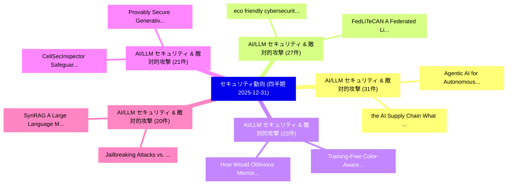

# 🏢 04_quarterly: 四半期エグゼクティブサマリー報告書 (直近90日間: 2025-12-31)

**集計日時**: 2025-12-31 00:00:00 UTC  
**直近90日間の総論文数**: 2025 件  

---

## 💡 四半期セキュリティ動向と研究ロードマップ評価

本日の収集論文（計 2025 件）において、以下の重点セキュリティ領域で活発な研究動向が確認されました：
- **AI/LLM セキュリティ & 敵対的攻撃** (31 件): 注目論文として 「the AI Supply Chain: What Can ...」、「Agentic AI for Autonomous Defe...」 等が発表され、実務防御および攻撃検証の進展が見られます。
- **AI/LLM セキュリティ & 敵対的攻撃** (27 件): 注目論文として 「eco friendly cybersecurity: ma...」、「FedLiTeCAN : A Federated Light...」 等が発表され、実務防御および攻撃検証の進展が見られます。
- **AI/LLM セキュリティ & 敵対的攻撃** (23 件): 注目論文として 「How Would Oblivious Memory Boo...」、「Training-Free Color-Aware Adve...」 等が発表され、実務防御および攻撃検証の進展が見られます。
- **AI/LLM セキュリティ & 敵対的攻撃** (21 件): 注目論文として 「CellSecInspector: Safeguarding...」、「Provably Secure Generative AI:...」 等が発表され、実務防御および攻撃検証の進展が見られます。
- **AI/LLM セキュリティ & 敵対的攻撃** (20 件): 注目論文として 「SynRAG: A Large Language Model...」、「Jailbreaking Attacks vs. Conte...」 等が発表され、実務防御および攻撃検証の進展が見られます。

### 🗺️ 四半期脅威ランドスケープ

---

## 📌 四半期セキュリティ論文一覧 (日本語表形式)

| No | arXiv ID | 論文タイトル (日本語訳) | 重要キーワード | 構造化エグゼクティブ要約 (背景・提案・影響) | 脅威分類 | 詳細リンク |
|---|---|---|---|---|---|---|
| 1 | `2512.24531v1` | [Correctness of Extended RSA Public Key Cryptosystem（セキュリティ分析論文）](../../okf/papers/2025-12-31/2512.24531.md) | `Public Key Cryptosystem`, `Suranjan Gautam`, `Raw Meta` | 【提案】概要 (Overview & Key Finding) 本論文「Correctness of Extended RSA Public Key Cryptosystem（セキュ...。実証評価により経営層・セキュリティ管理者向け推奨アクション (E... | `executive-summary` | [arXiv](https://arxiv.org/abs/2512.24531v1) &#124; [OKF](../../okf/papers/2025-12-31/2512.24531.md) |
| 2 | `2512.24571v1` | [SynRAG: A Large Language Model Framework for Executable Query Generation in Heterogeneous SIEM System（セキュリティ分析論文）](../../okf/papers/2025-12-31/2512.24571.md) | `Executable Query Generation`, `Md Hasan Saju`, `Austin Page` | 【提案】概要 (Overview & Key Finding) 本論文「SynRAG: A Large Language Model Framework for Executable...。実証評価により経営層・セキュリティ管理者向け推奨アクション (E... | `cs.AI` | [arXiv](https://arxiv.org/abs/2512.24571v1) &#124; [OKF](../../okf/papers/2025-12-31/2512.24571.md) |
| 3 | `2512.24602v7` | [Secure Digital Semantic Communications: Fundamentals, Challenges, and Opportunities（セキュリティ分析論文）](../../okf/papers/2025-12-31/2512.24602.md) | `Secure Digital Semantic Communications`, `Weixuan Chen`, `Qianqian Yang` | 【提案】概要 (Overview & Key Finding) 本論文「Secure Digital Semantic Communications: Fundamentals, C...。実証評価により経営層・セキュリティ管理者向け推奨アクション (E... | `cybersecurity` | [arXiv](https://arxiv.org/abs/2512.24602v7) &#124; [OKF](../../okf/papers/2025-12-31/2512.24602.md) |
| 4 | `2512.24652v1` | [Practical Traceable Over-Threshold Multi-Party Private Set Intersection（セキュリティ分析論文）](../../okf/papers/2025-12-31/2512.24652.md) | `Party Private Set Intersection`, `Threshold Multi`, `Over-Threshold Multi` | 【提案】概要 (Overview & Key Finding) 本論文「Practical Traceable Over-Threshold Multi-Party Private ...。実証評価により経営層・セキュリティ管理者向け推奨アクション (E... | `cybersecurity` | [arXiv](https://arxiv.org/abs/2512.24652v1) &#124; [OKF](../../okf/papers/2025-12-31/2512.24652.md) |
| 5 | `2512.24682v3` | [CellSecInspector: Safeguarding Cellular Networks via Automated Security Analysis on Specifications（セキュリティ分析論文）](../../okf/papers/2025-12-31/2512.24682.md) | `Safeguarding Cellular Networks`, `Ke Xie`, `Xingyi Zhao` | 【提案】概要 (Overview & Key Finding) 本論文「CellSecInspector: Safeguarding Cellular Networks via Au...。実証評価により経営層・セキュリティ管理者向け推奨アクション (E... | `cybersecurity` | [arXiv](https://arxiv.org/abs/2512.24682v3) &#124; [OKF](../../okf/papers/2025-12-31/2512.24682.md) |
| 6 | `2512.24888v1` | [SoK: Web3 RegTech for Cryptocurrency VASP AML/CFT Compliance（セキュリティ分析論文）](../../okf/papers/2025-12-31/2512.24888.md) | `Jiaxin Wang`, `Ya Liu`, `Li Zhu` | 【提案】概要 (Overview & Key Finding) 本論文「SoK: Web3 RegTech for Cryptocurrency VASP AML/CFT Compl...。実証評価により経営層・セキュリティ管理者向け推奨アクション (E... | `executive-summary` | [arXiv](https://arxiv.org/abs/2512.24888v1) &#124; [OKF](../../okf/papers/2025-12-31/2512.24888.md) |
| 7 | `2512.24899v1` | [MTSP-LDP: A Framework for Multi-Task Streaming Data Publication under Local Differential Privacy（セキュリティ分析論文）](../../okf/papers/2025-12-31/2512.24899.md) | `Task Streaming Data Publication`, `Local Differential Privacy`, `Multi-Task Streaming` | 【提案】概要 (Overview & Key Finding) 本論文「MTSP-LDP: A Framework for Multi-Task Streaming Data Pub...。実証評価により経営層・セキュリティ管理者向け推奨アクション (E... | `cybersecurity` | [arXiv](https://arxiv.org/abs/2512.24899v1) &#124; [OKF](../../okf/papers/2025-12-31/2512.24899.md) |
| 8 | `2512.24925v1` | [Provably Secure Generative AI: Reliable Consensus Samplingに向けて](../../okf/papers/2025-12-31/2512.24925.md) | `Towards Provably Secure Generative`, `Reliable Consensus Sampling`, `Provably Secure Generative` | 【提案】概要 (Overview & Key Finding) 本論文「Provably Secure Generative AI: Reliable Consensus Sampl...。実証評価により経営層・セキュリティ管理者向け推奨アクション (E... | `cybersecurity` | [arXiv](https://arxiv.org/abs/2512.24925v1) &#124; [OKF](../../okf/papers/2025-12-31/2512.24925.md) |
| 9 | `2601.00042v2` | [Large Empirical Case Study: Go-Explore adapted for AI Red Team Testing（セキュリティ分析論文）](../../okf/papers/2025-12-31/2601.00042.md) | `Red Team Testing`, `Go-Explore adapted`, `Manish Bhatt` | 【提案】概要 (Overview & Key Finding) 本論文「Large Empirical Case Study: Go-Explore adapted for AI R...。実証評価により経営層・セキュリティ管理者向け推奨アクション (E... | `cs.AI` | [arXiv](https://arxiv.org/abs/2601.00042v2) &#124; [OKF](../../okf/papers/2025-12-31/2601.00042.md) |
| 10 | `2601.00065v3` | [When the Same Coefficients Reach Different Places: Asymmetric Realizability in Transplanting Tokenizers across 大規模言語モデル](../../okf/papers/2025-12-31/2601.00065.md) | `Asymmetric Realizability`, `Transplanting Tokenizers`, `Large Language Models` | 【提案】概要 (Overview & Key Finding) 本論文「When the Same Coefficients Reach Different Places: Asym...。実証評価により経営層・セキュリティ管理者向け推奨アクション (E... | `executive-summary` | [arXiv](https://arxiv.org/abs/2601.00065v3) &#124; [OKF](../../okf/papers/2025-12-31/2601.00065.md) |
| 11 | `2601.00893v1` | [eco friendly cybersecurity: machine learning based anomaly detection with carbon and energy metricsに向けて](../../okf/papers/2025-12-31/2601.00893.md) | `Md Zakir Hossain Zamil`, `Md Shafiqul Islam Mridul`, `Md Maruf Bin Reza` | 【提案】概要 (Overview & Key Finding) 本論文「eco friendly cybersecurity: machine learning based anom...。実証評価により経営層・セキュリティ管理者向け推奨アクション (E... | `executive-summary` | [arXiv](https://arxiv.org/abs/2601.00893v1) &#124; [OKF](../../okf/papers/2025-12-31/2601.00893.md) |
| 12 | `2601.00900v1` | [Noise-Aware and Dynamically Adaptive Federated Defense Framework for SAR Image Target Recognition（セキュリティ分析論文）](../../okf/papers/2025-12-31/2601.00900.md) | `Image Target Recognition`, `Yuchao Hou`, `Zixuan Zhang` | 【提案】概要 (Overview & Key Finding) 本論文「Noise-Aware and Dynamically Adaptive Federated Defense ...。実証評価により経営層・セキュリティ管理者向け推奨アクション (E... | `cs.CV` | [arXiv](https://arxiv.org/abs/2601.00900v1) &#124; [OKF](../../okf/papers/2025-12-31/2601.00900.md) |
| 13 | `2512.23948v1` | [DivQAT: Enhancing Robustness of Quantized Convolutional Neural Networks against Model Extraction Attacks（セキュリティ分析論文）](../../okf/papers/2025-12-30/2512.23948.md) | `Quantized Convolutional Neural Networks`, `Model Extraction Attacks`, `Enhancing Robustness` | 【提案】概要 (Overview & Key Finding) 本論文「DivQAT: Enhancing Robustness of Quantized Convolutional...。実証評価により経営層・セキュリティ管理者向け推奨アクション (E... | `executive-summary` | [arXiv](https://arxiv.org/abs/2512.23948v1) &#124; [OKF](../../okf/papers/2025-12-30/2512.23948.md) |
| 14 | `2512.23987v1` | [MeLeMaD: Adaptive マルウェア検出 via Chunk-wise Feature Selection and Meta-Learning](../../okf/papers/2025-12-30/2512.23987.md) | `Feature Selection`, `Chunk-wise Feature`, `Adaptive Malware Detection` | 【提案】概要 (Overview & Key Finding) 本論文「MeLeMaD: Adaptive マルウェア検出 via Chunk-wise Feature Select...。実証評価により経営層・セキュリティ管理者向け推奨アクション (E... | `cs.AI` | [arXiv](https://arxiv.org/abs/2512.23987v1) &#124; [OKF](../../okf/papers/2025-12-30/2512.23987.md) |
| 15 | `2512.23995v2` | [RepetitionCurse: Measuring and Understanding Router Imbalance in Mixture-of-Experts LLMs under DoS Stress（セキュリティ分析論文）](../../okf/papers/2025-12-30/2512.23995.md) | `Understanding Router Imbalance`, `Ruixuan Huang`, `Qingyue Wang` | 【提案】概要 (Overview & Key Finding) 本論文「RepetitionCurse: Measuring and Understanding Router Imb...。実証評価により経営層・セキュリティ管理者向け推奨アクション (E... | `executive-summary` | [arXiv](https://arxiv.org/abs/2512.23995v2) &#124; [OKF](../../okf/papers/2025-12-30/2512.23995.md) |
| 16 | `2512.24041v1` | [Exposed: Shedding Blacklight on Online Privacy（セキュリティ分析論文）](../../okf/papers/2025-12-30/2512.24041.md) | `Shedding Blacklight`, `Online Privacy`, `Lucas Shen` | 【提案】概要 (Overview & Key Finding) 本論文「Exposed: Shedding Blacklight on Online Privacy（セキュリティ分析...。実証評価により経営層・セキュリティ管理者向け推奨アクション (E... | `executive-summary` | [arXiv](https://arxiv.org/abs/2512.24041v1) &#124; [OKF](../../okf/papers/2025-12-30/2512.24041.md) |
| 17 | `2512.24044v1` | [Jailbreaking Attacks vs. Content Safety Filters: How Far Are We in the LLM Safety Arms Race?（セキュリティ分析論文）](../../okf/papers/2025-12-30/2512.24044.md) | `Content Safety Filters`, `Safety Arms Race`, `Jailbreaking Attacks` | 【提案】### (日本語題名: ジェイルブレイクing Attacks vs. Content Safety Filters: How Far Are We in the LLM S...。実証評価により経営層・セキュリティ管理者向け推奨アクション (E... | `cs.AI` | [arXiv](https://arxiv.org/abs/2512.24044v1) &#124; [OKF](../../okf/papers/2025-12-30/2512.24044.md) |
| 18 | `2512.24088v1` | [FedLiTeCAN : A Federated Lightweight Transformer for Fast and Robust CAN Bus Intrusion Detection（セキュリティ分析論文）](../../okf/papers/2025-12-30/2512.24088.md) | `Federated Lightweight Transformer`, `Bus Intrusion Detection`, `Pratik Narang` | 【提案】概要 (Overview & Key Finding) 本論文「FedLiTeCAN : A Federated Lightweight Transformer for Fa...。実証評価により経営層・セキュリティ管理者向け推奨アクション (E... | `cs.AI` | [arXiv](https://arxiv.org/abs/2512.24088v1) &#124; [OKF](../../okf/papers/2025-12-30/2512.24088.md) |
| 19 | `2512.24238v1` | [Spatial Discretization for Fine-Grain Zone Checks with STARKs（セキュリティ分析論文）](../../okf/papers/2025-12-30/2512.24238.md) | `Grain Zone Checks`, `Spatial Discretization`, `Fine-Grain Zone` | 【提案】概要 (Overview & Key Finding) 本論文「Spatial Discretization for Fine-Grain Zone Checks with ...。実証評価により経営層・セキュリティ管理者向け推奨アクション (E... | `cybersecurity` | [arXiv](https://arxiv.org/abs/2512.24238v1) &#124; [OKF](../../okf/papers/2025-12-30/2512.24238.md) |
| 20 | `2512.24255v1` | [How Would Oblivious Memory Boost Graph Analytics on Trusted Processors?（セキュリティ分析論文）](../../okf/papers/2025-12-30/2512.24255.md) | `Trusted Processors`, `Jiping Yu`, `Xiaowei Zhu` | 【提案】### (日本語題名: How Would Oblivious Memory Boost Graph Analytics on Trusted Processors?（セキュ...。実証評価により経営層・セキュリティ管理者向け推奨アクション (E... | `cybersecurity` | [arXiv](https://arxiv.org/abs/2512.24255v1) &#124; [OKF](../../okf/papers/2025-12-30/2512.24255.md) |
| 21 | `2512.24345v1` | [FedSecureFormer: A Fast, Federated and Secure Transformer Framework for Lightweight Intrusion Detection in Connected and 自動運転車両](../../okf/papers/2025-12-30/2512.24345.md) | `Lightweight Intrusion Detection`, `Autonomous Vehicles`, `Vishnu Hari` | 【提案】概要 (Overview & Key Finding) 本論文「FedSecureFormer: A Fast, Federated and Secure Transform...。実証評価により経営層・セキュリティ管理者向け推奨アクション (E... | `cs.AI` | [arXiv](https://arxiv.org/abs/2512.24345v1) &#124; [OKF](../../okf/papers/2025-12-30/2512.24345.md) |
| 22 | `2512.24391v1` | [FAST-IDS: A Fast Two-Stage Intrusion Detection System with Hybrid Compression for Real-Time Threat Detection in Connected and 自動運転車両](../../okf/papers/2025-12-30/2512.24391.md) | `Stage Intrusion Detection System`, `Time Threat Detection`, `Fast Two` | 【提案】概要 (Overview & Key Finding) 本論文「FAST-IDS: A Fast Two-Stage Intrusion Detection System w...。実証評価により経営層・セキュリティ管理者向け推奨アクション (E... | `cs.AI` | [arXiv](https://arxiv.org/abs/2512.24391v1) &#124; [OKF](../../okf/papers/2025-12-30/2512.24391.md) |
| 23 | `2512.24400v1` | [SourceBroken: A large-scale analysis on the (un)reliability of SourceRank in the PyPI ecosystem（セキュリティ分析論文）](../../okf/papers/2025-12-30/2512.24400.md) | `Serena Elisa Ponta`, `Biagio Montaruli`, `Luca Compagna` | 【提案】概要 (Overview & Key Finding) 本論文「SourceBroken: A large-scale analysis on the (un)reliabi...。実証評価により経営層・セキュリティ管理者向け推奨アクション (E... | `executive-summary` | [arXiv](https://arxiv.org/abs/2512.24400v1) &#124; [OKF](../../okf/papers/2025-12-30/2512.24400.md) |
| 24 | `2512.24415v1` | [Language Model Agents Under Attack: A Cross Model-Benchmark of Profit-Seeking Behaviors in Customer Service（セキュリティ分析論文）](../../okf/papers/2025-12-30/2512.24415.md) | `Cross Model`, `Seeking Behaviors`, `Customer Service` | 【提案】概要 (Overview & Key Finding) 本論文「Language Model Agents Under Attack: A Cross Model-Bench...。実証評価により経営層・セキュリティ管理者向け推奨アクション (E... | `executive-summary` | [arXiv](https://arxiv.org/abs/2512.24415v1) &#124; [OKF](../../okf/papers/2025-12-30/2512.24415.md) |
| 25 | `2512.24416v2` | [GateChain: A Blockchain Based Application for Country Entry-Exit Registry Management（セキュリティ分析論文）](../../okf/papers/2025-12-30/2512.24416.md) | `Blockchain Based Application`, `Exit Registry Management`, `Country Entry` | 【提案】概要 (Overview & Key Finding) 本論文「GateChain: A Blockchain Based Application for Country E...。実証評価により経営層・セキュリティ管理者向け推奨アクション (E... | `cybersecurity` | [arXiv](https://arxiv.org/abs/2512.24416v2) &#124; [OKF](../../okf/papers/2025-12-30/2512.24416.md) |
| 26 | `2512.24452v1` | [Privacy-Preserving Semantic Communications via Multi-Task Learning and Adversarial Perturbations（セキュリティ分析論文）](../../okf/papers/2025-12-30/2512.24452.md) | `Preserving Semantic Communications`, `Task Learning`, `Privacy-Preserving Semantic` | 【提案】概要 (Overview & Key Finding) 本論文「Privacy-Preserving Semantic Communications via Multi-Ta...。実証評価により経営層・セキュリティ管理者向け推奨アクション (E... | `cs.NI` | [arXiv](https://arxiv.org/abs/2512.24452v1) &#124; [OKF](../../okf/papers/2025-12-30/2512.24452.md) |
| 27 | `2512.24457v1` | [Document Data Matching for Blockchain-Supported Real Estate（セキュリティ分析論文）](../../okf/papers/2025-12-30/2512.24457.md) | `Document Data Matching`, `Supported Real Estate`, `Blockchain-Supported Real` | 【提案】概要 (Overview & Key Finding) 本論文「Document Data Matching for Blockchain-Supported Real Es...。実証評価により経営層・セキュリティ管理者向け推奨アクション (E... | `executive-summary` | [arXiv](https://arxiv.org/abs/2512.24457v1) &#124; [OKF](../../okf/papers/2025-12-30/2512.24457.md) |
| 28 | `2512.24499v1` | [Training-Free Color-Aware Adversarial Diffusion Sanitization for Diffusion Stegomalware Defense at Security Gateways（セキュリティ分析論文）](../../okf/papers/2025-12-30/2512.24499.md) | `Aware Adversarial Diffusion Sanitization`, `Diffusion Stegomalware Defense`, `Free Color` | 【提案】概要 (Overview & Key Finding) 本論文「Training-Free Color-Aware Adversarial Diffusion Sanitiz...。実証評価により経営層・セキュリティ管理者向け推奨アクション (E... | `cs.CV` | [arXiv](https://arxiv.org/abs/2512.24499v1) &#124; [OKF](../../okf/papers/2025-12-30/2512.24499.md) |
| 29 | `2601.00867v1` | [The Silicon Psyche: Anthropomorphic Vulnerabilities in 大規模言語モデル](../../okf/papers/2025-12-30/2601.00867.md) | `Anthropomorphic Vulnerabilities`, `Large Language Models`, `Giuseppe Canale` | 【提案】概要 (Overview & Key Finding) 本論文「The Silicon Psyche: Anthropomorphic Vulnerabilities in ...。実証評価により経営層・セキュリティ管理者向け推奨アクション (E... | `cs.AI` | [arXiv](https://arxiv.org/abs/2601.00867v1) &#124; [OKF](../../okf/papers/2025-12-30/2601.00867.md) |
| 30 | `2601.00870v1` | [The Quantum State Continuity Problem and Temporal Enforcement Against Fork Attacks（セキュリティ分析論文）](../../okf/papers/2025-12-30/2601.00870.md) | `Raw Meta`, `Executive Summary`, `Key Finding` | 【提案】概要 (Overview & Key Finding) 本論文「The 量子 State Continuity Problem and Temporal Enforcemen...。実証評価により経営層・セキュリティ管理者向け推奨アクション (E... | `executive-summary` | [arXiv](https://arxiv.org/abs/2601.00870v1) &#124; [OKF](../../okf/papers/2025-12-30/2601.00870.md) |
| 31 | `2601.00873v1` | [Quantum Machine Learning Approaches for Coordinated Stealth Attack Detection in Distributed Generation Systems（セキュリティ分析論文）](../../okf/papers/2025-12-30/2601.00873.md) | `Quantum Machine Learning Approaches`, `Coordinated Stealth Attack Detection`, `Distributed Generation Systems` | 【提案】概要 (Overview & Key Finding) 本論文「量子 Machine Learning Approaches for Coordinated Stealth ...。実証評価により経営層・セキュリティ管理者向け推奨アクション (E... | `executive-summary` | [arXiv](https://arxiv.org/abs/2601.00873v1) &#124; [OKF](../../okf/papers/2025-12-30/2601.00873.md) |
| 32 | `2601.14266v1` | [GCG Attack On A Diffusion LLM（セキュリティ分析論文）](../../okf/papers/2025-12-30/2601.14266.md) | `Ruben Neyroud`, `Sam Corley`, `Raw Meta` | 【提案】概要 (Overview & Key Finding) 本論文「GCG Attack On A Diffusion LLM（セキュリティ分析論文）」（原題: GCG Atta...。実証評価により経営層・セキュリティ管理者向け推奨アクション (E... | `executive-summary` | [arXiv](https://arxiv.org/abs/2601.14266v1) &#124; [OKF](../../okf/papers/2025-12-30/2601.14266.md) |
| 33 | `2512.23124v2` | [SecureBank: A Financially-Aware Zero Trust Architecture for High-Assurance Banking Systems（セキュリティ分析論文）](../../okf/papers/2025-12-29/2512.23124.md) | `Aware Zero Trust Architecture`, `Assurance Banking Systems`, `Financially-Aware Zero` | 【提案】概要 (Overview & Key Finding) 本論文「SecureBank: A Financially-Aware ゼロトラスト Architecture for...。実証評価により経営層・セキュリティ管理者向け推奨アクション (E... | `cybersecurity` | [arXiv](https://arxiv.org/abs/2512.23124v2) &#124; [OKF](../../okf/papers/2025-12-29/2512.23124.md) |
| 34 | `2512.23132v1` | [Multi-Agent Framework for Threat Mitigation and Resilience in AI-Based Systems（セキュリティ分析論文）](../../okf/papers/2025-12-29/2512.23132.md) | `Threat Mitigation`, `Based Systems`, `AI-Based Systems` | 【提案】概要 (Overview & Key Finding) 本論文「Multi-Agent Framework for 脅威 Mitigation and Resilience ...。実証評価により経営層・セキュリティ管理者向け推奨アクション (E... | `executive-summary` | [arXiv](https://arxiv.org/abs/2512.23132v1) &#124; [OKF](../../okf/papers/2025-12-29/2512.23132.md) |
| 35 | `2512.23171v3` | [Certifying the Right to Be Forgotten: Primal-Dual Optimization for Sample and Label Unlearning in Vertical 連合学習](../../okf/papers/2025-12-29/2512.23171.md) | `Dual Optimization`, `Label Unlearning`, `Primal-Dual Optimization` | 【提案】概要 (Overview & Key Finding) 本論文「Certifying the Right to Be Forgotten: Primal-Dual Optim...。実証評価により経営層・セキュリティ管理者向け推奨アクション (E... | `executive-summary` | [arXiv](https://arxiv.org/abs/2512.23171v3) &#124; [OKF](../../okf/papers/2025-12-29/2512.23171.md) |
| 36 | `2512.23173v1` | [EquaCode: A Multi-Strategy Jailbreak Approach for 大規模言語モデル via Equation Solving and Code Completion](../../okf/papers/2025-12-29/2512.23173.md) | `Equation Solving`, `Code Completion`, `Multi-Strategy Jailbreak` | 【提案】概要 (Overview & Key Finding) 本論文「EquaCode: A Multi-Strategy ジェイルブレイク Approach for 大規模言語モ...。実証評価により経営層・セキュリティ管理者向け推奨アクション (E... | `cs.AI` | [arXiv](https://arxiv.org/abs/2512.23173v1) &#124; [OKF](../../okf/papers/2025-12-29/2512.23173.md) |
| 37 | `2512.23216v1` | [Multiparty Authorization for Secure Data Storage in Cloud Environments using Improved Attribute-Based Encryption（セキュリティ分析論文）](../../okf/papers/2025-12-29/2512.23216.md) | `Secure Data Storage`, `Multiparty Authorization`, `Cloud Environments` | 【提案】概要 (Overview & Key Finding) 本論文「Multiparty Authorization for Secure Data Storage in Clo...。実証評価により経営層・セキュリティ管理者向け推奨アクション (E... | `cybersecurity` | [arXiv](https://arxiv.org/abs/2512.23216v1) &#124; [OKF](../../okf/papers/2025-12-29/2512.23216.md) |
| 38 | `2512.23307v1` | [RobustMask: Certified Robustness against Adversarial Neural Ranking Attack via Randomized Masking（セキュリティ分析論文）](../../okf/papers/2025-12-29/2512.23307.md) | `Adversarial Neural Ranking Attack`, `Certified Robustness`, `Randomized Masking` | 【提案】概要 (Overview & Key Finding) 本論文「RobustMask: Certified Robustness against Adversarial Ne...。実証評価により経営層・セキュリティ管理者向け推奨アクション (E... | `executive-summary` | [arXiv](https://arxiv.org/abs/2512.23307v1) &#124; [OKF](../../okf/papers/2025-12-29/2512.23307.md) |
| 39 | `2512.23385v2` | [the AI Supply Chain: What Can We Learn From Developer-Reported Security Issues and Solutions of AI Projects?のセキュリティ強化](../../okf/papers/2025-12-29/2512.23385.md) | `Reported Security Issues`, `Supply Chain`, `Developer-Reported Security` | 【提案】### (日本語題名: the AI Supply Chain: What Can We Learn From Developer-Reported Security Iss...。実証評価により経営層・セキュリティ管理者向け推奨アクション (E... | `cs.AI` | [arXiv](https://arxiv.org/abs/2512.23385v2) &#124; [OKF](../../okf/papers/2025-12-29/2512.23385.md) |
| 40 | `2512.23438v1` | [Fuzzilicon: A Post-Silicon Microcode-Guided x86 CPU Fuzzer（セキュリティ分析論文）](../../okf/papers/2025-12-29/2512.23438.md) | `Silicon Microcode`, `Post-Silicon Microcode`, `Johannes Lenzen` | 【提案】概要 (Overview & Key Finding) 本論文「Fuzzilicon: A Post-Silicon Microcode-Guided x86 CPU Fuz...。実証評価により経営層・セキュリティ管理者向け推奨アクション (E... | `cybersecurity` | [arXiv](https://arxiv.org/abs/2512.23438v1) &#124; [OKF](../../okf/papers/2025-12-29/2512.23438.md) |
| 41 | `2512.23439v4` | [Bitcoin-IPC: Scaling Bitcoin with a Network of Proof-of-Stake Subnets（セキュリティ分析論文）](../../okf/papers/2025-12-29/2512.23439.md) | `Scaling Bitcoin`, `Stake Subnets`, `Orestis Alpos` | 【提案】概要 (Overview & Key Finding) 本論文「Bitcoin-IPC: Scaling Bitcoin with a Network of Proof-of...。実証評価により経営層・セキュリティ管理者向け推奨アクション (E... | `executive-summary` | [arXiv](https://arxiv.org/abs/2512.23439v4) &#124; [OKF](../../okf/papers/2025-12-29/2512.23439.md) |
| 42 | `2512.23480v1` | [Agentic AI for Autonomous Defense in Software Supply Chain Security: Beyond Provenance to Vulnerability Mitigation（セキュリティ分析論文）](../../okf/papers/2025-12-29/2512.23480.md) | `Software Supply Chain Security`, `Autonomous Defense`, `Beyond Provenance` | 【提案】概要 (Overview & Key Finding) 本論文「Agentic AI for Autonomous Defense in Software Supply Ch...。実証評価により経営層・セキュリティ管理者向け推奨アクション (E... | `cs.AI` | [arXiv](https://arxiv.org/abs/2512.23480v1) &#124; [OKF](../../okf/papers/2025-12-29/2512.23480.md) |
| 43 | `2512.23535v1` | [A Privacy Protocol Using Ephemeral Intermediaries and a Rank-Deficient Matrix Power Function (RDMPF)（セキュリティ分析論文）](../../okf/papers/2025-12-29/2512.23535.md) | `Privacy Protocol Using Ephemeral Intermediaries`, `Deficient Matrix Power Function`, `Rank-Deficient Matrix` | 【提案】概要 (Overview & Key Finding) 本論文「A Privacy Protocol Using Ephemeral Intermediaries and a...。実証評価により経営層・セキュリティ管理者向け推奨アクション (E... | `cs.NI` | [arXiv](https://arxiv.org/abs/2512.23535v1) &#124; [OKF](../../okf/papers/2025-12-29/2512.23535.md) |
| 44 | `2512.23557v1` | [Toward Trustworthy Agentic AI: A Multimodal Framework for Preventing Prompt Injection Attacks（セキュリティ分析論文）](../../okf/papers/2025-12-29/2512.23557.md) | `Preventing Prompt Injection Attacks`, `Toward Trustworthy Agentic`, `Toqeer Ali Syed` | 【提案】概要 (Overview & Key Finding) 本論文「Toward Trustworthy Agentic AI: A Multimodal Framework f...。実証評価により経営層・セキュリティ管理者向け推奨アクション (E... | `cs.AI` | [arXiv](https://arxiv.org/abs/2512.23557v1) &#124; [OKF](../../okf/papers/2025-12-29/2512.23557.md) |
| 45 | `2512.23607v1` | [Research Directions in Quantum Computer サイバーセキュリティ](../../okf/papers/2025-12-29/2512.23607.md) | `Research Directions`, `Quantum Computer Cybersecurity`, `Quantum Computer` | 【提案】概要 (Overview & Key Finding) 本論文「Research Directions in 量子 Computer サイバーセキュリティ」（原題: Rese...。実証評価により経営層・セキュリティ管理者向け推奨アクション (E... | `executive-summary` | [arXiv](https://arxiv.org/abs/2512.23607v1) &#124; [OKF](../../okf/papers/2025-12-29/2512.23607.md) |
| 46 | `2512.23610v2` | [Enhanced Web Payload Classification Using WAMM: An AI-Based Framework for Dataset Refinement and Model Evaluation（セキュリティ分析論文）](../../okf/papers/2025-12-29/2512.23610.md) | `Enhanced Web Payload Classification Using`, `Dataset Refinement`, `Heba Osama` | 【提案】概要 (Overview & Key Finding) 本論文「Enhanced Web Payload Classification Using WAMM: An AI-B...。実証評価により経営層・セキュリティ管理者向け推奨アクション (E... | `cybersecurity` | [arXiv](https://arxiv.org/abs/2512.23610v2) &#124; [OKF](../../okf/papers/2025-12-29/2512.23610.md) |
| 47 | `2512.23774v1` | [Secure and Governed API Gateway Architectures for Multi-Cluster Cloud Environments（セキュリティ分析論文）](../../okf/papers/2025-12-29/2512.23774.md) | `Cluster Cloud Environments`, `Gateway Architectures`, `Multi-Cluster Cloud` | 【提案】概要 (Overview & Key Finding) 本論文「Secure and Governed API Gateway Architectures for Multi...。実証評価により経営層・セキュリティ管理者向け推奨アクション (E... | `cybersecurity` | [arXiv](https://arxiv.org/abs/2512.23774v1) &#124; [OKF](../../okf/papers/2025-12-29/2512.23774.md) |
| 48 | `2512.23778v1` | [SyncGait: Robust Long-Distance Authentication for Drone Delivery via Implicit Gait Behaviors（セキュリティ分析論文）](../../okf/papers/2025-12-29/2512.23778.md) | `Implicit Gait Behaviors`, `Robust Long`, `Distance Authentication` | 【提案】概要 (Overview & Key Finding) 本論文「SyncGait: Robust Long-Distance Authentication for Drone...。実証評価により経営層・セキュリティ管理者向け推奨アクション (E... | `cs.MM` | [arXiv](https://arxiv.org/abs/2512.23778v1) &#124; [OKF](../../okf/papers/2025-12-29/2512.23778.md) |
| 49 | `2512.23779v2` | [Prompt-Induced Over-Generation as Denial-of-Service: A Black-Box Attack-Side Benchmark（セキュリティ分析論文）](../../okf/papers/2025-12-29/2512.23779.md) | `Box Attack`, `Black-Box Attack`, `Side Benchmark` | 【提案】概要 (Overview & Key Finding) 本論文「Prompt-Induced Over-Generation as Denial-of-Service: A ...。実証評価により経営層・セキュリティ管理者向け推奨アクション (E... | `cs.AI` | [arXiv](https://arxiv.org/abs/2512.23779v2) &#124; [OKF](../../okf/papers/2025-12-29/2512.23779.md) |
| 50 | `2512.23785v1` | [Application-Specific Power Side-Channel Attacks and Countermeasures: A Survey（セキュリティ分析論文）](../../okf/papers/2025-12-29/2512.23785.md) | `Specific Power Side`, `Channel Attacks`, `Application-Specific Power` | 【提案】概要 (Overview & Key Finding) 本論文「Application-Specific Power サイドチャネル攻撃 Attacks and Counte...。実証評価により経営層・セキュリティ管理者向け推奨アクション (E... | `cybersecurity` | [arXiv](https://arxiv.org/abs/2512.23785v1) &#124; [OKF](../../okf/papers/2025-12-29/2512.23785.md) |
| 51 | `2512.23788v1` | [VBSF: A Visual-Based Spam Filtering Technique for Obfuscated Emails（セキュリティ分析論文）](../../okf/papers/2025-12-29/2512.23788.md) | `Based Spam Filtering Technique`, `Obfuscated Emails`, `Visual-Based Spam` | 【提案】概要 (Overview & Key Finding) 本論文「VBSF: A Visual-Based Spam Filtering Technique for Obfus...。実証評価により経営層・セキュリティ管理者向け推奨アクション (E... | `cybersecurity` | [arXiv](https://arxiv.org/abs/2512.23788v1) &#124; [OKF](../../okf/papers/2025-12-29/2512.23788.md) |
| 52 | `2512.23809v1` | [Zero-Trust Agentic 連合学習 for Secure IIoT Defense Systems](../../okf/papers/2025-12-29/2512.23809.md) | `Defense Systems`, `Zero-Trust Agentic`, `Trust Agentic Federated Learning` | 【提案】概要 (Overview & Key Finding) 本論文「ゼロトラスト Agentic 連合学習 for Secure IIoT Defense Systems」（原題...。実証評価により経営層・セキュリティ管理者向け推奨アクション (E... | `cs.AI` | [arXiv](https://arxiv.org/abs/2512.23809v1) &#124; [OKF](../../okf/papers/2025-12-29/2512.23809.md) |
| 53 | `2512.23849v2` | [Security Without Detection: Economic Denial as a Primitive for Edge and IoT Defense（セキュリティ分析論文）](../../okf/papers/2025-12-29/2512.23849.md) | `Security Without Detection`, `Economic Denial`, `Samaresh Kumar Singh` | 【提案】背景とセキュリティ上の課題 (Background & Problem) 本研究はサイバー脅威環境におけるセキュリティ構造・脆弱性の検証を目的としています。(主要検出項目: ...。実証評価により経営層・セキュリティ管理者向け推奨アクション (E... | `cs.AI` | [arXiv](https://arxiv.org/abs/2512.23849v2) &#124; [OKF](../../okf/papers/2025-12-29/2512.23849.md) |
| 54 | `2512.23881v1` | [Breaking Audio 大規模言語モデル by Attacking Only the Encoder: A Universal Targeted Latent-Space Audio Attack](../../okf/papers/2025-12-29/2512.23881.md) | `Universal Targeted Latent`, `Space Audio Attack`, `Latent-Space Audio` | 【提案】概要 (Overview & Key Finding) 本論文「Breaking Audio 大規模言語モデル by Attacking Only the Encoder: ...。実証評価により経営層・セキュリティ管理者向け推奨アクション (E... | `cs.AI` | [arXiv](https://arxiv.org/abs/2512.23881v1) &#124; [OKF](../../okf/papers/2025-12-29/2512.23881.md) |
| 55 | `2601.00848v1` | [Temporal Attack Pattern Detection in Multi-Agent AI Workflows: An Open Framework for Training Trace-Based Security Models（セキュリティ分析論文）](../../okf/papers/2025-12-29/2601.00848.md) | `Temporal Attack Pattern Detection`, `Based Security Models`, `Training Trace` | 【提案】概要 (Overview & Key Finding) 本論文「Temporal Attack Pattern Detection in Multi-Agent AI Wor...。実証評価により経営層・セキュリティ管理者向け推奨アクション (E... | `cs.AI` | [arXiv](https://arxiv.org/abs/2601.00848v1) &#124; [OKF](../../okf/papers/2025-12-29/2601.00848.md) |
| 56 | `2512.22759v1` | [Identifying social bots via heterogeneous motifs based on Naïve Bayes model（セキュリティ分析論文）](../../okf/papers/2025-12-28/2512.22759.md) | `Yijun Ran`, `Jingjing Xiao`, `Ke Xu` | 【提案】概要 (Overview & Key Finding) 本論文「Identifying social bots via heterogeneous motifs based ...。実証評価により経営層・セキュリティ管理者向け推奨アクション (E... | `cybersecurity` | [arXiv](https://arxiv.org/abs/2512.22759v1) &#124; [OKF](../../okf/papers/2025-12-28/2512.22759.md) |
| 57 | `2512.22765v1` | [A generalized motif-based Naïve Bayes model for sign prediction in complex networks（セキュリティ分析論文）](../../okf/papers/2025-12-28/2512.22765.md) | `Yijun Ran`, `Yuan Liu`, `Junjie Huang` | 【提案】概要 (Overview & Key Finding) 本論文「A generalized motif-based Naïve Bayes model for sign pr...。実証評価により経営層・セキュリティ管理者向け推奨アクション (E... | `cybersecurity` | [arXiv](https://arxiv.org/abs/2512.22765v1) &#124; [OKF](../../okf/papers/2025-12-28/2512.22765.md) |
| 58 | `2512.22789v1` | [Breaking the illusion: Automated Reasoning of GDPR Consent Violations（セキュリティ分析論文）](../../okf/papers/2025-12-28/2512.22789.md) | `Automated Reasoning`, `Consent Violations`, `Faysal Hossain Shezan` | 【提案】概要 (Overview & Key Finding) 本論文「Breaking the illusion: Automated Reasoning of GDPR Cons...。実証評価により経営層・セキュリティ管理者向け推奨アクション (E... | `cybersecurity` | [arXiv](https://arxiv.org/abs/2512.22789v1) &#124; [OKF](../../okf/papers/2025-12-28/2512.22789.md) |
| 59 | `2512.22860v1` | [Adaptive Trust Consensus for Blockchain IoT: Comparing RL, DRL, and MARL Against Naive, Collusive, Adaptive, Byzantine, and Sleeper Attacks（セキュリティ分析論文）](../../okf/papers/2025-12-28/2512.22860.md) | `Adaptive Trust Consensus`, `Sleeper Attacks`, `Soham Padia` | 【提案】概要 (Overview & Key Finding) 本論文「Adaptive Trust Consensus for Blockchain IoT: Comparing ...。実証評価により経営層・セキュリティ管理者向け推奨アクション (E... | `executive-summary` | [arXiv](https://arxiv.org/abs/2512.22860v1) &#124; [OKF](../../okf/papers/2025-12-28/2512.22860.md) |
| 60 | `2512.22883v1` | [Agentic AI for Cyber Resilience: A New Security Paradigm and Its System-Theoretic Foundations（セキュリティ分析論文）](../../okf/papers/2025-12-28/2512.22883.md) | `New Security Paradigm`, `Cyber Resilience`, `Theoretic Foundations` | 【提案】概要 (Overview & Key Finding) 本論文「Agentic AI for Cyber Resilience: A New Security Paradig...。実証評価により経営層・セキュリティ管理者向け推奨アクション (E... | `cs.AI` | [arXiv](https://arxiv.org/abs/2512.22883v1) &#124; [OKF](../../okf/papers/2025-12-28/2512.22883.md) |
| 61 | `2512.22894v2` | [DECEPTICON: How Dark Patterns Manipulate Web Agents（セキュリティ分析論文）](../../okf/papers/2025-12-28/2512.22894.md) | `Phil Cuvin`, `Hao Zhu`, `Diyi Yang` | 【提案】概要 (Overview & Key Finding) 本論文「DECEPTICON: How Dark Patterns Manipulate Web Agents（セキュ...。実証評価により経営層・セキュリティ管理者向け推奨アクション (E... | `cs.AI` | [arXiv](https://arxiv.org/abs/2512.22894v2) &#124; [OKF](../../okf/papers/2025-12-28/2512.22894.md) |
| 62 | `2512.23760v1` | [Audited Skill-Graph Self-Improvement for Agentic LLMs via Verifiable Rewards, Experience Synthesis, and Continual Memory（セキュリティ分析論文）](../../okf/papers/2025-12-28/2512.23760.md) | `Audited Skill`, `Graph Self`, `Skill-Graph Self` | 【提案】概要 (Overview & Key Finding) 本論文「Audited Skill-Graph Self-Improvement for Agentic LLMs v...。実証評価により経営層・セキュリティ管理者向け推奨アクション (E... | `cs.AI` | [arXiv](https://arxiv.org/abs/2512.23760v1) &#124; [OKF](../../okf/papers/2025-12-28/2512.23760.md) |
| 63 | `2601.11570v1` | [Privacy-Preserving Black-Box Optimization (PBBO): Theory and the Model-Based Algorithm DFOp（セキュリティ分析論文）](../../okf/papers/2025-12-28/2601.11570.md) | `Preserving Black`, `Box Optimization`, `Privacy-Preserving Black` | 【提案】概要 (Overview & Key Finding) 本論文「Privacy-Preserving Black-Box Optimization (PBBO): Theor...。実証評価により経営層・セキュリティ管理者向け推奨アクション (E... | `executive-summary` | [arXiv](https://arxiv.org/abs/2601.11570v1) &#124; [OKF](../../okf/papers/2025-12-28/2601.11570.md) |
| 64 | `2512.22501v3` | [NOWA: Null-space Optical Watermark for Invisible Capture Fingerprinting and Tamper Localization（セキュリティ分析論文）](../../okf/papers/2025-12-27/2512.22501.md) | `Invisible Capture Fingerprinting`, `Optical Watermark`, `Tamper Localization` | 【提案】概要 (Overview & Key Finding) 本論文「NOWA: Null-space Optical Watermark for Invisible Captur...。実証評価により経営層・セキュリティ管理者向け推奨アクション (E... | `executive-summary` | [arXiv](https://arxiv.org/abs/2512.22501v3) &#124; [OKF](../../okf/papers/2025-12-27/2512.22501.md) |
| 65 | `2512.22526v1` | [Verifiable Dropout: Turning Randomness into a Verifiable Claim（セキュリティ分析論文）](../../okf/papers/2025-12-27/2512.22526.md) | `Verifiable Dropout`, `Turning Randomness`, `Verifiable Claim` | 【提案】概要 (Overview & Key Finding) 本論文「Verifiable Dropout: Turning Randomness into a Verifiabl...。実証評価により経営層・セキュリティ管理者向け推奨アクション (E... | `cybersecurity` | [arXiv](https://arxiv.org/abs/2512.22526v1) &#124; [OKF](../../okf/papers/2025-12-27/2512.22526.md) |
| 66 | `2512.22616v1` | [Raven: Mining Defensive Patterns in Ethereum via Semantic Transaction Revert Invariants Categories（セキュリティ分析論文）](../../okf/papers/2025-12-27/2512.22616.md) | `Semantic Transaction Revert Invariants Categories`, `Mining Defensive Patterns`, `Mojtaba Eshghie` | 【提案】概要 (Overview & Key Finding) 本論文「Raven: Mining Defensive Patterns in Ethereum via Semant...。実証評価により経営層・セキュリティ管理者向け推奨アクション (E... | `cybersecurity` | [arXiv](https://arxiv.org/abs/2512.22616v1) &#124; [OKF](../../okf/papers/2025-12-27/2512.22616.md) |
| 67 | `2512.22669v1` | [SCyTAG: Scalable Cyber-Twin for Threat-Assessment Based on Attack Graphs（セキュリティ分析論文）](../../okf/papers/2025-12-27/2512.22669.md) | `Scalable Cyber`, `Assessment Based`, `Attack Graphs` | 【提案】概要 (Overview & Key Finding) 本論文「SCyTAG: Scalable Cyber-Twin for 脅威-Assessment Based on ...。実証評価により経営層・セキュリティ管理者向け推奨アクション (E... | `cybersecurity` | [arXiv](https://arxiv.org/abs/2512.22669v1) &#124; [OKF](../../okf/papers/2025-12-27/2512.22669.md) |
| 68 | `2512.22720v1` | [When RSA Fails: Exploiting Prime Selection Vulnerabilities in Public Key Cryptography（セキュリティ分析論文）](../../okf/papers/2025-12-27/2512.22720.md) | `Exploiting Prime Selection Vulnerabilities`, `Public Key Cryptography`, `Murtaza Nikzad` | 【提案】概要 (Overview & Key Finding) 本論文「When RSA Fails: Exploiting Prime Selection Vulnerabilit...。実証評価により経営層・セキュリティ管理者向け推奨アクション (E... | `cybersecurity` | [arXiv](https://arxiv.org/abs/2512.22720v1) &#124; [OKF](../../okf/papers/2025-12-27/2512.22720.md) |
| 69 | `2512.21813v1` | [Organizational Learning in Industry 4.0: Applying Crossan's 4I Framework with Double Loop Learning（セキュリティ分析論文）](../../okf/papers/2025-12-26/2512.21813.md) | `Double Loop Learning`, `Organizational Learning`, `Applying Crossan` | 【提案】概要 (Overview & Key Finding) 本論文「Organizational Learning in Industry 4.0: Applying Cross...。実証評価により経営層・セキュリティ管理者向け推奨アクション (E... | `cybersecurity` | [arXiv](https://arxiv.org/abs/2512.21813v1) &#124; [OKF](../../okf/papers/2025-12-26/2512.21813.md) |
| 70 | `2512.21827v1` | [Cross-Domain Internet of Drones: An RFF-PUF Allied Authenticated Key Exchange Protocol With Over-the-Air Enrollmentのセキュリティ強化](../../okf/papers/2025-12-26/2512.21827.md) | `Domain Internet`, `Cross-Domain Internet`, `RFF-PUF Allied` | 【提案】概要 (Overview & Key Finding) 本論文「Cross-Domain Internet of Drones: An RFF-PUF Allied Auth...。実証評価により経営層・セキュリティ管理者向け推奨アクション (E... | `cybersecurity` | [arXiv](https://arxiv.org/abs/2512.21827v1) &#124; [OKF](../../okf/papers/2025-12-26/2512.21827.md) |
| 71 | `2512.21871v1` | [Bridging the Copyright Gap: Do Large Vision-Language Models Recognize and Respect Copyrighted Content?（セキュリティ分析論文）](../../okf/papers/2025-12-26/2512.21871.md) | `Language Models Recognize`, `Respect Copyrighted Content`, `Copyright Gap` | 【提案】### (日本語題名: Bridging the Copyright Gap: Do Large Vision-Language Models Recognize and R...。実証評価により経営層・セキュリティ管理者向け推奨アクション (E... | `cs.AI` | [arXiv](https://arxiv.org/abs/2512.21871v1) &#124; [OKF](../../okf/papers/2025-12-26/2512.21871.md) |
| 72 | `2512.22046v2` | [Backdoor Attacks on Prompt-Driven Video Segmentation Foundation Models（セキュリティ分析論文）](../../okf/papers/2025-12-26/2512.22046.md) | `Driven Video Segmentation Foundation Models`, `Backdoor Attacks`, `Prompt-Driven Video` | 【提案】概要 (Overview & Key Finding) 本論文「Backdoor Attacks on Prompt-Driven Video Segmentation Fo...。実証評価により経営層・セキュリティ管理者向け推奨アクション (E... | `cs.CV` | [arXiv](https://arxiv.org/abs/2512.22046v2) &#124; [OKF](../../okf/papers/2025-12-26/2512.22046.md) |
| 73 | `2512.22060v1` | [Toward Secure and Compliant AI: Organizational Standards and Protocols for NLP Model Lifecycle Management（セキュリティ分析論文）](../../okf/papers/2025-12-26/2512.22060.md) | `Model Lifecycle Management`, `Toward Secure`, `Organizational Standards` | 【提案】概要 (Overview & Key Finding) 本論文「Toward Secure and Compliant AI: Organizational Standard...。実証評価により経営層・セキュリティ管理者向け推奨アクション (E... | `executive-summary` | [arXiv](https://arxiv.org/abs/2512.22060v1) &#124; [OKF](../../okf/papers/2025-12-26/2512.22060.md) |
| 74 | `2512.22076v1` | [ReSMT: An SMT-Based Tool for Reverse Engineering（セキュリティ分析論文）](../../okf/papers/2025-12-26/2512.22076.md) | `Based Tool`, `Reverse Engineering`, `SMT-Based Tool` | 【提案】概要 (Overview & Key Finding) 本論文「ReSMT: An SMT-Based Tool for Reverse Engineering（セキュリティ...。実証評価により経営層・セキュリティ管理者向け推奨アクション (E... | `cybersecurity` | [arXiv](https://arxiv.org/abs/2512.22076v1) &#124; [OKF](../../okf/papers/2025-12-26/2512.22076.md) |
| 75 | `2512.22090v1` | [Abstraction of Trusted Execution Environments as the Missing Layer for Broad Confidential Computing Adoption: A Systematization of Knowledge（セキュリティ分析論文）](../../okf/papers/2025-12-26/2512.22090.md) | `Broad Confidential Computing Adoption`, `Trusted Execution Environments`, `Missing Layer` | 【提案】概要 (Overview & Key Finding) 本論文「Abstraction of Trusted Execution Environments as the Mi...。実証評価により経営層・セキュリティ管理者向け推奨アクション (E... | `cybersecurity` | [arXiv](https://arxiv.org/abs/2512.22090v1) &#124; [OKF](../../okf/papers/2025-12-26/2512.22090.md) |
| 76 | `2512.22301v1` | [A Statistical Side-Channel Risk Model for Timing Variability in Lattice-Based Post-Quantum Cryptography（セキュリティ分析論文）](../../okf/papers/2025-12-26/2512.22301.md) | `Channel Risk Model`, `Statistical Side`, `Timing Variability` | 【提案】概要 (Overview & Key Finding) 本論文「A Statistical サイドチャネル攻撃 Risk Model for Timing Variabili...。実証評価により経営層・セキュリティ管理者向け推奨アクション (E... | `cybersecurity` | [arXiv](https://arxiv.org/abs/2512.22301v1) &#124; [OKF](../../okf/papers/2025-12-26/2512.22301.md) |
| 77 | `2512.22306v1` | [Beyond Single Bugs: Large Language Models for Multi-Vulnerability Detectionのベンチマーク評価](../../okf/papers/2025-12-26/2512.22306.md) | `Beyond Single Bugs`, `Benchmarking Large Language Models`, `Large Language Models` | 【提案】概要 (Overview & Key Finding) 本論文「Beyond Single Bugs: Large Language Models for Multi-脆弱性...。実証評価により経営層・セキュリティ管理者向け推奨アクション (E... | `cs.AI` | [arXiv](https://arxiv.org/abs/2512.22306v1) &#124; [OKF](../../okf/papers/2025-12-26/2512.22306.md) |
| 78 | `2512.22307v1` | [LLA: Enhancing Security and Privacy for Generative Models with Logic-Locked Accelerators（セキュリティ分析論文）](../../okf/papers/2025-12-26/2512.22307.md) | `Enhancing Security`, `Generative Models`, `Locked Accelerators` | 【提案】概要 (Overview & Key Finding) 本論文「LLA: Enhancing Security and Privacy for Generative Mode...。実証評価により経営層・セキュリティ管理者向け推奨アクション (E... | `cs.AI` | [arXiv](https://arxiv.org/abs/2512.22307v1) &#124; [OKF](../../okf/papers/2025-12-26/2512.22307.md) |
| 79 | `2512.21499v1` | [Weighted Fourier Factorizations: Optimal Gaussian Noise for Differentially Private Marginal and Product Queries（セキュリティ分析論文）](../../okf/papers/2025-12-25/2512.21499.md) | `Weighted Fourier Factorizations`, `Optimal Gaussian Noise`, `Differentially Private Marginal` | 【提案】概要 (Overview & Key Finding) 本論文「Weighted Fourier Factorizations: Optimal Gaussian Noise...。実証評価により経営層・セキュリティ管理者向け推奨アクション (E... | `cs.DB` | [arXiv](https://arxiv.org/abs/2512.21499v1) &#124; [OKF](../../okf/papers/2025-12-25/2512.21499.md) |
| 80 | `2512.21524v1` | [GoldenFuzz: Generative Golden Reference Hardware Fuzzing（セキュリティ分析論文）](../../okf/papers/2025-12-25/2512.21524.md) | `Generative Golden Reference Hardware Fuzzing`, `Lichao Wu`, `Mohamadreza Rostami` | 【提案】概要 (Overview & Key Finding) 本論文「GoldenFuzz: Generative Golden Reference Hardware Fuzzin...。実証評価により経営層・セキュリティ管理者向け推奨アクション (E... | `cybersecurity` | [arXiv](https://arxiv.org/abs/2512.21524v1) &#124; [OKF](../../okf/papers/2025-12-25/2512.21524.md) |
| 81 | `2512.21525v1` | [Enhancing Distributed Authorization With Lagrange Interpolation And Attribute-Based Encryption（セキュリティ分析論文）](../../okf/papers/2025-12-25/2512.21525.md) | `Based Encryption`, `Attribute-Based Encryption`, `Keshav Sinha` | 【提案】概要 (Overview & Key Finding) 本論文「Enhancing Distributed Authorization With Lagrange Inter...。実証評価により経営層・セキュリティ管理者向け推奨アクション (E... | `cybersecurity` | [arXiv](https://arxiv.org/abs/2512.21525v1) &#124; [OKF](../../okf/papers/2025-12-25/2512.21525.md) |
| 82 | `2512.21561v2` | [A Quantitative Method for Evaluating Security Boundaries in Quantum Key Distribution Combined with Block Ciphers（セキュリティ分析論文）](../../okf/papers/2025-12-25/2512.21561.md) | `Quantum Key Distribution Combined`, `Evaluating Security Boundaries`, `Block Ciphers` | 【提案】概要 (Overview & Key Finding) 本論文「A Quantitative Method for Evaluating Security Boundarie...。実証評価により経営層・セキュリティ管理者向け推奨アクション (E... | `cybersecurity` | [arXiv](https://arxiv.org/abs/2512.21561v2) &#124; [OKF](../../okf/papers/2025-12-25/2512.21561.md) |
| 83 | `2512.21574v1` | [When the Base Station Flies: Rethinking Security for UAV-Based 6G Networks（セキュリティ分析論文）](../../okf/papers/2025-12-25/2512.21574.md) | `Base Station Flies`, `Rethinking Security`, `UAV-Based 6G` | 【提案】概要 (Overview & Key Finding) 本論文「When the Base Station Flies: Rethinking Security for UA...。実証評価により経営層・セキュリティ管理者向け推奨アクション (E... | `executive-summary` | [arXiv](https://arxiv.org/abs/2512.21574v1) &#124; [OKF](../../okf/papers/2025-12-25/2512.21574.md) |
| 84 | `2512.21663v1` | [Verifiable Passkey: The Decentralized Authentication Standard（セキュリティ分析論文）](../../okf/papers/2025-12-25/2512.21663.md) | `Verifiable Passkey`, `Sibi Chakkaravarthy Sethuraman`, `Aditya Mitra` | 【提案】概要 (Overview & Key Finding) 本論文「Verifiable Passkey: The Decentralized Authentication St...。実証評価により経営層・セキュリティ管理者向け推奨アクション (E... | `cs.ET` | [arXiv](https://arxiv.org/abs/2512.21663v1) &#124; [OKF](../../okf/papers/2025-12-25/2512.21663.md) |
| 85 | `2512.21681v1` | [Exploring the Security Threats of Retriever Backdoors in Retrieval-Augmented Code Generation（セキュリティ分析論文）](../../okf/papers/2025-12-25/2512.21681.md) | `Augmented Code Generation`, `Security Threats`, `Retriever Backdoors` | 【提案】概要 (Overview & Key Finding) 本論文「Exploring the Security Threats of Retriever Backdoors i...。実証評価により経営層・セキュリティ管理者向け推奨アクション (E... | `executive-summary` | [arXiv](https://arxiv.org/abs/2512.21681v1) &#124; [OKF](../../okf/papers/2025-12-25/2512.21681.md) |
| 86 | `2512.21698v1` | [Raster Domain Text Steganography: A Unified Framework for Multimodal Secure Embedding（セキュリティ分析論文）](../../okf/papers/2025-12-25/2512.21698.md) | `Raster Domain Text Steganography`, `Multimodal Secure Embedding`, `Uday Kiran Kandala` | 【提案】概要 (Overview & Key Finding) 本論文「Raster Domain Text Steganography: A Unified Framework f...。実証評価により経営層・セキュリティ管理者向け推奨アクション (E... | `cs.MM` | [arXiv](https://arxiv.org/abs/2512.21698v1) &#124; [OKF](../../okf/papers/2025-12-25/2512.21698.md) |
| 87 | `2512.21737v1` | [Machine Learning Power Side-Channel Attack on SNOW-V（セキュリティ分析論文）](../../okf/papers/2025-12-25/2512.21737.md) | `Machine Learning Power Side`, `Channel Attack`, `Side-Channel Attack` | 【提案】概要 (Overview & Key Finding) 本論文「Machine Learning Power サイドチャネル攻撃 on SNOW-V（セキュリティ分析論文）」...。実証評価により経営層・セキュリティ管理者向け推奨アクション (E... | `cybersecurity` | [arXiv](https://arxiv.org/abs/2512.21737v1) &#124; [OKF](../../okf/papers/2025-12-25/2512.21737.md) |
| 88 | `2512.21762v1` | [Assessing the Effectiveness of Membership Inference on Generative Music（セキュリティ分析論文）](../../okf/papers/2025-12-25/2512.21762.md) | `Membership Inference`, `Generative Music`, `Kurtis Chow` | 【提案】概要 (Overview & Key Finding) 本論文「Assessing the Effectiveness of Membership Inference on ...。実証評価により経営層・セキュリティ管理者向け推奨アクション (E... | `executive-summary` | [arXiv](https://arxiv.org/abs/2512.21762v1) &#124; [OKF](../../okf/papers/2025-12-25/2512.21762.md) |
| 89 | `2512.22293v1` | [Learning from Negative Examples: Why Warning-Framed Training Data Teaches What It Warns Against（セキュリティ分析論文）](../../okf/papers/2025-12-25/2512.22293.md) | `Negative Examples`, `Warning-Framed Training`, `Ochir Enkhbayar` | 【提案】概要 (Overview & Key Finding) 本論文「Learning from Negative Examples: Why Warning-Framed Tra...。実証評価により経営層・セキュリティ管理者向け推奨アクション (E... | `executive-summary` | [arXiv](https://arxiv.org/abs/2512.22293v1) &#124; [OKF](../../okf/papers/2025-12-25/2512.22293.md) |
| 90 | `2601.19912v1` | [LLM Vulnerability to GPU Soft Errors: An Instruction-Level Fault Injection Studyの分析](../../okf/papers/2025-12-25/2601.19912.md) | `Soft Errors`, `Instruction-Level Fault`, `Level Fault Injection` | 【提案】概要 (Overview & Key Finding) 本論文「LLM 脆弱性 to GPU Soft Errors: An Instruction-Level フォールト注...。実証評価により経営層・セキュリティ管理者向け推奨アクション (E... | `cs.AI` | [arXiv](https://arxiv.org/abs/2601.19912v1) &#124; [OKF](../../okf/papers/2025-12-25/2601.19912.md) |
| 91 | `2512.20860v1` | [pokiSEC: A Multi-Architecture, Containerized Ephemeral Malware Detonation Sandbox（セキュリティ分析論文）](../../okf/papers/2025-12-24/2512.20860.md) | `Containerized Ephemeral Malware Detonation Sandbox`, `Naveen Kumar Chaudhary`, `Alejandro Avina` | 【提案】概要 (Overview & Key Finding) 本論文「pokiSEC: A Multi-Architecture, Containerized Ephemeral ...。実証評価により経営層・セキュリティ管理者向け推奨アクション (E... | `executive-summary` | [arXiv](https://arxiv.org/abs/2512.20860v1) &#124; [OKF](../../okf/papers/2025-12-24/2512.20860.md) |
| 92 | `2512.20872v1` | [Better Call Graphs: A New Dataset of Function Call Graphs for Malware Classification（セキュリティ分析論文）](../../okf/papers/2025-12-24/2512.20872.md) | `Better Call Graphs`, `Function Call Graphs`, `New Dataset` | 【提案】概要 (Overview & Key Finding) 本論文「Better Call Graphs: A New Dataset of Function Call Grap...。実証評価により経営層・セキュリティ管理者向け推奨アクション (E... | `executive-summary` | [arXiv](https://arxiv.org/abs/2512.20872v1) &#124; [OKF](../../okf/papers/2025-12-24/2512.20872.md) |
| 93 | `2512.20964v1` | [Neutralization of IMU-Based GPS Spoofing Detection using external IMU sensor and feedback methodology（セキュリティ分析論文）](../../okf/papers/2025-12-24/2512.20964.md) | `Spoofing Detection`, `IMU-Based GPS`, `Ji Hyuk Jung` | 【提案】概要 (Overview & Key Finding) 本論文「Neutralization of IMU-Based GPS Spoofing Detection usin...。実証評価により経営層・セキュリティ管理者向け推奨アクション (E... | `cybersecurity` | [arXiv](https://arxiv.org/abs/2512.20964v1) &#124; [OKF](../../okf/papers/2025-12-24/2512.20964.md) |
| 94 | `2512.20986v1` | [AegisAgent: An Autonomous Defense Agent Against Prompt Injection Attacks in LLM-HARs（セキュリティ分析論文）](../../okf/papers/2025-12-24/2512.20986.md) | `Yihan Wang`, `Huanqi Yang`, `Shantanu Pal` | 【提案】概要 (Overview & Key Finding) 本論文「AegisAgent: An Autonomous Defense Agent Against プロンプトイン...。実証評価により経営層・セキュリティ管理者向け推奨アクション (E... | `cybersecurity` | [arXiv](https://arxiv.org/abs/2512.20986v1) &#124; [OKF](../../okf/papers/2025-12-24/2512.20986.md) |
| 95 | `2512.21008v2` | [GateBreaker: Gate-Guided Attacks on Mixture-of-Expert LLMs（セキュリティ分析論文）](../../okf/papers/2025-12-24/2512.21008.md) | `Guided Attacks`, `Gate-Guided Attacks`, `Lichao Wu` | 【提案】概要 (Overview & Key Finding) 本論文「GateBreaker: Gate-Guided Attacks on Mixture-of-Expert L...。実証評価により経営層・セキュリティ管理者向け推奨アクション (E... | `cybersecurity` | [arXiv](https://arxiv.org/abs/2512.21008v2) &#124; [OKF](../../okf/papers/2025-12-24/2512.21008.md) |
| 96 | `2512.21047v1` | [Device-Independent Anonymous Communication in Quantum Networks（セキュリティ分析論文）](../../okf/papers/2025-12-24/2512.21047.md) | `Independent Anonymous Communication`, `Quantum Networks`, `Device-Independent Anonymous` | 【提案】概要 (Overview & Key Finding) 本論文「Device-Independent Anonymous Communication in 量子 Networ...。実証評価により経営層・セキュリティ管理者向け推奨アクション (E... | `executive-summary` | [arXiv](https://arxiv.org/abs/2512.21047v1) &#124; [OKF](../../okf/papers/2025-12-24/2512.21047.md) |
| 97 | `2512.21048v1` | [zkFL-Health: Blockchain-Enabled Zero-Knowledge 連合学習 for Medical AI Privacy](../../okf/papers/2025-12-24/2512.21048.md) | `Enabled Zero`, `Blockchain-Enabled Zero`, `Knowledge Federated Learning` | 【提案】概要 (Overview & Key Finding) 本論文「zkFL-Health: Blockchain-Enabled Zero-Knowledge 連合学習 for...。実証評価により経営層・セキュリティ管理者向け推奨アクション (E... | `executive-summary` | [arXiv](https://arxiv.org/abs/2512.21048v1) &#124; [OKF](../../okf/papers/2025-12-24/2512.21048.md) |
| 98 | `2512.21110v3` | [Beyond Context: 大規模言語モデル' Failure to Grasp Users' Intent](../../okf/papers/2025-12-24/2512.21110.md) | `Beyond Context`, `Grasp Users`, `Large Language Models` | 【提案】概要 (Overview & Key Finding) 本論文「Beyond Context: 大規模言語モデル' Failure to Grasp Users' Inten...。実証評価によりHussain, Salahuddin Salah... | `cs.AI` | [arXiv](https://arxiv.org/abs/2512.21110v3) &#124; [OKF](../../okf/papers/2025-12-24/2512.21110.md) |
| 99 | `2512.21132v2` | [AutoBaxBuilder: Bootstrapping Code Security Benchmarking（セキュリティ分析論文）](../../okf/papers/2025-12-24/2512.21132.md) | `Bootstrapping Code Security Benchmarking`, `Mark Vero`, `Maximilian Baader` | 【提案】概要 (Overview & Key Finding) 本論文「AutoBaxBuilder: Bootstrapping Code Security Benchmarkin...。実証評価により経営層・セキュリティ管理者向け推奨アクション (E... | `cs.PL` | [arXiv](https://arxiv.org/abs/2512.21132v2) &#124; [OKF](../../okf/papers/2025-12-24/2512.21132.md) |
| 100 | `2512.21236v1` | [Casting a SPELL: Sentence Pairing Exploration for LLM Limitation-breaking（セキュリティ分析論文）](../../okf/papers/2025-12-24/2512.21236.md) | `Sentence Pairing Exploration`, `Yifan Huang`, `Xiaojun Jia` | 【提案】概要 (Overview & Key Finding) 本論文「Casting a SPELL: Sentence Pairing Exploration for LLM L...。実証評価により経営層・セキュリティ管理者向け推奨アクション (E... | `cs.AI` | [arXiv](https://arxiv.org/abs/2512.21236v1) &#124; [OKF](../../okf/papers/2025-12-24/2512.21236.md) |
| 101 | `2512.21238v1` | [Assessing the Software Security Comprehension of 大規模言語モデル](../../okf/papers/2025-12-24/2512.21238.md) | `Software Security Comprehension`, `Large Language Models`, `Mohammed Latif Siddiq` | 【提案】概要 (Overview & Key Finding) 本論文「Assessing the Software Security Comprehension of 大規模言語モ...。実証評価により経営層・セキュリティ管理者向け推奨アクション (E... | `executive-summary` | [arXiv](https://arxiv.org/abs/2512.21238v1) &#124; [OKF](../../okf/papers/2025-12-24/2512.21238.md) |
| 102 | `2512.21241v1` | [Improving the Convergence Rate of Ray Search Optimization for Query-Efficient Hard-Label Attacks（セキュリティ分析論文）](../../okf/papers/2025-12-24/2512.21241.md) | `Ray Search Optimization`, `Convergence Rate`, `Efficient Hard` | 【提案】概要 (Overview & Key Finding) 本論文「Improving the Convergence Rate of Ray Search Optimizati...。実証評価により経営層・セキュリティ管理者向け推奨アクション (E... | `cs.AI` | [arXiv](https://arxiv.org/abs/2512.21241v1) &#124; [OKF](../../okf/papers/2025-12-24/2512.21241.md) |
| 103 | `2512.21248v2` | [Industrial Ouroboros: Deep Lateral Movement via Living Off the Plant（セキュリティ分析論文）](../../okf/papers/2025-12-24/2512.21248.md) | `Deep Lateral Movement`, `Industrial Ouroboros`, `Richard Derbyshire` | 【提案】概要 (Overview & Key Finding) 本論文「Industrial Ouroboros: Deep Lateral Movement via Living ...。実証評価により経営層・セキュリティ管理者向け推奨アクション (E... | `cybersecurity` | [arXiv](https://arxiv.org/abs/2512.21248v2) &#124; [OKF](../../okf/papers/2025-12-24/2512.21248.md) |
| 104 | `2512.21250v1` | [CoTDeceptor:Adversarial Code Obfuscation Against CoT-Enhanced LLM Code Agents（セキュリティ分析論文）](../../okf/papers/2025-12-24/2512.21250.md) | `Code Agents`, `CoT-Enhanced LLM`, `Haoyang Li` | 【提案】概要 (Overview & Key Finding) 本論文「CoTDeceptor:Adversarial Code Obfuscation Against CoT-En...。実証評価により経営層・セキュリティ管理者向け推奨アクション (E... | `executive-summary` | [arXiv](https://arxiv.org/abs/2512.21250v1) &#124; [OKF](../../okf/papers/2025-12-24/2512.21250.md) |
| 105 | `2512.21251v2` | [Uncertainty in security: managing cyber senescence（セキュリティ分析論文）](../../okf/papers/2025-12-24/2512.21251.md) | `Martijn Dekker`, `Raw Meta`, `Executive Summary` | 【提案】概要 (Overview & Key Finding) 本論文「Uncertainty in security: managing cyber senescence（セキュリ...。実証評価により経営層・セキュリティ管理者向け推奨アクション (E... | `cybersecurity` | [arXiv](https://arxiv.org/abs/2512.21251v2) &#124; [OKF](../../okf/papers/2025-12-24/2512.21251.md) |
| 106 | `2512.21304v2` | [A Note on Publicly Verifiable Quantum Money with Low Quantum Computational Resources（セキュリティ分析論文）](../../okf/papers/2025-12-24/2512.21304.md) | `Publicly Verifiable Quantum Money`, `Low Quantum Computational Resources`, `Fabrizio Genovese` | 【提案】概要 (Overview & Key Finding) 本論文「A Note on Publicly Verifiable 量子 Money with Low 量子 Comp...。実証評価により経営層・セキュリティ管理者向け推奨アクション (E... | `executive-summary` | [arXiv](https://arxiv.org/abs/2512.21304v2) &#124; [OKF](../../okf/papers/2025-12-24/2512.21304.md) |
| 107 | `2512.21371v1` | [The Imitation Game: Using 大規模言語モデル as Chatbots to Combat Chat-Based Cybercrimes](../../okf/papers/2025-12-24/2512.21371.md) | `Combat Chat`, `Based Cybercrimes`, `Chat-Based Cybercrimes` | 【提案】概要 (Overview & Key Finding) 本論文「The Imitation Game: Using 大規模言語モデル as Chatbots to Comba...。実証評価により経営層・セキュリティ管理者向け推奨アクション (E... | `cybersecurity` | [arXiv](https://arxiv.org/abs/2512.21371v1) &#124; [OKF](../../okf/papers/2025-12-24/2512.21371.md) |
| 108 | `2512.21374v1` | [Security Risks Introduced by Weak Authentication in Smart Home IoT Systems（セキュリティ分析論文）](../../okf/papers/2025-12-24/2512.21374.md) | `Security Risks Introduced`, `Weak Authentication`, `Smart Home` | 【提案】概要 (Overview & Key Finding) 本論文「Security Risks Introduced by Weak Authentication in Sma...。実証評価により経営層・セキュリティ管理者向け推奨アクション (E... | `cybersecurity` | [arXiv](https://arxiv.org/abs/2512.21374v1) &#124; [OKF](../../okf/papers/2025-12-24/2512.21374.md) |
| 109 | `2512.21377v1` | [A Systematic Review of Technical Defenses Against Software-Based Cheating in Online Multiplayer Games（セキュリティ分析論文）](../../okf/papers/2025-12-24/2512.21377.md) | `Online Multiplayer Games`, `Systematic Review`, `Based Cheating` | 【提案】概要 (Overview & Key Finding) 本論文「A Systematic Review of Technical Defenses Against Softw...。実証評価により経営層・セキュリティ管理者向け推奨アクション (E... | `cybersecurity` | [arXiv](https://arxiv.org/abs/2512.21377v1) &#124; [OKF](../../okf/papers/2025-12-24/2512.21377.md) |
| 110 | `2512.21404v1` | [LLM-Driven Feature-Level Android Malware Detectorsに対する敵対的攻撃](../../okf/papers/2025-12-24/2512.21404.md) | `Driven Feature`, `LLM-Driven Feature`, `Level Adversarial Attacks` | 【提案】概要 (Overview & Key Finding) 本論文「LLM-Driven Feature-Level Android マルウェア Detectorsに対する敵対的...。実証評価により経営層・セキュリティ管理者向け推奨アクション (E... | `cs.AI` | [arXiv](https://arxiv.org/abs/2512.21404v1) &#124; [OKF](../../okf/papers/2025-12-24/2512.21404.md) |
| 111 | `2512.19945v2` | [Multi-LLM Energy Reasoning for Binary-Free Zero-Day IoT Detection（セキュリティ分析論文）](../../okf/papers/2025-12-23/2512.19945.md) | `Energy Reasoning`, `Free Zero`, `Multi-LLM Energy` | 【提案】概要 (Overview & Key Finding) 本論文「Multi-LLM Energy Reasoning for Binary-Free Zero-Day IoT...。実証評価により経営層・セキュリティ管理者向け推奨アクション (E... | `cybersecurity` | [arXiv](https://arxiv.org/abs/2512.19945v2) &#124; [OKF](../../okf/papers/2025-12-23/2512.19945.md) |
| 112 | `2512.19951v2` | [Efficient Mod Approximation and Its Applications to CKKS Ciphertexts（セキュリティ分析論文）](../../okf/papers/2025-12-23/2512.19951.md) | `Efficient Mod Approximation`, `Yufei Zhou`, `Raw Meta` | 【提案】概要 (Overview & Key Finding) 本論文「Efficient Mod Approximation and Its Applications to CKK...。実証評価により経営層・セキュリティ管理者向け推奨アクション (E... | `cybersecurity` | [arXiv](https://arxiv.org/abs/2512.19951v2) &#124; [OKF](../../okf/papers/2025-12-23/2512.19951.md) |
| 113 | `2512.19968v3` | [Fast Deterministically Safe Proof-of-Work Consensus（セキュリティ分析論文）](../../okf/papers/2025-12-23/2512.19968.md) | `Fast Deterministically Safe Proof`, `Ali Farahbakhsh`, `Giuliano Losa` | 【提案】概要 (Overview & Key Finding) 本論文「Fast Deterministically Safe Proof-of-Work Consensus（セキュ...。実証評価により経営層・セキュリティ管理者向け推奨アクション (E... | `cybersecurity` | [arXiv](https://arxiv.org/abs/2512.19968v3) &#124; [OKF](../../okf/papers/2025-12-23/2512.19968.md) |
| 114 | `2512.19997v1` | [BacAlarm: Mining and Simulating Composite API Traffic to Prevent Broken Access Control Violations（セキュリティ分析論文）](../../okf/papers/2025-12-23/2512.19997.md) | `Prevent Broken Access Control Violations`, `Simulating Composite`, `Yanjing Yang` | 【提案】概要 (Overview & Key Finding) 本論文「BacAlarm: Mining and Simulating Composite API Traffic t...。実証評価により経営層・セキュリティ管理者向け推奨アクション (E... | `executive-summary` | [arXiv](https://arxiv.org/abs/2512.19997v1) &#124; [OKF](../../okf/papers/2025-12-23/2512.19997.md) |
| 115 | `2512.20004v1` | [IoT-based Android マルウェア検出 Using Graph Neural Network With Adversarial Defense](../../okf/papers/2025-12-23/2512.20004.md) | `IoT-based Android`, `Seibu Mary Jacob`, `Rahul Yumlembam` | 【提案】概要 (Overview & Key Finding) 本論文「IoT-based Android マルウェア検出 Using Graph Neural Network Wi...。実証評価により経営層・セキュリティ管理者向け推奨アクション (E... | `cs.AI` | [arXiv](https://arxiv.org/abs/2512.20004v1) &#124; [OKF](../../okf/papers/2025-12-23/2512.20004.md) |
| 116 | `2512.20062v1` | [On the Effectiveness of Instruction-Tuning Local LLMs for Identifying Software Vulnerabilities（セキュリティ分析論文）](../../okf/papers/2025-12-23/2512.20062.md) | `Identifying Software Vulnerabilities`, `Tuning Local`, `Instruction-Tuning Local` | 【提案】概要 (Overview & Key Finding) 本論文「On the Effectiveness of Instruction-Tuning Local LLMs f...。実証評価により経営層・セキュリティ管理者向け推奨アクション (E... | `cs.AI` | [arXiv](https://arxiv.org/abs/2512.20062v1) &#124; [OKF](../../okf/papers/2025-12-23/2512.20062.md) |
| 117 | `2512.20077v2` | [Fault Attacks on ML-based Quantum Control and Error Correction（セキュリティ分析論文）](../../okf/papers/2025-12-23/2512.20077.md) | `Fault Attacks`, `Quantum Control`, `Error Correction` | 【提案】概要 (Overview & Key Finding) 本論文「Fault Attacks on ML-based 量子 Control and Error Correcti...。実証評価により経営層・セキュリティ管理者向け推奨アクション (E... | `executive-summary` | [arXiv](https://arxiv.org/abs/2512.20077v2) &#124; [OKF](../../okf/papers/2025-12-23/2512.20077.md) |
| 118 | `2512.20168v1` | [Odysseus: Jailbreaking Commercial Multimodal LLM-integrated Systems via Dual Steganography（セキュリティ分析論文）](../../okf/papers/2025-12-23/2512.20168.md) | `Jailbreaking Commercial Multimodal`, `Dual Steganography`, `LLM-integrated Systems` | 【提案】概要 (Overview & Key Finding) 本論文「Odysseus: ジェイルブレイクing Commercial Multimodal LLM-integra...。実証評価により経営層・セキュリティ管理者向け推奨アクション (E... | `cs.AI` | [arXiv](https://arxiv.org/abs/2512.20168v1) &#124; [OKF](../../okf/papers/2025-12-23/2512.20168.md) |
| 119 | `2512.20176v1` | [Optimistic TEE-Rollups: A Hybrid Architecture for Scalable and Verifiable Generative AI Inference on Blockchain（セキュリティ分析論文）](../../okf/papers/2025-12-23/2512.20176.md) | `Hybrid Architecture`, `Verifiable Generative`, `Aaron Chan` | 【提案】概要 (Overview & Key Finding) 本論文「Optimistic TEE-Rollups: A Hybrid Architecture for Scala...。実証評価により経営層・セキュリティ管理者向け推奨アクション (E... | `cybersecurity` | [arXiv](https://arxiv.org/abs/2512.20176v1) &#124; [OKF](../../okf/papers/2025-12-23/2512.20176.md) |
| 120 | `2512.20234v1` | [Achieving Flexible and Secure Authentication with Strong Privacy in Decentralized Networks（セキュリティ分析論文）](../../okf/papers/2025-12-23/2512.20234.md) | `Achieving Flexible`, `Secure Authentication`, `Strong Privacy` | 【提案】概要 (Overview & Key Finding) 本論文「Achieving Flexible and Secure Authentication with Stron...。実証評価により経営層・セキュリティ管理者向け推奨アクション (E... | `cybersecurity` | [arXiv](https://arxiv.org/abs/2512.20234v1) &#124; [OKF](../../okf/papers/2025-12-23/2512.20234.md) |
| 121 | `2512.20243v1` | [Post-Quantum Cryptography in the 5G Core（セキュリティ分析論文）](../../okf/papers/2025-12-23/2512.20243.md) | `Quantum Cryptography`, `Post-Quantum Cryptography`, `Sandesh Manganahalli Jayaprakash` | 【提案】概要 (Overview & Key Finding) 本論文「ポスト量子暗号 in the 5G Core（セキュリティ分析論文）」（原題: ポスト量子暗号 in the ...。実証評価により経営層・セキュリティ管理者向け推奨アクション (E... | `cs.NI` | [arXiv](https://arxiv.org/abs/2512.20243v1) &#124; [OKF](../../okf/papers/2025-12-23/2512.20243.md) |
| 122 | `2512.20303v1` | [From the Two-Capacitor Paradox to Electromagnetic Side-Channel Mitigation in Digital Circuits（セキュリティ分析論文）](../../okf/papers/2025-12-23/2512.20303.md) | `Capacitor Paradox`, `Electromagnetic Side`, `Channel Mitigation` | 【提案】概要 (Overview & Key Finding) 本論文「From the Two-Capacitor Paradox to Electromagnetic サイドチャ...。実証評価により経営層・セキュリティ管理者向け推奨アクション (E... | `cybersecurity` | [arXiv](https://arxiv.org/abs/2512.20303v1) &#124; [OKF](../../okf/papers/2025-12-23/2512.20303.md) |
| 123 | `2512.20323v3` | [Differentially Private Feature Release for Wireless Sensing: Adaptive Privacy Budget Allocation on CSI Spectrograms（セキュリティ分析論文）](../../okf/papers/2025-12-23/2512.20323.md) | `Differentially Private Feature Release`, `Adaptive Privacy Budget Allocation`, `Wireless Sensing` | 【提案】概要 (Overview & Key Finding) 本論文「Differentially Private Feature Release for Wireless Sen...。実証評価により経営層・セキュリティ管理者向け推奨アクション (E... | `cybersecurity` | [arXiv](https://arxiv.org/abs/2512.20323v3) &#124; [OKF](../../okf/papers/2025-12-23/2512.20323.md) |
| 124 | `2512.20396v1` | [Symmaries: Automatic Inference of Formal Security Summaries for Java Programs（セキュリティ分析論文）](../../okf/papers/2025-12-23/2512.20396.md) | `Formal Security Summaries`, `Automatic Inference`, `Java Programs` | 【提案】概要 (Overview & Key Finding) 本論文「Symmaries: Automatic Inference of Formal Security Summa...。実証評価により経営層・セキュリティ管理者向け推奨アクション (E... | `cs.PL` | [arXiv](https://arxiv.org/abs/2512.20396v1) &#124; [OKF](../../okf/papers/2025-12-23/2512.20396.md) |
| 125 | `2512.20402v1` | [iblock: Accurate and Scalable Bitcoin Simulations with OMNeT++（セキュリティ分析論文）](../../okf/papers/2025-12-23/2512.20402.md) | `Scalable Bitcoin Simulations`, `Pericle Perazzo`, `Giovanni Nardini` | 【提案】概要 (Overview & Key Finding) 本論文「iblock: Accurate and Scalable Bitcoin Simulations with ...。実証評価により経営層・セキュリティ管理者向け推奨アクション (E... | `executive-summary` | [arXiv](https://arxiv.org/abs/2512.20402v1) &#124; [OKF](../../okf/papers/2025-12-23/2512.20402.md) |
| 126 | `2512.20405v3` | [ChatGPT: Excellent Paper! Accept It. Editor: Imposter Found! Review Rejected（セキュリティ分析論文）](../../okf/papers/2025-12-23/2512.20405.md) | `Imposter Found`, `Review Rejected`, `Sanjiv Kumar Sarkar` | 【提案】Accept It.。実証評価により経営層・セキュリティ管理者向け推奨アクション (Executive Recommendations) - 組織のセキュリティ設計およびリスク評価基準への影響確認 - 技術チー...。 | `cybersecurity` | [arXiv](https://arxiv.org/abs/2512.20405v3) &#124; [OKF](../../okf/papers/2025-12-23/2512.20405.md) |
| 127 | `2512.20423v1` | [Evasion-Resilient DNS-over-HTTPS Data Exfiltration: A Practical Evaluation and Toolkitの検出](../../okf/papers/2025-12-23/2512.20423.md) | `Data Exfiltration`, `Resilient Detection`, `Evasion-Resilient Detection` | 【提案】概要 (Overview & Key Finding) 本論文「Evasion-Resilient DNS-over-HTTPS Data Exfiltration: A P...。実証評価により経営層・セキュリティ管理者向け推奨アクション (E... | `cs.NI` | [arXiv](https://arxiv.org/abs/2512.20423v1) &#124; [OKF](../../okf/papers/2025-12-23/2512.20423.md) |
| 128 | `2512.20535v1` | [ARBITER: AI-Driven Filtering for Role-Based Access Control（セキュリティ分析論文）](../../okf/papers/2025-12-23/2512.20535.md) | `Based Access Control`, `Driven Filtering`, `AI-Driven Filtering` | 【提案】概要 (Overview & Key Finding) 本論文「ARBITER: AI-Driven Filtering for Role-Based アクセス制御（セキュリ...。実証評価により経営層・セキュリティ管理者向け推奨アクション (E... | `cybersecurity` | [arXiv](https://arxiv.org/abs/2512.20535v1) &#124; [OKF](../../okf/papers/2025-12-23/2512.20535.md) |
| 129 | `2512.20583v1` | [Making Sense of Private Advertising: A Principled Approach to a Complex Ecosystem（セキュリティ分析論文）](../../okf/papers/2025-12-23/2512.20583.md) | `Making Sense`, `Private Advertising`, `Complex Ecosystem` | 【提案】概要 (Overview & Key Finding) 本論文「Making Sense of Private Advertising: A Principled Appro...。実証評価により経営層・セキュリティ管理者向け推奨アクション (E... | `cybersecurity` | [arXiv](https://arxiv.org/abs/2512.20583v1) &#124; [OKF](../../okf/papers/2025-12-23/2512.20583.md) |
| 130 | `2512.20705v2` | [Anota: Identifying Business Logic Vulnerabilities via Annotation-Based Sanitization（セキュリティ分析論文）](../../okf/papers/2025-12-23/2512.20705.md) | `Identifying Business Logic Vulnerabilities`, `Based Sanitization`, `Annotation-Based Sanitization` | 【提案】概要 (Overview & Key Finding) 本論文「Anota: Identifying Business Logic Vulnerabilities via A...。実証評価により経営層・セキュリティ管理者向け推奨アクション (E... | `cybersecurity` | [arXiv](https://arxiv.org/abs/2512.20705v2) &#124; [OKF](../../okf/papers/2025-12-23/2512.20705.md) |
| 131 | `2512.20712v4` | [Real-World RF-Based Drone Detectorsに対する敵対的攻撃](../../okf/papers/2025-12-23/2512.20712.md) | `World Adversarial Attacks`, `Based Drone Detectors`, `Based Drone` | 【提案】概要 (Overview & Key Finding) 本論文「Real-World RF-Based Drone Detectorsに対する敵対的攻撃」（原題: Real-...。実証評価により経営層・セキュリティ管理者向け推奨アクション (E... | `executive-summary` | [arXiv](https://arxiv.org/abs/2512.20712v4) &#124; [OKF](../../okf/papers/2025-12-23/2512.20712.md) |
| 132 | `2512.20715v2` | [SoK: Speedy Secure Finality（セキュリティ分析論文）](../../okf/papers/2025-12-23/2512.20715.md) | `Speedy Secure Finality`, `Yash Saraswat`, `Abhimanyu Nag` | 【提案】概要 (Overview & Key Finding) 本論文「SoK: Speedy Secure Finality（セキュリティ分析論文）」（原題: SoK: Speed...。実証評価により経営層・セキュリティ管理者向け推奨アクション (E... | `executive-summary` | [arXiv](https://arxiv.org/abs/2512.20715v2) &#124; [OKF](../../okf/papers/2025-12-23/2512.20715.md) |
| 133 | `2512.20733v1` | [a Security Plane for 6G Ecosystemsに向けて](../../okf/papers/2025-12-23/2512.20733.md) | `Security Plane`, `Xavi Masip`, `Admela Jukan` | 【提案】概要 (Overview & Key Finding) 本論文「a Security Plane for 6G Ecosystemsに向けて」（原題: Towards a S...。実証評価により経営層・セキュリティ管理者向け推奨アクション (E... | `cs.NI` | [arXiv](https://arxiv.org/abs/2512.20733v1) &#124; [OKF](../../okf/papers/2025-12-23/2512.20733.md) |
| 134 | `2512.20775v3` | [Sark: Oblivious Integrity Without Global State（セキュリティ分析論文）](../../okf/papers/2025-12-23/2512.20775.md) | `Oblivious Integrity Without Global State`, `Alex Lynham`, `David Alesch` | 【提案】背景とセキュリティ上の課題 (Background & Problem) 本研究はサイバー脅威環境におけるセキュリティ構造・脆弱性の検証を目的としています。(主要検出項目: ...。実証評価により経営層・セキュリティ管理者向け推奨アクション (E... | `executive-summary` | [arXiv](https://arxiv.org/abs/2512.20775v3) &#124; [OKF](../../okf/papers/2025-12-23/2512.20775.md) |
| 135 | `2512.21358v1` | [Composition Theorems for f-Differential Privacy（セキュリティ分析論文）](../../okf/papers/2025-12-23/2512.21358.md) | `Composition Theorems`, `Differential Privacy`, `f-Differential Privacy` | 【提案】概要 (Overview & Key Finding) 本論文「Composition Theorems for f-差分プライバシー（セキュリティ分析論文）」（原題: Co...。実証評価により経営層・セキュリティ管理者向け推奨アクション (E... | `executive-summary` | [arXiv](https://arxiv.org/abs/2512.21358v1) &#124; [OKF](../../okf/papers/2025-12-23/2512.21358.md) |
| 136 | `2512.21362v1` | [Power Side-Channel the CVA6 RISC-V Core at the RTL Level Using VeriSideの分析](../../okf/papers/2025-12-23/2512.21362.md) | `Power Side`, `Level Using`, `RISC-V Core` | 【提案】概要 (Overview & Key Finding) 本論文「Power サイドチャネル攻撃 the CVA6 RISC-V Core at the RTL Level U...。実証評価により経営層・セキュリティ管理者向け推奨アクション (E... | `executive-summary` | [arXiv](https://arxiv.org/abs/2512.21362v1) &#124; [OKF](../../okf/papers/2025-12-23/2512.21362.md) |
| 137 | `2512.21367v1` | [Satellite サイバーセキュリティ Across Orbital Altitudes: Analyzing Ground-Based Threats to LEO, MEO, and GEO](../../okf/papers/2025-12-23/2512.21367.md) | `Analyzing Ground`, `Based Threats`, `Ground-Based Threats` | 【提案】概要 (Overview & Key Finding) 本論文「Satellite サイバーセキュリティ Across Orbital Altitudes: Analyzin...。実証評価により経営層・セキュリティ管理者向け推奨アクション (E... | `cybersecurity` | [arXiv](https://arxiv.org/abs/2512.21367v1) &#124; [OKF](../../okf/papers/2025-12-23/2512.21367.md) |
| 138 | `2512.21368v1` | [Key Length-Oriented Classification of Lightweight Cryptographic Algorithms for IoT Security（セキュリティ分析論文）](../../okf/papers/2025-12-23/2512.21368.md) | `Lightweight Cryptographic Algorithms`, `Key Length`, `Oriented Classification` | 【提案】概要 (Overview & Key Finding) 本論文「Key Length-Oriented Classification of Lightweight Crypt...。実証評価により経営層・セキュリティ管理者向け推奨アクション (E... | `cybersecurity` | [arXiv](https://arxiv.org/abs/2512.21368v1) &#124; [OKF](../../okf/papers/2025-12-23/2512.21368.md) |
| 139 | `2512.22223v1` | [ReGAIN: Retrieval-Grounded AI Framework for Network Traffic Analysis（セキュリティ分析論文）](../../okf/papers/2025-12-23/2512.22223.md) | `Retrieval-Grounded AI`, `Shaghayegh Shajarian`, `Kennedy Marsh` | 【提案】概要 (Overview & Key Finding) 本論文「ReGAIN: Retrieval-Grounded AI Framework for Network Tra...。実証評価により経営層・セキュリティ管理者向け推奨アクション (E... | `cs.NI` | [arXiv](https://arxiv.org/abs/2512.22223v1) &#124; [OKF](../../okf/papers/2025-12-23/2512.22223.md) |
| 140 | `2512.22233v1` | [SemCovert: Secure and Covert Video Transmission via Deep Semantic-Level Hiding（セキュリティ分析論文）](../../okf/papers/2025-12-23/2512.22233.md) | `Covert Video Transmission`, `Deep Semantic`, `Level Hiding` | 【提案】概要 (Overview & Key Finding) 本論文「SemCovert: Secure and Covert Video Transmission via Dee...。実証評価により経営層・セキュリティ管理者向け推奨アクション (E... | `cs.MM` | [arXiv](https://arxiv.org/abs/2512.22233v1) &#124; [OKF](../../okf/papers/2025-12-23/2512.22233.md) |
| 141 | `2512.22244v1` | [Failure Safety Controllers in Autonomous Vehicles Under Object-Based LiDAR Attacksの分析](../../okf/papers/2025-12-23/2512.22244.md) | `Object-Based LiDAR`, `Failure Safety Controllers`, `Safety Controllers` | 【提案】概要 (Overview & Key Finding) 本論文「Failure Safety Controllers in Autonomous Vehicles Under...。実証評価により経営層・セキュリティ管理者向け推奨アクション (E... | `executive-summary` | [arXiv](https://arxiv.org/abs/2512.22244v1) &#124; [OKF](../../okf/papers/2025-12-23/2512.22244.md) |
| 142 | `2512.18932v1` | [DPSR: Differentially Private Sparse Reconstruction via Multi-Stage Denoising for Recommender Systems（セキュリティ分析論文）](../../okf/papers/2025-12-22/2512.18932.md) | `Differentially Private Sparse Reconstruction`, `Stage Denoising`, `Recommender Systems` | 【提案】概要 (Overview & Key Finding) 本論文「DPSR: Differentially Private Sparse Reconstruction via ...。実証評価により経営層・セキュリティ管理者向け推奨アクション (E... | `executive-summary` | [arXiv](https://arxiv.org/abs/2512.18932v1) &#124; [OKF](../../okf/papers/2025-12-22/2512.18932.md) |
| 143 | `2512.19005v1` | [Quantum-Resistant Cryptographic Models for Next-Gen サイバーセキュリティ](../../okf/papers/2025-12-22/2512.19005.md) | `Resistant Cryptographic Models`, `Quantum-Resistant Cryptographic`, `Gen Cybersecurity` | 【提案】概要 (Overview & Key Finding) 本論文「量子-Resistant Cryptographic Models for Next-Gen サイバーセキュリ...。実証評価により経営層・セキュリティ管理者向け推奨アクション (E... | `cybersecurity` | [arXiv](https://arxiv.org/abs/2512.19005v1) &#124; [OKF](../../okf/papers/2025-12-22/2512.19005.md) |
| 144 | `2512.19011v3` | [Do You Really Need a GPU to Guard Your LLM? CPU-Class Classifiers and Multi-Stage Pipelines for Safety Enforcement at Scale（セキュリティ分析論文）](../../okf/papers/2025-12-22/2512.19011.md) | `Class Classifiers`, `Stage Pipelines`, `Safety Enforcement` | 【提案】CPU-Class Classifiers and Multi-Stage Pipelines for Safety Enforcement at Scale ### (日本...。実証評価により経営層・セキュリティ管理者向け推奨アクション (E... | `cs.AI` | [arXiv](https://arxiv.org/abs/2512.19011v3) &#124; [OKF](../../okf/papers/2025-12-22/2512.19011.md) |
| 145 | `2512.19016v2` | [DREAM: Dynamic Red-teaming across Environments for AI Models（セキュリティ分析論文）](../../okf/papers/2025-12-22/2512.19016.md) | `Dynamic Red`, `Red-teaming across`, `Liming Lu` | 【提案】概要 (Overview & Key Finding) 本論文「DREAM: Dynamic Red-teaming across Environments for AI M...。実証評価により経営層・セキュリティ管理者向け推奨アクション (E... | `cybersecurity` | [arXiv](https://arxiv.org/abs/2512.19016v2) &#124; [OKF](../../okf/papers/2025-12-22/2512.19016.md) |
| 146 | `2512.19025v2` | [The Erasure Illusion: Stress-Testing the Generalization of LLM Forgetting Evaluation（セキュリティ分析論文）](../../okf/papers/2025-12-22/2512.19025.md) | `Hengrui Jia`, `Taoran Li`, `Jonas Guan` | 【提案】概要 (Overview & Key Finding) 本論文「The Erasure Illusion: Stress-Testing the Generalization...。実証評価により経営層・セキュリティ管理者向け推奨アクション (E... | `cs.AI` | [arXiv](https://arxiv.org/abs/2512.19025v2) &#124; [OKF](../../okf/papers/2025-12-22/2512.19025.md) |
| 147 | `2512.19037v1` | [Elevating Intrusion Detection and Security Fortification in Intelligent Networks through Cutting-Edge Machine Learning Paradigms（セキュリティ分析論文）](../../okf/papers/2025-12-22/2512.19037.md) | `Edge Machine Learning Paradigms`, `Elevating Intrusion Detection`, `Security Fortification` | 【提案】概要 (Overview & Key Finding) 本論文「Elevating Intrusion Detection and Security Fortificatio...。実証評価により経営層・セキュリティ管理者向け推奨アクション (E... | `executive-summary` | [arXiv](https://arxiv.org/abs/2512.19037v1) &#124; [OKF](../../okf/papers/2025-12-22/2512.19037.md) |
| 148 | `2512.19124v1` | [ShadowBlock: Efficient Dynamic Anonymous Blocklisting and Its Cross-chain Application（セキュリティ分析論文）](../../okf/papers/2025-12-22/2512.19124.md) | `Efficient Dynamic Anonymous Blocklisting`, `Cross-chain Application`, `Efficient Dynamic Anonymous` | 【提案】概要 (Overview & Key Finding) 本論文「ShadowBlock: Efficient Dynamic Anonymous Blocklisting a...。実証評価により経営層・セキュリティ管理者向け推奨アクション (E... | `cybersecurity` | [arXiv](https://arxiv.org/abs/2512.19124v1) &#124; [OKF](../../okf/papers/2025-12-22/2512.19124.md) |
| 149 | `2512.19203v2` | [Evaluating MCC for Low-Frequency Cyberattack Detection in Imbalanced Intrusion Detection Data（セキュリティ分析論文）](../../okf/papers/2025-12-22/2512.19203.md) | `Imbalanced Intrusion Detection Data`, `Frequency Cyberattack Detection`, `Low-Frequency Cyberattack` | 【提案】概要 (Overview & Key Finding) 本論文「Evaluating MCC for Low-Frequency Cyberattack Detection ...。実証評価により経営層・セキュリティ管理者向け推奨アクション (E... | `cybersecurity` | [arXiv](https://arxiv.org/abs/2512.19203v2) &#124; [OKF](../../okf/papers/2025-12-22/2512.19203.md) |
| 150 | `2512.19286v2` | [GShield: Mitigating Poisoning Attacks in 連合学習](../../okf/papers/2025-12-22/2512.19286.md) | `Mitigating Poisoning Attacks`, `Federated Learning`, `Serena Nicolazzo` | 【提案】概要 (Overview & Key Finding) 本論文「GShield: Mitigating Poisoning Attacks in 連合学習」（原題: GShi...。実証評価によりA - **公開日時**: `2025-12-22... | `executive-summary` | [arXiv](https://arxiv.org/abs/2512.19286v2) &#124; [OKF](../../okf/papers/2025-12-22/2512.19286.md) |
| 151 | `2512.19297v1` | [Causal-Guided Detoxify Backdoor Attack of Open-Weight LoRA Models（セキュリティ分析論文）](../../okf/papers/2025-12-22/2512.19297.md) | `Guided Detoxify Backdoor Attack`, `Causal-Guided Detoxify`, `Open-Weight LoRA` | 【提案】概要 (Overview & Key Finding) 本論文「Causal-Guided Detoxify Backdoor Attack of Open-Weight L...。実証評価により経営層・セキュリティ管理者向け推奨アクション (E... | `cs.AI` | [arXiv](https://arxiv.org/abs/2512.19297v1) &#124; [OKF](../../okf/papers/2025-12-22/2512.19297.md) |
| 152 | `2512.19314v1` | [Protecting Quantum Circuits Through Compiler-Resistant Obfuscation（セキュリティ分析論文）](../../okf/papers/2025-12-22/2512.19314.md) | `Resistant Obfuscation`, `Compiler-Resistant Obfuscation`, `Pradyun Parayil` | 【提案】概要 (Overview & Key Finding) 本論文「Protecting 量子 Circuits Through Compiler-Resistant Obfus...。実証評価により経営層・セキュリティ管理者向け推奨アクション (E... | `executive-summary` | [arXiv](https://arxiv.org/abs/2512.19314v1) &#124; [OKF](../../okf/papers/2025-12-22/2512.19314.md) |
| 153 | `2512.19414v1` | [From Retrieval to Reasoning: A Framework for Cyber Threat Intelligence NER with Explicit and Adaptive Instructions（セキュリティ分析論文）](../../okf/papers/2025-12-22/2512.19414.md) | `Cyber Threat Intelligence`, `Adaptive Instructions`, `Jiaren Peng` | 【提案】概要 (Overview & Key Finding) 本論文「From Retrieval to Reasoning: A Framework for Cyber 脅威 I...。実証評価により経営層・セキュリティ管理者向け推奨アクション (E... | `executive-summary` | [arXiv](https://arxiv.org/abs/2512.19414v1) &#124; [OKF](../../okf/papers/2025-12-22/2512.19414.md) |
| 154 | `2512.19935v1` | [Conditional Adversarial Fragility in Financial Machine Learning under Macroeconomic Stress（セキュリティ分析論文）](../../okf/papers/2025-12-22/2512.19935.md) | `Conditional Adversarial Fragility`, `Financial Machine Learning`, `Macroeconomic Stress` | 【提案】概要 (Overview & Key Finding) 本論文「Conditional Adversarial Fragility in Financial Machine ...。実証評価により経営層・セキュリティ管理者向け推奨アクション (E... | `cs.AI` | [arXiv](https://arxiv.org/abs/2512.19935v1) &#124; [OKF](../../okf/papers/2025-12-22/2512.19935.md) |
| 155 | `2512.20686v2` | [Sequential Apportionment from Stationary Divisor Methods（セキュリティ分析論文）](../../okf/papers/2025-12-22/2512.20686.md) | `Stationary Divisor Methods`, `Sequential Apportionment`, `Brittany Ohlinger` | 【提案】概要 (Overview & Key Finding) 本論文「Sequential Apportionment from Stationary Divisor Method...。実証評価によりJones, Brittany Ohlinger,... | `math.GM` | [arXiv](https://arxiv.org/abs/2512.20686v2) &#124; [OKF](../../okf/papers/2025-12-22/2512.20686.md) |
| 156 | `2512.21354v1` | [Reflection-Driven Control for Trustworthy Code Agents（セキュリティ分析論文）](../../okf/papers/2025-12-22/2512.21354.md) | `Trustworthy Code Agents`, `Driven Control`, `Reflection-Driven Control` | 【提案】概要 (Overview & Key Finding) 本論文「Reflection-Driven Control for Trustworthy Code Agents（セ...。実証評価により経営層・セキュリティ管理者向け推奨アクション (E... | `cs.AI` | [arXiv](https://arxiv.org/abs/2512.21354v1) &#124; [OKF](../../okf/papers/2025-12-22/2512.21354.md) |
| 157 | `2601.00816v1` | [MathLedger: A Verifiable Learning Substrate with Ledger-Attested Feedback（セキュリティ分析論文）](../../okf/papers/2025-12-22/2601.00816.md) | `Verifiable Learning Substrate`, `Attested Feedback`, `Ledger-Attested Feedback` | 【提案】概要 (Overview & Key Finding) 本論文「MathLedger: A Verifiable Learning Substrate with Ledger...。実証評価により経営層・セキュリティ管理者向け推奨アクション (E... | `cs.AI` | [arXiv](https://arxiv.org/abs/2601.00816v1) &#124; [OKF](../../okf/papers/2025-12-22/2601.00816.md) |
| 158 | `2512.18560v1` | [Proof of Authenticity of General IoT Information with Tamper-Evident Sensors and Blockchain（セキュリティ分析論文）](../../okf/papers/2025-12-21/2512.18560.md) | `Evident Sensors`, `Tamper-Evident Sensors`, `Kenji Saito` | 【提案】概要 (Overview & Key Finding) 本論文「Proof of Authenticity of General IoT Information with T...。実証評価により経営層・セキュリティ管理者向け推奨アクション (E... | `executive-summary` | [arXiv](https://arxiv.org/abs/2512.18560v1) &#124; [OKF](../../okf/papers/2025-12-21/2512.18560.md) |
| 159 | `2512.18589v1` | [DNA-HHE: Dual-mode Near-network Accelerator for Hybrid Homomorphic Encryption on the Edge（セキュリティ分析論文）](../../okf/papers/2025-12-21/2512.18589.md) | `Hybrid Homomorphic Encryption`, `Dual-mode Near`, `Yifan Zhao` | 【提案】概要 (Overview & Key Finding) 本論文「DNA-HHE: Dual-mode Near-network Accelerator for Hybrid ...。実証評価により経営層・セキュリティ管理者向け推奨アクション (E... | `executive-summary` | [arXiv](https://arxiv.org/abs/2512.18589v1) &#124; [OKF](../../okf/papers/2025-12-21/2512.18589.md) |
| 160 | `2512.18616v1` | [DASH: Deception-Augmented Shared Mental Model for a Human-Machine Teaming System（セキュリティ分析論文）](../../okf/papers/2025-12-21/2512.18616.md) | `Augmented Shared Mental Model`, `Machine Teaming System`, `Deception-Augmented Shared` | 【提案】概要 (Overview & Key Finding) 本論文「DASH: Deception-Augmented Shared Mental Model for a Hum...。実証評価により経営層・セキュリティ管理者向け推奨アクション (E... | `cs.AI` | [arXiv](https://arxiv.org/abs/2512.18616v1) &#124; [OKF](../../okf/papers/2025-12-21/2512.18616.md) |
| 161 | `2512.18632v2` | [Multi-user Pufferfish Privacy（セキュリティ分析論文）](../../okf/papers/2025-12-21/2512.18632.md) | `Pufferfish Privacy`, `Multi-user Pufferfish`, `Ni Ding` | 【提案】概要 (Overview & Key Finding) 本論文「Multi-user Pufferfish Privacy（セキュリティ分析論文）」（原題: Multi-us...。実証評価により経営層・セキュリティ管理者向け推奨アクション (E... | `cybersecurity` | [arXiv](https://arxiv.org/abs/2512.18632v2) &#124; [OKF](../../okf/papers/2025-12-21/2512.18632.md) |
| 162 | `2512.18646v1` | [Volley Revolver: A Novel Matrix-Encoding Method for Privacy-Preserving Deep Learning (Inference++)（セキュリティ分析論文）](../../okf/papers/2025-12-21/2512.18646.md) | `Preserving Deep Learning`, `Volley Revolver`, `Privacy-Preserving Deep` | 【提案】概要 (Overview & Key Finding) 本論文「Volley Revolver: A Novel Matrix-Encoding Method for Pri...。実証評価により経営層・セキュリティ管理者向け推奨アクション (E... | `cybersecurity` | [arXiv](https://arxiv.org/abs/2512.18646v1) &#124; [OKF](../../okf/papers/2025-12-21/2512.18646.md) |
| 163 | `2512.18714v3` | [An Evidence-Driven Threat Information Sharing Challenges for Industrial Control Systems and Future Directionsの分析](../../okf/papers/2025-12-21/2512.18714.md) | `Industrial Control Systems`, `Driven Threat Information Sharing Challenges`, `Threat Information Sharing Challenges` | 【提案】概要 (Overview & Key Finding) 本論文「An Evidence-Driven 脅威 Information Sharing Challenges fo...。実証評価により経営層・セキュリティ管理者向け推奨アクション (E... | `cybersecurity` | [arXiv](https://arxiv.org/abs/2512.18714v3) &#124; [OKF](../../okf/papers/2025-12-21/2512.18714.md) |
| 164 | `2512.18733v1` | [Explainable and Fine-Grained Safeguarding of LLM Multi-Agent Systems via Bi-Level Graph Anomaly Detection（セキュリティ分析論文）](../../okf/papers/2025-12-21/2512.18733.md) | `Level Graph Anomaly Detection`, `Grained Safeguarding`, `Agent Systems` | 【提案】概要 (Overview & Key Finding) 本論文「Explainable and Fine-Grained Safeguarding of LLM Multi-...。実証評価により経営層・セキュリティ管理者向け推奨アクション (E... | `cs.AI` | [arXiv](https://arxiv.org/abs/2512.18733v1) &#124; [OKF](../../okf/papers/2025-12-21/2512.18733.md) |
| 165 | `2512.18751v1` | [ISADM: An Integrated STRIDE, ATT&CK, and D3FEND Model for Threat Modeling Against Real-world Adversaries（セキュリティ分析論文）](../../okf/papers/2025-12-21/2512.18751.md) | `Real-world Adversaries`, `Khondokar Fida Hasan`, `Hasibul Hossain Shajeeb` | 【提案】概要 (Overview & Key Finding) 本論文「ISADM: An Integrated STRIDE, ATT&CK, and D3FEND Model f...。実証評価により経営層・セキュリティ管理者向け推奨アクション (E... | `cybersecurity` | [arXiv](https://arxiv.org/abs/2512.18751v1) &#124; [OKF](../../okf/papers/2025-12-21/2512.18751.md) |
| 166 | `2512.18791v1` | [Smark: A Watermark for Text-to-Speech Diffusion Models via Discrete Wavelet Transform（セキュリティ分析論文）](../../okf/papers/2025-12-21/2512.18791.md) | `Speech Diffusion Models`, `Discrete Wavelet Transform`, `Discrete Wavelet Tra` | 【提案】概要 (Overview & Key Finding) 本論文「Smark: A Watermark for Text-to-Speech Diffusion Models ...。実証評価により経営層・セキュリティ管理者向け推奨アクション (E... | `cs.AI` | [arXiv](https://arxiv.org/abs/2512.18791v1) &#124; [OKF](../../okf/papers/2025-12-21/2512.18791.md) |
| 167 | `2512.20677v6` | [Learning-Based Automated Adversarial Red-Teaming for Robustness Evaluation of 大規模言語モデル](../../okf/papers/2025-12-21/2512.20677.md) | `Based Automated Adversarial Red`, `Learning-Based Automated`, `Large Language Models` | 【提案】概要 (Overview & Key Finding) 本論文「Learning-Based Automated Adversarial Red-Teaming for Ro...。実証評価により# Learning-Based Automate... | `executive-summary` | [arXiv](https://arxiv.org/abs/2512.20677v6) &#124; [OKF](../../okf/papers/2025-12-21/2512.20677.md) |
| 168 | `2512.18174v1` | [Conscious Data Contribution via Community-Driven Chain-of-Thought Distillation（セキュリティ分析論文）](../../okf/papers/2025-12-20/2512.18174.md) | `Conscious Data Contribution`, `Driven Chain`, `Community-Driven Chain` | 【提案】概要 (Overview & Key Finding) 本論文「Conscious Data Contribution via Community-Driven Chain-...。実証評価により経営層・セキュリティ管理者向け推奨アクション (E... | `executive-summary` | [arXiv](https://arxiv.org/abs/2512.18174v1) &#124; [OKF](../../okf/papers/2025-12-20/2512.18174.md) |
| 169 | `2512.18199v1` | [PROVEX: Enhancing SOC Analyst Trust with Explainable Provenance-Based IDS（セキュリティ分析論文）](../../okf/papers/2025-12-20/2512.18199.md) | `Analyst Trust`, `Explainable Provenance`, `Provenance-Based IDS` | 【提案】概要 (Overview & Key Finding) 本論文「PROVEX: Enhancing SOC Analyst Trust with Explainable Pr...。実証評価により経営層・セキュリティ管理者向け推奨アクション (E... | `cs.AI` | [arXiv](https://arxiv.org/abs/2512.18199v1) &#124; [OKF](../../okf/papers/2025-12-20/2512.18199.md) |
| 170 | `2512.18207v1` | [FedWiLoc: 連合学習 for Privacy-Preserving WiFi Indoor Localization](../../okf/papers/2025-12-20/2512.18207.md) | `Indoor Localization`, `Privacy-Preserving WiFi`, `Federated Learning` | 【提案】概要 (Overview & Key Finding) 本論文「FedWiLoc: 連合学習 for Privacy-Preserving WiFi Indoor Local...。実証評価により経営層・セキュリティ管理者向け推奨アクション (E... | `executive-summary` | [arXiv](https://arxiv.org/abs/2512.18207v1) &#124; [OKF](../../okf/papers/2025-12-20/2512.18207.md) |
| 171 | `2512.18244v1` | [Breaking Minds, Breaking Systems: Jailbreaking 大規模言語モデル via Human-like Psychological Manipulation](../../okf/papers/2025-12-20/2512.18244.md) | `Breaking Minds`, `Breaking Systems`, `Psychological Manipulation` | 【提案】概要 (Overview & Key Finding) 本論文「Breaking Minds, Breaking Systems: ジェイルブレイクing 大規模言語モデル ...。実証評価により経営層・セキュリティ管理者向け推奨アクション (E... | `cs.AI` | [arXiv](https://arxiv.org/abs/2512.18244v1) &#124; [OKF](../../okf/papers/2025-12-20/2512.18244.md) |
| 172 | `2512.18264v1` | [Who Can See Through You? Adversarial Shielding Against VLM-Based Attribute Inference Attacks（セキュリティ分析論文）](../../okf/papers/2025-12-20/2512.18264.md) | `Based Attribute Inference Attacks`, `VLM-Based Attribute`, `Yucheng Fan` | 【提案】Adversarial Shielding Against VLM-Based Attribute Inference Attacks ### (日本語題名: Who Can...。実証評価により経営層・セキュリティ管理者向け推奨アクション (E... | `cs.AI` | [arXiv](https://arxiv.org/abs/2512.18264v1) &#124; [OKF](../../okf/papers/2025-12-20/2512.18264.md) |
| 173 | `2512.18303v2` | [MORPHEUS: A Multidimensional Framework for Modeling, Measuring, and Mitigating Human Factors in サイバーセキュリティ](../../okf/papers/2025-12-20/2512.18303.md) | `Mitigating Human Factors`, `Giuseppe Desolda`, `Francesco Greco` | 【提案】概要 (Overview & Key Finding) 本論文「MORPHEUS: A Multidimensional Framework for Modeling, Me...。実証評価により経営層・セキュリティ管理者向け推奨アクション (E... | `executive-summary` | [arXiv](https://arxiv.org/abs/2512.18303v2) &#124; [OKF](../../okf/papers/2025-12-20/2512.18303.md) |
| 174 | `2512.18305v2` | [Cyber Risk Scoring with QUBO: A Quantum and Hybrid Benchmark Study（セキュリティ分析論文）](../../okf/papers/2025-12-20/2512.18305.md) | `Cyber Risk Scoring`, `Remo Marini`, `Riccardo Arpe` | 【提案】概要 (Overview & Key Finding) 本論文「Cyber Risk Scoring with QUBO: A 量子 and Hybrid Benchmark...。実証評価により経営層・セキュリティ管理者向け推奨アクション (E... | `executive-summary` | [arXiv](https://arxiv.org/abs/2512.18305v2) &#124; [OKF](../../okf/papers/2025-12-20/2512.18305.md) |
| 175 | `2512.18345v2` | [Theodosian: A Deep Dive into Memory-Hierarchy-Centric FHE Acceleration（セキュリティ分析論文）](../../okf/papers/2025-12-20/2512.18345.md) | `Deep Dive`, `Jung Ho Ahn`, `Wonseok Choi` | 【提案】概要 (Overview & Key Finding) 本論文「Theodosian: A Deep Dive into Memory-Hierarchy-Centric F...。実証評価により経営層・セキュリティ管理者向け推奨アクション (E... | `executive-summary` | [arXiv](https://arxiv.org/abs/2512.18345v2) &#124; [OKF](../../okf/papers/2025-12-20/2512.18345.md) |
| 176 | `2512.18432v1` | [連合学習 Based Decentralized Adaptive Intelligent Transmission Protocol for Privacy Preserving 6G Networks](../../okf/papers/2025-12-20/2512.18432.md) | `Based Decentralized Adaptive Intelligent Transmission Protocol`, `Privacy Preserving`, `Federated Learning Based Decentralized Adaptive Intelligent Transmission Protocol` | 【提案】概要 (Overview & Key Finding) 本論文「連合学習 Based Decentralized Adaptive Intelligent Transmiss...。実証評価により経営層・セキュリティ管理者向け推奨アクション (E... | `cs.AI` | [arXiv](https://arxiv.org/abs/2512.18432v1) &#124; [OKF](../../okf/papers/2025-12-20/2512.18432.md) |
| 177 | `2512.18456v1` | [SoK: Understanding (New) Security Issues Across AI4Code Use Cases（セキュリティ分析論文）](../../okf/papers/2025-12-20/2512.18456.md) | `Security Issues Across`, `Use Cases`, `Qilong Wu` | 【提案】概要 (Overview & Key Finding) 本論文「SoK: Understanding (New) Security Issues Across AI4Code...。実証評価により経営層・セキュリティ管理者向け推奨アクション (E... | `cs.AI` | [arXiv](https://arxiv.org/abs/2512.18456v1) &#124; [OKF](../../okf/papers/2025-12-20/2512.18456.md) |
| 178 | `2512.18483v1` | [Insider Threat Detection Using GCN and Bi-LSTM with Explicit and Implicit Graph Representations（セキュリティ分析論文）](../../okf/papers/2025-12-20/2512.18483.md) | `Insider Threat Detection Using`, `Implicit Graph Representations`, `Seibu Mary Jacob` | 【提案】概要 (Overview & Key Finding) 本論文「Insider 脅威 Detection Using GCN and Bi-LSTM with Explici...。実証評価により経営層・セキュリティ管理者向け推奨アクション (E... | `cs.AI` | [arXiv](https://arxiv.org/abs/2512.18483v1) &#124; [OKF](../../okf/papers/2025-12-20/2512.18483.md) |
| 179 | `2512.18488v1` | [QLink: Quantum-Safe Bridge Architecture for Blockchain Interoperability（セキュリティ分析論文）](../../okf/papers/2025-12-20/2512.18488.md) | `Safe Bridge Architecture`, `Blockchain Interoperability`, `Quantum-Safe Bridge` | 【提案】概要 (Overview & Key Finding) 本論文「QLink: 量子-Safe Bridge Architecture for Blockchain Inter...。実証評価により経営層・セキュリティ管理者向け推奨アクション (E... | `cybersecurity` | [arXiv](https://arxiv.org/abs/2512.18488v1) &#124; [OKF](../../okf/papers/2025-12-20/2512.18488.md) |
| 180 | `2512.18493v1` | [Cyber Threat Detection Enabled by Quantum Computing（セキュリティ分析論文）](../../okf/papers/2025-12-20/2512.18493.md) | `Cyber Threat Detection Enabled`, `Quantum Computing`, `Zisheng Chen` | 【提案】概要 (Overview & Key Finding) 本論文「Cyber 脅威 Detection Enabled by 量子 Computing（セキュリティ分析論文）」...。実証評価により経営層・セキュリティ管理者向け推奨アクション (E... | `executive-summary` | [arXiv](https://arxiv.org/abs/2512.18493v1) &#124; [OKF](../../okf/papers/2025-12-20/2512.18493.md) |
| 181 | `2512.18495v1` | [Enhancing Decision-Making in Windows PE Malware Classification During Dataset Shifts with Uncertainty Estimation（セキュリティ分析論文）](../../okf/papers/2025-12-20/2512.18495.md) | `Enhancing Decision`, `Uncertainty Estimation`, `Seibu Mary Jacob` | 【提案】概要 (Overview & Key Finding) 本論文「Enhancing Decision-Making in Windows PE マルウェア Classific...。実証評価により経営層・セキュリティ管理者向け推奨アクション (E... | `cs.AI` | [arXiv](https://arxiv.org/abs/2512.18495v1) &#124; [OKF](../../okf/papers/2025-12-20/2512.18495.md) |
| 182 | `2512.18517v1` | [Exploring Runtime Evolution in Android: A Cross-Version Analysis and Its Implications for Memory Forensics（セキュリティ分析論文）](../../okf/papers/2025-12-20/2512.18517.md) | `Exploring Runtime Evolution`, `Memory Forensics`, `Babangida Bappah` | 【提案】概要 (Overview & Key Finding) 本論文「Exploring Runtime Evolution in Android: A Cross-Version...。実証評価により経営層・セキュリティ管理者向け推奨アクション (E... | `cybersecurity` | [arXiv](https://arxiv.org/abs/2512.18517v1) &#124; [OKF](../../okf/papers/2025-12-20/2512.18517.md) |
| 183 | `2512.18529v2` | [Protecting Human Activity Signatures in Compressed IEEE 802.11 CSI Feedback（セキュリティ分析論文）](../../okf/papers/2025-12-20/2512.18529.md) | `Protecting Human Activity Signatures`, `Mohamed Seif`, `Atsutse Kludze` | 【提案】概要 (Overview & Key Finding) 本論文「Protecting Human Activity Signatures in Compressed IEEE...。実証評価により経営層・セキュリティ管理者向け推奨アクション (E... | `cs.NI` | [arXiv](https://arxiv.org/abs/2512.18529v2) &#124; [OKF](../../okf/papers/2025-12-20/2512.18529.md) |
| 184 | `2512.18542v3` | [SecureCode: A Production-Grade Multi-Turn Dataset for Training Security-Aware Code Generation Models（セキュリティ分析論文）](../../okf/papers/2025-12-20/2512.18542.md) | `Aware Code Generation Models`, `Grade Multi`, `Turn Dataset` | 【提案】概要 (Overview & Key Finding) 本論文「SecureCode: A Production-Grade Multi-Turn Dataset for T...。実証評価により経営層・セキュリティ管理者向け推奨アクション (E... | `cs.AI` | [arXiv](https://arxiv.org/abs/2512.18542v3) &#124; [OKF](../../okf/papers/2025-12-20/2512.18542.md) |
| 185 | `2512.17146v1` | [Biosecurity-Aware AI: Agentic Risk Auditing of Soft Prompt Attacks on ESM-Based Variant Predictors（セキュリティ分析論文）](../../okf/papers/2025-12-19/2512.17146.md) | `Agentic Risk Auditing`, `Soft Prompt Attacks`, `Based Variant Predictors` | 【提案】概要 (Overview & Key Finding) 本論文「Biosecurity-Aware AI: Agentic Risk Auditing of Soft Pro...。実証評価により経営層・セキュリティ管理者向け推奨アクション (E... | `executive-summary` | [arXiv](https://arxiv.org/abs/2512.17146v1) &#124; [OKF](../../okf/papers/2025-12-19/2512.17146.md) |
| 186 | `2512.17251v1` | [AlignDP: Hybrid Differential Privacy with Rarity-Aware Protection for LLMs（セキュリティ分析論文）](../../okf/papers/2025-12-19/2512.17251.md) | `Hybrid Differential Privacy`, `Aware Protection`, `Rarity-Aware Protection` | 【提案】概要 (Overview & Key Finding) 本論文「AlignDP: Hybrid 差分プライバシー with Rarity-Aware Protection f...。実証評価により経営層・セキュリティ管理者向け推奨アクション (E... | `cs.AI` | [arXiv](https://arxiv.org/abs/2512.17251v1) &#124; [OKF](../../okf/papers/2025-12-19/2512.17251.md) |
| 187 | `2512.17254v1` | [Practical Framework for Privacy-Preserving and Byzantine-robust 連合学習](../../okf/papers/2025-12-19/2512.17254.md) | `Federated Learning`, `Byzantine-robust Federated`, `Baolei Zhang` | 【提案】概要 (Overview & Key Finding) 本論文「Practical Framework for Privacy-Preserving and Byzantin...。実証評価により経営層・セキュリティ管理者向け推奨アクション (E... | `executive-summary` | [arXiv](https://arxiv.org/abs/2512.17254v1) &#124; [OKF](../../okf/papers/2025-12-19/2512.17254.md) |
| 188 | `2512.17295v2` | [An Iconic Heavy Hitter Algorithm Made Private（セキュリティ分析論文）](../../okf/papers/2025-12-19/2512.17295.md) | `Rayne Holland`, `Raw Meta`, `Executive Summary` | 【提案】概要 (Overview & Key Finding) 本論文「An Iconic Heavy Hitter Algorithm Made Private（セキュリティ分析論...。実証評価により経営層・セキュリティ管理者向け推奨アクション (E... | `cybersecurity` | [arXiv](https://arxiv.org/abs/2512.17295v2) &#124; [OKF](../../okf/papers/2025-12-19/2512.17295.md) |
| 189 | `2512.17310v4` | [CryptLDPC-Based Pseudorandom Error-Correcting Codesの分析](../../okf/papers/2025-12-19/2512.17310.md) | `Based Pseudorandom Error`, `Correcting Codes`, `LDPC-Based Pseudorandom` | 【提案】概要 (Overview & Key Finding) 本論文「CryptLDPC-Based Pseudorandom Error-Correcting Codesの分析」...。実証評価により経営層・セキュリティ管理者向け推奨アクション (E... | `cybersecurity` | [arXiv](https://arxiv.org/abs/2512.17310v4) &#124; [OKF](../../okf/papers/2025-12-19/2512.17310.md) |
| 190 | `2512.17363v3` | [What You Trust Is Insecure: Demystifying How Developers (Mis)Use Trusted Execution Environments in Practice（セキュリティ分析論文）](../../okf/papers/2025-12-19/2512.17363.md) | `Use Trusted Execution Environments`, `Yuqing Niu`, `Jieke Shi` | 【提案】概要 (Overview & Key Finding) 本論文「What You Trust Is Insecure: Demystifying How Developers...。実証評価により経営層・セキュリティ管理者向け推奨アクション (E... | `executive-summary` | [arXiv](https://arxiv.org/abs/2512.17363v3) &#124; [OKF](../../okf/papers/2025-12-19/2512.17363.md) |
| 191 | `2512.17375v2` | [AdvJudge-Zero: Binary Decision Flips in LLM-as-a-Judge via Adversarial Control Tokens（セキュリティ分析論文）](../../okf/papers/2025-12-19/2512.17375.md) | `Binary Decision Flips`, `Adversarial Control Tokens`, `a-Judge via` | 【提案】概要 (Overview & Key Finding) 本論文「AdvJudge-Zero: Binary Decision Flips in LLM-as-a-Judge ...。実証評価により経営層・セキュリティ管理者向け推奨アクション (E... | `executive-summary` | [arXiv](https://arxiv.org/abs/2512.17375v2) &#124; [OKF](../../okf/papers/2025-12-19/2512.17375.md) |
| 192 | `2512.17398v1` | [DeepShare: Sharing ReLU Across Channels and Layers for Efficient Private Inference（セキュリティ分析論文）](../../okf/papers/2025-12-19/2512.17398.md) | `Efficient Private Inference`, `Across Channels`, `Yonathan Bornfeld` | 【提案】概要 (Overview & Key Finding) 本論文「DeepShare: Sharing ReLU Across Channels and Layers for ...。実証評価により経営層・セキュリティ管理者向け推奨アクション (E... | `executive-summary` | [arXiv](https://arxiv.org/abs/2512.17398v1) &#124; [OKF](../../okf/papers/2025-12-19/2512.17398.md) |
| 193 | `2512.17411v1` | [Detection and Sensitive and Illegal Content on the Ethereum Blockchain Using Machine Learning Techniquesの分析](../../okf/papers/2025-12-19/2512.17411.md) | `Illegal Content`, `Ethereum Blockchain Using Machine Learning`, `Ethereum Blockchain Using Machine Learning Techniques` | 【提案】概要 (Overview & Key Finding) 本論文「Detection and Sensitive and Illegal Content on the Ethe...。実証評価により経営層・セキュリティ管理者向け推奨アクション (E... | `cs.AI` | [arXiv](https://arxiv.org/abs/2512.17411v1) &#124; [OKF](../../okf/papers/2025-12-19/2512.17411.md) |
| 194 | `2512.17519v1` | [Key-Conditioned Orthonormal Transform Gating (K-OTG): Multi-Key Access Control with Hidden-State Scrambling for LoRA-Tuned Models（セキュリティ分析論文）](../../okf/papers/2025-12-19/2512.17519.md) | `Conditioned Orthonormal Transform Gating`, `Key Access Control`, `State Scrambling` | 【提案】概要 (Overview & Key Finding) 本論文「Key-Conditioned Orthonormal Transform Gating (K-OTG): M...。実証評価により経営層・セキュリティ管理者向け推奨アクション (E... | `cs.AI` | [arXiv](https://arxiv.org/abs/2512.17519v1) &#124; [OKF](../../okf/papers/2025-12-19/2512.17519.md) |
| 195 | `2512.17527v1` | [SafeBench-Seq: A Homology-Clustered, CPU-Only Baseline for Protein Hazard Screening with Physicochemical/Composition Features and Cluster-Aware Confidence Intervals（セキュリティ分析論文）](../../okf/papers/2025-12-19/2512.17527.md) | `Protein Hazard Screening`, `Aware Confidence Intervals`, `Composition Features` | 【提案】概要 (Overview & Key Finding) 本論文「SafeBench-Seq: A Homology-Clustered, CPU-Only Baseline ...。実証評価により経営層・セキュリティ管理者向け推奨アクション (E... | `cs.AI` | [arXiv](https://arxiv.org/abs/2512.17527v1) &#124; [OKF](../../okf/papers/2025-12-19/2512.17527.md) |
| 196 | `2512.17538v1` | [Binding Agent ID: Unleashing the Power of AI Agents with accountability and credibility（セキュリティ分析論文）](../../okf/papers/2025-12-19/2512.17538.md) | `Binding Agent`, `Zibin Lin`, `Shengli Zhang` | 【提案】概要 (Overview & Key Finding) 本論文「Binding Agent ID: Unleashing the Power of AI Agents wit...。実証評価により経営層・セキュリティ管理者向け推奨アクション (E... | `cs.NI` | [arXiv](https://arxiv.org/abs/2512.17538v1) &#124; [OKF](../../okf/papers/2025-12-19/2512.17538.md) |
| 197 | `2512.17594v1` | [MAD-OOD: A Deep Learning Cluster-Driven Framework for an Out-of-Distribution マルウェア検出 and Classification](../../okf/papers/2025-12-19/2512.17594.md) | `Deep Learning Cluster`, `Distribution Malware Detection`, `Tosin Ige` | 【提案】概要 (Overview & Key Finding) 本論文「MAD-OOD: A Deep Learning Cluster-Driven Framework for a...。実証評価により経営層・セキュリティ管理者向け推奨アクション (E... | `cs.AI` | [arXiv](https://arxiv.org/abs/2512.17594v1) &#124; [OKF](../../okf/papers/2025-12-19/2512.17594.md) |
| 198 | `2512.17602v1` | [Sandwiched and Silent: Behavioral Adaptation and Private Channel Exploitation in Ethereum MEV（セキュリティ分析論文）](../../okf/papers/2025-12-19/2512.17602.md) | `Private Channel Exploitation`, `Behavioral Adaptation`, `Davide Mancino` | 【提案】概要 (Overview & Key Finding) 本論文「Sandwiched and Silent: Behavioral Adaptation and Privat...。実証評価により経営層・セキュリティ管理者向け推奨アクション (E... | `cs.CE` | [arXiv](https://arxiv.org/abs/2512.17602v1) &#124; [OKF](../../okf/papers/2025-12-19/2512.17602.md) |
| 199 | `2512.17613v2` | [A Post-Quantum Secure End-to-End Verifiable E-Voting Protocol Based on Multivariate Polynomials（セキュリティ分析論文）](../../okf/papers/2025-12-19/2512.17613.md) | `Quantum Secure End`, `Voting Protocol Based`, `End Verifiable` | 【提案】概要 (Overview & Key Finding) 本論文「A Post-量子 Secure End-to-End Verifiable E-Voting Protoco...。実証評価により経営層・セキュリティ管理者向け推奨アクション (E... | `cybersecurity` | [arXiv](https://arxiv.org/abs/2512.17613v2) &#124; [OKF](../../okf/papers/2025-12-19/2512.17613.md) |
| 200 | `2512.17667v1` | [STAR: Semantic-Traffic Alignment and Retrieval for Zero-Shot HTTPS Website Fingerprinting（セキュリティ分析論文）](../../okf/papers/2025-12-19/2512.17667.md) | `Traffic Alignment`, `Semantic-Traffic Alignment`, `Zero-Shot HTTPS` | 【提案】概要 (Overview & Key Finding) 本論文「STAR: Semantic-Traffic Alignment and Retrieval for Zero...。実証評価により経営層・セキュリティ管理者向け推奨アクション (E... | `cs.NI` | [arXiv](https://arxiv.org/abs/2512.17667v1) &#124; [OKF](../../okf/papers/2025-12-19/2512.17667.md) |
| 201 | `2512.17710v1` | [A Practical Solution to Systematically Monitor Inconsistencies in SBOM-based Vulnerability Scanners（セキュリティ分析論文）](../../okf/papers/2025-12-19/2512.17710.md) | `Systematically Monitor Inconsistencies`, `Practical Solution`, `Vulnerability Scanners` | 【提案】概要 (Overview & Key Finding) 本論文「A Practical Solution to Systematically Monitor Inconsis...。実証評価により経営層・セキュリティ管理者向け推奨アクション (E... | `executive-summary` | [arXiv](https://arxiv.org/abs/2512.17710v1) &#124; [OKF](../../okf/papers/2025-12-19/2512.17710.md) |
| 202 | `2512.17722v1` | [Digital and Web Forensics Model Cards, V1（セキュリティ分析論文）](../../okf/papers/2025-12-19/2512.17722.md) | `Web Forensics Model Cards`, `Paola Di Maio`, `Raw Meta` | 【提案】概要 (Overview & Key Finding) 本論文「Digital and Web Forensics Model Cards, V1（セキュリティ分析論文）」（...。実証評価により経営層・セキュリティ管理者向け推奨アクション (E... | `cs.AI` | [arXiv](https://arxiv.org/abs/2512.17722v1) &#124; [OKF](../../okf/papers/2025-12-19/2512.17722.md) |
| 203 | `2512.17748v2` | [Methods and Tools for Secure Quantum Clouds with a specific Case Study on Homomorphic Encryption（セキュリティ分析論文）](../../okf/papers/2025-12-19/2512.17748.md) | `Secure Quantum Clouds`, `Homomorphic Encryption`, `Aurelia Kusumastuti` | 【提案】概要 (Overview & Key Finding) 本論文「Methods and Tools for Secure 量子 Clouds with a specific ...。実証評価により経営層・セキュリティ管理者向け推奨アクション (E... | `executive-summary` | [arXiv](https://arxiv.org/abs/2512.17748v2) &#124; [OKF](../../okf/papers/2025-12-19/2512.17748.md) |
| 204 | `2512.17902v1` | [Adversarial Robustness of Vision in Open Foundation Models（セキュリティ分析論文）](../../okf/papers/2025-12-19/2512.17902.md) | `Open Foundation Models`, `Adversarial Robustness`, `Jonathon Fox` | 【提案】概要 (Overview & Key Finding) 本論文「Adversarial Robustness of Vision in Open Foundation Mod...。実証評価により経営層・セキュリティ管理者向け推奨アクション (E... | `cs.AI` | [arXiv](https://arxiv.org/abs/2512.17902v1) &#124; [OKF](../../okf/papers/2025-12-19/2512.17902.md) |
| 205 | `2512.18025v1` | [Scalable Multiterminal Key Agreement via Error-Correcting Codes（セキュリティ分析論文）](../../okf/papers/2025-12-19/2512.18025.md) | `Scalable Multiterminal Key Agreement`, `Correcting Codes`, `Error-Correcting Codes` | 【提案】概要 (Overview & Key Finding) 本論文「Scalable Multiterminal Key Agreement via Error-Correcti...。実証評価によりVarshney - **公開日時**: `202... | `executive-summary` | [arXiv](https://arxiv.org/abs/2512.18025v1) &#124; [OKF](../../okf/papers/2025-12-19/2512.18025.md) |
| 206 | `2512.18035v1` | [Benchmarking Privacy Vulnerabilities in Selective Forgetting with Large Language Modelsに向けて](../../okf/papers/2025-12-19/2512.18035.md) | `Selective Forgetting`, `Towards Benchmarking Privacy Vulnerabilities`, `Benchmarking Privacy Vulnerabilities` | 【提案】概要 (Overview & Key Finding) 本論文「Benchmarking Privacy Vulnerabilities in Selective Forge...。実証評価により経営層・セキュリティ管理者向け推奨アクション (E... | `executive-summary` | [arXiv](https://arxiv.org/abs/2512.18035v1) &#124; [OKF](../../okf/papers/2025-12-19/2512.18035.md) |
| 207 | `2512.18043v1` | [Agentic AI Systems -- A Multilayer Security Frameworkのセキュリティ強化](../../okf/papers/2025-12-19/2512.18043.md) | `Securing Agentic`, `Multilayer Security`, `Sunil Arora` | 【提案】概要 (Overview & Key Finding) 本論文「Agentic AI Systems -- A Multilayer Security Frameworkのセ...。実証評価により経営層・セキュリティ管理者向け推奨アクション (E... | `cs.AI` | [arXiv](https://arxiv.org/abs/2512.18043v1) &#124; [OKF](../../okf/papers/2025-12-19/2512.18043.md) |
| 208 | `2512.18102v1` | [From Coverage to Causes: Data-Centric Fuzzing for JavaScript Engines（セキュリティ分析論文）](../../okf/papers/2025-12-19/2512.18102.md) | `Centric Fuzzing`, `Data-Centric Fuzzing`, `Kishan Kumar Ganguly` | 【提案】概要 (Overview & Key Finding) 本論文「From Coverage to Causes: Data-Centric Fuzzing for JavaS...。実証評価により経営層・セキュリティ管理者向け推奨アクション (E... | `executive-summary` | [arXiv](https://arxiv.org/abs/2512.18102v1) &#124; [OKF](../../okf/papers/2025-12-19/2512.18102.md) |
| 209 | `2512.18132v1` | [PermuteV: A Performant Side-channel-Resistant RISC-V Core Edge AI Inferenceのセキュリティ強化](../../okf/papers/2025-12-19/2512.18132.md) | `Performant Side`, `RISC-V Core`, `Core Securing Edge` | 【提案】概要 (Overview & Key Finding) 本論文「PermuteV: A Performant サイドチャネル攻撃-Resistant RISC-V Core ...。実証評価により経営層・セキュリティ管理者向け推奨アクション (E... | `executive-summary` | [arXiv](https://arxiv.org/abs/2512.18132v1) &#124; [OKF](../../okf/papers/2025-12-19/2512.18132.md) |
| 210 | `2512.18133v1` | [Grad: Guided Relation Diffusion Generation for Graph Augmentation in Graph Fraud Detection（セキュリティ分析論文）](../../okf/papers/2025-12-19/2512.18133.md) | `Guided Relation Diffusion Generation`, `Graph Fraud Detection`, `Graph Augmentation` | 【提案】概要 (Overview & Key Finding) 本論文「Grad: Guided Relation Diffusion Generation for Graph Au...。実証評価により経営層・セキュリティ管理者向け推奨アクション (E... | `cs.AI` | [arXiv](https://arxiv.org/abs/2512.18133v1) &#124; [OKF](../../okf/papers/2025-12-19/2512.18133.md) |
| 211 | `2512.22179v3` | [Latent Sculpting for Zero-Shot Generalization: A Manifold Learning Approach to Out-of-Distribution Anomaly Detection（セキュリティ分析論文）](../../okf/papers/2025-12-19/2512.22179.md) | `Distribution Anomaly Detection`, `Latent Sculpting`, `Shot Generalization` | 【提案】概要 (Overview & Key Finding) 本論文「Latent Sculpting for Zero-Shot Generalization: A Manifo...。実証評価により経営層・セキュリティ管理者向け推奨アクション (E... | `executive-summary` | [arXiv](https://arxiv.org/abs/2512.22179v3) &#124; [OKF](../../okf/papers/2025-12-19/2512.22179.md) |
| 212 | `2601.04215v1` | [Social Engineering Attacks: A Systemisation of Knowledge on People Against Humans（セキュリティ分析論文）](../../okf/papers/2025-12-19/2601.04215.md) | `Social Engineering Attacks`, `Scott Thomson`, `Michael Bewong` | 【提案】概要 (Overview & Key Finding) 本論文「Social Engineering Attacks: A Systemisation of Knowledg...。実証評価により経営層・セキュリティ管理者向け推奨アクション (E... | `executive-summary` | [arXiv](https://arxiv.org/abs/2601.04215v1) &#124; [OKF](../../okf/papers/2025-12-19/2601.04215.md) |
| 213 | `2512.16059v2` | [ContextLeak: Auditing Leakage in Private In-Context Learning Methods（セキュリティ分析論文）](../../okf/papers/2025-12-18/2512.16059.md) | `Context Learning Methods`, `Auditing Leakage`, `In-Context Learning` | 【提案】概要 (Overview & Key Finding) 本論文「ContextLeak: Auditing Leakage in Private In-Context Lea...。実証評価により経営層・セキュリティ管理者向け推奨アクション (E... | `executive-summary` | [arXiv](https://arxiv.org/abs/2512.16059v2) &#124; [OKF](../../okf/papers/2025-12-18/2512.16059.md) |
| 214 | `2512.16080v1` | [Design of a Decentralized Fixed-Income Lending Automated Market Maker Protocol Supporting Arbitrary Maturities（セキュリティ分析論文）](../../okf/papers/2025-12-18/2512.16080.md) | `Income Lending Automated Market Maker Protocol Supporting Arbitrary Maturities`, `Decentralized Fixed`, `Fixed-Income Lending` | 【提案】概要 (Overview & Key Finding) 本論文「Design of a Decentralized Fixed-Income Lending Automate...。実証評価により経営層・セキュリティ管理者向け推奨アクション (E... | `q-fin.TR` | [arXiv](https://arxiv.org/abs/2512.16080v1) &#124; [OKF](../../okf/papers/2025-12-18/2512.16080.md) |
| 215 | `2512.16123v1` | [Autoencoder-based Denoising Defense against Object Detectionに対する敵対的攻撃](../../okf/papers/2025-12-18/2512.16123.md) | `Denoising Defense`, `Autoencoder-based Denoising`, `Adversarial Attacks` | 【提案】概要 (Overview & Key Finding) 本論文「Autoencoder-based Denoising Defense against Object Dete...。実証評価により経営層・セキュリティ管理者向け推奨アクション (E... | `cs.AI` | [arXiv](https://arxiv.org/abs/2512.16123v1) &#124; [OKF](../../okf/papers/2025-12-18/2512.16123.md) |
| 216 | `2512.16182v2` | [DualGuard: Dual-stream Large Language Model Watermarking Defense against Paraphrase and Spoofing Attack（セキュリティ分析論文）](../../okf/papers/2025-12-18/2512.16182.md) | `Large Language Model Watermarking Defense`, `Dual-stream Large`, `Spoofing Attack` | 【提案】概要 (Overview & Key Finding) 本論文「DualGuard: Dual-stream Large Language Model Watermarkin...。実証評価により経営層・セキュリティ管理者向け推奨アクション (E... | `executive-summary` | [arXiv](https://arxiv.org/abs/2512.16182v2) &#124; [OKF](../../okf/papers/2025-12-18/2512.16182.md) |
| 217 | `2512.16280v3` | [Love, Lies, and Language Models: Investigating AI's Role in Romance-Baiting Scams（セキュリティ分析論文）](../../okf/papers/2025-12-18/2512.16280.md) | `Language Models`, `Baiting Scams`, `Romance-Baiting Scams` | 【提案】概要 (Overview & Key Finding) 本論文「Love, Lies, and Language Models: Investigating AI's Rol...。実証評価により経営層・セキュリティ管理者向け推奨アクション (E... | `cs.AI` | [arXiv](https://arxiv.org/abs/2512.16280v3) &#124; [OKF](../../okf/papers/2025-12-18/2512.16280.md) |
| 218 | `2512.16284v2` | [Empirical Evaluation of Structured Synthetic Data Privacy Metrics: Novel experimental framework（セキュリティ分析論文）](../../okf/papers/2025-12-18/2512.16284.md) | `Structured Synthetic Data Privacy Metrics`, `Andrea Filippo Ferraris`, `Plasencia Palacios` | 【提案】概要 (Overview & Key Finding) 本論文「Empirical Evaluation of Structured Synthetic Data Priva...。実証評価により# Empirical Evaluation of... | `cybersecurity` | [arXiv](https://arxiv.org/abs/2512.16284v2) &#124; [OKF](../../okf/papers/2025-12-18/2512.16284.md) |
| 219 | `2512.16292v2` | [In-Context Probing for Membership Inference in Fine-Tuned Language Models（セキュリティ分析論文）](../../okf/papers/2025-12-18/2512.16292.md) | `Tuned Language Models`, `Context Probing`, `Membership Inference` | 【提案】概要 (Overview & Key Finding) 本論文「In-Context Probing for Membership Inference in Fine-Tun...。実証評価により経営層・セキュリティ管理者向け推奨アクション (E... | `executive-summary` | [arXiv](https://arxiv.org/abs/2512.16292v2) &#124; [OKF](../../okf/papers/2025-12-18/2512.16292.md) |
| 220 | `2512.16307v1` | [Beyond the Benchmark: Innovative Defenses Against Prompt Injection Attacks（セキュリティ分析論文）](../../okf/papers/2025-12-18/2512.16307.md) | `Mohammad Rafid Hamid`, `Tahsin Zaman Jilan`, `Safwan Shaheer` | 【提案】概要 (Overview & Key Finding) 本論文「Beyond the Benchmark: Innovative Defenses Against プロンプト...。実証評価により経営層・セキュリティ管理者向け推奨アクション (E... | `cs.AI` | [arXiv](https://arxiv.org/abs/2512.16307v1) &#124; [OKF](../../okf/papers/2025-12-18/2512.16307.md) |
| 221 | `2512.16310v3` | [Agent Tools Orchestration Leaks More: Dataset, Benchmark, and Mitigation（セキュリティ分析論文）](../../okf/papers/2025-12-18/2512.16310.md) | `Yuxuan Qiao`, `Dongqin Liu`, `Hongchang Yang` | 【提案】概要 (Overview & Key Finding) 本論文「Agent Tools Orchestration Leaks More: Dataset, Benchmar...。実証評価により経営層・セキュリティ管理者向け推奨アクション (E... | `cs.AI` | [arXiv](https://arxiv.org/abs/2512.16310v3) &#124; [OKF](../../okf/papers/2025-12-18/2512.16310.md) |
| 222 | `2512.16369v1` | [A first look at common RPKI publication practices（セキュリティ分析論文）](../../okf/papers/2025-12-18/2512.16369.md) | `Lisa Bruder`, `Caspar Schutijser`, `Ralph Koning` | 【提案】概要 (Overview & Key Finding) 本論文「A first look at common RPKI publication practices（セキュリテ...。実証評価により経営層・セキュリティ管理者向け推奨アクション (E... | `cybersecurity` | [arXiv](https://arxiv.org/abs/2512.16369v1) &#124; [OKF](../../okf/papers/2025-12-18/2512.16369.md) |
| 223 | `2512.16394v1` | [SoK: Reviewing Two Decades of Security, Privacy, Accessibility, and Usability Studies on Internet of Things for Older Adults（セキュリティ分析論文）](../../okf/papers/2025-12-18/2512.16394.md) | `Reviewing Two Decades`, `Usability Studies`, `Older Adults` | 【提案】概要 (Overview & Key Finding) 本論文「SoK: Reviewing Two Decades of Security, Privacy, Access...。実証評価により経営層・セキュリティ管理者向け推奨アクション (E... | `executive-summary` | [arXiv](https://arxiv.org/abs/2512.16394v1) &#124; [OKF](../../okf/papers/2025-12-18/2512.16394.md) |
| 224 | `2512.16419v1` | [大規模言語モデル as a (Bad) Security Norm in the Context of Regulation and Compliance](../../okf/papers/2025-12-18/2512.16419.md) | `Security Norm`, `Large Language Models`, `Kaspar Rosager Ludvigsen` | 【提案】概要 (Overview & Key Finding) 本論文「大規模言語モデル as a (Bad) Security Norm in the Context of Reg...。実証評価により経営層・セキュリティ管理者向け推奨アクション (E... | `executive-summary` | [arXiv](https://arxiv.org/abs/2512.16419v1) &#124; [OKF](../../okf/papers/2025-12-18/2512.16419.md) |
| 225 | `2512.16439v1` | [From Essence to Defense: Adaptive Semantic-aware Watermarking for Embedding-as-a-Service Copyright Protection（セキュリティ分析論文）](../../okf/papers/2025-12-18/2512.16439.md) | `Service Copyright Protection`, `Adaptive Semantic`, `Semantic-aware Watermarking` | 【提案】概要 (Overview & Key Finding) 本論文「From Essence to Defense: Adaptive Semantic-aware Waterm...。実証評価により経営層・セキュリティ管理者向け推奨アクション (E... | `executive-summary` | [arXiv](https://arxiv.org/abs/2512.16439v1) &#124; [OKF](../../okf/papers/2025-12-18/2512.16439.md) |
| 226 | `2512.16538v1` | [A Systematic Study of Code Obfuscation Against LLM-based 脆弱性検出](../../okf/papers/2025-12-18/2512.16538.md) | `Vulnerability Detection`, `LLM-based Vulnerability`, `Xiao Li` | 【提案】概要 (Overview & Key Finding) 本論文「A Systematic Study of Code Obfuscation Against LLM-base...。実証評価により経営層・セキュリティ管理者向け推奨アクション (E... | `executive-summary` | [arXiv](https://arxiv.org/abs/2512.16538v1) &#124; [OKF](../../okf/papers/2025-12-18/2512.16538.md) |
| 227 | `2512.16650v1` | [Prefix Probing: Lightweight Harmful Content Detection for 大規模言語モデル](../../okf/papers/2025-12-18/2512.16650.md) | `Lightweight Harmful Content Detection`, `Prefix Probing`, `Large Language Models` | 【提案】概要 (Overview & Key Finding) 本論文「Prefix Probing: Lightweight Harmful Content Detection f...。実証評価により経営層・セキュリティ管理者向け推奨アクション (E... | `cs.AI` | [arXiv](https://arxiv.org/abs/2512.16650v1) &#124; [OKF](../../okf/papers/2025-12-18/2512.16650.md) |
| 228 | `2512.16658v2` | [Protecting Deep Neural Network Intellectual Property with Chaos-Based White-Box Watermarking（セキュリティ分析論文）](../../okf/papers/2025-12-18/2512.16658.md) | `Protecting Deep Neural Network Intellectual Property`, `Based White`, `Box Watermarking` | 【提案】概要 (Overview & Key Finding) 本論文「Protecting Deep Neural Network Intellectual Property wi...。実証評価により経営層・セキュリティ管理者向け推奨アクション (E... | `cs.AI` | [arXiv](https://arxiv.org/abs/2512.16658v2) &#124; [OKF](../../okf/papers/2025-12-18/2512.16658.md) |
| 229 | `2512.16683v2` | [Efficient Bitcoin Meta-Protocol Transaction and Data Discovery Through nLockTime Field Repurposing（セキュリティ分析論文）](../../okf/papers/2025-12-18/2512.16683.md) | `Efficient Bitcoin Meta`, `Protocol Transaction`, `Meta-Protocol Transaction` | 【提案】概要 (Overview & Key Finding) 本論文「Efficient Bitcoin Meta-Protocol Transaction and Data Di...。実証評価により経営層・セキュリティ管理者向け推奨アクション (E... | `executive-summary` | [arXiv](https://arxiv.org/abs/2512.16683v2) &#124; [OKF](../../okf/papers/2025-12-18/2512.16683.md) |
| 230 | `2512.16717v1` | [Phishing Detection System: An Ensemble Approach Using Character-Level CNN and Feature Engineering（セキュリティ分析論文）](../../okf/papers/2025-12-18/2512.16717.md) | `Phishing Detection System`, `Feature Engineering`, `Character-Level CNN` | 【提案】概要 (Overview & Key Finding) 本論文「Phishing Detection System: An Ensemble Approach Using C...。実証評価により経営層・セキュリティ管理者向け推奨アクション (E... | `executive-summary` | [arXiv](https://arxiv.org/abs/2512.16717v1) &#124; [OKF](../../okf/papers/2025-12-18/2512.16717.md) |
| 231 | `2512.16719v1` | [Channel State Information Preprocessing for CSI-based Physical-Layer Authentication Using Reconciliation（セキュリティ分析論文）](../../okf/papers/2025-12-18/2512.16719.md) | `Channel State Information Preprocessing`, `Layer Authentication Using Reconciliation`, `CSI-based Physical` | 【提案】概要 (Overview & Key Finding) 本論文「Channel State Information Preprocessing for CSI-based P...。実証評価により経営層・セキュリティ管理者向け推奨アクション (E... | `executive-summary` | [arXiv](https://arxiv.org/abs/2512.16719v1) &#124; [OKF](../../okf/papers/2025-12-18/2512.16719.md) |
| 232 | `2512.16778v1` | [Non-Linear Strong Data-Processing for Quantum Hockey-Stick Divergences（セキュリティ分析論文）](../../okf/papers/2025-12-18/2512.16778.md) | `Linear Strong Data`, `Quantum Hockey`, `Stick Divergences` | 【提案】概要 (Overview & Key Finding) 本論文「Non-Linear Strong Data-Processing for 量子 Hockey-Stick D...。実証評価により経営層・セキュリティ管理者向け推奨アクション (E... | `executive-summary` | [arXiv](https://arxiv.org/abs/2512.16778v1) &#124; [OKF](../../okf/papers/2025-12-18/2512.16778.md) |
| 233 | `2512.16851v1` | [PrivateXR: Defending Privacy Attacks in Extended Reality Through Explainable AI-Guided Differential Privacy（セキュリティ分析論文）](../../okf/papers/2025-12-18/2512.16851.md) | `Defending Privacy Attacks`, `Guided Differential Privacy`, `AI-Guided Differential` | 【提案】概要 (Overview & Key Finding) 本論文「PrivateXR: Defending Privacy Attacks in Extended Realit...。実証評価により経営層・セキュリティ管理者向け推奨アクション (E... | `cs.AI` | [arXiv](https://arxiv.org/abs/2512.16851v1) &#124; [OKF](../../okf/papers/2025-12-18/2512.16851.md) |
| 234 | `2512.16874v1` | [Pixel Seal: Adversarial-only training for invisible image and video watermarking（セキュリティ分析論文）](../../okf/papers/2025-12-18/2512.16874.md) | `Pixel Seal`, `Adversarial-only training`, `Pierre Fernandez` | 【提案】概要 (Overview & Key Finding) 本論文「Pixel Seal: Adversarial-only training for invisible ima...。実証評価により経営層・セキュリティ管理者向け推奨アクション (E... | `cs.AI` | [arXiv](https://arxiv.org/abs/2512.16874v1) &#124; [OKF](../../okf/papers/2025-12-18/2512.16874.md) |
| 235 | `2512.16904v2` | [How Good is Post-Hoc Watermarking With Language Model Rephrasing?（セキュリティ分析論文）](../../okf/papers/2025-12-18/2512.16904.md) | `Post-Hoc Watermarking`, `Pierre Fernandez`, `Tom Sander` | 【提案】### (日本語題名: How Good is Post-Hoc Watermarking With Language Model Rephrasing?（セキュリティ分析論...。実証評価により経営層・セキュリティ管理者向け推奨アクション (E... | `executive-summary` | [arXiv](https://arxiv.org/abs/2512.16904v2) &#124; [OKF](../../okf/papers/2025-12-18/2512.16904.md) |
| 236 | `2512.16957v1` | [CAPIO: Safe Kernel-Bypass of Commodity Devices using Capabilities（セキュリティ分析論文）](../../okf/papers/2025-12-18/2512.16957.md) | `Safe Kernel`, `Commodity Devices`, `Friedrich Doku` | 【提案】概要 (Overview & Key Finding) 本論文「CAPIO: Safe Kernel-Bypass of Commodity Devices using Ca...。実証評価により経営層・セキュリティ管理者向け推奨アクション (E... | `cybersecurity` | [arXiv](https://arxiv.org/abs/2512.16957v1) &#124; [OKF](../../okf/papers/2025-12-18/2512.16957.md) |
| 237 | `2512.16962v1` | [MemoryGraft: Persistent Compromise of LLMエージェント via Poisoned Experience Retrieval](../../okf/papers/2025-12-18/2512.16962.md) | `Poisoned Experience Retrieval`, `Persistent Compromise`, `Saksham Sahai Srivastava` | 【提案】概要 (Overview & Key Finding) 本論文「MemoryGraft: Persistent Compromise of LLMエージェント via Poi...。実証評価により経営層・セキュリティ管理者向け推奨アクション (E... | `cs.AI` | [arXiv](https://arxiv.org/abs/2512.16962v1) &#124; [OKF](../../okf/papers/2025-12-18/2512.16962.md) |
| 238 | `2512.16965v1` | [AutoDFBench 1.0: A Framework for Digital Forensic Tool Testing and Generated Code Evaluationのベンチマーク評価](../../okf/papers/2025-12-18/2512.16965.md) | `Digital Forensic Tool Testing`, `Generated Code`, `Akila Wickramasekara` | 【提案】概要 (Overview & Key Finding) 本論文「AutoDFBench 1.0: A Framework for Digital Forensic Tool ...。実証評価により経営層・セキュリティ管理者向け推奨アクション (E... | `executive-summary` | [arXiv](https://arxiv.org/abs/2512.16965v1) &#124; [OKF](../../okf/papers/2025-12-18/2512.16965.md) |
| 239 | `2512.17029v1` | [Adversarial VR: An Open-Source Testbed for Evaluating Adversarial Robustness of VR Cybersickness Detection and Mitigation（セキュリティ分析論文）](../../okf/papers/2025-12-18/2512.17029.md) | `Evaluating Adversarial Robustness`, `Source Testbed`, `Cybersickness Detection` | 【提案】概要 (Overview & Key Finding) 本論文「Adversarial VR: An Open-Source Testbed for Evaluating A...。実証評価により経営層・セキュリティ管理者向け推奨アクション (E... | `cs.AI` | [arXiv](https://arxiv.org/abs/2512.17029v1) &#124; [OKF](../../okf/papers/2025-12-18/2512.17029.md) |
| 240 | `2512.17045v2` | [Sedna: Sharding transactions in multiple concurrent proposer blockchains（セキュリティ分析論文）](../../okf/papers/2025-12-18/2512.17045.md) | `Alejandro Ranchal`, `Benjamin Marsh`, `Lefteris Kokoris` | 【提案】概要 (Overview & Key Finding) 本論文「Sedna: Sharding transactions in multiple concurrent pro...。実証評価により経営層・セキュリティ管理者向け推奨アクション (E... | `executive-summary` | [arXiv](https://arxiv.org/abs/2512.17045v2) &#124; [OKF](../../okf/papers/2025-12-18/2512.17045.md) |
| 241 | `2512.22174v2` | [BitFlipScope: Scalable Fault Localization and Recovery for Bit-Flip Corruptions in LLMs（セキュリティ分析論文）](../../okf/papers/2025-12-18/2512.22174.md) | `Scalable Fault Localization`, `Flip Corruptions`, `Bit-Flip Corruptions` | 【提案】概要 (Overview & Key Finding) 本論文「BitFlipScope: Scalable Fault Localization and Recovery ...。実証評価により経営層・セキュリティ管理者向け推奨アクション (E... | `cs.AI` | [arXiv](https://arxiv.org/abs/2512.22174v2) &#124; [OKF](../../okf/papers/2025-12-18/2512.22174.md) |
| 242 | `2601.03265v1` | [Jailbreak-Zero: A Path to Pareto Optimal Red Teaming for 大規模言語モデル](../../okf/papers/2025-12-18/2601.03265.md) | `Pareto Optimal Red Teaming`, `Large Language Models`, `Kai Hu` | 【提案】概要 (Overview & Key Finding) 本論文「ジェイルブレイク-Zero: A Path to Pareto Optimal Red Teaming for...。実証評価により経営層・セキュリティ管理者向け推奨アクション (E... | `executive-summary` | [arXiv](https://arxiv.org/abs/2601.03265v1) &#124; [OKF](../../okf/papers/2025-12-18/2601.03265.md) |
| 243 | `2601.06050v1` | [Nigeria's Digital Sovereignty: Cybersecurity Legislation, Policies, and Strategiesの分析](../../okf/papers/2025-12-18/2601.06050.md) | `Digital Sovereignty`, `Cybersecurity Legislation`, `Polra Victor Falade` | 【提案】概要 (Overview & Key Finding) 本論文「Nigeria's Digital Sovereignty: Cybersecurity Legislatio...。実証評価により経営層・セキュリティ管理者向け推奨アクション (E... | `executive-summary` | [arXiv](https://arxiv.org/abs/2601.06050v1) &#124; [OKF](../../okf/papers/2025-12-18/2601.06050.md) |
| 244 | `2512.15003v1` | [SeBERTis: A Framework for Producing Classifiers of Security-Related Issue Reports（セキュリティ分析論文）](../../okf/papers/2025-12-17/2512.15003.md) | `Related Issue Reports`, `Producing Classifiers`, `Security-Related Issue` | 【提案】概要 (Overview & Key Finding) 本論文「SeBERTis: A Framework for Producing Classifiers of Secu...。実証評価により経営層・セキュリティ管理者向け推奨アクション (E... | `executive-summary` | [arXiv](https://arxiv.org/abs/2512.15003v1) &#124; [OKF](../../okf/papers/2025-12-17/2512.15003.md) |
| 245 | `2512.15030v1` | [ScamSweeper: Detecting Illegal Accounts in Web3 Scams via Transactions Analysis（セキュリティ分析論文）](../../okf/papers/2025-12-17/2512.15030.md) | `Detecting Illegal Accounts`, `Web3 Scams`, `Xiaoqi Li` | 【提案】概要 (Overview & Key Finding) 本論文「ScamSweeper: Detecting Illegal Accounts in Web3 Scams v...。実証評価により経営層・セキュリティ管理者向け推奨アクション (E... | `cybersecurity` | [arXiv](https://arxiv.org/abs/2512.15030v1) &#124; [OKF](../../okf/papers/2025-12-17/2512.15030.md) |
| 246 | `2512.15037v1` | [RELIC-GNN: Efficient State Registers Identification with Graph Neural Network for Reverse Engineering（セキュリティ分析論文）](../../okf/papers/2025-12-17/2512.15037.md) | `Efficient State Registers Identification`, `Graph Neural Network`, `Reverse Engineering` | 【提案】概要 (Overview & Key Finding) 本論文「RELIC-GNN: Efficient State Registers Identification wit...。実証評価により経営層・セキュリティ管理者向け推奨アクション (E... | `cybersecurity` | [arXiv](https://arxiv.org/abs/2512.15037v1) &#124; [OKF](../../okf/papers/2025-12-17/2512.15037.md) |
| 247 | `2512.15039v1` | [APT-ClaritySet: A Large-Scale, High-Fidelity Labeled Dataset for APT Malware with Alias Normalization and Graph-Based Deduplication（セキュリティ分析論文）](../../okf/papers/2025-12-17/2512.15039.md) | `Fidelity Labeled Dataset`, `Alias Normalization`, `Based Deduplication` | 【提案】概要 (Overview & Key Finding) 本論文「APT-ClaritySet: A Large-Scale, High-Fidelity Labeled Da...。実証評価により経営層・セキュリティ管理者向け推奨アクション (E... | `executive-summary` | [arXiv](https://arxiv.org/abs/2512.15039v1) &#124; [OKF](../../okf/papers/2025-12-17/2512.15039.md) |
| 248 | `2512.15081v1` | [Quantifying Return on Security Controls in LLM Systems（セキュリティ分析論文）](../../okf/papers/2025-12-17/2512.15081.md) | `Quantifying Return`, `Security Controls`, `Richard Helder Moulton` | 【提案】概要 (Overview & Key Finding) 本論文「Quantifying Return on Security Controls in LLM Systems（...。実証評価によりHastings - **公開日時**: `202... | `cs.AI` | [arXiv](https://arxiv.org/abs/2512.15081v1) &#124; [OKF](../../okf/papers/2025-12-17/2512.15081.md) |
| 249 | `2512.15143v1` | [An Efficient Gradient-Based Inference Attack for 連合学習](../../okf/papers/2025-12-17/2512.15143.md) | `Based Inference Attack`, `Gradient-Based Inference`, `Federated Learning` | 【提案】概要 (Overview & Key Finding) 本論文「An Efficient Gradient-Based Inference Attack for 連合学習」（...。実証評価により経営層・セキュリティ管理者向け推奨アクション (E... | `executive-summary` | [arXiv](https://arxiv.org/abs/2512.15143v1) &#124; [OKF](../../okf/papers/2025-12-17/2512.15143.md) |
| 250 | `2512.15144v3` | [MCPZoo: A Large-Scale Dataset of Runnable Model Context Protocol Servers for AI Agent（セキュリティ分析論文）](../../okf/papers/2025-12-17/2512.15144.md) | `Runnable Model Context Protocol Servers`, `Scale Dataset`, `Large-Scale Dataset` | 【提案】概要 (Overview & Key Finding) 本論文「MCPZoo: A Large-Scale Dataset of Runnable Model Context...。実証評価により経営層・セキュリティ管理者向け推奨アクション (E... | `cybersecurity` | [arXiv](https://arxiv.org/abs/2512.15144v3) &#124; [OKF](../../okf/papers/2025-12-17/2512.15144.md) |
| 251 | `2512.15150v1` | [Policy-Value Guided MDP-MCTS Framework for Cyber Kill-Chain Inference（セキュリティ分析論文）](../../okf/papers/2025-12-17/2512.15150.md) | `Value Guided`, `Cyber Kill`, `Chain Inference` | 【提案】概要 (Overview & Key Finding) 本論文「Policy-Value Guided MDP-MCTS Framework for Cyber Kill-C...。実証評価により経営層・セキュリティ管理者向け推奨アクション (E... | `cybersecurity` | [arXiv](https://arxiv.org/abs/2512.15150v1) &#124; [OKF](../../okf/papers/2025-12-17/2512.15150.md) |
| 252 | `2512.15179v2` | [No More Hidden Pitfalls? Exposing Smart Contract Bad Practices with LLM-Powered Hybrid Analysis（セキュリティ分析論文）](../../okf/papers/2025-12-17/2512.15179.md) | `Exposing Smart Contract Bad Practices`, `LLM-Powered Hybrid`, `Xiaoqi Li` | 【提案】Exposing スマートコントラクト Bad Practices with LLM-Powered Hybrid Analysis ### (日本語題名: No More ...。実証評価により経営層・セキュリティ管理者向け推奨アクション (E... | `cybersecurity` | [arXiv](https://arxiv.org/abs/2512.15179v2) &#124; [OKF](../../okf/papers/2025-12-17/2512.15179.md) |
| 253 | `2512.15275v1` | [Bounty Hunter: Autonomous, Comprehensive Emulation of Multi-Faceted Adversaries（セキュリティ分析論文）](../../okf/papers/2025-12-17/2512.15275.md) | `Bounty Hunter`, `Comprehensive Emulation`, `Faceted Adversaries` | 【提案】概要 (Overview & Key Finding) 本論文「Bounty Hunter: Autonomous, Comprehensive Emulation of M...。実証評価により経営層・セキュリティ管理者向け推奨アクション (E... | `cybersecurity` | [arXiv](https://arxiv.org/abs/2512.15275v1) &#124; [OKF](../../okf/papers/2025-12-17/2512.15275.md) |
| 254 | `2512.15286v1` | [Quantum Machine Learning for サイバーセキュリティ: A Taxonomy and Future Directions](../../okf/papers/2025-12-17/2512.15286.md) | `Quantum Machine Learning`, `Future Directions`, `Sri Harshita Manuri` | 【提案】概要 (Overview & Key Finding) 本論文「量子 Machine Learning for サイバーセキュリティ: A Taxonomy and Futu...。実証評価により経営層・セキュリティ管理者向け推奨アクション (E... | `cs.AI` | [arXiv](https://arxiv.org/abs/2512.15286v1) &#124; [OKF](../../okf/papers/2025-12-17/2512.15286.md) |
| 255 | `2512.15330v3` | [Practical Challenges in Executing Shor's Algorithm on Existing Quantum Platforms（セキュリティ分析論文）](../../okf/papers/2025-12-17/2512.15330.md) | `Existing Quantum Platforms`, `Practical Challenges`, `Executing Shor` | 【提案】概要 (Overview & Key Finding) 本論文「Practical Challenges in Executing Shor's Algorithm on E...。実証評価により経営層・セキュリティ管理者向け推奨アクション (E... | `cs.ET` | [arXiv](https://arxiv.org/abs/2512.15330v3) &#124; [OKF](../../okf/papers/2025-12-17/2512.15330.md) |
| 256 | `2512.15335v1` | [Bits for Privacy: Evaluating Post-Training Quantization via Membership Inference（セキュリティ分析論文）](../../okf/papers/2025-12-17/2512.15335.md) | `Evaluating Post`, `Training Quantization`, `Post-Training Quantization` | 【提案】概要 (Overview & Key Finding) 本論文「Bits for Privacy: Evaluating Post-Training Quantization...。実証評価により経営層・セキュリティ管理者向け推奨アクション (E... | `executive-summary` | [arXiv](https://arxiv.org/abs/2512.15335v1) &#124; [OKF](../../okf/papers/2025-12-17/2512.15335.md) |
| 257 | `2512.15379v1` | [Remotely Detectable Robot Policy Watermarking（セキュリティ分析論文）](../../okf/papers/2025-12-17/2512.15379.md) | `Remotely Detectable Robot Policy Watermarking`, `Michael Amir`, `Manon Flageat` | 【提案】概要 (Overview & Key Finding) 本論文「Remotely Detectable Robot Policy Watermarking（セキュリティ分析論...。実証評価により経営層・セキュリティ管理者向け推奨アクション (E... | `executive-summary` | [arXiv](https://arxiv.org/abs/2512.15379v1) &#124; [OKF](../../okf/papers/2025-12-17/2512.15379.md) |
| 258 | `2512.15387v2` | [Talking to the Airgap: Exploiting Radio-Less Embedded Devices as Radio Receivers（セキュリティ分析論文）](../../okf/papers/2025-12-17/2512.15387.md) | `Less Embedded Devices`, `Exploiting Radio`, `Radio Receivers` | 【提案】概要 (Overview & Key Finding) 本論文「Talking to the Airgap: Exploiting Radio-Less Embedded D...。実証評価により経営層・セキュリティ管理者向け推奨アクション (E... | `cybersecurity` | [arXiv](https://arxiv.org/abs/2512.15387v2) &#124; [OKF](../../okf/papers/2025-12-17/2512.15387.md) |
| 259 | `2512.15414v1` | [Packed マルウェア検出 Using Grayscale Binary-to-Image Representations](../../okf/papers/2025-12-17/2512.15414.md) | `Image Representations`, `Packed Malware Detection Using Grayscale Binary`, `Using Grayscale Binary` | 【提案】概要 (Overview & Key Finding) 本論文「Packed マルウェア検出 Using Grayscale Binary-to-Image Represen...。実証評価により経営層・セキュリティ管理者向け推奨アクション (E... | `cybersecurity` | [arXiv](https://arxiv.org/abs/2512.15414v1) &#124; [OKF](../../okf/papers/2025-12-17/2512.15414.md) |
| 260 | `2512.15447v2` | [Insecure Ingredients? Exploring Dependency Update Patterns of Bundled JavaScript Packages on the Web（セキュリティ分析論文）](../../okf/papers/2025-12-17/2512.15447.md) | `Exploring Dependency Update Patterns`, `Insecure Ingredients`, `Ben Swierzy` | 【提案】Exploring Dependency Update Patterns of Bundled JavaScript Packages on the Web ### (日本語...。実証評価により経営層・セキュリティ管理者向け推奨アクション (E... | `executive-summary` | [arXiv](https://arxiv.org/abs/2512.15447v2) &#124; [OKF](../../okf/papers/2025-12-17/2512.15447.md) |
| 261 | `2512.15468v2` | [How Do Semantically Equivalent Code Transformations Impact Membership Inference on LLMs for Code?（セキュリティ分析論文）](../../okf/papers/2025-12-17/2512.15468.md) | `Md Nazmul Haque`, `Hua Yang`, `Alejandro Velasco` | 【提案】### (日本語題名: How Do Semantically Equivalent Code Transformations Impact Membership Infer...。実証評価により経営層・セキュリティ管理者向け推奨アクション (E... | `cs.AI` | [arXiv](https://arxiv.org/abs/2512.15468v2) &#124; [OKF](../../okf/papers/2025-12-17/2512.15468.md) |
| 262 | `2512.15503v3` | [Attention in Motion: Secure Platooning via Transformer-based Misbehavior Detection（セキュリティ分析論文）](../../okf/papers/2025-12-17/2512.15503.md) | `Secure Platooning`, `Misbehavior Detection`, `Transformer-based Misbehavior` | 【提案】概要 (Overview & Key Finding) 本論文「Attention in Motion: Secure Platooning via Transformer-...。実証評価により経営層・セキュリティ管理者向け推奨アクション (E... | `cs.NI` | [arXiv](https://arxiv.org/abs/2512.15503v3) &#124; [OKF](../../okf/papers/2025-12-17/2512.15503.md) |
| 263 | `2512.15510v1` | [Time will Tell: Large-scale De-anonymization of Hidden I2P Services via Live Behavior Alignment (Extended Version)（セキュリティ分析論文）](../../okf/papers/2025-12-17/2512.15510.md) | `Live Behavior Alignment`, `Extended Version`, `Large-scale De` | 【提案】概要 (Overview & Key Finding) 本論文「Time will Tell: Large-scale De-anonymization of Hidden ...。実証評価により経営層・セキュリティ管理者向け推奨アクション (E... | `cybersecurity` | [arXiv](https://arxiv.org/abs/2512.15510v1) &#124; [OKF](../../okf/papers/2025-12-17/2512.15510.md) |
| 264 | `2512.15515v1` | [FAME: FPGA Acceleration of Secure Matrix Multiplication with Homomorphic Encryption（セキュリティ分析論文）](../../okf/papers/2025-12-17/2512.15515.md) | `Secure Matrix Multiplication`, `Homomorphic Encryption`, `Zhihan Xu` | 【提案】概要 (Overview & Key Finding) 本論文「FAME: FPGA Acceleration of Secure Matrix Multiplication...。実証評価により経営層・セキュリティ管理者向け推奨アクション (E... | `executive-summary` | [arXiv](https://arxiv.org/abs/2512.15515v1) &#124; [OKF](../../okf/papers/2025-12-17/2512.15515.md) |
| 265 | `2512.15648v1` | [Distributed HDMM: Scalable, Distributed, Accurate, and Differentially Private Query Workloads without a Trusted Curator（セキュリティ分析論文）](../../okf/papers/2025-12-17/2512.15648.md) | `Differentially Private Query Workloads`, `Trusted Curator`, `Ratang Sedimo` | 【提案】背景とセキュリティ上の課題 (Background & Problem) 本研究はサイバー脅威環境におけるセキュリティ構造・脆弱性の検証を目的としています。(主要検出項目: ...。実証評価により経営層・セキュリティ管理者向け推奨アクション (E... | `cybersecurity` | [arXiv](https://arxiv.org/abs/2512.15648v1) &#124; [OKF](../../okf/papers/2025-12-17/2512.15648.md) |
| 266 | `2512.15688v1` | [BashArena: A Control Setting for Highly Privileged AI Agents（セキュリティ分析論文）](../../okf/papers/2025-12-17/2512.15688.md) | `Control Setting`, `Highly Privileged`, `Adam Kaufman` | 【提案】概要 (Overview & Key Finding) 本論文「BashArena: A Control Setting for Highly Privileged AI A...。実証評価により経営層・セキュリティ管理者向け推奨アクション (E... | `cs.AI` | [arXiv](https://arxiv.org/abs/2512.15688v1) &#124; [OKF](../../okf/papers/2025-12-17/2512.15688.md) |
| 267 | `2512.15815v1` | [Implementing a Scalable, Redeployable and Multitiered Repository for FAIR and Secure Scientific Data Sharing: The BIG-MAP Archive（セキュリティ分析論文）](../../okf/papers/2025-12-17/2512.15815.md) | `Secure Scientific Data Sharing`, `Multitiered Repository`, `BIG-MAP Archive` | 【提案】概要 (Overview & Key Finding) 本論文「Implementing a Scalable, Redeployable and Multitiered R...。実証評価により経営層・セキュリティ管理者向け推奨アクション (E... | `cs.DB` | [arXiv](https://arxiv.org/abs/2512.15815v1) &#124; [OKF](../../okf/papers/2025-12-17/2512.15815.md) |
| 268 | `2512.15818v1` | [Unveiling the Attribute Misbinding Threat in Identity-Preserving Models（セキュリティ分析論文）](../../okf/papers/2025-12-17/2512.15818.md) | `Attribute Misbinding Threat`, `Preserving Models`, `Identity-Preserving Models` | 【提案】概要 (Overview & Key Finding) 本論文「Unveiling the Attribute Misbinding 脅威 in Identity-Prese...。実証評価により経営層・セキュリティ管理者向け推奨アクション (E... | `cybersecurity` | [arXiv](https://arxiv.org/abs/2512.15818v1) &#124; [OKF](../../okf/papers/2025-12-17/2512.15818.md) |
| 269 | `2512.15823v2` | [Secure AI-Driven Super-Resolution for Real-Time Mixed Reality Applications（セキュリティ分析論文）](../../okf/papers/2025-12-17/2512.15823.md) | `Time Mixed Reality Applications`, `Driven Super`, `AI-Driven Super` | 【提案】概要 (Overview & Key Finding) 本論文「Secure AI-Driven Super-Resolution for Real-Time Mixed R...。実証評価により経営層・セキュリティ管理者向け推奨アクション (E... | `cs.MM` | [arXiv](https://arxiv.org/abs/2512.15823v2) &#124; [OKF](../../okf/papers/2025-12-17/2512.15823.md) |
| 270 | `2512.15892v1` | [VET Your Agent: Host-Independent Autonomy via Verifiable Execution Tracesに向けて](../../okf/papers/2025-12-17/2512.15892.md) | `Independent Autonomy`, `Host-Independent Autonomy`, `Verifiable Execution Traces` | 【提案】概要 (Overview & Key Finding) 本論文「VET Your Agent: Host-Independent Autonomy via Verifiabl...。実証評価により経営層・セキュリティ管理者向け推奨アクション (E... | `cs.AI` | [arXiv](https://arxiv.org/abs/2512.15892v1) &#124; [OKF](../../okf/papers/2025-12-17/2512.15892.md) |
| 271 | `2512.15915v1` | [Private Virtual Tree Networks for Secure Multi-Tenant Environments Based on the VIRGO Overlay Network（セキュリティ分析論文）](../../okf/papers/2025-12-17/2512.15915.md) | `Private Virtual Tree Networks`, `Tenant Environments Based`, `Secure Multi` | 【提案】概要 (Overview & Key Finding) 本論文「Private Virtual Tree Networks for Secure Multi-Tenant E...。実証評価により経営層・セキュリティ管理者向け推奨アクション (E... | `executive-summary` | [arXiv](https://arxiv.org/abs/2512.15915v1) &#124; [OKF](../../okf/papers/2025-12-17/2512.15915.md) |
| 272 | `2512.15919v1` | [Analysing Multidisciplinary Approaches to Fight Large-Scale Digital Influence Operations（セキュリティ分析論文）](../../okf/papers/2025-12-17/2512.15919.md) | `Analysing Multidisciplinary Approaches`, `Scale Digital Influence Operations`, `Fight Large` | 【提案】概要 (Overview & Key Finding) 本論文「Analysing Multidisciplinary Approaches to Fight Large-S...。実証評価により経営層・セキュリティ管理者向け推奨アクション (E... | `executive-summary` | [arXiv](https://arxiv.org/abs/2512.15919v1) &#124; [OKF](../../okf/papers/2025-12-17/2512.15919.md) |
| 273 | `2512.15966v2` | [Charge It to My Neighbor: A Relay Attack on ISO 15118 Plug and Charge Payment（セキュリティ分析論文）](../../okf/papers/2025-12-17/2512.15966.md) | `Relay Attack`, `Charge Payment`, `Vishwa Vasu` | 【提案】概要 (Overview & Key Finding) 本論文「Charge It to My Neighbor: A Relay Attack on ISO 15118 P...。実証評価により経営層・セキュリティ管理者向け推奨アクション (E... | `cybersecurity` | [arXiv](https://arxiv.org/abs/2512.15966v2) &#124; [OKF](../../okf/papers/2025-12-17/2512.15966.md) |
| 274 | `2512.15990v1` | [Random coding for long-range continuous-variable QKD（セキュリティ分析論文）](../../okf/papers/2025-12-17/2512.15990.md) | `long-range continuous`, `Arpan Akash Ray`, `Boris Skoric` | 【提案】概要 (Overview & Key Finding) 本論文「Random coding for long-range continuous-variable QKD（セキ...。実証評価により経営層・セキュリティ管理者向け推奨アクション (E... | `executive-summary` | [arXiv](https://arxiv.org/abs/2512.15990v1) &#124; [OKF](../../okf/papers/2025-12-17/2512.15990.md) |
| 275 | `2512.19730v1` | [ArcGen: Generalizing Neural Backdoor Detection Across Diverse Architectures（セキュリティ分析論文）](../../okf/papers/2025-12-17/2512.19730.md) | `Generalizing Neural Backdoor Detection Across Diverse Architectures`, `Zhonghao Yang`, `Cheng Luo` | 【提案】概要 (Overview & Key Finding) 本論文「ArcGen: Generalizing Neural Backdoor Detection Across D...。実証評価により経営層・セキュリティ管理者向け推奨アクション (E... | `executive-summary` | [arXiv](https://arxiv.org/abs/2512.19730v1) &#124; [OKF](../../okf/papers/2025-12-17/2512.19730.md) |
| 276 | `2512.22167v1` | [IANEC: Digital Forensic Investigation of Contemporary Writers' Archives（セキュリティ分析論文）](../../okf/papers/2025-12-17/2512.22167.md) | `Digital Forensic Investigation`, `Contemporary Writers`, `Emmanuel Giguet` | 【提案】概要 (Overview & Key Finding) 本論文「IANEC: Digital Forensic Investigation of Contemporary W...。実証評価により経営層・セキュリティ管理者向け推奨アクション (E... | `cs.DL` | [arXiv](https://arxiv.org/abs/2512.22167v1) &#124; [OKF](../../okf/papers/2025-12-17/2512.22167.md) |
| 277 | `2601.06048v1` | [Reliability and Admissibility of AI-Generated Forensic Evidence in Criminal Trials（セキュリティ分析論文）](../../okf/papers/2025-12-17/2601.06048.md) | `Generated Forensic Evidence`, `Criminal Trials`, `AI-Generated Forensic` | 【提案】概要 (Overview & Key Finding) 本論文「Reliability and Admissibility of AI-Generated Forensic ...。実証評価により経営層・セキュリティ管理者向け推奨アクション (E... | `cs.AI` | [arXiv](https://arxiv.org/abs/2601.06048v1) &#124; [OKF](../../okf/papers/2025-12-17/2601.06048.md) |
| 278 | `2512.14045v1` | [A Deep Dive into Function Inlining and its Security Implications for ML-based Binary Analysis（セキュリティ分析論文）](../../okf/papers/2025-12-16/2512.14045.md) | `Deep Dive`, `Function Inlining`, `Security Implications` | 【提案】概要 (Overview & Key Finding) 本論文「A Deep Dive into Function Inlining and its Security Imp...。実証評価により経営層・セキュリティ管理者向け推奨アクション (E... | `cs.PL` | [arXiv](https://arxiv.org/abs/2512.14045v1) &#124; [OKF](../../okf/papers/2025-12-16/2512.14045.md) |
| 279 | `2512.14070v1` | [From Obfuscated to Obvious: A Comprehensive JavaScript Deobfuscation Tool for Security Analysis（セキュリティ分析論文）](../../okf/papers/2025-12-16/2512.14070.md) | `Deobfuscation Tool`, `Dongchao Zhou`, `Lingyun Ying` | 【提案】概要 (Overview & Key Finding) 本論文「From Obfuscated to Obvious: A Comprehensive JavaScript ...。実証評価により経営層・セキュリティ管理者向け推奨アクション (E... | `executive-summary` | [arXiv](https://arxiv.org/abs/2512.14070v1) &#124; [OKF](../../okf/papers/2025-12-16/2512.14070.md) |
| 280 | `2512.14130v1` | [UIXPOSE: Mobile マルウェア検出 via Intention-Behaviour Discrepancy Analysis](../../okf/papers/2025-12-16/2512.14130.md) | `Intention-Behaviour Discrepancy`, `Mobile Malware Detection`, `Amirmohammad Pasdar` | 【提案】概要 (Overview & Key Finding) 本論文「UIXPOSE: Mobile マルウェア検出 via Intention-Behaviour Discrep...。実証評価により経営層・セキュリティ管理者向け推奨アクション (E... | `cs.AI` | [arXiv](https://arxiv.org/abs/2512.14130v1) &#124; [OKF](../../okf/papers/2025-12-16/2512.14130.md) |
| 281 | `2512.14139v1` | [HAL -- An Open-Source Framework for Gate-Level Netlist Analysis（セキュリティ分析論文）](../../okf/papers/2025-12-16/2512.14139.md) | `Gate-Level Netlist`, `Julian Speith`, `Marc Fyrbiak` | 【提案】概要 (Overview & Key Finding) 本論文「HAL -- An Open-Source Framework for Gate-Level Netlist ...。実証評価により経営層・セキュリティ管理者向け推奨アクション (E... | `cybersecurity` | [arXiv](https://arxiv.org/abs/2512.14139v1) &#124; [OKF](../../okf/papers/2025-12-16/2512.14139.md) |
| 282 | `2512.14158v1` | [CIS-BA: Continuous Interaction Space Based Backdoor Attack for Object Detection in the Real-World（セキュリティ分析論文）](../../okf/papers/2025-12-16/2512.14158.md) | `Continuous Interaction Space Based Backdoor Attack`, `Object Detection`, `Shuxin Zhao` | 【提案】概要 (Overview & Key Finding) 本論文「CIS-BA: Continuous Interaction Space Based Backdoor Att...。実証評価により経営層・セキュリティ管理者向け推奨アクション (E... | `cs.CV` | [arXiv](https://arxiv.org/abs/2512.14158v1) &#124; [OKF](../../okf/papers/2025-12-16/2512.14158.md) |
| 283 | `2512.14166v2` | [IntentMiner: Intent Inversion Attack via Tool Call Analysis in the Model Context Protocol（セキュリティ分析論文）](../../okf/papers/2025-12-16/2512.14166.md) | `Intent Inversion Attack`, `Model Context Protocol`, `Yunhao Yao` | 【提案】概要 (Overview & Key Finding) 本論文「IntentMiner: Intent Inversion Attack via Tool Call Anal...。実証評価により経営層・セキュリティ管理者向け推奨アクション (E... | `cs.AI` | [arXiv](https://arxiv.org/abs/2512.14166v2) &#124; [OKF](../../okf/papers/2025-12-16/2512.14166.md) |
| 284 | `2512.14233v1` | [PentestEval: LLM-based Penetration Testing with Modular and Stage-Level Designのベンチマーク評価](../../okf/papers/2025-12-16/2512.14233.md) | `Penetration Testing`, `LLM-based Penetration`, `Level Design` | 【提案】概要 (Overview & Key Finding) 本論文「PentestEval: LLM-based Penetration Testing with Modular...。実証評価により経営層・セキュリティ管理者向け推奨アクション (E... | `cs.AI` | [arXiv](https://arxiv.org/abs/2512.14233v1) &#124; [OKF](../../okf/papers/2025-12-16/2512.14233.md) |
| 285 | `2512.14242v1` | [LegionITS: A Federated Intrusion-Tolerant System Architecture（セキュリティ分析論文）](../../okf/papers/2025-12-16/2512.14242.md) | `Tolerant System Architecture`, `Federated Intrusion`, `Intrusion-Tolerant System` | 【提案】概要 (Overview & Key Finding) 本論文「LegionITS: A Federated Intrusion-Tolerant System Archit...。実証評価によりCorreia, Rolando Mart。 | `executive-summary` | [arXiv](https://arxiv.org/abs/2512.14242v1) &#124; [OKF](../../okf/papers/2025-12-16/2512.14242.md) |
| 286 | `2512.14330v1` | [Criminal Liability in AI-Enabled 自動運転車両: A Comparative Study](../../okf/papers/2025-12-16/2512.14330.md) | `Criminal Liability`, `Enabled Autonomous Vehicles`, `AI-Enabled Autonomous` | 【提案】概要 (Overview & Key Finding) 本論文「Criminal Liability in AI-Enabled 自動運転車両: A Comparative ...。実証評価により経営層・セキュリティ管理者向け推奨アクション (E... | `cs.AI` | [arXiv](https://arxiv.org/abs/2512.14330v1) &#124; [OKF](../../okf/papers/2025-12-16/2512.14330.md) |
| 287 | `2512.14376v1` | [Lost in the Pages: WebAssembly Code Recovery through SEV-SNP's Exposed Address Space（セキュリティ分析論文）](../../okf/papers/2025-12-16/2512.14376.md) | `Exposed Address Space`, `Code Recovery`, `Markus Berthilsson` | 【提案】概要 (Overview & Key Finding) 本論文「Lost in the Pages: WebAssembly Code Recovery through SE...。実証評価により経営層・セキュリティ管理者向け推奨アクション (E... | `cybersecurity` | [arXiv](https://arxiv.org/abs/2512.14376v1) &#124; [OKF](../../okf/papers/2025-12-16/2512.14376.md) |
| 288 | `2512.14422v1` | [Hybrid Ensemble Method for Detecting Cyber-Attacks in Water Distribution Systems Using the BATADAL Dataset（セキュリティ分析論文）](../../okf/papers/2025-12-16/2512.14422.md) | `Water Distribution Systems Using`, `Detecting Cyber`, `Waqas Ahmed` | 【提案】概要 (Overview & Key Finding) 本論文「Hybrid Ensemble Method for Detecting Cyber-Attacks in W...。実証評価により経営層・セキュリティ管理者向け推奨アクション (E... | `executive-summary` | [arXiv](https://arxiv.org/abs/2512.14422v1) &#124; [OKF](../../okf/papers/2025-12-16/2512.14422.md) |
| 289 | `2512.14439v1` | [VICTOR: Dataset Copyright Auditing in Video Recognition Systems（セキュリティ分析論文）](../../okf/papers/2025-12-16/2512.14439.md) | `Dataset Copyright Auditing`, `Video Recognition Systems`, `Quan Yuan` | 【提案】概要 (Overview & Key Finding) 本論文「VICTOR: Dataset Copyright Auditing in Video Recognition...。実証評価により経営層・セキュリティ管理者向け推奨アクション (E... | `cs.CV` | [arXiv](https://arxiv.org/abs/2512.14439v1) &#124; [OKF](../../okf/papers/2025-12-16/2512.14439.md) |
| 290 | `2512.14448v1` | [Reasoning-Style Poisoning of LLMエージェント via Stealthy Style Transfer: Process-Level Attacks and Runtime Monitoring in RSV Space](../../okf/papers/2025-12-16/2512.14448.md) | `Stealthy Style Transfer`, `Style Poisoning`, `Reasoning-Style Poisoning` | 【提案】概要 (Overview & Key Finding) 本論文「Reasoning-Style Poisoning of LLMエージェント via Stealthy Sty...。実証評価により経営層・セキュリティ管理者向け推奨アクション (E... | `cs.AI` | [arXiv](https://arxiv.org/abs/2512.14448v1) &#124; [OKF](../../okf/papers/2025-12-16/2512.14448.md) |
| 291 | `2512.14453v1` | [Aligning Security Compliance and DevOps: A Longitudinal Study（セキュリティ分析論文）](../../okf/papers/2025-12-16/2512.14453.md) | `Aligning Security Compliance`, `Florian Angermeir`, `Daniel Mendez` | 【提案】概要 (Overview & Key Finding) 本論文「Aligning Security Compliance and DevOps: A Longitudinal...。実証評価により経営層・セキュリティ管理者向け推奨アクション (E... | `executive-summary` | [arXiv](https://arxiv.org/abs/2512.14453v1) &#124; [OKF](../../okf/papers/2025-12-16/2512.14453.md) |
| 292 | `2512.14557v1` | [PrivATE: Differentially Private Average Treatment Effect Estimation for Observational Data（セキュリティ分析論文）](../../okf/papers/2025-12-16/2512.14557.md) | `Differentially Private Average Treatment Effect Estimation`, `Observational Data`, `Quan Yuan` | 【提案】概要 (Overview & Key Finding) 本論文「PrivATE: Differentially Private Average Treatment Effec...。実証評価により経営層・セキュリティ管理者向け推奨アクション (E... | `cybersecurity` | [arXiv](https://arxiv.org/abs/2512.14557v1) &#124; [OKF](../../okf/papers/2025-12-16/2512.14557.md) |
| 293 | `2512.14582v1` | [Exploiting Reset Operations in Cloud-based Quantum Computers to Run Quantum Circuits for Free（セキュリティ分析論文）](../../okf/papers/2025-12-16/2512.14582.md) | `Exploiting Reset Operations`, `Run Quantum Circuits`, `Quantum Computers` | 【提案】概要 (Overview & Key Finding) 本論文「Exploiting Reset Operations in Cloud-based 量子 Computers...。実証評価により経営層・セキュリティ管理者向け推奨アクション (E... | `executive-summary` | [arXiv](https://arxiv.org/abs/2512.14582v1) &#124; [OKF](../../okf/papers/2025-12-16/2512.14582.md) |
| 294 | `2512.14600v1` | [PerProb: Indirectly Evaluating Memorization in 大規模言語モデル](../../okf/papers/2025-12-16/2512.14600.md) | `Indirectly Evaluating Memorization`, `Large Language Models`, `Yihan Liao` | 【提案】概要 (Overview & Key Finding) 本論文「PerProb: Indirectly Evaluating Memorization in 大規模言語モデル...。実証評価により経営層・セキュリティ管理者向け推奨アクション (E... | `cybersecurity` | [arXiv](https://arxiv.org/abs/2512.14600v1) &#124; [OKF](../../okf/papers/2025-12-16/2512.14600.md) |
| 295 | `2512.14767v1` | [Privacy-Preserving Feature Valuation in Vertical 連合学習 Using Shapley-CMI and PSI Permutation](../../okf/papers/2025-12-16/2512.14767.md) | `Preserving Feature Valuation`, `Privacy-Preserving Feature`, `Vertical Federated Learning Using Shapley` | 【提案】概要 (Overview & Key Finding) 本論文「Privacy-Preserving Feature Valuation in Vertical 連合学習 U...。実証評価により経営層・セキュリティ管理者向け推奨アクション (E... | `cs.AI` | [arXiv](https://arxiv.org/abs/2512.14767v1) &#124; [OKF](../../okf/papers/2025-12-16/2512.14767.md) |
| 296 | `2512.14778v1` | [サイバーセキュリティ skills in new graduates: a Philippine perspective](../../okf/papers/2025-12-16/2512.14778.md) | `John Paul`, `Raw Meta`, `Executive Summary` | 【提案】概要 (Overview & Key Finding) 本論文「サイバーセキュリティ skills in new graduates: a Philippine perspe...。実証評価によりCanlas - **公開日時**: `2025-... | `executive-summary` | [arXiv](https://arxiv.org/abs/2512.14778v1) &#124; [OKF](../../okf/papers/2025-12-16/2512.14778.md) |
| 297 | `2512.14846v1` | [MALCDF: A Distributed Multi-Agent LLM Framework for Real-Time Cyber（セキュリティ分析論文）](../../okf/papers/2025-12-16/2512.14846.md) | `Distributed Multi`, `Time Cyber`, `Multi-Agent LLM` | 【提案】概要 (Overview & Key Finding) 本論文「MALCDF: A Distributed Multi-Agent LLM Framework for Rea...。実証評価により経営層・セキュリティ管理者向け推奨アクション (E... | `cs.AI` | [arXiv](https://arxiv.org/abs/2512.14846v1) &#124; [OKF](../../okf/papers/2025-12-16/2512.14846.md) |
| 298 | `2512.14860v1` | [Penetration Testing of Agentic AI: A Comparative Security Analysis Across Models and Frameworks（セキュリティ分析論文）](../../okf/papers/2025-12-16/2512.14860.md) | `Penetration Testing`, `Raw Meta`, `Executive Summary` | 【提案】概要 (Overview & Key Finding) 本論文「Penetration Testing of Agentic AI: A Comparative Securi...。実証評価により経営層・セキュリティ管理者向け推奨アクション (E... | `cs.AI` | [arXiv](https://arxiv.org/abs/2512.14860v1) &#124; [OKF](../../okf/papers/2025-12-16/2512.14860.md) |
| 299 | `2512.14935v1` | [Cloud Security Leveraging AI: A Fusion-Based AISOC for Malware and Log Behaviour Detection（セキュリティ分析論文）](../../okf/papers/2025-12-16/2512.14935.md) | `Cloud Security Leveraging`, `Log Behaviour Detection`, `Fusion-Based AISOC` | 【提案】概要 (Overview & Key Finding) 本論文「Cloud Security Leveraging AI: A Fusion-Based AISOC for ...。実証評価により経営層・セキュリティ管理者向け推奨アクション (E... | `executive-summary` | [arXiv](https://arxiv.org/abs/2512.14935v1) &#124; [OKF](../../okf/papers/2025-12-16/2512.14935.md) |
| 300 | `2512.14958v1` | [Intrusion Detection in Internet of Vehicles Using Machine Learning（セキュリティ分析論文）](../../okf/papers/2025-12-16/2512.14958.md) | `Vehicles Using Machine Learning`, `Intrusion Detection`, `Hop Le` | 【提案】概要 (Overview & Key Finding) 本論文「Intrusion Detection in Internet of Vehicles Using Machi...。実証評価により経営層・セキュリティ管理者向け推奨アクション (E... | `executive-summary` | [arXiv](https://arxiv.org/abs/2512.14958v1) &#124; [OKF](../../okf/papers/2025-12-16/2512.14958.md) |
| 301 | `2512.15641v2` | [ComMark: Covert and Robust Black-Box Model Watermarking with Compressed Samples（セキュリティ分析論文）](../../okf/papers/2025-12-16/2512.15641.md) | `Box Model Watermarking`, `Robust Black`, `Compressed Samples` | 【提案】概要 (Overview & Key Finding) 本論文「ComMark: Covert and Robust Black-Box Model Watermarking...。実証評価により経営層・セキュリティ管理者向け推奨アクション (E... | `cybersecurity` | [arXiv](https://arxiv.org/abs/2512.15641v2) &#124; [OKF](../../okf/papers/2025-12-16/2512.15641.md) |
| 302 | `2512.15794v1` | [Data Protection and Corporate Reputation Management in the Digital Era（セキュリティ分析論文）](../../okf/papers/2025-12-16/2512.15794.md) | `Corporate Reputation Management`, `Data Protection`, `Digital Era` | 【提案】概要 (Overview & Key Finding) 本論文「Data Protection and Corporate Reputation Management in ...。実証評価により経営層・セキュリティ管理者向け推奨アクション (E... | `executive-summary` | [arXiv](https://arxiv.org/abs/2512.15794v1) &#124; [OKF](../../okf/papers/2025-12-16/2512.15794.md) |
| 303 | `2512.15799v1` | [Cybercrime and Computer Forensics in Epoch of Artificial Intelligence in India（セキュリティ分析論文）](../../okf/papers/2025-12-16/2512.15799.md) | `Computer Forensics`, `Artificial Intelligence`, `Sahibpreet Singh` | 【提案】概要 (Overview & Key Finding) 本論文「Cybercrime and Computer Forensics in Epoch of Artificia...。実証評価により経営層・セキュリティ管理者向け推奨アクション (E... | `cs.AI` | [arXiv](https://arxiv.org/abs/2512.15799v1) &#124; [OKF](../../okf/papers/2025-12-16/2512.15799.md) |
| 304 | `2512.15803v1` | [An empirical zero-day vulnerabilities disclosed by the zero day initiativeの分析](../../okf/papers/2025-12-16/2512.15803.md) | `zero-day vulnerabilities`, `Apurva Shet`, `Izzat Alsmadi` | 【提案】概要 (Overview & Key Finding) 本論文「An empirical zero-day vulnerabilities disclosed by the ...。実証評価により経営層・セキュリティ管理者向け推奨アクション (E... | `executive-summary` | [arXiv](https://arxiv.org/abs/2512.15803v1) &#124; [OKF](../../okf/papers/2025-12-16/2512.15803.md) |
| 305 | `2512.20649v1` | [AIAuditTrack: A Framework for AI Security system（セキュリティ分析論文）](../../okf/papers/2025-12-16/2512.20649.md) | `Zixun Luo`, `Yuhang Fan`, `Yufei Li` | 【提案】概要 (Overview & Key Finding) 本論文「AIAuditTrack: A Framework for AI Security system（セキュリティ...。実証評価により経営層・セキュリティ管理者向け推奨アクション (E... | `cs.AI` | [arXiv](https://arxiv.org/abs/2512.20649v1) &#124; [OKF](../../okf/papers/2025-12-16/2512.20649.md) |
| 306 | `2512.12904v1` | [OptHQC: Optimize HQC for High-Performance Post-Quantum Cryptography（セキュリティ分析論文）](../../okf/papers/2025-12-15/2512.12904.md) | `Performance Post`, `Quantum Cryptography`, `High-Performance Post` | 【提案】概要 (Overview & Key Finding) 本論文「OptHQC: Optimize HQC for High-Performance ポスト量子暗号（セキュリテ...。実証評価により経営層・セキュリティ管理者向け推奨アクション (E... | `cybersecurity` | [arXiv](https://arxiv.org/abs/2512.12904v1) &#124; [OKF](../../okf/papers/2025-12-15/2512.12904.md) |
| 307 | `2512.12914v1` | [CTIGuardian: A Few-Shot Framework for Mitigating Privacy Leakage in Fine-Tuned LLMs（セキュリティ分析論文）](../../okf/papers/2025-12-15/2512.12914.md) | `Mitigating Privacy Leakage`, `Fine-Tuned LLMs`, `Shashie Dilhara Batan Arachchige` | 【提案】概要 (Overview & Key Finding) 本論文「CTIGuardian: A Few-Shot Framework for Mitigating Privac...。実証評価により経営層・セキュリティ管理者向け推奨アクション (E... | `cs.AI` | [arXiv](https://arxiv.org/abs/2512.12914v1) &#124; [OKF](../../okf/papers/2025-12-15/2512.12914.md) |
| 308 | `2512.12917v1` | [Efficient Quantum-resistant Delegable Data Analysis Scheme with Revocation and Keyword Search in Mobile Cloud Computing（セキュリティ分析論文）](../../okf/papers/2025-12-15/2512.12917.md) | `Mobile Cloud Computing`, `Efficient Quantum`, `Keyword Search` | 【提案】概要 (Overview & Key Finding) 本論文「Efficient 量子-resistant Delegable Data Analysis Scheme w...。実証評価により経営層・セキュリティ管理者向け推奨アクション (E... | `cybersecurity` | [arXiv](https://arxiv.org/abs/2512.12917v1) &#124; [OKF](../../okf/papers/2025-12-15/2512.12917.md) |
| 309 | `2512.12921v1` | [Cisco Integrated AI Security and Safety Framework Report（セキュリティ分析論文）](../../okf/papers/2025-12-15/2512.12921.md) | `Cisco Integrated`, `Amy Chang`, `Tiffany Saade` | 【提案】概要 (Overview & Key Finding) 本論文「Cisco Integrated AI Security and Safety Framework Repor...。実証評価により経営層・セキュリティ管理者向け推奨アクション (E... | `cs.AI` | [arXiv](https://arxiv.org/abs/2512.12921v1) &#124; [OKF](../../okf/papers/2025-12-15/2512.12921.md) |
| 310 | `2512.12989v2` | [Quantigence: A Multi-Agent Framework for Post-Quantum Security Analysis on Commodity Hardware（セキュリティ分析論文）](../../okf/papers/2025-12-15/2512.12989.md) | `Post-Quantum Security`, `Commodity Hardware`, `Abdulmalik Alquwayfili` | 【提案】概要 (Overview & Key Finding) 本論文「Quantigence: A Multi-Agent Framework for Post-量子 Securi...。実証評価により経営層・セキュリティ管理者向け推奨アクション (E... | `executive-summary` | [arXiv](https://arxiv.org/abs/2512.12989v2) &#124; [OKF](../../okf/papers/2025-12-15/2512.12989.md) |
| 311 | `2512.13039v2` | [Bi-Erasing: A Bidirectional Framework for Concept Removal in Diffusion Models（セキュリティ分析論文）](../../okf/papers/2025-12-15/2512.13039.md) | `Concept Removal`, `Diffusion Models`, `Hao Chen` | 【提案】概要 (Overview & Key Finding) 本論文「Bi-Erasing: A Bidirectional Framework for Concept Remov...。実証評価により経営層・セキュリティ管理者向け推奨アクション (E... | `cs.CV` | [arXiv](https://arxiv.org/abs/2512.13039v2) &#124; [OKF](../../okf/papers/2025-12-15/2512.13039.md) |
| 312 | `2512.13119v1` | [Less Is More: Sparse and Cooperative Perturbation for Point Cloud Attacks（セキュリティ分析論文）](../../okf/papers/2025-12-15/2512.13119.md) | `Point Cloud Attacks`, `Cooperative Perturbation`, `Keke Tang` | 【提案】概要 (Overview & Key Finding) 本論文「Less Is More: Sparse and Cooperative Perturbation for P...。実証評価により経営層・セキュリティ管理者向け推奨アクション (E... | `cybersecurity` | [arXiv](https://arxiv.org/abs/2512.13119v1) &#124; [OKF](../../okf/papers/2025-12-15/2512.13119.md) |
| 313 | `2512.13199v1` | [Investigation of a Bit-Sequence Reconciliation Protocol Based on Neural TPM Networks in Secure Quantum Communications（セキュリティ分析論文）](../../okf/papers/2025-12-15/2512.13199.md) | `Sequence Reconciliation Protocol Based`, `Secure Quantum Communications`, `Bit-Sequence Reconciliation` | 【提案】概要 (Overview & Key Finding) 本論文「Investigation of a Bit-Sequence Reconciliation Protocol...。実証評価により経営層・セキュリティ管理者向け推奨アクション (E... | `executive-summary` | [arXiv](https://arxiv.org/abs/2512.13199v1) &#124; [OKF](../../okf/papers/2025-12-15/2512.13199.md) |
| 314 | `2512.13207v2` | [Evaluating Federated Learning for Temperature Forecastingに対する敵対的攻撃](../../okf/papers/2025-12-15/2512.13207.md) | `Evaluating Adversarial Attacks`, `Evaluating Federated Learning`, `Federated Learning` | 【提案】概要 (Overview & Key Finding) 本論文「Evaluating Federated Learning for Temperature Forecasti...。実証評価により経営層・セキュリティ管理者向け推奨アクション (E... | `executive-summary` | [arXiv](https://arxiv.org/abs/2512.13207v2) &#124; [OKF](../../okf/papers/2025-12-15/2512.13207.md) |
| 315 | `2512.13213v1` | [Secure Decentralized Applications and Consensus Protocols in Blockchains (on Selfish Mining, Undercutting Attacks, DAG-Based Blockchains, E-Voting, Cryptocurrency Wallets, Secure-Logging, and CBDC)に向けて](../../okf/papers/2025-12-15/2512.13213.md) | `Consensus Protocols`, `Selfish Mining`, `Undercutting Attacks` | 【提案】概要 (Overview & Key Finding) 本論文「Secure Decentralized Applications and Consensus Protoco...。実証評価により提案アプローチ・技術革新 (Technical I... | `executive-summary` | [arXiv](https://arxiv.org/abs/2512.13213v1) &#124; [OKF](../../okf/papers/2025-12-15/2512.13213.md) |
| 316 | `2512.13325v2` | [Security and Detectability Unicode Text Watermarking Methods against Large Language Modelsの分析](../../okf/papers/2025-12-15/2512.13325.md) | `Detectability Unicode Text Watermarking Methods`, `Unicode Text Watermarking Methods`, `Large Language` | 【提案】概要 (Overview & Key Finding) 本論文「Security and Detectability Unicode Text Watermarking Me...。実証評価により経営層・セキュリティ管理者向け推奨アクション (E... | `cs.AI` | [arXiv](https://arxiv.org/abs/2512.13325v2) &#124; [OKF](../../okf/papers/2025-12-15/2512.13325.md) |
| 317 | `2512.13333v2` | [Quantum Disruption: An SOK of How Post-Quantum Attackers Reshape Blockchain Security and Performance（セキュリティ分析論文）](../../okf/papers/2025-12-15/2512.13333.md) | `Quantum Attackers Reshape Blockchain Security`, `Quantum Disruption`, `Post-Quantum Attackers` | 【提案】概要 (Overview & Key Finding) 本論文「量子 Disruption: An SOK of How Post-量子 Attackers Reshape ...。実証評価により経営層・セキュリティ管理者向け推奨アクション (E... | `cybersecurity` | [arXiv](https://arxiv.org/abs/2512.13333v2) &#124; [OKF](../../okf/papers/2025-12-15/2512.13333.md) |
| 318 | `2512.13352v3` | [On the Effectiveness of Membership Inference in Targeted Data Extraction from 大規模言語モデル](../../okf/papers/2025-12-15/2512.13352.md) | `Targeted Data Extraction`, `Membership Inference`, `Large Language Models` | 【提案】概要 (Overview & Key Finding) 本論文「On the Effectiveness of Membership Inference in Targete...。実証評価により経営層・セキュリティ管理者向け推奨アクション (E... | `executive-summary` | [arXiv](https://arxiv.org/abs/2512.13352v3) &#124; [OKF](../../okf/papers/2025-12-15/2512.13352.md) |
| 319 | `2512.13361v1` | [Automated User Identification from Facial Thermograms with Siamese Networks（セキュリティ分析論文）](../../okf/papers/2025-12-15/2512.13361.md) | `Automated User Identification`, `Facial Thermograms`, `Siamese Networks` | 【提案】概要 (Overview & Key Finding) 本論文「Automated User Identification from Facial Thermograms w...。実証評価により経営層・セキュリティ管理者向け推奨アクション (E... | `cs.CV` | [arXiv](https://arxiv.org/abs/2512.13361v1) &#124; [OKF](../../okf/papers/2025-12-15/2512.13361.md) |
| 320 | `2512.13430v2` | [Weak Enforcement and Low Compliance in PCI DSS: A Comparative Security Study（セキュリティ分析論文）](../../okf/papers/2025-12-15/2512.13430.md) | `Weak Enforcement`, `Low Compliance`, `Soonwon Park` | 【提案】概要 (Overview & Key Finding) 本論文「Weak Enforcement and Low Compliance in PCI DSS: A Compa...。実証評価により経営層・セキュリティ管理者向け推奨アクション (E... | `executive-summary` | [arXiv](https://arxiv.org/abs/2512.13430v2) &#124; [OKF](../../okf/papers/2025-12-15/2512.13430.md) |
| 321 | `2512.13501v1` | [Behavior-Aware and Generalizable Defense Against Black-Box Adversarial Attacks for ML-Based IDS（セキュリティ分析論文）](../../okf/papers/2025-12-15/2512.13501.md) | `Box Adversarial Attacks`, `Black-Box Adversarial`, `ML-Based IDS` | 【提案】概要 (Overview & Key Finding) 本論文「Behavior-Aware and Generalizable Defense Against Black-...。実証評価により経営層・セキュリティ管理者向け推奨アクション (E... | `cs.AI` | [arXiv](https://arxiv.org/abs/2512.13501v1) &#124; [OKF](../../okf/papers/2025-12-15/2512.13501.md) |
| 322 | `2512.13613v1` | [QoeSiGN: Qualified Collaborative eSignaturesに向けて](../../okf/papers/2025-12-15/2512.13613.md) | `Towards Qualified Collaborative`, `Qualified Collaborative`, `Stephan Krenn` | 【提案】概要 (Overview & Key Finding) 本論文「QoeSiGN: Qualified Collaborative eSignaturesに向けて」（原題: Q...。実証評価によりKoch, Stephan Krenn, Alex... | `cybersecurity` | [arXiv](https://arxiv.org/abs/2512.13613v1) &#124; [OKF](../../okf/papers/2025-12-15/2512.13613.md) |
| 323 | `2512.13628v3` | [Certified-Everlasting Quantum NIZK Proofs（セキュリティ分析論文）](../../okf/papers/2025-12-15/2512.13628.md) | `Everlasting Quantum`, `Certified-Everlasting Quantum`, `Nikhil Pappu` | 【提案】概要 (Overview & Key Finding) 本論文「Certified-Everlasting 量子 NIZK Proofs（セキュリティ分析論文）」（原題: C...。実証評価により経営層・セキュリティ管理者向け推奨アクション (E... | `executive-summary` | [arXiv](https://arxiv.org/abs/2512.13628v3) &#124; [OKF](../../okf/papers/2025-12-15/2512.13628.md) |
| 324 | `2512.13666v2` | [SEDULity: A Proof-of-Learning Framework for Distributed and Secure Blockchains with Efficient Useful Work（セキュリティ分析論文）](../../okf/papers/2025-12-15/2512.13666.md) | `Secure Blockchains`, `Weihang Cao`, `Mustafa Doger` | 【提案】概要 (Overview & Key Finding) 本論文「SEDULity: A Proof-of-Learning Framework for Distributed...。実証評価により経営層・セキュリティ管理者向け推奨アクション (E... | `executive-summary` | [arXiv](https://arxiv.org/abs/2512.13666v2) &#124; [OKF](../../okf/papers/2025-12-15/2512.13666.md) |
| 325 | `2512.13767v1` | [Stability-Drift Early Warning for Cyber-Physical Systems Under Degradation Attacks（セキュリティ分析論文）](../../okf/papers/2025-12-15/2512.13767.md) | `Drift Early Warning`, `Stability-Drift Early`, `Cyber-Physical Systems` | 【提案】概要 (Overview & Key Finding) 本論文「Stability-Drift Early Warning for Cyber-Physical System...。実証評価により経営層・セキュリティ管理者向け推奨アクション (E... | `cybersecurity` | [arXiv](https://arxiv.org/abs/2512.13767v1) &#124; [OKF](../../okf/papers/2025-12-15/2512.13767.md) |
| 326 | `2512.14759v1` | [Quantum Resource Low-Round Keccak/SHA-3 Preimage Attack: From Classical 2^57.8 to Quantum 2^28.9 using Qiskit Modelingの分析](../../okf/papers/2025-12-15/2512.14759.md) | `Round Keccak`, `Preimage Attack`, `Low-Round Keccak` | 【提案】概要 (Overview & Key Finding) 本論文「量子 Resource Low-Round Keccak/SHA-3 Preimage Attack: Fro...。実証評価により経営層・セキュリティ管理者向け推奨アクション (E... | `executive-summary` | [arXiv](https://arxiv.org/abs/2512.14759v1) &#124; [OKF](../../okf/papers/2025-12-15/2512.14759.md) |
| 327 | `2512.15790v1` | [Bilevel Optimization for Covert Memory Tampering in Heterogeneous Multi-Agent Architectures (XAMT)（セキュリティ分析論文）](../../okf/papers/2025-12-15/2512.15790.md) | `Covert Memory Tampering`, `Bilevel Optimization`, `Heterogeneous Multi` | 【提案】概要 (Overview & Key Finding) 本論文「Bilevel Optimization for Covert Memory Tampering in Het...。実証評価により経営層・セキュリティ管理者向け推奨アクション (E... | `cybersecurity` | [arXiv](https://arxiv.org/abs/2512.15790v1) &#124; [OKF](../../okf/papers/2025-12-15/2512.15790.md) |
| 328 | `2512.19711v1` | [PHANTOM: PHysical ANamorphic Threats Obstructing Connected Vehicle Mobility（セキュリティ分析論文）](../../okf/papers/2025-12-15/2512.19711.md) | `Threats Obstructing Connected Vehicle Mobility`, `Md Nahid Hasan Shuvo`, `Moinul Hossain` | 【提案】概要 (Overview & Key Finding) 本論文「PHANTOM: PHysical ANamorphic Threats Obstructing Connec...。実証評価により経営層・セキュリティ管理者向け推奨アクション (E... | `cs.AI` | [arXiv](https://arxiv.org/abs/2512.19711v1) &#124; [OKF](../../okf/papers/2025-12-15/2512.19711.md) |
| 329 | `2512.22154v1` | [Practical challenges of control monitoring in frontier AI deployments（セキュリティ分析論文）](../../okf/papers/2025-12-15/2512.22154.md) | `David Lindner`, `Charlie Griffin`, `Tomek Korbak` | 【提案】概要 (Overview & Key Finding) 本論文「Practical challenges of control monitoring in frontier ...。実証評価により経営層・セキュリティ管理者向け推奨アクション (E... | `cs.AI` | [arXiv](https://arxiv.org/abs/2512.22154v1) &#124; [OKF](../../okf/papers/2025-12-15/2512.22154.md) |
| 330 | `2512.12559v1` | [Unveiling Malicious Logic: a Statement-Level Taxonomy and Dataset for Securing Python Packagesに向けて](../../okf/papers/2025-12-14/2512.12559.md) | `Unveiling Malicious Logic`, `Level Taxonomy`, `Statement-Level Taxonomy` | 【提案】概要 (Overview & Key Finding) 本論文「Unveiling Malicious Logic: a Statement-Level Taxonomy a...。実証評価により経営層・セキュリティ管理者向け推奨アクション (E... | `cybersecurity` | [arXiv](https://arxiv.org/abs/2512.12559v1) &#124; [OKF](../../okf/papers/2025-12-14/2512.12559.md) |
| 331 | `2512.12568v1` | [Intelligent Adaptive Federated Byzantine Agreement for Robust Blockchain Consensus（セキュリティ分析論文）](../../okf/papers/2025-12-14/2512.12568.md) | `Intelligent Adaptive Federated Byzantine Agreement`, `Robust Blockchain Consensus`, `Erdhi Widyarto Nugroho` | 【提案】概要 (Overview & Key Finding) 本論文「Intelligent Adaptive Federated Byzantine Agreement for ...。実証評価により経営層・セキュリティ管理者向け推奨アクション (E... | `cybersecurity` | [arXiv](https://arxiv.org/abs/2512.12568v1) &#124; [OKF](../../okf/papers/2025-12-14/2512.12568.md) |
| 332 | `2512.12580v2` | [Cryptographic transformations over polyadic rings（セキュリティ分析論文）](../../okf/papers/2025-12-14/2512.12580.md) | `Steven Duplij`, `Qiang Guo`, `Na Fu` | 【提案】概要 (Overview & Key Finding) 本論文「Cryptographic transformations over polyadic rings（セキュリテ...。実証評価により経営層・セキュリティ管理者向け推奨アクション (E... | `math-ph` | [arXiv](https://arxiv.org/abs/2512.12580v2) &#124; [OKF](../../okf/papers/2025-12-14/2512.12580.md) |
| 333 | `2512.12583v1` | [Detecting Prompt Injection Attacks Against Application Using Classifiers（セキュリティ分析論文）](../../okf/papers/2025-12-14/2512.12583.md) | `Mohammad Rafid Hamid`, `Abrar Faiaz Khan`, `Safwan Shaheer` | 【提案】概要 (Overview & Key Finding) 本論文「Detecting プロンプトインジェクション Attacks Against Application Usi...。実証評価により経営層・セキュリティ管理者向け推奨アクション (E... | `cs.AI` | [arXiv](https://arxiv.org/abs/2512.12583v1) &#124; [OKF](../../okf/papers/2025-12-14/2512.12583.md) |
| 334 | `2512.12593v1` | [SHERLOCK: A Deep Learning Approach To Detect Software Vulnerabilities（セキュリティ分析論文）](../../okf/papers/2025-12-14/2512.12593.md) | `Saadh Jawwadh`, `Guhanathan Poravi`, `Raw Meta` | 【提案】概要 (Overview & Key Finding) 本論文「SHERLOCK: A Deep Learning Approach To Detect Software V...。実証評価により経営層・セキュリティ管理者向け推奨アクション (E... | `executive-summary` | [arXiv](https://arxiv.org/abs/2512.12593v1) &#124; [OKF](../../okf/papers/2025-12-14/2512.12593.md) |
| 335 | `2512.12594v2` | [ceLLMate: Sandboxing Browser AI Agents（セキュリティ分析論文）](../../okf/papers/2025-12-14/2512.12594.md) | `Sandboxing Browser`, `Luoxi Meng`, `Henry Feng` | 【提案】概要 (Overview & Key Finding) 本論文「ceLLMate: Sandboxing Browser AI Agents（セキュリティ分析論文）」（原題:...。実証評価により経営層・セキュリティ管理者向け推奨アクション (E... | `executive-summary` | [arXiv](https://arxiv.org/abs/2512.12594v2) &#124; [OKF](../../okf/papers/2025-12-14/2512.12594.md) |
| 336 | `2512.12729v1` | [RunPBA -- Runtime attestation for microcontrollers with PACBTI（セキュリティ分析論文）](../../okf/papers/2025-12-14/2512.12729.md) | `Raw Meta`, `Executive Summary`, `Key Finding` | 【提案】概要 (Overview & Key Finding) 本論文「RunPBA -- Runtime attestation for microcontrollers with...。実証評価によりResende, Luís Antunes - *... | `cybersecurity` | [arXiv](https://arxiv.org/abs/2512.12729v1) &#124; [OKF](../../okf/papers/2025-12-14/2512.12729.md) |
| 337 | `2512.12827v1` | [GradID: Adversarial Detection via Intrinsic Dimensionality of Gradients（セキュリティ分析論文）](../../okf/papers/2025-12-14/2512.12827.md) | `Adversarial Detection`, `Intrinsic Dimensionality`, `Mohammad Mahdi Razmjoo` | 【提案】概要 (Overview & Key Finding) 本論文「GradID: Adversarial Detection via Intrinsic Dimensional...。実証評価により経営層・セキュリティ管理者向け推奨アクション (E... | `cs.CV` | [arXiv](https://arxiv.org/abs/2512.12827v1) &#124; [OKF](../../okf/papers/2025-12-14/2512.12827.md) |
| 338 | `2512.12829v2` | [a Systematic Taxonomy of Attacks against Space Infrastructuresに向けて](../../okf/papers/2025-12-14/2512.12829.md) | `Systematic Taxonomy`, `Space Infrastructures`, `Jose Luis Castanon Remy` | 【提案】概要 (Overview & Key Finding) 本論文「a Systematic Taxonomy of Attacks against Space Infrastr...。実証評価により経営層・セキュリティ管理者向け推奨アクション (E... | `cybersecurity` | [arXiv](https://arxiv.org/abs/2512.12829v2) &#124; [OKF](../../okf/papers/2025-12-14/2512.12829.md) |
| 339 | `2512.12837v1` | [Algorithmic Criminal Liability in Greenwashing: Comparing India, United States, and European Union（セキュリティ分析論文）](../../okf/papers/2025-12-14/2512.12837.md) | `Algorithmic Criminal Liability`, `Comparing India`, `United States` | 【提案】概要 (Overview & Key Finding) 本論文「Algorithmic Criminal Liability in Greenwashing: Compari...。実証評価により経営層・セキュリティ管理者向け推奨アクション (E... | `cs.AI` | [arXiv](https://arxiv.org/abs/2512.12837v1) &#124; [OKF](../../okf/papers/2025-12-14/2512.12837.md) |
| 340 | `2512.14751v3` | [One Leak Away: How Pretrained Model Exposure Amplifies Jailbreak Risks in Finetuned LLMs（セキュリティ分析論文）](../../okf/papers/2025-12-14/2512.14751.md) | `One Leak Away`, `Yixin Tan`, `Zhe Yu` | 【提案】概要 (Overview & Key Finding) 本論文「One Leak Away: How Pretrained Model Exposure Amplifies ...。実証評価により経営層・セキュリティ管理者向け推奨アクション (E... | `cs.AI` | [arXiv](https://arxiv.org/abs/2512.14751v3) &#124; [OKF](../../okf/papers/2025-12-14/2512.14751.md) |
| 341 | `2512.14753v1` | [CODE ACROSTIC: Robust Watermarking for Code Generation（セキュリティ分析論文）](../../okf/papers/2025-12-14/2512.14753.md) | `Robust Watermarking`, `Code Generation`, `Li Lin` | 【提案】概要 (Overview & Key Finding) 本論文「CODE ACROSTIC: Robust Watermarking for Code Generation（...。実証評価により経営層・セキュリティ管理者向け推奨アクション (E... | `cs.AI` | [arXiv](https://arxiv.org/abs/2512.14753v1) &#124; [OKF](../../okf/papers/2025-12-14/2512.14753.md) |
| 342 | `2512.15777v1` | [Variable Record Table: A Unified Hardware-Assisted Framework for Runtime Security（セキュリティ分析論文）](../../okf/papers/2025-12-14/2512.15777.md) | `Variable Record Table`, `Unified Hardware`, `Runtime Security` | 【提案】概要 (Overview & Key Finding) 本論文「Variable Record Table: A Unified Hardware-Assisted Fram...。実証評価により経営層・セキュリティ管理者向け推奨アクション (E... | `cybersecurity` | [arXiv](https://arxiv.org/abs/2512.15777v1) &#124; [OKF](../../okf/papers/2025-12-14/2512.15777.md) |
| 343 | `2512.15778v2` | [COBRA: Catastrophic Bit-flip Reliability State-Space Modelsの分析](../../okf/papers/2025-12-14/2512.15778.md) | `Catastrophic Bit`, `Bit-flip Reliability`, `Space Models` | 【提案】概要 (Overview & Key Finding) 本論文「COBRA: Catastrophic Bit-flip Reliability State-Space Mo...。実証評価により経営層・セキュリティ管理者向け推奨アクション (E... | `executive-summary` | [arXiv](https://arxiv.org/abs/2512.15778v2) &#124; [OKF](../../okf/papers/2025-12-14/2512.15778.md) |
| 344 | `2512.15779v1` | [Hyperparameter Tuning-Based Optimized Performance Machine Learning Algorithms for Network Intrusion Detectionの分析](../../okf/papers/2025-12-14/2512.15779.md) | `Hyperparameter Tuning`, `Tuning-Based Optimized`, `Based Optimized Performance Machine Learning Algorithms` | 【提案】概要 (Overview & Key Finding) 本論文「Hyperparameter Tuning-Based Optimized Performance Machi...。実証評価により経営層・セキュリティ管理者向け推奨アクション (E... | `cs.NI` | [arXiv](https://arxiv.org/abs/2512.15779v1) &#124; [OKF](../../okf/papers/2025-12-14/2512.15779.md) |
| 345 | `2512.15780v1` | [Adversarial Robustness in Financial Machine Learning: Defenses, Economic Impact, and Governance Evidence（セキュリティ分析論文）](../../okf/papers/2025-12-14/2512.15780.md) | `Financial Machine Learning`, `Adversarial Robustness`, `Economic Impact` | 【提案】概要 (Overview & Key Finding) 本論文「Adversarial Robustness in Financial Machine Learning: D...。実証評価により経営層・セキュリティ管理者向け推奨アクション (E... | `cs.AI` | [arXiv](https://arxiv.org/abs/2512.15780v1) &#124; [OKF](../../okf/papers/2025-12-14/2512.15780.md) |
| 346 | `2512.15781v1` | [Detecting Malicious Entra OAuth Apps with LLM-Based Permission Risk Scoring（セキュリティ分析論文）](../../okf/papers/2025-12-14/2512.15781.md) | `Based Permission Risk Scoring`, `Detecting Malicious Entra`, `LLM-Based Permission` | 【提案】概要 (Overview & Key Finding) 本論文「Detecting Malicious Entra OAuth Apps with LLM-Based Per...。実証評価により経営層・セキュリティ管理者向け推奨アクション (E... | `cybersecurity` | [arXiv](https://arxiv.org/abs/2512.15781v1) &#124; [OKF](../../okf/papers/2025-12-14/2512.15781.md) |
| 347 | `2512.15782v1` | [Auto-Tuning Safety Guardrails for Black-Box 大規模言語モデル](../../okf/papers/2025-12-14/2512.15782.md) | `Tuning Safety Guardrails`, `Auto-Tuning Safety`, `Box Large Language Models` | 【提案】概要 (Overview & Key Finding) 本論文「Auto-Tuning Safety Guardrails for Black-Box 大規模言語モデル」（原...。実証評価により経営層・セキュリティ管理者向け推奨アクション (E... | `executive-summary` | [arXiv](https://arxiv.org/abs/2512.15782v1) &#124; [OKF](../../okf/papers/2025-12-14/2512.15782.md) |
| 348 | `2602.22218v1` | [サイバーセキュリティ Data Extraction from Common Crawl](../../okf/papers/2025-12-14/2602.22218.md) | `Common Crawl`, `Cybersecurity Data Extraction`, `Data Extraction` | 【提案】概要 (Overview & Key Finding) 本論文「サイバーセキュリティ Data Extraction from Common Crawl」（原題: Cyber...。実証評価により経営層・セキュリティ管理者向け推奨アクション (E... | `executive-summary` | [arXiv](https://arxiv.org/abs/2602.22218v1) &#124; [OKF](../../okf/papers/2025-12-14/2602.22218.md) |
| 349 | `2512.12112v2` | [BRIDG-ICS: AI-Grounded Knowledge Graphs for Intelligent Threat Analytics in Industry~5.0 Cyber-Physical Systems（セキュリティ分析論文）](../../okf/papers/2025-12-13/2512.12112.md) | `Grounded Knowledge Graphs`, `Intelligent Threat Analytics`, `Physical Systems` | 【提案】概要 (Overview & Key Finding) 本論文「BRIDG-ICS: AI-Grounded Knowledge Graphs for Intelligent...。実証評価により経営層・セキュリティ管理者向け推奨アクション (E... | `cybersecurity` | [arXiv](https://arxiv.org/abs/2512.12112v2) &#124; [OKF](../../okf/papers/2025-12-13/2512.12112.md) |
| 350 | `2512.12154v1` | [Keep the Lights On, Keep the Lengths in Check: Plug-In Adversarial Detection for Time-Series LLMs in Energy Forecasting（セキュリティ分析論文）](../../okf/papers/2025-12-13/2512.12154.md) | `Energy Forecasting`, `Plug-In Adversarial`, `Time-Series LLMs` | 【提案】概要 (Overview & Key Finding) 本論文「Keep the Lights On, Keep the Lengths in Check: Plug-In ...。実証評価により経営層・セキュリティ管理者向け推奨アクション (E... | `executive-summary` | [arXiv](https://arxiv.org/abs/2512.12154v1) &#124; [OKF](../../okf/papers/2025-12-13/2512.12154.md) |
| 351 | `2512.12174v1` | [EIP-7702 Phishing Attack（セキュリティ分析論文）](../../okf/papers/2025-12-13/2512.12174.md) | `Phishing Attack`, `EIP-7702 Phishing`, `Minfeng Qi` | 【提案】概要 (Overview & Key Finding) 本論文「EIP-7702 Phishing Attack（セキュリティ分析論文）」（原題: EIP-7702 Phis...。実証評価により経営層・セキュリティ管理者向け推奨アクション (E... | `cybersecurity` | [arXiv](https://arxiv.org/abs/2512.12174v1) &#124; [OKF](../../okf/papers/2025-12-13/2512.12174.md) |
| 352 | `2512.12224v1` | [Cluster-guided LLM-Based Anonymization of Software Analytics Data: Studying Privacy-Utility Trade-offs in JIT Defect Prediction（セキュリティ分析論文）](../../okf/papers/2025-12-13/2512.12224.md) | `Software Analytics Data`, `Based Anonymization`, `Studying Privacy` | 【提案】概要 (Overview & Key Finding) 本論文「Cluster-guided LLM-Based Anonymization of Software Anal...。実証評価により経営層・セキュリティ管理者向け推奨アクション (E... | `executive-summary` | [arXiv](https://arxiv.org/abs/2512.12224v1) &#124; [OKF](../../okf/papers/2025-12-13/2512.12224.md) |
| 353 | `2512.12313v3` | [Taint-Based Code Slicing for LLMs-based Malicious NPM Package Detection（セキュリティ分析論文）](../../okf/papers/2025-12-13/2512.12313.md) | `Based Code Slicing`, `Taint-Based Code`, `LLMs-based Malicious` | 【提案】概要 (Overview & Key Finding) 本論文「Taint-Based Code Slicing for LLMs-based Malicious NPM P...。実証評価により経営層・セキュリティ管理者向け推奨アクション (E... | `cybersecurity` | [arXiv](https://arxiv.org/abs/2512.12313v3) &#124; [OKF](../../okf/papers/2025-12-13/2512.12313.md) |
| 354 | `2512.12324v3` | [UniMark: Artificial Intelligence Generated Content Identification Toolkit（セキュリティ分析論文）](../../okf/papers/2025-12-13/2512.12324.md) | `Artificial Intelligence Generated Content Identification Toolkit`, `Meilin Li`, `Yi Yu` | 【提案】概要 (Overview & Key Finding) 本論文「UniMark: Artificial Intelligence Generated Content Iden...。実証評価により経営層・セキュリティ管理者向け推奨アクション (E... | `cs.AI` | [arXiv](https://arxiv.org/abs/2512.12324v3) &#124; [OKF](../../okf/papers/2025-12-13/2512.12324.md) |
| 355 | `2512.12332v1` | [Dynamic Homophily with Imperfect Recall: Modeling Resilience in Adversarial Networks（セキュリティ分析論文）](../../okf/papers/2025-12-13/2512.12332.md) | `Dynamic Homophily`, `Imperfect Recall`, `Modeling Resilience` | 【提案】概要 (Overview & Key Finding) 本論文「Dynamic Homophily with Imperfect Recall: Modeling Resil...。実証評価により経営層・セキュリティ管理者向け推奨アクション (E... | `cs.AI` | [arXiv](https://arxiv.org/abs/2512.12332v1) &#124; [OKF](../../okf/papers/2025-12-13/2512.12332.md) |
| 356 | `2512.12483v3` | [Mage: Cracking Elliptic Curve Cryptography with Cross-Axis Transformers（セキュリティ分析論文）](../../okf/papers/2025-12-13/2512.12483.md) | `Cracking Elliptic Curve Cryptography`, `Axis Transformers`, `Cross-Axis Transformers` | 【提案】概要 (Overview & Key Finding) 本論文「Mage: Cracking Elliptic Curve 暗号技術 with Cross-Axis Tran...。実証評価により経営層・セキュリティ管理者向け推奨アクション (E... | `cs.AI` | [arXiv](https://arxiv.org/abs/2512.12483v3) &#124; [OKF](../../okf/papers/2025-12-13/2512.12483.md) |
| 357 | `2512.14748v1` | [Modeling the Interdependent Coupling of Safety and Security for Connected and Automated Vehicles: A Copula-Based Integrated Risk Analysis Approach（セキュリティ分析論文）](../../okf/papers/2025-12-13/2512.14748.md) | `Interdependent Coupling`, `Automated Vehicles`, `Copula-Based Integrated` | 【提案】概要 (Overview & Key Finding) 本論文「Modeling the Interdependent Coupling of Safety and Secu...。実証評価により経営層・セキュリティ管理者向け推奨アクション (E... | `cybersecurity` | [arXiv](https://arxiv.org/abs/2512.14748v1) &#124; [OKF](../../okf/papers/2025-12-13/2512.14748.md) |
| 358 | `2512.11269v1` | [A Scalable Multi-GPU Framework for Encrypted Large-Model Inference（セキュリティ分析論文）](../../okf/papers/2025-12-12/2512.11269.md) | `Scalable Multi`, `Encrypted Large`, `Model Inference` | 【提案】概要 (Overview & Key Finding) 本論文「A Scalable Multi-GPU Framework for Encrypted Large-Mode...。実証評価によりSullivan, Wenti。 | `cs.AI` | [arXiv](https://arxiv.org/abs/2512.11269v1) &#124; [OKF](../../okf/papers/2025-12-12/2512.11269.md) |
| 359 | `2512.11272v1` | [Vision-Based Learning for Cyberattack Detection in Blockchain Smart Contracts and Transactions（セキュリティ分析論文）](../../okf/papers/2025-12-12/2512.11272.md) | `Blockchain Smart Contracts`, `Based Learning`, `Vision-Based Learning` | 【提案】概要 (Overview & Key Finding) 本論文「Vision-Based Learning for Cyberattack Detection in Bloc...。実証評価により経営層・セキュリティ管理者向け推奨アクション (E... | `cybersecurity` | [arXiv](https://arxiv.org/abs/2512.11272v1) &#124; [OKF](../../okf/papers/2025-12-12/2512.11272.md) |
| 360 | `2512.11286v2` | [A Survey of OAM-Encoded High-Dimensional Quantum Key Distribution: Foundations, Experiments, and Recent Trends（セキュリティ分析論文）](../../okf/papers/2025-12-12/2512.11286.md) | `Dimensional Quantum Key Distribution`, `Encoded High`, `OAM-Encoded High` | 【提案】概要 (Overview & Key Finding) 本論文「A Survey of OAM-Encoded High-Dimensional 量子鍵配送: Foundat...。実証評価により経営層・セキュリティ管理者向け推奨アクション (E... | `executive-summary` | [arXiv](https://arxiv.org/abs/2512.11286v2) &#124; [OKF](../../okf/papers/2025-12-12/2512.11286.md) |
| 361 | `2512.11316v1` | [Visualisation for the CIS benchmark scanning results（セキュリティ分析論文）](../../okf/papers/2025-12-12/2512.11316.md) | `Zhenshuo Zhao`, `Maria Spichkova`, `Duttkumari Champavat` | 【提案】概要 (Overview & Key Finding) 本論文「Visualisation for the CIS benchmark scanning results（セキ...。実証評価によりZulkefli, Pradhuman Khand。 | `executive-summary` | [arXiv](https://arxiv.org/abs/2512.11316v1) &#124; [OKF](../../okf/papers/2025-12-12/2512.11316.md) |
| 362 | `2512.11431v1` | [Proving DNSSEC Correctness: A Formal Approach to Secure Domain Name Resolution（セキュリティ分析論文）](../../okf/papers/2025-12-12/2512.11431.md) | `Secure Domain Name Resolution`, `Qifan Zhang`, `Zilin Shen` | 【提案】概要 (Overview & Key Finding) 本論文「Proving DNSSEC Correctness: A Formal Approach to Secure...。実証評価により経営層・セキュリティ管理者向け推奨アクション (E... | `cs.NI` | [arXiv](https://arxiv.org/abs/2512.11431v1) &#124; [OKF](../../okf/papers/2025-12-12/2512.11431.md) |
| 363 | `2512.11482v1` | [Privacy-Preserving Code Generation: Differentially Private Code Language Modelsに向けて](../../okf/papers/2025-12-12/2512.11482.md) | `Preserving Code Generation`, `Privacy-Preserving Code`, `Differentially Private Code Language Models` | 【提案】概要 (Overview & Key Finding) 本論文「Privacy-Preserving Code Generation: Differentially Priv...。実証評価により経営層・セキュリティ管理者向け推奨アクション (E... | `cs.AI` | [arXiv](https://arxiv.org/abs/2512.11482v1) &#124; [OKF](../../okf/papers/2025-12-12/2512.11482.md) |
| 364 | `2512.11484v1` | [Capacitive Touchscreens at Risk: Recovering Handwritten Trajectory on Smartphone via Electromagnetic Emanations（セキュリティ分析論文）](../../okf/papers/2025-12-12/2512.11484.md) | `Recovering Handwritten Trajectory`, `Capacitive Touchscreens`, `Electromagnetic Emanations` | 【提案】概要 (Overview & Key Finding) 本論文「Capacitive Touchscreens at Risk: Recovering Handwritten...。実証評価により経営層・セキュリティ管理者向け推奨アクション (E... | `cs.AI` | [arXiv](https://arxiv.org/abs/2512.11484v1) &#124; [OKF](../../okf/papers/2025-12-12/2512.11484.md) |
| 365 | `2512.11602v1` | [Granite: Granular Runtime Enforcement for GitHub Actions Permissions（セキュリティ分析論文）](../../okf/papers/2025-12-12/2512.11602.md) | `Granular Runtime Enforcement`, `Actions Permissions`, `Mojtaba Moazen` | 【提案】概要 (Overview & Key Finding) 本論文「Granite: Granular Runtime Enforcement for GitHub Action...。実証評価によりM Ahmadian, M。 | `cybersecurity` | [arXiv](https://arxiv.org/abs/2512.11602v1) &#124; [OKF](../../okf/papers/2025-12-12/2512.11602.md) |
| 366 | `2512.11690v1` | [Leveraging FPGAs for Homomorphic Matrix-Vector Multiplication in Oblivious Message Retrieval（セキュリティ分析論文）](../../okf/papers/2025-12-12/2512.11690.md) | `Oblivious Message Retrieval`, `Homomorphic Matrix`, `Vector Multiplication` | 【提案】概要 (Overview & Key Finding) 本論文「Leveraging FPGAs for Homomorphic Matrix-Vector Multipli...。実証評価により経営層・セキュリティ管理者向け推奨アクション (E... | `executive-summary` | [arXiv](https://arxiv.org/abs/2512.11690v1) &#124; [OKF](../../okf/papers/2025-12-12/2512.11690.md) |
| 367 | `2512.11699v1` | [SoK: Demystifying the multiverse of MPC protocols（セキュリティ分析論文）](../../okf/papers/2025-12-12/2512.11699.md) | `Roberta De Viti`, `Vaastav Anand`, `Pierfrancesco Ingo` | 【提案】概要 (Overview & Key Finding) 本論文「SoK: Demystifying the multiverse of MPC protocols（セキュリテ...。実証評価により経営層・セキュリティ管理者向け推奨アクション (E... | `cybersecurity` | [arXiv](https://arxiv.org/abs/2512.11699v1) &#124; [OKF](../../okf/papers/2025-12-12/2512.11699.md) |
| 368 | `2512.11775v2` | [Hypergraph based Multi-Party Payment Channel（セキュリティ分析論文）](../../okf/papers/2025-12-12/2512.11775.md) | `Party Payment Channel`, `Multi-Party Payment`, `Ayush Nainwal` | 【提案】概要 (Overview & Key Finding) 本論文「Hypergraph based Multi-Party Payment Channel（セキュリティ分析論文...。実証評価により経営層・セキュリティ管理者向け推奨アクション (E... | `cs.NI` | [arXiv](https://arxiv.org/abs/2512.11775v2) &#124; [OKF](../../okf/papers/2025-12-12/2512.11775.md) |
| 369 | `2512.11783v1` | [Super Suffixes: Bypassing Text Generation Alignment and Guard Models Simultaneously（セキュリティ分析論文）](../../okf/papers/2025-12-12/2512.11783.md) | `Bypassing Text Generation Alignment`, `Guard Models Simultaneously`, `Super Suffixes` | 【提案】概要 (Overview & Key Finding) 本論文「Super Suffixes: Bypassing Text Generation Alignment and...。実証評価により経営層・セキュリティ管理者向け推奨アクション (E... | `cs.AI` | [arXiv](https://arxiv.org/abs/2512.11783v1) &#124; [OKF](../../okf/papers/2025-12-12/2512.11783.md) |
| 370 | `2512.12002v1` | [Adversarial Attacks Against Deep Learning-Based Radio Frequency Fingerprint Identification（セキュリティ分析論文）](../../okf/papers/2025-12-12/2512.12002.md) | `Based Radio Frequency Fingerprint Identification`, `Learning-Based Radio`, `Jie Ma` | 【提案】概要 (Overview & Key Finding) 本論文「敵対的攻撃s Against Deep Learning-Based Radio Frequency Fing...。実証評価により経営層・セキュリティ管理者向け推奨アクション (E... | `executive-summary` | [arXiv](https://arxiv.org/abs/2512.12002v1) &#124; [OKF](../../okf/papers/2025-12-12/2512.12002.md) |
| 371 | `2512.12006v2` | [MVP-ORAM: a Wait-free Concurrent ORAM for Confidential BFT Storage（セキュリティ分析論文）](../../okf/papers/2025-12-12/2512.12006.md) | `Wait-free Concurrent`, `Robin Vassantlal`, `Hasan Heydari` | 【提案】概要 (Overview & Key Finding) 本論文「MVP-ORAM: a Wait-free Concurrent ORAM for Confidential ...。実証評価により経営層・セキュリティ管理者向け推奨アクション (E... | `executive-summary` | [arXiv](https://arxiv.org/abs/2512.12006v2) &#124; [OKF](../../okf/papers/2025-12-12/2512.12006.md) |
| 372 | `2512.12024v2` | [Model checking of hyperproperties for high-level relational models（セキュリティ分析論文）](../../okf/papers/2025-12-12/2512.12024.md) | `high-level relational`, `Nuno Macedo`, `Hugo Pacheco` | 【提案】概要 (Overview & Key Finding) 本論文「Model checking of hyperproperties for high-level relati...。実証評価により経営層・セキュリティ管理者向け推奨アクション (E... | `executive-summary` | [arXiv](https://arxiv.org/abs/2512.12024v2) &#124; [OKF](../../okf/papers/2025-12-12/2512.12024.md) |
| 373 | `2512.12061v2` | [Scalable IP Mimicry: End-to-End Deceptive IP Blending to Overcome Rectification and Scale Limitations of IP Camouflage（セキュリティ分析論文）](../../okf/papers/2025-12-12/2512.12061.md) | `End Deceptive`, `Overcome Rectification`, `Scale Limitations` | 【提案】概要 (Overview & Key Finding) 本論文「Scalable IP Mimicry: End-to-End Deceptive IP Blending t...。実証評価により経営層・セキュリティ管理者向け推奨アクション (E... | `cybersecurity` | [arXiv](https://arxiv.org/abs/2512.12061v2) &#124; [OKF](../../okf/papers/2025-12-12/2512.12061.md) |
| 374 | `2512.12069v3` | [Rethinking Jailbreak Large Vision Language Models with Representational Contrastive Scoringの検出](../../okf/papers/2025-12-12/2512.12069.md) | `Rethinking Jailbreak Large Vision Language Models`, `Large Vision Language Models`, `Representational Contrastive` | 【提案】概要 (Overview & Key Finding) 本論文「Rethinking ジェイルブレイク Large Vision Language Models with R...。実証評価により経営層・セキュリティ管理者向け推奨アクション (E... | `cs.AI` | [arXiv](https://arxiv.org/abs/2512.12069v3) &#124; [OKF](../../okf/papers/2025-12-12/2512.12069.md) |
| 375 | `2512.12070v1` | [Channel-Robust and Receiver-Independent Radio Frequency Fingerprint Identificationに向けて](../../okf/papers/2025-12-12/2512.12070.md) | `Receiver-Independent Radio`, `Independent Radio Frequency Fingerprint Identification`, `Independent Radio Frequency Fingerprint` | 【提案】概要 (Overview & Key Finding) 本論文「Channel-Robust and Receiver-Independent Radio Frequency...。実証評価により経営層・セキュリティ管理者向け推奨アクション (E... | `cybersecurity` | [arXiv](https://arxiv.org/abs/2512.12070v1) &#124; [OKF](../../okf/papers/2025-12-12/2512.12070.md) |
| 376 | `2512.12078v3` | [The Procedural Semantics Gap in Structured CTI: A Measurement-Driven STIX Analysis for APT Emulation（セキュリティ分析論文）](../../okf/papers/2025-12-12/2512.12078.md) | `Measurement-Driven STIX`, `Lopes Roth Ferraz`, `Sidnei Barbieri` | 【提案】概要 (Overview & Key Finding) 本論文「The Procedural Semantics Gap in Structured CTI: A Measu...。実証評価により経営層・セキュリティ管理者向け推奨アクション (E... | `cybersecurity` | [arXiv](https://arxiv.org/abs/2512.12078v3) &#124; [OKF](../../okf/papers/2025-12-12/2512.12078.md) |
| 377 | `2512.12086v2` | [CLOAK: Contrastive Guidance for Latent Diffusion-Based Data Obfuscation（セキュリティ分析論文）](../../okf/papers/2025-12-12/2512.12086.md) | `Based Data Obfuscation`, `Contrastive Guidance`, `Latent Diffusion` | 【提案】概要 (Overview & Key Finding) 本論文「CLOAK: Contrastive Guidance for Latent Diffusion-Based ...。実証評価により経営層・セキュリティ管理者向け推奨アクション (E... | `executive-summary` | [arXiv](https://arxiv.org/abs/2512.12086v2) &#124; [OKF](../../okf/papers/2025-12-12/2512.12086.md) |
| 378 | `2512.12090v2` | [SPDMark: Selective Parameter Displacement for Robust Video Watermarking（セキュリティ分析論文）](../../okf/papers/2025-12-12/2512.12090.md) | `Selective Parameter Displacement`, `Robust Video Watermarking`, `Samar Fares` | 【提案】概要 (Overview & Key Finding) 本論文「SPDMark: Selective Parameter Displacement for Robust Vi...。実証評価により経営層・セキュリティ管理者向け推奨アクション (E... | `cs.CV` | [arXiv](https://arxiv.org/abs/2512.12090v2) &#124; [OKF](../../okf/papers/2025-12-12/2512.12090.md) |
| 379 | `2512.12095v3` | [Verification of Lightning Network Channel Balances with Trusted Execution Environments (TEE)（セキュリティ分析論文）](../../okf/papers/2025-12-12/2512.12095.md) | `Lightning Network Channel Balances`, `Trusted Execution Environments`, `Trusted Execution Enviro` | 【提案】概要 (Overview & Key Finding) 本論文「Verification of Lightning Network Channel Balances with...。実証評価により経営層・セキュリティ管理者向け推奨アクション (E... | `cybersecurity` | [arXiv](https://arxiv.org/abs/2512.12095v3) &#124; [OKF](../../okf/papers/2025-12-12/2512.12095.md) |
| 380 | `2512.14741v1` | [Persistent Backdoor Attacks under Continual Fine-Tuning of LLMs（セキュリティ分析論文）](../../okf/papers/2025-12-12/2512.14741.md) | `Persistent Backdoor Attacks`, `Continual Fine`, `Jing Cui` | 【提案】概要 (Overview & Key Finding) 本論文「Persistent Backdoor Attacks under Continual Fine-Tuning...。実証評価により経営層・セキュリティ管理者向け推奨アクション (E... | `cs.AI` | [arXiv](https://arxiv.org/abs/2512.14741v1) &#124; [OKF](../../okf/papers/2025-12-12/2512.14741.md) |
| 381 | `2512.14742v1` | [Quantum-Augmented AI/ML for O-RAN: Hierarchical Threat Detection with Synergistic Intelligence and Interpretability (Technical Report)（セキュリティ分析論文）](../../okf/papers/2025-12-12/2512.14742.md) | `Hierarchical Threat Detection`, `Synergistic Intelligence`, `Technical Report` | 【提案】概要 (Overview & Key Finding) 本論文「量子-Augmented AI/ML for O-RAN: Hierarchical 脅威 Detection...。実証評価により経営層・セキュリティ管理者向け推奨アクション (E... | `cs.AI` | [arXiv](https://arxiv.org/abs/2512.14742v1) &#124; [OKF](../../okf/papers/2025-12-12/2512.14742.md) |
| 382 | `2512.14745v1` | [Factor(U,T): Controlling Untrusted AI by Monitoring their Plans（セキュリティ分析論文）](../../okf/papers/2025-12-12/2512.14745.md) | `Controlling Untrusted`, `Edward Lue Chee Lip`, `Anthony Channg` | 【提案】概要 (Overview & Key Finding) 本論文「Factor(U,T): Controlling Untrusted AI by Monitoring the...。実証評価により経営層・セキュリティ管理者向け推奨アクション (E... | `cs.AI` | [arXiv](https://arxiv.org/abs/2512.14745v1) &#124; [OKF](../../okf/papers/2025-12-12/2512.14745.md) |
| 383 | `2512.14746v1` | [BLINDSPOT: Enabling Bystander-Controlled Privacy Signaling for Camera-Enabled Devices（セキュリティ分析論文）](../../okf/papers/2025-12-12/2512.14746.md) | `Controlled Privacy Signaling`, `Enabling Bystander`, `Enabled Devices` | 【提案】概要 (Overview & Key Finding) 本論文「BLINDSPOT: Enabling Bystander-Controlled Privacy Signal...。実証評価により経営層・セキュリティ管理者向け推奨アクション (E... | `cs.ET` | [arXiv](https://arxiv.org/abs/2512.14746v1) &#124; [OKF](../../okf/papers/2025-12-12/2512.14746.md) |
| 384 | `2512.15754v1` | [A Survey on Reconfigurable Intelligent Surfaces in Practical Systems: Security and Privacy Perspectives（セキュリティ分析論文）](../../okf/papers/2025-12-12/2512.15754.md) | `Reconfigurable Intelligent Surfaces`, `Practical Systems`, `Privacy Perspectives` | 【提案】概要 (Overview & Key Finding) 本論文「A Survey on Reconfigurable Intelligent Surfaces in Prac...。実証評価により経営層・セキュリティ管理者向け推奨アクション (E... | `cs.NI` | [arXiv](https://arxiv.org/abs/2512.15754v1) &#124; [OKF](../../okf/papers/2025-12-12/2512.15754.md) |
| 385 | `2512.15768v1` | [PHANTOM: Progressive High-fidelity Adversarial Network for Threat Object Modeling（セキュリティ分析論文）](../../okf/papers/2025-12-12/2512.15768.md) | `Threat Object Modeling`, `Progressive High`, `Adversarial Network` | 【提案】概要 (Overview & Key Finding) 本論文「PHANTOM: Progressive High-fidelity Adversarial Network ...。実証評価により経営層・セキュリティ管理者向け推奨アクション (E... | `cs.AI` | [arXiv](https://arxiv.org/abs/2512.15768v1) &#124; [OKF](../../okf/papers/2025-12-12/2512.15768.md) |
| 386 | `2512.15769v2` | [Data-Chain Backdoor: Do You Trust Diffusion Models as Generative Data Supplier?（セキュリティ分析論文）](../../okf/papers/2025-12-12/2512.15769.md) | `Generative Data Supplier`, `Chain Backdoor`, `Data-Chain Backdoor` | 【提案】### (日本語題名: Data-Chain Backdoor: Do You Trust Diffusion Models as Generative Data Suppl...。実証評価により経営層・セキュリティ管理者向け推奨アクション (E... | `cs.AI` | [arXiv](https://arxiv.org/abs/2512.15769v2) &#124; [OKF](../../okf/papers/2025-12-12/2512.15769.md) |
| 387 | `2512.10185v1` | [Watermarks for Language Models via Probabilistic Automata（セキュリティ分析論文）](../../okf/papers/2025-12-11/2512.10185.md) | `Language Models`, `Probabilistic Automata`, `Yangkun Wang` | 【提案】概要 (Overview & Key Finding) 本論文「Watermarks for Language Models via Probabilistic Automa...。実証評価により経営層・セキュリティ管理者向け推奨アクション (E... | `executive-summary` | [arXiv](https://arxiv.org/abs/2512.10185v1) &#124; [OKF](../../okf/papers/2025-12-11/2512.10185.md) |
| 388 | `2512.10203v1` | [On Sybil Proofness in Competitive Combinatorial Exchanges（セキュリティ分析論文）](../../okf/papers/2025-12-11/2512.10203.md) | `Competitive Combinatorial Exchanges`, `Abhimanyu Nag`, `Raw Meta` | 【提案】概要 (Overview & Key Finding) 本論文「On Sybil Proofness in Competitive Combinatorial Exchang...。実証評価により経営層・セキュリティ管理者向け推奨アクション (E... | `econ.TH` | [arXiv](https://arxiv.org/abs/2512.10203v1) &#124; [OKF](../../okf/papers/2025-12-11/2512.10203.md) |
| 389 | `2512.10280v1` | [Graph Neural Network Based Adaptive Threat Detection for Cloud Identity and Access Management Logs（セキュリティ分析論文）](../../okf/papers/2025-12-11/2512.10280.md) | `Graph Neural Network Based Adaptive Threat Detection`, `Access Management Logs`, `Cloud Identity` | 【提案】概要 (Overview & Key Finding) 本論文「Graph Neural Network Based Adaptive 脅威 Detection for Cl...。実証評価により経営層・セキュリティ管理者向け推奨アクション (E... | `cs.AI` | [arXiv](https://arxiv.org/abs/2512.10280v1) &#124; [OKF](../../okf/papers/2025-12-11/2512.10280.md) |
| 390 | `2512.10296v1` | [FLARE: A Wireless Side-Channel Fingerprinting Attack on 連合学習](../../okf/papers/2025-12-11/2512.10296.md) | `Channel Fingerprinting Attack`, `Wireless Side`, `Side-Channel Fingerprinting` | 【提案】概要 (Overview & Key Finding) 本論文「FLARE: A Wireless サイドチャネル攻撃 Fingerprinting Attack on 連合...。実証評価により経営層・セキュリティ管理者向け推奨アクション (E... | `cs.AI` | [arXiv](https://arxiv.org/abs/2512.10296v1) &#124; [OKF](../../okf/papers/2025-12-11/2512.10296.md) |
| 391 | `2512.10361v3` | [Bit of a Close Talker: A Practical Guide to Serverless Cloud Co-Location Attacks（セキュリティ分析論文）](../../okf/papers/2025-12-11/2512.10361.md) | `Serverless Cloud Co`, `Close Talker`, `Practical Guide` | 【提案】概要 (Overview & Key Finding) 本論文「Bit of a Close Talker: A Practical Guide to Serverless ...。実証評価により経営層・セキュリティ管理者向け推奨アクション (E... | `executive-summary` | [arXiv](https://arxiv.org/abs/2512.10361v3) &#124; [OKF](../../okf/papers/2025-12-11/2512.10361.md) |
| 392 | `2512.10372v1` | [D2M: A Decentralized, Privacy-Preserving, Incentive-Compatible Data Marketplace for Collaborative Learning（セキュリティ分析論文）](../../okf/papers/2025-12-11/2512.10372.md) | `Compatible Data Marketplace`, `Collaborative Learning`, `Incentive-Compatible Data` | 【提案】概要 (Overview & Key Finding) 本論文「D2M: A Decentralized, Privacy-Preserving, Incentive-Com...。実証評価により経営層・セキュリティ管理者向け推奨アクション (E... | `cs.AI` | [arXiv](https://arxiv.org/abs/2512.10372v1) &#124; [OKF](../../okf/papers/2025-12-11/2512.10372.md) |
| 393 | `2512.10426v3` | [Differential Privacy for Secure Machine Learning in Healthcare IoT-Cloud Systems（セキュリティ分析論文）](../../okf/papers/2025-12-11/2512.10426.md) | `Secure Machine Learning`, `Differential Privacy`, `Cloud Systems` | 【提案】概要 (Overview & Key Finding) 本論文「差分プライバシー for Secure Machine Learning in Healthcare IoT-...。実証評価により経営層・セキュリティ管理者向け推奨アクション (E... | `executive-summary` | [arXiv](https://arxiv.org/abs/2512.10426v3) &#124; [OKF](../../okf/papers/2025-12-11/2512.10426.md) |
| 394 | `2512.10449v3` | [When Reject Turns into Accept: Quantifying the Vulnerability of LLM-Based Scientific Reviewers to Indirect Prompt Injection（セキュリティ分析論文）](../../okf/papers/2025-12-11/2512.10449.md) | `Based Scientific Reviewers`, `Indirect Prompt Injection`, `LLM-Based Scientific` | 【提案】概要 (Overview & Key Finding) 本論文「When Reject Turns into Accept: Quantifying the 脆弱性 of L...。実証評価により経営層・セキュリティ管理者向け推奨アクション (E... | `cs.AI` | [arXiv](https://arxiv.org/abs/2512.10449v3) &#124; [OKF](../../okf/papers/2025-12-11/2512.10449.md) |
| 395 | `2512.10470v1` | [Stealth and Evasion in Rogue AP Attacks: An Modern Detection and Bypass Techniquesの分析](../../okf/papers/2025-12-11/2512.10470.md) | `Modern Detection`, `Bypass Techniques`, `Kaleb Bacztub` | 【提案】概要 (Overview & Key Finding) 本論文「Stealth and Evasion in Rogue AP Attacks: An Modern Dete...。実証評価により経営層・セキュリティ管理者向け推奨アクション (E... | `cybersecurity` | [arXiv](https://arxiv.org/abs/2512.10470v1) &#124; [OKF](../../okf/papers/2025-12-11/2512.10470.md) |
| 396 | `2512.10485v3` | [From Lab to Reality: A Practical Evaluation of Deep Learning Models and LLMs for 脆弱性検出](../../okf/papers/2025-12-11/2512.10485.md) | `Deep Learning Models`, `Vulnerability Detection`, `Chaomeng Lu` | 【提案】概要 (Overview & Key Finding) 本論文「From Lab to Reality: A Practical Evaluation of Deep Lea...。実証評価により経営層・セキュリティ管理者向け推奨アクション (E... | `AI/ML Security` | [arXiv](https://arxiv.org/abs/2512.10485v3) &#124; [OKF](../../okf/papers/2025-12-11/2512.10485.md) |
| 397 | `2512.10487v1` | [LLM-Assisted AHP for Explainable Cyber Range Evaluation（セキュリティ分析論文）](../../okf/papers/2025-12-11/2512.10487.md) | `LLM-Assisted AHP`, `Vyron Kampourakis`, `Georgios Kavallieratos` | 【提案】概要 (Overview & Key Finding) 本論文「LLM-Assisted AHP for Explainable Cyber Range Evaluation...。実証評価により経営層・セキュリティ管理者向け推奨アクション (E... | `cybersecurity` | [arXiv](https://arxiv.org/abs/2512.10487v1) &#124; [OKF](../../okf/papers/2025-12-11/2512.10487.md) |
| 398 | `2512.10600v1` | [Authority Backdoor: A Certifiable Backdoor Mechanism for Authoring DNNs（セキュリティ分析論文）](../../okf/papers/2025-12-11/2512.10600.md) | `Certifiable Backdoor Mechanism`, `Authority Backdoor`, `Han Yang` | 【提案】概要 (Overview & Key Finding) 本論文「Authority Backdoor: A Certifiable Backdoor Mechanism fo...。実証評価により経営層・セキュリティ管理者向け推奨アクション (E... | `executive-summary` | [arXiv](https://arxiv.org/abs/2512.10600v1) &#124; [OKF](../../okf/papers/2025-12-11/2512.10600.md) |
| 399 | `2512.10636v1` | [Objectives and Design Principles in Offline Payments with Central Bank Digital Currency (CBDC)（セキュリティ分析論文）](../../okf/papers/2025-12-11/2512.10636.md) | `Central Bank Digital Currency`, `Design Principles`, `Offline Payments` | 【提案】概要 (Overview & Key Finding) 本論文「Objectives and Design Principles in Offline Payments wi...。実証評価により経営層・セキュリティ管理者向け推奨アクション (E... | `cybersecurity` | [arXiv](https://arxiv.org/abs/2512.10636v1) &#124; [OKF](../../okf/papers/2025-12-11/2512.10636.md) |
| 400 | `2512.10637v2` | [Adaptive Intrusion Detection System Leveraging Dynamic Neural Models with Adversarial Learning for 5G/6G Networks（セキュリティ分析論文）](../../okf/papers/2025-12-11/2512.10637.md) | `Adaptive Intrusion Detection System Leveraging Dynamic Neural Models`, `Adversarial Learning`, `Tarunpreet Bhatia` | 【提案】概要 (Overview & Key Finding) 本論文「Adaptive Intrusion Detection System Leveraging Dynamic ...。実証評価により経営層・セキュリティ管理者向け推奨アクション (E... | `executive-summary` | [arXiv](https://arxiv.org/abs/2512.10637v2) &#124; [OKF](../../okf/papers/2025-12-11/2512.10637.md) |
| 401 | `2512.10652v3` | [TriDF: Evaluating Perception, Detection, and Hallucination for Interpretable DeepFake Detection（セキュリティ分析論文）](../../okf/papers/2025-12-11/2512.10652.md) | `Evaluating Perception`, `Yu Jiang`, `Yang Huang` | 【提案】概要 (Overview & Key Finding) 本論文「TriDF: Evaluating Perception, Detection, and Hallucinat...。実証評価により経営層・セキュリティ管理者向け推奨アクション (E... | `cs.CV` | [arXiv](https://arxiv.org/abs/2512.10652v3) &#124; [OKF](../../okf/papers/2025-12-11/2512.10652.md) |
| 402 | `2512.10653v1` | [Virtual camera detection: Catching video injection attacks in remote biometric systems（セキュリティ分析論文）](../../okf/papers/2025-12-11/2512.10653.md) | `Daniyar Kurmankhojayev`, `Andrei Shadrikov`, `Dmitrii Gordin` | 【提案】概要 (Overview & Key Finding) 本論文「Virtual camera detection: Catching video injection atta...。実証評価により経営層・セキュリティ管理者向け推奨アクション (E... | `executive-summary` | [arXiv](https://arxiv.org/abs/2512.10653v1) &#124; [OKF](../../okf/papers/2025-12-11/2512.10653.md) |
| 403 | `2512.10667v1` | [A Proof of Success and Reward Distribution Protocol for Multi-bridge Architecture in Cross-chain Communication（セキュリティ分析論文）](../../okf/papers/2025-12-11/2512.10667.md) | `Reward Distribution Protocol`, `Multi-bridge Architecture`, `Cross-chain Communication` | 【提案】概要 (Overview & Key Finding) 本論文「A Proof of Success and Reward Distribution Protocol for...。実証評価により経営層・セキュリティ管理者向け推奨アクション (E... | `cs.ET` | [arXiv](https://arxiv.org/abs/2512.10667v1) &#124; [OKF](../../okf/papers/2025-12-11/2512.10667.md) |
| 404 | `2512.10732v1` | [TriHaRd: Higher Resilience for TEE Trusted Time（セキュリティ分析論文）](../../okf/papers/2025-12-11/2512.10732.md) | `Higher Resilience`, `Trusted Time`, `Sonia Ben Mokhtar` | 【提案】概要 (Overview & Key Finding) 本論文「TriHaRd: Higher Resilience for TEE Trusted Time（セキュリティ分...。実証評価により経営層・セキュリティ管理者向け推奨アクション (E... | `executive-summary` | [arXiv](https://arxiv.org/abs/2512.10732v1) &#124; [OKF](../../okf/papers/2025-12-11/2512.10732.md) |
| 405 | `2512.11004v1` | [Enhancing the Practical Reliability of Shor's Quantum Algorithm via Generalized Period Decomposition: Theory and Large-Scale Empirical Validation（セキュリティ分析論文）](../../okf/papers/2025-12-11/2512.11004.md) | `Generalized Period Decomposition`, `Scale Empirical Validation`, `Practical Reliability` | 【提案】概要 (Overview & Key Finding) 本論文「Enhancing the Practical Reliability of Shor's 量子 Algori...。実証評価により経営層・セキュリティ管理者向け推奨アクション (E... | `executive-summary` | [arXiv](https://arxiv.org/abs/2512.11004v1) &#124; [OKF](../../okf/papers/2025-12-11/2512.11004.md) |
| 406 | `2512.11087v1` | [Clip-and-Verify: Linear Constraint-Driven Domain Clipping for Accelerating Neural Network Verification（セキュリティ分析論文）](../../okf/papers/2025-12-11/2512.11087.md) | `Accelerating Neural Network Verification`, `Driven Domain Clipping`, `Linear Constraint` | 【提案】概要 (Overview & Key Finding) 本論文「Clip-and-Verify: Linear Constraint-Driven Domain Clippi...。実証評価により経営層・セキュリティ管理者向け推奨アクション (E... | `cs.AI` | [arXiv](https://arxiv.org/abs/2512.11087v1) &#124; [OKF](../../okf/papers/2025-12-11/2512.11087.md) |
| 407 | `2512.11107v1` | [Digital Coherent-State QRNG Using System-Jitter Entropy via Random Permutation（セキュリティ分析論文）](../../okf/papers/2025-12-11/2512.11107.md) | `Digital Coherent`, `Using System`, `Jitter Entropy` | 【提案】概要 (Overview & Key Finding) 本論文「Digital Coherent-State QRNG Using System-Jitter Entropy...。実証評価により経営層・セキュリティ管理者向け推奨アクション (E... | `executive-summary` | [arXiv](https://arxiv.org/abs/2512.11107v1) &#124; [OKF](../../okf/papers/2025-12-11/2512.11107.md) |
| 408 | `2512.11112v1` | [An LLVM-Based Optimization Pipeline for SPDZ（セキュリティ分析論文）](../../okf/papers/2025-12-11/2512.11112.md) | `Based Optimization Pipeline`, `LLVM-Based Optimization`, `Tianye Dai` | 【提案】概要 (Overview & Key Finding) 本論文「An LLVM-Based Optimization Pipeline for SPDZ（セキュリティ分析論文...。実証評価により経営層・セキュリティ管理者向け推奨アクション (E... | `executive-summary` | [arXiv](https://arxiv.org/abs/2512.11112v1) &#124; [OKF](../../okf/papers/2025-12-11/2512.11112.md) |
| 409 | `2512.11122v1` | [サイバーセキュリティ policy adoption in South Africa: Does public trust matter?](../../okf/papers/2025-12-11/2512.11122.md) | `South Africa`, `Mbali Nkosi`, `Mike Nkongolo` | 【提案】### (日本語題名: サイバーセキュリティ policy adoption in South Africa: Does public trust matter?)  > [...。実証評価により経営層・セキュリティ管理者向け推奨アクション (E... | `executive-summary` | [arXiv](https://arxiv.org/abs/2512.11122v1) &#124; [OKF](../../okf/papers/2025-12-11/2512.11122.md) |
| 410 | `2512.11135v1` | [Network and Compiler Optimizations for Efficient Linear Algebra Kernels in Private Transformer Inference（セキュリティ分析論文）](../../okf/papers/2025-12-11/2512.11135.md) | `Efficient Linear Algebra Kernels`, `Private Transformer Inference`, `Compiler Optimizations` | 【提案】概要 (Overview & Key Finding) 本論文「Network and Compiler Optimizations for Efficient Linear...。実証評価により経営層・セキュリティ管理者向け推奨アクション (E... | `cybersecurity` | [arXiv](https://arxiv.org/abs/2512.11135v1) &#124; [OKF](../../okf/papers/2025-12-11/2512.11135.md) |
| 411 | `2512.11143v1` | [Automated Penetration Testing with LLMエージェント and Classical Planning](../../okf/papers/2025-12-11/2512.11143.md) | `Automated Penetration Testing`, `Classical Planning`, `Lingzhi Wang` | 【提案】概要 (Overview & Key Finding) 本論文「Automated Penetration Testing with LLMエージェント and Classi...。実証評価により経営層・セキュリティ管理者向け推奨アクション (E... | `cybersecurity` | [arXiv](https://arxiv.org/abs/2512.11143v1) &#124; [OKF](../../okf/papers/2025-12-11/2512.11143.md) |
| 412 | `2512.11147v1` | [MiniScope: A Least Privilege Framework for Authorizing Tool Calling Agents（セキュリティ分析論文）](../../okf/papers/2025-12-11/2512.11147.md) | `Authorizing Tool Calling Agents`, `Authorizing Tool Calling Ag`, `Raluca Ada Popa` | 【提案】概要 (Overview & Key Finding) 本論文「MiniScope: A Least Privilege Framework for Authorizing ...。実証評価により経営層・セキュリティ管理者向け推奨アクション (E... | `cs.AI` | [arXiv](https://arxiv.org/abs/2512.11147v1) &#124; [OKF](../../okf/papers/2025-12-11/2512.11147.md) |
| 413 | `2512.14737v1` | [Zero-Knowledge Audit for Internet of Agents: Privacy-Preserving Communication Verification with Model Context Protocol（セキュリティ分析論文）](../../okf/papers/2025-12-11/2512.14737.md) | `Preserving Communication Verification`, `Model Context Protocol`, `Knowledge Audit` | 【提案】概要 (Overview & Key Finding) 本論文「Zero-Knowledge Audit for Internet of Agents: Privacy-Pr...。実証評価により経営層・セキュリティ管理者向け推奨アクション (E... | `cs.AI` | [arXiv](https://arxiv.org/abs/2512.14737v1) &#124; [OKF](../../okf/papers/2025-12-11/2512.14737.md) |
| 414 | `2512.09233v1` | [the Security Design, Engineering, and Implementation of the SecureDNA Systemの分析](../../okf/papers/2025-12-10/2512.09233.md) | `Security Design`, `Romanik Romano`, `Edward Zieglar` | 【提案】概要 (Overview & Key Finding) 本論文「the Security Design, Engineering, and Implementation of...。実証評価により経営層・セキュリティ管理者向け推奨アクション (E... | `cybersecurity` | [arXiv](https://arxiv.org/abs/2512.09233v1) &#124; [OKF](../../okf/papers/2025-12-10/2512.09233.md) |
| 415 | `2512.09264v1` | [FBA$^2$D: Frequency-based Black-box Attack for AI-generated Image Detection（セキュリティ分析論文）](../../okf/papers/2025-12-10/2512.09264.md) | `Image Detection`, `Frequency-based Black`, `AI-generated Image` | 【提案】概要 (Overview & Key Finding) 本論文「FBA$^2$D: Frequency-based Black-box Attack for AI-gener...。実証評価により経営層・セキュリティ管理者向け推奨アクション (E... | `cs.AI` | [arXiv](https://arxiv.org/abs/2512.09264v1) &#124; [OKF](../../okf/papers/2025-12-10/2512.09264.md) |
| 416 | `2512.09300v1` | [ZeroOS: A Universal Modular Library OS for zkVMs（セキュリティ分析論文）](../../okf/papers/2025-12-10/2512.09300.md) | `Universal Modular Library`, `Guangxian Zou`, `Isaac Zhang` | 【提案】概要 (Overview & Key Finding) 本論文「ZeroOS: A Universal Modular Library OS for zkVMs（セキュリティ...。実証評価によりWong, Saeid Yazdinejad, D... | `executive-summary` | [arXiv](https://arxiv.org/abs/2512.09300v1) &#124; [OKF](../../okf/papers/2025-12-10/2512.09300.md) |
| 417 | `2512.09309v1` | [A Distributed Framework for Privacy-Enhanced Vision Transformers on the Edge（セキュリティ分析論文）](../../okf/papers/2025-12-10/2512.09309.md) | `Enhanced Vision Transformers`, `Privacy-Enhanced Vision`, `Zihao Ding` | 【提案】概要 (Overview & Key Finding) 本論文「A Distributed Framework for Privacy-Enhanced Vision Tra...。実証評価により経営層・セキュリティ管理者向け推奨アクション (E... | `cs.CV` | [arXiv](https://arxiv.org/abs/2512.09309v1) &#124; [OKF](../../okf/papers/2025-12-10/2512.09309.md) |
| 418 | `2512.09311v1` | [Transformer-Driven Multimodal Fusion for Explainable Suspiciousness Estimation in Visual Surveillance（セキュリティ分析論文）](../../okf/papers/2025-12-10/2512.09311.md) | `Driven Multimodal Fusion`, `Explainable Suspiciousness Estimation`, `Visual Surveillance` | 【提案】概要 (Overview & Key Finding) 本論文「Transformer-Driven Multimodal Fusion for Explainable Su...。実証評価により経営層・セキュリティ管理者向け推奨アクション (E... | `cs.CV` | [arXiv](https://arxiv.org/abs/2512.09311v1) &#124; [OKF](../../okf/papers/2025-12-10/2512.09311.md) |
| 419 | `2512.09321v3` | [ObliInjection: Order-Oblivious Prompt Injection Attack to LLMエージェント with Multi-source Data](../../okf/papers/2025-12-10/2512.09321.md) | `Oblivious Prompt Injection Attack`, `Order-Oblivious Prompt`, `Multi-source Data` | 【提案】概要 (Overview & Key Finding) 本論文「ObliInjection: Order-Oblivious プロンプトインジェクション Attack to ...。実証評価により経営層・セキュリティ管理者向け推奨アクション (E... | `cybersecurity` | [arXiv](https://arxiv.org/abs/2512.09321v3) &#124; [OKF](../../okf/papers/2025-12-10/2512.09321.md) |
| 420 | `2512.09385v2` | [BugSweeper: Function-Level Smart Contract Vulnerabilities Using Graph Neural Networksの検出](../../okf/papers/2025-12-10/2512.09385.md) | `Level Smart Contract Vulnerabilities Using Graph Neural`, `Smart Contract Vulnerabilities Using Graph Neural Networks`, `Level Detection` | 【提案】概要 (Overview & Key Finding) 本論文「BugSweeper: Function-Level スマートコントラクト Vulnerabilities U...。実証評価により経営層・セキュリティ管理者向け推奨アクション (E... | `cs.AI` | [arXiv](https://arxiv.org/abs/2512.09385v2) &#124; [OKF](../../okf/papers/2025-12-10/2512.09385.md) |
| 421 | `2512.09409v1` | [Proof of Trusted Execution: A Consensus Paradigm for Deterministic Blockchain Finality（セキュリティ分析論文）](../../okf/papers/2025-12-10/2512.09409.md) | `Deterministic Blockchain Finality`, `Trusted Execution`, `Consensus Paradigm` | 【提案】概要 (Overview & Key Finding) 本論文「Proof of Trusted Execution: A Consensus Paradigm for De...。実証評価により経営層・セキュリティ管理者向け推奨アクション (E... | `cybersecurity` | [arXiv](https://arxiv.org/abs/2512.09409v1) &#124; [OKF](../../okf/papers/2025-12-10/2512.09409.md) |
| 422 | `2512.09442v1` | [Reference Recommendation based Membership Inference Attack against Hybrid-based Recommender Systems（セキュリティ分析論文）](../../okf/papers/2025-12-10/2512.09442.md) | `Membership Inference Attack`, `Reference Recommendation`, `Hybrid-based Recommender` | 【提案】概要 (Overview & Key Finding) 本論文「Reference Recommendation based Membership Inference Att...。実証評価により経営層・セキュリティ管理者向け推奨アクション (E... | `cybersecurity` | [arXiv](https://arxiv.org/abs/2512.09442v1) &#124; [OKF](../../okf/papers/2025-12-10/2512.09442.md) |
| 423 | `2512.09485v1` | [Advancing LLM-Based Security Automation with Customized Group Relative Policy Optimization for Zero-Touch Networks（セキュリティ分析論文）](../../okf/papers/2025-12-10/2512.09485.md) | `Customized Group Relative Policy Optimization`, `Based Security Automation`, `Touch Networks` | 【提案】概要 (Overview & Key Finding) 本論文「Advancing LLM-Based Security Automation with Customized...。実証評価により経営層・セキュリティ管理者向け推奨アクション (E... | `cs.AI` | [arXiv](https://arxiv.org/abs/2512.09485v1) &#124; [OKF](../../okf/papers/2025-12-10/2512.09485.md) |
| 424 | `2512.09539v1` | [Comparative Hash-based Malware Clustering via K-Meansの分析](../../okf/papers/2025-12-10/2512.09539.md) | `Malware Clustering`, `Hash-based Malware`, `Comparative Hash` | 【提案】概要 (Overview & Key Finding) 本論文「Comparative Hash-based マルウェア Clustering via K-Meansの分析」...。実証評価により経営層・セキュリティ管理者向け推奨アクション (E... | `executive-summary` | [arXiv](https://arxiv.org/abs/2512.09539v1) &#124; [OKF](../../okf/papers/2025-12-10/2512.09539.md) |
| 425 | `2512.09549v2` | [Chasing Shadows: Pitfalls in LLM Security Research（セキュリティ分析論文）](../../okf/papers/2025-12-10/2512.09549.md) | `Chasing Shadows`, `Security Research`, `Jonathan Evertz` | 【提案】概要 (Overview & Key Finding) 本論文「Chasing Shadows: Pitfalls in LLM Security Research（セキュリ...。実証評価により経営層・セキュリティ管理者向け推奨アクション (E... | `cybersecurity` | [arXiv](https://arxiv.org/abs/2512.09549v2) &#124; [OKF](../../okf/papers/2025-12-10/2512.09549.md) |
| 426 | `2512.09699v2` | [Device Independent Quantum Secret Sharing Using Multiparty Pseudo-telepathy Game（セキュリティ分析論文）](../../okf/papers/2025-12-10/2512.09699.md) | `Device Independent Quantum Secret Sharing Using Multiparty Pseudo`, `Pseudo-telepathy Game`, `Santanu Majhi` | 【提案】概要 (Overview & Key Finding) 本論文「Device Independent 量子 Secret Sharing Using Multiparty P...。実証評価により経営層・セキュリティ管理者向け推奨アクション (E... | `executive-summary` | [arXiv](https://arxiv.org/abs/2512.09699v2) &#124; [OKF](../../okf/papers/2025-12-10/2512.09699.md) |
| 427 | `2512.09742v1` | [Weird Generalization and Inductive Backdoors: New Ways to Corrupt LLMs（セキュリティ分析論文）](../../okf/papers/2025-12-10/2512.09742.md) | `Weird Generalization`, `Inductive Backdoors`, `New Ways` | 【提案】概要 (Overview & Key Finding) 本論文「Weird Generalization and Inductive Backdoors: New Ways ...。実証評価により経営層・セキュリティ管理者向け推奨アクション (E... | `cs.AI` | [arXiv](https://arxiv.org/abs/2512.09742v1) &#124; [OKF](../../okf/papers/2025-12-10/2512.09742.md) |
| 428 | `2512.09769v3` | [Defining Cost Function of Steganography with 大規模言語モデル](../../okf/papers/2025-12-10/2512.09769.md) | `Defining Cost Function`, `Large Language Models`, `Hanzhou Wu` | 【提案】概要 (Overview & Key Finding) 本論文「Defining Cost Function of Steganography with 大規模言語モデル」（...。実証評価により経営層・セキュリティ管理者向け推奨アクション (E... | `cybersecurity` | [arXiv](https://arxiv.org/abs/2512.09769v3) &#124; [OKF](../../okf/papers/2025-12-10/2512.09769.md) |
| 429 | `2512.09862v1` | [True Random Number Generators on IQM Spark（セキュリティ分析論文）](../../okf/papers/2025-12-10/2512.09862.md) | `True Random Number Generators`, `Andrzej Gnatowski`, `Raw Meta` | 【提案】概要 (Overview & Key Finding) 本論文「True Random Number Generators on IQM Spark（セキュリティ分析論文）」...。実証評価により経営層・セキュリティ管理者向け推奨アクション (E... | `executive-summary` | [arXiv](https://arxiv.org/abs/2512.09862v1) &#124; [OKF](../../okf/papers/2025-12-10/2512.09862.md) |
| 430 | `2512.09872v1` | [FlipLLM: Efficient Bit-Flip Attacks on Multimodal LLMs using Reinforcement Learning（セキュリティ分析論文）](../../okf/papers/2025-12-10/2512.09872.md) | `Efficient Bit`, `Flip Attacks`, `Reinforcement Learning` | 【提案】概要 (Overview & Key Finding) 本論文「FlipLLM: Efficient Bit-Flip Attacks on Multimodal LLMs ...。実証評価により経営層・セキュリティ管理者向け推奨アクション (E... | `cs.AI` | [arXiv](https://arxiv.org/abs/2512.09872v1) &#124; [OKF](../../okf/papers/2025-12-10/2512.09872.md) |
| 431 | `2512.09882v2` | [Comparing AI Agents to サイバーセキュリティ Professionals in Real-World Penetration Testing](../../okf/papers/2025-12-10/2512.09882.md) | `World Penetration Testing`, `Real-World Penetration`, `Cybersecurity Professionals` | 【提案】概要 (Overview & Key Finding) 本論文「Comparing AI Agents to サイバーセキュリティ Professionals in Real...。実証評価により経営層・セキュリティ管理者向け推奨アクション (E... | `cs.AI` | [arXiv](https://arxiv.org/abs/2512.09882v2) &#124; [OKF](../../okf/papers/2025-12-10/2512.09882.md) |
| 432 | `2512.09883v1` | [ByteShield: Adversarially Robust End-to-End マルウェア検出 through Byte Masking](../../okf/papers/2025-12-10/2512.09883.md) | `Adversarially Robust End`, `Byte Masking`, `End Malware Detection` | 【提案】概要 (Overview & Key Finding) 本論文「ByteShield: Adversarially Robust End-to-End マルウェア検出 thr...。実証評価により経営層・セキュリティ管理者向け推奨アクション (E... | `cybersecurity` | [arXiv](https://arxiv.org/abs/2512.09883v1) &#124; [OKF](../../okf/papers/2025-12-10/2512.09883.md) |
| 433 | `2512.10020v1` | [A Comparative zk-SNARKs and zk-STARKs: Theory and Practiceの分析](../../okf/papers/2025-12-10/2512.10020.md) | `Ayush Nainwal`, `Atharva Kamble`, `Nitin Awathare` | 【提案】概要 (Overview & Key Finding) 本論文「A Comparative zk-SNARKs and zk-STARKs: Theory and Pract...。実証評価により経営層・セキュリティ管理者向け推奨アクション (E... | `executive-summary` | [arXiv](https://arxiv.org/abs/2512.10020v1) &#124; [OKF](../../okf/papers/2025-12-10/2512.10020.md) |
| 434 | `2512.10029v1` | [Malicious GenAI Chrome Extensions: Unpacking Data Exfiltration and Malicious Behaviours（セキュリティ分析論文）](../../okf/papers/2025-12-10/2512.10029.md) | `Unpacking Data Exfiltration`, `Chrome Extensions`, `Malicious Behaviours` | 【提案】概要 (Overview & Key Finding) 本論文「Malicious GenAI Chrome Extensions: Unpacking Data Exfil...。実証評価により経営層・セキュリティ管理者向け推奨アクション (E... | `cybersecurity` | [arXiv](https://arxiv.org/abs/2512.10029v1) &#124; [OKF](../../okf/papers/2025-12-10/2512.10029.md) |
| 435 | `2512.10088v1` | [Evaluation of Risk and Resilience of the MBTA Green Rapid Transit System（セキュリティ分析論文）](../../okf/papers/2025-12-10/2512.10088.md) | `Green Rapid Transit System`, `Anil Kumar Gorthi`, `Raw Meta` | 【提案】概要 (Overview & Key Finding) 本論文「Evaluation of Risk and Resilience of the MBTA Green Rap...。実証評価により経営層・セキュリティ管理者向け推奨アクション (E... | `cybersecurity` | [arXiv](https://arxiv.org/abs/2512.10088v1) &#124; [OKF](../../okf/papers/2025-12-10/2512.10088.md) |
| 436 | `2512.10104v2` | [Phishing Email Detection Using 大規模言語モデル](../../okf/papers/2025-12-10/2512.10104.md) | `Phishing Email Detection Using Large Language Models`, `Phishing Email Detection Using`, `Najmul Hasan` | 【提案】概要 (Overview & Key Finding) 本論文「Phishing Email Detection Using 大規模言語モデル」（原題: Phishing E...。実証評価により経営層・セキュリティ管理者向け推奨アクション (E... | `cs.AI` | [arXiv](https://arxiv.org/abs/2512.10104v2) &#124; [OKF](../../okf/papers/2025-12-10/2512.10104.md) |
| 437 | `2512.10135v1` | [Lightweight Security for Private Networks: Real-World Evaluation of WireGuard（セキュリティ分析論文）](../../okf/papers/2025-12-10/2512.10135.md) | `Lightweight Security`, `Private Networks`, `Hubert Djuitcheu` | 【提案】概要 (Overview & Key Finding) 本論文「Lightweight Security for Private Networks: Real-World E...。実証評価により経営層・セキュリティ管理者向け推奨アクション (E... | `cs.NI` | [arXiv](https://arxiv.org/abs/2512.10135v1) &#124; [OKF](../../okf/papers/2025-12-10/2512.10135.md) |
| 438 | `2512.10998v1` | [SCOUT: A Defense Against Data Poisoning Attacks in Fine-Tuned Language Models（セキュリティ分析論文）](../../okf/papers/2025-12-10/2512.10998.md) | `Tuned Language Models`, `Fine-Tuned Language`, `Mohamed Afane` | 【提案】概要 (Overview & Key Finding) 本論文「SCOUT: A Defense Against Data Poisoning Attacks in Fine...。実証評価により経営層・セキュリティ管理者向け推奨アクション (E... | `executive-summary` | [arXiv](https://arxiv.org/abs/2512.10998v1) &#124; [OKF](../../okf/papers/2025-12-10/2512.10998.md) |
| 439 | `2512.20641v2` | [Topological and Temporal Stability the Lightning Networkの分析](../../okf/papers/2025-12-10/2512.20641.md) | `Lightning Network`, `Temporal Stability`, `Danila Valko` | 【提案】概要 (Overview & Key Finding) 本論文「Topological and Temporal Stability the Lightning Networ...。実証評価により経営層・セキュリティ管理者向け推奨アクション (E... | `executive-summary` | [arXiv](https://arxiv.org/abs/2512.20641v2) &#124; [OKF](../../okf/papers/2025-12-10/2512.20641.md) |
| 440 | `2512.08169v1` | [Information-Dense Reasoning for Efficient and Auditable Security Alert Triage（セキュリティ分析論文）](../../okf/papers/2025-12-09/2512.08169.md) | `Auditable Security Alert Triage`, `Dense Reasoning`, `Information-Dense Reasoning` | 【提案】概要 (Overview & Key Finding) 本論文「Information-Dense Reasoning for Efficient and Auditable...。実証評価により経営層・セキュリティ管理者向け推奨アクション (E... | `cs.AI` | [arXiv](https://arxiv.org/abs/2512.08169v1) &#124; [OKF](../../okf/papers/2025-12-09/2512.08169.md) |
| 441 | `2512.08172v1` | [Security Integer Learning with Errors with Rejection Samplingの分析](../../okf/papers/2025-12-09/2512.08172.md) | `Security Integer Learning`, `Integer Learning`, `Rejection Sampling` | 【提案】概要 (Overview & Key Finding) 本論文「Security Integer Learning with Errors with Rejection Sa...。実証評価により経営層・セキュリティ管理者向け推奨アクション (E... | `executive-summary` | [arXiv](https://arxiv.org/abs/2512.08172v1) &#124; [OKF](../../okf/papers/2025-12-09/2512.08172.md) |
| 442 | `2512.08185v1` | [A Practical Framework for Evaluating Medical AI Security: Reproducible Assessment of Jailbreaking and Privacy Vulnerabilities Across Clinical Specialties（セキュリティ分析論文）](../../okf/papers/2025-12-09/2512.08185.md) | `Privacy Vulnerabilities Across Clinical Specialties`, `Evaluating Medical`, `Reproducible Assessment` | 【提案】概要 (Overview & Key Finding) 本論文「A Practical Framework for Evaluating Medical AI Securit...。実証評価により経営層・セキュリティ管理者向け推奨アクション (E... | `cs.AI` | [arXiv](https://arxiv.org/abs/2512.08185v1) &#124; [OKF](../../okf/papers/2025-12-09/2512.08185.md) |
| 443 | `2512.08204v1` | [Evaluating Vulnerabilities of Connected Vehicles Under Cyber Attacks by Attack-Defense Tree（セキュリティ分析論文）](../../okf/papers/2025-12-09/2512.08204.md) | `Evaluating Vulnerabilities`, `Defense Tree`, `Attack-Defense Tree` | 【提案】概要 (Overview & Key Finding) 本論文「Evaluating Vulnerabilities of Connected Vehicles Under ...。実証評価により経営層・セキュリティ管理者向け推奨アクション (E... | `cs.NI` | [arXiv](https://arxiv.org/abs/2512.08204v1) &#124; [OKF](../../okf/papers/2025-12-09/2512.08204.md) |
| 444 | `2512.08289v3` | [MIRAGE: Misleading Retrieval-Augmented Generation via Black-box and Query-agnostic Poisoning Attacks（セキュリティ分析論文）](../../okf/papers/2025-12-09/2512.08289.md) | `Misleading Retrieval`, `Augmented Generation`, `Poisoning Attacks` | 【提案】概要 (Overview & Key Finding) 本論文「MIRAGE: Misleading Retrieval-Augmented Generation via B...。実証評価により経営層・セキュリティ管理者向け推奨アクション (E... | `cybersecurity` | [arXiv](https://arxiv.org/abs/2512.08289v3) &#124; [OKF](../../okf/papers/2025-12-09/2512.08289.md) |
| 445 | `2512.08290v2` | [Systematization of Knowledge: Security and Safety in the Model Context Protocol Ecosystem（セキュリティ分析論文）](../../okf/papers/2025-12-09/2512.08290.md) | `Model Context Protocol Ecosystem`, `Shiva Gaire`, `Srijan Gyawali` | 【提案】概要 (Overview & Key Finding) 本論文「Systematization of Knowledge: Security and Safety in th...。実証評価により経営層・セキュリティ管理者向け推奨アクション (E... | `cs.AI` | [arXiv](https://arxiv.org/abs/2512.08290v2) &#124; [OKF](../../okf/papers/2025-12-09/2512.08290.md) |
| 446 | `2512.08291v1` | [Exposing and Defending Membership Leakage in Vulnerability Prediction Models（セキュリティ分析論文）](../../okf/papers/2025-12-09/2512.08291.md) | `Defending Membership Leakage`, `Vulnerability Prediction Models`, `Yihan Liao` | 【提案】概要 (Overview & Key Finding) 本論文「Exposing and Defending Membership Leakage in 脆弱性 Predic...。実証評価により経営層・セキュリティ管理者向け推奨アクション (E... | `executive-summary` | [arXiv](https://arxiv.org/abs/2512.08291v1) &#124; [OKF](../../okf/papers/2025-12-09/2512.08291.md) |
| 447 | `2512.08299v1` | [Secure Audio Embedding in Images using Nature-Inspired Optimization（セキュリティ分析論文）](../../okf/papers/2025-12-09/2512.08299.md) | `Secure Audio Embedding`, `Inspired Optimization`, `Nature-Inspired Optimization` | 【提案】概要 (Overview & Key Finding) 本論文「Secure Audio Embedding in Images using Nature-Inspired ...。実証評価により経営層・セキュリティ管理者向け推奨アクション (E... | `cybersecurity` | [arXiv](https://arxiv.org/abs/2512.08299v1) &#124; [OKF](../../okf/papers/2025-12-09/2512.08299.md) |
| 448 | `2512.08310v1` | [Privacy-Preserving Identifier Checking in 5G（セキュリティ分析論文）](../../okf/papers/2025-12-09/2512.08310.md) | `Preserving Identifier Checking`, `Privacy-Preserving Identifier`, `Maryam Zarezadeh` | 【提案】概要 (Overview & Key Finding) 本論文「Privacy-Preserving Identifier Checking in 5G（セキュリティ分析論文...。実証評価によりGräfenstein, Stefan Köpse... | `cybersecurity` | [arXiv](https://arxiv.org/abs/2512.08310v1) &#124; [OKF](../../okf/papers/2025-12-09/2512.08310.md) |
| 449 | `2512.08320v1` | [Developing a Strong CPS Defender: An Evolutionary Approach（セキュリティ分析論文）](../../okf/papers/2025-12-09/2512.08320.md) | `Qingyuan Hu`, `Jun Sun`, `Yuqi Chen` | 【提案】概要 (Overview & Key Finding) 本論文「Developing a Strong CPS Defender: An Evolutionary Appro...。実証評価によりPoskitt, Jun Sun, Yuqi Ch... | `cybersecurity` | [arXiv](https://arxiv.org/abs/2512.08320v1) &#124; [OKF](../../okf/papers/2025-12-09/2512.08320.md) |
| 450 | `2512.08326v1` | [Argus: A Multi-Agent Sensitive Information Leakage Detection Framework Based on Hierarchical Reference Relationships（セキュリティ分析論文）](../../okf/papers/2025-12-09/2512.08326.md) | `Hierarchical Reference Relationships`, `Multi-Agent Sensitive`, `Bin Wang` | 【提案】概要 (Overview & Key Finding) 本論文「Argus: A Multi-Agent Sensitive Information Leakage Dete...。実証評価により経営層・セキュリティ管理者向け推奨アクション (E... | `cs.AI` | [arXiv](https://arxiv.org/abs/2512.08326v1) &#124; [OKF](../../okf/papers/2025-12-09/2512.08326.md) |
| 451 | `2512.08372v3` | [USCSA: Evolution-Aware Security Analysis for Proxy-Based Upgradeable Smart Contracts（セキュリティ分析論文）](../../okf/papers/2025-12-09/2512.08372.md) | `Based Upgradeable Smart Contracts`, `Evolution-Aware Security`, `Proxy-Based Upgradeable` | 【提案】概要 (Overview & Key Finding) 本論文「USCSA: Evolution-Aware Security Analysis for Proxy-Base...。実証評価により経営層・セキュリティ管理者向け推奨アクション (E... | `cybersecurity` | [arXiv](https://arxiv.org/abs/2512.08372v3) &#124; [OKF](../../okf/papers/2025-12-09/2512.08372.md) |
| 452 | `2512.08417v3` | [Attention is All You Need to Defend Against Indirect Prompt Injection Attacks in LLMs（セキュリティ分析論文）](../../okf/papers/2025-12-09/2512.08417.md) | `Yinan Zhong`, `Qianhao Miao`, `Yanjiao Chen` | 【提案】概要 (Overview & Key Finding) 本論文「Attention is All You Need to Defend Against Indirect プロ...。実証評価により経営層・セキュリティ管理者向け推奨アクション (E... | `cybersecurity` | [arXiv](https://arxiv.org/abs/2512.08417v3) &#124; [OKF](../../okf/papers/2025-12-09/2512.08417.md) |
| 453 | `2512.08493v2` | [LLM-based Vulnerable Code Augmentation: Generate or Refactor?（セキュリティ分析論文）](../../okf/papers/2025-12-09/2512.08493.md) | `Vulnerable Code Augmentation`, `LLM-based Vulnerable`, `Dyna Soumhane Ouchebara` | 【提案】### (日本語題名: LLM-based Vulnerable Code Augmentation: Generate or Refactor?（セキュリティ分析論文）) ...。実証評価により経営層・セキュリティ管理者向け推奨アクション (E... | `cs.AI` | [arXiv](https://arxiv.org/abs/2512.08493v2) &#124; [OKF](../../okf/papers/2025-12-09/2512.08493.md) |
| 454 | `2512.08558v1` | [Labeled Delegated PSI and its Applications in the Public Sector（セキュリティ分析論文）](../../okf/papers/2025-12-09/2512.08558.md) | `Labeled Delegated`, `Public Sector`, `Bart De Decker` | 【提案】概要 (Overview & Key Finding) 本論文「Labeled Delegated PSI and its Applications in the Publi...。実証評価により経営層・セキュリティ管理者向け推奨アクション (E... | `cybersecurity` | [arXiv](https://arxiv.org/abs/2512.08558v1) &#124; [OKF](../../okf/papers/2025-12-09/2512.08558.md) |
| 455 | `2512.08575v1` | [Integrating Public Input and Technical Expertise for Effective サイバーセキュリティ Policy Formulation](../../okf/papers/2025-12-09/2512.08575.md) | `Integrating Public Input`, `Technical Expertise`, `Effective Cybersecurity Policy Formulation` | 【提案】概要 (Overview & Key Finding) 本論文「Integrating Public Input and Technical Expertise for Ef...。実証評価により経営層・セキュリティ管理者向け推奨アクション (E... | `executive-summary` | [arXiv](https://arxiv.org/abs/2512.08575v1) &#124; [OKF](../../okf/papers/2025-12-09/2512.08575.md) |
| 456 | `2512.08623v1` | [An Efficient Secret Communication Scheme for the Bosonic Wiretap Channel（セキュリティ分析論文）](../../okf/papers/2025-12-09/2512.08623.md) | `Bosonic Wiretap Channel`, `Ligong Wang`, `Raw Meta` | 【提案】概要 (Overview & Key Finding) 本論文「An Efficient Secret Communication Scheme for the Bosoni...。実証評価により経営層・セキュリティ管理者向け推奨アクション (E... | `executive-summary` | [arXiv](https://arxiv.org/abs/2512.08623v1) &#124; [OKF](../../okf/papers/2025-12-09/2512.08623.md) |
| 457 | `2512.08782v1` | [An Explainable AI Model for the Detecting Malicious Smart Contracts Based on EVM Opcode Based Features（セキュリティ分析論文）](../../okf/papers/2025-12-09/2512.08782.md) | `Detecting Malicious Smart Contracts Based`, `Opcode Based Features`, `Roopak Surendran` | 【提案】概要 (Overview & Key Finding) 本論文「An Explainable AI Model for the Detecting Malicious スマー...。実証評価により経営層・セキュリティ管理者向け推奨アクション (E... | `cybersecurity` | [arXiv](https://arxiv.org/abs/2512.08782v1) &#124; [OKF](../../okf/papers/2025-12-09/2512.08782.md) |
| 458 | `2512.08802v1` | [Democratizing ML for Enterprise Security: A Self-Sustained Attack Detection Framework（セキュリティ分析論文）](../../okf/papers/2025-12-09/2512.08802.md) | `Enterprise Security`, `Self-Sustained Attack`, `Sadegh Momeni` | 【提案】概要 (Overview & Key Finding) 本論文「Democratizing ML for Enterprise Security: A Self-Sustai...。実証評価により経営層・セキュリティ管理者向け推奨アクション (E... | `cs.AI` | [arXiv](https://arxiv.org/abs/2512.08802v1) &#124; [OKF](../../okf/papers/2025-12-09/2512.08802.md) |
| 459 | `2512.08809v3` | [PrivTune: Efficient and Privacy-Preserving Fine-Tuning of 大規模言語モデル via Device-Cloud Collaboration](../../okf/papers/2025-12-09/2512.08809.md) | `Preserving Fine`, `Privacy-Preserving Fine`, `Cloud Collaboration` | 【提案】概要 (Overview & Key Finding) 本論文「PrivTune: Efficient and Privacy-Preserving Fine-Tuning ...。実証評価により経営層・セキュリティ管理者向け推奨アクション (E... | `cs.AI` | [arXiv](https://arxiv.org/abs/2512.08809v3) &#124; [OKF](../../okf/papers/2025-12-09/2512.08809.md) |
| 460 | `2512.08856v3` | [Can the GPC standard eliminate consent banners in the EU?（セキュリティ分析論文）](../../okf/papers/2025-12-09/2512.08856.md) | `Frederik Zuiderveen Borgesius`, `Cristiana Teixeira Santos`, `Sebastian Zimmeck` | 【提案】### (日本語題名: Can the GPC standard eliminate consent banners in the EU?（セキュリティ分析論文）)  > [...。実証評価によりPandit, Frederik Zuiderve... | `executive-summary` | [arXiv](https://arxiv.org/abs/2512.08856v3) &#124; [OKF](../../okf/papers/2025-12-09/2512.08856.md) |
| 461 | `2512.08858v1` | [NecoFuzz: Effective Fuzzing of Nested Virtualization via Fuzz-Harness Virtual Machines（セキュリティ分析論文）](../../okf/papers/2025-12-09/2512.08858.md) | `Harness Virtual Machines`, `Effective Fuzzing`, `Nested Virtualization` | 【提案】概要 (Overview & Key Finding) 本論文「NecoFuzz: Effective Fuzzing of Nested Virtualization vi...。実証評価により経営層・セキュリティ管理者向け推奨アクション (E... | `executive-summary` | [arXiv](https://arxiv.org/abs/2512.08858v1) &#124; [OKF](../../okf/papers/2025-12-09/2512.08858.md) |
| 462 | `2512.08862v1` | [Secure and Privacy-Preserving 連合学習 for Next-Generation Underground Mine Safety](../../okf/papers/2025-12-09/2512.08862.md) | `Generation Underground Mine Safety`, `Next-Generation Underground`, `Preserving Federated Learning` | 【提案】概要 (Overview & Key Finding) 本論文「Secure and Privacy-Preserving 連合学習 for Next-Generation ...。実証評価により経営層・セキュリティ管理者向け推奨アクション (E... | `executive-summary` | [arXiv](https://arxiv.org/abs/2512.08862v1) &#124; [OKF](../../okf/papers/2025-12-09/2512.08862.md) |
| 463 | `2512.08869v1` | [Differentially Private Synthetic Data Generation Using Context-Aware GANs（セキュリティ分析論文）](../../okf/papers/2025-12-09/2512.08869.md) | `Differentially Private Synthetic Data Generation Using Context`, `Context-Aware GANs`, `Anantaa Kotal` | 【提案】概要 (Overview & Key Finding) 本論文「Differentially Private Synthetic Data Generation Using ...。実証評価により経営層・セキュリティ管理者向け推奨アクション (E... | `cs.AI` | [arXiv](https://arxiv.org/abs/2512.08869v1) &#124; [OKF](../../okf/papers/2025-12-09/2512.08869.md) |
| 464 | `2512.08882v1` | [Decentralized Trust for Space AI: Blockchain-Based 連合学習 Across Multi-Vendor LEO Satellite Networks](../../okf/papers/2025-12-09/2512.08882.md) | `Decentralized Trust`, `Satellite Networks`, `Multi-Vendor LEO` | 【提案】概要 (Overview & Key Finding) 本論文「Decentralized Trust for Space AI: Blockchain-Based 連合学習...。実証評価により経営層・セキュリティ管理者向け推奨アクション (E... | `executive-summary` | [arXiv](https://arxiv.org/abs/2512.08882v1) &#124; [OKF](../../okf/papers/2025-12-09/2512.08882.md) |
| 465 | `2512.08918v2` | [Improved Pseudorandom Codes from Permuted Puzzles（セキュリティ分析論文）](../../okf/papers/2025-12-09/2512.08918.md) | `Improved Pseudorandom Codes`, `Permuted Puzzles`, `Miranda Christ` | 【提案】概要 (Overview & Key Finding) 本論文「Improved Pseudorandom Codes from Permuted Puzzles（セキュリテ...。実証評価により経営層・セキュリティ管理者向け推奨アクション (E... | `cybersecurity` | [arXiv](https://arxiv.org/abs/2512.08918v2) &#124; [OKF](../../okf/papers/2025-12-09/2512.08918.md) |
| 466 | `2512.09006v1` | [Llama-based source code 脆弱性検出: Prompt engineering vs Fine tuning](../../okf/papers/2025-12-09/2512.09006.md) | `Llama-based source`, `Dyna Soumhane Ouchebara`, `Raw Meta` | 【提案】概要 (Overview & Key Finding) 本論文「Llama-based source code 脆弱性検出: Prompt engineering vs Fi...。実証評価により経営層・セキュリティ管理者向け推奨アクション (E... | `cs.AI` | [arXiv](https://arxiv.org/abs/2512.09006v1) &#124; [OKF](../../okf/papers/2025-12-09/2512.09006.md) |
| 467 | `2512.09049v1` | [EMMap: A Systematic Framework for Spatial EMFI Mapping and Fault Classification on Microcontrollers（セキュリティ分析論文）](../../okf/papers/2025-12-09/2512.09049.md) | `Fault Classification`, `Gandham Sai Santhosh`, `Siddhartha Sanjay Naik` | 【提案】概要 (Overview & Key Finding) 本論文「EMMap: A Systematic Framework for Spatial EMFI Mapping ...。実証評価により経営層・セキュリティ管理者向け推奨アクション (E... | `cybersecurity` | [arXiv](https://arxiv.org/abs/2512.09049v1) &#124; [OKF](../../okf/papers/2025-12-09/2512.09049.md) |
| 468 | `2512.09150v1` | [Exposing Vulnerabilities in Counterfeit Prevention Systems Utilizing Physically Unclonable Surface Features（セキュリティ分析論文）](../../okf/papers/2025-12-09/2512.09150.md) | `Counterfeit Prevention Systems Utilizing Physically Unclonable Surface Features`, `Exposing Vulnerabilities`, `Counterfeit Prevention Systems` | 【提案】概要 (Overview & Key Finding) 本論文「Exposing Vulnerabilities in Counterfeit Prevention Syst...。実証評価により経営層・セキュリティ管理者向け推奨アクション (E... | `executive-summary` | [arXiv](https://arxiv.org/abs/2512.09150v1) &#124; [OKF](../../okf/papers/2025-12-09/2512.09150.md) |
| 469 | `2512.09953v2` | [ZK-APEX: Zero-Knowledge Approximate Personalized Unlearning with Executable Proofs（セキュリティ分析論文）](../../okf/papers/2025-12-09/2512.09953.md) | `Knowledge Approximate Personalized Unlearning`, `Zero-Knowledge Approximate`, `Executable Proofs` | 【提案】概要 (Overview & Key Finding) 本論文「ZK-APEX: Zero-Knowledge Approximate Personalized Unlear...。実証評価により経営層・セキュリティ管理者向け推奨アクション (E... | `cs.AI` | [arXiv](https://arxiv.org/abs/2512.09953v2) &#124; [OKF](../../okf/papers/2025-12-09/2512.09953.md) |
| 470 | `2512.09954v1` | [Cross-Layer Isochronous Diffusion Protocol (CIDP): A Rigorous Information-Theoretic and Control-Theoretic Framework for Sovereign Tactical Anonymity（セキュリティ分析論文）](../../okf/papers/2025-12-09/2512.09954.md) | `Layer Isochronous Diffusion Protocol`, `Sovereign Tactical Anonymity`, `Rigorous Information` | 【提案】概要 (Overview & Key Finding) 本論文「Cross-Layer Isochronous Diffusion Protocol (CIDP): A Ri...。実証評価により経営層・セキュリティ管理者向け推奨アクション (E... | `cybersecurity` | [arXiv](https://arxiv.org/abs/2512.09954v1) &#124; [OKF](../../okf/papers/2025-12-09/2512.09954.md) |
| 471 | `2512.09957v2` | [CloudFix: Automated Policy Repair for Cloud Access Control Policies Using 大規模言語モデル](../../okf/papers/2025-12-09/2512.09957.md) | `Automated Policy Repair`, `Cloud Access Control Policies Using Large Language Models`, `Cloud Access Control Policies Using` | 【提案】概要 (Overview & Key Finding) 本論文「CloudFix: Automated Policy Repair for Cloud アクセス制御 Poli...。実証評価により経営層・セキュリティ管理者向け推奨アクション (E... | `executive-summary` | [arXiv](https://arxiv.org/abs/2512.09957v2) &#124; [OKF](../../okf/papers/2025-12-09/2512.09957.md) |
| 472 | `2512.09958v1` | [When Quantum 連合学習 Meets Blockchain in 6G Networks](../../okf/papers/2025-12-09/2512.09958.md) | `Meets Blockchain`, `Md Bokhtiar Al Zami`, `Tuy Tan Nguyen` | 【提案】概要 (Overview & Key Finding) 本論文「When 量子 連合学習 Meets Blockchain in 6G Networks」（原題: When ...。実証評価によりNguyen, Md Bokhtiar Al Za... | `executive-summary` | [arXiv](https://arxiv.org/abs/2512.09958v1) &#124; [OKF](../../okf/papers/2025-12-09/2512.09958.md) |
| 473 | `2512.09959v1` | [TRUCE: TRUsted Compliance Enforcement Service for Secure Health Data Exchange（セキュリティ分析論文）](../../okf/papers/2025-12-09/2512.09959.md) | `Secure Health Data Exchange`, `Compliance Enforcement Service`, `Karuna Pande Joshi` | 【提案】概要 (Overview & Key Finding) 本論文「TRUCE: TRUsted Compliance Enforcement Service for Secur...。実証評価により経営層・セキュリティ管理者向け推奨アクション (E... | `cybersecurity` | [arXiv](https://arxiv.org/abs/2512.09959v1) &#124; [OKF](../../okf/papers/2025-12-09/2512.09959.md) |
| 474 | `2512.07086v1` | [ThinkTrap: Denial-of-Service Attacks against Black-box LLM Services via Infinite Thinking（セキュリティ分析論文）](../../okf/papers/2025-12-08/2512.07086.md) | `Service Attacks`, `Infinite Thinking`, `Black-box LLM` | 【提案】概要 (Overview & Key Finding) 本論文「ThinkTrap: Denial-of-Service Attacks against Black-box ...。実証評価により経営層・セキュリティ管理者向け推奨アクション (E... | `cs.AI` | [arXiv](https://arxiv.org/abs/2512.07086v1) &#124; [OKF](../../okf/papers/2025-12-08/2512.07086.md) |
| 475 | `2512.07228v1` | [Robust Protective Perturbation against DeepFake Face Swappingに向けて](../../okf/papers/2025-12-08/2512.07228.md) | `Towards Robust Protective Perturbation`, `Robust Protective Perturbation`, `Face Swapping` | 【提案】概要 (Overview & Key Finding) 本論文「Robust Protective Perturbation against DeepFake Face Sw...。実証評価により経営層・セキュリティ管理者向け推奨アクション (E... | `cs.AI` | [arXiv](https://arxiv.org/abs/2512.07228v1) &#124; [OKF](../../okf/papers/2025-12-08/2512.07228.md) |
| 476 | `2512.07247v1` | [AdLift: Lifting Adversarial Perturbations to Safeguard 3D Gaussian Splatting Assets Against Instruction-Driven Editing（セキュリティ分析論文）](../../okf/papers/2025-12-08/2512.07247.md) | `Lifting Adversarial Perturbations`, `Driven Editing`, `Instruction-Driven Editing` | 【提案】概要 (Overview & Key Finding) 本論文「AdLift: Lifting Adversarial Perturbations to Safeguard ...。実証評価により経営層・セキュリティ管理者向け推奨アクション (E... | `cs.CV` | [arXiv](https://arxiv.org/abs/2512.07247v1) &#124; [OKF](../../okf/papers/2025-12-08/2512.07247.md) |
| 477 | `2512.07292v2` | [Breaking ECDSA with Electromagnetic Side-Channel Attacks: Challenges and Practicality on Modern Smartphones（セキュリティ分析論文）](../../okf/papers/2025-12-08/2512.07292.md) | `Electromagnetic Side`, `Channel Attacks`, `Modern Smartphones` | 【提案】概要 (Overview & Key Finding) 本論文「Breaking ECDSA with Electromagnetic サイドチャネル攻撃 Attacks: ...。実証評価により経営層・セキュリティ管理者向け推奨アクション (E... | `cybersecurity` | [arXiv](https://arxiv.org/abs/2512.07292v2) &#124; [OKF](../../okf/papers/2025-12-08/2512.07292.md) |
| 478 | `2512.07342v2` | [PrivORL: Differentially Private Synthetic Dataset for Offline Reinforcement Learning（セキュリティ分析論文）](../../okf/papers/2025-12-08/2512.07342.md) | `Differentially Private Synthetic Dataset`, `Offline Reinforcement Learning`, `Offline Reinforcement Learni` | 【提案】概要 (Overview & Key Finding) 本論文「PrivORL: Differentially Private Synthetic Dataset for O...。実証評価により経営層・セキュリティ管理者向け推奨アクション (E... | `executive-summary` | [arXiv](https://arxiv.org/abs/2512.07342v2) &#124; [OKF](../../okf/papers/2025-12-08/2512.07342.md) |
| 479 | `2512.07368v1` | [Challenges in Developing Secure Software -- Results of an Interview Study in the German Software Industry（セキュリティ分析論文）](../../okf/papers/2025-12-08/2512.07368.md) | `Developing Secure Software`, `German Software Industry`, `Timo Langstrof` | 【提案】概要 (Overview & Key Finding) 本論文「Challenges in Developing Secure Software -- Results of ...。実証評価により経営層・セキュリティ管理者向け推奨アクション (E... | `executive-summary` | [arXiv](https://arxiv.org/abs/2512.07368v1) &#124; [OKF](../../okf/papers/2025-12-08/2512.07368.md) |
| 480 | `2512.07495v1` | [Amulet: Fast TEE-Shielded Inference for On-Device Model Protection（セキュリティ分析論文）](../../okf/papers/2025-12-08/2512.07495.md) | `Device Model Protection`, `Shielded Inference`, `TEE-Shielded Inference` | 【提案】概要 (Overview & Key Finding) 本論文「Amulet: Fast TEE-Shielded Inference for On-Device Model...。実証評価により経営層・セキュリティ管理者向け推奨アクション (E... | `cybersecurity` | [arXiv](https://arxiv.org/abs/2512.07495v1) &#124; [OKF](../../okf/papers/2025-12-08/2512.07495.md) |
| 481 | `2512.07520v1` | [aLEAKator: HDL Mixed-Domain Simulation for Masked Hardware \& Software Formal Verification（セキュリティ分析論文）](../../okf/papers/2025-12-08/2512.07520.md) | `Software Formal Verification`, `Domain Simulation`, `Masked Hardware` | 【提案】概要 (Overview & Key Finding) 本論文「aLEAKator: HDL Mixed-Domain Simulation for Masked Hardw...。実証評価により経営層・セキュリティ管理者向け推奨アクション (E... | `executive-summary` | [arXiv](https://arxiv.org/abs/2512.07520v1) &#124; [OKF](../../okf/papers/2025-12-08/2512.07520.md) |
| 482 | `2512.07533v1` | [VulnLLM-R: Specialized Reasoning LLM with Agent Scaffold for 脆弱性検出](../../okf/papers/2025-12-08/2512.07533.md) | `Specialized Reasoning`, `Agent Scaffold`, `Vulnerability Detection` | 【提案】概要 (Overview & Key Finding) 本論文「VulnLLM-R: Specialized Reasoning LLM with Agent Scaffol...。実証評価により経営層・セキュリティ管理者向け推奨アクション (E... | `cs.AI` | [arXiv](https://arxiv.org/abs/2512.07533v1) &#124; [OKF](../../okf/papers/2025-12-08/2512.07533.md) |
| 483 | `2512.07574v1` | [Precise Liver Tumor Segmentation in CT Using a Hybrid Deep Learning-Radiomics Framework（セキュリティ分析論文）](../../okf/papers/2025-12-08/2512.07574.md) | `Precise Liver Tumor Segmentation`, `Hybrid Deep Learning`, `Xuecheng Li` | 【提案】概要 (Overview & Key Finding) 本論文「Precise Liver Tumor Segmentation in CT Using a Hybrid D...。実証評価により経営層・セキュリティ管理者向け推奨アクション (E... | `cs.CV` | [arXiv](https://arxiv.org/abs/2512.07574v1) &#124; [OKF](../../okf/papers/2025-12-08/2512.07574.md) |
| 484 | `2512.07725v1` | [Privacy Practices of Browser Agents（セキュリティ分析論文）](../../okf/papers/2025-12-08/2512.07725.md) | `Privacy Practices`, `Browser Agents`, `Ali Shahin Shamsabadi` | 【提案】概要 (Overview & Key Finding) 本論文「Privacy Practices of Browser Agents（セキュリティ分析論文）」（原題: Pr...。実証評価により経営層・セキュリティ管理者向け推奨アクション (E... | `cybersecurity` | [arXiv](https://arxiv.org/abs/2512.07725v1) &#124; [OKF](../../okf/papers/2025-12-08/2512.07725.md) |
| 485 | `2512.07814v2` | [Understanding Privacy Risks in Code Models Through Training Dynamics: A Causal Approach（セキュリティ分析論文）](../../okf/papers/2025-12-08/2512.07814.md) | `Understanding Privacy Risks`, `Understanding Privacy Ri`, `Hua Yang` | 【提案】概要 (Overview & Key Finding) 本論文「Understanding Privacy Risks in Code Models Through Trai...。実証評価により経営層・セキュリティ管理者向け推奨アクション (E... | `cs.AI` | [arXiv](https://arxiv.org/abs/2512.07814v2) &#124; [OKF](../../okf/papers/2025-12-08/2512.07814.md) |
| 486 | `2512.07827v1` | [An Adaptive Multi-Layered Honeynet Architecture for Threat Behavior Analysis via Deep Learning（セキュリティ分析論文）](../../okf/papers/2025-12-08/2512.07827.md) | `Layered Honeynet Architecture`, `Multi-Layered Honeynet`, `Deep Learning` | 【提案】概要 (Overview & Key Finding) 本論文「An Adaptive Multi-Layered Honeynet Architecture for 脅威 ...。実証評価により経営層・セキュリティ管理者向け推奨アクション (E... | `executive-summary` | [arXiv](https://arxiv.org/abs/2512.07827v1) &#124; [OKF](../../okf/papers/2025-12-08/2512.07827.md) |
| 487 | `2512.07909v1` | [Agentic Artificial Intelligence for Ethical サイバーセキュリティ in Uganda: A Reinforcement Learning Framework for Threat Detection in Resource-Constrained Environments](../../okf/papers/2025-12-08/2512.07909.md) | `Agentic Artificial Intelligence`, `Threat Detection`, `Constrained Environments` | 【提案】概要 (Overview & Key Finding) 本論文「Agentic Artificial Intelligence for Ethical サイバーセキュリティ ...。実証評価により経営層・セキュリティ管理者向け推奨アクション (E... | `executive-summary` | [arXiv](https://arxiv.org/abs/2512.07909v1) &#124; [OKF](../../okf/papers/2025-12-08/2512.07909.md) |
| 488 | `2512.08067v1` | [CapsuleFS A Multi-credential DataCapsule Filesystem（セキュリティ分析論文）](../../okf/papers/2025-12-08/2512.08067.md) | `Multi-credential DataCapsule`, `Qingyang Hu`, `Yucheng Huang` | 【提案】概要 (Overview & Key Finding) 本論文「CapsuleFS A Multi-credential DataCapsule Filesystem（セキュ...。実証評価により経営層・セキュリティ管理者向け推奨アクション (E... | `executive-summary` | [arXiv](https://arxiv.org/abs/2512.08067v1) &#124; [OKF](../../okf/papers/2025-12-08/2512.08067.md) |
| 489 | `2512.08104v3` | [AgentCrypt: Advancing Privacy and (Secure) Computation in AI Agent Collaboration（セキュリティ分析論文）](../../okf/papers/2025-12-08/2512.08104.md) | `Advancing Privacy`, `Agent Collaboration`, `Udari Madhushani Sehwag` | 【提案】概要 (Overview & Key Finding) 本論文「AgentCrypt: Advancing Privacy and (Secure) Computation ...。実証評価により経営層・セキュリティ管理者向け推奨アクション (E... | `cybersecurity` | [arXiv](https://arxiv.org/abs/2512.08104v3) &#124; [OKF](../../okf/papers/2025-12-08/2512.08104.md) |
| 490 | `2512.08107v1` | [Detecting Ambiguity Aversion in Cyberattack Behavior to Inform Cognitive Defense Strategies（セキュリティ分析論文）](../../okf/papers/2025-12-08/2512.08107.md) | `Detecting Ambiguity Aversion`, `Inform Cognitive Defense Strategies`, `Cyberattack Behavior` | 【提案】概要 (Overview & Key Finding) 本論文「Detecting Ambiguity Aversion in Cyberattack Behavior to...。実証評価により経営層・セキュリティ管理者向け推奨アクション (E... | `executive-summary` | [arXiv](https://arxiv.org/abs/2512.08107v1) &#124; [OKF](../../okf/papers/2025-12-08/2512.08107.md) |
| 491 | `2512.06659v1` | [The Evolution of Agentic AI in サイバーセキュリティ: From Single LLM Reasoners to Multi-Agent Systems and Autonomous Pipelines](../../okf/papers/2025-12-07/2512.06659.md) | `Agent Systems`, `Autonomous Pipelines`, `Multi-Agent Systems` | 【提案】概要 (Overview & Key Finding) 本論文「The Evolution of Agentic AI in サイバーセキュリティ: From Single ...。実証評価により経営層・セキュリティ管理者向け推奨アクション (E... | `cybersecurity` | [arXiv](https://arxiv.org/abs/2512.06659v1) &#124; [OKF](../../okf/papers/2025-12-07/2512.06659.md) |
| 492 | `2512.06660v2` | [Small Language Models for Security Query Generation in SOC Workflowsに向けて](../../okf/papers/2025-12-07/2512.06660.md) | `Security Query Generation`, `Towards Small Language Models`, `Small Language Models` | 【提案】概要 (Overview & Key Finding) 本論文「Small Language Models for Security Query Generation in ...。実証評価により経営層・セキュリティ管理者向け推奨アクション (E... | `cs.AI` | [arXiv](https://arxiv.org/abs/2512.06660v2) &#124; [OKF](../../okf/papers/2025-12-07/2512.06660.md) |
| 493 | `2512.06713v3` | [Look Twice before You Leap: A Rational Framework for Localized Adversarial Anonymization（セキュリティ分析論文）](../../okf/papers/2025-12-07/2512.06713.md) | `Localized Adversarial Anonymization`, `Look Twice`, `Donghang Duan` | 【提案】概要 (Overview & Key Finding) 本論文「Look Twice before You Leap: A Rational Framework for Lo...。実証評価により経営層・セキュリティ管理者向け推奨アクション (E... | `executive-summary` | [arXiv](https://arxiv.org/abs/2512.06713v3) &#124; [OKF](../../okf/papers/2025-12-07/2512.06713.md) |
| 494 | `2512.06716v3` | [SIEVE: Selective Integrity Verification and Escalation for Defending LLMエージェント against Indirect Prompt Injection](../../okf/papers/2025-12-07/2512.06716.md) | `Selective Integrity Verification`, `Indirect Prompt Injection`, `Zhibo Liang` | 【提案】概要 (Overview & Key Finding) 本論文「SIEVE: Selective Integrity Verification and Escalation ...。実証評価により経営層・セキュリティ管理者向け推奨アクション (E... | `cs.AI` | [arXiv](https://arxiv.org/abs/2512.06716v3) &#124; [OKF](../../okf/papers/2025-12-07/2512.06716.md) |
| 495 | `2512.06747v1` | [PrivLLMSwarm: Privacy-Preserving LLM-Driven UAV Swarms for Secure IoT Surveillance（セキュリティ分析論文）](../../okf/papers/2025-12-07/2512.06747.md) | `Privacy-Preserving LLM`, `Jifar Wakuma Ayana`, `Huang Qiming` | 【提案】概要 (Overview & Key Finding) 本論文「PrivLLMSwarm: Privacy-Preserving LLM-Driven UAV Swarms ...。実証評価により経営層・セキュリティ管理者向け推奨アクション (E... | `cs.AI` | [arXiv](https://arxiv.org/abs/2512.06747v1) &#124; [OKF](../../okf/papers/2025-12-07/2512.06747.md) |
| 496 | `2512.06781v3` | [From Description to Score: Can LLMs Quantify Vulnerabilities?（セキュリティ分析論文）](../../okf/papers/2025-12-07/2512.06781.md) | `Quantify Vulnerabilities`, `Sima Jafarikhah`, `Daniel Thompson` | 【提案】### (日本語題名: From Description to Score: Can LLMs Quantify Vulnerabilities?（セキュリティ分析論文）) ...。実証評価により経営層・セキュリティ管理者向け推奨アクション (E... | `cs.PL` | [arXiv](https://arxiv.org/abs/2512.06781v3) &#124; [OKF](../../okf/papers/2025-12-07/2512.06781.md) |
| 497 | `2512.06846v2` | [CKG-LLM: LLM-Assisted Smart Contract Access Control Vulnerabilities Based on Knowledge Graphsの検出](../../okf/papers/2025-12-07/2512.06846.md) | `Assisted Smart Contract Access Control Vulnerabilities Based`, `Smart Contract Access Control Vulnerabilities Based`, `LLM-Assisted Smart` | 【提案】概要 (Overview & Key Finding) 本論文「CKG-LLM: LLM-Assisted スマートコントラクト アクセス制御 Vulnerabilities...。実証評価により経営層・セキュリティ管理者向け推奨アクション (E... | `cybersecurity` | [arXiv](https://arxiv.org/abs/2512.06846v2) &#124; [OKF](../../okf/papers/2025-12-07/2512.06846.md) |
| 498 | `2512.06899v2` | [Patronus: Identifying and Mitigating Transferable Backdoors in Pre-trained Language Models（セキュリティ分析論文）](../../okf/papers/2025-12-07/2512.06899.md) | `Mitigating Transferable Backdoors`, `Language Models`, `Pre-trained Language` | 【提案】概要 (Overview & Key Finding) 本論文「Patronus: Identifying and Mitigating Transferable Backd...。実証評価により経営層・セキュリティ管理者向け推奨アクション (E... | `cybersecurity` | [arXiv](https://arxiv.org/abs/2512.06899v2) &#124; [OKF](../../okf/papers/2025-12-07/2512.06899.md) |
| 499 | `2512.06906v2` | [MINES: Explainable Anomaly Detection through Web API Invariant Inference（セキュリティ分析論文）](../../okf/papers/2025-12-07/2512.06906.md) | `Explainable Anomaly Detection`, `Invariant Inference`, `Chun Fung Amos Kwok` | 【提案】概要 (Overview & Key Finding) 本論文「MINES: Explainable Anomaly Detection through Web API In...。実証評価により経営層・セキュリティ管理者向け推奨アクション (E... | `cs.DB` | [arXiv](https://arxiv.org/abs/2512.06906v2) &#124; [OKF](../../okf/papers/2025-12-07/2512.06906.md) |
| 500 | `2512.06914v2` | [SoK: Trust-Authorization Mismatch in LLM Agent Interactions（セキュリティ分析論文）](../../okf/papers/2025-12-07/2512.06914.md) | `Authorization Mismatch`, `Agent Interactions`, `Trust-Authorization Mismatch` | 【提案】概要 (Overview & Key Finding) 本論文「SoK: Trust-Authorization Mismatch in LLM Agent Interact...。実証評価により経営層・セキュリティ管理者向け推奨アクション (E... | `cs.AI` | [arXiv](https://arxiv.org/abs/2512.06914v2) &#124; [OKF](../../okf/papers/2025-12-07/2512.06914.md) |
| 501 | `2512.06925v1` | [Deep Reinforcement Learning for Phishing Detection with Transformer-Based Semantic Features（セキュリティ分析論文）](../../okf/papers/2025-12-07/2512.06925.md) | `Deep Reinforcement Learning`, `Based Semantic Features`, `Phishing Detection` | 【提案】概要 (Overview & Key Finding) 本論文「Deep Reinforcement Learning for Phishing Detection with...。実証評価により経営層・セキュリティ管理者向け推奨アクション (E... | `cs.AI` | [arXiv](https://arxiv.org/abs/2512.06925v1) &#124; [OKF](../../okf/papers/2025-12-07/2512.06925.md) |
| 502 | `2512.06971v1` | [Prediction with Expert Advice under Local Differential Privacy（セキュリティ分析論文）](../../okf/papers/2025-12-07/2512.06971.md) | `Local Differential Privacy`, `Expert Advice`, `Ben Jacobsen` | 【提案】概要 (Overview & Key Finding) 本論文「Prediction with Expert Advice under Local 差分プライバシー（セキュリ...。実証評価により経営層・セキュリティ管理者向け推奨アクション (E... | `executive-summary` | [arXiv](https://arxiv.org/abs/2512.06971v1) &#124; [OKF](../../okf/papers/2025-12-07/2512.06971.md) |
| 503 | `2512.07030v1` | [A Comprehensive Study of Supervised Machine Learning Models for Zero-Day Attack Detection: Analyzing Performance on Imbalanced Data（セキュリティ分析論文）](../../okf/papers/2025-12-07/2512.07030.md) | `Supervised Machine Learning Models`, `Day Attack Detection`, `Analyzing Performance` | 【提案】概要 (Overview & Key Finding) 本論文「A Comprehensive Study of Supervised Machine Learning Mo...。実証評価により経営層・セキュリティ管理者向け推奨アクション (E... | `cs.AI` | [arXiv](https://arxiv.org/abs/2512.07030v1) &#124; [OKF](../../okf/papers/2025-12-07/2512.07030.md) |
| 504 | `2512.07033v1` | [Managed TLS Under Migration: Authentication Authority Across CDN and Hosting Transitions（セキュリティ分析論文）](../../okf/papers/2025-12-07/2512.07033.md) | `Authentication Authority Across`, `Hosting Transitions`, `Daniyal Ganiuly` | 【提案】概要 (Overview & Key Finding) 本論文「Managed TLS Under Migration: Authentication Authority A...。実証評価により経営層・セキュリティ管理者向け推奨アクション (E... | `cs.NI` | [arXiv](https://arxiv.org/abs/2512.07033v1) &#124; [OKF](../../okf/papers/2025-12-07/2512.07033.md) |
| 505 | `2512.07038v1` | [Ideal Attribution and Faithful Watermarks for Language Models（セキュリティ分析論文）](../../okf/papers/2025-12-07/2512.07038.md) | `Ideal Attribution`, `Faithful Watermarks`, `Language Models` | 【提案】概要 (Overview & Key Finding) 本論文「Ideal Attribution and Faithful Watermarks for Language ...。実証評価により経営層・セキュリティ管理者向け推奨アクション (E... | `executive-summary` | [arXiv](https://arxiv.org/abs/2512.07038v1) &#124; [OKF](../../okf/papers/2025-12-07/2512.07038.md) |
| 506 | `2512.11878v3` | [A Technical Policy Blueprint for Trustworthy Decentralized AI（セキュリティ分析論文）](../../okf/papers/2025-12-07/2512.11878.md) | `Technical Policy Blueprint`, `Trustworthy Decentralized`, `Hasan Kassem` | 【提案】概要 (Overview & Key Finding) 本論文「A Technical Policy Blueprint for Trustworthy Decentrali...。実証評価により経営層・セキュリティ管理者向け推奨アクション (E... | `executive-summary` | [arXiv](https://arxiv.org/abs/2512.11878v3) &#124; [OKF](../../okf/papers/2025-12-07/2512.11878.md) |
| 507 | `2601.11550v1` | [Uniqueness ratio as a predictor of a privacy leakage（セキュリティ分析論文）](../../okf/papers/2025-12-07/2601.11550.md) | `Raw Meta`, `Executive Summary`, `Key Finding` | 【提案】概要 (Overview & Key Finding) 本論文「Uniqueness ratio as a predictor of a privacy leakage（セキ...。実証評価によりAlSalem AlKhashti - **公開日... | `cs.DB` | [arXiv](https://arxiv.org/abs/2601.11550v1) &#124; [OKF](../../okf/papers/2025-12-07/2601.11550.md) |
| 508 | `2512.06243v1` | [Quantization Blindspots: How Model Compression Breaks Backdoor Defenses（セキュリティ分析論文）](../../okf/papers/2025-12-06/2512.06243.md) | `Quantization Blindspots`, `Rohan Pandey`, `Eric Ye` | 【提案】概要 (Overview & Key Finding) 本論文「Quantization Blindspots: How Model Compression Breaks B...。実証評価により経営層・セキュリティ管理者向け推奨アクション (E... | `executive-summary` | [arXiv](https://arxiv.org/abs/2512.06243v1) &#124; [OKF](../../okf/papers/2025-12-06/2512.06243.md) |
| 509 | `2512.06253v5` | [Privacy Loss of Noise Perturbation via Concentration A Product Measureの分析](../../okf/papers/2025-12-06/2512.06253.md) | `Privacy Loss`, `Noise Perturbation`, `Product Measure` | 【提案】概要 (Overview & Key Finding) 本論文「Privacy Loss of Noise Perturbation via Concentration A ...。実証評価により経営層・セキュリティ管理者向け推奨アクション (E... | `cybersecurity` | [arXiv](https://arxiv.org/abs/2512.06253v5) &#124; [OKF](../../okf/papers/2025-12-06/2512.06253.md) |
| 510 | `2512.06304v1` | [Degrading Voice: A Comprehensive Overview of Robust Voice Conversion Through Input Manipulation（セキュリティ分析論文）](../../okf/papers/2025-12-06/2512.06304.md) | `Degrading Voice`, `Comprehensive Overview`, `Robust Voice Conve` | 【提案】概要 (Overview & Key Finding) 本論文「Degrading Voice: A Comprehensive Overview of Robust Voi...。実証評価により経営層・セキュリティ管理者向け推奨アクション (E... | `cs.AI` | [arXiv](https://arxiv.org/abs/2512.06304v1) &#124; [OKF](../../okf/papers/2025-12-06/2512.06304.md) |
| 511 | `2512.06364v4` | [JEEVHITAA -- An HCAI Ecosystem to Support Collective Care（セキュリティ分析論文）](../../okf/papers/2025-12-06/2512.06364.md) | `Support Collective Care`, `Shyama Sastha Krishnamoorthy Srinivasan`, `Harsh Pala` | 【提案】概要 (Overview & Key Finding) 本論文「JEEVHITAA -- An HCAI Ecosystem to Support Collective Ca...。実証評価により経営層・セキュリティ管理者向け推奨アクション (E... | `cs.AI` | [arXiv](https://arxiv.org/abs/2512.06364v4) &#124; [OKF](../../okf/papers/2025-12-06/2512.06364.md) |
| 512 | `2512.06387v1` | [Beyond Model Jailbreak: Systematic Dissection of the "Ten DeadlySins" in Embodied Intelligence（セキュリティ分析論文）](../../okf/papers/2025-12-06/2512.06387.md) | `Beyond Model Jailbreak`, `Systematic Dissection`, `Embodied Intelligence` | 【提案】概要 (Overview & Key Finding) 本論文「Beyond Model ジェイルブレイク: Systematic Dissection of the "Te...。実証評価により経営層・セキュリティ管理者向け推奨アクション (E... | `executive-summary` | [arXiv](https://arxiv.org/abs/2512.06387v1) &#124; [OKF](../../okf/papers/2025-12-06/2512.06387.md) |
| 513 | `2512.06390v1` | [Web Technologies Security in the AI Era: A Survey of CDN-Enhanced Defenses（セキュリティ分析論文）](../../okf/papers/2025-12-06/2512.06390.md) | `Web Technologies Security`, `Enhanced Defenses`, `CDN-Enhanced Defenses` | 【提案】概要 (Overview & Key Finding) 本論文「Web Technologies Security in the AI Era: A Survey of CD...。実証評価により経営層・セキュリティ管理者向け推奨アクション (E... | `cs.NI` | [arXiv](https://arxiv.org/abs/2512.06390v1) &#124; [OKF](../../okf/papers/2025-12-06/2512.06390.md) |
| 514 | `2512.06396v1` | [AgenticCyber: A GenAI-Powered Multi-Agent System for Multimodal Threat Detection and Adaptive Response in サイバーセキュリティ](../../okf/papers/2025-12-06/2512.06396.md) | `Multimodal Threat Detection`, `Powered Multi`, `Agent System` | 【提案】概要 (Overview & Key Finding) 本論文「AgenticCyber: A GenAI-Powered Multi-Agent System for Mu...。実証評価により経営層・セキュリティ管理者向け推奨アクション (E... | `cs.AI` | [arXiv](https://arxiv.org/abs/2512.06396v1) &#124; [OKF](../../okf/papers/2025-12-06/2512.06396.md) |
| 515 | `2512.06411v1` | [KyFrog: A High-Security LWE-Based KEM Inspired by ML-KEM（セキュリティ分析論文）](../../okf/papers/2025-12-06/2512.06411.md) | `High-Security LWE`, `Victor Duarte Melo`, `Raw Meta` | 【提案】概要 (Overview & Key Finding) 本論文「KyFrog: A High-Security LWE-Based KEM Inspired by ML-KE...。実証評価によりBuchanan - **公開日時**: `202... | `executive-summary` | [arXiv](https://arxiv.org/abs/2512.06411v1) &#124; [OKF](../../okf/papers/2025-12-06/2512.06411.md) |
| 516 | `2512.06467v1` | [Formalisation of Security for 連合学習 with DP and Attacker Advantage in IIIf for Satellite Swarms -- Extended Version](../../okf/papers/2025-12-06/2512.06467.md) | `Attacker Advantage`, `Satellite Swarms`, `Extended Version` | 【提案】概要 (Overview & Key Finding) 本論文「Formalisation of Security for 連合学習 with DP and Attacker...。実証評価により経営層・セキュリティ管理者向け推奨アクション (E... | `cs.LO` | [arXiv](https://arxiv.org/abs/2512.06467v1) &#124; [OKF](../../okf/papers/2025-12-06/2512.06467.md) |
| 517 | `2512.06500v1` | [PDRIMA: A Policy-Driven Runtime Integrity Measurement and Attestation Approach for ARM TrustZone-based TEE（セキュリティ分析論文）](../../okf/papers/2025-12-06/2512.06500.md) | `Driven Runtime Integrity Measurement`, `Policy-Driven Runtime`, `TrustZone-based TEE` | 【提案】概要 (Overview & Key Finding) 本論文「PDRIMA: A Policy-Driven Runtime Integrity Measurement a...。実証評価により経営層・セキュリティ管理者向け推奨アクション (E... | `cybersecurity` | [arXiv](https://arxiv.org/abs/2512.06500v1) &#124; [OKF](../../okf/papers/2025-12-06/2512.06500.md) |
| 518 | `2512.06555v1` | [BEACON: A Unified Behavioral-Tactical Framework for Explainable Cybercrime Analysis with 大規模言語モデル](../../okf/papers/2025-12-06/2512.06555.md) | `Unified Behavioral`, `Large Language Models`, `Sandeep Kumar Shukla` | 【提案】概要 (Overview & Key Finding) 本論文「BEACON: A Unified Behavioral-Tactical Framework for Exp...。実証評価により経営層・セキュリティ管理者向け推奨アクション (E... | `cs.AI` | [arXiv](https://arxiv.org/abs/2512.06555v1) &#124; [OKF](../../okf/papers/2025-12-06/2512.06555.md) |
| 519 | `2512.06556v2` | [Semantic Attacks on Tool-Augmented LLMs: the Model Context Protocol Against Descriptor-Level Manipulationのセキュリティ強化](../../okf/papers/2025-12-06/2512.06556.md) | `Semantic Attacks`, `Tool-Augmented LLMs`, `Level Manipulation` | 【提案】概要 (Overview & Key Finding) 本論文「Semantic Attacks on Tool-Augmented LLMs: the Model Cont...。実証評価により経営層・セキュリティ管理者向け推奨アクション (E... | `cs.AI` | [arXiv](https://arxiv.org/abs/2512.06556v2) &#124; [OKF](../../okf/papers/2025-12-06/2512.06556.md) |
| 520 | `2512.06557v1` | [Characterizing Large-Scale Adversarial Activities Through Large-Scale Honey-Nets（セキュリティ分析論文）](../../okf/papers/2025-12-06/2512.06557.md) | `Characterizing Large`, `Scale Honey`, `Large-Scale Adversarial` | 【提案】概要 (Overview & Key Finding) 本論文「Characterizing Large-Scale Adversarial Activities Throu...。実証評価により経営層・セキュリティ管理者向け推奨アクション (E... | `executive-summary` | [arXiv](https://arxiv.org/abs/2512.06557v1) &#124; [OKF](../../okf/papers/2025-12-06/2512.06557.md) |
| 521 | `2512.06589v1` | [OmniSafeBench-MM: A Unified Benchmark and Toolbox for Multimodal Jailbreak Attack-Defense Evaluation（セキュリティ分析論文）](../../okf/papers/2025-12-06/2512.06589.md) | `Multimodal Jailbreak Attack`, `Unified Benchmark`, `Xiaojun Jia` | 【提案】概要 (Overview & Key Finding) 本論文「OmniSafeBench-MM: A Unified Benchmark and Toolbox for M...。実証評価により経営層・セキュリティ管理者向け推奨アクション (E... | `cs.CV` | [arXiv](https://arxiv.org/abs/2512.06589v1) &#124; [OKF](../../okf/papers/2025-12-06/2512.06589.md) |
| 522 | `2512.10766v2` | [Metaphor-based Jailbreak Attacks on Text-to-Image Models（セキュリティ分析論文）](../../okf/papers/2025-12-06/2512.10766.md) | `Jailbreak Attacks`, `Image Models`, `Metaphor-based Jailbreak` | 【提案】概要 (Overview & Key Finding) 本論文「Metaphor-based ジェイルブレイク Attacks on Text-to-Image Models...。実証評価により経営層・セキュリティ管理者向け推奨アクション (E... | `cs.AI` | [arXiv](https://arxiv.org/abs/2512.10766v2) &#124; [OKF](../../okf/papers/2025-12-06/2512.10766.md) |
| 523 | `2512.13709v1` | [Smart Surveillance: Identifying IoT Device Behaviours using ML-Powered Traffic Analysis（セキュリティ分析論文）](../../okf/papers/2025-12-06/2512.13709.md) | `Smart Surveillance`, `Device Behaviours`, `ML-Powered Traffic` | 【提案】概要 (Overview & Key Finding) 本論文「Smart Surveillance: Identifying IoT Device Behaviours u...。実証評価により経営層・セキュリティ管理者向け推奨アクション (E... | `executive-summary` | [arXiv](https://arxiv.org/abs/2512.13709v1) &#124; [OKF](../../okf/papers/2025-12-06/2512.13709.md) |
| 524 | `2512.05374v1` | [Please Don't Kill My Vibe: Empowering Agents with Data Flow Control（セキュリティ分析論文）](../../okf/papers/2025-12-05/2512.05374.md) | `Data Flow Control`, `Please Don`, `Empowering Agents` | 【提案】概要 (Overview & Key Finding) 本論文「Please Don't Kill My Vibe: Empowering Agents with Data ...。実証評価により経営層・セキュリティ管理者向け推奨アクション (E... | `cs.DB` | [arXiv](https://arxiv.org/abs/2512.05374v1) &#124; [OKF](../../okf/papers/2025-12-05/2512.05374.md) |
| 525 | `2512.05459v3` | [PrivCode: When Code Generation Meets Differential Privacy（セキュリティ分析論文）](../../okf/papers/2025-12-05/2512.05459.md) | `Terry Yue Zhuo`, `Zheng Liu`, `Chen Gong` | 【提案】概要 (Overview & Key Finding) 本論文「PrivCode: When Code Generation Meets 差分プライバシー（セキュリティ分析論...。実証評価により経営層・セキュリティ管理者向け推奨アクション (E... | `cybersecurity` | [arXiv](https://arxiv.org/abs/2512.05459v3) &#124; [OKF](../../okf/papers/2025-12-05/2512.05459.md) |
| 526 | `2512.05485v2` | [TeleAI-Safety: A comprehensive LLM jailbreaking benchmark attacks, defenses, and evaluationsに向けて](../../okf/papers/2025-12-05/2512.05485.md) | `Xiuyuan Chen`, `Jian Zhao`, `Yuan Xun` | 【提案】概要 (Overview & Key Finding) 本論文「TeleAI-Safety: A comprehensive LLM ジェイルブレイクing benchmar...。実証評価により経営層・セキュリティ管理者向け推奨アクション (E... | `cybersecurity` | [arXiv](https://arxiv.org/abs/2512.05485v2) &#124; [OKF](../../okf/papers/2025-12-05/2512.05485.md) |
| 527 | `2512.05518v2` | [Matching Ranks Over Probability Yields Truly Deep Safety Alignment（セキュリティ分析論文）](../../okf/papers/2025-12-05/2512.05518.md) | `Jason Vega`, `Gagandeep Singh`, `Raw Meta` | 【提案】概要 (Overview & Key Finding) 本論文「Matching Ranks Over Probability Yields Truly Deep Safet...。実証評価により経営層・セキュリティ管理者向け推奨アクション (E... | `cs.AI` | [arXiv](https://arxiv.org/abs/2512.05518v2) &#124; [OKF](../../okf/papers/2025-12-05/2512.05518.md) |
| 528 | `2512.05707v2` | [Evaluating Concept Filtering Defenses against Child Sexual Abuse Material Generation by Text-to-Image Models（セキュリティ分析論文）](../../okf/papers/2025-12-05/2512.05707.md) | `Child Sexual Abuse Material Generation`, `Evaluating Concept Filtering Defenses`, `Image Models` | 【提案】概要 (Overview & Key Finding) 本論文「Evaluating Concept Filtering Defenses against Child Sex...。実証評価により経営層・セキュリティ管理者向け推奨アクション (E... | `cybersecurity` | [arXiv](https://arxiv.org/abs/2512.05707v2) &#124; [OKF](../../okf/papers/2025-12-05/2512.05707.md) |
| 529 | `2512.05745v1` | [ARGUS: Defending Against Multimodal Indirect Prompt Injection via Steering Instruction-Following Behavior（セキュリティ分析論文）](../../okf/papers/2025-12-05/2512.05745.md) | `Steering Instruction`, `Following Behavior`, `Instruction-Following Behavior` | 【提案】概要 (Overview & Key Finding) 本論文「ARGUS: Defending Against Multimodal Indirect プロンプトインジェク...。実証評価により経営層・セキュリティ管理者向け推奨アクション (E... | `cs.MM` | [arXiv](https://arxiv.org/abs/2512.05745v1) &#124; [OKF](../../okf/papers/2025-12-05/2512.05745.md) |
| 530 | `2512.05951v2` | [Trusted AI Agents in the Cloud（セキュリティ分析論文）](../../okf/papers/2025-12-05/2512.05951.md) | `Teofil Bodea`, `Masanori Misono`, `Julian Pritzi` | 【提案】概要 (Overview & Key Finding) 本論文「Trusted AI Agents in the Cloud（セキュリティ分析論文）」（原題: Trusted...。実証評価により経営層・セキュリティ管理者向け推奨アクション (E... | `cs.AI` | [arXiv](https://arxiv.org/abs/2512.05951v2) &#124; [OKF](../../okf/papers/2025-12-05/2512.05951.md) |
| 531 | `2512.06048v1` | [The Road of Adaptive AI for Precision in サイバーセキュリティ](../../okf/papers/2025-12-05/2512.06048.md) | `Sahil Garg`, `Raw Meta`, `Executive Summary` | 【提案】概要 (Overview & Key Finding) 本論文「The Road of Adaptive AI for Precision in サイバーセキュリティ」（原題...。実証評価により経営層・セキュリティ管理者向け推奨アクション (E... | `cs.AI` | [arXiv](https://arxiv.org/abs/2512.06048v1) &#124; [OKF](../../okf/papers/2025-12-05/2512.06048.md) |
| 532 | `2512.06123v1` | [Toward Patch Robustness Certification and Detection for Deep Learning Systems Beyond Consistent Samples（セキュリティ分析論文）](../../okf/papers/2025-12-05/2512.06123.md) | `Deep Learning Systems Beyond Consistent Samples`, `Toward Patch Robustness Certification`, `Qilin Zhou` | 【提案】概要 (Overview & Key Finding) 本論文「Toward Patch Robustness Certification and Detection for...。実証評価により経営層・セキュリティ管理者向け推奨アクション (E... | `cs.AI` | [arXiv](https://arxiv.org/abs/2512.06123v1) &#124; [OKF](../../okf/papers/2025-12-05/2512.06123.md) |
| 533 | `2512.06155v1` | [Sift or Get Off the PoC: Applying Information Retrieval to Vulnerability Research with SiftRank（セキュリティ分析論文）](../../okf/papers/2025-12-05/2512.06155.md) | `Applying Information Retrieval`, `Vulnerability Research`, `Caleb Gross` | 【提案】概要 (Overview & Key Finding) 本論文「Sift or Get Off the PoC: Applying Information Retrieval...。実証評価により経営層・セキュリティ管理者向け推奨アクション (E... | `executive-summary` | [arXiv](https://arxiv.org/abs/2512.06155v1) &#124; [OKF](../../okf/papers/2025-12-05/2512.06155.md) |
| 534 | `2512.06172v1` | [DEFEND: Poisoned Model Detection and Malicious Client Exclusion Mechanism for Secure 連合学習-based Road Condition Classification](../../okf/papers/2025-12-05/2512.06172.md) | `Malicious Client Exclusion Mechanism`, `Poisoned Model Detection`, `Road Condition Classification` | 【提案】概要 (Overview & Key Finding) 本論文「DEFEND: Poisoned Model Detection and Malicious Client E...。実証評価により経営層・セキュリティ管理者向け推奨アクション (E... | `cs.AI` | [arXiv](https://arxiv.org/abs/2512.06172v1) &#124; [OKF](../../okf/papers/2025-12-05/2512.06172.md) |
| 535 | `2512.09941v1` | [Fourier Sparsity of Delta Functions and Matching Vector PIRs（セキュリティ分析論文）](../../okf/papers/2025-12-05/2512.09941.md) | `Fourier Sparsity`, `Delta Functions`, `Matching Vector` | 【提案】概要 (Overview & Key Finding) 本論文「Fourier Sparsity of Delta Functions and Matching Vector...。実証評価により経営層・セキュリティ管理者向け推奨アクション (E... | `math.CO` | [arXiv](https://arxiv.org/abs/2512.09941v1) &#124; [OKF](../../okf/papers/2025-12-05/2512.09941.md) |
| 536 | `2512.13703v1` | [Safe2Harm: Semantic Isomorphism Attacks for Jailbreaking 大規模言語モデル](../../okf/papers/2025-12-05/2512.13703.md) | `Semantic Isomorphism Attacks`, `Jailbreaking Large Language Models`, `Fan Yang` | 【提案】概要 (Overview & Key Finding) 本論文「Safe2Harm: Semantic Isomorphism Attacks for ジェイルブレイクing...。実証評価により経営層・セキュリティ管理者向け推奨アクション (E... | `cs.AI` | [arXiv](https://arxiv.org/abs/2512.13703v1) &#124; [OKF](../../okf/papers/2025-12-05/2512.13703.md) |
| 537 | `2512.04368v1` | [AutoGuard: A Self-Healing Proactive Security Layer for DevSecOps Pipelines Using Reinforcement Learning（セキュリティ分析論文）](../../okf/papers/2025-12-04/2512.04368.md) | `Healing Proactive Security Layer`, `Pipelines Using Reinforcement Learning`, `Self-Healing Proactive` | 【提案】概要 (Overview & Key Finding) 本論文「AutoGuard: A Self-Healing Proactive Security Layer for ...。実証評価により経営層・セキュリティ管理者向け推奨アクション (E... | `cs.AI` | [arXiv](https://arxiv.org/abs/2512.04368v1) &#124; [OKF](../../okf/papers/2025-12-04/2512.04368.md) |
| 538 | `2512.04429v1` | [Combined Quantum and Post-Quantum Security Performance Under Finite Keys（セキュリティ分析論文）](../../okf/papers/2025-12-04/2512.04429.md) | `Combined Quantum`, `Post-Quantum Security`, `Ravi Singh Adhikari` | 【提案】概要 (Overview & Key Finding) 本論文「Combined 量子 and Post-量子 Security Performance Under Fini...。実証評価により経営層・セキュリティ管理者向け推奨アクション (E... | `executive-summary` | [arXiv](https://arxiv.org/abs/2512.04429v1) &#124; [OKF](../../okf/papers/2025-12-04/2512.04429.md) |
| 539 | `2512.04436v2` | [ReFuzz: Reusing Tests for Processor Fuzzing with Contextual Bandits（セキュリティ分析論文）](../../okf/papers/2025-12-04/2512.04436.md) | `Reusing Tests`, `Processor Fuzzing`, `Contextual Bandits` | 【提案】概要 (Overview & Key Finding) 本論文「ReFuzz: Reusing Tests for Processor Fuzzing with Contex...。実証評価により経営層・セキュリティ管理者向け推奨アクション (E... | `cybersecurity` | [arXiv](https://arxiv.org/abs/2512.04436v2) &#124; [OKF](../../okf/papers/2025-12-04/2512.04436.md) |
| 540 | `2512.04580v2` | [CryptoTensors: A Light-Weight Large Language Model File Format for Highly-Secure Model Distribution（セキュリティ分析論文）](../../okf/papers/2025-12-04/2512.04580.md) | `Weight Large Language Model File Format`, `Secure Model Distribution`, `Light-Weight Large` | 【提案】概要 (Overview & Key Finding) 本論文「CryptoTensors: A Light-Weight Large Language Model File...。実証評価により経営層・セキュリティ管理者向け推奨アクション (E... | `cs.AI` | [arXiv](https://arxiv.org/abs/2512.04580v2) &#124; [OKF](../../okf/papers/2025-12-04/2512.04580.md) |
| 541 | `2512.04590v2` | [Exploiting ftrace's function_graph Tracer Features for Machine Learning: A Case Study on Encryption Detection（セキュリティ分析論文）](../../okf/papers/2025-12-04/2512.04590.md) | `Tracer Features`, `Machine Learning`, `Encryption Detection` | 【提案】概要 (Overview & Key Finding) 本論文「Exploiting ftrace's function_graph Tracer Features for ...。実証評価により経営層・セキュリティ管理者向け推奨アクション (E... | `executive-summary` | [arXiv](https://arxiv.org/abs/2512.04590v2) &#124; [OKF](../../okf/papers/2025-12-04/2512.04590.md) |
| 542 | `2512.04611v2` | [PBFuzz: Agentic Directed Fuzzing for PoV Generation（セキュリティ分析論文）](../../okf/papers/2025-12-04/2512.04611.md) | `Agentic Directed Fuzzing`, `Haochen Zeng`, `Andrew Bao` | 【提案】概要 (Overview & Key Finding) 本論文「PBFuzz: Agentic Directed Fuzzing for PoV Generation（セキュ...。実証評価により経営層・セキュリティ管理者向け推奨アクション (E... | `executive-summary` | [arXiv](https://arxiv.org/abs/2512.04611v2) &#124; [OKF](../../okf/papers/2025-12-04/2512.04611.md) |
| 543 | `2512.04668v4` | [Topology Matters: Measuring Memory Leakage in Multi-Agent LLMs（セキュリティ分析論文）](../../okf/papers/2025-12-04/2512.04668.md) | `Measuring Memory Leakage`, `Topology Matters`, `Multi-Agent LLMs` | 【提案】概要 (Overview & Key Finding) 本論文「Topology Matters: Measuring Memory Leakage in Multi-Age...。実証評価により経営層・セキュリティ管理者向け推奨アクション (E... | `cs.AI` | [arXiv](https://arxiv.org/abs/2512.04668v4) &#124; [OKF](../../okf/papers/2025-12-04/2512.04668.md) |
| 544 | `2512.04675v1` | [CryptGleeok-128の分析](../../okf/papers/2025-12-04/2512.04675.md) | `Siwei Chen`, `Peipei Xie`, `Shengyuan Xu` | 【提案】概要 (Overview & Key Finding) 本論文「CryptGleeok-128の分析」（原題: Cryptanalysis of Gleeok-128 / a...。実証評価により経営層・セキュリティ管理者向け推奨アクション (E... | `cybersecurity` | [arXiv](https://arxiv.org/abs/2512.04675v1) &#124; [OKF](../../okf/papers/2025-12-04/2512.04675.md) |
| 545 | `2512.04785v1` | [ASTRIDE: A Security Threat Modeling Platform for Agentic-AI Applications（セキュリティ分析論文）](../../okf/papers/2025-12-04/2512.04785.md) | `Security Threat Modeling Platform`, `Agentic-AI Applications`, `Ng Wee Keong` | 【提案】概要 (Overview & Key Finding) 本論文「ASTRIDE: A Security 脅威 Modeling Platform for Agentic-AI...。実証評価により経営層・セキュリティ管理者向け推奨アクション (E... | `cs.AI` | [arXiv](https://arxiv.org/abs/2512.04785v1) &#124; [OKF](../../okf/papers/2025-12-04/2512.04785.md) |
| 546 | `2512.04841v1` | [SoK: a Comprehensive Causality Analysis Framework for Large Language Model Security（セキュリティ分析論文）](../../okf/papers/2025-12-04/2512.04841.md) | `Large Language Model Security`, `Wei Zhao`, `Zhe Li` | 【提案】概要 (Overview & Key Finding) 本論文「SoK: a Comprehensive Causality Analysis Framework for L...。実証評価により経営層・セキュリティ管理者向け推奨アクション (E... | `cs.AI` | [arXiv](https://arxiv.org/abs/2512.04841v1) &#124; [OKF](../../okf/papers/2025-12-04/2512.04841.md) |
| 547 | `2512.04855v1` | [A Novel Trust-Based DDoS Cyberattack Detection Model for Smart Business Environments（セキュリティ分析論文）](../../okf/papers/2025-12-04/2512.04855.md) | `Cyberattack Detection Model`, `Smart Business Environments`, `Trust-Based DDoS` | 【提案】概要 (Overview & Key Finding) 本論文「A Novel Trust-Based DDoS Cyberattack Detection Model fo...。実証評価により経営層・セキュリティ管理者向け推奨アクション (E... | `cybersecurity` | [arXiv](https://arxiv.org/abs/2512.04855v1) &#124; [OKF](../../okf/papers/2025-12-04/2512.04855.md) |
| 548 | `2512.04908v1` | [Logic-Driven サイバーセキュリティ: A Novel Framework for System Log Anomaly Detection using Answer Set Programming](../../okf/papers/2025-12-04/2512.04908.md) | `System Log Anomaly Detection`, `Answer Set Programming`, `Driven Cybersecurity` | 【提案】概要 (Overview & Key Finding) 本論文「Logic-Driven サイバーセキュリティ: A Novel Framework for System L...。実証評価により経営層・セキュリティ管理者向け推奨アクション (E... | `cs.LO` | [arXiv](https://arxiv.org/abs/2512.04908v1) &#124; [OKF](../../okf/papers/2025-12-04/2512.04908.md) |
| 549 | `2512.04950v1` | [Opacity problems in multi-energy timed automata（セキュリティ分析論文）](../../okf/papers/2025-12-04/2512.04950.md) | `multi-energy timed`, `Lydia Bakiri`, `Raw Meta` | 【提案】概要 (Overview & Key Finding) 本論文「Opacity problems in multi-energy timed automata（セキュリティ分...。実証評価により経営層・セキュリティ管理者向け推奨アクション (E... | `cybersecurity` | [arXiv](https://arxiv.org/abs/2512.04950v1) &#124; [OKF](../../okf/papers/2025-12-04/2512.04950.md) |
| 550 | `2512.05065v3` | [Personalizing Agent Privacy Decisions via Logical Entailment（セキュリティ分析論文）](../../okf/papers/2025-12-04/2512.05065.md) | `Personalizing Agent Privacy Decisions`, `Logical Entailment`, `James Flemings` | 【提案】概要 (Overview & Key Finding) 本論文「Personalizing Agent Privacy Decisions via Logical Entai...。実証評価により経営層・セキュリティ管理者向け推奨アクション (E... | `cybersecurity` | [arXiv](https://arxiv.org/abs/2512.05065v3) &#124; [OKF](../../okf/papers/2025-12-04/2512.05065.md) |
| 551 | `2512.05069v2` | [Hybrid Quantum-Classical Autoencoders for Unsupervised Network Intrusion Detection（セキュリティ分析論文）](../../okf/papers/2025-12-04/2512.05069.md) | `Unsupervised Network Intrusion Detection`, `Hybrid Quantum`, `Classical Autoencoders` | 【提案】概要 (Overview & Key Finding) 本論文「Hybrid 量子-Classical Autoencoders for Unsupervised Netwo...。実証評価により経営層・セキュリティ管理者向け推奨アクション (E... | `executive-summary` | [arXiv](https://arxiv.org/abs/2512.05069v2) &#124; [OKF](../../okf/papers/2025-12-04/2512.05069.md) |
| 552 | `2512.05288v1` | [Beyond Detection: A Comprehensive Benchmark and Study on Representation Learning for Fine-Grained Webshell Family Classification（セキュリティ分析論文）](../../okf/papers/2025-12-04/2512.05288.md) | `Grained Webshell Family Classification`, `Beyond Detection`, `Comprehensive Benchmark` | 【提案】概要 (Overview & Key Finding) 本論文「Beyond Detection: A Comprehensive Benchmark and Study o...。実証評価により経営層・セキュリティ管理者向け推奨アクション (E... | `cs.AI` | [arXiv](https://arxiv.org/abs/2512.05288v1) &#124; [OKF](../../okf/papers/2025-12-04/2512.05288.md) |
| 553 | `2512.05321v1` | [A Practical Honeypot-Based Threat Intelligence Framework for Cyber Defence in the Cloud（セキュリティ分析論文）](../../okf/papers/2025-12-04/2512.05321.md) | `Practical Honeypot`, `Cyber Defence`, `Honeypot-Based Threat` | 【提案】概要 (Overview & Key Finding) 本論文「A Practical Honeypot-Based 脅威 Intelligence Framework fo...。実証評価により経営層・セキュリティ管理者向け推奨アクション (E... | `cybersecurity` | [arXiv](https://arxiv.org/abs/2512.05321v1) &#124; [OKF](../../okf/papers/2025-12-04/2512.05321.md) |
| 554 | `2512.06033v2` | [Sell Data to AI Algorithms Without Revealing It: Secure Data Valuation and Sharing via Homomorphic Encryption（セキュリティ分析論文）](../../okf/papers/2025-12-04/2512.06033.md) | `Secure Data Valuation`, `Sell Data`, `Homomorphic Encryption` | 【提案】背景とセキュリティ上の課題 (Background & Problem) 本研究はサイバー脅威環境におけるセキュリティ構造・脆弱性の検証を目的としています。(主要検出項目: ...。実証評価により経営層・セキュリティ管理者向け推奨アクション (E... | `executive-summary` | [arXiv](https://arxiv.org/abs/2512.06033v2) &#124; [OKF](../../okf/papers/2025-12-04/2512.06033.md) |
| 555 | `2512.03351v1` | [Empirical assessment of the perception of graphical threat model acceptability（セキュリティ分析論文）](../../okf/papers/2025-12-03/2512.03351.md) | `Olga Gadyatskaya`, `Raw Meta`, `Executive Summary` | 【提案】概要 (Overview & Key Finding) 本論文「Empirical assessment of the perception of graphical 脅威 ...。実証評価により経営層・セキュリティ管理者向け推奨アクション (E... | `cybersecurity` | [arXiv](https://arxiv.org/abs/2512.03351v1) &#124; [OKF](../../okf/papers/2025-12-03/2512.03351.md) |
| 556 | `2512.03356v2` | [From static to adaptive: immune memory-based jailbreak detection for 大規模言語モデル](../../okf/papers/2025-12-03/2512.03356.md) | `memory-based jailbreak`, `Jun Leng`, `Yu Liu` | 【提案】概要 (Overview & Key Finding) 本論文「From static to adaptive: immune memory-based ジェイルブレイク d...。実証評価により経営層・セキュリティ管理者向け推奨アクション (E... | `cybersecurity` | [arXiv](https://arxiv.org/abs/2512.03356v2) &#124; [OKF](../../okf/papers/2025-12-03/2512.03356.md) |
| 557 | `2512.03358v1` | [Scaling Trust in Quantum 連合学習: A Multi-Protocol Privacy Design](../../okf/papers/2025-12-03/2512.03358.md) | `Protocol Privacy Design`, `Scaling Trust`, `Multi-Protocol Privacy` | 【提案】概要 (Overview & Key Finding) 本論文「Scaling Trust in 量子 連合学習: A Multi-Protocol Privacy Desi...。実証評価により経営層・セキュリティ管理者向け推奨アクション (E... | `cybersecurity` | [arXiv](https://arxiv.org/abs/2512.03358v1) &#124; [OKF](../../okf/papers/2025-12-03/2512.03358.md) |
| 558 | `2512.03361v1` | [Rethinking Security in Semantic Communication: Latent Manipulation as a New Threat（セキュリティ分析論文）](../../okf/papers/2025-12-03/2512.03361.md) | `Rethinking Security`, `Semantic Communication`, `Latent Manipulation` | 【提案】概要 (Overview & Key Finding) 本論文「Rethinking Security in Semantic Communication: Latent M...。実証評価により経営層・セキュリティ管理者向け推奨アクション (E... | `executive-summary` | [arXiv](https://arxiv.org/abs/2512.03361v1) &#124; [OKF](../../okf/papers/2025-12-03/2512.03361.md) |
| 559 | `2512.03420v3` | [HarnessAgent: Scaling Automatic Fuzzing Harness Construction with Tool-Augmented LLM Pipelines（セキュリティ分析論文）](../../okf/papers/2025-12-03/2512.03420.md) | `Scaling Automatic Fuzzing Harness Construction`, `Tool-Augmented LLM`, `Kang Yang` | 【提案】概要 (Overview & Key Finding) 本論文「HarnessAgent: Scaling Automatic Fuzzing Harness Constru...。実証評価により経営層・セキュリティ管理者向け推奨アクション (E... | `executive-summary` | [arXiv](https://arxiv.org/abs/2512.03420v3) &#124; [OKF](../../okf/papers/2025-12-03/2512.03420.md) |
| 560 | `2512.03461v1` | [In-Situ Encryption of Single-Transistor Nonvolatile Memories without Density Loss（セキュリティ分析論文）](../../okf/papers/2025-12-03/2512.03461.md) | `Transistor Nonvolatile Memories`, `Situ Encryption`, `Density Loss` | 【提案】背景とセキュリティ上の課題 (Background & Problem) 本研究はサイバー脅威環境におけるセキュリティ構造・脆弱性の検証を目的としています。(主要検出項目: ...。実証評価により経営層・セキュリティ管理者向け推奨アクション (E... | `cs.ET` | [arXiv](https://arxiv.org/abs/2512.03461v1) &#124; [OKF](../../okf/papers/2025-12-03/2512.03461.md) |
| 561 | `2512.03465v6` | [Tuning for TraceTarnish: Techniques, Trends, and Testing Tangible Traits（セキュリティ分析論文）](../../okf/papers/2025-12-03/2512.03465.md) | `Testing Tangible Traits`, `Robert Dilworth`, `Raw Meta` | 【提案】概要 (Overview & Key Finding) 本論文「Tuning for TraceTarnish: Techniques, Trends, and Testin...。実証評価により経営層・セキュリティ管理者向け推奨アクション (E... | `executive-summary` | [arXiv](https://arxiv.org/abs/2512.03465v6) &#124; [OKF](../../okf/papers/2025-12-03/2512.03465.md) |
| 562 | `2512.03536v1` | [Mobility Induced Sensitivity of UAV based Nodes to Jamming in Private 5G Airfield Networks An Experimental Study（セキュリティ分析論文）](../../okf/papers/2025-12-03/2512.03536.md) | `Mobility Induced Sensitivity`, `Pavlo Mykytyn`, `Ronald Chitauro` | 【提案】概要 (Overview & Key Finding) 本論文「Mobility Induced Sensitivity of UAV based Nodes to Jamm...。実証評価により経営層・セキュリティ管理者向け推奨アクション (E... | `cs.NI` | [arXiv](https://arxiv.org/abs/2512.03536v1) &#124; [OKF](../../okf/papers/2025-12-03/2512.03536.md) |
| 563 | `2512.03551v1` | [A User Centric Group Authentication Scheme for Secure Communication（セキュリティ分析論文）](../../okf/papers/2025-12-03/2512.03551.md) | `User Centric Group Authentication Scheme`, `Secure Communication`, `Oylum Gerenli` | 【提案】概要 (Overview & Key Finding) 本論文「A User Centric Group Authentication Scheme for Secure C...。実証評価により経営層・セキュリティ管理者向け推奨アクション (E... | `cybersecurity` | [arXiv](https://arxiv.org/abs/2512.03551v1) &#124; [OKF](../../okf/papers/2025-12-03/2512.03551.md) |
| 564 | `2512.03564v1` | [Irreversible Machine Unlearning for Diffusion Modelsに向けて](../../okf/papers/2025-12-03/2512.03564.md) | `Towards Irreversible Machine Unlearning`, `Irreversible Machine Unlearning`, `Diffusion Models` | 【提案】概要 (Overview & Key Finding) 本論文「Irreversible Machine Unlearning for Diffusion Modelsに向け...。実証評価により経営層・セキュリティ管理者向け推奨アクション (E... | `executive-summary` | [arXiv](https://arxiv.org/abs/2512.03564v1) &#124; [OKF](../../okf/papers/2025-12-03/2512.03564.md) |
| 565 | `2512.03580v1` | [Dynamic Optical Test for Bot Identification (DOT-BI): A simple check to identify bots in surveys and online processes（セキュリティ分析論文）](../../okf/papers/2025-12-03/2512.03580.md) | `Dynamic Optical Test`, `Bot Identification`, `Malte Bleeker` | 【提案】概要 (Overview & Key Finding) 本論文「Dynamic Optical Test for Bot Identification (DOT-BI): A...。実証評価により経営層・セキュリティ管理者向け推奨アクション (E... | `cs.CV` | [arXiv](https://arxiv.org/abs/2512.03580v1) &#124; [OKF](../../okf/papers/2025-12-03/2512.03580.md) |
| 566 | `2512.03620v1` | [SELF: A Robust Singular Value and Eigenvalue Approach for LLM Fingerprinting（セキュリティ分析論文）](../../okf/papers/2025-12-03/2512.03620.md) | `Robust Singular Value`, `Hanxiu Zhang`, `Yue Zheng` | 【提案】概要 (Overview & Key Finding) 本論文「SELF: A Robust Singular Value and Eigenvalue Approach f...。実証評価により経営層・セキュリティ管理者向け推奨アクション (E... | `cs.AI` | [arXiv](https://arxiv.org/abs/2512.03620v1) &#124; [OKF](../../okf/papers/2025-12-03/2512.03620.md) |
| 567 | `2512.03641v1` | [A Descriptive Model for Modelling Attacker Decision-Making in Cyber-Deception（セキュリティ分析論文）](../../okf/papers/2025-12-03/2512.03641.md) | `Modelling Attacker Decision`, `Descriptive Model`, `Raw Meta` | 【提案】概要 (Overview & Key Finding) 本論文「A Descriptive Model for Modelling Attacker Decision-Mak...。実証評価によりGuidetti, N.。 | `cybersecurity` | [arXiv](https://arxiv.org/abs/2512.03641v1) &#124; [OKF](../../okf/papers/2025-12-03/2512.03641.md) |
| 568 | `2512.03669v1` | [Privacy-Preserving Range Queries with Secure Learned Spatial Index over Encrypted Dataに向けて](../../okf/papers/2025-12-03/2512.03669.md) | `Secure Learned Spatial Index`, `Preserving Range Queries`, `Privacy-Preserving Range` | 【提案】概要 (Overview & Key Finding) 本論文「Privacy-Preserving Range Queries with Secure Learned Sp...。実証評価により経営層・セキュリティ管理者向け推奨アクション (E... | `cs.DB` | [arXiv](https://arxiv.org/abs/2512.03669v1) &#124; [OKF](../../okf/papers/2025-12-03/2512.03669.md) |
| 569 | `2512.03720v1` | [Context-Aware Hierarchical Learning: A Two-Step Paradigm Safer LLMsに向けて](../../okf/papers/2025-12-03/2512.03720.md) | `Aware Hierarchical Learning`, `Context-Aware Hierarchical`, `Two-Step Paradigm` | 【提案】概要 (Overview & Key Finding) 本論文「Context-Aware Hierarchical Learning: A Two-Step Paradig...。実証評価により経営層・セキュリティ管理者向け推奨アクション (E... | `cs.AI` | [arXiv](https://arxiv.org/abs/2512.03720v1) &#124; [OKF](../../okf/papers/2025-12-03/2512.03720.md) |
| 570 | `2512.03765v1` | [The Treasury Proof Ledger: A Cryptographic Framework for Accountable Bitcoin Treasuries（セキュリティ分析論文）](../../okf/papers/2025-12-03/2512.03765.md) | `Accountable Bitcoin Treasuries`, `Carlos Puente`, `Raw Meta` | 【提案】概要 (Overview & Key Finding) 本論文「The Treasury Proof Ledger: A Cryptographic Framework fo...。実証評価により経営層・セキュリティ管理者向け推奨アクション (E... | `cybersecurity` | [arXiv](https://arxiv.org/abs/2512.03765v1) &#124; [OKF](../../okf/papers/2025-12-03/2512.03765.md) |
| 571 | `2512.03771v2` | [In-Context Representation Hijacking（セキュリティ分析論文）](../../okf/papers/2025-12-03/2512.03771.md) | `Context Representation Hijacking`, `In-Context Representation`, `Itay Yona` | 【提案】概要 (Overview & Key Finding) 本論文「In-Context Representation Hijacking（セキュリティ分析論文）」（原題: In...。実証評価により経営層・セキュリティ管理者向け推奨アクション (E... | `cs.AI` | [arXiv](https://arxiv.org/abs/2512.03771v2) &#124; [OKF](../../okf/papers/2025-12-03/2512.03771.md) |
| 572 | `2512.03775v1` | ["MCP Does Not Stand for Misuse Cryptography Protocol": Uncovering Cryptographic Misuse in Model Context Protocol at Scale（セキュリティ分析論文）](../../okf/papers/2025-12-03/2512.03775.md) | `Misuse Cryptography Protocol`, `Uncovering Cryptographic Misuse`, `Model Context Protocol` | 【提案】背景とセキュリティ上の課題 (Background & Problem) 本研究はサイバー脅威環境におけるセキュリティ構造・脆弱性の検証を目的としています。(主要検出項目: ...。実証評価により経営層・セキュリティ管理者向け推奨アクション (E... | `cybersecurity` | [arXiv](https://arxiv.org/abs/2512.03775v1) &#124; [OKF](../../okf/papers/2025-12-03/2512.03775.md) |
| 573 | `2512.03791v1` | [CCN: Decentralized Cross-Chain Channel Networks Supporting Secure and Privacy-Preserving Multi-Hop Interactions（セキュリティ分析論文）](../../okf/papers/2025-12-03/2512.03791.md) | `Chain Channel Networks Supporting Secure`, `Decentralized Cross`, `Preserving Multi` | 【提案】概要 (Overview & Key Finding) 本論文「CCN: Decentralized Cross-Chain Channel Networks Support...。実証評価により経営層・セキュリティ管理者向け推奨アクション (E... | `cybersecurity` | [arXiv](https://arxiv.org/abs/2512.03791v1) &#124; [OKF](../../okf/papers/2025-12-03/2512.03791.md) |
| 574 | `2512.03792v1` | [Unfolding Challenges in and Regulating Unmanned Air Vehiclesのセキュリティ強化](../../okf/papers/2025-12-03/2512.03792.md) | `Unfolding Challenges`, `Regulating Unmanned Air Vehicles`, `Regulating Unmanned Air` | 【提案】概要 (Overview & Key Finding) 本論文「Unfolding Challenges in and Regulating Unmanned Air Veh...。実証評価により経営層・セキュリティ管理者向け推奨アクション (E... | `cybersecurity` | [arXiv](https://arxiv.org/abs/2512.03792v1) &#124; [OKF](../../okf/papers/2025-12-03/2512.03792.md) |
| 575 | `2512.03816v2` | [Log Probability Tracking of LLM APIs（セキュリティ分析論文）](../../okf/papers/2025-12-03/2512.03816.md) | `Log Probability Tracking`, `Erwan Le Merrer`, `Gilles Tredan` | 【提案】概要 (Overview & Key Finding) 本論文「Log Probability Tracking of LLM APIs（セキュリティ分析論文）」（原題: L...。実証評価により経営層・セキュリティ管理者向け推奨アクション (E... | `executive-summary` | [arXiv](https://arxiv.org/abs/2512.03816v2) &#124; [OKF](../../okf/papers/2025-12-03/2512.03816.md) |
| 576 | `2512.03868v1` | [A Comprehensive Study on the Impact of Vulnerable Dependencies on Open-Source Software（セキュリティ分析論文）](../../okf/papers/2025-12-03/2512.03868.md) | `Vulnerable Dependencies`, `Source Software`, `Open-Source Software` | 【提案】概要 (Overview & Key Finding) 本論文「A Comprehensive Study on the Impact of Vulnerable Depen...。実証評価により経営層・セキュリティ管理者向け推奨アクション (E... | `executive-summary` | [arXiv](https://arxiv.org/abs/2512.03868v1) &#124; [OKF](../../okf/papers/2025-12-03/2512.03868.md) |
| 577 | `2512.04008v2` | [Efficient Public Verification of Private ML via Regularization（セキュリティ分析論文）](../../okf/papers/2025-12-03/2512.04008.md) | `Efficient Public Verification`, `Ruha Bell`, `Anvith Thudi` | 【提案】概要 (Overview & Key Finding) 本論文「Efficient Public Verification of Private ML via Regular...。実証評価により経営層・セキュリティ管理者向け推奨アクション (E... | `executive-summary` | [arXiv](https://arxiv.org/abs/2512.04008v2) &#124; [OKF](../../okf/papers/2025-12-03/2512.04008.md) |
| 578 | `2512.04044v1` | [MarkTune: Improving the Quality-Detectability Trade-off in Open-Weight LLM Watermarking（セキュリティ分析論文）](../../okf/papers/2025-12-03/2512.04044.md) | `Detectability Trade`, `Quality-Detectability Trade`, `Open-Weight LLM` | 【提案】概要 (Overview & Key Finding) 本論文「MarkTune: Improving the Quality-Detectability Trade-off...。実証評価により経営層・セキュリティ管理者向け推奨アクション (E... | `cs.AI` | [arXiv](https://arxiv.org/abs/2512.04044v1) &#124; [OKF](../../okf/papers/2025-12-03/2512.04044.md) |
| 579 | `2512.04129v2` | [Don't Trust Your Upstream: Exploiting LLM Multi-Agent System via Topology-Guided Adversarial Propagation（セキュリティ分析論文）](../../okf/papers/2025-12-03/2512.04129.md) | `Guided Adversarial Propagation`, `Agent System`, `Multi-Agent System` | 【提案】概要 (Overview & Key Finding) 本論文「Don't Trust Your Upstream: Exploiting LLM Multi-Agent S...。実証評価により経営層・セキュリティ管理者向け推奨アクション (E... | `cybersecurity` | [arXiv](https://arxiv.org/abs/2512.04129v2) &#124; [OKF](../../okf/papers/2025-12-03/2512.04129.md) |
| 580 | `2512.04237v1` | [Primitive Vector Cipher(PVC): A Hybrid Encryption Scheme based on the Vector Computational Diffie-Hellman (V-CDH) Problem（セキュリティ分析論文）](../../okf/papers/2025-12-03/2512.04237.md) | `Primitive Vector Cipher`, `Hybrid Encryption Scheme`, `Vector Computational Diffie` | 【提案】概要 (Overview & Key Finding) 本論文「Primitive Vector Cipher(PVC): A Hybrid Encryption Schem...。実証評価により経営層・セキュリティ管理者向け推奨アクション (E... | `cybersecurity` | [arXiv](https://arxiv.org/abs/2512.04237v1) &#124; [OKF](../../okf/papers/2025-12-03/2512.04237.md) |
| 581 | `2512.04254v1` | [Hey GPT-OSS, Looks Like You Got It -- Now Walk Me Through It! An Assessment of the Reasoning Language Models Chain of Thought Mechanism for Digital Forensics（セキュリティ分析論文）](../../okf/papers/2025-12-03/2512.04254.md) | `Reasoning Language Models Chain`, `Thought Mechanism`, `Digital Forensics` | 【提案】An Assessment of the Reasoning Language Models Chain of Thought Mechanism for Digital F...。実証評価により経営層・セキュリティ管理者向け推奨アクション (E... | `cs.AI` | [arXiv](https://arxiv.org/abs/2512.04254v1) &#124; [OKF](../../okf/papers/2025-12-03/2512.04254.md) |
| 582 | `2512.04259v2` | [WildCode Revisited: A Comprehensive Empirical Study on the Security of LLM-Generated Code（セキュリティ分析論文）](../../okf/papers/2025-12-03/2512.04259.md) | `Generated Code`, `LLM-Generated Code`, `Wilfried Patrick Konan` | 【提案】概要 (Overview & Key Finding) 本論文「WildCode Revisited: A Comprehensive Empirical Study on ...。実証評価により経営層・セキュリティ管理者向け推奨アクション (E... | `executive-summary` | [arXiv](https://arxiv.org/abs/2512.04259v2) &#124; [OKF](../../okf/papers/2025-12-03/2512.04259.md) |
| 583 | `2512.04260v2` | [Breaking Isolation: A New Perspective on Hypervisor Exploitation via Cross-Domain Attacks（セキュリティ分析論文）](../../okf/papers/2025-12-03/2512.04260.md) | `Breaking Isolation`, `New Perspective`, `Hypervisor Exploitation` | 【提案】概要 (Overview & Key Finding) 本論文「Breaking Isolation: A New Perspective on Hypervisor Exp...。実証評価により経営層・セキュリティ管理者向け推奨アクション (E... | `cybersecurity` | [arXiv](https://arxiv.org/abs/2512.04260v2) &#124; [OKF](../../okf/papers/2025-12-03/2512.04260.md) |
| 584 | `2512.04338v1` | [One Detector Fits All: Robust and Adaptive Malicious Packages from PyPI to Enterprisesの検出](../../okf/papers/2025-12-03/2512.04338.md) | `Adaptive Malicious Packages`, `Adaptive Detection`, `Malicious Packages` | 【提案】概要 (Overview & Key Finding) 本論文「One Detector Fits All: Robust and Adaptive Malicious Pa...。実証評価により経営層・セキュリティ管理者向け推奨アクション (E... | `executive-summary` | [arXiv](https://arxiv.org/abs/2512.04338v1) &#124; [OKF](../../okf/papers/2025-12-03/2512.04338.md) |
| 585 | `2512.09938v1` | [Blockchain-Anchored Audit Trail Model for Transparent Inter-Operator Settlement（セキュリティ分析論文）](../../okf/papers/2025-12-03/2512.09938.md) | `Anchored Audit Trail Model`, `Transparent Inter`, `Operator Settlement` | 【提案】概要 (Overview & Key Finding) 本論文「Blockchain-Anchored Audit Trail Model for Transparent I...。実証評価により経営層・セキュリティ管理者向け推奨アクション (E... | `executive-summary` | [arXiv](https://arxiv.org/abs/2512.09938v1) &#124; [OKF](../../okf/papers/2025-12-03/2512.09938.md) |
| 586 | `2512.02301v1` | [Quantum Vanguard: Server Optimized Privacy Fortified Federated Intelligence for Future Vehicles（セキュリティ分析論文）](../../okf/papers/2025-12-02/2512.02301.md) | `Server Optimized Privacy Fortified Federated Intelligence`, `Quantum Vanguard`, `Future Vehicles` | 【提案】概要 (Overview & Key Finding) 本論文「量子 Vanguard: Server Optimized Privacy Fortified Federat...。実証評価により経営層・セキュリティ管理者向け推奨アクション (E... | `cybersecurity` | [arXiv](https://arxiv.org/abs/2512.02301v1) &#124; [OKF](../../okf/papers/2025-12-02/2512.02301.md) |
| 587 | `2512.02306v1` | [OmniGuard: Unified Omni-Modal Guardrails with Deliberate Reasoning（セキュリティ分析論文）](../../okf/papers/2025-12-02/2512.02306.md) | `Unified Omni`, `Modal Guardrails`, `Deliberate Reasoning` | 【提案】概要 (Overview & Key Finding) 本論文「OmniGuard: Unified Omni-Modal Guardrails with Deliberat...。実証評価により経営層・セキュリティ管理者向け推奨アクション (E... | `cs.AI` | [arXiv](https://arxiv.org/abs/2512.02306v1) &#124; [OKF](../../okf/papers/2025-12-02/2512.02306.md) |
| 588 | `2512.02318v4` | [COGNITION: From Evaluation to Defense against Multimodal LLM CAPTCHA Solvers（セキュリティ分析論文）](../../okf/papers/2025-12-02/2512.02318.md) | `Junyu Wang`, `Changjia Zhu`, `Yuanbo Zhou` | 【提案】概要 (Overview & Key Finding) 本論文「COGNITION: From Evaluation to Defense against Multimoda...。実証評価により経営層・セキュリティ管理者向け推奨アクション (E... | `cs.AI` | [arXiv](https://arxiv.org/abs/2512.02318v4) &#124; [OKF](../../okf/papers/2025-12-02/2512.02318.md) |
| 589 | `2512.02321v1` | [LeechHijack: Covert Computational Resource Exploitation in Intelligent Agent Systems（セキュリティ分析論文）](../../okf/papers/2025-12-02/2512.02321.md) | `Covert Computational Resource Exploitation`, `Intelligent Agent Systems`, `Yuanhe Zhang` | 【提案】概要 (Overview & Key Finding) 本論文「LeechHijack: Covert Computational Resource Exploitation...。実証評価により経営層・セキュリティ管理者向け推奨アクション (E... | `executive-summary` | [arXiv](https://arxiv.org/abs/2512.02321v1) &#124; [OKF](../../okf/papers/2025-12-02/2512.02321.md) |
| 590 | `2512.02399v2` | [AtomGraph: Tackling Atomicity Violation in Smart Contracts using Multimodal GCNs（セキュリティ分析論文）](../../okf/papers/2025-12-02/2512.02399.md) | `Tackling Atomicity Violation`, `Smart Contracts`, `Xiaoqi Li` | 【提案】概要 (Overview & Key Finding) 本論文「AtomGraph: Tackling Atomicity Violation in スマートコントラクトs ...。実証評価により経営層・セキュリティ管理者向け推奨アクション (E... | `cybersecurity` | [arXiv](https://arxiv.org/abs/2512.02399v2) &#124; [OKF](../../okf/papers/2025-12-02/2512.02399.md) |
| 591 | `2512.02410v1` | [Decentralized Multi-Agent System with Trust-Aware Communication（セキュリティ分析論文）](../../okf/papers/2025-12-02/2512.02410.md) | `Decentralized Multi`, `Agent System`, `Aware Communication` | 【提案】概要 (Overview & Key Finding) 本論文「Decentralized Multi-Agent System with Trust-Aware Commu...。実証評価により経営層・セキュリティ管理者向け推奨アクション (E... | `executive-summary` | [arXiv](https://arxiv.org/abs/2512.02410v1) &#124; [OKF](../../okf/papers/2025-12-02/2512.02410.md) |
| 592 | `2512.02414v1` | [Characterizing Cyber Attacks against Space Infrastructures with Missing Data: Framework and Case Study（セキュリティ分析論文）](../../okf/papers/2025-12-02/2512.02414.md) | `Characterizing Cyber Attacks`, `Space Infrastructures`, `Missing Data` | 【提案】概要 (Overview & Key Finding) 本論文「Characterizing Cyber Attacks against Space Infrastructu...。実証評価により経営層・セキュリティ管理者向け推奨アクション (E... | `cybersecurity` | [arXiv](https://arxiv.org/abs/2512.02414v1) &#124; [OKF](../../okf/papers/2025-12-02/2512.02414.md) |
| 593 | `2512.02418v3` | [Leveraging 大規模言語モデル to Bridge Cross-Domain Transparency in Stablecoins](../../okf/papers/2025-12-02/2512.02418.md) | `Bridge Cross`, `Domain Transparency`, `Cross-Domain Transparency` | 【提案】概要 (Overview & Key Finding) 本論文「Leveraging 大規模言語モデル to Bridge Cross-Domain Transparency...。実証評価により経営層・セキュリティ管理者向け推奨アクション (E... | `executive-summary` | [arXiv](https://arxiv.org/abs/2512.02418v3) &#124; [OKF](../../okf/papers/2025-12-02/2512.02418.md) |
| 594 | `2512.02534v1` | [Crowdsourcing Cryptocurrency Laundering via Multi-Task Collaborationの検出](../../okf/papers/2025-12-02/2512.02534.md) | `Crowdsourcing Cryptocurrency Laundering`, `Task Collaboration`, `Multi-Task Collaboration` | 【提案】概要 (Overview & Key Finding) 本論文「Crowdsourcing Cryptocurrency Laundering via Multi-Task ...。実証評価により経営層・セキュリティ管理者向け推奨アクション (E... | `cybersecurity` | [arXiv](https://arxiv.org/abs/2512.02534v1) &#124; [OKF](../../okf/papers/2025-12-02/2512.02534.md) |
| 595 | `2512.02598v1` | [Equilibrium SAT based PQC: New aegis against quantum computing（セキュリティ分析論文）](../../okf/papers/2025-12-02/2512.02598.md) | `Bae Cho`, `Raw Meta`, `Executive Summary` | 【提案】概要 (Overview & Key Finding) 本論文「Equilibrium SAT based PQC: New aegis against 量子 computi...。実証評価により経営層・セキュリティ管理者向け推奨アクション (E... | `cybersecurity` | [arXiv](https://arxiv.org/abs/2512.02598v1) &#124; [OKF](../../okf/papers/2025-12-02/2512.02598.md) |
| 596 | `2512.02600v1` | [S3C2 SICP Summit 2025-06: Vulnerability Response Summit（セキュリティ分析論文）](../../okf/papers/2025-12-02/2512.02600.md) | `Vulnerability Response Summit`, `Anna Lena Rotthaler`, `Juraj Somorovsky` | 【提案】概要 (Overview & Key Finding) 本論文「S3C2 SICP Summit 2025-06: 脆弱性 Response Summit（セキュリティ分析論...。実証評価により経営層・セキュリティ管理者向け推奨アクション (E... | `cybersecurity` | [arXiv](https://arxiv.org/abs/2512.02600v1) &#124; [OKF](../../okf/papers/2025-12-02/2512.02600.md) |
| 597 | `2512.02603v1` | [Semigroup action based on skew polynomial evaluation with applications to Cryptography（セキュリティ分析論文）](../../okf/papers/2025-12-02/2512.02603.md) | `Juan Antonio`, `Raw Meta`, `Executive Summary` | 【提案】概要 (Overview & Key Finding) 本論文「Semigroup action based on skew polynomial evaluation wi...。実証評価により経営層・セキュリティ管理者向け推奨アクション (E... | `executive-summary` | [arXiv](https://arxiv.org/abs/2512.02603v1) &#124; [OKF](../../okf/papers/2025-12-02/2512.02603.md) |
| 598 | `2512.02625v1` | [CryptoQA: A Large-scale Question-answering Dataset for AI-assisted Cryptography（セキュリティ分析論文）](../../okf/papers/2025-12-02/2512.02625.md) | `Large-scale Question`, `AI-assisted Cryptography`, `Mayar Elfares` | 【提案】概要 (Overview & Key Finding) 本論文「CryptoQA: A Large-scale Question-answering Dataset for ...。実証評価により経営層・セキュリティ管理者向け推奨アクション (E... | `cs.AI` | [arXiv](https://arxiv.org/abs/2512.02625v1) &#124; [OKF](../../okf/papers/2025-12-02/2512.02625.md) |
| 599 | `2512.02654v1` | [サイバーセキュリティ AI: The World's Top AI Agent for Security Capture-the-Flag (CTF)](../../okf/papers/2025-12-02/2512.02654.md) | `Security Capture`, `Luis Javier Navarrete`, `Francesco Balassone` | 【提案】概要 (Overview & Key Finding) 本論文「サイバーセキュリティ AI: The World's Top AI Agent for Security Ca...。実証評価により経営層・セキュリティ管理者向け推奨アクション (E... | `cybersecurity` | [arXiv](https://arxiv.org/abs/2512.02654v1) &#124; [OKF](../../okf/papers/2025-12-02/2512.02654.md) |
| 600 | `2512.02822v2` | [Decryption Through Polynomial Ambiguity: Noise-Enhanced High-Memory Convolutional Codes for Post-Quantum Cryptography（セキュリティ分析論文）](../../okf/papers/2025-12-02/2512.02822.md) | `Memory Convolutional Codes`, `Enhanced High`, `Noise-Enhanced High` | 【提案】概要 (Overview & Key Finding) 本論文「Decryption Through Polynomial Ambiguity: Noise-Enhanced...。実証評価により経営層・セキュリティ管理者向け推奨アクション (E... | `cybersecurity` | [arXiv](https://arxiv.org/abs/2512.02822v2) &#124; [OKF](../../okf/papers/2025-12-02/2512.02822.md) |
| 601 | `2512.02918v3` | [Belobog: Move Language Fuzzing Framework For Real-World Smart Contracts（セキュリティ分析論文）](../../okf/papers/2025-12-02/2512.02918.md) | `World Smart Contracts`, `Real-World Smart`, `Ziqiao Kong` | 【提案】概要 (Overview & Key Finding) 本論文「Belobog: Move Language Fuzzing Framework For Real-World...。実証評価により経営層・セキュリティ管理者向け推奨アクション (E... | `cs.PL` | [arXiv](https://arxiv.org/abs/2512.02918v3) &#124; [OKF](../../okf/papers/2025-12-02/2512.02918.md) |
| 602 | `2512.02973v1` | [Contextual Image Attack: How Visual Context Exposes Multimodal Safety Vulnerabilities（セキュリティ分析論文）](../../okf/papers/2025-12-02/2512.02973.md) | `Contextual Image Attack`, `Yuan Xiong`, `Ziqi Miao` | 【提案】概要 (Overview & Key Finding) 本論文「Contextual Image Attack: How Visual Context Exposes Mul...。実証評価により経営層・セキュリティ管理者向け推奨アクション (E... | `cs.CV` | [arXiv](https://arxiv.org/abs/2512.02973v1) &#124; [OKF](../../okf/papers/2025-12-02/2512.02973.md) |
| 603 | `2512.03121v2` | [Lost in Modality: Evaluating the Effectiveness of Text-Based Membership Inference Attacks on Large Multimodal Models（セキュリティ分析論文）](../../okf/papers/2025-12-02/2512.03121.md) | `Based Membership Inference Attacks`, `Large Multimodal Models`, `Text-Based Membership` | 【提案】概要 (Overview & Key Finding) 本論文「Lost in Modality: Evaluating the Effectiveness of Text-...。実証評価により# Lost in Modality: Evalu... | `cs.AI` | [arXiv](https://arxiv.org/abs/2512.03121v2) &#124; [OKF](../../okf/papers/2025-12-02/2512.03121.md) |
| 604 | `2512.03207v2` | [Technical Report: The Need for a (Research) Sandstorm through the Privacy Sandbox（セキュリティ分析論文）](../../okf/papers/2025-12-02/2512.03207.md) | `Technical Report`, `Privacy Sandbox`, `Yohan Beugin` | 【提案】概要 (Overview & Key Finding) 本論文「Technical Report: The Need for a (Research) Sandstorm t...。実証評価により経営層・セキュリティ管理者向け推奨アクション (E... | `cybersecurity` | [arXiv](https://arxiv.org/abs/2512.03207v2) &#124; [OKF](../../okf/papers/2025-12-02/2512.03207.md) |
| 605 | `2512.03238v2` | [How to DP-fy Your Data: A Practical Guide to Generating Synthetic Data With Differential Privacy（セキュリティ分析論文）](../../okf/papers/2025-12-02/2512.03238.md) | `Practical Guide`, `Natalia Ponomareva`, `Zheng Xu` | 【提案】概要 (Overview & Key Finding) 本論文「How to DP-fy Your Data: A Practical Guide to Generating...。実証評価により経営層・セキュリティ管理者向け推奨アクション (E... | `cs.AI` | [arXiv](https://arxiv.org/abs/2512.03238v2) &#124; [OKF](../../okf/papers/2025-12-02/2512.03238.md) |
| 606 | `2512.03310v3` | [Randomized Masked Finetuning: An Efficient Way to Mitigate Memorization of PIIs in LLMs（セキュリティ分析論文）](../../okf/papers/2025-12-02/2512.03310.md) | `Randomized Masked Finetuning`, `Mitigate Memorization`, `Kunj Joshi` | 【提案】概要 (Overview & Key Finding) 本論文「Randomized Masked Finetuning: An Efficient Way to Mitig...。実証評価により経営層・セキュリティ管理者向け推奨アクション (E... | `executive-summary` | [arXiv](https://arxiv.org/abs/2512.03310v3) &#124; [OKF](../../okf/papers/2025-12-02/2512.03310.md) |
| 607 | `2512.04120v2` | [Contextual Sensitive Data Detectionに向けて](../../okf/papers/2025-12-02/2512.04120.md) | `Towards Contextual Sensitive Data Detection`, `Contextual Sensitive Data`, `Liang Telkamp` | 【提案】概要 (Overview & Key Finding) 本論文「Contextual Sensitive Data Detectionに向けて」（原題: Towards Co...。実証評価により経営層・セキュリティ管理者向け推奨アクション (E... | `cs.DB` | [arXiv](https://arxiv.org/abs/2512.04120v2) &#124; [OKF](../../okf/papers/2025-12-02/2512.04120.md) |
| 608 | `2512.01164v1` | [Reverse Engineering and Control-Aware Security the ArduPilot UAV Frameworkの分析](../../okf/papers/2025-12-01/2512.01164.md) | `Reverse Engineering`, `Control-Aware Security`, `Aware Security` | 【提案】概要 (Overview & Key Finding) 本論文「Reverse Engineering and Control-Aware Security the Ardu...。実証評価により経営層・セキュリティ管理者向け推奨アクション (E... | `executive-summary` | [arXiv](https://arxiv.org/abs/2512.01164v1) &#124; [OKF](../../okf/papers/2025-12-01/2512.01164.md) |
| 609 | `2512.01185v1` | [DefenSee: Dissecting Threat from Sight and Text -- A Multi-View Defensive Pipeline for Multi-modal Jailbreaks（セキュリティ分析論文）](../../okf/papers/2025-12-01/2512.01185.md) | `View Defensive Pipeline`, `Dissecting Threat`, `Multi-View Defensive` | 【提案】概要 (Overview & Key Finding) 本論文「DefenSee: Dissecting 脅威 from Sight and Text -- A Multi-...。実証評価により経営層・セキュリティ管理者向け推奨アクション (E... | `cybersecurity` | [arXiv](https://arxiv.org/abs/2512.01185v1) &#124; [OKF](../../okf/papers/2025-12-01/2512.01185.md) |
| 610 | `2512.01233v1` | [CTF Archive: Capture, Curate, Learn Forever（セキュリティ分析論文）](../../okf/papers/2025-12-01/2512.01233.md) | `Learn Forever`, `Pratham Gupta`, `Aditya Gabani` | 【提案】概要 (Overview & Key Finding) 本論文「CTF Archive: Capture, Curate, Learn Forever（セキュリティ分析論文）...。実証評価により経営層・セキュリティ管理者向け推奨アクション (E... | `cybersecurity` | [arXiv](https://arxiv.org/abs/2512.01233v1) &#124; [OKF](../../okf/papers/2025-12-01/2512.01233.md) |
| 611 | `2512.01247v1` | [and Understanding Safety Risks in AI Character Platformsのベンチマーク評価](../../okf/papers/2025-12-01/2512.01247.md) | `Understanding Safety Risks`, `Character Platforms`, `Yiluo Wei` | 【提案】概要 (Overview & Key Finding) 本論文「and Understanding Safety Risks in AI Character Platform...。実証評価により経営層・セキュリティ管理者向け推奨アクション (E... | `executive-summary` | [arXiv](https://arxiv.org/abs/2512.01247v1) &#124; [OKF](../../okf/papers/2025-12-01/2512.01247.md) |
| 612 | `2512.01255v1` | [大規模言語モデル Cannot Reliably Detect Vulnerabilities in JavaScript: The First Systematic Benchmark and Evaluation](../../okf/papers/2025-12-01/2512.01255.md) | `Qingyuan Fei`, `Xin Liu`, `Song Li` | 【提案】背景とセキュリティ上の課題 (Background & Problem) 本研究はサイバー脅威環境におけるセキュリティ構造・脆弱性の検証を目的としています。(主要検出項目: ...。実証評価により経営層・セキュリティ管理者向け推奨アクション (E... | `executive-summary` | [arXiv](https://arxiv.org/abs/2512.01255v1) &#124; [OKF](../../okf/papers/2025-12-01/2512.01255.md) |
| 613 | `2512.01295v2` | [Systems Security Foundations for Agentic Computing（セキュリティ分析論文）](../../okf/papers/2025-12-01/2512.01295.md) | `Systems Security Foundations`, `Agentic Computing`, `Mihai Christodorescu` | 【提案】概要 (Overview & Key Finding) 本論文「Systems Security Foundations for Agentic Computing（セキュリ...。実証評価により経営層・セキュリティ管理者向け推奨アクション (E... | `cybersecurity` | [arXiv](https://arxiv.org/abs/2512.01295v2) &#124; [OKF](../../okf/papers/2025-12-01/2512.01295.md) |
| 614 | `2512.01326v1` | [Large Language Models (LLMs) from Prompt Injection Attacksのセキュリティ強化](../../okf/papers/2025-12-01/2512.01326.md) | `Securing Large Language Models`, `Prompt Injection Attacks`, `Large Language Models` | 【提案】概要 (Overview & Key Finding) 本論文「Large Language Models (LLMs) from プロンプトインジェクション Attacks...。実証評価により経営層・セキュリティ管理者向け推奨アクション (E... | `executive-summary` | [arXiv](https://arxiv.org/abs/2512.01326v1) &#124; [OKF](../../okf/papers/2025-12-01/2512.01326.md) |
| 615 | `2512.01335v1` | [EmoRAG: Evaluating RAG Robustness to Symbolic Perturbations（セキュリティ分析論文）](../../okf/papers/2025-12-01/2512.01335.md) | `Symbolic Perturbations`, `Xinyun Zhou`, `Xinfeng Li` | 【提案】概要 (Overview & Key Finding) 本論文「EmoRAG: Evaluating RAG Robustness to Symbolic Perturbat...。実証評価により# EmoRAG: Evaluating RAG ... | `cs.AI` | [arXiv](https://arxiv.org/abs/2512.01335v1) &#124; [OKF](../../okf/papers/2025-12-01/2512.01335.md) |
| 616 | `2512.01353v3` | [The Trojan Knowledge: Bypassing Commercial LLM Guardrails via Harmless Prompt Weaving and Adaptive Tree Search（セキュリティ分析論文）](../../okf/papers/2025-12-01/2512.01353.md) | `Harmless Prompt Weaving`, `Adaptive Tree Search`, `Bypassing Commercial` | 【提案】概要 (Overview & Key Finding) 本論文「The Trojan Knowledge: Bypassing Commercial LLM Guardrai...。実証評価により経営層・セキュリティ管理者向け推奨アクション (E... | `cybersecurity` | [arXiv](https://arxiv.org/abs/2512.01353v3) &#124; [OKF](../../okf/papers/2025-12-01/2512.01353.md) |
| 617 | `2512.01391v1` | [INFERMAL: Inferential maliciously registered domainsの分析](../../okf/papers/2025-12-01/2512.01391.md) | `Yevheniya Nosyk`, `Sourena Maroofi`, `Jan Bayer` | 【提案】概要 (Overview & Key Finding) 本論文「INFERMAL: Inferential maliciously registered domainsの分析...。実証評価により経営層・セキュリティ管理者向け推奨アクション (E... | `cs.NI` | [arXiv](https://arxiv.org/abs/2512.01391v1) &#124; [OKF](../../okf/papers/2025-12-01/2512.01391.md) |
| 618 | `2512.01396v1` | [BackportBench: A Multilingual Benchmark for Automated Backporting of Patches（セキュリティ分析論文）](../../okf/papers/2025-12-01/2512.01396.md) | `Multilingual Benchmark`, `Automated Backporting`, `Zhiqing Zhong` | 【提案】概要 (Overview & Key Finding) 本論文「BackportBench: A Multilingual Benchmark for Automated B...。実証評価により経営層・セキュリティ管理者向け推奨アクション (E... | `executive-summary` | [arXiv](https://arxiv.org/abs/2512.01396v1) &#124; [OKF](../../okf/papers/2025-12-01/2512.01396.md) |
| 619 | `2512.01437v5` | [Inside Qubic's Selfish Mining Campaign on Monero: Evidence, Tactics, and Limits（セキュリティ分析論文）](../../okf/papers/2025-12-01/2512.01437.md) | `Selfish Mining Campaign`, `Inside Qubic`, `Suhyeon Lee` | 【提案】概要 (Overview & Key Finding) 本論文「Inside Qubic's Selfish Mining Campaign on Monero: Evide...。実証評価により経営層・セキュリティ管理者向け推奨アクション (E... | `cybersecurity` | [arXiv](https://arxiv.org/abs/2512.01437v5) &#124; [OKF](../../okf/papers/2025-12-01/2512.01437.md) |
| 620 | `2512.01574v1` | [IVE: An Accelerator for Single-Server Private Information Retrieval Using Versatile Processing Elements（セキュリティ分析論文）](../../okf/papers/2025-12-01/2512.01574.md) | `Server Private Information Retrieval Using Versatile Processing Elements`, `Single-Server Private`, `Jung Ho Ahn` | 【提案】概要 (Overview & Key Finding) 本論文「IVE: An Accelerator for Single-Server Private Informati...。実証評価により経営層・セキュリティ管理者向け推奨アクション (E... | `executive-summary` | [arXiv](https://arxiv.org/abs/2512.01574v1) &#124; [OKF](../../okf/papers/2025-12-01/2512.01574.md) |
| 621 | `2512.01577v1` | [Beyond the Hype: A Large-Scale Empirical On-Chain Transactions in NFT Scamsの分析](../../okf/papers/2025-12-01/2512.01577.md) | `Chain Transactions`, `Large-Scale Empirical`, `On-Chain Transactions` | 【提案】概要 (Overview & Key Finding) 本論文「Beyond the Hype: A Large-Scale Empirical On-Chain Trans...。実証評価により経営層・セキュリティ管理者向け推奨アクション (E... | `cybersecurity` | [arXiv](https://arxiv.org/abs/2512.01577v1) &#124; [OKF](../../okf/papers/2025-12-01/2512.01577.md) |
| 622 | `2512.01594v5` | [CAEC: Confidential, Attestable, and Efficient Inter-CVM Communication with Arm CCA（セキュリティ分析論文）](../../okf/papers/2025-12-01/2512.01594.md) | `Efficient Inter`, `Inter-CVM Communication`, `Amir Al Sadi` | 【提案】概要 (Overview & Key Finding) 本論文「CAEC: Confidential, Attestable, and Efficient Inter-CVM...。実証評価により経営層・セキュリティ管理者向け推奨アクション (E... | `executive-summary` | [arXiv](https://arxiv.org/abs/2512.01594v5) &#124; [OKF](../../okf/papers/2025-12-01/2512.01594.md) |
| 623 | `2512.01595v1` | [WhiteLie: A Robust System for Spoofing User Data in Android Platforms（セキュリティ分析論文）](../../okf/papers/2025-12-01/2512.01595.md) | `Spoofing User Data`, `Robust System`, `Android Platforms` | 【提案】概要 (Overview & Key Finding) 本論文「WhiteLie: A Robust System for Spoofing User Data in And...。実証評価により経営層・セキュリティ管理者向け推奨アクション (E... | `cybersecurity` | [arXiv](https://arxiv.org/abs/2512.01595v1) &#124; [OKF](../../okf/papers/2025-12-01/2512.01595.md) |
| 624 | `2512.01596v2` | [a Multi-Layer Defence Framework for Securing Near-Real-Time Operations in Open RANに向けて](../../okf/papers/2025-12-01/2512.01596.md) | `Securing Near`, `Time Operations`, `Multi-Layer Defence` | 【提案】概要 (Overview & Key Finding) 本論文「a Multi-Layer Defence Framework for Securing Near-Real-...。実証評価により経営層・セキュリティ管理者向け推奨アクション (E... | `cs.NI` | [arXiv](https://arxiv.org/abs/2512.01596v2) &#124; [OKF](../../okf/papers/2025-12-01/2512.01596.md) |
| 625 | `2512.01604v1` | [On the Context-Hiding Property of Shamir-Based Homomorphic Secret Sharing（セキュリティ分析論文）](../../okf/papers/2025-12-01/2512.01604.md) | `Based Homomorphic Secret Sharing`, `Hiding Property`, `Context-Hiding Property` | 【提案】概要 (Overview & Key Finding) 本論文「On the Context-Hiding Property of Shamir-Based Homomorp...。実証評価により経営層・セキュリティ管理者向け推奨アクション (E... | `cybersecurity` | [arXiv](https://arxiv.org/abs/2512.01604v1) &#124; [OKF](../../okf/papers/2025-12-01/2512.01604.md) |
| 626 | `2512.01651v1` | [Rethinking Cybersecurity Ontology Classification and Evaluation: a Credibility-Centered Frameworkに向けて](../../okf/papers/2025-12-01/2512.01651.md) | `Rethinking Cybersecurity Ontology Classification`, `Antoine Leblanc`, `Jacques Robin` | 【提案】概要 (Overview & Key Finding) 本論文「Rethinking Cybersecurity Ontology Classification and Ev...。実証評価により経営層・セキュリティ管理者向け推奨アクション (E... | `cybersecurity` | [arXiv](https://arxiv.org/abs/2512.01651v1) &#124; [OKF](../../okf/papers/2025-12-01/2512.01651.md) |
| 627 | `2512.01666v1` | [Demystifying Feature Engineering in Malware API Call Sequencesの分析](../../okf/papers/2025-12-01/2512.01666.md) | `Demystifying Feature Engineering`, `Call Sequences`, `Tianheng Qu` | 【提案】概要 (Overview & Key Finding) 本論文「Demystifying Feature Engineering in マルウェア API Call Sequ...。実証評価により経営層・セキュリティ管理者向け推奨アクション (E... | `cybersecurity` | [arXiv](https://arxiv.org/abs/2512.01666v1) &#124; [OKF](../../okf/papers/2025-12-01/2512.01666.md) |
| 628 | `2512.01727v1` | [AI-Driven サイバーセキュリティ Testbed for Nuclear Infrastructure: Comprehensive Evaluation Using METL Operational Data](../../okf/papers/2025-12-01/2512.01727.md) | `Nuclear Infrastructure`, `Operational Data`, `Driven Cybersecurity Testbed` | 【提案】概要 (Overview & Key Finding) 本論文「AI-Driven サイバーセキュリティ Testbed for Nuclear Infrastructure...。実証評価により経営層・セキュリティ管理者向け推奨アクション (E... | `cybersecurity` | [arXiv](https://arxiv.org/abs/2512.01727v1) &#124; [OKF](../../okf/papers/2025-12-01/2512.01727.md) |
| 629 | `2512.01832v1` | [A Privacy-Preserving Information-Sharing Protocol for Federated Authentication（セキュリティ分析論文）](../../okf/papers/2025-12-01/2512.01832.md) | `Preserving Information`, `Sharing Protocol`, `Federated Authentication` | 【提案】概要 (Overview & Key Finding) 本論文「A Privacy-Preserving Information-Sharing Protocol for F...。実証評価により経営層・セキュリティ管理者向け推奨アクション (E... | `cybersecurity` | [arXiv](https://arxiv.org/abs/2512.01832v1) &#124; [OKF](../../okf/papers/2025-12-01/2512.01832.md) |
| 630 | `2512.01845v1` | [JPEGs Just Got Snipped: Croppable Signatures Against Deepfake Images（セキュリティ分析論文）](../../okf/papers/2025-12-01/2512.01845.md) | `Pericle Perazzo`, `Massimiliano Mattei`, `Giuseppe Anastasi` | 【提案】概要 (Overview & Key Finding) 本論文「JPEGs Just Got Snipped: Croppable Signatures Against De...。実証評価により経営層・セキュリティ管理者向け推奨アクション (E... | `cybersecurity` | [arXiv](https://arxiv.org/abs/2512.01845v1) &#124; [OKF](../../okf/papers/2025-12-01/2512.01845.md) |
| 631 | `2512.01891v1` | [Behind the Curtain: How Shared Hosting Providers Respond to Vulnerability Notifications（セキュリティ分析論文）](../../okf/papers/2025-12-01/2512.01891.md) | `Vulnerability Notifications`, `Giada Stivala`, `Rafael Mrowczynski` | 【提案】概要 (Overview & Key Finding) 本論文「Behind the Curtain: How Shared Hosting Providers Respon...。実証評価により経営層・セキュリティ管理者向け推奨アクション (E... | `cybersecurity` | [arXiv](https://arxiv.org/abs/2512.01891v1) &#124; [OKF](../../okf/papers/2025-12-01/2512.01891.md) |
| 632 | `2512.01893v1` | [Improving Phishing Resilience with AI-Generated Training: Evidence on Prompting, Personalization, and Duration（セキュリティ分析論文）](../../okf/papers/2025-12-01/2512.01893.md) | `Improving Phishing Resilience`, `Generated Training`, `AI-Generated Training` | 【提案】概要 (Overview & Key Finding) 本論文「Improving Phishing Resilience with AI-Generated Trainin...。実証評価により経営層・セキュリティ管理者向け推奨アクション (E... | `cybersecurity` | [arXiv](https://arxiv.org/abs/2512.01893v1) &#124; [OKF](../../okf/papers/2025-12-01/2512.01893.md) |
| 633 | `2512.01974v1` | [The Equivalence of Fast Algorithms for Convolution, Parallel FIR Filters, Polynomial Modular Multiplication, and Pointwise Multiplication in DFT/NTT Domain（セキュリティ分析論文）](../../okf/papers/2025-12-01/2512.01974.md) | `Polynomial Modular Multiplication`, `Fast Algorithms`, `Pointwise Multiplication` | 【提案】概要 (Overview & Key Finding) 本論文「The Equivalence of Fast Algorithms for Convolution, Par...。実証評価により経営層・セキュリティ管理者向け推奨アクション (E... | `executive-summary` | [arXiv](https://arxiv.org/abs/2512.01974v1) &#124; [OKF](../../okf/papers/2025-12-01/2512.01974.md) |
| 634 | `2512.02082v1` | [Deterministic Random Bit Generators Based on Ascon for Embedded Systems（セキュリティ分析論文）](../../okf/papers/2025-12-01/2512.02082.md) | `Deterministic Random Bit Generators Based`, `Embedded Systems`, `Raw Meta` | 【提案】概要 (Overview & Key Finding) 本論文「Deterministic Random Bit Generators Based on Ascon for ...。実証評価によりChen - **公。 | `cybersecurity` | [arXiv](https://arxiv.org/abs/2512.02082v1) &#124; [OKF](../../okf/papers/2025-12-01/2512.02082.md) |
| 635 | `2512.02087v1` | [A survey about Hidden Subgroup Problem from a mathematical and cryptographic perspective（セキュリティ分析論文）](../../okf/papers/2025-12-01/2512.02087.md) | `Hidden Subgroup Problem`, `Simone Dutto`, `Pietro Mercuri` | 【提案】概要 (Overview & Key Finding) 本論文「A survey about Hidden Subgroup Problem from a mathemati...。実証評価により経営層・セキュリティ管理者向け推奨アクション (E... | `cybersecurity` | [arXiv](https://arxiv.org/abs/2512.02087v1) &#124; [OKF](../../okf/papers/2025-12-01/2512.02087.md) |
| 636 | `2512.02157v1` | [Factor(T,U): Factored Cognition Strengthens Monitoring of Untrusted AI（セキュリティ分析論文）](../../okf/papers/2025-12-01/2512.02157.md) | `Factored Cognition Strengthens Monitoring`, `Aaron Sandoval`, `Cody Rushing` | 【提案】概要 (Overview & Key Finding) 本論文「Factor(T,U): Factored Cognition Strengthens Monitoring ...。実証評価により経営層・セキュリティ管理者向け推奨アクション (E... | `executive-summary` | [arXiv](https://arxiv.org/abs/2512.02157v1) &#124; [OKF](../../okf/papers/2025-12-01/2512.02157.md) |
| 637 | `2512.02243v1` | [PhishSnap: Image-Based Phishing Detection Using Perceptual Hashing（セキュリティ分析論文）](../../okf/papers/2025-12-01/2512.02243.md) | `Based Phishing Detection Using Perceptual Hashing`, `Image-Based Phishing`, `Md Abdul Ahad Minhaz` | 【提案】概要 (Overview & Key Finding) 本論文「PhishSnap: Image-Based Phishing Detection Using Percept...。実証評価により経営層・セキュリティ管理者向け推奨アクション (E... | `cs.CV` | [arXiv](https://arxiv.org/abs/2512.02243v1) &#124; [OKF](../../okf/papers/2025-12-01/2512.02243.md) |
| 638 | `2512.02259v1` | [CVE Breadcrumbs: Tracking Vulnerabilities Through Versioned Apache Libraries（セキュリティ分析論文）](../../okf/papers/2025-12-01/2512.02259.md) | `Derek Garcia`, `Briana Lee`, `Ibrahim Matar` | 【提案】概要 (Overview & Key Finding) 本論文「CVE Breadcrumbs: Tracking Vulnerabilities Through Versi...。実証評価により経営層・セキュリティ管理者向け推奨アクション (E... | `executive-summary` | [arXiv](https://arxiv.org/abs/2512.02259v1) &#124; [OKF](../../okf/papers/2025-12-01/2512.02259.md) |
| 639 | `2512.02270v1` | [Property-Guided Cyber-Physical Reduction and Surrogation for Safety Analysis in Robotic Vehicles（セキュリティ分析論文）](../../okf/papers/2025-12-01/2512.02270.md) | `Guided Cyber`, `Property-Guided Cyber`, `Physical Reduction` | 【提案】概要 (Overview & Key Finding) 本論文「Property-Guided Cyber-Physical Reduction and Surrogatio...。実証評価により経営層・セキュリティ管理者向け推奨アクション (E... | `executive-summary` | [arXiv](https://arxiv.org/abs/2512.02270v1) &#124; [OKF](../../okf/papers/2025-12-01/2512.02270.md) |
| 640 | `2512.02276v1` | [Adversarial Robustness of Traffic Classification under Resource Constraints: Input Structure Matters（セキュリティ分析論文）](../../okf/papers/2025-12-01/2512.02276.md) | `Input Structure Matters`, `Adversarial Robustness`, `Traffic Classification` | 【提案】概要 (Overview & Key Finding) 本論文「Adversarial Robustness of Traffic Classification under ...。実証評価により経営層・セキュリティ管理者向け推奨アクション (E... | `cs.NI` | [arXiv](https://arxiv.org/abs/2512.02276v1) &#124; [OKF](../../okf/papers/2025-12-01/2512.02276.md) |
| 641 | `2512.02287v1` | [HOT Protocol（セキュリティ分析論文）](../../okf/papers/2025-12-01/2512.02287.md) | `Peter Volnov`, `Georgii Kuksa`, `Andrey Zhevlakov` | 【提案】概要 (Overview & Key Finding) 本論文「HOT Protocol（セキュリティ分析論文）」（原題: HOT Protocol / arXiv: 251...。実証評価により経営層・セキュリティ管理者向け推奨アクション (E... | `cybersecurity` | [arXiv](https://arxiv.org/abs/2512.02287v1) &#124; [OKF](../../okf/papers/2025-12-01/2512.02287.md) |
| 642 | `2512.03097v1` | [Many-to-One Adversarial Consensus: Exposing Multi-Agent Collusion Risks in AI-Based Healthcare（セキュリティ分析論文）](../../okf/papers/2025-12-01/2512.03097.md) | `One Adversarial Consensus`, `Agent Collusion Risks`, `Exposing Multi` | 【提案】概要 (Overview & Key Finding) 本論文「Many-to-One Adversarial Consensus: Exposing Multi-Agent...。実証評価により経営層・セキュリティ管理者向け推奨アクション (E... | `executive-summary` | [arXiv](https://arxiv.org/abs/2512.03097v1) &#124; [OKF](../../okf/papers/2025-12-01/2512.03097.md) |
| 643 | `2512.03100v1` | [Ensemble Privacy Defense for Knowledge-Intensive LLMs against Membership Inference Attacks（セキュリティ分析論文）](../../okf/papers/2025-12-01/2512.03100.md) | `Ensemble Privacy Defense`, `Membership Inference Attacks`, `Knowledge-Intensive LLMs` | 【提案】概要 (Overview & Key Finding) 本論文「Ensemble Privacy Defense for Knowledge-Intensive LLMs a...。実証評価により経営層・セキュリティ管理者向け推奨アクション (E... | `cs.AI` | [arXiv](https://arxiv.org/abs/2512.03100v1) &#124; [OKF](../../okf/papers/2025-12-01/2512.03100.md) |
| 644 | `2601.00798v1` | [Aplicacion de analitica de datos para la deteccion de anomalias y fortalecimiento de la seguridad en la red WiFi del campus universitario de la Universidad Nacional del Altiplano（セキュリティ分析論文）](../../okf/papers/2025-12-01/2601.00798.md) | `Universidad Nacional`, `Adiv Brander Cari Quispe`, `del` | 【提案】概要 (Overview & Key Finding) 本論文「Aplicacion de analitica de datos para la deteccion de a...。実証評価により経営層・セキュリティ管理者向け推奨アクション (Ex。 | `cybersecurity` | [arXiv](https://arxiv.org/abs/2601.00798v1) &#124; [OKF](../../okf/papers/2025-12-01/2601.00798.md) |
| 645 | `2512.00699v1` | [DyLoC: A Dual-Layer Architecture for Secure and Trainable Quantum Machine Learning Under Polynomial-DLA constraint（セキュリティ分析論文）](../../okf/papers/2025-11-30/2512.00699.md) | `Layer Architecture`, `Dual-Layer Architecture`, `Polynomial-DLA constraint` | 【提案】概要 (Overview & Key Finding) 本論文「DyLoC: A Dual-Layer Architecture for Secure and Trainab...。実証評価により経営層・セキュリティ管理者向け推奨アクション (E... | `executive-summary` | [arXiv](https://arxiv.org/abs/2512.00699v1) &#124; [OKF](../../okf/papers/2025-11-30/2512.00699.md) |
| 646 | `2512.00713v2` | [Concept-Guided Backdoor Attack on Vision Language Models（セキュリティ分析論文）](../../okf/papers/2025-11-30/2512.00713.md) | `Guided Backdoor Attack`, `Vision Language Models`, `Concept-Guided Backdoor` | 【提案】概要 (Overview & Key Finding) 本論文「Concept-Guided Backdoor Attack on Vision Language Model...。実証評価により経営層・セキュリティ管理者向け推奨アクション (E... | `cs.AI` | [arXiv](https://arxiv.org/abs/2512.00713v2) &#124; [OKF](../../okf/papers/2025-11-30/2512.00713.md) |
| 647 | `2512.00734v1` | [Infinitely divisible privacy and beyond I: resolution of the $s^2=2k$ conjecture（セキュリティ分析論文）](../../okf/papers/2025-11-30/2512.00734.md) | `Aaradhya Pandey`, `Arian Maleki`, `Sanjeev Kulkarni` | 【提案】概要 (Overview & Key Finding) 本論文「Infinitely divisible privacy and beyond I: resolution o...。実証評価により経営層・セキュリティ管理者向け推奨アクション (E... | `math.PR` | [arXiv](https://arxiv.org/abs/2512.00734v1) &#124; [OKF](../../okf/papers/2025-11-30/2512.00734.md) |
| 648 | `2512.00741v1` | [MASCOT: Analyzing Malware Evolution Through A Well-Curated Source Code Dataset（セキュリティ分析論文）](../../okf/papers/2025-11-30/2512.00741.md) | `Curated Source Code Dataset`, `Well-Curated Source`, `Analyzing Malware Evolution Thro` | 【提案】概要 (Overview & Key Finding) 本論文「MASCOT: Analyzing マルウェア Evolution Through A Well-Curate...。実証評価により経営層・セキュリティ管理者向け推奨アクション (E... | `cs.AI` | [arXiv](https://arxiv.org/abs/2512.00741v1) &#124; [OKF](../../okf/papers/2025-11-30/2512.00741.md) |
| 649 | `2512.00804v3` | [Epistemic Bias Injection: Manipulating LLM Opinion via Selective Context Retrieval（セキュリティ分析論文）](../../okf/papers/2025-11-30/2512.00804.md) | `Epistemic Bias Injection`, `Selective Context Retrieval`, `Hao Wu` | 【提案】概要 (Overview & Key Finding) 本論文「Epistemic Bias Injection: Manipulating LLM Opinion via ...。実証評価により経営層・セキュリティ管理者向け推奨アクション (E... | `cs.DB` | [arXiv](https://arxiv.org/abs/2512.00804v3) &#124; [OKF](../../okf/papers/2025-11-30/2512.00804.md) |
| 650 | `2512.00833v2` | [Logic Encryption: This Time for Real（セキュリティ分析論文）](../../okf/papers/2025-11-30/2512.00833.md) | `Logic Encryption`, `Rupesh Raj Karn`, `Lakshmi Likhitha Mankali` | 【提案】概要 (Overview & Key Finding) 本論文「Logic Encryption: This Time for Real（セキュリティ分析論文）」（原題: L...。実証評価により経営層・セキュリティ管理者向け推奨アクション (E... | `executive-summary` | [arXiv](https://arxiv.org/abs/2512.00833v2) &#124; [OKF](../../okf/papers/2025-11-30/2512.00833.md) |
| 651 | `2512.00857v1` | [Hesperus is Phosphorus: Mapping Threat Actor Naming Taxonomies at Scale（セキュリティ分析論文）](../../okf/papers/2025-11-30/2512.00857.md) | `Mapping Threat Actor Naming Taxonomies`, `Gonzalo Roa`, `Manuel Suarez` | 【提案】概要 (Overview & Key Finding) 本論文「Hesperus is Phosphorus: Mapping 脅威 Actor Naming Taxonom...。実証評価により経営層・セキュリティ管理者向け推奨アクション (E... | `cybersecurity` | [arXiv](https://arxiv.org/abs/2512.00857v1) &#124; [OKF](../../okf/papers/2025-11-30/2512.00857.md) |
| 652 | `2512.00966v1` | [Instruction-Following Intent AnalysisによるIndirect Prompt Injectionの軽減](../../okf/papers/2025-11-30/2512.00966.md) | `Instruction-Following Intent`, `Mitigating Indirect Prompt Injection`, `Following Intent` | 【提案】概要 (Overview & Key Finding) 本論文「Instruction-Following Intent AnalysisによるIndirect プロンプトイ...。実証評価により経営層・セキュリティ管理者向け推奨アクション (E... | `executive-summary` | [arXiv](https://arxiv.org/abs/2512.00966v1) &#124; [OKF](../../okf/papers/2025-11-30/2512.00966.md) |
| 653 | `2512.01115v3` | [Sliced Rényi Pufferfish Privacy: Directional Additive Noise Mechanism and Private Learning with Gradient Clipping（セキュリティ分析論文）](../../okf/papers/2025-11-30/2512.01115.md) | `Directional Additive Noise Mechanism`, `Pufferfish Privacy`, `Private Learning` | 【提案】概要 (Overview & Key Finding) 本論文「Sliced Rényi Pufferfish Privacy: Directional Additive N...。実証評価により経営層・セキュリティ管理者向け推奨アクション (E... | `cybersecurity` | [arXiv](https://arxiv.org/abs/2512.01115v3) &#124; [OKF](../../okf/papers/2025-11-30/2512.01115.md) |
| 654 | `2512.03462v1` | [A Hybrid Deep Learning and Anomaly Detection Framework for Real-Time Malicious URL Classification（セキュリティ分析論文）](../../okf/papers/2025-11-30/2512.03462.md) | `Hybrid Deep Learning`, `Time Malicious`, `Real-Time Malicious` | 【提案】概要 (Overview & Key Finding) 本論文「A Hybrid Deep Learning and Anomaly Detection Framework ...。実証評価により経営層・セキュリティ管理者向け推奨アクション (E... | `executive-summary` | [arXiv](https://arxiv.org/abs/2512.03462v1) &#124; [OKF](../../okf/papers/2025-11-30/2512.03462.md) |
| 655 | `2512.00272v2` | [WARP: Weight Teleportation for Attack-Resilient Unlearning Protocols（セキュリティ分析論文）](../../okf/papers/2025-11-29/2512.00272.md) | `Resilient Unlearning Protocols`, `Weight Teleportation`, `Attack-Resilient Unlearning` | 【提案】概要 (Overview & Key Finding) 本論文「WARP: Weight Teleportation for Attack-Resilient Unlearn...。実証評価により経営層・セキュリティ管理者向け推奨アクション (E... | `cs.AI` | [arXiv](https://arxiv.org/abs/2512.00272v2) &#124; [OKF](../../okf/papers/2025-11-29/2512.00272.md) |
| 656 | `2512.00377v2` | [Measuring Memecoin Fragility（セキュリティ分析論文）](../../okf/papers/2025-11-29/2512.00377.md) | `Measuring Memecoin Fragility`, `Tsz Hon Yuen`, `Yuexin Xiang` | 【提案】概要 (Overview & Key Finding) 本論文「Measuring Memecoin Fragility（セキュリティ分析論文）」（原題: Measuring...。実証評価により経営層・セキュリティ管理者向け推奨アクション (E... | `executive-summary` | [arXiv](https://arxiv.org/abs/2512.00377v2) &#124; [OKF](../../okf/papers/2025-11-29/2512.00377.md) |
| 657 | `2512.00412v4` | [Red Teaming Large Reasoning Models（セキュリティ分析論文）](../../okf/papers/2025-11-29/2512.00412.md) | `Red Teaming Large Reasoning Models`, `Jiawei Chen`, `Yang Yang` | 【提案】概要 (Overview & Key Finding) 本論文「Red Teaming Large Reasoning Models（セキュリティ分析論文）」（原題: Red...。実証評価により経営層・セキュリティ管理者向け推奨アクション (E... | `cs.AI` | [arXiv](https://arxiv.org/abs/2512.00412v4) &#124; [OKF](../../okf/papers/2025-11-29/2512.00412.md) |
| 658 | `2512.00414v1` | [BEACON: Automatic Container Policy Generation using Environment-aware Dynamic Analysis（セキュリティ分析論文）](../../okf/papers/2025-11-29/2512.00414.md) | `Automatic Container Policy Generation`, `Environment-aware Dynamic`, `Automatic Container Pol` | 【提案】概要 (Overview & Key Finding) 本論文「BEACON: Automatic Container Policy Generation using Env...。実証評価により経営層・セキュリティ管理者向け推奨アクション (E... | `cybersecurity` | [arXiv](https://arxiv.org/abs/2512.00414v1) &#124; [OKF](../../okf/papers/2025-11-29/2512.00414.md) |
| 659 | `2512.00434v1` | [Privacy-Preserving Generative Modeling and Clinical Validation of Longitudinal Health Records for Chronic Disease（セキュリティ分析論文）](../../okf/papers/2025-11-29/2512.00434.md) | `Preserving Generative Modeling`, `Longitudinal Health Records`, `Clinical Validation` | 【提案】概要 (Overview & Key Finding) 本論文「Privacy-Preserving Generative Modeling and Clinical Val...。実証評価により経営層・セキュリティ管理者向け推奨アクション (E... | `executive-summary` | [arXiv](https://arxiv.org/abs/2512.00434v1) &#124; [OKF](../../okf/papers/2025-11-29/2512.00434.md) |
| 660 | `2512.00436v1` | [RECTor: Robust and Efficient Correlation Attack on Tor（セキュリティ分析論文）](../../okf/papers/2025-11-29/2512.00436.md) | `Efficient Correlation Attack`, `Dinil Mon Divakaran`, `Binghui Wu` | 【提案】概要 (Overview & Key Finding) 本論文「RECTor: Robust and Efficient Correlation Attack on Tor（...。実証評価により経営層・セキュリティ管理者向け推奨アクション (E... | `cs.NI` | [arXiv](https://arxiv.org/abs/2512.00436v1) &#124; [OKF](../../okf/papers/2025-11-29/2512.00436.md) |
| 661 | `2512.00480v1` | [A Unified Framework for Constructing Information-Theoretic Private Information Retrieval（セキュリティ分析論文）](../../okf/papers/2025-11-29/2512.00480.md) | `Theoretic Private Information Retrieval`, `Constructing Information`, `Information-Theoretic Private` | 【提案】概要 (Overview & Key Finding) 本論文「A Unified Framework for Constructing Information-Theore...。実証評価により経営層・セキュリティ管理者向け推奨アクション (E... | `executive-summary` | [arXiv](https://arxiv.org/abs/2512.00480v1) &#124; [OKF](../../okf/papers/2025-11-29/2512.00480.md) |
| 662 | `2512.00591v1` | [TrojanLoC: LLM-based Framework for RTL Trojan Localization（セキュリティ分析論文）](../../okf/papers/2025-11-29/2512.00591.md) | `Trojan Localization`, `Raghu Vamshi Hemadri`, `Weihua Xiao` | 【提案】概要 (Overview & Key Finding) 本論文「TrojanLoC: LLM-based Framework for RTL Trojan Localizat...。実証評価により経営層・セキュリティ管理者向け推奨アクション (E... | `cybersecurity` | [arXiv](https://arxiv.org/abs/2512.00591v1) &#124; [OKF](../../okf/papers/2025-11-29/2512.00591.md) |
| 663 | `2512.00595v1` | [IslandRun: Privacy-Aware Multi-Objective Orchestration for Distributed AI Inference（セキュリティ分析論文）](../../okf/papers/2025-11-29/2512.00595.md) | `Aware Multi`, `Objective Orchestration`, `Privacy-Aware Multi` | 【提案】概要 (Overview & Key Finding) 本論文「IslandRun: Privacy-Aware Multi-Objective Orchestration ...。実証評価により経営層・セキュリティ管理者向け推奨アクション (E... | `cs.AI` | [arXiv](https://arxiv.org/abs/2512.00595v1) &#124; [OKF](../../okf/papers/2025-11-29/2512.00595.md) |
| 664 | `2512.00635v1` | [Extended Abstract: Synthesizable Low-overhead Circuit-level Countermeasures and Pro-Active Detection Techniques for Power and EM SCA（セキュリティ分析論文）](../../okf/papers/2025-11-29/2512.00635.md) | `Active Detection Techniques`, `Extended Abstract`, `Synthesizable Low` | 【提案】概要 (Overview & Key Finding) 本論文「Extended Abstract: Synthesizable Low-overhead Circuit-l...。実証評価により経営層・セキュリティ管理者向け推奨アクション (E... | `cybersecurity` | [arXiv](https://arxiv.org/abs/2512.00635v1) &#124; [OKF](../../okf/papers/2025-11-29/2512.00635.md) |
| 665 | `2512.00645v1` | [Blockchain-based vs. SQL Database Systems for Digital Twin Evidence Management: A Comparative Forensic Analysis（セキュリティ分析論文）](../../okf/papers/2025-11-29/2512.00645.md) | `Digital Twin Evidence Management`, `Database Systems`, `Blockchain-based vs` | 【提案】概要 (Overview & Key Finding) 本論文「Blockchain-based vs. SQL Database Systems for Digital T...。実証評価により経営層・セキュリティ管理者向け推奨アクション (E... | `cs.DB` | [arXiv](https://arxiv.org/abs/2512.00645v1) &#124; [OKF](../../okf/papers/2025-11-29/2512.00645.md) |
| 666 | `2512.02062v1` | [Superpixel Attack: Enhancing Black-box Adversarial Attack with Image-driven Division Areas（セキュリティ分析論文）](../../okf/papers/2025-11-29/2512.02062.md) | `Superpixel Attack`, `Enhancing Black`, `Adversarial Attack` | 【提案】概要 (Overview & Key Finding) 本論文「Superpixel Attack: Enhancing Black-box 敵対的攻撃 with Image...。実証評価により経営層・セキュリティ管理者向け推奨アクション (E... | `cs.AI` | [arXiv](https://arxiv.org/abs/2512.02062v1) &#124; [OKF](../../okf/papers/2025-11-29/2512.02062.md) |
| 667 | `2512.02069v1` | [Large Language Model based Smart Contract Auditing with LLMBugScanner（セキュリティ分析論文）](../../okf/papers/2025-11-29/2512.02069.md) | `Large Language Model`, `Smart Contract Auditing`, `Yining Yuan` | 【提案】概要 (Overview & Key Finding) 本論文「Large Language Model based スマートコントラクト Auditing with LLM...。実証評価により経営層・セキュリティ管理者向け推奨アクション (E... | `cs.AI` | [arXiv](https://arxiv.org/abs/2512.02069v1) &#124; [OKF](../../okf/papers/2025-11-29/2512.02069.md) |
| 668 | `2512.03088v2` | [How DeFi Protocols Choose Oracle Providers: Evidence on Sourcing, Dependence, and Switching Costs（セキュリティ分析論文）](../../okf/papers/2025-11-29/2512.03088.md) | `Protocols Choose Oracle Providers`, `Switching Costs`, `Protocols Choose Oracle Provi` | 【提案】概要 (Overview & Key Finding) 本論文「How DeFi Protocols Choose Oracle Providers: Evidence on...。実証評価により経営層・セキュリティ管理者向け推奨アクション (E... | `executive-summary` | [arXiv](https://arxiv.org/abs/2512.03088v2) &#124; [OKF](../../okf/papers/2025-11-29/2512.03088.md) |
| 669 | `2512.03089v1` | [Password-Activated Shutdown Protocols for Misaligned Frontier Agents（セキュリティ分析論文）](../../okf/papers/2025-11-29/2512.03089.md) | `Activated Shutdown Protocols`, `Misaligned Frontier Agents`, `Password-Activated Shutdown` | 【提案】概要 (Overview & Key Finding) 本論文「Password-Activated Shutdown Protocols for Misaligned Fr...。実証評価により経営層・セキュリティ管理者向け推奨アクション (E... | `cs.AI` | [arXiv](https://arxiv.org/abs/2512.03089v1) &#124; [OKF](../../okf/papers/2025-11-29/2512.03089.md) |
| 670 | `2512.22128v1` | [Pruning Graphs by Adversarial Robustness Evaluation to Strengthen GNN Defenses（セキュリティ分析論文）](../../okf/papers/2025-11-29/2512.22128.md) | `Pruning Graphs`, `Yongyu Wang`, `Raw Meta` | 【提案】概要 (Overview & Key Finding) 本論文「Pruning Graphs by Adversarial Robustness Evaluation to ...。実証評価により# Pruning Graphs by Adver... | `executive-summary` | [arXiv](https://arxiv.org/abs/2512.22128v1) &#124; [OKF](../../okf/papers/2025-11-29/2512.22128.md) |
| 671 | `2511.22859v1` | [TokCom-UEP: Semantic Importance-Matched Unequal Error Protection for Resilient Image Transmission（セキュリティ分析論文）](../../okf/papers/2025-11-28/2511.22859.md) | `Matched Unequal Error Protection`, `Resilient Image Transmission`, `Semantic Importance` | 【提案】概要 (Overview & Key Finding) 本論文「TokCom-UEP: Semantic Importance-Matched Unequal Error P...。実証評価により経営層・セキュリティ管理者向け推奨アクション (E... | `executive-summary` | [arXiv](https://arxiv.org/abs/2511.22859v1) &#124; [OKF](../../okf/papers/2025-11-28/2511.22859.md) |
| 672 | `2511.22924v2` | [MAS-Shield: A Defense Framework for Secure and Efficient LLM MAS（セキュリティ分析論文）](../../okf/papers/2025-11-28/2511.22924.md) | `Kaixiang Wang`, `Zhaojiacheng Zhou`, `Bunyod Suvonov` | 【提案】概要 (Overview & Key Finding) 本論文「MAS-Shield: A Defense Framework for Secure and Efficien...。実証評価により経営層・セキュリティ管理者向け推奨アクション (E... | `cs.AI` | [arXiv](https://arxiv.org/abs/2511.22924v2) &#124; [OKF](../../okf/papers/2025-11-28/2511.22924.md) |
| 673 | `2511.23026v1` | [A Game-Theoretic Approach for Adversarial Information Fusion in Distributed Sensor Networks（セキュリティ分析論文）](../../okf/papers/2025-11-28/2511.23026.md) | `Adversarial Information Fusion`, `Distributed Sensor Networks`, `Kassem Kallas` | 【提案】概要 (Overview & Key Finding) 本論文「A Game-Theoretic Approach for Adversarial Information F...。実証評価により経営層・セキュリティ管理者向け推奨アクション (E... | `executive-summary` | [arXiv](https://arxiv.org/abs/2511.23026v1) &#124; [OKF](../../okf/papers/2025-11-28/2511.23026.md) |
| 674 | `2511.23183v1` | [Identification of Malicious Posts on the Dark Web Using Supervised Machine Learning（セキュリティ分析論文）](../../okf/papers/2025-11-28/2511.23183.md) | `Dark Web Using Supervised Machine Learning`, `Malicious Posts`, `Gustavo Di Giovanni Bernardo` | 【提案】概要 (Overview & Key Finding) 本論文「Identification of Malicious Posts on the Dark Web Using...。実証評価により経営層・セキュリティ管理者向け推奨アクション (E... | `cs.AI` | [arXiv](https://arxiv.org/abs/2511.23183v1) &#124; [OKF](../../okf/papers/2025-11-28/2511.23183.md) |
| 675 | `2511.23198v2` | [Clustering Malware at Scale: A First Full-Benchmark Study（セキュリティ分析論文）](../../okf/papers/2025-11-28/2511.23198.md) | `Clustering Malware`, `First Full`, `Martin Mocko` | 【提案】概要 (Overview & Key Finding) 本論文「Clustering マルウェア at Scale: A First Full-Benchmark Study...。実証評価により経営層・セキュリティ管理者向け推奨アクション (E... | `executive-summary` | [arXiv](https://arxiv.org/abs/2511.23198v2) &#124; [OKF](../../okf/papers/2025-11-28/2511.23198.md) |
| 676 | `2511.23200v2` | [From Coordinates to Context: An LLM-Bootstrapped Semantic Encoding Framework for Privacy-Preserving Mobile Sensing Stress Recognition（セキュリティ分析論文）](../../okf/papers/2025-11-28/2511.23200.md) | `Preserving Mobile Sensing Stress Recognition`, `LLM-Bootstrapped Semantic`, `Privacy-Preserving Mobile` | 【提案】概要 (Overview & Key Finding) 本論文「From Coordinates to Context: An LLM-Bootstrapped Semant...。実証評価により経営層・セキュリティ管理者向け推奨アクション (E... | `executive-summary` | [arXiv](https://arxiv.org/abs/2511.23200v2) &#124; [OKF](../../okf/papers/2025-11-28/2511.23200.md) |
| 677 | `2511.23252v1` | [One-Shot Secure Aggregation: A Hybrid Cryptographic Protocol for Private 連合学習 in IoT](../../okf/papers/2025-11-28/2511.23252.md) | `Shot Secure Aggregation`, `Hybrid Cryptographic Protocol`, `One-Shot Secure` | 【提案】概要 (Overview & Key Finding) 本論文「One-Shot Secure Aggregation: A Hybrid Cryptographic Pro...。実証評価により経営層・セキュリティ管理者向け推奨アクション (E... | `cs.AI` | [arXiv](https://arxiv.org/abs/2511.23252v1) &#124; [OKF](../../okf/papers/2025-11-28/2511.23252.md) |
| 678 | `2511.23278v2` | [RetryGuard: Preventing Self-Inflicted and Attack-Driven Retry Storms in Cloud Applications（セキュリティ分析論文）](../../okf/papers/2025-11-28/2511.23278.md) | `Driven Retry Storms`, `Preventing Self`, `Cloud Applications` | 【提案】概要 (Overview & Key Finding) 本論文「RetryGuard: Preventing Self-Inflicted and Attack-Driven...。実証評価により経営層・セキュリティ管理者向け推奨アクション (E... | `Cryptography` | [arXiv](https://arxiv.org/abs/2511.23278v2) &#124; [OKF](../../okf/papers/2025-11-28/2511.23278.md) |
| 679 | `2511.23393v2` | [FedSGT: Exact Federated Unlearning via Sequential Group-based Training（セキュリティ分析論文）](../../okf/papers/2025-11-28/2511.23393.md) | `Exact Federated Unlearning`, `Sequential Group`, `Group-based Training` | 【提案】概要 (Overview & Key Finding) 本論文「FedSGT: Exact Federated Unlearning via Sequential Group...。実証評価により経営層・セキュリティ管理者向け推奨アクション (E... | `cybersecurity` | [arXiv](https://arxiv.org/abs/2511.23393v2) &#124; [OKF](../../okf/papers/2025-11-28/2511.23393.md) |
| 680 | `2511.23406v1` | [Quantum Private Distributed Matrix Multiplication With Degree Tables（セキュリティ分析論文）](../../okf/papers/2025-11-28/2511.23406.md) | `Mohamed Nomeir`, `Alptug Aytekin`, `Lei Hu` | 【提案】概要 (Overview & Key Finding) 本論文「量子 Private Distributed Matrix Multiplication With Degre...。実証評価により経営層・セキュリティ管理者向け推奨アクション (E... | `cs.NI` | [arXiv](https://arxiv.org/abs/2511.23406v1) &#124; [OKF](../../okf/papers/2025-11-28/2511.23406.md) |
| 681 | `2511.23408v1` | [Evaluating LLMs for One-Shot Patching of Real and Artificial Vulnerabilities（セキュリティ分析論文）](../../okf/papers/2025-11-28/2511.23408.md) | `Shot Patching`, `Artificial Vulnerabilities`, `One-Shot Patching` | 【提案】概要 (Overview & Key Finding) 本論文「Evaluating LLMs for One-Shot Patching of Real and Artif...。実証評価により経営層・セキュリティ管理者向け推奨アクション (E... | `cs.AI` | [arXiv](https://arxiv.org/abs/2511.23408v1) &#124; [OKF](../../okf/papers/2025-11-28/2511.23408.md) |
| 682 | `2512.00136v1` | [An Empirical Study on the Security Vulnerabilities of GPTs（セキュリティ分析論文）](../../okf/papers/2025-11-28/2512.00136.md) | `Security Vulnerabilities`, `Tong Wu`, `Weibin Wu` | 【提案】概要 (Overview & Key Finding) 本論文「An Empirical Study on the Security Vulnerabilities of G...。実証評価により経営層・セキュリティ管理者向け推奨アクション (E... | `executive-summary` | [arXiv](https://arxiv.org/abs/2512.00136v1) &#124; [OKF](../../okf/papers/2025-11-28/2512.00136.md) |
| 683 | `2512.00142v1` | [DeFi TrustBoost: Blockchain and AI for Trustworthy Decentralized Financial Decisions（セキュリティ分析論文）](../../okf/papers/2025-11-28/2512.00142.md) | `Trustworthy Decentralized Financial Decisions`, `Trustworthy Decentralized Financial Decisi`, `Swati Sachan` | 【提案】概要 (Overview & Key Finding) 本論文「DeFi TrustBoost: Blockchain and AI for Trustworthy Dece...。実証評価により経営層・セキュリティ管理者向け推奨アクション (E... | `cs.AI` | [arXiv](https://arxiv.org/abs/2512.00142v1) &#124; [OKF](../../okf/papers/2025-11-28/2512.00142.md) |
| 684 | `2512.00218v2` | [Reasoning Under Pressure: How do Training Incentives Influence Chain-of-Thought Monitorability?（セキュリティ分析論文）](../../okf/papers/2025-11-28/2512.00218.md) | `Training Incentives Influence Chain`, `Thought Monitorability`, `Francis Rhys Ward` | 【提案】### (日本語題名: Reasoning Under Pressure: How do Training Incentives Influence Chain-of-Tho...。実証評価により経営層・セキュリティ管理者向け推奨アクション (E... | `cs.AI` | [arXiv](https://arxiv.org/abs/2512.00218v2) &#124; [OKF](../../okf/papers/2025-11-28/2512.00218.md) |
| 685 | `2512.00251v1` | [SD-CGAN: Conditional Sinkhorn Divergence GAN for DDoS Anomaly Detection in IoT Networks（セキュリティ分析論文）](../../okf/papers/2025-11-28/2512.00251.md) | `Conditional Sinkhorn Divergence`, `Anomaly Detection`, `Henry Onyeka` | 【提案】概要 (Overview & Key Finding) 本論文「SD-CGAN: Conditional Sinkhorn Divergence GAN for DDoS A...。実証評価により経営層・セキュリティ管理者向け推奨アクション (E... | `executive-summary` | [arXiv](https://arxiv.org/abs/2512.00251v1) &#124; [OKF](../../okf/papers/2025-11-28/2512.00251.md) |
| 686 | `2512.03079v1` | [Watermarks for Embeddings-as-a-Service 大規模言語モデル](../../okf/papers/2025-11-28/2512.03079.md) | `Service Large Language Models`, `a-Service Large`, `Anudeex Shetty` | 【提案】概要 (Overview & Key Finding) 本論文「Watermarks for Embeddings-as-a-Service 大規模言語モデル」（原題: Wa...。実証評価により経営層・セキュリティ管理者向け推奨アクション (E... | `executive-summary` | [arXiv](https://arxiv.org/abs/2512.03079v1) &#124; [OKF](../../okf/papers/2025-11-28/2512.03079.md) |
| 687 | `2512.04106v1` | [Retrieval-Augmented Few-Shot Prompting Versus Fine-Tuning for Code 脆弱性検出](../../okf/papers/2025-11-28/2512.04106.md) | `Shot Prompting Versus Fine`, `Code Vulnerability Detection`, `Fouad Trad` | 【提案】概要 (Overview & Key Finding) 本論文「Retrieval-Augmented Few-Shot Prompting Versus Fine-Tuni...。実証評価により経営層・セキュリティ管理者向け推奨アクション (E... | `cs.AI` | [arXiv](https://arxiv.org/abs/2512.04106v1) &#124; [OKF](../../okf/papers/2025-11-28/2512.04106.md) |
| 688 | `2512.09934v1` | [IoTEdu: Access Control, Detection, and Automatic Incident Response in Academic IoT Networks（セキュリティ分析論文）](../../okf/papers/2025-11-28/2512.09934.md) | `Automatic Incident Response`, `Access Control`, `Joner Assolin` | 【提案】概要 (Overview & Key Finding) 本論文「IoTEdu: アクセス制御, Detection, and Automatic Incident Respo...。実証評価により経営層・セキュリティ管理者向け推奨アクション (E... | `cs.NI` | [arXiv](https://arxiv.org/abs/2512.09934v1) &#124; [OKF](../../okf/papers/2025-11-28/2512.09934.md) |
| 689 | `2511.21990v1` | [A Safety and Security Framework for Real-World Agentic Systems（セキュリティ分析論文）](../../okf/papers/2025-11-27/2511.21990.md) | `World Agentic Systems`, `Real-World Agentic`, `Shaona Ghosh` | 【提案】概要 (Overview & Key Finding) 本論文「A Safety and Security Framework for Real-World Agentic ...。実証評価により経営層・セキュリティ管理者向け推奨アクション (E... | `cs.AI` | [arXiv](https://arxiv.org/abs/2511.21990v1) &#124; [OKF](../../okf/papers/2025-11-27/2511.21990.md) |
| 690 | `2511.21999v1` | [GECKO: Digital Assets Through(out) the Physical World (Extended Technical Report)のセキュリティ強化](../../okf/papers/2025-11-27/2511.21999.md) | `Extended Technical Report`, `Physical World`, `Nico Hauser` | 【提案】概要 (Overview & Key Finding) 本論文「GECKO: Digital Assets Through(out) the Physical World (...。実証評価により経営層・セキュリティ管理者向け推奨アクション (E... | `cybersecurity` | [arXiv](https://arxiv.org/abs/2511.21999v1) &#124; [OKF](../../okf/papers/2025-11-27/2511.21999.md) |
| 691 | `2511.22017v1` | [POLARIS: Cross-Domain Access Control via Verifiable Identity and Policy-Based Authorization（セキュリティ分析論文）](../../okf/papers/2025-11-27/2511.22017.md) | `Domain Access Control`, `Verifiable Identity`, `Based Authorization` | 【提案】概要 (Overview & Key Finding) 本論文「POLARIS: Cross-Domain アクセス制御 via Verifiable Identity an...。実証評価により経営層・セキュリティ管理者向け推奨アクション (E... | `cybersecurity` | [arXiv](https://arxiv.org/abs/2511.22017v1) &#124; [OKF](../../okf/papers/2025-11-27/2511.22017.md) |
| 692 | `2511.22044v1` | [Distillability of LLM Security Logic: Predicting Attack Success Rate of Outline Filling Attack via Ranking Regression（セキュリティ分析論文）](../../okf/papers/2025-11-27/2511.22044.md) | `Predicting Attack Success Rate`, `Outline Filling Attack`, `Security Logic` | 【提案】概要 (Overview & Key Finding) 本論文「Distillability of LLM Security Logic: Predicting Attack...。実証評価により経営層・セキュリティ管理者向け推奨アクション (E... | `cs.AI` | [arXiv](https://arxiv.org/abs/2511.22044v1) &#124; [OKF](../../okf/papers/2025-11-27/2511.22044.md) |
| 693 | `2511.22047v1` | [Evaluating the Robustness of Large Language Model Safety Guardrails Against Adversarial Attacks（セキュリティ分析論文）](../../okf/papers/2025-11-27/2511.22047.md) | `Raw Meta`, `Executive Summary`, `Key Finding` | 【提案】概要 (Overview & Key Finding) 本論文「Evaluating the Robustness of Large Language Model Safet...。実証評価により経営層・セキュリティ管理者向け推奨アクション (E... | `cybersecurity` | [arXiv](https://arxiv.org/abs/2511.22047v1) &#124; [OKF](../../okf/papers/2025-11-27/2511.22047.md) |
| 694 | `2511.22095v1` | [Binary-30K: A Heterogeneous Dataset for Deep Learning in Binary Analysis and マルウェア検出](../../okf/papers/2025-11-27/2511.22095.md) | `Heterogeneous Dataset`, `Deep Learning`, `Malware Detection` | 【提案】概要 (Overview & Key Finding) 本論文「Binary-30K: A Heterogeneous Dataset for Deep Learning i...。実証評価により経営層・セキュリティ管理者向け推奨アクション (E... | `cs.AI` | [arXiv](https://arxiv.org/abs/2511.22095v1) &#124; [OKF](../../okf/papers/2025-11-27/2511.22095.md) |
| 695 | `2511.22117v1` | [Privacy-preserving formal concept analysis: A homomorphic encryption-based concept construction（セキュリティ分析論文）](../../okf/papers/2025-11-27/2511.22117.md) | `Privacy-preserving formal`, `encryption-based concept`, `Qiangqiang Chen` | 【提案】概要 (Overview & Key Finding) 本論文「Privacy-preserving formal concept analysis: A 準同型暗号-bas...。実証評価により経営層・セキュリティ管理者向け推奨アクション (E... | `executive-summary` | [arXiv](https://arxiv.org/abs/2511.22117v1) &#124; [OKF](../../okf/papers/2025-11-27/2511.22117.md) |
| 696 | `2511.22147v1` | [RemedyGS: Defend 3D Gaussian Splatting against Computation Cost Attacks（セキュリティ分析論文）](../../okf/papers/2025-11-27/2511.22147.md) | `Computation Cost Attacks`, `Gaussian Splatting`, `Yanping Li` | 【提案】概要 (Overview & Key Finding) 本論文「RemedyGS: Defend 3D Gaussian Splatting against Computat...。実証評価により経営層・セキュリティ管理者向け推奨アクション (E... | `cs.AI` | [arXiv](https://arxiv.org/abs/2511.22147v1) &#124; [OKF](../../okf/papers/2025-11-27/2511.22147.md) |
| 697 | `2511.22180v2` | [Personalized 3D Spatiotemporal Trajectory Privacy Protection with Differential and Distortion Geo-Perturbation（セキュリティ分析論文）](../../okf/papers/2025-11-27/2511.22180.md) | `Spatiotemporal Trajectory Privacy Protection`, `Distortion Geo`, `Minghui Min` | 【提案】概要 (Overview & Key Finding) 本論文「Personalized 3D Spatiotemporal Trajectory Privacy Prote...。実証評価により経営層・セキュリティ管理者向け推奨アクション (E... | `cybersecurity` | [arXiv](https://arxiv.org/abs/2511.22180v2) &#124; [OKF](../../okf/papers/2025-11-27/2511.22180.md) |
| 698 | `2511.22189v1` | [Department-Specific Security Awareness Campaigns: A Cross-Organizational Study of HR and Accounting（セキュリティ分析論文）](../../okf/papers/2025-11-27/2511.22189.md) | `Specific Security Awareness Campaigns`, `Department-Specific Security`, `Matthias Pfister` | 【提案】概要 (Overview & Key Finding) 本論文「Department-Specific Security Awareness Campaigns: A Cro...。実証評価により経営層・セキュリティ管理者向け推奨アクション (E... | `cybersecurity` | [arXiv](https://arxiv.org/abs/2511.22189v1) &#124; [OKF](../../okf/papers/2025-11-27/2511.22189.md) |
| 699 | `2511.22215v1` | [Real-PGDN: A Two-level Classification Method for Full-Process Recognition of Newly Registered Pornographic and Gambling Domain Names（セキュリティ分析論文）](../../okf/papers/2025-11-27/2511.22215.md) | `Newly Registered Pornographic`, `Gambling Domain Names`, `Process Recognition` | 【提案】概要 (Overview & Key Finding) 本論文「Real-PGDN: A Two-level Classification Method for Full-P...。実証評価により経営層・セキュリティ管理者向け推奨アクション (E... | `executive-summary` | [arXiv](https://arxiv.org/abs/2511.22215v1) &#124; [OKF](../../okf/papers/2025-11-27/2511.22215.md) |
| 700 | `2511.22259v2` | [Silence Speaks Volumes: A New Paradigm for Covert Communication via History Timing Patterns（セキュリティ分析論文）](../../okf/papers/2025-11-27/2511.22259.md) | `Silence Speaks Volumes`, `History Timing Patterns`, `New Paradigm` | 【提案】概要 (Overview & Key Finding) 本論文「Silence Speaks Volumes: A New Paradigm for Covert Commu...。実証評価により経営層・セキュリティ管理者向け推奨アクション (E... | `cs.NI` | [arXiv](https://arxiv.org/abs/2511.22259v2) &#124; [OKF](../../okf/papers/2025-11-27/2511.22259.md) |
| 701 | `2511.22317v1` | [Enhancing the Security of Rollup Sequencers using Decentrally Attested TEEs（セキュリティ分析論文）](../../okf/papers/2025-11-27/2511.22317.md) | `Rollup Sequencers`, `Decentrally Attested`, `Giovanni Maria Cristiano` | 【提案】概要 (Overview & Key Finding) 本論文「Enhancing the Security of Rollup Sequencers using Decen...。実証評価により経営層・セキュリティ管理者向け推奨アクション (E... | `cybersecurity` | [arXiv](https://arxiv.org/abs/2511.22317v1) &#124; [OKF](../../okf/papers/2025-11-27/2511.22317.md) |
| 702 | `2511.22340v1` | [Keyless Entry: Breaking and Entering eMMC RPMB with EMFI（セキュリティ分析論文）](../../okf/papers/2025-11-27/2511.22340.md) | `Keyless Entry`, `Aya Fukami`, `Richard Buurke` | 【提案】概要 (Overview & Key Finding) 本論文「Keyless Entry: Breaking and Entering eMMC RPMB with EMF...。実証評価により経営層・セキュリティ管理者向け推奨アクション (E... | `cybersecurity` | [arXiv](https://arxiv.org/abs/2511.22340v1) &#124; [OKF](../../okf/papers/2025-11-27/2511.22340.md) |
| 703 | `2511.22359v1` | [UniBOM -- A Unified SBOM Analysis and Visualisation Tool for IoT Systems and Beyond（セキュリティ分析論文）](../../okf/papers/2025-11-27/2511.22359.md) | `Visualisation Tool`, `Vadim Safronov`, `Ionut Bostan` | 【提案】概要 (Overview & Key Finding) 本論文「UniBOM -- A Unified SBOM Analysis and Visualisation Too...。実証評価により経営層・セキュリティ管理者向け推奨アクション (E... | `executive-summary` | [arXiv](https://arxiv.org/abs/2511.22359v1) &#124; [OKF](../../okf/papers/2025-11-27/2511.22359.md) |
| 704 | `2511.22415v1` | [Exposing Vulnerabilities in RL: A Novel Stealthy Backdoor Attack through Reward Poisoning（セキュリティ分析論文）](../../okf/papers/2025-11-27/2511.22415.md) | `Exposing Vulnerabilities`, `Reward Poisoning`, `Bokang Zhang` | 【提案】概要 (Overview & Key Finding) 本論文「Exposing Vulnerabilities in RL: A Novel Stealthy Backdo...。実証評価により経営層・セキュリティ管理者向け推奨アクション (E... | `cybersecurity` | [arXiv](https://arxiv.org/abs/2511.22415v1) &#124; [OKF](../../okf/papers/2025-11-27/2511.22415.md) |
| 705 | `2511.22416v2` | [QuLore: An Adaptive Security Framework to Extend Quantum-Safe Communications to Real-World Networks（セキュリティ分析論文）](../../okf/papers/2025-11-27/2511.22416.md) | `Extend Quantum`, `Safe Communications`, `World Networks` | 【提案】概要 (Overview & Key Finding) 本論文「QuLore: An Adaptive Security Framework to Extend 量子-Saf...。実証評価により経営層・セキュリティ管理者向け推奨アクション (E... | `cybersecurity` | [arXiv](https://arxiv.org/abs/2511.22416v2) &#124; [OKF](../../okf/papers/2025-11-27/2511.22416.md) |
| 706 | `2511.22434v1` | [FastFHE: Packing-Scalable and Depthwise-Separable CNN Inference Over FHE（セキュリティ分析論文）](../../okf/papers/2025-11-27/2511.22434.md) | `Depthwise-Separable CNN`, `Wenbo Song`, `Xinxin Fan` | 【提案】概要 (Overview & Key Finding) 本論文「FastFHE: Packing-Scalable and Depthwise-Separable CNN I...。実証評価により経営層・セキュリティ管理者向け推奨アクション (E... | `cs.AI` | [arXiv](https://arxiv.org/abs/2511.22434v1) &#124; [OKF](../../okf/papers/2025-11-27/2511.22434.md) |
| 707 | `2511.22441v1` | [GEO-Detective: Unveiling Location Privacy Risks in Images with LLMエージェント](../../okf/papers/2025-11-27/2511.22441.md) | `Unveiling Location Privacy Risks`, `Xinyu Zhang`, `Yixin Wu` | 【提案】概要 (Overview & Key Finding) 本論文「GEO-Detective: Unveiling Location Privacy Risks in Imag...。実証評価により経営層・セキュリティ管理者向け推奨アクション (E... | `cs.AI` | [arXiv](https://arxiv.org/abs/2511.22441v1) &#124; [OKF](../../okf/papers/2025-11-27/2511.22441.md) |
| 708 | `2511.22681v2` | [CacheTrap: Unveiling a Stealthier Gray-Box Trojan against LLMs（セキュリティ分析論文）](../../okf/papers/2025-11-27/2511.22681.md) | `Stealthier Gray`, `Box Trojan`, `Gray-Box Trojan` | 【提案】概要 (Overview & Key Finding) 本論文「CacheTrap: Unveiling a Stealthier Gray-Box Trojan again...。実証評価によりAlmalky, Gamana Aragon。 | `cybersecurity` | [arXiv](https://arxiv.org/abs/2511.22681v2) &#124; [OKF](../../okf/papers/2025-11-27/2511.22681.md) |
| 709 | `2511.22700v2` | [Invisible Hands: Gray-Box Bit Flip Attack for Steering LLMs Without Knowledge of Gradients, Data, and Weights（セキュリティ分析論文）](../../okf/papers/2025-11-27/2511.22700.md) | `Box Bit Flip Attack`, `Invisible Hands`, `Without Knowledge` | 【提案】背景とセキュリティ上の課題 (Background & Problem) 本研究はサイバー脅威環境におけるセキュリティ構造・脆弱性の検証を目的としています。(主要検出項目: ...。実証評価により経営層・セキュリティ管理者向け推奨アクション (E... | `cybersecurity` | [arXiv](https://arxiv.org/abs/2511.22700v2) &#124; [OKF](../../okf/papers/2025-11-27/2511.22700.md) |
| 710 | `2511.22788v1` | [PRISM: Privacy-Aware Routing for Adaptive Cloud-Edge LLM Inference via Semantic Sketch Collaboration（セキュリティ分析論文）](../../okf/papers/2025-11-27/2511.22788.md) | `Semantic Sketch Collaboration`, `Aware Routing`, `Adaptive Cloud` | 【提案】概要 (Overview & Key Finding) 本論文「PRISM: Privacy-Aware Routing for Adaptive Cloud-Edge LL...。実証評価により経営層・セキュリティ管理者向け推奨アクション (E... | `executive-summary` | [arXiv](https://arxiv.org/abs/2511.22788v1) &#124; [OKF](../../okf/papers/2025-11-27/2511.22788.md) |
| 711 | `2511.22791v1` | [An Efficient Privacy-preserving Intrusion Detection Scheme for UAV Swarm Networks（セキュリティ分析論文）](../../okf/papers/2025-11-27/2511.22791.md) | `Intrusion Detection Scheme`, `Swarm Networks`, `Privacy-preserving Intrusion` | 【提案】概要 (Overview & Key Finding) 本論文「An Efficient Privacy-preserving Intrusion Detection Sch...。実証評価により経営層・セキュリティ管理者向け推奨アクション (E... | `executive-summary` | [arXiv](https://arxiv.org/abs/2511.22791v1) &#124; [OKF](../../okf/papers/2025-11-27/2511.22791.md) |
| 712 | `2512.00098v1` | [Guarding Against Malicious Biased Threats (GAMBiT): Experimental Design of Cognitive Sensors and Triggers with Behavioral Impact Analysis（セキュリティ分析論文）](../../okf/papers/2025-11-27/2512.00098.md) | `Cognitive Sensors`, `Brandon Beltz`, `Yu Chen` | 【提案】概要 (Overview & Key Finding) 本論文「Guarding Against Malicious Biased Threats (GAMBiT): Exp...。実証評価により経営層・セキュリティ管理者向け推奨アクション (E... | `executive-summary` | [arXiv](https://arxiv.org/abs/2512.00098v1) &#124; [OKF](../../okf/papers/2025-11-27/2512.00098.md) |
| 713 | `2512.00110v2` | [Post-Quantum-Resilient Audit Evidence for Long-Lived Regulated Systems: Security Models, Migration Patterns, and Case Study（セキュリティ分析論文）](../../okf/papers/2025-11-27/2512.00110.md) | `Resilient Audit Evidence`, `Lived Regulated Systems`, `Security Models` | 【提案】概要 (Overview & Key Finding) 本論文「Post-量子-Resilient Audit Evidence for Long-Lived Regulat...。実証評価により経営層・セキュリティ管理者向け推奨アクション (E... | `executive-summary` | [arXiv](https://arxiv.org/abs/2512.00110v2) &#124; [OKF](../../okf/papers/2025-11-27/2512.00110.md) |
| 714 | `2512.00119v1` | [NetDeTox: Adversarial and Efficient Evasion of Hardware-Security GNNs via RL-LLM Orchestration（セキュリティ分析論文）](../../okf/papers/2025-11-27/2512.00119.md) | `Efficient Evasion`, `Hardware-Security GNNs`, `RL-LLM Orchestration` | 【提案】概要 (Overview & Key Finding) 本論文「NetDeTox: Adversarial and Efficient Evasion of Hardware...。実証評価により経営層・セキュリティ管理者向け推奨アクション (E... | `cs.AI` | [arXiv](https://arxiv.org/abs/2512.00119v1) &#124; [OKF](../../okf/papers/2025-11-27/2512.00119.md) |
| 715 | `2511.20944v4` | [Semantic Superiority vs. Forensic Efficiency: A Comparative Deep Learning and Psycholinguistics for Business Email Compromise Detectionの分析](../../okf/papers/2025-11-26/2511.20944.md) | `Semantic Superiority`, `Forensic Efficiency`, `Business Email Compromise Detection` | 【提案】概要 (Overview & Key Finding) 本論文「Semantic Superiority vs. Forensic Efficiency: A Compara...。実証評価により経営層・セキュリティ管理者向け推奨アクション (E... | `executive-summary` | [arXiv](https://arxiv.org/abs/2511.20944v4) &#124; [OKF](../../okf/papers/2025-11-26/2511.20944.md) |
| 716 | `2511.20983v1` | [Privacy-Preserving Federated Vision Transformer Learning Leveraging Lightweight Homomorphic Encryption in Medical AI（セキュリティ分析論文）](../../okf/papers/2025-11-26/2511.20983.md) | `Preserving Federated Vision Transformer Learning Leveraging Lightweight Homomorphic Encryption`, `Privacy-Preserving Federated`, `Al Amin` | 【提案】概要 (Overview & Key Finding) 本論文「Privacy-Preserving Federated Vision Transformer Learnin...。実証評価により経営層・セキュリティ管理者向け推奨アクション (E... | `cs.CV` | [arXiv](https://arxiv.org/abs/2511.20983v1) &#124; [OKF](../../okf/papers/2025-11-26/2511.20983.md) |
| 717 | `2511.20992v2` | [Dataset Poisoning Attacks on Behavioral Cloning Policies（セキュリティ分析論文）](../../okf/papers/2025-11-26/2511.20992.md) | `Dataset Poisoning Attacks`, `Behavioral Cloning Policies`, `Akansha Kalra` | 【提案】概要 (Overview & Key Finding) 本論文「Dataset Poisoning Attacks on Behavioral Cloning Policie...。実証評価により経営層・セキュリティ管理者向け推奨アクション (E... | `executive-summary` | [arXiv](https://arxiv.org/abs/2511.20992v2) &#124; [OKF](../../okf/papers/2025-11-26/2511.20992.md) |
| 718 | `2511.20994v1` | [GuardTrace-VL: Detecting Unsafe Multimodel Reasoning via Iterative Safety Supervision（セキュリティ分析論文）](../../okf/papers/2025-11-26/2511.20994.md) | `Detecting Unsafe Multimodel Reasoning`, `Iterative Safety Supervision`, `Yuxiao Xiang` | 【提案】概要 (Overview & Key Finding) 本論文「GuardTrace-VL: Detecting Unsafe Multimodel Reasoning vi...。実証評価により経営層・セキュリティ管理者向け推奨アクション (E... | `cs.AI` | [arXiv](https://arxiv.org/abs/2511.20994v1) &#124; [OKF](../../okf/papers/2025-11-26/2511.20994.md) |
| 719 | `2511.21020v1` | [Road Network-Aware Personalized Trajectory Protection with Differential Privacy under Spatiotemporal Correlations（セキュリティ分析論文）](../../okf/papers/2025-11-26/2511.21020.md) | `Aware Personalized Trajectory Protection`, `Road Network`, `Differential Privacy` | 【提案】概要 (Overview & Key Finding) 本論文「Road Network-Aware Personalized Trajectory Protection w...。実証評価により経営層・セキュリティ管理者向け推奨アクション (E... | `cybersecurity` | [arXiv](https://arxiv.org/abs/2511.21020v1) &#124; [OKF](../../okf/papers/2025-11-26/2511.21020.md) |
| 720 | `2511.21180v1` | [CAHS-Attack: CLIP-Aware Heuristic Search Attack Method for Stable Diffusion（セキュリティ分析論文）](../../okf/papers/2025-11-26/2511.21180.md) | `Stable Diffusion`, `CLIP-Aware Heuristic`, `Shuhan Xia` | 【提案】概要 (Overview & Key Finding) 本論文「CAHS-Attack: CLIP-Aware Heuristic Search Attack Method ...。実証評価により経営層・セキュリティ管理者向け推奨アクション (E... | `cs.AI` | [arXiv](https://arxiv.org/abs/2511.21180v1) &#124; [OKF](../../okf/papers/2025-11-26/2511.21180.md) |
| 721 | `2511.21216v1` | [AuthenLoRA: Entangling Stylization with Imperceptible Watermarks for Copyright-Secure LoRA Adapters（セキュリティ分析論文）](../../okf/papers/2025-11-26/2511.21216.md) | `Entangling Stylization`, `Imperceptible Watermarks`, `Copyright-Secure LoRA` | 【提案】概要 (Overview & Key Finding) 本論文「AuthenLoRA: Entangling Stylization with Imperceptible W...。実証評価により経営層・セキュリティ管理者向け推奨アクション (E... | `cybersecurity` | [arXiv](https://arxiv.org/abs/2511.21216v1) &#124; [OKF](../../okf/papers/2025-11-26/2511.21216.md) |
| 722 | `2511.21227v2` | [Data Exfiltration by Compression Attack: Definition and Evaluation on Medical Image Data（セキュリティ分析論文）](../../okf/papers/2025-11-26/2511.21227.md) | `Medical Image Data`, `Data Exfiltration`, `Compression Attack` | 【提案】概要 (Overview & Key Finding) 本論文「Data Exfiltration by Compression Attack: Definition and...。実証評価により経営層・セキュリティ管理者向け推奨アクション (E... | `cybersecurity` | [arXiv](https://arxiv.org/abs/2511.21227v2) &#124; [OKF](../../okf/papers/2025-11-26/2511.21227.md) |
| 723 | `2511.21291v1` | [Illuminating the Black Box: Real-Time Monitoring of Backdoor Unlearning in CNNs via Explainable AI（セキュリティ分析論文）](../../okf/papers/2025-11-26/2511.21291.md) | `Black Box`, `Time Monitoring`, `Real-Time Monitoring` | 【提案】概要 (Overview & Key Finding) 本論文「Illuminating the Black Box: Real-Time Monitoring of Bac...。実証評価により経営層・セキュリティ管理者向け推奨アクション (E... | `cybersecurity` | [arXiv](https://arxiv.org/abs/2511.21291v1) &#124; [OKF](../../okf/papers/2025-11-26/2511.21291.md) |
| 724 | `2511.21301v1` | [Empirical Assessment of the Code Comprehension Effort Needed to Attack Programs Protected with Obfuscation（セキュリティ分析論文）](../../okf/papers/2025-11-26/2511.21301.md) | `Code Comprehension Effort Needed`, `Attack Programs Protected`, `Empirical Assessment` | 【提案】概要 (Overview & Key Finding) 本論文「Empirical Assessment of the Code Comprehension Effort N...。実証評価により経営層・セキュリティ管理者向け推奨アクション (E... | `cybersecurity` | [arXiv](https://arxiv.org/abs/2511.21301v1) &#124; [OKF](../../okf/papers/2025-11-26/2511.21301.md) |
| 725 | `2511.21448v5` | [The Phish, The Spam, and The Valid: Generating Feature-Rich Emails for LLMsのベンチマーク評価](../../okf/papers/2025-11-26/2511.21448.md) | `Generating Feature`, `Rich Emails`, `Feature-Rich Emails` | 【提案】概要 (Overview & Key Finding) 本論文「The Phish, The Spam, and The Valid: Generating Feature-...。実証評価により経営層・セキュリティ管理者向け推奨アクション (E... | `cs.DB` | [arXiv](https://arxiv.org/abs/2511.21448v5) &#124; [OKF](../../okf/papers/2025-11-26/2511.21448.md) |
| 726 | `2511.21552v1` | [MAD-DAG: Protecting Blockchain Consensus from MEV（セキュリティ分析論文）](../../okf/papers/2025-11-26/2511.21552.md) | `Protecting Blockchain Consensus`, `Roi Bar`, `Aviv Tamar` | 【提案】概要 (Overview & Key Finding) 本論文「MAD-DAG: Protecting Blockchain Consensus from MEV（セキュリテ...。実証評価により経営層・セキュリティ管理者向け推奨アクション (E... | `executive-summary` | [arXiv](https://arxiv.org/abs/2511.21552v1) &#124; [OKF](../../okf/papers/2025-11-26/2511.21552.md) |
| 727 | `2511.21600v2` | [Robust Spectral Watermark for Synthetic Tabular Data（セキュリティ分析論文）](../../okf/papers/2025-11-26/2511.21600.md) | `Robust Spectral Watermark`, `Synthetic Tabular Data`, `Yizhou Zhao` | 【提案】概要 (Overview & Key Finding) 本論文「Robust Spectral Watermark for Synthetic Tabular Data（セキ...。実証評価により経営層・セキュリティ管理者向け推奨アクション (E... | `executive-summary` | [arXiv](https://arxiv.org/abs/2511.21600v2) &#124; [OKF](../../okf/papers/2025-11-26/2511.21600.md) |
| 728 | `2511.21795v1` | [Advanced Data Collection Techniques in Cloud Security: A Multi-Modal Deep Learning Autoencoder Approach（セキュリティ分析論文）](../../okf/papers/2025-11-26/2511.21795.md) | `Advanced Data Collection Techniques`, `Cloud Security`, `Multi-Modal Deep` | 【提案】概要 (Overview & Key Finding) 本論文「Advanced Data Collection Techniques in Cloud Security: ...。実証評価により経営層・セキュリティ管理者向け推奨アクション (E... | `cybersecurity` | [arXiv](https://arxiv.org/abs/2511.21795v1) &#124; [OKF](../../okf/papers/2025-11-26/2511.21795.md) |
| 729 | `2511.21803v1` | [Cross-Layer Wireless Misbehavior Using 5G RAN Telemetry and Operational Metadataの検出](../../okf/papers/2025-11-26/2511.21803.md) | `Layer Wireless Misbehavior Using`, `Wireless Misbehavior Using`, `Layer Detection` | 【提案】概要 (Overview & Key Finding) 本論文「Cross-Layer Wireless Misbehavior Using 5G RAN Telemetry...。実証評価により経営層・セキュリティ管理者向け推奨アクション (E... | `cybersecurity` | [arXiv](https://arxiv.org/abs/2511.21803v1) &#124; [OKF](../../okf/papers/2025-11-26/2511.21803.md) |
| 730 | `2511.21804v2` | [Beyond Membership: Limitations of Add/Remove Adjacency in Differential Privacy（セキュリティ分析論文）](../../okf/papers/2025-11-26/2511.21804.md) | `Beyond Membership`, `Remove Adjacency`, `Differential Privacy` | 【提案】概要 (Overview & Key Finding) 本論文「Beyond Membership: Limitations of Add/Remove Adjacency ...。実証評価により経営層・セキュリティ管理者向け推奨アクション (E... | `executive-summary` | [arXiv](https://arxiv.org/abs/2511.21804v2) &#124; [OKF](../../okf/papers/2025-11-26/2511.21804.md) |
| 731 | `2511.21842v1` | [Unsupervised Anomaly Detection for Smart IoT Devices: Performance and Resource Comparison（セキュリティ分析論文）](../../okf/papers/2025-11-26/2511.21842.md) | `Unsupervised Anomaly Detection`, `Resource Comparison`, `Sad Abdullah Sami` | 【提案】概要 (Overview & Key Finding) 本論文「Unsupervised Anomaly Detection for Smart IoT Devices: P...。実証評価により経営層・セキュリティ管理者向け推奨アクション (E... | `executive-summary` | [arXiv](https://arxiv.org/abs/2511.21842v1) &#124; [OKF](../../okf/papers/2025-11-26/2511.21842.md) |
| 732 | `2511.21901v1` | [Standardized Threat Taxonomy for AI Security, Governance, and Regulatory Compliance（セキュリティ分析論文）](../../okf/papers/2025-11-26/2511.21901.md) | `Standardized Threat Taxonomy`, `Regulatory Compliance`, `Hernan Huwyler` | 【提案】概要 (Overview & Key Finding) 本論文「Standardized 脅威 Taxonomy for AI Security, Governance, a...。実証評価により経営層・セキュリティ管理者向け推奨アクション (E... | `cs.AI` | [arXiv](https://arxiv.org/abs/2511.21901v1) &#124; [OKF](../../okf/papers/2025-11-26/2511.21901.md) |
| 733 | `2512.00094v1` | [HMARK: Radioactive Multi-Bit Semantic-Latent Watermarking for Diffusion Models（セキュリティ分析論文）](../../okf/papers/2025-11-26/2512.00094.md) | `Radioactive Multi`, `Bit Semantic`, `Latent Watermarking` | 【提案】概要 (Overview & Key Finding) 本論文「HMARK: Radioactive Multi-Bit Semantic-Latent Watermarki...。実証評価により経営層・セキュリティ管理者向け推奨アクション (E... | `cs.CV` | [arXiv](https://arxiv.org/abs/2512.00094v1) &#124; [OKF](../../okf/papers/2025-11-26/2512.00094.md) |
| 734 | `2512.02046v2` | [Global AI Governance Overview: Understanding Regulatory Requirements Across Global Jurisdictions（セキュリティ分析論文）](../../okf/papers/2025-11-26/2512.02046.md) | `Understanding Regulatory Requirements Across Global Jurisdictions`, `Governance Overview`, `Mariia Kyrychenko` | 【提案】概要 (Overview & Key Finding) 本論文「Global AI Governance Overview: Understanding Regulatory...。実証評価により経営層・セキュリティ管理者向け推奨アクション (E... | `executive-summary` | [arXiv](https://arxiv.org/abs/2512.02046v2) &#124; [OKF](../../okf/papers/2025-11-26/2512.02046.md) |
| 735 | `2512.02047v2` | [Copyright in AI Pre-Training Data Filtering: Regulatory Landscape and Mitigation Strategies（セキュリティ分析論文）](../../okf/papers/2025-11-26/2512.02047.md) | `Training Data Filtering`, `Pre-Training Data`, `Regulatory Landscape` | 【提案】概要 (Overview & Key Finding) 本論文「Copyright in AI Pre-Training Data Filtering: Regulatory...。実証評価により経営層・セキュリティ管理者向け推奨アクション (E... | `executive-summary` | [arXiv](https://arxiv.org/abs/2512.02047v2) &#124; [OKF](../../okf/papers/2025-11-26/2512.02047.md) |
| 736 | `2512.07866v1` | [Command & Control (C2) Traffic Detection Via Algorithm Generated Domain (Dga) Classification Using Deep Learning And Natural Language Processing（セキュリティ分析論文）](../../okf/papers/2025-11-26/2512.07866.md) | `Traffic Detection Via Algorithm Generated Domain`, `Maria Milena Araujo Felix`, `Raw Meta` | 【提案】概要 (Overview & Key Finding) 本論文「Command & Control (C2) Traffic Detection Via Algorithm ...。実証評価により経営層・セキュリティ管理者向け推奨アクション (E... | `cs.AI` | [arXiv](https://arxiv.org/abs/2512.07866v1) &#124; [OKF](../../okf/papers/2025-11-26/2512.07866.md) |
| 737 | `2511.19874v1` | [Cross-LLM Generalization of Behavioral Backdoor Detection in AI Agent Supply Chains（セキュリティ分析論文）](../../okf/papers/2025-11-25/2511.19874.md) | `Behavioral Backdoor Detection`, `Agent Supply Chains`, `Cross-LLM Generalization` | 【提案】概要 (Overview & Key Finding) 本論文「Cross-LLM Generalization of Behavioral Backdoor Detecti...。実証評価により経営層・セキュリティ管理者向け推奨アクション (E... | `cs.AI` | [arXiv](https://arxiv.org/abs/2511.19874v1) &#124; [OKF](../../okf/papers/2025-11-25/2511.19874.md) |
| 738 | `2511.19886v1` | [Frequency Bias Matters: Diving into Robust and Generalized Deep Image Forgery Detection（セキュリティ分析論文）](../../okf/papers/2025-11-25/2511.19886.md) | `Generalized Deep Image Forgery Detection`, `Frequency Bias Matters`, `Chi Liu` | 【提案】概要 (Overview & Key Finding) 本論文「Frequency Bias Matters: Diving into Robust and Generali...。実証評価により経営層・セキュリティ管理者向け推奨アクション (E... | `cs.CV` | [arXiv](https://arxiv.org/abs/2511.19886v1) &#124; [OKF](../../okf/papers/2025-11-25/2511.19886.md) |
| 739 | `2511.19902v1` | [Zero-Knowledge Proof Based Verifiable Inference of Models（セキュリティ分析論文）](../../okf/papers/2025-11-25/2511.19902.md) | `Knowledge Proof Based Verifiable Inference`, `Zero-Knowledge Proof`, `Yunxiao Wang` | 【提案】概要 (Overview & Key Finding) 本論文「ゼロ知識証明 Based Verifiable Inference of Models（セキュリティ分析論文）...。実証評価により経営層・セキュリティ管理者向け推奨アクション (E... | `cs.AI` | [arXiv](https://arxiv.org/abs/2511.19902v1) &#124; [OKF](../../okf/papers/2025-11-25/2511.19902.md) |
| 740 | `2511.20002v3` | [Semantic Router: On the Feasibility of Hijacking MLLMs via a Single Adversarial Perturbation（セキュリティ分析論文）](../../okf/papers/2025-11-25/2511.20002.md) | `Single Adversarial Perturbation`, `Semantic Router`, `Single Adversarial Pertur` | 【提案】概要 (Overview & Key Finding) 本論文「Semantic Router: On the Feasibility of Hijacking MLLMs ...。実証評価により経営層・セキュリティ管理者向け推奨アクション (E... | `cs.AI` | [arXiv](https://arxiv.org/abs/2511.20002v3) &#124; [OKF](../../okf/papers/2025-11-25/2511.20002.md) |
| 741 | `2511.20229v1` | [Improving the Identification of Real-world Malware's DNS Covert Channels Using Locality Sensitive Hashing（セキュリティ分析論文）](../../okf/papers/2025-11-25/2511.20229.md) | `Covert Channels Using Locality Sensitive Hashing`, `Real-world Malware`, `Pascal Ruffing` | 【提案】概要 (Overview & Key Finding) 本論文「Improving the Identification of Real-world マルウェア's DNS ...。実証評価により経営層・セキュリティ管理者向け推奨アクション (E... | `cs.NI` | [arXiv](https://arxiv.org/abs/2511.20229v1) &#124; [OKF](../../okf/papers/2025-11-25/2511.20229.md) |
| 742 | `2511.20252v1` | [Hey there! You are using WhatsApp: Enumerating Three Billion Accounts for Security and Privacy（セキュリティ分析論文）](../../okf/papers/2025-11-25/2511.20252.md) | `Enumerating Three Billion Accounts`, `Johanna Ullrich`, `Aljosha Judmayer` | 【提案】You are using WhatsApp: Enumerating Three Billion Accounts for Security and Privacy ###...。実証評価により経営層・セキュリティ管理者向け推奨アクション (E... | `executive-summary` | [arXiv](https://arxiv.org/abs/2511.20252v1) &#124; [OKF](../../okf/papers/2025-11-25/2511.20252.md) |
| 743 | `2511.20284v2` | [Can LLMs Make (Personalized) Access Control Decisions?（セキュリティ分析論文）](../../okf/papers/2025-11-25/2511.20284.md) | `Access Control Decisions`, `Lara Magdalena Lazier`, `Friederike Groschupp` | 【提案】### (日本語題名: Can LLMs Make (Personalized) アクセス制御 Decisions?（セキュリティ分析論文）)  > [!NOTE] > **...。実証評価により経営層・セキュリティ管理者向け推奨アクション (E... | `cs.AI` | [arXiv](https://arxiv.org/abs/2511.20284v2) &#124; [OKF](../../okf/papers/2025-11-25/2511.20284.md) |
| 744 | `2511.20290v2` | [APT-CGLP: Advanced Persistent Threat Hunting via Contrastive Graph-Language Pre-Training（セキュリティ分析論文）](../../okf/papers/2025-11-25/2511.20290.md) | `Advanced Persistent Threat Hunting`, `Contrastive Graph`, `Language Pre` | 【提案】概要 (Overview & Key Finding) 本論文「APT-CGLP: Advanced Persistent 脅威 Hunting via Contrastiv...。実証評価により経営層・セキュリティ管理者向け推奨アクション (E... | `cybersecurity` | [arXiv](https://arxiv.org/abs/2511.20290v2) &#124; [OKF](../../okf/papers/2025-11-25/2511.20290.md) |
| 745 | `2511.20313v2` | [A Reality Check on SBOM-based Vulnerability Management: An Empirical Study and A Path Forward（セキュリティ分析論文）](../../okf/papers/2025-11-25/2511.20313.md) | `Reality Check`, `SBOM-based Vulnerability`, `Vulnerability Management` | 【提案】概要 (Overview & Key Finding) 本論文「A Reality Check on SBOM-based 脆弱性 Management: An Empiri...。実証評価により経営層・セキュリティ管理者向け推奨アクション (E... | `cybersecurity` | [arXiv](https://arxiv.org/abs/2511.20313v2) &#124; [OKF](../../okf/papers/2025-11-25/2511.20313.md) |
| 746 | `2511.20480v1` | [Ranking-Enhanced Anomaly Detection Using Active Learning-Assisted Attention Adversarial Dual AutoEncoders（セキュリティ分析論文）](../../okf/papers/2025-11-25/2511.20480.md) | `Enhanced Anomaly Detection Using Active Learning`, `Assisted Attention Adversarial Dual`, `Ranking-Enhanced Anomaly` | 【提案】概要 (Overview & Key Finding) 本論文「Ranking-Enhanced Anomaly Detection Using Active Learnin...。実証評価により経営層・セキュリティ管理者向け推奨アクション (E... | `cs.AI` | [arXiv](https://arxiv.org/abs/2511.20480v1) &#124; [OKF](../../okf/papers/2025-11-25/2511.20480.md) |
| 747 | `2511.20500v1` | [From One Attack Domain to Another: Contrastive Transfer Learning with Siamese Networks for APT Detection（セキュリティ分析論文）](../../okf/papers/2025-11-25/2511.20500.md) | `Contrastive Transfer Learning`, `Siamese Networks`, `Sidahmed Benabderrahmane` | 【提案】概要 (Overview & Key Finding) 本論文「From One Attack Domain to Another: Contrastive Transfer...。実証評価により経営層・セキュリティ管理者向け推奨アクション (E... | `cs.AI` | [arXiv](https://arxiv.org/abs/2511.20500v1) &#124; [OKF](../../okf/papers/2025-11-25/2511.20500.md) |
| 748 | `2511.20505v2` | [ACE-GF: A Generative Framework for Atomic Cryptographic Entities（セキュリティ分析論文）](../../okf/papers/2025-11-25/2511.20505.md) | `Atomic Cryptographic Entities`, `Jian Sheng Wang`, `Raw Meta` | 【提案】概要 (Overview & Key Finding) 本論文「ACE-GF: A Generative Framework for Atomic Cryptographic...。実証評価により経営層・セキュリティ管理者向け推奨アクション (E... | `cybersecurity` | [arXiv](https://arxiv.org/abs/2511.20505v2) &#124; [OKF](../../okf/papers/2025-11-25/2511.20505.md) |
| 749 | `2511.20533v1` | [Engel p-adic Isogeny-based Cryptography over Laurent Series: Foundations, Security, and an ESP32 Implementation（セキュリティ分析論文）](../../okf/papers/2025-11-25/2511.20533.md) | `Laurent Series`, `p-adic Isogeny`, `Ilias Cherkaoui` | 【提案】概要 (Overview & Key Finding) 本論文「Engel p-adic Isogeny-based 暗号技術 over Laurent Series: Fo...。実証評価により経営層・セキュリティ管理者向け推奨アクション (E... | `executive-summary` | [arXiv](https://arxiv.org/abs/2511.20533v1) &#124; [OKF](../../okf/papers/2025-11-25/2511.20533.md) |
| 750 | `2511.20555v2` | [PILOT: Command-line Interface Fuzzing via Path-Guided, Iterative Large Language Model Prompting（セキュリティ分析論文）](../../okf/papers/2025-11-25/2511.20555.md) | `Iterative Large Language Model Prompting`, `Command-line Interface`, `Interface Fuzzing` | 【提案】概要 (Overview & Key Finding) 本論文「PILOT: Command-line Interface Fuzzing via Path-Guided, ...。実証評価により経営層・セキュリティ管理者向け推奨アクション (E... | `cybersecurity` | [arXiv](https://arxiv.org/abs/2511.20555v2) &#124; [OKF](../../okf/papers/2025-11-25/2511.20555.md) |
| 751 | `2511.20597v2` | [BrowseSafe: Understanding and Preventing Prompt Injection Within AI Browser Agents（セキュリティ分析論文）](../../okf/papers/2025-11-25/2511.20597.md) | `Preventing Prompt Injection Within`, `Browser Agents`, `Kaiyuan Zhang` | 【提案】概要 (Overview & Key Finding) 本論文「BrowseSafe: Understanding and Preventing プロンプトインジェクション ...。実証評価により経営層・セキュリティ管理者向け推奨アクション (E... | `cs.AI` | [arXiv](https://arxiv.org/abs/2511.20597v2) &#124; [OKF](../../okf/papers/2025-11-25/2511.20597.md) |
| 752 | `2511.20602v1` | [Quantum Key Distribution: Bridging Theoretical Security Proofs, Practical Attacks, and Error Correction for Quantum-Augmented Networks（セキュリティ分析論文）](../../okf/papers/2025-11-25/2511.20602.md) | `Bridging Theoretical Security Proofs`, `Quantum Key Distribution`, `Practical Attacks` | 【提案】概要 (Overview & Key Finding) 本論文「量子鍵配送: Bridging Theoretical Security Proofs, Practical ...。実証評価により経営層・セキュリティ管理者向け推奨アクション (E... | `executive-summary` | [arXiv](https://arxiv.org/abs/2511.20602v1) &#124; [OKF](../../okf/papers/2025-11-25/2511.20602.md) |
| 753 | `2511.20630v3` | [Quantum-Resistant Authentication Scheme for RFID Systems Using Lattice-Based Cryptography（セキュリティ分析論文）](../../okf/papers/2025-11-25/2511.20630.md) | `Resistant Authentication Scheme`, `Systems Using Lattice`, `Quantum-Resistant Authentication` | 【提案】概要 (Overview & Key Finding) 本論文「量子-Resistant Authentication Scheme for RFID Systems Usi...。実証評価により経営層・セキュリティ管理者向け推奨アクション (E... | `cybersecurity` | [arXiv](https://arxiv.org/abs/2511.20630v3) &#124; [OKF](../../okf/papers/2025-11-25/2511.20630.md) |
| 754 | `2511.20744v1` | [Scoping Electronic Communication Privacy Rules: Data, Services and Values（セキュリティ分析論文）](../../okf/papers/2025-11-25/2511.20744.md) | `Scoping Electronic Communication Privacy Rules`, `Frederik Zuiderveen Borgesius`, `Raw Meta` | 【提案】概要 (Overview & Key Finding) 本論文「Scoping Electronic Communication Privacy Rules: Data, S...。実証評価により経営層・セキュリティ管理者向け推奨アクション (E... | `executive-summary` | [arXiv](https://arxiv.org/abs/2511.20744v1) &#124; [OKF](../../okf/papers/2025-11-25/2511.20744.md) |
| 755 | `2511.20799v1` | [Memories Retrieved from Many Paths: A Multi-Prefix Framework for Robust Training Data Leakage in Large Language Modelsの検出](../../okf/papers/2025-11-25/2511.20799.md) | `Memories Retrieved`, `Many Paths`, `Robust Training Data Leakage` | 【提案】概要 (Overview & Key Finding) 本論文「Memories Retrieved from Many Paths: A Multi-Prefix Fram...。実証評価により経営層・セキュリティ管理者向け推奨アクション (E... | `cs.AI` | [arXiv](https://arxiv.org/abs/2511.20799v1) &#124; [OKF](../../okf/papers/2025-11-25/2511.20799.md) |
| 756 | `2511.20801v1` | [A Research and Development Portfolio of GNN Centric マルウェア検出, Explainability, and Dataset Curation](../../okf/papers/2025-11-25/2511.20801.md) | `Development Portfolio`, `Dataset Curation`, `Centric Malware Detection` | 【提案】概要 (Overview & Key Finding) 本論文「A Research and Development Portfolio of GNN Centric マルウ...。実証評価により経営層・セキュリティ管理者向け推奨アクション (E... | `cybersecurity` | [arXiv](https://arxiv.org/abs/2511.20801v1) &#124; [OKF](../../okf/papers/2025-11-25/2511.20801.md) |
| 757 | `2511.20832v1` | [Private Data Imputation（セキュリティ分析論文）](../../okf/papers/2025-11-25/2511.20832.md) | `Private Data Imputation`, `Abdelkarim Kati`, `Florian Kerschbaum` | 【提案】概要 (Overview & Key Finding) 本論文「Private Data Imputation（セキュリティ分析論文）」（原題: Private Data I...。実証評価により経営層・セキュリティ管理者向け推奨アクション (E... | `cybersecurity` | [arXiv](https://arxiv.org/abs/2511.20832v1) &#124; [OKF](../../okf/papers/2025-11-25/2511.20832.md) |
| 758 | `2511.20878v2` | [Supporting Students in Navigating LLM-Generated Insecure Code（セキュリティ分析論文）](../../okf/papers/2025-11-25/2511.20878.md) | `Generated Insecure Code`, `Supporting Students`, `LLM-Generated Insecure` | 【提案】概要 (Overview & Key Finding) 本論文「Supporting Students in Navigating LLM-Generated Insecur...。実証評価により経営層・セキュリティ管理者向け推奨アクション (E... | `cybersecurity` | [arXiv](https://arxiv.org/abs/2511.20878v2) &#124; [OKF](../../okf/papers/2025-11-25/2511.20878.md) |
| 759 | `2511.20902v1` | [A Taxonomy of Pix Fraud in Brazil: Attack Methodologies, AI-Driven Amplification, and Defensive Strategies（セキュリティ分析論文）](../../okf/papers/2025-11-25/2511.20902.md) | `Pix Fraud`, `Attack Methodologies`, `Driven Amplification` | 【提案】概要 (Overview & Key Finding) 本論文「A Taxonomy of Pix Fraud in Brazil: Attack Methodologies...。実証評価により経営層・セキュリティ管理者向け推奨アクション (E... | `cs.AI` | [arXiv](https://arxiv.org/abs/2511.20902v1) &#124; [OKF](../../okf/papers/2025-11-25/2511.20902.md) |
| 760 | `2511.20920v1` | [the Model Context Protocol (MCP): Risks, Controls, and Governanceのセキュリティ強化](../../okf/papers/2025-11-25/2511.20920.md) | `Model Context Protocol`, `Herman Errico`, `Jiquan Ngiam` | 【提案】概要 (Overview & Key Finding) 本論文「the Model Context Protocol (MCP): Risks, Controls, and ...。実証評価により経営層・セキュリティ管理者向け推奨アクション (E... | `cybersecurity` | [arXiv](https://arxiv.org/abs/2511.20920v1) &#124; [OKF](../../okf/papers/2025-11-25/2511.20920.md) |
| 761 | `2511.20922v3` | [Readout-Side Bypass for Residual Hybrid Quantum-Classical Models（セキュリティ分析論文）](../../okf/papers/2025-11-25/2511.20922.md) | `Residual Hybrid Quantum`, `Side Bypass`, `Classical Models` | 【提案】概要 (Overview & Key Finding) 本論文「Readout-Side Bypass for Residual Hybrid 量子-Classical Mo...。実証評価により経営層・セキュリティ管理者向け推奨アクション (E... | `executive-summary` | [arXiv](https://arxiv.org/abs/2511.20922v3) &#124; [OKF](../../okf/papers/2025-11-25/2511.20922.md) |
| 762 | `2511.21764v1` | [Adaptive Polymorphic Malware: Leveraging Mutation Engines and YARA Rules for Enhanced Securityの検出](../../okf/papers/2025-11-25/2511.21764.md) | `Leveraging Mutation Engines`, `Adaptive Polymorphic Malware`, `Adaptive Detection` | 【提案】概要 (Overview & Key Finding) 本論文「Adaptive Polymorphic マルウェア: Leveraging Mutation Engines...。実証評価により経営層・セキュリティ管理者向け推奨アクション (E... | `cybersecurity` | [arXiv](https://arxiv.org/abs/2511.21764v1) &#124; [OKF](../../okf/papers/2025-11-25/2511.21764.md) |
| 763 | `2511.21768v1` | [Categorical Framework for Quantum-Resistant Zero-Trust AI Security（セキュリティ分析論文）](../../okf/papers/2025-11-25/2511.21768.md) | `Resistant Zero`, `Quantum-Resistant Zero`, `Raw Meta` | 【提案】概要 (Overview & Key Finding) 本論文「Categorical Framework for 量子-Resistant ゼロトラスト AI Securi...。実証評価によりClarke, J.。 | `executive-summary` | [arXiv](https://arxiv.org/abs/2511.21768v1) &#124; [OKF](../../okf/papers/2025-11-25/2511.21768.md) |
| 764 | `2511.18748v1` | [Evaluation of Real-Time Mitigation Techniques for Cyber Security in IEC 61850 / IEC 62351 Substations（セキュリティ分析論文）](../../okf/papers/2025-11-24/2511.18748.md) | `Time Mitigation Techniques`, `Cyber Security`, `Real-Time Mitigation` | 【提案】概要 (Overview & Key Finding) 本論文「Evaluation of Real-Time Mitigation Techniques for Cyber...。実証評価により# Evaluation of Real-Time... | `executive-summary` | [arXiv](https://arxiv.org/abs/2511.18748v1) &#124; [OKF](../../okf/papers/2025-11-24/2511.18748.md) |
| 765 | `2511.18772v2` | [Re-Key-Free, Risky-Free: Adaptable Model Usage Control（セキュリティ分析論文）](../../okf/papers/2025-11-24/2511.18772.md) | `Adaptable Model Usage Control`, `Zihan Wang`, `Zhongkui Ma` | 【提案】概要 (Overview & Key Finding) 本論文「Re-Key-Free, Risky-Free: Adaptable Model Usage Control（...。実証評価により経営層・セキュリティ管理者向け推奨アクション (E... | `cs.AI` | [arXiv](https://arxiv.org/abs/2511.18772v2) &#124; [OKF](../../okf/papers/2025-11-24/2511.18772.md) |
| 766 | `2511.18790v3` | [RoguePrompt: Dual-Layer Ciphering for Self-Reconstruction to Circumvent LLM Moderation（セキュリティ分析論文）](../../okf/papers/2025-11-24/2511.18790.md) | `Layer Ciphering`, `Dual-Layer Ciphering`, `Benyamin Tafreshian` | 【提案】概要 (Overview & Key Finding) 本論文「RoguePrompt: Dual-Layer Ciphering for Self-Reconstructi...。実証評価により経営層・セキュリティ管理者向け推奨アクション (E... | `cybersecurity` | [arXiv](https://arxiv.org/abs/2511.18790v3) &#124; [OKF](../../okf/papers/2025-11-24/2511.18790.md) |
| 767 | `2511.18933v1` | [Defending 大規模言語モデル Against Jailbreak Exploits with Responsible AI Considerations](../../okf/papers/2025-11-24/2511.18933.md) | `Hosea David Yu Fei Ng`, `Glenn Jun Jie Ng`, `Ryan Wong` | 【提案】概要 (Overview & Key Finding) 本論文「Defending 大規模言語モデル Against ジェイルブレイク Exploits with Respo...。実証評価により経営層・セキュリティ管理者向け推奨アクション (E... | `cs.AI` | [arXiv](https://arxiv.org/abs/2511.18933v1) &#124; [OKF](../../okf/papers/2025-11-24/2511.18933.md) |
| 768 | `2511.18966v1` | [LLM-CSEC: Empirical Evaluation of Security in C/C++ Code Generated by 大規模言語モデル](../../okf/papers/2025-11-24/2511.18966.md) | `Code Generated`, `Large Language Models`, `Muhammad Usman Shahid` | 【提案】概要 (Overview & Key Finding) 本論文「LLM-CSEC: Empirical Evaluation of Security in C/C++ Cod...。実証評価により経営層・セキュリティ管理者向け推奨アクション (E... | `cs.AI` | [arXiv](https://arxiv.org/abs/2511.18966v1) &#124; [OKF](../../okf/papers/2025-11-24/2511.18966.md) |
| 769 | `2511.19009v2` | [Understanding and Representation InterventionによるOver-refusal for Large Language Modelsの軽減](../../okf/papers/2025-11-24/2511.19009.md) | `Large Language`, `Large Language Models`, `Representation Intervention` | 【提案】概要 (Overview & Key Finding) 本論文「Understanding and Representation InterventionによるOver-re...。実証評価により経営層・セキュリティ管理者向け推奨アクション (E... | `AI/ML Security` | [arXiv](https://arxiv.org/abs/2511.19009v2) &#124; [OKF](../../okf/papers/2025-11-24/2511.19009.md) |
| 770 | `2511.19015v1` | [A General Framework for Per-record Differential Privacy（セキュリティ分析論文）](../../okf/papers/2025-11-24/2511.19015.md) | `Differential Privacy`, `Per-record Differential`, `Xinghe Chen` | 【提案】概要 (Overview & Key Finding) 本論文「A General Framework for Per-record 差分プライバシー（セキュリティ分析論文）...。実証評価により経営層・セキュリティ管理者向け推奨アクション (E... | `cs.DB` | [arXiv](https://arxiv.org/abs/2511.19015v1) &#124; [OKF](../../okf/papers/2025-11-24/2511.19015.md) |
| 771 | `2511.19171v2` | [Can LLMs Threaten Human Survival? Potential Existential Threats from LLMs via Prefix Completionのベンチマーク評価](../../okf/papers/2025-11-24/2511.19171.md) | `Threaten Human Survival`, `Potential Existential Threats`, `Benchmarking Potential Existential Threats` | 【提案】Benchmarking Potential Existential Threats from LLMs via Prefix Completion ### (日本語題名: ...。実証評価により経営層・セキュリティ管理者向け推奨アクション (E... | `cybersecurity` | [arXiv](https://arxiv.org/abs/2511.19171v2) &#124; [OKF](../../okf/papers/2025-11-24/2511.19171.md) |
| 772 | `2511.19218v2` | [Adversarial Attack-Defense Co-Evolution for LLM Safety Alignment via Tree-Group Dual-Aware Search and Optimization（セキュリティ分析論文）](../../okf/papers/2025-11-24/2511.19218.md) | `Adversarial Attack`, `Defense Co`, `Safety Alignment` | 【提案】概要 (Overview & Key Finding) 本論文「敵対的攻撃-Defense Co-Evolution for LLM Safety Alignment via...。実証評価により経営層・セキュリティ管理者向け推奨アクション (E... | `cs.AI` | [arXiv](https://arxiv.org/abs/2511.19218v2) &#124; [OKF](../../okf/papers/2025-11-24/2511.19218.md) |
| 773 | `2511.19248v1` | [FedPoisonTTP: A Threat Model and Poisoning Attack for Federated Test-Time Personalization（セキュリティ分析論文）](../../okf/papers/2025-11-24/2511.19248.md) | `Threat Model`, `Poisoning Attack`, `Federated Test` | 【提案】概要 (Overview & Key Finding) 本論文「FedPoisonTTP: A 脅威 Model and Poisoning Attack for Feder...。実証評価により経営層・セキュリティ管理者向け推奨アクション (E... | `cs.CV` | [arXiv](https://arxiv.org/abs/2511.19248v1) &#124; [OKF](../../okf/papers/2025-11-24/2511.19248.md) |
| 774 | `2511.19257v1` | [Medusa: Cross-Modal Transferable Multimodal Medical Retrieval-Augmented Generationに対する敵対的攻撃](../../okf/papers/2025-11-24/2511.19257.md) | `Cross-Modal Transferable`, `Modal Transferable Multimodal Medical Retrieval`, `Modal Transferable Adversarial Attacks` | 【提案】概要 (Overview & Key Finding) 本論文「Medusa: Cross-Modal Transferable Multimodal Medical Ret...。実証評価により経営層・セキュリティ管理者向け推奨アクション (E... | `cs.AI` | [arXiv](https://arxiv.org/abs/2511.19257v1) &#124; [OKF](../../okf/papers/2025-11-24/2511.19257.md) |
| 775 | `2511.19331v1` | [Evolution of サイバーセキュリティ Subdisciplines: A Science of Science Study](../../okf/papers/2025-11-24/2511.19331.md) | `Cybersecurity Subdisciplines`, `Yao Chen`, `Jeff Yan` | 【提案】概要 (Overview & Key Finding) 本論文「Evolution of サイバーセキュリティ Subdisciplines: A Science of Sc...。実証評価により経営層・セキュリティ管理者向け推奨アクション (E... | `cybersecurity` | [arXiv](https://arxiv.org/abs/2511.19331v1) &#124; [OKF](../../okf/papers/2025-11-24/2511.19331.md) |
| 776 | `2511.19523v1` | [EAGER: Edge-Aligned LLM Defense for Robust, Efficient, and Accurate サイバーセキュリティ Question Answering](../../okf/papers/2025-11-24/2511.19523.md) | `Edge-Aligned LLM`, `Accurate Cybersecurity Question Answering`, `Question Answering` | 【提案】概要 (Overview & Key Finding) 本論文「EAGER: Edge-Aligned LLM Defense for Robust, Efficient, ...。実証評価により経営層・セキュリティ管理者向け推奨アクション (E... | `cybersecurity` | [arXiv](https://arxiv.org/abs/2511.19523v1) &#124; [OKF](../../okf/papers/2025-11-24/2511.19523.md) |
| 777 | `2511.19536v1` | [AttackPilot: Autonomous Inference Attacks Against ML Services With LLM-Based Agents（セキュリティ分析論文）](../../okf/papers/2025-11-24/2511.19536.md) | `Based Agents`, `LLM-Based Agents`, `Yixin Wu` | 【提案】概要 (Overview & Key Finding) 本論文「AttackPilot: Autonomous Inference Attacks Against ML Se...。実証評価により経営層・セキュリティ管理者向け推奨アクション (E... | `cs.AI` | [arXiv](https://arxiv.org/abs/2511.19536v1) &#124; [OKF](../../okf/papers/2025-11-24/2511.19536.md) |
| 778 | `2511.19558v2` | [SPQR: A Multi-Dimensional Benchmark for Safety Alignment under Benign Model Adaptation（セキュリティ分析論文）](../../okf/papers/2025-11-24/2511.19558.md) | `Benign Model Adaptation`, `Dimensional Benchmark`, `Safety Alignment` | 【提案】概要 (Overview & Key Finding) 本論文「SPQR: A Multi-Dimensional Benchmark for Safety Alignmen...。実証評価により経営層・セキュリティ管理者向け推奨アクション (E... | `cs.AI` | [arXiv](https://arxiv.org/abs/2511.19558v2) &#124; [OKF](../../okf/papers/2025-11-24/2511.19558.md) |
| 779 | `2511.19644v1` | [IRSDA: An Agent-Orchestrated Framework for Enterprise Intrusion Response（セキュリティ分析論文）](../../okf/papers/2025-11-24/2511.19644.md) | `Enterprise Intrusion Response`, `Damodar Panigrahi`, `Raj Patel` | 【提案】概要 (Overview & Key Finding) 本論文「IRSDA: An Agent-Orchestrated Framework for Enterprise I...。実証評価により経営層・セキュリティ管理者向け推奨アクション (E... | `cs.AI` | [arXiv](https://arxiv.org/abs/2511.19644v1) &#124; [OKF](../../okf/papers/2025-11-24/2511.19644.md) |
| 780 | `2511.19649v1` | [Synthetic Data: AI's New Weapon Against Android Malware（セキュリティ分析論文）](../../okf/papers/2025-11-24/2511.19649.md) | `Synthetic Data`, `Angelo Gaspar Diniz Nogueira`, `Kayua Oleques Paim` | 【提案】概要 (Overview & Key Finding) 本論文「Synthetic Data: AI's New Weapon Against Android マルウェア（セ...。実証評価により経営層・セキュリティ管理者向け推奨アクション (E... | `cs.AI` | [arXiv](https://arxiv.org/abs/2511.19649v1) &#124; [OKF](../../okf/papers/2025-11-24/2511.19649.md) |
| 781 | `2511.19654v1` | [Accuracy and Efficiency Trade-Offs in LLM-Based マルウェア検出 and Explanation: A Comparative Study of Parameter Tuning vs. Full Fine-Tuning](../../okf/papers/2025-11-24/2511.19654.md) | `Efficiency Trade`, `Parameter Tuning`, `Full Fine` | 【提案】概要 (Overview & Key Finding) 本論文「Accuracy and Efficiency Trade-Offs in LLM-Based マルウェア検出...。実証評価により経営層・セキュリティ管理者向け推奨アクション (E... | `cs.AI` | [arXiv](https://arxiv.org/abs/2511.19654v1) &#124; [OKF](../../okf/papers/2025-11-24/2511.19654.md) |
| 782 | `2511.19670v1` | [BASICS: Binary Analysis and Stack Integrity Checker System for Buffer Overflow Mitigation（セキュリティ分析論文）](../../okf/papers/2025-11-24/2511.19670.md) | `Stack Integrity Checker System`, `Buffer Overflow Mitigation`, `Luis Ferreirinha` | 【提案】概要 (Overview & Key Finding) 本論文「BASICS: Binary Analysis and Stack Integrity Checker Sys...。実証評価により経営層・セキュリティ管理者向け推奨アクション (E... | `cybersecurity` | [arXiv](https://arxiv.org/abs/2511.19670v1) &#124; [OKF](../../okf/papers/2025-11-24/2511.19670.md) |
| 783 | `2511.19711v2` | [CrypTorch: PyTorch-based Auto-tuning Compiler for Machine Learning with Multi-party Computation（セキュリティ分析論文）](../../okf/papers/2025-11-24/2511.19711.md) | `Machine Learning`, `PyTorch-based Auto`, `Multi-party Computation` | 【提案】概要 (Overview & Key Finding) 本論文「CrypTorch: PyTorch-based Auto-tuning Compiler for Machi...。実証評価により経営層・セキュリティ管理者向け推奨アクション (E... | `cs.PL` | [arXiv](https://arxiv.org/abs/2511.19711v2) &#124; [OKF](../../okf/papers/2025-11-24/2511.19711.md) |
| 784 | `2511.19727v1` | [Prompt Fencing: A Cryptographic Approach to Establishing Security Boundaries in Large Language Model Prompts（セキュリティ分析論文）](../../okf/papers/2025-11-24/2511.19727.md) | `Large Language Model Prompts`, `Establishing Security Boundaries`, `Prompt Fencing` | 【提案】概要 (Overview & Key Finding) 本論文「Prompt Fencing: A Cryptographic Approach to Establishin...。実証評価により経営層・セキュリティ管理者向け推奨アクション (E... | `cs.AI` | [arXiv](https://arxiv.org/abs/2511.19727v1) &#124; [OKF](../../okf/papers/2025-11-24/2511.19727.md) |
| 785 | `2511.20709v2` | [DualGauge: Automated Joint Security-Functionality of Specification-Only Code Generation by LLMs and Coding Agentsのベンチマーク評価](../../okf/papers/2025-11-24/2511.20709.md) | `Automated Joint Security`, `Specification-Only Code`, `Functionality Benchmarking` | 【提案】概要 (Overview & Key Finding) 本論文「DualGauge: Automated Joint Security-Functionality of Sp...。実証評価により経営層・セキュリティ管理者向け推奨アクション (E... | `cs.AI` | [arXiv](https://arxiv.org/abs/2511.20709v2) &#124; [OKF](../../okf/papers/2025-11-24/2511.20709.md) |
| 786 | `2511.20710v2` | [Are Neuro-Inspired Multi-Modal Vision-Language Models Resilient to Membership Inference Privacy Leakage?（セキュリティ分析論文）](../../okf/papers/2025-11-24/2511.20710.md) | `Language Models Resilient`, `Membership Inference Privacy Leakage`, `Inspired Multi` | 【提案】### (日本語題名: Are Neuro-Inspired Multi-Modal Vision-Language Models Resilient to Membersh...。実証評価により経営層・セキュリティ管理者向け推奨アクション (E... | `cs.AI` | [arXiv](https://arxiv.org/abs/2511.20710v2) &#124; [OKF](../../okf/papers/2025-11-24/2511.20710.md) |
| 787 | `2511.21757v1` | [Medical Malice: A Dataset for Context-Aware Safety in Healthcare LLMs（セキュリティ分析論文）](../../okf/papers/2025-11-24/2511.21757.md) | `Medical Malice`, `Aware Safety`, `Context-Aware Safety` | 【提案】概要 (Overview & Key Finding) 本論文「Medical Malice: A Dataset for Context-Aware Safety in H...。実証評価により経営層・セキュリティ管理者向け推奨アクション (E... | `cs.AI` | [arXiv](https://arxiv.org/abs/2511.21757v1) &#124; [OKF](../../okf/papers/2025-11-24/2511.21757.md) |
| 788 | `2511.21758v1` | [A Longitudinal Measurement of プライバシーポリシー Evolution for Large Language Models](../../okf/papers/2025-11-24/2511.21758.md) | `Large Language Models`, `Longitudinal Measurement`, `Privacy Policy Evolution` | 【提案】概要 (Overview & Key Finding) 本論文「A Longitudinal Measurement of プライバシーポリシー Evolution for ...。実証評価により経営層・セキュリティ管理者向け推奨アクション (E... | `cs.AI` | [arXiv](https://arxiv.org/abs/2511.21758v1) &#124; [OKF](../../okf/papers/2025-11-24/2511.21758.md) |
| 789 | `2511.18226v2` | [Utilizing Circulant Structure to Optimize the Implementations of Linear Layers（セキュリティ分析論文）](../../okf/papers/2025-11-23/2511.18226.md) | `Utilizing Circulant Structure`, `Linear Layers`, `Buji Xu` | 【提案】概要 (Overview & Key Finding) 本論文「Utilizing Circulant Structure to Optimize the Implement...。実証評価により経営層・セキュリティ管理者向け推奨アクション (E... | `executive-summary` | [arXiv](https://arxiv.org/abs/2511.18226v2) &#124; [OKF](../../okf/papers/2025-11-23/2511.18226.md) |
| 790 | `2511.18230v1` | [Think Fast: Real-Time IoT Intrusion Reasoning Using IDS and LLMs at the Edge Gateway（セキュリティ分析論文）](../../okf/papers/2025-11-23/2511.18230.md) | `Intrusion Reasoning Using`, `Think Fast`, `Edge Gateway` | 【提案】概要 (Overview & Key Finding) 本論文「Think Fast: Real-Time IoT Intrusion Reasoning Using IDS...。実証評価により経営層・セキュリティ管理者向け推奨アクション (E... | `cybersecurity` | [arXiv](https://arxiv.org/abs/2511.18230v1) &#124; [OKF](../../okf/papers/2025-11-23/2511.18230.md) |
| 791 | `2511.18235v3` | [EcoDefender: Energy-Efficient Hybrid Anomaly Detection for IoT Edge Gateways（セキュリティ分析論文）](../../okf/papers/2025-11-23/2511.18235.md) | `Efficient Hybrid Anomaly Detection`, `Edge Gateways`, `Energy-Efficient Hybrid` | 【提案】概要 (Overview & Key Finding) 本論文「EcoDefender: Energy-Efficient Hybrid Anomaly Detection ...。実証評価により経営層・セキュリティ管理者向け推奨アクション (E... | `cybersecurity` | [arXiv](https://arxiv.org/abs/2511.18235v3) &#124; [OKF](../../okf/papers/2025-11-23/2511.18235.md) |
| 792 | `2511.18240v5` | [Green Deep Reinforcement Learning for IoT Edge Intrusion Detection（セキュリティ分析論文）](../../okf/papers/2025-11-23/2511.18240.md) | `Green Deep Reinforcement Learning`, `Edge Intrusion Detection`, `Saeid Jamshidi` | 【提案】概要 (Overview & Key Finding) 本論文「Green Deep Reinforcement Learning for IoT Edge Intrusio...。実証評価により経営層・セキュリティ管理者向け推奨アクション (E... | `cybersecurity` | [arXiv](https://arxiv.org/abs/2511.18240v5) &#124; [OKF](../../okf/papers/2025-11-23/2511.18240.md) |
| 793 | `2511.18272v1` | [Vision Token Masking Alone Cannot Prevent PHI Leakage in Medical Document OCR: A Systematic Evaluation（セキュリティ分析論文）](../../okf/papers/2025-11-23/2511.18272.md) | `Medical Document`, `Vision Token Masking Al`, `Raw Meta` | 【提案】背景とセキュリティ上の課題 (Background & Problem) 本研究はサイバー脅威環境におけるセキュリティ構造・脆弱性の検証を目的としています。(主要検出項目: ...。実証評価により概要 (Overview & Key Findin... | `cs.CV` | [arXiv](https://arxiv.org/abs/2511.18272v1) &#124; [OKF](../../okf/papers/2025-11-23/2511.18272.md) |
| 794 | `2511.18379v1` | [On Addressing Isolation in Blockchain-Based Self-Sovereign Identity（セキュリティ分析論文）](../../okf/papers/2025-11-23/2511.18379.md) | `Based Self`, `Sovereign Identity`, `Blockchain-Based Self` | 【提案】概要 (Overview & Key Finding) 本論文「On Addressing Isolation in Blockchain-Based Self-Sovere...。実証評価により経営層・セキュリティ管理者向け推奨アクション (E... | `cybersecurity` | [arXiv](https://arxiv.org/abs/2511.18379v1) &#124; [OKF](../../okf/papers/2025-11-23/2511.18379.md) |
| 795 | `2511.18412v2` | [ioPUF+: A PUF Based on I/O Pull-Up/Down Resistors for Secret Key Generation in IoT Nodes（セキュリティ分析論文）](../../okf/papers/2025-11-23/2511.18412.md) | `Secret Key Generation`, `Dilli Babu Porlapothula`, `Ananya Lakshmi Ravi` | 【提案】概要 (Overview & Key Finding) 本論文「ioPUF+: A PUF Based on I/O Pull-Up/Down Resistors for S...。実証評価により経営層・セキュリティ管理者向け推奨アクション (E... | `executive-summary` | [arXiv](https://arxiv.org/abs/2511.18412v2) &#124; [OKF](../../okf/papers/2025-11-23/2511.18412.md) |
| 796 | `2511.18438v1` | [LLMs as Firmware Experts: A Runtime-Grown Tree-of-Agents Framework（セキュリティ分析論文）](../../okf/papers/2025-11-23/2511.18438.md) | `Firmware Experts`, `Grown Tree`, `Runtime-Grown Tree` | 【提案】概要 (Overview & Key Finding) 本論文「LLMs as Firmware Experts: A Runtime-Grown Tree-of-Agent...。実証評価により経営層・セキュリティ管理者向け推奨アクション (E... | `executive-summary` | [arXiv](https://arxiv.org/abs/2511.18438v1) &#124; [OKF](../../okf/papers/2025-11-23/2511.18438.md) |
| 797 | `2511.18467v1` | [Shadows in the Code: Exploring the Risks and Defenses of LLM-based Multi-Agent Software Development Systems（セキュリティ分析論文）](../../okf/papers/2025-11-23/2511.18467.md) | `Agent Software Development Systems`, `LLM-based Multi`, `Xiaoqing Wang` | 【提案】概要 (Overview & Key Finding) 本論文「Shadows in the Code: Exploring the Risks and Defenses o...。実証評価により経営層・セキュリティ管理者向け推奨アクション (E... | `cs.AI` | [arXiv](https://arxiv.org/abs/2511.18467v1) &#124; [OKF](../../okf/papers/2025-11-23/2511.18467.md) |
| 798 | `2511.18498v1` | [DEXO: A Secure and Fair Exchange Mechanism for Decentralized IoT Data Markets（セキュリティ分析論文）](../../okf/papers/2025-11-23/2511.18498.md) | `Fair Exchange Mechanism`, `Data Markets`, `Yue Li` | 【提案】概要 (Overview & Key Finding) 本論文「DEXO: A Secure and Fair Exchange Mechanism for Decentra...。実証評価により経営層・セキュリティ管理者向け推奨アクション (E... | `cybersecurity` | [arXiv](https://arxiv.org/abs/2511.18498v1) &#124; [OKF](../../okf/papers/2025-11-23/2511.18498.md) |
| 799 | `2511.18531v2` | [LockForge: Automating Paper-to-Code for Logic Locking with Multi-Agent Reasoning LLMs（セキュリティ分析論文）](../../okf/papers/2025-11-23/2511.18531.md) | `Logic Locking`, `Agent Reasoning`, `Multi-Agent Reasoning` | 【提案】概要 (Overview & Key Finding) 本論文「LockForge: Automating Paper-to-Code for Logic Locking w...。実証評価により経営層・セキュリティ管理者向け推奨アクション (E... | `cs.PL` | [arXiv](https://arxiv.org/abs/2511.18531v2) &#124; [OKF](../../okf/papers/2025-11-23/2511.18531.md) |
| 800 | `2511.18568v2` | [Zero-Trust Strategies for O-RAN Cellular Networks: Principles, Challenges and Research Directions（セキュリティ分析論文）](../../okf/papers/2025-11-23/2511.18568.md) | `Trust Strategies`, `Cellular Networks`, `Research Directions` | 【提案】概要 (Overview & Key Finding) 本論文「ゼロトラスト Strategies for O-RAN Cellular Networks: Principl...。実証評価により経営層・セキュリティ管理者向け推奨アクション (E... | `cybersecurity` | [arXiv](https://arxiv.org/abs/2511.18568v2) &#124; [OKF](../../okf/papers/2025-11-23/2511.18568.md) |
| 801 | `2511.18581v2` | [TASO: Jailbreak LLMs via Alternative Template and Suffix Optimization（セキュリティ分析論文）](../../okf/papers/2025-11-23/2511.18581.md) | `Alternative Template`, `Suffix Optimization`, `Yanting Wang` | 【提案】概要 (Overview & Key Finding) 本論文「TASO: ジェイルブレイク LLMs via Alternative Template and Suffix...。実証評価により経営層・セキュリティ管理者向け推奨アクション (E... | `cybersecurity` | [arXiv](https://arxiv.org/abs/2511.18581v2) &#124; [OKF](../../okf/papers/2025-11-23/2511.18581.md) |
| 802 | `2511.18608v1` | [From Reviewers' Lens: Understanding Bug Bounty Report Invalid Reasons with LLMs（セキュリティ分析論文）](../../okf/papers/2025-11-23/2511.18608.md) | `Understanding Bug Bounty Report Invalid Reasons`, `Ali Abdullah Ahmad`, `Jiangrui Zheng` | 【提案】概要 (Overview & Key Finding) 本論文「From Reviewers' Lens: Understanding Bug Bounty Report I...。実証評価により経営層・セキュリティ管理者向け推奨アクション (E... | `executive-summary` | [arXiv](https://arxiv.org/abs/2511.18608v1) &#124; [OKF](../../okf/papers/2025-11-23/2511.18608.md) |
| 803 | `2511.18653v1` | [FHE-Agent: Automating CKKS Configuration for Practical Encrypted Inference via an LLM-Guided Agentic Framework（セキュリティ分析論文）](../../okf/papers/2025-11-23/2511.18653.md) | `Practical Encrypted Inference`, `LLM-Guided Agentic`, `Nuo Xu` | 【提案】概要 (Overview & Key Finding) 本論文「FHE-Agent: Automating CKKS Configuration for Practical ...。実証評価により経営層・セキュリティ管理者向け推奨アクション (E... | `cs.AI` | [arXiv](https://arxiv.org/abs/2511.18653v1) &#124; [OKF](../../okf/papers/2025-11-23/2511.18653.md) |
| 804 | `2511.19498v2` | [Hierarchical Dual-Strategy Unlearning for Biomedical and Healthcare Intelligence Using Imperfect and Privacy-Sensitive Medical Data（セキュリティ分析論文）](../../okf/papers/2025-11-23/2511.19498.md) | `Healthcare Intelligence Using Imperfect`, `Sensitive Medical Data`, `Hierarchical Dual` | 【提案】概要 (Overview & Key Finding) 本論文「Hierarchical Dual-Strategy Unlearning for Biomedical an...。実証評価により経営層・セキュリティ管理者向け推奨アクション (E... | `cs.AI` | [arXiv](https://arxiv.org/abs/2511.19498v2) &#124; [OKF](../../okf/papers/2025-11-23/2511.19498.md) |
| 805 | `2511.19499v1` | [Beyond Binary Classification: A Semi-supervised Approach to Generalized AI-generated Image Detection（セキュリティ分析論文）](../../okf/papers/2025-11-23/2511.19499.md) | `Beyond Binary Classification`, `Image Detection`, `AI-generated Image` | 【提案】概要 (Overview & Key Finding) 本論文「Beyond Binary Classification: A Semi-supervised Approac...。実証評価により経営層・セキュリティ管理者向け推奨アクション (E... | `cs.AI` | [arXiv](https://arxiv.org/abs/2511.19499v1) &#124; [OKF](../../okf/papers/2025-11-23/2511.19499.md) |
| 806 | `2511.17874v2` | [Beyond Jailbreak: Unveiling Risks in LLM Applications Arising from Blurred Capability Boundaries（セキュリティ分析論文）](../../okf/papers/2025-11-22/2511.17874.md) | `Blurred Capability Boundaries`, `Beyond Jailbreak`, `Unveiling Risks` | 【提案】概要 (Overview & Key Finding) 本論文「Beyond ジェイルブレイク: Unveiling Risks in LLM Applications Ar...。実証評価により経営層・セキュリティ管理者向け推奨アクション (E... | `cybersecurity` | [arXiv](https://arxiv.org/abs/2511.17874v2) &#124; [OKF](../../okf/papers/2025-11-22/2511.17874.md) |
| 807 | `2511.17959v1` | [Automating Data Access Permissions in AI Agentsに向けて](../../okf/papers/2025-11-22/2511.17959.md) | `Towards Automating Data Access Permissions`, `Automating Data Access Permissions`, `Yuhao Wu` | 【提案】概要 (Overview & Key Finding) 本論文「Automating Data Access Permissions in AI Agentsに向けて」（原題...。実証評価により経営層・セキュリティ管理者向け推奨アクション (E... | `cs.AI` | [arXiv](https://arxiv.org/abs/2511.17959v1) &#124; [OKF](../../okf/papers/2025-11-22/2511.17959.md) |
| 808 | `2511.17968v1` | [Uncertainty-Aware 連合学習 for Cyber-Resilient Microgrid Energy Management](../../okf/papers/2025-11-22/2511.17968.md) | `Resilient Microgrid Energy Management`, `Cyber-Resilient Microgrid`, `Aware Federated Learning` | 【提案】概要 (Overview & Key Finding) 本論文「Uncertainty-Aware 連合学習 for Cyber-Resilient Microgrid En...。実証評価により経営層・セキュリティ管理者向け推奨アクション (E... | `executive-summary` | [arXiv](https://arxiv.org/abs/2511.17968v1) &#124; [OKF](../../okf/papers/2025-11-22/2511.17968.md) |
| 809 | `2511.17978v1` | [Federated Anomaly Detection and Mitigation for EV Charging Forecasting Under Cyberattacks（セキュリティ分析論文）](../../okf/papers/2025-11-22/2511.17978.md) | `Federated Anomaly Detection`, `Oluleke Babayomi`, `Seong Kim` | 【提案】概要 (Overview & Key Finding) 本論文「Federated Anomaly Detection and Mitigation for EV Charg...。実証評価により経営層・セキュリティ管理者向け推奨アクション (E... | `executive-summary` | [arXiv](https://arxiv.org/abs/2511.17978v1) &#124; [OKF](../../okf/papers/2025-11-22/2511.17978.md) |
| 810 | `2511.17982v1` | [Effective, Stealthy, and Persistent Backdoor Attacks Targeting Graph Foundation Modelsに向けて](../../okf/papers/2025-11-22/2511.17982.md) | `Persistent Backdoor Attacks Targeting Graph Foundation`, `Persistent Backdoor Attacks Targeting Graph Foundation Models`, `Towards Effective` | 【提案】概要 (Overview & Key Finding) 本論文「Effective, Stealthy, and Persistent Backdoor Attacks Ta...。実証評価により経営層・セキュリティ管理者向け推奨アクション (E... | `cs.AI` | [arXiv](https://arxiv.org/abs/2511.17982v1) &#124; [OKF](../../okf/papers/2025-11-22/2511.17982.md) |
| 811 | `2511.17989v1` | [Privacy Auditing of Multi-domain Graph Pre-trained Model under Membership Inference Attacks（セキュリティ分析論文）](../../okf/papers/2025-11-22/2511.17989.md) | `Membership Inference Attacks`, `Privacy Auditing`, `Graph Pre` | 【提案】概要 (Overview & Key Finding) 本論文「Privacy Auditing of Multi-domain Graph Pre-trained Mode...。実証評価により経営層・セキュリティ管理者向け推奨アクション (E... | `cs.AI` | [arXiv](https://arxiv.org/abs/2511.17989v1) &#124; [OKF](../../okf/papers/2025-11-22/2511.17989.md) |
| 812 | `2511.18025v1` | [Correlated-Sequence Differential Privacy（セキュリティ分析論文）](../../okf/papers/2025-11-22/2511.18025.md) | `Sequence Differential Privacy`, `Correlated-Sequence Differential`, `Yifan Luo` | 【提案】概要 (Overview & Key Finding) 本論文「Correlated-Sequence 差分プライバシー（セキュリティ分析論文）」（原題: Correlate...。実証評価により経営層・セキュリティ管理者向け推奨アクション (E... | `executive-summary` | [arXiv](https://arxiv.org/abs/2511.18025v1) &#124; [OKF](../../okf/papers/2025-11-22/2511.18025.md) |
| 813 | `2511.18045v1` | [SCI-IoT: A Quantitative Framework for Trust Scoring and Certification of IoT Devices（セキュリティ分析論文）](../../okf/papers/2025-11-22/2511.18045.md) | `Trust Scoring`, `Chinmay Prawah Pant`, `Shreyansh Swami` | 【提案】概要 (Overview & Key Finding) 本論文「SCI-IoT: A Quantitative Framework for Trust Scoring and...。実証評価により経営層・セキュリティ管理者向け推奨アクション (E... | `cybersecurity` | [arXiv](https://arxiv.org/abs/2511.18045v1) &#124; [OKF](../../okf/papers/2025-11-22/2511.18045.md) |
| 814 | `2511.18098v1` | [Harnessing the Power of LLMs for ABAC Policy Miningに向けて](../../okf/papers/2025-11-22/2511.18098.md) | `Towards Harnessing`, `Policy Mining`, `Shamik Sural` | 【提案】概要 (Overview & Key Finding) 本論文「Harnessing the Power of LLMs for ABAC Policy Miningに向けて...。実証評価により経営層・セキュリティ管理者向け推奨アクション (E... | `executive-summary` | [arXiv](https://arxiv.org/abs/2511.18098v1) &#124; [OKF](../../okf/papers/2025-11-22/2511.18098.md) |
| 815 | `2511.18114v1` | [ASTRA: Agentic Steerability and Risk Assessment Framework（セキュリティ分析論文）](../../okf/papers/2025-11-22/2511.18114.md) | `Agentic Steerability`, `Itay Hazan`, `Yael Mathov` | 【提案】概要 (Overview & Key Finding) 本論文「ASTRA: Agentic Steerability and Risk Assessment Framewo...。実証評価により経営層・セキュリティ管理者向け推奨アクション (E... | `cybersecurity` | [arXiv](https://arxiv.org/abs/2511.18114v1) &#124; [OKF](../../okf/papers/2025-11-22/2511.18114.md) |
| 816 | `2511.18138v1` | [Vulnerability-Aware Robust Multimodal Adversarial Training（セキュリティ分析論文）](../../okf/papers/2025-11-22/2511.18138.md) | `Aware Robust Multimodal Adversarial Training`, `Vulnerability-Aware Robust`, `Junrui Zhang` | 【提案】概要 (Overview & Key Finding) 本論文「脆弱性-Aware Robust Multimodal Adversarial Training（セキュリティ...。実証評価により経営層・セキュリティ管理者向け推奨アクション (E... | `executive-summary` | [arXiv](https://arxiv.org/abs/2511.18138v1) &#124; [OKF](../../okf/papers/2025-11-22/2511.18138.md) |
| 817 | `2511.18155v1` | [eBPF-PATROL: Protective Agent for Threat Recognition and Overreach Limitation using eBPF in Containerized and Virtualized Environments（セキュリティ分析論文）](../../okf/papers/2025-11-22/2511.18155.md) | `Protective Agent`, `Threat Recognition`, `Overreach Limitation` | 【提案】概要 (Overview & Key Finding) 本論文「eBPF-PATROL: Protective Agent for 脅威 Recognition and Ov...。実証評価により経営層・セキュリティ管理者向け推奨アクション (E... | `executive-summary` | [arXiv](https://arxiv.org/abs/2511.18155v1) &#124; [OKF](../../okf/papers/2025-11-22/2511.18155.md) |
| 818 | `2511.18223v1` | [A Novel and Practical Universal Adversarial Perturbations against Deep Reinforcement Learning based Intrusion Detection Systems（セキュリティ分析論文）](../../okf/papers/2025-11-22/2511.18223.md) | `Practical Universal Adversarial Perturbations`, `Deep Reinforcement Learning`, `Intrusion Detection Systems` | 【提案】概要 (Overview & Key Finding) 本論文「A Novel and Practical Universal Adversarial Perturbatio...。実証評価により経営層・セキュリティ管理者向け推奨アクション (E... | `cs.AI` | [arXiv](https://arxiv.org/abs/2511.18223v1) &#124; [OKF](../../okf/papers/2025-11-22/2511.18223.md) |
| 819 | `2511.16940v3` | [MultiPriv: Individual-Level Privacy Reasoning in Vision-Language Modelsのベンチマーク評価](../../okf/papers/2025-11-21/2511.16940.md) | `Level Privacy Reasoning`, `Individual-Level Privacy`, `Benchmarking Individual` | 【提案】概要 (Overview & Key Finding) 本論文「MultiPriv: Individual-Level Privacy Reasoning in Vision...。実証評価により経営層・セキュリティ管理者向け推奨アクション (E... | `cs.CV` | [arXiv](https://arxiv.org/abs/2511.16940v3) &#124; [OKF](../../okf/papers/2025-11-21/2511.16940.md) |
| 820 | `2511.17070v2` | [TICAL: Trusted and Integrity-protected Compilation of AppLications（セキュリティ分析論文）](../../okf/papers/2025-11-21/2511.17070.md) | `Integrity-protected Compilation`, `Nikson Kanti Paul`, `Robert Krahn` | 【提案】概要 (Overview & Key Finding) 本論文「TICAL: Trusted and Integrity-protected Compilation of A...。実証評価により経営層・セキュリティ管理者向け推奨アクション (E... | `cybersecurity` | [arXiv](https://arxiv.org/abs/2511.17070v2) &#124; [OKF](../../okf/papers/2025-11-21/2511.17070.md) |
| 821 | `2511.17113v3` | [AutoGraphAD: Unsupervised network anomaly detection using Variational Graph Autoencoders（セキュリティ分析論文）](../../okf/papers/2025-11-21/2511.17113.md) | `Variational Graph Autoencoders`, `Georgios Anyfantis`, `Pere Barlet` | 【提案】概要 (Overview & Key Finding) 本論文「AutoGraphAD: Unsupervised network anomaly detection usi...。実証評価により経営層・セキュリティ管理者向け推奨アクション (E... | `cs.AI` | [arXiv](https://arxiv.org/abs/2511.17113v3) &#124; [OKF](../../okf/papers/2025-11-21/2511.17113.md) |
| 822 | `2511.17118v2` | [Constant-Size Cryptographic Evidence Structures for Regulated AI Workflows（セキュリティ分析論文）](../../okf/papers/2025-11-21/2511.17118.md) | `Size Cryptographic Evidence Structures`, `Constant-Size Cryptographic`, `Leo Kao` | 【提案】概要 (Overview & Key Finding) 本論文「Constant-Size Cryptographic Evidence Structures for Reg...。実証評価により経営層・セキュリティ管理者向け推奨アクション (E... | `cybersecurity` | [arXiv](https://arxiv.org/abs/2511.17118v2) &#124; [OKF](../../okf/papers/2025-11-21/2511.17118.md) |
| 823 | `2511.17167v2` | [Differentially private testing for relevant dependencies in high dimensions（セキュリティ分析論文）](../../okf/papers/2025-11-21/2511.17167.md) | `Patrick Bastian`, `Holger Dette`, `Martin Dunsche` | 【提案】概要 (Overview & Key Finding) 本論文「Differentially private testing for relevant dependencie...。実証評価により経営層・セキュリティ管理者向け推奨アクション (E... | `stat.ME` | [arXiv](https://arxiv.org/abs/2511.17167v2) &#124; [OKF](../../okf/papers/2025-11-21/2511.17167.md) |
| 824 | `2511.17194v1` | [Steering in the Shadows: Causal Amplification for Activation Space Attacks in 大規模言語モデル](../../okf/papers/2025-11-21/2511.17194.md) | `Activation Space Attacks`, `Causal Amplification`, `Large Language Models` | 【提案】概要 (Overview & Key Finding) 本論文「Steering in the Shadows: Causal Amplification for Activ...。実証評価により経営層・セキュリティ管理者向け推奨アクション (E... | `cybersecurity` | [arXiv](https://arxiv.org/abs/2511.17194v1) &#124; [OKF](../../okf/papers/2025-11-21/2511.17194.md) |
| 825 | `2511.17260v3` | [Persistent BitTorrent Trackers（セキュリティ分析論文）](../../okf/papers/2025-11-21/2511.17260.md) | `Xavier Wicht`, `Zhengwei Tong`, `Shunfan Zhou` | 【提案】概要 (Overview & Key Finding) 本論文「Persistent BitTorrent Trackers（セキュリティ分析論文）」（原題: Persist...。実証評価により経営層・セキュリティ管理者向け推奨アクション (E... | `cybersecurity` | [arXiv](https://arxiv.org/abs/2511.17260v3) &#124; [OKF](../../okf/papers/2025-11-21/2511.17260.md) |
| 826 | `2511.17283v2` | [ThreadFuzzer: Fuzzing Framework for Thread Protocol（セキュリティ分析論文）](../../okf/papers/2025-11-21/2511.17283.md) | `Thread Protocol`, `Jakob Heirwegh`, `Bart Preneel` | 【提案】概要 (Overview & Key Finding) 本論文「ThreadFuzzer: Fuzzing Framework for Thread Protocol（セキュ...。実証評価により経営層・セキュリティ管理者向け推奨アクション (E... | `cybersecurity` | [arXiv](https://arxiv.org/abs/2511.17283v2) &#124; [OKF](../../okf/papers/2025-11-21/2511.17283.md) |
| 827 | `2511.17464v1` | [A Patient-Centric Blockchain Framework for Secure Electronic Health Record Management: Decoupling Data Storage from Access Control（セキュリティ分析論文）](../../okf/papers/2025-11-21/2511.17464.md) | `Secure Electronic Health Record Management`, `Decoupling Data Storage`, `Access Control` | 【提案】概要 (Overview & Key Finding) 本論文「A Patient-Centric Blockchain Framework for Secure Elect...。実証評価により経営層・セキュリティ管理者向け推奨アクション (E... | `executive-summary` | [arXiv](https://arxiv.org/abs/2511.17464v1) &#124; [OKF](../../okf/papers/2025-11-21/2511.17464.md) |
| 828 | `2511.17666v1` | [Evaluating Adversarial Vulnerabilities in Modern 大規模言語モデル](../../okf/papers/2025-11-21/2511.17666.md) | `Evaluating Adversarial Vulnerabilities`, `Modern Large Language Models`, `Tom Perel` | 【提案】概要 (Overview & Key Finding) 本論文「Evaluating Adversarial Vulnerabilities in Modern 大規模言語モ...。実証評価により経営層・セキュリティ管理者向け推奨アクション (E... | `cs.AI` | [arXiv](https://arxiv.org/abs/2511.17666v1) &#124; [OKF](../../okf/papers/2025-11-21/2511.17666.md) |
| 829 | `2511.17671v1` | [MURMUR: Using cross-user chatter to break collaborative language agents in groups（セキュリティ分析論文）](../../okf/papers/2025-11-21/2511.17671.md) | `cross-user chatter`, `Atharv Singh Patlan`, `Peiyao Sheng` | 【提案】概要 (Overview & Key Finding) 本論文「MURMUR: Using cross-user chatter to break collaborative...。実証評価により経営層・セキュリティ管理者向け推奨アクション (E... | `cs.AI` | [arXiv](https://arxiv.org/abs/2511.17671v1) &#124; [OKF](../../okf/papers/2025-11-21/2511.17671.md) |
| 830 | `2511.17692v1` | [QDNA-ID Quantum Device Native Authentication（セキュリティ分析論文）](../../okf/papers/2025-11-21/2511.17692.md) | `Quantum Device Native Authentication`, `QDNA-ID Quantum`, `Raw Meta` | 【提案】概要 (Overview & Key Finding) 本論文「QDNA-ID 量子 Device Native Authentication（セキュリティ分析論文）」（原題...。実証評価によりNeamah - **公開日時**: `2025-... | `executive-summary` | [arXiv](https://arxiv.org/abs/2511.17692v1) &#124; [OKF](../../okf/papers/2025-11-21/2511.17692.md) |
| 831 | `2511.17726v1` | [Pre-cache: A Microarchitectural Solution to prevent Meltdown and Spectre（セキュリティ分析論文）](../../okf/papers/2025-11-21/2511.17726.md) | `Microarchitectural Solution`, `Subhash Sethumurugan`, `Hari Cherupalli` | 【提案】概要 (Overview & Key Finding) 本論文「Pre-cache: A Microarchitectural Solution to prevent Mel...。実証評価により経営層・セキュリティ管理者向け推奨アクション (E... | `executive-summary` | [arXiv](https://arxiv.org/abs/2511.17726v1) &#124; [OKF](../../okf/papers/2025-11-21/2511.17726.md) |
| 832 | `2511.17748v1` | [The Dark Side of Flexibility: How Aggregated Cyberattacks Threaten the Power Grid（セキュリティ分析論文）](../../okf/papers/2025-11-21/2511.17748.md) | `Power Grid`, `Zeeshan Afzal`, `Mikael Asplund` | 【提案】概要 (Overview & Key Finding) 本論文「The Dark Side of Flexibility: How Aggregated Cyberattac...。実証評価により経営層・セキュリティ管理者向け推奨アクション (E... | `cybersecurity` | [arXiv](https://arxiv.org/abs/2511.17748v1) &#124; [OKF](../../okf/papers/2025-11-21/2511.17748.md) |
| 833 | `2511.17761v1` | [StealthCup: Realistic, Multi-Stage, Evasion-Focused CTF for IDSのベンチマーク評価](../../okf/papers/2025-11-21/2511.17761.md) | `Evasion-Focused CTF`, `Manuel Kern`, `Dominik Steffan` | 【提案】概要 (Overview & Key Finding) 本論文「StealthCup: Realistic, Multi-Stage, Evasion-Focused CTF...。実証評価により経営層・セキュリティ管理者向け推奨アクション (E... | `cybersecurity` | [arXiv](https://arxiv.org/abs/2511.17761v1) &#124; [OKF](../../okf/papers/2025-11-21/2511.17761.md) |
| 834 | `2511.17773v3` | [Optimized Memory Tagging on AmpereOne Processors（セキュリティ分析論文）](../../okf/papers/2025-11-21/2511.17773.md) | `Optimized Memory Tagging`, `Ramya Jayaram Masti`, `Shivnandan Kaushik` | 【提案】概要 (Overview & Key Finding) 本論文「Optimized Memory Tagging on AmpereOne Processors（セキュリティ...。実証評価により経営層・セキュリティ管理者向け推奨アクション (E... | `executive-summary` | [arXiv](https://arxiv.org/abs/2511.17773v3) &#124; [OKF](../../okf/papers/2025-11-21/2511.17773.md) |
| 835 | `2511.17799v1` | [Characteristics, Root Causes, and Incomplete Security Bug Fixes in the Linux Kernelの検出](../../okf/papers/2025-11-21/2511.17799.md) | `Incomplete Security Bug Fixes`, `Root Causes`, `Linux Kernel` | 【提案】概要 (Overview & Key Finding) 本論文「Characteristics, Root Causes, and Incomplete Security B...。実証評価により経営層・セキュリティ管理者向け推奨アクション (E... | `cybersecurity` | [arXiv](https://arxiv.org/abs/2511.17799v1) &#124; [OKF](../../okf/papers/2025-11-21/2511.17799.md) |
| 836 | `2511.17842v1` | [Homomorphic Encryption-based Vaults for Anonymous Balances on VM-enabled Blockchains（セキュリティ分析論文）](../../okf/papers/2025-11-21/2511.17842.md) | `Homomorphic Encryption`, `Anonymous Balances`, `Encryption-based Vaults` | 【提案】概要 (Overview & Key Finding) 本論文「準同型暗号-based Vaults for Anonymous Balances on VM-enabled...。実証評価により経営層・セキュリティ管理者向け推奨アクション (E... | `cybersecurity` | [arXiv](https://arxiv.org/abs/2511.17842v1) &#124; [OKF](../../okf/papers/2025-11-21/2511.17842.md) |
| 837 | `2511.19464v1` | [Temperature in SLMs: Impact on Incident Categorization in On-Premises Environments（セキュリティ分析論文）](../../okf/papers/2025-11-21/2511.19464.md) | `Incident Categorization`, `Premises Environments`, `On-Premises Environments` | 【提案】概要 (Overview & Key Finding) 本論文「Temperature in SLMs: Impact on Incident Categorization ...。実証評価により経営層・セキュリティ管理者向け推奨アクション (E... | `cs.AI` | [arXiv](https://arxiv.org/abs/2511.19464v1) &#124; [OKF](../../okf/papers/2025-11-21/2511.19464.md) |
| 838 | `2512.20622v1` | [How Feasible are Passive Network Attacks on 5G Networks and Beyond? A Survey（セキュリティ分析論文）](../../okf/papers/2025-11-21/2512.20622.md) | `Passive Network Attacks`, `Atmane Ayoub Mansour Bahar`, `Romaric Duvignau` | 【提案】A Survey ### (日本語題名: How Feasible are Passive Network Attacks on 5G Networks and Beyond?。実証評価により経営層・セキュリティ管理者向け推奨アクション (Exe... | `cs.NI` | [arXiv](https://arxiv.org/abs/2512.20622v1) &#124; [OKF](../../okf/papers/2025-11-21/2512.20622.md) |
| 839 | `2511.15936v2` | [Lifefin: Escaping Mempool Explosions in DAG-based BFT（セキュリティ分析論文）](../../okf/papers/2025-11-20/2511.15936.md) | `Escaping Mempool Explosions`, `DAG-based BFT`, `Jianting Zhang` | 【提案】概要 (Overview & Key Finding) 本論文「Lifefin: Escaping Mempool Explosions in DAG-based BFT（セ...。実証評価により経営層・セキュリティ管理者向け推奨アクション (E... | `cybersecurity` | [arXiv](https://arxiv.org/abs/2511.15936v2) &#124; [OKF](../../okf/papers/2025-11-20/2511.15936.md) |
| 840 | `2511.15945v1` | [Representations of Cyclic Diagram Monoids（セキュリティ分析論文）](../../okf/papers/2025-11-20/2511.15945.md) | `Cyclic Diagram Monoids`, `Jason Liu`, `Raw Meta` | 【提案】概要 (Overview & Key Finding) 本論文「Representations of Cyclic Diagram Monoids（セキュリティ分析論文）」（...。実証評価により経営層・セキュリティ管理者向け推奨アクション (E... | `executive-summary` | [arXiv](https://arxiv.org/abs/2511.15945v1) &#124; [OKF](../../okf/papers/2025-11-20/2511.15945.md) |
| 841 | `2511.15990v1` | [Digital Agriculture Sandbox for Collaborative Research（セキュリティ分析論文）](../../okf/papers/2025-11-20/2511.15990.md) | `Digital Agriculture Sandbox`, `Collaborative Research`, `Osama Zafar` | 【提案】概要 (Overview & Key Finding) 本論文「Digital Agriculture Sandbox for Collaborative Research（...。実証評価により経営層・セキュリティ管理者向け推奨アクション (E... | `executive-summary` | [arXiv](https://arxiv.org/abs/2511.15990v1) &#124; [OKF](../../okf/papers/2025-11-20/2511.15990.md) |
| 842 | `2511.15998v2` | [Hiding in the AI Traffic: Abusing MCP for LLM-Powered Agentic Red Teaming（セキュリティ分析論文）](../../okf/papers/2025-11-20/2511.15998.md) | `Powered Agentic Red Teaming`, `LLM-Powered Agentic`, `Anna Baron Garcia` | 【提案】概要 (Overview & Key Finding) 本論文「Hiding in the AI Traffic: Abusing MCP for LLM-Powered A...。実証評価により経営層・セキュリティ管理者向け推奨アクション (E... | `cs.AI` | [arXiv](https://arxiv.org/abs/2511.15998v2) &#124; [OKF](../../okf/papers/2025-11-20/2511.15998.md) |
| 843 | `2511.16009v1` | [Nonadaptive One-Way to Hiding Implies Adaptive Quantum Reprogramming（セキュリティ分析論文）](../../okf/papers/2025-11-20/2511.16009.md) | `Hiding Implies Adaptive Quantum Reprogramming`, `Nonadaptive One`, `Joseph Jaeger` | 【提案】概要 (Overview & Key Finding) 本論文「Nonadaptive One-Way to Hiding Implies Adaptive 量子 Repro...。実証評価により経営層・セキュリティ管理者向け推奨アクション (E... | `executive-summary` | [arXiv](https://arxiv.org/abs/2511.16009v1) &#124; [OKF](../../okf/papers/2025-11-20/2511.16009.md) |
| 844 | `2511.16034v1` | [A Quantum-Secure and Blockchain-Integrated E-Voting Framework with Identity Validation（セキュリティ分析論文）](../../okf/papers/2025-11-20/2511.16034.md) | `Identity Validation`, `Blockchain-Integrated E`, `Ashwin Poudel` | 【提案】概要 (Overview & Key Finding) 本論文「A 量子-Secure and Blockchain-Integrated E-Voting Framewor...。実証評価により経営層・セキュリティ管理者向け推奨アクション (E... | `cybersecurity` | [arXiv](https://arxiv.org/abs/2511.16034v1) &#124; [OKF](../../okf/papers/2025-11-20/2511.16034.md) |
| 845 | `2511.16088v3` | [Future-Back Threat Modeling: A Foresight-Driven Security Framework（セキュリティ分析論文）](../../okf/papers/2025-11-20/2511.16088.md) | `Back Threat Modeling`, `Future-Back Threat`, `Foresight-Driven Security` | 【提案】概要 (Overview & Key Finding) 本論文「Future-Back 脅威 Modeling: A Foresight-Driven Security Fr...。実証評価により経営層・セキュリティ管理者向け推奨アクション (E... | `Cryptography` | [arXiv](https://arxiv.org/abs/2511.16088v3) &#124; [OKF](../../okf/papers/2025-11-20/2511.16088.md) |
| 846 | `2511.16110v1` | [Multi-Faceted Attack: Exposing Cross-Model Vulnerabilities in Defense-Equipped Vision-Language Models（セキュリティ分析論文）](../../okf/papers/2025-11-20/2511.16110.md) | `Faceted Attack`, `Exposing Cross`, `Model Vulnerabilities` | 【提案】概要 (Overview & Key Finding) 本論文「Multi-Faceted Attack: Exposing Cross-Model Vulnerabilit...。実証評価により経営層・セキュリティ管理者向け推奨アクション (E... | `cybersecurity` | [arXiv](https://arxiv.org/abs/2511.16110v1) &#124; [OKF](../../okf/papers/2025-11-20/2511.16110.md) |
| 847 | `2511.16192v1` | [ART: A Graph-based Framework for Investigating Illicit Activity in Monero via Address-Ring-Transaction Structures（セキュリティ分析論文）](../../okf/papers/2025-11-20/2511.16192.md) | `Investigating Illicit Activity`, `Transaction Structures`, `Andrea Venturi` | 【提案】概要 (Overview & Key Finding) 本論文「ART: A Graph-based Framework for Investigating Illicit ...。実証評価により経営層・セキュリティ管理者向け推奨アクション (E... | `cs.ET` | [arXiv](https://arxiv.org/abs/2511.16192v1) &#124; [OKF](../../okf/papers/2025-11-20/2511.16192.md) |
| 848 | `2511.16209v2` | [PSM: Prompt Sensitivity Minimization via LLM-Guided Black-Box Optimization（セキュリティ分析論文）](../../okf/papers/2025-11-20/2511.16209.md) | `Prompt Sensitivity Minimization`, `Guided Black`, `Box Optimization` | 【提案】概要 (Overview & Key Finding) 本論文「PSM: Prompt Sensitivity Minimization via LLM-Guided Bla...。実証評価により経営層・セキュリティ管理者向け推奨アクション (E... | `executive-summary` | [arXiv](https://arxiv.org/abs/2511.16209v2) &#124; [OKF](../../okf/papers/2025-11-20/2511.16209.md) |
| 849 | `2511.16229v1` | [Q-MLLM: Vector Quantization for Robust Multimodal Large Language Model Security（セキュリティ分析論文）](../../okf/papers/2025-11-20/2511.16229.md) | `Robust Multimodal Large Language Model Security`, `Vector Quantization`, `Wei Zhao` | 【提案】概要 (Overview & Key Finding) 本論文「Q-MLLM: Vector Quantization for Robust Multimodal Large...。実証評価により経営層・セキュリティ管理者向け推奨アクション (E... | `cs.AI` | [arXiv](https://arxiv.org/abs/2511.16229v1) &#124; [OKF](../../okf/papers/2025-11-20/2511.16229.md) |
| 850 | `2511.16278v1` | ["To Survive, I Must Defect": Jailbreaking LLMs via the Game-Theory Scenarios（セキュリティ分析論文）](../../okf/papers/2025-11-20/2511.16278.md) | `Must Defect`, `Theory Scenarios`, `Game-Theory Scenarios` | 【提案】概要 (Overview & Key Finding) 本論文「"To Survive, I Must Defect": ジェイルブレイクing LLMs via the G...。実証評価により経営層・セキュリティ管理者向け推奨アクション (E... | `cs.AI` | [arXiv](https://arxiv.org/abs/2511.16278v1) &#124; [OKF](../../okf/papers/2025-11-20/2511.16278.md) |
| 851 | `2511.16316v2` | [Multi-Domain Security for 6G ISAC: Challenges and Opportunities in Transportation（セキュリティ分析論文）](../../okf/papers/2025-11-20/2511.16316.md) | `Domain Security`, `Multi-Domain Security`, `Musa Furkan Keskin` | 【提案】概要 (Overview & Key Finding) 本論文「Multi-Domain Security for 6G ISAC: Challenges and Oppor...。実証評価により経営層・セキュリティ管理者向け推奨アクション (E... | `cybersecurity` | [arXiv](https://arxiv.org/abs/2511.16316v2) &#124; [OKF](../../okf/papers/2025-11-20/2511.16316.md) |
| 852 | `2511.16347v1` | [The Shawshank Redemption of Embodied AI: Understanding and Indirect Environmental Jailbreaksのベンチマーク評価](../../okf/papers/2025-11-20/2511.16347.md) | `Benchmarking Indirect Environmental Jailbreaks`, `Indirect Environmental`, `Chunyang Li` | 【提案】概要 (Overview & Key Finding) 本論文「The Shawshank Redemption of Embodied AI: Understanding ...。実証評価により経営層・セキュリティ管理者向け推奨アクション (E... | `executive-summary` | [arXiv](https://arxiv.org/abs/2511.16347v1) &#124; [OKF](../../okf/papers/2025-11-20/2511.16347.md) |
| 853 | `2511.16377v2` | [Optimal Fairness under Local Differential Privacy（セキュリティ分析論文）](../../okf/papers/2025-11-20/2511.16377.md) | `Local Differential Privacy`, `Optimal Fairness`, `Hrad Ghoukasian` | 【提案】概要 (Overview & Key Finding) 本論文「Optimal Fairness under Local 差分プライバシー（セキュリティ分析論文）」（原題: ...。実証評価により経営層・セキュリティ管理者向け推奨アクション (E... | `executive-summary` | [arXiv](https://arxiv.org/abs/2511.16377v2) &#124; [OKF](../../okf/papers/2025-11-20/2511.16377.md) |
| 854 | `2511.16468v1` | [Optimizing Quantum Key Distribution Network Performance using Graph Neural Networks（セキュリティ分析論文）](../../okf/papers/2025-11-20/2511.16468.md) | `Optimizing Quantum Key Distribution Network Performance`, `Graph Neural Networks`, `Akshit Pramod Anchan` | 【提案】概要 (Overview & Key Finding) 本論文「Optimizing 量子鍵配送 Network Performance using Graph Neural...。実証評価により経営層・セキュリティ管理者向け推奨アクション (E... | `cs.NI` | [arXiv](https://arxiv.org/abs/2511.16468v1) &#124; [OKF](../../okf/papers/2025-11-20/2511.16468.md) |
| 855 | `2511.16560v1` | [Auditable Ledger Snapshot for Non-Repudiable Cross-Blockchain Communication（セキュリティ分析論文）](../../okf/papers/2025-11-20/2511.16560.md) | `Auditable Ledger Snapshot`, `Repudiable Cross`, `Blockchain Communication` | 【提案】概要 (Overview & Key Finding) 本論文「Auditable Ledger Snapshot for Non-Repudiable Cross-Bloc...。実証評価により経営層・セキュリティ管理者向け推奨アクション (E... | `executive-summary` | [arXiv](https://arxiv.org/abs/2511.16560v1) &#124; [OKF](../../okf/papers/2025-11-20/2511.16560.md) |
| 856 | `2511.16604v1` | [Systematically Deconstructing APVD Steganography and its Payload with a Unified Deep Learning Paradigm（セキュリティ分析論文）](../../okf/papers/2025-11-20/2511.16604.md) | `Unified Deep Learning Paradigm`, `Systematically Deconstructing`, `Kabbo Jit Deb` | 【提案】概要 (Overview & Key Finding) 本論文「Systematically Deconstructing APVD Steganography and it...。実証評価により経営層・セキュリティ管理者向け推奨アクション (E... | `cybersecurity` | [arXiv](https://arxiv.org/abs/2511.16604v1) &#124; [OKF](../../okf/papers/2025-11-20/2511.16604.md) |
| 857 | `2511.16709v1` | [AutoBackdoor: Automating Backdoor Attacks via LLMエージェント](../../okf/papers/2025-11-20/2511.16709.md) | `Automating Backdoor Attacks`, `Nay Myat Min`, `Yige Li` | 【提案】概要 (Overview & Key Finding) 本論文「AutoBackdoor: Automating Backdoor Attacks via LLMエージェント...。実証評価により経営層・セキュリティ管理者向け推奨アクション (E... | `cs.AI` | [arXiv](https://arxiv.org/abs/2511.16709v1) &#124; [OKF](../../okf/papers/2025-11-20/2511.16709.md) |
| 858 | `2511.16716v1` | [Password Strength Analysis Through Social Network Data Exposure: A Combined Approach Relying on Data Reconstruction and Generative Models（セキュリティ分析論文）](../../okf/papers/2025-11-20/2511.16716.md) | `Data Reconstruction`, `Generative Models`, `Maurizio Atzori` | 【提案】概要 (Overview & Key Finding) 本論文「Password Strength Analysis Through Social Network Data ...。実証評価により経営層・セキュリティ管理者向け推奨アクション (E... | `cs.AI` | [arXiv](https://arxiv.org/abs/2511.16716v1) &#124; [OKF](../../okf/papers/2025-11-20/2511.16716.md) |
| 859 | `2511.16765v2` | [RampoNN: A Reachability-Guided System Falsification for Efficient Cyber-Kinetic 脆弱性検出](../../okf/papers/2025-11-20/2511.16765.md) | `Guided System Falsification`, `Efficient Cyber`, `Reachability-Guided System` | 【提案】概要 (Overview & Key Finding) 本論文「RampoNN: A Reachability-Guided System Falsification for...。実証評価により経営層・セキュリティ管理者向け推奨アクション (E... | `executive-summary` | [arXiv](https://arxiv.org/abs/2511.16765v2) &#124; [OKF](../../okf/papers/2025-11-20/2511.16765.md) |
| 860 | `2511.16792v1` | [Membership Inference Attacks Beyond Overfitting（セキュリティ分析論文）](../../okf/papers/2025-11-20/2511.16792.md) | `Membership Inference Attacks Beyond Overfitting`, `Mona Khalil`, `Alberto Blanco` | 【提案】概要 (Overview & Key Finding) 本論文「Membership Inference Attacks Beyond Overfitting（セキュリティ分...。実証評価により経営層・セキュリティ管理者向け推奨アクション (E... | `executive-summary` | [arXiv](https://arxiv.org/abs/2511.16792v1) &#124; [OKF](../../okf/papers/2025-11-20/2511.16792.md) |
| 861 | `2511.16822v1` | [A Robust 連合学習 Approach for Combating Attacks Against IoT Systems Under non-IID Challenges](../../okf/papers/2025-11-20/2511.16822.md) | `non-IID Challenges`, `Zubair Md Fadlullah`, `Eyad Gad` | 【提案】概要 (Overview & Key Finding) 本論文「A Robust 連合学習 Approach for Combating Attacks Against Io...。実証評価により経営層・セキュリティ管理者向け推奨アクション (E... | `cs.AI` | [arXiv](https://arxiv.org/abs/2511.16822v1) &#124; [OKF](../../okf/papers/2025-11-20/2511.16822.md) |
| 862 | `2511.14989v4` | [SoK: Critical Evaluation of Quantum Machine Learning for Adversarial Robustness（セキュリティ分析論文）](../../okf/papers/2025-11-19/2511.14989.md) | `Quantum Machine Learning`, `Adversarial Robustness`, `Md Mahmudul Alam Imon` | 【提案】概要 (Overview & Key Finding) 本論文「SoK: Critical Evaluation of 量子 Machine Learning for Adv...。実証評価により# SoK: Critical Evaluatio... | `cybersecurity` | [arXiv](https://arxiv.org/abs/2511.14989v4) &#124; [OKF](../../okf/papers/2025-11-19/2511.14989.md) |
| 863 | `2511.15031v1` | [GeoShield: Byzantine Fault Detection and Recovery for Geo-Distributed Real-Time Cyber-Physical Systems（セキュリティ分析論文）](../../okf/papers/2025-11-19/2511.15031.md) | `Byzantine Fault Detection`, `Distributed Real`, `Time Cyber` | 【提案】概要 (Overview & Key Finding) 本論文「GeoShield: Byzantine Fault Detection and Recovery for G...。実証評価により経営層・セキュリティ管理者向け推奨アクション (E... | `executive-summary` | [arXiv](https://arxiv.org/abs/2511.15031v1) &#124; [OKF](../../okf/papers/2025-11-19/2511.15031.md) |
| 864 | `2511.15033v1` | [Classifying Benign And Malicious Packages Using Machine Learningに向けて](../../okf/papers/2025-11-19/2511.15033.md) | `Cong Nguyen`, `Thanh Nguyen`, `Giau Ung` | 【提案】概要 (Overview & Key Finding) 本論文「Classifying Benign And Malicious Packages Using Machine...。実証評価により経営層・セキュリティ管理者向け推奨アクション (E... | `cybersecurity` | [arXiv](https://arxiv.org/abs/2511.15033v1) &#124; [OKF](../../okf/papers/2025-11-19/2511.15033.md) |
| 865 | `2511.15051v1` | [Mutual Information Bounds in the Shuffle Model（セキュリティ分析論文）](../../okf/papers/2025-11-19/2511.15051.md) | `Mutual Information Bounds`, `Shuffle Model`, `Pengcheng Su` | 【提案】概要 (Overview & Key Finding) 本論文「Mutual Information Bounds in the Shuffle Model（セキュリティ分析...。実証評価により経営層・セキュリティ管理者向け推奨アクション (E... | `executive-summary` | [arXiv](https://arxiv.org/abs/2511.15051v1) &#124; [OKF](../../okf/papers/2025-11-19/2511.15051.md) |
| 866 | `2511.15071v1` | [Practical Zero-Knowledge Proof for PSPACEに向けて](../../okf/papers/2025-11-19/2511.15071.md) | `Knowledge Proof`, `Zero-Knowledge Proof`, `Towards Practical Zero` | 【提案】概要 (Overview & Key Finding) 本論文「Practical ゼロ知識証明 for PSPACEに向けて」（原題: Towards Practical ...。実証評価によりMeel, Ning Luo - **公開日時**... | `cs.LO` | [arXiv](https://arxiv.org/abs/2511.15071v1) &#124; [OKF](../../okf/papers/2025-11-19/2511.15071.md) |
| 867 | `2511.15097v2` | [MAIF: Enforcing AI Trust and Provenance with an Artifact-Centric Agentic Paradigm（セキュリティ分析論文）](../../okf/papers/2025-11-19/2511.15097.md) | `Centric Agentic Paradigm`, `Artifact-Centric Agentic`, `Vineeth Sai Narajala` | 【提案】概要 (Overview & Key Finding) 本論文「MAIF: Enforcing AI Trust and Provenance with an Artifac...。実証評価により経営層・セキュリティ管理者向け推奨アクション (E... | `cs.AI` | [arXiv](https://arxiv.org/abs/2511.15097v2) &#124; [OKF](../../okf/papers/2025-11-19/2511.15097.md) |
| 868 | `2511.15165v2` | [Can MLLMs Detect Phishing? A Comprehensive Security Benchmark Suite Focusing on Dynamic Threats and Multimodal Evaluation in Academic Environments（セキュリティ分析論文）](../../okf/papers/2025-11-19/2511.15165.md) | `Comprehensive Security Benchmark Suite Focusing`, `Detect Phishing`, `Dynamic Threats` | 【提案】A Comprehensive Security Benchmark Suite Focusing on Dynamic Threats and Multimodal Eva...。実証評価により経営層・セキュリティ管理者向け推奨アクション (E... | `cs.AI` | [arXiv](https://arxiv.org/abs/2511.15165v2) &#124; [OKF](../../okf/papers/2025-11-19/2511.15165.md) |
| 869 | `2511.15203v1` | [Taxonomy, Evaluation and Exploitation of IPI-Centric LLM Agent Defense Frameworks（セキュリティ分析論文）](../../okf/papers/2025-11-19/2511.15203.md) | `Agent Defense Frameworks`, `IPI-Centric LLM`, `Zimo Ji` | 【提案】概要 (Overview & Key Finding) 本論文「Taxonomy, Evaluation and Exploitation of IPI-Centric LL...。実証評価により経営層・セキュリティ管理者向け推奨アクション (E... | `cs.AI` | [arXiv](https://arxiv.org/abs/2511.15203v1) &#124; [OKF](../../okf/papers/2025-11-19/2511.15203.md) |
| 870 | `2511.15206v1` | [Trustworthy GenAI over 6G: Integrated Applications and Security Frameworks（セキュリティ分析論文）](../../okf/papers/2025-11-19/2511.15206.md) | `Integrated Applications`, `Security Frameworks`, `Bui Duc Son` | 【提案】概要 (Overview & Key Finding) 本論文「Trustworthy GenAI over 6G: Integrated Applications and ...。実証評価により経営層・セキュリティ管理者向け推奨アクション (E... | `executive-summary` | [arXiv](https://arxiv.org/abs/2511.15206v1) &#124; [OKF](../../okf/papers/2025-11-19/2511.15206.md) |
| 871 | `2511.15272v1` | [QADR: A Scalable, Quantum-Resistant Protocol for Anonymous Data Reporting（セキュリティ分析論文）](../../okf/papers/2025-11-19/2511.15272.md) | `Anonymous Data Reporting`, `Resistant Protocol`, `Quantum-Resistant Protocol` | 【提案】概要 (Overview & Key Finding) 本論文「QADR: A Scalable, 量子-Resistant Protocol for Anonymous D...。実証評価により経営層・セキュリティ管理者向け推奨アクション (E... | `cs.NI` | [arXiv](https://arxiv.org/abs/2511.15272v1) &#124; [OKF](../../okf/papers/2025-11-19/2511.15272.md) |
| 872 | `2511.15278v1` | [Privacy-Preserving IoT in Connected Aircraft Cabin（セキュリティ分析論文）](../../okf/papers/2025-11-19/2511.15278.md) | `Connected Aircraft Cabin`, `Privacy-Preserving IoT`, `Nilesh Vyas` | 【提案】概要 (Overview & Key Finding) 本論文「Privacy-Preserving IoT in Connected Aircraft Cabin（セキュリ...。実証評価により経営層・セキュリティ管理者向け推奨アクション (E... | `cs.NI` | [arXiv](https://arxiv.org/abs/2511.15278v1) &#124; [OKF](../../okf/papers/2025-11-19/2511.15278.md) |
| 873 | `2511.15361v2` | [BlueBottle: Fast and Robust Blockchains through Subsystem Specialization（セキュリティ分析論文）](../../okf/papers/2025-11-19/2511.15361.md) | `Robust Blockchains`, `Subsystem Specialization`, `Preston Vander Vos` | 【提案】概要 (Overview & Key Finding) 本論文「BlueBottle: Fast and Robust Blockchains through Subsyst...。実証評価により経営層・セキュリティ管理者向け推奨アクション (E... | `executive-summary` | [arXiv](https://arxiv.org/abs/2511.15361v2) &#124; [OKF](../../okf/papers/2025-11-19/2511.15361.md) |
| 874 | `2511.15421v1` | [When Can You Trust Bitcoin? Value-Dependent Block Confirmation to Determine Transaction Finalit（セキュリティ分析論文）](../../okf/papers/2025-11-19/2511.15421.md) | `Dependent Block Confirmation`, `Determine Transaction Finalit`, `Value-Dependent Block` | 【提案】Value-Dependent Block Confirmation to Determine Transaction Finalit ### (日本語題名: When Ca...。実証評価により経営層・セキュリティ管理者向け推奨アクション (E... | `executive-summary` | [arXiv](https://arxiv.org/abs/2511.15421v1) &#124; [OKF](../../okf/papers/2025-11-19/2511.15421.md) |
| 875 | `2511.15434v1` | [Small Language Models for Phishing Website Detection: Cost, Performance, and Privacy Trade-Offs（セキュリティ分析論文）](../../okf/papers/2025-11-19/2511.15434.md) | `Small Language Models`, `Phishing Website Detection`, `Privacy Trade` | 【提案】概要 (Overview & Key Finding) 本論文「Small Language Models for Phishing Website Detection: C...。実証評価により経営層・セキュリティ管理者向け推奨アクション (E... | `cs.AI` | [arXiv](https://arxiv.org/abs/2511.15434v1) &#124; [OKF](../../okf/papers/2025-11-19/2511.15434.md) |
| 876 | `2511.15463v1` | [How To Cook The Fragmented Rug Pull?（セキュリティ分析論文）](../../okf/papers/2025-11-19/2511.15463.md) | `Minh Trung Tran`, `Nasrin Sohrabi`, `Zahir Tari` | 【提案】### (日本語題名: How To Cook The Fragmented Rug Pull?（セキュリティ分析論文）)  > [!NOTE] > **OKF Metada...。実証評価により経営層・セキュリティ管理者向け推奨アクション (E... | `cs.CE` | [arXiv](https://arxiv.org/abs/2511.15463v1) &#124; [OKF](../../okf/papers/2025-11-19/2511.15463.md) |
| 877 | `2511.15465v1` | [Overview of Routing Approaches in Quantum Key Distribution Networks（セキュリティ分析論文）](../../okf/papers/2025-11-19/2511.15465.md) | `Quantum Key Distribution Networks`, `Routing Approaches`, `Armando Nolasco Pinto` | 【提案】概要 (Overview & Key Finding) 本論文「Overview of Routing Approaches in 量子鍵配送 Networks（セキュリティ...。実証評価により経営層・セキュリティ管理者向け推奨アクション (E... | `cs.ET` | [arXiv](https://arxiv.org/abs/2511.15465v1) &#124; [OKF](../../okf/papers/2025-11-19/2511.15465.md) |
| 878 | `2511.15479v1` | [a Formal Verification of Secure Vehicle Software Updatesに向けて](../../okf/papers/2025-11-19/2511.15479.md) | `Formal Verification`, `Secure Vehicle Software Updates`, `Secure Vehicle Software` | 【提案】概要 (Overview & Key Finding) 本論文「a Formal Verification of Secure Vehicle Software Update...。実証評価により経営層・セキュリティ管理者向け推奨アクション (E... | `cs.LO` | [arXiv](https://arxiv.org/abs/2511.15479v1) &#124; [OKF](../../okf/papers/2025-11-19/2511.15479.md) |
| 879 | `2511.15517v2` | [Beluga: Block Synchronization for BFT Consensus Protocols（セキュリティ分析論文）](../../okf/papers/2025-11-19/2511.15517.md) | `Block Synchronization`, `Consensus Protocols`, `Tasos Kichidis` | 【提案】概要 (Overview & Key Finding) 本論文「Beluga: Block Synchronization for BFT Consensus Protoco...。実証評価により経営層・セキュリティ管理者向け推奨アクション (E... | `executive-summary` | [arXiv](https://arxiv.org/abs/2511.15517v2) &#124; [OKF](../../okf/papers/2025-11-19/2511.15517.md) |
| 880 | `2511.15556v1` | [Event-based Data Format Standard (EVT+)（セキュリティ分析論文）](../../okf/papers/2025-11-19/2511.15556.md) | `Data Format Standard`, `Event-based Data`, `Mohammad Imran Vakil` | 【提案】概要 (Overview & Key Finding) 本論文「Event-based Data Format Standard (EVT+)（セキュリティ分析論文）」（原題...。実証評価によりDang, Ian Pardee, Paul Co... | `executive-summary` | [arXiv](https://arxiv.org/abs/2511.15556v1) &#124; [OKF](../../okf/papers/2025-11-19/2511.15556.md) |
| 881 | `2511.15571v1` | [Transferable Dual-Domain Feature Importance Attack against AI-Generated Image Detector（セキュリティ分析論文）](../../okf/papers/2025-11-19/2511.15571.md) | `Domain Feature Importance Attack`, `Generated Image Detector`, `Transferable Dual` | 【提案】概要 (Overview & Key Finding) 本論文「Transferable Dual-Domain Feature Importance Attack agai...。実証評価により経営層・セキュリティ管理者向け推奨アクション (E... | `cs.CV` | [arXiv](https://arxiv.org/abs/2511.15571v1) &#124; [OKF](../../okf/papers/2025-11-19/2511.15571.md) |
| 882 | `2511.15759v1` | [AI Agents Against Prompt Injection Attacksのセキュリティ強化](../../okf/papers/2025-11-19/2511.15759.md) | `Badrinath Ramakrishnan`, `Akshaya Balaji`, `Raw Meta` | 【提案】概要 (Overview & Key Finding) 本論文「AI Agents Against プロンプトインジェクション Attacksのセキュリティ強化」（原題: S...。実証評価により経営層・セキュリティ管理者向け推奨アクション (E... | `cs.AI` | [arXiv](https://arxiv.org/abs/2511.15759v1) &#124; [OKF](../../okf/papers/2025-11-19/2511.15759.md) |
| 883 | `2511.15763v1` | [Identifying the Supply Chain of AI for Trustworthiness and Risk Management in Critical Applications（セキュリティ分析論文）](../../okf/papers/2025-11-19/2511.15763.md) | `Supply Chain`, `Risk Management`, `Critical Applications` | 【提案】概要 (Overview & Key Finding) 本論文「Identifying the Supply Chain of AI for Trustworthiness ...。実証評価により経営層・セキュリティ管理者向け推奨アクション (E... | `cs.AI` | [arXiv](https://arxiv.org/abs/2511.15763v1) &#124; [OKF](../../okf/papers/2025-11-19/2511.15763.md) |
| 884 | `2511.15837v1` | [Scalable Privilege Analysis for Multi-Cloud Big Data Platforms: A Hypergraph Approach（セキュリティ分析論文）](../../okf/papers/2025-11-19/2511.15837.md) | `Cloud Big Data Platforms`, `Multi-Cloud Big`, `Sai Sitharaman` | 【提案】概要 (Overview & Key Finding) 本論文「Scalable Privilege Analysis for Multi-Cloud Big Data Pl...。実証評価により経営層・セキュリティ管理者向け推奨アクション (E... | `cybersecurity` | [arXiv](https://arxiv.org/abs/2511.15837v1) &#124; [OKF](../../okf/papers/2025-11-19/2511.15837.md) |
| 885 | `2511.14003v1` | [Certified but Fooled! Breaking Certified Defences with Ghost Certificates（セキュリティ分析論文）](../../okf/papers/2025-11-18/2511.14003.md) | `Breaking Certified Defences`, `Ghost Certificates`, `Quoc Viet Vo` | 【提案】Breaking Certified Defences with Ghost Certificates ### (日本語題名: Certified but Fooled!。実証評価によりHaq, Paul Montag。 | `cs.CV` | [arXiv](https://arxiv.org/abs/2511.14003v1) &#124; [OKF](../../okf/papers/2025-11-18/2511.14003.md) |
| 886 | `2511.14005v1` | [Privis: Content-Aware Secure Volumetric Video Deliveryに向けて](../../okf/papers/2025-11-18/2511.14005.md) | `Content-Aware Secure`, `Aware Secure Volumetric Video Delivery`, `Aware Secure Volumetric Video` | 【提案】概要 (Overview & Key Finding) 本論文「Privis: Content-Aware Secure Volumetric Video Deliveryに...。実証評価により経営層・セキュリティ管理者向け推奨アクション (E... | `cs.MM` | [arXiv](https://arxiv.org/abs/2511.14005v1) &#124; [OKF](../../okf/papers/2025-11-18/2511.14005.md) |
| 887 | `2511.14032v3` | [GeoGuard: UWB Timing-Encoded Key Reconstruction for Location-Dependent, Geographically Bounded Decryption（セキュリティ分析論文）](../../okf/papers/2025-11-18/2511.14032.md) | `Encoded Key Reconstruction`, `Geographically Bounded Decryption`, `Timing-Encoded Key` | 【提案】概要 (Overview & Key Finding) 本論文「GeoGuard: UWB Timing-Encoded Key Reconstruction for Loc...。実証評価により経営層・セキュリティ管理者向け推奨アクション (E... | `cybersecurity` | [arXiv](https://arxiv.org/abs/2511.14032v3) &#124; [OKF](../../okf/papers/2025-11-18/2511.14032.md) |
| 888 | `2511.14045v2` | [Auditing Data Membership in Reinforcement Learning With Verifiable Rewards（セキュリティ分析論文）](../../okf/papers/2025-11-18/2511.14045.md) | `Auditing Data Membership`, `Yule Liu`, `Heyi Zhang` | 【提案】概要 (Overview & Key Finding) 本論文「Auditing Data Membership in Reinforcement Learning With...。実証評価により経営層・セキュリティ管理者向け推奨アクション (E... | `cs.AI` | [arXiv](https://arxiv.org/abs/2511.14045v2) &#124; [OKF](../../okf/papers/2025-11-18/2511.14045.md) |
| 889 | `2511.14061v2` | [Hardness of Range Avoidance and Proof Complexity Generators from Demi-Bits（セキュリティ分析論文）](../../okf/papers/2025-11-18/2511.14061.md) | `Proof Complexity Generators`, `Range Avoidance`, `Hanlin Ren` | 【提案】概要 (Overview & Key Finding) 本論文「Hardness of Range Avoidance and Proof Complexity Genera...。実証評価により経営層・セキュリティ管理者向け推奨アクション (E... | `executive-summary` | [arXiv](https://arxiv.org/abs/2511.14061v2) &#124; [OKF](../../okf/papers/2025-11-18/2511.14061.md) |
| 890 | `2511.14074v1` | [Dynamic Black-box Backdoor Attacks on IoT Sensory Data（セキュリティ分析論文）](../../okf/papers/2025-11-18/2511.14074.md) | `Dynamic Black`, `Backdoor Attacks`, `Sensory Data` | 【提案】概要 (Overview & Key Finding) 本論文「Dynamic Black-box Backdoor Attacks on IoT Sensory Data（...。実証評価により経営層・セキュリティ管理者向け推奨アクション (E... | `executive-summary` | [arXiv](https://arxiv.org/abs/2511.14074v1) &#124; [OKF](../../okf/papers/2025-11-18/2511.14074.md) |
| 891 | `2511.14084v3` | [Observational Auditing of Label Privacy（セキュリティ分析論文）](../../okf/papers/2025-11-18/2511.14084.md) | `Observational Auditing`, `Label Privacy`, `Iden Kalemaj` | 【提案】概要 (Overview & Key Finding) 本論文「Observational Auditing of Label Privacy（セキュリティ分析論文）」（原題...。実証評価により経営層・セキュリティ管理者向け推奨アクション (E... | `executive-summary` | [arXiv](https://arxiv.org/abs/2511.14084v3) &#124; [OKF](../../okf/papers/2025-11-18/2511.14084.md) |
| 892 | `2511.14088v2` | [Resolving Availability and Run-time Integrity Conflicts in Real-Time Embedded Systems（セキュリティ分析論文）](../../okf/papers/2025-11-18/2511.14088.md) | `Time Embedded Systems`, `Resolving Availability`, `Integrity Conflicts` | 【提案】概要 (Overview & Key Finding) 本論文「Resolving Availability and Run-time Integrity Conflicts...。実証評価により経営層・セキュリティ管理者向け推奨アクション (E... | `cybersecurity` | [arXiv](https://arxiv.org/abs/2511.14088v2) &#124; [OKF](../../okf/papers/2025-11-18/2511.14088.md) |
| 893 | `2511.14129v1` | [MalRAG: A Retrieval-Augmented LLM Framework for Open-set Malicious Traffic Identification（セキュリティ分析論文）](../../okf/papers/2025-11-18/2511.14129.md) | `Malicious Traffic Identification`, `Retrieval-Augmented LLM`, `Open-set Malicious` | 【提案】概要 (Overview & Key Finding) 本論文「MalRAG: A Retrieval-Augmented LLM Framework for Open-se...。実証評価により経営層・セキュリティ管理者向け推奨アクション (E... | `executive-summary` | [arXiv](https://arxiv.org/abs/2511.14129v1) &#124; [OKF](../../okf/papers/2025-11-18/2511.14129.md) |
| 894 | `2511.14132v1` | [A Fuzzy Logic-Based Cryptographic Framework For Real-Time Dynamic Key Generation For Enhanced Data Encryption（セキュリティ分析論文）](../../okf/papers/2025-11-18/2511.14132.md) | `Fuzzy Logic`, `Logic-Based Cryptographic`, `Real-Time Dynamic` | 【提案】概要 (Overview & Key Finding) 本論文「A Fuzzy Logic-Based Cryptographic Framework For Real-Ti...。実証評価により経営層・セキュリティ管理者向け推奨アクション (E... | `cybersecurity` | [arXiv](https://arxiv.org/abs/2511.14132v1) &#124; [OKF](../../okf/papers/2025-11-18/2511.14132.md) |
| 895 | `2511.14140v1` | [Beyond Fixed and Dynamic Prompts: Embedded Jailbreak Templates for Advancing LLM Security（セキュリティ分析論文）](../../okf/papers/2025-11-18/2511.14140.md) | `Embedded Jailbreak Templates`, `Beyond Fixed`, `Dynamic Prompts` | 【提案】概要 (Overview & Key Finding) 本論文「Beyond Fixed and Dynamic Prompts: Embedded ジェイルブレイク Tem...。実証評価により経営層・セキュリティ管理者向け推奨アクション (E... | `cybersecurity` | [arXiv](https://arxiv.org/abs/2511.14140v1) &#124; [OKF](../../okf/papers/2025-11-18/2511.14140.md) |
| 896 | `2511.14195v2` | [N-GLARE: An Non-Generative Latent Representation-Efficient LLM Safety Evaluator（セキュリティ分析論文）](../../okf/papers/2025-11-18/2511.14195.md) | `Generative Latent Representation`, `Non-Generative Latent`, `Representation-Efficient LLM` | 【提案】概要 (Overview & Key Finding) 本論文「N-GLARE: An Non-Generative Latent Representation-Effici...。実証評価により経営層・セキュリティ管理者向け推奨アクション (E... | `executive-summary` | [arXiv](https://arxiv.org/abs/2511.14195v2) &#124; [OKF](../../okf/papers/2025-11-18/2511.14195.md) |
| 897 | `2511.14301v3` | [SteganoBackdoor: Stealthy and Data-Efficient Backdoor Attacks on Language Models（セキュリティ分析論文）](../../okf/papers/2025-11-18/2511.14301.md) | `Efficient Backdoor Attacks`, `Language Models`, `Data-Efficient Backdoor` | 【提案】概要 (Overview & Key Finding) 本論文「SteganoBackdoor: Stealthy and Data-Efficient Backdoor A...。実証評価により経営層・セキュリティ管理者向け推奨アクション (E... | `executive-summary` | [arXiv](https://arxiv.org/abs/2511.14301v3) &#124; [OKF](../../okf/papers/2025-11-18/2511.14301.md) |
| 898 | `2511.14406v2` | [Watch Out for the Lifespan: Evaluating Backdoor Attacks Against Federated Model Adaptation（セキュリティ分析論文）](../../okf/papers/2025-11-18/2511.14406.md) | `Bastien Vuillod`, `Alain Moellic`, `Max Dutertre` | 【提案】概要 (Overview & Key Finding) 本論文「Watch Out for the Lifespan: Evaluating Backdoor Attacks...。実証評価により経営層・セキュリティ管理者向け推奨アクション (E... | `executive-summary` | [arXiv](https://arxiv.org/abs/2511.14406v2) &#124; [OKF](../../okf/papers/2025-11-18/2511.14406.md) |
| 899 | `2511.14422v1` | [Sigil: Server-Enforced Watermarking in U-Shaped Split 連合学習 via Gradient Injection](../../okf/papers/2025-11-18/2511.14422.md) | `Enforced Watermarking`, `Server-Enforced Watermarking`, `U-Shaped Split` | 【提案】概要 (Overview & Key Finding) 本論文「Sigil: Server-Enforced Watermarking in U-Shaped Split 連...。実証評価により経営層・セキュリティ管理者向け推奨アクション (E... | `cs.AI` | [arXiv](https://arxiv.org/abs/2511.14422v1) &#124; [OKF](../../okf/papers/2025-11-18/2511.14422.md) |
| 900 | `2511.14524v2` | [Compression with Privacy-Preserving Random Access（セキュリティ分析論文）](../../okf/papers/2025-11-18/2511.14524.md) | `Preserving Random Access`, `Privacy-Preserving Random`, `Venkat Chandar` | 【提案】概要 (Overview & Key Finding) 本論文「Compression with Privacy-Preserving Random Access（セキュリテ...。実証評価により経営層・セキュリティ管理者向け推奨アクション (E... | `executive-summary` | [arXiv](https://arxiv.org/abs/2511.14524v2) &#124; [OKF](../../okf/papers/2025-11-18/2511.14524.md) |
| 901 | `2511.14554v2` | [ForensicFlow: A Tri-Modal Adaptive Network for Robust Deepfake Detection（セキュリティ分析論文）](../../okf/papers/2025-11-18/2511.14554.md) | `Modal Adaptive Network`, `Robust Deepfake Detection`, `Tri-Modal Adaptive` | 【提案】概要 (Overview & Key Finding) 本論文「ForensicFlow: A Tri-Modal Adaptive Network for Robust D...。実証評価により経営層・セキュリティ管理者向け推奨アクション (E... | `cs.CV` | [arXiv](https://arxiv.org/abs/2511.14554v2) &#124; [OKF](../../okf/papers/2025-11-18/2511.14554.md) |
| 902 | `2511.14611v1` | [SecureSign: Bridging Security and UX in Mobile Web3 through Emulated EIP-6963 Sandboxing（セキュリティ分析論文）](../../okf/papers/2025-11-18/2511.14611.md) | `Bridging Security`, `Mobile Web3`, `EIP-6963 Sandboxing` | 【提案】概要 (Overview & Key Finding) 本論文「SecureSign: Bridging Security and UX in Mobile Web3 thr...。実証評価により経営層・セキュリティ管理者向け推奨アクション (E... | `executive-summary` | [arXiv](https://arxiv.org/abs/2511.14611v1) &#124; [OKF](../../okf/papers/2025-11-18/2511.14611.md) |
| 903 | `2511.14715v3` | [FLARE: Adaptive Multi-Dimensional Reputation for Robust Client Reliability in 連合学習](../../okf/papers/2025-11-18/2511.14715.md) | `Robust Client Reliability`, `Adaptive Multi`, `Dimensional Reputation` | 【提案】概要 (Overview & Key Finding) 本論文「FLARE: Adaptive Multi-Dimensional Reputation for Robust...。実証評価により経営層・セキュリティ管理者向け推奨アクション (E... | `cs.AI` | [arXiv](https://arxiv.org/abs/2511.14715v3) &#124; [OKF](../../okf/papers/2025-11-18/2511.14715.md) |
| 904 | `2511.14717v1` | [A Unified Compositional View of Attack Tree Metrics（セキュリティ分析論文）](../../okf/papers/2025-11-18/2511.14717.md) | `Unified Compositional View`, `Attack Tree Metrics`, `Benedikt Peterseim` | 【提案】概要 (Overview & Key Finding) 本論文「A Unified Compositional View of Attack Tree Metrics（セキュ...。実証評価により経営層・セキュリティ管理者向け推奨アクション (E... | `cybersecurity` | [arXiv](https://arxiv.org/abs/2511.14717v1) &#124; [OKF](../../okf/papers/2025-11-18/2511.14717.md) |
| 905 | `2511.14876v1` | [Attacking Autonomous Driving Agents with Adversarial Machine Learning: A Holistic Evaluation with the CARLA Leaderboard（セキュリティ分析論文）](../../okf/papers/2025-11-18/2511.14876.md) | `Attacking Autonomous Driving Agents`, `Adversarial Machine Learning`, `Henry Wong` | 【提案】概要 (Overview & Key Finding) 本論文「Attacking Autonomous Driving Agents with Adversarial Ma...。実証評価により経営層・セキュリティ管理者向け推奨アクション (E... | `cs.CV` | [arXiv](https://arxiv.org/abs/2511.14876v1) &#124; [OKF](../../okf/papers/2025-11-18/2511.14876.md) |
| 906 | `2511.14908v1` | [On-Premise SLMs vs. Commercial LLMs: Prompt Engineering and Incident Classification in SOCs and CSIRTs（セキュリティ分析論文）](../../okf/papers/2025-11-18/2511.14908.md) | `On-Premise SLMs`, `Prompt Engineering`, `Incident Classification` | 【提案】概要 (Overview & Key Finding) 本論文「On-Premise SLMs vs. Commercial LLMs: Prompt Engineering...。実証評価により経営層・セキュリティ管理者向け推奨アクション (E... | `cs.AI` | [arXiv](https://arxiv.org/abs/2511.14908v1) &#124; [OKF](../../okf/papers/2025-11-18/2511.14908.md) |
| 907 | `2511.14937v1` | [CIMemories: A Compositional Benchmark for Contextual Integrity of Persistent Memory in LLMs（セキュリティ分析論文）](../../okf/papers/2025-11-18/2511.14937.md) | `Compositional Benchmark`, `Contextual Integrity`, `Persistent Memory` | 【提案】概要 (Overview & Key Finding) 本論文「CIMemories: A Compositional Benchmark for Contextual In...。実証評価により経営層・セキュリティ管理者向け推奨アクション (E... | `cybersecurity` | [arXiv](https://arxiv.org/abs/2511.14937v1) &#124; [OKF](../../okf/papers/2025-11-18/2511.14937.md) |
| 908 | `2511.14963v1` | [LFreeDA: Label-Free Drift Adaptation for Windows マルウェア検出](../../okf/papers/2025-11-18/2511.14963.md) | `Free Drift Adaptation`, `Label-Free Drift`, `Windows Malware Detection` | 【提案】概要 (Overview & Key Finding) 本論文「LFreeDA: Label-Free Drift Adaptation for Windows マルウェア検...。実証評価により経営層・セキュリティ管理者向け推奨アクション (E... | `cybersecurity` | [arXiv](https://arxiv.org/abs/2511.14963v1) &#124; [OKF](../../okf/papers/2025-11-18/2511.14963.md) |
| 909 | `2511.15744v1` | [AnonLFI 2.0: Extensible Architecture for PII Pseudonymization in CSIRTs with OCR and Technical Recognizers（セキュリティ分析論文）](../../okf/papers/2025-11-18/2511.15744.md) | `Extensible Architecture`, `Technical Recognizers`, `Cristhian Kapelinski` | 【提案】概要 (Overview & Key Finding) 本論文「AnonLFI 2.0: Extensible Architecture for PII Pseudonymi...。実証評価により経営層・セキュリティ管理者向け推奨アクション (E... | `cybersecurity` | [arXiv](https://arxiv.org/abs/2511.15744v1) &#124; [OKF](../../okf/papers/2025-11-18/2511.15744.md) |
| 910 | `2511.15745v1` | [Structured Extraction of Vulnerabilities in OpenVAS and Tenable WAS Reports Using LLMs（セキュリティ分析論文）](../../okf/papers/2025-11-18/2511.15745.md) | `Structured Extraction`, `Reports Using`, `Beatriz Machado` | 【提案】概要 (Overview & Key Finding) 本論文「Structured Extraction of Vulnerabilities in OpenVAS and...。実証評価により経営層・セキュリティ管理者向け推奨アクション (E... | `cybersecurity` | [arXiv](https://arxiv.org/abs/2511.15745v1) &#124; [OKF](../../okf/papers/2025-11-18/2511.15745.md) |
| 911 | `2511.12936v1` | [Privacy-Preserving 連合学習 from Partial Decryption Verifiable Threshold Multi-Client Functional Encryption](../../okf/papers/2025-11-17/2511.12936.md) | `Partial Decryption Verifiable Threshold Multi`, `Client Functional Encryption`, `Multi-Client Functional` | 【提案】概要 (Overview & Key Finding) 本論文「Privacy-Preserving 連合学習 from Partial Decryption Verifia...。実証評価により経営層・セキュリティ管理者向け推奨アクション (E... | `cs.AI` | [arXiv](https://arxiv.org/abs/2511.12936v1) &#124; [OKF](../../okf/papers/2025-11-17/2511.12936.md) |
| 912 | `2511.12956v1` | [T2I-Based Physical-World Appearance Attack against Traffic Sign Recognition Systems in Autonomous Driving（セキュリティ分析論文）](../../okf/papers/2025-11-17/2511.12956.md) | `Traffic Sign Recognition Systems`, `World Appearance Attack`, `Based Physical` | 【提案】概要 (Overview & Key Finding) 本論文「T2I-Based Physical-World Appearance Attack against Traf...。実証評価により経営層・セキュリティ管理者向け推奨アクション (E... | `cs.CV` | [arXiv](https://arxiv.org/abs/2511.12956v1) &#124; [OKF](../../okf/papers/2025-11-17/2511.12956.md) |
| 913 | `2511.12971v1` | [Esim: EVM Bytecode Similarity Detection Based on Stable-Semantic Graph（セキュリティ分析論文）](../../okf/papers/2025-11-17/2511.12971.md) | `Bytecode Similarity Detection Based`, `Semantic Graph`, `Stable-Semantic Graph` | 【提案】概要 (Overview & Key Finding) 本論文「Esim: EVM Bytecode Similarity Detection Based on Stable...。実証評価により経営層・セキュリティ管理者向け推奨アクション (E... | `cs.AI` | [arXiv](https://arxiv.org/abs/2511.12971v1) &#124; [OKF](../../okf/papers/2025-11-17/2511.12971.md) |
| 914 | `2511.12981v1` | [The Grain Family of Stream Ciphers: an Abstraction, Strengthening of Components and New Concrete Instantiations（セキュリティ分析論文）](../../okf/papers/2025-11-17/2511.12981.md) | `New Concrete Instantiations`, `Stream Ciphers`, `Palash Sarkar` | 【提案】概要 (Overview & Key Finding) 本論文「The Grain Family of Stream Ciphers: an Abstraction, Str...。実証評価により経営層・セキュリティ管理者向け推奨アクション (E... | `cybersecurity` | [arXiv](https://arxiv.org/abs/2511.12981v1) &#124; [OKF](../../okf/papers/2025-11-17/2511.12981.md) |
| 915 | `2511.12982v1` | [SafeGRPO: Self-Rewarded Multimodal Safety Alignment via Rule-Governed Policy Optimization（セキュリティ分析論文）](../../okf/papers/2025-11-17/2511.12982.md) | `Rewarded Multimodal Safety Alignment`, `Governed Policy Optimization`, `Self-Rewarded Multimodal` | 【提案】概要 (Overview & Key Finding) 本論文「SafeGRPO: Self-Rewarded Multimodal Safety Alignment via...。実証評価により経営層・セキュリティ管理者向け推奨アクション (E... | `cs.CV` | [arXiv](https://arxiv.org/abs/2511.12982v1) &#124; [OKF](../../okf/papers/2025-11-17/2511.12982.md) |
| 916 | `2511.12993v3` | [SmartPoC: Generating Executable and Validated PoCs for Smart Contract Bug Reports（セキュリティ分析論文）](../../okf/papers/2025-11-17/2511.12993.md) | `Smart Contract Bug Reports`, `Generating Executable`, `Longfei Chen` | 【提案】概要 (Overview & Key Finding) 本論文「SmartPoC: Generating Executable and Validated PoCs for ...。実証評価により経営層・セキュリティ管理者向け推奨アクション (E... | `executive-summary` | [arXiv](https://arxiv.org/abs/2511.12993v3) &#124; [OKF](../../okf/papers/2025-11-17/2511.12993.md) |
| 917 | `2511.13127v3` | [SPARK: Jailbreaking T2V Models by Synergistically Prompting Auditory and Recontextualized Knowledge（セキュリティ分析論文）](../../okf/papers/2025-11-17/2511.13127.md) | `Synergistically Prompting Auditory`, `Recontextualized Knowledge`, `Zonghao Ying` | 【提案】概要 (Overview & Key Finding) 本論文「SPARK: ジェイルブレイクing T2V Models by Synergistically Prompt...。実証評価により経営層・セキュリティ管理者向け推奨アクション (E... | `cs.CV` | [arXiv](https://arxiv.org/abs/2511.13127v3) &#124; [OKF](../../okf/papers/2025-11-17/2511.13127.md) |
| 918 | `2511.13143v1` | [SoK: The Last Line of Defense: On Backdoor Defense Evaluation（セキュリティ分析論文）](../../okf/papers/2025-11-17/2511.13143.md) | `Gorka Abad`, `Stefanos Koffas`, `Behrad Tajalli` | 【提案】概要 (Overview & Key Finding) 本論文「SoK: The Last Line of Defense: On Backdoor Defense Eval...。実証評価により経営層・セキュリティ管理者向け推奨アクション (E... | `cs.AI` | [arXiv](https://arxiv.org/abs/2511.13143v1) &#124; [OKF](../../okf/papers/2025-11-17/2511.13143.md) |
| 919 | `2511.13246v1` | [A Secure Semantic Communication System Based on Knowledge Graph（セキュリティ分析論文）](../../okf/papers/2025-11-17/2511.13246.md) | `Secure Semantic Communication System Based`, `Knowledge Graph`, `Qin Guo` | 【提案】概要 (Overview & Key Finding) 本論文「A Secure Semantic Communication System Based on Knowled...。実証評価により経営層・セキュリティ管理者向け推奨アクション (E... | `cs.NI` | [arXiv](https://arxiv.org/abs/2511.13246v1) &#124; [OKF](../../okf/papers/2025-11-17/2511.13246.md) |
| 920 | `2511.13248v1` | [DualTAP: A Dual-Task Adversarial Protector for Mobile MLLMエージェント](../../okf/papers/2025-11-17/2511.13248.md) | `Task Adversarial Protector`, `Dual-Task Adversarial`, `Wei Yang Bryan Lim` | 【提案】概要 (Overview & Key Finding) 本論文「DualTAP: A Dual-Task Adversarial Protector for Mobile M...。実証評価により経営層・セキュリティ管理者向け推奨アクション (E... | `cybersecurity` | [arXiv](https://arxiv.org/abs/2511.13248v1) &#124; [OKF](../../okf/papers/2025-11-17/2511.13248.md) |
| 921 | `2511.13319v1` | [Whistledown: Combining User-Level Privacy with Conversational Coherence in LLMs（セキュリティ分析論文）](../../okf/papers/2025-11-17/2511.13319.md) | `Combining User`, `Level Privacy`, `Conversational Coherence` | 【提案】概要 (Overview & Key Finding) 本論文「Whistledown: Combining User-Level Privacy with Conversa...。実証評価により経営層・セキュリティ管理者向け推奨アクション (E... | `cs.AI` | [arXiv](https://arxiv.org/abs/2511.13319v1) &#124; [OKF](../../okf/papers/2025-11-17/2511.13319.md) |
| 922 | `2511.13329v1` | [RegionMarker: A Region-Triggered Semantic Watermarking Framework for Embedding-as-a-Service Copyright Protection（セキュリティ分析論文）](../../okf/papers/2025-11-17/2511.13329.md) | `Service Copyright Protection`, `Region-Triggered Semantic`, `a-Service Copyright` | 【提案】概要 (Overview & Key Finding) 本論文「RegionMarker: A Region-Triggered Semantic Watermarking ...。実証評価により経営層・セキュリティ管理者向け推奨アクション (E... | `executive-summary` | [arXiv](https://arxiv.org/abs/2511.13329v1) &#124; [OKF](../../okf/papers/2025-11-17/2511.13329.md) |
| 923 | `2511.13333v1` | [AutoMalDesc: Large-Scale Script Analysis for Cyber Threat Research（セキュリティ分析論文）](../../okf/papers/2025-11-17/2511.13333.md) | `Cyber Threat Research`, `Large-Scale Script`, `Alexandra Daniela Damir` | 【提案】概要 (Overview & Key Finding) 本論文「AutoMalDesc: Large-Scale Script Analysis for Cyber 脅威 R...。実証評価により経営層・セキュリティ管理者向け推奨アクション (E... | `cs.AI` | [arXiv](https://arxiv.org/abs/2511.13333v1) &#124; [OKF](../../okf/papers/2025-11-17/2511.13333.md) |
| 924 | `2511.13356v1` | [Enhancing All-to-X Backdoor Attacks with Optimized Target Class Mapping（セキュリティ分析論文）](../../okf/papers/2025-11-17/2511.13356.md) | `Optimized Target Class Mapping`, `Backdoor Attacks`, `Lei Wang` | 【提案】概要 (Overview & Key Finding) 本論文「Enhancing All-to-X Backdoor Attacks with Optimized Targ...。実証評価により経営層・セキュリティ管理者向け推奨アクション (E... | `cs.AI` | [arXiv](https://arxiv.org/abs/2511.13356v1) &#124; [OKF](../../okf/papers/2025-11-17/2511.13356.md) |
| 925 | `2511.13365v2` | [InfoDecom: Decomposing Information for Defending Against Privacy Leakage in Split Inference（セキュリティ分析論文）](../../okf/papers/2025-11-17/2511.13365.md) | `Decomposing Information`, `Split Inference`, `Ruijun Deng` | 【提案】概要 (Overview & Key Finding) 本論文「InfoDecom: Decomposing Information for Defending Agains...。実証評価により経営層・セキュリティ管理者向け推奨アクション (E... | `cs.AI` | [arXiv](https://arxiv.org/abs/2511.13365v2) &#124; [OKF](../../okf/papers/2025-11-17/2511.13365.md) |
| 926 | `2511.13502v3` | [SnapAudit: Active Auditing of Differentially Private In-Context Learning via Snapshot-Based Simulation（セキュリティ分析論文）](../../okf/papers/2025-11-17/2511.13502.md) | `Active Auditing`, `Context Learning`, `Based Simulation` | 【提案】概要 (Overview & Key Finding) 本論文「SnapAudit: Active Auditing of Differentially Private In...。実証評価により経営層・セキュリティ管理者向け推奨アクション (E... | `cybersecurity` | [arXiv](https://arxiv.org/abs/2511.13502v3) &#124; [OKF](../../okf/papers/2025-11-17/2511.13502.md) |
| 927 | `2511.13517v1` | [Interpretable Ransomware Detection Using Hybrid Large Language Models: A Comparative BERT, RoBERTa, and DeBERTa Through LIME and SHAPの分析](../../okf/papers/2025-11-17/2511.13517.md) | `Interpretable Ransomware Detection Using Hybrid Large Language Models`, `Mike Nkongolo Wa Nkongolo`, `Elodie Mutombo Ngoie` | 【提案】概要 (Overview & Key Finding) 本論文「Interpretable ランサムウェア Detection Using Hybrid Large Lang...。実証評価により経営層・セキュリティ管理者向け推奨アクション (E... | `cybersecurity` | [arXiv](https://arxiv.org/abs/2511.13517v1) &#124; [OKF](../../okf/papers/2025-11-17/2511.13517.md) |
| 928 | `2511.13548v1` | [ForgeDAN: An Evolutionary Framework for Jailbreaking Aligned 大規模言語モデル](../../okf/papers/2025-11-17/2511.13548.md) | `Jailbreaking Aligned Large Language Models`, `Jailbreaking Aligned`, `Jailbreaking Aligned Large` | 【提案】概要 (Overview & Key Finding) 本論文「ForgeDAN: An Evolutionary Framework for ジェイルブレイクing Ali...。実証評価により経営層・セキュリティ管理者向け推奨アクション (E... | `cs.AI` | [arXiv](https://arxiv.org/abs/2511.13548v1) &#124; [OKF](../../okf/papers/2025-11-17/2511.13548.md) |
| 929 | `2511.13576v1` | [Exploring the Effectiveness of Google Play Store's Privacy Transparency Channels（セキュリティ分析論文）](../../okf/papers/2025-11-17/2511.13576.md) | `Google Play Store`, `Privacy Transparency Channels`, `Anhao Xiang` | 【提案】概要 (Overview & Key Finding) 本論文「Exploring the Effectiveness of Google Play Store's Priv...。実証評価により経営層・セキュリティ管理者向け推奨アクション (E... | `executive-summary` | [arXiv](https://arxiv.org/abs/2511.13576v1) &#124; [OKF](../../okf/papers/2025-11-17/2511.13576.md) |
| 930 | `2511.13598v1` | [Robust Client-Server Watermarking for Split 連合学習](../../okf/papers/2025-11-17/2511.13598.md) | `Robust Client`, `Server Watermarking`, `Client-Server Watermarking` | 【提案】概要 (Overview & Key Finding) 本論文「Robust Client-Server Watermarking for Split 連合学習」（原題: R...。実証評価により経営層・セキュリティ管理者向け推奨アクション (E... | `cs.AI` | [arXiv](https://arxiv.org/abs/2511.13598v1) &#124; [OKF](../../okf/papers/2025-11-17/2511.13598.md) |
| 931 | `2511.13641v2` | [It's a Feature, Not a Bug: Secure and Auditable State Rollback for Confidential Cloud Applications（セキュリティ分析論文）](../../okf/papers/2025-11-17/2511.13641.md) | `Auditable State Rollback`, `Confidential Cloud Applications`, `Quinn Burke` | 【提案】背景とセキュリティ上の課題 (Background & Problem) 本研究はサイバー脅威環境におけるセキュリティ構造・脆弱性の検証を目的としています。(主要検出項目: ...。実証評価により経営層・セキュリティ管理者向け推奨アクション (E... | `cybersecurity` | [arXiv](https://arxiv.org/abs/2511.13641v2) &#124; [OKF](../../okf/papers/2025-11-17/2511.13641.md) |
| 932 | `2511.13654v2` | [Tuning for Two Adversaries: Enhancing the Robustness Against Transfer and Query-Based Attacks using Hyperparameter Tuning（セキュリティ分析論文）](../../okf/papers/2025-11-17/2511.13654.md) | `Two Adversaries`, `Based Attacks`, `Hyperparameter Tuning` | 【提案】概要 (Overview & Key Finding) 本論文「Tuning for Two Adversaries: Enhancing the Robustness Ag...。実証評価により経営層・セキュリティ管理者向け推奨アクション (E... | `cs.CV` | [arXiv](https://arxiv.org/abs/2511.13654v2) &#124; [OKF](../../okf/papers/2025-11-17/2511.13654.md) |
| 933 | `2511.13717v1` | [TZ-LLM: Protecting On-Device 大規模言語モデル with Arm TrustZone](../../okf/papers/2025-11-17/2511.13717.md) | `Device Large Language Models`, `On-Device Large`, `Xunjie Wang` | 【提案】概要 (Overview & Key Finding) 本論文「TZ-LLM: Protecting On-Device 大規模言語モデル with Arm TrustZon...。実証評価により経営層・セキュリティ管理者向け推奨アクション (E... | `cybersecurity` | [arXiv](https://arxiv.org/abs/2511.13717v1) &#124; [OKF](../../okf/papers/2025-11-17/2511.13717.md) |
| 934 | `2511.13808v1` | [Zipf-Gramming: Scaling Byte N-Grams Up to Production Sized Malware Corpora（セキュリティ分析論文）](../../okf/papers/2025-11-17/2511.13808.md) | `Production Sized Malware Corpora`, `Scaling Byte`, `Edward Raff` | 【提案】概要 (Overview & Key Finding) 本論文「Zipf-Gramming: Scaling Byte N-Grams Up to Production Si...。実証評価により経営層・セキュリティ管理者向け推奨アクション (E... | `executive-summary` | [arXiv](https://arxiv.org/abs/2511.13808v1) &#124; [OKF](../../okf/papers/2025-11-17/2511.13808.md) |
| 935 | `2511.13893v1` | [Beyond One-Size-Fits-All: Neural Networks for Differentially Private Tabular Data Synthesis（セキュリティ分析論文）](../../okf/papers/2025-11-17/2511.13893.md) | `Differentially Private Tabular Data Synthesis`, `Beyond One`, `Neural Networks` | 【提案】概要 (Overview & Key Finding) 本論文「Beyond One-Size-Fits-All: Neural Networks for Different...。実証評価により経営層・セキュリティ管理者向け推奨アクション (E... | `executive-summary` | [arXiv](https://arxiv.org/abs/2511.13893v1) &#124; [OKF](../../okf/papers/2025-11-17/2511.13893.md) |
| 936 | `2511.13939v1` | [The Battle of Metasurfaces: Understanding Security in Smart Radio Environments（セキュリティ分析論文）](../../okf/papers/2025-11-17/2511.13939.md) | `Smart Radio Environments`, `Understanding Security`, `Paul Staat` | 【提案】概要 (Overview & Key Finding) 本論文「The Battle of Metasurfaces: Understanding Security in S...。実証評価により経営層・セキュリティ管理者向け推奨アクション (E... | `cybersecurity` | [arXiv](https://arxiv.org/abs/2511.13939v1) &#124; [OKF](../../okf/papers/2025-11-17/2511.13939.md) |
| 937 | `2511.13999v2` | [On the Gradient Complexity of Private Optimization with Private Oracles（セキュリティ分析論文）](../../okf/papers/2025-11-17/2511.13999.md) | `Gradient Complexity`, `Private Optimization`, `Private Oracles` | 【提案】概要 (Overview & Key Finding) 本論文「On the Gradient Complexity of Private Optimization with...。実証評価により経営層・セキュリティ管理者向け推奨アクション (E... | `executive-summary` | [arXiv](https://arxiv.org/abs/2511.13999v2) &#124; [OKF](../../okf/papers/2025-11-17/2511.13999.md) |
| 938 | `2511.15730v2` | [A Detailed Comparative Blockchain Consensus Mechanismsの分析](../../okf/papers/2025-11-17/2511.15730.md) | `Detailed Comparative Blockchain Consensus`, `Blockchain Consensus Mechanisms`, `Kaeli Andrews` | 【提案】概要 (Overview & Key Finding) 本論文「A Detailed Comparative Blockchain Consensus Mechanismsの...。実証評価によりNgo, Md Amiruzzaman - **公... | `cs.CE` | [arXiv](https://arxiv.org/abs/2511.15730v2) &#124; [OKF](../../okf/papers/2025-11-17/2511.15730.md) |
| 939 | `2511.12414v1` | [The 'Sure' Trap: Multi-Scale Poisoning Stealthy Compliance-Only Backdoors in Fine-Tuned Large Language Modelsの分析](../../okf/papers/2025-11-16/2511.12414.md) | `Multi-Scale Poisoning`, `Compliance-Only Backdoors`, `Fine-Tuned Large` | 【提案】概要 (Overview & Key Finding) 本論文「The 'Sure' Trap: Multi-Scale Poisoning Stealthy Complia...。実証評価により経営層・セキュリティ管理者向け推奨アクション (E... | `executive-summary` | [arXiv](https://arxiv.org/abs/2511.12414v1) &#124; [OKF](../../okf/papers/2025-11-16/2511.12414.md) |
| 940 | `2511.12423v1` | [GRAPHTEXTACK: A Realistic Black-Box Node Injection Attack on LLM-Enhanced GNNs（セキュリティ分析論文）](../../okf/papers/2025-11-16/2511.12423.md) | `Box Node Injection Attack`, `Realistic Black`, `Black-Box Node` | 【提案】概要 (Overview & Key Finding) 本論文「GRAPHTEXTACK: A Realistic Black-Box Node Injection Atta...。実証評価により経営層・セキュリティ管理者向け推奨アクション (E... | `executive-summary` | [arXiv](https://arxiv.org/abs/2511.12423v1) &#124; [OKF](../../okf/papers/2025-11-16/2511.12423.md) |
| 941 | `2511.12448v1` | [SeedAIchemy: LLM-Driven Seed Corpus Generation for Fuzzing（セキュリティ分析論文）](../../okf/papers/2025-11-16/2511.12448.md) | `Driven Seed Corpus Generation`, `LLM-Driven Seed`, `Aidan Wen` | 【提案】概要 (Overview & Key Finding) 本論文「SeedAIchemy: LLM-Driven Seed Corpus Generation for Fuzz...。実証評価によりAlzahrani, Jingzhi Jiang,... | `cs.AI` | [arXiv](https://arxiv.org/abs/2511.12448v1) &#124; [OKF](../../okf/papers/2025-11-16/2511.12448.md) |
| 942 | `2511.12497v1` | [SGuard-v1: Safety Guardrail for 大規模言語モデル](../../okf/papers/2025-11-16/2511.12497.md) | `Safety Guardrail`, `Large Language Models`, `Jaewoong Yun` | 【提案】概要 (Overview & Key Finding) 本論文「SGuard-v1: Safety Guardrail for 大規模言語モデル」（原題: SGuard-v1...。実証評価により経営層・セキュリティ管理者向け推奨アクション (E... | `cs.AI` | [arXiv](https://arxiv.org/abs/2511.12497v1) &#124; [OKF](../../okf/papers/2025-11-16/2511.12497.md) |
| 943 | `2511.12565v2` | [A Content-Preserving Secure Linguistic Steganography（セキュリティ分析論文）](../../okf/papers/2025-11-16/2511.12565.md) | `Preserving Secure Linguistic Steganography`, `Content-Preserving Secure`, `Lingyun Xiang` | 【提案】概要 (Overview & Key Finding) 本論文「A Content-Preserving Secure Linguistic Steganography（セキ...。実証評価により経営層・セキュリティ管理者向け推奨アクション (E... | `executive-summary` | [arXiv](https://arxiv.org/abs/2511.12565v2) &#124; [OKF](../../okf/papers/2025-11-16/2511.12565.md) |
| 944 | `2511.12626v3` | [Prrr: Personal Random Rewards for Blockchain Reporting（セキュリティ分析論文）](../../okf/papers/2025-11-16/2511.12626.md) | `Personal Random Rewards`, `Blockchain Reporting`, `Hongyin Chen` | 【提案】概要 (Overview & Key Finding) 本論文「Prrr: Personal Random Rewards for Blockchain Reporting（...。実証評価により経営層・セキュリティ管理者向け推奨アクション (E... | `executive-summary` | [arXiv](https://arxiv.org/abs/2511.12626v3) &#124; [OKF](../../okf/papers/2025-11-16/2511.12626.md) |
| 945 | `2511.12643v1` | [Adaptive Dual-Layer Web Application Firewall (ADL-WAF) Leveraging Machine Learning for Enhanced Anomaly and Threat Detection（セキュリティ分析論文）](../../okf/papers/2025-11-16/2511.12643.md) | `Layer Web Application Firewall`, `Leveraging Machine Learning`, `Adaptive Dual` | 【提案】概要 (Overview & Key Finding) 本論文「Adaptive Dual-Layer Web Application Firewall (ADL-WAF) ...。実証評価により経営層・セキュリティ管理者向け推奨アクション (E... | `cs.NI` | [arXiv](https://arxiv.org/abs/2511.12643v1) &#124; [OKF](../../okf/papers/2025-11-16/2511.12643.md) |
| 946 | `2511.12648v1` | [Scalable Hierarchical AI-Blockchain Framework for Real-Time Anomaly Detection in Large-Scale Autonomous Vehicle Networks（セキュリティ分析論文）](../../okf/papers/2025-11-16/2511.12648.md) | `Scale Autonomous Vehicle Networks`, `Time Anomaly Detection`, `Scalable Hierarchical` | 【提案】概要 (Overview & Key Finding) 本論文「Scalable Hierarchical AI-Blockchain Framework for Real-...。実証評価により経営層・セキュリティ管理者向け推奨アクション (E... | `cs.AI` | [arXiv](https://arxiv.org/abs/2511.12648v1) &#124; [OKF](../../okf/papers/2025-11-16/2511.12648.md) |
| 947 | `2511.12652v1` | [On Counts and Densities of Homogeneous Bent Functions: An Evolutionary Approach（セキュリティ分析論文）](../../okf/papers/2025-11-16/2511.12652.md) | `Homogeneous Bent Functions`, `Homogeneous Bent Fun`, `Claude Carlet` | 【提案】概要 (Overview & Key Finding) 本論文「On Counts and Densities of Homogeneous Bent Functions: ...。実証評価により経営層・セキュリティ管理者向け推奨アクション (E... | `executive-summary` | [arXiv](https://arxiv.org/abs/2511.12652v1) &#124; [OKF](../../okf/papers/2025-11-16/2511.12652.md) |
| 948 | `2511.12663v1` | [FLClear: Visually Verifiable Multi-Client Watermarking for 連合学習](../../okf/papers/2025-11-16/2511.12663.md) | `Visually Verifiable Multi`, `Client Watermarking`, `Multi-Client Watermarking` | 【提案】概要 (Overview & Key Finding) 本論文「FLClear: Visually Verifiable Multi-Client Watermarking ...。実証評価により経営層・セキュリティ管理者向け推奨アクション (E... | `cs.AI` | [arXiv](https://arxiv.org/abs/2511.12663v1) &#124; [OKF](../../okf/papers/2025-11-16/2511.12663.md) |
| 949 | `2511.12668v1` | [AI Bill of Materials and Beyond: Systematizing Security Assurance through the AI Risk Scanning (AIRS) Framework（セキュリティ分析論文）](../../okf/papers/2025-11-16/2511.12668.md) | `Systematizing Security Assurance`, `Risk Scanning`, `Catherine Chen Kieffer` | 【提案】概要 (Overview & Key Finding) 本論文「AI Bill of Materials and Beyond: Systematizing Security...。実証評価により経営層・セキュリティ管理者向け推奨アクション (E... | `cs.AI` | [arXiv](https://arxiv.org/abs/2511.12668v1) &#124; [OKF](../../okf/papers/2025-11-16/2511.12668.md) |
| 950 | `2511.12704v1` | [Offensive tool determination strategy R.I.D.D.L.E. + (C)（セキュリティ分析論文）](../../okf/papers/2025-11-16/2511.12704.md) | `Herman Errico`, `Raw Meta`, `Executive Summary` | 【提案】+ (C) ### (日本語題名: Offensive tool determination strategy R.I.D.D.L.E. + (C)（セキュリティ分析論文）)...。実証評価により経営層・セキュリティ管理者向け推奨アクション (E... | `cybersecurity` | [arXiv](https://arxiv.org/abs/2511.12704v1) &#124; [OKF](../../okf/papers/2025-11-16/2511.12704.md) |
| 951 | `2511.12710v2` | [Evolve the Method, Not the Prompts: Evolutionary Synthesis of Jailbreak Attacks on LLMs（セキュリティ分析論文）](../../okf/papers/2025-11-16/2511.12710.md) | `Evolutionary Synthesis`, `Jailbreak Attacks`, `Yunhao Chen` | 【提案】背景とセキュリティ上の課題 (Background & Problem) 本研究はサイバー脅威環境におけるセキュリティ構造・脆弱性の検証を目的としています。(主要検出項目: ...。実証評価により経営層・セキュリティ管理者向け推奨アクション (E... | `executive-summary` | [arXiv](https://arxiv.org/abs/2511.12710v2) &#124; [OKF](../../okf/papers/2025-11-16/2511.12710.md) |
| 952 | `2511.12739v1` | [ProxyPrints: From Database Breach to Spoof, A Plug-and-Play Defense for Biometric Systems（セキュリティ分析論文）](../../okf/papers/2025-11-16/2511.12739.md) | `Play Defense`, `Biometric Systems`, `Yaniv Hacmon` | 【提案】概要 (Overview & Key Finding) 本論文「ProxyPrints: From Database Breach to Spoof, A Plug-and-...。実証評価により経営層・セキュリティ管理者向け推奨アクション (E... | `cybersecurity` | [arXiv](https://arxiv.org/abs/2511.12739v1) &#124; [OKF](../../okf/papers/2025-11-16/2511.12739.md) |
| 953 | `2511.12743v1` | [An Evaluation Framework for Network IDS/IPS Datasets: Leveraging MITRE ATT&CK and Industry Relevance Metrics（セキュリティ分析論文）](../../okf/papers/2025-11-16/2511.12743.md) | `Industry Relevance Metrics`, `Adrita Rahman Tori`, `Khondokar Fida Hasan` | 【提案】概要 (Overview & Key Finding) 本論文「An Evaluation Framework for Network IDS/IPS Datasets: L...。実証評価により経営層・セキュリティ管理者向け推奨アクション (E... | `executive-summary` | [arXiv](https://arxiv.org/abs/2511.12743v1) &#124; [OKF](../../okf/papers/2025-11-16/2511.12743.md) |
| 954 | `2511.12752v1` | [Whose Narrative is it Anyway? A KV Cache Manipulation Attack（セキュリティ分析論文）](../../okf/papers/2025-11-16/2511.12752.md) | `Cache Manipulation Attack`, `Whose Narrative`, `Arun Baalaaji Sankar Ananthan` | 【提案】A KV Cache Manipulation Attack ### (日本語題名: Whose Narrative is it Anyway?。実証評価により経営層・セキュリティ管理者向け推奨アクション (Executive Recommend... | `cs.AI` | [arXiv](https://arxiv.org/abs/2511.12752v1) &#124; [OKF](../../okf/papers/2025-11-16/2511.12752.md) |
| 955 | `2511.12766v1` | [サイバーセキュリティ of High-Altitude Platform Stations: Threat Taxonomy, Attacks and Defenses with Standards Mapping - DDoS Attack Use Case](../../okf/papers/2025-11-16/2511.12766.md) | `Altitude Platform Stations`, `Attack Use Case`, `Threat Taxonomy` | 【提案】概要 (Overview & Key Finding) 本論文「サイバーセキュリティ of High-Altitude Platform Stations: 脅威 Taxon...。実証評価により経営層・セキュリティ管理者向け推奨アクション (E... | `cs.NI` | [arXiv](https://arxiv.org/abs/2511.12766v1) &#124; [OKF](../../okf/papers/2025-11-16/2511.12766.md) |
| 956 | `2511.12782v1` | [LLM Reinforcement in Context（セキュリティ分析論文）](../../okf/papers/2025-11-16/2511.12782.md) | `Thomas Rivasseau`, `Raw Meta`, `Executive Summary` | 【提案】概要 (Overview & Key Finding) 本論文「LLM Reinforcement in Context（セキュリティ分析論文）」（原題: LLM Reinf...。実証評価により経営層・セキュリティ管理者向け推奨アクション (E... | `executive-summary` | [arXiv](https://arxiv.org/abs/2511.12782v1) &#124; [OKF](../../okf/papers/2025-11-16/2511.12782.md) |
| 957 | `2511.12827v1` | [Efficient Adversarial Malware Defense via Trust-Based Raw Override and Confidence-Adaptive Bit-Depth Reduction（セキュリティ分析論文）](../../okf/papers/2025-11-16/2511.12827.md) | `Efficient Adversarial Malware Defense`, `Based Raw Override`, `Trust-Based Raw` | 【提案】概要 (Overview & Key Finding) 本論文「Efficient Adversarial マルウェア Defense via Trust-Based Raw...。実証評価により経営層・セキュリティ管理者向け推奨アクション (E... | `executive-summary` | [arXiv](https://arxiv.org/abs/2511.12827v1) &#124; [OKF](../../okf/papers/2025-11-16/2511.12827.md) |
| 958 | `2511.12830v1` | [Telekommunikationsüberwachung am Scheideweg: Zur Regulierbarkeit des Zugriffes auf verschlüsselte Kommunikation（セキュリティ分析論文）](../../okf/papers/2025-11-16/2511.12830.md) | `Zur Regulierbarkeit`, `Joanna Klauser`, `Bruno Albert` | 【提案】概要 (Overview & Key Finding) 本論文「Telekommunikationsüberwachung am Scheideweg: Zur Reguli...。実証評価により経営層・セキュリティ管理者向け推奨アクション (E... | `executive-summary` | [arXiv](https://arxiv.org/abs/2511.12830v1) &#124; [OKF](../../okf/papers/2025-11-16/2511.12830.md) |
| 959 | `2511.13781v1` | [Human-Centered Threat Modeling in Practice: Lessons, Challenges, and Paths Forward（セキュリティ分析論文）](../../okf/papers/2025-11-16/2511.13781.md) | `Centered Threat Modeling`, `Paths Forward`, `Human-Centered Threat` | 【提案】概要 (Overview & Key Finding) 本論文「Human-Centered 脅威 Modeling in Practice: Lessons, Challe...。実証評価により経営層・セキュリティ管理者向け推奨アクション (E... | `executive-summary` | [arXiv](https://arxiv.org/abs/2511.13781v1) &#124; [OKF](../../okf/papers/2025-11-16/2511.13781.md) |
| 960 | `2511.13788v2` | [Scaling Patterns in Adversarial Alignment: Evidence from Multi-LLM Jailbreak Experiments（セキュリティ分析論文）](../../okf/papers/2025-11-16/2511.13788.md) | `Scaling Patterns`, `Adversarial Alignment`, `Jailbreak Experiments` | 【提案】概要 (Overview & Key Finding) 本論文「Scaling Patterns in Adversarial Alignment: Evidence fro...。実証評価により経営層・セキュリティ管理者向け推奨アクション (E... | `cs.AI` | [arXiv](https://arxiv.org/abs/2511.13788v2) &#124; [OKF](../../okf/papers/2025-11-16/2511.13788.md) |
| 961 | `2511.13789v1` | [Uncovering and Aligning Anomalous Attention Heads to Defend Against NLP Backdoor Attacks（セキュリティ分析論文）](../../okf/papers/2025-11-16/2511.13789.md) | `Aligning Anomalous Attention Heads`, `Backdoor Attacks`, `Haotian Jin` | 【提案】概要 (Overview & Key Finding) 本論文「Uncovering and Aligning Anomalous Attention Heads to De...。実証評価により経営層・セキュリティ管理者向け推奨アクション (E... | `cs.AI` | [arXiv](https://arxiv.org/abs/2511.13789v1) &#124; [OKF](../../okf/papers/2025-11-16/2511.13789.md) |
| 962 | `2511.11979v3` | [CITADEL: A Semi-Supervised Active Learning Framework for マルウェア検出 Under Continuous Distribution Drift](../../okf/papers/2025-11-15/2511.11979.md) | `Semi-Supervised Active`, `Md Ahsanul Haque`, `Md Mahmuduzzaman Kamol` | 【提案】概要 (Overview & Key Finding) 本論文「CITADEL: A Semi-Supervised Active Learning Framework fo...。実証評価により経営層・セキュリティ管理者向け推奨アクション (E... | `cybersecurity` | [arXiv](https://arxiv.org/abs/2511.11979v3) &#124; [OKF](../../okf/papers/2025-11-15/2511.11979.md) |
| 963 | `2511.12043v1` | [BudgetLeak: Membership Inference Attacks on RAG Systems via the Generation Budget Side Channel（セキュリティ分析論文）](../../okf/papers/2025-11-15/2511.12043.md) | `Generation Budget Side Channel`, `Membership Inference Attacks`, `Hao Li` | 【提案】概要 (Overview & Key Finding) 本論文「BudgetLeak: Membership Inference Attacks on RAG Systems...。実証評価により経営層・セキュリティ管理者向け推奨アクション (E... | `cybersecurity` | [arXiv](https://arxiv.org/abs/2511.12043v1) &#124; [OKF](../../okf/papers/2025-11-15/2511.12043.md) |
| 964 | `2511.12046v2` | [BackWeak: Backdooring Knowledge Distillation Simply with Weak Triggers and Fine-tuning（セキュリティ分析論文）](../../okf/papers/2025-11-15/2511.12046.md) | `Backdooring Knowledge Distillation Simply`, `Weak Triggers`, `Shanmin Wang` | 【提案】概要 (Overview & Key Finding) 本論文「BackWeak: Backdooring Knowledge Distillation Simply wit...。実証評価により経営層・セキュリティ管理者向け推奨アクション (E... | `cs.AI` | [arXiv](https://arxiv.org/abs/2511.12046v2) &#124; [OKF](../../okf/papers/2025-11-15/2511.12046.md) |
| 965 | `2511.12048v1` | [DeiTFake: Deepfake Detection Model using DeiT Multi-Stage Training（セキュリティ分析論文）](../../okf/papers/2025-11-15/2511.12048.md) | `Deepfake Detection Model`, `Stage Training`, `Multi-Stage Training` | 【提案】概要 (Overview & Key Finding) 本論文「DeiTFake: Deepfake Detection Model using DeiT Multi-Sta...。実証評価により経営層・セキュリティ管理者向け推奨アクション (E... | `cs.CV` | [arXiv](https://arxiv.org/abs/2511.12048v1) &#124; [OKF](../../okf/papers/2025-11-15/2511.12048.md) |
| 966 | `2511.12052v1` | [Exploring AI in Steganography and Steganalysis: Trends, Clusters, and Sustainable Development Potential（セキュリティ分析論文）](../../okf/papers/2025-11-15/2511.12052.md) | `Sustainable Development Potential`, `Aditya Kumar Sahu`, `Chandan Kumar` | 【提案】概要 (Overview & Key Finding) 本論文「Exploring AI in Steganography and Steganalysis: Trends,...。実証評価により経営層・セキュリティ管理者向け推奨アクション (E... | `cs.AI` | [arXiv](https://arxiv.org/abs/2511.12052v1) &#124; [OKF](../../okf/papers/2025-11-15/2511.12052.md) |
| 967 | `2511.12085v3` | [A Robust and Explainable Transformer-Based Framework for Phishing Email Detection（セキュリティ分析論文）](../../okf/papers/2025-11-15/2511.12085.md) | `Phishing Email Detection`, `Explainable Transformer`, `Raw Meta` | 【提案】概要 (Overview & Key Finding) 本論文「A Robust and Explainable Transformer-Based Framework fo...。実証評価により経営層・セキュリティ管理者向け推奨アクション (E... | `cs.AI` | [arXiv](https://arxiv.org/abs/2511.12085v3) &#124; [OKF](../../okf/papers/2025-11-15/2511.12085.md) |
| 968 | `2511.12149v1` | [AttackVLA: Adversarial and Backdoor Attacks on Vision-Language-Action Modelsのベンチマーク評価](../../okf/papers/2025-11-15/2511.12149.md) | `Backdoor Attacks`, `Benchmarking Adversarial`, `Action Models` | 【提案】概要 (Overview & Key Finding) 本論文「AttackVLA: Adversarial and Backdoor Attacks on Vision-L...。実証評価により経営層・セキュリティ管理者向け推奨アクション (E... | `cs.AI` | [arXiv](https://arxiv.org/abs/2511.12149v1) &#124; [OKF](../../okf/papers/2025-11-15/2511.12149.md) |
| 969 | `2511.12164v1` | [Multi-Agent Collaborative Fuzzing with Continuous Reflection for Smart Contracts 脆弱性検出](../../okf/papers/2025-11-15/2511.12164.md) | `Agent Collaborative Fuzzing`, `Continuous Reflection`, `Multi-Agent Collaborative` | 【提案】概要 (Overview & Key Finding) 本論文「Multi-Agent Collaborative Fuzzing with Continuous Refle...。実証評価により経営層・セキュリティ管理者向け推奨アクション (E... | `executive-summary` | [arXiv](https://arxiv.org/abs/2511.12164v1) &#124; [OKF](../../okf/papers/2025-11-15/2511.12164.md) |
| 970 | `2511.12224v1` | [RulePilot: An LLM-Powered Agent for Security Rule Generation（セキュリティ分析論文）](../../okf/papers/2025-11-15/2511.12224.md) | `Security Rule Generation`, `Powered Agent`, `LLM-Powered Agent` | 【提案】概要 (Overview & Key Finding) 本論文「RulePilot: An LLM-Powered Agent for Security Rule Gener...。実証評価により経営層・セキュリティ管理者向け推奨アクション (E... | `cybersecurity` | [arXiv](https://arxiv.org/abs/2511.12224v1) &#124; [OKF](../../okf/papers/2025-11-15/2511.12224.md) |
| 971 | `2511.12225v1` | [eFPE: Design, Implementation, and Evaluation of a Lightweight Format-Preserving Encryption Algorithm for Embedded Systems（セキュリティ分析論文）](../../okf/papers/2025-11-15/2511.12225.md) | `Preserving Encryption Algorithm`, `Lightweight Format`, `Embedded Systems` | 【提案】概要 (Overview & Key Finding) 本論文「eFPE: Design, Implementation, and Evaluation of a Light...。実証評価により経営層・セキュリティ管理者向け推奨アクション (E... | `executive-summary` | [arXiv](https://arxiv.org/abs/2511.12225v1) &#124; [OKF](../../okf/papers/2025-11-15/2511.12225.md) |
| 972 | `2511.12265v2` | [Stabilizing Multi-Attack Adversarial Training via Bandit Optimization（セキュリティ分析論文）](../../okf/papers/2025-11-15/2511.12265.md) | `Attack Adversarial Training`, `Stabilizing Multi`, `Bandit Optimization` | 【提案】概要 (Overview & Key Finding) 本論文「Stabilizing Multi-Attack Adversarial Training via Bandi...。実証評価により経営層・セキュリティ管理者向け推奨アクション (E... | `cs.AI` | [arXiv](https://arxiv.org/abs/2511.12265v2) &#124; [OKF](../../okf/papers/2025-11-15/2511.12265.md) |
| 973 | `2511.12274v1` | [Software Supply Chain Security of Web3（セキュリティ分析論文）](../../okf/papers/2025-11-15/2511.12274.md) | `Software Supply Chain Security`, `Martin Monperrus`, `Raw Meta` | 【提案】概要 (Overview & Key Finding) 本論文「Software Supply Chain Security of Web3（セキュリティ分析論文）」（原題:...。実証評価により経営層・セキュリティ管理者向け推奨アクション (E... | `executive-summary` | [arXiv](https://arxiv.org/abs/2511.12274v1) &#124; [OKF](../../okf/papers/2025-11-15/2511.12274.md) |
| 974 | `2511.12295v1` | [Privacy-Preserving Prompt Injection Detection for LLMs Using 連合学習 and Embedding-Based NLP Classification](../../okf/papers/2025-11-15/2511.12295.md) | `Preserving Prompt Injection Detection`, `Privacy-Preserving Prompt`, `Embedding-Based NLP` | 【提案】概要 (Overview & Key Finding) 本論文「Privacy-Preserving プロンプトインジェクション Detection for LLMs Usi...。実証評価により経営層・セキュリティ管理者向け推奨アクション (E... | `cybersecurity` | [arXiv](https://arxiv.org/abs/2511.12295v1) &#124; [OKF](../../okf/papers/2025-11-15/2511.12295.md) |
| 975 | `2511.12313v2` | [An Improved Quantum Anonymous Notification Protocol for Quantum-Augmented Networks（セキュリティ分析論文）](../../okf/papers/2025-11-15/2511.12313.md) | `Augmented Networks`, `Quantum-Augmented Networks`, `Nitin Jha` | 【提案】概要 (Overview & Key Finding) 本論文「An Improved 量子 Anonymous Notification Protocol for 量子-A...。実証評価により経営層・セキュリティ管理者向け推奨アクション (E... | `executive-summary` | [arXiv](https://arxiv.org/abs/2511.12313v2) &#124; [OKF](../../okf/papers/2025-11-15/2511.12313.md) |
| 976 | `2511.12325v2` | [Dyadic-Chaotic Lifting S-Boxes for Enhanced Physical-Layer Security within 6G Networks（セキュリティ分析論文）](../../okf/papers/2025-11-15/2511.12325.md) | `Chaotic Lifting`, `Enhanced Physical`, `Layer Security` | 【提案】概要 (Overview & Key Finding) 本論文「Dyadic-Chaotic Lifting S-Boxes for Enhanced Physical-La...。実証評価により経営層・セキュリティ管理者向け推奨アクション (E... | `executive-summary` | [arXiv](https://arxiv.org/abs/2511.12325v2) &#124; [OKF](../../okf/papers/2025-11-15/2511.12325.md) |
| 977 | `2511.12377v1` | [On the Security and Privacy of AI-based Mobile Health Chatbots（セキュリティ分析論文）](../../okf/papers/2025-11-15/2511.12377.md) | `Mobile Health Chatbots`, `AI-based Mobile`, `Leonardo Horn Iwaya` | 【提案】概要 (Overview & Key Finding) 本論文「On the Security and Privacy of AI-based Mobile Health C...。実証評価により経営層・セキュリティ管理者向け推奨アクション (E... | `executive-summary` | [arXiv](https://arxiv.org/abs/2511.12377v1) &#124; [OKF](../../okf/papers/2025-11-15/2511.12377.md) |
| 978 | `2511.12385v1` | [GenSIaC: Toward Security-Aware Infrastructure-as-Code Generation with Large Language Models（セキュリティ分析論文）](../../okf/papers/2025-11-15/2511.12385.md) | `Large Language Models`, `Toward Security`, `Aware Infrastructure` | 【提案】概要 (Overview & Key Finding) 本論文「GenSIaC: Toward Security-Aware Infrastructure-as-Code G...。実証評価により経営層・セキュリティ管理者向け推奨アクション (E... | `executive-summary` | [arXiv](https://arxiv.org/abs/2511.12385v1) &#124; [OKF](../../okf/papers/2025-11-15/2511.12385.md) |
| 979 | `2511.13771v1` | [ExplainableGuard: Interpretable Adversarial Defense for 大規模言語モデル Using Chain-of-Thought Reasoning](../../okf/papers/2025-11-15/2511.13771.md) | `Interpretable Adversarial Defense`, `Thought Reasoning`, `Large Language Models Using Chain` | 【提案】概要 (Overview & Key Finding) 本論文「ExplainableGuard: Interpretable Adversarial Defense for...。実証評価により経営層・セキュリティ管理者向け推奨アクション (E... | `cs.AI` | [arXiv](https://arxiv.org/abs/2511.13771v1) &#124; [OKF](../../okf/papers/2025-11-15/2511.13771.md) |
| 980 | `2511.13777v1` | [Hashpower allocation in Pay-per-Share blockchain mining pools（セキュリティ分析論文）](../../okf/papers/2025-11-15/2511.13777.md) | `Olivier Goffard`, `Hansjoerg Albrecher`, `Pierre Fouque` | 【提案】概要 (Overview & Key Finding) 本論文「Hashpower allocation in Pay-per-Share blockchain mining...。実証評価により経営層・セキュリティ管理者向け推奨アクション (E... | `math.PR` | [arXiv](https://arxiv.org/abs/2511.13777v1) &#124; [OKF](../../okf/papers/2025-11-15/2511.13777.md) |
| 981 | `2511.10863v1` | [Armadillo: Robust Single-Server Secure Aggregation for 連合学習 with Input Validation](../../okf/papers/2025-11-14/2511.10863.md) | `Server Secure Aggregation`, `Robust Single`, `Input Validation` | 【提案】概要 (Overview & Key Finding) 本論文「Armadillo: Robust Single-Server Secure Aggregation for ...。実証評価により経営層・セキュリティ管理者向け推奨アクション (E... | `cybersecurity` | [arXiv](https://arxiv.org/abs/2511.10863v1) &#124; [OKF](../../okf/papers/2025-11-14/2511.10863.md) |
| 982 | `2511.10913v1` | [Synthetic Voices, Real Threats: Evaluating Large Text-to-Speech Models in Generating Harmful Audio（セキュリティ分析論文）](../../okf/papers/2025-11-14/2511.10913.md) | `Evaluating Large Text`, `Generating Harmful Audio`, `Synthetic Voices` | 【提案】概要 (Overview & Key Finding) 本論文「Synthetic Voices, Real Threats: Evaluating Large Text-t...。実証評価により経営層・セキュリティ管理者向け推奨アクション (E... | `cs.AI` | [arXiv](https://arxiv.org/abs/2511.10913v1) &#124; [OKF](../../okf/papers/2025-11-14/2511.10913.md) |
| 983 | `2511.10933v1` | [On the Information-Theoretic Fragility of Robust Watermarking under Diffusion Editing（セキュリティ分析論文）](../../okf/papers/2025-11-14/2511.10933.md) | `Theoretic Fragility`, `Robust Watermarking`, `Information-Theoretic Fragility` | 【提案】概要 (Overview & Key Finding) 本論文「On the Information-Theoretic Fragility of Robust Waterm...。実証評価により経営層・セキュリティ管理者向け推奨アクション (E... | `cybersecurity` | [arXiv](https://arxiv.org/abs/2511.10933v1) &#124; [OKF](../../okf/papers/2025-11-14/2511.10933.md) |
| 984 | `2511.10936v2` | [GraphToxin: Reconstructing Full Unlearned Graphs from Graph Unlearning（セキュリティ分析論文）](../../okf/papers/2025-11-14/2511.10936.md) | `Reconstructing Full Unlearned Graphs`, `Graph Unlearning`, `Ying Song` | 【提案】概要 (Overview & Key Finding) 本論文「GraphToxin: Reconstructing Full Unlearned Graphs from G...。実証評価により経営層・セキュリティ管理者向け推奨アクション (E... | `cs.AI` | [arXiv](https://arxiv.org/abs/2511.10936v2) &#124; [OKF](../../okf/papers/2025-11-14/2511.10936.md) |
| 985 | `2511.10992v2` | [Synopticon: Consensus-Based Cheating Detection System for Competitive Games（セキュリティ分析論文）](../../okf/papers/2025-11-14/2511.10992.md) | `Based Cheating Detection System`, `Competitive Games`, `Consensus-Based Cheating` | 【提案】概要 (Overview & Key Finding) 本論文「Synopticon: Consensus-Based Cheating Detection System f...。実証評価により経営層・セキュリティ管理者向け推奨アクション (E... | `executive-summary` | [arXiv](https://arxiv.org/abs/2511.10992v2) &#124; [OKF](../../okf/papers/2025-11-14/2511.10992.md) |
| 986 | `2511.11018v1` | [Automata-Based Steering of 大規模言語モデル for Diverse Structured Generation](../../okf/papers/2025-11-14/2511.11018.md) | `Diverse Structured Generation`, `Based Steering`, `Automata-Based Steering` | 【提案】概要 (Overview & Key Finding) 本論文「Automata-Based Steering of 大規模言語モデル for Diverse Structu...。実証評価により経営層・セキュリティ管理者向け推奨アクション (E... | `cs.AI` | [arXiv](https://arxiv.org/abs/2511.11018v1) &#124; [OKF](../../okf/papers/2025-11-14/2511.11018.md) |
| 987 | `2511.11019v1` | [PATCHEVAL: A New Benchmark for Evaluating LLMs on Patching Real-World Vulnerabilities（セキュリティ分析論文）](../../okf/papers/2025-11-14/2511.11019.md) | `New Benchmark`, `Patching Real`, `World Vulnerabilities` | 【提案】概要 (Overview & Key Finding) 本論文「PATCHEVAL: A New Benchmark for Evaluating LLMs on Patch...。実証評価により経営層・セキュリティ管理者向け推奨アクション (E... | `executive-summary` | [arXiv](https://arxiv.org/abs/2511.11019v1) &#124; [OKF](../../okf/papers/2025-11-14/2511.11019.md) |
| 988 | `2511.11020v1` | [Data Poisoning Vulnerabilities Across Healthcare AI Architectures: A Security Threat Analysis（セキュリティ分析論文）](../../okf/papers/2025-11-14/2511.11020.md) | `Data Poisoning Vulnerabilities Across Healthcare`, `Farhad Abtahi`, `Fernando Seoane` | 【提案】概要 (Overview & Key Finding) 本論文「Data Poisoning Vulnerabilities Across Healthcare AI Arc...。実証評価により経営層・セキュリティ管理者向け推奨アクション (E... | `cs.AI` | [arXiv](https://arxiv.org/abs/2511.11020v1) &#124; [OKF](../../okf/papers/2025-11-14/2511.11020.md) |
| 989 | `2511.11028v1` | [SALT-V: Lightweight Authentication for 5G V2X Broadcasting（セキュリティ分析論文）](../../okf/papers/2025-11-14/2511.11028.md) | `Lightweight Authentication`, `Liu Cao`, `Weizheng Wang` | 【提案】概要 (Overview & Key Finding) 本論文「SALT-V: Lightweight Authentication for 5G V2X Broadcast...。実証評価により経営層・セキュリティ管理者向け推奨アクション (E... | `cybersecurity` | [arXiv](https://arxiv.org/abs/2511.11028v1) &#124; [OKF](../../okf/papers/2025-11-14/2511.11028.md) |
| 990 | `2511.11171v1` | [Finding Software Supply Chain Attack Paths with Logical Attack Graphs（セキュリティ分析論文）](../../okf/papers/2025-11-14/2511.11171.md) | `Finding Software Supply Chain Attack Paths`, `Logical Attack Graphs`, `Thomas Robert` | 【提案】概要 (Overview & Key Finding) 本論文「Finding Software サプライチェーン攻撃 Paths with Logical Attack G...。実証評価により経営層・セキュリティ管理者向け推奨アクション (E... | `cybersecurity` | [arXiv](https://arxiv.org/abs/2511.11171v1) &#124; [OKF](../../okf/papers/2025-11-14/2511.11171.md) |
| 991 | `2511.11235v1` | [Neural Network-Powered Finger-Drawn Biometric Authentication（セキュリティ分析論文）](../../okf/papers/2025-11-14/2511.11235.md) | `Drawn Biometric Authentication`, `Neural Network`, `Powered Finger` | 【提案】概要 (Overview & Key Finding) 本論文「Neural Network-Powered Finger-Drawn Biometric Authentic...。実証評価により経営層・セキュリティ管理者向け推奨アクション (E... | `executive-summary` | [arXiv](https://arxiv.org/abs/2511.11235v1) &#124; [OKF](../../okf/papers/2025-11-14/2511.11235.md) |
| 992 | `2511.11249v1` | [Bridging Local and Federated Data Normalization in 連合学習: A Privacy-Preserving Approach](../../okf/papers/2025-11-14/2511.11249.md) | `Federated Data Normalization`, `Bridging Local`, `Federated Learning` | 【提案】概要 (Overview & Key Finding) 本論文「Bridging Local and Federated Data Normalization in 連合学習...。実証評価により経営層・セキュリティ管理者向け推奨アクション (E... | `cybersecurity` | [arXiv](https://arxiv.org/abs/2511.11249v1) &#124; [OKF](../../okf/papers/2025-11-14/2511.11249.md) |
| 993 | `2511.11250v1` | [Prompt Engineering vs. Fine-Tuning for LLM-Based 脆弱性検出 in Solana and Algorand Smart Contracts](../../okf/papers/2025-11-14/2511.11250.md) | `Algorand Smart Contracts`, `Prompt Engineering`, `Based Vulnerability Detection` | 【提案】概要 (Overview & Key Finding) 本論文「Prompt Engineering vs. Fine-Tuning for LLM-Based 脆弱性検出 ...。実証評価により経営層・セキュリティ管理者向け推奨アクション (E... | `cybersecurity` | [arXiv](https://arxiv.org/abs/2511.11250v1) &#124; [OKF](../../okf/papers/2025-11-14/2511.11250.md) |
| 994 | `2511.11265v1` | [SQuaD: The Software Quality Dataset（セキュリティ分析論文）](../../okf/papers/2025-11-14/2511.11265.md) | `Mikel Robredo`, `Matteo Esposito`, `Davide Taibi` | 【提案】概要 (Overview & Key Finding) 本論文「SQuaD: The Software Quality Dataset（セキュリティ分析論文）」（原題: SQ...。実証評価により経営層・セキュリティ管理者向け推奨アクション (E... | `cs.AI` | [arXiv](https://arxiv.org/abs/2511.11265v1) &#124; [OKF](../../okf/papers/2025-11-14/2511.11265.md) |
| 995 | `2511.11292v2` | [KEM-IND-CCA-Preserving Compilation of Jasmin's ML-KEM（セキュリティ分析論文）](../../okf/papers/2025-11-14/2511.11292.md) | `Preserving Compilation`, `CCA-Preserving Compilation`, `Santiago Arranz` | 【提案】概要 (Overview & Key Finding) 本論文「KEM-IND-CCA-Preserving Compilation of Jasmin's ML-KEM（セ...。実証評価により経営層・セキュリティ管理者向け推奨アクション (E... | `Cryptography` | [arXiv](https://arxiv.org/abs/2511.11292v2) &#124; [OKF](../../okf/papers/2025-11-14/2511.11292.md) |
| 996 | `2511.11319v1` | [Improved Differentially Private Algorithms for Rank Aggregation（セキュリティ分析論文）](../../okf/papers/2025-11-14/2511.11319.md) | `Improved Differentially Private Algorithms`, `Rank Aggregation`, `Quentin Hillebrand` | 【提案】概要 (Overview & Key Finding) 本論文「Improved Differentially Private Algorithms for Rank Agg...。実証評価により経営層・セキュリティ管理者向け推奨アクション (E... | `executive-summary` | [arXiv](https://arxiv.org/abs/2511.11319v1) &#124; [OKF](../../okf/papers/2025-11-14/2511.11319.md) |
| 997 | `2511.11347v2` | [Privacy Challenges and Solutions in Retrieval-Augmented Generation-Enhanced LLMs for Healthcare Chatbots: A Review of Applications, Risks, and Future Directions（セキュリティ分析論文）](../../okf/papers/2025-11-14/2511.11347.md) | `Privacy Challenges`, `Augmented Generation`, `Healthcare Chatbots` | 【提案】概要 (Overview & Key Finding) 本論文「Privacy Challenges and Solutions in Retrieval-Augmented...。実証評価により経営層・セキュリティ管理者向け推奨アクション (E... | `cs.AI` | [arXiv](https://arxiv.org/abs/2511.11347v2) &#124; [OKF](../../okf/papers/2025-11-14/2511.11347.md) |
| 998 | `2511.11356v1` | [SEAL: Subspace-Anchored Watermarks for LLM Ownership（セキュリティ分析論文）](../../okf/papers/2025-11-14/2511.11356.md) | `Anchored Watermarks`, `Subspace-Anchored Watermarks`, `Yanbo Dai` | 【提案】概要 (Overview & Key Finding) 本論文「SEAL: Subspace-Anchored Watermarks for LLM Ownership（セキ...。実証評価により経営層・セキュリティ管理者向け推奨アクション (E... | `cybersecurity` | [arXiv](https://arxiv.org/abs/2511.11356v1) &#124; [OKF](../../okf/papers/2025-11-14/2511.11356.md) |
| 999 | `2511.11366v1` | [Grid-STIX: A STIX 2.1-Compliant Cyber-Physical Security Ontology for Power Grid（セキュリティ分析論文）](../../okf/papers/2025-11-14/2511.11366.md) | `Physical Security Ontology`, `Compliant Cyber`, `Power Grid` | 【提案】概要 (Overview & Key Finding) 本論文「Grid-STIX: A STIX 2.1-Compliant Cyber-Physical Security...。実証評価により経営層・セキュリティ管理者向け推奨アクション (E... | `cybersecurity` | [arXiv](https://arxiv.org/abs/2511.11366v1) &#124; [OKF](../../okf/papers/2025-11-14/2511.11366.md) |
| 1000 | `2511.11381v2` | [SoK: Security Evaluation of Wi-Fi CSI Biometrics: Attacks, Metrics, and Open Challenges（セキュリティ分析論文）](../../okf/papers/2025-11-14/2511.11381.md) | `Open Challenges`, `Wi-Fi CSI`, `Gustavo Cavalcanti Morais` | 【提案】概要 (Overview & Key Finding) 本論文「SoK: Security Evaluation of Wi-Fi CSI Biometrics: Attac...。実証評価により経営層・セキュリティ管理者向け推奨アクション (E... | `cs.NI` | [arXiv](https://arxiv.org/abs/2511.11381v2) &#124; [OKF](../../okf/papers/2025-11-14/2511.11381.md) |
| 1001 | `2511.11385v4` | [Automated Side-Channel Cryptographic Protocol Implementationsの分析](../../okf/papers/2025-11-14/2511.11385.md) | `Automated Side`, `Cryptographic Protocol Implementations`, `Channel Cryptographic Protocol` | 【提案】概要 (Overview & Key Finding) 本論文「Automated サイドチャネル攻撃 Cryptographic Protocol Implementati...。実証評価により経営層・セキュリティ管理者向け推奨アクション (E... | `cybersecurity` | [arXiv](https://arxiv.org/abs/2511.11385v4) &#124; [OKF](../../okf/papers/2025-11-14/2511.11385.md) |
| 1002 | `2511.11411v1` | [SCRUTINEER: Detecting Logic-Level Usage Violations of Reusable Components in Smart Contracts（セキュリティ分析論文）](../../okf/papers/2025-11-14/2511.11411.md) | `Level Usage Violations`, `Detecting Logic`, `Reusable Components` | 【提案】概要 (Overview & Key Finding) 本論文「SCRUTINEER: Detecting Logic-Level Usage Violations of R...。実証評価により経営層・セキュリティ管理者向け推奨アクション (E... | `executive-summary` | [arXiv](https://arxiv.org/abs/2511.11411v1) &#124; [OKF](../../okf/papers/2025-11-14/2511.11411.md) |
| 1003 | `2511.11464v1` | [Adaptive Intrusion Detection for Evolving RPL IoT Attacks Using Incremental Learning（セキュリティ分析論文）](../../okf/papers/2025-11-14/2511.11464.md) | `Attacks Using Incremental Learning`, `Adaptive Intrusion Detection`, `Sule Gunduz Oguducu` | 【提案】概要 (Overview & Key Finding) 本論文「Adaptive Intrusion Detection for Evolving RPL IoT Attac...。実証評価により経営層・セキュリティ管理者向け推奨アクション (E... | `executive-summary` | [arXiv](https://arxiv.org/abs/2511.11464v1) &#124; [OKF](../../okf/papers/2025-11-14/2511.11464.md) |
| 1004 | `2511.11538v2` | [Incentive Attacks in BTC: Short-Term Revenue Changes and Long-Term Efficiencies（セキュリティ分析論文）](../../okf/papers/2025-11-14/2511.11538.md) | `Term Revenue Changes`, `Incentive Attacks`, `Term Efficiencies` | 【提案】概要 (Overview & Key Finding) 本論文「Incentive Attacks in BTC: Short-Term Revenue Changes an...。実証評価により経営層・セキュリティ管理者向け推奨アクション (E... | `math.PR` | [arXiv](https://arxiv.org/abs/2511.11538v2) &#124; [OKF](../../okf/papers/2025-11-14/2511.11538.md) |
| 1005 | `2511.11549v1` | [HetDAPAC: Leveraging Attribute Heterogeneity in Distributed Attribute-Based Private Access Control（セキュリティ分析論文）](../../okf/papers/2025-11-14/2511.11549.md) | `Based Private Access Control`, `Leveraging Attribute Heterogeneity`, `Distributed Attribute` | 【提案】概要 (Overview & Key Finding) 本論文「HetDAPAC: Leveraging Attribute Heterogeneity in Distrib...。実証評価により経営層・セキュリティ管理者向け推奨アクション (E... | `cs.DB` | [arXiv](https://arxiv.org/abs/2511.11549v1) &#124; [OKF](../../okf/papers/2025-11-14/2511.11549.md) |
| 1006 | `2511.11569v2` | [Private Frequency Estimation Via Residue Number Systems（セキュリティ分析論文）](../../okf/papers/2025-11-14/2511.11569.md) | `Private Frequency Estimation Via Residue Number Systems`, `Raw Meta`, `Executive Summary` | 【提案】概要 (Overview & Key Finding) 本論文「Private Frequency Estimation Via Residue Number Systems...。実証評価によりArcolezi - **公開日時**: `202... | `cs.AI` | [arXiv](https://arxiv.org/abs/2511.11569v2) &#124; [OKF](../../okf/papers/2025-11-14/2511.11569.md) |
| 1007 | `2511.11784v2` | [NegBLEURT Forest: Leveraging Inconsistencies for Detecting Jailbreak Attacks（セキュリティ分析論文）](../../okf/papers/2025-11-14/2511.11784.md) | `Detecting Jailbreak Attacks`, `Leveraging Inconsistencies`, `Lama Sleem` | 【提案】概要 (Overview & Key Finding) 本論文「NegBLEURT Forest: Leveraging Inconsistencies for Detect...。実証評価により経営層・セキュリティ管理者向け推奨アクション (E... | `cs.AI` | [arXiv](https://arxiv.org/abs/2511.11784v2) &#124; [OKF](../../okf/papers/2025-11-14/2511.11784.md) |
| 1008 | `2511.11836v1` | [Generative AI in Healthcare: A Zero-Trust Architecture Powered by Confidential Computing on Google Cloudのセキュリティ強化](../../okf/papers/2025-11-14/2511.11836.md) | `Trust Architecture Powered`, `Confidential Computing`, `Zero-Trust Architecture` | 【提案】概要 (Overview & Key Finding) 本論文「Generative AI in Healthcare: A ゼロトラスト Architecture Powe...。実証評価により経営層・セキュリティ管理者向け推奨アクション (E... | `cs.AI` | [arXiv](https://arxiv.org/abs/2511.11836v1) &#124; [OKF](../../okf/papers/2025-11-14/2511.11836.md) |
| 1009 | `2511.11842v1` | [On the Trade-Off Between Transparency and Security in Adversarial Machine Learning（セキュリティ分析論文）](../../okf/papers/2025-11-14/2511.11842.md) | `Adversarial Machine Learning`, `Adversarial Machine Lear`, `Lucas Fenaux` | 【提案】概要 (Overview & Key Finding) 本論文「On the Trade-Off Between Transparency and Security in A...。実証評価により経営層・セキュリティ管理者向け推奨アクション (E... | `executive-summary` | [arXiv](https://arxiv.org/abs/2511.11842v1) &#124; [OKF](../../okf/papers/2025-11-14/2511.11842.md) |
| 1010 | `2511.11851v3` | [Defending Unauthorized Model Merging via Dual-Stage Weight Protection（セキュリティ分析論文）](../../okf/papers/2025-11-14/2511.11851.md) | `Defending Unauthorized Model Merging`, `Stage Weight Protection`, `Dual-Stage Weight` | 【提案】概要 (Overview & Key Finding) 本論文「Defending Unauthorized Model Merging via Dual-Stage Wei...。実証評価により経営層・セキュリティ管理者向け推奨アクション (E... | `cs.CV` | [arXiv](https://arxiv.org/abs/2511.11851v3) &#124; [OKF](../../okf/papers/2025-11-14/2511.11851.md) |
| 1011 | `2511.11896v3` | [VULPO: Context-Aware 脆弱性検出 via On-Policy LLM Optimization](../../okf/papers/2025-11-14/2511.11896.md) | `On-Policy LLM`, `Aware Vulnerability Detection`, `Context-Aware Vulnerability` | 【提案】概要 (Overview & Key Finding) 本論文「VULPO: Context-Aware 脆弱性検出 via On-Policy LLM Optimizati...。実証評価により経営層・セキュリティ管理者向け推奨アクション (E... | `cs.AI` | [arXiv](https://arxiv.org/abs/2511.11896v3) &#124; [OKF](../../okf/papers/2025-11-14/2511.11896.md) |
| 1012 | `2511.11912v1` | [A Systematic Study of Model Extraction Attacks on Graph Foundation Models（セキュリティ分析論文）](../../okf/papers/2025-11-14/2511.11912.md) | `Model Extraction Attacks`, `Graph Foundation Models`, `Haoyan Xu` | 【提案】概要 (Overview & Key Finding) 本論文「A Systematic Study of Model Extraction Attacks on Graph...。実証評価により経営層・セキュリティ管理者向け推奨アクション (E... | `executive-summary` | [arXiv](https://arxiv.org/abs/2511.11912v1) &#124; [OKF](../../okf/papers/2025-11-14/2511.11912.md) |
| 1013 | `2511.11914v3` | [Forgetting-MarI: LLM Unlearning via Marginal Information Regularization（セキュリティ分析論文）](../../okf/papers/2025-11-14/2511.11914.md) | `Marginal Information Regularization`, `Shizhou Xu`, `Yuan Ni` | 【提案】概要 (Overview & Key Finding) 本論文「Forgetting-MarI: LLM Unlearning via Marginal Informatio...。実証評価により経営層・セキュリティ管理者向け推奨アクション (E... | `cs.AI` | [arXiv](https://arxiv.org/abs/2511.11914v3) &#124; [OKF](../../okf/papers/2025-11-14/2511.11914.md) |
| 1014 | `2511.13753v1` | [Robustness of LLM-enabled vehicle trajectory prediction under data security threats（セキュリティ分析論文）](../../okf/papers/2025-11-14/2511.13753.md) | `LLM-enabled vehicle`, `Feilong Wang`, `Fuqiang Liu` | 【提案】概要 (Overview & Key Finding) 本論文「Robustness of LLM-enabled vehicle trajectory prediction...。実証評価により経営層・セキュリティ管理者向け推奨アクション (E... | `cs.AI` | [arXiv](https://arxiv.org/abs/2511.13753v1) &#124; [OKF](../../okf/papers/2025-11-14/2511.13753.md) |
| 1015 | `2511.17573v1` | [Binary BPE: A Family of Cross-Platform Tokenizers for Binary Analysis（セキュリティ分析論文）](../../okf/papers/2025-11-14/2511.17573.md) | `Platform Tokenizers`, `Cross-Platform Tokenizers`, `Raw Meta` | 【提案】概要 (Overview & Key Finding) 本論文「Binary BPE: A Family of Cross-Platform Tokenizers for B...。実証評価によりBommarito - **公開日時**: `20... | `cs.AI` | [arXiv](https://arxiv.org/abs/2511.17573v1) &#124; [OKF](../../okf/papers/2025-11-14/2511.17573.md) |
| 1016 | `2511.09846v1` | [Real-Time Lightweight Gaze Privacy-Preservation Techniques Validated via Offline Gaze-Based Interaction Simulation（セキュリティ分析論文）](../../okf/papers/2025-11-13/2511.09846.md) | `Time Lightweight Gaze Privacy`, `Preservation Techniques Validated`, `Based Interaction Simulation` | 【提案】概要 (Overview & Key Finding) 本論文「Real-Time Lightweight Gaze Privacy-Preservation Techniq...。実証評価により経営層・セキュリティ管理者向け推奨アクション (E... | `executive-summary` | [arXiv](https://arxiv.org/abs/2511.09846v1) &#124; [OKF](../../okf/papers/2025-11-13/2511.09846.md) |
| 1017 | `2511.09876v1` | [DP-GENG : Differentially Private Dataset Distillation Guided by DP-Generated Data（セキュリティ分析論文）](../../okf/papers/2025-11-13/2511.09876.md) | `Differentially Private Dataset Distillation Guided`, `Generated Data`, `DP-Generated Data` | 【提案】概要 (Overview & Key Finding) 本論文「DP-GENG : Differentially Private Dataset Distillation G...。実証評価により経営層・セキュリティ管理者向け推奨アクション (E... | `cybersecurity` | [arXiv](https://arxiv.org/abs/2511.09876v1) &#124; [OKF](../../okf/papers/2025-11-13/2511.09876.md) |
| 1018 | `2511.09879v1` | [Taught by the Flawed: How Dataset Insecurity Breeds Vulnerable AI Code（セキュリティ分析論文）](../../okf/papers/2025-11-13/2511.09879.md) | `Catherine Xia`, `Raw Meta`, `Executive Summary` | 【提案】概要 (Overview & Key Finding) 本論文「Taught by the Flawed: How Dataset Insecurity Breeds Vul...。実証評価により経営層・セキュリティ管理者向け推奨アクション (E... | `cs.AI` | [arXiv](https://arxiv.org/abs/2511.09879v1) &#124; [OKF](../../okf/papers/2025-11-13/2511.09879.md) |
| 1019 | `2511.09880v1` | [EnchTable: Unified Safety Alignment Transfer in Fine-tuned 大規模言語モデル](../../okf/papers/2025-11-13/2511.09880.md) | `Unified Safety Alignment Transfer`, `Large Language Models`, `Fine-tuned Large` | 【提案】概要 (Overview & Key Finding) 本論文「EnchTable: Unified Safety Alignment Transfer in Fine-tu...。実証評価により経営層・セキュリティ管理者向け推奨アクション (E... | `executive-summary` | [arXiv](https://arxiv.org/abs/2511.09880v1) &#124; [OKF](../../okf/papers/2025-11-13/2511.09880.md) |
| 1020 | `2511.09957v2` | [Pack-A-Mal: A Malware Analysis Framework for Open-Source Packages（セキュリティ分析論文）](../../okf/papers/2025-11-13/2511.09957.md) | `Source Packages`, `Open-Source Packages`, `Ly Vu` | 【提案】概要 (Overview & Key Finding) 本論文「Pack-A-Mal: A マルウェア Analysis Framework for Open-Source ...。実証評価により経営層・セキュリティ管理者向け推奨アクション (E... | `cybersecurity` | [arXiv](https://arxiv.org/abs/2511.09957v2) &#124; [OKF](../../okf/papers/2025-11-13/2511.09957.md) |
| 1021 | `2511.10050v1` | [Trapped by Their Own Light: Deployable and Stealth Retroreflective Patch Attacks on Traffic Sign Recognition Systems（セキュリティ分析論文）](../../okf/papers/2025-11-13/2511.10050.md) | `Stealth Retroreflective Patch Attacks`, `Traffic Sign Recognition Systems`, `Qi Alfred Chen` | 【提案】概要 (Overview & Key Finding) 本論文「Trapped by Their Own Light: Deployable and Stealth Retr...。実証評価により経営層・セキュリティ管理者向け推奨アクション (E... | `cs.CV` | [arXiv](https://arxiv.org/abs/2511.10050v1) &#124; [OKF](../../okf/papers/2025-11-13/2511.10050.md) |
| 1022 | `2511.10111v3` | [An the Security, Usability, and Automation Capabilities of Password Update Processes on Top-Ranked Websitesの分析](../../okf/papers/2025-11-13/2511.10111.md) | `Password Update Processes`, `Automation Capabilities`, `Ranked Websites` | 【提案】概要 (Overview & Key Finding) 本論文「An the Security, Usability, and Automation Capabilities...。実証評価により経営層・セキュリティ管理者向け推奨アクション (E... | `cybersecurity` | [arXiv](https://arxiv.org/abs/2511.10111v3) &#124; [OKF](../../okf/papers/2025-11-13/2511.10111.md) |
| 1023 | `2511.10248v1` | [Pk-IOTA: Blockchain empowered Programmable Data Plane to secure OPC UA communications in Industry 4.0（セキュリティ分析論文）](../../okf/papers/2025-11-13/2511.10248.md) | `Programmable Data Plane`, `Rinieri Lorenzo`, `Gori Giacomo` | 【提案】概要 (Overview & Key Finding) 本論文「Pk-IOTA: Blockchain empowered Programmable Data Plane t...。実証評価により経営層・セキュリティ管理者向け推奨アクション (E... | `cs.NI` | [arXiv](https://arxiv.org/abs/2511.10248v1) &#124; [OKF](../../okf/papers/2025-11-13/2511.10248.md) |
| 1024 | `2511.10265v1` | [Enhanced Anonymous Credentials for E-Voting Systems（セキュリティ分析論文）](../../okf/papers/2025-11-13/2511.10265.md) | `Enhanced Anonymous Credentials`, `Voting Systems`, `E-Voting Systems` | 【提案】概要 (Overview & Key Finding) 本論文「Enhanced Anonymous Credentials for E-Voting Systems（セキュ...。実証評価により経営層・セキュリティ管理者向け推奨アクション (E... | `cybersecurity` | [arXiv](https://arxiv.org/abs/2511.10265v1) &#124; [OKF](../../okf/papers/2025-11-13/2511.10265.md) |
| 1025 | `2511.10423v2` | [Enhanced Privacy Leakage from Noise-Perturbed Gradients via Gradient-Guided Conditional Diffusion Models（セキュリティ分析論文）](../../okf/papers/2025-11-13/2511.10423.md) | `Enhanced Privacy Leakage`, `Guided Conditional Diffusion Models`, `Perturbed Gradients` | 【提案】概要 (Overview & Key Finding) 本論文「Enhanced Privacy Leakage from Noise-Perturbed Gradients...。実証評価により経営層・セキュリティ管理者向け推奨アクション (E... | `cybersecurity` | [arXiv](https://arxiv.org/abs/2511.10423v2) &#124; [OKF](../../okf/papers/2025-11-13/2511.10423.md) |
| 1026 | `2511.10502v1` | [On the Detectability of Active Gradient Inversion Attacks in 連合学習](../../okf/papers/2025-11-13/2511.10502.md) | `Active Gradient Inversion Attacks`, `Federated Learning`, `Vincenzo Carletti` | 【提案】概要 (Overview & Key Finding) 本論文「On the Detectability of Active Gradient Inversion Attac...。実証評価により経営層・セキュリティ管理者向け推奨アクション (E... | `cs.AI` | [arXiv](https://arxiv.org/abs/2511.10502v1) &#124; [OKF](../../okf/papers/2025-11-13/2511.10502.md) |
| 1027 | `2511.10516v1` | [How Worrying Are Privacy Attacks Against Machine Learning?（セキュリティ分析論文）](../../okf/papers/2025-11-13/2511.10516.md) | `Josep Domingo`, `Raw Meta`, `Executive Summary` | 【提案】### (日本語題名: How Worrying Are Privacy Attacks Against Machine Learning?（セキュリティ分析論文）)  > ...。実証評価により経営層・セキュリティ管理者向け推奨アクション (E... | `cybersecurity` | [arXiv](https://arxiv.org/abs/2511.10516v1) &#124; [OKF](../../okf/papers/2025-11-13/2511.10516.md) |
| 1028 | `2511.10554v1` | [GraphFaaS: Serverless GNN Inference for Burst-Resilient, Real-Time Intrusion Detection（セキュリティ分析論文）](../../okf/papers/2025-11-13/2511.10554.md) | `Time Intrusion Detection`, `Real-Time Intrusion`, `Lingzhi Wang` | 【提案】概要 (Overview & Key Finding) 本論文「GraphFaaS: Serverless GNN Inference for Burst-Resilient...。実証評価により経営層・セキュリティ管理者向け推奨アクション (E... | `cybersecurity` | [arXiv](https://arxiv.org/abs/2511.10554v1) &#124; [OKF](../../okf/papers/2025-11-13/2511.10554.md) |
| 1029 | `2511.10565v1` | [zkStruDul: Programming zkSNARKs with Structural Duality（セキュリティ分析論文）](../../okf/papers/2025-11-13/2511.10565.md) | `Structural Duality`, `Rahul Krishnan`, `Ashley Samuelson` | 【提案】概要 (Overview & Key Finding) 本論文「zkStruDul: Programming zkSNARKs with Structural Duality...。実証評価により経営層・セキュリティ管理者向け推奨アクション (E... | `cs.PL` | [arXiv](https://arxiv.org/abs/2511.10565v1) &#124; [OKF](../../okf/papers/2025-11-13/2511.10565.md) |
| 1030 | `2511.10712v2` | [Do Not Merge My Model! Safeguarding Open-Source LLMs Against Unauthorized Model Merging（セキュリティ分析論文）](../../okf/papers/2025-11-13/2511.10712.md) | `Safeguarding Open`, `Open-Source LLMs`, `Qinfeng Li` | 【提案】Safeguarding Open-Source LLMs Against Unauthorized Model Merging（セキュリティ分析論文）)  > [!NOTE...。実証評価により経営層・セキュリティ管理者向け推奨アクション (E... | `cs.AI` | [arXiv](https://arxiv.org/abs/2511.10712v2) &#124; [OKF](../../okf/papers/2025-11-13/2511.10712.md) |
| 1031 | `2511.10714v1` | [BadThink: Triggered Overthinking Attacks on Chain-of-Thought Reasoning in 大規模言語モデル](../../okf/papers/2025-11-13/2511.10714.md) | `Triggered Overthinking Attacks`, `Thought Reasoning`, `Large Language Models` | 【提案】概要 (Overview & Key Finding) 本論文「BadThink: Triggered Overthinking Attacks on Chain-of-Th...。実証評価により経営層・セキュリティ管理者向け推奨アクション (E... | `cs.AI` | [arXiv](https://arxiv.org/abs/2511.10714v1) &#124; [OKF](../../okf/papers/2025-11-13/2511.10714.md) |
| 1032 | `2511.10720v1` | [PISanitizer: Preventing Prompt Injection to Long-Context LLMs via Prompt Sanitization（セキュリティ分析論文）](../../okf/papers/2025-11-13/2511.10720.md) | `Preventing Prompt Injection`, `Prompt Sanitization`, `Long-Context LLMs` | 【提案】概要 (Overview & Key Finding) 本論文「PISanitizer: Preventing プロンプトインジェクション to Long-Context L...。実証評価により経営層・セキュリティ管理者向け推奨アクション (E... | `cs.AI` | [arXiv](https://arxiv.org/abs/2511.10720v1) &#124; [OKF](../../okf/papers/2025-11-13/2511.10720.md) |
| 1033 | `2511.10828v1` | [AFLGopher: Accelerating Directed Fuzzing via Feasibility-Aware Guidance（セキュリティ分析論文）](../../okf/papers/2025-11-13/2511.10828.md) | `Accelerating Directed Fuzzing`, `Aware Guidance`, `Feasibility-Aware Guidance` | 【提案】概要 (Overview & Key Finding) 本論文「AFLGopher: Accelerating Directed Fuzzing via Feasibilit...。実証評価により経営層・セキュリティ管理者向け推奨アクション (E... | `executive-summary` | [arXiv](https://arxiv.org/abs/2511.10828v1) &#124; [OKF](../../okf/papers/2025-11-13/2511.10828.md) |
| 1034 | `2511.10847v1` | [A New Quantum Secure Time Transfer System（セキュリティ分析論文）](../../okf/papers/2025-11-13/2511.10847.md) | `New Quantum Secure Time Transfer System`, `Ravi Singh Adhikari`, `Aman Gupta` | 【提案】概要 (Overview & Key Finding) 本論文「A New 量子 Secure Time Transfer System（セキュリティ分析論文）」（原題: A...。実証評価により経営層・セキュリティ管理者向け推奨アクション (E... | `executive-summary` | [arXiv](https://arxiv.org/abs/2511.10847v1) &#124; [OKF](../../okf/papers/2025-11-13/2511.10847.md) |
| 1035 | `2511.11759v1` | [Can AI Models be Jailbroken to Phish Elderly Victims? An End-to-End Evaluation（セキュリティ分析論文）](../../okf/papers/2025-11-13/2511.11759.md) | `Phish Elderly Victims`, `Fred Heiding`, `Simon Lermen` | 【提案】An End-to-End Evaluation ### (日本語題名: Can AI Models be Jailbroken to Phish Elderly Victims?。実証評価により経営層・セキュリティ管理者向け推奨アクション (E... | `cs.AI` | [arXiv](https://arxiv.org/abs/2511.11759v1) &#124; [OKF](../../okf/papers/2025-11-13/2511.11759.md) |
| 1036 | `2511.08902v1` | [Channel-Robust RFF for Low-Latency 5G Device Identification in SIMO Scenarios（セキュリティ分析論文）](../../okf/papers/2025-11-12/2511.08902.md) | `Device Identification`, `Channel-Robust RFF`, `Low-Latency 5G` | 【提案】概要 (Overview & Key Finding) 本論文「Channel-Robust RFF for Low-Latency 5G Device Identifica...。実証評価により経営層・セキュリティ管理者向け推奨アクション (E... | `cybersecurity` | [arXiv](https://arxiv.org/abs/2511.08902v1) &#124; [OKF](../../okf/papers/2025-11-12/2511.08902.md) |
| 1037 | `2511.08905v3` | [iSeal: Encrypted Fingerprinting for Reliable LLM Ownership Verification（セキュリティ分析論文）](../../okf/papers/2025-11-12/2511.08905.md) | `Encrypted Fingerprinting`, `Ownership Verification`, `Mingyu Derek Ma` | 【提案】概要 (Overview & Key Finding) 本論文「iSeal: Encrypted Fingerprinting for Reliable LLM Owners...。実証評価により経営層・セキュリティ管理者向け推奨アクション (E... | `cs.AI` | [arXiv](https://arxiv.org/abs/2511.08905v3) &#124; [OKF](../../okf/papers/2025-11-12/2511.08905.md) |
| 1038 | `2511.08944v1` | [Robust Backdoor Removal by Reconstructing Trigger-Activated Changes in Latent Representation（セキュリティ分析論文）](../../okf/papers/2025-11-12/2511.08944.md) | `Robust Backdoor Removal`, `Reconstructing Trigger`, `Activated Changes` | 【提案】概要 (Overview & Key Finding) 本論文「Robust Backdoor Removal by Reconstructing Trigger-Activ...。実証評価により経営層・セキュリティ管理者向け推奨アクション (E... | `executive-summary` | [arXiv](https://arxiv.org/abs/2511.08944v1) &#124; [OKF](../../okf/papers/2025-11-12/2511.08944.md) |
| 1039 | `2511.08985v1` | [DeepTracer: Tracing Stolen Model via Deep Coupled Watermarks（セキュリティ分析論文）](../../okf/papers/2025-11-12/2511.08985.md) | `Tracing Stolen Model`, `Deep Coupled Watermarks`, `Yunfei Yang` | 【提案】概要 (Overview & Key Finding) 本論文「DeepTracer: Tracing Stolen Model via Deep Coupled Water...。実証評価により経営層・セキュリティ管理者向け推奨アクション (E... | `executive-summary` | [arXiv](https://arxiv.org/abs/2511.08985v1) &#124; [OKF](../../okf/papers/2025-11-12/2511.08985.md) |
| 1040 | `2511.09043v1` | [MedHE: Communication-Efficient Privacy-Preserving 連合学習 with Adaptive Gradient Sparsification for Healthcare](../../okf/papers/2025-11-12/2511.09043.md) | `Adaptive Gradient Sparsification`, `Efficient Privacy`, `Communication-Efficient Privacy` | 【提案】概要 (Overview & Key Finding) 本論文「MedHE: Communication-Efficient Privacy-Preserving 連合学習 ...。実証評価により経営層・セキュリティ管理者向け推奨アクション (E... | `cs.AI` | [arXiv](https://arxiv.org/abs/2511.09043v1) &#124; [OKF](../../okf/papers/2025-11-12/2511.09043.md) |
| 1041 | `2511.09051v1` | [Attack-Centric by Design: A Program-Structure Taxonomy of Smart Contract Vulnerabilities（セキュリティ分析論文）](../../okf/papers/2025-11-12/2511.09051.md) | `Smart Contract Vulnerabilities`, `Structure Taxonomy`, `Program-Structure Taxonomy` | 【提案】概要 (Overview & Key Finding) 本論文「Attack-Centric by Design: A Program-Structure Taxonomy ...。実証評価により経営層・セキュリティ管理者向け推奨アクション (E... | `executive-summary` | [arXiv](https://arxiv.org/abs/2511.09051v1) &#124; [OKF](../../okf/papers/2025-11-12/2511.09051.md) |
| 1042 | `2511.09068v1` | [Toward an Intrusion Detection System for a Virtualization Framework in Edge Computing（セキュリティ分析論文）](../../okf/papers/2025-11-12/2511.09068.md) | `Intrusion Detection System`, `Edge Computing`, `Willian Tessaro Lunardi` | 【提案】概要 (Overview & Key Finding) 本論文「Toward an Intrusion Detection System for a Virtualizati...。実証評価により経営層・セキュリティ管理者向け推奨アクション (E... | `cybersecurity` | [arXiv](https://arxiv.org/abs/2511.09068v1) &#124; [OKF](../../okf/papers/2025-11-12/2511.09068.md) |
| 1043 | `2511.09088v1` | [Improving Sustainability of Adversarial Examples in Class-Incremental Learning（セキュリティ分析論文）](../../okf/papers/2025-11-12/2511.09088.md) | `Improving Sustainability`, `Adversarial Examples`, `Incremental Learning` | 【提案】概要 (Overview & Key Finding) 本論文「Improving Sustainability of Adversarial Examples in Cla...。実証評価により経営層・セキュリティ管理者向け推奨アクション (E... | `cs.AI` | [arXiv](https://arxiv.org/abs/2511.09088v1) &#124; [OKF](../../okf/papers/2025-11-12/2511.09088.md) |
| 1044 | `2511.09114v2` | [a Generalisable Cyber Defence Agent for Real-World Computer Networksに向けて](../../okf/papers/2025-11-12/2511.09114.md) | `Generalisable Cyber Defence Agent`, `Real-World Computer`, `World Computer Networks` | 【提案】概要 (Overview & Key Finding) 本論文「a Generalisable Cyber Defence Agent for Real-World Comp...。実証評価により経営層・セキュリティ管理者向け推奨アクション (E... | `executive-summary` | [arXiv](https://arxiv.org/abs/2511.09114v2) &#124; [OKF](../../okf/papers/2025-11-12/2511.09114.md) |
| 1045 | `2511.09120v1` | [Differentially Private Rankings via Outranking Methods and Performance Data Aggregation（セキュリティ分析論文）](../../okf/papers/2025-11-12/2511.09120.md) | `Differentially Private Rankings`, `Performance Data Aggregation`, `Outranking Methods` | 【提案】概要 (Overview & Key Finding) 本論文「Differentially Private Rankings via Outranking Methods ...。実証評価により経営層・セキュリティ管理者向け推奨アクション (E... | `cs.AI` | [arXiv](https://arxiv.org/abs/2511.09120v1) &#124; [OKF](../../okf/papers/2025-11-12/2511.09120.md) |
| 1046 | `2511.09134v1` | [One Signature, Multiple Payments: Demystifying and Detecting Signature Replay Vulnerabilities in Smart Contracts（セキュリティ分析論文）](../../okf/papers/2025-11-12/2511.09134.md) | `Detecting Signature Replay Vulnerabilities`, `One Signature`, `Multiple Payments` | 【提案】概要 (Overview & Key Finding) 本論文「One Signature, Multiple Payments: Demystifying and Dete...。実証評価により経営層・セキュリティ管理者向け推奨アクション (E... | `executive-summary` | [arXiv](https://arxiv.org/abs/2511.09134v1) &#124; [OKF](../../okf/papers/2025-11-12/2511.09134.md) |
| 1047 | `2511.09252v1` | [Unveiling Hidden Threats: Using Fractal Triggers to Boost Stealthiness of Distributed Backdoor Attacks in 連合学習](../../okf/papers/2025-11-12/2511.09252.md) | `Unveiling Hidden Threats`, `Using Fractal Triggers`, `Distributed Backdoor Attacks` | 【提案】概要 (Overview & Key Finding) 本論文「Unveiling Hidden Threats: Using Fractal Triggers to Boo...。実証評価により経営層・セキュリティ管理者向け推奨アクション (E... | `cs.AI` | [arXiv](https://arxiv.org/abs/2511.09252v1) &#124; [OKF](../../okf/papers/2025-11-12/2511.09252.md) |
| 1048 | `2511.09263v1` | [Slaying the Dragon: The Quest for Democracy in Decentralized Autonomous Organizations (DAOs)（セキュリティ分析論文）](../../okf/papers/2025-11-12/2511.09263.md) | `Decentralized Autonomous Organizations`, `Stefano Balietti`, `Pietro Saggese` | 【提案】概要 (Overview & Key Finding) 本論文「Slaying the Dragon: The Quest for Democracy in Decentra...。実証評価により経営層・セキュリティ管理者向け推奨アクション (E... | `executive-summary` | [arXiv](https://arxiv.org/abs/2511.09263v1) &#124; [OKF](../../okf/papers/2025-11-12/2511.09263.md) |
| 1049 | `2511.09266v1` | [SecTracer: A Framework for Uncovering the Root Causes of Network Intrusions via Security Provenance（セキュリティ分析論文）](../../okf/papers/2025-11-12/2511.09266.md) | `Root Causes`, `Network Intrusions`, `Security Provenance` | 【提案】概要 (Overview & Key Finding) 本論文「SecTracer: A Framework for Uncovering the Root Causes o...。実証評価により経営層・セキュリティ管理者向け推奨アクション (E... | `cybersecurity` | [arXiv](https://arxiv.org/abs/2511.09266v1) &#124; [OKF](../../okf/papers/2025-11-12/2511.09266.md) |
| 1050 | `2511.09316v1` | [AdaptDel: Adaptable Deletion Rate Randomized Smoothing for Certified Robustness（セキュリティ分析論文）](../../okf/papers/2025-11-12/2511.09316.md) | `Adaptable Deletion Rate Randomized Smoothing`, `Certified Robustness`, `Zhuoqun Huang` | 【提案】概要 (Overview & Key Finding) 本論文「AdaptDel: Adaptable Deletion Rate Randomized Smoothing ...。実証評価により経営層・セキュリティ管理者向け推奨アクション (E... | `executive-summary` | [arXiv](https://arxiv.org/abs/2511.09316v1) &#124; [OKF](../../okf/papers/2025-11-12/2511.09316.md) |
| 1051 | `2511.09351v1` | [Quantum Meet-in-the-Middle Attacks on Key-Length Extension Constructions（セキュリティ分析論文）](../../okf/papers/2025-11-12/2511.09351.md) | `Length Extension Constructions`, `Quantum Meet`, `Middle Attacks` | 【提案】概要 (Overview & Key Finding) 本論文「量子 Meet-in-the-Middle Attacks on Key-Length Extension C...。実証評価により経営層・セキュリティ管理者向け推奨アクション (E... | `executive-summary` | [arXiv](https://arxiv.org/abs/2511.09351v1) &#124; [OKF](../../okf/papers/2025-11-12/2511.09351.md) |
| 1052 | `2511.09492v2` | [Enhancing Password Security Through a High-Accuracy Scoring Framework Using Random Forests（セキュリティ分析論文）](../../okf/papers/2025-11-12/2511.09492.md) | `High-Accuracy Scoring`, `Muhammed El Mustaqeem Mazelan`, `Enhancing Password Security Thro` | 【提案】概要 (Overview & Key Finding) 本論文「Enhancing Password Security Through a High-Accuracy Sco...。実証評価により経営層・セキュリティ管理者向け推奨アクション (E... | `cs.AI` | [arXiv](https://arxiv.org/abs/2511.09492v2) &#124; [OKF](../../okf/papers/2025-11-12/2511.09492.md) |
| 1053 | `2511.09552v1` | [Intelligent Carrier Allocation: A Cross-Modal Reasoning Framework for Adaptive Multimodal Steganography（セキュリティ分析論文）](../../okf/papers/2025-11-12/2511.09552.md) | `Intelligent Carrier Allocation`, `Adaptive Multimodal Steganography`, `Cross-Modal Reasoning` | 【提案】概要 (Overview & Key Finding) 本論文「Intelligent Carrier Allocation: A Cross-Modal Reasoning...。実証評価により経営層・セキュリティ管理者向け推奨アクション (E... | `cs.MM` | [arXiv](https://arxiv.org/abs/2511.09552v1) &#124; [OKF](../../okf/papers/2025-11-12/2511.09552.md) |
| 1054 | `2511.09582v2` | [Revisit to the Bai-Galbraith signature scheme（セキュリティ分析論文）](../../okf/papers/2025-11-12/2511.09582.md) | `Bai-Galbraith signature`, `Banhirup Sengupta`, `Peenal Gupta` | 【提案】概要 (Overview & Key Finding) 本論文「Revisit to the Bai-Galbraith signature scheme（セキュリティ分析論...。実証評価により経営層・セキュリティ管理者向け推奨アクション (E... | `executive-summary` | [arXiv](https://arxiv.org/abs/2511.09582v2) &#124; [OKF](../../okf/papers/2025-11-12/2511.09582.md) |
| 1055 | `2511.09603v1` | [An explainable Recursive Feature Elimination to detect Advanced Persistent Threats using Random Forest classifier（セキュリティ分析論文）](../../okf/papers/2025-11-12/2511.09603.md) | `Recursive Feature Elimination`, `Advanced Persistent Threats`, `Random Forest` | 【提案】概要 (Overview & Key Finding) 本論文「An explainable Recursive Feature Elimination to detect ...。実証評価により経営層・セキュリティ管理者向け推奨アクション (E... | `cs.AI` | [arXiv](https://arxiv.org/abs/2511.09603v1) &#124; [OKF](../../okf/papers/2025-11-12/2511.09603.md) |
| 1056 | `2511.09606v2` | [How Can We Effectively Use LLMs for Phishing Detection?: Evaluating the Effectiveness of Large Language Model-based Phishing Detection Models（セキュリティ分析論文）](../../okf/papers/2025-11-12/2511.09606.md) | `Large Language Model`, `Phishing Detection Models`, `Phishing Detection` | 【提案】概要 (Overview & Key Finding) 本論文「How Can We Effectively Use LLMs for Phishing Detection?...。実証評価により経営層・セキュリティ管理者向け推奨アクション (E... | `cybersecurity` | [arXiv](https://arxiv.org/abs/2511.09606v2) &#124; [OKF](../../okf/papers/2025-11-12/2511.09606.md) |
| 1057 | `2511.09610v1` | [Slice-Aware Spoofing Detection in 5G Networks Using Lightweight Machine Learning（セキュリティ分析論文）](../../okf/papers/2025-11-12/2511.09610.md) | `Networks Using Lightweight Machine Learning`, `Aware Spoofing Detection`, `Slice-Aware Spoofing` | 【提案】概要 (Overview & Key Finding) 本論文「Slice-Aware Spoofing Detection in 5G Networks Using Lig...。実証評価により経営層・セキュリティ管理者向け推奨アクション (E... | `cs.NI` | [arXiv](https://arxiv.org/abs/2511.09610v1) &#124; [OKF](../../okf/papers/2025-11-12/2511.09610.md) |
| 1058 | `2511.09688v1` | [History-Aware Trajectory k-Anonymization Using an FPGA-Based Hardware Accelerator for Real-Time Location Services（セキュリティ分析論文）](../../okf/papers/2025-11-12/2511.09688.md) | `Based Hardware Accelerator`, `Time Location Services`, `Aware Trajectory` | 【提案】概要 (Overview & Key Finding) 本論文「History-Aware Trajectory k-Anonymization Using an FPGA-...。実証評価により経営層・セキュリティ管理者向け推奨アクション (E... | `executive-summary` | [arXiv](https://arxiv.org/abs/2511.09688v1) &#124; [OKF](../../okf/papers/2025-11-12/2511.09688.md) |
| 1059 | `2511.09696v2` | [Cooperative Local Differential Privacy: Time Series Data in Distributed Environmentsのセキュリティ強化](../../okf/papers/2025-11-12/2511.09696.md) | `Cooperative Local Differential Privacy`, `Time Series Data`, `Securing Time Series Data` | 【提案】概要 (Overview & Key Finding) 本論文「Cooperative Local 差分プライバシー: Time Series Data in Distrib...。実証評価により経営層・セキュリティ管理者向け推奨アクション (E... | `cybersecurity` | [arXiv](https://arxiv.org/abs/2511.09696v2) &#124; [OKF](../../okf/papers/2025-11-12/2511.09696.md) |
| 1060 | `2511.09775v2` | [Privacy-Preserving Explainable AIoT Application via SHAP Entropy Regularization（セキュリティ分析論文）](../../okf/papers/2025-11-12/2511.09775.md) | `Preserving Explainable`, `Privacy-Preserving Explainable`, `Entropy Regularization` | 【提案】概要 (Overview & Key Finding) 本論文「Privacy-Preserving Explainable AIoT Application via SHA...。実証評価により経営層・セキュリティ管理者向け推奨アクション (E... | `cs.NI` | [arXiv](https://arxiv.org/abs/2511.09775v2) &#124; [OKF](../../okf/papers/2025-11-12/2511.09775.md) |
| 1061 | `2511.10698v1` | [Transferable Hypergraph Attack via Injecting Nodes into Pivotal Hyperedges（セキュリティ分析論文）](../../okf/papers/2025-11-12/2511.10698.md) | `Transferable Hypergraph Attack`, `Injecting Nodes`, `Pivotal Hyperedges` | 【提案】概要 (Overview & Key Finding) 本論文「Transferable Hypergraph Attack via Injecting Nodes into...。実証評価により経営層・セキュリティ管理者向け推奨アクション (E... | `cybersecurity` | [arXiv](https://arxiv.org/abs/2511.10698v1) &#124; [OKF](../../okf/papers/2025-11-12/2511.10698.md) |
| 1062 | `2511.11693v1` | [Value-Aligned Prompt Moderation via Zero-Shot Agentic Rewriting for Safe Image Generation（セキュリティ分析論文）](../../okf/papers/2025-11-12/2511.11693.md) | `Aligned Prompt Moderation`, `Shot Agentic Rewriting`, `Safe Image Generation` | 【提案】概要 (Overview & Key Finding) 本論文「Value-Aligned Prompt Moderation via Zero-Shot Agentic R...。実証評価により経営層・セキュリティ管理者向け推奨アクション (E... | `cs.AI` | [arXiv](https://arxiv.org/abs/2511.11693v1) &#124; [OKF](../../okf/papers/2025-11-12/2511.11693.md) |
| 1063 | `2511.11714v1` | [連合学習 for Pediatric Pneumonia Detection: Enabling Collaborative Diagnosis Without Sharing Patient Data](../../okf/papers/2025-11-12/2511.11714.md) | `Enabling Collaborative Diagnosis Without Sharing Patient Data`, `Pediatric Pneumonia Detection`, `Federated Learning` | 【提案】背景とセキュリティ上の課題 (Background & Problem) 本研究はサイバー脅威環境におけるセキュリティ構造・脆弱性の検証を目的としています。(主要検出項目: ...。実証評価により経営層・セキュリティ管理者向け推奨アクション (E... | `executive-summary` | [arXiv](https://arxiv.org/abs/2511.11714v1) &#124; [OKF](../../okf/papers/2025-11-12/2511.11714.md) |
| 1064 | `2511.07741v1` | [Provable Repair of Deep Neural Network Defects by Preimage Synthesis and Property Refinement（セキュリティ分析論文）](../../okf/papers/2025-11-11/2511.07741.md) | `Deep Neural Network Defects`, `Provable Repair`, `Preimage Synthesis` | 【提案】概要 (Overview & Key Finding) 本論文「Provable Repair of Deep Neural Network Defects by Preim...。実証評価により経営層・セキュリティ管理者向け推奨アクション (E... | `executive-summary` | [arXiv](https://arxiv.org/abs/2511.07741v1) &#124; [OKF](../../okf/papers/2025-11-11/2511.07741.md) |
| 1065 | `2511.07759v2` | [HiLoMix: Robust High- and Low-Frequency Graph Learning Framework for Mixing Address Association（セキュリティ分析論文）](../../okf/papers/2025-11-11/2511.07759.md) | `Mixing Address Association`, `Robust High`, `Low-Frequency Graph` | 【提案】概要 (Overview & Key Finding) 本論文「HiLoMix: Robust High- and Low-Frequency Graph Learning ...。実証評価により経営層・セキュリティ管理者向け推奨アクション (E... | `executive-summary` | [arXiv](https://arxiv.org/abs/2511.07759v2) &#124; [OKF](../../okf/papers/2025-11-11/2511.07759.md) |
| 1066 | `2511.07772v2` | [SALT: Steering Activations Leakage-free Thinking in Chain of Thoughtに向けて](../../okf/papers/2025-11-11/2511.07772.md) | `Leakage-free Thinking`, `Steering Activations Leakage`, `Steering Activations` | 【提案】概要 (Overview & Key Finding) 本論文「SALT: Steering Activations Leakage-free Thinking in Cha...。実証評価により経営層・セキュリティ管理者向け推奨アクション (E... | `cs.AI` | [arXiv](https://arxiv.org/abs/2511.07772v2) &#124; [OKF](../../okf/papers/2025-11-11/2511.07772.md) |
| 1067 | `2511.07793v1` | [HybridGuard: Enhancing Minority-Class Intrusion Detection in Dew-Enabled Edge-of-Things Networks（セキュリティ分析論文）](../../okf/papers/2025-11-11/2511.07793.md) | `Class Intrusion Detection`, `Enhancing Minority`, `Enabled Edge` | 【提案】概要 (Overview & Key Finding) 本論文「HybridGuard: Enhancing Minority-Class Intrusion Detecti...。実証評価により経営層・セキュリティ管理者向け推奨アクション (E... | `cs.AI` | [arXiv](https://arxiv.org/abs/2511.07793v1) &#124; [OKF](../../okf/papers/2025-11-11/2511.07793.md) |
| 1068 | `2511.07807v1` | [PRISM: Privacy-preserving Inference System with Homomorphic Encryption and Modular Activation（セキュリティ分析論文）](../../okf/papers/2025-11-11/2511.07807.md) | `Inference System`, `Homomorphic Encryption`, `Modular Activation` | 【提案】概要 (Overview & Key Finding) 本論文「PRISM: Privacy-preserving Inference System with 準同型暗号 a...。実証評価により経営層・セキュリティ管理者向け推奨アクション (E... | `cs.AI` | [arXiv](https://arxiv.org/abs/2511.07807v1) &#124; [OKF](../../okf/papers/2025-11-11/2511.07807.md) |
| 1069 | `2511.07818v1` | [Blockchain-Integrated Privacy-Preserving Medical Insurance Claim Processing Using Homomorphic Encryption（セキュリティ分析論文）](../../okf/papers/2025-11-11/2511.07818.md) | `Preserving Medical Insurance Claim Processing Using Homomorphic Encryption`, `Integrated Privacy`, `Blockchain-Integrated Privacy` | 【提案】概要 (Overview & Key Finding) 本論文「Blockchain-Integrated Privacy-Preserving Medical Insura...。実証評価により経営層・セキュリティ管理者向け推奨アクション (E... | `cybersecurity` | [arXiv](https://arxiv.org/abs/2511.07818v1) &#124; [OKF](../../okf/papers/2025-11-11/2511.07818.md) |
| 1070 | `2511.07841v1` | [CAHICHA: Computer Automated Hardware Interaction test to tell Computer and Humans Apart（セキュリティ分析論文）](../../okf/papers/2025-11-11/2511.07841.md) | `Computer Automated Hardware Interaction`, `Humans Apart`, `Sibi Chakkaravarthy Sethuraman` | 【提案】概要 (Overview & Key Finding) 本論文「CAHICHA: Computer Automated Hardware Interaction test t...。実証評価により経営層・セキュリティ管理者向け推奨アクション (E... | `cybersecurity` | [arXiv](https://arxiv.org/abs/2511.07841v1) &#124; [OKF](../../okf/papers/2025-11-11/2511.07841.md) |
| 1071 | `2511.07876v1` | [LoopLLM: Transferable Energy-Latency Attacks in LLMs via Repetitive Generation（セキュリティ分析論文）](../../okf/papers/2025-11-11/2511.07876.md) | `Transferable Energy`, `Latency Attacks`, `Energy-Latency Attacks` | 【提案】概要 (Overview & Key Finding) 本論文「LoopLLM: Transferable Energy-Latency Attacks in LLMs vi...。実証評価により経営層・セキュリティ管理者向け推奨アクション (E... | `cs.AI` | [arXiv](https://arxiv.org/abs/2511.07876v1) &#124; [OKF](../../okf/papers/2025-11-11/2511.07876.md) |
| 1072 | `2511.07947v2` | [Class-feature Watermark: A Resilient Black-box Watermark Against Model Extraction Attacks（セキュリティ分析論文）](../../okf/papers/2025-11-11/2511.07947.md) | `Resilient Black`, `Class-feature Watermark`, `Black-box Watermark` | 【提案】概要 (Overview & Key Finding) 本論文「Class-feature Watermark: A Resilient Black-box Watermar...。実証評価により経営層・セキュリティ管理者向け推奨アクション (E... | `cs.CV` | [arXiv](https://arxiv.org/abs/2511.07947v2) &#124; [OKF](../../okf/papers/2025-11-11/2511.07947.md) |
| 1073 | `2511.07997v1` | [PrAda-GAN: A Private Adaptive Generative Adversarial Network with Bayes Network Structure（セキュリティ分析論文）](../../okf/papers/2025-11-11/2511.07997.md) | `Private Adaptive Generative Adversarial Network`, `Bayes Network Structure`, `Ke Jia` | 【提案】概要 (Overview & Key Finding) 本論文「PrAda-GAN: A Private Adaptive Generative Adversarial Ne...。実証評価により経営層・セキュリティ管理者向け推奨アクション (E... | `stat.ME` | [arXiv](https://arxiv.org/abs/2511.07997v1) &#124; [OKF](../../okf/papers/2025-11-11/2511.07997.md) |
| 1074 | `2511.08059v2` | ["I need to learn better searching tactics for プライバシーポリシー laws." Investigating Software Developers' Behavior When Using Sources on Privacy Issues](../../okf/papers/2025-11-11/2511.08059.md) | `Investigating Software Developers`, `Privacy Issues`, `Stefan Albert Horstmann` | 【提案】概要 (Overview & Key Finding) 本論文「"I need to learn better searching tactics for プライバシーポリシ...。実証評価により経営層・セキュリティ管理者向け推奨アクション (E... | `executive-summary` | [arXiv](https://arxiv.org/abs/2511.08059v2) &#124; [OKF](../../okf/papers/2025-11-11/2511.08059.md) |
| 1075 | `2511.08060v1` | [From LLMs to Agents: A Comparative Evaluation of LLMs and LLM-based Agents in Security Patch Detection（セキュリティ分析論文）](../../okf/papers/2025-11-11/2511.08060.md) | `Security Patch Detection`, `LLM-based Agents`, `Junxiao Han` | 【提案】概要 (Overview & Key Finding) 本論文「From LLMs to Agents: A Comparative Evaluation of LLMs a...。実証評価により経営層・セキュリティ管理者向け推奨アクション (E... | `executive-summary` | [arXiv](https://arxiv.org/abs/2511.08060v1) &#124; [OKF](../../okf/papers/2025-11-11/2511.08060.md) |
| 1076 | `2511.08207v1` | [FedPoP: 連合学習 Meets Proof of Participation](../../okf/papers/2025-11-11/2511.08207.md) | `Federated Learning Meets Proof`, `Meets Proof`, `Seoyeon Hwang` | 【提案】概要 (Overview & Key Finding) 本論文「FedPoP: 連合学習 Meets Proof of Participation」（原題: FedPoP: ...。実証評価により経営層・セキュリティ管理者向け推奨アクション (E... | `cs.AI` | [arXiv](https://arxiv.org/abs/2511.08207v1) &#124; [OKF](../../okf/papers/2025-11-11/2511.08207.md) |
| 1077 | `2511.08282v1` | [SRE-Llama -- Fine-Tuned Meta's Llama LLM, 連合学習, Blockchain and NFT Enabled Site Reliability Engineering(SRE) Platform for Communication and Networking Software Services](../../okf/papers/2025-11-11/2511.08282.md) | `Enabled Site Reliability Engineering`, `Networking Software Services`, `Tuned Meta` | 【提案】概要 (Overview & Key Finding) 本論文「SRE-Llama -- Fine-Tuned Meta's Llama LLM, 連合学習, Blockch...。実証評価により経営層・セキュリティ管理者向け推奨アクション (E... | `cs.NI` | [arXiv](https://arxiv.org/abs/2511.08282v1) &#124; [OKF](../../okf/papers/2025-11-11/2511.08282.md) |
| 1078 | `2511.08295v1` | [Publish Your Threat Models! The benefits far outweigh the dangers（セキュリティ分析論文）](../../okf/papers/2025-11-11/2511.08295.md) | `Loren Kohnfelder`, `Adam Shostack`, `Raw Meta` | 【提案】The benefits far outweigh the dangers ### (日本語題名: Publish Your 脅威 Models!。実証評価により経営層・セキュリティ管理者向け推奨アクション (Executive Recommen... | `executive-summary` | [arXiv](https://arxiv.org/abs/2511.08295v1) &#124; [OKF](../../okf/papers/2025-11-11/2511.08295.md) |
| 1079 | `2511.08296v2` | [Plaintext Structure Vulnerability: Robust Cipher Identification via a Distributional Randomness Fingerprint Feature Extractor（セキュリティ分析論文）](../../okf/papers/2025-11-11/2511.08296.md) | `Distributional Randomness Fingerprint Feature Extractor`, `Plaintext Structure Vulnerability`, `Robust Cipher Identification` | 【提案】概要 (Overview & Key Finding) 本論文「Plaintext Structure 脆弱性: Robust Cipher Identification v...。実証評価により経営層・セキュリティ管理者向け推奨アクション (E... | `cybersecurity` | [arXiv](https://arxiv.org/abs/2511.08296v2) &#124; [OKF](../../okf/papers/2025-11-11/2511.08296.md) |
| 1080 | `2511.08345v1` | [Revisiting Network Traffic Analysis: Compatible network flows for ML models（セキュリティ分析論文）](../../okf/papers/2025-11-11/2511.08345.md) | `Daniela Pinto`, `Eva Maia`, `Ivone Amorim` | 【提案】概要 (Overview & Key Finding) 本論文「Revisiting Network Traffic Analysis: Compatible network...。実証評価により経営層・セキュリティ管理者向け推奨アクション (E... | `cs.NI` | [arXiv](https://arxiv.org/abs/2511.08345v1) &#124; [OKF](../../okf/papers/2025-11-11/2511.08345.md) |
| 1081 | `2511.08352v1` | [Endpoint Security Agent: A Comprehensive Approach to Real-time System Monitoring and Threat Detection（セキュリティ分析論文）](../../okf/papers/2025-11-11/2511.08352.md) | `Endpoint Security Agent`, `System Monitoring`, `Real-time System` | 【提案】概要 (Overview & Key Finding) 本論文「Endpoint Security Agent: A Comprehensive Approach to Re...。実証評価により経営層・セキュリティ管理者向け推奨アクション (E... | `cybersecurity` | [arXiv](https://arxiv.org/abs/2511.08352v1) &#124; [OKF](../../okf/papers/2025-11-11/2511.08352.md) |
| 1082 | `2511.08367v1` | [Why does weak-OOD help? A Further Step Understanding Jailbreaking VLMsに向けて](../../okf/papers/2025-11-11/2511.08367.md) | `weak-OOD help`, `Yuxuan Zhou`, `Yuzhao Peng` | 【提案】A Further Step Towards Understanding ジェイルブレイクing VLMs ### (日本語題名: Why does weak-OOD help?。実証評価により経営層・セキュリティ管理者向け推奨アクション (Ex... | `cybersecurity` | [arXiv](https://arxiv.org/abs/2511.08367v1) &#124; [OKF](../../okf/papers/2025-11-11/2511.08367.md) |
| 1083 | `2511.08403v1` | [Blockly2Hooks: Smart Contracts for Everyone with the XRP Ledger and Google Blockly（セキュリティ分析論文）](../../okf/papers/2025-11-11/2511.08403.md) | `Smart Contracts`, `Google Blockly`, `Lucian Trestioreanu` | 【提案】概要 (Overview & Key Finding) 本論文「Blockly2Hooks: スマートコントラクトs for Everyone with the XRP Le...。実証評価により経営層・セキュリティ管理者向け推奨アクション (E... | `cs.PL` | [arXiv](https://arxiv.org/abs/2511.08403v1) &#124; [OKF](../../okf/papers/2025-11-11/2511.08403.md) |
| 1084 | `2511.08443v2` | [Coverage-Guided Pre-Silicon Fuzzing of Open-Source Processors based on Leakage Contracts（セキュリティ分析論文）](../../okf/papers/2025-11-11/2511.08443.md) | `Guided Pre`, `Silicon Fuzzing`, `Source Processors` | 【提案】概要 (Overview & Key Finding) 本論文「Coverage-Guided Pre-Silicon Fuzzing of Open-Source Proc...。実証評価により経営層・セキュリティ管理者向け推奨アクション (E... | `cybersecurity` | [arXiv](https://arxiv.org/abs/2511.08443v2) &#124; [OKF](../../okf/papers/2025-11-11/2511.08443.md) |
| 1085 | `2511.08462v4` | [QLCoder: A Query Synthesizer For Static Security Vulnerabilitiesの分析](../../okf/papers/2025-11-11/2511.08462.md) | `Security Vulnerabilities`, `Claire Wang`, `Ziyang Li` | 【提案】概要 (Overview & Key Finding) 本論文「QLCoder: A Query Synthesizer For Static Security Vulner...。実証評価により経営層・セキュリティ管理者向け推奨アクション (E... | `cs.PL` | [arXiv](https://arxiv.org/abs/2511.08462v4) &#124; [OKF](../../okf/papers/2025-11-11/2511.08462.md) |
| 1086 | `2511.08491v1` | [Toward Autonomous and Efficient サイバーセキュリティ: A Multi-Objective AutoML-based Intrusion Detection System](../../okf/papers/2025-11-11/2511.08491.md) | `Intrusion Detection System`, `Toward Autonomous`, `Multi-Objective AutoML` | 【提案】概要 (Overview & Key Finding) 本論文「Toward Autonomous and Efficient サイバーセキュリティ: A Multi-Obj...。実証評価により経営層・セキュリティ管理者向け推奨アクション (E... | `cs.NI` | [arXiv](https://arxiv.org/abs/2511.08491v1) &#124; [OKF](../../okf/papers/2025-11-11/2511.08491.md) |
| 1087 | `2511.08660v1` | [Binary and Multiclass Cyberattack Classification on GeNIS Dataset（セキュリティ分析論文）](../../okf/papers/2025-11-11/2511.08660.md) | `Multiclass Cyberattack Classification`, `Miguel Silva`, `Daniela Pinto` | 【提案】概要 (Overview & Key Finding) 本論文「Binary and Multiclass Cyberattack Classification on GeN...。実証評価により経営層・セキュリティ管理者向け推奨アクション (E... | `cs.AI` | [arXiv](https://arxiv.org/abs/2511.08660v1) &#124; [OKF](../../okf/papers/2025-11-11/2511.08660.md) |
| 1088 | `2511.08702v1` | [FAIRPLAI: A Human-in-the-Loop Approach to Fair and Private Machine Learning（セキュリティ分析論文）](../../okf/papers/2025-11-11/2511.08702.md) | `Private Machine Learning`, `David Sanchez`, `Holly Lopez` | 【提案】概要 (Overview & Key Finding) 本論文「FAIRPLAI: A Human-in-the-Loop Approach to Fair and Priv...。実証評価により経営層・セキュリティ管理者向け推奨アクション (E... | `cs.AI` | [arXiv](https://arxiv.org/abs/2511.08702v1) &#124; [OKF](../../okf/papers/2025-11-11/2511.08702.md) |
| 1089 | `2511.08703v1` | [Automated Hardware Trojan Insertion in Industrial-Scale Designs（セキュリティ分析論文）](../../okf/papers/2025-11-11/2511.08703.md) | `Automated Hardware Trojan Insertion`, `Scale Designs`, `Industrial-Scale Designs` | 【提案】概要 (Overview & Key Finding) 本論文「Automated Hardware Trojan Insertion in Industrial-Scale...。実証評価により経営層・セキュリティ管理者向け推奨アクション (E... | `executive-summary` | [arXiv](https://arxiv.org/abs/2511.08703v1) &#124; [OKF](../../okf/papers/2025-11-11/2511.08703.md) |
| 1090 | `2511.08841v1` | [Enhancing DPSGD via Per-Sample Momentum and Low-Pass Filtering（セキュリティ分析論文）](../../okf/papers/2025-11-11/2511.08841.md) | `Sample Momentum`, `Pass Filtering`, `Per-Sample Momentum` | 【提案】概要 (Overview & Key Finding) 本論文「Enhancing DPSGD via Per-Sample Momentum and Low-Pass Fi...。実証評価により経営層・セキュリティ管理者向け推奨アクション (E... | `cs.AI` | [arXiv](https://arxiv.org/abs/2511.08841v1) &#124; [OKF](../../okf/papers/2025-11-11/2511.08841.md) |
| 1091 | `2511.08842v1` | [3D Guard-Layer: An Integrated Agentic AI Safety System for Edge Artificial Intelligence（セキュリティ分析論文）](../../okf/papers/2025-11-11/2511.08842.md) | `Edge Artificial Intelligence`, `Safety System`, `Eren Kurshan` | 【提案】概要 (Overview & Key Finding) 本論文「3D Guard-Layer: An Integrated Agentic AI Safety System ...。実証評価により経営層・セキュリティ管理者向け推奨アクション (E... | `cs.AI` | [arXiv](https://arxiv.org/abs/2511.08842v1) &#124; [OKF](../../okf/papers/2025-11-11/2511.08842.md) |
| 1092 | `2511.06659v1` | [Secure Low-altitude Maritime Communications via Intelligent Jamming（セキュリティ分析論文）](../../okf/papers/2025-11-10/2511.06659.md) | `Secure Low`, `Maritime Communications`, `Intelligent Jamming` | 【提案】概要 (Overview & Key Finding) 本論文「Secure Low-altitude Maritime Communications via Intelli...。実証評価により経営層・セキュリティ管理者向け推奨アクション (E... | `cybersecurity` | [arXiv](https://arxiv.org/abs/2511.06659v1) &#124; [OKF](../../okf/papers/2025-11-10/2511.06659.md) |
| 1093 | `2511.06661v1` | [PhaseSeed: Precise Call Graph Construction for Split-Phase Applications using Dynamic Seeding（セキュリティ分析論文）](../../okf/papers/2025-11-10/2511.06661.md) | `Precise Call Graph Construction`, `Phase Applications`, `Dynamic Seeding` | 【提案】概要 (Overview & Key Finding) 本論文「PhaseSeed: Precise Call Graph Construction for Split-Ph...。実証評価により経営層・セキュリティ管理者向け推奨アクション (E... | `executive-summary` | [arXiv](https://arxiv.org/abs/2511.06661v1) &#124; [OKF](../../okf/papers/2025-11-10/2511.06661.md) |
| 1094 | `2511.06742v1` | [Adversarial Node Placement in Decentralized 連合学習: Maximum Spanning-Centrality Strategy and Performance Analysis](../../okf/papers/2025-11-10/2511.06742.md) | `Adversarial Node Placement`, `Maximum Spanning`, `Centrality Strategy` | 【提案】概要 (Overview & Key Finding) 本論文「Adversarial Node Placement in Decentralized 連合学習: Maxim...。実証評価により経営層・セキュリティ管理者向け推奨アクション (E... | `cybersecurity` | [arXiv](https://arxiv.org/abs/2511.06742v1) &#124; [OKF](../../okf/papers/2025-11-10/2511.06742.md) |
| 1095 | `2511.06852v4` | [Differentiated Directional Intervention A Framework for Evading LLM Safety Alignment（セキュリティ分析論文）](../../okf/papers/2025-11-10/2511.06852.md) | `Differentiated Directional Intervention`, `Safety Alignment`, `Peng Zhang` | 【提案】概要 (Overview & Key Finding) 本論文「Differentiated Directional Intervention A Framework for...。実証評価により経営層・セキュリティ管理者向け推奨アクション (E... | `cs.AI` | [arXiv](https://arxiv.org/abs/2511.06852v4) &#124; [OKF](../../okf/papers/2025-11-10/2511.06852.md) |
| 1096 | `2511.06862v1` | [Generalized Security-Preserving Refinement for Concurrent Systems（セキュリティ分析論文）](../../okf/papers/2025-11-10/2511.06862.md) | `Generalized Security`, `Preserving Refinement`, `Concurrent Systems` | 【提案】概要 (Overview & Key Finding) 本論文「Generalized Security-Preserving Refinement for Concurre...。実証評価により経営層・セキュリティ管理者向け推奨アクション (E... | `cs.LO` | [arXiv](https://arxiv.org/abs/2511.06862v1) &#124; [OKF](../../okf/papers/2025-11-10/2511.06862.md) |
| 1097 | `2511.06871v1` | [Nearly-Optimal Private Selection via Gaussian Mechanism（セキュリティ分析論文）](../../okf/papers/2025-11-10/2511.06871.md) | `Optimal Private Selection`, `Gaussian Mechanism`, `Nearly-Optimal Private` | 【提案】概要 (Overview & Key Finding) 本論文「Nearly-Optimal Private Selection via Gaussian Mechanism...。実証評価により経営層・セキュリティ管理者向け推奨アクション (E... | `executive-summary` | [arXiv](https://arxiv.org/abs/2511.06871v1) &#124; [OKF](../../okf/papers/2025-11-10/2511.06871.md) |
| 1098 | `2511.06942v3` | [HLPD: Aligning LLMs to Human Language Preference for Machine-Revised Text Detection（セキュリティ分析論文）](../../okf/papers/2025-11-10/2511.06942.md) | `Human Language Preference`, `Revised Text Detection`, `Machine-Revised Text` | 【提案】概要 (Overview & Key Finding) 本論文「HLPD: Aligning LLMs to Human Language Preference for Ma...。実証評価により経営層・セキュリティ管理者向け推奨アクション (E... | `executive-summary` | [arXiv](https://arxiv.org/abs/2511.06942v3) &#124; [OKF](../../okf/papers/2025-11-10/2511.06942.md) |
| 1099 | `2511.07033v1` | [Uncovering Pretraining Code in LLMs: A Syntax-Aware Attribution Approach（セキュリティ分析論文）](../../okf/papers/2025-11-10/2511.07033.md) | `Uncovering Pretraining Code`, `Syntax-Aware Attribution`, `Yuanheng Li` | 【提案】概要 (Overview & Key Finding) 本論文「Uncovering Pretraining Code in LLMs: A Syntax-Aware Att...。実証評価により経営層・セキュリティ管理者向け推奨アクション (E... | `cybersecurity` | [arXiv](https://arxiv.org/abs/2511.07033v1) &#124; [OKF](../../okf/papers/2025-11-10/2511.07033.md) |
| 1100 | `2511.07040v2` | [3D-ANC: Adaptive Neural Collapse for Robust 3D Point Cloud Recognition（セキュリティ分析論文）](../../okf/papers/2025-11-10/2511.07040.md) | `Adaptive Neural Collapse`, `Point Cloud Recognition`, `Yuanmin Huang` | 【提案】概要 (Overview & Key Finding) 本論文「3D-ANC: Adaptive Neural Collapse for Robust 3D Point Cl...。実証評価により経営層・セキュリティ管理者向け推奨アクション (E... | `cs.CV` | [arXiv](https://arxiv.org/abs/2511.07040v2) &#124; [OKF](../../okf/papers/2025-11-10/2511.07040.md) |
| 1101 | `2511.07049v1` | [From Pretrain to Pain: Adversarial Vulnerability of Video Foundation Models Without Task Knowledge（セキュリティ分析論文）](../../okf/papers/2025-11-10/2511.07049.md) | `Video Foundation Models Without Task Knowledge`, `Adversarial Vulnerability`, `Boon Poh Ng` | 【提案】背景とセキュリティ上の課題 (Background & Problem) 本研究はサイバー脅威環境におけるセキュリティ構造・脆弱性の検証を目的としています。(主要検出項目: ...。実証評価により経営層・セキュリティ管理者向け推奨アクション (E... | `cs.CV` | [arXiv](https://arxiv.org/abs/2511.07049v1) &#124; [OKF](../../okf/papers/2025-11-10/2511.07049.md) |
| 1102 | `2511.07051v1` | [Improving Deepfake Detection with Reinforcement Learning-Based Adaptive Data Augmentation（セキュリティ分析論文）](../../okf/papers/2025-11-10/2511.07051.md) | `Based Adaptive Data Augmentation`, `Improving Deepfake Detection`, `Reinforcement Learning` | 【提案】概要 (Overview & Key Finding) 本論文「Improving Deepfake Detection with Reinforcement Learnin...。実証評価により経営層・セキュリティ管理者向け推奨アクション (E... | `cs.CV` | [arXiv](https://arxiv.org/abs/2511.07051v1) &#124; [OKF](../../okf/papers/2025-11-10/2511.07051.md) |
| 1103 | `2511.07099v1` | [E2E-VGuard: Adversarial Prevention for Production LLM-based End-To-End Speech Synthesis（セキュリティ分析論文）](../../okf/papers/2025-11-10/2511.07099.md) | `End Speech Synthesis`, `Adversarial Prevention`, `LLM-based End` | 【提案】概要 (Overview & Key Finding) 本論文「E2E-VGuard: Adversarial Prevention for Production LLM-b...。実証評価により経営層・セキュリティ管理者向け推奨アクション (E... | `cs.AI` | [arXiv](https://arxiv.org/abs/2511.07099v1) &#124; [OKF](../../okf/papers/2025-11-10/2511.07099.md) |
| 1104 | `2511.07123v2` | [Harnessing Sparsification in 連合学習: A Secure, Efficient, and Differentially Private Realization](../../okf/papers/2025-11-10/2511.07123.md) | `Differentially Private Realization`, `Harnessing Sparsification`, `Federated Learning` | 【提案】概要 (Overview & Key Finding) 本論文「Harnessing Sparsification in 連合学習: A Secure, Efficient,...。実証評価により経営層・セキュリティ管理者向け推奨アクション (E... | `cybersecurity` | [arXiv](https://arxiv.org/abs/2511.07123v2) &#124; [OKF](../../okf/papers/2025-11-10/2511.07123.md) |
| 1105 | `2511.07170v2` | [On Stealing Graph Neural Network Models（セキュリティ分析論文）](../../okf/papers/2025-11-10/2511.07170.md) | `Marcin Podhajski`, `Franziska Boenisch`, `Adam Dziedzic` | 【提案】概要 (Overview & Key Finding) 本論文「On Stealing Graph Neural Network Models（セキュリティ分析論文）」（原題...。実証評価によりMichalak - **公開日時**: `202... | `executive-summary` | [arXiv](https://arxiv.org/abs/2511.07170v2) &#124; [OKF](../../okf/papers/2025-11-10/2511.07170.md) |
| 1106 | `2511.07192v1` | [LiteUpdate: A Lightweight Framework for Updating AI-Generated Image Detectors（セキュリティ分析論文）](../../okf/papers/2025-11-10/2511.07192.md) | `Generated Image Detectors`, `AI-Generated Image`, `Jiajie Lu` | 【提案】概要 (Overview & Key Finding) 本論文「LiteUpdate: A Lightweight Framework for Updating AI-Gen...。実証評価により経営層・セキュリティ管理者向け推奨アクション (E... | `cs.CV` | [arXiv](https://arxiv.org/abs/2511.07192v1) &#124; [OKF](../../okf/papers/2025-11-10/2511.07192.md) |
| 1107 | `2511.07210v3` | [Breaking the Stealth-Potency Trade-off in Clean-Image Backdoors with Generative Trigger Optimization（セキュリティ分析論文）](../../okf/papers/2025-11-10/2511.07210.md) | `Generative Trigger Optimization`, `Potency Trade`, `Image Backdoors` | 【提案】概要 (Overview & Key Finding) 本論文「Breaking the Stealth-Potency Trade-off in Clean-Image B...。実証評価により経営層・セキュリティ管理者向け推奨アクション (E... | `cs.CV` | [arXiv](https://arxiv.org/abs/2511.07210v3) &#124; [OKF](../../okf/papers/2025-11-10/2511.07210.md) |
| 1108 | `2511.07242v4` | [Privacy on the Fly: A Predictive Adversarial Transformation Network for Mobile Sensor Data（セキュリティ分析論文）](../../okf/papers/2025-11-10/2511.07242.md) | `Predictive Adversarial Transformation Network`, `Mobile Sensor Data`, `Mobile Sensor Dat` | 【提案】概要 (Overview & Key Finding) 本論文「Privacy on the Fly: A Predictive Adversarial Transforma...。実証評価により経営層・セキュリティ管理者向け推奨アクション (E... | `cybersecurity` | [arXiv](https://arxiv.org/abs/2511.07242v4) &#124; [OKF](../../okf/papers/2025-11-10/2511.07242.md) |
| 1109 | `2511.07315v1` | [JPRO: Automated Multimodal Jailbreaking via Multi-Agent Collaboration Framework（セキュリティ分析論文）](../../okf/papers/2025-11-10/2511.07315.md) | `Automated Multimodal Jailbreaking`, `Multi-Agent Collaboration`, `Yuxuan Zhou` | 【提案】概要 (Overview & Key Finding) 本論文「JPRO: Automated Multimodal ジェイルブレイクing via Multi-Agent ...。実証評価により経営層・セキュリティ管理者向け推奨アクション (E... | `cybersecurity` | [arXiv](https://arxiv.org/abs/2511.07315v1) &#124; [OKF](../../okf/papers/2025-11-10/2511.07315.md) |
| 1110 | `2511.07503v3` | [Biologically-Informed Hybrid Membership Inference Attacks on Generative Genomic Models（セキュリティ分析論文）](../../okf/papers/2025-11-10/2511.07503.md) | `Informed Hybrid Membership Inference Attacks`, `Generative Genomic Models`, `Biologically-Informed Hybrid` | 【提案】概要 (Overview & Key Finding) 本論文「Biologically-Informed Hybrid Membership Inference Attac...。実証評価により経営層・セキュリティ管理者向け推奨アクション (E... | `cs.AI` | [arXiv](https://arxiv.org/abs/2511.07503v3) &#124; [OKF](../../okf/papers/2025-11-10/2511.07503.md) |
| 1111 | `2511.07505v1` | [FedRW: Efficient Privacy-Preserving Data Reweighting for Enhancing 連合学習 of Language Models](../../okf/papers/2025-11-10/2511.07505.md) | `Preserving Data Reweighting`, `Efficient Privacy`, `Privacy-Preserving Data` | 【提案】概要 (Overview & Key Finding) 本論文「FedRW: Efficient Privacy-Preserving Data Reweighting fo...。実証評価により経営層・セキュリティ管理者向け推奨アクション (E... | `cs.AI` | [arXiv](https://arxiv.org/abs/2511.07505v1) &#124; [OKF](../../okf/papers/2025-11-10/2511.07505.md) |
| 1112 | `2511.07548v1` | [LSEG: A Lightweight and Secure Key Exchange Protocol for Smart Grid Communication（セキュリティ分析論文）](../../okf/papers/2025-11-10/2511.07548.md) | `Secure Key Exchange Protocol`, `Smart Grid Communication`, `Muhammad Asfand Hafeez` | 【提案】概要 (Overview & Key Finding) 本論文「LSEG: A Lightweight and Secure Key Exchange Protocol fo...。実証評価により経営層・セキュリティ管理者向け推奨アクション (E... | `cybersecurity` | [arXiv](https://arxiv.org/abs/2511.07548v1) &#124; [OKF](../../okf/papers/2025-11-10/2511.07548.md) |
| 1113 | `2511.07577v1` | [A Decentralized Retrieval Augmented Generation System with Source Reliabilities Secured on Blockchain（セキュリティ分析論文）](../../okf/papers/2025-11-10/2511.07577.md) | `Decentralized Retrieval Augmented Generation System`, `Source Reliabilities Secured`, `Yining Lu` | 【提案】概要 (Overview & Key Finding) 本論文「A Decentralized Retrieval Augmented Generation System w...。実証評価により経営層・セキュリティ管理者向け推奨アクション (E... | `executive-summary` | [arXiv](https://arxiv.org/abs/2511.07577v1) &#124; [OKF](../../okf/papers/2025-11-10/2511.07577.md) |
| 1114 | `2511.07637v1` | [Private-RAG: Answering Multiple Queries with LLMs while Keeping Your Data Private（セキュリティ分析論文）](../../okf/papers/2025-11-10/2511.07637.md) | `Answering Multiple Queries`, `Ruihan Wu`, `Erchi Wang` | 【提案】概要 (Overview & Key Finding) 本論文「Private-RAG: Answering Multiple Queries with LLMs while...。実証評価により経営層・セキュリティ管理者向け推奨アクション (E... | `cs.AI` | [arXiv](https://arxiv.org/abs/2511.07637v1) &#124; [OKF](../../okf/papers/2025-11-10/2511.07637.md) |
| 1115 | `2511.07645v2` | [A Self-Improving Architecture for Dynamic Safety in 大規模言語モデル](../../okf/papers/2025-11-10/2511.07645.md) | `Improving Architecture`, `Dynamic Safety`, `Self-Improving Architecture` | 【提案】概要 (Overview & Key Finding) 本論文「A Self-Improving Architecture for Dynamic Safety in 大規模...。実証評価により経営層・セキュリティ管理者向け推奨アクション (E... | `cs.AI` | [arXiv](https://arxiv.org/abs/2511.07645v2) &#124; [OKF](../../okf/papers/2025-11-10/2511.07645.md) |
| 1116 | `2511.08637v3` | [How Do Data Owners Say No? A Case Study of Data Consent Mechanisms in Web-Scraped Vision-Language AI Training Datasets（セキュリティ分析論文）](../../okf/papers/2025-11-10/2511.08637.md) | `Data Consent Mechanisms`, `Scraped Vision`, `Training Datasets` | 【提案】A Case Study of Data Consent Mechanisms in Web-Scraped Vision-Language AI Training Data...。実証評価により経営層・セキュリティ管理者向け推奨アクション (E... | `cs.AI` | [arXiv](https://arxiv.org/abs/2511.08637v3) &#124; [OKF](../../okf/papers/2025-11-10/2511.08637.md) |
| 1117 | `2511.08641v1` | [QOC DAO -- Stepwise Development an AI Driven Decentralized Autonomous Organizationに向けて](../../okf/papers/2025-11-10/2511.08641.md) | `Driven Decentralized Autonomous Organization`, `Stepwise Development Towards`, `Driven Decentralized Autonomous` | 【提案】概要 (Overview & Key Finding) 本論文「QOC DAO -- Stepwise Development an AI Driven Decentrali...。実証評価により経営層・セキュリティ管理者向け推奨アクション (E... | `executive-summary` | [arXiv](https://arxiv.org/abs/2511.08641v1) &#124; [OKF](../../okf/papers/2025-11-10/2511.08641.md) |
| 1118 | `2601.06033v2` | [How Generative AI Empowers Attackers and Defenders Across the Trust & Safety Landscape（セキュリティ分析論文）](../../okf/papers/2025-11-10/2601.06033.md) | `Empowers Attackers`, `Defenders Across`, `Safety Landscape` | 【提案】概要 (Overview & Key Finding) 本論文「How Generative AI Empowers Attackers and Defenders Acro...。実証評価により経営層・セキュリティ管理者向け推奨アクション (E... | `executive-summary` | [arXiv](https://arxiv.org/abs/2601.06033v2) &#124; [OKF](../../okf/papers/2025-11-10/2601.06033.md) |
| 1119 | `2511.06192v1` | [SoK: Systematizing a Decade of Architectural RowHammer Defenses Through the Lens of Streaming Algorithms（セキュリティ分析論文）](../../okf/papers/2025-11-09/2511.06192.md) | `Streaming Algorithms`, `Michael Jaemin Kim`, `Nam Sung Kim` | 【提案】概要 (Overview & Key Finding) 本論文「SoK: Systematizing a Decade of Architectural RowHammer ...。実証評価により経営層・セキュリティ管理者向け推奨アクション (E... | `executive-summary` | [arXiv](https://arxiv.org/abs/2511.06192v1) &#124; [OKF](../../okf/papers/2025-11-09/2511.06192.md) |
| 1120 | `2511.06197v1` | [Enhancing Adversarial Robustness of IoT Intrusion Detection via SHAP-Based Attribution Fingerprinting（セキュリティ分析論文）](../../okf/papers/2025-11-09/2511.06197.md) | `Enhancing Adversarial Robustness`, `Based Attribution Fingerprinting`, `Intrusion Detection` | 【提案】概要 (Overview & Key Finding) 本論文「Enhancing Adversarial Robustness of IoT Intrusion Detec...。実証評価により経営層・セキュリティ管理者向け推奨アクション (E... | `cs.NI` | [arXiv](https://arxiv.org/abs/2511.06197v1) &#124; [OKF](../../okf/papers/2025-11-09/2511.06197.md) |
| 1121 | `2511.06212v1` | [RAG-targeted Adversarial Attack on LLM-based Threat Detection and Mitigation Framework（セキュリティ分析論文）](../../okf/papers/2025-11-09/2511.06212.md) | `Adversarial Attack`, `Threat Detection`, `RAG-targeted Adversarial` | 【提案】概要 (Overview & Key Finding) 本論文「RAG-targeted 敵対的攻撃 on LLM-based 脅威 Detection and Mitiga...。実証評価により経営層・セキュリティ管理者向け推奨アクション (E... | `cs.AI` | [arXiv](https://arxiv.org/abs/2511.06212v1) &#124; [OKF](../../okf/papers/2025-11-09/2511.06212.md) |
| 1122 | `2511.06220v2` | [HYDRA: A Hybrid Heuristic-Guided Deep Representation Architecture for Predicting Latent Zero-Day Vulnerabilities in Patched Functions（セキュリティ分析論文）](../../okf/papers/2025-11-09/2511.06220.md) | `Guided Deep Representation Architecture`, `Predicting Latent Zero`, `Hybrid Heuristic` | 【提案】概要 (Overview & Key Finding) 本論文「HYDRA: A Hybrid Heuristic-Guided Deep Representation Ar...。実証評価により経営層・セキュリティ管理者向け推奨アクション (E... | `executive-summary` | [arXiv](https://arxiv.org/abs/2511.06220v2) &#124; [OKF](../../okf/papers/2025-11-09/2511.06220.md) |
| 1123 | `2511.06305v2` | [Setting $\varepsilon$ is not the Issue in Differential Privacy（セキュリティ分析論文）](../../okf/papers/2025-11-09/2511.06305.md) | `Differential Privacy`, `Edwige Cyffers`, `Raw Meta` | 【提案】背景とセキュリティ上の課題 (Background & Problem) 本研究はサイバー脅威環境におけるセキュリティ構造・脆弱性の検証を目的としています。(主要検出項目: ...。実証評価により経営層・セキュリティ管理者向け推奨アクション (E... | `executive-summary` | [arXiv](https://arxiv.org/abs/2511.06305v2) &#124; [OKF](../../okf/papers/2025-11-09/2511.06305.md) |
| 1124 | `2511.06336v1` | [Enhancing Deep Learning-Based Rotational-XOR Attacks on Lightweight Block Ciphers Simon32/64 and Simeck32/64（セキュリティ分析論文）](../../okf/papers/2025-11-09/2511.06336.md) | `Enhancing Deep Learning`, `Lightweight Block Ciphers Simon32`, `Based Rotational` | 【提案】概要 (Overview & Key Finding) 本論文「Enhancing Deep Learning-Based Rotational-XOR Attacks on...。実証評価により経営層・セキュリティ管理者向け推奨アクション (E... | `cybersecurity` | [arXiv](https://arxiv.org/abs/2511.06336v1) &#124; [OKF](../../okf/papers/2025-11-09/2511.06336.md) |
| 1125 | `2511.06390v3` | [Ghost in the Transformer: Detecting Model Reuse with Invariant Spectral Signatures（セキュリティ分析論文）](../../okf/papers/2025-11-09/2511.06390.md) | `Detecting Model Reuse`, `Invariant Spectral Signatures`, `Suqing Wang` | 【提案】概要 (Overview & Key Finding) 本論文「Ghost in the Transformer: Detecting Model Reuse with In...。実証評価により経営層・セキュリティ管理者向け推奨アクション (E... | `cs.AI` | [arXiv](https://arxiv.org/abs/2511.06390v3) &#124; [OKF](../../okf/papers/2025-11-09/2511.06390.md) |
| 1126 | `2511.06394v2` | [A Visual Perception-Based Tunable Framework and Evaluation Benchmark for H.265/HEVC ROI Encryption（セキュリティ分析論文）](../../okf/papers/2025-11-09/2511.06394.md) | `Visual Perception`, `Perception-Based Tunable`, `Xiang Zhang` | 【提案】概要 (Overview & Key Finding) 本論文「A Visual Perception-Based Tunable Framework and Evaluat...。実証評価により経営層・セキュリティ管理者向け推奨アクション (E... | `cs.MM` | [arXiv](https://arxiv.org/abs/2511.06394v2) &#124; [OKF](../../okf/papers/2025-11-09/2511.06394.md) |
| 1127 | `2511.06396v3` | [Efficient LLM Safety Evaluation through Multi-Agent Debate（セキュリティ分析論文）](../../okf/papers/2025-11-09/2511.06396.md) | `Agent Debate`, `Multi-Agent Debate`, `Dachuan Lin` | 【提案】概要 (Overview & Key Finding) 本論文「Efficient LLM Safety Evaluation through Multi-Agent Deb...。実証評価により経営層・セキュリティ管理者向け推奨アクション (E... | `cs.AI` | [arXiv](https://arxiv.org/abs/2511.06396v3) &#124; [OKF](../../okf/papers/2025-11-09/2511.06396.md) |
| 1128 | `2511.06429v1` | [Inside LockBit: Technical, Behavioral, and Financial Anatomy of a Ransomware Empire（セキュリティ分析論文）](../../okf/papers/2025-11-09/2511.06429.md) | `Financial Anatomy`, `Ransomware Empire`, `Constantinos Patsakis` | 【提案】概要 (Overview & Key Finding) 本論文「Inside LockBit: Technical, Behavioral, and Financial An...。実証評価により経営層・セキュリティ管理者向け推奨アクション (E... | `cybersecurity` | [arXiv](https://arxiv.org/abs/2511.06429v1) &#124; [OKF](../../okf/papers/2025-11-09/2511.06429.md) |
| 1129 | `2511.06512v1` | [EASE: Practical and Efficient Safety Alignment for Small Language Models（セキュリティ分析論文）](../../okf/papers/2025-11-09/2511.06512.md) | `Efficient Safety Alignment`, `Small Language Models`, `Haonan Shi` | 【提案】概要 (Overview & Key Finding) 本論文「EASE: Practical and Efficient Safety Alignment for Smal...。実証評価により経営層・セキュリティ管理者向け推奨アクション (E... | `executive-summary` | [arXiv](https://arxiv.org/abs/2511.06512v1) &#124; [OKF](../../okf/papers/2025-11-09/2511.06512.md) |
| 1130 | `2511.06540v1` | [CYPRESS: Transferring Secrets in the Shadow of Visible Packets（セキュリティ分析論文）](../../okf/papers/2025-11-09/2511.06540.md) | `Transferring Secrets`, `Visible Packets`, `Sirus Shahini` | 【提案】概要 (Overview & Key Finding) 本論文「CYPRESS: Transferring Secrets in the Shadow of Visible ...。実証評価により経営層・セキュリティ管理者向け推奨アクション (E... | `cs.NI` | [arXiv](https://arxiv.org/abs/2511.06540v1) &#124; [OKF](../../okf/papers/2025-11-09/2511.06540.md) |
| 1131 | `2511.06573v1` | [SteganoSNN: SNN-Based Audio-in-Image Steganography with Encryption（セキュリティ分析論文）](../../okf/papers/2025-11-09/2511.06573.md) | `Based Audio`, `Image Steganography`, `SNN-Based Audio` | 【提案】概要 (Overview & Key Finding) 本論文「SteganoSNN: SNN-Based Audio-in-Image Steganography with...。実証評価により経営層・セキュリティ管理者向け推奨アクション (E... | `cs.AI` | [arXiv](https://arxiv.org/abs/2511.06573v1) &#124; [OKF](../../okf/papers/2025-11-09/2511.06573.md) |
| 1132 | `2511.07480v1` | [KG-DF: A Black-box Defense Framework against Jailbreak Attacks Based on Knowledge Graphs（セキュリティ分析論文）](../../okf/papers/2025-11-09/2511.07480.md) | `Jailbreak Attacks Based`, `Black-box Defense`, `Knowledge Graphs` | 【提案】概要 (Overview & Key Finding) 本論文「KG-DF: A Black-box Defense Framework against ジェイルブレイク A...。実証評価により経営層・セキュリティ管理者向け推奨アクション (E... | `cs.AI` | [arXiv](https://arxiv.org/abs/2511.07480v1) &#124; [OKF](../../okf/papers/2025-11-09/2511.07480.md) |
| 1133 | `2511.05796v1` | [UAV Communications by Fusing Cross-Layer Fingerprintsのセキュリティ強化](../../okf/papers/2025-11-08/2511.05796.md) | `Fusing Cross`, `Layer Fingerprints`, `Cross-Layer Fingerprints` | 【提案】概要 (Overview & Key Finding) 本論文「UAV Communications by Fusing Cross-Layer Fingerprintsのセ...。実証評価により経営層・セキュリティ管理者向け推奨アクション (E... | `cybersecurity` | [arXiv](https://arxiv.org/abs/2511.05796v1) &#124; [OKF](../../okf/papers/2025-11-08/2511.05796.md) |
| 1134 | `2511.05797v1` | [When AI Meets the Web: Prompt Injection Risks in Third-Party AI Chatbot Plugins（セキュリティ分析論文）](../../okf/papers/2025-11-08/2511.05797.md) | `Prompt Injection Risks`, `Chatbot Plugins`, `Third-Party AI` | 【提案】概要 (Overview & Key Finding) 本論文「When AI Meets the Web: プロンプトインジェクション Risks in Third-Par...。実証評価により経営層・セキュリティ管理者向け推奨アクション (E... | `cs.AI` | [arXiv](https://arxiv.org/abs/2511.05797v1) &#124; [OKF](../../okf/papers/2025-11-08/2511.05797.md) |
| 1135 | `2511.05845v1` | [IndirectAD: Practical Data Poisoning Attacks against Recommender Systems for Item Promotion（セキュリティ分析論文）](../../okf/papers/2025-11-08/2511.05845.md) | `Practical Data Poisoning Attacks`, `Recommender Systems`, `Item Promotion` | 【提案】概要 (Overview & Key Finding) 本論文「IndirectAD: Practical Data Poisoning Attacks against Re...。実証評価により経営層・セキュリティ管理者向け推奨アクション (E... | `cybersecurity` | [arXiv](https://arxiv.org/abs/2511.05845v1) &#124; [OKF](../../okf/papers/2025-11-08/2511.05845.md) |
| 1136 | `2511.05865v3` | [CGCE: Classifier-Guided Concept Erasure in Generative Models（セキュリティ分析論文）](../../okf/papers/2025-11-08/2511.05865.md) | `Guided Concept Erasure`, `Generative Models`, `Classifier-Guided Concept` | 【提案】概要 (Overview & Key Finding) 本論文「CGCE: Classifier-Guided Concept Erasure in Generative M...。実証評価によりPatel - **公開日時**: `2025-1... | `cs.AI` | [arXiv](https://arxiv.org/abs/2511.05865v3) &#124; [OKF](../../okf/papers/2025-11-08/2511.05865.md) |
| 1137 | `2511.05867v3` | [Can LLM Infer Risk Information From MCP Server System Logs?（セキュリティ分析論文）](../../okf/papers/2025-11-08/2511.05867.md) | `Server System Logs`, `Jiayi Fu`, `Yuansen Zhang` | 【提案】### (日本語題名: Can LLM Infer Risk Information From MCP Server System Logs?（セキュリティ分析論文）)  >...。実証評価により経営層・セキュリティ管理者向け推奨アクション (E... | `executive-summary` | [arXiv](https://arxiv.org/abs/2511.05867v3) &#124; [OKF](../../okf/papers/2025-11-08/2511.05867.md) |
| 1138 | `2511.05919v3` | [Injecting Falsehoods: Adversarial Man-in-the-Middle Attacks Undermining Factual Recall in LLMs（セキュリティ分析論文）](../../okf/papers/2025-11-08/2511.05919.md) | `Middle Attacks Undermining Factual Recall`, `Injecting Falsehoods`, `Adversarial Man` | 【提案】概要 (Overview & Key Finding) 本論文「Injecting Falsehoods: Adversarial 中間者攻撃 Attacks Undermi...。実証評価により経営層・セキュリティ管理者向け推奨アクション (E... | `cs.AI` | [arXiv](https://arxiv.org/abs/2511.05919v3) &#124; [OKF](../../okf/papers/2025-11-08/2511.05919.md) |
| 1139 | `2511.06028v1` | [Cryptographic Binding Should Not Be Optional: A Formal-Methods FIDO UAF Channel Bindingの分析](../../okf/papers/2025-11-08/2511.06028.md) | `Formal-Methods FIDO`, `Channel Binding`, `Enis Golaszewski` | 【提案】背景とセキュリティ上の課題 (Background & Problem) 本研究はサイバー脅威環境におけるセキュリティ構造・脆弱性の検証を目的としています。(主要検出項目: ...。実証評価により経営層・セキュリティ管理者向け推奨アクション (E... | `cybersecurity` | [arXiv](https://arxiv.org/abs/2511.06028v1) &#124; [OKF](../../okf/papers/2025-11-08/2511.06028.md) |
| 1140 | `2511.06056v1` | [Identity Card Presentation Attack Detection: A Systematic Review（セキュリティ分析論文）](../../okf/papers/2025-11-08/2511.06056.md) | `Identity Card Presentation Attack Detection`, `Systematic Review`, `Christoph Busch` | 【提案】概要 (Overview & Key Finding) 本論文「Identity Card Presentation Attack Detection: A Systemat...。実証評価によりSoto, Christoph Bus。 | `cs.CV` | [arXiv](https://arxiv.org/abs/2511.06056v1) &#124; [OKF](../../okf/papers/2025-11-08/2511.06056.md) |
| 1141 | `2511.06064v1` | [A Privacy-Preserving 連合学習 Method with Homomorphic Encryption in Omics Data](../../okf/papers/2025-11-08/2511.06064.md) | `Homomorphic Encryption`, `Omics Data`, `Privacy-Preserving Federated` | 【提案】概要 (Overview & Key Finding) 本論文「A Privacy-Preserving 連合学習 Method with 準同型暗号 in Omics Da...。実証評価により経営層・セキュリティ管理者向け推奨アクション (E... | `cs.AI` | [arXiv](https://arxiv.org/abs/2511.06064v1) &#124; [OKF](../../okf/papers/2025-11-08/2511.06064.md) |
| 1142 | `2511.06072v1` | [CatBack: Universal Backdoor Attacks on Tabular Data via Categorical Encoding（セキュリティ分析論文）](../../okf/papers/2025-11-08/2511.06072.md) | `Universal Backdoor Attacks`, `Tabular Data`, `Categorical Encoding` | 【提案】概要 (Overview & Key Finding) 本論文「CatBack: Universal Backdoor Attacks on Tabular Data via...。実証評価により経営層・セキュリティ管理者向け推奨アクション (E... | `executive-summary` | [arXiv](https://arxiv.org/abs/2511.06072v1) &#124; [OKF](../../okf/papers/2025-11-08/2511.06072.md) |
| 1143 | `2511.06104v1` | [PraxiMLP: A Threshold-based Framework for Efficient Three-Party MLP with Practical Security（セキュリティ分析論文）](../../okf/papers/2025-11-08/2511.06104.md) | `Efficient Three`, `Practical Security`, `Three-Party MLP` | 【提案】概要 (Overview & Key Finding) 本論文「PraxiMLP: A Threshold-based Framework for Efficient Thr...。実証評価により経営層・セキュリティ管理者向け推奨アクション (E... | `cybersecurity` | [arXiv](https://arxiv.org/abs/2511.06104v1) &#124; [OKF](../../okf/papers/2025-11-08/2511.06104.md) |
| 1144 | `2511.06130v1` | [Reliablocks: Developing Reliability Scores for Optimistic Rollups（セキュリティ分析論文）](../../okf/papers/2025-11-08/2511.06130.md) | `Developing Reliability Scores`, `Optimistic Rollups`, `Souradeep Das` | 【提案】概要 (Overview & Key Finding) 本論文「Reliablocks: Developing Reliability Scores for Optimist...。実証評価により経営層・セキュリティ管理者向け推奨アクション (E... | `executive-summary` | [arXiv](https://arxiv.org/abs/2511.06130v1) &#124; [OKF](../../okf/papers/2025-11-08/2511.06130.md) |
| 1145 | `2511.15712v1` | [Secure Autonomous Agent Payments: Verifying Authenticity and Intent in a Trustless Environment（セキュリティ分析論文）](../../okf/papers/2025-11-08/2511.15712.md) | `Secure Autonomous Agent Payments`, `Verifying Authenticity`, `Trustless Environment` | 【提案】概要 (Overview & Key Finding) 本論文「Secure Autonomous Agent Payments: Verifying Authenticit...。実証評価により経営層・セキュリティ管理者向け推奨アクション (E... | `cs.AI` | [arXiv](https://arxiv.org/abs/2511.15712v1) &#124; [OKF](../../okf/papers/2025-11-08/2511.15712.md) |
| 1146 | `2511.04925v1` | [Zero Trust Security Model Implementation in Microservices Architectures Using Identity Federation（セキュリティ分析論文）](../../okf/papers/2025-11-07/2511.04925.md) | `Zero Trust Security Model Implementation`, `Microservices Architectures Using Identity Federation`, `Microservices Architectures Using Identity Federat` | 【提案】概要 (Overview & Key Finding) 本論文「ゼロトラスト Security Model Implementation in Microservices A...。実証評価により経営層・セキュリティ管理者向け推奨アクション (E... | `cybersecurity` | [arXiv](https://arxiv.org/abs/2511.04925v1) &#124; [OKF](../../okf/papers/2025-11-07/2511.04925.md) |
| 1147 | `2511.04946v1` | [The Future of Fully Homomorphic Encryption System: from a Storage I/O Perspective（セキュリティ分析論文）](../../okf/papers/2025-11-07/2511.04946.md) | `Fully Homomorphic Encryption System`, `Lei Chen`, `Erci Xu` | 【提案】概要 (Overview & Key Finding) 本論文「The Future of Fully 準同型暗号 System: from a Storage I/O Pe...。実証評価により経営層・セキュリティ管理者向け推奨アクション (E... | `executive-summary` | [arXiv](https://arxiv.org/abs/2511.04946v1) &#124; [OKF](../../okf/papers/2025-11-07/2511.04946.md) |
| 1148 | `2511.05097v2` | [Did You Forkget It? Detecting One-Day Vulnerabilities in Open-source ForksWith Global History Analysis（セキュリティ分析論文）](../../okf/papers/2025-11-07/2511.05097.md) | `Detecting One`, `Day Vulnerabilities`, `One-Day Vulnerabilities` | 【提案】Detecting One-Day Vulnerabilities in Open-source ForksWith Global History Analysis ### ...。実証評価により経営層・セキュリティ管理者向け推奨アクション (E... | `executive-summary` | [arXiv](https://arxiv.org/abs/2511.05097v2) &#124; [OKF](../../okf/papers/2025-11-07/2511.05097.md) |
| 1149 | `2511.05100v1` | [TRICK: Time and Range Integrity ChecK using Low Earth Orbiting Satellite for GNSSのセキュリティ強化](../../okf/papers/2025-11-07/2511.05100.md) | `Low Earth Orbiting Satellite`, `Range Integrity`, `Arslan Mumtaz` | 【提案】概要 (Overview & Key Finding) 本論文「TRICK: Time and Range Integrity ChecK using Low Earth O...。実証評価により経営層・セキュリティ管理者向け推奨アクション (E... | `cybersecurity` | [arXiv](https://arxiv.org/abs/2511.05100v1) &#124; [OKF](../../okf/papers/2025-11-07/2511.05100.md) |
| 1150 | `2511.05102v1` | [Quantifying the Risk of Transferred Black Box Attacks（セキュリティ分析論文）](../../okf/papers/2025-11-07/2511.05102.md) | `Transferred Black Box Attacks`, `Disesdi Susanna Cox`, `Niklas Bunzel` | 【提案】概要 (Overview & Key Finding) 本論文「Quantifying the Risk of Transferred Black Box Attacks（セ...。実証評価により経営層・セキュリティ管理者向け推奨アクション (E... | `cs.CV` | [arXiv](https://arxiv.org/abs/2511.05102v1) &#124; [OKF](../../okf/papers/2025-11-07/2511.05102.md) |
| 1151 | `2511.05110v2` | [PhantomFetch: Obfuscating Loads against Prefetcher Side-Channel Attacks（セキュリティ分析論文）](../../okf/papers/2025-11-07/2511.05110.md) | `Obfuscating Loads`, `Prefetcher Side`, `Channel Attacks` | 【提案】概要 (Overview & Key Finding) 本論文「PhantomFetch: Obfuscating Loads against Prefetcher サイドチ...。実証評価により経営層・セキュリティ管理者向け推奨アクション (E... | `executive-summary` | [arXiv](https://arxiv.org/abs/2511.05110v2) &#124; [OKF](../../okf/papers/2025-11-07/2511.05110.md) |
| 1152 | `2511.05111v1` | [Confidentiality in a Card-Based Protocol Under Repeated Biased Shuffles（セキュリティ分析論文）](../../okf/papers/2025-11-07/2511.05111.md) | `Card-Based Protocol`, `Ahmet Cetinkaya`, `Raw Meta` | 【提案】概要 (Overview & Key Finding) 本論文「Confidentiality in a Card-Based Protocol Under Repeated...。実証評価により経営層・セキュリティ管理者向け推奨アクション (E... | `math.PR` | [arXiv](https://arxiv.org/abs/2511.05111v1) &#124; [OKF](../../okf/papers/2025-11-07/2511.05111.md) |
| 1153 | `2511.05119v1` | [サイバーセキュリティ AI in OT: Insights from an AI Top-10 Ranker in the Dragos OT CTF 2025](../../okf/papers/2025-11-07/2511.05119.md) | `Top-10 Ranker`, `Luis Javier Navarrete`, `Francesco Balassone` | 【提案】概要 (Overview & Key Finding) 本論文「サイバーセキュリティ AI in OT: Insights from an AI Top-10 Ranker ...。実証評価により経営層・セキュリティ管理者向け推奨アクション (E... | `cybersecurity` | [arXiv](https://arxiv.org/abs/2511.05119v1) &#124; [OKF](../../okf/papers/2025-11-07/2511.05119.md) |
| 1154 | `2511.05133v1` | [A Secured Intent-Based Networking (sIBN) with Data-Driven Time-Aware Intrusion Detection（セキュリティ分析論文）](../../okf/papers/2025-11-07/2511.05133.md) | `Aware Intrusion Detection`, `Secured Intent`, `Based Networking` | 【提案】概要 (Overview & Key Finding) 本論文「A Secured Intent-Based Networking (sIBN) with Data-Driv...。実証評価により経営層・セキュリティ管理者向け推奨アクション (E... | `cs.NI` | [arXiv](https://arxiv.org/abs/2511.05133v1) &#124; [OKF](../../okf/papers/2025-11-07/2511.05133.md) |
| 1155 | `2511.05156v1` | [SmartSecChain-SDN: A Blockchain-Integrated Intelligent Framework for Secure and Efficient Software-Defined Networks（セキュリティ分析論文）](../../okf/papers/2025-11-07/2511.05156.md) | `Efficient Software`, `Defined Networks`, `Blockchain-Integrated Intelligent` | 【提案】概要 (Overview & Key Finding) 本論文「SmartSecChain-SDN: A Blockchain-Integrated Intelligent ...。実証評価により経営層・セキュリティ管理者向け推奨アクション (E... | `cs.NI` | [arXiv](https://arxiv.org/abs/2511.05156v1) &#124; [OKF](../../okf/papers/2025-11-07/2511.05156.md) |
| 1156 | `2511.05185v1` | [Procedimiento de auditoría de ciberseguridad para sistemas autónomos: metodología, amenazas y mitigaciones（セキュリティ分析論文）](../../okf/papers/2025-11-07/2511.05185.md) | `Laura Inyesto`, `Francisco Javier`, `Manuel Guerrero` | 【提案】概要 (Overview & Key Finding) 本論文「Procedimiento de auditoría de ciberseguridad para siste...。実証評価により経営層・セキュリティ管理者向け推奨アクション (E... | `executive-summary` | [arXiv](https://arxiv.org/abs/2511.05185v1) &#124; [OKF](../../okf/papers/2025-11-07/2511.05185.md) |
| 1157 | `2511.05193v1` | [BLADE: Behavior-Level Anomaly Detection Using Network Traffic in Web Services（セキュリティ分析論文）](../../okf/papers/2025-11-07/2511.05193.md) | `Level Anomaly Detection Using Network Traffic`, `Web Services`, `Behavior-Level Anomaly` | 【提案】概要 (Overview & Key Finding) 本論文「BLADE: Behavior-Level Anomaly Detection Using Network T...。実証評価により経営層・セキュリティ管理者向け推奨アクション (E... | `cybersecurity` | [arXiv](https://arxiv.org/abs/2511.05193v1) &#124; [OKF](../../okf/papers/2025-11-07/2511.05193.md) |
| 1158 | `2511.05196v1` | [Optimization of Information Reconciliation for Decoy-State Quantum Key Distribution over a Satellite Downlink Channel（セキュリティ分析論文）](../../okf/papers/2025-11-07/2511.05196.md) | `State Quantum Key Distribution`, `Satellite Downlink Channel`, `Information Reconciliation` | 【提案】概要 (Overview & Key Finding) 本論文「Optimization of Information Reconciliation for Decoy-St...。実証評価により経営層・セキュリティ管理者向け推奨アクション (E... | `executive-summary` | [arXiv](https://arxiv.org/abs/2511.05196v1) &#124; [OKF](../../okf/papers/2025-11-07/2511.05196.md) |
| 1159 | `2511.05319v2` | [$\mathbf{S^2LM}$: Semantic Steganography via Large Language Modelsに向けて](../../okf/papers/2025-11-07/2511.05319.md) | `Towards Semantic Steganography`, `Large Language Models`, `Semantic Steganography` | 【提案】概要 (Overview & Key Finding) 本論文「$\mathbf{S^2LM}$: Semantic Steganography via Large Lang...。実証評価により経営層・セキュリティ管理者向け推奨アクション (E... | `cs.CV` | [arXiv](https://arxiv.org/abs/2511.05319v2) &#124; [OKF](../../okf/papers/2025-11-07/2511.05319.md) |
| 1160 | `2511.05359v1` | [ConVerse: Contextual Safety in Agent-to-Agent Conversationsのベンチマーク評価](../../okf/papers/2025-11-07/2511.05359.md) | `Benchmarking Contextual Safety`, `Agent Conversations`, `Contextual Safety` | 【提案】概要 (Overview & Key Finding) 本論文「ConVerse: Contextual Safety in Agent-to-Agent Conversat...。実証評価により経営層・セキュリティ管理者向け推奨アクション (E... | `executive-summary` | [arXiv](https://arxiv.org/abs/2511.05359v1) &#124; [OKF](../../okf/papers/2025-11-07/2511.05359.md) |
| 1161 | `2511.05714v1` | [Preserving security in a world with powerful AI Considerations for the future Defense Architecture（セキュリティ分析論文）](../../okf/papers/2025-11-07/2511.05714.md) | `Defense Architecture`, `Nicholas Generous`, `Brian Cook` | 【提案】概要 (Overview & Key Finding) 本論文「Preserving security in a world with powerful AI Conside...。実証評価により経営層・セキュリティ管理者向け推奨アクション (E... | `executive-summary` | [arXiv](https://arxiv.org/abs/2511.05714v1) &#124; [OKF](../../okf/papers/2025-11-07/2511.05714.md) |
| 1162 | `2511.11625v2` | [MedFedPure: A Medical Federated Framework with MAE-based Detection and Diffusion Purification for Inference-Time Attacks（セキュリティ分析論文）](../../okf/papers/2025-11-07/2511.11625.md) | `Diffusion Purification`, `Time Attacks`, `MAE-based Detection` | 【提案】概要 (Overview & Key Finding) 本論文「MedFedPure: A Medical Federated Framework with MAE-base...。実証評価により経営層・セキュリティ管理者向け推奨アクション (E... | `cs.AI` | [arXiv](https://arxiv.org/abs/2511.11625v2) &#124; [OKF](../../okf/papers/2025-11-07/2511.11625.md) |
| 1163 | `2511.03971v1` | [Design and Covert Man-in-the-Middle Cyberattacks on Water Treatment Plantsの検出](../../okf/papers/2025-11-06/2511.03971.md) | `Covert Man`, `Middle Cyberattacks`, `the-Middle Cyberattacks` | 【提案】概要 (Overview & Key Finding) 本論文「Design and Covert 中間者攻撃 Cyberattacks on Water Treatment...。実証評価により経営層・セキュリティ管理者向け推奨アクション (E... | `executive-summary` | [arXiv](https://arxiv.org/abs/2511.03971v1) &#124; [OKF](../../okf/papers/2025-11-06/2511.03971.md) |
| 1164 | `2511.03995v1` | [Hybrid Fuzzing with LLM-Guided Input Mutation and Semantic Feedback（セキュリティ分析論文）](../../okf/papers/2025-11-06/2511.03995.md) | `Guided Input Mutation`, `Hybrid Fuzzing`, `Semantic Feedback` | 【提案】概要 (Overview & Key Finding) 本論文「Hybrid Fuzzing with LLM-Guided Input Mutation and Seman...。実証評価により経営層・セキュリティ管理者向け推奨アクション (E... | `cs.AI` | [arXiv](https://arxiv.org/abs/2511.03995v1) &#124; [OKF](../../okf/papers/2025-11-06/2511.03995.md) |
| 1165 | `2511.04014v2` | [VulInstruct: Teaching LLMs Root-Cause Reasoning for 脆弱性検出 via Security Specifications](../../okf/papers/2025-11-06/2511.04014.md) | `Cause Reasoning`, `Root-Cause Reasoning`, `Security Specifications` | 【提案】概要 (Overview & Key Finding) 本論文「VulInstruct: Teaching LLMs Root-Cause Reasoning for 脆弱性...。実証評価により経営層・セキュリティ管理者向け推奨アクション (E... | `executive-summary` | [arXiv](https://arxiv.org/abs/2511.04014v2) &#124; [OKF](../../okf/papers/2025-11-06/2511.04014.md) |
| 1166 | `2511.04021v2` | [OTS-PC: OTS-based Payment Channels for the Lightning Network（セキュリティ分析論文）](../../okf/papers/2025-11-06/2511.04021.md) | `Payment Channels`, `Lightning Network`, `OTS-based Payment` | 【提案】概要 (Overview & Key Finding) 本論文「OTS-PC: OTS-based Payment Channels for the Lightning Ne...。実証評価により経営層・セキュリティ管理者向け推奨アクション (E... | `cs.NI` | [arXiv](https://arxiv.org/abs/2511.04021v2) &#124; [OKF](../../okf/papers/2025-11-06/2511.04021.md) |
| 1167 | `2511.04023v1` | [LLM-Driven Adaptive Source-Sink Identification and False Positive Mitigation for Static Analysis（セキュリティ分析論文）](../../okf/papers/2025-11-06/2511.04023.md) | `Driven Adaptive Source`, `False Positive Mitigation`, `Sink Identification` | 【提案】概要 (Overview & Key Finding) 本論文「LLM-Driven Adaptive Source-Sink Identification and Fals...。実証評価により経営層・セキュリティ管理者向け推奨アクション (E... | `executive-summary` | [arXiv](https://arxiv.org/abs/2511.04023v1) &#124; [OKF](../../okf/papers/2025-11-06/2511.04023.md) |
| 1168 | `2511.04114v1` | [Automated and Explainable Denial of Service Analysis for AI-Driven Intrusion Detection Systems（セキュリティ分析論文）](../../okf/papers/2025-11-06/2511.04114.md) | `Driven Intrusion Detection Systems`, `Explainable Denial`, `AI-Driven Intrusion` | 【提案】概要 (Overview & Key Finding) 本論文「Automated and Explainable サービス運用妨害 Analysis for AI-Driv...。実証評価により経営層・セキュリティ管理者向け推奨アクション (E... | `cs.AI` | [arXiv](https://arxiv.org/abs/2511.04114v1) &#124; [OKF](../../okf/papers/2025-11-06/2511.04114.md) |
| 1169 | `2511.04135v3` | [List Decoding of Reed-Solomon Codes and Folded Reed-Solomon Codes Over Galois Ring（セキュリティ分析論文）](../../okf/papers/2025-11-06/2511.04135.md) | `Reed-Solomon Codes`, `List Decoding`, `Solomon Codes` | 【提案】概要 (Overview & Key Finding) 本論文「List Decoding of Reed-Solomon Codes and Folded Reed-Sol...。実証評価により経営層・セキュリティ管理者向け推奨アクション (E... | `executive-summary` | [arXiv](https://arxiv.org/abs/2511.04135v3) &#124; [OKF](../../okf/papers/2025-11-06/2511.04135.md) |
| 1170 | `2511.04188v4` | [Quantum Key Distribution via Charge Teleportation（セキュリティ分析論文）](../../okf/papers/2025-11-06/2511.04188.md) | `Quantum Key Distribution`, `Charge Teleportation`, `Amir Yona` | 【提案】概要 (Overview & Key Finding) 本論文「量子鍵配送 via Charge Teleportation（セキュリティ分析論文）」（原題: 量子鍵配送 v...。実証評価により経営層・セキュリティ管理者向け推奨アクション (E... | `executive-summary` | [arXiv](https://arxiv.org/abs/2511.04188v4) &#124; [OKF](../../okf/papers/2025-11-06/2511.04188.md) |
| 1171 | `2511.04215v1` | [Black-Box Guardrail Reverse-engineering Attack（セキュリティ分析論文）](../../okf/papers/2025-11-06/2511.04215.md) | `Box Guardrail Reverse`, `Black-Box Guardrail`, `Reverse-engineering Attack` | 【提案】概要 (Overview & Key Finding) 本論文「Black-Box Guardrail Reverse-engineering Attack（セキュリティ分析...。実証評価により経営層・セキュリティ管理者向け推奨アクション (E... | `executive-summary` | [arXiv](https://arxiv.org/abs/2511.04215v1) &#124; [OKF](../../okf/papers/2025-11-06/2511.04215.md) |
| 1172 | `2511.04250v2` | [Communication Complexity of Distributed Unitary Synthesis（セキュリティ分析論文）](../../okf/papers/2025-11-06/2511.04250.md) | `Distributed Unitary Synthesis`, `Communication Complexity`, `Longcheng Li` | 【提案】概要 (Overview & Key Finding) 本論文「Communication Complexity of Distributed Unitary Synthes...。実証評価により経営層・セキュリティ管理者向け推奨アクション (E... | `executive-summary` | [arXiv](https://arxiv.org/abs/2511.04250v2) &#124; [OKF](../../okf/papers/2025-11-06/2511.04250.md) |
| 1173 | `2511.04261v1` | [A Parallel Region-Adaptive Differential Privacy Framework for Image Pixelization（セキュリティ分析論文）](../../okf/papers/2025-11-06/2511.04261.md) | `Parallel Region`, `Image Pixelization`, `Region-Adaptive Differential` | 【提案】概要 (Overview & Key Finding) 本論文「A Parallel Region-Adaptive 差分プライバシー Framework for Image...。実証評価により経営層・セキュリティ管理者向け推奨アクション (E... | `cybersecurity` | [arXiv](https://arxiv.org/abs/2511.04261v1) &#124; [OKF](../../okf/papers/2025-11-06/2511.04261.md) |
| 1174 | `2511.04332v1` | [Differentially Private In-Context Learning with Nearest Neighbor Search（セキュリティ分析論文）](../../okf/papers/2025-11-06/2511.04332.md) | `Nearest Neighbor Search`, `Context Learning`, `In-Context Learning` | 【提案】概要 (Overview & Key Finding) 本論文「Differentially Private In-Context Learning with Nearest...。実証評価により経営層・セキュリティ管理者向け推奨アクション (E... | `cs.AI` | [arXiv](https://arxiv.org/abs/2511.04332v1) &#124; [OKF](../../okf/papers/2025-11-06/2511.04332.md) |
| 1175 | `2511.04399v2` | [Tight a One-Shot Quantum Secret Sharing Schemeの分析](../../okf/papers/2025-11-06/2511.04399.md) | `One-Shot Quantum`, `Shot Quantum Secret Sharing Scheme`, `Shot Quantum Secret Sharing` | 【提案】概要 (Overview & Key Finding) 本論文「Tight a One-Shot 量子 Secret Sharing Schemeの分析」（原題: Tight...。実証評価により経営層・セキュリティ管理者向け推奨アクション (E... | `executive-summary` | [arXiv](https://arxiv.org/abs/2511.04399v2) &#124; [OKF](../../okf/papers/2025-11-06/2511.04399.md) |
| 1176 | `2511.04409v1` | [Data Certification Strategies for Blockchain-based Traceability Systems（セキュリティ分析論文）](../../okf/papers/2025-11-06/2511.04409.md) | `Data Certification Strategies`, `Traceability Systems`, `Blockchain-based Traceability` | 【提案】概要 (Overview & Key Finding) 本論文「Data Certification Strategies for Blockchain-based Trac...。実証評価により経営層・セキュリティ管理者向け推奨アクション (E... | `cybersecurity` | [arXiv](https://arxiv.org/abs/2511.04409v1) &#124; [OKF](../../okf/papers/2025-11-06/2511.04409.md) |
| 1177 | `2511.04440v1` | [Adversarially Robust and Interpretable Magecart マルウェア検出](../../okf/papers/2025-11-06/2511.04440.md) | `Adversarially Robust`, `Interpretable Magecart Malware Detection`, `Interpretable Magecart` | 【提案】概要 (Overview & Key Finding) 本論文「Adversarially Robust and Interpretable Magecart マルウェア検出...。実証評価により経営層・セキュリティ管理者向け推奨アクション (E... | `cybersecurity` | [arXiv](https://arxiv.org/abs/2511.04440v1) &#124; [OKF](../../okf/papers/2025-11-06/2511.04440.md) |
| 1178 | `2511.04472v3` | [Evading and crashing anti-malware solutions via data collection overloading during analysis serialization（セキュリティ分析論文）](../../okf/papers/2025-11-06/2511.04472.md) | `anti-malware solutions`, `Evgenios Gkritsis`, `Constantinos Patsakis` | 【提案】概要 (Overview & Key Finding) 本論文「Evading and crashing anti-マルウェア solutions via data coll...。実証評価により経営層・セキュリティ管理者向け推奨アクション (E... | `cybersecurity` | [arXiv](https://arxiv.org/abs/2511.04472v3) &#124; [OKF](../../okf/papers/2025-11-06/2511.04472.md) |
| 1179 | `2511.04508v1` | [大規模言語モデル for Cyber Security](../../okf/papers/2025-11-06/2511.04508.md) | `Cyber Security`, `Large Language Models`, `Aswani Kumar Cherukuri` | 【提案】概要 (Overview & Key Finding) 本論文「大規模言語モデル for Cyber Security」（原題: Large Language Models ...。実証評価により経営層・セキュリティ管理者向け推奨アクション (E... | `cybersecurity` | [arXiv](https://arxiv.org/abs/2511.04508v1) &#124; [OKF](../../okf/papers/2025-11-06/2511.04508.md) |
| 1180 | `2511.04550v1` | [Confidential Computing for Cloud Security: Exploring Hardware based Encryption Using Trusted Execution Environments（セキュリティ分析論文）](../../okf/papers/2025-11-06/2511.04550.md) | `Encryption Using Trusted Execution Environments`, `Confidential Computing`, `Cloud Security` | 【提案】概要 (Overview & Key Finding) 本論文「Confidential Computing for Cloud Security: Exploring Ha...。実証評価により経営層・セキュリティ管理者向け推奨アクション (E... | `executive-summary` | [arXiv](https://arxiv.org/abs/2511.04550v1) &#124; [OKF](../../okf/papers/2025-11-06/2511.04550.md) |
| 1181 | `2511.04633v2` | [Unclonable Cryptography in Linear Quantum Memory（セキュリティ分析論文）](../../okf/papers/2025-11-06/2511.04633.md) | `Linear Quantum Memory`, `Unclonable Cryptography`, `Omri Shmueli` | 【提案】概要 (Overview & Key Finding) 本論文「Unclonable 暗号技術 in Linear 量子 Memory（セキュリティ分析論文）」（原題: Un...。実証評価により経営層・セキュリティ管理者向け推奨アクション (E... | `executive-summary` | [arXiv](https://arxiv.org/abs/2511.04633v2) &#124; [OKF](../../okf/papers/2025-11-06/2511.04633.md) |
| 1182 | `2511.04716v1` | [P-MIA: A Profiled-Based Membership Inference Attack on Cognitive Diagnosis Models（セキュリティ分析論文）](../../okf/papers/2025-11-06/2511.04716.md) | `Based Membership Inference Attack`, `Cognitive Diagnosis Models`, `Profiled-Based Membership` | 【提案】概要 (Overview & Key Finding) 本論文「P-MIA: A Profiled-Based Membership Inference Attack on ...。実証評価により経営層・セキュリティ管理者向け推奨アクション (E... | `cs.AI` | [arXiv](https://arxiv.org/abs/2511.04716v1) &#124; [OKF](../../okf/papers/2025-11-06/2511.04716.md) |
| 1183 | `2511.04728v1` | [Trustworthiness Calibration Framework for Phishing Email Detection Using 大規模言語モデル](../../okf/papers/2025-11-06/2511.04728.md) | `Phishing Email Detection Using Large Language Models`, `Phishing Email Detection Using`, `Daniyal Ganiuly` | 【提案】概要 (Overview & Key Finding) 本論文「Trustworthiness Calibration Framework for Phishing Emai...。実証評価により経営層・セキュリティ管理者向け推奨アクション (E... | `cs.AI` | [arXiv](https://arxiv.org/abs/2511.04728v1) &#124; [OKF](../../okf/papers/2025-11-06/2511.04728.md) |
| 1184 | `2511.04842v1` | [Security Evaluation of Quantum Circuit Split Compilation under an Oracle-Guided Attack（セキュリティ分析論文）](../../okf/papers/2025-11-06/2511.04842.md) | `Quantum Circuit Split Compilation`, `Guided Attack`, `Oracle-Guided Attack` | 【提案】概要 (Overview & Key Finding) 本論文「Security Evaluation of 量子 Circuit Split Compilation und...。実証評価により経営層・セキュリティ管理者向け推奨アクション (E... | `executive-summary` | [arXiv](https://arxiv.org/abs/2511.04842v1) &#124; [OKF](../../okf/papers/2025-11-06/2511.04842.md) |
| 1185 | `2511.04860v2` | [GPT-5 at CTFs: Case Studies From Top-Tier サイバーセキュリティ Events](../../okf/papers/2025-11-06/2511.04860.md) | `Tier Cybersecurity Events`, `Top-Tier Cybersecurity`, `Artem Petrov` | 【提案】概要 (Overview & Key Finding) 本論文「GPT-5 at CTFs: Case Studies From Top-Tier サイバーセキュリティ Ev...。実証評価により経営層・セキュリティ管理者向け推奨アクション (E... | `cybersecurity` | [arXiv](https://arxiv.org/abs/2511.04860v2) &#124; [OKF](../../okf/papers/2025-11-06/2511.04860.md) |
| 1186 | `2511.04882v1` | [Bit-Flipping Attack Exploration and Countermeasure in 5G Network（セキュリティ分析論文）](../../okf/papers/2025-11-06/2511.04882.md) | `Flipping Attack Exploration`, `Bit-Flipping Attack`, `Joon Kim` | 【提案】概要 (Overview & Key Finding) 本論文「Bit-Flipping Attack Exploration and Countermeasure in 5...。実証評価により経営層・セキュリティ管理者向け推奨アクション (E... | `cs.NI` | [arXiv](https://arxiv.org/abs/2511.04882v1) &#124; [OKF](../../okf/papers/2025-11-06/2511.04882.md) |
| 1187 | `2511.03213v1` | [Bayesian Advantage of Re-Identification Attack in the Shuffle Model（セキュリティ分析論文）](../../okf/papers/2025-11-05/2511.03213.md) | `Bayesian Advantage`, `Identification Attack`, `Shuffle Model` | 【提案】概要 (Overview & Key Finding) 本論文「Bayesian Advantage of Re-Identification Attack in the S...。実証評価により経営層・セキュリティ管理者向け推奨アクション (E... | `cybersecurity` | [arXiv](https://arxiv.org/abs/2511.03213v1) &#124; [OKF](../../okf/papers/2025-11-05/2511.03213.md) |
| 1188 | `2511.03229v1` | [Smartphone User Fingerprinting on Wireless Traffic（セキュリティ分析論文）](../../okf/papers/2025-11-05/2511.03229.md) | `Smartphone User Fingerprinting`, `Wireless Traffic`, `Yong Huang` | 【提案】概要 (Overview & Key Finding) 本論文「Smartphone User Fingerprinting on Wireless Traffic（セキュリ...。実証評価により経営層・セキュリティ管理者向け推奨アクション (E... | `cybersecurity` | [arXiv](https://arxiv.org/abs/2511.03229v1) &#124; [OKF](../../okf/papers/2025-11-05/2511.03229.md) |
| 1189 | `2511.03247v1` | [Death by a Thousand Prompts: Open Model Vulnerability Analysis（セキュリティ分析論文）](../../okf/papers/2025-11-05/2511.03247.md) | `Thousand Prompts`, `Harish Santhanalakshmi Ganesan`, `Amy Chang` | 【提案】概要 (Overview & Key Finding) 本論文「Death by a Thousand Prompts: Open Model 脆弱性 Analysis（セキ...。実証評価により経営層・セキュリティ管理者向け推奨アクション (E... | `executive-summary` | [arXiv](https://arxiv.org/abs/2511.03247v1) &#124; [OKF](../../okf/papers/2025-11-05/2511.03247.md) |
| 1190 | `2511.03248v2` | [Auditing M-LLMs for Privacy Risks: A Synthetic Benchmark and Evaluation Framework（セキュリティ分析論文）](../../okf/papers/2025-11-05/2511.03248.md) | `Privacy Risks`, `Synthetic Benchmark`, `Junhao Li` | 【提案】概要 (Overview & Key Finding) 本論文「Auditing M-LLMs for Privacy Risks: A Synthetic Benchmar...。実証評価により経営層・セキュリティ管理者向け推奨アクション (E... | `cybersecurity` | [arXiv](https://arxiv.org/abs/2511.03248v2) &#124; [OKF](../../okf/papers/2025-11-05/2511.03248.md) |
| 1191 | `2511.03271v1` | [Let the Bees Find the Weak Spots: A Path Planning Perspective on Multi-Turn Jailbreak Attacks against LLMs（セキュリティ分析論文）](../../okf/papers/2025-11-05/2511.03271.md) | `Path Planning Perspective`, `Turn Jailbreak Attacks`, `Bees Find` | 【提案】概要 (Overview & Key Finding) 本論文「Let the Bees Find the Weak Spots: A Path Planning Persp...。実証評価により経営層・セキュリティ管理者向け推奨アクション (E... | `executive-summary` | [arXiv](https://arxiv.org/abs/2511.03271v1) &#124; [OKF](../../okf/papers/2025-11-05/2511.03271.md) |
| 1192 | `2511.03319v1` | [Two thousand years of the oracle problem. Insights from Ancient Delphi on the future of blockchain oracles（セキュリティ分析論文）](../../okf/papers/2025-11-05/2511.03319.md) | `Ancient Delphi`, `Giulio Caldarelli`, `Massimiliano Ornaghi` | 【提案】Insights from Ancient Delphi on the future of blockchain oracles ### (日本語題名: Two thousa...。実証評価により経営層・セキュリティ管理者向け推奨アクション (E... | `executive-summary` | [arXiv](https://arxiv.org/abs/2511.03319v1) &#124; [OKF](../../okf/papers/2025-11-05/2511.03319.md) |
| 1193 | `2511.03341v1` | [LaMoS: Enabling Efficient Large Number Modular Multiplication through SRAM-based CiM Acceleration（セキュリティ分析論文）](../../okf/papers/2025-11-05/2511.03341.md) | `Enabling Efficient Large Number Modular Multiplication`, `SRAM-based CiM`, `Haomin Li` | 【提案】概要 (Overview & Key Finding) 本論文「LaMoS: Enabling Efficient Large Number Modular Multipli...。実証評価により経営層・セキュリティ管理者向け推奨アクション (E... | `executive-summary` | [arXiv](https://arxiv.org/abs/2511.03341v1) &#124; [OKF](../../okf/papers/2025-11-05/2511.03341.md) |
| 1194 | `2511.03486v2` | [Federated Anonymous Blocklisting across Service Providers and its Application to Group Messaging（セキュリティ分析論文）](../../okf/papers/2025-11-05/2511.03486.md) | `Federated Anonymous Blocklisting`, `Service Providers`, `Group Messaging` | 【提案】概要 (Overview & Key Finding) 本論文「Federated Anonymous Blocklisting across Service Provide...。実証評価により経営層・セキュリティ管理者向け推奨アクション (E... | `cybersecurity` | [arXiv](https://arxiv.org/abs/2511.03486v2) &#124; [OKF](../../okf/papers/2025-11-05/2511.03486.md) |
| 1195 | `2511.03538v1` | [Security and Privacy Management of IoT Using Quantum Computing（セキュリティ分析論文）](../../okf/papers/2025-11-05/2511.03538.md) | `Using Quantum Computing`, `Privacy Management`, `Jaydip Sen` | 【提案】概要 (Overview & Key Finding) 本論文「Security and Privacy Management of IoT Using 量子 Computi...。実証評価により経営層・セキュリティ管理者向け推奨アクション (E... | `cybersecurity` | [arXiv](https://arxiv.org/abs/2511.03538v1) &#124; [OKF](../../okf/papers/2025-11-05/2511.03538.md) |
| 1196 | `2511.03622v1` | [Multi-robot searching with limited sensing range for static and mobile intruders（セキュリティ分析論文）](../../okf/papers/2025-11-05/2511.03622.md) | `Multi-robot searching`, `Swadhin Agrawal`, `Sujoy Bhore` | 【提案】概要 (Overview & Key Finding) 本論文「Multi-robot searching with limited sensing range for st...。実証評価により経営層・セキュリティ管理者向け推奨アクション (E... | `executive-summary` | [arXiv](https://arxiv.org/abs/2511.03622v1) &#124; [OKF](../../okf/papers/2025-11-05/2511.03622.md) |
| 1197 | `2511.03641v1` | [Watermarking 大規模言語モデル in Europe: Interpreting the AI Act in Light of Technology](../../okf/papers/2025-11-05/2511.03641.md) | `Watermarking Large Language Models`, `Thomas Souverain`, `Raw Meta` | 【提案】概要 (Overview & Key Finding) 本論文「Watermarking 大規模言語モデル in Europe: Interpreting the AI Ac...。実証評価により経営層・セキュリティ管理者向け推奨アクション (E... | `cs.AI` | [arXiv](https://arxiv.org/abs/2511.03641v1) &#124; [OKF](../../okf/papers/2025-11-05/2511.03641.md) |
| 1198 | `2511.03675v1` | [Whisper Leak: a side-channel attack on 大規模言語モデル](../../okf/papers/2025-11-05/2511.03675.md) | `Whisper Leak`, `side-channel attack`, `Large Language Models` | 【提案】概要 (Overview & Key Finding) 本論文「Whisper Leak: a サイドチャネル攻撃 on 大規模言語モデル」（原題: Whisper Leak...。実証評価により経営層・セキュリティ管理者向け推奨アクション (E... | `cs.AI` | [arXiv](https://arxiv.org/abs/2511.03675v1) &#124; [OKF](../../okf/papers/2025-11-05/2511.03675.md) |
| 1199 | `2511.03799v1` | [Temporal Analysis Framework for Intrusion Detection Systems: A Novel Taxonomy for Time-Aware サイバーセキュリティ](../../okf/papers/2025-11-05/2511.03799.md) | `Intrusion Detection Systems`, `Aware Cybersecurity`, `Time-Aware Cybersecurity` | 【提案】概要 (Overview & Key Finding) 本論文「Temporal Analysis Framework for Intrusion Detection Sys...。実証評価により経営層・セキュリティ管理者向け推奨アクション (E... | `cybersecurity` | [arXiv](https://arxiv.org/abs/2511.03799v1) &#124; [OKF](../../okf/papers/2025-11-05/2511.03799.md) |
| 1200 | `2511.03816v1` | [Just in Plain Sight: Unveiling CSAM Distribution Campaigns on the Clear Web（セキュリティ分析論文）](../../okf/papers/2025-11-05/2511.03816.md) | `Plain Sight`, `Distribution Campaigns`, `Clear Web` | 【提案】概要 (Overview & Key Finding) 本論文「Just in Plain Sight: Unveiling CSAM Distribution Campai...。実証評価により経営層・セキュリティ管理者向け推奨アクション (E... | `executive-summary` | [arXiv](https://arxiv.org/abs/2511.03816v1) &#124; [OKF](../../okf/papers/2025-11-05/2511.03816.md) |
| 1201 | `2511.03825v1` | [How Different Tokenization Algorithms Impact LLMs and Transformer Models for Binary Code Analysis（セキュリティ分析論文）](../../okf/papers/2025-11-05/2511.03825.md) | `Transformer Models`, `Raisul Arefin Nahid`, `Ahmed Mostafa` | 【提案】概要 (Overview & Key Finding) 本論文「How Different Tokenization Algorithms Impact LLMs and T...。実証評価により経営層・セキュリティ管理者向け推奨アクション (E... | `cs.AI` | [arXiv](https://arxiv.org/abs/2511.03825v1) &#124; [OKF](../../okf/papers/2025-11-05/2511.03825.md) |
| 1202 | `2511.03841v1` | [Security Agentic AI Communication Protocols: A Comparative Evaluationの分析](../../okf/papers/2025-11-05/2511.03841.md) | `Communication Protocols`, `Security Agentic`, `Yedidel Louck` | 【提案】概要 (Overview & Key Finding) 本論文「Security Agentic AI Communication Protocols: A Comparat...。実証評価により経営層・セキュリティ管理者向け推奨アクション (E... | `cybersecurity` | [arXiv](https://arxiv.org/abs/2511.03841v1) &#124; [OKF](../../okf/papers/2025-11-05/2511.03841.md) |
| 1203 | `2511.03898v1` | [Secure Code Generation at Scale with Reflexion（セキュリティ分析論文）](../../okf/papers/2025-11-05/2511.03898.md) | `Secure Code Generation`, `Arup Datta`, `Ahmed Aljohani` | 【提案】概要 (Overview & Key Finding) 本論文「Secure Code Generation at Scale with Reflexion（セキュリティ分析...。実証評価により経営層・セキュリティ管理者向け推奨アクション (E... | `cs.CE` | [arXiv](https://arxiv.org/abs/2511.03898v1) &#124; [OKF](../../okf/papers/2025-11-05/2511.03898.md) |
| 1204 | `2511.04707v2` | [Jailbreaking in the Haystack（セキュリティ分析論文）](../../okf/papers/2025-11-05/2511.04707.md) | `Rishi Rajesh Shah`, `Chen Henry Wu`, `Shashwat Saxena` | 【提案】概要 (Overview & Key Finding) 本論文「ジェイルブレイクing in the Haystack（セキュリティ分析論文）」（原題: ジェイルブレイクin...。実証評価により経営層・セキュリティ管理者向け推奨アクション (E... | `AI/ML Security` | [arXiv](https://arxiv.org/abs/2511.04707v2) &#124; [OKF](../../okf/papers/2025-11-05/2511.04707.md) |
| 1205 | `2511.04711v2` | [SWAP: Copyright Auditing of Soft Prompts via Sequential Watermarkingに向けて](../../okf/papers/2025-11-05/2511.04711.md) | `Soft Prompts`, `Towards Copyright Auditing`, `Sequential Watermarking` | 【提案】概要 (Overview & Key Finding) 本論文「SWAP: Copyright Auditing of Soft Prompts via Sequential...。実証評価により経営層・セキュリティ管理者向け推奨アクション (E... | `cs.AI` | [arXiv](https://arxiv.org/abs/2511.04711v2) &#124; [OKF](../../okf/papers/2025-11-05/2511.04711.md) |
| 1206 | `2511.05598v1` | [Diffusion-Based Image Editing: An Unforeseen Adversary to Robust Invisible Watermarks（セキュリティ分析論文）](../../okf/papers/2025-11-05/2511.05598.md) | `Based Image Editing`, `Robust Invisible Watermarks`, `Diffusion-Based Image` | 【提案】概要 (Overview & Key Finding) 本論文「Diffusion-Based Image Editing: An Unforeseen Adversary ...。実証評価により経営層・セキュリティ管理者向け推奨アクション (E... | `executive-summary` | [arXiv](https://arxiv.org/abs/2511.05598v1) &#124; [OKF](../../okf/papers/2025-11-05/2511.05598.md) |
| 1207 | `2511.02176v1` | [FLAME: Flexible and Lightweight Biometric Authentication Scheme in Malicious Environments（セキュリティ分析論文）](../../okf/papers/2025-11-04/2511.02176.md) | `Lightweight Biometric Authentication Scheme`, `Malicious Environments`, `Leo Yu Zhang` | 【提案】概要 (Overview & Key Finding) 本論文「FLAME: Flexible and Lightweight Biometric Authenticatio...。実証評価により経営層・セキュリティ管理者向け推奨アクション (E... | `cybersecurity` | [arXiv](https://arxiv.org/abs/2511.02176v1) &#124; [OKF](../../okf/papers/2025-11-04/2511.02176.md) |
| 1208 | `2511.02185v1` | [PrivGNN: High-Performance Secure Inference for Cryptographic Graph Neural Networks（セキュリティ分析論文）](../../okf/papers/2025-11-04/2511.02185.md) | `Cryptographic Graph Neural Networks`, `Performance Secure Inference`, `High-Performance Secure` | 【提案】概要 (Overview & Key Finding) 本論文「PrivGNN: High-Performance Secure Inference for Cryptogr...。実証評価により経営層・セキュリティ管理者向け推奨アクション (E... | `executive-summary` | [arXiv](https://arxiv.org/abs/2511.02185v1) &#124; [OKF](../../okf/papers/2025-11-04/2511.02185.md) |
| 1209 | `2511.02356v2` | [ASTRA: An Automated Framework for Strategy Discovery, Retrieval, and Evolution for Jailbreaking LLMs（セキュリティ分析論文）](../../okf/papers/2025-11-04/2511.02356.md) | `Strategy Discovery`, `Xu Liu`, `Yan Chen` | 【提案】概要 (Overview & Key Finding) 本論文「ASTRA: An Automated Framework for Strategy Discovery, R...。実証評価により経営層・セキュリティ管理者向け推奨アクション (E... | `executive-summary` | [arXiv](https://arxiv.org/abs/2511.02356v2) &#124; [OKF](../../okf/papers/2025-11-04/2511.02356.md) |
| 1210 | `2511.02365v1` | [Enhancing NTRUEncrypt Security Using Markov Chain Monte Carlo Methods: Theory and Practice（セキュリティ分析論文）](../../okf/papers/2025-11-04/2511.02365.md) | `Security Using Markov Chain Monte Carlo Methods`, `Security Using Markov Ch`, `Edouard Filardo` | 【提案】概要 (Overview & Key Finding) 本論文「Enhancing NTRUEncrypt Security Using Markov Chain Monte...。実証評価により経営層・セキュリティ管理者向け推奨アクション (E... | `executive-summary` | [arXiv](https://arxiv.org/abs/2511.02365v1) &#124; [OKF](../../okf/papers/2025-11-04/2511.02365.md) |
| 1211 | `2511.02376v3` | [AutoAdv: Automated Adversarial Prompting for Multi-Turn Jailbreaking of 大規模言語モデル](../../okf/papers/2025-11-04/2511.02376.md) | `Automated Adversarial Prompting`, `Turn Jailbreaking`, `Multi-Turn Jailbreaking` | 【提案】概要 (Overview & Key Finding) 本論文「AutoAdv: Automated Adversarial Prompting for Multi-Turn...。実証評価により経営層・セキュリティ管理者向け推奨アクション (E... | `cs.AI` | [arXiv](https://arxiv.org/abs/2511.02376v3) &#124; [OKF](../../okf/papers/2025-11-04/2511.02376.md) |
| 1212 | `2511.02600v1` | [On The Dangers of Poisoned LLMs In Security Automation（セキュリティ分析論文）](../../okf/papers/2025-11-04/2511.02600.md) | `Patrick Karlsen`, `Even Eilertsen`, `Raw Meta` | 【提案】概要 (Overview & Key Finding) 本論文「On The Dangers of Poisoned LLMs In Security Automation（...。実証評価により経営層・セキュリティ管理者向け推奨アクション (E... | `cs.AI` | [arXiv](https://arxiv.org/abs/2511.02600v1) &#124; [OKF](../../okf/papers/2025-11-04/2511.02600.md) |
| 1213 | `2511.02620v3` | [Verifying LLM Inference to Detect Model Weight Exfiltration（セキュリティ分析論文）](../../okf/papers/2025-11-04/2511.02620.md) | `Detect Model Weight Exfiltration`, `Roy Rinberg`, `Adam Karvonen` | 【提案】概要 (Overview & Key Finding) 本論文「Verifying LLM Inference to Detect Model Weight Exfiltra...。実証評価により経営層・セキュリティ管理者向け推奨アクション (E... | `executive-summary` | [arXiv](https://arxiv.org/abs/2511.02620v3) &#124; [OKF](../../okf/papers/2025-11-04/2511.02620.md) |
| 1214 | `2511.02656v1` | [Bringing Private Reads to Hyperledger Fabric via Private Information Retrieval（セキュリティ分析論文）](../../okf/papers/2025-11-04/2511.02656.md) | `Bringing Private Reads`, `Private Information Retrieval`, `Hyperledger Fabric` | 【提案】概要 (Overview & Key Finding) 本論文「Bringing Private Reads to Hyperledger Fabric via Privat...。実証評価により経営層・セキュリティ管理者向け推奨アクション (E... | `cybersecurity` | [arXiv](https://arxiv.org/abs/2511.02656v1) &#124; [OKF](../../okf/papers/2025-11-04/2511.02656.md) |
| 1215 | `2511.02780v3` | [PoCo: Agentic Proof-of-Concept Exploit Generation for Smart Contracts（セキュリティ分析論文）](../../okf/papers/2025-11-04/2511.02780.md) | `Concept Exploit Generation`, `Agentic Proof`, `Smart Contracts` | 【提案】概要 (Overview & Key Finding) 本論文「PoCo: Agentic Proof-of-Concept エクスプロイト Generation for ス...。実証評価により経営層・セキュリティ管理者向け推奨アクション (E... | `cs.AI` | [arXiv](https://arxiv.org/abs/2511.02780v3) &#124; [OKF](../../okf/papers/2025-11-04/2511.02780.md) |
| 1216 | `2511.02894v3` | [Adaptive and Robust Data Poisoning Detection and Sanitization in Wearable IoT Systems using 大規模言語モデル](../../okf/papers/2025-11-04/2511.02894.md) | `Robust Data Poisoning Detection`, `Large Language Models`, `Ning Yang` | 【提案】概要 (Overview & Key Finding) 本論文「Adaptive and Robust Data Poisoning Detection and Saniti...。実証評価により経営層・セキュリティ管理者向け推奨アクション (E... | `executive-summary` | [arXiv](https://arxiv.org/abs/2511.02894v3) &#124; [OKF](../../okf/papers/2025-11-04/2511.02894.md) |
| 1217 | `2511.02898v2` | [Proportionate サイバーセキュリティ for Micro-SMEs: A Governance Design Model under NIS2](../../okf/papers/2025-11-04/2511.02898.md) | `Governance Design Model`, `Proportionate Cybersecurity`, `Roberto Garrone` | 【提案】概要 (Overview & Key Finding) 本論文「Proportionate サイバーセキュリティ for Micro-SMEs: A Governance D...。実証評価により経営層・セキュリティ管理者向け推奨アクション (E... | `executive-summary` | [arXiv](https://arxiv.org/abs/2511.02898v2) &#124; [OKF](../../okf/papers/2025-11-04/2511.02898.md) |
| 1218 | `2511.02924v2` | [Lightweight Session-Key Rekeying Framework for Secure IoT-Edge Communication（セキュリティ分析論文）](../../okf/papers/2025-11-04/2511.02924.md) | `Lightweight Session`, `Edge Communication`, `Session-Key Rekeying` | 【提案】概要 (Overview & Key Finding) 本論文「Lightweight Session-Key Rekeying Framework for Secure I...。実証評価により経営層・セキュリティ管理者向け推奨アクション (E... | `cybersecurity` | [arXiv](https://arxiv.org/abs/2511.02924v2) &#124; [OKF](../../okf/papers/2025-11-04/2511.02924.md) |
| 1219 | `2511.02993v2` | [PrivyWave: Privacy-Aware Wireless Sensing of Heartbeat（セキュリティ分析論文）](../../okf/papers/2025-11-04/2511.02993.md) | `Aware Wireless Sensing`, `Privacy-Aware Wireless`, `Yixuan Gao` | 【提案】概要 (Overview & Key Finding) 本論文「PrivyWave: Privacy-Aware Wireless Sensing of Heartbeat（...。実証評価により経営層・セキュリティ管理者向け推奨アクション (E... | `executive-summary` | [arXiv](https://arxiv.org/abs/2511.02993v2) &#124; [OKF](../../okf/papers/2025-11-04/2511.02993.md) |
| 1220 | `2511.03020v1` | [Exploratory Cyberattack Patterns on E-Commerce Platforms Using Statistical Methodsの分析](../../okf/papers/2025-11-04/2511.03020.md) | `E-Commerce Platforms`, `Commerce Platforms Using Statistical Methods`, `Commerce Platforms Using Statistical` | 【提案】概要 (Overview & Key Finding) 本論文「Exploratory Cyberattack Patterns on E-Commerce Platform...。実証評価により経営層・セキュリティ管理者向け推奨アクション (E... | `cs.AI` | [arXiv](https://arxiv.org/abs/2511.03020v1) &#124; [OKF](../../okf/papers/2025-11-04/2511.03020.md) |
| 1221 | `2511.05572v1` | [AgriTrust: a Federated Semantic Governance Framework for Trusted Agricultural Data Sharing（セキュリティ分析論文）](../../okf/papers/2025-11-04/2511.05572.md) | `Trusted Agricultural Data Sharing`, `Ivan Bergier`, `Raw Meta` | 【提案】概要 (Overview & Key Finding) 本論文「AgriTrust: a Federated Semantic Governance Framework fo...。実証評価により経営層・セキュリティ管理者向け推奨アクション (E... | `cs.CE` | [arXiv](https://arxiv.org/abs/2511.05572v1) &#124; [OKF](../../okf/papers/2025-11-04/2511.05572.md) |
| 1222 | `2511.01124v1` | [Verification and Attack Synthesis for Network Protocols（セキュリティ分析論文）](../../okf/papers/2025-11-03/2511.01124.md) | `Attack Synthesis`, `Network Protocols`, `Raw Meta` | 【提案】概要 (Overview & Key Finding) 本論文「Verification and Attack Synthesis for Network Protocols...。実証評価により経営層・セキュリティ管理者向け推奨アクション (E... | `executive-summary` | [arXiv](https://arxiv.org/abs/2511.01124v1) &#124; [OKF](../../okf/papers/2025-11-03/2511.01124.md) |
| 1223 | `2511.01144v2` | [AthenaBench: A Dynamic Benchmark for Evaluating LLMs in Cyber Threat Intelligence（セキュリティ分析論文）](../../okf/papers/2025-11-03/2511.01144.md) | `Cyber Threat Intelligence`, `Dynamic Benchmark`, `Md Tanvirul Alam` | 【提案】概要 (Overview & Key Finding) 本論文「AthenaBench: A Dynamic Benchmark for Evaluating LLMs in...。実証評価により経営層・セキュリティ管理者向け推奨アクション (E... | `cs.AI` | [arXiv](https://arxiv.org/abs/2511.01144v2) &#124; [OKF](../../okf/papers/2025-11-03/2511.01144.md) |
| 1224 | `2511.01180v1` | [A Large Scale Study of AI-based Binary Function Similarity Detection Techniques for Security Researchers and Practitioners（セキュリティ分析論文）](../../okf/papers/2025-11-03/2511.01180.md) | `Binary Function Similarity Detection Techniques`, `Security Researchers`, `AI-based Binary` | 【提案】概要 (Overview & Key Finding) 本論文「A Large Scale Study of AI-based Binary Function Similar...。実証評価により経営層・セキュリティ管理者向け推奨アクション (E... | `executive-summary` | [arXiv](https://arxiv.org/abs/2511.01180v1) &#124; [OKF](../../okf/papers/2025-11-03/2511.01180.md) |
| 1225 | `2511.01197v3` | [CryptoMoE: Privacy-Preserving and Scalable Mixture of Experts Inference via Balanced Expert Routing（セキュリティ分析論文）](../../okf/papers/2025-11-03/2511.01197.md) | `Balanced Expert Routing`, `Scalable Mixture`, `Experts Inference` | 【提案】概要 (Overview & Key Finding) 本論文「CryptoMoE: Privacy-Preserving and Scalable Mixture of E...。実証評価により経営層・セキュリティ管理者向け推奨アクション (E... | `cybersecurity` | [arXiv](https://arxiv.org/abs/2511.01197v3) &#124; [OKF](../../okf/papers/2025-11-03/2511.01197.md) |
| 1226 | `2511.01268v1` | [Rescuing the Unpoisoned: Efficient Defense against Knowledge Corruption Attacks on RAG Systems（セキュリティ分析論文）](../../okf/papers/2025-11-03/2511.01268.md) | `Knowledge Corruption Attacks`, `Efficient Defense`, `Minseok Kim` | 【提案】概要 (Overview & Key Finding) 本論文「Rescuing the Unpoisoned: Efficient Defense against Know...。実証評価により経営層・セキュリティ管理者向け推奨アクション (E... | `cs.AI` | [arXiv](https://arxiv.org/abs/2511.01268v1) &#124; [OKF](../../okf/papers/2025-11-03/2511.01268.md) |
| 1227 | `2511.01287v1` | ["Give a Positive Review Only": An Early Investigation Into In-Paper Prompt Injection Attacks and Defenses for AI Reviewers（セキュリティ分析論文）](../../okf/papers/2025-11-03/2511.01287.md) | `In-Paper Prompt`, `Qin Zhou`, `Zhexin Zhang` | 【提案】概要 (Overview & Key Finding) 本論文「"Give a Positive Review Only": An Early Investigation I...。実証評価により経営層・セキュリティ管理者向け推奨アクション (E... | `executive-summary` | [arXiv](https://arxiv.org/abs/2511.01287v1) &#124; [OKF](../../okf/papers/2025-11-03/2511.01287.md) |
| 1228 | `2511.01303v2` | [Differentially Private Nonparametric Confidence Intervals Under Minimal Distributional Assumptions（セキュリティ分析論文）](../../okf/papers/2025-11-03/2511.01303.md) | `Tomer Shoham`, `Moshe Shenfeld`, `Noa Velner` | 【提案】概要 (Overview & Key Finding) 本論文「Differentially Private Nonparametric Confidence Interva...。実証評価により経営層・セキュリティ管理者向け推奨アクション (E... | `executive-summary` | [arXiv](https://arxiv.org/abs/2511.01303v2) &#124; [OKF](../../okf/papers/2025-11-03/2511.01303.md) |
| 1229 | `2511.01391v1` | [Beyond Static Thresholds: Adaptive RRC Signaling Storm Detection with Extreme Value Theory（セキュリティ分析論文）](../../okf/papers/2025-11-03/2511.01391.md) | `Beyond Static Thresholds`, `Signaling Storm Detection`, `Extreme Value Theory` | 【提案】概要 (Overview & Key Finding) 本論文「Beyond Static Thresholds: Adaptive RRC Signaling Storm ...。実証評価により経営層・セキュリティ管理者向け推奨アクション (E... | `cs.NI` | [arXiv](https://arxiv.org/abs/2511.01391v1) &#124; [OKF](../../okf/papers/2025-11-03/2511.01391.md) |
| 1230 | `2511.01393v1` | [ConneX: Automatically Resolving Transaction Opacity of Cross-Chain Bridges for Security Analysis（セキュリティ分析論文）](../../okf/papers/2025-11-03/2511.01393.md) | `Automatically Resolving Transaction Opacity`, `Chain Bridges`, `Cross-Chain Bridges` | 【提案】概要 (Overview & Key Finding) 本論文「ConneX: Automatically Resolving Transaction Opacity of ...。実証評価により経営層・セキュリティ管理者向け推奨アクション (E... | `cybersecurity` | [arXiv](https://arxiv.org/abs/2511.01393v1) &#124; [OKF](../../okf/papers/2025-11-03/2511.01393.md) |
| 1231 | `2511.01451v1` | [Security-Aware Joint Sensing, Communication, and Computing Optimization in Low Altitude Wireless Networks（セキュリティ分析論文）](../../okf/papers/2025-11-03/2511.01451.md) | `Low Altitude Wireless Networks`, `Aware Joint Sensing`, `Computing Optimization` | 【提案】概要 (Overview & Key Finding) 本論文「Security-Aware Joint Sensing, Communication, and Comput...。実証評価により経営層・セキュリティ管理者向け推奨アクション (E... | `cybersecurity` | [arXiv](https://arxiv.org/abs/2511.01451v1) &#124; [OKF](../../okf/papers/2025-11-03/2511.01451.md) |
| 1232 | `2511.01583v1` | [Federated Cyber Defense: Privacy-Preserving Ransomware Detection Across Distributed Systems（セキュリティ分析論文）](../../okf/papers/2025-11-03/2511.01583.md) | `Preserving Ransomware Detection Across Distributed Systems`, `Federated Cyber Defense`, `Privacy-Preserving Ransomware` | 【提案】概要 (Overview & Key Finding) 本論文「Federated Cyber Defense: Privacy-Preserving ランサムウェア Det...。実証評価により経営層・セキュリティ管理者向け推奨アクション (E... | `cs.AI` | [arXiv](https://arxiv.org/abs/2511.01583v1) &#124; [OKF](../../okf/papers/2025-11-03/2511.01583.md) |
| 1233 | `2511.01598v1` | [Evaluation of compliance with democratic and technical standards of i-voting in elections to academic senates in Czech higher education（セキュリティ分析論文）](../../okf/papers/2025-11-03/2511.01598.md) | `Tomas Martinek`, `Michal Maly`, `Raw Meta` | 【提案】概要 (Overview & Key Finding) 本論文「Evaluation of compliance with democratic and technical ...。実証評価により経営層・セキュリティ管理者向け推奨アクション (E... | `executive-summary` | [arXiv](https://arxiv.org/abs/2511.01598v1) &#124; [OKF](../../okf/papers/2025-11-03/2511.01598.md) |
| 1234 | `2511.01634v2` | [Prompt Injection as an Emerging Threat: Evaluating the Resilience of 大規模言語モデル](../../okf/papers/2025-11-03/2511.01634.md) | `Prompt Injection`, `Emerging Threat`, `Large Language Models` | 【提案】概要 (Overview & Key Finding) 本論文「プロンプトインジェクション as an Emerging 脅威: Evaluating the Resilie...。実証評価により経営層・セキュリティ管理者向け推奨アクション (E... | `cs.AI` | [arXiv](https://arxiv.org/abs/2511.01634v2) &#124; [OKF](../../okf/papers/2025-11-03/2511.01634.md) |
| 1235 | `2511.01654v1` | [Panther: A Cost-Effective Privacy-Preserving Framework for GNN Training and Inference Services in Cloud Environments（セキュリティ分析論文）](../../okf/papers/2025-11-03/2511.01654.md) | `Effective Privacy`, `Inference Services`, `Cloud Environments` | 【提案】概要 (Overview & Key Finding) 本論文「Panther: A Cost-Effective Privacy-Preserving Framework ...。実証評価により経営層・セキュリティ管理者向け推奨アクション (E... | `executive-summary` | [arXiv](https://arxiv.org/abs/2511.01654v1) &#124; [OKF](../../okf/papers/2025-11-03/2511.01654.md) |
| 1236 | `2511.01746v1` | [Scam Shield: Multi-Model Voting and Fine-Tuned LLMs Against Adversarial Attacks（セキュリティ分析論文）](../../okf/papers/2025-11-03/2511.01746.md) | `Scam Shield`, `Model Voting`, `Multi-Model Voting` | 【提案】概要 (Overview & Key Finding) 本論文「Scam Shield: Multi-Model Voting and Fine-Tuned LLMs Aga...。実証評価により経営層・セキュリティ管理者向け推奨アクション (E... | `cs.AI` | [arXiv](https://arxiv.org/abs/2511.01746v1) &#124; [OKF](../../okf/papers/2025-11-03/2511.01746.md) |
| 1237 | `2511.01754v3` | [Access Hoare Logic（セキュリティ分析論文）](../../okf/papers/2025-11-03/2511.01754.md) | `Access Hoare Logic`, `Arnold Beckmann`, `Anton Setzer` | 【提案】概要 (Overview & Key Finding) 本論文「Access Hoare Logic（セキュリティ分析論文）」（原題: Access Hoare Logic ...。実証評価により経営層・セキュリティ管理者向け推奨アクション (E... | `cs.LO` | [arXiv](https://arxiv.org/abs/2511.01754v3) &#124; [OKF](../../okf/papers/2025-11-03/2511.01754.md) |
| 1238 | `2511.01941v1` | [Detecting Vulnerabilities from Issue Reports for Internet-of-Things（セキュリティ分析論文）](../../okf/papers/2025-11-03/2511.01941.md) | `Detecting Vulnerabilities`, `Issue Reports`, `Sogol Masoumzadeh` | 【提案】概要 (Overview & Key Finding) 本論文「Detecting Vulnerabilities from Issue Reports for Intern...。実証評価により経営層・セキュリティ管理者向け推奨アクション (E... | `cs.AI` | [arXiv](https://arxiv.org/abs/2511.01941v1) &#124; [OKF](../../okf/papers/2025-11-03/2511.01941.md) |
| 1239 | `2511.01952v1` | [Black-Box Membership Inference Attack for LVLMs via Prior Knowledge-Calibrated Memory Probing（セキュリティ分析論文）](../../okf/papers/2025-11-03/2511.01952.md) | `Box Membership Inference Attack`, `Calibrated Memory Probing`, `Black-Box Membership` | 【提案】概要 (Overview & Key Finding) 本論文「Black-Box Membership Inference Attack for LVLMs via Pri...。実証評価により経営層・セキュリティ管理者向け推奨アクション (E... | `cs.AI` | [arXiv](https://arxiv.org/abs/2511.01952v1) &#124; [OKF](../../okf/papers/2025-11-03/2511.01952.md) |
| 1240 | `2511.02042v1` | [Quantum-Enhanced Generative Models for Rare Event Prediction（セキュリティ分析論文）](../../okf/papers/2025-11-03/2511.02042.md) | `Enhanced Generative Models`, `Rare Event Prediction`, `Quantum-Enhanced Generative` | 【提案】概要 (Overview & Key Finding) 本論文「量子-Enhanced Generative Models for Rare Event Prediction...。実証評価によりSalman - **公開日時**: `2025-... | `cs.AI` | [arXiv](https://arxiv.org/abs/2511.02042v1) &#124; [OKF](../../okf/papers/2025-11-03/2511.02042.md) |
| 1241 | `2511.02055v1` | [Private Map-Secure Reduce: Infrastructure for Efficient AI Data Markets（セキュリティ分析論文）](../../okf/papers/2025-11-03/2511.02055.md) | `Private Map`, `Secure Reduce`, `Data Markets` | 【提案】概要 (Overview & Key Finding) 本論文「Private Map-Secure Reduce: Infrastructure for Efficient...。実証評価により経営層・セキュリティ管理者向け推奨アクション (E... | `cybersecurity` | [arXiv](https://arxiv.org/abs/2511.02055v1) &#124; [OKF](../../okf/papers/2025-11-03/2511.02055.md) |
| 1242 | `2511.02083v2` | [Watermarking Discrete Diffusion Language Models（セキュリティ分析論文）](../../okf/papers/2025-11-03/2511.02083.md) | `Watermarking Discrete Diffusion Language Models`, `Avi Bagchi`, `Akhil Bhimaraju` | 【提案】概要 (Overview & Key Finding) 本論文「Watermarking Discrete Diffusion Language Models（セキュリティ分...。実証評価によりVarshney - **公開日時**: `202... | `cs.AI` | [arXiv](https://arxiv.org/abs/2511.02083v2) &#124; [OKF](../../okf/papers/2025-11-03/2511.02083.md) |
| 1243 | `2511.02116v2` | [The SDSC Satellite Reverse Proxy Service for Launching Secure Jupyter Notebooks on High-Performance Computing Systems（セキュリティ分析論文）](../../okf/papers/2025-11-03/2511.02116.md) | `Satellite Reverse Proxy Service`, `Launching Secure Jupyter Notebooks`, `Performance Computing Systems` | 【提案】概要 (Overview & Key Finding) 本論文「The SDSC Satellite Reverse Proxy Service for Launching ...。実証評価により経営層・セキュリティ管理者向け推奨アクション (E... | `cybersecurity` | [arXiv](https://arxiv.org/abs/2511.02116v2) &#124; [OKF](../../okf/papers/2025-11-03/2511.02116.md) |
| 1244 | `2511.02866v1` | [LM-Fix: Lightweight Bit-Flip Detection and Rapid Recovery Framework for Language Models（セキュリティ分析論文）](../../okf/papers/2025-11-03/2511.02866.md) | `Lightweight Bit`, `Flip Detection`, `Language Models` | 【提案】概要 (Overview & Key Finding) 本論文「LM-Fix: Lightweight Bit-Flip Detection and Rapid Recove...。実証評価により経営層・セキュリティ管理者向け推奨アクション (E... | `cs.AI` | [arXiv](https://arxiv.org/abs/2511.02866v1) &#124; [OKF](../../okf/papers/2025-11-03/2511.02866.md) |
| 1245 | `2511.02868v1` | [Proof-of-Spiking-Neurons(PoSN): Neuromorphic Consensus for Next-Generation Blockchains（セキュリティ分析論文）](../../okf/papers/2025-11-03/2511.02868.md) | `Neuromorphic Consensus`, `Generation Blockchains`, `Next-Generation Blockchains` | 【提案】概要 (Overview & Key Finding) 本論文「Proof-of-Spiking-Neurons(PoSN): Neuromorphic Consensus ...。実証評価により経営層・セキュリティ管理者向け推奨アクション (E... | `cs.AI` | [arXiv](https://arxiv.org/abs/2511.02868v1) &#124; [OKF](../../okf/papers/2025-11-03/2511.02868.md) |
| 1246 | `2511.07441v5` | [AudAgent: Automated Auditing of プライバシーポリシー Compliance in AI Agents](../../okf/papers/2025-11-03/2511.07441.md) | `Automated Auditing`, `Privacy Policy Compliance`, `Ye Zheng` | 【提案】概要 (Overview & Key Finding) 本論文「AudAgent: Automated Auditing of プライバシーポリシー Compliance i...。実証評価により経営層・セキュリティ管理者向け推奨アクション (E... | `cs.AI` | [arXiv](https://arxiv.org/abs/2511.07441v5) &#124; [OKF](../../okf/papers/2025-11-03/2511.07441.md) |
| 1247 | `2511.00828v1` | [Ultra-Low Latency: Binarized Neural Network Architectures for In-Vehicle Network Intrusion Detectionに向けて](../../okf/papers/2025-11-02/2511.00828.md) | `Binarized Neural Network Architectures`, `Low Latency`, `Ultra-Low Latency` | 【提案】概要 (Overview & Key Finding) 本論文「Ultra-Low Latency: Binarized Neural Network Architectur...。実証評価により経営層・セキュリティ管理者向け推奨アクション (E... | `cs.AI` | [arXiv](https://arxiv.org/abs/2511.00828v1) &#124; [OKF](../../okf/papers/2025-11-02/2511.00828.md) |
| 1248 | `2511.00894v1` | [Android マルウェア検出: A Machine Leaning Approach](../../okf/papers/2025-11-02/2511.00894.md) | `Android Malware Detection`, `Hasan Abdulla`, `Raw Meta` | 【提案】概要 (Overview & Key Finding) 本論文「Android マルウェア検出: A Machine Leaning Approach」（原題: Androi...。実証評価により経営層・セキュリティ管理者向け推奨アクション (E... | `cs.AI` | [arXiv](https://arxiv.org/abs/2511.00894v1) &#124; [OKF](../../okf/papers/2025-11-02/2511.00894.md) |
| 1249 | `2511.00930v1` | [Leakage-abuse Attack Against Substring-SSE with Partially Known Dataset（セキュリティ分析論文）](../../okf/papers/2025-11-02/2511.00930.md) | `Partially Known Dataset`, `Leakage-abuse Attack`, `Xijie Ba` | 【提案】概要 (Overview & Key Finding) 本論文「Leakage-abuse Attack Against Substring-SSE with Partial...。実証評価により経営層・セキュリティ管理者向け推奨アクション (E... | `cybersecurity` | [arXiv](https://arxiv.org/abs/2511.00930v1) &#124; [OKF](../../okf/papers/2025-11-02/2511.00930.md) |
| 1250 | `2511.00973v1` | [Keys in the Weights: Transformer Authentication Using Model-Bound Latent Representations（セキュリティ分析論文）](../../okf/papers/2025-11-02/2511.00973.md) | `Transformer Authentication Using Model`, `Bound Latent Representations`, `Model-Bound Latent` | 【提案】概要 (Overview & Key Finding) 本論文「Keys in the Weights: Transformer Authentication Using M...。実証評価により経営層・セキュリティ管理者向け推奨アクション (E... | `cs.AI` | [arXiv](https://arxiv.org/abs/2511.00973v1) &#124; [OKF](../../okf/papers/2025-11-02/2511.00973.md) |
| 1251 | `2511.01023v1` | [Seed-Induced Uniqueness in Transformer Models: Subspace Alignment Governs Subliminal Transfer（セキュリティ分析論文）](../../okf/papers/2025-11-02/2511.01023.md) | `Subspace Alignment Governs Subliminal Transfer`, `Induced Uniqueness`, `Transformer Models` | 【提案】概要 (Overview & Key Finding) 本論文「Seed-Induced Uniqueness in Transformer Models: Subspace...。実証評価により経営層・セキュリティ管理者向け推奨アクション (E... | `cs.AI` | [arXiv](https://arxiv.org/abs/2511.01023v1) &#124; [OKF](../../okf/papers/2025-11-02/2511.01023.md) |
| 1252 | `2511.00336v1` | [Split Learning-Enabled Framework for Secure and Light-weight Internet of Medical Things Systems（セキュリティ分析論文）](../../okf/papers/2025-11-01/2511.00336.md) | `Medical Things Systems`, `Split Learning`, `Light-weight Internet` | 【提案】概要 (Overview & Key Finding) 本論文「Split Learning-Enabled Framework for Secure and Light-w...。実証評価により経営層・セキュリティ管理者向け推奨アクション (E... | `executive-summary` | [arXiv](https://arxiv.org/abs/2511.00336v1) &#124; [OKF](../../okf/papers/2025-11-01/2511.00336.md) |
| 1253 | `2511.00342v1` | [MH-1M: A 1.34 Million-Sample Comprehensive Multi-Feature Android Malware Dataset for Machine Learning, Deep Learning, 大規模言語モデル, and Threat Intelligence Research](../../okf/papers/2025-11-01/2511.00342.md) | `Feature Android Malware Dataset`, `Sample Comprehensive Multi`, `Threat Intelligence Research` | 【提案】概要 (Overview & Key Finding) 本論文「MH-1M: A 1.34 Million-Sample Comprehensive Multi-Featur...。実証評価により経営層・セキュリティ管理者向け推奨アクション (E... | `cs.AI` | [arXiv](https://arxiv.org/abs/2511.00342v1) &#124; [OKF](../../okf/papers/2025-11-01/2511.00342.md) |
| 1254 | `2511.00346v1` | [Exploiting Latent Space Discontinuities for Building Universal LLM Jailbreaks and Data Extraction Attacks（セキュリティ分析論文）](../../okf/papers/2025-11-01/2511.00346.md) | `Exploiting Latent Space Discontinuities`, `Data Extraction Attacks`, `Building Universal` | 【提案】概要 (Overview & Key Finding) 本論文「Exploiting Latent Space Discontinuities for Building Un...。実証評価により経営層・セキュリティ管理者向け推奨アクション (E... | `cs.AI` | [arXiv](https://arxiv.org/abs/2511.00346v1) &#124; [OKF](../../okf/papers/2025-11-01/2511.00346.md) |
| 1255 | `2511.00348v1` | [Ultralow-power standoff acoustic leak detection（セキュリティ分析論文）](../../okf/papers/2025-11-01/2511.00348.md) | `Ultralow-power standoff`, `Raw Meta`, `Executive Summary` | 【提案】概要 (Overview & Key Finding) 本論文「Ultralow-power standoff acoustic leak detection（セキュリティ分...。実証評価によりHasselbeck - **公開日時**: `2... | `executive-summary` | [arXiv](https://arxiv.org/abs/2511.00348v1) &#124; [OKF](../../okf/papers/2025-11-01/2511.00348.md) |
| 1256 | `2511.00360v1` | [Mind the Gap: Missing Cyber Threat Coverage in NIDS Datasets for the Energy Sector（セキュリティ分析論文）](../../okf/papers/2025-11-01/2511.00360.md) | `Missing Cyber Threat Coverage`, `Energy Sector`, `Adrita Rahman Tory` | 【提案】概要 (Overview & Key Finding) 本論文「Mind the Gap: Missing Cyber 脅威 Coverage in NIDS Dataset...。実証評価により経営層・セキュリティ管理者向け推奨アクション (E... | `cs.AI` | [arXiv](https://arxiv.org/abs/2511.00360v1) &#124; [OKF](../../okf/papers/2025-11-01/2511.00360.md) |
| 1257 | `2511.00361v1` | [MalDataGen: A Modular Framework for Synthetic Tabular Data Generation in マルウェア検出](../../okf/papers/2025-11-01/2511.00361.md) | `Synthetic Tabular Data Generation`, `Malware Detection`, `Angelo Gaspar Diniz Nogueira` | 【提案】概要 (Overview & Key Finding) 本論文「MalDataGen: A Modular Framework for Synthetic Tabular D...。実証評価により経営層・セキュリティ管理者向け推奨アクション (E... | `cs.AI` | [arXiv](https://arxiv.org/abs/2511.00361v1) &#124; [OKF](../../okf/papers/2025-11-01/2511.00361.md) |
| 1258 | `2511.00363v1` | [Fast Networks for High-Performance Distributed Trust（セキュリティ分析論文）](../../okf/papers/2025-11-01/2511.00363.md) | `Performance Distributed Trust`, `Fast Networks`, `High-Performance Distributed` | 【提案】概要 (Overview & Key Finding) 本論文「Fast Networks for High-Performance Distributed Trust（セキ...。実証評価により経営層・セキュリティ管理者向け推奨アクション (E... | `cs.NI` | [arXiv](https://arxiv.org/abs/2511.00363v1) &#124; [OKF](../../okf/papers/2025-11-01/2511.00363.md) |
| 1259 | `2511.00408v1` | [Penetrating the Hostile: Detecting DeFi Protocol Exploits through Cross-Contract Analysis（セキュリティ分析論文）](../../okf/papers/2025-11-01/2511.00408.md) | `Protocol Exploits`, `Xiaoqi Li`, `Wenkai Li` | 【提案】概要 (Overview & Key Finding) 本論文「Penetrating the Hostile: Detecting DeFi Protocol Exploi...。実証評価により経営層・セキュリティ管理者向け推奨アクション (E... | `cybersecurity` | [arXiv](https://arxiv.org/abs/2511.00408v1) &#124; [OKF](../../okf/papers/2025-11-01/2511.00408.md) |
| 1260 | `2511.00415v1` | [Zero-Knowledge Extensions on Solana: A Theory of ZK Architecture（セキュリティ分析論文）](../../okf/papers/2025-11-01/2511.00415.md) | `Knowledge Extensions`, `Zero-Knowledge Extensions`, `Jotaro Yano` | 【提案】概要 (Overview & Key Finding) 本論文「Zero-Knowledge Extensions on Solana: A Theory of ZK Arc...。実証評価により経営層・セキュリティ管理者向け推奨アクション (E... | `cybersecurity` | [arXiv](https://arxiv.org/abs/2511.00415v1) &#124; [OKF](../../okf/papers/2025-11-01/2511.00415.md) |
| 1261 | `2511.00446v1` | [ToxicTextCLIP: Text-Based Poisoning and Backdoor Attacks on CLIP Pre-training（セキュリティ分析論文）](../../okf/papers/2025-11-01/2511.00446.md) | `Based Poisoning`, `Backdoor Attacks`, `Text-Based Poisoning` | 【提案】概要 (Overview & Key Finding) 本論文「ToxicTextCLIP: Text-Based Poisoning and Backdoor Attack...。実証評価により経営層・セキュリティ管理者向け推奨アクション (E... | `cs.CV` | [arXiv](https://arxiv.org/abs/2511.00446v1) &#124; [OKF](../../okf/papers/2025-11-01/2511.00446.md) |
| 1262 | `2511.00447v2` | [DRIP: Defending Prompt Injection via Token-wise Representation Editing and Residual Instruction Fusion（セキュリティ分析論文）](../../okf/papers/2025-11-01/2511.00447.md) | `Defending Prompt Injection`, `Residual Instruction Fusion`, `Representation Editing` | 【提案】概要 (Overview & Key Finding) 本論文「DRIP: Defending プロンプトインジェクション via Token-wise Representa...。実証評価により経営層・セキュリティ管理者向け推奨アクション (E... | `cs.AI` | [arXiv](https://arxiv.org/abs/2511.00447v2) &#124; [OKF](../../okf/papers/2025-11-01/2511.00447.md) |
| 1263 | `2511.00460v1` | [Proactive DDoS Detection and Mitigation in Decentralized Software-Defined Networking via Port-Level Monitoring and Zero-Training 大規模言語モデル](../../okf/papers/2025-11-01/2511.00460.md) | `Decentralized Software`, `Defined Networking`, `Level Monitoring` | 【提案】概要 (Overview & Key Finding) 本論文「Proactive DDoS Detection and Mitigation in Decentralize...。実証評価により経営層・セキュリティ管理者向け推奨アクション (E... | `cs.AI` | [arXiv](https://arxiv.org/abs/2511.00460v1) &#124; [OKF](../../okf/papers/2025-11-01/2511.00460.md) |
| 1264 | `2511.00481v1` | [An Efficient Anomaly Detection Framework for Wireless Sensor Networks Using Markov Process（セキュリティ分析論文）](../../okf/papers/2025-11-01/2511.00481.md) | `Wireless Sensor Networks Using Markov Process`, `Sudhanshu Kumar Jha`, `Omar Faruq Osama` | 【提案】概要 (Overview & Key Finding) 本論文「An Efficient Anomaly Detection Framework for Wireless S...。実証評価により経営層・セキュリティ管理者向け推奨アクション (E... | `cybersecurity` | [arXiv](https://arxiv.org/abs/2511.00481v1) &#124; [OKF](../../okf/papers/2025-11-01/2511.00481.md) |
| 1265 | `2511.00509v1` | [Reimagining Safety Alignment with An Image（セキュリティ分析論文）](../../okf/papers/2025-11-01/2511.00509.md) | `Reimagining Safety Alignment`, `Yifan Xia`, `Guorui Chen` | 【提案】概要 (Overview & Key Finding) 本論文「Reimagining Safety Alignment with An Image（セキュリティ分析論文）」...。実証評価により経営層・セキュリティ管理者向け推奨アクション (E... | `cs.AI` | [arXiv](https://arxiv.org/abs/2511.00509v1) &#124; [OKF](../../okf/papers/2025-11-01/2511.00509.md) |
| 1266 | `2511.00664v1` | [ShadowLogic: Backdoors in Any Whitebox LLM（セキュリティ分析論文）](../../okf/papers/2025-11-01/2511.00664.md) | `Kasimir Schulz`, `Amelia Kawasaki`, `Leo Ring` | 【提案】概要 (Overview & Key Finding) 本論文「ShadowLogic: Backdoors in Any Whitebox LLM（セキュリティ分析論文）」...。実証評価により経営層・セキュリティ管理者向け推奨アクション (E... | `cs.AI` | [arXiv](https://arxiv.org/abs/2511.00664v1) &#124; [OKF](../../okf/papers/2025-11-01/2511.00664.md) |
| 1267 | `2511.00737v1` | [EP-HDC: Hyperdimensional Computing with Encrypted Parameters for High-Throughput Privacy-Preserving Inference（セキュリティ分析論文）](../../okf/papers/2025-11-01/2511.00737.md) | `Hyperdimensional Computing`, `Encrypted Parameters`, `Throughput Privacy` | 【提案】概要 (Overview & Key Finding) 本論文「EP-HDC: Hyperdimensional Computing with Encrypted Param...。実証評価により経営層・セキュリティ管理者向け推奨アクション (E... | `cs.AI` | [arXiv](https://arxiv.org/abs/2511.00737v1) &#124; [OKF](../../okf/papers/2025-11-01/2511.00737.md) |
| 1268 | `2510.27070v2` | [Descriptor-Based Object-Aware Memory Systems: A Comprehensive Review（セキュリティ分析論文）](../../okf/papers/2025-10-31/2510.27070.md) | `Aware Memory Systems`, `Based Object`, `Comprehensive Review` | 【提案】概要 (Overview & Key Finding) 本論文「Descriptor-Based Object-Aware Memory Systems: A Compreh...。実証評価により経営層・セキュリティ管理者向け推奨アクション (E... | `executive-summary` | [arXiv](https://arxiv.org/abs/2510.27070v2) &#124; [OKF](../../okf/papers/2025-10-31/2510.27070.md) |
| 1269 | `2510.27080v1` | [Adapting 大規模言語モデル to Emerging Cybersecurity using Retrieval Augmented Generation](../../okf/papers/2025-10-31/2510.27080.md) | `Retrieval Augmented Generation`, `Emerging Cybersecurity`, `Adapting Large Language Models` | 【提案】概要 (Overview & Key Finding) 本論文「Adapting 大規模言語モデル to Emerging Cybersecurity using Retri...。実証評価により経営層・セキュリティ管理者向け推奨アクション (E... | `cs.AI` | [arXiv](https://arxiv.org/abs/2510.27080v1) &#124; [OKF](../../okf/papers/2025-10-31/2510.27080.md) |
| 1270 | `2510.27127v1` | [Lightweight CNN Model Hashing with Higher-Order Statistics and Chaotic Mapping for Piracy Detection and Tamper Localization（セキュリティ分析論文）](../../okf/papers/2025-10-31/2510.27127.md) | `Model Hashing`, `Order Statistics`, `Chaotic Mapping` | 【提案】概要 (Overview & Key Finding) 本論文「Lightweight CNN Model Hashing with Higher-Order Statist...。実証評価により経営層・セキュリティ管理者向け推奨アクション (E... | `cybersecurity` | [arXiv](https://arxiv.org/abs/2510.27127v1) &#124; [OKF](../../okf/papers/2025-10-31/2510.27127.md) |
| 1271 | `2510.27140v3` | [Measuring the Security of Mobile LLMエージェント under Adversarial Prompts from Untrusted Third-Party Channels](../../okf/papers/2025-10-31/2510.27140.md) | `Adversarial Prompts`, `Untrusted Third`, `Party Channels` | 【提案】概要 (Overview & Key Finding) 本論文「Measuring the Security of Mobile LLMエージェント under Advers...。実証評価により経営層・セキュリティ管理者向け推奨アクション (E... | `cybersecurity` | [arXiv](https://arxiv.org/abs/2510.27140v3) &#124; [OKF](../../okf/papers/2025-10-31/2510.27140.md) |
| 1272 | `2510.27179v1` | [SilhouetteTell: Practical Video Identification Leveraging Blurred Recordings of Video Subtitles（セキュリティ分析論文）](../../okf/papers/2025-10-31/2510.27179.md) | `Practical Video Identification Leveraging Blurred Recordings`, `Video Subtitles`, `Practical Video Identification` | 【提案】概要 (Overview & Key Finding) 本論文「SilhouetteTell: Practical Video Identification Leveragi...。実証評価により経営層・セキュリティ管理者向け推奨アクション (E... | `cs.CV` | [arXiv](https://arxiv.org/abs/2510.27179v1) &#124; [OKF](../../okf/papers/2025-10-31/2510.27179.md) |
| 1273 | `2510.27275v2` | [Prevalence of Security and Privacy Risk-Inducing Usage of AI-based Conversational Agents（セキュリティ分析論文）](../../okf/papers/2025-10-31/2510.27275.md) | `Privacy Risk`, `Inducing Usage`, `Conversational Agents` | 【提案】概要 (Overview & Key Finding) 本論文「Prevalence of Security and Privacy Risk-Inducing Usage ...。実証評価により経営層・セキュリティ管理者向け推奨アクション (E... | `cybersecurity` | [arXiv](https://arxiv.org/abs/2510.27275v2) &#124; [OKF](../../okf/papers/2025-10-31/2510.27275.md) |
| 1274 | `2510.27285v4` | [Rethinking Robust Adversarial Concept Erasure in Diffusion Models（セキュリティ分析論文）](../../okf/papers/2025-10-31/2510.27285.md) | `Rethinking Robust Adversarial Concept Erasure`, `Diffusion Models`, `Qinghong Yin` | 【提案】概要 (Overview & Key Finding) 本論文「Rethinking Robust Adversarial Concept Erasure in Diffus...。実証評価により経営層・セキュリティ管理者向け推奨アクション (E... | `cs.CV` | [arXiv](https://arxiv.org/abs/2510.27285v4) &#124; [OKF](../../okf/papers/2025-10-31/2510.27285.md) |
| 1275 | `2510.27298v1` | [Sustaining Cyber Awareness: The Long-Term Impact of Continuous Phishing Training and Emotional Triggers（セキュリティ分析論文）](../../okf/papers/2025-10-31/2510.27298.md) | `Sustaining Cyber Awareness`, `Continuous Phishing Training`, `Term Impact` | 【提案】概要 (Overview & Key Finding) 本論文「Sustaining Cyber Awareness: The Long-Term Impact of Con...。実証評価により経営層・セキュリティ管理者向け推奨アクション (E... | `executive-summary` | [arXiv](https://arxiv.org/abs/2510.27298v1) &#124; [OKF](../../okf/papers/2025-10-31/2510.27298.md) |
| 1276 | `2510.27304v1` | [Binary Anomaly Detection in Streaming IoT Traffic under Concept Drift（セキュリティ分析論文）](../../okf/papers/2025-10-31/2510.27304.md) | `Binary Anomaly Detection`, `Concept Drift`, `Rodrigo Matos Carnier` | 【提案】概要 (Overview & Key Finding) 本論文「Binary Anomaly Detection in Streaming IoT Traffic under...。実証評価により経営層・セキュリティ管理者向け推奨アクション (E... | `executive-summary` | [arXiv](https://arxiv.org/abs/2510.27304v1) &#124; [OKF](../../okf/papers/2025-10-31/2510.27304.md) |
| 1277 | `2510.27346v1` | [Coordinated Position Falsification Attacks and Countermeasures for Location-Based Services（セキュリティ分析論文）](../../okf/papers/2025-10-31/2510.27346.md) | `Coordinated Position Falsification Attacks`, `Based Services`, `Location-Based Services` | 【提案】概要 (Overview & Key Finding) 本論文「Coordinated Position Falsification Attacks and Counterm...。実証評価により経営層・セキュリティ管理者向け推奨アクション (E... | `cybersecurity` | [arXiv](https://arxiv.org/abs/2510.27346v1) &#124; [OKF](../../okf/papers/2025-10-31/2510.27346.md) |
| 1278 | `2510.27485v2` | [Sockeye: a language for analyzing hardware documentation（セキュリティ分析論文）](../../okf/papers/2025-10-31/2510.27485.md) | `Ben Fiedler`, `Samuel Gruetter`, `Timothy Roscoe` | 【提案】概要 (Overview & Key Finding) 本論文「Sockeye: a language for analyzing hardware documentatio...。実証評価により経営層・セキュリティ管理者向け推奨アクション (E... | `cs.PL` | [arXiv](https://arxiv.org/abs/2510.27485v2) &#124; [OKF](../../okf/papers/2025-10-31/2510.27485.md) |
| 1279 | `2510.27554v1` | [Sybil-Resistant Service Discovery for Agent Economies（セキュリティ分析論文）](../../okf/papers/2025-10-31/2510.27554.md) | `Resistant Service Discovery`, `Agent Economies`, `Sybil-Resistant Service` | 【提案】概要 (Overview & Key Finding) 本論文「Sybil-Resistant Service Discovery for Agent Economies（セ...。実証評価により経営層・セキュリティ管理者向け推奨アクション (E... | `cs.AI` | [arXiv](https://arxiv.org/abs/2510.27554v1) &#124; [OKF](../../okf/papers/2025-10-31/2510.27554.md) |
| 1280 | `2510.27629v4` | [Best Practices for Biorisk Evaluations on Open-Weight Bio-Foundation Models（セキュリティ分析論文）](../../okf/papers/2025-10-31/2510.27629.md) | `Best Practices`, `Biorisk Evaluations`, `Weight Bio` | 【提案】概要 (Overview & Key Finding) 本論文「Best Practices for Biorisk Evaluations on Open-Weight B...。実証評価により経営層・セキュリティ管理者向け推奨アクション (E... | `cs.AI` | [arXiv](https://arxiv.org/abs/2510.27629v4) &#124; [OKF](../../okf/papers/2025-10-31/2510.27629.md) |
| 1281 | `2510.27675v2` | [On the Difficulty of Selecting Few-Shot Examples for Effective LLM-based 脆弱性検出](../../okf/papers/2025-10-31/2510.27675.md) | `Shot Examples`, `Few-Shot Examples`, `Vulnerability Detection` | 【提案】概要 (Overview & Key Finding) 本論文「On the Difficulty of Selecting Few-Shot Examples for Ef...。実証評価により経営層・セキュリティ管理者向け推奨アクション (E... | `executive-summary` | [arXiv](https://arxiv.org/abs/2510.27675v2) &#124; [OKF](../../okf/papers/2025-10-31/2510.27675.md) |
| 1282 | `2511.00118v1` | [Real-time and Zero-footprint Bag of Synthetic Syllables Algorithm for E-mail Spam Detection Using Subject Line and Short Text Fields（セキュリティ分析論文）](../../okf/papers/2025-10-31/2511.00118.md) | `Spam Detection Using Subject Line`, `Synthetic Syllables Algorithm`, `Short Text Fields` | 【提案】概要 (Overview & Key Finding) 本論文「Real-time and Zero-footprint Bag of Synthetic Syllables...。実証評価により経営層・セキュリティ管理者向け推奨アクション (E... | `executive-summary` | [arXiv](https://arxiv.org/abs/2511.00118v1) &#124; [OKF](../../okf/papers/2025-10-31/2511.00118.md) |
| 1283 | `2511.00140v1` | [Supply Chain Exploitation of Secure ROS 2 Systems: A Proof-of-Concept on Autonomous Platform Compromise via Keystore Exfiltration（セキュリティ分析論文）](../../okf/papers/2025-10-31/2511.00140.md) | `Supply Chain Exploitation`, `Autonomous Platform Compromise`, `Keystore Exfiltration` | 【提案】概要 (Overview & Key Finding) 本論文「Supply Chain Exploitation of Secure ROS 2 Systems: A Pr...。実証評価により経営層・セキュリティ管理者向け推奨アクション (E... | `executive-summary` | [arXiv](https://arxiv.org/abs/2511.00140v1) &#124; [OKF](../../okf/papers/2025-10-31/2511.00140.md) |
| 1284 | `2511.00181v2` | [From Evidence to Verdict: An Agent-Based Forensic Framework for AI-Generated Image Detection（セキュリティ分析論文）](../../okf/papers/2025-10-31/2511.00181.md) | `Generated Image Detection`, `Agent-Based Forensic`, `AI-Generated Image` | 【提案】概要 (Overview & Key Finding) 本論文「From Evidence to Verdict: An Agent-Based Forensic Frame...。実証評価により経営層・セキュリティ管理者向け推奨アクション (E... | `cs.CV` | [arXiv](https://arxiv.org/abs/2511.00181v2) &#124; [OKF](../../okf/papers/2025-10-31/2511.00181.md) |
| 1285 | `2511.00237v1` | [Identifying Linux Kernel Instability Due to Poor RCU Synchronization（セキュリティ分析論文）](../../okf/papers/2025-10-31/2511.00237.md) | `Identifying Linux Kernel Instability Due`, `Colin Flanagan`, `Raw Meta` | 【提案】概要 (Overview & Key Finding) 本論文「Identifying Linux Kernel Instability Due to Poor RCU Sy...。実証評価により経営層・セキュリティ管理者向け推奨アクション (E... | `cybersecurity` | [arXiv](https://arxiv.org/abs/2511.00237v1) &#124; [OKF](../../okf/papers/2025-10-31/2511.00237.md) |
| 1286 | `2511.00249v1` | [Application of Blockchain Frameworks for Decentralized Identity and Access Management of IoT Devices（セキュリティ分析論文）](../../okf/papers/2025-10-31/2511.00249.md) | `Blockchain Frameworks`, `Decentralized Identity`, `Access Management` | 【提案】概要 (Overview & Key Finding) 本論文「Application of Blockchain Frameworks for Decentralized ...。実証評価により経営層・セキュリティ管理者向け推奨アクション (E... | `cybersecurity` | [arXiv](https://arxiv.org/abs/2511.00249v1) &#124; [OKF](../../okf/papers/2025-10-31/2511.00249.md) |
| 1287 | `2511.00263v1` | [COOL Is Optimal in Error-Free Asynchronous Byzantine Agreement（セキュリティ分析論文）](../../okf/papers/2025-10-31/2511.00263.md) | `Free Asynchronous Byzantine Agreement`, `Error-Free Asynchronous`, `Jinyuan Chen` | 【提案】概要 (Overview & Key Finding) 本論文「COOL Is Optimal in Error-Free Asynchronous Byzantine Ag...。実証評価により経営層・セキュリティ管理者向け推奨アクション (E... | `executive-summary` | [arXiv](https://arxiv.org/abs/2511.00263v1) &#124; [OKF](../../okf/papers/2025-10-31/2511.00263.md) |
| 1288 | `2511.00265v1` | [AgentBnB: A Browser-Based サイバーセキュリティ Tabletop Exercise with Large Language Model Support and Retrieval-Aligned Scaffolding](../../okf/papers/2025-10-31/2511.00265.md) | `Large Language Model Support`, `Aligned Scaffolding`, `Retrieval-Aligned Scaffolding` | 【提案】概要 (Overview & Key Finding) 本論文「AgentBnB: A Browser-Based サイバーセキュリティ Tabletop Exercise ...。実証評価により経営層・セキュリティ管理者向け推奨アクション (E... | `executive-summary` | [arXiv](https://arxiv.org/abs/2511.00265v1) &#124; [OKF](../../okf/papers/2025-10-31/2511.00265.md) |
| 1289 | `2511.01910v2` | [Security Audit of intel ICE Driver for e810 Network Interface Card（セキュリティ分析論文）](../../okf/papers/2025-10-31/2511.01910.md) | `Network Interface Card`, `Security Audit`, `Raw Meta` | 【提案】概要 (Overview & Key Finding) 本論文「Security Audit of intel ICE Driver for e810 Network Int...。実証評価により経営層・セキュリティ管理者向け推奨アクション (E... | `cybersecurity` | [arXiv](https://arxiv.org/abs/2511.01910v2) &#124; [OKF](../../okf/papers/2025-10-31/2511.01910.md) |
| 1290 | `2510.26037v1` | [SIRAJ: Diverse and Efficient Red-Teaming for LLMエージェント via Distilled Structured Reasoning](../../okf/papers/2025-10-30/2510.26037.md) | `Distilled Structured Reasoning`, `Efficient Red`, `Kaiwen Zhou` | 【提案】概要 (Overview & Key Finding) 本論文「SIRAJ: Diverse and Efficient Red-Teaming for LLMエージェント ...。実証評価により経営層・セキュリティ管理者向け推奨アクション (E... | `cs.AI` | [arXiv](https://arxiv.org/abs/2510.26037v1) &#124; [OKF](../../okf/papers/2025-10-30/2510.26037.md) |
| 1291 | `2510.26096v1` | [ALMGuard: Safety Shortcuts and Where to Find Them as Guardrails for Audio-Language Models（セキュリティ分析論文）](../../okf/papers/2025-10-30/2510.26096.md) | `Safety Shortcuts`, `Language Models`, `Audio-Language Models` | 【提案】概要 (Overview & Key Finding) 本論文「ALMGuard: Safety Shortcuts and Where to Find Them as Gu...。実証評価により経営層・セキュリティ管理者向け推奨アクション (E... | `executive-summary` | [arXiv](https://arxiv.org/abs/2510.26096v1) &#124; [OKF](../../okf/papers/2025-10-30/2510.26096.md) |
| 1292 | `2510.26102v1` | [PEEL: A Poisoning-Exposing Encoding Theoretical Framework for Local Differential Privacy（セキュリティ分析論文）](../../okf/papers/2025-10-30/2510.26102.md) | `Local Differential Privacy`, `Poisoning-Exposing Encoding`, `Lisha Shuai` | 【提案】概要 (Overview & Key Finding) 本論文「PEEL: A Poisoning-Exposing Encoding Theoretical Framewo...。実証評価により経営層・セキュリティ管理者向け推奨アクション (E... | `cybersecurity` | [arXiv](https://arxiv.org/abs/2510.26102v1) &#124; [OKF](../../okf/papers/2025-10-30/2510.26102.md) |
| 1293 | `2510.26103v1` | [Security Vulnerabilities in AI-Generated Code: A Large-Scale Public GitHub Repositoriesの分析](../../okf/papers/2025-10-30/2510.26103.md) | `Security Vulnerabilities`, `Generated Code`, `AI-Generated Code` | 【提案】概要 (Overview & Key Finding) 本論文「Security Vulnerabilities in AI-Generated Code: A Large-...。実証評価により経営層・セキュリティ管理者向け推奨アクション (E... | `cybersecurity` | [arXiv](https://arxiv.org/abs/2510.26103v1) &#124; [OKF](../../okf/papers/2025-10-30/2510.26103.md) |
| 1294 | `2510.26105v1` | [Security Risk of Misalignment between Text and Image in Multi-modal Model（セキュリティ分析論文）](../../okf/papers/2025-10-30/2510.26105.md) | `Security Risk`, `Multi-modal Model`, `Xiaosen Wang` | 【提案】概要 (Overview & Key Finding) 本論文「Security Risk of Misalignment between Text and Image in...。実証評価により経営層・セキュリティ管理者向け推奨アクション (E... | `cs.AI` | [arXiv](https://arxiv.org/abs/2510.26105v1) &#124; [OKF](../../okf/papers/2025-10-30/2510.26105.md) |
| 1295 | `2510.26179v1` | [Confidential FRIT via Homomorphic Encryption（セキュリティ分析論文）](../../okf/papers/2025-10-30/2510.26179.md) | `Homomorphic Encryption`, `Haruki Hoshino`, `Jungjin Park` | 【提案】概要 (Overview & Key Finding) 本論文「Confidential FRIT via 準同型暗号（セキュリティ分析論文）」（原題: Confidenti...。実証評価により経営層・セキュリティ管理者向け推奨アクション (E... | `executive-summary` | [arXiv](https://arxiv.org/abs/2510.26179v1) &#124; [OKF](../../okf/papers/2025-10-30/2510.26179.md) |
| 1296 | `2510.26210v1` | [Who Moved My Transaction? Uncovering Post-Transaction Auditability Vulnerabilities in Modern Super Apps（セキュリティ分析論文）](../../okf/papers/2025-10-30/2510.26210.md) | `Transaction Auditability Vulnerabilities`, `Modern Super Apps`, `Uncovering Post` | 【提案】Uncovering Post-Transaction Auditability Vulnerabilities in Modern Super Apps ### (日本語題...。実証評価により経営層・セキュリティ管理者向け推奨アクション (E... | `cybersecurity` | [arXiv](https://arxiv.org/abs/2510.26210v1) &#124; [OKF](../../okf/papers/2025-10-30/2510.26210.md) |
| 1297 | `2510.26212v1` | [Who Grants the Agent Power? Defending Against Instruction Injection via Task-Centric Access Control（セキュリティ分析論文）](../../okf/papers/2025-10-30/2510.26212.md) | `Centric Access Control`, `Agent Power`, `Task-Centric Access` | 【提案】Defending Against Instruction Injection via Task-Centric アクセス制御 ### (日本語題名: Who Grants ...。実証評価により経営層・セキュリティ管理者向け推奨アクション (E... | `cybersecurity` | [arXiv](https://arxiv.org/abs/2510.26212v1) &#124; [OKF](../../okf/papers/2025-10-30/2510.26212.md) |
| 1298 | `2510.26274v1` | [PVMark: Enabling Public Verifiability for LLM Watermarking Schemes（セキュリティ分析論文）](../../okf/papers/2025-10-30/2510.26274.md) | `Enabling Public Verifiability`, `Watermarking Schemes`, `Haohua Duan` | 【提案】概要 (Overview & Key Finding) 本論文「PVMark: Enabling Public Verifiability for LLM Watermark...。実証評価により経営層・セキュリティ管理者向け推奨アクション (E... | `executive-summary` | [arXiv](https://arxiv.org/abs/2510.26274v1) &#124; [OKF](../../okf/papers/2025-10-30/2510.26274.md) |
| 1299 | `2510.26307v3` | [A Survey of Heterogeneous Graph Neural Networks for サイバーセキュリティ Anomaly Detection](../../okf/papers/2025-10-30/2510.26307.md) | `Heterogeneous Graph Neural Networks`, `Cybersecurity Anomaly Detection`, `Anomaly Detection` | 【提案】概要 (Overview & Key Finding) 本論文「A Survey of Heterogeneous Graph Neural Networks for サイバ...。実証評価により経営層・セキュリティ管理者向け推奨アクション (E... | `executive-summary` | [arXiv](https://arxiv.org/abs/2510.26307v3) &#124; [OKF](../../okf/papers/2025-10-30/2510.26307.md) |
| 1300 | `2510.26420v1` | [SSCL-BW: Sample-Specific Clean-Label Backdoor Watermarking for Dataset Ownership Verification（セキュリティ分析論文）](../../okf/papers/2025-10-30/2510.26420.md) | `Label Backdoor Watermarking`, `Dataset Ownership Verification`, `Specific Clean` | 【提案】概要 (Overview & Key Finding) 本論文「SSCL-BW: Sample-Specific Clean-Label Backdoor Watermark...。実証評価により経営層・セキュリティ管理者向け推奨アクション (E... | `cs.AI` | [arXiv](https://arxiv.org/abs/2510.26420v1) &#124; [OKF](../../okf/papers/2025-10-30/2510.26420.md) |
| 1301 | `2510.26499v1` | [CyberNER: A Harmonized STIX Corpus for サイバーセキュリティ Named Entity Recognition](../../okf/papers/2025-10-30/2510.26499.md) | `Cybersecurity Named Entity Recognition`, `Named Entity Recognition`, `Yasir Ech` | 【提案】概要 (Overview & Key Finding) 本論文「CyberNER: A Harmonized STIX Corpus for サイバーセキュリティ Named...。実証評価により経営層・セキュリティ管理者向け推奨アクション (E... | `cybersecurity` | [arXiv](https://arxiv.org/abs/2510.26499v1) &#124; [OKF](../../okf/papers/2025-10-30/2510.26499.md) |
| 1302 | `2510.26523v1` | [Interdependent Privacy in Smart Homes: Hunting for Bystanders in Privacy Policies（セキュリティ分析論文）](../../okf/papers/2025-10-30/2510.26523.md) | `Interdependent Privacy`, `Smart Homes`, `Privacy Policies` | 【提案】概要 (Overview & Key Finding) 本論文「Interdependent Privacy in Smart Homes: Hunting for Byst...。実証評価により経営層・セキュリティ管理者向け推奨アクション (E... | `cybersecurity` | [arXiv](https://arxiv.org/abs/2510.26523v1) &#124; [OKF](../../okf/papers/2025-10-30/2510.26523.md) |
| 1303 | `2510.26555v3` | [A Comprehensive Evaluation and Practice of System Penetration Testing（セキュリティ分析論文）](../../okf/papers/2025-10-30/2510.26555.md) | `System Penetration Testing`, `Chunyi Zhang`, `Jin Zeng` | 【提案】概要 (Overview & Key Finding) 本論文「A Comprehensive Evaluation and Practice of System Penet...。実証評価により経営層・セキュリティ管理者向け推奨アクション (E... | `cybersecurity` | [arXiv](https://arxiv.org/abs/2510.26555v3) &#124; [OKF](../../okf/papers/2025-10-30/2510.26555.md) |
| 1304 | `2510.26610v3` | [A DRL-Empowered Multi-Level Jamming Approach for Secure Semantic Communication（セキュリティ分析論文）](../../okf/papers/2025-10-30/2510.26610.md) | `Secure Semantic Communication`, `Empowered Multi`, `DRL-Empowered Multi` | 【提案】概要 (Overview & Key Finding) 本論文「A DRL-Empowered Multi-Level Jamming Approach for Secure...。実証評価により経営層・セキュリティ管理者向け推奨アクション (E... | `cybersecurity` | [arXiv](https://arxiv.org/abs/2510.26610v3) &#124; [OKF](../../okf/papers/2025-10-30/2510.26610.md) |
| 1305 | `2510.26620v1` | [Toward Automated Security Risk Detection in Large Software Using Call Graph Analysis（セキュリティ分析論文）](../../okf/papers/2025-10-30/2510.26620.md) | `Toward Automated Security Risk Detection`, `Lotfi Ben Othmane`, `Nicholas Pecka` | 【提案】概要 (Overview & Key Finding) 本論文「Toward Automated Security Risk Detection in Large Softw...。実証評価により経営層・セキュリティ管理者向け推奨アクション (E... | `executive-summary` | [arXiv](https://arxiv.org/abs/2510.26620v1) &#124; [OKF](../../okf/papers/2025-10-30/2510.26620.md) |
| 1306 | `2510.26792v2` | [Learning Pseudorandom Numbers with Transformers: Permuted Congruential Generators, Curricula, and Interpretability（セキュリティ分析論文）](../../okf/papers/2025-10-30/2510.26792.md) | `Learning Pseudorandom Numbers`, `Permuted Congruential Generators`, `Tao Tao` | 【提案】概要 (Overview & Key Finding) 本論文「Learning Pseudorandom Numbers with Transformers: Permut...。実証評価により経営層・セキュリティ管理者向け推奨アクション (E... | `executive-summary` | [arXiv](https://arxiv.org/abs/2510.26792v2) &#124; [OKF](../../okf/papers/2025-10-30/2510.26792.md) |
| 1307 | `2510.26847v1` | [Broken-Token: Filtering Obfuscated Prompts by Counting Characters-Per-Token（セキュリティ分析論文）](../../okf/papers/2025-10-30/2510.26847.md) | `Filtering Obfuscated Prompts`, `Counting Characters`, `Shaked Zychlinski` | 【提案】概要 (Overview & Key Finding) 本論文「Broken-Token: Filtering Obfuscated Prompts by Counting ...。実証評価により経営層・セキュリティ管理者向け推奨アクション (E... | `cs.AI` | [arXiv](https://arxiv.org/abs/2510.26847v1) &#124; [OKF](../../okf/papers/2025-10-30/2510.26847.md) |
| 1308 | `2510.26941v1` | [LLM-based Multi-class Attack Analysis and Mitigation Framework in IoT/IIoT Networks（セキュリティ分析論文）](../../okf/papers/2025-10-30/2510.26941.md) | `LLM-based Multi`, `Seif Ikbarieh`, `Maanak Gupta` | 【提案】概要 (Overview & Key Finding) 本論文「LLM-based Multi-class Attack Analysis and Mitigation Fr...。実証評価により経営層・セキュリティ管理者向け推奨アクション (E... | `cs.AI` | [arXiv](https://arxiv.org/abs/2510.26941v1) &#124; [OKF](../../okf/papers/2025-10-30/2510.26941.md) |
| 1309 | `2510.27190v1` | [Unvalidated Trust: Cross-Stage Vulnerabilities in Large Language Model Architectures（セキュリティ分析論文）](../../okf/papers/2025-10-30/2510.27190.md) | `Large Language Model Architectures`, `Unvalidated Trust`, `Stage Vulnerabilities` | 【提案】概要 (Overview & Key Finding) 本論文「Unvalidated Trust: Cross-Stage Vulnerabilities in Large...。実証評価により経営層・セキュリティ管理者向け推奨アクション (E... | `cs.AI` | [arXiv](https://arxiv.org/abs/2510.27190v1) &#124; [OKF](../../okf/papers/2025-10-30/2510.27190.md) |
| 1310 | `2511.00111v1` | [A Comparative Study of Hybrid Post-Quantum Cryptographic X.509 Certificate Schemes（セキュリティ分析論文）](../../okf/papers/2025-10-30/2511.00111.md) | `Hybrid Post`, `Quantum Cryptographic`, `Certificate Schemes` | 【提案】概要 (Overview & Key Finding) 本論文「A Comparative Study of Hybrid Post-量子 Cryptographic X.5...。実証評価により経営層・セキュリティ管理者向け推奨アクション (E... | `cybersecurity` | [arXiv](https://arxiv.org/abs/2511.00111v1) &#124; [OKF](../../okf/papers/2025-10-30/2511.00111.md) |
| 1311 | `2510.25189v1` | [AgentCyTE: Leveraging Agentic AI to Generate サイバーセキュリティ Training & Experimentation Scenarios](../../okf/papers/2025-10-29/2510.25189.md) | `Leveraging Agentic`, `Experimentation Scenarios`, `Generate Cybersecurity Training` | 【提案】概要 (Overview & Key Finding) 本論文「AgentCyTE: Leveraging Agentic AI to Generate サイバーセキュリティ...。実証評価により経営層・セキュリティ管理者向け推奨アクション (E... | `cybersecurity` | [arXiv](https://arxiv.org/abs/2510.25189v1) &#124; [OKF](../../okf/papers/2025-10-29/2510.25189.md) |
| 1312 | `2510.25352v1` | [Is Protective DNS Blocking the Wild West?（セキュリティ分析論文）](../../okf/papers/2025-10-29/2510.25352.md) | `Wild West`, `David Plonka`, `Branden Palacio` | 【提案】### (日本語題名: Is Protective DNS Blocking the Wild West?（セキュリティ分析論文）)  > [!NOTE] > **OKF M...。実証評価により経営層・セキュリティ管理者向け推奨アクション (E... | `cs.NI` | [arXiv](https://arxiv.org/abs/2510.25352v1) &#124; [OKF](../../okf/papers/2025-10-29/2510.25352.md) |
| 1313 | `2510.25375v1` | [From ECU to VSOC: UDS Security Monitoring Strategies（セキュリティ分析論文）](../../okf/papers/2025-10-29/2510.25375.md) | `Security Monitoring Strategies`, `Ali Recai Yekta`, `Michael Peter Schneider` | 【提案】概要 (Overview & Key Finding) 本論文「From ECU to VSOC: UDS Security Monitoring Strategies（セキ...。実証評価により経営層・セキュリティ管理者向け推奨アクション (E... | `cybersecurity` | [arXiv](https://arxiv.org/abs/2510.25375v1) &#124; [OKF](../../okf/papers/2025-10-29/2510.25375.md) |
| 1314 | `2510.25470v1` | [An In-Depth Cyber Attacks in Secured Platformsの分析](../../okf/papers/2025-10-29/2510.25470.md) | `Depth Cyber Attacks`, `Cyber Attacks`, `Secured Platforms` | 【提案】概要 (Overview & Key Finding) 本論文「An In-Depth Cyber Attacks in Secured Platformsの分析」（原題: ...。実証評価により経営層・セキュリティ管理者向け推奨アクション (E... | `cs.AI` | [arXiv](https://arxiv.org/abs/2510.25470v1) &#124; [OKF](../../okf/papers/2025-10-29/2510.25470.md) |
| 1315 | `2510.25472v1` | [NetEcho: From Real-World Streaming Side-Channels to Full LLM Conversation Recovery（セキュリティ分析論文）](../../okf/papers/2025-10-29/2510.25472.md) | `World Streaming Side`, `Conversation Recovery`, `Real-World Streaming` | 【提案】概要 (Overview & Key Finding) 本論文「NetEcho: From Real-World Streaming サイドチャネル攻撃s to Full L...。実証評価により経営層・セキュリティ管理者向け推奨アクション (E... | `cybersecurity` | [arXiv](https://arxiv.org/abs/2510.25472v1) &#124; [OKF](../../okf/papers/2025-10-29/2510.25472.md) |
| 1316 | `2510.25477v1` | [A Study on Privacy-Preserving Scholarship Evaluation Based on Decentralized Identity and Zero-Knowledge Proofs（セキュリティ分析論文）](../../okf/papers/2025-10-29/2510.25477.md) | `Privacy-Preserving Scholarship`, `Decentralized Identity`, `Knowledge Proofs` | 【提案】概要 (Overview & Key Finding) 本論文「A Study on Privacy-Preserving Scholarship Evaluation Ba...。実証評価により経営層・セキュリティ管理者向け推奨アクション (E... | `cybersecurity` | [arXiv](https://arxiv.org/abs/2510.25477v1) &#124; [OKF](../../okf/papers/2025-10-29/2510.25477.md) |
| 1317 | `2510.25670v1` | [Spectral Perturbation Bounds for Low-Rank Approximation with Applications to Privacy（セキュリティ分析論文）](../../okf/papers/2025-10-29/2510.25670.md) | `Spectral Perturbation Bounds`, `Rank Approximation`, `Low-Rank Approximation` | 【提案】概要 (Overview & Key Finding) 本論文「Spectral Perturbation Bounds for Low-Rank Approximation...。実証評価により経営層・セキュリティ管理者向け推奨アクション (E... | `math.SP` | [arXiv](https://arxiv.org/abs/2510.25670v1) &#124; [OKF](../../okf/papers/2025-10-29/2510.25670.md) |
| 1318 | `2510.25677v3` | [ZK-SenseLM: Verifiable Large-Model Wireless Sensing with Selective Abstention and Zero-Knowledge Attestation（セキュリティ分析論文）](../../okf/papers/2025-10-29/2510.25677.md) | `Model Wireless Sensing`, `Verifiable Large`, `Selective Abstention` | 【提案】概要 (Overview & Key Finding) 本論文「ZK-SenseLM: Verifiable Large-Model Wireless Sensing wit...。実証評価により経営層・セキュリティ管理者向け推奨アクション (E... | `executive-summary` | [arXiv](https://arxiv.org/abs/2510.25677v3) &#124; [OKF](../../okf/papers/2025-10-29/2510.25677.md) |
| 1319 | `2510.25687v4` | [Model Inversion meets Cryptographic Fuzzy Extractors（セキュリティ分析論文）](../../okf/papers/2025-10-29/2510.25687.md) | `Cryptographic Fuzzy Extractors`, `Model Inversion`, `Mallika Prabhakar` | 【提案】概要 (Overview & Key Finding) 本論文「モデル反転攻撃 meets Cryptographic Fuzzy Extractors（セキュリティ分析論文...。実証評価により経営層・セキュリティ管理者向け推奨アクション (E... | `executive-summary` | [arXiv](https://arxiv.org/abs/2510.25687v4) &#124; [OKF](../../okf/papers/2025-10-29/2510.25687.md) |
| 1320 | `2510.25736v1` | [Effect of Full Common Randomness Replication in Symmetric PIR on Graph-Based Replicated Systems（セキュリティ分析論文）](../../okf/papers/2025-10-29/2510.25736.md) | `Full Common Randomness Replication`, `Based Replicated Systems`, `Graph-Based Replicated` | 【提案】概要 (Overview & Key Finding) 本論文「Effect of Full Common Randomness Replication in Symmetr...。実証評価により経営層・セキュリティ管理者向け推奨アクション (E... | `executive-summary` | [arXiv](https://arxiv.org/abs/2510.25736v1) &#124; [OKF](../../okf/papers/2025-10-29/2510.25736.md) |
| 1321 | `2510.25746v1` | [Exact zCDP Characterizations for Fundamental Differentially Private Mechanisms（セキュリティ分析論文）](../../okf/papers/2025-10-29/2510.25746.md) | `Fundamental Differentially Private Mechanisms`, `Charlie Harrison`, `Pasin Manurangsi` | 【提案】概要 (Overview & Key Finding) 本論文「Exact zCDP Characterizations for Fundamental Differenti...。実証評価により経営層・セキュリティ管理者向け推奨アクション (E... | `executive-summary` | [arXiv](https://arxiv.org/abs/2510.25746v1) &#124; [OKF](../../okf/papers/2025-10-29/2510.25746.md) |
| 1322 | `2510.25802v1` | [Attention Augmented GNN RNN-Attention Models for Advanced サイバーセキュリティ Intrusion Detection](../../okf/papers/2025-10-29/2510.25802.md) | `Attention Augmented`, `Attention Models`, `RNN-Attention Models` | 【提案】概要 (Overview & Key Finding) 本論文「Attention Augmented GNN RNN-Attention Models for Advanc...。実証評価により経営層・セキュリティ管理者向け推奨アクション (E... | `executive-summary` | [arXiv](https://arxiv.org/abs/2510.25802v1) &#124; [OKF](../../okf/papers/2025-10-29/2510.25802.md) |
| 1323 | `2510.25806v2` | [APThreatHunter: An automated planning-based threat hunting framework（セキュリティ分析論文）](../../okf/papers/2025-10-29/2510.25806.md) | `planning-based threat`, `Ahmed Shafee`, `Joan Espasa` | 【提案】概要 (Overview & Key Finding) 本論文「APThreatHunter: An automated planning-based 脅威 hunting ...。実証評価によりAbdelwahed, Ahmed Shafee,。 | `cybersecurity` | [arXiv](https://arxiv.org/abs/2510.25806v2) &#124; [OKF](../../okf/papers/2025-10-29/2510.25806.md) |
| 1324 | `2510.25810v2` | [Adversarial Pre-Padding: Generating Evasive Network Traffic Against Transformer-Based Classifiers（セキュリティ分析論文）](../../okf/papers/2025-10-29/2510.25810.md) | `Adversarial Pre`, `Based Classifiers`, `Transformer-Based Classifiers` | 【提案】概要 (Overview & Key Finding) 本論文「Adversarial Pre-Padding: Generating Evasive Network Tra...。実証評価により経営層・セキュリティ管理者向け推奨アクション (E... | `cs.NI` | [arXiv](https://arxiv.org/abs/2510.25810v2) &#124; [OKF](../../okf/papers/2025-10-29/2510.25810.md) |
| 1325 | `2510.25819v1` | [Identity Management for Agentic AI: The new frontier of authorization, authentication, and security for an AI agent world（セキュリティ分析論文）](../../okf/papers/2025-10-29/2510.25819.md) | `Identity Management`, `Abhishek Maligehalli Shivalingaiah`, `Tobin South` | 【提案】概要 (Overview & Key Finding) 本論文「Identity Management for Agentic AI: The new frontier of...。実証評価により経営層・セキュリティ管理者向け推奨アクション (E... | `cs.NI` | [arXiv](https://arxiv.org/abs/2510.25819v1) &#124; [OKF](../../okf/papers/2025-10-29/2510.25819.md) |
| 1326 | `2510.25856v2` | [A Critical Roadmap to Driver Authentication via CAN Bus: Dataset Review, Introduction of the Kidmose CANid Dataset (KCID), and Proof of Concept（セキュリティ分析論文）](../../okf/papers/2025-10-29/2510.25856.md) | `Critical Roadmap`, `Driver Authentication`, `Dataset Review` | 【提案】概要 (Overview & Key Finding) 本論文「A Critical Roadmap to Driver Authentication via CAN Bus...。実証評価により経営層・セキュリティ管理者向け推奨アクション (E... | `cybersecurity` | [arXiv](https://arxiv.org/abs/2510.25856v2) &#124; [OKF](../../okf/papers/2025-10-29/2510.25856.md) |
| 1327 | `2510.25863v2` | [AAGATE: A NIST AI RMF-Aligned Governance Platform for Agentic AI（セキュリティ分析論文）](../../okf/papers/2025-10-29/2510.25863.md) | `Aligned Governance Platform`, `RMF-Aligned Governance`, `Muhammad Aziz Ul Haq` | 【提案】概要 (Overview & Key Finding) 本論文「AAGATE: A NIST AI RMF-Aligned Governance Platform for A...。実証評価により経営層・セキュリティ管理者向け推奨アクション (E... | `cs.AI` | [arXiv](https://arxiv.org/abs/2510.25863v2) &#124; [OKF](../../okf/papers/2025-10-29/2510.25863.md) |
| 1328 | `2510.25878v1` | [Foundations of Fiat-Denominated Loans Collateralized by Cryptocurrencies（セキュリティ分析論文）](../../okf/papers/2025-10-29/2510.25878.md) | `Denominated Loans Collateralized`, `Fiat-Denominated Loans`, `Michelle Yeo` | 【提案】概要 (Overview & Key Finding) 本論文「Foundations of Fiat-Denominated Loans Collateralized by...。実証評価により経営層・セキュリティ管理者向け推奨アクション (E... | `executive-summary` | [arXiv](https://arxiv.org/abs/2510.25878v1) &#124; [OKF](../../okf/papers/2025-10-29/2510.25878.md) |
| 1329 | `2510.25932v2` | [FakeZero: Real-Time, Privacy-Preserving Misinformation Detection for Facebook and X（セキュリティ分析論文）](../../okf/papers/2025-10-29/2510.25932.md) | `Preserving Misinformation Detection`, `Privacy-Preserving Misinformation`, `Soufiane Essahli` | 【提案】概要 (Overview & Key Finding) 本論文「FakeZero: Real-Time, Privacy-Preserving Misinformation ...。実証評価により経営層・セキュリティ管理者向け推奨アクション (E... | `executive-summary` | [arXiv](https://arxiv.org/abs/2510.25932v2) &#124; [OKF](../../okf/papers/2025-10-29/2510.25932.md) |
| 1330 | `2510.25934v1` | [Robust GNN Watermarking via Implicit Perception of Topological Invariants（セキュリティ分析論文）](../../okf/papers/2025-10-29/2510.25934.md) | `Implicit Perception`, `Topological Invariants`, `Jipeng Li` | 【提案】概要 (Overview & Key Finding) 本論文「Robust GNN Watermarking via Implicit Perception of Topo...。実証評価により経営層・セキュリティ管理者向け推奨アクション (E... | `executive-summary` | [arXiv](https://arxiv.org/abs/2510.25934v1) &#124; [OKF](../../okf/papers/2025-10-29/2510.25934.md) |
| 1331 | `2510.25939v4` | [SoK: Honeypots & LLMs, More Than the Sum of Their Parts?（セキュリティ分析論文）](../../okf/papers/2025-10-29/2510.25939.md) | `Ted Henriksson`, `Raw Meta`, `Executive Summary` | 【提案】### (日本語題名: SoK: Honeypots & LLMs, More Than the Sum of Their Parts?（セキュリティ分析論文）)  > [!...。実証評価によりMitchell, Mauricio Muñoz,... | `cybersecurity` | [arXiv](https://arxiv.org/abs/2510.25939v4) &#124; [OKF](../../okf/papers/2025-10-29/2510.25939.md) |
| 1332 | `2510.25960v1` | [WaveVerif: Acoustic Side-Channel based Verification of Robotic Workflows（セキュリティ分析論文）](../../okf/papers/2025-10-29/2510.25960.md) | `Acoustic Side`, `Robotic Workflows`, `Side-Channel based` | 【提案】概要 (Overview & Key Finding) 本論文「WaveVerif: Acoustic サイドチャネル攻撃 based Verification of Rob...。実証評価により経営層・セキュリティ管理者向け推奨アクション (E... | `cs.AI` | [arXiv](https://arxiv.org/abs/2510.25960v1) &#124; [OKF](../../okf/papers/2025-10-29/2510.25960.md) |
| 1333 | `2510.26003v1` | [Message Recovery Attack in NTRU via Knapsack（セキュリティ分析論文）](../../okf/papers/2025-10-29/2510.26003.md) | `Message Recovery Attack`, `Eirini Poimenidou`, `Raw Meta` | 【提案】概要 (Overview & Key Finding) 本論文「Message Recovery Attack in NTRU via Knapsack（セキュリティ分析論文...。実証評価によりDraziotis - **公開日時**: `20... | `cybersecurity` | [arXiv](https://arxiv.org/abs/2510.26003v1) &#124; [OKF](../../okf/papers/2025-10-29/2510.26003.md) |
| 1334 | `2510.26829v3` | [Layer of Truth: Probing Belief Shifts under Continual Pre-Training Poisoning（セキュリティ分析論文）](../../okf/papers/2025-10-29/2510.26829.md) | `Probing Belief Shifts`, `Continual Pre`, `Training Poisoning` | 【提案】概要 (Overview & Key Finding) 本論文「Layer of Truth: Probing Belief Shifts under Continual P...。実証評価により経営層・セキュリティ管理者向け推奨アクション (E... | `executive-summary` | [arXiv](https://arxiv.org/abs/2510.26829v3) &#124; [OKF](../../okf/papers/2025-10-29/2510.26829.md) |
| 1335 | `2510.26830v1` | [SmoothGuard: Defending Multimodal 大規模言語モデル with Noise Perturbation and Clustering Aggregation](../../okf/papers/2025-10-29/2510.26830.md) | `Noise Perturbation`, `Clustering Aggregation`, `Defending Multimodal Large Language Models` | 【提案】概要 (Overview & Key Finding) 本論文「SmoothGuard: Defending Multimodal 大規模言語モデル with Noise P...。実証評価により経営層・セキュリティ管理者向け推奨アクション (E... | `executive-summary` | [arXiv](https://arxiv.org/abs/2510.26830v1) &#124; [OKF](../../okf/papers/2025-10-29/2510.26830.md) |
| 1336 | `2510.26833v1` | [VISAT: Adversarial and Distribution Shift Robustness in Traffic Sign Recognition with Visual Attributesのベンチマーク評価](../../okf/papers/2025-10-29/2510.26833.md) | `Distribution Shift Robustness`, `Traffic Sign Recognition`, `Benchmarking Adversarial` | 【提案】概要 (Overview & Key Finding) 本論文「VISAT: Adversarial and Distribution Shift Robustness in...。実証評価により経営層・セキュリティ管理者向け推奨アクション (E... | `cs.AI` | [arXiv](https://arxiv.org/abs/2510.26833v1) &#124; [OKF](../../okf/papers/2025-10-29/2510.26833.md) |
| 1337 | `2511.01898v1` | [FedSelect-ME: A Secure Multi-Edge 連合学習 Framework with Adaptive Client Scoring](../../okf/papers/2025-10-29/2511.01898.md) | `Adaptive Client Scoring`, `Secure Multi`, `Multi-Edge Federated` | 【提案】概要 (Overview & Key Finding) 本論文「FedSelect-ME: A Secure Multi-Edge 連合学習 Framework with A...。実証評価により経営層・セキュリティ管理者向け推奨アクション (E... | `cs.NI` | [arXiv](https://arxiv.org/abs/2511.01898v1) &#124; [OKF](../../okf/papers/2025-10-29/2511.01898.md) |
| 1338 | `2510.23960v1` | [SafeVision: Efficient Image Guardrail with Robust Policy Adherence and Explainability（セキュリティ分析論文）](../../okf/papers/2025-10-28/2510.23960.md) | `Efficient Image Guardrail`, `Robust Policy Adherence`, `Peiyang Xu` | 【提案】概要 (Overview & Key Finding) 本論文「SafeVision: Efficient Image Guardrail with Robust Polic...。実証評価により経営層・セキュリティ管理者向け推奨アクション (E... | `cs.AI` | [arXiv](https://arxiv.org/abs/2510.23960v1) &#124; [OKF](../../okf/papers/2025-10-28/2510.23960.md) |
| 1339 | `2510.24031v1` | [LLMLogAnalyzer: A Clustering-Based Log Analysis Chatbot using 大規模言語モデル](../../okf/papers/2025-10-28/2510.24031.md) | `Clustering-Based Log`, `Large Language Models`, `Peng Cai` | 【提案】概要 (Overview & Key Finding) 本論文「LLMLogAnalyzer: A Clustering-Based Log Analysis Chatbot...。実証評価により経営層・セキュリティ管理者向け推奨アクション (E... | `cs.AI` | [arXiv](https://arxiv.org/abs/2510.24031v1) &#124; [OKF](../../okf/papers/2025-10-28/2510.24031.md) |
| 1340 | `2510.24072v1` | [Covert Surveillance in Smart Devices: A SCOUR Framework Youth Privacy Implicationsの分析](../../okf/papers/2025-10-28/2510.24072.md) | `Covert Surveillance`, `Smart Devices`, `Youth Privacy Implications` | 【提案】概要 (Overview & Key Finding) 本論文「Covert Surveillance in Smart Devices: A SCOUR Framework...。実証評価により経営層・セキュリティ管理者向け推奨アクション (E... | `cs.AI` | [arXiv](https://arxiv.org/abs/2510.24072v1) &#124; [OKF](../../okf/papers/2025-10-28/2510.24072.md) |
| 1341 | `2510.24101v1` | [Traceable Signatures from Lattices（セキュリティ分析論文）](../../okf/papers/2025-10-28/2510.24101.md) | `Traceable Signatures`, `Nam Tran`, `Khoa Nguyen` | 【提案】概要 (Overview & Key Finding) 本論文「Traceable Signatures from Lattices（セキュリティ分析論文）」（原題: Tra...。実証評価により経営層・セキュリティ管理者向け推奨アクション (E... | `cybersecurity` | [arXiv](https://arxiv.org/abs/2510.24101v1) &#124; [OKF](../../okf/papers/2025-10-28/2510.24101.md) |
| 1342 | `2510.24141v1` | [Demystifying Cookie Sharing Risks in WebView-based Mobile App-in-app Ecosystems（セキュリティ分析論文）](../../okf/papers/2025-10-28/2510.24141.md) | `Demystifying Cookie Sharing Risks`, `Mobile App`, `WebView-based Mobile` | 【提案】概要 (Overview & Key Finding) 本論文「Demystifying Cookie Sharing Risks in WebView-based Mobi...。実証評価により経営層・セキュリティ管理者向け推奨アクション (E... | `cybersecurity` | [arXiv](https://arxiv.org/abs/2510.24141v1) &#124; [OKF](../../okf/papers/2025-10-28/2510.24141.md) |
| 1343 | `2510.24200v1` | [SPEAR++: Scaling Gradient Inversion via Sparsely-Used Dictionary Learning（セキュリティ分析論文）](../../okf/papers/2025-10-28/2510.24200.md) | `Scaling Gradient Inversion`, `Used Dictionary Learning`, `Sparsely-Used Dictionary` | 【提案】概要 (Overview & Key Finding) 本論文「SPEAR++: Scaling Gradient Inversion via Sparsely-Used D...。実証評価により経営層・セキュリティ管理者向け推奨アクション (E... | `executive-summary` | [arXiv](https://arxiv.org/abs/2510.24200v1) &#124; [OKF](../../okf/papers/2025-10-28/2510.24200.md) |
| 1344 | `2510.24317v1` | [サイバーセキュリティ AI Benchmark (CAIBench): A Meta-Benchmark for Evaluating サイバーセキュリティ AI Agents](../../okf/papers/2025-10-28/2510.24317.md) | `Evaluating Cybersecurity`, `Luis Javier Navarrete`, `Francesco Balassone` | 【提案】概要 (Overview & Key Finding) 本論文「サイバーセキュリティ AI Benchmark (CAIBench): A Meta-Benchmark fo...。実証評価により経営層・セキュリティ管理者向け推奨アクション (E... | `cybersecurity` | [arXiv](https://arxiv.org/abs/2510.24317v1) &#124; [OKF](../../okf/papers/2025-10-28/2510.24317.md) |
| 1345 | `2510.24393v1` | [Your Microphone Array Retains Your Identity: A Robust Voice Liveness Detection System for Smart Speakers（セキュリティ分析論文）](../../okf/papers/2025-10-28/2510.24393.md) | `Robust Voice Liveness Detection System`, `Smart Speakers`, `Yan Meng` | 【提案】概要 (Overview & Key Finding) 本論文「Your Microphone Array Retains Your Identity: A Robust V...。実証評価により経営層・セキュリティ管理者向け推奨アクション (E... | `executive-summary` | [arXiv](https://arxiv.org/abs/2510.24393v1) &#124; [OKF](../../okf/papers/2025-10-28/2510.24393.md) |
| 1346 | `2510.24408v1` | [Uncovering Gaps Between RFC Updates and TCP/IP Implementations: LLM-Facilitated Differential Checks on Intermediate Representations（セキュリティ分析論文）](../../okf/papers/2025-10-28/2510.24408.md) | `Facilitated Differential Checks`, `Intermediate Representations`, `LLM-Facilitated Differential` | 【提案】概要 (Overview & Key Finding) 本論文「Uncovering Gaps Between RFC Updates and TCP/IP Implemen...。実証評価により経営層・セキュリティ管理者向け推奨アクション (E... | `cs.NI` | [arXiv](https://arxiv.org/abs/2510.24408v1) &#124; [OKF](../../okf/papers/2025-10-28/2510.24408.md) |
| 1347 | `2510.24422v1` | [Attack on a PUF-based Secure Binary Neural Network（セキュリティ分析論文）](../../okf/papers/2025-10-28/2510.24422.md) | `Secure Binary Neural Network`, `PUF-based Secure`, `Bijeet Basak` | 【提案】概要 (Overview & Key Finding) 本論文「Attack on a PUF-based Secure Binary Neural Network（セキュリ...。実証評価により経営層・セキュリティ管理者向け推奨アクション (E... | `executive-summary` | [arXiv](https://arxiv.org/abs/2510.24422v1) &#124; [OKF](../../okf/papers/2025-10-28/2510.24422.md) |
| 1348 | `2510.24498v1` | [Design and Optimization of Cloud Native Homomorphic Encryption Workflows for Privacy-Preserving ML Inference（セキュリティ分析論文）](../../okf/papers/2025-10-28/2510.24498.md) | `Cloud Native Homomorphic Encryption Workflows`, `Privacy-Preserving ML`, `Tejaswini Bollikonda` | 【提案】概要 (Overview & Key Finding) 本論文「Design and Optimization of Cloud Native 準同型暗号 Workflows...。実証評価により経営層・セキュリティ管理者向け推奨アクション (E... | `cs.AI` | [arXiv](https://arxiv.org/abs/2510.24498v1) &#124; [OKF](../../okf/papers/2025-10-28/2510.24498.md) |
| 1349 | `2510.24534v1` | [Quantum-Resistant Networks Using Post-Quantum Cryptography（セキュリティ分析論文）](../../okf/papers/2025-10-28/2510.24534.md) | `Resistant Networks Using Post`, `Quantum Cryptography`, `Quantum-Resistant Networks` | 【提案】概要 (Overview & Key Finding) 本論文「量子-Resistant Networks Using ポスト量子暗号（セキュリティ分析論文）」（原題: 量子...。実証評価により経営層・セキュリティ管理者向け推奨アクション (E... | `cs.AI` | [arXiv](https://arxiv.org/abs/2510.24534v1) &#124; [OKF](../../okf/papers/2025-10-28/2510.24534.md) |
| 1350 | `2510.24598v2` | [A Novel XAI-Enhanced Quantum Adversarial Networks for Velocity Dispersion Modeling in MaNGA Galaxies（セキュリティ分析論文）](../../okf/papers/2025-10-28/2510.24598.md) | `Enhanced Quantum Adversarial Networks`, `Velocity Dispersion Modeling`, `XAI-Enhanced Quantum` | 【提案】概要 (Overview & Key Finding) 本論文「A Novel XAI-Enhanced 量子 Adversarial Networks for Veloci...。実証評価により経営層・セキュリティ管理者向け推奨アクション (E... | `executive-summary` | [arXiv](https://arxiv.org/abs/2510.24598v2) &#124; [OKF](../../okf/papers/2025-10-28/2510.24598.md) |
| 1351 | `2510.24807v1` | [Learning to Attack: Uncovering Privacy Risks in Sequential Data Releases（セキュリティ分析論文）](../../okf/papers/2025-10-28/2510.24807.md) | `Uncovering Privacy Risks`, `Sequential Data Releases`, `Ziyao Cui` | 【提案】概要 (Overview & Key Finding) 本論文「Learning to Attack: Uncovering Privacy Risks in Sequent...。実証評価により経営層・セキュリティ管理者向け推奨アクション (E... | `executive-summary` | [arXiv](https://arxiv.org/abs/2510.24807v1) &#124; [OKF](../../okf/papers/2025-10-28/2510.24807.md) |
| 1352 | `2510.24920v1` | [S3C2 Summit 2025-03: Industry Secure Supply Chain Summit（セキュリティ分析論文）](../../okf/papers/2025-10-28/2510.24920.md) | `Industry Secure Supply Chain Summit`, `Elizabeth Lin`, `Jonah Ghebremichael` | 【提案】概要 (Overview & Key Finding) 本論文「S3C2 Summit 2025-03: Industry Secure Supply Chain Summi...。実証評価により経営層・セキュリティ管理者向け推奨アクション (E... | `cybersecurity` | [arXiv](https://arxiv.org/abs/2510.24920v1) &#124; [OKF](../../okf/papers/2025-10-28/2510.24920.md) |
| 1353 | `2510.24976v1` | [Hammering the Diagnosis: Rowhammer-Induced Stealthy Trojan Attacks on ViT-Based Medical Imaging（セキュリティ分析論文）](../../okf/papers/2025-10-28/2510.24976.md) | `Induced Stealthy Trojan Attacks`, `Based Medical Imaging`, `Rowhammer-Induced Stealthy` | 【提案】概要 (Overview & Key Finding) 本論文「Hammering the Diagnosis: RowHammer-Induced Stealthy Tro...。実証評価により経営層・セキュリティ管理者向け推奨アクション (E... | `cs.AI` | [arXiv](https://arxiv.org/abs/2510.24976v1) &#124; [OKF](../../okf/papers/2025-10-28/2510.24976.md) |
| 1354 | `2510.24985v1` | [FaRAccel: FPGA-Accelerated Defense Architecture for Efficient Bit-Flip Attack Resilience in Transformer Models（セキュリティ分析論文）](../../okf/papers/2025-10-28/2510.24985.md) | `Accelerated Defense Architecture`, `Flip Attack Resilience`, `Efficient Bit` | 【提案】概要 (Overview & Key Finding) 本論文「FaRAccel: FPGA-Accelerated Defense Architecture for Eff...。実証評価により経営層・セキュリティ管理者向け推奨アクション (E... | `cs.AI` | [arXiv](https://arxiv.org/abs/2510.24985v1) &#124; [OKF](../../okf/papers/2025-10-28/2510.24985.md) |
| 1355 | `2510.24999v1` | [SLIP-SEC: Formalizing Secure Protocols for Model IP Protection（セキュリティ分析論文）](../../okf/papers/2025-10-28/2510.24999.md) | `Formalizing Secure Protocols`, `Racchit Jain`, `Satya Lokam` | 【提案】概要 (Overview & Key Finding) 本論文「SLIP-SEC: Formalizing Secure Protocols for Model IP Pro...。実証評価により経営層・セキュリティ管理者向け推奨アクション (E... | `cybersecurity` | [arXiv](https://arxiv.org/abs/2510.24999v1) &#124; [OKF](../../okf/papers/2025-10-28/2510.24999.md) |
| 1356 | `2510.25025v2` | [Secure Retrieval-Augmented Generation against Poisoning Attacks（セキュリティ分析論文）](../../okf/papers/2025-10-28/2510.25025.md) | `Secure Retrieval`, `Augmented Generation`, `Poisoning Attacks` | 【提案】概要 (Overview & Key Finding) 本論文「Secure Retrieval-Augmented Generation against Poisoning...。実証評価により経営層・セキュリティ管理者向け推奨アクション (E... | `executive-summary` | [arXiv](https://arxiv.org/abs/2510.25025v2) &#124; [OKF](../../okf/papers/2025-10-28/2510.25025.md) |
| 1357 | `2510.22944v2` | [Is Your Prompt Poisoning Code? Defect Induction Rates and Security Mitigation Strategies（セキュリティ分析論文）](../../okf/papers/2025-10-27/2510.22944.md) | `Defect Induction Rates`, `Security Mitigation Strategies`, `Bin Wang` | 【提案】Defect Induction Rates and Security Mitigation Strategies ### (日本語題名: Is Your Prompt Po...。実証評価により経営層・セキュリティ管理者向け推奨アクション (E... | `cs.AI` | [arXiv](https://arxiv.org/abs/2510.22944v2) &#124; [OKF](../../okf/papers/2025-10-27/2510.22944.md) |
| 1358 | `2510.22945v1` | [QuantumShield: Multilayer Fortification for Quantum 連合学習](../../okf/papers/2025-10-27/2510.22945.md) | `Multilayer Fortification`, `Quantum Federated Learning`, `Shiva Raj Pokhrel` | 【提案】概要 (Overview & Key Finding) 本論文「量子Shield: Multilayer Fortification for 量子 連合学習」（原題: 量子S...。実証評価により経営層・セキュリティ管理者向け推奨アクション (E... | `cybersecurity` | [arXiv](https://arxiv.org/abs/2510.22945v1) &#124; [OKF](../../okf/papers/2025-10-27/2510.22945.md) |
| 1359 | `2510.22963v4` | [When Compression Becomes an Attack Surface: Black-Box Attacks on Prompt-Compressed LLMエージェント](../../okf/papers/2025-10-27/2510.22963.md) | `Attack Surface`, `Box Attacks`, `Black-Box Attacks` | 【提案】概要 (Overview & Key Finding) 本論文「When Compression Becomes an Attack Surface: Black-Box A...。実証評価により経営層・セキュリティ管理者向け推奨アクション (E... | `cs.AI` | [arXiv](https://arxiv.org/abs/2510.22963v4) &#124; [OKF](../../okf/papers/2025-10-27/2510.22963.md) |
| 1360 | `2510.22971v1` | [Advancing Honeywords for Real-World Authentication Security（セキュリティ分析論文）](../../okf/papers/2025-10-27/2510.22971.md) | `World Authentication Security`, `Advancing Honeywords`, `Real-World Authentication` | 【提案】概要 (Overview & Key Finding) 本論文「Advancing Honeywords for Real-World Authentication Secu...。実証評価により経営層・セキュリティ管理者向け推奨アクション (E... | `cybersecurity` | [arXiv](https://arxiv.org/abs/2510.22971v1) &#124; [OKF](../../okf/papers/2025-10-27/2510.22971.md) |
| 1361 | `2510.23024v1` | [A Multi-Store Privacy Measurement of Virtual Reality App Ecosystem（セキュリティ分析論文）](../../okf/papers/2025-10-27/2510.23024.md) | `Virtual Reality App Ecosystem`, `Store Privacy Measurement`, `Multi-Store Privacy` | 【提案】概要 (Overview & Key Finding) 本論文「A Multi-Store Privacy Measurement of Virtual Reality Ap...。実証評価により経営層・セキュリティ管理者向け推奨アクション (E... | `executive-summary` | [arXiv](https://arxiv.org/abs/2510.23024v1) &#124; [OKF](../../okf/papers/2025-10-27/2510.23024.md) |
| 1362 | `2510.23034v1` | [Efficient and Encrypted Inference using Binarized Neural Networks within In-Memory Computing Architectures（セキュリティ分析論文）](../../okf/papers/2025-10-27/2510.23034.md) | `Binarized Neural Networks`, `Memory Computing Architectures`, `Encrypted Inference` | 【提案】概要 (Overview & Key Finding) 本論文「Efficient and Encrypted Inference using Binarized Neura...。実証評価により経営層・セキュリティ管理者向け推奨アクション (E... | `cs.AI` | [arXiv](https://arxiv.org/abs/2510.23034v1) &#124; [OKF](../../okf/papers/2025-10-27/2510.23034.md) |
| 1363 | `2510.23035v1` | [A high-capacity linguistic steganography based on entropy-driven rank-token mapping（セキュリティ分析論文）](../../okf/papers/2025-10-27/2510.23035.md) | `high-capacity linguistic`, `entropy-driven rank`, `Jun Jiang` | 【提案】概要 (Overview & Key Finding) 本論文「A high-capacity linguistic steganography based on entro...。実証評価により経営層・セキュリティ管理者向け推奨アクション (E... | `cs.AI` | [arXiv](https://arxiv.org/abs/2510.23035v1) &#124; [OKF](../../okf/papers/2025-10-27/2510.23035.md) |
| 1364 | `2510.23036v1` | [KAPG: Adaptive Password Guessing via Knowledge-Augmented Generation（セキュリティ分析論文）](../../okf/papers/2025-10-27/2510.23036.md) | `Adaptive Password Guessing`, `Augmented Generation`, `Knowledge-Augmented Generation` | 【提案】概要 (Overview & Key Finding) 本論文「KAPG: Adaptive Password Guessing via Knowledge-Augmente...。実証評価により経営層・セキュリティ管理者向け推奨アクション (E... | `cybersecurity` | [arXiv](https://arxiv.org/abs/2510.23036v1) &#124; [OKF](../../okf/papers/2025-10-27/2510.23036.md) |
| 1365 | `2510.23060v4` | [zkSTAR: A zero knowledge system for time series attack detection enforcing regulatory compliance in critical infrastructure networks（セキュリティ分析論文）](../../okf/papers/2025-10-27/2510.23060.md) | `Abhiram Reddy Alugula`, `Paritosh Ramanan`, `Sathwik Yamana` | 【提案】概要 (Overview & Key Finding) 本論文「zkSTAR: A zero knowledge system for time series attack ...。実証評価により経営層・セキュリティ管理者向け推奨アクション (E... | `executive-summary` | [arXiv](https://arxiv.org/abs/2510.23060v4) &#124; [OKF](../../okf/papers/2025-10-27/2510.23060.md) |
| 1366 | `2510.23074v2` | [Fast-MIA: Efficient and Scalable Membership Inference for LLMs（セキュリティ分析論文）](../../okf/papers/2025-10-27/2510.23074.md) | `Scalable Membership Inference`, `Hiromu Takahashi`, `Shotaro Ishihara` | 【提案】概要 (Overview & Key Finding) 本論文「Fast-MIA: Efficient and Scalable Membership Inference f...。実証評価により経営層・セキュリティ管理者向け推奨アクション (E... | `executive-summary` | [arXiv](https://arxiv.org/abs/2510.23074v2) &#124; [OKF](../../okf/papers/2025-10-27/2510.23074.md) |
| 1367 | `2510.23101v2` | [Beyond Imprecise Distance Metrics: Trace-Guided Directed Greybox Fuzzing via LLM-Predicted Call Stacks（セキュリティ分析論文）](../../okf/papers/2025-10-27/2510.23101.md) | `Beyond Imprecise Distance Metrics`, `Guided Directed Greybox Fuzzing`, `Predicted Call Stacks` | 【提案】概要 (Overview & Key Finding) 本論文「Beyond Imprecise Distance Metrics: Trace-Guided Directe...。実証評価により経営層・セキュリティ管理者向け推奨アクション (E... | `cs.PL` | [arXiv](https://arxiv.org/abs/2510.23101v2) &#124; [OKF](../../okf/papers/2025-10-27/2510.23101.md) |
| 1368 | `2510.23172v3` | [Optimizing Optimism: Up to 3.5x Faster zkVM Validity Proofs via Sparse Derivation（セキュリティ分析論文）](../../okf/papers/2025-10-27/2510.23172.md) | `Optimizing Optimism`, `Validity Proofs`, `Sparse Derivation` | 【提案】概要 (Overview & Key Finding) 本論文「Optimizing Optimism: Up to 3.5x Faster zkVM Validity Pr...。実証評価により経営層・セキュリティ管理者向け推奨アクション (E... | `cybersecurity` | [arXiv](https://arxiv.org/abs/2510.23172v3) &#124; [OKF](../../okf/papers/2025-10-27/2510.23172.md) |
| 1369 | `2510.23274v2` | [Privacy-Preserving Semantic Communication over Wiretap Channels with Learnable Differential Privacy（セキュリティ分析論文）](../../okf/papers/2025-10-27/2510.23274.md) | `Preserving Semantic Communication`, `Learnable Differential Privacy`, `Wiretap Channels` | 【提案】概要 (Overview & Key Finding) 本論文「Privacy-Preserving Semantic Communication over Wiretap ...。実証評価により経営層・セキュリティ管理者向け推奨アクション (E... | `executive-summary` | [arXiv](https://arxiv.org/abs/2510.23274v2) &#124; [OKF](../../okf/papers/2025-10-27/2510.23274.md) |
| 1370 | `2510.23313v2` | [Network Intrusion Detection: Evolution from Conventional Approaches to LLM Collaboration and Emerging Risks（セキュリティ分析論文）](../../okf/papers/2025-10-27/2510.23313.md) | `Network Intrusion Detection`, `Conventional Approaches`, `Emerging Risks` | 【提案】概要 (Overview & Key Finding) 本論文「Network Intrusion Detection: Evolution from Conventiona...。実証評価により経営層・セキュリティ管理者向け推奨アクション (E... | `cybersecurity` | [arXiv](https://arxiv.org/abs/2510.23313v2) &#124; [OKF](../../okf/papers/2025-10-27/2510.23313.md) |
| 1371 | `2510.23389v2` | [Floating-Point Neural Network Verification at the Software Level（セキュリティ分析論文）](../../okf/papers/2025-10-27/2510.23389.md) | `Point Neural Network Verification`, `Software Level`, `Floating-Point Neural` | 【提案】概要 (Overview & Key Finding) 本論文「Floating-Point Neural Network Verification at the Softw...。実証評価により経営層・セキュリティ管理者向け推奨アクション (E... | `executive-summary` | [arXiv](https://arxiv.org/abs/2510.23389v2) &#124; [OKF](../../okf/papers/2025-10-27/2510.23389.md) |
| 1372 | `2510.23443v1` | [A Neuro-Symbolic Multi-Agent Approach to Legal-サイバーセキュリティ Knowledge Integration](../../okf/papers/2025-10-27/2510.23443.md) | `Symbolic Multi`, `Neuro-Symbolic Multi`, `Knowledge Integration` | 【提案】概要 (Overview & Key Finding) 本論文「A Neuro-Symbolic Multi-Agent Approach to Legal-サイバーセキュリ...。実証評価により経営層・セキュリティ管理者向け推奨アクション (E... | `cs.AI` | [arXiv](https://arxiv.org/abs/2510.23443v1) &#124; [OKF](../../okf/papers/2025-10-27/2510.23443.md) |
| 1373 | `2510.23457v3` | [Future-Proofing Authentication Against Insecure Bootstrapping for 5G Networks: Feasibility, Resiliency, and Accountability（セキュリティ分析論文）](../../okf/papers/2025-10-27/2510.23457.md) | `Future-Proofing Authentication`, `Mirza Masfiqur Rahman`, `Saleh Darzi` | 【提案】概要 (Overview & Key Finding) 本論文「Future-Proofing Authentication Against Insecure Bootstr...。実証評価により経営層・セキュリティ管理者向け推奨アクション (E... | `cybersecurity` | [arXiv](https://arxiv.org/abs/2510.23457v3) &#124; [OKF](../../okf/papers/2025-10-27/2510.23457.md) |
| 1374 | `2510.23462v2` | [SQOUT: A Risk-Based Threat Analysis Framework for Quantum Communication Systems（セキュリティ分析論文）](../../okf/papers/2025-10-27/2510.23462.md) | `Quantum Communication Systems`, `Risk-Based Threat`, `Michal Krelina` | 【提案】概要 (Overview & Key Finding) 本論文「SQOUT: A Risk-Based 脅威 Analysis Framework for 量子 Commun...。実証評価により経営層・セキュリティ管理者向け推奨アクション (E... | `executive-summary` | [arXiv](https://arxiv.org/abs/2510.23462v2) &#124; [OKF](../../okf/papers/2025-10-27/2510.23462.md) |
| 1375 | `2510.23463v3` | [Differential Privacy as a Perk: 連合学習 over Multiple-Access Fading Channels with a Multi-Antenna Base Station](../../okf/papers/2025-10-27/2510.23463.md) | `Access Fading Channels`, `Antenna Base Station`, `Differential Privacy` | 【提案】概要 (Overview & Key Finding) 本論文「差分プライバシー as a Perk: 連合学習 over Multiple-Access Fading Ch...。実証評価により経営層・セキュリティ管理者向け推奨アクション (E... | `executive-summary` | [arXiv](https://arxiv.org/abs/2510.23463v3) &#124; [OKF](../../okf/papers/2025-10-27/2510.23463.md) |
| 1376 | `2510.23483v2` | [a Functionally Complete and Parameterizable TFHE Processorに向けて](../../okf/papers/2025-10-27/2510.23483.md) | `Functionally Complete`, `Valentin Reyes`, `Gabriel Ott` | 【提案】概要 (Overview & Key Finding) 本論文「a Functionally Complete and Parameterizable TFHE Proces...。実証評価により経営層・セキュリティ管理者向け推奨アクション (E... | `cybersecurity` | [arXiv](https://arxiv.org/abs/2510.23483v2) &#124; [OKF](../../okf/papers/2025-10-27/2510.23483.md) |
| 1377 | `2510.23673v1` | [MCPGuard : Automatically Detecting Vulnerabilities in MCP Servers（セキュリティ分析論文）](../../okf/papers/2025-10-27/2510.23673.md) | `Automatically Detecting Vulnerabilities`, `Bin Wang`, `Zexin Liu` | 【提案】概要 (Overview & Key Finding) 本論文「MCPGuard : Automatically Detecting Vulnerabilities in M...。実証評価により経営層・セキュリティ管理者向け推奨アクション (E... | `cs.AI` | [arXiv](https://arxiv.org/abs/2510.23673v1) &#124; [OKF](../../okf/papers/2025-10-27/2510.23673.md) |
| 1378 | `2510.23674v1` | [RefleXGen:The unexamined code is not worth using（セキュリティ分析論文）](../../okf/papers/2025-10-27/2510.23674.md) | `Bin Wang`, `Hui Li`, `Ao Yang` | 【提案】背景とセキュリティ上の課題 (Background & Problem) 本研究はサイバー脅威環境におけるセキュリティ構造・脆弱性の検証を目的としています。(主要検出項目: ...。実証評価により経営層・セキュリティ管理者向け推奨アクション (E... | `cs.AI` | [arXiv](https://arxiv.org/abs/2510.23674v1) &#124; [OKF](../../okf/papers/2025-10-27/2510.23674.md) |
| 1379 | `2510.23675v3` | [QueryIPI: Query-agnostic Indirect Prompt Injection on Coding Agents（セキュリティ分析論文）](../../okf/papers/2025-10-27/2510.23675.md) | `Indirect Prompt Injection`, `Query-agnostic Indirect`, `Coding Agents` | 【提案】概要 (Overview & Key Finding) 本論文「QueryIPI: Query-agnostic Indirect プロンプトインジェクション on Codi...。実証評価により経営層・セキュリティ管理者向け推奨アクション (E... | `cs.AI` | [arXiv](https://arxiv.org/abs/2510.23675v3) &#124; [OKF](../../okf/papers/2025-10-27/2510.23675.md) |
| 1380 | `2510.23847v2` | [EthVault: A Secure and Resource-Conscious FPGA-Based Ethereum Cold Wallet（セキュリティ分析論文）](../../okf/papers/2025-10-27/2510.23847.md) | `Based Ethereum Cold Wallet`, `Resource-Conscious FPGA`, `Joel Poncha Lemayian` | 【提案】概要 (Overview & Key Finding) 本論文「EthVault: A Secure and Resource-Conscious FPGA-Based Et...。実証評価により経営層・セキュリティ管理者向け推奨アクション (E... | `executive-summary` | [arXiv](https://arxiv.org/abs/2510.23847v2) &#124; [OKF](../../okf/papers/2025-10-27/2510.23847.md) |
| 1381 | `2510.23891v1` | [PRO: Enabling Precise and Robust Text Watermark for Open-Source LLMs（セキュリティ分析論文）](../../okf/papers/2025-10-27/2510.23891.md) | `Robust Text Watermark`, `Enabling Precise`, `Open-Source LLMs` | 【提案】概要 (Overview & Key Finding) 本論文「PRO: Enabling Precise and Robust Text Watermark for Ope...。実証評価により経営層・セキュリティ管理者向け推奨アクション (E... | `cs.AI` | [arXiv](https://arxiv.org/abs/2510.23891v1) &#124; [OKF](../../okf/papers/2025-10-27/2510.23891.md) |
| 1382 | `2510.23927v1` | [Victim as a Service: Designing a System for Engaging with Interactive Scammers（セキュリティ分析論文）](../../okf/papers/2025-10-27/2510.23927.md) | `Interactive Scammers`, `Daniel Spokoyny`, `Nikolai Vogler` | 【提案】概要 (Overview & Key Finding) 本論文「Victim as a Service: Designing a System for Engaging wi...。実証評価により経営層・セキュリティ管理者向け推奨アクション (E... | `cybersecurity` | [arXiv](https://arxiv.org/abs/2510.23927v1) &#124; [OKF](../../okf/papers/2025-10-27/2510.23927.md) |
| 1383 | `2510.23931v1` | [Differential Privacy: Gradient Leakage Attacks in 連合学習 Environments](../../okf/papers/2025-10-27/2510.23931.md) | `Gradient Leakage Attacks`, `Differential Privacy`, `Federated Learning Environments` | 【提案】概要 (Overview & Key Finding) 本論文「差分プライバシー: Gradient Leakage Attacks in 連合学習 Environments...。実証評価により経営層・セキュリティ管理者向け推奨アクション (E... | `executive-summary` | [arXiv](https://arxiv.org/abs/2510.23931v1) &#124; [OKF](../../okf/papers/2025-10-27/2510.23931.md) |
| 1384 | `2510.23938v1` | [Scalable GPU-Based Integrity Verification for Large Machine Learning Models（セキュリティ分析論文）](../../okf/papers/2025-10-27/2510.23938.md) | `Large Machine Learning Models`, `Based Integrity Verification`, `GPU-Based Integrity` | 【提案】概要 (Overview & Key Finding) 本論文「Scalable GPU-Based Integrity Verification for Large Mac...。実証評価により経営層・セキュリティ管理者向け推奨アクション (E... | `cs.AI` | [arXiv](https://arxiv.org/abs/2510.23938v1) &#124; [OKF](../../okf/papers/2025-10-27/2510.23938.md) |
| 1385 | `2510.24789v1` | [Cross-Lingual Summarization as a Black-Box Watermark Removal Attack（セキュリティ分析論文）](../../okf/papers/2025-10-27/2510.24789.md) | `Box Watermark Removal Attack`, `Lingual Summarization`, `Cross-Lingual Summarization` | 【提案】概要 (Overview & Key Finding) 本論文「Cross-Lingual Summarization as a Black-Box Watermark Re...。実証評価により経営層・セキュリティ管理者向け推奨アクション (E... | `executive-summary` | [arXiv](https://arxiv.org/abs/2510.24789v1) &#124; [OKF](../../okf/papers/2025-10-27/2510.24789.md) |
| 1386 | `2510.22536v1` | [ZK Coprocessor Bridge: Replay-Safe Private Execution from Solana to Aztec via Wormhole（セキュリティ分析論文）](../../okf/papers/2025-10-26/2510.22536.md) | `Safe Private Execution`, `Coprocessor Bridge`, `Replay-Safe Private` | 【提案】概要 (Overview & Key Finding) 本論文「ZK Coprocessor Bridge: Replay-Safe Private Execution fr...。実証評価により経営層・セキュリティ管理者向け推奨アクション (E... | `cybersecurity` | [arXiv](https://arxiv.org/abs/2510.22536v1) &#124; [OKF](../../okf/papers/2025-10-26/2510.22536.md) |
| 1387 | `2510.22555v3` | [Cross-Paradigm Graph Backdoor Attacks with Promptable Subgraph Triggers（セキュリティ分析論文）](../../okf/papers/2025-10-26/2510.22555.md) | `Paradigm Graph Backdoor Attacks`, `Promptable Subgraph Triggers`, `Cross-Paradigm Graph` | 【提案】概要 (Overview & Key Finding) 本論文「Cross-Paradigm Graph Backdoor Attacks with Promptable S...。実証評価により経営層・セキュリティ管理者向け推奨アクション (E... | `executive-summary` | [arXiv](https://arxiv.org/abs/2510.22555v3) &#124; [OKF](../../okf/papers/2025-10-26/2510.22555.md) |
| 1388 | `2510.22561v1` | [Blockchain Signatures to Ensure Information Integrity and Non-Repudiation in the Digital Era: A comprehensive study（セキュリティ分析論文）](../../okf/papers/2025-10-26/2510.22561.md) | `Ensure Information Integrity`, `Blockchain Signatures`, `Digital Era` | 【提案】概要 (Overview & Key Finding) 本論文「Blockchain Signatures to Ensure Information Integrity a...。実証評価により経営層・セキュリティ管理者向け推奨アクション (E... | `cs.AI` | [arXiv](https://arxiv.org/abs/2510.22561v1) &#124; [OKF](../../okf/papers/2025-10-26/2510.22561.md) |
| 1389 | `2510.22566v1` | [FAARM: Firmware Attestation and Authentication Framework for Mali GPUs（セキュリティ分析論文）](../../okf/papers/2025-10-26/2510.22566.md) | `Firmware Attestation`, `Mehedi Hasan`, `Raw Meta` | 【提案】概要 (Overview & Key Finding) 本論文「FAARM: Firmware Attestation and Authentication Framewor...。実証評価によりMehedi Hasan -。 | `cybersecurity` | [arXiv](https://arxiv.org/abs/2510.22566v1) &#124; [OKF](../../okf/papers/2025-10-26/2510.22566.md) |
| 1390 | `2510.22620v2` | [Breaking Agent Backbones: Evaluating the Security of Backbone LLMs in AI Agents（セキュリティ分析論文）](../../okf/papers/2025-10-26/2510.22620.md) | `Breaking Agent Backbones`, `Julia Bazinska`, `Max Mathys` | 【提案】概要 (Overview & Key Finding) 本論文「Breaking Agent Backbones: Evaluating the Security of Ba...。実証評価により経営層・セキュリティ管理者向け推奨アクション (E... | `cs.AI` | [arXiv](https://arxiv.org/abs/2510.22620v2) &#124; [OKF](../../okf/papers/2025-10-26/2510.22620.md) |
| 1391 | `2510.22622v1` | [DeepfakeBench-MM: A Comprehensive Benchmark for Multimodal Deepfake Detection（セキュリティ分析論文）](../../okf/papers/2025-10-26/2510.22622.md) | `Multimodal Deepfake Detection`, `Comprehensive Benchmark`, `Soumyya Kanti Datta` | 【提案】概要 (Overview & Key Finding) 本論文「DeepfakeBench-MM: A Comprehensive Benchmark for Multimo...。実証評価により経営層・セキュリティ管理者向け推奨アクション (E... | `cs.MM` | [arXiv](https://arxiv.org/abs/2510.22622v1) &#124; [OKF](../../okf/papers/2025-10-26/2510.22622.md) |
| 1392 | `2510.22628v2` | [Sentra-Guard: A Real-Time Multilingual Defense Against Adversarial LLM Prompts（セキュリティ分析論文）](../../okf/papers/2025-10-26/2510.22628.md) | `Real-Time Multilingual`, `Sk Tanzir Mehedi`, `Mehedi Hasan` | 【提案】概要 (Overview & Key Finding) 本論文「Sentra-Guard: A Real-Time Multilingual Defense Against ...。実証評価により経営層・セキュリティ管理者向け推奨アクション (E... | `cs.AI` | [arXiv](https://arxiv.org/abs/2510.22628v2) &#124; [OKF](../../okf/papers/2025-10-26/2510.22628.md) |
| 1393 | `2510.22661v1` | [RejSCore: Rejection Sampling Core for Multivariate-based Public key Cryptography（セキュリティ分析論文）](../../okf/papers/2025-10-26/2510.22661.md) | `Rejection Sampling Core`, `Multivariate-based Public`, `Zain Ul Abideen` | 【提案】概要 (Overview & Key Finding) 本論文「RejSCore: Rejection Sampling Core for Multivariate-base...。実証評価により経営層・セキュリティ管理者向け推奨アクション (E... | `executive-summary` | [arXiv](https://arxiv.org/abs/2510.22661v1) &#124; [OKF](../../okf/papers/2025-10-26/2510.22661.md) |
| 1394 | `2510.22726v2` | [SpoofTrackBench: Interpretable AI for Spoof-Aware UAV Tracking and Benchmarking（セキュリティ分析論文）](../../okf/papers/2025-10-26/2510.22726.md) | `Spoof-Aware UAV`, `Van Le`, `Tan Le` | 【提案】概要 (Overview & Key Finding) 本論文「SpoofTrackBench: Interpretable AI for Spoof-Aware UAV T...。実証評価により経営層・セキュリティ管理者向け推奨アクション (E... | `cybersecurity` | [arXiv](https://arxiv.org/abs/2510.22726v2) &#124; [OKF](../../okf/papers/2025-10-26/2510.22726.md) |
| 1395 | `2510.22100v1` | [Lightweight and Breach-Resilient Authenticated Encryption Framework for Internet of Things（セキュリティ分析論文）](../../okf/papers/2025-10-25/2510.22100.md) | `Breach-Resilient Authenticated`, `Raw Meta`, `Executive Summary` | 【提案】概要 (Overview & Key Finding) 本論文「Lightweight and Breach-Resilient Authenticated Encrypti...。実証評価により経営層・セキュリティ管理者向け推奨アクション (E... | `cybersecurity` | [arXiv](https://arxiv.org/abs/2510.22100v1) &#124; [OKF](../../okf/papers/2025-10-25/2510.22100.md) |
| 1396 | `2510.22133v1` | [HandPass: A Wi-Fi CSI Palm Authentication Approach for Access Control（セキュリティ分析論文）](../../okf/papers/2025-10-25/2510.22133.md) | `Access Control`, `Wi-Fi CSI`, `Eduardo Fabricio Gomes Trindade` | 【提案】概要 (Overview & Key Finding) 本論文「HandPass: A Wi-Fi CSI Palm Authentication Approach for ...。実証評価により経営層・セキュリティ管理者向け推奨アクション (E... | `cs.NI` | [arXiv](https://arxiv.org/abs/2510.22133v1) &#124; [OKF](../../okf/papers/2025-10-25/2510.22133.md) |
| 1397 | `2510.22149v3` | [Power to the Clients: 連合学習 in a Dictatorship Setting](../../okf/papers/2025-10-25/2510.22149.md) | `Dictatorship Setting`, `Federated Learning`, `Mohammad Mohammadi Amiri` | 【提案】概要 (Overview & Key Finding) 本論文「Power to the Clients: 連合学習 in a Dictatorship Setting」（原...。実証評価により経営層・セキュリティ管理者向け推奨アクション (E... | `cs.AI` | [arXiv](https://arxiv.org/abs/2510.22149v3) &#124; [OKF](../../okf/papers/2025-10-25/2510.22149.md) |
| 1398 | `2510.22191v1` | [TPPR: APT Tactic / Technique Pattern Guided Attack Path Reasoning for Attack Investigation（セキュリティ分析論文）](../../okf/papers/2025-10-25/2510.22191.md) | `Technique Pattern Guided Attack Path Reasoning`, `Attack Investigation`, `Qi Sheng` | 【提案】概要 (Overview & Key Finding) 本論文「TPPR: APT Tactic / Technique Pattern Guided Attack Path...。実証評価により経営層・セキュリティ管理者向け推奨アクション (E... | `cybersecurity` | [arXiv](https://arxiv.org/abs/2510.22191v1) &#124; [OKF](../../okf/papers/2025-10-25/2510.22191.md) |
| 1399 | `2510.22274v1` | [SecureLearn -- An Attack-agnostic Defense for Multiclass Machine Learning Against Data Poisoning Attacks（セキュリティ分析論文）](../../okf/papers/2025-10-25/2510.22274.md) | `Attack-agnostic Defense`, `Mohamed Ben Farah`, `Multiclass Machine Le` | 【提案】概要 (Overview & Key Finding) 本論文「SecureLearn -- An Attack-agnostic Defense for Multiclas...。実証評価により経営層・セキュリティ管理者向け推奨アクション (E... | `executive-summary` | [arXiv](https://arxiv.org/abs/2510.22274v1) &#124; [OKF](../../okf/papers/2025-10-25/2510.22274.md) |
| 1400 | `2510.22283v1` | [Adapting Noise-Driven PUF and AI for Secure WBG ICS: A Proof-of-Concept Study（セキュリティ分析論文）](../../okf/papers/2025-10-25/2510.22283.md) | `Adapting Noise`, `Noise-Driven PUF`, `Christiana Chamon` | 【提案】概要 (Overview & Key Finding) 本論文「Adapting Noise-Driven PUF and AI for Secure WBG ICS: A ...。実証評価により経営層・セキュリティ管理者向け推奨アクション (E... | `executive-summary` | [arXiv](https://arxiv.org/abs/2510.22283v1) &#124; [OKF](../../okf/papers/2025-10-25/2510.22283.md) |
| 1401 | `2510.22300v2` | [T2I-RiskyPrompt: A Benchmark for Safety Evaluation, Attack, and Defense on Text-to-Image Model（セキュリティ分析論文）](../../okf/papers/2025-10-25/2510.22300.md) | `Image Model`, `Chenyu Zhang`, `Tairen Zhang` | 【提案】概要 (Overview & Key Finding) 本論文「T2I-RiskyPrompt: A Benchmark for Safety Evaluation, Att...。実証評価により経営層・セキュリティ管理者向け推奨アクション (E... | `cs.AI` | [arXiv](https://arxiv.org/abs/2510.22300v2) &#124; [OKF](../../okf/papers/2025-10-25/2510.22300.md) |
| 1402 | `2510.22387v1` | [Privacy-Aware Federated nnU-Net for ECG Page Digitization（セキュリティ分析論文）](../../okf/papers/2025-10-25/2510.22387.md) | `Aware Federated`, `Page Digitization`, `Privacy-Aware Federated` | 【提案】概要 (Overview & Key Finding) 本論文「Privacy-Aware Federated nnU-Net for ECG Page Digitizati...。実証評価により経営層・セキュリティ管理者向け推奨アクション (E... | `cs.CV` | [arXiv](https://arxiv.org/abs/2510.22387v1) &#124; [OKF](../../okf/papers/2025-10-25/2510.22387.md) |
| 1403 | `2510.22396v1` | [PortGPT: Automated Backporting Using Large Language Modelsに向けて](../../okf/papers/2025-10-25/2510.22396.md) | `Towards Automated Backporting Using Large Language Models`, `Automated Backporting Using Large Language`, `Zhaoyang Li` | 【提案】概要 (Overview & Key Finding) 本論文「PortGPT: Automated Backporting Using Large Language Mod...。実証評価により経営層・セキュリティ管理者向け推奨アクション (E... | `cybersecurity` | [arXiv](https://arxiv.org/abs/2510.22396v1) &#124; [OKF](../../okf/papers/2025-10-25/2510.22396.md) |
| 1404 | `2510.22400v2` | [ProGQL: A Provenance Graph Query System for Cyber Attack Investigation（セキュリティ分析論文）](../../okf/papers/2025-10-25/2510.22400.md) | `Provenance Graph Query System`, `Cyber Attack Investigation`, `Fei Shao` | 【提案】概要 (Overview & Key Finding) 本論文「ProGQL: A Provenance Graph Query System for Cyber Attac...。実証評価により経営層・セキュリティ管理者向け推奨アクション (E... | `cs.DB` | [arXiv](https://arxiv.org/abs/2510.22400v2) &#124; [OKF](../../okf/papers/2025-10-25/2510.22400.md) |
| 1405 | `2510.21057v2` | [Soft Instruction De-escalation Defense（セキュリティ分析論文）](../../okf/papers/2025-10-24/2510.21057.md) | `Soft Instruction De`, `De-escalation Defense`, `Nils Philipp Walter` | 【提案】概要 (Overview & Key Finding) 本論文「Soft Instruction De-escalation Defense（セキュリティ分析論文）」（原題:...。実証評価により経営層・セキュリティ管理者向け推奨アクション (E... | `executive-summary` | [arXiv](https://arxiv.org/abs/2510.21057v2) &#124; [OKF](../../okf/papers/2025-10-24/2510.21057.md) |
| 1406 | `2510.21086v1` | [DictPFL: Efficient and Private 連合学習 on Encrypted Gradients](../../okf/papers/2025-10-24/2510.21086.md) | `Encrypted Gradients`, `Private Federated Learning`, `Jiaqi Xue` | 【提案】概要 (Overview & Key Finding) 本論文「DictPFL: Efficient and Private 連合学習 on Encrypted Gradie...。実証評価により経営層・セキュリティ管理者向け推奨アクション (E... | `executive-summary` | [arXiv](https://arxiv.org/abs/2510.21086v1) &#124; [OKF](../../okf/papers/2025-10-24/2510.21086.md) |
| 1407 | `2510.21124v1` | [QAE-BAC: Achieving Quantifiable Anonymity and Efficiency in Blockchain-Based Access Control with Attribute（セキュリティ分析論文）](../../okf/papers/2025-10-24/2510.21124.md) | `Achieving Quantifiable Anonymity`, `Based Access Control`, `Blockchain-Based Access` | 【提案】概要 (Overview & Key Finding) 本論文「QAE-BAC: Achieving Quantifiable Anonymity and Efficienc...。実証評価により経営層・セキュリティ管理者向け推奨アクション (E... | `cybersecurity` | [arXiv](https://arxiv.org/abs/2510.21124v1) &#124; [OKF](../../okf/papers/2025-10-24/2510.21124.md) |
| 1408 | `2510.21133v1` | [Quantifying CBRN Risk in Frontier Models（セキュリティ分析論文）](../../okf/papers/2025-10-24/2510.21133.md) | `Frontier Models`, `Nitin Aravind Birur`, `Divyanshu Kumar` | 【提案】概要 (Overview & Key Finding) 本論文「Quantifying CBRN Risk in Frontier Models（セキュリティ分析論文）」（原...。実証評価により経営層・セキュリティ管理者向け推奨アクション (E... | `cs.AI` | [arXiv](https://arxiv.org/abs/2510.21133v1) &#124; [OKF](../../okf/papers/2025-10-24/2510.21133.md) |
| 1409 | `2510.21189v1` | [Adjacent Words, Divergent Intents: Jailbreaking 大規模言語モデル via Task Concurrency](../../okf/papers/2025-10-24/2510.21189.md) | `Adjacent Words`, `Divergent Intents`, `Task Concurrency` | 【提案】概要 (Overview & Key Finding) 本論文「Adjacent Words, Divergent Intents: ジェイルブレイクing 大規模言語モデル...。実証評価により経営層・セキュリティ管理者向け推奨アクション (E... | `cybersecurity` | [arXiv](https://arxiv.org/abs/2510.21189v1) &#124; [OKF](../../okf/papers/2025-10-24/2510.21189.md) |
| 1410 | `2510.21190v2` | [The Trojan Example: Jailbreaking LLMs through Template Filling and Unsafety Reasoning（セキュリティ分析論文）](../../okf/papers/2025-10-24/2510.21190.md) | `Template Filling`, `Unsafety Reasoning`, `Kwok Yan Lam` | 【提案】概要 (Overview & Key Finding) 本論文「The Trojan Example: ジェイルブレイクing LLMs through Template F...。実証評価により経営層・セキュリティ管理者向け推奨アクション (E... | `cybersecurity` | [arXiv](https://arxiv.org/abs/2510.21190v2) &#124; [OKF](../../okf/papers/2025-10-24/2510.21190.md) |
| 1411 | `2510.21214v1` | [Enhanced MLLM Black-Box Jailbreaking Attacks and Defenses（セキュリティ分析論文）](../../okf/papers/2025-10-24/2510.21214.md) | `Box Jailbreaking Attacks`, `Black-Box Jailbreaking`, `Kar Wai Fok` | 【提案】概要 (Overview & Key Finding) 本論文「Enhanced MLLM Black-Box ジェイルブレイクing Attacks and Defense...。実証評価によりThing - **公開日時**: `2025-1... | `cybersecurity` | [arXiv](https://arxiv.org/abs/2510.21214v1) &#124; [OKF](../../okf/papers/2025-10-24/2510.21214.md) |
| 1412 | `2510.21236v3` | [AgentBound: Execution Boundaries of AI Agentsのセキュリティ強化](../../okf/papers/2025-10-24/2510.21236.md) | `Securing Execution Boundaries`, `Execution Boundaries`, `Luca Di Grazia` | 【提案】概要 (Overview & Key Finding) 本論文「AgentBound: Execution Boundaries of AI Agentsのセキュリティ強化」...。実証評価により経営層・セキュリティ管理者向け推奨アクション (E... | `cs.AI` | [arXiv](https://arxiv.org/abs/2510.21236v3) &#124; [OKF](../../okf/papers/2025-10-24/2510.21236.md) |
| 1413 | `2510.21246v2` | [What's Next, Cloud? A Forensic Framework for Analyzing Self-Hosted Cloud Storage Solutions（セキュリティ分析論文）](../../okf/papers/2025-10-24/2510.21246.md) | `Hosted Cloud Storage Solutions`, `Analyzing Self`, `Self-Hosted Cloud` | 【提案】A Forensic Framework for Analyzing Self-Hosted Cloud Storage Solutions ### (日本語題名: What...。実証評価により経営層・セキュリティ管理者向け推奨アクション (E... | `cybersecurity` | [arXiv](https://arxiv.org/abs/2510.21246v2) &#124; [OKF](../../okf/papers/2025-10-24/2510.21246.md) |
| 1414 | `2510.21272v2` | [LLM-Powered Price Manipulation in DeFiの検出](../../okf/papers/2025-10-24/2510.21272.md) | `Powered Price Manipulation`, `Powered Detection`, `Price Manipulation` | 【提案】概要 (Overview & Key Finding) 本論文「LLM-Powered Price Manipulation in DeFiの検出」（原題: LLM-Powe...。実証評価により経営層・セキュリティ管理者向け推奨アクション (E... | `executive-summary` | [arXiv](https://arxiv.org/abs/2510.21272v2) &#124; [OKF](../../okf/papers/2025-10-24/2510.21272.md) |
| 1415 | `2510.21353v1` | [The Qey: Implementation and performance study of post quantum cryptography in FIDO2（セキュリティ分析論文）](../../okf/papers/2025-10-24/2510.21353.md) | `Sibi Chakkaravarthy Sethuraman`, `Aditya Mitra`, `Raw Meta` | 【提案】概要 (Overview & Key Finding) 本論文「The Qey: Implementation and performance study of post 量...。実証評価により経営層・セキュリティ管理者向け推奨アクション (E... | `cs.ET` | [arXiv](https://arxiv.org/abs/2510.21353v1) &#124; [OKF](../../okf/papers/2025-10-24/2510.21353.md) |
| 1416 | `2510.21401v1` | [FLAMES: Fine-tuning LLMs to Synthesize Invariants for Smart Contract Security（セキュリティ分析論文）](../../okf/papers/2025-10-24/2510.21401.md) | `Smart Contract Security`, `Synthesize Invariants`, `Fine-tuning LLMs` | 【提案】概要 (Overview & Key Finding) 本論文「FLAMES: Fine-tuning LLMs to Synthesize Invariants for ス...。実証評価により経営層・セキュリティ管理者向け推奨アクション (E... | `executive-summary` | [arXiv](https://arxiv.org/abs/2510.21401v1) &#124; [OKF](../../okf/papers/2025-10-24/2510.21401.md) |
| 1417 | `2510.21452v1` | [Socio-Technical Topology-Aware Adaptive Threat Detection in Software Supply Chainsに向けて](../../okf/papers/2025-10-24/2510.21452.md) | `Aware Adaptive Threat Detection`, `Technical Topology`, `Socio-Technical Topology` | 【提案】概要 (Overview & Key Finding) 本論文「Socio-Technical Topology-Aware Adaptive 脅威 Detection in...。実証評価により経営層・セキュリティ管理者向け推奨アクション (E... | `executive-summary` | [arXiv](https://arxiv.org/abs/2510.21452v1) &#124; [OKF](../../okf/papers/2025-10-24/2510.21452.md) |
| 1418 | `2510.21459v1` | [SBASH: a Framework for Designing and Evaluating RAG vs. Prompt-Tuned LLM Honeypots（セキュリティ分析論文）](../../okf/papers/2025-10-24/2510.21459.md) | `Prompt-Tuned LLM`, `Adetayo Adebimpe`, `Helmut Neukirchen` | 【提案】概要 (Overview & Key Finding) 本論文「SBASH: a Framework for Designing and Evaluating RAG vs....。実証評価により経営層・セキュリティ管理者向け推奨アクション (E... | `executive-summary` | [arXiv](https://arxiv.org/abs/2510.21459v1) &#124; [OKF](../../okf/papers/2025-10-24/2510.21459.md) |
| 1419 | `2510.21483v1` | [Introducing GRAFHEN: Group-based Fully Homomorphic Encryption without Noise（セキュリティ分析論文）](../../okf/papers/2025-10-24/2510.21483.md) | `Fully Homomorphic Encryption`, `Group-based Fully`, `Auguste Hoang Duc` | 【提案】背景とセキュリティ上の課題 (Background & Problem) 本研究はサイバー脅威環境におけるセキュリティ構造・脆弱性の検証を目的としています。(主要検出項目: ...。実証評価により経営層・セキュリティ管理者向け推奨アクション (E... | `executive-summary` | [arXiv](https://arxiv.org/abs/2510.21483v1) &#124; [OKF](../../okf/papers/2025-10-24/2510.21483.md) |
| 1420 | `2510.21508v1` | [Actionable サイバーセキュリティ Notifications for Smart Homes: A User Study on the Role of Length and Complexity](../../okf/papers/2025-10-24/2510.21508.md) | `Smart Homes`, `Actionable Cybersecurity Notifications`, `Erik Buchmann` | 【提案】概要 (Overview & Key Finding) 本論文「Actionable サイバーセキュリティ Notifications for Smart Homes: A ...。実証評価により経営層・セキュリティ管理者向け推奨アクション (E... | `executive-summary` | [arXiv](https://arxiv.org/abs/2510.21508v1) &#124; [OKF](../../okf/papers/2025-10-24/2510.21508.md) |
| 1421 | `2510.21601v1` | [PTMF: A Privacy Threat Modeling Framework for IoT with Expert-Driven Threat Propagation Analysis（セキュリティ分析論文）](../../okf/papers/2025-10-24/2510.21601.md) | `Expert-Driven Threat`, `Emmanuel Dare Alalade`, `Ashraf Matrawy` | 【提案】概要 (Overview & Key Finding) 本論文「PTMF: A Privacy 脅威 Modeling Framework for IoT with Expe...。実証評価により経営層・セキュリティ管理者向け推奨アクション (E... | `cybersecurity` | [arXiv](https://arxiv.org/abs/2510.21601v1) &#124; [OKF](../../okf/papers/2025-10-24/2510.21601.md) |
| 1422 | `2510.21684v1` | [Toward provably private analytics and insights into GenAI use（セキュリティ分析論文）](../../okf/papers/2025-10-24/2510.21684.md) | `Timon Van Overveldt`, `Albert Cheu`, `Artem Lagzdin` | 【提案】概要 (Overview & Key Finding) 本論文「Toward provably private analytics and insights into Gen...。実証評価により経営層・セキュリティ管理者向け推奨アクション (E... | `cybersecurity` | [arXiv](https://arxiv.org/abs/2510.21684v1) &#124; [OKF](../../okf/papers/2025-10-24/2510.21684.md) |
| 1423 | `2510.21946v1` | [$δ$-STEAL: LLM Stealing Attack with Local Differential Privacy（セキュリティ分析論文）](../../okf/papers/2025-10-24/2510.21946.md) | `Local Differential Privacy`, `Stealing Attack`, `Kieu Dang` | 【提案】概要 (Overview & Key Finding) 本論文「$δ$-STEAL: LLM Stealing Attack with Local 差分プライバシー（セキュリ...。実証評価により経営層・セキュリティ管理者向け推奨アクション (E... | `cybersecurity` | [arXiv](https://arxiv.org/abs/2510.21946v1) &#124; [OKF](../../okf/papers/2025-10-24/2510.21946.md) |
| 1424 | `2510.21957v1` | [Low-Latency and Adaptive Ransomware Detection Using Contrastive Learningに向けて](../../okf/papers/2025-10-24/2510.21957.md) | `Adaptive Ransomware Detection Using Contrastive Learning`, `Adaptive Ransomware Detection Using Contrastive`, `Towards Low` | 【提案】概要 (Overview & Key Finding) 本論文「Low-Latency and Adaptive ランサムウェア Detection Using Contra...。実証評価により経営層・セキュリティ管理者向け推奨アクション (E... | `cs.AI` | [arXiv](https://arxiv.org/abs/2510.21957v1) &#124; [OKF](../../okf/papers/2025-10-24/2510.21957.md) |
| 1425 | `2510.22007v1` | [Optimal Detection for Language Watermarks with Pseudorandom Collision（セキュリティ分析論文）](../../okf/papers/2025-10-24/2510.22007.md) | `Optimal Detection`, `Language Watermarks`, `Pseudorandom Collision` | 【提案】概要 (Overview & Key Finding) 本論文「Optimal Detection for Language Watermarks with Pseudora...。実証評価によりSu, Garrett G.。 | `executive-summary` | [arXiv](https://arxiv.org/abs/2510.22007v1) &#124; [OKF](../../okf/papers/2025-10-24/2510.22007.md) |
| 1426 | `2510.22024v3` | [Security LTE Connectivity in Connected Cars: A Case Study of Teslaの分析](../../okf/papers/2025-10-24/2510.22024.md) | `Connected Cars`, `Evangelos Bitsikas`, `Jason Veara` | 【提案】概要 (Overview & Key Finding) 本論文「Security LTE Connectivity in Connected Cars: A Case Stu...。実証評価により経営層・セキュリティ管理者向け推奨アクション (E... | `cybersecurity` | [arXiv](https://arxiv.org/abs/2510.22024v3) &#124; [OKF](../../okf/papers/2025-10-24/2510.22024.md) |
| 1427 | `2510.22062v1` | [Differentially Private High-dimensional Variable Selection via Integer Programming（セキュリティ分析論文）](../../okf/papers/2025-10-24/2510.22062.md) | `Differentially Private High`, `Variable Selection`, `Integer Programming` | 【提案】概要 (Overview & Key Finding) 本論文「Differentially Private High-dimensional Variable Select...。実証評価により経営層・セキュリティ管理者向け推奨アクション (E... | `executive-summary` | [arXiv](https://arxiv.org/abs/2510.22062v1) &#124; [OKF](../../okf/papers/2025-10-24/2510.22062.md) |
| 1428 | `2510.22085v1` | [Jailbreak Mimicry: Automated Discovery of Narrative-Based Jailbreaks for 大規模言語モデル](../../okf/papers/2025-10-24/2510.22085.md) | `Jailbreak Mimicry`, `Automated Discovery`, `Based Jailbreaks` | 【提案】概要 (Overview & Key Finding) 本論文「ジェイルブレイク Mimicry: Automated Discovery of Narrative-Base...。実証評価により経営層・セキュリティ管理者向け推奨アクション (E... | `cs.AI` | [arXiv](https://arxiv.org/abs/2510.22085v1) &#124; [OKF](../../okf/papers/2025-10-24/2510.22085.md) |
| 1429 | `2510.23643v1` | [SAND: A Self-supervised and Adaptive NAS-Driven Framework for Hardware Trojan Detection（セキュリティ分析論文）](../../okf/papers/2025-10-24/2510.23643.md) | `Hardware Trojan Detection`, `Zhixin Pan`, `Ziyu Shu` | 【提案】概要 (Overview & Key Finding) 本論文「SAND: A Self-supervised and Adaptive NAS-Driven Framewo...。実証評価により経営層・セキュリティ管理者向け推奨アクション (E... | `cs.AI` | [arXiv](https://arxiv.org/abs/2510.23643v1) &#124; [OKF](../../okf/papers/2025-10-24/2510.23643.md) |
| 1430 | `2510.20129v2` | [SAID: Safety-Aware Intent Defense via Prefix Probing for 大規模言語モデル](../../okf/papers/2025-10-23/2510.20129.md) | `Aware Intent Defense`, `Prefix Probing`, `Safety-Aware Intent` | 【提案】概要 (Overview & Key Finding) 本論文「SAID: Safety-Aware Intent Defense via Prefix Probing fo...。実証評価により経営層・セキュリティ管理者向け推奨アクション (E... | `cs.AI` | [arXiv](https://arxiv.org/abs/2510.20129v2) &#124; [OKF](../../okf/papers/2025-10-23/2510.20129.md) |
| 1431 | `2510.20131v3` | [Separating Pseudorandom Generators from Logarithmic Pseudorandom States（セキュリティ分析論文）](../../okf/papers/2025-10-23/2510.20131.md) | `Separating Pseudorandom Generators`, `Logarithmic Pseudorandom States`, `Mohammed Barhoush` | 【提案】概要 (Overview & Key Finding) 本論文「Separating Pseudorandom Generators from Logarithmic Pse...。実証評価により経営層・セキュリティ管理者向け推奨アクション (E... | `cybersecurity` | [arXiv](https://arxiv.org/abs/2510.20131v3) &#124; [OKF](../../okf/papers/2025-10-23/2510.20131.md) |
| 1432 | `2510.20223v1` | [Beyond Text: Multimodal Jailbreaking of Vision-Language and Audio Models through Perceptually Simple Transformations（セキュリティ分析論文）](../../okf/papers/2025-10-23/2510.20223.md) | `Perceptually Simple Transformations`, `Beyond Text`, `Multimodal Jailbreaking` | 【提案】概要 (Overview & Key Finding) 本論文「Beyond Text: Multimodal ジェイルブレイクing of Vision-Language ...。実証評価により経営層・セキュリティ管理者向け推奨アクション (E... | `cs.MM` | [arXiv](https://arxiv.org/abs/2510.20223v1) &#124; [OKF](../../okf/papers/2025-10-23/2510.20223.md) |
| 1433 | `2510.20243v1` | [HHEML: Hybrid Homomorphic Encryption for Privacy-Preserving Machine Learning on Edge（セキュリティ分析論文）](../../okf/papers/2025-10-23/2510.20243.md) | `Hybrid Homomorphic Encryption`, `Preserving Machine Learning`, `Privacy-Preserving Machine` | 【提案】概要 (Overview & Key Finding) 本論文「HHEML: Hybrid 準同型暗号 for Privacy-Preserving Machine Lear...。実証評価により経営層・セキュリティ管理者向け推奨アクション (E... | `executive-summary` | [arXiv](https://arxiv.org/abs/2510.20243v1) &#124; [OKF](../../okf/papers/2025-10-23/2510.20243.md) |
| 1434 | `2510.20269v1` | [In-DRAM True Random Number Generation Using Simultaneous Multiple-Row Activation: An Experimental Study of Real DRAM Chips（セキュリティ分析論文）](../../okf/papers/2025-10-23/2510.20269.md) | `True Random Number Generation Using Simultaneous Multiple`, `Row Activation`, `In-DRAM True` | 【提案】概要 (Overview & Key Finding) 本論文「In-DRAM True Random Number Generation Using Simultaneou...。実証評価により経営層・セキュリティ管理者向け推奨アクション (E... | `executive-summary` | [arXiv](https://arxiv.org/abs/2510.20269v1) &#124; [OKF](../../okf/papers/2025-10-23/2510.20269.md) |
| 1435 | `2510.20300v1` | [Privacy Protection of Automotive Location Data Based on Format-Preserving Encryption of Geographical Coordinates（セキュリティ分析論文）](../../okf/papers/2025-10-23/2510.20300.md) | `Automotive Location Data Based`, `Privacy Protection`, `Preserving Encryption` | 【提案】概要 (Overview & Key Finding) 本論文「Privacy Protection of Automotive Location Data Based on...。実証評価により経営層・セキュリティ管理者向け推奨アクション (E... | `cybersecurity` | [arXiv](https://arxiv.org/abs/2510.20300v1) &#124; [OKF](../../okf/papers/2025-10-23/2510.20300.md) |
| 1436 | `2510.20314v1` | [Enhancing Security in Deep Reinforcement Learning: A Comprehensive Survey on Adversarial Attacks and Defenses（セキュリティ分析論文）](../../okf/papers/2025-10-23/2510.20314.md) | `Deep Reinforcement Learning`, `Enhancing Security`, `Comprehensive Survey` | 【提案】概要 (Overview & Key Finding) 本論文「Enhancing Security in Deep Reinforcement Learning: A Co...。実証評価により経営層・セキュリティ管理者向け推奨アクション (E... | `cs.AI` | [arXiv](https://arxiv.org/abs/2510.20314v1) &#124; [OKF](../../okf/papers/2025-10-23/2510.20314.md) |
| 1437 | `2510.20333v3` | [GhostEI-Bench: Do Mobile Agents Resilience to Environmental Injection in Dynamic On-Device Environments?（セキュリティ分析論文）](../../okf/papers/2025-10-23/2510.20333.md) | `Environmental Injection`, `Device Environments`, `On-Device Environments` | 【提案】### (日本語題名: GhostEI-Bench: Do Mobile Agents Resilience to Environmental Injection in Dy...。実証評価により経営層・セキュリティ管理者向け推奨アクション (E... | `cs.AI` | [arXiv](https://arxiv.org/abs/2510.20333v3) &#124; [OKF](../../okf/papers/2025-10-23/2510.20333.md) |
| 1438 | `2510.20340v4` | [Classport: Designing Runtime Dependency Introspection for Java（セキュリティ分析論文）](../../okf/papers/2025-10-23/2510.20340.md) | `Designing Runtime Dependency Introspection`, `Serena Cofano`, `Daniel Williams` | 【提案】概要 (Overview & Key Finding) 本論文「Classport: Designing Runtime Dependency Introspection f...。実証評価により経営層・セキュリティ管理者向け推奨アクション (E... | `executive-summary` | [arXiv](https://arxiv.org/abs/2510.20340v4) &#124; [OKF](../../okf/papers/2025-10-23/2510.20340.md) |
| 1439 | `2510.20367v1` | [NeuPerm: Disrupting Malware Hidden in Neural Network Parameters by Leveraging Permutation Symmetry（セキュリティ分析論文）](../../okf/papers/2025-10-23/2510.20367.md) | `Disrupting Malware Hidden`, `Neural Network Parameters`, `Leveraging Permutation Symmetry` | 【提案】概要 (Overview & Key Finding) 本論文「NeuPerm: Disrupting マルウェア Hidden in Neural Network Para...。実証評価により経営層・セキュリティ管理者向け推奨アクション (E... | `cybersecurity` | [arXiv](https://arxiv.org/abs/2510.20367v1) &#124; [OKF](../../okf/papers/2025-10-23/2510.20367.md) |
| 1440 | `2510.20419v1` | [MAC Aggregation over Lossy Channels in DTLS 1.3（セキュリティ分析論文）](../../okf/papers/2025-10-23/2510.20419.md) | `Lossy Channels`, `Eric Wagner`, `David Heye` | 【提案】概要 (Overview & Key Finding) 本論文「MAC Aggregation over Lossy Channels in DTLS 1.3（セキュリティ分...。実証評価により経営層・セキュリティ管理者向け推奨アクション (E... | `cs.NI` | [arXiv](https://arxiv.org/abs/2510.20419v1) &#124; [OKF](../../okf/papers/2025-10-23/2510.20419.md) |
| 1441 | `2510.20468v1` | [Transferable Black-Box One-Shot Forging of Watermarks via Image Preference Models（セキュリティ分析論文）](../../okf/papers/2025-10-23/2510.20468.md) | `Image Preference Models`, `Transferable Black`, `Box One` | 【提案】概要 (Overview & Key Finding) 本論文「Transferable Black-Box One-Shot Forging of Watermarks v...。実証評価により経営層・セキュリティ管理者向け推奨アクション (E... | `cs.AI` | [arXiv](https://arxiv.org/abs/2510.20468v1) &#124; [OKF](../../okf/papers/2025-10-23/2510.20468.md) |
| 1442 | `2510.20494v1` | [On the サイバーセキュリティ of LoRaWAN-based system: a Smart-Lighting case study](../../okf/papers/2025-10-23/2510.20494.md) | `LoRaWAN-based system`, `Smart-Lighting case`, `Florian Hofer` | 【提案】概要 (Overview & Key Finding) 本論文「On the サイバーセキュリティ of LoRaWAN-based system: a Smart-Ligh...。実証評価により経営層・セキュリティ管理者向け推奨アクション (E... | `cs.NI` | [arXiv](https://arxiv.org/abs/2510.20494v1) &#124; [OKF](../../okf/papers/2025-10-23/2510.20494.md) |
| 1443 | `2510.20518v2` | [Adversary-Aware Private Inference over Wireless Channels（セキュリティ分析論文）](../../okf/papers/2025-10-23/2510.20518.md) | `Aware Private Inference`, `Wireless Channels`, `Adversary-Aware Private` | 【提案】概要 (Overview & Key Finding) 本論文「Adversary-Aware Private Inference over Wireless Channel...。実証評価によりVincent Poor - **公開日時**: ... | `executive-summary` | [arXiv](https://arxiv.org/abs/2510.20518v2) &#124; [OKF](../../okf/papers/2025-10-23/2510.20518.md) |
| 1444 | `2510.20566v1` | [AdaDoS: Adaptive DoS Attack via Deep Adversarial Reinforcement Learning in SDN（セキュリティ分析論文）](../../okf/papers/2025-10-23/2510.20566.md) | `Deep Adversarial Reinforcement Learning`, `Muhammad Ejaz Ahmed`, `Wei Shao` | 【提案】概要 (Overview & Key Finding) 本論文「AdaDoS: Adaptive DoS Attack via Deep Adversarial Reinfo...。実証評価により経営層・セキュリティ管理者向け推奨アクション (E... | `cs.AI` | [arXiv](https://arxiv.org/abs/2510.20566v1) &#124; [OKF](../../okf/papers/2025-10-23/2510.20566.md) |
| 1445 | `2510.20612v1` | [Black Box Absorption: LLMs Undermining Innovative Ideas（セキュリティ分析論文）](../../okf/papers/2025-10-23/2510.20612.md) | `Black Box Absorption`, `Undermining Innovative Ideas`, `Wenjun Cao` | 【提案】概要 (Overview & Key Finding) 本論文「Black Box Absorption: LLMs Undermining Innovative Ideas...。実証評価により経営層・セキュリティ管理者向け推奨アクション (E... | `cs.AI` | [arXiv](https://arxiv.org/abs/2510.20612v1) &#124; [OKF](../../okf/papers/2025-10-23/2510.20612.md) |
| 1446 | `2510.20645v1` | [Decentralized Exchange that Mitigate a Bribery Attack（セキュリティ分析論文）](../../okf/papers/2025-10-23/2510.20645.md) | `Decentralized Exchange`, `Bribery Attack`, `Nitin Awathare` | 【提案】概要 (Overview & Key Finding) 本論文「Decentralized Exchange that Mitigate a Bribery Attack（セ...。実証評価により経営層・セキュリティ管理者向け推奨アクション (E... | `cs.CE` | [arXiv](https://arxiv.org/abs/2510.20645v1) &#124; [OKF](../../okf/papers/2025-10-23/2510.20645.md) |
| 1447 | `2510.20657v1` | [Risk Psychology & Cyber-Attack Tactics（セキュリティ分析論文）](../../okf/papers/2025-10-23/2510.20657.md) | `Risk Psychology`, `Attack Tactics`, `Cyber-Attack Tactics` | 【提案】概要 (Overview & Key Finding) 本論文「Risk Psychology & Cyber-Attack Tactics（セキュリティ分析論文）」（原題:...。実証評価により経営層・セキュリティ管理者向け推奨アクション (E... | `executive-summary` | [arXiv](https://arxiv.org/abs/2510.20657v1) &#124; [OKF](../../okf/papers/2025-10-23/2510.20657.md) |
| 1448 | `2510.20688v1` | [SafeFFI: Efficient Sanitization at the Boundary Between Safe and Unsafe Code in Rust and Mixed-Language Applications（セキュリティ分析論文）](../../okf/papers/2025-10-23/2510.20688.md) | `Efficient Sanitization`, `Unsafe Code`, `Language Applications` | 【提案】概要 (Overview & Key Finding) 本論文「SafeFFI: Efficient Sanitization at the Boundary Between...。実証評価により経営層・セキュリティ管理者向け推奨アクション (E... | `cs.PL` | [arXiv](https://arxiv.org/abs/2510.20688v1) &#124; [OKF](../../okf/papers/2025-10-23/2510.20688.md) |
| 1449 | `2510.20739v2` | [Learning to Triage Vulnerability Reports from Program Analysis: An Empirical Study in Node.js（セキュリティ分析論文）](../../okf/papers/2025-10-23/2510.20739.md) | `Triage Vulnerability Reports`, `Ronghao Ni`, `Chien Hsu` | 【提案】概要 (Overview & Key Finding) 本論文「Learning to Triage 脆弱性 Reports from Program Analysis: A...。実証評価により経営層・セキュリティ管理者向け推奨アクション (E... | `executive-summary` | [arXiv](https://arxiv.org/abs/2510.20739v2) &#124; [OKF](../../okf/papers/2025-10-23/2510.20739.md) |
| 1450 | `2510.20768v2` | [RAGRank: Using PageRank to Counter Poisoning in CTI LLM Pipelines（セキュリティ分析論文）](../../okf/papers/2025-10-23/2510.20768.md) | `Counter Poisoning`, `Austin Jia`, `Avaneesh Ramesh` | 【提案】概要 (Overview & Key Finding) 本論文「RAGRank: Using PageRank to Counter Poisoning in CTI LLM...。実証評価により経営層・セキュリティ管理者向け推奨アクション (E... | `cs.AI` | [arXiv](https://arxiv.org/abs/2510.20768v2) &#124; [OKF](../../okf/papers/2025-10-23/2510.20768.md) |
| 1451 | `2510.20883v1` | [Kernel Learning with Adversarial Features: Numerical Efficiency and Adaptive Regularization（セキュリティ分析論文）](../../okf/papers/2025-10-23/2510.20883.md) | `Kernel Learning`, `Adversarial Features`, `Numerical Efficiency` | 【提案】概要 (Overview & Key Finding) 本論文「Kernel Learning with Adversarial Features: Numerical Ef...。実証評価により経営層・セキュリティ管理者向け推奨アクション (E... | `executive-summary` | [arXiv](https://arxiv.org/abs/2510.20883v1) &#124; [OKF](../../okf/papers/2025-10-23/2510.20883.md) |
| 1452 | `2510.20922v1` | [A new measure for dynamic leakage based on quantitative information flow（セキュリティ分析論文）](../../okf/papers/2025-10-23/2510.20922.md) | `Natasha Fernandes`, `Raw Meta`, `Executive Summary` | 【提案】概要 (Overview & Key Finding) 本論文「A new measure for dynamic leakage based on quantitative...。実証評価により経営層・セキュリティ管理者向け推奨アクション (E... | `executive-summary` | [arXiv](https://arxiv.org/abs/2510.20922v1) &#124; [OKF](../../okf/papers/2025-10-23/2510.20922.md) |
| 1453 | `2510.20930v1` | [Security Logs to ATT&CK Insights: Leveraging LLMs for High-Level Threat Understanding and Cognitive Trait Inference（セキュリティ分析論文）](../../okf/papers/2025-10-23/2510.20930.md) | `Level Threat Understanding`, `Cognitive Trait Inference`, `Security Logs` | 【提案】概要 (Overview & Key Finding) 本論文「Security Logs to ATT&CK Insights: Leveraging LLMs for H...。実証評価により経営層・セキュリティ管理者向け推奨アクション (E... | `cs.AI` | [arXiv](https://arxiv.org/abs/2510.20930v1) &#124; [OKF](../../okf/papers/2025-10-23/2510.20930.md) |
| 1454 | `2510.20932v1` | [An Experimental Study of Trojan Vulnerabilities in UAV Autonomous Landing（セキュリティ分析論文）](../../okf/papers/2025-10-23/2510.20932.md) | `Trojan Vulnerabilities`, `Autonomous Landing`, `Mahmoud Nabil Mahmoud` | 【提案】概要 (Overview & Key Finding) 本論文「An Experimental Study of Trojan Vulnerabilities in UAV ...。実証評価により経営層・セキュリティ管理者向け推奨アクション (E... | `cs.AI` | [arXiv](https://arxiv.org/abs/2510.20932v1) &#124; [OKF](../../okf/papers/2025-10-23/2510.20932.md) |
| 1455 | `2510.20956v2` | [Self-Jailbreaking: Language Models Can Reason Themselves Out of Safety Alignment After Benign Reasoning Training（セキュリティ分析論文）](../../okf/papers/2025-10-23/2510.20956.md) | `Xin Yong`, `Raw Meta`, `Executive Summary` | 【提案】概要 (Overview & Key Finding) 本論文「Self-ジェイルブレイクing: Language Models Can Reason Themselves...。実証評価により経営層・セキュリティ管理者向け推奨アクション (E... | `executive-summary` | [arXiv](https://arxiv.org/abs/2510.20956v2) &#124; [OKF](../../okf/papers/2025-10-23/2510.20956.md) |
| 1456 | `2510.20975v1` | [REx86: A Local Large Language Model for Assisting in x86 Assembly Reverse Engineering（セキュリティ分析論文）](../../okf/papers/2025-10-23/2510.20975.md) | `Local Large Language Model`, `Assembly Reverse Engineering`, `Darrin Lea` | 【提案】概要 (Overview & Key Finding) 本論文「REx86: A Local Large Language Model for Assisting in x8...。実証評価により経営層・セキュリティ管理者向け推奨アクション (E... | `cs.AI` | [arXiv](https://arxiv.org/abs/2510.20975v1) &#124; [OKF](../../okf/papers/2025-10-23/2510.20975.md) |
| 1457 | `2510.21004v2` | [Can Current Detectors Catch Face-to-Voice Deepfake Attacks?（セキュリティ分析論文）](../../okf/papers/2025-10-23/2510.21004.md) | `Can Current Detectors Catch Face`, `Voice Deepfake Attacks`, `Nguyen Linh Bao Nguyen` | 【提案】### (日本語題名: Can Current Detectors Catch Face-to-Voice Deepfake Attacks?（セキュリティ分析論文）)  >...。実証評価により経営層・セキュリティ管理者向け推奨アクション (E... | `cs.MM` | [arXiv](https://arxiv.org/abs/2510.21004v2) &#124; [OKF](../../okf/papers/2025-10-23/2510.21004.md) |
| 1458 | `2510.21024v1` | [JSTprove: Pioneering Verifiable AI for a Trustless Future（セキュリティ分析論文）](../../okf/papers/2025-10-23/2510.21024.md) | `Pioneering Verifiable`, `Trustless Future`, `Jonathan Gold` | 【提案】概要 (Overview & Key Finding) 本論文「JSTprove: Pioneering Verifiable AI for a Trustless Futu...。実証評価により経営層・セキュリティ管理者向け推奨アクション (E... | `cs.AI` | [arXiv](https://arxiv.org/abs/2510.21024v1) &#124; [OKF](../../okf/papers/2025-10-23/2510.21024.md) |
| 1459 | `2510.21053v1` | [A Reinforcement Learning Framework for Robust and Secure LLM Watermarking（セキュリティ分析論文）](../../okf/papers/2025-10-23/2510.21053.md) | `Yujian Liu`, `Yepeng Liu`, `Yuheng Bu` | 【提案】概要 (Overview & Key Finding) 本論文「A Reinforcement Learning Framework for Robust and Secur...。実証評価により経営層・セキュリティ管理者向け推奨アクション (E... | `cybersecurity` | [arXiv](https://arxiv.org/abs/2510.21053v1) &#124; [OKF](../../okf/papers/2025-10-23/2510.21053.md) |
| 1460 | `2510.21858v1` | [Privacy-preserving Decision-focused Learning for Multi-energy Systems（セキュリティ分析論文）](../../okf/papers/2025-10-23/2510.21858.md) | `Privacy-preserving Decision`, `Multi-energy Systems`, `Yangze Zhou` | 【提案】概要 (Overview & Key Finding) 本論文「Privacy-preserving Decision-focused Learning for Multi-...。実証評価により経営層・セキュリティ管理者向け推奨アクション (E... | `cs.AI` | [arXiv](https://arxiv.org/abs/2510.21858v1) &#124; [OKF](../../okf/papers/2025-10-23/2510.21858.md) |
| 1461 | `2510.23622v1` | [Adversarially-Aware Architecture Design for Robust Medical AI Systems（セキュリティ分析論文）](../../okf/papers/2025-10-23/2510.23622.md) | `Aware Architecture Design`, `Robust Medical`, `Adversarially-Aware Architecture` | 【提案】概要 (Overview & Key Finding) 本論文「Adversarially-Aware Architecture Design for Robust Medi...。実証評価により経営層・セキュリティ管理者向け推奨アクション (E... | `executive-summary` | [arXiv](https://arxiv.org/abs/2510.23622v1) &#124; [OKF](../../okf/papers/2025-10-23/2510.23622.md) |
| 1462 | `2510.19145v4` | [HAMLOCK: HArdware-Model LOgically Combined attacK（セキュリティ分析論文）](../../okf/papers/2025-10-22/2510.19145.md) | `HArdware-Model LOgically`, `Sanskar Amgain`, `Daniel Lobo` | 【提案】概要 (Overview & Key Finding) 本論文「HAMLOCK: HArdware-Model LOgically Combined attacK（セキュリテ...。実証評価により経営層・セキュリティ管理者向け推奨アクション (E... | `executive-summary` | [arXiv](https://arxiv.org/abs/2510.19145v4) &#124; [OKF](../../okf/papers/2025-10-22/2510.19145.md) |
| 1463 | `2510.19169v2` | [OpenGuardrails: A Configurable, Unified, and Scalable Guardrails Platform for 大規模言語モデル](../../okf/papers/2025-10-22/2510.19169.md) | `Scalable Guardrails Platform`, `Large Language Models`, `Thomas Wang` | 【提案】概要 (Overview & Key Finding) 本論文「OpenGuardrails: A Configurable, Unified, and Scalable G...。実証評価により経営層・セキュリティ管理者向け推奨アクション (E... | `executive-summary` | [arXiv](https://arxiv.org/abs/2510.19169v2) &#124; [OKF](../../okf/papers/2025-10-22/2510.19169.md) |
| 1464 | `2510.19207v2` | [Defending Against Prompt Injection with DataFilter（セキュリティ分析論文）](../../okf/papers/2025-10-22/2510.19207.md) | `Yizhu Wang`, `Sizhe Chen`, `Raghad Alkhudair` | 【提案】概要 (Overview & Key Finding) 本論文「Defending Against プロンプトインジェクション with DataFilter（セキュリティ分...。実証評価により経営層・セキュリティ管理者向け推奨アクション (E... | `cybersecurity` | [arXiv](https://arxiv.org/abs/2510.19207v2) &#124; [OKF](../../okf/papers/2025-10-22/2510.19207.md) |
| 1465 | `2510.19264v1` | [LAPRAD: LLM-Assisted PRotocol Attack Discovery（セキュリティ分析論文）](../../okf/papers/2025-10-22/2510.19264.md) | `Attack Discovery`, `LLM-Assisted PRotocol`, `Can Aygun` | 【提案】概要 (Overview & Key Finding) 本論文「LAPRAD: LLM-Assisted PRotocol Attack Discovery（セキュリティ分析...。実証評価によりCan Aygun, Yehuda Afek, A... | `cs.NI` | [arXiv](https://arxiv.org/abs/2510.19264v1) &#124; [OKF](../../okf/papers/2025-10-22/2510.19264.md) |
| 1466 | `2510.19281v2` | [Bitwise Operators Intuitiveness through Performance Metricsの実証研究](../../okf/papers/2025-10-22/2510.19281.md) | `Bitwise Operators Intuitiveness`, `Performance Metrics`, `Shubham Joshi` | 【提案】概要 (Overview & Key Finding) 本論文「Bitwise Operators Intuitiveness through Performance Met...。実証評価により経営層・セキュリティ管理者向け推奨アクション (E... | `cs.PL` | [arXiv](https://arxiv.org/abs/2510.19281v2) &#124; [OKF](../../okf/papers/2025-10-22/2510.19281.md) |
| 1467 | `2510.19295v1` | [Reliability and Resilience of AI-Driven Critical Network Infrastructure under Cyber-Physical Threats（セキュリティ分析論文）](../../okf/papers/2025-10-22/2510.19295.md) | `Driven Critical Network Infrastructure`, `Physical Threats`, `AI-Driven Critical` | 【提案】概要 (Overview & Key Finding) 本論文「Reliability and Resilience of AI-Driven Critical Networ...。実証評価により経営層・セキュリティ管理者向け推奨アクション (E... | `cybersecurity` | [arXiv](https://arxiv.org/abs/2510.19295v1) &#124; [OKF](../../okf/papers/2025-10-22/2510.19295.md) |
| 1468 | `2510.19300v1` | [An Adaptive Intelligent Thermal-Aware Routing Protocol for Wireless Body Area Networks（セキュリティ分析論文）](../../okf/papers/2025-10-22/2510.19300.md) | `Wireless Body Area Networks`, `Aware Routing Protocol`, `Thermal-Aware Routing` | 【提案】概要 (Overview & Key Finding) 本論文「An Adaptive Intelligent Thermal-Aware Routing Protocol ...。実証評価により経営層・セキュリティ管理者向け推奨アクション (E... | `cybersecurity` | [arXiv](https://arxiv.org/abs/2510.19300v1) &#124; [OKF](../../okf/papers/2025-10-22/2510.19300.md) |
| 1469 | `2510.19303v1` | [Collaborative penetration testing suite for emerging generative AI algorithms（セキュリティ分析論文）](../../okf/papers/2025-10-22/2510.19303.md) | `Petar Radanliev`, `Raw Meta`, `Executive Summary` | 【提案】概要 (Overview & Key Finding) 本論文「Collaborative penetration testing suite for emerging ge...。実証評価により経営層・セキュリティ管理者向け推奨アクション (E... | `cs.AI` | [arXiv](https://arxiv.org/abs/2510.19303v1) &#124; [OKF](../../okf/papers/2025-10-22/2510.19303.md) |
| 1470 | `2510.19324v1` | [Authorization of Knowledge-base Agents in an Intent-based Management Function（セキュリティ分析論文）](../../okf/papers/2025-10-22/2510.19324.md) | `Management Function`, `Knowledge-base Agents`, `Intent-based Management` | 【提案】概要 (Overview & Key Finding) 本論文「Authorization of Knowledge-base Agents in an Intent-bas...。実証評価により経営層・セキュリティ管理者向け推奨アクション (E... | `cybersecurity` | [arXiv](https://arxiv.org/abs/2510.19324v1) &#124; [OKF](../../okf/papers/2025-10-22/2510.19324.md) |
| 1471 | `2510.19352v1` | [ConvXformer: Differentially Private Hybrid ConvNeXt-Transformer for Inertial Navigation（セキュリティ分析論文）](../../okf/papers/2025-10-22/2510.19352.md) | `Differentially Private Hybrid`, `Inertial Navigation`, `Muneeb Ul Hassan` | 【提案】概要 (Overview & Key Finding) 本論文「ConvXformer: Differentially Private Hybrid ConvNeXt-Tra...。実証評価により経営層・セキュリティ管理者向け推奨アクション (E... | `executive-summary` | [arXiv](https://arxiv.org/abs/2510.19352v1) &#124; [OKF](../../okf/papers/2025-10-22/2510.19352.md) |
| 1472 | `2510.19390v1` | [A Probabilistic Computing Approach to the Closest Vector Problem for Lattice-Based Factoring（セキュリティ分析論文）](../../okf/papers/2025-10-22/2510.19390.md) | `Closest Vector Problem`, `Based Factoring`, `Lattice-Based Factoring` | 【提案】概要 (Overview & Key Finding) 本論文「A Probabilistic Computing Approach to the Closest Vecto...。実証評価により経営層・セキュリティ管理者向け推奨アクション (E... | `cs.ET` | [arXiv](https://arxiv.org/abs/2510.19390v1) &#124; [OKF](../../okf/papers/2025-10-22/2510.19390.md) |
| 1473 | `2510.19393v1` | [Bytecode-centric Known-to-be-vulnerable Dependencies in Java Projectsの検出](../../okf/papers/2025-10-22/2510.19393.md) | `Java Projects`, `Bytecode-centric Detection`, `be-vulnerable Dependencies` | 【提案】概要 (Overview & Key Finding) 本論文「Bytecode-centric Known-to-be-vulnerable Dependencies in...。実証評価により経営層・セキュリティ管理者向け推奨アクション (E... | `executive-summary` | [arXiv](https://arxiv.org/abs/2510.19393v1) &#124; [OKF](../../okf/papers/2025-10-22/2510.19393.md) |
| 1474 | `2510.19418v2` | [From See to Shield: ML-Assisted Fine-Grained Access Control for Visual Data（セキュリティ分析論文）](../../okf/papers/2025-10-22/2510.19418.md) | `Grained Access Control`, `Assisted Fine`, `Visual Data` | 【提案】概要 (Overview & Key Finding) 本論文「From See to Shield: ML-Assisted Fine-Grained アクセス制御 for...。実証評価により経営層・セキュリティ管理者向け推奨アクション (E... | `cs.CV` | [arXiv](https://arxiv.org/abs/2510.19418v2) &#124; [OKF](../../okf/papers/2025-10-22/2510.19418.md) |
| 1475 | `2510.19420v2` | [Multi-Agent Systems Against Corruptions via Node Contribution Backpropagationのセキュリティ強化](../../okf/papers/2025-10-22/2510.19420.md) | `Multi-Agent Systems`, `Securing Multi`, `Node Contribution` | 【提案】概要 (Overview & Key Finding) 本論文「Multi-Agent Systems Against Corruptions via Node Contri...。実証評価により経営層・セキュリティ管理者向け推奨アクション (E... | `cs.AI` | [arXiv](https://arxiv.org/abs/2510.19420v2) &#124; [OKF](../../okf/papers/2025-10-22/2510.19420.md) |
| 1476 | `2510.19440v1` | [Transmitter Identification via Volterra Series Based Radio Frequency Fingerprint（セキュリティ分析論文）](../../okf/papers/2025-10-22/2510.19440.md) | `Volterra Series Based Radio Frequency Fingerprint`, `Transmitter Identification`, `Rundong Jiang` | 【提案】概要 (Overview & Key Finding) 本論文「Transmitter Identification via Volterra Series Based Ra...。実証評価により経営層・セキュリティ管理者向け推奨アクション (E... | `cybersecurity` | [arXiv](https://arxiv.org/abs/2510.19440v1) &#124; [OKF](../../okf/papers/2025-10-22/2510.19440.md) |
| 1477 | `2510.19462v2` | [AegisMCP: Online Graph Intrusion Detection for Tool-Augmented LLMs on Edge Devices（セキュリティ分析論文）](../../okf/papers/2025-10-22/2510.19462.md) | `Online Graph Intrusion Detection`, `Edge Devices`, `Tool-Augmented LLMs` | 【提案】概要 (Overview & Key Finding) 本論文「AegisMCP: Online Graph Intrusion Detection for Tool-Aug...。実証評価により経営層・セキュリティ管理者向け推奨アクション (E... | `cybersecurity` | [arXiv](https://arxiv.org/abs/2510.19462v2) &#124; [OKF](../../okf/papers/2025-10-22/2510.19462.md) |
| 1478 | `2510.19491v1` | [Cross-Chain Sealed-Bid Auctions Using Confidential Compute Blockchains（セキュリティ分析論文）](../../okf/papers/2025-10-22/2510.19491.md) | `Bid Auctions Using Confidential Compute Blockchains`, `Chain Sealed`, `Cross-Chain Sealed` | 【提案】概要 (Overview & Key Finding) 本論文「Cross-Chain Sealed-Bid Auctions Using Confidential Comp...。実証評価により経営層・セキュリティ管理者向け推奨アクション (E... | `cybersecurity` | [arXiv](https://arxiv.org/abs/2510.19491v1) &#124; [OKF](../../okf/papers/2025-10-22/2510.19491.md) |
| 1479 | `2510.19537v3` | [Privacy-Preserving Spiking Neural Networks: A Deep Dive into Encryption Parameter Optimisation（セキュリティ分析論文）](../../okf/papers/2025-10-22/2510.19537.md) | `Preserving Spiking Neural Networks`, `Encryption Parameter Optimisation`, `Deep Dive` | 【提案】概要 (Overview & Key Finding) 本論文「Privacy-Preserving Spiking Neural Networks: A Deep Dive...。実証評価により経営層・セキュリティ管理者向け推奨アクション (E... | `cybersecurity` | [arXiv](https://arxiv.org/abs/2510.19537v3) &#124; [OKF](../../okf/papers/2025-10-22/2510.19537.md) |
| 1480 | `2510.19574v1` | [Can You Trust What You See? Alpha Channel No-Box Attacks on Video Object Detection（セキュリティ分析論文）](../../okf/papers/2025-10-22/2510.19574.md) | `Video Object Detection`, `Box Attacks`, `No-Box Attacks` | 【提案】Alpha Channel No-Box Attacks on Video Object Detection ### (日本語題名: Can You Trust What Y...。実証評価により経営層・セキュリティ管理者向け推奨アクション (E... | `cs.CV` | [arXiv](https://arxiv.org/abs/2510.19574v1) &#124; [OKF](../../okf/papers/2025-10-22/2510.19574.md) |
| 1481 | `2510.19615v1` | [FidelityGPT: Correcting Decompilation Distortions with Retrieval Augmented Generation（セキュリティ分析論文）](../../okf/papers/2025-10-22/2510.19615.md) | `Correcting Decompilation Distortions`, `Retrieval Augmented Generation`, `Zhiping Zhou` | 【提案】概要 (Overview & Key Finding) 本論文「FidelityGPT: Correcting Decompilation Distortions with ...。実証評価により経営層・セキュリティ管理者向け推奨アクション (E... | `executive-summary` | [arXiv](https://arxiv.org/abs/2510.19615v1) &#124; [OKF](../../okf/papers/2025-10-22/2510.19615.md) |
| 1482 | `2510.19676v1` | [CircuitGuard: Mitigating LLM Memorization in RTL Code Generation Against IP Leakage（セキュリティ分析論文）](../../okf/papers/2025-10-22/2510.19676.md) | `Nowfel Mashnoor`, `Mohammad Akyash`, `Hadi Kamali` | 【提案】概要 (Overview & Key Finding) 本論文「CircuitGuard: Mitigating LLM Memorization in RTL Code G...。実証評価により経営層・セキュリティ管理者向け推奨アクション (E... | `cybersecurity` | [arXiv](https://arxiv.org/abs/2510.19676v1) &#124; [OKF](../../okf/papers/2025-10-22/2510.19676.md) |
| 1483 | `2510.19708v1` | [Unfair Mistakes on Social Media: How Demographic Characteristics influence Authorship Attribution（セキュリティ分析論文）](../../okf/papers/2025-10-22/2510.19708.md) | `Unfair Mistakes`, `Social Media`, `Authorship Attribution` | 【提案】概要 (Overview & Key Finding) 本論文「Unfair Mistakes on Social Media: How Demographic Charac...。実証評価により経営層・セキュリティ管理者向け推奨アクション (E... | `executive-summary` | [arXiv](https://arxiv.org/abs/2510.19708v1) &#124; [OKF](../../okf/papers/2025-10-22/2510.19708.md) |
| 1484 | `2510.19761v1` | [Exploring the Effect of DNN Depth on Adversarial Attacks in Network Intrusion Detection Systems（セキュリティ分析論文）](../../okf/papers/2025-10-22/2510.19761.md) | `Network Intrusion Detection Systems`, `Adversarial Attacks`, `Ashraf Matrawy` | 【提案】概要 (Overview & Key Finding) 本論文「Exploring the Effect of DNN Depth on 敵対的攻撃s in Network ...。実証評価により経営層・セキュリティ管理者向け推奨アクション (E... | `executive-summary` | [arXiv](https://arxiv.org/abs/2510.19761v1) &#124; [OKF](../../okf/papers/2025-10-22/2510.19761.md) |
| 1485 | `2510.19772v2` | [Under Pressure: Security Analysis and Process Impacts of a Commercial Smart Air Compressor（セキュリティ分析論文）](../../okf/papers/2025-10-22/2510.19772.md) | `Commercial Smart Air Compressor`, `Process Impacts`, `Commercial Smart Air Compre` | 【提案】概要 (Overview & Key Finding) 本論文「Under Pressure: Security Analysis and Process Impacts o...。実証評価により経営層・セキュリティ管理者向け推奨アクション (E... | `cybersecurity` | [arXiv](https://arxiv.org/abs/2510.19772v2) &#124; [OKF](../../okf/papers/2025-10-22/2510.19772.md) |
| 1486 | `2510.19773v1` | [The Tail Tells All: Estimating Model-Level Membership Inference Vulnerability Without Reference Models（セキュリティ分析論文）](../../okf/papers/2025-10-22/2510.19773.md) | `Level Membership Inference Vulnerability Without Reference Models`, `Estimating Model`, `Model-Level Membership` | 【提案】背景とセキュリティ上の課題 (Background & Problem) 本研究はサイバー脅威環境におけるセキュリティ構造・脆弱性の検証を目的としています。(主要検出項目: ...。実証評価により経営層・セキュリティ管理者向け推奨アクション (E... | `executive-summary` | [arXiv](https://arxiv.org/abs/2510.19773v1) &#124; [OKF](../../okf/papers/2025-10-22/2510.19773.md) |
| 1487 | `2510.19877v1` | [Policy-Governed RAG - Research Design Study（セキュリティ分析論文）](../../okf/papers/2025-10-22/2510.19877.md) | `Policy-Governed RAG`, `Marie Le Ray`, `Raw Meta` | 【提案】概要 (Overview & Key Finding) 本論文「Policy-Governed RAG - Research Design Study（セキュリティ分析論文）...。実証評価により経営層・セキュリティ管理者向け推奨アクション (E... | `executive-summary` | [arXiv](https://arxiv.org/abs/2510.19877v1) &#124; [OKF](../../okf/papers/2025-10-22/2510.19877.md) |
| 1488 | `2510.19883v1` | [A Proactive Insider Threat Management Framework Using Explainable Machine Learning（セキュリティ分析論文）](../../okf/papers/2025-10-22/2510.19883.md) | `Mike Wa Nkongolo`, `Selma Shikonde`, `Raw Meta` | 【提案】概要 (Overview & Key Finding) 本論文「A Proactive Insider 脅威 Management Framework Using Expla...。実証評価により経営層・セキュリティ管理者向け推奨アクション (E... | `executive-summary` | [arXiv](https://arxiv.org/abs/2510.19883v1) &#124; [OKF](../../okf/papers/2025-10-22/2510.19883.md) |
| 1489 | `2510.19885v1` | [Analysis and Comparison of Known and Randomly Generated S-boxes for Block Ciphers（セキュリティ分析論文）](../../okf/papers/2025-10-22/2510.19885.md) | `Randomly Generated`, `Block Ciphers`, `James Kim` | 【提案】概要 (Overview & Key Finding) 本論文「Analysis and Comparison of Known and Randomly Generated...。実証評価により経営層・セキュリティ管理者向け推奨アクション (E... | `executive-summary` | [arXiv](https://arxiv.org/abs/2510.19885v1) &#124; [OKF](../../okf/papers/2025-10-22/2510.19885.md) |
| 1490 | `2510.19890v1` | [Deep Sequence-to-Sequence Models for GNSS Spoofing Detection（セキュリティ分析論文）](../../okf/papers/2025-10-22/2510.19890.md) | `Deep Sequence`, `Sequence Models`, `Spoofing Detection` | 【提案】概要 (Overview & Key Finding) 本論文「Deep Sequence-to-Sequence Models for GNSS Spoofing Dete...。実証評価により経営層・セキュリティ管理者向け推奨アクション (E... | `executive-summary` | [arXiv](https://arxiv.org/abs/2510.19890v1) &#124; [OKF](../../okf/papers/2025-10-22/2510.19890.md) |
| 1491 | `2510.19934v1` | [$f$-Differential PrivacyによるPrivacy-Utility Trade-off in Decentralized Federated Learningの軽減](../../okf/papers/2025-10-22/2510.19934.md) | `Utility Trade`, `Decentralized Federated`, `Decentralized Federated Learning` | 【提案】概要 (Overview & Key Finding) 本論文「$f$-差分プライバシーによるPrivacy-Utility Trade-off in Decentraliz...。実証評価により経営層・セキュリティ管理者向け推奨アクション (E... | `stat.ME` | [arXiv](https://arxiv.org/abs/2510.19934v1) &#124; [OKF](../../okf/papers/2025-10-22/2510.19934.md) |
| 1492 | `2510.19938v1` | [Designing a Secure and Resilient Distributed Smartphone Participant Data Collection System（セキュリティ分析論文）](../../okf/papers/2025-10-22/2510.19938.md) | `Resilient Distributed Smartphone Participant Data Collection System`, `Long Yin Lee`, `Foad Namjoo` | 【提案】概要 (Overview & Key Finding) 本論文「Designing a Secure and Resilient Distributed Smartphone...。実証評価により経営層・セキュリティ管理者向け推奨アクション (E... | `executive-summary` | [arXiv](https://arxiv.org/abs/2510.19938v1) &#124; [OKF](../../okf/papers/2025-10-22/2510.19938.md) |
| 1493 | `2510.19968v1` | [Q-RAN: Quantum-Resilient O-RAN Architecture（セキュリティ分析論文）](../../okf/papers/2025-10-22/2510.19968.md) | `Quantum-Resilient O`, `Vipin Rathi`, `Lakshya Chopra` | 【提案】概要 (Overview & Key Finding) 本論文「Q-RAN: 量子-Resilient O-RAN Architecture（セキュリティ分析論文）」（原題:...。実証評価により経営層・セキュリティ管理者向け推奨アクション (E... | `cs.NI` | [arXiv](https://arxiv.org/abs/2510.19968v1) &#124; [OKF](../../okf/papers/2025-10-22/2510.19968.md) |
| 1494 | `2510.19977v1` | [Strong Certified Defense with Universal Asymmetric Randomizationに向けて](../../okf/papers/2025-10-22/2510.19977.md) | `Towards Strong Certified Defense`, `Universal Asymmetric Randomization`, `Strong Certified Defense` | 【提案】概要 (Overview & Key Finding) 本論文「Strong Certified Defense with Universal Asymmetric Rand...。実証評価により経営層・セキュリティ管理者向け推奨アクション (E... | `executive-summary` | [arXiv](https://arxiv.org/abs/2510.19977v1) &#124; [OKF](../../okf/papers/2025-10-22/2510.19977.md) |
| 1495 | `2510.19979v1` | [SecureInfer: Heterogeneous TEE-GPU Architecture for Privacy-Critical Tensors for Large Language Model Deployment（セキュリティ分析論文）](../../okf/papers/2025-10-22/2510.19979.md) | `Large Language Model Deployment`, `TEE-GPU Architecture`, `Critical Tensors` | 【提案】概要 (Overview & Key Finding) 本論文「SecureInfer: Heterogeneous TEE-GPU Architecture for Pri...。実証評価により経営層・セキュリティ管理者向け推奨アクション (E... | `executive-summary` | [arXiv](https://arxiv.org/abs/2510.19979v1) &#124; [OKF](../../okf/papers/2025-10-22/2510.19979.md) |
| 1496 | `2510.19982v1` | [QORE : Quantum Secure 5G/B5G Core（セキュリティ分析論文）](../../okf/papers/2025-10-22/2510.19982.md) | `Quantum Secure`, `Vipin Rathi`, `Lakshya Chopra` | 【提案】概要 (Overview & Key Finding) 本論文「QORE : 量子 Secure 5G/B5G Core（セキュリティ分析論文）」（原題: QORE : 量子...。実証評価により経営層・セキュリティ管理者向け推奨アクション (E... | `cs.NI` | [arXiv](https://arxiv.org/abs/2510.19982v1) &#124; [OKF](../../okf/papers/2025-10-22/2510.19982.md) |
| 1497 | `2510.20007v1` | [zk-Agreements: A Privacy-Preserving Way to Establish Deterministic Trust in Confidential Agreements（セキュリティ分析論文）](../../okf/papers/2025-10-22/2510.20007.md) | `Establish Deterministic Trust`, `Preserving Way`, `Confidential Agreements` | 【提案】概要 (Overview & Key Finding) 本論文「zk-Agreements: A Privacy-Preserving Way to Establish De...。実証評価により経営層・セキュリティ管理者向け推奨アクション (E... | `cybersecurity` | [arXiv](https://arxiv.org/abs/2510.20007v1) &#124; [OKF](../../okf/papers/2025-10-22/2510.20007.md) |
| 1498 | `2510.20019v1` | [Machine Learning-Based Localization Accuracy of RFID Sensor Networks via RSSI Decision Trees and CAD Modeling for Defense Applications（セキュリティ分析論文）](../../okf/papers/2025-10-22/2510.20019.md) | `Based Localization Accuracy`, `Machine Learning`, `Sensor Networks` | 【提案】概要 (Overview & Key Finding) 本論文「Machine Learning-Based Localization Accuracy of RFID Se...。実証評価により経営層・セキュリティ管理者向け推奨アクション (E... | `executive-summary` | [arXiv](https://arxiv.org/abs/2510.20019v1) &#124; [OKF](../../okf/papers/2025-10-22/2510.20019.md) |
| 1499 | `2510.20056v1` | [Ultra-Fast Wireless Power Hacking（セキュリティ分析論文）](../../okf/papers/2025-10-22/2510.20056.md) | `Fast Wireless Power Hacking`, `Ultra-Fast Wireless`, `Hui Wang` | 【提案】概要 (Overview & Key Finding) 本論文「Ultra-Fast Wireless Power Hacking（セキュリティ分析論文）」（原題: Ultr...。実証評価によりGoetz - **公開日時**: `2025-1... | `executive-summary` | [arXiv](https://arxiv.org/abs/2510.20056v1) &#124; [OKF](../../okf/papers/2025-10-22/2510.20056.md) |
| 1500 | `2510.20061v1` | [Ask What Your Country Can Do For You: a Public Red Teaming Modelに向けて](../../okf/papers/2025-10-22/2510.20061.md) | `Public Red Teaming Model`, `Public Red Teaming`, `Public Red Team` | 【提案】概要 (Overview & Key Finding) 本論文「Ask What Your Country Can Do For You: a Public Red Team...。実証評価によりMatthew Kennedy, Cigdem P... | `cs.AI` | [arXiv](https://arxiv.org/abs/2510.20061v1) &#124; [OKF](../../okf/papers/2025-10-22/2510.20061.md) |
| 1501 | `2510.20075v6` | [LLMs can hide text in other text of the same length（セキュリティ分析論文）](../../okf/papers/2025-10-22/2510.20075.md) | `Antonio Norelli`, `Michael Bronstein`, `Raw Meta` | 【提案】概要 (Overview & Key Finding) 本論文「LLMs can hide text in other text of the same length（セキュ...。実証評価により経営層・セキュリティ管理者向け推奨アクション (E... | `cs.AI` | [arXiv](https://arxiv.org/abs/2510.20075v6) &#124; [OKF](../../okf/papers/2025-10-22/2510.20075.md) |
| 1502 | `2510.20080v1` | [Who Coordinates U.S. Cyber Defense? A Co-Authorship Network Joint Cybersecurity Advisories (2024--2025)の分析](../../okf/papers/2025-10-22/2510.20080.md) | `Cyber Defense`, `Co-Authorship Network`, `Authorship Network Joint Cybersecurity Advisories` | 【提案】Cyber Defense?。実証評価により経営層・セキュリティ管理者向け推奨アクション (Executive Recommendations) - 組織のセキュリティ設計およびリスク評価基準への影響確認 - 技術チー...。 | `executive-summary` | [arXiv](https://arxiv.org/abs/2510.20080v1) &#124; [OKF](../../okf/papers/2025-10-22/2510.20080.md) |
| 1503 | `2510.20852v1` | [FedMicro-IDA: A 連合学習 and Microservices-based Framework for IoT Data Analytics](../../okf/papers/2025-10-22/2510.20852.md) | `Data Analytics`, `Federated Learning`, `Safa Ben Atitallah` | 【提案】概要 (Overview & Key Finding) 本論文「FedMicro-IDA: A 連合学習 and Microservices-based Framework ...。実証評価により経営層・セキュリティ管理者向け推奨アクション (E... | `cybersecurity` | [arXiv](https://arxiv.org/abs/2510.20852v1) &#124; [OKF](../../okf/papers/2025-10-22/2510.20852.md) |
| 1504 | `2510.20856v1` | [FPT-Noise: Dynamic Scene-Aware Counterattack for Test-Time Adversarial Defense in Vision-Language Models（セキュリティ分析論文）](../../okf/papers/2025-10-22/2510.20856.md) | `Time Adversarial Defense`, `Dynamic Scene`, `Aware Counterattack` | 【提案】概要 (Overview & Key Finding) 本論文「FPT-Noise: Dynamic Scene-Aware Counterattack for Test-T...。実証評価により経営層・セキュリティ管理者向け推奨アクション (E... | `cybersecurity` | [arXiv](https://arxiv.org/abs/2510.20856v1) &#124; [OKF](../../okf/papers/2025-10-22/2510.20856.md) |
| 1505 | `2510.20858v1` | [Everyone Needs AIR: An Agnostic Incident Reporting Framework for サイバーセキュリティ in Operational Technology](../../okf/papers/2025-10-22/2510.20858.md) | `Everyone Needs`, `Operational Technology`, `Nubio Vidal` | 【提案】概要 (Overview & Key Finding) 本論文「Everyone Needs AIR: An Agnostic Incident Reporting Fram...。実証評価により経営層・セキュリティ管理者向け推奨アクション (E... | `cybersecurity` | [arXiv](https://arxiv.org/abs/2510.20858v1) &#124; [OKF](../../okf/papers/2025-10-22/2510.20858.md) |
| 1506 | `2510.21837v1` | [Quantum Autoencoders for Anomaly Detection in サイバーセキュリティ](../../okf/papers/2025-10-22/2510.21837.md) | `Quantum Autoencoders`, `Anomaly Detection`, `Swee Liang Wong` | 【提案】概要 (Overview & Key Finding) 本論文「量子 Autoencoders for Anomaly Detection in サイバーセキュリティ」（原題...。実証評価により経営層・セキュリティ管理者向け推奨アクション (E... | `cs.ET` | [arXiv](https://arxiv.org/abs/2510.21837v1) &#124; [OKF](../../okf/papers/2025-10-22/2510.21837.md) |
| 1507 | `2510.21842v2` | [Modal Aphasia: Can Unified Multimodal Models Describe Images From Memory?（セキュリティ分析論文）](../../okf/papers/2025-10-22/2510.21842.md) | `Modal Aphasia`, `Michael Aerni`, `Joshua Swanson` | 【提案】### (日本語題名: Modal Aphasia: Can Unified Multimodal Models Describe Images From Memory?（セ...。実証評価により経営層・セキュリティ管理者向け推奨アクション (E... | `cs.CV` | [arXiv](https://arxiv.org/abs/2510.21842v2) &#124; [OKF](../../okf/papers/2025-10-22/2510.21842.md) |
| 1508 | `2510.18192v1` | [TaintSentinel: Path-Level Randomness 脆弱性検出 for Ethereum Smart Contracts](../../okf/papers/2025-10-21/2510.18192.md) | `Ethereum Smart Contracts`, `Path-Level Randomness`, `Level Randomness Vulnerability Detection` | 【提案】概要 (Overview & Key Finding) 本論文「TaintSentinel: Path-Level Randomness 脆弱性検出 for Ethereum...。実証評価により経営層・セキュリティ管理者向け推奨アクション (E... | `cybersecurity` | [arXiv](https://arxiv.org/abs/2510.18192v1) &#124; [OKF](../../okf/papers/2025-10-21/2510.18192.md) |
| 1509 | `2510.18204v2` | [RESCUE: Retrieval Augmented Secure Code Generation（セキュリティ分析論文）](../../okf/papers/2025-10-21/2510.18204.md) | `Retrieval Augmented Secure Code Generation`, `Jiahao Shi`, `Tianyi Zhang` | 【提案】概要 (Overview & Key Finding) 本論文「RESCUE: Retrieval Augmented Secure Code Generation（セキュリ...。実証評価により経営層・セキュリティ管理者向け推奨アクション (E... | `executive-summary` | [arXiv](https://arxiv.org/abs/2510.18204v2) &#124; [OKF](../../okf/papers/2025-10-21/2510.18204.md) |
| 1510 | `2510.18232v2` | [ACTG-ARL: Differentially Private Conditional Text Generation with RL-Boosted Control（セキュリティ分析論文）](../../okf/papers/2025-10-21/2510.18232.md) | `Differentially Private Conditional Text Generation`, `Boosted Control`, `RL-Boosted Control` | 【提案】概要 (Overview & Key Finding) 本論文「ACTG-ARL: Differentially Private Conditional Text Gener...。実証評価により経営層・セキュリティ管理者向け推奨アクション (E... | `executive-summary` | [arXiv](https://arxiv.org/abs/2510.18232v2) &#124; [OKF](../../okf/papers/2025-10-21/2510.18232.md) |
| 1511 | `2510.18324v1` | [CryptoGuard: Lightweight Hybrid Detection and Response to Host-based Cryptojackers in Linux Cloud Environments（セキュリティ分析論文）](../../okf/papers/2025-10-21/2510.18324.md) | `Lightweight Hybrid Detection`, `Linux Cloud Environments`, `Host-based Cryptojackers` | 【提案】概要 (Overview & Key Finding) 本論文「CryptoGuard: Lightweight Hybrid Detection and Response ...。実証評価により経営層・セキュリティ管理者向け推奨アクション (E... | `cybersecurity` | [arXiv](https://arxiv.org/abs/2510.18324v1) &#124; [OKF](../../okf/papers/2025-10-21/2510.18324.md) |
| 1512 | `2510.18333v2` | [Position: LLM Watermarking Should Align Stakeholders' Incentives for Practical Adoption（セキュリティ分析論文）](../../okf/papers/2025-10-21/2510.18333.md) | `Practical Adoption`, `Yepeng Liu`, `Xuandong Zhao` | 【提案】概要 (Overview & Key Finding) 本論文「Position: LLM Watermarking Should Align Stakeholders' I...。実証評価により経営層・セキュリティ管理者向け推奨アクション (E... | `executive-summary` | [arXiv](https://arxiv.org/abs/2510.18333v2) &#124; [OKF](../../okf/papers/2025-10-21/2510.18333.md) |
| 1513 | `2510.18379v1` | [Uniformity Testing under User-Level Local Privacy（セキュリティ分析論文）](../../okf/papers/2025-10-21/2510.18379.md) | `Level Local Privacy`, `Uniformity Testing`, `User-Level Local` | 【提案】概要 (Overview & Key Finding) 本論文「Uniformity Testing under User-Level Local Privacy（セキュリテ...。実証評価によりCanonne, Abigail Gentle, ... | `cs.DM` | [arXiv](https://arxiv.org/abs/2510.18379v1) &#124; [OKF](../../okf/papers/2025-10-21/2510.18379.md) |
| 1514 | `2510.18394v1` | [Censorship Chokepoints: New Battlegrounds for Regional Surveillance, Censorship and Influence on the Internet（セキュリティ分析論文）](../../okf/papers/2025-10-21/2510.18394.md) | `Censorship Chokepoints`, `New Battlegrounds`, `Regional Surveillance` | 【提案】概要 (Overview & Key Finding) 本論文「Censorship Chokepoints: New Battlegrounds for Regional ...。実証評価により経営層・セキュリティ管理者向け推奨アクション (E... | `cs.NI` | [arXiv](https://arxiv.org/abs/2510.18394v1) &#124; [OKF](../../okf/papers/2025-10-21/2510.18394.md) |
| 1515 | `2510.18438v2` | [DeepTx: Real-Time Transaction Risk Analysis via Multi-Modal Features and LLM Reasoning（セキュリティ分析論文）](../../okf/papers/2025-10-21/2510.18438.md) | `Modal Features`, `Real-Time Transaction`, `Multi-Modal Features` | 【提案】概要 (Overview & Key Finding) 本論文「DeepTx: Real-Time Transaction Risk Analysis via Multi-M...。実証評価により経営層・セキュリティ管理者向け推奨アクション (E... | `cybersecurity` | [arXiv](https://arxiv.org/abs/2510.18438v2) &#124; [OKF](../../okf/papers/2025-10-21/2510.18438.md) |
| 1516 | `2510.18448v1` | [Real-World Usability of Vulnerability Proof-of-Concepts: A Comprehensive Study（セキュリティ分析論文）](../../okf/papers/2025-10-21/2510.18448.md) | `World Usability`, `Vulnerability Proof`, `Real-World Usability` | 【提案】概要 (Overview & Key Finding) 本論文「Real-World Usability of 脆弱性 Proof-of-Concepts: A Compre...。実証評価により経営層・セキュリティ管理者向け推奨アクション (E... | `executive-summary` | [arXiv](https://arxiv.org/abs/2510.18448v1) &#124; [OKF](../../okf/papers/2025-10-21/2510.18448.md) |
| 1517 | `2510.18465v1` | [PP3D: An In-Browser Vision-Based Defense Against Web Behavior Manipulation Attacks（セキュリティ分析論文）](../../okf/papers/2025-10-21/2510.18465.md) | `Browser Vision`, `In-Browser Vision`, `Spencer King` | 【提案】概要 (Overview & Key Finding) 本論文「PP3D: An In-Browser Vision-Based Defense Against Web Be...。実証評価により経営層・セキュリティ管理者向け推奨アクション (E... | `cybersecurity` | [arXiv](https://arxiv.org/abs/2510.18465v1) &#124; [OKF](../../okf/papers/2025-10-21/2510.18465.md) |
| 1518 | `2510.18477v2` | [LAFA: Agentic LLM-Driven Federated Analytics over Decentralized Data Sources（セキュリティ分析論文）](../../okf/papers/2025-10-21/2510.18477.md) | `Driven Federated Analytics`, `Decentralized Data Sources`, `LLM-Driven Federated` | 【提案】概要 (Overview & Key Finding) 本論文「LAFA: Agentic LLM-Driven Federated Analytics over Decen...。実証評価により経営層・セキュリティ管理者向け推奨アクション (E... | `cs.AI` | [arXiv](https://arxiv.org/abs/2510.18477v2) &#124; [OKF](../../okf/papers/2025-10-21/2510.18477.md) |
| 1519 | `2510.18484v1` | [The Attribution Story of WhisperGate: An Academic Perspective（セキュリティ分析論文）](../../okf/papers/2025-10-21/2510.18484.md) | `Oleksandr Adamov`, `Anders Carlsson`, `Raw Meta` | 【提案】概要 (Overview & Key Finding) 本論文「The Attribution Story of WhisperGate: An Academic Persp...。実証評価により経営層・セキュリティ管理者向け推奨アクション (E... | `cybersecurity` | [arXiv](https://arxiv.org/abs/2510.18484v1) &#124; [OKF](../../okf/papers/2025-10-21/2510.18484.md) |
| 1520 | `2510.18493v1` | [One Size Fits All? A Modular Adaptive Sanitization Kit (MASK) for Customizable Privacy-Preserving Phone Scam Detection（セキュリティ分析論文）](../../okf/papers/2025-10-21/2510.18493.md) | `Modular Adaptive Sanitization Kit`, `Preserving Phone Scam Detection`, `Customizable Privacy` | 【提案】A Modular Adaptive Sanitization Kit (MASK) for Customizable Privacy-Preserving Phone Sc...。実証評価により経営層・セキュリティ管理者向け推奨アクション (E... | `cs.AI` | [arXiv](https://arxiv.org/abs/2510.18493v1) &#124; [OKF](../../okf/papers/2025-10-21/2510.18493.md) |
| 1521 | `2510.18506v1` | [A Degree Bound for the c-Boomerang Uniformity（セキュリティ分析論文）](../../okf/papers/2025-10-21/2510.18506.md) | `Degree Bound`, `Boomerang Uniformity`, `c-Boomerang Uniformity` | 【提案】概要 (Overview & Key Finding) 本論文「A Degree Bound for the c-Boomerang Uniformity（セキュリティ分析論...。実証評価により経営層・セキュリティ管理者向け推奨アクション (E... | `math.AG` | [arXiv](https://arxiv.org/abs/2510.18506v1) &#124; [OKF](../../okf/papers/2025-10-21/2510.18506.md) |
| 1522 | `2510.18508v1` | [Prompting the Priorities: A First Look at Evaluating LLMs for Vulnerability Triage and Prioritization（セキュリティ分析論文）](../../okf/papers/2025-10-21/2510.18508.md) | `First Look`, `Vulnerability Triage`, `Osama Al Haddad` | 【提案】概要 (Overview & Key Finding) 本論文「Prompting the Priorities: A First Look at Evaluating LL...。実証評価により経営層・セキュリティ管理者向け推奨アクション (E... | `cybersecurity` | [arXiv](https://arxiv.org/abs/2510.18508v1) &#124; [OKF](../../okf/papers/2025-10-21/2510.18508.md) |
| 1523 | `2510.18541v1` | [Pay Attention to the Triggers: Constructing Backdoors That Survive Distillation（セキュリティ分析論文）](../../okf/papers/2025-10-21/2510.18541.md) | `Pay Attention`, `Giovanni De Muri`, `Mark Vero` | 【提案】概要 (Overview & Key Finding) 本論文「Pay Attention to the Triggers: Constructing Backdoors T...。実証評価により経営層・セキュリティ管理者向け推奨アクション (E... | `cs.AI` | [arXiv](https://arxiv.org/abs/2510.18541v1) &#124; [OKF](../../okf/papers/2025-10-21/2510.18541.md) |
| 1524 | `2510.18553v1` | [Deep Q-Learning Assisted Bandwidth Reservation for Multi-Operator Time-Sensitive Vehicular Networking（セキュリティ分析論文）](../../okf/papers/2025-10-21/2510.18553.md) | `Learning Assisted Bandwidth Reservation`, `Sensitive Vehicular Networking`, `Q-Learning Assisted` | 【提案】概要 (Overview & Key Finding) 本論文「Deep Q-Learning Assisted Bandwidth Reservation for Mult...。実証評価により経営層・セキュリティ管理者向け推奨アクション (E... | `cybersecurity` | [arXiv](https://arxiv.org/abs/2510.18553v1) &#124; [OKF](../../okf/papers/2025-10-21/2510.18553.md) |
| 1525 | `2510.18563v1` | [The Trust Paradox in LLM-Based Multi-Agent Systems: When Collaboration Becomes a Security Vulnerability（セキュリティ分析論文）](../../okf/papers/2025-10-21/2510.18563.md) | `Based Multi`, `LLM-Based Multi`, `Agent Systems` | 【提案】概要 (Overview & Key Finding) 本論文「The Trust Paradox in LLM-Based Multi-Agent Systems: Whe...。実証評価により経営層・セキュリティ管理者向け推奨アクション (E... | `cybersecurity` | [arXiv](https://arxiv.org/abs/2510.18563v1) &#124; [OKF](../../okf/papers/2025-10-21/2510.18563.md) |
| 1526 | `2510.18568v3` | [Privacy-Preserving Healthcare Data in IoT: A Synergistic Approach with Deep Learning and Blockchain（セキュリティ分析論文）](../../okf/papers/2025-10-21/2510.18568.md) | `Preserving Healthcare Data`, `Deep Learning`, `Privacy-Preserving Healthcare` | 【提案】概要 (Overview & Key Finding) 本論文「Privacy-Preserving Healthcare Data in IoT: A Synergisti...。実証評価により経営層・セキュリティ管理者向け推奨アクション (E... | `cybersecurity` | [arXiv](https://arxiv.org/abs/2510.18568v3) &#124; [OKF](../../okf/papers/2025-10-21/2510.18568.md) |
| 1527 | `2510.18572v2` | [Forward to Hell? On the Potentials of Misusing Transparent DNS Forwarders in Reflective Amplification Attacks（セキュリティ分析論文）](../../okf/papers/2025-10-21/2510.18572.md) | `Reflective Amplification Attacks`, `Misusing Transparent`, `Maynard Koch` | 【提案】On the Potentials of Misusing Transparent DNS Forwarders in Reflective Amplification At...。実証評価により経営層・セキュリティ管理者向け推奨アクション (E... | `cs.NI` | [arXiv](https://arxiv.org/abs/2510.18572v2) &#124; [OKF](../../okf/papers/2025-10-21/2510.18572.md) |
| 1528 | `2510.18585v1` | [CLASP: Cost-Optimized LLM-based Agentic System for Phishing Detection（セキュリティ分析論文）](../../okf/papers/2025-10-21/2510.18585.md) | `Agentic System`, `Phishing Detection`, `Cost-Optimized LLM` | 【提案】概要 (Overview & Key Finding) 本論文「CLASP: Cost-Optimized LLM-based Agentic System for Phis...。実証評価により経営層・セキュリティ管理者向け推奨アクション (E... | `cybersecurity` | [arXiv](https://arxiv.org/abs/2510.18585v1) &#124; [OKF](../../okf/papers/2025-10-21/2510.18585.md) |
| 1529 | `2510.18601v1` | [Evaluating 大規模言語モデル in detecting Secrets in Android Apps](../../okf/papers/2025-10-21/2510.18601.md) | `Android Apps`, `Evaluating Large Language Models`, `Marco Alecci` | 【提案】概要 (Overview & Key Finding) 本論文「Evaluating 大規模言語モデル in detecting Secrets in Android App...。実証評価によりBissyandé, Jacques Klein ... | `executive-summary` | [arXiv](https://arxiv.org/abs/2510.18601v1) &#124; [OKF](../../okf/papers/2025-10-21/2510.18601.md) |
| 1530 | `2510.18612v1` | [DRsam: Fault-Based Microarchitectural Side-Channel Attacks in RISC-V Using Statistical Preprocessing and Association Rule Miningの検出](../../okf/papers/2025-10-21/2510.18612.md) | `Based Microarchitectural Side`, `Using Statistical Preprocessing`, `Channel Attacks` | 【提案】概要 (Overview & Key Finding) 本論文「DRsam: Fault-Based Microarchitectural サイドチャネル攻撃 Attacks...。実証評価により経営層・セキュリティ管理者向け推奨アクション (E... | `executive-summary` | [arXiv](https://arxiv.org/abs/2510.18612v1) &#124; [OKF](../../okf/papers/2025-10-21/2510.18612.md) |
| 1531 | `2510.18614v1` | [Qatsi: Stateless Secret Generation via Hierarchical Memory-Hard Key Derivation（セキュリティ分析論文）](../../okf/papers/2025-10-21/2510.18614.md) | `Stateless Secret Generation`, `Hard Key Derivation`, `Hierarchical Memory` | 【提案】概要 (Overview & Key Finding) 本論文「Qatsi: Stateless Secret Generation via Hierarchical Mem...。実証評価により経営層・セキュリティ管理者向け推奨アクション (E... | `cybersecurity` | [arXiv](https://arxiv.org/abs/2510.18614v1) &#124; [OKF](../../okf/papers/2025-10-21/2510.18614.md) |
| 1532 | `2510.18645v1` | [Quantifying Security for Networked Control Systems: A Review（セキュリティ分析論文）](../../okf/papers/2025-10-21/2510.18645.md) | `Networked Control Systems`, `Quantifying Security`, `Anh Tung Nguyen` | 【提案】概要 (Overview & Key Finding) 本論文「Quantifying Security for Networked Control Systems: A R...。実証評価によりTeixeira, Henrik Sandberg... | `executive-summary` | [arXiv](https://arxiv.org/abs/2510.18645v1) &#124; [OKF](../../okf/papers/2025-10-21/2510.18645.md) |
| 1533 | `2510.18654v1` | [Differentially Private E-Values（セキュリティ分析論文）](../../okf/papers/2025-10-21/2510.18654.md) | `Differentially Private`, `Daniel Csillag`, `Diego Mesquita` | 【提案】概要 (Overview & Key Finding) 本論文「Differentially Private E-Values（セキュリティ分析論文）」（原題: Differ...。実証評価により経営層・セキュリティ管理者向け推奨アクション (E... | `stat.ME` | [arXiv](https://arxiv.org/abs/2510.18654v1) &#124; [OKF](../../okf/papers/2025-10-21/2510.18654.md) |
| 1534 | `2510.18674v1` | [Exploring Membership Inference Vulnerabilities in Clinical 大規模言語モデル](../../okf/papers/2025-10-21/2510.18674.md) | `Exploring Membership Inference Vulnerabilities`, `Clinical Large Language Models`, `Alexander Nemecek` | 【提案】概要 (Overview & Key Finding) 本論文「Exploring Membership Inference Vulnerabilities in Clini...。実証評価により経営層・セキュリティ管理者向け推奨アクション (E... | `cs.AI` | [arXiv](https://arxiv.org/abs/2510.18674v1) &#124; [OKF](../../okf/papers/2025-10-21/2510.18674.md) |
| 1535 | `2510.18715v1` | [International Students and Scams: At Risk Abroad（セキュリティ分析論文）](../../okf/papers/2025-10-21/2510.18715.md) | `International Students`, `Katherine Zhang`, `Arjun Arunasalam` | 【提案】概要 (Overview & Key Finding) 本論文「International Students and Scams: At Risk Abroad（セキュリティ...。実証評価によりBerkay Celik - **公開日時**: ... | `cybersecurity` | [arXiv](https://arxiv.org/abs/2510.18715v1) &#124; [OKF](../../okf/papers/2025-10-21/2510.18715.md) |
| 1536 | `2510.18728v1` | [HarmNet: A Framework for Adaptive Multi-Turn Jailbreak Attacks on 大規模言語モデル](../../okf/papers/2025-10-21/2510.18728.md) | `Turn Jailbreak Attacks`, `Adaptive Multi`, `Multi-Turn Jailbreak` | 【提案】概要 (Overview & Key Finding) 本論文「HarmNet: A Framework for Adaptive Multi-Turn ジェイルブレイク A...。実証評価により経営層・セキュリティ管理者向け推奨アクション (E... | `cs.AI` | [arXiv](https://arxiv.org/abs/2510.18728v1) &#124; [OKF](../../okf/papers/2025-10-21/2510.18728.md) |
| 1537 | `2510.18756v2` | [Hazel: Secure and Efficient Disaggregated Storage（セキュリティ分析論文）](../../okf/papers/2025-10-21/2510.18756.md) | `Efficient Disaggregated Storage`, `Marcin Chrapek`, `Meni Orenbach` | 【提案】概要 (Overview & Key Finding) 本論文「Hazel: Secure and Efficient Disaggregated Storage（セキュリテ...。実証評価により経営層・セキュリティ管理者向け推奨アクション (E... | `cs.NI` | [arXiv](https://arxiv.org/abs/2510.18756v2) &#124; [OKF](../../okf/papers/2025-10-21/2510.18756.md) |
| 1538 | `2510.18990v1` | [The Black Tuesday Attack: how to crash the stock market with adversarial examples to financial forecasting models（セキュリティ分析論文）](../../okf/papers/2025-10-21/2510.18990.md) | `Thomas Hofweber`, `Jefrey Bergl`, `Ian Reyes` | 【提案】概要 (Overview & Key Finding) 本論文「The Black Tuesday Attack: how to crash the stock market...。実証評価により経営層・セキュリティ管理者向け推奨アクション (E... | `cs.CE` | [arXiv](https://arxiv.org/abs/2510.18990v1) &#124; [OKF](../../okf/papers/2025-10-21/2510.18990.md) |
| 1539 | `2510.19026v3` | [Fusion of Machine Learning and Blockchain-based Privacy-Preserving Approach for Health Care Data in the Internet of Things（セキュリティ分析論文）](../../okf/papers/2025-10-21/2510.19026.md) | `Health Care Data`, `Machine Learning`, `Blockchain-based Privacy` | 【提案】概要 (Overview & Key Finding) 本論文「Fusion of Machine Learning and Blockchain-based Privacy...。実証評価により経営層・セキュリティ管理者向け推奨アクション (E... | `cybersecurity` | [arXiv](https://arxiv.org/abs/2510.19026v3) &#124; [OKF](../../okf/papers/2025-10-21/2510.19026.md) |
| 1540 | `2510.19075v1` | [Efficiently Batching Unambiguous Interactive Proofs（セキュリティ分析論文）](../../okf/papers/2025-10-21/2510.19075.md) | `Efficiently Batching Unambiguous Interactive Proofs`, `Yael Tauman Kalai`, `Bonnie Berger` | 【提案】概要 (Overview & Key Finding) 本論文「Efficiently Batching Unambiguous Interactive Proofs（セキュ...。実証評価によりHong, Yael Tauman Kalai -... | `executive-summary` | [arXiv](https://arxiv.org/abs/2510.19075v1) &#124; [OKF](../../okf/papers/2025-10-21/2510.19075.md) |
| 1541 | `2510.19121v1` | [IoT Communications via Anomaly Traffic Detection: Synergy of Genetic Algorithm and Ensemble Methodのセキュリティ強化](../../okf/papers/2025-10-21/2510.19121.md) | `Anomaly Traffic Detection`, `Genetic Algorithm`, `Behnam Seyedi` | 【提案】概要 (Overview & Key Finding) 本論文「IoT Communications via Anomaly Traffic Detection: Syner...。実証評価により経営層・セキュリティ管理者向け推奨アクション (E... | `cybersecurity` | [arXiv](https://arxiv.org/abs/2510.19121v1) &#124; [OKF](../../okf/papers/2025-10-21/2510.19121.md) |
| 1542 | `2510.19851v1` | [Can Reasoning Models Obfuscate Reasoning? Stress-Testing Chain-of-Thought Monitorability（セキュリティ分析論文）](../../okf/papers/2025-10-21/2510.19851.md) | `Can Reasoning Models Obfuscate Reasoning`, `Testing Chain`, `Thought Monitorability` | 【提案】Stress-Testing Chain-of-Thought Monitorability ### (日本語題名: Can Reasoning Models Obfusca...。実証評価により経営層・セキュリティ管理者向け推奨アクション (E... | `cs.AI` | [arXiv](https://arxiv.org/abs/2510.19851v1) &#124; [OKF](../../okf/papers/2025-10-21/2510.19851.md) |
| 1543 | `2510.19856v1` | [Model Context Contracts - MCP-Enabled Framework to Integrate LLMs With Blockchain Smart Contracts（セキュリティ分析論文）](../../okf/papers/2025-10-21/2510.19856.md) | `Model Context Contracts`, `Ng Wee Keong`, `Kasun De Zoysa` | 【提案】概要 (Overview & Key Finding) 本論文「Model Context Contracts - MCP-Enabled Framework to Inte...。実証評価により経営層・セキュリティ管理者向け推奨アクション (E... | `cybersecurity` | [arXiv](https://arxiv.org/abs/2510.19856v1) &#124; [OKF](../../okf/papers/2025-10-21/2510.19856.md) |
| 1544 | `2510.19859v1` | [Cyberattack Detection in Critical Infrastructure and Supply Chains（セキュリティ分析論文）](../../okf/papers/2025-10-21/2510.19859.md) | `Cyberattack Detection`, `Critical Infrastructure`, `Supply Chains` | 【提案】概要 (Overview & Key Finding) 本論文「Cyberattack Detection in Critical Infrastructure and Su...。実証評価により経営層・セキュリティ管理者向け推奨アクション (E... | `cybersecurity` | [arXiv](https://arxiv.org/abs/2510.19859v1) &#124; [OKF](../../okf/papers/2025-10-21/2510.19859.md) |
| 1545 | `2510.23619v1` | [Short Ticketing Detection Framework Analysis Report（セキュリティ分析論文）](../../okf/papers/2025-10-21/2510.23619.md) | `Yuyang Miao`, `Huijun Xing`, `Raw Meta` | 【提案】概要 (Overview & Key Finding) 本論文「Short Ticketing Detection Framework Analysis Report（セキュ...。実証評価によりConstantinides - **公開日時**... | `cs.AI` | [arXiv](https://arxiv.org/abs/2510.23619v1) &#124; [OKF](../../okf/papers/2025-10-21/2510.23619.md) |
| 1546 | `2510.17087v1` | [Quantum Key Distribution for Virtual Power Plant Communication: A Lightweight Key-Aware Scheduler with Provable Stability（セキュリティ分析論文）](../../okf/papers/2025-10-20/2510.17087.md) | `Quantum Key Distribution`, `Virtual Power Plant Communication`, `Lightweight Key` | 【提案】概要 (Overview & Key Finding) 本論文「量子鍵配送 for Virtual Power Plant Communication: A Lightwei...。実証評価により経営層・セキュリティ管理者向け推奨アクション (E... | `executive-summary` | [arXiv](https://arxiv.org/abs/2510.17087v1) &#124; [OKF](../../okf/papers/2025-10-20/2510.17087.md) |
| 1547 | `2510.17098v2` | [Can Transformer Memory Be Corrupted? Investigating Cache-Side Vulnerabilities in 大規模言語モデル](../../okf/papers/2025-10-20/2510.17098.md) | `Investigating Cache`, `Side Vulnerabilities`, `Cache-Side Vulnerabilities` | 【提案】Investigating Cache-Side Vulnerabilities in Large Language Models ### (日本語題名: Can Trans...。実証評価により経営層・セキュリティ管理者向け推奨アクション (E... | `cs.AI` | [arXiv](https://arxiv.org/abs/2510.17098v2) &#124; [OKF](../../okf/papers/2025-10-20/2510.17098.md) |
| 1548 | `2510.17175v1` | [QRïS: A Preemptive Novel Method for Quishing Detection Through Structural Features of QR（セキュリティ分析論文）](../../okf/papers/2025-10-20/2510.17175.md) | `Muhammad Wahid Akram`, `Muneeb Ul Hassan`, `Quishing Detection Thr` | 【提案】概要 (Overview & Key Finding) 本論文「QRïS: A Preemptive Novel Method for Quishing Detection ...。実証評価により経営層・セキュリティ管理者向け推奨アクション (E... | `executive-summary` | [arXiv](https://arxiv.org/abs/2510.17175v1) &#124; [OKF](../../okf/papers/2025-10-20/2510.17175.md) |
| 1549 | `2510.17220v1` | [Exploiting the Potential of Linearity in Automatic Differentiation and Computational Cryptography（セキュリティ分析論文）](../../okf/papers/2025-10-20/2510.17220.md) | `Automatic Differentiation`, `Computational Cryptography`, `Giulia Giusti` | 【提案】概要 (Overview & Key Finding) 本論文「Exploiting the Potential of Linearity in Automatic Diff...。実証評価により経営層・セキュリティ管理者向け推奨アクション (E... | `cs.PL` | [arXiv](https://arxiv.org/abs/2510.17220v1) &#124; [OKF](../../okf/papers/2025-10-20/2510.17220.md) |
| 1550 | `2510.17276v2` | [Breaking and Fixing Defenses Against Control-Flow Hijacking in Multi-Agent Systems（セキュリティ分析論文）](../../okf/papers/2025-10-20/2510.17276.md) | `Flow Hijacking`, `Control-Flow Hijacking`, `Agent Systems` | 【提案】概要 (Overview & Key Finding) 本論文「Breaking and Fixing Defenses Against Control-Flow Hijac...。実証評価により経営層・セキュリティ管理者向け推奨アクション (E... | `executive-summary` | [arXiv](https://arxiv.org/abs/2510.17276v2) &#124; [OKF](../../okf/papers/2025-10-20/2510.17276.md) |
| 1551 | `2510.17277v2` | [PolyJailbreak: Cross-Modal Jailbreaking Attacks on Black-Box Multimodal LLMs（セキュリティ分析論文）](../../okf/papers/2025-10-20/2510.17277.md) | `Modal Jailbreaking Attacks`, `Box Multimodal`, `Cross-Modal Jailbreaking` | 【提案】概要 (Overview & Key Finding) 本論文「Polyジェイルブレイク: Cross-Modal ジェイルブレイクing Attacks on Black-...。実証評価により経営層・セキュリティ管理者向け推奨アクション (E... | `cybersecurity` | [arXiv](https://arxiv.org/abs/2510.17277v2) &#124; [OKF](../../okf/papers/2025-10-20/2510.17277.md) |
| 1552 | `2510.17284v1` | [Input-Output Mappings in Coinjoin Transactions with Arbitrary Valuesの分析](../../okf/papers/2025-10-20/2510.17284.md) | `Output Mappings`, `Coinjoin Transactions`, `Input-Output Mappings` | 【提案】概要 (Overview & Key Finding) 本論文「Input-Output Mappings in Coinjoin Transactions with Arb...。実証評価により経営層・セキュリティ管理者向け推奨アクション (E... | `cybersecurity` | [arXiv](https://arxiv.org/abs/2510.17284v1) &#124; [OKF](../../okf/papers/2025-10-20/2510.17284.md) |
| 1553 | `2510.17294v1` | [A polynomial-based QCQP solver for encrypted optimization（セキュリティ分析論文）](../../okf/papers/2025-10-20/2510.17294.md) | `polynomial-based QCQP`, `Sebastian Schlor`, `Andrea Iannelli` | 【提案】概要 (Overview & Key Finding) 本論文「A polynomial-based QCQP solver for encrypted optimizati...。実証評価により経営層・セキュリティ管理者向け推奨アクション (E... | `executive-summary` | [arXiv](https://arxiv.org/abs/2510.17294v1) &#124; [OKF](../../okf/papers/2025-10-20/2510.17294.md) |
| 1554 | `2510.17308v1` | [Single-Shuffle Full-Open Card-Based Protocols for Any Function（セキュリティ分析論文）](../../okf/papers/2025-10-20/2510.17308.md) | `Shuffle Full`, `Open Card`, `Based Protocols` | 【提案】概要 (Overview & Key Finding) 本論文「Single-Shuffle Full-Open Card-Based Protocols for Any F...。実証評価により経営層・セキュリティ管理者向け推奨アクション (E... | `cybersecurity` | [arXiv](https://arxiv.org/abs/2510.17308v1) &#124; [OKF](../../okf/papers/2025-10-20/2510.17308.md) |
| 1555 | `2510.17311v1` | [The Hidden Dangers of Public Serverless Repositories: An Empirical Security Assessment（セキュリティ分析論文）](../../okf/papers/2025-10-20/2510.17311.md) | `Public Serverless Repositories`, `Roberto Di Pietro`, `Public Serverless Reposit` | 【提案】概要 (Overview & Key Finding) 本論文「The Hidden Dangers of Public Serverless Repositories: A...。実証評価により経営層・セキュリティ管理者向け推奨アクション (E... | `cybersecurity` | [arXiv](https://arxiv.org/abs/2510.17311v1) &#124; [OKF](../../okf/papers/2025-10-20/2510.17311.md) |
| 1556 | `2510.17333v1` | [Comparison and performance dynamic encrypted control approachesの分析](../../okf/papers/2025-10-20/2510.17333.md) | `Sebastian Schlor`, `Raw Meta`, `Executive Summary` | 【提案】概要 (Overview & Key Finding) 本論文「Comparison and performance dynamic encrypted control ap...。実証評価により経営層・セキュリティ管理者向け推奨アクション (E... | `executive-summary` | [arXiv](https://arxiv.org/abs/2510.17333v1) &#124; [OKF](../../okf/papers/2025-10-20/2510.17333.md) |
| 1557 | `2510.17403v1` | [Process Automation Architecture Using RFID for Transparent Voting Systems（セキュリティ分析論文）](../../okf/papers/2025-10-20/2510.17403.md) | `Process Automation Architecture Using`, `Transparent Voting Systems`, `Raw Meta` | 【提案】概要 (Overview & Key Finding) 本論文「Process Automation Architecture Using RFID for Transpar...。実証評価によりOkafor, Onyekachi M.。 | `executive-summary` | [arXiv](https://arxiv.org/abs/2510.17403v1) &#124; [OKF](../../okf/papers/2025-10-20/2510.17403.md) |
| 1558 | `2510.17521v1` | [サイバーセキュリティ AI: Evaluating Agentic サイバーセキュリティ in Attack/Defense CTFs](../../okf/papers/2025-10-20/2510.17521.md) | `Evaluating Agentic Cybersecurity`, `Evaluating Agentic`, `Simon Pietro Romano` | 【提案】概要 (Overview & Key Finding) 本論文「サイバーセキュリティ AI: Evaluating Agentic サイバーセキュリティ in Attack/...。実証評価により経営層・セキュリティ管理者向け推奨アクション (E... | `cybersecurity` | [arXiv](https://arxiv.org/abs/2510.17521v1) &#124; [OKF](../../okf/papers/2025-10-20/2510.17521.md) |
| 1559 | `2510.17552v2` | [Dynamic Switched Quantum Key Distribution Network with PUF-based authentication（セキュリティ分析論文）](../../okf/papers/2025-10-20/2510.17552.md) | `Dynamic Switched Quantum Key Distribution Network`, `PUF-based authentication`, `Evgenia Niovi Sassalou` | 【提案】概要 (Overview & Key Finding) 本論文「Dynamic Switched 量子鍵配送 Network with PUF-based authentic...。実証評価により経営層・セキュリティ管理者向け推奨アクション (E... | `cybersecurity` | [arXiv](https://arxiv.org/abs/2510.17552v2) &#124; [OKF](../../okf/papers/2025-10-20/2510.17552.md) |
| 1560 | `2510.17621v2` | [GUIDE: Enhancing Gradient Inversion Attacks in 連合学習 with Denoising Models](../../okf/papers/2025-10-20/2510.17621.md) | `Enhancing Gradient Inversion Attacks`, `Denoising Models`, `Federated Learning` | 【提案】概要 (Overview & Key Finding) 本論文「GUIDE: Enhancing Gradient Inversion Attacks in 連合学習 wit...。実証評価により経営層・セキュリティ管理者向け推奨アクション (E... | `cs.AI` | [arXiv](https://arxiv.org/abs/2510.17621v2) &#124; [OKF](../../okf/papers/2025-10-20/2510.17621.md) |
| 1561 | `2510.17633v3` | [SARSteer: Safeguarding Large Audio-Language Models via Safe-Ablated Refusal Steering（セキュリティ分析論文）](../../okf/papers/2025-10-20/2510.17633.md) | `Safeguarding Large Audio`, `Ablated Refusal Steering`, `Language Models` | 【提案】概要 (Overview & Key Finding) 本論文「SARSteer: Safeguarding Large Audio-Language Models via ...。実証評価により経営層・セキュリティ管理者向け推奨アクション (E... | `executive-summary` | [arXiv](https://arxiv.org/abs/2510.17633v3) &#124; [OKF](../../okf/papers/2025-10-20/2510.17633.md) |
| 1562 | `2510.17687v2` | [CrossGuard: Safeguarding MLLMs against Joint-Modal Implicit Malicious Attacks（セキュリティ分析論文）](../../okf/papers/2025-10-20/2510.17687.md) | `Modal Implicit Malicious Attacks`, `Joint-Modal Implicit`, `Xu Zhang` | 【提案】概要 (Overview & Key Finding) 本論文「CrossGuard: Safeguarding MLLMs against Joint-Modal Impl...。実証評価により経営層・セキュリティ管理者向け推奨アクション (E... | `cs.AI` | [arXiv](https://arxiv.org/abs/2510.17687v2) &#124; [OKF](../../okf/papers/2025-10-20/2510.17687.md) |
| 1563 | `2510.17759v2` | [VERA-V: Variational Inference Framework for Jailbreaking Vision-Language Models（セキュリティ分析論文）](../../okf/papers/2025-10-20/2510.17759.md) | `Jailbreaking Vision`, `Language Models`, `Vision-Language Models` | 【提案】概要 (Overview & Key Finding) 本論文「VERA-V: Variational Inference Framework for ジェイルブレイクing...。実証評価により経営層・セキュリティ管理者向け推奨アクション (E... | `cs.CV` | [arXiv](https://arxiv.org/abs/2510.17759v2) &#124; [OKF](../../okf/papers/2025-10-20/2510.17759.md) |
| 1564 | `2510.17917v2` | [Not Every Time and Frequency Need to Be Forgotten in Diffusion Unlearning（セキュリティ分析論文）](../../okf/papers/2025-10-20/2510.17917.md) | `Frequency Need`, `Diffusion Unlearning`, `Jinseong Park` | 【提案】背景とセキュリティ上の課題 (Background & Problem) 本研究はサイバー脅威環境におけるセキュリティ構造・脆弱性の検証を目的としています。(主要検出項目: ...。実証評価により経営層・セキュリティ管理者向け推奨アクション (E... | `cs.AI` | [arXiv](https://arxiv.org/abs/2510.17917v2) &#124; [OKF](../../okf/papers/2025-10-20/2510.17917.md) |
| 1565 | `2510.17919v1` | [ParaVul: A Parallel Large Language Model and Retrieval-Augmented Framework for Smart Contract 脆弱性検出](../../okf/papers/2025-10-20/2510.17919.md) | `Parallel Large Language Model`, `Smart Contract Vulnerability Detection`, `Smart Contract` | 【提案】概要 (Overview & Key Finding) 本論文「ParaVul: A Parallel Large Language Model and Retrieval-...。実証評価により経営層・セキュリティ管理者向け推奨アクション (E... | `cs.AI` | [arXiv](https://arxiv.org/abs/2510.17919v1) &#124; [OKF](../../okf/papers/2025-10-20/2510.17919.md) |
| 1566 | `2510.17947v3` | [PLAGUE: Plug-and-play framework for Lifelong Adaptive Generation of Multi-turn Exploits（セキュリティ分析論文）](../../okf/papers/2025-10-20/2510.17947.md) | `Lifelong Adaptive Generation`, `Multi-turn Exploits`, `Neeladri Bhuiya` | 【提案】概要 (Overview & Key Finding) 本論文「PLAGUE: Plug-and-play framework for Lifelong Adaptive G...。実証評価により経営層・セキュリティ管理者向け推奨アクション (E... | `cs.AI` | [arXiv](https://arxiv.org/abs/2510.17947v3) &#124; [OKF](../../okf/papers/2025-10-20/2510.17947.md) |
| 1567 | `2510.18003v2` | [BadScientist: Can a Research Agent Write Convincing but Unsound Papers that Fool LLM Reviewers?（セキュリティ分析論文）](../../okf/papers/2025-10-20/2510.18003.md) | `Research Agent Write Convincing`, `Unsound Papers`, `Fengqing Jiang` | 【提案】### (日本語題名: BadScientist: Can a Research Agent Write Convincing but Unsound Papers that...。実証評価により経営層・セキュリティ管理者向け推奨アクション (E... | `cs.AI` | [arXiv](https://arxiv.org/abs/2510.18003v2) &#124; [OKF](../../okf/papers/2025-10-20/2510.18003.md) |
| 1568 | `2510.18084v1` | [RL-Driven Security-Aware Resource Allocation Framework for UAV-Assisted O-RAN（セキュリティ分析論文）](../../okf/papers/2025-10-20/2510.18084.md) | `Driven Security`, `RL-Driven Security`, `UAV-Assisted O` | 【提案】概要 (Overview & Key Finding) 本論文「RL-Driven Security-Aware Resource Allocation Framework ...。実証評価により経営層・セキュリティ管理者向け推奨アクション (E... | `cs.AI` | [arXiv](https://arxiv.org/abs/2510.18084v1) &#124; [OKF](../../okf/papers/2025-10-20/2510.18084.md) |
| 1569 | `2510.18109v4` | [PrivaDE: Privacy-preserving Data Evaluation for Blockchain-based Data Marketplaces（セキュリティ分析論文）](../../okf/papers/2025-10-20/2510.18109.md) | `Data Marketplaces`, `Privacy-preserving Data`, `Blockchain-based Data` | 【提案】概要 (Overview & Key Finding) 本論文「PrivaDE: Privacy-preserving Data Evaluation for Blockch...。実証評価により経営層・セキュリティ管理者向け推奨アクション (E... | `executive-summary` | [arXiv](https://arxiv.org/abs/2510.18109v4) &#124; [OKF](../../okf/papers/2025-10-20/2510.18109.md) |
| 1570 | `2510.18113v1` | [Investigating the Impact of Dark Patterns on LLM-Based Web Agents（セキュリティ分析論文）](../../okf/papers/2025-10-20/2510.18113.md) | `Based Web Agents`, `Dark Patterns`, `LLM-Based Web` | 【提案】概要 (Overview & Key Finding) 本論文「Investigating the Impact of Dark Patterns on LLM-Based ...。実証評価により経営層・セキュリティ管理者向け推奨アクション (E... | `cybersecurity` | [arXiv](https://arxiv.org/abs/2510.18113v1) &#124; [OKF](../../okf/papers/2025-10-20/2510.18113.md) |
| 1571 | `2510.18160v1` | [Black-Box Evasion Attacks on Data-Driven Open RAN Apps: Tailored Design and Experimental Evaluation（セキュリティ分析論文）](../../okf/papers/2025-10-20/2510.18160.md) | `Box Evasion Attacks`, `Black-Box Evasion`, `Driven Open` | 【提案】概要 (Overview & Key Finding) 本論文「Black-Box Evasion Attacks on Data-Driven Open RAN Apps:...。実証評価により# Black-Box Evasion Attac... | `cs.NI` | [arXiv](https://arxiv.org/abs/2510.18160v1) &#124; [OKF](../../okf/papers/2025-10-20/2510.18160.md) |
| 1572 | `2510.19844v1` | [CourtGuard: A Local, Multiagent Prompt Injection Classifier（セキュリティ分析論文）](../../okf/papers/2025-10-20/2510.19844.md) | `Multiagent Prompt Injection Classifier`, `Isaac Wu`, `Michael Maslowski` | 【提案】概要 (Overview & Key Finding) 本論文「CourtGuard: A Local, Multiagent プロンプトインジェクション Classifie...。実証評価により経営層・セキュリティ管理者向け推奨アクション (E... | `cs.AI` | [arXiv](https://arxiv.org/abs/2510.19844v1) &#124; [OKF](../../okf/papers/2025-10-20/2510.19844.md) |
| 1573 | `2510.16694v1` | [CLIP: Client-Side Invariant Pruning for Mitigating Stragglers in Secure 連合学習](../../okf/papers/2025-10-19/2510.16694.md) | `Side Invariant Pruning`, `Mitigating Stragglers`, `Client-Side Invariant` | 【提案】概要 (Overview & Key Finding) 本論文「CLIP: Client-Side Invariant Pruning for Mitigating Stra...。実証評価により経営層・セキュリティ管理者向け推奨アクション (E... | `executive-summary` | [arXiv](https://arxiv.org/abs/2510.16694v1) &#124; [OKF](../../okf/papers/2025-10-19/2510.16694.md) |
| 1574 | `2510.16706v1` | [Rotation, Scale, and Translation Resilient Black-box Fingerprinting for Intellectual Property Protection of EaaS Models（セキュリティ分析論文）](../../okf/papers/2025-10-19/2510.16706.md) | `Translation Resilient Black`, `Intellectual Property Protection`, `Black-box Fingerprinting` | 【提案】概要 (Overview & Key Finding) 本論文「Rotation, Scale, and Translation Resilient Black-box Fi...。実証評価により経営層・セキュリティ管理者向け推奨アクション (E... | `cybersecurity` | [arXiv](https://arxiv.org/abs/2510.16706v1) &#124; [OKF](../../okf/papers/2025-10-19/2510.16706.md) |
| 1575 | `2510.16716v1` | [DistilLock: Safeguarding LLMs from Unauthorized Knowledge Distillation on the Edge（セキュリティ分析論文）](../../okf/papers/2025-10-19/2510.16716.md) | `Unauthorized Knowledge Distillation`, `Asmita Mohanty`, `Gezheng Kang` | 【提案】概要 (Overview & Key Finding) 本論文「DistilLock: Safeguarding LLMs from Unauthorized Knowled...。実証評価により経営層・セキュリティ管理者向け推奨アクション (E... | `executive-summary` | [arXiv](https://arxiv.org/abs/2510.16716v1) &#124; [OKF](../../okf/papers/2025-10-19/2510.16716.md) |
| 1576 | `2510.16744v1` | [Crypta Privacy-Preserving Ride-Hailing Service from NSS 2022の分析](../../okf/papers/2025-10-19/2510.16744.md) | `Preserving Ride`, `Hailing Service`, `Privacy-Preserving Ride` | 【提案】概要 (Overview & Key Finding) 本論文「Crypta Privacy-Preserving Ride-Hailing Service from NSS...。実証評価により経営層・セキュリティ管理者向け推奨アクション (E... | `cybersecurity` | [arXiv](https://arxiv.org/abs/2510.16744v1) &#124; [OKF](../../okf/papers/2025-10-19/2510.16744.md) |
| 1577 | `2510.16794v1` | [Black-box Optimization of LLM Outputs by Asking for Directions（セキュリティ分析論文）](../../okf/papers/2025-10-19/2510.16794.md) | `Black-box Optimization`, `Jie Zhang`, `Meng Ding` | 【提案】概要 (Overview & Key Finding) 本論文「Black-box Optimization of LLM Outputs by Asking for Dir...。実証評価により経営層・セキュリティ管理者向け推奨アクション (E... | `executive-summary` | [arXiv](https://arxiv.org/abs/2510.16794v1) &#124; [OKF](../../okf/papers/2025-10-19/2510.16794.md) |
| 1578 | `2510.16823v2` | [When AI Takes the Wheel: Security Framework-Constrained Program Generationの分析](../../okf/papers/2025-10-19/2510.16823.md) | `Framework-Constrained Program`, `Constrained Program Generation`, `Constrained Program` | 【提案】概要 (Overview & Key Finding) 本論文「When AI Takes the Wheel: Security Framework-Constrained...。実証評価により経営層・セキュリティ管理者向け推奨アクション (E... | `executive-summary` | [arXiv](https://arxiv.org/abs/2510.16823v2) &#124; [OKF](../../okf/papers/2025-10-19/2510.16823.md) |
| 1579 | `2510.16830v3` | [Verifiable Fine-Tuning for LLMs: Zero-Knowledge Training Proofs Bound to Data Provenance and Policy（セキュリティ分析論文）](../../okf/papers/2025-10-19/2510.16830.md) | `Knowledge Training Proofs Bound`, `Verifiable Fine`, `Zero-Knowledge Training` | 【提案】概要 (Overview & Key Finding) 本論文「Verifiable Fine-Tuning for LLMs: Zero-Knowledge Trainin...。実証評価により経営層・セキュリティ管理者向け推奨アクション (E... | `executive-summary` | [arXiv](https://arxiv.org/abs/2510.16830v3) &#124; [OKF](../../okf/papers/2025-10-19/2510.16830.md) |
| 1580 | `2510.16835v1` | [ThreatIntel-Andro: Expert-Verified for Robust Android Malware Researchのベンチマーク評価](../../okf/papers/2025-10-19/2510.16835.md) | `Robust Android Malware`, `Robust Android Malware Research`, `Verified Benchmarking` | 【提案】概要 (Overview & Key Finding) 本論文「ThreatIntel-Andro: Expert-Verified for Robust Android マ...。実証評価により経営層・セキュリティ管理者向け推奨アクション (E... | `cybersecurity` | [arXiv](https://arxiv.org/abs/2510.16835v1) &#124; [OKF](../../okf/papers/2025-10-19/2510.16835.md) |
| 1581 | `2510.16871v1` | [Addendum: Systematic Evaluation of Randomized Cache Designs against Cache Occupancy（セキュリティ分析論文）](../../okf/papers/2025-10-19/2510.16871.md) | `Randomized Cache Designs`, `Cache Occupancy`, `Anirban Chakraborty` | 【提案】概要 (Overview & Key Finding) 本論文「Addendum: Systematic Evaluation of Randomized Cache Des...。実証評価により経営層・セキュリティ管理者向け推奨アクション (E... | `cybersecurity` | [arXiv](https://arxiv.org/abs/2510.16871v1) &#124; [OKF](../../okf/papers/2025-10-19/2510.16871.md) |
| 1582 | `2510.16873v3` | [On the Credibility of Deniable Communication in Court（セキュリティ分析論文）](../../okf/papers/2025-10-19/2510.16873.md) | `Deniable Communication`, `Jacob Leiken`, `Sunoo Park` | 【提案】概要 (Overview & Key Finding) 本論文「On the Credibility of Deniable Communication in Court（セ...。実証評価により経営層・セキュリティ管理者向け推奨アクション (E... | `cybersecurity` | [arXiv](https://arxiv.org/abs/2510.16873v3) &#124; [OKF](../../okf/papers/2025-10-19/2510.16873.md) |
| 1583 | `2510.16923v3` | [UNDREAM: Bridging Differentiable Rendering and Photorealistic Simulation for End-to-end Adversarial Attacks（セキュリティ分析論文）](../../okf/papers/2025-10-19/2510.16923.md) | `Bridging Differentiable Rendering`, `Photorealistic Simulation`, `Adversarial Attacks` | 【提案】概要 (Overview & Key Finding) 本論文「UNDREAM: Bridging Differentiable Rendering and Photorea...。実証評価により経営層・セキュリティ管理者向け推奨アクション (E... | `cs.AI` | [arXiv](https://arxiv.org/abs/2510.16923v3) &#124; [OKF](../../okf/papers/2025-10-19/2510.16923.md) |
| 1584 | `2510.16959v2` | [Efficient derandomization of differentially private counting queries（セキュリティ分析論文）](../../okf/papers/2025-10-19/2510.16959.md) | `Surendra Ghentiyala`, `Raw Meta`, `Executive Summary` | 【提案】概要 (Overview & Key Finding) 本論文「Efficient derandomization of differentially private cou...。実証評価により経営層・セキュリティ管理者向け推奨アクション (E... | `executive-summary` | [arXiv](https://arxiv.org/abs/2510.16959v2) &#124; [OKF](../../okf/papers/2025-10-19/2510.16959.md) |
| 1585 | `2510.16991v1` | [Deterministic Hardness of Approximation of Unique-SVP and GapSVP in $\ell_p$ norms for $p>2$（セキュリティ分析論文）](../../okf/papers/2025-10-19/2510.16991.md) | `Deterministic Hardness`, `Yahli Hecht`, `Muli Safra` | 【提案】概要 (Overview & Key Finding) 本論文「Deterministic Hardness of Approximation of Unique-SVP a...。実証評価により経営層・セキュリティ管理者向け推奨アクション (E... | `executive-summary` | [arXiv](https://arxiv.org/abs/2510.16991v1) &#124; [OKF](../../okf/papers/2025-10-19/2510.16991.md) |
| 1586 | `2510.17000v1` | [Bits Leaked per Query: Information-Theoretic Bounds on Adversarial Attacks against LLMs（セキュリティ分析論文）](../../okf/papers/2025-10-19/2510.17000.md) | `Bits Leaked`, `Theoretic Bounds`, `Adversarial Attacks` | 【提案】概要 (Overview & Key Finding) 本論文「Bits Leaked per Query: Information-Theoretic Bounds on ...。実証評価により経営層・セキュリティ管理者向け推奨アクション (E... | `executive-summary` | [arXiv](https://arxiv.org/abs/2510.17000v1) &#124; [OKF](../../okf/papers/2025-10-19/2510.17000.md) |
| 1587 | `2510.17033v1` | [Watermark Robustness and Radioactivity May Be at Odds in 連合学習](../../okf/papers/2025-10-19/2510.17033.md) | `Watermark Robustness`, `Federated Learning`, `Leixu Huang` | 【提案】概要 (Overview & Key Finding) 本論文「Watermark Robustness and Radioactivity May Be at Odds i...。実証評価により経営層・セキュリティ管理者向け推奨アクション (E... | `cybersecurity` | [arXiv](https://arxiv.org/abs/2510.17033v1) &#124; [OKF](../../okf/papers/2025-10-19/2510.17033.md) |
| 1588 | `2510.17904v2` | [BreakFun: Jailbreaking LLMs via Schema Exploitation（セキュリティ分析論文）](../../okf/papers/2025-10-19/2510.17904.md) | `Schema Exploitation`, `Amirkia Rafiei Oskooei`, `Raw Meta` | 【提案】概要 (Overview & Key Finding) 本論文「BreakFun: ジェイルブレイクing LLMs via Schema Exploitation（セキュリ...。実証評価によりAktas - **公開日時**: `2025-1... | `cs.AI` | [arXiv](https://arxiv.org/abs/2510.17904v2) &#124; [OKF](../../okf/papers/2025-10-19/2510.17904.md) |
| 1589 | `2510.16331v1` | [Efficient and Privacy-Preserving Binary Dot Product via Multi-Party Computation（セキュリティ分析論文）](../../okf/papers/2025-10-18/2510.16331.md) | `Preserving Binary Dot Product`, `Privacy-Preserving Binary`, `Party Computation` | 【提案】概要 (Overview & Key Finding) 本論文「Efficient and Privacy-Preserving Binary Dot Product via...。実証評価により経営層・セキュリティ管理者向け推奨アクション (E... | `executive-summary` | [arXiv](https://arxiv.org/abs/2510.16331v1) &#124; [OKF](../../okf/papers/2025-10-18/2510.16331.md) |
| 1590 | `2510.16367v1` | [EditMark: Watermarking 大規模言語モデル based on Model Editing](../../okf/papers/2025-10-18/2510.16367.md) | `Model Editing`, `Watermarking Large Language Models`, `Shuai Li` | 【提案】概要 (Overview & Key Finding) 本論文「EditMark: Watermarking 大規模言語モデル based on Model Editing」...。実証評価により経営層・セキュリティ管理者向け推奨アクション (E... | `cybersecurity` | [arXiv](https://arxiv.org/abs/2510.16367v1) &#124; [OKF](../../okf/papers/2025-10-18/2510.16367.md) |
| 1591 | `2510.16440v1` | [Colliding with Adversaries at ECML-PKDD 2025 Adversarial Attack Competition 1st Prize Solution（セキュリティ分析論文）](../../okf/papers/2025-10-18/2510.16440.md) | `Adversarial Attack Competition`, `Prize Solution`, `ECML-PKDD 2025` | 【提案】概要 (Overview & Key Finding) 本論文「Colliding with Adversaries at ECML-PKDD 2025 敵対的攻撃 Comp...。実証評価により経営層・セキュリティ管理者向け推奨アクション (E... | `executive-summary` | [arXiv](https://arxiv.org/abs/2510.16440v1) &#124; [OKF](../../okf/papers/2025-10-18/2510.16440.md) |
| 1592 | `2510.16461v1` | [Heimdallr: Fingerprinting SD-WAN Control-Plane Architecture via Encrypted Control Traffic（セキュリティ分析論文）](../../okf/papers/2025-10-18/2510.16461.md) | `Encrypted Control Traffic`, `Plane Architecture`, `SD-WAN Control` | 【提案】概要 (Overview & Key Finding) 本論文「Heimdallr: Fingerprinting SD-WAN Control-Plane Architec...。実証評価により経営層・セキュリティ管理者向け推奨アクション (E... | `cs.NI` | [arXiv](https://arxiv.org/abs/2510.16461v1) &#124; [OKF](../../okf/papers/2025-10-18/2510.16461.md) |
| 1593 | `2510.16544v1` | [$ρ$Hammer: Reviving RowHammer Attacks on New Architectures via Prefetching（セキュリティ分析論文）](../../okf/papers/2025-10-18/2510.16544.md) | `New Architectures`, `Weijie Chen`, `Shan Tang` | 【提案】概要 (Overview & Key Finding) 本論文「$ρ$Hammer: Reviving RowHammer Attacks on New Architectu...。実証評価により経営層・セキュリティ管理者向け推奨アクション (E... | `cybersecurity` | [arXiv](https://arxiv.org/abs/2510.16544v1) &#124; [OKF](../../okf/papers/2025-10-18/2510.16544.md) |
| 1594 | `2510.16558v2` | [A First Look at the Security Issues in the Model Context Protocol Ecosystem（セキュリティ分析論文）](../../okf/papers/2025-10-18/2510.16558.md) | `Model Context Protocol Ecosystem`, `First Look`, `Security Issues` | 【提案】概要 (Overview & Key Finding) 本論文「A First Look at the Security Issues in the Model Contex...。実証評価により経営層・セキュリティ管理者向け推奨アクション (E... | `cs.AI` | [arXiv](https://arxiv.org/abs/2510.16558v2) &#124; [OKF](../../okf/papers/2025-10-18/2510.16558.md) |
| 1595 | `2510.16581v1` | [Patronus: Safeguarding Text-to-Image Models against White-Box Adversaries（セキュリティ分析論文）](../../okf/papers/2025-10-18/2510.16581.md) | `Safeguarding Text`, `Image Models`, `Box Adversaries` | 【提案】概要 (Overview & Key Finding) 本論文「Patronus: Safeguarding Text-to-Image Models against Whi...。実証評価により経営層・セキュリティ管理者向け推奨アクション (E... | `cs.CV` | [arXiv](https://arxiv.org/abs/2510.16581v1) &#124; [OKF](../../okf/papers/2025-10-18/2510.16581.md) |
| 1596 | `2510.16593v1` | [DESTinE Block: Private Blockchain Based Data Storage Framework for Power System（セキュリティ分析論文）](../../okf/papers/2025-10-18/2510.16593.md) | `Power System`, `Khandaker Akramul Haque`, `Raw Meta` | 【提案】概要 (Overview & Key Finding) 本論文「DESTinE Block: Private Blockchain Based Data Storage Fr...。実証評価により経営層・セキュリティ管理者向け推奨アクション (E... | `cybersecurity` | [arXiv](https://arxiv.org/abs/2510.16593v1) &#124; [OKF](../../okf/papers/2025-10-18/2510.16593.md) |
| 1597 | `2510.16610v1` | [Structuring Security: A Survey of サイバーセキュリティ Ontologies, Semantic Log Processing, and LLMs Application](../../okf/papers/2025-10-18/2510.16610.md) | `Semantic Log Processing`, `Structuring Security`, `Cybersecurity Ontologies` | 【提案】概要 (Overview & Key Finding) 本論文「Structuring Security: A Survey of サイバーセキュリティ Ontologies...。実証評価により経営層・セキュリティ管理者向け推奨アクション (E... | `cybersecurity` | [arXiv](https://arxiv.org/abs/2510.16610v1) &#124; [OKF](../../okf/papers/2025-10-18/2510.16610.md) |
| 1598 | `2510.16620v4` | [Feedback Lunch: Learned Feedback Codes for Secure Communications（セキュリティ分析論文）](../../okf/papers/2025-10-18/2510.16620.md) | `Learned Feedback Codes`, `Feedback Lunch`, `Secure Communications` | 【提案】概要 (Overview & Key Finding) 本論文「Feedback Lunch: Learned Feedback Codes for Secure Commu...。実証評価により経営層・セキュリティ管理者向け推奨アクション (E... | `cs.AI` | [arXiv](https://arxiv.org/abs/2510.16620v4) &#124; [OKF](../../okf/papers/2025-10-18/2510.16620.md) |
| 1599 | `2510.16637v1` | [A Versatile Framework for Designing Group-Sparse Adversarial Attacks（セキュリティ分析論文）](../../okf/papers/2025-10-18/2510.16637.md) | `Sparse Adversarial Attacks`, `Designing Group`, `Group-Sparse Adversarial` | 【提案】概要 (Overview & Key Finding) 本論文「A Versatile Framework for Designing Group-Sparse 敵対的攻撃s...。実証評価により経営層・セキュリティ管理者向け推奨アクション (E... | `executive-summary` | [arXiv](https://arxiv.org/abs/2510.16637v1) &#124; [OKF](../../okf/papers/2025-10-18/2510.16637.md) |
| 1600 | `2510.17883v2` | [From Flows to Words: Can Zero-/Few-Shot LLMs Detect Network Intrusions? A Grammar-Constrained, Calibrated Evaluation on UNSW-NB15（セキュリティ分析論文）](../../okf/papers/2025-10-18/2510.17883.md) | `Detect Network Intrusions`, `Can Zero`, `Few-Shot LLMs` | 【提案】A Grammar-Constrained, Calibrated Evaluation on UNSW-NB15 ### (日本語題名: From Flows to Wor...。実証評価により経営層・セキュリティ管理者向け推奨アクション (E... | `cs.AI` | [arXiv](https://arxiv.org/abs/2510.17883v2) &#124; [OKF](../../okf/papers/2025-10-18/2510.17883.md) |
| 1601 | `2510.17884v3` | [When Intelligence Fails: An Empirical Study on Why LLMs Struggle with Password Cracking（セキュリティ分析論文）](../../okf/papers/2025-10-18/2510.17884.md) | `Password Cracking`, `Syed Imad Ali Shah`, `Mohammad Abdul Rehman` | 【提案】概要 (Overview & Key Finding) 本論文「When Intelligence Fails: An Empirical Study on Why LLMs...。実証評価により経営層・セキュリティ管理者向け推奨アクション (E... | `cs.AI` | [arXiv](https://arxiv.org/abs/2510.17884v3) &#124; [OKF](../../okf/papers/2025-10-18/2510.17884.md) |
| 1602 | `2510.21783v2` | [Noise Aggregation Analysis Driven by Small-Noise Injection: Efficient Membership Inference for Diffusion Models（セキュリティ分析論文）](../../okf/papers/2025-10-18/2510.21783.md) | `Efficient Membership Inference`, `Noise Injection`, `Diffusion Models` | 【提案】概要 (Overview & Key Finding) 本論文「Noise Aggregation Analysis Driven by Small-Noise Inject...。実証評価により経営層・セキュリティ管理者向け推奨アクション (E... | `cs.AI` | [arXiv](https://arxiv.org/abs/2510.21783v2) &#124; [OKF](../../okf/papers/2025-10-18/2510.21783.md) |
| 1603 | `2510.15303v4` | [DSSmoothing: Toward Certified Dataset Ownership Verification for Pre-trained Language Models via Dual-Space Smoothing（セキュリティ分析論文）](../../okf/papers/2025-10-17/2510.15303.md) | `Toward Certified Dataset Ownership Verification`, `Language Models`, `Space Smoothing` | 【提案】概要 (Overview & Key Finding) 本論文「DSSmoothing: Toward Certified Dataset Ownership Verific...。実証評価により経営層・セキュリティ管理者向け推奨アクション (E... | `cs.AI` | [arXiv](https://arxiv.org/abs/2510.15303v4) &#124; [OKF](../../okf/papers/2025-10-17/2510.15303.md) |
| 1604 | `2510.15367v1` | [Flexible Threshold Multi-client Functional Encryption for Inner Product in 連合学習](../../okf/papers/2025-10-17/2510.15367.md) | `Flexible Threshold Multi`, `Functional Encryption`, `Inner Product` | 【提案】概要 (Overview & Key Finding) 本論文「Flexible Threshold Multi-client Functional Encryption f...。実証評価により経営層・セキュリティ管理者向け推奨アクション (E... | `cybersecurity` | [arXiv](https://arxiv.org/abs/2510.15367v1) &#124; [OKF](../../okf/papers/2025-10-17/2510.15367.md) |
| 1605 | `2510.15380v1` | [Bilinear Compressive Security（セキュリティ分析論文）](../../okf/papers/2025-10-17/2510.15380.md) | `Bilinear Compressive Security`, `Axel Flinth`, `Hubert Orlicki` | 【提案】概要 (Overview & Key Finding) 本論文「Bilinear Compressive Security（セキュリティ分析論文）」（原題: Bilinear...。実証評価により経営層・セキュリティ管理者向け推奨アクション (E... | `executive-summary` | [arXiv](https://arxiv.org/abs/2510.15380v1) &#124; [OKF](../../okf/papers/2025-10-17/2510.15380.md) |
| 1606 | `2510.15413v1` | [FHE-SQL: Fully Homomorphic Encrypted SQL Database（セキュリティ分析論文）](../../okf/papers/2025-10-17/2510.15413.md) | `Fully Homomorphic Encrypted`, `Yu Tseng`, `Chu Hsu` | 【提案】概要 (Overview & Key Finding) 本論文「FHE-SQL: Fully Homomorphic Encrypted SQL Database（セキュリテ...。実証評価により経営層・セキュリティ管理者向け推奨アクション (E... | `cs.DB` | [arXiv](https://arxiv.org/abs/2510.15413v1) &#124; [OKF](../../okf/papers/2025-10-17/2510.15413.md) |
| 1607 | `2510.15476v3` | [SoK: Systematizing LLM Prompt Security: Taxonomies, Datasets, and Unified Evaluation of Attacks and Defenses（セキュリティ分析論文）](../../okf/papers/2025-10-17/2510.15476.md) | `Prompt Security`, `Hanbin Hong`, `Shuang Wu` | 【提案】概要 (Overview & Key Finding) 本論文「SoK: Systematizing LLM Prompt Security: Taxonomies, Dat...。実証評価により経営層・セキュリティ管理者向け推奨アクション (E... | `cs.AI` | [arXiv](https://arxiv.org/abs/2510.15476v3) &#124; [OKF](../../okf/papers/2025-10-17/2510.15476.md) |
| 1608 | `2510.15499v2` | [HarmRLVR: Weaponizing Verifiable Rewards for Harmful LLM Alignment（セキュリティ分析論文）](../../okf/papers/2025-10-17/2510.15499.md) | `Weaponizing Verifiable Rewards`, `Yuexiao Liu`, `Lijun Li` | 【提案】概要 (Overview & Key Finding) 本論文「HarmRLVR: Weaponizing Verifiable Rewards for Harmful LL...。実証評価により経営層・セキュリティ管理者向け推奨アクション (E... | `cybersecurity` | [arXiv](https://arxiv.org/abs/2510.15499v2) &#124; [OKF](../../okf/papers/2025-10-17/2510.15499.md) |
| 1609 | `2510.15515v1` | [High Memory Masked Convolutional Codes for PQC（セキュリティ分析論文）](../../okf/papers/2025-10-17/2510.15515.md) | `High Memory Masked Convolutional Codes`, `Meir Ariel`, `Raw Meta` | 【提案】概要 (Overview & Key Finding) 本論文「High Memory Masked Convolutional Codes for PQC（セキュリティ分析...。実証評価により経営層・セキュリティ管理者向け推奨アクション (E... | `cybersecurity` | [arXiv](https://arxiv.org/abs/2510.15515v1) &#124; [OKF](../../okf/papers/2025-10-17/2510.15515.md) |
| 1610 | `2510.15567v2` | [MalCVE: マルウェア検出 and CVE Association Using Large Language Models](../../okf/papers/2025-10-17/2510.15567.md) | `Association Using Large Language Models`, `Malware Detection`, `Eduard Andrei Cristea` | 【提案】概要 (Overview & Key Finding) 本論文「MalCVE: マルウェア検出 and CVE Association Using Large Languag...。実証評価により経営層・セキュリティ管理者向け推奨アクション (E... | `executive-summary` | [arXiv](https://arxiv.org/abs/2510.15567v2) &#124; [OKF](../../okf/papers/2025-10-17/2510.15567.md) |
| 1611 | `2510.15612v4` | [SoK: Market Microstructure for Decentralized Prediction Markets (DePMs)（セキュリティ分析論文）](../../okf/papers/2025-10-17/2510.15612.md) | `Decentralized Prediction Markets`, `Market Microstructure`, `Nahid Rahman` | 【提案】概要 (Overview & Key Finding) 本論文「SoK: Market Microstructure for Decentralized Prediction...。実証評価により経営層・セキュリティ管理者向け推奨アクション (E... | `cs.CE` | [arXiv](https://arxiv.org/abs/2510.15612v4) &#124; [OKF](../../okf/papers/2025-10-17/2510.15612.md) |
| 1612 | `2510.15690v1` | [MirrorFuzz: Leveraging LLM and Shared Bugs for Deep Learning Framework APIs Fuzzing（セキュリティ分析論文）](../../okf/papers/2025-10-17/2510.15690.md) | `Shared Bugs`, `Shiwen Ou`, `Yuwei Li` | 【提案】概要 (Overview & Key Finding) 本論文「MirrorFuzz: Leveraging LLM and Shared Bugs for Deep Lea...。実証評価により経営層・セキュリティ管理者向け推奨アクション (E... | `executive-summary` | [arXiv](https://arxiv.org/abs/2510.15690v1) &#124; [OKF](../../okf/papers/2025-10-17/2510.15690.md) |
| 1613 | `2510.15747v4` | [GLP: A Grassroots, Multiagent, Concurrent, Logic Programming Language for AI (Full Version)（セキュリティ分析論文）](../../okf/papers/2025-10-17/2510.15747.md) | `Logic Programming Language`, `Full Version`, `Ehud Shapiro` | 【提案】概要 (Overview & Key Finding) 本論文「GLP: A Grassroots, Multiagent, Concurrent, Logic Progra...。実証評価により経営層・セキュリティ管理者向け推奨アクション (E... | `cs.PL` | [arXiv](https://arxiv.org/abs/2510.15747v4) &#124; [OKF](../../okf/papers/2025-10-17/2510.15747.md) |
| 1614 | `2510.15798v1` | [Ambusher: Exploring the Security of Distributed SDN Controllers Through Protocol State Fuzzing（セキュリティ分析論文）](../../okf/papers/2025-10-17/2510.15798.md) | `Jinwoo Kim`, `Minjae Seo`, `Eduard Marin` | 【提案】概要 (Overview & Key Finding) 本論文「Ambusher: Exploring the Security of Distributed SDN Con...。実証評価により経営層・セキュリティ管理者向け推奨アクション (E... | `cs.NI` | [arXiv](https://arxiv.org/abs/2510.15798v1) &#124; [OKF](../../okf/papers/2025-10-17/2510.15798.md) |
| 1615 | `2510.15801v1` | [Proactive Defense Against Cyber Cognitive Attacksに向けて](../../okf/papers/2025-10-17/2510.15801.md) | `Bonnie Rushing`, `Rufus Umeokolo`, `Shouhuai Xu` | 【提案】概要 (Overview & Key Finding) 本論文「Proactive Defense Against Cyber Cognitive Attacksに向けて」（...。実証評価により経営層・セキュリティ管理者向け推奨アクション (E... | `executive-summary` | [arXiv](https://arxiv.org/abs/2510.15801v1) &#124; [OKF](../../okf/papers/2025-10-17/2510.15801.md) |
| 1616 | `2510.16067v1` | [A Multi-Cloud Framework for Zero-Trust Workload Authentication（セキュリティ分析論文）](../../okf/papers/2025-10-17/2510.16067.md) | `Trust Workload Authentication`, `Zero-Trust Workload`, `Saurabh Deochake` | 【提案】概要 (Overview & Key Finding) 本論文「A Multi-Cloud Framework for ゼロトラスト Workload Authenticat...。実証評価により経営層・セキュリティ管理者向け推奨アクション (E... | `cs.NI` | [arXiv](https://arxiv.org/abs/2510.16067v1) &#124; [OKF](../../okf/papers/2025-10-17/2510.16067.md) |
| 1617 | `2510.16078v1` | [ISO/IEC-Compliant Match-on-Card Face Verification with Short Binary Templates（セキュリティ分析論文）](../../okf/papers/2025-10-17/2510.16078.md) | `Card Face Verification`, `Short Binary Templates`, `Compliant Match` | 【提案】概要 (Overview & Key Finding) 本論文「ISO/IEC-Compliant Match-on-Card Face Verification with ...。実証評価により経営層・セキュリティ管理者向け推奨アクション (E... | `cs.AI` | [arXiv](https://arxiv.org/abs/2510.16078v1) &#124; [OKF](../../okf/papers/2025-10-17/2510.16078.md) |
| 1618 | `2510.16083v1` | [PassREfinder-FL: Privacy-Preserving Credential Stuffing Risk Prediction via Graph-Based 連合学習 for Representing Password Reuse between Websites](../../okf/papers/2025-10-17/2510.16083.md) | `Preserving Credential Stuffing Risk Prediction`, `Representing Password Reuse`, `Privacy-Preserving Credential` | 【提案】概要 (Overview & Key Finding) 本論文「PassREfinder-FL: Privacy-Preserving Credential Stuffing...。実証評価により経営層・セキュリティ管理者向け推奨アクション (E... | `cs.AI` | [arXiv](https://arxiv.org/abs/2510.16083v1) &#124; [OKF](../../okf/papers/2025-10-17/2510.16083.md) |
| 1619 | `2510.16087v1` | [a Blockchain-Based CI/CD Framework to Enhance Security in Cloud Environmentsに向けて](../../okf/papers/2025-10-17/2510.16087.md) | `Enhance Security`, `Blockchain-Based CI`, `Cloud Environments` | 【提案】概要 (Overview & Key Finding) 本論文「a Blockchain-Based CI/CD Framework to Enhance Security ...。実証評価により経営層・セキュリティ管理者向け推奨アクション (E... | `executive-summary` | [arXiv](https://arxiv.org/abs/2510.16087v1) &#124; [OKF](../../okf/papers/2025-10-17/2510.16087.md) |
| 1620 | `2510.16122v1` | [The Hidden Cost of Modeling P(X): Vulnerability to Membership Inference Attacks in Generative Text Classifiers（セキュリティ分析論文）](../../okf/papers/2025-10-17/2510.16122.md) | `Membership Inference Attacks`, `Generative Text Classifiers`, `Siva Rajesh Kasa` | 【提案】概要 (Overview & Key Finding) 本論文「The Hidden Cost of Modeling P(X): 脆弱性 to Membership Inf...。実証評価により経営層・セキュリティ管理者向け推奨アクション (E... | `executive-summary` | [arXiv](https://arxiv.org/abs/2510.16122v1) &#124; [OKF](../../okf/papers/2025-10-17/2510.16122.md) |
| 1621 | `2510.16128v1` | [Prompt injections as a tool for preserving identity in GAI image descriptions（セキュリティ分析論文）](../../okf/papers/2025-10-17/2510.16128.md) | `Kate Glazko`, `Jennifer Mankoff`, `Raw Meta` | 【提案】概要 (Overview & Key Finding) 本論文「プロンプトインジェクションs as a tool for preserving identity in GAI...。実証評価により経営層・セキュリティ管理者向け推奨アクション (E... | `executive-summary` | [arXiv](https://arxiv.org/abs/2510.16128v1) &#124; [OKF](../../okf/papers/2025-10-17/2510.16128.md) |
| 1622 | `2510.16168v1` | [WebRTC Metadata and IP Leakage in Modern Browsers: A Cross-Platform Measurement Study（セキュリティ分析論文）](../../okf/papers/2025-10-17/2510.16168.md) | `Modern Browsers`, `Cross-Platform Measurement`, `Ahmed Fouad Kadhim Koysha` | 【提案】概要 (Overview & Key Finding) 本論文「WebRTC Metadata and IP Leakage in Modern Browsers: A Cr...。実証評価により経営層・セキュリティ管理者向け推奨アクション (E... | `cybersecurity` | [arXiv](https://arxiv.org/abs/2510.16168v1) &#124; [OKF](../../okf/papers/2025-10-17/2510.16168.md) |
| 1623 | `2510.16219v3` | [SentinelNet: Safeguarding Multi-Agent Collaboration Through Credit-Based Dynamic Threat Detection（セキュリティ分析論文）](../../okf/papers/2025-10-17/2510.16219.md) | `Based Dynamic Threat Detection`, `Safeguarding Multi`, `Multi-Agent Collaboration` | 【提案】概要 (Overview & Key Finding) 本論文「SentinelNet: Safeguarding Multi-Agent Collaboration Thr...。実証評価により経営層・セキュリティ管理者向け推奨アクション (E... | `cs.AI` | [arXiv](https://arxiv.org/abs/2510.16219v3) &#124; [OKF](../../okf/papers/2025-10-17/2510.16219.md) |
| 1624 | `2510.16229v1` | [C/N0 Analysis-Based GPS Spoofing Detection with Variable Antenna Orientations（セキュリティ分析論文）](../../okf/papers/2025-10-17/2510.16229.md) | `Variable Antenna Orientations`, `Spoofing Detection`, `Analysis-Based GPS` | 【提案】概要 (Overview & Key Finding) 本論文「C/N0 Analysis-Based GPS Spoofing Detection with Variabl...。実証評価により経営層・セキュリティ管理者向け推奨アクション (E... | `cybersecurity` | [arXiv](https://arxiv.org/abs/2510.16229v1) &#124; [OKF](../../okf/papers/2025-10-17/2510.16229.md) |
| 1625 | `2510.16251v1` | [LibIHT: A Hardware-Based Approach to Efficient and Evasion-Resistant Dynamic Binary Analysis（セキュリティ分析論文）](../../okf/papers/2025-10-17/2510.16251.md) | `Evasion-Resistant Dynamic`, `Charles Noirot Ferrand`, `Changyu Zhao` | 【提案】概要 (Overview & Key Finding) 本論文「LibIHT: A Hardware-Based Approach to Efficient and Evas...。実証評価により経営層・セキュリティ管理者向け推奨アクション (E... | `cybersecurity` | [arXiv](https://arxiv.org/abs/2510.16251v1) &#124; [OKF](../../okf/papers/2025-10-17/2510.16251.md) |
| 1626 | `2510.16255v1` | [Detecting Adversarial Fine-tuning with Auditing Agents（セキュリティ分析論文）](../../okf/papers/2025-10-17/2510.16255.md) | `Detecting Adversarial Fine`, `Auditing Agents`, `Sarah Egler` | 【提案】概要 (Overview & Key Finding) 本論文「Detecting Adversarial Fine-tuning with Auditing Agents（...。実証評価により経営層・セキュリティ管理者向け推奨アクション (E... | `cs.AI` | [arXiv](https://arxiv.org/abs/2510.16255v1) &#124; [OKF](../../okf/papers/2025-10-17/2510.16255.md) |
| 1627 | `2510.14171v1` | [Power Grid サイバーセキュリティ: Policy Analysis White Paper](../../okf/papers/2025-10-16/2510.14171.md) | `Power Grid Cybersecurity`, `Power Grid`, `Jack Vanlyssel` | 【提案】概要 (Overview & Key Finding) 本論文「Power Grid サイバーセキュリティ: Policy Analysis White Paper」（原題:...。実証評価により経営層・セキュリティ管理者向け推奨アクション (E... | `cybersecurity` | [arXiv](https://arxiv.org/abs/2510.14171v1) &#124; [OKF](../../okf/papers/2025-10-16/2510.14171.md) |
| 1628 | `2510.14185v1` | [U.S. Critical Infrastructure: Lessons from Stuxnet and the Ukraine Power Grid Attacksのセキュリティ強化](../../okf/papers/2025-10-16/2510.14185.md) | `Critical Infrastructure`, `Ukraine Power Grid Attacks`, `Ukraine Power Grid` | 【提案】Critical Infrastructure: Lessons from Stuxnet and the Ukraine Power Grid Attacks ### (日...。実証評価により経営層・セキュリティ管理者向け推奨アクション (E... | `cybersecurity` | [arXiv](https://arxiv.org/abs/2510.14185v1) &#124; [OKF](../../okf/papers/2025-10-16/2510.14185.md) |
| 1629 | `2510.14198v1` | [Infrastructure Patterns in Toll Scam Domains: A Comprehensive Cybercriminal Registration and Hosting Strategiesの分析](../../okf/papers/2025-10-16/2510.14198.md) | `Toll Scam Domains`, `Infrastructure Patterns`, `Comprehensive Cybercriminal Registration` | 【提案】概要 (Overview & Key Finding) 本論文「Infrastructure Patterns in Toll Scam Domains: A Compreh...。実証評価により経営層・セキュリティ管理者向け推奨アクション (E... | `cybersecurity` | [arXiv](https://arxiv.org/abs/2510.14198v1) &#124; [OKF](../../okf/papers/2025-10-16/2510.14198.md) |
| 1630 | `2510.14218v1` | [An Information Asymmetry Game for Trigger-based DNN Model Watermarking（セキュリティ分析論文）](../../okf/papers/2025-10-16/2510.14218.md) | `Model Watermarking`, `Trigger-based DNN`, `Chaoyue Huang` | 【提案】概要 (Overview & Key Finding) 本論文「An Information Asymmetry Game for Trigger-based DNN Mod...。実証評価により経営層・セキュリティ管理者向け推奨アクション (E... | `cybersecurity` | [arXiv](https://arxiv.org/abs/2510.14218v1) &#124; [OKF](../../okf/papers/2025-10-16/2510.14218.md) |
| 1631 | `2510.14233v1` | [RHINO: Guided Reasoning for Mapping Network Logs to Adversarial Tactics and Techniques with 大規模言語モデル](../../okf/papers/2025-10-16/2510.14233.md) | `Mapping Network Logs`, `Guided Reasoning`, `Adversarial Tactics` | 【提案】概要 (Overview & Key Finding) 本論文「RHINO: Guided Reasoning for Mapping Network Logs to Adv...。実証評価により経営層・セキュリティ管理者向け推奨アクション (E... | `cybersecurity` | [arXiv](https://arxiv.org/abs/2510.14233v1) &#124; [OKF](../../okf/papers/2025-10-16/2510.14233.md) |
| 1632 | `2510.14283v1` | [Beyond a Single Perspective: a Realistic Evaluation of Website Fingerprinting Attacksに向けて](../../okf/papers/2025-10-16/2510.14283.md) | `Single Perspective`, `Website Fingerprinting`, `Website Fingerprinting Attacks` | 【提案】概要 (Overview & Key Finding) 本論文「Beyond a Single Perspective: a Realistic Evaluation of ...。実証評価により経営層・セキュリティ管理者向け推奨アクション (E... | `cs.AI` | [arXiv](https://arxiv.org/abs/2510.14283v1) &#124; [OKF](../../okf/papers/2025-10-16/2510.14283.md) |
| 1633 | `2510.14312v1` | [Terrarium: Revisiting the Blackboard for Multi-Agent Safety, Privacy, and Security Studies（セキュリティ分析論文）](../../okf/papers/2025-10-16/2510.14312.md) | `Agent Safety`, `Multi-Agent Safety`, `Security Studies` | 【提案】概要 (Overview & Key Finding) 本論文「Terrarium: Revisiting the Blackboard for Multi-Agent Sa...。実証評価により経営層・セキュリティ管理者向け推奨アクション (E... | `cs.AI` | [arXiv](https://arxiv.org/abs/2510.14312v1) &#124; [OKF](../../okf/papers/2025-10-16/2510.14312.md) |
| 1634 | `2510.14344v1` | [BinCtx: Multi-Modal Representation Learning for Robust Android App Behavior Detection（セキュリティ分析論文）](../../okf/papers/2025-10-16/2510.14344.md) | `Robust Android App Behavior Detection`, `Modal Representation Learning`, `Multi-Modal Representation` | 【提案】概要 (Overview & Key Finding) 本論文「BinCtx: Multi-Modal Representation Learning for Robust ...。実証評価により経営層・セキュリティ管理者向け推奨アクション (E... | `cs.AI` | [arXiv](https://arxiv.org/abs/2510.14344v1) &#124; [OKF](../../okf/papers/2025-10-16/2510.14344.md) |
| 1635 | `2510.14381v2` | [Are My Optimized Prompts Compromised? Exploring Vulnerabilities of LLM-based Optimizers（セキュリティ分析論文）](../../okf/papers/2025-10-16/2510.14381.md) | `Exploring Vulnerabilities`, `LLM-based Optimizers`, `Andrew Zhao` | 【提案】Exploring Vulnerabilities of LLM-based Optimizers ### (日本語題名: Are My Optimized Prompts ...。実証評価により経営層・セキュリティ管理者向け推奨アクション (E... | `cs.AI` | [arXiv](https://arxiv.org/abs/2510.14381v2) &#124; [OKF](../../okf/papers/2025-10-16/2510.14381.md) |
| 1636 | `2510.14384v2` | [Match & Mend: Minimally Invasive Local Reassembly for Patching N-day Vulnerabilities in ARM Binaries（セキュリティ分析論文）](../../okf/papers/2025-10-16/2510.14384.md) | `Minimally Invasive Local Reassembly`, `N-day Vulnerabilities`, `Merlin Sievers` | 【提案】概要 (Overview & Key Finding) 本論文「Match & Mend: Minimally Invasive Local Reassembly for P...。実証評価により経営層・セキュリティ管理者向け推奨アクション (E... | `executive-summary` | [arXiv](https://arxiv.org/abs/2510.14384v2) &#124; [OKF](../../okf/papers/2025-10-16/2510.14384.md) |
| 1637 | `2510.14470v1` | [Stealthy Dual-Trigger Backdoors: Attacking Prompt Tuning in LM-Empowered Graph Foundation Models（セキュリティ分析論文）](../../okf/papers/2025-10-16/2510.14470.md) | `Attacking Prompt Tuning`, `Empowered Graph Foundation Models`, `Stealthy Dual` | 【提案】概要 (Overview & Key Finding) 本論文「Stealthy Dual-Trigger Backdoors: Attacking Prompt Tunin...。実証評価により経営層・セキュリティ管理者向け推奨アクション (E... | `cs.AI` | [arXiv](https://arxiv.org/abs/2510.14470v1) &#124; [OKF](../../okf/papers/2025-10-16/2510.14470.md) |
| 1638 | `2510.14480v1` | [Certifying optimal MEV strategies with Lean（セキュリティ分析論文）](../../okf/papers/2025-10-16/2510.14480.md) | `Massimo Bartoletti`, `Riccardo Marchesin`, `Roberto Zunino` | 【提案】概要 (Overview & Key Finding) 本論文「Certifying optimal MEV strategies with Lean（セキュリティ分析論文）...。実証評価により経営層・セキュリティ管理者向け推奨アクション (E... | `executive-summary` | [arXiv](https://arxiv.org/abs/2510.14480v1) &#124; [OKF](../../okf/papers/2025-10-16/2510.14480.md) |
| 1639 | `2510.14522v3` | [Lexo: Eliminating Stealthy Supply-Chain Attacks via LLM-Assisted Program Regeneration（セキュリティ分析論文）](../../okf/papers/2025-10-16/2510.14522.md) | `Eliminating Stealthy Supply`, `Assisted Program Regeneration`, `Chain Attacks` | 【提案】概要 (Overview & Key Finding) 本論文「Lexo: Eliminating Stealthy Supply-Chain Attacks via LLM...。実証評価により経営層・セキュリティ管理者向け推奨アクション (E... | `cybersecurity` | [arXiv](https://arxiv.org/abs/2510.14522v3) &#124; [OKF](../../okf/papers/2025-10-16/2510.14522.md) |
| 1640 | `2510.14589v2` | [Symbolic verification of Apple's Find My location-tracking protocol（セキュリティ分析論文）](../../okf/papers/2025-10-16/2510.14589.md) | `location-tracking protocol`, `Vaishnavi Sundararajan`, `Raw Meta` | 【提案】概要 (Overview & Key Finding) 本論文「Symbolic verification of Apple's Find My location-track...。実証評価により経営層・セキュリティ管理者向け推奨アクション (E... | `cybersecurity` | [arXiv](https://arxiv.org/abs/2510.14589v2) &#124; [OKF](../../okf/papers/2025-10-16/2510.14589.md) |
| 1641 | `2510.14638v1` | [Improving Cybercrime Detection and Digital Forensics Investigations with Artificial Intelligence（セキュリティ分析論文）](../../okf/papers/2025-10-16/2510.14638.md) | `Improving Cybercrime Detection`, `Digital Forensics Investigations`, `Artificial Intelligence` | 【提案】概要 (Overview & Key Finding) 本論文「Improving Cybercrime Detection and Digital Forensics In...。実証評価により経営層・セキュリティ管理者向け推奨アクション (E... | `cybersecurity` | [arXiv](https://arxiv.org/abs/2510.14638v1) &#124; [OKF](../../okf/papers/2025-10-16/2510.14638.md) |
| 1642 | `2510.14670v1` | [TITAN: Graph-Executable Reasoning for Cyber Threat Intelligence（セキュリティ分析論文）](../../okf/papers/2025-10-16/2510.14670.md) | `Cyber Threat Intelligence`, `Executable Reasoning`, `Graph-Executable Reasoning` | 【提案】概要 (Overview & Key Finding) 本論文「TITAN: Graph-Executable Reasoning for Cyber 脅威 Intellig...。実証評価により経営層・セキュリティ管理者向け推奨アクション (E... | `cs.AI` | [arXiv](https://arxiv.org/abs/2510.14670v1) &#124; [OKF](../../okf/papers/2025-10-16/2510.14670.md) |
| 1643 | `2510.14675v1` | [AEX-NStep: Probabilistic Interrupt Counting Attacks on Intel SGX（セキュリティ分析論文）](../../okf/papers/2025-10-16/2510.14675.md) | `Probabilistic Interrupt Counting Attacks`, `Nicolas Dutly`, `Friederike Groschupp` | 【提案】概要 (Overview & Key Finding) 本論文「AEX-NStep: Probabilistic Interrupt Counting Attacks on ...。実証評価により経営層・セキュリティ管理者向け推奨アクション (E... | `cybersecurity` | [arXiv](https://arxiv.org/abs/2510.14675v1) &#124; [OKF](../../okf/papers/2025-10-16/2510.14675.md) |
| 1644 | `2510.14693v1` | [FibRace: a large-scale benchmark of client-side proving on mobile devices（セキュリティ分析論文）](../../okf/papers/2025-10-16/2510.14693.md) | `large-scale benchmark`, `client-side proving`, `Simon Malatrait` | 【提案】概要 (Overview & Key Finding) 本論文「FibRace: a large-scale benchmark of client-side proving...。実証評価により経営層・セキュリティ管理者向け推奨アクション (E... | `cybersecurity` | [arXiv](https://arxiv.org/abs/2510.14693v1) &#124; [OKF](../../okf/papers/2025-10-16/2510.14693.md) |
| 1645 | `2510.14700v1` | [LLMエージェント for Automated Web Vulnerability Reproduction: Are We There Yet?](../../okf/papers/2025-10-16/2510.14700.md) | `Automated Web Vulnerability Reproduction`, `Bin Liu`, `Yanjie Zhao` | 【提案】### (日本語題名: LLMエージェント for Automated Web 脆弱性 Reproduction: Are We There Yet?)  > [!NOTE]...。実証評価により経営層・セキュリティ管理者向け推奨アクション (E... | `executive-summary` | [arXiv](https://arxiv.org/abs/2510.14700v1) &#124; [OKF](../../okf/papers/2025-10-16/2510.14700.md) |
| 1646 | `2510.14708v1` | [SLIE: A Secure and Lightweight Cryptosystem for Data Sharing in IoT Healthcare Services（セキュリティ分析論文）](../../okf/papers/2025-10-16/2510.14708.md) | `Lightweight Cryptosystem`, `Data Sharing`, `Healthcare Services` | 【提案】概要 (Overview & Key Finding) 本論文「SLIE: A Secure and Lightweight Cryptosystem for Data Sh...。実証評価により経営層・セキュリティ管理者向け推奨アクション (E... | `cybersecurity` | [arXiv](https://arxiv.org/abs/2510.14708v1) &#124; [OKF](../../okf/papers/2025-10-16/2510.14708.md) |
| 1647 | `2510.14750v2` | [ColumnDisturb: Understanding Column-based Read Disturbance in Real DRAM Chips and Implications for Future Systems（セキュリティ分析論文）](../../okf/papers/2025-10-16/2510.14750.md) | `Understanding Column`, `Read Disturbance`, `Future Systems` | 【提案】概要 (Overview & Key Finding) 本論文「ColumnDisturb: Understanding Column-based Read Disturba...。実証評価により経営層・セキュリティ管理者向け推奨アクション (E... | `executive-summary` | [arXiv](https://arxiv.org/abs/2510.14750v2) &#124; [OKF](../../okf/papers/2025-10-16/2510.14750.md) |
| 1648 | `2510.14844v1` | [Provable Unlearning with Gradient Ascent on Two-Layer ReLU Neural Networks（セキュリティ分析論文）](../../okf/papers/2025-10-16/2510.14844.md) | `Provable Unlearning`, `Gradient Ascent`, `Neural Networks` | 【提案】概要 (Overview & Key Finding) 本論文「Provable Unlearning with Gradient Ascent on Two-Layer R...。実証評価により経営層・セキュリティ管理者向け推奨アクション (E... | `executive-summary` | [arXiv](https://arxiv.org/abs/2510.14844v1) &#124; [OKF](../../okf/papers/2025-10-16/2510.14844.md) |
| 1649 | `2510.14894v2` | [Secure Sparse Matrix Multiplications and their Applications to Privacy-Preserving Machine Learning（セキュリティ分析論文）](../../okf/papers/2025-10-16/2510.14894.md) | `Secure Sparse Matrix Multiplications`, `Preserving Machine Learning`, `Privacy-Preserving Machine` | 【提案】概要 (Overview & Key Finding) 本論文「Secure Sparse Matrix Multiplications and their Applicat...。実証評価により経営層・セキュリティ管理者向け推奨アクション (E... | `executive-summary` | [arXiv](https://arxiv.org/abs/2510.14894v2) &#124; [OKF](../../okf/papers/2025-10-16/2510.14894.md) |
| 1650 | `2510.14900v1` | [Mapping Smarter, Not Harder: A Test-Time Reinforcement Learning Agent That Improves Without Labels or Model Updates（セキュリティ分析論文）](../../okf/papers/2025-10-16/2510.14900.md) | `Mapping Smarter`, `Model Updates`, `Test-Time Reinforcement` | 【提案】背景とセキュリティ上の課題 (Background & Problem) 本研究はサイバー脅威環境におけるセキュリティ構造・脆弱性の検証を目的としています。(主要検出項目: ...。実証評価により経営層・セキュリティ管理者向け推奨アクション (E... | `cs.AI` | [arXiv](https://arxiv.org/abs/2510.14900v1) &#124; [OKF](../../okf/papers/2025-10-16/2510.14900.md) |
| 1651 | `2510.14906v1` | [A Hard-Label Black-Box Evasion Attack against ML-based Malicious Traffic Detection Systems（セキュリティ分析論文）](../../okf/papers/2025-10-16/2510.14906.md) | `Malicious Traffic Detection Systems`, `Box Evasion Attack`, `Label Black` | 【提案】概要 (Overview & Key Finding) 本論文「A Hard-Label Black-Box Evasion Attack against ML-based ...。実証評価により経営層・セキュリティ管理者向け推奨アクション (E... | `cybersecurity` | [arXiv](https://arxiv.org/abs/2510.14906v1) &#124; [OKF](../../okf/papers/2025-10-16/2510.14906.md) |
| 1652 | `2510.15017v1` | [Active Honeypot Guardrail System: Probing and Confirming Multi-Turn LLM Jailbreaks（セキュリティ分析論文）](../../okf/papers/2025-10-16/2510.15017.md) | `Active Honeypot Guardrail System`, `Confirming Multi`, `Multi-Turn LLM` | 【提案】概要 (Overview & Key Finding) 本論文「Active Honeypot Guardrail System: Probing and Confirmin...。実証評価により経営層・セキュリティ管理者向け推奨アクション (E... | `cs.AI` | [arXiv](https://arxiv.org/abs/2510.15017v1) &#124; [OKF](../../okf/papers/2025-10-16/2510.15017.md) |
| 1653 | `2510.15063v3` | [Physical Layer Deception as a Stackelberg Game: Strategy Regimes, Equilibrium, and Robust Design（セキュリティ分析論文）](../../okf/papers/2025-10-16/2510.15063.md) | `Physical Layer Deception`, `Stackelberg Game`, `Strategy Regimes` | 【提案】概要 (Overview & Key Finding) 本論文「Physical Layer Deception as a Stackelberg Game: Strateg...。実証評価により経営層・セキュリティ管理者向け推奨アクション (E... | `executive-summary` | [arXiv](https://arxiv.org/abs/2510.15063v3) &#124; [OKF](../../okf/papers/2025-10-16/2510.15063.md) |
| 1654 | `2510.15068v1` | [Sequential Comics for Jailbreaking Multimodal 大規模言語モデル via Structured Visual Storytelling](../../okf/papers/2025-10-16/2510.15068.md) | `Structured Visual Storytelling`, `Sequential Comics`, `Jailbreaking Multimodal Large Language Models` | 【提案】概要 (Overview & Key Finding) 本論文「Sequential Comics for ジェイルブレイクing Multimodal 大規模言語モデル v...。実証評価により経営層・セキュリティ管理者向け推奨アクション (E... | `cs.AI` | [arXiv](https://arxiv.org/abs/2510.15068v1) &#124; [OKF](../../okf/papers/2025-10-16/2510.15068.md) |
| 1655 | `2510.15083v3` | [SMOTE and Mirrors: Exposing Privacy Leakage from Synthetic Minority Oversampling（セキュリティ分析論文）](../../okf/papers/2025-10-16/2510.15083.md) | `Exposing Privacy Leakage`, `Synthetic Minority Oversampling`, `Emiliano De Cristofaro` | 【提案】概要 (Overview & Key Finding) 本論文「SMOTE and Mirrors: Exposing Privacy Leakage from Synthe...。実証評価により経営層・セキュリティ管理者向け推奨アクション (E... | `cybersecurity` | [arXiv](https://arxiv.org/abs/2510.15083v3) &#124; [OKF](../../okf/papers/2025-10-16/2510.15083.md) |
| 1656 | `2510.15106v1` | [PoTS: Proof-of-Training-Steps for Backdoor Detection in 大規模言語モデル](../../okf/papers/2025-10-16/2510.15106.md) | `Backdoor Detection`, `Large Language Models`, `Sara Tucci Piergiovanni` | 【提案】概要 (Overview & Key Finding) 本論文「PoTS: Proof-of-Training-Steps for Backdoor Detection in...。実証評価により経営層・セキュリティ管理者向け推奨アクション (E... | `executive-summary` | [arXiv](https://arxiv.org/abs/2510.15106v1) &#124; [OKF](../../okf/papers/2025-10-16/2510.15106.md) |
| 1657 | `2510.15108v1` | [Partitioning $\mathbb{Z}_{sp}$ in finite fields and groups of trees and cycles（セキュリティ分析論文）](../../okf/papers/2025-10-16/2510.15108.md) | `Nikolaos Verykios`, `Christos Gogos`, `Raw Meta` | 【提案】概要 (Overview & Key Finding) 本論文「Partitioning $\mathbb{Z}_{sp}$ in finite fields and gro...。実証評価により経営層・セキュリティ管理者向け推奨アクション (E... | `executive-summary` | [arXiv](https://arxiv.org/abs/2510.15108v1) &#124; [OKF](../../okf/papers/2025-10-16/2510.15108.md) |
| 1658 | `2510.15112v2` | [AndroByte: LLM-Driven Privacy Analysis through Bytecode Summarization and Dynamic Dataflow Call Graph Generation（セキュリティ分析論文）](../../okf/papers/2025-10-16/2510.15112.md) | `Dynamic Dataflow Call Graph Generation`, `LLM-Driven Privacy`, `Bytecode Summarization` | 【提案】概要 (Overview & Key Finding) 本論文「AndroByte: LLM-Driven Privacy Analysis through Bytecode...。実証評価により経営層・セキュリティ管理者向け推奨アクション (E... | `cybersecurity` | [arXiv](https://arxiv.org/abs/2510.15112v2) &#124; [OKF](../../okf/papers/2025-10-16/2510.15112.md) |
| 1659 | `2510.15133v3` | [Intermittent File Encryption in Ransomware: Measurement, Modeling, and Detection（セキュリティ分析論文）](../../okf/papers/2025-10-16/2510.15133.md) | `Intermittent File Encryption`, `Ynes Ineza`, `Gerald Jackson` | 【提案】概要 (Overview & Key Finding) 本論文「Intermittent File Encryption in ランサムウェア: Measurement, M...。実証評価により経営層・セキュリティ管理者向け推奨アクション (E... | `AI/ML Security` | [arXiv](https://arxiv.org/abs/2510.15133v3) &#124; [OKF](../../okf/papers/2025-10-16/2510.15133.md) |
| 1660 | `2510.15173v3` | [Beyond the Voice: Inertial Sensing of Mouth Motion for High Security Speech Verification（セキュリティ分析論文）](../../okf/papers/2025-10-16/2510.15173.md) | `High Security Speech Verification`, `Inertial Sensing`, `Mouth Motion` | 【提案】概要 (Overview & Key Finding) 本論文「Beyond the Voice: Inertial Sensing of Mouth Motion for ...。実証評価により経営層・セキュリティ管理者向け推奨アクション (E... | `Cryptography` | [arXiv](https://arxiv.org/abs/2510.15173v3) &#124; [OKF](../../okf/papers/2025-10-16/2510.15173.md) |
| 1661 | `2510.15180v1` | [Game mechanics for cyber-harm awareness in the metaverse（セキュリティ分析論文）](../../okf/papers/2025-10-16/2510.15180.md) | `cyber-harm awareness`, `Jeb Webb`, `Robin Doss` | 【提案】概要 (Overview & Key Finding) 本論文「Game mechanics for cyber-harm awareness in the metavers...。実証評価により経営層・セキュリティ管理者向け推奨アクション (E... | `cs.MM` | [arXiv](https://arxiv.org/abs/2510.15180v1) &#124; [OKF](../../okf/papers/2025-10-16/2510.15180.md) |
| 1662 | `2510.15186v1` | [MAGPIE: A benchmark for Multi-AGent contextual PrIvacy Evaluation（セキュリティ分析論文）](../../okf/papers/2025-10-16/2510.15186.md) | `Multi-AGent contextual`, `Jayanth Naga Sai Pasupulati`, `William Yang Wang` | 【提案】概要 (Overview & Key Finding) 本論文「MAGPIE: A benchmark for Multi-AGent contextual PrIvacy ...。実証評価により経営層・セキュリティ管理者向け推奨アクション (E... | `executive-summary` | [arXiv](https://arxiv.org/abs/2510.15186v1) &#124; [OKF](../../okf/papers/2025-10-16/2510.15186.md) |
| 1663 | `2510.15188v2` | [OCR-APT: Reconstructing APT Stories from Audit Logs using Subgraph Anomaly Detection and LLMs（セキュリティ分析論文）](../../okf/papers/2025-10-16/2510.15188.md) | `Subgraph Anomaly Detection`, `Audit Logs`, `Ahmed Aly` | 【提案】概要 (Overview & Key Finding) 本論文「OCR-APT: Reconstructing APT Stories from Audit Logs usi...。実証評価により経営層・セキュリティ管理者向け推奨アクション (E... | `executive-summary` | [arXiv](https://arxiv.org/abs/2510.15188v2) &#124; [OKF](../../okf/papers/2025-10-16/2510.15188.md) |
| 1664 | `2510.16035v1` | [RoBCtrl: Attacking GNN-Based Social Bot Detectors via Reinforced Manipulation of Bots Control Interaction（セキュリティ分析論文）](../../okf/papers/2025-10-16/2510.16035.md) | `Based Social Bot Detectors`, `Bots Control Interaction`, `Reinforced Manipulation` | 【提案】概要 (Overview & Key Finding) 本論文「RoBCtrl: Attacking GNN-Based Social Bot Detectors via R...。実証評価により経営層・セキュリティ管理者向け推奨アクション (E... | `cs.AI` | [arXiv](https://arxiv.org/abs/2510.16035v1) &#124; [OKF](../../okf/papers/2025-10-16/2510.16035.md) |
| 1665 | `2510.16037v1` | [Membership Inference over Diffusion-models-based Synthetic Tabular Data（セキュリティ分析論文）](../../okf/papers/2025-10-16/2510.16037.md) | `Synthetic Tabular Data`, `Membership Inference`, `Peini Cheng` | 【提案】概要 (Overview & Key Finding) 本論文「Membership Inference over Diffusion-models-based Synthe...。実証評価により経営層・セキュリティ管理者向け推奨アクション (E... | `cs.AI` | [arXiv](https://arxiv.org/abs/2510.16037v1) &#124; [OKF](../../okf/papers/2025-10-16/2510.16037.md) |
| 1666 | `2510.16044v1` | [A Novel GPT-Based Framework for Anomaly Detection in System Logs（セキュリティ分析論文）](../../okf/papers/2025-10-16/2510.16044.md) | `Anomaly Detection`, `System Logs`, `Zeng Zhang` | 【提案】概要 (Overview & Key Finding) 本論文「A Novel GPT-Based Framework for Anomaly Detection in Sy...。実証評価により経営層・セキュリティ管理者向け推奨アクション (E... | `executive-summary` | [arXiv](https://arxiv.org/abs/2510.16044v1) &#124; [OKF](../../okf/papers/2025-10-16/2510.16044.md) |
| 1667 | `2510.16054v2` | [Privacy-R1: Privacy-Aware Multi-LLM Agent Collaboration via Reinforcement Learning（セキュリティ分析論文）](../../okf/papers/2025-10-16/2510.16054.md) | `Aware Multi`, `Privacy-Aware Multi`, `Agent Collaboration` | 【提案】概要 (Overview & Key Finding) 本論文「Privacy-R1: Privacy-Aware Multi-LLM Agent Collaboration...。実証評価により経営層・セキュリティ管理者向け推奨アクション (E... | `executive-summary` | [arXiv](https://arxiv.org/abs/2510.16054v2) &#124; [OKF](../../okf/papers/2025-10-16/2510.16054.md) |
| 1668 | `2510.13058v1` | [From misinformation to climate crisis: Navigating vulnerabilities in the cyber-physical-social systems（セキュリティ分析論文）](../../okf/papers/2025-10-15/2510.13058.md) | `Tooba Aamir`, `Marthie Grobler`, `Giovanni Russello` | 【提案】概要 (Overview & Key Finding) 本論文「From misinformation to climate crisis: Navigating vulne...。実証評価により経営層・セキュリティ管理者向け推奨アクション (E... | `executive-summary` | [arXiv](https://arxiv.org/abs/2510.13058v1) &#124; [OKF](../../okf/papers/2025-10-15/2510.13058.md) |
| 1669 | `2510.13102v1` | [From base cases to backdoors: Unnatural Crypto-API Misuseの実証研究](../../okf/papers/2025-10-15/2510.13102.md) | `Unnatural Crypto`, `Crypto-API Misuse`, `Victor Olaiya` | 【提案】概要 (Overview & Key Finding) 本論文「From base cases to backdoors: Unnatural Crypto-API Misu...。実証評価により経営層・セキュリティ管理者向け推奨アクション (E... | `cybersecurity` | [arXiv](https://arxiv.org/abs/2510.13102v1) &#124; [OKF](../../okf/papers/2025-10-15/2510.13102.md) |
| 1670 | `2510.13111v1` | [ShuffleV: A Microarchitectural Defense Strategy against Electromagnetic Side-Channel Attacks in Microprocessors（セキュリティ分析論文）](../../okf/papers/2025-10-15/2510.13111.md) | `Microarchitectural Defense Strategy`, `Electromagnetic Side`, `Channel Attacks` | 【提案】概要 (Overview & Key Finding) 本論文「ShuffleV: A Microarchitectural Defense Strategy against...。実証評価により経営層・セキュリティ管理者向け推奨アクション (E... | `executive-summary` | [arXiv](https://arxiv.org/abs/2510.13111v1) &#124; [OKF](../../okf/papers/2025-10-15/2510.13111.md) |
| 1671 | `2510.13136v1` | [Privacy-Aware Framework of Robust マルウェア検出 in Indoor Robots: Hybrid Quantum Computing and Deep Neural Networks](../../okf/papers/2025-10-15/2510.13136.md) | `Hybrid Quantum Computing`, `Deep Neural Networks`, `Indoor Robots` | 【提案】概要 (Overview & Key Finding) 本論文「Privacy-Aware Framework of Robust マルウェア検出 in Indoor Rob...。実証評価により経営層・セキュリティ管理者向け推奨アクション (E... | `cybersecurity` | [arXiv](https://arxiv.org/abs/2510.13136v1) &#124; [OKF](../../okf/papers/2025-10-15/2510.13136.md) |
| 1672 | `2510.13162v1` | [Searching for a Farang: Collective Security among Women in Pattaya, Thailand（セキュリティ分析論文）](../../okf/papers/2025-10-15/2510.13162.md) | `Collective Security`, `Rikke Bjerg Jensen`, `Taylor Robinson` | 【提案】概要 (Overview & Key Finding) 本論文「Searching for a Farang: Collective Security among Women...。実証評価により経営層・セキュリティ管理者向け推奨アクション (E... | `executive-summary` | [arXiv](https://arxiv.org/abs/2510.13162v1) &#124; [OKF](../../okf/papers/2025-10-15/2510.13162.md) |
| 1673 | `2510.13257v1` | [GRIDAI: Generating and Repairing Intrusion Detection Rules via Collaboration among Multiple LLM-based Agents（セキュリティ分析論文）](../../okf/papers/2025-10-15/2510.13257.md) | `Repairing Intrusion Detection Rules`, `LLM-based Agents`, `Jiarui Li` | 【提案】概要 (Overview & Key Finding) 本論文「GRIDAI: Generating and Repairing Intrusion Detection Ru...。実証評価により経営層・セキュリティ管理者向け推奨アクション (E... | `cybersecurity` | [arXiv](https://arxiv.org/abs/2510.13257v1) &#124; [OKF](../../okf/papers/2025-10-15/2510.13257.md) |
| 1674 | `2510.13318v1` | [Fast Authenticated and Interoperable Multimedia Healthcare Data over Hybrid-Storage Blockchains（セキュリティ分析論文）](../../okf/papers/2025-10-15/2510.13318.md) | `Interoperable Multimedia Healthcare Data`, `Fast Authenticated`, `Storage Blockchains` | 【提案】概要 (Overview & Key Finding) 本論文「Fast Authenticated and Interoperable Multimedia Healthc...。実証評価により経営層・セキュリティ管理者向け推奨アクション (E... | `cybersecurity` | [arXiv](https://arxiv.org/abs/2510.13318v1) &#124; [OKF](../../okf/papers/2025-10-15/2510.13318.md) |
| 1675 | `2510.13322v1` | [Injection, Attack and Erasure: Revocable Backdoor Attacks via Machine Unlearning（セキュリティ分析論文）](../../okf/papers/2025-10-15/2510.13322.md) | `Revocable Backdoor Attacks`, `Machine Unlearning`, `Baogang Song` | 【提案】概要 (Overview & Key Finding) 本論文「Injection, Attack and Erasure: Revocable Backdoor Attac...。実証評価により経営層・セキュリティ管理者向け推奨アクション (E... | `cs.AI` | [arXiv](https://arxiv.org/abs/2510.13322v1) &#124; [OKF](../../okf/papers/2025-10-15/2510.13322.md) |
| 1676 | `2510.13361v1` | [Generalist++: A Meta-learning Framework for Mitigating Trade-off in Adversarial Training（セキュリティ分析論文）](../../okf/papers/2025-10-15/2510.13361.md) | `Mitigating Trade`, `Adversarial Training`, `Yisen Wang` | 【提案】概要 (Overview & Key Finding) 本論文「Generalist++: A Meta-learning Framework for Mitigating ...。実証評価により経営層・セキュリティ管理者向け推奨アクション (E... | `cs.AI` | [arXiv](https://arxiv.org/abs/2510.13361v1) &#124; [OKF](../../okf/papers/2025-10-15/2510.13361.md) |
| 1677 | `2510.13370v2` | [Trusted Service Monitoring: Verifiable Service Level Agreementsに向けて](../../okf/papers/2025-10-15/2510.13370.md) | `Towards Trusted Service Monitoring`, `Verifiable Service Level Agreements`, `Trusted Service Monitoring` | 【提案】概要 (Overview & Key Finding) 本論文「Trusted Service Monitoring: Verifiable Service Level Ag...。実証評価により経営層・セキュリティ管理者向け推奨アクション (E... | `cs.NI` | [arXiv](https://arxiv.org/abs/2510.13370v2) &#124; [OKF](../../okf/papers/2025-10-15/2510.13370.md) |
| 1678 | `2510.13451v1` | [Toward Efficient Inference Attacks: Shadow Model Sharing via Mixture-of-Experts（セキュリティ分析論文）](../../okf/papers/2025-10-15/2510.13451.md) | `Toward Efficient Inference Attacks`, `Shadow Model Sharing`, `Li Bai` | 【提案】概要 (Overview & Key Finding) 本論文「Toward Efficient Inference Attacks: Shadow Model Sharin...。実証評価により経営層・セキュリティ管理者向け推奨アクション (E... | `cybersecurity` | [arXiv](https://arxiv.org/abs/2510.13451v1) &#124; [OKF](../../okf/papers/2025-10-15/2510.13451.md) |
| 1679 | `2510.13462v1` | [Who Speaks for the Trigger? Dynamic Expert Routing in Backdoored Mixture-of-Experts Transformers（セキュリティ分析論文）](../../okf/papers/2025-10-15/2510.13462.md) | `Dynamic Expert Routing`, `Backdoored Mixture`, `Experts Transformers` | 【提案】Dynamic Expert Routing in Backdoored Mixture-of-Experts Transformers ### (日本語題名: Who Sp...。実証評価により経営層・セキュリティ管理者向け推奨アクション (E... | `cybersecurity` | [arXiv](https://arxiv.org/abs/2510.13462v1) &#124; [OKF](../../okf/papers/2025-10-15/2510.13462.md) |
| 1680 | `2510.13538v1` | [How Blind and Low-Vision Users Manage Their Passwords（セキュリティ分析論文）](../../okf/papers/2025-10-15/2510.13538.md) | `Low-Vision Users`, `Alexander Ponticello`, `Filipo Sharevski` | 【提案】概要 (Overview & Key Finding) 本論文「How Blind and Low-Vision Users Manage Their Passwords（セ...。実証評価により経営層・セキュリティ管理者向け推奨アクション (E... | `cybersecurity` | [arXiv](https://arxiv.org/abs/2510.13538v1) &#124; [OKF](../../okf/papers/2025-10-15/2510.13538.md) |
| 1681 | `2510.13543v1` | [In-Browser LLM-Guided Fuzzing for Real-Time Prompt Injection Testing in Agentic AI Browsers（セキュリティ分析論文）](../../okf/papers/2025-10-15/2510.13543.md) | `Time Prompt Injection Testing`, `Guided Fuzzing`, `In-Browser LLM` | 【提案】概要 (Overview & Key Finding) 本論文「In-Browser LLM-Guided Fuzzing for Real-Time プロンプトインジェクシ...。実証評価により経営層・セキュリティ管理者向け推奨アクション (E... | `cs.AI` | [arXiv](https://arxiv.org/abs/2510.13543v1) &#124; [OKF](../../okf/papers/2025-10-15/2510.13543.md) |
| 1682 | `2510.13661v2` | [Local Information-Theoretic Security via Euclidean Geometry（セキュリティ分析論文）](../../okf/papers/2025-10-15/2510.13661.md) | `Local Information`, `Theoretic Security`, `Euclidean Geometry` | 【提案】概要 (Overview & Key Finding) 本論文「Local Information-Theoretic Security via Euclidean Geom...。実証評価によりAthanasakos, Nicholas Kal... | `executive-summary` | [arXiv](https://arxiv.org/abs/2510.13661v2) &#124; [OKF](../../okf/papers/2025-10-15/2510.13661.md) |
| 1683 | `2510.13793v2` | [NoisePrints: Distortion-Free Watermarks for Authorship in Private Diffusion Models（セキュリティ分析論文）](../../okf/papers/2025-10-15/2510.13793.md) | `Private Diffusion Models`, `Free Watermarks`, `Distortion-Free Watermarks` | 【提案】概要 (Overview & Key Finding) 本論文「NoisePrints: Distortion-Free Watermarks for Authorship ...。実証評価により経営層・セキュリティ管理者向け推奨アクション (E... | `cs.CV` | [arXiv](https://arxiv.org/abs/2510.13793v2) &#124; [OKF](../../okf/papers/2025-10-15/2510.13793.md) |
| 1684 | `2510.13925v1` | [An LLM-Powered AI Agent Framework for Holistic IoT Traffic Interpretation（セキュリティ分析論文）](../../okf/papers/2025-10-15/2510.13925.md) | `Traffic Interpretation`, `LLM-Powered AI`, `Daniel Adu Worae` | 【提案】概要 (Overview & Key Finding) 本論文「An LLM-Powered AI Agent Framework for Holistic IoT Traf...。実証評価により経営層・セキュリティ管理者向け推奨アクション (E... | `cs.NI` | [arXiv](https://arxiv.org/abs/2510.13925v1) &#124; [OKF](../../okf/papers/2025-10-15/2510.13925.md) |
| 1685 | `2510.14005v3` | [PIShield: Detecting Prompt Injection Attacks via Intrinsic LLM Features（セキュリティ分析論文）](../../okf/papers/2025-10-15/2510.14005.md) | `Detecting Prompt Injection Attacks`, `Wei Zou`, `Yupei Liu` | 【提案】概要 (Overview & Key Finding) 本論文「PIShield: Detecting プロンプトインジェクション Attacks via Intrinsic...。実証評価により経営層・セキュリティ管理者向け推奨アクション (E... | `executive-summary` | [arXiv](https://arxiv.org/abs/2510.14005v3) &#124; [OKF](../../okf/papers/2025-10-15/2510.14005.md) |
| 1686 | `2510.14043v1` | [Cyber-Resilient System Identification for Power Grid through Bayesian Integration（セキュリティ分析論文）](../../okf/papers/2025-10-15/2510.14043.md) | `Resilient System Identification`, `Cyber-Resilient System`, `Power Grid` | 【提案】概要 (Overview & Key Finding) 本論文「Cyber-Resilient System Identification for Power Grid th...。実証評価により経営層・セキュリティ管理者向け推奨アクション (E... | `cs.AI` | [arXiv](https://arxiv.org/abs/2510.14043v1) &#124; [OKF](../../okf/papers/2025-10-15/2510.14043.md) |
| 1687 | `2510.14066v1` | [Quantitative UAV Intrusion Mitigation for Border Security in 5G with LEO Backhaul Impairmentsの分析](../../okf/papers/2025-10-15/2510.14066.md) | `Intrusion Mitigation`, `Border Security`, `Backhaul Impairments` | 【提案】概要 (Overview & Key Finding) 本論文「Quantitative UAV Intrusion Mitigation for Border Securi...。実証評価により経営層・セキュリティ管理者向け推奨アクション (E... | `cybersecurity` | [arXiv](https://arxiv.org/abs/2510.14066v1) &#124; [OKF](../../okf/papers/2025-10-15/2510.14066.md) |
| 1688 | `2510.14086v2` | [Every Language Model Has a Forgery-Resistant Signature（セキュリティ分析論文）](../../okf/papers/2025-10-15/2510.14086.md) | `Resistant Signature`, `Forgery-Resistant Signature`, `Matthew Finlayson` | 【提案】概要 (Overview & Key Finding) 本論文「Every Language Model Has a Forgery-Resistant Signature（...。実証評価により経営層・セキュリティ管理者向け推奨アクション (E... | `cs.AI` | [arXiv](https://arxiv.org/abs/2510.14086v2) &#124; [OKF](../../okf/papers/2025-10-15/2510.14086.md) |
| 1689 | `2510.14113v2` | [Toward サイバーセキュリティ-Expert Small Language Models](../../okf/papers/2025-10-15/2510.14113.md) | `Expert Small Language Models`, `Toward Cybersecurity`, `Cybersecurity-Expert Small` | 【提案】概要 (Overview & Key Finding) 本論文「Toward サイバーセキュリティ-Expert Small Language Models」（原題: Tow...。実証評価により経営層・セキュリティ管理者向け推奨アクション (E... | `cs.AI` | [arXiv](https://arxiv.org/abs/2510.14113v2) &#124; [OKF](../../okf/papers/2025-10-15/2510.14113.md) |
| 1690 | `2510.14133v2` | [Formalizing the Safety, Security, and Functional Properties of Agentic AI Systems（セキュリティ分析論文）](../../okf/papers/2025-10-15/2510.14133.md) | `Functional Properties`, `Edoardo Allegrini`, `Ananth Shreekumar` | 【提案】概要 (Overview & Key Finding) 本論文「Formalizing the Safety, Security, and Functional Proper...。実証評価により経営層・セキュリティ管理者向け推奨アクション (E... | `cs.AI` | [arXiv](https://arxiv.org/abs/2510.14133v2) &#124; [OKF](../../okf/papers/2025-10-15/2510.14133.md) |
| 1691 | `2510.15001v2` | [VaultGemma: A Differentially Private Gemma Model（セキュリティ分析論文）](../../okf/papers/2025-10-15/2510.15001.md) | `Differentially Private Gemma Model`, `Borja De Balle Pigem`, `Amer Sinha` | 【提案】概要 (Overview & Key Finding) 本論文「VaultGemma: A Differentially Private Gemma Model（セキュリティ...。実証評価によりChoquette-Choo, Yangsibo ... | `cs.AI` | [arXiv](https://arxiv.org/abs/2510.15001v2) &#124; [OKF](../../okf/papers/2025-10-15/2510.15001.md) |
| 1692 | `2510.16024v1` | [On-Chain Decentralized Learning and Cost-Effective Inference for DeFi Attack Mitigation（セキュリティ分析論文）](../../okf/papers/2025-10-15/2510.16024.md) | `Chain Decentralized Learning`, `On-Chain Decentralized`, `Effective Inference` | 【提案】概要 (Overview & Key Finding) 本論文「On-Chain Decentralized Learning and Cost-Effective Infe...。実証評価により# On-Chain Decentralized ... | `cs.AI` | [arXiv](https://arxiv.org/abs/2510.16024v1) &#124; [OKF](../../okf/papers/2025-10-15/2510.16024.md) |
| 1693 | `2510.16025v1` | [Resource Estimation of CGGI and CKKS scheme workloads on FracTLcore Computing Fabric（セキュリティ分析論文）](../../okf/papers/2025-10-15/2510.16025.md) | `Resource Estimation`, `Computing Fabric`, `Satya Keerti Chand Kudupudi` | 【提案】概要 (Overview & Key Finding) 本論文「Resource Estimation of CGGI and CKKS scheme workloads o...。実証評価により経営層・セキュリティ管理者向け推奨アクション (E... | `cybersecurity` | [arXiv](https://arxiv.org/abs/2510.16025v1) &#124; [OKF](../../okf/papers/2025-10-15/2510.16025.md) |
| 1694 | `2510.16028v4` | [TAO: Tolerance-Aware Optimistic Verification for Floating-Point Neural Networks（セキュリティ分析論文）](../../okf/papers/2025-10-15/2510.16028.md) | `Aware Optimistic Verification`, `Point Neural Networks`, `Tolerance-Aware Optimistic` | 【提案】概要 (Overview & Key Finding) 本論文「TAO: Tolerance-Aware Optimistic Verification for Floati...。実証評価により経営層・セキュリティ管理者向け推奨アクション (E... | `cs.AI` | [arXiv](https://arxiv.org/abs/2510.16028v4) &#124; [OKF](../../okf/papers/2025-10-15/2510.16028.md) |
| 1695 | `2510.17854v1` | [Provenance of AI-Generated Images: A Vector Similarity and Blockchain-based Approach（セキュリティ分析論文）](../../okf/papers/2025-10-15/2510.17854.md) | `Generated Images`, `Vector Similarity`, `AI-Generated Images` | 【提案】概要 (Overview & Key Finding) 本論文「Provenance of AI-Generated Images: A Vector Similarity ...。実証評価により経営層・セキュリティ管理者向け推奨アクション (E... | `cs.CV` | [arXiv](https://arxiv.org/abs/2510.17854v1) &#124; [OKF](../../okf/papers/2025-10-15/2510.17854.md) |
| 1696 | `2510.17862v1` | [When "Correct" Is Not Safe: Can We Trust Functionally Correct Patches Generated by Code Agents?（セキュリティ分析論文）](../../okf/papers/2025-10-15/2510.17862.md) | `Code Agents`, `Yibo Peng`, `James Song` | 【提案】/ arXiv: 2510.17862v1）は、cs.CR 分野における最新セキュリティ研究成果を取り扱っています。  **概要**: 本研究はサイバー脅威環境におけるセキュ...。実証評価により経営層・セキュリティ管理者向け推奨アクション (E... | `executive-summary` | [arXiv](https://arxiv.org/abs/2510.17862v1) &#124; [OKF](../../okf/papers/2025-10-15/2510.17862.md) |
| 1697 | `2510.12031v1` | [Security and Privacy Assessment of U.S. and Non-U.S. Android E-Commerce Applications（セキュリティ分析論文）](../../okf/papers/2025-10-14/2510.12031.md) | `Privacy Assessment`, `Commerce Applications`, `E-Commerce Applications` | 【提案】and Non-U.S.。実証評価により経営層・セキュリティ管理者向け推奨アクション (Executive Recommendations) - 組織のセキュリティ設計およびリスク評価基準への影響確認 - 技術チー...。 | `cybersecurity` | [arXiv](https://arxiv.org/abs/2510.12031v1) &#124; [OKF](../../okf/papers/2025-10-14/2510.12031.md) |
| 1698 | `2510.12045v1` | [Over-Threshold Multiparty Private Set Intersection for Collaborative Network Intrusion Detection（セキュリティ分析論文）](../../okf/papers/2025-10-14/2510.12045.md) | `Threshold Multiparty Private Set Intersection`, `Collaborative Network Intrusion Detection`, `Over-Threshold Multiparty` | 【提案】概要 (Overview & Key Finding) 本論文「Over-Threshold Multiparty Private Set Intersection for ...。実証評価により経営層・セキュリティ管理者向け推奨アクション (E... | `cs.NI` | [arXiv](https://arxiv.org/abs/2510.12045v1) &#124; [OKF](../../okf/papers/2025-10-14/2510.12045.md) |
| 1699 | `2510.12062v1` | [Adding All Flavors: A Hybrid Random Number Generator for dApps and Web3（セキュリティ分析論文）](../../okf/papers/2025-10-14/2510.12062.md) | `Hybrid Random Number Generator`, `Ranjith Chodavarapu`, `Rabimba Karanjai` | 【提案】概要 (Overview & Key Finding) 本論文「Adding All Flavors: A Hybrid Random Number Generator fo...。実証評価により経営層・セキュリティ管理者向け推奨アクション (E... | `cybersecurity` | [arXiv](https://arxiv.org/abs/2510.12062v1) &#124; [OKF](../../okf/papers/2025-10-14/2510.12062.md) |
| 1700 | `2510.12084v1` | [Elevating Medical Image Security: A Cryptographic Framework Integrating Hyperchaotic Map and GRU（セキュリティ分析論文）](../../okf/papers/2025-10-14/2510.12084.md) | `Elevating Medical Image Security`, `Weixuan Li`, `Guang Yu` | 【提案】概要 (Overview & Key Finding) 本論文「Elevating Medical Image Security: A Cryptographic Frame...。実証評価により経営層・セキュリティ管理者向け推奨アクション (E... | `cybersecurity` | [arXiv](https://arxiv.org/abs/2510.12084v1) &#124; [OKF](../../okf/papers/2025-10-14/2510.12084.md) |
| 1701 | `2510.12117v3` | [Locket: Robust Feature-Locking Technique for Language Models（セキュリティ分析論文）](../../okf/papers/2025-10-14/2510.12117.md) | `Robust Feature`, `Locking Technique`, `Language Models` | 【提案】概要 (Overview & Key Finding) 本論文「Locket: Robust Feature-Locking Technique for Language M...。実証評価によりAsokan - **公開日時**: `2025-... | `executive-summary` | [arXiv](https://arxiv.org/abs/2510.12117v3) &#124; [OKF](../../okf/papers/2025-10-14/2510.12117.md) |
| 1702 | `2510.12143v1` | [Fairness-Constrained Optimization Attack in 連合学習](../../okf/papers/2025-10-14/2510.12143.md) | `Constrained Optimization Attack`, `Fairness-Constrained Optimization`, `Federated Learning` | 【提案】概要 (Overview & Key Finding) 本論文「Fairness-Constrained Optimization Attack in 連合学習」（原題: F...。実証評価により経営層・セキュリティ管理者向け推奨アクション (E... | `executive-summary` | [arXiv](https://arxiv.org/abs/2510.12143v1) &#124; [OKF](../../okf/papers/2025-10-14/2510.12143.md) |
| 1703 | `2510.12153v2` | [VeilAudit: Breaking the Deadlock Between Privacy and Accountability Across Blockchains（セキュリティ分析論文）](../../okf/papers/2025-10-14/2510.12153.md) | `Accountability Across Blockchains`, `Minhao Qiao`, `Hai Dong` | 【提案】概要 (Overview & Key Finding) 本論文「VeilAudit: Breaking the Deadlock Between Privacy and Ac...。実証評価により経営層・セキュリティ管理者向け推奨アクション (E... | `cybersecurity` | [arXiv](https://arxiv.org/abs/2510.12153v2) &#124; [OKF](../../okf/papers/2025-10-14/2510.12153.md) |
| 1704 | `2510.12172v2` | [Leaking Queries On Secure Stream Processing Systems（セキュリティ分析論文）](../../okf/papers/2025-10-14/2510.12172.md) | `Tien Tuan Anh Dinh`, `Hung Pham`, `Viet Vo` | 【提案】概要 (Overview & Key Finding) 本論文「Leaking Queries On Secure Stream Processing Systems（セキュ...。実証評価により経営層・セキュリティ管理者向け推奨アクション (E... | `cybersecurity` | [arXiv](https://arxiv.org/abs/2510.12172v2) &#124; [OKF](../../okf/papers/2025-10-14/2510.12172.md) |
| 1705 | `2510.12200v1` | [HackWorld: Evaluating Computer-Use Agents on Exploiting Web Application Vulnerabilities（セキュリティ分析論文）](../../okf/papers/2025-10-14/2510.12200.md) | `Exploiting Web Application Vulnerabilities`, `Evaluating Computer`, `Use Agents` | 【提案】概要 (Overview & Key Finding) 本論文「HackWorld: Evaluating Computer-Use Agents on Exploiting...。実証評価により経営層・セキュリティ管理者向け推奨アクション (E... | `executive-summary` | [arXiv](https://arxiv.org/abs/2510.12200v1) &#124; [OKF](../../okf/papers/2025-10-14/2510.12200.md) |
| 1706 | `2510.12252v2` | [PromptLocate: Localizing Prompt Injection Attacks（セキュリティ分析論文）](../../okf/papers/2025-10-14/2510.12252.md) | `Localizing Prompt Injection Attacks`, `Yuqi Jia`, `Yupei Liu` | 【提案】概要 (Overview & Key Finding) 本論文「PromptLocate: Localizing プロンプトインジェクション Attacks（セキュリティ分析...。実証評価により経営層・セキュリティ管理者向け推奨アクション (E... | `cs.AI` | [arXiv](https://arxiv.org/abs/2510.12252v2) &#124; [OKF](../../okf/papers/2025-10-14/2510.12252.md) |
| 1707 | `2510.12310v1` | [DeepTrust: Multi-Step Classification through Dissimilar Adversarial Representations for Robust Android マルウェア検出](../../okf/papers/2025-10-14/2510.12310.md) | `Dissimilar Adversarial Representations`, `Step Classification`, `Multi-Step Classification` | 【提案】概要 (Overview & Key Finding) 本論文「DeepTrust: Multi-Step Classification through Dissimilar...。実証評価により経営層・セキュリティ管理者向け推奨アクション (E... | `executive-summary` | [arXiv](https://arxiv.org/abs/2510.12310v1) &#124; [OKF](../../okf/papers/2025-10-14/2510.12310.md) |
| 1708 | `2510.12343v1` | [Traveling Salesman-Based Token Ordering Improves Stability in Homomorphically Encrypted Language Models（セキュリティ分析論文）](../../okf/papers/2025-10-14/2510.12343.md) | `Based Token Ordering Improves Stability`, `Homomorphically Encrypted Language Models`, `Traveling Salesman` | 【提案】概要 (Overview & Key Finding) 本論文「Traveling Salesman-Based Token Ordering Improves Stabil...。実証評価により経営層・セキュリティ管理者向け推奨アクション (E... | `executive-summary` | [arXiv](https://arxiv.org/abs/2510.12343v1) &#124; [OKF](../../okf/papers/2025-10-14/2510.12343.md) |
| 1709 | `2510.12395v1` | [IP-Augmented Multi-Modal Malicious URL Detection Via Token-Contrastive Representation Enhancement and Multi-Granularity Fusion（セキュリティ分析論文）](../../okf/papers/2025-10-14/2510.12395.md) | `Detection Via Token`, `Contrastive Representation Enhancement`, `Augmented Multi` | 【提案】概要 (Overview & Key Finding) 本論文「IP-Augmented Multi-Modal Malicious URL Detection Via To...。実証評価により経営層・セキュリティ管理者向け推奨アクション (E... | `cybersecurity` | [arXiv](https://arxiv.org/abs/2510.12395v1) &#124; [OKF](../../okf/papers/2025-10-14/2510.12395.md) |
| 1710 | `2510.12414v2` | [Targeted Pooled Latent-Space Steganalysis Applied to Generative Steganography, with a Fix（セキュリティ分析論文）](../../okf/papers/2025-10-14/2510.12414.md) | `Targeted Pooled Latent`, `Space Steganalysis Applied`, `Generative Steganography` | 【提案】概要 (Overview & Key Finding) 本論文「Targeted Pooled Latent-Space Steganalysis Applied to Ge...。実証評価により経営層・セキュリティ管理者向け推奨アクション (E... | `executive-summary` | [arXiv](https://arxiv.org/abs/2510.12414v2) &#124; [OKF](../../okf/papers/2025-10-14/2510.12414.md) |
| 1711 | `2510.12440v2` | [Formal Models and Convergence Analysis for Context-Aware Security Verification（セキュリティ分析論文）](../../okf/papers/2025-10-14/2510.12440.md) | `Aware Security Verification`, `Formal Models`, `Context-Aware Security` | 【提案】概要 (Overview & Key Finding) 本論文「Formal Models and Convergence Analysis for Context-Awar...。実証評価により経営層・セキュリティ管理者向け推奨アクション (E... | `executive-summary` | [arXiv](https://arxiv.org/abs/2510.12440v2) &#124; [OKF](../../okf/papers/2025-10-14/2510.12440.md) |
| 1712 | `2510.12455v2` | [Attack-Specialized Deep Learning with Ensemble Fusion for Network Anomaly Detection（セキュリティ分析論文）](../../okf/papers/2025-10-14/2510.12455.md) | `Specialized Deep Learning`, `Network Anomaly Detection`, `Ensemble Fusion` | 【提案】概要 (Overview & Key Finding) 本論文「Attack-Specialized Deep Learning with Ensemble Fusion f...。実証評価により経営層・セキュリティ管理者向け推奨アクション (E... | `cybersecurity` | [arXiv](https://arxiv.org/abs/2510.12455v2) &#124; [OKF](../../okf/papers/2025-10-14/2510.12455.md) |
| 1713 | `2510.12462v3` | [Evaluating and Mitigating LLM-as-a-judge Bias in Communication Systems（セキュリティ分析論文）](../../okf/papers/2025-10-14/2510.12462.md) | `Communication Systems`, `a-judge Bias`, `Jiaxin Gao` | 【提案】概要 (Overview & Key Finding) 本論文「Evaluating and Mitigating LLM-as-a-judge Bias in Commun...。実証評価により# Evaluating and Mitigati... | `cs.AI` | [arXiv](https://arxiv.org/abs/2510.12462v3) &#124; [OKF](../../okf/papers/2025-10-14/2510.12462.md) |
| 1714 | `2510.12469v2` | [Proof of Cloud: Data Center Execution Assurance for Confidential VMs（セキュリティ分析論文）](../../okf/papers/2025-10-14/2510.12469.md) | `Data Center Execution Assurance`, `Filip Rezabek`, `Moe Mahhouk` | 【提案】概要 (Overview & Key Finding) 本論文「Proof of Cloud: Data Center Execution Assurance for Con...。実証評価により経営層・セキュリティ管理者向け推奨アクション (E... | `executive-summary` | [arXiv](https://arxiv.org/abs/2510.12469v2) &#124; [OKF](../../okf/papers/2025-10-14/2510.12469.md) |
| 1715 | `2510.12626v1` | [Multi-Copy Security in Unclonable Cryptography（セキュリティ分析論文）](../../okf/papers/2025-10-14/2510.12626.md) | `Copy Security`, `Unclonable Cryptography`, `Multi-Copy Security` | 【提案】概要 (Overview & Key Finding) 本論文「Multi-Copy Security in Unclonable 暗号技術（セキュリティ分析論文）」（原題:...。実証評価により経営層・セキュリティ管理者向け推奨アクション (E... | `executive-summary` | [arXiv](https://arxiv.org/abs/2510.12626v1) &#124; [OKF](../../okf/papers/2025-10-14/2510.12626.md) |
| 1716 | `2510.12629v1` | [Noisy Neighbor: Exploiting RDMA for Resource Exhaustion Attacks in Containerized Clouds（セキュリティ分析論文）](../../okf/papers/2025-10-14/2510.12629.md) | `Resource Exhaustion Attacks`, `Noisy Neighbor`, `Containerized Clouds` | 【提案】概要 (Overview & Key Finding) 本論文「Noisy Neighbor: Exploiting RDMA for Resource Exhaustion...。実証評価により経営層・セキュリティ管理者向け推奨アクション (E... | `cs.NI` | [arXiv](https://arxiv.org/abs/2510.12629v1) &#124; [OKF](../../okf/papers/2025-10-14/2510.12629.md) |
| 1717 | `2510.12652v1` | [PromoGuardian: Detecting Promotion Abuse Fraud with Multi-Relation Fused Graph Neural Networks（セキュリティ分析論文）](../../okf/papers/2025-10-14/2510.12652.md) | `Detecting Promotion Abuse Fraud`, `Relation Fused Graph Neural Networks`, `Multi-Relation Fused` | 【提案】概要 (Overview & Key Finding) 本論文「PromoGuardian: Detecting Promotion Abuse Fraud with Mul...。実証評価により経営層・セキュリティ管理者向け推奨アクション (E... | `cybersecurity` | [arXiv](https://arxiv.org/abs/2510.12652v1) &#124; [OKF](../../okf/papers/2025-10-14/2510.12652.md) |
| 1718 | `2510.12665v1` | [Hash chaining degrades security at Facebook（セキュリティ分析論文）](../../okf/papers/2025-10-14/2510.12665.md) | `Thomas Rivasseau`, `Raw Meta`, `Executive Summary` | 【提案】概要 (Overview & Key Finding) 本論文「Hash chaining degrades security at Facebook（セキュリティ分析論文）...。実証評価により経営層・セキュリティ管理者向け推奨アクション (E... | `cybersecurity` | [arXiv](https://arxiv.org/abs/2510.12665v1) &#124; [OKF](../../okf/papers/2025-10-14/2510.12665.md) |
| 1719 | `2510.12908v1` | [Local Differential Privacy for 連合学習 with Fixed Memory Usage and Per-Client Privacy](../../okf/papers/2025-10-14/2510.12908.md) | `Local Differential Privacy`, `Fixed Memory Usage`, `Client Privacy` | 【提案】概要 (Overview & Key Finding) 本論文「Local 差分プライバシー for 連合学習 with Fixed Memory Usage and Per...。実証評価により経営層・セキュリティ管理者向け推奨アクション (E... | `cybersecurity` | [arXiv](https://arxiv.org/abs/2510.12908v1) &#124; [OKF](../../okf/papers/2025-10-14/2510.12908.md) |
| 1720 | `2510.15994v2` | [MCP Security Bench (MSB): Attacks Against Model Context Protocol in LLM Agentsのベンチマーク評価](../../okf/papers/2025-10-14/2510.15994.md) | `Security Bench`, `Dongsen Zhang`, `Zekun Li` | 【提案】概要 (Overview & Key Finding) 本論文「MCP Security Bench (MSB): Attacks Against Model Context...。実証評価により経営層・セキュリティ管理者向け推奨アクション (E... | `cs.AI` | [arXiv](https://arxiv.org/abs/2510.15994v2) &#124; [OKF](../../okf/papers/2025-10-14/2510.15994.md) |
| 1721 | `2510.16005v1` | [Breaking Guardrails, Facing Walls: Insights on Adversarial AI for Defenders & Researchers（セキュリティ分析論文）](../../okf/papers/2025-10-14/2510.16005.md) | `Breaking Guardrails`, `Facing Walls`, `Giacomo Bertollo` | 【提案】概要 (Overview & Key Finding) 本論文「Breaking Guardrails, Facing Walls: Insights on Adversar...。実証評価により経営層・セキュリティ管理者向け推奨アクション (E... | `cs.AI` | [arXiv](https://arxiv.org/abs/2510.16005v1) &#124; [OKF](../../okf/papers/2025-10-14/2510.16005.md) |
| 1722 | `2510.10899v2` | [A Simple and Efficient One-Shot Signature Scheme（セキュリティ分析論文）](../../okf/papers/2025-10-13/2510.10899.md) | `Shot Signature Scheme`, `Efficient One`, `One-Shot Signature` | 【提案】概要 (Overview & Key Finding) 本論文「A Simple and Efficient One-Shot Signature Scheme（セキュリティ...。実証評価により経営層・セキュリティ管理者向け推奨アクション (E... | `executive-summary` | [arXiv](https://arxiv.org/abs/2510.10899v2) &#124; [OKF](../../okf/papers/2025-10-13/2510.10899.md) |
| 1723 | `2510.10901v1` | [A Symmetric-Key Cryptosystem Based on the Burnside Ring of a Compact Lie Group（セキュリティ分析論文）](../../okf/papers/2025-10-13/2510.10901.md) | `Key Cryptosystem Based`, `Compact Lie Group`, `Burnside Ring` | 【提案】概要 (Overview & Key Finding) 本論文「A Symmetric-Key Cryptosystem Based on the Burnside Ring...。実証評価により経営層・セキュリティ管理者向け推奨アクション (E... | `executive-summary` | [arXiv](https://arxiv.org/abs/2510.10901v1) &#124; [OKF](../../okf/papers/2025-10-13/2510.10901.md) |
| 1724 | `2510.10932v4` | [DropVLA: An Action-Level Backdoor Attack on Vision-Language-Action Models（セキュリティ分析論文）](../../okf/papers/2025-10-13/2510.10932.md) | `Level Backdoor Attack`, `Action Models`, `Action-Level Backdoor` | 【提案】概要 (Overview & Key Finding) 本論文「DropVLA: An Action-Level Backdoor Attack on Vision-Lang...。実証評価により経営層・セキュリティ管理者向け推奨アクション (E... | `cs.AI` | [arXiv](https://arxiv.org/abs/2510.10932v4) &#124; [OKF](../../okf/papers/2025-10-13/2510.10932.md) |
| 1725 | `2510.10937v1` | [Neutral Agent-based Adversarial Policy Learning against Deep Reinforcement Learning in Multi-party Open Systems（セキュリティ分析論文）](../../okf/papers/2025-10-13/2510.10937.md) | `Adversarial Policy Learning`, `Deep Reinforcement Learning`, `Neutral Agent` | 【提案】概要 (Overview & Key Finding) 本論文「Neutral Agent-based Adversarial Policy Learning against...。実証評価により経営層・セキュリティ管理者向け推奨アクション (E... | `executive-summary` | [arXiv](https://arxiv.org/abs/2510.10937v1) &#124; [OKF](../../okf/papers/2025-10-13/2510.10937.md) |
| 1726 | `2510.10987v3` | [DITTO: A Spoofing Attack Framework on Watermarked LLMs via Knowledge Distillation（セキュリティ分析論文）](../../okf/papers/2025-10-13/2510.10987.md) | `Knowledge Distillation`, `Shinwoo Park`, `Suyeon Woo` | 【提案】概要 (Overview & Key Finding) 本論文「DITTO: A Spoofing Attack Framework on Watermarked LLMs ...。実証評価により経営層・セキュリティ管理者向け推奨アクション (E... | `cs.AI` | [arXiv](https://arxiv.org/abs/2510.10987v3) &#124; [OKF](../../okf/papers/2025-10-13/2510.10987.md) |
| 1727 | `2510.10990v1` | [Secret-Protected Evolution for Differentially Private Synthetic Text Generation（セキュリティ分析論文）](../../okf/papers/2025-10-13/2510.10990.md) | `Differentially Private Synthetic Text Generation`, `Protected Evolution`, `Secret-Protected Evolution` | 【提案】概要 (Overview & Key Finding) 本論文「Secret-Protected Evolution for Differentially Private S...。実証評価により経営層・セキュリティ管理者向け推奨アクション (E... | `executive-summary` | [arXiv](https://arxiv.org/abs/2510.10990v1) &#124; [OKF](../../okf/papers/2025-10-13/2510.10990.md) |
| 1728 | `2510.11065v1` | [Stabilizing the Staking Rate, Dynamically Distributed Inflation and Delay Induced Oscillations（セキュリティ分析論文）](../../okf/papers/2025-10-13/2510.11065.md) | `Dynamically Distributed Inflation`, `Delay Induced Oscillations`, `Staking Rate` | 【提案】概要 (Overview & Key Finding) 本論文「Stabilizing the Staking Rate, Dynamically Distributed I...。実証評価により経営層・セキュリティ管理者向け推奨アクション (E... | `math.DS` | [arXiv](https://arxiv.org/abs/2510.11065v1) &#124; [OKF](../../okf/papers/2025-10-13/2510.11065.md) |
| 1729 | `2510.11108v2` | [A Vision for Access Control in LLM-based Agent Systems（セキュリティ分析論文）](../../okf/papers/2025-10-13/2510.11108.md) | `Access Control`, `Agent Systems`, `LLM-based Agent` | 【提案】概要 (Overview & Key Finding) 本論文「A Vision for アクセス制御 in LLM-based Agent Systems（セキュリティ分析...。実証評価により経営層・セキュリティ管理者向け推奨アクション (E... | `cs.AI` | [arXiv](https://arxiv.org/abs/2510.11108v2) &#124; [OKF](../../okf/papers/2025-10-13/2510.11108.md) |
| 1730 | `2510.11116v1` | [N-output Mechanism: Estimating Statistical Information from Numerical Data under Local Differential Privacy（セキュリティ分析論文）](../../okf/papers/2025-10-13/2510.11116.md) | `Estimating Statistical Information`, `Local Differential Privacy`, `Numerical Data` | 【提案】概要 (Overview & Key Finding) 本論文「N-output Mechanism: Estimating Statistical Information ...。実証評価により経営層・セキュリティ管理者向け推奨アクション (E... | `cybersecurity` | [arXiv](https://arxiv.org/abs/2510.11116v1) &#124; [OKF](../../okf/papers/2025-10-13/2510.11116.md) |
| 1731 | `2510.11137v3` | [CoSPED: Consistent Soft Prompt Targeted Data Extraction and Defense（セキュリティ分析論文）](../../okf/papers/2025-10-13/2510.11137.md) | `Consistent Soft Prompt Targeted Data Extraction`, `Kar Wai Fok`, `Zhuochen Yang` | 【提案】概要 (Overview & Key Finding) 本論文「CoSPED: Consistent Soft Prompt Targeted Data Extraction...。実証評価により経営層・セキュリティ管理者向け推奨アクション (E... | `cybersecurity` | [arXiv](https://arxiv.org/abs/2510.11137v3) &#124; [OKF](../../okf/papers/2025-10-13/2510.11137.md) |
| 1732 | `2510.11151v1` | [TypePilot: Leveraging the Scala Type System for Secure LLM-generated Code（セキュリティ分析論文）](../../okf/papers/2025-10-13/2510.11151.md) | `Scala Type System`, `LLM-generated Code`, `Alexander Sternfeld` | 【提案】概要 (Overview & Key Finding) 本論文「TypePilot: Leveraging the Scala Type System for Secure ...。実証評価により経営層・セキュリティ管理者向け推奨アクション (E... | `executive-summary` | [arXiv](https://arxiv.org/abs/2510.11151v1) &#124; [OKF](../../okf/papers/2025-10-13/2510.11151.md) |
| 1733 | `2510.11195v2` | [RAG-Pull: Turning Retrieval into a Code-Injection Channel via Invisible Unicode Perturbations（セキュリティ分析論文）](../../okf/papers/2025-10-13/2510.11195.md) | `Invisible Unicode Perturbations`, `Turning Retrieval`, `Injection Channel` | 【提案】概要 (Overview & Key Finding) 本論文「RAG-Pull: Turning Retrieval into a Code-Injection Chann...。実証評価により経営層・セキュリティ管理者向け推奨アクション (E... | `cs.AI` | [arXiv](https://arxiv.org/abs/2510.11195v2) &#124; [OKF](../../okf/papers/2025-10-13/2510.11195.md) |
| 1734 | `2510.11202v1` | [Evaluating Line-level Localization Ability of Learning-based Code 脆弱性検出 Models](../../okf/papers/2025-10-13/2510.11202.md) | `Evaluating Line`, `Localization Ability`, `Line-level Localization` | 【提案】概要 (Overview & Key Finding) 本論文「Evaluating Line-level Localization Ability of Learning-...。実証評価により経営層・セキュリティ管理者向け推奨アクション (E... | `executive-summary` | [arXiv](https://arxiv.org/abs/2510.11202v1) &#124; [OKF](../../okf/papers/2025-10-13/2510.11202.md) |
| 1735 | `2510.11203v1` | [TraceAegis: LLM-Based Agents via Hierarchical and Behavioral Anomaly Detectionのセキュリティ強化](../../okf/papers/2025-10-13/2510.11203.md) | `Based Agents`, `LLM-Based Agents`, `Behavioral Anomaly` | 【提案】概要 (Overview & Key Finding) 本論文「TraceAegis: LLM-Based Agents via Hierarchical and Behav...。実証評価により経営層・セキュリティ管理者向け推奨アクション (E... | `cybersecurity` | [arXiv](https://arxiv.org/abs/2510.11203v1) &#124; [OKF](../../okf/papers/2025-10-13/2510.11203.md) |
| 1736 | `2510.11224v2` | [TCitH- and VOLEitH-based Signatures from Restricted Decoding（セキュリティ分析論文）](../../okf/papers/2025-10-13/2510.11224.md) | `Restricted Decoding`, `VOLEitH-based Signatures`, `Sebastian Bitzer` | 【提案】概要 (Overview & Key Finding) 本論文「TCitH- and VOLEitH-based Signatures from Restricted Dec...。実証評価により経営層・セキュリティ管理者向け推奨アクション (E... | `executive-summary` | [arXiv](https://arxiv.org/abs/2510.11224v2) &#124; [OKF](../../okf/papers/2025-10-13/2510.11224.md) |
| 1737 | `2510.11246v1` | [Collaborative Shadows: Distributed Backdoor Attacks in LLM-Based Multi-Agent Systems（セキュリティ分析論文）](../../okf/papers/2025-10-13/2510.11246.md) | `Distributed Backdoor Attacks`, `Collaborative Shadows`, `Based Multi` | 【提案】概要 (Overview & Key Finding) 本論文「Collaborative Shadows: Distributed Backdoor Attacks in ...。実証評価により経営層・セキュリティ管理者向け推奨アクション (E... | `cybersecurity` | [arXiv](https://arxiv.org/abs/2510.11246v1) &#124; [OKF](../../okf/papers/2025-10-13/2510.11246.md) |
| 1738 | `2510.11251v2` | [CLASP: Training-Free LLM-Assisted Source Code Watermarking via Semantic-Preserving Transformations（セキュリティ分析論文）](../../okf/papers/2025-10-13/2510.11251.md) | `Assisted Source Code Watermarking`, `Training-Free LLM`, `Preserving Transformations` | 【提案】概要 (Overview & Key Finding) 本論文「CLASP: Training-Free LLM-Assisted Source Code Watermark...。実証評価により経営層・セキュリティ管理者向け推奨アクション (E... | `cs.AI` | [arXiv](https://arxiv.org/abs/2510.11251v2) &#124; [OKF](../../okf/papers/2025-10-13/2510.11251.md) |
| 1739 | `2510.11299v2` | [How to Get Actual Privacy and Utility from Privacy Models: the k-Anonymity and Differential Privacy Families（セキュリティ分析論文）](../../okf/papers/2025-10-13/2510.11299.md) | `Get Actual Privacy`, `Differential Privacy Families`, `Privacy Models` | 【提案】概要 (Overview & Key Finding) 本論文「How to Get Actual Privacy and Utility from Privacy Mode...。実証評価により経営層・セキュリティ管理者向け推奨アクション (E... | `cs.DB` | [arXiv](https://arxiv.org/abs/2510.11299v2) &#124; [OKF](../../okf/papers/2025-10-13/2510.11299.md) |
| 1740 | `2510.11301v1` | [TDADL-IE: A Deep Learning-Driven Cryptographic Architecture for Medical Image Security（セキュリティ分析論文）](../../okf/papers/2025-10-13/2510.11301.md) | `Driven Cryptographic Architecture`, `Medical Image Security`, `Deep Learning` | 【提案】概要 (Overview & Key Finding) 本論文「TDADL-IE: A Deep Learning-Driven Cryptographic Architec...。実証評価により経営層・セキュリティ管理者向け推奨アクション (E... | `cybersecurity` | [arXiv](https://arxiv.org/abs/2510.11301v1) &#124; [OKF](../../okf/papers/2025-10-13/2510.11301.md) |
| 1741 | `2510.11343v2` | [TBRD: TESLA Authenticated UAS Broadcast Remote ID（セキュリティ分析論文）](../../okf/papers/2025-10-13/2510.11343.md) | `Broadcast Remote`, `Jason Veara`, `Manav Jain` | 【提案】概要 (Overview & Key Finding) 本論文「TBRD: TESLA Authenticated UAS Broadcast Remote ID（セキュリテ...。実証評価により経営層・セキュリティ管理者向け推奨アクション (E... | `cybersecurity` | [arXiv](https://arxiv.org/abs/2510.11343v2) &#124; [OKF](../../okf/papers/2025-10-13/2510.11343.md) |
| 1742 | `2510.11398v1` | [Living Off the LLM: How LLMs Will Change Adversary Tactics（セキュリティ分析論文）](../../okf/papers/2025-10-13/2510.11398.md) | `Will Change Adversary Tactics`, `Sean Oesch`, `Jack Hutchins` | 【提案】概要 (Overview & Key Finding) 本論文「Living Off the LLM: How LLMs Will Change Adversary Tact...。実証評価により経営層・セキュリティ管理者向け推奨アクション (E... | `cs.AI` | [arXiv](https://arxiv.org/abs/2510.11398v1) &#124; [OKF](../../okf/papers/2025-10-13/2510.11398.md) |
| 1743 | `2510.11414v1` | [Uncertainty-Aware, Risk-Adaptive Access Control for Agentic Systems using an LLM-Judged TBAC Model（セキュリティ分析論文）](../../okf/papers/2025-10-13/2510.11414.md) | `Adaptive Access Control`, `Agentic Systems`, `Risk-Adaptive Access` | 【提案】概要 (Overview & Key Finding) 本論文「Uncertainty-Aware, Risk-Adaptive アクセス制御 for Agentic Sys...。実証評価により経営層・セキュリティ管理者向け推奨アクション (E... | `cybersecurity` | [arXiv](https://arxiv.org/abs/2510.11414v1) &#124; [OKF](../../okf/papers/2025-10-13/2510.11414.md) |
| 1744 | `2510.11570v2` | [Bag of Tricks for Subverting Reasoning-based Safety Guardrails（セキュリティ分析論文）](../../okf/papers/2025-10-13/2510.11570.md) | `Subverting Reasoning`, `Safety Guardrails`, `Reasoning-based Safety` | 【提案】概要 (Overview & Key Finding) 本論文「Bag of Tricks for Subverting Reasoning-based Safety Gua...。実証評価により経営層・セキュリティ管理者向け推奨アクション (E... | `executive-summary` | [arXiv](https://arxiv.org/abs/2510.11570v2) &#124; [OKF](../../okf/papers/2025-10-13/2510.11570.md) |
| 1745 | `2510.11584v1` | [LLMAtKGE: 大規模言語モデル as Explainable Attackers against Knowledge Graph Embeddings](../../okf/papers/2025-10-13/2510.11584.md) | `Knowledge Graph Embeddings`, `Explainable Attackers`, `Large Language Models` | 【提案】概要 (Overview & Key Finding) 本論文「LLMAtKGE: 大規模言語モデル as Explainable Attackers against Kno...。実証評価により経営層・セキュリティ管理者向け推奨アクション (E... | `executive-summary` | [arXiv](https://arxiv.org/abs/2510.11584v1) &#124; [OKF](../../okf/papers/2025-10-13/2510.11584.md) |
| 1746 | `2510.11640v1` | [Continual Release of Densest Subgraphs: Privacy Amplification & Sublinear Space via Subsampling（セキュリティ分析論文）](../../okf/papers/2025-10-13/2510.11640.md) | `Continual Release`, `Densest Subgraphs`, `Privacy Amplification` | 【提案】概要 (Overview & Key Finding) 本論文「Continual Release of Densest Subgraphs: Privacy Amplifi...。実証評価により経営層・セキュリティ管理者向け推奨アクション (E... | `executive-summary` | [arXiv](https://arxiv.org/abs/2510.11640v1) &#124; [OKF](../../okf/papers/2025-10-13/2510.11640.md) |
| 1747 | `2510.11688v1` | [PACEbench: A Framework for Evaluating Practical AI Cyber-Exploitation Capabilities（セキュリティ分析論文）](../../okf/papers/2025-10-13/2510.11688.md) | `Evaluating Practical`, `Exploitation Capabilities`, `Cyber-Exploitation Capabilities` | 【提案】概要 (Overview & Key Finding) 本論文「PACEbench: A Framework for Evaluating Practical AI Cybe...。実証評価により経営層・セキュリティ管理者向け推奨アクション (E... | `cs.AI` | [arXiv](https://arxiv.org/abs/2510.11688v1) &#124; [OKF](../../okf/papers/2025-10-13/2510.11688.md) |
| 1748 | `2510.11804v4` | [A Comprehensive Survey of Website Fingerprinting Attacks and Defenses in Tor: Advances and Open Challenges（セキュリティ分析論文）](../../okf/papers/2025-10-13/2510.11804.md) | `Website Fingerprinting Attacks`, `Comprehensive Survey`, `Open Challenges` | 【提案】概要 (Overview & Key Finding) 本論文「A Comprehensive Survey of Website Fingerprinting Attack...。実証評価により経営層・セキュリティ管理者向け推奨アクション (E... | `cybersecurity` | [arXiv](https://arxiv.org/abs/2510.11804v4) &#124; [OKF](../../okf/papers/2025-10-13/2510.11804.md) |
| 1749 | `2510.11823v1` | [BlackIce: A Containerized Red Teaming Toolkit for AI Security Testing（セキュリティ分析論文）](../../okf/papers/2025-10-13/2510.11823.md) | `Containerized Red Teaming Toolkit`, `Security Testing`, `Caelin Kaplan` | 【提案】概要 (Overview & Key Finding) 本論文「BlackIce: A Containerized Red Teaming Toolkit for AI Se...。実証評価により経営層・セキュリティ管理者向け推奨アクション (E... | `cs.AI` | [arXiv](https://arxiv.org/abs/2510.11823v1) &#124; [OKF](../../okf/papers/2025-10-13/2510.11823.md) |
| 1750 | `2510.11837v1` | [Countermind: A Multi-Layered Security Architecture for 大規模言語モデル](../../okf/papers/2025-10-13/2510.11837.md) | `Layered Security Architecture`, `Multi-Layered Security`, `Large Language Models` | 【提案】概要 (Overview & Key Finding) 本論文「Countermind: A Multi-Layered Security Architecture for ...。実証評価により経営層・セキュリティ管理者向け推奨アクション (E... | `cs.AI` | [arXiv](https://arxiv.org/abs/2510.11837v1) &#124; [OKF](../../okf/papers/2025-10-13/2510.11837.md) |
| 1751 | `2510.11851v2` | [Deep Research Brings Deeper Harm（セキュリティ分析論文）](../../okf/papers/2025-10-13/2510.11851.md) | `Deep Research Brings Deeper Harm`, `Shuo Chen`, `Zonggen Li` | 【提案】概要 (Overview & Key Finding) 本論文「Deep Research Brings Deeper Harm（セキュリティ分析論文）」（原題: Deep ...。実証評価により経営層・セキュリティ管理者向け推奨アクション (E... | `executive-summary` | [arXiv](https://arxiv.org/abs/2510.11851v2) &#124; [OKF](../../okf/papers/2025-10-13/2510.11851.md) |
| 1752 | `2510.11895v1` | [High-Probability Bounds For Heterogeneous Local Differential Privacy（セキュリティ分析論文）](../../okf/papers/2025-10-13/2510.11895.md) | `High-Probability Bounds`, `Maryam Aliakbarpour`, `Alireza Fallah` | 【提案】概要 (Overview & Key Finding) 本論文「High-Probability Bounds For Heterogeneous Local 差分プライバシ...。実証評価により経営層・セキュリティ管理者向け推奨アクション (E... | `executive-summary` | [arXiv](https://arxiv.org/abs/2510.11895v1) &#124; [OKF](../../okf/papers/2025-10-13/2510.11895.md) |
| 1753 | `2510.11898v1` | [Lightweight CNN-Based Wi-Fi Intrusion Detection Using 2D Traffic Representations（セキュリティ分析論文）](../../okf/papers/2025-10-13/2510.11898.md) | `Fi Intrusion Detection Using`, `Based Wi`, `Traffic Representations` | 【提案】概要 (Overview & Key Finding) 本論文「Lightweight CNN-Based Wi-Fi Intrusion Detection Using 2...。実証評価により経営層・セキュリティ管理者向け推奨アクション (E... | `cybersecurity` | [arXiv](https://arxiv.org/abs/2510.11898v1) &#124; [OKF](../../okf/papers/2025-10-13/2510.11898.md) |
| 1754 | `2510.11915v1` | [Robust ML-based Conventional, LLM-Generated, and Adversarial Phishing Emails Using Advanced Text Preprocessingの検出](../../okf/papers/2025-10-13/2510.11915.md) | `Adversarial Phishing Emails Using Advanced Text Preprocessing`, `Adversarial Phishing Emails Using Advanced Text`, `ML-based Detection` | 【提案】概要 (Overview & Key Finding) 本論文「Robust ML-based Conventional, LLM-Generated, and Advers...。実証評価により経営層・セキュリティ管理者向け推奨アクション (E... | `cybersecurity` | [arXiv](https://arxiv.org/abs/2510.11915v1) &#124; [OKF](../../okf/papers/2025-10-13/2510.11915.md) |
| 1755 | `2510.11974v2` | [CTIConnect: A Benchmark for Retrieval-Augmented LLMs over Heterogeneous Cyber Threat Intelligence（セキュリティ分析論文）](../../okf/papers/2025-10-13/2510.11974.md) | `Heterogeneous Cyber Threat Intelligence`, `Retrieval-Augmented LLMs`, `Yutong Cheng` | 【提案】概要 (Overview & Key Finding) 本論文「CTIConnect: A Benchmark for Retrieval-Augmented LLMs ov...。実証評価により経営層・セキュリティ管理者向け推奨アクション (E... | `cs.AI` | [arXiv](https://arxiv.org/abs/2510.11974v2) &#124; [OKF](../../okf/papers/2025-10-13/2510.11974.md) |
| 1756 | `2510.15975v2` | [Generative AI for Biosciences: Emerging Threats and Roadmap to Biosecurity（セキュリティ分析論文）](../../okf/papers/2025-10-13/2510.15975.md) | `Emerging Threats`, `Amrit Singh Bedi`, `Alex John London` | 【提案】概要 (Overview & Key Finding) 本論文「Generative AI for Biosciences: Emerging Threats and Roa...。実証評価により経営層・セキュリティ管理者向け推奨アクション (E... | `executive-summary` | [arXiv](https://arxiv.org/abs/2510.15975v2) &#124; [OKF](../../okf/papers/2025-10-13/2510.15975.md) |
| 1757 | `2510.15976v1` | [Learning to Watermark: A Selective Watermarking Framework for 大規模言語モデル via Multi-Objective Optimization](../../okf/papers/2025-10-13/2510.15976.md) | `Objective Optimization`, `Multi-Objective Optimization`, `Large Language Models` | 【提案】概要 (Overview & Key Finding) 本論文「Learning to Watermark: A Selective Watermarking Framewo...。実証評価により経営層・セキュリティ管理者向け推奨アクション (E... | `cs.AI` | [arXiv](https://arxiv.org/abs/2510.15976v1) &#124; [OKF](../../okf/papers/2025-10-13/2510.15976.md) |
| 1758 | `2510.15989v1` | [Meta-Guardian: An Early Evaluation of an On-device Application to Mitigate Psychography Data Leakage in Immersive Technologies（セキュリティ分析論文）](../../okf/papers/2025-10-13/2510.15989.md) | `Mitigate Psychography Data Leakage`, `Immersive Technologies`, `On-device Application` | 【提案】概要 (Overview & Key Finding) 本論文「Meta-Guardian: An Early Evaluation of an On-device Appl...。実証評価により経営層・セキュリティ管理者向け推奨アクション (E... | `cs.ET` | [arXiv](https://arxiv.org/abs/2510.15989v1) &#124; [OKF](../../okf/papers/2025-10-13/2510.15989.md) |
| 1759 | `2510.10407v2` | [PrediQL: Automated Testing of GraphQL APIs with LLMs（セキュリティ分析論文）](../../okf/papers/2025-10-12/2510.10407.md) | `Automated Testing`, `Shaolun Liu`, `Sina Marefat` | 【提案】概要 (Overview & Key Finding) 本論文「PrediQL: Automated Testing of GraphQL APIs with LLMs（セキ...。実証評価により経営層・セキュリティ管理者向け推奨アクション (E... | `executive-summary` | [arXiv](https://arxiv.org/abs/2510.10407v2) &#124; [OKF](../../okf/papers/2025-10-12/2510.10407.md) |
| 1760 | `2510.10436v2` | [Post-Quantum Cryptography and Quantum-Safe Security: A Comprehensive Survey（セキュリティ分析論文）](../../okf/papers/2025-10-12/2510.10436.md) | `Quantum Cryptography`, `Safe Security`, `Comprehensive Survey` | 【提案】概要 (Overview & Key Finding) 本論文「ポスト量子暗号 and 量子-Safe Security: A Comprehensive Survey（セキ...。実証評価により経営層・セキュリティ管理者向け推奨アクション (E... | `cybersecurity` | [arXiv](https://arxiv.org/abs/2510.10436v2) &#124; [OKF](../../okf/papers/2025-10-12/2510.10436.md) |
| 1761 | `2510.10486v2` | [MEASER: Malware embedding attacks on open-source LLMs（セキュリティ分析論文）](../../okf/papers/2025-10-12/2510.10486.md) | `open-source LLMs`, `Ming Tan`, `Wei Li` | 【提案】概要 (Overview & Key Finding) 本論文「MEASER: マルウェア embedding attacks on open-source LLMs（セキュ...。実証評価により経営層・セキュリティ管理者向け推奨アクション (E... | `cs.AI` | [arXiv](https://arxiv.org/abs/2510.10486v2) &#124; [OKF](../../okf/papers/2025-10-12/2510.10486.md) |
| 1762 | `2510.10493v2` | [The Hidden DNA of LLM-Generated JavaScript: Structural Patterns Enable High-Accuracy Authorship Attribution（セキュリティ分析論文）](../../okf/papers/2025-10-12/2510.10493.md) | `Structural Patterns Enable High`, `Accuracy Authorship Attribution`, `LLM-Generated JavaScript` | 【提案】概要 (Overview & Key Finding) 本論文「The Hidden DNA of LLM-Generated JavaScript: Structural ...。実証評価により経営層・セキュリティ管理者向け推奨アクション (E... | `executive-summary` | [arXiv](https://arxiv.org/abs/2510.10493v2) &#124; [OKF](../../okf/papers/2025-10-12/2510.10493.md) |
| 1763 | `2510.10540v2` | [Predicting Module-Lattice Reduction（セキュリティ分析論文）](../../okf/papers/2025-10-12/2510.10540.md) | `Predicting Module`, `Lattice Reduction`, `Module-Lattice Reduction` | 【提案】概要 (Overview & Key Finding) 本論文「Predicting Module-Lattice Reduction（セキュリティ分析論文）」（原題: Pr...。実証評価により経営層・セキュリティ管理者向け推奨アクション (E... | `cybersecurity` | [arXiv](https://arxiv.org/abs/2510.10540v2) &#124; [OKF](../../okf/papers/2025-10-12/2510.10540.md) |
| 1764 | `2510.10574v1` | [Man-in-the-Middle Proof-of-Concept via Krontiris' Ephemeral Diffie-Hellman Over COSE (EDHOC) in C（セキュリティ分析論文）](../../okf/papers/2025-10-12/2510.10574.md) | `Middle Proof`, `the-Middle Proof`, `of-Concept via` | 【提案】概要 (Overview & Key Finding) 本論文「中間者攻撃 Proof-of-Concept via Krontiris' Ephemeral Diffie-...。実証評価により経営層・セキュリティ管理者向け推奨アクション (E... | `cybersecurity` | [arXiv](https://arxiv.org/abs/2510.10574v1) &#124; [OKF](../../okf/papers/2025-10-12/2510.10574.md) |
| 1765 | `2510.10625v3` | [ImpMIA: Leveraging Implicit Bias for Membership Inference Attack（セキュリティ分析論文）](../../okf/papers/2025-10-12/2510.10625.md) | `Leveraging Implicit Bias`, `Membership Inference Attack`, `Yuval Golbari` | 【提案】概要 (Overview & Key Finding) 本論文「ImpMIA: Leveraging Implicit Bias for Membership Inferen...。実証評価により経営層・セキュリティ管理者向け推奨アクション (E... | `cs.CV` | [arXiv](https://arxiv.org/abs/2510.10625v3) &#124; [OKF](../../okf/papers/2025-10-12/2510.10625.md) |
| 1766 | `2510.10761v1` | [Toxic Ink on Immutable Paper: Content Moderation for Ethereum Input Data Messages (IDMs)（セキュリティ分析論文）](../../okf/papers/2025-10-12/2510.10761.md) | `Ethereum Input Data Messages`, `Toxic Ink`, `Content Moderation` | 【提案】概要 (Overview & Key Finding) 本論文「Toxic Ink on Immutable Paper: Content Moderation for Et...。実証評価により経営層・セキュリティ管理者向け推奨アクション (E... | `cybersecurity` | [arXiv](https://arxiv.org/abs/2510.10761v1) &#124; [OKF](../../okf/papers/2025-10-12/2510.10761.md) |
| 1767 | `2510.10766v1` | [GPS Spoofing Attack Detection in 自動運転車両 Using Adaptive DBSCAN](../../okf/papers/2025-10-12/2510.10766.md) | `Spoofing Attack Detection`, `Autonomous Vehicles Using Adaptive`, `Using Adaptive` | 【提案】概要 (Overview & Key Finding) 本論文「GPS Spoofing Attack Detection in 自動運転車両 Using Adaptive ...。実証評価により経営層・セキュリティ管理者向け推奨アクション (E... | `cs.AI` | [arXiv](https://arxiv.org/abs/2510.10766v1) &#124; [OKF](../../okf/papers/2025-10-12/2510.10766.md) |
| 1768 | `2510.15965v1` | [One Token Embedding Is Enough to Deadlock Your Large Reasoning Model（セキュリティ分析論文）](../../okf/papers/2025-10-12/2510.15965.md) | `Mohan Zhang`, `Yihua Zhang`, `Jinghan Jia` | 【提案】概要 (Overview & Key Finding) 本論文「One Token Embedding Is Enough to Deadlock Your Large Re...。実証評価により経営層・セキュリティ管理者向け推奨アクション (E... | `cs.AI` | [arXiv](https://arxiv.org/abs/2510.15965v1) &#124; [OKF](../../okf/papers/2025-10-12/2510.15965.md) |
| 1769 | `2510.15971v1` | [A Graph-Attentive LSTM Model for Malicious URL Detection（セキュリティ分析論文）](../../okf/papers/2025-10-12/2510.15971.md) | `Graph-Attentive LSTM`, `Kazi Abdullah Al Arafat`, `Ifthekhar Hossain` | 【提案】概要 (Overview & Key Finding) 本論文「A Graph-Attentive LSTM Model for Malicious URL Detectio...。実証評価によりIfthekhar Hossain, Kazi A... | `cs.AI` | [arXiv](https://arxiv.org/abs/2510.15971v1) &#124; [OKF](../../okf/papers/2025-10-12/2510.15971.md) |
| 1770 | `2510.15973v1` | [Safeguarding Efficacy in 大規模言語モデル: Evaluating Resistance to Human-Written and Algorithmic Adversarial Prompts](../../okf/papers/2025-10-12/2510.15973.md) | `Algorithmic Adversarial Prompts`, `Safeguarding Efficacy`, `Evaluating Resistance` | 【提案】概要 (Overview & Key Finding) 本論文「Safeguarding Efficacy in 大規模言語モデル: Evaluating Resistanc...。実証評価により経営層・セキュリティ管理者向け推奨アクション (E... | `cs.AI` | [arXiv](https://arxiv.org/abs/2510.15973v1) &#124; [OKF](../../okf/papers/2025-10-12/2510.15973.md) |
| 1771 | `2510.17848v2` | [RISKTAGGER: Evidence-Guided LLM Agent for Post-Incident Forensic Money Laundering in Web3の分析](../../okf/papers/2025-10-12/2510.17848.md) | `Evidence-Guided LLM`, `Post-Incident Forensic`, `Incident Forensic Money Laundering` | 【提案】概要 (Overview & Key Finding) 本論文「RISKTAGGER: Evidence-Guided LLM Agent for Post-Incident...。実証評価により経営層・セキュリティ管理者向け推奨アクション (E... | `executive-summary` | [arXiv](https://arxiv.org/abs/2510.17848v2) &#124; [OKF](../../okf/papers/2025-10-12/2510.17848.md) |
| 1772 | `2510.09940v1` | [Bluetooth Fingerprint Identification Under Domain Shift Through Transient Phase Derivative（セキュリティ分析論文）](../../okf/papers/2025-10-11/2510.09940.md) | `Bluetooth Fingerprint Ide`, `Haytham Albousayri`, `Bechir Hamdaoui` | 【提案】概要 (Overview & Key Finding) 本論文「Bluetooth Fingerprint Identification Under Domain Shift...。実証評価により経営層・セキュリティ管理者向け推奨アクション (E... | `executive-summary` | [arXiv](https://arxiv.org/abs/2510.09940v1) &#124; [OKF](../../okf/papers/2025-10-11/2510.09940.md) |
| 1773 | `2510.09952v1` | [HTTP Request Synchronization Defeats Discrepancy Attacks（セキュリティ分析論文）](../../okf/papers/2025-10-11/2510.09952.md) | `Request Synchronization Defeats Discrepancy Attacks`, `Cem Topcuoglu`, `Kaan Onarlioglu` | 【提案】概要 (Overview & Key Finding) 本論文「HTTP Request Synchronization Defeats Discrepancy Attack...。実証評価により経営層・セキュリティ管理者向け推奨アクション (E... | `cybersecurity` | [arXiv](https://arxiv.org/abs/2510.09952v1) &#124; [OKF](../../okf/papers/2025-10-11/2510.09952.md) |
| 1774 | `2510.09984v1` | [Learning Joint Embeddings of Function and Process Call Graphs for マルウェア検出](../../okf/papers/2025-10-11/2510.09984.md) | `Learning Joint Embeddings`, `Process Call Graphs`, `Malware Detection` | 【提案】概要 (Overview & Key Finding) 本論文「Learning Joint Embeddings of Function and Process Call ...。実証評価により経営層・セキュリティ管理者向け推奨アクション (E... | `executive-summary` | [arXiv](https://arxiv.org/abs/2510.09984v1) &#124; [OKF](../../okf/papers/2025-10-11/2510.09984.md) |
| 1775 | `2510.09985v1` | [Prismo: A Decision Support System for Privacy-Preserving ML Framework Selection（セキュリティ分析論文）](../../okf/papers/2025-10-11/2510.09985.md) | `Decision Support System`, `Privacy-Preserving ML`, `Nges Brian Njungle` | 【提案】概要 (Overview & Key Finding) 本論文「Prismo: A Decision Support System for Privacy-Preservin...。実証評価により経営層・セキュリティ管理者向け推奨アクション (E... | `cybersecurity` | [arXiv](https://arxiv.org/abs/2510.09985v1) &#124; [OKF](../../okf/papers/2025-10-11/2510.09985.md) |
| 1776 | `2510.10073v2` | [SecureWebArena: A Holistic Security Evaluation Benchmark for LVLM-based Web Agents（セキュリティ分析論文）](../../okf/papers/2025-10-11/2510.10073.md) | `Web Agents`, `LVLM-based Web`, `Holistic Security Evalua` | 【提案】概要 (Overview & Key Finding) 本論文「SecureWebArena: A Holistic Security Evaluation Benchmar...。実証評価により経営層・セキュリティ管理者向け推奨アクション (E... | `cs.CV` | [arXiv](https://arxiv.org/abs/2510.10073v2) &#124; [OKF](../../okf/papers/2025-10-11/2510.10073.md) |
| 1777 | `2510.10085v1` | [Pharmacist: Safety Alignment Data Curation for 大規模言語モデル against Harmful Fine-tuning](../../okf/papers/2025-10-11/2510.10085.md) | `Safety Alignment Data Curation`, `Harmful Fine`, `Large Language Models` | 【提案】概要 (Overview & Key Finding) 本論文「Pharmacist: Safety Alignment Data Curation for 大規模言語モデル...。実証評価により経営層・セキュリティ管理者向け推奨アクション (E... | `cs.AI` | [arXiv](https://arxiv.org/abs/2510.10085v1) &#124; [OKF](../../okf/papers/2025-10-11/2510.10085.md) |
| 1778 | `2510.10111v3` | [Training-Free In-Context Forensic Chain for Image Manipulation Detection and Localization（セキュリティ分析論文）](../../okf/papers/2025-10-11/2510.10111.md) | `Context Forensic Chain`, `Image Manipulation Detection`, `Rui Chen` | 【提案】概要 (Overview & Key Finding) 本論文「Training-Free In-Context Forensic Chain for Image Manip...。実証評価により経営層・セキュリティ管理者向け推奨アクション (E... | `cs.AI` | [arXiv](https://arxiv.org/abs/2510.10111v3) &#124; [OKF](../../okf/papers/2025-10-11/2510.10111.md) |
| 1779 | `2510.10140v2` | [Downstream Weather Forecasting Models: Application to Tropical Cyclone Trajectory Predictionに対する敵対的攻撃](../../okf/papers/2025-10-11/2510.10140.md) | `Downstream Weather Forecasting Models`, `Tropical Cyclone Trajectory Prediction`, `Tropical Cyclone Trajectory` | 【提案】概要 (Overview & Key Finding) 本論文「Downstream Weather Forecasting Models: Application to T...。実証評価により経営層・セキュリティ管理者向け推奨アクション (E... | `executive-summary` | [arXiv](https://arxiv.org/abs/2510.10140v2) &#124; [OKF](../../okf/papers/2025-10-11/2510.10140.md) |
| 1780 | `2510.10246v2` | [System Password Security: Attack and Defense Mechanisms（セキュリティ分析論文）](../../okf/papers/2025-10-11/2510.10246.md) | `System Password Security`, `Defense Mechanisms`, `Chaofang Shi` | 【提案】概要 (Overview & Key Finding) 本論文「System Password Security: Attack and Defense Mechanisms...。実証評価により経営層・セキュリティ管理者向け推奨アクション (E... | `cybersecurity` | [arXiv](https://arxiv.org/abs/2510.10246v2) &#124; [OKF](../../okf/papers/2025-10-11/2510.10246.md) |
| 1781 | `2510.10271v2` | [MetaBreak: Jailbreaking Online LLM Services via Special Token Manipulation（セキュリティ分析論文）](../../okf/papers/2025-10-11/2510.10271.md) | `Special Token Manipulation`, `Jailbreaking Online`, `Wentian Zhu` | 【提案】概要 (Overview & Key Finding) 本論文「MetaBreak: ジェイルブレイクing Online LLM Services via Special ...。実証評価により経営層・セキュリティ管理者向け推奨アクション (E... | `cs.AI` | [arXiv](https://arxiv.org/abs/2510.10271v2) &#124; [OKF](../../okf/papers/2025-10-11/2510.10271.md) |
| 1782 | `2510.10281v1` | [ArtPerception: ASCII Art-based Jailbreak on LLMs with Recognition Pre-test（セキュリティ分析論文）](../../okf/papers/2025-10-11/2510.10281.md) | `Recognition Pre`, `Art-based Jailbreak`, `Yan Yang` | 【提案】概要 (Overview & Key Finding) 本論文「ArtPerception: ASCII Art-based ジェイルブレイク on LLMs with Re...。実証評価により経営層・セキュリティ管理者向け推奨アクション (E... | `cs.AI` | [arXiv](https://arxiv.org/abs/2510.10281v1) &#124; [OKF](../../okf/papers/2025-10-11/2510.10281.md) |
| 1783 | `2510.10316v1` | [An information theorist's tour of differential privacy（セキュリティ分析論文）](../../okf/papers/2025-10-11/2510.10316.md) | `Oliver Kosut`, `Lalitha Sankar`, `Raw Meta` | 【提案】概要 (Overview & Key Finding) 本論文「An information theorist's tour of 差分プライバシー（セキュリティ分析論文）」...。実証評価によりCalmon, Oliver Kosut, Lal... | `executive-summary` | [arXiv](https://arxiv.org/abs/2510.10316v1) &#124; [OKF](../../okf/papers/2025-10-11/2510.10316.md) |
| 1784 | `2510.10321v1` | [Bridging Semantics & Structure for Software 脆弱性検出 using Hybrid Network Models](../../okf/papers/2025-10-11/2510.10321.md) | `Hybrid Network Models`, `Bridging Semantics`, `Software Vulnerability Detection` | 【提案】概要 (Overview & Key Finding) 本論文「Bridging Semantics & Structure for Software 脆弱性検出 using...。実証評価により経営層・セキュリティ管理者向け推奨アクション (E... | `cs.AI` | [arXiv](https://arxiv.org/abs/2510.10321v1) &#124; [OKF](../../okf/papers/2025-10-11/2510.10321.md) |
| 1785 | `2510.12828v2` | [SimKey: A Semantically Aware Key Module for Watermarking Language Models（セキュリティ分析論文）](../../okf/papers/2025-10-11/2510.12828.md) | `Semantically Aware Key Module`, `Watermarking Language Models`, `Shingo Kodama` | 【提案】概要 (Overview & Key Finding) 本論文「SimKey: A Semantically Aware Key Module for Watermarkin...。実証評価により経営層・セキュリティ管理者向け推奨アクション (E... | `executive-summary` | [arXiv](https://arxiv.org/abs/2510.12828v2) &#124; [OKF](../../okf/papers/2025-10-11/2510.12828.md) |
| 1786 | `2510.13842v2` | [ADMIT: Few-shot Knowledge Poisoning Attacks on RAG-based Fact Checking（セキュリティ分析論文）](../../okf/papers/2025-10-11/2510.13842.md) | `Knowledge Poisoning Attacks`, `Fact Checking`, `Few-shot Knowledge` | 【提案】概要 (Overview & Key Finding) 本論文「ADMIT: Few-shot Knowledge Poisoning Attacks on RAG-base...。実証評価により経営層・セキュリティ管理者向け推奨アクション (E... | `cs.AI` | [arXiv](https://arxiv.org/abs/2510.13842v2) &#124; [OKF](../../okf/papers/2025-10-11/2510.13842.md) |
| 1787 | `2511.11584v1` | [Output Supervision Can Obfuscate the Chain of Thought（セキュリティ分析論文）](../../okf/papers/2025-10-11/2511.11584.md) | `Output Supervision Can Obfuscate`, `Alexander Matt Turner`, `Jacob Drori` | 【提案】概要 (Overview & Key Finding) 本論文「Output Supervision Can Obfuscate the Chain of Thought（セ...。実証評価により経営層・セキュリティ管理者向け推奨アクション (E... | `cs.AI` | [arXiv](https://arxiv.org/abs/2511.11584v1) &#124; [OKF](../../okf/papers/2025-10-11/2511.11584.md) |
| 1788 | `2510.08918v2` | [Psyzkaller: Learning from Historical and On-the-Fly Execution Data for Smarter Seed Generation in OS kernel Fuzzing（セキュリティ分析論文）](../../okf/papers/2025-10-10/2510.08918.md) | `Fly Execution Data`, `Smarter Seed Generation`, `Boyu Liu` | 【提案】概要 (Overview & Key Finding) 本論文「Psyzkaller: Learning from Historical and On-the-Fly Exe...。実証評価により経営層・セキュリティ管理者向け推奨アクション (E... | `cybersecurity` | [arXiv](https://arxiv.org/abs/2510.08918v2) &#124; [OKF](../../okf/papers/2025-10-10/2510.08918.md) |
| 1789 | `2510.09006v1` | [Future G Network's New Reality: Opportunities and Security Challenges（セキュリティ分析論文）](../../okf/papers/2025-10-10/2510.09006.md) | `New Reality`, `Security Challenges`, `Chandra Thapa` | 【提案】概要 (Overview & Key Finding) 本論文「Future G Network's New Reality: Opportunities and Secur...。実証評価により経営層・セキュリティ管理者向け推奨アクション (E... | `cybersecurity` | [arXiv](https://arxiv.org/abs/2510.09006v1) &#124; [OKF](../../okf/papers/2025-10-10/2510.09006.md) |
| 1790 | `2510.09023v1` | [The Attacker Moves Second: Stronger Adaptive Attacks Bypass Defenses Against Llm Jailbreaks and Prompt Injections（セキュリティ分析論文）](../../okf/papers/2025-10-10/2510.09023.md) | `Prompt Injections`, `Kai Yuanqing Xiao`, `Milad Nasr` | 【提案】概要 (Overview & Key Finding) 本論文「The Attacker Moves Second: Stronger Adaptive Attacks By...。実証評価により経営層・セキュリティ管理者向け推奨アクション (E... | `executive-summary` | [arXiv](https://arxiv.org/abs/2510.09023v1) &#124; [OKF](../../okf/papers/2025-10-10/2510.09023.md) |
| 1791 | `2510.09093v2` | [Exploiting Web Search Tools of AI Agents for Data Exfiltration（セキュリティ分析論文）](../../okf/papers/2025-10-10/2510.09093.md) | `Exploiting Web Search Tools`, `Data Exfiltration`, `Dennis Rall` | 【提案】概要 (Overview & Key Finding) 本論文「Exploiting Web Search Tools of AI Agents for Data Exfil...。実証評価により経営層・セキュリティ管理者向け推奨アクション (E... | `executive-summary` | [arXiv](https://arxiv.org/abs/2510.09093v2) &#124; [OKF](../../okf/papers/2025-10-10/2510.09093.md) |
| 1792 | `2510.09210v1` | [Provable Watermarking for Data Poisoning Attacks（セキュリティ分析論文）](../../okf/papers/2025-10-10/2510.09210.md) | `Data Poisoning Attacks`, `Provable Watermarking`, `Yifan Zhu` | 【提案】概要 (Overview & Key Finding) 本論文「Provable Watermarking for Data Poisoning Attacks（セキュリティ...。実証評価により経営層・セキュリティ管理者向け推奨アクション (E... | `executive-summary` | [arXiv](https://arxiv.org/abs/2510.09210v1) &#124; [OKF](../../okf/papers/2025-10-10/2510.09210.md) |
| 1793 | `2510.09260v2` | [GREAT: Generalizable Backdoor Attacks in RLHF via Emotion-Aware Trigger Synthesis（セキュリティ分析論文）](../../okf/papers/2025-10-10/2510.09260.md) | `Generalizable Backdoor Attacks`, `Aware Trigger Synthesis`, `Emotion-Aware Trigger` | 【提案】概要 (Overview & Key Finding) 本論文「GREAT: Generalizable Backdoor Attacks in RLHF via Emoti...。実証評価により経営層・セキュリティ管理者向け推奨アクション (E... | `executive-summary` | [arXiv](https://arxiv.org/abs/2510.09260v2) &#124; [OKF](../../okf/papers/2025-10-10/2510.09260.md) |
| 1794 | `2510.09263v1` | [SynthID-Image: Image watermarking at internet scale（セキュリティ分析論文）](../../okf/papers/2025-10-10/2510.09263.md) | `Sven Gowal`, `Rudy Bunel`, `Florian Stimberg` | 【提案】概要 (Overview & Key Finding) 本論文「SynthID-Image: Image watermarking at internet scale（セキュ...。実証評価により経営層・セキュリティ管理者向け推奨アクション (E... | `cs.AI` | [arXiv](https://arxiv.org/abs/2510.09263v1) &#124; [OKF](../../okf/papers/2025-10-10/2510.09263.md) |
| 1795 | `2510.09269v1` | [Goal-oriented Backdoor Attack against Vision-Language-Action Models via Physical Objects（セキュリティ分析論文）](../../okf/papers/2025-10-10/2510.09269.md) | `Backdoor Attack`, `Action Models`, `Physical Objects` | 【提案】概要 (Overview & Key Finding) 本論文「Goal-oriented Backdoor Attack against Vision-Language-A...。実証評価により経営層・セキュリティ管理者向け推奨アクション (E... | `cs.CV` | [arXiv](https://arxiv.org/abs/2510.09269v1) &#124; [OKF](../../okf/papers/2025-10-10/2510.09269.md) |
| 1796 | `2510.09271v1` | [Assessing the Impact of Post-Quantum Digital Signature Algorithms on Blockchains（セキュリティ分析論文）](../../okf/papers/2025-10-10/2510.09271.md) | `Quantum Digital Signature Algorithms`, `Post-Quantum Digital`, `Roben Castagna Lunardi` | 【提案】概要 (Overview & Key Finding) 本論文「Assessing the Impact of Post-量子 Digital Signature Algor...。実証評価により経営層・セキュリティ管理者向け推奨アクション (E... | `cs.ET` | [arXiv](https://arxiv.org/abs/2510.09271v1) &#124; [OKF](../../okf/papers/2025-10-10/2510.09271.md) |
| 1797 | `2510.09272v1` | [Modern iOS Security Features -- A Deep Dive into SPTM, TXM, and Exclaves（セキュリティ分析論文）](../../okf/papers/2025-10-10/2510.09272.md) | `Security Features`, `Deep Dive`, `Moritz Steffin` | 【提案】概要 (Overview & Key Finding) 本論文「Modern iOS Security Features -- A Deep Dive into SPTM, ...。実証評価により経営層・セキュリティ管理者向け推奨アクション (E... | `cybersecurity` | [arXiv](https://arxiv.org/abs/2510.09272v1) &#124; [OKF](../../okf/papers/2025-10-10/2510.09272.md) |
| 1798 | `2510.09307v1` | [Target speaker anonymization in multi-speaker recordings（セキュリティ分析論文）](../../okf/papers/2025-10-10/2510.09307.md) | `multi-speaker recordings`, `Natalia Tomashenko`, `Junichi Yamagishi` | 【提案】概要 (Overview & Key Finding) 本論文「Target speaker anonymization in multi-speaker recording...。実証評価により経営層・セキュリティ管理者向け推奨アクション (E... | `executive-summary` | [arXiv](https://arxiv.org/abs/2510.09307v1) &#124; [OKF](../../okf/papers/2025-10-10/2510.09307.md) |
| 1799 | `2510.09433v3` | [Clustering Deposit and Withdrawal Activity in Tornado Cash: A Cross-Chain Analysis（セキュリティ分析論文）](../../okf/papers/2025-10-10/2510.09433.md) | `Clustering Deposit`, `Withdrawal Activity`, `Tornado Cash` | 【提案】概要 (Overview & Key Finding) 本論文「Clustering Deposit and Withdrawal Activity in Tornado C...。実証評価により経営層・セキュリティ管理者向け推奨アクション (E... | `cs.ET` | [arXiv](https://arxiv.org/abs/2510.09433v3) &#124; [OKF](../../okf/papers/2025-10-10/2510.09433.md) |
| 1800 | `2510.09443v3` | [The Impact of Sanctions on decentralised Privacy Tools: A Case Study of Tornado Cash（セキュリティ分析論文）](../../okf/papers/2025-10-10/2510.09443.md) | `Privacy Tools`, `Tornado Cash`, `Raffaele Cristodaro` | 【提案】概要 (Overview & Key Finding) 本論文「The Impact of Sanctions on decentralised Privacy Tools:...。実証評価により経営層・セキュリティ管理者向け推奨アクション (E... | `executive-summary` | [arXiv](https://arxiv.org/abs/2510.09443v3) &#124; [OKF](../../okf/papers/2025-10-10/2510.09443.md) |
| 1801 | `2510.09462v2` | [Adaptive Attacks on Trusted Monitors Subvert AI Control Protocols（セキュリティ分析論文）](../../okf/papers/2025-10-10/2510.09462.md) | `Trusted Monitors Subvert`, `Adaptive Attacks`, `Control Protocols` | 【提案】概要 (Overview & Key Finding) 本論文「Adaptive Attacks on Trusted Monitors Subvert AI Control...。実証評価により経営層・セキュリティ管理者向け推奨アクション (E... | `cs.AI` | [arXiv](https://arxiv.org/abs/2510.09462v2) &#124; [OKF](../../okf/papers/2025-10-10/2510.09462.md) |
| 1802 | `2510.09485v1` | [Locally Optimal Private Sampling: Beyond the Global Minimax（セキュリティ分析論文）](../../okf/papers/2025-10-10/2510.09485.md) | `Locally Optimal Private Sampling`, `Global Minimax`, `Hrad Ghoukasian` | 【提案】概要 (Overview & Key Finding) 本論文「Locally Optimal Private Sampling: Beyond the Global Min...。実証評価により経営層・セキュリティ管理者向け推奨アクション (E... | `executive-summary` | [arXiv](https://arxiv.org/abs/2510.09485v1) &#124; [OKF](../../okf/papers/2025-10-10/2510.09485.md) |
| 1803 | `2510.09494v1` | [The Data Enclave Advantage: A New Paradigm for Least-Privileged Data Access in a Zero-Trust World（セキュリティ分析論文）](../../okf/papers/2025-10-10/2510.09494.md) | `Privileged Data Access`, `New Paradigm`, `Trust World` | 【提案】概要 (Overview & Key Finding) 本論文「The Data Enclave Advantage: A New Paradigm for Least-Pr...。実証評価により経営層・セキュリティ管理者向け推奨アクション (E... | `cs.DB` | [arXiv](https://arxiv.org/abs/2510.09494v1) &#124; [OKF](../../okf/papers/2025-10-10/2510.09494.md) |
| 1804 | `2510.09706v1` | [A Demonstration of Self-Adaptive Jamming Attack Detection in AI/ML Integrated O-RAN（セキュリティ分析論文）](../../okf/papers/2025-10-10/2510.09706.md) | `Adaptive Jamming Attack Detection`, `Self-Adaptive Jamming`, `Md Habibur Rahman` | 【提案】概要 (Overview & Key Finding) 本論文「A Demonstration of Self-Adaptive Jamming Attack Detecti...。実証評価により経営層・セキュリティ管理者向け推奨アクション (E... | `cs.AI` | [arXiv](https://arxiv.org/abs/2510.09706v1) &#124; [OKF](../../okf/papers/2025-10-10/2510.09706.md) |
| 1805 | `2510.09715v1` | [A Scalable, Privacy-Preserving Decentralized Identity and Verifiable Data Sharing Framework based on Zero-Knowledge Proofs（セキュリティ分析論文）](../../okf/papers/2025-10-10/2510.09715.md) | `Preserving Decentralized Identity`, `Privacy-Preserving Decentralized`, `Knowledge Proofs` | 【提案】概要 (Overview & Key Finding) 本論文「A Scalable, Privacy-Preserving Decentralized Identity a...。実証評価により経営層・セキュリティ管理者向け推奨アクション (E... | `cs.NI` | [arXiv](https://arxiv.org/abs/2510.09715v1) &#124; [OKF](../../okf/papers/2025-10-10/2510.09715.md) |
| 1806 | `2510.09729v2` | [SNARKChain: Proof-of-Useful-Work Blockchain Consensus with General-Purpose SNARK Marketplace（セキュリティ分析論文）](../../okf/papers/2025-10-10/2510.09729.md) | `Useful-Work Blockchain`, `General-Purpose SNARK`, `Samuel Oleksak` | 【提案】概要 (Overview & Key Finding) 本論文「SNARKChain: Proof-of-Useful-Work Blockchain Consensus w...。実証評価により経営層・セキュリティ管理者向け推奨アクション (E... | `cybersecurity` | [arXiv](https://arxiv.org/abs/2510.09729v2) &#124; [OKF](../../okf/papers/2025-10-10/2510.09729.md) |
| 1807 | `2510.09773v1` | [Secret-Key Agreement Through Hidden Markov Modeling of Wavelet Scattering Embeddings（セキュリティ分析論文）](../../okf/papers/2025-10-10/2510.09773.md) | `Wavelet Scattering Embeddings`, `Secret-Key Agreement`, `Mehran Mozaffari Kermani` | 【提案】概要 (Overview & Key Finding) 本論文「Secret-Key Agreement Through Hidden Markov Modeling of ...。実証評価により経営層・セキュリティ管理者向け推奨アクション (E... | `executive-summary` | [arXiv](https://arxiv.org/abs/2510.09773v1) &#124; [OKF](../../okf/papers/2025-10-10/2510.09773.md) |
| 1808 | `2510.09775v3` | [A Generic Machine Learning Framework for Radio Frequency Fingerprinting（セキュリティ分析論文）](../../okf/papers/2025-10-10/2510.09775.md) | `Radio Frequency Fingerprinting`, `Alex Hiles`, `Raw Meta` | 【提案】概要 (Overview & Key Finding) 本論文「A Generic Machine Learning Framework for Radio Frequenc...。実証評価によりAhmad - **公開日時**: `2025-1... | `executive-summary` | [arXiv](https://arxiv.org/abs/2510.09775v3) &#124; [OKF](../../okf/papers/2025-10-10/2510.09775.md) |
| 1809 | `2510.09836v1` | [Exploration of Incremental Synthetic Non-Morphed Images for Single Morphing Attack Detection（セキュリティ分析論文）](../../okf/papers/2025-10-10/2510.09836.md) | `Single Morphing Attack Detection`, `Incremental Synthetic Non`, `Morphed Images` | 【提案】概要 (Overview & Key Finding) 本論文「Exploration of Incremental Synthetic Non-Morphed Images...。実証評価により経営層・セキュリティ管理者向け推奨アクション (E... | `cs.CV` | [arXiv](https://arxiv.org/abs/2510.09836v1) &#124; [OKF](../../okf/papers/2025-10-10/2510.09836.md) |
| 1810 | `2510.09840v1` | [Farewell to Westphalia: Crypto Sovereignty and Post-Nation-State Governaance（セキュリティ分析論文）](../../okf/papers/2025-10-10/2510.09840.md) | `Crypto Sovereignty`, `State Governaance`, `Jarrad Hope` | 【提案】概要 (Overview & Key Finding) 本論文「Farewell to Westphalia: Crypto Sovereignty and Post-Nat...。実証評価により経営層・セキュリティ管理者向け推奨アクション (E... | `executive-summary` | [arXiv](https://arxiv.org/abs/2510.09840v1) &#124; [OKF](../../okf/papers/2025-10-10/2510.09840.md) |
| 1811 | `2510.12821v1` | [ARTeX: Anonymity Real-world-assets Token eXchange（セキュリティ分析論文）](../../okf/papers/2025-10-10/2510.12821.md) | `Anonymity Real`, `Jaeseong Lee`, `Junghee Lee` | 【提案】概要 (Overview & Key Finding) 本論文「ARTeX: Anonymity Real-world-assets Token eXchange（セキュリテ...。実証評価により経営層・セキュリティ管理者向け推奨アクション (E... | `cybersecurity` | [arXiv](https://arxiv.org/abs/2510.12821v1) &#124; [OKF](../../okf/papers/2025-10-10/2510.12821.md) |
| 1812 | `2510.15946v3` | [Fall into a Pit, Gain in a Wit: Cognitive-Guided Harmful Meme Detection via Misjudgment Risk Pattern Retrieval（セキュリティ分析論文）](../../okf/papers/2025-10-10/2510.15946.md) | `Guided Harmful Meme Detection`, `Misjudgment Risk Pattern Retrieval`, `Cognitive-Guided Harmful` | 【提案】概要 (Overview & Key Finding) 本論文「Fall into a Pit, Gain in a Wit: Cognitive-Guided Harmfu...。実証評価により経営層・セキュリティ管理者向け推奨アクション (E... | `cs.AI` | [arXiv](https://arxiv.org/abs/2510.15946v3) &#124; [OKF](../../okf/papers/2025-10-10/2510.15946.md) |
| 1813 | `2510.15948v1` | [VisuoAlign: Safety Alignment of LVLMs with Multimodal Tree Search（セキュリティ分析論文）](../../okf/papers/2025-10-10/2510.15948.md) | `Multimodal Tree Search`, `Safety Alignment`, `Guangze Zhao` | 【提案】概要 (Overview & Key Finding) 本論文「VisuoAlign: Safety Alignment of LVLMs with Multimodal T...。実証評価により経営層・セキュリティ管理者向け推奨アクション (E... | `cs.AI` | [arXiv](https://arxiv.org/abs/2510.15948v1) &#124; [OKF](../../okf/papers/2025-10-10/2510.15948.md) |
| 1814 | `2510.15953v1` | [Hierarchical Multi-Modal Threat Intelligence Fusion Without Aligned Data: A Practical Framework for Real-World Security Operations（セキュリティ分析論文）](../../okf/papers/2025-10-10/2510.15953.md) | `Modal Threat Intelligence Fusion Without Aligned Data`, `World Security Operations`, `Hierarchical Multi` | 【提案】背景とセキュリティ上の課題 (Background & Problem) 本研究はサイバー脅威環境におけるセキュリティ構造・脆弱性の検証を目的としています。(主要検出項目: ...。実証評価により経営層・セキュリティ管理者向け推奨アクション (E... | `cybersecurity` | [arXiv](https://arxiv.org/abs/2510.15953v1) &#124; [OKF](../../okf/papers/2025-10-10/2510.15953.md) |
| 1815 | `2510.07697v1` | [Rethinking Reasoning: A Survey on Reasoning-based Backdoors in LLMs（セキュリティ分析論文）](../../okf/papers/2025-10-09/2510.07697.md) | `Rethinking Reasoning`, `Reasoning-based Backdoors`, `Anh Tuan Luu` | 【提案】概要 (Overview & Key Finding) 本論文「Rethinking Reasoning: A Survey on Reasoning-based Backd...。実証評価により経営層・セキュリティ管理者向け推奨アクション (E... | `cs.AI` | [arXiv](https://arxiv.org/abs/2510.07697v1) &#124; [OKF](../../okf/papers/2025-10-09/2510.07697.md) |
| 1816 | `2510.07806v3` | [Ancora: Accurate Intrusion Recovery for Web Applications（セキュリティ分析論文）](../../okf/papers/2025-10-09/2510.07806.md) | `Accurate Intrusion Recovery`, `Web Applications`, `Yihao Peng` | 【提案】概要 (Overview & Key Finding) 本論文「Ancora: Accurate Intrusion Recovery for Web Application...。実証評価により経営層・セキュリティ管理者向け推奨アクション (E... | `cybersecurity` | [arXiv](https://arxiv.org/abs/2510.07806v3) &#124; [OKF](../../okf/papers/2025-10-09/2510.07806.md) |
| 1817 | `2510.07809v4` | [Invisible to Humans, Triggered by Agents: Stealthy Jailbreak Attacks on Mobile Vision-Language Agents（セキュリティ分析論文）](../../okf/papers/2025-10-09/2510.07809.md) | `Stealthy Jailbreak Attacks`, `Mobile Vision`, `Language Agents` | 【提案】概要 (Overview & Key Finding) 本論文「Invisible to Humans, Triggered by Agents: Stealthy ジェイル...。実証評価により経営層・セキュリティ管理者向け推奨アクション (E... | `cs.AI` | [arXiv](https://arxiv.org/abs/2510.07809v4) &#124; [OKF](../../okf/papers/2025-10-09/2510.07809.md) |
| 1818 | `2510.07835v1` | [MetaDefense: Defending Finetuning-based Jailbreak Attack Before and During Generation（セキュリティ分析論文）](../../okf/papers/2025-10-09/2510.07835.md) | `Defending Finetuning`, `Finetuning-based Jailbreak`, `Sinno Jialin Pan` | 【提案】概要 (Overview & Key Finding) 本論文「MetaDefense: Defending Finetuning-based ジェイルブレイク Attack...。実証評価により経営層・セキュリティ管理者向け推奨アクション (E... | `cs.AI` | [arXiv](https://arxiv.org/abs/2510.07835v1) &#124; [OKF](../../okf/papers/2025-10-09/2510.07835.md) |
| 1819 | `2510.07901v1` | [Decentralised Blockchain Management Through Digital Twins（セキュリティ分析論文）](../../okf/papers/2025-10-09/2510.07901.md) | `Georgios Diamantopoulos`, `Nikos Tziritas`, `Rami Bahsoon` | 【提案】概要 (Overview & Key Finding) 本論文「Decentralised Blockchain Management Through Digital Twi...。実証評価により経営層・セキュリティ管理者向け推奨アクション (E... | `executive-summary` | [arXiv](https://arxiv.org/abs/2510.07901v1) &#124; [OKF](../../okf/papers/2025-10-09/2510.07901.md) |
| 1820 | `2510.07968v2` | [From Defender to Devil? Unintended Risk Interactions Induced by LLM Defenses（セキュリティ分析論文）](../../okf/papers/2025-10-09/2510.07968.md) | `Unintended Risk Interactions Induced`, `Xiangtao Meng`, `Tianshuo Cong` | 【提案】Unintended Risk Interactions Induced by LLM Defenses ### (日本語題名: From Defender to Devil?。実証評価により経営層・セキュリティ管理者向け推奨アクション (Exe... | `cybersecurity` | [arXiv](https://arxiv.org/abs/2510.07968v2) &#124; [OKF](../../okf/papers/2025-10-09/2510.07968.md) |
| 1821 | `2510.07985v3` | [Fewer Weights, More Problems: A Practical Attack on LLM Pruning（セキュリティ分析論文）](../../okf/papers/2025-10-09/2510.07985.md) | `Fewer Weights`, `Practical Attack`, `Kazuki Egashira` | 【提案】概要 (Overview & Key Finding) 本論文「Fewer Weights, More Problems: A Practical Attack on LLM...。実証評価により経営層・セキュリティ管理者向け推奨アクション (E... | `cs.AI` | [arXiv](https://arxiv.org/abs/2510.07985v3) &#124; [OKF](../../okf/papers/2025-10-09/2510.07985.md) |
| 1822 | `2510.08013v1` | [Composition Law of Conjugate Observables in Random Permutation Sorting Systems（セキュリティ分析論文）](../../okf/papers/2025-10-09/2510.08013.md) | `Random Permutation Sorting Systems`, `Composition Law`, `Conjugate Observables` | 【提案】概要 (Overview & Key Finding) 本論文「Composition Law of Conjugate Observables in Random Perm...。実証評価によりKuang - **公開日時*。 | `physics.data-an` | [arXiv](https://arxiv.org/abs/2510.08013v1) &#124; [OKF](../../okf/papers/2025-10-09/2510.08013.md) |
| 1823 | `2510.08016v1` | [Backdoor Vectors: a Task Arithmetic View on Backdoor Attacks and Defenses（セキュリティ分析論文）](../../okf/papers/2025-10-09/2510.08016.md) | `Task Arithmetic View`, `Backdoor Vectors`, `Backdoor Attacks` | 【提案】概要 (Overview & Key Finding) 本論文「Backdoor Vectors: a Task Arithmetic View on Backdoor At...。実証評価により経営層・セキュリティ管理者向け推奨アクション (E... | `cs.AI` | [arXiv](https://arxiv.org/abs/2510.08016v1) &#124; [OKF](../../okf/papers/2025-10-09/2510.08016.md) |
| 1824 | `2510.08079v2` | [A Unified Approach to Quantum Key Leasing with a Classical Lessor（セキュリティ分析論文）](../../okf/papers/2025-10-09/2510.08079.md) | `Quantum Key Leasing`, `Classical Lessor`, `Fuyuki Kitagawa` | 【提案】概要 (Overview & Key Finding) 本論文「A Unified Approach to 量子 Key Leasing with a Classical L...。実証評価により経営層・セキュリティ管理者向け推奨アクション (E... | `executive-summary` | [arXiv](https://arxiv.org/abs/2510.08079v2) &#124; [OKF](../../okf/papers/2025-10-09/2510.08079.md) |
| 1825 | `2510.08084v1` | [A Novel Ensemble Learning Approach for Enhanced IoT Attack Detection: Redefining Security Paradigms in Connected Systems（セキュリティ分析論文）](../../okf/papers/2025-10-09/2510.08084.md) | `Redefining Security Paradigms`, `Attack Detection`, `Connected Systems` | 【提案】概要 (Overview & Key Finding) 本論文「A Novel Ensemble Learning Approach for Enhanced IoT Att...。実証評価により経営層・セキュリティ管理者向け推奨アクション (E... | `cs.AI` | [arXiv](https://arxiv.org/abs/2510.08084v1) &#124; [OKF](../../okf/papers/2025-10-09/2510.08084.md) |
| 1826 | `2510.08101v3` | [LLM-Assisted Web Measurements（セキュリティ分析論文）](../../okf/papers/2025-10-09/2510.08101.md) | `Assisted Web Measurements`, `LLM-Assisted Web`, `Simone Bozzolan` | 【提案】概要 (Overview & Key Finding) 本論文「LLM-Assisted Web Measurements（セキュリティ分析論文）」（原題: LLM-Assi...。実証評価により経営層・セキュリティ管理者向け推奨アクション (E... | `cybersecurity` | [arXiv](https://arxiv.org/abs/2510.08101v3) &#124; [OKF](../../okf/papers/2025-10-09/2510.08101.md) |
| 1827 | `2510.08211v2` | [LLMs Deceive Unintentionally: Emergent Misalignment in Dishonesty from Misaligned Samples to Biased Human-AI Interactions（セキュリティ分析論文）](../../okf/papers/2025-10-09/2510.08211.md) | `Deceive Unintentionally`, `Emergent Misalignment`, `Misaligned Samples` | 【提案】概要 (Overview & Key Finding) 本論文「LLMs Deceive Unintentionally: Emergent Misalignment in ...。実証評価により経営層・セキュリティ管理者向け推奨アクション (E... | `cs.AI` | [arXiv](https://arxiv.org/abs/2510.08211v2) &#124; [OKF](../../okf/papers/2025-10-09/2510.08211.md) |
| 1828 | `2510.08225v1` | [TracE2E: Easily Deployable Middleware for Decentralized Data Traceability（セキュリティ分析論文）](../../okf/papers/2025-10-09/2510.08225.md) | `Easily Deployable Middleware`, `Decentralized Data Traceability`, `Elisavet Kozyri` | 【提案】概要 (Overview & Key Finding) 本論文「TracE2E: Easily Deployable Middleware for Decentralized...。実証評価により経営層・セキュリティ管理者向け推奨アクション (E... | `cybersecurity` | [arXiv](https://arxiv.org/abs/2510.08225v1) &#124; [OKF](../../okf/papers/2025-10-09/2510.08225.md) |
| 1829 | `2510.08272v2` | [Systematic Assessment of Cache Timing Vulnerabilities on RISC-V Processors（セキュリティ分析論文）](../../okf/papers/2025-10-09/2510.08272.md) | `Cache Timing Vulnerabilities`, `Systematic Assessment`, `RISC-V Processors` | 【提案】概要 (Overview & Key Finding) 本論文「Systematic Assessment of Cache Timing Vulnerabilities o...。実証評価により経営層・セキュリティ管理者向け推奨アクション (E... | `cybersecurity` | [arXiv](https://arxiv.org/abs/2510.08272v2) &#124; [OKF](../../okf/papers/2025-10-09/2510.08272.md) |
| 1830 | `2510.08333v1` | [New Machine Learning Approaches for Intrusion Detection in ADS-B（セキュリティ分析論文）](../../okf/papers/2025-10-09/2510.08333.md) | `New Machine Learning Approaches`, `Intrusion Detection`, `Simon Marrocco` | 【提案】概要 (Overview & Key Finding) 本論文「New Machine Learning Approaches for Intrusion Detection...。実証評価により経営層・セキュリティ管理者向け推奨アクション (E... | `executive-summary` | [arXiv](https://arxiv.org/abs/2510.08333v1) &#124; [OKF](../../okf/papers/2025-10-09/2510.08333.md) |
| 1831 | `2510.08343v1` | [A Haskell to FHE Transpiler（セキュリティ分析論文）](../../okf/papers/2025-10-09/2510.08343.md) | `Mohd Kashif`, `Raw Meta`, `Executive Summary` | 【提案】概要 (Overview & Key Finding) 本論文「A Haskell to FHE Transpiler（セキュリティ分析論文）」（原題: A Haskell ...。実証評価により経営層・セキュリティ管理者向け推奨アクション (E... | `cybersecurity` | [arXiv](https://arxiv.org/abs/2510.08343v1) &#124; [OKF](../../okf/papers/2025-10-09/2510.08343.md) |
| 1832 | `2510.08355v1` | [ExPrESSO: Zero-Knowledge backed Extensive Privacy Preserving Single Sign-on（セキュリティ分析論文）](../../okf/papers/2025-10-09/2510.08355.md) | `Extensive Privacy Preserving Single Sign`, `Zero-Knowledge backed`, `Sanjeet Raj Pandey` | 【提案】概要 (Overview & Key Finding) 本論文「ExPrESSO: Zero-Knowledge backed Extensive Privacy Prese...。実証評価により経営層・セキュリティ管理者向け推奨アクション (E... | `cybersecurity` | [arXiv](https://arxiv.org/abs/2510.08355v1) &#124; [OKF](../../okf/papers/2025-10-09/2510.08355.md) |
| 1833 | `2510.08432v3` | [Parallel Spooky Pebbling Makes Regev Factoring More Practical（セキュリティ分析論文）](../../okf/papers/2025-10-09/2510.08432.md) | `Katherine Van Kirk`, `Seyoon Ragavan`, `Raw Meta` | 【提案】概要 (Overview & Key Finding) 本論文「Parallel Spooky Pebbling Makes Regev Factoring More Pra...。実証評価によりKahanamoku-Meyer, Seyoon ... | `executive-summary` | [arXiv](https://arxiv.org/abs/2510.08432v3) &#124; [OKF](../../okf/papers/2025-10-09/2510.08432.md) |
| 1834 | `2510.08473v3` | [An Improved Quantum Algorithm for 3-Tuple Lattice Sieving（セキュリティ分析論文）](../../okf/papers/2025-10-09/2510.08473.md) | `Tuple Lattice Sieving`, `3-Tuple Lattice`, `Amin Shiraz Gilani` | 【提案】概要 (Overview & Key Finding) 本論文「An Improved 量子 Algorithm for 3-Tuple Lattice Sieving（セキ...。実証評価により経営層・セキュリティ管理者向け推奨アクション (E... | `executive-summary` | [arXiv](https://arxiv.org/abs/2510.08473v3) &#124; [OKF](../../okf/papers/2025-10-09/2510.08473.md) |
| 1835 | `2510.08479v2` | [Rethinking Provenance Completeness with a Learning-Based Linux Scheduler（セキュリティ分析論文）](../../okf/papers/2025-10-09/2510.08479.md) | `Rethinking Provenance Completeness`, `Based Linux Scheduler`, `Learning-Based Linux` | 【提案】概要 (Overview & Key Finding) 本論文「Rethinking Provenance Completeness with a Learning-Base...。実証評価により経営層・セキュリティ管理者向け推奨アクション (E... | `executive-summary` | [arXiv](https://arxiv.org/abs/2510.08479v2) &#124; [OKF](../../okf/papers/2025-10-09/2510.08479.md) |
| 1836 | `2510.08495v2` | [Compiling Any $\mathsf{MIP}^{*}$ into a (Succinct) Classical Interactive Argument（セキュリティ分析論文）](../../okf/papers/2025-10-09/2510.08495.md) | `Classical Interactive Argument`, `Yael Tauman Kalai`, `Andrew Huang` | 【提案】概要 (Overview & Key Finding) 本論文「Compiling Any $\mathsf{MIP}^{*}$ into a (Succinct) Clas...。実証評価により経営層・セキュリティ管理者向け推奨アクション (E... | `executive-summary` | [arXiv](https://arxiv.org/abs/2510.08495v2) &#124; [OKF](../../okf/papers/2025-10-09/2510.08495.md) |
| 1837 | `2510.08496v1` | [AI-Driven Post-Quantum Cryptography for Cyber-Resilient V2X Communication in Transportation Cyber-Physical Systems（セキュリティ分析論文）](../../okf/papers/2025-10-09/2510.08496.md) | `Driven Post`, `AI-Driven Post`, `Quantum Cryptography` | 【提案】概要 (Overview & Key Finding) 本論文「AI-Driven ポスト量子暗号 for Cyber-Resilient V2X Communication...。実証評価により経営層・セキュリティ管理者向け推奨アクション (E... | `cybersecurity` | [arXiv](https://arxiv.org/abs/2510.08496v1) &#124; [OKF](../../okf/papers/2025-10-09/2510.08496.md) |
| 1838 | `2510.08700v1` | [Are Voters Willing to Collectively Secure Elections? Unraveling a Practical Blockchain Voting System（セキュリティ分析論文）](../../okf/papers/2025-10-09/2510.08700.md) | `Practical Blockchain Voting System`, `Collectively Secure Elections`, `Matthew Alain Camus` | 【提案】Unraveling a Practical Blockchain Voting System ### (日本語題名: Are Voters Willing to Colle...。実証評価により経営層・セキュリティ管理者向け推奨アクション (E... | `executive-summary` | [arXiv](https://arxiv.org/abs/2510.08700v1) &#124; [OKF](../../okf/papers/2025-10-09/2510.08700.md) |
| 1839 | `2510.08725v2` | [Post-Quantum Security of Block Cipher Constructions（セキュリティ分析論文）](../../okf/papers/2025-10-09/2510.08725.md) | `Block Cipher Constructions`, `Quantum Security`, `Post-Quantum Security` | 【提案】概要 (Overview & Key Finding) 本論文「Post-量子 Security of Block Cipher Constructions（セキュリティ分析...。実証評価により経営層・セキュリティ管理者向け推奨アクション (E... | `cybersecurity` | [arXiv](https://arxiv.org/abs/2510.08725v2) &#124; [OKF](../../okf/papers/2025-10-09/2510.08725.md) |
| 1840 | `2510.08797v2` | [TAPAS: Datasets for Learning the Learning with Errors Problem（セキュリティ分析論文）](../../okf/papers/2025-10-09/2510.08797.md) | `Errors Problem`, `Eshika Saxena`, `Alberto Alfarano` | 【提案】概要 (Overview & Key Finding) 本論文「TAPAS: Datasets for Learning the Learning with Errors P...。実証評価により経営層・セキュリティ管理者向け推奨アクション (E... | `executive-summary` | [arXiv](https://arxiv.org/abs/2510.08797v2) &#124; [OKF](../../okf/papers/2025-10-09/2510.08797.md) |
| 1841 | `2510.08813v1` | [The Model's Language Matters: A Comparative Privacy LLMsの分析](../../okf/papers/2025-10-09/2510.08813.md) | `Language Matters`, `Comparative Privacy`, `Antoine Boutet` | 【提案】概要 (Overview & Key Finding) 本論文「The Model's Language Matters: A Comparative Privacy LLM...。実証評価によりMishra, Antoine Boutet, L... | `executive-summary` | [arXiv](https://arxiv.org/abs/2510.08813v1) &#124; [OKF](../../okf/papers/2025-10-09/2510.08813.md) |
| 1842 | `2510.08829v1` | [CommandSans: AI Agents with Surgical Precision Prompt Sanitizationのセキュリティ強化](../../okf/papers/2025-10-09/2510.08829.md) | `Surgical Precision Prompt Sanitization`, `Surgical Precision Prompt`, `Debeshee Das` | 【提案】概要 (Overview & Key Finding) 本論文「CommandSans: AI Agents with Surgical Precision Prompt S...。実証評価により経営層・セキュリティ管理者向け推奨アクション (E... | `cs.AI` | [arXiv](https://arxiv.org/abs/2510.08829v1) &#124; [OKF](../../okf/papers/2025-10-09/2510.08829.md) |
| 1843 | `2510.08859v2` | [Pattern Enhanced Multi-Turn Jailbreaking: Exploiting Structural Vulnerabilities in 大規模言語モデル](../../okf/papers/2025-10-09/2510.08859.md) | `Pattern Enhanced Multi`, `Exploiting Structural Vulnerabilities`, `Turn Jailbreaking` | 【提案】概要 (Overview & Key Finding) 本論文「Pattern Enhanced Multi-Turn ジェイルブレイクing: Exploiting Str...。実証評価により経営層・セキュリティ管理者向け推奨アクション (E... | `cs.AI` | [arXiv](https://arxiv.org/abs/2510.08859v2) &#124; [OKF](../../okf/papers/2025-10-09/2510.08859.md) |
| 1844 | `2510.09689v3` | [When Search Goes Wrong: Red-Teaming Web-Augmented 大規模言語モデル](../../okf/papers/2025-10-09/2510.09689.md) | `Teaming Web`, `Red-Teaming Web`, `Augmented Large Language Models` | 【提案】概要 (Overview & Key Finding) 本論文「When Search Goes Wrong: Red-Teaming Web-Augmented 大規模言語...。実証評価により経営層・セキュリティ管理者向け推奨アクション (E... | `cs.AI` | [arXiv](https://arxiv.org/abs/2510.09689v3) &#124; [OKF](../../okf/papers/2025-10-09/2510.09689.md) |
| 1845 | `2510.09690v1` | [A Semantic Model for Audit of Cloud Engines based on ISO/IEC TR 3445:2022（セキュリティ分析論文）](../../okf/papers/2025-10-09/2510.09690.md) | `Semantic Model`, `Cloud Engines`, `Morteza Sargolzaei Javan` | 【提案】概要 (Overview & Key Finding) 本論文「A Semantic Model for Audit of Cloud Engines based on IS...。実証評価により経営層・セキュリティ管理者向け推奨アクション (E... | `executive-summary` | [arXiv](https://arxiv.org/abs/2510.09690v1) &#124; [OKF](../../okf/papers/2025-10-09/2510.09690.md) |
| 1846 | `2510.09699v1` | [VisualDAN: Exposing Vulnerabilities in VLMs with Visual-Driven DAN Commands（セキュリティ分析論文）](../../okf/papers/2025-10-09/2510.09699.md) | `Exposing Vulnerabilities`, `Visual-Driven DAN`, `Aofan Liu` | 【提案】概要 (Overview & Key Finding) 本論文「VisualDAN: Exposing Vulnerabilities in VLMs with Visual...。実証評価により経営層・セキュリティ管理者向け推奨アクション (E... | `cs.AI` | [arXiv](https://arxiv.org/abs/2510.09699v1) &#124; [OKF](../../okf/papers/2025-10-09/2510.09699.md) |
| 1847 | `2510.09700v1` | [A Comprehensive Survey on Smart Home IoT Fingerprinting: From Detection to Prevention and Practical Deployment（セキュリティ分析論文）](../../okf/papers/2025-10-09/2510.09700.md) | `Comprehensive Survey`, `Smart Home`, `Practical Deployment` | 【提案】概要 (Overview & Key Finding) 本論文「A Comprehensive Survey on Smart Home IoT Fingerprinting...。実証評価により経営層・セキュリティ管理者向け推奨アクション (E... | `cybersecurity` | [arXiv](https://arxiv.org/abs/2510.09700v1) &#124; [OKF](../../okf/papers/2025-10-09/2510.09700.md) |
| 1848 | `2510.14993v1` | [A Light Weight Cryptographic Solution for 6LoWPAN Protocol Stack（セキュリティ分析論文）](../../okf/papers/2025-10-09/2510.14993.md) | `Light Weight Cryptographic Solution`, `Protocol Stack`, `Sushil Khairnar` | 【提案】概要 (Overview & Key Finding) 本論文「A Light Weight Cryptographic Solution for 6LoWPAN Proto...。実証評価により経営層・セキュリティ管理者向け推奨アクション (E... | `cybersecurity` | [arXiv](https://arxiv.org/abs/2510.14993v1) &#124; [OKF](../../okf/papers/2025-10-09/2510.14993.md) |
| 1849 | `2510.06530v1` | [From Description to Detection: LLM based Extendable O-RAN Compliant Blind DoS Detection in 5G and Beyond（セキュリティ分析論文）](../../okf/papers/2025-10-08/2510.06530.md) | `Compliant Blind`, `O-RAN Compliant`, `Ngoc Duy Pham` | 【提案】概要 (Overview & Key Finding) 本論文「From Description to Detection: LLM based Extendable O-R...。実証評価により経営層・セキュリティ管理者向け推奨アクション (E... | `cs.NI` | [arXiv](https://arxiv.org/abs/2510.06530v1) &#124; [OKF](../../okf/papers/2025-10-08/2510.06530.md) |
| 1850 | `2510.06535v2` | [SpyChain: Multi-Vector Supply Chain Attacks on Small Satellite Systems（セキュリティ分析論文）](../../okf/papers/2025-10-08/2510.06535.md) | `Vector Supply Chain Attacks`, `Small Satellite Systems`, `Multi-Vector Supply` | 【提案】概要 (Overview & Key Finding) 本論文「SpyChain: Multi-Vector Supply Chain Attacks on Small Sa...。実証評価により経営層・セキュリティ管理者向け推奨アクション (E... | `cybersecurity` | [arXiv](https://arxiv.org/abs/2510.06535v2) &#124; [OKF](../../okf/papers/2025-10-08/2510.06535.md) |
| 1851 | `2510.06544v2` | [Fake Voice Detection in the Fake Voice Generation Arms Raceのベンチマーク評価](../../okf/papers/2025-10-08/2510.06544.md) | `Fake Voice Generation Arms Race`, `Benchmarking Fake Voice Detection`, `Fake Voice Generation Arms` | 【提案】概要 (Overview & Key Finding) 本論文「Fake Voice Detection in the Fake Voice Generation Arms ...。実証評価により経営層・セキュリティ管理者向け推奨アクション (E... | `executive-summary` | [arXiv](https://arxiv.org/abs/2510.06544v2) &#124; [OKF](../../okf/papers/2025-10-08/2510.06544.md) |
| 1852 | `2510.06565v1` | [Auto-Stega: An Agent-Driven System for Lifelong Strategy Evolution in LLM-Based Text Steganography（セキュリティ分析論文）](../../okf/papers/2025-10-08/2510.06565.md) | `Lifelong Strategy Evolution`, `Based Text Steganography`, `Driven System` | 【提案】概要 (Overview & Key Finding) 本論文「Auto-Stega: An Agent-Driven System for Lifelong Strateg...。実証評価により経営層・セキュリティ管理者向け推奨アクション (E... | `cybersecurity` | [arXiv](https://arxiv.org/abs/2510.06565v1) &#124; [OKF](../../okf/papers/2025-10-08/2510.06565.md) |
| 1853 | `2510.06605v2` | [Reading Between the Lines: Reliable Black-box LLM Fingerprinting via Zeroth-order Gradient Estimationに向けて](../../okf/papers/2025-10-08/2510.06605.md) | `Black-box LLM`, `Zeroth-order Gradient`, `Reliable Black` | 【提案】概要 (Overview & Key Finding) 本論文「Reading Between the Lines: Reliable Black-box LLM Finge...。実証評価により経営層・セキュリティ管理者向け推奨アクション (E... | `cs.AI` | [arXiv](https://arxiv.org/abs/2510.06605v2) &#124; [OKF](../../okf/papers/2025-10-08/2510.06605.md) |
| 1854 | `2510.06607v2` | [Code Agent can be an End-to-end System Hacker: Real-world Threats of Computer-use Agentのベンチマーク評価](../../okf/papers/2025-10-08/2510.06607.md) | `Code Agent`, `System Hacker`, `Real-world Threats` | 【提案】概要 (Overview & Key Finding) 本論文「Code Agent can be an End-to-end System Hacker: Real-wor...。実証評価により経営層・セキュリティ管理者向け推奨アクション (E... | `cybersecurity` | [arXiv](https://arxiv.org/abs/2510.06607v2) &#124; [OKF](../../okf/papers/2025-10-08/2510.06607.md) |
| 1855 | `2510.06629v1` | [Unsupervised Backdoor Detection and Mitigation for Spiking Neural Networks（セキュリティ分析論文）](../../okf/papers/2025-10-08/2510.06629.md) | `Unsupervised Backdoor Detection`, `Spiking Neural Networks`, `Jiachen Li` | 【提案】概要 (Overview & Key Finding) 本論文「Unsupervised Backdoor Detection and Mitigation for Spik...。実証評価により経営層・セキュリティ管理者向け推奨アクション (E... | `cs.CV` | [arXiv](https://arxiv.org/abs/2510.06629v1) &#124; [OKF](../../okf/papers/2025-10-08/2510.06629.md) |
| 1856 | `2510.06645v1` | [Distilling Lightweight Language Models for C/C++ Vulnerabilities（セキュリティ分析論文）](../../okf/papers/2025-10-08/2510.06645.md) | `Distilling Lightweight Language Models`, `Zhiyuan Wei`, `Xiaoxuan Yang` | 【提案】概要 (Overview & Key Finding) 本論文「Distilling Lightweight Language Models for C/C++ Vulner...。実証評価により経営層・セキュリティ管理者向け推奨アクション (E... | `cs.AI` | [arXiv](https://arxiv.org/abs/2510.06645v1) &#124; [OKF](../../okf/papers/2025-10-08/2510.06645.md) |
| 1857 | `2510.06692v2` | [Is the Hard-Label Cryptanalytic Model Extraction Really Polynomial?（セキュリティ分析論文）](../../okf/papers/2025-10-08/2510.06692.md) | `Label Cryptanalytic Model Extraction Really Polynomial`, `Hard-Label Cryptanalytic`, `Akira Ito` | 【提案】### (日本語題名: Is the Hard-Label Cryptanalytic Model Extraction Really Polynomial?（セキュリティ分...。実証評価により経営層・セキュリティ管理者向け推奨アクション (E... | `executive-summary` | [arXiv](https://arxiv.org/abs/2510.06692v2) &#124; [OKF](../../okf/papers/2025-10-08/2510.06692.md) |
| 1858 | `2510.06707v1` | [Representation Gap of the Motzkin Monoid（セキュリティ分析論文）](../../okf/papers/2025-10-08/2510.06707.md) | `Representation Gap`, `Motzkin Monoid`, `Katharina Arms` | 【提案】概要 (Overview & Key Finding) 本論文「Representation Gap of the Motzkin Monoid（セキュリティ分析論文）」（原...。実証評価により経営層・セキュリティ管理者向け推奨アクション (E... | `executive-summary` | [arXiv](https://arxiv.org/abs/2510.06707v1) &#124; [OKF](../../okf/papers/2025-10-08/2510.06707.md) |
| 1859 | `2510.06719v2` | [Differentially Private Synthetic Text Generation for Retrieval-Augmented Generation (RAG)（セキュリティ分析論文）](../../okf/papers/2025-10-08/2510.06719.md) | `Differentially Private Synthetic Text Generation`, `Augmented Generation`, `Retrieval-Augmented Generation` | 【提案】概要 (Overview & Key Finding) 本論文「Differentially Private Synthetic Text Generation for Re...。実証評価により経営層・セキュリティ管理者向け推奨アクション (E... | `executive-summary` | [arXiv](https://arxiv.org/abs/2510.06719v2) &#124; [OKF](../../okf/papers/2025-10-08/2510.06719.md) |
| 1860 | `2510.06784v2` | [Bionetta: Efficient Client-Side Zero-Knowledge Machine Learning Proving（セキュリティ分析論文）](../../okf/papers/2025-10-08/2510.06784.md) | `Knowledge Machine Learning Proving`, `Efficient Client`, `Side Zero` | 【提案】概要 (Overview & Key Finding) 本論文「Bionetta: Efficient Client-Side Zero-Knowledge Machine ...。実証評価により経営層・セキュリティ管理者向け推奨アクション (E... | `cs.CV` | [arXiv](https://arxiv.org/abs/2510.06784v2) &#124; [OKF](../../okf/papers/2025-10-08/2510.06784.md) |
| 1861 | `2510.06823v2` | [Exposing Citation Vulnerabilities in Generative Engines（セキュリティ分析論文）](../../okf/papers/2025-10-08/2510.06823.md) | `Exposing Citation Vulnerabilities`, `Generative Engines`, `Riku Mochizuki` | 【提案】概要 (Overview & Key Finding) 本論文「Exposing Citation Vulnerabilities in Generative Engines...。実証評価により経営層・セキュリティ管理者向け推奨アクション (E... | `executive-summary` | [arXiv](https://arxiv.org/abs/2510.06823v2) &#124; [OKF](../../okf/papers/2025-10-08/2510.06823.md) |
| 1862 | `2510.06868v2` | [Multi-hop Deep Joint Source-Channel Coding with Deep Hash Distillation for Semantically Aligned Image Recovery（セキュリティ分析論文）](../../okf/papers/2025-10-08/2510.06868.md) | `Deep Joint Source`, `Semantically Aligned Image Recovery`, `Deep Hash Distillation` | 【提案】概要 (Overview & Key Finding) 本論文「Multi-hop Deep Joint Source-Channel Coding with Deep Ha...。実証評価により経営層・セキュリティ管理者向け推奨アクション (E... | `cs.AI` | [arXiv](https://arxiv.org/abs/2510.06868v2) &#124; [OKF](../../okf/papers/2025-10-08/2510.06868.md) |
| 1863 | `2510.06923v1` | [The Knowledge Complexity of Quantum Problems（セキュリティ分析論文）](../../okf/papers/2025-10-08/2510.06923.md) | `Quantum Problems`, `Giulio Malavolta`, `Raw Meta` | 【提案】概要 (Overview & Key Finding) 本論文「The Knowledge Complexity of 量子 Problems（セキュリティ分析論文）」（原題...。実証評価により経営層・セキュリティ管理者向け推奨アクション (E... | `executive-summary` | [arXiv](https://arxiv.org/abs/2510.06923v1) &#124; [OKF](../../okf/papers/2025-10-08/2510.06923.md) |
| 1864 | `2510.06951v1` | [I Can't Patch My OT Systems! A Look at CISA's KEVC Workarounds & Mitigations for OT（セキュリティ分析論文）](../../okf/papers/2025-10-08/2510.06951.md) | `Philip Huff`, `Nishka Gandu`, `Raw Meta` | 【提案】A Look at CISA's KEVC Workarounds & Mitigations for OT（セキュリティ分析論文）)  > [!NOTE] > **OKF ...。実証評価により経営層・セキュリティ管理者向け推奨アクション (E... | `cybersecurity` | [arXiv](https://arxiv.org/abs/2510.06951v1) &#124; [OKF](../../okf/papers/2025-10-08/2510.06951.md) |
| 1865 | `2510.06975v1` | [VelLMes: A high-interaction AI-based deception framework（セキュリティ分析論文）](../../okf/papers/2025-10-08/2510.06975.md) | `high-interaction AI`, `Veronica Valeros`, `Carlos Catania` | 【提案】概要 (Overview & Key Finding) 本論文「VelLMes: A high-interaction AI-based deception framewor...。実証評価により経営層・セキュリティ管理者向け推奨アクション (E... | `cs.AI` | [arXiv](https://arxiv.org/abs/2510.06975v1) &#124; [OKF](../../okf/papers/2025-10-08/2510.06975.md) |
| 1866 | `2510.06994v1` | [RedTWIZ: Diverse LLM Red Teaming via Adaptive Attack Planning（セキュリティ分析論文）](../../okf/papers/2025-10-08/2510.06994.md) | `Adaptive Attack Planning`, `Red Teaming`, `Artur Horal` | 【提案】概要 (Overview & Key Finding) 本論文「RedTWIZ: Diverse LLM Red Teaming via Adaptive Attack Pl...。実証評価により経営層・セキュリティ管理者向け推奨アクション (E... | `executive-summary` | [arXiv](https://arxiv.org/abs/2510.06994v1) &#124; [OKF](../../okf/papers/2025-10-08/2510.06994.md) |
| 1867 | `2510.07080v1` | [Pseudo-MDPs: A Novel Framework for Efficiently Optimizing Last Revealer Seed Manipulations in Blockchains（セキュリティ分析論文）](../../okf/papers/2025-10-08/2510.07080.md) | `Efficiently Optimizing Last Revealer Seed Manipulations`, `Maxime Reynouard`, `Raw Meta` | 【提案】概要 (Overview & Key Finding) 本論文「Pseudo-MDPs: A Novel Framework for Efficiently Optimizi...。実証評価により経営層・セキュリティ管理者向け推奨アクション (E... | `executive-summary` | [arXiv](https://arxiv.org/abs/2510.07080v1) &#124; [OKF](../../okf/papers/2025-10-08/2510.07080.md) |
| 1868 | `2510.07109v1` | [GNN-enhanced Traffic Anomaly Detection for Next-Generation SDN-Enabled Consumer Electronics（セキュリティ分析論文）](../../okf/papers/2025-10-08/2510.07109.md) | `Traffic Anomaly Detection`, `Enabled Consumer Electronics`, `GNN-enhanced Traffic` | 【提案】概要 (Overview & Key Finding) 本論文「GNN-enhanced Traffic Anomaly Detection for Next-Generat...。実証評価により経営層・セキュリティ管理者向け推奨アクション (E... | `cs.NI` | [arXiv](https://arxiv.org/abs/2510.07109v1) &#124; [OKF](../../okf/papers/2025-10-08/2510.07109.md) |
| 1869 | `2510.07136v2` | [Differentially Private Spectral Graph Clustering: Balancing Privacy, Accuracy, and Efficiency（セキュリティ分析論文）](../../okf/papers/2025-10-08/2510.07136.md) | `Differentially Private Spectral Graph Clustering`, `Balancing Privacy`, `Antti Koskela` | 【提案】概要 (Overview & Key Finding) 本論文「Differentially Private Spectral Graph Clustering: Balan...。実証評価により経営層・セキュリティ管理者向け推奨アクション (E... | `executive-summary` | [arXiv](https://arxiv.org/abs/2510.07136v2) &#124; [OKF](../../okf/papers/2025-10-08/2510.07136.md) |
| 1870 | `2510.07171v1` | [A multi-layered embedded intrusion detection framework for programmable logic controllers（セキュリティ分析論文）](../../okf/papers/2025-10-08/2510.07171.md) | `multi-layered embedded`, `Rishabh Das`, `Aaron Werth` | 【提案】概要 (Overview & Key Finding) 本論文「A multi-layered embedded intrusion detection framework ...。実証評価により経営層・セキュリティ管理者向け推奨アクション (E... | `cybersecurity` | [arXiv](https://arxiv.org/abs/2510.07171v1) &#124; [OKF](../../okf/papers/2025-10-08/2510.07171.md) |
| 1871 | `2510.07176v1` | [Exposing LLM User Privacy via Traffic Fingerprint Analysis: A Study of Privacy Risks in LLM Agent Interactions（セキュリティ分析論文）](../../okf/papers/2025-10-08/2510.07176.md) | `User Privacy`, `Privacy Risks`, `Agent Interactions` | 【提案】概要 (Overview & Key Finding) 本論文「Exposing LLM User Privacy via Traffic Fingerprint Analy...。実証評価により経営層・セキュリティ管理者向け推奨アクション (E... | `cybersecurity` | [arXiv](https://arxiv.org/abs/2510.07176v1) &#124; [OKF](../../okf/papers/2025-10-08/2510.07176.md) |
| 1872 | `2510.07193v1` | [Covert Quantum Learning: Privately and Verifiably Learning from Quantum Data（セキュリティ分析論文）](../../okf/papers/2025-10-08/2510.07193.md) | `Covert Quantum Learning`, `Verifiably Learning`, `Quantum Data` | 【提案】概要 (Overview & Key Finding) 本論文「Covert 量子 Learning: Privately and Verifiably Learning f...。実証評価により経営層・セキュリティ管理者向け推奨アクション (E... | `executive-summary` | [arXiv](https://arxiv.org/abs/2510.07193v1) &#124; [OKF](../../okf/papers/2025-10-08/2510.07193.md) |
| 1873 | `2510.07219v2` | [Approximate Gaussian Mapping for Generative Image Steganography（セキュリティ分析論文）](../../okf/papers/2025-10-08/2510.07219.md) | `Approximate Gaussian Mapping`, `Generative Image Steganography`, `Yuhua Xu` | 【提案】概要 (Overview & Key Finding) 本論文「Approximate Gaussian Mapping for Generative Image Stega...。実証評価により経営層・セキュリティ管理者向け推奨アクション (E... | `cybersecurity` | [arXiv](https://arxiv.org/abs/2510.07219v2) &#124; [OKF](../../okf/papers/2025-10-08/2510.07219.md) |
| 1874 | `2510.07304v1` | [Cocoon: A System Architecture for Differentially Private Training with Correlated Noises（セキュリティ分析論文）](../../okf/papers/2025-10-08/2510.07304.md) | `Differentially Private Training`, `System Architecture`, `Correlated Noises` | 【提案】概要 (Overview & Key Finding) 本論文「Cocoon: A System Architecture for Differentially Privat...。実証評価により経営層・セキュリティ管理者向け推奨アクション (E... | `cs.AI` | [arXiv](https://arxiv.org/abs/2510.07304v1) &#124; [OKF](../../okf/papers/2025-10-08/2510.07304.md) |
| 1875 | `2510.07452v2` | [PATCH: Mitigating PII Leakage in Language Models with Privacy-Aware Targeted Circuit PatcHing（セキュリティ分析論文）](../../okf/papers/2025-10-08/2510.07452.md) | `Aware Targeted Circuit`, `Language Models`, `Privacy-Aware Targeted` | 【提案】概要 (Overview & Key Finding) 本論文「PATCH: Mitigating PII Leakage in Language Models with P...。実証評価により経営層・セキュリティ管理者向け推奨アクション (E... | `executive-summary` | [arXiv](https://arxiv.org/abs/2510.07452v2) &#124; [OKF](../../okf/papers/2025-10-08/2510.07452.md) |
| 1876 | `2510.07457v1` | [Comparison of Fully Homomorphic Encryption and Garbled Circuit Techniques in Privacy-Preserving Machine Learning Inference（セキュリティ分析論文）](../../okf/papers/2025-10-08/2510.07457.md) | `Preserving Machine Learning Inference`, `Fully Homomorphic Encryption`, `Garbled Circuit Techniques` | 【提案】概要 (Overview & Key Finding) 本論文「Comparison of Fully 準同型暗号 and Garbled Circuit Technique...。実証評価により経営層・セキュリティ管理者向け推奨アクション (E... | `executive-summary` | [arXiv](https://arxiv.org/abs/2510.07457v1) &#124; [OKF](../../okf/papers/2025-10-08/2510.07457.md) |
| 1877 | `2510.07462v2` | [A Secure Authentication-Driven Protected Data Collection Protocol in Internet of Things（セキュリティ分析論文）](../../okf/papers/2025-10-08/2510.07462.md) | `Driven Protected Data Collection Protocol`, `Secure Authentication`, `Authentication-Driven Protected` | 【提案】概要 (Overview & Key Finding) 本論文「A Secure Authentication-Driven Protected Data Collectio...。実証評価により経営層・セキュリティ管理者向け推奨アクション (E... | `cybersecurity` | [arXiv](https://arxiv.org/abs/2510.07462v2) &#124; [OKF](../../okf/papers/2025-10-08/2510.07462.md) |
| 1878 | `2510.07479v1` | [MIRANDA: short signatures from a leakage-free full-domain-hash scheme（セキュリティ分析論文）](../../okf/papers/2025-10-08/2510.07479.md) | `leakage-free full`, `domain-hash scheme`, `Alain Couvreur` | 【提案】概要 (Overview & Key Finding) 本論文「MIRANDA: short signatures from a leakage-free full-doma...。実証評価により経営層・セキュリティ管理者向け推奨アクション (E... | `executive-summary` | [arXiv](https://arxiv.org/abs/2510.07479v1) &#124; [OKF](../../okf/papers/2025-10-08/2510.07479.md) |
| 1879 | `2510.07515v3` | [No exponential quantum speedup for $\mathrm{SIS}^\infty$ anymore（セキュリティ分析論文）](../../okf/papers/2025-10-08/2510.07515.md) | `Robin Kothari`, `Kewen Wu`, `Raw Meta` | 【提案】概要 (Overview & Key Finding) 本論文「No exponential 量子 speedup for $\mathrm{SIS}^\infty$ any...。実証評価により経営層・セキュリティ管理者向け推奨アクション (E... | `cs.CC` | [arXiv](https://arxiv.org/abs/2510.07515v3) &#124; [OKF](../../okf/papers/2025-10-08/2510.07515.md) |
| 1880 | `2510.07533v2` | [EMPalm: Exfiltrating Palm Biometric Data via Electromagnetic Side-Channel（セキュリティ分析論文）](../../okf/papers/2025-10-08/2510.07533.md) | `Exfiltrating Palm Biometric Data`, `Electromagnetic Side`, `Haowen Xu` | 【提案】概要 (Overview & Key Finding) 本論文「EMPalm: Exfiltrating Palm Biometric Data via Electromag...。実証評価により経営層・セキュリティ管理者向け推奨アクション (E... | `cybersecurity` | [arXiv](https://arxiv.org/abs/2510.07533v2) &#124; [OKF](../../okf/papers/2025-10-08/2510.07533.md) |
| 1881 | `2510.07584v1` | [A Minrank-based Encryption Scheme à la Alekhnovich-Regev（セキュリティ分析論文）](../../okf/papers/2025-10-08/2510.07584.md) | `Encryption Scheme`, `Minrank-based Encryption`, `Thomas Debris` | 【提案】概要 (Overview & Key Finding) 本論文「A Minrank-based Encryption Scheme à la Alekhnovich-Rege...。実証評価により経営層・セキュリティ管理者向け推奨アクション (E... | `cybersecurity` | [arXiv](https://arxiv.org/abs/2510.07584v1) &#124; [OKF](../../okf/papers/2025-10-08/2510.07584.md) |
| 1882 | `2510.09672v1` | [Pingmark: A Textual Protocol for Universal Spatial Mentions（セキュリティ分析論文）](../../okf/papers/2025-10-08/2510.09672.md) | `Universal Spatial Mentions`, `Textual Protocol`, `Kalin Dimitrov` | 【提案】概要 (Overview & Key Finding) 本論文「Pingmark: A Textual Protocol for Universal Spatial Ment...。実証評価により経営層・セキュリティ管理者向け推奨アクション (E... | `cs.NI` | [arXiv](https://arxiv.org/abs/2510.09672v1) &#124; [OKF](../../okf/papers/2025-10-08/2510.09672.md) |
| 1883 | `2510.09673v1` | [サイバーセキュリティ Competence for Organisations in Inner Scandinavia](../../okf/papers/2025-10-08/2510.09673.md) | `Inner Scandinavia`, `Cybersecurity Competence`, `Ala Sarah Alaqra` | 【提案】概要 (Overview & Key Finding) 本論文「サイバーセキュリティ Competence for Organisations in Inner Scandi...。実証評価によりMartucci, Lejla Islami, A... | `executive-summary` | [arXiv](https://arxiv.org/abs/2510.09673v1) &#124; [OKF](../../okf/papers/2025-10-08/2510.09673.md) |
| 1884 | `2510.09675v1` | [Advancing Security in Software-Defined Vehicles: A Comprehensive Survey and Taxonomy（セキュリティ分析論文）](../../okf/papers/2025-10-08/2510.09675.md) | `Advancing Security`, `Defined Vehicles`, `Comprehensive Survey` | 【提案】概要 (Overview & Key Finding) 本論文「Advancing Security in Software-Defined Vehicles: A Comp...。実証評価により経営層・セキュリティ管理者向け推奨アクション (E... | `cybersecurity` | [arXiv](https://arxiv.org/abs/2510.09675v1) &#124; [OKF](../../okf/papers/2025-10-08/2510.09675.md) |
| 1885 | `2510.09682v1` | [Fortifying LLM-Based Code Generation with Graph-Based Reasoning on Secure Coding Practices（セキュリティ分析論文）](../../okf/papers/2025-10-08/2510.09682.md) | `Based Code Generation`, `Secure Coding Practices`, `LLM-Based Code` | 【提案】概要 (Overview & Key Finding) 本論文「Fortifying LLM-Based Code Generation with Graph-Based R...。実証評価により経営層・セキュリティ管理者向け推奨アクション (E... | `cs.AI` | [arXiv](https://arxiv.org/abs/2510.09682v1) &#124; [OKF](../../okf/papers/2025-10-08/2510.09682.md) |
| 1886 | `2510.13825v1` | [A2AS: Agentic AI Runtime Security and Self-Defense（セキュリティ分析論文）](../../okf/papers/2025-10-08/2510.13825.md) | `Runtime Security`, `Vineeth Sai Narajala`, `Emmanuel Guilherme Junior` | 【提案】概要 (Overview & Key Finding) 本論文「A2AS: Agentic AI Runtime Security and Self-Defense（セキュリ...。実証評価により経営層・セキュリティ管理者向け推奨アクション (E... | `cs.AI` | [arXiv](https://arxiv.org/abs/2510.13825v1) &#124; [OKF](../../okf/papers/2025-10-08/2510.13825.md) |
| 1887 | `2510.05581v1` | [Power Mechanism: Private Tabular Representation Release for Model Agnostic Consumption（セキュリティ分析論文）](../../okf/papers/2025-10-07/2510.05581.md) | `Private Tabular Representation Release`, `Model Agnostic Consumption`, `Power Mechanism` | 【提案】概要 (Overview & Key Finding) 本論文「Power Mechanism: Private Tabular Representation Release...。実証評価により経営層・セキュリティ管理者向け推奨アクション (E... | `executive-summary` | [arXiv](https://arxiv.org/abs/2510.05581v1) &#124; [OKF](../../okf/papers/2025-10-07/2510.05581.md) |
| 1888 | `2510.05605v1` | [AutoPentester: An LLM Agent-based Framework for Automated Pentesting（セキュリティ分析論文）](../../okf/papers/2025-10-07/2510.05605.md) | `Automated Pentesting`, `Yasod Ginige`, `Akila Niroshan` | 【提案】概要 (Overview & Key Finding) 本論文「AutoPentester: An LLM Agent-based Framework for Automat...。実証評価により経営層・セキュリティ管理者向け推奨アクション (E... | `cs.AI` | [arXiv](https://arxiv.org/abs/2510.05605v1) &#124; [OKF](../../okf/papers/2025-10-07/2510.05605.md) |
| 1889 | `2510.05633v1` | [Beyond Spectral Peaks: Interpreting the Cues Behind Synthetic Image Detection（セキュリティ分析論文）](../../okf/papers/2025-10-07/2510.05633.md) | `Cues Behind Synthetic Image Detection`, `Beyond Spectral Peaks`, `Sara Mandelli` | 【提案】概要 (Overview & Key Finding) 本論文「Beyond Spectral Peaks: Interpreting the Cues Behind Syn...。実証評価により経営層・セキュリティ管理者向け推奨アクション (E... | `cs.AI` | [arXiv](https://arxiv.org/abs/2510.05633v1) &#124; [OKF](../../okf/papers/2025-10-07/2510.05633.md) |
| 1890 | `2510.05699v4` | [Membership Inference Attacks on Tokenizers of 大規模言語モデル](../../okf/papers/2025-10-07/2510.05699.md) | `Membership Inference Attacks`, `Large Language Models`, `Meng Tong` | 【提案】概要 (Overview & Key Finding) 本論文「Membership Inference Attacks on Tokenizers of 大規模言語モデル」...。実証評価により経営層・セキュリティ管理者向け推奨アクション (E... | `cs.AI` | [arXiv](https://arxiv.org/abs/2510.05699v4) &#124; [OKF](../../okf/papers/2025-10-07/2510.05699.md) |
| 1891 | `2510.05709v2` | [Correcting Prompt Dependence in LLM Benchmarks: A Bayesian Hierarchical Model with Embedding-Space Clustering（セキュリティ分析論文）](../../okf/papers/2025-10-07/2510.05709.md) | `Correcting Prompt Dependence`, `Bayesian Hierarchical Model`, `Space Clustering` | 【提案】概要 (Overview & Key Finding) 本論文「Correcting Prompt Dependence in LLM Benchmarks: A Bayes...。実証評価により経営層・セキュリティ管理者向け推奨アクション (E... | `cs.AI` | [arXiv](https://arxiv.org/abs/2510.05709v2) &#124; [OKF](../../okf/papers/2025-10-07/2510.05709.md) |
| 1892 | `2510.05753v2` | [Empirical Comparison of Membership Inference Attacks in Deep Transfer Learning（セキュリティ分析論文）](../../okf/papers/2025-10-07/2510.05753.md) | `Membership Inference Attacks`, `Deep Transfer Learning`, `Empirical Comparison` | 【提案】概要 (Overview & Key Finding) 本論文「Empirical Comparison of Membership Inference Attacks in...。実証評価により経営層・セキュリティ管理者向け推奨アクション (E... | `executive-summary` | [arXiv](https://arxiv.org/abs/2510.05753v2) &#124; [OKF](../../okf/papers/2025-10-07/2510.05753.md) |
| 1893 | `2510.05766v2` | [New Insights into Involutory and Orthogonal MDS Matrices（セキュリティ分析論文）](../../okf/papers/2025-10-07/2510.05766.md) | `New Insights`, `Yogesh Kumar`, `Susanta Samanta` | 【提案】概要 (Overview & Key Finding) 本論文「New Insights into Involutory and Orthogonal MDS Matrice...。実証評価により経営層・セキュリティ管理者向け推奨アクション (E... | `cybersecurity` | [arXiv](https://arxiv.org/abs/2510.05766v2) &#124; [OKF](../../okf/papers/2025-10-07/2510.05766.md) |
| 1894 | `2510.05771v1` | [Evidence of Cognitive Biases in Capture-the-Flag サイバーセキュリティ Competitions](../../okf/papers/2025-10-07/2510.05771.md) | `Cognitive Biases`, `Flag Cybersecurity Competitions`, `Carolina Carreira` | 【提案】概要 (Overview & Key Finding) 本論文「Evidence of Cognitive Biases in Capture-the-Flag サイバーセキ...。実証評価により経営層・セキュリティ管理者向け推奨アクション (E... | `executive-summary` | [arXiv](https://arxiv.org/abs/2510.05771v1) &#124; [OKF](../../okf/papers/2025-10-07/2510.05771.md) |
| 1895 | `2510.05777v1` | [DP-SNP-TIHMM: Differentially Private, Time-Inhomogeneous Hidden Markov Models for Synthesizing Genome-Wide Association Datasets（セキュリティ分析論文）](../../okf/papers/2025-10-07/2510.05777.md) | `Inhomogeneous Hidden Markov Models`, `Wide Association Datasets`, `Differentially Private` | 【提案】概要 (Overview & Key Finding) 本論文「DP-SNP-TIHMM: Differentially Private, Time-Inhomogeneou...。実証評価により経営層・セキュリティ管理者向け推奨アクション (E... | `q-bio.GN` | [arXiv](https://arxiv.org/abs/2510.05777v1) &#124; [OKF](../../okf/papers/2025-10-07/2510.05777.md) |
| 1896 | `2510.05798v1` | [SBOMproof: Beyond Alleged SBOM Compliance for Supply Chain Security of Container Images（セキュリティ分析論文）](../../okf/papers/2025-10-07/2510.05798.md) | `Supply Chain Security`, `Beyond Alleged`, `Container Images` | 【提案】概要 (Overview & Key Finding) 本論文「SBOMproof: Beyond Alleged SBOM Compliance for Supply Ch...。実証評価により経営層・セキュリティ管理者向け推奨アクション (E... | `executive-summary` | [arXiv](https://arxiv.org/abs/2510.05798v1) &#124; [OKF](../../okf/papers/2025-10-07/2510.05798.md) |
| 1897 | `2510.05803v1` | [The Five Safes as a Privacy Context（セキュリティ分析論文）](../../okf/papers/2025-10-07/2510.05803.md) | `Privacy Context`, `James Bailie`, `Ruobin Gong` | 【提案】概要 (Overview & Key Finding) 本論文「The Five Safes as a Privacy Context（セキュリティ分析論文）」（原題: Th...。実証評価により経営層・セキュリティ管理者向け推奨アクション (E... | `executive-summary` | [arXiv](https://arxiv.org/abs/2510.05803v1) &#124; [OKF](../../okf/papers/2025-10-07/2510.05803.md) |
| 1898 | `2510.05807v1` | [Privacy-Preserving On-chain Permissioning for KYC-Compliant Decentralized Applications（セキュリティ分析論文）](../../okf/papers/2025-10-07/2510.05807.md) | `Compliant Decentralized Applications`, `KYC-Compliant Decentralized`, `Fabian Piper` | 【提案】概要 (Overview & Key Finding) 本論文「Privacy-Preserving On-chain Permissioning for KYC-Compl...。実証評価により経営層・セキュリティ管理者向け推奨アクション (E... | `cybersecurity` | [arXiv](https://arxiv.org/abs/2510.05807v1) &#124; [OKF](../../okf/papers/2025-10-07/2510.05807.md) |
| 1899 | `2510.05824v1` | [Enhancing Automotive Security with a Hybrid Approach Universal Intrusion Detection Systemに向けて](../../okf/papers/2025-10-07/2510.05824.md) | `Enhancing Automotive Security`, `Universal Intrusion Detection System`, `Md Rezanur Islam` | 【提案】概要 (Overview & Key Finding) 本論文「Enhancing Automotive Security with a Hybrid Approach Un...。実証評価により経営層・セキュリティ管理者向け推奨アクション (E... | `cybersecurity` | [arXiv](https://arxiv.org/abs/2510.05824v1) &#124; [OKF](../../okf/papers/2025-10-07/2510.05824.md) |
| 1900 | `2510.05830v2` | [Fairness in Token Delegation: Mitigating Voting Power Concentration in DAOs（セキュリティ分析論文）](../../okf/papers/2025-10-07/2510.05830.md) | `Mitigating Voting Power Concentration`, `Token Delegation`, `Johnnatan Messias` | 【提案】概要 (Overview & Key Finding) 本論文「Fairness in Token Delegation: Mitigating Voting Power C...。実証評価により経営層・セキュリティ管理者向け推奨アクション (E... | `cybersecurity` | [arXiv](https://arxiv.org/abs/2510.05830v2) &#124; [OKF](../../okf/papers/2025-10-07/2510.05830.md) |
| 1901 | `2510.05848v1` | [Classification of small binary bibraces via bilinear maps（セキュリティ分析論文）](../../okf/papers/2025-10-07/2510.05848.md) | `Roberto Civino`, `Valerio Fedele`, `Raw Meta` | 【提案】概要 (Overview & Key Finding) 本論文「Classification of small binary bibraces via bilinear ma...。実証評価により経営層・セキュリティ管理者向け推奨アクション (E... | `executive-summary` | [arXiv](https://arxiv.org/abs/2510.05848v1) &#124; [OKF](../../okf/papers/2025-10-07/2510.05848.md) |
| 1902 | `2510.05900v1` | [PhishSSL: Self-Supervised Contrastive Learning for Phishing Website Detection（セキュリティ分析論文）](../../okf/papers/2025-10-07/2510.05900.md) | `Supervised Contrastive Learning`, `Phishing Website Detection`, `Self-Supervised Contrastive` | 【提案】概要 (Overview & Key Finding) 本論文「PhishSSL: Self-Supervised Contrastive Learning for Phis...。実証評価により経営層・セキュリティ管理者向け推奨アクション (E... | `cybersecurity` | [arXiv](https://arxiv.org/abs/2510.05900v1) &#124; [OKF](../../okf/papers/2025-10-07/2510.05900.md) |
| 1903 | `2510.05936v1` | [AdProv: A Method for Provenance of Process Adaptations（セキュリティ分析論文）](../../okf/papers/2025-10-07/2510.05936.md) | `Process Adaptations`, `Ludwig Stage`, `Mirela Riveni` | 【提案】概要 (Overview & Key Finding) 本論文「AdProv: A Method for Provenance of Process Adaptations（...。実証評価により経営層・セキュリティ管理者向け推奨アクション (E... | `executive-summary` | [arXiv](https://arxiv.org/abs/2510.05936v1) &#124; [OKF](../../okf/papers/2025-10-07/2510.05936.md) |
| 1904 | `2510.05946v1` | [N-Parties Private Structure and Parameter Learning for Sum-Product Networks（セキュリティ分析論文）](../../okf/papers/2025-10-07/2510.05946.md) | `Parties Private Structure`, `Parameter Learning`, `N-Parties Private` | 【提案】概要 (Overview & Key Finding) 本論文「N-Parties Private Structure and Parameter Learning for ...。実証評価により経営層・セキュリティ管理者向け推奨アクション (E... | `executive-summary` | [arXiv](https://arxiv.org/abs/2510.05946v1) &#124; [OKF](../../okf/papers/2025-10-07/2510.05946.md) |
| 1905 | `2510.06015v2` | ["Your Doctor is Spying on You": An Data Practices in Mobile Healthcare Applicationsの分析](../../okf/papers/2025-10-07/2510.06015.md) | `Mobile Healthcare Applications`, `Data Practices`, `Mobile Healthcare` | 【提案】概要 (Overview & Key Finding) 本論文「"Your Doctor is Spying on You": An Data Practices in Mo...。実証評価により経営層・セキュリティ管理者向け推奨アクション (E... | `executive-summary` | [arXiv](https://arxiv.org/abs/2510.06015v2) &#124; [OKF](../../okf/papers/2025-10-07/2510.06015.md) |
| 1906 | `2510.06023v1` | [Optimal Good-Case Latency for Sleepy Consensus（セキュリティ分析論文）](../../okf/papers/2025-10-07/2510.06023.md) | `Optimal Good`, `Case Latency`, `Sleepy Consensus` | 【提案】概要 (Overview & Key Finding) 本論文「Optimal Good-Case Latency for Sleepy Consensus（セキュリティ分析...。実証評価により経営層・セキュリティ管理者向け推奨アクション (E... | `executive-summary` | [arXiv](https://arxiv.org/abs/2510.06023v1) &#124; [OKF](../../okf/papers/2025-10-07/2510.06023.md) |
| 1907 | `2510.06036v1` | [Refusal Falls off a Cliff: How Safety Alignment Fails in Reasoning?（セキュリティ分析論文）](../../okf/papers/2025-10-07/2510.06036.md) | `Refusal Falls`, `Chak Tou Leong`, `Qingyu Yin` | 【提案】### (日本語題名: Refusal Falls off a Cliff: How Safety Alignment Fails in Reasoning?（セキュリティ分...。実証評価により経営層・セキュリティ管理者向け推奨アクション (E... | `cs.AI` | [arXiv](https://arxiv.org/abs/2510.06036v1) &#124; [OKF](../../okf/papers/2025-10-07/2510.06036.md) |
| 1908 | `2510.06097v2` | [On the Quantum Equivalence between $S&#124;LWE
angle$ and $ISIS$（セキュリティ分析論文）](../../okf/papers/2025-10-07/2510.06097.md) | `Quantum Equivalence`, `Paul Hermouet`, `Raw Meta` | 【提案】概要 (Overview & Key Finding) 本論文「On the 量子 Equivalence between $S&#124;LWE\rangle$ and $ISIS$...。実証評価により経営層・セキュリティ管理者向け推奨アクション (E... | `executive-summary` | [arXiv](https://arxiv.org/abs/2510.06097v2) &#124; [OKF](../../okf/papers/2025-10-07/2510.06097.md) |
| 1909 | `2510.06212v2` | [Anonymous Quantum Tokens with Classical Verification（セキュリティ分析論文）](../../okf/papers/2025-10-07/2510.06212.md) | `Anonymous Quantum Tokens`, `Classical Verification`, `Dmytro Gavinsky` | 【提案】概要 (Overview & Key Finding) 本論文「Anonymous 量子 Tokens with Classical Verification（セキュリティ分...。実証評価によりMcClean - **公開日時**: `。 | `executive-summary` | [arXiv](https://arxiv.org/abs/2510.06212v2) &#124; [OKF](../../okf/papers/2025-10-07/2510.06212.md) |
| 1910 | `2510.06343v2` | [Leveraging 大規模言語モデル for Cybersecurity Risk Assessment -- A Case from Forestry Cyber-Physical Systems](../../okf/papers/2025-10-07/2510.06343.md) | `Cybersecurity Risk Assessment`, `Forestry Cyber`, `Physical Systems` | 【提案】概要 (Overview & Key Finding) 本論文「Leveraging 大規模言語モデル for Cybersecurity Risk Assessment -...。実証評価により経営層・セキュリティ管理者向け推奨アクション (E... | `cs.AI` | [arXiv](https://arxiv.org/abs/2510.06343v2) &#124; [OKF](../../okf/papers/2025-10-07/2510.06343.md) |
| 1911 | `2510.06420v2` | [Automated Repeatable Adversary Threat Emulation with Effects Language (EL)（セキュリティ分析論文）](../../okf/papers/2025-10-07/2510.06420.md) | `Automated Repeatable Adversary Threat Emulation`, `Effects Language`, `Raw Meta` | 【提案】概要 (Overview & Key Finding) 本論文「Automated Repeatable Adversary 脅威 Emulation with Effect...。実証評価によりDamodaran, Paul。 | `cs.PL` | [arXiv](https://arxiv.org/abs/2510.06420v2) &#124; [OKF](../../okf/papers/2025-10-07/2510.06420.md) |
| 1912 | `2510.06421v1` | [Breaking Precision Time: OS Vulnerability Exploits Against IEEE 1588（セキュリティ分析論文）](../../okf/papers/2025-10-07/2510.06421.md) | `Breaking Precision Time`, `Muhammad Abdullah Soomro`, `Fatima Muhammad Anwar` | 【提案】概要 (Overview & Key Finding) 本論文「Breaking Precision Time: OS 脆弱性 Exploits Against IEEE 1...。実証評価により経営層・セキュリティ管理者向け推奨アクション (E... | `cybersecurity` | [arXiv](https://arxiv.org/abs/2510.06421v1) &#124; [OKF](../../okf/papers/2025-10-07/2510.06421.md) |
| 1913 | `2510.06432v1` | [Proofs of No Intrusion（セキュリティ分析論文）](../../okf/papers/2025-10-07/2510.06432.md) | `Vipul Goyal`, `Justin Raizes`, `Raw Meta` | 【提案】概要 (Overview & Key Finding) 本論文「Proofs of No Intrusion（セキュリティ分析論文）」（原題: Proofs of No In...。実証評価により経営層・セキュリティ管理者向け推奨アクション (E... | `cybersecurity` | [arXiv](https://arxiv.org/abs/2510.06432v1) &#124; [OKF](../../okf/papers/2025-10-07/2510.06432.md) |
| 1914 | `2510.06445v3` | [A Survey on Agentic Security: Applications, Threats and Defenses（セキュリティ分析論文）](../../okf/papers/2025-10-07/2510.06445.md) | `Agentic Security`, `Md Nafiu Rahman`, `Md Rizwan Parvez` | 【提案】概要 (Overview & Key Finding) 本論文「A Survey on Agentic Security: Applications, Threats and...。実証評価により経営層・セキュリティ管理者向け推奨アクション (E... | `cs.AI` | [arXiv](https://arxiv.org/abs/2510.06445v3) &#124; [OKF](../../okf/papers/2025-10-07/2510.06445.md) |
| 1915 | `2510.06468v1` | [BATTLE for Bitcoin: Capital-Efficient Optimistic Bridges with Large Committees（セキュリティ分析論文）](../../okf/papers/2025-10-07/2510.06468.md) | `Efficient Optimistic Bridges`, `Large Committees`, `Capital-Efficient Optimistic` | 【提案】概要 (Overview & Key Finding) 本論文「BATTLE for Bitcoin: Capital-Efficient Optimistic Bridge...。実証評価により経営層・セキュリティ管理者向け推奨アクション (E... | `cybersecurity` | [arXiv](https://arxiv.org/abs/2510.06468v1) &#124; [OKF](../../okf/papers/2025-10-07/2510.06468.md) |
| 1916 | `2510.06525v1` | [Text-to-Image Models Leave Identifiable Signatures: Implications for Leaderboard Security（セキュリティ分析論文）](../../okf/papers/2025-10-07/2510.06525.md) | `Image Models Leave Identifiable Signatures`, `Leaderboard Security`, `Ali Naseh` | 【提案】概要 (Overview & Key Finding) 本論文「Text-to-Image Models Leave Identifiable Signatures: Imp...。実証評価により経営層・セキュリティ管理者向け推奨アクション (E... | `executive-summary` | [arXiv](https://arxiv.org/abs/2510.06525v1) &#124; [OKF](../../okf/papers/2025-10-07/2510.06525.md) |
| 1917 | `2510.07334v1` | [What is Quantum Computer Security?（セキュリティ分析論文）](../../okf/papers/2025-10-07/2510.07334.md) | `Quantum Computer Security`, `Sanjay Deshpande`, `Jakub Szefer` | 【提案】### (日本語題名: What is 量子 Computer Security?（セキュリティ分析論文）)  > [!NOTE] > **OKF Metadata**: T...。実証評価により経営層・セキュリティ管理者向け推奨アクション (E... | `executive-summary` | [arXiv](https://arxiv.org/abs/2510.07334v1) &#124; [OKF](../../okf/papers/2025-10-07/2510.07334.md) |
| 1918 | `2510.08605v1` | [Toward a Safer Web: Multilingual Multi-Agent LLMs for Mitigating Adversarial Misinformation Attacks（セキュリティ分析論文）](../../okf/papers/2025-10-07/2510.08605.md) | `Mitigating Adversarial Misinformation Attacks`, `Safer Web`, `Multilingual Multi` | 【提案】概要 (Overview & Key Finding) 本論文「Toward a Safer Web: Multilingual Multi-Agent LLMs for M...。実証評価により経営層・セキュリティ管理者向け推奨アクション (E... | `cs.AI` | [arXiv](https://arxiv.org/abs/2510.08605v1) &#124; [OKF](../../okf/papers/2025-10-07/2510.08605.md) |
| 1919 | `2510.08609v3` | [Which Is Better For Reducing Outdated and Vulnerable Dependencies: Pinning or Floating?（セキュリティ分析論文）](../../okf/papers/2025-10-07/2510.08609.md) | `Vulnerable Dependencies`, `Imranur Rahman`, `Jill Marley` | 【提案】### (日本語題名: Which Is Better For Reducing Outdated and Vulnerable Dependencies: Pinning ...。実証評価により経営層・セキュリティ管理者向け推奨アクション (E... | `cs.PL` | [arXiv](https://arxiv.org/abs/2510.08609v3) &#124; [OKF](../../okf/papers/2025-10-07/2510.08609.md) |
| 1920 | `2510.09655v2` | [Data Provenance Auditing of Fine-Tuned 大規模言語モデル with a Text-Preserving Technique](../../okf/papers/2025-10-07/2510.09655.md) | `Data Provenance Auditing`, `Preserving Technique`, `Text-Preserving Technique` | 【提案】概要 (Overview & Key Finding) 本論文「Data Provenance Auditing of Fine-Tuned 大規模言語モデル with a ...。実証評価により経営層・セキュリティ管理者向け推奨アクション (E... | `cs.AI` | [arXiv](https://arxiv.org/abs/2510.09655v2) &#124; [OKF](../../okf/papers/2025-10-07/2510.09655.md) |
| 1921 | `2510.09656v1` | [Signing Right Away（セキュリティ分析論文）](../../okf/papers/2025-10-07/2510.09656.md) | `Signing Right Away`, `Yejun Jang`, `Raw Meta` | 【提案】概要 (Overview & Key Finding) 本論文「Signing Right Away（セキュリティ分析論文）」（原題: Signing Right Away ...。実証評価により経営層・セキュリティ管理者向け推奨アクション (E... | `cybersecurity` | [arXiv](https://arxiv.org/abs/2510.09656v1) &#124; [OKF](../../okf/papers/2025-10-07/2510.09656.md) |
| 1922 | `2510.09661v1` | [Core Mondrian: Basic Mondrian beyond k-anonymity（セキュリティ分析論文）](../../okf/papers/2025-10-07/2510.09661.md) | `Core Mondrian`, `Basic Mondrian`, `Demma Rosa Rodriguez` | 【提案】概要 (Overview & Key Finding) 本論文「Core Mondrian: Basic Mondrian beyond k-anonymity（セキュリティ...。実証評価により経営層・セキュリティ管理者向け推奨アクション (E... | `cybersecurity` | [arXiv](https://arxiv.org/abs/2510.09661v1) &#124; [OKF](../../okf/papers/2025-10-07/2510.09661.md) |
| 1923 | `2510.09663v1` | [Adversarial-Resilient RF Fingerprinting: A CNN-GAN Framework for Rogue Transmitter Detection（セキュリティ分析論文）](../../okf/papers/2025-10-07/2510.09663.md) | `Rogue Transmitter Detection`, `Adversarial-Resilient RF`, `Laxima Niure Kandel` | 【提案】概要 (Overview & Key Finding) 本論文「Adversarial-Resilient RF Fingerprinting: A CNN-GAN Fram...。実証評価により経営層・セキュリティ管理者向け推奨アクション (E... | `cs.AI` | [arXiv](https://arxiv.org/abs/2510.09663v1) &#124; [OKF](../../okf/papers/2025-10-07/2510.09663.md) |
| 1924 | `2510.12811v2` | [Applying Graph Analysis for Unsupervised Fast Malware Fingerprinting（セキュリティ分析論文）](../../okf/papers/2025-10-07/2510.12811.md) | `Unsupervised Fast Malware Fingerprinting`, `Billah Karbab`, `Mourad Debbabi` | 【提案】概要 (Overview & Key Finding) 本論文「Applying Graph Analysis for Unsupervised Fast マルウェア Fin...。実証評価により経営層・セキュリティ管理者向け推奨アクション (E... | `executive-summary` | [arXiv](https://arxiv.org/abs/2510.12811v2) &#124; [OKF](../../okf/papers/2025-10-07/2510.12811.md) |
| 1925 | `2510.12812v2` | [We Can Hide More Bits: The Unused Watermarking Capacity in Theory and in Practice（セキュリティ分析論文）](../../okf/papers/2025-10-07/2510.12812.md) | `Aleksandar Petrov`, `Pierre Fernandez`, `Hady Elsahar` | 【提案】概要 (Overview & Key Finding) 本論文「We Can Hide More Bits: The Unused Watermarking Capacity...。実証評価により経営層・セキュリティ管理者向け推奨アクション (E... | `executive-summary` | [arXiv](https://arxiv.org/abs/2510.12812v2) &#124; [OKF](../../okf/papers/2025-10-07/2510.12812.md) |
| 1926 | `2510.14991v1` | [The Role of 連合学習 in Improving Financial Security: A Survey](../../okf/papers/2025-10-07/2510.14991.md) | `Improving Financial Security`, `Federated Learning`, `Cade Houston Kennedy` | 【提案】概要 (Overview & Key Finding) 本論文「The Role of 連合学習 in Improving Financial Security: A Sur...。実証評価により経営層・セキュリティ管理者向け推奨アクション (E... | `cs.AI` | [arXiv](https://arxiv.org/abs/2510.14991v1) &#124; [OKF](../../okf/papers/2025-10-07/2510.14991.md) |
| 1927 | `2510.04448v1` | [Quantum Cryptography and Hardness of Non-Collapsing Measurements（セキュリティ分析論文）](../../okf/papers/2025-10-06/2510.04448.md) | `Quantum Cryptography`, `Collapsing Measurements`, `Non-Collapsing Measurements` | 【提案】概要 (Overview & Key Finding) 本論文「量子 暗号技術 and Hardness of Non-Collapsing Measurements（セキュ...。実証評価により経営層・セキュリティ管理者向け推奨アクション (E... | `cs.CC` | [arXiv](https://arxiv.org/abs/2510.04448v1) &#124; [OKF](../../okf/papers/2025-10-06/2510.04448.md) |
| 1928 | `2510.04465v3` | [Autonomy Reshapes How Personalization Affects Privacy Concerns and Trust in LLMエージェント](../../okf/papers/2025-10-06/2510.04465.md) | `Yi Evie Zhang`, `Zhiping Zhang`, `Freda Shi` | 【提案】概要 (Overview & Key Finding) 本論文「Autonomy Reshapes How Personalization Affects Privacy C...。実証評価により経営層・セキュリティ管理者向け推奨アクション (E... | `cs.AI` | [arXiv](https://arxiv.org/abs/2510.04465v3) &#124; [OKF](../../okf/papers/2025-10-06/2510.04465.md) |
| 1929 | `2510.04503v2` | [P2P: A Poison-to-Poison Remedy for Reliable Backdoor Defense in LLMs（セキュリティ分析論文）](../../okf/papers/2025-10-06/2510.04503.md) | `Reliable Backdoor Defense`, `Poison Remedy`, `Anh Tuan Luu` | 【提案】概要 (Overview & Key Finding) 本論文「P2P: A Poison-to-Poison Remedy for Reliable Backdoor De...。実証評価により経営層・セキュリティ管理者向け推奨アクション (E... | `cs.AI` | [arXiv](https://arxiv.org/abs/2510.04503v2) &#124; [OKF](../../okf/papers/2025-10-06/2510.04503.md) |
| 1930 | `2510.04528v1` | [Unified Threat Detection and Mitigation Framework (UTDMF): Combating Prompt Injection, Deception, and Bias in Enterprise-Scale Transformers（セキュリティ分析論文）](../../okf/papers/2025-10-06/2510.04528.md) | `Unified Threat Detection`, `Combating Prompt Injection`, `Scale Transformers` | 【提案】概要 (Overview & Key Finding) 本論文「Unified 脅威 Detection and Mitigation Framework (UTDMF): ...。実証評価により経営層・セキュリティ管理者向け推奨アクション (E... | `cs.AI` | [arXiv](https://arxiv.org/abs/2510.04528v1) &#124; [OKF](../../okf/papers/2025-10-06/2510.04528.md) |
| 1931 | `2510.04529v2` | [Computational Certified Deletion Property of Magic Square Game and its Application to Classical Secure Key Leasing（セキュリティ分析論文）](../../okf/papers/2025-10-06/2510.04529.md) | `Computational Certified Deletion Property`, `Magic Square Game`, `Classical Secure Key Leasing` | 【提案】概要 (Overview & Key Finding) 本論文「Computational Certified Deletion Property of Magic Squa...。実証評価により経営層・セキュリティ管理者向け推奨アクション (E... | `executive-summary` | [arXiv](https://arxiv.org/abs/2510.04529v2) &#124; [OKF](../../okf/papers/2025-10-06/2510.04529.md) |
| 1932 | `2510.04619v1` | [PoS-CoPOR: Proof-of-Stake Consensus Protocol with Native Onion Routing Providing Scalability and DoS-Resistance（セキュリティ分析論文）](../../okf/papers/2025-10-06/2510.04619.md) | `Native Onion Routing Providing Scalability`, `Stake Consensus Protocol`, `Ivan Homoliak` | 【提案】概要 (Overview & Key Finding) 本論文「PoS-CoPOR: Proof-of-Stake Consensus Protocol with Nativ...。実証評価により経営層・セキュリティ管理者向け推奨アクション (E... | `cs.NI` | [arXiv](https://arxiv.org/abs/2510.04619v1) &#124; [OKF](../../okf/papers/2025-10-06/2510.04619.md) |
| 1933 | `2510.04640v1` | [Backing the Wrong Horse: How Bit-Level Netlist Augmentation can Counter Power Side Channel Attacks（セキュリティ分析論文）](../../okf/papers/2025-10-06/2510.04640.md) | `Counter Power Side Channel Attacks`, `Level Netlist Augmentation`, `Wrong Horse` | 【提案】概要 (Overview & Key Finding) 本論文「Backing the Wrong Horse: How Bit-Level Netlist Augmenta...。実証評価により経営層・セキュリティ管理者向け推奨アクション (E... | `cybersecurity` | [arXiv](https://arxiv.org/abs/2510.04640v1) &#124; [OKF](../../okf/papers/2025-10-06/2510.04640.md) |
| 1934 | `2510.04652v1` | [Modeling and Managing Temporal Obligations in GUCON Using SPARQL-star and RDF-star（セキュリティ分析論文）](../../okf/papers/2025-10-06/2510.04652.md) | `Managing Temporal Obligations`, `Ines Akaichi`, `Giorgos Flouris` | 【提案】概要 (Overview & Key Finding) 本論文「Modeling and Managing Temporal Obligations in GUCON Usi...。実証評価により経営層・セキュリティ管理者向け推奨アクション (E... | `executive-summary` | [arXiv](https://arxiv.org/abs/2510.04652v1) &#124; [OKF](../../okf/papers/2025-10-06/2510.04652.md) |
| 1935 | `2510.04754v1` | [Collusion-Resistant Quantum Secure Key Leasing Beyond Decryption（セキュリティ分析論文）](../../okf/papers/2025-10-06/2510.04754.md) | `Resistant Quantum Secure Key Leasing Beyond Decryption`, `Collusion-Resistant Quantum`, `Fuyuki Kitagawa` | 【提案】概要 (Overview & Key Finding) 本論文「Collusion-Resistant 量子 Secure Key Leasing Beyond Decryp...。実証評価により経営層・セキュリティ管理者向け推奨アクション (E... | `executive-summary` | [arXiv](https://arxiv.org/abs/2510.04754v1) &#124; [OKF](../../okf/papers/2025-10-06/2510.04754.md) |
| 1936 | `2510.04882v1` | [Enhancing TreePIR for a Single-Server Setting via Resampling（セキュリティ分析論文）](../../okf/papers/2025-10-06/2510.04882.md) | `Server Setting`, `Single-Server Setting`, `Elian Morel` | 【提案】概要 (Overview & Key Finding) 本論文「Enhancing TreePIR for a Single-Server Setting via Resam...。実証評価により経営層・セキュリティ管理者向け推奨アクション (E... | `cybersecurity` | [arXiv](https://arxiv.org/abs/2510.04882v1) &#124; [OKF](../../okf/papers/2025-10-06/2510.04882.md) |
| 1937 | `2510.04885v1` | [RL Is a Hammer and LLMs Are Nails: A Simple Reinforcement Learning Recipe for Strong Prompt Injection（セキュリティ分析論文）](../../okf/papers/2025-10-06/2510.04885.md) | `Simple Reinforcement Learning Recipe`, `Strong Prompt Injection`, `Yuxin Wen` | 【提案】概要 (Overview & Key Finding) 本論文「RL Is a Hammer and LLMs Are Nails: A Simple Reinforceme...。実証評価により経営層・セキュリティ管理者向け推奨アクション (E... | `executive-summary` | [arXiv](https://arxiv.org/abs/2510.04885v1) &#124; [OKF](../../okf/papers/2025-10-06/2510.04885.md) |
| 1938 | `2510.04979v1` | [Federated Computation of ROC and PR Curves（セキュリティ分析論文）](../../okf/papers/2025-10-06/2510.04979.md) | `Federated Computation`, `Xuefeng Xu`, `Graham Cormode` | 【提案】概要 (Overview & Key Finding) 本論文「Federated Computation of ROC and PR Curves（セキュリティ分析論文）」...。実証評価により経営層・セキュリティ管理者向け推奨アクション (E... | `executive-summary` | [arXiv](https://arxiv.org/abs/2510.04979v1) &#124; [OKF](../../okf/papers/2025-10-06/2510.04979.md) |
| 1939 | `2510.04984v1` | [What your brain activity says about you: A review of neuropsychiatric disorders identified in resting-state and sleep EEG data（セキュリティ分析論文）](../../okf/papers/2025-10-06/2510.04984.md) | `arxiv`, `data`, `2510` | 【提案】概要 (Overview & Key Finding) 本論文「What your brain activity says about you: A review of ne...。実証評価により経営層・セキュリティ管理者向け推奨アクション (E... | `q-bio.NC` | [arXiv](https://arxiv.org/abs/2510.04984v1) &#124; [OKF](../../okf/papers/2025-10-06/2510.04984.md) |
| 1940 | `2510.04987v1` | [NatGVD: Natural Adversarial Example Attack Graph-based Vulnerability Detectionに向けて](../../okf/papers/2025-10-06/2510.04987.md) | `Graph-based Vulnerability`, `Natural Adversarial Example Attack Graph`, `Natural Adversarial Example Attack` | 【提案】概要 (Overview & Key Finding) 本論文「NatGVD: Natural 敵対的サンプル Attack Graph-based 脆弱性 Detectio...。実証評価により経営層・セキュリティ管理者向け推奨アクション (E... | `cybersecurity` | [arXiv](https://arxiv.org/abs/2510.04987v1) &#124; [OKF](../../okf/papers/2025-10-06/2510.04987.md) |
| 1941 | `2510.04992v3` | [Less is More: On Copy Complexity in Quantum Cryptography（セキュリティ分析論文）](../../okf/papers/2025-10-06/2510.04992.md) | `Quantum Cryptography`, `Prabhanjan Ananth`, `Eli Goldin` | 【提案】概要 (Overview & Key Finding) 本論文「Less is More: On Copy Complexity in 量子 暗号技術（セキュリティ分析論文）...。実証評価により経営層・セキュリティ管理者向け推奨アクション (E... | `executive-summary` | [arXiv](https://arxiv.org/abs/2510.04992v3) &#124; [OKF](../../okf/papers/2025-10-06/2510.04992.md) |
| 1942 | `2510.05025v1` | [Imperceptible Jailbreaking against 大規模言語モデル](../../okf/papers/2025-10-06/2510.05025.md) | `Imperceptible Jailbreaking`, `Large Language Models`, `Kuofeng Gao` | 【提案】概要 (Overview & Key Finding) 本論文「Imperceptible ジェイルブレイクing against 大規模言語モデル」（原題: Imperce...。実証評価により経営層・セキュリティ管理者向け推奨アクション (E... | `cs.AI` | [arXiv](https://arxiv.org/abs/2510.05025v1) &#124; [OKF](../../okf/papers/2025-10-06/2510.05025.md) |
| 1943 | `2510.05028v3` | [Cryptographic Conditions for Efficient Testing of Distributions and Quantum States（セキュリティ分析論文）](../../okf/papers/2025-10-06/2510.05028.md) | `Cryptographic Conditions`, `Efficient Testing`, `Quantum States` | 【提案】概要 (Overview & Key Finding) 本論文「Cryptographic Conditions for Efficient Testing of Distr...。実証評価により経営層・セキュリティ管理者向け推奨アクション (E... | `cs.CC` | [arXiv](https://arxiv.org/abs/2510.05028v3) &#124; [OKF](../../okf/papers/2025-10-06/2510.05028.md) |
| 1944 | `2510.05052v2` | [Proactive defense against LLM Jailbreak（セキュリティ分析論文）](../../okf/papers/2025-10-06/2510.05052.md) | `Weiliang Zhao`, `Jinjun Peng`, `Daniel Ben` | 【提案】概要 (Overview & Key Finding) 本論文「Proactive defense against LLM ジェイルブレイク（セキュリティ分析論文）」（原題:...。実証評価により経営層・セキュリティ管理者向け推奨アクション (E... | `executive-summary` | [arXiv](https://arxiv.org/abs/2510.05052v2) &#124; [OKF](../../okf/papers/2025-10-06/2510.05052.md) |
| 1945 | `2510.05068v1` | [Multi-Agent Distributed Optimization With Feasible Set Privacy（セキュリティ分析論文）](../../okf/papers/2025-10-06/2510.05068.md) | `Multi-Agent Distributed`, `Shreya Meel`, `Sennur Ulukus` | 【提案】概要 (Overview & Key Finding) 本論文「Multi-Agent Distributed Optimization With Feasible Set ...。実証評価により経営層・セキュリティ管理者向け推奨アクション (E... | `cs.NI` | [arXiv](https://arxiv.org/abs/2510.05068v1) &#124; [OKF](../../okf/papers/2025-10-06/2510.05068.md) |
| 1946 | `2510.05192v2` | [From surveillance to signalling: escalation channels as environmental controls for agentic AI（セキュリティ分析論文）](../../okf/papers/2025-10-06/2510.05192.md) | `Francesca Gomez`, `Raw Meta`, `Executive Summary` | 【提案】概要 (Overview & Key Finding) 本論文「From surveillance to signalling: escalation channels as...。実証評価により経営層・セキュリティ管理者向け推奨アクション (E... | `cs.AI` | [arXiv](https://arxiv.org/abs/2510.05192v2) &#124; [OKF](../../okf/papers/2025-10-06/2510.05192.md) |
| 1947 | `2510.05203v1` | [Randomness from causally independent processes（セキュリティ分析論文）](../../okf/papers/2025-10-06/2510.05203.md) | `Martin Sandfuchs`, `Carla Ferradini`, `Renato Renner` | 【提案】概要 (Overview & Key Finding) 本論文「Randomness from causally independent processes（セキュリティ分析...。実証評価により経営層・セキュリティ管理者向け推奨アクション (E... | `executive-summary` | [arXiv](https://arxiv.org/abs/2510.05203v1) &#124; [OKF](../../okf/papers/2025-10-06/2510.05203.md) |
| 1948 | `2510.05244v2` | [Indirect Prompt Injections: Are Firewalls All You Need, or Stronger Benchmarks?（セキュリティ分析論文）](../../okf/papers/2025-10-06/2510.05244.md) | `Indirect Prompt Injections`, `Stronger Benchmarks`, `Krishnamurthy Dj Dvijotham` | 【提案】### (日本語題名: Indirect プロンプトインジェクションs: Are Firewalls All You Need, or Stronger Benchmarks...。実証評価により経営層・セキュリティ管理者向け推奨アクション (E... | `cybersecurity` | [arXiv](https://arxiv.org/abs/2510.05244v2) &#124; [OKF](../../okf/papers/2025-10-06/2510.05244.md) |
| 1949 | `2510.05288v1` | [DP-Adam-AC: Privacy-preserving Fine-Tuning of Localizable Language Models Using Adam Optimization with Adaptive Clipping（セキュリティ分析論文）](../../okf/papers/2025-10-06/2510.05288.md) | `Localizable Language Models Using Adam Optimization`, `Privacy-preserving Fine`, `Adaptive Clipping` | 【提案】概要 (Overview & Key Finding) 本論文「DP-Adam-AC: Privacy-preserving Fine-Tuning of Localizab...。実証評価により経営層・セキュリティ管理者向け推奨アクション (E... | `cs.AI` | [arXiv](https://arxiv.org/abs/2510.05288v1) &#124; [OKF](../../okf/papers/2025-10-06/2510.05288.md) |
| 1950 | `2510.05376v2` | [Constraint-Level Design of zkEVMs: Architectures, Trade-offs, and Evolution（セキュリティ分析論文）](../../okf/papers/2025-10-06/2510.05376.md) | `Level Design`, `Constraint-Level Design`, `Yahya Hassanzadeh` | 【提案】概要 (Overview & Key Finding) 本論文「Constraint-Level Design of zkEVMs: Architectures, Trade...。実証評価により経営層・セキュリティ管理者向け推奨アクション (E... | `cs.PL` | [arXiv](https://arxiv.org/abs/2510.05376v2) &#124; [OKF](../../okf/papers/2025-10-06/2510.05376.md) |
| 1951 | `2510.05379v2` | [AutoDAN-Reasoning: Enhancing Strategies Exploration based Jailbreak Attacks with Test-Time Scaling（セキュリティ分析論文）](../../okf/papers/2025-10-06/2510.05379.md) | `Enhancing Strategies Exploration`, `Jailbreak Attacks`, `Time Scaling` | 【提案】概要 (Overview & Key Finding) 本論文「AutoDAN-Reasoning: Enhancing Strategies Exploration bas...。実証評価により経営層・セキュリティ管理者向け推奨アクション (E... | `cs.AI` | [arXiv](https://arxiv.org/abs/2510.05379v2) &#124; [OKF](../../okf/papers/2025-10-06/2510.05379.md) |
| 1952 | `2510.05393v3` | [On Limits on the Provable Consequences of Quantum Pseudorandomness（セキュリティ分析論文）](../../okf/papers/2025-10-06/2510.05393.md) | `Provable Consequences`, `Quantum Pseudorandomness`, `Samuel Bouaziz` | 【提案】概要 (Overview & Key Finding) 本論文「On Limits on the Provable Consequences of 量子 Pseudorand...。実証評価により経営層・セキュリティ管理者向け推奨アクション (E... | `executive-summary` | [arXiv](https://arxiv.org/abs/2510.05393v3) &#124; [OKF](../../okf/papers/2025-10-06/2510.05393.md) |
| 1953 | `2510.05419v1` | [A Brief Note on Cryptographic Pseudonyms for Anonymous Credentials（セキュリティ分析論文）](../../okf/papers/2025-10-06/2510.05419.md) | `Brief Note`, `Cryptographic Pseudonyms`, `Anonymous Credentials` | 【提案】概要 (Overview & Key Finding) 本論文「A Brief Note on Cryptographic Pseudonyms for Anonymous ...。実証評価により経営層・セキュリティ管理者向け推奨アクション (E... | `executive-summary` | [arXiv](https://arxiv.org/abs/2510.05419v1) &#124; [OKF](../../okf/papers/2025-10-06/2510.05419.md) |
| 1954 | `2510.05440v2` | [Refereed Learning（セキュリティ分析論文）](../../okf/papers/2025-10-06/2510.05440.md) | `Refereed Learning`, `Ran Canetti`, `Ephraim Linder` | 【提案】概要 (Overview & Key Finding) 本論文「Refereed Learning（セキュリティ分析論文）」（原題: Refereed Learning / ...。実証評価により経営層・セキュリティ管理者向け推奨アクション (E... | `executive-summary` | [arXiv](https://arxiv.org/abs/2510.05440v2) &#124; [OKF](../../okf/papers/2025-10-06/2510.05440.md) |
| 1955 | `2510.09650v1` | [Learning サイバーセキュリティ vs. Ethical Hacking: A Comparative Pathway for Aspiring Students](../../okf/papers/2025-10-06/2510.09650.md) | `Ethical Hacking`, `Comparative Pathway`, `Aspiring Students` | 【提案】概要 (Overview & Key Finding) 本論文「Learning サイバーセキュリティ vs. Ethical Hacking: A Comparative ...。実証評価により経営層・セキュリティ管理者向け推奨アクション (E... | `executive-summary` | [arXiv](https://arxiv.org/abs/2510.09650v1) &#124; [OKF](../../okf/papers/2025-10-06/2510.09650.md) |
| 1956 | `2510.03992v2` | [Quantitative Certification of Agentic Tool Selection（セキュリティ分析論文）](../../okf/papers/2025-10-05/2510.03992.md) | `Agentic Tool Selection`, `Quantitative Certification`, `Jehyeok Yeon` | 【提案】概要 (Overview & Key Finding) 本論文「Quantitative Certification of Agentic Tool Selection（セキ...。実証評価により経営層・セキュリティ管理者向け推奨アクション (E... | `cs.AI` | [arXiv](https://arxiv.org/abs/2510.03992v2) &#124; [OKF](../../okf/papers/2025-10-05/2510.03992.md) |
| 1957 | `2510.03995v1` | [PrivSpike: Employing Homomorphic Encryption for Private Inference of Deep Spiking Neural Networks（セキュリティ分析論文）](../../okf/papers/2025-10-05/2510.03995.md) | `Deep Spiking Neural Networks`, `Employing Homomorphic Encryption`, `Private Inference` | 【提案】概要 (Overview & Key Finding) 本論文「PrivSpike: Employing 準同型暗号 for Private Inference of Dee...。実証評価により経営層・セキュリティ管理者向け推奨アクション (E... | `cs.AI` | [arXiv](https://arxiv.org/abs/2510.03995v1) &#124; [OKF](../../okf/papers/2025-10-05/2510.03995.md) |
| 1958 | `2510.03996v1` | [FHEON: A Configurable Framework for Developing Privacy-Preserving Neural Networks Using Homomorphic Encryption（セキュリティ分析論文）](../../okf/papers/2025-10-05/2510.03996.md) | `Preserving Neural Networks Using Homomorphic Encryption`, `Developing Privacy`, `Privacy-Preserving Neural` | 【提案】概要 (Overview & Key Finding) 本論文「FHEON: A Configurable Framework for Developing Privacy-...。実証評価により経営層・セキュリティ管理者向け推奨アクション (E... | `cybersecurity` | [arXiv](https://arxiv.org/abs/2510.03996v1) &#124; [OKF](../../okf/papers/2025-10-05/2510.03996.md) |
| 1959 | `2510.04027v1` | [Multi-Class Support Vector Machine with Differential Privacy（セキュリティ分析論文）](../../okf/papers/2025-10-05/2510.04027.md) | `Class Support Vector Machine`, `Differential Privacy`, `Multi-Class Support` | 【提案】概要 (Overview & Key Finding) 本論文「Multi-Class Support Vector Machine with 差分プライバシー（セキュリティ...。実証評価により経営層・セキュリティ管理者向け推奨アクション (E... | `executive-summary` | [arXiv](https://arxiv.org/abs/2510.04027v1) &#124; [OKF](../../okf/papers/2025-10-05/2510.04027.md) |
| 1960 | `2510.04056v2` | [QuiLL: An LLM-Based Vulnerability Assessment Framework for the Wild（セキュリティ分析論文）](../../okf/papers/2025-10-05/2510.04056.md) | `LLM-Based Vulnerability`, `Syed Taha Ali`, `Rijha Safdar` | 【提案】概要 (Overview & Key Finding) 本論文「QuiLL: An LLM-Based 脆弱性 Assessment Framework for the Wi...。実証評価により経営層・セキュリティ管理者向け推奨アクション (E... | `cybersecurity` | [arXiv](https://arxiv.org/abs/2510.04056v2) &#124; [OKF](../../okf/papers/2025-10-05/2510.04056.md) |
| 1961 | `2510.04085v1` | [Gluing Random Unitaries with Inverses and Applications to Strong Pseudorandom Unitaries（セキュリティ分析論文）](../../okf/papers/2025-10-05/2510.04085.md) | `Gluing Random Unitaries`, `Strong Pseudorandom Unitaries`, `Prabhanjan Ananth` | 【提案】概要 (Overview & Key Finding) 本論文「Gluing Random Unitaries with Inverses and Applications ...。実証評価により経営層・セキュリティ管理者向け推奨アクション (E... | `executive-summary` | [arXiv](https://arxiv.org/abs/2510.04085v1) &#124; [OKF](../../okf/papers/2025-10-05/2510.04085.md) |
| 1962 | `2510.04118v1` | [Cyber Warfare During Operation Sindoor: Malware Campaign Analysis and Detection Framework（セキュリティ分析論文）](../../okf/papers/2025-10-05/2510.04118.md) | `Manjesh Kumar Hanawal`, `Prakhar Paliwal`, `Atul Kabra` | 【提案】概要 (Overview & Key Finding) 本論文「Cyber Warfare During Operation Sindoor: マルウェア Campaign ...。実証評価により経営層・セキュリティ管理者向け推奨アクション (E... | `cybersecurity` | [arXiv](https://arxiv.org/abs/2510.04118v1) &#124; [OKF](../../okf/papers/2025-10-05/2510.04118.md) |
| 1963 | `2510.04153v1` | [ObCLIP: Oblivious CLoud-Device Hybrid Image Generation with Privacy Preservation（セキュリティ分析論文）](../../okf/papers/2025-10-05/2510.04153.md) | `Device Hybrid Image Generation`, `Privacy Preservation`, `CLoud-Device Hybrid` | 【提案】概要 (Overview & Key Finding) 本論文「ObCLIP: Oblivious CLoud-Device Hybrid Image Generation ...。実証評価により経営層・セキュリティ管理者向け推奨アクション (E... | `executive-summary` | [arXiv](https://arxiv.org/abs/2510.04153v1) &#124; [OKF](../../okf/papers/2025-10-05/2510.04153.md) |
| 1964 | `2510.04159v1` | [Proofs of quantum memory（セキュリティ分析論文）](../../okf/papers/2025-10-05/2510.04159.md) | `Minki Hhan`, `Tomoyuki Morimae`, `Yasuaki Okinaka` | 【提案】概要 (Overview & Key Finding) 本論文「Proofs of 量子 memory（セキュリティ分析論文）」（原題: Proofs of 量子 memor...。実証評価により経営層・セキュリティ管理者向け推奨アクション (E... | `cs.CC` | [arXiv](https://arxiv.org/abs/2510.04159v1) &#124; [OKF](../../okf/papers/2025-10-05/2510.04159.md) |
| 1965 | `2510.04257v1` | [AgentTypo: Adaptive Typographic Prompt Injection Attacks against Black-box Multimodal Agents（セキュリティ分析論文）](../../okf/papers/2025-10-05/2510.04257.md) | `Adaptive Typographic Prompt Injection Attacks`, `Multimodal Agents`, `Black-box Multimodal` | 【提案】概要 (Overview & Key Finding) 本論文「AgentTypo: Adaptive Typographic プロンプトインジェクション Attacks a...。実証評価により経営層・セキュリティ管理者向け推奨アクション (E... | `cs.AI` | [arXiv](https://arxiv.org/abs/2510.04257v1) &#124; [OKF](../../okf/papers/2025-10-05/2510.04257.md) |
| 1966 | `2510.04261v1` | [VortexPIA: Indirect Prompt Injection Attack against LLMs for Efficient Extraction of User Privacy（セキュリティ分析論文）](../../okf/papers/2025-10-05/2510.04261.md) | `Indirect Prompt Injection Attack`, `Efficient Extraction`, `User Privacy` | 【提案】概要 (Overview & Key Finding) 本論文「VortexPIA: Indirect プロンプトインジェクション Attack against LLMs f...。実証評価により経営層・セキュリティ管理者向け推奨アクション (E... | `cybersecurity` | [arXiv](https://arxiv.org/abs/2510.04261v1) &#124; [OKF](../../okf/papers/2025-10-05/2510.04261.md) |
| 1967 | `2510.04397v1` | [MulVuln: Enhancing Pre-trained LMs with Shared and Language-Specific Knowledge for Multilingual 脆弱性検出](../../okf/papers/2025-10-05/2510.04397.md) | `Enhancing Pre`, `Pre-trained LMs`, `Specific Knowledge` | 【提案】概要 (Overview & Key Finding) 本論文「MulVuln: Enhancing Pre-trained LMs with Shared and Lang...。実証評価により経営層・セキュリティ管理者向け推奨アクション (E... | `cs.AI` | [arXiv](https://arxiv.org/abs/2510.04397v1) &#124; [OKF](../../okf/papers/2025-10-05/2510.04397.md) |
| 1968 | `2510.04398v3` | [SECA: Semantically Equivalent and Coherent Attacks for Eliciting LLM Hallucinations（セキュリティ分析論文）](../../okf/papers/2025-10-05/2510.04398.md) | `Semantically Equivalent`, `Coherent Attacks`, `Kwan Ho Ryan Chan` | 【提案】概要 (Overview & Key Finding) 本論文「SECA: Semantically Equivalent and Coherent Attacks for ...。実証評価により経営層・セキュリティ管理者向け推奨アクション (E... | `cs.AI` | [arXiv](https://arxiv.org/abs/2510.04398v3) &#124; [OKF](../../okf/papers/2025-10-05/2510.04398.md) |
| 1969 | `2510.05169v1` | [From Poisoned to Aware: Fostering Backdoor Self-Awareness in LLMs（セキュリティ分析論文）](../../okf/papers/2025-10-05/2510.05169.md) | `Fostering Backdoor Self`, `Guangyu Shen`, `Siyuan Cheng` | 【提案】概要 (Overview & Key Finding) 本論文「From Poisoned to Aware: Fostering Backdoor Self-Awarene...。実証評価により経営層・セキュリティ管理者向け推奨アクション (E... | `cs.AI` | [arXiv](https://arxiv.org/abs/2510.05169v1) &#124; [OKF](../../okf/papers/2025-10-05/2510.05169.md) |
| 1970 | `2510.05173v3` | [SafeGuider: Robust and Practical Content Safety Control for Text-to-Image Models（セキュリティ分析論文）](../../okf/papers/2025-10-05/2510.05173.md) | `Practical Content Safety Control`, `Image Models`, `Peigui Qi` | 【提案】概要 (Overview & Key Finding) 本論文「SafeGuider: Robust and Practical Content Safety Control...。実証評価により経営層・セキュリティ管理者向け推奨アクション (E... | `cs.AI` | [arXiv](https://arxiv.org/abs/2510.05173v3) &#124; [OKF](../../okf/papers/2025-10-05/2510.05173.md) |
| 1971 | `2510.05179v2` | [Agentic Misalignment: How LLMs Could Be Insider Threats（セキュリティ分析論文）](../../okf/papers/2025-10-05/2510.05179.md) | `Agentic Misalignment`, `Aengus Lynch`, `Benjamin Wright` | 【提案】概要 (Overview & Key Finding) 本論文「Agentic Misalignment: How LLMs Could Be Insider Threats...。実証評価によりRitchie, Soren Mindermann... | `cs.AI` | [arXiv](https://arxiv.org/abs/2510.05179v2) &#124; [OKF](../../okf/papers/2025-10-05/2510.05179.md) |
| 1972 | `2510.05180v2` | [OptiFLIDS: Optimized 連合学習 for Energy-Efficient Intrusion Detection in IoT](../../okf/papers/2025-10-05/2510.05180.md) | `Efficient Intrusion Detection`, `Energy-Efficient Intrusion`, `Optimized Federated Learning` | 【提案】概要 (Overview & Key Finding) 本論文「OptiFLIDS: Optimized 連合学習 for Energy-Efficient Intrusio...。実証評価により経営層・セキュリティ管理者向け推奨アクション (E... | `cs.AI` | [arXiv](https://arxiv.org/abs/2510.05180v2) &#124; [OKF](../../okf/papers/2025-10-05/2510.05180.md) |
| 1973 | `2510.05181v2` | [Auditing Pay-Per-Token in 大規模言語モデル](../../okf/papers/2025-10-05/2510.05181.md) | `Auditing Pay`, `Large Language Models`, `Ander Artola Velasco` | 【提案】概要 (Overview & Key Finding) 本論文「Auditing Pay-Per-Token in 大規模言語モデル」（原題: Auditing Pay-Pe...。実証評価により経営層・セキュリティ管理者向け推奨アクション (E... | `cs.AI` | [arXiv](https://arxiv.org/abs/2510.05181v2) &#124; [OKF](../../okf/papers/2025-10-05/2510.05181.md) |
| 1974 | `2510.09647v1` | [Rounding-Guided Backdoor Injection in Deep Learning Model Quantization（セキュリティ分析論文）](../../okf/papers/2025-10-05/2510.09647.md) | `Deep Learning Model Quantization`, `Guided Backdoor Injection`, `Rounding-Guided Backdoor` | 【提案】概要 (Overview & Key Finding) 本論文「Rounding-Guided Backdoor Injection in Deep Learning Mod...。実証評価により経営層・セキュリティ管理者向け推奨アクション (E... | `cs.AI` | [arXiv](https://arxiv.org/abs/2510.09647v1) &#124; [OKF](../../okf/papers/2025-10-05/2510.09647.md) |
| 1975 | `2510.03610v1` | [PentestMCP: A Toolkit for Agentic Penetration Testing（セキュリティ分析論文）](../../okf/papers/2025-10-04/2510.03610.md) | `Agentic Penetration Testing`, `Zachary Ezetta`, `Raw Meta` | 【提案】概要 (Overview & Key Finding) 本論文「PentestMCP: A Toolkit for Agentic Penetration Testing（セ...。実証評価により経営層・セキュリティ管理者向け推奨アクション (E... | `cs.AI` | [arXiv](https://arxiv.org/abs/2510.03610v1) &#124; [OKF](../../okf/papers/2025-10-04/2510.03610.md) |
| 1976 | `2510.03612v1` | [Cross-Modal Content Optimization for Steering Web Agent Preferences（セキュリティ分析論文）](../../okf/papers/2025-10-04/2510.03612.md) | `Steering Web Agent Preferences`, `Modal Content Optimization`, `Cross-Modal Content` | 【提案】概要 (Overview & Key Finding) 本論文「Cross-Modal Content Optimization for Steering Web Agent...。実証評価により経営層・セキュリティ管理者向け推奨アクション (E... | `cs.AI` | [arXiv](https://arxiv.org/abs/2510.03612v1) &#124; [OKF](../../okf/papers/2025-10-04/2510.03612.md) |
| 1977 | `2510.03623v1` | [Explainable but Vulnerable: XAI Explanation in Cybersecurity Applicationsに対する敵対的攻撃](../../okf/papers/2025-10-04/2510.03623.md) | `Adversarial Attacks`, `Cybersecurity Applications`, `Maraz Mia` | 【提案】概要 (Overview & Key Finding) 本論文「Explainable but Vulnerable: XAI Explanation in Cybersec...。実証評価により経営層・セキュリティ管理者向け推奨アクション (E... | `cs.AI` | [arXiv](https://arxiv.org/abs/2510.03623v1) &#124; [OKF](../../okf/papers/2025-10-04/2510.03623.md) |
| 1978 | `2510.03625v2` | [On the Limits of Consensus under Dynamic Availability and Reconfiguration（セキュリティ分析論文）](../../okf/papers/2025-10-04/2510.03625.md) | `Dynamic Availability`, `Javier Nieto`, `Joachim Neu` | 【提案】概要 (Overview & Key Finding) 本論文「On the Limits of Consensus under Dynamic Availability a...。実証評価により経営層・セキュリティ管理者向け推奨アクション (E... | `executive-summary` | [arXiv](https://arxiv.org/abs/2510.03625v2) &#124; [OKF](../../okf/papers/2025-10-04/2510.03625.md) |
| 1979 | `2510.03631v2` | [QPADL: Post-Quantum Private Spectrum Access with Verified Location and DoS Resilience（セキュリティ分析論文）](../../okf/papers/2025-10-04/2510.03631.md) | `Quantum Private Spectrum Access`, `Post-Quantum Private`, `Verified Location` | 【提案】概要 (Overview & Key Finding) 本論文「QPADL: Post-量子 Private Spectrum Access with Verified Lo...。実証評価により経営層・セキュリティ管理者向け推奨アクション (E... | `cybersecurity` | [arXiv](https://arxiv.org/abs/2510.03631v2) &#124; [OKF](../../okf/papers/2025-10-04/2510.03631.md) |
| 1980 | `2510.03636v1` | [From Theory to Practice: Evaluating Data Poisoning Attacks and Defenses in In-Context Learning on Social Media Health Discourse（セキュリティ分析論文）](../../okf/papers/2025-10-04/2510.03636.md) | `Evaluating Data Poisoning Attacks`, `Social Media Health Discourse`, `Context Learning` | 【提案】概要 (Overview & Key Finding) 本論文「From Theory to Practice: Evaluating Data Poisoning Atta...。実証評価により経営層・セキュリティ管理者向け推奨アクション (E... | `executive-summary` | [arXiv](https://arxiv.org/abs/2510.03636v1) &#124; [OKF](../../okf/papers/2025-10-04/2510.03636.md) |
| 1981 | `2510.03697v1` | [A Time-Bound Signature Scheme for Blockchains（セキュリティ分析論文）](../../okf/papers/2025-10-04/2510.03697.md) | `Bound Signature Scheme`, `Time-Bound Signature`, `Benjamin Marsh` | 【提案】概要 (Overview & Key Finding) 本論文「A Time-Bound Signature Scheme for Blockchains（セキュリティ分析論...。実証評価により経営層・セキュリティ管理者向け推奨アクション (E... | `cybersecurity` | [arXiv](https://arxiv.org/abs/2510.03697v1) &#124; [OKF](../../okf/papers/2025-10-04/2510.03697.md) |
| 1982 | `2510.03705v1` | [Backdoor-Powered Prompt Injection Attacks Nullify Defense Methods（セキュリティ分析論文）](../../okf/papers/2025-10-04/2510.03705.md) | `Powered Prompt Injection Attacks Nullify Defense Methods`, `Backdoor-Powered Prompt`, `Yulin Chen` | 【提案】概要 (Overview & Key Finding) 本論文「Backdoor-Powered プロンプトインジェクション Attacks Nullify Defense ...。実証評価により経営層・セキュリティ管理者向け推奨アクション (E... | `cybersecurity` | [arXiv](https://arxiv.org/abs/2510.03705v1) &#124; [OKF](../../okf/papers/2025-10-04/2510.03705.md) |
| 1983 | `2510.03720v1` | [Shrinking the Kernel Attack Surface Through Static and Dynamic Syscall Limitation（セキュリティ分析論文）](../../okf/papers/2025-10-04/2510.03720.md) | `Dynamic Syscall Limitation`, `Dongyang Zhan`, `Zhaofeng Yu` | 【提案】概要 (Overview & Key Finding) 本論文「Shrinking the Kernel Attack Surface Through Static and ...。実証評価により経営層・セキュリティ管理者向け推奨アクション (E... | `cybersecurity` | [arXiv](https://arxiv.org/abs/2510.03720v1) &#124; [OKF](../../okf/papers/2025-10-04/2510.03720.md) |
| 1984 | `2510.03737v1` | [Operating Systems Through Fine-grained Kernel Access Limitation for IoT Systemsのセキュリティ強化](../../okf/papers/2025-10-04/2510.03737.md) | `Kernel Access Limitation`, `Fine-grained Kernel`, `Dongyang Zhan` | 【提案】概要 (Overview & Key Finding) 本論文「Operating Systems Through Fine-grained Kernel Access Li...。実証評価により経営層・セキュリティ管理者向け推奨アクション (E... | `cybersecurity` | [arXiv](https://arxiv.org/abs/2510.03737v1) &#124; [OKF](../../okf/papers/2025-10-04/2510.03737.md) |
| 1985 | `2510.03752v1` | [Public-Key Encryption from the MinRank Problem（セキュリティ分析論文）](../../okf/papers/2025-10-04/2510.03752.md) | `Key Encryption`, `Public-Key Encryption`, `Prashant Nalini Vasudevan` | 【提案】概要 (Overview & Key Finding) 本論文「Public-Key Encryption from the MinRank Problem（セキュリティ分析...。実証評価により経営層・セキュリティ管理者向け推奨アクション (E... | `cybersecurity` | [arXiv](https://arxiv.org/abs/2510.03752v1) &#124; [OKF](../../okf/papers/2025-10-04/2510.03752.md) |
| 1986 | `2510.03761v2` | [You Have Been LaTeXpOsEd: A Systematic Information Leakage in Preprint Archives Using Large Language Modelsの分析](../../okf/papers/2025-10-04/2510.03761.md) | `Preprint Archives Using Large Language Models`, `Preprint Archives Using Large Language`, `Systematic Information Leakage` | 【提案】概要 (Overview & Key Finding) 本論文「You Have Been LaTeXpOsEd: A Systematic Information Leak...。実証評価により経営層・セキュリティ管理者向け推奨アクション (E... | `cs.AI` | [arXiv](https://arxiv.org/abs/2510.03761v2) &#124; [OKF](../../okf/papers/2025-10-04/2510.03761.md) |
| 1987 | `2510.03770v3` | [Complex Domain Approach for Reversible Data Hiding and Homomorphic Encryption: General Framework and Application to Dispersed Data（セキュリティ分析論文）](../../okf/papers/2025-10-04/2510.03770.md) | `Reversible Data Hiding`, `Homomorphic Encryption`, `Dispersed Data` | 【提案】概要 (Overview & Key Finding) 本論文「Complex Domain Approach for Reversible Data Hiding and ...。実証評価により経営層・セキュリティ管理者向け推奨アクション (E... | `cybersecurity` | [arXiv](https://arxiv.org/abs/2510.03770v3) &#124; [OKF](../../okf/papers/2025-10-04/2510.03770.md) |
| 1988 | `2510.03819v3` | [Security Ponzi Schemes in Ethereum Smart Contractsの分析](../../okf/papers/2025-10-04/2510.03819.md) | `Ethereum Smart Contracts`, `Security Ponzi Schemes`, `Ponzi Schemes` | 【提案】概要 (Overview & Key Finding) 本論文「Security Ponzi Schemes in Ethereum スマートコントラクトsの分析」（原題: ...。実証評価により経営層・セキュリティ管理者向け推奨アクション (E... | `cybersecurity` | [arXiv](https://arxiv.org/abs/2510.03819v3) &#124; [OKF](../../okf/papers/2025-10-04/2510.03819.md) |
| 1989 | `2510.03831v2` | [Detecting Malicious Pilot Contamination in Multiuser Massive MIMO Using Decision Trees（セキュリティ分析論文）](../../okf/papers/2025-10-04/2510.03831.md) | `Detecting Malicious Pilot Contamination`, `Using Decision Trees`, `Multiuser Massive` | 【提案】概要 (Overview & Key Finding) 本論文「Detecting Malicious Pilot Contamination in Multiuser Ma...。実証評価により経営層・セキュリティ管理者向け推奨アクション (E... | `executive-summary` | [arXiv](https://arxiv.org/abs/2510.03831v2) &#124; [OKF](../../okf/papers/2025-10-04/2510.03831.md) |
| 1990 | `2510.03863v1` | [Spatial CAPTCHA: Generatively Spatial Reasoning for Human-Machine Differentiationのベンチマーク評価](../../okf/papers/2025-10-04/2510.03863.md) | `Generatively Benchmarking Spatial Reasoning`, `Generatively Spatial Reasoning`, `Machine Differentiation` | 【提案】概要 (Overview & Key Finding) 本論文「Spatial CAPTCHA: Generatively Spatial Reasoning for Hum...。実証評価により経営層・セキュリティ管理者向け推奨アクション (E... | `cs.AI` | [arXiv](https://arxiv.org/abs/2510.03863v1) &#124; [OKF](../../okf/papers/2025-10-04/2510.03863.md) |
| 1991 | `2510.03969v3` | [How Catastrophic is Your LLM? Certifying Risk in Conversation（セキュリティ分析論文）](../../okf/papers/2025-10-04/2510.03969.md) | `Certifying Risk`, `Chengxiao Wang`, `Isha Chaudhary` | 【提案】Certifying Risk in Conversation ### (日本語題名: How Catastrophic is Your LLM?。実証評価により経営層・セキュリティ管理者向け推奨アクション (Executive Recommen... | `cs.AI` | [arXiv](https://arxiv.org/abs/2510.03969v3) &#124; [OKF](../../okf/papers/2025-10-04/2510.03969.md) |
| 1992 | `2510.03973v1` | [Strategic Communication Protocols for Interstellar Objects Using a Threat-Communication Viability Index and the Information-Communication Paradox（セキュリティ分析論文）](../../okf/papers/2025-10-04/2510.03973.md) | `Strategic Communication Protocols`, `Interstellar Objects Using`, `Communication Viability Index` | 【提案】概要 (Overview & Key Finding) 本論文「Strategic Communication Protocols for Interstellar Obje...。実証評価により経営層・セキュリティ管理者向け推奨アクション (E... | `executive-summary` | [arXiv](https://arxiv.org/abs/2510.03973v1) &#124; [OKF](../../okf/papers/2025-10-04/2510.03973.md) |
| 1993 | `2510.05163v1` | [Deep Learning-Based Multi-Factor Authentication: A Survey of Biometric and Smart Card Integration Approaches（セキュリティ分析論文）](../../okf/papers/2025-10-04/2510.05163.md) | `Smart Card Integration Approaches`, `Deep Learning`, `Based Multi` | 【提案】概要 (Overview & Key Finding) 本論文「Deep Learning-Based Multi-Factor Authentication: A Surv...。実証評価により経営層・セキュリティ管理者向け推奨アクション (E... | `cs.AI` | [arXiv](https://arxiv.org/abs/2510.05163v1) &#124; [OKF](../../okf/papers/2025-10-04/2510.05163.md) |
| 1994 | `2510.05165v1` | [Domain-Adapted Granger Causality for Real-Time Cross-Slice Attack Attribution in 6G Networks（セキュリティ分析論文）](../../okf/papers/2025-10-04/2510.05165.md) | `Adapted Granger Causality`, `Slice Attack Attribution`, `Time Cross` | 【提案】概要 (Overview & Key Finding) 本論文「Domain-Adapted Granger Causality for Real-Time Cross-Sl...。実証評価により経営層・セキュリティ管理者向け推奨アクション (E... | `cs.AI` | [arXiv](https://arxiv.org/abs/2510.05165v1) &#124; [OKF](../../okf/papers/2025-10-04/2510.05165.md) |
| 1995 | `2510.09645v1` | [AdaptAuth: Multi-Layered Behavioral and Credential Analysis for a Secure and Adaptive Authentication Framework for Password Security（セキュリティ分析論文）](../../okf/papers/2025-10-04/2510.09645.md) | `Layered Behavioral`, `Password Security`, `Multi-Layered Behavioral` | 【提案】概要 (Overview & Key Finding) 本論文「AdaptAuth: Multi-Layered Behavioral and Credential Anal...。実証評価により経営層・セキュリティ管理者向け推奨アクション (E... | `executive-summary` | [arXiv](https://arxiv.org/abs/2510.09645v1) &#124; [OKF](../../okf/papers/2025-10-04/2510.09645.md) |
| 1996 | `2510.02643v2` | [Using Preformed Resistive Random Access Memory to Create a Strong Physically Unclonable Function（セキュリティ分析論文）](../../okf/papers/2025-10-03/2510.02643.md) | `Using Preformed Resistive Random Access Memory`, `Strong Physically Unclonable Function`, `Jack Garrard` | 【提案】概要 (Overview & Key Finding) 本論文「Using Preformed Resistive Random Access Memory to Creat...。実証評価により経営層・セキュリティ管理者向け推奨アクション (E... | `cybersecurity` | [arXiv](https://arxiv.org/abs/2510.02643v2) &#124; [OKF](../../okf/papers/2025-10-03/2510.02643.md) |
| 1997 | `2510.02694v1` | [MALF: A Multi-Agent LLM Framework for Intelligent Fuzzing of Industrial Control Protocols（セキュリティ分析論文）](../../okf/papers/2025-10-03/2510.02694.md) | `Industrial Control Protocols`, `Intelligent Fuzzing`, `Multi-Agent LLM` | 【提案】概要 (Overview & Key Finding) 本論文「MALF: A Multi-Agent LLM Framework for Intelligent Fuzzi...。実証評価により経営層・セキュリティ管理者向け推奨アクション (E... | `cybersecurity` | [arXiv](https://arxiv.org/abs/2510.02694v1) &#124; [OKF](../../okf/papers/2025-10-03/2510.02694.md) |
| 1998 | `2510.02707v1` | [A Statistical Method for Attack-Agnostic Adversarial Attack Detection with Compressive Sensing Comparison（セキュリティ分析論文）](../../okf/papers/2025-10-03/2510.02707.md) | `Agnostic Adversarial Attack Detection`, `Compressive Sensing Comparison`, `Attack-Agnostic Adversarial` | 【提案】概要 (Overview & Key Finding) 本論文「A Statistical Method for Attack-Agnostic 敵対的攻撃 Detectio...。実証評価により経営層・セキュリティ管理者向け推奨アクション (E... | `cs.CV` | [arXiv](https://arxiv.org/abs/2510.02707v1) &#124; [OKF](../../okf/papers/2025-10-03/2510.02707.md) |
| 1999 | `2510.02711v1` | [A Novel Unified Lightweight Temporal-Spatial Transformer Approach for Intrusion Detection in Drone Networks（セキュリティ分析論文）](../../okf/papers/2025-10-03/2510.02711.md) | `Intrusion Detection`, `Drone Networks`, `Temporal-Spatial Transformer` | 【提案】概要 (Overview & Key Finding) 本論文「A Novel Unified Lightweight Temporal-Spatial Transforme...。実証評価により経営層・セキュリティ管理者向け推奨アクション (E... | `cs.AI` | [arXiv](https://arxiv.org/abs/2510.02711v1) &#124; [OKF](../../okf/papers/2025-10-03/2510.02711.md) |
| 2000 | `2510.02717v1` | [CST-AFNet: A dual attention-based deep learning framework for intrusion detection in IoT networks（セキュリティ分析論文）](../../okf/papers/2025-10-03/2510.02717.md) | `attention-based deep`, `Muntasir Hasan Kanchan`, `Muhammad Masud Tarek` | 【提案】概要 (Overview & Key Finding) 本論文「CST-AFNet: A dual attention-based deep learning framewo...。実証評価により経営層・セキュリティ管理者向け推奨アクション (E... | `cs.AI` | [arXiv](https://arxiv.org/abs/2510.02717v1) &#124; [OKF](../../okf/papers/2025-10-03/2510.02717.md) |
| 2001 | `2510.02773v1` | [Automated Repair of OpenID Connect Programs (Extended Version)（セキュリティ分析論文）](../../okf/papers/2025-10-03/2510.02773.md) | `Automated Repair`, `Connect Programs`, `Extended Version` | 【提案】概要 (Overview & Key Finding) 本論文「Automated Repair of OpenID Connect Programs (Extended V...。実証評価により経営層・セキュリティ管理者向け推奨アクション (E... | `executive-summary` | [arXiv](https://arxiv.org/abs/2510.02773v1) &#124; [OKF](../../okf/papers/2025-10-03/2510.02773.md) |
| 2002 | `2510.02833v4` | [Attack via Overfitting: 10-shot Benign Fine-tuning to Jailbreak LLMs（セキュリティ分析論文）](../../okf/papers/2025-10-03/2510.02833.md) | `Benign Fine`, `10-shot Benign`, `Zhixin Xie` | 【提案】概要 (Overview & Key Finding) 本論文「Attack via Overfitting: 10-shot Benign Fine-tuning to ジ...。実証評価により経営層・セキュリティ管理者向け推奨アクション (E... | `cybersecurity` | [arXiv](https://arxiv.org/abs/2510.02833v4) &#124; [OKF](../../okf/papers/2025-10-03/2510.02833.md) |
| 2003 | `2510.02902v1` | [DMark: Order-Agnostic Watermarking for Diffusion 大規模言語モデル](../../okf/papers/2025-10-03/2510.02902.md) | `Agnostic Watermarking`, `Order-Agnostic Watermarking`, `Diffusion Large Language Models` | 【提案】概要 (Overview & Key Finding) 本論文「DMark: Order-Agnostic Watermarking for Diffusion 大規模言語モ...。実証評価により経営層・セキュリティ管理者向け推奨アクション (E... | `cs.AI` | [arXiv](https://arxiv.org/abs/2510.02902v1) &#124; [OKF](../../okf/papers/2025-10-03/2510.02902.md) |
| 2004 | `2510.02915v1` | [WavInWav: Time-domain Speech Hiding via Invertible Neural Network（セキュリティ分析論文）](../../okf/papers/2025-10-03/2510.02915.md) | `Invertible Neural Network`, `Speech Hiding`, `Time-domain Speech` | 【提案】概要 (Overview & Key Finding) 本論文「WavInWav: Time-domain Speech Hiding via Invertible Neur...。実証評価により経営層・セキュリティ管理者向け推奨アクション (E... | `cs.AI` | [arXiv](https://arxiv.org/abs/2510.02915v1) &#124; [OKF](../../okf/papers/2025-10-03/2510.02915.md) |
| 2005 | `2510.02944v2` | [Improved Search-to-Decision Reduction for Random Local Functions（セキュリティ分析論文）](../../okf/papers/2025-10-03/2510.02944.md) | `Random Local Functions`, `Improved Search`, `Decision Reduction` | 【提案】概要 (Overview & Key Finding) 本論文「Improved Search-to-Decision Reduction for Random Local ...。実証評価により経営層・セキュリティ管理者向け推奨アクション (E... | `cybersecurity` | [arXiv](https://arxiv.org/abs/2510.02944v2) &#124; [OKF](../../okf/papers/2025-10-03/2510.02944.md) |
| 2006 | `2510.02947v3` | [SoK: Preconfirmations（セキュリティ分析論文）](../../okf/papers/2025-10-03/2510.02947.md) | `Panagiota Stouka`, `Demetris Kyriacou`, `Lin Oshitani` | 【提案】概要 (Overview & Key Finding) 本論文「SoK: Preconfirmations（セキュリティ分析論文）」（原題: SoK: Preconfirma...。実証評価により経営層・セキュリティ管理者向け推奨アクション (E... | `cs.NI` | [arXiv](https://arxiv.org/abs/2510.02947v3) &#124; [OKF](../../okf/papers/2025-10-03/2510.02947.md) |
| 2007 | `2510.02960v1` | [SoK: Kicking CAN Down the Road. Systematizing CAN Security Knowledge（セキュリティ分析論文）](../../okf/papers/2025-10-03/2510.02960.md) | `Security Knowledge`, `Khaled Serag`, `Zhaozhou Tang` | 【提案】Systematizing CAN Security Knowledge ### (日本語題名: SoK: Kicking CAN Down the Road. System...。実証評価により経営層・セキュリティ管理者向け推奨アクション (E... | `cybersecurity` | [arXiv](https://arxiv.org/abs/2510.02960v1) &#124; [OKF](../../okf/papers/2025-10-03/2510.02960.md) |
| 2008 | `2510.02964v2` | [External Data Extraction Attacks against Retrieval-Augmented 大規模言語モデル](../../okf/papers/2025-10-03/2510.02964.md) | `External Data Extraction Attacks`, `Augmented Large Language Models`, `Retrieval-Augmented Large` | 【提案】概要 (Overview & Key Finding) 本論文「External Data Extraction Attacks against Retrieval-Augm...。実証評価により経営層・セキュリティ管理者向け推奨アクション (E... | `cybersecurity` | [arXiv](https://arxiv.org/abs/2510.02964v2) &#124; [OKF](../../okf/papers/2025-10-03/2510.02964.md) |
| 2009 | `2510.02999v5` | [NonTextual Target Attack（セキュリティ分析論文）](../../okf/papers/2025-10-03/2510.02999.md) | `Target Attack`, `Xinzhe Huang`, `Wenjing Hu` | 【提案】概要 (Overview & Key Finding) 本論文「NonTextual Target Attack（セキュリティ分析論文）」（原題: NonTextual Ta...。実証評価により経営層・セキュリティ管理者向け推奨アクション (E... | `cs.AI` | [arXiv](https://arxiv.org/abs/2510.02999v5) &#124; [OKF](../../okf/papers/2025-10-03/2510.02999.md) |
| 2010 | `2510.03035v1` | [Protecting Persona Biometric Data: The Case of Facial Privacy（セキュリティ分析論文）](../../okf/papers/2025-10-03/2510.03035.md) | `Protecting Persona Biometric Data`, `Facial Privacy`, `Lambert Hogenhout` | 【提案】概要 (Overview & Key Finding) 本論文「Protecting Persona Biometric Data: The Case of Facial P...。実証評価により経営層・セキュリティ管理者向け推奨アクション (E... | `executive-summary` | [arXiv](https://arxiv.org/abs/2510.03035v1) &#124; [OKF](../../okf/papers/2025-10-03/2510.03035.md) |
| 2011 | `2510.03218v1` | [Cheat-Penalised Quantum Weak Coin-Flipping（セキュリティ分析論文）](../../okf/papers/2025-10-03/2510.03218.md) | `Penalised Quantum Weak Coin`, `Cheat-Penalised Quantum`, `Atul Singh Arora` | 【提案】概要 (Overview & Key Finding) 本論文「Cheat-Penalised 量子 Weak Coin-Flipping（セキュリティ分析論文）」（原題: ...。実証評価によりMorales, Jamie Sikora - *... | `executive-summary` | [arXiv](https://arxiv.org/abs/2510.03218v1) &#124; [OKF](../../okf/papers/2025-10-03/2510.03218.md) |
| 2012 | `2510.03219v1` | [TPM-Based Continuous Remote Attestation and Integrity Verification for 5G VNFs on Kubernetes（セキュリティ分析論文）](../../okf/papers/2025-10-03/2510.03219.md) | `Based Continuous Remote Attestation`, `Integrity Verification`, `TPM-Based Continuous` | 【提案】概要 (Overview & Key Finding) 本論文「TPM-Based Continuous Remote Attestation and Integrity V...。実証評価により経営層・セキュリティ管理者向け推奨アクション (E... | `cybersecurity` | [arXiv](https://arxiv.org/abs/2510.03219v1) &#124; [OKF](../../okf/papers/2025-10-03/2510.03219.md) |
| 2013 | `2510.03405v1` | [LegalSim: Multi-Agent Simulation of Legal Systems for Discovering Procedural Exploits（セキュリティ分析論文）](../../okf/papers/2025-10-03/2510.03405.md) | `Discovering Procedural Exploits`, `Agent Simulation`, `Legal Systems` | 【提案】概要 (Overview & Key Finding) 本論文「LegalSim: Multi-Agent Simulation of Legal Systems for D...。実証評価により経営層・セキュリティ管理者向け推奨アクション (E... | `cs.AI` | [arXiv](https://arxiv.org/abs/2510.03405v1) &#124; [OKF](../../okf/papers/2025-10-03/2510.03405.md) |
| 2014 | `2510.03407v1` | [Security Analysis and Threat Modeling of Research Management Applications [Extended Version]（セキュリティ分析論文）](../../okf/papers/2025-10-03/2510.03407.md) | `Research Management Applications`, `Threat Modeling`, `Extended Version` | 【提案】概要 (Overview & Key Finding) 本論文「Security Analysis and 脅威 Modeling of Research Managemen...。実証評価により経営層・セキュリティ管理者向け推奨アクション (E... | `cybersecurity` | [arXiv](https://arxiv.org/abs/2510.03407v1) &#124; [OKF](../../okf/papers/2025-10-03/2510.03407.md) |
| 2015 | `2510.03417v2` | [NEXUS: Network Exploration for eXploiting Unsafe Sequences in Multi-Turn LLM Jailbreaks（セキュリティ分析論文）](../../okf/papers/2025-10-03/2510.03417.md) | `Network Exploration`, `Unsafe Sequences`, `Multi-Turn LLM` | 【提案】概要 (Overview & Key Finding) 本論文「NEXUS: Network Exploration for eXploiting Unsafe Sequen...。実証評価により経営層・セキュリティ管理者向け推奨アクション (E... | `cs.AI` | [arXiv](https://arxiv.org/abs/2510.03417v2) &#124; [OKF](../../okf/papers/2025-10-03/2510.03417.md) |
| 2016 | `2510.03461v1` | [Repairing Leaks in Resource Wrappers（セキュリティ分析論文）](../../okf/papers/2025-10-03/2510.03461.md) | `Repairing Leaks`, `Resource Wrappers`, `Sanjay Malakar` | 【提案】概要 (Overview & Key Finding) 本論文「Repairing Leaks in Resource Wrappers（セキュリティ分析論文）」（原題: R...。実証評価によりErnst, Martin Kellogg, Ma... | `executive-summary` | [arXiv](https://arxiv.org/abs/2510.03461v1) &#124; [OKF](../../okf/papers/2025-10-03/2510.03461.md) |
| 2017 | `2510.03489v1` | [A Quantum-Secure Voting Framework Using QKD, Dual-Key Symmetric Encryption, and Verifiable Receipts（セキュリティ分析論文）](../../okf/papers/2025-10-03/2510.03489.md) | `Key Symmetric Encryption`, `Verifiable Receipts`, `Quantum-Secure Voting` | 【提案】概要 (Overview & Key Finding) 本論文「A 量子-Secure Voting Framework Using QKD, Dual-Key Symmet...。実証評価により経営層・セキュリティ管理者向け推奨アクション (E... | `executive-summary` | [arXiv](https://arxiv.org/abs/2510.03489v1) &#124; [OKF](../../okf/papers/2025-10-03/2510.03489.md) |
| 2018 | `2510.03513v1` | [A Lightweight 連合学習 Approach for Privacy-Preserving Botnet Detection in IoT](../../okf/papers/2025-10-03/2510.03513.md) | `Preserving Botnet Detection`, `Privacy-Preserving Botnet`, `Naima Kaabouch` | 【提案】概要 (Overview & Key Finding) 本論文「A Lightweight 連合学習 Approach for Privacy-Preserving Botn...。実証評価によりMahmoud, Na。 | `executive-summary` | [arXiv](https://arxiv.org/abs/2510.03513v1) &#124; [OKF](../../okf/papers/2025-10-03/2510.03513.md) |
| 2019 | `2510.03542v2` | [A Multi-Layer Electronic and Cyber Interference Model for AI-Driven Cruise Missiles: The Case of Khuzestan Province（セキュリティ分析論文）](../../okf/papers/2025-10-03/2510.03542.md) | `Cyber Interference Model`, `Driven Cruise Missiles`, `Layer Electronic` | 【提案】概要 (Overview & Key Finding) 本論文「A Multi-Layer Electronic and Cyber Interference Model f...。実証評価により経営層・セキュリティ管理者向け推奨アクション (E... | `cybersecurity` | [arXiv](https://arxiv.org/abs/2510.03542v2) &#124; [OKF](../../okf/papers/2025-10-03/2510.03542.md) |
| 2020 | `2510.03559v3` | [PrivacyMotiv: Vulnerability-Centered Persona Journeys for Empathic Privacy Reviews in UX Design（セキュリティ分析論文）](../../okf/papers/2025-10-03/2510.03559.md) | `Centered Persona Journeys`, `Empathic Privacy Reviews`, `Vulnerability-Centered Persona` | 【提案】概要 (Overview & Key Finding) 本論文「PrivacyMotiv: 脆弱性-Centered Persona Journeys for Empathi...。実証評価により経営層・セキュリティ管理者向け推奨アクション (E... | `executive-summary` | [arXiv](https://arxiv.org/abs/2510.03559v3) &#124; [OKF](../../okf/papers/2025-10-03/2510.03559.md) |
| 2021 | `2510.03565v4` | [CryptOracle: A Modular Framework to Characterize Fully Homomorphic Encryption（セキュリティ分析論文）](../../okf/papers/2025-10-03/2510.03565.md) | `Characterize Fully Homomorphic Encryption`, `Joshua San Miguel`, `Cory Brynds` | 【提案】概要 (Overview & Key Finding) 本論文「CryptOracle: A Modular Framework to Characterize Fully ...。実証評価により経営層・セキュリティ管理者向け推奨アクション (E... | `cybersecurity` | [arXiv](https://arxiv.org/abs/2510.03565v4) &#124; [OKF](../../okf/papers/2025-10-03/2510.03565.md) |
| 2022 | `2510.03567v3` | [Machine Unlearning Meets Adversarial Robustness via Constrained Interventions on LLMs（セキュリティ分析論文）](../../okf/papers/2025-10-03/2510.03567.md) | `Machine Unlearning Meets Adversarial Robustness`, `Constrained Interventions`, `Fatmazohra Rezkellah` | 【提案】概要 (Overview & Key Finding) 本論文「Machine Unlearning Meets Adversarial Robustness via Con...。実証評価により経営層・セキュリティ管理者向け推奨アクション (E... | `executive-summary` | [arXiv](https://arxiv.org/abs/2510.03567v3) &#124; [OKF](../../okf/papers/2025-10-03/2510.03567.md) |
| 2023 | `2510.05156v1` | [VeriGuard: Enhancing LLM Agent Safety via Verified Code Generation（セキュリティ分析論文）](../../okf/papers/2025-10-03/2510.05156.md) | `Verified Code Generation`, `Agent Safety`, `Krishnamurthy Dj Dvijotham` | 【提案】概要 (Overview & Key Finding) 本論文「VeriGuard: Enhancing LLM Agent Safety via Verified Code...。実証評価により経営層・セキュリティ管理者向け推奨アクション (E... | `cs.AI` | [arXiv](https://arxiv.org/abs/2510.05156v1) &#124; [OKF](../../okf/papers/2025-10-03/2510.05156.md) |
| 2024 | `2510.05157v1` | [Adversarial Reinforcement Learning for Offensive and Defensive Agents in a Simulated Zero-Sum Network Environment（セキュリティ分析論文）](../../okf/papers/2025-10-03/2510.05157.md) | `Adversarial Reinforcement Learning`, `Sum Network Environment`, `Defensive Agents` | 【提案】概要 (Overview & Key Finding) 本論文「Adversarial Reinforcement Learning for Offensive and De...。実証評価により経営層・セキュリティ管理者向け推奨アクション (E... | `cs.AI` | [arXiv](https://arxiv.org/abs/2510.05157v1) &#124; [OKF](../../okf/papers/2025-10-03/2510.05157.md) |
| 2025 | `2510.05159v5` | [Malice in Agentland: Down the Rabbit Hole of Backdoors in the AI Supply Chain（セキュリティ分析論文）](../../okf/papers/2025-10-03/2510.05159.md) | `Rabbit Hole`, `Supply Chain`, `Chandra Kiran Reddy Evuru` | 【提案】概要 (Overview & Key Finding) 本論文「Malice in Agentland: Down the Rabbit Hole of Backdoors ...。実証評価により経営層・セキュリティ管理者向け推奨アクション (E... | `cs.AI` | [arXiv](https://arxiv.org/abs/2510.05159v5) &#124; [OKF](../../okf/papers/2025-10-03/2510.05159.md) |

