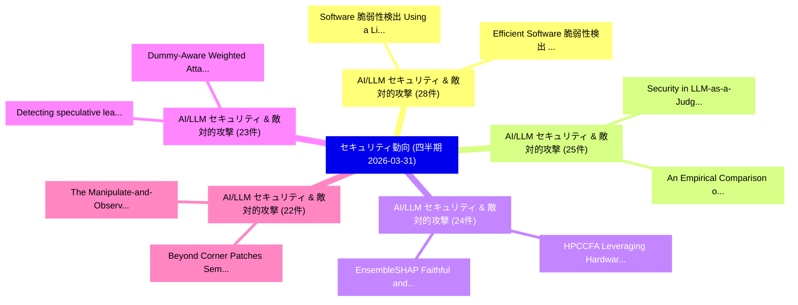

# 🏢 04_quarterly: 四半期エグゼクティブサマリー報告書 (直近90日間: 2026-03-31)

**集計日時**: 2026-03-31 00:00:00 UTC  
**直近90日間の総論文数**: 2147 件  

---

## 💡 四半期セキュリティ動向と研究ロードマップ評価

本日の収集論文（計 2147 件）において、以下の重点セキュリティ領域で活発な研究動向が確認されました：
- **AI/LLM セキュリティ & 敵対的攻撃** (28 件): 注目論文として 「Software 脆弱性検出 Using a Lightwe...」、「Efficient Software 脆弱性検出 Using...」 等が発表され、実務防御および攻撃検証の進展が見られます。
- **AI/LLM セキュリティ & 敵対的攻撃** (25 件): 注目論文として 「Security in LLM-as-a-Judge: A ...」、「An Empirical Comparison of Sec...」 等が発表され、実務防御および攻撃検証の進展が見られます。
- **AI/LLM セキュリティ & 敵対的攻撃** (24 件): 注目論文として 「HPCCFA: Leveraging Hardware Pe...」、「EnsembleSHAP: Faithful and Cer...」 等が発表され、実務防御および攻撃検証の進展が見られます。
- **AI/LLM セキュリティ & 敵対的攻撃** (23 件): 注目論文として 「Dummy-Aware Weighted Attack (D...」、「Detecting speculative leaks wi...」 等が発表され、実務防御および攻撃検証の進展が見られます。
- **AI/LLM セキュリティ & 敵対的攻撃** (22 件): 注目論文として 「Beyond Corner Patches: Semanti...」、「The Manipulate-and-Observe Att...」 等が発表され、実務防御および攻撃検証の進展が見られます。

### 🗺️ 四半期脅威ランドスケープ

---

## 📌 四半期セキュリティ論文一覧 (日本語表形式)

| No | arXiv ID | 論文タイトル (日本語訳) | 重要キーワード | 構造化エグゼクティブ要約 (背景・提案・影響) | 脅威分類 | 詳細リンク |
|---|---|---|---|---|---|---|
| 1 | `2603.29182v1` | [Dummy-Aware Weighted Attack (DAWA): Breaking the Safe Sink in Dummy Class Defenses（セキュリティ分析論文）](../../okf/papers/2026-03-31/2603.29182.md) | `Aware Weighted Attack`, `Dummy Class Defenses`, `Safe Sink` | 【提案】概要 (Overview & Key Finding) 本論文「Dummy-Aware Weighted Attack (DAWA): Breaking the Safe S...。実証評価により経営層・セキュリティ管理者向け推奨アクション (E... | `executive-summary` | [arXiv](https://arxiv.org/abs/2603.29182v1) &#124; [OKF](../../okf/papers/2026-03-31/2603.29182.md) |
| 2 | `2603.29216v1` | [Software 脆弱性検出 Using a Lightweight Graph Neural Network](../../okf/papers/2026-03-31/2603.29216.md) | `Lightweight Graph Neural Network`, `Software Vulnerability Detection Using`, `Hialo Muniz Carvalho` | 【提案】概要 (Overview & Key Finding) 本論文「Software 脆弱性検出 Using a Lightweight Graph Neural Network...。実証評価により経営層・セキュリティ管理者向け推奨アクション (E... | `cs.AI` | [arXiv](https://arxiv.org/abs/2603.29216v1) &#124; [OKF](../../okf/papers/2026-03-31/2603.29216.md) |
| 3 | `2603.29278v2` | [A Regulatory Compliance Protocol for Asset Interoperability Between Traditional and Decentralized Finance in Tokenized Capital Markets（セキュリティ分析論文）](../../okf/papers/2026-03-31/2603.29278.md) | `Regulatory Compliance Protocol`, `Tokenized Capital Markets`, `Decentralized Finance` | 【提案】概要 (Overview & Key Finding) 本論文「A Regulatory Compliance Protocol for Asset Interoperabi...。実証評価により経営層・セキュリティ管理者向け推奨アクション (E... | `executive-summary` | [arXiv](https://arxiv.org/abs/2603.29278v2) &#124; [OKF](../../okf/papers/2026-03-31/2603.29278.md) |
| 4 | `2603.29289v1` | [Downsides of Smartness Across Edge-Cloud Continuum in Modern Industry（セキュリティ分析論文）](../../okf/papers/2026-03-31/2603.29289.md) | `Smartness Across Edge`, `Cloud Continuum`, `Modern Industry` | 【提案】概要 (Overview & Key Finding) 本論文「Downsides of Smartness Across Edge-Cloud Continuum in M...。実証評価により経営層・セキュリティ管理者向け推奨アクション (E... | `cs.AI` | [arXiv](https://arxiv.org/abs/2603.29289v1) &#124; [OKF](../../okf/papers/2026-03-31/2603.29289.md) |
| 5 | `2603.29328v3` | [Beyond Corner Patches: Semantics-Aware Backdoor Attack in 連合学習](../../okf/papers/2026-03-31/2603.29328.md) | `Beyond Corner Patches`, `Aware Backdoor Attack`, `Semantics-Aware Backdoor` | 【提案】概要 (Overview & Key Finding) 本論文「Beyond Corner Patches: Semantics-Aware Backdoor Attack ...。実証評価により経営層・セキュリティ管理者向け推奨アクション (E... | `cs.AI` | [arXiv](https://arxiv.org/abs/2603.29328v3) &#124; [OKF](../../okf/papers/2026-03-31/2603.29328.md) |
| 6 | `2603.29382v2` | [Deep Learning-Assisted Improved Differential Fault Attacks on Lightweight Stream Ciphers（セキュリティ分析論文）](../../okf/papers/2026-03-31/2603.29382.md) | `Assisted Improved Differential Fault Attacks`, `Lightweight Stream Ciphers`, `Deep Learning` | 【提案】概要 (Overview & Key Finding) 本論文「Deep Learning-Assisted Improved Differential Fault Atta...。実証評価により経営層・セキュリティ管理者向け推奨アクション (E... | `executive-summary` | [arXiv](https://arxiv.org/abs/2603.29382v2) &#124; [OKF](../../okf/papers/2026-03-31/2603.29382.md) |
| 7 | `2603.29403v2` | [Security in LLM-as-a-Judge: A Comprehensive SoK（セキュリティ分析論文）](../../okf/papers/2026-03-31/2603.29403.md) | `Aiman Al Masoud`, `Vignesh Kumar Kembu`, `Antony Anju` | 【提案】概要 (Overview & Key Finding) 本論文「Security in LLM-as-a-Judge: A Comprehensive SoK（セキュリティ分...。実証評価により経営層・セキュリティ管理者向け推奨アクション (E... | `cs.AI` | [arXiv](https://arxiv.org/abs/2603.29403v2) &#124; [OKF](../../okf/papers/2026-03-31/2603.29403.md) |
| 8 | `2603.29520v1` | [TrafficMoE: Heterogeneity-aware Mixture of Experts for Encrypted Traffic Classification（セキュリティ分析論文）](../../okf/papers/2026-03-31/2603.29520.md) | `Encrypted Traffic Classification`, `Heterogeneity-aware Mixture`, `Xiaowei Fu` | 【提案】概要 (Overview & Key Finding) 本論文「TrafficMoE: Heterogeneity-aware Mixture of Experts for ...。実証評価により経営層・セキュリティ管理者向け推奨アクション (E... | `cs.NI` | [arXiv](https://arxiv.org/abs/2603.29520v1) &#124; [OKF](../../okf/papers/2026-03-31/2603.29520.md) |
| 9 | `2603.29537v1` | [Mean Masked Autoencoder with Flow-Mixing for Encrypted Traffic Classification（セキュリティ分析論文）](../../okf/papers/2026-03-31/2603.29537.md) | `Mean Masked Autoencoder`, `Encrypted Traffic Classification`, `Xiao Liu` | 【提案】概要 (Overview & Key Finding) 本論文「Mean Masked Autoencoder with Flow-Mixing for Encrypted ...。実証評価により経営層・セキュリティ管理者向け推奨アクション (E... | `cs.NI` | [arXiv](https://arxiv.org/abs/2603.29537v1) &#124; [OKF](../../okf/papers/2026-03-31/2603.29537.md) |
| 10 | `2603.29545v2` | [Stand-Alone Complex or Vibercrime? Exploring the adoption and innovation of GenAI tools, coding assistants, and agents within cybercrime ecosystems（セキュリティ分析論文）](../../okf/papers/2026-03-31/2603.29545.md) | `Alone Complex`, `Stand-Alone Complex`, `Jack Hughes` | 【提案】Exploring the adoption and innovation of GenAI tools, coding assistants, and agents wit...。実証評価により経営層・セキュリティ管理者向け推奨アクション (E... | `executive-summary` | [arXiv](https://arxiv.org/abs/2603.29545v2) &#124; [OKF](../../okf/papers/2026-03-31/2603.29545.md) |
| 11 | `2603.29636v1` | [5G Puppeteer: Chaining Hidden Command and Control Channels in 5G Core Networks（セキュリティ分析論文）](../../okf/papers/2026-03-31/2603.29636.md) | `Chaining Hidden Command`, `Control Channels`, `Core Networks` | 【提案】概要 (Overview & Key Finding) 本論文「5G Puppeteer: Chaining Hidden Command and Control Chann...。実証評価により経営層・セキュリティ管理者向け推奨アクション (E... | `cybersecurity` | [arXiv](https://arxiv.org/abs/2603.29636v1) &#124; [OKF](../../okf/papers/2026-03-31/2603.29636.md) |
| 12 | `2603.29668v1` | [An Empirical Comparison of Security and Privacy Characteristics of Android Messaging Apps（セキュリティ分析論文）](../../okf/papers/2026-03-31/2603.29668.md) | `Android Messaging Apps`, `Privacy Characteristics`, `Foivos Timotheos Proestakis` | 【提案】概要 (Overview & Key Finding) 本論文「An Empirical Comparison of Security and Privacy Charact...。実証評価により経営層・セキュリティ管理者向け推奨アクション (E... | `cybersecurity` | [arXiv](https://arxiv.org/abs/2603.29668v1) &#124; [OKF](../../okf/papers/2026-03-31/2603.29668.md) |
| 13 | `2603.29669v1` | [The Manipulate-and-Observe Attack on Quantum Key Distribution（セキュリティ分析論文）](../../okf/papers/2026-03-31/2603.29669.md) | `Quantum Key Distribution`, `Observe Attack`, `William Tighe` | 【提案】概要 (Overview & Key Finding) 本論文「The Manipulate-and-Observe Attack on 量子鍵配送（セキュリティ分析論文）」...。実証評価により経営層・セキュリティ管理者向け推奨アクション (E... | `executive-summary` | [arXiv](https://arxiv.org/abs/2603.29669v1) &#124; [OKF](../../okf/papers/2026-03-31/2603.29669.md) |
| 14 | `2603.29688v1` | [Client-Verifiable and Efficient Federated Unlearning in Low-Altitude Wireless Networks（セキュリティ分析論文）](../../okf/papers/2026-03-31/2603.29688.md) | `Efficient Federated Unlearning`, `Altitude Wireless Networks`, `Low-Altitude Wireless` | 【提案】概要 (Overview & Key Finding) 本論文「Client-Verifiable and Efficient Federated Unlearning in...。実証評価により経営層・セキュリティ管理者向け推奨アクション (E... | `cybersecurity` | [arXiv](https://arxiv.org/abs/2603.29688v1) &#124; [OKF](../../okf/papers/2026-03-31/2603.29688.md) |
| 15 | `2603.29742v2` | [SHIFT: Stochastic Hidden-Trajectory Deflection for Removing Diffusion-based Watermark（セキュリティ分析論文）](../../okf/papers/2026-03-31/2603.29742.md) | `Stochastic Hidden`, `Trajectory Deflection`, `Removing Diffusion` | 【提案】概要 (Overview & Key Finding) 本論文「SHIFT: Stochastic Hidden-Trajectory Deflection for Remo...。実証評価により経営層・セキュリティ管理者向け推奨アクション (E... | `cs.CV` | [arXiv](https://arxiv.org/abs/2603.29742v2) &#124; [OKF](../../okf/papers/2026-03-31/2603.29742.md) |
| 16 | `2603.29749v1` | [HPCCFA: Leveraging Hardware Performance Counters for Control Flow Attestation（セキュリティ分析論文）](../../okf/papers/2026-03-31/2603.29749.md) | `Leveraging Hardware Performance Counters`, `Control Flow Attestation`, `Claudius Pott` | 【提案】概要 (Overview & Key Finding) 本論文「HPCCFA: Leveraging Hardware Performance Counters for Co...。実証評価により経営層・セキュリティ管理者向け推奨アクション (E... | `cybersecurity` | [arXiv](https://arxiv.org/abs/2603.29749v1) &#124; [OKF](../../okf/papers/2026-03-31/2603.29749.md) |
| 17 | `2603.29800v1` | [Detecting speculative leaks with compositional semantics（セキュリティ分析論文）](../../okf/papers/2026-03-31/2603.29800.md) | `Xaver Fabian`, `Marco Guarnieri`, `Marco Patrignani` | 【提案】概要 (Overview & Key Finding) 本論文「Detecting speculative leaks with compositional semantic...。実証評価によりMorales, Marco。 | `cybersecurity` | [arXiv](https://arxiv.org/abs/2603.29800v1) &#124; [OKF](../../okf/papers/2026-03-31/2603.29800.md) |
| 18 | `2603.29907v2` | [Security and Privacy in Virtual and Robotic Assistive Systems: A Comparative Framework（セキュリティ分析論文）](../../okf/papers/2026-03-31/2603.29907.md) | `Robotic Assistive Systems`, `Nelly Elsayed`, `Raw Meta` | 【提案】概要 (Overview & Key Finding) 本論文「Security and Privacy in Virtual and Robotic Assistive S...。実証評価により経営層・セキュリティ管理者向け推奨アクション (E... | `cybersecurity` | [arXiv](https://arxiv.org/abs/2603.29907v2) &#124; [OKF](../../okf/papers/2026-03-31/2603.29907.md) |
| 19 | `2603.30016v1` | [Architecting Secure AI Agents: Perspectives on System-Level Defenses Against Indirect Prompt Injection Attacks（セキュリティ分析論文）](../../okf/papers/2026-03-31/2603.30016.md) | `Architecting Secure`, `System-Level Defenses`, `Chong Xiang` | 【提案】概要 (Overview & Key Finding) 本論文「Architecting Secure AI Agents: Perspectives on System-L...。実証評価により経営層・セキュリティ管理者向け推奨アクション (E... | `cs.AI` | [arXiv](https://arxiv.org/abs/2603.30016v1) &#124; [OKF](../../okf/papers/2026-03-31/2603.30016.md) |
| 20 | `2603.30017v1` | [Refined Detection for Gumbel Watermarking（セキュリティ分析論文）](../../okf/papers/2026-03-31/2603.30017.md) | `Refined Detection`, `Gumbel Watermarking`, `Tor Lattimore` | 【提案】概要 (Overview & Key Finding) 本論文「Refined Detection for Gumbel Watermarking（セキュリティ分析論文）」（...。実証評価により経営層・セキュリティ管理者向け推奨アクション (E... | `executive-summary` | [arXiv](https://arxiv.org/abs/2603.30017v1) &#124; [OKF](../../okf/papers/2026-03-31/2603.30017.md) |
| 21 | `2603.30034v1` | [EnsembleSHAP: Faithful and Certifiably Robust Attribution for Random Subspace Method（セキュリティ分析論文）](../../okf/papers/2026-03-31/2603.30034.md) | `Certifiably Robust Attribution`, `Yanting Wang`, `Jinyuan Jia` | 【提案】概要 (Overview & Key Finding) 本論文「EnsembleSHAP: Faithful and Certifiably Robust Attributi...。実証評価により経営層・セキュリティ管理者向け推奨アクション (E... | `cybersecurity` | [arXiv](https://arxiv.org/abs/2603.30034v1) &#124; [OKF](../../okf/papers/2026-03-31/2603.30034.md) |
| 22 | `2604.00063v1` | [Cybercrime as a Service: A Scoping Review（セキュリティ分析論文）](../../okf/papers/2026-03-31/2604.00063.md) | `Scoping Review`, `Ema Mauko`, `Enrico Mariconti` | 【提案】概要 (Overview & Key Finding) 本論文「Cybercrime as a Service: A Scoping Review（セキュリティ分析論文）」（...。実証評価により経営層・セキュリティ管理者向け推奨アクション (E... | `cs.ET` | [arXiv](https://arxiv.org/abs/2604.00063v1) &#124; [OKF](../../okf/papers/2026-03-31/2604.00063.md) |
| 23 | `2604.00079v1` | [When Labels Are Scarce: A Systematic Mapping of Label-Efficient Code 脆弱性検出](../../okf/papers/2026-03-31/2604.00079.md) | `Systematic Mapping`, `Label-Efficient Code`, `Efficient Code Vulnerability Detection` | 【提案】概要 (Overview & Key Finding) 本論文「When Labels Are Scarce: A Systematic Mapping of Label-E...。実証評価により経営層・セキュリティ管理者向け推奨アクション (E... | `executive-summary` | [arXiv](https://arxiv.org/abs/2604.00079v1) &#124; [OKF](../../okf/papers/2026-03-31/2604.00079.md) |
| 24 | `2604.00112v1` | [Efficient Software 脆弱性検出 Using Transformer-based Models](../../okf/papers/2026-03-31/2604.00112.md) | `Transformer-based Models`, `Efficient Software Vulnerability Detection Using Transformer`, `Efficient Software` | 【提案】概要 (Overview & Key Finding) 本論文「Efficient Software 脆弱性検出 Using Transformer-based Models...。実証評価により経営層・セキュリティ管理者向け推奨アクション (E... | `executive-summary` | [arXiv](https://arxiv.org/abs/2604.00112v1) &#124; [OKF](../../okf/papers/2026-03-31/2604.00112.md) |
| 25 | `2604.00169v2` | [Beyond Latency: A System-Level Characterization of MPC and FHE for PPML（セキュリティ分析論文）](../../okf/papers/2026-03-31/2604.00169.md) | `Beyond Latency`, `Level Characterization`, `System-Level Characterization` | 【提案】概要 (Overview & Key Finding) 本論文「Beyond Latency: A System-Level Characterization of MPC ...。実証評価によりEdward Suh - **公開日時*。 | `cybersecurity` | [arXiv](https://arxiv.org/abs/2604.00169v2) &#124; [OKF](../../okf/papers/2026-03-31/2604.00169.md) |
| 26 | `2604.00181v1` | [NFC based inventory control system for secure and efficient communication（セキュリティ分析論文）](../../okf/papers/2026-03-31/2604.00181.md) | `Razi Iqbal`, `Awais Ahmad`, `Asfandyar Gillani` | 【提案】概要 (Overview & Key Finding) 本論文「NFC based inventory control system for secure and effic...。実証評価により経営層・セキュリティ管理者向け推奨アクション (E... | `cs.AI` | [arXiv](https://arxiv.org/abs/2604.00181v1) &#124; [OKF](../../okf/papers/2026-03-31/2604.00181.md) |
| 27 | `2604.00188v1` | [On the Necessity of Pre-agreed Secrets for Thwarting Last-minute Coercion: Vulnerabilities and Lessons From the Loki E-voting Protocol（セキュリティ分析論文）](../../okf/papers/2026-03-31/2604.00188.md) | `Thwarting Last`, `Pre-agreed Secrets`, `Last-minute Coercion` | 【提案】概要 (Overview & Key Finding) 本論文「On the Necessity of Pre-agreed Secrets for Thwarting La...。実証評価により経営層・セキュリティ管理者向け推奨アクション (E... | `cybersecurity` | [arXiv](https://arxiv.org/abs/2604.00188v1) &#124; [OKF](../../okf/papers/2026-03-31/2604.00188.md) |
| 28 | `2604.00303v1` | [サイバーセキュリティ Risk Assessment for CubeSat Missions: Adapting Established Frameworks for Resource-Constrained Environments](../../okf/papers/2026-03-31/2604.00303.md) | `Adapting Established Frameworks`, `Constrained Environments`, `Resource-Constrained Environments` | 【提案】概要 (Overview & Key Finding) 本論文「サイバーセキュリティ Risk Assessment for CubeSat Missions: Adapti...。実証評価により経営層・セキュリティ管理者向け推奨アクション (E... | `cybersecurity` | [arXiv](https://arxiv.org/abs/2604.00303v1) &#124; [OKF](../../okf/papers/2026-03-31/2604.00303.md) |
| 29 | `2604.02372v1` | [Backdoor Attacks on Decentralised Post-Training（セキュリティ分析論文）](../../okf/papers/2026-03-31/2604.02372.md) | `Backdoor Attacks`, `Decentralised Post`, `Nikolay Blagoev` | 【提案】概要 (Overview & Key Finding) 本論文「Backdoor Attacks on Decentralised Post-Training（セキュリティ分...。実証評価により経営層・セキュリティ管理者向け推奨アクション (E... | `executive-summary` | [arXiv](https://arxiv.org/abs/2604.02372v1) &#124; [OKF](../../okf/papers/2026-03-31/2604.02372.md) |
| 30 | `2604.19785v2` | [Can LLMs Infer Conversational Agent Users' Personality Traits from Chat History?（セキュリティ分析論文）](../../okf/papers/2026-03-31/2604.19785.md) | `Infer Conversational Agent Users`, `Personality Traits`, `Chat History` | 【提案】### (日本語題名: Can LLMs Infer Conversational Agent Users' Personality Traits from Chat His...。実証評価により経営層・セキュリティ管理者向け推奨アクション (E... | `cs.AI` | [arXiv](https://arxiv.org/abs/2604.19785v2) &#124; [OKF](../../okf/papers/2026-03-31/2604.19785.md) |
| 31 | `2605.21490v1` | [Temporal Contrastive Transformer for Financial Crime Detection: Self-Supervised Sequence Embeddings via Predictive Contrastive Coding（セキュリティ分析論文）](../../okf/papers/2026-03-31/2605.21490.md) | `Temporal Contrastive Transformer`, `Financial Crime Detection`, `Supervised Sequence Embeddings` | 【提案】概要 (Overview & Key Finding) 本論文「Temporal Contrastive Transformer for Financial Crime De...。実証評価により経営層・セキュリティ管理者向け推奨アクション (E... | `executive-summary` | [arXiv](https://arxiv.org/abs/2605.21490v1) &#124; [OKF](../../okf/papers/2026-03-31/2605.21490.md) |
| 32 | `2603.27918v1` | [Multimodal Large Language Models: A Comprehensive Surveyに対する敵対的攻撃](../../okf/papers/2026-03-30/2603.27918.md) | `Multimodal Large Language Models`, `Adversarial Attacks`, `Comprehensive Survey` | 【提案】概要 (Overview & Key Finding) 本論文「Multimodal Large Language Models: A Comprehensive Surve...。実証評価により経営層・セキュリティ管理者向け推奨アクション (E... | `cs.AI` | [arXiv](https://arxiv.org/abs/2603.27918v1) &#124; [OKF](../../okf/papers/2026-03-30/2603.27918.md) |
| 33 | `2603.27986v1` | [FedFG: Privacy-Preserving and Robust 連合学習 via Flow-Matching Generation](../../okf/papers/2026-03-30/2603.27986.md) | `Matching Generation`, `Flow-Matching Generation`, `Robust Federated Learning` | 【提案】概要 (Overview & Key Finding) 本論文「FedFG: Privacy-Preserving and Robust 連合学習 via Flow-Matc...。実証評価により経営層・セキュリティ管理者向け推奨アクション (E... | `cs.AI` | [arXiv](https://arxiv.org/abs/2603.27986v1) &#124; [OKF](../../okf/papers/2026-03-30/2603.27986.md) |
| 34 | `2603.28013v3` | [Kill-Chain Canaries: Stage-Level Tracking of Prompt Injection Across Attack Surfaces and Model Safety Tiers（セキュリティ分析論文）](../../okf/papers/2026-03-30/2603.28013.md) | `Prompt Injection Across Attack Surfaces`, `Model Safety Tiers`, `Chain Canaries` | 【提案】概要 (Overview & Key Finding) 本論文「Kill-Chain Canaries: Stage-Level Tracking of プロンプトインジェク...。実証評価により経営層・セキュリティ管理者向け推奨アクション (E... | `cs.AI` | [arXiv](https://arxiv.org/abs/2603.28013v3) &#124; [OKF](../../okf/papers/2026-03-30/2603.28013.md) |
| 35 | `2603.28043v1` | [Seeing the Unseen: Rethinking Illicit Promotion Detection with In-Context Learning（セキュリティ分析論文）](../../okf/papers/2026-03-30/2603.28043.md) | `Rethinking Illicit Promotion Detection`, `Context Learning`, `In-Context Learning` | 【提案】概要 (Overview & Key Finding) 本論文「Seeing the Unseen: Rethinking Illicit Promotion Detecti...。実証評価により経営層・セキュリティ管理者向け推奨アクション (E... | `cybersecurity` | [arXiv](https://arxiv.org/abs/2603.28043v1) &#124; [OKF](../../okf/papers/2026-03-30/2603.28043.md) |
| 36 | `2603.28128v2` | [ORACAL: A Robust and Explainable Multimodal Framework for Smart Contract 脆弱性検出 with Causal Graph Enrichment](../../okf/papers/2026-03-30/2603.28128.md) | `Causal Graph Enrichment`, `Smart Contract Vulnerability Detection`, `Smart Contract` | 【提案】概要 (Overview & Key Finding) 本論文「ORACAL: A Robust and Explainable Multimodal Framework f...。実証評価により経営層・セキュリティ管理者向け推奨アクション (E... | `executive-summary` | [arXiv](https://arxiv.org/abs/2603.28128v2) &#124; [OKF](../../okf/papers/2026-03-30/2603.28128.md) |
| 37 | `2603.28143v1` | [Silent Guardians: Independent and Secure Decision Tree Evaluation Without Chatter（セキュリティ分析論文）](../../okf/papers/2026-03-30/2603.28143.md) | `Silent Guardians`, `Liang Feng Zhang`, `Jinyuan Li` | 【提案】背景とセキュリティ上の課題 (Background & Problem) 本研究はサイバー脅威環境におけるセキュリティ構造・脆弱性の検証を目的としています。(主要検出項目: ...。実証評価により経営層・セキュリティ管理者向け推奨アクション (E... | `cybersecurity` | [arXiv](https://arxiv.org/abs/2603.28143v1) &#124; [OKF](../../okf/papers/2026-03-30/2603.28143.md) |
| 38 | `2603.28166v2` | [Evaluating Privilege Usage of Agents with Real-World Tools（セキュリティ分析論文）](../../okf/papers/2026-03-30/2603.28166.md) | `Evaluating Privilege Usage`, `World Tools`, `Real-World Tools` | 【提案】概要 (Overview & Key Finding) 本論文「Evaluating Privilege Usage of Agents with Real-World To...。実証評価により経営層・セキュリティ管理者向け推奨アクション (E... | `cs.AI` | [arXiv](https://arxiv.org/abs/2603.28166v2) &#124; [OKF](../../okf/papers/2026-03-30/2603.28166.md) |
| 39 | `2603.28252v2` | [Secret Key Rate RIS-Assisted THz MIMO CV-QKD Systems under Access-Constrained Eavesdroppingの分析](../../okf/papers/2026-03-30/2603.28252.md) | `RIS-Assisted THz`, `CV-QKD Systems`, `Secret Key Rate` | 【提案】概要 (Overview & Key Finding) 本論文「Secret Key Rate RIS-Assisted THz MIMO CV-QKD Systems un...。実証評価により経営層・セキュリティ管理者向け推奨アクション (E... | `executive-summary` | [arXiv](https://arxiv.org/abs/2603.28252v2) &#124; [OKF](../../okf/papers/2026-03-30/2603.28252.md) |
| 40 | `2603.28309v1` | [VulnScout-C: A Lightweight Transformer for C Code 脆弱性検出](../../okf/papers/2026-03-30/2603.28309.md) | `Lightweight Transformer`, `Code Vulnerability Detection`, `Aymen Lassoued` | 【提案】概要 (Overview & Key Finding) 本論文「VulnScout-C: A Lightweight Transformer for C Code 脆弱性検出...。実証評価により経営層・セキュリティ管理者向け推奨アクション (E... | `cybersecurity` | [arXiv](https://arxiv.org/abs/2603.28309v1) &#124; [OKF](../../okf/papers/2026-03-30/2603.28309.md) |
| 41 | `2603.28313v1` | [Crypta Lightweight RFID Authentication Protocol Based on a Variable Matrix Encryption Algorithmの分析](../../okf/papers/2026-03-30/2603.28313.md) | `Authentication Protocol Based`, `Variable Matrix Encryption`, `Variable Matrix Encryption Algorithm` | 【提案】概要 (Overview & Key Finding) 本論文「Crypta Lightweight RFID Authentication Protocol Based o...。実証評価により経営層・セキュリティ管理者向け推奨アクション (E... | `cybersecurity` | [arXiv](https://arxiv.org/abs/2603.28313v1) &#124; [OKF](../../okf/papers/2026-03-30/2603.28313.md) |
| 42 | `2603.28396v1` | [Label-efficient Training Updates for マルウェア検出 over Time](../../okf/papers/2026-03-30/2603.28396.md) | `Training Updates`, `Label-efficient Training`, `Malware Detection` | 【提案】概要 (Overview & Key Finding) 本論文「Label-efficient Training Updates for マルウェア検出 over Time」...。実証評価により経営層・セキュリティ管理者向け推奨アクション (E... | `executive-summary` | [arXiv](https://arxiv.org/abs/2603.28396v1) &#124; [OKF](../../okf/papers/2026-03-30/2603.28396.md) |
| 43 | `2603.28434v1` | [Democratizing 連合学習 with Blockchain and Multi-Task Peer Prediction](../../okf/papers/2026-03-30/2603.28434.md) | `Task Peer Prediction`, `Multi-Task Peer`, `Democratizing Federated Learning` | 【提案】概要 (Overview & Key Finding) 本論文「Democratizing 連合学習 with Blockchain and Multi-Task Peer ...。実証評価により経営層・セキュリティ管理者向け推奨アクション (E... | `executive-summary` | [arXiv](https://arxiv.org/abs/2603.28434v1) &#124; [OKF](../../okf/papers/2026-03-30/2603.28434.md) |
| 44 | `2603.28546v2` | [Shy Guys: A Light-Weight Approach to Detecting Robots on Websites（セキュリティ分析論文）](../../okf/papers/2026-03-30/2603.28546.md) | `Shy Guys`, `Detecting Robots`, `Van Boxem` | 【提案】概要 (Overview & Key Finding) 本論文「Shy Guys: A Light-Weight Approach to Detecting Robots o...。実証評価により経営層・セキュリティ管理者向け推奨アクション (E... | `cs.NI` | [arXiv](https://arxiv.org/abs/2603.28546v2) &#124; [OKF](../../okf/papers/2026-03-30/2603.28546.md) |
| 45 | `2603.28551v2` | ["What Did It Actually Do?": Understanding Risk Awareness and Traceability for Computer-Use Agents（セキュリティ分析論文）](../../okf/papers/2026-03-30/2603.28551.md) | `Understanding Risk Awareness`, `Use Agents`, `Computer-Use Agents` | 【提案】概要 (Overview & Key Finding) 本論文「"What Did It Actually Do?": Understanding Risk Awarenes...。実証評価により経営層・セキュリティ管理者向け推奨アクション (E... | `cs.ET` | [arXiv](https://arxiv.org/abs/2603.28551v2) &#124; [OKF](../../okf/papers/2026-03-30/2603.28551.md) |
| 46 | `2603.28594v2` | [Adversarial Attacks in Robotic Perceptionの検出](../../okf/papers/2026-03-30/2603.28594.md) | `Adversarial Attacks`, `Robotic Perception`, `Sorin Mihai Grigorescu` | 【提案】概要 (Overview & Key Finding) 本論文「敵対的攻撃s in Robotic Perceptionの検出」（原題: Detection of 敵対的攻撃...。実証評価により経営層・セキュリティ管理者向け推奨アクション (E... | `cs.AI` | [arXiv](https://arxiv.org/abs/2603.28594v2) &#124; [OKF](../../okf/papers/2026-03-30/2603.28594.md) |
| 47 | `2603.28613v1` | [TGIF2: Extended Text-Guided Inpainting Forgery Dataset & Benchmark（セキュリティ分析論文）](../../okf/papers/2026-03-30/2603.28613.md) | `Guided Inpainting Forgery Dataset`, `Extended Text`, `Text-Guided Inpainting` | 【提案】概要 (Overview & Key Finding) 本論文「TGIF2: Extended Text-Guided Inpainting Forgery Dataset ...。実証評価により経営層・セキュリティ管理者向け推奨アクション (E... | `cs.AI` | [arXiv](https://arxiv.org/abs/2603.28613v1) &#124; [OKF](../../okf/papers/2026-03-30/2603.28613.md) |
| 48 | `2603.28626v1` | [Empowering Mobile Networks Security Resilience by using Post-Quantum Cryptography（セキュリティ分析論文）](../../okf/papers/2026-03-30/2603.28626.md) | `Empowering Mobile Networks Security Resilience`, `Quantum Cryptography`, `Post-Quantum Cryptography` | 【提案】概要 (Overview & Key Finding) 本論文「Empowering Mobile Networks Security Resilience by using...。実証評価により経営層・セキュリティ管理者向け推奨アクション (E... | `cybersecurity` | [arXiv](https://arxiv.org/abs/2603.28626v1) &#124; [OKF](../../okf/papers/2026-03-30/2603.28626.md) |
| 49 | `2603.28652v1` | [Mitigating Backdoor Attacks in 連合学習 Using PPA and MiniMax Game Theory](../../okf/papers/2026-03-30/2603.28652.md) | `Mitigating Backdoor Attacks`, `Game Theory`, `Federated Learning Using` | 【提案】概要 (Overview & Key Finding) 本論文「Mitigating Backdoor Attacks in 連合学習 Using PPA and MiniM...。実証評価により経営層・セキュリティ管理者向け推奨アクション (E... | `executive-summary` | [arXiv](https://arxiv.org/abs/2603.28652v1) &#124; [OKF](../../okf/papers/2026-03-30/2603.28652.md) |
| 50 | `2603.28654v1` | [Interpretable Ensemble Learning for Network Traffic Anomaly Detection: A SHAP-based Explainable AI Framework for Embedded Systems Security（セキュリティ分析論文）](../../okf/papers/2026-03-30/2603.28654.md) | `Network Traffic Anomaly Detection`, `Interpretable Ensemble Learning`, `Embedded Systems Security` | 【提案】概要 (Overview & Key Finding) 本論文「Interpretable Ensemble Learning for Network Traffic Ano...。実証評価により経営層・セキュリティ管理者向け推奨アクション (E... | `cybersecurity` | [arXiv](https://arxiv.org/abs/2603.28654v1) &#124; [OKF](../../okf/papers/2026-03-30/2603.28654.md) |
| 51 | `2603.28655v1` | [Safeguarding LLMs Against Misuse and AI-Driven Malware Using Steganographic Canaries（セキュリティ分析論文）](../../okf/papers/2026-03-30/2603.28655.md) | `Driven Malware Using Steganographic Canaries`, `AI-Driven Malware`, `Venkata Sai Charan Putrevu` | 【提案】概要 (Overview & Key Finding) 本論文「Safeguarding LLMs Against Misuse and AI-Driven マルウェア Us...。実証評価により経営層・セキュリティ管理者向け推奨アクション (E... | `cybersecurity` | [arXiv](https://arxiv.org/abs/2603.28655v1) &#124; [OKF](../../okf/papers/2026-03-30/2603.28655.md) |
| 52 | `2603.28673v1` | [FL-PBM: Pre-Training Backdoor Mitigation for 連合学習](../../okf/papers/2026-03-30/2603.28673.md) | `Training Backdoor Mitigation`, `Pre-Training Backdoor`, `Federated Learning` | 【提案】概要 (Overview & Key Finding) 本論文「FL-PBM: Pre-Training Backdoor Mitigation for 連合学習」（原題: ...。実証評価により経営層・セキュリティ管理者向け推奨アクション (E... | `executive-summary` | [arXiv](https://arxiv.org/abs/2603.28673v1) &#124; [OKF](../../okf/papers/2026-03-30/2603.28673.md) |
| 53 | `2603.28727v1` | [BitSov: A Composable Bitcoin-Native Architecture for Sovereign Internet Infrastructure（セキュリティ分析論文）](../../okf/papers/2026-03-30/2603.28727.md) | `Sovereign Internet Infrastructure`, `Composable Bitcoin`, `Native Architecture` | 【提案】概要 (Overview & Key Finding) 本論文「BitSov: A Composable Bitcoin-Native Architecture for So...。実証評価により経営層・セキュリティ管理者向け推奨アクション (E... | `cs.NI` | [arXiv](https://arxiv.org/abs/2603.28727v1) &#124; [OKF](../../okf/papers/2026-03-30/2603.28727.md) |
| 54 | `2603.28838v1` | [GMA-SAWGAN-GP: A Novel Data Generative Framework to Enhance IDS Detection Performance（セキュリティ分析論文）](../../okf/papers/2026-03-30/2603.28838.md) | `Detection Performance`, `Ziyu Mu`, `Xiyu Shi` | 【提案】概要 (Overview & Key Finding) 本論文「GMA-SAWGAN-GP: A Novel Data Generative Framework to Enh...。実証評価により経営層・セキュリティ管理者向け推奨アクション (E... | `cs.AI` | [arXiv](https://arxiv.org/abs/2603.28838v1) &#124; [OKF](../../okf/papers/2026-03-30/2603.28838.md) |
| 55 | `2603.28846v2` | [Elliptic Curve Cryptocurrencies against Quantum Vulnerabilities: Resource Estimates and Mitigationsのセキュリティ強化](../../okf/papers/2026-03-30/2603.28846.md) | `Quantum Vulnerabilities`, `Resource Estimates`, `Securing Elliptic Curve Cryptocurrencies` | 【提案】概要 (Overview & Key Finding) 本論文「Elliptic Curve Cryptocurrencies against 量子 Vulnerabilit...。実証評価により経営層・セキュリティ管理者向け推奨アクション (E... | `executive-summary` | [arXiv](https://arxiv.org/abs/2603.28846v2) &#124; [OKF](../../okf/papers/2026-03-30/2603.28846.md) |
| 56 | `2603.28903v1` | [Differential Privacy for Symbolic Trajectories via the Permute-and-Flip Mechanism（セキュリティ分析論文）](../../okf/papers/2026-03-30/2603.28903.md) | `Differential Privacy`, `Symbolic Trajectories`, `Flip Mechanism` | 【提案】概要 (Overview & Key Finding) 本論文「差分プライバシー for Symbolic Trajectories via the Permute-and-...。実証評価により経営層・セキュリティ管理者向け推奨アクション (E... | `cybersecurity` | [arXiv](https://arxiv.org/abs/2603.28903v1) &#124; [OKF](../../okf/papers/2026-03-30/2603.28903.md) |
| 57 | `2603.28942v3` | [ReproMIA: A Comprehensive Model Reprogramming for Proactive Membership Inference Attacksの分析](../../okf/papers/2026-03-30/2603.28942.md) | `Comprehensive Model Reprogramming`, `Proactive Membership Inference`, `Proactive Membership Inference Attacks` | 【提案】概要 (Overview & Key Finding) 本論文「ReproMIA: A Comprehensive Model Reprogramming for Proac...。実証評価により経営層・セキュリティ管理者向け推奨アクション (E... | `executive-summary` | [arXiv](https://arxiv.org/abs/2603.28942v3) &#124; [OKF](../../okf/papers/2026-03-30/2603.28942.md) |
| 58 | `2603.28972v1` | [Privacy Guard & Token Parsimony by Prompt and Context Handling and LLM Routing（セキュリティ分析論文）](../../okf/papers/2026-03-30/2603.28972.md) | `Privacy Guard`, `Token Parsimony`, `Context Handling` | 【提案】概要 (Overview & Key Finding) 本論文「Privacy Guard & Token Parsimony by Prompt and Context H...。実証評価により経営層・セキュリティ管理者向け推奨アクション (E... | `cs.AI` | [arXiv](https://arxiv.org/abs/2603.28972v1) &#124; [OKF](../../okf/papers/2026-03-30/2603.28972.md) |
| 59 | `2603.28985v1` | [KAN-LSTM: Kolmogorov-Arnold Networks for Cyber Security Threat Detection in IoT Networksのベンチマーク評価](../../okf/papers/2026-03-30/2603.28985.md) | `Cyber Security Threat Detection`, `Arnold Networks`, `Kolmogorov-Arnold Networks` | 【提案】概要 (Overview & Key Finding) 本論文「KAN-LSTM: Kolmogorov-Arnold Networks for Cyber Security...。実証評価により経営層・セキュリティ管理者向け推奨アクション (E... | `cybersecurity` | [arXiv](https://arxiv.org/abs/2603.28985v1) &#124; [OKF](../../okf/papers/2026-03-30/2603.28985.md) |
| 60 | `2603.28988v1` | [Attesting LLM Pipelines: Enforcing Verifiable Training and Release Claims（セキュリティ分析論文）](../../okf/papers/2026-03-30/2603.28988.md) | `Enforcing Verifiable Training`, `Release Claims`, `Zhuoran Tan` | 【提案】概要 (Overview & Key Finding) 本論文「Attesting LLM Pipelines: Enforcing Verifiable Training ...。実証評価により経営層・セキュリティ管理者向け推奨アクション (E... | `cybersecurity` | [arXiv](https://arxiv.org/abs/2603.28988v1) &#124; [OKF](../../okf/papers/2026-03-30/2603.28988.md) |
| 61 | `2603.28998v1` | [Design Principles for the Construction of a Benchmark Evaluating Security Operation Capabilities of Multi-agent AI Systems（セキュリティ分析論文）](../../okf/papers/2026-03-30/2603.28998.md) | `Benchmark Evaluating Security Operation Capabilities`, `Design Principles`, `Multi-agent AI` | 【提案】概要 (Overview & Key Finding) 本論文「Design Principles for the Construction of a Benchmark E...。実証評価により経営層・セキュリティ管理者向け推奨アクション (E... | `cs.AI` | [arXiv](https://arxiv.org/abs/2603.28998v1) &#124; [OKF](../../okf/papers/2026-03-30/2603.28998.md) |
| 62 | `2603.29038v1` | [Trojan-Speak: Bypassing Constitutional Classifiers with No Jailbreak Tax via Adversarial Finetuning（セキュリティ分析論文）](../../okf/papers/2026-03-30/2603.29038.md) | `Bypassing Constitutional Classifiers`, `Adversarial Finetuning`, `Bilgehan Sel` | 【提案】概要 (Overview & Key Finding) 本論文「Trojan-Speak: Bypassing Constitutional Classifiers with...。実証評価により経営層・セキュリティ管理者向け推奨アクション (E... | `cs.AI` | [arXiv](https://arxiv.org/abs/2603.29038v1) &#124; [OKF](../../okf/papers/2026-03-30/2603.29038.md) |
| 63 | `2603.29062v1` | [CivicShield: A Cross-Domain Defense-in-Depth Framework for Government-Facing AI Chatbots Against Multi-Turn Adversarial Attacksのセキュリティ強化](../../okf/papers/2026-03-30/2603.29062.md) | `Domain Defense`, `Cross-Domain Defense`, `Government-Facing AI` | 【提案】概要 (Overview & Key Finding) 本論文「CivicShield: A Cross-Domain Defense-in-Depth Framework ...。実証評価により経営層・セキュリティ管理者向け推奨アクション (E... | `cs.AI` | [arXiv](https://arxiv.org/abs/2603.29062v1) &#124; [OKF](../../okf/papers/2026-03-30/2603.29062.md) |
| 64 | `2603.29063v1` | [Uncovering Relationships between Android Developers, User Privacy, and Developer Willingness to Reduce Fingerprinting Risks（セキュリティ分析論文）](../../okf/papers/2026-03-30/2603.29063.md) | `Reduce Fingerprinting Risks`, `Uncovering Relationships`, `Android Developers` | 【提案】概要 (Overview & Key Finding) 本論文「Uncovering Relationships between Android Developers, Us...。実証評価により経営層・セキュリティ管理者向け推奨アクション (E... | `executive-summary` | [arXiv](https://arxiv.org/abs/2603.29063v1) &#124; [OKF](../../okf/papers/2026-03-30/2603.29063.md) |
| 65 | `2604.06252v1` | [Policy-Driven Vulnerability Risk Quantification framework for Large-Scale Cloud Infrastructure Data Security（セキュリティ分析論文）](../../okf/papers/2026-03-30/2604.06252.md) | `Scale Cloud Infrastructure Data Security`, `Driven Vulnerability Risk Quantification`, `Policy-Driven Vulnerability` | 【提案】概要 (Overview & Key Finding) 本論文「Policy-Driven 脆弱性 Risk Quantification framework for Lar...。実証評価により経営層・セキュリティ管理者向け推奨アクション (E... | `cybersecurity` | [arXiv](https://arxiv.org/abs/2604.06252v1) &#124; [OKF](../../okf/papers/2026-03-30/2604.06252.md) |
| 66 | `2603.27517v3` | [A Security the OpenClaw AI Agent Frameworkの分析](../../okf/papers/2026-03-29/2603.27517.md) | `Surada Suwansathit`, `Yuxuan Zhang`, `Guofei Gu` | 【提案】概要 (Overview & Key Finding) 本論文「A Security the OpenClaw AI Agent Frameworkの分析」（原題: A Se...。実証評価により経営層・セキュリティ管理者向け推奨アクション (E... | `cs.AI` | [arXiv](https://arxiv.org/abs/2603.27517v3) &#124; [OKF](../../okf/papers/2026-03-29/2603.27517.md) |
| 67 | `2603.27522v1` | [Hidden Ads: Behavior Triggered Semantic Backdoors for Advertisement Injection in Vision Language Models（セキュリティ分析論文）](../../okf/papers/2026-03-29/2603.27522.md) | `Behavior Triggered Semantic Backdoors`, `Vision Language Models`, `Hidden Ads` | 【提案】概要 (Overview & Key Finding) 本論文「Hidden Ads: Behavior Triggered Semantic Backdoors for A...。実証評価により経営層・セキュリティ管理者向け推奨アクション (E... | `executive-summary` | [arXiv](https://arxiv.org/abs/2603.27522v1) &#124; [OKF](../../okf/papers/2026-03-29/2603.27522.md) |
| 68 | `2603.27739v2` | [Ordering Power is Sanctioning Power: Sanction Evasion-MEV and the Limits of On-Chain Enforcement（セキュリティ分析論文）](../../okf/papers/2026-03-29/2603.27739.md) | `Ordering Power`, `Sanctioning Power`, `Sanction Evasion` | 【提案】概要 (Overview & Key Finding) 本論文「Ordering Power is Sanctioning Power: Sanction Evasion-M...。実証評価により経営層・セキュリティ管理者向け推奨アクション (E... | `cybersecurity` | [arXiv](https://arxiv.org/abs/2603.27739v2) &#124; [OKF](../../okf/papers/2026-03-29/2603.27739.md) |
| 69 | `2603.27817v3` | [Context-Aware Image Anonymization with Multi-Agent Reasoningに向けて](../../okf/papers/2026-03-29/2603.27817.md) | `Aware Image Anonymization`, `Context-Aware Image`, `Towards Context` | 【提案】概要 (Overview & Key Finding) 本論文「Context-Aware Image Anonymization with Multi-Agent Reas...。実証評価により経営層・セキュリティ管理者向け推奨アクション (E... | `cs.AI` | [arXiv](https://arxiv.org/abs/2603.27817v3) &#124; [OKF](../../okf/papers/2026-03-29/2603.27817.md) |
| 70 | `2603.27883v1` | [Decentralized Proof-of-Location for Content Provenance: Capture-Time Authenticityに向けて](../../okf/papers/2026-03-29/2603.27883.md) | `Decentralized Proof`, `Content Provenance`, `Towards Capture` | 【提案】概要 (Overview & Key Finding) 本論文「Decentralized Proof-of-Location for Content Provenance:...。実証評価により経営層・セキュリティ管理者向け推奨アクション (E... | `cybersecurity` | [arXiv](https://arxiv.org/abs/2603.27883v1) &#124; [OKF](../../okf/papers/2026-03-29/2603.27883.md) |
| 71 | `2603.28824v1` | [SNEAKDOOR: Stealthy Backdoor Attacks against Distribution Matching-based Dataset Condensation（セキュリティ分析論文）](../../okf/papers/2026-03-29/2603.28824.md) | `Stealthy Backdoor Attacks`, `Distribution Matching`, `Dataset Condensation` | 【提案】概要 (Overview & Key Finding) 本論文「SNEAKDOOR: Stealthy Backdoor Attacks against Distributi...。実証評価により経営層・セキュリティ管理者向け推奨アクション (E... | `cs.AI` | [arXiv](https://arxiv.org/abs/2603.28824v1) &#124; [OKF](../../okf/papers/2026-03-29/2603.28824.md) |
| 72 | `2605.06669v2` | [Evaluating Prompt Injection Defenses for Educational LLM Tutors: Security-Usability-Latency Trade-offs（セキュリティ分析論文）](../../okf/papers/2026-03-29/2605.06669.md) | `Evaluating Prompt Injection Defenses`, `Latency Trade`, `Raw Meta` | 【提案】概要 (Overview & Key Finding) 本論文「Evaluating プロンプトインジェクション Defenses for Educational LLM T...。実証評価により経営層・セキュリティ管理者向け推奨アクション (E... | `cs.AI` | [arXiv](https://arxiv.org/abs/2605.06669v2) &#124; [OKF](../../okf/papers/2026-03-29/2605.06669.md) |
| 73 | `2603.27067v1` | [Detecting Protracted Vulnerabilities in Open Source Projects（セキュリティ分析論文）](../../okf/papers/2026-03-28/2603.27067.md) | `Detecting Protracted Vulnerabilities`, `Open Source Projects`, `Sara Al Hajj Ibrahim` | 【提案】概要 (Overview & Key Finding) 本論文「Detecting Protracted Vulnerabilities in Open Source Pro...。実証評価により経営層・セキュリティ管理者向け推奨アクション (E... | `executive-summary` | [arXiv](https://arxiv.org/abs/2603.27067v1) &#124; [OKF](../../okf/papers/2026-03-28/2603.27067.md) |
| 74 | `2603.27094v1` | [Sovereign Context Protocol: An Open Attribution Layer for Human-Generated Content in the Age of 大規模言語モデル](../../okf/papers/2026-03-28/2603.27094.md) | `Sovereign Context Protocol`, `Generated Content`, `Human-Generated Content` | 【提案】概要 (Overview & Key Finding) 本論文「Sovereign Context Protocol: An Open Attribution Layer f...。実証評価により経営層・セキュリティ管理者向け推奨アクション (E... | `cs.AI` | [arXiv](https://arxiv.org/abs/2603.27094v1) &#124; [OKF](../../okf/papers/2026-03-28/2603.27094.md) |
| 75 | `2603.27117v2` | [Gender-Based Heterogeneity in Youth Privacy-Protective Behavior for Smart Voice Assistants: Evidence from Multigroup PLS-SEM（セキュリティ分析論文）](../../okf/papers/2026-03-28/2603.27117.md) | `Smart Voice Assistants`, `Based Heterogeneity`, `Youth Privacy` | 【提案】概要 (Overview & Key Finding) 本論文「Gender-Based Heterogeneity in Youth Privacy-Protective ...。実証評価により経営層・セキュリティ管理者向け推奨アクション (E... | `cs.AI` | [arXiv](https://arxiv.org/abs/2603.27117v2) &#124; [OKF](../../okf/papers/2026-03-28/2603.27117.md) |
| 76 | `2603.27127v1` | [Red-MIRROR: Agentic LLM-based Autonomous Penetration Testing with Reflective Verification and Knowledge-augmented Interaction（セキュリティ分析論文）](../../okf/papers/2026-03-28/2603.27127.md) | `Autonomous Penetration Testing`, `Reflective Verification`, `LLM-based Autonomous` | 【提案】概要 (Overview & Key Finding) 本論文「Red-MIRROR: Agentic LLM-based Autonomous Penetration Te...。実証評価により経営層・セキュリティ管理者向け推奨アクション (E... | `cybersecurity` | [arXiv](https://arxiv.org/abs/2603.27127v1) &#124; [OKF](../../okf/papers/2026-03-28/2603.27127.md) |
| 77 | `2603.27148v1` | [SafetyDrift: Predicting When AI Agents Cross the Line Before They Actually Do（セキュリティ分析論文）](../../okf/papers/2026-03-28/2603.27148.md) | `Agents Cross`, `Aditya Dhodapkar`, `Farhaan Pishori` | 【提案】概要 (Overview & Key Finding) 本論文「SafetyDrift: Predicting When AI Agents Cross the Line B...。実証評価により経営層・セキュリティ管理者向け推奨アクション (E... | `cs.AI` | [arXiv](https://arxiv.org/abs/2603.27148v1) &#124; [OKF](../../okf/papers/2026-03-28/2603.27148.md) |
| 78 | `2603.27190v2` | [Spectral Method attacks Sparse LWE, Sparse LPN and Beyond（セキュリティ分析論文）](../../okf/papers/2026-03-28/2603.27190.md) | `Shashwat Agrawal`, `Amitabha Bagchi`, `Rajendra Kumar` | 【提案】概要 (Overview & Key Finding) 本論文「Spectral Method attacks Sparse LWE, Sparse LPN and Beyo...。実証評価により経営層・セキュリティ管理者向け推奨アクション (E... | `cybersecurity` | [arXiv](https://arxiv.org/abs/2603.27190v2) &#124; [OKF](../../okf/papers/2026-03-28/2603.27190.md) |
| 79 | `2603.27204v1` | ["Elementary, My Dear Watson." Detecting Malicious Skills via Neuro-Symbolic Reasoning across Heterogeneous Artifacts（セキュリティ分析論文）](../../okf/papers/2026-03-28/2603.27204.md) | `Detecting Malicious Skills`, `Symbolic Reasoning`, `Heterogeneous Artifacts` | 【提案】概要 (Overview & Key Finding) 本論文「"Elementary, My Dear Watson." Detecting Malicious Skill...。実証評価により経営層・セキュリティ管理者向け推奨アクション (E... | `executive-summary` | [arXiv](https://arxiv.org/abs/2603.27204v1) &#124; [OKF](../../okf/papers/2026-03-28/2603.27204.md) |
| 80 | `2603.27224v4` | [Finding Memory Leaks in C/C++ Programs via Neuro-Symbolic Augmented Static Analysis（セキュリティ分析論文）](../../okf/papers/2026-03-28/2603.27224.md) | `Finding Memory Leaks`, `Neuro-Symbolic Augmented`, `Symbolic Augmented Stat` | 【提案】概要 (Overview & Key Finding) 本論文「Finding Memory Leaks in C/C++ Programs via Neuro-Symbol...。実証評価により経営層・セキュリティ管理者向け推奨アクション (E... | `executive-summary` | [arXiv](https://arxiv.org/abs/2603.27224v4) &#124; [OKF](../../okf/papers/2026-03-28/2603.27224.md) |
| 81 | `2603.27278v1` | [Quantum Bit Error Rate Analysis in BB84 Quantum Key Distribution: Measurement, Statistical Estimation, and Eavesdropping Detection（セキュリティ分析論文）](../../okf/papers/2026-03-28/2603.27278.md) | `Quantum Key Distribution`, `Statistical Estimation`, `Eavesdropping Detection` | 【提案】概要 (Overview & Key Finding) 本論文「量子 Bit Error Rate Analysis in BB84 量子鍵配送: Measurement, ...。実証評価により経営層・セキュリティ管理者向け推奨アクション (E... | `executive-summary` | [arXiv](https://arxiv.org/abs/2603.27278v1) &#124; [OKF](../../okf/papers/2026-03-28/2603.27278.md) |
| 82 | `2603.27326v1` | [Context-Aware Phishing Email Detection Using Machine Learning and NLP（セキュリティ分析論文）](../../okf/papers/2026-03-28/2603.27326.md) | `Aware Phishing Email Detection Using Machine Learning`, `Context-Aware Phishing`, `Amitabh Chakravorty` | 【提案】概要 (Overview & Key Finding) 本論文「Context-Aware Phishing Email Detection Using Machine Le...。実証評価により経営層・セキュリティ管理者向け推奨アクション (E... | `cybersecurity` | [arXiv](https://arxiv.org/abs/2603.27326v1) &#124; [OKF](../../okf/papers/2026-03-28/2603.27326.md) |
| 83 | `2603.27439v1` | [Attacking AI Accelerators by Leveraging Arithmetic Properties of Addition（セキュリティ分析論文）](../../okf/papers/2026-03-28/2603.27439.md) | `Leveraging Arithmetic Properties`, `Biresh Kumar Joardar`, `Masoud Heidary` | 【提案】概要 (Overview & Key Finding) 本論文「Attacking AI Accelerators by Leveraging Arithmetic Prop...。実証評価により経営層・セキュリティ管理者向け推奨アクション (E... | `executive-summary` | [arXiv](https://arxiv.org/abs/2603.27439v1) &#124; [OKF](../../okf/papers/2026-03-28/2603.27439.md) |
| 84 | `2603.28807v1` | [SafeClaw-R: Safe and Secure Multi-Agent Personal Assistantsに向けて](../../okf/papers/2026-03-28/2603.28807.md) | `Secure Multi`, `Multi-Agent Personal`, `Agent Personal Assistants` | 【提案】概要 (Overview & Key Finding) 本論文「SafeClaw-R: Safe and Secure Multi-Agent Personal Assist...。実証評価によりPoskitt, Jun Sun -。 | `cybersecurity` | [arXiv](https://arxiv.org/abs/2603.28807v1) &#124; [OKF](../../okf/papers/2026-03-28/2603.28807.md) |
| 85 | `2603.28815v1` | [SkillTester: Utility and Security of Agent Skillsのベンチマーク評価](../../okf/papers/2026-03-28/2603.28815.md) | `Benchmarking Utility`, `Agent Skills`, `Leye Wang` | 【提案】概要 (Overview & Key Finding) 本論文「SkillTester: Utility and Security of Agent Skillsのベンチマー...。実証評価により経営層・セキュリティ管理者向け推奨アクション (E... | `cs.AI` | [arXiv](https://arxiv.org/abs/2603.28815v1) &#124; [OKF](../../okf/papers/2026-03-28/2603.28815.md) |
| 86 | `2603.28817v1` | [GUARD-SLM: Token Activation-Based Defense Against Jailbreak Attacks for Small Language Models（セキュリティ分析論文）](../../okf/papers/2026-03-28/2603.28817.md) | `Small Language Models`, `Token Activation`, `Activation-Based Defense` | 【提案】概要 (Overview & Key Finding) 本論文「GUARD-SLM: Token Activation-Based Defense Against ジェイルブ...。実証評価により経営層・セキュリティ管理者向け推奨アクション (E... | `cs.AI` | [arXiv](https://arxiv.org/abs/2603.28817v1) &#124; [OKF](../../okf/papers/2026-03-28/2603.28817.md) |
| 87 | `2605.02900v2` | [Safety in Embodied AI: A Survey of Risks, Attacks, and Defenses（セキュリティ分析論文）](../../okf/papers/2026-03-28/2605.02900.md) | `Xiao Li`, `Xiang Zheng`, `Yifeng Gao` | 【提案】概要 (Overview & Key Finding) 本論文「Safety in Embodied AI: A Survey of Risks, Attacks, and ...。実証評価により経営層・セキュリティ管理者向け推奨アクション (E... | `cs.AI` | [arXiv](https://arxiv.org/abs/2605.02900v2) &#124; [OKF](../../okf/papers/2026-03-28/2605.02900.md) |
| 88 | `2603.25994v1` | [Neighbor-Aware Localized Concept Erasure in Text-to-Image Diffusion Models（セキュリティ分析論文）](../../okf/papers/2026-03-27/2603.25994.md) | `Aware Localized Concept Erasure`, `Image Diffusion Models`, `Neighbor-Aware Localized` | 【提案】概要 (Overview & Key Finding) 本論文「Neighbor-Aware Localized Concept Erasure in Text-to-Ima...。実証評価により経営層・セキュリティ管理者向け推奨アクション (E... | `cs.CV` | [arXiv](https://arxiv.org/abs/2603.25994v1) &#124; [OKF](../../okf/papers/2026-03-27/2603.25994.md) |
| 89 | `2603.25997v2` | [Assessing the Cross-Version Applicability of Java Library Vulnerability Exploits（セキュリティ分析論文）](../../okf/papers/2026-03-27/2603.25997.md) | `Java Library Vulnerability Exploits`, `Version Applicability`, `Cross-Version Applicability` | 【提案】概要 (Overview & Key Finding) 本論文「Assessing the Cross-Version Applicability of Java Libra...。実証評価により経営層・セキュリティ管理者向け推奨アクション (E... | `executive-summary` | [arXiv](https://arxiv.org/abs/2603.25997v2) &#124; [OKF](../../okf/papers/2026-03-27/2603.25997.md) |
| 90 | `2603.26032v1` | [Protecting User Prompts Via Character-Level Differential Privacy（セキュリティ分析論文）](../../okf/papers/2026-03-27/2603.26032.md) | `Protecting User Prompts Via Character`, `Level Differential Privacy`, `Character-Level Differential` | 【提案】概要 (Overview & Key Finding) 本論文「Protecting User Prompts Via Character-Level 差分プライバシー（セキ...。実証評価により経営層・セキュリティ管理者向け推奨アクション (E... | `cybersecurity` | [arXiv](https://arxiv.org/abs/2603.26032v1) &#124; [OKF](../../okf/papers/2026-03-27/2603.26032.md) |
| 91 | `2603.26074v3` | [Not All Entities are Created Equal: A Dynamic Anonymization Framework for Privacy-Preserving RAG（セキュリティ分析論文）](../../okf/papers/2026-03-27/2603.26074.md) | `Created Equal`, `Privacy-Preserving RAG`, `Dynamic Anonymization Fr` | 【提案】背景とセキュリティ上の課題 (Background & Problem) 本研究はサイバー脅威環境におけるセキュリティ構造・脆弱性の検証を目的としています。(主要検出項目: ...。実証評価により経営層・セキュリティ管理者向け推奨アクション (E... | `cybersecurity` | [arXiv](https://arxiv.org/abs/2603.26074v3) &#124; [OKF](../../okf/papers/2026-03-27/2603.26074.md) |
| 92 | `2603.26093v2` | [ROAST: Risk-aware Outlier-exposure for Adversarial Selective Training of Anomaly Detectors Against Evasion Attacks（セキュリティ分析論文）](../../okf/papers/2026-03-27/2603.26093.md) | `Adversarial Selective Training`, `Risk-aware Outlier`, `Mohammed Elnawawy` | 【提案】概要 (Overview & Key Finding) 本論文「ROAST: Risk-aware Outlier-exposure for Adversarial Sele...。実証評価により経営層・セキュリティ管理者向け推奨アクション (E... | `cybersecurity` | [arXiv](https://arxiv.org/abs/2603.26093v2) &#124; [OKF](../../okf/papers/2026-03-27/2603.26093.md) |
| 93 | `2603.26167v2` | [Gaussian Shannon: High-Precision Diffusion Model Watermarking Based on Communication（セキュリティ分析論文）](../../okf/papers/2026-03-27/2603.26167.md) | `Precision Diffusion Model Watermarking Based`, `Gaussian Shannon`, `High-Precision Diffusion` | 【提案】概要 (Overview & Key Finding) 本論文「Gaussian Shannon: High-Precision Diffusion Model Waterm...。実証評価により経営層・セキュリティ管理者向け推奨アクション (E... | `cs.CV` | [arXiv](https://arxiv.org/abs/2603.26167v2) &#124; [OKF](../../okf/papers/2026-03-27/2603.26167.md) |
| 94 | `2603.26219v1` | [EPDQ: Efficient and Privacy-Preserving Exact Distance Query on Encrypted Graphs（セキュリティ分析論文）](../../okf/papers/2026-03-27/2603.26219.md) | `Preserving Exact Distance Query`, `Encrypted Graphs`, `Privacy-Preserving Exact` | 【提案】概要 (Overview & Key Finding) 本論文「EPDQ: Efficient and Privacy-Preserving Exact Distance Q...。実証評価により経営層・セキュリティ管理者向け推奨アクション (E... | `cybersecurity` | [arXiv](https://arxiv.org/abs/2603.26219v1) &#124; [OKF](../../okf/papers/2026-03-27/2603.26219.md) |
| 95 | `2603.26221v1` | [Clawed and Dangerous: Can We Trust Open Agentic Systems?（セキュリティ分析論文）](../../okf/papers/2026-03-27/2603.26221.md) | `Shiping Chen`, `Qin Wang`, `Guangsheng Yu` | 【提案】### (日本語題名: Clawed and Dangerous: Can We Trust Open Agentic Systems?（セキュリティ分析論文）)  > [!...。実証評価により経営層・セキュリティ管理者向け推奨アクション (E... | `cs.ET` | [arXiv](https://arxiv.org/abs/2603.26221v1) &#124; [OKF](../../okf/papers/2026-03-27/2603.26221.md) |
| 96 | `2603.26224v1` | [Privacy-Enhancing Encryption in Data Sharing: A Survey on Security, Performance and Functionality（セキュリティ分析論文）](../../okf/papers/2026-03-27/2603.26224.md) | `Enhancing Encryption`, `Data Sharing`, `Privacy-Enhancing Encryption` | 【提案】概要 (Overview & Key Finding) 本論文「Privacy-Enhancing Encryption in Data Sharing: A Survey ...。実証評価により経営層・セキュリティ管理者向け推奨アクション (E... | `cybersecurity` | [arXiv](https://arxiv.org/abs/2603.26224v1) &#124; [OKF](../../okf/papers/2026-03-27/2603.26224.md) |
| 97 | `2603.26270v2` | [Knowdit: Agentic Smart Contract 脆弱性検出 with Auditing Knowledge Summarization](../../okf/papers/2026-03-27/2603.26270.md) | `Auditing Knowledge Summarization`, `Agentic Smart Contract Vulnerability Detection`, `Agentic Smart Contract` | 【提案】概要 (Overview & Key Finding) 本論文「Knowdit: Agentic スマートコントラクト 脆弱性検出 with Auditing Knowled...。実証評価により経営層・セキュリティ管理者向け推奨アクション (E... | `cs.AI` | [arXiv](https://arxiv.org/abs/2603.26270v2) &#124; [OKF](../../okf/papers/2026-03-27/2603.26270.md) |
| 98 | `2603.26290v1` | [PEB Separation and State Migration: Unmasking the New Frontiers of DeFi AML Evasion（セキュリティ分析論文）](../../okf/papers/2026-03-27/2603.26290.md) | `State Migration`, `New Frontiers`, `Yixin Cao` | 【提案】概要 (Overview & Key Finding) 本論文「PEB Separation and State Migration: Unmasking the New F...。実証評価により経営層・セキュリティ管理者向け推奨アクション (E... | `q-fin.TR` | [arXiv](https://arxiv.org/abs/2603.26290v1) &#124; [OKF](../../okf/papers/2026-03-27/2603.26290.md) |
| 99 | `2603.26293v1` | [Bitcoin Smart Accounts: Trust-Minimized Native Bitcoin DeFi Infrastructure（セキュリティ分析論文）](../../okf/papers/2026-03-27/2603.26293.md) | `Bitcoin Smart Accounts`, `Minimized Native Bitcoin`, `Trust-Minimized Native` | 【提案】概要 (Overview & Key Finding) 本論文「Bitcoin Smart Accounts: Trust-Minimized Native Bitcoin ...。実証評価により経営層・セキュリティ管理者向け推奨アクション (E... | `cybersecurity` | [arXiv](https://arxiv.org/abs/2603.26293v1) &#124; [OKF](../../okf/papers/2026-03-27/2603.26293.md) |
| 100 | `2603.26343v1` | [Hermes Seal: Zero-Knowledge Assurance for Autonomous Vehicle Communications（セキュリティ分析論文）](../../okf/papers/2026-03-27/2603.26343.md) | `Autonomous Vehicle Communications`, `Hermes Seal`, `Knowledge Assurance` | 【提案】概要 (Overview & Key Finding) 本論文「Hermes Seal: Zero-Knowledge Assurance for Autonomous Ve...。実証評価により経営層・セキュリティ管理者向け推奨アクション (E... | `cybersecurity` | [arXiv](https://arxiv.org/abs/2603.26343v1) &#124; [OKF](../../okf/papers/2026-03-27/2603.26343.md) |
| 101 | `2603.26361v1` | [Auditing Blockchain Innovations: Technical Challenges Beyond Traditional Finance（セキュリティ分析論文）](../../okf/papers/2026-03-27/2603.26361.md) | `Technical Challenges Beyond Traditional Finance`, `Auditing Blockchain Innovations`, `Shayan Eskandari` | 【提案】概要 (Overview & Key Finding) 本論文「Auditing Blockchain Innovations: Technical Challenges B...。実証評価により経営層・セキュリティ管理者向け推奨アクション (E... | `cs.ET` | [arXiv](https://arxiv.org/abs/2603.26361v1) &#124; [OKF](../../okf/papers/2026-03-27/2603.26361.md) |
| 102 | `2603.26407v3` | [Hidden Elo: Private Matchmaking through Encrypted Rating Systems（セキュリティ分析論文）](../../okf/papers/2026-03-27/2603.26407.md) | `Encrypted Rating Systems`, `Hidden Elo`, `Private Matchmaking` | 【提案】概要 (Overview & Key Finding) 本論文「Hidden Elo: Private Matchmaking through Encrypted Ratin...。実証評価により経営層・セキュリティ管理者向け推奨アクション (E... | `cybersecurity` | [arXiv](https://arxiv.org/abs/2603.26407v3) &#124; [OKF](../../okf/papers/2026-03-27/2603.26407.md) |
| 103 | `2603.26409v1` | [Crypta PIR Scheme based on Linear Codes over Ringsの分析](../../okf/papers/2026-03-27/2603.26409.md) | `Linear Codes`, `Luana Kurmann`, `Svenja Lage` | 【提案】概要 (Overview & Key Finding) 本論文「Crypta PIR Scheme based on Linear Codes over Ringsの分析」（...。実証評価により経営層・セキュリティ管理者向け推奨アクション (E... | `executive-summary` | [arXiv](https://arxiv.org/abs/2603.26409v1) &#124; [OKF](../../okf/papers/2026-03-27/2603.26409.md) |
| 104 | `2603.26417v1` | [Privacy-Preserving Federated Learning using Hybrid Homomorphic Encryptionに向けて](../../okf/papers/2026-03-27/2603.26417.md) | `Preserving Federated Learning`, `Privacy-Preserving Federated`, `Hybrid Homomorphic Encryption` | 【提案】概要 (Overview & Key Finding) 本論文「Privacy-Preserving Federated Learning using Hybrid Homo...。実証評価により経営層・セキュリティ管理者向け推奨アクション (E... | `cybersecurity` | [arXiv](https://arxiv.org/abs/2603.26417v1) &#124; [OKF](../../okf/papers/2026-03-27/2603.26417.md) |
| 105 | `2603.26497v1` | [Reentrancy Detection in the Age of LLMs（セキュリティ分析論文）](../../okf/papers/2026-03-27/2603.26497.md) | `Reentrancy Detection`, `Dalila Ressi`, `Matteo Rizzo` | 【提案】概要 (Overview & Key Finding) 本論文「Reentrancy Detection in the Age of LLMs（セキュリティ分析論文）」（原題...。実証評価により経営層・セキュリティ管理者向け推奨アクション (E... | `executive-summary` | [arXiv](https://arxiv.org/abs/2603.26497v1) &#124; [OKF](../../okf/papers/2026-03-27/2603.26497.md) |
| 106 | `2603.26573v1` | [Evolution-Based Timed Opacity under a Universal Observation Model（セキュリティ分析論文）](../../okf/papers/2026-03-27/2603.26573.md) | `Based Timed Opacity`, `Universal Observation Model`, `Evolution-Based Timed` | 【提案】概要 (Overview & Key Finding) 本論文「Evolution-Based Timed Opacity under a Universal Observa...。実証評価により経営層・セキュリティ管理者向け推奨アクション (E... | `executive-summary` | [arXiv](https://arxiv.org/abs/2603.26573v1) &#124; [OKF](../../okf/papers/2026-03-27/2603.26573.md) |
| 107 | `2603.26632v1` | [Machine Learning Transferability for マルウェア検出](../../okf/papers/2026-03-27/2603.26632.md) | `Machine Learning Transferability`, `Malware Detection`, `Eva Maia` | 【提案】概要 (Overview & Key Finding) 本論文「Machine Learning Transferability for マルウェア検出」（原題: Machi...。実証評価により経営層・セキュリティ管理者向け推奨アクション (E... | `cs.AI` | [arXiv](https://arxiv.org/abs/2603.26632v1) &#124; [OKF](../../okf/papers/2026-03-27/2603.26632.md) |
| 108 | `2603.26833v1` | [SPARK: Secure Predictive Autoscaling for Robust Kubernetes（セキュリティ分析論文）](../../okf/papers/2026-03-27/2603.26833.md) | `Secure Predictive Autoscaling`, `Robust Kubernetes`, `Amin Milani Fard` | 【提案】概要 (Overview & Key Finding) 本論文「SPARK: Secure Predictive Autoscaling for Robust Kuberne...。実証評価により経営層・セキュリティ管理者向け推奨アクション (E... | `cybersecurity` | [arXiv](https://arxiv.org/abs/2603.26833v1) &#124; [OKF](../../okf/papers/2026-03-27/2603.26833.md) |
| 109 | `2603.26890v1` | [Privacy-Preserving Iris Recognition: Performance Challenges and Outlook（セキュリティ分析論文）](../../okf/papers/2026-03-27/2603.26890.md) | `Preserving Iris Recognition`, `Performance Challenges`, `Privacy-Preserving Iris` | 【提案】概要 (Overview & Key Finding) 本論文「Privacy-Preserving Iris Recognition: Performance Challe...。実証評価により経営層・セキュリティ管理者向け推奨アクション (E... | `cs.CV` | [arXiv](https://arxiv.org/abs/2603.26890v1) &#124; [OKF](../../okf/papers/2026-03-27/2603.26890.md) |
| 110 | `2603.26907v3` | [Information-Theoretic Solutions for Seedless QRNG Bootstrapping and Hybrid PQC-QKD Key Combination（セキュリティ分析論文）](../../okf/papers/2026-03-27/2603.26907.md) | `Theoretic Solutions`, `Key Combination`, `Information-Theoretic Solutions` | 【提案】概要 (Overview & Key Finding) 本論文「Information-Theoretic Solutions for Seedless QRNG Boots...。実証評価により経営層・セキュリティ管理者向け推奨アクション (E... | `executive-summary` | [arXiv](https://arxiv.org/abs/2603.26907v3) &#124; [OKF](../../okf/papers/2026-03-27/2603.26907.md) |
| 111 | `2603.26963v1` | [On the Optimal Number of Grids for Differentially Private Non-Interactive $K$-Means Clustering（セキュリティ分析論文）](../../okf/papers/2026-03-27/2603.26963.md) | `Differentially Private Non`, `Optimal Number`, `Means Clustering` | 【提案】概要 (Overview & Key Finding) 本論文「On the Optimal Number of Grids for Differentially Priva...。実証評価により経営層・セキュリティ管理者向け推奨アクション (E... | `executive-summary` | [arXiv](https://arxiv.org/abs/2603.26963v1) &#124; [OKF](../../okf/papers/2026-03-27/2603.26963.md) |
| 112 | `2603.26970v2` | [HFIPay: Privacy-Preserving, Cross-Chain Cryptocurrency Payments to Human-Friendly Identifiers（セキュリティ分析論文）](../../okf/papers/2026-03-27/2603.26970.md) | `Chain Cryptocurrency Payments`, `Cross-Chain Cryptocurrency`, `Friendly Identifiers` | 【提案】概要 (Overview & Key Finding) 本論文「HFIPay: Privacy-Preserving, Cross-Chain Cryptocurrency ...。実証評価により経営層・セキュリティ管理者向け推奨アクション (E... | `executive-summary` | [arXiv](https://arxiv.org/abs/2603.26970v2) &#124; [OKF](../../okf/papers/2026-03-27/2603.26970.md) |
| 113 | `2603.24888v1` | [An Approach to Generate Attack Graphs with a Case Study on Siemens PCS7 Blueprint for Water Treatment Plants（セキュリティ分析論文）](../../okf/papers/2026-03-26/2603.24888.md) | `Generate Attack Graphs`, `Water Treatment Plants`, `Lucas Miranda` | 【提案】概要 (Overview & Key Finding) 本論文「An Approach to Generate Attack Graphs with a Case Study...。実証評価により経営層・セキュリティ管理者向け推奨アクション (E... | `cybersecurity` | [arXiv](https://arxiv.org/abs/2603.24888v1) &#124; [OKF](../../okf/papers/2026-03-26/2603.24888.md) |
| 114 | `2603.24898v1` | [Sovereign AI at the Front Door of Care: A Physically Unidirectional Architecture for Secure Clinical Intelligence（セキュリティ分析論文）](../../okf/papers/2026-03-26/2603.24898.md) | `Physically Unidirectional Architecture`, `Secure Clinical Intelligence`, `Front Door` | 【提案】概要 (Overview & Key Finding) 本論文「Sovereign AI at the Front Door of Care: A Physically Un...。実証評価により経営層・セキュリティ管理者向け推奨アクション (E... | `cs.NI` | [arXiv](https://arxiv.org/abs/2603.24898v1) &#124; [OKF](../../okf/papers/2026-03-26/2603.24898.md) |
| 115 | `2603.24904v1` | [On the Foundations of Trustworthy Artificial Intelligence（セキュリティ分析論文）](../../okf/papers/2026-03-26/2603.24904.md) | `Trustworthy Artificial Intelligence`, `Raw Meta`, `Executive Summary` | 【提案】概要 (Overview & Key Finding) 本論文「On the Foundations of Trustworthy Artificial Intelligen...。実証評価により経営層・セキュリティ管理者向け推奨アクション (E... | `cs.AI` | [arXiv](https://arxiv.org/abs/2603.24904v1) &#124; [OKF](../../okf/papers/2026-03-26/2603.24904.md) |
| 116 | `2603.24982v1` | [LiteGuard: Efficient Task-Agnostic Model Fingerprinting with Enhanced Generalization（セキュリティ分析論文）](../../okf/papers/2026-03-26/2603.24982.md) | `Agnostic Model Fingerprinting`, `Efficient Task`, `Enhanced Generalization` | 【提案】概要 (Overview & Key Finding) 本論文「LiteGuard: Efficient Task-Agnostic Model Fingerprinting...。実証評価により経営層・セキュリティ管理者向け推奨アクション (E... | `cybersecurity` | [arXiv](https://arxiv.org/abs/2603.24982v1) &#124; [OKF](../../okf/papers/2026-03-26/2603.24982.md) |
| 117 | `2603.24996v2` | [IrisFP: Adversarial-Example-based Model Fingerprinting with Enhanced Uniqueness and Robustness（セキュリティ分析論文）](../../okf/papers/2026-03-26/2603.24996.md) | `Model Fingerprinting`, `Enhanced Uniqueness`, `Ziye Geng` | 【提案】概要 (Overview & Key Finding) 本論文「IrisFP: Adversarial-Example-based Model Fingerprinting ...。実証評価により経営層・セキュリティ管理者向け推奨アクション (E... | `cybersecurity` | [arXiv](https://arxiv.org/abs/2603.24996v2) &#124; [OKF](../../okf/papers/2026-03-26/2603.24996.md) |
| 118 | `2603.25022v1` | [A Public Theory of Distillation Resistance via Constraint-Coupled Reasoning Architectures（セキュリティ分析論文）](../../okf/papers/2026-03-26/2603.25022.md) | `Coupled Reasoning Architectures`, `Public Theory`, `Distillation Resistance` | 【提案】概要 (Overview & Key Finding) 本論文「A Public Theory of Distillation Resistance via Constrai...。実証評価により経営層・セキュリティ管理者向け推奨アクション (E... | `cs.AI` | [arXiv](https://arxiv.org/abs/2603.25022v1) &#124; [OKF](../../okf/papers/2026-03-26/2603.25022.md) |
| 119 | `2603.25043v2` | [Efficient ML-DSA Public Key Management Method with Identity for PKI and Its Application（セキュリティ分析論文）](../../okf/papers/2026-03-26/2603.25043.md) | `ML-DSA Public`, `Penghui Liu`, `Yi Niu` | 【提案】概要 (Overview & Key Finding) 本論文「Efficient ML-DSA Public Key Management Method with Iden...。実証評価により経営層・セキュリティ管理者向け推奨アクション (E... | `cybersecurity` | [arXiv](https://arxiv.org/abs/2603.25043v2) &#124; [OKF](../../okf/papers/2026-03-26/2603.25043.md) |
| 120 | `2603.25056v1` | [The System Prompt Is the Attack Surface: How LLM Agent Configuration Shapes Security and Creates Exploitable Vulnerabilities（セキュリティ分析論文）](../../okf/papers/2026-03-26/2603.25056.md) | `Agent Configuration Shapes Security`, `Creates Exploitable Vulnerabilities`, `Attack Surface` | 【提案】概要 (Overview & Key Finding) 本論文「The System Prompt Is the Attack Surface: How LLM Agent ...。実証評価により経営層・セキュリティ管理者向け推奨アクション (E... | `cs.AI` | [arXiv](https://arxiv.org/abs/2603.25056v1) &#124; [OKF](../../okf/papers/2026-03-26/2603.25056.md) |
| 121 | `2603.25100v1` | [From Logic Monopoly to Social Contract: Separation of Power and the Institutional Foundations for Autonomous Agent Economies（セキュリティ分析論文）](../../okf/papers/2026-03-26/2603.25100.md) | `Autonomous Agent Economies`, `Social Contract`, `Institutional Foundations` | 【提案】概要 (Overview & Key Finding) 本論文「From Logic Monopoly to Social Contract: Separation of P...。実証評価により経営層・セキュリティ管理者向け推奨アクション (E... | `cs.AI` | [arXiv](https://arxiv.org/abs/2603.25100v1) &#124; [OKF](../../okf/papers/2026-03-26/2603.25100.md) |
| 122 | `2603.25164v1` | [PIDP-Attack: Combining Prompt Injection with Database Poisoning Attacks on Retrieval-Augmented Generation Systems（セキュリティ分析論文）](../../okf/papers/2026-03-26/2603.25164.md) | `Combining Prompt Injection`, `Database Poisoning Attacks`, `Augmented Generation Systems` | 【提案】概要 (Overview & Key Finding) 本論文「PIDP-Attack: Combining プロンプトインジェクション with Database Pois...。実証評価により経営層・セキュリティ管理者向け推奨アクション (E... | `cs.AI` | [arXiv](https://arxiv.org/abs/2603.25164v1) &#124; [OKF](../../okf/papers/2026-03-26/2603.25164.md) |
| 123 | `2603.25190v2` | [zk-X509: Privacy-Preserving On-Chain Identity from Legacy PKI via Zero-Knowledge Proofs（セキュリティ分析論文）](../../okf/papers/2026-03-26/2603.25190.md) | `Chain Identity`, `Knowledge Proofs`, `Zero-Knowledge Proofs` | 【提案】概要 (Overview & Key Finding) 本論文「zk-X509: Privacy-Preserving On-Chain Identity from Lega...。実証評価により経営層・セキュリティ管理者向け推奨アクション (E... | `executive-summary` | [arXiv](https://arxiv.org/abs/2603.25190v2) &#124; [OKF](../../okf/papers/2026-03-26/2603.25190.md) |
| 124 | `2603.25257v1` | [Mitigating Evasion Attacks in Fog Computing Resource Provisioning Through Proactive Hardening（セキュリティ分析論文）](../../okf/papers/2026-03-26/2603.25257.md) | `Mitigating Evasion Attacks`, `Fog Computing Resource Provis`, `Younes Salmi` | 【提案】概要 (Overview & Key Finding) 本論文「Mitigating Evasion Attacks in Fog Computing Resource Pr...。実証評価により経営層・セキュリティ管理者向け推奨アクション (E... | `executive-summary` | [arXiv](https://arxiv.org/abs/2603.25257v1) &#124; [OKF](../../okf/papers/2026-03-26/2603.25257.md) |
| 125 | `2603.25290v1` | [Usability of Passwordless Authentication in Wi-Fi Networks: A Comparative Study of Passkeys and Passwords in Captive Portals（セキュリティ分析論文）](../../okf/papers/2026-03-26/2603.25290.md) | `Passwordless Authentication`, `Fi Networks`, `Captive Portals` | 【提案】概要 (Overview & Key Finding) 本論文「Usability of Passwordless Authentication in Wi-Fi Netwo...。実証評価により経営層・セキュリティ管理者向け推奨アクション (E... | `executive-summary` | [arXiv](https://arxiv.org/abs/2603.25290v1) &#124; [OKF](../../okf/papers/2026-03-26/2603.25290.md) |
| 126 | `2603.25304v1` | [Physical Backdoor Attack Against Deep Learning-Based Modulation Classification（セキュリティ分析論文）](../../okf/papers/2026-03-26/2603.25304.md) | `Based Modulation Classification`, `Learning-Based Modulation`, `Younes Salmi` | 【提案】概要 (Overview & Key Finding) 本論文「Physical Backdoor Attack Against Deep Learning-Based Mo...。実証評価により経営層・セキュリティ管理者向け推奨アクション (E... | `cybersecurity` | [arXiv](https://arxiv.org/abs/2603.25304v1) &#124; [OKF](../../okf/papers/2026-03-26/2603.25304.md) |
| 127 | `2603.25310v1` | [On the Vulnerability of Deep Automatic Modulation Classifiers to Explainable Backdoor Threats（セキュリティ分析論文）](../../okf/papers/2026-03-26/2603.25310.md) | `Deep Automatic Modulation Classifiers`, `Explainable Backdoor Threats`, `Younes Salmi` | 【提案】概要 (Overview & Key Finding) 本論文「On the 脆弱性 of Deep Automatic Modulation Classifiers to ...。実証評価により経営層・セキュリティ管理者向け推奨アクション (E... | `cybersecurity` | [arXiv](https://arxiv.org/abs/2603.25310v1) &#124; [OKF](../../okf/papers/2026-03-26/2603.25310.md) |
| 128 | `2603.25343v1` | [Second order Recurrences, quadratic number fields and cyclic codes（セキュリティ分析論文）](../../okf/papers/2026-03-26/2603.25343.md) | `Minjia Shi`, `Xuan Wang`, `Bouazzaoui Zakariae` | 【提案】概要 (Overview & Key Finding) 本論文「Second order Recurrences, quadratic number fields and c...。実証評価により経営層・セキュリティ管理者向け推奨アクション (E... | `executive-summary` | [arXiv](https://arxiv.org/abs/2603.25343v1) &#124; [OKF](../../okf/papers/2026-03-26/2603.25343.md) |
| 129 | `2603.25354v1` | [Multi-target Coverage-based Greybox Fuzzing（セキュリティ分析論文）](../../okf/papers/2026-03-26/2603.25354.md) | `Greybox Fuzzing`, `Multi-target Coverage`, `Masami Ichikawa` | 【提案】概要 (Overview & Key Finding) 本論文「Multi-target Coverage-based Greybox Fuzzing（セキュリティ分析論文）...。実証評価により経営層・セキュリティ管理者向け推奨アクション (E... | `cybersecurity` | [arXiv](https://arxiv.org/abs/2603.25354v1) &#124; [OKF](../../okf/papers/2026-03-26/2603.25354.md) |
| 130 | `2603.25374v1` | [Supercharging Federated Intelligence Retrieval（セキュリティ分析論文）](../../okf/papers/2026-03-26/2603.25374.md) | `Supercharging Federated Intelligence Retrieval`, `Chong Shen Ng`, `Daniel Janes Beutel` | 【提案】概要 (Overview & Key Finding) 本論文「Supercharging Federated Intelligence Retrieval（セキュリティ分析...。実証評価によりLane - **公開日時**: `2026-03... | `executive-summary` | [arXiv](https://arxiv.org/abs/2603.25374v1) &#124; [OKF](../../okf/papers/2026-03-26/2603.25374.md) |
| 131 | `2603.25393v1` | [ALPS: Automated Least-Privilege Enforcement for Serverless Functionsのセキュリティ強化](../../okf/papers/2026-03-26/2603.25393.md) | `Automated Least`, `Privilege Enforcement`, `Least-Privilege Enforcement` | 【提案】概要 (Overview & Key Finding) 本論文「ALPS: Automated Least-Privilege Enforcement for Serverl...。実証評価により経営層・セキュリティ管理者向け推奨アクション (E... | `cybersecurity` | [arXiv](https://arxiv.org/abs/2603.25393v1) &#124; [OKF](../../okf/papers/2026-03-26/2603.25393.md) |
| 132 | `2603.25403v2` | [Shape and Substance: Dual-Layer Side-Channel Attacks on Local Vision-Language Models（セキュリティ分析論文）](../../okf/papers/2026-03-26/2603.25403.md) | `Layer Side`, `Channel Attacks`, `Local Vision` | 【提案】概要 (Overview & Key Finding) 本論文「Shape and Substance: Dual-Layer サイドチャネル攻撃 Attacks on Lo...。実証評価により経営層・セキュリティ管理者向け推奨アクション (E... | `cs.AI` | [arXiv](https://arxiv.org/abs/2603.25403v2) &#124; [OKF](../../okf/papers/2026-03-26/2603.25403.md) |
| 133 | `2603.25412v2` | [Beyond Content Safety: Real-Time Monitoring for Reasoning Vulnerabilities in 大規模言語モデル](../../okf/papers/2026-03-26/2603.25412.md) | `Beyond Content Safety`, `Time Monitoring`, `Reasoning Vulnerabilities` | 【提案】概要 (Overview & Key Finding) 本論文「Beyond Content Safety: Real-Time Monitoring for Reasoni...。実証評価により経営層・セキュリティ管理者向け推奨アクション (E... | `cs.AI` | [arXiv](https://arxiv.org/abs/2603.25412v2) &#124; [OKF](../../okf/papers/2026-03-26/2603.25412.md) |
| 134 | `2603.25496v1` | [Send the Key in Cleartext: Halving Key Consumption while Preserving Unconditional Security in QKD Authentication（セキュリティ分析論文）](../../okf/papers/2026-03-26/2603.25496.md) | `Halving Key Consumption`, `Preserving Unconditional Security`, `Claudia De Lazzari` | 【提案】概要 (Overview & Key Finding) 本論文「Send the Key in Cleartext: Halving Key Consumption whil...。実証評価により経営層・セキュリティ管理者向け推奨アクション (E... | `executive-summary` | [arXiv](https://arxiv.org/abs/2603.25496v1) &#124; [OKF](../../okf/papers/2026-03-26/2603.25496.md) |
| 135 | `2603.25500v1` | [Unveiling the Resilience of LLM-Enhanced Search Engines against Black-Hat SEO Manipulation（セキュリティ分析論文）](../../okf/papers/2026-03-26/2603.25500.md) | `Enhanced Search Engines`, `LLM-Enhanced Search`, `Black-Hat SEO` | 【提案】概要 (Overview & Key Finding) 本論文「Unveiling the Resilience of LLM-Enhanced Search Engines...。実証評価により経営層・セキュリティ管理者向け推奨アクション (E... | `executive-summary` | [arXiv](https://arxiv.org/abs/2603.25500v1) &#124; [OKF](../../okf/papers/2026-03-26/2603.25500.md) |
| 136 | `2603.25570v1` | [TAAC: A gate into Trustable Audio Affective Computing（セキュリティ分析論文）](../../okf/papers/2026-03-26/2603.25570.md) | `Trustable Audio Affective Computing`, `Xintao Hu`, `Qi Cui` | 【提案】概要 (Overview & Key Finding) 本論文「TAAC: A gate into Trustable Audio Affective Computing（セ...。実証評価により経営層・セキュリティ管理者向け推奨アクション (E... | `cs.AI` | [arXiv](https://arxiv.org/abs/2603.25570v1) &#124; [OKF](../../okf/papers/2026-03-26/2603.25570.md) |
| 137 | `2603.25763v1` | [CANGuard: A Spatio-Temporal CNN-GRU-Attention Hybrid Architecture for Intrusion Detection in In-Vehicle CAN Networks（セキュリティ分析論文）](../../okf/papers/2026-03-26/2603.25763.md) | `Attention Hybrid Architecture`, `Intrusion Detection`, `Spatio-Temporal CNN` | 【提案】概要 (Overview & Key Finding) 本論文「CANGuard: A Spatio-Temporal CNN-GRU-Attention Hybrid Ar...。実証評価により経営層・セキュリティ管理者向け推奨アクション (E... | `cs.AI` | [arXiv](https://arxiv.org/abs/2603.25763v1) &#124; [OKF](../../okf/papers/2026-03-26/2603.25763.md) |
| 138 | `2603.25826v1` | [Understanding AI Methods for Intrusion Detection and Cryptographic Leakage（セキュリティ分析論文）](../../okf/papers/2026-03-26/2603.25826.md) | `Intrusion Detection`, `Cryptographic Leakage`, `Reza Zilouchian` | 【提案】概要 (Overview & Key Finding) 本論文「Understanding AI Methods for Intrusion Detection and Cr...。実証評価により経営層・セキュリティ管理者向け推奨アクション (E... | `cybersecurity` | [arXiv](https://arxiv.org/abs/2603.25826v1) &#124; [OKF](../../okf/papers/2026-03-26/2603.25826.md) |
| 139 | `2603.25861v1` | [Why Safety Probes Catch Liars But Miss Fanatics（セキュリティ分析論文）](../../okf/papers/2026-03-26/2603.25861.md) | `Kristiyan Haralambiev`, `Raw Meta`, `Executive Summary` | 【提案】概要 (Overview & Key Finding) 本論文「Why Safety Probes Catch Liars But Miss Fanatics（セキュリティ分...。実証評価により経営層・セキュリティ管理者向け推奨アクション (E... | `cs.AI` | [arXiv](https://arxiv.org/abs/2603.25861v1) &#124; [OKF](../../okf/papers/2026-03-26/2603.25861.md) |
| 140 | `2603.25904v1` | [Disguising Topology and Side-Channel Information through Covert Gate- and ML-Enabled IP Camouflaging（セキュリティ分析論文）](../../okf/papers/2026-03-26/2603.25904.md) | `Disguising Topology`, `Channel Information`, `Covert Gate` | 【提案】概要 (Overview & Key Finding) 本論文「Disguising Topology and サイドチャネル攻撃 Information through C...。実証評価により経営層・セキュリティ管理者向け推奨アクション (E... | `cybersecurity` | [arXiv](https://arxiv.org/abs/2603.25904v1) &#124; [OKF](../../okf/papers/2026-03-26/2603.25904.md) |
| 141 | `2603.25930v2` | [AVDA: Autonomous Vibe Detection Authoring for サイバーセキュリティ](../../okf/papers/2026-03-26/2603.25930.md) | `Autonomous Vibe Detection Authoring`, `Fatih Bulut`, `Raghav Batta` | 【提案】概要 (Overview & Key Finding) 本論文「AVDA: Autonomous Vibe Detection Authoring for サイバーセキュリテ...。実証評価により経営層・セキュリティ管理者向け推奨アクション (E... | `executive-summary` | [arXiv](https://arxiv.org/abs/2603.25930v2) &#124; [OKF](../../okf/papers/2026-03-26/2603.25930.md) |
| 142 | `2603.28798v1` | [Design and Development of an ML/DL Attack Resistance of RC-Based PUF for IoT Security（セキュリティ分析論文）](../../okf/papers/2026-03-26/2603.28798.md) | `Attack Resistance`, `RC-Based PUF`, `Joy Acharya` | 【提案】概要 (Overview & Key Finding) 本論文「Design and Development of an ML/DL Attack Resistance of...。実証評価により経営層・セキュリティ管理者向け推奨アクション (E... | `cs.AI` | [arXiv](https://arxiv.org/abs/2603.28798v1) &#124; [OKF](../../okf/papers/2026-03-26/2603.28798.md) |
| 143 | `2604.20867v1` | [Preserving Decision Sovereignty in Military AI: A Trade-Secret-Safe Architectural Framework for Model Replaceability, Human Authority, and State Control（セキュリティ分析論文）](../../okf/papers/2026-03-26/2604.20867.md) | `Preserving Decision Sovereignty`, `Model Replaceability`, `Human Authority` | 【提案】概要 (Overview & Key Finding) 本論文「Preserving Decision Sovereignty in Military AI: A Trade...。実証評価により経営層・セキュリティ管理者向け推奨アクション (E... | `cs.AI` | [arXiv](https://arxiv.org/abs/2604.20867v1) &#124; [OKF](../../okf/papers/2026-03-26/2604.20867.md) |
| 144 | `2603.23801v1` | [AgentRFC: Security Design Principles and Conformance Testing for Agent Protocols（セキュリティ分析論文）](../../okf/papers/2026-03-25/2603.23801.md) | `Security Design Principles`, `Conformance Testing`, `Agent Protocols` | 【提案】概要 (Overview & Key Finding) 本論文「AgentRFC: Security Design Principles and Conformance Te...。実証評価により経営層・セキュリティ管理者向け推奨アクション (E... | `cybersecurity` | [arXiv](https://arxiv.org/abs/2603.23801v1) &#124; [OKF](../../okf/papers/2026-03-25/2603.23801.md) |
| 145 | `2603.23822v1` | [How Vulnerable Are Edge LLMs?（セキュリティ分析論文）](../../okf/papers/2026-03-25/2603.23822.md) | `Ao Ding`, `Hongzong Li`, `Zi Liang` | 【提案】### (日本語題名: How Vulnerable Are Edge LLMs?（セキュリティ分析論文）)  > [!NOTE] > **OKF Metadata**: T...。実証評価により経営層・セキュリティ管理者向け推奨アクション (E... | `executive-summary` | [arXiv](https://arxiv.org/abs/2603.23822v1) &#124; [OKF](../../okf/papers/2026-03-25/2603.23822.md) |
| 146 | `2603.23829v1` | [An Adaptive Neuro-Fuzzy Blockchain-AI Framework for Secure and Intelligent FinTech Transactions（セキュリティ分析論文）](../../okf/papers/2026-03-25/2603.23829.md) | `Fuzzy Blockchain`, `Neuro-Fuzzy Blockchain`, `Gunjan Mishra` | 【提案】概要 (Overview & Key Finding) 本論文「An Adaptive Neuro-Fuzzy Blockchain-AI Framework for Sec...。実証評価により経営層・セキュリティ管理者向け推奨アクション (E... | `cybersecurity` | [arXiv](https://arxiv.org/abs/2603.23829v1) &#124; [OKF](../../okf/papers/2026-03-25/2603.23829.md) |
| 147 | `2603.23935v1` | [An Empirical Google Play Data Safety Disclosures: A Consistency Study of Privacy Indicators in Mobile Gaming Appsの分析](../../okf/papers/2026-03-25/2603.23935.md) | `Privacy Indicators`, `Google Play Data Safety Disclosures`, `Mobile Gaming Apps` | 【提案】概要 (Overview & Key Finding) 本論文「An Empirical Google Play Data Safety Disclosures: A Con...。実証評価により経営層・セキュリティ管理者向け推奨アクション (E... | `cybersecurity` | [arXiv](https://arxiv.org/abs/2603.23935v1) &#124; [OKF](../../okf/papers/2026-03-25/2603.23935.md) |
| 148 | `2603.23966v3` | [Policy-Guided Threat Hunting: An LLM enabled Framework with Splunk SOC Triage（セキュリティ分析論文）](../../okf/papers/2026-03-25/2603.23966.md) | `Guided Threat Hunting`, `Policy-Guided Threat`, `Md Rasel Al Mamun` | 【提案】概要 (Overview & Key Finding) 本論文「Policy-Guided 脅威 Hunting: An LLM enabled Framework with...。実証評価により経営層・セキュリティ管理者向け推奨アクション (E... | `cs.AI` | [arXiv](https://arxiv.org/abs/2603.23966v3) &#124; [OKF](../../okf/papers/2026-03-25/2603.23966.md) |
| 149 | `2603.23996v1` | [Forensic Implications of Localized AI: Artifact Ollama, LM Studio, and llama.cppの分析](../../okf/papers/2026-03-25/2603.23996.md) | `Forensic Implications`, `Artifact Ollama`, `Shariq Murtuza` | 【提案】概要 (Overview & Key Finding) 本論文「Forensic Implications of Localized AI: Artifact Ollama,...。実証評価により経営層・セキュリティ管理者向け推奨アクション (E... | `cybersecurity` | [arXiv](https://arxiv.org/abs/2603.23996v1) &#124; [OKF](../../okf/papers/2026-03-25/2603.23996.md) |
| 150 | `2603.24003v1` | [PAC-DP: Personalized Adaptive Clipping for Differentially Private 連合学習](../../okf/papers/2026-03-25/2603.24003.md) | `Personalized Adaptive Clipping`, `Differentially Private Federated Learning`, `Differentially Private` | 【提案】概要 (Overview & Key Finding) 本論文「PAC-DP: Personalized Adaptive Clipping for Differential...。実証評価により経営層・セキュリティ管理者向け推奨アクション (E... | `cybersecurity` | [arXiv](https://arxiv.org/abs/2603.24003v1) &#124; [OKF](../../okf/papers/2026-03-25/2603.24003.md) |
| 151 | `2603.24079v1` | [When Understanding Becomes a Risk: Authenticity and Safety Risks in the Emerging Image Generation Paradigm（セキュリティ分析論文）](../../okf/papers/2026-03-25/2603.24079.md) | `Emerging Image Generation Paradigm`, `Safety Risks`, `Ye Leng` | 【提案】概要 (Overview & Key Finding) 本論文「When Understanding Becomes a Risk: Authenticity and Saf...。実証評価により経営層・セキュリティ管理者向け推奨アクション (E... | `cs.AI` | [arXiv](https://arxiv.org/abs/2603.24079v1) &#124; [OKF](../../okf/papers/2026-03-25/2603.24079.md) |
| 152 | `2603.24111v3` | [Toward a Multi-Layer ML-Based Security Framework for Industrial IoT（セキュリティ分析論文）](../../okf/papers/2026-03-25/2603.24111.md) | `Multi-Layer ML`, `Aymen Bouferroum`, `Valeria Loscri` | 【提案】概要 (Overview & Key Finding) 本論文「Toward a Multi-Layer ML-Based Security Framework for In...。実証評価により経営層・セキュリティ管理者向け推奨アクション (E... | `executive-summary` | [arXiv](https://arxiv.org/abs/2603.24111v3) &#124; [OKF](../../okf/papers/2026-03-25/2603.24111.md) |
| 153 | `2603.24167v2` | [Walma: Learning to See Memory Corruption in WebAssembly（セキュリティ分析論文）](../../okf/papers/2026-03-25/2603.24167.md) | `See Memory Corruption`, `Oussama Draissi`, `Reza Sadeghi` | 【提案】概要 (Overview & Key Finding) 本論文「Walma: Learning to See Memory Corruption in WebAssembly...。実証評価により経営層・セキュリティ管理者向け推奨アクション (E... | `executive-summary` | [arXiv](https://arxiv.org/abs/2603.24167v2) &#124; [OKF](../../okf/papers/2026-03-25/2603.24167.md) |
| 154 | `2603.24172v2` | [Remote Attestation of Microarchitectural Attacks: The Case of Rowhammerに向けて](../../okf/papers/2026-03-25/2603.24172.md) | `Microarchitectural Attacks`, `Towards Remote Attestation`, `Remote Attestation` | 【提案】概要 (Overview & Key Finding) 本論文「Remote Attestation of Microarchitectural Attacks: The C...。実証評価により経営層・セキュリティ管理者向け推奨アクション (E... | `cybersecurity` | [arXiv](https://arxiv.org/abs/2603.24172v2) &#124; [OKF](../../okf/papers/2026-03-25/2603.24172.md) |
| 155 | `2603.24203v1` | [Invisible Threats from Model Context Protocol: Generating Stealthy Injection Payload via Tree-based Adaptive Search（セキュリティ分析論文）](../../okf/papers/2026-03-25/2603.24203.md) | `Generating Stealthy Injection Payload`, `Model Context Protocol`, `Invisible Threats` | 【提案】概要 (Overview & Key Finding) 本論文「Invisible Threats from Model Context Protocol: Generati...。実証評価により経営層・セキュリティ管理者向け推奨アクション (E... | `cs.AI` | [arXiv](https://arxiv.org/abs/2603.24203v1) &#124; [OKF](../../okf/papers/2026-03-25/2603.24203.md) |
| 156 | `2603.24232v1` | [Attack Assessment and Augmented Identity Recognition for Human Skeleton Data（セキュリティ分析論文）](../../okf/papers/2026-03-25/2603.24232.md) | `Augmented Identity Recognition`, `Human Skeleton Data`, `Attack Assessment` | 【提案】概要 (Overview & Key Finding) 本論文「Attack Assessment and Augmented Identity Recognition fo...。実証評価により経営層・セキュリティ管理者向け推奨アクション (E... | `cs.CV` | [arXiv](https://arxiv.org/abs/2603.24232v1) &#124; [OKF](../../okf/papers/2026-03-25/2603.24232.md) |
| 157 | `2603.24282v2` | [Software Supply Chain Smells: Lightweight Analysis for Secure Dependency Management（セキュリティ分析論文）](../../okf/papers/2026-03-25/2603.24282.md) | `Software Supply Chain Smells`, `Secure Dependency Management`, `Software Supply Chain Smell` | 【提案】概要 (Overview & Key Finding) 本論文「Software Supply Chain Smells: Lightweight Analysis for ...。実証評価により経営層・セキュリティ管理者向け推奨アクション (E... | `executive-summary` | [arXiv](https://arxiv.org/abs/2603.24282v2) &#124; [OKF](../../okf/papers/2026-03-25/2603.24282.md) |
| 158 | `2603.24302v2` | [A Large-Scale Study of Telegram Bots（セキュリティ分析論文）](../../okf/papers/2026-03-25/2603.24302.md) | `Telegram Bots`, `Taro Tsuchiya`, `Haoxiang Yu` | 【提案】概要 (Overview & Key Finding) 本論文「A Large-Scale Study of Telegram Bots（セキュリティ分析論文）」（原題: A...。実証評価により経営層・セキュリティ管理者向け推奨アクション (E... | `executive-summary` | [arXiv](https://arxiv.org/abs/2603.24302v2) &#124; [OKF](../../okf/papers/2026-03-25/2603.24302.md) |
| 159 | `2603.24414v1` | [ClawKeeper: Comprehensive Safety Protection for OpenClaw Agents Through Skills, Plugins, and Watchers（セキュリティ分析論文）](../../okf/papers/2026-03-25/2603.24414.md) | `Comprehensive Safety Protection`, `Songyang Liu`, `Chaozhuo Li` | 【提案】概要 (Overview & Key Finding) 本論文「ClawKeeper: Comprehensive Safety Protection for OpenCla...。実証評価により経営層・セキュリティ管理者向け推奨アクション (E... | `cs.AI` | [arXiv](https://arxiv.org/abs/2603.24414v1) &#124; [OKF](../../okf/papers/2026-03-25/2603.24414.md) |
| 160 | `2603.24426v1` | [IPsec based on Quantum Key Distribution: Adapting non-3GPP access to 5G Networks to the Quantum Era（セキュリティ分析論文）](../../okf/papers/2026-03-25/2603.24426.md) | `Quantum Key Distribution`, `Quantum Era`, `non-3GPP access` | 【提案】概要 (Overview & Key Finding) 本論文「IPsec based on 量子鍵配送: Adapting non-3GPP access to 5G Ne...。実証評価により経営層・セキュリティ管理者向け推奨アクション (E... | `cs.NI` | [arXiv](https://arxiv.org/abs/2603.24426v1) &#124; [OKF](../../okf/papers/2026-03-25/2603.24426.md) |
| 161 | `2603.24511v2` | [Claudini: Autoresearch Discovers State-of-the-Art Adversarial Attack Algorithms for LLMs（セキュリティ分析論文）](../../okf/papers/2026-03-25/2603.24511.md) | `Autoresearch Discovers State`, `Art Adversarial Attack Algorithms`, `the-Art Adversarial` | 【提案】背景とセキュリティ上の課題 (Background & Problem) 本研究はサイバー脅威環境におけるセキュリティ構造・脆弱性の検証を目的としています。(主要検出項目: ...。実証評価により経営層・セキュリティ管理者向け推奨アクション (E... | `cs.AI` | [arXiv](https://arxiv.org/abs/2603.24511v2) &#124; [OKF](../../okf/papers/2026-03-25/2603.24511.md) |
| 162 | `2603.24543v1` | [Analysing the Safety Pitfalls of Steering Vectors（セキュリティ分析論文）](../../okf/papers/2026-03-25/2603.24543.md) | `Safety Pitfalls`, `Steering Vectors`, `Yuxiao Li` | 【提案】概要 (Overview & Key Finding) 本論文「Analysing the Safety Pitfalls of Steering Vectors（セキュリテ...。実証評価により経営層・セキュリティ管理者向け推奨アクション (E... | `executive-summary` | [arXiv](https://arxiv.org/abs/2603.24543v1) &#124; [OKF](../../okf/papers/2026-03-25/2603.24543.md) |
| 163 | `2603.24564v1` | [Infrastructure for Valuable, Tradable, and Verifiable Agent Memory（セキュリティ分析論文）](../../okf/papers/2026-03-25/2603.24564.md) | `Verifiable Agent Memory`, `Mengyuan Li`, `Lei Gao` | 【提案】概要 (Overview & Key Finding) 本論文「Infrastructure for Valuable, Tradable, and Verifiable A...。実証評価により経営層・セキュリティ管理者向け推奨アクション (E... | `executive-summary` | [arXiv](https://arxiv.org/abs/2603.24564v1) &#124; [OKF](../../okf/papers/2026-03-25/2603.24564.md) |
| 164 | `2603.24625v2` | [From Hype to Collapse: Investigating Rug Pull Scams on Solana（セキュリティ分析論文）](../../okf/papers/2026-03-25/2603.24625.md) | `Investigating Rug Pull Scams`, `Jiaxin Chen`, `Ziwei Li` | 【提案】概要 (Overview & Key Finding) 本論文「From Hype to Collapse: Investigating Rug Pull Scams on ...。実証評価により経営層・セキュリティ管理者向け推奨アクション (E... | `executive-summary` | [arXiv](https://arxiv.org/abs/2603.24625v2) &#124; [OKF](../../okf/papers/2026-03-25/2603.24625.md) |
| 165 | `2603.24695v1` | [Amplified Patch-Level Differential Privacy for Free via Random Cropping（セキュリティ分析論文）](../../okf/papers/2026-03-25/2603.24695.md) | `Level Differential Privacy`, `Amplified Patch`, `Random Cropping` | 【提案】概要 (Overview & Key Finding) 本論文「Amplified Patch-Level 差分プライバシー for Free via Random Crop...。実証評価により経営層・セキュリティ管理者向け推奨アクション (E... | `cs.CV` | [arXiv](https://arxiv.org/abs/2603.24695v1) &#124; [OKF](../../okf/papers/2026-03-25/2603.24695.md) |
| 166 | `2603.24754v1` | [An Explainable Federated Framework for Zero Trust Micro-Segmentation in IIoT Networks（セキュリティ分析論文）](../../okf/papers/2026-03-25/2603.24754.md) | `Zero Trust Micro`, `Muhammad Liman Gambo`, `Ahmad Almulhem` | 【提案】概要 (Overview & Key Finding) 本論文「An Explainable Federated Framework for ゼロトラスト Micro-Seg...。実証評価により経営層・セキュリティ管理者向け推奨アクション (E... | `cybersecurity` | [arXiv](https://arxiv.org/abs/2603.24754v1) &#124; [OKF](../../okf/papers/2026-03-25/2603.24754.md) |
| 167 | `2603.24775v1` | [AIP: Agent Identity Protocol for Verifiable Delegation Across MCP and A2A（セキュリティ分析論文）](../../okf/papers/2026-03-25/2603.24775.md) | `Agent Identity Protocol`, `Verifiable Delegation Across`, `Sunil Prakash` | 【提案】概要 (Overview & Key Finding) 本論文「AIP: Agent Identity Protocol for Verifiable Delegation ...。実証評価により経営層・セキュリティ管理者向け推奨アクション (E... | `cs.AI` | [arXiv](https://arxiv.org/abs/2603.24775v1) &#124; [OKF](../../okf/papers/2026-03-25/2603.24775.md) |
| 168 | `2603.24837v1` | [Bridging Code Property Graphs and Language Models for Program Analysis（セキュリティ分析論文）](../../okf/papers/2026-03-25/2603.24837.md) | `Bridging Code Property Graphs`, `Language Models`, `Ahmed Lekssays` | 【提案】概要 (Overview & Key Finding) 本論文「Bridging Code Property Graphs and Language Models for P...。実証評価により経営層・セキュリティ管理者向け推奨アクション (E... | `cybersecurity` | [arXiv](https://arxiv.org/abs/2603.24837v1) &#124; [OKF](../../okf/papers/2026-03-25/2603.24837.md) |
| 169 | `2603.24857v1` | [AI Security in the Foundation Model Era: A Comprehensive Survey from a Unified Perspective（セキュリティ分析論文）](../../okf/papers/2026-03-25/2603.24857.md) | `Foundation Model Era`, `Comprehensive Survey`, `Unified Perspective` | 【提案】概要 (Overview & Key Finding) 本論文「AI Security in the Foundation Model Era: A Comprehensiv...。実証評価により経営層・セキュリティ管理者向け推奨アクション (E... | `cs.AI` | [arXiv](https://arxiv.org/abs/2603.24857v1) &#124; [OKF](../../okf/papers/2026-03-25/2603.24857.md) |
| 170 | `2603.24868v2` | [Quantum Spectral Authentication: Entity Authentication and Key Derivation from a Hidden Eigenstate of a Public Unitary Challenge（セキュリティ分析論文）](../../okf/papers/2026-03-25/2603.24868.md) | `Quantum Spectral Authentication`, `Public Unitary Challenge`, `Entity Authentication` | 【提案】概要 (Overview & Key Finding) 本論文「量子 Spectral Authentication: Entity Authentication and K...。実証評価により経営層・セキュリティ管理者向け推奨アクション (E... | `General Cyber Security` | [arXiv](https://arxiv.org/abs/2603.24868v2) &#124; [OKF](../../okf/papers/2026-03-25/2603.24868.md) |
| 171 | `2603.24878v1` | [Trusted-Execution Environment (TEE) for Solving the Replication Crisis in Academia（セキュリティ分析論文）](../../okf/papers/2026-03-25/2603.24878.md) | `Execution Environment`, `Replication Crisis`, `Trusted-Execution Environment` | 【提案】概要 (Overview & Key Finding) 本論文「Trusted-Execution Environment (TEE) for Solving the Rep...。実証評価により経営層・セキュリティ管理者向け推奨アクション (E... | `cybersecurity` | [arXiv](https://arxiv.org/abs/2603.24878v1) &#124; [OKF](../../okf/papers/2026-03-25/2603.24878.md) |
| 172 | `2603.26781v1` | [Efficient Encrypted Computation in Convolutional Spiking Neural Networks with TFHE（セキュリティ分析論文）](../../okf/papers/2026-03-25/2603.26781.md) | `Convolutional Spiking Neural Networks`, `Efficient Encrypted Computation`, `Longfei Guo` | 【提案】概要 (Overview & Key Finding) 本論文「Efficient Encrypted Computation in Convolutional Spikin...。実証評価により経営層・セキュリティ管理者向け推奨アクション (E... | `executive-summary` | [arXiv](https://arxiv.org/abs/2603.26781v1) &#124; [OKF](../../okf/papers/2026-03-25/2603.26781.md) |
| 173 | `2606.00003v1` | [Learning from Mistakes: Can LLM Self-Recover after Misalignment?（セキュリティ分析論文）](../../okf/papers/2026-03-25/2606.00003.md) | `Francesco Giarrusso`, `Vincenzo Suriani`, `Daniele Nardi` | 【提案】### (日本語題名: Learning from Mistakes: Can LLM Self-Recover after Misalignment?（セキュリティ分析論文...。実証評価によりSorokoletova, Francesco G... | `executive-summary` | [arXiv](https://arxiv.org/abs/2606.00003v1) &#124; [OKF](../../okf/papers/2026-03-25/2606.00003.md) |
| 174 | `2603.22685v1` | [BlindMarket: Enabling Verifiable, Confidential, and Traceable IP Core Distribution in Zero-Trust Settings（セキュリティ分析論文）](../../okf/papers/2026-03-24/2603.22685.md) | `Enabling Verifiable`, `Core Distribution`, `Trust Settings` | 【提案】概要 (Overview & Key Finding) 本論文「BlindMarket: Enabling Verifiable, Confidential, and Tra...。実証評価により経営層・セキュリティ管理者向け推奨アクション (E... | `cs.LO` | [arXiv](https://arxiv.org/abs/2603.22685v1) &#124; [OKF](../../okf/papers/2026-03-24/2603.22685.md) |
| 175 | `2603.22717v1` | [Does Teaming-Up LLMs Improve Secure Code Generation? A Comprehensive Evaluation with Multi-LLMSecCodeEval（セキュリティ分析論文）](../../okf/papers/2026-03-24/2603.22717.md) | `Improve Secure Code Generation`, `Teaming-Up LLMs`, `Seung Ick Jang` | 【提案】A Comprehensive Evaluation with Multi-LLMSecCodeEval ### (日本語題名: Does Teaming-Up LLMs I...。実証評価により経営層・セキュリティ管理者向け推奨アクション (E... | `executive-summary` | [arXiv](https://arxiv.org/abs/2603.22717v1) &#124; [OKF](../../okf/papers/2026-03-24/2603.22717.md) |
| 176 | `2603.22751v2` | [Observable Channels, Not Just Storage: Evaluating Privacy Leakage in LLM Agent Pipelines（セキュリティ分析論文）](../../okf/papers/2026-03-24/2603.22751.md) | `Evaluating Privacy Leakage`, `Observable Channels`, `Agent Pipelines` | 【提案】背景とセキュリティ上の課題 (Background & Problem) 本研究はサイバー脅威環境におけるセキュリティ構造・脆弱性の検証を目的としています。(主要検出項目: ...。実証評価により経営層・セキュリティ管理者向け推奨アクション (E... | `cybersecurity` | [arXiv](https://arxiv.org/abs/2603.22751v2) &#124; [OKF](../../okf/papers/2026-03-24/2603.22751.md) |
| 177 | `2603.22753v1` | [Digital Twin Enabled Simultaneous Learning and Modeling for UAV-assisted Secure Communications with Eavesdropping Attacks（セキュリティ分析論文）](../../okf/papers/2026-03-24/2603.22753.md) | `Digital Twin Enabled Simultaneous Learning`, `Secure Communications`, `Eavesdropping Attacks` | 【提案】概要 (Overview & Key Finding) 本論文「Digital Twin Enabled Simultaneous Learning and Modeling...。実証評価により経営層・セキュリティ管理者向け推奨アクション (E... | `cs.NI` | [arXiv](https://arxiv.org/abs/2603.22753v1) &#124; [OKF](../../okf/papers/2026-03-24/2603.22753.md) |
| 178 | `2603.22771v1` | [Explainable Threat Attribution for IoT Networks Using Conditional SHAP and Flow Behavior Modelling（セキュリティ分析論文）](../../okf/papers/2026-03-24/2603.22771.md) | `Explainable Threat Attribution`, `Networks Using Conditional`, `Flow Behavior Modelling` | 【提案】概要 (Overview & Key Finding) 本論文「Explainable 脅威 Attribution for IoT Networks Using Condi...。実証評価により経営層・セキュリティ管理者向け推奨アクション (E... | `executive-summary` | [arXiv](https://arxiv.org/abs/2603.22771v1) &#124; [OKF](../../okf/papers/2026-03-24/2603.22771.md) |
| 179 | `2603.22808v4` | [Combinatorial Privacy: Private Multi-Party Bitstream Grand Sum by Hiding in Birkhoff Polytopes（セキュリティ分析論文）](../../okf/papers/2026-03-24/2603.22808.md) | `Party Bitstream Grand Sum`, `Combinatorial Privacy`, `Private Multi` | 【提案】概要 (Overview & Key Finding) 本論文「Combinatorial Privacy: Private Multi-Party Bitstream Gr...。実証評価により経営層・セキュリティ管理者向け推奨アクション (E... | `executive-summary` | [arXiv](https://arxiv.org/abs/2603.22808v4) &#124; [OKF](../../okf/papers/2026-03-24/2603.22808.md) |
| 180 | `2603.22853v1` | [Agent Audit: A Security Analysis System for LLM Agent Applications（セキュリティ分析論文）](../../okf/papers/2026-03-24/2603.22853.md) | `Agent Audit`, `Agent Applications`, `Haiyue Zhang` | 【提案】概要 (Overview & Key Finding) 本論文「Agent Audit: A Security Analysis System for LLM Agent A...。実証評価により経営層・セキュリティ管理者向け推奨アクション (E... | `cs.AI` | [arXiv](https://arxiv.org/abs/2603.22853v1) &#124; [OKF](../../okf/papers/2026-03-24/2603.22853.md) |
| 181 | `2603.22857v2` | [Secure Two-Party Matrix Multiplication from Lattices and Its Application to Encrypted Control（セキュリティ分析論文）](../../okf/papers/2026-03-24/2603.22857.md) | `Party Matrix Multiplication`, `Secure Two`, `Two-Party Matrix` | 【提案】概要 (Overview & Key Finding) 本論文「Secure Two-Party Matrix Multiplication from Lattices an...。実証評価により経営層・セキュリティ管理者向け推奨アクション (E... | `executive-summary` | [arXiv](https://arxiv.org/abs/2603.22857v2) &#124; [OKF](../../okf/papers/2026-03-24/2603.22857.md) |
| 182 | `2603.22868v2` | [Agent-Sentry: Bounding LLMエージェント via Execution Provenance](../../okf/papers/2026-03-24/2603.22868.md) | `Execution Provenance`, `Rohan Sequeira`, `Stavros Damianakis` | 【提案】概要 (Overview & Key Finding) 本論文「Agent-Sentry: Bounding LLMエージェント via Execution Provenan...。実証評価により経営層・セキュリティ管理者向け推奨アクション (E... | `cs.AI` | [arXiv](https://arxiv.org/abs/2603.22868v2) &#124; [OKF](../../okf/papers/2026-03-24/2603.22868.md) |
| 183 | `2603.22928v2` | [SoK: The Attack Surface of Agentic AI - Tools and Autonomy（セキュリティ分析論文）](../../okf/papers/2026-03-24/2603.22928.md) | `Ali Dehghantanha`, `Sajad Homayoun`, `Raw Meta` | 【提案】概要 (Overview & Key Finding) 本論文「SoK: The Attack Surface of Agentic AI - Tools and Auton...。実証評価により経営層・セキュリティ管理者向け推奨アクション (E... | `cybersecurity` | [arXiv](https://arxiv.org/abs/2603.22928v2) &#124; [OKF](../../okf/papers/2026-03-24/2603.22928.md) |
| 184 | `2603.22954v1` | [Privacy-Preserving EHR Data Transformation via Geometric Operators: A Human-AI Co-Design Technical Report（セキュリティ分析論文）](../../okf/papers/2026-03-24/2603.22954.md) | `Design Technical Report`, `Data Transformation`, `Geometric Operators` | 【提案】概要 (Overview & Key Finding) 本論文「Privacy-Preserving EHR Data Transformation via Geometri...。実証評価により経営層・セキュリティ管理者向け推奨アクション (E... | `executive-summary` | [arXiv](https://arxiv.org/abs/2603.22954v1) &#124; [OKF](../../okf/papers/2026-03-24/2603.22954.md) |
| 185 | `2603.22968v1` | [Beyond Theoretical Bounds: Empirical Privacy Loss Calibration for Text Rewriting Under Local Differential Privacy（セキュリティ分析論文）](../../okf/papers/2026-03-24/2603.22968.md) | `Empirical Privacy Loss Calibration`, `Beyond Theoretical Bounds`, `Weijun Li` | 【提案】概要 (Overview & Key Finding) 本論文「Beyond Theoretical Bounds: Empirical Privacy Loss Calib...。実証評価により経営層・セキュリティ管理者向け推奨アクション (E... | `executive-summary` | [arXiv](https://arxiv.org/abs/2603.22968v1) &#124; [OKF](../../okf/papers/2026-03-24/2603.22968.md) |
| 186 | `2603.22982v1` | [How Far Should We Need to Go : Evaluate Provenance-based Intrusion Detection Systems in Industrial Scenarios（セキュリティ分析論文）](../../okf/papers/2026-03-24/2603.22982.md) | `Intrusion Detection Systems`, `Industrial Scenarios`, `Provenance-based Intrusion` | 【提案】概要 (Overview & Key Finding) 本論文「How Far Should We Need to Go : Evaluate Provenance-base...。実証評価により経営層・セキュリティ管理者向け推奨アクション (E... | `cybersecurity` | [arXiv](https://arxiv.org/abs/2603.22982v1) &#124; [OKF](../../okf/papers/2026-03-24/2603.22982.md) |
| 187 | `2603.22987v1` | [A Critical Review on the Effectiveness and Privacy Threats of Membership Inference Attacks（セキュリティ分析論文）](../../okf/papers/2026-03-24/2603.22987.md) | `Membership Inference Attacks`, `Critical Review`, `Privacy Threats` | 【提案】概要 (Overview & Key Finding) 本論文「A Critical Review on the Effectiveness and Privacy Thre...。実証評価により経営層・セキュリティ管理者向け推奨アクション (E... | `executive-summary` | [arXiv](https://arxiv.org/abs/2603.22987v1) &#124; [OKF](../../okf/papers/2026-03-24/2603.22987.md) |
| 188 | `2603.23005v1` | [Multi-User Multi-Key Image Steganography with Key Isolation（セキュリティ分析論文）](../../okf/papers/2026-03-24/2603.23005.md) | `Key Image Steganography`, `User Multi`, `Key Isolation` | 【提案】概要 (Overview & Key Finding) 本論文「Multi-User Multi-Key Image Steganography with Key Isola...。実証評価により経営層・セキュリティ管理者向け推奨アクション (E... | `cybersecurity` | [arXiv](https://arxiv.org/abs/2603.23005v1) &#124; [OKF](../../okf/papers/2026-03-24/2603.23005.md) |
| 189 | `2603.23007v1` | [AgentRAE: Remote Action Execution through Notification-based Visual Backdoors against Screenshots-based Mobile GUI Agents（セキュリティ分析論文）](../../okf/papers/2026-03-24/2603.23007.md) | `Remote Action Execution`, `Visual Backdoors`, `Notification-based Visual` | 【提案】概要 (Overview & Key Finding) 本論文「AgentRAE: Remote Action Execution through Notification-...。実証評価により経営層・セキュリティ管理者向け推奨アクション (E... | `cs.AI` | [arXiv](https://arxiv.org/abs/2603.23007v1) &#124; [OKF](../../okf/papers/2026-03-24/2603.23007.md) |
| 190 | `2603.23012v1` | [RTS-ABAC: Real-Time Server-Aided Attribute-Based Authorization & Access Control for Substation Automation Systems（セキュリティ分析論文）](../../okf/papers/2026-03-24/2603.23012.md) | `Substation Automation Systems`, `Time Server`, `Aided Attribute` | 【提案】概要 (Overview & Key Finding) 本論文「RTS-ABAC: Real-Time Server-Aided Attribute-Based Author...。実証評価により経営層・セキュリティ管理者向け推奨アクション (E... | `cybersecurity` | [arXiv](https://arxiv.org/abs/2603.23012v1) &#124; [OKF](../../okf/papers/2026-03-24/2603.23012.md) |
| 191 | `2603.23064v3` | [Mind Your HEARTBEAT! Claw Background Execution Inherently Enables Silent Memory Pollution（セキュリティ分析論文）](../../okf/papers/2026-03-24/2603.23064.md) | `Claw Background Execution Inherently Enables Silent Memory Pollution`, `Claw Background Execution Inherently`, `Yechao Zhang` | 【提案】Claw Background Execution Inherently Enables Silent Memory Pollution ### (日本語題名: Mind Y...。実証評価により経営層・セキュリティ管理者向け推奨アクション (E... | `cs.AI` | [arXiv](https://arxiv.org/abs/2603.23064v3) &#124; [OKF](../../okf/papers/2026-03-24/2603.23064.md) |
| 192 | `2603.23117v2` | [TRAP: Hijacking VLA CoT-Reasoning via Adversarial Patches（セキュリティ分析論文）](../../okf/papers/2026-03-24/2603.23117.md) | `Adversarial Patches`, `CoT-Reasoning via`, `Zhengxian Huang` | 【提案】概要 (Overview & Key Finding) 本論文「TRAP: Hijacking VLA CoT-Reasoning via Adversarial Patch...。実証評価により経営層・セキュリティ管理者向け推奨アクション (E... | `cs.AI` | [arXiv](https://arxiv.org/abs/2603.23117v2) &#124; [OKF](../../okf/papers/2026-03-24/2603.23117.md) |
| 193 | `2603.23171v3` | [Adaptively Robust LLM Monitoring via Activation Watermarking（セキュリティ分析論文）](../../okf/papers/2026-03-24/2603.23171.md) | `Adaptively Robust`, `Activation Watermarking`, `Toluwani Aremu` | 【提案】概要 (Overview & Key Finding) 本論文「Adaptively Robust LLM Monitoring via Activation Waterma...。実証評価により経営層・セキュリティ管理者向け推奨アクション (E... | `cs.AI` | [arXiv](https://arxiv.org/abs/2603.23171v3) &#124; [OKF](../../okf/papers/2026-03-24/2603.23171.md) |
| 194 | `2603.23197v1` | [Privacy-Aware Smart Cameras: View Coverage via Socially Responsible Coordination（セキュリティ分析論文）](../../okf/papers/2026-03-24/2603.23197.md) | `Aware Smart Cameras`, `Socially Responsible Coordination`, `View Coverage` | 【提案】概要 (Overview & Key Finding) 本論文「Privacy-Aware Smart Cameras: View Coverage via Socially...。実証評価により経営層・セキュリティ管理者向け推奨アクション (E... | `executive-summary` | [arXiv](https://arxiv.org/abs/2603.23197v1) &#124; [OKF](../../okf/papers/2026-03-24/2603.23197.md) |
| 195 | `2603.23221v1` | [PRETTINESS -- Privacy pResErving aTTrIbute maNagEment SyStem（セキュリティ分析論文）](../../okf/papers/2026-03-24/2603.23221.md) | `Jelizaveta Vakarjuk`, `Alisa Pankova`, `Raw Meta` | 【提案】概要 (Overview & Key Finding) 本論文「PRETTINESS -- Privacy pResErving aTTrIbute maNagEment S...。実証評価により経営層・セキュリティ管理者向け推奨アクション (E... | `cybersecurity` | [arXiv](https://arxiv.org/abs/2603.23221v1) &#124; [OKF](../../okf/papers/2026-03-24/2603.23221.md) |
| 196 | `2603.23226v1` | [Gyokuro: Source-assisted Private Membership Testing using Trusted Execution Environments（セキュリティ分析論文）](../../okf/papers/2026-03-24/2603.23226.md) | `Private Membership Testing`, `Trusted Execution Environments`, `Source-assisted Private` | 【提案】概要 (Overview & Key Finding) 本論文「Gyokuro: Source-assisted Private Membership Testing usi...。実証評価により経営層・セキュリティ管理者向け推奨アクション (E... | `cybersecurity` | [arXiv](https://arxiv.org/abs/2603.23226v1) &#124; [OKF](../../okf/papers/2026-03-24/2603.23226.md) |
| 197 | `2603.23230v2` | [The Power of Power Codes: New Classes of Easy Instances for the Linear Equivalence Problem（セキュリティ分析論文）](../../okf/papers/2026-03-24/2603.23230.md) | `Linear Equivalence Problem`, `Power Codes`, `New Classes` | 【提案】概要 (Overview & Key Finding) 本論文「The Power of Power Codes: New Classes of Easy Instances...。実証評価により経営層・セキュリティ管理者向け推奨アクション (E... | `executive-summary` | [arXiv](https://arxiv.org/abs/2603.23230v2) &#124; [OKF](../../okf/papers/2026-03-24/2603.23230.md) |
| 198 | `2603.23253v1` | [On the Vulnerability of FHE Computation to Silent Data Corruption（セキュリティ分析論文）](../../okf/papers/2026-03-24/2603.23253.md) | `Silent Data Corruption`, `Jianan Mu`, `Ge Yu` | 【提案】概要 (Overview & Key Finding) 本論文「On the 脆弱性 of FHE Computation to Silent Data Corruption...。実証評価により経営層・セキュリティ管理者向け推奨アクション (E... | `executive-summary` | [arXiv](https://arxiv.org/abs/2603.23253v1) &#124; [OKF](../../okf/papers/2026-03-24/2603.23253.md) |
| 199 | `2603.23269v1` | [Not All Tokens Are Created Equal: Query-Efficient Jailbreak Fuzzing for LLMs（セキュリティ分析論文）](../../okf/papers/2026-03-24/2603.23269.md) | `Efficient Jailbreak Fuzzing`, `Query-Efficient Jailbreak`, `Wenyu Chen` | 【提案】背景とセキュリティ上の課題 (Background & Problem) 本研究はサイバー脅威環境におけるセキュリティ構造・脆弱性の検証を目的としています。(主要検出項目: ...。実証評価により経営層・セキュリティ管理者向け推奨アクション (E... | `cs.AI` | [arXiv](https://arxiv.org/abs/2603.23269v1) &#124; [OKF](../../okf/papers/2026-03-24/2603.23269.md) |
| 200 | `2603.23304v1` | [Security Barriers to Trustworthy AI-Driven Cyber Threat Intelligence in Finance: Evidence from Practitioners（セキュリティ分析論文）](../../okf/papers/2026-03-24/2603.23304.md) | `Driven Cyber Threat Intelligence`, `Security Barriers`, `AI-Driven Cyber` | 【提案】概要 (Overview & Key Finding) 本論文「Security Barriers to Trustworthy AI-Driven Cyber 脅威 Int...。実証評価により経営層・セキュリティ管理者向け推奨アクション (E... | `cybersecurity` | [arXiv](https://arxiv.org/abs/2603.23304v1) &#124; [OKF](../../okf/papers/2026-03-24/2603.23304.md) |
| 201 | `2603.23352v1` | [What a Mesh: Formal Security WPA3 SAE Wireless Authenticationの分析](../../okf/papers/2026-03-24/2603.23352.md) | `Wireless Authentication`, `Formal Security`, `Roberto Metere` | 【提案】概要 (Overview & Key Finding) 本論文「What a Mesh: Formal Security WPA3 SAE Wireless Authenti...。実証評価により経営層・セキュリティ管理者向け推奨アクション (E... | `cs.NI` | [arXiv](https://arxiv.org/abs/2603.23352v1) &#124; [OKF](../../okf/papers/2026-03-24/2603.23352.md) |
| 202 | `2603.23364v2` | [Canonical Byte-String Encoding for Finite-Ring Cryptosystems（セキュリティ分析論文）](../../okf/papers/2026-03-24/2603.23364.md) | `Canonical Byte`, `String Encoding`, `Ring Cryptosystems` | 【提案】概要 (Overview & Key Finding) 本論文「Canonical Byte-String Encoding for Finite-Ring Cryptosy...。実証評価により経営層・セキュリティ管理者向け推奨アクション (E... | `executive-summary` | [arXiv](https://arxiv.org/abs/2603.23364v2) &#124; [OKF](../../okf/papers/2026-03-24/2603.23364.md) |
| 203 | `2603.23416v1` | [An Experimental Study of Machine Learning-Based Intrusion Detection for OPC UA over Industrial Private 5G Networks（セキュリティ分析論文）](../../okf/papers/2026-03-24/2603.23416.md) | `Based Intrusion Detection`, `Machine Learning`, `Industrial Private` | 【提案】概要 (Overview & Key Finding) 本論文「An Experimental Study of Machine Learning-Based Intrusi...。実証評価により経営層・セキュリティ管理者向け推奨アクション (E... | `cybersecurity` | [arXiv](https://arxiv.org/abs/2603.23416v1) &#124; [OKF](../../okf/papers/2026-03-24/2603.23416.md) |
| 204 | `2603.23438v1` | [Targeted Adversarial Traffic Generation : Black-box Approach to Evade Intrusion Detection Systems in IoT Networks（セキュリティ分析論文）](../../okf/papers/2026-03-24/2603.23438.md) | `Targeted Adversarial Traffic Generation`, `Evade Intrusion Detection Systems`, `Islam Debicha` | 【提案】概要 (Overview & Key Finding) 本論文「Targeted Adversarial Traffic Generation : Black-box App...。実証評価により経営層・セキュリティ管理者向け推奨アクション (E... | `cs.AI` | [arXiv](https://arxiv.org/abs/2603.23438v1) &#124; [OKF](../../okf/papers/2026-03-24/2603.23438.md) |
| 205 | `2603.23459v2` | [CSTS: A Canonical Security Telemetry Substrate for AI-Native Cyber Detection（セキュリティ分析論文）](../../okf/papers/2026-03-24/2603.23459.md) | `Canonical Security Telemetry Substrate`, `Native Cyber Detection`, `AI-Native Cyber` | 【提案】概要 (Overview & Key Finding) 本論文「CSTS: A Canonical Security Telemetry Substrate for AI-N...。実証評価により経営層・セキュリティ管理者向け推奨アクション (E... | `executive-summary` | [arXiv](https://arxiv.org/abs/2603.23459v2) &#124; [OKF](../../okf/papers/2026-03-24/2603.23459.md) |
| 206 | `2603.23472v2` | [Byzantine-Robust and Differentially Private Federated Optimization under Weaker Assumptions（セキュリティ分析論文）](../../okf/papers/2026-03-24/2603.23472.md) | `Differentially Private Federated Optimization`, `Weaker Assumptions`, `Differentially Private Federated Optimiz` | 【提案】概要 (Overview & Key Finding) 本論文「Byzantine-Robust and Differentially Private Federated O...。実証評価により経営層・セキュリティ管理者向け推奨アクション (E... | `executive-summary` | [arXiv](https://arxiv.org/abs/2603.23472v2) &#124; [OKF](../../okf/papers/2026-03-24/2603.23472.md) |
| 207 | `2603.23670v1` | [n-VM: A Multi-VM Layer-1 Architecture with Shared Identity and Token State（セキュリティ分析論文）](../../okf/papers/2026-03-24/2603.23670.md) | `Shared Identity`, `Token State`, `Multi-VM Layer` | 【提案】概要 (Overview & Key Finding) 本論文「n-VM: A Multi-VM Layer-1 Architecture with Shared Ident...。実証評価により経営層・セキュリティ管理者向け推奨アクション (E... | `executive-summary` | [arXiv](https://arxiv.org/abs/2603.23670v1) &#124; [OKF](../../okf/papers/2026-03-24/2603.23670.md) |
| 208 | `2603.23745v1` | [Space Fabric: A Satellite-Enhanced Trusted Execution Architecture（セキュリティ分析論文）](../../okf/papers/2026-03-24/2603.23745.md) | `Enhanced Trusted Execution Architecture`, `Space Fabric`, `Satellite-Enhanced Trusted` | 【提案】概要 (Overview & Key Finding) 本論文「Space Fabric: A Satellite-Enhanced Trusted Execution Ar...。実証評価により経営層・セキュリティ管理者向け推奨アクション (E... | `cybersecurity` | [arXiv](https://arxiv.org/abs/2603.23745v1) &#124; [OKF](../../okf/papers/2026-03-24/2603.23745.md) |
| 209 | `2603.23781v2` | [Leveraging 大規模言語モデル for Trustworthiness Assessment of Web Applications](../../okf/papers/2026-03-24/2603.23781.md) | `Trustworthiness Assessment`, `Web Applications`, `Leveraging Large Language Models` | 【提案】概要 (Overview & Key Finding) 本論文「Leveraging 大規模言語モデル for Trustworthiness Assessment of W...。実証評価により経営層・セキュリティ管理者向け推奨アクション (E... | `cybersecurity` | [arXiv](https://arxiv.org/abs/2603.23781v2) &#124; [OKF](../../okf/papers/2026-03-24/2603.23781.md) |
| 210 | `2603.23791v1` | [The Cognitive Firewall:Browser Based AI Agents Against Indirect Prompt Injection Via Hybrid Edge Cloud Defenseのセキュリティ強化](../../okf/papers/2026-03-24/2603.23791.md) | `Browser Based`, `Securing Browser Based`, `Qianlong Lan` | 【提案】概要 (Overview & Key Finding) 本論文「The Cognitive Firewall:Browser Based AI Agents Against ...。実証評価により経営層・セキュリティ管理者向け推奨アクション (E... | `cs.AI` | [arXiv](https://arxiv.org/abs/2603.23791v1) &#124; [OKF](../../okf/papers/2026-03-24/2603.23791.md) |
| 211 | `2603.23793v1` | [AetherWeave: Sybil-Resistant Robust Peer Discovery with Stake（セキュリティ分析論文）](../../okf/papers/2026-03-24/2603.23793.md) | `Resistant Robust Peer Discovery`, `Sybil-Resistant Robust`, `Kaya Alpturer` | 【提案】概要 (Overview & Key Finding) 本論文「AetherWeave: Sybil-Resistant Robust Peer Discovery with...。実証評価により経営層・セキュリティ管理者向け推奨アクション (E... | `executive-summary` | [arXiv](https://arxiv.org/abs/2603.23793v1) &#124; [OKF](../../okf/papers/2026-03-24/2603.23793.md) |
| 212 | `2604.02366v1` | [Out-of-Domain Stress Test for Temporal Braid Group Privilege Escalation Detection（セキュリティ分析論文）](../../okf/papers/2026-03-24/2604.02366.md) | `Temporal Braid Group Privilege Escalation Detection`, `Domain Stress Test`, `Christophe Parisel` | 【提案】概要 (Overview & Key Finding) 本論文「Out-of-Domain Stress Test for Temporal Braid Group 権限昇格...。実証評価により経営層・セキュリティ管理者向け推奨アクション (E... | `executive-summary` | [arXiv](https://arxiv.org/abs/2604.02366v1) &#124; [OKF](../../okf/papers/2026-03-24/2604.02366.md) |
| 213 | `2604.16376v1` | [Foundational Study on Authorship Attribution of Japanese Web Reviews for Actor Analysis（セキュリティ分析論文）](../../okf/papers/2026-03-24/2604.16376.md) | `Japanese Web Reviews`, `Authorship Attribution`, `Hiroshi Matsubara` | 【提案】概要 (Overview & Key Finding) 本論文「Foundational Study on Authorship Attribution of Japanes...。実証評価により経営層・セキュリティ管理者向け推奨アクション (E... | `executive-summary` | [arXiv](https://arxiv.org/abs/2604.16376v1) &#124; [OKF](../../okf/papers/2026-03-24/2604.16376.md) |
| 214 | `2605.16265v1` | [AgentWall: A Runtime Safety Layer for Local AI Agents（セキュリティ分析論文）](../../okf/papers/2026-03-24/2605.16265.md) | `Runtime Safety Layer`, `Ashwin Aravind`, `Raw Meta` | 【提案】概要 (Overview & Key Finding) 本論文「AgentWall: A Runtime Safety Layer for Local AI Agents（セ...。実証評価により経営層・セキュリティ管理者向け推奨アクション (E... | `cs.AI` | [arXiv](https://arxiv.org/abs/2605.16265v1) &#124; [OKF](../../okf/papers/2026-03-24/2605.16265.md) |
| 215 | `2603.21469v1` | [Hardening Confidential Federated Compute against Side-channel Attacks（セキュリティ分析論文）](../../okf/papers/2026-03-23/2603.21469.md) | `Hardening Confidential Federated Compute`, `Side-channel Attacks`, `James Bell` | 【提案】概要 (Overview & Key Finding) 本論文「Hardening Confidential Federated Compute against サイドチャネ...。実証評価により経営層・セキュリティ管理者向け推奨アクション (E... | `executive-summary` | [arXiv](https://arxiv.org/abs/2603.21469v1) &#124; [OKF](../../okf/papers/2026-03-23/2603.21469.md) |
| 216 | `2603.21515v1` | [When the Abyss Looks Back: Unveiling Evolving Dark Patterns in Cookie Consent Banners（セキュリティ分析論文）](../../okf/papers/2026-03-23/2603.21515.md) | `Unveiling Evolving Dark Patterns`, `Abyss Looks Back`, `Cookie Consent Banners` | 【提案】概要 (Overview & Key Finding) 本論文「When the Abyss Looks Back: Unveiling Evolving Dark Patt...。実証評価により経営層・セキュリティ管理者向け推奨アクション (E... | `cybersecurity` | [arXiv](https://arxiv.org/abs/2603.21515v1) &#124; [OKF](../../okf/papers/2026-03-23/2603.21515.md) |
| 217 | `2603.21556v1` | [A Survey of Web Application Security Tutorials（セキュリティ分析論文）](../../okf/papers/2026-03-23/2603.21556.md) | `Web Application Security Tutorials`, `Bhagya Chembakottu`, `Raw Meta` | 【提案】概要 (Overview & Key Finding) 本論文「A Survey of Web Application Security Tutorials（セキュリティ分析...。実証評価によりRobillard - **公開日時**: `20... | `executive-summary` | [arXiv](https://arxiv.org/abs/2603.21556v1) &#124; [OKF](../../okf/papers/2026-03-23/2603.21556.md) |
| 218 | `2603.21596v1` | [In-network Attack Detection with Federated Deep Learning in IoT Networks: Real Implementation and Analysis（セキュリティ分析論文）](../../okf/papers/2026-03-23/2603.21596.md) | `Federated Deep Learning`, `Attack Detection`, `In-network Attack` | 【提案】概要 (Overview & Key Finding) 本論文「In-network Attack Detection with Federated Deep Learnin...。実証評価により経営層・セキュリティ管理者向け推奨アクション (E... | `executive-summary` | [arXiv](https://arxiv.org/abs/2603.21596v1) &#124; [OKF](../../okf/papers/2026-03-23/2603.21596.md) |
| 219 | `2603.21641v1` | [Auditing MCP Servers for Over-Privileged Tool Capabilities（セキュリティ分析論文）](../../okf/papers/2026-03-23/2603.21641.md) | `Privileged Tool Capabilities`, `Over-Privileged Tool`, `Amin Milani Fard` | 【提案】概要 (Overview & Key Finding) 本論文「Auditing MCP Servers for Over-Privileged Tool Capabilit...。実証評価により経営層・セキュリティ管理者向け推奨アクション (E... | `executive-summary` | [arXiv](https://arxiv.org/abs/2603.21641v1) &#124; [OKF](../../okf/papers/2026-03-23/2603.21641.md) |
| 220 | `2603.21642v1` | [Are AI-assisted Development Tools Immune to Prompt Injection?（セキュリティ分析論文）](../../okf/papers/2026-03-23/2603.21642.md) | `Development Tools Immune`, `Prompt Injection`, `AI-assisted Development` | 【提案】### (日本語題名: Are AI-assisted Development Tools Immune to プロンプトインジェクション?（セキュリティ分析論文）)  > ...。実証評価により経営層・セキュリティ管理者向け推奨アクション (E... | `executive-summary` | [arXiv](https://arxiv.org/abs/2603.21642v1) &#124; [OKF](../../okf/papers/2026-03-23/2603.21642.md) |
| 221 | `2603.21652v2` | [TLS Certificate and Domain Feature Phishing Domains in the Danish .dk Namespaceの分析](../../okf/papers/2026-03-23/2603.21652.md) | `Domain Feature Phishing Domains`, `Phishing Domains`, `Epameinondas Bolis` | 【提案】概要 (Overview & Key Finding) 本論文「TLS Certificate and Domain Feature Phishing Domains in ...。実証評価により経営層・セキュリティ管理者向け推奨アクション (E... | `cybersecurity` | [arXiv](https://arxiv.org/abs/2603.21652v2) &#124; [OKF](../../okf/papers/2026-03-23/2603.21652.md) |
| 222 | `2603.21654v1` | [Secure Retrieval-Augmented Generation: A Comprehensive Review of Threats, Defenses and Benchmarksに向けて](../../okf/papers/2026-03-23/2603.21654.md) | `Augmented Generation`, `Comprehensive Review`, `Retrieval-Augmented Generation` | 【提案】概要 (Overview & Key Finding) 本論文「Secure Retrieval-Augmented Generation: A Comprehensive ...。実証評価により経営層・セキュリティ管理者向け推奨アクション (E... | `cs.AI` | [arXiv](https://arxiv.org/abs/2603.21654v1) &#124; [OKF](../../okf/papers/2026-03-23/2603.21654.md) |
| 223 | `2603.21694v1` | [Bridges connecting Encryption Schemes（セキュリティ分析論文）](../../okf/papers/2026-03-23/2603.21694.md) | `Encryption Schemes`, `Mugurel Barcau`, `Cristian Lupascu` | 【提案】概要 (Overview & Key Finding) 本論文「Bridges connecting Encryption Schemes（セキュリティ分析論文）」（原題: ...。実証評価によりTurcas - **公開日時**: `2026-... | `cybersecurity` | [arXiv](https://arxiv.org/abs/2603.21694v1) &#124; [OKF](../../okf/papers/2026-03-23/2603.21694.md) |
| 224 | `2603.21697v2` | [Structured Visual Narratives Undermine Safety Alignment in Multimodal 大規模言語モデル](../../okf/papers/2026-03-23/2603.21697.md) | `Structured Visual Narratives Undermine Safety Alignment`, `Multimodal Large Language Models`, `Rui Yang Tan` | 【提案】概要 (Overview & Key Finding) 本論文「Structured Visual Narratives Undermine Safety Alignment...。実証評価により経営層・セキュリティ管理者向け推奨アクション (E... | `cs.AI` | [arXiv](https://arxiv.org/abs/2603.21697v2) &#124; [OKF](../../okf/papers/2026-03-23/2603.21697.md) |
| 225 | `2603.21703v1` | [サイバーセキュリティ Guidance for Smart Homes: A Cross-National Review of Government Sources](../../okf/papers/2026-03-23/2603.21703.md) | `Smart Homes`, `National Review`, `Government Sources` | 【提案】概要 (Overview & Key Finding) 本論文「サイバーセキュリティ Guidance for Smart Homes: A Cross-National R...。実証評価により経営層・セキュリティ管理者向け推奨アクション (E... | `executive-summary` | [arXiv](https://arxiv.org/abs/2603.21703v1) &#124; [OKF](../../okf/papers/2026-03-23/2603.21703.md) |
| 226 | `2603.21797v1` | [Connecting Distributed Ledgers: Surveying Novel Interoperability Solutions in On-chain Finance（セキュリティ分析論文）](../../okf/papers/2026-03-23/2603.21797.md) | `Connecting Distributed Ledgers`, `On-chain Finance`, `Hasret Ozan Sevim` | 【提案】概要 (Overview & Key Finding) 本論文「Connecting Distributed Ledgers: Surveying Novel Interop...。実証評価により経営層・セキュリティ管理者向け推奨アクション (E... | `cs.ET` | [arXiv](https://arxiv.org/abs/2603.21797v1) &#124; [OKF](../../okf/papers/2026-03-23/2603.21797.md) |
| 227 | `2603.21833v1` | [Publicly Understandable Electronic Voting: A Non-Cryptographic, End-to-End Verifiable Scheme（セキュリティ分析論文）](../../okf/papers/2026-03-23/2603.21833.md) | `Publicly Understandable Electronic Voting`, `End Verifiable Scheme`, `Alon Gat` | 【提案】概要 (Overview & Key Finding) 本論文「Publicly Understandable Electronic Voting: A Non-Crypto...。実証評価により経営層・セキュリティ管理者向け推奨アクション (E... | `cybersecurity` | [arXiv](https://arxiv.org/abs/2603.21833v1) &#124; [OKF](../../okf/papers/2026-03-23/2603.21833.md) |
| 228 | `2603.21894v1` | [Albank -- a case study on the use of ethereum blockchain technology and smart contracts for secure decentralized bank application（セキュリティ分析論文）](../../okf/papers/2026-03-23/2603.21894.md) | `Shkelqim Sherifi`, `Raw Meta`, `Executive Summary` | 【提案】概要 (Overview & Key Finding) 本論文「Albank -- a case study on the use of ethereum blockchai...。実証評価により経営層・セキュリティ管理者向け推奨アクション (E... | `executive-summary` | [arXiv](https://arxiv.org/abs/2603.21894v1) &#124; [OKF](../../okf/papers/2026-03-23/2603.21894.md) |
| 229 | `2603.21975v1` | [SecureBreak -- A dataset safe and secure modelsに向けて](../../okf/papers/2026-03-23/2603.21975.md) | `Vignesh Kumar Kembu`, `Marco Arazzi`, `Antonino Nocera` | 【提案】概要 (Overview & Key Finding) 本論文「SecureBreak -- A dataset safe and secure modelsに向けて」（原題...。実証評価により経営層・セキュリティ管理者向け推奨アクション (E... | `cs.AI` | [arXiv](https://arxiv.org/abs/2603.21975v1) &#124; [OKF](../../okf/papers/2026-03-23/2603.21975.md) |
| 230 | `2603.22001v1` | [Asymptotically Ideal Conjunctive Hierarchical Secret Sharing Scheme Based on CRT for Polynomial Ring（セキュリティ分析論文）](../../okf/papers/2026-03-23/2603.22001.md) | `Asymptotically Ideal Conjunctive Hierarchical Secret Sharing Scheme Based`, `Polynomial Ring`, `Jian Ding` | 【提案】概要 (Overview & Key Finding) 本論文「Asymptotically Ideal Conjunctive Hierarchical Secret Sh...。実証評価により経営層・セキュリティ管理者向け推奨アクション (E... | `executive-summary` | [arXiv](https://arxiv.org/abs/2603.22001v1) &#124; [OKF](../../okf/papers/2026-03-23/2603.22001.md) |
| 231 | `2603.22011v2` | [Asymptotically Ideal Hierarchical Secret Sharing Based on CRT for Integer Ring（セキュリティ分析論文）](../../okf/papers/2026-03-23/2603.22011.md) | `Asymptotically Ideal Hierarchical Secret Sharing Based`, `Integer Ring`, `Jian Ding` | 【提案】概要 (Overview & Key Finding) 本論文「Asymptotically Ideal Hierarchical Secret Sharing Based ...。実証評価により経営層・セキュリティ管理者向け推奨アクション (E... | `executive-summary` | [arXiv](https://arxiv.org/abs/2603.22011v2) &#124; [OKF](../../okf/papers/2026-03-23/2603.22011.md) |
| 232 | `2603.22109v5` | [TALUS: FIPS-204-Exact Threshold ML-DSA via Boundary Clearance（セキュリティ分析論文）](../../okf/papers/2026-03-23/2603.22109.md) | `Exact Threshold`, `Boundary Clearance`, `ML-DSA via` | 【提案】概要 (Overview & Key Finding) 本論文「TALUS: FIPS-204-Exact Threshold ML-DSA via Boundary Cle...。実証評価により経営層・セキュリティ管理者向け推奨アクション (E... | `cybersecurity` | [arXiv](https://arxiv.org/abs/2603.22109v5) &#124; [OKF](../../okf/papers/2026-03-23/2603.22109.md) |
| 233 | `2603.22191v1` | [Framework for Risk-Based IoT サイバーセキュリティ Audit Engagements](../../okf/papers/2026-03-23/2603.22191.md) | `Risk-Based IoT`, `Cybersecurity Audit Engagements`, `Audit Engagements` | 【提案】概要 (Overview & Key Finding) 本論文「Framework for Risk-Based IoT サイバーセキュリティ Audit Engagemen...。実証評価により経営層・セキュリティ管理者向け推奨アクション (E... | `cybersecurity` | [arXiv](https://arxiv.org/abs/2603.22191v1) &#124; [OKF](../../okf/papers/2026-03-23/2603.22191.md) |
| 234 | `2603.22214v1` | [Evaluating the Reliability and Fidelity of Automated Judgment Systems of 大規模言語モデル](../../okf/papers/2026-03-23/2603.22214.md) | `Automated Judgment Systems`, `Large Language Models`, `Tom Biskupski` | 【提案】概要 (Overview & Key Finding) 本論文「Evaluating the Reliability and Fidelity of Automated Ju...。実証評価により経営層・セキュリティ管理者向け推奨アクション (E... | `cs.AI` | [arXiv](https://arxiv.org/abs/2603.22214v1) &#124; [OKF](../../okf/papers/2026-03-23/2603.22214.md) |
| 235 | `2603.22365v1` | [Q-AGNN: Quantum-Enhanced Attentive Graph Neural Network for Intrusion Detection（セキュリティ分析論文）](../../okf/papers/2026-03-23/2603.22365.md) | `Enhanced Attentive Graph Neural Network`, `Intrusion Detection`, `Quantum-Enhanced Attentive` | 【提案】概要 (Overview & Key Finding) 本論文「Q-AGNN: 量子-Enhanced Attentive Graph Neural Network for ...。実証評価により経営層・セキュリティ管理者向け推奨アクション (E... | `cs.AI` | [arXiv](https://arxiv.org/abs/2603.22365v1) &#124; [OKF](../../okf/papers/2026-03-23/2603.22365.md) |
| 236 | `2603.22437v1` | [mmFHE: mmWave Sensing with End-to-End Fully Homomorphic Encryption（セキュリティ分析論文）](../../okf/papers/2026-03-23/2603.22437.md) | `End Fully Homomorphic Encryption`, `Tanvir Ahmed`, `Yixuan Gao` | 【提案】概要 (Overview & Key Finding) 本論文「mmFHE: mmWave Sensing with End-to-End Fully 準同型暗号（セキュリテ...。実証評価により経営層・セキュリティ管理者向け推奨アクション (E... | `executive-summary` | [arXiv](https://arxiv.org/abs/2603.22437v1) &#124; [OKF](../../okf/papers/2026-03-23/2603.22437.md) |
| 237 | `2603.22442v2` | [Architecture-Derived CBOMs for Cryptographic Migration: A Security-Aware Architecture Tradeoff Method（セキュリティ分析論文）](../../okf/papers/2026-03-23/2603.22442.md) | `Cryptographic Migration`, `Architecture-Derived CBOMs`, `Security-Aware Architecture` | 【提案】概要 (Overview & Key Finding) 本論文「Architecture-Derived CBOMs for Cryptographic Migration:...。実証評価により経営層・セキュリティ管理者向け推奨アクション (E... | `executive-summary` | [arXiv](https://arxiv.org/abs/2603.22442v2) &#124; [OKF](../../okf/papers/2026-03-23/2603.22442.md) |
| 238 | `2603.22489v1` | [Model Context Protocol Threat Modeling and Analyzing Vulnerabilities to Prompt Injection with Tool Poisoning（セキュリティ分析論文）](../../okf/papers/2026-03-23/2603.22489.md) | `Model Context Protocol Threat Modeling`, `Analyzing Vulnerabilities`, `Prompt Injection` | 【提案】概要 (Overview & Key Finding) 本論文「Model Context Protocol 脅威 Modeling and Analyzing Vulner...。実証評価により経営層・セキュリティ管理者向け推奨アクション (E... | `executive-summary` | [arXiv](https://arxiv.org/abs/2603.22489v1) &#124; [OKF](../../okf/papers/2026-03-23/2603.22489.md) |
| 239 | `2603.22499v1` | [OrgForge-IT: A Verifiable Synthetic Benchmark for LLM-Based Insider Threat Detection（セキュリティ分析論文）](../../okf/papers/2026-03-23/2603.22499.md) | `Based Insider Threat Detection`, `Verifiable Synthetic Benchmark`, `LLM-Based Insider` | 【提案】概要 (Overview & Key Finding) 本論文「OrgForge-IT: A Verifiable Synthetic Benchmark for LLM-B...。実証評価により経営層・セキュリティ管理者向け推奨アクション (E... | `executive-summary` | [arXiv](https://arxiv.org/abs/2603.22499v1) &#124; [OKF](../../okf/papers/2026-03-23/2603.22499.md) |
| 240 | `2603.22511v3` | [CTF as a Service: A reproducible and scalable infrastructure for サイバーセキュリティ training](../../okf/papers/2026-03-23/2603.22511.md) | `Carlos Jimeno Miguel`, `Mikel Izal`, `Raw Meta` | 【提案】概要 (Overview & Key Finding) 本論文「CTF as a Service: A reproducible and scalable infrastru...。実証評価により経営層・セキュリティ管理者向け推奨アクション (E... | `cybersecurity` | [arXiv](https://arxiv.org/abs/2603.22511v3) &#124; [OKF](../../okf/papers/2026-03-23/2603.22511.md) |
| 241 | `2603.22525v1` | [Adversarial Vulnerabilities in Neural Operator Digital Twins: Gradient-Free Attacks on Nuclear Thermal-Hydraulic Surrogates（セキュリティ分析論文）](../../okf/papers/2026-03-23/2603.22525.md) | `Neural Operator Digital Twins`, `Adversarial Vulnerabilities`, `Free Attacks` | 【提案】概要 (Overview & Key Finding) 本論文「Adversarial Vulnerabilities in Neural Operator Digital ...。実証評価により経営層・セキュリティ管理者向け推奨アクション (E... | `executive-summary` | [arXiv](https://arxiv.org/abs/2603.22525v1) &#124; [OKF](../../okf/papers/2026-03-23/2603.22525.md) |
| 242 | `2603.22577v1` | [STRIATUM-CTF: A Protocol-Driven Agentic Framework for General-Purpose CTF Solving（セキュリティ分析論文）](../../okf/papers/2026-03-23/2603.22577.md) | `Protocol-Driven Agentic`, `General-Purpose CTF`, `Samuel Jacob Chacko` | 【提案】概要 (Overview & Key Finding) 本論文「STRIATUM-CTF: A Protocol-Driven Agentic Framework for G...。実証評価により経営層・セキュリティ管理者向け推奨アクション (E... | `cs.AI` | [arXiv](https://arxiv.org/abs/2603.22577v1) &#124; [OKF](../../okf/papers/2026-03-23/2603.22577.md) |
| 243 | `2603.22585v1` | [Tock: From Research to 10 Million Computersのセキュリティ強化](../../okf/papers/2026-03-23/2603.22585.md) | `Million Computers`, `Leon Schuermann`, `Brad Campbell` | 【提案】概要 (Overview & Key Finding) 本論文「Tock: From Research to 10 Million Computersのセキュリティ強化」（原...。実証評価により経営層・セキュリティ管理者向け推奨アクション (E... | `executive-summary` | [arXiv](https://arxiv.org/abs/2603.22585v1) &#124; [OKF](../../okf/papers/2026-03-23/2603.22585.md) |
| 244 | `2603.22590v2` | [Precision-Varying Prediction (PVP): Robustifying ASR systems against adversarial attacks（セキュリティ分析論文）](../../okf/papers/2026-03-23/2603.22590.md) | `Varying Prediction`, `Precision-Varying Prediction`, `Raghavan Narasimhan` | 【提案】概要 (Overview & Key Finding) 本論文「Precision-Varying Prediction (PVP): Robustifying ASR sy...。実証評価により経営層・セキュリティ管理者向け推奨アクション (E... | `executive-summary` | [arXiv](https://arxiv.org/abs/2603.22590v2) &#124; [OKF](../../okf/papers/2026-03-23/2603.22590.md) |
| 245 | `2603.22603v1` | [Semi-Automated Threat Modeling of Cloud-Based Systems Through Extracting Software Architecture from Configuration and Network Flow（セキュリティ分析論文）](../../okf/papers/2026-03-23/2603.22603.md) | `Automated Threat Modeling`, `Network Flow`, `Semi-Automated Threat` | 【提案】概要 (Overview & Key Finding) 本論文「Semi-Automated 脅威 Modeling of Cloud-Based Systems Throu...。実証評価により経営層・セキュリティ管理者向け推奨アクション (E... | `cybersecurity` | [arXiv](https://arxiv.org/abs/2603.22603v1) &#124; [OKF](../../okf/papers/2026-03-23/2603.22603.md) |
| 246 | `2603.22612v1` | [BioShield: A Context-Aware Firewall for Bio-LLMsのセキュリティ強化](../../okf/papers/2026-03-23/2603.22612.md) | `Aware Firewall`, `Context-Aware Firewall`, `Securing Bio` | 【提案】概要 (Overview & Key Finding) 本論文「BioShield: A Context-Aware Firewall for Bio-LLMsのセキュリティ...。実証評価により経営層・セキュリティ管理者向け推奨アクション (E... | `executive-summary` | [arXiv](https://arxiv.org/abs/2603.22612v1) &#124; [OKF](../../okf/papers/2026-03-23/2603.22612.md) |
| 247 | `2603.23559v2` | [CAPTCHA Solving for Native GUI Agents: Automated Reasoning-Action Data Generation and Self-Corrective Training（セキュリティ分析論文）](../../okf/papers/2026-03-23/2603.23559.md) | `Action Data Generation`, `Automated Reasoning`, `Corrective Training` | 【提案】概要 (Overview & Key Finding) 本論文「CAPTCHA Solving for Native GUI Agents: Automated Reason...。実証評価により経営層・セキュリティ管理者向け推奨アクション (E... | `cs.AI` | [arXiv](https://arxiv.org/abs/2603.23559v2) &#124; [OKF](../../okf/papers/2026-03-23/2603.23559.md) |
| 248 | `2604.03274v2` | [Financial Dynamics and Interconnected Risk of Liquid Restaking（セキュリティ分析論文）](../../okf/papers/2026-03-23/2604.03274.md) | `Financial Dynamics`, `Interconnected Risk`, `Liquid Restaking` | 【提案】概要 (Overview & Key Finding) 本論文「Financial Dynamics and Interconnected Risk of Liquid Re...。実証評価により経営層・セキュリティ管理者向け推奨アクション (E... | `q-fin.RM` | [arXiv](https://arxiv.org/abs/2604.03274v2) &#124; [OKF](../../okf/papers/2026-03-23/2604.03274.md) |
| 249 | `2605.12508v2` | [Interoperability Effects: Extending DeFi Lending Risk Models to Multi-Chain Environments（セキュリティ分析論文）](../../okf/papers/2026-03-23/2605.12508.md) | `Lending Risk Models`, `Interoperability Effects`, `Chain Environments` | 【提案】概要 (Overview & Key Finding) 本論文「Interoperability Effects: Extending DeFi Lending Risk M...。実証評価により経営層・セキュリティ管理者向け推奨アクション (E... | `q-fin.RM` | [arXiv](https://arxiv.org/abs/2605.12508v2) &#124; [OKF](../../okf/papers/2026-03-23/2605.12508.md) |
| 250 | `2603.21019v1` | [SkillProbe: Security Auditing for Emerging Agent Skill Marketplaces via Multi-Agent Collaboration（セキュリティ分析論文）](../../okf/papers/2026-03-22/2603.21019.md) | `Emerging Agent Skill Marketplaces`, `Security Auditing`, `Agent Collaboration` | 【提案】概要 (Overview & Key Finding) 本論文「SkillProbe: Security Auditing for Emerging Agent Skill ...。実証評価により経営層・セキュリティ管理者向け推奨アクション (E... | `executive-summary` | [arXiv](https://arxiv.org/abs/2603.21019v1) &#124; [OKF](../../okf/papers/2026-03-22/2603.21019.md) |
| 251 | `2603.21058v3` | [Zero-Shot 脆弱性検出 in Low-Resource Smart Contracts Through Solidity-Only Training](../../okf/papers/2026-03-22/2603.21058.md) | `Low-Resource Smart`, `Solidity-Only Training`, `Shot Vulnerability Detection` | 【提案】概要 (Overview & Key Finding) 本論文「Zero-Shot 脆弱性検出 in Low-Resource スマートコントラクトs Through Sol...。実証評価により経営層・セキュリティ管理者向け推奨アクション (E... | `executive-summary` | [arXiv](https://arxiv.org/abs/2603.21058v3) &#124; [OKF](../../okf/papers/2026-03-22/2603.21058.md) |
| 252 | `2603.21117v1` | [PrismWF: A Multi-Granularity Patch-Based Transformer for Robust Website Fingerprinting Attack（セキュリティ分析論文）](../../okf/papers/2026-03-22/2603.21117.md) | `Robust Website Fingerprinting Attack`, `Granularity Patch`, `Based Transformer` | 【提案】概要 (Overview & Key Finding) 本論文「PrismWF: A Multi-Granularity Patch-Based Transformer fo...。実証評価により経営層・セキュリティ管理者向け推奨アクション (E... | `cybersecurity` | [arXiv](https://arxiv.org/abs/2603.21117v1) &#124; [OKF](../../okf/papers/2026-03-22/2603.21117.md) |
| 253 | `2603.21194v2` | [Is Monitoring Enough? Strategic Agent Selection For Stealthy Attack in Multi-Agent Discussions（セキュリティ分析論文）](../../okf/papers/2026-03-22/2603.21194.md) | `Agent Discussions`, `Multi-Agent Discussions`, `Qiuchi Xiang` | 【提案】Strategic Agent Selection For Stealthy Attack in Multi-Agent Discussions ### (日本語題名: Is...。実証評価により経営層・セキュリティ管理者向け推奨アクション (E... | `cs.AI` | [arXiv](https://arxiv.org/abs/2603.21194v2) &#124; [OKF](../../okf/papers/2026-03-22/2603.21194.md) |
| 254 | `2603.21211v1` | [Security and Privacy in O-RAN for 6G: A Comprehensive Review of Threats and Mitigation Approaches（セキュリティ分析論文）](../../okf/papers/2026-03-22/2603.21211.md) | `Comprehensive Review`, `Mitigation Approaches`, `Lujia Liang` | 【提案】概要 (Overview & Key Finding) 本論文「Security and Privacy in O-RAN for 6G: A Comprehensive R...。実証評価により経営層・セキュリティ管理者向け推奨アクション (E... | `cs.NI` | [arXiv](https://arxiv.org/abs/2603.21211v1) &#124; [OKF](../../okf/papers/2026-03-22/2603.21211.md) |
| 255 | `2603.21231v1` | [When Convenience Becomes Risk: A Semantic View of Under-Specification in Host-Acting Agents（セキュリティ分析論文）](../../okf/papers/2026-03-22/2603.21231.md) | `Semantic View`, `Acting Agents`, `Host-Acting Agents` | 【提案】概要 (Overview & Key Finding) 本論文「When Convenience Becomes Risk: A Semantic View of Under...。実証評価により経営層・セキュリティ管理者向け推奨アクション (E... | `cs.AI` | [arXiv](https://arxiv.org/abs/2603.21231v1) &#124; [OKF](../../okf/papers/2026-03-22/2603.21231.md) |
| 256 | `2603.21270v1` | [Estimating the Social Cost of Corporate Data Breaches（セキュリティ分析論文）](../../okf/papers/2026-03-22/2603.21270.md) | `Corporate Data Breaches`, `Social Cost`, `Lina Alkarmi` | 【提案】概要 (Overview & Key Finding) 本論文「Estimating the Social Cost of Corporate Data Breaches（セ...。実証評価により経営層・セキュリティ管理者向け推奨アクション (E... | `executive-summary` | [arXiv](https://arxiv.org/abs/2603.21270v1) &#124; [OKF](../../okf/papers/2026-03-22/2603.21270.md) |
| 257 | `2603.21294v2` | [Hardware Trojans from Invisible Inversions: On the Trojanizability of Standard Cell Libraries（セキュリティ分析論文）](../../okf/papers/2026-03-22/2603.21294.md) | `Standard Cell Libraries`, `Hardware Trojans`, `Invisible Inversions` | 【提案】概要 (Overview & Key Finding) 本論文「Hardware Trojans from Invisible Inversions: On the Troj...。実証評価により経営層・セキュリティ管理者向け推奨アクション (E... | `cybersecurity` | [arXiv](https://arxiv.org/abs/2603.21294v2) &#124; [OKF](../../okf/papers/2026-03-22/2603.21294.md) |
| 258 | `2603.21296v3` | [DeepXplain: XAI-Guided Autonomous Defense Against Multi-Stage APT Campaigns（セキュリティ分析論文）](../../okf/papers/2026-03-22/2603.21296.md) | `XAI-Guided Autonomous`, `Multi-Stage APT`, `Thomas Bauschert` | 【提案】概要 (Overview & Key Finding) 本論文「DeepXplain: XAI-Guided Autonomous Defense Against Multi...。実証評価によりPhan, Thomas。 | `cs.AI` | [arXiv](https://arxiv.org/abs/2603.21296v3) &#124; [OKF](../../okf/papers/2026-03-22/2603.21296.md) |
| 259 | `2603.21411v1` | [Fingerprinting Deep Neural Networks for Ownership Protection: An Analytical Approach（セキュリティ分析論文）](../../okf/papers/2026-03-22/2603.21411.md) | `Fingerprinting Deep Neural Networks`, `Ownership Protection`, `Guang Yang` | 【提案】概要 (Overview & Key Finding) 本論文「Fingerprinting Deep Neural Networks for Ownership Prote...。実証評価により経営層・セキュリティ管理者向け推奨アクション (E... | `cs.AI` | [arXiv](https://arxiv.org/abs/2603.21411v1) &#124; [OKF](../../okf/papers/2026-03-22/2603.21411.md) |
| 260 | `2603.21415v1` | [Silent Commitment Failure in Instruction-Tuned Language Models: Evidence of Governability Divergence Across Architectures（セキュリティ分析論文）](../../okf/papers/2026-03-22/2603.21415.md) | `Silent Commitment Failure`, `Governability Divergence Across Architectures`, `Tuned Language Models` | 【提案】概要 (Overview & Key Finding) 本論文「Silent Commitment Failure in Instruction-Tuned Language...。実証評価により経営層・セキュリティ管理者向け推奨アクション (E... | `cs.AI` | [arXiv](https://arxiv.org/abs/2603.21415v1) &#124; [OKF](../../okf/papers/2026-03-22/2603.21415.md) |
| 261 | `2603.22350v1` | [Session Risk Memory (SRM): Temporal Authorization for Deterministic Pre-Execution Safety Gates（セキュリティ分析論文）](../../okf/papers/2026-03-22/2603.22350.md) | `Session Risk Memory`, `Execution Safety Gates`, `Temporal Authorization` | 【提案】概要 (Overview & Key Finding) 本論文「Session Risk Memory (SRM): Temporal Authorization for D...。実証評価により経営層・セキュリティ管理者向け推奨アクション (E... | `cs.AI` | [arXiv](https://arxiv.org/abs/2603.22350v1) &#124; [OKF](../../okf/papers/2026-03-22/2603.22350.md) |
| 262 | `2603.20573v1` | [immUNITY: Detecting and Mitigating Low Volume & Slow Attacks with Programmable Switches and SmartNICs（セキュリティ分析論文）](../../okf/papers/2026-03-21/2603.20573.md) | `Mitigating Low Volume`, `Slow Attacks`, `Programmable Switches` | 【提案】概要 (Overview & Key Finding) 本論文「immUNITY: Detecting and Mitigating Low Volume & Slow At...。実証評価により経営層・セキュリティ管理者向け推奨アクション (E... | `cs.NI` | [arXiv](https://arxiv.org/abs/2603.20573v1) &#124; [OKF](../../okf/papers/2026-03-21/2603.20573.md) |
| 263 | `2603.20615v1` | [Unveiling the Security Risks of 連合学習 in the Wild: From Research to Practice](../../okf/papers/2026-03-21/2603.20615.md) | `Security Risks`, `Federated Learning`, `Jiahao Chen` | 【提案】概要 (Overview & Key Finding) 本論文「Unveiling the Security Risks of 連合学習 in the Wild: From ...。実証評価により経営層・セキュリティ管理者向け推奨アクション (E... | `cybersecurity` | [arXiv](https://arxiv.org/abs/2603.20615v1) &#124; [OKF](../../okf/papers/2026-03-21/2603.20615.md) |
| 264 | `2603.20625v1` | [ACRFence: Preventing Semantic Rollback Attacks in Agent Checkpoint-Restore（セキュリティ分析論文）](../../okf/papers/2026-03-21/2603.20625.md) | `Preventing Semantic Rollback Attacks`, `Agent Checkpoint`, `Yusheng Zheng` | 【提案】概要 (Overview & Key Finding) 本論文「ACRFence: Preventing Semantic Rollback Attacks in Agent...。実証評価により経営層・セキュリティ管理者向け推奨アクション (E... | `cybersecurity` | [arXiv](https://arxiv.org/abs/2603.20625v1) &#124; [OKF](../../okf/papers/2026-03-21/2603.20625.md) |
| 265 | `2603.20637v1` | [AEGIS: From Clues to Verdicts -- Graph-Guided Deep Vulnerability Reasoning via Dialectics and Meta-Auditing（セキュリティ分析論文）](../../okf/papers/2026-03-21/2603.20637.md) | `Guided Deep Vulnerability Reasoning`, `Graph-Guided Deep`, `Sen Fang` | 【提案】概要 (Overview & Key Finding) 本論文「AEGIS: From Clues to Verdicts -- Graph-Guided Deep 脆弱性 ...。実証評価により経営層・セキュリティ管理者向け推奨アクション (E... | `cs.AI` | [arXiv](https://arxiv.org/abs/2603.20637v1) &#124; [OKF](../../okf/papers/2026-03-21/2603.20637.md) |
| 266 | `2603.20718v3` | [Frequency-Division Multiplexed CV-QKD System（セキュリティ分析論文）](../../okf/papers/2026-03-21/2603.20718.md) | `Division Multiplexed`, `Frequency-Division Multiplexed`, `CV-QKD System` | 【提案】概要 (Overview & Key Finding) 本論文「Frequency-Division Multiplexed CV-QKD System（セキュリティ分析論文...。実証評価により経営層・セキュリティ管理者向け推奨アクション (E... | `executive-summary` | [arXiv](https://arxiv.org/abs/2603.20718v3) &#124; [OKF](../../okf/papers/2026-03-21/2603.20718.md) |
| 267 | `2603.20746v1` | [Locally Private Graph Neural Networksに対する敵対的攻撃](../../okf/papers/2026-03-21/2603.20746.md) | `Locally Private Graph Neural Networks`, `Locally Private Graph Neural`, `Adversarial Attacks` | 【提案】概要 (Overview & Key Finding) 本論文「Locally Private Graph Neural Networksに対する敵対的攻撃」（原題: 敵対的...。実証評価により経営層・セキュリティ管理者向け推奨アクション (E... | `executive-summary` | [arXiv](https://arxiv.org/abs/2603.20746v1) &#124; [OKF](../../okf/papers/2026-03-21/2603.20746.md) |
| 268 | `2603.20769v1` | [ChainGuards: Verification of Sensed Data using Permissioned Blockchain Technology（セキュリティ分析論文）](../../okf/papers/2026-03-21/2603.20769.md) | `Permissioned Blockchain Technology`, `Sensed Data`, `Permissioned Blockchain Tec` | 【提案】概要 (Overview & Key Finding) 本論文「ChainGuards: Verification of Sensed Data using Permissi...。実証評価により経営層・セキュリティ管理者向け推奨アクション (E... | `cs.ET` | [arXiv](https://arxiv.org/abs/2603.20769v1) &#124; [OKF](../../okf/papers/2026-03-21/2603.20769.md) |
| 269 | `2603.20933v1` | [AC4A: Access Control for Agents（セキュリティ分析論文）](../../okf/papers/2026-03-21/2603.20933.md) | `Access Control`, `Dan Grossman`, `Raw Meta` | 【提案】概要 (Overview & Key Finding) 本論文「AC4A: アクセス制御 for Agents（セキュリティ分析論文）」（原題: AC4A: アクセス制御 f...。実証評価により経営層・セキュリティ管理者向け推奨アクション (E... | `cs.PL` | [arXiv](https://arxiv.org/abs/2603.20933v1) &#124; [OKF](../../okf/papers/2026-03-21/2603.20933.md) |
| 270 | `2603.20937v1` | [A chaotic flux cipher based on the random cubic family $f_{c_n}(z)=z^3+c_n z$（セキュリティ分析論文）](../../okf/papers/2026-03-21/2603.20937.md) | `Alexandre Miranda Alves`, `Pouya Mehdipour`, `Gerardo Honorato` | 【提案】概要 (Overview & Key Finding) 本論文「A chaotic flux cipher based on the random cubic family ...。実証評価により経営層・セキュリティ管理者向け推奨アクション (E... | `cybersecurity` | [arXiv](https://arxiv.org/abs/2603.20937v1) &#124; [OKF](../../okf/papers/2026-03-21/2603.20937.md) |
| 271 | `2603.20953v1` | [Before the Tool Call: Deterministic Pre-Action Authorization for Autonomous AI Agents（セキュリティ分析論文）](../../okf/papers/2026-03-21/2603.20953.md) | `Tool Call`, `Deterministic Pre`, `Action Authorization` | 【提案】概要 (Overview & Key Finding) 本論文「Before the Tool Call: Deterministic Pre-Action Authoriz...。実証評価により経営層・セキュリティ管理者向け推奨アクション (E... | `cs.AI` | [arXiv](https://arxiv.org/abs/2603.20953v1) &#124; [OKF](../../okf/papers/2026-03-21/2603.20953.md) |
| 272 | `2603.20968v2` | [Composition Theorems for Multiple Differential Privacy Constraints（セキュリティ分析論文）](../../okf/papers/2026-03-21/2603.20968.md) | `Multiple Differential Privacy Constraints`, `Composition Theorems`, `Cemre Cadir` | 【提案】概要 (Overview & Key Finding) 本論文「Composition Theorems for Multiple 差分プライバシー Constraints（...。実証評価によりShkel - **公開日時**: `2026-0... | `executive-summary` | [arXiv](https://arxiv.org/abs/2603.20968v2) &#124; [OKF](../../okf/papers/2026-03-21/2603.20968.md) |
| 273 | `2603.20981v1` | [Cyber Deception for Mission Surveillance via Hypergame-Theoretic Deep Reinforcement Learning（セキュリティ分析論文）](../../okf/papers/2026-03-21/2603.20981.md) | `Theoretic Deep Reinforcement Learning`, `Cyber Deception`, `Mission Surveillance` | 【提案】概要 (Overview & Key Finding) 本論文「Cyber Deception for Mission Surveillance via Hypergame-...。実証評価により経営層・セキュリティ管理者向け推奨アクション (E... | `cs.AI` | [arXiv](https://arxiv.org/abs/2603.20981v1) &#124; [OKF](../../okf/papers/2026-03-21/2603.20981.md) |
| 274 | `2603.22341v1` | [T-MAP: Red-Teaming LLMエージェント with Trajectory-aware Evolutionary Search](../../okf/papers/2026-03-21/2603.22341.md) | `Evolutionary Search`, `Trajectory-aware Evolutionary`, `Red-Teaming LLM` | 【提案】概要 (Overview & Key Finding) 本論文「T-MAP: Red-Teaming LLMエージェント with Trajectory-aware Evol...。実証評価により経営層・セキュリティ管理者向け推奨アクション (E... | `cs.AI` | [arXiv](https://arxiv.org/abs/2603.22341v1) &#124; [OKF](../../okf/papers/2026-03-21/2603.22341.md) |
| 275 | `2603.19656v1` | [Cellular Automata based Resource Efficient Maximally Equidistributed Pseudo-Random Number Generators（セキュリティ分析論文）](../../okf/papers/2026-03-20/2603.19656.md) | `Resource Efficient Maximally Equidistributed Pseudo`, `Random Number Generators`, `Cellular Automata` | 【提案】概要 (Overview & Key Finding) 本論文「Cellular Automata based Resource Efficient Maximally Eq...。実証評価により経営層・セキュリティ管理者向け推奨アクション (E... | `executive-summary` | [arXiv](https://arxiv.org/abs/2603.19656v1) &#124; [OKF](../../okf/papers/2026-03-20/2603.19656.md) |
| 276 | `2603.19658v1` | [ProHunter: A Comprehensive APT Hunting System Based on Whole-System Provenance（セキュリティ分析論文）](../../okf/papers/2026-03-20/2603.19658.md) | `Hunting System Based`, `System Provenance`, `Whole-System Provenance` | 【提案】概要 (Overview & Key Finding) 本論文「ProHunter: A Comprehensive APT Hunting System Based on ...。実証評価により経営層・セキュリティ管理者向け推奨アクション (E... | `cybersecurity` | [arXiv](https://arxiv.org/abs/2603.19658v1) &#124; [OKF](../../okf/papers/2026-03-20/2603.19658.md) |
| 277 | `2603.19671v1` | [Acyclic Graph Pattern Counting under Local Differential Privacy（セキュリティ分析論文）](../../okf/papers/2026-03-20/2603.19671.md) | `Acyclic Graph Pattern Counting`, `Local Differential Privacy`, `Yihua Hu` | 【提案】概要 (Overview & Key Finding) 本論文「Acyclic Graph Pattern Counting under Local 差分プライバシー（セキュ...。実証評価により経営層・セキュリティ管理者向け推奨アクション (E... | `cs.DB` | [arXiv](https://arxiv.org/abs/2603.19671v1) &#124; [OKF](../../okf/papers/2026-03-20/2603.19671.md) |
| 278 | `2603.19727v2` | [LiteAtt: A Peer-to-Peer Self-Attestation Framework and Handshake Protocol for Connected IoT Devices（セキュリティ分析論文）](../../okf/papers/2026-03-20/2603.19727.md) | `Peer Self`, `Handshake Protocol`, `Varun Kohli` | 【提案】概要 (Overview & Key Finding) 本論文「LiteAtt: A Peer-to-Peer Self-Attestation Framework and ...。実証評価により経営層・セキュリティ管理者向け推奨アクション (E... | `cybersecurity` | [arXiv](https://arxiv.org/abs/2603.19727v2) &#124; [OKF](../../okf/papers/2026-03-20/2603.19727.md) |
| 279 | `2603.19781v1` | [From Precise to Random: A Systematic Differential Fault the Lightweight Block Cipher Lilliputの分析](../../okf/papers/2026-03-20/2603.19781.md) | `Systematic Differential Fault`, `Lightweight Block Cipher`, `Lightweight Block Cipher Lilliput` | 【提案】概要 (Overview & Key Finding) 本論文「From Precise to Random: A Systematic Differential Fault...。実証評価により経営層・セキュリティ管理者向け推奨アクション (E... | `cybersecurity` | [arXiv](https://arxiv.org/abs/2603.19781v1) &#124; [OKF](../../okf/papers/2026-03-20/2603.19781.md) |
| 280 | `2603.19787v1` | [Kumo: A Security-Focused Serverless Cloud Simulator（セキュリティ分析論文）](../../okf/papers/2026-03-20/2603.19787.md) | `Focused Serverless Cloud Simulator`, `Security-Focused Serverless`, `Wei Shao` | 【提案】概要 (Overview & Key Finding) 本論文「Kumo: A Security-Focused Serverless Cloud Simulator（セキュ...。実証評価により経営層・セキュリティ管理者向け推奨アクション (E... | `executive-summary` | [arXiv](https://arxiv.org/abs/2603.19787v1) &#124; [OKF](../../okf/papers/2026-03-20/2603.19787.md) |
| 281 | `2603.19791v2` | [Text-Based Personas for Simulating User Privacy Decisions（セキュリティ分析論文）](../../okf/papers/2026-03-20/2603.19791.md) | `Simulating User Privacy Decisions`, `Based Personas`, `Text-Based Personas` | 【提案】概要 (Overview & Key Finding) 本論文「Text-Based Personas for Simulating User Privacy Decisio...。実証評価により経営層・セキュリティ管理者向け推奨アクション (E... | `cybersecurity` | [arXiv](https://arxiv.org/abs/2603.19791v2) &#124; [OKF](../../okf/papers/2026-03-20/2603.19791.md) |
| 282 | `2603.19811v1` | [Case Study: Horizontal Side-Channel Analysis Attack against Elliptic Curve Scalar Multiplication Accelerator under Laser Illumination（セキュリティ分析論文）](../../okf/papers/2026-03-20/2603.19811.md) | `Elliptic Curve Scalar Multiplication Accelerator`, `Horizontal Side`, `Laser Illumination` | 【提案】概要 (Overview & Key Finding) 本論文「Case Study: Horizontal サイドチャネル攻撃 Analysis Attack agains...。実証評価により経営層・セキュリティ管理者向け推奨アクション (E... | `executive-summary` | [arXiv](https://arxiv.org/abs/2603.19811v1) &#124; [OKF](../../okf/papers/2026-03-20/2603.19811.md) |
| 283 | `2603.19864v2` | [NASimJax: A GPU-Accelerated Policy Learning Framework for Penetration Testing（セキュリティ分析論文）](../../okf/papers/2026-03-20/2603.19864.md) | `Penetration Testing`, `GPU-Accelerated Policy`, `Raphael Simon` | 【提案】概要 (Overview & Key Finding) 本論文「NASimJax: A GPU-Accelerated Policy Learning Framework f...。実証評価により経営層・セキュリティ管理者向け推奨アクション (E... | `executive-summary` | [arXiv](https://arxiv.org/abs/2603.19864v2) &#124; [OKF](../../okf/papers/2026-03-20/2603.19864.md) |
| 284 | `2603.19908v2` | [A Theory of Composable Lingos for Protocol Dialects（セキュリティ分析論文）](../../okf/papers/2026-03-20/2603.19908.md) | `Composable Lingos`, `Protocol Dialects`, `Santiago Escobar` | 【提案】概要 (Overview & Key Finding) 本論文「A Theory of Composable Lingos for Protocol Dialects（セキュ...。実証評価により経営層・セキュリティ管理者向け推奨アクション (E... | `cybersecurity` | [arXiv](https://arxiv.org/abs/2603.19908v2) &#124; [OKF](../../okf/papers/2026-03-20/2603.19908.md) |
| 285 | `2603.19949v1` | [TAPAS: Efficient Two-Server Asymmetric Private Aggregation Beyond Prio(+)（セキュリティ分析論文）](../../okf/papers/2026-03-20/2603.19949.md) | `Server Asymmetric Private Aggregation Beyond Prio`, `Efficient Two`, `Two-Server Asymmetric` | 【提案】概要 (Overview & Key Finding) 本論文「TAPAS: Efficient Two-Server Asymmetric Private Aggregat...。実証評価により経営層・セキュリティ管理者向け推奨アクション (E... | `executive-summary` | [arXiv](https://arxiv.org/abs/2603.19949v1) &#124; [OKF](../../okf/papers/2026-03-20/2603.19949.md) |
| 286 | `2603.19962v1` | [Channel Prediction-Based Physical Layer Authentication under Consecutive Spoofing Attacks（セキュリティ分析論文）](../../okf/papers/2026-03-20/2603.19962.md) | `Based Physical Layer Authentication`, `Consecutive Spoofing Attacks`, `Channel Prediction` | 【提案】概要 (Overview & Key Finding) 本論文「Channel Prediction-Based Physical Layer Authentication ...。実証評価により経営層・セキュリティ管理者向け推奨アクション (E... | `executive-summary` | [arXiv](https://arxiv.org/abs/2603.19962v1) &#124; [OKF](../../okf/papers/2026-03-20/2603.19962.md) |
| 287 | `2603.19974v1` | [Trojan's Whisper: Stealthy Manipulation of OpenClaw through Injected Bootstrapped Guidance（セキュリティ分析論文）](../../okf/papers/2026-03-20/2603.19974.md) | `Injected Bootstrapped Guidance`, `Stealthy Manipulation`, `Fazhong Liu` | 【提案】概要 (Overview & Key Finding) 本論文「Trojan's Whisper: Stealthy Manipulation of OpenClaw thr...。実証評価により経営層・セキュリティ管理者向け推奨アクション (E... | `cs.AI` | [arXiv](https://arxiv.org/abs/2603.19974v1) &#124; [OKF](../../okf/papers/2026-03-20/2603.19974.md) |
| 288 | `2603.20107v1` | [Sharing The Secret: Distributed Privacy-Preserving Monitoring（セキュリティ分析論文）](../../okf/papers/2026-03-20/2603.20107.md) | `Distributed Privacy`, `Preserving Monitoring`, `Privacy-Preserving Monitoring` | 【提案】概要 (Overview & Key Finding) 本論文「Sharing The Secret: Distributed Privacy-Preserving Moni...。実証評価によりHenzinger - **公開。 | `executive-summary` | [arXiv](https://arxiv.org/abs/2603.20107v1) &#124; [OKF](../../okf/papers/2026-03-20/2603.20107.md) |
| 289 | `2603.20108v1` | [Trojan horse hunt in deep forecasting models: Insights from the European Space Agency competition（セキュリティ分析論文）](../../okf/papers/2026-03-20/2603.20108.md) | `European Space Agency`, `Lalit Chandra Routhu`, `Krzysztof Kotowski` | 【提案】概要 (Overview & Key Finding) 本論文「Trojan horse hunt in deep forecasting models: Insights ...。実証評価により経営層・セキュリティ管理者向け推奨アクション (E... | `executive-summary` | [arXiv](https://arxiv.org/abs/2603.20108v1) &#124; [OKF](../../okf/papers/2026-03-20/2603.20108.md) |
| 290 | `2603.20122v1` | [Evolving Jailbreaks: Automated Multi-Objective Long-Tail Attacks on 大規模言語モデル](../../okf/papers/2026-03-20/2603.20122.md) | `Evolving Jailbreaks`, `Automated Multi`, `Objective Long` | 【提案】概要 (Overview & Key Finding) 本論文「Evolving ジェイルブレイクs: Automated Multi-Objective Long-Tail...。実証評価により経営層・セキュリティ管理者向け推奨アクション (E... | `cs.AI` | [arXiv](https://arxiv.org/abs/2603.20122v1) &#124; [OKF](../../okf/papers/2026-03-20/2603.20122.md) |
| 291 | `2603.20131v2` | [An Agentic Multi-Agent Architecture for サイバーセキュリティ Risk Management](../../okf/papers/2026-03-20/2603.20131.md) | `Agent Architecture`, `Multi-Agent Architecture`, `Cybersecurity Risk Management` | 【提案】概要 (Overview & Key Finding) 本論文「An Agentic Multi-Agent Architecture for サイバーセキュリティ Risk...。実証評価により経営層・セキュリティ管理者向け推奨アクション (E... | `cs.AI` | [arXiv](https://arxiv.org/abs/2603.20131v2) &#124; [OKF](../../okf/papers/2026-03-20/2603.20131.md) |
| 292 | `2603.20156v1` | [HQC Post-Quantum Cryptography Decryption with Generalized Minimum-Distance Reed-Solomon Decoder（セキュリティ分析論文）](../../okf/papers/2026-03-20/2603.20156.md) | `Quantum Cryptography Decryption`, `Post-Quantum Cryptography`, `Generalized Minimum` | 【提案】概要 (Overview & Key Finding) 本論文「HQC ポスト量子暗号 Decryption with Generalized Minimum-Distanc...。実証評価により経営層・セキュリティ管理者向け推奨アクション (E... | `executive-summary` | [arXiv](https://arxiv.org/abs/2603.20156v1) &#124; [OKF](../../okf/papers/2026-03-20/2603.20156.md) |
| 293 | `2603.20181v1` | [Improving Generalization on サイバーセキュリティ Tasks with Multi-Modal Contrastive Learning](../../okf/papers/2026-03-20/2603.20181.md) | `Modal Contrastive Learning`, `Improving Generalization`, `Multi-Modal Contrastive` | 【提案】概要 (Overview & Key Finding) 本論文「Improving Generalization on サイバーセキュリティ Tasks with Multi...。実証評価により経営層・セキュリティ管理者向け推奨アクション (E... | `cs.AI` | [arXiv](https://arxiv.org/abs/2603.20181v1) &#124; [OKF](../../okf/papers/2026-03-20/2603.20181.md) |
| 294 | `2603.20339v2` | [Graph-Aware Stealthy Poison-Text Backdoors for Text-Attributed Graphs（セキュリティ分析論文）](../../okf/papers/2026-03-20/2603.20339.md) | `Aware Stealthy Poison`, `Text Backdoors`, `Attributed Graphs` | 【提案】概要 (Overview & Key Finding) 本論文「Graph-Aware Stealthy Poison-Text Backdoors for Text-Att...。実証評価により経営層・セキュリティ管理者向け推奨アクション (E... | `executive-summary` | [arXiv](https://arxiv.org/abs/2603.20339v2) &#124; [OKF](../../okf/papers/2026-03-20/2603.20339.md) |
| 295 | `2603.20347v1` | [Byte-level Object Bounds Protection（セキュリティ分析論文）](../../okf/papers/2026-03-20/2603.20347.md) | `Object Bounds Protection`, `Byte-level Object`, `Piyus Kedia` | 【提案】概要 (Overview & Key Finding) 本論文「Byte-level Object Bounds Protection（セキュリティ分析論文）」（原題: By...。実証評価により経営層・セキュリティ管理者向け推奨アクション (E... | `executive-summary` | [arXiv](https://arxiv.org/abs/2603.20347v1) &#124; [OKF](../../okf/papers/2026-03-20/2603.20347.md) |
| 296 | `2603.20351v1` | [MANA: Efficient Mobile Ad Detection via Multimodal Agentic UI Navigationに向けて](../../okf/papers/2026-03-20/2603.20351.md) | `Multimodal Agentic`, `Towards Efficient Mobile Ad Detection`, `Efficient Mobile Ad Detection` | 【提案】概要 (Overview & Key Finding) 本論文「MANA: Efficient Mobile Ad Detection via Multimodal Agen...。実証評価により経営層・セキュリティ管理者向け推奨アクション (E... | `cs.AI` | [arXiv](https://arxiv.org/abs/2603.20351v1) &#124; [OKF](../../okf/papers/2026-03-20/2603.20351.md) |
| 297 | `2603.20356v1` | [Agentproof: Static Verification of Agent Workflow Graphs（セキュリティ分析論文）](../../okf/papers/2026-03-20/2603.20356.md) | `Agent Workflow Graphs`, `Static Verification`, `Melwin Xavier` | 【提案】概要 (Overview & Key Finding) 本論文「Agentproof: Static Verification of Agent Workflow Graph...。実証評価により経営層・セキュリティ管理者向け推奨アクション (E... | `cs.LO` | [arXiv](https://arxiv.org/abs/2603.20356v1) &#124; [OKF](../../okf/papers/2026-03-20/2603.20356.md) |
| 298 | `2603.20357v1` | [Memory poisoning and secure multi-agent systems（セキュリティ分析論文）](../../okf/papers/2026-03-20/2603.20357.md) | `multi-agent systems`, `Maria Bras`, `Raw Meta` | 【提案】概要 (Overview & Key Finding) 本論文「Memory poisoning and secure multi-agent systems（セキュリティ分...。実証評価により経営層・セキュリティ管理者向け推奨アクション (E... | `cs.AI` | [arXiv](https://arxiv.org/abs/2603.20357v1) &#124; [OKF](../../okf/papers/2026-03-20/2603.20357.md) |
| 299 | `2603.20421v2` | [Hawkeye: Reproducing GPU-Level Non-Determinism（セキュリティ分析論文）](../../okf/papers/2026-03-20/2603.20421.md) | `Level Non`, `GPU-Level Non`, `Erez Badash` | 【提案】概要 (Overview & Key Finding) 本論文「Hawkeye: Reproducing GPU-Level Non-Determinism（セキュリティ分析...。実証評価により経営層・セキュリティ管理者向け推奨アクション (E... | `executive-summary` | [arXiv](https://arxiv.org/abs/2603.20421v2) &#124; [OKF](../../okf/papers/2026-03-20/2603.20421.md) |
| 300 | `2603.20504v1` | [Meeting in the Middle: A Co-Design Paradigm for FHE and AI Inference（セキュリティ分析論文）](../../okf/papers/2026-03-20/2603.20504.md) | `Design Paradigm`, `Co-Design Paradigm`, `Bernardo Magri` | 【提案】概要 (Overview & Key Finding) 本論文「Meeting in the Middle: A Co-Design Paradigm for FHE and...。実証評価により経営層・セキュリティ管理者向け推奨アクション (E... | `cs.AI` | [arXiv](https://arxiv.org/abs/2603.20504v1) &#124; [OKF](../../okf/papers/2026-03-20/2603.20504.md) |
| 301 | `2603.26733v1` | [Constraint Migration: A Formal Theory of Throughput in AI サイバーセキュリティ Pipelines](../../okf/papers/2026-03-20/2603.26733.md) | `Constraint Migration`, `Formal Theory`, `Cybersecurity Pipelines` | 【提案】概要 (Overview & Key Finding) 本論文「Constraint Migration: A Formal Theory of Throughput in ...。実証評価により経営層・セキュリティ管理者向け推奨アクション (E... | `cybersecurity` | [arXiv](https://arxiv.org/abs/2603.26733v1) &#124; [OKF](../../okf/papers/2026-03-20/2603.26733.md) |
| 302 | `2604.16363v1` | [CSF: Black-box Fingerprinting via Compositional Semantics for Text-to-Image Models（セキュリティ分析論文）](../../okf/papers/2026-03-20/2604.16363.md) | `Compositional Semantics`, `Image Models`, `Black-box Fingerprinting` | 【提案】概要 (Overview & Key Finding) 本論文「CSF: Black-box Fingerprinting via Compositional Semanti...。実証評価により経営層・セキュリティ管理者向け推奨アクション (E... | `cs.AI` | [arXiv](https://arxiv.org/abs/2604.16363v1) &#124; [OKF](../../okf/papers/2026-03-20/2604.16363.md) |
| 303 | `2603.18377v2` | [PlanTwin: Privacy-Preserving Planning Abstractions for Cloud-Assisted LLMエージェント](../../okf/papers/2026-03-19/2603.18377.md) | `Preserving Planning Abstractions`, `Privacy-Preserving Planning`, `Cloud-Assisted LLM` | 【提案】概要 (Overview & Key Finding) 本論文「PlanTwin: Privacy-Preserving Planning Abstractions for ...。実証評価により経営層・セキュリティ管理者向け推奨アクション (E... | `cs.ET` | [arXiv](https://arxiv.org/abs/2603.18377v2) &#124; [OKF](../../okf/papers/2026-03-19/2603.18377.md) |
| 304 | `2603.18433v1` | [Prompt Control-Flow Integrity: A Priority-Aware Runtime Defense Against Prompt Injection in LLM Systems（セキュリティ分析論文）](../../okf/papers/2026-03-19/2603.18433.md) | `Prompt Control`, `Flow Integrity`, `Control-Flow Integrity` | 【提案】概要 (Overview & Key Finding) 本論文「Prompt Control-Flow Integrity: A Priority-Aware Runtime...。実証評価により経営層・セキュリティ管理者向け推奨アクション (E... | `cybersecurity` | [arXiv](https://arxiv.org/abs/2603.18433v1) &#124; [OKF](../../okf/papers/2026-03-19/2603.18433.md) |
| 305 | `2603.18449v1` | [CNT: Safety-oriented Function Reuse across LLMs via Cross-Model Neuron Transfer（セキュリティ分析論文）](../../okf/papers/2026-03-19/2603.18449.md) | `Model Neuron Transfer`, `Function Reuse`, `Safety-oriented Function` | 【提案】概要 (Overview & Key Finding) 本論文「CNT: Safety-oriented Function Reuse across LLMs via Cro...。実証評価により経営層・セキュリティ管理者向け推奨アクション (E... | `executive-summary` | [arXiv](https://arxiv.org/abs/2603.18449v1) &#124; [OKF](../../okf/papers/2026-03-19/2603.18449.md) |
| 306 | `2603.18455v1` | [Impact of Differentials in SIMON32 Algorithm for Lightweight Security of Internet of Things（セキュリティ分析論文）](../../okf/papers/2026-03-19/2603.18455.md) | `Lightweight Security`, `Jonathan Cook`, `Arif Khan` | 【提案】概要 (Overview & Key Finding) 本論文「Impact of Differentials in SIMON32 Algorithm for Lightw...。実証評価により経営層・セキュリティ管理者向け推奨アクション (E... | `cybersecurity` | [arXiv](https://arxiv.org/abs/2603.18455v1) &#124; [OKF](../../okf/papers/2026-03-19/2603.18455.md) |
| 307 | `2603.18549v1` | [Quantifying Memory Cells Vulnerability for DRAM Security（セキュリティ分析論文）](../../okf/papers/2026-03-19/2603.18549.md) | `Quantifying Memory Cells Vulnerability`, `Zilong Hu`, `Hongming Fei` | 【提案】概要 (Overview & Key Finding) 本論文「Quantifying Memory Cells 脆弱性 for DRAM Security（セキュリティ分析...。実証評価により経営層・セキュリティ管理者向け推奨アクション (E... | `cybersecurity` | [arXiv](https://arxiv.org/abs/2603.18549v1) &#124; [OKF](../../okf/papers/2026-03-19/2603.18549.md) |
| 308 | `2603.18570v1` | [Attack by Unlearning: Unlearning-Induced Graph Neural Networksに対する敵対的攻撃](../../okf/papers/2026-03-19/2603.18570.md) | `Induced Adversarial Attacks`, `Graph Neural Networks`, `Induced Graph Neural` | 【提案】概要 (Overview & Key Finding) 本論文「Attack by Unlearning: Unlearning-Induced Graph Neural N...。実証評価により経営層・セキュリティ管理者向け推奨アクション (E... | `executive-summary` | [arXiv](https://arxiv.org/abs/2603.18570v1) &#124; [OKF](../../okf/papers/2026-03-19/2603.18570.md) |
| 309 | `2603.18608v2` | [A Complexity Hierarchy of Shuffles in Card-Based Protocols（セキュリティ分析論文）](../../okf/papers/2026-03-19/2603.18608.md) | `Complexity Hierarchy`, `Based Protocols`, `Card-Based Protocols` | 【提案】概要 (Overview & Key Finding) 本論文「A Complexity Hierarchy of Shuffles in Card-Based Protoc...。実証評価により経営層・セキュリティ管理者向け推奨アクション (E... | `cybersecurity` | [arXiv](https://arxiv.org/abs/2603.18608v2) &#124; [OKF](../../okf/papers/2026-03-19/2603.18608.md) |
| 310 | `2603.18613v1` | [Cyber-Resilient Digital Twins: Discriminating Attacks for Safe Critical Infrastructure Control（セキュリティ分析論文）](../../okf/papers/2026-03-19/2603.18613.md) | `Safe Critical Infrastructure Control`, `Resilient Digital Twins`, `Discriminating Attacks` | 【提案】概要 (Overview & Key Finding) 本論文「Cyber-Resilient Digital Twins: Discriminating Attacks f...。実証評価により経営層・セキュリティ管理者向け推奨アクション (E... | `executive-summary` | [arXiv](https://arxiv.org/abs/2603.18613v1) &#124; [OKF](../../okf/papers/2026-03-19/2603.18613.md) |
| 311 | `2603.18637v1` | [MOSAIC: Multi-Objective Slice-Aware Iterative Curation for Alignment（セキュリティ分析論文）](../../okf/papers/2026-03-19/2603.18637.md) | `Aware Iterative Curation`, `Objective Slice`, `Multi-Objective Slice` | 【提案】概要 (Overview & Key Finding) 本論文「MOSAIC: Multi-Objective Slice-Aware Iterative Curation ...。実証評価により経営層・セキュリティ管理者向け推奨アクション (E... | `executive-summary` | [arXiv](https://arxiv.org/abs/2603.18637v1) &#124; [OKF](../../okf/papers/2026-03-19/2603.18637.md) |
| 312 | `2603.18647v1` | [Beyond TVLA: Anderson-Darling Leakage Assessment for Neural Network Side-Channel Leakage Detection（セキュリティ分析論文）](../../okf/papers/2026-03-19/2603.18647.md) | `Darling Leakage Assessment`, `Neural Network Side`, `Channel Leakage Detection` | 【提案】概要 (Overview & Key Finding) 本論文「Beyond TVLA: Anderson-Darling Leakage Assessment for Ne...。実証評価により経営層・セキュリティ管理者向け推奨アクション (E... | `cs.AI` | [arXiv](https://arxiv.org/abs/2603.18647v1) &#124; [OKF](../../okf/papers/2026-03-19/2603.18647.md) |
| 313 | `2603.18680v1` | [Revisiting Label Inference Attacks in Vertical 連合学習: Why They Are Vulnerable and How to Defend](../../okf/papers/2026-03-19/2603.18680.md) | `Revisiting Label Inference Attacks`, `Vertical Federated Learning`, `Revisiting Label Infere` | 【提案】概要 (Overview & Key Finding) 本論文「Revisiting Label Inference Attacks in Vertical 連合学習: Wh...。実証評価により経営層・セキュリティ管理者向け推奨アクション (E... | `executive-summary` | [arXiv](https://arxiv.org/abs/2603.18680v1) &#124; [OKF](../../okf/papers/2026-03-19/2603.18680.md) |
| 314 | `2603.18687v1` | [Secure Wi-Fi Ranging Today: Security and Adoption of IEEE 802.11az/bk（セキュリティ分析論文）](../../okf/papers/2026-03-19/2603.18687.md) | `Fi Ranging Today`, `Secure Wi`, `Wi-Fi Ranging` | 【提案】概要 (Overview & Key Finding) 本論文「Secure Wi-Fi Ranging Today: Security and Adoption of IE...。実証評価により経営層・セキュリティ管理者向け推奨アクション (E... | `cybersecurity` | [arXiv](https://arxiv.org/abs/2603.18687v1) &#124; [OKF](../../okf/papers/2026-03-19/2603.18687.md) |
| 315 | `2603.18693v2` | [Cross-Ecosystem Vulnerability Analysis for Python Applications（セキュリティ分析論文）](../../okf/papers/2026-03-19/2603.18693.md) | `Python Applications`, `Cross-Ecosystem Vulnerability`, `Georgios Alexopoulos` | 【提案】概要 (Overview & Key Finding) 本論文「Cross-Ecosystem 脆弱性 Analysis for Python Applications（セキ...。実証評価により経営層・セキュリティ管理者向け推奨アクション (E... | `executive-summary` | [arXiv](https://arxiv.org/abs/2603.18693v2) &#124; [OKF](../../okf/papers/2026-03-19/2603.18693.md) |
| 316 | `2603.18740v2` | [Measuring and Exploiting Contextual Bias in LLM-Assisted Security Code Review（セキュリティ分析論文）](../../okf/papers/2026-03-19/2603.18740.md) | `Assisted Security Code Review`, `Exploiting Contextual Bias`, `LLM-Assisted Security` | 【提案】概要 (Overview & Key Finding) 本論文「Measuring and Exploiting Contextual Bias in LLM-Assiste...。実証評価により経営層・セキュリティ管理者向け推奨アクション (E... | `cs.AI` | [arXiv](https://arxiv.org/abs/2603.18740v2) &#124; [OKF](../../okf/papers/2026-03-19/2603.18740.md) |
| 317 | `2603.18762v1` | [ClawTrap: A MITM-Based Red-Teaming Framework for Real-World OpenClaw Security Evaluation（セキュリティ分析論文）](../../okf/papers/2026-03-19/2603.18762.md) | `Based Red`, `MITM-Based Red`, `Real-World OpenClaw` | 【提案】概要 (Overview & Key Finding) 本論文「ClawTrap: A MITM-Based Red-Teaming Framework for Real-W...。実証評価により経営層・セキュリティ管理者向け推奨アクション (E... | `cs.AI` | [arXiv](https://arxiv.org/abs/2603.18762v1) &#124; [OKF](../../okf/papers/2026-03-19/2603.18762.md) |
| 318 | `2603.18779v3` | [SoK: Practical Aspects of Releasing Differentially Private Graphs（セキュリティ分析論文）](../../okf/papers/2026-03-19/2603.18779.md) | `Releasing Differentially Private Graphs`, `Practical Aspects`, `Surya Nepal` | 【提案】概要 (Overview & Key Finding) 本論文「SoK: Practical Aspects of Releasing Differentially Priv...。実証評価によりKanhere - **公開日時**: `2026... | `executive-summary` | [arXiv](https://arxiv.org/abs/2603.18779v3) &#124; [OKF](../../okf/papers/2026-03-19/2603.18779.md) |
| 319 | `2603.18789v1` | [Weaver: Fuzzing JavaScript Engines at the JavaScript-WebAssembly Boundary（セキュリティ分析論文）](../../okf/papers/2026-03-19/2603.18789.md) | `JavaScript-WebAssembly Boundary`, `Lingming Zhang`, `Binbin Zhao` | 【提案】概要 (Overview & Key Finding) 本論文「Weaver: Fuzzing JavaScript Engines at the JavaScript-We...。実証評価により経営層・セキュリティ管理者向け推奨アクション (E... | `cybersecurity` | [arXiv](https://arxiv.org/abs/2603.18789v1) &#124; [OKF](../../okf/papers/2026-03-19/2603.18789.md) |
| 320 | `2603.18793v1` | [Functional Subspace Watermarking for 大規模言語モデル](../../okf/papers/2026-03-19/2603.18793.md) | `Functional Subspace Watermarking`, `Large Language Models`, `Zikang Ding` | 【提案】概要 (Overview & Key Finding) 本論文「Functional Subspace Watermarking for 大規模言語モデル」（原題: Func...。実証評価により経営層・セキュリティ管理者向け推奨アクション (E... | `cs.AI` | [arXiv](https://arxiv.org/abs/2603.18793v1) &#124; [OKF](../../okf/papers/2026-03-19/2603.18793.md) |
| 321 | `2603.18829v10` | [Agent Control Protocol: Admission Control for Agent Actions（セキュリティ分析論文）](../../okf/papers/2026-03-19/2603.18829.md) | `Agent Control Protocol`, `Admission Control`, `Agent Actions` | 【提案】概要 (Overview & Key Finding) 本論文「Agent Control Protocol: Admission Control for Agent Act...。実証評価により経営層・セキュリティ管理者向け推奨アクション (E... | `cs.AI` | [arXiv](https://arxiv.org/abs/2603.18829v10) &#124; [OKF](../../okf/papers/2026-03-19/2603.18829.md) |
| 322 | `2603.18836v3` | [Accelerating Confidential Databases with Crypto-free Mappings（セキュリティ分析論文）](../../okf/papers/2026-03-19/2603.18836.md) | `Accelerating Confidential Databases`, `Crypto-free Mappings`, `Wenxuan Huang` | 【提案】概要 (Overview & Key Finding) 本論文「Accelerating Confidential Databases with Crypto-free Ma...。実証評価により経営層・セキュリティ管理者向け推奨アクション (E... | `cs.DB` | [arXiv](https://arxiv.org/abs/2603.18836v3) &#124; [OKF](../../okf/papers/2026-03-19/2603.18836.md) |
| 323 | `2603.18914v1` | [Security, privacy, and agentic AI in a regulatory view: From definitions and distinctions to provisions and reflections（セキュリティ分析論文）](../../okf/papers/2026-03-19/2603.18914.md) | `Shiliang Zhang`, `Sabita Maharjan`, `Raw Meta` | 【提案】概要 (Overview & Key Finding) 本論文「Security, privacy, and agentic AI in a regulatory view:...。実証評価により経営層・セキュリティ管理者向け推奨アクション (E... | `cs.AI` | [arXiv](https://arxiv.org/abs/2603.18914v1) &#124; [OKF](../../okf/papers/2026-03-19/2603.18914.md) |
| 324 | `2603.18939v1` | [Controller Datapath Aware Verification of Masked Hardware Generated via High Level Synthesis（セキュリティ分析論文）](../../okf/papers/2026-03-19/2603.18939.md) | `Controller Datapath Aware Verification`, `Masked Hardware Generated`, `High Level Synthesis` | 【提案】概要 (Overview & Key Finding) 本論文「Controller Datapath Aware Verification of Masked Hardwa...。実証評価により経営層・セキュリティ管理者向け推奨アクション (E... | `cybersecurity` | [arXiv](https://arxiv.org/abs/2603.18939v1) &#124; [OKF](../../okf/papers/2026-03-19/2603.18939.md) |
| 325 | `2603.19011v1` | [Security awareness in LLMエージェント: the NDAI zone case](../../okf/papers/2026-03-19/2603.19011.md) | `Enrico Bottazzi`, `Pia Park`, `Raw Meta` | 【提案】概要 (Overview & Key Finding) 本論文「Security awareness in LLMエージェント: the NDAI zone case」（原題...。実証評価により経営層・セキュリティ管理者向け推奨アクション (E... | `cs.AI` | [arXiv](https://arxiv.org/abs/2603.19011v1) &#124; [OKF](../../okf/papers/2026-03-19/2603.19011.md) |
| 326 | `2603.19025v1` | [Verifiable AI with Lightweight Cryptographic Proofs of Inferenceに向けて](../../okf/papers/2026-03-19/2603.19025.md) | `Lightweight Cryptographic Proofs`, `Towards Verifiable`, `Pranay Anchuri` | 【提案】概要 (Overview & Key Finding) 本論文「Verifiable AI with Lightweight Cryptographic Proofs of ...。実証評価により経営層・セキュリティ管理者向け推奨アクション (E... | `executive-summary` | [arXiv](https://arxiv.org/abs/2603.19025v1) &#124; [OKF](../../okf/papers/2026-03-19/2603.19025.md) |
| 327 | `2603.19084v3` | [On The Effectiveness of the UK NIS Regulations as a Mandatory サイバーセキュリティ Reporting Regime](../../okf/papers/2026-03-19/2603.19084.md) | `Mandatory Cybersecurity Reporting Regime`, `Reporting Regime`, `Junade Ali` | 【提案】概要 (Overview & Key Finding) 本論文「On The Effectiveness of the UK NIS Regulations as a Man...。実証評価により経営層・セキュリティ管理者向け推奨アクション (E... | `executive-summary` | [arXiv](https://arxiv.org/abs/2603.19084v3) &#124; [OKF](../../okf/papers/2026-03-19/2603.19084.md) |
| 328 | `2603.19101v1` | [FedTrident: Resilient Road Condition Classification Against Poisoning Attacks in 連合学習](../../okf/papers/2026-03-19/2603.19101.md) | `Federated Learning`, `Sheng Liu`, `Panos Papadimitratos` | 【提案】概要 (Overview & Key Finding) 本論文「FedTrident: Resilient Road Condition Classification Aga...。実証評価により経営層・セキュリティ管理者向け推奨アクション (E... | `cs.AI` | [arXiv](https://arxiv.org/abs/2603.19101v1) &#124; [OKF](../../okf/papers/2026-03-19/2603.19101.md) |
| 329 | `2603.19110v1` | [Post-Quantum Cryptography from Quantum Stabilizer Decoding（セキュリティ分析論文）](../../okf/papers/2026-03-19/2603.19110.md) | `Quantum Stabilizer Decoding`, `Quantum Cryptography`, `Post-Quantum Cryptography` | 【提案】概要 (Overview & Key Finding) 本論文「ポスト量子暗号 from 量子 Stabilizer Decoding（セキュリティ分析論文）」（原題: ポス...。実証評価によりLu, Alexander Poremba, Yi... | `executive-summary` | [arXiv](https://arxiv.org/abs/2603.19110v1) &#124; [OKF](../../okf/papers/2026-03-19/2603.19110.md) |
| 330 | `2603.19138v1` | [Implicit Patterns in LLM-Based Binary Analysis（セキュリティ分析論文）](../../okf/papers/2026-03-19/2603.19138.md) | `Implicit Patterns`, `LLM-Based Binary`, `Qiang Li` | 【提案】概要 (Overview & Key Finding) 本論文「Implicit Patterns in LLM-Based Binary Analysis（セキュリティ分析...。実証評価により経営層・セキュリティ管理者向け推奨アクション (E... | `cs.AI` | [arXiv](https://arxiv.org/abs/2603.19138v1) &#124; [OKF](../../okf/papers/2026-03-19/2603.19138.md) |
| 331 | `2603.19150v2` | [Performance Testing of ChaCha20-Poly1305 for Internet of Things and Industrial Control System Devices（セキュリティ分析論文）](../../okf/papers/2026-03-19/2603.19150.md) | `Industrial Control System Devices`, `Performance Testing`, `Orri Ragnarsson` | 【提案】概要 (Overview & Key Finding) 本論文「Performance Testing of ChaCha20-Poly1305 for Internet o...。実証評価により経営層・セキュリティ管理者向け推奨アクション (E... | `cybersecurity` | [arXiv](https://arxiv.org/abs/2603.19150v2) &#124; [OKF](../../okf/papers/2026-03-19/2603.19150.md) |
| 332 | `2603.19340v6` | [NIST-Standardised ML-KEM and ML-DSA on ARM Cortex-M0+: Latency, Rejection-Sampling Variance, and Memory on the RP2040のベンチマーク評価](../../okf/papers/2026-03-19/2603.19340.md) | `Sampling Variance`, `NIST-Standardised ML`, `Rejection-Sampling Variance` | 【提案】概要 (Overview & Key Finding) 本論文「NIST-Standardised ML-KEM and ML-DSA on ARM Cortex-M0+: ...。実証評価により経営層・セキュリティ管理者向け推奨アクション (E... | `executive-summary` | [arXiv](https://arxiv.org/abs/2603.19340v6) &#124; [OKF](../../okf/papers/2026-03-19/2603.19340.md) |
| 333 | `2603.19350v1` | [A Novel Solution for Zero-Day Attack Detection in IDS using Self-Attention and Jensen-Shannon Divergence in WGAN-GP（セキュリティ分析論文）](../../okf/papers/2026-03-19/2603.19350.md) | `Day Attack Detection`, `Zero-Day Attack`, `Shannon Divergence` | 【提案】概要 (Overview & Key Finding) 本論文「A Novel Solution for Zero-Day Attack Detection in IDS u...。実証評価により経営層・セキュリティ管理者向け推奨アクション (E... | `cs.AI` | [arXiv](https://arxiv.org/abs/2603.19350v1) &#124; [OKF](../../okf/papers/2026-03-19/2603.19350.md) |
| 334 | `2603.19375v1` | [Automated Membership Inference Attacks: Discovering MIA Signal Computations using LLMエージェント](../../okf/papers/2026-03-19/2603.19375.md) | `Automated Membership Inference Attacks`, `Signal Computations`, `Toan Tran` | 【提案】概要 (Overview & Key Finding) 本論文「Automated Membership Inference Attacks: Discovering MIA...。実証評価により経営層・セキュリティ管理者向け推奨アクション (E... | `executive-summary` | [arXiv](https://arxiv.org/abs/2603.19375v1) &#124; [OKF](../../okf/papers/2026-03-19/2603.19375.md) |
| 335 | `2603.19423v2` | [The Autonomy Tax: Defense Training Breaks LLMエージェント](../../okf/papers/2026-03-19/2603.19423.md) | `Defense Training Breaks`, `Shawn Li`, `Yue Zhao` | 【提案】概要 (Overview & Key Finding) 本論文「The Autonomy Tax: Defense Training Breaks LLMエージェント」（原題...。実証評価により経営層・セキュリティ管理者向け推奨アクション (E... | `cs.AI` | [arXiv](https://arxiv.org/abs/2603.19423v2) &#124; [OKF](../../okf/papers/2026-03-19/2603.19423.md) |
| 336 | `2603.19450v1` | [Variational Encrypted Model Predictive Control（セキュリティ分析論文）](../../okf/papers/2026-03-19/2603.19450.md) | `Variational Encrypted Model Predictive Control`, `Jihoon Suh`, `Yeongjun Jang` | 【提案】概要 (Overview & Key Finding) 本論文「Variational Encrypted Model Predictive Control（セキュリティ分析...。実証評価により経営層・セキュリティ管理者向け推奨アクション (E... | `executive-summary` | [arXiv](https://arxiv.org/abs/2603.19450v1) &#124; [OKF](../../okf/papers/2026-03-19/2603.19450.md) |
| 337 | `2603.19469v1` | [A Framework for Formalizing LLM Agent Security（セキュリティ分析論文）](../../okf/papers/2026-03-19/2603.19469.md) | `Agent Security`, `Vincent Siu`, `Kyle Montgomery` | 【提案】概要 (Overview & Key Finding) 本論文「A Framework for Formalizing LLM Agent Security（セキュリティ分析...。実証評価により経営層・セキュリティ管理者向け推奨アクション (E... | `cs.AI` | [arXiv](https://arxiv.org/abs/2603.19469v1) &#124; [OKF](../../okf/papers/2026-03-19/2603.19469.md) |
| 338 | `2603.17239v1` | [LAAF: Logic-layer Automated Attack Framework A Systematic Red-Teaming Methodology for LPCI Vulnerabilities in Agentic Large Language Model Systems（セキュリティ分析論文）](../../okf/papers/2026-03-18/2603.17239.md) | `Agentic Large Language Model Systems`, `Systematic Red`, `Teaming Methodology` | 【提案】概要 (Overview & Key Finding) 本論文「LAAF: Logic-layer Automated Attack Framework A Systemat...。実証評価により経営層・セキュリティ管理者向け推奨アクション (E... | `cybersecurity` | [arXiv](https://arxiv.org/abs/2603.17239v1) &#124; [OKF](../../okf/papers/2026-03-18/2603.17239.md) |
| 339 | `2603.17261v1` | [Deanonymizing Bitcoin Transactions via Network Traffic Analysis with Semi-supervised Learning（セキュリティ分析論文）](../../okf/papers/2026-03-18/2603.17261.md) | `Deanonymizing Bitcoin Transactions`, `Semi-supervised Learning`, `Shihan Zhang` | 【提案】概要 (Overview & Key Finding) 本論文「Deanonymizing Bitcoin Transactions via Network Traffic ...。実証評価により経営層・セキュリティ管理者向け推奨アクション (E... | `cybersecurity` | [arXiv](https://arxiv.org/abs/2603.17261v1) &#124; [OKF](../../okf/papers/2026-03-18/2603.17261.md) |
| 340 | `2603.17266v1` | [Revisiting Vulnerability Patch Identification on Data in the Wild（セキュリティ分析論文）](../../okf/papers/2026-03-18/2603.17266.md) | `Revisiting Vulnerability Patch Identification`, `Ivana Clairine Irsan`, `Lwin Khin Shar` | 【提案】概要 (Overview & Key Finding) 本論文「Revisiting 脆弱性 Patch Identification on Data in the Wild...。実証評価により経営層・セキュリティ管理者向け推奨アクション (E... | `executive-summary` | [arXiv](https://arxiv.org/abs/2603.17266v1) &#124; [OKF](../../okf/papers/2026-03-18/2603.17266.md) |
| 341 | `2603.17272v2` | [Network and Device Level Cyber Deception for Contested Environments Using RL and LLMs（セキュリティ分析論文）](../../okf/papers/2026-03-18/2603.17272.md) | `Device Level Cyber Deception`, `Contested Environments Using`, `Abhijeet Sahu` | 【提案】概要 (Overview & Key Finding) 本論文「Network and Device Level Cyber Deception for Contested ...。実証評価により経営層・セキュリティ管理者向け推奨アクション (E... | `cs.ET` | [arXiv](https://arxiv.org/abs/2603.17272v2) &#124; [OKF](../../okf/papers/2026-03-18/2603.17272.md) |
| 342 | `2603.17292v1` | [SEAL-Tag: Self-Tag Evidence Aggregation with Probabilistic Circuits for PII-Safe Retrieval-Augmented Generation（セキュリティ分析論文）](../../okf/papers/2026-03-18/2603.17292.md) | `Tag Evidence Aggregation`, `Probabilistic Circuits`, `Self-Tag Evidence` | 【提案】概要 (Overview & Key Finding) 本論文「SEAL-Tag: Self-Tag Evidence Aggregation with Probabilis...。実証評価により経営層・セキュリティ管理者向け推奨アクション (E... | `cybersecurity` | [arXiv](https://arxiv.org/abs/2603.17292v1) &#124; [OKF](../../okf/papers/2026-03-18/2603.17292.md) |
| 343 | `2603.17331v1` | [Federated Computing as Code (FCaC): Sovereignty-aware Systems by Design（セキュリティ分析論文）](../../okf/papers/2026-03-18/2603.17331.md) | `Federated Computing`, `Sovereignty-aware Systems`, `Enzo Fenoglio` | 【提案】概要 (Overview & Key Finding) 本論文「Federated Computing as Code (FCaC): Sovereignty-aware S...。実証評価により経営層・セキュリティ管理者向け推奨アクション (E... | `cybersecurity` | [arXiv](https://arxiv.org/abs/2603.17331v1) &#124; [OKF](../../okf/papers/2026-03-18/2603.17331.md) |
| 344 | `2603.17357v1` | [WebPII: Visual PII Detection for Computer-Use Agentsのベンチマーク評価](../../okf/papers/2026-03-18/2603.17357.md) | `Benchmarking Visual`, `Use Agents`, `Computer-Use Agents` | 【提案】概要 (Overview & Key Finding) 本論文「WebPII: Visual PII Detection for Computer-Use Agentsのベン...。実証評価により経営層・セキュリティ管理者向け推奨アクション (E... | `cs.AI` | [arXiv](https://arxiv.org/abs/2603.17357v1) &#124; [OKF](../../okf/papers/2026-03-18/2603.17357.md) |
| 345 | `2603.17419v1` | [Caging the Agents: A Zero Trust Security Architecture for Autonomous AI in Healthcare（セキュリティ分析論文）](../../okf/papers/2026-03-18/2603.17419.md) | `Zero Trust Security Architecture`, `Saikat Maiti`, `Raw Meta` | 【提案】概要 (Overview & Key Finding) 本論文「Caging the Agents: A ゼロトラスト Security Architecture for A...。実証評価により経営層・セキュリティ管理者向け推奨アクション (E... | `cs.AI` | [arXiv](https://arxiv.org/abs/2603.17419v1) &#124; [OKF](../../okf/papers/2026-03-18/2603.17419.md) |
| 346 | `2603.17453v1` | [DDH-based schemes for multi-party Function Secret Sharing（セキュリティ分析論文）](../../okf/papers/2026-03-18/2603.17453.md) | `Function Secret Sharing`, `DDH-based schemes`, `multi-party Function` | 【提案】概要 (Overview & Key Finding) 本論文「DDH-based schemes for multi-party Function Secret Shari...。実証評価により経営層・セキュリティ管理者向け推奨アクション (E... | `cybersecurity` | [arXiv](https://arxiv.org/abs/2603.17453v1) &#124; [OKF](../../okf/papers/2026-03-18/2603.17453.md) |
| 347 | `2603.17513v1` | [Proof-of-Authorship for Diffusion-based AI Generated Content（セキュリティ分析論文）](../../okf/papers/2026-03-18/2603.17513.md) | `Generated Content`, `Diffusion-based AI`, `De Zhang Lee` | 【提案】概要 (Overview & Key Finding) 本論文「Proof-of-Authorship for Diffusion-based AI Generated Co...。実証評価により経営層・セキュリティ管理者向け推奨アクション (E... | `cybersecurity` | [arXiv](https://arxiv.org/abs/2603.17513v1) &#124; [OKF](../../okf/papers/2026-03-18/2603.17513.md) |
| 348 | `2603.17531v2` | [Rel-Zero: Harnessing Patch-Pair Invariance for Robust Zero-Watermarking Against AI Editing（セキュリティ分析論文）](../../okf/papers/2026-03-18/2603.17531.md) | `Harnessing Patch`, `Pair Invariance`, `Robust Zero` | 【提案】概要 (Overview & Key Finding) 本論文「Rel-Zero: Harnessing Patch-Pair Invariance for Robust Z...。実証評価により経営層・セキュリティ管理者向け推奨アクション (E... | `cs.AI` | [arXiv](https://arxiv.org/abs/2603.17531v2) &#124; [OKF](../../okf/papers/2026-03-18/2603.17531.md) |
| 349 | `2603.17623v1` | [ARES: Scalable and Practical Gradient Inversion Attack in 連合学習 through Activation Recovery](../../okf/papers/2026-03-18/2603.17623.md) | `Practical Gradient Inversion Attack`, `Activation Recovery`, `Federated Learning` | 【提案】概要 (Overview & Key Finding) 本論文「ARES: Scalable and Practical Gradient Inversion Attack ...。実証評価により経営層・セキュリティ管理者向け推奨アクション (E... | `executive-summary` | [arXiv](https://arxiv.org/abs/2603.17623v1) &#124; [OKF](../../okf/papers/2026-03-18/2603.17623.md) |
| 350 | `2603.17673v2` | [Reliable Local Security Agents: Verifiable Post-Training for Linux Privilege Escalationに向けて](../../okf/papers/2026-03-18/2603.17673.md) | `Verifiable Post`, `Towards Reliable Local Security Agents`, `Reliable Local Security Agents` | 【提案】概要 (Overview & Key Finding) 本論文「Reliable Local Security Agents: Verifiable Post-Trainin...。実証評価により経営層・セキュリティ管理者向け推奨アクション (E... | `cs.AI` | [arXiv](https://arxiv.org/abs/2603.17673v2) &#124; [OKF](../../okf/papers/2026-03-18/2603.17673.md) |
| 351 | `2603.17717v4` | [Machine Learning for Network Attacks Classification and Statistical Evaluation of Adversarial Learning Methodologies for Synthetic Data Generation（セキュリティ分析論文）](../../okf/papers/2026-03-18/2603.17717.md) | `Network Attacks Classification`, `Adversarial Learning Methodologies`, `Synthetic Data Generation` | 【提案】概要 (Overview & Key Finding) 本論文「Machine Learning for Network Attacks Classification and...。実証評価により経営層・セキュリティ管理者向け推奨アクション (E... | `cs.AI` | [arXiv](https://arxiv.org/abs/2603.17717v4) &#124; [OKF](../../okf/papers/2026-03-18/2603.17717.md) |
| 352 | `2603.17725v1` | [Data Obfuscation for Secure Use of Classical Values in Quantum Computation（セキュリティ分析論文）](../../okf/papers/2026-03-18/2603.17725.md) | `Data Obfuscation`, `Secure Use`, `Classical Values` | 【提案】概要 (Overview & Key Finding) 本論文「Data Obfuscation for Secure Use of Classical Values in ...。実証評価により経営層・セキュリティ管理者向け推奨アクション (E... | `cybersecurity` | [arXiv](https://arxiv.org/abs/2603.17725v1) &#124; [OKF](../../okf/papers/2026-03-18/2603.17725.md) |
| 353 | `2603.17757v1` | [On the Software Development Lifecycle in IoT RISC-V Trusted Execution Environmentsのセキュリティ強化](../../okf/papers/2026-03-18/2603.17757.md) | `Software Development Lifecycle`, `RISC-V Trusted`, `Trusted Execution` | 【提案】概要 (Overview & Key Finding) 本論文「On the Software Development Lifecycle in IoT RISC-V Tru...。実証評価により経営層・セキュリティ管理者向け推奨アクション (E... | `cybersecurity` | [arXiv](https://arxiv.org/abs/2603.17757v1) &#124; [OKF](../../okf/papers/2026-03-18/2603.17757.md) |
| 354 | `2603.17883v2` | [SoK: From Silicon to Netlist and Beyond $-$ Two Decades of Hardware Reverse Engineering Research（セキュリティ分析論文）](../../okf/papers/2026-03-18/2603.17883.md) | `Hardware Reverse Engineering Research`, `Two Decades`, `Software Security` | 【提案】概要 (Overview & Key Finding) 本論文「SoK: From Silicon to Netlist and Beyond $-$ Two Decades...。実証評価により経営層・セキュリティ管理者向け推奨アクション (E... | `Software Security` | [arXiv](https://arxiv.org/abs/2603.17883v2) &#124; [OKF](../../okf/papers/2026-03-18/2603.17883.md) |
| 355 | `2603.17902v1` | [Differential Privacy in Generative AI Agents: Analysis and Optimal Tradeoffs（セキュリティ分析論文）](../../okf/papers/2026-03-18/2603.17902.md) | `Differential Privacy`, `Optimal Tradeoffs`, `Ting Yang` | 【提案】概要 (Overview & Key Finding) 本論文「差分プライバシー in Generative AI Agents: Analysis and Optimal ...。実証評価により経営層・セキュリティ管理者向け推奨アクション (E... | `cs.AI` | [arXiv](https://arxiv.org/abs/2603.17902v1) &#124; [OKF](../../okf/papers/2026-03-18/2603.17902.md) |
| 356 | `2603.18059v1` | [Guardrails as Infrastructure: Policy-First Control for Tool-Orchestrated Workflows（セキュリティ分析論文）](../../okf/papers/2026-03-18/2603.18059.md) | `First Control`, `Orchestrated Workflows`, `Policy-First Control` | 【提案】概要 (Overview & Key Finding) 本論文「Guardrails as Infrastructure: Policy-First Control for ...。実証評価により経営層・セキュリティ管理者向け推奨アクション (E... | `executive-summary` | [arXiv](https://arxiv.org/abs/2603.18059v1) &#124; [OKF](../../okf/papers/2026-03-18/2603.18059.md) |
| 357 | `2603.18063v1` | [MCP-38: A Comprehensive Threat Taxonomy for Model Context Protocol Systems (v1.0)（セキュリティ分析論文）](../../okf/papers/2026-03-18/2603.18063.md) | `Model Context Protocol Systems`, `Comprehensive Threat Taxonomy`, `Yi Ting Shen` | 【提案】概要 (Overview & Key Finding) 本論文「MCP-38: A Comprehensive 脅威 Taxonomy for Model Context P...。実証評価により経営層・セキュリティ管理者向け推奨アクション (E... | `cs.AI` | [arXiv](https://arxiv.org/abs/2603.18063v1) &#124; [OKF](../../okf/papers/2026-03-18/2603.18063.md) |
| 358 | `2603.18071v4` | [Engineering Lessons from Authorized YouTube-to-Blockchain Content Replication at Scale（セキュリティ分析論文）](../../okf/papers/2026-03-18/2603.18071.md) | `Blockchain Content Replication`, `Engineering Lessons`, `Muhammad Zeeshan Akram` | 【提案】概要 (Overview & Key Finding) 本論文「Engineering Lessons from Authorized YouTube-to-Blockcha...。実証評価により経営層・セキュリティ管理者向け推奨アクション (E... | `executive-summary` | [arXiv](https://arxiv.org/abs/2603.18071v4) &#124; [OKF](../../okf/papers/2026-03-18/2603.18071.md) |
| 359 | `2603.18077v3` | [A New Approach to Code Smoothing Bounds（セキュリティ分析論文）](../../okf/papers/2026-03-18/2603.18077.md) | `Code Smoothing Bounds`, `Tsuyoshi Miezaki`, `Yusaku Nishimura` | 【提案】概要 (Overview & Key Finding) 本論文「A New Approach to Code Smoothing Bounds（セキュリティ分析論文）」（原題...。実証評価により経営層・セキュリティ管理者向け推奨アクション (E... | `executive-summary` | [arXiv](https://arxiv.org/abs/2603.18077v3) &#124; [OKF](../../okf/papers/2026-03-18/2603.18077.md) |
| 360 | `2603.18097v1` | [One Key Good, L Keys Better: List Decoding Meets Quantum Privacy Amplification（セキュリティ分析論文）](../../okf/papers/2026-03-18/2603.18097.md) | `List Decoding Meets Quantum Privacy Amplification`, `One Key Good`, `Keys Better` | 【提案】概要 (Overview & Key Finding) 本論文「One Key Good, L Keys Better: List Decoding Meets 量子 Pri...。実証評価により経営層・セキュリティ管理者向け推奨アクション (E... | `executive-summary` | [arXiv](https://arxiv.org/abs/2603.18097v1) &#124; [OKF](../../okf/papers/2026-03-18/2603.18097.md) |
| 361 | `2603.18103v1` | [STEP: Detecting Audio Backdoor Attacks via Stability-based Trigger Exposure Profiling（セキュリティ分析論文）](../../okf/papers/2026-03-18/2603.18103.md) | `Detecting Audio Backdoor Attacks`, `Trigger Exposure Profiling`, `Stability-based Trigger` | 【提案】概要 (Overview & Key Finding) 本論文「STEP: Detecting Audio Backdoor Attacks via Stability-ba...。実証評価により経営層・セキュリティ管理者向け推奨アクション (E... | `executive-summary` | [arXiv](https://arxiv.org/abs/2603.18103v1) &#124; [OKF](../../okf/papers/2026-03-18/2603.18103.md) |
| 362 | `2603.18105v1` | [Adaptive Fuzzy Logic-Based Steganographic Encryption Framework: A Comprehensive Experimental Evaluation（セキュリティ分析論文）](../../okf/papers/2026-03-18/2603.18105.md) | `Adaptive Fuzzy Logic`, `Logic-Based Steganographic`, `Aadi Joshi` | 【提案】概要 (Overview & Key Finding) 本論文「Adaptive Fuzzy Logic-Based Steganographic Encryption Fr...。実証評価により経営層・セキュリティ管理者向け推奨アクション (E... | `cybersecurity` | [arXiv](https://arxiv.org/abs/2603.18105v1) &#124; [OKF](../../okf/papers/2026-03-18/2603.18105.md) |
| 363 | `2603.18120v1` | [MAED: Mathematical Activation Error Detection for Mitigating Physical Fault Attacks in DNN Inference（セキュリティ分析論文）](../../okf/papers/2026-03-18/2603.18120.md) | `Mathematical Activation Error Detection`, `Mitigating Physical Fault Attacks`, `Mehran Mozaffari Kermani` | 【提案】概要 (Overview & Key Finding) 本論文「MAED: Mathematical Activation Error Detection for Mitig...。実証評価により経営層・セキュリティ管理者向け推奨アクション (E... | `executive-summary` | [arXiv](https://arxiv.org/abs/2603.18120v1) &#124; [OKF](../../okf/papers/2026-03-18/2603.18120.md) |
| 364 | `2603.18196v3` | [Retrieval-Augmented LLMs for Security Incident Analysis（セキュリティ分析論文）](../../okf/papers/2026-03-18/2603.18196.md) | `Retrieval-Augmented LLMs`, `Aditya Vikram Singh`, `Dirk Van Bruggen` | 【提案】概要 (Overview & Key Finding) 本論文「Retrieval-Augmented LLMs for Security Incident Analysis...。実証評価により経営層・セキュリティ管理者向け推奨アクション (E... | `cs.AI` | [arXiv](https://arxiv.org/abs/2603.18196v3) &#124; [OKF](../../okf/papers/2026-03-18/2603.18196.md) |
| 365 | `2603.18197v1` | [Access Controlled Website Interaction for Agentic AI with Delegated Critical Tasks（セキュリティ分析論文）](../../okf/papers/2026-03-18/2603.18197.md) | `Access Controlled Website Interaction`, `Delegated Critical Tasks`, `Sunyoung Kim` | 【提案】概要 (Overview & Key Finding) 本論文「アクセス制御led Website Interaction for Agentic AI with Deleg...。実証評価により経営層・セキュリティ管理者向け推奨アクション (E... | `cs.NI` | [arXiv](https://arxiv.org/abs/2603.18197v1) &#124; [OKF](../../okf/papers/2026-03-18/2603.18197.md) |
| 366 | `2603.18235v1` | [Toward Reliable, Safe, and Secure LLMs for Scientific Applications（セキュリティ分析論文）](../../okf/papers/2026-03-18/2603.18235.md) | `Toward Reliable`, `Scientific Applications`, `Saket Sanjeev Chaturvedi` | 【提案】概要 (Overview & Key Finding) 本論文「Toward Reliable, Safe, and Secure LLMs for Scientific A...。実証評価により経営層・セキュリティ管理者向け推奨アクション (E... | `cs.CV` | [arXiv](https://arxiv.org/abs/2603.18235v1) &#124; [OKF](../../okf/papers/2026-03-18/2603.18235.md) |
| 367 | `2603.18245v2` | [Who Tests the Testers? Systematic Enumeration and Coverage Audit of LLM Agent Tool Call Safety（セキュリティ分析論文）](../../okf/papers/2026-03-18/2603.18245.md) | `Agent Tool Call Safety`, `Systematic Enumeration`, `Coverage Audit` | 【提案】Systematic Enumeration and Coverage Audit of LLM Agent Tool Call Safety ### (日本語題名: Who...。実証評価により経営層・セキュリティ管理者向け推奨アクション (E... | `AI/ML Security` | [arXiv](https://arxiv.org/abs/2603.18245v2) &#124; [OKF](../../okf/papers/2026-03-18/2603.18245.md) |
| 368 | `2603.18355v1` | [Pushan: Trace-Free Deobfuscation of Virtualization-Obfuscated Binaries（セキュリティ分析論文）](../../okf/papers/2026-03-18/2603.18355.md) | `Free Deobfuscation`, `Trace-Free Deobfuscation`, `Obfuscated Binaries` | 【提案】概要 (Overview & Key Finding) 本論文「Pushan: Trace-Free Deobfuscation of Virtualization-Obfu...。実証評価により経営層・セキュリティ管理者向け推奨アクション (E... | `cybersecurity` | [arXiv](https://arxiv.org/abs/2603.18355v1) &#124; [OKF](../../okf/papers/2026-03-18/2603.18355.md) |
| 369 | `2603.19328v1` | [The Verifier Tax: Horizon Dependent Safety Success Tradeoffs in Tool Using LLMエージェント](../../okf/papers/2026-03-18/2603.19328.md) | `Horizon Dependent Safety Success Tradeoffs`, `Tool Using`, `Tanmay Sah` | 【提案】概要 (Overview & Key Finding) 本論文「The Verifier Tax: Horizon Dependent Safety Success Trad...。実証評価により経営層・セキュリティ管理者向け推奨アクション (E... | `cybersecurity` | [arXiv](https://arxiv.org/abs/2603.19328v1) &#124; [OKF](../../okf/papers/2026-03-18/2603.19328.md) |
| 370 | `2603.16058v1` | [Cross-Scale Persistence Analysis of EM Side-Channels for Reference-Free Always-On Hardware Trojansの検出](../../okf/papers/2026-03-17/2603.16058.md) | `Cross-Scale Persistence`, `Free Always`, `Reference-Free Always` | 【提案】概要 (Overview & Key Finding) 本論文「Cross-Scale Persistence Analysis of EM サイドチャネル攻撃s for R...。実証評価により経営層・セキュリティ管理者向け推奨アクション (E... | `cybersecurity` | [arXiv](https://arxiv.org/abs/2603.16058v1) &#124; [OKF](../../okf/papers/2026-03-17/2603.16058.md) |
| 371 | `2603.16068v3` | [Resource Consumption Threats in 大規模言語モデル](../../okf/papers/2026-03-17/2603.16068.md) | `Resource Consumption Threats`, `Large Language Models`, `Yuanhe Zhang` | 【提案】概要 (Overview & Key Finding) 本論文「Resource Consumption Threats in 大規模言語モデル」（原題: Resource ...。実証評価により経営層・セキュリティ管理者向け推奨アクション (E... | `cs.AI` | [arXiv](https://arxiv.org/abs/2603.16068v3) &#124; [OKF](../../okf/papers/2026-03-17/2603.16068.md) |
| 372 | `2603.16117v1` | [Ciphertext-Policy ABE for $\mathsf{NC}^1$ Circuits with Constant-Size Ciphertexts from Succinct LWE（セキュリティ分析論文）](../../okf/papers/2026-03-17/2603.16117.md) | `Size Ciphertexts`, `Ciphertext-Policy ABE`, `Constant-Size Ciphertexts` | 【提案】概要 (Overview & Key Finding) 本論文「Ciphertext-Policy ABE for $\mathsf{NC}^1$ Circuits with...。実証評価により経営層・セキュリティ管理者向け推奨アクション (E... | `cybersecurity` | [arXiv](https://arxiv.org/abs/2603.16117v1) &#124; [OKF](../../okf/papers/2026-03-17/2603.16117.md) |
| 373 | `2603.16181v1` | [KidsNanny: A Two-Stage Multimodal Content Moderation Pipeline Integrating Visual Classification, Object Detection, OCR, and Contextual Reasoning for Child Safety（セキュリティ分析論文）](../../okf/papers/2026-03-17/2603.16181.md) | `Stage Multimodal Content Moderation Pipeline Integrating Visual Classification`, `Object Detection`, `Contextual Reasoning` | 【提案】概要 (Overview & Key Finding) 本論文「KidsNanny: A Two-Stage Multimodal Content Moderation Pi...。実証評価により経営層・セキュリティ管理者向け推奨アクション (E... | `cs.CV` | [arXiv](https://arxiv.org/abs/2603.16181v1) &#124; [OKF](../../okf/papers/2026-03-17/2603.16181.md) |
| 374 | `2603.16267v1` | [Novel CRT-based Asymptotically Ideal Disjunctive Hierarchical Secret Sharing Scheme（セキュリティ分析論文）](../../okf/papers/2026-03-17/2603.16267.md) | `Asymptotically Ideal Disjunctive Hierarchical Secret Sharing Scheme`, `CRT-based Asymptotically`, `Asymptotically Ideal Disjunctive Hierarchical Secret` | 【提案】概要 (Overview & Key Finding) 本論文「Novel CRT-based Asymptotically Ideal Disjunctive Hierar...。実証評価により経営層・セキュリティ管理者向け推奨アクション (E... | `executive-summary` | [arXiv](https://arxiv.org/abs/2603.16267v1) &#124; [OKF](../../okf/papers/2026-03-17/2603.16267.md) |
| 375 | `2603.16274v1` | [From Torsors to Topoi: An Introduction with a View Toward $Σ$-Protocols in Cryptography（セキュリティ分析論文）](../../okf/papers/2026-03-17/2603.16274.md) | `View Toward`, `Raw Meta`, `Executive Summary` | 【提案】概要 (Overview & Key Finding) 本論文「From Torsors to Topoi: An Introduction with a View Towa...。実証評価により経営層・セキュリティ管理者向け推奨アクション (E... | `executive-summary` | [arXiv](https://arxiv.org/abs/2603.16274v1) &#124; [OKF](../../okf/papers/2026-03-17/2603.16274.md) |
| 376 | `2603.16320v1` | [Systematization of Knowledge: The Design Space of Digital Payment Systems with Potential for CBDC（セキュリティ分析論文）](../../okf/papers/2026-03-17/2603.16320.md) | `Digital Payment Systems`, `Judith Senn`, `Aljosha Judmayer` | 【提案】概要 (Overview & Key Finding) 本論文「Systematization of Knowledge: The Design Space of Digit...。実証評価により経営層・セキュリティ管理者向け推奨アクション (E... | `cybersecurity` | [arXiv](https://arxiv.org/abs/2603.16320v1) &#124; [OKF](../../okf/papers/2026-03-17/2603.16320.md) |
| 377 | `2603.16342v2` | [Deep learning based intelligent IDS for Large-scale IoT networks（セキュリティ分析論文）](../../okf/papers/2026-03-17/2603.16342.md) | `Large-scale IoT`, `Isha Andrade`, `Mithun Mukherjee` | 【提案】概要 (Overview & Key Finding) 本論文「Deep learning based intelligent IDS for Large-scale IoT...。実証評価により経営層・セキュリティ管理者向け推奨アクション (E... | `cs.AI` | [arXiv](https://arxiv.org/abs/2603.16342v2) &#124; [OKF](../../okf/papers/2026-03-17/2603.16342.md) |
| 378 | `2603.16349v1` | [SseRex: Practical Symbolic Execution of Solana Smart Contracts（セキュリティ分析論文）](../../okf/papers/2026-03-17/2603.16349.md) | `Practical Symbolic Execution`, `Solana Smart Contracts`, `Tobias Cloosters` | 【提案】概要 (Overview & Key Finding) 本論文「SseRex: Practical Symbolic Execution of Solana スマートコントラ...。実証評価により経営層・セキュリティ管理者向け推奨アクション (E... | `executive-summary` | [arXiv](https://arxiv.org/abs/2603.16349v1) &#124; [OKF](../../okf/papers/2026-03-17/2603.16349.md) |
| 379 | `2603.16364v1` | [Impact of File-Open Hook Points on Backup Ratio in ROFBS on XFS（セキュリティ分析論文）](../../okf/papers/2026-03-17/2603.16364.md) | `Open Hook Points`, `Backup Ratio`, `File-Open Hook` | 【提案】概要 (Overview & Key Finding) 本論文「Impact of File-Open Hook Points on Backup Ratio in ROFB...。実証評価により経営層・セキュリティ管理者向け推奨アクション (E... | `cybersecurity` | [arXiv](https://arxiv.org/abs/2603.16364v1) &#124; [OKF](../../okf/papers/2026-03-17/2603.16364.md) |
| 380 | `2603.16382v1` | [Rotated Robustness: A Training-Free Defense against Bit-Flip Attacks on 大規模言語モデル](../../okf/papers/2026-03-17/2603.16382.md) | `Rotated Robustness`, `Free Defense`, `Flip Attacks` | 【提案】概要 (Overview & Key Finding) 本論文「Rotated Robustness: A Training-Free Defense against Bit...。実証評価により経営層・セキュリティ管理者向け推奨アクション (E... | `cybersecurity` | [arXiv](https://arxiv.org/abs/2603.16382v1) &#124; [OKF](../../okf/papers/2026-03-17/2603.16382.md) |
| 381 | `2603.16403v2` | [The Decentralisation Paradox in Digital Identity: Centralising Decentralisation with Digital Wallets?（セキュリティ分析論文）](../../okf/papers/2026-03-17/2603.16403.md) | `Digital Identity`, `Centralising Decentralisation`, `Digital Wallets` | 【提案】### (日本語題名: The Decentralisation Paradox in Digital Identity: Centralising Decentralisa...。実証評価により経営層・セキュリティ管理者向け推奨アクション (E... | `cybersecurity` | [arXiv](https://arxiv.org/abs/2603.16403v2) &#124; [OKF](../../okf/papers/2026-03-17/2603.16403.md) |
| 382 | `2603.16405v1` | [Poisoning the Pixels: Revisiting Backdoor Attacks on Semantic Segmentation（セキュリティ分析論文）](../../okf/papers/2026-03-17/2603.16405.md) | `Revisiting Backdoor Attacks`, `Semantic Segmentation`, `Guangsheng Zhang` | 【提案】概要 (Overview & Key Finding) 本論文「Poisoning the Pixels: Revisiting Backdoor Attacks on Se...。実証評価により経営層・セキュリティ管理者向け推奨アクション (E... | `cybersecurity` | [arXiv](https://arxiv.org/abs/2603.16405v1) &#124; [OKF](../../okf/papers/2026-03-17/2603.16405.md) |
| 383 | `2603.16548v2` | [SAMSEM -- A Generic and Scalable Approach for IC Metal Line Segmentation（セキュリティ分析論文）](../../okf/papers/2026-03-17/2603.16548.md) | `Metal Line Segmentation`, `Christian Gehrmann`, `Jonas Ricker` | 【提案】概要 (Overview & Key Finding) 本論文「SAMSEM -- A Generic and Scalable Approach for IC Metal ...。実証評価により経営層・セキュリティ管理者向け推奨アクション (E... | `cs.CV` | [arXiv](https://arxiv.org/abs/2603.16548v2) &#124; [OKF](../../okf/papers/2026-03-17/2603.16548.md) |
| 384 | `2603.16572v2` | [Context Matters: Repository-Aware Security the Agent Skill Ecosystemの分析](../../okf/papers/2026-03-17/2603.16572.md) | `Context Matters`, `Repository-Aware Security`, `Agent Skill Ecosystem` | 【提案】概要 (Overview & Key Finding) 本論文「Context Matters: Repository-Aware Security the Agent Sk...。実証評価により経営層・セキュリティ管理者向け推奨アクション (E... | `cs.AI` | [arXiv](https://arxiv.org/abs/2603.16572v2) &#124; [OKF](../../okf/papers/2026-03-17/2603.16572.md) |
| 385 | `2603.16576v1` | [REFORGE: Multi-modal Attacks Reveal Vulnerable Concept Unlearning in Image Generation Models（セキュリティ分析論文）](../../okf/papers/2026-03-17/2603.16576.md) | `Attacks Reveal Vulnerable Concept Unlearning`, `Image Generation Models`, `Multi-modal Attacks` | 【提案】概要 (Overview & Key Finding) 本論文「REFORGE: Multi-modal Attacks Reveal Vulnerable Concept ...。実証評価により経営層・セキュリティ管理者向け推奨アクション (E... | `cs.AI` | [arXiv](https://arxiv.org/abs/2603.16576v1) &#124; [OKF](../../okf/papers/2026-03-17/2603.16576.md) |
| 386 | `2603.16694v1` | [SynthChain: A Synthetic Benchmark and Forensic Advanced and Stealthy Software Supply Chain Attacksの分析](../../okf/papers/2026-03-17/2603.16694.md) | `Synthetic Benchmark`, `Stealthy Software Supply Chain Attacks`, `Stealthy Software Supply Chain` | 【提案】概要 (Overview & Key Finding) 本論文「SynthChain: A Synthetic Benchmark and Forensic Advanced...。実証評価により経営層・セキュリティ管理者向け推奨アクション (E... | `cybersecurity` | [arXiv](https://arxiv.org/abs/2603.16694v1) &#124; [OKF](../../okf/papers/2026-03-17/2603.16694.md) |
| 387 | `2603.16735v2` | [Ember: A Serverless Peer-to-Peer End-to-End Encrypted Messaging System over an IPv6 Mesh Network（セキュリティ分析論文）](../../okf/papers/2026-03-17/2603.16735.md) | `End Encrypted Messaging System`, `Serverless Peer`, `Peer End` | 【提案】概要 (Overview & Key Finding) 本論文「Ember: A Serverless Peer-to-Peer End-to-End Encrypted M...。実証評価により経営層・セキュリティ管理者向け推奨アクション (E... | `cybersecurity` | [arXiv](https://arxiv.org/abs/2603.16735v2) &#124; [OKF](../../okf/papers/2026-03-17/2603.16735.md) |
| 388 | `2603.16745v1` | [Persistent Device Identity for Network Access Control in the Era of MAC Address Randomization: A RADIUS-Based Framework（セキュリティ分析論文）](../../okf/papers/2026-03-17/2603.16745.md) | `Persistent Device Identity`, `Network Access Control`, `Address Randomization` | 【提案】概要 (Overview & Key Finding) 本論文「Persistent Device Identity for Network アクセス制御 in the Er...。実証評価により経営層・セキュリティ管理者向け推奨アクション (E... | `cs.NI` | [arXiv](https://arxiv.org/abs/2603.16745v1) &#124; [OKF](../../okf/papers/2026-03-17/2603.16745.md) |
| 389 | `2603.16960v2` | [Adversarial attacks against Modern Vision-Language Models（セキュリティ分析論文）](../../okf/papers/2026-03-17/2603.16960.md) | `Modern Vision`, `Language Models`, `Vision-Language Models` | 【提案】概要 (Overview & Key Finding) 本論文「敵対的攻撃s against Modern Vision-Language Models（セキュリティ分析論文...。実証評価により経営層・セキュリティ管理者向け推奨アクション (E... | `cs.AI` | [arXiv](https://arxiv.org/abs/2603.16960v2) &#124; [OKF](../../okf/papers/2026-03-17/2603.16960.md) |
| 390 | `2603.16969v2` | [DeepStage: Learning Autonomous Defense Policies Against Multi-Stage APT Campaigns（セキュリティ分析論文）](../../okf/papers/2026-03-17/2603.16969.md) | `Multi-Stage APT`, `Tri Gia Nguyen`, `Thomas Bauschert` | 【提案】概要 (Overview & Key Finding) 本論文「DeepStage: Learning Autonomous Defense Policies Against...。実証評価により経営層・セキュリティ管理者向け推奨アクション (E... | `cs.AI` | [arXiv](https://arxiv.org/abs/2603.16969v2) &#124; [OKF](../../okf/papers/2026-03-17/2603.16969.md) |
| 391 | `2603.17100v1` | [An End-to-End Framework for Functionality-Embedded Provenance Graph Construction and Threat Interpretation（セキュリティ分析論文）](../../okf/papers/2026-03-17/2603.17100.md) | `Embedded Provenance Graph Construction`, `Threat Interpretation`, `Functionality-Embedded Provenance` | 【提案】概要 (Overview & Key Finding) 本論文「An End-to-End Framework for Functionality-Embedded Prov...。実証評価により経営層・セキュリティ管理者向け推奨アクション (E... | `executive-summary` | [arXiv](https://arxiv.org/abs/2603.17100v1) &#124; [OKF](../../okf/papers/2026-03-17/2603.17100.md) |
| 392 | `2603.17123v1` | [Security Assessment and Mitigation Strategies for 大規模言語モデル: A Comprehensive Defensive Framework](../../okf/papers/2026-03-17/2603.17123.md) | `Security Assessment`, `Mitigation Strategies`, `Large Language Models` | 【提案】概要 (Overview & Key Finding) 本論文「Security Assessment and Mitigation Strategies for 大規模言語...。実証評価により経営層・セキュリティ管理者向け推奨アクション (E... | `cs.AI` | [arXiv](https://arxiv.org/abs/2603.17123v1) &#124; [OKF](../../okf/papers/2026-03-17/2603.17123.md) |
| 393 | `2603.17133v1` | [A Longitudinal Study of Usability in Identity-Based Software Signing（セキュリティ分析論文）](../../okf/papers/2026-03-17/2603.17133.md) | `Based Software Signing`, `Identity-Based Software`, `Hieu Tran` | 【提案】概要 (Overview & Key Finding) 本論文「A Longitudinal Study of Usability in Identity-Based Sof...。実証評価によりKalu, Hieu Tran, Santiago... | `executive-summary` | [arXiv](https://arxiv.org/abs/2603.17133v1) &#124; [OKF](../../okf/papers/2026-03-17/2603.17133.md) |
| 394 | `2603.17149v1` | [Synchronized DNA sources for unconditionally secure cryptography（セキュリティ分析論文）](../../okf/papers/2026-03-17/2603.17149.md) | `Soo Hyeon Kim`, `Sandra Jaudou`, `Elias Boudjella` | 【提案】概要 (Overview & Key Finding) 本論文「Synchronized DNA sources for unconditionally secure 暗号技...。実証評価により経営層・セキュリティ管理者向け推奨アクション (E... | `executive-summary` | [arXiv](https://arxiv.org/abs/2603.17149v1) &#124; [OKF](../../okf/papers/2026-03-17/2603.17149.md) |
| 395 | `2603.17170v1` | [PAuth - Precise Task-Scoped Authorization For Agents（セキュリティ分析論文）](../../okf/papers/2026-03-17/2603.17170.md) | `Precise Task`, `Task-Scoped Authorization`, `Linxi Jiang` | 【提案】概要 (Overview & Key Finding) 本論文「PAuth - Precise Task-Scoped Authorization For Agents（セキ...。実証評価により経営層・セキュリティ管理者向け推奨アクション (E... | `cs.PL` | [arXiv](https://arxiv.org/abs/2603.17170v1) &#124; [OKF](../../okf/papers/2026-03-17/2603.17170.md) |
| 396 | `2603.17174v1` | [Detecting Data Poisoning in Code Generation LLMs via Black-Box, Vulnerability-Oriented Scanning（セキュリティ分析論文）](../../okf/papers/2026-03-17/2603.17174.md) | `Detecting Data Poisoning`, `Code Generation`, `Oriented Scanning` | 【提案】概要 (Overview & Key Finding) 本論文「Detecting Data Poisoning in Code Generation LLMs via Bl...。実証評価により経営層・セキュリティ管理者向け推奨アクション (E... | `cs.AI` | [arXiv](https://arxiv.org/abs/2603.17174v1) &#124; [OKF](../../okf/papers/2026-03-17/2603.17174.md) |
| 397 | `2603.17176v1` | [Unsupervised Adversarial Document Detection in Retrieval Augmented Generation Systemsに向けて](../../okf/papers/2026-03-17/2603.17176.md) | `Towards Unsupervised Adversarial Document Detection`, `Retrieval Augmented Generation Systems`, `Unsupervised Adversarial Document Detection` | 【提案】概要 (Overview & Key Finding) 本論文「Unsupervised Adversarial Document Detection in Retrieva...。実証評価により経営層・セキュリティ管理者向け推奨アクション (E... | `cs.AI` | [arXiv](https://arxiv.org/abs/2603.17176v1) &#124; [OKF](../../okf/papers/2026-03-17/2603.17176.md) |
| 398 | `2603.18046v2` | [NanoZK: Privacy-Preserving Verifiable Inference for 大規模言語モデル via Layerwise Zero-Knowledge Proofs](../../okf/papers/2026-03-17/2603.18046.md) | `Preserving Verifiable Inference`, `Privacy-Preserving Verifiable`, `Layerwise Zero` | 【提案】概要 (Overview & Key Finding) 本論文「NanoZK: Privacy-Preserving Verifiable Inference for 大規模...。実証評価により経営層・セキュリティ管理者向け推奨アクション (E... | `cs.AI` | [arXiv](https://arxiv.org/abs/2603.18046v2) &#124; [OKF](../../okf/papers/2026-03-17/2603.18046.md) |
| 399 | `2603.20279v1` | [Learning Communication Between Heterogeneous Agents in Multi-Agent Reinforcement Learning for Autonomous Cyber Defence（セキュリティ分析論文）](../../okf/papers/2026-03-17/2603.20279.md) | `Agent Reinforcement Learning`, `Autonomous Cyber Defence`, `Multi-Agent Reinforcement` | 【提案】概要 (Overview & Key Finding) 本論文「Learning Communication Between Heterogeneous Agents in ...。実証評価により経営層・セキュリティ管理者向け推奨アクション (E... | `cs.AI` | [arXiv](https://arxiv.org/abs/2603.20279v1) &#124; [OKF](../../okf/papers/2026-03-17/2603.20279.md) |
| 400 | `2605.19755v1` | [Operationalising Artificial Intelligence Bills of Materials (AIBOMs) for Verifiable AI Provenance and Lifecycle Assurance（セキュリティ分析論文）](../../okf/papers/2026-03-17/2605.19755.md) | `Operationalising Artificial Intelligence Bills`, `Lifecycle Assurance`, `Petar Radanliev` | 【提案】概要 (Overview & Key Finding) 本論文「Operationalising Artificial Intelligence Bills of Mater...。実証評価により経営層・セキュリティ管理者向け推奨アクション (E... | `cs.AI` | [arXiv](https://arxiv.org/abs/2605.19755v1) &#124; [OKF](../../okf/papers/2026-03-17/2605.19755.md) |
| 401 | `2603.14778v2` | [P$^2$RAG: Efficient Privacy-Preserving RAG Service Supporting Arbitrary Top-$k$ Retrieval（セキュリティ分析論文）](../../okf/papers/2026-03-16/2603.14778.md) | `Service Supporting Arbitrary Top`, `Efficient Privacy`, `Privacy-Preserving RAG` | 【提案】概要 (Overview & Key Finding) 本論文「P$^2$RAG: Efficient Privacy-Preserving RAG Service Supp...。実証評価により経営層・セキュリティ管理者向け推奨アクション (E... | `cs.AI` | [arXiv](https://arxiv.org/abs/2603.14778v2) &#124; [OKF](../../okf/papers/2026-03-16/2603.14778.md) |
| 402 | `2603.14826v3` | [Security-enhanced Blockchain with Twin-Field Quantum Key Distribution: A Physical Layer enabled Architecture（セキュリティ分析論文）](../../okf/papers/2026-03-16/2603.14826.md) | `Field Quantum Key Distribution`, `Security-enhanced Blockchain`, `Twin-Field Quantum` | 【提案】概要 (Overview & Key Finding) 本論文「Security-enhanced Blockchain with Twin-Field 量子鍵配送: A P...。実証評価により経営層・セキュリティ管理者向け推奨アクション (E... | `executive-summary` | [arXiv](https://arxiv.org/abs/2603.14826v3) &#124; [OKF](../../okf/papers/2026-03-16/2603.14826.md) |
| 403 | `2603.14860v1` | [Architecture-Agnostic Feature Synergy for Universal Defense Against Heterogeneous Generative Threats（セキュリティ分析論文）](../../okf/papers/2026-03-16/2603.14860.md) | `Agnostic Feature Synergy`, `Architecture-Agnostic Feature`, `Bingxue Zhang` | 【提案】概要 (Overview & Key Finding) 本論文「Architecture-Agnostic Feature Synergy for Universal Def...。実証評価により経営層・セキュリティ管理者向け推奨アクション (E... | `cs.AI` | [arXiv](https://arxiv.org/abs/2603.14860v1) &#124; [OKF](../../okf/papers/2026-03-16/2603.14860.md) |
| 404 | `2603.14911v1` | [Fine-tuning RoBERTa for CVE-to-CWE Classification: A 125M Parameter Model Competitive with LLMs（セキュリティ分析論文）](../../okf/papers/2026-03-16/2603.14911.md) | `Parameter Model Competitive`, `Fine-tuning RoBERTa`, `Nikita Mosievskiy` | 【提案】概要 (Overview & Key Finding) 本論文「Fine-tuning RoBERTa for CVE-to-CWE Classification: A 12...。実証評価により経営層・セキュリティ管理者向け推奨アクション (E... | `executive-summary` | [arXiv](https://arxiv.org/abs/2603.14911v1) &#124; [OKF](../../okf/papers/2026-03-16/2603.14911.md) |
| 405 | `2603.14968v2` | [Rethinking LLM Watermark Detection in Black-Box Settings: A Non-Intrusive Third-Party Framework（セキュリティ分析論文）](../../okf/papers/2026-03-16/2603.14968.md) | `Watermark Detection`, `Box Settings`, `Intrusive Third` | 【提案】概要 (Overview & Key Finding) 本論文「Rethinking LLM Watermark Detection in Black-Box Setting...。実証評価により経営層・セキュリティ管理者向け推奨アクション (E... | `executive-summary` | [arXiv](https://arxiv.org/abs/2603.14968v2) &#124; [OKF](../../okf/papers/2026-03-16/2603.14968.md) |
| 406 | `2603.14994v2` | [DP-S4S: Accurate and Scalable Select-Join-Aggregate Query Processing with User-Level Differential Privacy（セキュリティ分析論文）](../../okf/papers/2026-03-16/2603.14994.md) | `Aggregate Query Processing`, `Level Differential Privacy`, `Scalable Select` | 【提案】概要 (Overview & Key Finding) 本論文「DP-S4S: Accurate and Scalable Select-Join-Aggregate Que...。実証評価により経営層・セキュリティ管理者向け推奨アクション (E... | `cs.DB` | [arXiv](https://arxiv.org/abs/2603.14994v2) &#124; [OKF](../../okf/papers/2026-03-16/2603.14994.md) |
| 407 | `2603.15125v3` | [From Storage to Steering: Memory Control Flow Attacks on LLMエージェント](../../okf/papers/2026-03-16/2603.15125.md) | `Memory Control Flow Attacks`, `Zhenlin Xu`, `Xiaogang Zhu` | 【提案】概要 (Overview & Key Finding) 本論文「From Storage to Steering: Memory Control Flow Attacks o...。実証評価により経営層・セキュリティ管理者向け推奨アクション (E... | `cybersecurity` | [arXiv](https://arxiv.org/abs/2603.15125v3) &#124; [OKF](../../okf/papers/2026-03-16/2603.15125.md) |
| 408 | `2603.15146v1` | [Infinite families of APN permutations in constrained trivariate classes over $\mathbb{F}_{2^m}$（セキュリティ分析論文）](../../okf/papers/2026-03-16/2603.15146.md) | `Daniele Bartoli`, `Pantelimon Stanica`, `Raw Meta` | 【提案】概要 (Overview & Key Finding) 本論文「Infinite families of APN permutations in constrained tr...。実証評価により経営層・セキュリティ管理者向け推奨アクション (E... | `executive-summary` | [arXiv](https://arxiv.org/abs/2603.15146v1) &#124; [OKF](../../okf/papers/2026-03-16/2603.15146.md) |
| 409 | `2603.15216v1` | [vCause: Efficient and Verifiable Causality Analysis for Cloud-based Endpoint Auditing（セキュリティ分析論文）](../../okf/papers/2026-03-16/2603.15216.md) | `Endpoint Auditing`, `Cloud-based Endpoint`, `Qiyang Song` | 【提案】概要 (Overview & Key Finding) 本論文「vCause: Efficient and Verifiable Causality Analysis for...。実証評価により経営層・セキュリティ管理者向け推奨アクション (E... | `cybersecurity` | [arXiv](https://arxiv.org/abs/2603.15216v1) &#124; [OKF](../../okf/papers/2026-03-16/2603.15216.md) |
| 410 | `2603.15259v1` | [Directional Embedding Smoothing for Robust Vision Language Models（セキュリティ分析論文）](../../okf/papers/2026-03-16/2603.15259.md) | `Robust Vision Language Models`, `Directional Embedding Smoothing`, `Ye Wang` | 【提案】概要 (Overview & Key Finding) 本論文「Directional Embedding Smoothing for Robust Vision Langu...。実証評価により経営層・セキュリティ管理者向け推奨アクション (E... | `cs.AI` | [arXiv](https://arxiv.org/abs/2603.15259v1) &#124; [OKF](../../okf/papers/2026-03-16/2603.15259.md) |
| 411 | `2603.15320v1` | [Comparative SRAM PUF Temperature Susceptibility on Embedded Systemsの分析](../../okf/papers/2026-03-16/2603.15320.md) | `Temperature Susceptibility`, `Embedded Systems`, `Martina Zeinzinger` | 【提案】概要 (Overview & Key Finding) 本論文「Comparative SRAM PUF Temperature Susceptibility on Embe...。実証評価により経営層・セキュリティ管理者向け推奨アクション (E... | `cybersecurity` | [arXiv](https://arxiv.org/abs/2603.15320v1) &#124; [OKF](../../okf/papers/2026-03-16/2603.15320.md) |
| 412 | `2603.15344v2` | [Unsupervised Cross-Protocol Anomaly Analysis in Mobile Core Networks via Multi-Embedding Models Consensus（セキュリティ分析論文）](../../okf/papers/2026-03-16/2603.15344.md) | `Mobile Core Networks`, `Embedding Models Consensus`, `Unsupervised Cross` | 【提案】概要 (Overview & Key Finding) 本論文「Unsupervised Cross-Protocol Anomaly Analysis in Mobile ...。実証評価により経営層・セキュリティ管理者向け推奨アクション (E... | `cybersecurity` | [arXiv](https://arxiv.org/abs/2603.15344v2) &#124; [OKF](../../okf/papers/2026-03-16/2603.15344.md) |
| 413 | `2603.15372v1` | [SKILLS: Structured Knowledge Injection for LLM-Driven Telecommunications Operations（セキュリティ分析論文）](../../okf/papers/2026-03-16/2603.15372.md) | `Structured Knowledge Injection`, `Driven Telecommunications Operations`, `LLM-Driven Telecommunications` | 【提案】概要 (Overview & Key Finding) 本論文「SKILLS: Structured Knowledge Injection for LLM-Driven T...。実証評価により経営層・セキュリティ管理者向け推奨アクション (E... | `cs.AI` | [arXiv](https://arxiv.org/abs/2603.15372v1) &#124; [OKF](../../okf/papers/2026-03-16/2603.15372.md) |
| 414 | `2603.15397v1` | [SFCoT: Safer Chain-of-Thought via Active Safety Evaluation and Calibration（セキュリティ分析論文）](../../okf/papers/2026-03-16/2603.15397.md) | `Safer Chain`, `Yu Pan`, `Wenlong Yu` | 【提案】概要 (Overview & Key Finding) 本論文「SFCoT: Safer Chain-of-Thought via Active Safety Evaluat...。実証評価により経営層・セキュリティ管理者向け推奨アクション (E... | `cs.AI` | [arXiv](https://arxiv.org/abs/2603.15397v1) &#124; [OKF](../../okf/papers/2026-03-16/2603.15397.md) |
| 415 | `2603.15408v1` | [TrinityGuard: A Unified Framework for Safeguarding Multi-Agent Systems（セキュリティ分析論文）](../../okf/papers/2026-03-16/2603.15408.md) | `Safeguarding Multi`, `Agent Systems`, `Multi-Agent Systems` | 【提案】概要 (Overview & Key Finding) 本論文「TrinityGuard: A Unified Framework for Safeguarding Mult...。実証評価により経営層・セキュリティ管理者向け推奨アクション (E... | `cs.AI` | [arXiv](https://arxiv.org/abs/2603.15408v1) &#124; [OKF](../../okf/papers/2026-03-16/2603.15408.md) |
| 416 | `2603.15417v1` | [Amplification Effects in Test-Time Reinforcement Learning: Safety and Reasoning Vulnerabilities（セキュリティ分析論文）](../../okf/papers/2026-03-16/2603.15417.md) | `Time Reinforcement Learning`, `Amplification Effects`, `Reasoning Vulnerabilities` | 【提案】概要 (Overview & Key Finding) 本論文「Amplification Effects in Test-Time Reinforcement Learni...。実証評価により経営層・セキュリティ管理者向け推奨アクション (E... | `cs.AI` | [arXiv](https://arxiv.org/abs/2603.15417v1) &#124; [OKF](../../okf/papers/2026-03-16/2603.15417.md) |
| 417 | `2603.15457v1` | [Evasive Intelligence: Lessons from Malware Analysis for Evaluating AI Agents（セキュリティ分析論文）](../../okf/papers/2026-03-16/2603.15457.md) | `Evasive Intelligence`, `Simone Aonzo`, `Merve Sahin` | 【提案】概要 (Overview & Key Finding) 本論文「Evasive Intelligence: Lessons from マルウェア Analysis for E...。実証評価により経営層・セキュリティ管理者向け推奨アクション (E... | `cs.AI` | [arXiv](https://arxiv.org/abs/2603.15457v1) &#124; [OKF](../../okf/papers/2026-03-16/2603.15457.md) |
| 418 | `2603.15609v1` | [Differential Privacy for Network Connectedness Indices（セキュリティ分析論文）](../../okf/papers/2026-03-16/2603.15609.md) | `Network Connectedness Indices`, `Differential Privacy`, `Yuxin Liu` | 【提案】概要 (Overview & Key Finding) 本論文「差分プライバシー for Network Connectedness Indices（セキュリティ分析論文）」...。実証評価によりAmin Rahimian - **公開日時**:... | `executive-summary` | [arXiv](https://arxiv.org/abs/2603.15609v1) &#124; [OKF](../../okf/papers/2026-03-16/2603.15609.md) |
| 419 | `2603.15692v1` | [BadLLM-TG: A Backdoor Defender powered by LLM Trigger Generator（セキュリティ分析論文）](../../okf/papers/2026-03-16/2603.15692.md) | `Backdoor Defender`, `Trigger Generator`, `Ruyi Zhang` | 【提案】概要 (Overview & Key Finding) 本論文「BadLLM-TG: A Backdoor Defender powered by LLM Trigger G...。実証評価により経営層・セキュリティ管理者向け推奨アクション (E... | `cs.AI` | [arXiv](https://arxiv.org/abs/2603.15692v1) &#124; [OKF](../../okf/papers/2026-03-16/2603.15692.md) |
| 420 | `2603.15705v1` | [Remarks on the Relevance of Privacy Expectations for Default Opt-out Settings（セキュリティ分析論文）](../../okf/papers/2026-03-16/2603.15705.md) | `Privacy Expectations`, `Default Opt`, `Opt-out Settings` | 【提案】概要 (Overview & Key Finding) 本論文「Remarks on the Relevance of Privacy Expectations for De...。実証評価により経営層・セキュリティ管理者向け推奨アクション (E... | `executive-summary` | [arXiv](https://arxiv.org/abs/2603.15705v1) &#124; [OKF](../../okf/papers/2026-03-16/2603.15705.md) |
| 421 | `2603.15714v1` | [How Vulnerable Are AI Agents to Indirect Prompt Injections? Insights from a Large-Scale Public Competition（セキュリティ分析論文）](../../okf/papers/2026-03-16/2603.15714.md) | `Indirect Prompt Injections`, `Scale Public Competition`, `Large-Scale Public` | 【提案】Insights from a Large-Scale Public Competition ### (日本語題名: How Vulnerable Are AI Agents...。実証評価により経営層・セキュリティ管理者向け推奨アクション (E... | `cs.AI` | [arXiv](https://arxiv.org/abs/2603.15714v1) &#124; [OKF](../../okf/papers/2026-03-16/2603.15714.md) |
| 422 | `2603.15721v1` | [Grant, Verify, Revoke: A User-Centric Pattern for Blockchain Compliance（セキュリティ分析論文）](../../okf/papers/2026-03-16/2603.15721.md) | `Centric Pattern`, `Blockchain Compliance`, `User-Centric Pattern` | 【提案】概要 (Overview & Key Finding) 本論文「Grant, Verify, Revoke: A User-Centric Pattern for Block...。実証評価により経営層・セキュリティ管理者向け推奨アクション (E... | `executive-summary` | [arXiv](https://arxiv.org/abs/2603.15721v1) &#124; [OKF](../../okf/papers/2026-03-16/2603.15721.md) |
| 423 | `2603.15727v3` | [AgentWorm: Self-Propagating Attacks Across LLM Agent Ecosystems（セキュリティ分析論文）](../../okf/papers/2026-03-16/2603.15727.md) | `Propagating Attacks Across`, `Self-Propagating Attacks`, `Agent Ecosystems` | 【提案】概要 (Overview & Key Finding) 本論文「AgentWorm: Self-Propagating Attacks Across LLM Agent Ec...。実証評価により経営層・セキュリティ管理者向け推奨アクション (E... | `cs.AI` | [arXiv](https://arxiv.org/abs/2603.15727v3) &#124; [OKF](../../okf/papers/2026-03-16/2603.15727.md) |
| 424 | `2603.15800v1` | [Evolving Contextual Safety in Multi-Modal 大規模言語モデル via Inference-Time Self-Reflective Memory](../../okf/papers/2026-03-16/2603.15800.md) | `Evolving Contextual Safety`, `Time Self`, `Reflective Memory` | 【提案】概要 (Overview & Key Finding) 本論文「Evolving Contextual Safety in Multi-Modal 大規模言語モデル via ...。実証評価により経営層・セキュリティ管理者向け推奨アクション (E... | `cs.CV` | [arXiv](https://arxiv.org/abs/2603.15800v1) &#124; [OKF](../../okf/papers/2026-03-16/2603.15800.md) |
| 425 | `2603.15940v1` | [Do Not Leave a Gap: Hallucination-Free Object Concealment in Vision-Language Models（セキュリティ分析論文）](../../okf/papers/2026-03-16/2603.15940.md) | `Free Object Concealment`, `Language Models`, `Hallucination-Free Object` | 【提案】背景とセキュリティ上の課題 (Background & Problem) 本研究はサイバー脅威環境におけるセキュリティ構造・脆弱性の検証を目的としています。(主要検出項目: ...。実証評価により経営層・セキュリティ管理者向け推奨アクション (E... | `cs.CV` | [arXiv](https://arxiv.org/abs/2603.15940v1) &#124; [OKF](../../okf/papers/2026-03-16/2603.15940.md) |
| 426 | `2604.09618v2` | [HearthNet: Edge Multi-Agent Orchestration for Smart Homes（セキュリティ分析論文）](../../okf/papers/2026-03-16/2604.09618.md) | `Edge Multi`, `Agent Orchestration`, `Smart Homes` | 【提案】概要 (Overview & Key Finding) 本論文「HearthNet: Edge Multi-Agent Orchestration for Smart Hom...。実証評価により経営層・セキュリティ管理者向け推奨アクション (E... | `cs.AI` | [arXiv](https://arxiv.org/abs/2604.09618v2) &#124; [OKF](../../okf/papers/2026-03-16/2604.09618.md) |
| 427 | `2603.14191v1` | [Mining the YARA Ecosystem: From Ad-Hoc Sharing to Data-Driven Threat Intelligence（セキュリティ分析論文）](../../okf/papers/2026-03-15/2603.14191.md) | `Driven Threat Intelligence`, `Hoc Sharing`, `Ad-Hoc Sharing` | 【提案】概要 (Overview & Key Finding) 本論文「Mining the YARA Ecosystem: From Ad-Hoc Sharing to Data-...。実証評価により経営層・セキュリティ管理者向け推奨アクション (E... | `executive-summary` | [arXiv](https://arxiv.org/abs/2603.14191v1) &#124; [OKF](../../okf/papers/2026-03-15/2603.14191.md) |
| 428 | `2603.14222v2` | [Membership Inference for Contrastive Pre-training Models with Text-only PII Queries（セキュリティ分析論文）](../../okf/papers/2026-03-15/2603.14222.md) | `Membership Inference`, `Contrastive Pre`, `Pre-training Models` | 【提案】概要 (Overview & Key Finding) 本論文「Membership Inference for Contrastive Pre-training Model...。実証評価により経営層・セキュリティ管理者向け推奨アクション (E... | `cs.AI` | [arXiv](https://arxiv.org/abs/2603.14222v2) &#124; [OKF](../../okf/papers/2026-03-15/2603.14222.md) |
| 429 | `2603.14278v1` | [Activation Surgery: Jailbreaking White-box LLMs without Touching the Prompt（セキュリティ分析論文）](../../okf/papers/2026-03-15/2603.14278.md) | `Activation Surgery`, `Jailbreaking White`, `White-box LLMs` | 【提案】背景とセキュリティ上の課題 (Background & Problem) 本研究はサイバー脅威環境におけるセキュリティ構造・脆弱性の検証を目的としています。(主要検出項目: ...。実証評価により経営層・セキュリティ管理者向け推奨アクション (E... | `cybersecurity` | [arXiv](https://arxiv.org/abs/2603.14278v1) &#124; [OKF](../../okf/papers/2026-03-15/2603.14278.md) |
| 430 | `2603.14283v1` | [AEX: Non-Intrusive Multi-Hop Attestation and Provenance for LLM APIs（セキュリティ分析論文）](../../okf/papers/2026-03-15/2603.14283.md) | `Intrusive Multi`, `Hop Attestation`, `Non-Intrusive Multi` | 【提案】概要 (Overview & Key Finding) 本論文「AEX: Non-Intrusive Multi-Hop Attestation and Provenance...。実証評価により経営層・セキュリティ管理者向け推奨アクション (E... | `cs.AI` | [arXiv](https://arxiv.org/abs/2603.14283v1) &#124; [OKF](../../okf/papers/2026-03-15/2603.14283.md) |
| 431 | `2603.14332v2` | [Governing Dynamic Capabilities: Cryptographic Binding and Reproducibility Verification for AI Agent Tool Use（セキュリティ分析論文）](../../okf/papers/2026-03-15/2603.14332.md) | `Governing Dynamic Capabilities`, `Agent Tool Use`, `Cryptographic Binding` | 【提案】概要 (Overview & Key Finding) 本論文「Governing Dynamic Capabilities: Cryptographic Binding a...。実証評価により経営層・セキュリティ管理者向け推奨アクション (E... | `cybersecurity` | [arXiv](https://arxiv.org/abs/2603.14332v2) &#124; [OKF](../../okf/papers/2026-03-15/2603.14332.md) |
| 432 | `2603.14341v1` | [Generation of Human Comprehensible Access Control Policies from Audit Logs（セキュリティ分析論文）](../../okf/papers/2026-03-15/2603.14341.md) | `Human Comprehensible Access Control Policies`, `Audit Logs`, `Gautam Kumar` | 【提案】概要 (Overview & Key Finding) 本論文「Generation of Human Comprehensible アクセス制御 Policies from...。実証評価により経営層・セキュリティ管理者向け推奨アクション (E... | `executive-summary` | [arXiv](https://arxiv.org/abs/2603.14341v1) &#124; [OKF](../../okf/papers/2026-03-15/2603.14341.md) |
| 433 | `2603.14365v1` | [Toward Secure Web to ERP Payment Flows: A Case Study of HTTP Header Trust Failures in SAP Based Systems（セキュリティ分析論文）](../../okf/papers/2026-03-15/2603.14365.md) | `Toward Secure Web`, `Header Trust Failures`, `Payment Flows` | 【提案】概要 (Overview & Key Finding) 本論文「Toward Secure Web to ERP Payment Flows: A Case Study of...。実証評価により経営層・セキュリティ管理者向け推奨アクション (E... | `executive-summary` | [arXiv](https://arxiv.org/abs/2603.14365v1) &#124; [OKF](../../okf/papers/2026-03-15/2603.14365.md) |
| 434 | `2603.14492v1` | [Oblivis: A Framework for Delegated and Efficient Oblivious Transfer（セキュリティ分析論文）](../../okf/papers/2026-03-15/2603.14492.md) | `Efficient Oblivious Transfer`, `Aydin Abadi`, `Yvo Desmedt` | 【提案】概要 (Overview & Key Finding) 本論文「Oblivis: A Framework for Delegated and Efficient Oblivi...。実証評価により経営層・セキュリティ管理者向け推奨アクション (E... | `cs.DB` | [arXiv](https://arxiv.org/abs/2603.14492v1) &#124; [OKF](../../okf/papers/2026-03-15/2603.14492.md) |
| 435 | `2603.14592v1` | [A Multi-Scale Graph Learning Framework with Temporal Consistency Constraints for Financial Fraud Detection in Transaction Networks under Non-Stationary Conditions（セキュリティ分析論文）](../../okf/papers/2026-03-15/2603.14592.md) | `Temporal Consistency Constraints`, `Financial Fraud Detection`, `Transaction Networks` | 【提案】概要 (Overview & Key Finding) 本論文「A Multi-Scale Graph Learning Framework with Temporal Co...。実証評価により経営層・セキュリティ管理者向け推奨アクション (E... | `executive-summary` | [arXiv](https://arxiv.org/abs/2603.14592v1) &#124; [OKF](../../okf/papers/2026-03-15/2603.14592.md) |
| 436 | `2603.14628v2` | [s2n-bignum-bench: A practical benchmark for evaluating low-level code reasoning of LLMs（セキュリティ分析論文）](../../okf/papers/2026-03-15/2603.14628.md) | `low-level code`, `Balaji Rao`, `John Harrison` | 【提案】概要 (Overview & Key Finding) 本論文「s2n-bignum-bench: A practical benchmark for evaluating ...。実証評価により経営層・セキュリティ管理者向け推奨アクション (E... | `cs.PL` | [arXiv](https://arxiv.org/abs/2603.14628v2) &#124; [OKF](../../okf/papers/2026-03-15/2603.14628.md) |
| 437 | `2603.14633v1` | [When Scanners Lie: Evaluator Instability in LLM Red-Teaming（セキュリティ分析論文）](../../okf/papers/2026-03-15/2603.14633.md) | `Evaluator Instability`, `Lidor Erez`, `Omer Hofman` | 【提案】概要 (Overview & Key Finding) 本論文「When Scanners Lie: Evaluator Instability in LLM Red-Tea...。実証評価により経営層・セキュリティ管理者向け推奨アクション (E... | `executive-summary` | [arXiv](https://arxiv.org/abs/2603.14633v1) &#124; [OKF](../../okf/papers/2026-03-15/2603.14633.md) |
| 438 | `2603.15684v2` | [State-Dependent Safety Failures in Multi-Turn Language Model Interaction（セキュリティ分析論文）](../../okf/papers/2026-03-15/2603.15684.md) | `Turn Language Model Interaction`, `Dependent Safety Failures`, `State-Dependent Safety` | 【提案】概要 (Overview & Key Finding) 本論文「State-Dependent Safety Failures in Multi-Turn Language ...。実証評価により経営層・セキュリティ管理者向け推奨アクション (E... | `cs.AI` | [arXiv](https://arxiv.org/abs/2603.15684v2) &#124; [OKF](../../okf/papers/2026-03-15/2603.15684.md) |
| 439 | `2603.16938v1` | [Cryptographic Runtime Governance for Autonomous AI Systems: The Aegis Architecture for Verifiable Policy Enforcement（セキュリティ分析論文）](../../okf/papers/2026-03-15/2603.16938.md) | `Cryptographic Runtime Governance`, `Verifiable Policy Enforcement`, `Adam Massimo Mazzocchetti` | 【提案】概要 (Overview & Key Finding) 本論文「Cryptographic Runtime Governance for Autonomous AI Syst...。実証評価により経営層・セキュリティ管理者向け推奨アクション (E... | `cs.AI` | [arXiv](https://arxiv.org/abs/2603.16938v1) &#124; [OKF](../../okf/papers/2026-03-15/2603.16938.md) |
| 440 | `2605.00828v1` | [Canonical LST: A Protocol-Native Liquid Staking Solution for Tezos（セキュリティ分析論文）](../../okf/papers/2026-03-15/2605.00828.md) | `Native Liquid Staking Solution`, `Protocol-Native Liquid`, `Mathias Bourgoin` | 【提案】概要 (Overview & Key Finding) 本論文「Canonical LST: A Protocol-Native Liquid Staking Solutio...。実証評価により経営層・セキュリティ管理者向け推奨アクション (E... | `executive-summary` | [arXiv](https://arxiv.org/abs/2605.00828v1) &#124; [OKF](../../okf/papers/2026-03-15/2605.00828.md) |
| 441 | `2603.13670v1` | [SecDTD: Dynamic Token Drop for Secure Transformers Inference（セキュリティ分析論文）](../../okf/papers/2026-03-14/2603.13670.md) | `Dynamic Token Drop`, `Secure Transformers Inference`, `Yifei Cai` | 【提案】概要 (Overview & Key Finding) 本論文「SecDTD: Dynamic Token Drop for Secure Transformers Infe...。実証評価により経営層・セキュリティ管理者向け推奨アクション (E... | `cybersecurity` | [arXiv](https://arxiv.org/abs/2603.13670v1) &#124; [OKF](../../okf/papers/2026-03-14/2603.13670.md) |
| 442 | `2603.13675v1` | [Hidden Risks of Unmonitored GPUs in Intelligent Transportation Systems（セキュリティ分析論文）](../../okf/papers/2026-03-14/2603.13675.md) | `Intelligent Transportation Systems`, `Hidden Risks`, `Noor Puspa` | 【提案】概要 (Overview & Key Finding) 本論文「Hidden Risks of Unmonitored GPUs in Intelligent Transpo...。実証評価により経営層・セキュリティ管理者向け推奨アクション (E... | `executive-summary` | [arXiv](https://arxiv.org/abs/2603.13675v1) &#124; [OKF](../../okf/papers/2026-03-14/2603.13675.md) |
| 443 | `2603.13694v1` | [Graph Neural Network-Based DDoS Protection for Data Center Infrastructure（セキュリティ分析論文）](../../okf/papers/2026-03-14/2603.13694.md) | `Graph Neural Network`, `Data Center Infrastructure`, `Network-Based DDoS` | 【提案】概要 (Overview & Key Finding) 本論文「Graph Neural Network-Based DDoS Protection for Data Cen...。実証評価により経営層・セキュリティ管理者向け推奨アクション (E... | `cybersecurity` | [arXiv](https://arxiv.org/abs/2603.13694v1) &#124; [OKF](../../okf/papers/2026-03-14/2603.13694.md) |
| 444 | `2603.13709v1` | [REAEDP: Entropy-Calibrated Differentially Private Data Release with Formal Guarantees and Attack-Based Evaluation（セキュリティ分析論文）](../../okf/papers/2026-03-14/2603.13709.md) | `Calibrated Differentially Private Data Release`, `Entropy-Calibrated Differentially`, `Formal Guarantees` | 【提案】概要 (Overview & Key Finding) 本論文「REAEDP: Entropy-Calibrated Differentially Private Data ...。実証評価により経営層・セキュリティ管理者向け推奨アクション (E... | `cs.CV` | [arXiv](https://arxiv.org/abs/2603.13709v1) &#124; [OKF](../../okf/papers/2026-03-14/2603.13709.md) |
| 445 | `2603.13722v1` | [TableMark: A Multi-bit Watermark for Synthetic Tabular Data（セキュリティ分析論文）](../../okf/papers/2026-03-14/2603.13722.md) | `Synthetic Tabular Data`, `Multi-bit Watermark`, `Yuyang Xia` | 【提案】概要 (Overview & Key Finding) 本論文「TableMark: A Multi-bit Watermark for Synthetic Tabular ...。実証評価により経営層・セキュリティ管理者向け推奨アクション (E... | `cs.DB` | [arXiv](https://arxiv.org/abs/2603.13722v1) &#124; [OKF](../../okf/papers/2026-03-14/2603.13722.md) |
| 446 | `2603.13728v2` | [Bodhi VLM: Privacy-Alignment Modeling for Hierarchical Visual Representations in Vision Backbones and VLM Encoders via Bottom-Up and Top-Down Feature Search（セキュリティ分析論文）](../../okf/papers/2026-03-14/2603.13728.md) | `Hierarchical Visual Representations`, `Alignment Modeling`, `Vision Backbones` | 【提案】概要 (Overview & Key Finding) 本論文「Bodhi VLM: Privacy-Alignment Modeling for Hierarchical ...。実証評価により経営層・セキュリティ管理者向け推奨アクション (E... | `cs.CV` | [arXiv](https://arxiv.org/abs/2603.13728v2) &#124; [OKF](../../okf/papers/2026-03-14/2603.13728.md) |
| 447 | `2603.13734v1` | [Ransomware and Artificial Intelligence: A Comprehensive Systematic Review of Reviews（セキュリティ分析論文）](../../okf/papers/2026-03-14/2603.13734.md) | `Comprehensive Systematic Review`, `Artificial Intelligence`, `Therdpong Daengsi` | 【提案】概要 (Overview & Key Finding) 本論文「ランサムウェア and Artificial Intelligence: A Comprehensive Sy...。実証評価により経営層・セキュリティ管理者向け推奨アクション (E... | `executive-summary` | [arXiv](https://arxiv.org/abs/2603.13734v1) &#124; [OKF](../../okf/papers/2026-03-14/2603.13734.md) |
| 448 | `2603.13735v1` | [Unlinkability and History Preserving Bisimilarity（セキュリティ分析論文）](../../okf/papers/2026-03-14/2603.13735.md) | `History Preserving Bisimilarity`, `Ross Horne`, `Christian Johansen` | 【提案】概要 (Overview & Key Finding) 本論文「Unlinkability and History Preserving Bisimilarity（セキュリテ...。実証評価により経営層・セキュリティ管理者向け推奨アクション (E... | `cybersecurity` | [arXiv](https://arxiv.org/abs/2603.13735v1) &#124; [OKF](../../okf/papers/2026-03-14/2603.13735.md) |
| 449 | `2603.13812v1` | [Switching Coordinator: An SDN Application for Flexible QKD-Networks（セキュリティ分析論文）](../../okf/papers/2026-03-14/2603.13812.md) | `Switching Coordinator`, `Hang Fred Fung`, `Hamid Taramit` | 【提案】概要 (Overview & Key Finding) 本論文「Switching Coordinator: An SDN Application for Flexible ...。実証評価によりBrito, Hamid Taramit, Chi-H。 | `cybersecurity` | [arXiv](https://arxiv.org/abs/2603.13812v1) &#124; [OKF](../../okf/papers/2026-03-14/2603.13812.md) |
| 450 | `2603.13830v1` | [Early Rug Pull Warning for BSC Meme Tokens via Multi-Granularity Wash-Trading Pattern Profiling（セキュリティ分析論文）](../../okf/papers/2026-03-14/2603.13830.md) | `Early Rug Pull Warning`, `Trading Pattern Profiling`, `Meme Tokens` | 【提案】概要 (Overview & Key Finding) 本論文「Early Rug Pull Warning for BSC Meme Tokens via Multi-Gr...。実証評価により経営層・セキュリティ管理者向け推奨アクション (E... | `cs.AI` | [arXiv](https://arxiv.org/abs/2603.13830v1) &#124; [OKF](../../okf/papers/2026-03-14/2603.13830.md) |
| 451 | `2603.13847v1` | [Sirens' Whisper: Inaudible Near-Ultrasonic Jailbreaks of Speech-Driven LLMs（セキュリティ分析論文）](../../okf/papers/2026-03-14/2603.13847.md) | `Inaudible Near`, `Ultrasonic Jailbreaks`, `Near-Ultrasonic Jailbreaks` | 【提案】概要 (Overview & Key Finding) 本論文「Sirens' Whisper: Inaudible Near-Ultrasonic ジェイルブレイクs of...。実証評価により経営層・セキュリティ管理者向け推奨アクション (E... | `cs.AI` | [arXiv](https://arxiv.org/abs/2603.13847v1) &#124; [OKF](../../okf/papers/2026-03-14/2603.13847.md) |
| 452 | `2603.13864v2` | [Inevitable Encounters: Backdoor Attacks Involving Lossy Compression（セキュリティ分析論文）](../../okf/papers/2026-03-14/2603.13864.md) | `Backdoor Attacks Involving Lossy Compression`, `Inevitable Encounters`, `Qian Li` | 【提案】概要 (Overview & Key Finding) 本論文「Inevitable Encounters: Backdoor Attacks Involving Lossy...。実証評価により経営層・セキュリティ管理者向け推奨アクション (E... | `cs.CV` | [arXiv](https://arxiv.org/abs/2603.13864v2) &#124; [OKF](../../okf/papers/2026-03-14/2603.13864.md) |
| 453 | `2603.13900v2` | [CONFETTY: A Tool for Enforcement and Data Confidentiality on Blockchain-Based Processes（セキュリティ分析論文）](../../okf/papers/2026-03-14/2603.13900.md) | `Data Confidentiality`, `Based Processes`, `Blockchain-Based Processes` | 【提案】概要 (Overview & Key Finding) 本論文「CONFETTY: A Tool for Enforcement and Data Confidentiali...。実証評価により経営層・セキュリティ管理者向け推奨アクション (E... | `cybersecurity` | [arXiv](https://arxiv.org/abs/2603.13900v2) &#124; [OKF](../../okf/papers/2026-03-14/2603.13900.md) |
| 454 | `2603.14009v3` | [On secret sharing from extended norm-trace curves（セキュリティ分析論文）](../../okf/papers/2026-03-14/2603.14009.md) | `norm-trace curves`, `Olav Geil`, `Raw Meta` | 【提案】概要 (Overview & Key Finding) 本論文「On secret sharing from extended norm-trace curves（セキュリテ...。実証評価により経営層・セキュリティ管理者向け推奨アクション (E... | `cybersecurity` | [arXiv](https://arxiv.org/abs/2603.14009v3) &#124; [OKF](../../okf/papers/2026-03-14/2603.14009.md) |
| 455 | `2603.14011v1` | [Sovereign-OS: A Charter-Governed Operating System for Autonomous AI Agents with Verifiable Fiscal Discipline（セキュリティ分析論文）](../../okf/papers/2026-03-14/2603.14011.md) | `Governed Operating System`, `Verifiable Fiscal Discipline`, `Charter-Governed Operating` | 【提案】概要 (Overview & Key Finding) 本論文「Sovereign-OS: A Charter-Governed Operating System for A...。実証評価により経営層・セキュリティ管理者向け推奨アクション (E... | `cybersecurity` | [arXiv](https://arxiv.org/abs/2603.14011v1) &#124; [OKF](../../okf/papers/2026-03-14/2603.14011.md) |
| 456 | `2603.14016v1` | [Missing Mass for Differentially Private Domain Discovery（セキュリティ分析論文）](../../okf/papers/2026-03-14/2603.14016.md) | `Differentially Private Domain Discovery`, `Missing Mass`, `Travis Dick` | 【提案】概要 (Overview & Key Finding) 本論文「Missing Mass for Differentially Private Domain Discover...。実証評価により経営層・セキュリティ管理者向け推奨アクション (E... | `cybersecurity` | [arXiv](https://arxiv.org/abs/2603.14016v1) &#124; [OKF](../../okf/papers/2026-03-14/2603.14016.md) |
| 457 | `2603.14122v1` | [Agentic Honeynet Configurationに向けて](../../okf/papers/2026-03-14/2603.14122.md) | `Towards Agentic Honeynet Configuration`, `Agentic Honeynet`, `Federico Mirra` | 【提案】概要 (Overview & Key Finding) 本論文「Agentic Honeynet Configurationに向けて」（原題: Towards Agentic...。実証評価により経営層・セキュリティ管理者向け推奨アクション (E... | `cs.AI` | [arXiv](https://arxiv.org/abs/2603.14122v1) &#124; [OKF](../../okf/papers/2026-03-14/2603.14122.md) |
| 458 | `2603.14124v1` | [Experimental Evaluation of Security Attacks on Self-Driving Car Platforms（セキュリティ分析論文）](../../okf/papers/2026-03-14/2603.14124.md) | `Driving Car Platforms`, `Security Attacks`, `Self-Driving Car` | 【提案】概要 (Overview & Key Finding) 本論文「Experimental Evaluation of Security Attacks on Self-Dri...。実証評価によりNguyen, Nathan Lee, Moham... | `executive-summary` | [arXiv](https://arxiv.org/abs/2603.14124v1) &#124; [OKF](../../okf/papers/2026-03-14/2603.14124.md) |
| 459 | `2603.15679v1` | [IdentityGuard: Context-Aware Restriction and Provenance for Personalized Synthesis（セキュリティ分析論文）](../../okf/papers/2026-03-14/2603.15679.md) | `Aware Restriction`, `Personalized Synthesis`, `Context-Aware Restriction` | 【提案】概要 (Overview & Key Finding) 本論文「IdentityGuard: Context-Aware Restriction and Provenance...。実証評価により経営層・セキュリティ管理者向け推奨アクション (E... | `cs.AI` | [arXiv](https://arxiv.org/abs/2603.15679v1) &#124; [OKF](../../okf/papers/2026-03-14/2603.15679.md) |
| 460 | `2603.16928v1` | [Noticing the Watcher: LLMエージェント Can Infer CoT Monitoring from Blocking Feedback](../../okf/papers/2026-03-14/2603.16928.md) | `Blocking Feedback`, `Agents Can Infer`, `Can Infer` | 【提案】概要 (Overview & Key Finding) 本論文「Noticing the Watcher: LLMエージェント Can Infer CoT Monitorin...。実証評価により経営層・セキュリティ管理者向け推奨アクション (E... | `executive-summary` | [arXiv](https://arxiv.org/abs/2603.16928v1) &#124; [OKF](../../okf/papers/2026-03-14/2603.16928.md) |
| 461 | `2603.19314v1` | [DPxFin: Adaptive Differential Privacy for Anti-Money Laundering Detection via Reputation-Weighted 連合学習](../../okf/papers/2026-03-14/2603.19314.md) | `Adaptive Differential Privacy`, `Money Laundering Detection`, `Anti-Money Laundering` | 【提案】概要 (Overview & Key Finding) 本論文「DPxFin: Adaptive 差分プライバシー for Anti-Money Laundering Det...。実証評価により経営層・セキュリティ管理者向け推奨アクション (E... | `executive-summary` | [arXiv](https://arxiv.org/abs/2603.19314v1) &#124; [OKF](../../okf/papers/2026-03-14/2603.19314.md) |
| 462 | `2603.12582v1` | [RTD-Guard: A Black-Box Textual Adversarial Detection Framework via Replacement Token Detection（セキュリティ分析論文）](../../okf/papers/2026-03-13/2603.12582.md) | `Replacement Token Detection`, `Black-Box Textual`, `Yanshu Li` | 【提案】概要 (Overview & Key Finding) 本論文「RTD-Guard: A Black-Box Textual Adversarial Detection Fr...。実証評価により経営層・セキュリティ管理者向け推奨アクション (E... | `executive-summary` | [arXiv](https://arxiv.org/abs/2603.12582v1) &#124; [OKF](../../okf/papers/2026-03-13/2603.12582.md) |
| 463 | `2603.12614v1` | [ChainFuzzer: Greybox Fuzzing for Workflow-Level Multi-Tool Vulnerabilities in LLMエージェント](../../okf/papers/2026-03-13/2603.12614.md) | `Greybox Fuzzing`, `Level Multi`, `Tool Vulnerabilities` | 【提案】概要 (Overview & Key Finding) 本論文「ChainFuzzer: Greybox Fuzzing for Workflow-Level Multi-T...。実証評価により経営層・セキュリティ管理者向け推奨アクション (E... | `executive-summary` | [arXiv](https://arxiv.org/abs/2603.12614v1) &#124; [OKF](../../okf/papers/2026-03-13/2603.12614.md) |
| 464 | `2603.12621v1` | [AEGIS: No Tool Call Left Unchecked -- A Pre-Execution Firewall and Audit Layer for AI Agents（セキュリティ分析論文）](../../okf/papers/2026-03-13/2603.12621.md) | `Execution Firewall`, `Pre-Execution Firewall`, `Audit Layer` | 【提案】概要 (Overview & Key Finding) 本論文「AEGIS: No Tool Call Left Unchecked -- A Pre-Execution F...。実証評価により経営層・セキュリティ管理者向け推奨アクション (E... | `cybersecurity` | [arXiv](https://arxiv.org/abs/2603.12621v1) &#124; [OKF](../../okf/papers/2026-03-13/2603.12621.md) |
| 465 | `2603.12637v1` | [ExpanderGraph-128: A Novel Graph-Theoretic Block Cipher with Formal Security Analysis and Hardware Implementation（セキュリティ分析論文）](../../okf/papers/2026-03-13/2603.12637.md) | `Theoretic Block Cipher`, `Graph-Theoretic Block`, `Hardware Implementation` | 【提案】概要 (Overview & Key Finding) 本論文「ExpanderGraph-128: A Novel Graph-Theoretic Block Cipher...。実証評価により経営層・セキュリティ管理者向け推奨アクション (E... | `executive-summary` | [arXiv](https://arxiv.org/abs/2603.12637v1) &#124; [OKF](../../okf/papers/2026-03-13/2603.12637.md) |
| 466 | `2603.12644v1` | [Uncovering Security Threats and Architecting Defenses in Autonomous Agents: A Case Study of OpenClaw（セキュリティ分析論文）](../../okf/papers/2026-03-13/2603.12644.md) | `Uncovering Security Threats`, `Architecting Defenses`, `Autonomous Agents` | 【提案】概要 (Overview & Key Finding) 本論文「Uncovering Security Threats and Architecting Defenses i...。実証評価により経営層・セキュリティ管理者向け推奨アクション (E... | `cybersecurity` | [arXiv](https://arxiv.org/abs/2603.12644v1) &#124; [OKF](../../okf/papers/2026-03-13/2603.12644.md) |
| 467 | `2603.12679v1` | [Why Neural Structural Obfuscation Can't Kill White-Box Watermarks for Good!（セキュリティ分析論文）](../../okf/papers/2026-03-13/2603.12679.md) | `Kill White`, `Box Watermarks`, `White-Box Watermarks` | 【提案】/ arXiv: 2603.12679v1）は、cs.CR 分野における最新セキュリティ研究成果を取り扱っています。  **概要**: 本研究はサイバー脅威環境におけるセキュ...。実証評価により経営層・セキュリティ管理者向け推奨アクション (E... | `cybersecurity` | [arXiv](https://arxiv.org/abs/2603.12679v1) &#124; [OKF](../../okf/papers/2026-03-13/2603.12679.md) |
| 468 | `2603.12681v2` | [Colluding LoRA: A Compositional Vulnerability in LLM Safety Alignment（セキュリティ分析論文）](../../okf/papers/2026-03-13/2603.12681.md) | `Compositional Vulnerability`, `Safety Alignment`, `Sihao Ding` | 【提案】概要 (Overview & Key Finding) 本論文「Colluding LoRA: A Compositional 脆弱性 in LLM Safety Align...。実証評価により経営層・セキュリティ管理者向け推奨アクション (E... | `executive-summary` | [arXiv](https://arxiv.org/abs/2603.12681v2) &#124; [OKF](../../okf/papers/2026-03-13/2603.12681.md) |
| 469 | `2603.12749v1` | [SLICE: Semantic Latent Injection via Compartmentalized Embedding for Image Watermarking（セキュリティ分析論文）](../../okf/papers/2026-03-13/2603.12749.md) | `Semantic Latent Injection`, `Compartmentalized Embedding`, `Image Watermarking` | 【提案】概要 (Overview & Key Finding) 本論文「SLICE: Semantic Latent Injection via Compartmentalized ...。実証評価により経営層・セキュリティ管理者向け推奨アクション (E... | `cs.CV` | [arXiv](https://arxiv.org/abs/2603.12749v1) &#124; [OKF](../../okf/papers/2026-03-13/2603.12749.md) |
| 470 | `2603.12753v1` | [Balancing the privacy-utility trade-off: How to draw reliable conclusions from private data（セキュリティ分析論文）](../../okf/papers/2026-03-13/2603.12753.md) | `privacy-utility trade`, `Raw Meta`, `Executive Summary` | 【提案】概要 (Overview & Key Finding) 本論文「Balancing the privacy-utility trade-off: How to draw re...。実証評価により経営層・セキュリティ管理者向け推奨アクション (E... | `stat.ME` | [arXiv](https://arxiv.org/abs/2603.12753v1) &#124; [OKF](../../okf/papers/2026-03-13/2603.12753.md) |
| 471 | `2603.12871v1` | [FoSAM: Forward Secret Messaging in Ad-Hoc Networks（セキュリティ分析論文）](../../okf/papers/2026-03-13/2603.12871.md) | `Forward Secret Messaging`, `Hoc Networks`, `Ad-Hoc Networks` | 【提案】概要 (Overview & Key Finding) 本論文「FoSAM: Forward Secret Messaging in Ad-Hoc Networks（セキュリ...。実証評価により経営層・セキュリティ管理者向け推奨アクション (E... | `cybersecurity` | [arXiv](https://arxiv.org/abs/2603.12871v1) &#124; [OKF](../../okf/papers/2026-03-13/2603.12871.md) |
| 472 | `2603.12946v1` | [Almost-Free Queue Jumping for Prior Inputs in Private Neural Inference（セキュリティ分析論文）](../../okf/papers/2026-03-13/2603.12946.md) | `Free Queue Jumping`, `Private Neural Inference`, `Prior Inputs` | 【提案】概要 (Overview & Key Finding) 本論文「Almost-Free Queue Jumping for Prior Inputs in Private N...。実証評価により経営層・セキュリティ管理者向け推奨アクション (E... | `cybersecurity` | [arXiv](https://arxiv.org/abs/2603.12946v1) &#124; [OKF](../../okf/papers/2026-03-13/2603.12946.md) |
| 473 | `2603.12949v1` | [Editing Away the Evidence: Diffusion-Based Image Manipulation and the Failure Modes of Robust Watermarking（セキュリティ分析論文）](../../okf/papers/2026-03-13/2603.12949.md) | `Based Image Manipulation`, `Editing Away`, `Failure Modes` | 【提案】概要 (Overview & Key Finding) 本論文「Editing Away the Evidence: Diffusion-Based Image Manipu...。実証評価により経営層・セキュリティ管理者向け推奨アクション (E... | `cs.MM` | [arXiv](https://arxiv.org/abs/2603.12949v1) &#124; [OKF](../../okf/papers/2026-03-13/2603.12949.md) |
| 474 | `2603.12968v1` | [A Requirement-Based Framework for Engineering Adaptive Authentication（セキュリティ分析論文）](../../okf/papers/2026-03-13/2603.12968.md) | `Engineering Adaptive Authentication`, `Alzubair Hassan`, `Alkabashi Alnour` | 【提案】概要 (Overview & Key Finding) 本論文「A Requirement-Based Framework for Engineering Adaptive ...。実証評価により経営層・セキュリティ管理者向け推奨アクション (E... | `executive-summary` | [arXiv](https://arxiv.org/abs/2603.12968v1) &#124; [OKF](../../okf/papers/2026-03-13/2603.12968.md) |
| 475 | `2603.12989v1` | [Test-Time Attention Purification for Backdoored Large Vision Language Models（セキュリティ分析論文）](../../okf/papers/2026-03-13/2603.12989.md) | `Backdoored Large Vision Language Models`, `Time Attention Purification`, `Test-Time Attention` | 【提案】概要 (Overview & Key Finding) 本論文「Test-Time Attention Purification for Backdoored Large V...。実証評価により経営層・セキュリティ管理者向け推奨アクション (E... | `cs.CV` | [arXiv](https://arxiv.org/abs/2603.12989v1) &#124; [OKF](../../okf/papers/2026-03-13/2603.12989.md) |
| 476 | `2603.12990v1` | [Mitigating Collusion in Proofs of Liabilities（セキュリティ分析論文）](../../okf/papers/2026-03-13/2603.12990.md) | `Mitigating Collusion`, `Malcom Mohamed`, `Ghassan Karame` | 【提案】概要 (Overview & Key Finding) 本論文「Mitigating Collusion in Proofs of Liabilities（セキュリティ分析論...。実証評価により経営層・セキュリティ管理者向け推奨アクション (E... | `cybersecurity` | [arXiv](https://arxiv.org/abs/2603.12990v1) &#124; [OKF](../../okf/papers/2026-03-13/2603.12990.md) |
| 477 | `2603.13014v1` | [FraudFox: Adaptable Fraud Detection in the Real World（セキュリティ分析論文）](../../okf/papers/2026-03-13/2603.13014.md) | `Adaptable Fraud Detection`, `Real World`, `Matthew Butler` | 【提案】概要 (Overview & Key Finding) 本論文「FraudFox: Adaptable Fraud Detection in the Real World（セ...。実証評価により経営層・セキュリティ管理者向け推奨アクション (E... | `executive-summary` | [arXiv](https://arxiv.org/abs/2603.13014v1) &#124; [OKF](../../okf/papers/2026-03-13/2603.13014.md) |
| 478 | `2603.13026v2` | [PISmith: Reinforcement Learning-based Red Teaming for Prompt Injection Defenses（セキュリティ分析論文）](../../okf/papers/2026-03-13/2603.13026.md) | `Prompt Injection Defenses`, `Reinforcement Learning`, `Red Teaming` | 【提案】概要 (Overview & Key Finding) 本論文「PISmith: Reinforcement Learning-based Red Teaming for プ...。実証評価により経営層・セキュリティ管理者向け推奨アクション (E... | `executive-summary` | [arXiv](https://arxiv.org/abs/2603.13026v2) &#124; [OKF](../../okf/papers/2026-03-13/2603.13026.md) |
| 479 | `2603.13028v1` | [Purify Once, Edit Freely: Breaking Image Protections under Model Mismatch（セキュリティ分析論文）](../../okf/papers/2026-03-13/2603.13028.md) | `Breaking Image Protections`, `Edit Freely`, `Model Mismatch` | 【提案】概要 (Overview & Key Finding) 本論文「Purify Once, Edit Freely: Breaking Image Protections un...。実証評価により経営層・セキュリティ管理者向け推奨アクション (E... | `cs.AI` | [arXiv](https://arxiv.org/abs/2603.13028v1) &#124; [OKF](../../okf/papers/2026-03-13/2603.13028.md) |
| 480 | `2603.13151v1` | [Defensible Design for OpenClaw: Autonomous Tool-Invoking Agentsのセキュリティ強化](../../okf/papers/2026-03-13/2603.13151.md) | `Defensible Design`, `Securing Autonomous Tool`, `Invoking Agents` | 【提案】概要 (Overview & Key Finding) 本論文「Defensible Design for OpenClaw: Autonomous Tool-Invokin...。実証評価により経営層・セキュリティ管理者向け推奨アクション (E... | `cybersecurity` | [arXiv](https://arxiv.org/abs/2603.13151v1) &#124; [OKF](../../okf/papers/2026-03-13/2603.13151.md) |
| 481 | `2603.13181v1` | [Verification of Robust Properties for Access Control Policies（セキュリティ分析論文）](../../okf/papers/2026-03-13/2603.13181.md) | `Access Control Policies`, `Robust Properties`, `Raw Meta` | 【提案】概要 (Overview & Key Finding) 本論文「Verification of Robust Properties for アクセス制御 Policies（セ...。実証評価によりGheorghiu - **公開日時**: `20... | `cs.LO` | [arXiv](https://arxiv.org/abs/2603.13181v1) &#124; [OKF](../../okf/papers/2026-03-13/2603.13181.md) |
| 482 | `2603.13186v1` | [Learnability and Privacy Vulnerability are Entangled in a Few Critical Weights（セキュリティ分析論文）](../../okf/papers/2026-03-13/2603.13186.md) | `Privacy Vulnerability`, `Xingli Fang`, `Eun Kim` | 【提案】概要 (Overview & Key Finding) 本論文「Learnability and Privacy 脆弱性 are Entangled in a Few Cri...。実証評価により経営層・セキュリティ管理者向け推奨アクション (E... | `cs.AI` | [arXiv](https://arxiv.org/abs/2603.13186v1) &#124; [OKF](../../okf/papers/2026-03-13/2603.13186.md) |
| 483 | `2603.13424v1` | [Agent Privilege Separation in OpenClaw: A Structural Defense Against Prompt Injection（セキュリティ分析論文）](../../okf/papers/2026-03-13/2603.13424.md) | `Agent Privilege Separation`, `Darren Cheng`, `Kwang Tsao` | 【提案】概要 (Overview & Key Finding) 本論文「Agent Privilege Separation in OpenClaw: A Structural De...。実証評価により経営層・セキュリティ管理者向け推奨アクション (E... | `cs.AI` | [arXiv](https://arxiv.org/abs/2603.13424v1) &#124; [OKF](../../okf/papers/2026-03-13/2603.13424.md) |
| 484 | `2603.13435v1` | [CtrlAttack: A Unified Attack on World-Model Control in Diffusion Models（セキュリティ分析論文）](../../okf/papers/2026-03-13/2603.13435.md) | `Unified Attack`, `Model Control`, `Diffusion Models` | 【提案】概要 (Overview & Key Finding) 本論文「CtrlAttack: A Unified Attack on World-Model Control in ...。実証評価により経営層・セキュリティ管理者向け推奨アクション (E... | `cs.AI` | [arXiv](https://arxiv.org/abs/2603.13435v1) &#124; [OKF](../../okf/papers/2026-03-13/2603.13435.md) |
| 485 | `2603.13444v1` | [Technical Case Study of Privacy-Enhancing Technologies (PETs) for Public Health（セキュリティ分析論文）](../../okf/papers/2026-03-13/2603.13444.md) | `Enhancing Technologies`, `Public Health`, `Privacy-Enhancing Technologies` | 【提案】概要 (Overview & Key Finding) 本論文「Technical Case Study of Privacy-Enhancing Technologies ...。実証評価により経営層・セキュリティ管理者向け推奨アクション (E... | `cs.AI` | [arXiv](https://arxiv.org/abs/2603.13444v1) &#124; [OKF](../../okf/papers/2026-03-13/2603.13444.md) |
| 486 | `2603.13461v1` | [Purifying Generative LLMs from Backdoors without Prior Knowledge or Clean Reference（セキュリティ分析論文）](../../okf/papers/2026-03-13/2603.13461.md) | `Purifying Generative`, `Prior Knowledge`, `Clean Reference` | 【提案】背景とセキュリティ上の課題 (Background & Problem) 本研究はサイバー脅威環境におけるセキュリティ構造・脆弱性の検証を目的としています。(主要検出項目: ...。実証評価により経営層・セキュリティ管理者向け推奨アクション (E... | `cs.AI` | [arXiv](https://arxiv.org/abs/2603.13461v1) &#124; [OKF](../../okf/papers/2026-03-13/2603.13461.md) |
| 487 | `2603.13472v1` | [An Ideal Random Number Generator Based on Quantum Fluctuations and Rotating Wheel for Secure Image Encryption（セキュリティ分析論文）](../../okf/papers/2026-03-13/2603.13472.md) | `Secure Image Encryption`, `Quantum Fluctuations`, `Rotating Wheel` | 【提案】概要 (Overview & Key Finding) 本論文「An Ideal Random Number Generator Based on 量子 Fluctuatio...。実証評価により経営層・セキュリティ管理者向け推奨アクション (E... | `executive-summary` | [arXiv](https://arxiv.org/abs/2603.13472v1) &#124; [OKF](../../okf/papers/2026-03-13/2603.13472.md) |
| 488 | `2603.13517v2` | [CTI-REALM: Benchmark to Evaluate Agent Performance on Security Detection Rule Generation Capabilities（セキュリティ分析論文）](../../okf/papers/2026-03-13/2603.13517.md) | `Security Detection Rule Generation Capabilities`, `Security Detection Rule Generation Capabiliti`, `Arjun Chakraborty` | 【提案】概要 (Overview & Key Finding) 本論文「CTI-REALM: Benchmark to Evaluate Agent Performance on S...。実証評価により経営層・セキュリティ管理者向け推奨アクション (E... | `cybersecurity` | [arXiv](https://arxiv.org/abs/2603.13517v2) &#124; [OKF](../../okf/papers/2026-03-13/2603.13517.md) |
| 489 | `2603.13570v3` | [Privacy-Preserving Machine Learning for IoT: A Cross-Paradigm Survey and Future Roadmap（セキュリティ分析論文）](../../okf/papers/2026-03-13/2603.13570.md) | `Preserving Machine Learning`, `Privacy-Preserving Machine`, `Paradigm Survey` | 【提案】概要 (Overview & Key Finding) 本論文「Privacy-Preserving Machine Learning for IoT: A Cross-Pa...。実証評価により経営層・セキュリティ管理者向け推奨アクション (E... | `executive-summary` | [arXiv](https://arxiv.org/abs/2603.13570v3) &#124; [OKF](../../okf/papers/2026-03-13/2603.13570.md) |
| 490 | `2603.11433v1` | [Adversarial Reinforcement Learning for Detecting False Data Injection Attacks in Vehicular Routing（セキュリティ分析論文）](../../okf/papers/2026-03-12/2603.11433.md) | `Detecting False Data Injection Attacks`, `Adversarial Reinforcement Learning`, `Vehicular Routing` | 【提案】概要 (Overview & Key Finding) 本論文「Adversarial Reinforcement Learning for Detecting False ...。実証評価により経営層・セキュリティ管理者向け推奨アクション (E... | `cs.AI` | [arXiv](https://arxiv.org/abs/2603.11433v1) &#124; [OKF](../../okf/papers/2026-03-12/2603.11433.md) |
| 491 | `2603.11437v2` | [Unclonable Encryption in the Haar Random Oracle Model（セキュリティ分析論文）](../../okf/papers/2026-03-12/2603.11437.md) | `Haar Random Oracle Model`, `Unclonable Encryption`, `James Bartusek` | 【提案】概要 (Overview & Key Finding) 本論文「Unclonable Encryption in the Haar Random Oracle Model（セ...。実証評価により経営層・セキュリティ管理者向け推奨アクション (E... | `executive-summary` | [arXiv](https://arxiv.org/abs/2603.11437v2) &#124; [OKF](../../okf/papers/2026-03-12/2603.11437.md) |
| 492 | `2603.11501v2` | [KEPo: Knowledge Evolution Poison on Graph-based Retrieval-Augmented Generation（セキュリティ分析論文）](../../okf/papers/2026-03-12/2603.11501.md) | `Knowledge Evolution Poison`, `Augmented Generation`, `Graph-based Retrieval` | 【提案】概要 (Overview & Key Finding) 本論文「KEPo: Knowledge Evolution Poison on Graph-based Retriev...。実証評価により経営層・セキュリティ管理者向け推奨アクション (E... | `cs.AI` | [arXiv](https://arxiv.org/abs/2603.11501v2) &#124; [OKF](../../okf/papers/2026-03-12/2603.11501.md) |
| 493 | `2603.11523v2` | [Strict Optimality of Frequency and Distribution Estimation Under Local Differential Privacy（セキュリティ分析論文）](../../okf/papers/2026-03-12/2603.11523.md) | `Strict Optimality`, `Mingen Pan`, `Raw Meta` | 【提案】概要 (Overview & Key Finding) 本論文「Strict Optimality of Frequency and Distribution Estimat...。実証評価により経営層・セキュリティ管理者向け推奨アクション (E... | `executive-summary` | [arXiv](https://arxiv.org/abs/2603.11523v2) &#124; [OKF](../../okf/papers/2026-03-12/2603.11523.md) |
| 494 | `2603.11619v1` | [Taming OpenClaw: Security Analysis and Mitigation of Autonomous LLM Agent Threats（セキュリティ分析論文）](../../okf/papers/2026-03-12/2603.11619.md) | `Agent Threats`, `Xinhao Deng`, `Yixiang Zhang` | 【提案】概要 (Overview & Key Finding) 本論文「Taming OpenClaw: Security Analysis and Mitigation of Au...。実証評価により経営層・セキュリティ管理者向け推奨アクション (E... | `cs.AI` | [arXiv](https://arxiv.org/abs/2603.11619v1) &#124; [OKF](../../okf/papers/2026-03-12/2603.11619.md) |
| 495 | `2603.11727v1` | [Software-Hardware Binding for Protection of Sensitive Data in Embedded Software（セキュリティ分析論文）](../../okf/papers/2026-03-12/2603.11727.md) | `Hardware Binding`, `Sensitive Data`, `Embedded Software` | 【提案】概要 (Overview & Key Finding) 本論文「Software-Hardware Binding for Protection of Sensitive D...。実証評価により経営層・セキュリティ管理者向け推奨アクション (E... | `cybersecurity` | [arXiv](https://arxiv.org/abs/2603.11727v1) &#124; [OKF](../../okf/papers/2026-03-12/2603.11727.md) |
| 496 | `2603.11799v2` | [Exponential-Family Membership Inference: From LiRA and RMIA to BaVarIA（セキュリティ分析論文）](../../okf/papers/2026-03-12/2603.11799.md) | `Family Membership Inference`, `Exponential-Family Membership`, `Raw Meta` | 【提案】概要 (Overview & Key Finding) 本論文「Exponential-Family Membership Inference: From LiRA and ...。実証評価により経営層・セキュリティ管理者向け推奨アクション (E... | `AI/ML Security` | [arXiv](https://arxiv.org/abs/2603.11799v2) &#124; [OKF](../../okf/papers/2026-03-12/2603.11799.md) |
| 497 | `2603.11853v1` | [OpenClaw PRISM: A Zero-Fork, Defense-in-Depth Runtime Security Layer for Tool-Augmented LLMエージェント](../../okf/papers/2026-03-12/2603.11853.md) | `Depth Runtime Security Layer`, `Tool-Augmented LLM`, `Frank Li` | 【提案】概要 (Overview & Key Finding) 本論文「OpenClaw PRISM: A Zero-Fork, Defense-in-Depth Runtime S...。実証評価により経営層・セキュリティ管理者向け推奨アクション (E... | `cybersecurity` | [arXiv](https://arxiv.org/abs/2603.11853v1) &#124; [OKF](../../okf/papers/2026-03-12/2603.11853.md) |
| 498 | `2603.11861v1` | [Automatic Attack Script Generation: a MDA Approach（セキュリティ分析論文）](../../okf/papers/2026-03-12/2603.11861.md) | `Automatic Attack Script Generation`, `Quentin Goux`, `Nadira Lammari` | 【提案】概要 (Overview & Key Finding) 本論文「Automatic Attack Script Generation: a MDA Approach（セキュリ...。実証評価により経営層・セキュリティ管理者向け推奨アクション (E... | `executive-summary` | [arXiv](https://arxiv.org/abs/2603.11861v1) &#124; [OKF](../../okf/papers/2026-03-12/2603.11861.md) |
| 499 | `2603.11862v1` | [You Told Me to Do It: Measuring Instructional Text-induced Private Data Leakage in LLMエージェント](../../okf/papers/2026-03-12/2603.11862.md) | `Measuring Instructional Text`, `Private Data Leakage`, `Text-induced Private` | 【提案】概要 (Overview & Key Finding) 本論文「You Told Me to Do It: Measuring Instructional Text-indu...。実証評価により経営層・セキュリティ管理者向け推奨アクション (E... | `cs.AI` | [arXiv](https://arxiv.org/abs/2603.11862v1) &#124; [OKF](../../okf/papers/2026-03-12/2603.11862.md) |
| 500 | `2603.11875v2` | [The Mirror Design Pattern: Strict Data Geometry over Model Scale for Prompt Injection Detection（セキュリティ分析論文）](../../okf/papers/2026-03-12/2603.11875.md) | `Strict Data Geometry`, `Prompt Injection Detection`, `Model Scale` | 【提案】概要 (Overview & Key Finding) 本論文「The Mirror Design Pattern: Strict Data Geometry over Mo...。実証評価により経営層・セキュリティ管理者向け推奨アクション (E... | `cs.AI` | [arXiv](https://arxiv.org/abs/2603.11875v2) &#124; [OKF](../../okf/papers/2026-03-12/2603.11875.md) |
| 501 | `2603.11876v1` | [On the Possible Detectability of Image-in-Image Steganography（セキュリティ分析論文）](../../okf/papers/2026-03-12/2603.11876.md) | `Possible Detectability`, `Image Steganography`, `Antoine Mallet` | 【提案】概要 (Overview & Key Finding) 本論文「On the Possible Detectability of Image-in-Image Stegano...。実証評価により経営層・セキュリティ管理者向け推奨アクション (E... | `cs.MM` | [arXiv](https://arxiv.org/abs/2603.11876v1) &#124; [OKF](../../okf/papers/2026-03-12/2603.11876.md) |
| 502 | `2603.11914v1` | [Understanding LLM Behavior When Encountering User-Supplied Harmful Content in Harmless Tasks（セキュリティ分析論文）](../../okf/papers/2026-03-12/2603.11914.md) | `Supplied Harmful Content`, `User-Supplied Harmful`, `Harmless Tasks` | 【提案】概要 (Overview & Key Finding) 本論文「Understanding LLM Behavior When Encountering User-Suppl...。実証評価により経営層・セキュリティ管理者向け推奨アクション (E... | `cs.AI` | [arXiv](https://arxiv.org/abs/2603.11914v1) &#124; [OKF](../../okf/papers/2026-03-12/2603.11914.md) |
| 503 | `2603.11949v1` | [Delayed Backdoor Attacks: Exploring the Temporal Dimension as a New Attack Surface in Pre-Trained Models（セキュリティ分析論文）](../../okf/papers/2026-03-12/2603.11949.md) | `Delayed Backdoor Attacks`, `New Attack Surface`, `Temporal Dimension` | 【提案】概要 (Overview & Key Finding) 本論文「Delayed Backdoor Attacks: Exploring the Temporal Dimens...。実証評価により経営層・セキュリティ管理者向け推奨アクション (E... | `cs.AI` | [arXiv](https://arxiv.org/abs/2603.11949v1) &#124; [OKF](../../okf/papers/2026-03-12/2603.11949.md) |
| 504 | `2603.11975v2` | [HomeSafe-Bench: Evaluating Vision-Language Models on Unsafe Action Detection for Embodied Agents in Household Scenarios（セキュリティ分析論文）](../../okf/papers/2026-03-12/2603.11975.md) | `Unsafe Action Detection`, `Evaluating Vision`, `Language Models` | 【提案】概要 (Overview & Key Finding) 本論文「HomeSafe-Bench: Evaluating Vision-Language Models on Un...。実証評価により経営層・セキュリティ管理者向け推奨アクション (E... | `cs.AI` | [arXiv](https://arxiv.org/abs/2603.11975v2) &#124; [OKF](../../okf/papers/2026-03-12/2603.11975.md) |
| 505 | `2603.12000v1` | [Credibility Matters: Motivations, Characteristics, and Influence Mechanisms of Crypto Key Opinion Leaders（セキュリティ分析論文）](../../okf/papers/2026-03-12/2603.12000.md) | `Crypto Key Opinion Leaders`, `Credibility Matters`, `Influence Mechanisms` | 【提案】概要 (Overview & Key Finding) 本論文「Credibility Matters: Motivations, Characteristics, and ...。実証評価により経営層・セキュリティ管理者向け推奨アクション (E... | `executive-summary` | [arXiv](https://arxiv.org/abs/2603.12000v1) &#124; [OKF](../../okf/papers/2026-03-12/2603.12000.md) |
| 506 | `2603.12023v1` | [Cascade: Composing Software-Hardware Attack Gadgets for Adversarial Threat Amplification in Compound AI Systems（セキュリティ分析論文）](../../okf/papers/2026-03-12/2603.12023.md) | `Hardware Attack Gadgets`, `Adversarial Threat Amplification`, `Composing Software` | 【提案】概要 (Overview & Key Finding) 本論文「Cascade: Composing Software-Hardware Attack Gadgets for...。実証評価により経営層・セキュリティ管理者向け推奨アクション (E... | `cs.AI` | [arXiv](https://arxiv.org/abs/2603.12023v1) &#124; [OKF](../../okf/papers/2026-03-12/2603.12023.md) |
| 507 | `2603.12062v1` | [Systematic Security the Iridium Satellite Radio Linkの分析](../../okf/papers/2026-03-12/2603.12062.md) | `Iridium Satellite Radio Link`, `Iridium Satellite Radio`, `Systematic Security` | 【提案】概要 (Overview & Key Finding) 本論文「Systematic Security the Iridium Satellite Radio Linkの分析...。実証評価により経営層・セキュリティ管理者向け推奨アクション (E... | `cybersecurity` | [arXiv](https://arxiv.org/abs/2603.12062v1) &#124; [OKF](../../okf/papers/2026-03-12/2603.12062.md) |
| 508 | `2603.12089v1` | [EmbTracker: Traceable Black-box Watermarking for Federated Language Models（セキュリティ分析論文）](../../okf/papers/2026-03-12/2603.12089.md) | `Federated Language Models`, `Traceable Black`, `Black-box Watermarking` | 【提案】概要 (Overview & Key Finding) 本論文「EmbTracker: Traceable Black-box Watermarking for Federa...。実証評価により経営層・セキュリティ管理者向け推奨アクション (E... | `cybersecurity` | [arXiv](https://arxiv.org/abs/2603.12089v1) &#124; [OKF](../../okf/papers/2026-03-12/2603.12089.md) |
| 509 | `2603.12142v1` | [Understanding Disclosure Risk in Differential Privacy with Applications to Noise Calibration and Auditing (Extended Version)（セキュリティ分析論文）](../../okf/papers/2026-03-12/2603.12142.md) | `Understanding Disclosure Risk`, `Differential Privacy`, `Noise Calibration` | 【提案】概要 (Overview & Key Finding) 本論文「Understanding Disclosure Risk in 差分プライバシー with Applicat...。実証評価により経営層・セキュリティ管理者向け推奨アクション (E... | `executive-summary` | [arXiv](https://arxiv.org/abs/2603.12142v1) &#124; [OKF](../../okf/papers/2026-03-12/2603.12142.md) |
| 510 | `2603.12195v1` | [Privacy in ERP Systems: Behavioral Models of Developers and Consultants（セキュリティ分析論文）](../../okf/papers/2026-03-12/2603.12195.md) | `Behavioral Models`, `Alicia Pang`, `Katsiaryna Labunets` | 【提案】概要 (Overview & Key Finding) 本論文「Privacy in ERP Systems: Behavioral Models of Developers...。実証評価により経営層・セキュリティ管理者向け推奨アクション (E... | `cybersecurity` | [arXiv](https://arxiv.org/abs/2603.12195v1) &#124; [OKF](../../okf/papers/2026-03-12/2603.12195.md) |
| 511 | `2603.12230v2` | [Security Considerations for Artificial Intelligence Agents（セキュリティ分析論文）](../../okf/papers/2026-03-12/2603.12230.md) | `Artificial Intelligence Agents`, `Security Considerations`, `Ninghui Li` | 【提案】概要 (Overview & Key Finding) 本論文「Security Considerations for Artificial Intelligence Age...。実証評価により経営層・セキュリティ管理者向け推奨アクション (E... | `cs.AI` | [arXiv](https://arxiv.org/abs/2603.12230v2) &#124; [OKF](../../okf/papers/2026-03-12/2603.12230.md) |
| 512 | `2603.12237v1` | [STAMP: Selective Task-Aware Mechanism for Text Privacy（セキュリティ分析論文）](../../okf/papers/2026-03-12/2603.12237.md) | `Selective Task`, `Aware Mechanism`, `Text Privacy` | 【提案】概要 (Overview & Key Finding) 本論文「STAMP: Selective Task-Aware Mechanism for Text Privacy（...。実証評価によりLo, Ravi Tandon - **公開日時*... | `executive-summary` | [arXiv](https://arxiv.org/abs/2603.12237v1) &#124; [OKF](../../okf/papers/2026-03-12/2603.12237.md) |
| 513 | `2603.12300v1` | [Internet-Scale Measurement of React2Shell Exploitation Using an Active Network Telescope（セキュリティ分析論文）](../../okf/papers/2026-03-12/2603.12300.md) | `Active Network Telescope`, `Scale Measurement`, `Internet-Scale Measurement` | 【提案】概要 (Overview & Key Finding) 本論文「Internet-Scale Measurement of React2Shell Exploitation ...。実証評価により経営層・セキュリティ管理者向け推奨アクション (E... | `cs.NI` | [arXiv](https://arxiv.org/abs/2603.12300v1) &#124; [OKF](../../okf/papers/2026-03-12/2603.12300.md) |
| 514 | `2603.12414v1` | [SpectralGuard: Detecting Memory Collapse Attacks in State Space Models（セキュリティ分析論文）](../../okf/papers/2026-03-12/2603.12414.md) | `Detecting Memory Collapse Attacks`, `State Space Models`, `Davi Bonetto` | 【提案】概要 (Overview & Key Finding) 本論文「SpectralGuard: Detecting Memory Collapse Attacks in Sta...。実証評価により経営層・セキュリティ管理者向け推奨アクション (E... | `executive-summary` | [arXiv](https://arxiv.org/abs/2603.12414v1) &#124; [OKF](../../okf/papers/2026-03-12/2603.12414.md) |
| 515 | `2603.12435v1` | [DiscoRD: An Experimental Methodology for Quickly Discovering the Reliable Read Disturbance Threshold of Real DRAM Chips（セキュリティ分析論文）](../../okf/papers/2026-03-12/2603.12435.md) | `Reliable Read Disturbance Threshold`, `Quickly Discovering`, `Ismail Emir Yuksel` | 【提案】概要 (Overview & Key Finding) 本論文「DiscoRD: An Experimental Methodology for Quickly Discov...。実証評価により経営層・セキュリティ管理者向け推奨アクション (E... | `executive-summary` | [arXiv](https://arxiv.org/abs/2603.12435v1) &#124; [OKF](../../okf/papers/2026-03-12/2603.12435.md) |
| 516 | `2603.12450v1` | [Bridging the Gap Between Security Metrics and Key Risk Indicators: An Empirical Framework for Vulnerability Prioritization（セキュリティ分析論文）](../../okf/papers/2026-03-12/2603.12450.md) | `Key Risk Indicators`, `Vulnerability Prioritization`, `Emad Sherif` | 【提案】概要 (Overview & Key Finding) 本論文「Bridging the Gap Between Security Metrics and Key Risk ...。実証評価により経営層・セキュリティ管理者向け推奨アクション (E... | `executive-summary` | [arXiv](https://arxiv.org/abs/2603.12450v1) &#124; [OKF](../../okf/papers/2026-03-12/2603.12450.md) |
| 517 | `2603.12455v1` | [Operationalising Cyber Risk Management Using AI: Connecting Cyber Incidents to MITRE ATT&CK Techniques, Security Controls, and Metrics（セキュリティ分析論文）](../../okf/papers/2026-03-12/2603.12455.md) | `Operationalising Cyber Risk Management Using`, `Connecting Cyber Incidents`, `Security Controls` | 【提案】概要 (Overview & Key Finding) 本論文「Operationalising Cyber Risk Management Using AI: Connec...。実証評価により経営層・セキュリティ管理者向け推奨アクション (E... | `cs.AI` | [arXiv](https://arxiv.org/abs/2603.12455v1) &#124; [OKF](../../okf/papers/2026-03-12/2603.12455.md) |
| 518 | `2603.12485v1` | [Hunting CUDA Bugs at Scale with cuFuzz（セキュリティ分析論文）](../../okf/papers/2026-03-12/2603.12485.md) | `Mohamed Tarek Ibn`, `Christos Kozyrakis`, `Raw Meta` | 【提案】概要 (Overview & Key Finding) 本論文「Hunting CUDA Bugs at Scale with cuFuzz（セキュリティ分析論文）」（原題:...。実証評価により経営層・セキュリティ管理者向け推奨アクション (E... | `executive-summary` | [arXiv](https://arxiv.org/abs/2603.12485v1) &#124; [OKF](../../okf/papers/2026-03-12/2603.12485.md) |
| 519 | `2603.12498v2` | [Keys on Doormats: Exposed API Credentials on the Web（セキュリティ分析論文）](../../okf/papers/2026-03-12/2603.12498.md) | `Nurullah Demir`, `Yash Vekaria`, `Georgios Smaragdakis` | 【提案】概要 (Overview & Key Finding) 本論文「Keys on Doormats: Exposed API Credentials on the Web（セキ...。実証評価により経営層・セキュリティ管理者向け推奨アクション (E... | `cs.NI` | [arXiv](https://arxiv.org/abs/2603.12498v2) &#124; [OKF](../../okf/papers/2026-03-12/2603.12498.md) |
| 520 | `2603.13420v2` | [Accelerating Suffix Jailbreak attacks with Prefix-Shared KV-cache（セキュリティ分析論文）](../../okf/papers/2026-03-12/2603.13420.md) | `Accelerating Suffix Jailbreak`, `Prefix-Shared KV`, `Xinhai Wang` | 【提案】概要 (Overview & Key Finding) 本論文「Accelerating Suffix ジェイルブレイク attacks with Prefix-Shared...。実証評価により経営層・セキュリティ管理者向け推奨アクション (E... | `cs.AI` | [arXiv](https://arxiv.org/abs/2603.13420v2) &#124; [OKF](../../okf/papers/2026-03-12/2603.13420.md) |
| 521 | `2603.15668v1` | [Quantum-Secure-By-Construction (QSC): A Paradigm Shift For Post-Quantum Agentic Intelligence（セキュリティ分析論文）](../../okf/papers/2026-03-12/2603.15668.md) | `Quantum Agentic Intelligence`, `Post-Quantum Agentic`, `Arit Kumar Bishwas` | 【提案】概要 (Overview & Key Finding) 本論文「量子-Secure-By-Construction (QSC): A Paradigm Shift For P...。実証評価により経営層・セキュリティ管理者向け推奨アクション (E... | `cs.AI` | [arXiv](https://arxiv.org/abs/2603.15668v1) &#124; [OKF](../../okf/papers/2026-03-12/2603.15668.md) |
| 522 | `2604.03264v1` | [SafeScreen: A Safety-First Screening Framework for Personalized Video Retrieval for Vulnerable Users（セキュリティ分析論文）](../../okf/papers/2026-03-12/2604.03264.md) | `Personalized Video Retrieval`, `Safety-First Screening`, `Vulnerable Users` | 【提案】概要 (Overview & Key Finding) 本論文「SafeScreen: A Safety-First Screening Framework for Pers...。実証評価により経営層・セキュリティ管理者向け推奨アクション (E... | `cs.AI` | [arXiv](https://arxiv.org/abs/2604.03264v1) &#124; [OKF](../../okf/papers/2026-03-12/2604.03264.md) |
| 523 | `2603.10314v1` | [PRoADS: Provably Secure and Robust Audio Diffusion Steganography with latent optimization and backward Euler Inversion（セキュリティ分析論文）](../../okf/papers/2026-03-11/2603.10314.md) | `Robust Audio Diffusion Steganography`, `Provably Secure`, `Euler Inversion` | 【提案】概要 (Overview & Key Finding) 本論文「PRoADS: Provably Secure and Robust Audio Diffusion Steg...。実証評価により経営層・セキュリティ管理者向け推奨アクション (E... | `cs.MM` | [arXiv](https://arxiv.org/abs/2603.10314v1) &#124; [OKF](../../okf/papers/2026-03-11/2603.10314.md) |
| 524 | `2603.10323v2` | [The Orthogonal Vulnerabilities of Generative AI Watermarks: A Comparative Empirical Benchmark of Spatial and Latent Provenance（セキュリティ分析論文）](../../okf/papers/2026-03-11/2603.10323.md) | `Comparative Empirical Benchmark`, `Latent Provenance`, `Jesse Yu` | 【提案】概要 (Overview & Key Finding) 本論文「The Orthogonal Vulnerabilities of Generative AI Waterma...。実証評価により経営層・セキュリティ管理者向け推奨アクション (E... | `cs.CV` | [arXiv](https://arxiv.org/abs/2603.10323v2) &#124; [OKF](../../okf/papers/2026-03-11/2603.10323.md) |
| 525 | `2603.10387v1` | [Don't Let the Claw Grip Your Hand: A Security Analysis and Defense Framework for OpenClaw（セキュリティ分析論文）](../../okf/papers/2026-03-11/2603.10387.md) | `Zhengyang Shan`, `Jiayun Xin`, `Yue Zhang` | 【提案】概要 (Overview & Key Finding) 本論文「Don't Let the Claw Grip Your Hand: A Security Analysis ...。実証評価により経営層・セキュリティ管理者向け推奨アクション (E... | `cybersecurity` | [arXiv](https://arxiv.org/abs/2603.10387v1) &#124; [OKF](../../okf/papers/2026-03-11/2603.10387.md) |
| 526 | `2603.10388v1` | [Silent Subversion: Sensor Spoofing Attacks via Supply Chain Implants in Satellite Systems（セキュリティ分析論文）](../../okf/papers/2026-03-11/2603.10388.md) | `Sensor Spoofing Attacks`, `Supply Chain Implants`, `Silent Subversion` | 【提案】概要 (Overview & Key Finding) 本論文「Silent Subversion: Sensor Spoofing Attacks via Supply C...。実証評価により経営層・セキュリティ管理者向け推奨アクション (E... | `cybersecurity` | [arXiv](https://arxiv.org/abs/2603.10388v1) &#124; [OKF](../../okf/papers/2026-03-11/2603.10388.md) |
| 527 | `2603.10413v1` | [Enhancing Network Intrusion Detection Systems: A Multi-Layer Ensemble Approach to Mitigate Adversarial Attacks（セキュリティ分析論文）](../../okf/papers/2026-03-11/2603.10413.md) | `Enhancing Network Intrusion Detection Systems`, `Mitigate Adversarial Attacks`, `Multi-Layer Ensemble` | 【提案】概要 (Overview & Key Finding) 本論文「Enhancing Network Intrusion Detection Systems: A Multi-...。実証評価により経営層・セキュリティ管理者向け推奨アクション (E... | `cs.AI` | [arXiv](https://arxiv.org/abs/2603.10413v1) &#124; [OKF](../../okf/papers/2026-03-11/2603.10413.md) |
| 528 | `2603.10504v1` | [Naïve Exposure of Generative AI Capabilities Undermines Deepfake Detection（セキュリティ分析論文）](../../okf/papers/2026-03-11/2603.10504.md) | `Capabilities Undermines Deepfake Detection`, `Jae Hong Seo`, `Sunpill Kim` | 【提案】概要 (Overview & Key Finding) 本論文「Naïve Exposure of Generative AI Capabilities Undermines...。実証評価により経営層・セキュリティ管理者向け推奨アクション (E... | `cs.AI` | [arXiv](https://arxiv.org/abs/2603.10504v1) &#124; [OKF](../../okf/papers/2026-03-11/2603.10504.md) |
| 529 | `2603.10521v1` | [IH-Challenge: A Training Dataset to Improve Instruction Hierarchy on Frontier LLMs（セキュリティ分析論文）](../../okf/papers/2026-03-11/2603.10521.md) | `Improve Instruction Hierarchy`, `Training Dataset`, `Juan Felipe Ceron Uribe` | 【提案】概要 (Overview & Key Finding) 本論文「IH-Challenge: A Training Dataset to Improve Instruction...。実証評価により経営層・セキュリティ管理者向け推奨アクション (E... | `cs.AI` | [arXiv](https://arxiv.org/abs/2603.10521v1) &#124; [OKF](../../okf/papers/2026-03-11/2603.10521.md) |
| 530 | `2603.10608v1` | [An Approach for Safe and Secure Software Protection Supported by Symbolic Execution（セキュリティ分析論文）](../../okf/papers/2026-03-11/2603.10608.md) | `Secure Software Protection Supported`, `Symbolic Execution`, `Daniel Dorfmeister` | 【提案】概要 (Overview & Key Finding) 本論文「An Approach for Safe and Secure Software Protection Sup...。実証評価により経営層・セキュリティ管理者向け推奨アクション (E... | `cybersecurity` | [arXiv](https://arxiv.org/abs/2603.10608v1) &#124; [OKF](../../okf/papers/2026-03-11/2603.10608.md) |
| 531 | `2603.10641v1` | [Detecting and Eliminating Neural Network Backdoors Through Active Paths with Application to Intrusion Detection（セキュリティ分析論文）](../../okf/papers/2026-03-11/2603.10641.md) | `Intrusion Detection`, `Magnus Wiik Eckhoff`, `Gudmund Grov` | 【提案】概要 (Overview & Key Finding) 本論文「Detecting and Eliminating Neural Network Backdoors Thro...。実証評価により経営層・セキュリティ管理者向け推奨アクション (E... | `cs.AI` | [arXiv](https://arxiv.org/abs/2603.10641v1) &#124; [OKF](../../okf/papers/2026-03-11/2603.10641.md) |
| 532 | `2603.10692v1` | [Repurposing Backdoors for Good: Ephemeral Intrinsic Proofs for Verifiable Aggregation in Cross-silo 連合学習](../../okf/papers/2026-03-11/2603.10692.md) | `Ephemeral Intrinsic Proofs`, `Repurposing Backdoors`, `Verifiable Aggregation` | 【提案】概要 (Overview & Key Finding) 本論文「Repurposing Backdoors for Good: Ephemeral Intrinsic Pro...。実証評価により経営層・セキュリティ管理者向け推奨アクション (E... | `cs.AI` | [arXiv](https://arxiv.org/abs/2603.10692v1) &#124; [OKF](../../okf/papers/2026-03-11/2603.10692.md) |
| 533 | `2603.10726v2` | [PrefixWall: Mitigating Prefix Caching Side Channels in Shared LLM Systems（セキュリティ分析論文）](../../okf/papers/2026-03-11/2603.10726.md) | `Mitigating Prefix Caching Side Channels`, `Panagiotis Georgios Pennas`, `Thaleia Dimitra Doudali` | 【提案】概要 (Overview & Key Finding) 本論文「PrefixWall: Mitigating Prefix Caching Side Channels in ...。実証評価により経営層・セキュリティ管理者向け推奨アクション (E... | `executive-summary` | [arXiv](https://arxiv.org/abs/2603.10726v2) &#124; [OKF](../../okf/papers/2026-03-11/2603.10726.md) |
| 534 | `2603.10749v2` | [AttriGuard: Defeating Indirect Prompt Injection in LLMエージェント via Causal Attribution of Tool Invocations](../../okf/papers/2026-03-11/2603.10749.md) | `Defeating Indirect Prompt Injection`, `Causal Attribution`, `Tool Invocations` | 【提案】概要 (Overview & Key Finding) 本論文「AttriGuard: Defeating Indirect プロンプトインジェクション in LLMエージェ...。実証評価により経営層・セキュリティ管理者向け推奨アクション (E... | `cybersecurity` | [arXiv](https://arxiv.org/abs/2603.10749v2) &#124; [OKF](../../okf/papers/2026-03-11/2603.10749.md) |
| 535 | `2603.10753v1` | [A PUF-Based Approach for Copy Protection of Intellectual Property in Neural Network Models（セキュリティ分析論文）](../../okf/papers/2026-03-11/2603.10753.md) | `Neural Network Models`, `Copy Protection`, `Intellectual Property` | 【提案】概要 (Overview & Key Finding) 本論文「A PUF-Based Approach for Copy Protection of Intellectua...。実証評価により経営層・セキュリティ管理者向け推奨アクション (E... | `executive-summary` | [arXiv](https://arxiv.org/abs/2603.10753v1) &#124; [OKF](../../okf/papers/2026-03-11/2603.10753.md) |
| 536 | `2603.10776v2` | [Incremental 連合学習 for Intrusion Detection in IoT Networks under Evolving Threat Landscape](../../okf/papers/2026-03-11/2603.10776.md) | `Evolving Threat Landscape`, `Intrusion Detection`, `Incremental Federated Learning` | 【提案】概要 (Overview & Key Finding) 本論文「Incremental 連合学習 for Intrusion Detection in IoT Network...。実証評価により経営層・セキュリティ管理者向け推奨アクション (E... | `cybersecurity` | [arXiv](https://arxiv.org/abs/2603.10776v2) &#124; [OKF](../../okf/papers/2026-03-11/2603.10776.md) |
| 537 | `2603.10795v1` | [Re-Evaluating EVMBench: Are AI Agents Ready for Smart Contract Security?（セキュリティ分析論文）](../../okf/papers/2026-03-11/2603.10795.md) | `Smart Contract Security`, `Agents Ready`, `Re-Evaluating EVMBench` | 【提案】### (日本語題名: Re-Evaluating EVMBench: Are AI Agents Ready for スマートコントラクト Security?（セキュリティ...。実証評価により経営層・セキュリティ管理者向け推奨アクション (E... | `cs.ET` | [arXiv](https://arxiv.org/abs/2603.10795v1) &#124; [OKF](../../okf/papers/2026-03-11/2603.10795.md) |
| 538 | `2603.10806v1` | [Backdoor Directions in Vision Transformers（セキュリティ分析論文）](../../okf/papers/2026-03-11/2603.10806.md) | `Backdoor Directions`, `Vision Transformers`, `Sengim Karayalcin` | 【提案】概要 (Overview & Key Finding) 本論文「Backdoor Directions in Vision Transformers（セキュリティ分析論文）」...。実証評価により経営層・セキュリティ管理者向け推奨アクション (E... | `cs.CV` | [arXiv](https://arxiv.org/abs/2603.10806v1) &#124; [OKF](../../okf/papers/2026-03-11/2603.10806.md) |
| 539 | `2603.10840v1` | [MAD: Memory Allocation meets Software Diversity（セキュリティ分析論文）](../../okf/papers/2026-03-11/2603.10840.md) | `Memory Allocation`, `Software Diversity`, `Manuel Wiesinger` | 【提案】概要 (Overview & Key Finding) 本論文「MAD: Memory Allocation meets Software Diversity（セキュリティ分...。実証評価により経営層・セキュリティ管理者向け推奨アクション (E... | `cybersecurity` | [arXiv](https://arxiv.org/abs/2603.10840v1) &#124; [OKF](../../okf/papers/2026-03-11/2603.10840.md) |
| 540 | `2603.10969v2` | [TOSSS: a CVE-based Software Security Benchmark for 大規模言語モデル](../../okf/papers/2026-03-11/2603.10969.md) | `Software Security Benchmark`, `CVE-based Software`, `Large Language Models` | 【提案】概要 (Overview & Key Finding) 本論文「TOSSS: a CVE-based Software Security Benchmark for 大規模言...。実証評価により経営層・セキュリティ管理者向け推奨アクション (E... | `executive-summary` | [arXiv](https://arxiv.org/abs/2603.10969v2) &#124; [OKF](../../okf/papers/2026-03-11/2603.10969.md) |
| 541 | `2603.11006v2` | [Layered Performance TLS 1.3 Handshakes: Classical, Hybrid, and Pure Post-Quantum Key Exchangeの分析](../../okf/papers/2026-03-11/2603.11006.md) | `Pure Post`, `Post-Quantum Key`, `Layered Performance` | 【提案】概要 (Overview & Key Finding) 本論文「Layered Performance TLS 1.3 Handshakes: Classical, Hybr...。実証評価により経営層・セキュリティ管理者向け推奨アクション (E... | `cybersecurity` | [arXiv](https://arxiv.org/abs/2603.11006v2) &#124; [OKF](../../okf/papers/2026-03-11/2603.11006.md) |
| 542 | `2603.11029v2` | [Separating Oblivious and Adaptive Differential Privacy under Continual Observation（セキュリティ分析論文）](../../okf/papers/2026-03-11/2603.11029.md) | `Adaptive Differential Privacy`, `Separating Oblivious`, `Continual Observation` | 【提案】概要 (Overview & Key Finding) 本論文「Separating Oblivious and Adaptive 差分プライバシー under Contin...。実証評価により経営層・セキュリティ管理者向け推奨アクション (E... | `executive-summary` | [arXiv](https://arxiv.org/abs/2603.11029v2) &#124; [OKF](../../okf/papers/2026-03-11/2603.11029.md) |
| 543 | `2603.11088v1` | [The Attack and Defense Landscape of Agentic AI: A Comprehensive Survey（セキュリティ分析論文）](../../okf/papers/2026-03-11/2603.11088.md) | `Defense Landscape`, `Comprehensive Survey`, `Juhee Kim` | 【提案】概要 (Overview & Key Finding) 本論文「The Attack and Defense Landscape of Agentic AI: A Compr...。実証評価により経営層・セキュリティ管理者向け推奨アクション (E... | `cs.AI` | [arXiv](https://arxiv.org/abs/2603.11088v1) &#124; [OKF](../../okf/papers/2026-03-11/2603.11088.md) |
| 544 | `2603.11132v2` | [WebWeaver: Breaking Topology Confidentiality in LLM Multi-Agent Systems with Stealthy Context-Based Inference（セキュリティ分析論文）](../../okf/papers/2026-03-11/2603.11132.md) | `Breaking Topology Confidentiality`, `Agent Systems`, `Stealthy Context` | 【提案】概要 (Overview & Key Finding) 本論文「WebWeaver: Breaking Topology Confidentiality in LLM Mul...。実証評価により経営層・セキュリティ管理者向け推奨アクション (E... | `cs.AI` | [arXiv](https://arxiv.org/abs/2603.11132v2) &#124; [OKF](../../okf/papers/2026-03-11/2603.11132.md) |
| 545 | `2603.11145v1` | [A systematic review of secure coded caching（セキュリティ分析論文）](../../okf/papers/2026-03-11/2603.11145.md) | `Raw Meta`, `Executive Summary`, `Key Finding` | 【提案】概要 (Overview & Key Finding) 本論文「A systematic review of secure coded caching（セキュリティ分析論文）...。実証評価によりQuaglia - **公開日時**: `2026... | `executive-summary` | [arXiv](https://arxiv.org/abs/2603.11145v1) &#124; [OKF](../../okf/papers/2026-03-11/2603.11145.md) |
| 546 | `2603.11149v2` | [Systematic Scaling Jailbreak Attacks in Large Language Modelsの分析](../../okf/papers/2026-03-11/2603.11149.md) | `Systematic Scaling Jailbreak Attacks`, `Large Language Models`, `Jailbreak Attacks` | 【提案】概要 (Overview & Key Finding) 本論文「Systematic Scaling ジェイルブレイク Attacks in Large Language M...。実証評価により経営層・セキュリティ管理者向け推奨アクション (E... | `executive-summary` | [arXiv](https://arxiv.org/abs/2603.11149v2) &#124; [OKF](../../okf/papers/2026-03-11/2603.11149.md) |
| 547 | `2603.11196v8` | [Primitive-root determinant densities: extremal order, dimension-zero, Fourier decay, and a lattice-smoothing no-go（セキュリティ分析論文）](../../okf/papers/2026-03-11/2603.11196.md) | `Primitive-root determinant`, `Vipin Singh Sehrawat`, `Raw Meta` | 【提案】概要 (Overview & Key Finding) 本論文「Primitive-root determinant densities: extremal order, d...。実証評価により経営層・セキュリティ管理者向け推奨アクション (E... | `executive-summary` | [arXiv](https://arxiv.org/abs/2603.11196v8) &#124; [OKF](../../okf/papers/2026-03-11/2603.11196.md) |
| 548 | `2603.11200v1` | [DNS-GT: A Graph-based Transformer Approach to Learn Embeddings of Domain Names from DNS Queries（セキュリティ分析論文）](../../okf/papers/2026-03-11/2603.11200.md) | `Learn Embeddings`, `Domain Names`, `Graph-based Transformer` | 【提案】概要 (Overview & Key Finding) 本論文「DNS-GT: A Graph-based Transformer Approach to Learn Emb...。実証評価により経営層・セキュリティ管理者向け推奨アクション (E... | `executive-summary` | [arXiv](https://arxiv.org/abs/2603.11200v1) &#124; [OKF](../../okf/papers/2026-03-11/2603.11200.md) |
| 549 | `2603.11212v1` | [Security-by-Design for LLM-Based Code Generation: Leveraging Internal Representations for Concept-Driven Steering Mechanisms（セキュリティ分析論文）](../../okf/papers/2026-03-11/2603.11212.md) | `Based Code Generation`, `Leveraging Internal Representations`, `Driven Steering Mechanisms` | 【提案】概要 (Overview & Key Finding) 本論文「Security-by-Design for LLM-Based Code Generation: Lever...。実証評価により経営層・セキュリティ管理者向け推奨アクション (E... | `executive-summary` | [arXiv](https://arxiv.org/abs/2603.11212v1) &#124; [OKF](../../okf/papers/2026-03-11/2603.11212.md) |
| 550 | `2603.11324v1` | [LROO Rug Pull Detector: A Leakage-Resistant Framework Based on On-Chain and OSINT Signals（セキュリティ分析論文）](../../okf/papers/2026-03-11/2603.11324.md) | `Rug Pull Detector`, `Fatemeh Shoaei`, `Mohammad Pishdar` | 【提案】概要 (Overview & Key Finding) 本論文「LROO Rug Pull Detector: A Leakage-Resistant Framework B...。実証評価により経営層・セキュリティ管理者向け推奨アクション (E... | `cybersecurity` | [arXiv](https://arxiv.org/abs/2603.11324v1) &#124; [OKF](../../okf/papers/2026-03-11/2603.11324.md) |
| 551 | `2603.13385v1` | [VisualLeakBench: Auditing the Fragility of Large Vision-Language Models against PII Leakage and Social Engineering（セキュリティ分析論文）](../../okf/papers/2026-03-11/2603.13385.md) | `Large Vision`, `Language Models`, `Social Engineering` | 【提案】概要 (Overview & Key Finding) 本論文「VisualLeakBench: Auditing the Fragility of Large Vision...。実証評価により経営層・セキュリティ管理者向け推奨アクション (E... | `cs.AI` | [arXiv](https://arxiv.org/abs/2603.13385v1) &#124; [OKF](../../okf/papers/2026-03-11/2603.13385.md) |
| 552 | `2603.09044v1` | [Synergistic Directed Execution and LLM-Driven Analysis for Zero-Day AI-Generated マルウェア検出](../../okf/papers/2026-03-10/2603.09044.md) | `Synergistic Directed Execution`, `Zero-Day AI`, `Generated Malware Detection` | 【提案】概要 (Overview & Key Finding) 本論文「Synergistic Directed Execution and LLM-Driven Analysis ...。実証評価により経営層・セキュリティ管理者向け推奨アクション (E... | `executive-summary` | [arXiv](https://arxiv.org/abs/2603.09044v1) &#124; [OKF](../../okf/papers/2026-03-10/2603.09044.md) |
| 553 | `2603.09046v3` | [FlexServe: A Fast and Secure LLM Serving System for Mobile Devices with Flexible Resource Isolation（セキュリティ分析論文）](../../okf/papers/2026-03-10/2603.09046.md) | `Flexible Resource Isolation`, `Serving System`, `Mobile Devices` | 【提案】概要 (Overview & Key Finding) 本論文「FlexServe: A Fast and Secure LLM Serving System for Mob...。実証評価により経営層・セキュリティ管理者向け推奨アクション (E... | `executive-summary` | [arXiv](https://arxiv.org/abs/2603.09046v3) &#124; [OKF](../../okf/papers/2026-03-10/2603.09046.md) |
| 554 | `2603.09134v1` | [AgenticCyOps: Multi-Agentic AI Integration in Enterprise Cyber Operationsのセキュリティ強化](../../okf/papers/2026-03-10/2603.09134.md) | `Multi-Agentic AI`, `Enterprise Cyber Operations`, `Securing Multi` | 【提案】概要 (Overview & Key Finding) 本論文「AgenticCyOps: Multi-Agentic AI Integration in Enterpris...。実証評価により経営層・セキュリティ管理者向け推奨アクション (E... | `executive-summary` | [arXiv](https://arxiv.org/abs/2603.09134v1) &#124; [OKF](../../okf/papers/2026-03-10/2603.09134.md) |
| 555 | `2603.09166v1` | [Fast and Optimal Differentially Private Frequent-Substring Mining（セキュリティ分析論文）](../../okf/papers/2026-03-10/2603.09166.md) | `Optimal Differentially Private Frequent`, `Substring Mining`, `Frequent-Substring Mining` | 【提案】概要 (Overview & Key Finding) 本論文「Fast and Optimal Differentially Private Frequent-Substr...。実証評価により経営層・セキュリティ管理者向け推奨アクション (E... | `executive-summary` | [arXiv](https://arxiv.org/abs/2603.09166v1) &#124; [OKF](../../okf/papers/2026-03-10/2603.09166.md) |
| 556 | `2603.09167v2` | [Optimal partition selection with Rényi differential privacy（セキュリティ分析論文）](../../okf/papers/2026-03-10/2603.09167.md) | `Charlie Harrison`, `Pasin Manurangsi`, `Raw Meta` | 【提案】概要 (Overview & Key Finding) 本論文「Optimal partition selection with Rényi 差分プライバシー（セキュリティ分...。実証評価により経営層・セキュリティ管理者向け推奨アクション (E... | `cybersecurity` | [arXiv](https://arxiv.org/abs/2603.09167v2) &#124; [OKF](../../okf/papers/2026-03-10/2603.09167.md) |
| 557 | `2603.09190v1` | [ZipPIR: High-throughput Single-server PIR without Client-side Storage（セキュリティ分析論文）](../../okf/papers/2026-03-10/2603.09190.md) | `High-throughput Single`, `Client-side Storage`, `Rasoul Akhavan Mahdavi` | 【提案】背景とセキュリティ上の課題 (Background & Problem) 本研究はサイバー脅威環境におけるセキュリティ構造・脆弱性の検証を目的としています。(主要検出項目: ...。実証評価により経営層・セキュリティ管理者向け推奨アクション (E... | `cybersecurity` | [arXiv](https://arxiv.org/abs/2603.09190v1) &#124; [OKF](../../okf/papers/2026-03-10/2603.09190.md) |
| 558 | `2603.09246v1` | [Reasoning-Oriented Programming: Chaining Semantic Gadgets to Jailbreak Large Vision Language Models（セキュリティ分析論文）](../../okf/papers/2026-03-10/2603.09246.md) | `Jailbreak Large Vision Language Models`, `Chaining Semantic Gadgets`, `Oriented Programming` | 【提案】概要 (Overview & Key Finding) 本論文「Reasoning-Oriented Programming: Chaining Semantic Gadge...。実証評価により経営層・セキュリティ管理者向け推奨アクション (E... | `cybersecurity` | [arXiv](https://arxiv.org/abs/2603.09246v1) &#124; [OKF](../../okf/papers/2026-03-10/2603.09246.md) |
| 559 | `2603.09311v2` | [External entropy supply for IoT devices employing a RISC-V Trusted Execution Environment（セキュリティ分析論文）](../../okf/papers/2026-03-10/2603.09311.md) | `Trusted Execution Environment`, `RISC-V Trusted`, `Alejandro Cabrera Aldaya` | 【提案】概要 (Overview & Key Finding) 本論文「External entropy supply for IoT devices employing a RIS...。実証評価により経営層・セキュリティ管理者向け推奨アクション (E... | `cybersecurity` | [arXiv](https://arxiv.org/abs/2603.09311v2) &#124; [OKF](../../okf/papers/2026-03-10/2603.09311.md) |
| 560 | `2603.09329v1` | [Measuring onion website discovery and Tor users' interests with honeypots（セキュリティ分析論文）](../../okf/papers/2026-03-10/2603.09329.md) | `Arttu Paju`, `Waris Abdullah`, `Juha Nurmi` | 【提案】概要 (Overview & Key Finding) 本論文「Measuring onion website discovery and Tor users' intere...。実証評価により経営層・セキュリティ管理者向け推奨アクション (E... | `cybersecurity` | [arXiv](https://arxiv.org/abs/2603.09329v1) &#124; [OKF](../../okf/papers/2026-03-10/2603.09329.md) |
| 561 | `2603.09348v1` | [Robust Provably Secure Image Steganography via Latent Iterative Optimization（セキュリティ分析論文）](../../okf/papers/2026-03-10/2603.09348.md) | `Robust Provably Secure Image Steganography`, `Latent Iterative Optimization`, `Yanan Li` | 【提案】概要 (Overview & Key Finding) 本論文「Robust Provably Secure Image Steganography via Latent I...。実証評価により経営層・セキュリティ管理者向け推奨アクション (E... | `cs.CV` | [arXiv](https://arxiv.org/abs/2603.09348v1) &#124; [OKF](../../okf/papers/2026-03-10/2603.09348.md) |
| 562 | `2603.09356v1` | [Democratising Clinical AI through Dataset Condensation for Classical Clinical Models（セキュリティ分析論文）](../../okf/papers/2026-03-10/2603.09356.md) | `Classical Clinical Models`, `Democratising Clinical`, `Dataset Condensation` | 【提案】概要 (Overview & Key Finding) 本論文「Democratising Clinical AI through Dataset Condensation ...。実証評価により経営層・セキュリティ管理者向け推奨アクション (E... | `cs.AI` | [arXiv](https://arxiv.org/abs/2603.09356v1) &#124; [OKF](../../okf/papers/2026-03-10/2603.09356.md) |
| 563 | `2603.09358v1` | [ProvAgent: Threat Detection Based on Identity-Behavior Binding and Multi-Agent Collaborative Attack Investigation（セキュリティ分析論文）](../../okf/papers/2026-03-10/2603.09358.md) | `Agent Collaborative Attack Investigation`, `Threat Detection Based`, `Behavior Binding` | 【提案】概要 (Overview & Key Finding) 本論文「ProvAgent: 脅威 Detection Based on Identity-Behavior Bind...。実証評価により経営層・セキュリティ管理者向け推奨アクション (E... | `cybersecurity` | [arXiv](https://arxiv.org/abs/2603.09358v1) &#124; [OKF](../../okf/papers/2026-03-10/2603.09358.md) |
| 564 | `2603.09368v1` | [Verified delegated quantum computation requires techniques beyond cut-and-choose（セキュリティ分析論文）](../../okf/papers/2026-03-10/2603.09368.md) | `Fabian Wiesner`, `Anna Pappa`, `Raw Meta` | 【提案】概要 (Overview & Key Finding) 本論文「Verified delegated 量子 computation requires techniques b...。実証評価により経営層・セキュリティ管理者向け推奨アクション (E... | `executive-summary` | [arXiv](https://arxiv.org/abs/2603.09368v1) &#124; [OKF](../../okf/papers/2026-03-10/2603.09368.md) |
| 565 | `2603.09380v1` | [PixelConfig: Longitudinal Measurement and Reverse-Engineering of Meta Pixel Configurations（セキュリティ分析論文）](../../okf/papers/2026-03-10/2603.09380.md) | `Meta Pixel Configurations`, `Longitudinal Measurement`, `Abdullah Ghani` | 【提案】概要 (Overview & Key Finding) 本論文「PixelConfig: Longitudinal Measurement and Reverse-Engin...。実証評価により経営層・セキュリティ管理者向け推奨アクション (E... | `cs.NI` | [arXiv](https://arxiv.org/abs/2603.09380v1) &#124; [OKF](../../okf/papers/2026-03-10/2603.09380.md) |
| 566 | `2603.09426v1` | [An Modern Web Security Vulnerabilities Inside WebAssembly Applicationsの分析](../../okf/papers/2026-03-10/2603.09426.md) | `Modern Web Security Vulnerabilities Inside`, `Lorenzo Corrias`, `Lorenzo Pisu` | 【提案】概要 (Overview & Key Finding) 本論文「An Modern Web Security Vulnerabilities Inside WebAssemb...。実証評価により経営層・セキュリティ管理者向け推奨アクション (E... | `cybersecurity` | [arXiv](https://arxiv.org/abs/2603.09426v1) &#124; [OKF](../../okf/papers/2026-03-10/2603.09426.md) |
| 567 | `2603.09452v1` | [CyberThreat-Eval: Can 大規模言語モデル Automate Real-World Threat Research?](../../okf/papers/2026-03-10/2603.09452.md) | `World Threat Research`, `Real-World Threat`, `Can Large Language Models Automate Real` | 【提案】### (日本語題名: CyberThreat-Eval: Can 大規模言語モデル Automate Real-World 脅威 Research?)  > [!NOTE]...。実証評価により経営層・セキュリティ管理者向け推奨アクション (E... | `executive-summary` | [arXiv](https://arxiv.org/abs/2603.09452v1) &#124; [OKF](../../okf/papers/2026-03-10/2603.09452.md) |
| 568 | `2603.09454v1` | [ShapeMark: Robust and Diversity-Preserving Watermarking for Diffusion Models（セキュリティ分析論文）](../../okf/papers/2026-03-10/2603.09454.md) | `Preserving Watermarking`, `Diffusion Models`, `Diversity-Preserving Watermarking` | 【提案】概要 (Overview & Key Finding) 本論文「ShapeMark: Robust and Diversity-Preserving Watermarking...。実証評価により経営層・セキュリティ管理者向け推奨アクション (E... | `cybersecurity` | [arXiv](https://arxiv.org/abs/2603.09454v1) &#124; [OKF](../../okf/papers/2026-03-10/2603.09454.md) |
| 569 | `2603.09544v1` | [Compartmentalization-Aware Automated Program Repair（セキュリティ分析論文）](../../okf/papers/2026-03-10/2603.09544.md) | `Aware Automated Program Repair`, `Compartmentalization-Aware Automated`, `Jia Hu` | 【提案】概要 (Overview & Key Finding) 本論文「Compartmentalization-Aware Automated Program Repair（セキュ...。実証評価により経営層・セキュリティ管理者向け推奨アクション (E... | `cybersecurity` | [arXiv](https://arxiv.org/abs/2603.09544v1) &#124; [OKF](../../okf/papers/2026-03-10/2603.09544.md) |
| 570 | `2603.09550v1` | [Enabling Multi-Client Authorization in Dynamic SSE（セキュリティ分析論文）](../../okf/papers/2026-03-10/2603.09550.md) | `Enabling Multi`, `Client Authorization`, `Multi-Client Authorization` | 【提案】概要 (Overview & Key Finding) 本論文「Enabling Multi-Client Authorization in Dynamic SSE（セキュリ...。実証評価により経営層・セキュリティ管理者向け推奨アクション (E... | `cybersecurity` | [arXiv](https://arxiv.org/abs/2603.09550v1) &#124; [OKF](../../okf/papers/2026-03-10/2603.09550.md) |
| 571 | `2603.09577v1` | [Randomized Distributed Function Computation (RDFC): Ultra-Efficient Semantic Communication Applications to Privacy（セキュリティ分析論文）](../../okf/papers/2026-03-10/2603.09577.md) | `Randomized Distributed Function Computation`, `Efficient Semantic Communication Applications`, `Ultra-Efficient Semantic` | 【提案】概要 (Overview & Key Finding) 本論文「Randomized Distributed Function Computation (RDFC): Ult...。実証評価により経営層・セキュリティ管理者向け推奨アクション (E... | `executive-summary` | [arXiv](https://arxiv.org/abs/2603.09577v1) &#124; [OKF](../../okf/papers/2026-03-10/2603.09577.md) |
| 572 | `2603.09587v1` | [Game-Theoretic Modeling of Stealthy Intrusion Defense against MDP-Based Attackers（セキュリティ分析論文）](../../okf/papers/2026-03-10/2603.09587.md) | `Stealthy Intrusion Defense`, `Theoretic Modeling`, `Based Attackers` | 【提案】概要 (Overview & Key Finding) 本論文「Game-Theoretic Modeling of Stealthy Intrusion Defense a...。実証評価により経営層・セキュリティ管理者向け推奨アクション (E... | `executive-summary` | [arXiv](https://arxiv.org/abs/2603.09587v1) &#124; [OKF](../../okf/papers/2026-03-10/2603.09587.md) |
| 573 | `2603.09590v1` | [Dataset for Presence-Only Passive Reconnaissance in Wireless Smart-Grid Communicationsのベンチマーク評価](../../okf/papers/2026-03-10/2603.09590.md) | `Wireless Smart`, `Presence-Only Passive`, `Benchmarking Dataset` | 【提案】概要 (Overview & Key Finding) 本論文「Dataset for Presence-Only Passive Reconnaissance in Wir...。実証評価により経営層・セキュリティ管理者向け推奨アクション (E... | `executive-summary` | [arXiv](https://arxiv.org/abs/2603.09590v1) &#124; [OKF](../../okf/papers/2026-03-10/2603.09590.md) |
| 574 | `2603.09772v1` | [Removing the Trigger, Not the Backdoor: Alternative Triggers and Latent Backdoors（セキュリティ分析論文）](../../okf/papers/2026-03-10/2603.09772.md) | `Alternative Triggers`, `Latent Backdoors`, `Gorka Abad` | 【提案】背景とセキュリティ上の課題 (Background & Problem) 本研究はサイバー脅威環境におけるセキュリティ構造・脆弱性の検証を目的としています。(主要検出項目: ...。実証評価により経営層・セキュリティ管理者向け推奨アクション (E... | `cs.CV` | [arXiv](https://arxiv.org/abs/2603.09772v1) &#124; [OKF](../../okf/papers/2026-03-10/2603.09772.md) |
| 575 | `2603.09781v2` | [CLIOPATRA: Extracting Private Information from LLM Insights（セキュリティ分析論文）](../../okf/papers/2026-03-10/2603.09781.md) | `Extracting Private Information`, `Meenatchi Sundaram Muthu Selva Annamalai`, `Emiliano De Cristofaro` | 【提案】概要 (Overview & Key Finding) 本論文「CLIOPATRA: Extracting Private Information from LLM Insi...。実証評価により経営層・セキュリティ管理者向け推奨アクション (E... | `cybersecurity` | [arXiv](https://arxiv.org/abs/2603.09781v2) &#124; [OKF](../../okf/papers/2026-03-10/2603.09781.md) |
| 576 | `2603.09875v1` | [The Bureaucracy of Speed: Structural Equivalence Between Memory Consistency Models and Multi-Agent Authorization Revocation（セキュリティ分析論文）](../../okf/papers/2026-03-10/2603.09875.md) | `Agent Authorization Revocation`, `Multi-Agent Authorization`, `Vladyslav Parakhin` | 【提案】概要 (Overview & Key Finding) 本論文「The Bureaucracy of Speed: Structural Equivalence Betwee...。実証評価により経営層・セキュリティ管理者向け推奨アクション (E... | `executive-summary` | [arXiv](https://arxiv.org/abs/2603.09875v1) &#124; [OKF](../../okf/papers/2026-03-10/2603.09875.md) |
| 577 | `2603.09899v1` | [The SQInstructor: a guide to SQIsign and the Deuring Correspondence with level structures（セキュリティ分析論文）](../../okf/papers/2026-03-10/2603.09899.md) | `Deuring Correspondence`, `Luca De Feo`, `Guido Maria Lido` | 【提案】概要 (Overview & Key Finding) 本論文「The SQInstructor: a guide to SQIsign and the Deuring Co...。実証評価により経営層・セキュリティ管理者向け推奨アクション (E... | `executive-summary` | [arXiv](https://arxiv.org/abs/2603.09899v1) &#124; [OKF](../../okf/papers/2026-03-10/2603.09899.md) |
| 578 | `2603.09910v1` | [Role Classification of Hosts within Enterprise Networks Based on Connection Patterns（セキュリティ分析論文）](../../okf/papers/2026-03-10/2603.09910.md) | `Enterprise Networks Based`, `Role Classification`, `Connection Patterns` | 【提案】概要 (Overview & Key Finding) 本論文「Role Classification of Hosts within Enterprise Networks...。実証評価により経営層・セキュリティ管理者向け推奨アクション (E... | `cs.NI` | [arXiv](https://arxiv.org/abs/2603.09910v1) &#124; [OKF](../../okf/papers/2026-03-10/2603.09910.md) |
| 579 | `2603.10068v1` | [ADVERSA: Measuring Multi-Turn Guardrail Degradation and Judge Reliability in 大規模言語モデル](../../okf/papers/2026-03-10/2603.10068.md) | `Turn Guardrail Degradation`, `Measuring Multi`, `Judge Reliability` | 【提案】概要 (Overview & Key Finding) 本論文「ADVERSA: Measuring Multi-Turn Guardrail Degradation and...。実証評価により経営層・セキュリティ管理者向け推奨アクション (E... | `cs.AI` | [arXiv](https://arxiv.org/abs/2603.10068v1) &#124; [OKF](../../okf/papers/2026-03-10/2603.10068.md) |
| 580 | `2603.10072v1` | [Why LLMs Fail: A Failure Analysis and Partial Success Measurement for Automated Security Patch Generation（セキュリティ分析論文）](../../okf/papers/2026-03-10/2603.10072.md) | `Automated Security Patch Generation`, `Partial Success Measurement`, `Amir Al` | 【提案】概要 (Overview & Key Finding) 本論文「Why LLMs Fail: A Failure Analysis and Partial Success M...。実証評価により経営層・セキュリティ管理者向け推奨アクション (E... | `cs.AI` | [arXiv](https://arxiv.org/abs/2603.10072v1) &#124; [OKF](../../okf/papers/2026-03-10/2603.10072.md) |
| 581 | `2603.10075v1` | [TASER: Task-Aware Spectral Energy Refine for Backdoor Suppression in UAV Swarms Decentralized 連合学習](../../okf/papers/2026-03-10/2603.10075.md) | `Aware Spectral Energy Refine`, `Task-Aware Spectral`, `Backdoor Suppression` | 【提案】概要 (Overview & Key Finding) 本論文「TASER: Task-Aware Spectral Energy Refine for Backdoor S...。実証評価により経営層・セキュリティ管理者向け推奨アクション (E... | `cs.AI` | [arXiv](https://arxiv.org/abs/2603.10075v1) &#124; [OKF](../../okf/papers/2026-03-10/2603.10075.md) |
| 582 | `2603.10080v2` | [Amnesia: Adversarial Semantic Layer Specific Activation Steering in 大規模言語モデル](../../okf/papers/2026-03-10/2603.10080.md) | `Adversarial Semantic Layer Specific Activation Steering`, `Large Language Models`, `Ali Raza` | 【提案】概要 (Overview & Key Finding) 本論文「Amnesia: Adversarial Semantic Layer Specific Activation...。実証評価により経営層・セキュリティ管理者向け推奨アクション (E... | `cs.AI` | [arXiv](https://arxiv.org/abs/2603.10080v2) &#124; [OKF](../../okf/papers/2026-03-10/2603.10080.md) |
| 583 | `2603.10091v1` | [Multi-Stream Perturbation Attack: Breaking Safety Alignment of Thinking LLMs Through Concurrent Task Interference（セキュリティ分析論文）](../../okf/papers/2026-03-10/2603.10091.md) | `Stream Perturbation Attack`, `Breaking Safety Alignment`, `Multi-Stream Perturbation` | 【提案】概要 (Overview & Key Finding) 本論文「Multi-Stream Perturbation Attack: Breaking Safety Align...。実証評価により経営層・セキュリティ管理者向け推奨アクション (E... | `cs.AI` | [arXiv](https://arxiv.org/abs/2603.10091v1) &#124; [OKF](../../okf/papers/2026-03-10/2603.10091.md) |
| 584 | `2603.10092v1` | [Execution Is the New Attack Surface: Survivability-Aware Agentic Crypto Trading with OpenClaw-Style Local Executors（セキュリティ分析論文）](../../okf/papers/2026-03-10/2603.10092.md) | `Aware Agentic Crypto Trading`, `New Attack Surface`, `Style Local Executors` | 【提案】概要 (Overview & Key Finding) 本論文「Execution Is the New Attack Surface: Survivability-Awar...。実証評価により経営層・セキュリティ管理者向け推奨アクション (E... | `cs.AI` | [arXiv](https://arxiv.org/abs/2603.10092v1) &#124; [OKF](../../okf/papers/2026-03-10/2603.10092.md) |
| 585 | `2603.10094v3` | [Detecting Privilege Escalation with Temporal Braid Groups（セキュリティ分析論文）](../../okf/papers/2026-03-10/2603.10094.md) | `Detecting Privilege Escalation`, `Temporal Braid Groups`, `Christophe Parisel` | 【提案】概要 (Overview & Key Finding) 本論文「Detecting 権限昇格 with Temporal Braid Groups（セキュリティ分析論文）」（...。実証評価により経営層・セキュリティ管理者向け推奨アクション (E... | `cybersecurity` | [arXiv](https://arxiv.org/abs/2603.10094v3) &#124; [OKF](../../okf/papers/2026-03-10/2603.10094.md) |
| 586 | `2603.10099v1` | [Denoising the US Census: Succinct Block Hierarchical Regression（セキュリティ分析論文）](../../okf/papers/2026-03-10/2603.10099.md) | `Succinct Block Hierarchical Regression`, `Badih Ghazi`, `Pritish Kamath` | 【提案】概要 (Overview & Key Finding) 本論文「Denoising the US Census: Succinct Block Hierarchical Re...。実証評価により経営層・セキュリティ管理者向け推奨アクション (E... | `executive-summary` | [arXiv](https://arxiv.org/abs/2603.10099v1) &#124; [OKF](../../okf/papers/2026-03-10/2603.10099.md) |
| 587 | `2603.10163v1` | [Compatibility at a Cost: Systematic Discovery and Exploitation of MCP Clause-Compliance Vulnerabilities（セキュリティ分析論文）](../../okf/papers/2026-03-10/2603.10163.md) | `Systematic Discovery`, `Compliance Vulnerabilities`, `Clause-Compliance Vulnerabilities` | 【提案】概要 (Overview & Key Finding) 本論文「Compatibility at a Cost: Systematic Discovery and Explo...。実証評価により経営層・セキュリティ管理者向け推奨アクション (E... | `cs.AI` | [arXiv](https://arxiv.org/abs/2603.10163v1) &#124; [OKF](../../okf/papers/2026-03-10/2603.10163.md) |
| 588 | `2603.10194v1` | [MCP-in-SoS: Risk assessment framework for open-source MCP servers（セキュリティ分析論文）](../../okf/papers/2026-03-10/2603.10194.md) | `open-source MCP`, `Miguel Antonio Guirao Aguilera`, `Abu Saleh Md Tayeen` | 【提案】概要 (Overview & Key Finding) 本論文「MCP-in-SoS: Risk assessment framework for open-source M...。実証評価により経営層・セキュリティ管理者向け推奨アクション (E... | `cs.AI` | [arXiv](https://arxiv.org/abs/2603.10194v1) &#124; [OKF](../../okf/papers/2026-03-10/2603.10194.md) |
| 589 | `2603.10217v1` | [Multilingual AI-Driven Password Strength Estimation with Similarity-Based Detection（セキュリティ分析論文）](../../okf/papers/2026-03-10/2603.10217.md) | `Driven Password Strength Estimation`, `Based Detection`, `AI-Driven Password` | 【提案】概要 (Overview & Key Finding) 本論文「Multilingual AI-Driven Password Strength Estimation wit...。実証評価により経営層・セキュリティ管理者向け推奨アクション (E... | `cs.AI` | [arXiv](https://arxiv.org/abs/2603.10217v1) &#124; [OKF](../../okf/papers/2026-03-10/2603.10217.md) |
| 590 | `2603.10228v1` | [Paladin: A Policy Framework for Cloud APIs by Combining Application Context with Generative AIのセキュリティ強化](../../okf/papers/2026-03-10/2603.10228.md) | `Combining Application Context`, `Securing Cloud`, `Julian James Stephen` | 【提案】概要 (Overview & Key Finding) 本論文「Paladin: A Policy Framework for Cloud APIs by Combining...。実証評価により経営層・セキュリティ管理者向け推奨アクション (E... | `cybersecurity` | [arXiv](https://arxiv.org/abs/2603.10228v1) &#124; [OKF](../../okf/papers/2026-03-10/2603.10228.md) |
| 591 | `2603.10242v1` | [ACE Runtime - A ZKP-Native Blockchain Runtime with Sub-Second Cryptographic Finality（セキュリティ分析論文）](../../okf/papers/2026-03-10/2603.10242.md) | `Native Blockchain Runtime`, `Second Cryptographic Finality`, `ZKP-Native Blockchain` | 【提案】概要 (Overview & Key Finding) 本論文「ACE Runtime - A ZKP-Native Blockchain Runtime with Sub-...。実証評価により経営層・セキュリティ管理者向け推奨アクション (E... | `executive-summary` | [arXiv](https://arxiv.org/abs/2603.10242v1) &#124; [OKF](../../okf/papers/2026-03-10/2603.10242.md) |
| 592 | `2603.10274v1` | [Post-Quantum Entropy as a Service for Embedded Systems（セキュリティ分析論文）](../../okf/papers/2026-03-10/2603.10274.md) | `Quantum Entropy`, `Embedded Systems`, `Post-Quantum Entropy` | 【提案】概要 (Overview & Key Finding) 本論文「Post-量子 Entropy as a Service for Embedded Systems（セキュリテ...。実証評価により経営層・セキュリティ管理者向け推奨アクション (E... | `cybersecurity` | [arXiv](https://arxiv.org/abs/2603.10274v1) &#124; [OKF](../../okf/papers/2026-03-10/2603.10274.md) |
| 593 | `2603.18034v1` | [Semantic Chameleon: Corpus-Dependent Poisoning Attacks and Defenses in RAG Systems（セキュリティ分析論文）](../../okf/papers/2026-03-10/2603.18034.md) | `Dependent Poisoning Attacks`, `Semantic Chameleon`, `Corpus-Dependent Poisoning` | 【提案】概要 (Overview & Key Finding) 本論文「Semantic Chameleon: Corpus-Dependent Poisoning Attacks ...。実証評価により経営層・セキュリティ管理者向け推奨アクション (E... | `cs.AI` | [arXiv](https://arxiv.org/abs/2603.18034v1) &#124; [OKF](../../okf/papers/2026-03-10/2603.18034.md) |
| 594 | `2604.15338v1` | [Access Over Deception: Fighting Deceptive Patterns through Accessibility（セキュリティ分析論文）](../../okf/papers/2026-03-10/2604.15338.md) | `Fighting Deceptive Patterns`, `Tobias Pellkvist`, `Katie Seaborn` | 【提案】概要 (Overview & Key Finding) 本論文「Access Over Deception: Fighting Deceptive Patterns thro...。実証評価により経営層・セキュリティ管理者向け推奨アクション (E... | `executive-summary` | [arXiv](https://arxiv.org/abs/2604.15338v1) &#124; [OKF](../../okf/papers/2026-03-10/2604.15338.md) |
| 595 | `2603.07861v1` | [The UK Cyber Security and Resilience Bill: A Practitioner's Guide to Legislative Reform, Compliance, and Organisational Readiness（セキュリティ分析論文）](../../okf/papers/2026-03-09/2603.07861.md) | `Cyber Security`, `Resilience Bill`, `Legislative Reform` | 【提案】概要 (Overview & Key Finding) 本論文「The UK Cyber Security and Resilience Bill: A Practition...。実証評価により経営層・セキュリティ管理者向け推奨アクション (E... | `cybersecurity` | [arXiv](https://arxiv.org/abs/2603.07861v1) &#124; [OKF](../../okf/papers/2026-03-09/2603.07861.md) |
| 596 | `2603.07933v1` | [Condition-Triggered Cryptographic Asset Control via Dormant Authorization Paths（セキュリティ分析論文）](../../okf/papers/2026-03-09/2603.07933.md) | `Triggered Cryptographic Asset Control`, `Dormant Authorization Paths`, `Condition-Triggered Cryptographic` | 【提案】概要 (Overview & Key Finding) 本論文「Condition-Triggered Cryptographic Asset Control via Dor...。実証評価により経営層・セキュリティ管理者向け推奨アクション (E... | `cybersecurity` | [arXiv](https://arxiv.org/abs/2603.07933v1) &#124; [OKF](../../okf/papers/2026-03-09/2603.07933.md) |
| 597 | `2603.07947v1` | [Lattice: A Post-Quantum Settlement Layer（セキュリティ分析論文）](../../okf/papers/2026-03-09/2603.07947.md) | `Quantum Settlement Layer`, `Post-Quantum Settlement`, `David Alejandro Trejo Pizzo` | 【提案】概要 (Overview & Key Finding) 本論文「Lattice: A Post-量子 Settlement Layer（セキュリティ分析論文）」（原題: La...。実証評価により経営層・セキュリティ管理者向け推奨アクション (E... | `executive-summary` | [arXiv](https://arxiv.org/abs/2603.07947v1) &#124; [OKF](../../okf/papers/2026-03-09/2603.07947.md) |
| 598 | `2603.07974v3` | [ZK-ACE: Identity-Centric Zero-Knowledge Authorization for Post-Quantum Blockchain Systems（セキュリティ分析論文）](../../okf/papers/2026-03-09/2603.07974.md) | `Quantum Blockchain Systems`, `Centric Zero`, `Knowledge Authorization` | 【提案】概要 (Overview & Key Finding) 本論文「ZK-ACE: Identity-Centric Zero-Knowledge Authorization f...。実証評価により経営層・セキュリティ管理者向け推奨アクション (E... | `executive-summary` | [arXiv](https://arxiv.org/abs/2603.07974v3) &#124; [OKF](../../okf/papers/2026-03-09/2603.07974.md) |
| 599 | `2603.07982v1` | [ACE-GF-based Attestation Relay for PQC - Lightweight Mempool Propagation Without On-Path Proofs（セキュリティ分析論文）](../../okf/papers/2026-03-09/2603.07982.md) | `Attestation Relay`, `Path Proofs`, `On-Path Proofs` | 【提案】背景とセキュリティ上の課題 (Background & Problem) 本研究はサイバー脅威環境におけるセキュリティ構造・脆弱性の検証を目的としています。(主要検出項目: ...。実証評価により経営層・セキュリティ管理者向け推奨アクション (E... | `executive-summary` | [arXiv](https://arxiv.org/abs/2603.07982v1) &#124; [OKF](../../okf/papers/2026-03-09/2603.07982.md) |
| 600 | `2603.07996v1` | [More to Extract: Discovering MEV by Token Contract Analysis（セキュリティ分析論文）](../../okf/papers/2026-03-09/2603.07996.md) | `Jiaqi Chen`, `Yuzhe Tang`, `Yue Duan` | 【提案】概要 (Overview & Key Finding) 本論文「More to Extract: Discovering MEV by Token Contract Anal...。実証評価により経営層・セキュリティ管理者向け推奨アクション (E... | `cybersecurity` | [arXiv](https://arxiv.org/abs/2603.07996v1) &#124; [OKF](../../okf/papers/2026-03-09/2603.07996.md) |
| 601 | `2603.08200v1` | [Experience on Automatically Converting a C++ Monolith to Java EE（セキュリティ分析論文）](../../okf/papers/2026-03-09/2603.08200.md) | `Automatically Converting`, `Andre Vehreschild`, `Lexi Pimenidis` | 【提案】概要 (Overview & Key Finding) 本論文「Experience on Automatically Converting a C++ Monolith t...。実証評価により経営層・セキュリティ管理者向け推奨アクション (E... | `cybersecurity` | [arXiv](https://arxiv.org/abs/2603.08200v1) &#124; [OKF](../../okf/papers/2026-03-09/2603.08200.md) |
| 602 | `2603.08204v1` | [A Bipartite Quantum Key Distribution Protocol Based on Indefinite Causal Order（セキュリティ分析論文）](../../okf/papers/2026-03-09/2603.08204.md) | `Bipartite Quantum Key Distribution Protocol Based`, `Indefinite Causal Order`, `Ryszard Kukulski` | 【提案】概要 (Overview & Key Finding) 本論文「A Bipartite 量子鍵配送 Protocol Based on Indefinite Causal O...。実証評価により経営層・セキュリティ管理者向け推奨アクション (E... | `executive-summary` | [arXiv](https://arxiv.org/abs/2603.08204v1) &#124; [OKF](../../okf/papers/2026-03-09/2603.08204.md) |
| 603 | `2603.08218v1` | [A Comparative Study of Recent Advances in Internet of Intrusion Detection Things（セキュリティ分析論文）](../../okf/papers/2026-03-09/2603.08218.md) | `Intrusion Detection Things`, `Recent Advances`, `Marianna Rezk` | 【提案】概要 (Overview & Key Finding) 本論文「A Comparative Study of Recent Advances in Internet of I...。実証評価により経営層・セキュリティ管理者向け推奨アクション (E... | `cs.NI` | [arXiv](https://arxiv.org/abs/2603.08218v1) &#124; [OKF](../../okf/papers/2026-03-09/2603.08218.md) |
| 604 | `2603.08221v1` | [SplitAgent: A Privacy-Preserving Distributed Architecture for Enterprise-Cloud Agent Collaboration（セキュリティ分析論文）](../../okf/papers/2026-03-09/2603.08221.md) | `Preserving Distributed Architecture`, `Cloud Agent Collaboration`, `Privacy-Preserving Distributed` | 【提案】概要 (Overview & Key Finding) 本論文「SplitAgent: A Privacy-Preserving Distributed Architectu...。実証評価により経営層・セキュリティ管理者向け推奨アクション (E... | `cs.AI` | [arXiv](https://arxiv.org/abs/2603.08221v1) &#124; [OKF](../../okf/papers/2026-03-09/2603.08221.md) |
| 605 | `2603.08225v3` | [Practical Type Inference: High-Throughput Recovery of Real-World Structures and Function Signatures（セキュリティ分析論文）](../../okf/papers/2026-03-09/2603.08225.md) | `Practical Type Inference`, `Throughput Recovery`, `World Structures` | 【提案】概要 (Overview & Key Finding) 本論文「Practical Type Inference: High-Throughput Recovery of R...。実証評価により経営層・セキュリティ管理者向け推奨アクション (E... | `cybersecurity` | [arXiv](https://arxiv.org/abs/2603.08225v3) &#124; [OKF](../../okf/papers/2026-03-09/2603.08225.md) |
| 606 | `2603.08288v1` | [A Blockchain-based Traceability System for AI-Driven Engine Blade Inspection（セキュリティ分析論文）](../../okf/papers/2026-03-09/2603.08288.md) | `Driven Engine Blade Inspection`, `Traceability System`, `Blockchain-based Traceability` | 【提案】概要 (Overview & Key Finding) 本論文「A Blockchain-based Traceability System for AI-Driven En...。実証評価により経営層・セキュリティ管理者向け推奨アクション (E... | `cs.AI` | [arXiv](https://arxiv.org/abs/2603.08288v1) &#124; [OKF](../../okf/papers/2026-03-09/2603.08288.md) |
| 607 | `2603.08295v1` | [SoK: Harmonizing Attack Graphs and Intrusion Detection Systems（セキュリティ分析論文）](../../okf/papers/2026-03-09/2603.08295.md) | `Harmonizing Attack Graphs`, `Intrusion Detection Systems`, `Andrea Agiollo` | 【提案】概要 (Overview & Key Finding) 本論文「SoK: Harmonizing Attack Graphs and Intrusion Detection ...。実証評価により経営層・セキュリティ管理者向け推奨アクション (E... | `cybersecurity` | [arXiv](https://arxiv.org/abs/2603.08295v1) &#124; [OKF](../../okf/papers/2026-03-09/2603.08295.md) |
| 608 | `2603.08316v3` | [SlowBA: An efficiency backdoor attack VLM-based GUI agentsに向けて](../../okf/papers/2026-03-09/2603.08316.md) | `VLM-based GUI`, `Junxian Li`, `Tu Lan` | 【提案】概要 (Overview & Key Finding) 本論文「SlowBA: An efficiency backdoor attack VLM-based GUI age...。実証評価により経営層・セキュリティ管理者向け推奨アクション (E... | `cs.CV` | [arXiv](https://arxiv.org/abs/2603.08316v3) &#124; [OKF](../../okf/papers/2026-03-09/2603.08316.md) |
| 609 | `2603.08400v1` | [Trust Nothing: RTOS Security without Run-Time Software TCB (Extended Version)（セキュリティ分析論文）](../../okf/papers/2026-03-09/2603.08400.md) | `Trust Nothing`, `Time Software`, `Extended Version` | 【提案】背景とセキュリティ上の課題 (Background & Problem) 本研究はサイバー脅威環境におけるセキュリティ構造・脆弱性の検証を目的としています。(主要検出項目: ...。実証評価により経営層・セキュリティ管理者向け推奨アクション (E... | `executive-summary` | [arXiv](https://arxiv.org/abs/2603.08400v1) &#124; [OKF](../../okf/papers/2026-03-09/2603.08400.md) |
| 610 | `2603.08421v1` | [Client-Cooperative Split Learning（セキュリティ分析論文）](../../okf/papers/2026-03-09/2603.08421.md) | `Cooperative Split Learning`, `Client-Cooperative Split`, `Ren Ping Liu` | 【提案】概要 (Overview & Key Finding) 本論文「Client-Cooperative Split Learning（セキュリティ分析論文）」（原題: Clie...。実証評価により経営層・セキュリティ管理者向け推奨アクション (E... | `cybersecurity` | [arXiv](https://arxiv.org/abs/2603.08421v1) &#124; [OKF](../../okf/papers/2026-03-09/2603.08421.md) |
| 611 | `2603.08484v1` | [Modeling Cybersecurity Behavior of Humans in Organizationsに向けて](../../okf/papers/2026-03-09/2603.08484.md) | `Towards Modeling Cybersecurity Behavior`, `Modeling Cybersecurity Behavior`, `Klaas Ole` | 【提案】概要 (Overview & Key Finding) 本論文「Modeling Cybersecurity Behavior of Humans in Organizati...。実証評価により経営層・セキュリティ管理者向け推奨アクション (E... | `cybersecurity` | [arXiv](https://arxiv.org/abs/2603.08484v1) &#124; [OKF](../../okf/papers/2026-03-09/2603.08484.md) |
| 612 | `2603.08520v1` | [SCAFFOLD-CEGIS: Preventing Latent Security Degradation in LLM-Driven Iterative Code Refinement（セキュリティ分析論文）](../../okf/papers/2026-03-09/2603.08520.md) | `Preventing Latent Security Degradation`, `Driven Iterative Code Refinement`, `LLM-Driven Iterative` | 【提案】概要 (Overview & Key Finding) 本論文「SCAFFOLD-CEGIS: Preventing Latent Security Degradation ...。実証評価により経営層・セキュリティ管理者向け推奨アクション (E... | `executive-summary` | [arXiv](https://arxiv.org/abs/2603.08520v1) &#124; [OKF](../../okf/papers/2026-03-09/2603.08520.md) |
| 613 | `2603.08566v2` | [OSS-CRS: Liberating AIxCC Cyber Reasoning Systems for Real-World Open-Source Security（セキュリティ分析論文）](../../okf/papers/2026-03-09/2603.08566.md) | `Cyber Reasoning Systems`, `World Open`, `Source Security` | 【提案】概要 (Overview & Key Finding) 本論文「OSS-CRS: Liberating AIxCC Cyber Reasoning Systems for R...。実証評価により経営層・セキュリティ管理者向け推奨アクション (E... | `cs.AI` | [arXiv](https://arxiv.org/abs/2603.08566v2) &#124; [OKF](../../okf/papers/2026-03-09/2603.08566.md) |
| 614 | `2603.08580v2` | [SmartGraphical: A Human-in-the-Loop Framework for Detecting Smart Contract Logical Vulnerabilities via Pattern-Driven Static Analysis and Visual Abstraction（セキュリティ分析論文）](../../okf/papers/2026-03-09/2603.08580.md) | `Detecting Smart Contract Logical Vulnerabilities`, `Visual Abstraction`, `Pattern-Driven Static` | 【提案】概要 (Overview & Key Finding) 本論文「SmartGraphical: A Human-in-the-Loop Framework for Detec...。実証評価により経営層・セキュリティ管理者向け推奨アクション (E... | `cybersecurity` | [arXiv](https://arxiv.org/abs/2603.08580v2) &#124; [OKF](../../okf/papers/2026-03-09/2603.08580.md) |
| 615 | `2603.08616v1` | [Coverage-Guided Multi-Agent Harness Generation for Java Library Fuzzing（セキュリティ分析論文）](../../okf/papers/2026-03-09/2603.08616.md) | `Agent Harness Generation`, `Java Library Fuzzing`, `Guided Multi` | 【提案】概要 (Overview & Key Finding) 本論文「Coverage-Guided Multi-Agent Harness Generation for Java...。実証評価により経営層・セキュリティ管理者向け推奨アクション (E... | `executive-summary` | [arXiv](https://arxiv.org/abs/2603.08616v1) &#124; [OKF](../../okf/papers/2026-03-09/2603.08616.md) |
| 616 | `2603.08629v1` | [Why No Consensus on Consensus? A Deep Dive into Blockchain Consensus Protocols（セキュリティ分析論文）](../../okf/papers/2026-03-09/2603.08629.md) | `Blockchain Consensus Protocols`, `Deep Dive`, `Mohammad Pishdar` | 【提案】A Deep Dive into Blockchain Consensus Protocols ### (日本語題名: Why No Consensus on Consensus?。実証評価により経営層・セキュリティ管理者向け推奨アクション (E... | `cybersecurity` | [arXiv](https://arxiv.org/abs/2603.08629v1) &#124; [OKF](../../okf/papers/2026-03-09/2603.08629.md) |
| 617 | `2603.08665v2` | [サイバーセキュリティ AI: Hacking Consumer Robots in the AI Era](../../okf/papers/2026-03-09/2603.08665.md) | `Hacking Consumer Robots`, `Unai Ayucar`, `Olivier Laflamme` | 【提案】概要 (Overview & Key Finding) 本論文「サイバーセキュリティ AI: Hacking Consumer Robots in the AI Era」（原...。実証評価により経営層・セキュリティ管理者向け推奨アクション (E... | `cybersecurity` | [arXiv](https://arxiv.org/abs/2603.08665v2) &#124; [OKF](../../okf/papers/2026-03-09/2603.08665.md) |
| 618 | `2603.08832v1` | [HeteroFedSyn: Differentially Private Tabular Data Synthesis for Heterogeneous Federated Settings（セキュリティ分析論文）](../../okf/papers/2026-03-09/2603.08832.md) | `Differentially Private Tabular Data Synthesis`, `Heterogeneous Federated Settings`, `Heterogeneous Federated Sett` | 【提案】概要 (Overview & Key Finding) 本論文「HeteroFedSyn: Differentially Private Tabular Data Synth...。実証評価により経営層・セキュリティ管理者向け推奨アクション (E... | `cybersecurity` | [arXiv](https://arxiv.org/abs/2603.08832v1) &#124; [OKF](../../okf/papers/2026-03-09/2603.08832.md) |
| 619 | `2603.08854v1` | [DeZent: Decentralized z-Anonymity with Privacy-Preserving Coordination（セキュリティ分析論文）](../../okf/papers/2026-03-09/2603.08854.md) | `Preserving Coordination`, `Privacy-Preserving Coordination`, `Carolin Brunn` | 【提案】概要 (Overview & Key Finding) 本論文「DeZent: Decentralized z-Anonymity with Privacy-Preservi...。実証評価により経営層・セキュリティ管理者向け推奨アクション (E... | `executive-summary` | [arXiv](https://arxiv.org/abs/2603.08854v1) &#124; [OKF](../../okf/papers/2026-03-09/2603.08854.md) |
| 620 | `2603.08901v1` | [NetDiffuser: Deceiving DNN-Based Network Attack Detection Systems with Diffusion-Generated Adversarial Traffic（セキュリティ分析論文）](../../okf/papers/2026-03-09/2603.08901.md) | `Based Network Attack Detection Systems`, `Generated Adversarial Traffic`, `DNN-Based Network` | 【提案】概要 (Overview & Key Finding) 本論文「NetDiffuser: Deceiving DNN-Based Network Attack Detecti...。実証評価により経営層・セキュリティ管理者向け推奨アクション (E... | `cs.AI` | [arXiv](https://arxiv.org/abs/2603.08901v1) &#124; [OKF](../../okf/papers/2026-03-09/2603.08901.md) |
| 621 | `2603.08913v2` | [Quantifying Memorization and Privacy Risks in Genomic Language Models（セキュリティ分析論文）](../../okf/papers/2026-03-09/2603.08913.md) | `Genomic Language Models`, `Quantifying Memorization`, `Privacy Risks` | 【提案】概要 (Overview & Key Finding) 本論文「Quantifying Memorization and Privacy Risks in Genomic L...。実証評価により経営層・セキュリティ管理者向け推奨アクション (E... | `Privacy & Provenance` | [arXiv](https://arxiv.org/abs/2603.08913v2) &#124; [OKF](../../okf/papers/2026-03-09/2603.08913.md) |
| 622 | `2603.08993v1` | [Arbiter: Detecting Interference in LLM Agent System Prompts（セキュリティ分析論文）](../../okf/papers/2026-03-09/2603.08993.md) | `Agent System Prompts`, `Detecting Interference`, `Tony Mason` | 【提案】概要 (Overview & Key Finding) 本論文「Arbiter: Detecting Interference in LLM Agent System Pro...。実証評価により経営層・セキュリティ管理者向け推奨アクション (E... | `cs.PL` | [arXiv](https://arxiv.org/abs/2603.08993v1) &#124; [OKF](../../okf/papers/2026-03-09/2603.08993.md) |
| 623 | `2603.09002v2` | [Security Considerations for Multi-agent Systems（セキュリティ分析論文）](../../okf/papers/2026-03-09/2603.09002.md) | `Security Considerations`, `Multi-agent Systems`, `Tam Nguyen` | 【提案】概要 (Overview & Key Finding) 本論文「Security Considerations for Multi-agent Systems（セキュリティ分...。実証評価により経営層・セキュリティ管理者向け推奨アクション (E... | `cs.AI` | [arXiv](https://arxiv.org/abs/2603.09002v2) &#124; [OKF](../../okf/papers/2026-03-09/2603.09002.md) |
| 624 | `2603.09025v1` | [Lockbox -- A Zero Trust Architecture for Secure Processing of Sensitive Cloud Workloads（セキュリティ分析論文）](../../okf/papers/2026-03-09/2603.09025.md) | `Zero Trust Architecture`, `Sensitive Cloud Workloads`, `Secure Processing` | 【提案】概要 (Overview & Key Finding) 本論文「Lockbox -- A ゼロトラスト Architecture for Secure Processing ...。実証評価により経営層・セキュリティ管理者向け推奨アクション (E... | `executive-summary` | [arXiv](https://arxiv.org/abs/2603.09025v1) &#124; [OKF](../../okf/papers/2026-03-09/2603.09025.md) |
| 625 | `2603.10051v2` | [Where Do Flow Semantics Reside? A Protocol-Native Tabular Pretraining Paradigm for Encrypted Traffic Classification（セキュリティ分析論文）](../../okf/papers/2026-03-09/2603.10051.md) | `Native Tabular Pretraining Paradigm`, `Encrypted Traffic Classification`, `Protocol-Native Tabular` | 【提案】A Protocol-Native Tabular Pretraining Paradigm for Encrypted Traffic Classification ###...。実証評価により経営層・セキュリティ管理者向け推奨アクション (E... | `cs.NI` | [arXiv](https://arxiv.org/abs/2603.10051v2) &#124; [OKF](../../okf/papers/2026-03-09/2603.10051.md) |
| 626 | `2603.10056v1` | [OAuthHub: Mitigating OAuth Data Overaccess through a Local Data Hub（セキュリティ分析論文）](../../okf/papers/2026-03-09/2603.10056.md) | `Local Data Hub`, `Data Overaccess`, `Qiyu Li` | 【提案】概要 (Overview & Key Finding) 本論文「OAuthHub: Mitigating OAuth Data Overaccess through a Lo...。実証評価により経営層・セキュリティ管理者向け推奨アクション (E... | `cs.NI` | [arXiv](https://arxiv.org/abs/2603.10056v1) &#124; [OKF](../../okf/papers/2026-03-09/2603.10056.md) |
| 627 | `2603.10057v1` | [SBOMs into Agentic AIBOMs: Schema Extensions, Agentic Orchestration, and Reproducibility Evaluation（セキュリティ分析論文）](../../okf/papers/2026-03-09/2603.10057.md) | `Schema Extensions`, `Agentic Orchestration`, `Petar Radanliev` | 【提案】概要 (Overview & Key Finding) 本論文「SBOMs into Agentic AIBOMs: Schema Extensions, Agentic O...。実証評価により経営層・セキュリティ管理者向け推奨アクション (E... | `cs.AI` | [arXiv](https://arxiv.org/abs/2603.10057v1) &#124; [OKF](../../okf/papers/2026-03-09/2603.10057.md) |
| 628 | `2603.10060v1` | [Tool Receipts, Not Zero-Knowledge Proofs: Practical Hallucination Detection for AI Agents（セキュリティ分析論文）](../../okf/papers/2026-03-09/2603.10060.md) | `Practical Hallucination Detection`, `Tool Receipts`, `Knowledge Proofs` | 【提案】背景とセキュリティ上の課題 (Background & Problem) 本研究はサイバー脅威環境におけるセキュリティ構造・脆弱性の検証を目的としています。(主要検出項目: ...。実証評価により経営層・セキュリティ管理者向け推奨アクション (E... | `cs.AI` | [arXiv](https://arxiv.org/abs/2603.10060v1) &#124; [OKF](../../okf/papers/2026-03-09/2603.10060.md) |
| 629 | `2603.10063v1` | [Building Privacy-and-Security-Focused 連合学習 Infrastructure for Global Multi-Centre Healthcare Research](../../okf/papers/2026-03-09/2603.10063.md) | `Centre Healthcare Research`, `Building Privacy`, `Global Multi` | 【提案】概要 (Overview & Key Finding) 本論文「Building Privacy-and-Security-Focused 連合学習 Infrastructu...。実証評価により経営層・セキュリティ管理者向け推奨アクション (E... | `executive-summary` | [arXiv](https://arxiv.org/abs/2603.10063v1) &#124; [OKF](../../okf/papers/2026-03-09/2603.10063.md) |
| 630 | `2603.07412v1` | [Reality Check for Tor Website Fingerprinting in the Open World（セキュリティ分析論文）](../../okf/papers/2026-03-08/2603.07412.md) | `Tor Website Fingerprinting`, `Reality Check`, `Open World` | 【提案】概要 (Overview & Key Finding) 本論文「Reality Check for Tor Website Fingerprinting in the Ope...。実証評価により経営層・セキュリティ管理者向け推奨アクション (E... | `cybersecurity` | [arXiv](https://arxiv.org/abs/2603.07412v1) &#124; [OKF](../../okf/papers/2026-03-08/2603.07412.md) |
| 631 | `2603.07427v2` | [AutoControl Arena: Synthesizing Executable Test Environments for Frontier AI Risk Evaluation（セキュリティ分析論文）](../../okf/papers/2026-03-08/2603.07427.md) | `Synthesizing Executable Test Environments`, `Changyi Li`, `Pengfei Lu` | 【提案】概要 (Overview & Key Finding) 本論文「AutoControl Arena: Synthesizing Executable Test Environ...。実証評価により経営層・セキュリティ管理者向け推奨アクション (E... | `cs.AI` | [arXiv](https://arxiv.org/abs/2603.07427v2) &#124; [OKF](../../okf/papers/2026-03-08/2603.07427.md) |
| 632 | `2603.07452v1` | [Backdoor4Good: Beneficial Uses of Backdoors in LLMsのベンチマーク評価](../../okf/papers/2026-03-08/2603.07452.md) | `Benchmarking Beneficial Uses`, `Beneficial Uses`, `Nay Myat Min` | 【提案】概要 (Overview & Key Finding) 本論文「Backdoor4Good: Beneficial Uses of Backdoors in LLMsのベンチ...。実証評価により経営層・セキュリティ管理者向け推奨アクション (E... | `cs.AI` | [arXiv](https://arxiv.org/abs/2603.07452v1) &#124; [OKF](../../okf/papers/2026-03-08/2603.07452.md) |
| 633 | `2603.07460v1` | [Where Do LLM-based Systems Break? A System-Level Security Framework for Risk Assessment and Treatment（セキュリティ分析論文）](../../okf/papers/2026-03-08/2603.07460.md) | `Systems Break`, `Risk Assessment`, `LLM-based Systems` | 【提案】A System-Level Security Framework for Risk Assessment and Treatment ### (日本語題名: Where D...。実証評価により経営層・セキュリティ管理者向け推奨アクション (E... | `cs.AI` | [arXiv](https://arxiv.org/abs/2603.07460v1) &#124; [OKF](../../okf/papers/2026-03-08/2603.07460.md) |
| 634 | `2603.07466v2` | [Trusting What You Cannot See: Auditable Fine-Tuning and Inference for Proprietary AI（セキュリティ分析論文）](../../okf/papers/2026-03-08/2603.07466.md) | `Auditable Fine`, `Heng Jin`, `Chaoyu Zhang` | 【提案】背景とセキュリティ上の課題 (Background & Problem) 本研究はサイバー脅威環境におけるセキュリティ構造・脆弱性の検証を目的としています。(主要検出項目: ...。実証評価により経営層・セキュリティ管理者向け推奨アクション (E... | `executive-summary` | [arXiv](https://arxiv.org/abs/2603.07466v2) &#124; [OKF](../../okf/papers/2026-03-08/2603.07466.md) |
| 635 | `2603.07473v2` | [Give Them an Inch and They Will Take a Mile:Understanding and Measuring Caller Identity Confusion in MCP-Based AI Systems（セキュリティ分析論文）](../../okf/papers/2026-03-08/2603.07473.md) | `Measuring Caller Identity Confusion`, `MCP-Based AI`, `Yuhang Huang` | 【提案】概要 (Overview & Key Finding) 本論文「Give Them an Inch and They Will Take a Mile:Understandi...。実証評価により経営層・セキュリティ管理者向け推奨アクション (E... | `cs.AI` | [arXiv](https://arxiv.org/abs/2603.07473v2) &#124; [OKF](../../okf/papers/2026-03-08/2603.07473.md) |
| 636 | `2603.07496v2` | [From Thinker to Society: Security in Hierarchical Autonomy Evolution of AI Agents（セキュリティ分析論文）](../../okf/papers/2026-03-08/2603.07496.md) | `Hierarchical Autonomy Evolution`, `Xiaolei Zhang`, `Lu Zhou` | 【提案】概要 (Overview & Key Finding) 本論文「From Thinker to Society: Security in Hierarchical Auton...。実証評価により経営層・セキュリティ管理者向け推奨アクション (E... | `cs.AI` | [arXiv](https://arxiv.org/abs/2603.07496v2) &#124; [OKF](../../okf/papers/2026-03-08/2603.07496.md) |
| 637 | `2603.07560v2` | [Learning the APT Kill Chain: Temporal Reasoning over Provenance Data for Attack Stage Estimation（セキュリティ分析論文）](../../okf/papers/2026-03-08/2603.07560.md) | `Attack Stage Estimation`, `Kill Chain`, `Temporal Reasoning` | 【提案】概要 (Overview & Key Finding) 本論文「Learning the APT Kill Chain: Temporal Reasoning over Pr...。実証評価により経営層・セキュリティ管理者向け推奨アクション (E... | `cs.NI` | [arXiv](https://arxiv.org/abs/2603.07560v2) &#124; [OKF](../../okf/papers/2026-03-08/2603.07560.md) |
| 638 | `2603.07567v1` | [Revisiting the LiRA Membership Inference Attack Under Realistic Assumptions（セキュリティ分析論文）](../../okf/papers/2026-03-08/2603.07567.md) | `Najeeb Jebreel`, `Mona Khalil`, `Josep Domingo` | 【提案】概要 (Overview & Key Finding) 本論文「Revisiting the LiRA Membership Inference Attack Under R...。実証評価により経営層・セキュリティ管理者向け推奨アクション (E... | `executive-summary` | [arXiv](https://arxiv.org/abs/2603.07567v1) &#124; [OKF](../../okf/papers/2026-03-08/2603.07567.md) |
| 639 | `2603.07632v2` | [PoEW:Encryption as Consensus and Enabling Data Compression Services?（セキュリティ分析論文）](../../okf/papers/2026-03-08/2603.07632.md) | `Enabling Data Compression Services`, `Chong Guan`, `Raw Meta` | 【提案】### (日本語題名: PoEW:Encryption as Consensus and Enabling Data Compression Services?（セキュリティ...。実証評価により経営層・セキュリティ管理者向け推奨アクション (E... | `cybersecurity` | [arXiv](https://arxiv.org/abs/2603.07632v2) &#124; [OKF](../../okf/papers/2026-03-08/2603.07632.md) |
| 640 | `2603.07646v1` | [Registered Attribute-Based Encryption with Publicly Verifiable Certified Deletion, Everlasting Security, and More（セキュリティ分析論文）](../../okf/papers/2026-03-08/2603.07646.md) | `Publicly Verifiable Certified Deletion`, `Registered Attribute`, `Based Encryption` | 【提案】概要 (Overview & Key Finding) 本論文「Registered Attribute-Based Encryption with Publicly Ver...。実証評価により経営層・セキュリティ管理者向け推奨アクション (E... | `cybersecurity` | [arXiv](https://arxiv.org/abs/2603.07646v1) &#124; [OKF](../../okf/papers/2026-03-08/2603.07646.md) |
| 641 | `2603.07716v1` | [SoK: The Evolution of Maximal Extractable Value, From Miners to Cross-Chain（セキュリティ分析論文）](../../okf/papers/2026-03-08/2603.07716.md) | `Maximal Extractable Value`, `Hasret Ozan Sevim`, `Davide Mancino` | 【提案】概要 (Overview & Key Finding) 本論文「SoK: The Evolution of Maximal Extractable Value, From M...。実証評価により経営層・セキュリティ管理者向け推奨アクション (E... | `cybersecurity` | [arXiv](https://arxiv.org/abs/2603.07716v1) &#124; [OKF](../../okf/papers/2026-03-08/2603.07716.md) |
| 642 | `2603.07724v1` | [Evaluating Granularity in Markov Chain-Based Trust Models for Vehicular Ad Hoc Networks (VANETs)（セキュリティ分析論文）](../../okf/papers/2026-03-08/2603.07724.md) | `Vehicular Ad Hoc Networks`, `Based Trust Models`, `Evaluating Granularity` | 【提案】概要 (Overview & Key Finding) 本論文「Evaluating Granularity in Markov Chain-Based Trust Mode...。実証評価により経営層・セキュリティ管理者向け推奨アクション (E... | `cybersecurity` | [arXiv](https://arxiv.org/abs/2603.07724v1) &#124; [OKF](../../okf/papers/2026-03-08/2603.07724.md) |
| 643 | `2603.07726v1` | [Post-quantum 連合学習: Secure And Scalable Threat Intelligence For Collaborative Cyber Defense](../../okf/papers/2026-03-08/2603.07726.md) | `Federated Learning`, `Post-quantum Federated`, `Prabhudarshi Nayak` | 【提案】概要 (Overview & Key Finding) 本論文「Post-量子 連合学習: Secure And Scalable 脅威 Intelligence For C...。実証評価により経営層・セキュリティ管理者向け推奨アクション (E... | `cybersecurity` | [arXiv](https://arxiv.org/abs/2603.07726v1) &#124; [OKF](../../okf/papers/2026-03-08/2603.07726.md) |
| 644 | `2603.07820v1` | [Broken Access: On the Challenges of Screen Reader Assisted Two-Factor and Passwordless Authentication（セキュリティ分析論文）](../../okf/papers/2026-03-08/2603.07820.md) | `Screen Reader Assisted Two`, `Broken Access`, `Passwordless Authentication` | 【提案】概要 (Overview & Key Finding) 本論文「Broken Access: On the Challenges of Screen Reader Assis...。実証評価により経営層・セキュリティ管理者向け推奨アクション (E... | `executive-summary` | [arXiv](https://arxiv.org/abs/2603.07820v1) &#124; [OKF](../../okf/papers/2026-03-08/2603.07820.md) |
| 645 | `2603.07835v1` | [DistillGuard: Evaluating Defenses Against LLM Knowledge Distillation（セキュリティ分析論文）](../../okf/papers/2026-03-08/2603.07835.md) | `Knowledge Distillation`, `Bo Jiang`, `Raw Meta` | 【提案】概要 (Overview & Key Finding) 本論文「DistillGuard: Evaluating Defenses Against LLM Knowledge...。実証評価により経営層・セキュリティ管理者向け推奨アクション (E... | `cs.AI` | [arXiv](https://arxiv.org/abs/2603.07835v1) &#124; [OKF](../../okf/papers/2026-03-08/2603.07835.md) |
| 646 | `2603.08760v1` | [Clear, Compelling Arguments: Rethinking the Foundations of Frontier AI Safety Cases（セキュリティ分析論文）](../../okf/papers/2026-03-08/2603.08760.md) | `Compelling Arguments`, `Safety Cases`, `Shaun Feakins` | 【提案】概要 (Overview & Key Finding) 本論文「Clear, Compelling Arguments: Rethinking the Foundations...。実証評価により経営層・セキュリティ管理者向け推奨アクション (E... | `cs.AI` | [arXiv](https://arxiv.org/abs/2603.08760v1) &#124; [OKF](../../okf/papers/2026-03-08/2603.08760.md) |
| 647 | `2603.06968v1` | [pqRPKI: A Practical RPKI Architecture for the Post-Quantum Era（セキュリティ分析論文）](../../okf/papers/2026-03-07/2603.06968.md) | `Quantum Era`, `Post-Quantum Era`, `Weitong Li` | 【提案】概要 (Overview & Key Finding) 本論文「pqRPKI: A Practical RPKI Architecture for the Post-量子 E...。実証評価により経営層・セキュリティ管理者向け推奨アクション (E... | `cs.NI` | [arXiv](https://arxiv.org/abs/2603.06968v1) &#124; [OKF](../../okf/papers/2026-03-07/2603.06968.md) |
| 648 | `2603.06969v1` | [Cryptography in the Age of Quantum Computing and AI: Threats, Implementations, and Strategic Responseのセキュリティ強化](../../okf/papers/2026-03-07/2603.06969.md) | `Quantum Computing`, `Securing Cryptography`, `Strategic Response` | 【提案】概要 (Overview & Key Finding) 本論文「暗号技術 in the Age of 量子 Computing and AI: Threats, Implem...。実証評価により経営層・セキュリティ管理者向け推奨アクション (E... | `cybersecurity` | [arXiv](https://arxiv.org/abs/2603.06969v1) &#124; [OKF](../../okf/papers/2026-03-07/2603.06969.md) |
| 649 | `2603.07001v1` | [Privacy-Preserving Patient Identity Management Framework for Secure Healthcare Access（セキュリティ分析論文）](../../okf/papers/2026-03-07/2603.07001.md) | `Secure Healthcare Access`, `Privacy-Preserving Patient`, `Nasif Muslim` | 【提案】概要 (Overview & Key Finding) 本論文「Privacy-Preserving Patient Identity Management Framewor...。実証評価により経営層・セキュリティ管理者向け推奨アクション (E... | `cybersecurity` | [arXiv](https://arxiv.org/abs/2603.07001v1) &#124; [OKF](../../okf/papers/2026-03-07/2603.07001.md) |
| 650 | `2603.07004v1` | [An Extended Consent-Based Access Control Framework: Pre-Commit Validation and Emergency Access（セキュリティ分析論文）](../../okf/papers/2026-03-07/2603.07004.md) | `Consent-Based Access`, `Commit Validation`, `Emergency Access` | 【提案】概要 (Overview & Key Finding) 本論文「An Extended Consent-Based アクセス制御 Framework: Pre-Commit ...。実証評価により経営層・セキュリティ管理者向け推奨アクション (E... | `cybersecurity` | [arXiv](https://arxiv.org/abs/2603.07004v1) &#124; [OKF](../../okf/papers/2026-03-07/2603.07004.md) |
| 651 | `2603.07028v1` | [Two Frames Matter: A Temporal Attack for Text-to-Video Model Jailbreaking（セキュリティ分析論文）](../../okf/papers/2026-03-07/2603.07028.md) | `Two Frames Matter`, `Video Model Jailbreaking`, `Temporal Attack` | 【提案】概要 (Overview & Key Finding) 本論文「Two Frames Matter: A Temporal Attack for Text-to-Video ...。実証評価により経営層・セキュリティ管理者向け推奨アクション (E... | `cs.CV` | [arXiv](https://arxiv.org/abs/2603.07028v1) &#124; [OKF](../../okf/papers/2026-03-07/2603.07028.md) |
| 652 | `2603.07030v1` | [Improved Leakage Abuse Attacks in Searchable Symmetric Encryption with eBPF Monitoring（セキュリティ分析論文）](../../okf/papers/2026-03-07/2603.07030.md) | `Improved Leakage Abuse Attacks`, `Searchable Symmetric Encryption`, `Chinecherem Dimobi` | 【提案】概要 (Overview & Key Finding) 本論文「Improved Leakage Abuse Attacks in Searchable Symmetric ...。実証評価により経営層・セキュリティ管理者向け推奨アクション (E... | `executive-summary` | [arXiv](https://arxiv.org/abs/2603.07030v1) &#124; [OKF](../../okf/papers/2026-03-07/2603.07030.md) |
| 653 | `2603.07090v1` | [mAVE: A Watermark for Joint Audio-Visual Generation Models（セキュリティ分析論文）](../../okf/papers/2026-03-07/2603.07090.md) | `Visual Generation Models`, `Joint Audio`, `Audio-Visual Generation` | 【提案】概要 (Overview & Key Finding) 本論文「mAVE: A Watermark for Joint Audio-Visual Generation Mod...。実証評価により経営層・セキュリティ管理者向け推奨アクション (E... | `cs.AI` | [arXiv](https://arxiv.org/abs/2603.07090v1) &#124; [OKF](../../okf/papers/2026-03-07/2603.07090.md) |
| 654 | `2603.07116v1` | [aCAPTCHA: Verifying That an Entity Is a Capable Agent via Asymmetric Hardness（セキュリティ分析論文）](../../okf/papers/2026-03-07/2603.07116.md) | `Capable Agent`, `Asymmetric Hardness`, `Zuyao Xu` | 【提案】概要 (Overview & Key Finding) 本論文「aCAPTCHA: Verifying That an Entity Is a Capable Agent v...。実証評価により経営層・セキュリティ管理者向け推奨アクション (E... | `cs.AI` | [arXiv](https://arxiv.org/abs/2603.07116v1) &#124; [OKF](../../okf/papers/2026-03-07/2603.07116.md) |
| 655 | `2603.07191v2` | [Governance Architecture for Autonomous Agent Systems: Threats, Framework, and Engineering Practice（セキュリティ分析論文）](../../okf/papers/2026-03-07/2603.07191.md) | `Autonomous Agent Systems`, `Governance Architecture`, `Engineering Practice` | 【提案】概要 (Overview & Key Finding) 本論文「Governance Architecture for Autonomous Agent Systems: T...。実証評価により経営層・セキュリティ管理者向け推奨アクション (E... | `cs.AI` | [arXiv](https://arxiv.org/abs/2603.07191v2) &#124; [OKF](../../okf/papers/2026-03-07/2603.07191.md) |
| 656 | `2603.07204v1` | [Detecting Cryptographically Relevant Software Packages with Collaborative LLMs（セキュリティ分析論文）](../../okf/papers/2026-03-07/2603.07204.md) | `Detecting Cryptographically Relevant Software Packages`, `Eduard Hirsch`, `Kristina Raab` | 【提案】概要 (Overview & Key Finding) 本論文「Detecting Cryptographically Relevant Software Packages ...。実証評価により経営層・セキュリティ管理者向け推奨アクション (E... | `executive-summary` | [arXiv](https://arxiv.org/abs/2603.07204v1) &#124; [OKF](../../okf/papers/2026-03-07/2603.07204.md) |
| 657 | `2603.07267v2` | [How to Steal Reasoning Without Reasoning Traces（セキュリティ分析論文）](../../okf/papers/2026-03-07/2603.07267.md) | `Steal Reasoning Without Reasoning Traces`, `Tingwei Zhang`, `Vitaly Shmatikov` | 【提案】背景とセキュリティ上の課題 (Background & Problem) 本研究はサイバー脅威環境におけるセキュリティ構造・脆弱性の検証を目的としています。(主要検出項目: ...。実証評価によりMorris, Vitaly Shmatikov ... | `cybersecurity` | [arXiv](https://arxiv.org/abs/2603.07267v2) &#124; [OKF](../../okf/papers/2026-03-07/2603.07267.md) |
| 658 | `2603.07274v1` | [Worst--Case to Average--Case Reductions for SIS over integers（セキュリティ分析論文）](../../okf/papers/2026-03-07/2603.07274.md) | `Case Reductions`, `Myrto Eleftheria Gkogkou`, `Raw Meta` | 【提案】概要 (Overview & Key Finding) 本論文「Worst--Case to Average--Case Reductions for SIS over in...。実証評価によりDraziotis, Myrto Elefther... | `cybersecurity` | [arXiv](https://arxiv.org/abs/2603.07274v1) &#124; [OKF](../../okf/papers/2026-03-07/2603.07274.md) |
| 659 | `2603.07292v1` | [TopRank-Based Delivery Rate Optimization for Coded Caching under Non-Uniform Demands（セキュリティ分析論文）](../../okf/papers/2026-03-07/2603.07292.md) | `Based Delivery Rate Optimization`, `Coded Caching`, `TopRank-Based Delivery` | 【提案】概要 (Overview & Key Finding) 本論文「TopRank-Based Delivery Rate Optimization for Coded Cach...。実証評価により経営層・セキュリティ管理者向け推奨アクション (E... | `cybersecurity` | [arXiv](https://arxiv.org/abs/2603.07292v1) &#124; [OKF](../../okf/papers/2026-03-07/2603.07292.md) |
| 660 | `2603.07336v1` | [Explainable and Hardware-Efficient Jamming Detection for 5G Networks Using the Convolutional Tsetlin Machine（セキュリティ分析論文）](../../okf/papers/2026-03-07/2603.07336.md) | `Efficient Jamming Detection`, `Convolutional Tsetlin Machine`, `Networks Using` | 【提案】概要 (Overview & Key Finding) 本論文「Explainable and Hardware-Efficient Jamming Detection fo...。実証評価により経営層・セキュリティ管理者向け推奨アクション (E... | `cs.NI` | [arXiv](https://arxiv.org/abs/2603.07336v1) &#124; [OKF](../../okf/papers/2026-03-07/2603.07336.md) |
| 661 | `2603.07379v1` | [SoK: Agentic Retrieval-Augmented Generation (RAG): Taxonomy, Architectures, Evaluation, and Research Directions（セキュリティ分析論文）](../../okf/papers/2026-03-07/2603.07379.md) | `Agentic Retrieval`, `Augmented Generation`, `Research Directions` | 【提案】概要 (Overview & Key Finding) 本論文「SoK: Agentic Retrieval-Augmented Generation (RAG): Taxo...。実証評価により経営層・セキュリティ管理者向け推奨アクション (E... | `cs.AI` | [arXiv](https://arxiv.org/abs/2603.07379v1) &#124; [OKF](../../okf/papers/2026-03-07/2603.07379.md) |
| 662 | `2603.07381v2` | [SoK: Evolution, Security, and Fundamental Properties of Transactional Systems（セキュリティ分析論文）](../../okf/papers/2026-03-07/2603.07381.md) | `Fundamental Properties`, `Transactional Systems`, `Sky Pelletier Waterpeace` | 【提案】概要 (Overview & Key Finding) 本論文「SoK: Evolution, Security, and Fundamental Properties of...。実証評価により経営層・セキュリティ管理者向け推奨アクション (E... | `cybersecurity` | [arXiv](https://arxiv.org/abs/2603.07381v2) &#124; [OKF](../../okf/papers/2026-03-07/2603.07381.md) |
| 663 | `2603.10042v1` | [Targeted Bit-Flip Attacks on LLM-Based Agents（セキュリティ分析論文）](../../okf/papers/2026-03-07/2603.10042.md) | `Targeted Bit`, `Flip Attacks`, `Based Agents` | 【提案】概要 (Overview & Key Finding) 本論文「Targeted Bit-Flip Attacks on LLM-Based Agents（セキュリティ分析論...。実証評価により経営層・セキュリティ管理者向け推奨アクション (E... | `cs.AI` | [arXiv](https://arxiv.org/abs/2603.10042v1) &#124; [OKF](../../okf/papers/2026-03-07/2603.10042.md) |
| 664 | `2603.05772v2` | [Depth Charge: Jailbreak 大規模言語モデル from Deep Safety Attention Heads](../../okf/papers/2026-03-06/2603.05772.md) | `Deep Safety Attention Heads`, `Depth Charge`, `Jailbreak Large Language Models` | 【提案】概要 (Overview & Key Finding) 本論文「Depth Charge: ジェイルブレイク 大規模言語モデル from Deep Safety Attent...。実証評価により経営層・セキュリティ管理者向け推奨アクション (E... | `cs.AI` | [arXiv](https://arxiv.org/abs/2603.05772v2) &#124; [OKF](../../okf/papers/2026-03-06/2603.05772.md) |
| 665 | `2603.05773v2` | [Knowing without Acting: The Disentangled Geometry of Safety Mechanisms in 大規模言語モデル](../../okf/papers/2026-03-06/2603.05773.md) | `Safety Mechanisms`, `Large Language Models`, `Jinman Wu` | 【提案】背景とセキュリティ上の課題 (Background & Problem) 本研究はサイバー脅威環境におけるセキュリティ構造・脆弱性の検証を目的としています。(主要検出項目: ...。実証評価により経営層・セキュリティ管理者向け推奨アクション (E... | `cs.AI` | [arXiv](https://arxiv.org/abs/2603.05773v2) &#124; [OKF](../../okf/papers/2026-03-06/2603.05773.md) |
| 666 | `2603.05786v2` | [Proof-of-Guardrail in AI Agents and What (Not) to Trust from It（セキュリティ分析論文）](../../okf/papers/2026-03-06/2603.05786.md) | `Xisen Jin`, `Michael Duan`, `Qin Lin` | 【提案】背景とセキュリティ上の課題 (Background & Problem) 本研究はサイバー脅威環境におけるセキュリティ構造・脆弱性の検証を目的としています。(主要検出項目: ...。実証評価により経営層・セキュリティ管理者向け推奨アクション (E... | `cs.AI` | [arXiv](https://arxiv.org/abs/2603.05786v2) &#124; [OKF](../../okf/papers/2026-03-06/2603.05786.md) |
| 667 | `2603.05791v1` | [A Quantization-Aware Training Based Lightweight Method for Neural Distinguishers（セキュリティ分析論文）](../../okf/papers/2026-03-06/2603.05791.md) | `Neural Distinguishers`, `Quantization-Aware Training`, `Guangwei Xiong` | 【提案】概要 (Overview & Key Finding) 本論文「A Quantization-Aware Training Based Lightweight Method ...。実証評価により経営層・セキュリティ管理者向け推奨アクション (E... | `cybersecurity` | [arXiv](https://arxiv.org/abs/2603.05791v1) &#124; [OKF](../../okf/papers/2026-03-06/2603.05791.md) |
| 668 | `2603.05858v1` | [Indoor Space Authentication by ISS-based Keypoint Extraction from 3D Point Clouds（セキュリティ分析論文）](../../okf/papers/2026-03-06/2603.05858.md) | `Indoor Space Authentication`, `Keypoint Extraction`, `ISS-based Keypoint` | 【提案】概要 (Overview & Key Finding) 本論文「Indoor Space Authentication by ISS-based Keypoint Extra...。実証評価により経営層・セキュリティ管理者向け推奨アクション (E... | `cybersecurity` | [arXiv](https://arxiv.org/abs/2603.05858v1) &#124; [OKF](../../okf/papers/2026-03-06/2603.05858.md) |
| 669 | `2603.05872v2` | [Evolving Deception: When Agents Evolve, Deception Wins（セキュリティ分析論文）](../../okf/papers/2026-03-06/2603.05872.md) | `Evolving Deception`, `Deception Wins`, `Zonghao Ying` | 【提案】概要 (Overview & Key Finding) 本論文「Evolving Deception: When Agents Evolve, Deception Wins（...。実証評価により経営層・セキュリティ管理者向け推奨アクション (E... | `cybersecurity` | [arXiv](https://arxiv.org/abs/2603.05872v2) &#124; [OKF](../../okf/papers/2026-03-06/2603.05872.md) |
| 670 | `2603.05915v1` | [ThermoCAPTCHA: Privacy-Preserving Human Verification with Farm-Resistant Traceable Tokens（セキュリティ分析論文）](../../okf/papers/2026-03-06/2603.05915.md) | `Preserving Human Verification`, `Resistant Traceable Tokens`, `Privacy-Preserving Human` | 【提案】概要 (Overview & Key Finding) 本論文「ThermoCAPTCHA: Privacy-Preserving Human Verification wi...。実証評価により経営層・セキュリティ管理者向け推奨アクション (E... | `cybersecurity` | [arXiv](https://arxiv.org/abs/2603.05915v1) &#124; [OKF](../../okf/papers/2026-03-06/2603.05915.md) |
| 671 | `2603.05978v1` | [Statistical Analysis and Optimization of the MFA Protecting Private Keys（セキュリティ分析論文）](../../okf/papers/2026-03-06/2603.05978.md) | `Protecting Private Keys`, `Bertrand Francis Cambou`, `Mahafujul Alam` | 【提案】概要 (Overview & Key Finding) 本論文「Statistical Analysis and Optimization of the MFA Protec...。実証評価により経営層・セキュリティ管理者向け推奨アクション (E... | `cybersecurity` | [arXiv](https://arxiv.org/abs/2603.05978v1) &#124; [OKF](../../okf/papers/2026-03-06/2603.05978.md) |
| 672 | `2603.05989v1` | [SemFuzz: A Semantics-Aware Fuzzing Framework for Network Protocol Implementations（セキュリティ分析論文）](../../okf/papers/2026-03-06/2603.05989.md) | `Network Protocol Implementations`, `Semantics-Aware Fuzzing`, `Yanbang Sun` | 【提案】概要 (Overview & Key Finding) 本論文「SemFuzz: A Semantics-Aware Fuzzing Framework for Networ...。実証評価により経営層・セキュリティ管理者向け推奨アクション (E... | `executive-summary` | [arXiv](https://arxiv.org/abs/2603.05989v1) &#124; [OKF](../../okf/papers/2026-03-06/2603.05989.md) |
| 673 | `2603.06029v1` | [When Specifications Meet Reality: Uncovering API Inconsistencies in Ethereum Infrastructure（セキュリティ分析論文）](../../okf/papers/2026-03-06/2603.06029.md) | `Ethereum Infrastructure`, `Jie Ma`, `Jinwen Xi` | 【提案】概要 (Overview & Key Finding) 本論文「When Specifications Meet Reality: Uncovering API Incons...。実証評価により経営層・セキュリティ管理者向け推奨アクション (E... | `executive-summary` | [arXiv](https://arxiv.org/abs/2603.06029v1) &#124; [OKF](../../okf/papers/2026-03-06/2603.06029.md) |
| 674 | `2603.06051v1` | [A LINDDUN-based Privacy Threat Modeling Framework for GenAI（セキュリティ分析論文）](../../okf/papers/2026-03-06/2603.06051.md) | `LINDDUN-based Privacy`, `Dimitri Van Landuyt`, `Qianying Liao` | 【提案】概要 (Overview & Key Finding) 本論文「A LINDDUN-based Privacy 脅威 Modeling Framework for GenAI...。実証評価により経営層・セキュリティ管理者向け推奨アクション (E... | `executive-summary` | [arXiv](https://arxiv.org/abs/2603.06051v1) &#124; [OKF](../../okf/papers/2026-03-06/2603.06051.md) |
| 675 | `2603.06149v1` | [PQC-LEO: An Evaluation Framework for Post-Quantum Cryptographic Algorithms（セキュリティ分析論文）](../../okf/papers/2026-03-06/2603.06149.md) | `Quantum Cryptographic Algorithms`, `Post-Quantum Cryptographic`, `Callum Turino` | 【提案】概要 (Overview & Key Finding) 本論文「PQC-LEO: An Evaluation Framework for Post-量子 Cryptograp...。実証評価により経営層・セキュリティ管理者向け推奨アクション (E... | `cybersecurity` | [arXiv](https://arxiv.org/abs/2603.06149v1) &#124; [OKF](../../okf/papers/2026-03-06/2603.06149.md) |
| 676 | `2603.06169v1` | [Alkaid: Resilience to Edit Errors in Provably Secure Steganography via Distance-Constrained Encoding（セキュリティ分析論文）](../../okf/papers/2026-03-06/2603.06169.md) | `Provably Secure Steganography`, `Edit Errors`, `Constrained Encoding` | 【提案】概要 (Overview & Key Finding) 本論文「Alkaid: Resilience to Edit Errors in Provably Secure St...。実証評価により経営層・セキュリティ管理者向け推奨アクション (E... | `cs.MM` | [arXiv](https://arxiv.org/abs/2603.06169v1) &#124; [OKF](../../okf/papers/2026-03-06/2603.06169.md) |
| 677 | `2603.06263v1` | [SPOILER: TEE-Shielded DNN Partitioning of On-Device Secure Inference with Poison Learning（セキュリティ分析論文）](../../okf/papers/2026-03-06/2603.06263.md) | `Device Secure Inference`, `TEE-Shielded DNN`, `Poison Learning` | 【提案】概要 (Overview & Key Finding) 本論文「SPOILER: TEE-Shielded DNN Partitioning of On-Device Sec...。実証評価により経営層・セキュリティ管理者向け推奨アクション (E... | `cybersecurity` | [arXiv](https://arxiv.org/abs/2603.06263v1) &#124; [OKF](../../okf/papers/2026-03-06/2603.06263.md) |
| 678 | `2603.06299v1` | [An Integrated Failure and Threat Mode and Effect Analysis (FTMEA) Framework with Quantified Cross-Domain Correlation Factors for Automotive Semiconductors（セキュリティ分析論文）](../../okf/papers/2026-03-06/2603.06299.md) | `Domain Correlation Factors`, `Threat Mode`, `Quantified Cross` | 【提案】概要 (Overview & Key Finding) 本論文「An Integrated Failure and 脅威 Mode and Effect Analysis (...。実証評価により経営層・セキュリティ管理者向け推奨アクション (E... | `executive-summary` | [arXiv](https://arxiv.org/abs/2603.06299v1) &#124; [OKF](../../okf/papers/2026-03-06/2603.06299.md) |
| 679 | `2603.06326v1` | [Designing Trustworthy Layered Attestations（セキュリティ分析論文）](../../okf/papers/2026-03-06/2603.06326.md) | `Designing Trustworthy Layered Attestations`, `Will Thomas`, `Logan Schmalz` | 【提案】概要 (Overview & Key Finding) 本論文「Designing Trustworthy Layered Attestations（セキュリティ分析論文）」...。実証評価によりRowe, James Carter - **公開... | `cybersecurity` | [arXiv](https://arxiv.org/abs/2603.06326v1) &#124; [OKF](../../okf/papers/2026-03-06/2603.06326.md) |
| 680 | `2603.06359v1` | [Tiny, Hardware-Independent, Compression-based Classification（セキュリティ分析論文）](../../okf/papers/2026-03-06/2603.06359.md) | `Compression-based Classification`, `Charles Meyers`, `Erik Elmroth` | 【提案】概要 (Overview & Key Finding) 本論文「Tiny, Hardware-Independent, Compression-based Classific...。実証評価により経営層・セキュリティ管理者向け推奨アクション (E... | `executive-summary` | [arXiv](https://arxiv.org/abs/2603.06359v1) &#124; [OKF](../../okf/papers/2026-03-06/2603.06359.md) |
| 681 | `2603.06365v1` | [ESAA-Security: An Event-Sourced, Verifiable Architecture for Agent-Assisted Security Audits of AI-Generated Code（セキュリティ分析論文）](../../okf/papers/2026-03-06/2603.06365.md) | `Assisted Security Audits`, `Verifiable Architecture`, `Generated Code` | 【提案】概要 (Overview & Key Finding) 本論文「ESAA-Security: An Event-Sourced, Verifiable Architectur...。実証評価により経営層・セキュリティ管理者向け推奨アクション (E... | `cs.AI` | [arXiv](https://arxiv.org/abs/2603.06365v1) &#124; [OKF](../../okf/papers/2026-03-06/2603.06365.md) |
| 682 | `2603.06388v1` | [Comparative Cross-Chain Token Standardsの分析](../../okf/papers/2026-03-06/2603.06388.md) | `Cross-Chain Token`, `Chain Token Standards`, `Comparative Cross` | 【提案】概要 (Overview & Key Finding) 本論文「Comparative Cross-Chain Token Standardsの分析」（原題: Compara...。実証評価により経営層・セキュリティ管理者向け推奨アクション (E... | `executive-summary` | [arXiv](https://arxiv.org/abs/2603.06388v1) &#124; [OKF](../../okf/papers/2026-03-06/2603.06388.md) |
| 683 | `2603.06422v1` | [Before You Hand Over the Wheel: Evaluating LLMs for Security Incident Analysis（セキュリティ分析論文）](../../okf/papers/2026-03-06/2603.06422.md) | `Sourov Jajodia`, `Madeena Sultana`, `Suryadipta Majumdar` | 【提案】概要 (Overview & Key Finding) 本論文「Before You Hand Over the Wheel: Evaluating LLMs for Sec...。実証評価により経営層・セキュリティ管理者向け推奨アクション (E... | `cybersecurity` | [arXiv](https://arxiv.org/abs/2603.06422v1) &#124; [OKF](../../okf/papers/2026-03-06/2603.06422.md) |
| 684 | `2603.06540v1` | [Proteus: A Practical Framework for Privacy-Preserving Device Logs（セキュリティ分析論文）](../../okf/papers/2026-03-06/2603.06540.md) | `Preserving Device Logs`, `Privacy-Preserving Device`, `Sanket Goutam` | 【提案】概要 (Overview & Key Finding) 本論文「Proteus: A Practical Framework for Privacy-Preserving D...。実証評価により経営層・セキュリティ管理者向け推奨アクション (E... | `cybersecurity` | [arXiv](https://arxiv.org/abs/2603.06540v1) &#124; [OKF](../../okf/papers/2026-03-06/2603.06540.md) |
| 685 | `2603.06562v1` | [Radio-Frequency Side-Channel a Trapped-Ion Quantum Computerの分析](../../okf/papers/2026-03-06/2603.06562.md) | `Frequency Side`, `Radio-Frequency Side`, `Trapped-Ion Quantum` | 【提案】概要 (Overview & Key Finding) 本論文「Radio-Frequency サイドチャネル攻撃 a Trapped-Ion 量子 Computerの分析」...。実証評価により経営層・セキュリティ管理者向け推奨アクション (E... | `executive-summary` | [arXiv](https://arxiv.org/abs/2603.06562v1) &#124; [OKF](../../okf/papers/2026-03-06/2603.06562.md) |
| 686 | `2603.06862v1` | [Supporting Artifact Evaluation with LLMs: A Study with Published Security Research Papers（セキュリティ分析論文）](../../okf/papers/2026-03-06/2603.06862.md) | `Published Security Research Papers`, `David Heye`, `Karl Kindermann` | 【提案】概要 (Overview & Key Finding) 本論文「Supporting Artifact Evaluation with LLMs: A Study with ...。実証評価により経営層・セキュリティ管理者向け推奨アクション (E... | `cs.AI` | [arXiv](https://arxiv.org/abs/2603.06862v1) &#124; [OKF](../../okf/papers/2026-03-06/2603.06862.md) |
| 687 | `2603.06896v2` | [SoK: Self-Sovereign Digital Identities（セキュリティ分析論文）](../../okf/papers/2026-03-06/2603.06896.md) | `Sovereign Digital Identities`, `Self-Sovereign Digital`, `Sushanth Ambati` | 【提案】概要 (Overview & Key Finding) 本論文「SoK: Self-Sovereign Digital Identities（セキュリティ分析論文）」（原題:...。実証評価により経営層・セキュリティ管理者向け推奨アクション (E... | `cs.ET` | [arXiv](https://arxiv.org/abs/2603.06896v2) &#124; [OKF](../../okf/papers/2026-03-06/2603.06896.md) |
| 688 | `2603.06951v2` | [Space-Control: Process-Level Isolation for Sharing CXL-based Disaggregated Memory（セキュリティ分析論文）](../../okf/papers/2026-03-06/2603.06951.md) | `Level Isolation`, `Process-Level Isolation`, `Disaggregated Memory` | 【提案】概要 (Overview & Key Finding) 本論文「Space-Control: Process-Level Isolation for Sharing CXL-...。実証評価により経営層・セキュリティ管理者向け推奨アクション (E... | `executive-summary` | [arXiv](https://arxiv.org/abs/2603.06951v2) &#124; [OKF](../../okf/papers/2026-03-06/2603.06951.md) |
| 689 | `2603.10041v1` | [Evaluating Generalization Mechanisms in Autonomous Cyber Attack Agents（セキュリティ分析論文）](../../okf/papers/2026-03-06/2603.10041.md) | `Autonomous Cyber Attack Agents`, `Evaluating Generalization Mechanisms`, `Evaluating Generalization Mechanis` | 【提案】概要 (Overview & Key Finding) 本論文「Evaluating Generalization Mechanisms in Autonomous Cybe...。実証評価により経営層・セキュリティ管理者向け推奨アクション (E... | `executive-summary` | [arXiv](https://arxiv.org/abs/2603.10041v1) &#124; [OKF](../../okf/papers/2026-03-06/2603.10041.md) |
| 690 | `2603.04696v1` | [When Denoising Becomes Unsigning: Theoretical and Empirical Watermark Fragility Under Diffusion-Based Image Editingの分析](../../okf/papers/2026-03-05/2603.04696.md) | `Diffusion-Based Image`, `Based Image Editing`, `Based Image` | 【提案】概要 (Overview & Key Finding) 本論文「When Denoising Becomes Unsigning: Theoretical and Empir...。実証評価により経営層・セキュリティ管理者向け推奨アクション (E... | `cs.MM` | [arXiv](https://arxiv.org/abs/2603.04696v1) &#124; [OKF](../../okf/papers/2026-03-05/2603.04696.md) |
| 691 | `2603.04742v1` | [Efficient Privacy-Preserving Sparse Matrix-Vector Multiplication Using Homomorphic Encryption（セキュリティ分析論文）](../../okf/papers/2026-03-05/2603.04742.md) | `Vector Multiplication Using Homomorphic Encryption`, `Preserving Sparse Matrix`, `Efficient Privacy` | 【提案】概要 (Overview & Key Finding) 本論文「Efficient Privacy-Preserving Sparse Matrix-Vector Multi...。実証評価により経営層・セキュリティ管理者向け推奨アクション (E... | `cybersecurity` | [arXiv](https://arxiv.org/abs/2603.04742v1) &#124; [OKF](../../okf/papers/2026-03-05/2603.04742.md) |
| 692 | `2603.04801v4` | [ShieldBypass: On the Persistence of Impedance Leakage Beyond EM Shielding（セキュリティ分析論文）](../../okf/papers/2026-03-05/2603.04801.md) | `Impedance Leakage Beyond`, `Md Sadik Awal`, `Md Tauhidur Rahman` | 【提案】概要 (Overview & Key Finding) 本論文「ShieldBypass: On the Persistence of Impedance Leakage B...。実証評価により経営層・セキュリティ管理者向け推奨アクション (E... | `cs.ET` | [arXiv](https://arxiv.org/abs/2603.04801v4) &#124; [OKF](../../okf/papers/2026-03-05/2603.04801.md) |
| 693 | `2603.04859v1` | [Osmosis Distillation: Model Hijacking with the Fewest Samples（セキュリティ分析論文）](../../okf/papers/2026-03-05/2603.04859.md) | `Osmosis Distillation`, `Model Hijacking`, `Fewest Samples` | 【提案】概要 (Overview & Key Finding) 本論文「Osmosis Distillation: Model Hijacking with the Fewest S...。実証評価により経営層・セキュリティ管理者向け推奨アクション (E... | `executive-summary` | [arXiv](https://arxiv.org/abs/2603.04859v1) &#124; [OKF](../../okf/papers/2026-03-05/2603.04859.md) |
| 694 | `2603.04902v1` | [AgentSCOPE: Evaluating Contextual Privacy Across Agentic Workflows（セキュリティ分析論文）](../../okf/papers/2026-03-05/2603.04902.md) | `Evaluating Contextual Privacy Across Agentic Workflows`, `Karthikeyan Natesan Ramamurthy`, `Keerthiram Murugesan` | 【提案】概要 (Overview & Key Finding) 本論文「AgentSCOPE: Evaluating Contextual Privacy Across Agenti...。実証評価によりNgong, Keerthiram Muruges... | `cs.AI` | [arXiv](https://arxiv.org/abs/2603.04902v1) &#124; [OKF](../../okf/papers/2026-03-05/2603.04902.md) |
| 695 | `2603.04915v1` | [EVMbench: Evaluating AI Agents on Smart Contract Security（セキュリティ分析論文）](../../okf/papers/2026-03-05/2603.04915.md) | `Smart Contract Security`, `Justin Wang`, `Andreas Bigger` | 【提案】概要 (Overview & Key Finding) 本論文「EVMbench: Evaluating AI Agents on スマートコントラクト Security（セ...。実証評価によりLin, Andy Applebaum, Tej。 | `cs.AI` | [arXiv](https://arxiv.org/abs/2603.04915v1) &#124; [OKF](../../okf/papers/2026-03-05/2603.04915.md) |
| 696 | `2603.04952v1` | [Modification to Fully Homomorphic Modified Rivest Scheme（セキュリティ分析論文）](../../okf/papers/2026-03-05/2603.04952.md) | `Fully Homomorphic Modified Rivest Scheme`, `Sona Alex`, `Bian Yang` | 【提案】概要 (Overview & Key Finding) 本論文「Modification to Fully Homomorphic Modified Rivest Schem...。実証評価により経営層・セキュリティ管理者向け推奨アクション (E... | `cybersecurity` | [arXiv](https://arxiv.org/abs/2603.04952v1) &#124; [OKF](../../okf/papers/2026-03-05/2603.04952.md) |
| 697 | `2603.05005v1` | [A Practical Post-Quantum Distributed Ledger Protocol for Financial Institutions（セキュリティ分析論文）](../../okf/papers/2026-03-05/2603.05005.md) | `Quantum Distributed Ledger Protocol`, `Practical Post`, `Financial Institutions` | 【提案】概要 (Overview & Key Finding) 本論文「A Practical Post-量子 Distributed Ledger Protocol for Fin...。実証評価により経営層・セキュリティ管理者向け推奨アクション (E... | `cybersecurity` | [arXiv](https://arxiv.org/abs/2603.05005v1) &#124; [OKF](../../okf/papers/2026-03-05/2603.05005.md) |
| 698 | `2603.05035v3` | [Good-Enough LLM Obfuscation (GELO)（セキュリティ分析論文）](../../okf/papers/2026-03-05/2603.05035.md) | `Good-Enough LLM`, `Anatoly Belikov`, `Ilya Fedotov` | 【提案】概要 (Overview & Key Finding) 本論文「Good-Enough LLM Obfuscation (GELO)（セキュリティ分析論文）」（原題: Goo...。実証評価により経営層・セキュリティ管理者向け推奨アクション (E... | `executive-summary` | [arXiv](https://arxiv.org/abs/2603.05035v3) &#124; [OKF](../../okf/papers/2026-03-05/2603.05035.md) |
| 699 | `2603.05068v1` | [Cyber Threat Intelligence for Artificial Intelligence Systems（セキュリティ分析論文）](../../okf/papers/2026-03-05/2603.05068.md) | `Cyber Threat Intelligence`, `Artificial Intelligence Systems`, `Natalia Krawczyk` | 【提案】概要 (Overview & Key Finding) 本論文「Cyber 脅威 Intelligence for Artificial Intelligence Syste...。実証評価により経営層・セキュリティ管理者向け推奨アクション (E... | `cs.AI` | [arXiv](https://arxiv.org/abs/2603.05068v1) &#124; [OKF](../../okf/papers/2026-03-05/2603.05068.md) |
| 700 | `2603.05073v1` | [Robust Single-message Shuffle Differential Privacy Protocol for Accurate Distribution Estimation（セキュリティ分析論文）](../../okf/papers/2026-03-05/2603.05073.md) | `Shuffle Differential Privacy Protocol`, `Accurate Distribution Estimation`, `Robust Single` | 【提案】概要 (Overview & Key Finding) 本論文「Robust Single-message Shuffle 差分プライバシー Protocol for Acc...。実証評価により経営層・セキュリティ管理者向け推奨アクション (E... | `cybersecurity` | [arXiv](https://arxiv.org/abs/2603.05073v1) &#124; [OKF](../../okf/papers/2026-03-05/2603.05073.md) |
| 701 | `2603.05261v1` | [Lambda-randomization: multi-dimensional randomized response made easy（セキュリティ分析論文）](../../okf/papers/2026-03-05/2603.05261.md) | `multi-dimensional randomized`, `Nicolas Ruiz`, `Raw Meta` | 【提案】概要 (Overview & Key Finding) 本論文「Lambda-randomization: multi-dimensional randomized resp...。実証評価により経営層・セキュリティ管理者向け推奨アクション (E... | `cybersecurity` | [arXiv](https://arxiv.org/abs/2603.05261v1) &#124; [OKF](../../okf/papers/2026-03-05/2603.05261.md) |
| 702 | `2603.05689v1` | [SecureRAG-RTL: A Retrieval-Augmented, Multi-Agent, Zero-Shot LLM-Driven Framework for Hardware 脆弱性検出](../../okf/papers/2026-03-05/2603.05689.md) | `Zero-Shot LLM`, `Hardware Vulnerability Detection`, `Touseef Hasan` | 【提案】概要 (Overview & Key Finding) 本論文「SecureRAG-RTL: A Retrieval-Augmented, Multi-Agent, Zero...。実証評価により経営層・セキュリティ管理者向け推奨アクション (E... | `cs.AI` | [arXiv](https://arxiv.org/abs/2603.05689v1) &#124; [OKF](../../okf/papers/2026-03-05/2603.05689.md) |
| 703 | `2603.05725v1` | [Challenges and Design Considerations for Finding CUDA Bugs Through GPU-Native Fuzzing（セキュリティ分析論文）](../../okf/papers/2026-03-05/2603.05725.md) | `Design Considerations`, `Native Fuzzing`, `GPU-Native Fuzzing` | 【提案】概要 (Overview & Key Finding) 本論文「Challenges and Design Considerations for Finding CUDA B...。実証評価により経営層・セキュリティ管理者向け推奨アクション (E... | `cybersecurity` | [arXiv](https://arxiv.org/abs/2603.05725v1) &#124; [OKF](../../okf/papers/2026-03-05/2603.05725.md) |
| 704 | `2603.15649v1` | [Quantum Key Distribution Secured 連合学習 for Channel Estimation and Radar Spectrum Sensing in 6G Networks](../../okf/papers/2026-03-05/2603.15649.md) | `Radar Spectrum Sensing`, `Channel Estimation`, `Quantum Key Distribution Secured` | 【提案】概要 (Overview & Key Finding) 本論文「量子鍵配送 Secured 連合学習 for Channel Estimation and Radar Spe...。実証評価により経営層・セキュリティ管理者向け推奨アクション (E... | `executive-summary` | [arXiv](https://arxiv.org/abs/2603.15649v1) &#124; [OKF](../../okf/papers/2026-03-05/2603.15649.md) |
| 705 | `2603.03624v2` | [Scrambler: Mixed Boolean Arithmetic Obfuscation Tool Using E-graph and Equality Expansion（セキュリティ分析論文）](../../okf/papers/2026-03-04/2603.03624.md) | `Mixed Boolean Arithmetic Obfuscation Tool Using`, `Equality Expansion`, `Seoksu Lee` | 【提案】概要 (Overview & Key Finding) 本論文「Scrambler: Mixed Boolean Arithmetic Obfuscation Tool Us...。実証評価により経営層・セキュリティ管理者向け推奨アクション (E... | `cybersecurity` | [arXiv](https://arxiv.org/abs/2603.03624v2) &#124; [OKF](../../okf/papers/2026-03-04/2603.03624.md) |
| 706 | `2603.03633v1` | [Goal-Driven Risk Assessment for LLM-Powered Systems: A Healthcare Case Study（セキュリティ分析論文）](../../okf/papers/2026-03-04/2603.03633.md) | `Driven Risk Assessment`, `Powered Systems`, `Goal-Driven Risk` | 【提案】概要 (Overview & Key Finding) 本論文「Goal-Driven Risk Assessment for LLM-Powered Systems: A ...。実証評価により経営層・セキュリティ管理者向け推奨アクション (E... | `cs.AI` | [arXiv](https://arxiv.org/abs/2603.03633v1) &#124; [OKF](../../okf/papers/2026-03-04/2603.03633.md) |
| 707 | `2603.03637v1` | [Image-based Prompt Injection: Hijacking Multimodal LLMs through Visually Embedded Adversarial Instructions（セキュリティ分析論文）](../../okf/papers/2026-03-04/2603.03637.md) | `Visually Embedded Adversarial Instructions`, `Prompt Injection`, `Image-based Prompt` | 【提案】概要 (Overview & Key Finding) 本論文「Image-based プロンプトインジェクション: Hijacking Multimodal LLMs th...。実証評価により経営層・セキュリティ管理者向け推奨アクション (E... | `cs.AI` | [arXiv](https://arxiv.org/abs/2603.03637v1) &#124; [OKF](../../okf/papers/2026-03-04/2603.03637.md) |
| 708 | `2603.03659v2` | [Reckless Designs and Broken Promises: Privacy Implications of Targeted Interactive Advertisements on Social Media Platforms（セキュリティ分析論文）](../../okf/papers/2026-03-04/2603.03659.md) | `Targeted Interactive Advertisements`, `Social Media Platforms`, `Reckless Designs` | 【提案】概要 (Overview & Key Finding) 本論文「Reckless Designs and Broken Promises: Privacy Implicati...。実証評価により経営層・セキュリティ管理者向け推奨アクション (E... | `executive-summary` | [arXiv](https://arxiv.org/abs/2603.03659v2) &#124; [OKF](../../okf/papers/2026-03-04/2603.03659.md) |
| 709 | `2603.03712v1` | [Internet malware propagation: Dynamics and control through SEIRV epidemic model with relapse and intervention（セキュリティ分析論文）](../../okf/papers/2026-03-04/2603.03712.md) | `Samiran Ghosh`, `Anil Kumar`, `Raw Meta` | 【提案】概要 (Overview & Key Finding) 本論文「Internet マルウェア propagation: Dynamics and control throug...。実証評価により経営層・セキュリティ管理者向け推奨アクション (E... | `math.DS` | [arXiv](https://arxiv.org/abs/2603.03712v1) &#124; [OKF](../../okf/papers/2026-03-04/2603.03712.md) |
| 710 | `2603.03804v2` | [Zero-Knowledge Proof (ZKP) Authentication for Offline CBDC Payment System Using IoT Devices（セキュリティ分析論文）](../../okf/papers/2026-03-04/2603.03804.md) | `Payment System Using`, `Knowledge Proof`, `Zero-Knowledge Proof` | 【提案】概要 (Overview & Key Finding) 本論文「ゼロ知識証明 (ZKP) Authentication for Offline CBDC Payment Sy...。実証評価により経営層・セキュリティ管理者向け推奨アクション (E... | `cs.CE` | [arXiv](https://arxiv.org/abs/2603.03804v2) &#124; [OKF](../../okf/papers/2026-03-04/2603.03804.md) |
| 711 | `2603.03865v1` | [Structure-Aware Distributed Backdoor Attacks in 連合学習](../../okf/papers/2026-03-04/2603.03865.md) | `Aware Distributed Backdoor Attacks`, `Structure-Aware Distributed`, `Federated Learning` | 【提案】概要 (Overview & Key Finding) 本論文「Structure-Aware Distributed Backdoor Attacks in 連合学習」（原...。実証評価により経営層・セキュリティ管理者向け推奨アクション (E... | `cs.AI` | [arXiv](https://arxiv.org/abs/2603.03865v1) &#124; [OKF](../../okf/papers/2026-03-04/2603.03865.md) |
| 712 | `2603.03881v1` | [On the Suitability of LLM-Driven Agents for Dark Pattern Audits（セキュリティ分析論文）](../../okf/papers/2026-03-04/2603.03881.md) | `Dark Pattern Audits`, `Driven Agents`, `LLM-Driven Agents` | 【提案】概要 (Overview & Key Finding) 本論文「On the Suitability of LLM-Driven Agents for Dark Patter...。実証評価により経営層・セキュリティ管理者向け推奨アクション (E... | `cs.AI` | [arXiv](https://arxiv.org/abs/2603.03881v1) &#124; [OKF](../../okf/papers/2026-03-04/2603.03881.md) |
| 713 | `2603.03906v2` | [Measuring Privacy vs. Fidelity in Synthetic Social Media Datasets（セキュリティ分析論文）](../../okf/papers/2026-03-04/2603.03906.md) | `Synthetic Social Media Datasets`, `Measuring Privacy`, `Henry Tari` | 【提案】概要 (Overview & Key Finding) 本論文「Measuring Privacy vs. Fidelity in Synthetic Social Medi...。実証評価により経営層・セキュリティ管理者向け推奨アクション (E... | `cybersecurity` | [arXiv](https://arxiv.org/abs/2603.03906v2) &#124; [OKF](../../okf/papers/2026-03-04/2603.03906.md) |
| 714 | `2603.03911v1` | [From Threat Intelligence to Firewall Rules: Semantic Relations in Hybrid AI Agent and Expert System Architectures（セキュリティ分析論文）](../../okf/papers/2026-03-04/2603.03911.md) | `Expert System Architectures`, `Firewall Rules`, `Semantic Relations` | 【提案】概要 (Overview & Key Finding) 本論文「From 脅威 Intelligence to Firewall Rules: Semantic Relati...。実証評価により経営層・セキュリティ管理者向け推奨アクション (E... | `cs.AI` | [arXiv](https://arxiv.org/abs/2603.03911v1) &#124; [OKF](../../okf/papers/2026-03-04/2603.03911.md) |
| 715 | `2603.03919v2` | [When Safety Becomes a Vulnerability: Exploiting LLM Alignment Homogeneity for Transferable Blocking in RAG（セキュリティ分析論文）](../../okf/papers/2026-03-04/2603.03919.md) | `Alignment Homogeneity`, `Transferable Blocking`, `Junchen Li` | 【提案】概要 (Overview & Key Finding) 本論文「When Safety Becomes a 脆弱性: Exploiting LLM Alignment Hom...。実証評価により経営層・セキュリティ管理者向け推奨アクション (E... | `cybersecurity` | [arXiv](https://arxiv.org/abs/2603.03919v2) &#124; [OKF](../../okf/papers/2026-03-04/2603.03919.md) |
| 716 | `2603.04028v1` | [A Multi-Dimensional Quality Scoring Framework for Decentralized LLM Inference with Proof of Quality（セキュリティ分析論文）](../../okf/papers/2026-03-04/2603.04028.md) | `Multi-Dimensional Quality`, `Arther Tian`, `Alex Ding` | 【提案】概要 (Overview & Key Finding) 本論文「A Multi-Dimensional Quality Scoring Framework for Decen...。実証評価により経営層・セキュリティ管理者向け推奨アクション (E... | `cs.AI` | [arXiv](https://arxiv.org/abs/2603.04028v1) &#124; [OKF](../../okf/papers/2026-03-04/2603.04028.md) |
| 717 | `2603.04168v1` | [OMNIINTENT: A Trusted Intent-Centric Framework for User-Friendly Web3（セキュリティ分析論文）](../../okf/papers/2026-03-04/2603.04168.md) | `Trusted Intent`, `Friendly Web3`, `User-Friendly Web3` | 【提案】概要 (Overview & Key Finding) 本論文「OMNIINTENT: A Trusted Intent-Centric Framework for User...。実証評価により経営層・セキュリティ管理者向け推奨アクション (E... | `cybersecurity` | [arXiv](https://arxiv.org/abs/2603.04168v1) &#124; [OKF](../../okf/papers/2026-03-04/2603.04168.md) |
| 718 | `2603.04186v1` | [CAM-LDS: Cyber Attack Manifestations for Automatic Interpretation of System Logs and Security Alerts（セキュリティ分析論文）](../../okf/papers/2026-03-04/2603.04186.md) | `Cyber Attack Manifestations`, `Automatic Interpretation`, `System Logs` | 【提案】概要 (Overview & Key Finding) 本論文「CAM-LDS: Cyber Attack Manifestations for Automatic Inte...。実証評価により経営層・セキュリティ管理者向け推奨アクション (E... | `cs.AI` | [arXiv](https://arxiv.org/abs/2603.04186v1) &#124; [OKF](../../okf/papers/2026-03-04/2603.04186.md) |
| 719 | `2603.04199v1` | [Bayesian Adversarial Privacy（セキュリティ分析論文）](../../okf/papers/2026-03-04/2603.04199.md) | `Bayesian Adversarial Privacy`, `Cameron Bell`, `Timothy Johnston` | 【提案】概要 (Overview & Key Finding) 本論文「Bayesian Adversarial Privacy（セキュリティ分析論文）」（原題: Bayesian ...。実証評価により経営層・セキュリティ管理者向け推奨アクション (E... | `stat.ME` | [arXiv](https://arxiv.org/abs/2603.04199v1) &#124; [OKF](../../okf/papers/2026-03-04/2603.04199.md) |
| 720 | `2603.04261v2` | [Statistical Effort Modelling of Game Resource Localisation Attacks（セキュリティ分析論文）](../../okf/papers/2026-03-04/2603.04261.md) | `Game Resource Localisation Attacks`, `Statistical Effort Modelling`, `Bjorn De Sutter` | 【提案】概要 (Overview & Key Finding) 本論文「Statistical Effort Modelling of Game Resource Localisat...。実証評価により経営層・セキュリティ管理者向け推奨アクション (E... | `cybersecurity` | [arXiv](https://arxiv.org/abs/2603.04261v2) &#124; [OKF](../../okf/papers/2026-03-04/2603.04261.md) |
| 721 | `2603.04323v1` | [PTOPOFL: Privacy-Preserving Personalised 連合学習 via Persistent Homology](../../okf/papers/2026-03-04/2603.04323.md) | `Persistent Homology`, `Privacy-Preserving Personalised`, `Preserving Personalised Federated Learning` | 【提案】概要 (Overview & Key Finding) 本論文「PTOPOFL: Privacy-Preserving Personalised 連合学習 via Persi...。実証評価により経営層・セキュリティ管理者向け推奨アクション (E... | `executive-summary` | [arXiv](https://arxiv.org/abs/2603.04323v1) &#124; [OKF](../../okf/papers/2026-03-04/2603.04323.md) |
| 722 | `2603.04324v1` | [Breaking Bad Email Habits: Bounding the Impact of Simulated Phishing Campaigns（セキュリティ分析論文）](../../okf/papers/2026-03-04/2603.04324.md) | `Breaking Bad Email Habits`, `Simulated Phishing Campaigns`, `Muhammad Zia Hydari` | 【提案】概要 (Overview & Key Finding) 本論文「Breaking Bad Email Habits: Bounding the Impact of Simul...。実証評価により経営層・セキュリティ管理者向け推奨アクション (E... | `executive-summary` | [arXiv](https://arxiv.org/abs/2603.04324v1) &#124; [OKF](../../okf/papers/2026-03-04/2603.04324.md) |
| 723 | `2603.04378v1` | [Robustness of Agentic AI Systems via Adversarially-Aligned Jacobian Regularization（セキュリティ分析論文）](../../okf/papers/2026-03-04/2603.04378.md) | `Aligned Jacobian Regularization`, `Adversarially-Aligned Jacobian`, `Furkan Mumcu` | 【提案】概要 (Overview & Key Finding) 本論文「Robustness of Agentic AI Systems via Adversarially-Alig...。実証評価により経営層・セキュリティ管理者向け推奨アクション (E... | `cs.AI` | [arXiv](https://arxiv.org/abs/2603.04378v1) &#124; [OKF](../../okf/papers/2026-03-04/2603.04378.md) |
| 724 | `2603.04383v2` | [Turning Trust to Transactions: Tracking Affiliate Marketing and FTC Compliance in YouTube's Influencer Economy（セキュリティ分析論文）](../../okf/papers/2026-03-04/2603.04383.md) | `Tracking Affiliate Marketing`, `Turning Trust`, `Influencer Economy` | 【提案】概要 (Overview & Key Finding) 本論文「Turning Trust to Transactions: Tracking Affiliate Marke...。実証評価により経営層・セキュリティ管理者向け推奨アクション (E... | `executive-summary` | [arXiv](https://arxiv.org/abs/2603.04383v2) &#124; [OKF](../../okf/papers/2026-03-04/2603.04383.md) |
| 725 | `2603.04469v2` | [Cross-Layer Semantic Flow Reconstruction for Attack Detection in Agentic Systems（セキュリティ分析論文）](../../okf/papers/2026-03-04/2603.04469.md) | `Layer Semantic Flow Reconstruction`, `Attack Detection`, `Agentic Systems` | 【提案】概要 (Overview & Key Finding) 本論文「Cross-Layer Semantic Flow Reconstruction for Attack Det...。実証評価により経営層・セキュリティ管理者向け推奨アクション (E... | `executive-summary` | [arXiv](https://arxiv.org/abs/2603.04469v2) &#124; [OKF](../../okf/papers/2026-03-04/2603.04469.md) |
| 726 | `2603.04662v4` | [When Connectivity Is Not Enough: Cross-Layer Attacks on UAV C2 over 5G（セキュリティ分析論文）](../../okf/papers/2026-03-04/2603.04662.md) | `Layer Attacks`, `Cross-Layer Attacks`, `Wagner Comin Sonaglio` | 【提案】背景とセキュリティ上の課題 (Background & Problem) 本研究はサイバー脅威環境におけるセキュリティ構造・脆弱性の検証を目的としています。(主要検出項目: ...。実証評価により経営層・セキュリティ管理者向け推奨アクション (E... | `cybersecurity` | [arXiv](https://arxiv.org/abs/2603.04662v4) &#124; [OKF](../../okf/papers/2026-03-04/2603.04662.md) |
| 727 | `2603.05541v1` | [Privacy-Preserving Collaborative Medical Image Segmentation Using Latent Transform Networks（セキュリティ分析論文）](../../okf/papers/2026-03-04/2603.05541.md) | `Preserving Collaborative Medical Image Segmentation Using Latent Transform Networks`, `Privacy-Preserving Collaborative`, `Saheed Ademola Bello` | 【提案】概要 (Overview & Key Finding) 本論文「Privacy-Preserving Collaborative Medical Image Segmenta...。実証評価により経営層・セキュリティ管理者向け推奨アクション (E... | `executive-summary` | [arXiv](https://arxiv.org/abs/2603.05541v1) &#124; [OKF](../../okf/papers/2026-03-04/2603.05541.md) |
| 728 | `2603.16899v1` | [Capability-Priced Micro-Markets: A Micro-Economic Framework for the Agentic Web over HTTP 402（セキュリティ分析論文）](../../okf/papers/2026-03-04/2603.16899.md) | `Priced Micro`, `Agentic Web`, `Capability-Priced Micro` | 【提案】概要 (Overview & Key Finding) 本論文「Capability-Priced Micro-Markets: A Micro-Economic Frame...。実証評価により経営層・セキュリティ管理者向け推奨アクション (E... | `cs.ET` | [arXiv](https://arxiv.org/abs/2603.16899v1) &#124; [OKF](../../okf/papers/2026-03-04/2603.16899.md) |
| 729 | `2603.23509v1` | [Internal Safety Collapse in Frontier 大規模言語モデル](../../okf/papers/2026-03-04/2603.23509.md) | `Internal Safety Collapse`, `Frontier Large Language Models`, `Yutao Wu` | 【提案】概要 (Overview & Key Finding) 本論文「Internal Safety Collapse in Frontier 大規模言語モデル」（原題: Inte...。実証評価により経営層・セキュリティ管理者向け推奨アクション (E... | `cs.AI` | [arXiv](https://arxiv.org/abs/2603.23509v1) &#124; [OKF](../../okf/papers/2026-03-04/2603.23509.md) |
| 730 | `2604.08551v1` | [Self-Sovereign Agent（セキュリティ分析論文）](../../okf/papers/2026-03-04/2604.08551.md) | `Sovereign Agent`, `Self-Sovereign Agent`, `Wenjie Qu` | 【提案】概要 (Overview & Key Finding) 本論文「Self-Sovereign Agent（セキュリティ分析論文）」（原題: Self-Sovereign Ag...。実証評価により経営層・セキュリティ管理者向け推奨アクション (E... | `executive-summary` | [arXiv](https://arxiv.org/abs/2604.08551v1) &#124; [OKF](../../okf/papers/2026-03-04/2604.08551.md) |
| 731 | `2603.02539v1` | [Exploiting PendingIntent Provenance Confusion to Spoof Android SDK Authentication（セキュリティ分析論文）](../../okf/papers/2026-03-03/2603.02539.md) | `Provenance Confusion`, `Spoof Android`, `Ramanpreet Singh Khinda` | 【提案】概要 (Overview & Key Finding) 本論文「Exploiting PendingIntent Provenance Confusion to Spoof ...。実証評価により経営層・セキュリティ管理者向け推奨アクション (E... | `cybersecurity` | [arXiv](https://arxiv.org/abs/2603.02539v1) &#124; [OKF](../../okf/papers/2026-03-03/2603.02539.md) |
| 732 | `2603.02590v1` | [Extending the Formalism and Theoretical Foundations of Cryptography to AI（セキュリティ分析論文）](../../okf/papers/2026-03-03/2603.02590.md) | `Theoretical Foundations`, `Federico Villa`, `Tadayoshi Kohno` | 【提案】概要 (Overview & Key Finding) 本論文「Extending the Formalism and Theoretical Foundations of ...。実証評価により経営層・セキュリティ管理者向け推奨アクション (E... | `cybersecurity` | [arXiv](https://arxiv.org/abs/2603.02590v1) &#124; [OKF](../../okf/papers/2026-03-03/2603.02590.md) |
| 733 | `2603.02661v1` | [Blockchain Communication Vulnerabilities（セキュリティ分析論文）](../../okf/papers/2026-03-03/2603.02661.md) | `Blockchain Communication Vulnerabilities`, `Andrei Lebedev`, `Vincent Gramoli` | 【提案】概要 (Overview & Key Finding) 本論文「Blockchain Communication Vulnerabilities（セキュリティ分析論文）」（原...。実証評価により経営層・セキュリティ管理者向け推奨アクション (E... | `executive-summary` | [arXiv](https://arxiv.org/abs/2603.02661v1) &#124; [OKF](../../okf/papers/2026-03-03/2603.02661.md) |
| 734 | `2603.02690v1` | [VA-DAR: A PQC-Ready, Vendor-Agnostic Deterministic Artifact Resolution for Serverless, Enumeration-Resistant Wallet Recovery（セキュリティ分析論文）](../../okf/papers/2026-03-03/2603.02690.md) | `Agnostic Deterministic Artifact Resolution`, `Resistant Wallet Recovery`, `Vendor-Agnostic Deterministic` | 【提案】概要 (Overview & Key Finding) 本論文「VA-DAR: A PQC-Ready, Vendor-Agnostic Deterministic Arti...。実証評価により経営層・セキュリティ管理者向け推奨アクション (E... | `cybersecurity` | [arXiv](https://arxiv.org/abs/2603.02690v1) &#124; [OKF](../../okf/papers/2026-03-03/2603.02690.md) |
| 735 | `2603.02781v1` | [Scores Know Bobs Voice: Speaker Impersonation Attack（セキュリティ分析論文）](../../okf/papers/2026-03-03/2603.02781.md) | `Scores Know Bobs Voice`, `Speaker Impersonation Attack`, `Khin Mi Mi Aung` | 【提案】概要 (Overview & Key Finding) 本論文「Scores Know Bobs Voice: Speaker Impersonation Attack（セキ...。実証評価により経営層・セキュリティ管理者向け推奨アクション (E... | `cs.AI` | [arXiv](https://arxiv.org/abs/2603.02781v1) &#124; [OKF](../../okf/papers/2026-03-03/2603.02781.md) |
| 736 | `2603.02799v1` | [Understanding the Resource Cost of Fully Homomorphic Encryption in Quantum 連合学習](../../okf/papers/2026-03-03/2603.02799.md) | `Fully Homomorphic Encryption`, `Resource Cost`, `Quantum Federated Learning` | 【提案】概要 (Overview & Key Finding) 本論文「Understanding the Resource Cost of Fully 準同型暗号 in 量子 連合...。実証評価により経営層・セキュリティ管理者向け推奨アクション (E... | `cybersecurity` | [arXiv](https://arxiv.org/abs/2603.02799v1) &#124; [OKF](../../okf/papers/2026-03-03/2603.02799.md) |
| 737 | `2603.02849v1` | [DSBA: Dynamic Stealthy Backdoor Attack with Collaborative Optimization in Self-Supervised Learning（セキュリティ分析論文）](../../okf/papers/2026-03-03/2603.02849.md) | `Dynamic Stealthy Backdoor Attack`, `Collaborative Optimization`, `Supervised Learning` | 【提案】概要 (Overview & Key Finding) 本論文「DSBA: Dynamic Stealthy Backdoor Attack with Collaborati...。実証評価により経営層・セキュリティ管理者向け推奨アクション (E... | `cybersecurity` | [arXiv](https://arxiv.org/abs/2603.02849v1) &#124; [OKF](../../okf/papers/2026-03-03/2603.02849.md) |
| 738 | `2603.02891v3` | [Kraken: Higher-order EM Side-Channel Attacks on DNNs in Near and Far Field（セキュリティ分析論文）](../../okf/papers/2026-03-03/2603.02891.md) | `Channel Attacks`, `Far Field`, `Higher-order EM` | 【提案】概要 (Overview & Key Finding) 本論文「Kraken: Higher-order EM サイドチャネル攻撃 Attacks on DNNs in Ne...。実証評価により経営層・セキュリティ管理者向け推奨アクション (E... | `cybersecurity` | [arXiv](https://arxiv.org/abs/2603.02891v3) &#124; [OKF](../../okf/papers/2026-03-03/2603.02891.md) |
| 739 | `2603.02923v1` | [Toward multi-purpose quantum communication networks: from theory to protocol implementation（セキュリティ分析論文）](../../okf/papers/2026-03-03/2603.02923.md) | `multi-purpose quantum`, `Lucas Hanouz`, `Marc Kaplan` | 【提案】概要 (Overview & Key Finding) 本論文「Toward multi-purpose 量子 communication networks: from th...。実証評価により経営層・セキュリティ管理者向け推奨アクション (E... | `executive-summary` | [arXiv](https://arxiv.org/abs/2603.02923v1) &#124; [OKF](../../okf/papers/2026-03-03/2603.02923.md) |
| 740 | `2603.02963v1` | [Multi-Agent Honeypot-Based Request-Response Context Dataset for Improved SQL Injection Detection Performance（セキュリティ分析論文）](../../okf/papers/2026-03-03/2603.02963.md) | `Response Context Dataset`, `Injection Detection Performance`, `Agent Honeypot` | 【提案】概要 (Overview & Key Finding) 本論文「Multi-Agent Honeypot-Based Request-Response Context Dat...。実証評価により経営層・セキュリティ管理者向け推奨アクション (E... | `cybersecurity` | [arXiv](https://arxiv.org/abs/2603.02963v1) &#124; [OKF](../../okf/papers/2026-03-03/2603.02963.md) |
| 741 | `2603.02983v1` | [Contextualized Privacy Defense for LLMエージェント](../../okf/papers/2026-03-03/2603.02983.md) | `Contextualized Privacy Defense`, `Yule Wen`, `Yanzhe Zhang` | 【提案】概要 (Overview & Key Finding) 本論文「Contextualized Privacy Defense for LLMエージェント」（原題: Conte...。実証評価により経営層・セキュリティ管理者向け推奨アクション (E... | `cs.AI` | [arXiv](https://arxiv.org/abs/2603.02983v1) &#124; [OKF](../../okf/papers/2026-03-03/2603.02983.md) |
| 742 | `2603.03043v3` | [IoUCert: Robustness Verification for Anchor-based Object Detectors（セキュリティ分析論文）](../../okf/papers/2026-03-03/2603.03043.md) | `Robustness Verification`, `Object Detectors`, `Anchor-based Object` | 【提案】概要 (Overview & Key Finding) 本論文「IoUCert: Robustness Verification for Anchor-based Objec...。実証評価によりMercado, Yanghao Zhang,。 | `cs.AI` | [arXiv](https://arxiv.org/abs/2603.03043v3) &#124; [OKF](../../okf/papers/2026-03-03/2603.03043.md) |
| 743 | `2603.03108v1` | [RAIN: Secure and Robust Aggregation under Shuffle Model of Differential Privacy（セキュリティ分析論文）](../../okf/papers/2026-03-03/2603.03108.md) | `Robust Aggregation`, `Shuffle Model`, `Differential Privacy` | 【提案】概要 (Overview & Key Finding) 本論文「RAIN: Secure and Robust Aggregation under Shuffle Model...。実証評価により経営層・セキュリティ管理者向け推奨アクション (E... | `cybersecurity` | [arXiv](https://arxiv.org/abs/2603.03108v1) &#124; [OKF](../../okf/papers/2026-03-03/2603.03108.md) |
| 744 | `2603.03225v1` | [Multiparty Quantum Key Agreement: Architectures, State-of-the-art, and Open Problems（セキュリティ分析論文）](../../okf/papers/2026-03-03/2603.03225.md) | `Multiparty Quantum Key Agreement`, `Open Problems`, `Malik Mouaji` | 【提案】背景とセキュリティ上の課題 (Background & Problem) 本研究はサイバー脅威環境におけるセキュリティ構造・脆弱性の検証を目的としています。(主要検出項目: ...。実証評価により経営層・セキュリティ管理者向け推奨アクション (E... | `math-ph` | [arXiv](https://arxiv.org/abs/2603.03225v1) &#124; [OKF](../../okf/papers/2026-03-03/2603.03225.md) |
| 745 | `2603.03226v1` | [Adaptive Methods Are Preferable in High Privacy Settings: An SDE Perspective（セキュリティ分析論文）](../../okf/papers/2026-03-03/2603.03226.md) | `High Privacy Settings`, `Enea Monzio Compagnoni`, `Alessandro Stanghellini` | 【提案】概要 (Overview & Key Finding) 本論文「Adaptive Methods Are Preferable in High Privacy Setting...。実証評価により経営層・セキュリティ管理者向け推奨アクション (E... | `executive-summary` | [arXiv](https://arxiv.org/abs/2603.03226v1) &#124; [OKF](../../okf/papers/2026-03-03/2603.03226.md) |
| 746 | `2603.03270v1` | [Gravity Falls: A Comparative Domain-Generation Algorithm (DGA) Detection Methods for Mobile Device Spearphishingの分析](../../okf/papers/2026-03-03/2603.03270.md) | `Gravity Falls`, `Generation Algorithm`, `Domain-Generation Algorithm` | 【提案】概要 (Overview & Key Finding) 本論文「Gravity Falls: A Comparative Domain-Generation Algorith...。実証評価により経営層・セキュリティ管理者向け推奨アクション (E... | `cs.NI` | [arXiv](https://arxiv.org/abs/2603.03270v1) &#124; [OKF](../../okf/papers/2026-03-03/2603.03270.md) |
| 747 | `2603.03376v1` | [Comparison of Credential Management Systems Based on the Standards of IEEE, ETSI, and YD/T 3957-2021（セキュリティ分析論文）](../../okf/papers/2026-03-03/2603.03376.md) | `Credential Management Systems Based`, `Raw Meta`, `Executive Summary` | 【提案】概要 (Overview & Key Finding) 本論文「Comparison of Credential Management Systems Based on th...。実証評価により経営層・セキュリティ管理者向け推奨アクション (E... | `cs.NI` | [arXiv](https://arxiv.org/abs/2603.03376v1) &#124; [OKF](../../okf/papers/2026-03-03/2603.03376.md) |
| 748 | `2603.03398v1` | [Zero-Knowledge 連合学習 with Lattice-Based Hybrid Encryption for Quantum-Resilient Medical AI](../../okf/papers/2026-03-03/2603.03398.md) | `Based Hybrid Encryption`, `Resilient Medical`, `Lattice-Based Hybrid` | 【提案】概要 (Overview & Key Finding) 本論文「Zero-Knowledge 連合学習 with Lattice-Based Hybrid Encryptio...。実証評価により経営層・セキュリティ管理者向け推奨アクション (E... | `cs.AI` | [arXiv](https://arxiv.org/abs/2603.03398v1) &#124; [OKF](../../okf/papers/2026-03-03/2603.03398.md) |
| 749 | `2603.03403v2` | [Sharing is caring: Attestable and Trusted Workflows out of Distrustful Components（セキュリティ分析論文）](../../okf/papers/2026-03-03/2603.03403.md) | `Trusted Workflows`, `Distrustful Components`, `Amir Al Sadi` | 【提案】概要 (Overview & Key Finding) 本論文「Sharing is caring: Attestable and Trusted Workflows out...。実証評価により経営層・セキュリティ管理者向け推奨アクション (E... | `executive-summary` | [arXiv](https://arxiv.org/abs/2603.03403v2) &#124; [OKF](../../okf/papers/2026-03-03/2603.03403.md) |
| 750 | `2603.03410v2` | [On Google's SynthID-Text LLM Watermarking System: Theoretical Analysis and Empirical Validation（セキュリティ分析論文）](../../okf/papers/2026-03-03/2603.03410.md) | `SynthID-Text LLM`, `Watermarking System`, `Empirical Validation` | 【提案】概要 (Overview & Key Finding) 本論文「On Google's SynthID-Text LLM Watermarking System: Theor...。実証評価により経営層・セキュリティ管理者向け推奨アクション (E... | `cs.AI` | [arXiv](https://arxiv.org/abs/2603.03410v2) &#124; [OKF](../../okf/papers/2026-03-03/2603.03410.md) |
| 751 | `2603.03412v1` | [PRIVATEEDIT: A Privacy-Preserving Pipeline for Face-Centric Generative Image Editing（セキュリティ分析論文）](../../okf/papers/2026-03-03/2603.03412.md) | `Centric Generative Image Editing`, `Preserving Pipeline`, `Privacy-Preserving Pipeline` | 【提案】概要 (Overview & Key Finding) 本論文「PRIVATEEDIT: A Privacy-Preserving Pipeline for Face-Cen...。実証評価により経営層・セキュリティ管理者向け推奨アクション (E... | `cs.AI` | [arXiv](https://arxiv.org/abs/2603.03412v1) &#124; [OKF](../../okf/papers/2026-03-03/2603.03412.md) |
| 752 | `2603.03417v2` | [Parallel Test-Time Scaling with Multi-Sequence Verifiers（セキュリティ分析論文）](../../okf/papers/2026-03-03/2603.03417.md) | `Parallel Test`, `Time Scaling`, `Sequence Verifiers` | 【提案】概要 (Overview & Key Finding) 本論文「Parallel Test-Time Scaling with Multi-Sequence Verifier...。実証評価により経営層・セキュリティ管理者向け推奨アクション (E... | `cs.AI` | [arXiv](https://arxiv.org/abs/2603.03417v2) &#124; [OKF](../../okf/papers/2026-03-03/2603.03417.md) |
| 753 | `2603.03462v1` | [Analyzing the Impact of C-V2X-Enabled Road Safety: An Age of Information Perspectiveに対する敵対的攻撃](../../okf/papers/2026-03-03/2603.03462.md) | `Enabled Road Safety`, `Adversarial Attacks`, `Information Perspective` | 【提案】概要 (Overview & Key Finding) 本論文「Analyzing the Impact of C-V2X-Enabled Road Safety: An A...。実証評価により経営層・セキュリティ管理者向け推奨アクション (E... | `cs.NI` | [arXiv](https://arxiv.org/abs/2603.03462v1) &#124; [OKF](../../okf/papers/2026-03-03/2603.03462.md) |
| 754 | `2603.03486v1` | [DKD-KAN: A Lightweight knowledge-distilled KAN intrusion detection framework, based on MLP and KAN（セキュリティ分析論文）](../../okf/papers/2026-03-03/2603.03486.md) | `knowledge-distilled KAN`, `Mohammad Alikhani`, `Raw Meta` | 【提案】概要 (Overview & Key Finding) 本論文「DKD-KAN: A Lightweight knowledge-distilled KAN intrusio...。実証評価により経営層・セキュリティ管理者向け推奨アクション (E... | `executive-summary` | [arXiv](https://arxiv.org/abs/2603.03486v1) &#124; [OKF](../../okf/papers/2026-03-03/2603.03486.md) |
| 755 | `2603.03592v1` | [SENTINEL: Stagewise Integrity Verification for Pipeline Parallel Decentralized Training（セキュリティ分析論文）](../../okf/papers/2026-03-03/2603.03592.md) | `Pipeline Parallel Decentralized Training`, `Stagewise Integrity Verification`, `Hadi Mohaghegh Dolatabadi` | 【提案】概要 (Overview & Key Finding) 本論文「SENTINEL: Stagewise Integrity Verification for Pipeline...。実証評価により経営層・セキュリティ管理者向け推奨アクション (E... | `executive-summary` | [arXiv](https://arxiv.org/abs/2603.03592v1) &#124; [OKF](../../okf/papers/2026-03-03/2603.03592.md) |
| 756 | `2603.04459v3` | [Benchmark of Benchmarks: Unpacking Influence and Code Repository Quality in LLM Safety Benchmarks（セキュリティ分析論文）](../../okf/papers/2026-03-03/2603.04459.md) | `Code Repository Quality`, `Unpacking Influence`, `Safety Benchmarks` | 【提案】概要 (Overview & Key Finding) 本論文「Benchmark of Benchmarks: Unpacking Influence and Code R...。実証評価により経営層・セキュリティ管理者向け推奨アクション (E... | `cs.AI` | [arXiv](https://arxiv.org/abs/2603.04459v3) &#124; [OKF](../../okf/papers/2026-03-03/2603.04459.md) |
| 757 | `2603.01340v1` | [SubstratumGraphEnv: Reinforcement Learning Environment (RLE) for Modeling System Attack Paths（セキュリティ分析論文）](../../okf/papers/2026-03-02/2603.01340.md) | `Modeling System Attack Paths`, `Reinforcement Learning Environment`, `Bahirah Adewunmi` | 【提案】概要 (Overview & Key Finding) 本論文「SubstratumGraphEnv: Reinforcement Learning Environment ...。実証評価により経営層・セキュリティ管理者向け推奨アクション (E... | `cs.AI` | [arXiv](https://arxiv.org/abs/2603.01340v1) &#124; [OKF](../../okf/papers/2026-03-02/2603.01340.md) |
| 758 | `2603.01393v1` | [NP-Completeness and Physical Zero-Knowledge Proof of Hotaru Beam（セキュリティ分析論文）](../../okf/papers/2026-03-02/2603.01393.md) | `Physical Zero`, `Knowledge Proof`, `Hotaru Beam` | 【提案】概要 (Overview & Key Finding) 本論文「NP-Completeness and Physical ゼロ知識証明 of Hotaru Beam（セキュリ...。実証評価により経営層・セキュリティ管理者向け推奨アクション (E... | `executive-summary` | [arXiv](https://arxiv.org/abs/2603.01393v1) &#124; [OKF](../../okf/papers/2026-03-02/2603.01393.md) |
| 759 | `2603.01494v1` | [Inference-Time Safety For Code LLMs Via Retrieval-Augmented Revision（セキュリティ分析論文）](../../okf/papers/2026-03-02/2603.01494.md) | `Via Retrieval`, `Augmented Revision`, `Inference-Time Safety` | 【提案】概要 (Overview & Key Finding) 本論文「Inference-Time Safety For Code LLMs Via Retrieval-Augme...。実証評価により経営層・セキュリティ管理者向け推奨アクション (E... | `cs.AI` | [arXiv](https://arxiv.org/abs/2603.01494v1) &#124; [OKF](../../okf/papers/2026-03-02/2603.01494.md) |
| 760 | `2603.01499v2` | [Privacy-Preserving LLM Inference via Covariant Obfuscation (Technical Report)に向けて](../../okf/papers/2026-03-02/2603.01499.md) | `Privacy-Preserving LLM`, `Covariant Obfuscation`, `Technical Report` | 【提案】概要 (Overview & Key Finding) 本論文「Privacy-Preserving LLM Inference via Covariant Obfuscat...。実証評価により経営層・セキュリティ管理者向け推奨アクション (E... | `cs.AI` | [arXiv](https://arxiv.org/abs/2603.01499v2) &#124; [OKF](../../okf/papers/2026-03-02/2603.01499.md) |
| 761 | `2603.01520v1` | [Compliance as Code: A Study of Linux Distributions and Beyond（セキュリティ分析論文）](../../okf/papers/2026-03-02/2603.01520.md) | `Linux Distributions`, `Esmot Ara Tuli`, `Jukka Ruohonen` | 【提案】概要 (Overview & Key Finding) 本論文「Compliance as Code: A Study of Linux Distributions and ...。実証評価により経営層・セキュリティ管理者向け推奨アクション (E... | `executive-summary` | [arXiv](https://arxiv.org/abs/2603.01520v1) &#124; [OKF](../../okf/papers/2026-03-02/2603.01520.md) |
| 762 | `2603.01564v1` | [From Secure Agentic AI to Secure Agentic Web: Challenges, Threats, and Future Directions（セキュリティ分析論文）](../../okf/papers/2026-03-02/2603.01564.md) | `Secure Agentic Web`, `Future Directions`, `Zhihang Deng` | 【提案】概要 (Overview & Key Finding) 本論文「From Secure Agentic AI to Secure Agentic Web: Challenge...。実証評価により経営層・セキュリティ管理者向け推奨アクション (E... | `cybersecurity` | [arXiv](https://arxiv.org/abs/2603.01564v1) &#124; [OKF](../../okf/papers/2026-03-02/2603.01564.md) |
| 763 | `2603.01574v1` | [DualSentinel: A Lightweight Framework for Detecting Targeted Attacks in Black-box LLM via Dual Entropy Lull Pattern（セキュリティ分析論文）](../../okf/papers/2026-03-02/2603.01574.md) | `Dual Entropy Lull Pattern`, `Detecting Targeted Attacks`, `Black-box LLM` | 【提案】概要 (Overview & Key Finding) 本論文「DualSentinel: A Lightweight Framework for Detecting Tar...。実証評価により経営層・セキュリティ管理者向け推奨アクション (E... | `cs.AI` | [arXiv](https://arxiv.org/abs/2603.01574v1) &#124; [OKF](../../okf/papers/2026-03-02/2603.01574.md) |
| 764 | `2603.01621v1` | [Information-Theoretic Digital Twins for Stealthy Attack Detection in Industrial Control Systems: A Closed-Form KL Divergence Approach（セキュリティ分析論文）](../../okf/papers/2026-03-02/2603.01621.md) | `Theoretic Digital Twins`, `Stealthy Attack Detection`, `Industrial Control Systems` | 【提案】概要 (Overview & Key Finding) 本論文「Information-Theoretic Digital Twins for Stealthy Attack...。実証評価により経営層・セキュリティ管理者向け推奨アクション (E... | `executive-summary` | [arXiv](https://arxiv.org/abs/2603.01621v1) &#124; [OKF](../../okf/papers/2026-03-02/2603.01621.md) |
| 765 | `2603.01784v1` | [Co-Evolutionary Multi-Modal Alignment via Structured Adversarial Evolution（セキュリティ分析論文）](../../okf/papers/2026-03-02/2603.01784.md) | `Structured Adversarial Evolution`, `Evolutionary Multi`, `Modal Alignment` | 【提案】概要 (Overview & Key Finding) 本論文「Co-Evolutionary Multi-Modal Alignment via Structured Ad...。実証評価により経営層・セキュリティ管理者向け推奨アクション (E... | `cs.AI` | [arXiv](https://arxiv.org/abs/2603.01784v1) &#124; [OKF](../../okf/papers/2026-03-02/2603.01784.md) |
| 766 | `2603.01789v1` | [Can LLMs Hack Enterprise Networks? -- Replicated Computational Results (RCR) Report（セキュリティ分析論文）](../../okf/papers/2026-03-02/2603.01789.md) | `Hack Enterprise Networks`, `Andreas Happe`, `Raw Meta` | 【提案】-- Replicated Computational Results (RCR) Report ### (日本語題名: Can LLMs Hack Enterprise N...。実証評価により経営層・セキュリティ管理者向け推奨アクション (E... | `cybersecurity` | [arXiv](https://arxiv.org/abs/2603.01789v1) &#124; [OKF](../../okf/papers/2026-03-02/2603.01789.md) |
| 767 | `2603.01874v1` | [Phishing the Phishers with SpecularNet: Hierarchical Graph Autoencoding for Reference-Free Web Phishing Detection（セキュリティ分析論文）](../../okf/papers/2026-03-02/2603.01874.md) | `Free Web Phishing Detection`, `Hierarchical Graph Autoencoding`, `Reference-Free Web` | 【提案】概要 (Overview & Key Finding) 本論文「Phishing the Phishers with SpecularNet: Hierarchical Gr...。実証評価により経営層・セキュリティ管理者向け推奨アクション (E... | `cs.AI` | [arXiv](https://arxiv.org/abs/2603.01874v1) &#124; [OKF](../../okf/papers/2026-03-02/2603.01874.md) |
| 768 | `2603.01876v2` | [Systematic Survey on Privacy-Preserving Architectures for IoT and Vehicular Data Sharing: Techniques, Challenges, and Future Directions（セキュリティ分析論文）](../../okf/papers/2026-03-02/2603.01876.md) | `Vehicular Data Sharing`, `Systematic Survey`, `Preserving Architectures` | 【提案】概要 (Overview & Key Finding) 本論文「Systematic Survey on Privacy-Preserving Architectures f...。実証評価により経営層・セキュリティ管理者向け推奨アクション (E... | `cybersecurity` | [arXiv](https://arxiv.org/abs/2603.01876v2) &#124; [OKF](../../okf/papers/2026-03-02/2603.01876.md) |
| 769 | `2603.01919v2` | [Real Money, Fake Models: Deceptive Model Claims in Shadow APIs（セキュリティ分析論文）](../../okf/papers/2026-03-02/2603.01919.md) | `Deceptive Model Claims`, `Real Money`, `Fake Models` | 【提案】概要 (Overview & Key Finding) 本論文「Real Money, Fake Models: Deceptive Model Claims in Shad...。実証評価により経営層・セキュリティ管理者向け推奨アクション (E... | `cs.AI` | [arXiv](https://arxiv.org/abs/2603.01919v2) &#124; [OKF](../../okf/papers/2026-03-02/2603.01919.md) |
| 770 | `2603.01958v1` | [SoK: Is Sustainable the New Usable? Debunking The Myth of Fundamental Incompatibility Between Security and Sustainability（セキュリティ分析論文）](../../okf/papers/2026-03-02/2603.01958.md) | `New Usable`, `Maxwell Keleher`, `David Barrera` | 【提案】Debunking The Myth of Fundamental Incompatibility Between Security and Sustainability #...。実証評価により経営層・セキュリティ管理者向け推奨アクション (E... | `executive-summary` | [arXiv](https://arxiv.org/abs/2603.01958v1) &#124; [OKF](../../okf/papers/2026-03-02/2603.01958.md) |
| 771 | `2603.01986v1` | [Accurate, private, secure, federated U-statistics with higher degree（セキュリティ分析論文）](../../okf/papers/2026-03-02/2603.01986.md) | `Quentin Sinh`, `Jan Ramon`, `Raw Meta` | 【提案】概要 (Overview & Key Finding) 本論文「Accurate, private, secure, federated U-statistics with ...。実証評価により経営層・セキュリティ管理者向け推奨アクション (E... | `executive-summary` | [arXiv](https://arxiv.org/abs/2603.01986v1) &#124; [OKF](../../okf/papers/2026-03-02/2603.01986.md) |
| 772 | `2603.02017v1` | [Protection against Source Inference Attacks in 連合学習](../../okf/papers/2026-03-02/2603.02017.md) | `Source Inference Attacks`, `Federated Learning`, `Andreas Athanasiou` | 【提案】概要 (Overview & Key Finding) 本論文「Protection against Source Inference Attacks in 連合学習」（原題...。実証評価により経営層・セキュリティ管理者向け推奨アクション (E... | `cybersecurity` | [arXiv](https://arxiv.org/abs/2603.02017v1) &#124; [OKF](../../okf/papers/2026-03-02/2603.02017.md) |
| 773 | `2603.02071v2` | [Subcubic Coin Tossing in Asynchrony without PKI（セキュリティ分析論文）](../../okf/papers/2026-03-02/2603.02071.md) | `Subcubic Coin Tossing`, `Mose Mizrahi`, `Roger Wattenhofer` | 【提案】背景とセキュリティ上の課題 (Background & Problem) 本研究はサイバー脅威環境におけるセキュリティ構造・脆弱性の検証を目的としています。(主要検出項目: ...。実証評価により経営層・セキュリティ管理者向け推奨アクション (E... | `executive-summary` | [arXiv](https://arxiv.org/abs/2603.02071v2) &#124; [OKF](../../okf/papers/2026-03-02/2603.02071.md) |
| 774 | `2603.02161v1` | [Boosting Device Utilization in Control Flow Auditing（セキュリティ分析論文）](../../okf/papers/2026-03-02/2603.02161.md) | `Boosting Device Utilization`, `Control Flow Auditing`, `Ivan De Oliveira Nunes` | 【提案】概要 (Overview & Key Finding) 本論文「Boosting Device Utilization in Control Flow Auditing（セキ...。実証評価により経営層・セキュリティ管理者向け推奨アクション (E... | `cybersecurity` | [arXiv](https://arxiv.org/abs/2603.02161v1) &#124; [OKF](../../okf/papers/2026-03-02/2603.02161.md) |
| 775 | `2603.02297v1` | [ZeroDayBench: Evaluating LLMエージェント on Unseen Zero-Day Vulnerabilities for Cyberdefense](../../okf/papers/2026-03-02/2603.02297.md) | `Unseen Zero`, `Day Vulnerabilities`, `Zero-Day Vulnerabilities` | 【提案】概要 (Overview & Key Finding) 本論文「ZeroDayBench: Evaluating LLMエージェント on Unseen Zero-Day V...。実証評価により経営層・セキュリティ管理者向け推奨アクション (E... | `cs.AI` | [arXiv](https://arxiv.org/abs/2603.02297v1) &#124; [OKF](../../okf/papers/2026-03-02/2603.02297.md) |
| 776 | `2603.02378v2` | [Authenticated Contradictions from Desynchronized Provenance and Watermarking（セキュリティ分析論文）](../../okf/papers/2026-03-02/2603.02378.md) | `Authenticated Contradictions`, `Desynchronized Provenance`, `Alexander Nemecek` | 【提案】概要 (Overview & Key Finding) 本論文「Authenticated Contradictions from Desynchronized Proven...。実証評価により経営層・セキュリティ管理者向け推奨アクション (E... | `cs.MM` | [arXiv](https://arxiv.org/abs/2603.02378v2) &#124; [OKF](../../okf/papers/2026-03-02/2603.02378.md) |
| 777 | `2603.02436v1` | [TraceGuard: Process-Guided Firewall against Reasoning Backdoors in 大規模言語モデル](../../okf/papers/2026-03-02/2603.02436.md) | `Guided Firewall`, `Reasoning Backdoors`, `Process-Guided Firewall` | 【提案】概要 (Overview & Key Finding) 本論文「TraceGuard: Process-Guided Firewall against Reasoning B...。実証評価により経営層・セキュリティ管理者向け推奨アクション (E... | `cybersecurity` | [arXiv](https://arxiv.org/abs/2603.02436v1) &#124; [OKF](../../okf/papers/2026-03-02/2603.02436.md) |
| 778 | `2603.02451v1` | [Composable Attestation: A Generalized Framework for Continuous and Incremental Trust in AI-Driven Distributed Systems（セキュリティ分析論文）](../../okf/papers/2026-03-02/2603.02451.md) | `Driven Distributed Systems`, `Composable Attestation`, `Incremental Trust` | 【提案】概要 (Overview & Key Finding) 本論文「Composable Attestation: A Generalized Framework for Con...。実証評価により経営層・セキュリティ管理者向け推奨アクション (E... | `cybersecurity` | [arXiv](https://arxiv.org/abs/2603.02451v1) &#124; [OKF](../../okf/papers/2026-03-02/2603.02451.md) |
| 779 | `2603.03369v1` | [Maude-HCS: Model Checking the Undetectability-Performance Tradeoffs of Hidden Communication Systems（セキュリティ分析論文）](../../okf/papers/2026-03-02/2603.03369.md) | `Hidden Communication Systems`, `Model Checking`, `Performance Tradeoffs` | 【提案】概要 (Overview & Key Finding) 本論文「Maude-HCS: Model Checking the Undetectability-Performan...。実証評価により経営層・セキュリティ管理者向け推奨アクション (E... | `cybersecurity` | [arXiv](https://arxiv.org/abs/2603.03369v1) &#124; [OKF](../../okf/papers/2026-03-02/2603.03369.md) |
| 780 | `2603.03371v1` | [Sleeper Cell: Injecting Latent Malice Temporal Backdoors into Tool-Using LLMs（セキュリティ分析論文）](../../okf/papers/2026-03-02/2603.03371.md) | `Injecting Latent Malice Temporal Backdoors`, `Sleeper Cell`, `Tool-Using LLMs` | 【提案】概要 (Overview & Key Finding) 本論文「Sleeper Cell: Injecting Latent Malice Temporal Backdoor...。実証評価により経営層・セキュリティ管理者向け推奨アクション (E... | `cs.AI` | [arXiv](https://arxiv.org/abs/2603.03371v1) &#124; [OKF](../../okf/papers/2026-03-02/2603.03371.md) |
| 781 | `2603.04456v1` | [How Effective Are Publicly Accessible Deepfake Detection Tools? A Comparative Evaluation of Open-Source and Free-to-Use Platforms（セキュリティ分析論文）](../../okf/papers/2026-03-02/2603.04456.md) | `Use Platforms`, `Michael Rettinger`, `Ben Beaumont` | 【提案】A Comparative Evaluation of Open-Source and Free-to-Use Platforms ### (日本語題名: How Effec...。実証評価によりA Comparative Evaluation ... | `cybersecurity` | [arXiv](https://arxiv.org/abs/2603.04456v1) &#124; [OKF](../../okf/papers/2026-03-02/2603.04456.md) |
| 782 | `2603.06668v3` | [SDN-SYN PoW: Adaptive Ingress-Aware Defense with Non-Interactive PoW Against Volumetric SYN Floods（セキュリティ分析論文）](../../okf/papers/2026-03-02/2603.06668.md) | `Adaptive Ingress`, `Aware Defense`, `SDN-SYN PoW` | 【提案】概要 (Overview & Key Finding) 本論文「SDN-SYN PoW: Adaptive Ingress-Aware Defense with Non-In...。実証評価により経営層・セキュリティ管理者向け推奨アクション (E... | `cs.NI` | [arXiv](https://arxiv.org/abs/2603.06668v3) &#124; [OKF](../../okf/papers/2026-03-02/2603.06668.md) |
| 783 | `2603.20208v1` | [RedacBench: Can AI Erase Your Secrets?（セキュリティ分析論文）](../../okf/papers/2026-03-02/2603.20208.md) | `Hyunjun Jeon`, `Kyuyoung Kim`, `Jinwoo Shin` | 【提案】### (日本語題名: RedacBench: Can AI Erase Your Secrets?（セキュリティ分析論文）)  > [!NOTE] > **OKF Meta...。実証評価により経営層・セキュリティ管理者向け推奨アクション (E... | `cs.AI` | [arXiv](https://arxiv.org/abs/2603.20208v1) &#124; [OKF](../../okf/papers/2026-03-02/2603.20208.md) |
| 784 | `2603.00859v1` | [AMDS: Attack-Aware Multi-Stage Defense System for Network Intrusion Detection with Two-Stage Adaptive Weight Learning（セキュリティ分析論文）](../../okf/papers/2026-03-01/2603.00859.md) | `Stage Defense System`, `Stage Adaptive Weight Learning`, `Network Intrusion Detection` | 【提案】概要 (Overview & Key Finding) 本論文「AMDS: Attack-Aware Multi-Stage Defense System for Netwo...。実証評価により経営層・セキュリティ管理者向け推奨アクション (E... | `cs.AI` | [arXiv](https://arxiv.org/abs/2603.00859v1) &#124; [OKF](../../okf/papers/2026-03-01/2603.00859.md) |
| 785 | `2603.00890v1` | [Where Do Smart Contract Security Analyzers Fall Short?（セキュリティ分析論文）](../../okf/papers/2026-03-01/2603.00890.md) | `Tamer Abdelaziz`, `Salma Alsaghir`, `Karim Ali` | 【提案】### (日本語題名: Where Do スマートコントラクト Security Analyzers Fall Short?（セキュリティ分析論文）)  > [!NOTE] ...。実証評価により経営層・セキュリティ管理者向け推奨アクション (E... | `executive-summary` | [arXiv](https://arxiv.org/abs/2603.00890v1) &#124; [OKF](../../okf/papers/2026-03-01/2603.00890.md) |
| 786 | `2603.00902v1` | [Clawdrain: Exploiting Tool-Calling Chains for Stealthy Token Exhaustion in OpenClaw Agents（セキュリティ分析論文）](../../okf/papers/2026-03-01/2603.00902.md) | `Stealthy Token Exhaustion`, `Exploiting Tool`, `Calling Chains` | 【提案】概要 (Overview & Key Finding) 本論文「Clawdrain: Exploiting Tool-Calling Chains for Stealthy ...。実証評価により経営層・セキュリティ管理者向け推奨アクション (E... | `executive-summary` | [arXiv](https://arxiv.org/abs/2603.00902v1) &#124; [OKF](../../okf/papers/2026-03-01/2603.00902.md) |
| 787 | `2603.00950v1` | [QSpy: A Quantum RAT for Circuit Spying and IP Theft（セキュリティ分析論文）](../../okf/papers/2026-03-01/2603.00950.md) | `Circuit Spying`, `Amal Raj`, `Vivek Balachandran` | 【提案】概要 (Overview & Key Finding) 本論文「QSpy: A 量子 RAT for Circuit Spying and IP Theft（セキュリティ分析...。実証評価により経営層・セキュリティ管理者向け推奨アクション (E... | `cybersecurity` | [arXiv](https://arxiv.org/abs/2603.00950v1) &#124; [OKF](../../okf/papers/2026-03-01/2603.00950.md) |
| 788 | `2603.00960v1` | [AWE: Adaptive Agents for Dynamic Web Penetration Testing（セキュリティ分析論文）](../../okf/papers/2026-03-01/2603.00960.md) | `Dynamic Web Penetration Testing`, `Adaptive Agents`, `Akshat Singh Jaswal` | 【提案】概要 (Overview & Key Finding) 本論文「AWE: Adaptive Agents for Dynamic Web Penetration Testin...。実証評価により経営層・セキュリティ管理者向け推奨アクション (E... | `cs.AI` | [arXiv](https://arxiv.org/abs/2603.00960v1) &#124; [OKF](../../okf/papers/2026-03-01/2603.00960.md) |
| 789 | `2603.01019v1` | [BadRSSD: Backdoor Attacks on Regularized Self-Supervised Diffusion Models（セキュリティ分析論文）](../../okf/papers/2026-03-01/2603.01019.md) | `Supervised Diffusion Models`, `Backdoor Attacks`, `Regularized Self` | 【提案】概要 (Overview & Key Finding) 本論文「BadRSSD: Backdoor Attacks on Regularized Self-Supervise...。実証評価により経営層・セキュリティ管理者向け推奨アクション (E... | `executive-summary` | [arXiv](https://arxiv.org/abs/2603.01019v1) &#124; [OKF](../../okf/papers/2026-03-01/2603.01019.md) |
| 790 | `2603.01053v1` | [Turning Black Box into White Box: Dataset Distillation Leaks（セキュリティ分析論文）](../../okf/papers/2026-03-01/2603.01053.md) | `Turning Black Box`, `Dataset Distillation Leaks`, `White Box` | 【提案】概要 (Overview & Key Finding) 本論文「Turning Black Box into White Box: Dataset Distillation ...。実証評価により経営層・セキュリティ管理者向け推奨アクション (E... | `cs.AI` | [arXiv](https://arxiv.org/abs/2603.01053v1) &#124; [OKF](../../okf/papers/2026-03-01/2603.01053.md) |
| 791 | `2603.01060v2` | [Power Network SCADA Quantum Communications: A Comparison of BB84, B92, E91, and SGS04 Quantum Key Distribution Protocols（セキュリティ分析論文）](../../okf/papers/2026-03-01/2603.01060.md) | `Quantum Key Distribution Protocols`, `Power Network`, `Quantum Communications` | 【提案】概要 (Overview & Key Finding) 本論文「Power Network SCADA 量子 Communications: A Comparison of ...。実証評価により経営層・セキュリティ管理者向け推奨アクション (E... | `executive-summary` | [arXiv](https://arxiv.org/abs/2603.01060v2) &#124; [OKF](../../okf/papers/2026-03-01/2603.01060.md) |
| 792 | `2603.01067v1` | [Hide&Seek: Remove Image Watermarks with Negligible Cost via Pixel-wise Reconstruction（セキュリティ分析論文）](../../okf/papers/2026-03-01/2603.01067.md) | `Remove Image Watermarks`, `Negligible Cost`, `Pixel-wise Reconstruction` | 【提案】概要 (Overview & Key Finding) 本論文「Hide&Seek: Remove Image Watermarks with Negligible Cost...。実証評価により経営層・セキュリティ管理者向け推奨アクション (E... | `cs.AI` | [arXiv](https://arxiv.org/abs/2603.01067v1) &#124; [OKF](../../okf/papers/2026-03-01/2603.01067.md) |
| 793 | `2603.01091v1` | [On the Practical Feasibility of Harvest-Now, Decrypt-Later Attacks（セキュリティ分析論文）](../../okf/papers/2026-03-01/2603.01091.md) | `Practical Feasibility`, `Later Attacks`, `Decrypt-Later Attacks` | 【提案】概要 (Overview & Key Finding) 本論文「On the Practical Feasibility of Harvest-Now, Decrypt-La...。実証評価により経営層・セキュリティ管理者向け推奨アクション (E... | `cybersecurity` | [arXiv](https://arxiv.org/abs/2603.01091v1) &#124; [OKF](../../okf/papers/2026-03-01/2603.01091.md) |
| 794 | `2603.01154v2` | [vEcho: A Paradigm Shift from Vulnerability Verification to Proactive Discovery with 大規模言語モデル](../../okf/papers/2026-03-01/2603.01154.md) | `Paradigm Shift`, `Vulnerability Verification`, `Proactive Discovery` | 【提案】概要 (Overview & Key Finding) 本論文「vEcho: A Paradigm Shift from 脆弱性 Verification to Proact...。実証評価により経営層・セキュリティ管理者向け推奨アクション (E... | `cybersecurity` | [arXiv](https://arxiv.org/abs/2603.01154v2) &#124; [OKF](../../okf/papers/2026-03-01/2603.01154.md) |
| 795 | `2603.01170v2` | [ATLAS: AI-Assisted Threat-to-Assertion Learning for System-on-Chip Security Verification（セキュリティ分析論文）](../../okf/papers/2026-03-01/2603.01170.md) | `Chip Security Verification`, `Assisted Threat`, `Assertion Learning` | 【提案】概要 (Overview & Key Finding) 本論文「ATLAS: AI-Assisted 脅威-to-Assertion Learning for System-...。実証評価により経営層・セキュリティ管理者向け推奨アクション (E... | `cs.AI` | [arXiv](https://arxiv.org/abs/2603.01170v2) &#124; [OKF](../../okf/papers/2026-03-01/2603.01170.md) |
| 796 | `2603.01173v1` | [Extending Adaptive Cruise Control with Machine Learning Intrusion Detection Systems（セキュリティ分析論文）](../../okf/papers/2026-03-01/2603.01173.md) | `Extending Adaptive Cruise Control`, `Machine Learning Intrusion Detection Systems`, `Machine Learning Intrusion Detection` | 【提案】概要 (Overview & Key Finding) 本論文「Extending Adaptive Cruise Control with Machine Learning...。実証評価により経営層・セキュリティ管理者向け推奨アクション (E... | `executive-summary` | [arXiv](https://arxiv.org/abs/2603.01173v1) &#124; [OKF](../../okf/papers/2026-03-01/2603.01173.md) |
| 797 | `2603.01179v2` | [A402: Binding Cryptocurrency Payments to Service Execution for Agentic Commerce（セキュリティ分析論文）](../../okf/papers/2026-03-01/2603.01179.md) | `Binding Cryptocurrency Payments`, `Service Execution`, `Agentic Commerce` | 【提案】概要 (Overview & Key Finding) 本論文「A402: Binding Cryptocurrency Payments to Service Execut...。実証評価により経営層・セキュリティ管理者向け推奨アクション (E... | `executive-summary` | [arXiv](https://arxiv.org/abs/2603.01179v2) &#124; [OKF](../../okf/papers/2026-03-01/2603.01179.md) |
| 798 | `2603.01185v1` | [Token-level Data Selection for Safe LLM Fine-tuning（セキュリティ分析論文）](../../okf/papers/2026-03-01/2603.01185.md) | `Data Selection`, `Token-level Data`, `Yanping Li` | 【提案】概要 (Overview & Key Finding) 本論文「Token-level Data Selection for Safe LLM Fine-tuning（セキュ...。実証評価により経営層・セキュリティ管理者向け推奨アクション (E... | `cs.AI` | [arXiv](https://arxiv.org/abs/2603.01185v1) &#124; [OKF](../../okf/papers/2026-03-01/2603.01185.md) |
| 799 | `2603.01246v2` | [Defensive Refusal Bias: How Safety Alignment Fails Cyber Defenders（セキュリティ分析論文）](../../okf/papers/2026-03-01/2603.01246.md) | `Defensive Refusal Bias`, `Udari Madhushani Sehwag`, `David Campbell` | 【提案】概要 (Overview & Key Finding) 本論文「Defensive Refusal Bias: How Safety Alignment Fails Cybe...。実証評価により経営層・セキュリティ管理者向け推奨アクション (E... | `cs.AI` | [arXiv](https://arxiv.org/abs/2603.01246v2) &#124; [OKF](../../okf/papers/2026-03-01/2603.01246.md) |
| 800 | `2603.01257v1` | [A Systematic Study of LLM-Based Architectures for Automated Patching（セキュリティ分析論文）](../../okf/papers/2026-03-01/2603.01257.md) | `Based Architectures`, `Automated Patching`, `LLM-Based Architectures` | 【提案】概要 (Overview & Key Finding) 本論文「A Systematic Study of LLM-Based Architectures for Autom...。実証評価により経営層・セキュリティ管理者向け推奨アクション (E... | `executive-summary` | [arXiv](https://arxiv.org/abs/2603.01257v1) &#124; [OKF](../../okf/papers/2026-03-01/2603.01257.md) |
| 801 | `2603.01307v2` | [The Finality Calculator: Analyzing and Quantifying Filecoin's Finality Guarantees（セキュリティ分析論文）](../../okf/papers/2026-03-01/2603.01307.md) | `Quantifying Filecoin`, `Finality Guarantees`, `Guy Goren` | 【提案】概要 (Overview & Key Finding) 本論文「The Finality Calculator: Analyzing and Quantifying File...。実証評価により経営層・セキュリティ管理者向け推奨アクション (E... | `executive-summary` | [arXiv](https://arxiv.org/abs/2603.01307v2) &#124; [OKF](../../okf/papers/2026-03-01/2603.01307.md) |
| 802 | `2603.02277v3` | [Quantifying Frontier LLM Capabilities for Container Sandbox Escape（セキュリティ分析論文）](../../okf/papers/2026-03-01/2603.02277.md) | `Container Sandbox Escape`, `Quantifying Frontier`, `Philippos Maximos Giavridis` | 【提案】概要 (Overview & Key Finding) 本論文「Quantifying Frontier LLM Capabilities for Container San...。実証評価により経営層・セキュリティ管理者向け推奨アクション (E... | `cs.AI` | [arXiv](https://arxiv.org/abs/2603.02277v3) &#124; [OKF](../../okf/papers/2026-03-01/2603.02277.md) |
| 803 | `2603.00453v1` | [Neurosymbolic Learning for Advanced Persistent Threat Detection under Extreme Class Imbalance（セキュリティ分析論文）](../../okf/papers/2026-02-28/2603.00453.md) | `Advanced Persistent Threat Detection`, `Extreme Class Imbalance`, `Neurosymbolic Learning` | 【提案】概要 (Overview & Key Finding) 本論文「Neurosymbolic Learning for Advanced Persistent 脅威 Detec...。実証評価により経営層・セキュリティ管理者向け推奨アクション (E... | `cs.NI` | [arXiv](https://arxiv.org/abs/2603.00453v1) &#124; [OKF](../../okf/papers/2026-02-28/2603.00453.md) |
| 804 | `2603.00456v1` | [A Blockchain-Based Trust Framework for Resilient Cross-Domain UAV Service Orchestration（セキュリティ分析論文）](../../okf/papers/2026-02-28/2603.00456.md) | `Blockchain-Based Trust`, `Resilient Cross`, `Service Orchestration` | 【提案】概要 (Overview & Key Finding) 本論文「A Blockchain-Based Trust Framework for Resilient Cross-...。実証評価により経営層・セキュリティ管理者向け推奨アクション (E... | `cybersecurity` | [arXiv](https://arxiv.org/abs/2603.00456v1) &#124; [OKF](../../okf/papers/2026-02-28/2603.00456.md) |
| 805 | `2603.00476v1` | [Atomicity for Agents: Exposing, Exploiting, and Mitigating TOCTOU Vulnerabilities in Browser-Use Agents（セキュリティ分析論文）](../../okf/papers/2026-02-28/2603.00476.md) | `Use Agents`, `Browser-Use Agents`, `Linxi Jiang` | 【提案】概要 (Overview & Key Finding) 本論文「Atomicity for Agents: Exposing, Exploiting, and Mitigat...。実証評価により経営層・セキュリティ管理者向け推奨アクション (E... | `cs.AI` | [arXiv](https://arxiv.org/abs/2603.00476v1) &#124; [OKF](../../okf/papers/2026-02-28/2603.00476.md) |
| 806 | `2603.00516v1` | [ProtegoFed: Backdoor-Free Federated Instruction Tuning with Interspersed Poisoned Data（セキュリティ分析論文）](../../okf/papers/2026-02-28/2603.00516.md) | `Free Federated Instruction Tuning`, `Interspersed Poisoned Data`, `Backdoor-Free Federated` | 【提案】概要 (Overview & Key Finding) 本論文「ProtegoFed: Backdoor-Free Federated Instruction Tuning ...。実証評価により経営層・セキュリティ管理者向け推奨アクション (E... | `cybersecurity` | [arXiv](https://arxiv.org/abs/2603.00516v1) &#124; [OKF](../../okf/papers/2026-02-28/2603.00516.md) |
| 807 | `2603.00528v1` | [Time Stepped Cyber Physical Simulation of DoS, DoD, and FDI Attacks on the IEEE 14 Bus System（セキュリティ分析論文）](../../okf/papers/2026-02-28/2603.00528.md) | `Time Stepped Cyber Physical Simulation`, `Bus System`, `Manuella Christelle Tossa` | 【提案】概要 (Overview & Key Finding) 本論文「Time Stepped Cyber Physical Simulation of DoS, DoD, and...。実証評価により経営層・セキュリティ管理者向け推奨アクション (E... | `executive-summary` | [arXiv](https://arxiv.org/abs/2603.00528v1) &#124; [OKF](../../okf/papers/2026-02-28/2603.00528.md) |
| 808 | `2603.00544v1` | [On Best-Possible One-Time Programs（セキュリティ分析論文）](../../okf/papers/2026-02-28/2603.00544.md) | `Possible One`, `Time Programs`, `Best-Possible One` | 【提案】概要 (Overview & Key Finding) 本論文「On Best-Possible One-Time Programs（セキュリティ分析論文）」（原題: On ...。実証評価により経営層・セキュリティ管理者向け推奨アクション (E... | `executive-summary` | [arXiv](https://arxiv.org/abs/2603.00544v1) &#124; [OKF](../../okf/papers/2026-02-28/2603.00544.md) |
| 809 | `2603.00565v1` | [MIDAS: Multi-Image Dispersion and Semantic Reconstruction for Jailbreaking MLLMs（セキュリティ分析論文）](../../okf/papers/2026-02-28/2603.00565.md) | `Image Dispersion`, `Semantic Reconstruction`, `Multi-Image Dispersion` | 【提案】概要 (Overview & Key Finding) 本論文「MIDAS: Multi-Image Dispersion and Semantic Reconstructi...。実証評価により経営層・セキュリティ管理者向け推奨アクション (E... | `cs.AI` | [arXiv](https://arxiv.org/abs/2603.00565v1) &#124; [OKF](../../okf/papers/2026-02-28/2603.00565.md) |
| 810 | `2603.00646v2` | [MoltGraph: A Longitudinal Temporal Graph Dataset of Moltbook for Coordinated-Agent Detection（セキュリティ分析論文）](../../okf/papers/2026-02-28/2603.00646.md) | `Longitudinal Temporal Graph Dataset`, `Agent Detection`, `Coordinated-Agent Detection` | 【提案】概要 (Overview & Key Finding) 本論文「MoltGraph: A Longitudinal Temporal Graph Dataset of Mol...。実証評価により経営層・セキュリティ管理者向け推奨アクション (E... | `executive-summary` | [arXiv](https://arxiv.org/abs/2603.00646v2) &#124; [OKF](../../okf/papers/2026-02-28/2603.00646.md) |
| 811 | `2603.00708v1` | [The On-Chain and Off-Chain Mechanisms of DAO-to-DAO Voting（セキュリティ分析論文）](../../okf/papers/2026-02-28/2603.00708.md) | `Chain Mechanisms`, `Off-Chain Mechanisms`, `Thomas Lloyd` | 【提案】概要 (Overview & Key Finding) 本論文「The On-Chain and Off-Chain Mechanisms of DAO-to-DAO Vot...。実証評価により経営層・セキュリティ管理者向け推奨アクション (E... | `executive-summary` | [arXiv](https://arxiv.org/abs/2603.00708v1) &#124; [OKF](../../okf/papers/2026-02-28/2603.00708.md) |
| 812 | `2603.00711v1` | [IU: Imperceptible Universal Backdoor Attack（セキュリティ分析論文）](../../okf/papers/2026-02-28/2603.00711.md) | `Imperceptible Universal Backdoor Attack`, `Hsin Lin`, `Lun Chen` | 【提案】概要 (Overview & Key Finding) 本論文「IU: Imperceptible Universal Backdoor Attack（セキュリティ分析論文）...。実証評価により経営層・セキュリティ管理者向け推奨アクション (E... | `cs.CV` | [arXiv](https://arxiv.org/abs/2603.00711v1) &#124; [OKF](../../okf/papers/2026-02-28/2603.00711.md) |
| 813 | `2603.00841v1` | [Security Is Not Enough: Privacy in Encryption Regulation and Lawful-Surveillance Protocols（セキュリティ分析論文）](../../okf/papers/2026-02-28/2603.00841.md) | `Encryption Regulation`, `Surveillance Protocols`, `Lawful-Surveillance Protocols` | 【提案】背景とセキュリティ上の課題 (Background & Problem) 本研究はサイバー脅威環境におけるセキュリティ構造・脆弱性の検証を目的としています。(主要検出項目: ...。実証評価により経営層・セキュリティ管理者向け推奨アクション (E... | `executive-summary` | [arXiv](https://arxiv.org/abs/2603.00841v1) &#124; [OKF](../../okf/papers/2026-02-28/2603.00841.md) |
| 814 | `2603.02262v1` | [Silent Sabotage During Fine-Tuning: Few-Shot Rationale Poisoning of Compact Medical LLMs（セキュリティ分析論文）](../../okf/papers/2026-02-28/2603.02262.md) | `Shot Rationale Poisoning`, `Compact Medical`, `Few-Shot Rationale` | 【提案】概要 (Overview & Key Finding) 本論文「Silent Sabotage During Fine-Tuning: Few-Shot Rationale ...。実証評価により経営層・セキュリティ管理者向け推奨アクション (E... | `cs.AI` | [arXiv](https://arxiv.org/abs/2603.02262v1) &#124; [OKF](../../okf/papers/2026-02-28/2603.02262.md) |
| 815 | `2603.06654v1` | [How the Graph Construction Technique Shapes Performance in IoT Botnet Detection（セキュリティ分析論文）](../../okf/papers/2026-02-28/2603.06654.md) | `Graph Construction Technique Shapes Performance`, `Botnet Detection`, `Hassan Wasswa` | 【提案】概要 (Overview & Key Finding) 本論文「How the Graph Construction Technique Shapes Performance...。実証評価により経営層・セキュリティ管理者向け推奨アクション (E... | `cs.NI` | [arXiv](https://arxiv.org/abs/2603.06654v1) &#124; [OKF](../../okf/papers/2026-02-28/2603.06654.md) |
| 816 | `2603.13290v1` | [TAS-GNN: A Status-Aware Signed Graph Neural Network for Anomaly Detection in Bitcoin Trust Systems（セキュリティ分析論文）](../../okf/papers/2026-02-28/2603.13290.md) | `Aware Signed Graph Neural Network`, `Bitcoin Trust Systems`, `Anomaly Detection` | 【提案】概要 (Overview & Key Finding) 本論文「TAS-GNN: A Status-Aware Signed Graph Neural Network for...。実証評価により経営層・セキュリティ管理者向け推奨アクション (E... | `cs.AI` | [arXiv](https://arxiv.org/abs/2603.13290v1) &#124; [OKF](../../okf/papers/2026-02-28/2603.13290.md) |
| 817 | `2603.13293v2` | [A Robust Framework for Secure Cardiovascular Risk Prediction: An Architectural Case Study of Differentially Private 連合学習](../../okf/papers/2026-02-28/2603.13293.md) | `Secure Cardiovascular Risk Prediction`, `Differentially Private Federated Learning`, `Differentially Private` | 【提案】概要 (Overview & Key Finding) 本論文「A Robust Framework for Secure Cardiovascular Risk Predi...。実証評価により経営層・セキュリティ管理者向け推奨アクション (E... | `cs.AI` | [arXiv](https://arxiv.org/abs/2603.13293v2) &#124; [OKF](../../okf/papers/2026-02-28/2603.13293.md) |
| 818 | `2602.23560v2` | [A traffic analysis attack against Introduction Protocol and Onion Services（セキュリティ分析論文）](../../okf/papers/2026-02-27/2602.23560.md) | `Introduction Protocol`, `Onion Services`, `Nicolas Constantinides` | 【提案】概要 (Overview & Key Finding) 本論文「A traffic analysis attack against Introduction Protocol...。実証評価により経営層・セキュリティ管理者向け推奨アクション (E... | `cybersecurity` | [arXiv](https://arxiv.org/abs/2602.23560v2) &#124; [OKF](../../okf/papers/2026-02-27/2602.23560.md) |
| 819 | `2602.23569v1` | [CLOAQ: Combined Logic and Angle Obfuscation for Quantum Circuits（セキュリティ分析論文）](../../okf/papers/2026-02-27/2602.23569.md) | `Combined Logic`, `Angle Obfuscation`, `Quantum Circuits` | 【提案】概要 (Overview & Key Finding) 本論文「CLOAQ: Combined Logic and Angle Obfuscation for 量子 Circ...。実証評価により経営層・セキュリティ管理者向け推奨アクション (E... | `cybersecurity` | [arXiv](https://arxiv.org/abs/2602.23569v1) &#124; [OKF](../../okf/papers/2026-02-27/2602.23569.md) |
| 820 | `2602.23587v1` | [PDF: PUF-based DNN Fingerprinting for Knowledge Distillation Traceability（セキュリティ分析論文）](../../okf/papers/2026-02-27/2602.23587.md) | `Knowledge Distillation Traceability`, `PUF-based DNN`, `Ning Lyu` | 【提案】概要 (Overview & Key Finding) 本論文「PDF: PUF-based DNN Fingerprinting for Knowledge Distill...。実証評価により経営層・セキュリティ管理者向け推奨アクション (E... | `executive-summary` | [arXiv](https://arxiv.org/abs/2602.23587v1) &#124; [OKF](../../okf/papers/2026-02-27/2602.23587.md) |
| 821 | `2602.23659v2` | [Central Bank Digital Currencies: Where is the Privacy, Technology, and Anonymity?（セキュリティ分析論文）](../../okf/papers/2026-02-27/2602.23659.md) | `Central Bank Digital Currencies`, `Jeff Nijsse`, `Andrea Pinto` | 【提案】### (日本語題名: Central Bank Digital Currencies: Where is the Privacy, Technology, and Anon...。実証評価により経営層・セキュリティ管理者向け推奨アクション (E... | `cybersecurity` | [arXiv](https://arxiv.org/abs/2602.23659v2) &#124; [OKF](../../okf/papers/2026-02-27/2602.23659.md) |
| 822 | `2602.23698v1` | [Privacy-Preserving Local Energy Trading Considering Network Fees（セキュリティ分析論文）](../../okf/papers/2026-02-27/2602.23698.md) | `Preserving Local Energy Trading Considering Network Fees`, `Privacy-Preserving Local`, `Eman Alqahtani` | 【提案】概要 (Overview & Key Finding) 本論文「Privacy-Preserving Local Energy Trading Considering Net...。実証評価によりMustafa - **公開日時**:。 | `cybersecurity` | [arXiv](https://arxiv.org/abs/2602.23698v1) &#124; [OKF](../../okf/papers/2026-02-27/2602.23698.md) |
| 823 | `2602.23760v1` | [PLA for Drone RID Frames via Motion Estimation and Consistency Verification（セキュリティ分析論文）](../../okf/papers/2026-02-27/2602.23760.md) | `Motion Estimation`, `Consistency Verification`, `Jie Li` | 【提案】概要 (Overview & Key Finding) 本論文「PLA for Drone RID Frames via Motion Estimation and Cons...。実証評価により経営層・セキュリティ管理者向け推奨アクション (E... | `cybersecurity` | [arXiv](https://arxiv.org/abs/2602.23760v1) &#124; [OKF](../../okf/papers/2026-02-27/2602.23760.md) |
| 824 | `2602.23772v2` | [Tilewise Domain-Separated Selective Encryption for Remote Sensing Imagery under Chosen-Plaintext Attacks（セキュリティ分析論文）](../../okf/papers/2026-02-27/2602.23772.md) | `Separated Selective Encryption`, `Remote Sensing Imagery`, `Tilewise Domain` | 【提案】概要 (Overview & Key Finding) 本論文「Tilewise Domain-Separated Selective Encryption for Remo...。実証評価により経営層・セキュリティ管理者向け推奨アクション (E... | `cybersecurity` | [arXiv](https://arxiv.org/abs/2602.23772v2) &#124; [OKF](../../okf/papers/2026-02-27/2602.23772.md) |
| 825 | `2602.23798v2` | [MPU: Secure and Privacy-Preserving Knowledge Unlearning for Large Language Modelsに向けて](../../okf/papers/2026-02-27/2602.23798.md) | `Preserving Knowledge Unlearning`, `Privacy-Preserving Knowledge`, `Towards Secure` | 【提案】概要 (Overview & Key Finding) 本論文「MPU: Secure and Privacy-Preserving Knowledge Unlearning...。実証評価により経営層・セキュリティ管理者向け推奨アクション (E... | `cs.AI` | [arXiv](https://arxiv.org/abs/2602.23798v2) &#124; [OKF](../../okf/papers/2026-02-27/2602.23798.md) |
| 826 | `2602.23834v1` | [Enhancing Continual Learning for Software Vulnerability Prediction: Addressing Catastrophic Forgetting via Hybrid-Confidence-Aware Selective Replay for Temporal LLM Fine-Tuning（セキュリティ分析論文）](../../okf/papers/2026-02-27/2602.23834.md) | `Enhancing Continual Learning`, `Software Vulnerability Prediction`, `Addressing Catastrophic Forgetting` | 【提案】概要 (Overview & Key Finding) 本論文「Enhancing Continual Learning for Software 脆弱性 Predictio...。実証評価により経営層・セキュリティ管理。 | `cs.AI` | [arXiv](https://arxiv.org/abs/2602.23834v1) &#124; [OKF](../../okf/papers/2026-02-27/2602.23834.md) |
| 827 | `2602.23846v1` | [MI$^2$DAS: A Multi-Layer Intrusion Detection Framework with Incremental Learning for Industrial IoT Networksのセキュリティ強化](../../okf/papers/2026-02-27/2602.23846.md) | `Multi-Layer Intrusion`, `Incremental Learning`, `Securing Industrial` | 【提案】概要 (Overview & Key Finding) 本論文「MI$^2$DAS: A Multi-Layer Intrusion Detection Framework ...。実証評価により経営層・セキュリティ管理者向け推奨アクション (E... | `cs.AI` | [arXiv](https://arxiv.org/abs/2602.23846v1) &#124; [OKF](../../okf/papers/2026-02-27/2602.23846.md) |
| 828 | `2602.23874v1` | [Exploring Robust Intrusion Detection: A Benchmark Study of Feature Transferability in IoT Botnet Attack Detection（セキュリティ分析論文）](../../okf/papers/2026-02-27/2602.23874.md) | `Exploring Robust Intrusion Detection`, `Botnet Attack Detection`, `Feature Transferability` | 【提案】概要 (Overview & Key Finding) 本論文「Exploring Robust Intrusion Detection: A Benchmark Study...。実証評価により経営層・セキュリティ管理者向け推奨アクション (E... | `cs.AI` | [arXiv](https://arxiv.org/abs/2602.23874v1) &#124; [OKF](../../okf/papers/2026-02-27/2602.23874.md) |
| 829 | `2602.24009v4` | [Jailbreak Foundry: From Papers to Runnable Attacks for Reproducible Benchmarking（セキュリティ分析論文）](../../okf/papers/2026-02-27/2602.24009.md) | `Jailbreak Foundry`, `Runnable Attacks`, `Reproducible Benchmarking` | 【提案】概要 (Overview & Key Finding) 本論文「ジェイルブレイク Foundry: From Papers to Runnable Attacks for R...。実証評価により経営層・セキュリティ管理者向け推奨アクション (E... | `cs.AI` | [arXiv](https://arxiv.org/abs/2602.24009v4) &#124; [OKF](../../okf/papers/2026-02-27/2602.24009.md) |
| 830 | `2602.24047v1` | [Unsupervised Baseline Clustering and Incremental Adaptation for IoT Device Traffic Profiling（セキュリティ分析論文）](../../okf/papers/2026-02-27/2602.24047.md) | `Unsupervised Baseline Clustering`, `Device Traffic Profiling`, `Incremental Adaptation` | 【提案】概要 (Overview & Key Finding) 本論文「Unsupervised Baseline Clustering and Incremental Adapta...。実証評価により経営層・セキュリティ管理者向け推奨アクション (E... | `cs.NI` | [arXiv](https://arxiv.org/abs/2602.24047v1) &#124; [OKF](../../okf/papers/2026-02-27/2602.24047.md) |
| 831 | `2602.24166v1` | [SAILOR: A Scalable and Energy-Efficient Ultra-Lightweight RISC-V for IoT Security（セキュリティ分析論文）](../../okf/papers/2026-02-27/2602.24166.md) | `Efficient Ultra`, `Energy-Efficient Ultra`, `Christian Ewert` | 【提案】概要 (Overview & Key Finding) 本論文「SAILOR: A Scalable and Energy-Efficient Ultra-Lightweig...。実証評価により経営層・セキュリティ管理者向け推奨アクション (E... | `executive-summary` | [arXiv](https://arxiv.org/abs/2602.24166v1) &#124; [OKF](../../okf/papers/2026-02-27/2602.24166.md) |
| 832 | `2602.24223v1` | [Anansi: Scalable Characterization of Message-Based Job Scams（セキュリティ分析論文）](../../okf/papers/2026-02-27/2602.24223.md) | `Based Job Scams`, `Scalable Characterization`, `Message-Based Job` | 【提案】概要 (Overview & Key Finding) 本論文「Anansi: Scalable Characterization of Message-Based Job ...。実証評価により経営層・セキュリティ管理者向け推奨アクション (E... | `cybersecurity` | [arXiv](https://arxiv.org/abs/2602.24223v1) &#124; [OKF](../../okf/papers/2026-02-27/2602.24223.md) |
| 833 | `2602.24271v1` | [NSHEDB: Noise-Sensitive Homomorphic Encrypted Database Query Engine（セキュリティ分析論文）](../../okf/papers/2026-02-27/2602.24271.md) | `Sensitive Homomorphic Encrypted Database Query Engine`, `Noise-Sensitive Homomorphic`, `Boram Jung` | 【提案】概要 (Overview & Key Finding) 本論文「NSHEDB: Noise-Sensitive Homomorphic Encrypted Database ...。実証評価により経営層・セキュリティ管理者向け推奨アクション (E... | `cs.DB` | [arXiv](https://arxiv.org/abs/2602.24271v1) &#124; [OKF](../../okf/papers/2026-02-27/2602.24271.md) |
| 834 | `2603.00194v1` | [SKeDA: A Generative Watermarking Framework for Text-to-video Diffusion Models（セキュリティ分析論文）](../../okf/papers/2026-02-27/2603.00194.md) | `Diffusion Models`, `Yang Yang`, `Xinze Zou` | 【提案】概要 (Overview & Key Finding) 本論文「SKeDA: A Generative Watermarking Framework for Text-to-...。実証評価により経営層・セキュリティ管理者向け推奨アクション (E... | `cs.AI` | [arXiv](https://arxiv.org/abs/2603.00194v1) &#124; [OKF](../../okf/papers/2026-02-27/2603.00194.md) |
| 835 | `2603.00195v2` | [Formal Analysis and Supply Chain Security for Agentic AI Skills（セキュリティ分析論文）](../../okf/papers/2026-02-27/2603.00195.md) | `Supply Chain Security`, `Varun Pratap Bhardwaj`, `Raw Meta` | 【提案】概要 (Overview & Key Finding) 本論文「Formal Analysis and Supply Chain Security for Agentic A...。実証評価により経営層・セキュリティ管理者向け推奨アクション (E... | `cs.AI` | [arXiv](https://arxiv.org/abs/2603.00195v2) &#124; [OKF](../../okf/papers/2026-02-27/2603.00195.md) |
| 836 | `2603.00196v1` | [Your Inference Request Will Become a Black Box: Confidential Inference for Cloud-based 大規模言語モデル](../../okf/papers/2026-02-27/2603.00196.md) | `Black Box`, `Confidential Inference`, `Large Language Models` | 【提案】概要 (Overview & Key Finding) 本論文「Your Inference Request Will Become a Black Box: Confide...。実証評価により経営層・セキュリティ管理者向け推奨アクション (E... | `cs.AI` | [arXiv](https://arxiv.org/abs/2603.00196v1) &#124; [OKF](../../okf/papers/2026-02-27/2603.00196.md) |
| 837 | `2603.00200v1` | [LiaisonAgent: An Multi-Agent Framework for Autonomous Risk Investigation and Governance（セキュリティ分析論文）](../../okf/papers/2026-02-27/2603.00200.md) | `Autonomous Risk Investigation`, `Chuanming Tang`, `Ling Qing` | 【提案】概要 (Overview & Key Finding) 本論文「LiaisonAgent: An Multi-Agent Framework for Autonomous R...。実証評価により経営層・セキュリティ管理者向け推奨アクション (E... | `cs.AI` | [arXiv](https://arxiv.org/abs/2603.00200v1) &#124; [OKF](../../okf/papers/2026-02-27/2603.00200.md) |
| 838 | `2603.00217v1` | [Physical Evaluation of Naturalistic Adversarial Patches for Camera-Based Traffic-Sign Detection（セキュリティ分析論文）](../../okf/papers/2026-02-27/2603.00217.md) | `Naturalistic Adversarial Patches`, `Based Traffic`, `Sign Detection` | 【提案】概要 (Overview & Key Finding) 本論文「Physical Evaluation of Naturalistic Adversarial Patches...。実証評価により経営層・セキュリティ管理者向け推奨アクション (E... | `cs.AI` | [arXiv](https://arxiv.org/abs/2603.00217v1) &#124; [OKF](../../okf/papers/2026-02-27/2603.00217.md) |
| 839 | `2603.00222v2` | [Empowering Future サイバーセキュリティ Leaders: Advancing Students through FINDS Education for Digital Forensic Excellence](../../okf/papers/2026-02-27/2603.00222.md) | `Digital Forensic Excellence`, `Advancing Students`, `Empowering Future Cybersecurity Leaders` | 【提案】概要 (Overview & Key Finding) 本論文「Empowering Future サイバーセキュリティ Leaders: Advancing Student...。実証評価により経営層・セキュリティ管理者向け推奨アクション (E... | `cs.AI` | [arXiv](https://arxiv.org/abs/2603.00222v2) &#124; [OKF](../../okf/papers/2026-02-27/2603.00222.md) |
| 840 | `2603.00311v1` | [the Systematic Testing of Regular Expression Enginesに向けて](../../okf/papers/2026-02-27/2603.00311.md) | `Systematic Testing`, `Regular Expression Engines`, `Regular Expression` | 【提案】概要 (Overview & Key Finding) 本論文「the Systematic Testing of Regular Expression Enginesに向け...。実証評価によりDavis - **公開日時**: `2026-0... | `executive-summary` | [arXiv](https://arxiv.org/abs/2603.00311v1) &#124; [OKF](../../okf/papers/2026-02-27/2603.00311.md) |
| 841 | `2603.00318v1` | [AESP: A Human-Sovereign Economic Protocol for AI Agents with Privacy-Preserving Settlement（セキュリティ分析論文）](../../okf/papers/2026-02-27/2603.00318.md) | `Sovereign Economic Protocol`, `Preserving Settlement`, `Human-Sovereign Economic` | 【提案】概要 (Overview & Key Finding) 本論文「AESP: A Human-Sovereign Economic Protocol for AI Agents...。実証評価により経営層・セキュリティ管理者向け推奨アクション (E... | `cs.AI` | [arXiv](https://arxiv.org/abs/2603.00318v1) &#124; [OKF](../../okf/papers/2026-02-27/2603.00318.md) |
| 842 | `2603.00342v1` | [Challenges in Enabling Private Data Valuation（セキュリティ分析論文）](../../okf/papers/2026-02-27/2603.00342.md) | `Enabling Private Data Valuation`, `Yiwei Fu`, `Tianhao Wang` | 【提案】概要 (Overview & Key Finding) 本論文「Challenges in Enabling Private Data Valuation（セキュリティ分析論...。実証評価により経営層・セキュリティ管理者向け推奨アクション (E... | `cs.AI` | [arXiv](https://arxiv.org/abs/2603.00342v1) &#124; [OKF](../../okf/papers/2026-02-27/2603.00342.md) |
| 843 | `2603.00345v1` | [CensorLess: Cost-Efficient Censorship Circumvention Through Serverless Cloud Functions（セキュリティ分析論文）](../../okf/papers/2026-02-27/2603.00345.md) | `Cost-Efficient Censorship`, `Dayeon Kang`, `Jade Sheffey` | 【提案】概要 (Overview & Key Finding) 本論文「CensorLess: Cost-Efficient Censorship Circumvention Thr...。実証評価により経営層・セキュリティ管理者向け推奨アクション (E... | `cs.NI` | [arXiv](https://arxiv.org/abs/2603.00345v1) &#124; [OKF](../../okf/papers/2026-02-27/2603.00345.md) |
| 844 | `2603.00381v1` | [Verifier-Bound Communication for LLMエージェント: Certified Bounds on Covert Signaling](../../okf/papers/2026-02-27/2603.00381.md) | `Bound Communication`, `Certified Bounds`, `Covert Signaling` | 【提案】概要 (Overview & Key Finding) 本論文「Verifier-Bound Communication for LLMエージェント: Certified B...。実証評価により経営層・セキュリティ管理者向け推奨アクション (E... | `cs.AI` | [arXiv](https://arxiv.org/abs/2603.00381v1) &#124; [OKF](../../okf/papers/2026-02-27/2603.00381.md) |
| 845 | `2603.11055v2` | [AIS-Based Maritime GNSS RFI Monitoring With Multi-Vessel Coherence and Communication-Integrity Artifact Mitigation（セキュリティ分析論文）](../../okf/papers/2026-02-27/2603.11055.md) | `Integrity Artifact Mitigation`, `Based Maritime`, `AIS-Based Maritime` | 【提案】概要 (Overview & Key Finding) 本論文「AIS-Based Maritime GNSS RFI Monitoring With Multi-Vesse...。実証評価により経営層・セキュリティ管理者向け推奨アクション (E... | `executive-summary` | [arXiv](https://arxiv.org/abs/2603.11055v2) &#124; [OKF](../../okf/papers/2026-02-27/2603.11055.md) |
| 846 | `2602.22525v2` | [Systems-Level Attack Surface of Edge Agent Deployments on IoT（セキュリティ分析論文）](../../okf/papers/2026-02-26/2602.22525.md) | `Level Attack Surface`, `Edge Agent Deployments`, `Systems-Level Attack` | 【提案】概要 (Overview & Key Finding) 本論文「Systems-Level Attack Surface of Edge Agent Deployments ...。実証評価により経営層・セキュリティ管理者向け推奨アクション (E... | `cybersecurity` | [arXiv](https://arxiv.org/abs/2602.22525v2) &#124; [OKF](../../okf/papers/2026-02-26/2602.22525.md) |
| 847 | `2602.22562v1` | [Layer-Targeted Multilingual Knowledge Erasure in 大規模言語モデル](../../okf/papers/2026-02-26/2602.22562.md) | `Targeted Multilingual Knowledge Erasure`, `Layer-Targeted Multilingual`, `Large Language Models` | 【提案】概要 (Overview & Key Finding) 本論文「Layer-Targeted Multilingual Knowledge Erasure in 大規模言語モ...。実証評価により経営層・セキュリティ管理者向け推奨アクション (E... | `cybersecurity` | [arXiv](https://arxiv.org/abs/2602.22562v1) &#124; [OKF](../../okf/papers/2026-02-26/2602.22562.md) |
| 848 | `2602.22689v1` | [No Caption, No Problem: Caption-Free Membership Inference via Model-Fitted Embeddings（セキュリティ分析論文）](../../okf/papers/2026-02-26/2602.22689.md) | `Free Membership Inference`, `Caption-Free Membership`, `Fitted Embeddings` | 【提案】概要 (Overview & Key Finding) 本論文「No Caption, No Problem: Caption-Free Membership Inferen...。実証評価により経営層・セキュリティ管理者向け推奨アクション (E... | `cs.CV` | [arXiv](https://arxiv.org/abs/2602.22689v1) &#124; [OKF](../../okf/papers/2026-02-26/2602.22689.md) |
| 849 | `2602.22699v2` | [DPSQL+: A Differentially Private SQL Library with a Minimum Frequency Rule（セキュリティ分析論文）](../../okf/papers/2026-02-26/2602.22699.md) | `Minimum Frequency Rule`, `Differentially Private`, `Tomoya Matsumoto` | 【提案】概要 (Overview & Key Finding) 本論文「DPSQL+: A Differentially Private SQL Library with a Min...。実証評価により経営層・セキュリティ管理者向け推奨アクション (E... | `cs.DB` | [arXiv](https://arxiv.org/abs/2602.22699v2) &#124; [OKF](../../okf/papers/2026-02-26/2602.22699.md) |
| 850 | `2602.22700v1` | [IMMACULATE: A Practical LLM Auditing Framework via Verifiable Computation（セキュリティ分析論文）](../../okf/papers/2026-02-26/2602.22700.md) | `Verifiable Computation`, `Yanpei Guo`, `Wenjie Qu` | 【提案】概要 (Overview & Key Finding) 本論文「IMMACULATE: A Practical LLM Auditing Framework via Veri...。実証評価により経営層・セキュリティ管理者向け推奨アクション (E... | `cs.AI` | [arXiv](https://arxiv.org/abs/2602.22700v1) &#124; [OKF](../../okf/papers/2026-02-26/2602.22700.md) |
| 851 | `2602.22724v1` | [AgentSentry: Temporal Causal Diagnostics and Context PurificationによるIndirect Prompt Injection in LLM Agentsの軽減](../../okf/papers/2026-02-26/2602.22724.md) | `Temporal Causal Diagnostics`, `Mitigating Indirect Prompt Injection`, `Context Purification` | 【提案】概要 (Overview & Key Finding) 本論文「AgentSentry: Temporal Causal Diagnostics and Context Pu...。実証評価により経営層・セキュリティ管理者向け推奨アクション (E... | `cs.AI` | [arXiv](https://arxiv.org/abs/2602.22724v1) &#124; [OKF](../../okf/papers/2026-02-26/2602.22724.md) |
| 852 | `2602.22729v1` | [RandSet: Randomized Corpus Reduction for Fuzzing Seed Scheduling（セキュリティ分析論文）](../../okf/papers/2026-02-26/2602.22729.md) | `Randomized Corpus Reduction`, `Fuzzing Seed Scheduling`, `Yuchong Xie` | 【提案】概要 (Overview & Key Finding) 本論文「RandSet: Randomized Corpus Reduction for Fuzzing Seed S...。実証評価により経営層・セキュリティ管理者向け推奨アクション (E... | `executive-summary` | [arXiv](https://arxiv.org/abs/2602.22729v1) &#124; [OKF](../../okf/papers/2026-02-26/2602.22729.md) |
| 853 | `2602.22983v3` | [Obscure but Effective: Classical Chinese Jailbreak Prompt Optimization via Bio-Inspired Search（セキュリティ分析論文）](../../okf/papers/2026-02-26/2602.22983.md) | `Classical Chinese Jailbreak Prompt Optimization`, `Inspired Search`, `Bio-Inspired Search` | 【提案】概要 (Overview & Key Finding) 本論文「Obscure but Effective: Classical Chinese ジェイルブレイク Promp...。実証評価により経営層・セキュリティ管理者向け推奨アクション (E... | `cs.AI` | [arXiv](https://arxiv.org/abs/2602.22983v3) &#124; [OKF](../../okf/papers/2026-02-26/2602.22983.md) |
| 854 | `2602.23067v2` | [A High-Throughput AES-GCM Implementation on GPUs for Secure, Policy-Based Access to Massive Astronomical Catalogs（セキュリティ分析論文）](../../okf/papers/2026-02-26/2602.23067.md) | `Massive Astronomical Catalogs`, `Based Access`, `High-Throughput AES` | 【提案】概要 (Overview & Key Finding) 本論文「A High-Throughput AES-GCM Implementation on GPUs for Se...。実証評価により経営層・セキュリティ管理者向け推奨アクション (E... | `astro-ph.IM` | [arXiv](https://arxiv.org/abs/2602.23067v2) &#124; [OKF](../../okf/papers/2026-02-26/2602.23067.md) |
| 855 | `2602.23079v1` | [Assessing Deanonymization Risks with Stylometry-Assisted LLM Agent（セキュリティ分析論文）](../../okf/papers/2026-02-26/2602.23079.md) | `Assessing Deanonymization Risks`, `Stylometry-Assisted LLM`, `Boyang Zhang` | 【提案】概要 (Overview & Key Finding) 本論文「Assessing Deanonymization Risks with Stylometry-Assiste...。実証評価により経営層・セキュリティ管理者向け推奨アクション (E... | `executive-summary` | [arXiv](https://arxiv.org/abs/2602.23079v1) &#124; [OKF](../../okf/papers/2026-02-26/2602.23079.md) |
| 856 | `2602.23121v1` | [Automated 脆弱性検出 in Source Code Using Deep Representation Learning](../../okf/papers/2026-02-26/2602.23121.md) | `Source Code Using Deep Representation Learning`, `Automated Vulnerability Detection`, `Raw Meta` | 【提案】概要 (Overview & Key Finding) 本論文「Automated 脆弱性検出 in Source Code Using Deep Representatio...。実証評価によりHamilton, M.。 | `cs.AI` | [arXiv](https://arxiv.org/abs/2602.23121v1) &#124; [OKF](../../okf/papers/2026-02-26/2602.23121.md) |
| 857 | `2602.23163v3` | [A Decision-Theoretic Formalisation of Steganography With Applications to LLM Monitoring（セキュリティ分析論文）](../../okf/papers/2026-02-26/2602.23163.md) | `Theoretic Formalisation`, `Decision-Theoretic Formalisation`, `Usman Anwar` | 【提案】概要 (Overview & Key Finding) 本論文「A Decision-Theoretic Formalisation of Steganography Wit...。実証評価により経営層・セキュリティ管理者向け推奨アクション (E... | `cs.AI` | [arXiv](https://arxiv.org/abs/2602.23163v3) &#124; [OKF](../../okf/papers/2026-02-26/2602.23163.md) |
| 858 | `2602.23167v1` | [SettleFL: Trustless and Scalable Reward Settlement Protocol for 連合学習 on Permissionless Blockchains (Extended version)](../../okf/papers/2026-02-26/2602.23167.md) | `Scalable Reward Settlement Protocol`, `Permissionless Blockchains`, `Federated Learning` | 【提案】概要 (Overview & Key Finding) 本論文「SettleFL: Trustless and Scalable Reward Settlement Prot...。実証評価により経営層・セキュリティ管理者向け推奨アクション (E... | `executive-summary` | [arXiv](https://arxiv.org/abs/2602.23167v1) &#124; [OKF](../../okf/papers/2026-02-26/2602.23167.md) |
| 859 | `2602.23261v3` | [Strengthening security and noise resistance in one-way quantum key distribution protocols through hypercube-based quantum walks（セキュリティ分析論文）](../../okf/papers/2026-02-26/2602.23261.md) | `one-way quantum`, `hypercube-based quantum`, `David Polzoni` | 【提案】概要 (Overview & Key Finding) 本論文「Strengthening security and noise resistance in one-way ...。実証評価により経営層・セキュリティ管理者向け推奨アクション (E... | `cybersecurity` | [arXiv](https://arxiv.org/abs/2602.23261v3) &#124; [OKF](../../okf/papers/2026-02-26/2602.23261.md) |
| 860 | `2602.23262v1` | [Decomposing Private Image Generation via Coarse-to-Fine Wavelet Modeling（セキュリティ分析論文）](../../okf/papers/2026-02-26/2602.23262.md) | `Decomposing Private Image Generation`, `Fine Wavelet Modeling`, `Jasmine Bayrooti` | 【提案】概要 (Overview & Key Finding) 本論文「Decomposing Private Image Generation via Coarse-to-Fine...。実証評価により経営層・セキュリティ管理者向け推奨アクション (E... | `cs.CV` | [arXiv](https://arxiv.org/abs/2602.23262v1) &#124; [OKF](../../okf/papers/2026-02-26/2602.23262.md) |
| 861 | `2602.23329v2` | [LLM Novice Uplift on Dual-Use, In Silico Biology Tasks（セキュリティ分析論文）](../../okf/papers/2026-02-26/2602.23329.md) | `Novice Uplift`, `Chen Bo Calvin Zhang`, `Andrew Bo Liu` | 【提案】概要 (Overview & Key Finding) 本論文「LLM Novice Uplift on Dual-Use, In Silico Biology Tasks（...。実証評価によりKnight, Nicholas Kruus, J... | `cs.AI` | [arXiv](https://arxiv.org/abs/2602.23329v2) &#124; [OKF](../../okf/papers/2026-02-26/2602.23329.md) |
| 862 | `2602.23397v1` | [Lifecycle-Integrated Security for AI-Cloud Convergence in Cyber-Physical Infrastructure（セキュリティ分析論文）](../../okf/papers/2026-02-26/2602.23397.md) | `Integrated Security`, `Lifecycle-Integrated Security`, `Cloud Convergence` | 【提案】概要 (Overview & Key Finding) 本論文「Lifecycle-Integrated Security for AI-Cloud Convergence ...。実証評価により経営層・セキュリティ管理者向け推奨アクション (E... | `executive-summary` | [arXiv](https://arxiv.org/abs/2602.23397v1) &#124; [OKF](../../okf/papers/2026-02-26/2602.23397.md) |
| 863 | `2602.23404v1` | [サイバーセキュリティ of Teleoperated Quadruped Robots: A Systematic Survey of Vulnerabilities, Threats, and Open Defense Gaps](../../okf/papers/2026-02-26/2602.23404.md) | `Teleoperated Quadruped Robots`, `Open Defense Gaps`, `Systematic Survey` | 【提案】概要 (Overview & Key Finding) 本論文「サイバーセキュリティ of Teleoperated Quadruped Robots: A Systemat...。実証評価により経営層・セキュリティ管理者向け推奨アクション (E... | `executive-summary` | [arXiv](https://arxiv.org/abs/2602.23404v1) &#124; [OKF](../../okf/papers/2026-02-26/2602.23404.md) |
| 864 | `2602.23407v1` | [Learning to Generate Secure Code via Token-Level Rewards（セキュリティ分析論文）](../../okf/papers/2026-02-26/2602.23407.md) | `Generate Secure Code`, `Level Rewards`, `Token-Level Rewards` | 【提案】概要 (Overview & Key Finding) 本論文「Learning to Generate Secure Code via Token-Level Reward...。実証評価により経営層・セキュリティ管理者向け推奨アクション (E... | `cs.AI` | [arXiv](https://arxiv.org/abs/2602.23407v1) &#124; [OKF](../../okf/papers/2026-02-26/2602.23407.md) |
| 865 | `2602.23464v2` | [2G2T: Constant-Size, Statistically Sound MSM Outsourcing（セキュリティ分析論文）](../../okf/papers/2026-02-26/2602.23464.md) | `Statistically Sound`, `Majid Khabbazian`, `Raw Meta` | 【提案】概要 (Overview & Key Finding) 本論文「2G2T: Constant-Size, Statistically Sound MSM Outsourcin...。実証評価により経営層・セキュリティ管理者向け推奨アクション (E... | `executive-summary` | [arXiv](https://arxiv.org/abs/2602.23464v2) &#124; [OKF](../../okf/papers/2026-02-26/2602.23464.md) |
| 866 | `2602.23513v1` | [A Software-Defined Testbed for Quantifying Deauthentication Resilience in Modern Wi-Fi Networks（セキュリティ分析論文）](../../okf/papers/2026-02-26/2602.23513.md) | `Quantifying Deauthentication Resilience`, `Defined Testbed`, `Software-Defined Testbed` | 【提案】概要 (Overview & Key Finding) 本論文「A Software-Defined Testbed for Quantifying Deauthentica...。実証評価により経営層・セキュリティ管理者向け推奨アクション (E... | `cs.NI` | [arXiv](https://arxiv.org/abs/2602.23513v1) &#124; [OKF](../../okf/papers/2026-02-26/2602.23513.md) |
| 867 | `2602.23516v3` | [Lap2: Revisiting Laplace DP-SGD for High Dimensions via Majorization Theory（セキュリティ分析論文）](../../okf/papers/2026-02-26/2602.23516.md) | `Revisiting Laplace`, `High Dimensions`, `Majorization Theory` | 【提案】概要 (Overview & Key Finding) 本論文「Lap2: Revisiting Laplace DP-SGD for High Dimensions via...。実証評価により経営層・セキュリティ管理者向け推奨アクション (E... | `executive-summary` | [arXiv](https://arxiv.org/abs/2602.23516v3) &#124; [OKF](../../okf/papers/2026-02-26/2602.23516.md) |
| 868 | `2603.00164v1` | [Reverse CAPTCHA: Evaluating LLM Susceptibility to Invisible Unicode Instruction Injection（セキュリティ分析論文）](../../okf/papers/2026-02-26/2603.00164.md) | `Invisible Unicode Instruction Injection`, `Marcus Graves`, `Raw Meta` | 【提案】概要 (Overview & Key Finding) 本論文「Reverse CAPTCHA: Evaluating LLM Susceptibility to Invis...。実証評価により経営層・セキュリティ管理者向け推奨アクション (E... | `cs.AI` | [arXiv](https://arxiv.org/abs/2603.00164v1) &#124; [OKF](../../okf/papers/2026-02-26/2603.00164.md) |
| 869 | `2603.00172v1` | [Hidden in the Metadata: Stealth Poisoning Attacks on Multimodal Retrieval-Augmented Generation（セキュリティ分析論文）](../../okf/papers/2026-02-26/2603.00172.md) | `Stealth Poisoning Attacks`, `Multimodal Retrieval`, `Augmented Generation` | 【提案】概要 (Overview & Key Finding) 本論文「Hidden in the Metadata: Stealth Poisoning Attacks on Mu...。実証評価により経営層・セキュリティ管理者向け推奨アクション (E... | `cs.AI` | [arXiv](https://arxiv.org/abs/2603.00172v1) &#124; [OKF](../../okf/papers/2026-02-26/2603.00172.md) |
| 870 | `2603.00177v3` | [Detecting Cognitive Signatures in Typing Behavior for Non-Intrusive Authorship Verification（セキュリティ分析論文）](../../okf/papers/2026-02-26/2603.00177.md) | `Detecting Cognitive Signatures`, `Intrusive Authorship Verification`, `Typing Behavior` | 【提案】概要 (Overview & Key Finding) 本論文「Detecting Cognitive Signatures in Typing Behavior for N...。実証評価により経営層・セキュリティ管理者向け推奨アクション (E... | `executive-summary` | [arXiv](https://arxiv.org/abs/2603.00177v3) &#124; [OKF](../../okf/papers/2026-02-26/2603.00177.md) |
| 871 | `2603.00178v3` | [A TEE-Based Architecture for Confidential and Dependable Process Attestation in Authorship Verification（セキュリティ分析論文）](../../okf/papers/2026-02-26/2603.00178.md) | `Dependable Process Attestation`, `Based Architecture`, `Authorship Verification` | 【提案】概要 (Overview & Key Finding) 本論文「A TEE-Based Architecture for Confidential and Dependabl...。実証評価により経営層・セキュリティ管理者向け推奨アクション (E... | `executive-summary` | [arXiv](https://arxiv.org/abs/2603.00178v3) &#124; [OKF](../../okf/papers/2026-02-26/2603.00178.md) |
| 872 | `2603.00179v3` | [Privacy-Preserving Proof of Human Authorship via Zero-Knowledge Process Attestation（セキュリティ分析論文）](../../okf/papers/2026-02-26/2603.00179.md) | `Knowledge Process Attestation`, `Preserving Proof`, `Human Authorship` | 【提案】概要 (Overview & Key Finding) 本論文「Privacy-Preserving Proof of Human Authorship via Zero-K...。実証評価により経営層・セキュリティ管理者向け推奨アクション (E... | `executive-summary` | [arXiv](https://arxiv.org/abs/2603.00179v3) &#124; [OKF](../../okf/papers/2026-02-26/2603.00179.md) |
| 873 | `2603.00185v1` | [ThreatFormer-IDS: Robust Transformer Intrusion Detection with Zero-Day Generalization and Explainable Attribution（セキュリティ分析論文）](../../okf/papers/2026-02-26/2603.00185.md) | `Robust Transformer Intrusion Detection`, `Day Generalization`, `Zero-Day Generalization` | 【提案】概要 (Overview & Key Finding) 本論文「ThreatFormer-IDS: Robust Transformer Intrusion Detectio...。実証評価により経営層・セキュリティ管理者向け推奨アクション (E... | `cs.AI` | [arXiv](https://arxiv.org/abs/2603.00185v1) &#124; [OKF](../../okf/papers/2026-02-26/2603.00185.md) |
| 874 | `2603.00186v1` | [RLShield: Practical Multi-Agent RL for Financial Cyber Defense with Attack-Surface MDPs and Real-Time Response Orchestration（セキュリティ分析論文）](../../okf/papers/2026-02-26/2603.00186.md) | `Financial Cyber Defense`, `Time Response Orchestration`, `Practical Multi` | 【提案】概要 (Overview & Key Finding) 本論文「RLShield: Practical Multi-Agent RL for Financial Cyber ...。実証評価により経営層・セキュリティ管理者向け推奨アクション (E... | `cs.AI` | [arXiv](https://arxiv.org/abs/2603.00186v1) &#124; [OKF](../../okf/papers/2026-02-26/2603.00186.md) |
| 875 | `2603.11054v1` | [A Survey on Quantitative Modeling of Trust in Online Social Networks（セキュリティ分析論文）](../../okf/papers/2026-02-26/2603.11054.md) | `Online Social Networks`, `Quantitative Modeling`, `Wenting Song` | 【提案】概要 (Overview & Key Finding) 本論文「A Survey on Quantitative Modeling of Trust in Online So...。実証評価によりSuzanne Barber - **公開日時**... | `cs.AI` | [arXiv](https://arxiv.org/abs/2603.11054v1) &#124; [OKF](../../okf/papers/2026-02-26/2603.11054.md) |
| 876 | `2603.19258v2` | [MAPLE: Metadata Augmented Private Language Evolution（セキュリティ分析論文）](../../okf/papers/2026-02-26/2603.19258.md) | `Metadata Augmented Private Language Evolution`, `Eli Chien`, `Yuzheng Hu` | 【提案】概要 (Overview & Key Finding) 本論文「MAPLE: Metadata Augmented Private Language Evolution（セキ...。実証評価により経営層・セキュリティ管理者向け推奨アクション (E... | `cs.AI` | [arXiv](https://arxiv.org/abs/2603.19258v2) &#124; [OKF](../../okf/papers/2026-02-26/2603.19258.md) |
| 877 | `2602.21459v1` | [Regular Expression Denial of Service Induced by Backreferences（セキュリティ分析論文）](../../okf/papers/2026-02-25/2602.21459.md) | `Regular Expression Denial`, `Service Induced`, `Yichen Liu` | 【提案】概要 (Overview & Key Finding) 本論文「Regular Expression サービス運用妨害 Induced by Backreferences（セ...。実証評価により経営層・セキュリティ管理者向け推奨アクション (E... | `executive-summary` | [arXiv](https://arxiv.org/abs/2602.21459v1) &#124; [OKF](../../okf/papers/2026-02-25/2602.21459.md) |
| 878 | `2602.21508v1` | [WaterVIB: Learning Minimal Sufficient Watermark Representations via Variational Information Bottleneck（セキュリティ分析論文）](../../okf/papers/2026-02-25/2602.21508.md) | `Learning Minimal Sufficient Watermark Representations`, `Variational Information Bottleneck`, `Yu Zheng` | 【提案】概要 (Overview & Key Finding) 本論文「WaterVIB: Learning Minimal Sufficient Watermark Represe...。実証評価により経営層・セキュリティ管理者向け推奨アクション (E... | `cs.CV` | [arXiv](https://arxiv.org/abs/2602.21508v1) &#124; [OKF](../../okf/papers/2026-02-25/2602.21508.md) |
| 879 | `2602.21524v2` | [Quantum Attacks Targeting Nuclear Power Plants: Threat Analysis, Defense and Mitigation Strategies（セキュリティ分析論文）](../../okf/papers/2026-02-25/2602.21524.md) | `Quantum Attacks Targeting Nuclear Power Plants`, `Mitigation Strategies`, `Quantum Attacks Targeting Nuclear Power` | 【提案】概要 (Overview & Key Finding) 本論文「量子 Attacks Targeting Nuclear Power Plants: 脅威 Analysis,...。実証評価により経営層・セキュリティ管理者向け推奨アクション (E... | `cybersecurity` | [arXiv](https://arxiv.org/abs/2602.21524v2) &#124; [OKF](../../okf/papers/2026-02-25/2602.21524.md) |
| 880 | `2602.21529v3` | [TMRugPull: A Temporally Sound Multimodal Dataset for Early RugPull Detection（セキュリティ分析論文）](../../okf/papers/2026-02-25/2602.21529.md) | `Temporally Sound Multimodal Dataset`, `Fatemeh Shoaei`, `Mohammad Pishdar` | 【提案】概要 (Overview & Key Finding) 本論文「TMRugPull: A Temporally Sound Multimodal Dataset for Ea...。実証評価により経営層・セキュリティ管理者向け推奨アクション (E... | `cybersecurity` | [arXiv](https://arxiv.org/abs/2602.21529v3) &#124; [OKF](../../okf/papers/2026-02-25/2602.21529.md) |
| 881 | `2602.21593v1` | [Breaking Semantic-Aware Watermarks via LLM-Guided Coherence-Preserving Semantic Injection（セキュリティ分析論文）](../../okf/papers/2026-02-25/2602.21593.md) | `Preserving Semantic Injection`, `Breaking Semantic`, `Aware Watermarks` | 【提案】概要 (Overview & Key Finding) 本論文「Breaking Semantic-Aware Watermarks via LLM-Guided Coher...。実証評価により経営層・セキュリティ管理者向け推奨アクション (E... | `cs.CV` | [arXiv](https://arxiv.org/abs/2602.21593v1) &#124; [OKF](../../okf/papers/2026-02-25/2602.21593.md) |
| 882 | `2602.21630v1` | [Type-Based Enforcement of Non-Interference for Choreographic Programming（セキュリティ分析論文）](../../okf/papers/2026-02-25/2602.21630.md) | `Based Enforcement`, `Choreographic Programming`, `Type-Based Enforcement` | 【提案】概要 (Overview & Key Finding) 本論文「Type-Based Enforcement of Non-Interference for Choreogr...。実証評価により経営層・セキュリティ管理者向け推奨アクション (E... | `cs.PL` | [arXiv](https://arxiv.org/abs/2602.21630v1) &#124; [OKF](../../okf/papers/2026-02-25/2602.21630.md) |
| 883 | `2602.21721v1` | [Private and Robust Contribution Evaluation in 連合学習](../../okf/papers/2026-02-25/2602.21721.md) | `Federated Learning`, `Delio Jaramillo Velez`, `Gergely Biczok` | 【提案】概要 (Overview & Key Finding) 本論文「Private and Robust Contribution Evaluation in 連合学習」（原題:...。実証評価により# Private and Robust Cont... | `executive-summary` | [arXiv](https://arxiv.org/abs/2602.21721v1) &#124; [OKF](../../okf/papers/2026-02-25/2602.21721.md) |
| 884 | `2602.21737v1` | [Implementation and transition to post-quantum cryptography of the Minimal IKE protocol（セキュリティ分析論文）](../../okf/papers/2026-02-25/2602.21737.md) | `post-quantum cryptography`, `Davide De Zuane`, `Paolo Santini` | 【提案】概要 (Overview & Key Finding) 本論文「Implementation and transition to ポスト量子暗号 of the Minimal...。実証評価により経営層・セキュリティ管理者向け推奨アクション (E... | `cs.NI` | [arXiv](https://arxiv.org/abs/2602.21737v1) &#124; [OKF](../../okf/papers/2026-02-25/2602.21737.md) |
| 885 | `2602.21794v1` | [MulCovFuzz: A Multi-Component Coverage-Guided Greybox Fuzzer for 5G Protocol Testing（セキュリティ分析論文）](../../okf/papers/2026-02-25/2602.21794.md) | `Guided Greybox Fuzzer`, `Component Coverage`, `Protocol Testing` | 【提案】概要 (Overview & Key Finding) 本論文「MulCovFuzz: A Multi-Component Coverage-Guided Greybox F...。実証評価により経営層・セキュリティ管理者向け推奨アクション (E... | `cybersecurity` | [arXiv](https://arxiv.org/abs/2602.21794v1) &#124; [OKF](../../okf/papers/2026-02-25/2602.21794.md) |
| 886 | `2602.21826v1` | [The Silent Spill: Measuring Sensitive Data Leaks Across Public URL Repositories（セキュリティ分析論文）](../../okf/papers/2026-02-25/2602.21826.md) | `Measuring Sensitive Data Leaks Across Public`, `Tarek Ramadan`, `Mohammad Mannan` | 【提案】概要 (Overview & Key Finding) 本論文「The Silent Spill: Measuring Sensitive Data Leaks Across...。実証評価により経営層・セキュリティ管理者向け推奨アクション (E... | `cybersecurity` | [arXiv](https://arxiv.org/abs/2602.21826v1) &#124; [OKF](../../okf/papers/2026-02-25/2602.21826.md) |
| 887 | `2602.21841v1` | [Resilient Federated Chain: Transforming Blockchain Consensus into an Active Defense Layer for 連合学習](../../okf/papers/2026-02-25/2602.21841.md) | `Resilient Federated Chain`, `Transforming Blockchain Consensus`, `Active Defense Layer` | 【提案】概要 (Overview & Key Finding) 本論文「Resilient Federated Chain: Transforming Blockchain Cons...。実証評価により経営層・セキュリティ管理者向け推奨アクション (E... | `cs.AI` | [arXiv](https://arxiv.org/abs/2602.21841v1) &#124; [OKF](../../okf/papers/2026-02-25/2602.21841.md) |
| 888 | `2602.21892v1` | [APFuzz: Automatic Greybox Protocol Fuzzingに向けて](../../okf/papers/2026-02-25/2602.21892.md) | `Towards Automatic Greybox Protocol Fuzzing`, `Automatic Greybox Protocol`, `Yu Wang` | 【提案】概要 (Overview & Key Finding) 本論文「APFuzz: Automatic Greybox Protocol Fuzzingに向けて」（原題: APF...。実証評価により経営層・セキュリティ管理者向け推奨アクション (E... | `cybersecurity` | [arXiv](https://arxiv.org/abs/2602.21892v1) &#124; [OKF](../../okf/papers/2026-02-25/2602.21892.md) |
| 889 | `2602.22037v1` | [A Critical Look into Threshold Homomorphic Encryption for Private Average Aggregation（セキュリティ分析論文）](../../okf/papers/2026-02-25/2602.22037.md) | `Threshold Homomorphic Encryption`, `Private Average Aggregation`, `Critical Look` | 【提案】概要 (Overview & Key Finding) 本論文「A Critical Look into Threshold 準同型暗号 for Private Averag...。実証評価により経営層・セキュリティ管理者向け推奨アクション (E... | `cybersecurity` | [arXiv](https://arxiv.org/abs/2602.22037v1) &#124; [OKF](../../okf/papers/2026-02-25/2602.22037.md) |
| 890 | `2602.22082v1` | [Enabling End-to-End APT Emulation in Industrial Environments: Design and Implementation of the SIMPLE-ICS Testbed（セキュリティ分析論文）](../../okf/papers/2026-02-25/2602.22082.md) | `Enabling End`, `Industrial Environments`, `SIMPLE-ICS Testbed` | 【提案】概要 (Overview & Key Finding) 本論文「Enabling End-to-End APT Emulation in Industrial Environ...。実証評価により経営層・セキュリティ管理者向け推奨アクション (E... | `cybersecurity` | [arXiv](https://arxiv.org/abs/2602.22082v1) &#124; [OKF](../../okf/papers/2026-02-25/2602.22082.md) |
| 891 | `2602.22134v2` | [Secure Semantic Communications via AI Defenses: Fundamentals, Solutions, and Future Directions（セキュリティ分析論文）](../../okf/papers/2026-02-25/2602.22134.md) | `Secure Semantic Communications`, `Future Directions`, `Lan Zhang` | 【提案】概要 (Overview & Key Finding) 本論文「Secure Semantic Communications via AI Defenses: Fundame...。実証評価により経営層・セキュリティ管理者向け推奨アクション (E... | `executive-summary` | [arXiv](https://arxiv.org/abs/2602.22134v2) &#124; [OKF](../../okf/papers/2026-02-25/2602.22134.md) |
| 892 | `2602.22187v3` | [UC-Secure Star DKG for Non-Exportable Key Shares with VSS-Free Enforcement（セキュリティ分析論文）](../../okf/papers/2026-02-25/2602.22187.md) | `Exportable Key Shares`, `Secure Star`, `Free Enforcement` | 【提案】概要 (Overview & Key Finding) 本論文「UC-Secure Star DKG for Non-Exportable Key Shares with V...。実証評価により経営層・セキュリティ管理者向け推奨アクション (E... | `cybersecurity` | [arXiv](https://arxiv.org/abs/2602.22187v3) &#124; [OKF](../../okf/papers/2026-02-25/2602.22187.md) |
| 893 | `2602.22258v1` | [Poisoned Acoustics（セキュリティ分析論文）](../../okf/papers/2026-02-25/2602.22258.md) | `Poisoned Acoustics`, `Harrison Dahme`, `Raw Meta` | 【提案】概要 (Overview & Key Finding) 本論文「Poisoned Acoustics（セキュリティ分析論文）」（原題: Poisoned Acoustics ...。実証評価により経営層・セキュリティ管理者向け推奨アクション (E... | `cs.AI` | [arXiv](https://arxiv.org/abs/2602.22258v1) &#124; [OKF](../../okf/papers/2026-02-25/2602.22258.md) |
| 894 | `2602.22282v1` | [Differentially Private Truncation of Unbounded Data via Public Second Moments（セキュリティ分析論文）](../../okf/papers/2026-02-25/2602.22282.md) | `Differentially Private Truncation`, `Public Second Moments`, `Unbounded Data` | 【提案】概要 (Overview & Key Finding) 本論文「Differentially Private Truncation of Unbounded Data via...。実証評価により経営層・セキュリティ管理者向け推奨アクション (E... | `stat.ME` | [arXiv](https://arxiv.org/abs/2602.22282v1) &#124; [OKF](../../okf/papers/2026-02-25/2602.22282.md) |
| 895 | `2602.22291v3` | [Manifold of Failure: Behavioral Attraction Basins in Language Models（セキュリティ分析論文）](../../okf/papers/2026-02-25/2602.22291.md) | `Behavioral Attraction Basins`, `Language Models`, `Vineeth Sai Narajala` | 【提案】概要 (Overview & Key Finding) 本論文「Manifold of Failure: Behavioral Attraction Basins in La...。実証評価により経営層・セキュリティ管理者向け推奨アクション (E... | `cs.AI` | [arXiv](https://arxiv.org/abs/2602.22291v3) &#124; [OKF](../../okf/papers/2026-02-25/2602.22291.md) |
| 896 | `2602.22427v2` | [Adversarial Hubness Detector: Detecting Hubness Poisoning in Retrieval-Augmented Generation Systems（セキュリティ分析論文）](../../okf/papers/2026-02-25/2602.22427.md) | `Adversarial Hubness Detector`, `Detecting Hubness Poisoning`, `Augmented Generation Systems` | 【提案】概要 (Overview & Key Finding) 本論文「Adversarial Hubness Detector: Detecting Hubness Poisoni...。実証評価により経営層・セキュリティ管理者向け推奨アクション (E... | `cs.AI` | [arXiv](https://arxiv.org/abs/2602.22427v2) &#124; [OKF](../../okf/papers/2026-02-25/2602.22427.md) |
| 897 | `2602.22433v1` | [Predicting Known Vulnerabilities from Attack Descriptions Using Sentence Transformers（セキュリティ分析論文）](../../okf/papers/2026-02-25/2602.22433.md) | `Attack Descriptions Using Sentence Transformers`, `Predicting Known Vulnerabilities`, `Refat Othman` | 【提案】概要 (Overview & Key Finding) 本論文「Predicting Known Vulnerabilities from Attack Descriptio...。実証評価により経営層・セキュリティ管理者向け推奨アクション (E... | `cybersecurity` | [arXiv](https://arxiv.org/abs/2602.22433v1) &#124; [OKF](../../okf/papers/2026-02-25/2602.22433.md) |
| 898 | `2602.22443v1` | [Differentially Private Data-Driven Markov Chain Modeling（セキュリティ分析論文）](../../okf/papers/2026-02-25/2602.22443.md) | `Driven Markov Chain Modeling`, `Differentially Private Data`, `Data-Driven Markov` | 【提案】概要 (Overview & Key Finding) 本論文「Differentially Private Data-Driven Markov Chain Modelin...。実証評価により経営層・セキュリティ管理者向け推奨アクション (E... | `executive-summary` | [arXiv](https://arxiv.org/abs/2602.22443v1) &#124; [OKF](../../okf/papers/2026-02-25/2602.22443.md) |
| 899 | `2602.22450v1` | [Silent Egress: When Implicit Prompt Injection Makes LLMエージェント Leak Without a Trace](../../okf/papers/2026-02-25/2602.22450.md) | `Silent Egress`, `Agents Leak Without`, `Leak Without` | 【提案】背景とセキュリティ上の課題 (Background & Problem) 本研究はサイバー脅威環境におけるセキュリティ構造・脆弱性の検証を目的としています。(主要検出項目: ...。実証評価により経営層・セキュリティ管理者向け推奨アクション (E... | `cs.AI` | [arXiv](https://arxiv.org/abs/2602.22450v1) &#124; [OKF](../../okf/papers/2026-02-25/2602.22450.md) |
| 900 | `2602.22470v1` | [Beyond performance-wise Contribution Evaluation in 連合学習](../../okf/papers/2026-02-25/2602.22470.md) | `performance-wise Contribution`, `Federated Learning`, `Balazs Pejo` | 【提案】概要 (Overview & Key Finding) 本論文「Beyond performance-wise Contribution Evaluation in 連合学習...。実証評価により経営層・セキュリティ管理者向け推奨アクション (E... | `executive-summary` | [arXiv](https://arxiv.org/abs/2602.22470v1) &#124; [OKF](../../okf/papers/2026-02-25/2602.22470.md) |
| 901 | `2602.22488v1` | [Explainability-Aware Evaluation of Transfer Learning Models for IoT DDoS Detection Under Resource Constraints（セキュリティ分析論文）](../../okf/papers/2026-02-25/2602.22488.md) | `Transfer Learning Models`, `Nelly Elsayed`, `Raw Meta` | 【提案】概要 (Overview & Key Finding) 本論文「Explainability-Aware Evaluation of Transfer Learning Mo...。実証評価により経営層・セキュリティ管理者向け推奨アクション (E... | `cs.AI` | [arXiv](https://arxiv.org/abs/2602.22488v1) &#124; [OKF](../../okf/papers/2026-02-25/2602.22488.md) |
| 902 | `2604.20856v1` | [CRED-1: An Open Multi-Signal Domain Credibility Dataset for Automated Pre-Bunking of Online Misinformation（セキュリティ分析論文）](../../okf/papers/2026-02-25/2604.20856.md) | `Signal Domain Credibility Dataset`, `Multi-Signal Domain`, `Automated Pre` | 【提案】概要 (Overview & Key Finding) 本論文「CRED-1: An Open Multi-Signal Domain Credibility Dataset...。実証評価により経営層・セキュリティ管理者向け推奨アクション (E... | `executive-summary` | [arXiv](https://arxiv.org/abs/2604.20856v1) &#124; [OKF](../../okf/papers/2026-02-25/2604.20856.md) |
| 903 | `2602.20446v1` | [Understanding Human-AI Collaboration in サイバーセキュリティ Competitions](../../okf/papers/2026-02-24/2602.20446.md) | `Understanding Human`, `Human-AI Collaboration`, `Cybersecurity Competitions` | 【提案】概要 (Overview & Key Finding) 本論文「Understanding Human-AI Collaboration in サイバーセキュリティ Comp...。実証評価により経営層・セキュリティ管理者向け推奨アクション (E... | `cybersecurity` | [arXiv](https://arxiv.org/abs/2602.20446v1) &#124; [OKF](../../okf/papers/2026-02-24/2602.20446.md) |
| 904 | `2602.20521v1` | [Secure and Efficient DNN Accelerators via Hardware-Software Co-Designに向けて](../../okf/papers/2026-02-24/2602.20521.md) | `Software Co`, `Hardware-Software Co`, `Towards Secure` | 【提案】概要 (Overview & Key Finding) 本論文「Secure and Efficient DNN Accelerators via Hardware-Soft...。実証評価により経営層・セキュリティ管理者向け推奨アクション (E... | `cybersecurity` | [arXiv](https://arxiv.org/abs/2602.20521v1) &#124; [OKF](../../okf/papers/2026-02-24/2602.20521.md) |
| 905 | `2602.20580v1` | [Personal Information Parroting in Language Models（セキュリティ分析論文）](../../okf/papers/2026-02-24/2602.20580.md) | `Personal Information Parroting`, `Language Models`, `Nishant Subramani` | 【提案】概要 (Overview & Key Finding) 本論文「Personal Information Parroting in Language Models（セキュリテ...。実証評価により経営層・セキュリティ管理者向け推奨アクション (E... | `cs.AI` | [arXiv](https://arxiv.org/abs/2602.20580v1) &#124; [OKF](../../okf/papers/2026-02-24/2602.20580.md) |
| 906 | `2602.20593v1` | [Is the Trigger Essential? A Feature-Based Triggerless Backdoor Attack in Vertical 連合学習](../../okf/papers/2026-02-24/2602.20593.md) | `Based Triggerless Backdoor Attack`, `Trigger Essential`, `Feature-Based Triggerless` | 【提案】A Feature-Based Triggerless Backdoor Attack in Vertical Federated Learning ### (日本語題名: ...。実証評価により経営層・セキュリティ管理者向け推奨アクション (E... | `executive-summary` | [arXiv](https://arxiv.org/abs/2602.20593v1) &#124; [OKF](../../okf/papers/2026-02-24/2602.20593.md) |
| 907 | `2602.20595v1` | [OptiLeak: Efficient Prompt Reconstruction via Reinforcement Learning in Multi-tenant LLM Services（セキュリティ分析論文）](../../okf/papers/2026-02-24/2602.20595.md) | `Efficient Prompt Reconstruction`, `Reinforcement Learning`, `Multi-tenant LLM` | 【提案】概要 (Overview & Key Finding) 本論文「OptiLeak: Efficient Prompt Reconstruction via Reinforce...。実証評価により経営層・セキュリティ管理者向け推奨アクション (E... | `cs.AI` | [arXiv](https://arxiv.org/abs/2602.20595v1) &#124; [OKF](../../okf/papers/2026-02-24/2602.20595.md) |
| 908 | `2602.20657v1` | [Post-Quantum Sanitizable Signatures from McEliece-Based Chameleon Hashing（セキュリティ分析論文）](../../okf/papers/2026-02-24/2602.20657.md) | `Quantum Sanitizable Signatures`, `Based Chameleon Hashing`, `Post-Quantum Sanitizable` | 【提案】概要 (Overview & Key Finding) 本論文「Post-量子 Sanitizable Signatures from McEliece-Based Cham...。実証評価により経営層・セキュリティ管理者向け推奨アクション (E... | `cybersecurity` | [arXiv](https://arxiv.org/abs/2602.20657v1) &#124; [OKF](../../okf/papers/2026-02-24/2602.20657.md) |
| 909 | `2602.20663v1` | [ICSSPulse: A Modular LLM-Assisted Platform for Industrial Control System Penetration Testing（セキュリティ分析論文）](../../okf/papers/2026-02-24/2602.20663.md) | `Industrial Control System Penetration Testing`, `Assisted Platform`, `LLM-Assisted Platform` | 【提案】概要 (Overview & Key Finding) 本論文「ICSSPulse: A Modular LLM-Assisted Platform for Industri...。実証評価により経営層・セキュリティ管理者向け推奨アクション (E... | `cybersecurity` | [arXiv](https://arxiv.org/abs/2602.20663v1) &#124; [OKF](../../okf/papers/2026-02-24/2602.20663.md) |
| 910 | `2602.20680v1` | [Vanishing Watermarks: Diffusion-Based Image Editing Undermines Robust Invisible Watermarking（セキュリティ分析論文）](../../okf/papers/2026-02-24/2602.20680.md) | `Based Image Editing Undermines Robust Invisible Watermarking`, `Vanishing Watermarks`, `Diffusion-Based Image` | 【提案】概要 (Overview & Key Finding) 本論文「Vanishing Watermarks: Diffusion-Based Image Editing Und...。実証評価により経営層・セキュリティ管理者向け推奨アクション (E... | `cybersecurity` | [arXiv](https://arxiv.org/abs/2602.20680v1) &#124; [OKF](../../okf/papers/2026-02-24/2602.20680.md) |
| 911 | `2602.20708v1` | [ICON: Indirect Prompt Injection Defense for Agents based on Inference-Time Correction（セキュリティ分析論文）](../../okf/papers/2026-02-24/2602.20708.md) | `Indirect Prompt Injection Defense`, `Time Correction`, `Inference-Time Correction` | 【提案】概要 (Overview & Key Finding) 本論文「ICON: Indirect プロンプトインジェクション Defense for Agents based o...。実証評価により経営層・セキュリティ管理者向け推奨アクション (E... | `cs.AI` | [arXiv](https://arxiv.org/abs/2602.20708v1) &#124; [OKF](../../okf/papers/2026-02-24/2602.20708.md) |
| 912 | `2602.20717v1` | [PackMonitor: Enabling Zero Package Hallucinations Through Decoding-Time Monitoring（セキュリティ分析論文）](../../okf/papers/2026-02-24/2602.20717.md) | `Time Monitoring`, `Decoding-Time Monitoring`, `Xiting Liu` | 【提案】概要 (Overview & Key Finding) 本論文「PackMonitor: Enabling Zero Package Hallucinations Throu...。実証評価により経営層・セキュリティ管理者向け推奨アクション (E... | `executive-summary` | [arXiv](https://arxiv.org/abs/2602.20717v1) &#124; [OKF](../../okf/papers/2026-02-24/2602.20717.md) |
| 913 | `2602.20720v1` | [AdapTools: Adaptive Tool-based Indirect Prompt Injection Attacks on Agentic LLMs（セキュリティ分析論文）](../../okf/papers/2026-02-24/2602.20720.md) | `Indirect Prompt Injection Attacks`, `Adaptive Tool`, `Tool-based Indirect` | 【提案】概要 (Overview & Key Finding) 本論文「AdapTools: Adaptive Tool-based Indirect プロンプトインジェクション A...。実証評価により経営層・セキュリティ管理者向け推奨アクション (E... | `cs.AI` | [arXiv](https://arxiv.org/abs/2602.20720v1) &#124; [OKF](../../okf/papers/2026-02-24/2602.20720.md) |
| 914 | `2602.20830v1` | [A Secure and Interoperable Architecture for Electronic Health Record Access Control and Sharing（セキュリティ分析論文）](../../okf/papers/2026-02-24/2602.20830.md) | `Electronic Health Record Access Control`, `Interoperable Architecture`, `Tayeb Kenaza` | 【提案】概要 (Overview & Key Finding) 本論文「A Secure and Interoperable Architecture for Electronic ...。実証評価により経営層・セキュリティ管理者向け推奨アクション (E... | `cybersecurity` | [arXiv](https://arxiv.org/abs/2602.20830v1) &#124; [OKF](../../okf/papers/2026-02-24/2602.20830.md) |
| 915 | `2602.20867v1` | [SoK: Agentic Skills -- Beyond Tool Use in LLMエージェント](../../okf/papers/2026-02-24/2602.20867.md) | `Beyond Tool Use`, `Agentic Skills`, `Yanna Jiang` | 【提案】概要 (Overview & Key Finding) 本論文「SoK: Agentic Skills -- Beyond Tool Use in LLMエージェント」（原題...。実証評価により経営層・セキュリティ管理者向け推奨アクション (E... | `cs.CE` | [arXiv](https://arxiv.org/abs/2602.20867v1) &#124; [OKF](../../okf/papers/2026-02-24/2602.20867.md) |
| 916 | `2602.21127v1` | ["Are You Sure?": Human Perception Vulnerability in LLM-Driven Agentic Systemsの実証研究](../../okf/papers/2026-02-24/2602.21127.md) | `Human Perception Vulnerability`, `LLM-Driven Agentic`, `Driven Agentic` | 【提案】概要 (Overview & Key Finding) 本論文「"Are You Sure?": Human Perception 脆弱性 in LLM-Driven Age...。実証評価により経営層・セキュリティ管理者向け推奨アクション (E... | `cs.AI` | [arXiv](https://arxiv.org/abs/2602.21127v1) &#124; [OKF](../../okf/papers/2026-02-24/2602.21127.md) |
| 917 | `2602.21267v1` | [A Systematic Review of Algorithmic Red Teaming Methodologies for Assurance and Security of AI Applications（セキュリティ分析論文）](../../okf/papers/2026-02-24/2602.21267.md) | `Algorithmic Red Teaming Methodologies`, `Systematic Review`, `Shruti Srivastava` | 【提案】概要 (Overview & Key Finding) 本論文「A Systematic Review of Algorithmic Red Teaming Methodol...。実証評価により経営層・セキュリティ管理者向け推奨アクション (E... | `cs.AI` | [arXiv](https://arxiv.org/abs/2602.21267v1) &#124; [OKF](../../okf/papers/2026-02-24/2602.21267.md) |
| 918 | `2602.21386v1` | [Evaluating the Indistinguishability of Logic Locking using K-Cut Enumeration and Boolean Matching（セキュリティ分析論文）](../../okf/papers/2026-02-24/2602.21386.md) | `Logic Locking`, `Cut Enumeration`, `Boolean Matching` | 【提案】概要 (Overview & Key Finding) 本論文「Evaluating the Indistinguishability of Logic Locking us...。実証評価により経営層・セキュリティ管理者向け推奨アクション (E... | `cybersecurity` | [arXiv](https://arxiv.org/abs/2602.21386v1) &#124; [OKF](../../okf/papers/2026-02-24/2602.21386.md) |
| 919 | `2602.21394v3` | [MemoPhishAgent: Memory-Augmented Multi-Modal LLM Agent for Phishing URL Detection（セキュリティ分析論文）](../../okf/papers/2026-02-24/2602.21394.md) | `Augmented Multi`, `Memory-Augmented Multi`, `Xuan Chen` | 【提案】概要 (Overview & Key Finding) 本論文「MemoPhishAgent: Memory-Augmented Multi-Modal LLM Agent ...。実証評価により経営層・セキュリティ管理者向け推奨アクション (E... | `cybersecurity` | [arXiv](https://arxiv.org/abs/2602.21394v3) &#124; [OKF](../../okf/papers/2026-02-24/2602.21394.md) |
| 920 | `2602.21447v1` | [Adversarial Intent is a Latent Variable: Stateful Trust Inference for Multimodal Agentic RAGのセキュリティ強化](../../okf/papers/2026-02-24/2602.21447.md) | `Stateful Trust Inference`, `Adversarial Intent`, `Latent Variable` | 【提案】概要 (Overview & Key Finding) 本論文「Adversarial Intent is a Latent Variable: Stateful Trust...。実証評価により経営層・セキュリティ管理者向け推奨アクション (E... | `cs.AI` | [arXiv](https://arxiv.org/abs/2602.21447v1) &#124; [OKF](../../okf/papers/2026-02-24/2602.21447.md) |
| 921 | `2602.22238v1` | [TT-SEAL: TTD-Aware Selective Encryption for Adversarially-Robust and Low-Latency Edge AI（セキュリティ分析論文）](../../okf/papers/2026-02-24/2602.22238.md) | `Aware Selective Encryption`, `TTD-Aware Selective`, `Latency Edge` | 【提案】概要 (Overview & Key Finding) 本論文「TT-SEAL: TTD-Aware Selective Encryption for Adversarial...。実証評価により経営層・セキュリティ管理者向け推奨アクション (E... | `cs.AI` | [arXiv](https://arxiv.org/abs/2602.22238v1) &#124; [OKF](../../okf/papers/2026-02-24/2602.22238.md) |
| 922 | `2602.22242v1` | [LLMs Against Prompt Injection and Jailbreak Attacksの分析](../../okf/papers/2026-02-24/2602.22242.md) | `Jailbreak Attacks`, `Piyush Jaiswal`, `Aaditya Pratap` | 【提案】概要 (Overview & Key Finding) 本論文「LLMs Against プロンプトインジェクション and ジェイルブレイク Attacksの分析」（原題:...。実証評価により経営層・セキュリティ管理者向け推奨アクション (E... | `cs.AI` | [arXiv](https://arxiv.org/abs/2602.22242v1) &#124; [OKF](../../okf/papers/2026-02-24/2602.22242.md) |
| 923 | `2602.22244v1` | [Accelerating Incident Response: A Hybrid Approach for Data Breach Reporting（セキュリティ分析論文）](../../okf/papers/2026-02-24/2602.22244.md) | `Accelerating Incident Response`, `Data Breach Reporting`, `Aurora Arrus` | 【提案】概要 (Overview & Key Finding) 本論文「Accelerating Incident Response: A Hybrid Approach for D...。実証評価により経営層・セキュリティ管理者向け推奨アクション (E... | `cybersecurity` | [arXiv](https://arxiv.org/abs/2602.22244v1) &#124; [OKF](../../okf/papers/2026-02-24/2602.22244.md) |
| 924 | `2602.22246v1` | [Self-Purification Mitigates Backdoors in Multimodal Diffusion Language Models（セキュリティ分析論文）](../../okf/papers/2026-02-24/2602.22246.md) | `Multimodal Diffusion Language Models`, `Purification Mitigates Backdoors`, `Self-Purification Mitigates` | 【提案】概要 (Overview & Key Finding) 本論文「Self-Purification Mitigates Backdoors in Multimodal Dif...。実証評価により経営層・セキュリティ管理者向け推奨アクション (E... | `executive-summary` | [arXiv](https://arxiv.org/abs/2602.22246v1) &#124; [OKF](../../okf/papers/2026-02-24/2602.22246.md) |
| 925 | `2602.22250v1` | [A Lightweight Defense Mechanism against Next Generation of Phishing Emails using Distilled Attention-Augmented BiLSTM（セキュリティ分析論文）](../../okf/papers/2026-02-24/2602.22250.md) | `Lightweight Defense Mechanism`, `Next Generation`, `Phishing Emails` | 【提案】概要 (Overview & Key Finding) 本論文「A Lightweight Defense Mechanism against Next Generation...。実証評価により経営層・セキュリティ管理者向け推奨アクション (E... | `cybersecurity` | [arXiv](https://arxiv.org/abs/2602.22250v1) &#124; [OKF](../../okf/papers/2026-02-24/2602.22250.md) |
| 926 | `2603.06632v1` | [Leakage Safe Graph Features for Interpretable Fraud Detection in Temporal Transaction Networks（セキュリティ分析論文）](../../okf/papers/2026-02-24/2603.06632.md) | `Leakage Safe Graph Features`, `Interpretable Fraud Detection`, `Temporal Transaction Networks` | 【提案】概要 (Overview & Key Finding) 本論文「Leakage Safe Graph Features for Interpretable Fraud Det...。実証評価により経営層・セキュリティ管理者向け推奨アクション (E... | `executive-summary` | [arXiv](https://arxiv.org/abs/2603.06632v1) &#124; [OKF](../../okf/papers/2026-02-24/2603.06632.md) |
| 927 | `2602.19410v1` | [BioEnvSense: A Human-Centred Security Framework for Preventing Behaviour-Driven Cyber Incidents（セキュリティ分析論文）](../../okf/papers/2026-02-23/2602.19410.md) | `Driven Cyber Incidents`, `Preventing Behaviour`, `Human-Centred Security` | 【提案】概要 (Overview & Key Finding) 本論文「BioEnvSense: A Human-Centred Security Framework for Pre...。実証評価により経営層・セキュリティ管理者向け推奨アクション (E... | `executive-summary` | [arXiv](https://arxiv.org/abs/2602.19410v1) &#124; [OKF](../../okf/papers/2026-02-23/2602.19410.md) |
| 928 | `2602.19450v3` | [Red-Teaming Claude Opus and ChatGPT-based Security Advisors for Trusted Execution Environments（セキュリティ分析論文）](../../okf/papers/2026-02-23/2602.19450.md) | `Teaming Claude Opus`, `Trusted Execution Environments`, `Red-Teaming Claude` | 【提案】概要 (Overview & Key Finding) 本論文「Red-Teaming Claude Opus and ChatGPT-based Security Advi...。実証評価により経営層・セキュリティ管理者向け推奨アクション (E... | `cs.AI` | [arXiv](https://arxiv.org/abs/2602.19450v3) &#124; [OKF](../../okf/papers/2026-02-23/2602.19450.md) |
| 929 | `2602.19490v2` | [FuzzySQL: Uncovering Hidden Vulnerabilities in DBMS Special Features with LLM-Driven Fuzzing（セキュリティ分析論文）](../../okf/papers/2026-02-23/2602.19490.md) | `Uncovering Hidden Vulnerabilities`, `Special Features`, `Driven Fuzzing` | 【提案】概要 (Overview & Key Finding) 本論文「FuzzySQL: Uncovering Hidden Vulnerabilities in DBMS Spe...。実証評価により経営層・セキュリティ管理者向け推奨アクション (E... | `cs.DB` | [arXiv](https://arxiv.org/abs/2602.19490v2) &#124; [OKF](../../okf/papers/2026-02-23/2602.19490.md) |
| 930 | `2602.19514v1` | [Security Risks of AI Agents Hiring Humans: An Empirical Marketplace Study（セキュリティ分析論文）](../../okf/papers/2026-02-23/2602.19514.md) | `Agents Hiring Humans`, `Security Risks`, `Pulak Mehta` | 【提案】概要 (Overview & Key Finding) 本論文「Security Risks of AI Agents Hiring Humans: An Empirical...。実証評価により経営層・セキュリティ管理者向け推奨アクション (E... | `executive-summary` | [arXiv](https://arxiv.org/abs/2602.19514v1) &#124; [OKF](../../okf/papers/2026-02-23/2602.19514.md) |
| 931 | `2602.19539v1` | [Can a Teenager Fool an AI? Evaluating Low-Cost Cosmetic Attacks on Age Estimation Systems（セキュリティ分析論文）](../../okf/papers/2026-02-23/2602.19539.md) | `Cost Cosmetic Attacks`, `Age Estimation Systems`, `Teenager Fool` | 【提案】Evaluating Low-Cost Cosmetic Attacks on Age Estimation Systems ### (日本語題名: Can a Teenag...。実証評価により経営層・セキュリティ管理者向け推奨アクション (E... | `cs.CV` | [arXiv](https://arxiv.org/abs/2602.19539v1) &#124; [OKF](../../okf/papers/2026-02-23/2602.19539.md) |
| 932 | `2602.19547v1` | [CIBER: A Comprehensive Benchmark for Security Evaluation of Code Interpreter Agents（セキュリティ分析論文）](../../okf/papers/2026-02-23/2602.19547.md) | `Code Interpreter Agents`, `Comprehensive Benchmark`, `Lei Ba` | 【提案】概要 (Overview & Key Finding) 本論文「CIBER: A Comprehensive Benchmark for Security Evaluatio...。実証評価により経営層・セキュリティ管理者向け推奨アクション (E... | `cybersecurity` | [arXiv](https://arxiv.org/abs/2602.19547v1) &#124; [OKF](../../okf/papers/2026-02-23/2602.19547.md) |
| 933 | `2602.19550v1` | [Hardware-Friendly Randomization: Enabling Random-Access and Minimal Wiring in FHE Accelerators with Low Total Cost（セキュリティ分析論文）](../../okf/papers/2026-02-23/2602.19550.md) | `Low Total Cost`, `Friendly Randomization`, `Enabling Random` | 【提案】概要 (Overview & Key Finding) 本論文「Hardware-Friendly Randomization: Enabling Random-Access...。実証評価により経営層・セキュリティ管理者向け推奨アクション (E... | `executive-summary` | [arXiv](https://arxiv.org/abs/2602.19550v1) &#124; [OKF](../../okf/papers/2026-02-23/2602.19550.md) |
| 934 | `2602.19555v2` | [SOK: A Taxonomy of Attack Vectors and Defense Strategies for Agentic Supply Chain Runtime（セキュリティ分析論文）](../../okf/papers/2026-02-23/2602.19555.md) | `Agentic Supply Chain Runtime`, `Attack Vectors`, `Defense Strategies` | 【提案】概要 (Overview & Key Finding) 本論文「SOK: A Taxonomy of Attack Vectors and Defense Strategie...。実証評価により経営層・セキュリティ管理者向け推奨アクション (E... | `cs.AI` | [arXiv](https://arxiv.org/abs/2602.19555v2) &#124; [OKF](../../okf/papers/2026-02-23/2602.19555.md) |
| 935 | `2602.19604v1` | [Efficient Multi-Party Secure Comparison over Different Domains with Preprocessing Assistance（セキュリティ分析論文）](../../okf/papers/2026-02-23/2602.19604.md) | `Party Secure Comparison`, `Efficient Multi`, `Multi-Party Secure` | 【提案】概要 (Overview & Key Finding) 本論文「Efficient Multi-Party Secure Comparison over Different ...。実証評価により経営層・セキュリティ管理者向け推奨アクション (E... | `cybersecurity` | [arXiv](https://arxiv.org/abs/2602.19604v1) &#124; [OKF](../../okf/papers/2026-02-23/2602.19604.md) |
| 936 | `2602.19606v1` | [Predicting known Vulnerabilities from Attack News: A Transformer-Based Approach（セキュリティ分析論文）](../../okf/papers/2026-02-23/2602.19606.md) | `Attack News`, `Refat Othman`, `Diaeddin Rimawi` | 【提案】概要 (Overview & Key Finding) 本論文「Predicting known Vulnerabilities from Attack News: A Tr...。実証評価により経営層・セキュリティ管理者向け推奨アクション (E... | `cybersecurity` | [arXiv](https://arxiv.org/abs/2602.19606v1) &#124; [OKF](../../okf/papers/2026-02-23/2602.19606.md) |
| 937 | `2602.19777v1` | [AegisSat: AI-Enabled SoC FPGA Satellite Platformsのセキュリティ強化](../../okf/papers/2026-02-23/2602.19777.md) | `AI-Enabled SoC`, `Satellite Platforms`, `Huimin Li` | 【提案】概要 (Overview & Key Finding) 本論文「AegisSat: AI-Enabled SoC FPGA Satellite Platformsのセキュリテ...。実証評価により経営層・セキュリティ管理者向け推奨アクション (E... | `cybersecurity` | [arXiv](https://arxiv.org/abs/2602.19777v1) &#124; [OKF](../../okf/papers/2026-02-23/2602.19777.md) |
| 938 | `2602.19818v1` | [SafePickle: Robust and Generic ML Malicious Pickle-based ML Modelsの検出](../../okf/papers/2026-02-23/2602.19818.md) | `Malicious Pickle`, `Pickle-based ML`, `Hillel Ohayon` | 【提案】概要 (Overview & Key Finding) 本論文「SafePickle: Robust and Generic ML Malicious Pickle-base...。実証評価により経営層・セキュリティ管理者向け推奨アクション (E... | `cs.AI` | [arXiv](https://arxiv.org/abs/2602.19818v1) &#124; [OKF](../../okf/papers/2026-02-23/2602.19818.md) |
| 939 | `2602.19819v2` | [Quantum approaches to learning parity with noise（セキュリティ分析論文）](../../okf/papers/2026-02-23/2602.19819.md) | `Daniel Shiu`, `Raw Meta`, `Executive Summary` | 【提案】概要 (Overview & Key Finding) 本論文「量子 approaches to learning parity with noise（セキュリティ分析論文）...。実証評価により経営層・セキュリティ管理者向け推奨アクション (E... | `cybersecurity` | [arXiv](https://arxiv.org/abs/2602.19819v2) &#124; [OKF](../../okf/papers/2026-02-23/2602.19819.md) |
| 940 | `2602.19831v1` | [An Explainable Memory Forensics Approach for Malware Analysis（セキュリティ分析論文）](../../okf/papers/2026-02-23/2602.19831.md) | `Silvia Lucia Sanna`, `Davide Maiorca`, `Giorgio Giacinto` | 【提案】概要 (Overview & Key Finding) 本論文「An Explainable Memory Forensics Approach for マルウェア Anal...。実証評価により経営層・セキュリティ管理者向け推奨アクション (E... | `cybersecurity` | [arXiv](https://arxiv.org/abs/2602.19831v1) &#124; [OKF](../../okf/papers/2026-02-23/2602.19831.md) |
| 941 | `2602.19844v1` | [LLM-enabled Applications Require System-Level Threat Monitoring（セキュリティ分析論文）](../../okf/papers/2026-02-23/2602.19844.md) | `Applications Require System`, `Level Threat Monitoring`, `LLM-enabled Applications` | 【提案】概要 (Overview & Key Finding) 本論文「LLM-enabled Applications Require System-Level 脅威 Monito...。実証評価により経営層・セキュリティ管理者向け推奨アクション (E... | `cs.AI` | [arXiv](https://arxiv.org/abs/2602.19844v1) &#124; [OKF](../../okf/papers/2026-02-23/2602.19844.md) |
| 942 | `2602.19918v1` | [RobPI: Robust Private Inference against Malicious Client（セキュリティ分析論文）](../../okf/papers/2026-02-23/2602.19918.md) | `Robust Private Inference`, `Malicious Client`, `Jiaqi Xue` | 【提案】概要 (Overview & Key Finding) 本論文「RobPI: Robust Private Inference against Malicious Clien...。実証評価により経営層・セキュリティ管理者向け推奨アクション (E... | `executive-summary` | [arXiv](https://arxiv.org/abs/2602.19918v1) &#124; [OKF](../../okf/papers/2026-02-23/2602.19918.md) |
| 943 | `2602.19973v4` | [Misquoted No More: Securely Extracting F* Programs with IO（セキュリティ分析論文）](../../okf/papers/2026-02-23/2602.19973.md) | `Securely Extracting`, `Constantin Andrici`, `Abigail Pribisova` | 【提案】概要 (Overview & Key Finding) 本論文「Misquoted No More: Securely Extracting F* Programs with...。実証評価により経営層・セキュリティ管理者向け推奨アクション (E... | `cs.PL` | [arXiv](https://arxiv.org/abs/2602.19973v4) &#124; [OKF](../../okf/papers/2026-02-23/2602.19973.md) |
| 944 | `2602.20061v2` | [Can You Tell It's AI? Human Perception of Synthetic Voices in Vishing Scenarios（セキュリティ分析論文）](../../okf/papers/2026-02-23/2602.20061.md) | `Human Perception`, `Synthetic Voices`, `Vishing Scenarios` | 【提案】Human Perception of Synthetic Voices in Vishing Scenarios ### (日本語題名: Can You Tell It's...。実証評価により経営層・セキュリティ管理者向け推奨アクション (E... | `cybersecurity` | [arXiv](https://arxiv.org/abs/2602.20061v2) &#124; [OKF](../../okf/papers/2026-02-23/2602.20061.md) |
| 945 | `2602.20064v2` | [The LLMbda Calculus: AI Agents, Conversations, and Information Flow（セキュリティ分析論文）](../../okf/papers/2026-02-23/2602.20064.md) | `Information Flow`, `Zac Garby`, `David Sands` | 【提案】概要 (Overview & Key Finding) 本論文「The LLMbda Calculus: AI Agents, Conversations, and Info...。実証評価によりGordon, David Sand。 | `cs.PL` | [arXiv](https://arxiv.org/abs/2602.20064v2) &#124; [OKF](../../okf/papers/2026-02-23/2602.20064.md) |
| 946 | `2602.20156v3` | [Skill-Inject: Measuring Agent Vulnerability to Skill File Attacks（セキュリティ分析論文）](../../okf/papers/2026-02-23/2602.20156.md) | `Measuring Agent Vulnerability`, `Skill File Attacks`, `David Schmotz` | 【提案】概要 (Overview & Key Finding) 本論文「Skill-Inject: Measuring Agent 脆弱性 to Skill File Attacks...。実証評価により経営層・セキュリティ管理者向け推奨アクション (E... | `executive-summary` | [arXiv](https://arxiv.org/abs/2602.20156v3) &#124; [OKF](../../okf/papers/2026-02-23/2602.20156.md) |
| 947 | `2602.20213v2` | [CodeHacker: Automated Test Case Generation for Detecting Vulnerabilities in Competitive Programming Solutions（セキュリティ分析論文）](../../okf/papers/2026-02-23/2602.20213.md) | `Automated Test Case Generation`, `Competitive Programming Solutions`, `Detecting Vulnerabilities` | 【提案】概要 (Overview & Key Finding) 本論文「CodeHacker: Automated Test Case Generation for Detectin...。実証評価により経営層・セキュリティ管理者向け推奨アクション (E... | `cs.AI` | [arXiv](https://arxiv.org/abs/2602.20213v2) &#124; [OKF](../../okf/papers/2026-02-23/2602.20213.md) |
| 948 | `2602.20214v1` | [Right to History: A Sovereignty Kernel for Verifiable AI Agent Execution（セキュリティ分析論文）](../../okf/papers/2026-02-23/2602.20214.md) | `Sovereignty Kernel`, `Agent Execution`, `Jing Zhang` | 【提案】概要 (Overview & Key Finding) 本論文「Right to History: A Sovereignty Kernel for Verifiable A...。実証評価により経営層・セキュリティ管理者向け推奨アクション (E... | `cs.AI` | [arXiv](https://arxiv.org/abs/2602.20214v1) &#124; [OKF](../../okf/papers/2026-02-23/2602.20214.md) |
| 949 | `2602.20222v2` | [The TCF doesn't really A(A)ID -- Automatic Privacy Analysis and Legal Compliance of TCF-based Android Applications（セキュリティ分析論文）](../../okf/papers/2026-02-23/2602.20222.md) | `Legal Compliance`, `Android Applications`, `TCF-based Android` | 【提案】概要 (Overview & Key Finding) 本論文「The TCF doesn't really A(A)ID -- Automatic Privacy Anal...。実証評価により経営層・セキュリティ管理者向け推奨アクション (E... | `executive-summary` | [arXiv](https://arxiv.org/abs/2602.20222v2) &#124; [OKF](../../okf/papers/2026-02-23/2602.20222.md) |
| 950 | `2602.20285v1` | [CryptRISC: A Secure RISC-V Processor for High-Performance Cryptography with Power Side-Channel Protection（セキュリティ分析論文）](../../okf/papers/2026-02-23/2602.20285.md) | `Performance Cryptography`, `Power Side`, `RISC-V Processor` | 【提案】概要 (Overview & Key Finding) 本論文「CryptRISC: A Secure RISC-V Processor for High-Performan...。実証評価により経営層・セキュリティ管理者向け推奨アクション (E... | `cybersecurity` | [arXiv](https://arxiv.org/abs/2602.20285v1) &#124; [OKF](../../okf/papers/2026-02-23/2602.20285.md) |
| 951 | `2602.22237v1` | [Optimized Disaster Recovery for Distributed Storage Systems: Lightweight Metadata Architectures to Overcome Cryptographic Hashing Bottleneck（セキュリティ分析論文）](../../okf/papers/2026-02-23/2602.22237.md) | `Overcome Cryptographic Hashing Bottleneck`, `Optimized Disaster Recovery`, `Distributed Storage Systems` | 【提案】概要 (Overview & Key Finding) 本論文「Optimized Disaster Recovery for Distributed Storage Sys...。実証評価により経営層・セキュリティ管理者向け推奨アクション (E... | `cs.CE` | [arXiv](https://arxiv.org/abs/2602.22237v1) &#124; [OKF](../../okf/papers/2026-02-23/2602.22237.md) |
| 952 | `2602.19021v2` | [Trustworthy AI LLM Scalability Risk Index (LSRI): A サイバーセキュリティ Framework Assessing Agentic-AI Security & Software Model Supply Chain Safety Boosting AI-Generated Malware Defense & Explainability Mitigating Emerging Risks of Generative AI](../../okf/papers/2026-02-22/2602.19021.md) | `Software Model Supply Chain Safety Boosting`, `Explainability Mitigating Emerging Risks`, `Scalability Risk Index` | 【提案】概要 (Overview & Key Finding) 本論文「Trustworthy AI LLM Scalability Risk Index (LSRI): A サイバ...。実証評価により背景とセキュリティ上の課題 (Background... | `cybersecurity` | [arXiv](https://arxiv.org/abs/2602.19021v2) &#124; [OKF](../../okf/papers/2026-02-22/2602.19021.md) |
| 953 | `2602.19025v1` | [Routing-Aware Explanations for Mixture of Experts Graph Models in マルウェア検出](../../okf/papers/2026-02-22/2602.19025.md) | `Experts Graph Models`, `Aware Explanations`, `Routing-Aware Explanations` | 【提案】概要 (Overview & Key Finding) 本論文「Routing-Aware Explanations for Mixture of Experts Graph...。実証評価により経営層・セキュリティ管理者向け推奨アクション (E... | `cs.AI` | [arXiv](https://arxiv.org/abs/2602.19025v1) &#124; [OKF](../../okf/papers/2026-02-22/2602.19025.md) |
| 954 | `2602.19087v1` | [Detecting サイバーセキュリティ Threats by Integrating Explainable AI with SHAP Interpretability and Strategic Data Sampling](../../okf/papers/2026-02-22/2602.19087.md) | `Strategic Data Sampling`, `Integrating Explainable`, `Detecting Cybersecurity Threats` | 【提案】概要 (Overview & Key Finding) 本論文「Detecting サイバーセキュリティ Threats by Integrating Explainable...。実証評価により経営層・セキュリティ管理者向け推奨アクション (E... | `cs.AI` | [arXiv](https://arxiv.org/abs/2602.19087v1) &#124; [OKF](../../okf/papers/2026-02-22/2602.19087.md) |
| 955 | `2602.19097v1` | [SiGRRW: A Single-Watermark Robust Reversible Watermarking Framework with Guiding Strategy（セキュリティ分析論文）](../../okf/papers/2026-02-22/2602.19097.md) | `Single-Watermark Robust`, `Guiding Strategy`, `Watermark Robust Reversible` | 【提案】概要 (Overview & Key Finding) 本論文「SiGRRW: A Single-Watermark Robust Reversible Watermarki...。実証評価により経営層・セキュリティ管理者向け推奨アクション (E... | `cybersecurity` | [arXiv](https://arxiv.org/abs/2602.19097v1) &#124; [OKF](../../okf/papers/2026-02-22/2602.19097.md) |
| 956 | `2602.19149v3` | [ReVision : A Post-Hoc, Vision-Based Technique for Replacing Unacceptable Concepts in Image Generation Pipeline（セキュリティ分析論文）](../../okf/papers/2026-02-22/2602.19149.md) | `Replacing Unacceptable Concepts`, `Image Generation Pipeline`, `Based Technique` | 【提案】概要 (Overview & Key Finding) 本論文「ReVision : A Post-Hoc, Vision-Based Technique for Repla...。実証評価により経営層・セキュリティ管理者向け推奨アクション (E... | `cybersecurity` | [arXiv](https://arxiv.org/abs/2602.19149v3) &#124; [OKF](../../okf/papers/2026-02-22/2602.19149.md) |
| 957 | `2602.19199v2` | [Counted NFT Transfers（セキュリティ分析論文）](../../okf/papers/2026-02-22/2602.19199.md) | `Qin Wang`, `Minfeng Qi`, `Guangsheng Yu` | 【提案】概要 (Overview & Key Finding) 本論文「Counted NFT Transfers（セキュリティ分析論文）」（原題: Counted NFT Tran...。実証評価により経営層・セキュリティ管理者向け推奨アクション (E... | `cybersecurity` | [arXiv](https://arxiv.org/abs/2602.19199v2) &#124; [OKF](../../okf/papers/2026-02-22/2602.19199.md) |
| 958 | `2602.19270v1` | [Hagenberg Risk Management Process (Part 2): From Context-Sensitive Triage to Case Analysis With Bowtie and Bayesian Networks（セキュリティ分析論文）](../../okf/papers/2026-02-22/2602.19270.md) | `Hagenberg Risk Management Process`, `Sensitive Triage`, `Bayesian Networks` | 【提案】概要 (Overview & Key Finding) 本論文「Hagenberg Risk Management Process (Part 2): From Contex...。実証評価により経営層・セキュリティ管理者向け推奨アクション (E... | `cybersecurity` | [arXiv](https://arxiv.org/abs/2602.19270v1) &#124; [OKF](../../okf/papers/2026-02-22/2602.19270.md) |
| 959 | `2602.19275v2` | [KUDA: Knowledge Unlearning by Deviating Representation for 大規模言語モデル](../../okf/papers/2026-02-22/2602.19275.md) | `Knowledge Unlearning`, `Deviating Representation`, `Large Language Models` | 【提案】概要 (Overview & Key Finding) 本論文「KUDA: Knowledge Unlearning by Deviating Representation ...。実証評価により経営層・セキュリティ管理者向け推奨アクション (E... | `cybersecurity` | [arXiv](https://arxiv.org/abs/2602.19275v2) &#124; [OKF](../../okf/papers/2026-02-22/2602.19275.md) |
| 960 | `2602.19319v1` | [Health+: Empowering Individuals via Unifying Health Data（セキュリティ分析論文）](../../okf/papers/2026-02-22/2602.19319.md) | `Unifying Health Data`, `Empowering Individuals`, `Sujaya Maiyya` | 【提案】概要 (Overview & Key Finding) 本論文「Health+: Empowering Individuals via Unifying Health Dat...。実証評価により経営層・セキュリティ管理者向け推奨アクション (E... | `cs.DB` | [arXiv](https://arxiv.org/abs/2602.19319v1) &#124; [OKF](../../okf/papers/2026-02-22/2602.19319.md) |
| 961 | `2602.20196v1` | [OpenPort Protocol: A Security Governance Specification for AI Agent Tool Access（セキュリティ分析論文）](../../okf/papers/2026-02-22/2602.20196.md) | `Security Governance Specification`, `Agent Tool Access`, `Genliang Zhu` | 【提案】概要 (Overview & Key Finding) 本論文「OpenPort Protocol: A Security Governance Specification ...。実証評価により経営層・セキュリティ管理者向け推奨アクション (E... | `cs.AI` | [arXiv](https://arxiv.org/abs/2602.20196v1) &#124; [OKF](../../okf/papers/2026-02-22/2602.20196.md) |
| 962 | `2602.20202v1` | [Evaluating the Reliability of Digital Forensic Evidence Discovered by Large Language Model: A Case Study（セキュリティ分析論文）](../../okf/papers/2026-02-22/2602.20202.md) | `Digital Forensic Evidence Discovered`, `Large Language Model`, `Daniel Kwaku Ntiamoah Addai` | 【提案】概要 (Overview & Key Finding) 本論文「Evaluating the Reliability of Digital Forensic Evidence...。実証評価により経営層・セキュリティ管理者向け推奨アクション (E... | `cs.AI` | [arXiv](https://arxiv.org/abs/2602.20202v1) &#124; [OKF](../../okf/papers/2026-02-22/2602.20202.md) |
| 963 | `2602.21252v1` | [INTACT: Intent-Aware Representation Learning for Cryptographic Traffic Violation Detection（セキュリティ分析論文）](../../okf/papers/2026-02-22/2602.21252.md) | `Cryptographic Traffic Violation Detection`, `Aware Representation Learning`, `Intent-Aware Representation` | 【提案】概要 (Overview & Key Finding) 本論文「INTACT: Intent-Aware Representation Learning for Crypto...。実証評価により経営層・セキュリティ管理者向け推奨アクション (E... | `executive-summary` | [arXiv](https://arxiv.org/abs/2602.21252v1) &#124; [OKF](../../okf/papers/2026-02-22/2602.21252.md) |
| 964 | `2603.12277v6` | [Prompt Injection as Role Confusion（セキュリティ分析論文）](../../okf/papers/2026-02-22/2603.12277.md) | `Prompt Injection`, `Role Confusion`, `Charles Ye` | 【提案】概要 (Overview & Key Finding) 本論文「プロンプトインジェクション as Role Confusion（セキュリティ分析論文）」（原題: プロンプトイ...。実証評価により経営層・セキュリティ管理者向け推奨アクション (E... | `cs.AI` | [arXiv](https://arxiv.org/abs/2603.12277v6) &#124; [OKF](../../okf/papers/2026-02-22/2603.12277.md) |
| 965 | `2603.13247v1` | [ILION: Deterministic Pre-Execution Safety Gates for Agentic AI Systems（セキュリティ分析論文）](../../okf/papers/2026-02-22/2603.13247.md) | `Execution Safety Gates`, `Deterministic Pre`, `Pre-Execution Safety` | 【提案】概要 (Overview & Key Finding) 本論文「ILION: Deterministic Pre-Execution Safety Gates for Age...。実証評価により経営層・セキュリティ管理者向け推奨アクション (E... | `cs.AI` | [arXiv](https://arxiv.org/abs/2603.13247v1) &#124; [OKF](../../okf/papers/2026-02-22/2603.13247.md) |
| 966 | `2602.18681v1` | [Media Integrity and Authentication: Status, Directions, and Futures（セキュリティ分析論文）](../../okf/papers/2026-02-21/2602.18681.md) | `Media Integrity`, `Jessica Young`, `Sam Vaughan` | 【提案】概要 (Overview & Key Finding) 本論文「Media Integrity and Authentication: Status, Directions,...。実証評価により経営層・セキュリティ管理者向け推奨アクション (E... | `cs.ET` | [arXiv](https://arxiv.org/abs/2602.18681v1) &#124; [OKF](../../okf/papers/2026-02-21/2602.18681.md) |
| 967 | `2602.18689v1` | [Automatic, Expressive, and Scalable Fuzzing with Stitching（セキュリティ分析論文）](../../okf/papers/2026-02-21/2602.18689.md) | `Scalable Fuzzing`, `Claire Le Goues`, `Harrison Green` | 【提案】概要 (Overview & Key Finding) 本論文「Automatic, Expressive, and Scalable Fuzzing with Stitch...。実証評価により経営層・セキュリティ管理者向け推奨アクション (E... | `executive-summary` | [arXiv](https://arxiv.org/abs/2602.18689v1) &#124; [OKF](../../okf/papers/2026-02-21/2602.18689.md) |
| 968 | `2602.18700v2` | [Watermarking LLM Agent Trajectories（セキュリティ分析論文）](../../okf/papers/2026-02-21/2602.18700.md) | `Agent Trajectories`, `Terry Yue Zhuo`, `Wenlong Meng` | 【提案】概要 (Overview & Key Finding) 本論文「Watermarking LLM Agent Trajectories（セキュリティ分析論文）」（原題: Wa...。実証評価により経営層・セキュリティ管理者向け推奨アクション (E... | `executive-summary` | [arXiv](https://arxiv.org/abs/2602.18700v2) &#124; [OKF](../../okf/papers/2026-02-21/2602.18700.md) |
| 969 | `2602.18708v2` | [On the Energy Cost of Post-Quantum Key Establishment in Wireless Low-Power Personal Area Networks（セキュリティ分析論文）](../../okf/papers/2026-02-21/2602.18708.md) | `Power Personal Area Networks`, `Quantum Key Establishment`, `Energy Cost` | 【提案】概要 (Overview & Key Finding) 本論文「On the Energy Cost of Post-量子 Key Establishment in Wire...。実証評価により経営層・セキュリティ管理者向け推奨アクション (E... | `cybersecurity` | [arXiv](https://arxiv.org/abs/2602.18708v2) &#124; [OKF](../../okf/papers/2026-02-21/2602.18708.md) |
| 970 | `2602.18758v1` | [UFO: Unlocking Ultra-Efficient Quantized Private Inference with Protocol and Algorithm Co-Optimization（セキュリティ分析論文）](../../okf/papers/2026-02-21/2602.18758.md) | `Efficient Quantized Private Inference`, `Unlocking Ultra`, `Algorithm Co` | 【提案】概要 (Overview & Key Finding) 本論文「UFO: Unlocking Ultra-Efficient Quantized Private Infere...。実証評価により経営層・セキュリティ管理者向け推奨アクション (E... | `cs.AI` | [arXiv](https://arxiv.org/abs/2602.18758v1) &#124; [OKF](../../okf/papers/2026-02-21/2602.18758.md) |
| 971 | `2602.18782v1` | [MANATEE: Inference-Time Lightweight Diffusion Based Safety Defense for LLMs（セキュリティ分析論文）](../../okf/papers/2026-02-21/2602.18782.md) | `Time Lightweight Diffusion Based Safety Defense`, `Inference-Time Lightweight`, `Chun Yan Ryan Kan` | 【提案】概要 (Overview & Key Finding) 本論文「MANATEE: Inference-Time Lightweight Diffusion Based Saf...。実証評価により経営層・セキュリティ管理者向け推奨アクション (E... | `cs.AI` | [arXiv](https://arxiv.org/abs/2602.18782v1) &#124; [OKF](../../okf/papers/2026-02-21/2602.18782.md) |
| 972 | `2602.18834v1` | [When Friction Helps: Transaction Confirmation Improves Decision Quality in Blockchain Interactions（セキュリティ分析論文）](../../okf/papers/2026-02-21/2602.18834.md) | `Transaction Confirmation Improves Decision Quality`, `Blockchain Interactions`, `Eason Chen` | 【提案】概要 (Overview & Key Finding) 本論文「When Friction Helps: Transaction Confirmation Improves ...。実証評価により経営層・セキュリティ管理者向け推奨アクション (E... | `executive-summary` | [arXiv](https://arxiv.org/abs/2602.18834v1) &#124; [OKF](../../okf/papers/2026-02-21/2602.18834.md) |
| 973 | `2602.18900v2` | [PrivacyBench: Privacy Isn't Free in Hybrid Privacy-Preserving Vision Systems（セキュリティ分析論文）](../../okf/papers/2026-02-21/2602.18900.md) | `Preserving Vision Systems`, `Privacy Isn`, `Hybrid Privacy` | 【提案】概要 (Overview & Key Finding) 本論文「PrivacyBench: Privacy Isn't Free in Hybrid Privacy-Pres...。実証評価により経営層・セキュリティ管理者向け推奨アクション (E... | `cs.CV` | [arXiv](https://arxiv.org/abs/2602.18900v2) &#124; [OKF](../../okf/papers/2026-02-21/2602.18900.md) |
| 974 | `2602.18934v2` | [LoMime: Query-Efficient Membership Inference using Model Extraction in Label-Only Settings（セキュリティ分析論文）](../../okf/papers/2026-02-21/2602.18934.md) | `Efficient Membership Inference`, `Query-Efficient Membership`, `Model Extraction` | 【提案】概要 (Overview & Key Finding) 本論文「LoMime: Query-Efficient Membership Inference using Mode...。実証評価により経営層・セキュリティ管理者向け推奨アクション (E... | `executive-summary` | [arXiv](https://arxiv.org/abs/2602.18934v2) &#124; [OKF](../../okf/papers/2026-02-21/2602.18934.md) |
| 975 | `2602.20193v1` | [When Backdoors Go Beyond Triggers: Semantic Drift in Diffusion Models Under Encoder Attacks（セキュリティ分析論文）](../../okf/papers/2026-02-21/2602.20193.md) | `Semantic Drift`, `Diffusion Models Und`, `Shenyang Chen` | 【提案】概要 (Overview & Key Finding) 本論文「When Backdoors Go Beyond Triggers: Semantic Drift in Di...。実証評価により経営層・セキュリティ管理者向け推奨アクション (E... | `cs.AI` | [arXiv](https://arxiv.org/abs/2602.20193v1) &#124; [OKF](../../okf/papers/2026-02-21/2602.20193.md) |
| 976 | `2602.17973v2` | [PenTiDef: Decentralized Federated Intrusion Detection System with Differential Privacy and Latent-Space Defense via Blockchain Coordination in IIoT（セキュリティ分析論文）](../../okf/papers/2026-02-20/2602.17973.md) | `Decentralized Federated Intrusion Detection System`, `Differential Privacy`, `Space Defense` | 【提案】概要 (Overview & Key Finding) 本論文「PenTiDef: Decentralized Federated Intrusion Detection S...。実証評価により経営層・セキュリティ管理者向け推奨アクション (E... | `cs.AI` | [arXiv](https://arxiv.org/abs/2602.17973v2) &#124; [OKF](../../okf/papers/2026-02-20/2602.17973.md) |
| 977 | `2602.18034v1` | [Separating Non-Interactive Classical Verification of Quantum Computation from Falsifiable Assumptions（セキュリティ分析論文）](../../okf/papers/2026-02-20/2602.18034.md) | `Interactive Classical Verification`, `Separating Non`, `Quantum Computation` | 【提案】概要 (Overview & Key Finding) 本論文「Separating Non-Interactive Classical Verification of 量子...。実証評価により経営層・セキュリティ管理者向け推奨アクション (E... | `executive-summary` | [arXiv](https://arxiv.org/abs/2602.18034v1) &#124; [OKF](../../okf/papers/2026-02-20/2602.18034.md) |
| 978 | `2602.18063v1` | [Distributed Security: From Isolated Properties to Synergistic Trust（セキュリティ分析論文）](../../okf/papers/2026-02-20/2602.18063.md) | `Distributed Security`, `Synergistic Trust`, `Minghui Xu` | 【提案】概要 (Overview & Key Finding) 本論文「Distributed Security: From Isolated Properties to Syner...。実証評価により経営層・セキュリティ管理者向け推奨アクション (E... | `executive-summary` | [arXiv](https://arxiv.org/abs/2602.18063v1) &#124; [OKF](../../okf/papers/2026-02-20/2602.18063.md) |
| 979 | `2602.18079v1` | [Dynamic Deception: When Pedestrians Team Up to Fool Autonomous Cars（セキュリティ分析論文）](../../okf/papers/2026-02-20/2602.18079.md) | `Fool Autonomous Cars`, `Dynamic Deception`, `Masoud Jamshidiyan Tehrani` | 【提案】概要 (Overview & Key Finding) 本論文「Dynamic Deception: When Pedestrians Team Up to Fool Aut...。実証評価により経営層・セキュリティ管理者向け推奨アクション (E... | `executive-summary` | [arXiv](https://arxiv.org/abs/2602.18079v1) &#124; [OKF](../../okf/papers/2026-02-20/2602.18079.md) |
| 980 | `2602.18082v1` | [AndroWasm: an Empirical Study on Android Malware Obfuscation through WebAssembly（セキュリティ分析論文）](../../okf/papers/2026-02-20/2602.18082.md) | `Android Malware Obfuscation`, `Silvia Lucia Sanna`, `Diego Soi` | 【提案】概要 (Overview & Key Finding) 本論文「AndroWasm: an Empirical Study on Android マルウェア Obfuscat...。実証評価により経営層・セキュリティ管理者向け推奨アクション (E... | `cybersecurity` | [arXiv](https://arxiv.org/abs/2602.18082v1) &#124; [OKF](../../okf/papers/2026-02-20/2602.18082.md) |
| 981 | `2602.18165v1` | [Uncertainty-Aware Jamming Mitigation with Active RIS: A Robust Stackelberg Game Approach（セキュリティ分析論文）](../../okf/papers/2026-02-20/2602.18165.md) | `Aware Jamming Mitigation`, `Uncertainty-Aware Jamming`, `Xiao Tang` | 【提案】概要 (Overview & Key Finding) 本論文「Uncertainty-Aware Jamming Mitigation with Active RIS: A...。実証評価により# Uncertainty-Aware Jammi... | `executive-summary` | [arXiv](https://arxiv.org/abs/2602.18165v1) &#124; [OKF](../../okf/papers/2026-02-20/2602.18165.md) |
| 982 | `2602.18172v1` | [Can AI Lower the Barrier to サイバーセキュリティ? A Human-Centered Mixed-Methods Study of Novice CTF Learning](../../okf/papers/2026-02-20/2602.18172.md) | `Centered Mixed`, `Human-Centered Mixed`, `Cathrin Schachner` | 【提案】A Human-Centered Mixed-Methods Study of Novice CTF Learning ### (日本語題名: Can AI Lower th...。実証評価により経営層・セキュリティ管理者向け推奨アクション (E... | `cs.AI` | [arXiv](https://arxiv.org/abs/2602.18172v1) &#124; [OKF](../../okf/papers/2026-02-20/2602.18172.md) |
| 983 | `2602.18270v1` | [Many Tools, Few Exploitable Vulnerabilities: A Survey of 246 Static Code Analyzers for Security（セキュリティ分析論文）](../../okf/papers/2026-02-20/2602.18270.md) | `Static Code Analyzers`, `Many Tools`, `Kevin Hermann` | 【提案】概要 (Overview & Key Finding) 本論文「Many Tools, Few Exploitable Vulnerabilities: A Survey o...。実証評価により経営層・セキュリティ管理者向け推奨アクション (E... | `executive-summary` | [arXiv](https://arxiv.org/abs/2602.18270v1) &#124; [OKF](../../okf/papers/2026-02-20/2602.18270.md) |
| 984 | `2602.18285v3` | [Detecting Fileless Cryptojacking in PowerShell Using AST-Enhanced CodeBERT Models（セキュリティ分析論文）](../../okf/papers/2026-02-20/2602.18285.md) | `Detecting Fileless Cryptojacking`, `AST-Enhanced CodeBERT`, `Said Varlioglu` | 【提案】概要 (Overview & Key Finding) 本論文「Detecting Fileless Cryptojacking in PowerShell Using AS...。実証評価により経営層・セキュリティ管理者向け推奨アクション (E... | `cybersecurity` | [arXiv](https://arxiv.org/abs/2602.18285v3) &#124; [OKF](../../okf/papers/2026-02-20/2602.18285.md) |
| 985 | `2602.18304v1` | [FeatureBleed: Inferring Private Enriched Attributes From Sparsity-Optimized AI Accelerators（セキュリティ分析論文）](../../okf/papers/2026-02-20/2602.18304.md) | `Sparsity-Optimized AI`, `Samira Mirbagher Ajorpaz`, `Darsh Asher` | 【提案】概要 (Overview & Key Finding) 本論文「FeatureBleed: Inferring Private Enriched Attributes Fro...。実証評価により経営層・セキュリティ管理者向け推奨アクション (E... | `cybersecurity` | [arXiv](https://arxiv.org/abs/2602.18304v1) &#124; [OKF](../../okf/papers/2026-02-20/2602.18304.md) |
| 986 | `2602.18352v1` | [Qualitative Coding Analysis through Open-Source 大規模言語モデル: A User Study and Design Recommendations](../../okf/papers/2026-02-20/2602.18352.md) | `Design Recommendations`, `Source Large Language Models`, `Open-Source Large` | 【提案】概要 (Overview & Key Finding) 本論文「Qualitative Coding Analysis through Open-Source 大規模言語モデ...。実証評価により経営層・セキュリティ管理者向け推奨アクション (E... | `executive-summary` | [arXiv](https://arxiv.org/abs/2602.18352v1) &#124; [OKF](../../okf/papers/2026-02-20/2602.18352.md) |
| 987 | `2602.18370v1` | [Drawing the LINE: Cryptographic Analysis and Security Improvements for the LINE E2EE Protocol（セキュリティ分析論文）](../../okf/papers/2026-02-20/2602.18370.md) | `Security Improvements`, `Benjamin Dowling`, `Prosanta Gope` | 【提案】概要 (Overview & Key Finding) 本論文「Drawing the LINE: Cryptographic Analysis and Security I...。実証評価により経営層・セキュリティ管理者向け推奨アクション (E... | `cybersecurity` | [arXiv](https://arxiv.org/abs/2602.18370v1) &#124; [OKF](../../okf/papers/2026-02-20/2602.18370.md) |
| 988 | `2602.18539v1` | [Poster: Privacy-Preserving Compliance Checks on Ethereum via Selective Disclosure（セキュリティ分析論文）](../../okf/papers/2026-02-20/2602.18539.md) | `Preserving Compliance Checks`, `Selective Disclosure`, `Privacy-Preserving Compliance` | 【提案】概要 (Overview & Key Finding) 本論文「Poster: Privacy-Preserving Compliance Checks on Ethereu...。実証評価により経営層・セキュリティ管理者向け推奨アクション (E... | `executive-summary` | [arXiv](https://arxiv.org/abs/2602.18539v1) &#124; [OKF](../../okf/papers/2026-02-20/2602.18539.md) |
| 989 | `2602.18598v1` | [Influence of Autoencoder Latent Space on Classifying IoT CoAP Attacks（セキュリティ分析論文）](../../okf/papers/2026-02-20/2602.18598.md) | `Autoencoder Latent Space`, `Jose Aveleira`, `Luis Casteleiro` | 【提案】概要 (Overview & Key Finding) 本論文「Influence of Autoencoder Latent Space on Classifying Io...。実証評価により経営層・セキュリティ管理者向け推奨アクション (E... | `cybersecurity` | [arXiv](https://arxiv.org/abs/2602.18598v1) &#124; [OKF](../../okf/papers/2026-02-20/2602.18598.md) |
| 990 | `2602.18624v1` | [Orbital Escalation: Modeling Satellite Ransomware Attacks Using Game Theory（セキュリティ分析論文）](../../okf/papers/2026-02-20/2602.18624.md) | `Modeling Satellite Ransomware Attacks Using Game Theory`, `Orbital Escalation`, `Raw Meta` | 【提案】概要 (Overview & Key Finding) 本論文「Orbital Escalation: Modeling Satellite ランサムウェア Attacks ...。実証評価により経営層・セキュリティ管理者向け推奨アクション (E... | `executive-summary` | [arXiv](https://arxiv.org/abs/2602.18624v1) &#124; [OKF](../../okf/papers/2026-02-20/2602.18624.md) |
| 991 | `2602.16977v1` | [Fail-Closed Alignment for 大規模言語モデル](../../okf/papers/2026-02-19/2602.16977.md) | `Closed Alignment`, `Fail-Closed Alignment`, `Large Language Models` | 【提案】概要 (Overview & Key Finding) 本論文「Fail-Closed Alignment for 大規模言語モデル」（原題: Fail-Closed Ali...。実証評価により経営層・セキュリティ管理者向け推奨アクション (E... | `executive-summary` | [arXiv](https://arxiv.org/abs/2602.16977v1) &#124; [OKF](../../okf/papers/2026-02-19/2602.16977.md) |
| 992 | `2602.16980v1` | [Discovering Universal Activation Directions for PII Leakage in Language Models（セキュリティ分析論文）](../../okf/papers/2026-02-19/2602.16980.md) | `Discovering Universal Activation Directions`, `Language Models`, `Leo Marchyok` | 【提案】概要 (Overview & Key Finding) 本論文「Discovering Universal Activation Directions for PII Lea...。実証評価により経営層・セキュリティ管理者向け推奨アクション (E... | `executive-summary` | [arXiv](https://arxiv.org/abs/2602.16980v1) &#124; [OKF](../../okf/papers/2026-02-19/2602.16980.md) |
| 993 | `2602.17223v1` | [Privacy-Preserving Mechanisms Enable Cheap Verifiable Inference of LLMs（セキュリティ分析論文）](../../okf/papers/2026-02-19/2602.17223.md) | `Preserving Mechanisms Enable Cheap Verifiable Inference`, `Privacy-Preserving Mechanisms`, `Arka Pal` | 【提案】概要 (Overview & Key Finding) 本論文「Privacy-Preserving Mechanisms Enable Cheap Verifiable I...。実証評価により経営層・セキュリティ管理者向け推奨アクション (E... | `executive-summary` | [arXiv](https://arxiv.org/abs/2602.17223v1) &#124; [OKF](../../okf/papers/2026-02-19/2602.17223.md) |
| 994 | `2602.17301v1` | [Grothendieck Topologies and Sheaf-Theoretic Foundations of Cryptographic Security: Attacker Models and $Σ$-Protocols as the First Step（セキュリティ分析論文）](../../okf/papers/2026-02-19/2602.17301.md) | `Grothendieck Topologies`, `Theoretic Foundations`, `Cryptographic Security` | 【提案】概要 (Overview & Key Finding) 本論文「Grothendieck Topologies and Sheaf-Theoretic Foundations...。実証評価により経営層・セキュリティ管理者向け推奨アクション (E... | `cs.LO` | [arXiv](https://arxiv.org/abs/2602.17301v1) &#124; [OKF](../../okf/papers/2026-02-19/2602.17301.md) |
| 995 | `2602.17307v2` | [Security of the Fischlin Transform in Quantum Random Oracle Model（セキュリティ分析論文）](../../okf/papers/2026-02-19/2602.17307.md) | `Quantum Random Oracle Model`, `Fischlin Transform`, `Christian Majenz` | 【提案】概要 (Overview & Key Finding) 本論文「Security of the Fischlin Transform in 量子 Random Oracle ...。実証評価により経営層・セキュリティ管理者向け推奨アクション (E... | `cybersecurity` | [arXiv](https://arxiv.org/abs/2602.17307v2) &#124; [OKF](../../okf/papers/2026-02-19/2602.17307.md) |
| 996 | `2602.17345v1` | [What Breaks Embodied AI Security:LLM Vulnerabilities, CPS Flaws,or Something Else?（セキュリティ分析論文）](../../okf/papers/2026-02-19/2602.17345.md) | `Something Else`, `Boyang Ma`, `Hechuan Guo` | 【提案】### (日本語題名: What Breaks Embodied AI Security:LLM Vulnerabilities, CPS Flaws,or Somethin...。実証評価により経営層・セキュリティ管理者向け推奨アクション (E... | `cs.AI` | [arXiv](https://arxiv.org/abs/2602.17345v1) &#124; [OKF](../../okf/papers/2026-02-19/2602.17345.md) |
| 997 | `2602.17413v1` | [DAVE: A Policy-Enforcing LLM Spokesperson for Secure Multi-Document Data Sharing（セキュリティ分析論文）](../../okf/papers/2026-02-19/2602.17413.md) | `Document Data Sharing`, `Secure Multi`, `Policy-Enforcing LLM` | 【提案】概要 (Overview & Key Finding) 本論文「DAVE: A Policy-Enforcing LLM Spokesperson for Secure Mu...。実証評価により経営層・セキュリティ管理者向け推奨アクション (E... | `executive-summary` | [arXiv](https://arxiv.org/abs/2602.17413v1) &#124; [OKF](../../okf/papers/2026-02-19/2602.17413.md) |
| 998 | `2602.17452v1` | [Jolt Atlas: Verifiable Inference via Lookup Arguments in Zero Knowledge（セキュリティ分析論文）](../../okf/papers/2026-02-19/2602.17452.md) | `Jolt Atlas`, `Verifiable Inference`, `Lookup Arguments` | 【提案】概要 (Overview & Key Finding) 本論文「Jolt Atlas: Verifiable Inference via Lookup Arguments i...。実証評価により経営層・セキュリティ管理者向け推奨アクション (E... | `cs.AI` | [arXiv](https://arxiv.org/abs/2602.17452v1) &#124; [OKF](../../okf/papers/2026-02-19/2602.17452.md) |
| 999 | `2602.17454v1` | [Privacy in Theory, Bugs in Practice: Grey-Box Auditing of Differential Privacy Libraries（セキュリティ分析論文）](../../okf/papers/2026-02-19/2602.17454.md) | `Differential Privacy Libraries`, `Box Auditing`, `Grey-Box Auditing` | 【提案】概要 (Overview & Key Finding) 本論文「Privacy in Theory, Bugs in Practice: Grey-Box Auditing ...。実証評価により経営層・セキュリティ管理者向け推奨アクション (E... | `cybersecurity` | [arXiv](https://arxiv.org/abs/2602.17454v1) &#124; [OKF](../../okf/papers/2026-02-19/2602.17454.md) |
| 1000 | `2602.17458v3` | [The CTI Echo Chamber: Fragmentation, Overlap, and Vendor Specificity in Twenty Years of Cyber Threat Reporting（セキュリティ分析論文）](../../okf/papers/2026-02-19/2602.17458.md) | `Cyber Threat Reporting`, `Echo Chamber`, `Vendor Specificity` | 【提案】概要 (Overview & Key Finding) 本論文「The CTI Echo Chamber: Fragmentation, Overlap, and Vendo...。実証評価により経営層・セキュリティ管理者向け推奨アクション (E... | `AI/ML Security` | [arXiv](https://arxiv.org/abs/2602.17458v3) &#124; [OKF](../../okf/papers/2026-02-19/2602.17458.md) |
| 1001 | `2602.17488v1` | [Computational Hardness of Private Coreset（セキュリティ分析論文）](../../okf/papers/2026-02-19/2602.17488.md) | `Computational Hardness`, `Private Coreset`, `Badih Ghazi` | 【提案】概要 (Overview & Key Finding) 本論文「Computational Hardness of Private Coreset（セキュリティ分析論文）」（...。実証評価により経営層・セキュリティ管理者向け推奨アクション (E... | `executive-summary` | [arXiv](https://arxiv.org/abs/2602.17488v1) &#124; [OKF](../../okf/papers/2026-02-19/2602.17488.md) |
| 1002 | `2602.17490v1` | [Coin selection by Random Draw according to the Boltzmann distribution（セキュリティ分析論文）](../../okf/papers/2026-02-19/2602.17490.md) | `Random Draw`, `Jan Lennart`, `Michael Maurer` | 【提案】概要 (Overview & Key Finding) 本論文「Coin selection by Random Draw according to the Boltzman...。実証評価により経営層・セキュリティ管理者向け推奨アクション (E... | `cybersecurity` | [arXiv](https://arxiv.org/abs/2602.17490v1) &#124; [OKF](../../okf/papers/2026-02-19/2602.17490.md) |
| 1003 | `2602.17590v1` | [BMC4TimeSec: Verification Of Timed Security Protocols（セキュリティ分析論文）](../../okf/papers/2026-02-19/2602.17590.md) | `Raw Meta`, `Executive Summary`, `Key Finding` | 【提案】概要 (Overview & Key Finding) 本論文「BMC4TimeSec: Verification Of Timed Security Protocols（セ...。実証評価によりZbrzezny - **公開日時**: `202... | `executive-summary` | [arXiv](https://arxiv.org/abs/2602.17590v1) &#124; [OKF](../../okf/papers/2026-02-19/2602.17590.md) |
| 1004 | `2602.17622v1` | [What Makes a Good LLM Agent for Real-world Penetration Testing?（セキュリティ分析論文）](../../okf/papers/2026-02-19/2602.17622.md) | `Penetration Testing`, `Real-world Penetration`, `Gelei Deng` | 【提案】### (日本語題名: What Makes a Good LLM Agent for Real-world Penetration Testing?（セキュリティ分析論文）...。実証評価により経営層・セキュリティ管理者向け推奨アクション (E... | `executive-summary` | [arXiv](https://arxiv.org/abs/2602.17622v1) &#124; [OKF](../../okf/papers/2026-02-19/2602.17622.md) |
| 1005 | `2602.17651v1` | [Non-Trivial Zero-Knowledge Implies One-Way Functions（セキュリティ分析論文）](../../okf/papers/2026-02-19/2602.17651.md) | `Knowledge Implies One`, `Trivial Zero`, `Way Functions` | 【提案】概要 (Overview & Key Finding) 本論文「Non-Trivial Zero-Knowledge Implies One-Way Functions（セキ...。実証評価により経営層・セキュリティ管理者向け推奨アクション (E... | `cybersecurity` | [arXiv](https://arxiv.org/abs/2602.17651v1) &#124; [OKF](../../okf/papers/2026-02-19/2602.17651.md) |
| 1006 | `2602.17778v1` | [Asking Forever: Universal Activations Behind Turn Amplification in Conversational LLMs（セキュリティ分析論文）](../../okf/papers/2026-02-19/2602.17778.md) | `Universal Activations Behind Turn Amplification`, `Asking Forever`, `Zachary Coalson` | 【提案】概要 (Overview & Key Finding) 本論文「Asking Forever: Universal Activations Behind Turn Ampli...。実証評価により経営層・セキュリティ管理者向け推奨アクション (E... | `executive-summary` | [arXiv](https://arxiv.org/abs/2602.17778v1) &#124; [OKF](../../okf/papers/2026-02-19/2602.17778.md) |
| 1007 | `2602.17805v1` | [Exploiting Liquidity Exhaustion Attacks in Intent-Based Cross-Chain Bridges（セキュリティ分析論文）](../../okf/papers/2026-02-19/2602.17805.md) | `Exploiting Liquidity Exhaustion Attacks`, `Based Cross`, `Chain Bridges` | 【提案】概要 (Overview & Key Finding) 本論文「Exploiting Liquidity Exhaustion Attacks in Intent-Based...。実証評価により経営層・セキュリティ管理者向け推奨アクション (E... | `cybersecurity` | [arXiv](https://arxiv.org/abs/2602.17805v1) &#124; [OKF](../../okf/papers/2026-02-19/2602.17805.md) |
| 1008 | `2602.17837v1` | [TFL: Targeted Bit-Flip Attack on Large Language Model（セキュリティ分析論文）](../../okf/papers/2026-02-19/2602.17837.md) | `Large Language Model`, `Targeted Bit`, `Flip Attack` | 【提案】概要 (Overview & Key Finding) 本論文「TFL: Targeted Bit-Flip Attack on Large Language Model（セ...。実証評価により経営層・セキュリティ管理者向け推奨アクション (E... | `executive-summary` | [arXiv](https://arxiv.org/abs/2602.17837v1) &#124; [OKF](../../okf/papers/2026-02-19/2602.17837.md) |
| 1009 | `2602.17842v2` | [StableAML: Machine Learning for Behavioral Wallet Detection in Stablecoin Anti-Money Laundering on Ethereum（セキュリティ分析論文）](../../okf/papers/2026-02-19/2602.17842.md) | `Behavioral Wallet Detection`, `Machine Learning`, `Stablecoin Anti` | 【提案】概要 (Overview & Key Finding) 本論文「StableAML: Machine Learning for Behavioral Wallet Detec...。実証評価により経営層・セキュリティ管理者向け推奨アクション (E... | `cs.CE` | [arXiv](https://arxiv.org/abs/2602.17842v2) &#124; [OKF](../../okf/papers/2026-02-19/2602.17842.md) |
| 1010 | `2602.17900v1` | [Symfrog-512: High-Capacity Sponge-Based AEAD Cipher (1024-bit State)（セキュリティ分析論文）](../../okf/papers/2026-02-19/2602.17900.md) | `Capacity Sponge`, `High-Capacity Sponge`, `1024-bit State` | 【提案】概要 (Overview & Key Finding) 本論文「Symfrog-512: High-Capacity Sponge-Based AEAD Cipher (10...。実証評価により経営層・セキュリティ管理者向け推奨アクション (E... | `cybersecurity` | [arXiv](https://arxiv.org/abs/2602.17900v1) &#124; [OKF](../../okf/papers/2026-02-19/2602.17900.md) |
| 1011 | `2602.18514v1` | [Trojan Horses in Recruiting: A Red-Teaming Case Study on Indirect Prompt Injection in Standard vs. Reasoning Models（セキュリティ分析論文）](../../okf/papers/2026-02-19/2602.18514.md) | `Indirect Prompt Injection`, `Trojan Horses`, `Red-Teaming Case` | 【提案】概要 (Overview & Key Finding) 本論文「Trojan Horses in Recruiting: A Red-Teaming Case Study o...。実証評価により経営層・セキュリティ管理者向け推奨アクション (E... | `cs.AI` | [arXiv](https://arxiv.org/abs/2602.18514v1) &#124; [OKF](../../okf/papers/2026-02-19/2602.18514.md) |
| 1012 | `2602.16098v1` | [Collaborative Zone-Adaptive Zero-Day Intrusion Detection for IoBT（セキュリティ分析論文）](../../okf/papers/2026-02-18/2602.16098.md) | `Day Intrusion Detection`, `Collaborative Zone`, `Adaptive Zero` | 【提案】概要 (Overview & Key Finding) 本論文「Collaborative Zone-Adaptive Zero-Day Intrusion Detectio...。実証評価により経営層・セキュリティ管理者向け推奨アクション (E... | `executive-summary` | [arXiv](https://arxiv.org/abs/2602.16098v1) &#124; [OKF](../../okf/papers/2026-02-18/2602.16098.md) |
| 1013 | `2602.16109v1` | [Federated Graph AGI for Cross-Border Insider Threat Intelligence in Government Financial Schemes（セキュリティ分析論文）](../../okf/papers/2026-02-18/2602.16109.md) | `Border Insider Threat Intelligence`, `Government Financial Schemes`, `Federated Graph` | 【提案】概要 (Overview & Key Finding) 本論文「Federated Graph AGI for Cross-Border Insider 脅威 Intelli...。実証評価により経営層・セキュリティ管理者向け推奨アクション (E... | `cs.CE` | [arXiv](https://arxiv.org/abs/2602.16109v1) &#124; [OKF](../../okf/papers/2026-02-18/2602.16109.md) |
| 1014 | `2602.16130v2` | [ZK-AMS: Credibly Anonymous Admission for Web 3.0 Platforms via Recursive Proof Aggregation（セキュリティ分析論文）](../../okf/papers/2026-02-18/2602.16130.md) | `Credibly Anonymous Admission`, `Recursive Proof Aggregation`, `Zibin Lin` | 【提案】概要 (Overview & Key Finding) 本論文「ZK-AMS: Credibly Anonymous Admission for Web 3.0 Platfo...。実証評価により経営層・セキュリティ管理者向け推奨アクション (E... | `cs.NI` | [arXiv](https://arxiv.org/abs/2602.16130v2) &#124; [OKF](../../okf/papers/2026-02-18/2602.16130.md) |
| 1015 | `2602.16156v1` | [Weak Zero-Knowledge and One-Way Functions（セキュリティ分析論文）](../../okf/papers/2026-02-18/2602.16156.md) | `Weak Zero`, `Way Functions`, `One-Way Functions` | 【提案】概要 (Overview & Key Finding) 本論文「Weak Zero-Knowledge and One-Way Functions（セキュリティ分析論文）」（...。実証評価により経営層・セキュリティ管理者向け推奨アクション (E... | `cybersecurity` | [arXiv](https://arxiv.org/abs/2602.16156v1) &#124; [OKF](../../okf/papers/2026-02-18/2602.16156.md) |
| 1016 | `2602.16268v1` | [Quantum Oracle Distribution Switching and its Applications to Fully Anonymous Ring Signatures（セキュリティ分析論文）](../../okf/papers/2026-02-18/2602.16268.md) | `Quantum Oracle Distribution Switching`, `Fully Anonymous Ring Signatures`, `Marvin Beckmann` | 【提案】概要 (Overview & Key Finding) 本論文「量子 Oracle Distribution Switching and its Applications t...。実証評価により経営層・セキュリティ管理者向け推奨アクション (E... | `cybersecurity` | [arXiv](https://arxiv.org/abs/2602.16268v1) &#124; [OKF](../../okf/papers/2026-02-18/2602.16268.md) |
| 1017 | `2602.16304v3` | [An Evaluation of Large Language Models for Malicious Python Packagesの検出](../../okf/papers/2026-02-18/2602.16304.md) | `Large Language Models`, `Malicious Python Packages`, `Malicious Python` | 【提案】概要 (Overview & Key Finding) 本論文「An Evaluation of Large Language Models for Malicious Py...。実証評価により経営層・セキュリティ管理者向け推奨アクション (E... | `executive-summary` | [arXiv](https://arxiv.org/abs/2602.16304v3) &#124; [OKF](../../okf/papers/2026-02-18/2602.16304.md) |
| 1018 | `2602.16309v2` | [The Weight of a Bit: EMFI Sensitivity Embedded Deep Learning Modelsの分析](../../okf/papers/2026-02-18/2602.16309.md) | `Embedded Deep Learning Models`, `Sensitivity Embedded Deep Learning`, `Jakub Breier` | 【提案】概要 (Overview & Key Finding) 本論文「The Weight of a Bit: EMFI Sensitivity Embedded Deep Lea...。実証評価により経営層・セキュリティ管理者向け推奨アクション (E... | `cs.AI` | [arXiv](https://arxiv.org/abs/2602.16309v2) &#124; [OKF](../../okf/papers/2026-02-18/2602.16309.md) |
| 1019 | `2602.16338v1` | [push0: Scalable and Fault-Tolerant Orchestration for Zero-Knowledge Proof Generation（セキュリティ分析論文）](../../okf/papers/2026-02-18/2602.16338.md) | `Knowledge Proof Generation`, `Tolerant Orchestration`, `Fault-Tolerant Orchestration` | 【提案】概要 (Overview & Key Finding) 本論文「push0: Scalable and Fault-Tolerant Orchestration for ゼロ...。実証評価により経営層・セキュリティ管理者向け推奨アクション (E... | `executive-summary` | [arXiv](https://arxiv.org/abs/2602.16338v1) &#124; [OKF](../../okf/papers/2026-02-18/2602.16338.md) |
| 1020 | `2602.16436v1` | [Learning with Locally Private Examples by Inverse Weierstrass Private Stochastic Gradient Descent（セキュリティ分析論文）](../../okf/papers/2026-02-18/2602.16436.md) | `Inverse Weierstrass Private Stochastic Gradient Descent`, `Locally Private Examples`, `Inverse Weierstrass Private Stochastic Gradient` | 【提案】概要 (Overview & Key Finding) 本論文「Learning with Locally Private Examples by Inverse Weier...。実証評価により経営層・セキュリティ管理者向け推奨アクション (E... | `executive-summary` | [arXiv](https://arxiv.org/abs/2602.16436v1) &#124; [OKF](../../okf/papers/2026-02-18/2602.16436.md) |
| 1021 | `2602.16480v1` | [SRFed: Mitigating Poisoning Attacks in Privacy-Preserving 連合学習 with Heterogeneous Data](../../okf/papers/2026-02-18/2602.16480.md) | `Mitigating Poisoning Attacks`, `Heterogeneous Data`, `Preserving Federated Learning` | 【提案】概要 (Overview & Key Finding) 本論文「SRFed: Mitigating Poisoning Attacks in Privacy-Preservi...。実証評価により経営層・セキュリティ管理者向け推奨アクション (E... | `executive-summary` | [arXiv](https://arxiv.org/abs/2602.16480v1) &#124; [OKF](../../okf/papers/2026-02-18/2602.16480.md) |
| 1022 | `2602.16489v1` | [Phase-Based Bit Commitment Protocol（セキュリティ分析論文）](../../okf/papers/2026-02-18/2602.16489.md) | `Based Bit Commitment Protocol`, `Phase-Based Bit`, `Anshul Singhal` | 【提案】概要 (Overview & Key Finding) 本論文「Phase-Based Bit Commitment Protocol（セキュリティ分析論文）」（原題: Ph...。実証評価により経営層・セキュリティ管理者向け推奨アクション (E... | `math-ph` | [arXiv](https://arxiv.org/abs/2602.16489v1) &#124; [OKF](../../okf/papers/2026-02-18/2602.16489.md) |
| 1023 | `2602.16520v1` | [Recursive language models for jailbreak detection: a procedural defense for tool-augmented agents（セキュリティ分析論文）](../../okf/papers/2026-02-18/2602.16520.md) | `tool-augmented agents`, `Doron Shavit`, `Raw Meta` | 【提案】概要 (Overview & Key Finding) 本論文「Recursive language models for ジェイルブレイク detection: a pro...。実証評価により経営層・セキュリティ管理者向け推奨アクション (E... | `cs.AI` | [arXiv](https://arxiv.org/abs/2602.16520v1) &#124; [OKF](../../okf/papers/2026-02-18/2602.16520.md) |
| 1024 | `2602.16564v2` | [A Scalable Approach to Solving Simulation-Based Network Security Games（セキュリティ分析論文）](../../okf/papers/2026-02-18/2602.16564.md) | `Based Network Security Games`, `Solving Simulation`, `Simulation-Based Network` | 【提案】概要 (Overview & Key Finding) 本論文「A Scalable Approach to Solving Simulation-Based Network...。実証評価により経営層・セキュリティ管理者向け推奨アクション (E... | `executive-summary` | [arXiv](https://arxiv.org/abs/2602.16564v2) &#124; [OKF](../../okf/papers/2026-02-18/2602.16564.md) |
| 1025 | `2602.16569v1` | [Arc2Morph: Identity-Preserving Facial Morphing with Arc2Face（セキュリティ分析論文）](../../okf/papers/2026-02-18/2602.16569.md) | `Preserving Facial Morphing`, `Identity-Preserving Facial`, `Di Domenico` | 【提案】概要 (Overview & Key Finding) 本論文「Arc2Morph: Identity-Preserving Facial Morphing with Arc...。実証評価により経営層・セキュリティ管理者向け推奨アクション (E... | `cs.CV` | [arXiv](https://arxiv.org/abs/2602.16569v1) &#124; [OKF](../../okf/papers/2026-02-18/2602.16569.md) |
| 1026 | `2602.16596v2` | [Sequential Membership Inference Attacks（セキュリティ分析論文）](../../okf/papers/2026-02-18/2602.16596.md) | `Sequential Membership Inference Attacks`, `Thomas Michel`, `Debabrota Basu` | 【提案】概要 (Overview & Key Finding) 本論文「Sequential Membership Inference Attacks（セキュリティ分析論文）」（原題...。実証評価により経営層・セキュリティ管理者向け推奨アクション (E... | `executive-summary` | [arXiv](https://arxiv.org/abs/2602.16596v2) &#124; [OKF](../../okf/papers/2026-02-18/2602.16596.md) |
| 1027 | `2602.16700v1` | [The Role of Common Randomness Replication in Symmetric PIR on Graph-Based Replicated Systems（セキュリティ分析論文）](../../okf/papers/2026-02-18/2602.16700.md) | `Common Randomness Replication`, `Based Replicated Systems`, `Graph-Based Replicated` | 【提案】概要 (Overview & Key Finding) 本論文「The Role of Common Randomness Replication in Symmetric ...。実証評価により経営層・セキュリティ管理者向け推奨アクション (E... | `cs.NI` | [arXiv](https://arxiv.org/abs/2602.16700v1) &#124; [OKF](../../okf/papers/2026-02-18/2602.16700.md) |
| 1028 | `2602.16708v3` | [Formal Policy Enforcement for Real-World Agentic Systems（セキュリティ分析論文）](../../okf/papers/2026-02-18/2602.16708.md) | `Formal Policy Enforcement`, `World Agentic Systems`, `Real-World Agentic` | 【提案】概要 (Overview & Key Finding) 本論文「Formal Policy Enforcement for Real-World Agentic System...。実証評価により経営層・セキュリティ管理者向け推奨アクション (E... | `cs.AI` | [arXiv](https://arxiv.org/abs/2602.16708v3) &#124; [OKF](../../okf/papers/2026-02-18/2602.16708.md) |
| 1029 | `2602.16741v1` | [Can Adversarial Code Comments Fool AI Security Reviewers -- Large-Scale Empirical Study of Comment-Based Attacks and Defenses Against LLM Code Analysis（セキュリティ分析論文）](../../okf/papers/2026-02-18/2602.16741.md) | `Can Adversarial Code Comments Fool`, `Security Reviewers`, `Based Attacks` | 【提案】概要 (Overview & Key Finding) 本論文「Can Adversarial Code Comments Fool AI Security Reviewer...。実証評価により経営層・セキュリティ管理者向け推奨アクション (E... | `cs.AI` | [arXiv](https://arxiv.org/abs/2602.16741v1) &#124; [OKF](../../okf/papers/2026-02-18/2602.16741.md) |
| 1030 | `2602.16752v1` | [The Vulnerability of LLM Rankers to Prompt Injection Attacks（セキュリティ分析論文）](../../okf/papers/2026-02-18/2602.16752.md) | `Prompt Injection Attacks`, `Yu Yin`, `Shuai Wang` | 【提案】概要 (Overview & Key Finding) 本論文「The 脆弱性 of LLM Rankers to プロンプトインジェクション Attacks（セキュリティ分...。実証評価により経営層・セキュリティ管理者向け推奨アクション (E... | `cybersecurity` | [arXiv](https://arxiv.org/abs/2602.16752v1) &#124; [OKF](../../okf/papers/2026-02-18/2602.16752.md) |
| 1031 | `2602.16756v1` | [NESSiE: The Necessary Safety Benchmark -- Identifying Errors that should not Exist（セキュリティ分析論文）](../../okf/papers/2026-02-18/2602.16756.md) | `Identifying Errors`, `Johannes Bertram`, `Jonas Geiping` | 【提案】背景とセキュリティ上の課題 (Background & Problem) 本研究はサイバー脅威環境におけるセキュリティ構造・脆弱性の検証を目的としています。(主要検出項目: ...。実証評価により経営層・セキュリティ管理者向け推奨アクション (E... | `executive-summary` | [arXiv](https://arxiv.org/abs/2602.16756v1) &#124; [OKF](../../okf/papers/2026-02-18/2602.16756.md) |
| 1032 | `2602.16760v1` | [Privacy-Aware Split Inference with Speculative Decoding for 大規模言語モデル over Wide-Area Networks](../../okf/papers/2026-02-18/2602.16760.md) | `Aware Split Inference`, `Speculative Decoding`, `Privacy-Aware Split` | 【提案】概要 (Overview & Key Finding) 本論文「Privacy-Aware Split Inference with Speculative Decoding...。実証評価により経営層・セキュリティ管理者向け推奨アクション (E... | `executive-summary` | [arXiv](https://arxiv.org/abs/2602.16760v1) &#124; [OKF](../../okf/papers/2026-02-18/2602.16760.md) |
| 1033 | `2602.16800v2` | [Large-scale online deanonymization with LLMs（セキュリティ分析論文）](../../okf/papers/2026-02-18/2602.16800.md) | `Large-scale online`, `Simon Lermen`, `Daniel Paleka` | 【提案】概要 (Overview & Key Finding) 本論文「Large-scale online deanonymization with LLMs（セキュリティ分析論文...。実証評価により経営層・セキュリティ管理者向け推奨アクション (E... | `cs.AI` | [arXiv](https://arxiv.org/abs/2602.16800v2) &#124; [OKF](../../okf/papers/2026-02-18/2602.16800.md) |
| 1034 | `2602.16835v2` | [NeST: Neuron Selective Tuning for LLM Safety（セキュリティ分析論文）](../../okf/papers/2026-02-18/2602.16835.md) | `Neuron Selective Tuning`, `Sasha Behrouzi`, `Lichao Wu` | 【提案】概要 (Overview & Key Finding) 本論文「NeST: Neuron Selective Tuning for LLM Safety（セキュリティ分析論文...。実証評価により経営層・セキュリティ管理者向け推奨アクション (E... | `executive-summary` | [arXiv](https://arxiv.org/abs/2602.16835v2) &#124; [OKF](../../okf/papers/2026-02-18/2602.16835.md) |
| 1035 | `2602.16891v2` | [OpenSage: Self-programming Agent Generation Engine（セキュリティ分析論文）](../../okf/papers/2026-02-18/2602.16891.md) | `Agent Generation Engine`, `Self-programming Agent`, `Hongwei Li` | 【提案】概要 (Overview & Key Finding) 本論文「OpenSage: Self-programming Agent Generation Engine（セキュリ...。実証評価により経営層・セキュリティ管理者向け推奨アクション (E... | `cs.AI` | [arXiv](https://arxiv.org/abs/2602.16891v2) &#124; [OKF](../../okf/papers/2026-02-18/2602.16891.md) |
| 1036 | `2603.00106v1` | [A Multi-Scenario UAV RF Dataset with Real-World Acquisition and Signal Processing Benchmarking（セキュリティ分析論文）](../../okf/papers/2026-02-18/2603.00106.md) | `Signal Processing Benchmarking`, `World Acquisition`, `Multi-Scenario UAV` | 【提案】概要 (Overview & Key Finding) 本論文「A Multi-Scenario UAV RF Dataset with Real-World Acquisi...。実証評価により経営層・セキュリティ管理者向け推奨アクション (E... | `executive-summary` | [arXiv](https://arxiv.org/abs/2603.00106v1) &#124; [OKF](../../okf/papers/2026-02-18/2603.00106.md) |
| 1037 | `2602.15290v1` | [Intellicise Wireless Networks Meet Agentic AI: A Security and Privacy Perspective（セキュリティ分析論文）](../../okf/papers/2026-02-17/2602.15290.md) | `Intellicise Wireless Networks Meet Agentic`, `Privacy Perspective`, `Rui Meng` | 【提案】概要 (Overview & Key Finding) 本論文「Intellicise Wireless Networks Meet Agentic AI: A Securi...。実証評価により経営層・セキュリティ管理者向け推奨アクション (E... | `executive-summary` | [arXiv](https://arxiv.org/abs/2602.15290v1) &#124; [OKF](../../okf/papers/2026-02-17/2602.15290.md) |
| 1038 | `2602.15323v1` | [Unforgeable Watermarks for Language Models via Robust Signatures（セキュリティ分析論文）](../../okf/papers/2026-02-17/2602.15323.md) | `Unforgeable Watermarks`, `Language Models`, `Robust Signatures` | 【提案】概要 (Overview & Key Finding) 本論文「Unforgeable Watermarks for Language Models via Robust S...。実証評価により経営層・セキュリティ管理者向け推奨アクション (E... | `cs.AI` | [arXiv](https://arxiv.org/abs/2602.15323v1) &#124; [OKF](../../okf/papers/2026-02-17/2602.15323.md) |
| 1039 | `2602.15364v1` | [MarkSweep: A No-box Removal Attack on AI-Generated Image Watermarking via Noise Intensification and Frequency-aware Denoising（セキュリティ分析論文）](../../okf/papers/2026-02-17/2602.15364.md) | `Generated Image Watermarking`, `Removal Attack`, `Noise Intensification` | 【提案】概要 (Overview & Key Finding) 本論文「MarkSweep: A No-box Removal Attack on AI-Generated Imag...。実証評価により経営層・セキュリティ管理者向け推奨アクション (E... | `cybersecurity` | [arXiv](https://arxiv.org/abs/2602.15364v1) &#124; [OKF](../../okf/papers/2026-02-17/2602.15364.md) |
| 1040 | `2602.15376v1` | [A Unified Evaluation of Learning-Based Similarity Techniques for マルウェア検出](../../okf/papers/2026-02-17/2602.15376.md) | `Based Similarity Techniques`, `Learning-Based Similarity`, `Malware Detection` | 【提案】概要 (Overview & Key Finding) 本論文「A Unified Evaluation of Learning-Based Similarity Techn...。実証評価により経営層・セキュリティ管理者向け推奨アクション (E... | `cs.AI` | [arXiv](https://arxiv.org/abs/2602.15376v1) &#124; [OKF](../../okf/papers/2026-02-17/2602.15376.md) |
| 1041 | `2602.15395v2` | [MEV in Binance Builder（セキュリティ分析論文）](../../okf/papers/2026-02-17/2602.15395.md) | `Binance Builder`, `Qin Wang`, `Ruiqiang Li` | 【提案】概要 (Overview & Key Finding) 本論文「MEV in Binance Builder（セキュリティ分析論文）」（原題: MEV in Binance ...。実証評価により経営層・セキュリティ管理者向け推奨アクション (E... | `cybersecurity` | [arXiv](https://arxiv.org/abs/2602.15395v2) &#124; [OKF](../../okf/papers/2026-02-17/2602.15395.md) |
| 1042 | `2602.15485v2` | [SecCodeBench-V2 Technical Report（セキュリティ分析論文）](../../okf/papers/2026-02-17/2602.15485.md) | `V2 Technical Report`, `SecCodeBench-V2 Technical`, `Terry Yue Zhuo` | 【提案】概要 (Overview & Key Finding) 本論文「SecCodeBench-V2 Technical Report（セキュリティ分析論文）」（原題: SecCo...。実証評価により経営層・セキュリティ管理者向け推奨アクション (E... | `cs.AI` | [arXiv](https://arxiv.org/abs/2602.15485v2) &#124; [OKF](../../okf/papers/2026-02-17/2602.15485.md) |
| 1043 | `2602.15614v1` | [Onto-DP: Constructing Neighborhoods for Differential Privacy on Ontological Databases（セキュリティ分析論文）](../../okf/papers/2026-02-17/2602.15614.md) | `Constructing Neighborhoods`, `Differential Privacy`, `Ontological Databases` | 【提案】概要 (Overview & Key Finding) 本論文「Onto-DP: Constructing Neighborhoods for 差分プライバシー on Ont...。実証評価により経営層・セキュリティ管理者向け推奨アクション (E... | `cybersecurity` | [arXiv](https://arxiv.org/abs/2602.15614v1) &#124; [OKF](../../okf/papers/2026-02-17/2602.15614.md) |
| 1044 | `2602.15654v2` | [Zombie Agents: Persistent Control of Self-Evolving LLMエージェント via Self-Reinforcing Injections](../../okf/papers/2026-02-17/2602.15654.md) | `Zombie Agents`, `Persistent Control`, `Reinforcing Injections` | 【提案】概要 (Overview & Key Finding) 本論文「Zombie Agents: Persistent Control of Self-Evolving LLMエ...。実証評価により経営層・セキュリティ管理者向け推奨アクション (E... | `cs.AI` | [arXiv](https://arxiv.org/abs/2602.15654v2) &#124; [OKF](../../okf/papers/2026-02-17/2602.15654.md) |
| 1045 | `2602.15671v1` | [Revisiting Backdoor Threat in Federated Instruction Tuning from a Signal Aggregation Perspective（セキュリティ分析論文）](../../okf/papers/2026-02-17/2602.15671.md) | `Revisiting Backdoor Threat`, `Federated Instruction Tuning`, `Signal Aggregation Perspective` | 【提案】概要 (Overview & Key Finding) 本論文「Revisiting Backdoor 脅威 in Federated Instruction Tuning ...。実証評価により経営層・セキュリティ管理者向け推奨アクション (E... | `cybersecurity` | [arXiv](https://arxiv.org/abs/2602.15671v1) &#124; [OKF](../../okf/papers/2026-02-17/2602.15671.md) |
| 1046 | `2602.15689v2` | [A Content-Based Framework for Cybersecurity Refusal Decisions in 大規模言語モデル](../../okf/papers/2026-02-17/2602.15689.md) | `Cybersecurity Refusal Decisions`, `Large Language Models`, `Noa Linder` | 【提案】概要 (Overview & Key Finding) 本論文「A Content-Based Framework for Cybersecurity Refusal Dec...。実証評価により経営層・セキュリティ管理者向け推奨アクション (E... | `cs.AI` | [arXiv](https://arxiv.org/abs/2602.15689v2) &#124; [OKF](../../okf/papers/2026-02-17/2602.15689.md) |
| 1047 | `2602.15705v2` | [Privacy-Preserving and Secure Spectrum Sharing for Database-Driven Cognitive Radio Networks（セキュリティ分析論文）](../../okf/papers/2026-02-17/2602.15705.md) | `Driven Cognitive Radio Networks`, `Secure Spectrum Sharing`, `Database-Driven Cognitive` | 【提案】概要 (Overview & Key Finding) 本論文「Privacy-Preserving and Secure Spectrum Sharing for Data...。実証評価により経営層・セキュリティ管理者向け推奨アクション (E... | `cybersecurity` | [arXiv](https://arxiv.org/abs/2602.15705v2) &#124; [OKF](../../okf/papers/2026-02-17/2602.15705.md) |
| 1048 | `2602.15756v1` | [A Note on Non-Composability of Layerwise Approximate Verification for Neural Inference（セキュリティ分析論文）](../../okf/papers/2026-02-17/2602.15756.md) | `Layerwise Approximate Verification`, `Neural Inference`, `Raw Meta` | 【提案】概要 (Overview & Key Finding) 本論文「A Note on Non-Composability of Layerwise Approximate Ve...。実証評価により経営層・セキュリティ管理者向け推奨アクション (E... | `executive-summary` | [arXiv](https://arxiv.org/abs/2602.15756v1) &#124; [OKF](../../okf/papers/2026-02-17/2602.15756.md) |
| 1049 | `2602.15802v2` | [Local Node Differential Privacy（セキュリティ分析論文）](../../okf/papers/2026-02-17/2602.15802.md) | `Local Node Differential Privacy`, `Sofya Raskhodnikova`, `Adam Smith` | 【提案】概要 (Overview & Key Finding) 本論文「Local Node 差分プライバシー（セキュリティ分析論文）」（原題: Local Node 差分プライバシ...。実証評価により経営層・セキュリティ管理者向け推奨アクション (E... | `executive-summary` | [arXiv](https://arxiv.org/abs/2602.15802v2) &#124; [OKF](../../okf/papers/2026-02-17/2602.15802.md) |
| 1050 | `2602.15815v2` | [Privacy Filters are Captured by Residues: A Characterization of Free Natural Filters and the Cost of Adaptivity（セキュリティ分析論文）](../../okf/papers/2026-02-17/2602.15815.md) | `Free Natural Filters`, `Privacy Filters`, `Matthew Regehr` | 【提案】概要 (Overview & Key Finding) 本論文「Privacy Filters are Captured by Residues: A Characteriz...。実証評価により経営層・セキュリティ管理者向け推奨アクション (E... | `executive-summary` | [arXiv](https://arxiv.org/abs/2602.15815v2) &#124; [OKF](../../okf/papers/2026-02-17/2602.15815.md) |
| 1051 | `2602.15945v1` | [From Tool Orchestration to Code Execution: A Study of MCP Design Choices（セキュリティ分析論文）](../../okf/papers/2026-02-17/2602.15945.md) | `Code Execution`, `Design Choices`, `Yuval Felendler` | 【提案】概要 (Overview & Key Finding) 本論文「From Tool Orchestration to Code Execution: A Study of M...。実証評価により経営層・セキュリティ管理者向け推奨アクション (E... | `cs.AI` | [arXiv](https://arxiv.org/abs/2602.15945v1) &#124; [OKF](../../okf/papers/2026-02-17/2602.15945.md) |
| 1052 | `2602.15966v2` | [Hardware-Agnostic Modeling of Quantum Side-Channel Leakage via Conditional Dynamics and Learning from Full Correlation Data（セキュリティ分析論文）](../../okf/papers/2026-02-17/2602.15966.md) | `Full Correlation Data`, `Agnostic Modeling`, `Quantum Side` | 【提案】概要 (Overview & Key Finding) 本論文「Hardware-Agnostic Modeling of 量子 サイドチャネル攻撃 Leakage via ...。実証評価により経営層・セキュリティ管理者向け推奨アクション (E... | `executive-summary` | [arXiv](https://arxiv.org/abs/2602.15966v2) &#124; [OKF](../../okf/papers/2026-02-17/2602.15966.md) |
| 1053 | `2602.15975v1` | [Hybrid Tabletop Exercise (TTX) based on a Mathematical Simulation-based Model for the Maritime Sector（セキュリティ分析論文）](../../okf/papers/2026-02-17/2602.15975.md) | `Hybrid Tabletop Exercise`, `Mathematical Simulation`, `Simulation-based Model` | 【提案】概要 (Overview & Key Finding) 本論文「Hybrid Tabletop Exercise (TTX) based on a Mathematical ...。実証評価により経営層・セキュリティ管理者向け推奨アクション (E... | `cybersecurity` | [arXiv](https://arxiv.org/abs/2602.15975v1) &#124; [OKF](../../okf/papers/2026-02-17/2602.15975.md) |
| 1054 | `2602.15981v1` | [A Theoretical Approach to Stablecoin Design via Price Windows（セキュリティ分析論文）](../../okf/papers/2026-02-17/2602.15981.md) | `Stablecoin Design`, `Price Windows`, `Katherine Molinet` | 【提案】概要 (Overview & Key Finding) 本論文「A Theoretical Approach to Stablecoin Design via Price W...。実証評価により経営層・セキュリティ管理者向け推奨アクション (E... | `executive-summary` | [arXiv](https://arxiv.org/abs/2602.15981v1) &#124; [OKF](../../okf/papers/2026-02-17/2602.15981.md) |
| 1055 | `2602.16075v2` | [DARTH-PUM: A Hybrid Processing-Using-Memory Architecture（セキュリティ分析論文）](../../okf/papers/2026-02-17/2602.16075.md) | `Hybrid Processing`, `Memory Architecture`, `Ryan Wong` | 【提案】概要 (Overview & Key Finding) 本論文「DARTH-PUM: A Hybrid Processing-Using-Memory Architectur...。実証評価により経営層・セキュリティ管理者向け推奨アクション (E... | `cs.ET` | [arXiv](https://arxiv.org/abs/2602.16075v2) &#124; [OKF](../../okf/papers/2026-02-17/2602.16075.md) |
| 1056 | `2602.16729v3` | [Intent Laundering: AI Safety Datasets Are Not What They Seem（セキュリティ分析論文）](../../okf/papers/2026-02-17/2602.16729.md) | `Intent Laundering`, `Shahriar Golchin`, `Marc Wetter` | 【提案】背景とセキュリティ上の課題 (Background & Problem) 本研究はサイバー脅威環境におけるセキュリティ構造・脆弱性の検証を目的としています。(主要検出項目: ...。実証評価により経営層・セキュリティ管理者向け推奨アクション (E... | `cs.AI` | [arXiv](https://arxiv.org/abs/2602.16729v3) &#124; [OKF](../../okf/papers/2026-02-17/2602.16729.md) |
| 1057 | `2603.02240v1` | [SuperLocalMemory: Privacy-Preserving Multi-Agent Memory with Bayesian Trust Defense Against Memory Poisoning（セキュリティ分析論文）](../../okf/papers/2026-02-17/2603.02240.md) | `Preserving Multi`, `Agent Memory`, `Privacy-Preserving Multi` | 【提案】概要 (Overview & Key Finding) 本論文「SuperLocalMemory: Privacy-Preserving Multi-Agent Memory...。実証評価により経営層・セキュリティ管理者向け推奨アクション (E... | `cs.AI` | [arXiv](https://arxiv.org/abs/2603.02240v1) &#124; [OKF](../../okf/papers/2026-02-17/2603.02240.md) |
| 1058 | `2603.05521v2` | [Ecosystem Trust Profiles（セキュリティ分析論文）](../../okf/papers/2026-02-17/2603.05521.md) | `Ecosystem Trust Profiles`, `Raw Meta`, `Executive Summary` | 【提案】概要 (Overview & Key Finding) 本論文「Ecosystem Trust Profiles（セキュリティ分析論文）」（原題: Ecosystem Tru...。実証評価によりStrnadl - **公開日時**: `2026... | `cybersecurity` | [arXiv](https://arxiv.org/abs/2603.05521v2) &#124; [OKF](../../okf/papers/2026-02-17/2603.05521.md) |
| 1059 | `2603.13237v1` | [A Dual-Path Generative Framework for Zero-Day Fraud Detection in Banking Systems（セキュリティ分析論文）](../../okf/papers/2026-02-17/2603.13237.md) | `Day Fraud Detection`, `Banking Systems`, `Dual-Path Generative` | 【提案】概要 (Overview & Key Finding) 本論文「A Dual-Path Generative Framework for Zero-Day Fraud Det...。実証評価により経営層・セキュリティ管理者向け推奨アクション (E... | `cs.AI` | [arXiv](https://arxiv.org/abs/2603.13237v1) &#124; [OKF](../../okf/papers/2026-02-17/2603.13237.md) |
| 1060 | `2602.14364v1` | [A Trajectory-Based Safety Audit of Clawdbot (OpenClaw)（セキュリティ分析論文）](../../okf/papers/2026-02-16/2602.14364.md) | `Based Safety Audit`, `Trajectory-Based Safety`, `Tianyu Chen` | 【提案】概要 (Overview & Key Finding) 本論文「A Trajectory-Based Safety Audit of Clawdbot (OpenClaw)（...。実証評価により経営層・セキュリティ管理者向け推奨アクション (E... | `cs.AI` | [arXiv](https://arxiv.org/abs/2602.14364v1) &#124; [OKF](../../okf/papers/2026-02-16/2602.14364.md) |
| 1061 | `2602.14374v1` | [Differentially Private Retrieval-Augmented Generation（セキュリティ分析論文）](../../okf/papers/2026-02-16/2602.14374.md) | `Differentially Private Retrieval`, `Augmented Generation`, `Retrieval-Augmented Generation` | 【提案】概要 (Overview & Key Finding) 本論文「Differentially Private Retrieval-Augmented Generation（セ...。実証評価により経営層・セキュリティ管理者向け推奨アクション (E... | `cs.AI` | [arXiv](https://arxiv.org/abs/2602.14374v1) &#124; [OKF](../../okf/papers/2026-02-16/2602.14374.md) |
| 1062 | `2602.14397v1` | [LRD-MPC: Efficient MPC Inference through Low-rank Decomposition（セキュリティ分析論文）](../../okf/papers/2026-02-16/2602.14397.md) | `Low-rank Decomposition`, `Tingting Tang`, `Yongqin Wang` | 【提案】概要 (Overview & Key Finding) 本論文「LRD-MPC: Efficient MPC Inference through Low-rank Decom...。実証評価により経営層・セキュリティ管理者向け推奨アクション (E... | `executive-summary` | [arXiv](https://arxiv.org/abs/2602.14397v1) &#124; [OKF](../../okf/papers/2026-02-16/2602.14397.md) |
| 1063 | `2602.14539v1` | [When Security Meets Usability: An Empirical Investigation of Post-Quantum Cryptography APIs（セキュリティ分析論文）](../../okf/papers/2026-02-16/2602.14539.md) | `Quantum Cryptography`, `Post-Quantum Cryptography`, `Marthin Toruan` | 【提案】概要 (Overview & Key Finding) 本論文「When Security Meets Usability: An Empirical Investigati...。実証評価により経営層・セキュリティ管理者向け推奨アクション (E... | `executive-summary` | [arXiv](https://arxiv.org/abs/2602.14539v1) &#124; [OKF](../../okf/papers/2026-02-16/2602.14539.md) |
| 1064 | `2602.14544v1` | [A New Approach in Cryptanalysis Through Combinatorial Equivalence of Cryptosystems（セキュリティ分析論文）](../../okf/papers/2026-02-16/2602.14544.md) | `Jaagup Sepp`, `Eric Filiol`, `Raw Meta` | 【提案】概要 (Overview & Key Finding) 本論文「A New Approach in Cryptanalysis Through Combinatorial E...。実証評価により経営層・セキュリティ管理者向け推奨アクション (E... | `cybersecurity` | [arXiv](https://arxiv.org/abs/2602.14544v1) &#124; [OKF](../../okf/papers/2026-02-16/2602.14544.md) |
| 1065 | `2602.14598v1` | [Before the Vicious Cycle Starts: Preventing Burnout Across SOC Roles Through Flow-Aligned Design（セキュリティ分析論文）](../../okf/papers/2026-02-16/2602.14598.md) | `Vicious Cycle Starts`, `Preventing Burnout Across`, `Aligned Design` | 【提案】概要 (Overview & Key Finding) 本論文「Before the Vicious Cycle Starts: Preventing Burnout Acr...。実証評価により経営層・セキュリティ管理者向け推奨アクション (E... | `executive-summary` | [arXiv](https://arxiv.org/abs/2602.14598v1) &#124; [OKF](../../okf/papers/2026-02-16/2602.14598.md) |
| 1066 | `2602.14689v1` | [Exposing the Systematic Vulnerability of Open-Weight Models to Prefill Attacks（セキュリティ分析論文）](../../okf/papers/2026-02-16/2602.14689.md) | `Systematic Vulnerability`, `Weight Models`, `Prefill Attacks` | 【提案】概要 (Overview & Key Finding) 本論文「Exposing the Systematic 脆弱性 of Open-Weight Models to Pr...。実証評価により経営層・セキュリティ管理者向け推奨アクション (E... | `cs.AI` | [arXiv](https://arxiv.org/abs/2602.14689v1) &#124; [OKF](../../okf/papers/2026-02-16/2602.14689.md) |
| 1067 | `2602.14731v1` | [Systematic Review of Lightweight Cryptographic Algorithms（セキュリティ分析論文）](../../okf/papers/2026-02-16/2602.14731.md) | `Lightweight Cryptographic Algorithms`, `Systematic Review`, `Mohsin Khan` | 【提案】概要 (Overview & Key Finding) 本論文「Systematic Review of Lightweight Cryptographic Algorith...。実証評価により経営層・セキュリティ管理者向け推奨アクション (E... | `cybersecurity` | [arXiv](https://arxiv.org/abs/2602.14731v1) &#124; [OKF](../../okf/papers/2026-02-16/2602.14731.md) |
| 1068 | `2602.14798v1` | [Overthinking Loops in Agents: A Structural Risk via MCP Tools（セキュリティ分析論文）](../../okf/papers/2026-02-16/2602.14798.md) | `Overthinking Loops`, `Structural Risk`, `Yohan Lee` | 【提案】概要 (Overview & Key Finding) 本論文「Overthinking Loops in Agents: A Structural Risk via MCP...。実証評価により経営層・セキュリティ管理者向け推奨アクション (E... | `executive-summary` | [arXiv](https://arxiv.org/abs/2602.14798v1) &#124; [OKF](../../okf/papers/2026-02-16/2602.14798.md) |
| 1069 | `2602.14871v1` | [interID -- An Ecosystem-agnostic Verifier-as-a-Service with OpenID Connect Bridge（セキュリティ分析論文）](../../okf/papers/2026-02-16/2602.14871.md) | `Connect Bridge`, `Ecosystem-agnostic Verifier`, `Hakan Yildiz` | 【提案】概要 (Overview & Key Finding) 本論文「interID -- An Ecosystem-agnostic Verifier-as-a-Service ...。実証評価により経営層・セキュリティ管理者向け推奨アクション (E... | `cybersecurity` | [arXiv](https://arxiv.org/abs/2602.14871v1) &#124; [OKF](../../okf/papers/2026-02-16/2602.14871.md) |
| 1070 | `2602.15135v2` | [State of Passkey Authentication in the Wild: A Census of the Top 100K sites（セキュリティ分析論文）](../../okf/papers/2026-02-16/2602.15135.md) | `Passkey Authentication`, `Prince Bhardwaj`, `Nishanth Sastry` | 【提案】概要 (Overview & Key Finding) 本論文「State of Passkey Authentication in the Wild: A Census o...。実証評価により経営層・セキュリティ管理者向け推奨アクション (E... | `cybersecurity` | [arXiv](https://arxiv.org/abs/2602.15135v2) &#124; [OKF](../../okf/papers/2026-02-16/2602.15135.md) |
| 1071 | `2602.15161v1` | [Exploiting Layer-Specific Vulnerabilities to Backdoor Attack in 連合学習](../../okf/papers/2026-02-16/2602.15161.md) | `Exploiting Layer`, `Specific Vulnerabilities`, `Backdoor Attack` | 【提案】概要 (Overview & Key Finding) 本論文「Exploiting Layer-Specific Vulnerabilities to Backdoor A...。実証評価により経営層・セキュリティ管理者向け推奨アクション (E... | `cs.AI` | [arXiv](https://arxiv.org/abs/2602.15161v1) &#124; [OKF](../../okf/papers/2026-02-16/2602.15161.md) |
| 1072 | `2602.15195v3` | [Weight space Backdoors in LoRA Adaptersの検出](../../okf/papers/2026-02-16/2602.15195.md) | `David Puertolas Merenciano`, `Ekaterina Vasyagina`, `Kevin Zhu` | 【提案】概要 (Overview & Key Finding) 本論文「Weight space Backdoors in LoRA Adaptersの検出」（原題: Weight ...。実証評価により経営層・セキュリティ管理者向け推奨アクション (E... | `cs.AI` | [arXiv](https://arxiv.org/abs/2602.15195v3) &#124; [OKF](../../okf/papers/2026-02-16/2602.15195.md) |
| 1073 | `2602.15238v2` | [Closing the Distribution Gap in Adversarial Training for LLMs（セキュリティ分析論文）](../../okf/papers/2026-02-16/2602.15238.md) | `Distribution Gap`, `Adversarial Training`, `Chengzhi Hu` | 【提案】概要 (Overview & Key Finding) 本論文「Closing the Distribution Gap in Adversarial Training fo...。実証評価により経営層・セキュリティ管理者向け推奨アクション (E... | `cs.AI` | [arXiv](https://arxiv.org/abs/2602.15238v2) &#124; [OKF](../../okf/papers/2026-02-16/2602.15238.md) |
| 1074 | `2602.15263v1` | [A Scan-Based Internet-Exposed IoT Devices Using Shodan Dataの分析](../../okf/papers/2026-02-16/2602.15263.md) | `Devices Using Shodan Data`, `Devices Using Shodan`, `Based Internet` | 【提案】概要 (Overview & Key Finding) 本論文「A Scan-Based Internet-Exposed IoT Devices Using Shodan ...。実証評価により経営層・セキュリティ管理者向け推奨アクション (E... | `cs.NI` | [arXiv](https://arxiv.org/abs/2602.15263v1) &#124; [OKF](../../okf/papers/2026-02-16/2602.15263.md) |
| 1075 | `2602.16723v1` | [Is Mamba Reliable for Medical Imaging?（セキュリティ分析論文）](../../okf/papers/2026-02-16/2602.16723.md) | `Medical Imaging`, `Banafsheh Saber Latibari`, `Najmeh Nazari` | 【提案】### (日本語題名: Is Mamba Reliable for Medical Imaging?（セキュリティ分析論文）)  > [!NOTE] > **OKF Meta...。実証評価により経営層・セキュリティ管理者向け推奨アクション (E... | `cs.AI` | [arXiv](https://arxiv.org/abs/2602.16723v1) &#124; [OKF](../../okf/papers/2026-02-16/2602.16723.md) |
| 1076 | `2602.14012v2` | [From SFT to RL: Demystifying the Post-Training Pipeline for LLM-based 脆弱性検出](../../okf/papers/2026-02-15/2602.14012.md) | `Training Pipeline`, `Post-Training Pipeline`, `Vulnerability Detection` | 【提案】概要 (Overview & Key Finding) 本論文「From SFT to RL: Demystifying the Post-Training Pipeline...。実証評価により経営層・セキュリティ管理者向け推奨アクション (E... | `cs.AI` | [arXiv](https://arxiv.org/abs/2602.14012v2) &#124; [OKF](../../okf/papers/2026-02-15/2602.14012.md) |
| 1077 | `2602.14030v1` | [MC$^2$Mark: Distortion-Free Multi-Bit Watermarking for Long Messages（セキュリティ分析論文）](../../okf/papers/2026-02-15/2602.14030.md) | `Free Multi`, `Bit Watermarking`, `Long Messages` | 【提案】概要 (Overview & Key Finding) 本論文「MC$^2$Mark: Distortion-Free Multi-Bit Watermarking for ...。実証評価により経営層・セキュリティ管理者向け推奨アクション (E... | `executive-summary` | [arXiv](https://arxiv.org/abs/2602.14030v1) &#124; [OKF](../../okf/papers/2026-02-15/2602.14030.md) |
| 1078 | `2602.14055v1` | [The Inevitability of Side-Channel Leakage in Encrypted Traffic（セキュリティ分析論文）](../../okf/papers/2026-02-15/2602.14055.md) | `Channel Leakage`, `Encrypted Traffic`, `Side-Channel Leakage` | 【提案】概要 (Overview & Key Finding) 本論文「The Inevitability of サイドチャネル攻撃 Leakage in Encrypted Tra...。実証評価により経営層・セキュリティ管理者向け推奨アクション (E... | `executive-summary` | [arXiv](https://arxiv.org/abs/2602.14055v1) &#124; [OKF](../../okf/papers/2026-02-15/2602.14055.md) |
| 1079 | `2602.14095v2` | [NEST: Nascent Encoded Steganographic Thoughts（セキュリティ分析論文）](../../okf/papers/2026-02-15/2602.14095.md) | `Nascent Encoded Steganographic Thoughts`, `Artem Karpov`, `Raw Meta` | 【提案】概要 (Overview & Key Finding) 本論文「NEST: Nascent Encoded Steganographic Thoughts（セキュリティ分析論...。実証評価により経営層・セキュリティ管理者向け推奨アクション (E... | `cs.AI` | [arXiv](https://arxiv.org/abs/2602.14095v2) &#124; [OKF](../../okf/papers/2026-02-15/2602.14095.md) |
| 1080 | `2602.14106v1` | [Anticipating Adversary Behavior in DevSecOps Scenarios through 大規模言語モデル](../../okf/papers/2026-02-15/2602.14106.md) | `Anticipating Adversary Behavior`, `Large Language Models`, `Miguel Betancourt Alonso` | 【提案】概要 (Overview & Key Finding) 本論文「Anticipating Adversary Behavior in DevSecOps Scenarios ...。実証評価により経営層・セキュリティ管理者向け推奨アクション (E... | `cs.AI` | [arXiv](https://arxiv.org/abs/2602.14106v1) &#124; [OKF](../../okf/papers/2026-02-15/2602.14106.md) |
| 1081 | `2602.14116v1` | [Toward a Military Smart Cyber Situational Awareness (CSA)（セキュリティ分析論文）](../../okf/papers/2026-02-15/2602.14116.md) | `Military Smart Cyber Situational Awareness`, `Angel Luis Perales`, `Pantaleone Nespoli` | 【提案】概要 (Overview & Key Finding) 本論文「Toward a Military Smart Cyber Situational Awareness (CS...。実証評価により経営層・セキュリティ管理者向け推奨アクション (E... | `cybersecurity` | [arXiv](https://arxiv.org/abs/2602.14116v1) &#124; [OKF](../../okf/papers/2026-02-15/2602.14116.md) |
| 1082 | `2602.14135v4` | [ForesightSafety Bench: A Frontier Risk Evaluation and Governance Framework Safe AIに向けて](../../okf/papers/2026-02-15/2602.14135.md) | `Haibo Tong`, `Feifei Zhao`, `Linghao Feng` | 【提案】概要 (Overview & Key Finding) 本論文「ForesightSafety Bench: A Frontier Risk Evaluation and G...。実証評価により経営層・セキュリティ管理者向け推奨アクション (E... | `cs.AI` | [arXiv](https://arxiv.org/abs/2602.14135v4) &#124; [OKF](../../okf/papers/2026-02-15/2602.14135.md) |
| 1083 | `2602.14211v3` | [SkillJect: Effectively Automating Skill-Based Prompt Injection for Skill-Enabled Agents（セキュリティ分析論文）](../../okf/papers/2026-02-15/2602.14211.md) | `Effectively Automating Skill`, `Based Prompt Injection`, `Enabled Agents` | 【提案】概要 (Overview & Key Finding) 本論文「SkillJect: Effectively Automating Skill-Based プロンプトインジェ...。実証評価により経営層・セキュリティ管理者向け推奨アクション (E... | `cs.AI` | [arXiv](https://arxiv.org/abs/2602.14211v3) &#124; [OKF](../../okf/papers/2026-02-15/2602.14211.md) |
| 1084 | `2602.14219v1` | [The Agent Economy: A Blockchain-Based Foundation for Autonomous AI Agents（セキュリティ分析論文）](../../okf/papers/2026-02-15/2602.14219.md) | `Based Foundation`, `Blockchain-Based Foundation`, `Minghui Xu` | 【提案】概要 (Overview & Key Finding) 本論文「The Agent Economy: A Blockchain-Based Foundation for Au...。実証評価により経営層・セキュリティ管理者向け推奨アクション (E... | `cybersecurity` | [arXiv](https://arxiv.org/abs/2602.14219v1) &#124; [OKF](../../okf/papers/2026-02-15/2602.14219.md) |
| 1085 | `2602.14281v3` | [MCPShield: A Security Cognition Layer for Adaptive Trust Calibration in Model Context Protocol Agents（セキュリティ分析論文）](../../okf/papers/2026-02-15/2602.14281.md) | `Model Context Protocol Agents`, `Security Cognition Layer`, `Adaptive Trust Calibration` | 【提案】概要 (Overview & Key Finding) 本論文「MCPShield: A Security Cognition Layer for Adaptive Trus...。実証評価により経営層・セキュリティ管理者向け推奨アクション (E... | `executive-summary` | [arXiv](https://arxiv.org/abs/2602.14281v3) &#124; [OKF](../../okf/papers/2026-02-15/2602.14281.md) |
| 1086 | `2602.14313v1` | [The Baby Steps of the European Union Vulnerability Database: An Empirical Inquiry（セキュリティ分析論文）](../../okf/papers/2026-02-15/2602.14313.md) | `European Union Vulnerability Database`, `Jukka Ruohonen`, `Raw Meta` | 【提案】概要 (Overview & Key Finding) 本論文「The Baby Steps of the European Union 脆弱性 Database: An E...。実証評価により経営層・セキュリティ管理者向け推奨アクション (E... | `executive-summary` | [arXiv](https://arxiv.org/abs/2602.14313v1) &#124; [OKF](../../okf/papers/2026-02-15/2602.14313.md) |
| 1087 | `2602.14345v2` | [AXE: Grey-Box Exploitability Confirmation for Localized Vulnerability Reports（セキュリティ分析論文）](../../okf/papers/2026-02-15/2602.14345.md) | `Box Exploitability Confirmation`, `Localized Vulnerability Reports`, `Grey-Box Exploitability` | 【提案】概要 (Overview & Key Finding) 本論文「AXE: Grey-Box Exploitability Confirmation for Localized...。実証評価により経営層・セキュリティ管理者向け推奨アクション (E... | `cs.AI` | [arXiv](https://arxiv.org/abs/2602.14345v2) &#124; [OKF](../../okf/papers/2026-02-15/2602.14345.md) |
| 1088 | `2602.16722v1` | [A Real-Time Approach to Autonomous CAN Bus Reverse Engineering（セキュリティ分析論文）](../../okf/papers/2026-02-15/2602.16722.md) | `Bus Reverse Engineering`, `Kevin Setterstrom`, `Jeremy Straub` | 【提案】概要 (Overview & Key Finding) 本論文「A Real-Time Approach to Autonomous CAN Bus Reverse Engi...。実証評価により経営層・セキュリティ管理者向け推奨アクション (E... | `cybersecurity` | [arXiv](https://arxiv.org/abs/2602.16722v1) &#124; [OKF](../../okf/papers/2026-02-15/2602.16722.md) |
| 1089 | `2603.09996v1` | [There Are No Silly Questions: Evaluation of Offline LLM Capabilities from a Turkish Perspective（セキュリティ分析論文）](../../okf/papers/2026-02-15/2603.09996.md) | `Turkish Perspective`, `Edibe Yilmaz`, `Kahraman Kostas` | 【提案】概要 (Overview & Key Finding) 本論文「There Are No Silly Questions: Evaluation of Offline LLM...。実証評価により経営層・セキュリティ管理者向け推奨アクション (E... | `cs.AI` | [arXiv](https://arxiv.org/abs/2603.09996v1) &#124; [OKF](../../okf/papers/2026-02-15/2603.09996.md) |
| 1090 | `2602.13541v1` | [DWBench: Holistic Evaluation of Watermark for Dataset Copyright Auditing（セキュリティ分析論文）](../../okf/papers/2026-02-14/2602.13541.md) | `Dataset Copyright Auditing`, `Xiao Ren`, `Xinyi Yu` | 【提案】概要 (Overview & Key Finding) 本論文「DWBench: Holistic Evaluation of Watermark for Dataset C...。実証評価により経営層・セキュリティ管理者向け推奨アクション (E... | `cybersecurity` | [arXiv](https://arxiv.org/abs/2602.13541v1) &#124; [OKF](../../okf/papers/2026-02-14/2602.13541.md) |
| 1091 | `2602.13547v1` | [AISA: Awakening Intrinsic Safety Awareness in 大規模言語モデル against Jailbreak Attacks](../../okf/papers/2026-02-14/2602.13547.md) | `Awakening Intrinsic Safety Awareness`, `Jailbreak Attacks`, `Large Language Models` | 【提案】概要 (Overview & Key Finding) 本論文「AISA: Awakening Intrinsic Safety Awareness in 大規模言語モデル ...。実証評価により経営層・セキュリティ管理者向け推奨アクション (E... | `cs.AI` | [arXiv](https://arxiv.org/abs/2602.13547v1) &#124; [OKF](../../okf/papers/2026-02-14/2602.13547.md) |
| 1092 | `2602.13562v2` | [Adaptive Safe Context Learningによるthe Safety-utility Trade-off in LLM Alignmentの軽減](../../okf/papers/2026-02-14/2602.13562.md) | `Safety-utility Trade`, `Adaptive Safe Context`, `Adaptive Safe Context Learning` | 【提案】概要 (Overview & Key Finding) 本論文「Adaptive Safe Context Learningによるthe Safety-utility Tra...。実証評価により経営層・セキュリティ管理者向け推奨アクション (E... | `cs.AI` | [arXiv](https://arxiv.org/abs/2602.13562v2) &#124; [OKF](../../okf/papers/2026-02-14/2602.13562.md) |
| 1093 | `2602.13574v1` | [Execution-State-Aware LLM Reasoning for Automated Proof-of-Vulnerability Generation（セキュリティ分析論文）](../../okf/papers/2026-02-14/2602.13574.md) | `Automated Proof`, `Vulnerability Generation`, `Haoyu Li` | 【提案】概要 (Overview & Key Finding) 本論文「Execution-State-Aware LLM Reasoning for Automated Proof...。実証評価により経営層・セキュリティ管理者向け推奨アクション (E... | `executive-summary` | [arXiv](https://arxiv.org/abs/2602.13574v1) &#124; [OKF](../../okf/papers/2026-02-14/2602.13574.md) |
| 1094 | `2602.13576v1` | [Rubrics as an Attack Surface: Stealthy Preference Drift in LLM Judges（セキュリティ分析論文）](../../okf/papers/2026-02-14/2602.13576.md) | `Stealthy Preference Drift`, `Attack Surface`, `Zhiwei Steven Wu` | 【提案】概要 (Overview & Key Finding) 本論文「Rubrics as an Attack Surface: Stealthy Preference Drift...。実証評価により経営層・セキュリティ管理者向け推奨アクション (E... | `cs.AI` | [arXiv](https://arxiv.org/abs/2602.13576v1) &#124; [OKF](../../okf/papers/2026-02-14/2602.13576.md) |
| 1095 | `2602.13597v2` | [AlignSentinel: Alignment-Aware Prompt Injection Attacksの検出](../../okf/papers/2026-02-14/2602.13597.md) | `Prompt Injection Attacks`, `Aware Prompt Injection`, `Aware Detection` | 【提案】概要 (Overview & Key Finding) 本論文「AlignSentinel: Alignment-Aware プロンプトインジェクション Attacksの検出...。実証評価により経営層・セキュリティ管理者向け推奨アクション (E... | `cybersecurity` | [arXiv](https://arxiv.org/abs/2602.13597v2) &#124; [OKF](../../okf/papers/2026-02-14/2602.13597.md) |
| 1096 | `2602.13682v1` | [VeriSBOM: Secure and Verifiable SBOM Sharing Via Zero-Knowledge Proofs（セキュリティ分析論文）](../../okf/papers/2026-02-14/2602.13682.md) | `Sharing Via Zero`, `Knowledge Proofs`, `Zero-Knowledge Proofs` | 【提案】概要 (Overview & Key Finding) 本論文「VeriSBOM: Secure and Verifiable SBOM Sharing Via Zero-K...。実証評価により経営層・セキュリティ管理者向け推奨アクション (E... | `executive-summary` | [arXiv](https://arxiv.org/abs/2602.13682v1) &#124; [OKF](../../okf/papers/2026-02-14/2602.13682.md) |
| 1097 | `2602.13869v1` | [Applying Public Health Systematic Approaches to サイバーセキュリティ: The Economics of Collective Defense](../../okf/papers/2026-02-14/2602.13869.md) | `Applying Public Health Systematic Approaches`, `Collective Defense`, `Josiah Dykstra` | 【提案】概要 (Overview & Key Finding) 本論文「Applying Public Health Systematic Approaches to サイバーセキュ...。実証評価により経営層・セキュリティ管理者向け推奨アクション (E... | `executive-summary` | [arXiv](https://arxiv.org/abs/2602.13869v1) &#124; [OKF](../../okf/papers/2026-02-14/2602.13869.md) |
| 1098 | `2602.13898v1` | [Assessing Cybersecurity Risks and Traffic Impact in Connected 自動運転車両](../../okf/papers/2026-02-14/2602.13898.md) | `Assessing Cybersecurity Risks`, `Traffic Impact`, `Connected Autonomous Vehicles` | 【提案】概要 (Overview & Key Finding) 本論文「Assessing Cybersecurity Risks and Traffic Impact in Con...。実証評価によりYunpeng Zhang。 | `cybersecurity` | [arXiv](https://arxiv.org/abs/2602.13898v1) &#124; [OKF](../../okf/papers/2026-02-14/2602.13898.md) |
| 1099 | `2602.13915v1` | [MarcoPolo: A Zero-Permission Attack for Location Type Inference from the Magnetic Field using Mobile Devices（セキュリティ分析論文）](../../okf/papers/2026-02-14/2602.13915.md) | `Location Type Inference`, `Permission Attack`, `Zero-Permission Attack` | 【提案】概要 (Overview & Key Finding) 本論文「MarcoPolo: A Zero-Permission Attack for Location Type I...。実証評価により経営層・セキュリティ管理者向け推奨アクション (E... | `cybersecurity` | [arXiv](https://arxiv.org/abs/2602.13915v1) &#124; [OKF](../../okf/papers/2026-02-14/2602.13915.md) |
| 1100 | `2602.22230v1` | [An Adaptive Multichain Blockchain: A Multiobjective Optimization Approach（セキュリティ分析論文）](../../okf/papers/2026-02-14/2602.22230.md) | `Nimrod Talmon`, `Haim Zysberg`, `Raw Meta` | 【提案】概要 (Overview & Key Finding) 本論文「An Adaptive Multichain Blockchain: A Multiobjective Opt...。実証評価により経営層・セキュリティ管理者向け推奨アクション (E... | `executive-summary` | [arXiv](https://arxiv.org/abs/2602.22230v1) &#124; [OKF](../../okf/papers/2026-02-14/2602.22230.md) |
| 1101 | `2602.12500v1` | [Favia: Forensic Agent for Vulnerability-fix Identification and Analysis（セキュリティ分析論文）](../../okf/papers/2026-02-13/2602.12500.md) | `Forensic Agent`, `Vulnerability-fix Identification`, `Jiamou Sun` | 【提案】概要 (Overview & Key Finding) 本論文「Favia: Forensic Agent for 脆弱性-fix Identification and An...。実証評価により経営層・セキュリティ管理者向け推奨アクション (E... | `cs.AI` | [arXiv](https://arxiv.org/abs/2602.12500v1) &#124; [OKF](../../okf/papers/2026-02-13/2602.12500.md) |
| 1102 | `2602.12600v1` | [RADAR: Exposing Unlogged NoSQL Operations（セキュリティ分析論文）](../../okf/papers/2026-02-13/2602.12600.md) | `Exposing Unlogged`, `James Wagner`, `Raw Meta` | 【提案】概要 (Overview & Key Finding) 本論文「RADAR: Exposing Unlogged NoSQL Operations（セキュリティ分析論文）」（...。実証評価によりNissan, James Wagner - **... | `cs.DB` | [arXiv](https://arxiv.org/abs/2602.12600v1) &#124; [OKF](../../okf/papers/2026-02-13/2602.12600.md) |
| 1103 | `2602.12630v1` | [TensorCommitments: A Lightweight Verifiable Inference for Language Models（セキュリティ分析論文）](../../okf/papers/2026-02-13/2602.12630.md) | `Lightweight Verifiable Inference`, `Language Models`, `David Ribeiro Alves` | 【提案】概要 (Overview & Key Finding) 本論文「TensorCommitments: A Lightweight Verifiable Inference f...。実証評価により経営層・セキュリティ管理者向け推奨アクション (E... | `cs.AI` | [arXiv](https://arxiv.org/abs/2602.12630v1) &#124; [OKF](../../okf/papers/2026-02-13/2602.12630.md) |
| 1104 | `2602.12681v1` | [Fool Me If You Can: On the Robustness of Binary Code Similarity Detection Models against Semantics-preserving Transformations（セキュリティ分析論文）](../../okf/papers/2026-02-13/2602.12681.md) | `Binary Code Similarity Detection Models`, `Semantics-preserving Transformations`, `Jiyong Uhm` | 【提案】概要 (Overview & Key Finding) 本論文「Fool Me If You Can: On the Robustness of Binary Code Si...。実証評価により経営層・セキュリティ管理者向け推奨アクション (E... | `executive-summary` | [arXiv](https://arxiv.org/abs/2602.12681v1) &#124; [OKF](../../okf/papers/2026-02-13/2602.12681.md) |
| 1105 | `2602.12806v1` | [RAT-Bench: A Comprehensive Benchmark for Text Anonymization（セキュリティ分析論文）](../../okf/papers/2026-02-13/2602.12806.md) | `Comprehensive Benchmark`, `Text Anonymization`, `Zexi Yao` | 【提案】概要 (Overview & Key Finding) 本論文「RAT-Bench: A Comprehensive Benchmark for Text Anonymiza...。実証評価により経営層・セキュリティ管理者向け推奨アクション (E... | `cs.AI` | [arXiv](https://arxiv.org/abs/2602.12806v1) &#124; [OKF](../../okf/papers/2026-02-13/2602.12806.md) |
| 1106 | `2602.12825v1` | [Reliable Hierarchical Operating System Fingerprinting via Conformal Prediction（セキュリティ分析論文）](../../okf/papers/2026-02-13/2602.12825.md) | `Reliable Hierarchical Operating System Fingerprinting`, `Conformal Prediction`, `Osvaldo Simeone` | 【提案】概要 (Overview & Key Finding) 本論文「Reliable Hierarchical Operating System Fingerprinting v...。実証評価により経営層・セキュリティ管理者向け推奨アクション (E... | `cs.NI` | [arXiv](https://arxiv.org/abs/2602.12825v1) &#124; [OKF](../../okf/papers/2026-02-13/2602.12825.md) |
| 1107 | `2602.12851v5` | [Chimera: Neuro-Symbolic Attention Primitives for Trustworthy Dataplane Intelligence（セキュリティ分析論文）](../../okf/papers/2026-02-13/2602.12851.md) | `Symbolic Attention Primitives`, `Trustworthy Dataplane Intelligence`, `Neuro-Symbolic Attention` | 【提案】概要 (Overview & Key Finding) 本論文「Chimera: Neuro-Symbolic Attention Primitives for Trustw...。実証評価により経営層・セキュリティ管理者向け推奨アクション (E... | `cs.NI` | [arXiv](https://arxiv.org/abs/2602.12851v5) &#124; [OKF](../../okf/papers/2026-02-13/2602.12851.md) |
| 1108 | `2602.12943v1` | [Neighborhood Blending: A Lightweight Inference-Time Defense Against Membership Inference Attacks（セキュリティ分析論文）](../../okf/papers/2026-02-13/2602.12943.md) | `Neighborhood Blending`, `Lightweight Inference`, `Inference-Time Defense` | 【提案】概要 (Overview & Key Finding) 本論文「Neighborhood Blending: A Lightweight Inference-Time Def...。実証評価により経営層・セキュリティ管理者向け推奨アクション (E... | `cybersecurity` | [arXiv](https://arxiv.org/abs/2602.12943v1) &#124; [OKF](../../okf/papers/2026-02-13/2602.12943.md) |
| 1109 | `2602.12967v2` | [Cryptographic Choreographies（セキュリティ分析論文）](../../okf/papers/2026-02-13/2602.12967.md) | `Cryptographic Choreographies`, `Simon Lund`, `Alessandro Bruni` | 【提案】概要 (Overview & Key Finding) 本論文「Cryptographic Choreographies（セキュリティ分析論文）」（原題: Cryptogra...。実証評価により経営層・セキュリティ管理者向け推奨アクション (E... | `cybersecurity` | [arXiv](https://arxiv.org/abs/2602.12967v2) &#124; [OKF](../../okf/papers/2026-02-13/2602.12967.md) |
| 1110 | `2602.13062v1` | [Backdoor Attacks on Contrastive Continual Learning for IoT Systems（セキュリティ分析論文）](../../okf/papers/2026-02-13/2602.13062.md) | `Contrastive Continual Learning`, `Backdoor Attacks`, `Alfous Tim` | 【提案】概要 (Overview & Key Finding) 本論文「Backdoor Attacks on Contrastive Continual Learning for ...。実証評価により経営層・セキュリティ管理者向け推奨アクション (E... | `cs.NI` | [arXiv](https://arxiv.org/abs/2602.13062v1) &#124; [OKF](../../okf/papers/2026-02-13/2602.13062.md) |
| 1111 | `2602.13148v2` | [TrustMee: Self-Verifying Remote Attestation Evidence（セキュリティ分析論文）](../../okf/papers/2026-02-13/2602.13148.md) | `Verifying Remote Attestation Evidence`, `Self-Verifying Remote`, `Parsa Sadri Sinaki` | 【提案】概要 (Overview & Key Finding) 本論文「TrustMee: Self-Verifying Remote Attestation Evidence（セキ...。実証評価によりGunn - **公開日時**: `2026-02... | `cybersecurity` | [arXiv](https://arxiv.org/abs/2602.13148v2) &#124; [OKF](../../okf/papers/2026-02-13/2602.13148.md) |
| 1112 | `2602.13156v2` | [In-Context Autonomous Network Incident Response: An End-to-End Large Language Model Agent Approach（セキュリティ分析論文）](../../okf/papers/2026-02-13/2602.13156.md) | `Context Autonomous Network Incident Response`, `In-Context Autonomous`, `Yiran Gao` | 【提案】概要 (Overview & Key Finding) 本論文「In-Context Autonomous Network Incident Response: An End...。実証評価により経営層・セキュリティ管理者向け推奨アクション (E... | `cs.AI` | [arXiv](https://arxiv.org/abs/2602.13156v2) &#124; [OKF](../../okf/papers/2026-02-13/2602.13156.md) |
| 1113 | `2602.13167v1` | [Bloom Filter Look-Up Tables for Private and Secure Distributed Databases in Web3 (Revised Version)（セキュリティ分析論文）](../../okf/papers/2026-02-13/2602.13167.md) | `Bloom Filter Look`, `Secure Distributed Databases`, `Revised Version` | 【提案】概要 (Overview & Key Finding) 本論文「Bloom Filter Look-Up Tables for Private and Secure Dist...。実証評価により経営層・セキュリティ管理者向け推奨アクション (E... | `executive-summary` | [arXiv](https://arxiv.org/abs/2602.13167v1) &#124; [OKF](../../okf/papers/2026-02-13/2602.13167.md) |
| 1114 | `2602.13363v1` | [Assessing Spear-Phishing Website Generation in Large Language Model Coding Agents（セキュリティ分析論文）](../../okf/papers/2026-02-13/2602.13363.md) | `Large Language Model Coding Agents`, `Phishing Website Generation`, `Assessing Spear` | 【提案】概要 (Overview & Key Finding) 本論文「Assessing Spear-Phishing Website Generation in Large La...。実証評価により経営層・セキュリティ管理者向け推奨アクション (E... | `cs.AI` | [arXiv](https://arxiv.org/abs/2602.13363v1) &#124; [OKF](../../okf/papers/2026-02-13/2602.13363.md) |
| 1115 | `2602.13379v2` | [Unsafer in Many Turns: and Defending Multi-Turn Safety Risks in Tool-Using Agentsのベンチマーク評価](../../okf/papers/2026-02-13/2602.13379.md) | `Turn Safety Risks`, `Many Turns`, `Defending Multi` | 【提案】概要 (Overview & Key Finding) 本論文「Unsafer in Many Turns: and Defending Multi-Turn Safety ...。実証評価により経営層・セキュリティ管理者向け推奨アクション (E... | `cs.AI` | [arXiv](https://arxiv.org/abs/2602.13379v2) &#124; [OKF](../../okf/papers/2026-02-13/2602.13379.md) |
| 1116 | `2602.13427v1` | [Backdooring Bias in 大規模言語モデル](../../okf/papers/2026-02-13/2602.13427.md) | `Backdooring Bias`, `Large Language Models`, `Anudeep Das` | 【提案】概要 (Overview & Key Finding) 本論文「Backdooring Bias in 大規模言語モデル」（原題: Backdooring Bias in L...。実証評価により経営層・セキュリティ管理者向け推奨アクション (E... | `cs.AI` | [arXiv](https://arxiv.org/abs/2602.13427v1) &#124; [OKF](../../okf/papers/2026-02-13/2602.13427.md) |
| 1117 | `2602.13480v2` | [MELT: A Behavioral Trace Dataset for High-Risk Memecoin Launch Detection（セキュリティ分析論文）](../../okf/papers/2026-02-13/2602.13480.md) | `Risk Memecoin Launch Detection`, `Behavioral Trace Dataset`, `High-Risk Memecoin` | 【提案】概要 (Overview & Key Finding) 本論文「MELT: A Behavioral Trace Dataset for High-Risk Memecoin...。実証評価により経営層・セキュリティ管理者向け推奨アクション (E... | `executive-summary` | [arXiv](https://arxiv.org/abs/2602.13480v2) &#124; [OKF](../../okf/papers/2026-02-13/2602.13480.md) |
| 1118 | `2602.13529v2` | [SecureGate: Learning When to Reveal PII Safely via Token-Gated Dual-Adapters for Federated LLMs（セキュリティ分析論文）](../../okf/papers/2026-02-13/2602.13529.md) | `Gated Dual`, `Token-Gated Dual`, `Mohamed Shaaban` | 【提案】概要 (Overview & Key Finding) 本論文「SecureGate: Learning When to Reveal PII Safely via Toke...。実証評価により経営層・セキュリティ管理者向け推奨アクション (E... | `executive-summary` | [arXiv](https://arxiv.org/abs/2602.13529v2) &#124; [OKF](../../okf/papers/2026-02-13/2602.13529.md) |
| 1119 | `2603.05520v1` | [Information-Theoretic Privacy Control for Sequential Multi-Agent LLM Systems（セキュリティ分析論文）](../../okf/papers/2026-02-13/2603.05520.md) | `Theoretic Privacy Control`, `Sequential Multi`, `Information-Theoretic Privacy` | 【提案】概要 (Overview & Key Finding) 本論文「Information-Theoretic Privacy Control for Sequential Mu...。実証評価により経営層・セキュリティ管理者向け推奨アクション (E... | `executive-summary` | [arXiv](https://arxiv.org/abs/2603.05520v1) &#124; [OKF](../../okf/papers/2026-02-13/2603.05520.md) |
| 1120 | `2602.11470v1` | [Cachemir: Fully Homomorphic Encrypted Inference of Generative Large Language Model with KV Cache（セキュリティ分析論文）](../../okf/papers/2026-02-12/2602.11470.md) | `Fully Homomorphic Encrypted Inference`, `Generative Large Language Model`, `Ye Yu` | 【提案】概要 (Overview & Key Finding) 本論文「Cachemir: Fully Homomorphic Encrypted Inference of Gene...。実証評価により経営層・セキュリティ管理者向け推奨アクション (E... | `cybersecurity` | [arXiv](https://arxiv.org/abs/2602.11470v1) &#124; [OKF](../../okf/papers/2026-02-12/2602.11470.md) |
| 1121 | `2602.11472v1` | [Future Mining: Learning for Safety and Security（セキュリティ分析論文）](../../okf/papers/2026-02-12/2602.11472.md) | `Future Mining`, `Md Sazedur Rahman`, `Mizanur Rahman Jewel` | 【提案】概要 (Overview & Key Finding) 本論文「Future Mining: Learning for Safety and Security（セキュリティ分...。実証評価により経営層・セキュリティ管理者向け推奨アクション (E... | `executive-summary` | [arXiv](https://arxiv.org/abs/2602.11472v1) &#124; [OKF](../../okf/papers/2026-02-12/2602.11472.md) |
| 1122 | `2602.11495v2` | [Jailbreaking Leaves a Trace: Understanding and Detecting Jailbreak Attacks from Internal Representations of 大規模言語モデル](../../okf/papers/2026-02-12/2602.11495.md) | `Detecting Jailbreak Attacks`, `Jailbreaking Leaves`, `Internal Representations` | 【提案】概要 (Overview & Key Finding) 本論文「ジェイルブレイクing Leaves a Trace: Understanding and Detecting...。実証評価により経営層・セキュリティ管理者向け推奨アクション (E... | `executive-summary` | [arXiv](https://arxiv.org/abs/2602.11495v2) &#124; [OKF](../../okf/papers/2026-02-12/2602.11495.md) |
| 1123 | `2602.11513v1` | [Differentially Private and Communication Efficient Large Language Model Split Inference via Stochastic Quantization and Soft Prompt（セキュリティ分析論文）](../../okf/papers/2026-02-12/2602.11513.md) | `Communication Efficient Large Language Model Split Inference`, `Differentially Private`, `Stochastic Quantization` | 【提案】概要 (Overview & Key Finding) 本論文「Differentially Private and Communication Efficient Larg...。実証評価により経営層・セキュリティ管理者向け推奨アクション (E... | `cs.AI` | [arXiv](https://arxiv.org/abs/2602.11513v1) &#124; [OKF](../../okf/papers/2026-02-12/2602.11513.md) |
| 1124 | `2602.11528v2` | [Stop Tracking Me! Proactive Defense Against Attribute Inference Attack in LLMs（セキュリティ分析論文）](../../okf/papers/2026-02-12/2602.11528.md) | `Dong Yan`, `Jian Liang`, `Tieniu Tan` | 【提案】Proactive Defense Against Attribute Inference Attack in LLMs ### (日本語題名: Stop Tracking Me!。実証評価により経営層・セキュリティ管理者向け推奨アクション (E... | `cs.AI` | [arXiv](https://arxiv.org/abs/2602.11528v2) &#124; [OKF](../../okf/papers/2026-02-12/2602.11528.md) |
| 1125 | `2602.11606v1` | [QDBFT: A Dynamic Consensus Algorithm for Quantum-Secured Blockchain（セキュリティ分析論文）](../../okf/papers/2026-02-12/2602.11606.md) | `Dynamic Consensus Algorithm`, `Secured Blockchain`, `Quantum-Secured Blockchain` | 【提案】概要 (Overview & Key Finding) 本論文「QDBFT: A Dynamic Consensus Algorithm for 量子-Secured Blo...。実証評価により経営層・セキュリティ管理者向け推奨アクション (E... | `cybersecurity` | [arXiv](https://arxiv.org/abs/2602.11606v1) &#124; [OKF](../../okf/papers/2026-02-12/2602.11606.md) |
| 1126 | `2602.11651v1` | [DMind-3: A Sovereign Edge--Local--Cloud AI System with Controlled Deliberation and Correction-Based Tuning for Safe, Low-Latency Transaction Execution（セキュリティ分析論文）](../../okf/papers/2026-02-12/2602.11651.md) | `Latency Transaction Execution`, `Sovereign Edge`, `Controlled Deliberation` | 【提案】概要 (Overview & Key Finding) 本論文「DMind-3: A Sovereign Edge--Local--Cloud AI System with ...。実証評価により経営層・セキュリティ管理者向け推奨アクション (E... | `cs.AI` | [arXiv](https://arxiv.org/abs/2602.11651v1) &#124; [OKF](../../okf/papers/2026-02-12/2602.11651.md) |
| 1127 | `2602.11655v1` | [LoRA-based Parameter-Efficient LLMs for Continuous Learning in Edge-based マルウェア検出](../../okf/papers/2026-02-12/2602.11655.md) | `Continuous Learning`, `LoRA-based Parameter`, `Malware Detection` | 【提案】概要 (Overview & Key Finding) 本論文「LoRA-based Parameter-Efficient LLMs for Continuous Lear...。実証評価により経営層・セキュリティ管理者向け推奨アクション (E... | `cs.AI` | [arXiv](https://arxiv.org/abs/2602.11655v1) &#124; [OKF](../../okf/papers/2026-02-12/2602.11655.md) |
| 1128 | `2602.11764v1` | [Reliable and Private Anonymous Routing for Satellite Constellations（セキュリティ分析論文）](../../okf/papers/2026-02-12/2602.11764.md) | `Private Anonymous Routing`, `Satellite Constellations`, `Nilesh Vyas` | 【提案】概要 (Overview & Key Finding) 本論文「Reliable and Private Anonymous Routing for Satellite Co...。実証評価により経営層・セキュリティ管理者向け推奨アクション (E... | `cs.NI` | [arXiv](https://arxiv.org/abs/2602.11764v1) &#124; [OKF](../../okf/papers/2026-02-12/2602.11764.md) |
| 1129 | `2602.11793v1` | [More Haste, Less Speed: Weaker Single-Layer Watermark Improves Distortion-Free Watermark Ensembles（セキュリティ分析論文）](../../okf/papers/2026-02-12/2602.11793.md) | `Layer Watermark Improves Distortion`, `Free Watermark Ensembles`, `Less Speed` | 【提案】概要 (Overview & Key Finding) 本論文「More Haste, Less Speed: Weaker Single-Layer Watermark I...。実証評価により経営層・セキュリティ管理者向け推奨アクション (E... | `executive-summary` | [arXiv](https://arxiv.org/abs/2602.11793v1) &#124; [OKF](../../okf/papers/2026-02-12/2602.11793.md) |
| 1130 | `2602.11820v1` | [Solving the Post-Quantum Control Plane Bottleneck: Energy-Aware Cryptographic Scheduling in Open RAN（セキュリティ分析論文）](../../okf/papers/2026-02-12/2602.11820.md) | `Quantum Control Plane Bottleneck`, `Aware Cryptographic Scheduling`, `Post-Quantum Control` | 【提案】概要 (Overview & Key Finding) 本論文「Solving the Post-量子 Control Plane Bottleneck: Energy-Aw...。実証評価により経営層・セキュリティ管理者向け推奨アクション (E... | `executive-summary` | [arXiv](https://arxiv.org/abs/2602.11820v1) &#124; [OKF](../../okf/papers/2026-02-12/2602.11820.md) |
| 1131 | `2602.11851v1` | [Resource-Aware Deployment Optimization for Collaborative Intrusion Detection in Layered Networks（セキュリティ分析論文）](../../okf/papers/2026-02-12/2602.11851.md) | `Aware Deployment Optimization`, `Collaborative Intrusion Detection`, `Resource-Aware Deployment` | 【提案】概要 (Overview & Key Finding) 本論文「Resource-Aware Deployment Optimization for Collaborativ...。実証評価により経営層・セキュリティ管理者向け推奨アクション (E... | `cs.AI` | [arXiv](https://arxiv.org/abs/2602.11851v1) &#124; [OKF](../../okf/papers/2026-02-12/2602.11851.md) |
| 1132 | `2602.11887v1` | [Verifiable Provenance of Software Artifacts with Zero-Knowledge Compilation（セキュリティ分析論文）](../../okf/papers/2026-02-12/2602.11887.md) | `Verifiable Provenance`, `Software Artifacts`, `Knowledge Compilation` | 【提案】概要 (Overview & Key Finding) 本論文「Verifiable Provenance of Software Artifacts with Zero-K...。実証評価により経営層・セキュリティ管理者向け推奨アクション (E... | `executive-summary` | [arXiv](https://arxiv.org/abs/2602.11887v1) &#124; [OKF](../../okf/papers/2026-02-12/2602.11887.md) |
| 1133 | `2602.11897v3` | [Agentic AI for サイバーセキュリティ: A Meta-Cognitive Architecture for Governable Autonomy](../../okf/papers/2026-02-12/2602.11897.md) | `Cognitive Architecture`, `Governable Autonomy`, `Meta-Cognitive Architecture` | 【提案】概要 (Overview & Key Finding) 本論文「Agentic AI for サイバーセキュリティ: A Meta-Cognitive Architectur...。実証評価により経営層・セキュリティ管理者向け推奨アクション (E... | `cs.AI` | [arXiv](https://arxiv.org/abs/2602.11897v3) &#124; [OKF](../../okf/papers/2026-02-12/2602.11897.md) |
| 1134 | `2602.11954v1` | [PAC to the Future: Zero-Knowledge Proofs of PAC Private Systems（セキュリティ分析論文）](../../okf/papers/2026-02-12/2602.11954.md) | `Knowledge Proofs`, `Private Systems`, `Zero-Knowledge Proofs` | 【提案】概要 (Overview & Key Finding) 本論文「PAC to the Future: Zero-Knowledge Proofs of PAC Private...。実証評価により経営層・セキュリティ管理者向け推奨アクション (E... | `cybersecurity` | [arXiv](https://arxiv.org/abs/2602.11954v1) &#124; [OKF](../../okf/papers/2026-02-12/2602.11954.md) |
| 1135 | `2602.12059v1` | [Evaluation of Security-Induced Latency on 5G RAN Interfaces and User Plane Communication（セキュリティ分析論文）](../../okf/papers/2026-02-12/2602.12059.md) | `User Plane Communication`, `Induced Latency`, `Security-Induced Latency` | 【提案】概要 (Overview & Key Finding) 本論文「Evaluation of Security-Induced Latency on 5G RAN Interf...。実証評価により経営層・セキュリティ管理者向け推奨アクション (E... | `cs.NI` | [arXiv](https://arxiv.org/abs/2602.12059v1) &#124; [OKF](../../okf/papers/2026-02-12/2602.12059.md) |
| 1136 | `2602.12092v1` | [DeepSight: An All-in-One LM Safety Toolkit（セキュリティ分析論文）](../../okf/papers/2026-02-12/2602.12092.md) | `Safety Toolkit`, `Bo Zhang`, `Jiaxuan Guo` | 【提案】概要 (Overview & Key Finding) 本論文「DeepSight: An All-in-One LM Safety Toolkit（セキュリティ分析論文）」...。実証評価により経営層・セキュリティ管理者向け推奨アクション (E... | `cs.AI` | [arXiv](https://arxiv.org/abs/2602.12092v1) &#124; [OKF](../../okf/papers/2026-02-12/2602.12092.md) |
| 1137 | `2602.12106v1` | [MedExChain: Enabling Secure and Efffcient PHR Sharing Across Heterogeneous Blockchains（セキュリティ分析論文）](../../okf/papers/2026-02-12/2602.12106.md) | `Sharing Across Heterogeneous Blockchains`, `Enabling Secure`, `Yongyang Lv` | 【提案】概要 (Overview & Key Finding) 本論文「MedExChain: Enabling Secure and Efffcient PHR Sharing A...。実証評価により経営層・セキュリティ管理者向け推奨アクション (E... | `cybersecurity` | [arXiv](https://arxiv.org/abs/2602.12106v1) &#124; [OKF](../../okf/papers/2026-02-12/2602.12106.md) |
| 1138 | `2602.12138v2` | [BlackCATT: Black-box Collusion Aware Traitor Tracing in 連合学習](../../okf/papers/2026-02-12/2602.12138.md) | `Collusion Aware Traitor Tracing`, `Black-box Collusion`, `Federated Learning` | 【提案】概要 (Overview & Key Finding) 本論文「BlackCATT: Black-box Collusion Aware Traitor Tracing in...。実証評価により経営層・セキュリティ管理者向け推奨アクション (E... | `cybersecurity` | [arXiv](https://arxiv.org/abs/2602.12138v2) &#124; [OKF](../../okf/papers/2026-02-12/2602.12138.md) |
| 1139 | `2602.12183v1` | [Unknown Attack Detection in IoT Networks using 大規模言語モデル: A Robust, Data-efficient Approach](../../okf/papers/2026-02-12/2602.12183.md) | `Unknown Attack Detection`, `Large Language Models`, `Shan Ali` | 【提案】概要 (Overview & Key Finding) 本論文「Unknown Attack Detection in IoT Networks using 大規模言語モデル...。実証評価により経営層・セキュリティ管理者向け推奨アクション (E... | `executive-summary` | [arXiv](https://arxiv.org/abs/2602.12183v1) &#124; [OKF](../../okf/papers/2026-02-12/2602.12183.md) |
| 1140 | `2602.12194v3` | [MalTool: Malicious Tool Attacks on LLMエージェント](../../okf/papers/2026-02-12/2602.12194.md) | `Malicious Tool Attacks`, `Yuepeng Hu`, `Yuqi Jia` | 【提案】概要 (Overview & Key Finding) 本論文「MalTool: Malicious Tool Attacks on LLMエージェント」（原題: MalTo...。実証評価により経営層・セキュリティ管理者向け推奨アクション (E... | `cybersecurity` | [arXiv](https://arxiv.org/abs/2602.12194v3) &#124; [OKF](../../okf/papers/2026-02-12/2602.12194.md) |
| 1141 | `2602.12209v1` | [Keeping a Secret Requires a Good Memory: Space Lower-Bounds for Private Algorithms（セキュリティ分析論文）](../../okf/papers/2026-02-12/2602.12209.md) | `Secret Requires`, `Good Memory`, `Space Lower` | 【提案】概要 (Overview & Key Finding) 本論文「Keeping a Secret Requires a Good Memory: Space Lower-Bo...。実証評価により経営層・セキュリティ管理者向け推奨アクション (E... | `executive-summary` | [arXiv](https://arxiv.org/abs/2602.12209v1) &#124; [OKF](../../okf/papers/2026-02-12/2602.12209.md) |
| 1142 | `2602.12250v2` | [Community Concealment from Graph Neural Networks（セキュリティ分析論文）](../../okf/papers/2026-02-12/2602.12250.md) | `Graph Neural Networks`, `Community Concealment`, `Network Security` | 【提案】概要 (Overview & Key Finding) 本論文「Community Concealment from Graph Neural Networks（セキュリティ...。実証評価によりJean Camp - **公開日時**: `20... | `Network Security` | [arXiv](https://arxiv.org/abs/2602.12250v2) &#124; [OKF](../../okf/papers/2026-02-12/2602.12250.md) |
| 1143 | `2602.12260v2` | [Legitimate Overrides in Decentralized Protocols（セキュリティ分析論文）](../../okf/papers/2026-02-12/2602.12260.md) | `Legitimate Overrides`, `Decentralized Protocols`, `Oghenekaro Elem` | 【提案】概要 (Overview & Key Finding) 本論文「Legitimate Overrides in Decentralized Protocols（セキュリティ分...。実証評価により経営層・セキュリティ管理者向け推奨アクション (E... | `executive-summary` | [arXiv](https://arxiv.org/abs/2602.12260v2) &#124; [OKF](../../okf/papers/2026-02-12/2602.12260.md) |
| 1144 | `2602.12398v1` | [Secrecy and Verifiability: An Introduction to Electronic Voting（セキュリティ分析論文）](../../okf/papers/2026-02-12/2602.12398.md) | `Electronic Voting`, `Paul Keeler`, `Ben Smyth` | 【提案】概要 (Overview & Key Finding) 本論文「Secrecy and Verifiability: An Introduction to Electroni...。実証評価により経営層・セキュリティ管理者向け推奨アクション (E... | `cybersecurity` | [arXiv](https://arxiv.org/abs/2602.12398v1) &#124; [OKF](../../okf/papers/2026-02-12/2602.12398.md) |
| 1145 | `2602.12418v2` | [Sparse Autoencoders are Capable LLM Jailbreak Mitigators（セキュリティ分析論文）](../../okf/papers/2026-02-12/2602.12418.md) | `Sparse Autoencoders`, `Jailbreak Mitigators`, `Yannick Assogba` | 【提案】概要 (Overview & Key Finding) 本論文「Sparse Autoencoders are Capable LLM ジェイルブレイク Mitigators...。実証評価により経営層・セキュリティ管理者向け推奨アクション (E... | `executive-summary` | [arXiv](https://arxiv.org/abs/2602.12418v2) &#124; [OKF](../../okf/papers/2026-02-12/2602.12418.md) |
| 1146 | `2602.12433v2` | [DRAMatic Speedup: Accelerating HE Operations on a Processing-in-Memory System（セキュリティ分析論文）](../../okf/papers/2026-02-12/2602.12433.md) | `Memory System`, `Niklas Klinger`, `Jonas Sander` | 【提案】概要 (Overview & Key Finding) 本論文「DRAMatic Speedup: Accelerating HE Operations on a Proce...。実証評価により経営層・セキュリティ管理者向け推奨アクション (E... | `executive-summary` | [arXiv](https://arxiv.org/abs/2602.12433v2) &#124; [OKF](../../okf/papers/2026-02-12/2602.12433.md) |
| 1147 | `2602.10418v1` | [SecCodePRM: A Process Reward Model for Code Security（セキュリティ分析論文）](../../okf/papers/2026-02-11/2602.10418.md) | `Process Reward Model`, `Code Security`, `Weichen Yu` | 【提案】概要 (Overview & Key Finding) 本論文「SecCodePRM: A Process Reward Model for Code Security（セキ...。実証評価によりPasareanu, Matt。 | `executive-summary` | [arXiv](https://arxiv.org/abs/2602.10418v1) &#124; [OKF](../../okf/papers/2026-02-11/2602.10418.md) |
| 1148 | `2602.10453v1` | [The Landscape of Prompt Injection Threats in LLMエージェント: From Taxonomy to Analysis](../../okf/papers/2026-02-11/2602.10453.md) | `Prompt Injection Threats`, `Peiran Wang`, `Xinfeng Li` | 【提案】概要 (Overview & Key Finding) 本論文「The Landscape of プロンプトインジェクション Threats in LLMエージェント: Fr...。実証評価により経営層・セキュリティ管理者向け推奨アクション (E... | `executive-summary` | [arXiv](https://arxiv.org/abs/2602.10453v1) &#124; [OKF](../../okf/papers/2026-02-11/2602.10453.md) |
| 1149 | `2602.10465v1` | [Authenticated Workflows: A Systems Approach to Protecting Agentic AI（セキュリティ分析論文）](../../okf/papers/2026-02-11/2602.10465.md) | `Authenticated Workflows`, `Protecting Agentic`, `Mohan Rajagopalan` | 【提案】概要 (Overview & Key Finding) 本論文「Authenticated Workflows: A Systems Approach to Protecti...。実証評価により経営層・セキュリティ管理者向け推奨アクション (E... | `cs.AI` | [arXiv](https://arxiv.org/abs/2602.10465v1) &#124; [OKF](../../okf/papers/2026-02-11/2602.10465.md) |
| 1150 | `2602.10478v3` | [GPU-Fuzz: Finding Memory Errors in Deep Learning Frameworks（セキュリティ分析論文）](../../okf/papers/2026-02-11/2602.10478.md) | `Finding Memory Errors`, `Deep Learning Frameworks`, `Zihao Li` | 【提案】概要 (Overview & Key Finding) 本論文「GPU-Fuzz: Finding Memory Errors in Deep Learning Framew...。実証評価により経営層・セキュリティ管理者向け推奨アクション (E... | `executive-summary` | [arXiv](https://arxiv.org/abs/2602.10478v3) &#124; [OKF](../../okf/papers/2026-02-11/2602.10478.md) |
| 1151 | `2602.10481v1` | [Protecting Context and Prompts: Deterministic Security for Non-Deterministic AI（セキュリティ分析論文）](../../okf/papers/2026-02-11/2602.10481.md) | `Protecting Context`, `Deterministic Security`, `Non-Deterministic AI` | 【提案】概要 (Overview & Key Finding) 本論文「Protecting Context and Prompts: Deterministic Security ...。実証評価により経営層・セキュリティ管理者向け推奨アクション (E... | `cs.AI` | [arXiv](https://arxiv.org/abs/2602.10481v1) &#124; [OKF](../../okf/papers/2026-02-11/2602.10481.md) |
| 1152 | `2602.10487v1` | [Following Dragons: Code Review-Guided Fuzzing（セキュリティ分析論文）](../../okf/papers/2026-02-11/2602.10487.md) | `Following Dragons`, `Code Review`, `Guided Fuzzing` | 【提案】概要 (Overview & Key Finding) 本論文「Following Dragons: Code Review-Guided Fuzzing（セキュリティ分析論...。実証評価により経営層・セキュリティ管理者向け推奨アクション (E... | `executive-summary` | [arXiv](https://arxiv.org/abs/2602.10487v1) &#124; [OKF](../../okf/papers/2026-02-11/2602.10487.md) |
| 1153 | `2602.10498v1` | [When Skills Lie: Hidden-Comment Injection in LLMエージェント](../../okf/papers/2026-02-11/2602.10498.md) | `Comment Injection`, `Hidden-Comment Injection`, `Qianli Wang` | 【提案】概要 (Overview & Key Finding) 本論文「When Skills Lie: Hidden-Comment Injection in LLMエージェント」...。実証評価により経営層・セキュリティ管理者向け推奨アクション (E... | `cybersecurity` | [arXiv](https://arxiv.org/abs/2602.10498v1) &#124; [OKF](../../okf/papers/2026-02-11/2602.10498.md) |
| 1154 | `2602.10510v1` | [Privacy-Utility Tradeoffs in Quantum Information Processing（セキュリティ分析論文）](../../okf/papers/2026-02-11/2602.10510.md) | `Quantum Information Processing`, `Utility Tradeoffs`, `Privacy-Utility Tradeoffs` | 【提案】概要 (Overview & Key Finding) 本論文「Privacy-Utility Tradeoffs in 量子 Information Processing（...。実証評価により経営層・セキュリティ管理者向け推奨アクション (E... | `executive-summary` | [arXiv](https://arxiv.org/abs/2602.10510v1) &#124; [OKF](../../okf/papers/2026-02-11/2602.10510.md) |
| 1155 | `2602.10573v1` | [CryptoCatch: Cryptomining Hidden Nowhere（セキュリティ分析論文）](../../okf/papers/2026-02-11/2602.10573.md) | `Cryptomining Hidden Nowhere`, `Ruisheng Shi`, `Ziding Lin` | 【提案】概要 (Overview & Key Finding) 本論文「CryptoCatch: Cryptomining Hidden Nowhere（セキュリティ分析論文）」（原...。実証評価により経営層・セキュリティ管理者向け推奨アクション (E... | `cybersecurity` | [arXiv](https://arxiv.org/abs/2602.10573v1) &#124; [OKF](../../okf/papers/2026-02-11/2602.10573.md) |
| 1156 | `2602.10626v1` | [Invisible Trails? An Identity Alignment Scheme based on Online Tracking（セキュリティ分析論文）](../../okf/papers/2026-02-11/2602.10626.md) | `Invisible Trails`, `Online Tracking`, `Ruisheng Shi` | 【提案】An Identity Alignment Scheme based on Online Tracking ### (日本語題名: Invisible Trails?。実証評価により経営層・セキュリティ管理者向け推奨アクション (Executiv... | `cybersecurity` | [arXiv](https://arxiv.org/abs/2602.10626v1) &#124; [OKF](../../okf/papers/2026-02-11/2602.10626.md) |
| 1157 | `2602.10639v1` | [VideoSTF: Stress-Testing Output Repetition in Video 大規模言語モデル](../../okf/papers/2026-02-11/2602.10639.md) | `Testing Output Repetition`, `Stress-Testing Output`, `Video Large Language Models` | 【提案】概要 (Overview & Key Finding) 本論文「VideoSTF: Stress-Testing Output Repetition in Video 大規模...。実証評価により経営層・セキュリティ管理者向け推奨アクション (E... | `cs.MM` | [arXiv](https://arxiv.org/abs/2602.10639v1) &#124; [OKF](../../okf/papers/2026-02-11/2602.10639.md) |
| 1158 | `2602.10750v2` | [SecureScan: An AI-Driven Multi-Layer Framework for Malware and Phishing Detection Using Logistic Regression and Threat Intelligence Integration（セキュリティ分析論文）](../../okf/papers/2026-02-11/2602.10750.md) | `Phishing Detection Using Logistic Regression`, `Threat Intelligence Integration`, `Driven Multi` | 【提案】概要 (Overview & Key Finding) 本論文「SecureScan: An AI-Driven Multi-Layer Framework for マルウェ...。実証評価により経営層・セキュリティ管理者向け推奨アクション (E... | `cs.AI` | [arXiv](https://arxiv.org/abs/2602.10750v2) &#124; [OKF](../../okf/papers/2026-02-11/2602.10750.md) |
| 1159 | `2602.10762v1` | [Architecting Trust: A Framework for Secure IoT Systems Through Trusted Execution and Semantic Middleware（セキュリティ分析論文）](../../okf/papers/2026-02-11/2602.10762.md) | `Architecting Trust`, `Semantic Middleware`, `Muhammad Imran` | 【提案】概要 (Overview & Key Finding) 本論文「Architecting Trust: A Framework for Secure IoT Systems ...。実証評価により経営層・セキュリティ管理者向け推奨アクション (E... | `cybersecurity` | [arXiv](https://arxiv.org/abs/2602.10762v1) &#124; [OKF](../../okf/papers/2026-02-11/2602.10762.md) |
| 1160 | `2602.10778v2` | [GoodVibe: Security-by-Vibe for LLM-Based Code Generation（セキュリティ分析論文）](../../okf/papers/2026-02-11/2602.10778.md) | `Based Code Generation`, `LLM-Based Code`, `Maximilian Thang` | 【提案】概要 (Overview & Key Finding) 本論文「GoodVibe: Security-by-Vibe for LLM-Based Code Generatio...。実証評価により経営層・セキュリティ管理者向け推奨アクション (E... | `cybersecurity` | [arXiv](https://arxiv.org/abs/2602.10778v2) &#124; [OKF](../../okf/papers/2026-02-11/2602.10778.md) |
| 1161 | `2602.10780v1` | [Kill it with FIRE: On Leveraging Latent Space Directions for Runtime Backdoor Mitigation in Deep Neural Networks（セキュリティ分析論文）](../../okf/papers/2026-02-11/2602.10780.md) | `Runtime Backdoor Mitigation`, `Deep Neural Networks`, `Enrico Ahlers` | 【提案】概要 (Overview & Key Finding) 本論文「Kill it with FIRE: On Leveraging Latent Space Direction...。実証評価により経営層・セキュリティ管理者向け推奨アクション (E... | `cs.AI` | [arXiv](https://arxiv.org/abs/2602.10780v1) &#124; [OKF](../../okf/papers/2026-02-11/2602.10780.md) |
| 1162 | `2602.10787v1` | [VulReaD: Knowledge-Graph-guided Software Vulnerability Reasoning and Detection（セキュリティ分析論文）](../../okf/papers/2026-02-11/2602.10787.md) | `Software Vulnerability Reasoning`, `Yew Soon Ong`, `Samal Mukhtar` | 【提案】概要 (Overview & Key Finding) 本論文「VulReaD: Knowledge-Graph-guided Software 脆弱性 Reasoning ...。実証評価により経営層・セキュリティ管理者向け推奨アクション (E... | `cs.AI` | [arXiv](https://arxiv.org/abs/2602.10787v1) &#124; [OKF](../../okf/papers/2026-02-11/2602.10787.md) |
| 1163 | `2602.10869v1` | [Agentic Knowledge Distillation: Autonomous Training of Small Language Models for SMS Threat Detection（セキュリティ分析論文）](../../okf/papers/2026-02-11/2602.10869.md) | `Agentic Knowledge Distillation`, `Small Language Models`, `Autonomous Training` | 【提案】概要 (Overview & Key Finding) 本論文「Agentic Knowledge Distillation: Autonomous Training of ...。実証評価により経営層・セキュリティ管理者向け推奨アクション (E... | `cybersecurity` | [arXiv](https://arxiv.org/abs/2602.10869v1) &#124; [OKF](../../okf/papers/2026-02-11/2602.10869.md) |
| 1164 | `2602.10877v2` | [Beyond Permissions: A Configuration-Aware Empirical Assessment of Privacy Exposure in Children-Oriented and General-Audience Mobile Gaming Apps（セキュリティ分析論文）](../../okf/papers/2026-02-11/2602.10877.md) | `Audience Mobile Gaming Apps`, `Aware Empirical Assessment`, `Beyond Permissions` | 【提案】概要 (Overview & Key Finding) 本論文「Beyond Permissions: A Configuration-Aware Empirical Ass...。実証評価により経営層・セキュリティ管理者向け推奨アクション (E... | `cybersecurity` | [arXiv](https://arxiv.org/abs/2602.10877v2) &#124; [OKF](../../okf/papers/2026-02-11/2602.10877.md) |
| 1165 | `2602.10892v5` | [Resilient Alerting Protocols for Blockchains（セキュリティ分析論文）](../../okf/papers/2026-02-11/2602.10892.md) | `Resilient Alerting Protocols`, `Marwa Mouallem`, `Lorenz Breidenbach` | 【提案】概要 (Overview & Key Finding) 本論文「Resilient Alerting Protocols for Blockchains（セキュリティ分析論文...。実証評価により経営層・セキュリティ管理者向け推奨アクション (E... | `cybersecurity` | [arXiv](https://arxiv.org/abs/2602.10892v5) &#124; [OKF](../../okf/papers/2026-02-11/2602.10892.md) |
| 1166 | `2602.10915v3` | [Blind Gods and Broken Screens: Architecting a Secure, Intent-Centric Mobile Agent Operating System（セキュリティ分析論文）](../../okf/papers/2026-02-11/2602.10915.md) | `Centric Mobile Agent Operating System`, `Blind Gods`, `Broken Screens` | 【提案】概要 (Overview & Key Finding) 本論文「Blind Gods and Broken Screens: Architecting a Secure, I...。実証評価により経営層・セキュリティ管理者向け推奨アクション (E... | `cs.AI` | [arXiv](https://arxiv.org/abs/2602.10915v3) &#124; [OKF](../../okf/papers/2026-02-11/2602.10915.md) |
| 1167 | `2602.11015v1` | [CVPL: A Geometric Framework for Post-Hoc Linkage Risk Assessment in Protected Tabular Data（セキュリティ分析論文）](../../okf/papers/2026-02-11/2602.11015.md) | `Hoc Linkage Risk Assessment`, `Protected Tabular Data`, `Post-Hoc Linkage` | 【提案】概要 (Overview & Key Finding) 本論文「CVPL: A Geometric Framework for Post-Hoc Linkage Risk A...。実証評価により経営層・セキュリティ管理者向け推奨アクション (E... | `cs.AI` | [arXiv](https://arxiv.org/abs/2602.11015v1) &#124; [OKF](../../okf/papers/2026-02-11/2602.11015.md) |
| 1168 | `2602.11019v2` | [Signal Decomposition Reveals Structure in Insider Threat Detection under Sparse Temporal Data（セキュリティ分析論文）](../../okf/papers/2026-02-11/2602.11019.md) | `Signal Decomposition Reveals Structure`, `Insider Threat Detection`, `Sparse Temporal Data` | 【提案】概要 (Overview & Key Finding) 本論文「Signal Decomposition Reveals Structure in Insider 脅威 De...。実証評価により経営層・セキュリティ管理者向け推奨アクション (E... | `cybersecurity` | [arXiv](https://arxiv.org/abs/2602.11019v2) &#124; [OKF](../../okf/papers/2026-02-11/2602.11019.md) |
| 1169 | `2602.11023v1` | [IU-GUARD: Privacy-Preserving Spectrum Coordination for Incumbent Users under Dynamic Spectrum Sharing（セキュリティ分析論文）](../../okf/papers/2026-02-11/2602.11023.md) | `Preserving Spectrum Coordination`, `Dynamic Spectrum Sharing`, `Privacy-Preserving Spectrum` | 【提案】概要 (Overview & Key Finding) 本論文「IU-GUARD: Privacy-Preserving Spectrum Coordination for ...。実証評価により経営層・セキュリティ管理者向け推奨アクション (E... | `cybersecurity` | [arXiv](https://arxiv.org/abs/2602.11023v1) &#124; [OKF](../../okf/papers/2026-02-11/2602.11023.md) |
| 1170 | `2602.11083v4` | [Token-Efficient Change Detection in LLM APIs（セキュリティ分析論文）](../../okf/papers/2026-02-11/2602.11083.md) | `Efficient Change Detection`, `Token-Efficient Change`, `Erwan Le Merrer` | 【提案】概要 (Overview & Key Finding) 本論文「Token-Efficient Change Detection in LLM APIs（セキュリティ分析論文...。実証評価により経営層・セキュリティ管理者向け推奨アクション (E... | `executive-summary` | [arXiv](https://arxiv.org/abs/2602.11083v4) &#124; [OKF](../../okf/papers/2026-02-11/2602.11083.md) |
| 1171 | `2602.11088v1` | [Vulnerabilities in Partial TEE-Shielded LLM Inference with Precomputed Noise（セキュリティ分析論文）](../../okf/papers/2026-02-11/2602.11088.md) | `Precomputed Noise`, `TEE-Shielded LLM`, `Abhishek Saini` | 【提案】概要 (Overview & Key Finding) 本論文「Vulnerabilities in Partial TEE-Shielded LLM Inference w...。実証評価により経営層・セキュリティ管理者向け推奨アクション (E... | `executive-summary` | [arXiv](https://arxiv.org/abs/2602.11088v1) &#124; [OKF](../../okf/papers/2026-02-11/2602.11088.md) |
| 1172 | `2602.11209v1` | [SAFuzz: Semantic-Guided Adaptive Fuzzing for LLM-Generated Code（セキュリティ分析論文）](../../okf/papers/2026-02-11/2602.11209.md) | `Guided Adaptive Fuzzing`, `Generated Code`, `Semantic-Guided Adaptive` | 【提案】概要 (Overview & Key Finding) 本論文「SAFuzz: Semantic-Guided Adaptive Fuzzing for LLM-Genera...。実証評価により経営層・セキュリティ管理者向け推奨アクション (E... | `executive-summary` | [arXiv](https://arxiv.org/abs/2602.11209v1) &#124; [OKF](../../okf/papers/2026-02-11/2602.11209.md) |
| 1173 | `2602.11211v1` | [TRACE: Timely Retrieval and Alignment for サイバーセキュリティ Knowledge Graph Construction and Expansion](../../okf/papers/2026-02-11/2602.11211.md) | `Timely Retrieval`, `Knowledge Graph Construction`, `Cybersecurity Knowledge Graph Construction` | 【提案】概要 (Overview & Key Finding) 本論文「TRACE: Timely Retrieval and Alignment for サイバーセキュリティ Kn...。実証評価により経営層・セキュリティ管理者向け推奨アクション (E... | `cybersecurity` | [arXiv](https://arxiv.org/abs/2602.11211v1) &#124; [OKF](../../okf/papers/2026-02-11/2602.11211.md) |
| 1174 | `2602.11213v1` | [Transferable Backdoor Attacks for Code Models via Sharpness-Aware Adversarial Perturbation（セキュリティ分析論文）](../../okf/papers/2026-02-11/2602.11213.md) | `Transferable Backdoor Attacks`, `Aware Adversarial Perturbation`, `Code Models` | 【提案】概要 (Overview & Key Finding) 本論文「Transferable Backdoor Attacks for Code Models via Sharp...。実証評価により経営層・セキュリティ管理者向け推奨アクション (E... | `executive-summary` | [arXiv](https://arxiv.org/abs/2602.11213v1) &#124; [OKF](../../okf/papers/2026-02-11/2602.11213.md) |
| 1175 | `2602.11232v1` | [Yaksha-Prashna: Understanding eBPF Bytecode Network Function Behavior（セキュリティ分析論文）](../../okf/papers/2026-02-11/2602.11232.md) | `Bytecode Network Function Behavior`, `Bytecode Network Function Behav`, `Animesh Singh` | 【提案】概要 (Overview & Key Finding) 本論文「Yaksha-Prashna: Understanding eBPF Bytecode Network Fun...。実証評価によりVenkataKeerthy, Pragna Ma。 | `cs.PL` | [arXiv](https://arxiv.org/abs/2602.11232v1) &#124; [OKF](../../okf/papers/2026-02-11/2602.11232.md) |
| 1176 | `2602.11247v2` | [Peak + Accumulation: A Proxy-Level Scoring Formula for Multi-Turn LLM Attack Detection（セキュリティ分析論文）](../../okf/papers/2026-02-11/2602.11247.md) | `Level Scoring Formula`, `Attack Detection`, `Proxy-Level Scoring` | 【提案】概要 (Overview & Key Finding) 本論文「Peak + Accumulation: A Proxy-Level Scoring Formula for ...。実証評価により経営層・セキュリティ管理者向け推奨アクション (E... | `cs.AI` | [arXiv](https://arxiv.org/abs/2602.11247v2) &#124; [OKF](../../okf/papers/2026-02-11/2602.11247.md) |
| 1177 | `2602.11301v1` | [The PBSAI Governance Ecosystem: A Multi-Agent AI Reference Architecture for Enterprise AI Estatesのセキュリティ強化](../../okf/papers/2026-02-11/2602.11301.md) | `Governance Ecosystem`, `Multi-Agent AI`, `Reference Architecture` | 【提案】概要 (Overview & Key Finding) 本論文「The PBSAI Governance Ecosystem: A Multi-Agent AI Refere...。実証評価により経営層・セキュリティ管理者向け推奨アクション (E... | `cs.AI` | [arXiv](https://arxiv.org/abs/2602.11301v1) &#124; [OKF](../../okf/papers/2026-02-11/2602.11301.md) |
| 1178 | `2602.11304v1` | [CryptoAnalystBench: Failures in Multi-Tool Long-Form LLM Analysis（セキュリティ分析論文）](../../okf/papers/2026-02-11/2602.11304.md) | `Tool Long`, `Multi-Tool Long`, `Anushri Eswaran` | 【提案】概要 (Overview & Key Finding) 本論文「CryptoAnalystBench: Failures in Multi-Tool Long-Form LL...。実証評価により経営層・セキュリティ管理者向け推奨アクション (E... | `cs.AI` | [arXiv](https://arxiv.org/abs/2602.11304v1) &#124; [OKF](../../okf/papers/2026-02-11/2602.11304.md) |
| 1179 | `2602.11327v2` | [Security Threat Modeling for Emerging AI-Agent Protocols: A Comparative MCP, A2A, Agora, and ANPの分析](../../okf/papers/2026-02-11/2602.11327.md) | `Security Threat Modeling`, `Agent Protocols`, `AI-Agent Protocols` | 【提案】概要 (Overview & Key Finding) 本論文「Security 脅威 Modeling for Emerging AI-Agent Protocols: A...。実証評価により経営層・セキュリティ管理者向け推奨アクション (E... | `cs.AI` | [arXiv](https://arxiv.org/abs/2602.11327v2) &#124; [OKF](../../okf/papers/2026-02-11/2602.11327.md) |
| 1180 | `2602.11376v1` | [Modelling Trust and Trusted Systems: A Category Theoretic Approach（セキュリティ分析論文）](../../okf/papers/2026-02-11/2602.11376.md) | `Modelling Trust`, `Trusted Systems`, `Ian Oliver` | 【提案】概要 (Overview & Key Finding) 本論文「Modelling Trust and Trusted Systems: A Category Theoret...。実証評価により経営層・セキュリティ管理者向け推奨アクション (E... | `cybersecurity` | [arXiv](https://arxiv.org/abs/2602.11376v1) &#124; [OKF](../../okf/papers/2026-02-11/2602.11376.md) |
| 1181 | `2602.11407v1` | [Multi Layer Protection Against Low Rate DDoS Attacks in Containerized Systems（セキュリティ分析論文）](../../okf/papers/2026-02-11/2602.11407.md) | `Containerized Systems`, `Bilal Al Habib`, `Anne Pepita Francis` | 【提案】概要 (Overview & Key Finding) 本論文「Multi Layer Protection Against Low Rate DDoS Attacks in...。実証評価により経営層・セキュリティ管理者向け推奨アクション (E... | `cs.NI` | [arXiv](https://arxiv.org/abs/2602.11407v1) &#124; [OKF](../../okf/papers/2026-02-11/2602.11407.md) |
| 1182 | `2602.11416v1` | [Optimizing Agent Planning for Security and Autonomy（セキュリティ分析論文）](../../okf/papers/2026-02-11/2602.11416.md) | `Optimizing Agent Planning`, `Aashish Kolluri`, `Rishi Sharma` | 【提案】概要 (Overview & Key Finding) 本論文「Optimizing Agent Planning for Security and Autonomy（セキュ...。実証評価により経営層・セキュリティ管理者向け推奨アクション (E... | `executive-summary` | [arXiv](https://arxiv.org/abs/2602.11416v1) &#124; [OKF](../../okf/papers/2026-02-11/2602.11416.md) |
| 1183 | `2602.11434v1` | [Security Assessment of Intel TDX with support for Live Migration（セキュリティ分析論文）](../../okf/papers/2026-02-11/2602.11434.md) | `Security Assessment`, `Live Migration`, `Kirk Swidowski` | 【提案】概要 (Overview & Key Finding) 本論文「Security Assessment of Intel TDX with support for Live ...。実証評価により経営層・セキュリティ管理者向け推奨アクション (E... | `cybersecurity` | [arXiv](https://arxiv.org/abs/2602.11434v1) &#124; [OKF](../../okf/papers/2026-02-11/2602.11434.md) |
| 1184 | `2602.11445v1` | [Hardening the OSv Unikernel with Efficient Address Randomization: Design and Performance Evaluation（セキュリティ分析論文）](../../okf/papers/2026-02-11/2602.11445.md) | `Efficient Address Randomization`, `Alex Wollman`, `John Hastings` | 【提案】概要 (Overview & Key Finding) 本論文「Hardening the OSv Unikernel with Efficient Address Rand...。実証評価により経営層・セキュリティ管理者向け推奨アクション (E... | `executive-summary` | [arXiv](https://arxiv.org/abs/2602.11445v1) &#124; [OKF](../../okf/papers/2026-02-11/2602.11445.md) |
| 1185 | `2602.18489v1` | [DCInject: Persistent Backdoor Attacks via Frequency Manipulation in Personal 連合学習](../../okf/papers/2026-02-11/2602.18489.md) | `Persistent Backdoor Attacks`, `Frequency Manipulation`, `Personal Federated Learning` | 【提案】概要 (Overview & Key Finding) 本論文「DCInject: Persistent Backdoor Attacks via Frequency Man...。実証評価により経営層・セキュリティ管理者向け推奨アクション (E... | `executive-summary` | [arXiv](https://arxiv.org/abs/2602.18489v1) &#124; [OKF](../../okf/papers/2026-02-11/2602.18489.md) |
| 1186 | `2602.09319v3` | [Knowledge-Extraction Attack and Defense on Retrieval-Augmented Generationのベンチマーク評価](../../okf/papers/2026-02-10/2602.09319.md) | `Extraction Attack`, `Knowledge-Extraction Attack`, `Benchmarking Knowledge` | 【提案】概要 (Overview & Key Finding) 本論文「Knowledge-Extraction Attack and Defense on Retrieval-Au...。実証評価により経営層・セキュリティ管理者向け推奨アクション (E... | `cybersecurity` | [arXiv](https://arxiv.org/abs/2602.09319v3) &#124; [OKF](../../okf/papers/2026-02-10/2602.09319.md) |
| 1187 | `2602.09333v1` | [XMap: Fast Internet-wide IPv4 and IPv6 Network Scanner（セキュリティ分析論文）](../../okf/papers/2026-02-10/2602.09333.md) | `Fast Internet`, `Network Scanner`, `Internet-wide IPv4` | 【提案】概要 (Overview & Key Finding) 本論文「XMap: Fast Internet-wide IPv4 and IPv6 Network Scanner（...。実証評価により経営層・セキュリティ管理者向け推奨アクション (E... | `cs.NI` | [arXiv](https://arxiv.org/abs/2602.09333v1) &#124; [OKF](../../okf/papers/2026-02-10/2602.09333.md) |
| 1188 | `2602.09338v2` | [Privacy Amplification for BandMF via $b$-Min-Sep Subsampling（セキュリティ分析論文）](../../okf/papers/2026-02-10/2602.09338.md) | `Privacy Amplification`, `Sep Subsampling`, `Min-Sep Subsampling` | 【提案】概要 (Overview & Key Finding) 本論文「Privacy Amplification for BandMF via $b$-Min-Sep Subsam...。実証評価により経営層・セキュリティ管理者向け推奨アクション (E... | `cybersecurity` | [arXiv](https://arxiv.org/abs/2602.09338v2) &#124; [OKF](../../okf/papers/2026-02-10/2602.09338.md) |
| 1189 | `2602.09357v2` | [Data Sharing with Endogenous Choices over Differential Privacy Levels（セキュリティ分析論文）](../../okf/papers/2026-02-10/2602.09357.md) | `Differential Privacy Levels`, `Data Sharing`, `Endogenous Choices` | 【提案】概要 (Overview & Key Finding) 本論文「Data Sharing with Endogenous Choices over 差分プライバシー Leve...。実証評価により経営層・セキュリティ管理者向け推奨アクション (E... | `executive-summary` | [arXiv](https://arxiv.org/abs/2602.09357v2) &#124; [OKF](../../okf/papers/2026-02-10/2602.09357.md) |
| 1190 | `2602.09369v2` | [Timing and Memory Telemetry on GPUs for AI Governance（セキュリティ分析論文）](../../okf/papers/2026-02-10/2602.09369.md) | `Memory Telemetry`, `Fatemeh Ganji`, `Dan Holcomb` | 【提案】概要 (Overview & Key Finding) 本論文「Timing and Memory Telemetry on GPUs for AI Governance（セ...。実証評価によりMonfared, Fatemeh Ganji, ... | `cybersecurity` | [arXiv](https://arxiv.org/abs/2602.09369v2) &#124; [OKF](../../okf/papers/2026-02-10/2602.09369.md) |
| 1191 | `2602.09392v1` | [LLMAC: A Global and Explainable Access Control Framework with Large Language Model（セキュリティ分析論文）](../../okf/papers/2026-02-10/2602.09392.md) | `Large Language Model`, `Sharif Noor Zisad`, `Ragib Hasan` | 【提案】概要 (Overview & Key Finding) 本論文「LLMAC: A Global and Explainable アクセス制御 Framework with L...。実証評価により経営層・セキュリティ管理者向け推奨アクション (E... | `cs.AI` | [arXiv](https://arxiv.org/abs/2602.09392v1) &#124; [OKF](../../okf/papers/2026-02-10/2602.09392.md) |
| 1192 | `2602.09431v2` | [Grounding-Driven Attack: Improving Encoder-based Adversarial Transferability against Large Vision-Language Models（セキュリティ分析論文）](../../okf/papers/2026-02-10/2602.09431.md) | `Driven Attack`, `Improving Encoder`, `Adversarial Transferability` | 【提案】概要 (Overview & Key Finding) 本論文「Grounding-Driven Attack: Improving Encoder-based Advers...。実証評価により経営層・セキュリティ管理者向け推奨アクション (E... | `cs.CV` | [arXiv](https://arxiv.org/abs/2602.09431v2) &#124; [OKF](../../okf/papers/2026-02-10/2602.09431.md) |
| 1193 | `2602.09433v1` | [Autonomous Action Runtime Management(AARM):A System Specification for AI-Driven Actions at Runtimeのセキュリティ強化](../../okf/papers/2026-02-10/2602.09433.md) | `Autonomous Action Runtime Management`, `System Specification`, `Driven Actions` | 【提案】概要 (Overview & Key Finding) 本論文「Autonomous Action Runtime Management(AARM):A System Spe...。実証評価により経営層・セキュリティ管理者向け推奨アクション (E... | `cs.AI` | [arXiv](https://arxiv.org/abs/2602.09433v1) &#124; [OKF](../../okf/papers/2026-02-10/2602.09433.md) |
| 1194 | `2602.09434v1` | [A Behavioral Fingerprint for 大規模言語モデル: Provenance Tracking via Refusal Vectors](../../okf/papers/2026-02-10/2602.09434.md) | `Behavioral Fingerprint`, `Provenance Tracking`, `Refusal Vectors` | 【提案】概要 (Overview & Key Finding) 本論文「A Behavioral Fingerprint for 大規模言語モデル: Provenance Track...。実証評価により経営層・セキュリティ管理者向け推奨アクション (E... | `cs.AI` | [arXiv](https://arxiv.org/abs/2602.09434v1) &#124; [OKF](../../okf/papers/2026-02-10/2602.09434.md) |
| 1195 | `2602.09499v2` | [Computationally Efficient Replicable Learning of Parities and Applications（セキュリティ分析論文）](../../okf/papers/2026-02-10/2602.09499.md) | `Computationally Efficient Replicable Learning`, `Moshe Noivirt`, `Jessica Sorrell` | 【提案】概要 (Overview & Key Finding) 本論文「Computationally Efficient Replicable Learning of Pariti...。実証評価により経営層・セキュリティ管理者向け推奨アクション (E... | `executive-summary` | [arXiv](https://arxiv.org/abs/2602.09499v2) &#124; [OKF](../../okf/papers/2026-02-10/2602.09499.md) |
| 1196 | `2602.09548v2` | [ReSIM: Re-ranking Binary Similarity Embeddings to Improve Function Search Performance（セキュリティ分析論文）](../../okf/papers/2026-02-10/2602.09548.md) | `Improve Function Search Performance`, `Binary Similarity Embeddings`, `Re-ranking Binary` | 【提案】概要 (Overview & Key Finding) 本論文「ReSIM: Re-ranking Binary Similarity Embeddings to Impro...。実証評価により経営層・セキュリティ管理者向け推奨アクション (E... | `cybersecurity` | [arXiv](https://arxiv.org/abs/2602.09548v2) &#124; [OKF](../../okf/papers/2026-02-10/2602.09548.md) |
| 1197 | `2602.09606v1` | [When Handshakes Tell the Truth: Detecting Web Bad Bots via TLS Fingerprints（セキュリティ分析論文）](../../okf/papers/2026-02-10/2602.09606.md) | `Detecting Web Bad Bots`, `Ghalia Jarad`, `Kemal Bicakci` | 【提案】概要 (Overview & Key Finding) 本論文「When Handshakes Tell the Truth: Detecting Web Bad Bots ...。実証評価により経営層・セキュリティ管理者向け推奨アクション (E... | `cybersecurity` | [arXiv](https://arxiv.org/abs/2602.09606v1) &#124; [OKF](../../okf/papers/2026-02-10/2602.09606.md) |
| 1198 | `2602.09611v2` | [AGMark: Attention-Guided Dynamic Watermarking for Large Vision-Language Models（セキュリティ分析論文）](../../okf/papers/2026-02-10/2602.09611.md) | `Guided Dynamic Watermarking`, `Large Vision`, `Attention-Guided Dynamic` | 【提案】概要 (Overview & Key Finding) 本論文「AGMark: Attention-Guided Dynamic Watermarking for Large...。実証評価により経営層・セキュリティ管理者向け推奨アクション (E... | `cs.AI` | [arXiv](https://arxiv.org/abs/2602.09611v2) &#124; [OKF](../../okf/papers/2026-02-10/2602.09611.md) |
| 1199 | `2602.09627v1` | [Parallel Composition for Statistical Privacy（セキュリティ分析論文）](../../okf/papers/2026-02-10/2602.09627.md) | `Parallel Composition`, `Statistical Privacy`, `Dennis Breutigam` | 【提案】概要 (Overview & Key Finding) 本論文「Parallel Composition for Statistical Privacy（セキュリティ分析論文...。実証評価により経営層・セキュリティ管理者向け推奨アクション (E... | `cybersecurity` | [arXiv](https://arxiv.org/abs/2602.09627v1) &#124; [OKF](../../okf/papers/2026-02-10/2602.09627.md) |
| 1200 | `2602.09629v1` | [Stop Testing Attacks, Start Diagnosing Defenses: The Four-Checkpoint Framework Reveals Where LLM Safety Breaks（セキュリティ分析論文）](../../okf/papers/2026-02-10/2602.09629.md) | `Stop Testing Attacks`, `Start Diagnosing Defenses`, `Safety Breaks` | 【提案】概要 (Overview & Key Finding) 本論文「Stop Testing Attacks, Start Diagnosing Defenses: The Fo...。実証評価により経営層・セキュリティ管理者向け推奨アクション (E... | `cs.ET` | [arXiv](https://arxiv.org/abs/2602.09629v1) &#124; [OKF](../../okf/papers/2026-02-10/2602.09629.md) |
| 1201 | `2602.09634v1` | [LLM-FS: Zero-Shot Feature Selection for Effective and Interpretable マルウェア検出](../../okf/papers/2026-02-10/2602.09634.md) | `Shot Feature Selection`, `Zero-Shot Feature`, `Interpretable Malware Detection` | 【提案】概要 (Overview & Key Finding) 本論文「LLM-FS: Zero-Shot Feature Selection for Effective and I...。実証評価により経営層・セキュリティ管理者向け推奨アクション (E... | `executive-summary` | [arXiv](https://arxiv.org/abs/2602.09634v1) &#124; [OKF](../../okf/papers/2026-02-10/2602.09634.md) |
| 1202 | `2602.09707v2` | [upTPM: Unbounded Preprocessing for Schnorr Multi-Signatures on TPM（セキュリティ分析論文）](../../okf/papers/2026-02-10/2602.09707.md) | `Unbounded Preprocessing`, `Schnorr Multi`, `Yunusa Simpa Abdulsalam` | 【提案】概要 (Overview & Key Finding) 本論文「upTPM: Unbounded Preprocessing for Schnorr Multi-Signat...。実証評価により経営層・セキュリティ管理者向け推奨アクション (E... | `cybersecurity` | [arXiv](https://arxiv.org/abs/2602.09707v2) &#124; [OKF](../../okf/papers/2026-02-10/2602.09707.md) |
| 1203 | `2602.09774v1` | [QRS: A Rule-Synthesizing Neuro-Symbolic Triad for Autonomous Vulnerability Discovery（セキュリティ分析論文）](../../okf/papers/2026-02-10/2602.09774.md) | `Autonomous Vulnerability Discovery`, `Synthesizing Neuro`, `Symbolic Triad` | 【提案】概要 (Overview & Key Finding) 本論文「QRS: A Rule-Synthesizing Neuro-Symbolic Triad for Auton...。実証評価により経営層・セキュリティ管理者向け推奨アクション (E... | `cybersecurity` | [arXiv](https://arxiv.org/abs/2602.09774v1) &#124; [OKF](../../okf/papers/2026-02-10/2602.09774.md) |
| 1204 | `2602.09822v1` | [From Multi-sig to DLCs: Modern Oracle Designs on Bitcoin（セキュリティ分析論文）](../../okf/papers/2026-02-10/2602.09822.md) | `Modern Oracle Designs`, `Giulio Caldarelli`, `Raw Meta` | 【提案】概要 (Overview & Key Finding) 本論文「From Multi-sig to DLCs: Modern Oracle Designs on Bitcoi...。実証評価により経営層・セキュリティ管理者向け推奨アクション (E... | `cybersecurity` | [arXiv](https://arxiv.org/abs/2602.09822v1) &#124; [OKF](../../okf/papers/2026-02-10/2602.09822.md) |
| 1205 | `2602.09882v2` | [Spinel: A Post-Quantum Signature Scheme Based on $\mathrm{SL}_n(\mathbb{F}_p)$ Hashing（セキュリティ分析論文）](../../okf/papers/2026-02-10/2602.09882.md) | `Quantum Signature Scheme Based`, `Post-Quantum Signature`, `Quantum Signature Scheme` | 【提案】概要 (Overview & Key Finding) 本論文「Spinel: A Post-量子 Signature Scheme Based on $\mathrm{SL...。実証評価により経営層・セキュリティ管理者向け推奨アクション (E... | `executive-summary` | [arXiv](https://arxiv.org/abs/2602.09882v2) &#124; [OKF](../../okf/papers/2026-02-10/2602.09882.md) |
| 1206 | `2602.09905v1` | [The Need for Standardized Evidence Sampling in CMMC Assessments: A Survey-Based Assessor Practicesの分析](../../okf/papers/2026-02-10/2602.09905.md) | `Standardized Evidence Sampling`, `Based Assessor`, `Survey-Based Assessor` | 【提案】概要 (Overview & Key Finding) 本論文「The Need for Standardized Evidence Sampling in CMMC Ass...。実証評価により経営層・セキュリティ管理者向け推奨アクション (E... | `cybersecurity` | [arXiv](https://arxiv.org/abs/2602.09905v1) &#124; [OKF](../../okf/papers/2026-02-10/2602.09905.md) |
| 1207 | `2602.09919v2` | [LLM4PQC - Accurate and Efficient Synthesis of PQC Cores by Feedback-Driven LLMs（セキュリティ分析論文）](../../okf/papers/2026-02-10/2602.09919.md) | `Efficient Synthesis`, `Feedback-Driven LLMs`, `Buddhi Perera` | 【提案】概要 (Overview & Key Finding) 本論文「LLM4PQC - Accurate and Efficient Synthesis of PQC Cores...。実証評価により経営層・セキュリティ管理者向け推奨アクション (E... | `cybersecurity` | [arXiv](https://arxiv.org/abs/2602.09919v2) &#124; [OKF](../../okf/papers/2026-02-10/2602.09919.md) |
| 1208 | `2602.09947v1` | [Trustworthy Agentic AI Requires Deterministic Architectural Boundaries（セキュリティ分析論文）](../../okf/papers/2026-02-10/2602.09947.md) | `Requires Deterministic Architectural Boundaries`, `Trustworthy Agentic`, `Manish Bhattarai` | 【提案】概要 (Overview & Key Finding) 本論文「Trustworthy Agentic AI Requires Deterministic Architect...。実証評価により経営層・セキュリティ管理者向け推奨アクション (E... | `cybersecurity` | [arXiv](https://arxiv.org/abs/2602.09947v1) &#124; [OKF](../../okf/papers/2026-02-10/2602.09947.md) |
| 1209 | `2602.10074v1` | [CAPID: Context-Aware PII Detection for Question-Answering Systems（セキュリティ分析論文）](../../okf/papers/2026-02-10/2602.10074.md) | `Answering Systems`, `Context-Aware PII`, `Question-Answering Systems` | 【提案】概要 (Overview & Key Finding) 本論文「CAPID: Context-Aware PII Detection for Question-Answeri...。実証評価により経営層・セキュリティ管理者向け推奨アクション (E... | `executive-summary` | [arXiv](https://arxiv.org/abs/2602.10074v1) &#124; [OKF](../../okf/papers/2026-02-10/2602.10074.md) |
| 1210 | `2602.10100v2` | [Explainable Federated Learning: Understanding the Impact of Differential Privacyに向けて](../../okf/papers/2026-02-10/2602.10100.md) | `Towards Explainable Federated Learning`, `Explainable Federated Learning`, `Differential Privacy` | 【提案】概要 (Overview & Key Finding) 本論文「Explainable Federated Learning: Understanding the Impac...。実証評価により経営層・セキュリティ管理者向け推奨アクション (E... | `executive-summary` | [arXiv](https://arxiv.org/abs/2602.10100v2) &#124; [OKF](../../okf/papers/2026-02-10/2602.10100.md) |
| 1211 | `2602.10157v1` | [MalMoE: Mixture-of-Experts Enhanced Encrypted Malicious Traffic Detection Under Graph Drift（セキュリティ分析論文）](../../okf/papers/2026-02-10/2602.10157.md) | `Yunpeng Tan`, `Qingyang Li`, `Mingxin Yang` | 【提案】概要 (Overview & Key Finding) 本論文「MalMoE: Mixture-of-Experts Enhanced Encrypted Malicious...。実証評価により経営層・セキュリティ管理者向け推奨アクション (E... | `cs.NI` | [arXiv](https://arxiv.org/abs/2602.10157v1) &#124; [OKF](../../okf/papers/2026-02-10/2602.10157.md) |
| 1212 | `2602.10161v1` | [Omni-Safety under Cross-Modality Conflict: Vulnerabilities, Dynamics Mechanisms and Efficient Alignment（セキュリティ分析論文）](../../okf/papers/2026-02-10/2602.10161.md) | `Modality Conflict`, `Dynamics Mechanisms`, `Efficient Alignment` | 【提案】概要 (Overview & Key Finding) 本論文「Omni-Safety under Cross-Modality Conflict: Vulnerabilit...。実証評価により経営層・セキュリティ管理者向け推奨アクション (E... | `cs.AI` | [arXiv](https://arxiv.org/abs/2602.10161v1) &#124; [OKF](../../okf/papers/2026-02-10/2602.10161.md) |
| 1213 | `2602.10162v1` | [Limits of Residual-Based Detection for Physically Consistent False Data Injection（セキュリティ分析論文）](../../okf/papers/2026-02-10/2602.10162.md) | `Physically Consistent False Data Injection`, `Based Detection`, `Residual-Based Detection` | 【提案】概要 (Overview & Key Finding) 本論文「Limits of Residual-Based Detection for Physically Consi...。実証評価により経営層・セキュリティ管理者向け推奨アクション (E... | `executive-summary` | [arXiv](https://arxiv.org/abs/2602.10162v1) &#124; [OKF](../../okf/papers/2026-02-10/2602.10162.md) |
| 1214 | `2602.10166v1` | [MerkleSpeech: Public-Key Verifiable, Chunk-Localised Speech Provenance via Perceptual Fingerprints and Merkle Commitments（セキュリティ分析論文）](../../okf/papers/2026-02-10/2602.10166.md) | `Localised Speech Provenance`, `Key Verifiable`, `Public-Key Verifiable` | 【提案】概要 (Overview & Key Finding) 本論文「MerkleSpeech: Public-Key Verifiable, Chunk-Localised Sp...。実証評価により経営層・セキュリティ管理者向け推奨アクション (E... | `executive-summary` | [arXiv](https://arxiv.org/abs/2602.10166v1) &#124; [OKF](../../okf/papers/2026-02-10/2602.10166.md) |
| 1215 | `2602.10169v1` | [Non-Fungible Blockchain Tokens for Traceable Online-Quality Assurance of Milled Workpieces（セキュリティ分析論文）](../../okf/papers/2026-02-10/2602.10169.md) | `Fungible Blockchain Tokens`, `Traceable Online`, `Non-Fungible Blockchain` | 【提案】概要 (Overview & Key Finding) 本論文「Non-Fungible Blockchain Tokens for Traceable Online-Qua...。実証評価により経営層・セキュリティ管理者向け推奨アクション (E... | `executive-summary` | [arXiv](https://arxiv.org/abs/2602.10169v1) &#124; [OKF](../../okf/papers/2026-02-10/2602.10169.md) |
| 1216 | `2602.10250v1` | [Breaking 5G on The Lower Layer（セキュリティ分析論文）](../../okf/papers/2026-02-10/2602.10250.md) | `Subangkar Karmaker Shanto`, `Imtiaz Karim`, `Elisa Bertino` | 【提案】概要 (Overview & Key Finding) 本論文「Breaking 5G on The Lower Layer（セキュリティ分析論文）」（原題: Breakin...。実証評価により経営層・セキュリティ管理者向け推奨アクション (E... | `cybersecurity` | [arXiv](https://arxiv.org/abs/2602.10250v1) &#124; [OKF](../../okf/papers/2026-02-10/2602.10250.md) |
| 1217 | `2602.10251v1` | [Actions Speak Louder Than Chats: Investigating AI Chatbot Age Gating（セキュリティ分析論文）](../../okf/papers/2026-02-10/2602.10251.md) | `Chatbot Age Gating`, `Olivia Figueira`, `Pranathi Chamarthi` | 【提案】概要 (Overview & Key Finding) 本論文「Actions Speak Louder Than Chats: Investigating AI Chatb...。実証評価により経営層・セキュリティ管理者向け推奨アクション (E... | `executive-summary` | [arXiv](https://arxiv.org/abs/2602.10251v1) &#124; [OKF](../../okf/papers/2026-02-10/2602.10251.md) |
| 1218 | `2602.10272v1` | [5Gone: Uplink Overshadowing Attacks in 5G-SA（セキュリティ分析論文）](../../okf/papers/2026-02-10/2602.10272.md) | `Uplink Overshadowing Attacks`, `Simon Erni`, `Martin Kotuliak` | 【提案】概要 (Overview & Key Finding) 本論文「5Gone: Uplink Overshadowing Attacks in 5G-SA（セキュリティ分析論文...。実証評価により経営層・セキュリティ管理者向け推奨アクション (E... | `cybersecurity` | [arXiv](https://arxiv.org/abs/2602.10272v1) &#124; [OKF](../../okf/papers/2026-02-10/2602.10272.md) |
| 1219 | `2602.10299v2` | [The Role of Learning in Attacking ML-based Network Intrusion Detection（セキュリティ分析論文）](../../okf/papers/2026-02-10/2602.10299.md) | `Network Intrusion Detection`, `ML-based Network`, `Charles Noirot Ferrand` | 【提案】概要 (Overview & Key Finding) 本論文「The Role of Learning in Attacking ML-based Network Intr...。実証評価により経営層・セキュリティ管理者向け推奨アクション (E... | `cybersecurity` | [arXiv](https://arxiv.org/abs/2602.10299v2) &#124; [OKF](../../okf/papers/2026-02-10/2602.10299.md) |
| 1220 | `2602.10360v2` | [Skirting Additive Error Barriers for Private Turnstile Streams（セキュリティ分析論文）](../../okf/papers/2026-02-10/2602.10360.md) | `Skirting Additive Error Barriers`, `Private Turnstile Streams`, `Anders Aamand` | 【提案】概要 (Overview & Key Finding) 本論文「Skirting Additive Error Barriers for Private Turnstile ...。実証評価によりChen, Sandeep Silwal - **... | `executive-summary` | [arXiv](https://arxiv.org/abs/2602.10360v2) &#124; [OKF](../../okf/papers/2026-02-10/2602.10360.md) |
| 1221 | `2602.22229v2` | [FHECore: Rethinking GPU Microarchitecture for Fully Homomorphic Encryption（セキュリティ分析論文）](../../okf/papers/2026-02-10/2602.22229.md) | `Fully Homomorphic Encryption`, `Aymane El Jerari`, `Lohit Daksha` | 【提案】概要 (Overview & Key Finding) 本論文「FHECore: Rethinking GPU Microarchitecture for Fully 準同型...。実証評価により経営層・セキュリティ管理者向け推奨アクション (E... | `executive-summary` | [arXiv](https://arxiv.org/abs/2602.22229v2) &#124; [OKF](../../okf/papers/2026-02-10/2602.22229.md) |
| 1222 | `2603.00061v1` | [The Hidden Costs of Domain Fine-Tuning: Pii-Bearing Data Degrades Safety and Increases Leakage（セキュリティ分析論文）](../../okf/papers/2026-02-10/2603.00061.md) | `Bearing Data Degrades Safety`, `Domain Fine`, `Increases Leakage` | 【提案】概要 (Overview & Key Finding) 本論文「The Hidden Costs of Domain Fine-Tuning: Pii-Bearing Dat...。実証評価により経営層・セキュリティ管理者向け推奨アクション (E... | `executive-summary` | [arXiv](https://arxiv.org/abs/2603.00061v1) &#124; [OKF](../../okf/papers/2026-02-10/2603.00061.md) |
| 1223 | `2602.08170v1` | [Evasion of IoT マルウェア検出 via Dummy Code Injection](../../okf/papers/2026-02-09/2602.08170.md) | `Dummy Code Injection`, `Malware Detection`, `Sahar Zargarzadeh` | 【提案】概要 (Overview & Key Finding) 本論文「Evasion of IoT マルウェア検出 via Dummy Code Injection」（原題: Ev...。実証評価により経営層・セキュリティ管理者向け推奨アクション (E... | `executive-summary` | [arXiv](https://arxiv.org/abs/2602.08170v1) &#124; [OKF](../../okf/papers/2026-02-09/2602.08170.md) |
| 1224 | `2602.08214v1` | [RECUR: Resource Exhaustion Attack via Recursive-Entropy Guided Counterfactual Utilization and Reflection（セキュリティ分析論文）](../../okf/papers/2026-02-09/2602.08214.md) | `Entropy Guided Counterfactual Utilization`, `Resource Exhaustion Attack`, `Recursive-Entropy Guided` | 【提案】概要 (Overview & Key Finding) 本論文「RECUR: Resource Exhaustion Attack via Recursive-Entropy...。実証評価により経営層・セキュリティ管理者向け推奨アクション (E... | `cs.AI` | [arXiv](https://arxiv.org/abs/2602.08214v1) &#124; [OKF](../../okf/papers/2026-02-09/2602.08214.md) |
| 1225 | `2602.08229v1` | [InfiCoEvalChain: A Blockchain-Based Decentralized Framework for Collaborative LLM Evaluation（セキュリティ分析論文）](../../okf/papers/2026-02-09/2602.08229.md) | `Blockchain-Based Decentralized`, `Yifan Yang`, `Jinjia Li` | 【提案】概要 (Overview & Key Finding) 本論文「InfiCoEvalChain: A Blockchain-Based Decentralized Frame...。実証評価により経営層・セキュリティ管理者向け推奨アクション (E... | `cs.AI` | [arXiv](https://arxiv.org/abs/2602.08229v1) &#124; [OKF](../../okf/papers/2026-02-09/2602.08229.md) |
| 1226 | `2602.08235v2` | [When Benign Inputs Lead to Severe Harms: Eliciting Unsafe Unintended Behaviors of Computer-Use Agents（セキュリティ分析論文）](../../okf/papers/2026-02-09/2602.08235.md) | `Eliciting Unsafe Unintended Behaviors`, `Severe Harms`, `Use Agents` | 【提案】概要 (Overview & Key Finding) 本論文「When Benign Inputs Lead to Severe Harms: Eliciting Unsa...。実証評価により経営層・セキュリティ管理者向け推奨アクション (E... | `cs.AI` | [arXiv](https://arxiv.org/abs/2602.08235v2) &#124; [OKF](../../okf/papers/2026-02-09/2602.08235.md) |
| 1227 | `2602.08299v1` | [Cyclic Adaptive Private Synthesis for Sharing Real-World Data in Education（セキュリティ分析論文）](../../okf/papers/2026-02-09/2602.08299.md) | `Cyclic Adaptive Private Synthesis`, `Sharing Real`, `World Data` | 【提案】概要 (Overview & Key Finding) 本論文「Cyclic Adaptive Private Synthesis for Sharing Real-Worl...。実証評価により経営層・セキュリティ管理者向け推奨アクション (E... | `executive-summary` | [arXiv](https://arxiv.org/abs/2602.08299v1) &#124; [OKF](../../okf/papers/2026-02-09/2602.08299.md) |
| 1228 | `2602.08384v1` | [Real-World Industrial-Scale Verification: LLM-Driven Theorem Proving on seL4に向けて](../../okf/papers/2026-02-09/2602.08384.md) | `Driven Theorem Proving`, `World Industrial`, `Scale Verification` | 【提案】概要 (Overview & Key Finding) 本論文「Real-World Industrial-Scale Verification: LLM-Driven Th...。実証評価により経営層・セキュリティ管理者向け推奨アクション (E... | `cybersecurity` | [arXiv](https://arxiv.org/abs/2602.08384v1) &#124; [OKF](../../okf/papers/2026-02-09/2602.08384.md) |
| 1229 | `2602.08401v1` | [On Protecting Agentic Systems' Intellectual Property via Watermarking（セキュリティ分析論文）](../../okf/papers/2026-02-09/2602.08401.md) | `Intellectual Property`, `Liwen Wang`, `Zongjie Li` | 【提案】概要 (Overview & Key Finding) 本論文「On Protecting Agentic Systems' Intellectual Property vi...。実証評価により経営層・セキュリティ管理者向け推奨アクション (E... | `cs.AI` | [arXiv](https://arxiv.org/abs/2602.08401v1) &#124; [OKF](../../okf/papers/2026-02-09/2602.08401.md) |
| 1230 | `2602.08422v1` | [LLMs + Security = Trouble（セキュリティ分析論文）](../../okf/papers/2026-02-09/2602.08422.md) | `Benjamin Livshits`, `Raw Meta`, `Executive Summary` | 【提案】概要 (Overview & Key Finding) 本論文「LLMs + Security = Trouble（セキュリティ分析論文）」（原題: LLMs + Secur...。実証評価により経営層・セキュリティ管理者向け推奨アクション (E... | `cs.AI` | [arXiv](https://arxiv.org/abs/2602.08422v1) &#124; [OKF](../../okf/papers/2026-02-09/2602.08422.md) |
| 1231 | `2602.08446v1` | [RIFLE: Robust Distillation-based FL for Deep Model Deployment on Resource-Constrained IoT Networks（セキュリティ分析論文）](../../okf/papers/2026-02-09/2602.08446.md) | `Deep Model Deployment`, `Robust Distillation`, `Distillation-based FL` | 【提案】概要 (Overview & Key Finding) 本論文「RIFLE: Robust Distillation-based FL for Deep Model Depl...。実証評価により経営層・セキュリティ管理者向け推奨アクション (E... | `cs.NI` | [arXiv](https://arxiv.org/abs/2602.08446v1) &#124; [OKF](../../okf/papers/2026-02-09/2602.08446.md) |
| 1232 | `2602.08449v3` | [When Evaluation Becomes a Side Channel: Regime Leakage and Structural Mitigations for Alignment Assessment（セキュリティ分析論文）](../../okf/papers/2026-02-09/2602.08449.md) | `Side Channel`, `Regime Leakage`, `Structural Mitigations` | 【提案】概要 (Overview & Key Finding) 本論文「When Evaluation Becomes a Side Channel: Regime Leakage ...。実証評価により# When Evaluation Becomes... | `cs.AI` | [arXiv](https://arxiv.org/abs/2602.08449v3) &#124; [OKF](../../okf/papers/2026-02-09/2602.08449.md) |
| 1233 | `2602.08563v1` | [Stateless Yet Not Forgetful: Implicit Memory as a Hidden Channel in LLMs（セキュリティ分析論文）](../../okf/papers/2026-02-09/2602.08563.md) | `Implicit Memory`, `Hidden Channel`, `Ahmed Salem` | 【提案】背景とセキュリティ上の課題 (Background & Problem) 本研究はサイバー脅威環境におけるセキュリティ構造・脆弱性の検証を目的としています。(主要検出項目: ...。実証評価により経営層・セキュリティ管理者向け推奨アクション (E... | `cs.AI` | [arXiv](https://arxiv.org/abs/2602.08563v1) &#124; [OKF](../../okf/papers/2026-02-09/2602.08563.md) |
| 1234 | `2602.08621v1` | [Sparse Models, Sparse Safety: Unsafe Routes in Mixture-of-Experts LLMs（セキュリティ分析論文）](../../okf/papers/2026-02-09/2602.08621.md) | `Sparse Models`, `Sparse Safety`, `Unsafe Routes` | 【提案】概要 (Overview & Key Finding) 本論文「Sparse Models, Sparse Safety: Unsafe Routes in Mixture-...。実証評価により経営層・セキュリティ管理者向け推奨アクション (E... | `cs.AI` | [arXiv](https://arxiv.org/abs/2602.08621v1) &#124; [OKF](../../okf/papers/2026-02-09/2602.08621.md) |
| 1235 | `2602.08668v3` | [Retrieval Pivot Attacks in Hybrid RAG: Measuring and Mitigating Amplified Leakage from Vector Seeds to Graph Expansion（セキュリティ分析論文）](../../okf/papers/2026-02-09/2602.08668.md) | `Retrieval Pivot Attacks`, `Mitigating Amplified Leakage`, `Vector Seeds` | 【提案】概要 (Overview & Key Finding) 本論文「Retrieval Pivot Attacks in Hybrid RAG: Measuring and Mi...。実証評価により経営層・セキュリティ管理者向け推奨アクション (E... | `executive-summary` | [arXiv](https://arxiv.org/abs/2602.08668v3) &#124; [OKF](../../okf/papers/2026-02-09/2602.08668.md) |
| 1236 | `2602.08679v1` | [Dashed Line Defense: Plug-And-Play Defense Against Adaptive Score-Based Query Attacks（セキュリティ分析論文）](../../okf/papers/2026-02-09/2602.08679.md) | `Dashed Line Defense`, `Based Query Attacks`, `Score-Based Query` | 【提案】概要 (Overview & Key Finding) 本論文「Dashed Line Defense: Plug-And-Play Defense Against Adap...。実証評価により経営層・セキュリティ管理者向け推奨アクション (E... | `executive-summary` | [arXiv](https://arxiv.org/abs/2602.08679v1) &#124; [OKF](../../okf/papers/2026-02-09/2602.08679.md) |
| 1237 | `2602.08690v2` | [SoK: The Pitfalls of Deep Reinforcement Learning for サイバーセキュリティ](../../okf/papers/2026-02-09/2602.08690.md) | `Deep Reinforcement Learning`, `Myles Foley`, `Elizabeth Bates` | 【提案】概要 (Overview & Key Finding) 本論文「SoK: The Pitfalls of Deep Reinforcement Learning for サイ...。実証評価により経営層・セキュリティ管理者向け推奨アクション (E... | `executive-summary` | [arXiv](https://arxiv.org/abs/2602.08690v2) &#124; [OKF](../../okf/papers/2026-02-09/2602.08690.md) |
| 1238 | `2602.08723v1` | [Data Reconstruction: Identifiability and Optimization with Sample Splitting（セキュリティ分析論文）](../../okf/papers/2026-02-09/2602.08723.md) | `Data Reconstruction`, `Sample Splitting`, `Yujie Shen` | 【提案】概要 (Overview & Key Finding) 本論文「Data Reconstruction: Identifiability and Optimization w...。実証評価により経営層・セキュリティ管理者向け推奨アクション (E... | `executive-summary` | [arXiv](https://arxiv.org/abs/2602.08723v1) &#124; [OKF](../../okf/papers/2026-02-09/2602.08723.md) |
| 1239 | `2602.08741v1` | [Large Language Lobotomy: Jailbreaking Mixture-of-Experts via Expert Silencing（セキュリティ分析論文）](../../okf/papers/2026-02-09/2602.08741.md) | `Large Language Lobotomy`, `Jailbreaking Mixture`, `Expert Silencing` | 【提案】概要 (Overview & Key Finding) 本論文「Large Language Lobotomy: ジェイルブレイクing Mixture-of-Experts...。実証評価により経営層・セキュリティ管理者向け推奨アクション (E... | `cybersecurity` | [arXiv](https://arxiv.org/abs/2602.08741v1) &#124; [OKF](../../okf/papers/2026-02-09/2602.08741.md) |
| 1240 | `2602.08744v1` | [Empirical Evaluation of SMOTE in Android マルウェア検出 with Machine Learning: Challenges and Performance in CICMalDroid 2020](../../okf/papers/2026-02-09/2602.08744.md) | `Machine Learning`, `Android Malware Detection`, `Diego Ferreira Duarte` | 【提案】概要 (Overview & Key Finding) 本論文「Empirical Evaluation of SMOTE in Android マルウェア検出 with M...。実証評価により経営層・セキュリティ管理者向け推奨アクション (E... | `cybersecurity` | [arXiv](https://arxiv.org/abs/2602.08744v1) &#124; [OKF](../../okf/papers/2026-02-09/2602.08744.md) |
| 1241 | `2602.08750v1` | [DyMA-Fuzz: Dynamic Direct Memory Access Abstraction for Re-hosted Monolithic Firmware Fuzzing（セキュリティ分析論文）](../../okf/papers/2026-02-09/2602.08750.md) | `Dynamic Direct Memory Access Abstraction`, `Monolithic Firmware Fuzzing`, `Re-hosted Monolithic` | 【提案】概要 (Overview & Key Finding) 本論文「DyMA-Fuzz: Dynamic Direct Memory Access Abstraction for...。実証評価により経営層・セキュリティ管理者向け推奨アクション (E... | `executive-summary` | [arXiv](https://arxiv.org/abs/2602.08750v1) &#124; [OKF](../../okf/papers/2026-02-09/2602.08750.md) |
| 1242 | `2602.08762v1` | [HoGS: Homophily-Oriented Graph Synthesis for Local Differentially Private GNN Training（セキュリティ分析論文）](../../okf/papers/2026-02-09/2602.08762.md) | `Oriented Graph Synthesis`, `Local Differentially Private`, `Homophily-Oriented Graph` | 【提案】概要 (Overview & Key Finding) 本論文「HoGS: Homophily-Oriented Graph Synthesis for Local Diff...。実証評価により経営層・セキュリティ管理者向け推奨アクション (E... | `executive-summary` | [arXiv](https://arxiv.org/abs/2602.08762v1) &#124; [OKF](../../okf/papers/2026-02-09/2602.08762.md) |
| 1243 | `2602.08798v2` | [CryptoGen: Secure Transformer Generation with Encrypted KV-Cache Reuse（セキュリティ分析論文）](../../okf/papers/2026-02-09/2602.08798.md) | `Secure Transformer Generation`, `Cache Reuse`, `KV-Cache Reuse` | 【提案】概要 (Overview & Key Finding) 本論文「CryptoGen: Secure Transformer Generation with Encrypted...。実証評価により経営層・セキュリティ管理者向け推奨アクション (E... | `cybersecurity` | [arXiv](https://arxiv.org/abs/2602.08798v2) &#124; [OKF](../../okf/papers/2026-02-09/2602.08798.md) |
| 1244 | `2602.08870v1` | [ZK-Rollup for Hyperledger Fabric: Architecture and Performance Evaluation（セキュリティ分析論文）](../../okf/papers/2026-02-09/2602.08870.md) | `Hyperledger Fabric`, `Sania Siddiqui`, `Hari Babu` | 【提案】概要 (Overview & Key Finding) 本論文「ZK-Rollup for Hyperledger Fabric: Architecture and Perf...。実証評価により経営層・セキュリティ管理者向け推奨アクション (E... | `cs.ET` | [arXiv](https://arxiv.org/abs/2602.08870v1) &#124; [OKF](../../okf/papers/2026-02-09/2602.08870.md) |
| 1245 | `2602.08874v2` | [Do Reasoning LLMs Refuse What They Infer in Long Contexts?（セキュリティ分析論文）](../../okf/papers/2026-02-09/2602.08874.md) | `Long Contexts`, `Haz Sameen Shahgir`, `Yu Fu` | 【提案】### (日本語題名: Do Reasoning LLMs Refuse What They Infer in Long Contexts?（セキュリティ分析論文）)  > ...。実証評価によりBenjamin Erichson, Yu。 | `executive-summary` | [arXiv](https://arxiv.org/abs/2602.08874v2) &#124; [OKF](../../okf/papers/2026-02-09/2602.08874.md) |
| 1246 | `2602.08934v2` | [StealthRL: Reinforcement Learning Paraphrase Attacks for Multi-Detector Evasion of AI-Text Detectors（セキュリティ分析論文）](../../okf/papers/2026-02-09/2602.08934.md) | `Reinforcement Learning Paraphrase Attacks`, `Detector Evasion`, `Text Detectors` | 【提案】概要 (Overview & Key Finding) 本論文「StealthRL: Reinforcement Learning Paraphrase Attacks fo...。実証評価により経営層・セキュリティ管理者向け推奨アクション (E... | `cs.AI` | [arXiv](https://arxiv.org/abs/2602.08934v2) &#124; [OKF](../../okf/papers/2026-02-09/2602.08934.md) |
| 1247 | `2602.08989v1` | [Zero Trust for Multi-RAT IoT: Trust Boundary Management in Heterogeneous Wireless Network Environments（セキュリティ分析論文）](../../okf/papers/2026-02-09/2602.08989.md) | `Heterogeneous Wireless Network Environments`, `Trust Boundary Management`, `Zero Trust` | 【提案】概要 (Overview & Key Finding) 本論文「ゼロトラスト for Multi-RAT IoT: Trust Boundary Management in ...。実証評価により経営層・セキュリティ管理者向け推奨アクション (E... | `cs.NI` | [arXiv](https://arxiv.org/abs/2602.08989v1) &#124; [OKF](../../okf/papers/2026-02-09/2602.08989.md) |
| 1248 | `2602.08993v1` | [Reverse Online Guessing Attacks on PAKE Protocols（セキュリティ分析論文）](../../okf/papers/2026-02-09/2602.08993.md) | `Reverse Online Guessing Attacks`, `Eloise Christian`, `Tejas Gadwalkar` | 【提案】概要 (Overview & Key Finding) 本論文「Reverse Online Guessing Attacks on PAKE Protocols（セキュリテ...。実証評価によりZieglar - **公開日時**: `2026... | `cybersecurity` | [arXiv](https://arxiv.org/abs/2602.08993v1) &#124; [OKF](../../okf/papers/2026-02-09/2602.08993.md) |
| 1249 | `2602.09015v3` | [CIC-Trap4Phish: A Unified Multi-Format Dataset for Phishing and Quishing Attachment Detection（セキュリティ分析論文）](../../okf/papers/2026-02-09/2602.09015.md) | `Quishing Attachment Detection`, `Unified Multi`, `Format Dataset` | 【提案】概要 (Overview & Key Finding) 本論文「CIC-Trap4Phish: A Unified Multi-Format Dataset for Phis...。実証評価により経営層・セキュリティ管理者向け推奨アクション (E... | `cs.AI` | [arXiv](https://arxiv.org/abs/2602.09015v3) &#124; [OKF](../../okf/papers/2026-02-09/2602.09015.md) |
| 1250 | `2602.09078v1` | [Framework for Integrating Zero Trust in Cloud-Based Endpoint Security for Critical Infrastructure（セキュリティ分析論文）](../../okf/papers/2026-02-09/2602.09078.md) | `Integrating Zero Trust`, `Based Endpoint Security`, `Critical Infrastructure` | 【提案】概要 (Overview & Key Finding) 本論文「Framework for Integrating ゼロトラスト in Cloud-Based Endpoin...。実証評価により経営層・セキュリティ管理者向け推奨アクション (E... | `cs.NI` | [arXiv](https://arxiv.org/abs/2602.09078v1) &#124; [OKF](../../okf/papers/2026-02-09/2602.09078.md) |
| 1251 | `2602.09131v2` | [PICASSO: Scaling CHERI Use-After-Free Protection to Millions of Allocations using Colored Capabilities（セキュリティ分析論文）](../../okf/papers/2026-02-09/2602.09131.md) | `Free Protection`, `Colored Capabilities`, `Ruben Sturm` | 【提案】概要 (Overview & Key Finding) 本論文「PICASSO: Scaling CHERI Use-After-Free Protection to Mil...。実証評価により経営層・セキュリティ管理者向け推奨アクション (E... | `cybersecurity` | [arXiv](https://arxiv.org/abs/2602.09131v2) &#124; [OKF](../../okf/papers/2026-02-09/2602.09131.md) |
| 1252 | `2602.09182v1` | [One RNG to Rule Them All: How Randomness Becomes an Attack Vector in Machine Learning（セキュリティ分析論文）](../../okf/papers/2026-02-09/2602.09182.md) | `Attack Vector`, `Machine Learning`, `Kotekar Annapoorna Prabhu` | 【提案】概要 (Overview & Key Finding) 本論文「One RNG to Rule Them All: How Randomness Becomes an Att...。実証評価により経営層・セキュリティ管理者向け推奨アクション (E... | `executive-summary` | [arXiv](https://arxiv.org/abs/2602.09182v1) &#124; [OKF](../../okf/papers/2026-02-09/2602.09182.md) |
| 1253 | `2602.09222v2` | [MUZZLE: Adaptive Agentic Red-Teaming of Web Agents Against Indirect Prompt Injection Attacks（セキュリティ分析論文）](../../okf/papers/2026-02-09/2602.09222.md) | `Adaptive Agentic Red`, `Georgios Syros`, `Evan Rose` | 【提案】概要 (Overview & Key Finding) 本論文「MUZZLE: Adaptive Agentic Red-Teaming of Web Agents Agai...。実証評価により経営層・セキュリティ管理者向け推奨アクション (E... | `cs.AI` | [arXiv](https://arxiv.org/abs/2602.09222v2) &#124; [OKF](../../okf/papers/2026-02-09/2602.09222.md) |
| 1254 | `2602.09239v1` | ["These cameras are just like the Eye of Sauron": A Sociotechnical Threat Model for AI-Driven Smart Home Devices as Perceived by UK-Based Domestic Workers（セキュリティ分析論文）](../../okf/papers/2026-02-09/2602.09239.md) | `Driven Smart Home Devices`, `Sociotechnical Threat Model`, `Based Domestic Workers` | 【提案】概要 (Overview & Key Finding) 本論文「"These cameras are just like the Eye of Sauron": A Soci...。実証評価により経営層・セキュリティ管理者向け推奨アクション (E... | `executive-summary` | [arXiv](https://arxiv.org/abs/2602.09239v1) &#124; [OKF](../../okf/papers/2026-02-09/2602.09239.md) |
| 1255 | `2602.09263v1` | [Atlas: Enabling Cross-Vendor Authentication for IoT（セキュリティ分析論文）](../../okf/papers/2026-02-09/2602.09263.md) | `Enabling Cross`, `Vendor Authentication`, `Cross-Vendor Authentication` | 【提案】概要 (Overview & Key Finding) 本論文「Atlas: Enabling Cross-Vendor Authentication for IoT（セキュ...。実証評価により経営層・セキュリティ管理者向け推奨アクション (E... | `cybersecurity` | [arXiv](https://arxiv.org/abs/2602.09263v1) &#124; [OKF](../../okf/papers/2026-02-09/2602.09263.md) |
| 1256 | `2602.09273v1` | [The Price of Privacy For Approximating Max-CSP（セキュリティ分析論文）](../../okf/papers/2026-02-09/2602.09273.md) | `Prathamesh Dharangutte`, `Jingcheng Liu`, `Pasin Manurangsi` | 【提案】概要 (Overview & Key Finding) 本論文「The Price of Privacy For Approximating Max-CSP（セキュリティ分析...。実証評価により経営層・セキュリティ管理者向け推奨アクション (E... | `executive-summary` | [arXiv](https://arxiv.org/abs/2602.09273v1) &#124; [OKF](../../okf/papers/2026-02-09/2602.09273.md) |
| 1257 | `2602.09282v1` | [How to Classically Verify a Quantum Cat without Killing It（セキュリティ分析論文）](../../okf/papers/2026-02-09/2602.09282.md) | `Classically Verify`, `Quantum Cat`, `Yael Tauman Kalai` | 【提案】背景とセキュリティ上の課題 (Background & Problem) 本研究はサイバー脅威環境におけるセキュリティ構造・脆弱性の検証を目的としています。(主要検出項目: ...。実証評価により経営層・セキュリティ管理者向け推奨アクション (E... | `executive-summary` | [arXiv](https://arxiv.org/abs/2602.09282v1) &#124; [OKF](../../okf/papers/2026-02-09/2602.09282.md) |
| 1258 | `2602.10142v2` | [Privacy by Voice: Modeling Youth Privacy-Protective Behavior in Smart Voice Assistants（セキュリティ分析論文）](../../okf/papers/2026-02-09/2602.10142.md) | `Modeling Youth Privacy`, `Smart Voice Assistants`, `Protective Behavior` | 【提案】概要 (Overview & Key Finding) 本論文「Privacy by Voice: Modeling Youth Privacy-Protective Beh...。実証評価により経営層・セキュリティ管理者向け推奨アクション (E... | `executive-summary` | [arXiv](https://arxiv.org/abs/2602.10142v2) &#124; [OKF](../../okf/papers/2026-02-09/2602.10142.md) |
| 1259 | `2602.10148v1` | [Red-teaming the Multimodal Reasoning: Jailbreaking Vision-Language Models via Cross-modal Entanglement Attacks（セキュリティ分析論文）](../../okf/papers/2026-02-09/2602.10148.md) | `Multimodal Reasoning`, `Jailbreaking Vision`, `Language Models` | 【提案】概要 (Overview & Key Finding) 本論文「Red-teaming the Multimodal Reasoning: ジェイルブレイクing Visio...。実証評価により経営層・セキュリティ管理者向け推奨アクション (E... | `cs.AI` | [arXiv](https://arxiv.org/abs/2602.10148v1) &#124; [OKF](../../okf/papers/2026-02-09/2602.10148.md) |
| 1260 | `2602.10149v3` | [Semantic Labeling for Third-Party サイバーセキュリティ Risk Assessment: A Semi-Supervised Approach to Intent-Aware Question Retrieval](../../okf/papers/2026-02-09/2602.10149.md) | `Aware Question Retrieval`, `Semantic Labeling`, `Intent-Aware Question` | 【提案】概要 (Overview & Key Finding) 本論文「Semantic Labeling for Third-Party サイバーセキュリティ Risk Asses...。実証評価により経営層・セキュリティ管理者向け推奨アクション (E... | `cs.AI` | [arXiv](https://arxiv.org/abs/2602.10149v3) &#124; [OKF](../../okf/papers/2026-02-09/2602.10149.md) |
| 1261 | `2602.10153v1` | [Basic Legibility Protocols Improve Trusted Monitoring（セキュリティ分析論文）](../../okf/papers/2026-02-09/2602.10153.md) | `Basic Legibility Protocols Improve Trusted Monitoring`, `Ashwin Sreevatsa`, `Sebastian Prasanna` | 【提案】概要 (Overview & Key Finding) 本論文「Basic Legibility Protocols Improve Trusted Monitoring（セ...。実証評価により経営層・セキュリティ管理者向け推奨アクション (E... | `executive-summary` | [arXiv](https://arxiv.org/abs/2602.10153v1) &#124; [OKF](../../okf/papers/2026-02-09/2602.10153.md) |
| 1262 | `2602.10154v1` | [PRISM-XR: Empowering Privacy-Aware XR Collaboration with Multimodal 大規模言語モデル](../../okf/papers/2026-02-09/2602.10154.md) | `Empowering Privacy`, `Privacy-Aware XR`, `Multimodal Large Language Models` | 【提案】概要 (Overview & Key Finding) 本論文「PRISM-XR: Empowering Privacy-Aware XR Collaboration wit...。実証評価により経営層・セキュリティ管理者向け推奨アクション (E... | `cs.AI` | [arXiv](https://arxiv.org/abs/2602.10154v1) &#124; [OKF](../../okf/papers/2026-02-09/2602.10154.md) |
| 1263 | `2603.02214v2` | [Federated Inference: Toward Privacy-Preserving Collaborative and Incentivized Model Serving（セキュリティ分析論文）](../../okf/papers/2026-02-09/2603.02214.md) | `Incentivized Model Serving`, `Federated Inference`, `Toward Privacy` | 【提案】概要 (Overview & Key Finding) 本論文「Federated Inference: Toward Privacy-Preserving Collabor...。実証評価により経営層・セキュリティ管理者向け推奨アクション (E... | `cs.AI` | [arXiv](https://arxiv.org/abs/2603.02214v2) &#124; [OKF](../../okf/papers/2026-02-09/2603.02214.md) |
| 1264 | `2602.07878v1` | [Rethinking Latency Denial-of-Service: Attacking the LLM Serving Framework, Not the Model（セキュリティ分析論文）](../../okf/papers/2026-02-08/2602.07878.md) | `Rethinking Latency Denial`, `Tianyi Wang`, `Huawei Fan` | 【提案】背景とセキュリティ上の課題 (Background & Problem) 本研究はサイバー脅威環境におけるセキュリティ構造・脆弱性の検証を目的としています。(主要検出項目: ...。実証評価により経営層・セキュリティ管理者向け推奨アクション (E... | `cs.AI` | [arXiv](https://arxiv.org/abs/2602.07878v1) &#124; [OKF](../../okf/papers/2026-02-08/2602.07878.md) |
| 1265 | `2602.07918v1` | [CausalArmor: Efficient Indirect Prompt Injection Guardrails via Causal Attribution（セキュリティ分析論文）](../../okf/papers/2026-02-08/2602.07918.md) | `Efficient Indirect Prompt Injection Guardrails`, `Causal Attribution`, `Krishnamurthy Dj Dvijotham` | 【提案】概要 (Overview & Key Finding) 本論文「CausalArmor: Efficient Indirect プロンプトインジェクション Guardrail...。実証評価により経営層・セキュリティ管理者向け推奨アクション (E... | `stat.ME` | [arXiv](https://arxiv.org/abs/2602.07918v1) &#124; [OKF](../../okf/papers/2026-02-08/2602.07918.md) |
| 1266 | `2602.07936v1` | [Privacy-Preserving Covert Communication Using Encrypted Wearable Gesture Recognition（セキュリティ分析論文）](../../okf/papers/2026-02-08/2602.07936.md) | `Preserving Covert Communication Using Encrypted Wearable Gesture Recognition`, `Privacy-Preserving Covert`, `Tasnia Ashrafi Heya` | 【提案】概要 (Overview & Key Finding) 本論文「Privacy-Preserving Covert Communication Using Encrypted...。実証評価により経営層・セキュリティ管理者向け推奨アクション (E... | `cybersecurity` | [arXiv](https://arxiv.org/abs/2602.07936v1) &#124; [OKF](../../okf/papers/2026-02-08/2602.07936.md) |
| 1267 | `2602.08014v1` | [ICBAC: an Intelligent Contract-Based Access Control framework for supply chain management by integrating blockchain and 連合学習](../../okf/papers/2026-02-08/2602.08014.md) | `Based Access Control`, `Intelligent Contract`, `Contract-Based Access` | 【提案】概要 (Overview & Key Finding) 本論文「ICBAC: an Intelligent Contract-Based アクセス制御 framework f...。実証評価により経営層・セキュリティ管理者向け推奨アクション (E... | `cs.AI` | [arXiv](https://arxiv.org/abs/2602.08014v1) &#124; [OKF](../../okf/papers/2026-02-08/2602.08014.md) |
| 1268 | `2602.08023v3` | [CTFExplorer: Evaluating LLM Offensive Agents Through Multi-Target Web CTF Benchmarking（セキュリティ分析論文）](../../okf/papers/2026-02-08/2602.08023.md) | `Target Web`, `Multi-Target Web`, `Venkata Sai Charan Putrevu` | 【提案】概要 (Overview & Key Finding) 本論文「CTFExplorer: Evaluating LLM Offensive Agents Through Mu...。実証評価により経営層・セキュリティ管理者向け推奨アクション (E... | `cs.AI` | [arXiv](https://arxiv.org/abs/2602.08023v3) &#124; [OKF](../../okf/papers/2026-02-08/2602.08023.md) |
| 1269 | `2602.08062v1` | [Efficient and Adaptable Malicious LLM Prompts via Bootstrap Aggregationの検出](../../okf/papers/2026-02-08/2602.08062.md) | `Adaptable Detection`, `Bootstrap Aggregation`, `Adaptable Malicious` | 【提案】概要 (Overview & Key Finding) 本論文「Efficient and Adaptable Malicious LLM Prompts via Boots...。実証評価により経営層・セキュリティ管理者向け推奨アクション (E... | `executive-summary` | [arXiv](https://arxiv.org/abs/2602.08062v1) &#124; [OKF](../../okf/papers/2026-02-08/2602.08062.md) |
| 1270 | `2602.08072v3` | [IssueGuard: Real-Time Secret Leak Prevention Tool for GitHub Issue Reports（セキュリティ分析論文）](../../okf/papers/2026-02-08/2602.08072.md) | `Time Secret Leak Prevention Tool`, `Issue Reports`, `Real-Time Secret` | 【提案】概要 (Overview & Key Finding) 本論文「IssueGuard: Real-Time Secret Leak Prevention Tool for G...。実証評価により経営層・セキュリティ管理者向け推奨アクション (E... | `executive-summary` | [arXiv](https://arxiv.org/abs/2602.08072v3) &#124; [OKF](../../okf/papers/2026-02-08/2602.08072.md) |
| 1271 | `2602.08165v2` | [A Transfer Learning Approach to Unveil the Role of Windows Common Configuration Enumerations in IEC 62443 Compliance（セキュリティ分析論文）](../../okf/papers/2026-02-08/2602.08165.md) | `Windows Common Configuration Enumerations`, `Miguel Bicudo`, `Paulo Segal` | 【提案】概要 (Overview & Key Finding) 本論文「A Transfer Learning Approach to Unveil the Role of Wind...。実証評価により経営層・セキュリティ管理者向け推奨アクション (E... | `cybersecurity` | [arXiv](https://arxiv.org/abs/2602.08165v2) &#124; [OKF](../../okf/papers/2026-02-08/2602.08165.md) |
| 1272 | `2602.10139v3` | [Anonymization-Enhanced Privacy Protection for Mobile GUI Agents: Available but Invisible（セキュリティ分析論文）](../../okf/papers/2026-02-08/2602.10139.md) | `Enhanced Privacy Protection`, `Anonymization-Enhanced Privacy`, `Lepeng Zhao` | 【提案】概要 (Overview & Key Finding) 本論文「Anonymization-Enhanced Privacy Protection for Mobile GU...。実証評価により経営層・セキュリティ管理者向け推奨アクション (E... | `cs.AI` | [arXiv](https://arxiv.org/abs/2602.10139v3) &#124; [OKF](../../okf/papers/2026-02-08/2602.10139.md) |
| 1273 | `2602.07287v2` | [Patch-to-PoC: A Systematic Study of Agentic LLM Systems for Linux Kernel N-Day Reproduction（セキュリティ分析論文）](../../okf/papers/2026-02-07/2602.07287.md) | `Linux Kernel`, `Day Reproduction`, `N-Day Reproduction` | 【提案】概要 (Overview & Key Finding) 本論文「Patch-to-PoC: A Systematic Study of Agentic LLM Systems...。実証評価により経営層・セキュリティ管理者向け推奨アクション (E... | `executive-summary` | [arXiv](https://arxiv.org/abs/2602.07287v2) &#124; [OKF](../../okf/papers/2026-02-07/2602.07287.md) |
| 1274 | `2602.07291v1` | [ACORN-IDS: Adaptive Continual Novelty Detection for Intrusion Detection Systems（セキュリティ分析論文）](../../okf/papers/2026-02-07/2602.07291.md) | `Adaptive Continual Novelty Detection`, `Intrusion Detection Systems`, `Sean Fuhrman` | 【提案】概要 (Overview & Key Finding) 本論文「ACORN-IDS: Adaptive Continual Novelty Detection for Int...。実証評価により経営層・セキュリティ管理者向け推奨アクション (E... | `cybersecurity` | [arXiv](https://arxiv.org/abs/2602.07291v1) &#124; [OKF](../../okf/papers/2026-02-07/2602.07291.md) |
| 1275 | `2602.07370v1` | [Privately Learning Decision Lists and a Differentially Private Winnow（セキュリティ分析論文）](../../okf/papers/2026-02-07/2602.07370.md) | `Privately Learning Decision Lists`, `Differentially Private Winnow`, `Mark Bun` | 【提案】概要 (Overview & Key Finding) 本論文「Privately Learning Decision Lists and a Differentially ...。実証評価により経営層・セキュリティ管理者向け推奨アクション (E... | `executive-summary` | [arXiv](https://arxiv.org/abs/2602.07370v1) &#124; [OKF](../../okf/papers/2026-02-07/2602.07370.md) |
| 1276 | `2602.07379v1` | [Aegis: Governance, Integrity, and Security of AI Voice Agentsに向けて](../../okf/papers/2026-02-07/2602.07379.md) | `Towards Governance`, `Voice Agents`, `Xiang Li` | 【提案】概要 (Overview & Key Finding) 本論文「Aegis: Governance, Integrity, and Security of AI Voice ...。実証評価により経営層・セキュリティ管理者向け推奨アクション (E... | `executive-summary` | [arXiv](https://arxiv.org/abs/2602.07379v1) &#124; [OKF](../../okf/papers/2026-02-07/2602.07379.md) |
| 1277 | `2602.07398v1` | [AgentSys: Secure and Dynamic LLMエージェント Through Explicit Hierarchical Memory Management](../../okf/papers/2026-02-07/2602.07398.md) | `Ruoyao Wen`, `Hao Li`, `Chaowei Xiao` | 【提案】概要 (Overview & Key Finding) 本論文「AgentSys: Secure and Dynamic LLMエージェント Through Explicit...。実証評価により経営層・セキュリティ管理者向け推奨アクション (E... | `cs.AI` | [arXiv](https://arxiv.org/abs/2602.07398v1) &#124; [OKF](../../okf/papers/2026-02-07/2602.07398.md) |
| 1278 | `2602.07422v1` | [Secure Code Generation via Online Reinforcement Learning with Vulnerability Reward Model（セキュリティ分析論文）](../../okf/papers/2026-02-07/2602.07422.md) | `Secure Code Generation`, `Online Reinforcement Learning`, `Vulnerability Reward Model` | 【提案】概要 (Overview & Key Finding) 本論文「Secure Code Generation via Online Reinforcement Learnin...。実証評価により経営層・セキュリティ管理者向け推奨アクション (E... | `cs.AI` | [arXiv](https://arxiv.org/abs/2602.07422v1) &#124; [OKF](../../okf/papers/2026-02-07/2602.07422.md) |
| 1279 | `2602.07513v2` | [SPECA: Specification-to-Checklist Agentic Auditing for Multi-Implementation Systems -- A Case Study on Ethereum Clients（セキュリティ分析論文）](../../okf/papers/2026-02-07/2602.07513.md) | `Checklist Agentic Auditing`, `Implementation Systems`, `Ethereum Clients` | 【提案】概要 (Overview & Key Finding) 本論文「SPECA: Specification-to-Checklist Agentic Auditing for ...。実証評価により経営層・セキュリティ管理者向け推奨アクション (E... | `cybersecurity` | [arXiv](https://arxiv.org/abs/2602.07513v2) &#124; [OKF](../../okf/papers/2026-02-07/2602.07513.md) |
| 1280 | `2602.07517v1` | [MemPot: Defending Against Memory Extraction Attack with Optimized Honeypots（セキュリティ分析論文）](../../okf/papers/2026-02-07/2602.07517.md) | `Optimized Honeypots`, `Yuhao Wang`, `Shengfang Zhai` | 【提案】概要 (Overview & Key Finding) 本論文「MemPot: Defending Against Memory Extraction Attack with...。実証評価により経営層・セキュリティ管理者向け推奨アクション (E... | `cs.DB` | [arXiv](https://arxiv.org/abs/2602.07517v1) &#124; [OKF](../../okf/papers/2026-02-07/2602.07517.md) |
| 1281 | `2602.07572v1` | [SoK: Credential-Based Trust Management in Decentralized Ledger Systems（セキュリティ分析論文）](../../okf/papers/2026-02-07/2602.07572.md) | `Based Trust Management`, `Decentralized Ledger Systems`, `Credential-Based Trust` | 【提案】概要 (Overview & Key Finding) 本論文「SoK: Credential-Based Trust Management in Decentralized...。実証評価により経営層・セキュリティ管理者向け推奨アクション (E... | `cybersecurity` | [arXiv](https://arxiv.org/abs/2602.07572v1) &#124; [OKF](../../okf/papers/2026-02-07/2602.07572.md) |
| 1282 | `2602.07652v1` | [Agent-Fence: Mapping Security Vulnerabilities Across Deep Research Agents（セキュリティ分析論文）](../../okf/papers/2026-02-07/2602.07652.md) | `Mapping Security Vulnerabilities Across Deep Research Agents`, `Md Jahangir Alam`, `Syed Bahauddin Alam` | 【提案】概要 (Overview & Key Finding) 本論文「Agent-Fence: Mapping Security Vulnerabilities Across De...。実証評価により経営層・セキュリティ管理者向け推奨アクション (E... | `cs.AI` | [arXiv](https://arxiv.org/abs/2602.07652v1) &#124; [OKF](../../okf/papers/2026-02-07/2602.07652.md) |
| 1283 | `2602.07656v1` | [AirCatch: Effectively tracing advanced tag-based trackers（セキュリティ分析論文）](../../okf/papers/2026-02-07/2602.07656.md) | `tag-based trackers`, `Abhishek Kumar Mishra`, `Guevara Noubir` | 【提案】概要 (Overview & Key Finding) 本論文「AirCatch: Effectively tracing advanced tag-based tracke...。実証評価により経営層・セキュリティ管理者向け推奨アクション (E... | `cybersecurity` | [arXiv](https://arxiv.org/abs/2602.07656v1) &#124; [OKF](../../okf/papers/2026-02-07/2602.07656.md) |
| 1284 | `2602.07666v5` | [SoK: DARPA's AI Cyber Challenge (AIxCC): Competition Design, Architectures, and Lessons Learned（セキュリティ分析論文）](../../okf/papers/2026-02-07/2602.07666.md) | `Cyber Challenge`, `Competition Design`, `Lessons Learned` | 【提案】概要 (Overview & Key Finding) 本論文「SoK: DARPA's AI Cyber Challenge (AIxCC): Competition De...。実証評価により経営層・セキュリティ管理者向け推奨アクション (E... | `cs.AI` | [arXiv](https://arxiv.org/abs/2602.07666v5) &#124; [OKF](../../okf/papers/2026-02-07/2602.07666.md) |
| 1285 | `2602.07722v1` | [IPBAC: Interaction Provenance-Based Access Control for Secure and Privacy-Aware Systems（セキュリティ分析論文）](../../okf/papers/2026-02-07/2602.07722.md) | `Based Access Control`, `Interaction Provenance`, `Aware Systems` | 【提案】概要 (Overview & Key Finding) 本論文「IPBAC: Interaction Provenance-Based アクセス制御 for Secure a...。実証評価により経営層・セキュリティ管理者向け推奨アクション (E... | `cybersecurity` | [arXiv](https://arxiv.org/abs/2602.07722v1) &#124; [OKF](../../okf/papers/2026-02-07/2602.07722.md) |
| 1286 | `2602.07725v1` | [Leveraging the Power of Ensemble Learning for Secure Low Altitude Economy（セキュリティ分析論文）](../../okf/papers/2026-02-07/2602.07725.md) | `Secure Low Altitude Economy`, `Ensemble Learning`, `Yaoqi Yang` | 【提案】概要 (Overview & Key Finding) 本論文「Leveraging the Power of Ensemble Learning for Secure Lo...。実証評価により経営層・セキュリティ管理者向け推奨アクション (E... | `cybersecurity` | [arXiv](https://arxiv.org/abs/2602.07725v1) &#124; [OKF](../../okf/papers/2026-02-07/2602.07725.md) |
| 1287 | `2602.10134v2` | [Reverse-Engineering Model Editing on Language Models（セキュリティ分析論文）](../../okf/papers/2026-02-07/2602.10134.md) | `Engineering Model Editing`, `Language Models`, `Reverse-Engineering Model` | 【提案】概要 (Overview & Key Finding) 本論文「Reverse-Engineering Model Editing on Language Models（セキ...。実証評価により経営層・セキュリティ管理者向け推奨アクション (E... | `cs.AI` | [arXiv](https://arxiv.org/abs/2602.10134v2) &#124; [OKF](../../okf/papers/2026-02-07/2602.10134.md) |
| 1288 | `2602.06325v1` | [Identifying Adversary Tactics and Techniques in Malware Binaries with an LLM Agent（セキュリティ分析論文）](../../okf/papers/2026-02-06/2602.06325.md) | `Identifying Adversary Tactics`, `Malware Binaries`, `Zhou Xuan` | 【提案】概要 (Overview & Key Finding) 本論文「Identifying Adversary Tactics and Techniques in マルウェア B...。実証評価により経営層・セキュリティ管理者向け推奨アクション (E... | `executive-summary` | [arXiv](https://arxiv.org/abs/2602.06325v1) &#124; [OKF](../../okf/papers/2026-02-06/2602.06325.md) |
| 1289 | `2602.06336v1` | [AdFL: In-Browser 連合学習 for Online Advertisement](../../okf/papers/2026-02-06/2602.06336.md) | `Online Advertisement`, `Browser Federated Learning`, `In-Browser Federated` | 【提案】概要 (Overview & Key Finding) 本論文「AdFL: In-Browser 連合学習 for Online Advertisement」（原題: AdF...。実証評価により経営層・セキュリティ管理者向け推奨アクション (E... | `executive-summary` | [arXiv](https://arxiv.org/abs/2602.06336v1) &#124; [OKF](../../okf/papers/2026-02-06/2602.06336.md) |
| 1290 | `2602.06345v1` | [Zero-Trust Runtime Verification for Agentic Payment Protocols: Mitigating Replay and Context-Binding Failures in AP2（セキュリティ分析論文）](../../okf/papers/2026-02-06/2602.06345.md) | `Trust Runtime Verification`, `Agentic Payment Protocols`, `Mitigating Replay` | 【提案】概要 (Overview & Key Finding) 本論文「ゼロトラスト Runtime Verification for Agentic Payment Protoco...。実証評価により経営層・セキュリティ管理者向け推奨アクション (E... | `cs.AI` | [arXiv](https://arxiv.org/abs/2602.06345v1) &#124; [OKF](../../okf/papers/2026-02-06/2602.06345.md) |
| 1291 | `2602.06395v1` | [Empirical Adversarial Robustness and Explainability Drift in Cybersecurity Classifiersの分析](../../okf/papers/2026-02-06/2602.06395.md) | `Explainability Drift`, `Empirical Adversarial Robustness`, `Adversarial Robustness` | 【提案】概要 (Overview & Key Finding) 本論文「Empirical Adversarial Robustness and Explainability Dri...。実証評価により経営層・セキュリティ管理者向け推奨アクション (E... | `cs.AI` | [arXiv](https://arxiv.org/abs/2602.06395v1) &#124; [OKF](../../okf/papers/2026-02-06/2602.06395.md) |
| 1292 | `2602.06409v2` | [VENOMREC: Cross-Modal Interactive Poisoning for Targeted Promotion in Multimodal LLM Recommender Systems（セキュリティ分析論文）](../../okf/papers/2026-02-06/2602.06409.md) | `Modal Interactive Poisoning`, `Targeted Promotion`, `Recommender Systems` | 【提案】概要 (Overview & Key Finding) 本論文「VENOMREC: Cross-Modal Interactive Poisoning for Targete...。実証評価により経営層・セキュリティ管理者向け推奨アクション (E... | `cybersecurity` | [arXiv](https://arxiv.org/abs/2602.06409v2) &#124; [OKF](../../okf/papers/2026-02-06/2602.06409.md) |
| 1293 | `2602.06433v1` | [The Avatar Cache: Enabling On-Demand Security with Morphable Cache Architecture（セキュリティ分析論文）](../../okf/papers/2026-02-06/2602.06433.md) | `Morphable Cache Architecture`, `Demand Security`, `On-Demand Security` | 【提案】概要 (Overview & Key Finding) 本論文「The Avatar Cache: Enabling On-Demand Security with Morp...。実証評価により経営層・セキュリティ管理者向け推奨アクション (E... | `executive-summary` | [arXiv](https://arxiv.org/abs/2602.06433v1) &#124; [OKF](../../okf/papers/2026-02-06/2602.06433.md) |
| 1294 | `2602.06440v1` | [TrailBlazer: History-Guided Reinforcement Learning for Black-Box LLM Jailbreaking（セキュリティ分析論文）](../../okf/papers/2026-02-06/2602.06440.md) | `Guided Reinforcement Learning`, `History-Guided Reinforcement`, `Black-Box LLM` | 【提案】概要 (Overview & Key Finding) 本論文「TrailBlazer: History-Guided Reinforcement Learning for ...。実証評価により経営層・セキュリティ管理者向け推奨アクション (E... | `cs.AI` | [arXiv](https://arxiv.org/abs/2602.06440v1) &#124; [OKF](../../okf/papers/2026-02-06/2602.06440.md) |
| 1295 | `2602.06443v1` | [TrajAD: Trajectory Anomaly Detection for Trustworthy LLMエージェント](../../okf/papers/2026-02-06/2602.06443.md) | `Trajectory Anomaly Detection`, `Yibing Liu`, `Chong Zhang` | 【提案】概要 (Overview & Key Finding) 本論文「TrajAD: Trajectory Anomaly Detection for Trustworthy LL...。実証評価により経営層・セキュリティ管理者向け推奨アクション (E... | `cs.AI` | [arXiv](https://arxiv.org/abs/2602.06443v1) &#124; [OKF](../../okf/papers/2026-02-06/2602.06443.md) |
| 1296 | `2602.06495v2` | [Graphs Don't Stay Secret: Practical Subgraph Reconstruction Attacks on Defended Graph RAG（セキュリティ分析論文）](../../okf/papers/2026-02-06/2602.06495.md) | `Practical Subgraph Reconstruction Attacks`, `Graphs Don`, `Stay Secret` | 【提案】概要 (Overview & Key Finding) 本論文「Graphs Don't Stay Secret: Practical Subgraph Reconstruc...。実証評価により経営層・セキュリティ管理者向け推奨アクション (E... | `cybersecurity` | [arXiv](https://arxiv.org/abs/2602.06495v2) &#124; [OKF](../../okf/papers/2026-02-06/2602.06495.md) |
| 1297 | `2602.06518v2` | [Sequential Auditing for f-Differential Privacy（セキュリティ分析論文）](../../okf/papers/2026-02-06/2602.06518.md) | `Sequential Auditing`, `Differential Privacy`, `f-Differential Privacy` | 【提案】概要 (Overview & Key Finding) 本論文「Sequential Auditing for f-差分プライバシー（セキュリティ分析論文）」（原題: Seq...。実証評価により経営層・セキュリティ管理者向け推奨アクション (E... | `stat.ME` | [arXiv](https://arxiv.org/abs/2602.06518v2) &#124; [OKF](../../okf/papers/2026-02-06/2602.06518.md) |
| 1298 | `2602.06530v2` | [Universal Anti-forensics Attack against Image Forgery Detection via Multi-modal Guidance（セキュリティ分析論文）](../../okf/papers/2026-02-06/2602.06530.md) | `Image Forgery Detection`, `Universal Anti`, `Anti-forensics Attack` | 【提案】概要 (Overview & Key Finding) 本論文「Universal Anti-forensics Attack against Image Forgery D...。実証評価により経営層・セキュリティ管理者向け推奨アクション (E... | `cs.CV` | [arXiv](https://arxiv.org/abs/2602.06530v2) &#124; [OKF](../../okf/papers/2026-02-06/2602.06530.md) |
| 1299 | `2602.06532v1` | [Dependable Artificial Intelligence with Reliability and Security (DAIReS): A Unified Syndrome Decoding Approach for Hallucination and Backdoor Trigger Detection（セキュリティ分析論文）](../../okf/papers/2026-02-06/2602.06532.md) | `Dependable Artificial Intelligence`, `Backdoor Trigger Detection`, `Hema Karnam Surendrababu` | 【提案】概要 (Overview & Key Finding) 本論文「Dependable Artificial Intelligence with Reliability and...。実証評価により経営層・セキュリティ管理者向け推奨アクション (E... | `cybersecurity` | [arXiv](https://arxiv.org/abs/2602.06532v1) &#124; [OKF](../../okf/papers/2026-02-06/2602.06532.md) |
| 1300 | `2602.06534v1` | [AlertBERT: A noise-robust alert grouping framework for simultaneous cyber attacks（セキュリティ分析論文）](../../okf/papers/2026-02-06/2602.06534.md) | `noise-robust alert`, `Lukas Karner`, `Max Landauer` | 【提案】概要 (Overview & Key Finding) 本論文「AlertBERT: A noise-robust alert grouping framework for ...。実証評価により経営層・セキュリティ管理者向け推奨アクション (E... | `executive-summary` | [arXiv](https://arxiv.org/abs/2602.06534v1) &#124; [OKF](../../okf/papers/2026-02-06/2602.06534.md) |
| 1301 | `2602.06547v4` | ["Do Not Mention This to the User": Detecting and Understanding Malicious Agent Skills in the Wild（セキュリティ分析論文）](../../okf/papers/2026-02-06/2602.06547.md) | `Understanding Malicious Agent Skills`, `Leo Yu Zhang`, `Yi Liu` | 【提案】背景とセキュリティ上の課題 (Background & Problem) 本研究はサイバー脅威環境におけるセキュリティ構造・脆弱性の検証を目的としています。(主要検出項目: ...。実証評価により経営層・セキュリティ管理者向け推奨アクション (E... | `cs.ET` | [arXiv](https://arxiv.org/abs/2602.06547v4) &#124; [OKF](../../okf/papers/2026-02-06/2602.06547.md) |
| 1302 | `2602.06608v1` | [A Survey of Security Threats and Trust Management in Vehicular Ad Hoc Networks（セキュリティ分析論文）](../../okf/papers/2026-02-06/2602.06608.md) | `Vehicular Ad Hoc Networks`, `Security Threats`, `Trust Management` | 【提案】概要 (Overview & Key Finding) 本論文「A Survey of Security Threats and Trust Management in Ve...。実証評価により経営層・セキュリティ管理者向け推奨アクション (E... | `cybersecurity` | [arXiv](https://arxiv.org/abs/2602.06608v1) &#124; [OKF](../../okf/papers/2026-02-06/2602.06608.md) |
| 1303 | `2602.06612v2` | [HYDRA: Unearthing "Black Swan" Vulnerabilities in LEO Satellite Networks（セキュリティ分析論文）](../../okf/papers/2026-02-06/2602.06612.md) | `Black Swan`, `Satellite Networks`, `Bintao Yuan` | 【提案】概要 (Overview & Key Finding) 本論文「HYDRA: Unearthing "Black Swan" Vulnerabilities in LEO S...。実証評価により経営層・セキュリティ管理者向け推奨アクション (E... | `cybersecurity` | [arXiv](https://arxiv.org/abs/2602.06612v2) &#124; [OKF](../../okf/papers/2026-02-06/2602.06612.md) |
| 1304 | `2602.06616v1` | [Confundo: Learning to Generate Robust Poison for Practical RAG Systems（セキュリティ分析論文）](../../okf/papers/2026-02-06/2602.06616.md) | `Generate Robust Poison`, `Haoyang Hu`, `Zhejun Jiang` | 【提案】概要 (Overview & Key Finding) 本論文「Confundo: Learning to Generate Robust Poison for Practi...。実証評価により経営層・セキュリティ管理者向け推奨アクション (E... | `executive-summary` | [arXiv](https://arxiv.org/abs/2602.06616v1) &#124; [OKF](../../okf/papers/2026-02-06/2602.06616.md) |
| 1305 | `2602.06623v1` | [Do Prompts Guarantee Safety? Mitigating Toxicity from LLM Generations through Subspace Intervention（セキュリティ分析論文）](../../okf/papers/2026-02-06/2602.06623.md) | `Mitigating Toxicity`, `Subspace Intervention`, `Himanshu Singh` | 【提案】Mitigating Toxicity from LLM Generations through Subspace Intervention ### (日本語題名: Do P...。実証評価により経営層・セキュリティ管理者向け推奨アクション (E... | `executive-summary` | [arXiv](https://arxiv.org/abs/2602.06623v1) &#124; [OKF](../../okf/papers/2026-02-06/2602.06623.md) |
| 1306 | `2602.06630v1` | [TrapSuffix: Proactive Defense Against Adversarial Suffixes in Jailbreaking（セキュリティ分析論文）](../../okf/papers/2026-02-06/2602.06630.md) | `Mengyao Du`, `Han Fang`, `Haokai Ma` | 【提案】概要 (Overview & Key Finding) 本論文「TrapSuffix: Proactive Defense Against Adversarial Suffi...。実証評価により経営層・セキュリティ管理者向け推奨アクション (E... | `cybersecurity` | [arXiv](https://arxiv.org/abs/2602.06630v1) &#124; [OKF](../../okf/papers/2026-02-06/2602.06630.md) |
| 1307 | `2602.06634v1` | [Jamming Attacks on the Random Access Channel in 5G and B5G Networks（セキュリティ分析論文）](../../okf/papers/2026-02-06/2602.06634.md) | `Random Access Channel`, `Jamming Attacks`, `Wilfrid Azariah` | 【提案】概要 (Overview & Key Finding) 本論文「Jamming Attacks on the Random Access Channel in 5G and ...。実証評価により経営層・セキュリティ管理者向け推奨アクション (E... | `cybersecurity` | [arXiv](https://arxiv.org/abs/2602.06634v1) &#124; [OKF](../../okf/papers/2026-02-06/2602.06634.md) |
| 1308 | `2602.06655v2` | [Wonderboom -- Efficient, and Censorship-Resilient Signature Aggregation for Million Scale Consensus（セキュリティ分析論文）](../../okf/papers/2026-02-06/2602.06655.md) | `Resilient Signature Aggregation`, `Million Scale Consensus`, `Censorship-Resilient Signature` | 【提案】概要 (Overview & Key Finding) 本論文「Wonderboom -- Efficient, and Censorship-Resilient Signa...。実証評価により経営層・セキュリティ管理者向け推奨アクション (E... | `executive-summary` | [arXiv](https://arxiv.org/abs/2602.06655v2) &#124; [OKF](../../okf/papers/2026-02-06/2602.06655.md) |
| 1309 | `2602.06687v1` | [Evaluating and Enhancing the Vulnerability Reasoning Capabilities of 大規模言語モデル](../../okf/papers/2026-02-06/2602.06687.md) | `Vulnerability Reasoning Capabilities`, `Large Language Models`, `Li Lu` | 【提案】概要 (Overview & Key Finding) 本論文「Evaluating and Enhancing the 脆弱性 Reasoning Capabilities...。実証評価により経営層・セキュリティ管理者向け推奨アクション (E... | `cybersecurity` | [arXiv](https://arxiv.org/abs/2602.06687v1) &#124; [OKF](../../okf/papers/2026-02-06/2602.06687.md) |
| 1310 | `2602.06700v1` | [Taipan: A Query-free Transfer-based Multiple Sensitive Attribute Inference Attack Solely from Publicly Released Graphs（セキュリティ分析論文）](../../okf/papers/2026-02-06/2602.06700.md) | `Multiple Sensitive Attribute Inference Attack Solely`, `Publicly Released Graphs`, `Query-free Transfer` | 【提案】概要 (Overview & Key Finding) 本論文「Taipan: A Query-free Transfer-based Multiple Sensitive ...。実証評価により経営層・セキュリティ管理者向け推奨アクション (E... | `executive-summary` | [arXiv](https://arxiv.org/abs/2602.06700v1) &#124; [OKF](../../okf/papers/2026-02-06/2602.06700.md) |
| 1311 | `2602.06718v2` | [GhostCite: A Large-Scale Citation Validity in the Age of Large Language Modelsの分析](../../okf/papers/2026-02-06/2602.06718.md) | `Large Language Models`, `Scale Citation Validity`, `Citation Validity` | 【提案】概要 (Overview & Key Finding) 本論文「GhostCite: A Large-Scale Citation Validity in the Age o...。実証評価により経営層・セキュリティ管理者向け推奨アクション (E... | `cs.AI` | [arXiv](https://arxiv.org/abs/2602.06718v2) &#124; [OKF](../../okf/papers/2026-02-06/2602.06718.md) |
| 1312 | `2602.06751v1` | [Beyond Function-Level Analysis: Context-Aware Reasoning for Inter-Procedural 脆弱性検出](../../okf/papers/2026-02-06/2602.06751.md) | `Beyond Function`, `Aware Reasoning`, `Context-Aware Reasoning` | 【提案】概要 (Overview & Key Finding) 本論文「Beyond Function-Level Analysis: Context-Aware Reasoning...。実証評価により経営層・セキュリティ管理者向け推奨アクション (E... | `executive-summary` | [arXiv](https://arxiv.org/abs/2602.06751v1) &#124; [OKF](../../okf/papers/2026-02-06/2602.06751.md) |
| 1313 | `2602.06754v1` | [A Unified Framework for LLM Watermarks（セキュリティ分析論文）](../../okf/papers/2026-02-06/2602.06754.md) | `Thibaud Gloaguen`, `Robin Staab`, `Martin Vechev` | 【提案】概要 (Overview & Key Finding) 本論文「A Unified Framework for LLM Watermarks（セキュリティ分析論文）」（原題:...。実証評価により経営層・セキュリティ管理者向け推奨アクション (E... | `cs.AI` | [arXiv](https://arxiv.org/abs/2602.06754v1) &#124; [OKF](../../okf/papers/2026-02-06/2602.06754.md) |
| 1314 | `2602.06756v2` | [$f$-Differential Privacy Filters: Validity and Approximate Solutions（セキュリティ分析論文）](../../okf/papers/2026-02-06/2602.06756.md) | `Differential Privacy Filters`, `Approximate Solutions`, `Long Tran` | 【提案】概要 (Overview & Key Finding) 本論文「$f$-差分プライバシー Filters: Validity and Approximate Solution...。実証評価により経営層・セキュリティ管理者向け推奨アクション (E... | `cybersecurity` | [arXiv](https://arxiv.org/abs/2602.06756v2) &#124; [OKF](../../okf/papers/2026-02-06/2602.06756.md) |
| 1315 | `2602.06759v2` | ["Tab, Tab, Bug": Security Pitfalls of Next Edit Suggestions in AI-Integrated IDEs（セキュリティ分析論文）](../../okf/papers/2026-02-06/2602.06759.md) | `Next Edit Suggestions`, `Security Pitfalls`, `AI-Integrated IDEs` | 【提案】概要 (Overview & Key Finding) 本論文「"Tab, Tab, Bug": Security Pitfalls of Next Edit Suggest...。実証評価により経営層・セキュリティ管理者向け推奨アクション (E... | `executive-summary` | [arXiv](https://arxiv.org/abs/2602.06759v2) &#124; [OKF](../../okf/papers/2026-02-06/2602.06759.md) |
| 1316 | `2602.06771v2` | [AEGIS: Adversarial Target-Guided Retention-Data-Free Robust Concept Erasure from Diffusion Models（セキュリティ分析論文）](../../okf/papers/2026-02-06/2602.06771.md) | `Free Robust Concept Erasure`, `Adversarial Target`, `Guided Retention` | 【提案】概要 (Overview & Key Finding) 本論文「AEGIS: Adversarial Target-Guided Retention-Data-Free Ro...。実証評価により経営層・セキュリティ管理者向け推奨アクション (E... | `cs.AI` | [arXiv](https://arxiv.org/abs/2602.06771v2) &#124; [OKF](../../okf/papers/2026-02-06/2602.06771.md) |
| 1317 | `2602.06777v1` | [Next-generation cyberattack detection with 大規模言語モデル: anomaly analysis across heterogeneous logs](../../okf/papers/2026-02-06/2602.06777.md) | `Next-generation cyberattack`, `Yassine Chagna`, `Antal Goldschmidt` | 【提案】概要 (Overview & Key Finding) 本論文「Next-generation cyberattack detection with 大規模言語モデル: an...。実証評価により経営層・セキュリティ管理者向け推奨アクション (E... | `cs.AI` | [arXiv](https://arxiv.org/abs/2602.06777v1) &#124; [OKF](../../okf/papers/2026-02-06/2602.06777.md) |
| 1318 | `2602.06887v1` | [Plato's Form: Toward Backdoor Defense-as-a-Service for LLMs with Prototype Representations（セキュリティ分析論文）](../../okf/papers/2026-02-06/2602.06887.md) | `Toward Backdoor Defense`, `Prototype Representations`, `Chen Chen` | 【提案】概要 (Overview & Key Finding) 本論文「Plato's Form: Toward Backdoor Defense-as-a-Service for ...。実証評価により経営層・セキュリティ管理者向け推奨アクション (E... | `cybersecurity` | [arXiv](https://arxiv.org/abs/2602.06887v1) &#124; [OKF](../../okf/papers/2026-02-06/2602.06887.md) |
| 1319 | `2602.06911v2` | [TamperBench: Systematically Stress-Testing LLM Safety Under Fine-Tuning and Tampering（セキュリティ分析論文）](../../okf/papers/2026-02-06/2602.06911.md) | `Systematically Stress`, `Stress-Testing LLM`, `Punya Syon Pandey` | 【提案】概要 (Overview & Key Finding) 本論文「TamperBench: Systematically Stress-Testing LLM Safety U...。実証評価により経営層・セキュリティ管理者向け推奨アクション (E... | `cs.AI` | [arXiv](https://arxiv.org/abs/2602.06911v2) &#124; [OKF](../../okf/papers/2026-02-06/2602.06911.md) |
| 1320 | `2602.07073v1` | [Pro-ZD: A Transferable Graph Neural Network Approach for Proactive Zero-Day Threats Mitigation（セキュリティ分析論文）](../../okf/papers/2026-02-06/2602.07073.md) | `Day Threats Mitigation`, `Proactive Zero`, `Zero-Day Threats` | 【提案】概要 (Overview & Key Finding) 本論文「Pro-ZD: A Transferable Graph Neural Network Approach fo...。実証評価により経営層・セキュリティ管理者向け推奨アクション (E... | `cs.AI` | [arXiv](https://arxiv.org/abs/2602.07073v1) &#124; [OKF](../../okf/papers/2026-02-06/2602.07073.md) |
| 1321 | `2602.07090v1` | [Concept-Aware Privacy Mechanisms for Defending Embedding Inversion Attacks（セキュリティ分析論文）](../../okf/papers/2026-02-06/2602.07090.md) | `Defending Embedding Inversion Attacks`, `Aware Privacy Mechanisms`, `Concept-Aware Privacy` | 【提案】概要 (Overview & Key Finding) 本論文「Concept-Aware Privacy Mechanisms for Defending Embeddin...。実証評価により経営層・セキュリティ管理者向け推奨アクション (E... | `cs.AI` | [arXiv](https://arxiv.org/abs/2602.07090v1) &#124; [OKF](../../okf/papers/2026-02-06/2602.07090.md) |
| 1322 | `2602.07107v2` | [ShallowJail: Steering Jailbreaks against 大規模言語モデル](../../okf/papers/2026-02-06/2602.07107.md) | `Steering Jailbreaks`, `Large Language Models`, `Shang Liu` | 【提案】概要 (Overview & Key Finding) 本論文「ShallowJail: Steering ジェイルブレイクs against 大規模言語モデル」（原題: S...。実証評価により経営層・セキュリティ管理者向け推奨アクション (E... | `cs.AI` | [arXiv](https://arxiv.org/abs/2602.07107v2) &#124; [OKF](../../okf/papers/2026-02-06/2602.07107.md) |
| 1323 | `2602.07152v2` | [Trojans in Artificial Intelligence (TrojAI) Final Report（セキュリティ分析論文）](../../okf/papers/2026-02-06/2602.07152.md) | `Artificial Intelligence`, `Final Report`, `Taylor Kulp` | 【提案】概要 (Overview & Key Finding) 本論文「Trojans in Artificial Intelligence (TrojAI) Final Repor...。実証評価によりReese, Taylor Kulp-McDowa... | `cs.AI` | [arXiv](https://arxiv.org/abs/2602.07152v2) &#124; [OKF](../../okf/papers/2026-02-06/2602.07152.md) |
| 1324 | `2602.07197v3` | [Lite-BD: A Lightweight Black-box Backdoor Defense via Reviving Multi-Stage Image Transformations（セキュリティ分析論文）](../../okf/papers/2026-02-06/2602.07197.md) | `Stage Image Transformations`, `Lightweight Black`, `Backdoor Defense` | 【提案】概要 (Overview & Key Finding) 本論文「Lite-BD: A Lightweight Black-box Backdoor Defense via R...。実証評価により経営層・セキュリティ管理者向け推奨アクション (E... | `cybersecurity` | [arXiv](https://arxiv.org/abs/2602.07197v3) &#124; [OKF](../../okf/papers/2026-02-06/2602.07197.md) |
| 1325 | `2602.07200v2` | [BadSNN: Backdoor Attacks on Spiking Neural Networks via Adversarial Spiking Neuron（セキュリティ分析論文）](../../okf/papers/2026-02-06/2602.07200.md) | `Spiking Neural Networks`, `Adversarial Spiking Neuron`, `Backdoor Attacks` | 【提案】概要 (Overview & Key Finding) 本論文「BadSNN: Backdoor Attacks on Spiking Neural Networks via...。実証評価により経営層・セキュリティ管理者向け推奨アクション (E... | `cs.AI` | [arXiv](https://arxiv.org/abs/2602.07200v2) &#124; [OKF](../../okf/papers/2026-02-06/2602.07200.md) |
| 1326 | `2602.07240v1` | [Hydra: Robust Hardware-Assisted マルウェア検出](../../okf/papers/2026-02-06/2602.07240.md) | `Robust Hardware`, `Assisted Malware Detection`, `Hardware-Assisted Malware` | 【提案】概要 (Overview & Key Finding) 本論文「Hydra: Robust Hardware-Assisted マルウェア検出」（原題: Hydra: Rob...。実証評価により経営層・セキュリティ管理者向け推奨アクション (E... | `cybersecurity` | [arXiv](https://arxiv.org/abs/2602.07240v1) &#124; [OKF](../../okf/papers/2026-02-06/2602.07240.md) |
| 1327 | `2602.07249v2` | [Beyond Crash: Hijacking Your Autonomous Vehicle for Fun and Profit（セキュリティ分析論文）](../../okf/papers/2026-02-06/2602.07249.md) | `Beyond Crash`, `Qi Sun`, `Ahmed Abdo` | 【提案】概要 (Overview & Key Finding) 本論文「Beyond Crash: Hijacking Your Autonomous Vehicle for Fun...。実証評価により経営層・セキュリティ管理者向け推奨アクション (E... | `executive-summary` | [arXiv](https://arxiv.org/abs/2602.07249v2) &#124; [OKF](../../okf/papers/2026-02-06/2602.07249.md) |
| 1328 | `2602.18464v2` | [How Well Can LLMエージェント Simulate End-User Security and Privacy Attitudes and Behaviors?](../../okf/papers/2026-02-06/2602.18464.md) | `User Security`, `Privacy Attitudes`, `End-User Security` | 【提案】### (日本語題名: How Well Can LLMエージェント Simulate End-User Security and Privacy Attitudes and...。実証評価により経営層・セキュリティ管理者向け推奨アクション (E... | `cs.AI` | [arXiv](https://arxiv.org/abs/2602.18464v2) &#124; [OKF](../../okf/papers/2026-02-06/2602.18464.md) |
| 1329 | `2603.23505v2` | [The HyperFrog Cryptosystem: High-Genus Voxel Topology as a Trapdoor for Post-Quantum KEMs（セキュリティ分析論文）](../../okf/papers/2026-02-06/2603.23505.md) | `Genus Voxel Topology`, `High-Genus Voxel`, `Post-Quantum KEMs` | 【提案】概要 (Overview & Key Finding) 本論文「The HyperFrog Cryptosystem: High-Genus Voxel Topology a...。実証評価により経営層・セキュリティ管理者向け推奨アクション (E... | `executive-summary` | [arXiv](https://arxiv.org/abs/2603.23505v2) &#124; [OKF](../../okf/papers/2026-02-06/2603.23505.md) |
| 1330 | `2602.05279v1` | [Hallucination-Resistant Security Planning with a Large Language Model（セキュリティ分析論文）](../../okf/papers/2026-02-05/2602.05279.md) | `Resistant Security Planning`, `Large Language Model`, `Hallucination-Resistant Security` | 【提案】概要 (Overview & Key Finding) 本論文「Hallucination-Resistant Security Planning with a Large ...。実証評価により経営層・セキュリティ管理者向け推奨アクション (E... | `cs.AI` | [arXiv](https://arxiv.org/abs/2602.05279v1) &#124; [OKF](../../okf/papers/2026-02-05/2602.05279.md) |
| 1331 | `2602.05329v1` | [SynAT: Enhancing Security Knowledge Bases via Automatic Synthesizing Attack Tree from Crowd Discussions（セキュリティ分析論文）](../../okf/papers/2026-02-05/2602.05329.md) | `Enhancing Security Knowledge Bases`, `Automatic Synthesizing Attack Tree`, `Crowd Discussions` | 【提案】概要 (Overview & Key Finding) 本論文「SynAT: Enhancing Security Knowledge Bases via Automatic...。実証評価により経営層・セキュリティ管理者向け推奨アクション (E... | `cybersecurity` | [arXiv](https://arxiv.org/abs/2602.05329v1) &#124; [OKF](../../okf/papers/2026-02-05/2602.05329.md) |
| 1332 | `2602.05386v2` | [Spider-Sense: Intrinsic Risk Sensing for Efficient Agent Defense with Hierarchical Adaptive Screening（セキュリティ分析論文）](../../okf/papers/2026-02-05/2602.05386.md) | `Intrinsic Risk Sensing`, `Efficient Agent Defense`, `Hierarchical Adaptive Screening` | 【提案】概要 (Overview & Key Finding) 本論文「Spider-Sense: Intrinsic Risk Sensing for Efficient Agen...。実証評価により経営層・セキュリティ管理者向け推奨アクション (E... | `cs.AI` | [arXiv](https://arxiv.org/abs/2602.05386v2) &#124; [OKF](../../okf/papers/2026-02-05/2602.05386.md) |
| 1333 | `2602.05401v1` | [BadTemplate: A Training-Free Backdoor Attack via Chat Template Against 大規模言語モデル](../../okf/papers/2026-02-05/2602.05401.md) | `Free Backdoor Attack`, `Training-Free Backdoor`, `Zihan Wang` | 【提案】概要 (Overview & Key Finding) 本論文「BadTemplate: A Training-Free Backdoor Attack via Chat T...。実証評価により経営層・セキュリティ管理者向け推奨アクション (E... | `cybersecurity` | [arXiv](https://arxiv.org/abs/2602.05401v1) &#124; [OKF](../../okf/papers/2026-02-05/2602.05401.md) |
| 1334 | `2602.05431v1` | [LTRAS: A Linkable Threshold Ring Adaptor Signature Scheme for Efficient and Private Cross-Chain Transactions（セキュリティ分析論文）](../../okf/papers/2026-02-05/2602.05431.md) | `Linkable Threshold Ring Adaptor Signature Scheme`, `Private Cross`, `Chain Transactions` | 【提案】概要 (Overview & Key Finding) 本論文「LTRAS: A Linkable Threshold Ring Adaptor Signature Sche...。実証評価により経営層・セキュリティ管理者向け推奨アクション (E... | `cybersecurity` | [arXiv](https://arxiv.org/abs/2602.05431v1) &#124; [OKF](../../okf/papers/2026-02-05/2602.05431.md) |
| 1335 | `2602.05484v1` | [Clouding the Mirror: Stealthy Prompt Injection Attacks Targeting LLM-based Phishing Detection（セキュリティ分析論文）](../../okf/papers/2026-02-05/2602.05484.md) | `Stealthy Prompt Injection Attacks Targeting`, `Phishing Detection`, `LLM-based Phishing` | 【提案】概要 (Overview & Key Finding) 本論文「Clouding the Mirror: Stealthy プロンプトインジェクション Attacks Tar...。実証評価により経営層・セキュリティ管理者向け推奨アクション (E... | `cybersecurity` | [arXiv](https://arxiv.org/abs/2602.05484v1) &#124; [OKF](../../okf/papers/2026-02-05/2602.05484.md) |
| 1336 | `2602.05486v1` | [Sovereign-by-Design A Reference Architecture for AI and Blockchain Enabled Systems（セキュリティ分析論文）](../../okf/papers/2026-02-05/2602.05486.md) | `Blockchain Enabled Systems`, `Reference Architecture`, `Matteo Esposito` | 【提案】概要 (Overview & Key Finding) 本論文「Sovereign-by-Design A Reference Architecture for AI and...。実証評価により経営層・セキュリティ管理者向け推奨アクション (E... | `cs.AI` | [arXiv](https://arxiv.org/abs/2602.05486v1) &#124; [OKF](../../okf/papers/2026-02-05/2602.05486.md) |
| 1337 | `2602.05517v1` | [GNSS SpAmming: a spoofing-based GNSS denial-of-service attack（セキュリティ分析論文）](../../okf/papers/2026-02-05/2602.05517.md) | `spoofing-based GNSS`, `Sergio Angulo`, `Javier Junquera` | 【提案】概要 (Overview & Key Finding) 本論文「GNSS SpAmming: a spoofing-based GNSS denial-of-service ...。実証評価により経営層・セキュリティ管理者向け推奨アクション (E... | `executive-summary` | [arXiv](https://arxiv.org/abs/2602.05517v1) &#124; [OKF](../../okf/papers/2026-02-05/2602.05517.md) |
| 1338 | `2602.05594v3` | [Deep Learning for Contextualized NetFlow-Based Network Intrusion Detection: Methods, Data, Evaluation and Deployment（セキュリティ分析論文）](../../okf/papers/2026-02-05/2602.05594.md) | `Based Network Intrusion Detection`, `Deep Learning`, `NetFlow-Based Network` | 【提案】概要 (Overview & Key Finding) 本論文「Deep Learning for Contextualized NetFlow-Based Network ...。実証評価により経営層・セキュリティ管理者向け推奨アクション (E... | `cybersecurity` | [arXiv](https://arxiv.org/abs/2602.05594v3) &#124; [OKF](../../okf/papers/2026-02-05/2602.05594.md) |
| 1339 | `2602.05612v1` | [ADCA: Attention-Driven Multi-Party Collusion Attack in Federated Self-Supervised Learning（セキュリティ分析論文）](../../okf/papers/2026-02-05/2602.05612.md) | `Party Collusion Attack`, `Driven Multi`, `Federated Self` | 【提案】概要 (Overview & Key Finding) 本論文「ADCA: Attention-Driven Multi-Party Collusion Attack in ...。実証評価により経営層・セキュリティ管理者向け推奨アクション (E... | `cybersecurity` | [arXiv](https://arxiv.org/abs/2602.05612v1) &#124; [OKF](../../okf/papers/2026-02-05/2602.05612.md) |
| 1340 | `2602.05641v1` | [Time-Complexity Characterization of NIST Lightweight Cryptography Finalists（セキュリティ分析論文）](../../okf/papers/2026-02-05/2602.05641.md) | `Lightweight Cryptography Finalists`, `Complexity Characterization`, `Time-Complexity Characterization` | 【提案】概要 (Overview & Key Finding) 本論文「Time-Complexity Characterization of NIST Lightweight 暗号...。実証評価により経営層・セキュリティ管理者向け推奨アクション (E... | `cybersecurity` | [arXiv](https://arxiv.org/abs/2602.05641v1) &#124; [OKF](../../okf/papers/2026-02-05/2602.05641.md) |
| 1341 | `2602.05674v2` | [Fast Private Adaptive Query Answering for Large Data Domains（セキュリティ分析論文）](../../okf/papers/2026-02-05/2602.05674.md) | `Fast Private Adaptive Query Answering`, `Large Data Domains`, `Miguel Fuentes` | 【提案】概要 (Overview & Key Finding) 本論文「Fast Private Adaptive Query Answering for Large Data Do...。実証評価により経営層・セキュリティ管理者向け推奨アクション (E... | `cs.DB` | [arXiv](https://arxiv.org/abs/2602.05674v2) &#124; [OKF](../../okf/papers/2026-02-05/2602.05674.md) |
| 1342 | `2602.05759v2` | [Toward Quantum-Safe Software Engineering: A Vision for Post-Quantum Cryptography Migration（セキュリティ分析論文）](../../okf/papers/2026-02-05/2602.05759.md) | `Safe Software Engineering`, `Quantum Cryptography Migration`, `Toward Quantum` | 【提案】概要 (Overview & Key Finding) 本論文「Toward 量子-Safe Software Engineering: A Vision for ポスト量子...。実証評価により経営層・セキュリティ管理者向け推奨アクション (E... | `executive-summary` | [arXiv](https://arxiv.org/abs/2602.05759v2) &#124; [OKF](../../okf/papers/2026-02-05/2602.05759.md) |
| 1343 | `2602.05817v2` | [Interpreting Manifolds and Graph Neural Embeddings from Internet of Things Traffic Flows（セキュリティ分析論文）](../../okf/papers/2026-02-05/2602.05817.md) | `Graph Neural Embeddings`, `Things Traffic Flows`, `Interpreting Manifolds` | 【提案】概要 (Overview & Key Finding) 本論文「Interpreting Manifolds and Graph Neural Embeddings from...。実証評価により経営層・セキュリティ管理者向け推奨アクション (E... | `cs.NI` | [arXiv](https://arxiv.org/abs/2602.05817v2) &#124; [OKF](../../okf/papers/2026-02-05/2602.05817.md) |
| 1344 | `2602.05838v2` | [FHAIM: Fully Homomorphic AIM For Private Synthetic Data Generation（セキュリティ分析論文）](../../okf/papers/2026-02-05/2602.05838.md) | `Fully Homomorphic`, `Martine De Cock`, `Mayank Kumar` | 【提案】概要 (Overview & Key Finding) 本論文「FHAIM: Fully Homomorphic AIM For Private Synthetic Data...。実証評価により経営層・セキュリティ管理者向け推奨アクション (E... | `cs.AI` | [arXiv](https://arxiv.org/abs/2602.05838v2) &#124; [OKF](../../okf/papers/2026-02-05/2602.05838.md) |
| 1345 | `2602.05868v1` | [Persistent Human Feedback, LLMs, and Static Analyzers for Secure Code Generation and 脆弱性検出](../../okf/papers/2026-02-05/2602.05868.md) | `Persistent Human Feedback`, `Secure Code Generation`, `Static Analyzers` | 【提案】概要 (Overview & Key Finding) 本論文「Persistent Human Feedback, LLMs, and Static Analyzers f...。実証評価により経営層・セキュリティ管理者向け推奨アクション (E... | `cybersecurity` | [arXiv](https://arxiv.org/abs/2602.05868v1) &#124; [OKF](../../okf/papers/2026-02-05/2602.05868.md) |
| 1346 | `2602.06009v2` | [Characterizing and Modeling the GitHub Security Advisories Review Pipeline（セキュリティ分析論文）](../../okf/papers/2026-02-05/2602.06009.md) | `Security Advisories Review Pipeline`, `Carlos Eduardo Banjar`, `Hudson Silva Borges` | 【提案】概要 (Overview & Key Finding) 本論文「Characterizing and Modeling the GitHub Security Advisor...。実証評価により経営層・セキュリティ管理者向け推奨アクション (E... | `executive-summary` | [arXiv](https://arxiv.org/abs/2602.06009v2) &#124; [OKF](../../okf/papers/2026-02-05/2602.06009.md) |
| 1347 | `2602.06110v1` | [Private and interpretable clinical prediction with quantum-inspired tensor train models（セキュリティ分析論文）](../../okf/papers/2026-02-05/2602.06110.md) | `quantum-inspired tensor`, `Pareja Monturiol`, `Juliette Sinnott` | 【提案】概要 (Overview & Key Finding) 本論文「Private and interpretable clinical prediction with 量子-i...。実証評価により経営層・セキュリティ管理者向け推奨アクション (E... | `executive-summary` | [arXiv](https://arxiv.org/abs/2602.06110v1) &#124; [OKF](../../okf/papers/2026-02-05/2602.06110.md) |
| 1348 | `2602.06172v1` | [Know Your Scientist: KYC as Biosecurity Infrastructure（セキュリティ分析論文）](../../okf/papers/2026-02-05/2602.06172.md) | `Biosecurity Infrastructure`, `Jonathan Feldman`, `Tal Feldman` | 【提案】概要 (Overview & Key Finding) 本論文「Know Your Scientist: KYC as Biosecurity Infrastructure（...。実証評価により経営層・セキュリティ管理者向け推奨アクション (E... | `executive-summary` | [arXiv](https://arxiv.org/abs/2602.06172v1) &#124; [OKF](../../okf/papers/2026-02-05/2602.06172.md) |
| 1349 | `2602.06238v1` | [Private Sum Computation: Trade-Offs between Communication, Randomness, and Privacy（セキュリティ分析論文）](../../okf/papers/2026-02-05/2602.06238.md) | `Private Sum Computation`, `Joerg Kliewer`, `Aylin Yener` | 【提案】概要 (Overview & Key Finding) 本論文「Private Sum Computation: Trade-Offs between Communicati...。実証評価により経営層・セキュリティ管理者向け推奨アクション (E... | `executive-summary` | [arXiv](https://arxiv.org/abs/2602.06238v1) &#124; [OKF](../../okf/papers/2026-02-05/2602.06238.md) |
| 1350 | `2603.20198v1` | [Visual Exclusivity Attacks: Automatic Multimodal Red Teaming via Agentic Planning（セキュリティ分析論文）](../../okf/papers/2026-02-05/2603.20198.md) | `Automatic Multimodal Red Teaming`, `Visual Exclusivity Attacks`, `Agentic Planning` | 【提案】概要 (Overview & Key Finding) 本論文「Visual Exclusivity Attacks: Automatic Multimodal Red Te...。実証評価により経営層・セキュリティ管理者向け推奨アクション (E... | `cs.CV` | [arXiv](https://arxiv.org/abs/2603.20198v1) &#124; [OKF](../../okf/papers/2026-02-05/2603.20198.md) |
| 1351 | `2602.04105v3` | [Expert Selections In MoE Models Reveal (Almost) As Much As Text（セキュリティ分析論文）](../../okf/papers/2026-02-04/2602.04105.md) | `Models Reveal`, `Amir Nuriyev`, `Gabriel Kulp` | 【提案】概要 (Overview & Key Finding) 本論文「Expert Selections In MoE Models Reveal (Almost) As Much...。実証評価により経営層・セキュリティ管理者向け推奨アクション (E... | `executive-summary` | [arXiv](https://arxiv.org/abs/2602.04105v3) &#124; [OKF](../../okf/papers/2026-02-04/2602.04105.md) |
| 1352 | `2602.04113v3` | [ZKBoost: Zero-Knowledge Verifiable Training for XGBoost（セキュリティ分析論文）](../../okf/papers/2026-02-04/2602.04113.md) | `Knowledge Verifiable Training`, `Zero-Knowledge Verifiable`, `Nikolas Melissaris` | 【提案】概要 (Overview & Key Finding) 本論文「ZKBoost: Zero-Knowledge Verifiable Training for XGBoost...。実証評価により経営層・セキュリティ管理者向け推奨アクション (E... | `executive-summary` | [arXiv](https://arxiv.org/abs/2602.04113v3) &#124; [OKF](../../okf/papers/2026-02-04/2602.04113.md) |
| 1353 | `2602.04195v1` | [Semantic Consensus Decoding: Backdoor Defense for Verilog Code Generation（セキュリティ分析論文）](../../okf/papers/2026-02-04/2602.04195.md) | `Semantic Consensus Decoding`, `Verilog Code Generation`, `Backdoor Defense` | 【提案】概要 (Overview & Key Finding) 本論文「Semantic Consensus Decoding: Backdoor Defense for Veril...。実証評価により経営層・セキュリティ管理者向け推奨アクション (E... | `executive-summary` | [arXiv](https://arxiv.org/abs/2602.04195v1) &#124; [OKF](../../okf/papers/2026-02-04/2602.04195.md) |
| 1354 | `2602.04216v1` | [Availability Attacks Without an Adversary: Evidence from Enterprise LANs（セキュリティ分析論文）](../../okf/papers/2026-02-04/2602.04216.md) | `Availability Attacks Without`, `Al Nahian Bin Emran`, `Rajendra Paudyal` | 【提案】背景とセキュリティ上の課題 (Background & Problem) 本研究はサイバー脅威環境におけるセキュリティ構造・脆弱性の検証を目的としています。(主要検出項目: ...。実証評価により経営層・セキュリティ管理者向け推奨アクション (E... | `cs.NI` | [arXiv](https://arxiv.org/abs/2602.04216v1) &#124; [OKF](../../okf/papers/2026-02-04/2602.04216.md) |
| 1355 | `2602.04224v1` | [RAPO: Risk-Aware Preference Optimization for Generalizable Safe Reasoning（セキュリティ分析論文）](../../okf/papers/2026-02-04/2602.04224.md) | `Aware Preference Optimization`, `Generalizable Safe Reasoning`, `Risk-Aware Preference` | 【提案】概要 (Overview & Key Finding) 本論文「RAPO: Risk-Aware Preference Optimization for Generaliza...。実証評価により経営層・セキュリティ管理者向け推奨アクション (E... | `cs.AI` | [arXiv](https://arxiv.org/abs/2602.04224v1) &#124; [OKF](../../okf/papers/2026-02-04/2602.04224.md) |
| 1356 | `2602.04238v1` | [Post-Quantum Identity-Based TLS for 5G Service-Based Architecture and Cloud-Native Infrastructure（セキュリティ分析論文）](../../okf/papers/2026-02-04/2602.04238.md) | `Quantum Identity`, `Based Architecture`, `Native Infrastructure` | 【提案】概要 (Overview & Key Finding) 本論文「Post-量子 Identity-Based TLS for 5G Service-Based Archite...。実証評価により経営層・セキュリティ管理者向け推奨アクション (E... | `cybersecurity` | [arXiv](https://arxiv.org/abs/2602.04238v1) &#124; [OKF](../../okf/papers/2026-02-04/2602.04238.md) |
| 1357 | `2602.04294v1` | [How Few-shot Demonstrations Affect Prompt-based Defenses Against LLM Jailbreak Attacks（セキュリティ分析論文）](../../okf/papers/2026-02-04/2602.04294.md) | `Demonstrations Affect Prompt`, `Few-shot Demonstrations`, `Jailbreak Attacks` | 【提案】概要 (Overview & Key Finding) 本論文「How Few-shot Demonstrations Affect Prompt-based Defense...。実証評価により経営層・セキュリティ管理者向け推奨アクション (E... | `cs.AI` | [arXiv](https://arxiv.org/abs/2602.04294v1) &#124; [OKF](../../okf/papers/2026-02-04/2602.04294.md) |
| 1358 | `2602.04384v1` | [Blockchain 連合学習 for Sustainable Retail: Reducing Waste through Collaborative Demand Forecasting](../../okf/papers/2026-02-04/2602.04384.md) | `Collaborative Demand Forecasting`, `Sustainable Retail`, `Reducing Waste` | 【提案】概要 (Overview & Key Finding) 本論文「Blockchain 連合学習 for Sustainable Retail: Reducing Waste ...。実証評価により経営層・セキュリティ管理者向け推奨アクション (E... | `cs.AI` | [arXiv](https://arxiv.org/abs/2602.04384v1) &#124; [OKF](../../okf/papers/2026-02-04/2602.04384.md) |
| 1359 | `2602.04415v1` | [Crypto-RV: High-Efficiency FPGA-Based RISC-V Cryptographic Co-Processor for IoT Security（セキュリティ分析論文）](../../okf/papers/2026-02-04/2602.04415.md) | `Cryptographic Co`, `High-Efficiency FPGA`, `RISC-V Cryptographic` | 【提案】概要 (Overview & Key Finding) 本論文「Crypto-RV: High-Efficiency FPGA-Based RISC-V Cryptograp...。実証評価により経営層・セキュリティ管理者向け推奨アクション (E... | `executive-summary` | [arXiv](https://arxiv.org/abs/2602.04415v1) &#124; [OKF](../../okf/papers/2026-02-04/2602.04415.md) |
| 1360 | `2602.04448v2` | [RASA: Routing-Aware Safety Alignment for Mixture-of-Experts Models（セキュリティ分析論文）](../../okf/papers/2026-02-04/2602.04448.md) | `Aware Safety Alignment`, `Experts Models`, `Routing-Aware Safety` | 【提案】概要 (Overview & Key Finding) 本論文「RASA: Routing-Aware Safety Alignment for Mixture-of-Exp...。実証評価により経営層・セキュリティ管理者向け推奨アクション (E... | `cs.AI` | [arXiv](https://arxiv.org/abs/2602.04448v2) &#124; [OKF](../../okf/papers/2026-02-04/2602.04448.md) |
| 1361 | `2602.04562v3` | [Optimal conversion from Rényi Differential Privacy to $f$-Differential Privacy（セキュリティ分析論文）](../../okf/papers/2026-02-04/2602.04562.md) | `Differential Privacy`, `Juan Felipe Gomez`, `Julia Anne Schnabel` | 【提案】概要 (Overview & Key Finding) 本論文「Optimal conversion from Rényi 差分プライバシー to $f$-差分プライバシー（...。実証評価により経営層・セキュリティ管理者向け推奨アクション (E... | `cybersecurity` | [arXiv](https://arxiv.org/abs/2602.04562v3) &#124; [OKF](../../okf/papers/2026-02-04/2602.04562.md) |
| 1362 | `2602.04616v1` | [A Human-Centered Privacy Approach (HCP) to AI（セキュリティ分析論文）](../../okf/papers/2026-02-04/2602.04616.md) | `Human-Centered Privacy`, `Luyi Sun`, `Wei Xu` | 【提案】概要 (Overview & Key Finding) 本論文「A Human-Centered Privacy Approach (HCP) to AI（セキュリティ分析論...。実証評価により経営層・セキュリティ管理者向け推奨アクション (E... | `cs.AI` | [arXiv](https://arxiv.org/abs/2602.04616v1) &#124; [OKF](../../okf/papers/2026-02-04/2602.04616.md) |
| 1363 | `2602.04653v4` | [Inference-Time Backdoors via Chat Templates: From LLM Supply Chains to Agentic System Compromise（セキュリティ分析論文）](../../okf/papers/2026-02-04/2602.04653.md) | `Agentic System Compromise`, `Time Backdoors`, `Chat Templates` | 【提案】概要 (Overview & Key Finding) 本論文「Inference-Time Backdoors via Chat Templates: From LLM S...。実証評価により経営層・セキュリティ管理者向け推奨アクション (E... | `executive-summary` | [arXiv](https://arxiv.org/abs/2602.04653v4) &#124; [OKF](../../okf/papers/2026-02-04/2602.04653.md) |
| 1364 | `2602.04694v1` | [The Needle is a Thread: Finding Planted Paths in Noisy Process Trees（セキュリティ分析論文）](../../okf/papers/2026-02-04/2602.04694.md) | `Finding Planted Paths`, `Noisy Process Trees`, `Maya Le` | 【提案】概要 (Overview & Key Finding) 本論文「The Needle is a Thread: Finding Planted Paths in Noisy ...。実証評価により経営層・セキュリティ管理者向け推奨アクション (E... | `executive-summary` | [arXiv](https://arxiv.org/abs/2602.04694v1) &#124; [OKF](../../okf/papers/2026-02-04/2602.04694.md) |
| 1365 | `2602.04753v2` | [Comparative Insights on Adversarial Machine Learning from Industry and Academia: A User-Study Approach（セキュリティ分析論文）](../../okf/papers/2026-02-04/2602.04753.md) | `Adversarial Machine Learning`, `Comparative Insights`, `Vishruti Kakkad` | 【提案】概要 (Overview & Key Finding) 本論文「Comparative Insights on Adversarial Machine Learning fr...。実証評価により経営層・セキュリティ管理者向け推奨アクション (E... | `cs.AI` | [arXiv](https://arxiv.org/abs/2602.04753v2) &#124; [OKF](../../okf/papers/2026-02-04/2602.04753.md) |
| 1366 | `2602.04859v1` | [Digital signatures with classical shadows on near-term quantum computers（セキュリティ分析論文）](../../okf/papers/2026-02-04/2602.04859.md) | `near-term quantum`, `Pradeep Niroula`, `Minzhao Liu` | 【提案】概要 (Overview & Key Finding) 本論文「Digital signatures with classical shadows on near-term ...。実証評価により経営層・セキュリティ管理者向け推奨アクション (E... | `executive-summary` | [arXiv](https://arxiv.org/abs/2602.04859v1) &#124; [OKF](../../okf/papers/2026-02-04/2602.04859.md) |
| 1367 | `2602.04927v1` | [PriMod4AI: Lifecycle-Aware Privacy Threat Modeling for AI Systems using LLM（セキュリティ分析論文）](../../okf/papers/2026-02-04/2602.04927.md) | `Aware Privacy Threat Modeling`, `Lifecycle-Aware Privacy`, `Gautam Savaliya` | 【提案】概要 (Overview & Key Finding) 本論文「PriMod4AI: Lifecycle-Aware Privacy 脅威 Modeling for AI S...。実証評価により経営層・セキュリティ管理者向け推奨アクション (E... | `cs.AI` | [arXiv](https://arxiv.org/abs/2602.04927v1) &#124; [OKF](../../okf/papers/2026-02-04/2602.04927.md) |
| 1368 | `2602.04930v2` | [Attack Selection Reduces Safety in Concentrated AI Control Settings against Trusted Monitoring（セキュリティ分析論文）](../../okf/papers/2026-02-04/2602.04930.md) | `Attack Selection Reduces Safety`, `Control Settings`, `Trusted Monitoring` | 【提案】概要 (Overview & Key Finding) 本論文「Attack Selection Reduces Safety in Concentrated AI Cont...。実証評価により経営層・セキュリティ管理者向け推奨アクション (E... | `cs.AI` | [arXiv](https://arxiv.org/abs/2602.04930v2) &#124; [OKF](../../okf/papers/2026-02-04/2602.04930.md) |
| 1369 | `2602.04933v1` | [The Birthmark Standard: Privacy-Preserving Photo Authentication via Hardware Roots of Trust and Consortium Blockchain（セキュリティ分析論文）](../../okf/papers/2026-02-04/2602.04933.md) | `Preserving Photo Authentication`, `Privacy-Preserving Photo`, `Hardware Roots` | 【提案】概要 (Overview & Key Finding) 本論文「The Birthmark Standard: Privacy-Preserving Photo Authen...。実証評価により経営層・セキュリティ管理者向け推奨アクション (E... | `executive-summary` | [arXiv](https://arxiv.org/abs/2602.04933v1) &#124; [OKF](../../okf/papers/2026-02-04/2602.04933.md) |
| 1370 | `2602.04991v2` | [CVA6-CFI: A First Glance at RISC-V Control-Flow Integrity Extensions（セキュリティ分析論文）](../../okf/papers/2026-02-04/2602.04991.md) | `Flow Integrity Extensions`, `First Glance`, `RISC-V Control` | 【提案】概要 (Overview & Key Finding) 本論文「CVA6-CFI: A First Glance at RISC-V Control-Flow Integri...。実証評価により経営層・セキュリティ管理者向け推奨アクション (E... | `executive-summary` | [arXiv](https://arxiv.org/abs/2602.04991v2) &#124; [OKF](../../okf/papers/2026-02-04/2602.04991.md) |
| 1371 | `2602.05002v1` | [System-Level Isolation for Mixed-Criticality RISC-V SoCs: A "World" Reality Check（セキュリティ分析論文）](../../okf/papers/2026-02-04/2602.05002.md) | `Level Isolation`, `System-Level Isolation`, `Reality Check` | 【提案】概要 (Overview & Key Finding) 本論文「System-Level Isolation for Mixed-Criticality RISC-V SoC...。実証評価により経営層・セキュリティ管理者向け推奨アクション (E... | `executive-summary` | [arXiv](https://arxiv.org/abs/2602.05002v1) &#124; [OKF](../../okf/papers/2026-02-04/2602.05002.md) |
| 1372 | `2602.05023v2` | [Do Vision-Language Models Respect Contextual Integrity in Location Disclosure?（セキュリティ分析論文）](../../okf/papers/2026-02-04/2602.05023.md) | `Language Models Respect Contextual Integrity`, `Vision-Language Models`, `Location Disclosure` | 【提案】### (日本語題名: Do Vision-Language Models Respect Contextual Integrity in Location Disclosu...。実証評価により経営層・セキュリティ管理者向け推奨アクション (E... | `cs.AI` | [arXiv](https://arxiv.org/abs/2602.05023v2) &#124; [OKF](../../okf/papers/2026-02-04/2602.05023.md) |
| 1373 | `2602.05056v2` | [Grounded but Misleading: Evaluating Semantic Alignment in AI-Generated Security Explanations（セキュリティ分析論文）](../../okf/papers/2026-02-04/2602.05056.md) | `Evaluating Semantic Alignment`, `Generated Security Explanations`, `AI-Generated Security` | 【提案】概要 (Overview & Key Finding) 本論文「Grounded but Misleading: Evaluating Semantic Alignment ...。実証評価により経営層・セキュリティ管理者向け推奨アクション (E... | `executive-summary` | [arXiv](https://arxiv.org/abs/2602.05056v2) &#124; [OKF](../../okf/papers/2026-02-04/2602.05056.md) |
| 1374 | `2602.05066v2` | [Bypassing AI Control Protocols via Agent-as-a-Proxy Attacks（セキュリティ分析論文）](../../okf/papers/2026-02-04/2602.05066.md) | `Control Protocols`, `Proxy Attacks`, `a-Proxy Attacks` | 【提案】概要 (Overview & Key Finding) 本論文「Bypassing AI Control Protocols via Agent-as-a-Proxy Att...。実証評価により経営層・セキュリティ管理者向け推奨アクション (E... | `cs.AI` | [arXiv](https://arxiv.org/abs/2602.05066v2) &#124; [OKF](../../okf/papers/2026-02-04/2602.05066.md) |
| 1375 | `2602.05089v3` | [Beware Untrusted Simulators -- Reward-Free Backdoor Attacks in Reinforcement Learning（セキュリティ分析論文）](../../okf/papers/2026-02-04/2602.05089.md) | `Beware Untrusted Simulators`, `Free Backdoor Attacks`, `Reward-Free Backdoor` | 【提案】概要 (Overview & Key Finding) 本論文「Beware Untrusted Simulators -- Reward-Free Backdoor Att...。実証評価により経営層・セキュリティ管理者向け推奨アクション (E... | `executive-summary` | [arXiv](https://arxiv.org/abs/2602.05089v3) &#124; [OKF](../../okf/papers/2026-02-04/2602.05089.md) |
| 1376 | `2602.05098v1` | [Crypto-asset Taxonomy for Investors and Regulators（セキュリティ分析論文）](../../okf/papers/2026-02-04/2602.05098.md) | `Crypto-asset Taxonomy`, `Xiao Zhang`, `Juan Ignacio` | 【提案】概要 (Overview & Key Finding) 本論文「Crypto-asset Taxonomy for Investors and Regulators（セキュリ...。実証評価により経営層・セキュリティ管理者向け推奨アクション (E... | `cybersecurity` | [arXiv](https://arxiv.org/abs/2602.05098v1) &#124; [OKF](../../okf/papers/2026-02-04/2602.05098.md) |
| 1377 | `2602.02929v2` | [RPG-AE: Neuro-Symbolic Graph Autoencoders with Rare Pattern Mining for Provenance-Based Anomaly Detection（セキュリティ分析論文）](../../okf/papers/2026-02-03/2602.02929.md) | `Symbolic Graph Autoencoders`, `Rare Pattern Mining`, `Based Anomaly Detection` | 【提案】概要 (Overview & Key Finding) 本論文「RPG-AE: Neuro-Symbolic Graph Autoencoders with Rare Pat...。実証評価により経営層・セキュリティ管理者向け推奨アクション (E... | `cs.AI` | [arXiv](https://arxiv.org/abs/2602.02929v2) &#124; [OKF](../../okf/papers/2026-02-03/2602.02929.md) |
| 1378 | `2602.02962v1` | [Q-ShiftDP: A Differentially Private Parameter-Shift Rule for Quantum Machine Learning（セキュリティ分析論文）](../../okf/papers/2026-02-03/2602.02962.md) | `Differentially Private Parameter`, `Quantum Machine Learning`, `Shift Rule` | 【提案】概要 (Overview & Key Finding) 本論文「Q-ShiftDP: A Differentially Private Parameter-Shift Rul...。実証評価により経営層・セキュリティ管理者向け推奨アクション (E... | `executive-summary` | [arXiv](https://arxiv.org/abs/2602.02962v1) &#124; [OKF](../../okf/papers/2026-02-03/2602.02962.md) |
| 1379 | `2602.03012v3` | [CVE-Factory: Scaling Expert-Level Agentic Tasks for Code Security Vulnerability（セキュリティ分析論文）](../../okf/papers/2026-02-03/2602.03012.md) | `Level Agentic Tasks`, `Code Security Vulnerability`, `Scaling Expert` | 【提案】概要 (Overview & Key Finding) 本論文「CVE-Factory: Scaling Expert-Level Agentic Tasks for Cod...。実証評価により経営層・セキュリティ管理者向け推奨アクション (E... | `cs.AI` | [arXiv](https://arxiv.org/abs/2602.03012v3) &#124; [OKF](../../okf/papers/2026-02-03/2602.03012.md) |
| 1380 | `2602.03035v1` | [Generalizable and Interpretable RF Fingerprinting with Shapelet-Enhanced 大規模言語モデル](../../okf/papers/2026-02-03/2602.03035.md) | `Enhanced Large Language Models`, `Shapelet-Enhanced Large`, `Enhanced Large Lan` | 【提案】概要 (Overview & Key Finding) 本論文「Generalizable and Interpretable RF Fingerprinting with ...。実証評価により経営層・セキュリティ管理者向け推奨アクション (E... | `executive-summary` | [arXiv](https://arxiv.org/abs/2602.03035v1) &#124; [OKF](../../okf/papers/2026-02-03/2602.03035.md) |
| 1381 | `2602.03040v1` | [DF-LoGiT: Data-Free Logic-Gated Backdoor Attacks in Vision Transformers（セキュリティ分析論文）](../../okf/papers/2026-02-03/2602.03040.md) | `Gated Backdoor Attacks`, `Free Logic`, `Vision Transformers` | 【提案】概要 (Overview & Key Finding) 本論文「DF-LoGiT: Data-Free Logic-Gated Backdoor Attacks in Vis...。実証評価により経営層・セキュリティ管理者向け推奨アクション (E... | `cybersecurity` | [arXiv](https://arxiv.org/abs/2602.03040v1) &#124; [OKF](../../okf/papers/2026-02-03/2602.03040.md) |
| 1382 | `2602.03085v1` | [The Trigger in the Haystack: Extracting and Reconstructing LLM Backdoor Triggers（セキュリティ分析論文）](../../okf/papers/2026-02-03/2602.03085.md) | `Backdoor Triggers`, `Ram Shankar Siva Kumar`, `Blake Bullwinkel` | 【提案】概要 (Overview & Key Finding) 本論文「The Trigger in the Haystack: Extracting and Reconstruct...。実証評価により経営層・セキュリティ管理者向け推奨アクション (E... | `cs.AI` | [arXiv](https://arxiv.org/abs/2602.03085v1) &#124; [OKF](../../okf/papers/2026-02-03/2602.03085.md) |
| 1383 | `2602.03117v3` | [AgentDyn: Are Your Agent Security Defenses Deployable in Real-World Dynamic Environments?（セキュリティ分析論文）](../../okf/papers/2026-02-03/2602.03117.md) | `World Dynamic Environments`, `Real-World Dynamic`, `Hao Li` | 【提案】### (日本語題名: AgentDyn: Are Your Agent Security Defenses Deployable in Real-World Dynamic...。実証評価により経営層・セキュリティ管理者向け推奨アクション (E... | `cybersecurity` | [arXiv](https://arxiv.org/abs/2602.03117v3) &#124; [OKF](../../okf/papers/2026-02-03/2602.03117.md) |
| 1384 | `2602.03127v1` | [Cyber Insurance, Audit, and Policy: Review, Analysis and Recommendations（セキュリティ分析論文）](../../okf/papers/2026-02-03/2602.03127.md) | `Cyber Insurance`, `Danielle Jean Hanson`, `Jeremy Straub` | 【提案】概要 (Overview & Key Finding) 本論文「Cyber Insurance, Audit, and Policy: Review, Analysis an...。実証評価により経営層・セキュリティ管理者向け推奨アクション (E... | `cybersecurity` | [arXiv](https://arxiv.org/abs/2602.03127v1) &#124; [OKF](../../okf/papers/2026-02-03/2602.03127.md) |
| 1385 | `2602.03271v1` | [LogicScan: An LLM-driven Framework for Detecting Business Logic Vulnerabilities in Smart Contracts（セキュリティ分析論文）](../../okf/papers/2026-02-03/2602.03271.md) | `Detecting Business Logic Vulnerabilities`, `Smart Contracts`, `Jiaqi Gao` | 【提案】概要 (Overview & Key Finding) 本論文「LogicScan: An LLM-driven Framework for Detecting Busine...。実証評価により経営層・セキュリティ管理者向け推奨アクション (E... | `cybersecurity` | [arXiv](https://arxiv.org/abs/2602.03271v1) &#124; [OKF](../../okf/papers/2026-02-03/2602.03271.md) |
| 1386 | `2602.03284v2` | [Time Is All It Takes: Spike-Retiming Attacks on Event-Driven Spiking Neural Networks（セキュリティ分析論文）](../../okf/papers/2026-02-03/2602.03284.md) | `Driven Spiking Neural Networks`, `Retiming Attacks`, `Spike-Retiming Attacks` | 【提案】概要 (Overview & Key Finding) 本論文「Time Is All It Takes: Spike-Retiming Attacks on Event-D...。実証評価により経営層・セキュリティ管理者向け推奨アクション (E... | `cs.CV` | [arXiv](https://arxiv.org/abs/2602.03284v2) &#124; [OKF](../../okf/papers/2026-02-03/2602.03284.md) |
| 1387 | `2602.03328v2` | [GuardReasoner-Omni: A Reasoning-based Multi-modal Guardrail for Text, Image, Video, and Audio（セキュリティ分析論文）](../../okf/papers/2026-02-03/2602.03328.md) | `Reasoning-based Multi`, `Zhenhao Zhu`, `Yue Liu` | 【提案】概要 (Overview & Key Finding) 本論文「GuardReasoner-Omni: A Reasoning-based Multi-modal Guard...。実証評価により経営層・セキュリティ管理者向け推奨アクション (E... | `cybersecurity` | [arXiv](https://arxiv.org/abs/2602.03328v2) &#124; [OKF](../../okf/papers/2026-02-03/2602.03328.md) |
| 1388 | `2602.03377v1` | [SEW: Strengthening Robustness of Black-box DNN Watermarking via Specificity Enhancement（セキュリティ分析論文）](../../okf/papers/2026-02-03/2602.03377.md) | `Strengthening Robustness`, `Specificity Enhancement`, `Black-box DNN` | 【提案】概要 (Overview & Key Finding) 本論文「SEW: Strengthening Robustness of Black-box DNN Watermar...。実証評価により経営層・セキュリティ管理者向け推奨アクション (E... | `cybersecurity` | [arXiv](https://arxiv.org/abs/2602.03377v1) &#124; [OKF](../../okf/papers/2026-02-03/2602.03377.md) |
| 1389 | `2602.03421v1` | [On (Im)possibility of Network Oblivious Transfer via Noisy Channels and Non-Signaling Correlations（セキュリティ分析論文）](../../okf/papers/2026-02-03/2602.03421.md) | `Network Oblivious Transfer`, `Noisy Channels`, `Signaling Correlations` | 【提案】概要 (Overview & Key Finding) 本論文「On (Im)possibility of Network Oblivious Transfer via No...。実証評価により経営層・セキュリティ管理者向け推奨アクション (E... | `executive-summary` | [arXiv](https://arxiv.org/abs/2602.03421v1) &#124; [OKF](../../okf/papers/2026-02-03/2602.03421.md) |
| 1390 | `2602.03423v1` | [Origin Lens: A Privacy-First Mobile Framework for Cryptographic Image Provenance and AI Detection（セキュリティ分析論文）](../../okf/papers/2026-02-03/2602.03423.md) | `Cryptographic Image Provenance`, `Origin Lens`, `Privacy-First Mobile` | 【提案】概要 (Overview & Key Finding) 本論文「Origin Lens: A Privacy-First Mobile Framework for Crypt...。実証評価により経営層・セキュリティ管理者向け推奨アクション (E... | `cs.CV` | [arXiv](https://arxiv.org/abs/2602.03423v1) &#124; [OKF](../../okf/papers/2026-02-03/2602.03423.md) |
| 1391 | `2602.03470v1` | [Reading Between the Code Lines: On the Use of Self-Admitted Technical Debt for Security Analysis（セキュリティ分析論文）](../../okf/papers/2026-02-03/2602.03470.md) | `Admitted Technical Debt`, `Code Lines`, `Self-Admitted Technical` | 【提案】概要 (Overview & Key Finding) 本論文「Reading Between the Code Lines: On the Use of Self-Admi...。実証評価により経営層・セキュリティ管理者向け推奨アクション (E... | `executive-summary` | [arXiv](https://arxiv.org/abs/2602.03470v1) &#124; [OKF](../../okf/papers/2026-02-03/2602.03470.md) |
| 1392 | `2602.03489v1` | [Detecting and Explaining Malware Family Evolution Using Rule-Based Drift Analysis（セキュリティ分析論文）](../../okf/papers/2026-02-03/2602.03489.md) | `Explaining Malware Family Evolution Using Rule`, `Rule-Based Drift`, `Raw Meta` | 【提案】概要 (Overview & Key Finding) 本論文「Detecting and Explaining マルウェア Family Evolution Using R...。実証評価により経営層・セキュリティ管理者向け推奨アクション (E... | `cybersecurity` | [arXiv](https://arxiv.org/abs/2602.03489v1) &#124; [OKF](../../okf/papers/2026-02-03/2602.03489.md) |
| 1393 | `2602.03579v1` | [Secure Decentralized Pliable Index Coding for Target Data Size（セキュリティ分析論文）](../../okf/papers/2026-02-03/2602.03579.md) | `Secure Decentralized Pliable Index Coding`, `Target Data Size`, `Danya Arun Bindhu` | 【提案】概要 (Overview & Key Finding) 本論文「Secure Decentralized Pliable Index Coding for Target Da...。実証評価により経営層・セキュリティ管理者向け推奨アクション (E... | `executive-summary` | [arXiv](https://arxiv.org/abs/2602.03579v1) &#124; [OKF](../../okf/papers/2026-02-03/2602.03579.md) |
| 1394 | `2602.03580v1` | [Don't believe everything you read: Understanding and Measuring MCP Behavior under Misleading Tool Descriptions（セキュリティ分析論文）](../../okf/papers/2026-02-03/2602.03580.md) | `Misleading Tool Descriptions`, `Zhihao Li`, `Boyang Ma` | 【提案】概要 (Overview & Key Finding) 本論文「Don't believe everything you read: Understanding and Me...。実証評価により経営層・セキュリティ管理者向け推奨アクション (E... | `cs.AI` | [arXiv](https://arxiv.org/abs/2602.03580v1) &#124; [OKF](../../okf/papers/2026-02-03/2602.03580.md) |
| 1395 | `2602.03648v1` | [Can Developers rely on LLMs for Secure IaC Development?（セキュリティ分析論文）](../../okf/papers/2026-02-03/2602.03648.md) | `Can Developers`, `Ehsan Firouzi`, `Shardul Bhatt` | 【提案】### (日本語題名: Can Developers rely on LLMs for Secure IaC Development?（セキュリティ分析論文）)  > [!N...。実証評価により経営層・セキュリティ管理者向け推奨アクション (E... | `cybersecurity` | [arXiv](https://arxiv.org/abs/2602.03648v1) &#124; [OKF](../../okf/papers/2026-02-03/2602.03648.md) |
| 1396 | `2602.03666v1` | [Reference-Free EM Validation Flow for Detecting Triggered Hardware Trojans（セキュリティ分析論文）](../../okf/papers/2026-02-03/2602.03666.md) | `Detecting Triggered Hardware Trojans`, `Validation Flow`, `Reference-Free EM` | 【提案】概要 (Overview & Key Finding) 本論文「Reference-Free EM Validation Flow for Detecting Trigger...。実証評価により経営層・セキュリティ管理者向け推奨アクション (E... | `cybersecurity` | [arXiv](https://arxiv.org/abs/2602.03666v1) &#124; [OKF](../../okf/papers/2026-02-03/2602.03666.md) |
| 1397 | `2602.03671v1` | [mopri - An Analysis Framework for Unveiling Privacy Violations in Mobile Apps（セキュリティ分析論文）](../../okf/papers/2026-02-03/2602.03671.md) | `Unveiling Privacy Violations`, `Mobile Apps`, `Cornell Ziepel` | 【提案】概要 (Overview & Key Finding) 本論文「mopri - An Analysis Framework for Unveiling Privacy Vio...。実証評価により経営層・セキュリティ管理者向け推奨アクション (E... | `executive-summary` | [arXiv](https://arxiv.org/abs/2602.03671v1) &#124; [OKF](../../okf/papers/2026-02-03/2602.03671.md) |
| 1398 | `2602.03792v1` | [WebSentinel: Detecting and Localizing Prompt Injection Attacks for Web Agents（セキュリティ分析論文）](../../okf/papers/2026-02-03/2602.03792.md) | `Localizing Prompt Injection Attacks`, `Web Agents`, `Xilong Wang` | 【提案】概要 (Overview & Key Finding) 本論文「WebSentinel: Detecting and Localizing プロンプトインジェクション Att...。実証評価により経営層・セキュリティ管理者向け推奨アクション (E... | `cs.AI` | [arXiv](https://arxiv.org/abs/2602.03792v1) &#124; [OKF](../../okf/papers/2026-02-03/2602.03792.md) |
| 1399 | `2602.03948v1` | [Privacy utility trade offs for parameter estimation in degree heterogeneous higher order networks（セキュリティ分析論文）](../../okf/papers/2026-02-03/2602.03948.md) | `Bibhabasu Mandal`, `Sagnik Nandy`, `Raw Meta` | 【提案】概要 (Overview & Key Finding) 本論文「Privacy utility trade offs for parameter estimation in ...。実証評価により経営層・セキュリティ管理者向け推奨アクション (E... | `executive-summary` | [arXiv](https://arxiv.org/abs/2602.03948v1) &#124; [OKF](../../okf/papers/2026-02-03/2602.03948.md) |
| 1400 | `2602.04007v1` | [Boost+: Equitable, Incentive-Compatible Block Building（セキュリティ分析論文）](../../okf/papers/2026-02-03/2602.04007.md) | `Compatible Block Building`, `Incentive-Compatible Block`, `Mengqian Zhang` | 【提案】概要 (Overview & Key Finding) 本論文「Boost+: Equitable, Incentive-Compatible Block Building（...。実証評価により経営層・セキュリティ管理者向け推奨アクション (E... | `cybersecurity` | [arXiv](https://arxiv.org/abs/2602.04007v1) &#124; [OKF](../../okf/papers/2026-02-03/2602.04007.md) |
| 1401 | `2602.04027v2` | [A Consensus-Bayesian Framework for Detecting Malicious Activity in Enterprise Directory Access Graphs（セキュリティ分析論文）](../../okf/papers/2026-02-03/2602.04027.md) | `Enterprise Directory Access Graphs`, `Detecting Malicious Activity`, `Pratyush Uppuluri` | 【提案】概要 (Overview & Key Finding) 本論文「A Consensus-Bayesian Framework for Detecting Malicious ...。実証評価により経営層・セキュリティ管理者向け推奨アクション (E... | `executive-summary` | [arXiv](https://arxiv.org/abs/2602.04027v2) &#124; [OKF](../../okf/papers/2026-02-03/2602.04027.md) |
| 1402 | `2602.04039v1` | [Evaluating the Vulnerability Landscape of LLM-Generated Smart Contracts（セキュリティ分析論文）](../../okf/papers/2026-02-03/2602.04039.md) | `Generated Smart Contracts`, `Vulnerability Landscape`, `LLM-Generated Smart` | 【提案】概要 (Overview & Key Finding) 本論文「Evaluating the 脆弱性 Landscape of LLM-Generated スマートコントラク...。実証評価により経営層・セキュリティ管理者向け推奨アクション (E... | `cybersecurity` | [arXiv](https://arxiv.org/abs/2602.04039v1) &#124; [OKF](../../okf/papers/2026-02-03/2602.04039.md) |
| 1403 | `2602.04895v1` | [Privacy Amplification Persists under Unlimited Synthetic Data Release（セキュリティ分析論文）](../../okf/papers/2026-02-03/2602.04895.md) | `Unlimited Synthetic Data Release`, `Privacy Amplification Persists`, `Marc Tommasi` | 【提案】概要 (Overview & Key Finding) 本論文「Privacy Amplification Persists under Unlimited Syntheti...。実証評価により経営層・セキュリティ管理者向け推奨アクション (E... | `executive-summary` | [arXiv](https://arxiv.org/abs/2602.04895v1) &#124; [OKF](../../okf/papers/2026-02-03/2602.04895.md) |
| 1404 | `2602.04896v1` | [Steering Externalities: Benign Activation Steering Unintentionally Increases Jailbreak Risk for 大規模言語モデル](../../okf/papers/2026-02-03/2602.04896.md) | `Benign Activation Steering Unintentionally Increases Jailbreak Risk`, `Steering Externalities`, `Large Language Models` | 【提案】概要 (Overview & Key Finding) 本論文「Steering Externalities: Benign Activation Steering Unin...。実証評価により経営層・セキュリティ管理者向け推奨アクション (E... | `cs.AI` | [arXiv](https://arxiv.org/abs/2602.04896v1) &#124; [OKF](../../okf/papers/2026-02-03/2602.04896.md) |
| 1405 | `2602.04898v3` | [Semantic-level Backdoor Attack against Text-to-Image Diffusion Models（セキュリティ分析論文）](../../okf/papers/2026-02-03/2602.04898.md) | `Image Diffusion Models`, `Backdoor Attack`, `Semantic-level Backdoor` | 【提案】概要 (Overview & Key Finding) 本論文「Semantic-level Backdoor Attack against Text-to-Image Di...。実証評価により経営層・セキュリティ管理者向け推奨アクション (E... | `cs.AI` | [arXiv](https://arxiv.org/abs/2602.04898v3) &#124; [OKF](../../okf/papers/2026-02-03/2602.04898.md) |
| 1406 | `2602.04899v2` | [Phantom Transfer: Data Poisoning can Survive Data-Level Defences（セキュリティ分析論文）](../../okf/papers/2026-02-03/2602.04899.md) | `Phantom Transfer`, `Data Poisoning`, `Survive Data` | 【提案】概要 (Overview & Key Finding) 本論文「Phantom Transfer: Data Poisoning can Survive Data-Level...。実証評価によりDur, Anandmayi Bhongade, ... | `cs.AI` | [arXiv](https://arxiv.org/abs/2602.04899v2) &#124; [OKF](../../okf/papers/2026-02-03/2602.04899.md) |
| 1407 | `2602.17678v1` | [It's Not Just Timestamps: A Study on Docker Reproducibility（セキュリティ分析論文）](../../okf/papers/2026-02-03/2602.17678.md) | `Docker Reproducibility`, `Oreofe Solarin`, `Raw Meta` | 【提案】背景とセキュリティ上の課題 (Background & Problem) 本研究はサイバー脅威環境におけるセキュリティ構造・脆弱性の検証を目的としています。(主要検出項目: ...。実証評価により経営層・セキュリティ管理者向け推奨アクション (E... | `executive-summary` | [arXiv](https://arxiv.org/abs/2602.17678v1) &#124; [OKF](../../okf/papers/2026-02-03/2602.17678.md) |
| 1408 | `2602.01491v1` | [Sleep Reveals the Nonce: Breaking ECDSA using Sleep-Based Power Side-Channel Vulnerability（セキュリティ分析論文）](../../okf/papers/2026-02-02/2602.01491.md) | `Based Power Side`, `Sleep Reveals`, `Sleep-Based Power` | 【提案】概要 (Overview & Key Finding) 本論文「Sleep Reveals the Nonce: Breaking ECDSA using Sleep-Bas...。実証評価により経営層・セキュリティ管理者向け推奨アクション (E... | `cybersecurity` | [arXiv](https://arxiv.org/abs/2602.01491v1) &#124; [OKF](../../okf/papers/2026-02-02/2602.01491.md) |
| 1409 | `2602.01500v1` | [Implementation Challenges in Quantum Key Distribution（セキュリティ分析論文）](../../okf/papers/2026-02-02/2602.01500.md) | `Quantum Key Distribution`, `Implementation Challenges`, `Raw Meta` | 【提案】概要 (Overview & Key Finding) 本論文「Implementation Challenges in 量子鍵配送（セキュリティ分析論文）」（原題: Imp...。実証評価によりChen - **公開日時**: `2026-02... | `executive-summary` | [arXiv](https://arxiv.org/abs/2602.01500v1) &#124; [OKF](../../okf/papers/2026-02-02/2602.01500.md) |
| 1410 | `2602.01513v1` | [MarkCleaner: High-Fidelity Watermark Removal via Imperceptible Micro-Geometric Perturbation（セキュリティ分析論文）](../../okf/papers/2026-02-02/2602.01513.md) | `Fidelity Watermark Removal`, `Imperceptible Micro`, `High-Fidelity Watermark` | 【提案】概要 (Overview & Key Finding) 本論文「MarkCleaner: High-Fidelity Watermark Removal via Imperc...。実証評価により経営層・セキュリティ管理者向け推奨アクション (E... | `cs.AI` | [arXiv](https://arxiv.org/abs/2602.01513v1) &#124; [OKF](../../okf/papers/2026-02-02/2602.01513.md) |
| 1411 | `2602.01544v1` | [Are Security Cues Static? Rethinking Warning and Trust Indicators for Life Transitions（セキュリティ分析論文）](../../okf/papers/2026-02-02/2602.01544.md) | `Rethinking Warning`, `Trust Indicators`, `Life Transitions` | 【提案】Rethinking Warning and Trust Indicators for Life Transitions ### (日本語題名: Are Security C...。実証評価により経営層・セキュリティ管理者向け推奨アクション (E... | `executive-summary` | [arXiv](https://arxiv.org/abs/2602.01544v1) &#124; [OKF](../../okf/papers/2026-02-02/2602.01544.md) |
| 1412 | `2602.01580v1` | [HACK NDSU: A Real-world Event to Promote Student Interest in サイバーセキュリティ](../../okf/papers/2026-02-02/2602.01580.md) | `Promote Student Interest`, `Real-world Event`, `Enrique Garcia` | 【提案】概要 (Overview & Key Finding) 本論文「HACK NDSU: A Real-world Event to Promote Student Intere...。実証評価により経営層・セキュリティ管理者向け推奨アクション (E... | `cybersecurity` | [arXiv](https://arxiv.org/abs/2602.01580v1) &#124; [OKF](../../okf/papers/2026-02-02/2602.01580.md) |
| 1413 | `2602.01583v1` | [A new criterion for the absolute irreducibility of multivariate polynomials over finite fields（セキュリティ分析論文）](../../okf/papers/2026-02-02/2602.01583.md) | `Carlos Agrinsoni`, `Heeralal Janwa`, `Moises Delgado` | 【提案】概要 (Overview & Key Finding) 本論文「A new criterion for the absolute irreducibility of mult...。実証評価により経営層・セキュリティ管理者向け推奨アクション (E... | `math.AG` | [arXiv](https://arxiv.org/abs/2602.01583v1) &#124; [OKF](../../okf/papers/2026-02-02/2602.01583.md) |
| 1414 | `2602.01600v1` | [Expected Harm: Rethinking Safety Evaluation of (Mis)Aligned LLMs（セキュリティ分析論文）](../../okf/papers/2026-02-02/2602.01600.md) | `Expected Harm`, `Zhi Rui Tam`, `Shan Chen` | 【提案】概要 (Overview & Key Finding) 本論文「Expected Harm: Rethinking Safety Evaluation of (Mis)Ali...。実証評価により経営層・セキュリティ管理者向け推奨アクション (E... | `executive-summary` | [arXiv](https://arxiv.org/abs/2602.01600v1) &#124; [OKF](../../okf/papers/2026-02-02/2602.01600.md) |
| 1415 | `2602.01621v3` | [CGF-Softmax: A Cumulant-Based Softmax Reformulation for Efficient Inference under Homomorphic Encryption（セキュリティ分析論文）](../../okf/papers/2026-02-02/2602.01621.md) | `Based Softmax Reformulation`, `Efficient Inference`, `Homomorphic Encryption` | 【提案】概要 (Overview & Key Finding) 本論文「CGF-Softmax: A Cumulant-Based Softmax Reformulation for...。実証評価により経営層・セキュリティ管理者向け推奨アクション (E... | `executive-summary` | [arXiv](https://arxiv.org/abs/2602.01621v3) &#124; [OKF](../../okf/papers/2026-02-02/2602.01621.md) |
| 1416 | `2602.01663v1` | [Witnessd: Proof-of-process via Adversarial Collapse（セキュリティ分析論文）](../../okf/papers/2026-02-02/2602.01663.md) | `Adversarial Collapse`, `David Condrey`, `Raw Meta` | 【提案】概要 (Overview & Key Finding) 本論文「Witnessd: Proof-of-process via Adversarial Collapse（セキュ...。実証評価により経営層・セキュリティ管理者向け推奨アクション (E... | `cybersecurity` | [arXiv](https://arxiv.org/abs/2602.01663v1) &#124; [OKF](../../okf/papers/2026-02-02/2602.01663.md) |
| 1417 | `2602.01671v1` | [AI-Assisted Adaptive Rendering for High-Frequency Security Telemetry in Web Interfaces（セキュリティ分析論文）](../../okf/papers/2026-02-02/2602.01671.md) | `Assisted Adaptive Rendering`, `Frequency Security Telemetry`, `Web Interfaces` | 【提案】概要 (Overview & Key Finding) 本論文「AI-Assisted Adaptive Rendering for High-Frequency Secur...。実証評価により経営層・セキュリティ管理者向け推奨アクション (E... | `cs.AI` | [arXiv](https://arxiv.org/abs/2602.01671v1) &#124; [OKF](../../okf/papers/2026-02-02/2602.01671.md) |
| 1418 | `2602.01752v2` | [WorldCup Sampling for Multi-bit LLM Watermarking（セキュリティ分析論文）](../../okf/papers/2026-02-02/2602.01752.md) | `Multi-bit LLM`, `Yidan Wang`, `Yubing Ren` | 【提案】概要 (Overview & Key Finding) 本論文「WorldCup Sampling for Multi-bit LLM Watermarking（セキュリティ...。実証評価により経営層・セキュリティ管理者向け推奨アクション (E... | `executive-summary` | [arXiv](https://arxiv.org/abs/2602.01752v2) &#124; [OKF](../../okf/papers/2026-02-02/2602.01752.md) |
| 1419 | `2602.01765v1` | [Backdoor Sentinel: Detecting and Detoxifying Backdoors in Diffusion Models via Temporal Noise Consistency（セキュリティ分析論文）](../../okf/papers/2026-02-02/2602.01765.md) | `Temporal Noise Consistency`, `Backdoor Sentinel`, `Detoxifying Backdoors` | 【提案】概要 (Overview & Key Finding) 本論文「Backdoor Sentinel: Detecting and Detoxifying Backdoors ...。実証評価により経営層・セキュリティ管理者向け推奨アクション (E... | `cs.AI` | [arXiv](https://arxiv.org/abs/2602.01765v1) &#124; [OKF](../../okf/papers/2026-02-02/2602.01765.md) |
| 1420 | `2602.01795v1` | [RedVisor: Reasoning-Aware Prompt Injection Defense via Zero-Copy KV Cache Reuse（セキュリティ分析論文）](../../okf/papers/2026-02-02/2602.01795.md) | `Aware Prompt Injection Defense`, `Cache Reuse`, `Reasoning-Aware Prompt` | 【提案】概要 (Overview & Key Finding) 本論文「RedVisor: Reasoning-Aware プロンプトインジェクション Defense via Zer...。実証評価により経営層・セキュリティ管理者向け推奨アクション (E... | `cs.AI` | [arXiv](https://arxiv.org/abs/2602.01795v1) &#124; [OKF](../../okf/papers/2026-02-02/2602.01795.md) |
| 1421 | `2602.01837v4` | [Co-designing for Compliance: Multi-party Computation Protocols for Post-Market Fairness Monitoring in Algorithmic Hiring（セキュリティ分析論文）](../../okf/papers/2026-02-02/2602.01837.md) | `Market Fairness Monitoring`, `Computation Protocols`, `Algorithmic Hiring` | 【提案】概要 (Overview & Key Finding) 本論文「Co-designing for Compliance: Multi-party Computation Pr...。実証評価により経営層・セキュリティ管理者向け推奨アクション (E... | `executive-summary` | [arXiv](https://arxiv.org/abs/2602.01837v4) &#124; [OKF](../../okf/papers/2026-02-02/2602.01837.md) |
| 1422 | `2602.01846v1` | [When Feasibility of Fairness Audits Relies on Willingness to Share Data: Examining User Acceptance of Multi-Party Computation Protocols for Fairness Monitoring（セキュリティ分析論文）](../../okf/papers/2026-02-02/2602.01846.md) | `Fairness Audits Relies`, `Examining User Acceptance`, `Party Computation Protocols` | 【提案】概要 (Overview & Key Finding) 本論文「When Feasibility of Fairness Audits Relies on Willingne...。実証評価により経営層・セキュリティ管理者向け推奨アクション (E... | `executive-summary` | [arXiv](https://arxiv.org/abs/2602.01846v1) &#124; [OKF](../../okf/papers/2026-02-02/2602.01846.md) |
| 1423 | `2602.01932v2` | [Things that Matter -- Identifying Interactions and IoT Device Types in Encrypted Matter Traffic（セキュリティ分析論文）](../../okf/papers/2026-02-02/2602.01932.md) | `Encrypted Matter Traffic`, `Identifying Interactions`, `Device Types` | 【提案】概要 (Overview & Key Finding) 本論文「Things that Matter -- Identifying Interactions and IoT ...。実証評価により経営層・セキュリティ管理者向け推奨アクション (E... | `cybersecurity` | [arXiv](https://arxiv.org/abs/2602.01932v2) &#124; [OKF](../../okf/papers/2026-02-02/2602.01932.md) |
| 1424 | `2602.01942v1` | [Human Society-Inspired Approaches to Agentic AI Security: The 4C Framework（セキュリティ分析論文）](../../okf/papers/2026-02-02/2602.01942.md) | `Human Society`, `Inspired Approaches`, `Society-Inspired Approaches` | 【提案】概要 (Overview & Key Finding) 本論文「Human Society-Inspired Approaches to Agentic AI Securit...。実証評価により経営層・セキュリティ管理者向け推奨アクション (E... | `cs.AI` | [arXiv](https://arxiv.org/abs/2602.01942v1) &#124; [OKF](../../okf/papers/2026-02-02/2602.01942.md) |
| 1425 | `2602.02147v1` | [HPE: Hallucinated Positive Entanglement for Backdoor Attacks in Federated Self-Supervised Learning（セキュリティ分析論文）](../../okf/papers/2026-02-02/2602.02147.md) | `Hallucinated Positive Entanglement`, `Backdoor Attacks`, `Federated Self` | 【提案】概要 (Overview & Key Finding) 本論文「HPE: Hallucinated Positive Entanglement for Backdoor At...。実証評価により経営層・セキュリティ管理者向け推奨アクション (E... | `cybersecurity` | [arXiv](https://arxiv.org/abs/2602.02147v1) &#124; [OKF](../../okf/papers/2026-02-02/2602.02147.md) |
| 1426 | `2602.02164v2` | [Co-RedTeam: Orchestrated Security Discovery and Exploitation with LLMエージェント](../../okf/papers/2026-02-02/2602.02164.md) | `Orchestrated Security Discovery`, `Ash Fox`, `Lesly Miculicich` | 【提案】概要 (Overview & Key Finding) 本論文「Co-RedTeam: Orchestrated Security Discovery and Exploit...。実証評価により経営層・セキュリティ管理者向け推奨アクション (E... | `executive-summary` | [arXiv](https://arxiv.org/abs/2602.02164v2) &#124; [OKF](../../okf/papers/2026-02-02/2602.02164.md) |
| 1427 | `2602.02184v1` | [マルウェア検出 Through Memory Analysis](../../okf/papers/2026-02-02/2602.02184.md) | `Sarah Nassar`, `Raw Meta`, `Executive Summary` | 【提案】概要 (Overview & Key Finding) 本論文「マルウェア検出 Through Memory Analysis」（原題: マルウェア Detection Th...。実証評価により経営層・セキュリティ管理者向け推奨アクション (E... | `cs.AI` | [arXiv](https://arxiv.org/abs/2602.02184v1) &#124; [OKF](../../okf/papers/2026-02-02/2602.02184.md) |
| 1428 | `2602.02198v1` | [QuietPrint: Protecting 3D Printers Against Acoustic Side-Channel Attacks（セキュリティ分析論文）](../../okf/papers/2026-02-02/2602.02198.md) | `Channel Attacks`, `Side-Channel Attacks`, `Seyed Ali Ghazi Asgar` | 【提案】概要 (Overview & Key Finding) 本論文「QuietPrint: Protecting 3D Printers Against Acoustic サイド...。実証評価により経営層・セキュリティ管理者向け推奨アクション (E... | `executive-summary` | [arXiv](https://arxiv.org/abs/2602.02198v1) &#124; [OKF](../../okf/papers/2026-02-02/2602.02198.md) |
| 1429 | `2602.02222v1` | [MIRROR: Manifold Ideal Reference ReconstructOR for Generalizable AI-Generated Image Detection（セキュリティ分析論文）](../../okf/papers/2026-02-02/2602.02222.md) | `Manifold Ideal Reference`, `Generated Image Detection`, `AI-Generated Image` | 【提案】概要 (Overview & Key Finding) 本論文「MIRROR: Manifold Ideal Reference ReconstructOR for Gene...。実証評価により経営層・セキュリティ管理者向け推奨アクション (E... | `cs.CV` | [arXiv](https://arxiv.org/abs/2602.02222v1) &#124; [OKF](../../okf/papers/2026-02-02/2602.02222.md) |
| 1430 | `2602.02243v1` | [SysFuSS: System-Level Firmware Fuzzing with Selective Symbolic Execution（セキュリティ分析論文）](../../okf/papers/2026-02-02/2602.02243.md) | `Level Firmware Fuzzing`, `Selective Symbolic Execution`, `System-Level Firmware` | 【提案】概要 (Overview & Key Finding) 本論文「SysFuSS: System-Level Firmware Fuzzing with Selective S...。実証評価により経営層・セキュリティ管理者向け推奨アクション (E... | `cybersecurity` | [arXiv](https://arxiv.org/abs/2602.02243v1) &#124; [OKF](../../okf/papers/2026-02-02/2602.02243.md) |
| 1431 | `2602.02280v2` | [RACC: Representation-Aware Coverage Criteria for LLM Safety Testing（セキュリティ分析論文）](../../okf/papers/2026-02-02/2602.02280.md) | `Aware Coverage Criteria`, `Safety Testing`, `Representation-Aware Coverage` | 【提案】概要 (Overview & Key Finding) 本論文「RACC: Representation-Aware Coverage Criteria for LLM Sa...。実証評価により経営層・セキュリティ管理者向け推奨アクション (E... | `cs.AI` | [arXiv](https://arxiv.org/abs/2602.02280v2) &#124; [OKF](../../okf/papers/2026-02-02/2602.02280.md) |
| 1432 | `2602.02296v2` | [Decoupling Generalizability and Membership Privacy Risks in Neural Networks（セキュリティ分析論文）](../../okf/papers/2026-02-02/2602.02296.md) | `Membership Privacy Risks`, `Decoupling Generalizability`, `Neural Networks` | 【提案】概要 (Overview & Key Finding) 本論文「Decoupling Generalizability and Membership Privacy Risk...。実証評価により経営層・セキュリティ管理者向け推奨アクション (E... | `cs.AI` | [arXiv](https://arxiv.org/abs/2602.02296v2) &#124; [OKF](../../okf/papers/2026-02-02/2602.02296.md) |
| 1433 | `2602.02364v1` | [Guaranteeing Privacy in Hybrid Quantum Learning through Theoretical Mechanisms（セキュリティ分析論文）](../../okf/papers/2026-02-02/2602.02364.md) | `Hybrid Quantum Learning`, `Guaranteeing Privacy`, `Theoretical Mechanisms` | 【提案】概要 (Overview & Key Finding) 本論文「Guaranteeing Privacy in Hybrid 量子 Learning through Theo...。実証評価によりNgo, Tre' R。 | `executive-summary` | [arXiv](https://arxiv.org/abs/2602.02364v1) &#124; [OKF](../../okf/papers/2026-02-02/2602.02364.md) |
| 1434 | `2602.02395v1` | [David vs. Goliath: Verifiable Agent-to-Agent Jailbreaking via Reinforcement Learning（セキュリティ分析論文）](../../okf/papers/2026-02-02/2602.02395.md) | `Verifiable Agent`, `Agent Jailbreaking`, `Reinforcement Learning` | 【提案】概要 (Overview & Key Finding) 本論文「David vs. Goliath: Verifiable Agent-to-Agent ジェイルブレイクin...。実証評価により経営層・セキュリティ管理者向け推奨アクション (E... | `cs.AI` | [arXiv](https://arxiv.org/abs/2602.02395v1) &#124; [OKF](../../okf/papers/2026-02-02/2602.02395.md) |
| 1435 | `2602.02412v1` | [Provenance Verification of AI-Generated Images via a Perceptual Hash Registry Anchored on Blockchain（セキュリティ分析論文）](../../okf/papers/2026-02-02/2602.02412.md) | `Perceptual Hash Registry Anchored`, `Provenance Verification`, `Generated Images` | 【提案】概要 (Overview & Key Finding) 本論文「Provenance Verification of AI-Generated Images via a Pe...。実証評価により経営層・セキュリティ管理者向け推奨アクション (E... | `executive-summary` | [arXiv](https://arxiv.org/abs/2602.02412v1) &#124; [OKF](../../okf/papers/2026-02-02/2602.02412.md) |
| 1436 | `2602.02489v2` | [Secure Multi-User Linearly-Separable Distributed Computing（セキュリティ分析論文）](../../okf/papers/2026-02-02/2602.02489.md) | `Separable Distributed Computing`, `Secure Multi`, `User Linearly` | 【提案】概要 (Overview & Key Finding) 本論文「Secure Multi-User Linearly-Separable Distributed Comput...。実証評価により経営層・セキュリティ管理者向け推奨アクション (E... | `executive-summary` | [arXiv](https://arxiv.org/abs/2602.02489v2) &#124; [OKF](../../okf/papers/2026-02-02/2602.02489.md) |
| 1437 | `2602.02610v1` | [ClinConNet: A Blockchain-based Dynamic Consent Management Platform for Clinical Research（セキュリティ分析論文）](../../okf/papers/2026-02-02/2602.02610.md) | `Dynamic Consent Management Platform`, `Blockchain-based Dynamic`, `Clinical Research` | 【提案】概要 (Overview & Key Finding) 本論文「ClinConNet: A Blockchain-based Dynamic Consent Manageme...。実証評価により経営層・セキュリティ管理者向け推奨アクション (E... | `executive-summary` | [arXiv](https://arxiv.org/abs/2602.02610v1) &#124; [OKF](../../okf/papers/2026-02-02/2602.02610.md) |
| 1438 | `2602.02614v2` | [Testing Storage-System Correctness: Challenges, Fuzzing Limitations, and AI-Augmented Opportunities（セキュリティ分析論文）](../../okf/papers/2026-02-02/2602.02614.md) | `Testing Storage`, `System Correctness`, `Fuzzing Limitations` | 【提案】概要 (Overview & Key Finding) 本論文「Testing Storage-System Correctness: Challenges, Fuzzing...。実証評価により経営層・セキュリティ管理者向け推奨アクション (E... | `cs.AI` | [arXiv](https://arxiv.org/abs/2602.02614v2) &#124; [OKF](../../okf/papers/2026-02-02/2602.02614.md) |
| 1439 | `2602.02615v1` | [TinyGuard:A lightweight Byzantine Defense for Resource-Constrained 連合学習 via Statistical Update Fingerprints](../../okf/papers/2026-02-02/2602.02615.md) | `Statistical Update Fingerprints`, `Byzantine Defense`, `Constrained Federated Learning` | 【提案】概要 (Overview & Key Finding) 本論文「TinyGuard:A lightweight Byzantine Defense for Resource-...。実証評価により経営層・セキュリティ管理者向け推奨アクション (E... | `cs.AI` | [arXiv](https://arxiv.org/abs/2602.02615v1) &#124; [OKF](../../okf/papers/2026-02-02/2602.02615.md) |
| 1440 | `2602.02629v1` | [Trustworthy Blockchain-based Federated Learning for Electronic Health Records: Participant Identity with Decentralized Identifiers and Verifiable Credentialsのセキュリティ強化](../../okf/papers/2026-02-02/2602.02629.md) | `Electronic Health Records`, `Trustworthy Blockchain`, `Federated Learning` | 【提案】概要 (Overview & Key Finding) 本論文「Trustworthy Blockchain-based Federated Learning for Ele...。実証評価により経営層・セキュリティ管理者向け推奨アクション (E... | `cs.AI` | [arXiv](https://arxiv.org/abs/2602.02629v1) &#124; [OKF](../../okf/papers/2026-02-02/2602.02629.md) |
| 1441 | `2602.02641v1` | [Large Language Models for Zero-shot and Few-shot Phishing URL Detectionのベンチマーク評価](../../okf/papers/2026-02-02/2602.02641.md) | `Few-shot Phishing`, `Benchmarking Large Language Models`, `Large Language Models` | 【提案】概要 (Overview & Key Finding) 本論文「Large Language Models for Zero-shot and Few-shot Phishi...。実証評価により経営層・セキュリティ管理者向け推奨アクション (E... | `cs.AI` | [arXiv](https://arxiv.org/abs/2602.02641v1) &#124; [OKF](../../okf/papers/2026-02-02/2602.02641.md) |
| 1442 | `2602.02686v1` | [Monotonicity as an Architectural Bias for Robust Language Models（セキュリティ分析論文）](../../okf/papers/2026-02-02/2602.02686.md) | `Robust Language Models`, `Architectural Bias`, `Patrick Cooper` | 【提案】概要 (Overview & Key Finding) 本論文「Monotonicity as an Architectural Bias for Robust Langua...。実証評価により経営層・セキュリティ管理者向け推奨アクション (E... | `cs.AI` | [arXiv](https://arxiv.org/abs/2602.02686v1) &#124; [OKF](../../okf/papers/2026-02-02/2602.02686.md) |
| 1443 | `2602.02689v2` | [Eidolon: A Post-Quantum Signature Scheme Based on k-Colorability in the Age of Graph Neural Networks（セキュリティ分析論文）](../../okf/papers/2026-02-02/2602.02689.md) | `Quantum Signature Scheme Based`, `Graph Neural Networks`, `Post-Quantum Signature` | 【提案】概要 (Overview & Key Finding) 本論文「Eidolon: A Post-量子 Signature Scheme Based on k-Colorabi...。実証評価により経営層・セキュリティ管理者向け推奨アクション (E... | `cs.AI` | [arXiv](https://arxiv.org/abs/2602.02689v2) &#124; [OKF](../../okf/papers/2026-02-02/2602.02689.md) |
| 1444 | `2602.02717v1` | [On the Feasibility of Hybrid Homomorphic Encryption for Intelligent Transportation Systems（セキュリティ分析論文）](../../okf/papers/2026-02-02/2602.02717.md) | `Hybrid Homomorphic Encryption`, `Intelligent Transportation Systems`, `Abdullah Al Mamun` | 【提案】概要 (Overview & Key Finding) 本論文「On the Feasibility of Hybrid 準同型暗号 for Intelligent Tran...。実証評価により経営層・セキュリティ管理者向け推奨アクション (E... | `cybersecurity` | [arXiv](https://arxiv.org/abs/2602.02717v1) &#124; [OKF](../../okf/papers/2026-02-02/2602.02717.md) |
| 1445 | `2602.02718v2` | [Composition for Pufferfish Privacy（セキュリティ分析論文）](../../okf/papers/2026-02-02/2602.02718.md) | `Pufferfish Privacy`, `Jiamu Bai`, `Xin Gu` | 【提案】概要 (Overview & Key Finding) 本論文「Composition for Pufferfish Privacy（セキュリティ分析論文）」（原題: Com...。実証評価により経営層・セキュリティ管理者向け推奨アクション (E... | `cybersecurity` | [arXiv](https://arxiv.org/abs/2602.02718v2) &#124; [OKF](../../okf/papers/2026-02-02/2602.02718.md) |
| 1446 | `2602.02744v1` | [An introduction to local differential privacy protocols using block designs（セキュリティ分析論文）](../../okf/papers/2026-02-02/2602.02744.md) | `Raw Meta`, `Executive Summary`, `Key Finding` | 【提案】概要 (Overview & Key Finding) 本論文「An introduction to local 差分プライバシー protocols using block...。実証評価によりPaterson, Do。 | `math.CO` | [arXiv](https://arxiv.org/abs/2602.02744v1) &#124; [OKF](../../okf/papers/2026-02-02/2602.02744.md) |
| 1447 | `2602.02766v1` | [Privately Fine-Tuned LLMs Preserve Temporal Dynamics in Tabular Data（セキュリティ分析論文）](../../okf/papers/2026-02-02/2602.02766.md) | `Preserve Temporal Dynamics`, `Privately Fine`, `Tabular Data` | 【提案】概要 (Overview & Key Finding) 本論文「Privately Fine-Tuned LLMs Preserve Temporal Dynamics in...。実証評価により経営層・セキュリティ管理者向け推奨アクション (E... | `executive-summary` | [arXiv](https://arxiv.org/abs/2602.02766v1) &#124; [OKF](../../okf/papers/2026-02-02/2602.02766.md) |
| 1448 | `2602.02781v1` | [Evaluating False Alarm and Missing Attacks in CAN IDS（セキュリティ分析論文）](../../okf/papers/2026-02-02/2602.02781.md) | `Evaluating False Alarm`, `Missing Attacks`, `Nirab Hossain` | 【提案】概要 (Overview & Key Finding) 本論文「Evaluating False Alarm and Missing Attacks in CAN IDS（セ...。実証評価により経営層・セキュリティ管理者向け推奨アクション (E... | `cs.AI` | [arXiv](https://arxiv.org/abs/2602.02781v1) &#124; [OKF](../../okf/papers/2026-02-02/2602.02781.md) |
| 1449 | `2602.02925v1` | [Refining Decision Boundaries In Anomaly Detection Using Similarity Search Within the Feature Space（セキュリティ分析論文）](../../okf/papers/2026-02-02/2602.02925.md) | `Feature Space`, `Sidahmed Benabderrahmane`, `Petko Valtchev` | 【提案】概要 (Overview & Key Finding) 本論文「Refining Decision Boundaries In Anomaly Detection Using...。実証評価により経営層・セキュリティ管理者向け推奨アクション (E... | `cs.AI` | [arXiv](https://arxiv.org/abs/2602.02925v1) &#124; [OKF](../../okf/papers/2026-02-02/2602.02925.md) |
| 1450 | `2602.03878v1` | [Intellectual Property Protection for 3D Gaussian Splatting Assets: A Survey（セキュリティ分析論文）](../../okf/papers/2026-02-02/2602.03878.md) | `Intellectual Property Protection`, `Gaussian Splatting Assets`, `Longjie Zhao` | 【提案】概要 (Overview & Key Finding) 本論文「Intellectual Property Protection for 3D Gaussian Splatt...。実証評価により経営層・セキュリティ管理者向け推奨アクション (E... | `cs.CV` | [arXiv](https://arxiv.org/abs/2602.03878v1) &#124; [OKF](../../okf/papers/2026-02-02/2602.03878.md) |
| 1451 | `2602.04894v4` | [Extracting Recurring Vulnerabilities from Black-Box LLM-Generated Software（セキュリティ分析論文）](../../okf/papers/2026-02-02/2602.04894.md) | `Extracting Recurring Vulnerabilities`, `Generated Software`, `Black-Box LLM` | 【提案】概要 (Overview & Key Finding) 本論文「Extracting Recurring Vulnerabilities from Black-Box LLM...。実証評価により経営層・セキュリティ管理者向け推奨アクション (E... | `cs.AI` | [arXiv](https://arxiv.org/abs/2602.04894v4) &#124; [OKF](../../okf/papers/2026-02-02/2602.04894.md) |
| 1452 | `2602.07021v1` | [AI for Sustainable Data Protection and Fair Algorithmic Management in Environmental Regulation（セキュリティ分析論文）](../../okf/papers/2026-02-02/2602.07021.md) | `Sustainable Data Protection`, `Fair Algorithmic Management`, `Environmental Regulation` | 【提案】概要 (Overview & Key Finding) 本論文「AI for Sustainable Data Protection and Fair Algorithmic...。実証評価により経営層・セキュリティ管理者向け推奨アクション (E... | `cs.AI` | [arXiv](https://arxiv.org/abs/2602.07021v1) &#124; [OKF](../../okf/papers/2026-02-02/2602.07021.md) |
| 1453 | `2602.10127v1` | ["Humans welcome to observe": A First Look at the Agent Social Network Moltbook（セキュリティ分析論文）](../../okf/papers/2026-02-02/2602.10127.md) | `Agent Social Network Moltbook`, `First Look`, `Agent Social Network Mol` | 【提案】概要 (Overview & Key Finding) 本論文「"Humans welcome to observe": A First Look at the Agent ...。実証評価により経営層・セキュリティ管理者向け推奨アクション (E... | `cs.AI` | [arXiv](https://arxiv.org/abs/2602.10127v1) &#124; [OKF](../../okf/papers/2026-02-02/2602.10127.md) |
| 1454 | `2602.00979v2` | [GradingAttack: Exposing Security Vulnerabilities in LLM Based Educational Grading Agents（セキュリティ分析論文）](../../okf/papers/2026-02-01/2602.00979.md) | `Based Educational Grading Agents`, `Exposing Security Vulnerabilities`, `Exposing Security Vulnerabil` | 【提案】概要 (Overview & Key Finding) 本論文「GradingAttack: Exposing Security Vulnerabilities in LLM...。実証評価により経営層・セキュリティ管理者向け推奨アクション (E... | `cs.AI` | [arXiv](https://arxiv.org/abs/2602.00979v2) &#124; [OKF](../../okf/papers/2026-02-01/2602.00979.md) |
| 1455 | `2602.01086v3` | [MedBeads: An AI-Native Clinical Context Graph Built from Immutable Beads and Reconstructable Clinical Links（セキュリティ分析論文）](../../okf/papers/2026-02-01/2602.01086.md) | `Native Clinical Context Graph Built`, `Reconstructable Clinical Links`, `Immutable Beads` | 【提案】概要 (Overview & Key Finding) 本論文「MedBeads: An AI-Native Clinical Context Graph Built fro...。実証評価により経営層・セキュリティ管理者向け推奨アクション (E... | `cs.DB` | [arXiv](https://arxiv.org/abs/2602.01086v3) &#124; [OKF](../../okf/papers/2026-02-01/2602.01086.md) |
| 1456 | `2602.01129v1` | [SMCP: Secure Model Context Protocol（セキュリティ分析論文）](../../okf/papers/2026-02-01/2602.01129.md) | `Secure Model Context Protocol`, `Xinyi Hou`, `Shenao Wang` | 【提案】概要 (Overview & Key Finding) 本論文「SMCP: Secure Model Context Protocol（セキュリティ分析論文）」（原題: SM...。実証評価により経営層・セキュリティ管理者向け推奨アクション (E... | `cybersecurity` | [arXiv](https://arxiv.org/abs/2602.01129v1) &#124; [OKF](../../okf/papers/2026-02-01/2602.01129.md) |
| 1457 | `2602.01150v2` | [SMI: Statistical Membership Inference for Reliable Unlearned Model Auditing（セキュリティ分析論文）](../../okf/papers/2026-02-01/2602.01150.md) | `Reliable Unlearned Model Auditing`, `Statistical Membership Inference`, `Jialong Sun` | 【提案】概要 (Overview & Key Finding) 本論文「SMI: Statistical Membership Inference for Reliable Unle...。実証評価により経営層・セキュリティ管理者向け推奨アクション (E... | `cs.AI` | [arXiv](https://arxiv.org/abs/2602.01150v2) &#124; [OKF](../../okf/papers/2026-02-01/2602.01150.md) |
| 1458 | `2602.01160v1` | [DTAMS: High-Capacity Generative Steganography via Dynamic Multi-Timestep Selection and Adaptive Deviation Mapping in Latent Diffusion（セキュリティ分析論文）](../../okf/papers/2026-02-01/2602.01160.md) | `Capacity Generative Steganography`, `Adaptive Deviation Mapping`, `Dynamic Multi` | 【提案】概要 (Overview & Key Finding) 本論文「DTAMS: High-Capacity Generative Steganography via Dynam...。実証評価により経営層・セキュリティ管理者向け推奨アクション (E... | `cybersecurity` | [arXiv](https://arxiv.org/abs/2602.01160v1) &#124; [OKF](../../okf/papers/2026-02-01/2602.01160.md) |
| 1459 | `2602.01185v1` | [FedBGS: A Blockchain Approach to Segment Gossip Learning in Decentralized Systems（セキュリティ分析論文）](../../okf/papers/2026-02-01/2602.01185.md) | `Segment Gossip Learning`, `Decentralized Systems`, `Fabio Turazza` | 【提案】概要 (Overview & Key Finding) 本論文「FedBGS: A Blockchain Approach to Segment Gossip Learnin...。実証評価により経営層・セキュリティ管理者向け推奨アクション (E... | `cs.AI` | [arXiv](https://arxiv.org/abs/2602.01185v1) &#124; [OKF](../../okf/papers/2026-02-01/2602.01185.md) |
| 1460 | `2602.01217v1` | [Learning from Anonymized and Incomplete Tabular Data（セキュリティ分析論文）](../../okf/papers/2026-02-01/2602.01217.md) | `Incomplete Tabular Data`, `Lucas Lange`, `Victor Christen` | 【提案】概要 (Overview & Key Finding) 本論文「Learning from Anonymized and Incomplete Tabular Data（セキ...。実証評価により経営層・セキュリティ管理者向け推奨アクション (E... | `cs.DB` | [arXiv](https://arxiv.org/abs/2602.01217v1) &#124; [OKF](../../okf/papers/2026-02-01/2602.01217.md) |
| 1461 | `2602.01225v2` | [Bifrost: A Much Simpler Secure Two-Party Data Join Protocol for Secure Data Analytics（セキュリティ分析論文）](../../okf/papers/2026-02-01/2602.01225.md) | `Much Simpler Secure Two`, `Party Data Join Protocol`, `Secure Data Analytics` | 【提案】概要 (Overview & Key Finding) 本論文「Bifrost: A Much Simpler Secure Two-Party Data Join Prot...。実証評価により経営層・セキュリティ管理者向け推奨アクション (E... | `cybersecurity` | [arXiv](https://arxiv.org/abs/2602.01225v2) &#124; [OKF](../../okf/papers/2026-02-01/2602.01225.md) |
| 1462 | `2602.01304v1` | [Protocol Agent: What If Agents Could Use Cryptography In Everyday Life?（セキュリティ分析論文）](../../okf/papers/2026-02-01/2602.01304.md) | `Protocol Agent`, `Marco De Rossi`, `Raw Meta` | 【提案】### (日本語題名: Protocol Agent: What If Agents Could Use 暗号技術 In Everyday Life?（セキュリティ分析論文）...。実証評価により経営層・セキュリティ管理者向け推奨アクション (E... | `cybersecurity` | [arXiv](https://arxiv.org/abs/2602.01304v1) &#124; [OKF](../../okf/papers/2026-02-01/2602.01304.md) |
| 1463 | `2602.01317v5` | [TxRay: Agentic Postmortem of Live Blockchain Attacks（セキュリティ分析論文）](../../okf/papers/2026-02-01/2602.01317.md) | `Live Blockchain Attacks`, `Agentic Postmortem`, `Ziyue Wang` | 【提案】概要 (Overview & Key Finding) 本論文「TxRay: Agentic Postmortem of Live Blockchain Attacks（セキ...。実証評価により経営層・セキュリティ管理者向け推奨アクション (E... | `cs.AI` | [arXiv](https://arxiv.org/abs/2602.01317v5) &#124; [OKF](../../okf/papers/2026-02-01/2602.01317.md) |
| 1464 | `2602.01341v1` | [Privocracy: Online Democracy through Private Voting（セキュリティ分析論文）](../../okf/papers/2026-02-01/2602.01341.md) | `Online Democracy`, `Private Voting`, `Hugo Pereira` | 【提案】概要 (Overview & Key Finding) 本論文「Privocracy: Online Democracy through Private Voting（セキュ...。実証評価により経営層・セキュリティ管理者向け推奨アクション (E... | `executive-summary` | [arXiv](https://arxiv.org/abs/2602.01341v1) &#124; [OKF](../../okf/papers/2026-02-01/2602.01341.md) |
| 1465 | `2602.01342v1` | [Adaptive Quantum-Safe Cryptography for 6G Vehicular Networks via Context-Aware Optimization（セキュリティ分析論文）](../../okf/papers/2026-02-01/2602.01342.md) | `Adaptive Quantum`, `Safe Cryptography`, `Vehicular Networks` | 【提案】概要 (Overview & Key Finding) 本論文「Adaptive 量子-Safe 暗号技術 for 6G Vehicular Networks via Con...。実証評価により経営層・セキュリティ管理者向け推奨アクション (E... | `cs.AI` | [arXiv](https://arxiv.org/abs/2602.01342v1) &#124; [OKF](../../okf/papers/2026-02-01/2602.01342.md) |
| 1466 | `2602.01426v1` | [Free-space and Satellite-Based Quantum Communication: Principles, Implementations, and Challenges（セキュリティ分析論文）](../../okf/papers/2026-02-01/2602.01426.md) | `Based Quantum Communication`, `Satellite-Based Quantum`, `Georgi Gary Rozenman` | 【提案】概要 (Overview & Key Finding) 本論文「Free-space and Satellite-Based 量子 Communication: Princi...。実証評価により経営層・セキュリティ管理者向け推奨アクション (E... | `executive-summary` | [arXiv](https://arxiv.org/abs/2602.01426v1) &#124; [OKF](../../okf/papers/2026-02-01/2602.01426.md) |
| 1467 | `2602.01428v2` | [Improving the Trade-off Between Watermark Strength and Speculative Sampling Efficiency for Language Models（セキュリティ分析論文）](../../okf/papers/2026-02-01/2602.01428.md) | `Speculative Sampling Efficiency`, `Language Models`, `Xiang Li` | 【提案】概要 (Overview & Key Finding) 本論文「Improving the Trade-off Between Watermark Strength and ...。実証評価により経営層・セキュリティ管理者向け推奨アクション (E... | `executive-summary` | [arXiv](https://arxiv.org/abs/2602.01428v2) &#124; [OKF](../../okf/papers/2026-02-01/2602.01428.md) |
| 1468 | `2602.01438v2` | [CIPHER: Cryptographic Insecurity Profiling via Hybrid Evaluation of Responses（セキュリティ分析論文）](../../okf/papers/2026-02-01/2602.01438.md) | `Cryptographic Insecurity Profiling`, `Max Manolov`, `Tony Gao` | 【提案】概要 (Overview & Key Finding) 本論文「CIPHER: Cryptographic Insecurity Profiling via Hybrid E...。実証評価により経営層・セキュリティ管理者向け推奨アクション (E... | `cs.AI` | [arXiv](https://arxiv.org/abs/2602.01438v2) &#124; [OKF](../../okf/papers/2026-02-01/2602.01438.md) |
| 1469 | `2602.01489v1` | [DuoLungo: Usability Study of Duo 2FA（セキュリティ分析論文）](../../okf/papers/2026-02-01/2602.01489.md) | `Renascence Tarafder Prapty`, `Gene Tsudik`, `Raw Meta` | 【提案】概要 (Overview & Key Finding) 本論文「DuoLungo: Usability Study of Duo 2FA（セキュリティ分析論文）」（原題: D...。実証評価により経営層・セキュリティ管理者向け推奨アクション (E... | `cybersecurity` | [arXiv](https://arxiv.org/abs/2602.01489v1) &#124; [OKF](../../okf/papers/2026-02-01/2602.01489.md) |
| 1470 | `2602.02595v1` | [To Defend Against Cyber Attacks, We Must Teach AI Agents to Hack（セキュリティ分析論文）](../../okf/papers/2026-02-01/2602.02595.md) | `Terry Yue Zhuo`, `Yangruibo Ding`, `Wenbo Guo` | 【提案】概要 (Overview & Key Finding) 本論文「To Defend Against Cyber Attacks, We Must Teach AI Agent...。実証評価により経営層・セキュリティ管理者向け推奨アクション (E... | `cs.AI` | [arXiv](https://arxiv.org/abs/2602.02595v1) &#124; [OKF](../../okf/papers/2026-02-01/2602.02595.md) |
| 1471 | `2602.02602v1` | [Position: 3D Gaussian Splatting Watermarking Should Be Scenario-Driven and Threat-Model Explicit（セキュリティ分析論文）](../../okf/papers/2026-02-01/2602.02602.md) | `Model Explicit`, `Threat-Model Explicit`, `Yangfan Deng` | 【提案】概要 (Overview & Key Finding) 本論文「Position: 3D Gaussian Splatting Watermarking Should Be ...。実証評価により経営層・セキュリティ管理者向け推奨アクション (E... | `executive-summary` | [arXiv](https://arxiv.org/abs/2602.02602v1) &#124; [OKF](../../okf/papers/2026-02-01/2602.02602.md) |
| 1472 | `2602.00411v1` | [SpyDir: Spy Device Localization Through Accurate Direction Finding（セキュリティ分析論文）](../../okf/papers/2026-01-31/2602.00411.md) | `Wenyi Morty Zhang`, `Wenhao Chen`, `Wei Sun` | 【提案】概要 (Overview & Key Finding) 本論文「SpyDir: Spy Device Localization Through Accurate Direct...。実証評価により経営層・セキュリティ管理者向け推奨アクション (E... | `cybersecurity` | [arXiv](https://arxiv.org/abs/2602.00411v1) &#124; [OKF](../../okf/papers/2026-01-31/2602.00411.md) |
| 1473 | `2602.00420v1` | [Text is All You Need for Vision-Language Model Jailbreaking（セキュリティ分析論文）](../../okf/papers/2026-01-31/2602.00420.md) | `Language Model Jailbreaking`, `Vision-Language Model`, `Yihang Chen` | 【提案】概要 (Overview & Key Finding) 本論文「Text is All You Need for Vision-Language Model ジェイルブレイク...。実証評価により経営層・セキュリティ管理者向け推奨アクション (E... | `cs.AI` | [arXiv](https://arxiv.org/abs/2602.00420v1) &#124; [OKF](../../okf/papers/2026-01-31/2602.00420.md) |
| 1474 | `2602.00428v2` | [When Agents "Misremember" Collectively: Exploring the Mandela Effect in LLM-based Multi-Agent Systems（セキュリティ分析論文）](../../okf/papers/2026-01-31/2602.00428.md) | `Mandela Effect`, `Agent Systems`, `LLM-based Multi` | 【提案】概要 (Overview & Key Finding) 本論文「When Agents "Misremember" Collectively: Exploring the M...。実証評価により経営層・セキュリティ管理者向け推奨アクション (E... | `cs.AI` | [arXiv](https://arxiv.org/abs/2602.00428v2) &#124; [OKF](../../okf/papers/2026-01-31/2602.00428.md) |
| 1475 | `2602.00432v1` | [a Cognitive-Support Tool for Threat Huntersに向けて](../../okf/papers/2026-01-31/2602.00432.md) | `Support Tool`, `Cognitive-Support Tool`, `Threat Hunters` | 【提案】概要 (Overview & Key Finding) 本論文「a Cognitive-Support Tool for 脅威 Huntersに向けて」（原題: Toward...。実証評価により経営層・セキュリティ管理者向け推奨アクション (E... | `executive-summary` | [arXiv](https://arxiv.org/abs/2602.00432v1) &#124; [OKF](../../okf/papers/2026-01-31/2602.00432.md) |
| 1476 | `2602.00446v1` | [Building Non-Fine-Tunable Foundation Modelsに向けて](../../okf/papers/2026-01-31/2602.00446.md) | `Towards Building Non`, `Tunable Foundation Models`, `Building Non` | 【提案】概要 (Overview & Key Finding) 本論文「Building Non-Fine-Tunable Foundation Modelsに向けて」（原題: To...。実証評価により経営層・セキュリティ管理者向け推奨アクション (E... | `executive-summary` | [arXiv](https://arxiv.org/abs/2602.00446v1) &#124; [OKF](../../okf/papers/2026-01-31/2602.00446.md) |
| 1477 | `2602.00619v1` | [Jailbreaking LLMs via Calibration（セキュリティ分析論文）](../../okf/papers/2026-01-31/2602.00619.md) | `Yuxuan Lu`, `Yongkang Guo`, `Yuqing Kong` | 【提案】概要 (Overview & Key Finding) 本論文「ジェイルブレイクing LLMs via Calibration（セキュリティ分析論文）」（原題: ジェイルブ...。実証評価により経営層・セキュリティ管理者向け推奨アクション (E... | `cs.AI` | [arXiv](https://arxiv.org/abs/2602.00619v1) &#124; [OKF](../../okf/papers/2026-01-31/2602.00619.md) |
| 1478 | `2602.00667v6` | [zkCraft: Prompt-Guided LLM as a Zero-Shot Mutation Pattern Oracle for TCCT-Powered ZK Fuzzing（セキュリティ分析論文）](../../okf/papers/2026-01-31/2602.00667.md) | `Shot Mutation Pattern Oracle`, `Prompt-Guided LLM`, `Zero-Shot Mutation` | 【提案】概要 (Overview & Key Finding) 本論文「zkCraft: Prompt-Guided LLM as a Zero-Shot Mutation Patt...。実証評価により経営層・セキュリティ管理者向け推奨アクション (E... | `executive-summary` | [arXiv](https://arxiv.org/abs/2602.00667v6) &#124; [OKF](../../okf/papers/2026-01-31/2602.00667.md) |
| 1479 | `2602.00689v3` | [Computing Maximal Per-Record Leakage and Leakage-Distortion Functions for Privacy Mechanisms under Entropy-Constrained Adversaries（セキュリティ分析論文）](../../okf/papers/2026-01-31/2602.00689.md) | `Computing Maximal Per`, `Record Leakage`, `Distortion Functions` | 【提案】概要 (Overview & Key Finding) 本論文「Computing Maximal Per-Record Leakage and Leakage-Distor...。実証評価により経営層・セキュリティ管理者向け推奨アクション (E... | `cybersecurity` | [arXiv](https://arxiv.org/abs/2602.00689v3) &#124; [OKF](../../okf/papers/2026-01-31/2602.00689.md) |
| 1480 | `2602.00711v1` | [From Detection to Prevention: Explaining Security-Critical Code to Avoid Vulnerabilities（セキュリティ分析論文）](../../okf/papers/2026-01-31/2602.00711.md) | `Explaining Security`, `Critical Code`, `Avoid Vulnerabilities` | 【提案】概要 (Overview & Key Finding) 本論文「From Detection to Prevention: Explaining Security-Criti...。実証評価により経営層・セキュリティ管理者向け推奨アクション (E... | `cs.AI` | [arXiv](https://arxiv.org/abs/2602.00711v1) &#124; [OKF](../../okf/papers/2026-01-31/2602.00711.md) |
| 1481 | `2602.00750v2` | [Bypassing Prompt Injection Detectors through Evasive Injections（セキュリティ分析論文）](../../okf/papers/2026-01-31/2602.00750.md) | `Bypassing Prompt Injection Detectors`, `Evasive Injections`, `Md Jahedur Rahman` | 【提案】概要 (Overview & Key Finding) 本論文「Bypassing プロンプトインジェクション Detectors through Evasive Injec...。実証評価により経営層・セキュリティ管理者向け推奨アクション (E... | `cs.AI` | [arXiv](https://arxiv.org/abs/2602.00750v2) &#124; [OKF](../../okf/papers/2026-01-31/2602.00750.md) |
| 1482 | `2602.00837v1` | [IDEM Enough? Evolving Highly Nonlinear Idempotent Boolean Functions（セキュリティ分析論文）](../../okf/papers/2026-01-31/2602.00837.md) | `Evolving Highly Nonlinear Idempotent Boolean Functions`, `Claude Carlet`, `Domagoj Jakobovic` | 【提案】Evolving Highly Nonlinear Idempotent Boolean Functions ### (日本語題名: IDEM Enough?。実証評価により経営層・セキュリティ管理者向け推奨アクション (Executive Re... | `executive-summary` | [arXiv](https://arxiv.org/abs/2602.00837v1) &#124; [OKF](../../okf/papers/2026-01-31/2602.00837.md) |
| 1483 | `2602.00843v1` | [NegaBent, No Regrets: Evolving Spectrally Flat Boolean Functions（セキュリティ分析論文）](../../okf/papers/2026-01-31/2602.00843.md) | `Evolving Spectrally Flat Boolean Functions`, `Claude Carlet`, `Ermes Franch` | 【提案】概要 (Overview & Key Finding) 本論文「NegaBent, No Regrets: Evolving Spectrally Flat Boolean ...。実証評価により経営層・セキュリティ管理者向け推奨アクション (E... | `executive-summary` | [arXiv](https://arxiv.org/abs/2602.00843v1) &#124; [OKF](../../okf/papers/2026-01-31/2602.00843.md) |
| 1484 | `2602.02569v2` | [DECEIVE-AFC: Adversarial Claim Attacks against Search-Enabled LLM-based Fact-Checking Systems（セキュリティ分析論文）](../../okf/papers/2026-01-31/2602.02569.md) | `Adversarial Claim Attacks`, `Search-Enabled LLM`, `Checking Systems` | 【提案】概要 (Overview & Key Finding) 本論文「DECEIVE-AFC: Adversarial Claim Attacks against Search-E...。実証評価により経営層・セキュリティ管理者向け推奨アクション (E... | `cs.AI` | [arXiv](https://arxiv.org/abs/2602.02569v2) &#124; [OKF](../../okf/papers/2026-01-31/2602.02569.md) |
| 1485 | `2602.02584v1` | [Constitutional Spec-Driven Development: Enforcing Security by Construction in AI-Assisted Code Generation（セキュリティ分析論文）](../../okf/papers/2026-01-31/2602.02584.md) | `Assisted Code Generation`, `Constitutional Spec`, `Driven Development` | 【提案】概要 (Overview & Key Finding) 本論文「Constitutional Spec-Driven Development: Enforcing Secur...。実証評価により経営層・セキュリティ管理者向け推奨アクション (E... | `cs.AI` | [arXiv](https://arxiv.org/abs/2602.02584v1) &#124; [OKF](../../okf/papers/2026-01-31/2602.02584.md) |
| 1486 | `2602.04893v1` | [A Causal Perspective for Enhancing Jailbreak Attack and Defense（セキュリティ分析論文）](../../okf/papers/2026-01-31/2602.04893.md) | `Enhancing Jailbreak Attack`, `Causal Perspective`, `Licheng Pan` | 【提案】概要 (Overview & Key Finding) 本論文「A Causal Perspective for Enhancing ジェイルブレイク Attack and ...。実証評価により経営層・セキュリティ管理者向け推奨アクション (E... | `cs.AI` | [arXiv](https://arxiv.org/abs/2602.04893v1) &#124; [OKF](../../okf/papers/2026-01-31/2602.04893.md) |
| 1487 | `2602.21218v2` | [EPSVec: Efficient and Private Synthetic Data Generation via Dataset Vectors（セキュリティ分析論文）](../../okf/papers/2026-01-31/2602.21218.md) | `Private Synthetic Data Generation`, `Dataset Vectors`, `Sai Praneeth Karimireddy` | 【提案】概要 (Overview & Key Finding) 本論文「EPSVec: Efficient and Private Synthetic Data Generation...。実証評価により経営層・セキュリティ管理者向け推奨アクション (E... | `cs.AI` | [arXiv](https://arxiv.org/abs/2602.21218v2) &#124; [OKF](../../okf/papers/2026-01-31/2602.21218.md) |
| 1488 | `2601.22434v1` | [Rethinking Anonymity Claims in Synthetic Data Generation: A Model-Centric Privacy Attack Perspective（セキュリティ分析論文）](../../okf/papers/2026-01-30/2601.22434.md) | `Centric Privacy Attack Perspective`, `Rethinking Anonymity Claims`, `Synthetic Data Generation` | 【提案】概要 (Overview & Key Finding) 本論文「Rethinking Anonymity Claims in Synthetic Data Generatio...。実証評価により経営層・セキュリティ管理者向け推奨アクション (E... | `executive-summary` | [arXiv](https://arxiv.org/abs/2601.22434v1) &#124; [OKF](../../okf/papers/2026-01-30/2601.22434.md) |
| 1489 | `2601.22472v1` | [The Third-Party Access Effect: An Overlooked Challenge in Secondary Use of Educational Real-World Data（セキュリティ分析論文）](../../okf/papers/2026-01-30/2601.22472.md) | `Party Access Effect`, `Secondary Use`, `Educational Real` | 【提案】概要 (Overview & Key Finding) 本論文「The Third-Party Access Effect: An Overlooked Challenge ...。実証評価により経営層・セキュリティ管理者向け推奨アクション (E... | `executive-summary` | [arXiv](https://arxiv.org/abs/2601.22472v1) &#124; [OKF](../../okf/papers/2026-01-30/2601.22472.md) |
| 1490 | `2601.22485v1` | [FraudShield: Knowledge Graph Empowered Defense for LLMs against Fraud Attacks（セキュリティ分析論文）](../../okf/papers/2026-01-30/2601.22485.md) | `Knowledge Graph Empowered Defense`, `Fraud Attacks`, `Naen Xu` | 【提案】概要 (Overview & Key Finding) 本論文「FraudShield: Knowledge Graph Empowered Defense for LLMs...。実証評価により経営層・セキュリティ管理者向け推奨アクション (E... | `cs.AI` | [arXiv](https://arxiv.org/abs/2601.22485v1) &#124; [OKF](../../okf/papers/2026-01-30/2601.22485.md) |
| 1491 | `2601.22556v1` | [VocBulwark: Practical Generative Speech Watermarking via Additional-Parameter Injectionに向けて](../../okf/papers/2026-01-30/2601.22556.md) | `Towards Practical Generative Speech Watermarking`, `Practical Generative Speech Watermarking`, `Parameter Injection` | 【提案】概要 (Overview & Key Finding) 本論文「VocBulwark: Practical Generative Speech Watermarking vi...。実証評価により経営層・セキュリティ管理者向け推奨アクション (E... | `cybersecurity` | [arXiv](https://arxiv.org/abs/2601.22556v1) &#124; [OKF](../../okf/papers/2026-01-30/2601.22556.md) |
| 1492 | `2601.22569v2` | [Whispers of Wealth: Red-Teaming Google's Agent Payments Protocol via Prompt Injection（セキュリティ分析論文）](../../okf/papers/2026-01-30/2601.22569.md) | `Agent Payments Protocol`, `Teaming Google`, `Red-Teaming Google` | 【提案】概要 (Overview & Key Finding) 本論文「Whispers of Wealth: Red-Teaming Google's Agent Payments...。実証評価により経営層・セキュリティ管理者向け推奨アクション (E... | `cs.AI` | [arXiv](https://arxiv.org/abs/2601.22569v2) &#124; [OKF](../../okf/papers/2026-01-30/2601.22569.md) |
| 1493 | `2601.22653v1` | [Human-Centered Explainability in AI-Enhanced UI Security Interfaces: Designing Trustworthy Copilots for サイバーセキュリティ Analysts](../../okf/papers/2026-01-30/2601.22653.md) | `Designing Trustworthy Copilots`, `Centered Explainability`, `Human-Centered Explainability` | 【提案】概要 (Overview & Key Finding) 本論文「Human-Centered Explainability in AI-Enhanced UI Securit...。実証評価により経営層・セキュリティ管理者向け推奨アクション (E... | `cs.AI` | [arXiv](https://arxiv.org/abs/2601.22653v1) &#124; [OKF](../../okf/papers/2026-01-30/2601.22653.md) |
| 1494 | `2601.22655v3` | [Do Fine-Tuned LLMs Understand Vulnerabilities? An Investigation into the Semantic Trap（セキュリティ分析論文）](../../okf/papers/2026-01-30/2601.22655.md) | `Fine-Tuned LLMs`, `Understand Vulnerabilities`, `Semantic Trap` | 【提案】An Investigation into the Semantic Trap ### (日本語題名: Do Fine-Tuned LLMs Understand Vulne...。実証評価により経営層・セキュリティ管理者向け推奨アクション (E... | `executive-summary` | [arXiv](https://arxiv.org/abs/2601.22655v3) &#124; [OKF](../../okf/papers/2026-01-30/2601.22655.md) |
| 1495 | `2601.22692v1` | [FNF: Functional Network Fingerprint for 大規模言語モデル](../../okf/papers/2026-01-30/2601.22692.md) | `Functional Network Fingerprint`, `Large Language Models`, `Yiheng Liu` | 【提案】概要 (Overview & Key Finding) 本論文「FNF: Functional Network Fingerprint for 大規模言語モデル」（原題: F...。実証評価により経営層・セキュリティ管理者向け推奨アクション (E... | `cs.AI` | [arXiv](https://arxiv.org/abs/2601.22692v1) &#124; [OKF](../../okf/papers/2026-01-30/2601.22692.md) |
| 1496 | `2601.22706v1` | [RealSec-bench: A Benchmark for Evaluating Secure Code Generation in Real-World Repositories（セキュリティ分析論文）](../../okf/papers/2026-01-30/2601.22706.md) | `Evaluating Secure Code Generation`, `World Repositories`, `Real-World Repositories` | 【提案】概要 (Overview & Key Finding) 本論文「RealSec-bench: A Benchmark for Evaluating Secure Code G...。実証評価により経営層・セキュリティ管理者向け推奨アクション (E... | `executive-summary` | [arXiv](https://arxiv.org/abs/2601.22706v1) &#124; [OKF](../../okf/papers/2026-01-30/2601.22706.md) |
| 1497 | `2601.22710v2` | [AlienLM: Alienization of Language for API-Boundary Privacy in Black-Box LLMs（セキュリティ分析論文）](../../okf/papers/2026-01-30/2601.22710.md) | `Boundary Privacy`, `API-Boundary Privacy`, `Black-Box LLMs` | 【提案】概要 (Overview & Key Finding) 本論文「AlienLM: Alienization of Language for API-Boundary Priv...。実証評価により経営層・セキュリティ管理者向け推奨アクション (E... | `executive-summary` | [arXiv](https://arxiv.org/abs/2601.22710v2) &#124; [OKF](../../okf/papers/2026-01-30/2601.22710.md) |
| 1498 | `2601.22720v1` | [AEGIS: White-Box Attack Path Generation using LLMs and Training Effectiveness Evaluation for Large-Scale Cyber Defence Exercises（セキュリティ分析論文）](../../okf/papers/2026-01-30/2601.22720.md) | `Box Attack Path Generation`, `Scale Cyber Defence Exercises`, `White-Box Attack` | 【提案】概要 (Overview & Key Finding) 本論文「AEGIS: White-Box Attack Path Generation using LLMs and ...。実証評価により# AEGIS: White-Box Attack... | `cs.AI` | [arXiv](https://arxiv.org/abs/2601.22720v1) &#124; [OKF](../../okf/papers/2026-01-30/2601.22720.md) |
| 1499 | `2601.22744v1` | [Beauty and the Beast: Imperceptible Perturbations Against Diffusion-Based Face Swapping via Directional Attribute Editing（セキュリティ分析論文）](../../okf/papers/2026-01-30/2601.22744.md) | `Based Face Swapping`, `Directional Attribute Editing`, `Diffusion-Based Face` | 【提案】概要 (Overview & Key Finding) 本論文「Beauty and the Beast: Imperceptible Perturbations Again...。実証評価により経営層・セキュリティ管理者向け推奨アクション (E... | `cs.CV` | [arXiv](https://arxiv.org/abs/2601.22744v1) &#124; [OKF](../../okf/papers/2026-01-30/2601.22744.md) |
| 1500 | `2601.22770v2` | [Okara: Detection and Attribution of TLS Man-in-the-Middle Vulnerabilities in Android Apps with Foundation Models（セキュリティ分析論文）](../../okf/papers/2026-01-30/2601.22770.md) | `Middle Vulnerabilities`, `Android Apps`, `Foundation Models` | 【提案】概要 (Overview & Key Finding) 本論文「Okara: Detection and Attribution of TLS 中間者攻撃 Vulnerabi...。実証評価により経営層・セキュリティ管理者向け推奨アクション (E... | `cybersecurity` | [arXiv](https://arxiv.org/abs/2601.22770v2) &#124; [OKF](../../okf/papers/2026-01-30/2601.22770.md) |
| 1501 | `2601.22772v2` | [Rust and Go directed fuzzing with LibAFL-DiFuzz（セキュリティ分析論文）](../../okf/papers/2026-01-30/2601.22772.md) | `Timofey Mezhuev`, `Darya Parygina`, `Daniil Kuts` | 【提案】概要 (Overview & Key Finding) 本論文「Rust and Go directed fuzzing with LibAFL-DiFuzz（セキュリティ分...。実証評価により経営層・セキュリティ管理者向け推奨アクション (E... | `cybersecurity` | [arXiv](https://arxiv.org/abs/2601.22772v2) &#124; [OKF](../../okf/papers/2026-01-30/2601.22772.md) |
| 1502 | `2601.22778v2` | [Color Matters: Demosaicing-Guided Color Correlation Training for Generalizable AI-Generated Image Detection（セキュリティ分析論文）](../../okf/papers/2026-01-30/2601.22778.md) | `Guided Color Correlation Training`, `Generated Image Detection`, `Color Matters` | 【提案】概要 (Overview & Key Finding) 本論文「Color Matters: Demosaicing-Guided Color Correlation Tra...。実証評価により経営層・セキュリティ管理者向け推奨アクション (E... | `cs.CV` | [arXiv](https://arxiv.org/abs/2601.22778v2) &#124; [OKF](../../okf/papers/2026-01-30/2601.22778.md) |
| 1503 | `2601.22800v1` | [Trackly: A Unified SaaS Platform for User Behavior Analytics and Real Time Rule Based Anomaly Detection（セキュリティ分析論文）](../../okf/papers/2026-01-30/2601.22800.md) | `Real Time Rule Based Anomaly Detection`, `User Behavior Analytics`, `Md Zahurul Haque` | 【提案】概要 (Overview & Key Finding) 本論文「Trackly: A Unified SaaS Platform for User Behavior Anal...。実証評価により経営層・セキュリティ管理者向け推奨アクション (E... | `executive-summary` | [arXiv](https://arxiv.org/abs/2601.22800v1) &#124; [OKF](../../okf/papers/2026-01-30/2601.22800.md) |
| 1504 | `2601.22804v2` | [Trojan-Resilient NTT: Protecting Against Control Flow and Timing Faults on Reconfigurable Platforms（セキュリティ分析論文）](../../okf/papers/2026-01-30/2601.22804.md) | `Timing Faults`, `Reconfigurable Platforms`, `Trojan-Resilient NTT` | 【提案】概要 (Overview & Key Finding) 本論文「Trojan-Resilient NTT: Protecting Against Control Flow a...。実証評価により経営層・セキュリティ管理者向け推奨アクション (E... | `executive-summary` | [arXiv](https://arxiv.org/abs/2601.22804v2) &#124; [OKF](../../okf/papers/2026-01-30/2601.22804.md) |
| 1505 | `2601.22818v2` | [Hide and Seek in Embedding Space: Geometry-based Steganography and Detection in 大規模言語モデル](../../okf/papers/2026-01-30/2601.22818.md) | `Embedding Space`, `Geometry-based Steganography`, `Large Language Models` | 【提案】概要 (Overview & Key Finding) 本論文「Hide and Seek in Embedding Space: Geometry-based Stegan...。実証評価により経営層・セキュリティ管理者向け推奨アクション (E... | `cs.AI` | [arXiv](https://arxiv.org/abs/2601.22818v2) &#124; [OKF](../../okf/papers/2026-01-30/2601.22818.md) |
| 1506 | `2601.22892v1` | [Assessing the Real-World Impact of Post-Quantum Cryptography on WPA-Enterprise Networks（セキュリティ分析論文）](../../okf/papers/2026-01-30/2601.22892.md) | `World Impact`, `Quantum Cryptography`, `Enterprise Networks` | 【提案】概要 (Overview & Key Finding) 本論文「Assessing the Real-World Impact of ポスト量子暗号 on WPA-Enter...。実証評価により経営層・セキュリティ管理者向け推奨アクション (E... | `cs.NI` | [arXiv](https://arxiv.org/abs/2601.22892v1) &#124; [OKF](../../okf/papers/2026-01-30/2601.22892.md) |
| 1507 | `2601.22921v1` | [Evaluating 大規模言語モデル for Security Bug Report Prediction](../../okf/papers/2026-01-30/2601.22921.md) | `Security Bug Report Prediction`, `Evaluating Large Language Models`, `Farnaz Soltaniani` | 【提案】概要 (Overview & Key Finding) 本論文「Evaluating 大規模言語モデル for Security Bug Report Prediction」...。実証評価により経営層・セキュリティ管理者向け推奨アクション (E... | `cs.AI` | [arXiv](https://arxiv.org/abs/2601.22921v1) &#124; [OKF](../../okf/papers/2026-01-30/2601.22921.md) |
| 1508 | `2601.22929v2` | [Semantic Leakage from Image Embeddings（セキュリティ分析論文）](../../okf/papers/2026-01-30/2601.22929.md) | `Semantic Leakage`, `Image Embeddings`, `Yiyi Chen` | 【提案】概要 (Overview & Key Finding) 本論文「Semantic Leakage from Image Embeddings（セキュリティ分析論文）」（原題:...。実証評価により経営層・セキュリティ管理者向け推奨アクション (E... | `cs.CV` | [arXiv](https://arxiv.org/abs/2601.22929v2) &#124; [OKF](../../okf/papers/2026-01-30/2601.22929.md) |
| 1509 | `2601.22935v1` | [Protecting Private Code in IDE Autocomplete using Differential Privacy（セキュリティ分析論文）](../../okf/papers/2026-01-30/2601.22935.md) | `Protecting Private Code`, `Differential Privacy`, `Evgeny Grigorenko` | 【提案】概要 (Overview & Key Finding) 本論文「Protecting Private Code in IDE Autocomplete using 差分プライ...。実証評価により経営層・セキュリティ管理者向け推奨アクション (E... | `cs.AI` | [arXiv](https://arxiv.org/abs/2601.22935v1) &#124; [OKF](../../okf/papers/2026-01-30/2601.22935.md) |
| 1510 | `2601.22938v1` | [A Real-Time Privacy-Preserving Behavior Recognition System via Edge-Cloud Collaboration（セキュリティ分析論文）](../../okf/papers/2026-01-30/2601.22938.md) | `Preserving Behavior Recognition System`, `Time Privacy`, `Real-Time Privacy` | 【提案】概要 (Overview & Key Finding) 本論文「A Real-Time Privacy-Preserving Behavior Recognition Sys...。実証評価により経営層・セキュリティ管理者向け推奨アクション (E... | `cs.AI` | [arXiv](https://arxiv.org/abs/2601.22938v1) &#124; [OKF](../../okf/papers/2026-01-30/2601.22938.md) |
| 1511 | `2601.22945v2` | [Persuasive Privacy（セキュリティ分析論文）](../../okf/papers/2026-01-30/2601.22945.md) | `Persuasive Privacy`, `James Bailie`, `Judith Rousseau` | 【提案】概要 (Overview & Key Finding) 本論文「Persuasive Privacy（セキュリティ分析論文）」（原題: Persuasive Privacy ...。実証評価により経営層・セキュリティ管理者向け推奨アクション (E... | `econ.TH` | [arXiv](https://arxiv.org/abs/2601.22945v2) &#124; [OKF](../../okf/papers/2026-01-30/2601.22945.md) |
| 1512 | `2601.22946v1` | [From Data Leak to Secret Misses: The Impact of Data Leakage on Secret Detection Models（セキュリティ分析論文）](../../okf/papers/2026-01-30/2601.22946.md) | `Secret Detection Models`, `Secret Misses`, `Data Leakage` | 【提案】概要 (Overview & Key Finding) 本論文「From Data Leak to Secret Misses: The Impact of Data Lea...。実証評価により経営層・セキュリティ管理者向け推奨アクション (E... | `cs.AI` | [arXiv](https://arxiv.org/abs/2601.22946v1) &#124; [OKF](../../okf/papers/2026-01-30/2601.22946.md) |
| 1513 | `2601.22949v1` | [Autonomous Chain-of-Thought Distillation for Graph-Based Fraud Detection（セキュリティ分析論文）](../../okf/papers/2026-01-30/2601.22949.md) | `Based Fraud Detection`, `Autonomous Chain`, `Thought Distillation` | 【提案】概要 (Overview & Key Finding) 本論文「Autonomous Chain-of-Thought Distillation for Graph-Base...。実証評価により経営層・セキュリティ管理者向け推奨アクション (E... | `executive-summary` | [arXiv](https://arxiv.org/abs/2601.22949v1) &#124; [OKF](../../okf/papers/2026-01-30/2601.22949.md) |
| 1514 | `2601.22978v3` | [Triosecuris: Formally Verified Protection Against Speculative Control-Flow Hijacking（セキュリティ分析論文）](../../okf/papers/2026-01-30/2601.22978.md) | `Flow Hijacking`, `Control-Flow Hijacking`, `Formally Verified Protec` | 【提案】概要 (Overview & Key Finding) 本論文「Triosecuris: Formally Verified Protection Against Specu...。実証評価により経営層・セキュリティ管理者向け推奨アクション (E... | `cs.PL` | [arXiv](https://arxiv.org/abs/2601.22978v3) &#124; [OKF](../../okf/papers/2026-01-30/2601.22978.md) |
| 1515 | `2601.22983v2` | [PIDSMaker: Building and Evaluating Provenance-based Intrusion Detection Systems（セキュリティ分析論文）](../../okf/papers/2026-01-30/2601.22983.md) | `Intrusion Detection Systems`, `Evaluating Provenance`, `Provenance-based Intrusion` | 【提案】概要 (Overview & Key Finding) 本論文「PIDSMaker: Building and Evaluating Provenance-based Int...。実証評価により経営層・セキュリティ管理者向け推奨アクション (E... | `executive-summary` | [arXiv](https://arxiv.org/abs/2601.22983v2) &#124; [OKF](../../okf/papers/2026-01-30/2601.22983.md) |
| 1516 | `2601.23020v1` | [Uncovering Hidden Inclusions of Vulnerable Dependencies in Real-World Java Projects（セキュリティ分析論文）](../../okf/papers/2026-01-30/2601.23020.md) | `Uncovering Hidden Inclusions`, `World Java Projects`, `Vulnerable Dependencies` | 【提案】概要 (Overview & Key Finding) 本論文「Uncovering Hidden Inclusions of Vulnerable Dependencies...。実証評価により経営層・セキュリティ管理者向け推奨アクション (E... | `executive-summary` | [arXiv](https://arxiv.org/abs/2601.23020v1) &#124; [OKF](../../okf/papers/2026-01-30/2601.23020.md) |
| 1517 | `2601.23062v1` | [Evaluating the Effectiveness of OpenAI's Parental Control System（セキュリティ分析論文）](../../okf/papers/2026-01-30/2601.23062.md) | `Parental Control System`, `Kerem Ersoz`, `Saleh Afroogh` | 【提案】概要 (Overview & Key Finding) 本論文「Evaluating the Effectiveness of OpenAI's Parental Contr...。実証評価により# Evaluating the Effectiv... | `executive-summary` | [arXiv](https://arxiv.org/abs/2601.23062v1) &#124; [OKF](../../okf/papers/2026-01-30/2601.23062.md) |
| 1518 | `2601.23081v1` | [Character as a Latent Variable in 大規模言語モデル: A Mechanistic Account of Emergent Misalignment and Conditional Safety Failures](../../okf/papers/2026-01-30/2601.23081.md) | `Conditional Safety Failures`, `Latent Variable`, `Mechanistic Account` | 【提案】概要 (Overview & Key Finding) 本論文「Character as a Latent Variable in 大規模言語モデル: A Mechanist...。実証評価により経営層・セキュリティ管理者向け推奨アクション (E... | `cs.AI` | [arXiv](https://arxiv.org/abs/2601.23081v1) &#124; [OKF](../../okf/papers/2026-01-30/2601.23081.md) |
| 1519 | `2601.23088v2` | [From Similarity to Vulnerability: Key Collision Attack on LLM Semantic Caching（セキュリティ分析論文）](../../okf/papers/2026-01-30/2601.23088.md) | `Key Collision Attack`, `Semantic Caching`, `Zhixiang Zhang` | 【提案】概要 (Overview & Key Finding) 本論文「From Similarity to 脆弱性: Key Collision Attack on LLM Sem...。実証評価により経営層・セキュリティ管理者向け推奨アクション (E... | `cs.AI` | [arXiv](https://arxiv.org/abs/2601.23088v2) &#124; [OKF](../../okf/papers/2026-01-30/2601.23088.md) |
| 1520 | `2601.23092v1` | [WiFiPenTester: Advancing Wireless Ethical Hacking with Governed GenAI（セキュリティ分析論文）](../../okf/papers/2026-01-30/2601.23092.md) | `Advancing Wireless Ethical Hacking`, `Raw Meta`, `Executive Summary` | 【提案】概要 (Overview & Key Finding) 本論文「WiFiPenTester: Advancing Wireless Ethical Hacking with ...。実証評価によりAl-Sinani, Chr。 | `cs.AI` | [arXiv](https://arxiv.org/abs/2601.23092v1) &#124; [OKF](../../okf/papers/2026-01-30/2601.23092.md) |
| 1521 | `2601.23132v2` | [Verifiable Manifest Signing and Transparency Enforcement for Secure MCP-Based LLM Pipelines（セキュリティ分析論文）](../../okf/papers/2026-01-30/2601.23132.md) | `Verifiable Manifest Signing`, `Transparency Enforcement`, `MCP-Based LLM` | 【提案】概要 (Overview & Key Finding) 本論文「Verifiable Manifest Signing and Transparency Enforcemen...。実証評価により経営層・セキュリティ管理者向け推奨アクション (E... | `cs.AI` | [arXiv](https://arxiv.org/abs/2601.23132v2) &#124; [OKF](../../okf/papers/2026-01-30/2601.23132.md) |
| 1522 | `2601.23157v2` | [No More, No Less: Least-Privilege Language Models（セキュリティ分析論文）](../../okf/papers/2026-01-30/2601.23157.md) | `Privilege Language Models`, `Least-Privilege Language`, `Paulius Rauba` | 【提案】概要 (Overview & Key Finding) 本論文「No More, No Less: Least-Privilege Language Models（セキュリテ...。実証評価により経営層・セキュリティ管理者向け推奨アクション (E... | `executive-summary` | [arXiv](https://arxiv.org/abs/2601.23157v2) &#124; [OKF](../../okf/papers/2026-01-30/2601.23157.md) |
| 1523 | `2601.23255v1` | [Now You Hear Me: Audio Narrative Attacks Against Large Audio-Language Models（セキュリティ分析論文）](../../okf/papers/2026-01-30/2601.23255.md) | `Language Models`, `Audio-Language Models`, `Ye Yu` | 【提案】概要 (Overview & Key Finding) 本論文「Now You Hear Me: Audio Narrative Attacks Against Large ...。実証評価により経営層・セキュリティ管理者向け推奨アクション (E... | `cs.AI` | [arXiv](https://arxiv.org/abs/2601.23255v1) &#124; [OKF](../../okf/papers/2026-01-30/2601.23255.md) |
| 1524 | `2602.00182v1` | [EigenAI: Deterministic Inference, Verifiable Results（セキュリティ分析論文）](../../okf/papers/2026-01-30/2602.00182.md) | `Deterministic Inference`, `David Ribeiro Alves`, `Vishnu Patankar` | 【提案】概要 (Overview & Key Finding) 本論文「EigenAI: Deterministic Inference, Verifiable Results（セキ...。実証評価により経営層・セキュリティ管理者向け推奨アクション (E... | `cs.AI` | [arXiv](https://arxiv.org/abs/2602.00182v1) &#124; [OKF](../../okf/papers/2026-01-30/2602.00182.md) |
| 1525 | `2602.00183v1` | [RPP: A Certified Poisoned-Sample Detection Framework for Backdoor Attacks under Dataset Imbalance（セキュリティ分析論文）](../../okf/papers/2026-01-30/2602.00183.md) | `Certified Poisoned`, `Backdoor Attacks`, `Dataset Imbalance` | 【提案】概要 (Overview & Key Finding) 本論文「RPP: A Certified Poisoned-Sample Detection Framework fo...。実証評価により経営層・セキュリティ管理者向け推奨アクション (E... | `cs.CV` | [arXiv](https://arxiv.org/abs/2602.00183v1) &#124; [OKF](../../okf/papers/2026-01-30/2602.00183.md) |
| 1526 | `2602.00204v1` | [Semantic-Aware Advanced Persistent Threat Detection Using Autoencoders on LLM-Encoded System Logs（セキュリティ分析論文）](../../okf/papers/2026-01-30/2602.00204.md) | `Aware Advanced Persistent Threat Detection Using Autoencoders`, `Encoded System Logs`, `Semantic-Aware Advanced` | 【提案】概要 (Overview & Key Finding) 本論文「Semantic-Aware Advanced Persistent 脅威 Detection Using A...。実証評価により経営層・セキュリティ管理者向け推奨アクション (E... | `cs.AI` | [arXiv](https://arxiv.org/abs/2602.00204v1) &#124; [OKF](../../okf/papers/2026-01-30/2602.00204.md) |
| 1527 | `2602.00213v1` | [TessPay: Verify-then-Pay Infrastructure for Trusted Agentic Commerce（セキュリティ分析論文）](../../okf/papers/2026-01-30/2602.00213.md) | `Trusted Agentic Commerce`, `Pay Infrastructure`, `Mehul Goenka` | 【提案】概要 (Overview & Key Finding) 本論文「TessPay: Verify-then-Pay Infrastructure for Trusted Age...。実証評価により経営層・セキュリティ管理者向け推奨アクション (E... | `cs.AI` | [arXiv](https://arxiv.org/abs/2602.00213v1) &#124; [OKF](../../okf/papers/2026-01-30/2602.00213.md) |
| 1528 | `2602.00219v1` | [Tri-LLM Cooperative Federated Zero-Shot Intrusion Detection with Semantic Disagreement and Trust-Aware Aggregation（セキュリティ分析論文）](../../okf/papers/2026-01-30/2602.00219.md) | `Cooperative Federated Zero`, `Shot Intrusion Detection`, `Semantic Disagreement` | 【提案】概要 (Overview & Key Finding) 本論文「Tri-LLM Cooperative Federated Zero-Shot Intrusion Detec...。実証評価により経営層・セキュリティ管理者向け推奨アクション (E... | `cs.AI` | [arXiv](https://arxiv.org/abs/2602.00219v1) &#124; [OKF](../../okf/papers/2026-01-30/2602.00219.md) |
| 1529 | `2602.00270v1` | [RVDebloater: Mode-based Adaptive Firmware Debloating for Robotic Vehicles（セキュリティ分析論文）](../../okf/papers/2026-01-30/2602.00270.md) | `Adaptive Firmware Debloating`, `Robotic Vehicles`, `Mode-based Adaptive` | 【提案】概要 (Overview & Key Finding) 本論文「RVDebloater: Mode-based Adaptive Firmware Debloating fo...。実証評価により経営層・セキュリティ管理者向け推奨アクション (E... | `executive-summary` | [arXiv](https://arxiv.org/abs/2602.00270v1) &#124; [OKF](../../okf/papers/2026-01-30/2602.00270.md) |
| 1530 | `2602.00305v2` | [Syntax- and Compilation-Preserving Evasion of LLM Vulnerability Detectors（セキュリティ分析論文）](../../okf/papers/2026-01-30/2602.00305.md) | `Preserving Evasion`, `Vulnerability Detectors`, `Compilation-Preserving Evasion` | 【提案】概要 (Overview & Key Finding) 本論文「Syntax- and Compilation-Preserving Evasion of LLM 脆弱性 D...。実証評価により経営層・セキュリティ管理者向け推奨アクション (E... | `cs.AI` | [arXiv](https://arxiv.org/abs/2602.00305v2) &#124; [OKF](../../okf/papers/2026-01-30/2602.00305.md) |
| 1531 | `2602.00318v2` | [Optimal Transport-Guided Graph Neural Network-Based Bot Detectionに対する敵対的攻撃](../../okf/papers/2026-01-30/2602.00318.md) | `Optimal Transport`, `Network-Based Bot`, `Guided Graph Neural Network` | 【提案】概要 (Overview & Key Finding) 本論文「Optimal Transport-Guided Graph Neural Network-Based Bot...。実証評価により経営層・セキュリティ管理者向け推奨アクション (E... | `cs.AI` | [arXiv](https://arxiv.org/abs/2602.00318v2) &#124; [OKF](../../okf/papers/2026-01-30/2602.00318.md) |
| 1532 | `2602.00338v1` | [HEEDFUL: Leveraging Sequential Transfer Learning for Robust WiFi Device Fingerprinting Amid Hardware Warm-Up Effects（セキュリティ分析論文）](../../okf/papers/2026-01-30/2602.00338.md) | `Leveraging Sequential Transfer Learning`, `Device Fingerprinting Amid Hardware Warm`, `Warm-Up Effects` | 【提案】概要 (Overview & Key Finding) 本論文「HEEDFUL: Leveraging Sequential Transfer Learning for Ro...。実証評価により経営層・セキュリティ管理者向け推奨アクション (E... | `cybersecurity` | [arXiv](https://arxiv.org/abs/2602.00338v1) &#124; [OKF](../../okf/papers/2026-01-30/2602.00338.md) |
| 1533 | `2602.00364v4` | ["Someone Hid It": Query-Agnostic Black-Box Attacks on LLM-Based Retrieval（セキュリティ分析論文）](../../okf/papers/2026-01-30/2602.00364.md) | `Agnostic Black`, `Box Attacks`, `Based Retrieval` | 【提案】概要 (Overview & Key Finding) 本論文「"Someone Hid It": Query-Agnostic Black-Box Attacks on L...。実証評価により経営層・セキュリティ管理者向け推奨アクション (E... | `cybersecurity` | [arXiv](https://arxiv.org/abs/2602.00364v4) &#124; [OKF](../../okf/papers/2026-01-30/2602.00364.md) |
| 1534 | `2603.05517v1` | [Traversal-as-Policy: Log-Distilled Gated Behavior Trees as Externalized, Verifiable Policies for Safe, Robust, and Efficient Agents（セキュリティ分析論文）](../../okf/papers/2026-01-30/2603.05517.md) | `Distilled Gated Behavior Trees`, `Verifiable Policies`, `Efficient Agents` | 【提案】概要 (Overview & Key Finding) 本論文「Traversal-as-Policy: Log-Distilled Gated Behavior Trees...。実証評価により経営層・セキュリティ管理者向け推奨アクション (E... | `cs.AI` | [arXiv](https://arxiv.org/abs/2603.05517v1) &#124; [OKF](../../okf/papers/2026-01-30/2603.05517.md) |
| 1535 | `2601.21189v1` | [Adaptive and Robust Cost-Aware Proof of Quality for Decentralized LLM Inference Networks（セキュリティ分析論文）](../../okf/papers/2026-01-29/2601.21189.md) | `Robust Cost`, `Aware Proof`, `Cost-Aware Proof` | 【提案】概要 (Overview & Key Finding) 本論文「Adaptive and Robust Cost-Aware Proof of Quality for Dec...。実証評価により経営層・セキュリティ管理者向け推奨アクション (E... | `cs.AI` | [arXiv](https://arxiv.org/abs/2601.21189v1) &#124; [OKF](../../okf/papers/2026-01-29/2601.21189.md) |
| 1536 | `2601.21211v1` | [SPOILER-GUARD: Gating Latency Effects of Memory Accesses through Randomized Dependency Prediction（セキュリティ分析論文）](../../okf/papers/2026-01-29/2601.21211.md) | `Gating Latency Effects`, `Randomized Dependency Prediction`, `Memory Accesses` | 【提案】概要 (Overview & Key Finding) 本論文「SPOILER-GUARD: Gating Latency Effects of Memory Accesse...。実証評価により経営層・セキュリティ管理者向け推奨アクション (E... | `cybersecurity` | [arXiv](https://arxiv.org/abs/2601.21211v1) &#124; [OKF](../../okf/papers/2026-01-29/2601.21211.md) |
| 1537 | `2601.21252v1` | [Lossless Copyright Protection via Intrinsic Model Fingerprinting（セキュリティ分析論文）](../../okf/papers/2026-01-29/2601.21252.md) | `Lossless Copyright Protection`, `Intrinsic Model Fingerprinting`, `Lingxiao Chen` | 【提案】概要 (Overview & Key Finding) 本論文「Lossless Copyright Protection via Intrinsic Model Finge...。実証評価により経営層・セキュリティ管理者向け推奨アクション (E... | `cs.CV` | [arXiv](https://arxiv.org/abs/2601.21252v1) &#124; [OKF](../../okf/papers/2026-01-29/2601.21252.md) |
| 1538 | `2601.21258v1` | [Virtualization-based Penetration Testing Study for Detecting Accessibility Abuse Vulnerabilities in Banking Apps in East and Southeast Asia（セキュリティ分析論文）](../../okf/papers/2026-01-29/2601.21258.md) | `Detecting Accessibility Abuse Vulnerabilities`, `Banking Apps`, `Southeast Asia` | 【提案】概要 (Overview & Key Finding) 本論文「Virtualization-based Penetration Testing Study for Dete...。実証評価により経営層・セキュリティ管理者向け推奨アクション (E... | `executive-summary` | [arXiv](https://arxiv.org/abs/2601.21258v1) &#124; [OKF](../../okf/papers/2026-01-29/2601.21258.md) |
| 1539 | `2601.21261v1` | [User-Centric Phishing Detection: A RAG and LLM-Based Approach（セキュリティ分析論文）](../../okf/papers/2026-01-29/2601.21261.md) | `Centric Phishing Detection`, `User-Centric Phishing`, `Abrar Hamed Al Barwani` | 【提案】概要 (Overview & Key Finding) 本論文「User-Centric Phishing Detection: A RAG and LLM-Based Ap...。実証評価により経営層・セキュリティ管理者向け推奨アクション (E... | `cybersecurity` | [arXiv](https://arxiv.org/abs/2601.21261v1) &#124; [OKF](../../okf/papers/2026-01-29/2601.21261.md) |
| 1540 | `2601.21287v1` | [Zero Rotation and Beyond: Architecting Neural Networks for Fast Secure Inference with Homomorphic Encryptionに向けて](../../okf/papers/2026-01-29/2601.21287.md) | `Architecting Neural Networks`, `Fast Secure Inference`, `Zero Rotation` | 【提案】概要 (Overview & Key Finding) 本論文「Zero Rotation and Beyond: Architecting Neural Networks ...。実証評価により経営層・セキュリティ管理者向け推奨アクション (E... | `cybersecurity` | [arXiv](https://arxiv.org/abs/2601.21287v1) &#124; [OKF](../../okf/papers/2026-01-29/2601.21287.md) |
| 1541 | `2601.21318v2` | [QCL-IDS: Quantum Continual Learning for Intrusion Detection with Fidelity-Anchored Stability and Generative Replay（セキュリティ分析論文）](../../okf/papers/2026-01-29/2601.21318.md) | `Quantum Continual Learning`, `Intrusion Detection`, `Anchored Stability` | 【提案】概要 (Overview & Key Finding) 本論文「QCL-IDS: 量子 Continual Learning for Intrusion Detection ...。実証評価により経営層・セキュリティ管理者向け推奨アクション (E... | `executive-summary` | [arXiv](https://arxiv.org/abs/2601.21318v2) &#124; [OKF](../../okf/papers/2026-01-29/2601.21318.md) |
| 1542 | `2601.21353v1` | [SecIC3: Customizing IC3 for Hardware Security Verification（セキュリティ分析論文）](../../okf/papers/2026-01-29/2601.21353.md) | `Hardware Security Verification`, `Qinhan Tan`, `Akash Gaonkar` | 【提案】概要 (Overview & Key Finding) 本論文「SecIC3: Customizing IC3 for Hardware Security Verificat...。実証評価により経営層・セキュリティ管理者向け推奨アクション (E... | `cybersecurity` | [arXiv](https://arxiv.org/abs/2601.21353v1) &#124; [OKF](../../okf/papers/2026-01-29/2601.21353.md) |
| 1543 | `2601.21380v1` | [RerouteGuard: Understanding and Mitigating Adversarial Risks for LLM Routing（セキュリティ分析論文）](../../okf/papers/2026-01-29/2601.21380.md) | `Mitigating Adversarial Risks`, `Wenhui Zhang`, `Huiyu Xu` | 【提案】概要 (Overview & Key Finding) 本論文「RerouteGuard: Understanding and Mitigating Adversarial ...。実証評価により経営層・セキュリティ管理者向け推奨アクション (E... | `cybersecurity` | [arXiv](https://arxiv.org/abs/2601.21380v1) &#124; [OKF](../../okf/papers/2026-01-29/2601.21380.md) |
| 1544 | `2601.21531v2` | [On the Adversarial Robustness of Large Vision-Language Models under Visual Token Compression（セキュリティ分析論文）](../../okf/papers/2026-01-29/2601.21531.md) | `Visual Token Compression`, `Adversarial Robustness`, `Large Vision` | 【提案】概要 (Overview & Key Finding) 本論文「On the Adversarial Robustness of Large Vision-Language ...。実証評価により経営層・セキュリティ管理者向け推奨アクション (E... | `cs.AI` | [arXiv](https://arxiv.org/abs/2601.21531v2) &#124; [OKF](../../okf/papers/2026-01-29/2601.21531.md) |
| 1545 | `2601.21586v1` | [ICL-EVADER: Zero-Query Black-Box Evasion Attacks on In-Context Learning and Their Defenses（セキュリティ分析論文）](../../okf/papers/2026-01-29/2601.21586.md) | `Box Evasion Attacks`, `Query Black`, `Context Learning` | 【提案】概要 (Overview & Key Finding) 本論文「ICL-EVADER: Zero-Query Black-Box Evasion Attacks on In-...。実証評価により経営層・セキュリティ管理者向け推奨アクション (E... | `cybersecurity` | [arXiv](https://arxiv.org/abs/2601.21586v1) &#124; [OKF](../../okf/papers/2026-01-29/2601.21586.md) |
| 1546 | `2601.21628v2` | [Noise as a Probe: Membership Inference Attacks on Diffusion Models Leveraging Initial Noise（セキュリティ分析論文）](../../okf/papers/2026-01-29/2601.21628.md) | `Diffusion Models Leveraging Initial Noise`, `Membership Inference Attacks`, `Puwei Lian` | 【提案】概要 (Overview & Key Finding) 本論文「Noise as a Probe: Membership Inference Attacks on Diffu...。実証評価により経営層・セキュリティ管理者向け推奨アクション (E... | `executive-summary` | [arXiv](https://arxiv.org/abs/2601.21628v2) &#124; [OKF](../../okf/papers/2026-01-29/2601.21628.md) |
| 1547 | `2601.21636v3` | [Sampling-Free Privacy Accounting for Matrix Mechanisms under Random Allocation（セキュリティ分析論文）](../../okf/papers/2026-01-29/2601.21636.md) | `Free Privacy Accounting`, `Matrix Mechanisms`, `Random Allocation` | 【提案】概要 (Overview & Key Finding) 本論文「Sampling-Free Privacy Accounting for Matrix Mechanisms ...。実証評価により経営層・セキュリティ管理者向け推奨アクション (E... | `executive-summary` | [arXiv](https://arxiv.org/abs/2601.21636v3) &#124; [OKF](../../okf/papers/2026-01-29/2601.21636.md) |
| 1548 | `2601.21657v1` | [Authenticated encryption for space telemetry（セキュリティ分析論文）](../../okf/papers/2026-01-29/2601.21657.md) | `Andrew Savchenko`, `Raw Meta`, `Executive Summary` | 【提案】概要 (Overview & Key Finding) 本論文「Authenticated encryption for space telemetry（セキュリティ分析論文...。実証評価により経営層・セキュリティ管理者向け推奨アクション (E... | `cs.NI` | [arXiv](https://arxiv.org/abs/2601.21657v1) &#124; [OKF](../../okf/papers/2026-01-29/2601.21657.md) |
| 1549 | `2601.21680v2` | [Incremental Fingerprinting in an Open World（セキュリティ分析論文）](../../okf/papers/2026-01-29/2601.21680.md) | `Incremental Fingerprinting`, `Open World`, `Einar Broch Johnsen` | 【提案】概要 (Overview & Key Finding) 本論文「Incremental Fingerprinting in an Open World（セキュリティ分析論文）...。実証評価により経営層・セキュリティ管理者向け推奨アクション (E... | `cs.LO` | [arXiv](https://arxiv.org/abs/2601.21680v2) &#124; [OKF](../../okf/papers/2026-01-29/2601.21680.md) |
| 1550 | `2601.21682v2` | [FIT to Forget: Robust Continual Unlearning for 大規模言語モデル](../../okf/papers/2026-01-29/2601.21682.md) | `Robust Continual Unlearning`, `Large Language Models`, `Xiaoyu Xu` | 【提案】概要 (Overview & Key Finding) 本論文「FIT to Forget: Robust Continual Unlearning for 大規模言語モデル...。実証評価により経営層・セキュリティ管理者向け推奨アクション (E... | `cs.AI` | [arXiv](https://arxiv.org/abs/2601.21682v2) &#124; [OKF](../../okf/papers/2026-01-29/2601.21682.md) |
| 1551 | `2601.21893v1` | [WADBERT: Dual-channel Web Attack Detection Based on BERT Models（セキュリティ分析論文）](../../okf/papers/2026-01-29/2601.21893.md) | `Web Attack Detection Based`, `Dual-channel Web`, `Kangqiang Luo` | 【提案】概要 (Overview & Key Finding) 本論文「WADBERT: Dual-channel Web Attack Detection Based on BER...。実証評価により経営層・セキュリティ管理者向け推奨アクション (E... | `cybersecurity` | [arXiv](https://arxiv.org/abs/2601.21893v1) &#124; [OKF](../../okf/papers/2026-01-29/2601.21893.md) |
| 1552 | `2601.21898v2` | [Making Models Unmergeable via Scaling-Sensitive Loss Landscape（セキュリティ分析論文）](../../okf/papers/2026-01-29/2601.21898.md) | `Making Models Unmergeable`, `Sensitive Loss Landscape`, `Scaling-Sensitive Loss` | 【提案】概要 (Overview & Key Finding) 本論文「Making Models Unmergeable via Scaling-Sensitive Loss La...。実証評価により経営層・セキュリティ管理者向け推奨アクション (E... | `cs.AI` | [arXiv](https://arxiv.org/abs/2601.21898v2) &#124; [OKF](../../okf/papers/2026-01-29/2601.21898.md) |
| 1553 | `2601.21902v2` | [Hardware-Triggered Backdoors（セキュリティ分析論文）](../../okf/papers/2026-01-29/2601.21902.md) | `Triggered Backdoors`, `Hardware-Triggered Backdoors`, `Erik Imgrund` | 【提案】概要 (Overview & Key Finding) 本論文「Hardware-Triggered Backdoors（セキュリティ分析論文）」（原題: Hardware-...。実証評価により経営層・セキュリティ管理者向け推奨アクション (E... | `executive-summary` | [arXiv](https://arxiv.org/abs/2601.21902v2) &#124; [OKF](../../okf/papers/2026-01-29/2601.21902.md) |
| 1554 | `2601.21910v1` | [Beyond the Finite Variant Property: Extending Symbolic Diffie-Hellman Group Models (Extended Version)（セキュリティ分析論文）](../../okf/papers/2026-01-29/2601.21910.md) | `Finite Variant Property`, `Extending Symbolic Diffie`, `Hellman Group Models` | 【提案】概要 (Overview & Key Finding) 本論文「Beyond the Finite Variant Property: Extending Symbolic ...。実証評価により経営層・セキュリティ管理者向け推奨アクション (E... | `cybersecurity` | [arXiv](https://arxiv.org/abs/2601.21910v1) &#124; [OKF](../../okf/papers/2026-01-29/2601.21910.md) |
| 1555 | `2601.21966v1` | [Secure Group Key Agreement on Cyber-Physical System Buses（セキュリティ分析論文）](../../okf/papers/2026-01-29/2601.21966.md) | `Secure Group Key Agreement`, `Physical System Buses`, `Cyber-Physical System` | 【提案】概要 (Overview & Key Finding) 本論文「Secure Group Key Agreement on Cyber-Physical System Bus...。実証評価によりPeters, Lukas Lautenschla... | `cybersecurity` | [arXiv](https://arxiv.org/abs/2601.21966v1) &#124; [OKF](../../okf/papers/2026-01-29/2601.21966.md) |
| 1556 | `2601.22136v2` | [StepShield: When, Not Whether to Intervene on Rogue Agents（セキュリティ分析論文）](../../okf/papers/2026-01-29/2601.22136.md) | `Rogue Agents`, `Milan Hussain Angati`, `Gloria Felicia` | 【提案】背景とセキュリティ上の課題 (Background & Problem) 本研究はサイバー脅威環境におけるセキュリティ構造・脆弱性の検証を目的としています。(主要検出項目: ...。実証評価により経営層・セキュリティ管理者向け推奨アクション (E... | `cs.AI` | [arXiv](https://arxiv.org/abs/2601.22136v2) &#124; [OKF](../../okf/papers/2026-01-29/2601.22136.md) |
| 1557 | `2601.22159v2` | [RedSage: A サイバーセキュリティ Generalist LLM](../../okf/papers/2026-01-29/2601.22159.md) | `Cybersecurity Generalist`, `Syed Talal Wasim`, `Naufal Suryanto` | 【提案】概要 (Overview & Key Finding) 本論文「RedSage: A サイバーセキュリティ Generalist LLM」（原題: RedSage: A Cy...。実証評価により経営層・セキュリティ管理者向け推奨アクション (E... | `cs.AI` | [arXiv](https://arxiv.org/abs/2601.22159v2) &#124; [OKF](../../okf/papers/2026-01-29/2601.22159.md) |
| 1558 | `2601.22196v1` | [Linux Kernel Recency Matters, CVE Severity Doesn't, and History Fades（セキュリティ分析論文）](../../okf/papers/2026-01-29/2601.22196.md) | `Linux Kernel Recency Matters`, `Severity Doesn`, `History Fades` | 【提案】概要 (Overview & Key Finding) 本論文「Linux Kernel Recency Matters, CVE Severity Doesn't, and...。実証評価により経営層・セキュリティ管理者向け推奨アクション (E... | `executive-summary` | [arXiv](https://arxiv.org/abs/2601.22196v1) &#124; [OKF](../../okf/papers/2026-01-29/2601.22196.md) |
| 1559 | `2601.22240v1` | [A Systematic Literature Review on LLM Defenses Against Prompt Injection and Jailbreaking: Expanding NIST Taxonomy（セキュリティ分析論文）](../../okf/papers/2026-01-29/2601.22240.md) | `Systematic Literature Review`, `Ygor Acacio Maria`, `Victor Takashi Hayashi` | 【提案】概要 (Overview & Key Finding) 本論文「A Systematic Literature Review on LLM Defenses Against ...。実証評価により経営層・セキュリティ管理者向け推奨アクション (E... | `cs.AI` | [arXiv](https://arxiv.org/abs/2601.22240v1) &#124; [OKF](../../okf/papers/2026-01-29/2601.22240.md) |
| 1560 | `2601.22246v3` | [MirrorMark: Generalizable Mirrored Sampling for Multi-bit LLM Watermarking（セキュリティ分析論文）](../../okf/papers/2026-01-29/2601.22246.md) | `Generalizable Mirrored Sampling`, `Multi-bit LLM`, `Massieh Kordi Boroujeny` | 【提案】概要 (Overview & Key Finding) 本論文「MirrorMark: Generalizable Mirrored Sampling for Multi-b...。実証評価により経営層・セキュリティ管理者向け推奨アクション (E... | `cs.AI` | [arXiv](https://arxiv.org/abs/2601.22246v3) &#124; [OKF](../../okf/papers/2026-01-29/2601.22246.md) |
| 1561 | `2601.22302v1` | [ZK-HybridFL: Zero-Knowledge Proof-Enhanced Hybrid Ledger for 連合学習](../../okf/papers/2026-01-29/2601.22302.md) | `Enhanced Hybrid Ledger`, `Knowledge Proof`, `Zero-Knowledge Proof` | 【提案】概要 (Overview & Key Finding) 本論文「ZK-HybridFL: ゼロ知識証明-Enhanced Hybrid Ledger for 連合学習」（原題...。実証評価により経営層・セキュリティ管理者向け推奨アクション (E... | `executive-summary` | [arXiv](https://arxiv.org/abs/2601.22302v1) &#124; [OKF](../../okf/papers/2026-01-29/2601.22302.md) |
| 1562 | `2601.22308v2` | [Stealthy Poisoning Attacks Bypass Defenses in Regression Settings（セキュリティ分析論文）](../../okf/papers/2026-01-29/2601.22308.md) | `Stealthy Poisoning Attacks Bypass Defenses`, `Regression Settings`, `Javier Carnerero` | 【提案】概要 (Overview & Key Finding) 本論文「Stealthy Poisoning Attacks Bypass Defenses in Regressio...。実証評価により経営層・セキュリティ管理者向け推奨アクション (E... | `cs.AI` | [arXiv](https://arxiv.org/abs/2601.22308v2) &#124; [OKF](../../okf/papers/2026-01-29/2601.22308.md) |
| 1563 | `2601.22390v1` | [An Effective Energy Mask-based Adversarial Evasion Attacks against Misclassification in Speaker Recognition Systems（セキュリティ分析論文）](../../okf/papers/2026-01-29/2601.22390.md) | `Adversarial Evasion Attacks`, `Speaker Recognition Systems`, `Mask-based Adversarial` | 【提案】概要 (Overview & Key Finding) 本論文「An Effective Energy Mask-based Adversarial Evasion Atta...。実証評価により経営層・セキュリティ管理者向け推奨アクション (E... | `executive-summary` | [arXiv](https://arxiv.org/abs/2601.22390v1) &#124; [OKF](../../okf/papers/2026-01-29/2601.22390.md) |
| 1564 | `2601.22414v1` | [PriviSense: A Frida-Based Framework for Multi-Sensor Spoofing on Android（セキュリティ分析論文）](../../okf/papers/2026-01-29/2601.22414.md) | `Sensor Spoofing`, `Multi-Sensor Spoofing`, `Ibrahim Khalilov` | 【提案】概要 (Overview & Key Finding) 本論文「PriviSense: A Frida-Based Framework for Multi-Sensor Sp...。実証評価により経営層・セキュリティ管理者向け推奨アクション (E... | `executive-summary` | [arXiv](https://arxiv.org/abs/2601.22414v1) &#124; [OKF](../../okf/papers/2026-01-29/2601.22414.md) |
| 1565 | `2602.00154v1` | [ReasoningBomb: A Stealthy Denial-of-Service Attack by Inducing Pathologically Long Reasoning in Large Reasoning Models（セキュリティ分析論文）](../../okf/papers/2026-01-29/2602.00154.md) | `Inducing Pathologically Long Reasoning`, `Large Reasoning Models`, `Stealthy Denial` | 【提案】概要 (Overview & Key Finding) 本論文「ReasoningBomb: A Stealthy Denial-of-Service Attack by I...。実証評価により経営層・セキュリティ管理者向け推奨アクション (E... | `cs.AI` | [arXiv](https://arxiv.org/abs/2602.00154v1) &#124; [OKF](../../okf/papers/2026-01-29/2602.00154.md) |
| 1566 | `2602.00160v1` | [First Steps, Lasting Impact: Platform-Aware Forensics for the Next Generation of Analysts（セキュリティ分析論文）](../../okf/papers/2026-01-29/2602.00160.md) | `First Steps`, `Lasting Impact`, `Aware Forensics` | 【提案】概要 (Overview & Key Finding) 本論文「First Steps, Lasting Impact: Platform-Aware Forensics f...。実証評価により経営層・セキュリティ管理者向け推奨アクション (E... | `executive-summary` | [arXiv](https://arxiv.org/abs/2602.00160v1) &#124; [OKF](../../okf/papers/2026-01-29/2602.00160.md) |
| 1567 | `2604.16309v1` | [AgentGuard: A Multi-Agent Framework for Robust Package Confusion Detection via Hybrid Search and Metadata-Content Fusion（セキュリティ分析論文）](../../okf/papers/2026-01-29/2604.16309.md) | `Robust Package Confusion Detection`, `Hybrid Search`, `Content Fusion` | 【提案】概要 (Overview & Key Finding) 本論文「AgentGuard: A Multi-Agent Framework for Robust Package ...。実証評価により経営層・セキュリティ管理者向け推奨アクション (E... | `executive-summary` | [arXiv](https://arxiv.org/abs/2604.16309v1) &#124; [OKF](../../okf/papers/2026-01-29/2604.16309.md) |
| 1568 | `2601.20163v1` | [Reference-Free Spectral EM Side-Channels for Always-on Hardware Trojan Detectionの分析](../../okf/papers/2026-01-28/2601.20163.md) | `Reference-Free Spectral`, `Always-on Hardware`, `Hardware Trojan Detection` | 【提案】概要 (Overview & Key Finding) 本論文「Reference-Free Spectral EM サイドチャネル攻撃s for Always-on Har...。実証評価により経営層・セキュリティ管理者向け推奨アクション (E... | `cybersecurity` | [arXiv](https://arxiv.org/abs/2601.20163v1) &#124; [OKF](../../okf/papers/2026-01-28/2601.20163.md) |
| 1569 | `2601.20184v1` | [AI Agents in Cyber-Physical Systems: A Survey of Environmental Interactions, Deepfake Threats, and Defensesのセキュリティ強化](../../okf/papers/2026-01-28/2601.20184.md) | `Physical Systems`, `Cyber-Physical Systems`, `Environmental Interactions` | 【提案】概要 (Overview & Key Finding) 本論文「AI Agents in Cyber-Physical Systems: A Survey of Enviro...。実証評価により経営層・セキュリティ管理者向け推奨アクション (E... | `executive-summary` | [arXiv](https://arxiv.org/abs/2601.20184v1) &#124; [OKF](../../okf/papers/2026-01-28/2601.20184.md) |
| 1570 | `2601.20270v1` | [Eliciting Least-to-Most Reasoning for Phishing URL Detection（セキュリティ分析論文）](../../okf/papers/2026-01-28/2601.20270.md) | `Eliciting Least`, `Holly Trikilis`, `Pasindu Marasinghe` | 【提案】概要 (Overview & Key Finding) 本論文「Eliciting Least-to-Most Reasoning for Phishing URL Dete...。実証評価により経営層・セキュリティ管理者向け推奨アクション (E... | `cs.AI` | [arXiv](https://arxiv.org/abs/2601.20270v1) &#124; [OKF](../../okf/papers/2026-01-28/2601.20270.md) |
| 1571 | `2601.20310v1` | [SemBind: Binding Diffusion Watermarks to Semantics Against Black-Box Forgery Attacks（セキュリティ分析論文）](../../okf/papers/2026-01-28/2601.20310.md) | `Binding Diffusion Watermarks`, `Box Forgery Attacks`, `Black-Box Forgery` | 【提案】概要 (Overview & Key Finding) 本論文「SemBind: Binding Diffusion Watermarks to Semantics Agai...。実証評価により経営層・セキュリティ管理者向け推奨アクション (E... | `cs.CV` | [arXiv](https://arxiv.org/abs/2601.20310v1) &#124; [OKF](../../okf/papers/2026-01-28/2601.20310.md) |
| 1572 | `2601.20325v1` | [UnlearnShield: Shielding Forgotten Privacy against Unlearning Inversion（セキュリティ分析論文）](../../okf/papers/2026-01-28/2601.20325.md) | `Shielding Forgotten Privacy`, `Unlearning Inversion`, `Leo Yu Zhang` | 【提案】概要 (Overview & Key Finding) 本論文「UnlearnShield: Shielding Forgotten Privacy against Unle...。実証評価により経営層・セキュリティ管理者向け推奨アクション (E... | `cs.CV` | [arXiv](https://arxiv.org/abs/2601.20325v1) &#124; [OKF](../../okf/papers/2026-01-28/2601.20325.md) |
| 1573 | `2601.20346v2` | [Multimodal Multi-Agent Ransomware Analysis Using AutoGen（セキュリティ分析論文）](../../okf/papers/2026-01-28/2601.20346.md) | `Multimodal Multi`, `Multi-Agent Ransomware`, `Asifullah Khan` | 【提案】概要 (Overview & Key Finding) 本論文「Multimodal Multi-Agent ランサムウェア Analysis Using AutoGen（セ...。実証評価により経営層・セキュリティ管理者向け推奨アクション (E... | `cs.AI` | [arXiv](https://arxiv.org/abs/2601.20346v2) &#124; [OKF](../../okf/papers/2026-01-28/2601.20346.md) |
| 1574 | `2601.20368v1` | [LIFT: Byzantine Resilient Hub-Sampling（セキュリティ分析論文）](../../okf/papers/2026-01-28/2601.20368.md) | `Byzantine Resilient Hub`, `Mohamed Amine Legheraba`, `Maria Gradinariu Potop` | 【提案】概要 (Overview & Key Finding) 本論文「LIFT: Byzantine Resilient Hub-Sampling（セキュリティ分析論文）」（原題:...。実証評価により経営層・セキュリティ管理者向け推奨アクション (E... | `executive-summary` | [arXiv](https://arxiv.org/abs/2601.20368v1) &#124; [OKF](../../okf/papers/2026-01-28/2601.20368.md) |
| 1575 | `2601.20374v1` | [A High-Performance Fractal Encryption Framework and Modern Innovations for Secure Image Transmission（セキュリティ分析論文）](../../okf/papers/2026-01-28/2601.20374.md) | `Secure Image Transmission`, `Modern Innovations`, `High-Performance Fractal` | 【提案】概要 (Overview & Key Finding) 本論文「A High-Performance Fractal Encryption Framework and Mod...。実証評価により経営層・セキュリティ管理者向け推奨アクション (E... | `cybersecurity` | [arXiv](https://arxiv.org/abs/2601.20374v1) &#124; [OKF](../../okf/papers/2026-01-28/2601.20374.md) |
| 1576 | `2601.20378v2` | [Quantum-Safe O-RAN -- Experimental Evaluation of ML-KEM-Based IPsec on the E2 Interfaceに向けて](../../okf/papers/2026-01-28/2601.20378.md) | `Quantum-Safe O`, `Towards Quantum`, `E2 Interface` | 【提案】概要 (Overview & Key Finding) 本論文「量子-Safe O-RAN -- Experimental Evaluation of ML-KEM-Base...。実証評価により経営層・セキュリティ管理者向け推奨アクション (E... | `cybersecurity` | [arXiv](https://arxiv.org/abs/2601.20378v2) &#124; [OKF](../../okf/papers/2026-01-28/2601.20378.md) |
| 1577 | `2601.20400v1` | [Fuzzy Private Set Union via Oblivious Key Homomorphic Encryption Retrieval（セキュリティ分析論文）](../../okf/papers/2026-01-28/2601.20400.md) | `Oblivious Key Homomorphic Encryption Retrieval`, `Fuzzy Private Set Union`, `Guillaume Dumas` | 【提案】概要 (Overview & Key Finding) 本論文「Fuzzy Private Set Union via Oblivious Key 準同型暗号 Retriev...。実証評価により経営層・セキュリティ管理者向け推奨アクション (E... | `cybersecurity` | [arXiv](https://arxiv.org/abs/2601.20400v1) &#124; [OKF](../../okf/papers/2026-01-28/2601.20400.md) |
| 1578 | `2601.20507v1` | [TÄMU: Emulating Trusted Applications at the (GlobalPlatform)-API Layer（セキュリティ分析論文）](../../okf/papers/2026-01-28/2601.20507.md) | `Emulating Trusted Applications`, `Philipp Mao`, `Li Shi` | 【提案】概要 (Overview & Key Finding) 本論文「TÄMU: Emulating Trusted Applications at the (GlobalPlat...。実証評価により経営層・セキュリティ管理者向け推奨アクション (E... | `cybersecurity` | [arXiv](https://arxiv.org/abs/2601.20507v1) &#124; [OKF](../../okf/papers/2026-01-28/2601.20507.md) |
| 1579 | `2601.20548v1` | [IoT Device Identification with Machine Learning: Common Pitfalls and Best Practices（セキュリティ分析論文）](../../okf/papers/2026-01-28/2601.20548.md) | `Device Identification`, `Machine Learning`, `Common Pitfalls` | 【提案】概要 (Overview & Key Finding) 本論文「IoT Device Identification with Machine Learning: Common...。実証評価により経営層・セキュリティ管理者向け推奨アクション (E... | `cs.NI` | [arXiv](https://arxiv.org/abs/2601.20548v1) &#124; [OKF](../../okf/papers/2026-01-28/2601.20548.md) |
| 1580 | `2601.20629v1` | [/dev/SDB: Software Defined Boot -- A novel standard for diskless booting anywhere and everywhere（セキュリティ分析論文）](../../okf/papers/2026-01-28/2601.20629.md) | `Software Defined Boot`, `Bogdan Itsam Dorantes Nikolaev`, `Amaan Rais Shah` | 【提案】概要 (Overview & Key Finding) 本論文「/dev/SDB: Software Defined Boot -- A novel standard for...。実証評価により経営層・セキュリティ管理者向け推奨アクション (E... | `cs.ET` | [arXiv](https://arxiv.org/abs/2601.20629v1) &#124; [OKF](../../okf/papers/2026-01-28/2601.20629.md) |
| 1581 | `2601.20638v1` | [Supply Chain Insecurity: Exposing Vulnerabilities in iOS Dependency Management Systems（セキュリティ分析論文）](../../okf/papers/2026-01-28/2601.20638.md) | `Supply Chain Insecurity`, `Dependency Management Systems`, `Exposing Vulnerabilities` | 【提案】概要 (Overview & Key Finding) 本論文「Supply Chain Insecurity: Exposing Vulnerabilities in iO...。実証評価により経営層・セキュリティ管理者向け推奨アクション (E... | `cybersecurity` | [arXiv](https://arxiv.org/abs/2601.20638v1) &#124; [OKF](../../okf/papers/2026-01-28/2601.20638.md) |
| 1582 | `2601.20716v1` | [Decentralized Identity in Practice: Latency, Cost, and Privacyのベンチマーク評価](../../okf/papers/2026-01-28/2601.20716.md) | `Decentralized Identity`, `Benchmarking Latency`, `Abylay Satybaldy` | 【提案】概要 (Overview & Key Finding) 本論文「Decentralized Identity in Practice: Latency, Cost, and ...。実証評価により経営層・セキュリティ管理者向け推奨アクション (E... | `cs.ET` | [arXiv](https://arxiv.org/abs/2601.20716v1) &#124; [OKF](../../okf/papers/2026-01-28/2601.20716.md) |
| 1583 | `2601.20901v1` | [Sensitivity-Aware Language Modelsに向けて](../../okf/papers/2026-01-28/2601.20901.md) | `Sensitivity-Aware Language`, `Aware Language Models`, `Towards Sensitivity` | 【提案】概要 (Overview & Key Finding) 本論文「Sensitivity-Aware Language Modelsに向けて」（原題: Towards Sens...。実証評価によりOlatunji, Daniel Kudenko,... | `cybersecurity` | [arXiv](https://arxiv.org/abs/2601.20901v1) &#124; [OKF](../../okf/papers/2026-01-28/2601.20901.md) |
| 1584 | `2601.20903v1` | [ICON: Intent-Context Coupling for Efficient Multi-Turn Jailbreak Attack（セキュリティ分析論文）](../../okf/papers/2026-01-28/2601.20903.md) | `Turn Jailbreak Attack`, `Context Coupling`, `Efficient Multi` | 【提案】概要 (Overview & Key Finding) 本論文「ICON: Intent-Context Coupling for Efficient Multi-Turn ...。実証評価により経営層・セキュリティ管理者向け推奨アクション (E... | `cs.AI` | [arXiv](https://arxiv.org/abs/2601.20903v1) &#124; [OKF](../../okf/papers/2026-01-28/2601.20903.md) |
| 1585 | `2601.20915v1` | [Robust 連合学習 for Malicious Clients using Loss Trend Deviation Detection](../../okf/papers/2026-01-28/2601.20915.md) | `Loss Trend Deviation Detection`, `Malicious Clients`, `Robust Federated Learning` | 【提案】概要 (Overview & Key Finding) 本論文「Robust 連合学習 for Malicious Clients using Loss Trend Devi...。実証評価により経営層・セキュリティ管理者向け推奨アクション (E... | `cybersecurity` | [arXiv](https://arxiv.org/abs/2601.20915v1) &#124; [OKF](../../okf/papers/2026-01-28/2601.20915.md) |
| 1586 | `2601.20917v6` | [FIPS 204-Compatible Threshold ML-DSA via Shamir Nonce DKG（セキュリティ分析論文）](../../okf/papers/2026-01-28/2601.20917.md) | `Compatible Threshold`, `Shamir Nonce`, `204-Compatible Threshold` | 【提案】概要 (Overview & Key Finding) 本論文「FIPS 204-Compatible Threshold ML-DSA via Shamir Nonce D...。実証評価により経営層・セキュリティ管理者向け推奨アクション (E... | `cybersecurity` | [arXiv](https://arxiv.org/abs/2601.20917v6) &#124; [OKF](../../okf/papers/2026-01-28/2601.20917.md) |
| 1587 | `2601.20980v1` | [Operationalizing Research Software for Supply Chain Security（セキュリティ分析論文）](../../okf/papers/2026-01-28/2601.20980.md) | `Operationalizing Research Software`, `Supply Chain Security`, `Soham Rattan` | 【提案】概要 (Overview & Key Finding) 本論文「Operationalizing Research Software for Supply Chain Sec...。実証評価によりThiruvathukal, Je。 | `executive-summary` | [arXiv](https://arxiv.org/abs/2601.20980v1) &#124; [OKF](../../okf/papers/2026-01-28/2601.20980.md) |
| 1588 | `2601.20999v1` | [What Are Brands Telling You About Smishing? A Cross-Industry Evaluation of Customer Guidance（セキュリティ分析論文）](../../okf/papers/2026-01-28/2601.20999.md) | `Customer Guidance`, `Dev Vikesh Doshi`, `Chinthagumpala Muni Venkatesh` | 【提案】A Cross-Industry Evaluation of Customer Guidance ### (日本語題名: What Are Brands Telling Yo...。実証評価により経営層・セキュリティ管理者向け推奨アクション (E... | `executive-summary` | [arXiv](https://arxiv.org/abs/2601.20999v1) &#124; [OKF](../../okf/papers/2026-01-28/2601.20999.md) |
| 1589 | `2601.21051v1` | [Llama-3.1-FoundationAI-SecurityLLM-Reasoning-8B Technical Report（セキュリティ分析論文）](../../okf/papers/2026-01-28/2601.21051.md) | `Technical Report`, `Zhuoran Yang`, `Ed Li` | 【提案】概要 (Overview & Key Finding) 本論文「Llama-3.1-FoundationAI-SecurityLLM-Reasoning-8B Technic...。実証評価により経営層・セキュリティ管理者向け推奨アクション (E... | `cs.AI` | [arXiv](https://arxiv.org/abs/2601.21051v1) &#124; [OKF](../../okf/papers/2026-01-28/2601.21051.md) |
| 1590 | `2601.21066v1` | [BadDet+: Robust Backdoor Attacks for Object Detection（セキュリティ分析論文）](../../okf/papers/2026-01-28/2601.21066.md) | `Robust Backdoor Attacks`, `Object Detection`, `Kealan Dunnett` | 【提案】概要 (Overview & Key Finding) 本論文「BadDet+: Robust Backdoor Attacks for Object Detection（セ...。実証評価により経営層・セキュリティ管理者向け推奨アクション (E... | `cs.CV` | [arXiv](https://arxiv.org/abs/2601.21066v1) &#124; [OKF](../../okf/papers/2026-01-28/2601.21066.md) |
| 1591 | `2601.22182v1` | [ShellForge: Adversarial Co-Evolution of Webshell Generation and Multi-View Detection for Robust Webshell Defense（セキュリティ分析論文）](../../okf/papers/2026-01-28/2601.22182.md) | `Robust Webshell Defense`, `Adversarial Co`, `Webshell Generation` | 【提案】概要 (Overview & Key Finding) 本論文「ShellForge: Adversarial Co-Evolution of Webshell Genera...。実証評価により経営層・セキュリティ管理者向け推奨アクション (E... | `cs.AI` | [arXiv](https://arxiv.org/abs/2601.22182v1) &#124; [OKF](../../okf/papers/2026-01-28/2601.22182.md) |
| 1592 | `2601.22185v1` | [MemeChain: A Multimodal Cross-Chain Dataset for Meme Coin Forensics and Risk Analysis（セキュリティ分析論文）](../../okf/papers/2026-01-28/2601.22185.md) | `Meme Coin Forensics`, `Multimodal Cross`, `Chain Dataset` | 【提案】概要 (Overview & Key Finding) 本論文「MemeChain: A Multimodal Cross-Chain Dataset for Meme Co...。実証評価により経営層・セキュリティ管理者向け推奨アクション (E... | `executive-summary` | [arXiv](https://arxiv.org/abs/2601.22185v1) &#124; [OKF](../../okf/papers/2026-01-28/2601.22185.md) |
| 1593 | `2601.19051v1` | [Proactive Hardening of LLM Defenses with HASTE（セキュリティ分析論文）](../../okf/papers/2026-01-27/2601.19051.md) | `Proactive Hardening`, `Henry Chen`, `Victor Aranda` | 【提案】概要 (Overview & Key Finding) 本論文「Proactive Hardening of LLM Defenses with HASTE（セキュリティ分析...。実証評価により経営層・セキュリティ管理者向け推奨アクション (E... | `cybersecurity` | [arXiv](https://arxiv.org/abs/2601.19051v1) &#124; [OKF](../../okf/papers/2026-01-27/2601.19051.md) |
| 1594 | `2601.19061v2` | [Thought-Transfer: Indirect Targeted Poisoning Attacks on Chain-of-Thought Reasoning Models（セキュリティ分析論文）](../../okf/papers/2026-01-27/2601.19061.md) | `Indirect Targeted Poisoning Attacks`, `Thought Reasoning Models`, `Indirect Targeted Poisoning Attac` | 【提案】概要 (Overview & Key Finding) 本論文「Thought-Transfer: Indirect Targeted Poisoning Attacks o...。実証評価により経営層・セキュリティ管理者向け推奨アクション (E... | `executive-summary` | [arXiv](https://arxiv.org/abs/2601.19061v2) &#124; [OKF](../../okf/papers/2026-01-27/2601.19061.md) |
| 1595 | `2601.19074v1` | [A Security CheriBSD and Morello Linuxの分析](../../okf/papers/2026-01-27/2601.19074.md) | `Morello Linux`, `Dariy Guzairov`, `Alex Potanin` | 【提案】概要 (Overview & Key Finding) 本論文「A Security CheriBSD and Morello Linuxの分析」（原題: A Securit...。実証評価により経営層・セキュリティ管理者向け推奨アクション (E... | `cybersecurity` | [arXiv](https://arxiv.org/abs/2601.19074v1) &#124; [OKF](../../okf/papers/2026-01-27/2601.19074.md) |
| 1596 | `2601.19134v1` | [Evaluating Nova 2.0 Lite model under Amazon's Frontier Model Safety Framework（セキュリティ分析論文）](../../okf/papers/2026-01-27/2601.19134.md) | `Evaluating Nova`, `Satyapriya Krishna`, `Matteo Memelli` | 【提案】概要 (Overview & Key Finding) 本論文「Evaluating Nova 2.0 Lite model under Amazon's Frontier ...。実証評価により経営層・セキュリティ管理者向け推奨アクション (E... | `executive-summary` | [arXiv](https://arxiv.org/abs/2601.19134v1) &#124; [OKF](../../okf/papers/2026-01-27/2601.19134.md) |
| 1597 | `2601.19138v2` | [AgenticSCR: An Autonomous Agentic Secure Code Review for Immature Vulnerabilities Detection（セキュリティ分析論文）](../../okf/papers/2026-01-27/2601.19138.md) | `Immature Vulnerabilities Detection`, `Hong Yi Lin`, `Wachiraphan Charoenwet` | 【提案】概要 (Overview & Key Finding) 本論文「AgenticSCR: An Autonomous Agentic Secure Code Review fo...。実証評価により経営層・セキュリティ管理者向け推奨アクション (E... | `cs.AI` | [arXiv](https://arxiv.org/abs/2601.19138v2) &#124; [OKF](../../okf/papers/2026-01-27/2601.19138.md) |
| 1598 | `2601.19154v4` | [Shuffling Beyond Pure Local Differential Privacyの分析](../../okf/papers/2026-01-27/2601.19154.md) | `Shuffling Beyond Pure Local Differential Privacy`, `Shuffling Beyond Pure Local Differential`, `Seng Pei Liew` | 【提案】概要 (Overview & Key Finding) 本論文「Shuffling Beyond Pure Local 差分プライバシーの分析」（原題: Analysis o...。実証評価により経営層・セキュリティ管理者向け推奨アクション (E... | `executive-summary` | [arXiv](https://arxiv.org/abs/2601.19154v4) &#124; [OKF](../../okf/papers/2026-01-27/2601.19154.md) |
| 1599 | `2601.19174v1` | [SHIELD: An Auto-Healing Agentic Defense Framework for LLM Resource Exhaustion Attacks（セキュリティ分析論文）](../../okf/papers/2026-01-27/2601.19174.md) | `Resource Exhaustion Attacks`, `Auto-Healing Agentic`, `Nirhoshan Sivaroopan` | 【提案】概要 (Overview & Key Finding) 本論文「SHIELD: An Auto-Healing Agentic Defense Framework for L...。実証評価により経営層・セキュリティ管理者向け推奨アクション (E... | `cs.AI` | [arXiv](https://arxiv.org/abs/2601.19174v1) &#124; [OKF](../../okf/papers/2026-01-27/2601.19174.md) |
| 1600 | `2601.19231v1` | [LLMs Can Unlearn Refusal with Only 1,000 Benign Samples（セキュリティ分析論文）](../../okf/papers/2026-01-27/2601.19231.md) | `Can Unlearn Refusal`, `Benign Samples`, `Yangyang Guo` | 【提案】概要 (Overview & Key Finding) 本論文「LLMs Can Unlearn Refusal with Only 1,000 Benign Samples...。実証評価により経営層・セキュリティ管理者向け推奨アクション (E... | `cybersecurity` | [arXiv](https://arxiv.org/abs/2601.19231v1) &#124; [OKF](../../okf/papers/2026-01-27/2601.19231.md) |
| 1601 | `2601.19342v1` | [Modeling Behavioral Signals in Job Scams: A Human-Centered Security Study（セキュリティ分析論文）](../../okf/papers/2026-01-27/2601.19342.md) | `Modeling Behavioral Signals`, `Job Scams`, `Human-Centered Security` | 【提案】概要 (Overview & Key Finding) 本論文「Modeling Behavioral Signals in Job Scams: A Human-Cente...。実証評価により経営層・セキュリティ管理者向け推奨アクション (E... | `executive-summary` | [arXiv](https://arxiv.org/abs/2601.19342v1) &#124; [OKF](../../okf/papers/2026-01-27/2601.19342.md) |
| 1602 | `2601.19345v1` | [AI-driven Intrusion Detection for UAV in Smart Urban Ecosystems: A Comprehensive Survey（セキュリティ分析論文）](../../okf/papers/2026-01-27/2601.19345.md) | `Smart Urban Ecosystems`, `Intrusion Detection`, `AI-driven Intrusion` | 【提案】概要 (Overview & Key Finding) 本論文「AI-driven Intrusion Detection for UAV in Smart Urban Ec...。実証評価により経営層・セキュリティ管理者向け推奨アクション (E... | `cybersecurity` | [arXiv](https://arxiv.org/abs/2601.19345v1) &#124; [OKF](../../okf/papers/2026-01-27/2601.19345.md) |
| 1603 | `2601.19367v1` | [CHEHAB RL: Learning to Optimize Fully Homomorphic Encryption Computations（セキュリティ分析論文）](../../okf/papers/2026-01-27/2601.19367.md) | `Optimize Fully Homomorphic Encryption Computations`, `Optimize Fully Homomorphic`, `Bilel Sefsaf` | 【提案】概要 (Overview & Key Finding) 本論文「CHEHAB RL: Learning to Optimize Fully 準同型暗号 Computation...。実証評価により経営層・セキュリティ管理者向け推奨アクション (E... | `executive-summary` | [arXiv](https://arxiv.org/abs/2601.19367v1) &#124; [OKF](../../okf/papers/2026-01-27/2601.19367.md) |
| 1604 | `2601.19448v2` | [From Internal Diagnosis to External Auditing: A VLM-Driven Paradigm for Data-Free Online Backdoor Defense（セキュリティ分析論文）](../../okf/papers/2026-01-27/2601.19448.md) | `Free Online Backdoor Defense`, `External Auditing`, `Driven Paradigm` | 【提案】概要 (Overview & Key Finding) 本論文「From Internal Diagnosis to External Auditing: A VLM-Dri...。実証評価により経営層・セキュリティ管理者向け推奨アクション (E... | `executive-summary` | [arXiv](https://arxiv.org/abs/2601.19448v2) &#124; [OKF](../../okf/papers/2026-01-27/2601.19448.md) |
| 1605 | `2601.19500v3` | [Reuse of Public Keys Across UTXO and Account-Based Cryptocurrencies（セキュリティ分析論文）](../../okf/papers/2026-01-27/2601.19500.md) | `Public Keys Across`, `Based Cryptocurrencies`, `Account-Based Cryptocurrencies` | 【提案】概要 (Overview & Key Finding) 本論文「Reuse of Public Keys Across UTXO and Account-Based Cryp...。実証評価により経営層・セキュリティ管理者向け推奨アクション (E... | `cybersecurity` | [arXiv](https://arxiv.org/abs/2601.19500v3) &#124; [OKF](../../okf/papers/2026-01-27/2601.19500.md) |
| 1606 | `2601.19502v1` | [VisGuardian: A Lightweight Group-based Privacy Control Technique For Front Camera Data From AR Glasses in Home Environments（セキュリティ分析論文）](../../okf/papers/2026-01-27/2601.19502.md) | `Lightweight Group`, `Home Environments`, `Group-based Privacy` | 【提案】概要 (Overview & Key Finding) 本論文「VisGuardian: A Lightweight Group-based Privacy Control ...。実証評価により経営層・セキュリティ管理者向け推奨アクション (E... | `executive-summary` | [arXiv](https://arxiv.org/abs/2601.19502v1) &#124; [OKF](../../okf/papers/2026-01-27/2601.19502.md) |
| 1607 | `2601.19570v1` | [How to Serve Your Sandwich? MEV Attacks in Private L2 Mempools（セキュリティ分析論文）](../../okf/papers/2026-01-27/2601.19570.md) | `Private L2 Mempools`, `Krzysztof Gogol`, `Manvir Schneider` | 【提案】MEV Attacks in Private L2 Mempools ### (日本語題名: How to Serve Your Sandwich?。実証評価により経営層・セキュリティ管理者向け推奨アクション (Executive Recomme... | `cybersecurity` | [arXiv](https://arxiv.org/abs/2601.19570v1) &#124; [OKF](../../okf/papers/2026-01-27/2601.19570.md) |
| 1608 | `2601.19684v3` | [LLM-Assisted Authentication and Fraud Detection（セキュリティ分析論文）](../../okf/papers/2026-01-27/2601.19684.md) | `Assisted Authentication`, `Fraud Detection`, `LLM-Assisted Authentication` | 【提案】概要 (Overview & Key Finding) 本論文「LLM-Assisted Authentication and Fraud Detection（セキュリティ分...。実証評価によりChan - **公開日時**: `2026-01... | `cybersecurity` | [arXiv](https://arxiv.org/abs/2601.19684v3) &#124; [OKF](../../okf/papers/2026-01-27/2601.19684.md) |
| 1609 | `2601.19726v1` | [RvB: Automating AI System Hardening via Iterative Red-Blue Games（セキュリティ分析論文）](../../okf/papers/2026-01-27/2601.19726.md) | `System Hardening`, `Iterative Red`, `Blue Games` | 【提案】概要 (Overview & Key Finding) 本論文「RvB: Automating AI System Hardening via Iterative Red-B...。実証評価により経営層・セキュリティ管理者向け推奨アクション (E... | `cs.AI` | [arXiv](https://arxiv.org/abs/2601.19726v1) &#124; [OKF](../../okf/papers/2026-01-27/2601.19726.md) |
| 1610 | `2601.19768v3` | [GAVEL: Rule-Based Safety Through Activation Monitoringに向けて](../../okf/papers/2026-01-27/2601.19768.md) | `Rule-Based Safety`, `Towards Rule`, `Shir Rozenfeld` | 【提案】概要 (Overview & Key Finding) 本論文「GAVEL: Rule-Based Safety Through Activation Monitoringに...。実証評価により経営層・セキュリティ管理者向け推奨アクション (E... | `cs.AI` | [arXiv](https://arxiv.org/abs/2601.19768v3) &#124; [OKF](../../okf/papers/2026-01-27/2601.19768.md) |
| 1611 | `2601.19837v2` | [Self-Sovereign Identity and eIDAS 2.0: An Control, Privacy, and Legal Implicationsの分析](../../okf/papers/2026-01-27/2601.19837.md) | `Sovereign Identity`, `Self-Sovereign Identity`, `Legal Implications` | 【提案】概要 (Overview & Key Finding) 本論文「Self-Sovereign Identity and eIDAS 2.0: An Control, Priv...。実証評価により経営層・セキュリティ管理者向け推奨アクション (E... | `cs.ET` | [arXiv](https://arxiv.org/abs/2601.19837v2) &#124; [OKF](../../okf/papers/2026-01-27/2601.19837.md) |
| 1612 | `2601.19968v1` | [What is the AGI in Offensive Security ?（セキュリティ分析論文）](../../okf/papers/2026-01-27/2601.19968.md) | `Offensive Security`, `Youngwoong Cho`, `Raw Meta` | 【提案】### (日本語題名: What is the AGI in Offensive Security ?（セキュリティ分析論文）)  > [!NOTE] > **OKF Met...。実証評価により経営層・セキュリティ管理者向け推奨アクション (E... | `cybersecurity` | [arXiv](https://arxiv.org/abs/2601.19968v1) &#124; [OKF](../../okf/papers/2026-01-27/2601.19968.md) |
| 1613 | `2601.19970v1` | [LLAMA Model Security Against OWASP Top 10 For LLM Applicationsのベンチマーク評価](../../okf/papers/2026-01-27/2601.19970.md) | `Nourin Shahin`, `Izzat Alsmadi`, `Raw Meta` | 【提案】概要 (Overview & Key Finding) 本論文「LLAMA Model Security Against OWASP Top 10 For LLM Appli...。実証評価により経営層・セキュリティ管理者向け推奨アクション (E... | `executive-summary` | [arXiv](https://arxiv.org/abs/2601.19970v1) &#124; [OKF](../../okf/papers/2026-01-27/2601.19970.md) |
| 1614 | `2601.20022v2` | [Quickest Change Detection in Discrete-Time in Presence of a Covert Adversary（セキュリティ分析論文）](../../okf/papers/2026-01-27/2601.20022.md) | `Quickest Change Detection`, `Covert Adversary`, `Amir Reza Ramtin` | 【提案】概要 (Overview & Key Finding) 本論文「Quickest Change Detection in Discrete-Time in Presence ...。実証評価により経営層・セキュリティ管理者向け推奨アクション (E... | `executive-summary` | [arXiv](https://arxiv.org/abs/2601.20022v2) &#124; [OKF](../../okf/papers/2026-01-27/2601.20022.md) |
| 1615 | `2601.20882v1` | [DevOps-Gym: AI Agents in Software DevOps Cycleのベンチマーク評価](../../okf/papers/2026-01-27/2601.20882.md) | `William Yang Wang`, `Yuheng Tang`, `Kaijie Zhu` | 【提案】概要 (Overview & Key Finding) 本論文「DevOps-Gym: AI Agents in Software DevOps Cycleのベンチマーク評価...。実証評価により経営層・セキュリティ管理者向け推奨アクション (E... | `cs.AI` | [arXiv](https://arxiv.org/abs/2601.20882v1) &#124; [OKF](../../okf/papers/2026-01-27/2601.20882.md) |
| 1616 | `2601.20883v1` | [VoxMorph: Scalable Zero-shot Voice Identity Morphing via Disentangled Embeddings（セキュリティ分析論文）](../../okf/papers/2026-01-27/2601.20883.md) | `Voice Identity Morphing`, `Scalable Zero`, `Disentangled Embeddings` | 【提案】概要 (Overview & Key Finding) 本論文「VoxMorph: Scalable Zero-shot Voice Identity Morphing vi...。実証評価により経営層・セキュリティ管理者向け推奨アクション (E... | `executive-summary` | [arXiv](https://arxiv.org/abs/2601.20883v1) &#124; [OKF](../../okf/papers/2026-01-27/2601.20883.md) |
| 1617 | `2601.20885v1` | [What Hard Tokens Reveal: Exploiting Low-confidence Tokens for Membership Inference Attacks against 大規模言語モデル](../../okf/papers/2026-01-27/2601.20885.md) | `Membership Inference Attacks`, `Exploiting Low`, `Low-confidence Tokens` | 【提案】概要 (Overview & Key Finding) 本論文「What Hard Tokens Reveal: Exploiting Low-confidence Toke...。実証評価により経営層・セキュリティ管理者向け推奨アクション (E... | `cybersecurity` | [arXiv](https://arxiv.org/abs/2601.20885v1) &#124; [OKF](../../okf/papers/2026-01-27/2601.20885.md) |
| 1618 | `2601.18050v1` | [Equivalent computational problems for superspecial abelian surfaces（セキュリティ分析論文）](../../okf/papers/2026-01-26/2601.18050.md) | `Raw Meta`, `Executive Summary`, `Key Finding` | 【提案】概要 (Overview & Key Finding) 本論文「Equivalent computational problems for superspecial abel...。実証評価により経営層・セキュリティ管理者向け推奨アクション (E... | `math.AG` | [arXiv](https://arxiv.org/abs/2601.18050v1) &#124; [OKF](../../okf/papers/2026-01-26/2601.18050.md) |
| 1619 | `2601.18068v1` | [XGuardian: Explainable and Generalized AI Anti-Cheat on FPS Gamesに向けて](../../okf/papers/2026-01-26/2601.18068.md) | `Towards Explainable`, `Jiayi Zhang`, `Chenxin Sun` | 【提案】概要 (Overview & Key Finding) 本論文「XGuardian: Explainable and Generalized AI Anti-Cheat on...。実証評価により経営層・セキュリティ管理者向け推奨アクション (E... | `executive-summary` | [arXiv](https://arxiv.org/abs/2601.18068v1) &#124; [OKF](../../okf/papers/2026-01-26/2601.18068.md) |
| 1620 | `2601.18105v1` | [Mitigating the OWASP Top 10 For 大規模言語モデル Applications using Intelligent Agents](../../okf/papers/2026-01-26/2601.18105.md) | `Intelligent Agents`, `Faisal Abul Rub`, `Mohammad Al Khaldy` | 【提案】概要 (Overview & Key Finding) 本論文「Mitigating the OWASP Top 10 For 大規模言語モデル Applications u...。実証評価により経営層・セキュリティ管理者向け推奨アクション (E... | `cs.AI` | [arXiv](https://arxiv.org/abs/2601.18105v1) &#124; [OKF](../../okf/papers/2026-01-26/2601.18105.md) |
| 1621 | `2601.18113v3` | [MalURLBench: A Benchmark Evaluating Agents' Vulnerabilities When Processing Web URLs（セキュリティ分析論文）](../../okf/papers/2026-01-26/2601.18113.md) | `Benchmark Evaluating Agents`, `Dezhang Kong`, `Zhuxi Wu` | 【提案】概要 (Overview & Key Finding) 本論文「MalURLBench: A Benchmark Evaluating Agents' Vulnerabili...。実証評価により経営層・セキュリティ管理者向け推奨アクション (E... | `cs.AI` | [arXiv](https://arxiv.org/abs/2601.18113v3) &#124; [OKF](../../okf/papers/2026-01-26/2601.18113.md) |
| 1622 | `2601.18216v1` | [Rhea: Detecting Privilege-Escalated Evasive Ransomware Attacks Using Format-Aware Validation in the Cloud（セキュリティ分析論文）](../../okf/papers/2026-01-26/2601.18216.md) | `Escalated Evasive Ransomware Attacks Using Format`, `Detecting Privilege`, `Privilege-Escalated Evasive` | 【提案】概要 (Overview & Key Finding) 本論文「Rhea: Detecting Privilege-Escalated Evasive ランサムウェア Att...。実証評価により経営層・セキュリティ管理者向け推奨アクション (E... | `executive-summary` | [arXiv](https://arxiv.org/abs/2601.18216v1) &#124; [OKF](../../okf/papers/2026-01-26/2601.18216.md) |
| 1623 | `2601.18413v1` | [Fundamentals, Recent Advances, and Challenges Regarding Cryptographic Algorithms for the Quantum Computing Era（セキュリティ分析論文）](../../okf/papers/2026-01-26/2601.18413.md) | `Challenges Regarding Cryptographic Algorithms`, `Quantum Computing Era`, `Recent Advances` | 【提案】概要 (Overview & Key Finding) 本論文「Fundamentals, Recent Advances, and Challenges Regarding...。実証評価により経営層・セキュリティ管理者向け推奨アクション (E... | `executive-summary` | [arXiv](https://arxiv.org/abs/2601.18413v1) &#124; [OKF](../../okf/papers/2026-01-26/2601.18413.md) |
| 1624 | `2601.18445v1` | [KeyMemRT Compiler and Runtime: Unlocking Memory-Scalable FHE（セキュリティ分析論文）](../../okf/papers/2026-01-26/2601.18445.md) | `Unlocking Memory`, `Memory-Scalable FHE`, `Jackson Woodruff` | 【提案】概要 (Overview & Key Finding) 本論文「KeyMemRT Compiler and Runtime: Unlocking Memory-Scalabl...。実証評価により経営層・セキュリティ管理者向け推奨アクション (E... | `executive-summary` | [arXiv](https://arxiv.org/abs/2601.18445v1) &#124; [OKF](../../okf/papers/2026-01-26/2601.18445.md) |
| 1625 | `2601.18511v2` | [Scaling up FHE-based Privacy-Preserving ML: Higher Throughput, Longer Inputs for LLama-3-8B（セキュリティ分析論文）](../../okf/papers/2026-01-26/2601.18511.md) | `FHE-based Privacy`, `Higher Throughput`, `Longer Inputs` | 【提案】概要 (Overview & Key Finding) 本論文「Scaling up FHE-based Privacy-Preserving ML: Higher Thro...。実証評価により経営層・セキュリティ管理者向け推奨アクション (E... | `cybersecurity` | [arXiv](https://arxiv.org/abs/2601.18511v2) &#124; [OKF](../../okf/papers/2026-01-26/2601.18511.md) |
| 1626 | `2601.18612v1` | [Multimodal Privacy-Preserving Entity Resolution with Fully Homomorphic Encryption（セキュリティ分析論文）](../../okf/papers/2026-01-26/2601.18612.md) | `Preserving Entity Resolution`, `Fully Homomorphic Encryption`, `Multimodal Privacy` | 【提案】概要 (Overview & Key Finding) 本論文「Multimodal Privacy-Preserving Entity Resolution with Fu...。実証評価により経営層・セキュリティ管理者向け推奨アクション (E... | `cs.CV` | [arXiv](https://arxiv.org/abs/2601.18612v1) &#124; [OKF](../../okf/papers/2026-01-26/2601.18612.md) |
| 1627 | `2601.18754v1` | [$α^3$-SecBench: A Large-Scale Evaluation Suite of Security, Resilience, and Trust for LLM-based UAV Agents over 6G Networks（セキュリティ分析論文）](../../okf/papers/2026-01-26/2601.18754.md) | `LLM-based UAV`, `Mohamed Amine Ferrag`, `Abderrahmane Lakas` | 【提案】概要 (Overview & Key Finding) 本論文「$α^3$-SecBench: A Large-Scale Evaluation Suite of Secur...。実証評価により経営層・セキュリティ管理者向け推奨アクション (E... | `cs.AI` | [arXiv](https://arxiv.org/abs/2601.18754v1) &#124; [OKF](../../okf/papers/2026-01-26/2601.18754.md) |
| 1628 | `2601.18842v3` | [GUIGuard-Bench: Toward a General Evaluation for Privacy-Preserving GUI Agents（セキュリティ分析論文）](../../okf/papers/2026-01-26/2601.18842.md) | `Privacy-Preserving GUI`, `Yanxi Wang`, `Zhiling Zhang` | 【提案】概要 (Overview & Key Finding) 本論文「GUIGuard-Bench: Toward a General Evaluation for Privacy...。実証評価により経営層・セキュリティ管理者向け推奨アクション (E... | `cs.AI` | [arXiv](https://arxiv.org/abs/2601.18842v3) &#124; [OKF](../../okf/papers/2026-01-26/2601.18842.md) |
| 1629 | `2601.18981v1` | [Attention-Enhanced Graph Filtering for False Data Injection Attack Detection and Localization（セキュリティ分析論文）](../../okf/papers/2026-01-26/2601.18981.md) | `False Data Injection Attack Detection`, `Enhanced Graph Filtering`, `Attention-Enhanced Graph` | 【提案】概要 (Overview & Key Finding) 本論文「Attention-Enhanced Graph Filtering for False Data Injec...。実証評価により経営層・セキュリティ管理者向け推奨アクション (E... | `executive-summary` | [arXiv](https://arxiv.org/abs/2601.18981v1) &#124; [OKF](../../okf/papers/2026-01-26/2601.18981.md) |
| 1630 | `2601.19016v2` | [Average-Case Reductions for $k$-XOR and Tensor PCA（セキュリティ分析論文）](../../okf/papers/2026-01-26/2601.19016.md) | `Case Reductions`, `Average-Case Reductions`, `Guy Bresler` | 【提案】概要 (Overview & Key Finding) 本論文「Average-Case Reductions for $k$-XOR and Tensor PCA（セキュリ...。実証評価により経営層・セキュリティ管理者向け推奨アクション (E... | `math.PR` | [arXiv](https://arxiv.org/abs/2601.19016v2) &#124; [OKF](../../okf/papers/2026-01-26/2601.19016.md) |
| 1631 | `2602.15866v1` | [NLP Privacy Risk Identification in Social Media (NLP-PRISM): A Survey（セキュリティ分析論文）](../../okf/papers/2026-01-26/2602.15866.md) | `Privacy Risk Identification`, `Social Media`, `Jai Kruthunz Naveen Kumar` | 【提案】概要 (Overview & Key Finding) 本論文「NLP Privacy Risk Identification in Social Media (NLP-PR...。実証評価により経営層・セキュリティ管理者向け推奨アクション (E... | `cs.AI` | [arXiv](https://arxiv.org/abs/2602.15866v1) &#124; [OKF](../../okf/papers/2026-01-26/2602.15866.md) |
| 1632 | `2601.17638v1` | [FOCA: Multimodal Malware Classification via Hyperbolic Cross-Attention（セキュリティ分析論文）](../../okf/papers/2026-01-25/2601.17638.md) | `Multimodal Malware Classification`, `Hyperbolic Cross`, `Bikrant Bikram Pratap Maurya` | 【提案】概要 (Overview & Key Finding) 本論文「FOCA: Multimodal マルウェア Classification via Hyperbolic Cr...。実証評価により経営層・セキュリティ管理者向け推奨アクション (E... | `cybersecurity` | [arXiv](https://arxiv.org/abs/2601.17638v1) &#124; [OKF](../../okf/papers/2026-01-25/2601.17638.md) |
| 1633 | `2601.17644v3` | [Do Multimodal RAG Systems Leak Data? A Comprehensive Evaluation of Membership Inference and Image Caption Retrieval Attacks（セキュリティ分析論文）](../../okf/papers/2026-01-25/2601.17644.md) | `Image Caption Retrieval Attacks`, `Systems Leak Data`, `Membership Inference` | 【提案】A Comprehensive Evaluation of Membership Inference and Image Caption Retrieval Attacks ...。実証評価により経営層・セキュリティ管理者向け推奨アクション (E... | `cs.AI` | [arXiv](https://arxiv.org/abs/2601.17644v3) &#124; [OKF](../../okf/papers/2026-01-25/2601.17644.md) |
| 1634 | `2601.17661v1` | [A PUF-Based Security Framework for Fault and Intrusion Detection（セキュリティ分析論文）](../../okf/papers/2026-01-25/2601.17661.md) | `Intrusion Detection`, `PUF-Based Security`, `Ahmed Oun` | 【提案】概要 (Overview & Key Finding) 本論文「A PUF-Based Security Framework for Fault and Intrusion ...。実証評価により経営層・セキュリティ管理者向け推奨アクション (E... | `cybersecurity` | [arXiv](https://arxiv.org/abs/2601.17661v1) &#124; [OKF](../../okf/papers/2026-01-25/2601.17661.md) |
| 1635 | `2601.17744v1` | [Faramesh: A Protocol-Agnostic Execution Control Plane for Autonomous Agent Systems（セキュリティ分析論文）](../../okf/papers/2026-01-25/2601.17744.md) | `Agnostic Execution Control Plane`, `Autonomous Agent Systems`, `Protocol-Agnostic Execution` | 【提案】概要 (Overview & Key Finding) 本論文「Faramesh: A Protocol-Agnostic Execution Control Plane f...。実証評価により経営層・セキュリティ管理者向け推奨アクション (E... | `cs.AI` | [arXiv](https://arxiv.org/abs/2601.17744v1) &#124; [OKF](../../okf/papers/2026-01-25/2601.17744.md) |
| 1636 | `2601.17785v1` | [Performance Quantum-Secure Digital Signature Algorithms in Blockchainの分析](../../okf/papers/2026-01-25/2601.17785.md) | `Secure Digital Signature Algorithms`, `Quantum-Secure Digital`, `Performance Quantum` | 【提案】概要 (Overview & Key Finding) 本論文「Performance 量子-Secure Digital Signature Algorithms in B...。実証評価により経営層・セキュリティ管理者向け推奨アクション (E... | `executive-summary` | [arXiv](https://arxiv.org/abs/2601.17785v1) &#124; [OKF](../../okf/papers/2026-01-25/2601.17785.md) |
| 1637 | `2601.17806v1` | [@NTT: Algorithm-Targeted NTT hardware acceleration via Design-Time Constant Optimization（セキュリティ分析論文）](../../okf/papers/2026-01-25/2601.17806.md) | `Time Constant Optimization`, `Algorithm-Targeted NTT`, `Design-Time Constant` | 【提案】概要 (Overview & Key Finding) 本論文「@NTT: Algorithm-Targeted NTT hardware acceleration via ...。実証評価により経営層・セキュリティ管理者向け推奨アクション (E... | `executive-summary` | [arXiv](https://arxiv.org/abs/2601.17806v1) &#124; [OKF](../../okf/papers/2026-01-25/2601.17806.md) |
| 1638 | `2601.17817v1` | [Multi-Agent Collaborative Intrusion Detection for Low-Altitude Economy IoT: An LLM-Enhanced Agentic AI Framework（セキュリティ分析論文）](../../okf/papers/2026-01-25/2601.17817.md) | `Agent Collaborative Intrusion Detection`, `Altitude Economy`, `Enhanced Agentic` | 【提案】概要 (Overview & Key Finding) 本論文「Multi-Agent Collaborative Intrusion Detection for Low-A...。実証評価により経営層・セキュリティ管理者向け推奨アクション (E... | `cs.NI` | [arXiv](https://arxiv.org/abs/2601.17817v1) &#124; [OKF](../../okf/papers/2026-01-25/2601.17817.md) |
| 1639 | `2601.17833v1` | [An Effective and Cost-Efficient Agentic Framework for Ethereum Smart Contract Auditing（セキュリティ分析論文）](../../okf/papers/2026-01-25/2601.17833.md) | `Ethereum Smart Contract Auditing`, `Cost-Efficient Agentic`, `Wun Yu Chan` | 【提案】概要 (Overview & Key Finding) 本論文「An Effective and Cost-Efficient Agentic Framework for E...。実証評価により経営層・セキュリティ管理者向け推奨アクション (E... | `cybersecurity` | [arXiv](https://arxiv.org/abs/2601.17833v1) &#124; [OKF](../../okf/papers/2026-01-25/2601.17833.md) |
| 1640 | `2601.17875v2` | [The Stateless Pattern: Ephemeral Coordination as the Third Pillar of Digital Sovereignty（セキュリティ分析論文）](../../okf/papers/2026-01-25/2601.17875.md) | `Ephemeral Coordination`, `Third Pillar`, `Digital Sovereignty` | 【提案】概要 (Overview & Key Finding) 本論文「The Stateless Pattern: Ephemeral Coordination as the Th...。実証評価により経営層・セキュリティ管理者向け推奨アクション (E... | `cybersecurity` | [arXiv](https://arxiv.org/abs/2601.17875v2) &#124; [OKF](../../okf/papers/2026-01-25/2601.17875.md) |
| 1641 | `2601.17888v1` | [iResolveX: Multi-Layered Indirect Call Resolution via Static Reasoning and Learning-Augmented Refinement（セキュリティ分析論文）](../../okf/papers/2026-01-25/2601.17888.md) | `Layered Indirect Call Resolution`, `Static Reasoning`, `Augmented Refinement` | 【提案】概要 (Overview & Key Finding) 本論文「iResolveX: Multi-Layered Indirect Call Resolution via S...。実証評価により経営層・セキュリティ管理者向け推奨アクション (E... | `cs.PL` | [arXiv](https://arxiv.org/abs/2601.17888v1) &#124; [OKF](../../okf/papers/2026-01-25/2601.17888.md) |
| 1642 | `2601.17907v2` | [FARM: Few-shot Adaptive Malware Family Classification under Concept Drift（セキュリティ分析論文）](../../okf/papers/2026-01-25/2601.17907.md) | `Adaptive Malware Family Classification`, `Concept Drift`, `Few-shot Adaptive` | 【提案】概要 (Overview & Key Finding) 本論文「FARM: Few-shot Adaptive マルウェア Family Classification und...。実証評価により経営層・セキュリティ管理者向け推奨アクション (E... | `executive-summary` | [arXiv](https://arxiv.org/abs/2601.17907v2) &#124; [OKF](../../okf/papers/2026-01-25/2601.17907.md) |
| 1643 | `2601.17909v1` | [From Statistical Disclosure Control to Fair AI: Navigating Fundamental Tradeoffs in Differential Privacy（セキュリティ分析論文）](../../okf/papers/2026-01-25/2601.17909.md) | `Navigating Fundamental Tradeoffs`, `Differential Privacy`, `Adriana Watson` | 【提案】概要 (Overview & Key Finding) 本論文「From Statistical Disclosure Control to Fair AI: Navigat...。実証評価により経営層・セキュリティ管理者向け推奨アクション (E... | `cybersecurity` | [arXiv](https://arxiv.org/abs/2601.17909v1) &#124; [OKF](../../okf/papers/2026-01-25/2601.17909.md) |
| 1644 | `2601.17911v1` | [Prompt Injection Evaluations: Refusal Boundary Instability and Artifact-Dependent Compliance in GPT-4-Series Models（セキュリティ分析論文）](../../okf/papers/2026-01-25/2601.17911.md) | `Prompt Injection Evaluations`, `Refusal Boundary Instability`, `Dependent Compliance` | 【提案】概要 (Overview & Key Finding) 本論文「プロンプトインジェクション Evaluations: Refusal Boundary Instability...。実証評価により経営層・セキュリティ管理者向け推奨アクション (E... | `cybersecurity` | [arXiv](https://arxiv.org/abs/2601.17911v1) &#124; [OKF](../../okf/papers/2026-01-25/2601.17911.md) |
| 1645 | `2601.17935v1` | [FedGraph-VASP: Privacy-Preserving Federated Graph Learning with Post-Quantum Security for Cross-Institutional Anti-Money Laundering（セキュリティ分析論文）](../../okf/papers/2026-01-25/2601.17935.md) | `Preserving Federated Graph Learning`, `Quantum Security`, `Institutional Anti` | 【提案】概要 (Overview & Key Finding) 本論文「FedGraph-VASP: Privacy-Preserving Federated Graph Learn...。実証評価により経営層・セキュリティ管理者向け推奨アクション (E... | `executive-summary` | [arXiv](https://arxiv.org/abs/2601.17935v1) &#124; [OKF](../../okf/papers/2026-01-25/2601.17935.md) |
| 1646 | `2601.17967v1` | [Data Siphoning Through Advanced Persistent Transmission Attacks At The Physical Layer（セキュリティ分析論文）](../../okf/papers/2026-01-25/2601.17967.md) | `Alon Hillel`, `Raw Meta`, `Executive Summary` | 【提案】概要 (Overview & Key Finding) 本論文「Data Siphoning Through Advanced Persistent Transmission...。実証評価により経営層・セキュリティ管理者向け推奨アクション (E... | `cybersecurity` | [arXiv](https://arxiv.org/abs/2601.17967v1) &#124; [OKF](../../okf/papers/2026-01-25/2601.17967.md) |
| 1647 | `2601.18011v1` | [MultiChain Blockchain Data Provenance for Deterministic Stream Processing with Kafka Streams: A Weather Data Case Study（セキュリティ分析論文）](../../okf/papers/2026-01-25/2601.18011.md) | `Blockchain Data Provenance`, `Deterministic Stream Processing`, `Kafka Streams` | 【提案】概要 (Overview & Key Finding) 本論文「MultiChain Blockchain Data Provenance for Deterministic...。実証評価により経営層・セキュリティ管理者向け推奨アクション (E... | `executive-summary` | [arXiv](https://arxiv.org/abs/2601.18011v1) &#124; [OKF](../../okf/papers/2026-01-25/2601.18011.md) |
| 1648 | `2601.18834v1` | [CanaryBench: Stress Testing Privacy Leakage in Cluster-Level Conversation Summaries（セキュリティ分析論文）](../../okf/papers/2026-01-25/2601.18834.md) | `Stress Testing Privacy Leakage`, `Level Conversation Summaries`, `Cluster-Level Conversation` | 【提案】概要 (Overview & Key Finding) 本論文「CanaryBench: Stress Testing Privacy Leakage in Cluster-...。実証評価により経営層・セキュリティ管理者向け推奨アクション (E... | `cs.AI` | [arXiv](https://arxiv.org/abs/2601.18834v1) &#124; [OKF](../../okf/papers/2026-01-25/2601.18834.md) |
| 1649 | `2601.17280v1` | [On the Insecurity of Keystroke-Based AI Authorship Detection: Timing-Forgery Attacks Against Motor-Signal Verification（セキュリティ分析論文）](../../okf/papers/2026-01-24/2601.17280.md) | `Keystroke-Based AI`, `Authorship Detection`, `Signal Verification` | 【提案】概要 (Overview & Key Finding) 本論文「On the Insecurity of Keystroke-Based AI Authorship Dete...。実証評価により経営層・セキュリティ管理者向け推奨アクション (E... | `cs.AI` | [arXiv](https://arxiv.org/abs/2601.17280v1) &#124; [OKF](../../okf/papers/2026-01-24/2601.17280.md) |
| 1650 | `2601.17355v1` | [Safeguard: Security Controls at the Software Defined Network Layer（セキュリティ分析論文）](../../okf/papers/2026-01-24/2601.17355.md) | `Software Defined Network Layer`, `Security Controls`, `Yi Lyu` | 【提案】概要 (Overview & Key Finding) 本論文「Safeguard: Security Controls at the Software Defined Ne...。実証評価により経営層・セキュリティ管理者向け推奨アクション (E... | `cs.NI` | [arXiv](https://arxiv.org/abs/2601.17355v1) &#124; [OKF](../../okf/papers/2026-01-24/2601.17355.md) |
| 1651 | `2601.17356v2` | [Obfuscation as an Effective Signal for Prioritizing Cross-Chain Smart Contract Audits: Large-Scale Measurement and Risk Profiling（セキュリティ分析論文）](../../okf/papers/2026-01-24/2601.17356.md) | `Chain Smart Contract Audits`, `Effective Signal`, `Prioritizing Cross` | 【提案】概要 (Overview & Key Finding) 本論文「Obfuscation as an Effective Signal for Prioritizing Cro...。実証評価により経営層・セキュリティ管理者向け推奨アクション (E... | `executive-summary` | [arXiv](https://arxiv.org/abs/2601.17356v2) &#124; [OKF](../../okf/papers/2026-01-24/2601.17356.md) |
| 1652 | `2601.17360v3` | [Robust Privacy: Inference-Stage Privacy through Certified Robustness（セキュリティ分析論文）](../../okf/papers/2026-01-24/2601.17360.md) | `Robust Privacy`, `Stage Privacy`, `Inference-Stage Privacy` | 【提案】概要 (Overview & Key Finding) 本論文「Robust Privacy: Inference-Stage Privacy through Certifi...。実証評価により経営層・セキュリティ管理者向け推奨アクション (E... | `Cryptography` | [arXiv](https://arxiv.org/abs/2601.17360v3) &#124; [OKF](../../okf/papers/2026-01-24/2601.17360.md) |
| 1653 | `2601.17378v1` | [Res-MIA: A Training-Free Resolution-Based Membership Inference Attack on 連合学習 Models](../../okf/papers/2026-01-24/2601.17378.md) | `Based Membership Inference Attack`, `Free Resolution`, `Training-Free Resolution` | 【提案】概要 (Overview & Key Finding) 本論文「Res-MIA: A Training-Free Resolution-Based Membership In...。実証評価により経営層・セキュリティ管理者向け推奨アクション (E... | `cs.AI` | [arXiv](https://arxiv.org/abs/2601.17378v1) &#124; [OKF](../../okf/papers/2026-01-24/2601.17378.md) |
| 1654 | `2601.17379v1` | [Prompt and Circumstances: Evaluating the Efficacy of Human Prompt Inference in AI-Generated Art（セキュリティ分析論文）](../../okf/papers/2026-01-24/2601.17379.md) | `Human Prompt Inference`, `Generated Art`, `AI-Generated Art` | 【提案】概要 (Overview & Key Finding) 本論文「Prompt and Circumstances: Evaluating the Efficacy of Hu...。実証評価により経営層・セキュリティ管理者向け推奨アクション (E... | `cs.AI` | [arXiv](https://arxiv.org/abs/2601.17379v1) &#124; [OKF](../../okf/papers/2026-01-24/2601.17379.md) |
| 1655 | `2601.17390v2` | [YASA: Scalable Multi-Language Taint Analysis on the Unified AST at Ant Group（セキュリティ分析論文）](../../okf/papers/2026-01-24/2601.17390.md) | `Scalable Multi`, `Ant Group`, `Multi-Language Taint` | 【提案】概要 (Overview & Key Finding) 本論文「YASA: Scalable Multi-Language Taint Analysis on the Uni...。実証評価により経営層・セキュリティ管理者向け推奨アクション (E... | `cs.PL` | [arXiv](https://arxiv.org/abs/2601.17390v2) &#124; [OKF](../../okf/papers/2026-01-24/2601.17390.md) |
| 1656 | `2601.17471v2` | [PatchIsland: Orchestration of LLMエージェント for Continuous Vulnerability Repair](../../okf/papers/2026-01-24/2601.17471.md) | `Continuous Vulnerability Repair`, `Min Woo Baek`, `Wonyoung Kim` | 【提案】概要 (Overview & Key Finding) 本論文「PatchIsland: Orchestration of LLMエージェント for Continuous ...。実証評価により経営層・セキュリティ管理者向け推奨アクション (E... | `cybersecurity` | [arXiv](https://arxiv.org/abs/2601.17471v2) &#124; [OKF](../../okf/papers/2026-01-24/2601.17471.md) |
| 1657 | `2601.17497v1` | [On the Impossibility of Simulation Security for Quantum Functional Encryption（セキュリティ分析論文）](../../okf/papers/2026-01-24/2601.17497.md) | `Quantum Functional Encryption`, `Simulation Security`, `Mohammed Barhoush` | 【提案】概要 (Overview & Key Finding) 本論文「On the Impossibility of Simulation Security for 量子 Func...。実証評価により経営層・セキュリティ管理者向け推奨アクション (E... | `executive-summary` | [arXiv](https://arxiv.org/abs/2601.17497v1) &#124; [OKF](../../okf/papers/2026-01-24/2601.17497.md) |
| 1658 | `2601.17514v1` | [Are Quantum Voting Protocols Practical?（セキュリティ分析論文）](../../okf/papers/2026-01-24/2601.17514.md) | `Nitin Jha`, `Abhishek Parakh`, `Raw Meta` | 【提案】### (日本語題名: Are 量子 Voting Protocols Practical?（セキュリティ分析論文）)  > [!NOTE] > **OKF Metadata...。実証評価により経営層・セキュリティ管理者向け推奨アクション (E... | `executive-summary` | [arXiv](https://arxiv.org/abs/2601.17514v1) &#124; [OKF](../../okf/papers/2026-01-24/2601.17514.md) |
| 1659 | `2601.17533v1` | [Reconstructing Training Data from Adapter-based Federated 大規模言語モデル](../../okf/papers/2026-01-24/2601.17533.md) | `Reconstructing Training Data`, `Adapter-based Federated`, `Federated Large Language Models` | 【提案】概要 (Overview & Key Finding) 本論文「Reconstructing Training Data from Adapter-based Federat...。実証評価により経営層・セキュリティ管理者向け推奨アクション (E... | `cs.AI` | [arXiv](https://arxiv.org/abs/2601.17533v1) &#124; [OKF](../../okf/papers/2026-01-24/2601.17533.md) |
| 1660 | `2601.17543v1` | [CTF for education（セキュリティ分析論文）](../../okf/papers/2026-01-24/2601.17543.md) | `Yi Lyu`, `Luke Dotson`, `Nic Draves` | 【提案】概要 (Overview & Key Finding) 本論文「CTF for education（セキュリティ分析論文）」（原題: CTF for education / ...。実証評価により経営層・セキュリティ管理者向け推奨アクション (E... | `executive-summary` | [arXiv](https://arxiv.org/abs/2601.17543v1) &#124; [OKF](../../okf/papers/2026-01-24/2601.17543.md) |
| 1661 | `2601.17548v1` | [Prompt Injection Attacks on Agentic Coding Assistants: A Systematic Vulnerabilities in Skills, Tools, and Protocol Ecosystemsの分析](../../okf/papers/2026-01-24/2601.17548.md) | `Prompt Injection Attacks`, `Agentic Coding Assistants`, `Protocol Ecosystems` | 【提案】概要 (Overview & Key Finding) 本論文「プロンプトインジェクション Attacks on Agentic Coding Assistants: A S...。実証評価により経営層・セキュリティ管理者向け推奨アクション (E... | `cybersecurity` | [arXiv](https://arxiv.org/abs/2601.17548v1) &#124; [OKF](../../okf/papers/2026-01-24/2601.17548.md) |
| 1662 | `2601.17549v1` | [Breaking the Protocol: Security the Model Context Protocol Specification and Prompt Injection Vulnerabilities in Tool-Integrated LLM Agentsの分析](../../okf/papers/2026-01-24/2601.17549.md) | `Model Context Protocol Specification`, `Prompt Injection Vulnerabilities`, `Tool-Integrated LLM` | 【提案】概要 (Overview & Key Finding) 本論文「Breaking the Protocol: Security the Model Context Proto...。実証評価により経営層・セキュリティ管理者向け推奨アクション (E... | `cs.AI` | [arXiv](https://arxiv.org/abs/2601.17549v1) &#124; [OKF](../../okf/papers/2026-01-24/2601.17549.md) |
| 1663 | `2601.17561v2` | [Private Iris Recognition with High-Performance FHE（セキュリティ分析論文）](../../okf/papers/2026-01-24/2601.17561.md) | `Private Iris Recognition`, `High-Performance FHE`, `Jung Hee Cheon` | 【提案】概要 (Overview & Key Finding) 本論文「Private Iris Recognition with High-Performance FHE（セキュリ...。実証評価により経営層・セキュリティ管理者向け推奨アクション (E... | `cybersecurity` | [arXiv](https://arxiv.org/abs/2601.17561v2) &#124; [OKF](../../okf/papers/2026-01-24/2601.17561.md) |
| 1664 | `2601.17569v1` | [Improving User Privacy in Personalized Generation: Client-Side Retrieval-Augmented Modification of Server-Side Generated Speculations（セキュリティ分析論文）](../../okf/papers/2026-01-24/2601.17569.md) | `Improving User Privacy`, `Side Generated Speculations`, `Personalized Generation` | 【提案】概要 (Overview & Key Finding) 本論文「Improving User Privacy in Personalized Generation: Clie...。実証評価により経営層・セキュリティ管理者向け推奨アクション (E... | `cs.AI` | [arXiv](https://arxiv.org/abs/2601.17569v1) &#124; [OKF](../../okf/papers/2026-01-24/2601.17569.md) |
| 1665 | `2601.17620v1` | [Reconstructing Protected Biometric Templates from Binary Authentication Results（セキュリティ分析論文）](../../okf/papers/2026-01-24/2601.17620.md) | `Reconstructing Protected Biometric Templates`, `Eliron Rahimi`, `Margarita Osadchy` | 【提案】概要 (Overview & Key Finding) 本論文「Reconstructing Protected Biometric Templates from Binar...。実証評価により経営層・セキュリティ管理者向け推奨アクション (E... | `cybersecurity` | [arXiv](https://arxiv.org/abs/2601.17620v1) &#124; [OKF](../../okf/papers/2026-01-24/2601.17620.md) |
| 1666 | `2602.00101v1` | [A Formal Approach to AMM Fee Mechanisms with Lean 4（セキュリティ分析論文）](../../okf/papers/2026-01-24/2602.00101.md) | `Fee Mechanisms`, `Marco Dessalvi`, `Massimo Bartoletti` | 【提案】概要 (Overview & Key Finding) 本論文「A Formal Approach to AMM Fee Mechanisms with Lean 4（セキュ...。実証評価により経営層・セキュリティ管理者向け推奨アクション (E... | `cs.CE` | [arXiv](https://arxiv.org/abs/2602.00101v1) &#124; [OKF](../../okf/papers/2026-01-24/2602.00101.md) |
| 1667 | `2601.16448v2` | [Ringmaster: How to juggle high-throughput host OS system calls from TrustZone TEEs（セキュリティ分析論文）](../../okf/papers/2026-01-23/2601.16448.md) | `high-throughput host`, `Richard Habeeb`, `Ki Yoon` | 【提案】概要 (Overview & Key Finding) 本論文「Ringmaster: How to juggle high-throughput host OS syste...。実証評価により経営層・セキュリティ管理者向け推奨アクション (E... | `executive-summary` | [arXiv](https://arxiv.org/abs/2601.16448v2) &#124; [OKF](../../okf/papers/2026-01-23/2601.16448.md) |
| 1668 | `2601.16458v1` | [Bridging Expert Reasoning and LLM Detection: A Knowledge-Driven Framework for Malicious Packages（セキュリティ分析論文）](../../okf/papers/2026-01-23/2601.16458.md) | `Bridging Expert Reasoning`, `Malicious Packages`, `Wenbo Guo` | 【提案】概要 (Overview & Key Finding) 本論文「Bridging Expert Reasoning and LLM Detection: A Knowledg...。実証評価により経営層・セキュリティ管理者向け推奨アクション (E... | `executive-summary` | [arXiv](https://arxiv.org/abs/2601.16458v1) &#124; [OKF](../../okf/papers/2026-01-23/2601.16458.md) |
| 1669 | `2601.16463v2` | [Cutting the Gordian Knot: Detecting Malicious PyPI Packages via a Knowledge-Mining Framework（セキュリティ分析論文）](../../okf/papers/2026-01-23/2601.16463.md) | `Gordian Knot`, `Detecting Malicious`, `Wenbo Guo` | 【提案】概要 (Overview & Key Finding) 本論文「Cutting the Gordian Knot: Detecting Malicious PyPI Pack...。実証評価により経営層・セキュリティ管理者向け推奨アクション (E... | `executive-summary` | [arXiv](https://arxiv.org/abs/2601.16463v2) &#124; [OKF](../../okf/papers/2026-01-23/2601.16463.md) |
| 1670 | `2601.16472v2` | [Secure Intellicise Wireless Network: Agentic AI for Coverless Semantic Steganography Communication（セキュリティ分析論文）](../../okf/papers/2026-01-23/2601.16472.md) | `Secure Intellicise Wireless Network`, `Coverless Semantic Steganography Communication`, `Rui Meng` | 【提案】概要 (Overview & Key Finding) 本論文「Secure Intellicise Wireless Network: Agentic AI for Cov...。実証評価により経営層・セキュリティ管理者向け推奨アクション (E... | `executive-summary` | [arXiv](https://arxiv.org/abs/2601.16472v2) &#124; [OKF](../../okf/papers/2026-01-23/2601.16472.md) |
| 1671 | `2601.16473v1` | [DeMark: A Query-Free Black-Box Attack on Deepfake Watermarking Defenses（セキュリティ分析論文）](../../okf/papers/2026-01-23/2601.16473.md) | `Deepfake Watermarking Defenses`, `Free Black`, `Box Attack` | 【提案】概要 (Overview & Key Finding) 本論文「DeMark: A Query-Free Black-Box Attack on Deepfake Water...。実証評価により経営層・セキュリティ管理者向け推奨アクション (E... | `cs.AI` | [arXiv](https://arxiv.org/abs/2601.16473v1) &#124; [OKF](../../okf/papers/2026-01-23/2601.16473.md) |
| 1672 | `2601.16500v1` | [A High Performance and Efficient Post-Quantum Crypto-Processor for FrodoKEM（セキュリティ分析論文）](../../okf/papers/2026-01-23/2601.16500.md) | `High Performance`, `Efficient Post`, `Quantum Crypto` | 【提案】概要 (Overview & Key Finding) 本論文「A High Performance and Efficient Post-量子 Crypto-Process...。実証評価により経営層・セキュリティ管理者向け推奨アクション (E... | `executive-summary` | [arXiv](https://arxiv.org/abs/2601.16500v1) &#124; [OKF](../../okf/papers/2026-01-23/2601.16500.md) |
| 1673 | `2601.16506v1` | [SafeThinker: Reasoning about Risk to Deepen Safety Beyond Shallow Alignment（セキュリティ分析論文）](../../okf/papers/2026-01-23/2601.16506.md) | `Deepen Safety Beyond Shallow Alignment`, `Xianya Fang`, `Xianying Luo` | 【提案】概要 (Overview & Key Finding) 本論文「SafeThinker: Reasoning about Risk to Deepen Safety Beyo...。実証評価により経営層・セキュリティ管理者向け推奨アクション (E... | `cs.AI` | [arXiv](https://arxiv.org/abs/2601.16506v1) &#124; [OKF](../../okf/papers/2026-01-23/2601.16506.md) |
| 1674 | `2601.16560v2` | [Eclipse Attacks on Ethereum's Peer-to-Peer Network（セキュリティ分析論文）](../../okf/papers/2026-01-23/2601.16560.md) | `Eclipse Attacks`, `Peer Network`, `Ruisheng Shi` | 【提案】概要 (Overview & Key Finding) 本論文「Eclipse Attacks on Ethereum's Peer-to-Peer Network（セキュリ...。実証評価により経営層・セキュリティ管理者向け推奨アクション (E... | `cybersecurity` | [arXiv](https://arxiv.org/abs/2601.16560v2) &#124; [OKF](../../okf/papers/2026-01-23/2601.16560.md) |
| 1675 | `2601.16589v2` | [Emerging Threats and Countermeasures in Neuromorphic Systems: A Survey（セキュリティ分析論文）](../../okf/papers/2026-01-23/2601.16589.md) | `Emerging Threats`, `Neuromorphic Systems`, `Nikolaos Athanasios Anagnostopoulos` | 【提案】概要 (Overview & Key Finding) 本論文「Emerging Threats and Countermeasures in Neuromorphic Sy...。実証評価により経営層・セキュリティ管理者向け推奨アクション (E... | `cs.ET` | [arXiv](https://arxiv.org/abs/2601.16589v2) &#124; [OKF](../../okf/papers/2026-01-23/2601.16589.md) |
| 1676 | `2601.16681v1` | [From Transactions to Exploits: Automated PoC Synthesis for Real-World DeFi Attacks（セキュリティ分析論文）](../../okf/papers/2026-01-23/2601.16681.md) | `Real-World DeFi`, `Xing Su`, `Hao Wu` | 【提案】概要 (Overview & Key Finding) 本論文「From Transactions to Exploits: Automated PoC Synthesis ...。実証評価により経営層・セキュリティ管理者向け推奨アクション (E... | `executive-summary` | [arXiv](https://arxiv.org/abs/2601.16681v1) &#124; [OKF](../../okf/papers/2026-01-23/2601.16681.md) |
| 1677 | `2601.16751v1` | ["What I Sign Is Not What I See": Explainable and Trustworthy Cryptocurrency Wallet Signaturesに向けて](../../okf/papers/2026-01-23/2601.16751.md) | `Trustworthy Cryptocurrency Wallet`, `Trustworthy Cryptocurrency Wallet Signatures`, `Towards Explainable` | 【提案】背景とセキュリティ上の課題 (Background & Problem) 本研究はサイバー脅威環境におけるセキュリティ構造・脆弱性の検証を目的としています。(主要検出項目: ...。実証評価により経営層・セキュリティ管理者向け推奨アクション (E... | `executive-summary` | [arXiv](https://arxiv.org/abs/2601.16751v1) &#124; [OKF](../../okf/papers/2026-01-23/2601.16751.md) |
| 1678 | `2601.16795v2` | [Building a Robust Risk-Based Access Control System to Combat Ransomware's Capability to Encrypt（セキュリティ分析論文）](../../okf/papers/2026-01-23/2601.16795.md) | `Based Access Control System`, `Robust Risk`, `Combat Ransomware` | 【提案】概要 (Overview & Key Finding) 本論文「Building a Robust Risk-Based アクセス制御 System to Combat ラン...。実証評価により経営層・セキュリティ管理者向け推奨アクション (E... | `executive-summary` | [arXiv](https://arxiv.org/abs/2601.16795v2) &#124; [OKF](../../okf/papers/2026-01-23/2601.16795.md) |
| 1679 | `2601.16805v1` | [Network Security under Heterogeneous Cyber-Risk Profiles and Contagion（セキュリティ分析論文）](../../okf/papers/2026-01-23/2601.16805.md) | `Network Security`, `Heterogeneous Cyber`, `Risk Profiles` | 【提案】概要 (Overview & Key Finding) 本論文「Network Security under Heterogeneous Cyber-Risk Profile...。実証評価により経営層・セキュリティ管理者向け推奨アクション (E... | `q-fin.RM` | [arXiv](https://arxiv.org/abs/2601.16805v1) &#124; [OKF](../../okf/papers/2026-01-23/2601.16805.md) |
| 1680 | `2601.17130v2` | [Impact of Graph Structure on Membership-Inference Risk for Graph Neural Networks（セキュリティ分析論文）](../../okf/papers/2026-01-23/2601.17130.md) | `Graph Neural Networks`, `Graph Structure`, `Inference Risk` | 【提案】概要 (Overview & Key Finding) 本論文「Impact of Graph Structure on Membership-Inference Risk ...。実証評価により経営層・セキュリティ管理者向け推奨アクション (E... | `executive-summary` | [arXiv](https://arxiv.org/abs/2601.17130v2) &#124; [OKF](../../okf/papers/2026-01-23/2601.17130.md) |
| 1681 | `2601.17133v1` | [Learning to Collaborate: An Orchestrated-Decentralized Framework for Peer-to-Peer LLM Federation（セキュリティ分析論文）](../../okf/papers/2026-01-23/2601.17133.md) | `Inderjeet Singh`, `Eleonore Vissol`, `Andikan Otung` | 【提案】概要 (Overview & Key Finding) 本論文「Learning to Collaborate: An Orchestrated-Decentralized ...。実証評価により経営層・セキュリティ管理者向け推奨アクション (E... | `cs.AI` | [arXiv](https://arxiv.org/abs/2601.17133v1) &#124; [OKF](../../okf/papers/2026-01-23/2601.17133.md) |
| 1682 | `2601.17142v2` | [Logarithmic Density of Rank $\geq 1$ and Rank $\geq 2$ Genus-2 Jacobians and Applications to Hyperelliptic Curve Cryptography（セキュリティ分析論文）](../../okf/papers/2026-01-23/2601.17142.md) | `Hyperelliptic Curve Cryptography`, `Logarithmic Density`, `Genus-2 Jacobians` | 【提案】概要 (Overview & Key Finding) 本論文「Logarithmic Density of Rank $\geq 1$ and Rank $\geq 2$ ...。実証評価により経営層・セキュリティ管理者向け推奨アクション (E... | `executive-summary` | [arXiv](https://arxiv.org/abs/2601.17142v2) &#124; [OKF](../../okf/papers/2026-01-23/2601.17142.md) |
| 1683 | `2601.17178v3` | [TrojanGYM: A Detector-in-the-Loop LLM for Adaptive RTL Hardware Trojan Insertion（セキュリティ分析論文）](../../okf/papers/2026-01-23/2601.17178.md) | `Hardware Trojan Insertion`, `the-Loop LLM`, `Saideep Sreekumar` | 【提案】概要 (Overview & Key Finding) 本論文「TrojanGYM: A Detector-in-the-Loop LLM for Adaptive RTL ...。実証評価により経営層・セキュリティ管理者向け推奨アクション (E... | `AI/ML Security` | [arXiv](https://arxiv.org/abs/2601.17178v3) &#124; [OKF](../../okf/papers/2026-01-23/2601.17178.md) |
| 1684 | `2601.17225v1` | [Toward Risk Thresholds for AI-Enabled Cyber Threats: Enhancing Decision-Making Under Uncertainty with Bayesian Networks（セキュリティ分析論文）](../../okf/papers/2026-01-23/2601.17225.md) | `Toward Risk Thresholds`, `Enabled Cyber Threats`, `Enhancing Decision` | 【提案】概要 (Overview & Key Finding) 本論文「Toward Risk Thresholds for AI-Enabled Cyber Threats: En...。実証評価により経営層・セキュリティ管理者向け推奨アクション (E... | `cybersecurity` | [arXiv](https://arxiv.org/abs/2601.17225v1) &#124; [OKF](../../okf/papers/2026-01-23/2601.17225.md) |
| 1685 | `2602.00093v1` | [Counterfactual Invariant Envelopes for Financial UX: Safety-Lattice Feature-Flag Governance in Crypto-Enabled Streaming（セキュリティ分析論文）](../../okf/papers/2026-01-23/2602.00093.md) | `Counterfactual Invariant Envelopes`, `Lattice Feature`, `Flag Governance` | 【提案】概要 (Overview & Key Finding) 本論文「Counterfactual Invariant Envelopes for Financial UX: Sa...。実証評価により経営層・セキュリティ管理者向け推奨アクション (E... | `executive-summary` | [arXiv](https://arxiv.org/abs/2602.00093v1) &#124; [OKF](../../okf/papers/2026-01-23/2602.00093.md) |
| 1686 | `2601.15595v1` | [Data-Free Privacy-Preserving for LLMs via Model Inversion and Selective Unlearning（セキュリティ分析論文）](../../okf/papers/2026-01-22/2601.15595.md) | `Free Privacy`, `Model Inversion`, `Data-Free Privacy` | 【提案】概要 (Overview & Key Finding) 本論文「Data-Free Privacy-Preserving for LLMs via モデル反転攻撃 and S...。実証評価により経営層・セキュリティ管理者向け推奨アクション (E... | `cs.AI` | [arXiv](https://arxiv.org/abs/2601.15595v1) &#124; [OKF](../../okf/papers/2026-01-22/2601.15595.md) |
| 1687 | `2601.15632v1` | [Side-Channel Attacks on Open vSwitch（セキュリティ分析論文）](../../okf/papers/2026-01-22/2601.15632.md) | `Channel Attacks`, `Side-Channel Attacks`, `Daewoo Kim` | 【提案】概要 (Overview & Key Finding) 本論文「サイドチャネル攻撃 Attacks on Open vSwitch（セキュリティ分析論文）」（原題: サイドチ...。実証評価により経営層・セキュリティ管理者向け推奨アクション (E... | `cybersecurity` | [arXiv](https://arxiv.org/abs/2601.15632v1) &#124; [OKF](../../okf/papers/2026-01-22/2601.15632.md) |
| 1688 | `2601.15652v1` | [Predictive Coding and Information Bottleneck for Hallucination Detection in 大規模言語モデル](../../okf/papers/2026-01-22/2601.15652.md) | `Predictive Coding`, `Information Bottleneck`, `Hallucination Detection` | 【提案】概要 (Overview & Key Finding) 本論文「Predictive Coding and Information Bottleneck for Halluc...。実証評価により経営層・セキュリティ管理者向け推奨アクション (E... | `cs.ET` | [arXiv](https://arxiv.org/abs/2601.15652v1) &#124; [OKF](../../okf/papers/2026-01-22/2601.15652.md) |
| 1689 | `2601.15663v1` | [TempoNet: Learning Realistic Communication and Timing Patterns for Network Traffic Simulation（セキュリティ分析論文）](../../okf/papers/2026-01-22/2601.15663.md) | `Learning Realistic Communication`, `Network Traffic Simulation`, `Timing Patterns` | 【提案】概要 (Overview & Key Finding) 本論文「TempoNet: Learning Realistic Communication and Timing P...。実証評価により経営層・セキュリティ管理者向け推奨アクション (E... | `cs.AI` | [arXiv](https://arxiv.org/abs/2601.15663v1) &#124; [OKF](../../okf/papers/2026-01-22/2601.15663.md) |
| 1690 | `2601.15678v2` | [Connect the Dots: Knowledge Graph-Guided Crawler Attack on Retrieval-Augmented Generation Systems（セキュリティ分析論文）](../../okf/papers/2026-01-22/2601.15678.md) | `Guided Crawler Attack`, `Augmented Generation Systems`, `Knowledge Graph` | 【提案】概要 (Overview & Key Finding) 本論文「Connect the Dots: Knowledge Graph-Guided Crawler Attack...。実証評価により経営層・セキュリティ管理者向け推奨アクション (E... | `cs.AI` | [arXiv](https://arxiv.org/abs/2601.15678v2) &#124; [OKF](../../okf/papers/2026-01-22/2601.15678.md) |
| 1691 | `2601.15697v1` | [Balancing Security and Privacy: The Pivotal Role of AI in Modern Healthcare Systems（セキュリティ分析論文）](../../okf/papers/2026-01-22/2601.15697.md) | `Modern Healthcare Systems`, `Balancing Security`, `Raw Meta` | 【提案】概要 (Overview & Key Finding) 本論文「Balancing Security and Privacy: The Pivotal Role of AI ...。実証評価により経営層・セキュリティ管理者向け推奨アクション (E... | `executive-summary` | [arXiv](https://arxiv.org/abs/2601.15697v1) &#124; [OKF](../../okf/papers/2026-01-22/2601.15697.md) |
| 1692 | `2601.15716v1` | [zkFinGPT: Zero-Knowledge Proofs for Financial Generative Pre-trained Transformers（セキュリティ分析論文）](../../okf/papers/2026-01-22/2601.15716.md) | `Financial Generative Pre`, `Knowledge Proofs`, `Zero-Knowledge Proofs` | 【提案】概要 (Overview & Key Finding) 本論文「zkFinGPT: Zero-Knowledge Proofs for Financial Generativ...。実証評価により経営層・セキュリティ管理者向け推奨アクション (E... | `cs.CE` | [arXiv](https://arxiv.org/abs/2601.15716v1) &#124; [OKF](../../okf/papers/2026-01-22/2601.15716.md) |
| 1693 | `2601.15754v1` | [CAFE-GB: Scalable and Stable Feature Selection for マルウェア検出 via Chunk-wise Aggregated Gradient Boosting](../../okf/papers/2026-01-22/2601.15754.md) | `Stable Feature Selection`, `Aggregated Gradient Boosting`, `Chunk-wise Aggregated` | 【提案】概要 (Overview & Key Finding) 本論文「CAFE-GB: Scalable and Stable Feature Selection for マルウェ...。実証評価により経営層・セキュリティ管理者向け推奨アクション (E... | `cs.AI` | [arXiv](https://arxiv.org/abs/2601.15754v1) &#124; [OKF](../../okf/papers/2026-01-22/2601.15754.md) |
| 1694 | `2601.15774v1` | [FirmReBugger: A Benchmark Framework for Monolithic Firmware Fuzzers（セキュリティ分析論文）](../../okf/papers/2026-01-22/2601.15774.md) | `Monolithic Firmware Fuzzers`, `Mathew Duong`, `Michael Chesser` | 【提案】概要 (Overview & Key Finding) 本論文「FirmReBugger: A Benchmark Framework for Monolithic Firm...。実証評価により経営層・セキュリティ管理者向け推奨アクション (E... | `executive-summary` | [arXiv](https://arxiv.org/abs/2601.15774v1) &#124; [OKF](../../okf/papers/2026-01-22/2601.15774.md) |
| 1695 | `2601.15801v1` | [Attributing and Exploiting Safety Vectors through Global Optimization in 大規模言語モデル](../../okf/papers/2026-01-22/2601.15801.md) | `Exploiting Safety Vectors`, `Global Optimization`, `Large Language Models` | 【提案】概要 (Overview & Key Finding) 本論文「Attributing and Exploiting Safety Vectors through Globa...。実証評価により経営層・セキュリティ管理者向け推奨アクション (E... | `executive-summary` | [arXiv](https://arxiv.org/abs/2601.15801v1) &#124; [OKF](../../okf/papers/2026-01-22/2601.15801.md) |
| 1696 | `2601.15824v2` | [Introducing the Generative Application Firewall (GAF)（セキュリティ分析論文）](../../okf/papers/2026-01-22/2601.15824.md) | `Generative Application Firewall`, `Joan Vendrell Farreny`, `Miquel Cornudella Gaya` | 【提案】概要 (Overview & Key Finding) 本論文「Introducing the Generative Application Firewall (GAF)（セ...。実証評価により経営層・セキュリティ管理者向け推奨アクション (E... | `cs.AI` | [arXiv](https://arxiv.org/abs/2601.15824v2) &#124; [OKF](../../okf/papers/2026-01-22/2601.15824.md) |
| 1697 | `2601.16140v1` | [Learning to Watermark in the Latent Space of Generative Models（セキュリティ分析論文）](../../okf/papers/2026-01-22/2601.16140.md) | `Latent Space`, `Generative Models`, `Alvise Rebuffi` | 【提案】概要 (Overview & Key Finding) 本論文「Learning to Watermark in the Latent Space of Generative...。実証評価により経営層・セキュリティ管理者向け推奨アクション (E... | `cs.AI` | [arXiv](https://arxiv.org/abs/2601.16140v1) &#124; [OKF](../../okf/papers/2026-01-22/2601.16140.md) |
| 1698 | `2601.16160v2` | [CONTEX-T: Contextual Exploitation of Encrypted Traffic for Device Fingerprinting via Transformer Time-Frequency Analysis（セキュリティ分析論文）](../../okf/papers/2026-01-22/2601.16160.md) | `Contextual Exploitation`, `Encrypted Traffic`, `Device Fingerprinting` | 【提案】概要 (Overview & Key Finding) 本論文「CONTEX-T: Contextual Exploitation of Encrypted Traffic ...。実証評価により経営層・セキュリティ管理者向け推奨アクション (E... | `cybersecurity` | [arXiv](https://arxiv.org/abs/2601.16160v2) &#124; [OKF](../../okf/papers/2026-01-22/2601.16160.md) |
| 1699 | `2601.16199v3` | [PAL*M: Property Attestation for Large Generative Models（セキュリティ分析論文）](../../okf/papers/2026-01-22/2601.16199.md) | `Large Generative Models`, `Property Attestation`, `Adam Ilyas Caulfield` | 【提案】概要 (Overview & Key Finding) 本論文「PAL*M: Property Attestation for Large Generative Models...。実証評価によりAsokan - **公開日時**:。 | `cybersecurity` | [arXiv](https://arxiv.org/abs/2601.16199v3) &#124; [OKF](../../okf/papers/2026-01-22/2601.16199.md) |
| 1700 | `2601.16241v2` | [Adaptive Attribute-Decoupled Encryption for Trusted Respiratory Monitoring in Resource-Limited Consumer Healthcare（セキュリティ分析論文）](../../okf/papers/2026-01-22/2601.16241.md) | `Trusted Respiratory Monitoring`, `Limited Consumer Healthcare`, `Adaptive Attribute` | 【提案】概要 (Overview & Key Finding) 本論文「Adaptive Attribute-Decoupled Encryption for Trusted Res...。実証評価により経営層・セキュリティ管理者向け推奨アクション (E... | `cs.AI` | [arXiv](https://arxiv.org/abs/2601.16241v2) &#124; [OKF](../../okf/papers/2026-01-22/2601.16241.md) |
| 1701 | `2601.16298v1` | [FC-GUARD: Enabling Anonymous yet Compliant Fiat-to-Cryptocurrency Exchanges（セキュリティ分析論文）](../../okf/papers/2026-01-22/2601.16298.md) | `Enabling Anonymous`, `Compliant Fiat`, `Cryptocurrency Exchanges` | 【提案】概要 (Overview & Key Finding) 本論文「FC-GUARD: Enabling Anonymous yet Compliant Fiat-to-Cryp...。実証評価により経営層・セキュリティ管理者向け推奨アクション (E... | `cybersecurity` | [arXiv](https://arxiv.org/abs/2601.16298v1) &#124; [OKF](../../okf/papers/2026-01-22/2601.16298.md) |
| 1702 | `2601.16354v1` | [NOIR: Privacy-Preserving Generation of Code with Open-Source LLMs（セキュリティ分析論文）](../../okf/papers/2026-01-22/2601.16354.md) | `Preserving Generation`, `Privacy-Preserving Generation`, `Open-Source LLMs` | 【提案】概要 (Overview & Key Finding) 本論文「NOIR: Privacy-Preserving Generation of Code with Open-S...。実証評価により経営層・セキュリティ管理者向け推奨アクション (E... | `cs.AI` | [arXiv](https://arxiv.org/abs/2601.16354v1) &#124; [OKF](../../okf/papers/2026-01-22/2601.16354.md) |
| 1703 | `2601.14555v1` | [WebAssembly Based Portable and Secure Sensor Interface for Internet of Things（セキュリティ分析論文）](../../okf/papers/2026-01-21/2601.14555.md) | `Secure Sensor Interface`, `Based Portable`, `Botong Ou` | 【提案】概要 (Overview & Key Finding) 本論文「WebAssembly Based Portable and Secure Sensor Interface ...。実証評価により経営層・セキュリティ管理者向け推奨アクション (E... | `executive-summary` | [arXiv](https://arxiv.org/abs/2601.14555v1) &#124; [OKF](../../okf/papers/2026-01-21/2601.14555.md) |
| 1704 | `2601.14556v1` | [Constructing Multi-label Hierarchical Classification Models for MITRE ATT&CK Text Tagging（セキュリティ分析論文）](../../okf/papers/2026-01-21/2601.14556.md) | `Hierarchical Classification Models`, `Constructing Multi`, `Text Tagging` | 【提案】概要 (Overview & Key Finding) 本論文「Constructing Multi-label Hierarchical Classification Mo...。実証評価により経営層・セキュリティ管理者向け推奨アクション (E... | `executive-summary` | [arXiv](https://arxiv.org/abs/2601.14556v1) &#124; [OKF](../../okf/papers/2026-01-21/2601.14556.md) |
| 1705 | `2601.14567v2` | [Agent Identity URI Scheme: Topology-Independent Naming and Capability-Based Discovery for Multi-Agent Systems（セキュリティ分析論文）](../../okf/papers/2026-01-21/2601.14567.md) | `Agent Identity`, `Independent Naming`, `Based Discovery` | 【提案】概要 (Overview & Key Finding) 本論文「Agent Identity URI Scheme: Topology-Independent Naming ...。実証評価により経営層・セキュリティ管理者向け推奨アクション (E... | `executive-summary` | [arXiv](https://arxiv.org/abs/2601.14567v2) &#124; [OKF](../../okf/papers/2026-01-21/2601.14567.md) |
| 1706 | `2601.14582v2` | [Automatically Tightening Access Control Policies with Restricter（セキュリティ分析論文）](../../okf/papers/2026-01-21/2601.14582.md) | `Automatically Tightening Access Control Policies`, `Ka Lok Wu`, `Christa Jenkins` | 【提案】概要 (Overview & Key Finding) 本論文「Automatically Tightening アクセス制御 Policies with Restricte...。実証評価によりStoller, Omar Chowdhury -... | `cybersecurity` | [arXiv](https://arxiv.org/abs/2601.14582v2) &#124; [OKF](../../okf/papers/2026-01-21/2601.14582.md) |
| 1707 | `2601.14595v1` | [IntelliSA: An Intelligent Static Analyzer for IaC Security Smell Detection Using Symbolic Rules and Neural Inference（セキュリティ分析論文）](../../okf/papers/2026-01-21/2601.14595.md) | `Security Smell Detection Using Symbolic Rules`, `Neural Inference`, `Qiyue Mei` | 【提案】概要 (Overview & Key Finding) 本論文「IntelliSA: An Intelligent Static Analyzer for IaC Secur...。実証評価により経営層・セキュリティ管理者向け推奨アクション (E... | `cs.AI` | [arXiv](https://arxiv.org/abs/2601.14595v1) &#124; [OKF](../../okf/papers/2026-01-21/2601.14595.md) |
| 1708 | `2601.14597v1` | [Optimality of Staircase Mechanisms for Vector Queries under Differential Privacy（セキュリティ分析論文）](../../okf/papers/2026-01-21/2601.14597.md) | `Staircase Mechanisms`, `Vector Queries`, `Differential Privacy` | 【提案】概要 (Overview & Key Finding) 本論文「Optimality of Staircase Mechanisms for Vector Queries u...。実証評価により経営層・セキュリティ管理者向け推奨アクション (E... | `cs.AI` | [arXiv](https://arxiv.org/abs/2601.14597v1) &#124; [OKF](../../okf/papers/2026-01-21/2601.14597.md) |
| 1709 | `2601.14601v1` | [Holmes: An Evidence-Grounded LLM Agent for Auditable DDoS Investigation in Cloud Networks（セキュリティ分析論文）](../../okf/papers/2026-01-21/2601.14601.md) | `Cloud Networks`, `Evidence-Grounded LLM`, `Haodong Chen` | 【提案】概要 (Overview & Key Finding) 本論文「Holmes: An Evidence-Grounded LLM Agent for Auditable DD...。実証評価により経営層・セキュリティ管理者向け推奨アクション (E... | `cs.NI` | [arXiv](https://arxiv.org/abs/2601.14601v1) &#124; [OKF](../../okf/papers/2026-01-21/2601.14601.md) |
| 1710 | `2601.14606v1` | [An LLM Agent-based Framework for Whaling Countermeasures（セキュリティ分析論文）](../../okf/papers/2026-01-21/2601.14606.md) | `Whaling Countermeasures`, `Daisuke Miyamoto`, `Takuji Iimura` | 【提案】概要 (Overview & Key Finding) 本論文「An LLM Agent-based Framework for Whaling Countermeasure...。実証評価により経営層・セキュリティ管理者向け推奨アクション (E... | `cybersecurity` | [arXiv](https://arxiv.org/abs/2601.14606v1) &#124; [OKF](../../okf/papers/2026-01-21/2601.14606.md) |
| 1711 | `2601.14614v3` | [Cybersecurity Superintelligence: from AI-guided humans to human-guided AIに向けて](../../okf/papers/2026-01-21/2601.14614.md) | `AI-guided humans`, `Towards Cybersecurity Superintelligence`, `Cybersecurity Superintelligence` | 【提案】概要 (Overview & Key Finding) 本論文「Cybersecurity Superintelligence: from AI-guided humans ...。実証評価により経営層・セキュリティ管理者向け推奨アクション (E... | `cybersecurity` | [arXiv](https://arxiv.org/abs/2601.14614v3) &#124; [OKF](../../okf/papers/2026-01-21/2601.14614.md) |
| 1712 | `2601.14660v2` | [NeuroFilter: Activation-Based Guardrails for Privacy-Conscious LLMエージェント](../../okf/papers/2026-01-21/2601.14660.md) | `Based Guardrails`, `Activation-Based Guardrails`, `Privacy-Conscious LLM` | 【提案】概要 (Overview & Key Finding) 本論文「NeuroFilter: Activation-Based Guardrails for Privacy-Co...。実証評価により経営層・セキュリティ管理者向け推奨アクション (E... | `cs.AI` | [arXiv](https://arxiv.org/abs/2601.14660v2) &#124; [OKF](../../okf/papers/2026-01-21/2601.14660.md) |
| 1713 | `2601.14687v1` | [Beyond Denial-of-Service: The Puppeteer's Attack for Fine-Grained Control in Ranking-Based 連合学習](../../okf/papers/2026-01-21/2601.14687.md) | `Beyond Denial`, `Grained Control`, `Fine-Grained Control` | 【提案】概要 (Overview & Key Finding) 本論文「Beyond Denial-of-Service: The Puppeteer's Attack for Fi...。実証評価により経営層・セキュリティ管理者向け推奨アクション (E... | `executive-summary` | [arXiv](https://arxiv.org/abs/2601.14687v1) &#124; [OKF](../../okf/papers/2026-01-21/2601.14687.md) |
| 1714 | `2601.14778v1` | [STEAD: Robust Provably Secure Linguistic Steganography with Diffusion Language Model（セキュリティ分析論文）](../../okf/papers/2026-01-21/2601.14778.md) | `Robust Provably Secure Linguistic Steganography`, `Diffusion Language Model`, `Robust Provably Secure Linguis` | 【提案】概要 (Overview & Key Finding) 本論文「STEAD: Robust Provably Secure Linguistic Steganography ...。実証評価により経営層・セキュリティ管理者向け推奨アクション (E... | `cybersecurity` | [arXiv](https://arxiv.org/abs/2601.14778v1) &#124; [OKF](../../okf/papers/2026-01-21/2601.14778.md) |
| 1715 | `2601.14926v1` | [On Implementing Hybrid Post-Quantum End-to-End Encryption（セキュリティ分析論文）](../../okf/papers/2026-01-21/2601.14926.md) | `Quantum End`, `End Encryption`, `Post-Quantum End` | 【提案】概要 (Overview & Key Finding) 本論文「On Implementing Hybrid Post-量子 End-to-End Encryption（セキ...。実証評価により経営層・セキュリティ管理者向け推奨アクション (E... | `cybersecurity` | [arXiv](https://arxiv.org/abs/2601.14926v1) &#124; [OKF](../../okf/papers/2026-01-21/2601.14926.md) |
| 1716 | `2601.14982v1` | [Interoperable Architecture for Digital Identity Delegation for AI Agents with Blockchain Integration（セキュリティ分析論文）](../../okf/papers/2026-01-21/2601.14982.md) | `Digital Identity Delegation`, `Interoperable Architecture`, `Blockchain Integration` | 【提案】概要 (Overview & Key Finding) 本論文「Interoperable Architecture for Digital Identity Delegat...。実証評価により経営層・セキュリティ管理者向け推奨アクション (E... | `cs.AI` | [arXiv](https://arxiv.org/abs/2601.14982v1) &#124; [OKF](../../okf/papers/2026-01-21/2601.14982.md) |
| 1717 | `2601.14996v1` | [On the Effectiveness of Mempool-based Transaction Auditing（セキュリティ分析論文）](../../okf/papers/2026-01-21/2601.14996.md) | `Transaction Auditing`, `Mempool-based Transaction`, `Jannik Albrecht` | 【提案】概要 (Overview & Key Finding) 本論文「On the Effectiveness of Mempool-based Transaction Audit...。実証評価により経営層・セキュリティ管理者向け推奨アクション (E... | `cybersecurity` | [arXiv](https://arxiv.org/abs/2601.14996v1) &#124; [OKF](../../okf/papers/2026-01-21/2601.14996.md) |
| 1718 | `2601.15055v1` | [SpooFL: Spoofing 連合学習](../../okf/papers/2026-01-21/2601.15055.md) | `Spoofing Federated Learning`, `Isaac Baglin`, `Xiatian Zhu` | 【提案】概要 (Overview & Key Finding) 本論文「SpooFL: Spoofing 連合学習」（原題: SpooFL: Spoofing Federated L...。実証評価により経営層・セキュリティ管理者向け推奨アクション (E... | `cs.CV` | [arXiv](https://arxiv.org/abs/2601.15055v1) &#124; [OKF](../../okf/papers/2026-01-21/2601.15055.md) |
| 1719 | `2601.15154v2` | [SAGA: Detecting Security Vulnerabilities Using Static Aspect Analysis（セキュリティ分析論文）](../../okf/papers/2026-01-21/2601.15154.md) | `Yoann Marquer`, `Domenico Bianculli`, `Raw Meta` | 【提案】概要 (Overview & Key Finding) 本論文「SAGA: Detecting Security Vulnerabilities Using Static A...。実証評価により経営層・セキュリティ管理者向け推奨アクション (E... | `executive-summary` | [arXiv](https://arxiv.org/abs/2601.15154v2) &#124; [OKF](../../okf/papers/2026-01-21/2601.15154.md) |
| 1720 | `2601.15177v1` | [Dynamic Management of a Deep Learning-Based Anomaly Detection System for 5G Networks（セキュリティ分析論文）](../../okf/papers/2026-01-21/2601.15177.md) | `Based Anomaly Detection System`, `Dynamic Management`, `Deep Learning` | 【提案】概要 (Overview & Key Finding) 本論文「Dynamic Management of a Deep Learning-Based Anomaly Det...。実証評価により経営層・セキュリティ管理者向け推奨アクション (E... | `cs.AI` | [arXiv](https://arxiv.org/abs/2601.15177v1) &#124; [OKF](../../okf/papers/2026-01-21/2601.15177.md) |
| 1721 | `2601.15269v1` | [Lightweight LLMs for Network Attack Detection in IoT Networks（セキュリティ分析論文）](../../okf/papers/2026-01-21/2601.15269.md) | `Network Attack Detection`, `Kushan Sudheera Kalupahana Liyanage`, `Piyumi Bhagya Sudasinghe` | 【提案】概要 (Overview & Key Finding) 本論文「Lightweight LLMs for Network Attack Detection in IoT Ne...。実証評価により経営層・セキュリティ管理者向け推奨アクション (E... | `cybersecurity` | [arXiv](https://arxiv.org/abs/2601.15269v1) &#124; [OKF](../../okf/papers/2026-01-21/2601.15269.md) |
| 1722 | `2601.15393v1` | [The computational two-way quantum capacity（セキュリティ分析論文）](../../okf/papers/2026-01-21/2601.15393.md) | `two-way quantum`, `Johannes Jakob Meyer`, `Jacopo Rizzo` | 【提案】概要 (Overview & Key Finding) 本論文「The computational two-way 量子 capacity（セキュリティ分析論文）」（原題: ...。実証評価により経営層・セキュリティ管理者向け推奨アクション (E... | `cs.CC` | [arXiv](https://arxiv.org/abs/2601.15393v1) &#124; [OKF](../../okf/papers/2026-01-21/2601.15393.md) |
| 1723 | `2601.15401v1` | [Multi-Input Ciphertext Multiplication for Homomorphic Encryption（セキュリティ分析論文）](../../okf/papers/2026-01-21/2601.15401.md) | `Input Ciphertext Multiplication`, `Homomorphic Encryption`, `Multi-Input Ciphertext` | 【提案】概要 (Overview & Key Finding) 本論文「Multi-Input Ciphertext Multiplication for 準同型暗号（セキュリティ分...。実証評価により経営層・セキュリティ管理者向け推奨アクション (E... | `cybersecurity` | [arXiv](https://arxiv.org/abs/2601.15401v1) &#124; [OKF](../../okf/papers/2026-01-21/2601.15401.md) |
| 1724 | `2601.15474v2` | [BadImplant: Injection-based Multi-Targeted Graph Backdoor Attack（セキュリティ分析論文）](../../okf/papers/2026-01-21/2601.15474.md) | `Targeted Graph Backdoor Attack`, `Injection-based Multi`, `Md Nabi Newaz Khan` | 【提案】概要 (Overview & Key Finding) 本論文「BadImplant: Injection-based Multi-Targeted Graph Backdo...。実証評価により経営層・セキュリティ管理者向け推奨アクション (E... | `cs.AI` | [arXiv](https://arxiv.org/abs/2601.15474v2) &#124; [OKF](../../okf/papers/2026-01-21/2601.15474.md) |
| 1725 | `2601.15515v1` | [DCeption: Real-world Wireless Man-in-the-Middle Attacks Against CCS EV Charging（セキュリティ分析論文）](../../okf/papers/2026-01-21/2601.15515.md) | `Wireless Man`, `Real-world Wireless`, `the-Middle Attacks` | 【提案】概要 (Overview & Key Finding) 本論文「DCeption: Real-world Wireless 中間者攻撃 Attacks Against CCS...。実証評価により経営層・セキュリティ管理者向け推奨アクション (E... | `cybersecurity` | [arXiv](https://arxiv.org/abs/2601.15515v1) &#124; [OKF](../../okf/papers/2026-01-21/2601.15515.md) |
| 1726 | `2601.15528v1` | [LLM-as-a-Service for Small Businesses: An Industry Case Study of a Distributed Chatbot Deployment Platformのセキュリティ強化](../../okf/papers/2026-01-21/2601.15528.md) | `Small Businesses`, `Distributed Chatbot Deployment Platform`, `Distributed Chatbot Deployment` | 【提案】概要 (Overview & Key Finding) 本論文「LLM-as-a-Service for Small Businesses: An Industry Case...。実証評価により経営層・セキュリティ管理者向け推奨アクション (E... | `executive-summary` | [arXiv](https://arxiv.org/abs/2601.15528v1) &#124; [OKF](../../okf/papers/2026-01-21/2601.15528.md) |
| 1727 | `2601.16234v1` | [Algorithmic Identity Based on Metaparameters: A Path to Reliability, Auditability, and Traceability（セキュリティ分析論文）](../../okf/papers/2026-01-21/2601.16234.md) | `Algorithmic Identity Based`, `Juliao Braga`, `Percival Henriques` | 【提案】概要 (Overview & Key Finding) 本論文「Algorithmic Identity Based on Metaparameters: A Path to...。実証評価により経営層・セキュリティ管理者向け推奨アクション (E... | `cybersecurity` | [arXiv](https://arxiv.org/abs/2601.16234v1) &#124; [OKF](../../okf/papers/2026-01-21/2601.16234.md) |
| 1728 | `2601.13515v1` | [Automatic Adjustment of HPA Parameters and Attack Prevention in Kubernetes Using Random Forests（セキュリティ分析論文）](../../okf/papers/2026-01-20/2601.13515.md) | `Kubernetes Using Random Forests`, `Automatic Adjustment`, `Attack Prevention` | 【提案】概要 (Overview & Key Finding) 本論文「Automatic Adjustment of HPA Parameters and Attack Preve...。実証評価により経営層・セキュリティ管理者向け推奨アクション (E... | `cs.AI` | [arXiv](https://arxiv.org/abs/2601.13515v1) &#124; [OKF](../../okf/papers/2026-01-20/2601.13515.md) |
| 1729 | `2601.13528v1` | [Eliciting Harmful Capabilities by Fine-Tuning On Safeguarded Outputs（セキュリティ分析論文）](../../okf/papers/2026-01-20/2601.13528.md) | `Eliciting Harmful Capabilities`, `Jackson Kaunismaa`, `Avery Griffin` | 【提案】概要 (Overview & Key Finding) 本論文「Eliciting Harmful Capabilities by Fine-Tuning On Safegu...。実証評価により経営層・セキュリティ管理者向け推奨アクション (E... | `cs.AI` | [arXiv](https://arxiv.org/abs/2601.13528v1) &#124; [OKF](../../okf/papers/2026-01-20/2601.13528.md) |
| 1730 | `2601.13569v2` | [DRGW: Learning Disentangled Representations for Robust Graph Watermarking（セキュリティ分析論文）](../../okf/papers/2026-01-20/2601.13569.md) | `Learning Disentangled Representations`, `Robust Graph Watermarking`, `Jiasen Li` | 【提案】概要 (Overview & Key Finding) 本論文「DRGW: Learning Disentangled Representations for Robust ...。実証評価により経営層・セキュリティ管理者向け推奨アクション (E... | `executive-summary` | [arXiv](https://arxiv.org/abs/2601.13569v2) &#124; [OKF](../../okf/papers/2026-01-20/2601.13569.md) |
| 1731 | `2601.13607v1` | [When Reasoning Leaks Membership: Membership Inference Attack on Black-box Large Reasoning Models（セキュリティ分析論文）](../../okf/papers/2026-01-20/2601.13607.md) | `Membership Inference Attack`, `Large Reasoning Models`, `Black-box Large` | 【提案】概要 (Overview & Key Finding) 本論文「When Reasoning Leaks Membership: Membership Inference A...。実証評価により経営層・セキュリティ管理者向け推奨アクション (E... | `cybersecurity` | [arXiv](https://arxiv.org/abs/2601.13607v1) &#124; [OKF](../../okf/papers/2026-01-20/2601.13607.md) |
| 1732 | `2601.13610v1` | [Secure Multi-Path Routing with All-or-Nothing Transform for Network-on-Chip Architectures（セキュリティ分析論文）](../../okf/papers/2026-01-20/2601.13610.md) | `Secure Multi`, `Path Routing`, `Multi-Path Routing` | 【提案】概要 (Overview & Key Finding) 本論文「Secure Multi-Path Routing with All-or-Nothing Transform...。実証評価により経営層・セキュリティ管理者向け推奨アクション (E... | `cs.NI` | [arXiv](https://arxiv.org/abs/2601.13610v1) &#124; [OKF](../../okf/papers/2026-01-20/2601.13610.md) |
| 1733 | `2601.13612v1` | [PINA: Prompt Injection Attack against Navigation Agents（セキュリティ分析論文）](../../okf/papers/2026-01-20/2601.13612.md) | `Prompt Injection Attack`, `Navigation Agents`, `Jiani Liu` | 【提案】概要 (Overview & Key Finding) 本論文「PINA: プロンプトインジェクション Attack against Navigation Agents（セキ...。実証評価により経営層・セキュリティ管理者向け推奨アクション (E... | `cybersecurity` | [arXiv](https://arxiv.org/abs/2601.13612v1) &#124; [OKF](../../okf/papers/2026-01-20/2601.13612.md) |
| 1734 | `2601.13681v1` | [ORCA - An Automated Threat Analysis Pipeline for O-RAN Continuous Development（セキュリティ分析論文）](../../okf/papers/2026-01-20/2601.13681.md) | `Continuous Development`, `O-RAN Continuous`, `Felix Klement` | 【提案】概要 (Overview & Key Finding) 本論文「ORCA - An Automated 脅威 Analysis Pipeline for O-RAN Cont...。実証評価により経営層・セキュリティ管理者向け推奨アクション (E... | `cybersecurity` | [arXiv](https://arxiv.org/abs/2601.13681v1) &#124; [OKF](../../okf/papers/2026-01-20/2601.13681.md) |
| 1735 | `2601.13757v1` | [The Limits of Conditional Volatility: Assessing Cryptocurrency VaR under EWMA and IGARCH Models（セキュリティ分析論文）](../../okf/papers/2026-01-20/2601.13757.md) | `Conditional Volatility`, `Assessing Cryptocurrency`, `Ekleen Kaur` | 【提案】概要 (Overview & Key Finding) 本論文「The Limits of Conditional Volatility: Assessing Cryptoc...。実証評価により経営層・セキュリティ管理者向け推奨アクション (E... | `cs.CE` | [arXiv](https://arxiv.org/abs/2601.13757v1) &#124; [OKF](../../okf/papers/2026-01-20/2601.13757.md) |
| 1736 | `2601.13826v1` | [MirageNet:A Secure, Efficient, and Scalable On-Device Model Protection in Heterogeneous TEE and GPU System（セキュリティ分析論文）](../../okf/papers/2026-01-20/2601.13826.md) | `Device Model Protection`, `On-Device Model`, `Huadi Zheng` | 【提案】概要 (Overview & Key Finding) 本論文「MirageNet:A Secure, Efficient, and Scalable On-Device M...。実証評価により経営層・セキュリティ管理者向け推奨アクション (E... | `cybersecurity` | [arXiv](https://arxiv.org/abs/2601.13826v1) &#124; [OKF](../../okf/papers/2026-01-20/2601.13826.md) |
| 1737 | `2601.13840v1` | [Robust Reversible Watermarking in Encrypted Images Based on Dual-MSBs Spiral Embedding（セキュリティ分析論文）](../../okf/papers/2026-01-20/2601.13840.md) | `Robust Reversible Watermarking`, `Encrypted Images Based`, `Spiral Embedding` | 【提案】概要 (Overview & Key Finding) 本論文「Robust Reversible Watermarking in Encrypted Images Base...。実証評価により経営層・セキュリティ管理者向け推奨アクション (E... | `cybersecurity` | [arXiv](https://arxiv.org/abs/2601.13840v1) &#124; [OKF](../../okf/papers/2026-01-20/2601.13840.md) |
| 1738 | `2601.13864v2` | [HardSecBench: the Security Awareness of LLMs for Hardware Code Generationのベンチマーク評価](../../okf/papers/2026-01-20/2601.13864.md) | `Security Awareness`, `Hardware Code`, `Hardware Code Generation` | 【提案】概要 (Overview & Key Finding) 本論文「HardSecBench: the Security Awareness of LLMs for Hardwa...。実証評価により経営層・セキュリティ管理者向け推奨アクション (E... | `cs.AI` | [arXiv](https://arxiv.org/abs/2601.13864v2) &#124; [OKF](../../okf/papers/2026-01-20/2601.13864.md) |
| 1739 | `2601.13873v1` | [Enhanced Cyber Threat Intelligence by Network Forensic Analysis for Ransomware as a Service(RaaS) Malwares（セキュリティ分析論文）](../../okf/papers/2026-01-20/2601.13873.md) | `Enhanced Cyber Threat Intelligence`, `Raw Meta`, `Executive Summary` | 【提案】概要 (Overview & Key Finding) 本論文「Enhanced Cyber 脅威 Intelligence by Network Forensic Anal...。実証評価により経営層・セキュリティ管理者向け推奨アクション (E... | `cybersecurity` | [arXiv](https://arxiv.org/abs/2601.13873v1) &#124; [OKF](../../okf/papers/2026-01-20/2601.13873.md) |
| 1740 | `2601.13903v2` | [Know Your Contract: eIDAS-Based Verifiable Legal Identities for Smart Contracts, Enabling Regulatory-Compliant On-Chain Operations（セキュリティ分析論文）](../../okf/papers/2026-01-20/2601.13903.md) | `Based Verifiable Legal Identities`, `Smart Contracts`, `Enabling Regulatory` | 【提案】概要 (Overview & Key Finding) 本論文「Know Your Contract: eIDAS-Based Verifiable Legal Identi...。実証評価により経営層・セキュリティ管理者向け推奨アクション (E... | `executive-summary` | [arXiv](https://arxiv.org/abs/2601.13903v2) &#124; [OKF](../../okf/papers/2026-01-20/2601.13903.md) |
| 1741 | `2601.13907v1` | [Decentralized Infrastructure for Digital Notarizing, Signing and Sharing Files using Blockchain（セキュリティ分析論文）](../../okf/papers/2026-01-20/2601.13907.md) | `Decentralized Infrastructure`, `Digital Notarizing`, `Sharing Files` | 【提案】概要 (Overview & Key Finding) 本論文「Decentralized Infrastructure for Digital Notarizing, Si...。実証評価により経営層・セキュリティ管理者向け推奨アクション (E... | `cybersecurity` | [arXiv](https://arxiv.org/abs/2601.13907v1) &#124; [OKF](../../okf/papers/2026-01-20/2601.13907.md) |
| 1742 | `2601.13981v4` | [VirtualCrime: Evaluating the Criminal Potential and Agentic Behaviors of 大規模言語モデル via Sandbox Simulation](../../okf/papers/2026-01-20/2601.13981.md) | `Criminal Potential`, `Agentic Behaviors`, `Sandbox Simulation` | 【提案】概要 (Overview & Key Finding) 本論文「VirtualCrime: Evaluating the Criminal Potential and Age...。実証評価により経営層・セキュリティ管理者向け推奨アクション (E... | `cybersecurity` | [arXiv](https://arxiv.org/abs/2601.13981v4) &#124; [OKF](../../okf/papers/2026-01-20/2601.13981.md) |
| 1743 | `2601.14019v1` | [A Security Framework for Chemical Functions（セキュリティ分析論文）](../../okf/papers/2026-01-20/2601.14019.md) | `Chemical Functions`, `Frederik Walter`, `Hrishi Narayanan` | 【提案】概要 (Overview & Key Finding) 本論文「A Security Framework for Chemical Functions（セキュリティ分析論文）...。実証評価により経営層・セキュリティ管理者向け推奨アクション (E... | `cybersecurity` | [arXiv](https://arxiv.org/abs/2601.14019v1) &#124; [OKF](../../okf/papers/2026-01-20/2601.14019.md) |
| 1744 | `2601.14021v1` | [OAMAC: Origin-Aware Mandatory Access Control for Practical Post-Compromise Attack Surface Reduction（セキュリティ分析論文）](../../okf/papers/2026-01-20/2601.14021.md) | `Aware Mandatory Access Control`, `Compromise Attack Surface Reduction`, `Practical Post` | 【提案】概要 (Overview & Key Finding) 本論文「OAMAC: Origin-Aware Mandatory アクセス制御 for Practical Post...。実証評価により経営層・セキュリティ管理者向け推奨アクション (E... | `executive-summary` | [arXiv](https://arxiv.org/abs/2601.14021v1) &#124; [OKF](../../okf/papers/2026-01-20/2601.14021.md) |
| 1745 | `2601.14033v2` | [Private Prediction via PAC Privacy（セキュリティ分析論文）](../../okf/papers/2026-01-20/2601.14033.md) | `Private Prediction`, `Xiaochen Zhu`, `Mayuri Sridhar` | 【提案】概要 (Overview & Key Finding) 本論文「Private Prediction via PAC Privacy（セキュリティ分析論文）」（原題: Pri...。実証評価により経営層・セキュリティ管理者向け推奨アクション (E... | `executive-summary` | [arXiv](https://arxiv.org/abs/2601.14033v2) &#124; [OKF](../../okf/papers/2026-01-20/2601.14033.md) |
| 1746 | `2601.14054v2` | [SecureSplit: Mitigating Backdoor Attacks in Split Learning（セキュリティ分析論文）](../../okf/papers/2026-01-20/2601.14054.md) | `Mitigating Backdoor Attacks`, `Split Learning`, `Zhihao Dou` | 【提案】概要 (Overview & Key Finding) 本論文「SecureSplit: Mitigating Backdoor Attacks in Split Learn...。実証評価により経営層・セキュリティ管理者向け推奨アクション (E... | `executive-summary` | [arXiv](https://arxiv.org/abs/2601.14054v2) &#124; [OKF](../../okf/papers/2026-01-20/2601.14054.md) |
| 1747 | `2601.14108v1` | [AttackMate: Realistic Emulation and Automation of Cyber Attack Scenarios Across the Kill Chain（セキュリティ分析論文）](../../okf/papers/2026-01-20/2601.14108.md) | `Cyber Attack Scenarios Across`, `Realistic Emulation`, `Kill Chain` | 【提案】概要 (Overview & Key Finding) 本論文「AttackMate: Realistic Emulation and Automation of Cyber...。実証評価により経営層・セキュリティ管理者向け推奨アクション (E... | `cybersecurity` | [arXiv](https://arxiv.org/abs/2601.14108v1) &#124; [OKF](../../okf/papers/2026-01-20/2601.14108.md) |
| 1748 | `2601.14163v1` | [An Empirical Study on Remote Code Execution in Machine Learning Model Hosting Ecosystems（セキュリティ分析論文）](../../okf/papers/2026-01-20/2601.14163.md) | `Machine Learning Model Hosting Ecosystems`, `Remote Code Execution`, `Mohammed Latif Siddiq` | 【提案】概要 (Overview & Key Finding) 本論文「An Empirical Study on リモートコード実行 in Machine Learning Mod...。実証評価により経営層・セキュリティ管理者向け推奨アクション (E... | `executive-summary` | [arXiv](https://arxiv.org/abs/2601.14163v1) &#124; [OKF](../../okf/papers/2026-01-20/2601.14163.md) |
| 1749 | `2601.14202v2` | [Storage-Rate Trade-off in A-XPIR（セキュリティ分析論文）](../../okf/papers/2026-01-20/2601.14202.md) | `Rate Trade`, `Storage-Rate Trade`, `Mohamed Nomeir` | 【提案】概要 (Overview & Key Finding) 本論文「Storage-Rate Trade-off in A-XPIR（セキュリティ分析論文）」（原題: Stora...。実証評価により経営層・セキュリティ管理者向け推奨アクション (E... | `cs.NI` | [arXiv](https://arxiv.org/abs/2601.14202v2) &#124; [OKF](../../okf/papers/2026-01-20/2601.14202.md) |
| 1750 | `2601.14323v2` | [SilentDrift: Exploiting Action Chunking for Stealthy Backdoor Attacks on Vision-Language-Action Models（セキュリティ分析論文）](../../okf/papers/2026-01-20/2601.14323.md) | `Exploiting Action Chunking`, `Stealthy Backdoor Attacks`, `Action Models` | 【提案】概要 (Overview & Key Finding) 本論文「SilentDrift: Exploiting Action Chunking for Stealthy Ba...。実証評価により経営層・セキュリティ管理者向け推奨アクション (E... | `cs.AI` | [arXiv](https://arxiv.org/abs/2601.14323v2) &#124; [OKF](../../okf/papers/2026-01-20/2601.14323.md) |
| 1751 | `2601.14340v3` | [Turn-Based Structural Triggers: Structure-Conditioned Backdoors in Multi-Turn LLMs（セキュリティ分析論文）](../../okf/papers/2026-01-20/2601.14340.md) | `Based Structural Triggers`, `Turn-Based Structural`, `Conditioned Backdoors` | 【提案】概要 (Overview & Key Finding) 本論文「Turn-Based Structural Triggers: Structure-Conditioned B...。実証評価により経営層・セキュリティ管理者向け推奨アクション (E... | `executive-summary` | [arXiv](https://arxiv.org/abs/2601.14340v3) &#124; [OKF](../../okf/papers/2026-01-20/2601.14340.md) |
| 1752 | `2601.14343v1` | [Rethinking On-Device LLM Reasoning: Why Analogical Mapping Outperforms Abstract Thinking for IoT DDoS Detection（セキュリティ分析論文）](../../okf/papers/2026-01-20/2601.14343.md) | `On-Device LLM`, `Rose Qingyang Hu`, `William Pan` | 【提案】概要 (Overview & Key Finding) 本論文「Rethinking On-Device LLM Reasoning: Why Analogical Mapp...。実証評価により# Rethinking On-Device LL... | `executive-summary` | [arXiv](https://arxiv.org/abs/2601.14343v1) &#124; [OKF](../../okf/papers/2026-01-20/2601.14343.md) |
| 1753 | `2601.14415v1` | [A Survey of Security Challenges and Solutions for Advanced Air Mobility and eVTOL Aircraft（セキュリティ分析論文）](../../okf/papers/2026-01-20/2601.14415.md) | `Advanced Air Mobility`, `Security Challenges`, `Abel Diaz Gonzalez` | 【提案】概要 (Overview & Key Finding) 本論文「A Survey of Security Challenges and Solutions for Advan...。実証評価により経営層・セキュリティ管理者向け推奨アクション (E... | `cybersecurity` | [arXiv](https://arxiv.org/abs/2601.14415v1) &#124; [OKF](../../okf/papers/2026-01-20/2601.14415.md) |
| 1754 | `2601.14427v1` | [Uma Prova de Conceito para a Verificação Formal de Contratos Inteligentes（セキュリティ分析論文）](../../okf/papers/2026-01-20/2601.14427.md) | `Uma Prova`, `Contratos Inteligentes`, `Adilson Luiz Bonifacio` | 【提案】概要 (Overview & Key Finding) 本論文「Uma Prova de Conceito para a Verificação Formal de Cont...。実証評価により経営層・セキュリティ管理者向け推奨アクション (E... | `cs.LO` | [arXiv](https://arxiv.org/abs/2601.14427v1) &#124; [OKF](../../okf/papers/2026-01-20/2601.14427.md) |
| 1755 | `2601.14455v2` | [Unpacking Security Scanners for GitHub Actions Workflows（セキュリティ分析論文）](../../okf/papers/2026-01-20/2601.14455.md) | `Unpacking Security Scanners`, `Actions Workflows`, `Madjda Fares` | 【提案】概要 (Overview & Key Finding) 本論文「Unpacking Security Scanners for GitHub Actions Workflow...。実証評価により経営層・セキュリティ管理者向け推奨アクション (E... | `executive-summary` | [arXiv](https://arxiv.org/abs/2601.14455v2) &#124; [OKF](../../okf/papers/2026-01-20/2601.14455.md) |
| 1756 | `2601.14503v2` | [OpenID for European Digital Identity: An architectural user-centric identity managementの分析](../../okf/papers/2026-01-20/2601.14503.md) | `European Digital Identity`, `user-centric identity`, `Wouter Termont` | 【提案】概要 (Overview & Key Finding) 本論文「OpenID for European Digital Identity: An architectural ...。実証評価により経営層・セキュリティ管理者向け推奨アクション (E... | `cs.NI` | [arXiv](https://arxiv.org/abs/2601.14503v2) &#124; [OKF](../../okf/papers/2026-01-20/2601.14503.md) |
| 1757 | `2601.14505v2` | [Uncovering and Understanding FPR Manipulation Attack in Industrial IoT Networks（セキュリティ分析論文）](../../okf/papers/2026-01-20/2601.14505.md) | `Manipulation Attack`, `Mohammad Shamim Ahsan`, `Peng Liu` | 【提案】概要 (Overview & Key Finding) 本論文「Uncovering and Understanding FPR Manipulation Attack in...。実証評価により経営層・セキュリティ管理者向け推奨アクション (E... | `executive-summary` | [arXiv](https://arxiv.org/abs/2601.14505v2) &#124; [OKF](../../okf/papers/2026-01-20/2601.14505.md) |
| 1758 | `2601.14511v2` | [Transparent マルウェア検出 With Granular Assembly Flow Explainability via Graph Neural Networks](../../okf/papers/2026-01-20/2601.14511.md) | `Graph Neural Networks`, `Griffin Higgins`, `Roozbeh Razavi` | 【提案】概要 (Overview & Key Finding) 本論文「Transparent マルウェア検出 With Granular Assembly Flow Explain...。実証評価により経営層・セキュリティ管理者向け推奨アクション (E... | `cybersecurity` | [arXiv](https://arxiv.org/abs/2601.14511v2) &#124; [OKF](../../okf/papers/2026-01-20/2601.14511.md) |
| 1759 | `2601.14528v1` | [LLM Security and Safety: Insights from Homotopy-Inspired Prompt Obfuscation（セキュリティ分析論文）](../../okf/papers/2026-01-20/2601.14528.md) | `Inspired Prompt Obfuscation`, `Homotopy-Inspired Prompt`, `Luis Lazo` | 【提案】概要 (Overview & Key Finding) 本論文「LLM Security and Safety: Insights from Homotopy-Inspire...。実証評価により経営層・セキュリティ管理者向け推奨アクション (E... | `executive-summary` | [arXiv](https://arxiv.org/abs/2601.14528v1) &#124; [OKF](../../okf/papers/2026-01-20/2601.14528.md) |
| 1760 | `2601.14544v1` | [AI Agents vs. Human Investigators: Balancing Automation, Security, and Expertise in Cyber Forensic Analysis（セキュリティ分析論文）](../../okf/papers/2026-01-20/2601.14544.md) | `Human Investigators`, `Balancing Automation`, `Sneha Sudhakaran` | 【提案】概要 (Overview & Key Finding) 本論文「AI Agents vs. Human Investigators: Balancing Automation...。実証評価により経営層・セキュリティ管理者向け推奨アクション (E... | `cybersecurity` | [arXiv](https://arxiv.org/abs/2601.14544v1) &#124; [OKF](../../okf/papers/2026-01-20/2601.14544.md) |
| 1761 | `2601.15331v1` | [RECAP: A Resource-Efficient Method for Adversarial Prompting in 大規模言語モデル](../../okf/papers/2026-01-20/2601.15331.md) | `Adversarial Prompting`, `Large Language Models`, `Rishit Chugh` | 【提案】概要 (Overview & Key Finding) 本論文「RECAP: A Resource-Efficient Method for Adversarial Prom...。実証評価により経営層・セキュリティ管理者向け推奨アクション (E... | `cs.AI` | [arXiv](https://arxiv.org/abs/2601.15331v1) &#124; [OKF](../../okf/papers/2026-01-20/2601.15331.md) |
| 1762 | `2602.00058v1` | [Comparison of Multiple Classifiers for Android マルウェア検出 with Emphasis on Feature Insights Using CICMalDroid 2020 Dataset](../../okf/papers/2026-01-20/2602.00058.md) | `Feature Insights Using`, `Multiple Classifiers`, `Android Malware Detection` | 【提案】概要 (Overview & Key Finding) 本論文「Comparison of Multiple Classifiers for Android マルウェア検出 ...。実証評価により経営層・セキュリティ管理者向け推奨アクション (E... | `executive-summary` | [arXiv](https://arxiv.org/abs/2602.00058v1) &#124; [OKF](../../okf/papers/2026-01-20/2602.00058.md) |
| 1763 | `2602.00069v1` | [Integrity from Algebraic Manipulation Detection in Trusted-Repeater QKD Networks（セキュリティ分析論文）](../../okf/papers/2026-01-20/2602.00069.md) | `Algebraic Manipulation Detection`, `Trusted-Repeater QKD`, `Ailsa Robertson` | 【提案】概要 (Overview & Key Finding) 本論文「Integrity from Algebraic Manipulation Detection in Trus...。実証評価により経営層・セキュリティ管理者向け推奨アクション (E... | `executive-summary` | [arXiv](https://arxiv.org/abs/2602.00069v1) &#124; [OKF](../../okf/papers/2026-01-20/2602.00069.md) |
| 1764 | `2601.12634v1` | [The Cost of Convenience: Identifying, Analyzing, and Mitigating Predatory Loan Applications on Android（セキュリティ分析論文）](../../okf/papers/2026-01-19/2601.12634.md) | `Mitigating Predatory Loan Applications`, `Olawale Amos Akanji`, `Manuel Egele` | 【提案】概要 (Overview & Key Finding) 本論文「The Cost of Convenience: Identifying, Analyzing, and Mi...。実証評価により経営層・セキュリティ管理者向け推奨アクション (E... | `executive-summary` | [arXiv](https://arxiv.org/abs/2601.12634v1) &#124; [OKF](../../okf/papers/2026-01-19/2601.12634.md) |
| 1765 | `2601.12693v1` | [BlocksecRT-DETR: Decentralized Privacy-Preserving and Token-Efficient Federated Transformer Learning for Secure Real-Time Object Detection in ITS（セキュリティ分析論文）](../../okf/papers/2026-01-19/2601.12693.md) | `Efficient Federated Transformer Learning`, `Time Object Detection`, `Decentralized Privacy` | 【提案】概要 (Overview & Key Finding) 本論文「BlocksecRT-DETR: Decentralized Privacy-Preserving and T...。実証評価により経営層・セキュリティ管理者向け推奨アクション (E... | `executive-summary` | [arXiv](https://arxiv.org/abs/2601.12693v1) &#124; [OKF](../../okf/papers/2026-01-19/2601.12693.md) |
| 1766 | `2601.12716v1` | [CellularSpecSec-Bench: A Staged Benchmark for Evidence-Grounded Interpretation and Security Reasoning over 3GPP Specifications（セキュリティ分析論文）](../../okf/papers/2026-01-19/2601.12716.md) | `Staged Benchmark`, `Grounded Interpretation`, `Security Reasoning` | 【提案】概要 (Overview & Key Finding) 本論文「CellularSpecSec-Bench: A Staged Benchmark for Evidence-...。実証評価により経営層・セキュリティ管理者向け推奨アクション (E... | `cybersecurity` | [arXiv](https://arxiv.org/abs/2601.12716v1) &#124; [OKF](../../okf/papers/2026-01-19/2601.12716.md) |
| 1767 | `2601.12786v2` | [DUAP: Dual-task Universal Adversarial Perturbations Against Voice Control Systems（セキュリティ分析論文）](../../okf/papers/2026-01-19/2601.12786.md) | `Dual-task Universal`, `Suyang Sun`, `Weifei Jin` | 【提案】概要 (Overview & Key Finding) 本論文「DUAP: Dual-task Universal Adversarial Perturbations Aga...。実証評価により経営層・セキュリティ管理者向け推奨アクション (E... | `cybersecurity` | [arXiv](https://arxiv.org/abs/2601.12786v2) &#124; [OKF](../../okf/papers/2026-01-19/2601.12786.md) |
| 1768 | `2601.12866v1` | [PDFInspect: A Unified Feature Extraction Framework for Malicious Document Detection（セキュリティ分析論文）](../../okf/papers/2026-01-19/2601.12866.md) | `Malicious Document Detection`, `Raw Meta`, `Executive Summary` | 【提案】概要 (Overview & Key Finding) 本論文「PDFInspect: A Unified Feature Extraction Framework for ...。実証評価により経営層・セキュリティ管理者向け推奨アクション (E... | `executive-summary` | [arXiv](https://arxiv.org/abs/2601.12866v1) &#124; [OKF](../../okf/papers/2026-01-19/2601.12866.md) |
| 1769 | `2601.12875v1` | [SWORD: A Secure LoW-Latency Offline-First Authentication and Data Sharing Scheme for Resource Constrained Distributed Networks（セキュリティ分析論文）](../../okf/papers/2026-01-19/2601.12875.md) | `Resource Constrained Distributed Networks`, `Data Sharing Scheme`, `Latency Offline` | 【提案】概要 (Overview & Key Finding) 本論文「SWORD: A Secure LoW-Latency Offline-First Authenticatio...。実証評価により経営層・セキュリティ管理者向け推奨アクション (E... | `executive-summary` | [arXiv](https://arxiv.org/abs/2601.12875v1) &#124; [OKF](../../okf/papers/2026-01-19/2601.12875.md) |
| 1770 | `2601.12916v2` | [Static Core Structures in Tigress Virtualization-Based Obfuscation Using an LLVM Passの検出](../../okf/papers/2026-01-19/2601.12916.md) | `Based Obfuscation Using`, `Tigress Virtualization`, `Virtualization-Based Obfuscation` | 【提案】概要 (Overview & Key Finding) 本論文「Static Core Structures in Tigress Virtualization-Based ...。実証評価により経営層・セキュリティ管理者向け推奨アクション (E... | `cybersecurity` | [arXiv](https://arxiv.org/abs/2601.12916v2) &#124; [OKF](../../okf/papers/2026-01-19/2601.12916.md) |
| 1771 | `2601.12922v1` | [Your Privacy Depends on Others: Collusion Vulnerabilities in Individual Differential Privacy（セキュリティ分析論文）](../../okf/papers/2026-01-19/2601.12922.md) | `Individual Differential Privacy`, `Collusion Vulnerabilities`, `Johannes Kaiser` | 【提案】概要 (Overview & Key Finding) 本論文「Your Privacy Depends on Others: Collusion Vulnerabiliti...。実証評価により経営層・セキュリティ管理者向け推奨アクション (E... | `cs.AI` | [arXiv](https://arxiv.org/abs/2601.12922v1) &#124; [OKF](../../okf/papers/2026-01-19/2601.12922.md) |
| 1772 | `2601.12937v1` | [On the Evidentiary Limits of Membership Inference for Copyright Auditing（セキュリティ分析論文）](../../okf/papers/2026-01-19/2601.12937.md) | `Evidentiary Limits`, `Membership Inference`, `Copyright Auditing` | 【提案】概要 (Overview & Key Finding) 本論文「On the Evidentiary Limits of Membership Inference for C...。実証評価により経営層・セキュリティ管理者向け推奨アクション (E... | `cs.AI` | [arXiv](https://arxiv.org/abs/2601.12937v1) &#124; [OKF](../../okf/papers/2026-01-19/2601.12937.md) |
| 1773 | `2601.12978v1` | [Reproducibility in Event-Log Research: A Parametrised Generator and Benchmark for Event-based Signatures（セキュリティ分析論文）](../../okf/papers/2026-01-19/2601.12978.md) | `Log Research`, `Parametrised Generator`, `Event-Log Research` | 【提案】概要 (Overview & Key Finding) 本論文「Reproducibility in Event-Log Research: A Parametrised G...。実証評価により経営層・セキュリティ管理者向け推奨アクション (E... | `cybersecurity` | [arXiv](https://arxiv.org/abs/2601.12978v1) &#124; [OKF](../../okf/papers/2026-01-19/2601.12978.md) |
| 1774 | `2601.12986v2` | [KinGuard: Hierarchical Kinship-Aware Fingerprinting to Defend Against Large Language Model Stealing（セキュリティ分析論文）](../../okf/papers/2026-01-19/2601.12986.md) | `Hierarchical Kinship`, `Aware Fingerprinting`, `Kinship-Aware Fingerprinting` | 【提案】概要 (Overview & Key Finding) 本論文「KinGuard: Hierarchical Kinship-Aware Fingerprinting to ...。実証評価により経営層・セキュリティ管理者向け推奨アクション (E... | `cybersecurity` | [arXiv](https://arxiv.org/abs/2601.12986v2) &#124; [OKF](../../okf/papers/2026-01-19/2601.12986.md) |
| 1775 | `2601.13003v1` | [PrivFly: A Privacy-Preserving Self-Supervised Framework for Rare Attack Detection in IoFT（セキュリティ分析論文）](../../okf/papers/2026-01-19/2601.13003.md) | `Rare Attack Detection`, `Preserving Self`, `Privacy-Preserving Self` | 【提案】概要 (Overview & Key Finding) 本論文「PrivFly: A Privacy-Preserving Self-Supervised Framework...。実証評価により経営層・セキュリティ管理者向け推奨アクション (E... | `cybersecurity` | [arXiv](https://arxiv.org/abs/2601.13003v1) &#124; [OKF](../../okf/papers/2026-01-19/2601.13003.md) |
| 1776 | `2601.13031v1` | [Post-Quantum Secure Aggregation via Code-Based Homomorphic Encryption（セキュリティ分析論文）](../../okf/papers/2026-01-19/2601.13031.md) | `Quantum Secure Aggregation`, `Based Homomorphic Encryption`, `Post-Quantum Secure` | 【提案】概要 (Overview & Key Finding) 本論文「Post-量子 Secure Aggregation via Code-Based 準同型暗号（セキュリティ分...。実証評価により経営層・セキュリティ管理者向け推奨アクション (E... | `executive-summary` | [arXiv](https://arxiv.org/abs/2601.13031v1) &#124; [OKF](../../okf/papers/2026-01-19/2601.13031.md) |
| 1777 | `2601.13041v2` | [High-Throughput and Scalable Secure Inference Protocols for Deep Learning with Packed Secret Sharing（セキュリティ分析論文）](../../okf/papers/2026-01-19/2601.13041.md) | `Scalable Secure Inference Protocols`, `Packed Secret Sharing`, `Deep Learning` | 【提案】概要 (Overview & Key Finding) 本論文「High-Throughput and Scalable Secure Inference Protocols...。実証評価により経営層・セキュリティ管理者向け推奨アクション (E... | `cybersecurity` | [arXiv](https://arxiv.org/abs/2601.13041v2) &#124; [OKF](../../okf/papers/2026-01-19/2601.13041.md) |
| 1778 | `2601.13082v1` | [Adversarial News and Lost Profits: Manipulating Headlines in LLM-Driven Algorithmic Trading（セキュリティ分析論文）](../../okf/papers/2026-01-19/2601.13082.md) | `Driven Algorithmic Trading`, `Adversarial News`, `Lost Profits` | 【提案】概要 (Overview & Key Finding) 本論文「Adversarial News and Lost Profits: Manipulating Headlin...。実証評価により経営層・セキュリティ管理者向け推奨アクション (E... | `executive-summary` | [arXiv](https://arxiv.org/abs/2601.13082v1) &#124; [OKF](../../okf/papers/2026-01-19/2601.13082.md) |
| 1779 | `2601.13112v1` | [CODE: A Contradiction-Based Deliberation Extension Framework for Overthinking Attacks on Retrieval-Augmented Generation（セキュリティ分析論文）](../../okf/papers/2026-01-19/2601.13112.md) | `Overthinking Attacks`, `Augmented Generation`, `Contradiction-Based Deliberation` | 【提案】概要 (Overview & Key Finding) 本論文「CODE: A Contradiction-Based Deliberation Extension Fram...。実証評価により経営層・セキュリティ管理者向け推奨アクション (E... | `cybersecurity` | [arXiv](https://arxiv.org/abs/2601.13112v1) &#124; [OKF](../../okf/papers/2026-01-19/2601.13112.md) |
| 1780 | `2601.13197v2` | [Diffusion-Driven Synthetic Tabular Data Generation for Enhanced DoS/DDoS Attack Classification（セキュリティ分析論文）](../../okf/papers/2026-01-19/2601.13197.md) | `Driven Synthetic Tabular Data Generation`, `Diffusion-Driven Synthetic`, `Attack Classification` | 【提案】概要 (Overview & Key Finding) 本論文「Diffusion-Driven Synthetic Tabular Data Generation for ...。実証評価により経営層・セキュリティ管理者向け推奨アクション (E... | `cs.AI` | [arXiv](https://arxiv.org/abs/2601.13197v2) &#124; [OKF](../../okf/papers/2026-01-19/2601.13197.md) |
| 1781 | `2601.13258v2` | [Simple and Useful One-Time Programs in the Quantum Random Oracle Modelに向けて](../../okf/papers/2026-01-19/2601.13258.md) | `Useful One`, `Time Programs`, `One-Time Programs` | 【提案】概要 (Overview & Key Finding) 本論文「Simple and Useful One-Time Programs in the 量子 Random Or...。実証評価により経営層・セキュリティ管理者向け推奨アクション (E... | `executive-summary` | [arXiv](https://arxiv.org/abs/2601.13258v2) &#124; [OKF](../../okf/papers/2026-01-19/2601.13258.md) |
| 1782 | `2601.13271v4` | [Function Recovery Attacks in Gate-Hiding Garbled Circuits using SAT Solving（セキュリティ分析論文）](../../okf/papers/2026-01-19/2601.13271.md) | `Function Recovery Attacks`, `Hiding Garbled Circuits`, `Gate-Hiding Garbled` | 【提案】概要 (Overview & Key Finding) 本論文「Function Recovery Attacks in Gate-Hiding Garbled Circui...。実証評価により経営層・セキュリティ管理者向け推奨アクション (E... | `cs.LO` | [arXiv](https://arxiv.org/abs/2601.13271v4) &#124; [OKF](../../okf/papers/2026-01-19/2601.13271.md) |
| 1783 | `2601.13359v3` | [Sockpuppetting: Jailbreaking LLMs by Combining Prefilling with Optimization（セキュリティ分析論文）](../../okf/papers/2026-01-19/2601.13359.md) | `Combining Prefilling`, `Asen Dotsinski`, `Panagiotis Eustratiadis` | 【提案】概要 (Overview & Key Finding) 本論文「Sockpuppetting: ジェイルブレイクing LLMs by Combining Prefillin...。実証評価により経営層・セキュリティ管理者向け推奨アクション (E... | `executive-summary` | [arXiv](https://arxiv.org/abs/2601.13359v3) &#124; [OKF](../../okf/papers/2026-01-19/2601.13359.md) |
| 1784 | `2601.13399v1` | [QERS: Quantum Encryption Resilience Score for Post-Quantum Cryptography in Computer, IoT, and IIoT Systems（セキュリティ分析論文）](../../okf/papers/2026-01-19/2601.13399.md) | `Quantum Encryption Resilience Score`, `Quantum Cryptography`, `Post-Quantum Cryptography` | 【提案】概要 (Overview & Key Finding) 本論文「QERS: 量子 Encryption Resilience Score for ポスト量子暗号 in Com...。実証評価により経営層・セキュリティ管理者向け推奨アクション (E... | `cs.NI` | [arXiv](https://arxiv.org/abs/2601.13399v1) &#124; [OKF](../../okf/papers/2026-01-19/2601.13399.md) |
| 1785 | `2601.13423v1` | [Quantum Encryption Resilience Score (QERS) for MQTT, HTTP, and HTTPS under Post-Quantum Cryptography in Computer, IoT, and IIoT Systems（セキュリティ分析論文）](../../okf/papers/2026-01-19/2601.13423.md) | `Quantum Encryption Resilience Score`, `Quantum Cryptography`, `Post-Quantum Cryptography` | 【提案】概要 (Overview & Key Finding) 本論文「量子 Encryption Resilience Score (QERS) for MQTT, HTTP, a...。実証評価により経営層・セキュリティ管理者向け推奨アクション (E... | `cs.NI` | [arXiv](https://arxiv.org/abs/2601.13423v1) &#124; [OKF](../../okf/papers/2026-01-19/2601.13423.md) |
| 1786 | `2601.13425v1` | [A Scientific Data Integrity system based on Blockchain（セキュリティ分析論文）](../../okf/papers/2026-01-19/2601.13425.md) | `Scientific Data Integrity`, `Gian Sebastian Mier Bello`, `Alexander Martinez Mendez` | 【提案】概要 (Overview & Key Finding) 本論文「A Scientific Data Integrity system based on Blockchain（...。実証評価によりNúñez - **公開日時**: `20。 | `cs.ET` | [arXiv](https://arxiv.org/abs/2601.13425v1) &#124; [OKF](../../okf/papers/2026-01-19/2601.13425.md) |
| 1787 | `2601.13427v1` | [Techniques of Modern Attacks（セキュリティ分析論文）](../../okf/papers/2026-01-19/2601.13427.md) | `Modern Attacks`, `Alexander Shim`, `Raw Meta` | 【提案】概要 (Overview & Key Finding) 本論文「Techniques of Modern Attacks（セキュリティ分析論文）」（原題: Technique...。実証評価により経営層・セキュリティ管理者向け推奨アクション (E... | `cybersecurity` | [arXiv](https://arxiv.org/abs/2601.13427v1) &#124; [OKF](../../okf/papers/2026-01-19/2601.13427.md) |
| 1788 | `2601.14310v1` | [CORVUS: Red-Teaming Hallucination Detectors via Internal Signal Camouflage in 大規模言語モデル](../../okf/papers/2026-01-19/2601.14310.md) | `Teaming Hallucination Detectors`, `Internal Signal Camouflage`, `Red-Teaming Hallucination` | 【提案】概要 (Overview & Key Finding) 本論文「CORVUS: Red-Teaming Hallucination Detectors via Interna...。実証評価により経営層・セキュリティ管理者向け推奨アクション (E... | `cs.AI` | [arXiv](https://arxiv.org/abs/2601.14310v1) &#124; [OKF](../../okf/papers/2026-01-19/2601.14310.md) |
| 1789 | `2601.14311v1` | [Tracing the Data Trail: A Survey of Data Provenance, Transparency and Traceability in LLMs（セキュリティ分析論文）](../../okf/papers/2026-01-19/2601.14311.md) | `Data Trail`, `Data Provenance`, `Inti Gabriel Mendoza Estrada` | 【提案】概要 (Overview & Key Finding) 本論文「Tracing the Data Trail: A Survey of Data Provenance, Tr...。実証評価により経営層・セキュリティ管理者向け推奨アクション (E... | `cs.AI` | [arXiv](https://arxiv.org/abs/2601.14311v1) &#124; [OKF](../../okf/papers/2026-01-19/2601.14311.md) |
| 1790 | `2601.22169v1` | [In Vino Veritas and Vulnerabilities: Examining LLM Safety via Drunk Language Inducement（セキュリティ分析論文）](../../okf/papers/2026-01-19/2601.22169.md) | `Drunk Language Inducement`, `Anudeex Shetty`, `Aditya Joshi` | 【提案】概要 (Overview & Key Finding) 本論文「In Vino Veritas and Vulnerabilities: Examining LLM Safe...。実証評価により経営層・セキュリティ管理者向け推奨アクション (E... | `cs.AI` | [arXiv](https://arxiv.org/abs/2601.22169v1) &#124; [OKF](../../okf/papers/2026-01-19/2601.22169.md) |
| 1791 | `2602.02501v1` | [Augmenting Parameter-Efficient Pre-trained Language Models with 大規模言語モデル](../../okf/papers/2026-01-19/2602.02501.md) | `Augmenting Parameter`, `Efficient Pre`, `Language Models` | 【提案】概要 (Overview & Key Finding) 本論文「Augmenting Parameter-Efficient Pre-trained Language Mod...。実証評価により経営層・セキュリティ管理者向け推奨アクション (E... | `executive-summary` | [arXiv](https://arxiv.org/abs/2602.02501v1) &#124; [OKF](../../okf/papers/2026-01-19/2602.02501.md) |
| 1792 | `2601.12231v1` | [Wavelet-Aware Anomaly Detection in Multi-Channel User Logs via Deviation Modulation and Resolution-Adaptive Attention（セキュリティ分析論文）](../../okf/papers/2026-01-18/2601.12231.md) | `Aware Anomaly Detection`, `Channel User Logs`, `Deviation Modulation` | 【提案】概要 (Overview & Key Finding) 本論文「Wavelet-Aware Anomaly Detection in Multi-Channel User L...。実証評価により経営層・セキュリティ管理者向け推奨アクション (E... | `stat.CO` | [arXiv](https://arxiv.org/abs/2601.12231v1) &#124; [OKF](../../okf/papers/2026-01-18/2601.12231.md) |
| 1793 | `2601.12270v1` | [SplittingSecrets: A Compiler-Based Defense for Preventing Data Memory-Dependent Prefetcher Side-Channels（セキュリティ分析論文）](../../okf/papers/2026-01-18/2601.12270.md) | `Preventing Data Memory`, `Dependent Prefetcher Side`, `Based Defense` | 【提案】概要 (Overview & Key Finding) 本論文「SplittingSecrets: A Compiler-Based Defense for Preventi...。実証評価により経営層・セキュリティ管理者向け推奨アクション (E... | `cs.PL` | [arXiv](https://arxiv.org/abs/2601.12270v1) &#124; [OKF](../../okf/papers/2026-01-18/2601.12270.md) |
| 1794 | `2601.12284v1` | [How Safe Is Your Data in Connected and Autonomous Cars: A Consumer Advantage or a Privacy Nightmare ?（セキュリティ分析論文）](../../okf/papers/2026-01-18/2601.12284.md) | `Autonomous Cars`, `Consumer Advantage`, `Privacy Nightmare` | 【提案】### (日本語題名: How Safe Is Your Data in Connected and Autonomous Cars: A Consumer Advantag...。実証評価により経営層・セキュリティ管理者向け推奨アクション (E... | `executive-summary` | [arXiv](https://arxiv.org/abs/2601.12284v1) &#124; [OKF](../../okf/papers/2026-01-18/2601.12284.md) |
| 1795 | `2601.12286v1` | [Conversational Context Classification: A Representation Engineering Approach（セキュリティ分析論文）](../../okf/papers/2026-01-18/2601.12286.md) | `Conversational Context Classification`, `Jonathan Pan`, `Raw Meta` | 【提案】概要 (Overview & Key Finding) 本論文「Conversational Context Classification: A Representation...。実証評価により経営層・セキュリティ管理者向け推奨アクション (E... | `cs.AI` | [arXiv](https://arxiv.org/abs/2601.12286v1) &#124; [OKF](../../okf/papers/2026-01-18/2601.12286.md) |
| 1796 | `2601.12311v2` | [Cross-reality location privacy protection in 6G-enabled vehicular metaverses: an LLM-enhanced hybrid generative diffusion model-based approach（セキュリティ分析論文）](../../okf/papers/2026-01-18/2601.12311.md) | `Cross-reality location`, `6G-enabled vehicular`, `LLM-enhanced hybrid` | 【提案】概要 (Overview & Key Finding) 本論文「Cross-reality location privacy protection in 6G-enabled...。実証評価により経営層・セキュリティ管理者向け推奨アクション (E... | `cs.NI` | [arXiv](https://arxiv.org/abs/2601.12311v2) &#124; [OKF](../../okf/papers/2026-01-18/2601.12311.md) |
| 1797 | `2601.12331v1` | [Efficient Privacy-Preserving Retrieval Augmented Generation with Distance-Preserving Encryption（セキュリティ分析論文）](../../okf/papers/2026-01-18/2601.12331.md) | `Preserving Retrieval Augmented Generation`, `Efficient Privacy`, `Preserving Encryption` | 【提案】概要 (Overview & Key Finding) 本論文「Efficient Privacy-Preserving Retrieval Augmented Genera...。実証評価により経営層・セキュリティ管理者向け推奨アクション (E... | `cs.AI` | [arXiv](https://arxiv.org/abs/2601.12331v1) &#124; [OKF](../../okf/papers/2026-01-18/2601.12331.md) |
| 1798 | `2601.12349v3` | [Mind the Gap: Action Rebinding Attacks against Android GUI Agents（セキュリティ分析論文）](../../okf/papers/2026-01-18/2601.12349.md) | `Action Rebinding Attacks`, `Yi Qian`, `Kunwei Qian` | 【提案】概要 (Overview & Key Finding) 本論文「Mind the Gap: Action Rebinding Attacks against Android ...。実証評価により経営層・セキュリティ管理者向け推奨アクション (E... | `cs.AI` | [arXiv](https://arxiv.org/abs/2601.12349v3) &#124; [OKF](../../okf/papers/2026-01-18/2601.12349.md) |
| 1799 | `2601.12359v1` | [Zero-Shot Embedding Drift Detection: A Lightweight Defense Against Prompt Injections in LLMs（セキュリティ分析論文）](../../okf/papers/2026-01-18/2601.12359.md) | `Shot Embedding Drift Detection`, `Zero-Shot Embedding`, `Anirudh Sekar` | 【提案】概要 (Overview & Key Finding) 本論文「Zero-Shot Embedding Drift Detection: A Lightweight Defe...。実証評価により経営層・セキュリティ管理者向け推奨アクション (E... | `cs.AI` | [arXiv](https://arxiv.org/abs/2601.12359v1) &#124; [OKF](../../okf/papers/2026-01-18/2601.12359.md) |
| 1800 | `2601.12407v2` | [De-Anonymization at Scale via Tournament-Style Attribution（セキュリティ分析論文）](../../okf/papers/2026-01-18/2601.12407.md) | `Style Attribution`, `Tournament-Style Attribution`, `Lirui Zhang` | 【提案】概要 (Overview & Key Finding) 本論文「De-Anonymization at Scale via Tournament-Style Attribut...。実証評価により経営層・セキュリティ管理者向け推奨アクション (E... | `executive-summary` | [arXiv](https://arxiv.org/abs/2601.12407v2) &#124; [OKF](../../okf/papers/2026-01-18/2601.12407.md) |
| 1801 | `2601.12426v1` | [Graph Attention Networks with Physical Constraints for Anomaly Detection（セキュリティ分析論文）](../../okf/papers/2026-01-18/2601.12426.md) | `Graph Attention Networks`, `Physical Constraints`, `Anomaly Detection` | 【提案】概要 (Overview & Key Finding) 本論文「Graph Attention Networks with Physical Constraints for ...。実証評価により経営層・セキュリティ管理者向け推奨アクション (E... | `executive-summary` | [arXiv](https://arxiv.org/abs/2601.12426v1) &#124; [OKF](../../okf/papers/2026-01-18/2601.12426.md) |
| 1802 | `2601.12434v1` | [ASAS-BridgeAMM: Trust-Minimized Cross-Chain Bridge AMM with Failure Containment（セキュリティ分析論文）](../../okf/papers/2026-01-18/2601.12434.md) | `Minimized Cross`, `Chain Bridge`, `Failure Containment` | 【提案】概要 (Overview & Key Finding) 本論文「ASAS-BridgeAMM: Trust-Minimized Cross-Chain Bridge AMM ...。実証評価により経営層・セキュリティ管理者向け推奨アクション (E... | `executive-summary` | [arXiv](https://arxiv.org/abs/2601.12434v1) &#124; [OKF](../../okf/papers/2026-01-18/2601.12434.md) |
| 1803 | `2601.12447v2` | [Privacy-Preserving 連合学習 with Verifiable Fairness Guarantees](../../okf/papers/2026-01-18/2601.12447.md) | `Verifiable Fairness Guarantees`, `Preserving Federated Learning`, `Privacy-Preserving Federated` | 【提案】概要 (Overview & Key Finding) 本論文「Privacy-Preserving 連合学習 with Verifiable Fairness Guaran...。実証評価により経営層・セキュリティ管理者向け推奨アクション (E... | `cs.CV` | [arXiv](https://arxiv.org/abs/2601.12447v2) &#124; [OKF](../../okf/papers/2026-01-18/2601.12447.md) |
| 1804 | `2601.12449v1` | [AgenTRIM: Tool Risk Mitigation for Agentic AI（セキュリティ分析論文）](../../okf/papers/2026-01-18/2601.12449.md) | `Tool Risk Mitigation`, `Roy Betser`, `Shamik Bose` | 【提案】概要 (Overview & Key Finding) 本論文「AgenTRIM: Tool Risk Mitigation for Agentic AI（セキュリティ分析論...。実証評価により経営層・セキュリティ管理者向け推奨アクション (E... | `cs.AI` | [arXiv](https://arxiv.org/abs/2601.12449v1) &#124; [OKF](../../okf/papers/2026-01-18/2601.12449.md) |
| 1805 | `2601.12460v1` | [TrojanPraise: Jailbreak LLMs via Benign Fine-Tuning（セキュリティ分析論文）](../../okf/papers/2026-01-18/2601.12460.md) | `Benign Fine`, `Zhixin Xie`, `Xurui Song` | 【提案】概要 (Overview & Key Finding) 本論文「TrojanPraise: ジェイルブレイク LLMs via Benign Fine-Tuning（セキュリ...。実証評価により経営層・セキュリティ管理者向け推奨アクション (E... | `executive-summary` | [arXiv](https://arxiv.org/abs/2601.12460v1) &#124; [OKF](../../okf/papers/2026-01-18/2601.12460.md) |
| 1806 | `2601.12563v1` | [VR ProfiLens: User Profiling Risks in Consumer Virtual Reality Apps（セキュリティ分析論文）](../../okf/papers/2026-01-18/2601.12563.md) | `Consumer Virtual Reality Apps`, `User Profiling Risks`, `Ismat Jarin` | 【提案】概要 (Overview & Key Finding) 本論文「VR ProfiLens: User Profiling Risks in Consumer Virtual ...。実証評価により経営層・セキュリティ管理者向け推奨アクション (E... | `cybersecurity` | [arXiv](https://arxiv.org/abs/2601.12563v1) &#124; [OKF](../../okf/papers/2026-01-18/2601.12563.md) |
| 1807 | `2601.12593v1` | [Abusing the Internet of Medical Things: Evaluating Threat Models and Forensic Readiness for Multi-Vector Attacks on Connected Healthcare Devices（セキュリティ分析論文）](../../okf/papers/2026-01-18/2601.12593.md) | `Evaluating Threat Models`, `Connected Healthcare Devices`, `Medical Things` | 【提案】概要 (Overview & Key Finding) 本論文「Abusing the Internet of Medical Things: Evaluating 脅威 M...。実証評価により経営層・セキュリティ管理者向け推奨アクション (E... | `executive-summary` | [arXiv](https://arxiv.org/abs/2601.12593v1) &#124; [OKF](../../okf/papers/2026-01-18/2601.12593.md) |
| 1808 | `2601.14302v2` | [DDSA: Dual-Domain Strategic Attack for Spatial-Temporal Efficiency in Adversarial Robustness Testing（セキュリティ分析論文）](../../okf/papers/2026-01-18/2601.14302.md) | `Domain Strategic Attack`, `Adversarial Robustness Testing`, `Temporal Efficiency` | 【提案】概要 (Overview & Key Finding) 本論文「DDSA: Dual-Domain Strategic Attack for Spatial-Temporal...。実証評価により経営層・セキュリティ管理者向け推奨アクション (E... | `cs.AI` | [arXiv](https://arxiv.org/abs/2601.14302v2) &#124; [OKF](../../okf/papers/2026-01-18/2601.14302.md) |
| 1809 | `2601.14305v1` | [An Optimized Decision Tree-Based Framework for Explainable IoT Anomaly Detection（セキュリティ分析論文）](../../okf/papers/2026-01-18/2601.14305.md) | `Anomaly Detection`, `Jubayer Abdullah Joy`, `Md Zahid Akon` | 【提案】概要 (Overview & Key Finding) 本論文「An Optimized Decision Tree-Based Framework for Explaina...。実証評価により経営層・セキュリティ管理者向け推奨アクション (E... | `cs.AI` | [arXiv](https://arxiv.org/abs/2601.14305v1) &#124; [OKF](../../okf/papers/2026-01-18/2601.14305.md) |
| 1810 | `2601.22168v1` | [Stablecoin Design with Adversarial-Robust Multi-Agent Systems via Trust-Weighted Signal Aggregation（セキュリティ分析論文）](../../okf/papers/2026-01-18/2601.22168.md) | `Weighted Signal Aggregation`, `Stablecoin Design`, `Robust Multi` | 【提案】概要 (Overview & Key Finding) 本論文「Stablecoin Design with Adversarial-Robust Multi-Agent S...。実証評価により経営層・セキュリティ管理者向け推奨アクション (E... | `cs.AI` | [arXiv](https://arxiv.org/abs/2601.22168v1) &#124; [OKF](../../okf/papers/2026-01-18/2601.22168.md) |
| 1811 | `2601.11838v1` | [SimFuzz: Similarity-guided Block-level Mutation for RISC-V Processor Fuzzing（セキュリティ分析論文）](../../okf/papers/2026-01-17/2601.11838.md) | `Processor Fuzzing`, `Similarity-guided Block`, `RISC-V Processor` | 【提案】概要 (Overview & Key Finding) 本論文「SimFuzz: Similarity-guided Block-level Mutation for RIS...。実証評価により経営層・セキュリティ管理者向け推奨アクション (E... | `executive-summary` | [arXiv](https://arxiv.org/abs/2601.11838v1) &#124; [OKF](../../okf/papers/2026-01-17/2601.11838.md) |
| 1812 | `2601.11893v1` | [Taming Various Privilege Escalation in LLM-Based Agent Systems: A Mandatory Access Control Framework（セキュリティ分析論文）](../../okf/papers/2026-01-17/2601.11893.md) | `Taming Various Privilege Escalation`, `Based Agent Systems`, `LLM-Based Agent` | 【提案】概要 (Overview & Key Finding) 本論文「Taming Various 権限昇格 in LLM-Based Agent Systems: A Manda...。実証評価により経営層・セキュリティ管理者向け推奨アクション (E... | `cybersecurity` | [arXiv](https://arxiv.org/abs/2601.11893v1) &#124; [OKF](../../okf/papers/2026-01-17/2601.11893.md) |
| 1813 | `2601.11972v1` | [Enhancing Fuzz Testing Efficiency through Automated Fuzz Target Generation（セキュリティ分析論文）](../../okf/papers/2026-01-17/2601.11972.md) | `Enhancing Fuzz Testing Efficiency`, `Automated Fuzz Target Generation`, `Chi Thien Tran` | 【提案】概要 (Overview & Key Finding) 本論文「Enhancing Fuzz Testing Efficiency through Automated Fuz...。実証評価により経営層・セキュリティ管理者向け推奨アクション (E... | `executive-summary` | [arXiv](https://arxiv.org/abs/2601.11972v1) &#124; [OKF](../../okf/papers/2026-01-17/2601.11972.md) |
| 1814 | `2601.11996v1` | [MongoDB Injection Query Classification Model using MongoDB Log files as Training Data（セキュリティ分析論文）](../../okf/papers/2026-01-17/2601.11996.md) | `Injection Query Classification Model`, `Training Data`, `Shaunak Perni` | 【提案】概要 (Overview & Key Finding) 本論文「MongoDB Injection Query Classification Model using Mong...。実証評価により経営層・セキュリティ管理者向け推奨アクション (E... | `cs.DB` | [arXiv](https://arxiv.org/abs/2601.11996v1) &#124; [OKF](../../okf/papers/2026-01-17/2601.11996.md) |
| 1815 | `2601.11998v1` | [Hybrid IDS Using Signature-Based and Anomaly-Based Detection（セキュリティ分析論文）](../../okf/papers/2026-01-17/2601.11998.md) | `Using Signature`, `Based Detection`, `Anomaly-Based Detection` | 【提案】概要 (Overview & Key Finding) 本論文「Hybrid IDS Using Signature-Based and Anomaly-Based Dete...。実証評価により経営層・セキュリティ管理者向け推奨アクション (E... | `cs.AI` | [arXiv](https://arxiv.org/abs/2601.11998v1) &#124; [OKF](../../okf/papers/2026-01-17/2601.11998.md) |
| 1816 | `2601.12032v1` | [Speaking to Silicon: Neural Communication with Bitcoin Mining ASICs（セキュリティ分析論文）](../../okf/papers/2026-01-17/2601.12032.md) | `Neural Communication`, `Bitcoin Mining`, `Francisco Angulo` | 【提案】概要 (Overview & Key Finding) 本論文「Speaking to Silicon: Neural Communication with Bitcoin ...。実証評価により経営層・セキュリティ管理者向け推奨アクション (E... | `executive-summary` | [arXiv](https://arxiv.org/abs/2601.12032v1) &#124; [OKF](../../okf/papers/2026-01-17/2601.12032.md) |
| 1817 | `2601.12042v1` | [Less Is More -- Until It Breaks: Security Pitfalls of Vision Token Compression in Large Vision-Language Models（セキュリティ分析論文）](../../okf/papers/2026-01-17/2601.12042.md) | `Vision Token Compression`, `Security Pitfalls`, `Large Vision` | 【提案】概要 (Overview & Key Finding) 本論文「Less Is More -- Until It Breaks: Security Pitfalls of V...。実証評価により経営層・セキュリティ管理者向け推奨アクション (E... | `cs.AI` | [arXiv](https://arxiv.org/abs/2601.12042v1) &#124; [OKF](../../okf/papers/2026-01-17/2601.12042.md) |
| 1818 | `2601.12104v2` | [Powerful Training-Free Membership Inference Against Autoregressive Language Models（セキュリティ分析論文）](../../okf/papers/2026-01-17/2601.12104.md) | `Powerful Training`, `Training-Free Membership`, `Kostadin Cvejoski` | 【提案】概要 (Overview & Key Finding) 本論文「Powerful Training-Free Membership Inference Against Aut...。実証評価により経営層・セキュリティ管理者向け推奨アクション (E... | `cs.AI` | [arXiv](https://arxiv.org/abs/2601.12104v2) &#124; [OKF](../../okf/papers/2026-01-17/2601.12104.md) |
| 1819 | `2601.12105v1` | [Privacy-Preserving Cohort Analytics for Personalized Health Platforms: A Differentially Private Framework with Stochastic Risk Modeling（セキュリティ分析論文）](../../okf/papers/2026-01-17/2601.12105.md) | `Preserving Cohort Analytics`, `Personalized Health Platforms`, `Stochastic Risk Modeling` | 【提案】概要 (Overview & Key Finding) 本論文「Privacy-Preserving Cohort Analytics for Personalized He...。実証評価により経営層・セキュリティ管理者向け推奨アクション (E... | `stat.ME` | [arXiv](https://arxiv.org/abs/2601.12105v1) &#124; [OKF](../../okf/papers/2026-01-17/2601.12105.md) |
| 1820 | `2601.12136v2` | [CoSMeTIC: Zero-Knowledge Computational Sparse Merkle Trees with Inclusion-Exclusion Proofs for Clinical Research（セキュリティ分析論文）](../../okf/papers/2026-01-17/2601.12136.md) | `Knowledge Computational Sparse Merkle Trees`, `Exclusion Proofs`, `Clinical Research` | 【提案】概要 (Overview & Key Finding) 本論文「CoSMeTIC: Zero-Knowledge Computational Sparse Merkle Tr...。実証評価により経営層・セキュリティ管理者向け推奨アクション (E... | `cs.CE` | [arXiv](https://arxiv.org/abs/2601.12136v2) &#124; [OKF](../../okf/papers/2026-01-17/2601.12136.md) |
| 1821 | `2601.14300v4` | [Low-Cost Hard-Label Adversarial Attack with Theoretical Foundations（セキュリティ分析論文）](../../okf/papers/2026-01-17/2601.14300.md) | `Label Adversarial Attack`, `Cost Hard`, `Theoretical Foundations` | 【提案】概要 (Overview & Key Finding) 本論文「Low-Cost Hard-Label 敵対的攻撃 with Theoretical Foundations（...。実証評価により経営層・セキュリティ管理者向け推奨アクション (E... | `executive-summary` | [arXiv](https://arxiv.org/abs/2601.14300v4) &#124; [OKF](../../okf/papers/2026-01-17/2601.14300.md) |
| 1822 | `2601.10923v2` | [Hidden-in-Plain-Text: A Benchmark for Social-Web Indirect Prompt Injection in RAG（セキュリティ分析論文）](../../okf/papers/2026-01-16/2601.10923.md) | `Web Indirect Prompt Injection`, `Social-Web Indirect`, `Haoze Guo` | 【提案】概要 (Overview & Key Finding) 本論文「Hidden-in-Plain-Text: A Benchmark for Social-Web Indire...。実証評価により経営層・セキュリティ管理者向け推奨アクション (E... | `executive-summary` | [arXiv](https://arxiv.org/abs/2601.10923v2) &#124; [OKF](../../okf/papers/2026-01-16/2601.10923.md) |
| 1823 | `2601.10929v1` | [Secure Data Bridging in Industry 4.0: An OPC UA Aggregation Approach for Including Insecure Legacy Systems（セキュリティ分析論文）](../../okf/papers/2026-01-16/2601.10929.md) | `Secure Data Bridging`, `Including Insecure Legacy Systems`, `Dalibor Sain` | 【提案】概要 (Overview & Key Finding) 本論文「Secure Data Bridging in Industry 4.0: An OPC UA Aggrega...。実証評価により経営層・セキュリティ管理者向け推奨アクション (E... | `executive-summary` | [arXiv](https://arxiv.org/abs/2601.10929v1) &#124; [OKF](../../okf/papers/2026-01-16/2601.10929.md) |
| 1824 | `2601.10955v2` | [Beyond Max Tokens: Stealthy Resource Amplification via Tool Calling Chains in LLMエージェント](../../okf/papers/2026-01-16/2601.10955.md) | `Beyond Max Tokens`, `Stealthy Resource Amplification`, `Tool Calling Chains` | 【提案】概要 (Overview & Key Finding) 本論文「Beyond Max Tokens: Stealthy Resource Amplification via ...。実証評価により経営層・セキュリティ管理者向け推奨アクション (E... | `cs.AI` | [arXiv](https://arxiv.org/abs/2601.10955v2) &#124; [OKF](../../okf/papers/2026-01-16/2601.10955.md) |
| 1825 | `2601.10971v2` | [AJAR: Adaptive Jailbreak Architecture for Red-teaming（セキュリティ分析論文）](../../okf/papers/2026-01-16/2601.10971.md) | `Adaptive Jailbreak Architecture`, `Yipu Dou`, `Wang Yang` | 【提案】概要 (Overview & Key Finding) 本論文「AJAR: Adaptive ジェイルブレイク Architecture for Red-teaming（セキ...。実証評価により経営層・セキュリティ管理者向け推奨アクション (E... | `executive-summary` | [arXiv](https://arxiv.org/abs/2601.10971v2) &#124; [OKF](../../okf/papers/2026-01-16/2601.10971.md) |
| 1826 | `2601.11095v1` | [Quantum-Resistant Trusted Computing: Architectures for Post-Quantum Integrity Verification Techniquesに向けて](../../okf/papers/2026-01-16/2601.11095.md) | `Resistant Trusted Computing`, `Quantum-Resistant Trusted`, `Post-Quantum Integrity` | 【提案】概要 (Overview & Key Finding) 本論文「量子-Resistant Trusted Computing: Architectures for Post-...。実証評価により経営層・セキュリティ管理者向け推奨アクション (E... | `cybersecurity` | [arXiv](https://arxiv.org/abs/2601.11095v1) &#124; [OKF](../../okf/papers/2026-01-16/2601.11095.md) |
| 1827 | `2601.11104v1` | [Shaping a Quantum-Resistant Future: Strategies for Post-Quantum PKI（セキュリティ分析論文）](../../okf/papers/2026-01-16/2601.11104.md) | `Resistant Future`, `Quantum-Resistant Future`, `Post-Quantum PKI` | 【提案】概要 (Overview & Key Finding) 本論文「Shaping a 量子-Resistant Future: Strategies for Post-量子 P...。実証評価により経営層・セキュリティ管理者向け推奨アクション (E... | `cybersecurity` | [arXiv](https://arxiv.org/abs/2601.11104v1) &#124; [OKF](../../okf/papers/2026-01-16/2601.11104.md) |
| 1828 | `2601.11113v1` | [Differentially Private Subspace Fine-Tuning for 大規模言語モデル](../../okf/papers/2026-01-16/2601.11113.md) | `Differentially Private Subspace Fine`, `Large Language Models`, `Lele Zheng` | 【提案】概要 (Overview & Key Finding) 本論文「Differentially Private Subspace Fine-Tuning for 大規模言語モデ...。実証評価により経営層・セキュリティ管理者向け推奨アクション (E... | `executive-summary` | [arXiv](https://arxiv.org/abs/2601.11113v1) &#124; [OKF](../../okf/papers/2026-01-16/2601.11113.md) |
| 1829 | `2601.11129v1` | [A Defender-Attacker-Defender Model for Optimizing the Resilience of Hospital Networks to Cyberattacks（セキュリティ分析論文）](../../okf/papers/2026-01-16/2601.11129.md) | `Defender Model`, `Hospital Networks`, `Stephan Helfrich` | 【提案】概要 (Overview & Key Finding) 本論文「A Defender-Attacker-Defender Model for Optimizing the R...。実証評価により経営層・セキュリティ管理者向け推奨アクション (E... | `executive-summary` | [arXiv](https://arxiv.org/abs/2601.11129v1) &#124; [OKF](../../okf/papers/2026-01-16/2601.11129.md) |
| 1830 | `2601.11173v3` | [Proving Circuit Functional Equivalence in Zero Knowledge（セキュリティ分析論文）](../../okf/papers/2026-01-16/2601.11173.md) | `Proving Circuit Functional Equivalence`, `Zero Knowledge`, `Sirui Shen` | 【提案】概要 (Overview & Key Finding) 本論文「Proving Circuit Functional Equivalence in Zero Knowledg...。実証評価により経営層・セキュリティ管理者向け推奨アクション (E... | `cs.LO` | [arXiv](https://arxiv.org/abs/2601.11173v3) &#124; [OKF](../../okf/papers/2026-01-16/2601.11173.md) |
| 1831 | `2601.11199v1` | [SD-RAG: A Prompt-Injection-Resilient Framework for Selective Disclosure in Retrieval-Augmented Generation（セキュリティ分析論文）](../../okf/papers/2026-01-16/2601.11199.md) | `Selective Disclosure`, `Augmented Generation`, `Retrieval-Augmented Generation` | 【提案】概要 (Overview & Key Finding) 本論文「SD-RAG: A Prompt-Injection-Resilient Framework for Sele...。実証評価により経営層・セキュリティ管理者向け推奨アクション (E... | `cs.AI` | [arXiv](https://arxiv.org/abs/2601.11199v1) &#124; [OKF](../../okf/papers/2026-01-16/2601.11199.md) |
| 1832 | `2601.11207v1` | [LoRA as Oracle（セキュリティ分析論文）](../../okf/papers/2026-01-16/2601.11207.md) | `Marco Arazzi`, `Antonino Nocera`, `Raw Meta` | 【提案】概要 (Overview & Key Finding) 本論文「LoRA as Oracle（セキュリティ分析論文）」（原題: LoRA as Oracle / arXiv:...。実証評価により経営層・セキュリティ管理者向け推奨アクション (E... | `cs.AI` | [arXiv](https://arxiv.org/abs/2601.11207v1) &#124; [OKF](../../okf/papers/2026-01-16/2601.11207.md) |
| 1833 | `2601.11210v1` | [VidLeaks: Membership Inference Attacks Against Text-to-Video Models（セキュリティ分析論文）](../../okf/papers/2026-01-16/2601.11210.md) | `Video Models`, `Li Wang`, `Wenyu Chen` | 【提案】概要 (Overview & Key Finding) 本論文「VidLeaks: Membership Inference Attacks Against Text-to-...。実証評価により経営層・セキュリティ管理者向け推奨アクション (E... | `cs.CV` | [arXiv](https://arxiv.org/abs/2601.11210v1) &#124; [OKF](../../okf/papers/2026-01-16/2601.11210.md) |
| 1834 | `2601.11368v1` | [InterPUF: Distributed Authentication via Physically Unclonable Functions and Multi-party Computation for Reconfigurable Interposers（セキュリティ分析論文）](../../okf/papers/2026-01-16/2601.11368.md) | `Physically Unclonable Functions`, `Distributed Authentication`, `Reconfigurable Interposers` | 【提案】概要 (Overview & Key Finding) 本論文「InterPUF: Distributed Authentication via Physically Unc...。実証評価により経営層・セキュリティ管理者向け推奨アクション (E... | `executive-summary` | [arXiv](https://arxiv.org/abs/2601.11368v1) &#124; [OKF](../../okf/papers/2026-01-16/2601.11368.md) |
| 1835 | `2601.11398v1` | [Understanding Help Seeking for Digital Privacy, Safety, and Security（セキュリティ分析論文）](../../okf/papers/2026-01-16/2601.11398.md) | `Understanding Help Seeking`, `Digital Privacy`, `Sai Teja Peddinti` | 【提案】概要 (Overview & Key Finding) 本論文「Understanding Help Seeking for Digital Privacy, Safety,...。実証評価により経営層・セキュリティ管理者向け推奨アクション (E... | `cybersecurity` | [arXiv](https://arxiv.org/abs/2601.11398v1) &#124; [OKF](../../okf/papers/2026-01-16/2601.11398.md) |
| 1836 | `2601.11447v1` | [IMS: Intelligent Hardware Monitoring System for Secure SoCs（セキュリティ分析論文）](../../okf/papers/2026-01-16/2601.11447.md) | `Intelligent Hardware Monitoring System`, `Wadid Foudhaili`, `Aykut Rencber` | 【提案】概要 (Overview & Key Finding) 本論文「IMS: Intelligent Hardware Monitoring System for Secure ...。実証評価により経営層・セキュリティ管理者向け推奨アクション (E... | `executive-summary` | [arXiv](https://arxiv.org/abs/2601.11447v1) &#124; [OKF](../../okf/papers/2026-01-16/2601.11447.md) |
| 1837 | `2601.11678v1` | [A Survey on Mapping Digital Systems with Bill of Materials: Development, Practices, and Challenges（セキュリティ分析論文）](../../okf/papers/2026-01-16/2601.11678.md) | `Mapping Digital Systems`, `Hassan Habibi Gharakheili`, `Shuai Zhang` | 【提案】概要 (Overview & Key Finding) 本論文「A Survey on Mapping Digital Systems with Bill of Materi...。実証評価により経営層・セキュリティ管理者向け推奨アクション (E... | `cs.NI` | [arXiv](https://arxiv.org/abs/2601.11678v1) &#124; [OKF](../../okf/papers/2026-01-16/2601.11678.md) |
| 1838 | `2601.11683v1` | [Attesting Model Lineage by Consisted Knowledge Evolution with Fine-Tuning Trajectory（セキュリティ分析論文）](../../okf/papers/2026-01-16/2601.11683.md) | `Attesting Model Lineage`, `Consisted Knowledge Evolution`, `Tuning Trajectory` | 【提案】概要 (Overview & Key Finding) 本論文「Attesting Model Lineage by Consisted Knowledge Evolutio...。実証評価により経営層・セキュリティ管理者向け推奨アクション (E... | `cs.AI` | [arXiv](https://arxiv.org/abs/2601.11683v1) &#124; [OKF](../../okf/papers/2026-01-16/2601.11683.md) |
| 1839 | `2601.11696v1` | [On Abnormal Execution Timing of Conditional Jump Instructions（セキュリティ分析論文）](../../okf/papers/2026-01-16/2601.11696.md) | `Conditional Jump Instructions`, `Annika Wilde`, `Samira Briongos` | 【提案】概要 (Overview & Key Finding) 本論文「On Abnormal Execution Timing of Conditional Jump Instru...。実証評価により経営層・セキュリティ管理者向け推奨アクション (E... | `cybersecurity` | [arXiv](https://arxiv.org/abs/2601.11696v1) &#124; [OKF](../../okf/papers/2026-01-16/2601.11696.md) |
| 1840 | `2601.11745v1` | [DROIDCCT: Cryptographic Compliance Test via Trillion-Scale Measurement（セキュリティ分析論文）](../../okf/papers/2026-01-16/2601.11745.md) | `Cryptographic Compliance Test`, `Scale Measurement`, `Trillion-Scale Measurement` | 【提案】概要 (Overview & Key Finding) 本論文「DROIDCCT: Cryptographic Compliance Test via Trillion-Sc...。実証評価により経営層・セキュリティ管理者向け推奨アクション (E... | `cybersecurity` | [arXiv](https://arxiv.org/abs/2601.11745v1) &#124; [OKF](../../okf/papers/2026-01-16/2601.11745.md) |
| 1841 | `2601.11770v1` | [NuRedact: Non-Uniform eFPGA Architecture for Low-Overhead and Secure IP Redaction（セキュリティ分析論文）](../../okf/papers/2026-01-16/2601.11770.md) | `Non-Uniform eFPGA`, `Voktho Das`, `Kimia Azar` | 【提案】概要 (Overview & Key Finding) 本論文「NuRedact: Non-Uniform eFPGA Architecture for Low-Overhe...。実証評価により経営層・セキュリティ管理者向け推奨アクション (E... | `executive-summary` | [arXiv](https://arxiv.org/abs/2601.11770v1) &#124; [OKF](../../okf/papers/2026-01-16/2601.11770.md) |
| 1842 | `2601.11786v1` | [ARM MTE Performance in Practice (Extended Version)（セキュリティ分析論文）](../../okf/papers/2026-01-16/2601.11786.md) | `Extended Version`, `Taehyun Noh`, `Yingchen Wang` | 【提案】概要 (Overview & Key Finding) 本論文「ARM MTE Performance in Practice (Extended Version)（セキュリ...。実証評価により経営層・セキュリティ管理者向け推奨アクション (E... | `cybersecurity` | [arXiv](https://arxiv.org/abs/2601.11786v1) &#124; [OKF](../../okf/papers/2026-01-16/2601.11786.md) |
| 1843 | `2601.14298v1` | [Guardrails for trust, safety, and ethical development and deployment of 大規模言語モデル (LLM)](../../okf/papers/2026-01-16/2601.14298.md) | `Large Language Models`, `Anjanava Biswas`, `Wrick Talukdar` | 【提案】概要 (Overview & Key Finding) 本論文「Guardrails for trust, safety, and ethical development a...。実証評価により経営層・セキュリティ管理者向け推奨アクション (E... | `cs.AI` | [arXiv](https://arxiv.org/abs/2601.14298v1) &#124; [OKF](../../okf/papers/2026-01-16/2601.14298.md) |
| 1844 | `2601.14299v1` | [Predicting Tail-Risk Escalation in IDS Alert Time Series（セキュリティ分析論文）](../../okf/papers/2026-01-16/2601.14299.md) | `Alert Time Series`, `Predicting Tail`, `Risk Escalation` | 【提案】概要 (Overview & Key Finding) 本論文「Predicting Tail-Risk Escalation in IDS Alert Time Serie...。実証評価により経営層・セキュリティ管理者向け推奨アクション (E... | `cybersecurity` | [arXiv](https://arxiv.org/abs/2601.14299v1) &#124; [OKF](../../okf/papers/2026-01-16/2601.14299.md) |
| 1845 | `2601.09946v1` | [Interpolation-Based Optimization for Enforcing lp-Norm Metric Differential Privacy in Continuous and Fine-Grained Domains（セキュリティ分析論文）](../../okf/papers/2026-01-15/2601.09946.md) | `Norm Metric Differential Privacy`, `Based Optimization`, `Interpolation-Based Optimization` | 【提案】概要 (Overview & Key Finding) 本論文「Interpolation-Based Optimization for Enforcing lp-Norm ...。実証評価により経営層・セキュリティ管理者向け推奨アクション (E... | `executive-summary` | [arXiv](https://arxiv.org/abs/2601.09946v1) &#124; [OKF](../../okf/papers/2026-01-15/2601.09946.md) |
| 1846 | `2601.09957v1` | [Private Information Retrieval for Graph-based Replication with Minimal Subpacketization（セキュリティ分析論文）](../../okf/papers/2026-01-15/2601.09957.md) | `Private Information Retrieval`, `Minimal Subpacketization`, `Graph-based Replication` | 【提案】概要 (Overview & Key Finding) 本論文「Private Information Retrieval for Graph-based Replicati...。実証評価により経営層・セキュリティ管理者向け推奨アクション (E... | `executive-summary` | [arXiv](https://arxiv.org/abs/2601.09957v1) &#124; [OKF](../../okf/papers/2026-01-15/2601.09957.md) |
| 1847 | `2601.10004v1` | [SoK: Privacy-aware LLM in Healthcare: Threat Model, Privacy Techniques, Challenges and Recommendations（セキュリティ分析論文）](../../okf/papers/2026-01-15/2601.10004.md) | `Threat Model`, `Privacy-aware LLM`, `Privacy Techniques` | 【提案】概要 (Overview & Key Finding) 本論文「SoK: Privacy-aware LLM in Healthcare: 脅威 Model, Privacy...。実証評価により経営層・セキュリティ管理者向け推奨アクション (E... | `executive-summary` | [arXiv](https://arxiv.org/abs/2601.10004v1) &#124; [OKF](../../okf/papers/2026-01-15/2601.10004.md) |
| 1848 | `2601.10045v1` | [Privacy Enhanced PEFT: Tensor Train Decomposition Improves Privacy Utility Tradeoffs under DP-SGD（セキュリティ分析論文）](../../okf/papers/2026-01-15/2601.10045.md) | `Tensor Train Decomposition Improves Privacy Utility Tradeoffs`, `Privacy Enhanced`, `Pradip Kunwar` | 【提案】概要 (Overview & Key Finding) 本論文「Privacy Enhanced PEFT: Tensor Train Decomposition Impro...。実証評価により経営層・セキュリティ管理者向け推奨アクション (E... | `cybersecurity` | [arXiv](https://arxiv.org/abs/2601.10045v1) &#124; [OKF](../../okf/papers/2026-01-15/2601.10045.md) |
| 1849 | `2601.10105v1` | [Fuzzychain-edge: A novel Fuzzy logic-based adaptive Access control model for Blockchain in Edge Computing（セキュリティ分析論文）](../../okf/papers/2026-01-15/2601.10105.md) | `Edge Computing`, `logic-based adaptive`, `Khushbakht Farooq` | 【提案】概要 (Overview & Key Finding) 本論文「Fuzzychain-edge: A novel Fuzzy logic-based adaptive アクセ...。実証評価により経営層・セキュリティ管理者向け推奨アクション (E... | `executive-summary` | [arXiv](https://arxiv.org/abs/2601.10105v1) &#124; [OKF](../../okf/papers/2026-01-15/2601.10105.md) |
| 1850 | `2601.10119v1` | [Advanced Encryption Technique for Multimedia Data Using Sudoku-Based Algorithms for Enhanced Security（セキュリティ分析論文）](../../okf/papers/2026-01-15/2601.10119.md) | `Multimedia Data Using Sudoku`, `Advanced Encryption Technique`, `Based Algorithms` | 【提案】概要 (Overview & Key Finding) 本論文「Advanced Encryption Technique for Multimedia Data Using...。実証評価により経営層・セキュリティ管理者向け推奨アクション (E... | `cybersecurity` | [arXiv](https://arxiv.org/abs/2601.10119v1) &#124; [OKF](../../okf/papers/2026-01-15/2601.10119.md) |
| 1851 | `2601.10173v1` | [ReasAlign: Reasoning Enhanced Safety Alignment against Prompt Injection Attack（セキュリティ分析論文）](../../okf/papers/2026-01-15/2601.10173.md) | `Reasoning Enhanced Safety Alignment`, `Prompt Injection Attack`, `Hao Li` | 【提案】概要 (Overview & Key Finding) 本論文「ReasAlign: Reasoning Enhanced Safety Alignment against ...。実証評価により経営層・セキュリティ管理者向け推奨アクション (E... | `cs.AI` | [arXiv](https://arxiv.org/abs/2601.10173v1) &#124; [OKF](../../okf/papers/2026-01-15/2601.10173.md) |
| 1852 | `2601.10212v1` | [PADER: Paillier-based Secure Decentralized Social Recommendation（セキュリティ分析論文）](../../okf/papers/2026-01-15/2601.10212.md) | `Secure Decentralized Social Recommendation`, `Paillier-based Secure`, `Chaochao Chen` | 【提案】概要 (Overview & Key Finding) 本論文「PADER: Paillier-based Secure Decentralized Social Recom...。実証評価により経営層・セキュリティ管理者向け推奨アクション (E... | `cs.AI` | [arXiv](https://arxiv.org/abs/2601.10212v1) &#124; [OKF](../../okf/papers/2026-01-15/2601.10212.md) |
| 1853 | `2601.10237v3` | [Fundamental Limitations of Favorable Privacy-Utility Guarantees for DP-SGD（セキュリティ分析論文）](../../okf/papers/2026-01-15/2601.10237.md) | `Fundamental Limitations`, `Favorable Privacy`, `Utility Guarantees` | 【提案】概要 (Overview & Key Finding) 本論文「Fundamental Limitations of Favorable Privacy-Utility Gu...。実証評価により経営層・セキュリティ管理者向け推奨アクション (E... | `executive-summary` | [arXiv](https://arxiv.org/abs/2601.10237v3) &#124; [OKF](../../okf/papers/2026-01-15/2601.10237.md) |
| 1854 | `2601.10261v1` | [XuanJia: A Comprehensive Virtualization-Based Code Obfuscator for Binary Protection（セキュリティ分析論文）](../../okf/papers/2026-01-15/2601.10261.md) | `Based Code Obfuscator`, `Comprehensive Virtualization`, `Virtualization-Based Code` | 【提案】概要 (Overview & Key Finding) 本論文「XuanJia: A Comprehensive Virtualization-Based Code Obfu...。実証評価により経営層・セキュリティ管理者向け推奨アクション (E... | `cybersecurity` | [arXiv](https://arxiv.org/abs/2601.10261v1) &#124; [OKF](../../okf/papers/2026-01-15/2601.10261.md) |
| 1855 | `2601.10294v6` | [Reasoning Hijacking: The Fragility of Reasoning Alignment in 大規模言語モデル](../../okf/papers/2026-01-15/2601.10294.md) | `Reasoning Hijacking`, `Reasoning Alignment`, `Large Language Models` | 【提案】概要 (Overview & Key Finding) 本論文「Reasoning Hijacking: The Fragility of Reasoning Alignme...。実証評価により経営層・セキュリティ管理者向け推奨アクション (E... | `cybersecurity` | [arXiv](https://arxiv.org/abs/2601.10294v6) &#124; [OKF](../../okf/papers/2026-01-15/2601.10294.md) |
| 1856 | `2601.10338v1` | [Agent Skills in the Wild: Security Vulnerabilities at Scaleの実証研究](../../okf/papers/2026-01-15/2601.10338.md) | `Agent Skills`, `Security Vulnerabilities`, `Yi Liu` | 【提案】概要 (Overview & Key Finding) 本論文「Agent Skills in the Wild: Security Vulnerabilities at S...。実証評価により経営層・セキュリティ管理者向け推奨アクション (E... | `cs.AI` | [arXiv](https://arxiv.org/abs/2601.10338v1) &#124; [OKF](../../okf/papers/2026-01-15/2601.10338.md) |
| 1857 | `2601.10413v1` | [LADFA: A Framework of Using 大規模言語モデル and Retrieval-Augmented Generation for Personal Data Flow Analysis in Privacy Policies](../../okf/papers/2026-01-15/2601.10413.md) | `Augmented Generation`, `Privacy Policies`, `Retrieval-Augmented Generation` | 【提案】概要 (Overview & Key Finding) 本論文「LADFA: A Framework of Using 大規模言語モデル and Retrieval-Augm...。実証評価により経営層・セキュリティ管理者向け推奨アクション (E... | `cs.AI` | [arXiv](https://arxiv.org/abs/2601.10413v1) &#124; [OKF](../../okf/papers/2026-01-15/2601.10413.md) |
| 1858 | `2601.10440v1` | [AgentGuardian: Learning Access Control Policies to Govern AI Agent Behavior（セキュリティ分析論文）](../../okf/papers/2026-01-15/2601.10440.md) | `Learning Access Control Policies`, `Agent Behavior`, `Nadya Abaev` | 【提案】概要 (Overview & Key Finding) 本論文「AgentGuardian: Learning アクセス制御 Policies to Govern AI Ag...。実証評価により経営層・セキュリティ管理者向け推奨アクション (E... | `cs.AI` | [arXiv](https://arxiv.org/abs/2601.10440v1) &#124; [OKF](../../okf/papers/2026-01-15/2601.10440.md) |
| 1859 | `2601.10542v3` | [Hybrid Encryption with Certified Deletion in Preprocessing Model（セキュリティ分析論文）](../../okf/papers/2026-01-15/2601.10542.md) | `Hybrid Encryption`, `Certified Deletion`, `Preprocessing Model` | 【提案】概要 (Overview & Key Finding) 本論文「Hybrid Encryption with Certified Deletion in Preprocess...。実証評価により経営層・セキュリティ管理者向け推奨アクション (E... | `executive-summary` | [arXiv](https://arxiv.org/abs/2601.10542v3) &#124; [OKF](../../okf/papers/2026-01-15/2601.10542.md) |
| 1860 | `2601.10589v1` | [Be Your Own Red Teamer: Safety Alignment via Self-Play and Reflective Experience Replay（セキュリティ分析論文）](../../okf/papers/2026-01-15/2601.10589.md) | `Reflective Experience Replay`, `Safety Alignment`, `Hao Wang` | 【提案】概要 (Overview & Key Finding) 本論文「Be Your Own Red Teamer: Safety Alignment via Self-Play ...。実証評価により経営層・セキュリティ管理者向け推奨アクション (E... | `executive-summary` | [arXiv](https://arxiv.org/abs/2601.10589v1) &#124; [OKF](../../okf/papers/2026-01-15/2601.10589.md) |
| 1861 | `2601.10626v1` | [Differentially Private Inference for Longitudinal Linear Regression（セキュリティ分析論文）](../../okf/papers/2026-01-15/2601.10626.md) | `Differentially Private Inference`, `Longitudinal Linear Regression`, `Marco Avella Medina` | 【提案】概要 (Overview & Key Finding) 本論文「Differentially Private Inference for Longitudinal Linea...。実証評価により経営層・セキュリティ管理者向け推奨アクション (E... | `stat.ME` | [arXiv](https://arxiv.org/abs/2601.10626v1) &#124; [OKF](../../okf/papers/2026-01-15/2601.10626.md) |
| 1862 | `2601.10643v2` | [Converse Bounds for Sun-Jafar-type Weak Private Information Retrieval（セキュリティ分析論文）](../../okf/papers/2026-01-15/2601.10643.md) | `Weak Private Information Retrieval`, `Converse Bounds`, `Chandan Anand` | 【提案】概要 (Overview & Key Finding) 本論文「Converse Bounds for Sun-Jafar-type Weak Private Informa...。実証評価により経営層・セキュリティ管理者向け推奨アクション (E... | `executive-summary` | [arXiv](https://arxiv.org/abs/2601.10643v2) &#124; [OKF](../../okf/papers/2026-01-15/2601.10643.md) |
| 1863 | `2601.10848v1` | [SecMLOps: A Comprehensive Framework for Integrating Security Throughout the MLOps Lifecycle（セキュリティ分析論文）](../../okf/papers/2026-01-15/2601.10848.md) | `Integrating Security Throughout`, `Xinrui Zhang`, `Pincan Zhao` | 【提案】概要 (Overview & Key Finding) 本論文「SecMLOps: A Comprehensive Framework for Integrating Sec...。実証評価により経営層・セキュリティ管理者向け推奨アクション (E... | `executive-summary` | [arXiv](https://arxiv.org/abs/2601.10848v1) &#124; [OKF](../../okf/papers/2026-01-15/2601.10848.md) |
| 1864 | `2601.10865v1` | [Multi-Agent Taint Specification Extraction for 脆弱性検出](../../okf/papers/2026-01-15/2601.10865.md) | `Agent Taint Specification Extraction`, `Multi-Agent Taint`, `Vulnerability Detection` | 【提案】概要 (Overview & Key Finding) 本論文「Multi-Agent Taint Specification Extraction for 脆弱性検出」（原...。実証評価により経営層・セキュリティ管理者向け推奨アクション (E... | `executive-summary` | [arXiv](https://arxiv.org/abs/2601.10865v1) &#124; [OKF](../../okf/papers/2026-01-15/2601.10865.md) |
| 1865 | `2601.10866v1` | [Adaptive Privacy Budgeting（セキュリティ分析論文）](../../okf/papers/2026-01-15/2601.10866.md) | `Adaptive Privacy Budgeting`, `Yuting Liang`, `Ke Yi` | 【提案】概要 (Overview & Key Finding) 本論文「Adaptive Privacy Budgeting（セキュリティ分析論文）」（原題: Adaptive Pr...。実証評価により経営層・セキュリティ管理者向け推奨アクション (E... | `cybersecurity` | [arXiv](https://arxiv.org/abs/2601.10866v1) &#124; [OKF](../../okf/papers/2026-01-15/2601.10866.md) |
| 1866 | `2601.11664v1` | [Serverless AI Security: Attack Surface Analysis and Runtime Protection Mechanisms for FaaS-Based Machine Learning（セキュリティ分析論文）](../../okf/papers/2026-01-15/2601.11664.md) | `Runtime Protection Mechanisms`, `Based Machine Learning`, `FaaS-Based Machine` | 【提案】概要 (Overview & Key Finding) 本論文「Serverless AI Security: Attack Surface Analysis and Run...。実証評価により経営層・セキュリティ管理者向け推奨アクション (E... | `cs.AI` | [arXiv](https://arxiv.org/abs/2601.11664v1) &#124; [OKF](../../okf/papers/2026-01-15/2601.11664.md) |
| 1867 | `2601.09035v1` | [A Decompilation-Driven Framework for マルウェア検出 with Large Language Models](../../okf/papers/2026-01-14/2601.09035.md) | `Large Language Models`, `Malware Detection`, `Aniesh Chawla` | 【提案】概要 (Overview & Key Finding) 本論文「A Decompilation-Driven Framework for マルウェア検出 with Large...。実証評価により経営層・セキュリティ管理者向け推奨アクション (E... | `cs.AI` | [arXiv](https://arxiv.org/abs/2601.09035v1) &#124; [OKF](../../okf/papers/2026-01-14/2601.09035.md) |
| 1868 | `2601.09056v5` | [StegoStylo: Squelching Stylometric Scrutiny through Steganographic Stitching（セキュリティ分析論文）](../../okf/papers/2026-01-14/2601.09056.md) | `Squelching Stylometric Scrutiny`, `Steganographic Stitching`, `Robert Dilworth` | 【提案】概要 (Overview & Key Finding) 本論文「StegoStylo: Squelching Stylometric Scrutiny through Ste...。実証評価により経営層・セキュリティ管理者向け推奨アクション (E... | `executive-summary` | [arXiv](https://arxiv.org/abs/2601.09056v5) &#124; [OKF](../../okf/papers/2026-01-14/2601.09056.md) |
| 1869 | `2601.09082v3` | [Rigorous and Generalized Proof of Security of Bitcoin Protocol with Bounded Network Delay（セキュリティ分析論文）](../../okf/papers/2026-01-14/2601.09082.md) | `Bounded Network Delay`, `Generalized Proof`, `Bitcoin Protocol` | 【提案】概要 (Overview & Key Finding) 本論文「Rigorous and Generalized Proof of Security of Bitcoin P...。実証評価により経営層・セキュリティ管理者向け推奨アクション (E... | `cybersecurity` | [arXiv](https://arxiv.org/abs/2601.09082v3) &#124; [OKF](../../okf/papers/2026-01-14/2601.09082.md) |
| 1870 | `2601.09090v1` | [Merged Bitcoin: Proof of Work Blockchains with Multiple Hash Types（セキュリティ分析論文）](../../okf/papers/2026-01-14/2601.09090.md) | `Multiple Hash Types`, `Merged Bitcoin`, `Christopher Blake` | 【提案】概要 (Overview & Key Finding) 本論文「Merged Bitcoin: Proof of Work Blockchains with Multiple...。実証評価により経営層・セキュリティ管理者向け推奨アクション (E... | `cybersecurity` | [arXiv](https://arxiv.org/abs/2601.09090v1) &#124; [OKF](../../okf/papers/2026-01-14/2601.09090.md) |
| 1871 | `2601.09129v1` | [KryptoPilot: An Open-World Knowledge-Augmented LLM Agent for Automated Cryptographic Exploitation（セキュリティ分析論文）](../../okf/papers/2026-01-14/2601.09129.md) | `Automated Cryptographic Exploitation`, `World Knowledge`, `Open-World Knowledge` | 【提案】概要 (Overview & Key Finding) 本論文「KryptoPilot: An Open-World Knowledge-Augmented LLM Agen...。実証評価により経営層・セキュリティ管理者向け推奨アクション (E... | `cybersecurity` | [arXiv](https://arxiv.org/abs/2601.09129v1) &#124; [OKF](../../okf/papers/2026-01-14/2601.09129.md) |
| 1872 | `2601.09157v1` | [Deep Learning-based Binary Analysis for 脆弱性検出 in x86-64 Machine Code](../../okf/papers/2026-01-14/2601.09157.md) | `Deep Learning`, `Machine Code`, `Learning-based Binary` | 【提案】概要 (Overview & Key Finding) 本論文「Deep Learning-based Binary Analysis for 脆弱性検出 in x86-64...。実証評価により経営層・セキュリティ管理者向け推奨アクション (E... | `executive-summary` | [arXiv](https://arxiv.org/abs/2601.09157v1) &#124; [OKF](../../okf/papers/2026-01-14/2601.09157.md) |
| 1873 | `2601.09166v3` | [DP-FedSOFIM: Differentially Private Federated Stochastic Optimization using Regularized Fisher Information Matrix（セキュリティ分析論文）](../../okf/papers/2026-01-14/2601.09166.md) | `Differentially Private Federated Stochastic Optimization`, `Regularized Fisher Information Matrix`, `Sidhant Nair` | 【提案】概要 (Overview & Key Finding) 本論文「DP-FedSOFIM: Differentially Private Federated Stochasti...。実証評価により経営層・セキュリティ管理者向け推奨アクション (E... | `executive-summary` | [arXiv](https://arxiv.org/abs/2601.09166v3) &#124; [OKF](../../okf/papers/2026-01-14/2601.09166.md) |
| 1874 | `2601.09232v1` | [Private Links, Public Leaks: Consequences of Frictionless User Experience on the Security and Privacy Posture of SMS-Delivered URLs（セキュリティ分析論文）](../../okf/papers/2026-01-14/2601.09232.md) | `Frictionless User Experience`, `Private Links`, `Public Leaks` | 【提案】概要 (Overview & Key Finding) 本論文「Private Links, Public Leaks: Consequences of Frictionle...。実証評価により経営層・セキュリティ管理者向け推奨アクション (E... | `cybersecurity` | [arXiv](https://arxiv.org/abs/2601.09232v1) &#124; [OKF](../../okf/papers/2026-01-14/2601.09232.md) |
| 1875 | `2601.09273v1` | [The Real Menace of Cloning Attacks on SGX Applications（セキュリティ分析論文）](../../okf/papers/2026-01-14/2601.09273.md) | `Cloning Attacks`, `Annika Wilde`, `Samira Briongos` | 【提案】概要 (Overview & Key Finding) 本論文「The Real Menace of Cloning Attacks on SGX Applications（...。実証評価により経営層・セキュリティ管理者向け推奨アクション (E... | `cybersecurity` | [arXiv](https://arxiv.org/abs/2601.09273v1) &#124; [OKF](../../okf/papers/2026-01-14/2601.09273.md) |
| 1876 | `2601.09287v1` | [Explainable Autoencoder-Based Anomaly Detection in IEC 61850 GOOSE Networks（セキュリティ分析論文）](../../okf/papers/2026-01-14/2601.09287.md) | `Based Anomaly Detection`, `Explainable Autoencoder`, `Autoencoder-Based Anomaly` | 【提案】概要 (Overview & Key Finding) 本論文「Explainable Autoencoder-Based Anomaly Detection in IEC ...。実証評価により経営層・セキュリティ管理者向け推奨アクション (E... | `executive-summary` | [arXiv](https://arxiv.org/abs/2601.09287v1) &#124; [OKF](../../okf/papers/2026-01-14/2601.09287.md) |
| 1877 | `2601.09292v1` | [Blue Teaming Function-Calling Agents（セキュリティ分析論文）](../../okf/papers/2026-01-14/2601.09292.md) | `Blue Teaming Function`, `Calling Agents`, `Function-Calling Agents` | 【提案】概要 (Overview & Key Finding) 本論文「Blue Teaming Function-Calling Agents（セキュリティ分析論文）」（原題: B...。実証評価により経営層・セキュリティ管理者向け推奨アクション (E... | `cs.AI` | [arXiv](https://arxiv.org/abs/2601.09292v1) &#124; [OKF](../../okf/papers/2026-01-14/2601.09292.md) |
| 1878 | `2601.09321v2` | [SpatialJB: How Text Distribution Art Becomes the "Jailbreak Key" for LLM Guardrails（セキュリティ分析論文）](../../okf/papers/2026-01-14/2601.09321.md) | `Jailbreak Key`, `Zhiyi Mou`, `Jingyuan Yang` | 【提案】概要 (Overview & Key Finding) 本論文「SpatialJB: How Text Distribution Art Becomes the "ジェイルブ...。実証評価により経営層・セキュリティ管理者向け推奨アクション (E... | `cybersecurity` | [arXiv](https://arxiv.org/abs/2601.09321v2) &#124; [OKF](../../okf/papers/2026-01-14/2601.09321.md) |
| 1879 | `2601.09327v1` | [CallShield: Secure Caller Authentication over Real-Time Audio Channels（セキュリティ分析論文）](../../okf/papers/2026-01-14/2601.09327.md) | `Secure Caller Authentication`, `Time Audio Channels`, `Real-Time Audio` | 【提案】概要 (Overview & Key Finding) 本論文「CallShield: Secure Caller Authentication over Real-Time...。実証評価により経営層・セキュリティ管理者向け推奨アクション (E... | `cybersecurity` | [arXiv](https://arxiv.org/abs/2601.09327v1) &#124; [OKF](../../okf/papers/2026-01-14/2601.09327.md) |
| 1880 | `2601.09372v1` | [Formally Verifying Noir Zero Knowledge Programs with NAVe（セキュリティ分析論文）](../../okf/papers/2026-01-14/2601.09372.md) | `Formally Verifying Noir Zero Knowledge Programs`, `Pedro Antonino`, `Namrata Jain` | 【提案】概要 (Overview & Key Finding) 本論文「Formally Verifying Noir Zero Knowledge Programs with NA...。実証評価により経営層・セキュリティ管理者向け推奨アクション (E... | `executive-summary` | [arXiv](https://arxiv.org/abs/2601.09372v1) &#124; [OKF](../../okf/papers/2026-01-14/2601.09372.md) |
| 1881 | `2601.09407v1` | [A Systematic Security Analysis for Path-based Traceability Systems in RFID-Enabled Supply Chains（セキュリティ分析論文）](../../okf/papers/2026-01-14/2601.09407.md) | `Enabled Supply Chains`, `Traceability Systems`, `Path-based Traceability` | 【提案】概要 (Overview & Key Finding) 本論文「A Systematic Security Analysis for Path-based Traceabil...。実証評価により経営層・セキュリティ管理者向け推奨アクション (E... | `cybersecurity` | [arXiv](https://arxiv.org/abs/2601.09407v1) &#124; [OKF](../../okf/papers/2026-01-14/2601.09407.md) |
| 1882 | `2601.09460v1` | [SoK: Enhancing Cryptographic Collaborative Learning with Differential Privacy（セキュリティ分析論文）](../../okf/papers/2026-01-14/2601.09460.md) | `Enhancing Cryptographic Collaborative Learning`, `Differential Privacy`, `Francesco Capano` | 【提案】概要 (Overview & Key Finding) 本論文「SoK: Enhancing Cryptographic Collaborative Learning wit...。実証評価により経営層・セキュリティ管理者向け推奨アクション (E... | `cs.AI` | [arXiv](https://arxiv.org/abs/2601.09460v1) &#124; [OKF](../../okf/papers/2026-01-14/2601.09460.md) |
| 1883 | `2601.09498v2` | [Dobrushin Coefficients of Private Mechanisms Beyond Local Differential Privacy（セキュリティ分析論文）](../../okf/papers/2026-01-14/2601.09498.md) | `Private Mechanisms Beyond Local Differential Privacy`, `Dobrushin Coefficients`, `Leonhard Grosse` | 【提案】概要 (Overview & Key Finding) 本論文「Dobrushin Coefficients of Private Mechanisms Beyond Loc...。実証評価により経営層・セキュリティ管理者向け推奨アクション (E... | `executive-summary` | [arXiv](https://arxiv.org/abs/2601.09498v2) &#124; [OKF](../../okf/papers/2026-01-14/2601.09498.md) |
| 1884 | `2601.09557v2` | [SiliconHealth: A Complete Low-Cost Blockchain Healthcare Infrastructure for Resource-Constrained Regions Using Repurposed Bitcoin Mining ASICs（セキュリティ分析論文）](../../okf/papers/2026-01-14/2601.09557.md) | `Constrained Regions Using Repurposed Bitcoin Mining`, `Cost Blockchain Healthcare Infrastructure`, `Complete Low` | 【提案】概要 (Overview & Key Finding) 本論文「SiliconHealth: A Complete Low-Cost Blockchain Healthcar...。実証評価により経営層・セキュリティ管理者向け推奨アクション (E... | `executive-summary` | [arXiv](https://arxiv.org/abs/2601.09557v2) &#124; [OKF](../../okf/papers/2026-01-14/2601.09557.md) |
| 1885 | `2601.09625v2` | [The Promptware Kill Chain: How Prompt Injections Gradually Evolved Into a Multistep Malware Delivery Mechanism（セキュリティ分析論文）](../../okf/papers/2026-01-14/2601.09625.md) | `Multistep Malware Delivery Mechanism`, `Oleg Brodt`, `Elad Feldman` | 【提案】概要 (Overview & Key Finding) 本論文「The Promptware Kill Chain: How プロンプトインジェクションs Gradually...。実証評価により経営層・セキュリティ管理者向け推奨アクション (E... | `cs.AI` | [arXiv](https://arxiv.org/abs/2601.09625v2) &#124; [OKF](../../okf/papers/2026-01-14/2601.09625.md) |
| 1886 | `2601.09647v1` | [Identifying Models Behind Text-to-Image Leaderboards（セキュリティ分析論文）](../../okf/papers/2026-01-14/2601.09647.md) | `Identifying Models Behind Text`, `Image Leaderboards`, `Ali Naseh` | 【提案】概要 (Overview & Key Finding) 本論文「Identifying Models Behind Text-to-Image Leaderboards（セキ...。実証評価により経営層・セキュリティ管理者向け推奨アクション (E... | `cs.CV` | [arXiv](https://arxiv.org/abs/2601.09647v1) &#124; [OKF](../../okf/papers/2026-01-14/2601.09647.md) |
| 1887 | `2601.09836v1` | [A Risk-Stratified Benchmark Dataset for Bad Randomness (SWC-120) Vulnerabilities in Ethereum Smart Contracts（セキュリティ分析論文）](../../okf/papers/2026-01-14/2601.09836.md) | `Stratified Benchmark Dataset`, `Ethereum Smart Contracts`, `Bad Randomness` | 【提案】概要 (Overview & Key Finding) 本論文「A Risk-Stratified Benchmark Dataset for Bad Randomness ...。実証評価により経営層・セキュリティ管理者向け推奨アクション (E... | `cybersecurity` | [arXiv](https://arxiv.org/abs/2601.09836v1) &#124; [OKF](../../okf/papers/2026-01-14/2601.09836.md) |
| 1888 | `2601.09867v1` | [AmbShield: Enhancing Physical Layer Security with Ambient Backscatter Devices against Eavesdroppers（セキュリティ分析論文）](../../okf/papers/2026-01-14/2601.09867.md) | `Enhancing Physical Layer Security`, `Ambient Backscatter Devices`, `Yifan Zhang` | 【提案】概要 (Overview & Key Finding) 本論文「AmbShield: Enhancing Physical Layer Security with Ambie...。実証評価により経営層・セキュリティ管理者向け推奨アクション (E... | `executive-summary` | [arXiv](https://arxiv.org/abs/2601.09867v1) &#124; [OKF](../../okf/papers/2026-01-14/2601.09867.md) |
| 1889 | `2601.09902v1` | [A Novel Contrastive Loss for Zero-Day Network Intrusion Detection（セキュリティ分析論文）](../../okf/papers/2026-01-14/2601.09902.md) | `Day Network Intrusion Detection`, `Zero-Day Network`, `Jack Wilkie` | 【提案】概要 (Overview & Key Finding) 本論文「A Novel Contrastive Loss for Zero-Day Network Intrusion...。実証評価により経営層・セキュリティ管理者向け推奨アクション (E... | `cs.NI` | [arXiv](https://arxiv.org/abs/2601.09902v1) &#124; [OKF](../../okf/papers/2026-01-14/2601.09902.md) |
| 1890 | `2601.09904v1` | [Distortion maps for elliptic curves over finite fields（セキュリティ分析論文）](../../okf/papers/2026-01-14/2601.09904.md) | `Nikita Andrusov`, `Dimitrios Noulas`, `Fabien Pazuki` | 【提案】概要 (Overview & Key Finding) 本論文「Distortion maps for elliptic curves over finite fields（...。実証評価により経営層・セキュリティ管理者向け推奨アクション (E... | `executive-summary` | [arXiv](https://arxiv.org/abs/2601.09904v1) &#124; [OKF](../../okf/papers/2026-01-14/2601.09904.md) |
| 1891 | `2601.09933v1` | [Malware Classification using Diluted Convolutional Neural Network with Fast Gradient Sign Method（セキュリティ分析論文）](../../okf/papers/2026-01-14/2601.09933.md) | `Diluted Convolutional Neural Network`, `Malware Classification`, `Vishi Singh Bhatia` | 【提案】概要 (Overview & Key Finding) 本論文「マルウェア Classification using Diluted Convolutional Neural...。実証評価により経営層・セキュリティ管理者向け推奨アクション (E... | `cs.CE` | [arXiv](https://arxiv.org/abs/2601.09933v1) &#124; [OKF](../../okf/papers/2026-01-14/2601.09933.md) |
| 1892 | `2601.10758v3` | [Agents at Risk: How Users Unwittingly Undermine LLM Safety（セキュリティ分析論文）](../../okf/papers/2026-01-14/2601.10758.md) | `Fengchao Chen`, `Tingmin Wu`, `Van Nguyen` | 【提案】概要 (Overview & Key Finding) 本論文「Agents at Risk: How Users Unwittingly Undermine LLM Saf...。実証評価によりNepal, Carsten Rudolph - ... | `cybersecurity` | [arXiv](https://arxiv.org/abs/2601.10758v3) &#124; [OKF](../../okf/papers/2026-01-14/2601.10758.md) |
| 1893 | `2601.11629v2` | [Semantic Differentiation for Tackling Challenges in Watermarking Low-Entropy Constrained Generation Outputs（セキュリティ分析論文）](../../okf/papers/2026-01-14/2601.11629.md) | `Entropy Constrained Generation Outputs`, `Semantic Differentiation`, `Tackling Challenges` | 【提案】概要 (Overview & Key Finding) 本論文「Semantic Differentiation for Tackling Challenges in Wat...。実証評価により経営層・セキュリティ管理者向け推奨アクション (E... | `Privacy & Provenance` | [arXiv](https://arxiv.org/abs/2601.11629v2) &#124; [OKF](../../okf/papers/2026-01-14/2601.11629.md) |
| 1894 | `2601.08091v1` | [Decentralized Firmware Integrity Verification for Cyber-Physical Systems Using Ethereum Blockchain（セキュリティ分析論文）](../../okf/papers/2026-01-13/2601.08091.md) | `Physical Systems Using Ethereum Blockchain`, `Decentralized Firmware Integrity Verification`, `Cyber-Physical Systems` | 【提案】概要 (Overview & Key Finding) 本論文「Decentralized Firmware Integrity Verification for Cyber...。実証評価により経営層・セキュリティ管理者向け推奨アクション (E... | `cybersecurity` | [arXiv](https://arxiv.org/abs/2601.08091v1) &#124; [OKF](../../okf/papers/2026-01-13/2601.08091.md) |
| 1895 | `2601.08189v2` | [ForgetMark: Stealthy Fingerprint Embedding via Targeted Unlearning in Language Models（セキュリティ分析論文）](../../okf/papers/2026-01-13/2601.08189.md) | `Stealthy Fingerprint Embedding`, `Targeted Unlearning`, `Language Models` | 【提案】概要 (Overview & Key Finding) 本論文「ForgetMark: Stealthy Fingerprint Embedding via Targeted...。実証評価により経営層・セキュリティ管理者向け推奨アクション (E... | `cs.AI` | [arXiv](https://arxiv.org/abs/2601.08189v2) &#124; [OKF](../../okf/papers/2026-01-13/2601.08189.md) |
| 1896 | `2601.08196v1` | [Evaluating Implicit Regulatory Compliance in LLM Tool Invocation via Logic-Guided Synthesis（セキュリティ分析論文）](../../okf/papers/2026-01-13/2601.08196.md) | `Evaluating Implicit Regulatory Compliance`, `Tool Invocation`, `Guided Synthesis` | 【提案】概要 (Overview & Key Finding) 本論文「Evaluating Implicit Regulatory Compliance in LLM Tool I...。実証評価により経営層・セキュリティ管理者向け推奨アクション (E... | `cs.AI` | [arXiv](https://arxiv.org/abs/2601.08196v1) &#124; [OKF](../../okf/papers/2026-01-13/2601.08196.md) |
| 1897 | `2601.08216v1` | [One-Shot Federated Ridge Regression: Exact Recovery via Sufficient Statistic Aggregation（セキュリティ分析論文）](../../okf/papers/2026-01-13/2601.08216.md) | `Shot Federated Ridge Regression`, `Sufficient Statistic Aggregation`, `Exact Recovery` | 【提案】概要 (Overview & Key Finding) 本論文「One-Shot Federated Ridge Regression: Exact Recovery via...。実証評価により経営層・セキュリティ管理者向け推奨アクション (E... | `executive-summary` | [arXiv](https://arxiv.org/abs/2601.08216v1) &#124; [OKF](../../okf/papers/2026-01-13/2601.08216.md) |
| 1898 | `2601.08223v3` | [DNF: Dual-Layer Nested Fingerprinting for Large Language Model Intellectual Property Protection（セキュリティ分析論文）](../../okf/papers/2026-01-13/2601.08223.md) | `Large Language Model Intellectual Property Protection`, `Layer Nested Fingerprinting`, `Dual-Layer Nested` | 【提案】概要 (Overview & Key Finding) 本論文「DNF: Dual-Layer Nested Fingerprinting for Large Languag...。実証評価により経営層・セキュリティ管理者向け推奨アクション (E... | `cs.AI` | [arXiv](https://arxiv.org/abs/2601.08223v3) &#124; [OKF](../../okf/papers/2026-01-13/2601.08223.md) |
| 1899 | `2601.08229v1` | [A Survey of Security Challenges and Solutions for UAS Traffic Management (UTM) and small Unmanned Aerial Systems (sUAS)（セキュリティ分析論文）](../../okf/papers/2026-01-13/2601.08229.md) | `Unmanned Aerial Systems`, `Security Challenges`, `Traffic Management` | 【提案】概要 (Overview & Key Finding) 本論文「A Survey of Security Challenges and Solutions for UAS T...。実証評価により経営層・セキュリティ管理者向け推奨アクション (E... | `cybersecurity` | [arXiv](https://arxiv.org/abs/2601.08229v1) &#124; [OKF](../../okf/papers/2026-01-13/2601.08229.md) |
| 1900 | `2601.08328v1` | [APT-MCL: An Adaptive APT Detection System Based on Multi-View Collaborative Provenance Graph Learning（セキュリティ分析論文）](../../okf/papers/2026-01-13/2601.08328.md) | `View Collaborative Provenance Graph Learning`, `Detection System Based`, `Multi-View Collaborative` | 【提案】概要 (Overview & Key Finding) 本論文「APT-MCL: An Adaptive APT Detection System Based on Mult...。実証評価により経営層・セキュリティ管理者向け推奨アクション (E... | `cybersecurity` | [arXiv](https://arxiv.org/abs/2601.08328v1) &#124; [OKF](../../okf/papers/2026-01-13/2601.08328.md) |
| 1901 | `2601.08368v1` | [A New Tool to Find Lightweight (And, Xor) Implementations of Quadratic Vectorial Boolean Functions up to Dimension 9（セキュリティ分析論文）](../../okf/papers/2026-01-13/2601.08368.md) | `Quadratic Vectorial Boolean Functions`, `New Tool`, `Find Lightweight` | 【提案】概要 (Overview & Key Finding) 本論文「A New Tool to Find Lightweight (And, Xor) Implementatio...。実証評価により経営層・セキュリティ管理者向け推奨アクション (E... | `executive-summary` | [arXiv](https://arxiv.org/abs/2601.08368v1) &#124; [OKF](../../okf/papers/2026-01-13/2601.08368.md) |
| 1902 | `2601.08406v1` | [WebTrap Park: An Automated Platform for Systematic Security Evaluation of Web Agents（セキュリティ分析論文）](../../okf/papers/2026-01-13/2601.08406.md) | `Web Agents`, `Xinyi Wu`, `Jiagui Chen` | 【提案】概要 (Overview & Key Finding) 本論文「WebTrap Park: An Automated Platform for Systematic Secu...。実証評価により経営層・セキュリティ管理者向け推奨アクション (E... | `cs.AI` | [arXiv](https://arxiv.org/abs/2601.08406v1) &#124; [OKF](../../okf/papers/2026-01-13/2601.08406.md) |
| 1903 | `2601.08452v1` | [On the Maximum Toroidal Distance Code for Lattice-Based Public-Key Cryptography（セキュリティ分析論文）](../../okf/papers/2026-01-13/2601.08452.md) | `Maximum Toroidal Distance Code`, `Based Public`, `Key Cryptography` | 【提案】概要 (Overview & Key Finding) 本論文「On the Maximum Toroidal Distance Code for Lattice-Based...。実証評価により経営層・セキュリティ管理者向け推奨アクション (E... | `executive-summary` | [arXiv](https://arxiv.org/abs/2601.08452v1) &#124; [OKF](../../okf/papers/2026-01-13/2601.08452.md) |
| 1904 | `2601.08481v1` | [Baiting AI: Deceptive Adversary Against AI-Protected Industrial Infrastructures（セキュリティ分析論文）](../../okf/papers/2026-01-13/2601.08481.md) | `Protected Industrial Infrastructures`, `AI-Protected Industrial`, `Aryan Pasikhani` | 【提案】概要 (Overview & Key Finding) 本論文「Baiting AI: Deceptive Adversary Against AI-Protected In...。実証評価により経営層・セキュリティ管理者向け推奨アクション (E... | `cybersecurity` | [arXiv](https://arxiv.org/abs/2601.08481v1) &#124; [OKF](../../okf/papers/2026-01-13/2601.08481.md) |
| 1905 | `2601.08511v1` | [STAR: Detecting Inference-time Backdoors in LLM Reasoning via State-Transition Amplification Ratio（セキュリティ分析論文）](../../okf/papers/2026-01-13/2601.08511.md) | `Transition Amplification Ratio`, `Detecting Inference`, `Inference-time Backdoors` | 【提案】概要 (Overview & Key Finding) 本論文「STAR: Detecting Inference-time Backdoors in LLM Reasoni...。実証評価により経営層・セキュリティ管理者向け推奨アクション (E... | `executive-summary` | [arXiv](https://arxiv.org/abs/2601.08511v1) &#124; [OKF](../../okf/papers/2026-01-13/2601.08511.md) |
| 1906 | `2601.08564v2` | [MASH: Evading Black-Box AI-Generated Text Detectors via Style Humanization（セキュリティ分析論文）](../../okf/papers/2026-01-13/2601.08564.md) | `Generated Text Detectors`, `Evading Black`, `Style Humanization` | 【提案】概要 (Overview & Key Finding) 本論文「MASH: Evading Black-Box AI-Generated Text Detectors via...。実証評価により経営層・セキュリティ管理者向け推奨アクション (E... | `cybersecurity` | [arXiv](https://arxiv.org/abs/2601.08564v2) &#124; [OKF](../../okf/papers/2026-01-13/2601.08564.md) |
| 1907 | `2601.08603v1` | [Estimating the True Distribution of Data Collected with Randomized Response（セキュリティ分析論文）](../../okf/papers/2026-01-13/2601.08603.md) | `True Distribution`, `Data Collected`, `Randomized Response` | 【提案】概要 (Overview & Key Finding) 本論文「Estimating the True Distribution of Data Collected with...。実証評価により経営層・セキュリティ管理者向け推奨アクション (E... | `cybersecurity` | [arXiv](https://arxiv.org/abs/2601.08603v1) &#124; [OKF](../../okf/papers/2026-01-13/2601.08603.md) |
| 1908 | `2601.08623v2` | [SafeRedir: Prompt Embedding Redirection for Robust Unlearning in Image Generation Models（セキュリティ分析論文）](../../okf/papers/2026-01-13/2601.08623.md) | `Prompt Embedding Redirection`, `Image Generation Models`, `Robust Unlearning` | 【提案】概要 (Overview & Key Finding) 本論文「SafeRedir: Prompt Embedding Redirection for Robust Unle...。実証評価により経営層・セキュリティ管理者向け推奨アクション (E... | `cs.AI` | [arXiv](https://arxiv.org/abs/2601.08623v2) &#124; [OKF](../../okf/papers/2026-01-13/2601.08623.md) |
| 1909 | `2601.08698v1` | [Double Strike: Breaking Approximation-Based Side-Channel Countermeasures for DNNs（セキュリティ分析論文）](../../okf/papers/2026-01-13/2601.08698.md) | `Double Strike`, `Breaking Approximation`, `Based Side` | 【提案】概要 (Overview & Key Finding) 本論文「Double Strike: Breaking Approximation-Based サイドチャネル攻撃 C...。実証評価により経営層・セキュリティ管理者向け推奨アクション (E... | `cybersecurity` | [arXiv](https://arxiv.org/abs/2601.08698v1) &#124; [OKF](../../okf/papers/2026-01-13/2601.08698.md) |
| 1910 | `2601.08725v1` | [マルウェア検出 based on API Calls: A Reproducibility Study](../../okf/papers/2026-01-13/2601.08725.md) | `Malware Detection`, `Juhani Merilehto`, `Raw Meta` | 【提案】概要 (Overview & Key Finding) 本論文「マルウェア検出 based on API Calls: A Reproducibility Study」（原題...。実証評価により経営層・セキュリティ管理者向け推奨アクション (E... | `cybersecurity` | [arXiv](https://arxiv.org/abs/2601.08725v1) &#124; [OKF](../../okf/papers/2026-01-13/2601.08725.md) |
| 1911 | `2601.08770v1` | [Memory DisOrder: Memory Re-orderings as a Timerless Side-channel（セキュリティ分析論文）](../../okf/papers/2026-01-13/2601.08770.md) | `Memory Re`, `Timerless Side`, `Sean Siddens` | 【提案】概要 (Overview & Key Finding) 本論文「Memory DisOrder: Memory Re-orderings as a Timerless サイド...。実証評価により経営層・セキュリティ管理者向け推奨アクション (E... | `executive-summary` | [arXiv](https://arxiv.org/abs/2601.08770v1) &#124; [OKF](../../okf/papers/2026-01-13/2601.08770.md) |
| 1912 | `2601.08959v1` | [Integrating APK Image and Text Data for Enhanced Threat Detection: A Multimodal Deep Learning Approach to Android Malware（セキュリティ分析論文）](../../okf/papers/2026-01-13/2601.08959.md) | `Enhanced Threat Detection`, `Text Data`, `Android Malware` | 【提案】概要 (Overview & Key Finding) 本論文「Integrating APK Image and Text Data for Enhanced 脅威 Det...。実証評価により経営層・セキュリティ管理者向け推奨アクション (E... | `executive-summary` | [arXiv](https://arxiv.org/abs/2601.08959v1) &#124; [OKF](../../okf/papers/2026-01-13/2601.08959.md) |
| 1913 | `2601.08969v1` | [Obfuscation of Arbitrary Quantum Circuits（セキュリティ分析論文）](../../okf/papers/2026-01-13/2601.08969.md) | `Arbitrary Quantum Circuits`, `Miryam Mi`, `Ying Huang` | 【提案】概要 (Overview & Key Finding) 本論文「Obfuscation of Arbitrary 量子 Circuits（セキュリティ分析論文）」（原題: O...。実証評価により経営層・セキュリティ管理者向け推奨アクション (E... | `executive-summary` | [arXiv](https://arxiv.org/abs/2601.08969v1) &#124; [OKF](../../okf/papers/2026-01-13/2601.08969.md) |
| 1914 | `2601.08987v2` | [ABE-VVS: Attribute-Based Encrypted Volumetric Video Streaming（セキュリティ分析論文）](../../okf/papers/2026-01-13/2601.08987.md) | `Based Encrypted Volumetric Video Streaming`, `Attribute-Based Encrypted`, `Mohammad Waquas Usmani` | 【提案】概要 (Overview & Key Finding) 本論文「ABE-VVS: Attribute-Based Encrypted Volumetric Video Str...。実証評価により経営層・セキュリティ管理者向け推奨アクション (E... | `cs.NI` | [arXiv](https://arxiv.org/abs/2601.08987v2) &#124; [OKF](../../okf/papers/2026-01-13/2601.08987.md) |
| 1915 | `2601.09029v1` | [Proactively Detecting Threats: A Novel Approach Using LLMs（セキュリティ分析論文）](../../okf/papers/2026-01-13/2601.09029.md) | `Proactively Detecting Threats`, `Aniesh Chawla`, `Udbhav Prasad` | 【提案】概要 (Overview & Key Finding) 本論文「Proactively Detecting Threats: A Novel Approach Using L...。実証評価により経営層・セキュリティ管理者向け推奨アクション (E... | `cs.AI` | [arXiv](https://arxiv.org/abs/2601.09029v1) &#124; [OKF](../../okf/papers/2026-01-13/2601.09029.md) |
| 1916 | `2601.09756v1` | [Synthetic Data for Veterinary EHR De-identification: Benefits, Limits, and Safety Trade-offs Under Fixed Compute（セキュリティ分析論文）](../../okf/papers/2026-01-13/2601.09756.md) | `Synthetic Data`, `Safety Trade`, `David Brundage` | 【提案】概要 (Overview & Key Finding) 本論文「Synthetic Data for Veterinary EHR De-identification: Be...。実証評価により経営層・セキュリティ管理者向け推奨アクション (E... | `cs.AI` | [arXiv](https://arxiv.org/abs/2601.09756v1) &#124; [OKF](../../okf/papers/2026-01-13/2601.09756.md) |
| 1917 | `2601.10754v1` | [Chatting with Confidants or Corporations? Privacy Management with AI Companions（セキュリティ分析論文）](../../okf/papers/2026-01-13/2601.10754.md) | `Privacy Management`, `Chi Chiu`, `Jeremy Foote` | 【提案】Privacy Management with AI Companions ### (日本語題名: Chatting with Confidants or Corporati...。実証評価により経営層・セキュリティ管理者向け推奨アクション (E... | `executive-summary` | [arXiv](https://arxiv.org/abs/2601.10754v1) &#124; [OKF](../../okf/papers/2026-01-13/2601.10754.md) |
| 1918 | `2601.07122v2` | [Enhancing Cloud Network Resilience via a Robust LLM-Empowered Multi-Agent Reinforcement Learning Framework（セキュリティ分析論文）](../../okf/papers/2026-01-12/2601.07122.md) | `Enhancing Cloud Network Resilience`, `Empowered Multi`, `LLM-Empowered Multi` | 【提案】概要 (Overview & Key Finding) 本論文「Enhancing Cloud Network Resilience via a Robust LLM-Emp...。実証評価により経営層・セキュリティ管理者向け推奨アクション (E... | `cs.AI` | [arXiv](https://arxiv.org/abs/2601.07122v2) &#124; [OKF](../../okf/papers/2026-01-12/2601.07122.md) |
| 1919 | `2601.07134v1` | [Proof of Reasoning for Privacy Enhanced Federated Blockchain Learning at the Edge（セキュリティ分析論文）](../../okf/papers/2026-01-12/2601.07134.md) | `Privacy Enhanced Federated Blockchain Learning`, `James Calo`, `Benny Lo` | 【提案】概要 (Overview & Key Finding) 本論文「Proof of Reasoning for Privacy Enhanced Federated Block...。実証評価により経営層・セキュリティ管理者向け推奨アクション (E... | `cs.CV` | [arXiv](https://arxiv.org/abs/2601.07134v1) &#124; [OKF](../../okf/papers/2026-01-12/2601.07134.md) |
| 1920 | `2601.07141v1` | [MacPrompt: Maraconic-guided Jailbreak against Text-to-Image Models（セキュリティ分析論文）](../../okf/papers/2026-01-12/2601.07141.md) | `Image Models`, `Maraconic-guided Jailbreak`, `Xi Ye` | 【提案】概要 (Overview & Key Finding) 本論文「MacPrompt: Maraconic-guided ジェイルブレイク against Text-to-Im...。実証評価により経営層・セキュリティ管理者向け推奨アクション (E... | `cybersecurity` | [arXiv](https://arxiv.org/abs/2601.07141v1) &#124; [OKF](../../okf/papers/2026-01-12/2601.07141.md) |
| 1921 | `2601.07147v1` | [PASS-Enabled Covert Communications With Distributed Cooperative Wardens（セキュリティ分析論文）](../../okf/papers/2026-01-12/2601.07147.md) | `PASS-Enabled Covert`, `Raw Meta`, `Executive Summary` | 【提案】概要 (Overview & Key Finding) 本論文「PASS-Enabled Covert Communications With Distributed Coo...。実証評価により経営層・セキュリティ管理者向け推奨アクション (E... | `executive-summary` | [arXiv](https://arxiv.org/abs/2601.07147v1) &#124; [OKF](../../okf/papers/2026-01-12/2601.07147.md) |
| 1922 | `2601.07177v5` | [Safe-FedLLM: Delving into the Safety of Federated 大規模言語モデル](../../okf/papers/2026-01-12/2601.07177.md) | `Federated Large Language Models`, `Mingxiang Tao`, `Yu Tian` | 【提案】概要 (Overview & Key Finding) 本論文「Safe-FedLLM: Delving into the Safety of Federated 大規模言語...。実証評価により経営層・セキュリティ管理者向け推奨アクション (E... | `cs.AI` | [arXiv](https://arxiv.org/abs/2601.07177v5) &#124; [OKF](../../okf/papers/2026-01-12/2601.07177.md) |
| 1923 | `2601.07185v1` | [Defenses Against Prompt Attacks Learn Surface Heuristics（セキュリティ分析論文）](../../okf/papers/2026-01-12/2601.07185.md) | `Shawn Li`, `Chenxiao Yu`, `Zhiyu Ni` | 【提案】概要 (Overview & Key Finding) 本論文「Defenses Against Prompt Attacks Learn Surface Heuristic...。実証評価により経営層・セキュリティ管理者向け推奨アクション (E... | `cs.AI` | [arXiv](https://arxiv.org/abs/2601.07185v1) &#124; [OKF](../../okf/papers/2026-01-12/2601.07185.md) |
| 1924 | `2601.07214v1` | [BlindU: Blind Machine Unlearning without Revealing Erasing Data（セキュリティ分析論文）](../../okf/papers/2026-01-12/2601.07214.md) | `Blind Machine Unlearning`, `Revealing Erasing Data`, `Weiqi Wang` | 【提案】背景とセキュリティ上の課題 (Background & Problem) 本研究はサイバー脅威環境におけるセキュリティ構造・脆弱性の検証を目的としています。(主要検出項目: ...。実証評価により経営層・セキュリティ管理者向け推奨アクション (E... | `cs.AI` | [arXiv](https://arxiv.org/abs/2601.07214v1) &#124; [OKF](../../okf/papers/2026-01-12/2601.07214.md) |
| 1925 | `2601.07253v1` | [Universal Adversarial Purification with DDIM Metric Loss for Stable Diffusion（セキュリティ分析論文）](../../okf/papers/2026-01-12/2601.07253.md) | `Universal Adversarial Purification`, `Metric Loss`, `Stable Diffusion` | 【提案】概要 (Overview & Key Finding) 本論文「Universal Adversarial Purification with DDIM Metric Los...。実証評価により経営層・セキュリティ管理者向け推奨アクション (E... | `cs.CV` | [arXiv](https://arxiv.org/abs/2601.07253v1) &#124; [OKF](../../okf/papers/2026-01-12/2601.07253.md) |
| 1926 | `2601.07263v1` | [When Bots Take the Bait: Exposing and Mitigating the Emerging Social Engineering Attack in Web Automation Agent（セキュリティ分析論文）](../../okf/papers/2026-01-12/2601.07263.md) | `Emerging Social Engineering Attack`, `Web Automation Agent`, `Xinyi Wu` | 【提案】概要 (Overview & Key Finding) 本論文「When Bots Take the Bait: Exposing and Mitigating the Em...。実証評価により経営層・セキュリティ管理者向け推奨アクション (E... | `cs.AI` | [arXiv](https://arxiv.org/abs/2601.07263v1) &#124; [OKF](../../okf/papers/2026-01-12/2601.07263.md) |
| 1927 | `2601.07276v2` | [A High-Recall Cost-Sensitive Machine Learning Framework for Real-Time Online Banking Transaction Fraud Detection（セキュリティ分析論文）](../../okf/papers/2026-01-12/2601.07276.md) | `Time Online Banking Transaction Fraud Detection`, `Recall Cost`, `High-Recall Cost` | 【提案】概要 (Overview & Key Finding) 本論文「A High-Recall Cost-Sensitive Machine Learning Framework...。実証評価により経営層・セキュリティ管理者向け推奨アクション (E... | `executive-summary` | [arXiv](https://arxiv.org/abs/2601.07276v2) &#124; [OKF](../../okf/papers/2026-01-12/2601.07276.md) |
| 1928 | `2601.07305v1` | [Memory-Based マルウェア検出 under Limited Data Conditions: A Comparative Evaluation of TabPFN and Ensemble Models](../../okf/papers/2026-01-12/2601.07305.md) | `Limited Data Conditions`, `Ensemble Models`, `Based Malware Detection` | 【提案】概要 (Overview & Key Finding) 本論文「Memory-Based マルウェア検出 under Limited Data Conditions: A C...。実証評価により経営層・セキュリティ管理者向け推奨アクション (E... | `cybersecurity` | [arXiv](https://arxiv.org/abs/2601.07305v1) &#124; [OKF](../../okf/papers/2026-01-12/2601.07305.md) |
| 1929 | `2601.07334v1` | [Examining the Effectiveness of Transformer-Based Smart Contract Vulnerability Scan（セキュリティ分析論文）](../../okf/papers/2026-01-12/2601.07334.md) | `Based Smart Contract Vulnerability Scan`, `Transformer-Based Smart`, `Based Smart Contract Vulnerability` | 【提案】概要 (Overview & Key Finding) 本論文「Examining the Effectiveness of Transformer-Based スマートコン...。実証評価により経営層・セキュリティ管理者向け推奨アクション (E... | `executive-summary` | [arXiv](https://arxiv.org/abs/2601.07334v1) &#124; [OKF](../../okf/papers/2026-01-12/2601.07334.md) |
| 1930 | `2601.07395v1` | [MCP-ITP: An Automated Framework for Implicit Tool Poisoning in MCP（セキュリティ分析論文）](../../okf/papers/2026-01-12/2601.07395.md) | `Implicit Tool Poisoning`, `Ruiqi Li`, `Zhiqiang Wang` | 【提案】概要 (Overview & Key Finding) 本論文「MCP-ITP: An Automated Framework for Implicit Tool Poiso...。実証評価により経営層・セキュリティ管理者向け推奨アクション (E... | `cs.AI` | [arXiv](https://arxiv.org/abs/2601.07395v1) &#124; [OKF](../../okf/papers/2026-01-12/2601.07395.md) |
| 1931 | `2601.07402v1` | [Peacock: UEFI Firmware Runtime Observability Layer for Detection and Response（セキュリティ分析論文）](../../okf/papers/2026-01-12/2601.07402.md) | `Firmware Runtime Observability Layer`, `Hadar Cochavi Gorelik`, `Orel Fadlon` | 【提案】概要 (Overview & Key Finding) 本論文「Peacock: UEFI Firmware Runtime Observability Layer for ...。実証評価により経営層・セキュリティ管理者向け推奨アクション (E... | `cybersecurity` | [arXiv](https://arxiv.org/abs/2601.07402v1) &#124; [OKF](../../okf/papers/2026-01-12/2601.07402.md) |
| 1932 | `2601.07511v2` | [Principal ideal problem and ideal shortest vector over rational primes in power-of-two cyclotomic fields（セキュリティ分析論文）](../../okf/papers/2026-01-12/2601.07511.md) | `Gaohao Cui`, `Jianing Li`, `Jincheng Zhuang` | 【提案】概要 (Overview & Key Finding) 本論文「Principal ideal problem and ideal shortest vector over ...。実証評価により経営層・セキュリティ管理者向け推奨アクション (E... | `cybersecurity` | [arXiv](https://arxiv.org/abs/2601.07511v2) &#124; [OKF](../../okf/papers/2026-01-12/2601.07511.md) |
| 1933 | `2601.07536v1` | [A Protocol-Aware P4 Pipeline for MQTT Security and Anomaly Mitigation in Edge IoT Systems（セキュリティ分析論文）](../../okf/papers/2026-01-12/2601.07536.md) | `Aware P4 Pipeline`, `Anomaly Mitigation`, `Protocol-Aware P4` | 【提案】概要 (Overview & Key Finding) 本論文「A Protocol-Aware P4 Pipeline for MQTT Security and Anom...。実証評価により経営層・セキュリティ管理者向け推奨アクション (E... | `cs.NI` | [arXiv](https://arxiv.org/abs/2601.07536v1) &#124; [OKF](../../okf/papers/2026-01-12/2601.07536.md) |
| 1934 | `2601.07634v1` | [Simple Power Polynomial Multiplication in HQCの分析](../../okf/papers/2026-01-12/2601.07634.md) | `Simple Power Polynomial Multiplication`, `Polynomial Multiplication`, `Pavel Velek` | 【提案】概要 (Overview & Key Finding) 本論文「Simple Power Polynomial Multiplication in HQCの分析」（原題: S...。実証評価により経営層・セキュリティ管理者向け推奨アクション (E... | `cybersecurity` | [arXiv](https://arxiv.org/abs/2601.07634v1) &#124; [OKF](../../okf/papers/2026-01-12/2601.07634.md) |
| 1935 | `2601.07644v1` | [Hagenberg Risk Management Process (Part 1): Multidimensional Polar Heatmaps for Context-Sensitive Risk Analysis（セキュリティ分析論文）](../../okf/papers/2026-01-12/2601.07644.md) | `Hagenberg Risk Management Process`, `Multidimensional Polar Heatmaps`, `Context-Sensitive Risk` | 【提案】概要 (Overview & Key Finding) 本論文「Hagenberg Risk Management Process (Part 1): Multidimens...。実証評価により経営層・セキュリティ管理者向け推奨アクション (E... | `cybersecurity` | [arXiv](https://arxiv.org/abs/2601.07644v1) &#124; [OKF](../../okf/papers/2026-01-12/2601.07644.md) |
| 1936 | `2601.07654v1` | [Automating Blockchain Consensus Verification with IsabeLLMに向けて](../../okf/papers/2026-01-12/2601.07654.md) | `Towards Automating Blockchain Consensus Verification`, `Automating Blockchain Consensus Verification`, `Elliot Jones` | 【提案】概要 (Overview & Key Finding) 本論文「Automating Blockchain Consensus Verification with Isabe...。実証評価により経営層・セキュリティ管理者向け推奨アクション (E... | `cs.AI` | [arXiv](https://arxiv.org/abs/2601.07654v1) &#124; [OKF](../../okf/papers/2026-01-12/2601.07654.md) |
| 1937 | `2601.07726v1` | [TeeMAF: A TEE-Based Mutual Attestation Framework for On-Chain and Off-Chain Functions in Blockchain DApps（セキュリティ分析論文）](../../okf/papers/2026-01-12/2601.07726.md) | `Chain Functions`, `TEE-Based Mutual`, `Off-Chain Functions` | 【提案】概要 (Overview & Key Finding) 本論文「TeeMAF: A TEE-Based Mutual Attestation Framework for On...。実証評価により経営層・セキュリティ管理者向け推奨アクション (E... | `cs.NI` | [arXiv](https://arxiv.org/abs/2601.07726v1) &#124; [OKF](../../okf/papers/2026-01-12/2601.07726.md) |
| 1938 | `2601.07835v1` | [SecureCAI: Injection-Resilient LLM Assistants for サイバーセキュリティ Operations](../../okf/papers/2026-01-12/2601.07835.md) | `Injection-Resilient LLM`, `Cybersecurity Operations`, `Mohammed Himayath Ali` | 【提案】概要 (Overview & Key Finding) 本論文「SecureCAI: Injection-Resilient LLM Assistants for サイバーセ...。実証評価により経営層・セキュリティ管理者向け推奨アクション (E... | `cs.CV` | [arXiv](https://arxiv.org/abs/2601.07835v1) &#124; [OKF](../../okf/papers/2026-01-12/2601.07835.md) |
| 1939 | `2601.07885v2` | [False Friends in the Shell: Unveiling the Emoticon Semantic Confusion in 大規模言語モデル](../../okf/papers/2026-01-12/2601.07885.md) | `Emoticon Semantic Confusion`, `False Friends`, `Large Language Models` | 【提案】概要 (Overview & Key Finding) 本論文「False Friends in the Shell: Unveiling the Emoticon Sema...。実証評価により経営層・セキュリティ管理者向け推奨アクション (E... | `cs.AI` | [arXiv](https://arxiv.org/abs/2601.07885v2) &#124; [OKF](../../okf/papers/2026-01-12/2601.07885.md) |
| 1940 | `2601.09748v1` | [Instalación, configuración y utilización de un nodo Bitcoin en Linux（セキュリティ分析論文）](../../okf/papers/2026-01-12/2601.09748.md) | `Jose Eduardo Ulloa`, `Raw Meta`, `Executive Summary` | 【提案】概要 (Overview & Key Finding) 本論文「Instalación, configuración y utilización de un nodo Bit...。実証評価によりLlanos - **公開日時**:。 | `cs.ET` | [arXiv](https://arxiv.org/abs/2601.09748v1) &#124; [OKF](../../okf/papers/2026-01-12/2601.09748.md) |
| 1941 | `2601.06734v2` | [Deep Recurrent Hidden Markov Learning Framework for Multi-Stage Advanced Persistent Threat Prediction（セキュリティ分析論文）](../../okf/papers/2026-01-11/2601.06734.md) | `Stage Advanced Persistent Threat Prediction`, `Multi-Stage Advanced`, `Stage Advanced Persistent Threat` | 【提案】概要 (Overview & Key Finding) 本論文「Deep Recurrent Hidden Markov Learning Framework for Mul...。実証評価により経営層・セキュリティ管理者向け推奨アクション (E... | `cybersecurity` | [arXiv](https://arxiv.org/abs/2601.06734v2) &#124; [OKF](../../okf/papers/2026-01-11/2601.06734.md) |
| 1942 | `2601.06768v1` | [ALFA: A Safe-by-Design Approach to Mitigate Quishing Attacks Launched via Fancy QR Codes（セキュリティ分析論文）](../../okf/papers/2026-01-11/2601.06768.md) | `Mitigate Quishing Attacks Launched`, `Muhammad Wahid Akram`, `Muneeb Ul Hassan` | 【提案】概要 (Overview & Key Finding) 本論文「ALFA: A Safe-by-Design Approach to Mitigate Quishing At...。実証評価により経営層・セキュリティ管理者向け推奨アクション (E... | `executive-summary` | [arXiv](https://arxiv.org/abs/2601.06768v1) &#124; [OKF](../../okf/papers/2026-01-11/2601.06768.md) |
| 1943 | `2601.06779v1` | [CyberLLM-FINDS 2025: Instruction-Tuned Fine-tuning of Domain-Specific LLMs with Retrieval-Augmented Generation and Graph Integration for MITRE Evaluation（セキュリティ分析論文）](../../okf/papers/2026-01-11/2601.06779.md) | `Tuned Fine`, `Augmented Generation`, `Graph Integration` | 【提案】概要 (Overview & Key Finding) 本論文「CyberLLM-FINDS 2025: Instruction-Tuned Fine-tuning of D...。実証評価により経営層・セキュリティ管理者向け推奨アクション (E... | `cybersecurity` | [arXiv](https://arxiv.org/abs/2601.06779v1) &#124; [OKF](../../okf/papers/2026-01-11/2601.06779.md) |
| 1944 | `2601.06790v1` | [SecMoE: Communication-Efficient Secure MoE Inference via Select-Then-Compute（セキュリティ分析論文）](../../okf/papers/2026-01-11/2601.06790.md) | `Efficient Secure`, `Communication-Efficient Secure`, `Bowen Shen` | 【提案】概要 (Overview & Key Finding) 本論文「SecMoE: Communication-Efficient Secure MoE Inference vi...。実証評価により経営層・セキュリティ管理者向け推奨アクション (E... | `cs.AI` | [arXiv](https://arxiv.org/abs/2601.06790v1) &#124; [OKF](../../okf/papers/2026-01-11/2601.06790.md) |
| 1945 | `2601.06838v1` | [CHASE: LLMエージェント for Dissecting Malicious PyPI Packages](../../okf/papers/2026-01-11/2601.06838.md) | `Dissecting Malicious`, `Takaaki Toda`, `Tatsuya Mori` | 【提案】概要 (Overview & Key Finding) 本論文「CHASE: LLMエージェント for Dissecting Malicious PyPI Packages...。実証評価により経営層・セキュリティ管理者向け推奨アクション (E... | `executive-summary` | [arXiv](https://arxiv.org/abs/2601.06838v1) &#124; [OKF](../../okf/papers/2026-01-11/2601.06838.md) |
| 1946 | `2601.06862v2` | [Learning QoE from Packet-Level Measurements in Encrypted Video Conferencing Traffic（セキュリティ分析論文）](../../okf/papers/2026-01-11/2601.06862.md) | `Encrypted Video Conferencing Traffic`, `Level Measurements`, `Packet-Level Measurements` | 【提案】概要 (Overview & Key Finding) 本論文「Learning QoE from Packet-Level Measurements in Encrypte...。実証評価により経営層・セキュリティ管理者向け推奨アクション (E... | `cs.MM` | [arXiv](https://arxiv.org/abs/2601.06862v2) &#124; [OKF](../../okf/papers/2026-01-11/2601.06862.md) |
| 1947 | `2601.06866v1` | [United We Defend: Collaborative Membership Inference Defenses in 連合学習](../../okf/papers/2026-01-11/2601.06866.md) | `Collaborative Membership Inference Defenses`, `Federated Learning`, `Li Bai` | 【提案】概要 (Overview & Key Finding) 本論文「United We Defend: Collaborative Membership Inference De...。実証評価により経営層・セキュリティ管理者向け推奨アクション (E... | `cybersecurity` | [arXiv](https://arxiv.org/abs/2601.06866v1) &#124; [OKF](../../okf/papers/2026-01-11/2601.06866.md) |
| 1948 | `2601.06914v1` | [Compositional Generalization in LLMs for Smart Contract Security: A Case Study on Reentrancy Vulnerabilitiesに向けて](../../okf/papers/2026-01-11/2601.06914.md) | `Smart Contract Security`, `Compositional Generalization`, `Towards Compositional Generalization` | 【提案】概要 (Overview & Key Finding) 本論文「Compositional Generalization in LLMs for スマートコントラクト Sec...。実証評価により経営層・セキュリティ管理者向け推奨アクション (E... | `cs.AI` | [arXiv](https://arxiv.org/abs/2601.06914v1) &#124; [OKF](../../okf/papers/2026-01-11/2601.06914.md) |
| 1949 | `2601.06938v1` | [Forgetting Similar Samples: Can Machine Unlearning Do it Better?（セキュリティ分析論文）](../../okf/papers/2026-01-11/2601.06938.md) | `Forgetting Similar Samples`, `Heng Xu`, `Tianqing Zhu` | 【提案】### (日本語題名: Forgetting Similar Samples: Can Machine Unlearning Do it Better?（セキュリティ分析論文...。実証評価により経営層・セキュリティ管理者向け推奨アクション (E... | `executive-summary` | [arXiv](https://arxiv.org/abs/2601.06938v1) &#124; [OKF](../../okf/papers/2026-01-11/2601.06938.md) |
| 1950 | `2601.06948v2` | [Operational Runtime Behavior Mining for Open-Source Supply Chain Security（セキュリティ分析論文）](../../okf/papers/2026-01-11/2601.06948.md) | `Operational Runtime Behavior Mining`, `Source Supply Chain Security`, `Open-Source Supply` | 【提案】概要 (Overview & Key Finding) 本論文「Operational Runtime Behavior Mining for Open-Source Sup...。実証評価により経営層・セキュリティ管理者向け推奨アクション (E... | `cybersecurity` | [arXiv](https://arxiv.org/abs/2601.06948v2) &#124; [OKF](../../okf/papers/2026-01-11/2601.06948.md) |
| 1951 | `2601.06967v1` | [A Robust Certified Machine Unlearning Method Under Distribution Shift（セキュリティ分析論文）](../../okf/papers/2026-01-11/2601.06967.md) | `Jinduo Guo`, `Yinzhi Cao`, `Raw Meta` | 【提案】概要 (Overview & Key Finding) 本論文「A Robust Certified Machine Unlearning Method Under Dist...。実証評価により経営層・セキュリティ管理者向け推奨アクション (E... | `executive-summary` | [arXiv](https://arxiv.org/abs/2601.06967v1) &#124; [OKF](../../okf/papers/2026-01-11/2601.06967.md) |
| 1952 | `2601.07004v1` | [MemTrust: A Zero-Trust Architecture for Unified AI Memory System（セキュリティ分析論文）](../../okf/papers/2026-01-11/2601.07004.md) | `Trust Architecture`, `Memory System`, `Zero-Trust Architecture` | 【提案】概要 (Overview & Key Finding) 本論文「MemTrust: A ゼロトラスト Architecture for Unified AI Memory S...。実証評価により経営層・セキュリティ管理者向け推奨アクション (E... | `cs.AI` | [arXiv](https://arxiv.org/abs/2601.07004v1) &#124; [OKF](../../okf/papers/2026-01-11/2601.07004.md) |
| 1953 | `2601.07016v1` | [Belief in False Information: A Human-Centered Security Risk in Sociotechnical Systems（セキュリティ分析論文）](../../okf/papers/2026-01-11/2601.07016.md) | `Centered Security Risk`, `False Information`, `Human-Centered Security` | 【提案】概要 (Overview & Key Finding) 本論文「Belief in False Information: A Human-Centered Security ...。実証評価により経営層・セキュリティ管理者向け推奨アクション (E... | `cs.AI` | [arXiv](https://arxiv.org/abs/2601.07016v1) &#124; [OKF](../../okf/papers/2026-01-11/2601.07016.md) |
| 1954 | `2601.07019v1` | [Zer0n: An AI-Assisted Vulnerability Discovery and Blockchain-Backed Integrity Framework（セキュリティ分析論文）](../../okf/papers/2026-01-11/2601.07019.md) | `Assisted Vulnerability Discovery`, `AI-Assisted Vulnerability`, `Blockchain-Backed Integrity` | 【提案】概要 (Overview & Key Finding) 本論文「Zer0n: An AI-Assisted 脆弱性 Discovery and Blockchain-Back...。実証評価により経営層・セキュリティ管理者向け推奨アクション (E... | `cs.AI` | [arXiv](https://arxiv.org/abs/2601.07019v1) &#124; [OKF](../../okf/papers/2026-01-11/2601.07019.md) |
| 1955 | `2601.07071v1` | [LINEture: novel signature cryptosystem（セキュリティ分析論文）](../../okf/papers/2026-01-11/2601.07071.md) | `Gennady Khalimov`, `Yevgen Kotukh`, `Raw Meta` | 【提案】概要 (Overview & Key Finding) 本論文「LINEture: novel signature cryptosystem（セキュリティ分析論文）」（原題:...。実証評価により経営層・セキュリティ管理者向け推奨アクション (E... | `cybersecurity` | [arXiv](https://arxiv.org/abs/2601.07071v1) &#124; [OKF](../../okf/papers/2026-01-11/2601.07071.md) |
| 1956 | `2601.07072v1` | [Overcoming the Retrieval Barrier: Indirect Prompt Injection in the Wild for LLM Systems（セキュリティ分析論文）](../../okf/papers/2026-01-11/2601.07072.md) | `Indirect Prompt Injection`, `Retrieval Barrier`, `Hongyan Chang` | 【提案】概要 (Overview & Key Finding) 本論文「Overcoming the Retrieval Barrier: Indirect プロンプトインジェクショ...。実証評価により経営層・セキュリティ管理者向け推奨アクション (E... | `cs.AI` | [arXiv](https://arxiv.org/abs/2601.07072v1) &#124; [OKF](../../okf/papers/2026-01-11/2601.07072.md) |
| 1957 | `2601.07084v1` | [How Secure is Secure Code Generation? Adversarial Prompts Put LLM Defenses to the Test（セキュリティ分析論文）](../../okf/papers/2026-01-11/2601.07084.md) | `Secure Code Generation`, `Adversarial Prompts Put`, `Melissa Tessa` | 【提案】Adversarial Prompts Put LLM Defenses to the Test ### (日本語題名: How Secure is Secure Code ...。実証評価により経営層・セキュリティ管理者向け推奨アクション (E... | `executive-summary` | [arXiv](https://arxiv.org/abs/2601.07084v1) &#124; [OKF](../../okf/papers/2026-01-11/2601.07084.md) |
| 1958 | `2601.07880v1` | [Sola-Visibility-ISPM: Agentic AI for Identity Security Posture Management Visibilityのベンチマーク評価](../../okf/papers/2026-01-11/2601.07880.md) | `Identity Security Posture Management Visibility`, `Identity Security Posture Management`, `Benchmarking Agentic` | 【提案】概要 (Overview & Key Finding) 本論文「Sola-Visibility-ISPM: Agentic AI for Identity Security ...。実証評価により経営層・セキュリティ管理者向け推奨アクション (E... | `cs.AI` | [arXiv](https://arxiv.org/abs/2601.07880v1) &#124; [OKF](../../okf/papers/2026-01-11/2601.07880.md) |
| 1959 | `2602.17672v1` | [Assessing LLM Response Quality in the Context of Technology-Facilitated Abuse（セキュリティ分析論文）](../../okf/papers/2026-01-11/2602.17672.md) | `Response Quality`, `Facilitated Abuse`, `Technology-Facilitated Abuse` | 【提案】概要 (Overview & Key Finding) 本論文「Assessing LLM Response Quality in the Context of Techno...。実証評価により経営層・セキュリティ管理者向け推奨アクション (E... | `cs.AI` | [arXiv](https://arxiv.org/abs/2602.17672v1) &#124; [OKF](../../okf/papers/2026-01-11/2602.17672.md) |
| 1960 | `2601.06366v3` | [SafeGPT: Preventing Data Leakage and Unethical Outputs in Enterprise LLM Use（セキュリティ分析論文）](../../okf/papers/2026-01-10/2601.06366.md) | `Preventing Data Leakage`, `Unethical Outputs`, `Pratyush Desai` | 【提案】概要 (Overview & Key Finding) 本論文「SafeGPT: Preventing Data Leakage and Unethical Outputs ...。実証評価により経営層・セキュリティ管理者向け推奨アクション (E... | `cs.AI` | [arXiv](https://arxiv.org/abs/2601.06366v3) &#124; [OKF](../../okf/papers/2026-01-10/2601.06366.md) |
| 1961 | `2601.06368v1` | [From Easy to Hard++: Promoting Differentially Private Image Synthesis Through Spatial-Frequency Curriculum（セキュリティ分析論文）](../../okf/papers/2026-01-10/2601.06368.md) | `Frequency Curriculum`, `Spatial-Frequency Curriculum`, `Promoting Differentially Private Image Synthesis Thro` | 【提案】概要 (Overview & Key Finding) 本論文「From Easy to Hard++: Promoting Differentially Private I...。実証評価により経営層・セキュリティ管理者向け推奨アクション (E... | `cs.CV` | [arXiv](https://arxiv.org/abs/2601.06368v1) &#124; [OKF](../../okf/papers/2026-01-10/2601.06368.md) |
| 1962 | `2601.06385v1` | [Noise Reduction for Pufferfish Privacy: A Practical Noise Calibration Method（セキュリティ分析論文）](../../okf/papers/2026-01-10/2601.06385.md) | `Noise Reduction`, `Pufferfish Privacy`, `Wenjin Yang` | 【提案】概要 (Overview & Key Finding) 本論文「Noise Reduction for Pufferfish Privacy: A Practical Noi...。実証評価により経営層・セキュリティ管理者向け推奨アクション (E... | `cybersecurity` | [arXiv](https://arxiv.org/abs/2601.06385v1) &#124; [OKF](../../okf/papers/2026-01-10/2601.06385.md) |
| 1963 | `2601.06419v1` | [Lightweight Yet Secure: Secure Scripting Language Generation via Lightweight LLMs（セキュリティ分析論文）](../../okf/papers/2026-01-10/2601.06419.md) | `Secure Scripting Language Generation`, `Lightweight Yet Secure`, `Keyang Zhang` | 【提案】概要 (Overview & Key Finding) 本論文「Lightweight Yet Secure: Secure Scripting Language Gener...。実証評価により経営層・セキュリティ管理者向け推奨アクション (E... | `cs.PL` | [arXiv](https://arxiv.org/abs/2601.06419v1) &#124; [OKF](../../okf/papers/2026-01-10/2601.06419.md) |
| 1964 | `2601.06461v1` | [VIPER Strike: Defeating Visual Reasoning CAPTCHAs via Structured Vision-Language Inference（セキュリティ分析論文）](../../okf/papers/2026-01-10/2601.06461.md) | `Defeating Visual Reasoning`, `Structured Vision`, `Language Inference` | 【提案】概要 (Overview & Key Finding) 本論文「VIPER Strike: Defeating Visual Reasoning CAPTCHAs via S...。実証評価により経営層・セキュリティ管理者向け推奨アクション (E... | `cs.ET` | [arXiv](https://arxiv.org/abs/2601.06461v1) &#124; [OKF](../../okf/papers/2026-01-10/2601.06461.md) |
| 1965 | `2601.06466v1` | [SecureDyn-FL: A Robust Privacy-Preserving 連合学習 Framework for Intrusion Detection in IoT Networks](../../okf/papers/2026-01-10/2601.06466.md) | `Robust Privacy`, `Intrusion Detection`, `Privacy-Preserving Federated` | 【提案】概要 (Overview & Key Finding) 本論文「SecureDyn-FL: A Robust Privacy-Preserving 連合学習 Framewor...。実証評価により経営層・セキュリティ管理者向け推奨アクション (E... | `cs.NI` | [arXiv](https://arxiv.org/abs/2601.06466v1) &#124; [OKF](../../okf/papers/2026-01-10/2601.06466.md) |
| 1966 | `2601.06553v1` | [A Bayesian Network-Driven Zero Trust Model for Cyber Risk Quantification in Small-Medium Businesses（セキュリティ分析論文）](../../okf/papers/2026-01-10/2601.06553.md) | `Driven Zero Trust Model`, `Cyber Risk Quantification`, `Bayesian Network` | 【提案】概要 (Overview & Key Finding) 本論文「A Bayesian Network-Driven ゼロトラスト Model for Cyber Risk Q...。実証評価により経営層・セキュリティ管理者向け推奨アクション (E... | `cybersecurity` | [arXiv](https://arxiv.org/abs/2601.06553v1) &#124; [OKF](../../okf/papers/2026-01-10/2601.06553.md) |
| 1967 | `2601.06554v1` | [QES-Backed Virtual FIDO2 Authenticators: Architectural Options for Secure, Synchronizable WebAuthn Credentials（セキュリティ分析論文）](../../okf/papers/2026-01-10/2601.06554.md) | `Backed Virtual`, `QES-Backed Virtual`, `Architectural Options` | 【提案】概要 (Overview & Key Finding) 本論文「QES-Backed Virtual FIDO2 Authenticators: Architectural ...。実証評価により経営層・セキュリティ管理者向け推奨アクション (E... | `cybersecurity` | [arXiv](https://arxiv.org/abs/2601.06554v1) &#124; [OKF](../../okf/papers/2026-01-10/2601.06554.md) |
| 1968 | `2601.06596v1` | [Are LLMs Vulnerable to Preference-Undermining Attacks (PUA)? A Factorial Analysis Methodology for Diagnosing the Trade-off between Preference Alignment and Real-World Validity（セキュリティ分析論文）](../../okf/papers/2026-01-10/2601.06596.md) | `Undermining Attacks`, `Preference Alignment`, `Preference-Undermining Attacks` | 【提案】A Factorial Analysis Methodology for Diagnosing the Trade-off between Preference Alignm...。実証評価により経営層・セキュリティ管理者向け推奨アクション (。 | `cs.AI` | [arXiv](https://arxiv.org/abs/2601.06596v1) &#124; [OKF](../../okf/papers/2026-01-10/2601.06596.md) |
| 1969 | `2601.06612v1` | [Cross-Border Data Security and Privacy Risks in 大規模言語モデル and IoT Systems](../../okf/papers/2026-01-10/2601.06612.md) | `Border Data Security`, `Privacy Risks`, `Cross-Border Data` | 【提案】概要 (Overview & Key Finding) 本論文「Cross-Border Data Security and Privacy Risks in 大規模言語モデ...。実証評価により経営層・セキュリティ管理者向け推奨アクション (E... | `executive-summary` | [arXiv](https://arxiv.org/abs/2601.06612v1) &#124; [OKF](../../okf/papers/2026-01-10/2601.06612.md) |
| 1970 | `2601.06627v3` | [Burn-After-Use for Preventing Data Leakage through a Secure Multi-Tenant Architecture in Enterprise LLM（セキュリティ分析論文）](../../okf/papers/2026-01-10/2601.06627.md) | `Preventing Data Leakage`, `Secure Multi`, `Tenant Architecture` | 【提案】概要 (Overview & Key Finding) 本論文「Burn-After-Use for Preventing Data Leakage through a Se...。実証評価により経営層・セキュリティ管理者向け推奨アクション (E... | `cs.AI` | [arXiv](https://arxiv.org/abs/2601.06627v3) &#124; [OKF](../../okf/papers/2026-01-10/2601.06627.md) |
| 1971 | `2601.06639v1` | [Attack-Resistant Watermarking for AIGC Image Forensics via Diffusion-based Semantic Deflection（セキュリティ分析論文）](../../okf/papers/2026-01-10/2601.06639.md) | `Resistant Watermarking`, `Image Forensics`, `Attack-Resistant Watermarking` | 【提案】概要 (Overview & Key Finding) 本論文「Attack-Resistant Watermarking for AIGC Image Forensics ...。実証評価により経営層・セキュリティ管理者向け推奨アクション (E... | `cs.AI` | [arXiv](https://arxiv.org/abs/2601.06639v1) &#124; [OKF](../../okf/papers/2026-01-10/2601.06639.md) |
| 1972 | `2601.06641v2` | [Leveraging Soft Prompts for Privacy Attacks in Federated Prompt Tuning（セキュリティ分析論文）](../../okf/papers/2026-01-10/2601.06641.md) | `Leveraging Soft Prompts`, `Federated Prompt Tuning`, `Privacy Attacks` | 【提案】概要 (Overview & Key Finding) 本論文「Leveraging Soft Prompts for Privacy Attacks in Federate...。実証評価により経営層・セキュリティ管理者向け推奨アクション (E... | `executive-summary` | [arXiv](https://arxiv.org/abs/2601.06641v2) &#124; [OKF](../../okf/papers/2026-01-10/2601.06641.md) |
| 1973 | `2601.06667v1` | [zkRansomware: Proof-of-Data Recoverability and Multi-round Game Theoretic Modeling of Ransomware Decisions（セキュリティ分析論文）](../../okf/papers/2026-01-10/2601.06667.md) | `Game Theoretic Modeling`, `Data Recoverability`, `Ransomware Decisions` | 【提案】概要 (Overview & Key Finding) 本論文「zkRansomware: Proof-of-Data Recoverability and Multi-ro...。実証評価により経営層・セキュリティ管理者向け推奨アクション (E... | `executive-summary` | [arXiv](https://arxiv.org/abs/2601.06667v1) &#124; [OKF](../../okf/papers/2026-01-10/2601.06667.md) |
| 1974 | `2601.06690v2` | [S-DAPT-2026: A Stage-Aware Synthetic Dataset for Advanced Persistent Threat Detection（セキュリティ分析論文）](../../okf/papers/2026-01-10/2601.06690.md) | `Advanced Persistent Threat Detection`, `Aware Synthetic Dataset`, `Stage-Aware Synthetic` | 【提案】概要 (Overview & Key Finding) 本論文「S-DAPT-2026: A Stage-Aware Synthetic Dataset for Advanc...。実証評価により経営層・セキュリティ管理者向け推奨アクション (E... | `executive-summary` | [arXiv](https://arxiv.org/abs/2601.06690v2) &#124; [OKF](../../okf/papers/2026-01-10/2601.06690.md) |
| 1975 | `2601.06699v2` | [Incentive Mechanism Design for Privacy-Preserving Decentralized Blockchain Relayers（セキュリティ分析論文）](../../okf/papers/2026-01-10/2601.06699.md) | `Preserving Decentralized Blockchain Relayers`, `Incentive Mechanism Design`, `Privacy-Preserving Decentralized` | 【提案】概要 (Overview & Key Finding) 本論文「Incentive Mechanism Design for Privacy-Preserving Decen...。実証評価により経営層・セキュリティ管理者向け推奨アクション (E... | `executive-summary` | [arXiv](https://arxiv.org/abs/2601.06699v2) &#124; [OKF](../../okf/papers/2026-01-10/2601.06699.md) |
| 1976 | `2601.06708v1` | [Behavioral Analytics for Continuous Insider Threat Detection in Zero-Trust Architectures（セキュリティ分析論文）](../../okf/papers/2026-01-10/2601.06708.md) | `Continuous Insider Threat Detection`, `Behavioral Analytics`, `Trust Architectures` | 【提案】概要 (Overview & Key Finding) 本論文「Behavioral Analytics for Continuous Insider 脅威 Detectio...。実証評価により経営層・セキュリティ管理者向け推奨アクション (E... | `executive-summary` | [arXiv](https://arxiv.org/abs/2601.06708v1) &#124; [OKF](../../okf/papers/2026-01-10/2601.06708.md) |
| 1977 | `2601.06710v1` | [Privacy-Preserving Data Processing in Cloud : From Homomorphic Encryption to Federated Analytics（セキュリティ分析論文）](../../okf/papers/2026-01-10/2601.06710.md) | `Preserving Data Processing`, `Privacy-Preserving Data`, `Federated Analytics` | 【提案】概要 (Overview & Key Finding) 本論文「Privacy-Preserving Data Processing in Cloud : From 準同型暗...。実証評価により経営層・セキュリティ管理者向け推奨アクション (E... | `executive-summary` | [arXiv](https://arxiv.org/abs/2601.06710v1) &#124; [OKF](../../okf/papers/2026-01-10/2601.06710.md) |
| 1978 | `2601.05445v1` | [Knowledge-Driven Multi-Turn Jailbreaking on 大規模言語モデル](../../okf/papers/2026-01-09/2601.05445.md) | `Driven Multi`, `Turn Jailbreaking`, `Knowledge-Driven Multi` | 【提案】概要 (Overview & Key Finding) 本論文「Knowledge-Driven Multi-Turn ジェイルブレイクing on 大規模言語モデル」（原題...。実証評価により経営層・セキュリティ管理者向け推奨アクション (E... | `executive-summary` | [arXiv](https://arxiv.org/abs/2601.05445v1) &#124; [OKF](../../okf/papers/2026-01-09/2601.05445.md) |
| 1979 | `2601.05466v1` | [Jailbreaking 大規模言語モデル through Iterative Tool-Disguised Attacks via Reinforcement Learning](../../okf/papers/2026-01-09/2601.05466.md) | `Iterative Tool`, `Disguised Attacks`, `Reinforcement Learning` | 【提案】概要 (Overview & Key Finding) 本論文「ジェイルブレイクing 大規模言語モデル through Iterative Tool-Disguised A...。実証評価により経営層・セキュリティ管理者向け推奨アクション (E... | `cs.AI` | [arXiv](https://arxiv.org/abs/2601.05466v1) &#124; [OKF](../../okf/papers/2026-01-09/2601.05466.md) |
| 1980 | `2601.05504v2` | [Memory Poisoning Attack and Defense on Memory Based LLM-Agents（セキュリティ分析論文）](../../okf/papers/2026-01-09/2601.05504.md) | `Memory Poisoning Attack`, `Memory Based`, `Balachandra Devarangadi Sunil` | 【提案】概要 (Overview & Key Finding) 本論文「Memory Poisoning Attack and Defense on Memory Based LLM...。実証評価により経営層・セキュリティ管理者向け推奨アクション (E... | `executive-summary` | [arXiv](https://arxiv.org/abs/2601.05504v2) &#124; [OKF](../../okf/papers/2026-01-09/2601.05504.md) |
| 1981 | `2601.05534v3` | [BloQBench: A Blockchain Framework for Quantum Supremacyのベンチマーク評価](../../okf/papers/2026-01-09/2601.05534.md) | `Quantum Supremacy`, `Ramin Ayanzadeh`, `Raw Meta` | 【提案】概要 (Overview & Key Finding) 本論文「BloQBench: A Blockchain Framework for 量子 Supremacyのベンチマ...。実証評価によりPapadopoulos, Ramin Ayanz... | `cybersecurity` | [arXiv](https://arxiv.org/abs/2601.05534v3) &#124; [OKF](../../okf/papers/2026-01-09/2601.05534.md) |
| 1982 | `2601.05587v1` | [HogVul: Black-box Adversarial Code Generation Framework Against LM-based Vulnerability Detectors（セキュリティ分析論文）](../../okf/papers/2026-01-09/2601.05587.md) | `Vulnerability Detectors`, `Black-box Adversarial`, `LM-based Vulnerability` | 【提案】概要 (Overview & Key Finding) 本論文「HogVul: Black-box Adversarial Code Generation Framework...。実証評価により経営層・セキュリティ管理者向け推奨アクション (E... | `cs.AI` | [arXiv](https://arxiv.org/abs/2601.05587v1) &#124; [OKF](../../okf/papers/2026-01-09/2601.05587.md) |
| 1983 | `2601.05635v2` | [Continual Pretraining on Encrypted Synthetic Data for Privacy-Preserving LLMs（セキュリティ分析論文）](../../okf/papers/2026-01-09/2601.05635.md) | `Encrypted Synthetic Data`, `Continual Pretraining`, `Privacy-Preserving LLMs` | 【提案】概要 (Overview & Key Finding) 本論文「Continual Pretraining on Encrypted Synthetic Data for P...。実証評価により経営層・セキュリティ管理者向け推奨アクション (E... | `executive-summary` | [arXiv](https://arxiv.org/abs/2601.05635v2) &#124; [OKF](../../okf/papers/2026-01-09/2601.05635.md) |
| 1984 | `2601.05703v1` | [AIBoMGen: Generating an AI Bill of Materials for Secure, Transparent, and Compliant Model Training（セキュリティ分析論文）](../../okf/papers/2026-01-09/2601.05703.md) | `Compliant Model Training`, `Wiebe Vandendriessche`, `Jordi Thijsman` | 【提案】概要 (Overview & Key Finding) 本論文「AIBoMGen: Generating an AI Bill of Materials for Secure...。実証評価により経営層・セキュリティ管理者向け推奨アクション (E... | `cs.AI` | [arXiv](https://arxiv.org/abs/2601.05703v1) &#124; [OKF](../../okf/papers/2026-01-09/2601.05703.md) |
| 1985 | `2601.05739v1` | [PII-VisBench: Evaluating Personally Identifiable Information Safety in Vision Language Models Along a Continuum of Visibility（セキュリティ分析論文）](../../okf/papers/2026-01-09/2601.05739.md) | `Evaluating Personally Identifiable Information Safety`, `Vision Language Models Along`, `Md Olid Hasan Bhuiyan` | 【提案】概要 (Overview & Key Finding) 本論文「PII-VisBench: Evaluating Personally Identifiable Inform...。実証評価により経営層・セキュリティ管理者向け推奨アクション (E... | `cs.AI` | [arXiv](https://arxiv.org/abs/2601.05739v1) &#124; [OKF](../../okf/papers/2026-01-09/2601.05739.md) |
| 1986 | `2601.05742v1` | [The Echo Chamber Multi-Turn LLM Jailbreak（セキュリティ分析論文）](../../okf/papers/2026-01-09/2601.05742.md) | `Multi-Turn LLM`, `Ahmad Alobaid`, `Carlos Castillo` | 【提案】概要 (Overview & Key Finding) 本論文「The Echo Chamber Multi-Turn LLM ジェイルブレイク（セキュリティ分析論文）」（原...。実証評価により経営層・セキュリティ管理者向け推奨アクション (E... | `cs.AI` | [arXiv](https://arxiv.org/abs/2601.05742v1) &#124; [OKF](../../okf/papers/2026-01-09/2601.05742.md) |
| 1987 | `2601.05755v2` | [VIGIL: Defending LLMエージェント Against Tool Stream Injection via Verify-Before-Commit](../../okf/papers/2026-01-09/2601.05755.md) | `Junda Lin`, `Zhaomeng Zhou`, `Zhi Zheng` | 【提案】概要 (Overview & Key Finding) 本論文「VIGIL: Defending LLMエージェント Against Tool Stream Injectio...。実証評価により経営層・セキュリティ管理者向け推奨アクション (E... | `cs.AI` | [arXiv](https://arxiv.org/abs/2601.05755v2) &#124; [OKF](../../okf/papers/2026-01-09/2601.05755.md) |
| 1988 | `2601.05772v1` | [StriderSPD: Structure-Guided Joint Representation Learning for Binary Security Patch Detection（セキュリティ分析論文）](../../okf/papers/2026-01-09/2601.05772.md) | `Guided Joint Representation Learning`, `Binary Security Patch Detection`, `Structure-Guided Joint` | 【提案】概要 (Overview & Key Finding) 本論文「StriderSPD: Structure-Guided Joint Representation Learn...。実証評価により経営層・セキュリティ管理者向け推奨アクション (E... | `executive-summary` | [arXiv](https://arxiv.org/abs/2601.05772v1) &#124; [OKF](../../okf/papers/2026-01-09/2601.05772.md) |
| 1989 | `2601.05813v1` | [Descriptor: Multi-Regional Cloud Honeypot Dataset (MURHCAD)（セキュリティ分析論文）](../../okf/papers/2026-01-09/2601.05813.md) | `Regional Cloud Honeypot Dataset`, `Multi-Regional Cloud`, `Enrique Feito` | 【提案】概要 (Overview & Key Finding) 本論文「Descriptor: Multi-Regional Cloud Honeypot Dataset (MURH...。実証評価により経営層・セキュリティ管理者向け推奨アクション (E... | `cs.DB` | [arXiv](https://arxiv.org/abs/2601.05813v1) &#124; [OKF](../../okf/papers/2026-01-09/2601.05813.md) |
| 1990 | `2601.05828v1` | [Influence of Parallelism in Vector-Multiplication Units on Correlation Power Analysis（セキュリティ分析論文）](../../okf/papers/2026-01-09/2601.05828.md) | `Multiplication Units`, `Vector-Multiplication Units`, `Manuel Brosch` | 【提案】概要 (Overview & Key Finding) 本論文「Influence of Parallelism in Vector-Multiplication Units...。実証評価により経営層・セキュリティ管理者向け推奨アクション (E... | `cs.AI` | [arXiv](https://arxiv.org/abs/2601.05828v1) &#124; [OKF](../../okf/papers/2026-01-09/2601.05828.md) |
| 1991 | `2601.05865v1` | [Secure Change-Point Detection for Time Series under Homomorphic Encryption（セキュリティ分析論文）](../../okf/papers/2026-01-09/2601.05865.md) | `Secure Change`, `Point Detection`, `Time Series` | 【提案】概要 (Overview & Key Finding) 本論文「Secure Change-Point Detection for Time Series under 準同型...。実証評価により経営層・セキュリティ管理者向け推奨アクション (E... | `cybersecurity` | [arXiv](https://arxiv.org/abs/2601.05865v1) &#124; [OKF](../../okf/papers/2026-01-09/2601.05865.md) |
| 1992 | `2601.05887v1` | [サイバーセキュリティ AI: A Game-Theoretic AI for Guiding Attack and Defense](../../okf/papers/2026-01-09/2601.05887.md) | `Guiding Attack`, `Game-Theoretic AI`, `Luis Javier Navarrete` | 【提案】概要 (Overview & Key Finding) 本論文「サイバーセキュリティ AI: A Game-Theoretic AI for Guiding Attack a...。実証評価により経営層・セキュリティ管理者向け推奨アクション (E... | `cybersecurity` | [arXiv](https://arxiv.org/abs/2601.05887v1) &#124; [OKF](../../okf/papers/2026-01-09/2601.05887.md) |
| 1993 | `2601.05918v1` | [Agentic LLMs as Powerful Deanonymizers: Re-identification of Participants in the Anthropic Interviewer Dataset（セキュリティ分析論文）](../../okf/papers/2026-01-09/2601.05918.md) | `Anthropic Interviewer Dataset`, `Powerful Deanonymizers`, `Tianshi Li` | 【提案】概要 (Overview & Key Finding) 本論文「Agentic LLMs as Powerful Deanonymizers: Re-identificati...。実証評価により経営層・セキュリティ管理者向け推奨アクション (E... | `cs.AI` | [arXiv](https://arxiv.org/abs/2601.05918v1) &#124; [OKF](../../okf/papers/2026-01-09/2601.05918.md) |
| 1994 | `2601.05986v1` | [Deepfake detectors are DUMB: A benchmark to assess adversarial training robustness under transferability constraints（セキュリティ分析論文）](../../okf/papers/2026-01-09/2601.05986.md) | `Adrian Serrano`, `Erwan Umlil`, `Ronan Thomas` | 【提案】概要 (Overview & Key Finding) 本論文「Deepfake detectors are DUMB: A benchmark to assess adve...。実証評価により経営層・セキュリティ管理者向け推奨アクション (E... | `cs.CV` | [arXiv](https://arxiv.org/abs/2601.05986v1) &#124; [OKF](../../okf/papers/2026-01-09/2601.05986.md) |
| 1995 | `2601.05988v1` | [CyberGFM: Graph Foundation Models for Lateral Movement Detection in Enterprise Networks（セキュリティ分析論文）](../../okf/papers/2026-01-09/2601.05988.md) | `Graph Foundation Models`, `Lateral Movement Detection`, `Enterprise Networks` | 【提案】概要 (Overview & Key Finding) 本論文「CyberGFM: Graph Foundation Models for Lateral Movement ...。実証評価により経営層・セキュリティ管理者向け推奨アクション (E... | `executive-summary` | [arXiv](https://arxiv.org/abs/2601.05988v1) &#124; [OKF](../../okf/papers/2026-01-09/2601.05988.md) |
| 1996 | `2601.06219v1` | [AI-Powered Algorithms for the Prevention and Computer Malware Infectionsの検出](../../okf/papers/2026-01-09/2601.06219.md) | `Powered Algorithms`, `AI-Powered Algorithms`, `Computer Malware` | 【提案】概要 (Overview & Key Finding) 本論文「AI-Powered Algorithms for the Prevention and Computer マ...。実証評価により経営層・セキュリティ管理者向け推奨アクション (E... | `cs.AI` | [arXiv](https://arxiv.org/abs/2601.06219v1) &#124; [OKF](../../okf/papers/2026-01-09/2601.06219.md) |
| 1997 | `2601.06232v1` | [Multi-Agent Framework for Controllable and Protected Generative Content Creation: Addressing Copyright and Provenance in AI-Generated Media（セキュリティ分析論文）](../../okf/papers/2026-01-09/2601.06232.md) | `Protected Generative Content Creation`, `Addressing Copyright`, `Generated Media` | 【提案】概要 (Overview & Key Finding) 本論文「Multi-Agent Framework for Controllable and Protected Ge...。実証評価により経営層・セキュリティ管理者向け推奨アクション (E... | `cs.AI` | [arXiv](https://arxiv.org/abs/2601.06232v1) &#124; [OKF](../../okf/papers/2026-01-09/2601.06232.md) |
| 1998 | `2601.06241v1` | [Agentic AI Microservice Framework for Deepfake and Document Fraud Detection in KYC Pipelines（セキュリティ分析論文）](../../okf/papers/2026-01-09/2601.06241.md) | `Document Fraud Detection`, `Chandra Sekhar Kubam`, `Raw Meta` | 【提案】概要 (Overview & Key Finding) 本論文「Agentic AI Microservice Framework for Deepfake and Docu...。実証評価により経営層・セキュリティ管理者向け推奨アクション (E... | `cs.AI` | [arXiv](https://arxiv.org/abs/2601.06241v1) &#124; [OKF](../../okf/papers/2026-01-09/2601.06241.md) |
| 1999 | `2601.06276v1` | [Automated Generation of Accurate Privacy Captions From Android Source Code Using 大規模言語モデル](../../okf/papers/2026-01-09/2601.06276.md) | `Automated Generation`, `Sai Teja Peddinti`, `Accurate Privacy Captions` | 【提案】概要 (Overview & Key Finding) 本論文「Automated Generation of Accurate Privacy Captions From ...。実証評価により経営層・セキュリティ管理者向け推奨アクション (E... | `executive-summary` | [arXiv](https://arxiv.org/abs/2601.06276v1) &#124; [OKF](../../okf/papers/2026-01-09/2601.06276.md) |
| 2000 | `2601.06301v1` | [Beyond BeautifulSoup: LLM-Powered Web Scraping for Everyday Usersのベンチマーク評価](../../okf/papers/2026-01-09/2601.06301.md) | `Powered Web Scraping`, `LLM-Powered Web`, `Everyday Users` | 【提案】概要 (Overview & Key Finding) 本論文「Beyond BeautifulSoup: LLM-Powered Web Scraping for Ever...。実証評価により経営層・セキュリティ管理者向け推奨アクション (E... | `cs.AI` | [arXiv](https://arxiv.org/abs/2601.06301v1) &#124; [OKF](../../okf/papers/2026-01-09/2601.06301.md) |
| 2001 | `2601.06357v1` | [Smart プライバシーポリシー Assistant: An LLM-Powered System for Transparent and Actionable Privacy Notices](../../okf/papers/2026-01-09/2601.06357.md) | `Actionable Privacy Notices`, `Powered System`, `LLM-Powered System` | 【提案】概要 (Overview & Key Finding) 本論文「Smart プライバシーポリシー Assistant: An LLM-Powered System for T...。実証評価により経営層・セキュリティ管理者向け推奨アクション (E... | `cs.AI` | [arXiv](https://arxiv.org/abs/2601.06357v1) &#124; [OKF](../../okf/papers/2026-01-09/2601.06357.md) |
| 2002 | `2601.07853v2` | [FinVault: Financial Agent Safety in Execution-Grounded Environmentsのベンチマーク評価](../../okf/papers/2026-01-09/2601.07853.md) | `Benchmarking Financial Agent Safety`, `Financial Agent Safety`, `Grounded Environments` | 【提案】概要 (Overview & Key Finding) 本論文「FinVault: Financial Agent Safety in Execution-Grounded ...。実証評価により経営層・セキュリティ管理者向け推奨アクション (E... | `cs.AI` | [arXiv](https://arxiv.org/abs/2601.07853v2) &#124; [OKF](../../okf/papers/2026-01-09/2601.07853.md) |
| 2003 | `2601.14272v1` | [The Limits of Lognormal: Assessing Cryptocurrency Volatility and VaR using Geometric Brownian Motion（セキュリティ分析論文）](../../okf/papers/2026-01-09/2601.14272.md) | `Assessing Cryptocurrency Volatility`, `Geometric Brownian Motion`, `Ekleen Kaur` | 【提案】概要 (Overview & Key Finding) 本論文「The Limits of Lognormal: Assessing Cryptocurrency Volat...。実証評価により経営層・セキュリティ管理者向け推奨アクション (E... | `cs.CE` | [arXiv](https://arxiv.org/abs/2601.14272v1) &#124; [OKF](../../okf/papers/2026-01-09/2601.14272.md) |
| 2004 | `2601.04486v1` | [Decision-Aware Trust Signal Alignment for SOC Alert Triage（セキュリティ分析論文）](../../okf/papers/2026-01-08/2601.04486.md) | `Aware Trust Signal Alignment`, `Alert Triage`, `Decision-Aware Trust` | 【提案】概要 (Overview & Key Finding) 本論文「Decision-Aware Trust Signal Alignment for SOC Alert Tri...。実証評価により経営層・セキュリティ管理者向け推奨アクション (E... | `cs.AI` | [arXiv](https://arxiv.org/abs/2601.04486v1) &#124; [OKF](../../okf/papers/2026-01-08/2601.04486.md) |
| 2005 | `2601.04512v3` | [Application of Hybrid Chain Storage Framework in Energy Trading and Carbon Asset Management（セキュリティ分析論文）](../../okf/papers/2026-01-08/2601.04512.md) | `Carbon Asset Management`, `Energy Trading`, `Yinghan Hou` | 【提案】概要 (Overview & Key Finding) 本論文「Application of Hybrid Chain Storage Framework in Energy...。実証評価により経営層・セキュリティ管理者向け推奨アクション (E... | `executive-summary` | [arXiv](https://arxiv.org/abs/2601.04512v3) &#124; [OKF](../../okf/papers/2026-01-08/2601.04512.md) |
| 2006 | `2601.04553v1` | [Deep Dive into the Abuse of DL APIs To Create Malicious AI Models and How to Detect Them（セキュリティ分析論文）](../../okf/papers/2026-01-08/2601.04553.md) | `Deep Dive`, `Mohamed Nabeel`, `Oleksii Starov` | 【提案】概要 (Overview & Key Finding) 本論文「Deep Dive into the Abuse of DL APIs To Create Malicious...。実証評価により経営層・セキュリティ管理者向け推奨アクション (E... | `cybersecurity` | [arXiv](https://arxiv.org/abs/2601.04553v1) &#124; [OKF](../../okf/papers/2026-01-08/2601.04553.md) |
| 2007 | `2601.04603v1` | [Constitutional Classifiers++: Efficient Production-Grade Defenses against Universal Jailbreaks（セキュリティ分析論文）](../../okf/papers/2026-01-08/2601.04603.md) | `Constitutional Classifiers`, `Efficient Production`, `Grade Defenses` | 【提案】概要 (Overview & Key Finding) 本論文「Constitutional Classifiers++: Efficient Production-Grad...。実証評価により経営層・セキュリティ管理者向け推奨アクション (E... | `cs.AI` | [arXiv](https://arxiv.org/abs/2601.04603v1) &#124; [OKF](../../okf/papers/2026-01-08/2601.04603.md) |
| 2008 | `2601.04641v2` | [DP-MGTD: Privacy-Preserving Machine-Generated Text Detection via Adaptive Differentially Private Entity Sanitization（セキュリティ分析論文）](../../okf/papers/2026-01-08/2601.04641.md) | `Adaptive Differentially Private Entity Sanitization`, `Generated Text Detection`, `Preserving Machine` | 【提案】概要 (Overview & Key Finding) 本論文「DP-MGTD: Privacy-Preserving Machine-Generated Text Dete...。実証評価により経営層・セキュリティ管理者向け推奨アクション (E... | `executive-summary` | [arXiv](https://arxiv.org/abs/2601.04641v2) &#124; [OKF](../../okf/papers/2026-01-08/2601.04641.md) |
| 2009 | `2601.04666v2` | [Know Thy Enemy: LLMs Against Prompt Injection via Diverse Data Synthesis and Instruction-Level Chain-of-Thought Learningのセキュリティ強化](../../okf/papers/2026-01-08/2601.04666.md) | `Know Thy Enemy`, `Diverse Data Synthesis`, `Level Chain` | 【提案】概要 (Overview & Key Finding) 本論文「Know Thy Enemy: LLMs Against プロンプトインジェクション via Diverse ...。実証評価により経営層・セキュリティ管理者向け推奨アクション (E... | `cs.AI` | [arXiv](https://arxiv.org/abs/2601.04666v2) &#124; [OKF](../../okf/papers/2026-01-08/2601.04666.md) |
| 2010 | `2601.04697v1` | [Unified Framework for Qualifying Security Boundary of PUFs Against Machine Learning Attacks（セキュリティ分析論文）](../../okf/papers/2026-01-08/2601.04697.md) | `Qualifying Security Boundary`, `Hongming Fei`, `Zilong Hu` | 【提案】概要 (Overview & Key Finding) 本論文「Unified Framework for Qualifying Security Boundary of P...。実証評価により経営層・セキュリティ管理者向け推奨アクション (E... | `cybersecurity` | [arXiv](https://arxiv.org/abs/2601.04697v1) &#124; [OKF](../../okf/papers/2026-01-08/2601.04697.md) |
| 2011 | `2601.04795v1` | [Defense Against Indirect Prompt Injection via Tool Result Parsing（セキュリティ分析論文）](../../okf/papers/2026-01-08/2601.04795.md) | `Qiang Yu`, `Xinran Cheng`, `Chuanyi Liu` | 【提案】概要 (Overview & Key Finding) 本論文「Defense Against Indirect プロンプトインジェクション via Tool Result ...。実証評価により経営層・セキュリティ管理者向け推奨アクション (E... | `cs.AI` | [arXiv](https://arxiv.org/abs/2601.04795v1) &#124; [OKF](../../okf/papers/2026-01-08/2601.04795.md) |
| 2012 | `2601.04835v1` | [A Mathematical Theory of Payment Channel Networks（セキュリティ分析論文）](../../okf/papers/2026-01-08/2601.04835.md) | `Payment Channel Networks`, `Mathematical Theory`, `Rene Pickhardt` | 【提案】概要 (Overview & Key Finding) 本論文「A Mathematical Theory of Payment Channel Networks（セキュリテ...。実証評価により経営層・セキュリティ管理者向け推奨アクション (E... | `cs.NI` | [arXiv](https://arxiv.org/abs/2601.04835v1) &#124; [OKF](../../okf/papers/2026-01-08/2601.04835.md) |
| 2013 | `2601.04852v1` | [Quantum Secure Biometric Authentication in Decentralised Systems（セキュリティ分析論文）](../../okf/papers/2026-01-08/2601.04852.md) | `Quantum Secure Biometric Authentication`, `Decentralised Systems`, `Tooba Qasim` | 【提案】概要 (Overview & Key Finding) 本論文「量子 Secure Biometric Authentication in Decentralised Sys...。実証評価によりSiris, Izak Oosthu。 | `cybersecurity` | [arXiv](https://arxiv.org/abs/2601.04852v1) &#124; [OKF](../../okf/papers/2026-01-08/2601.04852.md) |
| 2014 | `2601.04912v1` | [Decentralized Privacy-Preserving Federal Learning of Computer Vision Models on Edge Devices（セキュリティ分析論文）](../../okf/papers/2026-01-08/2601.04912.md) | `Preserving Federal Learning`, `Computer Vision Models`, `Decentralized Privacy` | 【提案】概要 (Overview & Key Finding) 本論文「Decentralized Privacy-Preserving Federal Learning of Co...。実証評価により経営層・セキュリティ管理者向け推奨アクション (E... | `cs.CV` | [arXiv](https://arxiv.org/abs/2601.04912v1) &#124; [OKF](../../okf/papers/2026-01-08/2601.04912.md) |
| 2015 | `2601.04940v1` | [CurricuLLM: Designing Personalized and Workforce-Aligned サイバーセキュリティ Curricula Using Fine-Tuned LLMs](../../okf/papers/2026-01-08/2601.04940.md) | `Designing Personalized`, `Fine-Tuned LLMs`, `Curricula Using Fine` | 【提案】概要 (Overview & Key Finding) 本論文「CurricuLLM: Designing Personalized and Workforce-Aligne...。実証評価により経営層・セキュリティ管理者向け推奨アクション (E... | `cs.AI` | [arXiv](https://arxiv.org/abs/2601.04940v1) &#124; [OKF](../../okf/papers/2026-01-08/2601.04940.md) |
| 2016 | `2601.05022v1` | [Knowledge-to-Data: LLM-Driven Synthesis of Structured Network Traffic for Testbed-Free IDS Evaluation（セキュリティ分析論文）](../../okf/papers/2026-01-08/2601.05022.md) | `Structured Network Traffic`, `Driven Synthesis`, `LLM-Driven Synthesis` | 【提案】概要 (Overview & Key Finding) 本論文「Knowledge-to-Data: LLM-Driven Synthesis of Structured N...。実証評価により経営層・セキュリティ管理者向け推奨アクション (E... | `cybersecurity` | [arXiv](https://arxiv.org/abs/2601.05022v1) &#124; [OKF](../../okf/papers/2026-01-08/2601.05022.md) |
| 2017 | `2601.05057v1` | [Supporting Secured Integration of Microarchitectural Defenses（セキュリティ分析論文）](../../okf/papers/2026-01-08/2601.05057.md) | `Supporting Secured Integration`, `Microarchitectural Defenses`, `Kartik Ramkrishnan` | 【提案】概要 (Overview & Key Finding) 本論文「Supporting Secured Integration of Microarchitectural De...。実証評価により経営層・セキュリティ管理者向け推奨アクション (E... | `executive-summary` | [arXiv](https://arxiv.org/abs/2601.05057v1) &#124; [OKF](../../okf/papers/2026-01-08/2601.05057.md) |
| 2018 | `2601.05150v3` | [$PC^2$: Politically Controversial Content Generation via Jailbreaking Attacks on GPT-based Text-to-Image Models（セキュリティ分析論文）](../../okf/papers/2026-01-08/2601.05150.md) | `Politically Controversial Content Generation`, `Jailbreaking Attacks`, `Image Models` | 【提案】概要 (Overview & Key Finding) 本論文「$PC^2$: Politically Controversial Content Generation vi...。実証評価により経営層・セキュリティ管理者向け推奨アクション (E... | `cybersecurity` | [arXiv](https://arxiv.org/abs/2601.05150v3) &#124; [OKF](../../okf/papers/2026-01-08/2601.05150.md) |
| 2019 | `2601.05180v2` | [The Adverse Effects of Omitting Records in Differential Privacy: How Sampling and Suppression Degrade the Privacy--Utility Tradeoff (Long Version)（セキュリティ分析論文）](../../okf/papers/2026-01-08/2601.05180.md) | `Omitting Records`, `Differential Privacy`, `Suppression Degrade` | 【提案】概要 (Overview & Key Finding) 本論文「The Adverse Effects of Omitting Records in 差分プライバシー: Ho...。実証評価により経営層・セキュリティ管理者向け推奨アクション (E... | `cybersecurity` | [arXiv](https://arxiv.org/abs/2601.05180v2) &#124; [OKF](../../okf/papers/2026-01-08/2601.05180.md) |
| 2020 | `2601.05293v1` | [A Survey of Agentic AI and サイバーセキュリティ: Challenges, Opportunities and Use-case Prototypes](../../okf/papers/2026-01-08/2601.05293.md) | `Use-case Prototypes`, `Sahaya Jestus Lazer`, `Kshitiz Aryal` | 【提案】概要 (Overview & Key Finding) 本論文「A Survey of Agentic AI and サイバーセキュリティ: Challenges, Oppo...。実証評価により経営層・セキュリティ管理者向け推奨アクション (E... | `cs.AI` | [arXiv](https://arxiv.org/abs/2601.05293v1) &#124; [OKF](../../okf/papers/2026-01-08/2601.05293.md) |
| 2021 | `2601.05339v1` | [Multi-turn Jailbreaking Attack in Multi-Modal 大規模言語モデル](../../okf/papers/2026-01-08/2601.05339.md) | `Jailbreaking Attack`, `Multi-turn Jailbreaking`, `Modal Large Language Models` | 【提案】概要 (Overview & Key Finding) 本論文「Multi-turn ジェイルブレイクing Attack in Multi-Modal 大規模言語モデル」（...。実証評価によりHadi Amini, Yanzhao Wu - *。 | `cs.AI` | [arXiv](https://arxiv.org/abs/2601.05339v1) &#124; [OKF](../../okf/papers/2026-01-08/2601.05339.md) |
| 2022 | `2601.05352v2` | [When the Server Steps In: Calibrated Updates for Fair 連合学習](../../okf/papers/2026-01-08/2601.05352.md) | `Calibrated Updates`, `Fair Federated Learning`, `Tianrun Yu` | 【提案】概要 (Overview & Key Finding) 本論文「When the Server Steps In: Calibrated Updates for Fair 連...。実証評価により経営層・セキュリティ管理者向け推奨アクション (E... | `executive-summary` | [arXiv](https://arxiv.org/abs/2601.05352v2) &#124; [OKF](../../okf/papers/2026-01-08/2601.05352.md) |
| 2023 | `2601.06197v1` | [AI Safeguards, Generative AI and the Pandora Box: AI Safety Measures to Protect Businesses and Personal Reputation（セキュリティ分析論文）](../../okf/papers/2026-01-08/2601.06197.md) | `Pandora Box`, `Safety Measures`, `Protect Businesses` | 【提案】概要 (Overview & Key Finding) 本論文「AI Safeguards, Generative AI and the Pandora Box: AI Sa...。実証評価により経営層・セキュリティ管理者向け推奨アクション (E... | `cs.AI` | [arXiv](https://arxiv.org/abs/2601.06197v1) &#124; [OKF](../../okf/papers/2026-01-08/2601.06197.md) |
| 2024 | `2601.06200v1` | [Leveraging Membership Inference Attacks for Privacy Measurement in 連合学習 for Remote Sensing Images](../../okf/papers/2026-01-08/2601.06200.md) | `Leveraging Membership Inference Attacks`, `Remote Sensing Images`, `Privacy Measurement` | 【提案】概要 (Overview & Key Finding) 本論文「Leveraging Membership Inference Attacks for Privacy Mea...。実証評価により経営層・セキュリティ管理者向け推奨アクション (E... | `cs.AI` | [arXiv](https://arxiv.org/abs/2601.06200v1) &#124; [OKF](../../okf/papers/2026-01-08/2601.06200.md) |
| 2025 | `2601.06213v1` | [Cyber Threat Detection and Vulnerability Assessment System using Generative AI and Large Language Model（セキュリティ分析論文）](../../okf/papers/2026-01-08/2601.06213.md) | `Cyber Threat Detection`, `Vulnerability Assessment System`, `Large Language Model` | 【提案】概要 (Overview & Key Finding) 本論文「Cyber 脅威 Detection and 脆弱性 Assessment System using Gene...。実証評価により経営層・セキュリティ管理者向け推奨アクション (E... | `cs.AI` | [arXiv](https://arxiv.org/abs/2601.06213v1) &#124; [OKF](../../okf/papers/2026-01-08/2601.06213.md) |
| 2026 | `2601.03504v1` | [Full-Stack Knowledge Graph and LLM Framework for Post-Quantum Cyber Readiness（セキュリティ分析論文）](../../okf/papers/2026-01-07/2601.03504.md) | `Stack Knowledge Graph`, `Quantum Cyber Readiness`, `Full-Stack Knowledge` | 【提案】概要 (Overview & Key Finding) 本論文「Full-Stack Knowledge Graph and LLM Framework for Post-量...。実証評価により経営層・セキュリティ管理者向け推奨アクション (E... | `cybersecurity` | [arXiv](https://arxiv.org/abs/2601.03504v1) &#124; [OKF](../../okf/papers/2026-01-07/2601.03504.md) |
| 2027 | `2601.03508v2` | [A Critical the Medibank Health Data Breach and Differential Privacy Solutionsの分析](../../okf/papers/2026-01-07/2601.03508.md) | `Medibank Health Data Breach`, `Differential Privacy Solutions`, `Differential Privacy` | 【提案】概要 (Overview & Key Finding) 本論文「A Critical the Medibank Health Data Breach and 差分プライバシー...。実証評価により経営層・セキュリティ管理者向け推奨アクション (E... | `cybersecurity` | [arXiv](https://arxiv.org/abs/2601.03508v2) &#124; [OKF](../../okf/papers/2026-01-07/2601.03508.md) |
| 2028 | `2601.03587v1` | [Deontic Knowledge Graphs for Privacy Compliance in Multimodal Disaster Data Sharing（セキュリティ分析論文）](../../okf/papers/2026-01-07/2601.03587.md) | `Multimodal Disaster Data Sharing`, `Deontic Knowledge Graphs`, `Privacy Compliance` | 【提案】概要 (Overview & Key Finding) 本論文「Deontic Knowledge Graphs for Privacy Compliance in Mult...。実証評価により経営層・セキュリティ管理者向け推奨アクション (E... | `cs.DB` | [arXiv](https://arxiv.org/abs/2601.03587v1) &#124; [OKF](../../okf/papers/2026-01-07/2601.03587.md) |
| 2029 | `2601.03594v1` | [Jailbreaking LLMs & VLMs: Mechanisms, Evaluation, and Unified Defense（セキュリティ分析論文）](../../okf/papers/2026-01-07/2601.03594.md) | `Unified Defense`, `Zejian Chen`, `Chaozhuo Li` | 【提案】概要 (Overview & Key Finding) 本論文「ジェイルブレイクing LLMs & VLMs: Mechanisms, Evaluation, and Un...。実証評価により経営層・セキュリティ管理者向け推奨アクション (E... | `cybersecurity` | [arXiv](https://arxiv.org/abs/2601.03594v1) &#124; [OKF](../../okf/papers/2026-01-07/2601.03594.md) |
| 2030 | `2601.03640v1` | [Verbatim Data Transcription Failures in LLM Code Generation: A State-Tracking Stress Test（セキュリティ分析論文）](../../okf/papers/2026-01-07/2601.03640.md) | `Verbatim Data Transcription Failures`, `Tracking Stress Test`, `Code Generation` | 【提案】概要 (Overview & Key Finding) 本論文「Verbatim Data Transcription Failures in LLM Code Genera...。実証評価により経営層・セキュリティ管理者向け推奨アクション (E... | `executive-summary` | [arXiv](https://arxiv.org/abs/2601.03640v1) &#124; [OKF](../../okf/papers/2026-01-07/2601.03640.md) |
| 2031 | `2601.03690v1` | [Detection and Prevention of Process Disruption Attacks in the Electrical Power Systems using MMS Traffic: An EPIC Case（セキュリティ分析論文）](../../okf/papers/2026-01-07/2601.03690.md) | `Process Disruption Attacks`, `Electrical Power Systems`, `Rajib Ranjan Maiti` | 【提案】概要 (Overview & Key Finding) 本論文「Detection and Prevention of Process Disruption Attacks ...。実証評価により経営層・セキュリティ管理者向け推奨アクション (E... | `cybersecurity` | [arXiv](https://arxiv.org/abs/2601.03690v1) &#124; [OKF](../../okf/papers/2026-01-07/2601.03690.md) |
| 2032 | `2601.03868v2` | [What Matters For Safety Alignment?（セキュリティ分析論文）](../../okf/papers/2026-01-07/2601.03868.md) | `Xing Li`, `Ling Zhen`, `Lihao Yin` | 【提案】### (日本語題名: What Matters For Safety Alignment?（セキュリティ分析論文）)  > [!NOTE] > **OKF Metadata...。実証評価により経営層・セキュリティ管理者向け推奨アクション (E... | `cs.AI` | [arXiv](https://arxiv.org/abs/2601.03868v2) &#124; [OKF](../../okf/papers/2026-01-07/2601.03868.md) |
| 2033 | `2601.03923v1` | [Human Challenge Oracle: Designing AI-Resistant, Identity-Bound, Time-Limited Tasks for Sybil-Resistant Consensus（セキュリティ分析論文）](../../okf/papers/2026-01-07/2601.03923.md) | `Human Challenge Oracle`, `Limited Tasks`, `Resistant Consensus` | 【提案】概要 (Overview & Key Finding) 本論文「Human Challenge Oracle: Designing AI-Resistant, Identit...。実証評価により経営層・セキュリティ管理者向け推奨アクション (E... | `cybersecurity` | [arXiv](https://arxiv.org/abs/2601.03923v1) &#124; [OKF](../../okf/papers/2026-01-07/2601.03923.md) |
| 2034 | `2601.03979v1` | [SoK: Privacy Risks and Mitigations in Retrieval-Augmented Generation Systems（セキュリティ分析論文）](../../okf/papers/2026-01-07/2601.03979.md) | `Augmented Generation Systems`, `Privacy Risks`, `Retrieval-Augmented Generation` | 【提案】概要 (Overview & Key Finding) 本論文「SoK: Privacy Risks and Mitigations in Retrieval-Augment...。実証評価により経営層・セキュリティ管理者向け推奨アクション (E... | `executive-summary` | [arXiv](https://arxiv.org/abs/2601.03979v1) &#124; [OKF](../../okf/papers/2026-01-07/2601.03979.md) |
| 2035 | `2601.04010v1` | [An Ontology-Based Approach to Security Risk Identification of Container Deployments in OT Contexts（セキュリティ分析論文）](../../okf/papers/2026-01-07/2601.04010.md) | `Security Risk Identification`, `Container Deployments`, `Yannick Landeck` | 【提案】概要 (Overview & Key Finding) 本論文「An Ontology-Based Approach to Security Risk Identificat...。実証評価により経営層・セキュリティ管理者向け推奨アクション (E... | `executive-summary` | [arXiv](https://arxiv.org/abs/2601.04010v1) &#124; [OKF](../../okf/papers/2026-01-07/2601.04010.md) |
| 2036 | `2601.04034v1` | [HoneyTrap: Deceiving Large Language Model Attackers to Honeypot Traps with Resilient Multi-Agent Defense（セキュリティ分析論文）](../../okf/papers/2026-01-07/2601.04034.md) | `Deceiving Large Language Model Attackers`, `Honeypot Traps`, `Resilient Multi` | 【提案】概要 (Overview & Key Finding) 本論文「HoneyTrap: Deceiving Large Language Model Attackers to ...。実証評価により経営層・セキュリティ管理者向け推奨アクション (E... | `cs.AI` | [arXiv](https://arxiv.org/abs/2601.04034v1) &#124; [OKF](../../okf/papers/2026-01-07/2601.04034.md) |
| 2037 | `2601.04261v1` | [Inhibitory Attacks on Backdoor-based Fingerprinting for 大規模言語モデル](../../okf/papers/2026-01-07/2601.04261.md) | `Inhibitory Attacks`, `Backdoor-based Fingerprinting`, `Large Language Models` | 【提案】概要 (Overview & Key Finding) 本論文「Inhibitory Attacks on Backdoor-based Fingerprinting for...。実証評価により経営層・セキュリティ管理者向け推奨アクション (E... | `cybersecurity` | [arXiv](https://arxiv.org/abs/2601.04261v1) &#124; [OKF](../../okf/papers/2026-01-07/2601.04261.md) |
| 2038 | `2601.04265v1` | [You Only Anonymize What Is Not Intent-Relevant: Suppressing Non-Intent Privacy Evidence（セキュリティ分析論文）](../../okf/papers/2026-01-07/2601.04265.md) | `Intent Privacy Evidence`, `Suppressing Non`, `Non-Intent Privacy` | 【提案】背景とセキュリティ上の課題 (Background & Problem) 本研究はサイバー脅威環境におけるセキュリティ構造・脆弱性の検証を目的としています。(主要検出項目: ...。実証評価により経営層・セキュリティ管理者向け推奨アクション (E... | `cybersecurity` | [arXiv](https://arxiv.org/abs/2601.04265v1) &#124; [OKF](../../okf/papers/2026-01-07/2601.04265.md) |
| 2039 | `2601.04266v2` | [State Backdoor: Stealthy Real-world Poisoning Attack on Vision-Language-Action Model in State Spaceに向けて](../../okf/papers/2026-01-07/2601.04266.md) | `State Backdoor`, `Poisoning Attack`, `Action Model` | 【提案】概要 (Overview & Key Finding) 本論文「State Backdoor: Stealthy Real-world Poisoning Attack on...。実証評価により経営層・セキュリティ管理者向け推奨アクション (E... | `executive-summary` | [arXiv](https://arxiv.org/abs/2601.04266v2) &#124; [OKF](../../okf/papers/2026-01-07/2601.04266.md) |
| 2040 | `2601.04275v2` | [Shadow Unlearning: A Neuro-Semantic Approach to Fidelity-Preserving Faceless Forgetting in LLMs（セキュリティ分析論文）](../../okf/papers/2026-01-07/2601.04275.md) | `Preserving Faceless Forgetting`, `Shadow Unlearning`, `Fidelity-Preserving Faceless` | 【提案】概要 (Overview & Key Finding) 本論文「Shadow Unlearning: A Neuro-Semantic Approach to Fidelit...。実証評価により経営層・セキュリティ管理者向け推奨アクション (E... | `cs.AI` | [arXiv](https://arxiv.org/abs/2601.04275v2) &#124; [OKF](../../okf/papers/2026-01-07/2601.04275.md) |
| 2041 | `2601.04278v2` | [From Domains to Instances: Dual-Granularity Data Synthesis for LLM Unlearning（セキュリティ分析論文）](../../okf/papers/2026-01-07/2601.04278.md) | `Granularity Data Synthesis`, `Dual-Granularity Data`, `Xiaoyu Xu` | 【提案】概要 (Overview & Key Finding) 本論文「From Domains to Instances: Dual-Granularity Data Synthe...。実証評価により経営層・セキュリティ管理者向け推奨アクション (E... | `cs.AI` | [arXiv](https://arxiv.org/abs/2601.04278v2) &#124; [OKF](../../okf/papers/2026-01-07/2601.04278.md) |
| 2042 | `2601.04280v1` | [A Privacy-Preserving Localization Scheme with Node Selection in Mobile Networks（セキュリティ分析論文）](../../okf/papers/2026-01-07/2601.04280.md) | `Preserving Localization Scheme`, `Node Selection`, `Mobile Networks` | 【提案】概要 (Overview & Key Finding) 本論文「A Privacy-Preserving Localization Scheme with Node Sele...。実証評価により経営層・セキュリティ管理者向け推奨アクション (E... | `cybersecurity` | [arXiv](https://arxiv.org/abs/2601.04280v1) &#124; [OKF](../../okf/papers/2026-01-07/2601.04280.md) |
| 2043 | `2601.04281v2` | [A Longitudinal Measurement Study of Log4Shell Exploitation from a Reactive Network Telescope（セキュリティ分析論文）](../../okf/papers/2026-01-07/2601.04281.md) | `Reactive Network Telescope`, `Kuldeep Singh Yadav`, `Basavala Bhanu Prasanth` | 【提案】概要 (Overview & Key Finding) 本論文「A Longitudinal Measurement Study of Log4Shell Exploitat...。実証評価により経営層・セキュリティ管理者向け推奨アクション (E... | `cybersecurity` | [arXiv](https://arxiv.org/abs/2601.04281v2) &#124; [OKF](../../okf/papers/2026-01-07/2601.04281.md) |
| 2044 | `2601.04298v1` | [Privacy at Scale in Networked Healthcare（セキュリティ分析論文）](../../okf/papers/2026-01-07/2601.04298.md) | `Networked Healthcare`, `Amin Rahimian`, `Benjamin Panny` | 【提案】概要 (Overview & Key Finding) 本論文「Privacy at Scale in Networked Healthcare（セキュリティ分析論文）」（原...。実証評価によりAmin Rahimian, Benjamin P... | `cs.ET` | [arXiv](https://arxiv.org/abs/2601.04298v1) &#124; [OKF](../../okf/papers/2026-01-07/2601.04298.md) |
| 2045 | `2601.04443v2` | [大規模言語モデル for Detecting Cyberattacks on Smart Grid Protective Relays](../../okf/papers/2026-01-07/2601.04443.md) | `Smart Grid Protective Relays`, `Detecting Cyberattacks`, `Large Language Models` | 【提案】概要 (Overview & Key Finding) 本論文「大規模言語モデル for Detecting Cyberattacks on Smart Grid Prote...。実証評価により経営層・セキュリティ管理者向け推奨アクション (E... | `executive-summary` | [arXiv](https://arxiv.org/abs/2601.04443v2) &#124; [OKF](../../okf/papers/2026-01-07/2601.04443.md) |
| 2046 | `2601.06177v1` | [AutoVulnPHP: LLM-Powered Two-Stage PHP 脆弱性検出 and Automated Localization](../../okf/papers/2026-01-07/2601.06177.md) | `Powered Two`, `Automated Localization`, `LLM-Powered Two` | 【提案】概要 (Overview & Key Finding) 本論文「AutoVulnPHP: LLM-Powered Two-Stage PHP 脆弱性検出 and Automa...。実証評価により経営層・セキュリティ管理者向け推奨アクション (E... | `executive-summary` | [arXiv](https://arxiv.org/abs/2601.06177v1) &#124; [OKF](../../okf/papers/2026-01-07/2601.06177.md) |
| 2047 | `2601.02624v2` | [LAsset: An LLM-assisted Security Asset Identification Framework for System-on-Chip (SoC) Verification（セキュリティ分析論文）](../../okf/papers/2026-01-06/2601.02624.md) | `LLM-assisted Security`, `Md Ajoad Hasan`, `Khan Thamid Hasan` | 【提案】概要 (Overview & Key Finding) 本論文「LAsset: An LLM-assisted Security Asset Identification F...。実証評価により経営層・セキュリティ管理者向け推奨アクション (E... | `cs.AI` | [arXiv](https://arxiv.org/abs/2601.02624v2) &#124; [OKF](../../okf/papers/2026-01-06/2601.02624.md) |
| 2048 | `2601.02680v1` | [Adversarial Contrastive Learning for LLM Quantization Attacks（セキュリティ分析論文）](../../okf/papers/2026-01-06/2601.02680.md) | `Adversarial Contrastive Learning`, `Quantization Attacks`, `Dinghong Song` | 【提案】概要 (Overview & Key Finding) 本論文「Adversarial Contrastive Learning for LLM Quantization A...。実証評価により経営層・セキュリティ管理者向け推奨アクション (E... | `executive-summary` | [arXiv](https://arxiv.org/abs/2601.02680v1) &#124; [OKF](../../okf/papers/2026-01-06/2601.02680.md) |
| 2049 | `2601.02698v1` | [Enterprise Identity Integration for AI-Assisted Developer Services: Architecture, Implementation, and Case Study（セキュリティ分析論文）](../../okf/papers/2026-01-06/2601.02698.md) | `Enterprise Identity Integration`, `Assisted Developer Services`, `AI-Assisted Developer` | 【提案】概要 (Overview & Key Finding) 本論文「Enterprise Identity Integration for AI-Assisted Develop...。実証評価により経営層・セキュリティ管理者向け推奨アクション (E... | `executive-summary` | [arXiv](https://arxiv.org/abs/2601.02698v1) &#124; [OKF](../../okf/papers/2026-01-06/2601.02698.md) |
| 2050 | `2601.02720v1` | [Privacy-Preserving AI-Enabled Decentralized Learning and Employment Records System（セキュリティ分析論文）](../../okf/papers/2026-01-06/2601.02720.md) | `Enabled Decentralized Learning`, `Employment Records System`, `Privacy-Preserving AI` | 【提案】概要 (Overview & Key Finding) 本論文「Privacy-Preserving AI-Enabled Decentralized Learning an...。実証評価により経営層・セキュリティ管理者向け推奨アクション (E... | `cs.AI` | [arXiv](https://arxiv.org/abs/2601.02720v1) &#124; [OKF](../../okf/papers/2026-01-06/2601.02720.md) |
| 2051 | `2601.02751v2` | [Window-based Membership Inference Attacks Against Fine-tuned 大規模言語モデル](../../okf/papers/2026-01-06/2601.02751.md) | `Window-based Membership`, `Large Language Models`, `Fine-tuned Large` | 【提案】概要 (Overview & Key Finding) 本論文「Window-based Membership Inference Attacks Against Fine-...。実証評価により経営層・セキュリティ管理者向け推奨アクション (E... | `cs.AI` | [arXiv](https://arxiv.org/abs/2601.02751v2) &#124; [OKF](../../okf/papers/2026-01-06/2601.02751.md) |
| 2052 | `2601.02855v2` | [Context-aware Privacy Bounds for Linear Queries（セキュリティ分析論文）](../../okf/papers/2026-01-06/2601.02855.md) | `Privacy Bounds`, `Linear Queries`, `Context-aware Privacy` | 【提案】概要 (Overview & Key Finding) 本論文「Context-aware Privacy Bounds for Linear Queries（セキュリティ分...。実証評価によりOechtering - **公開日時**: `2... | `executive-summary` | [arXiv](https://arxiv.org/abs/2601.02855v2) &#124; [OKF](../../okf/papers/2026-01-06/2601.02855.md) |
| 2053 | `2601.02914v1` | [Vulnerabilities of Audio-Based Biometric Authentication Systems Against Deepfake Speech Synthesis（セキュリティ分析論文）](../../okf/papers/2026-01-06/2601.02914.md) | `Audio-Based Biometric`, `Chen Jason Zhang`, `Mengze Hong` | 【提案】概要 (Overview & Key Finding) 本論文「Vulnerabilities of Audio-Based Biometric Authentication...。実証評価により経営層・セキュリティ管理者向け推奨アクション (E... | `executive-summary` | [arXiv](https://arxiv.org/abs/2601.02914v1) &#124; [OKF](../../okf/papers/2026-01-06/2601.02914.md) |
| 2054 | `2601.02941v1` | [SastBench: A Benchmark for Testing Agentic SAST Triage（セキュリティ分析論文）](../../okf/papers/2026-01-06/2601.02941.md) | `Testing Agentic`, `Jake Feiglin`, `Guy Dar` | 【提案】概要 (Overview & Key Finding) 本論文「SastBench: A Benchmark for Testing Agentic SAST Triage（...。実証評価により経営層・セキュリティ管理者向け推奨アクション (E... | `cs.AI` | [arXiv](https://arxiv.org/abs/2601.02941v1) &#124; [OKF](../../okf/papers/2026-01-06/2601.02941.md) |
| 2055 | `2601.02947v1` | [Quality Degradation Attack in Synthetic Data（セキュリティ分析論文）](../../okf/papers/2026-01-06/2601.02947.md) | `Quality Degradation Attack`, `Synthetic Data`, `Qinyi Liu` | 【提案】概要 (Overview & Key Finding) 本論文「Quality Degradation Attack in Synthetic Data（セキュリティ分析論文...。実証評価によりVergara Barrios - **公開日時*... | `cybersecurity` | [arXiv](https://arxiv.org/abs/2601.02947v1) &#124; [OKF](../../okf/papers/2026-01-06/2601.02947.md) |
| 2056 | `2601.02949v2` | [Exploring Blockchain Interoperability: Frameworks, Use Cases, and Future Challenges（セキュリティ分析論文）](../../okf/papers/2026-01-06/2601.02949.md) | `Exploring Blockchain Interoperability`, `Use Cases`, `Future Challenges` | 【提案】概要 (Overview & Key Finding) 本論文「Exploring Blockchain Interoperability: Frameworks, Use ...。実証評価により経営層・セキュリティ管理者向け推奨アクション (E... | `executive-summary` | [arXiv](https://arxiv.org/abs/2601.02949v2) &#124; [OKF](../../okf/papers/2026-01-06/2601.02949.md) |
| 2057 | `2601.02981v1` | [Developing and Evaluating Lightweight Cryptographic Algorithms for Secure Embedded Systems in IoT Devices（セキュリティ分析論文）](../../okf/papers/2026-01-06/2601.02981.md) | `Evaluating Lightweight Cryptographic Algorithms`, `Secure Embedded Systems`, `Brahim Khalil Sedraoui` | 【提案】概要 (Overview & Key Finding) 本論文「Developing and Evaluating Lightweight Cryptographic Alg...。実証評価により経営層・セキュリティ管理者向け推奨アクション (E... | `cybersecurity` | [arXiv](https://arxiv.org/abs/2601.02981v1) &#124; [OKF](../../okf/papers/2026-01-06/2601.02981.md) |
| 2058 | `2601.02984v1` | [Selfish Mining in Multi-Attacker Scenarios: An Empirical Evaluation of Nakamoto, Fruitchain, and Strongchain（セキュリティ分析論文）](../../okf/papers/2026-01-06/2601.02984.md) | `Selfish Mining`, `Attacker Scenarios`, `Multi-Attacker Scenarios` | 【提案】概要 (Overview & Key Finding) 本論文「Selfish Mining in Multi-Attacker Scenarios: An Empirica...。実証評価により経営層・セキュリティ管理者向け推奨アクション (E... | `cybersecurity` | [arXiv](https://arxiv.org/abs/2601.02984v1) &#124; [OKF](../../okf/papers/2026-01-06/2601.02984.md) |
| 2059 | `2601.03005v1` | [JPU: Bridging Jailbreak Defense and Unlearning via On-Policy Path Rectification（セキュリティ分析論文）](../../okf/papers/2026-01-06/2601.03005.md) | `Bridging Jailbreak Defense`, `Policy Path Rectification`, `On-Policy Path` | 【提案】概要 (Overview & Key Finding) 本論文「JPU: Bridging ジェイルブレイク Defense and Unlearning via On-Po...。実証評価により経営層・セキュリティ管理者向け推奨アクション (E... | `cs.AI` | [arXiv](https://arxiv.org/abs/2601.03005v1) &#124; [OKF](../../okf/papers/2026-01-06/2601.03005.md) |
| 2060 | `2601.03013v4` | [LLMs, You Can Evaluate It! Design of Multi-perspective Report Evaluation for Security Operation Centers（セキュリティ分析論文）](../../okf/papers/2026-01-06/2601.03013.md) | `Security Operation Centers`, `Multi-perspective Report`, `Hiroyuki Okada` | 【提案】Design of Multi-perspective Report Evaluation for Security Operation Centers ### (日本語題名...。実証評価により経営層・セキュリティ管理者向け推奨アクション (E... | `cybersecurity` | [arXiv](https://arxiv.org/abs/2601.03013v4) &#124; [OKF](../../okf/papers/2026-01-06/2601.03013.md) |
| 2061 | `2601.03031v2` | [FlexProofs: A Vector Commitment with Flexible Linear Time for Computing All Proofs（セキュリティ分析論文）](../../okf/papers/2026-01-06/2601.03031.md) | `Flexible Linear Time`, `Vector Commitment`, `Liang Feng Zhang` | 【提案】概要 (Overview & Key Finding) 本論文「FlexProofs: A Vector Commitment with Flexible Linear Ti...。実証評価により経営層・セキュリティ管理者向け推奨アクション (E... | `cs.LO` | [arXiv](https://arxiv.org/abs/2601.03031v2) &#124; [OKF](../../okf/papers/2026-01-06/2601.03031.md) |
| 2062 | `2601.03241v1` | [On the Capacity Region of Individual Key Rates in Vector Linear Secure Aggregation（セキュリティ分析論文）](../../okf/papers/2026-01-06/2601.03241.md) | `Vector Linear Secure Aggregation`, `Individual Key Rates`, `Capacity Region` | 【提案】概要 (Overview & Key Finding) 本論文「On the Capacity Region of Individual Key Rates in Vecto...。実証評価により経営層・セキュリティ管理者向け推奨アクション (E... | `cs.NI` | [arXiv](https://arxiv.org/abs/2601.03241v1) &#124; [OKF](../../okf/papers/2026-01-06/2601.03241.md) |
| 2063 | `2601.03242v2` | [SLIM: Stealthy Low-Coverage Black-Box Watermarking via Latent-Space Confusion Zones（セキュリティ分析論文）](../../okf/papers/2026-01-06/2601.03242.md) | `Space Confusion Zones`, `Stealthy Low`, `Coverage Black` | 【提案】概要 (Overview & Key Finding) 本論文「SLIM: Stealthy Low-Coverage Black-Box Watermarking via ...。実証評価により経営層・セキュリティ管理者向け推奨アクション (E... | `cybersecurity` | [arXiv](https://arxiv.org/abs/2601.03242v2) &#124; [OKF](../../okf/papers/2026-01-06/2601.03242.md) |
| 2064 | `2601.03300v1` | [TRYLOCK: Defense-in-Depth Against LLM Jailbreaks via Layered Preference and Representation Engineering（セキュリティ分析論文）](../../okf/papers/2026-01-06/2601.03300.md) | `Layered Preference`, `Representation Engineering`, `Scott Thornton` | 【提案】概要 (Overview & Key Finding) 本論文「TRYLOCK: Defense-in-Depth Against LLM ジェイルブレイクs via Lay...。実証評価により経営層・セキュリティ管理者向け推奨アクション (E... | `executive-summary` | [arXiv](https://arxiv.org/abs/2601.03300v1) &#124; [OKF](../../okf/papers/2026-01-06/2601.03300.md) |
| 2065 | `2601.03303v1` | [Autonomous Threat Detection and Response in Cloud Security: A Comprehensive Survey of AI-Driven Strategies（セキュリティ分析論文）](../../okf/papers/2026-01-06/2601.03303.md) | `Autonomous Threat Detection`, `Cloud Security`, `Comprehensive Survey` | 【提案】概要 (Overview & Key Finding) 本論文「Autonomous 脅威 Detection and Response in Cloud Security:...。実証評価により経営層・セキュリティ管理者向け推奨アクション (E... | `cybersecurity` | [arXiv](https://arxiv.org/abs/2601.03303v1) &#124; [OKF](../../okf/papers/2026-01-06/2601.03303.md) |
| 2066 | `2601.03304v1` | [AI-Driven サイバーセキュリティ Threats: A Survey of Emerging Risks and Defensive Strategies](../../okf/papers/2026-01-06/2601.03304.md) | `Emerging Risks`, `Defensive Strategies`, `Driven Cybersecurity Threats` | 【提案】概要 (Overview & Key Finding) 本論文「AI-Driven サイバーセキュリティ Threats: A Survey of Emerging Risk...。実証評価により経営層・セキュリティ管理者向け推奨アクション (E... | `cs.AI` | [arXiv](https://arxiv.org/abs/2601.03304v1) &#124; [OKF](../../okf/papers/2026-01-06/2601.03304.md) |
| 2067 | `2601.03420v1` | [Jailbreaking LLMs Without Gradients or Priors: Effective and Transferable Attacks（セキュリティ分析論文）](../../okf/papers/2026-01-06/2601.03420.md) | `Without Gradients`, `Transferable Attacks`, `Zhakshylyk Nurlanov` | 【提案】背景とセキュリティ上の課題 (Background & Problem) 本研究はサイバー脅威環境におけるセキュリティ構造・脆弱性の検証を目的としています。(主要検出項目: ...。実証評価により経営層・セキュリティ管理者向け推奨アクション (E... | `cs.AI` | [arXiv](https://arxiv.org/abs/2601.03420v1) &#124; [OKF](../../okf/papers/2026-01-06/2601.03420.md) |
| 2068 | `2601.03429v1` | [DeepLeak: Privacy Enhancing Hardening of Model Explanations Against Membership Leakage（セキュリティ分析論文）](../../okf/papers/2026-01-06/2601.03429.md) | `Privacy Enhancing Hardening`, `Firas Ben Hmida`, `Zain Sbeih` | 【提案】概要 (Overview & Key Finding) 本論文「DeepLeak: Privacy Enhancing Hardening of Model Explanat...。実証評価により経営層・セキュリティ管理者向け推奨アクション (E... | `executive-summary` | [arXiv](https://arxiv.org/abs/2601.03429v1) &#124; [OKF](../../okf/papers/2026-01-06/2601.03429.md) |
| 2069 | `2601.03465v1` | [Security Parameter the LINEture Post-Quantum Digital Signature Schemeの分析](../../okf/papers/2026-01-06/2601.03465.md) | `Post-Quantum Digital`, `Quantum Digital Signature Scheme`, `Quantum Digital Signature` | 【提案】概要 (Overview & Key Finding) 本論文「Security Parameter the LINEture Post-量子 Digital Signatu...。実証評価により経営層・セキュリティ管理者向け推奨アクション (E... | `executive-summary` | [arXiv](https://arxiv.org/abs/2601.03465v1) &#124; [OKF](../../okf/papers/2026-01-06/2601.03465.md) |
| 2070 | `2601.04243v1` | [Integrating Multi-Agent Simulation, Behavioral Forensics, and Trust-Aware Machine Learning for Adaptive Insider Threat Detection（セキュリティ分析論文）](../../okf/papers/2026-01-06/2601.04243.md) | `Adaptive Insider Threat Detection`, `Aware Machine Learning`, `Integrating Multi` | 【提案】概要 (Overview & Key Finding) 本論文「Integrating Multi-Agent Simulation, Behavioral Forensic...。実証評価により経営層・セキュリティ管理者向け推奨アクション (E... | `cs.AI` | [arXiv](https://arxiv.org/abs/2601.04243v1) &#124; [OKF](../../okf/papers/2026-01-06/2601.04243.md) |
| 2071 | `2601.04247v1` | [Beyond Immediate Activation: Temporally Decoupled Backdoor Attacks on Time Series Forecasting（セキュリティ分析論文）](../../okf/papers/2026-01-06/2601.04247.md) | `Temporally Decoupled Backdoor Attacks`, `Beyond Immediate Activation`, `Time Series Forecasting` | 【提案】概要 (Overview & Key Finding) 本論文「Beyond Immediate Activation: Temporally Decoupled Backd...。実証評価により経営層・セキュリティ管理者向け推奨アクション (E... | `cs.AI` | [arXiv](https://arxiv.org/abs/2601.04247v1) &#124; [OKF](../../okf/papers/2026-01-06/2601.04247.md) |
| 2072 | `2602.06048v1` | [Multi-Agent-Driven Cognitive Secure Communications in Satellite-Terrestrial Networks（セキュリティ分析論文）](../../okf/papers/2026-01-06/2602.06048.md) | `Driven Cognitive Secure Communications`, `Terrestrial Networks`, `Satellite-Terrestrial Networks` | 【提案】概要 (Overview & Key Finding) 本論文「Multi-Agent-Driven Cognitive Secure Communications in S...。実証評価により経営層・セキュリティ管理者向け推奨アクション (E... | `executive-summary` | [arXiv](https://arxiv.org/abs/2602.06048v1) &#124; [OKF](../../okf/papers/2026-01-06/2602.06048.md) |
| 2073 | `2601.01723v1` | [Structural Representations for Cross-Attack Generalization in AI Agent Threat Detection（セキュリティ分析論文）](../../okf/papers/2026-01-05/2601.01723.md) | `Agent Threat Detection`, `Structural Representations`, `Attack Generalization` | 【提案】概要 (Overview & Key Finding) 本論文「Structural Representations for Cross-Attack Generalizat...。実証評価により経営層・セキュリティ管理者向け推奨アクション (E... | `cybersecurity` | [arXiv](https://arxiv.org/abs/2601.01723v1) &#124; [OKF](../../okf/papers/2026-01-05/2601.01723.md) |
| 2074 | `2601.01737v1` | [Local Layer-wise Differential Privacy in 連合学習](../../okf/papers/2026-01-05/2601.01737.md) | `Local Layer`, `Differential Privacy`, `Layer-wise Differential` | 【提案】概要 (Overview & Key Finding) 本論文「Local Layer-wise 差分プライバシー in 連合学習」（原題: Local Layer-wise...。実証評価により経営層・セキュリティ管理者向け推奨アクション (E... | `cybersecurity` | [arXiv](https://arxiv.org/abs/2601.01737v1) &#124; [OKF](../../okf/papers/2026-01-05/2601.01737.md) |
| 2075 | `2601.01747v4` | [Crafting Adversarial Inputs for Large Vision-Language Models Using Black-Box Optimization（セキュリティ分析論文）](../../okf/papers/2026-01-05/2601.01747.md) | `Language Models Using Black`, `Crafting Adversarial Inputs`, `Large Vision` | 【提案】概要 (Overview & Key Finding) 本論文「Crafting Adversarial Inputs for Large Vision-Language M...。実証評価により経営層・セキュリティ管理者向け推奨アクション (E... | `cs.AI` | [arXiv](https://arxiv.org/abs/2601.01747v4) &#124; [OKF](../../okf/papers/2026-01-05/2601.01747.md) |
| 2076 | `2601.01786v1` | [UnPII: Unlearning Personally Identifiable Information with Quantifiable Exposure Risk（セキュリティ分析論文）](../../okf/papers/2026-01-05/2601.01786.md) | `Unlearning Personally Identifiable Information`, `Quantifiable Exposure Risk`, `Intae Jeon` | 【提案】概要 (Overview & Key Finding) 本論文「UnPII: Unlearning Personally Identifiable Information w...。実証評価により経営層・セキュリティ管理者向け推奨アクション (E... | `executive-summary` | [arXiv](https://arxiv.org/abs/2601.01786v1) &#124; [OKF](../../okf/papers/2026-01-05/2601.01786.md) |
| 2077 | `2601.02177v2` | [Why Commodity WiFi Sensors Fail at Multi-Person Gait Identification: A Systematic Analysis Using ESP32（セキュリティ分析論文）](../../okf/papers/2026-01-05/2601.02177.md) | `Person Gait Identification`, `Sensors Fail`, `Multi-Person Gait` | 【提案】概要 (Overview & Key Finding) 本論文「Why Commodity WiFi Sensors Fail at Multi-Person Gait Id...。実証評価により経営層・セキュリティ管理者向け推奨アクション (E... | `cs.CV` | [arXiv](https://arxiv.org/abs/2601.02177v2) &#124; [OKF](../../okf/papers/2026-01-05/2601.02177.md) |
| 2078 | `2601.02203v1` | [Parameter-Efficient Domain Adaption for CSI Crowd-Counting via Self-Supervised Learning with Adapter Modules（セキュリティ分析論文）](../../okf/papers/2026-01-05/2601.02203.md) | `Efficient Domain Adaption`, `Parameter-Efficient Domain`, `Supervised Learning` | 【提案】概要 (Overview & Key Finding) 本論文「Parameter-Efficient Domain Adaption for CSI Crowd-Count...。実証評価により経営層・セキュリティ管理者向け推奨アクション (E... | `cs.CV` | [arXiv](https://arxiv.org/abs/2601.02203v1) &#124; [OKF](../../okf/papers/2026-01-05/2601.02203.md) |
| 2079 | `2601.02205v2` | [From Chat Control to Robot Control: Implications of the Chat Control Proposal for Human-Robot Interaction（セキュリティ分析論文）](../../okf/papers/2026-01-05/2601.02205.md) | `Chat Control Proposal`, `Robot Control`, `Robot Interaction` | 【提案】概要 (Overview & Key Finding) 本論文「From Chat Control to Robot Control: Implications of the...。実証評価により経営層・セキュリティ管理者向け推奨アクション (E... | `executive-summary` | [arXiv](https://arxiv.org/abs/2601.02205v2) &#124; [OKF](../../okf/papers/2026-01-05/2601.02205.md) |
| 2080 | `2601.02237v1` | [Quantum AI for サイバーセキュリティ: A hybrid Quantum-Classical models for attack path analysis](../../okf/papers/2026-01-05/2601.02237.md) | `Quantum-Classical models`, `Waqas Ahmed`, `Raw Meta` | 【提案】概要 (Overview & Key Finding) 本論文「量子 AI for サイバーセキュリティ: A hybrid 量子-Classical models for ...。実証評価により経営層・セキュリティ管理者向け推奨アクション (E... | `executive-summary` | [arXiv](https://arxiv.org/abs/2601.02237v1) &#124; [OKF](../../okf/papers/2026-01-05/2601.02237.md) |
| 2081 | `2601.02245v1` | [MOZAIK: A Privacy-Preserving Analytics Platform for IoT Data Using MPC and FHE（セキュリティ分析論文）](../../okf/papers/2026-01-05/2601.02245.md) | `Preserving Analytics Platform`, `Data Using`, `Privacy-Preserving Analytics` | 【提案】概要 (Overview & Key Finding) 本論文「MOZAIK: A Privacy-Preserving Analytics Platform for IoT...。実証評価により経営層・セキュリティ管理者向け推奨アクション (E... | `cybersecurity` | [arXiv](https://arxiv.org/abs/2601.02245v1) &#124; [OKF](../../okf/papers/2026-01-05/2601.02245.md) |
| 2082 | `2601.02254v1` | [Vouchsafe: A Zero-Infrastructure Capability Graph Model for Offline Identity and Trust（セキュリティ分析論文）](../../okf/papers/2026-01-05/2601.02254.md) | `Infrastructure Capability Graph Model`, `Offline Identity`, `Zero-Infrastructure Capability` | 【提案】概要 (Overview & Key Finding) 本論文「Vouchsafe: A Zero-Infrastructure Capability Graph Model...。実証評価により経営層・セキュリティ管理者向け推奨アクション (E... | `executive-summary` | [arXiv](https://arxiv.org/abs/2601.02254v1) &#124; [OKF](../../okf/papers/2026-01-05/2601.02254.md) |
| 2083 | `2601.02257v1` | [Improved Accuracy for Private Continual Cardinality Estimation in Fully Dynamic Streams via Matrix Factorization（セキュリティ分析論文）](../../okf/papers/2026-01-05/2601.02257.md) | `Private Continual Cardinality Estimation`, `Fully Dynamic Streams`, `Improved Accuracy` | 【提案】概要 (Overview & Key Finding) 本論文「Improved Accuracy for Private Continual Cardinality Est...。実証評価により経営層・セキュリティ管理者向け推奨アクション (E... | `executive-summary` | [arXiv](https://arxiv.org/abs/2601.02257v1) &#124; [OKF](../../okf/papers/2026-01-05/2601.02257.md) |
| 2084 | `2601.02438v3` | [Focus on What Matters: Fisher-Guided Adaptive Multimodal Fusion for 脆弱性検出](../../okf/papers/2026-01-05/2601.02438.md) | `Guided Adaptive Multimodal Fusion`, `Fisher-Guided Adaptive`, `Vulnerability Detection` | 【提案】概要 (Overview & Key Finding) 本論文「Focus on What Matters: Fisher-Guided Adaptive Multimoda...。実証評価により経営層・セキュリティ管理者向け推奨アクション (E... | `cs.AI` | [arXiv](https://arxiv.org/abs/2601.02438v3) &#124; [OKF](../../okf/papers/2026-01-05/2601.02438.md) |
| 2085 | `2601.02444v1` | [VocalBridge: Latent Diffusion-Bridge Purification for Defeating Perturbation-Based Voiceprint Defenses（セキュリティ分析論文）](../../okf/papers/2026-01-05/2601.02444.md) | `Based Voiceprint Defenses`, `Latent Diffusion`, `Bridge Purification` | 【提案】概要 (Overview & Key Finding) 本論文「VocalBridge: Latent Diffusion-Bridge Purification for D...。実証評価により経営層・セキュリティ管理者向け推奨アクション (E... | `cs.AI` | [arXiv](https://arxiv.org/abs/2601.02444v1) &#124; [OKF](../../okf/papers/2026-01-05/2601.02444.md) |
| 2086 | `2601.02496v2` | [APoW: Auditable Proof-of-Work Against Block Withholding Attacks（セキュリティ分析論文）](../../okf/papers/2026-01-05/2601.02496.md) | `Auditable Proof`, `Sergio Demian Lerner`, `Raw Meta` | 【提案】概要 (Overview & Key Finding) 本論文「APoW: Auditable Proof-of-Work Against Block Withholding...。実証評価により経営層・セキュリティ管理者向け推奨アクション (E... | `executive-summary` | [arXiv](https://arxiv.org/abs/2601.02496v2) &#124; [OKF](../../okf/papers/2026-01-05/2601.02496.md) |
| 2087 | `2601.02518v1` | [Diffusion Computation versus Quantum Computation: A Comparative Model for Order Finding and Factoring（セキュリティ分析論文）](../../okf/papers/2026-01-05/2601.02518.md) | `Diffusion Computation`, `Quantum Computation`, `Comparative Model` | 【提案】概要 (Overview & Key Finding) 本論文「Diffusion Computation versus 量子 Computation: A Comparat...。実証評価により経営層・セキュリティ管理者向け推奨アクション (E... | `math.SP` | [arXiv](https://arxiv.org/abs/2601.02518v1) &#124; [OKF](../../okf/papers/2026-01-05/2601.02518.md) |
| 2088 | `2601.02596v1` | [Coordinated Multi-Domain Deception: A Stackelberg Game Approach（セキュリティ分析論文）](../../okf/papers/2026-01-05/2601.02596.md) | `Coordinated Multi`, `Domain Deception`, `Multi-Domain Deception` | 【提案】概要 (Overview & Key Finding) 本論文「Coordinated Multi-Domain Deception: A Stackelberg Game ...。実証評価により経営層・セキュリティ管理者向け推奨アクション (E... | `cybersecurity` | [arXiv](https://arxiv.org/abs/2601.02596v1) &#124; [OKF](../../okf/papers/2026-01-05/2601.02596.md) |
| 2089 | `2601.02602v2` | [SWaRL: Safeguard Code Watermarking via Reinforcement Learning（セキュリティ分析論文）](../../okf/papers/2026-01-05/2601.02602.md) | `Safeguard Code Watermarking`, `Reinforcement Learning`, `Neusha Javidnia` | 【提案】概要 (Overview & Key Finding) 本論文「SWaRL: Safeguard Code Watermarking via Reinforcement Le...。実証評価により経営層・セキュリティ管理者向け推奨アクション (E... | `executive-summary` | [arXiv](https://arxiv.org/abs/2601.02602v2) &#124; [OKF](../../okf/papers/2026-01-05/2601.02602.md) |
| 2090 | `2601.03294v2` | [AgentMark: Utility-Preserving Behavioral Watermarking for Agents（セキュリティ分析論文）](../../okf/papers/2026-01-05/2601.03294.md) | `Preserving Behavioral Watermarking`, `Utility-Preserving Behavioral`, `Kaibo Huang` | 【提案】概要 (Overview & Key Finding) 本論文「AgentMark: Utility-Preserving Behavioral Watermarking f...。実証評価により経営層・セキュリティ管理者向け推奨アクション (E... | `cs.AI` | [arXiv](https://arxiv.org/abs/2601.03294v2) &#124; [OKF](../../okf/papers/2026-01-05/2601.03294.md) |
| 2091 | `2601.01308v1` | [Automated SBOM-Driven Vulnerability Triage for IoT Firmware: A Lightweight Pipeline for Risk Prioritization（セキュリティ分析論文）](../../okf/papers/2026-01-04/2601.01308.md) | `Driven Vulnerability Triage`, `Lightweight Pipeline`, `Risk Prioritization` | 【提案】概要 (Overview & Key Finding) 本論文「Automated SBOM-Driven 脆弱性 Triage for IoT Firmware: A Li...。実証評価により経営層・セキュリティ管理者向け推奨アクション (E... | `cs.NI` | [arXiv](https://arxiv.org/abs/2601.01308v1) &#124; [OKF](../../okf/papers/2026-01-04/2601.01308.md) |
| 2092 | `2601.01436v1` | [Bithoven: Formal Safety for Expressive Bitcoin Smart Contracts（セキュリティ分析論文）](../../okf/papers/2026-01-04/2601.01436.md) | `Expressive Bitcoin Smart Contracts`, `Formal Safety`, `Ik Rae Jeong` | 【提案】概要 (Overview & Key Finding) 本論文「Bithoven: Formal Safety for Expressive Bitcoin スマートコントラ...。実証評価により経営層・セキュリティ管理者向け推奨アクション (E... | `cs.PL` | [arXiv](https://arxiv.org/abs/2601.01436v1) &#124; [OKF](../../okf/papers/2026-01-04/2601.01436.md) |
| 2093 | `2601.01455v1` | [Security in the Era of Perceptive Networks: A Comprehensive Taxonomic Framework for Integrated Sensing and Communication Security（セキュリティ分析論文）](../../okf/papers/2026-01-04/2601.01455.md) | `Perceptive Networks`, `Integrated Sensing`, `Communication Security` | 【提案】概要 (Overview & Key Finding) 本論文「Security in the Era of Perceptive Networks: A Comprehen...。実証評価により経営層・セキュリティ管理者向け推奨アクション (E... | `cybersecurity` | [arXiv](https://arxiv.org/abs/2601.01455v1) &#124; [OKF](../../okf/papers/2026-01-04/2601.01455.md) |
| 2094 | `2601.01592v2` | [OpenRT: An Open-Source Red Teaming Framework for Multimodal LLMs（セキュリティ分析論文）](../../okf/papers/2026-01-04/2601.01592.md) | `Open-Source Red`, `Xin Wang`, `Yunhao Chen` | 【提案】概要 (Overview & Key Finding) 本論文「OpenRT: An Open-Source Red Teaming Framework for Multim...。実証評価により経営層・セキュリティ管理者向け推奨アクション (E... | `cs.CV` | [arXiv](https://arxiv.org/abs/2601.01592v2) &#124; [OKF](../../okf/papers/2026-01-04/2601.01592.md) |
| 2095 | `2601.01603v1` | [Matrix Kloosterman Sums, Random Matrix Statistics, and Cryptography（セキュリティ分析論文）](../../okf/papers/2026-01-04/2601.01603.md) | `Matrix Kloosterman Sums`, `Random Matrix Statistics`, `Tianshuo Yang` | 【提案】概要 (Overview & Key Finding) 本論文「Matrix Kloosterman Sums, Random Matrix Statistics, and ...。実証評価により経営層・セキュリティ管理者向け推奨アクション (E... | `executive-summary` | [arXiv](https://arxiv.org/abs/2601.01603v1) &#124; [OKF](../../okf/papers/2026-01-04/2601.01603.md) |
| 2096 | `2601.01673v1` | [Exposing Hidden Interfaces: LLM-Guided Type Inference for Reverse Engineering macOS Private Frameworks（セキュリティ分析論文）](../../okf/papers/2026-01-04/2601.01673.md) | `Exposing Hidden Interfaces`, `Guided Type Inference`, `Reverse Engineering` | 【提案】概要 (Overview & Key Finding) 本論文「Exposing Hidden Interfaces: LLM-Guided Type Inference f...。実証評価により経営層・セキュリティ管理者向け推奨アクション (E... | `cs.AI` | [arXiv](https://arxiv.org/abs/2601.01673v1) &#124; [OKF](../../okf/papers/2026-01-04/2601.01673.md) |
| 2097 | `2601.03287v1` | [Automated Post-Incident Policy Gap Analysis via Threat-Informed Evidence Mapping using 大規模言語モデル](../../okf/papers/2026-01-04/2601.03287.md) | `Informed Evidence Mapping`, `Automated Post`, `Post-Incident Policy` | 【提案】概要 (Overview & Key Finding) 本論文「Automated Post-Incident Policy Gap Analysis via 脅威-Info...。実証評価により経営層・セキュリティ管理者向け推奨アクション (E... | `cs.AI` | [arXiv](https://arxiv.org/abs/2601.03287v1) &#124; [OKF](../../okf/papers/2026-01-04/2601.03287.md) |
| 2098 | `2601.03288v1` | [How Real is Your Jailbreak? Fine-grained Jailbreak Evaluation with Anchored Reference（セキュリティ分析論文）](../../okf/papers/2026-01-04/2601.03288.md) | `Anchored Reference`, `Fine-grained Jailbreak`, `Songyang Liu` | 【提案】Fine-grained ジェイルブレイク Evaluation with Anchored Reference ### (日本語題名: How Real is Your ジ...。実証評価により経営層・セキュリティ管理者向け推奨アクション (E... | `executive-summary` | [arXiv](https://arxiv.org/abs/2601.03288v1) &#124; [OKF](../../okf/papers/2026-01-04/2601.03288.md) |
| 2099 | `2601.03289v2` | [Differentiation Between Faults and Cyberattacks through Combined Cyberspace Logs and Physical Measurementsの分析](../../okf/papers/2026-01-04/2601.03289.md) | `Combined Cyberspace Logs`, `Cyberspace Logs`, `Physical Measurements` | 【提案】概要 (Overview & Key Finding) 本論文「Differentiation Between Faults and Cyberattacks through...。実証評価により経営層・セキュリティ管理者向け推奨アクション (E... | `cybersecurity` | [arXiv](https://arxiv.org/abs/2601.03289v2) &#124; [OKF](../../okf/papers/2026-01-04/2601.03289.md) |
| 2100 | `2601.01048v1` | [CuFuzz: Hardening CUDA Programs through Transformation and Fuzzing（セキュリティ分析論文）](../../okf/papers/2026-01-03/2601.01048.md) | `Saurabh Singh`, `Ruobing Han`, `Jaewon Lee` | 【提案】概要 (Overview & Key Finding) 本論文「CuFuzz: Hardening CUDA Programs through Transformation ...。実証評価により経営層・セキュリティ管理者向け推奨アクション (E... | `cybersecurity` | [arXiv](https://arxiv.org/abs/2601.01048v1) &#124; [OKF](../../okf/papers/2026-01-03/2601.01048.md) |
| 2101 | `2601.01053v1` | [Byzantine-Robust 連合学習 Framework with Post-Quantum Secure Aggregation for Real-Time Threat Intelligence Sharing in Critical IoT Infrastructure](../../okf/papers/2026-01-03/2601.01053.md) | `Time Threat Intelligence Sharing`, `Quantum Secure Aggregation`, `Post-Quantum Secure` | 【提案】概要 (Overview & Key Finding) 本論文「Byzantine-Robust 連合学習 Framework with Post-量子 Secure Agg...。実証評価により経営層・セキュリティ管理者向け推奨アクション (E... | `executive-summary` | [arXiv](https://arxiv.org/abs/2601.01053v1) &#124; [OKF](../../okf/papers/2026-01-03/2601.01053.md) |
| 2102 | `2601.01054v1` | [Out-of-Band Power Side-Channel Detection for Semiconductor Supply Chain Integrity at Scale（セキュリティ分析論文）](../../okf/papers/2026-01-03/2601.01054.md) | `Semiconductor Supply Chain Integrity`, `Band Power Side`, `Channel Detection` | 【提案】概要 (Overview & Key Finding) 本論文「Out-of-Band Power サイドチャネル攻撃 Detection for Semiconductor...。実証評価により経営層・セキュリティ管理者向け推奨アクション (E... | `cybersecurity` | [arXiv](https://arxiv.org/abs/2601.01054v1) &#124; [OKF](../../okf/papers/2026-01-03/2601.01054.md) |
| 2103 | `2601.01058v1` | [Impersonating Quantum Secrets over Classical Channels（セキュリティ分析論文）](../../okf/papers/2026-01-03/2601.01058.md) | `Impersonating Quantum Secrets`, `Classical Channels`, `Luowen Qian` | 【提案】概要 (Overview & Key Finding) 本論文「Impersonating 量子 Secrets over Classical Channels（セキュリティ...。実証評価により経営層・セキュリティ管理者向け推奨アクション (E... | `executive-summary` | [arXiv](https://arxiv.org/abs/2601.01058v1) &#124; [OKF](../../okf/papers/2026-01-03/2601.01058.md) |
| 2104 | `2601.01068v2` | [Post-Quantum Cryptography for Intelligent Transportation Systems: An Implementation-Focused Review（セキュリティ分析論文）](../../okf/papers/2026-01-03/2601.01068.md) | `Intelligent Transportation Systems`, `Quantum Cryptography`, `Post-Quantum Cryptography` | 【提案】概要 (Overview & Key Finding) 本論文「ポスト量子暗号 for Intelligent Transportation Systems: An Impl...。実証評価により経営層・セキュリティ管理者向け推奨アクション (E... | `cybersecurity` | [arXiv](https://arxiv.org/abs/2601.01068v2) &#124; [OKF](../../okf/papers/2026-01-03/2601.01068.md) |
| 2105 | `2601.01109v1` | [NADD: Amplifying Noise for Effective Diffusion-based Adversarial Purification（セキュリティ分析論文）](../../okf/papers/2026-01-03/2601.01109.md) | `Amplifying Noise`, `Effective Diffusion`, `Adversarial Purification` | 【提案】概要 (Overview & Key Finding) 本論文「NADD: Amplifying Noise for Effective Diffusion-based Ad...。実証評価により経営層・セキュリティ管理者向け推奨アクション (E... | `cybersecurity` | [arXiv](https://arxiv.org/abs/2601.01109v1) &#124; [OKF](../../okf/papers/2026-01-03/2601.01109.md) |
| 2106 | `2601.01134v1` | [AI-Powered Hybrid Intrusion Detection Framework for Cloud Security Using Novel Metaheuristic Optimization（セキュリティ分析論文）](../../okf/papers/2026-01-03/2601.01134.md) | `AI-Powered Hybrid`, `Maryam Mahdi Alhusseini`, `Alireza Rouhi` | 【提案】概要 (Overview & Key Finding) 本論文「AI-Powered Hybrid Intrusion Detection Framework for Clo...。実証評価により経営層・セキュリティ管理者向け推奨アクション (E... | `cs.AI` | [arXiv](https://arxiv.org/abs/2601.01134v1) &#124; [OKF](../../okf/papers/2026-01-03/2601.01134.md) |
| 2107 | `2601.01183v1` | [Comparative Evaluation of VAE, GAN, and SMOTE for Tor Detection in Encrypted Network Traffic（セキュリティ分析論文）](../../okf/papers/2026-01-03/2601.01183.md) | `Encrypted Network Traffic`, `Tor Detection`, `Aswani Kumar Cherukuri` | 【提案】概要 (Overview & Key Finding) 本論文「Comparative Evaluation of VAE, GAN, and SMOTE for Tor D...。実証評価により経営層・セキュリティ管理者向け推奨アクション (E... | `cybersecurity` | [arXiv](https://arxiv.org/abs/2601.01183v1) &#124; [OKF](../../okf/papers/2026-01-03/2601.01183.md) |
| 2108 | `2601.01184v1` | [SecureCodeRL: Security-Aware Reinforcement Learning for Code Generation with Partial-Credit Rewards（セキュリティ分析論文）](../../okf/papers/2026-01-03/2601.01184.md) | `Aware Reinforcement Learning`, `Code Generation`, `Credit Rewards` | 【提案】概要 (Overview & Key Finding) 本論文「SecureCodeRL: Security-Aware Reinforcement Learning for...。実証評価により経営層・セキュリティ管理者向け推奨アクション (E... | `cybersecurity` | [arXiv](https://arxiv.org/abs/2601.01184v1) &#124; [OKF](../../okf/papers/2026-01-03/2601.01184.md) |
| 2109 | `2601.01214v1` | [Arca: A Lightweight Confidential Container Architecture for Cloud-Native Environments（セキュリティ分析論文）](../../okf/papers/2026-01-03/2601.01214.md) | `Lightweight Confidential Container Architecture`, `Native Environments`, `Cloud-Native Environments` | 【提案】概要 (Overview & Key Finding) 本論文「Arca: A Lightweight Confidential Container Architecture...。実証評価により経営層・セキュリティ管理者向け推奨アクション (E... | `cybersecurity` | [arXiv](https://arxiv.org/abs/2601.01214v1) &#124; [OKF](../../okf/papers/2026-01-03/2601.01214.md) |
| 2110 | `2601.01239v1` | [IO-RAE: Information-Obfuscation Reversible Adversarial Example for Audio Privacy Protection（セキュリティ分析論文）](../../okf/papers/2026-01-03/2601.01239.md) | `Obfuscation Reversible Adversarial Example`, `Audio Privacy Protection`, `Information-Obfuscation Reversible` | 【提案】概要 (Overview & Key Finding) 本論文「IO-RAE: Information-Obfuscation Reversible 敵対的サンプル for ...。実証評価により経営層・セキュリティ管理者向け推奨アクション (E... | `cs.MM` | [arXiv](https://arxiv.org/abs/2601.01239v1) &#124; [OKF](../../okf/papers/2026-01-03/2601.01239.md) |
| 2111 | `2601.01241v2` | [MCP-SandboxScan: WASM-based Secure Execution and Runtime Analysis for MCP Tools（セキュリティ分析論文）](../../okf/papers/2026-01-03/2601.01241.md) | `Secure Execution`, `WASM-based Secure`, `Zhuoran Tan` | 【提案】概要 (Overview & Key Finding) 本論文「MCP-SandboxScan: WASM-based Secure Execution and Runtim...。実証評価により経営層・セキュリティ管理者向け推奨アクション (E... | `executive-summary` | [arXiv](https://arxiv.org/abs/2601.01241v2) &#124; [OKF](../../okf/papers/2026-01-03/2601.01241.md) |
| 2112 | `2601.01287v2` | [Compliance as a Trust Metric（セキュリティ分析論文）](../../okf/papers/2026-01-03/2601.01287.md) | `Trust Metric`, `Wenbo Wu`, `George Konstantinidis` | 【提案】概要 (Overview & Key Finding) 本論文「Compliance as a Trust Metric（セキュリティ分析論文）」（原題: Complianc...。実証評価により経営層・セキュリティ管理者向け推奨アクション (E... | `cybersecurity` | [arXiv](https://arxiv.org/abs/2601.01287v2) &#124; [OKF](../../okf/papers/2026-01-03/2601.01287.md) |
| 2113 | `2601.01289v1` | [dataRLsec: Safety, Security, and Reliability With Robust Offline Reinforcement Learning for DPAs（セキュリティ分析論文）](../../okf/papers/2026-01-03/2601.01289.md) | `Naresh Kshetri`, `Raw Meta`, `Executive Summary` | 【提案】概要 (Overview & Key Finding) 本論文「dataRLsec: Safety, Security, and Reliability With Robus...。実証評価により経営層・セキュリティ管理者向け推奨アクション (E... | `cybersecurity` | [arXiv](https://arxiv.org/abs/2601.01289v1) &#124; [OKF](../../okf/papers/2026-01-03/2601.01289.md) |
| 2114 | `2601.01296v1` | [Aggressive Compression Enables LLM Weight Theft（セキュリティ分析論文）](../../okf/papers/2026-01-03/2601.01296.md) | `Aggressive Compression Enables`, `Weight Theft`, `Davis Brown` | 【提案】概要 (Overview & Key Finding) 本論文「Aggressive Compression Enables LLM Weight Theft（セキュリティ分...。実証評価により経営層・セキュリティ管理者向け推奨アクション (E... | `cs.AI` | [arXiv](https://arxiv.org/abs/2601.01296v1) &#124; [OKF](../../okf/papers/2026-01-03/2601.01296.md) |
| 2115 | `2601.00523v1` | [The CoinAlg Bind: Profitability-Fairness Tradeoffs in Collective Investment Algorithms（セキュリティ分析論文）](../../okf/papers/2026-01-02/2601.00523.md) | `Collective Investment Algorithms`, `Fairness Tradeoffs`, `Profitability-Fairness Tradeoffs` | 【提案】概要 (Overview & Key Finding) 本論文「The CoinAlg Bind: Profitability-Fairness Tradeoffs in C...。実証評価により経営層・セキュリティ管理者向け推奨アクション (E... | `executive-summary` | [arXiv](https://arxiv.org/abs/2601.00523v1) &#124; [OKF](../../okf/papers/2026-01-02/2601.00523.md) |
| 2116 | `2601.00556v1` | [Cyberscurity Threats and Defense Mechanisms in IoT network（セキュリティ分析論文）](../../okf/papers/2026-01-02/2601.00556.md) | `Cyberscurity Threats`, `Defense Mechanisms`, `Trung Dao` | 【提案】概要 (Overview & Key Finding) 本論文「Cyberscurity Threats and Defense Mechanisms in IoT netw...。実証評価により経営層・セキュリティ管理者向け推奨アクション (E... | `executive-summary` | [arXiv](https://arxiv.org/abs/2601.00556v1) &#124; [OKF](../../okf/papers/2026-01-02/2601.00556.md) |
| 2117 | `2601.00559v1` | [Cracking IoT Security: Can LLMs Outsmart Static Analysis Tools?（セキュリティ分析論文）](../../okf/papers/2026-01-02/2601.00559.md) | `Jason Quantrill`, `Noura Khajehnouri`, `Zihan Guo` | 【提案】### (日本語題名: Cracking IoT Security: Can LLMs Outsmart Static Analysis Tools?（セキュリティ分析論文）...。実証評価によりAlalfi - **公開日時**:。 | `cs.AI` | [arXiv](https://arxiv.org/abs/2601.00559v1) &#124; [OKF](../../okf/papers/2026-01-02/2601.00559.md) |
| 2118 | `2601.00566v1` | [Low Rank Comes with Low Security: Gradient Assembly Poisoning Attacks against Distributed LoRA-based LLM Systems（セキュリティ分析論文）](../../okf/papers/2026-01-02/2601.00566.md) | `Gradient Assembly Poisoning Attacks`, `Low Rank Comes`, `Low Security` | 【提案】概要 (Overview & Key Finding) 本論文「Low Rank Comes with Low Security: Gradient Assembly Poi...。実証評価により経営層・セキュリティ管理者向け推奨アクション (E... | `cybersecurity` | [arXiv](https://arxiv.org/abs/2601.00566v1) &#124; [OKF](../../okf/papers/2026-01-02/2601.00566.md) |
| 2119 | `2601.00571v1` | [Threat Intelligence Driven IP Protection for Entrepreneurial SMEs（セキュリティ分析論文）](../../okf/papers/2026-01-02/2601.00571.md) | `Threat Intelligence Driven`, `Sam Pitruzzello`, `Atif Ahmad` | 【提案】概要 (Overview & Key Finding) 本論文「脅威 Intelligence Driven IP Protection for Entrepreneuria...。実証評価により経営層・セキュリティ管理者向け推奨アクション (E... | `cybersecurity` | [arXiv](https://arxiv.org/abs/2601.00571v1) &#124; [OKF](../../okf/papers/2026-01-02/2601.00571.md) |
| 2120 | `2601.00572v1` | [Toward a Dynamic Intellectual Property Protection Model in High-Growth SMEs（セキュリティ分析論文）](../../okf/papers/2026-01-02/2601.00572.md) | `Dynamic Intellectual Property Protection Model`, `High-Growth SMEs`, `Sam Pitruzzello` | 【提案】概要 (Overview & Key Finding) 本論文「Toward a Dynamic Intellectual Property Protection Model...。実証評価により経営層・セキュリティ管理者向け推奨アクション (E... | `cybersecurity` | [arXiv](https://arxiv.org/abs/2601.00572v1) &#124; [OKF](../../okf/papers/2026-01-02/2601.00572.md) |
| 2121 | `2601.00627v1` | [Understanding and Characterizing Vulnerabilities in Intelligent Connected Vehicles through Real-World Exploitsに向けて](../../okf/papers/2026-01-02/2601.00627.md) | `Intelligent Connected Vehicles`, `Characterizing Vulnerabilities`, `Towards Understanding` | 【提案】概要 (Overview & Key Finding) 本論文「Understanding and Characterizing Vulnerabilities in Int...。実証評価により経営層・セキュリティ管理者向け推奨アクション (E... | `executive-summary` | [arXiv](https://arxiv.org/abs/2601.00627v1) &#124; [OKF](../../okf/papers/2026-01-02/2601.00627.md) |
| 2122 | `2601.00752v4` | [Three results on twisted $G-$codes and skew twisted $G-$codes（セキュリティ分析論文）](../../okf/papers/2026-01-02/2601.00752.md) | `Alvaro Otero Sanchez`, `Raw Meta`, `Executive Summary` | 【提案】概要 (Overview & Key Finding) 本論文「Three results on twisted $G-$codes and skew twisted $G-...。実証評価により経営層・セキュリティ管理者向け推奨アクション (E... | `math.AG` | [arXiv](https://arxiv.org/abs/2601.00752v4) &#124; [OKF](../../okf/papers/2026-01-02/2601.00752.md) |
| 2123 | `2601.00783v1` | [Improving Router Security using BERT（セキュリティ分析論文）](../../okf/papers/2026-01-02/2601.00783.md) | `Improving Router Security`, `John Carter`, `Spiros Mancoridis` | 【提案】概要 (Overview & Key Finding) 本論文「Improving Router Security using BERT（セキュリティ分析論文）」（原題: I...。実証評価により経営層・セキュリティ管理者向け推奨アクション (E... | `cybersecurity` | [arXiv](https://arxiv.org/abs/2601.00783v1) &#124; [OKF](../../okf/papers/2026-01-02/2601.00783.md) |
| 2124 | `2601.00936v1` | [Emoji-Based Jailbreaking of 大規模言語モデル](../../okf/papers/2026-01-02/2601.00936.md) | `Based Jailbreaking`, `Emoji-Based Jailbreaking`, `Large Language Models` | 【提案】概要 (Overview & Key Finding) 本論文「Emoji-Based ジェイルブレイクing of 大規模言語モデル」（原題: Emoji-Based ジェ...。実証評価により経営層・セキュリティ管理者向け推奨アクション (E... | `cs.AI` | [arXiv](https://arxiv.org/abs/2601.00936v1) &#124; [OKF](../../okf/papers/2026-01-02/2601.00936.md) |
| 2125 | `2601.07841v1` | [Post-Quantum Cryptography Key Expansion Method and Anonymous Certificate Scheme Based on NTRU（セキュリティ分析論文）](../../okf/papers/2026-01-02/2601.07841.md) | `Anonymous Certificate Scheme Based`, `Post-Quantum Cryptography`, `Anonymous Certificate Schem` | 【提案】概要 (Overview & Key Finding) 本論文「ポスト量子暗号 Key Expansion Method and Anonymous Certificate ...。実証評価により経営層・セキュリティ管理者向け推奨アクション (E... | `executive-summary` | [arXiv](https://arxiv.org/abs/2601.07841v1) &#124; [OKF](../../okf/papers/2026-01-02/2601.07841.md) |
| 2126 | `2601.00205v2` | [a Benchmark for Dependency Decision-Makingに向けて](../../okf/papers/2026-01-01/2601.00205.md) | `Dependency Decision`, `Tanmay Singla`, `Raw Meta` | 【提案】概要 (Overview & Key Finding) 本論文「a Benchmark for Dependency Decision-Makingに向けて」（原題: Tow...。実証評価によりDavis - **公開日時**: `2026-0... | `executive-summary` | [arXiv](https://arxiv.org/abs/2601.00205v2) &#124; [OKF](../../okf/papers/2026-01-01/2601.00205.md) |
| 2127 | `2601.00213v1` | [Overlooked Safety Vulnerability in LLMs: Malicious Intelligent Optimization Algorithm Request and its Jailbreak（セキュリティ分析論文）](../../okf/papers/2026-01-01/2601.00213.md) | `Malicious Intelligent Optimization Algorithm Request`, `Overlooked Safety Vulnerability`, `Overlooked Safety Vulnerabil` | 【提案】概要 (Overview & Key Finding) 本論文「Overlooked Safety 脆弱性 in LLMs: Malicious Intelligent Op...。実証評価により経営層・セキュリティ管理者向け推奨アクション (E... | `executive-summary` | [arXiv](https://arxiv.org/abs/2601.00213v1) &#124; [OKF](../../okf/papers/2026-01-01/2601.00213.md) |
| 2128 | `2601.00252v1` | [Evolution of Android's Permission-based Security Model and Challenges（セキュリティ分析論文）](../../okf/papers/2026-01-01/2601.00252.md) | `Security Model`, `Permission-based Security`, `Rajendra Kumar Solanki` | 【提案】概要 (Overview & Key Finding) 本論文「Evolution of Android's Permission-based Security Model ...。実証評価により経営層・セキュリティ管理者向け推奨アクション (E... | `executive-summary` | [arXiv](https://arxiv.org/abs/2601.00252v1) &#124; [OKF](../../okf/papers/2026-01-01/2601.00252.md) |
| 2129 | `2601.00270v1` | [Rectifying Adversarial Examples Using Their Vulnerabilities（セキュリティ分析論文）](../../okf/papers/2026-01-01/2601.00270.md) | `Fumiya Morimoto`, `Ryuto Morita`, `Satoshi Ono` | 【提案】概要 (Overview & Key Finding) 本論文「Rectifying Adversarial Examples Using Their Vulnerabili...。実証評価により経営層・セキュリティ管理者向け推奨アクション (E... | `executive-summary` | [arXiv](https://arxiv.org/abs/2601.00270v1) &#124; [OKF](../../okf/papers/2026-01-01/2601.00270.md) |
| 2130 | `2601.00273v1` | [From Consensus to Chaos: A Vulnerability Assessment of the RAFT Algorithm（セキュリティ分析論文）](../../okf/papers/2026-01-01/2601.00273.md) | `Vulnerability Assessment`, `Tamer Afifi`, `Abdelfatah Hegazy` | 【提案】概要 (Overview & Key Finding) 本論文「From Consensus to Chaos: A 脆弱性 Assessment of the RAFT A...。実証評価により経営層・セキュリティ管理者向け推奨アクション (E... | `executive-summary` | [arXiv](https://arxiv.org/abs/2601.00273v1) &#124; [OKF](../../okf/papers/2026-01-01/2601.00273.md) |
| 2131 | `2601.00274v1` | [Making Theft Useless: Adulteration-Based Protection of Proprietary Knowledge Graphs in GraphRAG Systems（セキュリティ分析論文）](../../okf/papers/2026-01-01/2601.00274.md) | `Making Theft Useless`, `Proprietary Knowledge Graphs`, `Based Protection` | 【提案】概要 (Overview & Key Finding) 本論文「Making Theft Useless: Adulteration-Based Protection of ...。実証評価により経営層・セキュリティ管理者向け推奨アクション (E... | `cybersecurity` | [arXiv](https://arxiv.org/abs/2601.00274v1) &#124; [OKF](../../okf/papers/2026-01-01/2601.00274.md) |
| 2132 | `2601.00332v1` | [PQC standards alternatives -- reliable semantically secure key encapsulation mechanism and digital signature protocols using the rank-deficient matrix power function（セキュリティ分析論文）](../../okf/papers/2026-01-01/2601.00332.md) | `rank-deficient matrix`, `Juan Pedro Hecht`, `Hugo Daniel Scolnik` | 【提案】概要 (Overview & Key Finding) 本論文「PQC standards alternatives -- reliable semantically sec...。実証評価により経営層・セキュリティ管理者向け推奨アクション (E... | `cybersecurity` | [arXiv](https://arxiv.org/abs/2601.00332v1) &#124; [OKF](../../okf/papers/2026-01-01/2601.00332.md) |
| 2133 | `2601.00334v1` | [Applications of Secure Multi-Party Computation in Financial Services（セキュリティ分析論文）](../../okf/papers/2026-01-01/2601.00334.md) | `Secure Multi`, `Party Computation`, `Financial Services` | 【提案】概要 (Overview & Key Finding) 本論文「Applications of Secure Multi-Party Computation in Finan...。実証評価により経営層・セキュリティ管理者向け推奨アクション (E... | `cybersecurity` | [arXiv](https://arxiv.org/abs/2601.00334v1) &#124; [OKF](../../okf/papers/2026-01-01/2601.00334.md) |
| 2134 | `2601.00337v2` | [When Does Quantum Differential Privacy Compose?（セキュリティ分析論文）](../../okf/papers/2026-01-01/2601.00337.md) | `Daniel Alabi`, `Theshani Nuradha`, `Raw Meta` | 【提案】### (日本語題名: When Does 量子 差分プライバシー Compose?（セキュリティ分析論文）)  > [!NOTE] > **OKF Metadata**: ...。実証評価により経営層・セキュリティ管理者向け推奨アクション (E... | `executive-summary` | [arXiv](https://arxiv.org/abs/2601.00337v2) &#124; [OKF](../../okf/papers/2026-01-01/2601.00337.md) |
| 2135 | `2601.00353v4` | [Diamond: End-to-End Forward-secure and Compact Authenticated Encryption for Internet of Things（セキュリティ分析論文）](../../okf/papers/2026-01-01/2601.00353.md) | `Compact Authenticated Encryption`, `End Forward`, `Gokhan Mumcu` | 【提案】概要 (Overview & Key Finding) 本論文「Diamond: End-to-End Forward-secure and Compact Authenti...。実証評価により経営層・セキュリティ管理者向け推奨アクション (E... | `cybersecurity` | [arXiv](https://arxiv.org/abs/2601.00353v4) &#124; [OKF](../../okf/papers/2026-01-01/2601.00353.md) |
| 2136 | `2601.00357v2` | [Traffic-MoE: A Sparse Foundation Model for Network Traffic Security Analysis（セキュリティ分析論文）](../../okf/papers/2026-01-01/2601.00357.md) | `Sparse Foundation Model`, `Jiajun Zhou`, `Changhui Sun` | 【提案】概要 (Overview & Key Finding) 本論文「Traffic-MoE: A Sparse Foundation Model for Network Traf...。実証評価により経営層・セキュリティ管理者向け推奨アクション (E... | `cybersecurity` | [arXiv](https://arxiv.org/abs/2601.00357v2) &#124; [OKF](../../okf/papers/2026-01-01/2601.00357.md) |
| 2137 | `2601.00367v1` | [PatchBlock: A Lightweight Defense Against Adversarial Patches for Embedded EdgeAI Devices（セキュリティ分析論文）](../../okf/papers/2026-01-01/2601.00367.md) | `Muhammad Abdullah Hanif`, `Nandish Chattopadhyay`, `Abdul Basit` | 【提案】概要 (Overview & Key Finding) 本論文「PatchBlock: A Lightweight Defense Against Adversarial P...。実証評価により経営層・セキュリティ管理者向け推奨アクション (E... | `cs.AI` | [arXiv](https://arxiv.org/abs/2601.00367v1) &#124; [OKF](../../okf/papers/2026-01-01/2601.00367.md) |
| 2138 | `2601.00370v1` | [Ouroboros AutoSyn: Time Based Permissionless Synchrony Model for PoS（セキュリティ分析論文）](../../okf/papers/2026-01-01/2601.00370.md) | `Time Based Permissionless Synchrony Model`, `Joshua Shen`, `Raw Meta` | 【提案】概要 (Overview & Key Finding) 本論文「Ouroboros AutoSyn: Time Based Permissionless Synchrony ...。実証評価により経営層・セキュリティ管理者向け推奨アクション (E... | `cybersecurity` | [arXiv](https://arxiv.org/abs/2601.00370v1) &#124; [OKF](../../okf/papers/2026-01-01/2601.00370.md) |
| 2139 | `2601.00372v1` | [LLM-Powered IoT User Reviews: Tracking and Ranking Security and Privacy Concernsの分析](../../okf/papers/2026-01-01/2601.00372.md) | `User Reviews`, `Ranking Security`, `Privacy Concerns` | 【提案】概要 (Overview & Key Finding) 本論文「LLM-Powered IoT User Reviews: Tracking and Ranking Secu...。実証評価により経営層・セキュリティ管理者向け推奨アクション (E... | `cybersecurity` | [arXiv](https://arxiv.org/abs/2601.00372v1) &#124; [OKF](../../okf/papers/2026-01-01/2601.00372.md) |
| 2140 | `2601.00384v1` | [Engineering Attack Vectors and Detecting Anomalies in Additive Manufacturing（セキュリティ分析論文）](../../okf/papers/2026-01-01/2601.00384.md) | `Engineering Attack Vectors`, `Detecting Anomalies`, `Additive Manufacturing` | 【提案】概要 (Overview & Key Finding) 本論文「Engineering Attack Vectors and Detecting Anomalies in A...。実証評価により経営層・セキュリティ管理者向け推奨アクション (E... | `cs.AI` | [arXiv](https://arxiv.org/abs/2601.00384v1) &#124; [OKF](../../okf/papers/2026-01-01/2601.00384.md) |
| 2141 | `2601.00385v1` | [Exploring the Integration of Differential Privacy in サイバーセキュリティ Analytics: Balancing Data Utility and Privacy in Threat Intelligence](../../okf/papers/2026-01-01/2601.00385.md) | `Balancing Data Utility`, `Differential Privacy`, `Threat Intelligence` | 【提案】概要 (Overview & Key Finding) 本論文「Exploring the Integration of 差分プライバシー in サイバーセキュリティ Ana...。実証評価により経営層・セキュリティ管理者向け推奨アクション (E... | `cybersecurity` | [arXiv](https://arxiv.org/abs/2601.00385v1) &#124; [OKF](../../okf/papers/2026-01-01/2601.00385.md) |
| 2142 | `2601.00389v2` | [NOS-Gate: Queue-Aware Streaming IDS for Consumer Gateways under Timing-Controlled Evasion（セキュリティ分析論文）](../../okf/papers/2026-01-01/2601.00389.md) | `Aware Streaming`, `Queue-Aware Streaming`, `Consumer Gateways` | 【提案】概要 (Overview & Key Finding) 本論文「NOS-Gate: Queue-Aware Streaming IDS for Consumer Gatewa...。実証評価により経営層・セキュリティ管理者向け推奨アクション (E... | `cs.NI` | [arXiv](https://arxiv.org/abs/2601.00389v2) &#124; [OKF](../../okf/papers/2026-01-01/2601.00389.md) |
| 2143 | `2601.00418v2` | [Secure, Verifiable, and Scalable Multi-Client Data Sharing via Consensus-Based Privacy-Preserving Data Distribution（セキュリティ分析論文）](../../okf/papers/2026-01-01/2601.00418.md) | `Client Data Sharing`, `Preserving Data Distribution`, `Scalable Multi` | 【提案】概要 (Overview & Key Finding) 本論文「Secure, Verifiable, and Scalable Multi-Client Data Shar...。実証評価により経営層・セキュリティ管理者向け推奨アクション (E... | `executive-summary` | [arXiv](https://arxiv.org/abs/2601.00418v2) &#124; [OKF](../../okf/papers/2026-01-01/2601.00418.md) |
| 2144 | `2601.00477v1` | [Security in the Age of AI Teammates: Agentic Pull Requests on GitHubの実証研究](../../okf/papers/2026-01-01/2601.00477.md) | `Agentic Pull Requests`, `Mohammed Latif Siddiq`, `Vinicius Carvalho Lopes` | 【提案】概要 (Overview & Key Finding) 本論文「Security in the Age of AI Teammates: Agentic Pull Reque...。実証評価により経営層・セキュリティ管理者向け推奨アクション (E... | `executive-summary` | [arXiv](https://arxiv.org/abs/2601.00477v1) &#124; [OKF](../../okf/papers/2026-01-01/2601.00477.md) |
| 2145 | `2601.00509v1` | [Improving LLM-Assisted Secure Code Generation through Retrieval-Augmented-Generation and Multi-Tool Feedback（セキュリティ分析論文）](../../okf/papers/2026-01-01/2601.00509.md) | `Assisted Secure Code Generation`, `Tool Feedback`, `LLM-Assisted Secure` | 【提案】概要 (Overview & Key Finding) 本論文「Improving LLM-Assisted Secure Code Generation through R...。実証評価により経営層・セキュリティ管理者向け推奨アクション (E... | `executive-summary` | [arXiv](https://arxiv.org/abs/2601.00509v1) &#124; [OKF](../../okf/papers/2026-01-01/2601.00509.md) |
| 2146 | `2601.00909v1` | [Security Hardening Using FABRIC: Implementing a Unified Compliance Aggregator for Linux Servers（セキュリティ分析論文）](../../okf/papers/2026-01-01/2601.00909.md) | `Security Hardening Using`, `Unified Compliance Aggregator`, `Linux Servers` | 【提案】概要 (Overview & Key Finding) 本論文「Security Hardening Using FABRIC: Implementing a Unified...。実証評価により経営層・セキュリティ管理者向け推奨アクション (E... | `executive-summary` | [arXiv](https://arxiv.org/abs/2601.00909v1) &#124; [OKF](../../okf/papers/2026-01-01/2601.00909.md) |
| 2147 | `2601.00911v3` | [Device-Native Autonomous Agents for Privacy-Preserving Negotiations（セキュリティ分析論文）](../../okf/papers/2026-01-01/2601.00911.md) | `Native Autonomous Agents`, `Preserving Negotiations`, `Device-Native Autonomous` | 【提案】概要 (Overview & Key Finding) 本論文「Device-Native Autonomous Agents for Privacy-Preserving ...。実証評価により経営層・セキュリティ管理者向け推奨アクション (E... | `cs.ET` | [arXiv](https://arxiv.org/abs/2601.00911v3) &#124; [OKF](../../okf/papers/2026-01-01/2601.00911.md) |

