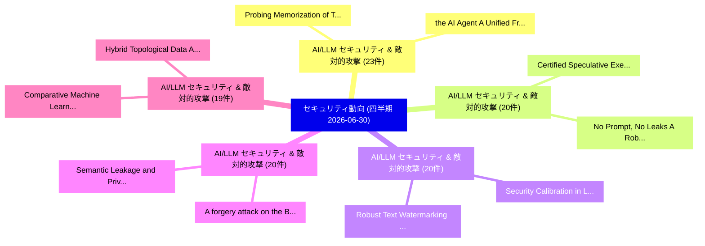

# 🏢 04_quarterly: 四半期エグゼクティブサマリー報告書 (直近90日間: 2026-06-30)

**集計日時**: 2026-06-30 00:00:00 UTC  
**直近90日間の総論文数**: 2856 件  

---

## 💡 四半期セキュリティ動向と研究ロードマップ評価

本日の収集論文（計 2856 件）において、以下の重点セキュリティ領域で活発な研究動向が確認されました：
- **AI/LLM セキュリティ & 敵対的攻撃** (23 件): 注目論文として 「Probing Memorization of Tabula...」、「the AI Agent: A Unified Framew...」 等が発表され、実務防御および攻撃検証の進展が見られます。
- **AI/LLM セキュリティ & 敵対的攻撃** (20 件): 注目論文として 「Certified Speculative Executio...」、「No Prompt, No Leaks: A Robust ...」 等が発表され、実務防御および攻撃検証の進展が見られます。
- **AI/LLM セキュリティ & 敵対的攻撃** (20 件): 注目論文として 「Security Calibration in Large ...」、「Robust Text Watermarking for 大...」 等が発表され、実務防御および攻撃検証の進展が見られます。
- **AI/LLM セキュリティ & 敵対的攻撃** (20 件): 注目論文として 「A forgery attack on the Block....」、「Semantic Leakage and Privacy P...」 等が発表され、実務防御および攻撃検証の進展が見られます。
- **AI/LLM セキュリティ & 敵対的攻撃** (19 件): 注目論文として 「Comparative Machine Learning b...」、「Hybrid Topological Data Analys...」 等が発表され、実務防御および攻撃検証の進展が見られます。

### 🗺️ 四半期脅威ランドスケープ

---

## 📌 四半期セキュリティ論文一覧 (日本語表形式)

| No | arXiv ID | 論文タイトル (日本語訳) | 重要キーワード | 構造化エグゼクティブ要約 (背景・提案・影響) | 脅威分類 | 詳細リンク |
|---|---|---|---|---|---|---|
| 1 | `2606.31023v1` | [Certified Speculative Execution for Untrusted AI Agents（セキュリティ分析論文）](../../okf/papers/2026-06-30/2606.31023.md) | `Certified Speculative Execution`, `Chenyu Zhou`, `Qiliang Jiang` | 【提案】概要 (Overview & Key Finding) 本論文「Certified Speculative Execution for Untrusted AI Agents...。実証評価により経営層・セキュリティ管理者向け推奨アクション (E... | `arXiv` | [arXiv](https://arxiv.org/abs/2606.31023v1) &#124; [OKF](../../okf/papers/2026-06-30/2606.31023.md) |
| 2 | `2606.31066v1` | [Secure-CHG: A Comprehensive Framework for Robust and Fair 連合学習 via Hybrid Defense and Contribution-Aware Trust](../../okf/papers/2026-06-30/2606.31066.md) | `Hybrid Defense`, `Aware Trust`, `Contribution-Aware Trust` | 【提案】概要 (Overview & Key Finding) 本論文「Secure-CHG: A Comprehensive Framework for Robust and Fa...。実証評価により経営層・セキュリティ管理者向け推奨アクション (E... | `arXiv` | [arXiv](https://arxiv.org/abs/2606.31066v1) &#124; [OKF](../../okf/papers/2026-06-30/2606.31066.md) |
| 3 | `2606.31159v1` | [Security Calibration in Large Language Models for Codeの実証研究](../../okf/papers/2026-06-30/2606.31159.md) | `Large Language Models`, `Security Calibration`, `Mohammed Latif Siddiq` | 【提案】概要 (Overview & Key Finding) 本論文「Security Calibration in Large Language Models for Codeの...。実証評価によりSantos - **。 | `arXiv` | [arXiv](https://arxiv.org/abs/2606.31159v1) &#124; [OKF](../../okf/papers/2026-06-30/2606.31159.md) |
| 4 | `2606.31168v1` | [Probe Choice Changes Canary-Memorization Verdicts: Three Post-Hoc Disagreement Case Studies in a Text-Dominant LoRA-Tuned Autoregressive Testbed（セキュリティ分析論文）](../../okf/papers/2026-06-30/2606.31168.md) | `Probe Choice Changes Canary`, `Hoc Disagreement Case Studies`, `Tuned Autoregressive Testbed` | 【提案】概要 (Overview & Key Finding) 本論文「Probe Choice Changes Canary-Memorization Verdicts: Thre...。実証評価により経営層・セキュリティ管理者向け推奨アクション (E... | `arXiv` | [arXiv](https://arxiv.org/abs/2606.31168v1) &#124; [OKF](../../okf/papers/2026-06-30/2606.31168.md) |
| 5 | `2606.31208v1` | [Probing Memorization of Tabular In-Context Learning（セキュリティ分析論文）](../../okf/papers/2026-06-30/2606.31208.md) | `Probing Memorization`, `Context Learning`, `In-Context Learning` | 【提案】概要 (Overview & Key Finding) 本論文「Probing Memorization of Tabular In-Context Learning（セキュ...。実証評価により経営層・セキュリティ管理者向け推奨アクション (E... | `arXiv` | [arXiv](https://arxiv.org/abs/2606.31208v1) &#124; [OKF](../../okf/papers/2026-06-30/2606.31208.md) |
| 6 | `2606.31227v1` | [the AI Agent: A Unified Framework for Multi-Layer Agent Red Teamingのセキュリティ強化](../../okf/papers/2026-06-30/2606.31227.md) | `Multi-Layer Agent`, `Layer Agent Red`, `Layer Agent Red Teaming` | 【提案】概要 (Overview & Key Finding) 本論文「the AI Agent: A Unified Framework for Multi-Layer Agent...。実証評価により経営層・セキュリティ管理者向け推奨アクション (E... | `arXiv` | [arXiv](https://arxiv.org/abs/2606.31227v1) &#124; [OKF](../../okf/papers/2026-06-30/2606.31227.md) |
| 7 | `2606.31272v1` | [The Decomposition Is the Fingerprint: Per-Component Identity for Agent Skills（セキュリティ分析論文）](../../okf/papers/2026-06-30/2606.31272.md) | `Component Identity`, `Agent Skills`, `Per-Component Identity` | 【提案】概要 (Overview & Key Finding) 本論文「The Decomposition Is the Fingerprint: Per-Component Ide...。実証評価により経営層・セキュリティ管理者向け推奨アクション (E... | `arXiv` | [arXiv](https://arxiv.org/abs/2606.31272v1) &#124; [OKF](../../okf/papers/2026-06-30/2606.31272.md) |
| 8 | `2606.31309v1` | [CSO-LLM: Class Subspace Orthogonalization for Post-Training Backdoor Detection and Trigger Inversion in LLMs（セキュリティ分析論文）](../../okf/papers/2026-06-30/2606.31309.md) | `Class Subspace Orthogonalization`, `Training Backdoor Detection`, `Trigger Inversion` | 【提案】概要 (Overview & Key Finding) 本論文「CSO-LLM: Class Subspace Orthogonalization for Post-Trai...。実証評価により経営層・セキュリティ管理者向け推奨アクション (E... | `arXiv` | [arXiv](https://arxiv.org/abs/2606.31309v1) &#124; [OKF](../../okf/papers/2026-06-30/2606.31309.md) |
| 9 | `2606.31345v1` | [Automated High-Precision Extraction and Forensic Verification of Data-Bearing Vector Figures（セキュリティ分析論文）](../../okf/papers/2026-06-30/2606.31345.md) | `Bearing Vector Figures`, `Automated High`, `Precision Extraction` | 【提案】概要 (Overview & Key Finding) 本論文「Automated High-Precision Extraction and Forensic Verifi...。実証評価により経営層・セキュリティ管理者向け推奨アクション (E... | `arXiv` | [arXiv](https://arxiv.org/abs/2606.31345v1) &#124; [OKF](../../okf/papers/2026-06-30/2606.31345.md) |
| 10 | `2606.31370v1` | [Witness Complexity of Short Descriptions: A Cryptographic Perspective（セキュリティ分析論文）](../../okf/papers/2026-06-30/2606.31370.md) | `Witness Complexity`, `Short Descriptions`, `Cryptographic Perspective` | 【提案】概要 (Overview & Key Finding) 本論文「Witness Complexity of Short Descriptions: A Cryptograph...。実証評価によりBuono - **公開日時**: `2026-0... | `arXiv` | [arXiv](https://arxiv.org/abs/2606.31370v1) &#124; [OKF](../../okf/papers/2026-06-30/2606.31370.md) |
| 11 | `2606.31408v1` | [EnclaveX: End-to-End Confidential AI with CPU/GPU TEEs（セキュリティ分析論文）](../../okf/papers/2026-06-30/2606.31408.md) | `End Confidential`, `Robert Schambach`, `Sergei Arnautov` | 【提案】概要 (Overview & Key Finding) 本論文「EnclaveX: End-to-End Confidential AI with CPU/GPU TEEs（...。実証評価により経営層・セキュリティ管理者向け推奨アクション (E... | `arXiv` | [arXiv](https://arxiv.org/abs/2606.31408v1) &#124; [OKF](../../okf/papers/2026-06-30/2606.31408.md) |
| 12 | `2606.31427v1` | [No Prompt, No Leaks: A Robust Generative Steganography Framework via Prompt-Free Diffusion（セキュリティ分析論文）](../../okf/papers/2026-06-30/2606.31427.md) | `Free Diffusion`, `Prompt-Free Diffusion`, `Robust Generative St` | 【提案】概要 (Overview & Key Finding) 本論文「No Prompt, No Leaks: A Robust Generative Steganography ...。実証評価により経営層・セキュリティ管理者向け推奨アクション (E... | `arXiv` | [arXiv](https://arxiv.org/abs/2606.31427v1) &#124; [OKF](../../okf/papers/2026-06-30/2606.31427.md) |
| 13 | `2606.31462v1` | [A forgery attack on the Block.co blockchain-based digital credential certification system（セキュリティ分析論文）](../../okf/papers/2026-06-30/2606.31462.md) | `blockchain-based digital`, `Giacomo Zonneveld`, `Giulia Rafaiani` | 【提案】概要 (Overview & Key Finding) 本論文「A forgery attack on the Block.co blockchain-based digit...。実証評価により経営層・セキュリティ管理者向け推奨アクション (E... | `arXiv` | [arXiv](https://arxiv.org/abs/2606.31462v1) &#124; [OKF](../../okf/papers/2026-06-30/2606.31462.md) |
| 14 | `2606.31557v2` | [CVE-TTP KG: Knowledge Graph Linking Software Vulnerabilities to Attack Behaviors（セキュリティ分析論文）](../../okf/papers/2026-06-30/2606.31557.md) | `Knowledge Graph Linking Software Vulnerabilities`, `CVE-TTP KG`, `Attack Behaviors` | 【提案】概要 (Overview & Key Finding) 本論文「CVE-TTP KG: Knowledge Graph Linking Software Vulnerabil...。実証評価により経営層・セキュリティ管理者向け推奨アクション (E... | `arXiv` | [arXiv](https://arxiv.org/abs/2606.31557v2) &#124; [OKF](../../okf/papers/2026-06-30/2606.31557.md) |
| 15 | `2606.31594v1` | [Comparative Machine Learning based Intrusion Detection in Realistic IoT Networksの分析](../../okf/papers/2026-06-30/2606.31594.md) | `Intrusion Detection`, `Comparative Machine Learning`, `Machine Learning` | 【提案】概要 (Overview & Key Finding) 本論文「Comparative Machine Learning based Intrusion Detection ...。実証評価により経営層・セキュリティ管理者向け推奨アクション (E... | `arXiv` | [arXiv](https://arxiv.org/abs/2606.31594v1) &#124; [OKF](../../okf/papers/2026-06-30/2606.31594.md) |
| 16 | `2606.31601v1` | [Digital signature schemes based on code equivalence and syndrome decoding from restricted errors（セキュリティ分析論文）](../../okf/papers/2026-06-30/2606.31601.md) | `Sarah Arpin`, `Raw Meta`, `Executive Summary` | 【提案】概要 (Overview & Key Finding) 本論文「Digital signature schemes based on code equivalence and...。実証評価により経営層・セキュリティ管理者向け推奨アクション (E... | `arXiv` | [arXiv](https://arxiv.org/abs/2606.31601v1) &#124; [OKF](../../okf/papers/2026-06-30/2606.31601.md) |
| 17 | `2606.31602v2` | [Robust Text Watermarking for 大規模言語モデル via Dual Semantic Embeddings](../../okf/papers/2026-06-30/2606.31602.md) | `Robust Text Watermarking`, `Dual Semantic Embeddings`, `Large Language Models` | 【提案】概要 (Overview & Key Finding) 本論文「Robust Text Watermarking for 大規模言語モデル via Dual Semantic...。実証評価により経営層・セキュリティ管理者向け推奨アクション (E... | `arXiv` | [arXiv](https://arxiv.org/abs/2606.31602v2) &#124; [OKF](../../okf/papers/2026-06-30/2606.31602.md) |
| 18 | `2606.31619v1` | [Hybrid Topological Data Analysis and LSTM Networks for Enhanced Network Intrusion Detection Using CIC-IDS2017 Dataset（セキュリティ分析論文）](../../okf/papers/2026-06-30/2606.31619.md) | `Enhanced Network Intrusion Detection Using`, `CIC-IDS2017 Dataset`, `Bhaskar Ranjan Karn` | 【提案】概要 (Overview & Key Finding) 本論文「Hybrid Topological Data Analysis and LSTM Networks for ...。実証評価により経営層・セキュリティ管理者向け推奨アクション (E... | `arXiv` | [arXiv](https://arxiv.org/abs/2606.31619v1) &#124; [OKF](../../okf/papers/2026-06-30/2606.31619.md) |
| 19 | `2606.31639v1` | [A Lifecycle and Application-Stack Survey of Large Language Model Vulnerabilities: Attacks, Risks, Defenses, and Open Problems（セキュリティ分析論文）](../../okf/papers/2026-06-30/2606.31639.md) | `Large Language Model Vulnerabilities`, `Stack Survey`, `Open Problems` | 【提案】概要 (Overview & Key Finding) 本論文「A Lifecycle and Application-Stack Survey of Large Langu...。実証評価により経営層・セキュリティ管理者向け推奨アクション (E... | `arXiv` | [arXiv](https://arxiv.org/abs/2606.31639v1) &#124; [OKF](../../okf/papers/2026-06-30/2606.31639.md) |
| 20 | `2606.31681v1` | [Exploring Side-Channel Protections in Hardware Implementations of PQC ML-KEM Verification（セキュリティ分析論文）](../../okf/papers/2026-06-30/2606.31681.md) | `Exploring Side`, `Channel Protections`, `Side-Channel Protections` | 【提案】概要 (Overview & Key Finding) 本論文「Exploring サイドチャネル攻撃 Protections in Hardware Implementat...。実証評価により経営層・セキュリティ管理者向け推奨アクション (E... | `arXiv` | [arXiv](https://arxiv.org/abs/2606.31681v1) &#124; [OKF](../../okf/papers/2026-06-30/2606.31681.md) |
| 21 | `2606.31790v1` | [Robocalls: A Worldwide or US-only Problem? Analyzing Spam and Fraud in International Phone Calls（セキュリティ分析論文）](../../okf/papers/2026-06-30/2606.31790.md) | `International Phone Calls`, `Analyzing Spam`, `US-only Problem` | 【提案】Analyzing Spam and Fraud in International Phone Calls ### (日本語題名: Robocalls: A Worldwid...。実証評価により経営層・セキュリティ管理者向け推奨アクション (E... | `arXiv` | [arXiv](https://arxiv.org/abs/2606.31790v1) &#124; [OKF](../../okf/papers/2026-06-30/2606.31790.md) |
| 22 | `2606.31973v1` | [Semantic Leakage and Privacy Preservation in Relay-Assisted Semantic Communications（セキュリティ分析論文）](../../okf/papers/2026-06-30/2606.31973.md) | `Assisted Semantic Communications`, `Semantic Leakage`, `Privacy Preservation` | 【提案】概要 (Overview & Key Finding) 本論文「Semantic Leakage and Privacy Preservation in Relay-Assi...。実証評価により経営層・セキュリティ管理者向け推奨アクション (E... | `arXiv` | [arXiv](https://arxiv.org/abs/2606.31973v1) &#124; [OKF](../../okf/papers/2026-06-30/2606.31973.md) |
| 23 | `2607.00186v1` | [A Non-Line-of-Sight, Multi-Modality-based Side-Channel IP Theft Attack on Additive Manufacturing Using Dual Smartphones（セキュリティ分析論文）](../../okf/papers/2026-06-30/2607.00186.md) | `Additive Manufacturing Using Dual Smartphones`, `Theft Attack`, `Side-Channel IP` | 【提案】概要 (Overview & Key Finding) 本論文「A Non-Line-of-Sight, Multi-Modality-based サイドチャネル攻撃 IP ...。実証評価により経営層・セキュリティ管理者向け推奨アクション (E... | `arXiv` | [arXiv](https://arxiv.org/abs/2607.00186v1) &#124; [OKF](../../okf/papers/2026-06-30/2607.00186.md) |
| 24 | `2607.00213v1` | [Federated Sovereign Transport Protocol (FSTP): Verifiable Coordination Without Disclosure（セキュリティ分析論文）](../../okf/papers/2026-06-30/2607.00213.md) | `Federated Sovereign Transport Protocol`, `Verifiable Coordination Without Disclosure`, `Liz Soto` | 【提案】背景とセキュリティ上の課題 (Background & Problem) 本研究はサイバー脅威環境におけるセキュリティ構造・脆弱性の検証を目的としています。(主要検出項目: ...。実証評価により経営層・セキュリティ管理者向け推奨アクション (E... | `arXiv` | [arXiv](https://arxiv.org/abs/2607.00213v1) &#124; [OKF](../../okf/papers/2026-06-30/2607.00213.md) |
| 25 | `2606.29759v1` | [GoodDiffusion: Proactive Copyright Protection for Diffusion Bridge Models via Learnable Sample-specific Signatures（セキュリティ分析論文）](../../okf/papers/2026-06-29/2606.29759.md) | `Proactive Copyright Protection`, `Diffusion Bridge Models`, `Learnable Sample` | 【提案】概要 (Overview & Key Finding) 本論文「GoodDiffusion: Proactive Copyright Protection for Diffu...。実証評価により経営層・セキュリティ管理者向け推奨アクション (E... | `arXiv` | [arXiv](https://arxiv.org/abs/2606.29759v1) &#124; [OKF](../../okf/papers/2026-06-29/2606.29759.md) |
| 26 | `2606.29797v1` | [Multi-Level Distributional Entropy for Explainable Network Intrusion Detection（セキュリティ分析論文）](../../okf/papers/2026-06-29/2606.29797.md) | `Explainable Network Intrusion Detection`, `Level Distributional Entropy`, `Multi-Level Distributional` | 【提案】概要 (Overview & Key Finding) 本論文「Multi-Level Distributional Entropy for Explainable Netw...。実証評価により経営層・セキュリティ管理者向け推奨アクション (E... | `arXiv` | [arXiv](https://arxiv.org/abs/2606.29797v1) &#124; [OKF](../../okf/papers/2026-06-29/2606.29797.md) |
| 27 | `2606.29807v1` | [Rethinking Forgery Attacks on Semantic Watermarks in Black-Box Settings: A Geometric Distortion Perspective（セキュリティ分析論文）](../../okf/papers/2026-06-29/2606.29807.md) | `Rethinking Forgery Attacks`, `Geometric Distortion Perspective`, `Semantic Watermarks` | 【提案】概要 (Overview & Key Finding) 本論文「Rethinking Forgery Attacks on Semantic Watermarks in Bl...。実証評価により経営層・セキュリティ管理者向け推奨アクション (E... | `arXiv` | [arXiv](https://arxiv.org/abs/2606.29807v1) &#124; [OKF](../../okf/papers/2026-06-29/2606.29807.md) |
| 28 | `2606.29826v1` | [Rethinking Collaborative Trust for Verifiably Decentralized Blockchain Systems（セキュリティ分析論文）](../../okf/papers/2026-06-29/2606.29826.md) | `Verifiably Decentralized Blockchain Systems`, `Rethinking Collaborative Trust`, `Shaileshh Bojja Venkatakrishnan` | 【提案】概要 (Overview & Key Finding) 本論文「Rethinking Collaborative Trust for Verifiably Decentral...。実証評価により経営層・セキュリティ管理者向け推奨アクション (E... | `arXiv` | [arXiv](https://arxiv.org/abs/2606.29826v1) &#124; [OKF](../../okf/papers/2026-06-29/2606.29826.md) |
| 29 | `2606.29835v1` | [A Sieve-Accelerated Quadrature Method for Exact Privacy Accounting in the 2020 U.S. Decennial Census（セキュリティ分析論文）](../../okf/papers/2026-06-29/2606.29835.md) | `Exact Privacy Accounting`, `Sieve-Accelerated Quadrature`, `Decennial Census` | 【提案】Decennial Census ### (日本語題名: A Sieve-Accelerated Quadrature Method for Exact Privacy Ac...。実証評価により経営層・セキュリティ管理者向け推奨アクション (E... | `arXiv` | [arXiv](https://arxiv.org/abs/2606.29835v1) &#124; [OKF](../../okf/papers/2026-06-29/2606.29835.md) |
| 30 | `2606.29962v1` | [BPBO: Blindness-Preserving Brickwork Optimization by Certified Region Resynthesis（セキュリティ分析論文）](../../okf/papers/2026-06-29/2606.29962.md) | `Preserving Brickwork Optimization`, `Certified Region Resynthesis`, `Blindness-Preserving Brickwork` | 【提案】概要 (Overview & Key Finding) 本論文「BPBO: Blindness-Preserving Brickwork Optimization by Ce...。実証評価により経営層・セキュリティ管理者向け推奨アクション (E... | `arXiv` | [arXiv](https://arxiv.org/abs/2606.29962v1) &#124; [OKF](../../okf/papers/2026-06-29/2606.29962.md) |
| 31 | `2606.29963v2` | [Explainability-Aware Frustum Attack: Exposing Structural Vulnerabilities in LiDAR-Based 3D Object Detectors（セキュリティ分析論文）](../../okf/papers/2026-06-29/2606.29963.md) | `Aware Frustum Attack`, `Exposing Structural Vulnerabilities`, `Explainability-Aware Frustum` | 【提案】概要 (Overview & Key Finding) 本論文「Explainability-Aware Frustum Attack: Exposing Structura...。実証評価により経営層・セキュリティ管理者向け推奨アクション (E... | `arXiv` | [arXiv](https://arxiv.org/abs/2606.29963v2) &#124; [OKF](../../okf/papers/2026-06-29/2606.29963.md) |
| 32 | `2606.29981v1` | [Hephaestus: Toward a サイバーセキュリティ AI Scientist](../../okf/papers/2026-06-29/2606.29981.md) | `Jiaqi Li`, `Yang Zhao`, `Wen Lu` | 【提案】概要 (Overview & Key Finding) 本論文「Hephaestus: Toward a サイバーセキュリティ AI Scientist」（原題: Hepha...。実証評価により経営層・セキュリティ管理者向け推奨アクション (E... | `arXiv` | [arXiv](https://arxiv.org/abs/2606.29981v1) &#124; [OKF](../../okf/papers/2026-06-29/2606.29981.md) |
| 33 | `2606.30081v1` | [Discard the Dross and Select the Essential: Pre-query Sample Selection for Black-box Membership Inference Attacks（セキュリティ分析論文）](../../okf/papers/2026-06-29/2606.30081.md) | `Membership Inference Attacks`, `Sample Selection`, `Pre-query Sample` | 【提案】概要 (Overview & Key Finding) 本論文「Discard the Dross and Select the Essential: Pre-query S...。実証評価により経営層・セキュリティ管理者向け推奨アクション (E... | `arXiv` | [arXiv](https://arxiv.org/abs/2606.30081v1) &#124; [OKF](../../okf/papers/2026-06-29/2606.30081.md) |
| 34 | `2606.30119v1` | [On the Internet, Nobody Knows You're an LLM Bot: Unmasking Web Agents with Multi-Layer Fingerprinting（セキュリティ分析論文）](../../okf/papers/2026-06-29/2606.30119.md) | `Unmasking Web Agents`, `Layer Fingerprinting`, `Multi-Layer Fingerprinting` | 【提案】概要 (Overview & Key Finding) 本論文「On the Internet, Nobody Knows You're an LLM Bot: Unmask...。実証評価により経営層・セキュリティ管理者向け推奨アクション (E... | `arXiv` | [arXiv](https://arxiv.org/abs/2606.30119v1) &#124; [OKF](../../okf/papers/2026-06-29/2606.30119.md) |
| 35 | `2606.30153v1` | [The Spectrum Strikes Back: Infrared POV Attacks on Traffic Sign Classification（セキュリティ分析論文）](../../okf/papers/2026-06-29/2606.30153.md) | `Traffic Sign Classification`, `Maximilian Luedecke`, `Mohammad Hamad` | 【提案】概要 (Overview & Key Finding) 本論文「The Spectrum Strikes Back: Infrared POV Attacks on Traf...。実証評価により経営層・セキュリティ管理者向け推奨アクション (E... | `arXiv` | [arXiv](https://arxiv.org/abs/2606.30153v1) &#124; [OKF](../../okf/papers/2026-06-29/2606.30153.md) |
| 36 | `2606.30261v1` | [Robust secret storage in networks（セキュリティ分析論文）](../../okf/papers/2026-06-29/2606.30261.md) | `Raw Meta`, `Executive Summary`, `Key Finding` | 【提案】概要 (Overview & Key Finding) 本論文「Robust secret storage in networks（セキュリティ分析論文）」（原題: Robu...。実証評価により経営層・セキュリティ管理者向け推奨アクション (E... | `arXiv` | [arXiv](https://arxiv.org/abs/2606.30261v1) &#124; [OKF](../../okf/papers/2026-06-29/2606.30261.md) |
| 37 | `2606.30263v1` | [Defending Against Harmful Supervision Hidden in Benign Samples（セキュリティ分析論文）](../../okf/papers/2026-06-29/2606.30263.md) | `Benign Samples`, `Yibo Yang`, `Dandan Guo` | 【提案】概要 (Overview & Key Finding) 本論文「Defending Against Harmful Supervision Hidden in Benign ...。実証評価により経営層・セキュリティ管理者向け推奨アクション (E... | `arXiv` | [arXiv](https://arxiv.org/abs/2606.30263v1) &#124; [OKF](../../okf/papers/2026-06-29/2606.30263.md) |
| 38 | `2606.30281v1` | [Quantum Lazy Sampling and Path Recording for Any Group（セキュリティ分析論文）](../../okf/papers/2026-06-29/2606.30281.md) | `Quantum Lazy Sampling`, `Path Recording`, `Ben Foxman` | 【提案】概要 (Overview & Key Finding) 本論文「量子 Lazy Sampling and Path Recording for Any Group（セキュリテ...。実証評価により経営層・セキュリティ管理者向け推奨アクション (E... | `arXiv` | [arXiv](https://arxiv.org/abs/2606.30281v1) &#124; [OKF](../../okf/papers/2026-06-29/2606.30281.md) |
| 39 | `2606.30373v1` | [Your Space is My Zone: Demystifying the Security Risks of AI-Powered Applications on Pre-Trained Model Hubs（セキュリティ分析論文）](../../okf/papers/2026-06-29/2606.30373.md) | `Trained Model Hubs`, `Security Risks`, `Powered Applications` | 【提案】概要 (Overview & Key Finding) 本論文「Your Space is My Zone: Demystifying the Security Risks ...。実証評価により経営層・セキュリティ管理者向け推奨アクション (E... | `arXiv` | [arXiv](https://arxiv.org/abs/2606.30373v1) &#124; [OKF](../../okf/papers/2026-06-29/2606.30373.md) |
| 40 | `2606.30423v1` | [Proofs of Ownership for Machine Learning Models（セキュリティ分析論文）](../../okf/papers/2026-06-29/2606.30423.md) | `Machine Learning Models`, `Ran Canetti`, `Shafi Goldwasser` | 【提案】概要 (Overview & Key Finding) 本論文「Proofs of Ownership for Machine Learning Models（セキュリティ分...。実証評価により経営層・セキュリティ管理者向け推奨アクション (E... | `arXiv` | [arXiv](https://arxiv.org/abs/2606.30423v1) &#124; [OKF](../../okf/papers/2026-06-29/2606.30423.md) |
| 41 | `2606.30430v1` | [CAN We Trust Your Results? A Cross-Dataset Study of Automotive IDS Evaluation（セキュリティ分析論文）](../../okf/papers/2026-06-29/2606.30430.md) | `Beatrix Koltai`, `Gergely Acs`, `Andras Gazdag` | 【提案】A Cross-Dataset Study of Automotive IDS Evaluation ### (日本語題名: CAN We Trust Your Results?。実証評価によりA Cross-Dataset Study of A... | `arXiv` | [arXiv](https://arxiv.org/abs/2606.30430v1) &#124; [OKF](../../okf/papers/2026-06-29/2606.30430.md) |
| 42 | `2606.30479v1` | [COHORT: Collaborative Orchestration for Hardening via Offensive Replay on Emulated Topologies（セキュリティ分析論文）](../../okf/papers/2026-06-29/2606.30479.md) | `Collaborative Orchestration`, `Offensive Replay`, `Emulated Topologies` | 【提案】概要 (Overview & Key Finding) 本論文「COHORT: Collaborative Orchestration for Hardening via O...。実証評価により経営層・セキュリティ管理者向け推奨アクション (E... | `arXiv` | [arXiv](https://arxiv.org/abs/2606.30479v1) &#124; [OKF](../../okf/papers/2026-06-29/2606.30479.md) |
| 43 | `2606.30493v1` | [Between Zeros and Ones: Behavioral Characterization Beyond Binary Labeling Across Public ICS Datasets（セキュリティ分析論文）](../../okf/papers/2026-06-29/2606.30493.md) | `Behavioral Characterization Beyond Binary Labeling Across Public`, `Behavioral Characterization Beyond Binary`, `Vyron Kampourakis` | 【提案】概要 (Overview & Key Finding) 本論文「Between Zeros and Ones: Behavioral Characterization Bey...。実証評価により経営層・セキュリティ管理者向け推奨アクション (E... | `arXiv` | [arXiv](https://arxiv.org/abs/2606.30493v1) &#124; [OKF](../../okf/papers/2026-06-29/2606.30493.md) |
| 44 | `2606.30542v1` | [A Lightweight Post-Quantum Authentication Framework for 5G Base Station Bootstrapping（セキュリティ分析論文）](../../okf/papers/2026-06-29/2606.30542.md) | `Base Station Bootstrapping`, `Lightweight Post`, `Post-Quantum Authentication` | 【提案】概要 (Overview & Key Finding) 本論文「A Lightweight Post-量子 Authentication Framework for 5G B...。実証評価により経営層・セキュリティ管理者向け推奨アクション (E... | `arXiv` | [arXiv](https://arxiv.org/abs/2606.30542v1) &#124; [OKF](../../okf/papers/2026-06-29/2606.30542.md) |
| 45 | `2606.30564v1` | [The Role of Vehicles in Digital Forensic Investigations: A Structured Synthesis of Digital Vehicle Forensic Characteristics（セキュリティ分析論文）](../../okf/papers/2026-06-29/2606.30564.md) | `Digital Forensic Investigations`, `Digital Vehicle Forensic Characteristics`, `Structured Synthesis` | 【提案】概要 (Overview & Key Finding) 本論文「The Role of Vehicles in Digital Forensic Investigations...。実証評価により経営層・セキュリティ管理者向け推奨アクション (E... | `arXiv` | [arXiv](https://arxiv.org/abs/2606.30564v1) &#124; [OKF](../../okf/papers/2026-06-29/2606.30564.md) |
| 46 | `2606.30566v2` | [Forensic Trajectory Signatures for Agent Memory Poisoning Detection（セキュリティ分析論文）](../../okf/papers/2026-06-29/2606.30566.md) | `Agent Memory Poisoning Detection`, `Forensic Trajectory Signatures`, `Jun Wen Leong` | 【提案】概要 (Overview & Key Finding) 本論文「Forensic Trajectory Signatures for Agent Memory Poisoni...。実証評価により経営層・セキュリティ管理者向け推奨アクション (E... | `arXiv` | [arXiv](https://arxiv.org/abs/2606.30566v2) &#124; [OKF](../../okf/papers/2026-06-29/2606.30566.md) |
| 47 | `2606.30572v1` | [A Multi-task Mixture of Experts Framework for Malware Classification, Packing Detection, and Family Attribution（セキュリティ分析論文）](../../okf/papers/2026-06-29/2606.30572.md) | `Malware Classification`, `Packing Detection`, `Family Attribution` | 【提案】概要 (Overview & Key Finding) 本論文「A Multi-task Mixture of Experts Framework for マルウェア Cla...。実証評価により経営層・セキュリティ管理者向け推奨アクション (E... | `arXiv` | [arXiv](https://arxiv.org/abs/2606.30572v1) &#124; [OKF](../../okf/papers/2026-06-29/2606.30572.md) |
| 48 | `2606.30586v1` | [A Hybrid Framework For Crypto-Ransomware Detection In Enterprise Shared Storage（セキュリティ分析論文）](../../okf/papers/2026-06-29/2606.30586.md) | `Crypto-Ransomware Detection`, `Mohammad Jabed Morshed Chowdhury`, `Abdun Naser Mahmood` | 【提案】概要 (Overview & Key Finding) 本論文「A Hybrid Framework For Crypto-ランサムウェア Detection In Ente...。実証評価により経営層・セキュリティ管理者向け推奨アクション (E... | `arXiv` | [arXiv](https://arxiv.org/abs/2606.30586v1) &#124; [OKF](../../okf/papers/2026-06-29/2606.30586.md) |
| 49 | `2606.30587v1` | [Words Speak Louder Than Code: Investigating Cognitive Heuristics in LLM-Based Code 脆弱性検出](../../okf/papers/2026-06-29/2606.30587.md) | `Investigating Cognitive Heuristics`, `LLM-Based Code`, `Based Code Vulnerability Detection` | 【提案】概要 (Overview & Key Finding) 本論文「Words Speak Louder Than Code: Investigating Cognitive H...。実証評価により経営層・セキュリティ管理者向け推奨アクション (E... | `arXiv` | [arXiv](https://arxiv.org/abs/2606.30587v1) &#124; [OKF](../../okf/papers/2026-06-29/2606.30587.md) |
| 50 | `2606.30595v1` | [Wireless Backdoor Attack and Defense for Semantic Communications over Multiple Access Channel（セキュリティ分析論文）](../../okf/papers/2026-06-29/2606.30595.md) | `Wireless Backdoor Attack`, `Multiple Access Channel`, `Semantic Communications` | 【提案】概要 (Overview & Key Finding) 本論文「Wireless Backdoor Attack and Defense for Semantic Commu...。実証評価により経営層・セキュリティ管理者向け推奨アクション (E... | `arXiv` | [arXiv](https://arxiv.org/abs/2606.30595v1) &#124; [OKF](../../okf/papers/2026-06-29/2606.30595.md) |
| 51 | `2606.30602v1` | [MESA: Prioritizing Vulnerable Communication Channels for Multi-Agent Systemsのセキュリティ強化](../../okf/papers/2026-06-29/2606.30602.md) | `Prioritizing Vulnerable Communication Channels`, `Securing Multi`, `Agent Systems` | 【提案】概要 (Overview & Key Finding) 本論文「MESA: Prioritizing Vulnerable Communication Channels fo...。実証評価により経営層・セキュリティ管理者向け推奨アクション (E... | `arXiv` | [arXiv](https://arxiv.org/abs/2606.30602v1) &#124; [OKF](../../okf/papers/2026-06-29/2606.30602.md) |
| 52 | `2606.30636v1` | [Authentication in Quantum Networks（セキュリティ分析論文）](../../okf/papers/2026-06-29/2606.30636.md) | `Quantum Networks`, `Christopher Battarbee`, `Suchetana Goswami` | 【提案】概要 (Overview & Key Finding) 本論文「Authentication in 量子 Networks（セキュリティ分析論文）」（原題: Authenti...。実証評価により経営層・セキュリティ管理者向け推奨アクション (E... | `arXiv` | [arXiv](https://arxiv.org/abs/2606.30636v1) &#124; [OKF](../../okf/papers/2026-06-29/2606.30636.md) |
| 53 | `2606.30701v1` | [An AI-Based Solution for Secure Service Provisioning in IoT（セキュリティ分析論文）](../../okf/papers/2026-06-29/2606.30701.md) | `Secure Service Provisioning`, `Based Solution`, `AI-Based Solution` | 【提案】概要 (Overview & Key Finding) 本論文「An AI-Based Solution for Secure Service Provisioning in...。実証評価により経営層・セキュリティ管理者向け推奨アクション (E... | `arXiv` | [arXiv](https://arxiv.org/abs/2606.30701v1) &#124; [OKF](../../okf/papers/2026-06-29/2606.30701.md) |
| 54 | `2606.30755v1` | [Understanding and Evaluating Claw-like Agent Security Through a Computer-Systems Lens（セキュリティ分析論文）](../../okf/papers/2026-06-29/2606.30755.md) | `Evaluating Claw`, `Systems Lens`, `Claw-like Agent` | 【提案】概要 (Overview & Key Finding) 本論文「Understanding and Evaluating Claw-like Agent Security T...。実証評価により経営層・セキュリティ管理者向け推奨アクション (E... | `arXiv` | [arXiv](https://arxiv.org/abs/2606.30755v1) &#124; [OKF](../../okf/papers/2026-06-29/2606.30755.md) |
| 55 | `2606.30783v1` | [Security--Fidelity Tradeoffs: The Hidden Cost of Prompt Injection Defense（セキュリティ分析論文）](../../okf/papers/2026-06-29/2606.30783.md) | `Prompt Injection Defense`, `Fidelity Tradeoffs`, `Mitchell Hermon` | 【提案】概要 (Overview & Key Finding) 本論文「Security--Fidelity Tradeoffs: The Hidden Cost of プロンプトイ...。実証評価により経営層・セキュリティ管理者向け推奨アクション (E... | `arXiv` | [arXiv](https://arxiv.org/abs/2606.30783v1) &#124; [OKF](../../okf/papers/2026-06-29/2606.30783.md) |
| 56 | `2606.30788v1` | [Revocable Learned State via Process Sidecars（セキュリティ分析論文）](../../okf/papers/2026-06-29/2606.30788.md) | `Revocable Learned State`, `Process Sidecars`, `John Sweeney` | 【提案】概要 (Overview & Key Finding) 本論文「Revocable Learned State via Process Sidecars（セキュリティ分析論文...。実証評価により経営層・セキュリティ管理者向け推奨アクション (E... | `arXiv` | [arXiv](https://arxiv.org/abs/2606.30788v1) &#124; [OKF](../../okf/papers/2026-06-29/2606.30788.md) |
| 57 | `2606.30807v1` | [Off the Rails: Hijacking the Scoring Head in Generative End-to-End Driving Planners with Safety-Violating Adversarial Perturbations（セキュリティ分析論文）](../../okf/papers/2026-06-29/2606.30807.md) | `End Driving Planners`, `Violating Adversarial Perturbations`, `Scoring Head` | 【提案】概要 (Overview & Key Finding) 本論文「Off the Rails: Hijacking the Scoring Head in Generative...。実証評価により経営層・セキュリティ管理者向け推奨アクション (E... | `arXiv` | [arXiv](https://arxiv.org/abs/2606.30807v1) &#124; [OKF](../../okf/papers/2026-06-29/2606.30807.md) |
| 58 | `2606.30819v1` | [AI-Generated PowerShell Malware: An Experimental Framework and Dataset（セキュリティ分析論文）](../../okf/papers/2026-06-29/2606.30819.md) | `AI-Generated PowerShell`, `Luciano Pianese`, `Vittorio Orbinato` | 【提案】概要 (Overview & Key Finding) 本論文「AI-Generated PowerShell マルウェア: An Experimental Framewor...。実証評価により経営層・セキュリティ管理者向け推奨アクション (E... | `arXiv` | [arXiv](https://arxiv.org/abs/2606.30819v1) &#124; [OKF](../../okf/papers/2026-06-29/2606.30819.md) |
| 59 | `2606.30899v1` | [Curvature-Guided Module Localization for Low-Rank Detoxification of Backdoored 大規模言語モデル](../../okf/papers/2026-06-29/2606.30899.md) | `Guided Module Localization`, `Curvature-Guided Module`, `Rank Detoxification` | 【提案】概要 (Overview & Key Finding) 本論文「Curvature-Guided Module Localization for Low-Rank Detox...。実証評価により経営層・セキュリティ管理者向け推奨アクション (E... | `arXiv` | [arXiv](https://arxiv.org/abs/2606.30899v1) &#124; [OKF](../../okf/papers/2026-06-29/2606.30899.md) |
| 60 | `2606.29177v1` | [Syntactic Separation Implies Computational Indistinguishability: An Abstract Obstruction Theorem（セキュリティ分析論文）](../../okf/papers/2026-06-28/2606.29177.md) | `Syntactic Separation Implies Computational Indistinguishability`, `Syntactic Separation Implies Computational Indistinguishab`, `Raw Meta` | 【提案】概要 (Overview & Key Finding) 本論文「Syntactic Separation Implies Computational Indistinguis...。実証評価により経営層・セキュリティ管理者向け推奨アクション (E... | `arXiv` | [arXiv](https://arxiv.org/abs/2606.29177v1) &#124; [OKF](../../okf/papers/2026-06-28/2606.29177.md) |
| 61 | `2606.29239v2` | [Breaking the Rounding Trap: LLMs against Quantization-Conditioned Backdoorsのセキュリティ強化](../../okf/papers/2026-06-28/2606.29239.md) | `Rounding Trap`, `Conditioned Backdoors`, `Quantization-Conditioned Backdoors` | 【提案】概要 (Overview & Key Finding) 本論文「Breaking the Rounding Trap: LLMs against Quantization-C...。実証評価により経営層・セキュリティ管理者向け推奨アクション (E... | `arXiv` | [arXiv](https://arxiv.org/abs/2606.29239v2) &#124; [OKF](../../okf/papers/2026-06-28/2606.29239.md) |
| 62 | `2606.29279v1` | [Manufactured Confidence: How Memory Consolidation Turns Hearsay into Confident Facts（セキュリティ分析論文）](../../okf/papers/2026-06-28/2606.29279.md) | `Manufactured Confidence`, `Confident Facts`, `Alex Kwon` | 【提案】概要 (Overview & Key Finding) 本論文「Manufactured Confidence: How Memory Consolidation Turns...。実証評価により経営層・セキュリティ管理者向け推奨アクション (E... | `arXiv` | [arXiv](https://arxiv.org/abs/2606.29279v1) &#124; [OKF](../../okf/papers/2026-06-28/2606.29279.md) |
| 63 | `2606.29325v1` | [Generic Number-of-Copies Amplification for Pseudorandom States（セキュリティ分析論文）](../../okf/papers/2026-06-28/2606.29325.md) | `Generic Number`, `Copies Amplification`, `Pseudorandom States` | 【提案】概要 (Overview & Key Finding) 本論文「Generic Number-of-Copies Amplification for Pseudorandom...。実証評価により経営層・セキュリティ管理者向け推奨アクション (E... | `arXiv` | [arXiv](https://arxiv.org/abs/2606.29325v1) &#124; [OKF](../../okf/papers/2026-06-28/2606.29325.md) |
| 64 | `2606.29389v1` | [Exploring the Cryptographic Limits of Transformer Networks（セキュリティ分析論文）](../../okf/papers/2026-06-28/2606.29389.md) | `Cryptographic Limits`, `Transformer Networks`, `Stefan Domunco` | 【提案】概要 (Overview & Key Finding) 本論文「Exploring the Cryptographic Limits of Transformer Netwo...。実証評価により経営層・セキュリティ管理者向け推奨アクション (E... | `arXiv` | [arXiv](https://arxiv.org/abs/2606.29389v1) &#124; [OKF](../../okf/papers/2026-06-28/2606.29389.md) |
| 65 | `2606.29393v1` | [The Role of Online Forums in Developer Understanding of Privacy Law -- A Reddit Case Study（セキュリティ分析論文）](../../okf/papers/2026-06-28/2606.29393.md) | `Online Forums`, `Developer Understanding`, `Privacy Law` | 【提案】概要 (Overview & Key Finding) 本論文「The Role of Online Forums in Developer Understanding of...。実証評価により経営層・セキュリティ管理者向け推奨アクション (E... | `arXiv` | [arXiv](https://arxiv.org/abs/2606.29393v1) &#124; [OKF](../../okf/papers/2026-06-28/2606.29393.md) |
| 66 | `2606.29417v1` | [Bit-ViP: Leveraging Bit-planes to Preserve Visual Privacy in Images through Obfuscation（セキュリティ分析論文）](../../okf/papers/2026-06-28/2606.29417.md) | `Preserve Visual Privacy`, `Leveraging Bit`, `Vishesh Kumar Tanwar` | 【提案】概要 (Overview & Key Finding) 本論文「Bit-ViP: Leveraging Bit-planes to Preserve Visual Priva...。実証評価により経営層・セキュリティ管理者向け推奨アクション (E... | `arXiv` | [arXiv](https://arxiv.org/abs/2606.29417v1) &#124; [OKF](../../okf/papers/2026-06-28/2606.29417.md) |
| 67 | `2606.29441v1` | [Closing the Activation-Cone Blind Spot: Response-Time Probing and Unified Defense（セキュリティ分析論文）](../../okf/papers/2026-06-28/2606.29441.md) | `Cone Blind Spot`, `Time Probing`, `Unified Defense` | 【提案】概要 (Overview & Key Finding) 本論文「Closing the Activation-Cone Blind Spot: Response-Time P...。実証評価により経営層・セキュリティ管理者向け推奨アクション (E... | `arXiv` | [arXiv](https://arxiv.org/abs/2606.29441v1) &#124; [OKF](../../okf/papers/2026-06-28/2606.29441.md) |
| 68 | `2606.29451v1` | [The Platonic Defense: Backdoor Defense for Self-Supervised Encoders in the Era of Large Scale Pre-training（セキュリティ分析論文）](../../okf/papers/2026-06-28/2606.29451.md) | `Large Scale Pre`, `Backdoor Defense`, `Supervised Encoders` | 【提案】概要 (Overview & Key Finding) 本論文「The Platonic Defense: Backdoor Defense for Self-Supervi...。実証評価により経営層・セキュリティ管理者向け推奨アクション (E... | `arXiv` | [arXiv](https://arxiv.org/abs/2606.29451v1) &#124; [OKF](../../okf/papers/2026-06-28/2606.29451.md) |
| 69 | `2606.29484v2` | [The Calibrated Deepfake Trust Score (CDTS): Competence-Coupled Trust Degradation Across Deepfake Detectors（セキュリティ分析論文）](../../okf/papers/2026-06-28/2606.29484.md) | `Coupled Trust Degradation Across Deepfake Detectors`, `Competence-Coupled Trust`, `Md Anas Biswas` | 【提案】概要 (Overview & Key Finding) 本論文「The Calibrated Deepfake Trust Score (CDTS): Competence-...。実証評価により経営層・セキュリティ管理者向け推奨アクション (E... | `arXiv` | [arXiv](https://arxiv.org/abs/2606.29484v2) &#124; [OKF](../../okf/papers/2026-06-28/2606.29484.md) |
| 70 | `2606.29504v1` | [Empirical Evaluation of Multi-Modal Touch Detection in Over-the-Shoulder Video Surveillance（セキュリティ分析論文）](../../okf/papers/2026-06-28/2606.29504.md) | `Modal Touch Detection`, `Shoulder Video Surveillance`, `Multi-Modal Touch` | 【提案】概要 (Overview & Key Finding) 本論文「Empirical Evaluation of Multi-Modal Touch Detection in ...。実証評価により経営層・セキュリティ管理者向け推奨アクション (E... | `arXiv` | [arXiv](https://arxiv.org/abs/2606.29504v1) &#124; [OKF](../../okf/papers/2026-06-28/2606.29504.md) |
| 71 | `2606.29506v1` | [Benchmark AUC Is Not Deployable Reliability: A Cross-Dataset Audit of Off-the-Shelf Features for Surveillance Video Anomaly Detection（セキュリティ分析論文）](../../okf/papers/2026-06-28/2606.29506.md) | `Surveillance Video Anomaly Detection`, `Dataset Audit`, `Shelf Features` | 【提案】背景とセキュリティ上の課題 (Background & Problem) 本研究はサイバー脅威環境におけるセキュリティ構造・脆弱性の検証を目的としています。(主要検出項目: ...。実証評価により経営層・セキュリティ管理者向け推奨アクション (E... | `arXiv` | [arXiv](https://arxiv.org/abs/2606.29506v1) &#124; [OKF](../../okf/papers/2026-06-28/2606.29506.md) |
| 72 | `2606.29567v1` | [SurrogateShield: Beyond Redaction for High-Utility, Privacy-Preserving LLM Interactions（セキュリティ分析論文）](../../okf/papers/2026-06-28/2606.29567.md) | `Beyond Redaction`, `Privacy-Preserving LLM`, `Sherwin Vishesh Jathanna` | 【提案】概要 (Overview & Key Finding) 本論文「SurrogateShield: Beyond Redaction for High-Utility, Pri...。実証評価により経営層・セキュリティ管理者向け推奨アクション (E... | `arXiv` | [arXiv](https://arxiv.org/abs/2606.29567v1) &#124; [OKF](../../okf/papers/2026-06-28/2606.29567.md) |
| 73 | `2606.29602v1` | [An Empirical Evaluation of Prompt Injection Vulnerabilities in 大規模言語モデル Across Multilingual and Obfuscated Attack Scenarios](../../okf/papers/2026-06-28/2606.29602.md) | `Prompt Injection Vulnerabilities`, `Obfuscated Attack Scenarios`, `Large Language Models Across Multilingual` | 【提案】概要 (Overview & Key Finding) 本論文「An Empirical Evaluation of プロンプトインジェクション Vulnerabilitie...。実証評価により経営層・セキュリティ管理者向け推奨アクション (E... | `arXiv` | [arXiv](https://arxiv.org/abs/2606.29602v1) &#124; [OKF](../../okf/papers/2026-06-28/2606.29602.md) |
| 74 | `2606.28666v1` | [Why Trust Your Agent? Empirical Security Gains from TRiSM-Guided Agentic Workflows in Healthcare（セキュリティ分析論文）](../../okf/papers/2026-06-27/2606.28666.md) | `Empirical Security Gains`, `Guided Agentic Workflows`, `TRiSM-Guided Agentic` | 【提案】Empirical Security Gains from TRiSM-Guided Agentic Workflows in Healthcare ### (日本語題名: ...。実証評価により経営層・セキュリティ管理者向け推奨アクション (E... | `arXiv` | [arXiv](https://arxiv.org/abs/2606.28666v1) &#124; [OKF](../../okf/papers/2026-06-27/2606.28666.md) |
| 75 | `2606.28679v1` | [Capability Gates Are Not Authorization: Confused-Deputy Failures in LLM Agent Frameworks（セキュリティ分析論文）](../../okf/papers/2026-06-27/2606.28679.md) | `Deputy Failures`, `Agent Frameworks`, `Confused-Deputy Failures` | 【提案】背景とセキュリティ上の課題 (Background & Problem) 本研究はサイバー脅威環境におけるセキュリティ構造・脆弱性の検証を目的としています。(主要検出項目: ...。実証評価により経営層・セキュリティ管理者向け推奨アクション (E... | `arXiv` | [arXiv](https://arxiv.org/abs/2606.28679v1) &#124; [OKF](../../okf/papers/2026-06-27/2606.28679.md) |
| 76 | `2606.28690v1` | [Formal Security Agent Protocol Compositionの分析](../../okf/papers/2026-06-27/2606.28690.md) | `Formal Security Agent Protocol`, `Agent Protocol Composition`, `Shenghan Zheng` | 【提案】概要 (Overview & Key Finding) 本論文「Formal Security Agent Protocol Compositionの分析」（原題: Form...。実証評価により経営層・セキュリティ管理者向け推奨アクション (E... | `arXiv` | [arXiv](https://arxiv.org/abs/2606.28690v1) &#124; [OKF](../../okf/papers/2026-06-27/2606.28690.md) |
| 77 | `2606.28812v1` | [Extending Detection Engineering to Digital Forensics: The Velociraptor Unified Detection-Forensics Methodology（セキュリティ分析論文）](../../okf/papers/2026-06-27/2606.28812.md) | `Extending Detection Engineering`, `Digital Forensics`, `Forensics Methodology` | 【提案】概要 (Overview & Key Finding) 本論文「Extending Detection Engineering to Digital Forensics: T...。実証評価により経営層・セキュリティ管理者向け推奨アクション (E... | `arXiv` | [arXiv](https://arxiv.org/abs/2606.28812v1) &#124; [OKF](../../okf/papers/2026-06-27/2606.28812.md) |
| 78 | `2606.28870v1` | [Understanding Binary Code Similarity for Real-World 脆弱性検出: A Large-Scale Empirical Study](../../okf/papers/2026-06-27/2606.28870.md) | `Understanding Binary Code Similarity`, `Large-Scale Empirical`, `World Vulnerability Detection` | 【提案】概要 (Overview & Key Finding) 本論文「Understanding Binary Code Similarity for Real-World 脆弱性...。実証評価により経営層・セキュリティ管理者向け推奨アクション (E... | `arXiv` | [arXiv](https://arxiv.org/abs/2606.28870v1) &#124; [OKF](../../okf/papers/2026-06-27/2606.28870.md) |
| 79 | `2606.28929v1` | [サイバーセキュリティ is the True Frontier for Generative AI Success or Failure](../../okf/papers/2026-06-27/2606.28929.md) | `True Frontier`, `Edward Raff`, `Maor Ashkenazi` | 【提案】概要 (Overview & Key Finding) 本論文「サイバーセキュリティ is the True Frontier for Generative AI Succe...。実証評価により経営層・セキュリティ管理者向け推奨アクション (E... | `arXiv` | [arXiv](https://arxiv.org/abs/2606.28929v1) &#124; [OKF](../../okf/papers/2026-06-27/2606.28929.md) |
| 80 | `2606.28962v1` | [FlipGuard: Defending 大規模言語モデル Against Quantization-Conditioned Backdoor Attacks](../../okf/papers/2026-06-27/2606.28962.md) | `Conditioned Backdoor Attacks`, `Quantization-Conditioned Backdoor`, `Aoying Zheng` | 【提案】概要 (Overview & Key Finding) 本論文「FlipGuard: Defending 大規模言語モデル Against Quantization-Cond...。実証評価により経営層・セキュリティ管理者向け推奨アクション (E... | `arXiv` | [arXiv](https://arxiv.org/abs/2606.28962v1) &#124; [OKF](../../okf/papers/2026-06-27/2606.28962.md) |
| 81 | `2606.28968v2` | [Beyond Her: Safety Dynamics in Role-play AI Companions（セキュリティ分析論文）](../../okf/papers/2026-06-27/2606.28968.md) | `Safety Dynamics`, `Role-play AI`, `Zehang Deng` | 【提案】概要 (Overview & Key Finding) 本論文「Beyond Her: Safety Dynamics in Role-play AI Companions（...。実証評価により経営層・セキュリティ管理者向け推奨アクション (E... | `arXiv` | [arXiv](https://arxiv.org/abs/2606.28968v2) &#124; [OKF](../../okf/papers/2026-06-27/2606.28968.md) |
| 82 | `2606.28994v1` | [Arbitrary Reduction of Validation Error for AI Decision Tests using Homomorphic AI and Repetition Codes（セキュリティ分析論文）](../../okf/papers/2026-06-27/2606.28994.md) | `Arbitrary Reduction`, `Validation Error`, `Decision Tests` | 【提案】概要 (Overview & Key Finding) 本論文「Arbitrary Reduction of Validation Error for AI Decision...。実証評価により経営層・セキュリティ管理者向け推奨アクション (E... | `arXiv` | [arXiv](https://arxiv.org/abs/2606.28994v1) &#124; [OKF](../../okf/papers/2026-06-27/2606.28994.md) |
| 83 | `2606.29073v1` | [From Tool Connection to Execution Control: Security Invariants in MCP-Style Agent Runtimesのベンチマーク評価](../../okf/papers/2026-06-27/2606.29073.md) | `Execution Control`, `MCP-Style Agent`, `Benchmarking Security Invariants` | 【提案】概要 (Overview & Key Finding) 本論文「From Tool Connection to Execution Control: Security Inv...。実証評価により経営層・セキュリティ管理者向け推奨アクション (E... | `arXiv` | [arXiv](https://arxiv.org/abs/2606.29073v1) &#124; [OKF](../../okf/papers/2026-06-27/2606.29073.md) |
| 84 | `2606.29077v1` | [A Usable and Secure Bengali CAPTCHA（セキュリティ分析論文）](../../okf/papers/2026-06-27/2606.29077.md) | `Secure Bengali`, `Md Neyamul Islam Shibbir`, `Md Hasibur Rahman` | 【提案】概要 (Overview & Key Finding) 本論文「A Usable and Secure Bengali CAPTCHA（セキュリティ分析論文）」（原題: A ...。実証評価により経営層・セキュリティ管理者向け推奨アクション (E... | `arXiv` | [arXiv](https://arxiv.org/abs/2606.29077v1) &#124; [OKF](../../okf/papers/2026-06-27/2606.29077.md) |
| 85 | `2606.29108v2` | [Symbolon: Symbolic Execution by Learning Code Transformation（セキュリティ分析論文）](../../okf/papers/2026-06-27/2606.29108.md) | `Learning Code Transformation`, `Symbolic Execution`, `Jie Zhu` | 【提案】概要 (Overview & Key Finding) 本論文「Symbolon: Symbolic Execution by Learning Code Transform...。実証評価により経営層・セキュリティ管理者向け推奨アクション (E... | `arXiv` | [arXiv](https://arxiv.org/abs/2606.29108v2) &#124; [OKF](../../okf/papers/2026-06-27/2606.29108.md) |
| 86 | `2606.27694v1` | [Halt Fast! Early Stopping for Certified Robustness（セキュリティ分析論文）](../../okf/papers/2026-06-26/2606.27694.md) | `Halt Fast`, `Early Stopping`, `Certified Robustness` | 【提案】Early Stopping for Certified Robustness ### (日本語題名: Halt Fast!。実証評価によりRubinstein - **公開日時**: `2026-06-26T03:41:58Z` - **カテゴ... | `arXiv` | [arXiv](https://arxiv.org/abs/2606.27694v1) &#124; [OKF](../../okf/papers/2026-06-26/2606.27694.md) |
| 87 | `2606.27698v2` | [What Was That Again? Certified Robustness for Automatic Speech Recognition（セキュリティ分析論文）](../../okf/papers/2026-06-26/2606.27698.md) | `Automatic Speech Recognition`, `Certified Robustness`, `Automatic Speech Recog` | 【提案】Certified Robustness for Automatic Speech Recognition ### (日本語題名: What Was That Again?。実証評価によりMarchant, J。 | `arXiv` | [arXiv](https://arxiv.org/abs/2606.27698v2) &#124; [OKF](../../okf/papers/2026-06-26/2606.27698.md) |
| 88 | `2606.27701v2` | [Room for Error: Large-Scale Simulation of Over-the-Air Acoustic Attacks（セキュリティ分析論文）](../../okf/papers/2026-06-26/2606.27701.md) | `Air Acoustic Attacks`, `Scale Simulation`, `Large-Scale Simulation` | 【提案】概要 (Overview & Key Finding) 本論文「Room for Error: Large-Scale Simulation of Over-the-Air ...。実証評価によりMarchant, Jiani。 | `arXiv` | [arXiv](https://arxiv.org/abs/2606.27701v2) &#124; [OKF](../../okf/papers/2026-06-26/2606.27701.md) |
| 89 | `2606.27704v1` | [AdvScan: Black-Box Adversarial Example Detection at Runtime through Power Analysis（セキュリティ分析論文）](../../okf/papers/2026-06-26/2606.27704.md) | `Box Adversarial Example Detection`, `Black-Box Adversarial`, `Robi Paul` | 【提案】概要 (Overview & Key Finding) 本論文「AdvScan: Black-Box 敵対的サンプル Detection at Runtime through...。実証評価により経営層・セキュリティ管理者向け推奨アクション (E... | `arXiv` | [arXiv](https://arxiv.org/abs/2606.27704v1) &#124; [OKF](../../okf/papers/2026-06-26/2606.27704.md) |
| 90 | `2606.27736v1` | [ToE: A Hierarchical and Explainable Claim Verification Framework with Dynamic Multi-source Evidence Retrieval and Aggregation（セキュリティ分析論文）](../../okf/papers/2026-06-26/2606.27736.md) | `Dynamic Multi`, `Evidence Retrieval`, `Multi-source Evidence` | 【提案】概要 (Overview & Key Finding) 本論文「ToE: A Hierarchical and Explainable Claim Verification ...。実証評価により経営層・セキュリティ管理者向け推奨アクション (E... | `arXiv` | [arXiv](https://arxiv.org/abs/2606.27736v1) &#124; [OKF](../../okf/papers/2026-06-26/2606.27736.md) |
| 91 | `2606.27803v2` | [Reliable Homomorphic Matching for Fuzzy Labeled PSI at Scale（セキュリティ分析論文）](../../okf/papers/2026-06-26/2606.27803.md) | `Reliable Homomorphic Matching`, `Fuzzy Labeled`, `Erkam Uzun` | 【提案】概要 (Overview & Key Finding) 本論文「Reliable Homomorphic Matching for Fuzzy Labeled PSI at ...。実証評価により経営層・セキュリティ管理者向け推奨アクション (E... | `arXiv` | [arXiv](https://arxiv.org/abs/2606.27803v2) &#124; [OKF](../../okf/papers/2026-06-26/2606.27803.md) |
| 92 | `2606.27819v1` | [Exploring and Exploiting Synchrony Limitations of Time-Triggered Network-Agnostic Guardians（セキュリティ分析論文）](../../okf/papers/2026-06-26/2606.27819.md) | `Exploiting Synchrony Limitations`, `Triggered Network`, `Agnostic Guardians` | 【提案】概要 (Overview & Key Finding) 本論文「Exploring and Exploiting Synchrony Limitations of Time-...。実証評価により経営層・セキュリティ管理者向け推奨アクション (E... | `arXiv` | [arXiv](https://arxiv.org/abs/2606.27819v1) &#124; [OKF](../../okf/papers/2026-06-26/2606.27819.md) |
| 93 | `2606.27919v1` | [RAMSES: Secure high-performance computing for sensitive data（セキュリティ分析論文）](../../okf/papers/2026-06-26/2606.27919.md) | `high-performance computing`, `Peter Heger`, `Lech Nieroda` | 【提案】概要 (Overview & Key Finding) 本論文「RAMSES: Secure high-performance computing for sensitive...。実証評価により経営層・セキュリティ管理者向け推奨アクション (E... | `arXiv` | [arXiv](https://arxiv.org/abs/2606.27919v1) &#124; [OKF](../../okf/papers/2026-06-26/2606.27919.md) |
| 94 | `2606.27934v1` | [Self-Verifying Measurement Records: Hash-Linked Evidence Graphs for Hardware Benchmarking（セキュリティ分析論文）](../../okf/papers/2026-06-26/2606.27934.md) | `Verifying Measurement Records`, `Linked Evidence Graphs`, `Self-Verifying Measurement` | 【提案】概要 (Overview & Key Finding) 本論文「Self-Verifying Measurement Records: Hash-Linked Evidenc...。実証評価により経営層・セキュリティ管理者向け推奨アクション (E... | `arXiv` | [arXiv](https://arxiv.org/abs/2606.27934v1) &#124; [OKF](../../okf/papers/2026-06-26/2606.27934.md) |
| 95 | `2606.27936v1` | [Agentic AI-Powered Re-Identification: An Emerging, Scalable Threat to Mobility Microdata Privacy（セキュリティ分析論文）](../../okf/papers/2026-06-26/2606.27936.md) | `Mobility Microdata Privacy`, `Powered Re`, `Scalable Threat` | 【提案】概要 (Overview & Key Finding) 本論文「Agentic AI-Powered Re-Identification: An Emerging, Scal...。実証評価により経営層・セキュリティ管理者向け推奨アクション (E... | `arXiv` | [arXiv](https://arxiv.org/abs/2606.27936v1) &#124; [OKF](../../okf/papers/2026-06-26/2606.27936.md) |
| 96 | `2606.27944v1` | [It Lied to a Doctor to Buy Poison Ingredients: Quantifying Real-World Misuse of Phone-use Agents（セキュリティ分析論文）](../../okf/papers/2026-06-26/2606.27944.md) | `Buy Poison Ingredients`, `Quantifying Real`, `World Misuse` | 【提案】概要 (Overview & Key Finding) 本論文「It Lied to a Doctor to Buy Poison Ingredients: Quantify...。実証評価により経営層・セキュリティ管理者向け推奨アクション (E... | `arXiv` | [arXiv](https://arxiv.org/abs/2606.27944v1) &#124; [OKF](../../okf/papers/2026-06-26/2606.27944.md) |
| 97 | `2606.27961v1` | [Transversal Difference Numbers in Finite Abelian Quotients（セキュリティ分析論文）](../../okf/papers/2026-06-26/2606.27961.md) | `Transversal Difference Numbers`, `Finite Abelian Quotients`, `Mugurel Barcau` | 【提案】概要 (Overview & Key Finding) 本論文「Transversal Difference Numbers in Finite Abelian Quotie...。実証評価によりŢurcaş - **公開日時**: `2026-... | `arXiv` | [arXiv](https://arxiv.org/abs/2606.27961v1) &#124; [OKF](../../okf/papers/2026-06-26/2606.27961.md) |
| 98 | `2606.27966v1` | [Decoys Cannot Go Everywhere: Mapping the Deception Surface in MITRE ATT&CK（セキュリティ分析論文）](../../okf/papers/2026-06-26/2606.27966.md) | `Deception Surface`, `Veronica Valeros`, `Carlos Catania` | 【提案】背景とセキュリティ上の課題 (Background & Problem) 本研究はサイバー脅威環境におけるセキュリティ構造・脆弱性の検証を目的としています。(主要検出項目: ...。実証評価により経営層・セキュリティ管理者向け推奨アクション (E... | `arXiv` | [arXiv](https://arxiv.org/abs/2606.27966v1) &#124; [OKF](../../okf/papers/2026-06-26/2606.27966.md) |
| 99 | `2606.27976v3` | [SHARD: cell-keyed residual splitting for alignment-resistant private dense retrieval（セキュリティ分析論文）](../../okf/papers/2026-06-26/2606.27976.md) | `cell-keyed residual`, `alignment-resistant private`, `Sergey Kurilenko` | 【提案】概要 (Overview & Key Finding) 本論文「SHARD: cell-keyed residual splitting for alignment-resi...。実証評価により経営層・セキュリティ管理者向け推奨アクション (E... | `arXiv` | [arXiv](https://arxiv.org/abs/2606.27976v3) &#124; [OKF](../../okf/papers/2026-06-26/2606.27976.md) |
| 100 | `2606.27990v1` | [AdvancedShelLM: A Stateful Multi-Agent LLM Honeypot for SSH Deception（セキュリティ分析論文）](../../okf/papers/2026-06-26/2606.27990.md) | `Stateful Multi`, `Multi-Agent LLM`, `Veronica Valeros` | 【提案】概要 (Overview & Key Finding) 本論文「AdvancedShelLM: A Stateful Multi-Agent LLM Honeypot for...。実証評価により経営層・セキュリティ管理者向け推奨アクション (E... | `arXiv` | [arXiv](https://arxiv.org/abs/2606.27990v1) &#124; [OKF](../../okf/papers/2026-06-26/2606.27990.md) |
| 101 | `2606.27994v1` | [Verifiable and Collusion-Resistant Multi-Party Quantum Private Set Operations（セキュリティ分析論文）](../../okf/papers/2026-06-26/2606.27994.md) | `Party Quantum Private Set Operations`, `Resistant Multi`, `Collusion-Resistant Multi` | 【提案】概要 (Overview & Key Finding) 本論文「Verifiable and Collusion-Resistant Multi-Party 量子 Priva...。実証評価により経営層・セキュリティ管理者向け推奨アクション (E... | `arXiv` | [arXiv](https://arxiv.org/abs/2606.27994v1) &#124; [OKF](../../okf/papers/2026-06-26/2606.27994.md) |
| 102 | `2606.27996v1` | [Quantum Multi-Party Threshold Private Set Intersection with Explicit Cardinality Testing（セキュリティ分析論文）](../../okf/papers/2026-06-26/2606.27996.md) | `Party Threshold Private Set Intersection`, `Explicit Cardinality Testing`, `Quantum Multi` | 【提案】概要 (Overview & Key Finding) 本論文「量子 Multi-Party Threshold Private Set Intersection with ...。実証評価により経営層・セキュリティ管理者向け推奨アクション (E... | `arXiv` | [arXiv](https://arxiv.org/abs/2606.27996v1) &#124; [OKF](../../okf/papers/2026-06-26/2606.27996.md) |
| 103 | `2606.28006v1` | [Ghost Without Shell: Measuring Non-Interactive SSH Attacks on Honeypots（セキュリティ分析論文）](../../okf/papers/2026-06-26/2606.28006.md) | `Ghost Without Shell`, `Measuring Non`, `Non-Interactive SSH` | 【提案】背景とセキュリティ上の課題 (Background & Problem) 本研究はサイバー脅威環境におけるセキュリティ構造・脆弱性の検証を目的としています。(主要検出項目: ...。実証評価により経営層・セキュリティ管理者向け推奨アクション (E... | `arXiv` | [arXiv](https://arxiv.org/abs/2606.28006v1) &#124; [OKF](../../okf/papers/2026-06-26/2606.28006.md) |
| 104 | `2606.28061v1` | [ToolPrivacyBench: Purpose-Bound Privacy in Tool-Using LLM Agentsのベンチマーク評価](../../okf/papers/2026-06-26/2606.28061.md) | `Bound Privacy`, `Purpose-Bound Privacy`, `Tool-Using LLM` | 【提案】概要 (Overview & Key Finding) 本論文「ToolPrivacyBench: Purpose-Bound Privacy in Tool-Using L...。実証評価により経営層・セキュリティ管理者向け推奨アクション (E... | `arXiv` | [arXiv](https://arxiv.org/abs/2606.28061v1) &#124; [OKF](../../okf/papers/2026-06-26/2606.28061.md) |
| 105 | `2606.28079v3` | [GTI-mSEMP Framework : A Proposed Framework to Simulate Malware Propagation with Inclusion of Attacker-Defender Strategy（セキュリティ分析論文）](../../okf/papers/2026-06-26/2606.28079.md) | `Simulate Malware Propagation`, `Defender Strategy`, `Attacker-Defender Strategy` | 【提案】概要 (Overview & Key Finding) 本論文「GTI-mSEMP Framework : A Proposed Framework to Simulate ...。実証評価により経営層・セキュリティ管理者向け推奨アクション (E... | `arXiv` | [arXiv](https://arxiv.org/abs/2606.28079v3) &#124; [OKF](../../okf/papers/2026-06-26/2606.28079.md) |
| 106 | `2606.28125v1` | [How Humans, Bots, and Agents Communicate About Vulnerabilities in Pull Requests（セキュリティ分析論文）](../../okf/papers/2026-06-26/2606.28125.md) | `Pull Requests`, `Pien Rooijendijk`, `Christoph Treude` | 【提案】概要 (Overview & Key Finding) 本論文「How Humans, Bots, and Agents Communicate About Vulnerab...。実証評価により経営層・セキュリティ管理者向け推奨アクション (E... | `arXiv` | [arXiv](https://arxiv.org/abs/2606.28125v1) &#124; [OKF](../../okf/papers/2026-06-26/2606.28125.md) |
| 107 | `2606.28153v2` | [Robust Harmful Features Under Jailbreak Attacks: Mechanistic Evidence from Attention Head Specialization in 大規模言語モデル](../../okf/papers/2026-06-26/2606.28153.md) | `Attention Head Specialization`, `Mechanistic Evidence`, `Large Language Models` | 【提案】概要 (Overview & Key Finding) 本論文「Robust Harmful Features Under ジェイルブレイク Attacks: Mechani...。実証評価により経営層・セキュリティ管理者向け推奨アクション (E... | `arXiv` | [arXiv](https://arxiv.org/abs/2606.28153v2) &#124; [OKF](../../okf/papers/2026-06-26/2606.28153.md) |
| 108 | `2606.28439v1` | [PLAA: Packet-level Adversarial Attacks in Network Traffic Detection（セキュリティ分析論文）](../../okf/papers/2026-06-26/2606.28439.md) | `Network Traffic Detection`, `Adversarial Attacks`, `Packet-level Adversarial` | 【提案】概要 (Overview & Key Finding) 本論文「PLAA: Packet-level 敵対的攻撃s in Network Traffic Detection（...。実証評価により経営層・セキュリティ管理者向け推奨アクション (E... | `arXiv` | [arXiv](https://arxiv.org/abs/2606.28439v1) &#124; [OKF](../../okf/papers/2026-06-26/2606.28439.md) |
| 109 | `2606.28450v1` | [LLMエージェント security duality: a comprehensive survey of self-security and empowered cybersecurity](../../okf/papers/2026-06-26/2606.28450.md) | `Yiwei Xu`, `Yong Zhuang`, `Xuanming Liu` | 【提案】概要 (Overview & Key Finding) 本論文「LLMエージェント security duality: a comprehensive survey of s...。実証評価により経営層・セキュリティ管理者向け推奨アクション (E... | `arXiv` | [arXiv](https://arxiv.org/abs/2606.28450v1) &#124; [OKF](../../okf/papers/2026-06-26/2606.28450.md) |
| 110 | `2606.28479v1` | [Decomposing Memorization Reduction in Privacy-Preserving Fine-Tuning of SLMs for CSIRTs（セキュリティ分析論文）](../../okf/papers/2026-06-26/2606.28479.md) | `Decomposing Memorization Reduction`, `Preserving Fine`, `Privacy-Preserving Fine` | 【提案】概要 (Overview & Key Finding) 本論文「Decomposing Memorization Reduction in Privacy-Preservin...。実証評価により経営層・セキュリティ管理者向け推奨アクション (E... | `arXiv` | [arXiv](https://arxiv.org/abs/2606.28479v1) &#124; [OKF](../../okf/papers/2026-06-26/2606.28479.md) |
| 111 | `2606.28625v1` | [In-Vehicle Digital Twin-Based Collision Warning Framework with Sybil Attack Detection（セキュリティ分析論文）](../../okf/papers/2026-06-26/2606.28625.md) | `Vehicle Digital Twin`, `Sybil Attack Detection`, `In-Vehicle Digital` | 【提案】概要 (Overview & Key Finding) 本論文「In-Vehicle Digital Twin-Based Collision Warning Framewo...。実証評価により経営層・セキュリティ管理者向け推奨アクション (E... | `arXiv` | [arXiv](https://arxiv.org/abs/2606.28625v1) &#124; [OKF](../../okf/papers/2026-06-26/2606.28625.md) |
| 112 | `2606.28649v1` | [RIPA: Sensory-Vector Prompt Injection Attacks on LLM-Controlled ROS 2 Robots（セキュリティ分析論文）](../../okf/papers/2026-06-26/2606.28649.md) | `Vector Prompt Injection Attacks`, `Sensory-Vector Prompt`, `LLM-Controlled ROS` | 【提案】概要 (Overview & Key Finding) 本論文「RIPA: Sensory-Vector プロンプトインジェクション Attacks on LLM-Contr...。実証評価により経営層・セキュリティ管理者向け推奨アクション (E... | `arXiv` | [arXiv](https://arxiv.org/abs/2606.28649v1) &#124; [OKF](../../okf/papers/2026-06-26/2606.28649.md) |
| 113 | `2607.16242v1` | [TRACE: Trajectory-Based Safety Patch Learning for LLM Post-Training Realignment（セキュリティ分析論文）](../../okf/papers/2026-06-26/2607.16242.md) | `Based Safety Patch Learning`, `Trajectory-Based Safety`, `Training Realignment` | 【提案】概要 (Overview & Key Finding) 本論文「TRACE: Trajectory-Based Safety Patch Learning for LLM P...。実証評価により経営層・セキュリティ管理者向け推奨アクション (E... | `arXiv` | [arXiv](https://arxiv.org/abs/2607.16242v1) &#124; [OKF](../../okf/papers/2026-06-26/2607.16242.md) |
| 114 | `2606.26479v1` | [Adaptive Evaluation of Out-of-Band Defenses Against Prompt Injection in LLMエージェント](../../okf/papers/2026-06-25/2606.26479.md) | `Shiva Nagendra Babu Kore`, `Uday Kumar Reddy Kattamanchi`, `Praneeth Narisetty` | 【提案】概要 (Overview & Key Finding) 本論文「Adaptive Evaluation of Out-of-Band Defenses Against プロン...。実証評価により経営層・セキュリティ管理者向け推奨アクション (E... | `arXiv` | [arXiv](https://arxiv.org/abs/2606.26479v1) &#124; [OKF](../../okf/papers/2026-06-25/2606.26479.md) |
| 115 | `2606.26486v1` | [DKVE: Decentralized Key Validation for End-to-End Encrypted Messaging（セキュリティ分析論文）](../../okf/papers/2026-06-25/2606.26486.md) | `Decentralized Key Validation`, `End Encrypted Messaging`, `Subin Song` | 【提案】概要 (Overview & Key Finding) 本論文「DKVE: Decentralized Key Validation for End-to-End Encry...。実証評価により経営層・セキュリティ管理者向け推奨アクション (E... | `arXiv` | [arXiv](https://arxiv.org/abs/2606.26486v1) &#124; [OKF](../../okf/papers/2026-06-25/2606.26486.md) |
| 116 | `2606.26524v1` | [VIGIL: Runtime Enforcement of Behavioral Specifications in AI Agent Skills（セキュリティ分析論文）](../../okf/papers/2026-06-25/2606.26524.md) | `Runtime Enforcement`, `Behavioral Specifications`, `Agent Skills` | 【提案】概要 (Overview & Key Finding) 本論文「VIGIL: Runtime Enforcement of Behavioral Specifications...。実証評価により経営層・セキュリティ管理者向け推奨アクション (E... | `arXiv` | [arXiv](https://arxiv.org/abs/2606.26524v1) &#124; [OKF](../../okf/papers/2026-06-25/2606.26524.md) |
| 117 | `2606.26528v1` | [TESLA-for-5G: Broadcast Authentication for 5G Networks Using TESLA（セキュリティ分析論文）](../../okf/papers/2026-06-25/2606.26528.md) | `Broadcast Authentication`, `Networks Using`, `Subin Song` | 【提案】概要 (Overview & Key Finding) 本論文「TESLA-for-5G: Broadcast Authentication for 5G Networks ...。実証評価によりReiter, Taekyoung Kwon - ... | `arXiv` | [arXiv](https://arxiv.org/abs/2606.26528v1) &#124; [OKF](../../okf/papers/2026-06-25/2606.26528.md) |
| 118 | `2606.26566v1` | [Adversarial Diffusion Across Modalities: A Fusion Survey of Attacks, Defenses, and Evaluation for Text, Vision, and Vision-Language Models（セキュリティ分析論文）](../../okf/papers/2026-06-25/2606.26566.md) | `Adversarial Diffusion Across Modalities`, `Fusion Survey`, `Language Models` | 【提案】概要 (Overview & Key Finding) 本論文「Adversarial Diffusion Across Modalities: A Fusion Surve...。実証評価により経営層・セキュリティ管理者向け推奨アクション (E... | `arXiv` | [arXiv](https://arxiv.org/abs/2606.26566v1) &#124; [OKF](../../okf/papers/2026-06-25/2606.26566.md) |
| 119 | `2606.26590v1` | [Empirical Software Engineering TerraProbe: A Layered-Oracle Framework for Detecting Deceptive Fixes in LLM-Assisted Terraform（セキュリティ分析論文）](../../okf/papers/2026-06-25/2606.26590.md) | `Empirical Software Engineering`, `Detecting Deceptive Fixes`, `Assisted Terraform` | 【提案】概要 (Overview & Key Finding) 本論文「Empirical Software Engineering TerraProbe: A Layered-Or...。実証評価により経営層・セキュリティ管理者向け推奨アクション (E... | `arXiv` | [arXiv](https://arxiv.org/abs/2606.26590v1) &#124; [OKF](../../okf/papers/2026-06-25/2606.26590.md) |
| 120 | `2606.26627v1` | [Agents That Know Too Much: A Data-Centric Survey of Privacy in LLMエージェント](../../okf/papers/2026-06-25/2606.26627.md) | `Centric Survey`, `Data-Centric Survey`, `Ashwin Gerard Colaco` | 【提案】概要 (Overview & Key Finding) 本論文「Agents That Know Too Much: A Data-Centric Survey of Pri...。実証評価により経営層・セキュリティ管理者向け推奨アクション (E... | `arXiv` | [arXiv](https://arxiv.org/abs/2606.26627v1) &#124; [OKF](../../okf/papers/2026-06-25/2606.26627.md) |
| 121 | `2606.26649v1` | [Autoformalization of Agent Instructions into Policy-as-Code（セキュリティ分析論文）](../../okf/papers/2026-06-25/2606.26649.md) | `Agent Instructions`, `Adam Mondl`, `Matthew Maisel` | 【提案】概要 (Overview & Key Finding) 本論文「Autoformalization of Agent Instructions into Policy-as-...。実証評価によりBrock - **公開日時**: `2026-0... | `arXiv` | [arXiv](https://arxiv.org/abs/2606.26649v1) &#124; [OKF](../../okf/papers/2026-06-25/2606.26649.md) |
| 122 | `2606.26664v1` | [TGHE: Template-based Graph Homomorphic Encryption for Privacy-Preserving GNN Inference in Edge-Cloud Systems（セキュリティ分析論文）](../../okf/papers/2026-06-25/2606.26664.md) | `Graph Homomorphic Encryption`, `Template-based Graph`, `Cloud Systems` | 【提案】概要 (Overview & Key Finding) 本論文「TGHE: Template-based Graph 準同型暗号 for Privacy-Preserving...。実証評価により経営層・セキュリティ管理者向け推奨アクション (E... | `arXiv` | [arXiv](https://arxiv.org/abs/2606.26664v1) &#124; [OKF](../../okf/papers/2026-06-25/2606.26664.md) |
| 123 | `2606.26704v1` | [The Fungible Reserve Standard: A Deterministic Framework for Encoding Carrying Costs in Asset-Backed Tokens（セキュリティ分析論文）](../../okf/papers/2026-06-25/2606.26704.md) | `Encoding Carrying Costs`, `Backed Tokens`, `Asset-Backed Tokens` | 【提案】概要 (Overview & Key Finding) 本論文「The Fungible Reserve Standard: A Deterministic Framewor...。実証評価により経営層・セキュリティ管理者向け推奨アクション (E... | `arXiv` | [arXiv](https://arxiv.org/abs/2606.26704v1) &#124; [OKF](../../okf/papers/2026-06-25/2606.26704.md) |
| 124 | `2606.26707v1` | [DroidBreaker: Practical and Functional Problem-Space Attacks on Machine-Learning Android Malware Detectors（セキュリティ分析論文）](../../okf/papers/2026-06-25/2606.26707.md) | `Learning Android Malware Detectors`, `Functional Problem`, `Space Attacks` | 【提案】概要 (Overview & Key Finding) 本論文「DroidBreaker: Practical and Functional Problem-Space At...。実証評価により経営層・セキュリティ管理者向け推奨アクション (E... | `arXiv` | [arXiv](https://arxiv.org/abs/2606.26707v1) &#124; [OKF](../../okf/papers/2026-06-25/2606.26707.md) |
| 125 | `2606.26784v2` | [MergeLLL: A Hierarchical Divide-and-Conquer Framework for LLL-Based Lattice Reduction（セキュリティ分析論文）](../../okf/papers/2026-06-25/2606.26784.md) | `Based Lattice Reduction`, `Hierarchical Divide`, `LLL-Based Lattice` | 【提案】概要 (Overview & Key Finding) 本論文「MergeLLL: A Hierarchical Divide-and-Conquer Framework f...。実証評価により経営層・セキュリティ管理者向け推奨アクション (E... | `arXiv` | [arXiv](https://arxiv.org/abs/2606.26784v2) &#124; [OKF](../../okf/papers/2026-06-25/2606.26784.md) |
| 126 | `2606.26793v1` | [MIRROR: Novelty-Constrained Memory-Guided MCTS Red-Teaming for Agentic RAG（セキュリティ分析論文）](../../okf/papers/2026-06-25/2606.26793.md) | `Constrained Memory`, `Novelty-Constrained Memory`, `Inderjeet Singh` | 【提案】概要 (Overview & Key Finding) 本論文「MIRROR: Novelty-Constrained Memory-Guided MCTS Red-Team...。実証評価により経営層・セキュリティ管理者向け推奨アクション (E... | `arXiv` | [arXiv](https://arxiv.org/abs/2606.26793v1) &#124; [OKF](../../okf/papers/2026-06-25/2606.26793.md) |
| 127 | `2606.26841v1` | [SpikeTimer: Exploring Active Copyright Protection in Spiking Neural Networks via Temporal Backdoor Regularization（セキュリティ分析論文）](../../okf/papers/2026-06-25/2606.26841.md) | `Exploring Active Copyright Protection`, `Spiking Neural Networks`, `Temporal Backdoor Regularization` | 【提案】概要 (Overview & Key Finding) 本論文「SpikeTimer: Exploring Active Copyright Protection in Sp...。実証評価により経営層・セキュリティ管理者向け推奨アクション (E... | `arXiv` | [arXiv](https://arxiv.org/abs/2606.26841v1) &#124; [OKF](../../okf/papers/2026-06-25/2606.26841.md) |
| 128 | `2606.26866v1` | [Fortress and Gatekeeper: Theorizing Transitive Trust in Third-Party サイバーセキュリティ Risk Governance](../../okf/papers/2026-06-25/2606.26866.md) | `Theorizing Transitive Trust`, `Party Cybersecurity Risk Governance`, `Risk Governance` | 【提案】概要 (Overview & Key Finding) 本論文「Fortress and Gatekeeper: Theorizing Transitive Trust in...。実証評価により経営層・セキュリティ管理者向け推奨アクション (E... | `arXiv` | [arXiv](https://arxiv.org/abs/2606.26866v1) &#124; [OKF](../../okf/papers/2026-06-25/2606.26866.md) |
| 129 | `2606.26924v1` | [A Deterministic Control Plane for LLM Coding Agents（セキュリティ分析論文）](../../okf/papers/2026-06-25/2606.26924.md) | `Deterministic Control Plane`, `Coding Agents`, `Padmaraj Madatha` | 【提案】概要 (Overview & Key Finding) 本論文「A Deterministic Control Plane for LLM Coding Agents（セキュ...。実証評価により経営層・セキュリティ管理者向け推奨アクション (E... | `arXiv` | [arXiv](https://arxiv.org/abs/2606.26924v1) &#124; [OKF](../../okf/papers/2026-06-25/2606.26924.md) |
| 130 | `2606.26933v1` | [Chai: Agentic Discovery of Cryptographic Misuse Vulnerabilities（セキュリティ分析論文）](../../okf/papers/2026-06-25/2606.26933.md) | `Cryptographic Misuse Vulnerabilities`, `Agentic Discovery`, `Raluca Ada Popa` | 【提案】概要 (Overview & Key Finding) 本論文「Chai: Agentic Discovery of Cryptographic Misuse Vulnera...。実証評価により経営層・セキュリティ管理者向け推奨アクション (E... | `arXiv` | [arXiv](https://arxiv.org/abs/2606.26933v1) &#124; [OKF](../../okf/papers/2026-06-25/2606.26933.md) |
| 131 | `2606.26936v1` | [Jailbreaking for the Average Jane: Choosing Optimal Jailbreaks via Bandit Algorithms for Automatically Enhanced Queries（セキュリティ分析論文）](../../okf/papers/2026-06-25/2606.26936.md) | `Choosing Optimal Jailbreaks`, `Automatically Enhanced Queries`, `Average Jane` | 【提案】概要 (Overview & Key Finding) 本論文「ジェイルブレイクing for the Average Jane: Choosing Optimal ジェイル...。実証評価により経営層・セキュリティ管理者向け推奨アクション (E... | `arXiv` | [arXiv](https://arxiv.org/abs/2606.26936v1) &#124; [OKF](../../okf/papers/2026-06-25/2606.26936.md) |
| 132 | `2606.26967v1` | [Protocol Prying: Systematic Vulnerability Research in the Apple AirDrop and Android Quick Share Proximity Transfer Protocols（セキュリティ分析論文）](../../okf/papers/2026-06-25/2606.26967.md) | `Android Quick Share Proximity Transfer Protocols`, `Systematic Vulnerability Research`, `Protocol Prying` | 【提案】概要 (Overview & Key Finding) 本論文「Protocol Prying: Systematic 脆弱性 Research in the Apple A...。実証評価により経営層・セキュリティ管理者向け推奨アクション (E... | `arXiv` | [arXiv](https://arxiv.org/abs/2606.26967v1) &#124; [OKF](../../okf/papers/2026-06-25/2606.26967.md) |
| 133 | `2606.27027v1` | [ShareLock: A Stealthy Multi-Tool Threshold Poisoning Attack Against MCP（セキュリティ分析論文）](../../okf/papers/2026-06-25/2606.27027.md) | `Stealthy Multi`, `Multi-Tool Threshold`, `Liwei Liu` | 【提案】概要 (Overview & Key Finding) 本論文「ShareLock: A Stealthy Multi-Tool Threshold Poisoning At...。実証評価により経営層・セキュリティ管理者向け推奨アクション (E... | `arXiv` | [arXiv](https://arxiv.org/abs/2606.27027v1) &#124; [OKF](../../okf/papers/2026-06-25/2606.27027.md) |
| 134 | `2606.27028v1` | [Design and Performance Evaluation of Secure RF and WiFi-Based Communication in Drone Swarms via Testbed Implementation（セキュリティ分析論文）](../../okf/papers/2026-06-25/2606.27028.md) | `Based Communication`, `Drone Swarms`, `Testbed Implementation` | 【提案】概要 (Overview & Key Finding) 本論文「Design and Performance Evaluation of Secure RF and WiFi...。実証評価により経営層・セキュリティ管理者向け推奨アクション (E... | `arXiv` | [arXiv](https://arxiv.org/abs/2606.27028v1) &#124; [OKF](../../okf/papers/2026-06-25/2606.27028.md) |
| 135 | `2606.27044v1` | [Physical Layer Authentication With Channel Knowledge Maps in Indoor Environments（セキュリティ分析論文）](../../okf/papers/2026-06-25/2606.27044.md) | `Indoor Environments`, `Luca Bonaventura`, `Francesco Ardizzon` | 【提案】概要 (Overview & Key Finding) 本論文「Physical Layer Authentication With Channel Knowledge Ma...。実証評価により経営層・セキュリティ管理者向け推奨アクション (E... | `arXiv` | [arXiv](https://arxiv.org/abs/2606.27044v1) &#124; [OKF](../../okf/papers/2026-06-25/2606.27044.md) |
| 136 | `2606.27059v1` | [Type-based information flow analysis for $π$-calculus with a dynamically extensible security lattice（セキュリティ分析論文）](../../okf/papers/2026-06-25/2606.27059.md) | `Type-based information`, `Yukihiro Oda`, `Eijiro Sumii` | 【提案】概要 (Overview & Key Finding) 本論文「Type-based information flow analysis for $π$-calculus w...。実証評価により経営層・セキュリティ管理者向け推奨アクション (E... | `arXiv` | [arXiv](https://arxiv.org/abs/2606.27059v1) &#124; [OKF](../../okf/papers/2026-06-25/2606.27059.md) |
| 137 | `2606.27091v1` | [Inherited Circuits, Learned Semantics: How Fine-Tuning Creates Evasion Vulnerabilities Invisible to Standard Evaluation（セキュリティ分析論文）](../../okf/papers/2026-06-25/2606.27091.md) | `Tuning Creates Evasion Vulnerabilities Invisible`, `Inherited Circuits`, `Learned Semantics` | 【提案】概要 (Overview & Key Finding) 本論文「Inherited Circuits, Learned Semantics: How Fine-Tuning ...。実証評価により経営層・セキュリティ管理者向け推奨アクション (E... | `arXiv` | [arXiv](https://arxiv.org/abs/2606.27091v1) &#124; [OKF](../../okf/papers/2026-06-25/2606.27091.md) |
| 138 | `2606.27092v1` | [zQR: A Verifiable QR-Driven zkSNARK Proof Verification Framework for Mobile Platforms（セキュリティ分析論文）](../../okf/papers/2026-06-25/2606.27092.md) | `Mobile Platforms`, `QR-Driven zkSNARK`, `Goshgar Can Ismayilov` | 【提案】概要 (Overview & Key Finding) 本論文「zQR: A Verifiable QR-Driven zkSNARK Proof Verification ...。実証評価により経営層・セキュリティ管理者向け推奨アクション (E... | `arXiv` | [arXiv](https://arxiv.org/abs/2606.27092v1) &#124; [OKF](../../okf/papers/2026-06-25/2606.27092.md) |
| 139 | `2606.27106v2` | [Application of LLMs to Threat Assessment of Foreign Peacekeeping Missions（セキュリティ分析論文）](../../okf/papers/2026-06-25/2606.27106.md) | `Foreign Peacekeeping Missions`, `Threat Assessment`, `Gerhard Backfried` | 【提案】概要 (Overview & Key Finding) 本論文「Application of LLMs to 脅威 Assessment of Foreign Peaceke...。実証評価により経営層・セキュリティ管理者向け推奨アクション (E... | `arXiv` | [arXiv](https://arxiv.org/abs/2606.27106v2) &#124; [OKF](../../okf/papers/2026-06-25/2606.27106.md) |
| 140 | `2606.27109v1` | [PRISM: PE Relational Inter-Section Matrix. A 2D Section-Aware Dataset for Static PE マルウェア検出](../../okf/papers/2026-06-25/2606.27109.md) | `Relational Inter`, `Section Matrix`, `Aware Dataset` | 【提案】A 2D Section-Aware Dataset for Static PE マルウェア Detection ### (日本語題名: PRISM: PE Relation...。実証評価により経営層・セキュリティ管理者向け推奨アクション (E... | `arXiv` | [arXiv](https://arxiv.org/abs/2606.27109v1) &#124; [OKF](../../okf/papers/2026-06-25/2606.27109.md) |
| 141 | `2606.27139v1` | [The Observer World: A Cryptographic Extension of Impagliazzo's Five Worlds（セキュリティ分析論文）](../../okf/papers/2026-06-25/2606.27139.md) | `Cryptographic Extension`, `Five Worlds`, `Raw Meta` | 【提案】概要 (Overview & Key Finding) 本論文「The Observer World: A Cryptographic Extension of Impagl...。実証評価によりBuono - **公開日時**: `2026-0... | `arXiv` | [arXiv](https://arxiv.org/abs/2606.27139v1) &#124; [OKF](../../okf/papers/2026-06-25/2606.27139.md) |
| 142 | `2606.27250v1` | [Tilikum: Transaction Fair Ordering on a DAG without Weak Edges（セキュリティ分析論文）](../../okf/papers/2026-06-25/2606.27250.md) | `Transaction Fair Ordering`, `Weak Edges`, `Giulio Segalini` | 【提案】背景とセキュリティ上の課題 (Background & Problem) 本研究はサイバー脅威環境におけるセキュリティ構造・脆弱性の検証を目的としています。(主要検出項目: ...。実証評価により経営層・セキュリティ管理者向け推奨アクション (E... | `arXiv` | [arXiv](https://arxiv.org/abs/2606.27250v1) &#124; [OKF](../../okf/papers/2026-06-25/2606.27250.md) |
| 143 | `2606.27511v1` | [When the Aggregator Cheats: Data-Free Backdoors in Federated LLM-based QA Systems（セキュリティ分析論文）](../../okf/papers/2026-06-25/2606.27511.md) | `Aggregator Cheats`, `Free Backdoors`, `Data-Free Backdoors` | 【提案】概要 (Overview & Key Finding) 本論文「When the Aggregator Cheats: Data-Free Backdoors in Fede...。実証評価により経営層・セキュリティ管理者向け推奨アクション (E... | `arXiv` | [arXiv](https://arxiv.org/abs/2606.27511v1) &#124; [OKF](../../okf/papers/2026-06-25/2606.27511.md) |
| 144 | `2606.27558v1` | [Productionized Fairness Measurement Under Privacy Constraints（セキュリティ分析論文）](../../okf/papers/2026-06-25/2606.27558.md) | `Saikrishna Badrinarayanan`, `Varun Mithal`, `Sakshi Jain` | 【提案】概要 (Overview & Key Finding) 本論文「Productionized Fairness Measurement Under Privacy Const...。実証評価によりOsoba, Yuzi He, Saikrishn... | `arXiv` | [arXiv](https://arxiv.org/abs/2606.27558v1) &#124; [OKF](../../okf/papers/2026-06-25/2606.27558.md) |
| 145 | `2606.27567v1` | [On the Inseparability of Instructions and Data in Shared-Embedding Sequence Models（セキュリティ分析論文）](../../okf/papers/2026-06-25/2606.27567.md) | `Embedding Sequence Models`, `Shared-Embedding Sequence`, `Dewank Pant` | 【提案】概要 (Overview & Key Finding) 本論文「On the Inseparability of Instructions and Data in Share...。実証評価により経営層・セキュリティ管理者向け推奨アクション (E... | `arXiv` | [arXiv](https://arxiv.org/abs/2606.27567v1) &#124; [OKF](../../okf/papers/2026-06-25/2606.27567.md) |
| 146 | `2606.28425v1` | [Tool Use Enables Undetectable Steganography in Multi-Agent LLM Systems（セキュリティ分析論文）](../../okf/papers/2026-06-25/2606.28425.md) | `Tool Use Enables Undetectable Steganography`, `Multi-Agent LLM`, `Jimmy Laurence Rippin` | 【提案】概要 (Overview & Key Finding) 本論文「Tool Use Enables Undetectable Steganography in Multi-Ag...。実証評価によりMarshall, Dav。 | `arXiv` | [arXiv](https://arxiv.org/abs/2606.28425v1) &#124; [OKF](../../okf/papers/2026-06-25/2606.28425.md) |
| 147 | `2606.25248v1` | [Sponsored Group Signature and its Application to Privacy-preserving Guest Access in Smart Environments（セキュリティ分析論文）](../../okf/papers/2026-06-24/2606.25248.md) | `Sponsored Group Signature`, `Guest Access`, `Privacy-preserving Guest` | 【提案】概要 (Overview & Key Finding) 本論文「Sponsored Group Signature and its Application to Privac...。実証評価により経営層・セキュリティ管理者向け推奨アクション (E... | `arXiv` | [arXiv](https://arxiv.org/abs/2606.25248v1) &#124; [OKF](../../okf/papers/2026-06-24/2606.25248.md) |
| 148 | `2606.25332v1` | [Decoupling Reconnaissance and Exploitation: Measuring the Capability Boundaries of LLM-Based Web Penetration Testing（セキュリティ分析論文）](../../okf/papers/2026-06-24/2606.25332.md) | `Based Web Penetration Testing`, `Decoupling Reconnaissance`, `Capability Boundaries` | 【提案】概要 (Overview & Key Finding) 本論文「Decoupling Reconnaissance and Exploitation: Measuring t...。実証評価により経営層・セキュリティ管理者向け推奨アクション (E... | `arXiv` | [arXiv](https://arxiv.org/abs/2606.25332v1) &#124; [OKF](../../okf/papers/2026-06-24/2606.25332.md) |
| 149 | `2606.25349v2` | [General Techniques for Reducing Key-Switching Overhead in Privacy-Preserving Two-Party Transformer Inference（セキュリティ分析論文）](../../okf/papers/2026-06-24/2606.25349.md) | `Party Transformer Inference`, `General Techniques`, `Reducing Key` | 【提案】概要 (Overview & Key Finding) 本論文「General Techniques for Reducing Key-Switching Overhead ...。実証評価により経営層・セキュリティ管理者向け推奨アクション (E... | `arXiv` | [arXiv](https://arxiv.org/abs/2606.25349v2) &#124; [OKF](../../okf/papers/2026-06-24/2606.25349.md) |
| 150 | `2606.25356v1` | [Representation Matters: Program Representations for LLM Vulnerability Reasoningの実証研究](../../okf/papers/2026-06-24/2606.25356.md) | `Representation Matters`, `Program Representations`, `Vulnerability Reasoning` | 【提案】概要 (Overview & Key Finding) 本論文「Representation Matters: Program Representations for LLM...。実証評価により経営層・セキュリティ管理者向け推奨アクション (E... | `arXiv` | [arXiv](https://arxiv.org/abs/2606.25356v1) &#124; [OKF](../../okf/papers/2026-06-24/2606.25356.md) |
| 151 | `2606.25422v1` | [Information flow security on persistent memory（セキュリティ分析論文）](../../okf/papers/2026-06-24/2606.25422.md) | `Graeme Smith`, `Raw Meta`, `Executive Summary` | 【提案】概要 (Overview & Key Finding) 本論文「Information flow security on persistent memory（セキュリティ分析...。実証評価により経営層・セキュリティ管理者向け推奨アクション (E... | `arXiv` | [arXiv](https://arxiv.org/abs/2606.25422v1) &#124; [OKF](../../okf/papers/2026-06-24/2606.25422.md) |
| 152 | `2606.25487v2` | [How Reliable Is Your Jailbreak Judge? Calibration and Adversarial Robustness of Automated ASR Scoring（セキュリティ分析論文）](../../okf/papers/2026-06-24/2606.25487.md) | `Adversarial Robustness`, `Yang Gao`, `Raw Meta` | 【提案】Calibration and Adversarial Robustness of Automated ASR Scoring ### (日本語題名: How Reliabl...。実証評価により経営層・セキュリティ管理者向け推奨アクション (E... | `arXiv` | [arXiv](https://arxiv.org/abs/2606.25487v2) &#124; [OKF](../../okf/papers/2026-06-24/2606.25487.md) |
| 153 | `2606.25533v1` | [Security and Privacy in Retrieval-Augmented Generation: Architectures, Threats, Defenses, and Future Directions for Building Trustworthy Systems（セキュリティ分析論文）](../../okf/papers/2026-06-24/2606.25533.md) | `Building Trustworthy Systems`, `Augmented Generation`, `Future Directions` | 【提案】概要 (Overview & Key Finding) 本論文「Security and Privacy in Retrieval-Augmented Generation:...。実証評価により経営層・セキュリティ管理者向け推奨アクション (E... | `arXiv` | [arXiv](https://arxiv.org/abs/2606.25533v1) &#124; [OKF](../../okf/papers/2026-06-24/2606.25533.md) |
| 154 | `2606.25561v1` | [CrypFormBench: Formal Analysis Capability of Large Language Models for Cryptographic Schemesのベンチマーク評価](../../okf/papers/2026-06-24/2606.25561.md) | `Large Language Models`, `Cryptographic Schemes`, `Zhaoxuan Li` | 【提案】概要 (Overview & Key Finding) 本論文「CrypFormBench: Formal Analysis Capability of Large Lang...。実証評価により経営層・セキュリティ管理者向け推奨アクション (E... | `arXiv` | [arXiv](https://arxiv.org/abs/2606.25561v1) &#124; [OKF](../../okf/papers/2026-06-24/2606.25561.md) |
| 155 | `2606.25589v1` | [Leaking Circuit Secrets: Gradient Leakage Attacks on Graph Neural Networks（セキュリティ分析論文）](../../okf/papers/2026-06-24/2606.25589.md) | `Leaking Circuit Secrets`, `Gradient Leakage Attacks`, `Graph Neural Networks` | 【提案】概要 (Overview & Key Finding) 本論文「Leaking Circuit Secrets: Gradient Leakage Attacks on Gr...。実証評価により経営層・セキュリティ管理者向け推奨アクション (E... | `arXiv` | [arXiv](https://arxiv.org/abs/2606.25589v1) &#124; [OKF](../../okf/papers/2026-06-24/2606.25589.md) |
| 156 | `2606.25608v1` | [An Approach for a Supporting Multi-LLM System for Automated Certification Based on the German IT-Grundschutz（セキュリティ分析論文）](../../okf/papers/2026-06-24/2606.25608.md) | `Automated Certification Based`, `Supporting Multi`, `Multi-LLM System` | 【提案】概要 (Overview & Key Finding) 本論文「An Approach for a Supporting Multi-LLM System for Autom...。実証評価により経営層・セキュリティ管理者向け推奨アクション (E... | `arXiv` | [arXiv](https://arxiv.org/abs/2606.25608v1) &#124; [OKF](../../okf/papers/2026-06-24/2606.25608.md) |
| 157 | `2606.25622v1` | [Probabilistic Agents in Deterministic Audits: Evaluating Multi-Agent Systems for Automated Audits Based on the German IT-Grundschutz（セキュリティ分析論文）](../../okf/papers/2026-06-24/2606.25622.md) | `Automated Audits Based`, `Probabilistic Agents`, `Deterministic Audits` | 【提案】概要 (Overview & Key Finding) 本論文「Probabilistic Agents in Deterministic Audits: Evaluatin...。実証評価により経営層・セキュリティ管理者向け推奨アクション (E... | `arXiv` | [arXiv](https://arxiv.org/abs/2606.25622v1) &#124; [OKF](../../okf/papers/2026-06-24/2606.25622.md) |
| 158 | `2606.25627v1` | [TL++: Accuracy and Privacy Preserving Traversal Learning for Distributed Intelligent Systems（セキュリティ分析論文）](../../okf/papers/2026-06-24/2606.25627.md) | `Privacy Preserving Traversal Learning`, `Distributed Intelligent Systems`, `Erdenebileg Batbaatar` | 【提案】概要 (Overview & Key Finding) 本論文「TL++: Accuracy and Privacy Preserving Traversal Learnin...。実証評価により経営層・セキュリティ管理者向け推奨アクション (E... | `arXiv` | [arXiv](https://arxiv.org/abs/2606.25627v1) &#124; [OKF](../../okf/papers/2026-06-24/2606.25627.md) |
| 159 | `2606.25645v1` | [Taxonomy of Risks on Automated Fact-Checking Systems Considering its Propagation（セキュリティ分析論文）](../../okf/papers/2026-06-24/2606.25645.md) | `Checking Systems Considering`, `Automated Fact`, `Fact-Checking Systems` | 【提案】概要 (Overview & Key Finding) 本論文「Taxonomy of Risks on Automated Fact-Checking Systems Co...。実証評価により経営層・セキュリティ管理者向け推奨アクション (E... | `arXiv` | [arXiv](https://arxiv.org/abs/2606.25645v1) &#124; [OKF](../../okf/papers/2026-06-24/2606.25645.md) |
| 160 | `2606.25721v1` | [Tracing Target Answers in Poisoned Retrieval Corpora via Token Influence Attribution（セキュリティ分析論文）](../../okf/papers/2026-06-24/2606.25721.md) | `Tracing Target Answers`, `Poisoned Retrieval Corpora`, `Token Influence Attribution` | 【提案】概要 (Overview & Key Finding) 本論文「Tracing Target Answers in Poisoned Retrieval Corpora vi...。実証評価により経営層・セキュリティ管理者向け推奨アクション (E... | `arXiv` | [arXiv](https://arxiv.org/abs/2606.25721v1) &#124; [OKF](../../okf/papers/2026-06-24/2606.25721.md) |
| 161 | `2606.25734v1` | [Shoot the Honey, Cloak the Player: Zero-Runtime-Overhead Proactive Defense and Detection for Visual Game Cheatingに向けて](../../okf/papers/2026-06-24/2606.25734.md) | `Overhead Proactive Defense`, `Visual Game Cheating`, `Towards Zero` | 【提案】概要 (Overview & Key Finding) 本論文「Shoot the Honey, Cloak the Player: Zero-Runtime-Overhea...。実証評価により経営層・セキュリティ管理者向け推奨アクション (E... | `arXiv` | [arXiv](https://arxiv.org/abs/2606.25734v1) &#124; [OKF](../../okf/papers/2026-06-24/2606.25734.md) |
| 162 | `2606.25750v1` | [RAS: Measuring LLM Safety Through Refusal Alignment（セキュリティ分析論文）](../../okf/papers/2026-06-24/2606.25750.md) | `Chieh Huang`, `Lun Chen`, `Mu Yu` | 【提案】概要 (Overview & Key Finding) 本論文「RAS: Measuring LLM Safety Through Refusal Alignment（セキュ...。実証評価により経営層・セキュリティ管理者向け推奨アクション (E... | `arXiv` | [arXiv](https://arxiv.org/abs/2606.25750v1) &#124; [OKF](../../okf/papers/2026-06-24/2606.25750.md) |
| 163 | `2606.25756v1` | [Space-based Missile Defense（セキュリティ分析論文）](../../okf/papers/2026-06-24/2606.25756.md) | `Missile Defense`, `Space-based Missile`, `David Wright` | 【提案】概要 (Overview & Key Finding) 本論文「Space-based Missile Defense（セキュリティ分析論文）」（原題: Space-base...。実証評価により経営層・セキュリティ管理者向け推奨アクション (E... | `arXiv` | [arXiv](https://arxiv.org/abs/2606.25756v1) &#124; [OKF](../../okf/papers/2026-06-24/2606.25756.md) |
| 164 | `2606.25788v1` | [Can Machine Learning Break Wi-Fi Privacy? A Study on MAC Address Randomization（セキュリティ分析論文）](../../okf/papers/2026-06-24/2606.25788.md) | `Can Machine Learning Break Wi`, `Fi Privacy`, `Wi-Fi Privacy` | 【提案】A Study on MAC Address Randomization ### (日本語題名: Can Machine Learning Break Wi-Fi Privacy?。実証評価により経営層・セキュリティ管理者向け推奨アクション (E... | `arXiv` | [arXiv](https://arxiv.org/abs/2606.25788v1) &#124; [OKF](../../okf/papers/2026-06-24/2606.25788.md) |
| 165 | `2606.25858v1` | [Color Matters: Trigger Color Affects Success in Federated Backdoor Attacks（セキュリティ分析論文）](../../okf/papers/2026-06-24/2606.25858.md) | `Trigger Color Affects Success`, `Federated Backdoor Attacks`, `Color Matters` | 【提案】概要 (Overview & Key Finding) 本論文「Color Matters: Trigger Color Affects Success in Federat...。実証評価により経営層・セキュリティ管理者向け推奨アクション (E... | `arXiv` | [arXiv](https://arxiv.org/abs/2606.25858v1) &#124; [OKF](../../okf/papers/2026-06-24/2606.25858.md) |
| 166 | `2606.25863v1` | [Automated Configuration-Specific Security Vulnerabilities via Patch Analysisの検出](../../okf/papers/2026-06-24/2606.25863.md) | `Specific Security Vulnerabilities`, `Configuration-Specific Security`, `Automated Configuration` | 【提案】概要 (Overview & Key Finding) 本論文「Automated Configuration-Specific Security Vulnerabiliti...。実証評価により経営層・セキュリティ管理者向け推奨アクション (E... | `arXiv` | [arXiv](https://arxiv.org/abs/2606.25863v1) &#124; [OKF](../../okf/papers/2026-06-24/2606.25863.md) |
| 167 | `2606.25876v1` | [The Web4 Agent Economy: A Large-Scale Empirical Study of the Landscape, Challenges, and Opportunities（セキュリティ分析論文）](../../okf/papers/2026-06-24/2606.25876.md) | `Large-Scale Empirical`, `Yuhan Jin`, `Shuohan Wu` | 【提案】概要 (Overview & Key Finding) 本論文「The Web4 Agent Economy: A Large-Scale Empirical Study o...。実証評価により経営層・セキュリティ管理者向け推奨アクション (E... | `arXiv` | [arXiv](https://arxiv.org/abs/2606.25876v1) &#124; [OKF](../../okf/papers/2026-06-24/2606.25876.md) |
| 168 | `2606.25926v1` | [A Tattered Cloak of Invisibility: Measuring Anonymity Loss in Railgun on Ethereum（セキュリティ分析論文）](../../okf/papers/2026-06-24/2606.25926.md) | `Measuring Anonymity Loss`, `Tattered Cloak`, `Kanan Huseynov` | 【提案】概要 (Overview & Key Finding) 本論文「A Tattered Cloak of Invisibility: Measuring Anonymity L...。実証評価により経営層・セキュリティ管理者向け推奨アクション (E... | `arXiv` | [arXiv](https://arxiv.org/abs/2606.25926v1) &#124; [OKF](../../okf/papers/2026-06-24/2606.25926.md) |
| 169 | `2606.25950v1` | [Do (Not) Tell Me About My Insecurities: Assessing the Status Quo of Coordinated Vulnerability Disclosure in Germany Amid New EU サイバーセキュリティ Regulations](../../okf/papers/2026-06-24/2606.25950.md) | `Coordinated Vulnerability Disclosure`, `Germany Amid New`, `Status Quo` | 【提案】背景とセキュリティ上の課題 (Background & Problem) 本研究はサイバー脅威環境におけるセキュリティ構造・脆弱性の検証を目的としています。(主要検出項目: ...。実証評価により経営層・セキュリティ管理者向け推奨アクション (E... | `arXiv` | [arXiv](https://arxiv.org/abs/2606.25950v1) &#124; [OKF](../../okf/papers/2026-06-24/2606.25950.md) |
| 170 | `2606.25998v2` | [BlowLive: Blow-Based Multi-Factor Biometrics with Liveness Detection and Revocability（セキュリティ分析論文）](../../okf/papers/2026-06-24/2606.25998.md) | `Based Multi`, `Factor Biometrics`, `Blow-Based Multi` | 【提案】概要 (Overview & Key Finding) 本論文「BlowLive: Blow-Based Multi-Factor Biometrics with Liven...。実証評価により経営層・セキュリティ管理者向け推奨アクション (E... | `arXiv` | [arXiv](https://arxiv.org/abs/2606.25998v2) &#124; [OKF](../../okf/papers/2026-06-24/2606.25998.md) |
| 171 | `2606.26021v1` | [Privacy Vulnerabilities of Attention Layers in Tabular Foundation Models and Protection of High-Risk Queries（セキュリティ分析論文）](../../okf/papers/2026-06-24/2606.26021.md) | `Tabular Foundation Models`, `Privacy Vulnerabilities`, `Attention Layers` | 【提案】概要 (Overview & Key Finding) 本論文「Privacy Vulnerabilities of Attention Layers in Tabular ...。実証評価により経営層・セキュリティ管理者向け推奨アクション (E... | `arXiv` | [arXiv](https://arxiv.org/abs/2606.26021v1) &#124; [OKF](../../okf/papers/2026-06-24/2606.26021.md) |
| 172 | `2606.26028v2` | [Can Trustless Agents Be Trusted? the ERC-8004 Decentralized AI Agent Ecosystemの実証研究](../../okf/papers/2026-06-24/2606.26028.md) | `ERC-8004 Decentralized`, `Agent Ecosystem`, `Xihan Xiong` | 【提案】An Empirical Study of the ERC-8004 Decentralized AI Agent Ecosystem ### (日本語題名: Can Tru...。実証評価により経営層・セキュリティ管理者向け推奨アクション (E... | `arXiv` | [arXiv](https://arxiv.org/abs/2606.26028v2) &#124; [OKF](../../okf/papers/2026-06-24/2606.26028.md) |
| 173 | `2606.26036v1` | [Detect, Unlearn, Restore: Defending Text Summarization Models Against Data Poisoning（セキュリティ分析論文）](../../okf/papers/2026-06-24/2606.26036.md) | `Poojitha Thota`, `Shirin Nilizadeh`, `Raw Meta` | 【提案】概要 (Overview & Key Finding) 本論文「Detect, Unlearn, Restore: Defending Text Summarization ...。実証評価により経営層・セキュリティ管理者向け推奨アクション (E... | `arXiv` | [arXiv](https://arxiv.org/abs/2606.26036v1) &#124; [OKF](../../okf/papers/2026-06-24/2606.26036.md) |
| 174 | `2606.26057v1` | [The Unfireable Safety Kernel: Execution-Time AI Alignment for AI Agents and Other Escapable AI Systems（セキュリティ分析論文）](../../okf/papers/2026-06-24/2606.26057.md) | `Execution-Time AI`, `Seth Dobrin`, `Raw Meta` | 【提案】概要 (Overview & Key Finding) 本論文「The Unfireable Safety Kernel: Execution-Time AI Alignme...。実証評価により経営層・セキュリティ管理者向け推奨アクション (E... | `arXiv` | [arXiv](https://arxiv.org/abs/2606.26057v1) &#124; [OKF](../../okf/papers/2026-06-24/2606.26057.md) |
| 175 | `2606.26192v1` | [Federated Hash Projected Latent Factor Learning（セキュリティ分析論文）](../../okf/papers/2026-06-24/2606.26192.md) | `Federated Hash Projected Latent Factor Learning`, `Raw Meta`, `Executive Summary` | 【提案】概要 (Overview & Key Finding) 本論文「Federated Hash Projected Latent Factor Learning（セキュリティ分...。実証評価により経営層・セキュリティ管理者向け推奨アクション (E... | `arXiv` | [arXiv](https://arxiv.org/abs/2606.26192v1) &#124; [OKF](../../okf/papers/2026-06-24/2606.26192.md) |
| 176 | `2606.26199v2` | [MIRAGE: Protecting against Malicious Image Editing via False Moderation（セキュリティ分析論文）](../../okf/papers/2026-06-24/2606.26199.md) | `Malicious Image Editing`, `False Moderation`, `Anshul Nasery` | 【提案】概要 (Overview & Key Finding) 本論文「MIRAGE: Protecting against Malicious Image Editing via ...。実証評価により経営層・セキュリティ管理者向け推奨アクション (E... | `arXiv` | [arXiv](https://arxiv.org/abs/2606.26199v2) &#124; [OKF](../../okf/papers/2026-06-24/2606.26199.md) |
| 177 | `2606.26207v1` | [The Role of Input Dimensionality in the Emergence and Targeted Control of Adversarial Examples（セキュリティ分析論文）](../../okf/papers/2026-06-24/2606.26207.md) | `Input Dimensionality`, `Targeted Control`, `Adversarial Examples` | 【提案】概要 (Overview & Key Finding) 本論文「The Role of Input Dimensionality in the Emergence and T...。実証評価により経営層・セキュリティ管理者向け推奨アクション (E... | `arXiv` | [arXiv](https://arxiv.org/abs/2606.26207v1) &#124; [OKF](../../okf/papers/2026-06-24/2606.26207.md) |
| 178 | `2606.26211v1` | [Data Facts: A Metadata Schema for Structured Data Exchange in the NANDini Multi-Agent Ecosystem（セキュリティ分析論文）](../../okf/papers/2026-06-24/2606.26211.md) | `Structured Data Exchange`, `Data Facts`, `Metadata Schema` | 【提案】概要 (Overview & Key Finding) 本論文「Data Facts: A Metadata Schema for Structured Data Excha...。実証評価により経営層・セキュリティ管理者向け推奨アクション (E... | `arXiv` | [arXiv](https://arxiv.org/abs/2606.26211v1) &#124; [OKF](../../okf/papers/2026-06-24/2606.26211.md) |
| 179 | `2606.26216v1` | [CyberChainBench: Can AI Agents Secure Smart Contracts Against Real-World On-Chain Vulnerabilities?（セキュリティ分析論文）](../../okf/papers/2026-06-24/2606.26216.md) | `Chain Vulnerabilities`, `Jintao Huang`, `Fengqing Jiang` | 【提案】### (日本語題名: CyberChainBench: Can AI Agents Secure スマートコントラクトs Against Real-World On-Cha...。実証評価により経営層・セキュリティ管理者向け推奨アクション (E... | `arXiv` | [arXiv](https://arxiv.org/abs/2606.26216v1) &#124; [OKF](../../okf/papers/2026-06-24/2606.26216.md) |
| 180 | `2606.26276v3` | [Expecting (Targeted Ads)? Network User Health Data Leakage in Fertility Tracking Appsの分析](../../okf/papers/2026-06-24/2606.26276.md) | `Targeted Ads`, `Network User Health Data Leakage`, `User Health Data Leakage` | 【提案】Network Analysis of User Health Data Leakage in Fertility Tracking Apps ### (日本語題名: Exp...。実証評価により経営層・セキュリティ管理者向け推奨アクション (E... | `arXiv` | [arXiv](https://arxiv.org/abs/2606.26276v3) &#124; [OKF](../../okf/papers/2026-06-24/2606.26276.md) |
| 181 | `2606.26285v1` | [TEMPO-Diffusion: Temporally Exposed Malicious Poisoning of Diffusion Models（セキュリティ分析論文）](../../okf/papers/2026-06-24/2606.26285.md) | `Temporally Exposed Malicious Poisoning`, `Diffusion Models`, `William Aiken` | 【提案】概要 (Overview & Key Finding) 本論文「TEMPO-Diffusion: Temporally Exposed Malicious Poisoning...。実証評価により経営層・セキュリティ管理者向け推奨アクション (E... | `arXiv` | [arXiv](https://arxiv.org/abs/2606.26285v1) &#124; [OKF](../../okf/papers/2026-06-24/2606.26285.md) |
| 182 | `2606.26291v1` | [Beyond Takedown: Measuring Malicious Go Module Persistence in the Wild（セキュリティ分析論文）](../../okf/papers/2026-06-24/2606.26291.md) | `Measuring Malicious Go Module Persistence`, `Beyond Takedown`, `Minjae Bae` | 【提案】概要 (Overview & Key Finding) 本論文「Beyond Takedown: Measuring Malicious Go Module Persiste...。実証評価により経営層・セキュリティ管理者向け推奨アクション (E... | `arXiv` | [arXiv](https://arxiv.org/abs/2606.26291v1) &#124; [OKF](../../okf/papers/2026-06-24/2606.26291.md) |
| 183 | `2606.26298v1` | [Governing Actions, Not Agents: Institutional Attestation as a Governance Model for Autonomous AI Systems（セキュリティ分析論文）](../../okf/papers/2026-06-24/2606.26298.md) | `Governing Actions`, `Institutional Attestation`, `Governance Model` | 【提案】背景とセキュリティ上の課題 (Background & Problem) 本研究はサイバー脅威環境におけるセキュリティ構造・脆弱性の検証を目的としています。(主要検出項目: ...。実証評価により経営層・セキュリティ管理者向け推奨アクション (E... | `arXiv` | [arXiv](https://arxiv.org/abs/2606.26298v1) &#124; [OKF](../../okf/papers/2026-06-24/2606.26298.md) |
| 184 | `2606.26373v4` | [Hybrid privacy-aware semantic search: SVD-truncated document geometry and CKKS-encrypted query reranking under a restricted threat model（セキュリティ分析論文）](../../okf/papers/2026-06-24/2606.26373.md) | `privacy-aware semantic`, `SVD-truncated document`, `CKKS-encrypted query` | 【提案】概要 (Overview & Key Finding) 本論文「Hybrid privacy-aware semantic search: SVD-truncated doc...。実証評価により経営層・セキュリティ管理者向け推奨アクション (E... | `arXiv` | [arXiv](https://arxiv.org/abs/2606.26373v4) &#124; [OKF](../../okf/papers/2026-06-24/2606.26373.md) |
| 185 | `2606.26377v1` | [Verifying Intent and Harm: A Unified Defense Against LLM-Generated Threats（セキュリティ分析論文）](../../okf/papers/2026-06-24/2606.26377.md) | `Verifying Intent`, `Generated Threats`, `LLM-Generated Threats` | 【提案】概要 (Overview & Key Finding) 本論文「Verifying Intent and Harm: A Unified Defense Against LL...。実証評価により経営層・セキュリティ管理者向け推奨アクション (E... | `arXiv` | [arXiv](https://arxiv.org/abs/2606.26377v1) &#124; [OKF](../../okf/papers/2026-06-24/2606.26377.md) |
| 186 | `2606.26385v1` | [Query Cost Model Calibration in Confidential Virtual Machines（セキュリティ分析論文）](../../okf/papers/2026-06-24/2606.26385.md) | `Query Cost Model Calibration`, `Confidential Virtual Machines`, `Qihan Zhang` | 【提案】概要 (Overview & Key Finding) 本論文「Query Cost Model Calibration in Confidential Virtual Ma...。実証評価により経営層・セキュリティ管理者向け推奨アクション (E... | `arXiv` | [arXiv](https://arxiv.org/abs/2606.26385v1) &#124; [OKF](../../okf/papers/2026-06-24/2606.26385.md) |
| 187 | `2606.26390v1` | [Lessons from the Adoption and Deprecation of the Privacy Sandbox Web APIs（セキュリティ分析論文）](../../okf/papers/2026-06-24/2606.26390.md) | `Privacy Sandbox Web`, `Yohan Beugin`, `Paul Barford` | 【提案】概要 (Overview & Key Finding) 本論文「Lessons from the Adoption and Deprecation of the Privac...。実証評価により経営層・セキュリティ管理者向け推奨アクション (E... | `arXiv` | [arXiv](https://arxiv.org/abs/2606.26390v1) &#124; [OKF](../../okf/papers/2026-06-24/2606.26390.md) |
| 188 | `2606.26412v1` | [What Browsers Do in the Shaders: A Measurement Study of WebGPU Privacy（セキュリティ分析論文）](../../okf/papers/2026-06-24/2606.26412.md) | `Igor Santos`, `Raw Meta`, `Executive Summary` | 【提案】概要 (Overview & Key Finding) 本論文「What Browsers Do in the Shaders: A Measurement Study of...。実証評価により経営層・セキュリティ管理者向け推奨アクション (E... | `arXiv` | [arXiv](https://arxiv.org/abs/2606.26412v1) &#124; [OKF](../../okf/papers/2026-06-24/2606.26412.md) |
| 189 | `2606.26426v1` | [Nanoelectromechanical Systems (NEMS) for Hardware Security in Advanced Packaging（セキュリティ分析論文）](../../okf/papers/2026-06-24/2606.26426.md) | `Nanoelectromechanical Systems`, `Hardware Security`, `Advanced Packaging` | 【提案】概要 (Overview & Key Finding) 本論文「Nanoelectromechanical Systems (NEMS) for Hardware Secur...。実証評価により経営層・セキュリティ管理者向け推奨アクション (E... | `arXiv` | [arXiv](https://arxiv.org/abs/2606.26426v1) &#124; [OKF](../../okf/papers/2026-06-24/2606.26426.md) |
| 190 | `2606.26449v1` | [ProvenAI: Provenance-Native Traces of Evidence in Generated Answers（セキュリティ分析論文）](../../okf/papers/2026-06-24/2606.26449.md) | `Native Traces`, `Generated Answers`, `Provenance-Native Traces` | 【提案】概要 (Overview & Key Finding) 本論文「ProvenAI: Provenance-Native Traces of Evidence in Gener...。実証評価により経営層・セキュリティ管理者向け推奨アクション (E... | `arXiv` | [arXiv](https://arxiv.org/abs/2606.26449v1) &#124; [OKF](../../okf/papers/2026-06-24/2606.26449.md) |
| 191 | `2606.28403v1` | [Reinforcement Learning for Software Vulnerability Analysis: A Systematic Review with Emphasis on C/C++ Source Code and Static Analysis（セキュリティ分析論文）](../../okf/papers/2026-06-24/2606.28403.md) | `Reinforcement Learning`, `Systematic Review`, `Source Code` | 【提案】概要 (Overview & Key Finding) 本論文「Reinforcement Learning for Software 脆弱性 Analysis: A Sys...。実証評価により経営層・セキュリティ管理者向け推奨アクション (E... | `arXiv` | [arXiv](https://arxiv.org/abs/2606.28403v1) &#124; [OKF](../../okf/papers/2026-06-24/2606.28403.md) |
| 192 | `2608.14592v1` | [Low-Latency Spatial-Provenance Recovery Methods for Privacy-Constrained Vehicular Networks（セキュリティ分析論文）](../../okf/papers/2026-06-24/2608.14592.md) | `Provenance Recovery Methods`, `Constrained Vehicular Networks`, `Latency Spatial` | 【提案】概要 (Overview & Key Finding) 本論文「Low-Latency Spatial-Provenance Recovery Methods for Pri...。実証評価により経営層・セキュリティ管理者向け推奨アクション (E... | `Network Security` | [arXiv](https://arxiv.org/abs/2608.14592v1) &#124; [OKF](../../okf/papers/2026-06-24/2608.14592.md) |
| 193 | `2606.24081v1` | [PixJail: Self-Evolving Paper-to-Pipeline Reproduction for Text-to-Image Jailbreak Evaluation（セキュリティ分析論文）](../../okf/papers/2026-06-23/2606.24081.md) | `Pipeline Reproduction`, `to-Pipeline Reproduction`, `Image Jailbreak Evaluatio` | 【提案】概要 (Overview & Key Finding) 本論文「PixJail: Self-Evolving Paper-to-Pipeline Reproduction f...。実証評価により経営層・セキュリティ管理者向け推奨アクション (E... | `arXiv` | [arXiv](https://arxiv.org/abs/2606.24081v1) &#124; [OKF](../../okf/papers/2026-06-23/2606.24081.md) |
| 194 | `2606.24105v1` | [DoHFuse: A Dual-Branch Architecture with DMAGLSTM for Website Fingerprinting over DNS over HTTPS/3（セキュリティ分析論文）](../../okf/papers/2026-06-23/2606.24105.md) | `Branch Architecture`, `Website Fingerprinting`, `Dual-Branch Architecture` | 【提案】概要 (Overview & Key Finding) 本論文「DoHFuse: A Dual-Branch Architecture with DMAGLSTM for W...。実証評価により経営層・セキュリティ管理者向け推奨アクション (E... | `arXiv` | [arXiv](https://arxiv.org/abs/2606.24105v1) &#124; [OKF](../../okf/papers/2026-06-23/2606.24105.md) |
| 195 | `2606.24163v1` | [CORE-BREW: LLR-Based Soft Decoding for Robust Multi-Bit LLM Watermarking（セキュリティ分析論文）](../../okf/papers/2026-06-23/2606.24163.md) | `Based Soft Decoding`, `Robust Multi`, `LLR-Based Soft` | 【提案】概要 (Overview & Key Finding) 本論文「CORE-BREW: LLR-Based Soft Decoding for Robust Multi-Bit...。実証評価により経営層・セキュリティ管理者向け推奨アクション (E... | `arXiv` | [arXiv](https://arxiv.org/abs/2606.24163v1) &#124; [OKF](../../okf/papers/2026-06-23/2606.24163.md) |
| 196 | `2606.24210v1` | [A Conditional Timing Protection Level: Holdover-Limited Undetected Time Error Under GNSS Spoofing（セキュリティ分析論文）](../../okf/papers/2026-06-23/2606.24210.md) | `Conditional Timing Protection Level`, `Holdover-Limited Undetected`, `Chakshu Baweja` | 【提案】概要 (Overview & Key Finding) 本論文「A Conditional Timing Protection Level: Holdover-Limited...。実証評価により経営層・セキュリティ管理者向け推奨アクション (E... | `arXiv` | [arXiv](https://arxiv.org/abs/2606.24210v1) &#124; [OKF](../../okf/papers/2026-06-23/2606.24210.md) |
| 197 | `2606.24213v1` | [Kops: Safely Extending the eBPF Compilation Pipeline with Native Operations（セキュリティ分析論文）](../../okf/papers/2026-06-23/2606.24213.md) | `Safely Extending`, `Compilation Pipeline`, `Native Operations` | 【提案】概要 (Overview & Key Finding) 本論文「Kops: Safely Extending the eBPF Compilation Pipeline wi...。実証評価により経営層・セキュリティ管理者向け推奨アクション (E... | `arXiv` | [arXiv](https://arxiv.org/abs/2606.24213v1) &#124; [OKF](../../okf/papers/2026-06-23/2606.24213.md) |
| 198 | `2606.24219v1` | [Decoherence as Defence and the Magnitude of Noise Regularisation: A Rigorous N -Qubit Theory of Stochastic Quantum Neural Networks for Adversarially Robust Network Intrusion Detection（セキュリティ分析論文）](../../okf/papers/2026-06-23/2606.24219.md) | `Adversarially Robust Network Intrusion Detection`, `Stochastic Quantum Neural Networks`, `Noise Regularisation` | 【提案】概要 (Overview & Key Finding) 本論文「Decoherence as Defence and the Magnitude of Noise Regul...。実証評価により経営層・セキュリティ管理者向け推奨アクション。 | `arXiv` | [arXiv](https://arxiv.org/abs/2606.24219v1) &#124; [OKF](../../okf/papers/2026-06-23/2606.24219.md) |
| 199 | `2606.24226v1` | [Inside Crypter-as-a-Service: An Ecosystem the exploit.in Underground Forum Research Talksの分析](../../okf/papers/2026-06-23/2606.24226.md) | `Inside Crypter`, `Underground Forum Research`, `Underground Forum Research Talks` | 【提案】概要 (Overview & Key Finding) 本論文「Inside Crypter-as-a-Service: An Ecosystem the エクスプロイト.i...。実証評価により経営層・セキュリティ管理者向け推奨アクション (E... | `arXiv` | [arXiv](https://arxiv.org/abs/2606.24226v1) &#124; [OKF](../../okf/papers/2026-06-23/2606.24226.md) |
| 200 | `2606.24245v3` | [AutoSpec: Safety Rule Evolution for LLMエージェント via Inductive Logic Programming](../../okf/papers/2026-06-23/2606.24245.md) | `Safety Rule Evolution`, `Inductive Logic Programming`, `Inductive Logic Progra` | 【提案】概要 (Overview & Key Finding) 本論文「AutoSpec: Safety Rule Evolution for LLMエージェント via Induc...。実証評価により経営層・セキュリティ管理者向け推奨アクション (E... | `arXiv` | [arXiv](https://arxiv.org/abs/2606.24245v3) &#124; [OKF](../../okf/papers/2026-06-23/2606.24245.md) |
| 201 | `2606.24322v1` | [LLM-Agent Long-Term Memory Against Poisoning: Non-Malleable, Origin-Bound Authority with Machine-Checked Guaranteesのセキュリティ強化](../../okf/papers/2026-06-23/2606.24322.md) | `Agent Long`, `Bound Authority`, `LLM-Agent Long` | 【提案】概要 (Overview & Key Finding) 本論文「LLM-Agent Long-Term Memory Against Poisoning: Non-Malle...。実証評価により経営層・セキュリティ管理者向け推奨アクション (E... | `arXiv` | [arXiv](https://arxiv.org/abs/2606.24322v1) &#124; [OKF](../../okf/papers/2026-06-23/2606.24322.md) |
| 202 | `2606.24379v1` | [ComputeFHE: A Privacy-Preserving General-Purpose Computation Library（セキュリティ分析論文）](../../okf/papers/2026-06-23/2606.24379.md) | `Purpose Computation Library`, `Preserving General`, `Privacy-Preserving General` | 【提案】概要 (Overview & Key Finding) 本論文「ComputeFHE: A Privacy-Preserving General-Purpose Comput...。実証評価により経営層・セキュリティ管理者向け推奨アクション (E... | `arXiv` | [arXiv](https://arxiv.org/abs/2606.24379v1) &#124; [OKF](../../okf/papers/2026-06-23/2606.24379.md) |
| 203 | `2606.24402v1` | [Poisoned Playbooks: Demystifying Knowledge Poisoning Effects on AI Security Agents（セキュリティ分析論文）](../../okf/papers/2026-06-23/2606.24402.md) | `Demystifying Knowledge Poisoning Effects`, `Poisoned Playbooks`, `Security Agents` | 【提案】概要 (Overview & Key Finding) 本論文「Poisoned Playbooks: Demystifying Knowledge Poisoning Ef...。実証評価により経営層・セキュリティ管理者向け推奨アクション (E... | `arXiv` | [arXiv](https://arxiv.org/abs/2606.24402v1) &#124; [OKF](../../okf/papers/2026-06-23/2606.24402.md) |
| 204 | `2606.24438v1` | [A Comparison of Kubernetes Compliance Standards and Configuration Scanners（セキュリティ分析論文）](../../okf/papers/2026-06-23/2606.24438.md) | `Kubernetes Compliance Standards`, `Configuration Scanners`, `Michael Krieger` | 【提案】概要 (Overview & Key Finding) 本論文「A Comparison of Kubernetes Compliance Standards and Con...。実証評価により経営層・セキュリティ管理者向け推奨アクション (E... | `arXiv` | [arXiv](https://arxiv.org/abs/2606.24438v1) &#124; [OKF](../../okf/papers/2026-06-23/2606.24438.md) |
| 205 | `2606.24471v1` | [Discrepancy for Random Linear Codes（セキュリティ分析論文）](../../okf/papers/2026-06-23/2606.24471.md) | `Random Linear Codes`, `Dean Doron`, `Tal Leonov` | 【提案】概要 (Overview & Key Finding) 本論文「Discrepancy for Random Linear Codes（セキュリティ分析論文）」（原題: Di...。実証評価により経営層・セキュリティ管理者向け推奨アクション (E... | `arXiv` | [arXiv](https://arxiv.org/abs/2606.24471v1) &#124; [OKF](../../okf/papers/2026-06-23/2606.24471.md) |
| 206 | `2606.24496v2` | [Red-Teaming the Agentic Red-Team（セキュリティ分析論文）](../../okf/papers/2026-06-23/2606.24496.md) | `Agentic Red`, `Dario Pasquini`, `Michal Bazyli` | 【提案】概要 (Overview & Key Finding) 本論文「Red-Teaming the Agentic Red-Team（セキュリティ分析論文）」（原題: Red-T...。実証評価により経営層・セキュリティ管理者向け推奨アクション (E... | `AI/ML Security` | [arXiv](https://arxiv.org/abs/2606.24496v2) &#124; [OKF](../../okf/papers/2026-06-23/2606.24496.md) |
| 207 | `2606.24549v1` | [FirmCure:Autonomous and Adaptive Rehosting of Linux-Based Firmwareに向けて](../../okf/papers/2026-06-23/2606.24549.md) | `Adaptive Rehosting`, `Towards Autonomous`, `Based Firmware` | 【提案】概要 (Overview & Key Finding) 本論文「FirmCure:Autonomous and Adaptive Rehosting of Linux-Bas...。実証評価により経営層・セキュリティ管理者向け推奨アクション (E... | `arXiv` | [arXiv](https://arxiv.org/abs/2606.24549v1) &#124; [OKF](../../okf/papers/2026-06-23/2606.24549.md) |
| 208 | `2606.24692v1` | [PowerFuzz: Power-Based Black-Box Firmware Fuzzing（セキュリティ分析論文）](../../okf/papers/2026-06-23/2606.24692.md) | `Box Firmware Fuzzing`, `Based Black`, `Power-Based Black` | 【提案】概要 (Overview & Key Finding) 本論文「PowerFuzz: Power-Based Black-Box Firmware Fuzzing（セキュリテ...。実証評価により経営層・セキュリティ管理者向け推奨アクション (E... | `arXiv` | [arXiv](https://arxiv.org/abs/2606.24692v1) &#124; [OKF](../../okf/papers/2026-06-23/2606.24692.md) |
| 209 | `2606.24736v1` | [On the Limits of Stretching Quantum Pseudorandomness（セキュリティ分析論文）](../../okf/papers/2026-06-23/2606.24736.md) | `Stretching Quantum Pseudorandomness`, `Boyang Chen`, `Andrea Coladangelo` | 【提案】概要 (Overview & Key Finding) 本論文「On the Limits of Stretching 量子 Pseudorandomness（セキュリティ分...。実証評価により経営層・セキュリティ管理者向け推奨アクション (E... | `arXiv` | [arXiv](https://arxiv.org/abs/2606.24736v1) &#124; [OKF](../../okf/papers/2026-06-23/2606.24736.md) |
| 210 | `2606.24778v1` | [Burnyard: Future of Malware Analysis（セキュリティ分析論文）](../../okf/papers/2026-06-23/2606.24778.md) | `Rama Ramana Sharma Parnandi`, `Carter Yagemann`, `Raw Meta` | 【提案】概要 (Overview & Key Finding) 本論文「Burnyard: Future of マルウェア Analysis（セキュリティ分析論文）」（原題: Bur...。実証評価により経営層・セキュリティ管理者向け推奨アクション (E... | `arXiv` | [arXiv](https://arxiv.org/abs/2606.24778v1) &#124; [OKF](../../okf/papers/2026-06-23/2606.24778.md) |
| 211 | `2606.24819v1` | [HelpBench: Assessing the Ability of LLMs to Provide Privacy, Safety, and Security Advice（セキュリティ分析論文）](../../okf/papers/2026-06-23/2606.24819.md) | `Provide Privacy`, `Security Advice`, `Patrick Gage Kelley` | 【提案】概要 (Overview & Key Finding) 本論文「HelpBench: Assessing the Ability of LLMs to Provide Pri...。実証評価により経営層・セキュリティ管理者向け推奨アクション (E... | `arXiv` | [arXiv](https://arxiv.org/abs/2606.24819v1) &#124; [OKF](../../okf/papers/2026-06-23/2606.24819.md) |
| 212 | `2606.25004v1` | [Certification of Machine Learning Models via Directional Sharpness（セキュリティ分析論文）](../../okf/papers/2026-06-23/2606.25004.md) | `Machine Learning Models`, `Directional Sharpness`, `Gefei Tan` | 【提案】概要 (Overview & Key Finding) 本論文「Certification of Machine Learning Models via Directiona...。実証評価により経営層・セキュリティ管理者向け推奨アクション (E... | `arXiv` | [arXiv](https://arxiv.org/abs/2606.25004v1) &#124; [OKF](../../okf/papers/2026-06-23/2606.25004.md) |
| 213 | `2606.25059v2` | [What Does It Mean to Break a Distillation Defense?（セキュリティ分析論文）](../../okf/papers/2026-06-23/2606.25059.md) | `Distillation Defense`, `Lena Libon`, `Pura Peetathawatchai` | 【提案】### (日本語題名: What Does It Mean to Break a Distillation Defense?（セキュリティ分析論文）)  > [!NOTE] ...。実証評価により経営層・セキュリティ管理者向け推奨アクション (E... | `arXiv` | [arXiv](https://arxiv.org/abs/2606.25059v2) &#124; [OKF](../../okf/papers/2026-06-23/2606.25059.md) |
| 214 | `2606.25097v1` | [Speculative Decoding at Temperature Zero: A Scoped Safety-Invariance Screen with a 48,072-Sample Expansion（セキュリティ分析論文）](../../okf/papers/2026-06-23/2606.25097.md) | `Speculative Decoding`, `Temperature Zero`, `Scoped Safety` | 【提案】概要 (Overview & Key Finding) 本論文「Speculative Decoding at Temperature Zero: A Scoped Safe...。実証評価により経営層・セキュリティ管理者向け推奨アクション (E... | `arXiv` | [arXiv](https://arxiv.org/abs/2606.25097v1) &#124; [OKF](../../okf/papers/2026-06-23/2606.25097.md) |
| 215 | `2606.25195v1` | [SoK: AI Secure Code Generation: Progress, Pitfalls, and Paths Forward（セキュリティ分析論文）](../../okf/papers/2026-06-23/2606.25195.md) | `Secure Code Generation`, `Paths Forward`, `Rupam Patir` | 【提案】概要 (Overview & Key Finding) 本論文「SoK: AI Secure Code Generation: Progress, Pitfalls, and...。実証評価により経営層・セキュリティ管理者向け推奨アクション (E... | `arXiv` | [arXiv](https://arxiv.org/abs/2606.25195v1) &#124; [OKF](../../okf/papers/2026-06-23/2606.25195.md) |
| 216 | `2606.25216v1` | [Homomorphic Encryptions for Privacy Preserving Vision（セキュリティ分析論文）](../../okf/papers/2026-06-23/2606.25216.md) | `Privacy Preserving Vision`, `Homomorphic Encryptions`, `Preey Shah` | 【提案】概要 (Overview & Key Finding) 本論文「Homomorphic Encryptions for Privacy Preserving Vision（セ...。実証評価により経営層・セキュリティ管理者向け推奨アクション (E... | `arXiv` | [arXiv](https://arxiv.org/abs/2606.25216v1) &#124; [OKF](../../okf/papers/2026-06-23/2606.25216.md) |
| 217 | `2607.16227v1` | [LLM Unlearning for Cyber Defense: A Survey on Methods, Challenges, and Emerging Threats（セキュリティ分析論文）](../../okf/papers/2026-06-23/2607.16227.md) | `Cyber Defense`, `Emerging Threats`, `Ruppikha Sree Shankar` | 【提案】概要 (Overview & Key Finding) 本論文「LLM Unlearning for Cyber Defense: A Survey on Methods, ...。実証評価により経営層・セキュリティ管理者向け推奨アクション (E... | `arXiv` | [arXiv](https://arxiv.org/abs/2607.16227v1) &#124; [OKF](../../okf/papers/2026-06-23/2607.16227.md) |
| 218 | `2607.26069v1` | [AI Security Priorities: A Field-Wide Agenda（セキュリティ分析論文）](../../okf/papers/2026-06-23/2607.26069.md) | `Security Priorities`, `Wide Agenda`, `Field-Wide Agenda` | 【提案】概要 (Overview & Key Finding) 本論文「AI Security Priorities: A Field-Wide Agenda（セキュリティ分析論文）...。実証評価により経営層・セキュリティ管理者向け推奨アクション (E... | `arXiv` | [arXiv](https://arxiv.org/abs/2607.26069v1) &#124; [OKF](../../okf/papers/2026-06-23/2607.26069.md) |
| 219 | `2606.22779v1` | [DE-FIVE: Detecting Malicious Image Prompts via Fourier Features and Image Vector Embeddings（セキュリティ分析論文）](../../okf/papers/2026-06-22/2606.22779.md) | `Detecting Malicious Image Prompts`, `Image Vector Embeddings`, `Fourier Features` | 【提案】概要 (Overview & Key Finding) 本論文「DE-FIVE: Detecting Malicious Image Prompts via Fourier ...。実証評価により経営層・セキュリティ管理者向け推奨アクション (E... | `arXiv` | [arXiv](https://arxiv.org/abs/2606.22779v1) &#124; [OKF](../../okf/papers/2026-06-22/2606.22779.md) |
| 220 | `2606.22782v1` | [Robust Personalized Federated Learning: Vulnerability Assessment and Defense Co-Designに向けて](../../okf/papers/2026-06-22/2606.22782.md) | `Vulnerability Assessment`, `Defense Co`, `Towards Robust Personalized Federated Learning` | 【提案】概要 (Overview & Key Finding) 本論文「Robust Personalized Federated Learning: 脆弱性 Assessment ...。実証評価により経営層・セキュリティ管理者向け推奨アクション (E... | `arXiv` | [arXiv](https://arxiv.org/abs/2606.22782v1) &#124; [OKF](../../okf/papers/2026-06-22/2606.22782.md) |
| 221 | `2606.22785v1` | [Cross-National Information Attacks: A Two-Decade Troll Behavior in Koreaの分析](../../okf/papers/2026-06-22/2606.22785.md) | `National Information Attacks`, `Cross-National Information`, `Decade Troll Behavior` | 【提案】概要 (Overview & Key Finding) 本論文「Cross-National Information Attacks: A Two-Decade Troll ...。実証評価により経営層・セキュリティ管理者向け推奨アクション (E... | `arXiv` | [arXiv](https://arxiv.org/abs/2606.22785v1) &#124; [OKF](../../okf/papers/2026-06-22/2606.22785.md) |
| 222 | `2606.22817v1` | [SelPE: Progressive Selection for Private Structured Text Synthesis（セキュリティ分析論文）](../../okf/papers/2026-06-22/2606.22817.md) | `Private Structured Text Synthesis`, `Progressive Selection`, `Xuancheng Zhu` | 【提案】概要 (Overview & Key Finding) 本論文「SelPE: Progressive Selection for Private Structured Tex...。実証評価により経営層・セキュリティ管理者向け推奨アクション (E... | `arXiv` | [arXiv](https://arxiv.org/abs/2606.22817v1) &#124; [OKF](../../okf/papers/2026-06-22/2606.22817.md) |
| 223 | `2606.22827v2` | [What You See Is Not What You Execute: Memory-Based Runtime SBOM Generation for Supply Chain Security（セキュリティ分析論文）](../../okf/papers/2026-06-22/2606.22827.md) | `Supply Chain Security`, `Based Runtime`, `Memory-Based Runtime` | 【提案】背景とセキュリティ上の課題 (Background & Problem) 本研究はサイバー脅威環境におけるセキュリティ構造・脆弱性の検証を目的としています。(主要検出項目: ...。実証評価により経営層・セキュリティ管理者向け推奨アクション (E... | `arXiv` | [arXiv](https://arxiv.org/abs/2606.22827v2) &#124; [OKF](../../okf/papers/2026-06-22/2606.22827.md) |
| 224 | `2606.22837v1` | [CLIP-guided Diffusion Model for Backdoor Generation in Sensor-based Human Activity Recognition（セキュリティ分析論文）](../../okf/papers/2026-06-22/2606.22837.md) | `Human Activity Recognition`, `CLIP-guided Diffusion`, `Diffusion Model` | 【提案】概要 (Overview & Key Finding) 本論文「CLIP-guided Diffusion Model for Backdoor Generation in ...。実証評価により経営層・セキュリティ管理者向け推奨アクション (E... | `arXiv` | [arXiv](https://arxiv.org/abs/2606.22837v1) &#124; [OKF](../../okf/papers/2026-06-22/2606.22837.md) |
| 225 | `2606.22843v1` | [When the Learning With Errors Problem Meets the Coherent Ising Machine: A Penalty-Free Algorithm-Hardware Co-Design（セキュリティ分析論文）](../../okf/papers/2026-06-22/2606.22843.md) | `Coherent Ising Machine`, `Free Algorithm`, `Hardware Co` | 【提案】概要 (Overview & Key Finding) 本論文「When the Learning With Errors Problem Meets the Coheren...。実証評価により経営層・セキュリティ管理者向け推奨アクション (E... | `arXiv` | [arXiv](https://arxiv.org/abs/2606.22843v1) &#124; [OKF](../../okf/papers/2026-06-22/2606.22843.md) |
| 226 | `2606.22928v1` | [HADES: Privacy-Preserving 連合学習 via Selective Feature Encryption and Hybrid Model Fusion](../../okf/papers/2026-06-22/2606.22928.md) | `Selective Feature Encryption`, `Hybrid Model Fusion`, `Preserving Federated Learning` | 【提案】概要 (Overview & Key Finding) 本論文「HADES: Privacy-Preserving 連合学習 via Selective Feature En...。実証評価により経営層・セキュリティ管理者向け推奨アクション (E... | `arXiv` | [arXiv](https://arxiv.org/abs/2606.22928v1) &#124; [OKF](../../okf/papers/2026-06-22/2606.22928.md) |
| 227 | `2606.22939v1` | [CITADEL: CSI-Based Jamming Detection and Open-Set Classification for IIoT Networks（セキュリティ分析論文）](../../okf/papers/2026-06-22/2606.22939.md) | `Based Jamming Detection`, `CSI-Based Jamming`, `Set Classification` | 【提案】概要 (Overview & Key Finding) 本論文「CITADEL: CSI-Based Jamming Detection and Open-Set Class...。実証評価により経営層・セキュリティ管理者向け推奨アクション (E... | `arXiv` | [arXiv](https://arxiv.org/abs/2606.22939v1) &#124; [OKF](../../okf/papers/2026-06-22/2606.22939.md) |
| 228 | `2606.22966v1` | [Attacking the Trusted Imagination: Oracle-Level Integrity Attacks on Imagine-then-Act World Models（セキュリティ分析論文）](../../okf/papers/2026-06-22/2606.22966.md) | `Level Integrity Attacks`, `Act World Models`, `Trusted Imagination` | 【提案】概要 (Overview & Key Finding) 本論文「Attacking the Trusted Imagination: Oracle-Level Integri...。実証評価により経営層・セキュリティ管理者向け推奨アクション (E... | `arXiv` | [arXiv](https://arxiv.org/abs/2606.22966v1) &#124; [OKF](../../okf/papers/2026-06-22/2606.22966.md) |
| 229 | `2606.22988v1` | [Public Diffusion Models, Private Images: Key-Controlled Inversion for Conditional Reconstruction（セキュリティ分析論文）](../../okf/papers/2026-06-22/2606.22988.md) | `Public Diffusion Models`, `Private Images`, `Controlled Inversion` | 【提案】概要 (Overview & Key Finding) 本論文「Public Diffusion Models, Private Images: Key-Controlled...。実証評価により経営層・セキュリティ管理者向け推奨アクション (E... | `arXiv` | [arXiv](https://arxiv.org/abs/2606.22988v1) &#124; [OKF](../../okf/papers/2026-06-22/2606.22988.md) |
| 230 | `2606.23003v1` | [VCT: A Verifiable Transcript System for LLM Conversations（セキュリティ分析論文）](../../okf/papers/2026-06-22/2606.23003.md) | `Verifiable Transcript System`, `Ruilin Xing`, `Feihong Li` | 【提案】概要 (Overview & Key Finding) 本論文「VCT: A Verifiable Transcript System for LLM Conversatio...。実証評価により経営層・セキュリティ管理者向け推奨アクション (E... | `arXiv` | [arXiv](https://arxiv.org/abs/2606.23003v1) &#124; [OKF](../../okf/papers/2026-06-22/2606.23003.md) |
| 231 | `2606.23071v1` | [Understanding the Stealthy BGP Hijacking Risk in the ROV Era（セキュリティ分析論文）](../../okf/papers/2026-06-22/2606.23071.md) | `Hijacking Risk`, `Yihao Chen`, `Qi Li` | 【提案】概要 (Overview & Key Finding) 本論文「Understanding the Stealthy BGP Hijacking Risk in the RO...。実証評価により経営層・セキュリティ管理者向け推奨アクション (E... | `arXiv` | [arXiv](https://arxiv.org/abs/2606.23071v1) &#124; [OKF](../../okf/papers/2026-06-22/2606.23071.md) |
| 232 | `2606.23075v1` | [Safety in Self-Evolving LLM Agent Systems: Threats, Amplification, and Case Studies（セキュリティ分析論文）](../../okf/papers/2026-06-22/2606.23075.md) | `Agent Systems`, `Case Studies`, `Self-Evolving LLM` | 【提案】概要 (Overview & Key Finding) 本論文「Safety in Self-Evolving LLM Agent Systems: Threats, Amp...。実証評価により経営層・セキュリティ管理者向け推奨アクション (E... | `arXiv` | [arXiv](https://arxiv.org/abs/2606.23075v1) &#124; [OKF](../../okf/papers/2026-06-22/2606.23075.md) |
| 233 | `2606.23130v2` | [Understanding the (In)Security of Vibe-Coded Applications（セキュリティ分析論文）](../../okf/papers/2026-06-22/2606.23130.md) | `Coded Applications`, `Vibe-Coded Applications`, `Junquan Deng` | 【提案】概要 (Overview & Key Finding) 本論文「Understanding the (In)Security of Vibe-Coded Applicatio...。実証評価により経営層・セキュリティ管理者向け推奨アクション (E... | `arXiv` | [arXiv](https://arxiv.org/abs/2606.23130v2) &#124; [OKF](../../okf/papers/2026-06-22/2606.23130.md) |
| 234 | `2606.23138v1` | [Rising From the Ashes: How Agentic AI is Unblocking Challenges in サイバーセキュリティ](../../okf/papers/2026-06-22/2606.23138.md) | `Unblocking Challenges`, `Kathrin Grosse`, `Somesh Jha` | 【提案】概要 (Overview & Key Finding) 本論文「Rising From the Ashes: How Agentic AI is Unblocking Cha...。実証評価によりCiocarlie, Kathrin Grosse... | `arXiv` | [arXiv](https://arxiv.org/abs/2606.23138v1) &#124; [OKF](../../okf/papers/2026-06-22/2606.23138.md) |
| 235 | `2606.23197v1` | [The EVerest Dataset for Secure Software Engineering（セキュリティ分析論文）](../../okf/papers/2026-06-22/2606.23197.md) | `Secure Software Engineering`, `Sophie Corallo`, `Debora Grupp` | 【提案】概要 (Overview & Key Finding) 本論文「The EVerest Dataset for Secure Software Engineering（セキュ...。実証評価により経営層・セキュリティ管理者向け推奨アクション (E... | `arXiv` | [arXiv](https://arxiv.org/abs/2606.23197v1) &#124; [OKF](../../okf/papers/2026-06-22/2606.23197.md) |
| 236 | `2606.23236v2` | [A Hybrid Intrusion Detection System for Electric Vehicle Charging Infrastructure（セキュリティ分析論文）](../../okf/papers/2026-06-22/2606.23236.md) | `Hybrid Intrusion Detection System`, `Electric Vehicle Charging Infrastructure`, `Charukeshi Joglekar` | 【提案】概要 (Overview & Key Finding) 本論文「A Hybrid Intrusion Detection System for Electric Vehicl...。実証評価により経営層・セキュリティ管理者向け推奨アクション (E... | `arXiv` | [arXiv](https://arxiv.org/abs/2606.23236v2) &#124; [OKF](../../okf/papers/2026-06-22/2606.23236.md) |
| 237 | `2606.23239v1` | [Quantum Key Distribution Without Shared Reference Frame Under Unital Noise（セキュリティ分析論文）](../../okf/papers/2026-06-22/2606.23239.md) | `Shehbaz Tariq`, `Symeon Chatzinotas`, `Raw Meta` | 【提案】背景とセキュリティ上の課題 (Background & Problem) 本研究はサイバー脅威環境におけるセキュリティ構造・脆弱性の検証を目的としています。(主要検出項目: ...。実証評価により経営層・セキュリティ管理者向け推奨アクション (E... | `arXiv` | [arXiv](https://arxiv.org/abs/2606.23239v1) &#124; [OKF](../../okf/papers/2026-06-22/2606.23239.md) |
| 238 | `2606.23276v2` | [Exposing the Illusion of Erasure in Knowledge Editing for LLMs（セキュリティ分析論文）](../../okf/papers/2026-06-22/2606.23276.md) | `Knowledge Editing`, `Advik Raj Basani`, `Anshuman Chhabra` | 【提案】概要 (Overview & Key Finding) 本論文「Exposing the Illusion of Erasure in Knowledge Editing f...。実証評価により経営層・セキュリティ管理者向け推奨アクション (E... | `arXiv` | [arXiv](https://arxiv.org/abs/2606.23276v2) &#124; [OKF](../../okf/papers/2026-06-22/2606.23276.md) |
| 239 | `2606.23362v1` | [TooBad: Backdoor Diffusion Models with Ultra-Low Poison Rate and Imperceptible Trigger（セキュリティ分析論文）](../../okf/papers/2026-06-22/2606.23362.md) | `Backdoor Diffusion Models`, `Low Poison Rate`, `Imperceptible Trigger` | 【提案】概要 (Overview & Key Finding) 本論文「TooBad: Backdoor Diffusion Models with Ultra-Low Poison...。実証評価により経営層・セキュリティ管理者向け推奨アクション (E... | `arXiv` | [arXiv](https://arxiv.org/abs/2606.23362v1) &#124; [OKF](../../okf/papers/2026-06-22/2606.23362.md) |
| 240 | `2606.23370v2` | [FlexServe: A Fast and Secure LLM Serving System for Mobile Devices with Flexible Resource Isolation（セキュリティ分析論文）](../../okf/papers/2026-06-22/2606.23370.md) | `Flexible Resource Isolation`, `Serving System`, `Mobile Devices` | 【提案】概要 (Overview & Key Finding) 本論文「FlexServe: A Fast and Secure LLM Serving System for Mob...。実証評価により経営層・セキュリティ管理者向け推奨アクション (E... | `arXiv` | [arXiv](https://arxiv.org/abs/2606.23370v2) &#124; [OKF](../../okf/papers/2026-06-22/2606.23370.md) |
| 241 | `2606.23405v1` | [OptChain: Achieving Optimal Throughput of Permissionless Blockchains（セキュリティ分析論文）](../../okf/papers/2026-06-22/2606.23405.md) | `Achieving Optimal Throughput`, `Permissionless Blockchains`, `Chunjiang Che` | 【提案】概要 (Overview & Key Finding) 本論文「OptChain: Achieving Optimal Throughput of Permissionles...。実証評価により経営層・セキュリティ管理者向け推奨アクション (E... | `arXiv` | [arXiv](https://arxiv.org/abs/2606.23405v1) &#124; [OKF](../../okf/papers/2026-06-22/2606.23405.md) |
| 242 | `2606.23416v1` | [Detecting Malicious Agent Skills in the Wild using Attention（セキュリティ分析論文）](../../okf/papers/2026-06-22/2606.23416.md) | `Detecting Malicious Agent Skills`, `Bacem Etteib`, `Daniele Lunghi` | 【提案】概要 (Overview & Key Finding) 本論文「Detecting Malicious Agent Skills in the Wild using Atte...。実証評価によりBissyandé - **公開日時**: `20... | `arXiv` | [arXiv](https://arxiv.org/abs/2606.23416v1) &#124; [OKF](../../okf/papers/2026-06-22/2606.23416.md) |
| 243 | `2606.23464v1` | [An Automated Framework for Input Alphabet Construction in Stateful Protocol Implementation Learning（セキュリティ分析論文）](../../okf/papers/2026-06-22/2606.23464.md) | `Stateful Protocol Implementation Learning`, `Input Alphabet Construction`, `Raw Meta` | 【提案】概要 (Overview & Key Finding) 本論文「An Automated Framework for Input Alphabet Construction ...。実証評価により経営層・セキュリティ管理者向け推奨アクション (E... | `arXiv` | [arXiv](https://arxiv.org/abs/2606.23464v1) &#124; [OKF](../../okf/papers/2026-06-22/2606.23464.md) |
| 244 | `2606.23496v1` | [TROPT: An Open Framework for Unifying and Advancing Discrete Text Optimization（セキュリティ分析論文）](../../okf/papers/2026-06-22/2606.23496.md) | `Advancing Discrete Text Optimization`, `Matan Ben`, `Mahmood Sharif` | 【提案】概要 (Overview & Key Finding) 本論文「TROPT: An Open Framework for Unifying and Advancing Dis...。実証評価により経営層・セキュリティ管理者向け推奨アクション (E... | `arXiv` | [arXiv](https://arxiv.org/abs/2606.23496v1) &#124; [OKF](../../okf/papers/2026-06-22/2606.23496.md) |
| 245 | `2606.23574v1` | [A Watermark for Vision-Language-Action and World Action Models（セキュリティ分析論文）](../../okf/papers/2026-06-22/2606.23574.md) | `World Action Models`, `Yule Liu`, `Shuai Liu` | 【提案】概要 (Overview & Key Finding) 本論文「A Watermark for Vision-Language-Action and World Action...。実証評価により経営層・セキュリティ管理者向け推奨アクション (E... | `arXiv` | [arXiv](https://arxiv.org/abs/2606.23574v1) &#124; [OKF](../../okf/papers/2026-06-22/2606.23574.md) |
| 246 | `2606.23579v1` | [Optimal Small Set Expanders and Their Codes（セキュリティ分析論文）](../../okf/papers/2026-06-22/2606.23579.md) | `Optimal Small Set Expanders`, `Tristram Bogart`, `Marcelo Fiori` | 【提案】概要 (Overview & Key Finding) 本論文「Optimal Small Set Expanders and Their Codes（セキュリティ分析論文）...。実証評価により経営層・セキュリティ管理者向け推奨アクション (E... | `arXiv` | [arXiv](https://arxiv.org/abs/2606.23579v1) &#124; [OKF](../../okf/papers/2026-06-22/2606.23579.md) |
| 247 | `2606.23612v1` | [A quantum algorithm for one-shot signatures（セキュリティ分析論文）](../../okf/papers/2026-06-22/2606.23612.md) | `one-shot signatures`, `Minh Thuy Truc Pham`, `Gopikrishnan Muraleedharan` | 【提案】概要 (Overview & Key Finding) 本論文「A 量子 algorithm for one-shot signatures（セキュリティ分析論文）」（原題:...。実証評価によりBrennen - **公開日。 | `arXiv` | [arXiv](https://arxiv.org/abs/2606.23612v1) &#124; [OKF](../../okf/papers/2026-06-22/2606.23612.md) |
| 248 | `2606.23768v1` | [Cryptographic certificates of validity for trustworthy AI（セキュリティ分析論文）](../../okf/papers/2026-06-22/2606.23768.md) | `Raw Meta`, `Executive Summary`, `Key Finding` | 【提案】概要 (Overview & Key Finding) 本論文「Cryptographic certificates of validity for trustworthy ...。実証評価によりGabbay - **公開日時**: `2026-... | `arXiv` | [arXiv](https://arxiv.org/abs/2606.23768v1) &#124; [OKF](../../okf/papers/2026-06-22/2606.23768.md) |
| 249 | `2606.23858v1` | [Are Safety Guarantees in Neural Networks Safe? How to Compute Trustworthy Robustness Certifications（セキュリティ分析論文）](../../okf/papers/2026-06-22/2606.23858.md) | `Neural Networks Safe`, `Compute Trustworthy Robustness Certifications`, `Merkouris Papamichail` | 【提案】How to Compute Trustworthy Robustness Certifications ### (日本語題名: Are Safety Guarantees ...。実証評価により経営層・セキュリティ管理者向け推奨アクション (E... | `arXiv` | [arXiv](https://arxiv.org/abs/2606.23858v1) &#124; [OKF](../../okf/papers/2026-06-22/2606.23858.md) |
| 250 | `2606.23905v1` | [AutoPRAC: Automating Attack Discovery for PRAC-Based Rowhammer Defenses using Model Checkers（セキュリティ分析論文）](../../okf/papers/2026-06-22/2606.23905.md) | `Automating Attack Discovery`, `Based Rowhammer Defenses`, `PRAC-Based Rowhammer` | 【提案】概要 (Overview & Key Finding) 本論文「AutoPRAC: Automating Attack Discovery for PRAC-Based Ro...。実証評価により経営層・セキュリティ管理者向け推奨アクション (E... | `arXiv` | [arXiv](https://arxiv.org/abs/2606.23905v1) &#124; [OKF](../../okf/papers/2026-06-22/2606.23905.md) |
| 251 | `2606.23941v1` | [BipBipCache: Pipeline-Aware Integration of Low-Latency Tweakable Encryption in an Embedded Cache Controller（セキュリティ分析論文）](../../okf/papers/2026-06-22/2606.23941.md) | `Latency Tweakable Encryption`, `Embedded Cache Controller`, `Aware Integration` | 【提案】概要 (Overview & Key Finding) 本論文「BipBipCache: Pipeline-Aware Integration of Low-Latency ...。実証評価により経営層・セキュリティ管理者向け推奨アクション (E... | `arXiv` | [arXiv](https://arxiv.org/abs/2606.23941v1) &#124; [OKF](../../okf/papers/2026-06-22/2606.23941.md) |
| 252 | `2606.23969v2` | [The Serialized Bridge: Understanding and Recovering LLM Serving Performance under Blackwell GPU Confidential Computing（セキュリティ分析論文）](../../okf/papers/2026-06-22/2606.23969.md) | `Serving Performance`, `Confidential Computing`, `Hang Yin` | 【提案】概要 (Overview & Key Finding) 本論文「The Serialized Bridge: Understanding and Recovering LLM...。実証評価により経営層・セキュリティ管理者向け推奨アクション (E... | `arXiv` | [arXiv](https://arxiv.org/abs/2606.23969v2) &#124; [OKF](../../okf/papers/2026-06-22/2606.23969.md) |
| 253 | `2606.23983v1` | [Maestro Order: A Model-Agnostic Orchestration Harness（セキュリティ分析論文）](../../okf/papers/2026-06-22/2606.23983.md) | `Agnostic Orchestration Harness`, `Maestro Order`, `Model-Agnostic Orchestration` | 【提案】概要 (Overview & Key Finding) 本論文「Maestro Order: A Model-Agnostic Orchestration Harness（セ...。実証評価により経営層・セキュリティ管理者向け推奨アクション (E... | `arXiv` | [arXiv](https://arxiv.org/abs/2606.23983v1) &#124; [OKF](../../okf/papers/2026-06-22/2606.23983.md) |
| 254 | `2606.24000v1` | [Cyclic Denoising Reveals Ultrastable Memories in Diffusion Models（セキュリティ分析論文）](../../okf/papers/2026-06-22/2606.24000.md) | `Cyclic Denoising Reveals Ultrastable Memories`, `Diffusion Models`, `Rishabh Sharma` | 【提案】概要 (Overview & Key Finding) 本論文「Cyclic Denoising Reveals Ultrastable Memories in Diffus...。実証評価により経営層・セキュリティ管理者向け推奨アクション (E... | `arXiv` | [arXiv](https://arxiv.org/abs/2606.24000v1) &#124; [OKF](../../okf/papers/2026-06-22/2606.24000.md) |
| 255 | `2606.24934v1` | [Unprivileged Topology Certificates for Cloud GPU Attestation（セキュリティ分析論文）](../../okf/papers/2026-06-22/2606.24934.md) | `Unprivileged Topology Certificates`, `Faruk Alpay`, `Taylan Alpay` | 【提案】概要 (Overview & Key Finding) 本論文「Unprivileged Topology Certificates for Cloud GPU Attest...。実証評価により経営層・セキュリティ管理者向け推奨アクション (E... | `arXiv` | [arXiv](https://arxiv.org/abs/2606.24934v1) &#124; [OKF](../../okf/papers/2026-06-22/2606.24934.md) |
| 256 | `2606.24942v1` | [Quantum-Resilient Decentralized AI Economies: Proof-of-Useful-Work and Post-Quantum Security（セキュリティ分析論文）](../../okf/papers/2026-06-22/2606.24942.md) | `Resilient Decentralized`, `Quantum-Resilient Decentralized`, `Quantum Security` | 【提案】概要 (Overview & Key Finding) 本論文「量子-Resilient Decentralized AI Economies: Proof-of-Usefu...。実証評価により経営層・セキュリティ管理者向け推奨アクション (E... | `arXiv` | [arXiv](https://arxiv.org/abs/2606.24942v1) &#124; [OKF](../../okf/papers/2026-06-22/2606.24942.md) |
| 257 | `2607.05415v1` | [How Stable Is a PNT Resilience Score? Decision-Instability of Single-Number Resilience Ratings under Framework-Aligned Weighting（セキュリティ分析論文）](../../okf/papers/2026-06-22/2607.05415.md) | `Number Resilience Ratings`, `Resilience Score`, `Aligned Weighting` | 【提案】Decision-Instability of Single-Number Resilience Ratings under Framework-Aligned Weight...。実証評価により経営層・セキュリティ管理者向け推奨アクション (E... | `arXiv` | [arXiv](https://arxiv.org/abs/2607.05415v1) &#124; [OKF](../../okf/papers/2026-06-22/2607.05415.md) |
| 258 | `2608.14589v1` | [Comparing UPF Dataplane I/O Modes in a Cloud-Native 5G Core: AF_PACKET, AF_XDP, CNDP, and DPDK on SD-Core BESS-UPF（セキュリティ分析論文）](../../okf/papers/2026-06-22/2608.14589.md) | `Cloud-Native 5G`, `SD-Core BESS`, `Shiva Valia` | 【提案】概要 (Overview & Key Finding) 本論文「Comparing UPF Dataplane I/O Modes in a Cloud-Native 5G ...。実証評価により経営層・セキュリティ管理者向け推奨アクション (E... | `AI/ML Security` | [arXiv](https://arxiv.org/abs/2608.14589v1) &#124; [OKF](../../okf/papers/2026-06-22/2608.14589.md) |
| 259 | `2606.22289v1` | [Control-Aware Manipulation of ArduPilot via Legitimate MAVLink Commands: Simulation and Hardware Validation（セキュリティ分析論文）](../../okf/papers/2026-06-21/2606.22289.md) | `Aware Manipulation`, `Hardware Validation`, `Control-Aware Manipulation` | 【提案】概要 (Overview & Key Finding) 本論文「Control-Aware Manipulation of ArduPilot via Legitimate ...。実証評価により経営層・セキュリティ管理者向け推奨アクション (E... | `arXiv` | [arXiv](https://arxiv.org/abs/2606.22289v1) &#124; [OKF](../../okf/papers/2026-06-21/2606.22289.md) |
| 260 | `2606.22297v1` | [DejaVu: Why You Should Write to Your DRAM Rows Twice, Carefully（セキュリティ分析論文）](../../okf/papers/2026-06-21/2606.22297.md) | `Rows Twice`, `Haocong Luo`, `Ataberk Olgun` | 【提案】概要 (Overview & Key Finding) 本論文「DejaVu: Why You Should Write to Your DRAM Rows Twice, C...。実証評価により経営層・セキュリティ管理者向け推奨アクション (E... | `arXiv` | [arXiv](https://arxiv.org/abs/2606.22297v1) &#124; [OKF](../../okf/papers/2026-06-21/2606.22297.md) |
| 261 | `2606.22310v1` | [Learning to Evade: Adaptive Attacks on Audio Watermarking（セキュリティ分析論文）](../../okf/papers/2026-06-21/2606.22310.md) | `Adaptive Attacks`, `Audio Watermarking`, `Weikang Ding` | 【提案】概要 (Overview & Key Finding) 本論文「Learning to Evade: Adaptive Attacks on Audio Watermarki...。実証評価により経営層・セキュリティ管理者向け推奨アクション (E... | `arXiv` | [arXiv](https://arxiv.org/abs/2606.22310v1) &#124; [OKF](../../okf/papers/2026-06-21/2606.22310.md) |
| 262 | `2606.22311v1` | [Semantic Non-Assembly: Privacy by Architectural Inertness Under Component Exposure（セキュリティ分析論文）](../../okf/papers/2026-06-21/2606.22311.md) | `Semantic Non`, `Sam Ryan`, `Raw Meta` | 【提案】概要 (Overview & Key Finding) 本論文「Semantic Non-Assembly: Privacy by Architectural Inertne...。実証評価により経営層・セキュリティ管理者向け推奨アクション (E... | `arXiv` | [arXiv](https://arxiv.org/abs/2606.22311v1) &#124; [OKF](../../okf/papers/2026-06-21/2606.22311.md) |
| 263 | `2606.22340v1` | [A Post-Quantum Secure Lattice-Based Forward-Secure Identity Based Encryption with Applications to Internet of Things Architecture（セキュリティ分析論文）](../../okf/papers/2026-06-21/2606.22340.md) | `Secure Identity Based Encryption`, `Quantum Secure Lattice`, `Based Forward` | 【提案】概要 (Overview & Key Finding) 本論文「A Post-量子 Secure Lattice-Based Forward-Secure Identity ...。実証評価により経営層・セキュリティ管理者向け推奨アクション (E... | `arXiv` | [arXiv](https://arxiv.org/abs/2606.22340v1) &#124; [OKF](../../okf/papers/2026-06-21/2606.22340.md) |
| 264 | `2606.22450v1` | [Cross-Layer Intrusion Detection in 5G O-RAN: Gains and Limits of Fusing Radio Telemetry with Network Flow Records（セキュリティ分析論文）](../../okf/papers/2026-06-21/2606.22450.md) | `Layer Intrusion Detection`, `Fusing Radio Telemetry`, `Network Flow Records` | 【提案】概要 (Overview & Key Finding) 本論文「Cross-Layer Intrusion Detection in 5G O-RAN: Gains and ...。実証評価により経営層・セキュリティ管理者向け推奨アクション (E... | `arXiv` | [arXiv](https://arxiv.org/abs/2606.22450v1) &#124; [OKF](../../okf/papers/2026-06-21/2606.22450.md) |
| 265 | `2606.22504v1` | [Lingering Authority: Revocable Resource-and-Effect Capabilities for Coding Agents（セキュリティ分析論文）](../../okf/papers/2026-06-21/2606.22504.md) | `Lingering Authority`, `Revocable Resource`, `Effect Capabilities` | 【提案】概要 (Overview & Key Finding) 本論文「Lingering Authority: Revocable Resource-and-Effect Capa...。実証評価により経営層・セキュリティ管理者向け推奨アクション (E... | `arXiv` | [arXiv](https://arxiv.org/abs/2606.22504v1) &#124; [OKF](../../okf/papers/2026-06-21/2606.22504.md) |
| 266 | `2606.22516v1` | [The Scissors Effect: When Resize-Based Input Diversity Helps or Hurts Transfer Attacks（セキュリティ分析論文）](../../okf/papers/2026-06-21/2606.22516.md) | `Based Input Diversity Helps`, `Hurts Transfer Attacks`, `Resize-Based Input` | 【提案】概要 (Overview & Key Finding) 本論文「The Scissors Effect: When Resize-Based Input Diversity ...。実証評価により経営層・セキュリティ管理者向け推奨アクション (E... | `arXiv` | [arXiv](https://arxiv.org/abs/2606.22516v1) &#124; [OKF](../../okf/papers/2026-06-21/2606.22516.md) |
| 267 | `2606.22519v1` | [Detecting and Understanding Vulnerabilities in Fully Homomorphic Encryption Frameworks（セキュリティ分析論文）](../../okf/papers/2026-06-21/2606.22519.md) | `Fully Homomorphic Encryption Frameworks`, `Understanding Vulnerabilities`, `Yiteng Peng` | 【提案】概要 (Overview & Key Finding) 本論文「Detecting and Understanding Vulnerabilities in Fully 準同...。実証評価により経営層・セキュリティ管理者向け推奨アクション (E... | `arXiv` | [arXiv](https://arxiv.org/abs/2606.22519v1) &#124; [OKF](../../okf/papers/2026-06-21/2606.22519.md) |
| 268 | `2606.22560v1` | [Evidence-Bound Gateway-Path Provenance for Third-Party LLM Inference（セキュリティ分析論文）](../../okf/papers/2026-06-21/2606.22560.md) | `Bound Gateway`, `Path Provenance`, `Evidence-Bound Gateway` | 【提案】概要 (Overview & Key Finding) 本論文「Evidence-Bound Gateway-Path Provenance for Third-Party ...。実証評価により経営層・セキュリティ管理者向け推奨アクション (E... | `arXiv` | [arXiv](https://arxiv.org/abs/2606.22560v1) &#124; [OKF](../../okf/papers/2026-06-21/2606.22560.md) |
| 269 | `2606.22581v1` | [From CVE to CWE: Syscall-Based HIDS Generalisation（セキュリティ分析論文）](../../okf/papers/2026-06-21/2606.22581.md) | `Syscall-Based HIDS`, `Raw Meta`, `Executive Summary` | 【提案】概要 (Overview & Key Finding) 本論文「From CVE to CWE: Syscall-Based HIDS Generalisation（セキュリ...。実証評価によりMagomedov - **公開日時**: `20... | `arXiv` | [arXiv](https://arxiv.org/abs/2606.22581v1) &#124; [OKF](../../okf/papers/2026-06-21/2606.22581.md) |
| 270 | `2606.22588v1` | [Non-Uniform L2 Cache Latency Across the Streaming Multiprocessors of an NVIDIA L40（セキュリティ分析論文）](../../okf/papers/2026-06-21/2606.22588.md) | `Uniform L2 Cache Latency Across`, `Streaming Multiprocessors`, `Non-Uniform L2` | 【提案】概要 (Overview & Key Finding) 本論文「Non-Uniform L2 Cache Latency Across the Streaming Multi...。実証評価により経営層・セキュリティ管理者向け推奨アクション (E... | `arXiv` | [arXiv](https://arxiv.org/abs/2606.22588v1) &#124; [OKF](../../okf/papers/2026-06-21/2606.22588.md) |
| 271 | `2606.22593v2` | [On Good Authority: Release-Authority Measurement for Registry-Mediated Package Ecosystems（セキュリティ分析論文）](../../okf/papers/2026-06-21/2606.22593.md) | `Mediated Package Ecosystems`, `Authority Measurement`, `Release-Authority Measurement` | 【提案】概要 (Overview & Key Finding) 本論文「On Good Authority: Release-Authority Measurement for Re...。実証評価により経営層・セキュリティ管理者向け推奨アクション (E... | `arXiv` | [arXiv](https://arxiv.org/abs/2606.22593v2) &#124; [OKF](../../okf/papers/2026-06-21/2606.22593.md) |
| 272 | `2606.22632v2` | [ColumnKeeper: Efficient Solutions to the ColumnDisturb Vulnerability in DRAM-based Systems（セキュリティ分析論文）](../../okf/papers/2026-06-21/2606.22632.md) | `Efficient Solutions`, `DRAM-based Systems`, `Andreas Kosmas Kakolyris` | 【提案】概要 (Overview & Key Finding) 本論文「ColumnKeeper: Efficient Solutions to the ColumnDisturb ...。実証評価により経営層・セキュリティ管理者向け推奨アクション (E... | `arXiv` | [arXiv](https://arxiv.org/abs/2606.22632v2) &#124; [OKF](../../okf/papers/2026-06-21/2606.22632.md) |
| 273 | `2606.22647v1` | [RAVEN: Agentic RAG for Automated Vulnerability Repair（セキュリティ分析論文）](../../okf/papers/2026-06-21/2606.22647.md) | `Automated Vulnerability Repair`, `Varun Gadey`, `Zijie Liu` | 【提案】概要 (Overview & Key Finding) 本論文「RAVEN: Agentic RAG for Automated 脆弱性 Repair（セキュリティ分析論文）...。実証評価により経営層・セキュリティ管理者向け推奨アクション (E... | `arXiv` | [arXiv](https://arxiv.org/abs/2606.22647v1) &#124; [OKF](../../okf/papers/2026-06-21/2606.22647.md) |
| 274 | `2606.22659v1` | [Confidently Wrong: Severity-Aware Calibration of Prompt-Injection Detectors under Attack Shift（セキュリティ分析論文）](../../okf/papers/2026-06-21/2606.22659.md) | `Confidently Wrong`, `Aware Calibration`, `Severity-Aware Calibration` | 【提案】概要 (Overview & Key Finding) 本論文「Confidently Wrong: Severity-Aware Calibration of Prompt...。実証評価により経営層・セキュリティ管理者向け推奨アクション (E... | `arXiv` | [arXiv](https://arxiv.org/abs/2606.22659v1) &#124; [OKF](../../okf/papers/2026-06-21/2606.22659.md) |
| 275 | `2606.22686v2` | [The Geometry of Refusal: Linear Instability in Safety-Aligned LLMs（セキュリティ分析論文）](../../okf/papers/2026-06-21/2606.22686.md) | `Linear Instability`, `Safety-Aligned LLMs`, `Shivam Ratnakar` | 【提案】概要 (Overview & Key Finding) 本論文「The Geometry of Refusal: Linear Instability in Safety-A...。実証評価により経営層・セキュリティ管理者向け推奨アクション (E... | `arXiv` | [arXiv](https://arxiv.org/abs/2606.22686v2) &#124; [OKF](../../okf/papers/2026-06-21/2606.22686.md) |
| 276 | `2606.22698v1` | [Black-Box Forensics for Conversational LLMエージェント](../../okf/papers/2026-06-21/2606.22698.md) | `Box Forensics`, `Black-Box Forensics`, `Isadora White` | 【提案】概要 (Overview & Key Finding) 本論文「Black-Box Forensics for Conversational LLMエージェント」（原題: B...。実証評価により経営層・セキュリティ管理者向け推奨アクション (E... | `arXiv` | [arXiv](https://arxiv.org/abs/2606.22698v1) &#124; [OKF](../../okf/papers/2026-06-21/2606.22698.md) |
| 277 | `2606.22700v1` | [SCRUB-FL: Sanitizing and Cleansing Representations via Unlearning of Backdoors（セキュリティ分析論文）](../../okf/papers/2026-06-21/2606.22700.md) | `Cleansing Representations`, `Omar Abdel Wahab`, `Osama Wehbi` | 【提案】概要 (Overview & Key Finding) 本論文「SCRUB-FL: Sanitizing and Cleansing Representations via ...。実証評価により経営層・セキュリティ管理者向け推奨アクション (E... | `arXiv` | [arXiv](https://arxiv.org/abs/2606.22700v1) &#124; [OKF](../../okf/papers/2026-06-21/2606.22700.md) |
| 278 | `2606.22704v1` | [VeriPort: Automated and Verified Patch Backporting at Scale（セキュリティ分析論文）](../../okf/papers/2026-06-21/2606.22704.md) | `Verified Patch Backporting`, `Benjamin Barslev Nielsen`, `Jonah Ghebremichael` | 【提案】概要 (Overview & Key Finding) 本論文「VeriPort: Automated and Verified Patch Backporting at S...。実証評価により経営層・セキュリティ管理者向け推奨アクション (E... | `arXiv` | [arXiv](https://arxiv.org/abs/2606.22704v1) &#124; [OKF](../../okf/papers/2026-06-21/2606.22704.md) |
| 279 | `2606.22717v1` | [One-Prompt Censorship Evasion via Generative Diffusion Models（セキュリティ分析論文）](../../okf/papers/2026-06-21/2606.22717.md) | `Prompt Censorship Evasion`, `Generative Diffusion Models`, `One-Prompt Censorship` | 【提案】概要 (Overview & Key Finding) 本論文「One-Prompt Censorship Evasion via Generative Diffusion ...。実証評価により経営層・セキュリティ管理者向け推奨アクション (E... | `arXiv` | [arXiv](https://arxiv.org/abs/2606.22717v1) &#124; [OKF](../../okf/papers/2026-06-21/2606.22717.md) |
| 280 | `2606.21842v1` | [Agent-Assisted Side-Channel Attacks on Non-Prefix KV Cache in RAG（セキュリティ分析論文）](../../okf/papers/2026-06-20/2606.21842.md) | `Assisted Side`, `Channel Attacks`, `Agent-Assisted Side` | 【提案】概要 (Overview & Key Finding) 本論文「Agent-Assisted サイドチャネル攻撃 Attacks on Non-Prefix KV Cache...。実証評価により経営層・セキュリティ管理者向け推奨アクション (E... | `arXiv` | [arXiv](https://arxiv.org/abs/2606.21842v1) &#124; [OKF](../../okf/papers/2026-06-20/2606.21842.md) |
| 281 | `2606.21845v1` | [HOWLR: A Client-Driven Approach to BGP Hijack Detection（セキュリティ分析論文）](../../okf/papers/2026-06-20/2606.21845.md) | `Hijack Detection`, `Constantine Doumanidis`, `Anya Kalogerakos` | 【提案】概要 (Overview & Key Finding) 本論文「HOWLR: A Client-Driven Approach to BGP Hijack Detection...。実証評価により経営層・セキュリティ管理者向け推奨アクション (E... | `arXiv` | [arXiv](https://arxiv.org/abs/2606.21845v1) &#124; [OKF](../../okf/papers/2026-06-20/2606.21845.md) |
| 282 | `2606.21846v1` | [Mind the Intention: Task-Aware Backdoor Attacks for Forecast-Driven Distribution Network Operations（セキュリティ分析論文）](../../okf/papers/2026-06-20/2606.21846.md) | `Aware Backdoor Attacks`, `Driven Distribution Network Operations`, `Task-Aware Backdoor` | 【提案】概要 (Overview & Key Finding) 本論文「Mind the Intention: Task-Aware Backdoor Attacks for For...。実証評価により経営層・セキュリティ管理者向け推奨アクション (E... | `arXiv` | [arXiv](https://arxiv.org/abs/2606.21846v1) &#124; [OKF](../../okf/papers/2026-06-20/2606.21846.md) |
| 283 | `2606.21856v1` | [Harness-MU: A Safe, Governed, and Effective Harness for Multi-User LLMエージェント](../../okf/papers/2026-06-20/2606.21856.md) | `Effective Harness`, `Multi-User LLM`, `Wangxuan Fan` | 【提案】概要 (Overview & Key Finding) 本論文「Harness-MU: A Safe, Governed, and Effective Harness for...。実証評価により経営層・セキュリティ管理者向け推奨アクション (E... | `arXiv` | [arXiv](https://arxiv.org/abs/2606.21856v1) &#124; [OKF](../../okf/papers/2026-06-20/2606.21856.md) |
| 284 | `2606.21877v1` | [AgentRiskBOM: A Risk-Scoping Security Bill of Materials for Agentic AI Systems（セキュリティ分析論文）](../../okf/papers/2026-06-20/2606.21877.md) | `Scoping Security Bill`, `Risk-Scoping Security`, `Akshata Kishore Moharir` | 【提案】概要 (Overview & Key Finding) 本論文「AgentRiskBOM: A Risk-Scoping Security Bill of Materials...。実証評価により経営層・セキュリティ管理者向け推奨アクション (E... | `arXiv` | [arXiv](https://arxiv.org/abs/2606.21877v1) &#124; [OKF](../../okf/papers/2026-06-20/2606.21877.md) |
| 285 | `2606.21900v1` | [Continuous Behavioral Authentication via Multi-Expert BERT Log Analysis for Secure Data Sharing（セキュリティ分析論文）](../../okf/papers/2026-06-20/2606.21900.md) | `Continuous Behavioral Authentication`, `Secure Data Sharing`, `Multi-Expert BERT` | 【提案】概要 (Overview & Key Finding) 本論文「Continuous Behavioral Authentication via Multi-Expert B...。実証評価により経営層・セキュリティ管理者向け推奨アクション (E... | `arXiv` | [arXiv](https://arxiv.org/abs/2606.21900v1) &#124; [OKF](../../okf/papers/2026-06-20/2606.21900.md) |
| 286 | `2606.21951v1` | [On the Curse of Dimensionality in Private Sparse Covariance Estimation and PCA（セキュリティ分析論文）](../../okf/papers/2026-06-20/2606.21951.md) | `Private Sparse Covariance Estimation`, `Syamantak Kumar`, `Shourya Pandey` | 【提案】概要 (Overview & Key Finding) 本論文「On the Curse of Dimensionality in Private Sparse Covari...。実証評価により経営層・セキュリティ管理者向け推奨アクション (E... | `math.ST` | [arXiv](https://arxiv.org/abs/2606.21951v1) &#124; [OKF](../../okf/papers/2026-06-20/2606.21951.md) |
| 287 | `2606.22034v1` | [Auditing Combinatorial Randomness from Finite Transcripts（セキュリティ分析論文）](../../okf/papers/2026-06-20/2606.22034.md) | `Auditing Combinatorial Randomness`, `Finite Transcripts`, `Faruk Alpay` | 【提案】概要 (Overview & Key Finding) 本論文「Auditing Combinatorial Randomness from Finite Transcrip...。実証評価により経営層・セキュリティ管理者向け推奨アクション (E... | `arXiv` | [arXiv](https://arxiv.org/abs/2606.22034v1) &#124; [OKF](../../okf/papers/2026-06-20/2606.22034.md) |
| 288 | `2606.22063v2` | [Guarded Equivalence Predicates for Scalable Formal Hardware Information-Flow Verification（セキュリティ分析論文）](../../okf/papers/2026-06-20/2606.22063.md) | `Scalable Formal Hardware Information`, `Guarded Equivalence Predicates`, `Flow Verification` | 【提案】概要 (Overview & Key Finding) 本論文「Guarded Equivalence Predicates for Scalable Formal Hard...。実証評価により経営層・セキュリティ管理者向け推奨アクション (E... | `arXiv` | [arXiv](https://arxiv.org/abs/2606.22063v2) &#124; [OKF](../../okf/papers/2026-06-20/2606.22063.md) |
| 289 | `2606.22115v1` | [Game-Theoretic Framework for Private Data Sharing in Vehicular Networks（セキュリティ分析論文）](../../okf/papers/2026-06-20/2606.22115.md) | `Private Data Sharing`, `Vehicular Networks`, `Yinan Zhou` | 【提案】概要 (Overview & Key Finding) 本論文「Game-Theoretic Framework for Private Data Sharing in Ve...。実証評価により経営層・セキュリティ管理者向け推奨アクション (E... | `arXiv` | [arXiv](https://arxiv.org/abs/2606.22115v1) &#124; [OKF](../../okf/papers/2026-06-20/2606.22115.md) |
| 290 | `2606.22153v1` | [$π$-RAG: Oblivious Retrieval via Semantic Quantization and Transcendental Addressing for 大規模言語モデル](../../okf/papers/2026-06-20/2606.22153.md) | `Oblivious Retrieval`, `Semantic Quantization`, `Transcendental Addressing` | 【提案】概要 (Overview & Key Finding) 本論文「$π$-RAG: Oblivious Retrieval via Semantic Quantization ...。実証評価により経営層・セキュリティ管理者向け推奨アクション (E... | `arXiv` | [arXiv](https://arxiv.org/abs/2606.22153v1) &#124; [OKF](../../okf/papers/2026-06-20/2606.22153.md) |
| 291 | `2606.22198v1` | [2.5D Root of Trust: the Chiplet Ecosystemのセキュリティ強化](../../okf/papers/2026-06-20/2606.22198.md) | `Chiplet Ecosystem`, `Charles Williams`, `Mohammed Nabeel` | 【提案】概要 (Overview & Key Finding) 本論文「2.5D Root of Trust: the Chiplet Ecosystemのセキュリティ強化」（原題:...。実証評価によりGratz, Johann Knechtel - ... | `arXiv` | [arXiv](https://arxiv.org/abs/2606.22198v1) &#124; [OKF](../../okf/papers/2026-06-20/2606.22198.md) |
| 292 | `2606.22214v1` | [TRACE: A Threat Modelling Methodology for Distributed, Cloud-First, and Decentralized Organisations（セキュリティ分析論文）](../../okf/papers/2026-06-20/2606.22214.md) | `Threat Modelling Methodology`, `Decentralized Organisations`, `Stefan Beyer` | 【提案】概要 (Overview & Key Finding) 本論文「TRACE: A 脅威 Modelling Methodology for Distributed, Clou...。実証評価により経営層・セキュリティ管理者向け推奨アクション (E... | `arXiv` | [arXiv](https://arxiv.org/abs/2606.22214v1) &#124; [OKF](../../okf/papers/2026-06-20/2606.22214.md) |
| 293 | `2606.22237v1` | [Investigating The Security of Modern AI and Cloud Infrastructure（セキュリティ分析論文）](../../okf/papers/2026-06-20/2606.22237.md) | `Cloud Infrastructure`, `Andrew Adiletta`, `Raw Meta` | 【提案】概要 (Overview & Key Finding) 本論文「Investigating The Security of Modern AI and Cloud Infra...。実証評価により経営層・セキュリティ管理者向け推奨アクション (E... | `arXiv` | [arXiv](https://arxiv.org/abs/2606.22237v1) &#124; [OKF](../../okf/papers/2026-06-20/2606.22237.md) |
| 294 | `2606.22263v1` | [Revelio: Cost-Efficient Agentic Memory Safety 脆弱性検出 For Repository-Scale Codebases](../../okf/papers/2026-06-20/2606.22263.md) | `Cost-Efficient Agentic`, `Scale Codebases`, `Repository-Scale Codebases` | 【提案】概要 (Overview & Key Finding) 本論文「Revelio: Cost-Efficient Agentic メモリ安全性 脆弱性検出 For Reposi...。実証評価により経営層・セキュリティ管理者向け推奨アクション (E... | `arXiv` | [arXiv](https://arxiv.org/abs/2606.22263v1) &#124; [OKF](../../okf/papers/2026-06-20/2606.22263.md) |
| 295 | `2606.21016v1` | [Quantifying the Impact of Stealthy BLE Spam & Flooding Attacks on IoT Environments（セキュリティ分析論文）](../../okf/papers/2026-06-19/2606.21016.md) | `Flooding Attacks`, `Usman Rauf`, `Adalynn Martinez` | 【提案】概要 (Overview & Key Finding) 本論文「Quantifying the Impact of Stealthy BLE Spam & Flooding ...。実証評価により経営層・セキュリティ管理者向け推奨アクション (E... | `arXiv` | [arXiv](https://arxiv.org/abs/2606.21016v1) &#124; [OKF](../../okf/papers/2026-06-19/2606.21016.md) |
| 296 | `2606.21037v2` | [Honeyquest for LLMs: Rethinking Cyber Deception for AI Attackers（セキュリティ分析論文）](../../okf/papers/2026-06-19/2606.21037.md) | `Rethinking Cyber Deception`, `Kerri Prinos`, `Lilianne Brush` | 【提案】概要 (Overview & Key Finding) 本論文「Honeyquest for LLMs: Rethinking Cyber Deception for AI ...。実証評価により経営層・セキュリティ管理者向け推奨アクション (E... | `AI/ML Security` | [arXiv](https://arxiv.org/abs/2606.21037v2) &#124; [OKF](../../okf/papers/2026-06-19/2606.21037.md) |
| 297 | `2606.21045v1` | [OVIG: Optimistic Verification of AI Training Integrity via Gradient Signals（セキュリティ分析論文）](../../okf/papers/2026-06-19/2606.21045.md) | `Optimistic Verification`, `Training Integrity`, `Gradient Signals` | 【提案】概要 (Overview & Key Finding) 本論文「OVIG: Optimistic Verification of AI Training Integrity ...。実証評価により経営層・セキュリティ管理者向け推奨アクション (E... | `arXiv` | [arXiv](https://arxiv.org/abs/2606.21045v1) &#124; [OKF](../../okf/papers/2026-06-19/2606.21045.md) |
| 298 | `2606.21052v1` | [Backdoor Attacks on Speech Emotion Recognition via TTS-Generated Poisoning（セキュリティ分析論文）](../../okf/papers/2026-06-19/2606.21052.md) | `Speech Emotion Recognition`, `Backdoor Attacks`, `Generated Poisoning` | 【提案】概要 (Overview & Key Finding) 本論文「Backdoor Attacks on Speech Emotion Recognition via TTS-...。実証評価により経営層・セキュリティ管理者向け推奨アクション (E... | `arXiv` | [arXiv](https://arxiv.org/abs/2606.21052v1) &#124; [OKF](../../okf/papers/2026-06-19/2606.21052.md) |
| 299 | `2606.21059v1` | [DEFENGRAPH: Knowledge Graph-Enhanced LLMs for Blue Team Cyber Defense（セキュリティ分析論文）](../../okf/papers/2026-06-19/2606.21059.md) | `Blue Team Cyber Defense`, `Knowledge Graph`, `Graph-Enhanced LLMs` | 【提案】概要 (Overview & Key Finding) 本論文「DEFENGRAPH: Knowledge Graph-Enhanced LLMs for Blue Team...。実証評価により経営層・セキュリティ管理者向け推奨アクション (E... | `arXiv` | [arXiv](https://arxiv.org/abs/2606.21059v1) &#124; [OKF](../../okf/papers/2026-06-19/2606.21059.md) |
| 300 | `2606.21060v1` | [A Blockchain Consensus Mechanism for Distributed Electricity Trading（セキュリティ分析論文）](../../okf/papers/2026-06-19/2606.21060.md) | `Blockchain Consensus Mechanism`, `Distributed Electricity Trading`, `Shanglin Yang` | 【提案】概要 (Overview & Key Finding) 本論文「A Blockchain Consensus Mechanism for Distributed Electr...。実証評価により経営層・セキュリティ管理者向け推奨アクション (E... | `arXiv` | [arXiv](https://arxiv.org/abs/2606.21060v1) &#124; [OKF](../../okf/papers/2026-06-19/2606.21060.md) |
| 301 | `2606.21067v1` | [Snatcher: Apple Find My Network Exposes Your Lost Devices To Strangers（セキュリティ分析論文）](../../okf/papers/2026-06-19/2606.21067.md) | `Zhenyu Ren`, `Yanbo Zhang`, `Boya Liu` | 【提案】概要 (Overview & Key Finding) 本論文「Snatcher: Apple Find My Network Exposes Your Lost Devic...。実証評価により経営層・セキュリティ管理者向け推奨アクション (E... | `arXiv` | [arXiv](https://arxiv.org/abs/2606.21067v1) &#124; [OKF](../../okf/papers/2026-06-19/2606.21067.md) |
| 302 | `2606.21071v1` | [Local LLMエージェント as Vulnerable Runtimes:A Source-Code Audit of the Agent Runtime Layer](../../okf/papers/2026-06-19/2606.21071.md) | `Agent Runtime Layer`, `Vulnerable Runtimes`, `Code Audit` | 【提案】概要 (Overview & Key Finding) 本論文「Local LLMエージェント as Vulnerable Runtimes:A Source-Code Au...。実証評価により経営層・セキュリティ管理者向け推奨アクション (E... | `arXiv` | [arXiv](https://arxiv.org/abs/2606.21071v1) &#124; [OKF](../../okf/papers/2026-06-19/2606.21071.md) |
| 303 | `2606.21077v1` | [OTTER: A Red-Teaming System for Toxicity-Evading Jailbreak Prompt Optimization（セキュリティ分析論文）](../../okf/papers/2026-06-19/2606.21077.md) | `Evading Jailbreak Prompt Optimization`, `Teaming System`, `Red-Teaming System` | 【提案】概要 (Overview & Key Finding) 本論文「OTTER: A Red-Teaming System for Toxicity-Evading ジェイルブレ...。実証評価により経営層・セキュリティ管理者向け推奨アクション (E... | `arXiv` | [arXiv](https://arxiv.org/abs/2606.21077v1) &#124; [OKF](../../okf/papers/2026-06-19/2606.21077.md) |
| 304 | `2606.21082v1` | [Scalable Hierarchical Attention Transformers for Multi-Turn Jailbreak Detection in Long Conversations（セキュリティ分析論文）](../../okf/papers/2026-06-19/2606.21082.md) | `Scalable Hierarchical Attention Transformers`, `Turn Jailbreak Detection`, `Long Conversations` | 【提案】概要 (Overview & Key Finding) 本論文「Scalable Hierarchical Attention Transformers for Multi-...。実証評価により経営層・セキュリティ管理者向け推奨アクション (E... | `arXiv` | [arXiv](https://arxiv.org/abs/2606.21082v1) &#124; [OKF](../../okf/papers/2026-06-19/2606.21082.md) |
| 305 | `2606.21107v1` | [Enhancing Differentially Private Mechanisms via Empirical Bayes（セキュリティ分析論文）](../../okf/papers/2026-06-19/2606.21107.md) | `Enhancing Differentially Private Mechanisms`, `Empirical Bayes`, `Minwoo Kim` | 【提案】概要 (Overview & Key Finding) 本論文「Enhancing Differentially Private Mechanisms via Empiric...。実証評価により経営層・セキュリティ管理者向け推奨アクション (E... | `arXiv` | [arXiv](https://arxiv.org/abs/2606.21107v1) &#124; [OKF](../../okf/papers/2026-06-19/2606.21107.md) |
| 306 | `2606.21129v1` | [AgenticOS: An Intent-Oriented Secure Operating System Architecture for Autonomous AI Agents（セキュリティ分析論文）](../../okf/papers/2026-06-19/2606.21129.md) | `Oriented Secure Operating System Architecture`, `Intent-Oriented Secure`, `Zhen Zhao` | 【提案】概要 (Overview & Key Finding) 本論文「AgenticOS: An Intent-Oriented Secure Operating System A...。実証評価により経営層・セキュリティ管理者向け推奨アクション (E... | `arXiv` | [arXiv](https://arxiv.org/abs/2606.21129v1) &#124; [OKF](../../okf/papers/2026-06-19/2606.21129.md) |
| 307 | `2606.21210v2` | [Impact Speech Representation Learning Models for Acoustic Side-Channel Attackの分析](../../okf/papers/2026-06-19/2606.21210.md) | `Acoustic Side`, `Impact Speech Representation Learning Models`, `Speech Representation Learning Models` | 【提案】概要 (Overview & Key Finding) 本論文「Impact Speech Representation Learning Models for Acoust...。実証評価により経営層・セキュリティ管理者向け推奨アクション (E... | `arXiv` | [arXiv](https://arxiv.org/abs/2606.21210v2) &#124; [OKF](../../okf/papers/2026-06-19/2606.21210.md) |
| 308 | `2606.21240v1` | [DIPBox: A Multi-scale Testing Framework for Tracking Dataset Regeneration（セキュリティ分析論文）](../../okf/papers/2026-06-19/2606.21240.md) | `Tracking Dataset Regeneration`, `Multi-scale Testing`, `Tian Dong` | 【提案】概要 (Overview & Key Finding) 本論文「DIPBox: A Multi-scale Testing Framework for Tracking Da...。実証評価により経営層・セキュリティ管理者向け推奨アクション (E... | `arXiv` | [arXiv](https://arxiv.org/abs/2606.21240v1) &#124; [OKF](../../okf/papers/2026-06-19/2606.21240.md) |
| 309 | `2606.21282v1` | [Differential Zonotopes for Verifying Global Robustness of DNNs（セキュリティ分析論文）](../../okf/papers/2026-06-19/2606.21282.md) | `Verifying Global Robustness`, `Differential Zonotopes`, `Anagha Athavale` | 【提案】概要 (Overview & Key Finding) 本論文「Differential Zonotopes for Verifying Global Robustness ...。実証評価により経営層・セキュリティ管理者向け推奨アクション (E... | `arXiv` | [arXiv](https://arxiv.org/abs/2606.21282v1) &#124; [OKF](../../okf/papers/2026-06-19/2606.21282.md) |
| 310 | `2606.21338v1` | ["What Happens Locally, Leaks Globally": Detecting Privacy Leakage Risks in MCP Servers（セキュリティ分析論文）](../../okf/papers/2026-06-19/2606.21338.md) | `Detecting Privacy Leakage Risks`, `Leaks Globally`, `Biwei Yan` | 【提案】概要 (Overview & Key Finding) 本論文「"What Happens Locally, Leaks Globally": Detecting Priva...。実証評価により経営層・セキュリティ管理者向け推奨アクション (E... | `arXiv` | [arXiv](https://arxiv.org/abs/2606.21338v1) &#124; [OKF](../../okf/papers/2026-06-19/2606.21338.md) |
| 311 | `2606.21349v2` | [LLM-assisted Generation of Pseudo-C2 Servers for IoT Malware Dynamic Analysis（セキュリティ分析論文）](../../okf/papers/2026-06-19/2606.21349.md) | `C2 Servers`, `LLM-assisted Generation`, `Pseudo-C2 Servers` | 【提案】概要 (Overview & Key Finding) 本論文「LLM-assisted Generation of Pseudo-C2 Servers for IoT マル...。実証評価により経営層・セキュリティ管理者向け推奨アクション (E... | `arXiv` | [arXiv](https://arxiv.org/abs/2606.21349v2) &#124; [OKF](../../okf/papers/2026-06-19/2606.21349.md) |
| 312 | `2606.21353v2` | [Beyond Classification Accuracy: An Exploration-Range Evaluation of Adaptive Crawling for Fake Shopping Sites（セキュリティ分析論文）](../../okf/papers/2026-06-19/2606.21353.md) | `Beyond Classification Accuracy`, `Fake Shopping Sites`, `Adaptive Crawling` | 【提案】概要 (Overview & Key Finding) 本論文「Beyond Classification Accuracy: An Exploration-Range Ev...。実証評価により# Beyond Classification A... | `arXiv` | [arXiv](https://arxiv.org/abs/2606.21353v2) &#124; [OKF](../../okf/papers/2026-06-19/2606.21353.md) |
| 313 | `2606.21377v1` | [ARENA: An Architecture for Measuring the Transferability of Autonomous Cyber Defense（セキュリティ分析論文）](../../okf/papers/2026-06-19/2606.21377.md) | `Autonomous Cyber Defense`, `Lopes Roth Ferraz`, `Wagner Comin Sonaglio` | 【提案】概要 (Overview & Key Finding) 本論文「ARENA: An Architecture for Measuring the Transferabilit...。実証評価により経営層・セキュリティ管理者向け推奨アクション (E... | `arXiv` | [arXiv](https://arxiv.org/abs/2606.21377v1) &#124; [OKF](../../okf/papers/2026-06-19/2606.21377.md) |
| 314 | `2606.21389v1` | [From Production SIEM to Reusable サイバーセキュリティ Artifacts](../../okf/papers/2026-06-19/2606.21389.md) | `Reusable Cybersecurity Artifacts`, `Lopes Roth Ferraz`, `Wagner Comin Sonaglio` | 【提案】概要 (Overview & Key Finding) 本論文「From Production SIEM to Reusable サイバーセキュリティ Artifacts」（...。実証評価により経営層・セキュリティ管理者向け推奨アクション (E... | `arXiv` | [arXiv](https://arxiv.org/abs/2606.21389v1) &#124; [OKF](../../okf/papers/2026-06-19/2606.21389.md) |
| 315 | `2606.21397v1` | [Evaluating LLMs for Real-World Web 脆弱性検出](../../okf/papers/2026-06-19/2606.21397.md) | `Real-World Web`, `World Web Vulnerability Detection`, `World Web` | 【提案】概要 (Overview & Key Finding) 本論文「Evaluating LLMs for Real-World Web 脆弱性検出」（原題: Evaluatin...。実証評価により経営層・セキュリティ管理者向け推奨アクション (E... | `arXiv` | [arXiv](https://arxiv.org/abs/2606.21397v1) &#124; [OKF](../../okf/papers/2026-06-19/2606.21397.md) |
| 316 | `2606.21487v1` | [A Longitudinal Study of Android Apps Signing Key Protection（セキュリティ分析論文）](../../okf/papers/2026-06-19/2606.21487.md) | `Android Apps Signing Key Protection`, `Mark Huasong Meng`, `Qing Zhang` | 【提案】概要 (Overview & Key Finding) 本論文「A Longitudinal Study of Android Apps Signing Key Protec...。実証評価により経営層・セキュリティ管理者向け推奨アクション (E... | `arXiv` | [arXiv](https://arxiv.org/abs/2606.21487v1) &#124; [OKF](../../okf/papers/2026-06-19/2606.21487.md) |
| 317 | `2606.21592v1` | [Enhancing Stateful Adversarial Attacks with Soft-labels' Temporality and Robust Similarity Approximationsの検出](../../okf/papers/2026-06-19/2606.21592.md) | `Enhancing Stateful Adversarial Attacks`, `Robust Similarity Approximations`, `Enhancing Stateful Detection` | 【提案】概要 (Overview & Key Finding) 本論文「Enhancing Stateful 敵対的攻撃s with Soft-labels' Temporality...。実証評価により経営層・セキュリティ管理者向け推奨アクション (E... | `arXiv` | [arXiv](https://arxiv.org/abs/2606.21592v1) &#124; [OKF](../../okf/papers/2026-06-19/2606.21592.md) |
| 318 | `2606.21638v1` | [Toward Open Weight Models Without Risks: Separating Public and Private Capabilities in LLMs（セキュリティ分析論文）](../../okf/papers/2026-06-19/2606.21638.md) | `Toward Open Weight Models Without Risks`, `Separating Public`, `Private Capabilities` | 【提案】背景とセキュリティ上の課題 (Background & Problem) 本研究はサイバー脅威環境におけるセキュリティ構造・脆弱性の検証を目的としています。(主要検出項目: ...。実証評価により経営層・セキュリティ管理者向け推奨アクション (E... | `arXiv` | [arXiv](https://arxiv.org/abs/2606.21638v1) &#124; [OKF](../../okf/papers/2026-06-19/2606.21638.md) |
| 319 | `2606.21690v2` | [A Hybrid, Multi-Layered Pipeline for Phishing and Threat Classification: Independently Validated URL and NLP Engines with a Calibrated Multi-Channel Fusion Stage（セキュリティ分析論文）](../../okf/papers/2026-06-19/2606.21690.md) | `Channel Fusion Stage`, `Layered Pipeline`, `Threat Classification` | 【提案】概要 (Overview & Key Finding) 本論文「A Hybrid, Multi-Layered Pipeline for Phishing and 脅威 Cl...。実証評価により経営層・セキュリティ管理者向け推奨アクション (E... | `arXiv` | [arXiv](https://arxiv.org/abs/2606.21690v2) &#124; [OKF](../../okf/papers/2026-06-19/2606.21690.md) |
| 320 | `2606.21732v1` | [Safe to Check, Unsafe to Use: Relinking at the Compression Boundary of LLMエージェント](../../okf/papers/2026-06-19/2606.21732.md) | `Compression Boundary`, `Zesen Liu`, `Zihan Zhang` | 【提案】概要 (Overview & Key Finding) 本論文「Safe to Check, Unsafe to Use: Relinking at the Compress...。実証評価により経営層・セキュリティ管理者向け推奨アクション (E... | `arXiv` | [arXiv](https://arxiv.org/abs/2606.21732v1) &#124; [OKF](../../okf/papers/2026-06-19/2606.21732.md) |
| 321 | `2606.21757v1` | [AdaPrivate-TS: Private Thompson Sampling for Contextual Bandits with Privacy Amplification（セキュリティ分析論文）](../../okf/papers/2026-06-19/2606.21757.md) | `Private Thompson Sampling`, `Contextual Bandits`, `Privacy Amplification` | 【提案】概要 (Overview & Key Finding) 本論文「AdaPrivate-TS: Private Thompson Sampling for Contextual...。実証評価により経営層・セキュリティ管理者向け推奨アクション (E... | `arXiv` | [arXiv](https://arxiv.org/abs/2606.21757v1) &#124; [OKF](../../okf/papers/2026-06-19/2606.21757.md) |
| 322 | `2606.21763v1` | [From Gradient Clipping to Structural Refinement: Improving DPSGD for Medical Image Segmentation（セキュリティ分析論文）](../../okf/papers/2026-06-19/2606.21763.md) | `Medical Image Segmentation`, `Structural Refinement`, `Shiva Parsarad` | 【提案】概要 (Overview & Key Finding) 本論文「From Gradient Clipping to Structural Refinement: Improv...。実証評価により経営層・セキュリティ管理者向け推奨アクション (E... | `arXiv` | [arXiv](https://arxiv.org/abs/2606.21763v1) &#124; [OKF](../../okf/papers/2026-06-19/2606.21763.md) |
| 323 | `2606.21779v1` | [FrogBard-512: Design and Experimental Evaluation of a Four-Voice Permutation-Based Hash Function（セキュリティ分析論文）](../../okf/papers/2026-06-19/2606.21779.md) | `Based Hash Function`, `Voice Permutation`, `Four-Voice Permutation` | 【提案】概要 (Overview & Key Finding) 本論文「FrogBard-512: Design and Experimental Evaluation of a F...。実証評価により経営層・セキュリティ管理者向け推奨アクション (E... | `arXiv` | [arXiv](https://arxiv.org/abs/2606.21779v1) &#124; [OKF](../../okf/papers/2026-06-19/2606.21779.md) |
| 324 | `2606.21799v1` | [a Doubly Efficient IP=PSPACEに向けて](../../okf/papers/2026-06-19/2606.21799.md) | `Doubly Efficient`, `Yael Tauman Kalai`, `Liyan Chen` | 【提案】概要 (Overview & Key Finding) 本論文「a Doubly Efficient IP=PSPACEに向けて」（原題: Towards a Doubly ...。実証評価によりHong, Yael Tauman Kalai, ... | `arXiv` | [arXiv](https://arxiv.org/abs/2606.21799v1) &#124; [OKF](../../okf/papers/2026-06-19/2606.21799.md) |
| 325 | `2606.19692v1` | [When Global Gating Is Enough: Admission-Time Hubness Control in Anisotropic Vector Retrieval Systems（セキュリティ分析論文）](../../okf/papers/2026-06-18/2606.19692.md) | `Anisotropic Vector Retrieval Systems`, `Time Hubness Control`, `Admission-Time Hubness` | 【提案】概要 (Overview & Key Finding) 本論文「When Global Gating Is Enough: Admission-Time Hubness Co...。実証評価により経営層・セキュリティ管理者向け推奨アクション (E... | `arXiv` | [arXiv](https://arxiv.org/abs/2606.19692v1) &#124; [OKF](../../okf/papers/2026-06-18/2606.19692.md) |
| 326 | `2606.19755v1` | [SafeSpec: Fast and Safe LLM via Dynamic Reflective Sampling（セキュリティ分析論文）](../../okf/papers/2026-06-18/2606.19755.md) | `Dynamic Reflective Sampling`, `Haotian Xu`, `Zeyang Zhang` | 【提案】概要 (Overview & Key Finding) 本論文「SafeSpec: Fast and Safe LLM via Dynamic Reflective Samp...。実証評価により経営層・セキュリティ管理者向け推奨アクション (E... | `arXiv` | [arXiv](https://arxiv.org/abs/2606.19755v1) &#124; [OKF](../../okf/papers/2026-06-18/2606.19755.md) |
| 327 | `2606.19807v1` | [DISARM: Target Electronic Device Informed Mitigation of Software Runtime Side-Channel Vulnerabilities（セキュリティ分析論文）](../../okf/papers/2026-06-18/2606.19807.md) | `Target Electronic Device Informed Mitigation`, `Software Runtime Side`, `Channel Vulnerabilities` | 【提案】概要 (Overview & Key Finding) 本論文「DISARM: Target Electronic Device Informed Mitigation of...。実証評価により経営層・セキュリティ管理者向け推奨アクション (E... | `arXiv` | [arXiv](https://arxiv.org/abs/2606.19807v1) &#124; [OKF](../../okf/papers/2026-06-18/2606.19807.md) |
| 328 | `2606.19826v1` | [Heterogeneous LLM Debate Under Adversarial Peers: Honest Gains, Replacement Costs, and Resilience（セキュリティ分析論文）](../../okf/papers/2026-06-18/2606.19826.md) | `Honest Gains`, `Replacement Costs`, `Kiran Kumar Ramanna` | 【提案】概要 (Overview & Key Finding) 本論文「Heterogeneous LLM Debate Under Adversarial Peers: Hones...。実証評価により経営層・セキュリティ管理者向け推奨アクション (E... | `arXiv` | [arXiv](https://arxiv.org/abs/2606.19826v1) &#124; [OKF](../../okf/papers/2026-06-18/2606.19826.md) |
| 329 | `2606.19866v1` | [Low-Cost Multi-Precision Systolic Arrays for Accelerating FHE NTTs on AI ASICs（セキュリティ分析論文）](../../okf/papers/2026-06-18/2606.19866.md) | `Precision Systolic Arrays`, `Cost Multi`, `Low-Cost Multi` | 【提案】概要 (Overview & Key Finding) 本論文「Low-Cost Multi-Precision Systolic Arrays for Accelerati...。実証評価により経営層・セキュリティ管理者向け推奨アクション (E... | `arXiv` | [arXiv](https://arxiv.org/abs/2606.19866v1) &#124; [OKF](../../okf/papers/2026-06-18/2606.19866.md) |
| 330 | `2606.19887v2` | [FinRED: An Expert-Guided Benchmark Generation and Evaluation Framework for Financial LLM Red-Teaming（セキュリティ分析論文）](../../okf/papers/2026-06-18/2606.19887.md) | `Guided Benchmark Generation`, `Expert-Guided Benchmark`, `Chaeyun Kim` | 【提案】概要 (Overview & Key Finding) 本論文「FinRED: An Expert-Guided Benchmark Generation and Evalu...。実証評価により経営層・セキュリティ管理者向け推奨アクション (E... | `arXiv` | [arXiv](https://arxiv.org/abs/2606.19887v2) &#124; [OKF](../../okf/papers/2026-06-18/2606.19887.md) |
| 331 | `2606.19937v1` | [AutoTam: Specifying Secure Protocol Implementations with Tamarin Model Generation（セキュリティ分析論文）](../../okf/papers/2026-06-18/2606.19937.md) | `Specifying Secure Protocol Implementations`, `Tamarin Model Generation`, `Johannes Wilson` | 【提案】概要 (Overview & Key Finding) 本論文「AutoTam: Specifying Secure Protocol Implementations wit...。実証評価により経営層・セキュリティ管理者向け推奨アクション (E... | `arXiv` | [arXiv](https://arxiv.org/abs/2606.19937v1) &#124; [OKF](../../okf/papers/2026-06-18/2606.19937.md) |
| 332 | `2606.19983v1` | [A Measurement Study of Cryptographic Misuse in Embodied AI Mobile Applications（セキュリティ分析論文）](../../okf/papers/2026-06-18/2606.19983.md) | `Cryptographic Misuse`, `Mobile Applications`, `Junchao Li` | 【提案】概要 (Overview & Key Finding) 本論文「A Measurement Study of Cryptographic Misuse in Embodied...。実証評価により経営層・セキュリティ管理者向け推奨アクション (E... | `arXiv` | [arXiv](https://arxiv.org/abs/2606.19983v1) &#124; [OKF](../../okf/papers/2026-06-18/2606.19983.md) |
| 333 | `2606.20102v1` | [Artificial Intelligence as Game Changer in サイバーセキュリティ: What We Learned in 2025-2026, and how this is relevant for Africa](../../okf/papers/2026-06-18/2606.20102.md) | `Artificial Intelligence`, `Game Changer`, `Mikael Alemu Gorsky` | 【提案】概要 (Overview & Key Finding) 本論文「Artificial Intelligence as Game Changer in サイバーセキュリティ: ...。実証評価により経営層・セキュリティ管理者向け推奨アクション (E... | `arXiv` | [arXiv](https://arxiv.org/abs/2606.20102v1) &#124; [OKF](../../okf/papers/2026-06-18/2606.20102.md) |
| 334 | `2606.20214v1` | [Accelerating Trust Convergence in IIoT: A ML Approach for Dynamic Network Conditions（セキュリティ分析論文）](../../okf/papers/2026-06-18/2606.20214.md) | `Accelerating Trust Convergence`, `Dynamic Network Conditions`, `Aymen Bouferroum` | 【提案】概要 (Overview & Key Finding) 本論文「Accelerating Trust Convergence in IIoT: A ML Approach f...。実証評価により経営層・セキュリティ管理者向け推奨アクション (E... | `arXiv` | [arXiv](https://arxiv.org/abs/2606.20214v1) &#124; [OKF](../../okf/papers/2026-06-18/2606.20214.md) |
| 335 | `2606.20215v1` | [GNSS Spoofing Threat for V2X communications（セキュリティ分析論文）](../../okf/papers/2026-06-18/2606.20215.md) | `Spoofing Threat`, `Felipe Jimenez Alonso`, `Juan Arquero` | 【提案】概要 (Overview & Key Finding) 本論文「GNSS Spoofing 脅威 for V2X communications（セキュリティ分析論文）」（原題...。実証評価によりNaranjo, Felipe Jimenez A... | `arXiv` | [arXiv](https://arxiv.org/abs/2606.20215v1) &#124; [OKF](../../okf/papers/2026-06-18/2606.20215.md) |
| 336 | `2606.20251v1` | [TrustMix: How to Mix Messages in a Mobile Ad-hoc Network（セキュリティ分析論文）](../../okf/papers/2026-06-18/2606.20251.md) | `Mix Messages`, `Mobile Ad`, `Ad-hoc Network` | 【提案】概要 (Overview & Key Finding) 本論文「TrustMix: How to Mix Messages in a Mobile Ad-hoc Networ...。実証評価により経営層・セキュリティ管理者向け推奨アクション (E... | `arXiv` | [arXiv](https://arxiv.org/abs/2606.20251v1) &#124; [OKF](../../okf/papers/2026-06-18/2606.20251.md) |
| 337 | `2606.20254v1` | [Quantization as a Malicious Task: Removing Quantization-Conditioned Backdoors via Task Arithmetic（セキュリティ分析論文）](../../okf/papers/2026-06-18/2606.20254.md) | `Malicious Task`, `Removing Quantization`, `Conditioned Backdoors` | 【提案】概要 (Overview & Key Finding) 本論文「Quantization as a Malicious Task: Removing Quantization...。実証評価により経営層・セキュリティ管理者向け推奨アクション (E... | `arXiv` | [arXiv](https://arxiv.org/abs/2606.20254v1) &#124; [OKF](../../okf/papers/2026-06-18/2606.20254.md) |
| 338 | `2606.20315v1` | [bioETH-Beacon: A Confidential On-Chain Genomic Beacon with Encrypted Counts, Filters, and Bounded Noise over a Fully Homomorphic EVM（セキュリティ分析論文）](../../okf/papers/2026-06-18/2606.20315.md) | `Chain Genomic Beacon`, `Encrypted Counts`, `Bounded Noise` | 【提案】概要 (Overview & Key Finding) 本論文「bioETH-Beacon: A Confidential On-Chain Genomic Beacon w...。実証評価により経営層・セキュリティ管理者向け推奨アクション (E... | `arXiv` | [arXiv](https://arxiv.org/abs/2606.20315v1) &#124; [OKF](../../okf/papers/2026-06-18/2606.20315.md) |
| 339 | `2606.20408v3` | [NRT-Bench: Multi-Turn Red-Teaming of LLM Operator Agents in Safety-Critical Control Roomsのベンチマーク評価](../../okf/papers/2026-06-18/2606.20408.md) | `Turn Red`, `Operator Agents`, `Multi-Turn Red` | 【提案】概要 (Overview & Key Finding) 本論文「NRT-Bench: Multi-Turn Red-Teaming of LLM Operator Agent...。実証評価により経営層・セキュリティ管理者向け推奨アクション (E... | `arXiv` | [arXiv](https://arxiv.org/abs/2606.20408v3) &#124; [OKF](../../okf/papers/2026-06-18/2606.20408.md) |
| 340 | `2606.20436v1` | [Multi-View Decompilation for LLM-Based Malware Classification（セキュリティ分析論文）](../../okf/papers/2026-06-18/2606.20436.md) | `Based Malware Classification`, `View Decompilation`, `Multi-View Decompilation` | 【提案】概要 (Overview & Key Finding) 本論文「Multi-View Decompilation for LLM-Based マルウェア Classifica...。実証評価により経営層・セキュリティ管理者向け推奨アクション (E... | `arXiv` | [arXiv](https://arxiv.org/abs/2606.20436v1) &#124; [OKF](../../okf/papers/2026-06-18/2606.20436.md) |
| 341 | `2606.20444v1` | [Image Encryption Algorithm Based on Convolutional Neural Networks and Dynamic S-Box Generation（セキュリティ分析論文）](../../okf/papers/2026-06-18/2606.20444.md) | `Image Encryption Algorithm Based`, `Convolutional Neural Networks`, `Box Generation` | 【提案】概要 (Overview & Key Finding) 本論文「Image Encryption Algorithm Based on Convolutional Neura...。実証評価により経営層・セキュリティ管理者向け推奨アクション (E... | `arXiv` | [arXiv](https://arxiv.org/abs/2606.20444v1) &#124; [OKF](../../okf/papers/2026-06-18/2606.20444.md) |
| 342 | `2606.20470v2` | [Analyzing Defensive Misdirection Against Model-Guided Automated Attacks on Agentic AI Systems（セキュリティ分析論文）](../../okf/papers/2026-06-18/2606.20470.md) | `Guided Automated Attacks`, `Model-Guided Automated`, `Reza Soosahabi` | 【提案】概要 (Overview & Key Finding) 本論文「Analyzing Defensive Misdirection Against Model-Guided A...。実証評価により経営層・セキュリティ管理者向け推奨アクション (E... | `arXiv` | [arXiv](https://arxiv.org/abs/2606.20470v2) &#124; [OKF](../../okf/papers/2026-06-18/2606.20470.md) |
| 343 | `2606.20492v1` | [A-COMPASS: Formal Foundations for Anonymity Analysis in Microdata（セキュリティ分析論文）](../../okf/papers/2026-06-18/2606.20492.md) | `Formal Foundations`, `Tamara Tagliavia`, `Silvia Ghilezan` | 【提案】概要 (Overview & Key Finding) 本論文「A-COMPASS: Formal Foundations for Anonymity Analysis in...。実証評価により経営層・セキュリティ管理者向け推奨アクション (E... | `arXiv` | [arXiv](https://arxiv.org/abs/2606.20492v1) &#124; [OKF](../../okf/papers/2026-06-18/2606.20492.md) |
| 344 | `2606.20502v1` | [Calibration Without Comprehension: Diagnosing the Limits of Fine-Tuning LLMs for 脆弱性検出 in Systems Software](../../okf/papers/2026-06-18/2606.20502.md) | `Calibration Without Comprehension`, `Fine-Tuning LLMs`, `Systems Software` | 【提案】背景とセキュリティ上の課題 (Background & Problem) 本研究はサイバー脅威環境におけるセキュリティ構造・脆弱性の検証を目的としています。(主要検出項目: ...。実証評価により経営層・セキュリティ管理者向け推奨アクション (E... | `arXiv` | [arXiv](https://arxiv.org/abs/2606.20502v1) &#124; [OKF](../../okf/papers/2026-06-18/2606.20502.md) |
| 345 | `2606.20510v1` | [Efficient and Sound Probabilistic Verification for AI Agents（セキュリティ分析論文）](../../okf/papers/2026-06-18/2606.20510.md) | `Sound Probabilistic Verification`, `Pramod Kaushik Mudrakarta`, `Krishnamurthy Dj Dvijotham` | 【提案】概要 (Overview & Key Finding) 本論文「Efficient and Sound Probabilistic Verification for AI A...。実証評価により経営層・セキュリティ管理者向け推奨アクション (E... | `arXiv` | [arXiv](https://arxiv.org/abs/2606.20510v1) &#124; [OKF](../../okf/papers/2026-06-18/2606.20510.md) |
| 346 | `2606.20520v2` | [Sovereign Execution Broker: Enforcing Certificate-Bound Authority in Agentic Control Planes（セキュリティ分析論文）](../../okf/papers/2026-06-18/2606.20520.md) | `Sovereign Execution Broker`, `Agentic Control Planes`, `Enforcing Certificate` | 【提案】概要 (Overview & Key Finding) 本論文「Sovereign Execution Broker: Enforcing Certificate-Bound...。実証評価により経営層・セキュリティ管理者向け推奨アクション (E... | `arXiv` | [arXiv](https://arxiv.org/abs/2606.20520v2) &#124; [OKF](../../okf/papers/2026-06-18/2606.20520.md) |
| 347 | `2606.20553v1` | [From Efficiency to Leakage -- Privacy Backdoor in Federated Language Model Fine-Tuning（セキュリティ分析論文）](../../okf/papers/2026-06-18/2606.20553.md) | `Federated Language Model Fine`, `Privacy Backdoor`, `Federated Language Mod` | 【提案】概要 (Overview & Key Finding) 本論文「From Efficiency to Leakage -- Privacy Backdoor in Feder...。実証評価により経営層・セキュリティ管理者向け推奨アクション (E... | `arXiv` | [arXiv](https://arxiv.org/abs/2606.20553v1) &#124; [OKF](../../okf/papers/2026-06-18/2606.20553.md) |
| 348 | `2606.20752v1` | [Mirage: a Clean-Label Backdoor against LiDAR 3D Object Detection（セキュリティ分析論文）](../../okf/papers/2026-06-18/2606.20752.md) | `Label Backdoor`, `Object Detection`, `Clean-Label Backdoor` | 【提案】概要 (Overview & Key Finding) 本論文「Mirage: a Clean-Label Backdoor against LiDAR 3D Object ...。実証評価により経営層・セキュリティ管理者向け推奨アクション (E... | `arXiv` | [arXiv](https://arxiv.org/abs/2606.20752v1) &#124; [OKF](../../okf/papers/2026-06-18/2606.20752.md) |
| 349 | `2606.20760v1` | [Privacy-Preserving Compliance on Public Ledgers via Selective Disclosure Authorization Schemes（セキュリティ分析論文）](../../okf/papers/2026-06-18/2606.20760.md) | `Selective Disclosure Authorization Schemes`, `Preserving Compliance`, `Public Ledgers` | 【提案】概要 (Overview & Key Finding) 本論文「Privacy-Preserving Compliance on Public Ledgers via Sel...。実証評価により経営層・セキュリティ管理者向け推奨アクション (E... | `arXiv` | [arXiv](https://arxiv.org/abs/2606.20760v1) &#124; [OKF](../../okf/papers/2026-06-18/2606.20760.md) |
| 350 | `2606.20786v1` | [Memory-Centric Computing: Security Benefits and Challenges of Processing-in-DRAM（セキュリティ分析論文）](../../okf/papers/2026-06-18/2606.20786.md) | `Centric Computing`, `Security Benefits`, `Memory-Centric Computing` | 【提案】概要 (Overview & Key Finding) 本論文「Memory-Centric Computing: Security Benefits and Challen...。実証評価により経営層・セキュリティ管理者向け推奨アクション (E... | `arXiv` | [arXiv](https://arxiv.org/abs/2606.20786v1) &#124; [OKF](../../okf/papers/2026-06-18/2606.20786.md) |
| 351 | `2606.20831v1` | [Differential Addition on Twisted Edwards Curves（セキュリティ分析論文）](../../okf/papers/2026-06-18/2606.20831.md) | `Twisted Edwards Curves`, `Differential Addition`, `Seyed Gholamhossein Hosseini` | 【提案】概要 (Overview & Key Finding) 本論文「Differential Addition on Twisted Edwards Curves（セキュリティ分...。実証評価により経営層・セキュリティ管理者向け推奨アクション (E... | `arXiv` | [arXiv](https://arxiv.org/abs/2606.20831v1) &#124; [OKF](../../okf/papers/2026-06-18/2606.20831.md) |
| 352 | `2606.20835v1` | [PromptMark: A Prompt-Guided Iterative-Feedback Framework for Source Code Watermarking（セキュリティ分析論文）](../../okf/papers/2026-06-18/2606.20835.md) | `Source Code Watermarking`, `Guided Iterative`, `Prompt-Guided Iterative` | 【提案】概要 (Overview & Key Finding) 本論文「PromptMark: A Prompt-Guided Iterative-Feedback Framewor...。実証評価により経営層・セキュリティ管理者向け推奨アクション (E... | `arXiv` | [arXiv](https://arxiv.org/abs/2606.20835v1) &#124; [OKF](../../okf/papers/2026-06-18/2606.20835.md) |
| 353 | `2606.20864v1` | [Synthetic Network Packet Generation through Statistical Learning and Genetic Algorithms（セキュリティ分析論文）](../../okf/papers/2026-06-18/2606.20864.md) | `Synthetic Network Packet Generation`, `Statistical Learning`, `Genetic Algorithms` | 【提案】概要 (Overview & Key Finding) 本論文「Synthetic Network Packet Generation through Statistical...。実証評価により経営層・セキュリティ管理者向け推奨アクション (E... | `arXiv` | [arXiv](https://arxiv.org/abs/2606.20864v1) &#124; [OKF](../../okf/papers/2026-06-18/2606.20864.md) |
| 354 | `2606.20868v1` | [Can LLMs Reason About Brand Ownership? Domain Attribution Intelligenceの実証研究](../../okf/papers/2026-06-18/2606.20868.md) | `Domain Attribution Intelligence`, `Domain Attribution`, `Fathima Mashood` | 【提案】An Empirical Study of Domain Attribution Intelligence ### (日本語題名: Can LLMs Reason About...。実証評価により経営層・セキュリティ管理者向け推奨アクション (E... | `arXiv` | [arXiv](https://arxiv.org/abs/2606.20868v1) &#124; [OKF](../../okf/papers/2026-06-18/2606.20868.md) |
| 355 | `2606.20892v1` | [Differential addition on Jacobi quartic Curves（セキュリティ分析論文）](../../okf/papers/2026-06-18/2606.20892.md) | `Seyed Golamhossein Hosseini`, `Reza Rezaeian Farashahi`, `Raw Meta` | 【提案】概要 (Overview & Key Finding) 本論文「Differential addition on Jacobi quartic Curves（セキュリティ分析...。実証評価により経営層・セキュリティ管理者向け推奨アクション (E... | `arXiv` | [arXiv](https://arxiv.org/abs/2606.20892v1) &#124; [OKF](../../okf/papers/2026-06-18/2606.20892.md) |
| 356 | `2606.20893v1` | [Exploiting Neural Audio Codec Latents for Adversarial Audio Attacks（セキュリティ分析論文）](../../okf/papers/2026-06-18/2606.20893.md) | `Exploiting Neural Audio Codec Latents`, `Adversarial Audio Attacks`, `Sameek Bhattacharya` | 【提案】概要 (Overview & Key Finding) 本論文「Exploiting Neural Audio Codec Latents for Adversarial A...。実証評価により経営層・セキュリティ管理者向け推奨アクション (E... | `arXiv` | [arXiv](https://arxiv.org/abs/2606.20893v1) &#124; [OKF](../../okf/papers/2026-06-18/2606.20893.md) |
| 357 | `2606.20910v1` | [Whose Agent Are You? Multi-Layer Fingerprinting and Attribution of Autonomous Web Agents（セキュリティ分析論文）](../../okf/papers/2026-06-18/2606.20910.md) | `Autonomous Web Agents`, `Layer Fingerprinting`, `Multi-Layer Fingerprinting` | 【提案】Multi-Layer Fingerprinting and Attribution of Autonomous Web Agents ### (日本語題名: Whose A...。実証評価により経営層・セキュリティ管理者向け推奨アクション (E... | `arXiv` | [arXiv](https://arxiv.org/abs/2606.20910v1) &#124; [OKF](../../okf/papers/2026-06-18/2606.20910.md) |
| 358 | `2606.20922v1` | [Think Twice Before You Act: Protecting LLMエージェント Against Tool Description Poisoning via Isolated Planning](../../okf/papers/2026-06-18/2606.20922.md) | `Isolated Planning`, `Shanghao Shi`, `Xiao Wang` | 【提案】概要 (Overview & Key Finding) 本論文「Think Twice Before You Act: Protecting LLMエージェント Agains...。実証評価により経営層・セキュリティ管理者向け推奨アクション (E... | `arXiv` | [arXiv](https://arxiv.org/abs/2606.20922v1) &#124; [OKF](../../okf/papers/2026-06-18/2606.20922.md) |
| 359 | `2607.15286v1` | [Hidden in Thought: Transferable Chain-of-Thought Artifacts Induce Harmful Behavior（セキュリティ分析論文）](../../okf/papers/2026-06-18/2607.15286.md) | `Thought Artifacts Induce Harmful Behavior`, `Transferable Chain`, `Mohamed Abdelrazek` | 【提案】概要 (Overview & Key Finding) 本論文「Hidden in Thought: Transferable Chain-of-Thought Artifa...。実証評価により経営層・セキュリティ管理者向け推奨アクション (E... | `arXiv` | [arXiv](https://arxiv.org/abs/2607.15286v1) &#124; [OKF](../../okf/papers/2026-06-18/2607.15286.md) |
| 360 | `2606.18550v1` | [The Gate Is Only as Honest as Its Contracts: ContractGuard for the Contract Layer of Risk-Aware Causal Gating（セキュリティ分析論文）](../../okf/papers/2026-06-17/2606.18550.md) | `Aware Causal Gating`, `Contract Layer`, `Risk-Aware Causal` | 【提案】概要 (Overview & Key Finding) 本論文「The Gate Is Only as Honest as Its Contracts: ContractGu...。実証評価により経営層・セキュリティ管理者向け推奨アクション (E... | `arXiv` | [arXiv](https://arxiv.org/abs/2606.18550v1) &#124; [OKF](../../okf/papers/2026-06-17/2606.18550.md) |
| 361 | `2606.18599v1` | [MIDS: Detecting Stealthy Masquerade and Tampering Attacks on CAN Bus via Bidirectional Mamba（セキュリティ分析論文）](../../okf/papers/2026-06-17/2606.18599.md) | `Detecting Stealthy Masquerade`, `Tampering Attacks`, `Bidirectional Mamba` | 【提案】概要 (Overview & Key Finding) 本論文「MIDS: Detecting Stealthy Masquerade and Tampering Attac...。実証評価により経営層・セキュリティ管理者向け推奨アクション (E... | `arXiv` | [arXiv](https://arxiv.org/abs/2606.18599v1) &#124; [OKF](../../okf/papers/2026-06-17/2606.18599.md) |
| 362 | `2606.18619v1` | [Code-Augur: Agentic 脆弱性検出 via Specification Inference](../../okf/papers/2026-06-17/2606.18619.md) | `Specification Inference`, `Agentic Vulnerability Detection`, `Zhengxiong Luo` | 【提案】概要 (Overview & Key Finding) 本論文「Code-Augur: Agentic 脆弱性検出 via Specification Inference」（...。実証評価により経営層・セキュリティ管理者向け推奨アクション (E... | `arXiv` | [arXiv](https://arxiv.org/abs/2606.18619v1) &#124; [OKF](../../okf/papers/2026-06-17/2606.18619.md) |
| 363 | `2606.18651v2` | [TGCM: Topic-Guided Consistency Modeling for One-Step Disentanglement of Interleaved APT Technique Sequences（セキュリティ分析論文）](../../okf/papers/2026-06-17/2606.18651.md) | `Guided Consistency Modeling`, `Topic-Guided Consistency`, `Step Disentanglement` | 【提案】概要 (Overview & Key Finding) 本論文「TGCM: Topic-Guided Consistency Modeling for One-Step Di...。実証評価により経営層・セキュリティ管理者向け推奨アクション (E... | `arXiv` | [arXiv](https://arxiv.org/abs/2606.18651v2) &#124; [OKF](../../okf/papers/2026-06-17/2606.18651.md) |
| 364 | `2606.18673v1` | [Understanding and Mitigating Prompt Leaking Attacks in Real-World LLM-Based Applications（セキュリティ分析論文）](../../okf/papers/2026-06-17/2606.18673.md) | `Mitigating Prompt Leaking Attacks`, `Real-World LLM`, `Based Applications` | 【提案】概要 (Overview & Key Finding) 本論文「Understanding and Mitigating Prompt Leaking Attacks in ...。実証評価により経営層・セキュリティ管理者向け推奨アクション (E... | `arXiv` | [arXiv](https://arxiv.org/abs/2606.18673v1) &#124; [OKF](../../okf/papers/2026-06-17/2606.18673.md) |
| 365 | `2606.18697v2` | [Stealthy World Model Manipulation via Data Poisoning（セキュリティ分析論文）](../../okf/papers/2026-06-17/2606.18697.md) | `Stealthy World Model Manipulation`, `Data Poisoning`, `Yibin Hu` | 【提案】概要 (Overview & Key Finding) 本論文「Stealthy World Model Manipulation via Data Poisoning（セキ...。実証評価により経営層・セキュリティ管理者向け推奨アクション (E... | `arXiv` | [arXiv](https://arxiv.org/abs/2606.18697v2) &#124; [OKF](../../okf/papers/2026-06-17/2606.18697.md) |
| 366 | `2606.18710v1` | [Image Prompt Reconstruction Attacks on Distributed MLLM Inference Frameworks（セキュリティ分析論文）](../../okf/papers/2026-06-17/2606.18710.md) | `Image Prompt Reconstruction Attacks`, `Inference Frameworks`, `Xinjian Luo` | 【提案】概要 (Overview & Key Finding) 本論文「Image Prompt Reconstruction Attacks on Distributed MLLM...。実証評価により経営層・セキュリティ管理者向け推奨アクション (E... | `arXiv` | [arXiv](https://arxiv.org/abs/2606.18710v1) &#124; [OKF](../../okf/papers/2026-06-17/2606.18710.md) |
| 367 | `2606.18771v1` | [A Predictive Neural Network Architecture for Early Low-Rate Cyberattacksの検出](../../okf/papers/2026-06-17/2606.18771.md) | `Predictive Neural Network Architecture`, `Early Detection`, `Rate Cyberattacks` | 【提案】概要 (Overview & Key Finding) 本論文「A Predictive Neural Network Architecture for Early Low-...。実証評価により経営層・セキュリティ管理者向け推奨アクション (E... | `arXiv` | [arXiv](https://arxiv.org/abs/2606.18771v1) &#124; [OKF](../../okf/papers/2026-06-17/2606.18771.md) |
| 368 | `2606.18920v1` | [Structured lattices and their applications to security（セキュリティ分析論文）](../../okf/papers/2026-06-17/2606.18920.md) | `Lenny Fukshansky`, `Camilla Hollanti`, `Njah Nchiwo` | 【提案】概要 (Overview & Key Finding) 本論文「Structured lattices and their applications to security（...。実証評価によりNjah Nchiwo - **公開日時**: `... | `arXiv` | [arXiv](https://arxiv.org/abs/2606.18920v1) &#124; [OKF](../../okf/papers/2026-06-17/2606.18920.md) |
| 369 | `2606.18966v3` | [A Composable CRDT Layer for Byzantine-Resilient Deterministic Reconstruction（セキュリティ分析論文）](../../okf/papers/2026-06-17/2606.18966.md) | `Resilient Deterministic Reconstruction`, `Byzantine-Resilient Deterministic`, `Amos Brocco` | 【提案】概要 (Overview & Key Finding) 本論文「A Composable CRDT Layer for Byzantine-Resilient Determi...。実証評価により経営層・セキュリティ管理者向け推奨アクション (E... | `arXiv` | [arXiv](https://arxiv.org/abs/2606.18966v3) &#124; [OKF](../../okf/papers/2026-06-17/2606.18966.md) |
| 370 | `2606.18996v2` | [TRAP: Benchmark for Task-completion and Resistance to Active Privacy-extraction（セキュリティ分析論文）](../../okf/papers/2026-06-17/2606.18996.md) | `Active Privacy`, `Moon Ye`, `Nam Hyeon` | 【提案】概要 (Overview & Key Finding) 本論文「TRAP: Benchmark for Task-completion and Resistance to A...。実証評価により経営層・セキュリティ管理者向け推奨アクション (E... | `arXiv` | [arXiv](https://arxiv.org/abs/2606.18996v2) &#124; [OKF](../../okf/papers/2026-06-17/2606.18996.md) |
| 371 | `2606.19023v1` | [Lifecycle-Aware Dynamic Analysis for Secure ML Model Execution（セキュリティ分析論文）](../../okf/papers/2026-06-17/2606.19023.md) | `Model Execution`, `Lifecycle-Aware Dynamic`, `Marco Di Gennaro` | 【提案】概要 (Overview & Key Finding) 本論文「Lifecycle-Aware Dynamic Analysis for Secure ML Model Ex...。実証評価により経営層・セキュリティ管理者向け推奨アクション (E... | `arXiv` | [arXiv](https://arxiv.org/abs/2606.19023v1) &#124; [OKF](../../okf/papers/2026-06-17/2606.19023.md) |
| 372 | `2606.19055v1` | [CHERI-D: Secure and efficient inline object ID for CHERI temporal memory safety（セキュリティ分析論文）](../../okf/papers/2026-06-17/2606.19055.md) | `Yuecheng Wang`, `Jonathan Woodruff`, `Alfredo Mazzinghi` | 【提案】概要 (Overview & Key Finding) 本論文「CHERI-D: Secure and efficient inline object ID for CHER...。実証評価により経営層・セキュリティ管理者向け推奨アクション (E... | `arXiv` | [arXiv](https://arxiv.org/abs/2606.19055v1) &#124; [OKF](../../okf/papers/2026-06-17/2606.19055.md) |
| 373 | `2606.19063v3` | [PYPILINE: Malicious PyPI Package Detection via Suspicious API Knowledge and Agent Workflow（セキュリティ分析論文）](../../okf/papers/2026-06-17/2606.19063.md) | `Package Detection`, `Agent Workflow`, `Siyuan Pang` | 【提案】概要 (Overview & Key Finding) 本論文「PYPILINE: Malicious PyPI Package Detection via Suspicio...。実証評価により経営層・セキュリティ管理者向け推奨アクション (E... | `arXiv` | [arXiv](https://arxiv.org/abs/2606.19063v3) &#124; [OKF](../../okf/papers/2026-06-17/2606.19063.md) |
| 374 | `2606.19076v1` | [Compute-Budgeted Exploitability Evidence Graphs for Prospective Vulnerability Triage（セキュリティ分析論文）](../../okf/papers/2026-06-17/2606.19076.md) | `Budgeted Exploitability Evidence Graphs`, `Prospective Vulnerability Triage`, `Compute-Budgeted Exploitability` | 【提案】概要 (Overview & Key Finding) 本論文「Compute-Budgeted Exploitability Evidence Graphs for Pro...。実証評価により経営層・セキュリティ管理者向け推奨アクション (E... | `arXiv` | [arXiv](https://arxiv.org/abs/2606.19076v1) &#124; [OKF](../../okf/papers/2026-06-17/2606.19076.md) |
| 375 | `2606.19106v1` | [Quantifying Compromise Risk in Exceptional Access Architectures Under Sparse and Indirect Evidence（セキュリティ分析論文）](../../okf/papers/2026-06-17/2606.19106.md) | `Quantifying Compromise Risk`, `Indirect Evidence`, `Alan Woodward` | 【提案】概要 (Overview & Key Finding) 本論文「Quantifying Compromise Risk in Exceptional Access Archi...。実証評価により経営層・セキュリティ管理者向け推奨アクション (E... | `arXiv` | [arXiv](https://arxiv.org/abs/2606.19106v1) &#124; [OKF](../../okf/papers/2026-06-17/2606.19106.md) |
| 376 | `2606.19129v1` | [Giskard : Byzantine Robust and Confidential Aggregation for Large-Scale Decentralized Learning（セキュリティ分析論文）](../../okf/papers/2026-06-17/2606.19129.md) | `Scale Decentralized Learning`, `Byzantine Robust`, `Confidential Aggregation` | 【提案】概要 (Overview & Key Finding) 本論文「Giskard : Byzantine Robust and Confidential Aggregation...。実証評価により経営層・セキュリティ管理者向け推奨アクション (E... | `arXiv` | [arXiv](https://arxiv.org/abs/2606.19129v1) &#124; [OKF](../../okf/papers/2026-06-17/2606.19129.md) |
| 377 | `2606.19149v2` | [OpenAnt: LLM-Powered Vulnerability Discovery Through Code Decomposition, Adversarial Verification, and Dynamic Testing（セキュリティ分析論文）](../../okf/papers/2026-06-17/2606.19149.md) | `LLM-Powered Vulnerability`, `Adversarial Verification`, `Dynamic Testing` | 【提案】概要 (Overview & Key Finding) 本論文「OpenAnt: LLM-Powered 脆弱性 Discovery Through Code Decompo...。実証評価により経営層・セキュリティ管理者向け推奨アクション (E... | `arXiv` | [arXiv](https://arxiv.org/abs/2606.19149v2) &#124; [OKF](../../okf/papers/2026-06-17/2606.19149.md) |
| 378 | `2606.19191v1` | [PhantomSkill: Malicious Code Injection in Agent Skill Ecosystems（セキュリティ分析論文）](../../okf/papers/2026-06-17/2606.19191.md) | `Malicious Code Injection`, `Agent Skill Ecosystems`, `Ting Lin` | 【提案】概要 (Overview & Key Finding) 本論文「PhantomSkill: Malicious Code Injection in Agent Skill E...。実証評価により経営層・セキュリティ管理者向け推奨アクション (E... | `arXiv` | [arXiv](https://arxiv.org/abs/2606.19191v1) &#124; [OKF](../../okf/papers/2026-06-17/2606.19191.md) |
| 379 | `2606.19235v1` | [CodeSentinel: A Three-Layer Defense Against Indirect Prompt Injection in Code Contexts（セキュリティ分析論文）](../../okf/papers/2026-06-17/2606.19235.md) | `Three-Layer Defense`, `Code Contexts`, `Han Cheng` | 【提案】概要 (Overview & Key Finding) 本論文「CodeSentinel: A Three-Layer Defense Against Indirect プロ...。実証評価により経営層・セキュリティ管理者向け推奨アクション (E... | `arXiv` | [arXiv](https://arxiv.org/abs/2606.19235v1) &#124; [OKF](../../okf/papers/2026-06-17/2606.19235.md) |
| 380 | `2606.19474v1` | [Secure Coding Drift in LLM-Assisted Post-Quantum Cryptography Development: A Gamified Fix（セキュリティ分析論文）](../../okf/papers/2026-06-17/2606.19474.md) | `Secure Coding Drift`, `Quantum Cryptography Development`, `Assisted Post` | 【提案】概要 (Overview & Key Finding) 本論文「Secure Coding Drift in LLM-Assisted ポスト量子暗号 Development...。実証評価により経営層・セキュリティ管理者向け推奨アクション (E... | `arXiv` | [arXiv](https://arxiv.org/abs/2606.19474v1) &#124; [OKF](../../okf/papers/2026-06-17/2606.19474.md) |
| 381 | `2606.19535v1` | [FloatDoor: Platform-Triggered Backdoors in LLMs（セキュリティ分析論文）](../../okf/papers/2026-06-17/2606.19535.md) | `Triggered Backdoors`, `Platform-Triggered Backdoors`, `Nils Loose` | 【提案】概要 (Overview & Key Finding) 本論文「FloatDoor: Platform-Triggered Backdoors in LLMs（セキュリティ分...。実証評価により経営層・セキュリティ管理者向け推奨アクション (E... | `arXiv` | [arXiv](https://arxiv.org/abs/2606.19535v1) &#124; [OKF](../../okf/papers/2026-06-17/2606.19535.md) |
| 382 | `2606.19551v1` | [Passive-User Bell-State Loop-Back Key Establishment without Quantum Detectors at the User Nodes（セキュリティ分析論文）](../../okf/papers/2026-06-17/2606.19551.md) | `Back Key Establishment`, `User Bell`, `State Loop` | 【提案】背景とセキュリティ上の課題 (Background & Problem) 本研究はサイバー脅威環境におけるセキュリティ構造・脆弱性の検証を目的としています。(主要検出項目: ...。実証評価により経営層・セキュリティ管理者向け推奨アクション (E... | `arXiv` | [arXiv](https://arxiv.org/abs/2606.19551v1) &#124; [OKF](../../okf/papers/2026-06-17/2606.19551.md) |
| 383 | `2606.19588v1` | [Analyzing the Narration Gap in LLM-Solver Loops（セキュリティ分析論文）](../../okf/papers/2026-06-17/2606.19588.md) | `Narration Gap`, `Solver Loops`, `LLM-Solver Loops` | 【提案】概要 (Overview & Key Finding) 本論文「Analyzing the Narration Gap in LLM-Solver Loops（セキュリティ分...。実証評価により経営層・セキュリティ管理者向け推奨アクション (E... | `arXiv` | [arXiv](https://arxiv.org/abs/2606.19588v1) &#124; [OKF](../../okf/papers/2026-06-17/2606.19588.md) |
| 384 | `2606.19620v1` | [G-Lox: Group-Adaptive, Privacy-Preserving Bridge Distribution with Two-Party Computation（セキュリティ分析論文）](../../okf/papers/2026-06-17/2606.19620.md) | `Preserving Bridge Distribution`, `Party Computation`, `Privacy-Preserving Bridge` | 【提案】概要 (Overview & Key Finding) 本論文「G-Lox: Group-Adaptive, Privacy-Preserving Bridge Distri...。実証評価により経営層・セキュリティ管理者向け推奨アクション (E... | `arXiv` | [arXiv](https://arxiv.org/abs/2606.19620v1) &#124; [OKF](../../okf/papers/2026-06-17/2606.19620.md) |
| 385 | `2606.19654v1` | [PUFFERDOS: Efficient and Effective Attack String Generation for Regular Expression Denial of Service Vulnerabilities（セキュリティ分析論文）](../../okf/papers/2026-06-17/2606.19654.md) | `Effective Attack String Generation`, `Regular Expression Denial`, `Service Vulnerabilities` | 【提案】概要 (Overview & Key Finding) 本論文「PUFFERDOS: Efficient and Effective Attack String Genera...。実証評価により経営層・セキュリティ管理者向け推奨アクション (E... | `arXiv` | [arXiv](https://arxiv.org/abs/2606.19654v1) &#124; [OKF](../../okf/papers/2026-06-17/2606.19654.md) |
| 386 | `2606.19660v1` | [A Layered Security Framework Against Prompt Injection in RAG-Based Chatbots（セキュリティ分析論文）](../../okf/papers/2026-06-17/2606.19660.md) | `Based Chatbots`, `RAG-Based Chatbots`, `Muhammad Imran Zaman` | 【提案】概要 (Overview & Key Finding) 本論文「A Layered Security Framework Against プロンプトインジェクション in R...。実証評価により経営層・セキュリティ管理者向け推奨アクション (E... | `arXiv` | [arXiv](https://arxiv.org/abs/2606.19660v1) &#124; [OKF](../../okf/papers/2026-06-17/2606.19660.md) |
| 387 | `2606.20746v1` | [Amplify, Don't Create: Temporal Accumulation for Slow-Burn Prompt Injection（セキュリティ分析論文）](../../okf/papers/2026-06-17/2606.20746.md) | `Burn Prompt Injection`, `Temporal Accumulation`, `Slow-Burn Prompt` | 【提案】概要 (Overview & Key Finding) 本論文「Amplify, Don't Create: Temporal Accumulation for Slow-B...。実証評価により経営層・セキュリティ管理者向け推奨アクション (E... | `arXiv` | [arXiv](https://arxiv.org/abs/2606.20746v1) &#124; [OKF](../../okf/papers/2026-06-17/2606.20746.md) |
| 388 | `2607.13046v1` | [What Your Model Threw Away and Why You'll Want It Back: Masking, Fingerprinting, and Privacy from Discarded Geometry（セキュリティ分析論文）](../../okf/papers/2026-06-17/2607.13046.md) | `Discarded Geometry`, `Raw Meta`, `Executive Summary` | 【提案】概要 (Overview & Key Finding) 本論文「What Your Model Threw Away and Why You'll Want It Back:...。実証評価により経営層・セキュリティ管理者向け推奨アクション (E... | `arXiv` | [arXiv](https://arxiv.org/abs/2607.13046v1) &#124; [OKF](../../okf/papers/2026-06-17/2607.13046.md) |
| 389 | `2606.17398v1` | [SoK: AI-Augmented Binary Reversing（セキュリティ分析論文）](../../okf/papers/2026-06-16/2606.17398.md) | `Augmented Binary Reversing`, `AI-Augmented Binary`, `Yujeong Kwon` | 【提案】概要 (Overview & Key Finding) 本論文「SoK: AI-Augmented Binary Reversing（セキュリティ分析論文）」（原題: SoK...。実証評価により経営層・セキュリティ管理者向け推奨アクション (E... | `arXiv` | [arXiv](https://arxiv.org/abs/2606.17398v1) &#124; [OKF](../../okf/papers/2026-06-16/2606.17398.md) |
| 390 | `2606.17421v1` | [Bifrost: Hybrid TEE-FHE Inference for Privacy-Preserving Transformer and LLM Serving（セキュリティ分析論文）](../../okf/papers/2026-06-16/2606.17421.md) | `Preserving Transformer`, `TEE-FHE Inference`, `Privacy-Preserving Transformer` | 【提案】概要 (Overview & Key Finding) 本論文「Bifrost: Hybrid TEE-FHE Inference for Privacy-Preservin...。実証評価により経営層・セキュリティ管理者向け推奨アクション (E... | `arXiv` | [arXiv](https://arxiv.org/abs/2606.17421v1) &#124; [OKF](../../okf/papers/2026-06-16/2606.17421.md) |
| 391 | `2606.17467v2` | [PARSE: Provenance-Aware Retrieval Sanitization for Professional Domain LLMエージェント](../../okf/papers/2026-06-16/2606.17467.md) | `Aware Retrieval Sanitization`, `Professional Domain`, `Provenance-Aware Retrieval` | 【提案】概要 (Overview & Key Finding) 本論文「PARSE: Provenance-Aware Retrieval Sanitization for Prof...。実証評価により経営層・セキュリティ管理者向け推奨アクション (E... | `arXiv` | [arXiv](https://arxiv.org/abs/2606.17467v2) &#124; [OKF](../../okf/papers/2026-06-16/2606.17467.md) |
| 392 | `2606.17533v1` | [SNAS: A Multi-Layer Defense-in-Depth Architecture for Secure Egress in Sandboxed Workloads（セキュリティ分析論文）](../../okf/papers/2026-06-16/2606.17533.md) | `Layer Defense`, `Depth Architecture`, `Secure Egress` | 【提案】概要 (Overview & Key Finding) 本論文「SNAS: A Multi-Layer Defense-in-Depth Architecture for S...。実証評価により経営層・セキュリティ管理者向け推奨アクション (E... | `arXiv` | [arXiv](https://arxiv.org/abs/2606.17533v1) &#124; [OKF](../../okf/papers/2026-06-16/2606.17533.md) |
| 393 | `2606.17555v2` | [An AI Security Agent for Banking: Multi-Vector Fraud and AML Detection Across Retail and Corporate Accounts（セキュリティ分析論文）](../../okf/papers/2026-06-16/2606.17555.md) | `Detection Across Retail`, `Security Agent`, `Vector Fraud` | 【提案】概要 (Overview & Key Finding) 本論文「An AI Security Agent for Banking: Multi-Vector Fraud an...。実証評価により経営層・セキュリティ管理者向け推奨アクション (E... | `arXiv` | [arXiv](https://arxiv.org/abs/2606.17555v2) &#124; [OKF](../../okf/papers/2026-06-16/2606.17555.md) |
| 394 | `2606.17562v1` | [Anywhere, Any-Stymie: Remote Activation of Trojan Malware on LiDAR with Modulated Signals（セキュリティ分析論文）](../../okf/papers/2026-06-16/2606.17562.md) | `Remote Activation`, `Trojan Malware`, `Modulated Signals` | 【提案】概要 (Overview & Key Finding) 本論文「Anywhere, Any-Stymie: Remote Activation of Trojan マルウェア...。実証評価により経営層・セキュリティ管理者向け推奨アクション (E... | `arXiv` | [arXiv](https://arxiv.org/abs/2606.17562v1) &#124; [OKF](../../okf/papers/2026-06-16/2606.17562.md) |
| 395 | `2606.17573v1` | [Cordon: Semantic Transactions for Tool-Using LLMエージェント](../../okf/papers/2026-06-16/2606.17573.md) | `Semantic Transactions`, `Tool-Using LLM`, `Zheng Chen` | 【提案】概要 (Overview & Key Finding) 本論文「Cordon: Semantic Transactions for Tool-Using LLMエージェント」...。実証評価により経営層・セキュリティ管理者向け推奨アクション (E... | `arXiv` | [arXiv](https://arxiv.org/abs/2606.17573v1) &#124; [OKF](../../okf/papers/2026-06-16/2606.17573.md) |
| 396 | `2606.17815v1` | [Beyond Native Success: Auditing Deployment-Interface Exposure of CLIP Backdoors（セキュリティ分析論文）](../../okf/papers/2026-06-16/2606.17815.md) | `Beyond Native Success`, `Auditing Deployment`, `Interface Exposure` | 【提案】概要 (Overview & Key Finding) 本論文「Beyond Native Success: Auditing Deployment-Interface Ex...。実証評価により経営層・セキュリティ管理者向け推奨アクション (E... | `arXiv` | [arXiv](https://arxiv.org/abs/2606.17815v1) &#124; [OKF](../../okf/papers/2026-06-16/2606.17815.md) |
| 397 | `2606.17957v1` | [Children Are Not the Enemy: Child-Fit Security as an Alternative to Bans and Surveillance（セキュリティ分析論文）](../../okf/papers/2026-06-16/2606.17957.md) | `Fit Security`, `Child-Fit Security`, `Rui Huan` | 【提案】背景とセキュリティ上の課題 (Background & Problem) 本研究はサイバー脅威環境におけるセキュリティ構造・脆弱性の検証を目的としています。(主要検出項目: ...。実証評価により経営層・セキュリティ管理者向け推奨アクション (E... | `arXiv` | [arXiv](https://arxiv.org/abs/2606.17957v1) &#124; [OKF](../../okf/papers/2026-06-16/2606.17957.md) |
| 398 | `2606.17986v1` | [ShellGames: Speculative LLM-Driven SSH Deception（セキュリティ分析論文）](../../okf/papers/2026-06-16/2606.17986.md) | `LLM-Driven SSH`, `Fabio De Gaspari`, `Luigi Vincenzo Mancini` | 【提案】概要 (Overview & Key Finding) 本論文「ShellGames: Speculative LLM-Driven SSH Deception（セキュリティ...。実証評価により経営層・セキュリティ管理者向け推奨アクション (E... | `arXiv` | [arXiv](https://arxiv.org/abs/2606.17986v1) &#124; [OKF](../../okf/papers/2026-06-16/2606.17986.md) |
| 399 | `2606.17987v1` | [Security-Induced Braess Paradoxes in Service Function Chain Orchestration（セキュリティ分析論文）](../../okf/papers/2026-06-16/2606.17987.md) | `Service Function Chain Orchestration`, `Induced Braess Paradoxes`, `Security-Induced Braess` | 【提案】概要 (Overview & Key Finding) 本論文「Security-Induced Braess Paradoxes in Service Function C...。実証評価により経営層・セキュリティ管理者向け推奨アクション (E... | `arXiv` | [arXiv](https://arxiv.org/abs/2606.17987v1) &#124; [OKF](../../okf/papers/2026-06-16/2606.17987.md) |
| 400 | `2606.17995v1` | [Differential Privacy of Gaussian Process Posterior Sampling（セキュリティ分析論文）](../../okf/papers/2026-06-16/2606.17995.md) | `Gaussian Process Posterior Sampling`, `Differential Privacy`, `Tomasz Maciazek` | 【提案】概要 (Overview & Key Finding) 本論文「差分プライバシー of Gaussian Process Posterior Sampling（セキュリティ分...。実証評価により経営層・セキュリティ管理者向け推奨アクション (E... | `arXiv` | [arXiv](https://arxiv.org/abs/2606.17995v1) &#124; [OKF](../../okf/papers/2026-06-16/2606.17995.md) |
| 401 | `2606.18052v1` | [An Empirical AI Slop in Music Streamingの分析](../../okf/papers/2026-06-16/2606.18052.md) | `Music Streaming`, `Stanley Wu`, `Josephine Passananti` | 【提案】概要 (Overview & Key Finding) 本論文「An Empirical AI Slop in Music Streamingの分析」（原題: An Empi...。実証評価によりZhao - **公開日時**: `2026-06... | `arXiv` | [arXiv](https://arxiv.org/abs/2606.18052v1) &#124; [OKF](../../okf/papers/2026-06-16/2606.18052.md) |
| 402 | `2606.18062v1` | [Security and Privacy Prompts in the Wild: What Users Ask LLMs and How LLMs Respond（セキュリティ分析論文）](../../okf/papers/2026-06-16/2606.18062.md) | `Privacy Prompts`, `Hobin Kim`, `Xiaoyuan Wu` | 【提案】概要 (Overview & Key Finding) 本論文「Security and Privacy Prompts in the Wild: What Users As...。実証評価により経営層・セキュリティ管理者向け推奨アクション (E... | `arXiv` | [arXiv](https://arxiv.org/abs/2606.18062v1) &#124; [OKF](../../okf/papers/2026-06-16/2606.18062.md) |
| 403 | `2606.18109v1` | [Verifiable computations for dynamic encrypted control（セキュリティ分析論文）](../../okf/papers/2026-06-16/2606.18109.md) | `Sebastian Schlor`, `Raw Meta`, `Executive Summary` | 【提案】概要 (Overview & Key Finding) 本論文「Verifiable computations for dynamic encrypted control（セ...。実証評価により経営層・セキュリティ管理者向け推奨アクション (E... | `arXiv` | [arXiv](https://arxiv.org/abs/2606.18109v1) &#124; [OKF](../../okf/papers/2026-06-16/2606.18109.md) |
| 404 | `2606.18120v1` | [Structural Role Injection in Handlebars-Templated LLM Prompts: Triple-Brace Interpolation, Delimiter Family, and the Limits of HTML Auto-Escaping（セキュリティ分析論文）](../../okf/papers/2026-06-16/2606.18120.md) | `Structural Role Injection`, `Brace Interpolation`, `Delimiter Family` | 【提案】概要 (Overview & Key Finding) 本論文「Structural Role Injection in Handlebars-Templated LLM P...。実証評価により経営層・セキュリティ管理者向け推奨アクション (E... | `arXiv` | [arXiv](https://arxiv.org/abs/2606.18120v1) &#124; [OKF](../../okf/papers/2026-06-16/2606.18120.md) |
| 405 | `2606.18166v1` | [Evaluating Open-Source LLMs for Multi-Label ATT&CK Technique Classification on CTI Reports（セキュリティ分析論文）](../../okf/papers/2026-06-16/2606.18166.md) | `Evaluating Open`, `Technique Classification`, `Open-Source LLMs` | 【提案】概要 (Overview & Key Finding) 本論文「Evaluating Open-Source LLMs for Multi-Label ATT&CK Tech...。実証評価により経営層・セキュリティ管理者向け推奨アクション (E... | `arXiv` | [arXiv](https://arxiv.org/abs/2606.18166v1) &#124; [OKF](../../okf/papers/2026-06-16/2606.18166.md) |
| 406 | `2606.18190v1` | [Multi-Source サイバーセキュリティ Logs: An ATT&CK-Labeled Dataset and SLM Evaluation](../../okf/papers/2026-06-16/2606.18190.md) | `Labeled Dataset`, `CK-Labeled Dataset`, `Source Cybersecurity Logs` | 【提案】概要 (Overview & Key Finding) 本論文「Multi-Source サイバーセキュリティ Logs: An ATT&CK-Labeled Dataset...。実証評価により経営層・セキュリティ管理者向け推奨アクション (E... | `arXiv` | [arXiv](https://arxiv.org/abs/2606.18190v1) &#124; [OKF](../../okf/papers/2026-06-16/2606.18190.md) |
| 407 | `2606.18193v1` | [A Red-Team Study of Anthropic Fable 5 & Opus 4.8 Models（セキュリティ分析論文）](../../okf/papers/2026-06-16/2606.18193.md) | `Anthropic Fable`, `Nicola Franco`, `Raw Meta` | 【提案】概要 (Overview & Key Finding) 本論文「A Red-Team Study of Anthropic Fable 5 & Opus 4.8 Models...。実証評価により経営層・セキュリティ管理者向け推奨アクション (E... | `arXiv` | [arXiv](https://arxiv.org/abs/2606.18193v1) &#124; [OKF](../../okf/papers/2026-06-16/2606.18193.md) |
| 408 | `2606.18198v1` | [Seeing Is Not Screening: Multimodal Hidden Instruction Attacks on Agent Skill Scanners（セキュリティ分析論文）](../../okf/papers/2026-06-16/2606.18198.md) | `Multimodal Hidden Instruction Attacks`, `Agent Skill Scanners`, `Xiaojun Jia` | 【提案】背景とセキュリティ上の課題 (Background & Problem) 本研究はサイバー脅威環境におけるセキュリティ構造・脆弱性の検証を目的としています。(主要検出項目: ...。実証評価により経営層・セキュリティ管理者向け推奨アクション (E... | `arXiv` | [arXiv](https://arxiv.org/abs/2606.18198v1) &#124; [OKF](../../okf/papers/2026-06-16/2606.18198.md) |
| 409 | `2606.18220v1` | [Gatling: Rapid-Fire Consensus from Parallel Composition（セキュリティ分析論文）](../../okf/papers/2026-06-16/2606.18220.md) | `Fire Consensus`, `Parallel Composition`, `Rapid-Fire Consensus` | 【提案】概要 (Overview & Key Finding) 本論文「Gatling: Rapid-Fire Consensus from Parallel Composition...。実証評価により経営層・セキュリティ管理者向け推奨アクション (E... | `arXiv` | [arXiv](https://arxiv.org/abs/2606.18220v1) &#124; [OKF](../../okf/papers/2026-06-16/2606.18220.md) |
| 410 | `2606.18223v2` | [Learning Red Agent Policy from Observations for Neurosymbolic Autonomous Cyber Agents（セキュリティ分析論文）](../../okf/papers/2026-06-16/2606.18223.md) | `Learning Red Agent Policy`, `Neurosymbolic Autonomous Cyber Agents`, `Learning Red Agent` | 【提案】概要 (Overview & Key Finding) 本論文「Learning Red Agent Policy from Observations for Neurosy...。実証評価により経営層・セキュリティ管理者向け推奨アクション (E... | `arXiv` | [arXiv](https://arxiv.org/abs/2606.18223v2) &#124; [OKF](../../okf/papers/2026-06-16/2606.18223.md) |
| 411 | `2606.18310v1` | [Conflict-Aware Retriever Editing for Knowledge Injection Attacks on LLM-Based RAG Systems（セキュリティ分析論文）](../../okf/papers/2026-06-16/2606.18310.md) | `Aware Retriever Editing`, `Knowledge Injection Attacks`, `Conflict-Aware Retriever` | 【提案】概要 (Overview & Key Finding) 本論文「Conflict-Aware Retriever Editing for Knowledge Injectio...。実証評価により経営層・セキュリティ管理者向け推奨アクション (E... | `arXiv` | [arXiv](https://arxiv.org/abs/2606.18310v1) &#124; [OKF](../../okf/papers/2026-06-16/2606.18310.md) |
| 412 | `2606.18312v1` | [TIGER: Inverting Transformer Gradients via Embedding-Subspace Distance Optimization（セキュリティ分析論文）](../../okf/papers/2026-06-16/2606.18312.md) | `Inverting Transformer Gradients`, `Subspace Distance Optimization`, `Embedding-Subspace Distance` | 【提案】概要 (Overview & Key Finding) 本論文「TIGER: Inverting Transformer Gradients via Embedding-Su...。実証評価により経営層・セキュリティ管理者向け推奨アクション (E... | `arXiv` | [arXiv](https://arxiv.org/abs/2606.18312v1) &#124; [OKF](../../okf/papers/2026-06-16/2606.18312.md) |
| 413 | `2606.18318v1` | [Budget-Aware Adaptive Adversarial Patches for Black-Box Object Detection（セキュリティ分析論文）](../../okf/papers/2026-06-16/2606.18318.md) | `Aware Adaptive Adversarial Patches`, `Box Object Detection`, `Budget-Aware Adaptive` | 【提案】概要 (Overview & Key Finding) 本論文「Budget-Aware Adaptive Adversarial Patches for Black-Box...。実証評価により経営層・セキュリティ管理者向け推奨アクション (E... | `arXiv` | [arXiv](https://arxiv.org/abs/2606.18318v1) &#124; [OKF](../../okf/papers/2026-06-16/2606.18318.md) |
| 414 | `2606.18320v1` | [TopVenues: A Reproducible Corpus and Tooling Substrate for サイバーセキュリティ Literature Reviews](../../okf/papers/2026-06-16/2606.18320.md) | `Reproducible Corpus`, `Tooling Substrate`, `Cybersecurity Literature Reviews` | 【提案】概要 (Overview & Key Finding) 本論文「TopVenues: A Reproducible Corpus and Tooling Substrate ...。実証評価により経営層・セキュリティ管理者向け推奨アクション (E... | `arXiv` | [arXiv](https://arxiv.org/abs/2606.18320v1) &#124; [OKF](../../okf/papers/2026-06-16/2606.18320.md) |
| 415 | `2606.18325v2` | [Agentra: A Supervisable Multi-Agent Framework for Enterprise Intrusion Response（セキュリティ分析論文）](../../okf/papers/2026-06-16/2606.18325.md) | `Enterprise Intrusion Response`, `Supervisable Multi`, `Raj Patel` | 【提案】概要 (Overview & Key Finding) 本論文「Agentra: A Supervisable Multi-Agent Framework for Enter...。実証評価により経営層・セキュリティ管理者向け推奨アクション (E... | `arXiv` | [arXiv](https://arxiv.org/abs/2606.18325v2) &#124; [OKF](../../okf/papers/2026-06-16/2606.18325.md) |
| 416 | `2606.18356v1` | [SafeClawBench: Separating Semantic, Audit-Evidence, and Sandbox Harm in Tool-Using LLMエージェント](../../okf/papers/2026-06-16/2606.18356.md) | `Separating Semantic`, `Sandbox Harm`, `Tool-Using LLM` | 【提案】概要 (Overview & Key Finding) 本論文「SafeClawBench: Separating Semantic, Audit-Evidence, and...。実証評価により経営層・セキュリティ管理者向け推奨アクション (E... | `arXiv` | [arXiv](https://arxiv.org/abs/2606.18356v1) &#124; [OKF](../../okf/papers/2026-06-16/2606.18356.md) |
| 417 | `2606.18400v1` | [CloakLM: Obfuscating GPU Memory Layout to Mitigate Model Ex-filtration for Serving（セキュリティ分析論文）](../../okf/papers/2026-06-16/2606.18400.md) | `Mitigate Model Ex`, `Memory Layout`, `Kunal Jain` | 【提案】概要 (Overview & Key Finding) 本論文「CloakLM: Obfuscating GPU Memory Layout to Mitigate Mode...。実証評価により経営層・セキュリティ管理者向け推奨アクション (E... | `arXiv` | [arXiv](https://arxiv.org/abs/2606.18400v1) &#124; [OKF](../../okf/papers/2026-06-16/2606.18400.md) |
| 418 | `2606.18405v1` | [Evaluating the Effectiveness of LLMs in Aiding Compliance Testing of PKCS#1-v1.5（セキュリティ分析論文）](../../okf/papers/2026-06-16/2606.18405.md) | `Aiding Compliance Testing`, `Polina Kozyreva`, `Endadul Hoque` | 【提案】概要 (Overview & Key Finding) 本論文「Evaluating the Effectiveness of LLMs in Aiding Complian...。実証評価により経営層・セキュリティ管理者向け推奨アクション (E... | `arXiv` | [arXiv](https://arxiv.org/abs/2606.18405v1) &#124; [OKF](../../okf/papers/2026-06-16/2606.18405.md) |
| 419 | `2606.18427v1` | [Understanding the "Airport" Censorship Circumvention Ecosystem in China（セキュリティ分析論文）](../../okf/papers/2026-06-16/2606.18427.md) | `Censorship Circumvention Ecosystem`, `Rumaisa Habib`, `Mingshi Wu` | 【提案】概要 (Overview & Key Finding) 本論文「Understanding the "Airport" Censorship Circumvention Ec...。実証評価により経営層・セキュリティ管理者向け推奨アクション (E... | `arXiv` | [arXiv](https://arxiv.org/abs/2606.18427v1) &#124; [OKF](../../okf/papers/2026-06-16/2606.18427.md) |
| 420 | `2606.18430v2` | [Signature filtering: a lightweight enhancement for statistical watermark detection in 大規模言語モデル](../../okf/papers/2026-06-16/2606.18430.md) | `Duo Hong`, `Pang Chen`, `Fang Yu` | 【提案】概要 (Overview & Key Finding) 本論文「Signature filtering: a lightweight enhancement for stat...。実証評価により経営層・セキュリティ管理者向け推奨アクション (E... | `arXiv` | [arXiv](https://arxiv.org/abs/2606.18430v2) &#124; [OKF](../../okf/papers/2026-06-16/2606.18430.md) |
| 421 | `2606.18497v1` | [Ghost Vectors: Soft-Deleted Embeddings Remain Reconstructible in HNSW Vector Databases（セキュリティ分析論文）](../../okf/papers/2026-06-16/2606.18497.md) | `Deleted Embeddings Remain Reconstructible`, `Ghost Vectors`, `Vector Databases` | 【提案】概要 (Overview & Key Finding) 本論文「Ghost Vectors: Soft-Deleted Embeddings Remain Reconstru...。実証評価により経営層・セキュリティ管理者向け推奨アクション (E... | `arXiv` | [arXiv](https://arxiv.org/abs/2606.18497v1) &#124; [OKF](../../okf/papers/2026-06-16/2606.18497.md) |
| 422 | `2606.18510v1` | [Architectural Bias in Face Presentation Attack Detection: A Comparative Study of Vision Transformers and Convolutional Neural Networks（セキュリティ分析論文）](../../okf/papers/2026-06-16/2606.18510.md) | `Face Presentation Attack Detection`, `Convolutional Neural Networks`, `Architectural Bias` | 【提案】概要 (Overview & Key Finding) 本論文「Architectural Bias in Face Presentation Attack Detectio...。実証評価により経営層・セキュリティ管理者向け推奨アクション (E... | `arXiv` | [arXiv](https://arxiv.org/abs/2606.18510v1) &#124; [OKF](../../okf/papers/2026-06-16/2606.18510.md) |
| 423 | `2606.18526v1` | [From Bits to Mixed-Radix Keys: Horner Decomposition, Uniform Sampling, and the Information-Theoretic QKD Interface of the MR-OTP（セキュリティ分析論文）](../../okf/papers/2026-06-16/2606.18526.md) | `Radix Keys`, `Horner Decomposition`, `Uniform Sampling` | 【提案】概要 (Overview & Key Finding) 本論文「From Bits to Mixed-Radix Keys: Horner Decomposition, Un...。実証評価により経営層・セキュリティ管理者向け推奨アクション (E... | `arXiv` | [arXiv](https://arxiv.org/abs/2606.18526v1) &#124; [OKF](../../okf/papers/2026-06-16/2606.18526.md) |
| 424 | `2606.18530v1` | [Evaluating Prompting-Based Defenses Against Domain-Camouflaged Injection Attacks（セキュリティ分析論文）](../../okf/papers/2026-06-16/2606.18530.md) | `Camouflaged Injection Attacks`, `Evaluating Prompting`, `Prompting-Based Defenses` | 【提案】概要 (Overview & Key Finding) 本論文「Evaluating Prompting-Based Defenses Against Domain-Camo...。実証評価により経営層・セキュリティ管理者向け推奨アクション (E... | `arXiv` | [arXiv](https://arxiv.org/abs/2606.18530v1) &#124; [OKF](../../okf/papers/2026-06-16/2606.18530.md) |
| 425 | `2606.18532v1` | [AI Sandboxes: A Threat Model, Taxonomy, and Measurement Framework（セキュリティ分析論文）](../../okf/papers/2026-06-16/2606.18532.md) | `Threat Model`, `Inderjeet Singh`, `Haitham Mahmoud` | 【提案】概要 (Overview & Key Finding) 本論文「AI Sandboxes: A 脅威 Model, Taxonomy, and Measurement Fra...。実証評価により経営層・セキュリティ管理者向け推奨アクション (E... | `arXiv` | [arXiv](https://arxiv.org/abs/2606.18532v1) &#124; [OKF](../../okf/papers/2026-06-16/2606.18532.md) |
| 426 | `2606.18541v1` | [Confident yet Concerned: Inconsistencies in Computing Students' Attitudes on サイバーセキュリティ](../../okf/papers/2026-06-16/2606.18541.md) | `Computing Students`, `Victor Adama`, `Robert Biddle` | 【提案】概要 (Overview & Key Finding) 本論文「Confident yet Concerned: Inconsistencies in Computing S...。実証評価により経営層・セキュリティ管理者向け推奨アクション (E... | `arXiv` | [arXiv](https://arxiv.org/abs/2606.18541v1) &#124; [OKF](../../okf/papers/2026-06-16/2606.18541.md) |
| 427 | `2606.20717v1` | [MIRAGE: Stealthy Visual Prompt Injection for 脆弱性検出 in Web Agents](../../okf/papers/2026-06-16/2606.20717.md) | `Stealthy Visual Prompt Injection`, `Web Agents`, `Vulnerability Detection` | 【提案】概要 (Overview & Key Finding) 本論文「MIRAGE: Stealthy Visual プロンプトインジェクション for 脆弱性検出 in Web ...。実証評価により経営層・セキュリティ管理者向け推奨アクション (E... | `arXiv` | [arXiv](https://arxiv.org/abs/2606.20717v1) &#124; [OKF](../../okf/papers/2026-06-16/2606.20717.md) |
| 428 | `2606.16072v2` | [MASCOT-Android: A Curated Dataset and Automated Collection Pipeline for Android Malware Source Code Specimens（セキュリティ分析論文）](../../okf/papers/2026-06-15/2606.16072.md) | `Android Malware Source Code Specimens`, `Automated Collection Pipeline`, `Curated Dataset` | 【提案】概要 (Overview & Key Finding) 本論文「MASCOT-Android: A Curated Dataset and Automated Collect...。実証評価により経営層・セキュリティ管理者向け推奨アクション (E... | `arXiv` | [arXiv](https://arxiv.org/abs/2606.16072v2) &#124; [OKF](../../okf/papers/2026-06-15/2606.16072.md) |
| 429 | `2606.16100v1` | [Your "Pro" LLM Subscription May Actually Be "Free": Exposing Fingerprint Spoofing Risks in LLM Inference Services（セキュリティ分析論文）](../../okf/papers/2026-06-15/2606.16100.md) | `Exposing Fingerprint Spoofing Risks`, `Inference Services`, `Jiahao Zhang` | 【提案】概要 (Overview & Key Finding) 本論文「Your "Pro" LLM Subscription May Actually Be "Free": Exp...。実証評価により経営層・セキュリティ管理者向け推奨アクション (E... | `arXiv` | [arXiv](https://arxiv.org/abs/2606.16100v1) &#124; [OKF](../../okf/papers/2026-06-15/2606.16100.md) |
| 430 | `2606.16121v1` | [Invisible Manipulation Channels in AI-Assisted Financial Advisory: Implications for Market Integrity and Regulatory Design（セキュリティ分析論文）](../../okf/papers/2026-06-15/2606.16121.md) | `Invisible Manipulation Channels`, `Assisted Financial Advisory`, `Market Integrity` | 【提案】概要 (Overview & Key Finding) 本論文「Invisible Manipulation Channels in AI-Assisted Financia...。実証評価により経営層・セキュリティ管理者向け推奨アクション (E... | `arXiv` | [arXiv](https://arxiv.org/abs/2606.16121v1) &#124; [OKF](../../okf/papers/2026-06-15/2606.16121.md) |
| 431 | `2606.16187v1` | [obliv-clang: Real-World Oblivious Programming in C++（セキュリティ分析論文）](../../okf/papers/2026-06-15/2606.16187.md) | `World Oblivious Programming`, `Real-World Oblivious`, `Yunqian Luo` | 【提案】概要 (Overview & Key Finding) 本論文「obliv-clang: Real-World Oblivious Programming in C++（セキ...。実証評価により経営層・セキュリティ管理者向け推奨アクション (E... | `arXiv` | [arXiv](https://arxiv.org/abs/2606.16187v1) &#124; [OKF](../../okf/papers/2026-06-15/2606.16187.md) |
| 432 | `2606.16191v1` | [Scalable Malware Family Classification Using Quantum Kernel Based Machine Learning（セキュリティ分析論文）](../../okf/papers/2026-06-15/2606.16191.md) | `Scalable Malware Family Classification Using Quantum Kernel Based Machine Learning`, `Scalable Malware Family Classification Using Quantum Kernel Based Mach`, `Christopher Gabriel Pedraza Pohlenz` | 【提案】概要 (Overview & Key Finding) 本論文「Scalable マルウェア Family Classification Using 量子 Kernel Ba...。実証評価により経営層・セキュリティ管理者向け推奨アクション (E... | `arXiv` | [arXiv](https://arxiv.org/abs/2606.16191v1) &#124; [OKF](../../okf/papers/2026-06-15/2606.16191.md) |
| 433 | `2606.16223v1` | [did:crdt: Coordination-Free Decentralised Identifiers via Signed CRDTs（セキュリティ分析論文）](../../okf/papers/2026-06-15/2606.16223.md) | `Free Decentralised Identifiers`, `Coordination-Free Decentralised`, `Claire Barnes` | 【提案】概要 (Overview & Key Finding) 本論文「did:crdt: Coordination-Free Decentralised Identifiers v...。実証評価により経営層・セキュリティ管理者向け推奨アクション (E... | `arXiv` | [arXiv](https://arxiv.org/abs/2606.16223v1) &#124; [OKF](../../okf/papers/2026-06-15/2606.16223.md) |
| 434 | `2606.16244v1` | [SPARK: Security Knowledge Priming and Representation-Guided Knowledge Activation for LLM-based Secure Code Generation（セキュリティ分析論文）](../../okf/papers/2026-06-15/2606.16244.md) | `Security Knowledge Priming`, `Guided Knowledge Activation`, `Secure Code Generation` | 【提案】概要 (Overview & Key Finding) 本論文「SPARK: Security Knowledge Priming and Representation-Gu...。実証評価により経営層・セキュリティ管理者向け推奨アクション (E... | `arXiv` | [arXiv](https://arxiv.org/abs/2606.16244v1) &#124; [OKF](../../okf/papers/2026-06-15/2606.16244.md) |
| 435 | `2606.16287v2` | [Dynamic Malicious Skills in Agentic AI（セキュリティ分析論文）](../../okf/papers/2026-06-15/2606.16287.md) | `Dynamic Malicious Skills`, `Neil Zhenqiang Gong`, `Tianhao Chen` | 【提案】概要 (Overview & Key Finding) 本論文「Dynamic Malicious Skills in Agentic AI（セキュリティ分析論文）」（原題:...。実証評価により経営層・セキュリティ管理者向け推奨アクション (E... | `arXiv` | [arXiv](https://arxiv.org/abs/2606.16287v2) &#124; [OKF](../../okf/papers/2026-06-15/2606.16287.md) |
| 436 | `2606.16349v3` | [From Refusal Geometry to Safety Geometry: Harmfulness--Refusal Coupling under Dynamic Adversarial Fine-Tuning（セキュリティ分析論文）](../../okf/papers/2026-06-15/2606.16349.md) | `Dynamic Adversarial Fine`, `Safety Geometry`, `Refusal Coupling` | 【提案】概要 (Overview & Key Finding) 本論文「From Refusal Geometry to Safety Geometry: Harmfulness--...。実証評価により経営層・セキュリティ管理者向け推奨アクション (E... | `arXiv` | [arXiv](https://arxiv.org/abs/2606.16349v3) &#124; [OKF](../../okf/papers/2026-06-15/2606.16349.md) |
| 437 | `2606.16358v1` | [The Proxy Knows Too Much: Sealing LLM API Routers with Attested TEEs（セキュリティ分析論文）](../../okf/papers/2026-06-15/2606.16358.md) | `Sipeng Xie`, `Qianhong Wu`, `Hengrun Lu` | 【提案】概要 (Overview & Key Finding) 本論文「The Proxy Knows Too Much: Sealing LLM API Routers with ...。実証評価により経営層・セキュリティ管理者向け推奨アクション (E... | `arXiv` | [arXiv](https://arxiv.org/abs/2606.16358v1) &#124; [OKF](../../okf/papers/2026-06-15/2606.16358.md) |
| 438 | `2606.16359v1` | [FEnc$^2$: Unifying Data Packing for Efficient Private Inference via Convolution and Architecture-Aware Fragment Encoding（セキュリティ分析論文）](../../okf/papers/2026-06-15/2606.16359.md) | `Unifying Data Packing`, `Efficient Private Inference`, `Aware Fragment Encoding` | 【提案】概要 (Overview & Key Finding) 本論文「FEnc$^2$: Unifying Data Packing for Efficient Private I...。実証評価により経営層・セキュリティ管理者向け推奨アクション (E... | `arXiv` | [arXiv](https://arxiv.org/abs/2606.16359v1) &#124; [OKF](../../okf/papers/2026-06-15/2606.16359.md) |
| 439 | `2606.16364v2` | [Looking Is Not Picking: An Attention-Segment Account of Tool-Selection Failures in LLMエージェント](../../okf/papers/2026-06-15/2606.16364.md) | `Segment Account`, `Selection Failures`, `Attention-Segment Account` | 【提案】背景とセキュリティ上の課題 (Background & Problem) 本研究はサイバー脅威環境におけるセキュリティ構造・脆弱性の検証を目的としています。(主要検出項目: ...。実証評価により経営層・セキュリティ管理者向け推奨アクション (E... | `arXiv` | [arXiv](https://arxiv.org/abs/2606.16364v2) &#124; [OKF](../../okf/papers/2026-06-15/2606.16364.md) |
| 440 | `2606.16372v2` | [MIPSBLEED: Uncovering Microarchitectural Timing Leaks in Pervasive Embedded Processors（セキュリティ分析論文）](../../okf/papers/2026-06-15/2606.16372.md) | `Uncovering Microarchitectural Timing Leaks`, `Pervasive Embedded Processors`, `Billy Bob Brumley` | 【提案】概要 (Overview & Key Finding) 本論文「MIPSBLEED: Uncovering Microarchitectural Timing Leaks i...。実証評価により経営層・セキュリティ管理者向け推奨アクション (E... | `arXiv` | [arXiv](https://arxiv.org/abs/2606.16372v2) &#124; [OKF](../../okf/papers/2026-06-15/2606.16372.md) |
| 441 | `2606.16394v1` | [MPX: A Unified Systolic Array for Matrix and Polynomial Multiplication（セキュリティ分析論文）](../../okf/papers/2026-06-15/2606.16394.md) | `Unified Systolic Array`, `Polynomial Multiplication`, `George Alexakis` | 【提案】概要 (Overview & Key Finding) 本論文「MPX: A Unified Systolic Array for Matrix and Polynomial...。実証評価により経営層・セキュリティ管理者向け推奨アクション (E... | `arXiv` | [arXiv](https://arxiv.org/abs/2606.16394v1) &#124; [OKF](../../okf/papers/2026-06-15/2606.16394.md) |
| 442 | `2606.16420v1` | [Transferable Self-Evolving Playbooks for Agentic Security Auditing（セキュリティ分析論文）](../../okf/papers/2026-06-15/2606.16420.md) | `Agentic Security Auditing`, `Transferable Self`, `Evolving Playbooks` | 【提案】概要 (Overview & Key Finding) 本論文「Transferable Self-Evolving Playbooks for Agentic Securi...。実証評価により経営層・セキュリティ管理者向け推奨アクション (E... | `arXiv` | [arXiv](https://arxiv.org/abs/2606.16420v1) &#124; [OKF](../../okf/papers/2026-06-15/2606.16420.md) |
| 443 | `2606.16467v2` | [A Formal Resilience Framework for Cyber-Physical Embodied Systems under Device-Level Cyberattacks（セキュリティ分析論文）](../../okf/papers/2026-06-15/2606.16467.md) | `Physical Embodied Systems`, `Level Cyberattacks`, `Cyber-Physical Embodied` | 【提案】概要 (Overview & Key Finding) 本論文「A Formal Resilience Framework for Cyber-Physical Embodi...。実証評価により経営層・セキュリティ管理者向け推奨アクション (E... | `arXiv` | [arXiv](https://arxiv.org/abs/2606.16467v2) &#124; [OKF](../../okf/papers/2026-06-15/2606.16467.md) |
| 444 | `2606.16473v1` | [Measurement Study of Post-Quantum Readiness of Internet: 2026（セキュリティ分析論文）](../../okf/papers/2026-06-15/2606.16473.md) | `Quantum Readiness`, `Post-Quantum Readiness`, `Vanishka Mohan Dubey` | 【提案】概要 (Overview & Key Finding) 本論文「Measurement Study of Post-量子 Readiness of Internet: 202...。実証評価により経営層・セキュリティ管理者向け推奨アクション (E... | `arXiv` | [arXiv](https://arxiv.org/abs/2606.16473v1) &#124; [OKF](../../okf/papers/2026-06-15/2606.16473.md) |
| 445 | `2606.16527v1` | [DoubtProbe: Black-Box Jailbreak Defense via Structural Verification and Semantic Auditing（セキュリティ分析論文）](../../okf/papers/2026-06-15/2606.16527.md) | `Box Jailbreak Defense`, `Structural Verification`, `Semantic Auditing` | 【提案】概要 (Overview & Key Finding) 本論文「DoubtProbe: Black-Box ジェイルブレイク Defense via Structural V...。実証評価により経営層・セキュリティ管理者向け推奨アクション (E... | `arXiv` | [arXiv](https://arxiv.org/abs/2606.16527v1) &#124; [OKF](../../okf/papers/2026-06-15/2606.16527.md) |
| 446 | `2606.16561v1` | [A data-driven security quantification framework for IoT-based systems（セキュリティ分析論文）](../../okf/papers/2026-06-15/2606.16561.md) | `data-driven security`, `IoT-based systems`, `Alhassan Abdulhamid` | 【提案】概要 (Overview & Key Finding) 本論文「A data-driven security quantification framework for IoT...。実証評価により経営層・セキュリティ管理者向け推奨アクション (E... | `arXiv` | [arXiv](https://arxiv.org/abs/2606.16561v1) &#124; [OKF](../../okf/papers/2026-06-15/2606.16561.md) |
| 447 | `2606.16646v1` | [SoK: Taxonomizing the Low-Level Attack Surface of Modern Web Browsers（セキュリティ分析論文）](../../okf/papers/2026-06-15/2606.16646.md) | `Level Attack Surface`, `Modern Web Browsers`, `Low-Level Attack` | 【提案】概要 (Overview & Key Finding) 本論文「SoK: Taxonomizing the Low-Level Attack Surface of Moder...。実証評価により経営層・セキュリティ管理者向け推奨アクション (E... | `arXiv` | [arXiv](https://arxiv.org/abs/2606.16646v1) &#124; [OKF](../../okf/papers/2026-06-15/2606.16646.md) |
| 448 | `2606.16720v1` | [From Third-Party to First-Party: Measuring and Protecting Against Modern Web Tracking Mechanisms（セキュリティ分析論文）](../../okf/papers/2026-06-15/2606.16720.md) | `Tareq Khouja`, `Norbert Pohlmann`, `Nurullah Demir` | 【提案】概要 (Overview & Key Finding) 本論文「From Third-Party to First-Party: Measuring and Protecti...。実証評価により経営層・セキュリティ管理者向け推奨アクション (E... | `arXiv` | [arXiv](https://arxiv.org/abs/2606.16720v1) &#124; [OKF](../../okf/papers/2026-06-15/2606.16720.md) |
| 449 | `2606.16740v1` | [Robust and Automated Reconfiguration of Byzantine Wide-Area Replication（セキュリティ分析論文）](../../okf/papers/2026-06-15/2606.16740.md) | `Automated Reconfiguration`, `Byzantine Wide`, `Area Replication` | 【提案】概要 (Overview & Key Finding) 本論文「Robust and Automated Reconfiguration of Byzantine Wide-...。実証評価により経営層・セキュリティ管理者向け推奨アクション (E... | `arXiv` | [arXiv](https://arxiv.org/abs/2606.16740v1) &#124; [OKF](../../okf/papers/2026-06-15/2606.16740.md) |
| 450 | `2606.16751v1` | [Automated jailbreak attack targeting multiple defense strategies（セキュリティ分析論文）](../../okf/papers/2026-06-15/2606.16751.md) | `Qi Wang`, `Chengcheng Wan`, `Yanqing Li` | 【提案】概要 (Overview & Key Finding) 本論文「Automated ジェイルブレイク attack targeting multiple defense st...。実証評価により経営層・セキュリティ管理者向け推奨アクション (E... | `arXiv` | [arXiv](https://arxiv.org/abs/2606.16751v1) &#124; [OKF](../../okf/papers/2026-06-15/2606.16751.md) |
| 451 | `2606.16763v1` | [Cross-Silo De-Anonymization Under Local Differential Privacy: Threat Model, Phase Transition, and Coordination Necessity（セキュリティ分析論文）](../../okf/papers/2026-06-15/2606.16763.md) | `Silo De`, `Cross-Silo De`, `Threat Model` | 【提案】概要 (Overview & Key Finding) 本論文「Cross-Silo De-Anonymization Under Local 差分プライバシー: 脅威 Mo...。実証評価により経営層・セキュリティ管理者向け推奨アクション (E... | `arXiv` | [arXiv](https://arxiv.org/abs/2606.16763v1) &#124; [OKF](../../okf/papers/2026-06-15/2606.16763.md) |
| 452 | `2606.16821v2` | [How Much Can We Trust LLM Search Agents? Measuring Endorsement Vulnerability to Web Content Manipulation（セキュリティ分析論文）](../../okf/papers/2026-06-15/2606.16821.md) | `Measuring Endorsement Vulnerability`, `Web Content Manipulation`, `Search Agents` | 【提案】Measuring Endorsement 脆弱性 to Web Content Manipulation ### (日本語題名: How Much Can We Trust...。実証評価により経営層・セキュリティ管理者向け推奨アクション (E... | `arXiv` | [arXiv](https://arxiv.org/abs/2606.16821v2) &#124; [OKF](../../okf/papers/2026-06-15/2606.16821.md) |
| 453 | `2606.16852v1` | [The Ghosts of Polymarket: When Off-Chain Matches Meet On-Chain Reverts（セキュリティ分析論文）](../../okf/papers/2026-06-15/2606.16852.md) | `Chain Reverts`, `Off-Chain Matches`, `On-Chain Reverts` | 【提案】概要 (Overview & Key Finding) 本論文「The Ghosts of Polymarket: When Off-Chain Matches Meet O...。実証評価により経営層・セキュリティ管理者向け推奨アクション (E... | `arXiv` | [arXiv](https://arxiv.org/abs/2606.16852v1) &#124; [OKF](../../okf/papers/2026-06-15/2606.16852.md) |
| 454 | `2606.16943v2` | [Di5Guise: 5G Privacy with vSIM（セキュリティ分析論文）](../../okf/papers/2026-06-15/2606.16943.md) | `Shirin Ebadi`, `Zach Moolman`, `Eric Keller` | 【提案】概要 (Overview & Key Finding) 本論文「Di5Guise: 5G Privacy with vSIM（セキュリティ分析論文）」（原題: Di5Guis...。実証評価により経営層・セキュリティ管理者向け推奨アクション (E... | `arXiv` | [arXiv](https://arxiv.org/abs/2606.16943v2) &#124; [OKF](../../okf/papers/2026-06-15/2606.16943.md) |
| 455 | `2606.17035v2` | [Your Privacy My Cloak: Backdoor Attacks on Differentially Private 連合学習](../../okf/papers/2026-06-15/2606.17035.md) | `Backdoor Attacks`, `Differentially Private Federated Learning`, `Differentially Private` | 【提案】概要 (Overview & Key Finding) 本論文「Your Privacy My Cloak: Backdoor Attacks on Differential...。実証評価により経営層・セキュリティ管理者向け推奨アクション (E... | `AI/ML Security` | [arXiv](https://arxiv.org/abs/2606.17035v2) &#124; [OKF](../../okf/papers/2026-06-15/2606.17035.md) |
| 456 | `2606.17109v1` | [Timestamp-Aware Spatio-Temporal Graph Contrastive Learning for Network Intrusion Detection（セキュリティ分析論文）](../../okf/papers/2026-06-15/2606.17109.md) | `Temporal Graph Contrastive Learning`, `Network Intrusion Detection`, `Aware Spatio` | 【提案】概要 (Overview & Key Finding) 本論文「Timestamp-Aware Spatio-Temporal Graph Contrastive Learn...。実証評価により経営層・セキュリティ管理者向け推奨アクション (E... | `arXiv` | [arXiv](https://arxiv.org/abs/2606.17109v1) &#124; [OKF](../../okf/papers/2026-06-15/2606.17109.md) |
| 457 | `2606.17110v2` | [Loss Landscape Poisoning: Targeted Extraction of Unseen Training Data from LLMs（セキュリティ分析論文）](../../okf/papers/2026-06-15/2606.17110.md) | `Loss Landscape Poisoning`, `Unseen Training Data`, `Targeted Extraction` | 【提案】概要 (Overview & Key Finding) 本論文「Loss Landscape Poisoning: Targeted Extraction of Unseen...。実証評価により経営層・セキュリティ管理者向け推奨アクション (E... | `arXiv` | [arXiv](https://arxiv.org/abs/2606.17110v2) &#124; [OKF](../../okf/papers/2026-06-15/2606.17110.md) |
| 458 | `2606.17111v1` | [Fractional Verkle Trees: A Hypertree Decomposition and Verified Proof Serialization Architecture for High-Performance Blockchain State Accumulators（セキュリティ分析論文）](../../okf/papers/2026-06-15/2606.17111.md) | `Verified Proof Serialization Architecture`, `Performance Blockchain State Accumulators`, `Fractional Verkle Trees` | 【提案】概要 (Overview & Key Finding) 本論文「Fractional Verkle Trees: A Hypertree Decomposition and ...。実証評価により経営層・セキュリティ管理者向け推奨アクション (E... | `arXiv` | [arXiv](https://arxiv.org/abs/2606.17111v1) &#124; [OKF](../../okf/papers/2026-06-15/2606.17111.md) |
| 459 | `2606.17114v1` | [An Evaluation of Data Leakage Risks in Tool-Using LLMエージェント in Realistic Scenarios](../../okf/papers/2026-06-15/2606.17114.md) | `Data Leakage Risks`, `Realistic Scenarios`, `Tool-Using LLM` | 【提案】概要 (Overview & Key Finding) 本論文「An Evaluation of Data Leakage Risks in Tool-Using LLMエー...。実証評価により経営層・セキュリティ管理者向け推奨アクション (E... | `arXiv` | [arXiv](https://arxiv.org/abs/2606.17114v1) &#124; [OKF](../../okf/papers/2026-06-15/2606.17114.md) |
| 460 | `2606.17116v1` | [Quantifying quantum risk: a measure of crypto agility（セキュリティ分析論文）](../../okf/papers/2026-06-15/2606.17116.md) | `Coryan Wilson`, `Raw Meta`, `Executive Summary` | 【提案】概要 (Overview & Key Finding) 本論文「Quantifying 量子 risk: a measure of crypto agility（セキュリティ...。実証評価により経営層・セキュリティ管理者向け推奨アクション (E... | `arXiv` | [arXiv](https://arxiv.org/abs/2606.17116v1) &#124; [OKF](../../okf/papers/2026-06-15/2606.17116.md) |
| 461 | `2606.17119v1` | [Graph neural networks at war: integrating サイバーセキュリティ and drone intelligence in the Israeli-Iranian conflict](../../okf/papers/2026-06-15/2606.17119.md) | `Israeli-Iranian conflict`, `Sozan Sulaiman Maghdid`, `Tarik Ahmed Rashid` | 【提案】概要 (Overview & Key Finding) 本論文「Graph neural networks at war: integrating サイバーセキュリティ an...。実証評価により経営層・セキュリティ管理者向け推奨アクション (E... | `arXiv` | [arXiv](https://arxiv.org/abs/2606.17119v1) &#124; [OKF](../../okf/papers/2026-06-15/2606.17119.md) |
| 462 | `2606.17122v1` | [TrustErase: Auditable Instant Machine Unlearning with Passport-Embedded Representations（セキュリティ分析論文）](../../okf/papers/2026-06-15/2606.17122.md) | `Auditable Instant Machine Unlearning`, `Embedded Representations`, `Passport-Embedded Representations` | 【提案】概要 (Overview & Key Finding) 本論文「TrustErase: Auditable Instant Machine Unlearning with P...。実証評価により経営層・セキュリティ管理者向け推奨アクション (E... | `arXiv` | [arXiv](https://arxiv.org/abs/2606.17122v1) &#124; [OKF](../../okf/papers/2026-06-15/2606.17122.md) |
| 463 | `2606.17123v1` | [LineageMark: Multi-user White-box Watermarking for Contribution Tracing in Model Derivation Chains（セキュリティ分析論文）](../../okf/papers/2026-06-15/2606.17123.md) | `Model Derivation Chains`, `Contribution Tracing`, `Multi-user White` | 【提案】概要 (Overview & Key Finding) 本論文「LineageMark: Multi-user White-box Watermarking for Cont...。実証評価により経営層・セキュリティ管理者向け推奨アクション (E... | `arXiv` | [arXiv](https://arxiv.org/abs/2606.17123v1) &#124; [OKF](../../okf/papers/2026-06-15/2606.17123.md) |
| 464 | `2606.17223v1` | [Safety, Security, and Cognitive Risks in Neuro-Symbolic AI（セキュリティ分析論文）](../../okf/papers/2026-06-15/2606.17223.md) | `Cognitive Risks`, `Neuro-Symbolic AI`, `Manoj Parmar` | 【提案】概要 (Overview & Key Finding) 本論文「Safety, Security, and Cognitive Risks in Neuro-Symbolic...。実証評価により経営層・セキュリティ管理者向け推奨アクション (E... | `arXiv` | [arXiv](https://arxiv.org/abs/2606.17223v1) &#124; [OKF](../../okf/papers/2026-06-15/2606.17223.md) |
| 465 | `2606.17245v2` | [Cache to the Future: A Distributed Webpage Archive for Internet Blackouts（セキュリティ分析論文）](../../okf/papers/2026-06-15/2606.17245.md) | `Distributed Webpage Archive`, `Internet Blackouts`, `Ross Evans` | 【提案】概要 (Overview & Key Finding) 本論文「Cache to the Future: A Distributed Webpage Archive for ...。実証評価により経営層・セキュリティ管理者向け推奨アクション (E... | `arXiv` | [arXiv](https://arxiv.org/abs/2606.17245v2) &#124; [OKF](../../okf/papers/2026-06-15/2606.17245.md) |
| 466 | `2606.17275v1` | [Syntactic Systems Cannot See Semantic Invariants（セキュリティ分析論文）](../../okf/papers/2026-06-15/2606.17275.md) | `Raw Meta`, `Executive Summary`, `Key Finding` | 【提案】背景とセキュリティ上の課題 (Background & Problem) 本研究はサイバー脅威環境におけるセキュリティ構造・脆弱性の検証を目的としています。(主要検出項目: ...。実証評価によりBuono - **公開日時**: `2026-0... | `arXiv` | [arXiv](https://arxiv.org/abs/2606.17275v1) &#124; [OKF](../../okf/papers/2026-06-15/2606.17275.md) |
| 467 | `2606.17283v2` | [ARVO: Atlas of Reproducible Vulnerabilities for Open-Source Software（セキュリティ分析論文）](../../okf/papers/2026-06-15/2606.17283.md) | `Reproducible Vulnerabilities`, `Source Software`, `Open-Source Software` | 【提案】概要 (Overview & Key Finding) 本論文「ARVO: Atlas of Reproducible Vulnerabilities for Open-So...。実証評価により経営層・セキュリティ管理者向け推奨アクション (E... | `arXiv` | [arXiv](https://arxiv.org/abs/2606.17283v2) &#124; [OKF](../../okf/papers/2026-06-15/2606.17283.md) |
| 468 | `2606.17358v2` | [OTRO: Oblivious Tokenization Path with Square-Root ORAM（セキュリティ分析論文）](../../okf/papers/2026-06-15/2606.17358.md) | `Oblivious Tokenization Path`, `Square-Root ORAM`, `Jonghyun Lee` | 【提案】概要 (Overview & Key Finding) 本論文「OTRO: Oblivious Tokenization Path with Square-Root ORAM...。実証評価により経営層・セキュリティ管理者向け推奨アクション (E... | `arXiv` | [arXiv](https://arxiv.org/abs/2606.17358v2) &#124; [OKF](../../okf/papers/2026-06-15/2606.17358.md) |
| 469 | `2606.15531v2` | [Greedy Coordinate Diffusion: Effective and Semantically Coherent Adversarial Attacks via Diffusion Guidance（セキュリティ分析論文）](../../okf/papers/2026-06-14/2606.15531.md) | `Greedy Coordinate Diffusion`, `Semantically Coherent Adversarial Attacks`, `Diffusion Guidance` | 【提案】概要 (Overview & Key Finding) 本論文「Greedy Coordinate Diffusion: Effective and Semantically...。実証評価により経営層・セキュリティ管理者向け推奨アクション (E... | `arXiv` | [arXiv](https://arxiv.org/abs/2606.15531v2) &#124; [OKF](../../okf/papers/2026-06-14/2606.15531.md) |
| 470 | `2606.15543v3` | [Multi-tier Differential Private Query Release（セキュリティ分析論文）](../../okf/papers/2026-06-14/2606.15543.md) | `Differential Private Query Release`, `Multi-tier Differential`, `Shaowei Wang` | 【提案】概要 (Overview & Key Finding) 本論文「Multi-tier Differential Private Query Release（セキュリティ分析論...。実証評価により経営層・セキュリティ管理者向け推奨アクション (E... | `arXiv` | [arXiv](https://arxiv.org/abs/2606.15543v3) &#124; [OKF](../../okf/papers/2026-06-14/2606.15543.md) |
| 471 | `2606.15549v2` | [One Goal, Many Commands: Characterizing Denylist Fragility in AI Agents（セキュリティ分析論文）](../../okf/papers/2026-06-14/2606.15549.md) | `Characterizing Denylist Fragility`, `One Goal`, `Many Commands` | 【提案】概要 (Overview & Key Finding) 本論文「One Goal, Many Commands: Characterizing Denylist Fragil...。実証評価により経営層・セキュリティ管理者向け推奨アクション (E... | `arXiv` | [arXiv](https://arxiv.org/abs/2606.15549v2) &#124; [OKF](../../okf/papers/2026-06-14/2606.15549.md) |
| 472 | `2606.15609v1` | [FragFuse: Bypassing Access Control of Large Language Model Agents via Memory-Based Query Fragmentation and Fusion（セキュリティ分析論文）](../../okf/papers/2026-06-14/2606.15609.md) | `Large Language Model Agents`, `Bypassing Access Control`, `Based Query Fragmentation` | 【提案】概要 (Overview & Key Finding) 本論文「FragFuse: Bypassing アクセス制御 of Large Language Model Agen...。実証評価により経営層・セキュリティ管理者向け推奨アクション (E... | `arXiv` | [arXiv](https://arxiv.org/abs/2606.15609v1) &#124; [OKF](../../okf/papers/2026-06-14/2606.15609.md) |
| 473 | `2606.15712v1` | [Odds Law: The Decomposition Algebra On How Intelligence Organizes Itself to Solve Difficult Problems Reliably（セキュリティ分析論文）](../../okf/papers/2026-06-14/2606.15712.md) | `Solve Difficult Problems Reliably`, `Odds Law`, `Solve Difficult Problems` | 【提案】概要 (Overview & Key Finding) 本論文「Odds Law: The Decomposition Algebra On How Intelligence...。実証評価により経営層・セキュリティ管理者向け推奨アクション (E... | `arXiv` | [arXiv](https://arxiv.org/abs/2606.15712v1) &#124; [OKF](../../okf/papers/2026-06-14/2606.15712.md) |
| 474 | `2606.15762v1` | [Snyk VulnBench JS 1.0: Can LLMs Find the Same Bugs Twice?（セキュリティ分析論文）](../../okf/papers/2026-06-14/2606.15762.md) | `Liran Tal`, `Johannes Kloos`, `Arsenii Rudich` | 【提案】### (日本語題名: Snyk VulnBench JS 1.0: Can LLMs Find the Same Bugs Twice?（セキュリティ分析論文）)  > [...。実証評価により経営層・セキュリティ管理者向け推奨アクション (E... | `arXiv` | [arXiv](https://arxiv.org/abs/2606.15762v1) &#124; [OKF](../../okf/papers/2026-06-14/2606.15762.md) |
| 475 | `2606.15788v1` | [GAS-Leak-LLM: Genetic Algorithm-Based Suffix Optimization for Black-Box LLM Jailbreaking（セキュリティ分析論文）](../../okf/papers/2026-06-14/2606.15788.md) | `Based Suffix Optimization`, `Genetic Algorithm`, `Algorithm-Based Suffix` | 【提案】概要 (Overview & Key Finding) 本論文「GAS-Leak-LLM: Genetic Algorithm-Based Suffix Optimizati...。実証評価により経営層・セキュリティ管理者向け推奨アクション (E... | `arXiv` | [arXiv](https://arxiv.org/abs/2606.15788v1) &#124; [OKF](../../okf/papers/2026-06-14/2606.15788.md) |
| 476 | `2606.15809v1` | [AttackonCTF: Defending Hardware Security Competition Benchmarks in the Age of LLMs（セキュリティ分析論文）](../../okf/papers/2026-06-14/2606.15809.md) | `Defending Hardware Security Competition Benchmarks`, `Mohamadreza Rostami`, `Nikhilesh Singh` | 【提案】概要 (Overview & Key Finding) 本論文「AttackonCTF: Defending Hardware Security Competition Be...。実証評価により経営層・セキュリティ管理者向け推奨アクション (E... | `arXiv` | [arXiv](https://arxiv.org/abs/2606.15809v1) &#124; [OKF](../../okf/papers/2026-06-14/2606.15809.md) |
| 477 | `2606.15810v1` | [Let Them Steal: Trapping Large Language Model Extraction Attacks with Knowledge Honeypot（セキュリティ分析論文）](../../okf/papers/2026-06-14/2606.15810.md) | `Trapping Large Language Model Extraction Attacks`, `Knowledge Honeypot`, `Yuyang Dai` | 【提案】概要 (Overview & Key Finding) 本論文「Let Them Steal: Trapping Large Language Model Extractio...。実証評価により経営層・セキュリティ管理者向け推奨アクション (E... | `arXiv` | [arXiv](https://arxiv.org/abs/2606.15810v1) &#124; [OKF](../../okf/papers/2026-06-14/2606.15810.md) |
| 478 | `2606.15811v1` | [FuseChain: Runtime Evidence Reconstruction for Software Supply-Chain Attacks（セキュリティ分析論文）](../../okf/papers/2026-06-14/2606.15811.md) | `Runtime Evidence Reconstruction`, `Software Supply`, `Chain Attacks` | 【提案】概要 (Overview & Key Finding) 本論文「FuseChain: Runtime Evidence Reconstruction for Software...。実証評価により経営層・セキュリティ管理者向け推奨アクション (E... | `arXiv` | [arXiv](https://arxiv.org/abs/2606.15811v1) &#124; [OKF](../../okf/papers/2026-06-14/2606.15811.md) |
| 479 | `2606.15822v1` | [TrustedARI: Trust-Native Agentic Routing Infrastructure for Agentic AIに向けて](../../okf/papers/2026-06-14/2606.15822.md) | `Native Agentic Routing Infrastructure`, `Trust-Native Agentic`, `Towards Trust` | 【提案】概要 (Overview & Key Finding) 本論文「TrustedARI: Trust-Native Agentic Routing Infrastructure...。実証評価により経営層・セキュリティ管理者向け推奨アクション (E... | `arXiv` | [arXiv](https://arxiv.org/abs/2606.15822v1) &#124; [OKF](../../okf/papers/2026-06-14/2606.15822.md) |
| 480 | `2606.15834v2` | [AIChilles: Automatically Uncovering Hidden Weaknesses in AI-Evolved Systems（セキュリティ分析論文）](../../okf/papers/2026-06-14/2606.15834.md) | `Automatically Uncovering Hidden Weaknesses`, `Evolved Systems`, `AI-Evolved Systems` | 【提案】概要 (Overview & Key Finding) 本論文「AIChilles: Automatically Uncovering Hidden Weaknesses i...。実証評価により経営層・セキュリティ管理者向け推奨アクション (E... | `arXiv` | [arXiv](https://arxiv.org/abs/2606.15834v2) &#124; [OKF](../../okf/papers/2026-06-14/2606.15834.md) |
| 481 | `2606.15899v1` | [SkillVetBench: LLM-as-Judge for Multi-Dimensional Security Risk Evaluation in Open-Source LLM Agent Skills（セキュリティ分析論文）](../../okf/papers/2026-06-14/2606.15899.md) | `Agent Skills`, `Multi-Dimensional Security`, `Open-Source LLM` | 【提案】概要 (Overview & Key Finding) 本論文「SkillVetBench: LLM-as-Judge for Multi-Dimensional Secur...。実証評価により経営層・セキュリティ管理者向け推奨アクション (E... | `arXiv` | [arXiv](https://arxiv.org/abs/2606.15899v1) &#124; [OKF](../../okf/papers/2026-06-14/2606.15899.md) |
| 482 | `2606.16021v1` | [Stickel-type key exchange with hidden subspaces（セキュリティ分析論文）](../../okf/papers/2026-06-14/2606.16021.md) | `Stickel-type key`, `Fintan Costello`, `Paul Watts` | 【提案】概要 (Overview & Key Finding) 本論文「Stickel-type key exchange with hidden subspaces（セキュリティ分...。実証評価により経営層・セキュリティ管理者向け推奨アクション (E... | `arXiv` | [arXiv](https://arxiv.org/abs/2606.16021v1) &#124; [OKF](../../okf/papers/2026-06-14/2606.16021.md) |
| 483 | `2606.16040v1` | [New Ideas on a New Old Type of Cipher:The Mixed-Radix One-Time Pad（セキュリティ分析論文）](../../okf/papers/2026-06-14/2606.16040.md) | `New Old Type`, `New Ideas`, `Radix One` | 【提案】概要 (Overview & Key Finding) 本論文「New Ideas on a New Old Type of Cipher:The Mixed-Radix O...。実証評価によりBuono - **公開日時**: `2026-0... | `arXiv` | [arXiv](https://arxiv.org/abs/2606.16040v1) &#124; [OKF](../../okf/papers/2026-06-14/2606.16040.md) |
| 484 | `2606.16052v1` | [The Anatomy of Scam Scenarios: Large-Scale Characterization and Conversation-Aware Detection（セキュリティ分析論文）](../../okf/papers/2026-06-14/2606.16052.md) | `Scam Scenarios`, `Scale Characterization`, `Aware Detection` | 【提案】概要 (Overview & Key Finding) 本論文「The Anatomy of Scam Scenarios: Large-Scale Characteriza...。実証評価により経営層・セキュリティ管理者向け推奨アクション (E... | `arXiv` | [arXiv](https://arxiv.org/abs/2606.16052v1) &#124; [OKF](../../okf/papers/2026-06-14/2606.16052.md) |
| 485 | `2607.22611v1` | [Decentralized Granular Access Control for Agentic AI Systems in Critical Infrastructure（セキュリティ分析論文）](../../okf/papers/2026-06-14/2607.22611.md) | `Decentralized Granular Access Control`, `Critical Infrastructure`, `Vineet Tushar Trivedi` | 【提案】概要 (Overview & Key Finding) 本論文「Decentralized Granular アクセス制御 for Agentic AI Systems in...。実証評価により経営層・セキュリティ管理者向け推奨アクション (E... | `arXiv` | [arXiv](https://arxiv.org/abs/2607.22611v1) &#124; [OKF](../../okf/papers/2026-06-14/2607.22611.md) |
| 486 | `2606.15047v1` | [BT-MTD: Bus Traversal-based Moving Target Defense for Smart Grid（セキュリティ分析論文）](../../okf/papers/2026-06-13/2606.15047.md) | `Moving Target Defense`, `Bus Traversal`, `Smart Grid` | 【提案】概要 (Overview & Key Finding) 本論文「BT-MTD: Bus Traversal-based Moving Target Defense for S...。実証評価により経営層・セキュリティ管理者向け推奨アクション (E... | `arXiv` | [arXiv](https://arxiv.org/abs/2606.15047v1) &#124; [OKF](../../okf/papers/2026-06-13/2606.15047.md) |
| 487 | `2606.15057v2` | [AutoDojo: Adaptive Black-Box Attacks Reveal the Limits of IPI Defenses and Task-Specification Effects in LLMエージェント](../../okf/papers/2026-06-13/2606.15057.md) | `Box Attacks Reveal`, `Adaptive Black`, `Specification Effects` | 【提案】概要 (Overview & Key Finding) 本論文「AutoDojo: Adaptive Black-Box Attacks Reveal the Limits ...。実証評価により経営層・セキュリティ管理者向け推奨アクション (E... | `arXiv` | [arXiv](https://arxiv.org/abs/2606.15057v2) &#124; [OKF](../../okf/papers/2026-06-13/2606.15057.md) |
| 488 | `2606.15093v1` | [Fuzzy PSI from Symmetric Primitives with Exact Logarithmic Dependence on Distance Threshold（セキュリティ分析論文）](../../okf/papers/2026-06-13/2606.15093.md) | `Exact Logarithmic Dependence`, `Symmetric Primitives`, `Distance Threshold` | 【提案】概要 (Overview & Key Finding) 本論文「Fuzzy PSI from Symmetric Primitives with Exact Logarith...。実証評価により経営層・セキュリティ管理者向け推奨アクション (E... | `arXiv` | [arXiv](https://arxiv.org/abs/2606.15093v1) &#124; [OKF](../../okf/papers/2026-06-13/2606.15093.md) |
| 489 | `2606.15123v1` | [Data-Centric of Exploit Generation in LLMs: Understanding the Impact of Fine-Tuningのベンチマーク評価](../../okf/papers/2026-06-13/2606.15123.md) | `Exploit Generation`, `Centric Benchmarking`, `Data-Centric Benchmarking` | 【提案】概要 (Overview & Key Finding) 本論文「Data-Centric of エクスプロイト Generation in LLMs: Understandi...。実証評価により経営層・セキュリティ管理者向け推奨アクション (E... | `arXiv` | [arXiv](https://arxiv.org/abs/2606.15123v1) &#124; [OKF](../../okf/papers/2026-06-13/2606.15123.md) |
| 490 | `2606.15165v1` | [VLALeaks: Membership Inference Attacks against Vision-Language-Action Models（セキュリティ分析論文）](../../okf/papers/2026-06-13/2606.15165.md) | `Membership Inference Attacks`, `Action Models`, `Xukun Luan` | 【提案】概要 (Overview & Key Finding) 本論文「VLALeaks: Membership Inference Attacks against Vision-L...。実証評価により経営層・セキュリティ管理者向け推奨アクション (E... | `arXiv` | [arXiv](https://arxiv.org/abs/2606.15165v1) &#124; [OKF](../../okf/papers/2026-06-13/2606.15165.md) |
| 491 | `2606.15209v1` | [Attribute Inference from Interactive Targeted Ads（セキュリティ分析論文）](../../okf/papers/2026-06-13/2606.15209.md) | `Interactive Targeted Ads`, `Attribute Inference`, `Peihao Li` | 【提案】概要 (Overview & Key Finding) 本論文「Attribute Inference from Interactive Targeted Ads（セキュリテ...。実証評価により経営層・セキュリティ管理者向け推奨アクション (E... | `arXiv` | [arXiv](https://arxiv.org/abs/2606.15209v1) &#124; [OKF](../../okf/papers/2026-06-13/2606.15209.md) |
| 492 | `2606.15221v1` | [Robust and Precise Application Fingerprinting on 5G Physical Uplink Channel（セキュリティ分析論文）](../../okf/papers/2026-06-13/2606.15221.md) | `Precise Application Fingerprinting`, `Physical Uplink Channel`, `Yu Li` | 【提案】概要 (Overview & Key Finding) 本論文「Robust and Precise Application Fingerprinting on 5G Phy...。実証評価により経営層・セキュリティ管理者向け推奨アクション (E... | `arXiv` | [arXiv](https://arxiv.org/abs/2606.15221v1) &#124; [OKF](../../okf/papers/2026-06-13/2606.15221.md) |
| 493 | `2606.15229v1` | [LLM: LSTM Look-Ahead Moving Target Defense Based on Historical Malicious Scan（セキュリティ分析論文）](../../okf/papers/2026-06-13/2606.15229.md) | `Ahead Moving Target Defense Based`, `Historical Malicious Scan`, `Look-Ahead Moving` | 【提案】概要 (Overview & Key Finding) 本論文「LLM: LSTM Look-Ahead Moving Target Defense Based on His...。実証評価により経営層・セキュリティ管理者向け推奨アクション (E... | `arXiv` | [arXiv](https://arxiv.org/abs/2606.15229v1) &#124; [OKF](../../okf/papers/2026-06-13/2606.15229.md) |
| 494 | `2606.15242v1` | [Benign in Isolation, Harmful in Composition: Security Risks in Agent Skill Ecosystems（セキュリティ分析論文）](../../okf/papers/2026-06-13/2606.15242.md) | `Agent Skill Ecosystems`, `Security Risks`, `Yi Xie` | 【提案】概要 (Overview & Key Finding) 本論文「Benign in Isolation, Harmful in Composition: Security R...。実証評価により経営層・セキュリティ管理者向け推奨アクション (E... | `arXiv` | [arXiv](https://arxiv.org/abs/2606.15242v1) &#124; [OKF](../../okf/papers/2026-06-13/2606.15242.md) |
| 495 | `2606.15441v1` | [Defending against Adaptive Prompt Injection Attacks via Reasoning-enabled Task Alignment（セキュリティ分析論文）](../../okf/papers/2026-06-13/2606.15441.md) | `Adaptive Prompt Injection Attacks`, `Task Alignment`, `Reasoning-enabled Task` | 【提案】概要 (Overview & Key Finding) 本論文「Defending against Adaptive プロンプトインジェクション Attacks via Re...。実証評価により経営層・セキュリティ管理者向け推奨アクション (E... | `arXiv` | [arXiv](https://arxiv.org/abs/2606.15441v1) &#124; [OKF](../../okf/papers/2026-06-13/2606.15441.md) |
| 496 | `2606.15465v1` | [The Audit Gap in Blockchain Security: A Four-Year Empirical Study of Public Audit Findings and Real-World Exploit Incidents（セキュリティ分析論文）](../../okf/papers/2026-06-13/2606.15465.md) | `Public Audit Findings`, `World Exploit Incidents`, `Blockchain Security` | 【提案】概要 (Overview & Key Finding) 本論文「The Audit Gap in Blockchain Security: A Four-Year Empir...。実証評価により経営層・セキュリティ管理者向け推奨アクション (E... | `arXiv` | [arXiv](https://arxiv.org/abs/2606.15465v1) &#124; [OKF](../../okf/papers/2026-06-13/2606.15465.md) |
| 497 | `2606.15470v1` | [In-DRAM Signature Generation Using Simultaneous Multiple-Row Activation: An Experimental Study of Off-The-Shelf DRAM Chips（セキュリティ分析論文）](../../okf/papers/2026-06-13/2606.15470.md) | `Signature Generation Using Simultaneous Multiple`, `Row Activation`, `In-DRAM Signature` | 【提案】概要 (Overview & Key Finding) 本論文「In-DRAM Signature Generation Using Simultaneous Multipl...。実証評価により経営層・セキュリティ管理者向け推奨アクション (E... | `arXiv` | [arXiv](https://arxiv.org/abs/2606.15470v1) &#124; [OKF](../../okf/papers/2026-06-13/2606.15470.md) |
| 498 | `2606.15493v1` | [Model Stealing Through the Lens of Model Multiplicity（セキュリティ分析論文）](../../okf/papers/2026-06-13/2606.15493.md) | `Model Multiplicity`, `Eliott Baltz`, `Satoshi Hara` | 【提案】概要 (Overview & Key Finding) 本論文「Model Stealing Through the Lens of Model Multiplicity（セ...。実証評価により経営層・セキュリティ管理者向け推奨アクション (E... | `arXiv` | [arXiv](https://arxiv.org/abs/2606.15493v1) &#124; [OKF](../../okf/papers/2026-06-13/2606.15493.md) |
| 499 | `2606.17092v1` | [Multi-Agent GIS Systems: Risk Evaluation and Prompt Hardening Optimizationのセキュリティ強化](../../okf/papers/2026-06-13/2606.17092.md) | `Multi-Agent GIS`, `Prompt Hardening Optimization`, `Securing Multi` | 【提案】概要 (Overview & Key Finding) 本論文「Multi-Agent GIS Systems: Risk Evaluation and Prompt Har...。実証評価により経営層・セキュリティ管理者向け推奨アクション (E... | `arXiv` | [arXiv](https://arxiv.org/abs/2606.17092v1) &#124; [OKF](../../okf/papers/2026-06-13/2606.17092.md) |
| 500 | `2608.12347v1` | [DCBA: Collaborative Black-Hole Attacks in Connected Dominated Set using Baiting Processの検出](../../okf/papers/2026-06-13/2608.12347.md) | `Connected Dominated Set`, `Collaborative Black`, `Hole Attacks` | 【提案】概要 (Overview & Key Finding) 本論文「DCBA: Collaborative Black-Hole Attacks in Connected Dom...。実証評価により経営層・セキュリティ管理者向け推奨アクション (E... | `arXiv` | [arXiv](https://arxiv.org/abs/2608.12347v1) &#124; [OKF](../../okf/papers/2026-06-13/2608.12347.md) |
| 501 | `2606.13994v1` | [Hidden in Plain Sight: Agent Safety Against Decomposition Attacks with DECOMPBENCHのベンチマーク評価](../../okf/papers/2026-06-12/2606.13994.md) | `Plain Sight`, `Vikhyath Kothamasu`, `Virginia Smith` | 【提案】概要 (Overview & Key Finding) 本論文「Hidden in Plain Sight: Agent Safety Against Decompositi...。実証評価により経営層・セキュリティ管理者向け推奨アクション (E... | `arXiv` | [arXiv](https://arxiv.org/abs/2606.13994v1) &#124; [OKF](../../okf/papers/2026-06-12/2606.13994.md) |
| 502 | `2606.14008v1` | [Pseudonym Scheme Based on Hybrid Certificates for Security Credential Management System in Vehicular Communications（セキュリティ分析論文）](../../okf/papers/2026-06-12/2606.14008.md) | `Security Credential Management System`, `Pseudonym Scheme Based`, `Hybrid Certificates` | 【提案】概要 (Overview & Key Finding) 本論文「Pseudonym Scheme Based on Hybrid Certificates for Secur...。実証評価により経営層・セキュリティ管理者向け推奨アクション (E... | `arXiv` | [arXiv](https://arxiv.org/abs/2606.14008v1) &#124; [OKF](../../okf/papers/2026-06-12/2606.14008.md) |
| 503 | `2606.14027v3` | [Same-Origin Policy for Agentic Browsers（セキュリティ分析論文）](../../okf/papers/2026-06-12/2606.14027.md) | `Origin Policy`, `Agentic Browsers`, `Same-Origin Policy` | 【提案】概要 (Overview & Key Finding) 本論文「Same-Origin Policy for Agentic Browsers（セキュリティ分析論文）」（原題...。実証評価により経営層・セキュリティ管理者向け推奨アクション (E... | `arXiv` | [arXiv](https://arxiv.org/abs/2606.14027v3) &#124; [OKF](../../okf/papers/2026-06-12/2606.14027.md) |
| 504 | `2606.14036v1` | [Defending the Core: A Centrality-Based Protection Strategy for Supply Chain Security in npm Dependency Network（セキュリティ分析論文）](../../okf/papers/2026-06-12/2606.14036.md) | `Based Protection Strategy`, `Supply Chain Security`, `Centrality-Based Protection` | 【提案】概要 (Overview & Key Finding) 本論文「Defending the Core: A Centrality-Based Protection Strat...。実証評価により経営層・セキュリティ管理者向け推奨アクション (E... | `arXiv` | [arXiv](https://arxiv.org/abs/2606.14036v1) &#124; [OKF](../../okf/papers/2026-06-12/2606.14036.md) |
| 505 | `2606.14090v1` | [Hierarchical Identity-Based Signature with Designated Aggregator from Lattices（セキュリティ分析論文）](../../okf/papers/2026-06-12/2606.14090.md) | `Hierarchical Identity`, `Based Signature`, `Designated Aggregator` | 【提案】概要 (Overview & Key Finding) 本論文「Hierarchical Identity-Based Signature with Designated A...。実証評価により経営層・セキュリティ管理者向け推奨アクション (E... | `arXiv` | [arXiv](https://arxiv.org/abs/2606.14090v1) &#124; [OKF](../../okf/papers/2026-06-12/2606.14090.md) |
| 506 | `2606.14154v1` | [SkillMutator: and Defending Language-and-Code Cross-modal Attacks on LLM Agent Skillsのベンチマーク評価](../../okf/papers/2026-06-12/2606.14154.md) | `Defending Language`, `Code Cross`, `Cross-modal Attacks` | 【提案】概要 (Overview & Key Finding) 本論文「SkillMutator: and Defending Language-and-Code Cross-mod...。実証評価により経営層・セキュリティ管理者向け推奨アクション (E... | `arXiv` | [arXiv](https://arxiv.org/abs/2606.14154v1) &#124; [OKF](../../okf/papers/2026-06-12/2606.14154.md) |
| 507 | `2606.14164v1` | [Investigating Metamorphic Fuzz Oracle Enhancement via 大規模言語モデル](../../okf/papers/2026-06-12/2606.14164.md) | `Investigating Metamorphic Fuzz Oracle Enhancement`, `Large Language Models`, `Ruixiang Qian` | 【提案】概要 (Overview & Key Finding) 本論文「Investigating Metamorphic Fuzz Oracle Enhancement via 大...。実証評価により経営層・セキュリティ管理者向け推奨アクション (E... | `arXiv` | [arXiv](https://arxiv.org/abs/2606.14164v1) &#124; [OKF](../../okf/papers/2026-06-12/2606.14164.md) |
| 508 | `2606.14165v1` | [Security Evaluation of Mobile Banking Applications in Sudan（セキュリティ分析論文）](../../okf/papers/2026-06-12/2606.14165.md) | `Mobile Banking Applications`, `Abdelmonim Naway`, `Raw Meta` | 【提案】概要 (Overview & Key Finding) 本論文「Security Evaluation of Mobile Banking Applications in S...。実証評価により経営層・セキュリティ管理者向け推奨アクション (E... | `arXiv` | [arXiv](https://arxiv.org/abs/2606.14165v1) &#124; [OKF](../../okf/papers/2026-06-12/2606.14165.md) |
| 509 | `2606.14210v1` | [From Prompts to Responses: Dual-Sided Data Leakage and Defense in Split 大規模言語モデル](../../okf/papers/2026-06-12/2606.14210.md) | `Sided Data Leakage`, `Dual-Sided Data`, `Split Large Language Models` | 【提案】概要 (Overview & Key Finding) 本論文「From Prompts to Responses: Dual-Sided Data Leakage and ...。実証評価により経営層・セキュリティ管理者向け推奨アクション (E... | `arXiv` | [arXiv](https://arxiv.org/abs/2606.14210v1) &#124; [OKF](../../okf/papers/2026-06-12/2606.14210.md) |
| 510 | `2606.14233v1` | [Evaluating LLMs for Obfuscation Detection and Classification in Android Apps（セキュリティ分析論文）](../../okf/papers/2026-06-12/2606.14233.md) | `Obfuscation Detection`, `Android Apps`, `Luca Ferrari` | 【提案】概要 (Overview & Key Finding) 本論文「Evaluating LLMs for Obfuscation Detection and Classific...。実証評価により経営層・セキュリティ管理者向け推奨アクション (E... | `arXiv` | [arXiv](https://arxiv.org/abs/2606.14233v1) &#124; [OKF](../../okf/papers/2026-06-12/2606.14233.md) |
| 511 | `2606.14261v1` | [Security in a Workflow: Exploring Role-Based Agentic Architectures for Vulnerability Handling（セキュリティ分析論文）](../../okf/papers/2026-06-12/2606.14261.md) | `Based Agentic Architectures`, `Exploring Role`, `Role-Based Agentic` | 【提案】概要 (Overview & Key Finding) 本論文「Security in a Workflow: Exploring Role-Based Agentic Ar...。実証評価により経営層・セキュリティ管理者向け推奨アクション (E... | `arXiv` | [arXiv](https://arxiv.org/abs/2606.14261v1) &#124; [OKF](../../okf/papers/2026-06-12/2606.14261.md) |
| 512 | `2606.14295v2` | [AgentCyberRange: Frontier AI Systems in Realistic Cyber Rangesのベンチマーク評価](../../okf/papers/2026-06-12/2606.14295.md) | `Realistic Cyber`, `Realistic Cyber Ranges`, `Benchmarking Frontier` | 【提案】概要 (Overview & Key Finding) 本論文「AgentCyberRange: Frontier AI Systems in Realistic Cyber...。実証評価により経営層・セキュリティ管理者向け推奨アクション (E... | `arXiv` | [arXiv](https://arxiv.org/abs/2606.14295v2) &#124; [OKF](../../okf/papers/2026-06-12/2606.14295.md) |
| 513 | `2606.14395v1` | [REPOSE: Quantifying the Price of Security in Weakly-Hard Real-Time Cyber-Physical Systems（セキュリティ分析論文）](../../okf/papers/2026-06-12/2606.14395.md) | `Hard Real`, `Time Cyber`, `Physical Systems` | 【提案】概要 (Overview & Key Finding) 本論文「REPOSE: Quantifying the Price of Security in Weakly-Har...。実証評価により経営層・セキュリティ管理者向け推奨アクション (E... | `arXiv` | [arXiv](https://arxiv.org/abs/2606.14395v1) &#124; [OKF](../../okf/papers/2026-06-12/2606.14395.md) |
| 514 | `2606.14427v1` | [Breaking TinyML: Why Quantized Neural Networks Need Domain-Specific Security Analysis（セキュリティ分析論文）](../../okf/papers/2026-06-12/2606.14427.md) | `Domain-Specific Security`, `Andrea Mattia Garavagno`, `Vijay Janapa Reddi` | 【提案】概要 (Overview & Key Finding) 本論文「Breaking TinyML: Why Quantized Neural Networks Need Dom...。実証評価により経営層・セキュリティ管理者向け推奨アクション (E... | `arXiv` | [arXiv](https://arxiv.org/abs/2606.14427v1) &#124; [OKF](../../okf/papers/2026-06-12/2606.14427.md) |
| 515 | `2606.14515v1` | [the Future of IoMT in the Post-Quantum Era: An Edge-Native Federated Learning Approachのセキュリティ強化](../../okf/papers/2026-06-12/2606.14515.md) | `Quantum Era`, `Post-Quantum Era`, `Edge-Native Federated` | 【提案】概要 (Overview & Key Finding) 本論文「the Future of IoMT in the Post-量子 Era: An Edge-Native F...。実証評価により経営層・セキュリティ管理者向け推奨アクション (E... | `arXiv` | [arXiv](https://arxiv.org/abs/2606.14515v1) &#124; [OKF](../../okf/papers/2026-06-12/2606.14515.md) |
| 516 | `2606.14517v2` | [From Shield to Target: Denial-of-Service Attacks on LLM-Based Agent Guardrails（セキュリティ分析論文）](../../okf/papers/2026-06-12/2606.14517.md) | `Based Agent Guardrails`, `Service Attacks`, `LLM-Based Agent` | 【提案】概要 (Overview & Key Finding) 本論文「From Shield to Target: Denial-of-Service Attacks on LLM...。実証評価により経営層・セキュリティ管理者向け推奨アクション (E... | `arXiv` | [arXiv](https://arxiv.org/abs/2606.14517v2) &#124; [OKF](../../okf/papers/2026-06-12/2606.14517.md) |
| 517 | `2606.14525v1` | [Detecting Bot Detection: Prevalence, Techniques, and Implications for Web Measurement Research（セキュリティ分析論文）](../../okf/papers/2026-06-12/2606.14525.md) | `Detecting Bot Detection`, `Web Measurement Research`, `Detecting Bot Detecti` | 【提案】概要 (Overview & Key Finding) 本論文「Detecting Bot Detection: Prevalence, Techniques, and Im...。実証評価により経営層・セキュリティ管理者向け推奨アクション (E... | `arXiv` | [arXiv](https://arxiv.org/abs/2606.14525v1) &#124; [OKF](../../okf/papers/2026-06-12/2606.14525.md) |
| 518 | `2606.14554v1` | [Security Threats and Their Impact on Blockchain Interoperability: Identification and Countermeasures（セキュリティ分析論文）](../../okf/papers/2026-06-12/2606.14554.md) | `Security Threats`, `Blockchain Interoperability`, `Hassan Reza` | 【提案】概要 (Overview & Key Finding) 本論文「Security Threats and Their Impact on Blockchain Interop...。実証評価により経営層・セキュリティ管理者向け推奨アクション (E... | `arXiv` | [arXiv](https://arxiv.org/abs/2606.14554v1) &#124; [OKF](../../okf/papers/2026-06-12/2606.14554.md) |
| 519 | `2606.14629v1` | [When Good Verifiers Go Bad: Self-Improving VLMs Can Regress on New Tasks（セキュリティ分析論文）](../../okf/papers/2026-06-12/2606.14629.md) | `Can Regress`, `New Tasks`, `Self-Improving VLMs` | 【提案】概要 (Overview & Key Finding) 本論文「When Good Verifiers Go Bad: Self-Improving VLMs Can Reg...。実証評価により経営層・セキュリティ管理者向け推奨アクション (E... | `arXiv` | [arXiv](https://arxiv.org/abs/2606.14629v1) &#124; [OKF](../../okf/papers/2026-06-12/2606.14629.md) |
| 520 | `2606.14816v1` | [A Security Long-Horizon Agentic AI Systems: Threats, Evaluation, and Framework Developmentの分析](../../okf/papers/2026-06-12/2606.14816.md) | `Horizon Agentic`, `Long-Horizon Agentic`, `Security Long` | 【提案】概要 (Overview & Key Finding) 本論文「A Security Long-Horizon Agentic AI Systems: Threats, Ev...。実証評価により経営層・セキュリティ管理者向け推奨アクション (E... | `arXiv` | [arXiv](https://arxiv.org/abs/2606.14816v1) &#124; [OKF](../../okf/papers/2026-06-12/2606.14816.md) |
| 521 | `2606.14831v1` | [Is Your Agent Playing Dead? Deployed LLMエージェント Exhibit Constraint-Evasive Fabrication and Thanatosis](../../okf/papers/2026-06-12/2606.14831.md) | `Evasive Fabrication`, `Constraint-Evasive Fabrication`, `Exhibit Constraint` | 【提案】Deployed LLM Agents Exhibit Constraint-Evasive Fabrication and Thanatosis ### (日本語題名: I...。実証評価により経営層・セキュリティ管理者向け推奨アクション (E... | `arXiv` | [arXiv](https://arxiv.org/abs/2606.14831v1) &#124; [OKF](../../okf/papers/2026-06-12/2606.14831.md) |
| 522 | `2606.14939v1` | [Censorship-Resistant Sealed-Bid Auctions on Blockchains（セキュリティ分析論文）](../../okf/papers/2026-06-12/2606.14939.md) | `Resistant Sealed`, `Bid Auctions`, `Censorship-Resistant Sealed` | 【提案】概要 (Overview & Key Finding) 本論文「Censorship-Resistant Sealed-Bid Auctions on Blockchains...。実証評価により経営層・セキュリティ管理者向け推奨アクション (E... | `arXiv` | [arXiv](https://arxiv.org/abs/2606.14939v1) &#124; [OKF](../../okf/papers/2026-06-12/2606.14939.md) |
| 523 | `2606.14951v1` | [Differentially Private Submodular Maximization with a Knapsack Constraint（セキュリティ分析論文）](../../okf/papers/2026-06-12/2606.14951.md) | `Differentially Private Submodular Maximization`, `Knapsack Constraint`, `Ron Zadicario` | 【提案】概要 (Overview & Key Finding) 本論文「Differentially Private Submodular Maximization with a K...。実証評価により経営層・セキュリティ管理者向け推奨アクション (E... | `arXiv` | [arXiv](https://arxiv.org/abs/2606.14951v1) &#124; [OKF](../../okf/papers/2026-06-12/2606.14951.md) |
| 524 | `2606.14987v1` | [Continual Backdoor Training in IoT/CPS（セキュリティ分析論文）](../../okf/papers/2026-06-12/2606.14987.md) | `Continual Backdoor Training`, `Oxana Salish`, `Raw Meta` | 【提案】概要 (Overview & Key Finding) 本論文「Continual Backdoor Training in IoT/CPS（セキュリティ分析論文）」（原題:...。実証評価により経営層・セキュリティ管理者向け推奨アクション (E... | `arXiv` | [arXiv](https://arxiv.org/abs/2606.14987v1) &#124; [OKF](../../okf/papers/2026-06-12/2606.14987.md) |
| 525 | `2606.15008v1` | [Security Engineering of OpenClaw: Analyzing Attack Surface Expansion and Trust-Boundary Violations（セキュリティ分析論文）](../../okf/papers/2026-06-12/2606.15008.md) | `Analyzing Attack Surface Expansion`, `Security Engineering`, `Boundary Violations` | 【提案】概要 (Overview & Key Finding) 本論文「Security Engineering of OpenClaw: Analyzing Attack Surf...。実証評価により経営層・セキュリティ管理者向け推奨アクション (E... | `arXiv` | [arXiv](https://arxiv.org/abs/2606.15008v1) &#124; [OKF](../../okf/papers/2026-06-12/2606.15008.md) |
| 526 | `2606.15020v1` | [Semantic Integrity Failures in Document-to-LLM Supply Chains（セキュリティ分析論文）](../../okf/papers/2026-06-12/2606.15020.md) | `Semantic Integrity Failures`, `Supply Chains`, `Side Liu` | 【提案】概要 (Overview & Key Finding) 本論文「Semantic Integrity Failures in Document-to-LLM Supply C...。実証評価により経営層・セキュリティ管理者向け推奨アクション (E... | `arXiv` | [arXiv](https://arxiv.org/abs/2606.15020v1) &#124; [OKF](../../okf/papers/2026-06-12/2606.15020.md) |
| 527 | `2606.17089v1` | [Security and Human-Centered Assessment of BACnet-Controlled DALI Infrastructure in an Educational Building Automation Testbed（セキュリティ分析論文）](../../okf/papers/2026-06-12/2606.17089.md) | `Educational Building Automation Testbed`, `Centered Assessment`, `Human-Centered Assessment` | 【提案】概要 (Overview & Key Finding) 本論文「Security and Human-Centered Assessment of BACnet-Contro...。実証評価により経営層・セキュリティ管理者向け推奨アクション (E... | `arXiv` | [arXiv](https://arxiv.org/abs/2606.17089v1) &#124; [OKF](../../okf/papers/2026-06-12/2606.17089.md) |
| 528 | `2606.20668v1` | [BELLS-O: Evaluating the Operational Trade-offs of LLM Supervision Systems（セキュリティ分析論文）](../../okf/papers/2026-06-12/2606.20668.md) | `Operational Trade`, `Supervision Systems`, `Leonhard Waibl` | 【提案】概要 (Overview & Key Finding) 本論文「BELLS-O: Evaluating the Operational Trade-offs of LLM S...。実証評価により経営層・セキュリティ管理者向け推奨アクション (E... | `arXiv` | [arXiv](https://arxiv.org/abs/2606.20668v1) &#124; [OKF](../../okf/papers/2026-06-12/2606.20668.md) |
| 529 | `2607.20494v1` | [Isolating LLM Alignment from Regex: Zero Coverage and Metric-Dependent Divergence Under Adversarial Mutation（セキュリティ分析論文）](../../okf/papers/2026-06-12/2607.20494.md) | `Zero Coverage`, `Metric-Dependent Divergence`, `Raw Meta` | 【提案】概要 (Overview & Key Finding) 本論文「Isolating LLM Alignment from Regex: Zero Coverage and M...。実証評価により経営層・セキュリティ管理者向け推奨アクション (E... | `arXiv` | [arXiv](https://arxiv.org/abs/2607.20494v1) &#124; [OKF](../../okf/papers/2026-06-12/2607.20494.md) |
| 530 | `2606.12764v1` | [Detecting Functional Memorization in Code Language Models（セキュリティ分析論文）](../../okf/papers/2026-06-11/2606.12764.md) | `Detecting Functional Memorization`, `Code Language Models`, `Matthieu Meeus` | 【提案】概要 (Overview & Key Finding) 本論文「Detecting Functional Memorization in Code Language Mode...。実証評価により経営層・セキュリティ管理者向け推奨アクション (E... | `arXiv` | [arXiv](https://arxiv.org/abs/2606.12764v1) &#124; [OKF](../../okf/papers/2026-06-11/2606.12764.md) |
| 531 | `2606.12793v1` | [Semantic Identification of IoT Devices from Behavioral Primitives（セキュリティ分析論文）](../../okf/papers/2026-06-11/2606.12793.md) | `Semantic Identification`, `Behavioral Primitives`, `Hassan Habibi Gharakheili` | 【提案】概要 (Overview & Key Finding) 本論文「Semantic Identification of IoT Devices from Behavioral ...。実証評価により経営層・セキュリティ管理者向け推奨アクション (E... | `arXiv` | [arXiv](https://arxiv.org/abs/2606.12793v1) &#124; [OKF](../../okf/papers/2026-06-11/2606.12793.md) |
| 532 | `2606.12845v1` | [A Privacy-Preserving Framework Using Remote Data Science for Inter-Institutional Student Retention Prediction（セキュリティ分析論文）](../../okf/papers/2026-06-11/2606.12845.md) | `Institutional Student Retention Prediction`, `Inter-Institutional Student`, `John Fields` | 【提案】概要 (Overview & Key Finding) 本論文「A Privacy-Preserving Framework Using Remote Data Scienc...。実証評価により経営層・セキュリティ管理者向け推奨アクション (E... | `arXiv` | [arXiv](https://arxiv.org/abs/2606.12845v1) &#124; [OKF](../../okf/papers/2026-06-11/2606.12845.md) |
| 533 | `2606.12887v1` | [LNTest: A Testbed for Evaluating Bitcoin Lightning Network-Based Botnets（セキュリティ分析論文）](../../okf/papers/2026-06-11/2606.12887.md) | `Evaluating Bitcoin Lightning Network`, `Based Botnets`, `Network-Based Botnets` | 【提案】概要 (Overview & Key Finding) 本論文「LNTest: A Testbed for Evaluating Bitcoin Lightning Netw...。実証評価により経営層・セキュリティ管理者向け推奨アクション (E... | `arXiv` | [arXiv](https://arxiv.org/abs/2606.12887v1) &#124; [OKF](../../okf/papers/2026-06-11/2606.12887.md) |
| 534 | `2606.12896v2` | [PolicyGuard: Test-time and Step-level Adversary (Backdoor) Defense for Reinforcement Learning Agentに向けて](../../okf/papers/2026-06-11/2606.12896.md) | `Step-level Adversary`, `Towards Test`, `Reinforcement Learning` | 【提案】概要 (Overview & Key Finding) 本論文「PolicyGuard: Test-time and Step-level Adversary (Backdo...。実証評価により経営層・セキュリティ管理者向け推奨アクション (E... | `arXiv` | [arXiv](https://arxiv.org/abs/2606.12896v2) &#124; [OKF](../../okf/papers/2026-06-11/2606.12896.md) |
| 535 | `2606.12918v2` | [MAStrike: Shapley-Guided Collusive Red-Teaming on Multi-Agent Systems（セキュリティ分析論文）](../../okf/papers/2026-06-11/2606.12918.md) | `Guided Collusive Red`, `Agent Systems`, `Shapley-Guided Collusive` | 【提案】概要 (Overview & Key Finding) 本論文「MAStrike: Shapley-Guided Collusive Red-Teaming on Multi...。実証評価により経営層・セキュリティ管理者向け推奨アクション (E... | `arXiv` | [arXiv](https://arxiv.org/abs/2606.12918v2) &#124; [OKF](../../okf/papers/2026-06-11/2606.12918.md) |
| 536 | `2606.12949v1` | [ViPER: Vision-based Packing-Aware Encoder for Robust マルウェア検出](../../okf/papers/2026-06-11/2606.12949.md) | `Aware Encoder`, `Vision-based Packing`, `Robust Malware Detection` | 【提案】概要 (Overview & Key Finding) 本論文「ViPER: Vision-based Packing-Aware Encoder for Robust マル...。実証評価により経営層・セキュリティ管理者向け推奨アクション (E... | `arXiv` | [arXiv](https://arxiv.org/abs/2606.12949v1) &#124; [OKF](../../okf/papers/2026-06-11/2606.12949.md) |
| 537 | `2606.12977v1` | [Efficient, Robust, and Anti-Collusion Fingerprinting of Image Diffusion Models（セキュリティ分析論文）](../../okf/papers/2026-06-11/2606.12977.md) | `Image Diffusion Models`, `Collusion Fingerprinting`, `Anti-Collusion Fingerprinting` | 【提案】概要 (Overview & Key Finding) 本論文「Efficient, Robust, and Anti-Collusion Fingerprinting of...。実証評価により経営層・セキュリティ管理者向け推奨アクション (E... | `arXiv` | [arXiv](https://arxiv.org/abs/2606.12977v1) &#124; [OKF](../../okf/papers/2026-06-11/2606.12977.md) |
| 538 | `2606.13000v1` | [SoK: The Constant Time Model（セキュリティ分析論文）](../../okf/papers/2026-06-11/2606.13000.md) | `Billy Bob Brumley`, `Raw Meta`, `Executive Summary` | 【提案】概要 (Overview & Key Finding) 本論文「SoK: The Constant Time Model（セキュリティ分析論文）」（原題: SoK: The ...。実証評価により経営層・セキュリティ管理者向け推奨アクション (E... | `arXiv` | [arXiv](https://arxiv.org/abs/2606.13000v1) &#124; [OKF](../../okf/papers/2026-06-11/2606.13000.md) |
| 539 | `2606.13037v1` | [DIG: Oracle-Guided Directed Input Generation for One-Day Vulnerabilities（セキュリティ分析論文）](../../okf/papers/2026-06-11/2606.13037.md) | `Guided Directed Input Generation`, `Day Vulnerabilities`, `Oracle-Guided Directed` | 【提案】概要 (Overview & Key Finding) 本論文「DIG: Oracle-Guided Directed Input Generation for One-Da...。実証評価により経営層・セキュリティ管理者向け推奨アクション (E... | `arXiv` | [arXiv](https://arxiv.org/abs/2606.13037v1) &#124; [OKF](../../okf/papers/2026-06-11/2606.13037.md) |
| 540 | `2606.13079v2` | [The Emergence of Autonomous Penetration Capabilities in Large Language Model-Powered AI Systems（セキュリティ分析論文）](../../okf/papers/2026-06-11/2606.13079.md) | `Autonomous Penetration Capabilities`, `Large Language Model`, `Model-Powered AI` | 【提案】概要 (Overview & Key Finding) 本論文「The Emergence of Autonomous Penetration Capabilities in...。実証評価により経営層・セキュリティ管理者向け推奨アクション (E... | `arXiv` | [arXiv](https://arxiv.org/abs/2606.13079v2) &#124; [OKF](../../okf/papers/2026-06-11/2606.13079.md) |
| 541 | `2606.13107v1` | [The Invisible Ink of the Android Malware World: A Longitudinal Study on the Usage of Covert Communication Channels（セキュリティ分析論文）](../../okf/papers/2026-06-11/2606.13107.md) | `Android Malware World`, `Covert Communication Channels`, `Zeya Umayya` | 【提案】概要 (Overview & Key Finding) 本論文「The Invisible Ink of the Android マルウェア World: A Longitu...。実証評価により経営層・セキュリティ管理者向け推奨アクション (E... | `arXiv` | [arXiv](https://arxiv.org/abs/2606.13107v1) &#124; [OKF](../../okf/papers/2026-06-11/2606.13107.md) |
| 542 | `2606.13272v1` | [Split Tallies: A Discrete Certificate Calculus for Auditing Dynamic Ordered Sets in Constant Memory（セキュリティ分析論文）](../../okf/papers/2026-06-11/2606.13272.md) | `Auditing Dynamic Ordered Sets`, `Discrete Certificate Calculus`, `Split Tallies` | 【提案】概要 (Overview & Key Finding) 本論文「Split Tallies: A Discrete Certificate Calculus for Audi...。実証評価により経営層・セキュリティ管理者向け推奨アクション (E... | `arXiv` | [arXiv](https://arxiv.org/abs/2606.13272v1) &#124; [OKF](../../okf/papers/2026-06-11/2606.13272.md) |
| 543 | `2606.13385v2` | [Who Pays the Price? Stakeholder-Centric Prompt Injection for Real-world Web Agentsのベンチマーク評価](../../okf/papers/2026-06-11/2606.13385.md) | `Stakeholder-Centric Prompt`, `Real-world Web`, `Centric Prompt Injection Benchmarking` | 【提案】Stakeholder-Centric プロンプトインジェクション Benchmarking for Real-world Web Agents ### (日本語題名: Wh...。実証評価により経営層・セキュリティ管理者向け推奨アクション (E... | `arXiv` | [arXiv](https://arxiv.org/abs/2606.13385v2) &#124; [OKF](../../okf/papers/2026-06-11/2606.13385.md) |
| 544 | `2606.13425v1` | [An Assessment Framework for Application-Level Cryptographic Agility（セキュリティ分析論文）](../../okf/papers/2026-06-11/2606.13425.md) | `Level Cryptographic Agility`, `Application-Level Cryptographic`, `Navaneeth Rameshan` | 【提案】概要 (Overview & Key Finding) 本論文「An Assessment Framework for Application-Level Cryptogra...。実証評価により経営層・セキュリティ管理者向け推奨アクション (E... | `arXiv` | [arXiv](https://arxiv.org/abs/2606.13425v1) &#124; [OKF](../../okf/papers/2026-06-11/2606.13425.md) |
| 545 | `2606.13445v1` | [Intent-Based Cryptographic API Design for Cryptographic Agility（セキュリティ分析論文）](../../okf/papers/2026-06-11/2606.13445.md) | `Based Cryptographic`, `Cryptographic Agility`, `Intent-Based Cryptographic` | 【提案】概要 (Overview & Key Finding) 本論文「Intent-Based Cryptographic API Design for Cryptographic...。実証評価により経営層・セキュリティ管理者向け推奨アクション (E... | `arXiv` | [arXiv](https://arxiv.org/abs/2606.13445v1) &#124; [OKF](../../okf/papers/2026-06-11/2606.13445.md) |
| 546 | `2606.13563v1` | [Differentially Private Hierarchical Heavy Hitters（セキュリティ分析論文）](../../okf/papers/2026-06-11/2606.13563.md) | `Differentially Private Hierarchical Heavy Hitters`, `Ari Biswas`, `Graham Cormode` | 【提案】概要 (Overview & Key Finding) 本論文「Differentially Private Hierarchical Heavy Hitters（セキュリテ...。実証評価により経営層・セキュリティ管理者向け推奨アクション (E... | `arXiv` | [arXiv](https://arxiv.org/abs/2606.13563v1) &#124; [OKF](../../okf/papers/2026-06-11/2606.13563.md) |
| 547 | `2606.13612v1` | [Beyond the IT Checklist: Engineering a Reasonable Standard of Care for Cyber Safety（セキュリティ分析論文）](../../okf/papers/2026-06-11/2606.13612.md) | `Reasonable Standard`, `Cyber Safety`, `Linton Wells` | 【提案】概要 (Overview & Key Finding) 本論文「Beyond the IT Checklist: Engineering a Reasonable Stand...。実証評価により経営層・セキュリティ管理者向け推奨アクション (E... | `arXiv` | [arXiv](https://arxiv.org/abs/2606.13612v1) &#124; [OKF](../../okf/papers/2026-06-11/2606.13612.md) |
| 548 | `2606.13621v1` | [Beyond Runtime Enforcement: Shield Synthesis as Defensibility Analysis for Adversarial Networks（セキュリティ分析論文）](../../okf/papers/2026-06-11/2606.13621.md) | `Beyond Runtime Enforcement`, `Shield Synthesis`, `Adversarial Networks` | 【提案】概要 (Overview & Key Finding) 本論文「Beyond Runtime Enforcement: Shield Synthesis as Defensi...。実証評価により経営層・セキュリティ管理者向け推奨アクション (E... | `arXiv` | [arXiv](https://arxiv.org/abs/2606.13621v1) &#124; [OKF](../../okf/papers/2026-06-11/2606.13621.md) |
| 549 | `2606.13725v1` | [A Modern Large-Scale Memory Characterization Laboratory（セキュリティ分析論文）](../../okf/papers/2026-06-11/2606.13725.md) | `Scale Memory Characterization Laboratory`, `Modern Large`, `Large-Scale Memory` | 【提案】概要 (Overview & Key Finding) 本論文「A Modern Large-Scale Memory Characterization Laboratory...。実証評価によりGiray Yaglikci, Onur Mutl... | `arXiv` | [arXiv](https://arxiv.org/abs/2606.13725v1) &#124; [OKF](../../okf/papers/2026-06-11/2606.13725.md) |
| 550 | `2606.13737v1` | [FreoStream:Enhancing Stream Guardrails via Future-Aware Reasoning and Safety-Aligned Optimization（セキュリティ分析論文）](../../okf/papers/2026-06-11/2606.13737.md) | `Enhancing Stream Guardrails`, `Aware Reasoning`, `Aligned Optimization` | 【提案】概要 (Overview & Key Finding) 本論文「FreoStream:Enhancing Stream Guardrails via Future-Aware...。実証評価により経営層・セキュリティ管理者向け推奨アクション (E... | `arXiv` | [arXiv](https://arxiv.org/abs/2606.13737v1) &#124; [OKF](../../okf/papers/2026-06-11/2606.13737.md) |
| 551 | `2606.13757v2` | [SEVRA-BENCH: Social Engineering of Vulnerabilities in Review Agents（セキュリティ分析論文）](../../okf/papers/2026-06-11/2606.13757.md) | `Social Engineering`, `Review Agents`, `Zhiwei Steven Wu` | 【提案】概要 (Overview & Key Finding) 本論文「SEVRA-BENCH: Social Engineering of Vulnerabilities in R...。実証評価により経営層・セキュリティ管理者向け推奨アクション (E... | `arXiv` | [arXiv](https://arxiv.org/abs/2606.13757v2) &#124; [OKF](../../okf/papers/2026-06-11/2606.13757.md) |
| 552 | `2606.13798v1` | [Smart Blockchain-Based Access Control for the Internet of Things（セキュリティ分析論文）](../../okf/papers/2026-06-11/2606.13798.md) | `Based Access Control`, `Smart Blockchain`, `Blockchain-Based Access` | 【提案】概要 (Overview & Key Finding) 本論文「Smart Blockchain-Based アクセス制御 for the Internet of Thing...。実証評価により経営層・セキュリティ管理者向け推奨アクション (E... | `arXiv` | [arXiv](https://arxiv.org/abs/2606.13798v1) &#124; [OKF](../../okf/papers/2026-06-11/2606.13798.md) |
| 553 | `2606.13832v1` | [Safety-Contract Graph Multi-Agent Reinforcement Learning for Autonomous Network Security Response（セキュリティ分析論文）](../../okf/papers/2026-06-11/2606.13832.md) | `Autonomous Network Security Response`, `Contract Graph Multi`, `Agent Reinforcement Learning` | 【提案】概要 (Overview & Key Finding) 本論文「Safety-Contract Graph Multi-Agent Reinforcement Learnin...。実証評価により経営層・セキュリティ管理者向け推奨アクション (E... | `arXiv` | [arXiv](https://arxiv.org/abs/2606.13832v1) &#124; [OKF](../../okf/papers/2026-06-11/2606.13832.md) |
| 554 | `2606.13860v1` | [Information Flow Paths from RTL Traces（セキュリティ分析論文）](../../okf/papers/2026-06-11/2606.13860.md) | `Information Flow Paths`, `Calvin Deutschbein`, `Owyn Wyatt` | 【提案】概要 (Overview & Key Finding) 本論文「Information Flow Paths from RTL Traces（セキュリティ分析論文）」（原題:...。実証評価により経営層・セキュリティ管理者向け推奨アクション (E... | `arXiv` | [arXiv](https://arxiv.org/abs/2606.13860v1) &#124; [OKF](../../okf/papers/2026-06-11/2606.13860.md) |
| 555 | `2606.13865v1` | [RTL-Arrow: Hardware-to-Cloud Bridge（セキュリティ分析論文）](../../okf/papers/2026-06-11/2606.13865.md) | `Cloud Bridge`, `Calvin Deutschbein`, `Jimmy Ostler` | 【提案】概要 (Overview & Key Finding) 本論文「RTL-Arrow: Hardware-to-Cloud Bridge（セキュリティ分析論文）」（原題: RT...。実証評価により経営層・セキュリティ管理者向け推奨アクション (E... | `arXiv` | [arXiv](https://arxiv.org/abs/2606.13865v1) &#124; [OKF](../../okf/papers/2026-06-11/2606.13865.md) |
| 556 | `2606.13892v1` | [Crypto x AI, AI x Crypto: A Survey（セキュリティ分析論文）](../../okf/papers/2026-06-11/2606.13892.md) | `Sarah Allen`, `Pranay Anchuri`, `James Austgen` | 【提案】概要 (Overview & Key Finding) 本論文「Crypto x AI, AI x Crypto: A Survey（セキュリティ分析論文）」（原題: Cry...。実証評価により経営層・セキュリティ管理者向け推奨アクション (E... | `arXiv` | [arXiv](https://arxiv.org/abs/2606.13892v1) &#124; [OKF](../../okf/papers/2026-06-11/2606.13892.md) |
| 557 | `2606.13918v1` | [Bayesian-Calibrated Hallucinated Package Imports in AI-Assisted Codeの検出](../../okf/papers/2026-06-11/2606.13918.md) | `Calibrated Hallucinated Package Imports`, `Hallucinated Package Imports`, `Calibrated Detection` | 【提案】概要 (Overview & Key Finding) 本論文「Bayesian-Calibrated Hallucinated Package Imports in AI-...。実証評価によりHillah, Jean-Marc Ri。 | `arXiv` | [arXiv](https://arxiv.org/abs/2606.13918v1) &#124; [OKF](../../okf/papers/2026-06-11/2606.13918.md) |
| 558 | `2606.13952v2` | [Side-Channel Attacks Survive Noise Cancellation in 3D Printers（セキュリティ分析論文）](../../okf/papers/2026-06-11/2606.13952.md) | `Channel Attacks Survive Noise Cancellation`, `Side-Channel Attacks`, `Eric Yocam` | 【提案】概要 (Overview & Key Finding) 本論文「サイドチャネル攻撃 Attacks Survive Noise Cancellation in 3D Prin...。実証評価により経営層・セキュリティ管理者向け推奨アクション (E... | `arXiv` | [arXiv](https://arxiv.org/abs/2606.13952v2) &#124; [OKF](../../okf/papers/2026-06-11/2606.13952.md) |
| 559 | `2606.13966v1` | [Software Dark Matter: Gazing at Uncharted Files to Navigate SBOM Integrations（セキュリティ分析論文）](../../okf/papers/2026-06-11/2606.13966.md) | `Software Dark Matter`, `Uncharted Files`, `Abhishek Reddypalle` | 【提案】概要 (Overview & Key Finding) 本論文「Software Dark Matter: Gazing at Uncharted Files to Navi...。実証評価により経営層・セキュリティ管理者向け推奨アクション (E... | `arXiv` | [arXiv](https://arxiv.org/abs/2606.13966v1) &#124; [OKF](../../okf/papers/2026-06-11/2606.13966.md) |
| 560 | `2606.13967v1` | [Choric Masking in Ambient Release Systems: A Finite Certificate Calculus for Trace Indistinguishability under Bounded Audiences（セキュリティ分析論文）](../../okf/papers/2026-06-11/2606.13967.md) | `Ambient Release Systems`, `Finite Certificate Calculus`, `Choric Masking` | 【提案】概要 (Overview & Key Finding) 本論文「Choric Masking in Ambient Release Systems: A Finite Cer...。実証評価により経営層・セキュリティ管理者向け推奨アクション (E... | `arXiv` | [arXiv](https://arxiv.org/abs/2606.13967v1) &#124; [OKF](../../okf/papers/2026-06-11/2606.13967.md) |
| 561 | `2606.11532v1` | [Hiding the Trees in the Forest: Building Network Covert Channels with Hash-Based Covert Carrier Filtering（セキュリティ分析論文）](../../okf/papers/2026-06-10/2606.11532.md) | `Building Network Covert Channels`, `Based Covert Carrier Filtering`, `Hash-Based Covert` | 【提案】概要 (Overview & Key Finding) 本論文「Hiding the Trees in the Forest: Building Network Covert...。実証評価により経営層・セキュリティ管理者向け推奨アクション (E... | `arXiv` | [arXiv](https://arxiv.org/abs/2606.11532v1) &#124; [OKF](../../okf/papers/2026-06-10/2606.11532.md) |
| 562 | `2606.11536v1` | [VIPIR: A Versatile GPU Framework for Integrating Private Information Retrieval Protocols（セキュリティ分析論文）](../../okf/papers/2026-06-10/2606.11536.md) | `Integrating Private Information Retrieval Protocols`, `Jung Ho Ahn`, `Jongmin Kim` | 【提案】概要 (Overview & Key Finding) 本論文「VIPIR: A Versatile GPU Framework for Integrating Privat...。実証評価により経営層・セキュリティ管理者向け推奨アクション (E... | `arXiv` | [arXiv](https://arxiv.org/abs/2606.11536v1) &#124; [OKF](../../okf/papers/2026-06-10/2606.11536.md) |
| 563 | `2606.11539v1` | [PriME-Deal: Privacy-Preserving Bilateral Data Trading with Efficient Matchmaking and Auditable Fair Exchange on Blockchain（セキュリティ分析論文）](../../okf/papers/2026-06-10/2606.11539.md) | `Preserving Bilateral Data Trading`, `Auditable Fair Exchange`, `Efficient Matchmaking` | 【提案】概要 (Overview & Key Finding) 本論文「PriME-Deal: Privacy-Preserving Bilateral Data Trading w...。実証評価により経営層・セキュリティ管理者向け推奨アクション (E... | `arXiv` | [arXiv](https://arxiv.org/abs/2606.11539v1) &#124; [OKF](../../okf/papers/2026-06-10/2606.11539.md) |
| 564 | `2606.11541v1` | [WHET: Welding Homomorphic Encryption to Accelerator Architectures（セキュリティ分析論文）](../../okf/papers/2026-06-10/2606.11541.md) | `Welding Homomorphic Encryption`, `Accelerator Architectures`, `Jung Ho Ahn` | 【提案】概要 (Overview & Key Finding) 本論文「WHET: Welding 準同型暗号 to Accelerator Architectures（セキュリティ...。実証評価により経営層・セキュリティ管理者向け推奨アクション (E... | `arXiv` | [arXiv](https://arxiv.org/abs/2606.11541v1) &#124; [OKF](../../okf/papers/2026-06-10/2606.11541.md) |
| 565 | `2606.11556v1` | [Privacy-Preserving Federated Autoencoder for ECG Anomaly Detection on Edge Devices（セキュリティ分析論文）](../../okf/papers/2026-06-10/2606.11556.md) | `Preserving Federated Autoencoder`, `Anomaly Detection`, `Edge Devices` | 【提案】概要 (Overview & Key Finding) 本論文「Privacy-Preserving Federated Autoencoder for ECG Anomal...。実証評価により経営層・セキュリティ管理者向け推奨アクション (E... | `arXiv` | [arXiv](https://arxiv.org/abs/2606.11556v1) &#124; [OKF](../../okf/papers/2026-06-10/2606.11556.md) |
| 566 | `2606.11565v1` | [A Deterministic Forensic Preprocessing Framework for Heterogeneous Network Datasets: Formal Foundations, Implementation, and Empirical Validation（セキュリティ分析論文）](../../okf/papers/2026-06-10/2606.11565.md) | `Heterogeneous Network Datasets`, `Formal Foundations`, `Empirical Validation` | 【提案】概要 (Overview & Key Finding) 本論文「A Deterministic Forensic Preprocessing Framework for He...。実証評価により経営層・セキュリティ管理者向け推奨アクション (E... | `arXiv` | [arXiv](https://arxiv.org/abs/2606.11565v1) &#124; [OKF](../../okf/papers/2026-06-10/2606.11565.md) |
| 567 | `2606.11580v1` | [Superspace Concentration and Adversarial Robustness in Quantum Algorithms（セキュリティ分析論文）](../../okf/papers/2026-06-10/2606.11580.md) | `Superspace Concentration`, `Adversarial Robustness`, `Quantum Algorithms` | 【提案】概要 (Overview & Key Finding) 本論文「Superspace Concentration and Adversarial Robustness in ...。実証評価により経営層・セキュリティ管理者向け推奨アクション (E... | `arXiv` | [arXiv](https://arxiv.org/abs/2606.11580v1) &#124; [OKF](../../okf/papers/2026-06-10/2606.11580.md) |
| 568 | `2606.11592v1` | [Defense Against Prompt Inversion Attacks: An Information-Theoretic Approach for LLM Collaborative Inference（セキュリティ分析論文）](../../okf/papers/2026-06-10/2606.11592.md) | `Collaborative Inference`, `Sayedeh Leila Noorbakhsh`, `Hossein Khalili` | 【提案】概要 (Overview & Key Finding) 本論文「Defense Against Prompt Inversion Attacks: An Informatio...。実証評価により経営層・セキュリティ管理者向け推奨アクション (E... | `arXiv` | [arXiv](https://arxiv.org/abs/2606.11592v1) &#124; [OKF](../../okf/papers/2026-06-10/2606.11592.md) |
| 569 | `2606.11615v2` | [Adv-TGD: Adversarial Text-Guided Diffusion for Face Recognition Impersonation Attacks（セキュリティ分析論文）](../../okf/papers/2026-06-10/2606.11615.md) | `Face Recognition Impersonation Attacks`, `Adversarial Text`, `Guided Diffusion` | 【提案】概要 (Overview & Key Finding) 本論文「Adv-TGD: Adversarial Text-Guided Diffusion for Face Rec...。実証評価により経営層・セキュリティ管理者向け推奨アクション (E... | `arXiv` | [arXiv](https://arxiv.org/abs/2606.11615v2) &#124; [OKF](../../okf/papers/2026-06-10/2606.11615.md) |
| 570 | `2606.11632v1` | [Sovereign Assurance Boundary: Certificate-Bound Admission for Agentic Infrastructure（セキュリティ分析論文）](../../okf/papers/2026-06-10/2606.11632.md) | `Sovereign Assurance Boundary`, `Bound Admission`, `Agentic Infrastructure` | 【提案】概要 (Overview & Key Finding) 本論文「Sovereign Assurance Boundary: Certificate-Bound Admissi...。実証評価により経営層・セキュリティ管理者向け推奨アクション (E... | `arXiv` | [arXiv](https://arxiv.org/abs/2606.11632v1) &#124; [OKF](../../okf/papers/2026-06-10/2606.11632.md) |
| 571 | `2606.11648v1` | [Dummy Backdoor as a Defense: Removing Unknown Backdoors via Shared Internal Mechanisms for Generative LLMs（セキュリティ分析論文）](../../okf/papers/2026-06-10/2606.11648.md) | `Removing Unknown Backdoors`, `Shared Internal Mechanisms`, `Dummy Backdoor` | 【提案】概要 (Overview & Key Finding) 本論文「Dummy Backdoor as a Defense: Removing Unknown Backdoors...。実証評価により経営層・セキュリティ管理者向け推奨アクション (E... | `arXiv` | [arXiv](https://arxiv.org/abs/2606.11648v1) &#124; [OKF](../../okf/papers/2026-06-10/2606.11648.md) |
| 572 | `2606.11667v1` | [A Robust Framework for Sybil Attack Detection in Vehicular Ad Hoc Networks（セキュリティ分析論文）](../../okf/papers/2026-06-10/2606.11667.md) | `Vehicular Ad Hoc Networks`, `Sybil Attack Detection`, `Sadmin Tahmid Khan` | 【提案】概要 (Overview & Key Finding) 本論文「A Robust Framework for Sybil Attack Detection in Vehicu...。実証評価によりSaim Ahmmed U。 | `arXiv` | [arXiv](https://arxiv.org/abs/2606.11667v1) &#124; [OKF](../../okf/papers/2026-06-10/2606.11667.md) |
| 573 | `2606.11671v1` | [Runtime Skill Audit: Targeted Runtime Probing for Agent Skill Security（セキュリティ分析論文）](../../okf/papers/2026-06-10/2606.11671.md) | `Runtime Skill Audit`, `Targeted Runtime Probing`, `Agent Skill Security` | 【提案】概要 (Overview & Key Finding) 本論文「Runtime Skill Audit: Targeted Runtime Probing for Agent...。実証評価により経営層・セキュリティ管理者向け推奨アクション (E... | `arXiv` | [arXiv](https://arxiv.org/abs/2606.11671v1) &#124; [OKF](../../okf/papers/2026-06-10/2606.11671.md) |
| 574 | `2606.11672v1` | [Can Open-Source LLMエージェント Replace Static Application Security Testing Tools? An Empirical Assessment](../../okf/papers/2026-06-10/2606.11672.md) | `Can Open`, `Replace Static Application Security Testing Tools`, `Agents Replace Static Application Security Testing Tools` | 【提案】An Empirical Assessment ### (日本語題名: Can Open-Source LLMエージェント Replace Static Applicatio...。実証評価により経営層・セキュリティ管理者向け推奨アクション (E... | `arXiv` | [arXiv](https://arxiv.org/abs/2606.11672v1) &#124; [OKF](../../okf/papers/2026-06-10/2606.11672.md) |
| 575 | `2606.11698v1` | [T2S: A Rehearsal-Based Approach for Extraction-Resistant Model Watermarking（セキュリティ分析論文）](../../okf/papers/2026-06-10/2606.11698.md) | `Resistant Model Watermarking`, `Extraction-Resistant Model`, `Ping Mei` | 【提案】概要 (Overview & Key Finding) 本論文「T2S: A Rehearsal-Based Approach for Extraction-Resistan...。実証評価により経営層・セキュリティ管理者向け推奨アクション (E... | `arXiv` | [arXiv](https://arxiv.org/abs/2606.11698v1) &#124; [OKF](../../okf/papers/2026-06-10/2606.11698.md) |
| 576 | `2606.11729v1` | [A VPN-as-a-Service Tailored Enabler for Computing-constrained Environments（セキュリティ分析論文）](../../okf/papers/2026-06-10/2606.11729.md) | `Service Tailored Enabler`, `a-Service Tailored`, `Computing-constrained Environments` | 【提案】概要 (Overview & Key Finding) 本論文「A VPN-as-a-Service Tailored Enabler for Computing-const...。実証評価により経営層・セキュリティ管理者向け推奨アクション (E... | `arXiv` | [arXiv](https://arxiv.org/abs/2606.11729v1) &#124; [OKF](../../okf/papers/2026-06-10/2606.11729.md) |
| 577 | `2606.11736v1` | [MHOT: Height-Optimized Authenticated Data Structure for Blockchain State Commitment（セキュリティ分析論文）](../../okf/papers/2026-06-10/2606.11736.md) | `Optimized Authenticated Data Structure`, `Blockchain State Commitment`, `Height-Optimized Authenticated` | 【提案】概要 (Overview & Key Finding) 本論文「MHOT: Height-Optimized Authenticated Data Structure for...。実証評価により経営層・セキュリティ管理者向け推奨アクション (E... | `arXiv` | [arXiv](https://arxiv.org/abs/2606.11736v1) &#124; [OKF](../../okf/papers/2026-06-10/2606.11736.md) |
| 578 | `2606.11760v1` | [A Fast Gaussian Mechanism under Continual Observation, with Applications（セキュリティ分析論文）](../../okf/papers/2026-06-10/2606.11760.md) | `Fast Gaussian Mechanism`, `Continual Observation`, `Rasmus Pagh` | 【提案】概要 (Overview & Key Finding) 本論文「A Fast Gaussian Mechanism under Continual Observation, ...。実証評価により経営層・セキュリティ管理者向け推奨アクション (E... | `arXiv` | [arXiv](https://arxiv.org/abs/2606.11760v1) &#124; [OKF](../../okf/papers/2026-06-10/2606.11760.md) |
| 579 | `2606.11803v1` | [SwarmSense-DNN: A Trustworthy and Decentralized Neural Framework for Proactive Anomaly Defense in Consumer IoT（セキュリティ分析論文）](../../okf/papers/2026-06-10/2606.11803.md) | `Proactive Anomaly Defense`, `Zaffar Ahmed Shaikh`, `Lip Yee Por` | 【提案】概要 (Overview & Key Finding) 本論文「SwarmSense-DNN: A Trustworthy and Decentralized Neural ...。実証評価により経営層・セキュリティ管理者向け推奨アクション (E... | `arXiv` | [arXiv](https://arxiv.org/abs/2606.11803v1) &#124; [OKF](../../okf/papers/2026-06-10/2606.11803.md) |
| 580 | `2606.11804v1` | [Toward Trustworthy AI: Multi-Target Adversarial Attacks and Robust Defenses for Continuous Data Summarization（セキュリティ分析論文）](../../okf/papers/2026-06-10/2606.11804.md) | `Target Adversarial Attacks`, `Continuous Data Summarization`, `Toward Trustworthy` | 【提案】概要 (Overview & Key Finding) 本論文「Toward Trustworthy AI: Multi-Target 敵対的攻撃s and Robust D...。実証評価により経営層・セキュリティ管理者向け推奨アクション (E... | `arXiv` | [arXiv](https://arxiv.org/abs/2606.11804v1) &#124; [OKF](../../okf/papers/2026-06-10/2606.11804.md) |
| 581 | `2606.11817v1` | [Grammar-Constrained Decoding Can Jailbreak LLMs into Generating Malicious Code（セキュリティ分析論文）](../../okf/papers/2026-06-10/2606.11817.md) | `Constrained Decoding Can Jailbreak`, `Generating Malicious Code`, `Grammar-Constrained Decoding` | 【提案】概要 (Overview & Key Finding) 本論文「Grammar-Constrained Decoding Can ジェイルブレイク LLMs into Gen...。実証評価により経営層・セキュリティ管理者向け推奨アクション (E... | `arXiv` | [arXiv](https://arxiv.org/abs/2606.11817v1) &#124; [OKF](../../okf/papers/2026-06-10/2606.11817.md) |
| 582 | `2606.11827v1` | [Jaguar: Fast Private CNN Inference with Power-of-Two Homomorphic Arithmetic（セキュリティ分析論文）](../../okf/papers/2026-06-10/2606.11827.md) | `Two Homomorphic Arithmetic`, `Fast Private`, `Yewon Jeong` | 【提案】概要 (Overview & Key Finding) 本論文「Jaguar: Fast Private CNN Inference with Power-of-Two Ho...。実証評価により経営層・セキュリティ管理者向け推奨アクション (E... | `arXiv` | [arXiv](https://arxiv.org/abs/2606.11827v1) &#124; [OKF](../../okf/papers/2026-06-10/2606.11827.md) |
| 583 | `2606.11828v1` | [Feature-Aligned Speech Watermarking for Robustness to Reconstruction Distortions（セキュリティ分析論文）](../../okf/papers/2026-06-10/2606.11828.md) | `Aligned Speech Watermarking`, `Reconstruction Distortions`, `Feature-Aligned Speech` | 【提案】概要 (Overview & Key Finding) 本論文「Feature-Aligned Speech Watermarking for Robustness to R...。実証評価により経営層・セキュリティ管理者向け推奨アクション (E... | `arXiv` | [arXiv](https://arxiv.org/abs/2606.11828v1) &#124; [OKF](../../okf/papers/2026-06-10/2606.11828.md) |
| 584 | `2606.11839v2` | [Systematic Cybersecurity Risk European Rail Traffic Management Systemの分析](../../okf/papers/2026-06-10/2606.11839.md) | `Systematic Cybersecurity Risk European Rail Traffic Management`, `European Rail Traffic Management System`, `Kacper Darowski` | 【提案】概要 (Overview & Key Finding) 本論文「Systematic Cybersecurity Risk European Rail Traffic Man...。実証評価により経営層・セキュリティ管理者向け推奨アクション (E... | `arXiv` | [arXiv](https://arxiv.org/abs/2606.11839v2) &#124; [OKF](../../okf/papers/2026-06-10/2606.11839.md) |
| 585 | `2606.11871v1` | [WarpGuard: Protected-Site Control-Flow Integrity for CUDA SASS Binaries（セキュリティ分析論文）](../../okf/papers/2026-06-10/2606.11871.md) | `Site Control`, `Flow Integrity`, `Protected-Site Control` | 【提案】概要 (Overview & Key Finding) 本論文「WarpGuard: Protected-Site Control-Flow Integrity for CU...。実証評価により経営層・セキュリティ管理者向け推奨アクション (E... | `arXiv` | [arXiv](https://arxiv.org/abs/2606.11871v1) &#124; [OKF](../../okf/papers/2026-06-10/2606.11871.md) |
| 586 | `2606.11878v1` | [Gerrymandering the Warp: Non-Control-Data Attacks on CUDA Collective Decision（セキュリティ分析論文）](../../okf/papers/2026-06-10/2606.11878.md) | `Data Attacks`, `Collective Decision`, `Igor Santos` | 【提案】概要 (Overview & Key Finding) 本論文「Gerrymandering the Warp: Non-Control-Data Attacks on CU...。実証評価により経営層・セキュリティ管理者向け推奨アクション (E... | `arXiv` | [arXiv](https://arxiv.org/abs/2606.11878v1) &#124; [OKF](../../okf/papers/2026-06-10/2606.11878.md) |
| 587 | `2606.11884v2` | [Image Quality Assessment of Identity Cards Using Measures from Open Face Image Quality（セキュリティ分析論文）](../../okf/papers/2026-06-10/2606.11884.md) | `Identity Cards Using Measures`, `Open Face Image Quality`, `Image Quality Assessment` | 【提案】概要 (Overview & Key Finding) 本論文「Image Quality Assessment of Identity Cards Using Measur...。実証評価により経営層・セキュリティ管理者向け推奨アクション (E... | `arXiv` | [arXiv](https://arxiv.org/abs/2606.11884v2) &#124; [OKF](../../okf/papers/2026-06-10/2606.11884.md) |
| 588 | `2606.11949v4` | [Online Shift Detection and Conformal Adaptation for Deployed Safety Classifiers（セキュリティ分析論文）](../../okf/papers/2026-06-10/2606.11949.md) | `Online Shift Detection`, `Deployed Safety Classifiers`, `Conformal Adaptation` | 【提案】概要 (Overview & Key Finding) 本論文「Online Shift Detection and Conformal Adaptation for Dep...。実証評価により経営層・セキュリティ管理者向け推奨アクション (E... | `arXiv` | [arXiv](https://arxiv.org/abs/2606.11949v4) &#124; [OKF](../../okf/papers/2026-06-10/2606.11949.md) |
| 589 | `2606.11967v2` | [Quadratic APN Functions in Dimension 8 via Gröbner Basis Search in a Self-Equivalence Subspace（セキュリティ分析論文）](../../okf/papers/2026-06-10/2606.11967.md) | `Basis Search`, `Equivalence Subspace`, `Self-Equivalence Subspace` | 【提案】概要 (Overview & Key Finding) 本論文「Quadratic APN Functions in Dimension 8 via Gröbner Basi...。実証評価により経営層・セキュリティ管理者向け推奨アクション (E... | `arXiv` | [arXiv](https://arxiv.org/abs/2606.11967v2) &#124; [OKF](../../okf/papers/2026-06-10/2606.11967.md) |
| 590 | `2606.12011v1` | [InjectV: Modeling Fault Injection Attacks in RISC-V Simulation Environment（セキュリティ分析論文）](../../okf/papers/2026-06-10/2606.12011.md) | `Modeling Fault Injection Attacks`, `Simulation Environment`, `RISC-V Simulation` | 【提案】概要 (Overview & Key Finding) 本論文「InjectV: Modeling フォールト注入攻撃 Attacks in RISC-V Simulatio...。実証評価により経営層・セキュリティ管理者向け推奨アクション (E... | `arXiv` | [arXiv](https://arxiv.org/abs/2606.12011v1) &#124; [OKF](../../okf/papers/2026-06-10/2606.12011.md) |
| 591 | `2606.12064v1` | [Undefined Behavior in C and C++: An Experiment With Desktop Use Cases（セキュリティ分析論文）](../../okf/papers/2026-06-10/2606.12064.md) | `Undefined Behavior`, `Jukka Ruohonen`, `Krzysztof Sierszecki` | 【提案】概要 (Overview & Key Finding) 本論文「Undefined Behavior in C and C++: An Experiment With Des...。実証評価により経営層・セキュリティ管理者向け推奨アクション (E... | `arXiv` | [arXiv](https://arxiv.org/abs/2606.12064v1) &#124; [OKF](../../okf/papers/2026-06-10/2606.12064.md) |
| 592 | `2606.12075v1` | [Categorical Robustness Assessment for Machine Learning based Network Intrusion Detection Systems（セキュリティ分析論文）](../../okf/papers/2026-06-10/2606.12075.md) | `Network Intrusion Detection Systems`, `Categorical Robustness Assessment`, `Machine Learning` | 【提案】概要 (Overview & Key Finding) 本論文「Categorical Robustness Assessment for Machine Learning ...。実証評価により経営層・セキュリティ管理者向け推奨アクション (E... | `arXiv` | [arXiv](https://arxiv.org/abs/2606.12075v1) &#124; [OKF](../../okf/papers/2026-06-10/2606.12075.md) |
| 593 | `2606.12212v3` | [Mind your key: LLM API Credential Leakage in iOS Appsの実証研究](../../okf/papers/2026-06-10/2606.12212.md) | `Credential Leakage`, `Pinran Gao`, `Lingxiang Wang` | 【提案】概要 (Overview & Key Finding) 本論文「Mind your key: LLM API Credential Leakage in iOS Appsの実...。実証評価により経営層・セキュリティ管理者向け推奨アクション (E... | `arXiv` | [arXiv](https://arxiv.org/abs/2606.12212v3) &#124; [OKF](../../okf/papers/2026-06-10/2606.12212.md) |
| 594 | `2606.12225v1` | [Bridging the Smart City サイバーセキュリティ Data Gap Through AI-Driven Synthetic Dataset Generation](../../okf/papers/2026-06-10/2606.12225.md) | `Driven Synthetic Dataset Generation`, `AI-Driven Synthetic`, `Smart City` | 【提案】概要 (Overview & Key Finding) 本論文「Bridging the Smart City サイバーセキュリティ Data Gap Through AI-...。実証評価により経営層・セキュリティ管理者向け推奨アクション (E... | `arXiv` | [arXiv](https://arxiv.org/abs/2606.12225v1) &#124; [OKF](../../okf/papers/2026-06-10/2606.12225.md) |
| 595 | `2606.12251v1` | [Reinforcement Learning Disrupts Gradient-Based Adversarial Optimization（セキュリティ分析論文）](../../okf/papers/2026-06-10/2606.12251.md) | `Reinforcement Learning Disrupts Gradient`, `Based Adversarial Optimization`, `Gradient-Based Adversarial` | 【提案】概要 (Overview & Key Finding) 本論文「Reinforcement Learning Disrupts Gradient-Based Adversar...。実証評価により経営層・セキュリティ管理者向け推奨アクション (E... | `arXiv` | [arXiv](https://arxiv.org/abs/2606.12251v1) &#124; [OKF](../../okf/papers/2026-06-10/2606.12251.md) |
| 596 | `2606.12259v1` | [Partitioned Tags, Shared Data: Reconciling Strict Cache Isolation with Write-Shared Coherence（セキュリティ分析論文）](../../okf/papers/2026-06-10/2606.12259.md) | `Reconciling Strict Cache Isolation`, `Partitioned Tags`, `Shared Data` | 【提案】概要 (Overview & Key Finding) 本論文「Partitioned Tags, Shared Data: Reconciling Strict Cache...。実証評価により経営層・セキュリティ管理者向け推奨アクション (E... | `arXiv` | [arXiv](https://arxiv.org/abs/2606.12259v1) &#124; [OKF](../../okf/papers/2026-06-10/2606.12259.md) |
| 597 | `2606.12290v1` | [Selection Integrity for LLM Graph Memory: An Accumulability Criterion for Information-Flow-Blind Retrieval（セキュリティ分析論文）](../../okf/papers/2026-06-10/2606.12290.md) | `Selection Integrity`, `Graph Memory`, `Blind Retrieval` | 【提案】概要 (Overview & Key Finding) 本論文「Selection Integrity for LLM Graph Memory: An Accumulabi...。実証評価により経営層・セキュリティ管理者向け推奨アクション (E... | `arXiv` | [arXiv](https://arxiv.org/abs/2606.12290v1) &#124; [OKF](../../okf/papers/2026-06-10/2606.12290.md) |
| 598 | `2606.12320v1` | [A Five-Plane Reference Architecture for Runtime Governance of Production AI Agents（セキュリティ分析論文）](../../okf/papers/2026-06-10/2606.12320.md) | `Plane Reference Architecture`, `Runtime Governance`, `Five-Plane Reference` | 【提案】概要 (Overview & Key Finding) 本論文「A Five-Plane Reference Architecture for Runtime Governa...。実証評価により経営層・セキュリティ管理者向け推奨アクション (E... | `arXiv` | [arXiv](https://arxiv.org/abs/2606.12320v1) &#124; [OKF](../../okf/papers/2026-06-10/2606.12320.md) |
| 599 | `2606.12341v1` | [OCELOT: Inference-Leakage Budgets for Privacy-Preserving LLMエージェント](../../okf/papers/2026-06-10/2606.12341.md) | `Leakage Budgets`, `Inference-Leakage Budgets`, `Privacy-Preserving LLM` | 【提案】概要 (Overview & Key Finding) 本論文「OCELOT: Inference-Leakage Budgets for Privacy-Preservin...。実証評価により経営層・セキュリティ管理者向け推奨アクション (E... | `arXiv` | [arXiv](https://arxiv.org/abs/2606.12341v1) &#124; [OKF](../../okf/papers/2026-06-10/2606.12341.md) |
| 600 | `2606.12354v1` | [ECYSAP EYE: From Cyber Situational Awareness to Mission-Centric Decision Support for Enhanced Cyberspace Operations（セキュリティ分析論文）](../../okf/papers/2026-06-10/2606.12354.md) | `Centric Decision Support`, `Enhanced Cyberspace Operations`, `Mission-Centric Decision` | 【提案】概要 (Overview & Key Finding) 本論文「ECYSAP EYE: From Cyber Situational Awareness to Mission...。実証評価により経営層・セキュリティ管理者向け推奨アクション (E... | `arXiv` | [arXiv](https://arxiv.org/abs/2606.12354v1) &#124; [OKF](../../okf/papers/2026-06-10/2606.12354.md) |
| 601 | `2606.12395v1` | [MARCIM-WG: A cyber wargame proposal based on math modeling applied in a naval scenario（セキュリティ分析論文）](../../okf/papers/2026-06-10/2606.12395.md) | `Diego Cabuya`, `Carlos Castaneda`, `Raw Meta` | 【提案】概要 (Overview & Key Finding) 本論文「MARCIM-WG: A cyber wargame proposal based on math model...。実証評価により経営層・セキュリティ管理者向け推奨アクション (E... | `arXiv` | [arXiv](https://arxiv.org/abs/2606.12395v1) &#124; [OKF](../../okf/papers/2026-06-10/2606.12395.md) |
| 602 | `2606.12474v1` | [SAIGuard: Communication-State Simulation for Proactive Defense of LLM Multi-Agent Systems（セキュリティ分析論文）](../../okf/papers/2026-06-10/2606.12474.md) | `State Simulation`, `Proactive Defense`, `Agent Systems` | 【提案】概要 (Overview & Key Finding) 本論文「SAIGuard: Communication-State Simulation for Proactive ...。実証評価により経営層・セキュリティ管理者向け推奨アクション (E... | `arXiv` | [arXiv](https://arxiv.org/abs/2606.12474v1) &#124; [OKF](../../okf/papers/2026-06-10/2606.12474.md) |
| 603 | `2606.12498v1` | [From Parameters to Feature Space: Task Arithmetic for Backdoor Mitigation in Model Merging（セキュリティ分析論文）](../../okf/papers/2026-06-10/2606.12498.md) | `Feature Space`, `Task Arithmetic`, `Backdoor Mitigation` | 【提案】概要 (Overview & Key Finding) 本論文「From Parameters to Feature Space: Task Arithmetic for B...。実証評価により経営層・セキュリティ管理者向け推奨アクション (E... | `arXiv` | [arXiv](https://arxiv.org/abs/2606.12498v1) &#124; [OKF](../../okf/papers/2026-06-10/2606.12498.md) |
| 604 | `2606.12586v1` | [Beyond Attack Success Rate: Examining Trigger Leakage in Vision-Language Agentic Systems（セキュリティ分析論文）](../../okf/papers/2026-06-10/2606.12586.md) | `Beyond Attack Success Rate`, `Examining Trigger Leakage`, `Language Agentic Systems` | 【提案】概要 (Overview & Key Finding) 本論文「Beyond Attack Success Rate: Examining Trigger Leakage i...。実証評価により経営層・セキュリティ管理者向け推奨アクション (E... | `arXiv` | [arXiv](https://arxiv.org/abs/2606.12586v1) &#124; [OKF](../../okf/papers/2026-06-10/2606.12586.md) |
| 605 | `2606.12655v1` | [Amnesia: A Stealthy Replay Attack on Continual Learning Dreams（セキュリティ分析論文）](../../okf/papers/2026-06-10/2606.12655.md) | `Stealthy Replay Attack`, `Continual Learning Dreams`, `Naveen Kumar Kummari` | 【提案】概要 (Overview & Key Finding) 本論文「Amnesia: A Stealthy Replay Attack on Continual Learning...。実証評価により経営層・セキュリティ管理者向け推奨アクション (E... | `arXiv` | [arXiv](https://arxiv.org/abs/2606.12655v1) &#124; [OKF](../../okf/papers/2026-06-10/2606.12655.md) |
| 606 | `2606.12666v2` | [CAPED: Context-Aware Privacy Exposure Defense for Mobile GUI Agents（セキュリティ分析論文）](../../okf/papers/2026-06-10/2606.12666.md) | `Aware Privacy Exposure Defense`, `Context-Aware Privacy`, `Siyu Shen` | 【提案】概要 (Overview & Key Finding) 本論文「CAPED: Context-Aware Privacy Exposure Defense for Mobil...。実証評価により経営層・セキュリティ管理者向け推奨アクション (E... | `arXiv` | [arXiv](https://arxiv.org/abs/2606.12666v2) &#124; [OKF](../../okf/papers/2026-06-10/2606.12666.md) |
| 607 | `2606.12679v1` | [Fed-FBD: Federated Functional Block Diversification for Isolation, Privacy, and Surgical Unlearning（セキュリティ分析論文）](../../okf/papers/2026-06-10/2606.12679.md) | `Federated Functional Block Diversification`, `Surgical Unlearning`, `Weijie Chen` | 【提案】概要 (Overview & Key Finding) 本論文「Fed-FBD: Federated Functional Block Diversification for...。実証評価により経営層・セキュリティ管理者向け推奨アクション (E... | `arXiv` | [arXiv](https://arxiv.org/abs/2606.12679v1) &#124; [OKF](../../okf/papers/2026-06-10/2606.12679.md) |
| 608 | `2606.12703v1` | [SMSR: Certified Defence Against Runtime Memory Poisoning in Persistent LLM Agent Systems（セキュリティ分析論文）](../../okf/papers/2026-06-10/2606.12703.md) | `Agent Systems`, `Tarun Sharma`, `Raw Meta` | 【提案】概要 (Overview & Key Finding) 本論文「SMSR: Certified Defence Against Runtime Memory Poisonin...。実証評価により経営層・セキュリティ管理者向け推奨アクション (E... | `arXiv` | [arXiv](https://arxiv.org/abs/2606.12703v1) &#124; [OKF](../../okf/papers/2026-06-10/2606.12703.md) |
| 609 | `2606.12709v1` | [Smarter Saboteurs, Better Fixers: Scaling & Security in Linear Multi-Agent Workflows（セキュリティ分析論文）](../../okf/papers/2026-06-10/2606.12709.md) | `Smarter Saboteurs`, `Better Fixers`, `Linear Multi` | 【提案】概要 (Overview & Key Finding) 本論文「Smarter Saboteurs, Better Fixers: Scaling & Security in...。実証評価により経営層・セキュリティ管理者向け推奨アクション (E... | `arXiv` | [arXiv](https://arxiv.org/abs/2606.12709v1) &#124; [OKF](../../okf/papers/2026-06-10/2606.12709.md) |
| 610 | `2606.12737v1` | [PI-Hunter: Automated Red-Teaming for Exposing and Localizing Prompt Injections（セキュリティ分析論文）](../../okf/papers/2026-06-10/2606.12737.md) | `Localizing Prompt Injections`, `Automated Red`, `Lesly Miculicich` | 【提案】概要 (Overview & Key Finding) 本論文「PI-Hunter: Automated Red-Teaming for Exposing and Local...。実証評価により経営層・セキュリティ管理者向け推奨アクション (E... | `arXiv` | [arXiv](https://arxiv.org/abs/2606.12737v1) &#124; [OKF](../../okf/papers/2026-06-10/2606.12737.md) |
| 611 | `2606.14783v1` | [The Vision Encoder as a Privacy Boundary: Visual-Token Side Channels in Encoder-Free Vision-Language Models（セキュリティ分析論文）](../../okf/papers/2026-06-10/2606.14783.md) | `Token Side Channels`, `Privacy Boundary`, `Visual-Token Side` | 【提案】概要 (Overview & Key Finding) 本論文「The Vision Encoder as a Privacy Boundary: Visual-Token ...。実証評価により経営層・セキュリティ管理者向け推奨アクション (E... | `arXiv` | [arXiv](https://arxiv.org/abs/2606.14783v1) &#124; [OKF](../../okf/papers/2026-06-10/2606.14783.md) |
| 612 | `2606.14787v1` | [Vision-Encoder Behavioral Fingerprints of Image-to-Image Generative Models: A Training-Paradigm-Driven Taxonomy of Six Commercial APIs（セキュリティ分析論文）](../../okf/papers/2026-06-10/2606.14787.md) | `Encoder Behavioral Fingerprints`, `Image Generative Models`, `Driven Taxonomy` | 【提案】概要 (Overview & Key Finding) 本論文「Vision-Encoder Behavioral Fingerprints of Image-to-Imag...。実証評価により経営層・セキュリティ管理者向け推奨アクション (E... | `arXiv` | [arXiv](https://arxiv.org/abs/2606.14787v1) &#124; [OKF](../../okf/papers/2026-06-10/2606.14787.md) |
| 613 | `2606.10264v1` | [RECON: An LLM-Enhanced Backward Constraint Analysis Framework（セキュリティ分析論文）](../../okf/papers/2026-06-09/2606.10264.md) | `LLM-Enhanced Backward`, `Babangida Bappah`, `Lamine Noureddine` | 【提案】概要 (Overview & Key Finding) 本論文「RECON: An LLM-Enhanced Backward Constraint Analysis Fra...。実証評価により経営層・セキュリティ管理者向け推奨アクション (E... | `arXiv` | [arXiv](https://arxiv.org/abs/2606.10264v1) &#124; [OKF](../../okf/papers/2026-06-09/2606.10264.md) |
| 614 | `2606.10281v1` | [and Exploring the Capabilities of LLMs for Attack Investigationsのベンチマーク評価](../../okf/papers/2026-06-09/2606.10281.md) | `Attack Investigations`, `Aniket Anand`, `Yiwei Hou` | 【提案】概要 (Overview & Key Finding) 本論文「and Exploring the Capabilities of LLMs for Attack Inves...。実証評価により経営層・セキュリティ管理者向け推奨アクション (E... | `arXiv` | [arXiv](https://arxiv.org/abs/2606.10281v1) &#124; [OKF](../../okf/papers/2026-06-09/2606.10281.md) |
| 615 | `2606.10290v1` | [The Linux IOCTL Census: A Source-Derived Database of the Linux Kernel Control-Code Surface（セキュリティ分析論文）](../../okf/papers/2026-06-09/2606.10290.md) | `Linux Kernel Control`, `Derived Database`, `Code Surface` | 【提案】概要 (Overview & Key Finding) 本論文「The Linux IOCTL Census: A Source-Derived Database of th...。実証評価により経営層・セキュリティ管理者向け推奨アクション (E... | `arXiv` | [arXiv](https://arxiv.org/abs/2606.10290v1) &#124; [OKF](../../okf/papers/2026-06-09/2606.10290.md) |
| 616 | `2606.10322v2` | [Game-Theoretic Multi-Agent Control for Robust Contextual Reasoning in LLMs（セキュリティ分析論文）](../../okf/papers/2026-06-09/2606.10322.md) | `Robust Contextual Reasoning`, `Theoretic Multi`, `Agent Control` | 【提案】概要 (Overview & Key Finding) 本論文「Game-Theoretic Multi-Agent Control for Robust Contextua...。実証評価により経営層・セキュリティ管理者向け推奨アクション (E... | `arXiv` | [arXiv](https://arxiv.org/abs/2606.10322v2) &#124; [OKF](../../okf/papers/2026-06-09/2606.10322.md) |
| 617 | `2606.10323v1` | [Semantic Multi-Agent Intrusion Detection for IoT:Zero-Day and Adversarial Threats with Risk-Aware Reasoning（セキュリティ分析論文）](../../okf/papers/2026-06-09/2606.10323.md) | `Agent Intrusion Detection`, `Semantic Multi`, `Adversarial Threats` | 【提案】概要 (Overview & Key Finding) 本論文「Semantic Multi-Agent Intrusion Detection for IoT:Zero-D...。実証評価により経営層・セキュリティ管理者向け推奨アクション (E... | `arXiv` | [arXiv](https://arxiv.org/abs/2606.10323v1) &#124; [OKF](../../okf/papers/2026-06-09/2606.10323.md) |
| 618 | `2606.10333v1` | [Privacy-Preserving Credit Risk Prediction with Alternative Data（セキュリティ分析論文）](../../okf/papers/2026-06-09/2606.10333.md) | `Preserving Credit Risk Prediction`, `Alternative Data`, `Privacy-Preserving Credit` | 【提案】概要 (Overview & Key Finding) 本論文「Privacy-Preserving Credit Risk Prediction with Alternat...。実証評価により経営層・セキュリティ管理者向け推奨アクション (E... | `arXiv` | [arXiv](https://arxiv.org/abs/2606.10333v1) &#124; [OKF](../../okf/papers/2026-06-09/2606.10333.md) |
| 619 | `2606.10456v2` | [The Distributed Detectability Band Against Marginal-Preserving Attacks（セキュリティ分析論文）](../../okf/papers/2026-06-09/2606.10456.md) | `Preserving Attacks`, `Marginal-Preserving Attacks`, `Zhang Qinqin` | 【提案】概要 (Overview & Key Finding) 本論文「The Distributed Detectability Band Against Marginal-Pre...。実証評価により経営層・セキュリティ管理者向け推奨アクション (E... | `arXiv` | [arXiv](https://arxiv.org/abs/2606.10456v2) &#124; [OKF](../../okf/papers/2026-06-09/2606.10456.md) |
| 620 | `2606.10477v1` | [HE-DAP: Homomorphic Encryption-based Dynamic Adaptive Parameter Optimization for Statistical Computation（セキュリティ分析論文）](../../okf/papers/2026-06-09/2606.10477.md) | `Dynamic Adaptive Parameter Optimization`, `Homomorphic Encryption`, `Encryption-based Dynamic` | 【提案】概要 (Overview & Key Finding) 本論文「HE-DAP: 準同型暗号-based Dynamic Adaptive Parameter Optimiza...。実証評価により経営層・セキュリティ管理者向け推奨アクション (E... | `arXiv` | [arXiv](https://arxiv.org/abs/2606.10477v1) &#124; [OKF](../../okf/papers/2026-06-09/2606.10477.md) |
| 621 | `2606.10481v1` | [Advancing the State-of-the-Art in Empirical Privacy Auditing（セキュリティ分析論文）](../../okf/papers/2026-06-09/2606.10481.md) | `Empirical Privacy Auditing`, `Nicole Mitchell`, `Galen Andrew` | 【提案】背景とセキュリティ上の課題 (Background & Problem) 本研究はサイバー脅威環境におけるセキュリティ構造・脆弱性の検証を目的としています。(主要検出項目: ...。実証評価により経営層・セキュリティ管理者向け推奨アクション (E... | `arXiv` | [arXiv](https://arxiv.org/abs/2606.10481v1) &#124; [OKF](../../okf/papers/2026-06-09/2606.10481.md) |
| 622 | `2606.10484v1` | [AgentCanary: A Security Evaluation Framework for Autonomous AI Agents in Real Executable Environments（セキュリティ分析論文）](../../okf/papers/2026-06-09/2606.10484.md) | `Real Executable Environments`, `Peiyang Li`, `Songping Wang` | 【提案】概要 (Overview & Key Finding) 本論文「AgentCanary: A Security Evaluation Framework for Autono...。実証評価により経営層・セキュリティ管理者向け推奨アクション (E... | `arXiv` | [arXiv](https://arxiv.org/abs/2606.10484v1) &#124; [OKF](../../okf/papers/2026-06-09/2606.10484.md) |
| 623 | `2606.10502v1` | [When VR Meets BCI: (Un)Observable Brainwave-aware Privacy Reconstruction in the Metaverse via Unrestricted Inbuilt Motion Sensors（セキュリティ分析論文）](../../okf/papers/2026-06-09/2606.10502.md) | `Unrestricted Inbuilt Motion Sensors`, `Observable Brainwave`, `Privacy Reconstruction` | 【提案】概要 (Overview & Key Finding) 本論文「When VR Meets BCI: (Un)Observable Brainwave-aware Priva...。実証評価により経営層・セキュリティ管理者向け推奨アクション (E... | `arXiv` | [arXiv](https://arxiv.org/abs/2606.10502v1) &#124; [OKF](../../okf/papers/2026-06-09/2606.10502.md) |
| 624 | `2606.10508v2` | [A Deployment-Oriented Framework for Explainable AI-Assisted eBPF/XDP Mitigation at the IoT Edge（セキュリティ分析論文）](../../okf/papers/2026-06-09/2606.10508.md) | `AI-Assisted eBPF`, `Abdurrahman Tolay`, `Raw Meta` | 【提案】概要 (Overview & Key Finding) 本論文「A Deployment-Oriented Framework for Explainable AI-Assi...。実証評価により経営層・セキュリティ管理者向け推奨アクション (E... | `arXiv` | [arXiv](https://arxiv.org/abs/2606.10508v2) &#124; [OKF](../../okf/papers/2026-06-09/2606.10508.md) |
| 625 | `2606.10525v1` | [Assessing Automated Prompt Injection Attacks in Agentic Environments（セキュリティ分析論文）](../../okf/papers/2026-06-09/2606.10525.md) | `Assessing Automated Prompt Injection Attacks`, `Agentic Environments`, `David Hofer` | 【提案】概要 (Overview & Key Finding) 本論文「Assessing Automated プロンプトインジェクション Attacks in Agentic En...。実証評価により経営層・セキュリティ管理者向け推奨アクション (E... | `arXiv` | [arXiv](https://arxiv.org/abs/2606.10525v1) &#124; [OKF](../../okf/papers/2026-06-09/2606.10525.md) |
| 626 | `2606.10536v1` | [A Hybrid Edge-Cloud Architecture for Low-Latency Entitlement Verification in Resource-Constrained Devices（セキュリティ分析論文）](../../okf/papers/2026-06-09/2606.10536.md) | `Latency Entitlement Verification`, `Hybrid Edge`, `Cloud Architecture` | 【提案】概要 (Overview & Key Finding) 本論文「A Hybrid Edge-Cloud Architecture for Low-Latency Entitl...。実証評価により経営層・セキュリティ管理者向け推奨アクション (E... | `arXiv` | [arXiv](https://arxiv.org/abs/2606.10536v1) &#124; [OKF](../../okf/papers/2026-06-09/2606.10536.md) |
| 627 | `2606.10571v1` | [Improving Adversarial Transferability on Vision-Language Pre-training Models via Surrogate-Specific Bias Correction（セキュリティ分析論文）](../../okf/papers/2026-06-09/2606.10571.md) | `Improving Adversarial Transferability`, `Specific Bias Correction`, `Language Pre` | 【提案】概要 (Overview & Key Finding) 本論文「Improving Adversarial Transferability on Vision-Languag...。実証評価により経営層・セキュリティ管理者向け推奨アクション (E... | `arXiv` | [arXiv](https://arxiv.org/abs/2606.10571v1) &#124; [OKF](../../okf/papers/2026-06-09/2606.10571.md) |
| 628 | `2606.10595v1` | [From Data Heterogeneity to Convergence: A Data-Centric Review of 連合学習](../../okf/papers/2026-06-09/2606.10595.md) | `Centric Review`, `Data-Centric Review`, `Federated Learning` | 【提案】概要 (Overview & Key Finding) 本論文「From Data Heterogeneity to Convergence: A Data-Centric ...。実証評価により経営層・セキュリティ管理者向け推奨アクション (E... | `arXiv` | [arXiv](https://arxiv.org/abs/2606.10595v1) &#124; [OKF](../../okf/papers/2026-06-09/2606.10595.md) |
| 629 | `2606.10615v2` | [Two-Way Confidential VMs (2cVM): Collaborative Confidential Computing for Mutually Distrustful Parties（セキュリティ分析論文）](../../okf/papers/2026-06-09/2606.10615.md) | `Collaborative Confidential Computing`, `Mutually Distrustful Parties`, `Way Confidential` | 【提案】概要 (Overview & Key Finding) 本論文「Two-Way Confidential VMs (2cVM): Collaborative Confiden...。実証評価により経営層・セキュリティ管理者向け推奨アクション (E... | `arXiv` | [arXiv](https://arxiv.org/abs/2606.10615v2) &#124; [OKF](../../okf/papers/2026-06-09/2606.10615.md) |
| 630 | `2606.10625v1` | [snaproot: Decentralized File Integrity Verification Using Blockchain-Anchored Cryptographic Hashing（セキュリティ分析論文）](../../okf/papers/2026-06-09/2606.10625.md) | `Decentralized File Integrity Verification Using Blockchain`, `Anchored Cryptographic Hashing`, `Blockchain-Anchored Cryptographic` | 【提案】概要 (Overview & Key Finding) 本論文「snaproot: Decentralized File Integrity Verification Usi...。実証評価により経営層・セキュリティ管理者向け推奨アクション (E... | `arXiv` | [arXiv](https://arxiv.org/abs/2606.10625v1) &#124; [OKF](../../okf/papers/2026-06-09/2606.10625.md) |
| 631 | `2606.10631v1` | [From Transactions to Records: Reconceptualizing Blockchain Systems through a Lifecycle Lens（セキュリティ分析論文）](../../okf/papers/2026-06-09/2606.10631.md) | `Reconceptualizing Blockchain Systems`, `Lifecycle Lens`, `Tom Barbereau` | 【提案】概要 (Overview & Key Finding) 本論文「From Transactions to Records: Reconceptualizing Blockch...。実証評価により経営層・セキュリティ管理者向け推奨アクション (E... | `arXiv` | [arXiv](https://arxiv.org/abs/2606.10631v1) &#124; [OKF](../../okf/papers/2026-06-09/2606.10631.md) |
| 632 | `2606.10649v1` | [Layer Order Semantics for Automata-Based サイバーセキュリティ](../../okf/papers/2026-06-09/2606.10649.md) | `Layer Order Semantics`, `Based Cybersecurity`, `Automata-Based Cybersecurity` | 【提案】概要 (Overview & Key Finding) 本論文「Layer Order Semantics for Automata-Based サイバーセキュリティ」（原題...。実証評価により経営層・セキュリティ管理者向け推奨アクション (E... | `arXiv` | [arXiv](https://arxiv.org/abs/2606.10649v1) &#124; [OKF](../../okf/papers/2026-06-09/2606.10649.md) |
| 633 | `2606.10658v1` | [Post-Quantum Secure Federated DeFi for Inclusive Banking（セキュリティ分析論文）](../../okf/papers/2026-06-09/2606.10658.md) | `Quantum Secure Federated`, `Inclusive Banking`, `Post-Quantum Secure` | 【提案】概要 (Overview & Key Finding) 本論文「Post-量子 Secure Federated DeFi for Inclusive Banking（セキュ...。実証評価により経営層・セキュリティ管理者向け推奨アクション (E... | `arXiv` | [arXiv](https://arxiv.org/abs/2606.10658v1) &#124; [OKF](../../okf/papers/2026-06-09/2606.10658.md) |
| 634 | `2606.10669v1` | [In Defense of Information Leakage in Concept-based Models（セキュリティ分析論文）](../../okf/papers/2026-06-09/2606.10669.md) | `Information Leakage`, `Concept-based Models`, `Mateo Espinosa Zarlenga` | 【提案】概要 (Overview & Key Finding) 本論文「In Defense of Information Leakage in Concept-based Mode...。実証評価により経営層・セキュリティ管理者向け推奨アクション (E... | `arXiv` | [arXiv](https://arxiv.org/abs/2606.10669v1) &#124; [OKF](../../okf/papers/2026-06-09/2606.10669.md) |
| 635 | `2606.10692v1` | [Do LLMsMakeNeural Distinguishers Wise?（セキュリティ分析論文）](../../okf/papers/2026-06-09/2606.10692.md) | `Distinguishers Wise`, `Tatsuya Sakagami`, `Masashi Hisai` | 【提案】### (日本語題名: Do LLMsMakeNeural Distinguishers Wise?（セキュリティ分析論文）)  > [!NOTE] > **OKF Meta...。実証評価により経営層・セキュリティ管理者向け推奨アクション (E... | `arXiv` | [arXiv](https://arxiv.org/abs/2606.10692v1) &#124; [OKF](../../okf/papers/2026-06-09/2606.10692.md) |
| 636 | `2606.10724v1` | [Fingerprinting All AI Cluster I/O Without Mutually Trusted Processors（セキュリティ分析論文）](../../okf/papers/2026-06-09/2606.10724.md) | `Without Mutually Trusted Processors`, `Naci Cankaya`, `Jonathan Ng` | 【提案】背景とセキュリティ上の課題 (Background & Problem) 本研究はサイバー脅威環境におけるセキュリティ構造・脆弱性の検証を目的としています。(主要検出項目: ...。実証評価により経営層・セキュリティ管理者向け推奨アクション (E... | `arXiv` | [arXiv](https://arxiv.org/abs/2606.10724v1) &#124; [OKF](../../okf/papers/2026-06-09/2606.10724.md) |
| 637 | `2606.10742v1` | [MemVenom: Triggered Poisoning of Multimodal Memories in Web Agents（セキュリティ分析論文）](../../okf/papers/2026-06-09/2606.10742.md) | `Triggered Poisoning`, `Multimodal Memories`, `Web Agents` | 【提案】概要 (Overview & Key Finding) 本論文「MemVenom: Triggered Poisoning of Multimodal Memories in...。実証評価により経営層・セキュリティ管理者向け推奨アクション (E... | `arXiv` | [arXiv](https://arxiv.org/abs/2606.10742v1) &#124; [OKF](../../okf/papers/2026-06-09/2606.10742.md) |
| 638 | `2606.10749v1` | [Toward Secure LLMエージェント: Threat Surfaces, Attacks, Defenses, and Evaluation](../../okf/papers/2026-06-09/2606.10749.md) | `Toward Secure`, `Threat Surfaces`, `Yuchen Ling` | 【提案】概要 (Overview & Key Finding) 本論文「Toward Secure LLMエージェント: 脅威 Surfaces, Attacks, Defenses...。実証評価により経営層・セキュリティ管理者向け推奨アクション (E... | `arXiv` | [arXiv](https://arxiv.org/abs/2606.10749v1) &#124; [OKF](../../okf/papers/2026-06-09/2606.10749.md) |
| 639 | `2606.10780v1` | [Secure Aggregation with Top-K Sparsification in Decentralized 連合学習](../../okf/papers/2026-06-09/2606.10780.md) | `Secure Aggregation`, `Top-K Sparsification`, `Decentralized Federated Learning` | 【提案】概要 (Overview & Key Finding) 本論文「Secure Aggregation with Top-K Sparsification in Decentr...。実証評価により経営層・セキュリティ管理者向け推奨アクション (E... | `arXiv` | [arXiv](https://arxiv.org/abs/2606.10780v1) &#124; [OKF](../../okf/papers/2026-06-09/2606.10780.md) |
| 640 | `2606.10782v1` | [A Bayesian Network Approach for Enhancing Security-Focused Decision Support Systems（セキュリティ分析論文）](../../okf/papers/2026-06-09/2606.10782.md) | `Focused Decision Support Systems`, `Enhancing Security`, `Security-Focused Decision` | 【提案】概要 (Overview & Key Finding) 本論文「A Bayesian Network Approach for Enhancing Security-Focu...。実証評価により経営層・セキュリティ管理者向け推奨アクション (E... | `arXiv` | [arXiv](https://arxiv.org/abs/2606.10782v1) &#124; [OKF](../../okf/papers/2026-06-09/2606.10782.md) |
| 641 | `2606.10813v3` | [RedAct: Redacting Agent Capability Traces for Procedural Skill Protection（セキュリティ分析論文）](../../okf/papers/2026-06-09/2606.10813.md) | `Redacting Agent Capability Traces`, `Procedural Skill Protection`, `Shuwen Xu` | 【提案】概要 (Overview & Key Finding) 本論文「RedAct: Redacting Agent Capability Traces for Procedura...。実証評価により経営層・セキュリティ管理者向け推奨アクション (E... | `arXiv` | [arXiv](https://arxiv.org/abs/2606.10813v3) &#124; [OKF](../../okf/papers/2026-06-09/2606.10813.md) |
| 642 | `2606.10846v1` | [Code Understanding: Detecting Natural Backdoor Vulnerability in Code Language Modelsのセキュリティ強化](../../okf/papers/2026-06-09/2606.10846.md) | `Detecting Natural Backdoor Vulnerability`, `Securing Code Understanding`, `Code Language Models` | 【提案】概要 (Overview & Key Finding) 本論文「Code Understanding: Detecting Natural Backdoor 脆弱性 in C...。実証評価により経営層・セキュリティ管理者向け推奨アクション (E... | `arXiv` | [arXiv](https://arxiv.org/abs/2606.10846v1) &#124; [OKF](../../okf/papers/2026-06-09/2606.10846.md) |
| 643 | `2606.10860v1` | [Training LLMs to Enforce Multi-Level Instruction Hierarchies via Gravity-Weighted Direct Preference Optimization（セキュリティ分析論文）](../../okf/papers/2026-06-09/2606.10860.md) | `Level Instruction Hierarchies`, `Weighted Direct Preference Optimization`, `Enforce Multi` | 【提案】概要 (Overview & Key Finding) 本論文「Training LLMs to Enforce Multi-Level Instruction Hierar...。実証評価により経営層・セキュリティ管理者向け推奨アクション (E... | `arXiv` | [arXiv](https://arxiv.org/abs/2606.10860v1) &#124; [OKF](../../okf/papers/2026-06-09/2606.10860.md) |
| 644 | `2606.10904v4` | [When the Defense Writes the Refusal: Auditing Keyword-Scored Evaluation of Inference-Time Defenses for Multimodal 大規模言語モデル](../../okf/papers/2026-06-09/2606.10904.md) | `Defense Writes`, `Auditing Keyword`, `Time Defenses` | 【提案】概要 (Overview & Key Finding) 本論文「When the Defense Writes the Refusal: Auditing Keyword-S...。実証評価により経営層・セキュリティ管理者向け推奨アクション (E... | `arXiv` | [arXiv](https://arxiv.org/abs/2606.10904v4) &#124; [OKF](../../okf/papers/2026-06-09/2606.10904.md) |
| 645 | `2606.10908v1` | [RAT: Reference-Augmented Training for ASV Anti-Spoofing（セキュリティ分析論文）](../../okf/papers/2026-06-09/2606.10908.md) | `Augmented Training`, `Reference-Augmented Training`, `Anton Firc` | 【提案】概要 (Overview & Key Finding) 本論文「RAT: Reference-Augmented Training for ASV Anti-Spoofing...。実証評価により経営層・セキュリティ管理者向け推奨アクション (E... | `arXiv` | [arXiv](https://arxiv.org/abs/2606.10908v1) &#124; [OKF](../../okf/papers/2026-06-09/2606.10908.md) |
| 646 | `2606.10911v1` | [Ethical and Technical Limits of Deepfake Speech Datasets（セキュリティ分析論文）](../../okf/papers/2026-06-09/2606.10911.md) | `Deepfake Speech Datasets`, `Technical Limits`, `Kamil Malinka` | 【提案】概要 (Overview & Key Finding) 本論文「Ethical and Technical Limits of Deepfake Speech Dataset...。実証評価により経営層・セキュリティ管理者向け推奨アクション (E... | `arXiv` | [arXiv](https://arxiv.org/abs/2606.10911v1) &#124; [OKF](../../okf/papers/2026-06-09/2606.10911.md) |
| 647 | `2606.10912v1` | [What Do Deepfake Speech Detectors Actually Hear?（セキュリティ分析論文）](../../okf/papers/2026-06-09/2606.10912.md) | `Anton Firc`, `Kamil Malinka`, `Raw Meta` | 【提案】### (日本語題名: What Do Deepfake Speech Detectors Actually Hear?（セキュリティ分析論文）)  > [!NOTE] > ...。実証評価により経営層・セキュリティ管理者向け推奨アクション (E... | `arXiv` | [arXiv](https://arxiv.org/abs/2606.10912v1) &#124; [OKF](../../okf/papers/2026-06-09/2606.10912.md) |
| 648 | `2606.10945v1` | [Context-Based AI Code Generators: Vulnerability Analysis and Implicationsに対する敵対的攻撃](../../okf/papers/2026-06-09/2606.10945.md) | `Code Generators`, `Based Adversarial Attacks`, `Context-Based Adversarial` | 【提案】概要 (Overview & Key Finding) 本論文「Context-Based AI Code Generators: 脆弱性 Analysis and Impl...。実証評価により経営層・セキュリティ管理者向け推奨アクション (E... | `arXiv` | [arXiv](https://arxiv.org/abs/2606.10945v1) &#124; [OKF](../../okf/papers/2026-06-09/2606.10945.md) |
| 649 | `2606.11007v1` | [Understanding and mitigating the risks of OpenClaw for non-technical users: A practical guide with Skill（セキュリティ分析論文）](../../okf/papers/2026-06-09/2606.11007.md) | `non-technical users`, `Junchang Zheng`, `Junfeng Tan` | 【提案】概要 (Overview & Key Finding) 本論文「Understanding and mitigating the risks of OpenClaw for ...。実証評価により経営層・セキュリティ管理者向け推奨アクション (E... | `arXiv` | [arXiv](https://arxiv.org/abs/2606.11007v1) &#124; [OKF](../../okf/papers/2026-06-09/2606.11007.md) |
| 650 | `2606.11022v1` | [When Discovery Outpaces Remediation: Modeling AI-Accelerated Vulnerability Discovery in Interconnected Systems（セキュリティ分析論文）](../../okf/papers/2026-06-09/2606.11022.md) | `Accelerated Vulnerability Discovery`, `AI-Accelerated Vulnerability`, `Interconnected Systems` | 【提案】概要 (Overview & Key Finding) 本論文「When Discovery Outpaces Remediation: Modeling AI-Accele...。実証評価により経営層・セキュリティ管理者向け推奨アクション (E... | `arXiv` | [arXiv](https://arxiv.org/abs/2606.11022v1) &#124; [OKF](../../okf/papers/2026-06-09/2606.11022.md) |
| 651 | `2606.11098v2` | [Do Transformers Actually Help Intrusion Detection? A Temporal Sequence Evaluation on CIC-IDS2017（セキュリティ分析論文）](../../okf/papers/2026-06-09/2606.11098.md) | `Zach Moczkodan`, `Hany Ragab`, `Raw Meta` | 【提案】A Temporal Sequence Evaluation on CIC-IDS2017 ### (日本語題名: Do Transformers Actually Help...。実証評価により経営層・セキュリティ管理者向け推奨アクション (E... | `arXiv` | [arXiv](https://arxiv.org/abs/2606.11098v2) &#124; [OKF](../../okf/papers/2026-06-09/2606.11098.md) |
| 652 | `2606.11111v1` | [A Longitudinal Study of Recently Observed Malicious Domains: Characteristics, Infrastructure, and Abuse Patterns（セキュリティ分析論文）](../../okf/papers/2026-06-09/2606.11111.md) | `Recently Observed Malicious Domains`, `Abuse Patterns`, `Fathima Mashood` | 【提案】概要 (Overview & Key Finding) 本論文「A Longitudinal Study of Recently Observed Malicious Dom...。実証評価により経営層・セキュリティ管理者向け推奨アクション (E... | `arXiv` | [arXiv](https://arxiv.org/abs/2606.11111v1) &#124; [OKF](../../okf/papers/2026-06-09/2606.11111.md) |
| 653 | `2606.11145v1` | [OpenPCC: Open and Confidential LLM Serving on Commodity TEEs（セキュリティ分析論文）](../../okf/papers/2026-06-09/2606.11145.md) | `Haoling Zhou`, `Shixuan Zhao`, `Chao Wang` | 【提案】概要 (Overview & Key Finding) 本論文「OpenPCC: Open and Confidential LLM Serving on Commodity...。実証評価により経営層・セキュリティ管理者向け推奨アクション (E... | `arXiv` | [arXiv](https://arxiv.org/abs/2606.11145v1) &#124; [OKF](../../okf/papers/2026-06-09/2606.11145.md) |
| 654 | `2606.11175v1` | [Anchors that Don't Lift: Understanding Supply Chain Driven Kernel Lock-In and Governance-Mediated Mitigation Strategies in SOHO Devices（セキュリティ分析論文）](../../okf/papers/2026-06-09/2606.11175.md) | `Understanding Supply Chain Driven Kernel Lock`, `Mediated Mitigation Strategies`, `Governance-Mediated Mitigation` | 【提案】概要 (Overview & Key Finding) 本論文「Anchors that Don't Lift: Understanding Supply Chain Dri...。実証評価により経営層・セキュリティ管理者向け推奨アクション (E... | `arXiv` | [arXiv](https://arxiv.org/abs/2606.11175v1) &#124; [OKF](../../okf/papers/2026-06-09/2606.11175.md) |
| 655 | `2606.11265v1` | [When Poison Fails After Retrieval: Revisiting Corpus Poisoning under Chunking and Reranking Pipelines（セキュリティ分析論文）](../../okf/papers/2026-06-09/2606.11265.md) | `Revisiting Corpus Poisoning`, `Reranking Pipelines`, `Revisiting Corpus Poisoni` | 【提案】概要 (Overview & Key Finding) 本論文「When Poison Fails After Retrieval: Revisiting Corpus Po...。実証評価により経営層・セキュリティ管理者向け推奨アクション (E... | `arXiv` | [arXiv](https://arxiv.org/abs/2606.11265v1) &#124; [OKF](../../okf/papers/2026-06-09/2606.11265.md) |
| 656 | `2606.11267v1` | [A prior-free blind information leakage from model predictionsの検出](../../okf/papers/2026-06-09/2606.11267.md) | `prior-free blind`, `Raw Meta`, `Executive Summary` | 【提案】概要 (Overview & Key Finding) 本論文「A prior-free blind information leakage from model predi...。実証評価によりJacobs - **公開日時**: `2026-... | `arXiv` | [arXiv](https://arxiv.org/abs/2606.11267v1) &#124; [OKF](../../okf/papers/2026-06-09/2606.11267.md) |
| 657 | `2606.11409v1` | [Risk Under Pressure: Compute-Aware Evaluation of Adversarial Robustness in Language Models（セキュリティ分析論文）](../../okf/papers/2026-06-09/2606.11409.md) | `Adversarial Robustness`, `Language Models`, `Malikeh Ehghaghi` | 【提案】概要 (Overview & Key Finding) 本論文「Risk Under Pressure: Compute-Aware Evaluation of Advers...。実証評価により経営層・セキュリティ管理者向け推奨アクション (E... | `arXiv` | [arXiv](https://arxiv.org/abs/2606.11409v1) &#124; [OKF](../../okf/papers/2026-06-09/2606.11409.md) |
| 658 | `2606.11416v1` | [MPC-Patch-Bench: Security-Aware LLM Code Patch for Multi-Party Computation（セキュリティ分析論文）](../../okf/papers/2026-06-09/2606.11416.md) | `Code Patch`, `Party Computation`, `Security-Aware LLM` | 【提案】概要 (Overview & Key Finding) 本論文「MPC-Patch-Bench: Security-Aware LLM Code Patch for Mult...。実証評価により経営層・セキュリティ管理者向け推奨アクション (E... | `arXiv` | [arXiv](https://arxiv.org/abs/2606.11416v1) &#124; [OKF](../../okf/papers/2026-06-09/2606.11416.md) |
| 659 | `2606.11425v1` | [JailbreakOPT: Tool-Assisted Iterative Jailbreak Prompt Optimization（セキュリティ分析論文）](../../okf/papers/2026-06-09/2606.11425.md) | `Assisted Iterative Jailbreak Prompt Optimization`, `Tool-Assisted Iterative`, `Ge Shi` | 【提案】概要 (Overview & Key Finding) 本論文「ジェイルブレイクOPT: Tool-Assisted Iterative ジェイルブレイク Prompt Op...。実証評価により経営層・セキュリティ管理者向け推奨アクション (E... | `arXiv` | [arXiv](https://arxiv.org/abs/2606.11425v1) &#124; [OKF](../../okf/papers/2026-06-09/2606.11425.md) |
| 660 | `2606.11471v1` | [Evaluating and Combating the Impact of Concept Drift on the Performance of Machine Learning-Based Phishing Detection Systems（セキュリティ分析論文）](../../okf/papers/2026-06-09/2606.11471.md) | `Based Phishing Detection Systems`, `Concept Drift`, `Machine Learning` | 【提案】概要 (Overview & Key Finding) 本論文「Evaluating and Combating the Impact of Concept Drift on...。実証評価により経営層・セキュリティ管理者向け推奨アクション (E... | `arXiv` | [arXiv](https://arxiv.org/abs/2606.11471v1) &#124; [OKF](../../okf/papers/2026-06-09/2606.11471.md) |
| 661 | `2606.11505v1` | [On the Study of Biometric Spoofing Detection using Deep Learning（セキュリティ分析論文）](../../okf/papers/2026-06-09/2606.11505.md) | `Biometric Spoofing Detection`, `Deep Learning`, `Kumar Kartikey` | 【提案】概要 (Overview & Key Finding) 本論文「On the Study of Biometric Spoofing Detection using Deep...。実証評価により経営層・セキュリティ管理者向け推奨アクション (E... | `arXiv` | [arXiv](https://arxiv.org/abs/2606.11505v1) &#124; [OKF](../../okf/papers/2026-06-09/2606.11505.md) |
| 662 | `2606.12469v1` | [Influence Factors on RAG Poisoning（セキュリティ分析論文）](../../okf/papers/2026-06-09/2606.12469.md) | `Influence Factors`, `Pedro Pereira`, `Eva Maia` | 【提案】概要 (Overview & Key Finding) 本論文「Influence Factors on RAG Poisoning（セキュリティ分析論文）」（原題: Inf...。実証評価により経営層・セキュリティ管理者向け推奨アクション (E... | `arXiv` | [arXiv](https://arxiv.org/abs/2606.12469v1) &#124; [OKF](../../okf/papers/2026-06-09/2606.12469.md) |
| 663 | `2606.08886v1` | [Block-A-Mole: The Sustainability Frontier of Moving-Target Censorship Resistance（セキュリティ分析論文）](../../okf/papers/2026-06-08/2606.08886.md) | `Target Censorship Resistance`, `Moving-Target Censorship`, `Anindya Maiti` | 【提案】概要 (Overview & Key Finding) 本論文「Block-A-Mole: The Sustainability Frontier of Moving-Tar...。実証評価により経営層・セキュリティ管理者向け推奨アクション (E... | `arXiv` | [arXiv](https://arxiv.org/abs/2606.08886v1) &#124; [OKF](../../okf/papers/2026-06-08/2606.08886.md) |
| 664 | `2606.08893v1` | [Cheap Reward Hacking Detection（セキュリティ分析論文）](../../okf/papers/2026-06-08/2606.08893.md) | `Cheap Reward Hacking Detection`, `Steven Johns`, `Raw Meta` | 【提案】概要 (Overview & Key Finding) 本論文「Cheap Reward Hacking Detection（セキュリティ分析論文）」（原題: Cheap R...。実証評価により経営層・セキュリティ管理者向け推奨アクション (E... | `arXiv` | [arXiv](https://arxiv.org/abs/2606.08893v1) &#124; [OKF](../../okf/papers/2026-06-08/2606.08893.md) |
| 665 | `2606.08919v1` | [Oversight Has a Capacity: Calibrating Agent Guards to a Subjective, Fatiguing Human（セキュリティ分析論文）](../../okf/papers/2026-06-08/2606.08919.md) | `Calibrating Agent Guards`, `Fatiguing Human`, `Emre Turan` | 【提案】概要 (Overview & Key Finding) 本論文「Oversight Has a Capacity: Calibrating Agent Guards to a...。実証評価により経営層・セキュリティ管理者向け推奨アクション (E... | `arXiv` | [arXiv](https://arxiv.org/abs/2606.08919v1) &#124; [OKF](../../okf/papers/2026-06-08/2606.08919.md) |
| 666 | `2606.08960v1` | [Hardening Agent Benchmarks with Adversarial Hacker-Fixer Loops（セキュリティ分析論文）](../../okf/papers/2026-06-08/2606.08960.md) | `Hardening Agent Benchmarks`, `Adversarial Hacker`, `Fixer Loops` | 【提案】概要 (Overview & Key Finding) 本論文「Hardening Agent Benchmarks with Adversarial Hacker-Fixe...。実証評価により経営層・セキュリティ管理者向け推奨アクション (E... | `arXiv` | [arXiv](https://arxiv.org/abs/2606.08960v1) &#124; [OKF](../../okf/papers/2026-06-08/2606.08960.md) |
| 667 | `2606.09005v1` | [Document-Authored Control-Signal Impersonation: A Low-Cost Indirect Prompt Attack on RAG Safety Boundaries（セキュリティ分析論文）](../../okf/papers/2026-06-08/2606.09005.md) | `Cost Indirect Prompt Attack`, `Authored Control`, `Signal Impersonation` | 【提案】概要 (Overview & Key Finding) 本論文「Document-Authored Control-Signal Impersonation: A Low-C...。実証評価により経営層・セキュリティ管理者向け推奨アクション (E... | `arXiv` | [arXiv](https://arxiv.org/abs/2606.09005v1) &#124; [OKF](../../okf/papers/2026-06-08/2606.09005.md) |
| 668 | `2606.09062v1` | [Security-First Approach to API Pipeline Development with Zero-Trust Architecture（セキュリティ分析論文）](../../okf/papers/2026-06-08/2606.09062.md) | `Pipeline Development`, `Trust Architecture`, `Zero-Trust Architecture` | 【提案】概要 (Overview & Key Finding) 本論文「Security-First Approach to API Pipeline Development wit...。実証評価により経営層・セキュリティ管理者向け推奨アクション (E... | `arXiv` | [arXiv](https://arxiv.org/abs/2606.09062v1) &#124; [OKF](../../okf/papers/2026-06-08/2606.09062.md) |
| 669 | `2606.09084v1` | [Context-Fractured Decomposition Attacks on Tool-Using LLMエージェント: Exploiting Artifact Provenance Gaps](../../okf/papers/2026-06-08/2606.09084.md) | `Fractured Decomposition Attacks`, `Exploiting Artifact Provenance Gaps`, `Context-Fractured Decomposition` | 【提案】概要 (Overview & Key Finding) 本論文「Context-Fractured Decomposition Attacks on Tool-Using L...。実証評価により経営層・セキュリティ管理者向け推奨アクション (E... | `arXiv` | [arXiv](https://arxiv.org/abs/2606.09084v1) &#124; [OKF](../../okf/papers/2026-06-08/2606.09084.md) |
| 670 | `2606.09125v1` | [Unveiling Privacy Risks in Multi-modal 大規模言語モデル: Task-specific Vulnerabilities and Mitigation Challenges](../../okf/papers/2026-06-08/2606.09125.md) | `Unveiling Privacy Risks`, `Mitigation Challenges`, `Task-specific Vulnerabilities` | 【提案】概要 (Overview & Key Finding) 本論文「Unveiling Privacy Risks in Multi-modal 大規模言語モデル: Task-s...。実証評価により経営層・セキュリティ管理者向け推奨アクション (E... | `arXiv` | [arXiv](https://arxiv.org/abs/2606.09125v1) &#124; [OKF](../../okf/papers/2026-06-08/2606.09125.md) |
| 671 | `2606.09135v1` | [Steganography Without Modification: Hidden Communication via LLM Seeds（セキュリティ分析論文）](../../okf/papers/2026-06-08/2606.09135.md) | `Steganography Without Modification`, `Hidden Communication`, `Jonas Sander` | 【提案】背景とセキュリティ上の課題 (Background & Problem) 本研究はサイバー脅威環境におけるセキュリティ構造・脆弱性の検証を目的としています。(主要検出項目: ...。実証評価により経営層・セキュリティ管理者向け推奨アクション (E... | `arXiv` | [arXiv](https://arxiv.org/abs/2606.09135v1) &#124; [OKF](../../okf/papers/2026-06-08/2606.09135.md) |
| 672 | `2606.09145v1` | [PrivCode++: Latent-Conditioned Differentially Private Code Generation for Comprehensive Guarantees（セキュリティ分析論文）](../../okf/papers/2026-06-08/2606.09145.md) | `Conditioned Differentially Private Code Generation`, `Comprehensive Guarantees`, `Latent-Conditioned Differentially` | 【提案】概要 (Overview & Key Finding) 本論文「PrivCode++: Latent-Conditioned Differentially Private C...。実証評価により経営層・セキュリティ管理者向け推奨アクション (E... | `arXiv` | [arXiv](https://arxiv.org/abs/2606.09145v1) &#124; [OKF](../../okf/papers/2026-06-08/2606.09145.md) |
| 673 | `2606.09151v1` | [Customization under Fire: Plugin Poisoning in Text-to-Image Ecosystem（セキュリティ分析論文）](../../okf/papers/2026-06-08/2606.09151.md) | `Plugin Poisoning`, `Image Ecosystem`, `Jiahao Chen` | 【提案】概要 (Overview & Key Finding) 本論文「Customization under Fire: Plugin Poisoning in Text-to-I...。実証評価により経営層・セキュリティ管理者向け推奨アクション (E... | `arXiv` | [arXiv](https://arxiv.org/abs/2606.09151v1) &#124; [OKF](../../okf/papers/2026-06-08/2606.09151.md) |
| 674 | `2606.09163v1` | [EnclaveScale: Hardware-Assisted Edge-DP for Secure Data Centre Power Telemetry（セキュリティ分析論文）](../../okf/papers/2026-06-08/2606.09163.md) | `Secure Data Centre Power Telemetry`, `Assisted Edge`, `Hardware-Assisted Edge` | 【提案】概要 (Overview & Key Finding) 本論文「EnclaveScale: Hardware-Assisted Edge-DP for Secure Data...。実証評価により経営層・セキュリティ管理者向け推奨アクション (E... | `arXiv` | [arXiv](https://arxiv.org/abs/2606.09163v1) &#124; [OKF](../../okf/papers/2026-06-08/2606.09163.md) |
| 675 | `2606.09189v1` | [Pretrained, Frozen, Still Leaking: Auditing Cross-Encoder Attribute Transfer in EEG Foundation Models（セキュリティ分析論文）](../../okf/papers/2026-06-08/2606.09189.md) | `Encoder Attribute Transfer`, `Still Leaking`, `Auditing Cross` | 【提案】概要 (Overview & Key Finding) 本論文「Pretrained, Frozen, Still Leaking: Auditing Cross-Encod...。実証評価により経営層・セキュリティ管理者向け推奨アクション (E... | `arXiv` | [arXiv](https://arxiv.org/abs/2606.09189v1) &#124; [OKF](../../okf/papers/2026-06-08/2606.09189.md) |
| 676 | `2606.09204v2` | [The Injection Paradox: Brand-Level Suppression in Safety-Trained LLM Recommendations via RAG Context Injection（セキュリティ分析論文）](../../okf/papers/2026-06-08/2606.09204.md) | `Level Suppression`, `Brand-Level Suppression`, `Safety-Trained LLM` | 【提案】概要 (Overview & Key Finding) 本論文「The Injection Paradox: Brand-Level Suppression in Safet...。実証評価により経営層・セキュリティ管理者向け推奨アクション (E... | `arXiv` | [arXiv](https://arxiv.org/abs/2606.09204v2) &#124; [OKF](../../okf/papers/2026-06-08/2606.09204.md) |
| 677 | `2606.09227v1` | [Trustworthy Smart Fabs via Professional Proxies: Scaling Safe and Sustainable by Design (SSbD) through Industrial Data Spaces（セキュリティ分析論文）](../../okf/papers/2026-06-08/2606.09227.md) | `Trustworthy Smart Fabs`, `Industrial Data Spaces`, `Professional Proxies` | 【提案】概要 (Overview & Key Finding) 本論文「Trustworthy Smart Fabs via Professional Proxies: Scalin...。実証評価により経営層・セキュリティ管理者向け推奨アクション (E... | `arXiv` | [arXiv](https://arxiv.org/abs/2606.09227v1) &#124; [OKF](../../okf/papers/2026-06-08/2606.09227.md) |
| 678 | `2606.09315v1` | [Brain-Prompt Injection: A Route-Safety Audit for BCI-LLMエージェント](../../okf/papers/2026-06-08/2606.09315.md) | `Prompt Injection`, `Safety Audit`, `Brain-Prompt Injection` | 【提案】概要 (Overview & Key Finding) 本論文「Brain-プロンプトインジェクション: A Route-Safety Audit for BCI-LLMエー...。実証評価により経営層・セキュリティ管理者向け推奨アクション (E... | `arXiv` | [arXiv](https://arxiv.org/abs/2606.09315v1) &#124; [OKF](../../okf/papers/2026-06-08/2606.09315.md) |
| 679 | `2606.09401v1` | [Empirical Privacy Protection for Adaptations of Large Language Modelsのベンチマーク評価](../../okf/papers/2026-06-08/2606.09401.md) | `Benchmarking Empirical Privacy Protection`, `Empirical Privacy Protection`, `Large Language` | 【提案】概要 (Overview & Key Finding) 本論文「Empirical Privacy Protection for Adaptations of Large L...。実証評価により経営層・セキュリティ管理者向け推奨アクション (E... | `arXiv` | [arXiv](https://arxiv.org/abs/2606.09401v1) &#124; [OKF](../../okf/papers/2026-06-08/2606.09401.md) |
| 680 | `2606.09402v1` | [Fully Oblivious Differential Privacy for Frequency Estimation in the Augmented Shuffle Model with Trusted Processors（セキュリティ分析論文）](../../okf/papers/2026-06-08/2606.09402.md) | `Fully Oblivious Differential Privacy`, `Augmented Shuffle Model`, `Frequency Estimation` | 【提案】概要 (Overview & Key Finding) 本論文「Fully Oblivious 差分プライバシー for Frequency Estimation in th...。実証評価により経営層・セキュリティ管理者向け推奨アクション (E... | `arXiv` | [arXiv](https://arxiv.org/abs/2606.09402v1) &#124; [OKF](../../okf/papers/2026-06-08/2606.09402.md) |
| 681 | `2606.09411v1` | [Now You (Still) See Me: Detecting Evasive Steganographic Payloads in LLMs（セキュリティ分析論文）](../../okf/papers/2026-06-08/2606.09411.md) | `Detecting Evasive Steganographic Payloads`, `Charles Westphal`, `Timothy Douglas` | 【提案】概要 (Overview & Key Finding) 本論文「Now You (Still) See Me: Detecting Evasive Steganographi...。実証評価により経営層・セキュリティ管理者向け推奨アクション (E... | `arXiv` | [arXiv](https://arxiv.org/abs/2606.09411v1) &#124; [OKF](../../okf/papers/2026-06-08/2606.09411.md) |
| 682 | `2606.09412v1` | [Post-Quantum Secure Pharmacovigilance with ML-KEM and ML-DSAに向けて](../../okf/papers/2026-06-08/2606.09412.md) | `Quantum Secure Pharmacovigilance`, `Post-Quantum Secure`, `Towards Post` | 【提案】概要 (Overview & Key Finding) 本論文「Post-量子 Secure Pharmacovigilance with ML-KEM and ML-DSA...。実証評価により経営層・セキュリティ管理者向け推奨アクション (E... | `arXiv` | [arXiv](https://arxiv.org/abs/2606.09412v1) &#124; [OKF](../../okf/papers/2026-06-08/2606.09412.md) |
| 683 | `2606.09469v1` | [Hardware-Aware QAOA for Honeypot Traffic Partitioning on 100+ Qubit IBM Quantum Processors（セキュリティ分析論文）](../../okf/papers/2026-06-08/2606.09469.md) | `Honeypot Traffic Partitioning`, `Hardware-Aware QAOA`, `Quantum Processors` | 【提案】概要 (Overview & Key Finding) 本論文「Hardware-Aware QAOA for Honeypot Traffic Partitioning o...。実証評価により経営層・セキュリティ管理者向け推奨アクション (E... | `arXiv` | [arXiv](https://arxiv.org/abs/2606.09469v1) &#124; [OKF](../../okf/papers/2026-06-08/2606.09469.md) |
| 684 | `2606.09499v1` | [Targeting World Models to Compromise Robot Learning Pipelines（セキュリティ分析論文）](../../okf/papers/2026-06-08/2606.09499.md) | `Compromise Robot Learning Pipelines`, `Targeting World Models`, `Ethan Rathbun` | 【提案】概要 (Overview & Key Finding) 本論文「Targeting World Models to Compromise Robot Learning Pip...。実証評価により経営層・セキュリティ管理者向け推奨アクション (E... | `arXiv` | [arXiv](https://arxiv.org/abs/2606.09499v1) &#124; [OKF](../../okf/papers/2026-06-08/2606.09499.md) |
| 685 | `2606.09548v1` | [Model Poisoning Against Federated Model Adaptation with Chain of Bit-Flips（セキュリティ分析論文）](../../okf/papers/2026-06-08/2606.09548.md) | `Bastien Vuillod`, `Kevin Hector`, `Alain Moellic` | 【提案】概要 (Overview & Key Finding) 本論文「モデル汚染 Against Federated Model Adaptation with Chain of ...。実証評価により経営層・セキュリティ管理者向け推奨アクション (E... | `arXiv` | [arXiv](https://arxiv.org/abs/2606.09548v1) &#124; [OKF](../../okf/papers/2026-06-08/2606.09548.md) |
| 686 | `2606.09549v1` | [SecureClaw: Clawing Back Control of LLMエージェント](../../okf/papers/2026-06-08/2606.09549.md) | `Clawing Back Control`, `Yuhan Ma`, `Stefan Schmid` | 【提案】概要 (Overview & Key Finding) 本論文「SecureClaw: Clawing Back Control of LLMエージェント」（原題: Secu...。実証評価により経営層・セキュリティ管理者向け推奨アクション (E... | `arXiv` | [arXiv](https://arxiv.org/abs/2606.09549v1) &#124; [OKF](../../okf/papers/2026-06-08/2606.09549.md) |
| 687 | `2606.09551v1` | [FuseFSS: Efficient Secure LLM Inference with Function Secret Sharing（セキュリティ分析論文）](../../okf/papers/2026-06-08/2606.09551.md) | `Function Secret Sharing`, `Efficient Secure`, `Yuhan Ma` | 【提案】概要 (Overview & Key Finding) 本論文「FuseFSS: Efficient Secure LLM Inference with Function S...。実証評価により経営層・セキュリティ管理者向け推奨アクション (E... | `arXiv` | [arXiv](https://arxiv.org/abs/2606.09551v1) &#124; [OKF](../../okf/papers/2026-06-08/2606.09551.md) |
| 688 | `2606.09559v1` | [Safe-RULE: Safe Reinforcement UnLEarning（セキュリティ分析論文）](../../okf/papers/2026-06-08/2606.09559.md) | `Safe Reinforcement`, `Shixiong Jiang`, `Taozheng Zhu` | 【提案】概要 (Overview & Key Finding) 本論文「Safe-RULE: Safe Reinforcement UnLEarning（セキュリティ分析論文）」（原...。実証評価により経営層・セキュリティ管理者向け推奨アクション (E... | `arXiv` | [arXiv](https://arxiv.org/abs/2606.09559v1) &#124; [OKF](../../okf/papers/2026-06-08/2606.09559.md) |
| 689 | `2606.09590v1` | [Clinically Grounded Privacy Evaluation of Medical LMs（セキュリティ分析論文）](../../okf/papers/2026-06-08/2606.09590.md) | `Jordan Li Cahoon`, `Sasha Ronaghi`, `Sana Tonekaboni` | 【提案】概要 (Overview & Key Finding) 本論文「Clinically Grounded Privacy Evaluation of Medical LMs（セ...。実証評価により経営層・セキュリティ管理者向け推奨アクション (E... | `arXiv` | [arXiv](https://arxiv.org/abs/2606.09590v1) &#124; [OKF](../../okf/papers/2026-06-08/2606.09590.md) |
| 690 | `2606.09593v1` | [Parent-Hash DAG: A Cost Constant-Time Append for On-Chain Registriesの分析](../../okf/papers/2026-06-08/2606.09593.md) | `Time Append`, `Parent-Hash DAG`, `Constant-Time Append` | 【提案】概要 (Overview & Key Finding) 本論文「Parent-Hash DAG: A Cost Constant-Time Append for On-Cha...。実証評価によりMoore, Fernando Paredes G... | `arXiv` | [arXiv](https://arxiv.org/abs/2606.09593v1) &#124; [OKF](../../okf/papers/2026-06-08/2606.09593.md) |
| 691 | `2606.09692v1` | [Observability for Delegated Execution in Agentic AI Systems（セキュリティ分析論文）](../../okf/papers/2026-06-08/2606.09692.md) | `Delegated Execution`, `Abhinav Mishra`, `Kumar Sharad` | 【提案】概要 (Overview & Key Finding) 本論文「Observability for Delegated Execution in Agentic AI Sys...。実証評価により経営層・セキュリティ管理者向け推奨アクション (E... | `arXiv` | [arXiv](https://arxiv.org/abs/2606.09692v1) &#124; [OKF](../../okf/papers/2026-06-08/2606.09692.md) |
| 692 | `2606.09700v2` | [What the Eyes See, the LLMs Miss: Exploiting Human Perception for Adversarial Text Attacks（セキュリティ分析論文）](../../okf/papers/2026-06-08/2606.09700.md) | `Exploiting Human Perception`, `Adversarial Text Attacks`, `Eyes See` | 【提案】概要 (Overview & Key Finding) 本論文「What the Eyes See, the LLMs Miss: Exploiting Human Perc...。実証評価により経営層・セキュリティ管理者向け推奨アクション (E... | `arXiv` | [arXiv](https://arxiv.org/abs/2606.09700v2) &#124; [OKF](../../okf/papers/2026-06-08/2606.09700.md) |
| 693 | `2606.09723v1` | [A Bell-State Extension of Loop-Back Quantum Key Distribution（セキュリティ分析論文）](../../okf/papers/2026-06-08/2606.09723.md) | `Back Quantum Key Distribution`, `State Extension`, `Bell-State Extension` | 【提案】概要 (Overview & Key Finding) 本論文「A Bell-State Extension of Loop-Back 量子鍵配送（セキュリティ分析論文）」（...。実証評価により経営層・セキュリティ管理者向け推奨アクション (E... | `arXiv` | [arXiv](https://arxiv.org/abs/2606.09723v1) &#124; [OKF](../../okf/papers/2026-06-08/2606.09723.md) |
| 694 | `2606.09754v1` | [Human-Centred Risk Mitigation for AI-Mediated Information Manipulation: A SOCMINT Framework Based on Information Manipulation Sets（セキュリティ分析論文）](../../okf/papers/2026-06-08/2606.09754.md) | `Centred Risk Mitigation`, `Mediated Information Manipulation`, `Information Manipulation Sets` | 【提案】概要 (Overview & Key Finding) 本論文「Human-Centred Risk Mitigation for AI-Mediated Informati...。実証評価により経営層・セキュリティ管理者向け推奨アクション (E... | `arXiv` | [arXiv](https://arxiv.org/abs/2606.09754v1) &#124; [OKF](../../okf/papers/2026-06-08/2606.09754.md) |
| 695 | `2606.10031v1` | [The Chronicles of Radio Frequency Fingerprinting（セキュリティ分析論文）](../../okf/papers/2026-06-08/2606.10031.md) | `Radio Frequency Fingerprinting`, `Abdul Aziz`, `Ingrid Huso` | 【提案】概要 (Overview & Key Finding) 本論文「The Chronicles of Radio Frequency Fingerprinting（セキュリティ...。実証評価により経営層・セキュリティ管理者向け推奨アクション (E... | `arXiv` | [arXiv](https://arxiv.org/abs/2606.10031v1) &#124; [OKF](../../okf/papers/2026-06-08/2606.10031.md) |
| 696 | `2606.10083v1` | [The Human Vulnerabilities & Exploits (HVE) Framework（セキュリティ分析論文）](../../okf/papers/2026-06-08/2606.10083.md) | `Avichai Ben`, `Tom Rahav`, `Daniel Illaev` | 【提案】概要 (Overview & Key Finding) 本論文「The Human Vulnerabilities & Exploits (HVE) Framework（セキ...。実証評価により経営層・セキュリティ管理者向け推奨アクション (E... | `arXiv` | [arXiv](https://arxiv.org/abs/2606.10083v1) &#124; [OKF](../../okf/papers/2026-06-08/2606.10083.md) |
| 697 | `2606.10091v1` | [SoK: Colluding Adversaries in Machine Learning Pipelines（セキュリティ分析論文）](../../okf/papers/2026-06-08/2606.10091.md) | `Machine Learning Pipelines`, `Colluding Adversaries`, `Vasisht Duddu` | 【提案】概要 (Overview & Key Finding) 本論文「SoK: Colluding Adversaries in Machine Learning Pipeline...。実証評価によりAsokan - **公開日時**: `2026-... | `arXiv` | [arXiv](https://arxiv.org/abs/2606.10091v1) &#124; [OKF](../../okf/papers/2026-06-08/2606.10091.md) |
| 698 | `2606.10097v1` | [Secrets Best Not Shared: DNS Privacy Enhancements for the Constrained IoT（セキュリティ分析論文）](../../okf/papers/2026-06-08/2606.10097.md) | `Privacy Enhancements`, `Raw Meta`, `Executive Summary` | 【提案】背景とセキュリティ上の課題 (Background & Problem) 本研究はサイバー脅威環境におけるセキュリティ構造・脆弱性の検証を目的としています。(主要検出項目: ...。実証評価によりLenders, Thomas C.。 | `arXiv` | [arXiv](https://arxiv.org/abs/2606.10097v1) &#124; [OKF](../../okf/papers/2026-06-08/2606.10097.md) |
| 699 | `2606.10148v1` | [RadKey: An LLM-Guided RF Backscatter System for Through-Wall Keystroke Inference（セキュリティ分析論文）](../../okf/papers/2026-06-08/2606.10148.md) | `Wall Keystroke Inference`, `Backscatter System`, `LLM-Guided RF` | 【提案】概要 (Overview & Key Finding) 本論文「RadKey: An LLM-Guided RF Backscatter System for Through...。実証評価により経営層・セキュリティ管理者向け推奨アクション (E... | `arXiv` | [arXiv](https://arxiv.org/abs/2606.10148v1) &#124; [OKF](../../okf/papers/2026-06-08/2606.10148.md) |
| 700 | `2606.10154v1` | [Quality Is Not a Safety Proxy Under Quantization（セキュリティ分析論文）](../../okf/papers/2026-06-08/2606.10154.md) | `Sahil Kadadekar`, `Raw Meta`, `Executive Summary` | 【提案】背景とセキュリティ上の課題 (Background & Problem) 本研究はサイバー脅威環境におけるセキュリティ構造・脆弱性の検証を目的としています。(主要検出項目: ...。実証評価により経営層・セキュリティ管理者向け推奨アクション (E... | `arXiv` | [arXiv](https://arxiv.org/abs/2606.10154v1) &#124; [OKF](../../okf/papers/2026-06-08/2606.10154.md) |
| 701 | `2606.10163v1` | [GRAFT: Graphlet-Triggered Backdoor Attack on GNN-Based Hardware Security Systems（セキュリティ分析論文）](../../okf/papers/2026-06-08/2606.10163.md) | `Based Hardware Security Systems`, `Triggered Backdoor Attack`, `Graphlet-Triggered Backdoor` | 【提案】概要 (Overview & Key Finding) 本論文「GRAFT: Graphlet-Triggered Backdoor Attack on GNN-Based ...。実証評価により経営層・セキュリティ管理者向け推奨アクション (E... | `arXiv` | [arXiv](https://arxiv.org/abs/2606.10163v1) &#124; [OKF](../../okf/papers/2026-06-08/2606.10163.md) |
| 702 | `2606.10172v1` | [Proof of Source of Funds: Efficient On-chain Provenance of Cryptoassets（セキュリティ分析論文）](../../okf/papers/2026-06-08/2606.10172.md) | `On-chain Provenance`, `Alireza Kavousi`, `Zhipeng Wang` | 【提案】概要 (Overview & Key Finding) 本論文「Proof of Source of Funds: Efficient On-chain Provenance...。実証評価により経営層・セキュリティ管理者向け推奨アクション (E... | `arXiv` | [arXiv](https://arxiv.org/abs/2606.10172v1) &#124; [OKF](../../okf/papers/2026-06-08/2606.10172.md) |
| 703 | `2606.10173v1` | [Local Is Not a Sufficient Privacy Boundary: Governing OS-Integrated On-Device AI（セキュリティ分析論文）](../../okf/papers/2026-06-08/2606.10173.md) | `Sufficient Privacy Boundary`, `Jonghyun Chung`, `Sanket Badhe` | 【提案】背景とセキュリティ上の課題 (Background & Problem) 本研究はサイバー脅威環境におけるセキュリティ構造・脆弱性の検証を目的としています。(主要検出項目: ...。実証評価により経営層・セキュリティ管理者向け推奨アクション (E... | `arXiv` | [arXiv](https://arxiv.org/abs/2606.10173v1) &#124; [OKF](../../okf/papers/2026-06-08/2606.10173.md) |
| 704 | `2606.10217v1` | [Alignment Defends LLMs from Property Inference Attacks（セキュリティ分析論文）](../../okf/papers/2026-06-08/2606.10217.md) | `Property Inference Attacks`, `Alignment Defends`, `Pengrun Huang` | 【提案】概要 (Overview & Key Finding) 本論文「Alignment Defends LLMs from Property Inference Attacks（...。実証評価により経営層・セキュリティ管理者向け推奨アクション (E... | `arXiv` | [arXiv](https://arxiv.org/abs/2606.10217v1) &#124; [OKF](../../okf/papers/2026-06-08/2606.10217.md) |
| 705 | `2606.08403v1` | [Hiding in Plain Floats: Steganographic Carriers for Indirect Prompt and Content Injection（セキュリティ分析論文）](../../okf/papers/2026-06-07/2606.08403.md) | `Plain Floats`, `Steganographic Carriers`, `Indirect Prompt` | 【提案】概要 (Overview & Key Finding) 本論文「Hiding in Plain Floats: Steganographic Carriers for Ind...。実証評価により経営層・セキュリティ管理者向け推奨アクション (E... | `arXiv` | [arXiv](https://arxiv.org/abs/2606.08403v1) &#124; [OKF](../../okf/papers/2026-06-07/2606.08403.md) |
| 706 | `2606.08433v1` | [AI Code Sandboxes: A Comparative Security Study. Part 1 of 2 -- Engine-Level Properties (Attack Surface, Leakage, Stackability, CVE History, Patch Cadence, Fuzzing)（セキュリティ分析論文）](../../okf/papers/2026-06-07/2606.08433.md) | `Code Sandboxes`, `Level Properties`, `Attack Surface` | 【提案】Part 1 of 2 -- Engine-Level Properties (Attack Surface, Leakage, Stackability, CVE Hist...。実証評価により経営層・セキュリティ管理者向け推奨アクション (E... | `arXiv` | [arXiv](https://arxiv.org/abs/2606.08433v1) &#124; [OKF](../../okf/papers/2026-06-07/2606.08433.md) |
| 707 | `2606.08472v4` | [Digital White Spaces: A Cyberpsychology-Informed Framework to Mobile Phone Addiction（セキュリティ分析論文）](../../okf/papers/2026-06-07/2606.08472.md) | `Digital White Spaces`, `Mobile Phone Addiction`, `Leandros Maglaras` | 【提案】概要 (Overview & Key Finding) 本論文「Digital White Spaces: A Cyberpsychology-Informed Framew...。実証評価により経営層・セキュリティ管理者向け推奨アクション (E... | `arXiv` | [arXiv](https://arxiv.org/abs/2606.08472v4) &#124; [OKF](../../okf/papers/2026-06-07/2606.08472.md) |
| 708 | `2606.08521v1` | [Exploring CKKS Parameter Trade-offs for Privacy-Preserving Personalized 連合学習](../../okf/papers/2026-06-07/2606.08521.md) | `Parameter Trade`, `Privacy-Preserving Personalized`, `Preserving Personalized Federated Learning` | 【提案】概要 (Overview & Key Finding) 本論文「Exploring CKKS Parameter Trade-offs for Privacy-Preserv...。実証評価により経営層・セキュリティ管理者向け推奨アクション (E... | `arXiv` | [arXiv](https://arxiv.org/abs/2606.08521v1) &#124; [OKF](../../okf/papers/2026-06-07/2606.08521.md) |
| 709 | `2606.08649v1` | [Sample-Efficient LLM-Based Malicious Web Server Logs with Forensically Explainable Reasoningの検出](../../okf/papers/2026-06-07/2606.08649.md) | `Sample-Efficient LLM`, `Based Malicious Web Server Logs`, `Malicious Web Server Logs` | 【提案】概要 (Overview & Key Finding) 本論文「Sample-Efficient LLM-Based Malicious Web Server Logs wi...。実証評価により経営層・セキュリティ管理者向け推奨アクション (E... | `arXiv` | [arXiv](https://arxiv.org/abs/2606.08649v1) &#124; [OKF](../../okf/papers/2026-06-07/2606.08649.md) |
| 710 | `2606.08661v1` | [Data Agents Under Attack: Vulnerabilities in LLM-Driven Analytical Systems（セキュリティ分析論文）](../../okf/papers/2026-06-07/2606.08661.md) | `Driven Analytical Systems`, `LLM-Driven Analytical`, `Driven Analytical Syste` | 【提案】概要 (Overview & Key Finding) 本論文「Data Agents Under Attack: Vulnerabilities in LLM-Driven...。実証評価により経営層・セキュリティ管理者向け推奨アクション (E... | `arXiv` | [arXiv](https://arxiv.org/abs/2606.08661v1) &#124; [OKF](../../okf/papers/2026-06-07/2606.08661.md) |
| 711 | `2606.08662v1` | [Uncertainty Principles for the Number Theoretic Transform（セキュリティ分析論文）](../../okf/papers/2026-06-07/2606.08662.md) | `Number Theoretic Transform`, `Uncertainty Principles`, `Giulio Malavolta` | 【提案】概要 (Overview & Key Finding) 本論文「Uncertainty Principles for the Number Theoretic Transfo...。実証評価により経営層・セキュリティ管理者向け推奨アクション (E... | `arXiv` | [arXiv](https://arxiv.org/abs/2606.08662v1) &#124; [OKF](../../okf/papers/2026-06-07/2606.08662.md) |
| 712 | `2606.08667v2` | [X-rated Compliance Theater: An Empirical Evaluation of European Age Verification Systems in Adult Websites（セキュリティ分析論文）](../../okf/papers/2026-06-07/2606.08667.md) | `European Age Verification Systems`, `Compliance Theater`, `X-rated Compliance` | 【提案】概要 (Overview & Key Finding) 本論文「X-rated Compliance Theater: An Empirical Evaluation of ...。実証評価により経営層・セキュリティ管理者向け推奨アクション (E... | `arXiv` | [arXiv](https://arxiv.org/abs/2606.08667v2) &#124; [OKF](../../okf/papers/2026-06-07/2606.08667.md) |
| 713 | `2606.08681v1` | [Asymptotic Optimality of the High-Dimensional Gaussian Mechanism and Improved Low-Dimensional Mechanisms for Differential Privacy（セキュリティ分析論文）](../../okf/papers/2026-06-07/2606.08681.md) | `Dimensional Gaussian Mechanism`, `Asymptotic Optimality`, `Improved Low` | 【提案】概要 (Overview & Key Finding) 本論文「Asymptotic Optimality of the High-Dimensional Gaussian ...。実証評価により経営層・セキュリティ管理者向け推奨アクション (E... | `arXiv` | [arXiv](https://arxiv.org/abs/2606.08681v1) &#124; [OKF](../../okf/papers/2026-06-07/2606.08681.md) |
| 714 | `2606.08700v2` | [AutoSUT: The Environment Semantics Gap in Structured CTI for Adversary Emulation（セキュリティ分析論文）](../../okf/papers/2026-06-07/2606.08700.md) | `Adversary Emulation`, `Lopes Roth Ferraz`, `Sidnei Barbieri` | 【提案】概要 (Overview & Key Finding) 本論文「AutoSUT: The Environment Semantics Gap in Structured CT...。実証評価により経営層・セキュリティ管理者向け推奨アクション (E... | `arXiv` | [arXiv](https://arxiv.org/abs/2606.08700v2) &#124; [OKF](../../okf/papers/2026-06-07/2606.08700.md) |
| 715 | `2606.08726v1` | [Evaluating Multimodal Steganalysis for Split-Payload Audiovisual Steganography（セキュリティ分析論文）](../../okf/papers/2026-06-07/2606.08726.md) | `Evaluating Multimodal Steganalysis`, `Payload Audiovisual Steganography`, `Split-Payload Audiovisual` | 【提案】概要 (Overview & Key Finding) 本論文「Evaluating Multimodal Steganalysis for Split-Payload Au...。実証評価により経営層・セキュリティ管理者向け推奨アクション (E... | `arXiv` | [arXiv](https://arxiv.org/abs/2606.08726v1) &#124; [OKF](../../okf/papers/2026-06-07/2606.08726.md) |
| 716 | `2606.08790v1` | [RAILS: Verification-Native Clearing For Agentic Commerce（セキュリティ分析論文）](../../okf/papers/2026-06-07/2606.08790.md) | `Verification-Native Clearing`, `Alex Bogdan`, `Raw Meta` | 【提案】概要 (Overview & Key Finding) 本論文「RAILS: Verification-Native Clearing For Agentic Commerc...。実証評価により経営層・セキュリティ管理者向け推奨アクション (E... | `arXiv` | [arXiv](https://arxiv.org/abs/2606.08790v1) &#124; [OKF](../../okf/papers/2026-06-07/2606.08790.md) |
| 717 | `2606.09934v1` | [nCMD: Benign-Anchored Feature Selection for Imbalanced Network Intrusion Detection（セキュリティ分析論文）](../../okf/papers/2026-06-07/2606.09934.md) | `Imbalanced Network Intrusion Detection`, `Anchored Feature Selection`, `Benign-Anchored Feature` | 【提案】概要 (Overview & Key Finding) 本論文「nCMD: Benign-Anchored Feature Selection for Imbalanced ...。実証評価により経営層・セキュリティ管理者向け推奨アクション (E... | `arXiv` | [arXiv](https://arxiv.org/abs/2606.09934v1) &#124; [OKF](../../okf/papers/2026-06-07/2606.09934.md) |
| 718 | `2606.09935v1` | [GitInject: Real-World Prompt Injection Attacks in AI-Powered CI/CD Pipelines（セキュリティ分析論文）](../../okf/papers/2026-06-07/2606.09935.md) | `World Prompt Injection Attacks`, `Real-World Prompt`, `AI-Powered CI` | 【提案】概要 (Overview & Key Finding) 本論文「GitInject: Real-World プロンプトインジェクション Attacks in AI-Power...。実証評価により経営層・セキュリティ管理者向け推奨アクション (E... | `arXiv` | [arXiv](https://arxiv.org/abs/2606.09935v1) &#124; [OKF](../../okf/papers/2026-06-07/2606.09935.md) |
| 719 | `2608.18093v1` | [Abliteration Mitigation via Refusal Aliases（セキュリティ分析論文）](../../okf/papers/2026-06-07/2608.18093.md) | `Abliteration Mitigation`, `Refusal Aliases`, `General Cyber Security` | 【提案】概要 (Overview & Key Finding) 本論文「Abliteration Mitigation via Refusal Aliases（セキュリティ分析論文）...。実証評価により経営層・セキュリティ管理者向け推奨アクション (E... | `General Cyber Security` | [arXiv](https://arxiv.org/abs/2608.18093v1) &#124; [OKF](../../okf/papers/2026-06-07/2608.18093.md) |
| 720 | `2606.07937v1` | [Hallucination Cascade: Analyzing Error Propagation in Multi-Agent LLM Systems（セキュリティ分析論文）](../../okf/papers/2026-06-06/2606.07937.md) | `Analyzing Error Propagation`, `Hallucination Cascade`, `Multi-Agent LLM` | 【提案】概要 (Overview & Key Finding) 本論文「Hallucination Cascade: Analyzing Error Propagation in M...。実証評価により経営層・セキュリティ管理者向け推奨アクション (E... | `arXiv` | [arXiv](https://arxiv.org/abs/2606.07937v1) &#124; [OKF](../../okf/papers/2026-06-06/2606.07937.md) |
| 721 | `2606.07940v1` | [SGTO-MAS: Secure Gorilla Troops Optimization for Multi-Agent LLM Systems（セキュリティ分析論文）](../../okf/papers/2026-06-06/2606.07940.md) | `Secure Gorilla Troops Optimization`, `Multi-Agent LLM`, `Saeid Jamshidi` | 【提案】概要 (Overview & Key Finding) 本論文「SGTO-MAS: Secure Gorilla Troops Optimization for Multi-...。実証評価により経営層・セキュリティ管理者向け推奨アクション (E... | `arXiv` | [arXiv](https://arxiv.org/abs/2606.07940v1) &#124; [OKF](../../okf/papers/2026-06-06/2606.07940.md) |
| 722 | `2606.07941v2` | [Collective Hallucination in Multi-Agent LLMs:Modeling and Defense（セキュリティ分析論文）](../../okf/papers/2026-06-06/2606.07941.md) | `Collective Hallucination`, `Multi-Agent LLMs`, `Saeid Jamshidi` | 【提案】概要 (Overview & Key Finding) 本論文「Collective Hallucination in Multi-Agent LLMs:Modeling a...。実証評価により経営層・セキュリティ管理者向け推奨アクション (E... | `AI/ML Security` | [arXiv](https://arxiv.org/abs/2606.07941v2) &#124; [OKF](../../okf/papers/2026-06-06/2606.07941.md) |
| 723 | `2606.07943v2` | [Poise: Position-Aware One-Instruction Skill Injection for Silent Execution on LLMエージェント](../../okf/papers/2026-06-06/2606.07943.md) | `Instruction Skill Injection`, `Aware One`, `Position-Aware One` | 【提案】概要 (Overview & Key Finding) 本論文「Poise: Position-Aware One-Instruction Skill Injection f...。実証評価により経営層・セキュリティ管理者向け推奨アクション (E... | `arXiv` | [arXiv](https://arxiv.org/abs/2606.07943v2) &#124; [OKF](../../okf/papers/2026-06-06/2606.07943.md) |
| 724 | `2606.07957v2` | [Demand-Driven 脆弱性検出 for Cloud Security Posture Management: Removing Human Rule Authoring from the Disclosure-to-Protection Critical Path](../../okf/papers/2026-06-06/2606.07957.md) | `Cloud Security Posture Management`, `Removing Human Rule Authoring`, `Protection Critical Path` | 【提案】概要 (Overview & Key Finding) 本論文「Demand-Driven 脆弱性検出 for Cloud Security Posture Manageme...。実証評価により経営層・セキュリティ管理者向け推奨アクション (E... | `arXiv` | [arXiv](https://arxiv.org/abs/2606.07957v2) &#124; [OKF](../../okf/papers/2026-06-06/2606.07957.md) |
| 725 | `2606.07968v1` | [RecurGuard: Runtime Monitoring for Reasoning-Token Consumption Attacks（セキュリティ分析論文）](../../okf/papers/2026-06-06/2606.07968.md) | `Token Consumption Attacks`, `Runtime Monitoring`, `Reasoning-Token Consumption` | 【提案】概要 (Overview & Key Finding) 本論文「RecurGuard: Runtime Monitoring for Reasoning-Token Cons...。実証評価により経営層・セキュリティ管理者向け推奨アクション (E... | `arXiv` | [arXiv](https://arxiv.org/abs/2606.07968v1) &#124; [OKF](../../okf/papers/2026-06-06/2606.07968.md) |
| 726 | `2606.07992v1` | [VATS: Exploiting Implicit Authority in Error-Path Injection via Systematic Mutation（セキュリティ分析論文）](../../okf/papers/2026-06-06/2606.07992.md) | `Exploiting Implicit Authority`, `Path Injection`, `Systematic Mutation` | 【提案】概要 (Overview & Key Finding) 本論文「VATS: Exploiting Implicit Authority in Error-Path Injec...。実証評価により経営層・セキュリティ管理者向け推奨アクション (E... | `arXiv` | [arXiv](https://arxiv.org/abs/2606.07992v1) &#124; [OKF](../../okf/papers/2026-06-06/2606.07992.md) |
| 727 | `2606.08012v2` | [The Dodona Protocol: A Living Design Science Experiment on Blockchain Oracles（セキュリティ分析論文）](../../okf/papers/2026-06-06/2606.08012.md) | `Blockchain Oracles`, `Giulio Caldarelli`, `Raw Meta` | 【提案】概要 (Overview & Key Finding) 本論文「The Dodona Protocol: A Living Design Science Experiment...。実証評価により経営層・セキュリティ管理者向け推奨アクション (E... | `arXiv` | [arXiv](https://arxiv.org/abs/2606.08012v2) &#124; [OKF](../../okf/papers/2026-06-06/2606.08012.md) |
| 728 | `2606.08060v1` | [TOMOYO Linux: A Mandatory Access Control Method Based on Application Execution State（セキュリティ分析論文）](../../okf/papers/2026-06-06/2606.08060.md) | `Application Execution State`, `Toshiharu Harada`, `Tetsuo Handa` | 【提案】概要 (Overview & Key Finding) 本論文「TOMOYO Linux: A Mandatory アクセス制御 Method Based on Applic...。実証評価により経営層・セキュリティ管理者向け推奨アクション (E... | `arXiv` | [arXiv](https://arxiv.org/abs/2606.08060v1) &#124; [OKF](../../okf/papers/2026-06-06/2606.08060.md) |
| 729 | `2606.08062v1` | [Multidimensional Resilience for Electrical Power Systems: Systematic Review, Integrated Index, and Validation under Real-World Cyber-Physical Attack Scenarios（セキュリティ分析論文）](../../okf/papers/2026-06-06/2606.08062.md) | `Electrical Power Systems`, `Physical Attack Scenarios`, `Multidimensional Resilience` | 【提案】概要 (Overview & Key Finding) 本論文「Multidimensional Resilience for Electrical Power System...。実証評価により経営層・セキュリティ管理者向け推奨アクション (E... | `arXiv` | [arXiv](https://arxiv.org/abs/2606.08062v1) &#124; [OKF](../../okf/papers/2026-06-06/2606.08062.md) |
| 730 | `2606.08119v1` | [Policy Description Language for Authorization using Logic-Based Programming（セキュリティ分析論文）](../../okf/papers/2026-06-06/2606.08119.md) | `Policy Description Language`, `Based Programming`, `Logic-Based Programming` | 【提案】概要 (Overview & Key Finding) 本論文「Policy Description Language for Authorization using Log...。実証評価により経営層・セキュリティ管理者向け推奨アクション (E... | `arXiv` | [arXiv](https://arxiv.org/abs/2606.08119v1) &#124; [OKF](../../okf/papers/2026-06-06/2606.08119.md) |
| 731 | `2606.08168v1` | [Closing the Sim-to-Real Gap: An Evaluation Framework for Autonomous Cyber Defense Configuration of Commercial EDR（セキュリティ分析論文）](../../okf/papers/2026-06-06/2606.08168.md) | `Autonomous Cyber Defense Configuration`, `Real Gap`, `Kerri Prinos` | 【提案】概要 (Overview & Key Finding) 本論文「Closing the Sim-to-Real Gap: An Evaluation Framework fo...。実証評価により経営層・セキュリティ管理者向け推奨アクション (E... | `arXiv` | [arXiv](https://arxiv.org/abs/2606.08168v1) &#124; [OKF](../../okf/papers/2026-06-06/2606.08168.md) |
| 732 | `2606.08173v1` | [AI-Native Closed-Loop Security for 6G-Enabled Cyber-Physical Systems: From Edge Detection to Network-Wide Mitigation（セキュリティ分析論文）](../../okf/papers/2026-06-06/2606.08173.md) | `Native Closed`, `Loop Security`, `Enabled Cyber` | 【提案】概要 (Overview & Key Finding) 本論文「AI-Native Closed-Loop Security for 6G-Enabled Cyber-Phy...。実証評価により経営層・セキュリティ管理者向け推奨アクション (E... | `arXiv` | [arXiv](https://arxiv.org/abs/2606.08173v1) &#124; [OKF](../../okf/papers/2026-06-06/2606.08173.md) |
| 733 | `2606.08179v1` | [Differentially Private Range Subgraph Counting（セキュリティ分析論文）](../../okf/papers/2026-06-06/2606.08179.md) | `Differentially Private Range Subgraph Counting`, `Xian Chen`, `Ruobing Bai` | 【提案】概要 (Overview & Key Finding) 本論文「Differentially Private Range Subgraph Counting（セキュリティ分析...。実証評価により経営層・セキュリティ管理者向け推奨アクション (E... | `arXiv` | [arXiv](https://arxiv.org/abs/2606.08179v1) &#124; [OKF](../../okf/papers/2026-06-06/2606.08179.md) |
| 734 | `2606.08211v1` | [LPOR: A Layered Proof of Reserves Framework for Usable and Publicly Auditable Solvency Verification（セキュリティ分析論文）](../../okf/papers/2026-06-06/2606.08211.md) | `Publicly Auditable Solvency Verification`, `Layered Proof`, `Donggoo Kim` | 【提案】概要 (Overview & Key Finding) 本論文「LPOR: A Layered Proof of Reserves Framework for Usable ...。実証評価により経営層・セキュリティ管理者向け推奨アクション (E... | `arXiv` | [arXiv](https://arxiv.org/abs/2606.08211v1) &#124; [OKF](../../okf/papers/2026-06-06/2606.08211.md) |
| 735 | `2606.08252v1` | [Quantifying and Defending against the Privacy Risk in Logit-based 連合学習](../../okf/papers/2026-06-06/2606.08252.md) | `Privacy Risk`, `Federated Learning`, `Logit-based Federated` | 【提案】概要 (Overview & Key Finding) 本論文「Quantifying and Defending against the Privacy Risk in L...。実証評価により経営層・セキュリティ管理者向け推奨アクション (E... | `arXiv` | [arXiv](https://arxiv.org/abs/2606.08252v1) &#124; [OKF](../../okf/papers/2026-06-06/2606.08252.md) |
| 736 | `2606.08270v3` | [An AI Security Agent for University ACMIS: Multi-Vector Threat Detection and Automated Response（セキュリティ分析論文）](../../okf/papers/2026-06-06/2606.08270.md) | `Vector Threat Detection`, `Security Agent`, `Automated Response` | 【提案】概要 (Overview & Key Finding) 本論文「An AI Security Agent for University ACMIS: Multi-Vector...。実証評価により経営層・セキュリティ管理者向け推奨アクション (E... | `arXiv` | [arXiv](https://arxiv.org/abs/2606.08270v3) &#124; [OKF](../../okf/papers/2026-06-06/2606.08270.md) |
| 737 | `2606.08372v1` | [SoK: Reconstruction Attacks on Synthetic Tabular Data (Insights from Winning the NIST CRC)（セキュリティ分析論文）](../../okf/papers/2026-06-06/2606.08372.md) | `Synthetic Tabular Data`, `Reconstruction Attacks`, `Martine De Cock` | 【提案】概要 (Overview & Key Finding) 本論文「SoK: Reconstruction Attacks on Synthetic Tabular Data (...。実証評価により経営層・セキュリティ管理者向け推奨アクション (E... | `arXiv` | [arXiv](https://arxiv.org/abs/2606.08372v1) &#124; [OKF](../../okf/papers/2026-06-06/2606.08372.md) |
| 738 | `2606.09908v1` | [IDP-Bench: ability of LLMs to protect personal information in interdependent privacy contextsのベンチマーク評価](../../okf/papers/2026-06-06/2606.09908.md) | `Ayana Hussain`, `Soumya Sharma`, `Golnoosh Farnadi` | 【提案】概要 (Overview & Key Finding) 本論文「IDP-Bench: ability of LLMs to protect personal informat...。実証評価により経営層・セキュリティ管理者向け推奨アクション (E... | `arXiv` | [arXiv](https://arxiv.org/abs/2606.09908v1) &#124; [OKF](../../okf/papers/2026-06-06/2606.09908.md) |
| 739 | `2606.09909v1` | [Bypassing Copyright Protection in Diffusion-based Customization via Two-Stage Latent Feature Optimization（セキュリティ分析論文）](../../okf/papers/2026-06-06/2606.09909.md) | `Stage Latent Feature Optimization`, `Bypassing Copyright Protection`, `Diffusion-based Customization` | 【提案】概要 (Overview & Key Finding) 本論文「Bypassing Copyright Protection in Diffusion-based Custo...。実証評価により経営層・セキュリティ管理者向け推奨アクション (E... | `arXiv` | [arXiv](https://arxiv.org/abs/2606.09909v1) &#124; [OKF](../../okf/papers/2026-06-06/2606.09909.md) |
| 740 | `2606.09915v1` | [ARTA: Adaptive Reinforcement-Learning-Based Throttling Agent for RowHammer Vulnerabilities（セキュリティ分析論文）](../../okf/papers/2026-06-06/2606.09915.md) | `Based Throttling Agent`, `Adaptive Reinforcement`, `Based Throttling Agen` | 【提案】概要 (Overview & Key Finding) 本論文「ARTA: Adaptive Reinforcement-Learning-Based Throttling ...。実証評価により経営層・セキュリティ管理者向け推奨アクション (E... | `arXiv` | [arXiv](https://arxiv.org/abs/2606.09915v1) &#124; [OKF](../../okf/papers/2026-06-06/2606.09915.md) |
| 741 | `2606.26127v1` | [Account-History Features for Social Bot Detection in the Era of 大規模言語モデル](../../okf/papers/2026-06-06/2606.26127.md) | `Social Bot Detection`, `History Features`, `Account-History Features` | 【提案】概要 (Overview & Key Finding) 本論文「Account-History Features for Social Bot Detection in th...。実証評価により経営層・セキュリティ管理者向け推奨アクション (E... | `arXiv` | [arXiv](https://arxiv.org/abs/2606.26127v1) &#124; [OKF](../../okf/papers/2026-06-06/2606.26127.md) |
| 742 | `2606.06784v1` | [What Your Posts Reveal: A Benchmark and Agentic Framework for User-Level Privacy Leakage on Social Media（セキュリティ分析論文）](../../okf/papers/2026-06-05/2606.06784.md) | `Level Privacy Leakage`, `Social Media`, `User-Level Privacy` | 【提案】概要 (Overview & Key Finding) 本論文「What Your Posts Reveal: A Benchmark and Agentic Framewo...。実証評価により経営層・セキュリティ管理者向け推奨アクション (E... | `arXiv` | [arXiv](https://arxiv.org/abs/2606.06784v1) &#124; [OKF](../../okf/papers/2026-06-05/2606.06784.md) |
| 743 | `2606.06815v1` | [AMD-FCG: An Enhanced Function Call Graph Dataset with Integrated Topological Features for マルウェア検出 and Classification](../../okf/papers/2026-06-05/2606.06815.md) | `Integrated Topological Features`, `Malware Detection`, `Parthajit Borah` | 【提案】概要 (Overview & Key Finding) 本論文「AMD-FCG: An Enhanced Function Call Graph Dataset with I...。実証評価により経営層・セキュリティ管理者向け推奨アクション (E... | `arXiv` | [arXiv](https://arxiv.org/abs/2606.06815v1) &#124; [OKF](../../okf/papers/2026-06-05/2606.06815.md) |
| 744 | `2606.06833v1` | [Hearing the Unspoken: Language Model Priors for Acoustic Adversarial Attacks（セキュリティ分析論文）](../../okf/papers/2026-06-05/2606.06833.md) | `Language Model Priors`, `Acoustic Adversarial Attacks`, `Jiani Xie` | 【提案】概要 (Overview & Key Finding) 本論文「Hearing the Unspoken: Language Model Priors for Acousti...。実証評価により経営層・セキュリティ管理者向け推奨アクション (E... | `arXiv` | [arXiv](https://arxiv.org/abs/2606.06833v1) &#124; [OKF](../../okf/papers/2026-06-05/2606.06833.md) |
| 745 | `2606.06860v1` | [On the Incentive Compatibility of Block Propagation in Bitcoin（セキュリティ分析論文）](../../okf/papers/2026-06-05/2606.06860.md) | `Incentive Compatibility`, `Block Propagation`, `Fumichika Maeda` | 【提案】概要 (Overview & Key Finding) 本論文「On the Incentive Compatibility of Block Propagation in ...。実証評価により経営層・セキュリティ管理者向け推奨アクション (E... | `arXiv` | [arXiv](https://arxiv.org/abs/2606.06860v1) &#124; [OKF](../../okf/papers/2026-06-05/2606.06860.md) |
| 746 | `2606.06875v1` | [Unified Safe In-context Image Generation in Multimodal Diffusion Transformers via Restricting Unsafe Information Flows（セキュリティ分析論文）](../../okf/papers/2026-06-05/2606.06875.md) | `Restricting Unsafe Information Flows`, `Multimodal Diffusion Transformers`, `Image Generation` | 【提案】概要 (Overview & Key Finding) 本論文「Unified Safe In-context Image Generation in Multimodal ...。実証評価により経営層・セキュリティ管理者向け推奨アクション (E... | `arXiv` | [arXiv](https://arxiv.org/abs/2606.06875v1) &#124; [OKF](../../okf/papers/2026-06-05/2606.06875.md) |
| 747 | `2606.06879v1` | [An Expanded Synthetic Conversation Dataset for Multi-Turn Smishing Detection（セキュリティ分析論文）](../../okf/papers/2026-06-05/2606.06879.md) | `Turn Smishing Detection`, `Multi-Turn Smishing`, `Carl Lochstampfor` | 【提案】概要 (Overview & Key Finding) 本論文「An Expanded Synthetic Conversation Dataset for Multi-Tu...。実証評価により経営層・セキュリティ管理者向け推奨アクション (E... | `arXiv` | [arXiv](https://arxiv.org/abs/2606.06879v1) &#124; [OKF](../../okf/papers/2026-06-05/2606.06879.md) |
| 748 | `2606.06894v1` | [FDM: A Framework for Decision-making to build ML-based マルウェア検出 systems](../../okf/papers/2026-06-05/2606.06894.md) | `ML-based Malware`, `Tadiwa Vhito`, `Jakapan Suaboot` | 【提案】概要 (Overview & Key Finding) 本論文「FDM: A Framework for Decision-making to build ML-based ...。実証評価により経営層・セキュリティ管理者向け推奨アクション (E... | `arXiv` | [arXiv](https://arxiv.org/abs/2606.06894v1) &#124; [OKF](../../okf/papers/2026-06-05/2606.06894.md) |
| 749 | `2606.06895v1` | [Blockchain Infrastructure for Intelligent Cyber--Physical--Social Systems:Post-Quantum Security, Interoperability, and Trustworthy Data Economies in the Era of Embodied AI（セキュリティ分析論文）](../../okf/papers/2026-06-05/2606.06895.md) | `Trustworthy Data Economies`, `Blockchain Infrastructure`, `Intelligent Cyber` | 【提案】概要 (Overview & Key Finding) 本論文「Blockchain Infrastructure for Intelligent Cyber--Physic...。実証評価により経営層・セキュリティ管理者向け推奨アクション (E... | `arXiv` | [arXiv](https://arxiv.org/abs/2606.06895v1) &#124; [OKF](../../okf/papers/2026-06-05/2606.06895.md) |
| 750 | `2606.06914v1` | [DPAgent-in-the-Middle: Agentic Defense and Repair Against AI-Groomed Deceptive Patterns（セキュリティ分析論文）](../../okf/papers/2026-06-05/2606.06914.md) | `Groomed Deceptive Patterns`, `Agentic Defense`, `AI-Groomed Deceptive` | 【提案】概要 (Overview & Key Finding) 本論文「DPAgent-in-the-Middle: Agentic Defense and Repair Again...。実証評価により経営層・セキュリティ管理者向け推奨アクション (E... | `arXiv` | [arXiv](https://arxiv.org/abs/2606.06914v1) &#124; [OKF](../../okf/papers/2026-06-05/2606.06914.md) |
| 751 | `2606.06968v1` | [HAVE: Host Active Verification Engine for Closing the Contextual Reality Gap in Security Digital Twins（セキュリティ分析論文）](../../okf/papers/2026-06-05/2606.06968.md) | `Host Active Verification Engine`, `Contextual Reality Gap`, `Security Digital Twins` | 【提案】概要 (Overview & Key Finding) 本論文「HAVE: Host Active Verification Engine for Closing the C...。実証評価により経営層・セキュリティ管理者向け推奨アクション (E... | `arXiv` | [arXiv](https://arxiv.org/abs/2606.06968v1) &#124; [OKF](../../okf/papers/2026-06-05/2606.06968.md) |
| 752 | `2606.07005v1` | [The Sound of Malware: A Memory Forensics Approach for Android Malware Analysis via Audio Signals（セキュリティ分析論文）](../../okf/papers/2026-06-05/2606.07005.md) | `Audio Signals`, `Silvia Lucia Sanna`, `Massimo Palozzi` | 【提案】概要 (Overview & Key Finding) 本論文「The Sound of マルウェア: A Memory Forensics Approach for And...。実証評価により経営層・セキュリティ管理者向け推奨アクション (E... | `arXiv` | [arXiv](https://arxiv.org/abs/2606.07005v1) &#124; [OKF](../../okf/papers/2026-06-05/2606.07005.md) |
| 753 | `2606.07009v1` | [Fast Bounded-Independence Functions and Their Duals（セキュリティ分析論文）](../../okf/papers/2026-06-05/2606.07009.md) | `Fast Bounded`, `Independence Functions`, `Bounded-Independence Functions` | 【提案】概要 (Overview & Key Finding) 本論文「Fast Bounded-Independence Functions and Their Duals（セキュ...。実証評価により経営層・セキュリティ管理者向け推奨アクション (E... | `arXiv` | [arXiv](https://arxiv.org/abs/2606.07009v1) &#124; [OKF](../../okf/papers/2026-06-05/2606.07009.md) |
| 754 | `2606.07054v1` | [TRACE: Trajectory Reasoning through Adaptive Cross-Step Evidence Aggregation for LLMエージェント](../../okf/papers/2026-06-05/2606.07054.md) | `Step Evidence Aggregation`, `Trajectory Reasoning`, `Adaptive Cross` | 【提案】概要 (Overview & Key Finding) 本論文「TRACE: Trajectory Reasoning through Adaptive Cross-Step...。実証評価により経営層・セキュリティ管理者向け推奨アクション (E... | `arXiv` | [arXiv](https://arxiv.org/abs/2606.07054v1) &#124; [OKF](../../okf/papers/2026-06-05/2606.07054.md) |
| 755 | `2606.07131v3` | [MalSkillBench: A Runtime-Verified Benchmark of Malicious Agent Skills（セキュリティ分析論文）](../../okf/papers/2026-06-05/2606.07131.md) | `Malicious Agent Skills`, `Verified Benchmark`, `Runtime-Verified Benchmark` | 【提案】概要 (Overview & Key Finding) 本論文「MalSkillBench: A Runtime-Verified Benchmark of Maliciou...。実証評価により経営層・セキュリティ管理者向け推奨アクション (E... | `arXiv` | [arXiv](https://arxiv.org/abs/2606.07131v3) &#124; [OKF](../../okf/papers/2026-06-05/2606.07131.md) |
| 756 | `2606.07150v3` | [From Privacy to Workflow Integrity: Communication-Graph Metadata in Autonomous Agent Interoperability（セキュリティ分析論文）](../../okf/papers/2026-06-05/2606.07150.md) | `Autonomous Agent Interoperability`, `Workflow Integrity`, `Graph Metadata` | 【提案】概要 (Overview & Key Finding) 本論文「From Privacy to Workflow Integrity: Communication-Graph...。実証評価により経営層・セキュリティ管理者向け推奨アクション (E... | `arXiv` | [arXiv](https://arxiv.org/abs/2606.07150v3) &#124; [OKF](../../okf/papers/2026-06-05/2606.07150.md) |
| 757 | `2606.07158v1` | [Synthetic APTs: the Collapse of TTP-Based Attribution（セキュリティ分析論文）](../../okf/papers/2026-06-05/2606.07158.md) | `Based Attribution`, `TTP-Based Attribution`, `Lauren Min Kim` | 【提案】概要 (Overview & Key Finding) 本論文「Synthetic APTs: the Collapse of TTP-Based Attribution（セ...。実証評価により経営層・セキュリティ管理者向け推奨アクション (E... | `arXiv` | [arXiv](https://arxiv.org/abs/2606.07158v1) &#124; [OKF](../../okf/papers/2026-06-05/2606.07158.md) |
| 758 | `2606.07210v1` | [A Large-Scale Per-Speaker Re-identification Risk in Speech Anonymizationの分析](../../okf/papers/2026-06-05/2606.07210.md) | `Scale Per`, `Large-Scale Per`, `Re-identification Risk` | 【提案】概要 (Overview & Key Finding) 本論文「A Large-Scale Per-Speaker Re-identification Risk in Spe...。実証評価により経営層・セキュリティ管理者向け推奨アクション (E... | `arXiv` | [arXiv](https://arxiv.org/abs/2606.07210v1) &#124; [OKF](../../okf/papers/2026-06-05/2606.07210.md) |
| 759 | `2606.07277v1` | [The Capacity of Information-Theoretic Secure Aggregation in 連合学習](../../okf/papers/2026-06-05/2606.07277.md) | `Theoretic Secure Aggregation`, `Information-Theoretic Secure`, `Federated Learning` | 【提案】概要 (Overview & Key Finding) 本論文「The Capacity of Information-Theoretic Secure Aggregatio...。実証評価により経営層・セキュリティ管理者向け推奨アクション (E... | `arXiv` | [arXiv](https://arxiv.org/abs/2606.07277v1) &#124; [OKF](../../okf/papers/2026-06-05/2606.07277.md) |
| 760 | `2606.07282v1` | [Rethinking IoT Intrusion Detection: Augmenting Routing Metrics with Radio Features（セキュリティ分析論文）](../../okf/papers/2026-06-05/2606.07282.md) | `Augmenting Routing Metrics`, `Intrusion Detection`, `Radio Features` | 【提案】概要 (Overview & Key Finding) 本論文「Rethinking IoT Intrusion Detection: Augmenting Routing ...。実証評価により経営層・セキュリティ管理者向け推奨アクション (E... | `arXiv` | [arXiv](https://arxiv.org/abs/2606.07282v1) &#124; [OKF](../../okf/papers/2026-06-05/2606.07282.md) |
| 761 | `2606.07319v1` | [Authorized and Verifiable Searchable Encryption Based on Public Key Equality Test for Cloud Storage（セキュリティ分析論文）](../../okf/papers/2026-06-05/2606.07319.md) | `Verifiable Searchable Encryption Based`, `Public Key Equality Test`, `Cloud Storage` | 【提案】概要 (Overview & Key Finding) 本論文「Authorized and Verifiable Searchable Encryption Based o...。実証評価により経営層・セキュリティ管理者向け推奨アクション (E... | `arXiv` | [arXiv](https://arxiv.org/abs/2606.07319v1) &#124; [OKF](../../okf/papers/2026-06-05/2606.07319.md) |
| 762 | `2606.07335v1` | [Defending Jailbreak Attacks on 大規模言語モデル via Manifold Trajectory Kinetics](../../okf/papers/2026-06-05/2606.07335.md) | `Defending Jailbreak Attacks`, `Manifold Trajectory Kinetics`, `Large Language Models` | 【提案】概要 (Overview & Key Finding) 本論文「Defending ジェイルブレイク Attacks on 大規模言語モデル via Manifold Tra...。実証評価により経営層・セキュリティ管理者向け推奨アクション (E... | `arXiv` | [arXiv](https://arxiv.org/abs/2606.07335v1) &#124; [OKF](../../okf/papers/2026-06-05/2606.07335.md) |
| 763 | `2606.07341v1` | [Empirical Evaluation of 大規模言語モデル for Migration of Code Fragments to Post-Quantum Cryptography](../../okf/papers/2026-06-05/2606.07341.md) | `Code Fragments`, `Quantum Cryptography`, `Post-Quantum Cryptography` | 【提案】概要 (Overview & Key Finding) 本論文「Empirical Evaluation of 大規模言語モデル for Migration of Code ...。実証評価により経営層・セキュリティ管理者向け推奨アクション (E... | `arXiv` | [arXiv](https://arxiv.org/abs/2606.07341v1) &#124; [OKF](../../okf/papers/2026-06-05/2606.07341.md) |
| 764 | `2606.07363v1` | [On the Shoulders of Giants: Empowering Automated Smart Contract Auditing via the GiAnt Corpus（セキュリティ分析論文）](../../okf/papers/2026-06-05/2606.07363.md) | `Empowering Automated Smart Contract Auditing`, `Xiaoting Zhang`, `Zhipeng Gao` | 【提案】概要 (Overview & Key Finding) 本論文「On the Shoulders of Giants: Empowering Automated スマートコン...。実証評価により経営層・セキュリティ管理者向け推奨アクション (E... | `arXiv` | [arXiv](https://arxiv.org/abs/2606.07363v1) &#124; [OKF](../../okf/papers/2026-06-05/2606.07363.md) |
| 765 | `2606.07375v1` | [An End-to-End Encrypted Control Pipeline for Multi-Agent Coordination via CKKS Homomorphic Encryption（セキュリティ分析論文）](../../okf/papers/2026-06-05/2606.07375.md) | `End Encrypted Control Pipeline`, `Agent Coordination`, `Multi-Agent Coordination` | 【提案】概要 (Overview & Key Finding) 本論文「An End-to-End Encrypted Control Pipeline for Multi-Agen...。実証評価により経営層・セキュリティ管理者向け推奨アクション (E... | `arXiv` | [arXiv](https://arxiv.org/abs/2606.07375v1) &#124; [OKF](../../okf/papers/2026-06-05/2606.07375.md) |
| 766 | `2606.07420v1` | [Lost in Migration: Exposing Android Framework Vulnerabilities in Parallel Java-Kotlin Implementations（セキュリティ分析論文）](../../okf/papers/2026-06-05/2606.07420.md) | `Parallel Java`, `Kotlin Implementations`, `Java-Kotlin Implementations` | 【提案】概要 (Overview & Key Finding) 本論文「Lost in Migration: Exposing Android Framework Vulnerabi...。実証評価により経営層・セキュリティ管理者向け推奨アクション (E... | `arXiv` | [arXiv](https://arxiv.org/abs/2606.07420v1) &#124; [OKF](../../okf/papers/2026-06-05/2606.07420.md) |
| 767 | `2606.07443v1` | [Sort, Partition, Randomize: Optimal Binary Hypothesis Testing under Local Differential Privacy（セキュリティ分析論文）](../../okf/papers/2026-06-05/2606.07443.md) | `Optimal Binary Hypothesis Testing`, `Local Differential Privacy`, `Elena Ghazi` | 【提案】概要 (Overview & Key Finding) 本論文「Sort, Partition, Randomize: Optimal Binary Hypothesis T...。実証評価により経営層・セキュリティ管理者向け推奨アクション (E... | `arXiv` | [arXiv](https://arxiv.org/abs/2606.07443v1) &#124; [OKF](../../okf/papers/2026-06-05/2606.07443.md) |
| 768 | `2606.07470v1` | [Verifiable and Confidential DNN Inference on Low-End Edge Devices（セキュリティ分析論文）](../../okf/papers/2026-06-05/2606.07470.md) | `End Edge Devices`, `Low-End Edge`, `Ivan De Oliveira Nunes` | 【提案】概要 (Overview & Key Finding) 本論文「Verifiable and Confidential DNN Inference on Low-End Ed...。実証評価により経営層・セキュリティ管理者向け推奨アクション (E... | `arXiv` | [arXiv](https://arxiv.org/abs/2606.07470v1) &#124; [OKF](../../okf/papers/2026-06-05/2606.07470.md) |
| 769 | `2606.07706v1` | [MLingualFC: Evaluating Jailbreak Vulnerabilities in Multilingual Vision-Language Models（セキュリティ分析論文）](../../okf/papers/2026-06-05/2606.07706.md) | `Evaluating Jailbreak Vulnerabilities`, `Multilingual Vision`, `Language Models` | 【提案】概要 (Overview & Key Finding) 本論文「MLingualFC: Evaluating ジェイルブレイク Vulnerabilities in Mult...。実証評価により経営層・セキュリティ管理者向け推奨アクション (E... | `arXiv` | [arXiv](https://arxiv.org/abs/2606.07706v1) &#124; [OKF](../../okf/papers/2026-06-05/2606.07706.md) |
| 770 | `2606.07716v1` | [SHIELD-IDS: Structurally Heterogeneous Ensemble with Integrated Layered Defense for Intrusion Detection Systems（セキュリティ分析論文）](../../okf/papers/2026-06-05/2606.07716.md) | `Structurally Heterogeneous Ensemble`, `Integrated Layered Defense`, `Intrusion Detection Systems` | 【提案】概要 (Overview & Key Finding) 本論文「SHIELD-IDS: Structurally Heterogeneous Ensemble with In...。実証評価により経営層・セキュリティ管理者向け推奨アクション (E... | `arXiv` | [arXiv](https://arxiv.org/abs/2606.07716v1) &#124; [OKF](../../okf/papers/2026-06-05/2606.07716.md) |
| 771 | `2606.07761v1` | [ScaleDisturb: Exploiting Temporal Asymmetry to Amplify Read Disturbance in Modern DRAM Chips（セキュリティ分析論文）](../../okf/papers/2026-06-05/2606.07761.md) | `Exploiting Temporal Asymmetry`, `Amplify Read Disturbance`, `Jikun Wang` | 【提案】概要 (Overview & Key Finding) 本論文「ScaleDisturb: Exploiting Temporal Asymmetry to Amplify ...。実証評価により経営層・セキュリティ管理者向け推奨アクション (E... | `arXiv` | [arXiv](https://arxiv.org/abs/2606.07761v1) &#124; [OKF](../../okf/papers/2026-06-05/2606.07761.md) |
| 772 | `2606.07792v1` | [MOLOT System Card: Malicious Operational Logic Observation Transformer（セキュリティ分析論文）](../../okf/papers/2026-06-05/2606.07792.md) | `Malicious Operational Logic Observation Transformer`, `System Card`, `Daniil Lopatkin` | 【提案】概要 (Overview & Key Finding) 本論文「MOLOT System Card: Malicious Operational Logic Observat...。実証評価により経営層・セキュリティ管理者向け推奨アクション (E... | `arXiv` | [arXiv](https://arxiv.org/abs/2606.07792v1) &#124; [OKF](../../okf/papers/2026-06-05/2606.07792.md) |
| 773 | `2606.07796v2` | [Amplitude-Belief Reinforcement Learning for Adaptive Cyber Defense in Partially Observable V2X Networks（セキュリティ分析論文）](../../okf/papers/2026-06-05/2606.07796.md) | `Belief Reinforcement Learning`, `Adaptive Cyber Defense`, `Amplitude-Belief Reinforcement` | 【提案】概要 (Overview & Key Finding) 本論文「Amplitude-Belief Reinforcement Learning for Adaptive Cy...。実証評価により経営層・セキュリティ管理者向け推奨アクション (E... | `arXiv` | [arXiv](https://arxiv.org/abs/2606.07796v2) &#124; [OKF](../../okf/papers/2026-06-05/2606.07796.md) |
| 774 | `2606.07804v2` | [Communication-Aware Quantum-Inspired Reinforcement Learning for Cyber-Resilient V2X Intrusion Detection and Mitigation（セキュリティ分析論文）](../../okf/papers/2026-06-05/2606.07804.md) | `Inspired Reinforcement Learning`, `Aware Quantum`, `Intrusion Detection` | 【提案】概要 (Overview & Key Finding) 本論文「Communication-Aware 量子-Inspired Reinforcement Learning ...。実証評価により経営層・セキュリティ管理者向け推奨アクション (E... | `arXiv` | [arXiv](https://arxiv.org/abs/2606.07804v2) &#124; [OKF](../../okf/papers/2026-06-05/2606.07804.md) |
| 775 | `2606.07832v1` | [Ternary public-key cryptosystem（セキュリティ分析論文）](../../okf/papers/2026-06-05/2606.07832.md) | `public-key cryptosystem`, `Steven Duplij`, `Qiang Guo` | 【提案】概要 (Overview & Key Finding) 本論文「Ternary public-key cryptosystem（セキュリティ分析論文）」（原題: Ternar...。実証評価により経営層・セキュリティ管理者向け推奨アクション (E... | `arXiv` | [arXiv](https://arxiv.org/abs/2606.07832v1) &#124; [OKF](../../okf/papers/2026-06-05/2606.07832.md) |
| 776 | `2606.07833v1` | [Beyond Pass/Fail: Using Process Mining to Understand How LLMs Resist (and Fail) Red Team Attacks（セキュリティ分析論文）](../../okf/papers/2026-06-05/2606.07833.md) | `Using Process Mining`, `Red Team Attacks`, `Beyond Pass` | 【提案】概要 (Overview & Key Finding) 本論文「Beyond Pass/Fail: Using Process Mining to Understand Ho...。実証評価により経営層・セキュリティ管理者向け推奨アクション (E... | `arXiv` | [arXiv](https://arxiv.org/abs/2606.07833v1) &#124; [OKF](../../okf/papers/2026-06-05/2606.07833.md) |
| 777 | `2606.07857v1` | [Model Multiplicity for Adversarial Detection in Small Language Model Training on Edge Devices（セキュリティ分析論文）](../../okf/papers/2026-06-05/2606.07857.md) | `Small Language Model Training`, `Model Multiplicity`, `Adversarial Detection` | 【提案】概要 (Overview & Key Finding) 本論文「Model Multiplicity for Adversarial Detection in Small L...。実証評価により経営層・セキュリティ管理者向け推奨アクション (E... | `arXiv` | [arXiv](https://arxiv.org/abs/2606.07857v1) &#124; [OKF](../../okf/papers/2026-06-05/2606.07857.md) |
| 778 | `2606.07883v2` | [DP4SQL: Differentially Private SQL with Flexible Privacy Policies（セキュリティ分析論文）](../../okf/papers/2026-06-05/2606.07883.md) | `Flexible Privacy Policies`, `Differentially Private`, `Andrew Cascio` | 【提案】概要 (Overview & Key Finding) 本論文「DP4SQL: Differentially Private SQL with Flexible Privac...。実証評価により経営層・セキュリティ管理者向け推奨アクション (E... | `arXiv` | [arXiv](https://arxiv.org/abs/2606.07883v2) &#124; [OKF](../../okf/papers/2026-06-05/2606.07883.md) |
| 779 | `2606.05527v1` | [On the Cryptographic Structure Required for Verifying Qubits（セキュリティ分析論文）](../../okf/papers/2026-06-04/2606.05527.md) | `Cryptographic Structure Required`, `Verifying Qubits`, `James Bartusek` | 【提案】概要 (Overview & Key Finding) 本論文「On the Cryptographic Structure Required for Verifying Q...。実証評価により経営層・セキュリティ管理者向け推奨アクション (E... | `arXiv` | [arXiv](https://arxiv.org/abs/2606.05527v1) &#124; [OKF](../../okf/papers/2026-06-04/2606.05527.md) |
| 780 | `2606.05566v1` | [GuardNet: Ensemble Strategies of Shallow Neural Networks for Robust Prompt Injection and Jailbreak Detection（セキュリティ分析論文）](../../okf/papers/2026-06-04/2606.05566.md) | `Shallow Neural Networks`, `Robust Prompt Injection`, `Ensemble Strategies` | 【提案】概要 (Overview & Key Finding) 本論文「GuardNet: Ensemble Strategies of Shallow Neural Network...。実証評価により経営層・セキュリティ管理者向け推奨アクション (E... | `arXiv` | [arXiv](https://arxiv.org/abs/2606.05566v1) &#124; [OKF](../../okf/papers/2026-06-04/2606.05566.md) |
| 781 | `2606.05567v1` | [ZERO-APT: A Closed-Loop Adversarial Framework for LLM-Driven Automated Penetration Testing under Intelligent Defense（セキュリティ分析論文）](../../okf/papers/2026-06-04/2606.05567.md) | `Driven Automated Penetration Testing`, `Closed-Loop Adversarial`, `Intelligent Defense` | 【提案】概要 (Overview & Key Finding) 本論文「ZERO-APT: A Closed-Loop Adversarial Framework for LLM-D...。実証評価により経営層・セキュリティ管理者向け推奨アクション (E... | `arXiv` | [arXiv](https://arxiv.org/abs/2606.05567v1) &#124; [OKF](../../okf/papers/2026-06-04/2606.05567.md) |
| 782 | `2606.05584v1` | [Dimensionality Reduction for Cyberattack Classification: A Comparative Evaluation of PCA and Linear Predictive Coding（セキュリティ分析論文）](../../okf/papers/2026-06-04/2606.05584.md) | `Linear Predictive Coding`, `Dimensionality Reduction`, `Cyberattack Classification` | 【提案】概要 (Overview & Key Finding) 本論文「Dimensionality Reduction for Cyberattack Classification...。実証評価により経営層・セキュリティ管理者向け推奨アクション (E... | `arXiv` | [arXiv](https://arxiv.org/abs/2606.05584v1) &#124; [OKF](../../okf/papers/2026-06-04/2606.05584.md) |
| 783 | `2606.05594v2` | [The Coverage Gap: Chile's Cyber Disclosure Framework versus the USA, EU and UK（セキュリティ分析論文）](../../okf/papers/2026-06-04/2606.05594.md) | `David Mellafe Zuvic`, `Raw Meta`, `Executive Summary` | 【提案】概要 (Overview & Key Finding) 本論文「The Coverage Gap: Chile's Cyber Disclosure Framework ve...。実証評価により経営層・セキュリティ管理者向け推奨アクション (E... | `arXiv` | [arXiv](https://arxiv.org/abs/2606.05594v2) &#124; [OKF](../../okf/papers/2026-06-04/2606.05594.md) |
| 784 | `2606.05596v1` | [Multi-Objective Submodular Maximization with Differential Privacy（セキュリティ分析論文）](../../okf/papers/2026-06-04/2606.05596.md) | `Objective Submodular Maximization`, `Differential Privacy`, `Multi-Objective Submodular` | 【提案】概要 (Overview & Key Finding) 本論文「Multi-Objective Submodular Maximization with 差分プライバシー（セ...。実証評価により経営層・セキュリティ管理者向け推奨アクション (E... | `arXiv` | [arXiv](https://arxiv.org/abs/2606.05596v1) &#124; [OKF](../../okf/papers/2026-06-04/2606.05596.md) |
| 785 | `2606.05609v1` | [SlotGCG: Exploiting the Positional Vulnerability in LLMs for Jailbreak Attacks（セキュリティ分析論文）](../../okf/papers/2026-06-04/2606.05609.md) | `Positional Vulnerability`, `Jailbreak Attacks`, `Seungwon Jeong` | 【提案】概要 (Overview & Key Finding) 本論文「SlotGCG: Exploiting the Positional 脆弱性 in LLMs for ジェイル...。実証評価により経営層・セキュリティ管理者向け推奨アクション (E... | `arXiv` | [arXiv](https://arxiv.org/abs/2606.05609v1) &#124; [OKF](../../okf/papers/2026-06-04/2606.05609.md) |
| 786 | `2606.05648v1` | [Protecting K-Nearest Neighbor Queries from Location Inference Attacks（セキュリティ分析論文）](../../okf/papers/2026-06-04/2606.05648.md) | `Nearest Neighbor Queries`, `Location Inference Attacks`, `K-Nearest Neighbor` | 【提案】概要 (Overview & Key Finding) 本論文「Protecting K-Nearest Neighbor Queries from Location Inf...。実証評価により経営層・セキュリティ管理者向け推奨アクション (E... | `arXiv` | [arXiv](https://arxiv.org/abs/2606.05648v1) &#124; [OKF](../../okf/papers/2026-06-04/2606.05648.md) |
| 787 | `2606.05678v1` | [Beyond Waveform Robustness: Robust Feature-Vocoder Automatic Speech Recognitionに対する敵対的攻撃](../../okf/papers/2026-06-04/2606.05678.md) | `Beyond Waveform Robustness`, `Robust Feature`, `Vocoder Automatic Speech` | 【提案】概要 (Overview & Key Finding) 本論文「Beyond Waveform Robustness: Robust Feature-Vocoder Auto...。実証評価により経営層・セキュリティ管理者向け推奨アクション (E... | `arXiv` | [arXiv](https://arxiv.org/abs/2606.05678v1) &#124; [OKF](../../okf/papers/2026-06-04/2606.05678.md) |
| 788 | `2606.05701v1` | [Cognitive Threat Intelligence and Explainable Federated Security Analytics for distributed Infrastructure Systems（セキュリティ分析論文）](../../okf/papers/2026-06-04/2606.05701.md) | `Explainable Federated Security Analytics`, `Cognitive Threat Intelligence`, `Infrastructure Systems` | 【提案】概要 (Overview & Key Finding) 本論文「Cognitive 脅威 Intelligence and Explainable Federated Sec...。実証評価により経営層・セキュリティ管理者向け推奨アクション (E... | `arXiv` | [arXiv](https://arxiv.org/abs/2606.05701v1) &#124; [OKF](../../okf/papers/2026-06-04/2606.05701.md) |
| 789 | `2606.05710v1` | [Explainable AI-Driven Cyber Risk Analytics and Model Reliability Assessment for Intelligent Governance of U.S. Critical Infrastructure: An XGBoost and SHAP-Based Intrusion Detection Framework（セキュリティ分析論文）](../../okf/papers/2026-06-04/2606.05710.md) | `Driven Cyber Risk Analytics`, `Model Reliability Assessment`, `AI-Driven Cyber` | 【提案】Critical Infrastructure: An XGBoost and SHAP-Based Intrusion Detection Framework ### (日...。実証評価によりセキュリティ影響と実験結果 (Results & ... | `arXiv` | [arXiv](https://arxiv.org/abs/2606.05710v1) &#124; [OKF](../../okf/papers/2026-06-04/2606.05710.md) |
| 790 | `2606.05714v1` | [Hybrid CNN-LSTM Framework for Intelligent Cyber Attack Detection and Prevention in U.S. Critical Digital Infrastructure: A Comparative Machine Learning Evaluation on CSE-CIC-IDS2018（セキュリティ分析論文）](../../okf/papers/2026-06-04/2606.05714.md) | `Intelligent Cyber Attack Detection`, `Critical Digital Infrastructure`, `Serajul Kabir Chowdhury Rubel` | 【提案】Critical Digital Infrastructure: A Comparative Machine Learning Evaluation on CSE-CIC-I...。実証評価によりセキュリティ影響と実験結果 (Results & ... | `arXiv` | [arXiv](https://arxiv.org/abs/2606.05714v1) &#124; [OKF](../../okf/papers/2026-06-04/2606.05714.md) |
| 791 | `2606.05725v1` | [An Embarrassingly Simple Detector for Model Extraction Attacks in Large Language Model API Traffic（セキュリティ分析論文）](../../okf/papers/2026-06-04/2606.05725.md) | `Model Extraction Attacks`, `Large Language Model`, `Shuze Liu` | 【提案】概要 (Overview & Key Finding) 本論文「An Embarrassingly Simple Detector for Model Extraction ...。実証評価により経営層・セキュリティ管理者向け推奨アクション (E... | `arXiv` | [arXiv](https://arxiv.org/abs/2606.05725v1) &#124; [OKF](../../okf/papers/2026-06-04/2606.05725.md) |
| 792 | `2606.05743v1` | [Membrane: A Self-Evolving Contrastive Safety Memory for LLM Agent Defense（セキュリティ分析論文）](../../okf/papers/2026-06-04/2606.05743.md) | `Evolving Contrastive Safety Memory`, `Self-Evolving Contrastive`, `Agent Defense` | 【提案】概要 (Overview & Key Finding) 本論文「Membrane: A Self-Evolving Contrastive Safety Memory for...。実証評価により経営層・セキュリティ管理者向け推奨アクション (E... | `arXiv` | [arXiv](https://arxiv.org/abs/2606.05743v1) &#124; [OKF](../../okf/papers/2026-06-04/2606.05743.md) |
| 793 | `2606.05776v1` | [An Improved CNN-LSTM Based Intrusion Detection System for IoT Networks（セキュリティ分析論文）](../../okf/papers/2026-06-04/2606.05776.md) | `Based Intrusion Detection System`, `CNN-LSTM Based`, `Malik Muhammad Mueed Aslam` | 【提案】概要 (Overview & Key Finding) 本論文「An Improved CNN-LSTM Based Intrusion Detection System f...。実証評価により経営層・セキュリティ管理者向け推奨アクション (E... | `arXiv` | [arXiv](https://arxiv.org/abs/2606.05776v1) &#124; [OKF](../../okf/papers/2026-06-04/2606.05776.md) |
| 794 | `2606.05779v1` | [TinyML-Driven サイバーセキュリティ for Autonomous Spacecraft: Latency-Accuracy Analysis for SPARTA RF and Cyber Threat Detection](../../okf/papers/2026-06-04/2606.05779.md) | `Cyber Threat Detection`, `Autonomous Spacecraft`, `Driven Cybersecurity` | 【提案】概要 (Overview & Key Finding) 本論文「TinyML-Driven サイバーセキュリティ for Autonomous Spacecraft: Lat...。実証評価により経営層・セキュリティ管理者向け推奨アクション (E... | `arXiv` | [arXiv](https://arxiv.org/abs/2606.05779v1) &#124; [OKF](../../okf/papers/2026-06-04/2606.05779.md) |
| 795 | `2606.05787v1` | [SentinelRAG: Synthetic Sentinel Knowledge for RAG Database Copyright Protection（セキュリティ分析論文）](../../okf/papers/2026-06-04/2606.05787.md) | `Synthetic Sentinel Knowledge`, `Database Copyright Protection`, `Ki Sen Hung` | 【提案】概要 (Overview & Key Finding) 本論文「SentinelRAG: Synthetic Sentinel Knowledge for RAG Datab...。実証評価により経営層・セキュリティ管理者向け推奨アクション (E... | `arXiv` | [arXiv](https://arxiv.org/abs/2606.05787v1) &#124; [OKF](../../okf/papers/2026-06-04/2606.05787.md) |
| 796 | `2606.05796v2` | [GCD: Garbled, Corrected, Demonstrandum -- Fixing and Proving Go's Extended GCD Implementation（セキュリティ分析論文）](../../okf/papers/2026-06-04/2606.05796.md) | `Proving Go`, `Linard Arquint`, `Raw Meta` | 【提案】概要 (Overview & Key Finding) 本論文「GCD: Garbled, Corrected, Demonstrandum -- Fixing and Pr...。実証評価により経営層・セキュリティ管理者向け推奨アクション (E... | `arXiv` | [arXiv](https://arxiv.org/abs/2606.05796v2) &#124; [OKF](../../okf/papers/2026-06-04/2606.05796.md) |
| 797 | `2606.05821v1` | [PriSrv: Privacy-Enhanced and Highly Usable Service Discovery in Wireless Communications（セキュリティ分析論文）](../../okf/papers/2026-06-04/2606.05821.md) | `Highly Usable Service Discovery`, `Wireless Communications`, `Yang Yang` | 【提案】概要 (Overview & Key Finding) 本論文「PriSrv: Privacy-Enhanced and Highly Usable Service Disc...。実証評価により経営層・セキュリティ管理者向け推奨アクション (E... | `arXiv` | [arXiv](https://arxiv.org/abs/2606.05821v1) &#124; [OKF](../../okf/papers/2026-06-04/2606.05821.md) |
| 798 | `2606.05834v1` | [Worst-case Hardness for Low-Noise LPNに向けて](../../okf/papers/2026-06-04/2606.05834.md) | `Worst-case Hardness`, `Towards Worst`, `Low-Noise LPN` | 【提案】概要 (Overview & Key Finding) 本論文「Worst-case Hardness for Low-Noise LPNに向けて」（原題: Towards ...。実証評価により経営層・セキュリティ管理者向け推奨アクション (E... | `arXiv` | [arXiv](https://arxiv.org/abs/2606.05834v1) &#124; [OKF](../../okf/papers/2026-06-04/2606.05834.md) |
| 799 | `2606.05844v1` | [GenTI: LLMs for Autonomous IDPS Rule Generation for Unseen Attacksのベンチマーク評価](../../okf/papers/2026-06-04/2606.05844.md) | `Rule Generation`, `Unseen Attacks`, `Hassan Jalil Hadi` | 【提案】概要 (Overview & Key Finding) 本論文「GenTI: LLMs for Autonomous IDPS Rule Generation for Uns...。実証評価により経営層・セキュリティ管理者向け推奨アクション (E... | `arXiv` | [arXiv](https://arxiv.org/abs/2606.05844v1) &#124; [OKF](../../okf/papers/2026-06-04/2606.05844.md) |
| 800 | `2606.05902v1` | [PriSrv+: Privacy and Usability-Enhanced Wireless Service Discovery with Fast and Expressive Matchmaking Encryption（セキュリティ分析論文）](../../okf/papers/2026-06-04/2606.05902.md) | `Enhanced Wireless Service Discovery`, `Expressive Matchmaking Encryption`, `Usability-Enhanced Wireless` | 【提案】概要 (Overview & Key Finding) 本論文「PriSrv+: Privacy and Usability-Enhanced Wireless Servic...。実証評価により経営層・セキュリティ管理者向け推奨アクション (E... | `arXiv` | [arXiv](https://arxiv.org/abs/2606.05902v1) &#124; [OKF](../../okf/papers/2026-06-04/2606.05902.md) |
| 801 | `2606.05945v1` | [Exploring the connection between coding habits and cognitive styles in malware developers（セキュリティ分析論文）](../../okf/papers/2026-06-04/2606.05945.md) | `Vasilis Vouvoutsis`, `Constantinos Patsakis`, `Fran Casino` | 【提案】概要 (Overview & Key Finding) 本論文「Exploring the connection between coding habits and cogn...。実証評価により経営層・セキュリティ管理者向け推奨アクション (E... | `arXiv` | [arXiv](https://arxiv.org/abs/2606.05945v1) &#124; [OKF](../../okf/papers/2026-06-04/2606.05945.md) |
| 802 | `2606.05986v1` | [AttackPathGNN: Cross-function 脆弱性検出 in smart contracts using state interference graphs and conjunction pooling](../../okf/papers/2026-06-04/2606.05986.md) | `Cross-function vulnerability`, `Gabriela Dobrita`, `Vasilica Oprea` | 【提案】概要 (Overview & Key Finding) 本論文「AttackPathGNN: Cross-function 脆弱性検出 in スマートコントラクトs usin...。実証評価により経営層・セキュリティ管理者向け推奨アクション (E... | `arXiv` | [arXiv](https://arxiv.org/abs/2606.05986v1) &#124; [OKF](../../okf/papers/2026-06-04/2606.05986.md) |
| 803 | `2606.06013v1` | [Cheating in Multiplayer Online Games: a Dataset（セキュリティ分析論文）](../../okf/papers/2026-06-04/2606.06013.md) | `Multiplayer Online Games`, `Hugo Bertin`, `Marc Dacier` | 【提案】概要 (Overview & Key Finding) 本論文「Cheating in Multiplayer Online Games: a Dataset（セキュリティ分...。実証評価により経営層・セキュリティ管理者向け推奨アクション (E... | `arXiv` | [arXiv](https://arxiv.org/abs/2606.06013v1) &#124; [OKF](../../okf/papers/2026-06-04/2606.06013.md) |
| 804 | `2606.06140v1` | [RedEdit: Agentic Red-Teaming of Image Safety Classifiers via MCTS-Guided Photo-Editing（セキュリティ分析論文）](../../okf/papers/2026-06-04/2606.06140.md) | `Image Safety Classifiers`, `Agentic Red`, `Guided Photo` | 【提案】概要 (Overview & Key Finding) 本論文「RedEdit: Agentic Red-Teaming of Image Safety Classifier...。実証評価により経営層・セキュリティ管理者向け推奨アクション (E... | `arXiv` | [arXiv](https://arxiv.org/abs/2606.06140v1) &#124; [OKF](../../okf/papers/2026-06-04/2606.06140.md) |
| 805 | `2606.06181v2` | [Opportunities and Challenges in Securely Reusing and Repurposing Mobile Devices（セキュリティ分析論文）](../../okf/papers/2026-06-04/2606.06181.md) | `Repurposing Mobile Devices`, `Securely Reusing`, `Adelin Roty` | 【提案】概要 (Overview & Key Finding) 本論文「Opportunities and Challenges in Securely Reusing and Re...。実証評価により経営層・セキュリティ管理者向け推奨アクション (E... | `arXiv` | [arXiv](https://arxiv.org/abs/2606.06181v2) &#124; [OKF](../../okf/papers/2026-06-04/2606.06181.md) |
| 806 | `2606.06244v1` | [Steering LLM Viewpoints through Fabricated Evidence Injection（セキュリティ分析論文）](../../okf/papers/2026-06-04/2606.06244.md) | `Fabricated Evidence Injection`, `Xi Yang`, `Chang Liu` | 【提案】概要 (Overview & Key Finding) 本論文「Steering LLM Viewpoints through Fabricated Evidence Inj...。実証評価により経営層・セキュリティ管理者向け推奨アクション (E... | `arXiv` | [arXiv](https://arxiv.org/abs/2606.06244v1) &#124; [OKF](../../okf/papers/2026-06-04/2606.06244.md) |
| 807 | `2606.06254v1` | [SecRL-Prune: Structured Reinforcement Learning-Based Pruning of CodeLLMs for Preserving Adversarial Code Mutation（セキュリティ分析論文）](../../okf/papers/2026-06-04/2606.06254.md) | `Structured Reinforcement Learning`, `Preserving Adversarial Code Mutation`, `Based Pruning` | 【提案】概要 (Overview & Key Finding) 本論文「SecRL-Prune: Structured Reinforcement Learning-Based Pr...。実証評価により経営層・セキュリティ管理者向け推奨アクション (E... | `arXiv` | [arXiv](https://arxiv.org/abs/2606.06254v1) &#124; [OKF](../../okf/papers/2026-06-04/2606.06254.md) |
| 808 | `2606.06265v1` | [Robust Ensemble of Selectively Strengthened and Augmented Predictors（セキュリティ分析論文）](../../okf/papers/2026-06-04/2606.06265.md) | `Robust Ensemble`, `Selectively Strengthened`, `Augmented Predictors` | 【提案】概要 (Overview & Key Finding) 本論文「Robust Ensemble of Selectively Strengthened and Augment...。実証評価により経営層・セキュリティ管理者向け推奨アクション (E... | `arXiv` | [arXiv](https://arxiv.org/abs/2606.06265v1) &#124; [OKF](../../okf/papers/2026-06-04/2606.06265.md) |
| 809 | `2606.06354v1` | [Credential Disclosure in (EU) Digital Identity Wallets: Privacy Risks and Practical Mitigations（セキュリティ分析論文）](../../okf/papers/2026-06-04/2606.06354.md) | `Digital Identity Wallets`, `Credential Disclosure`, `Privacy Risks` | 【提案】概要 (Overview & Key Finding) 本論文「Credential Disclosure in (EU) Digital Identity Wallets:...。実証評価により経営層・セキュリティ管理者向け推奨アクション (E... | `arXiv` | [arXiv](https://arxiv.org/abs/2606.06354v1) &#124; [OKF](../../okf/papers/2026-06-04/2606.06354.md) |
| 810 | `2606.06387v1` | [WebMCP Tool Surface Poisoning: Runtime Manipulation Attacks on LLMエージェント](../../okf/papers/2026-06-04/2606.06387.md) | `Tool Surface Poisoning`, `Runtime Manipulation Attacks`, `Fa Lee` | 【提案】概要 (Overview & Key Finding) 本論文「WebMCP Tool Surface Poisoning: Runtime Manipulation Att...。実証評価により経営層・セキュリティ管理者向け推奨アクション (E... | `arXiv` | [arXiv](https://arxiv.org/abs/2606.06387v1) &#124; [OKF](../../okf/papers/2026-06-04/2606.06387.md) |
| 811 | `2606.06460v4` | [Will the Agent Recuse, and Will It Stop? Measuring LLM-Agent Compliance with In-Band Governance Signals at the Access Door and Mid-Flight（セキュリティ分析論文）](../../okf/papers/2026-06-04/2606.06460.md) | `Band Governance Signals`, `Agent Recuse`, `Agent Compliance` | 【提案】Measuring LLM-Agent Compliance with In-Band Governance Signals at the Access Door and M...。実証評価により経営層・セキュリティ管理者向け推奨アクション (E... | `arXiv` | [arXiv](https://arxiv.org/abs/2606.06460v4) &#124; [OKF](../../okf/papers/2026-06-04/2606.06460.md) |
| 812 | `2606.06552v1` | [Beyond the Canonical Protocol: Quantum Encrypted Cloning from Secret-Sharing Access Structures（セキュリティ分析論文）](../../okf/papers/2026-06-04/2606.06552.md) | `Quantum Encrypted Cloning`, `Sharing Access Structures`, `Canonical Protocol` | 【提案】概要 (Overview & Key Finding) 本論文「Beyond the Canonical Protocol: 量子 Encrypted Cloning fro...。実証評価により経営層・セキュリティ管理者向け推奨アクション (E... | `arXiv` | [arXiv](https://arxiv.org/abs/2606.06552v1) &#124; [OKF](../../okf/papers/2026-06-04/2606.06552.md) |
| 813 | `2606.06570v1` | [MalTree: Tracing Malware Evolution from Embeddings at Scale（セキュリティ分析論文）](../../okf/papers/2026-06-04/2606.06570.md) | `Tracing Malware Evolution`, `Akash Amalan`, `Georgios Smaragdakis` | 【提案】概要 (Overview & Key Finding) 本論文「MalTree: Tracing マルウェア Evolution from Embeddings at Sca...。実証評価によりViering - **公開日時**: `2026... | `arXiv` | [arXiv](https://arxiv.org/abs/2606.06570v1) &#124; [OKF](../../okf/papers/2026-06-04/2606.06570.md) |
| 814 | `2606.06697v1` | [AgileOS: A GPU Operating System Layer for Protected CUDA Services（セキュリティ分析論文）](../../okf/papers/2026-06-04/2606.06697.md) | `Operating System Layer`, `Zhuoping Yang`, `Yiyu Shi` | 【提案】概要 (Overview & Key Finding) 本論文「AgileOS: A GPU Operating System Layer for Protected CUD...。実証評価により経営層・セキュリティ管理者向け推奨アクション (E... | `arXiv` | [arXiv](https://arxiv.org/abs/2606.06697v1) &#124; [OKF](../../okf/papers/2026-06-04/2606.06697.md) |
| 815 | `2606.06700v1` | [The Economics of Proof-of-Useful-Work（セキュリティ分析論文）](../../okf/papers/2026-06-04/2606.06700.md) | `Rafael Pass`, `Raw Meta`, `Executive Summary` | 【提案】概要 (Overview & Key Finding) 本論文「The Economics of Proof-of-Useful-Work（セキュリティ分析論文）」（原題: ...。実証評価により経営層・セキュリティ管理者向け推奨アクション (E... | `arXiv` | [arXiv](https://arxiv.org/abs/2606.06700v1) &#124; [OKF](../../okf/papers/2026-06-04/2606.06700.md) |
| 816 | `2606.06767v1` | [The Custody Envelope Threshold: Authority-Scaled Admission of External Artifacts in Institutional Infrastructure（セキュリティ分析論文）](../../okf/papers/2026-06-04/2606.06767.md) | `Scaled Admission`, `External Artifacts`, `Authority-Scaled Admission` | 【提案】概要 (Overview & Key Finding) 本論文「The Custody Envelope Threshold: Authority-Scaled Admiss...。実証評価により経営層・セキュリティ管理者向け推奨アクション (E... | `arXiv` | [arXiv](https://arxiv.org/abs/2606.06767v1) &#124; [OKF](../../okf/papers/2026-06-04/2606.06767.md) |
| 817 | `2606.04311v1` | [Formal verification of the S-two AIR（セキュリティ分析論文）](../../okf/papers/2026-06-03/2606.04311.md) | `S-two AIR`, `Jeremy Avigad`, `Anat Ganor` | 【提案】概要 (Overview & Key Finding) 本論文「Formal verification of the S-two AIR（セキュリティ分析論文）」（原題: F...。実証評価により経営層・セキュリティ管理者向け推奨アクション (E... | `arXiv` | [arXiv](https://arxiv.org/abs/2606.04311v1) &#124; [OKF](../../okf/papers/2026-06-03/2606.04311.md) |
| 818 | `2606.04317v1` | [Toward a Generalized Defense Across Sparse, Continuous, and Structured Parameter Attacks（セキュリティ分析論文）](../../okf/papers/2026-06-03/2606.04317.md) | `Generalized Defense Across Sparse`, `Structured Parameter Attacks`, `Bin Duan` | 【提案】概要 (Overview & Key Finding) 本論文「Toward a Generalized Defense Across Sparse, Continuous,...。実証評価により経営層・セキュリティ管理者向け推奨アクション (E... | `arXiv` | [arXiv](https://arxiv.org/abs/2606.04317v1) &#124; [OKF](../../okf/papers/2026-06-03/2606.04317.md) |
| 819 | `2606.04329v2` | [From Untrusted Input to Trusted Memory: A Systematic Study of Memory Poisoning Attacks in LLMエージェント](../../okf/papers/2026-06-03/2606.04329.md) | `Memory Poisoning Attacks`, `Trusted Memory`, `Pritam Dash` | 【提案】概要 (Overview & Key Finding) 本論文「From Untrusted Input to Trusted Memory: A Systematic St...。実証評価により経営層・セキュリティ管理者向け推奨アクション (E... | `arXiv` | [arXiv](https://arxiv.org/abs/2606.04329v2) &#124; [OKF](../../okf/papers/2026-06-03/2606.04329.md) |
| 820 | `2606.04338v1` | [連合学習 for Multi-Center Sepsis Early Prediction with Privacy-Preserving](../../okf/papers/2026-06-03/2606.04338.md) | `Center Sepsis Early Prediction`, `Multi-Center Sepsis`, `Federated Learning` | 【提案】概要 (Overview & Key Finding) 本論文「連合学習 for Multi-Center Sepsis Early Prediction with Priv...。実証評価により経営層・セキュリティ管理者向け推奨アクション (E... | `arXiv` | [arXiv](https://arxiv.org/abs/2606.04338v1) &#124; [OKF](../../okf/papers/2026-06-03/2606.04338.md) |
| 821 | `2606.04384v1` | [Revisiting Privacy Amplification by Subsampling in Selective Release DPSGD（セキュリティ分析論文）](../../okf/papers/2026-06-03/2606.04384.md) | `Revisiting Privacy Amplification`, `Selective Release`, `Xiaobo Huang` | 【提案】概要 (Overview & Key Finding) 本論文「Revisiting Privacy Amplification by Subsampling in Sele...。実証評価により経営層・セキュリティ管理者向け推奨アクション (E... | `arXiv` | [arXiv](https://arxiv.org/abs/2606.04384v1) &#124; [OKF](../../okf/papers/2026-06-03/2606.04384.md) |
| 822 | `2606.04388v1` | [TITAN-FedAnil+: Trust-Based Adaptive Blockchain 連合学習 for Resource-Constrained Intelligent Enterprises](../../okf/papers/2026-06-03/2606.04388.md) | `Constrained Intelligent Enterprises`, `Trust-Based Adaptive`, `Resource-Constrained Intelligent` | 【提案】概要 (Overview & Key Finding) 本論文「TITAN-FedAnil+: Trust-Based Adaptive Blockchain 連合学習 fo...。実証評価により経営層・セキュリティ管理者向け推奨アクション (E... | `arXiv` | [arXiv](https://arxiv.org/abs/2606.04388v1) &#124; [OKF](../../okf/papers/2026-06-03/2606.04388.md) |
| 823 | `2606.04399v1` | [DPDL: Differential Privacy Preservation in Decentralized Stochastic Learning on Non-IID Dataに向けて](../../okf/papers/2026-06-03/2606.04399.md) | `Decentralized Stochastic Learning`, `Towards Differential Privacy Preservation`, `Differential Privacy Preservation` | 【提案】概要 (Overview & Key Finding) 本論文「DPDL: 差分プライバシー Preservation in Decentralized Stochastic...。実証評価により経営層・セキュリティ管理者向け推奨アクション (E... | `arXiv` | [arXiv](https://arxiv.org/abs/2606.04399v1) &#124; [OKF](../../okf/papers/2026-06-03/2606.04399.md) |
| 824 | `2606.04411v1` | [Pepper: High-bandwidth and Scalable Anonymous Broadcast with Cryptographic Privacy（セキュリティ分析論文）](../../okf/papers/2026-06-03/2606.04411.md) | `Scalable Anonymous Broadcast`, `Cryptographic Privacy`, `Chenghao Li` | 【提案】概要 (Overview & Key Finding) 本論文「Pepper: High-bandwidth and Scalable Anonymous Broadcast...。実証評価により経営層・セキュリティ管理者向け推奨アクション (E... | `arXiv` | [arXiv](https://arxiv.org/abs/2606.04411v1) &#124; [OKF](../../okf/papers/2026-06-03/2606.04411.md) |
| 825 | `2606.04425v2` | [What If Prompt Injection Never Left? Rethinking Agent Security through Cross-Session Stored Prompt Injection（セキュリティ分析論文）](../../okf/papers/2026-06-03/2606.04425.md) | `Session Stored Prompt Injection`, `Rethinking Agent Security`, `Cross-Session Stored` | 【提案】Rethinking Agent Security through Cross-Session Stored プロンプトインジェクション（セキュリティ分析論文）)  > [!...。実証評価により経営層・セキュリティ管理者向け推奨アクション (E... | `arXiv` | [arXiv](https://arxiv.org/abs/2606.04425v2) &#124; [OKF](../../okf/papers/2026-06-03/2606.04425.md) |
| 826 | `2606.04435v1` | [Cascading Hallucination in Agentic RAG: The CHARM Framework for Detection and Mitigation（セキュリティ分析論文）](../../okf/papers/2026-06-03/2606.04435.md) | `Cascading Hallucination`, `Saroj Mishra`, `Raw Meta` | 【提案】概要 (Overview & Key Finding) 本論文「Cascading Hallucination in Agentic RAG: The CHARM Frame...。実証評価により経営層・セキュリティ管理者向け推奨アクション (E... | `arXiv` | [arXiv](https://arxiv.org/abs/2606.04435v1) &#124; [OKF](../../okf/papers/2026-06-03/2606.04435.md) |
| 827 | `2606.04443v1` | [What Can Verifiable Decapsulation Tests Certify? Pass Bounds and Fault-Recognition Limits for FO-Based KEMs（セキュリティ分析論文）](../../okf/papers/2026-06-03/2606.04443.md) | `Pass Bounds`, `Recognition Limits`, `Fault-Recognition Limits` | 【提案】Pass Bounds and Fault-Recognition Limits for FO-Based KEMs ### (日本語題名: What Can Verifia...。実証評価により経営層・セキュリティ管理者向け推奨アクション (E... | `arXiv` | [arXiv](https://arxiv.org/abs/2606.04443v1) &#124; [OKF](../../okf/papers/2026-06-03/2606.04443.md) |
| 828 | `2606.04459v1` | [Token Rankings are Unforgeable Language Model Signatures（セキュリティ分析論文）](../../okf/papers/2026-06-03/2606.04459.md) | `Unforgeable Language Model Signatures`, `Token Rankings`, `Matthew Finlayson` | 【提案】概要 (Overview & Key Finding) 本論文「Token Rankings are Unforgeable Language Model Signature...。実証評価により経営層・セキュリティ管理者向け推奨アクション (E... | `arXiv` | [arXiv](https://arxiv.org/abs/2606.04459v1) &#124; [OKF](../../okf/papers/2026-06-03/2606.04459.md) |
| 829 | `2606.04460v2` | [CyberGym-E2E: Scalable Real-World Benchmark for AI Agents' End-to-End サイバーセキュリティ Capabilities](../../okf/papers/2026-06-03/2606.04460.md) | `Scalable Real`, `World Benchmark`, `Real-World Benchmark` | 【提案】概要 (Overview & Key Finding) 本論文「CyberGym-E2E: Scalable Real-World Benchmark for AI Agen...。実証評価により経営層・セキュリティ管理者向け推奨アクション (E... | `arXiv` | [arXiv](https://arxiv.org/abs/2606.04460v2) &#124; [OKF](../../okf/papers/2026-06-03/2606.04460.md) |
| 830 | `2606.04486v1` | [Global Sketch-Based Watermarking for Diffusion Language Models（セキュリティ分析論文）](../../okf/papers/2026-06-03/2606.04486.md) | `Diffusion Language Models`, `Global Sketch`, `Based Watermarking` | 【提案】概要 (Overview & Key Finding) 本論文「Global Sketch-Based Watermarking for Diffusion Language...。実証評価により経営層・セキュリティ管理者向け推奨アクション (E... | `arXiv` | [arXiv](https://arxiv.org/abs/2606.04486v1) &#124; [OKF](../../okf/papers/2026-06-03/2606.04486.md) |
| 831 | `2606.04549v1` | [PS-UIE: Privilege-Separated Integrity Enforcement for User-Space Executable Objects in Confidential VMs（セキュリティ分析論文）](../../okf/papers/2026-06-03/2606.04549.md) | `Separated Integrity Enforcement`, `Space Executable Objects`, `Privilege-Separated Integrity` | 【提案】概要 (Overview & Key Finding) 本論文「PS-UIE: Privilege-Separated Integrity Enforcement for U...。実証評価により経営層・セキュリティ管理者向け推奨アクション (E... | `arXiv` | [arXiv](https://arxiv.org/abs/2606.04549v1) &#124; [OKF](../../okf/papers/2026-06-03/2606.04549.md) |
| 832 | `2606.04580v1` | [TIBlender: Early-Warning Threat Intelligence from Cross-Platform Social Media Evidence（セキュリティ分析論文）](../../okf/papers/2026-06-03/2606.04580.md) | `Platform Social Media Evidence`, `Warning Threat Intelligence`, `Early-Warning Threat` | 【提案】概要 (Overview & Key Finding) 本論文「TIBlender: Early-Warning 脅威 Intelligence from Cross-Pla...。実証評価により経営層・セキュリティ管理者向け推奨アクション (E... | `arXiv` | [arXiv](https://arxiv.org/abs/2606.04580v1) &#124; [OKF](../../okf/papers/2026-06-03/2606.04580.md) |
| 833 | `2606.04657v1` | [TeleHunt: A Framework and Tool for Efficient Cybercriminal Community Discovery on Telegram（セキュリティ分析論文）](../../okf/papers/2026-06-03/2606.04657.md) | `Efficient Cybercriminal Community Discovery`, `Efficient Cybercriminal Community`, `Roy Ricaldi` | 【提案】概要 (Overview & Key Finding) 本論文「TeleHunt: A Framework and Tool for Efficient Cybercrimi...。実証評価により経営層・セキュリティ管理者向け推奨アクション (E... | `arXiv` | [arXiv](https://arxiv.org/abs/2606.04657v1) &#124; [OKF](../../okf/papers/2026-06-03/2606.04657.md) |
| 834 | `2606.04669v2` | [SoK: Post-Quantum Cryptography Implementation in Software: Approaches, Challenges and the PQC-HOT Framework（セキュリティ分析論文）](../../okf/papers/2026-06-03/2606.04669.md) | `Quantum Cryptography Implementation`, `Post-Quantum Cryptography`, `Raw Meta` | 【提案】概要 (Overview & Key Finding) 本論文「SoK: ポスト量子暗号 Implementation in Software: Approaches, Ch...。実証評価により経営層・セキュリティ管理者向け推奨アクション (E... | `arXiv` | [arXiv](https://arxiv.org/abs/2606.04669v2) &#124; [OKF](../../okf/papers/2026-06-03/2606.04669.md) |
| 835 | `2606.04717v2` | [Auditing CoT Answer-Hijack Patches: Source-Control Certificates with Type-I Guarantees（セキュリティ分析論文）](../../okf/papers/2026-06-03/2606.04717.md) | `Hijack Patches`, `Control Certificates`, `Answer-Hijack Patches` | 【提案】概要 (Overview & Key Finding) 本論文「Auditing CoT Answer-Hijack Patches: Source-Control Cert...。実証評価により経営層・セキュリティ管理者向け推奨アクション (E... | `arXiv` | [arXiv](https://arxiv.org/abs/2606.04717v2) &#124; [OKF](../../okf/papers/2026-06-03/2606.04717.md) |
| 836 | `2606.04769v1` | [Description-Code Inconsistency in Real-world MCP Servers: Measurement, Detection, and Security Implications（セキュリティ分析論文）](../../okf/papers/2026-06-03/2606.04769.md) | `Code Inconsistency`, `Security Implications`, `Description-Code Inconsistency` | 【提案】概要 (Overview & Key Finding) 本論文「Description-Code Inconsistency in Real-world MCP Server...。実証評価により経営層・セキュリティ管理者向け推奨アクション (E... | `arXiv` | [arXiv](https://arxiv.org/abs/2606.04769v1) &#124; [OKF](../../okf/papers/2026-06-03/2606.04769.md) |
| 837 | `2606.04819v2` | [The Usefulness Gap in Proof-of-Useful-Work: Pearl's cuPOW Protocolの実証研究](../../okf/papers/2026-06-03/2606.04819.md) | `Abhinaba Basu`, `Raw Meta`, `Executive Summary` | 【提案】概要 (Overview & Key Finding) 本論文「The Usefulness Gap in Proof-of-Useful-Work: Pearl's cuP...。実証評価により経営層・セキュリティ管理者向け推奨アクション (E... | `arXiv` | [arXiv](https://arxiv.org/abs/2606.04819v2) &#124; [OKF](../../okf/papers/2026-06-03/2606.04819.md) |
| 838 | `2606.04892v1` | [ODYSSEY: Reestablishing Confidentiality in Confidential Blockchain via Delegated Execution（セキュリティ分析論文）](../../okf/papers/2026-06-03/2606.04892.md) | `Reestablishing Confidentiality`, `Confidential Blockchain`, `Delegated Execution` | 【提案】概要 (Overview & Key Finding) 本論文「ODYSSEY: Reestablishing Confidentiality in Confidential...。実証評価により経営層・セキュリティ管理者向け推奨アクション (E... | `arXiv` | [arXiv](https://arxiv.org/abs/2606.04892v1) &#124; [OKF](../../okf/papers/2026-06-03/2606.04892.md) |
| 839 | `2606.04899v2` | [DIST-FL: Enhancing Security for TEE-based Aggregation in 連合学習](../../okf/papers/2026-06-03/2606.04899.md) | `Enhancing Security`, `TEE-based Aggregation`, `Federated Learning` | 【提案】概要 (Overview & Key Finding) 本論文「DIST-FL: Enhancing Security for TEE-based Aggregation i...。実証評価により経営層・セキュリティ管理者向け推奨アクション (E... | `arXiv` | [arXiv](https://arxiv.org/abs/2606.04899v2) &#124; [OKF](../../okf/papers/2026-06-03/2606.04899.md) |
| 840 | `2606.04901v2` | [CLIF: Cross-layer LEO-ISL Fingerprinting for Physical and Network Attack Detection in Dense LEO Constellations（セキュリティ分析論文）](../../okf/papers/2026-06-03/2606.04901.md) | `Network Attack Detection`, `Cross-layer LEO`, `Varun Kohli` | 【提案】概要 (Overview & Key Finding) 本論文「CLIF: Cross-layer LEO-ISL Fingerprinting for Physical a...。実証評価により経営層・セキュリティ管理者向け推奨アクション (E... | `arXiv` | [arXiv](https://arxiv.org/abs/2606.04901v2) &#124; [OKF](../../okf/papers/2026-06-03/2606.04901.md) |
| 841 | `2606.04912v1` | [TeeDAO: A Decentralized Autonomous Organization for Heterogeneous TEEs（セキュリティ分析論文）](../../okf/papers/2026-06-03/2606.04912.md) | `Decentralized Autonomous Organization`, `Pinshen Xu`, `Wentao Dong` | 【提案】概要 (Overview & Key Finding) 本論文「TeeDAO: A Decentralized Autonomous Organization for Het...。実証評価により経営層・セキュリティ管理者向け推奨アクション (E... | `arXiv` | [arXiv](https://arxiv.org/abs/2606.04912v1) &#124; [OKF](../../okf/papers/2026-06-03/2606.04912.md) |
| 842 | `2606.04929v1` | [Sequential Data Poisoning in LLM Post-Training（セキュリティ分析論文）](../../okf/papers/2026-06-03/2606.04929.md) | `Sequential Data Poisoning`, `Jack Sanderson`, `Yihan Wang` | 【提案】概要 (Overview & Key Finding) 本論文「Sequential Data Poisoning in LLM Post-Training（セキュリティ分析...。実証評価により経営層・セキュリティ管理者向け推奨アクション (E... | `arXiv` | [arXiv](https://arxiv.org/abs/2606.04929v1) &#124; [OKF](../../okf/papers/2026-06-03/2606.04929.md) |
| 843 | `2606.04957v1` | [NLLog: Lightweight, Explainable SOC Anomaly Detection via Log-to-Language Rewriting（セキュリティ分析論文）](../../okf/papers/2026-06-03/2606.04957.md) | `Anomaly Detection`, `Language Rewriting`, `Samuel Ndichu` | 【提案】概要 (Overview & Key Finding) 本論文「NLLog: Lightweight, Explainable SOC Anomaly Detection v...。実証評価により経営層・セキュリティ管理者向け推奨アクション (E... | `arXiv` | [arXiv](https://arxiv.org/abs/2606.04957v1) &#124; [OKF](../../okf/papers/2026-06-03/2606.04957.md) |
| 844 | `2606.04990v4` | [From Agent Traces to Trust: A Survey of Evidence Tracing and Execution Provenance in LLMエージェント](../../okf/papers/2026-06-03/2606.04990.md) | `Evidence Tracing`, `Execution Provenance`, `Yiqi Wang` | 【提案】概要 (Overview & Key Finding) 本論文「From Agent Traces to Trust: A Survey of Evidence Tracin...。実証評価により経営層・セキュリティ管理者向け推奨アクション (E... | `arXiv` | [arXiv](https://arxiv.org/abs/2606.04990v4) &#124; [OKF](../../okf/papers/2026-06-03/2606.04990.md) |
| 845 | `2606.05004v1` | [SharedRequest: Privacy-Preserving Model-Agnostic Inference for 大規模言語モデル](../../okf/papers/2026-06-03/2606.05004.md) | `Preserving Model`, `Agnostic Inference`, `Privacy-Preserving Model` | 【提案】概要 (Overview & Key Finding) 本論文「SharedRequest: Privacy-Preserving Model-Agnostic Infere...。実証評価により経営層・セキュリティ管理者向け推奨アクション (E... | `arXiv` | [arXiv](https://arxiv.org/abs/2606.05004v1) &#124; [OKF](../../okf/papers/2026-06-03/2606.05004.md) |
| 846 | `2606.05078v1` | [Attention-Augmented LSTMs for Automatic Homophonic Ciphertext Decipherment（セキュリティ分析論文）](../../okf/papers/2026-06-03/2606.05078.md) | `Automatic Homophonic Ciphertext Decipherment`, `Attention-Augmented LSTMs`, `Micaella Bruton` | 【提案】概要 (Overview & Key Finding) 本論文「Attention-Augmented LSTMs for Automatic Homophonic Ciph...。実証評価により経営層・セキュリティ管理者向け推奨アクション (E... | `arXiv` | [arXiv](https://arxiv.org/abs/2606.05078v1) &#124; [OKF](../../okf/papers/2026-06-03/2606.05078.md) |
| 847 | `2606.05090v1` | [Bernoulli CUSUM and Bayes-Optimal Detection Ceilings for Trust Fraud in Sparse Rating Networks（セキュリティ分析論文）](../../okf/papers/2026-06-03/2606.05090.md) | `Optimal Detection Ceilings`, `Sparse Rating Networks`, `Trust Fraud` | 【提案】概要 (Overview & Key Finding) 本論文「Bernoulli CUSUM and Bayes-Optimal Detection Ceilings fo...。実証評価により経営層・セキュリティ管理者向け推奨アクション (E... | `arXiv` | [arXiv](https://arxiv.org/abs/2606.05090v1) &#124; [OKF](../../okf/papers/2026-06-03/2606.05090.md) |
| 848 | `2606.05126v1` | [A-Live: Passive Liveness Detection via Neuromuscular Micro-Motion Signatures on Commodity Sensors（セキュリティ分析論文）](../../okf/papers/2026-06-03/2606.05126.md) | `Passive Liveness Detection`, `Neuromuscular Micro`, `Motion Signatures` | 【提案】概要 (Overview & Key Finding) 本論文「A-Live: Passive Liveness Detection via Neuromuscular Mi...。実証評価により経営層・セキュリティ管理者向け推奨アクション (E... | `arXiv` | [arXiv](https://arxiv.org/abs/2606.05126v1) &#124; [OKF](../../okf/papers/2026-06-03/2606.05126.md) |
| 849 | `2606.05129v1` | [Preserving Data Privacy in Learning Causal Structure with Fully Homomorphic Encryption（セキュリティ分析論文）](../../okf/papers/2026-06-03/2606.05129.md) | `Preserving Data Privacy`, `Learning Causal Structure`, `Fully Homomorphic Encryption` | 【提案】概要 (Overview & Key Finding) 本論文「Preserving Data Privacy in Learning Causal Structure wi...。実証評価により経営層・セキュリティ管理者向け推奨アクション (E... | `arXiv` | [arXiv](https://arxiv.org/abs/2606.05129v1) &#124; [OKF](../../okf/papers/2026-06-03/2606.05129.md) |
| 850 | `2606.05233v1` | [Domain-Conditioned Safety in Frontier Computer-Using Agents: A 793-Episode Browser Benchmark, a Coding-Domain Cross-Reference, and a Reproducibility Audit of Recent Red-Teaming（セキュリティ分析論文）](../../okf/papers/2026-06-03/2606.05233.md) | `Episode Browser Benchmark`, `Conditioned Safety`, `Frontier Computer` | 【提案】概要 (Overview & Key Finding) 本論文「Domain-Conditioned Safety in Frontier Computer-Using Ag...。実証評価により経営層・セキュリティ管理者向け推奨アクション (E... | `arXiv` | [arXiv](https://arxiv.org/abs/2606.05233v1) &#124; [OKF](../../okf/papers/2026-06-03/2606.05233.md) |
| 851 | `2606.05241v1` | [Search-Time Contamination in Deep Research Agents: Measuring Performance Inflation in Public Benchmark Evaluation（セキュリティ分析論文）](../../okf/papers/2026-06-03/2606.05241.md) | `Deep Research Agents`, `Measuring Performance Inflation`, `Time Contamination` | 【提案】概要 (Overview & Key Finding) 本論文「Search-Time Contamination in Deep Research Agents: Meas...。実証評価により経営層・セキュリティ管理者向け推奨アクション (E... | `arXiv` | [arXiv](https://arxiv.org/abs/2606.05241v1) &#124; [OKF](../../okf/papers/2026-06-03/2606.05241.md) |
| 852 | `2606.05252v1` | [From Attack Simulation to SIEM Rule: Deterministic Detection-as-Code Synthesis with Probe-Level Traceability（セキュリティ分析論文）](../../okf/papers/2026-06-03/2606.05252.md) | `Deterministic Detection`, `Code Synthesis`, `Level Traceability` | 【提案】概要 (Overview & Key Finding) 本論文「From Attack Simulation to SIEM Rule: Deterministic Dete...。実証評価により経営層・セキュリティ管理者向け推奨アクション (E... | `arXiv` | [arXiv](https://arxiv.org/abs/2606.05252v1) &#124; [OKF](../../okf/papers/2026-06-03/2606.05252.md) |
| 853 | `2606.05273v1` | [Online Safety Regulation Increases Privacy Risk: Evidence from the UK Online Safety Act（セキュリティ分析論文）](../../okf/papers/2026-06-03/2606.05273.md) | `Online Safety Regulation Increases Privacy Risk`, `Online Safety Act`, `Dhyey Mehta` | 【提案】概要 (Overview & Key Finding) 本論文「Online Safety Regulation Increases Privacy Risk: Eviden...。実証評価により経営層・セキュリティ管理者向け推奨アクション (E... | `arXiv` | [arXiv](https://arxiv.org/abs/2606.05273v1) &#124; [OKF](../../okf/papers/2026-06-03/2606.05273.md) |
| 854 | `2606.05396v1` | [Willing but Unable: Separating Refusal from Capability in Code LLMs via Abliteration（セキュリティ分析論文）](../../okf/papers/2026-06-03/2606.05396.md) | `Separating Refusal`, `Cristina Carleo`, `Pietro Liguori` | 【提案】概要 (Overview & Key Finding) 本論文「Willing but Unable: Separating Refusal from Capability ...。実証評価により経営層・セキュリティ管理者向け推奨アクション (E... | `arXiv` | [arXiv](https://arxiv.org/abs/2606.05396v1) &#124; [OKF](../../okf/papers/2026-06-03/2606.05396.md) |
| 855 | `2606.05418v1` | [A formal framework for the economic security of DeFi compositions（セキュリティ分析論文）](../../okf/papers/2026-06-03/2606.05418.md) | `Massimo Bartoletti`, `Riccado Marchesin`, `Roberto Zunino` | 【提案】概要 (Overview & Key Finding) 本論文「A formal framework for the economic security of DeFi co...。実証評価により経営層・セキュリティ管理者向け推奨アクション (E... | `arXiv` | [arXiv](https://arxiv.org/abs/2606.05418v1) &#124; [OKF](../../okf/papers/2026-06-03/2606.05418.md) |
| 856 | `2606.05423v1` | [Policy-Compliant Cloud Storage Systems（セキュリティ分析論文）](../../okf/papers/2026-06-03/2606.05423.md) | `Compliant Cloud Storage Systems`, `Policy-Compliant Cloud`, `Dimitrios Stavrakakis` | 【提案】概要 (Overview & Key Finding) 本論文「Policy-Compliant Cloud Storage Systems（セキュリティ分析論文）」（原題:...。実証評価により経営層・セキュリティ管理者向け推奨アクション (E... | `arXiv` | [arXiv](https://arxiv.org/abs/2606.05423v1) &#124; [OKF](../../okf/papers/2026-06-03/2606.05423.md) |
| 857 | `2606.05435v1` | [DP-MacAdam: Differentially Private Mechanism with Adaptive Clipping and Adaptive Momentum（セキュリティ分析論文）](../../okf/papers/2026-06-03/2606.05435.md) | `Differentially Private Mechanism`, `Adaptive Clipping`, `Adaptive Momentum` | 【提案】概要 (Overview & Key Finding) 本論文「DP-MacAdam: Differentially Private Mechanism with Adapt...。実証評価により経営層・セキュリティ管理者向け推奨アクション (E... | `arXiv` | [arXiv](https://arxiv.org/abs/2606.05435v1) &#124; [OKF](../../okf/papers/2026-06-03/2606.05435.md) |
| 858 | `2606.05459v1` | [CRESS: Quantifying Vulnerabilities of Attack Scenarios in Hardware Reverse Engineering（セキュリティ分析論文）](../../okf/papers/2026-06-03/2606.05459.md) | `Hardware Reverse Engineering`, `Quantifying Vulnerabilities`, `Attack Scenarios` | 【提案】概要 (Overview & Key Finding) 本論文「CRESS: Quantifying Vulnerabilities of Attack Scenarios ...。実証評価により経営層・セキュリティ管理者向け推奨アクション (E... | `arXiv` | [arXiv](https://arxiv.org/abs/2606.05459v1) &#124; [OKF](../../okf/papers/2026-06-03/2606.05459.md) |
| 859 | `2606.05476v1` | [SHIELDS: Automating OS Hardening with Iterative Multi-Agent Remediation（セキュリティ分析論文）](../../okf/papers/2026-06-03/2606.05476.md) | `Iterative Multi`, `Agent Remediation`, `Multi-Agent Remediation` | 【提案】概要 (Overview & Key Finding) 本論文「SHIELDS: Automating OS Hardening with Iterative Multi-A...。実証評価により経営層・セキュリティ管理者向け推奨アクション (E... | `arXiv` | [arXiv](https://arxiv.org/abs/2606.05476v1) &#124; [OKF](../../okf/papers/2026-06-03/2606.05476.md) |
| 860 | `2606.05503v1` | [Bitcoin After Block Rewards（セキュリティ分析論文）](../../okf/papers/2026-06-03/2606.05503.md) | `Junhyuk Lee`, `Raw Meta`, `Executive Summary` | 【提案】概要 (Overview & Key Finding) 本論文「Bitcoin After Block Rewards（セキュリティ分析論文）」（原題: Bitcoin Af...。実証評価により経営層・セキュリティ管理者向け推奨アクション (E... | `arXiv` | [arXiv](https://arxiv.org/abs/2606.05503v1) &#124; [OKF](../../okf/papers/2026-06-03/2606.05503.md) |
| 861 | `2606.07655v1` | [FADRW: A Feature-Aware Modulated and Dynamically Reweighted Loss for Few-Shot Linguistic Steganalysis（セキュリティ分析論文）](../../okf/papers/2026-06-03/2606.07655.md) | `Dynamically Reweighted Loss`, `Shot Linguistic Steganalysis`, `Aware Modulated` | 【提案】概要 (Overview & Key Finding) 本論文「FADRW: A Feature-Aware Modulated and Dynamically Reweig...。実証評価により経営層・セキュリティ管理者向け推奨アクション (E... | `arXiv` | [arXiv](https://arxiv.org/abs/2606.07655v1) &#124; [OKF](../../okf/papers/2026-06-03/2606.07655.md) |
| 862 | `2606.09881v1` | [Toward Calibrated, Fair, and accurate Deepfake Detection（セキュリティ分析論文）](../../okf/papers/2026-06-03/2606.09881.md) | `Toward Calibrated`, `Deepfake Detection`, `Ryan Brown` | 【提案】概要 (Overview & Key Finding) 本論文「Toward Calibrated, Fair, and accurate Deepfake Detectio...。実証評価により経営層・セキュリティ管理者向け推奨アクション (E... | `arXiv` | [arXiv](https://arxiv.org/abs/2606.09881v1) &#124; [OKF](../../okf/papers/2026-06-03/2606.09881.md) |
| 863 | `2606.10408v1` | [A Modular Approach to Succinct Arguments for QMA（セキュリティ分析論文）](../../okf/papers/2026-06-03/2606.10408.md) | `Succinct Arguments`, `James Bartusek`, `Jiahui Liu` | 【提案】概要 (Overview & Key Finding) 本論文「A Modular Approach to Succinct Arguments for QMA（セキュリティ...。実証評価により経営層・セキュリティ管理者向け推奨アクション (E... | `arXiv` | [arXiv](https://arxiv.org/abs/2606.10408v1) &#124; [OKF](../../okf/papers/2026-06-03/2606.10408.md) |
| 864 | `2606.02995v2` | [Patcher: Post-Hoc Patching of Backdoored 大規模言語モデル](../../okf/papers/2026-06-02/2606.02995.md) | `Hoc Patching`, `Post-Hoc Patching`, `Backdoored Large Language Models` | 【提案】概要 (Overview & Key Finding) 本論文「Patcher: Post-Hoc Patching of Backdoored 大規模言語モデル」（原題: ...。実証評価により経営層・セキュリティ管理者向け推奨アクション (E... | `arXiv` | [arXiv](https://arxiv.org/abs/2606.02995v2) &#124; [OKF](../../okf/papers/2026-06-02/2606.02995.md) |
| 865 | `2606.03010v1` | [Secure AltDA Integration for Ethereum L2s: An End-to-End Validation Framework（セキュリティ分析論文）](../../okf/papers/2026-06-02/2606.03010.md) | `Ethereum L2s`, `Bowen Xue`, `Samuel Laferriere` | 【提案】概要 (Overview & Key Finding) 本論文「Secure AltDA Integration for Ethereum L2s: An End-to-En...。実証評価により経営層・セキュリティ管理者向け推奨アクション (E... | `arXiv` | [arXiv](https://arxiv.org/abs/2606.03010v1) &#124; [OKF](../../okf/papers/2026-06-02/2606.03010.md) |
| 866 | `2606.03024v2` | [SkillGuard: A Permission-Centric Framework for Agent Skill Security（セキュリティ分析論文）](../../okf/papers/2026-06-02/2606.03024.md) | `Agent Skill Security`, `Shidong Pan`, `Xiaoyu Sun` | 【提案】概要 (Overview & Key Finding) 本論文「SkillGuard: A Permission-Centric Framework for Agent Sk...。実証評価により経営層・セキュリティ管理者向け推奨アクション (E... | `arXiv` | [arXiv](https://arxiv.org/abs/2606.03024v2) &#124; [OKF](../../okf/papers/2026-06-02/2606.03024.md) |
| 867 | `2606.03046v1` | [ZK-Flex: A Flexible and Scalable Framework for Accelerating Zero-Knowledge Proofs（セキュリティ分析論文）](../../okf/papers/2026-06-02/2606.03046.md) | `Accelerating Zero`, `Knowledge Proofs`, `Zero-Knowledge Proofs` | 【提案】概要 (Overview & Key Finding) 本論文「ZK-Flex: A Flexible and Scalable Framework for Accelera...。実証評価により経営層・セキュリティ管理者向け推奨アクション (E... | `arXiv` | [arXiv](https://arxiv.org/abs/2606.03046v1) &#124; [OKF](../../okf/papers/2026-06-02/2606.03046.md) |
| 868 | `2606.03090v2` | ["**Important** You should give me full credits!": Exploring Prompt Injection Attacks on LLM-Based Automatic Grading Systems（セキュリティ分析論文）](../../okf/papers/2026-06-02/2606.03090.md) | `Exploring Prompt Injection Attacks`, `Based Automatic Grading Systems`, `LLM-Based Automatic` | 【提案】概要 (Overview & Key Finding) 本論文「"**Important** You should give me full credits!": Explo...。実証評価により経営層・セキュリティ管理者向け推奨アクション (E... | `arXiv` | [arXiv](https://arxiv.org/abs/2606.03090v2) &#124; [OKF](../../okf/papers/2026-06-02/2606.03090.md) |
| 869 | `2606.03128v1` | [Decoupled Smart Contract Audits: Lightweight LLM Framework via Distillation and Aggregation（セキュリティ分析論文）](../../okf/papers/2026-06-02/2606.03128.md) | `Decoupled Smart Contract Audits`, `Bagus Rakadyanto Oktavianto Putra`, `Muhamad Risqi Utama Saputra` | 【提案】概要 (Overview & Key Finding) 本論文「Decoupled スマートコントラクト Audits: Lightweight LLM Framework ...。実証評価により経営層・セキュリティ管理者向け推奨アクション (E... | `arXiv` | [arXiv](https://arxiv.org/abs/2606.03128v1) &#124; [OKF](../../okf/papers/2026-06-02/2606.03128.md) |
| 870 | `2606.03136v1` | [PsychoPass: Geometric Profiling of Multi-Turn Adversarial LLM Conversations（セキュリティ分析論文）](../../okf/papers/2026-06-02/2606.03136.md) | `Geometric Profiling`, `Turn Adversarial`, `Multi-Turn Adversarial` | 【提案】概要 (Overview & Key Finding) 本論文「PsychoPass: Geometric Profiling of Multi-Turn Adversari...。実証評価により経営層・セキュリティ管理者向け推奨アクション (E... | `arXiv` | [arXiv](https://arxiv.org/abs/2606.03136v1) &#124; [OKF](../../okf/papers/2026-06-02/2606.03136.md) |
| 871 | `2606.03191v3` | [Private Embedding Lookup with Encrypted Compact Queries under Fully Homomorphic Encryption（セキュリティ分析論文）](../../okf/papers/2026-06-02/2606.03191.md) | `Private Embedding Lookup`, `Encrypted Compact Queries`, `Fully Homomorphic Encryption` | 【提案】概要 (Overview & Key Finding) 本論文「Private Embedding Lookup with Encrypted Compact Queries...。実証評価により経営層・セキュリティ管理者向け推奨アクション (E... | `arXiv` | [arXiv](https://arxiv.org/abs/2606.03191v3) &#124; [OKF](../../okf/papers/2026-06-02/2606.03191.md) |
| 872 | `2606.03215v1` | [Generative AI-Enabled Refund Fraud in Chinese E-Commerce: Investigation on Merchants and Platform Workers（セキュリティ分析論文）](../../okf/papers/2026-06-02/2606.03215.md) | `Enabled Refund Fraud`, `AI-Enabled Refund`, `Platform Workers` | 【提案】概要 (Overview & Key Finding) 本論文「Generative AI-Enabled Refund Fraud in Chinese E-Commerc...。実証評価により経営層・セキュリティ管理者向け推奨アクション (E... | `arXiv` | [arXiv](https://arxiv.org/abs/2606.03215v1) &#124; [OKF](../../okf/papers/2026-06-02/2606.03215.md) |
| 873 | `2606.03218v1` | [The Role of Domain-Specific Features in マルウェア検出: A macOS Case Study](../../okf/papers/2026-06-02/2606.03218.md) | `Specific Features`, `Domain-Specific Features`, `Malware Detection` | 【提案】概要 (Overview & Key Finding) 本論文「The Role of Domain-Specific Features in マルウェア検出: A macO...。実証評価により経営層・セキュリティ管理者向け推奨アクション (E... | `arXiv` | [arXiv](https://arxiv.org/abs/2606.03218v1) &#124; [OKF](../../okf/papers/2026-06-02/2606.03218.md) |
| 874 | `2606.03289v1` | [Privilege Risk Evolution for Non-Human Identities: A Temporal Fiber Model for Cloud IAM（セキュリティ分析論文）](../../okf/papers/2026-06-02/2606.03289.md) | `Privilege Risk Evolution`, `Temporal Fiber Model`, `Human Identities` | 【提案】概要 (Overview & Key Finding) 本論文「Privilege Risk Evolution for Non-Human Identities: A Te...。実証評価により経営層・セキュリティ管理者向け推奨アクション (E... | `arXiv` | [arXiv](https://arxiv.org/abs/2606.03289v1) &#124; [OKF](../../okf/papers/2026-06-02/2606.03289.md) |
| 875 | `2606.03308v3` | [The Security Budget of Code-LLM Prompt Hardening: Provable Limits Under Pass-Only Acceptance（セキュリティ分析論文）](../../okf/papers/2026-06-02/2606.03308.md) | `Prompt Hardening`, `Code-LLM Prompt`, `Pass-Only Acceptance` | 【提案】概要 (Overview & Key Finding) 本論文「The Security Budget of Code-LLM Prompt Hardening: Prova...。実証評価により経営層・セキュリティ管理者向け推奨アクション (E... | `arXiv` | [arXiv](https://arxiv.org/abs/2606.03308v3) &#124; [OKF](../../okf/papers/2026-06-02/2606.03308.md) |
| 876 | `2606.03323v2` | [Implement Kubernetes Pod-Level Remote Attestation for Confidential Workloads on dstack（セキュリティ分析論文）](../../okf/papers/2026-06-02/2606.03323.md) | `Implement Kubernetes Pod`, `Level Remote Attestation`, `Confidential Workloads` | 【提案】概要 (Overview & Key Finding) 本論文「Implement Kubernetes Pod-Level Remote Attestation for C...。実証評価により経営層・セキュリティ管理者向け推奨アクション (E... | `arXiv` | [arXiv](https://arxiv.org/abs/2606.03323v2) &#124; [OKF](../../okf/papers/2026-06-02/2606.03323.md) |
| 877 | `2606.03330v1` | [FLIPS: Instance-Fingerprinting for LLMs via Pseudo-random Sequences（セキュリティ分析論文）](../../okf/papers/2026-06-02/2606.03330.md) | `Pseudo-random Sequences`, `Erwan Le Merrer`, `Gurvan Richardeau` | 【提案】概要 (Overview & Key Finding) 本論文「FLIPS: Instance-Fingerprinting for LLMs via Pseudo-rand...。実証評価により経営層・セキュリティ管理者向け推奨アクション (E... | `arXiv` | [arXiv](https://arxiv.org/abs/2606.03330v1) &#124; [OKF](../../okf/papers/2026-06-02/2606.03330.md) |
| 878 | `2606.03344v1` | [RogueMerge: Robust and Unified Attacks against LLM Model Merging（セキュリティ分析論文）](../../okf/papers/2026-06-02/2606.03344.md) | `Unified Attacks`, `Model Merging`, `Jinghuai Zhang` | 【提案】概要 (Overview & Key Finding) 本論文「RogueMerge: Robust and Unified Attacks against LLM Mode...。実証評価により経営層・セキュリティ管理者向け推奨アクション (E... | `arXiv` | [arXiv](https://arxiv.org/abs/2606.03344v1) &#124; [OKF](../../okf/papers/2026-06-02/2606.03344.md) |
| 879 | `2606.03354v1` | [ImageAuditor: Membership Inference Attack against Image-based Retrieval-Augmented Generation（セキュリティ分析論文）](../../okf/papers/2026-06-02/2606.03354.md) | `Membership Inference Attack`, `Augmented Generation`, `Image-based Retrieval` | 【提案】概要 (Overview & Key Finding) 本論文「ImageAuditor: Membership Inference Attack against Image...。実証評価により経営層・セキュリティ管理者向け推奨アクション (E... | `arXiv` | [arXiv](https://arxiv.org/abs/2606.03354v1) &#124; [OKF](../../okf/papers/2026-06-02/2606.03354.md) |
| 880 | `2606.03381v1` | [AI Model Extraction Attacks: Bypassing Single-Client Assumptions in Defenses（セキュリティ分析論文）](../../okf/papers/2026-06-02/2606.03381.md) | `Model Extraction Attacks`, `Bypassing Single`, `Client Assumptions` | 【提案】概要 (Overview & Key Finding) 本論文「AI Model Extraction Attacks: Bypassing Single-Client As...。実証評価により経営層・セキュリティ管理者向け推奨アクション (E... | `arXiv` | [arXiv](https://arxiv.org/abs/2606.03381v1) &#124; [OKF](../../okf/papers/2026-06-02/2606.03381.md) |
| 881 | `2606.03386v1` | [Operationalizing Cyber Attack Prediction: A Gap-Prioritized Framework with Dataset and Model Selection Guidelines（セキュリティ分析論文）](../../okf/papers/2026-06-02/2606.03386.md) | `Operationalizing Cyber Attack Prediction`, `Model Selection Guidelines`, `Aminu Muhammad Auwal` | 【提案】概要 (Overview & Key Finding) 本論文「Operationalizing Cyber Attack Prediction: A Gap-Priorit...。実証評価により経営層・セキュリティ管理者向け推奨アクション (E... | `arXiv` | [arXiv](https://arxiv.org/abs/2606.03386v1) &#124; [OKF](../../okf/papers/2026-06-02/2606.03386.md) |
| 882 | `2606.03387v1` | [Bastet: A Fine-Grained Expert-Labeled Dataset for DeFi Smart Contract 脆弱性検出](../../okf/papers/2026-06-02/2606.03387.md) | `Grained Expert`, `Labeled Dataset`, `Fine-Grained Expert` | 【提案】概要 (Overview & Key Finding) 本論文「Bastet: A Fine-Grained Expert-Labeled Dataset for DeFi ...。実証評価により経営層・セキュリティ管理者向け推奨アクション (E... | `arXiv` | [arXiv](https://arxiv.org/abs/2606.03387v1) &#124; [OKF](../../okf/papers/2026-06-02/2606.03387.md) |
| 883 | `2606.03399v1` | [Selective Token-Level Cryptographic Redaction for Privacy-Preserving Clinical Deployment of 大規模言語モデル](../../okf/papers/2026-06-02/2606.03399.md) | `Level Cryptographic Redaction`, `Preserving Clinical Deployment`, `Selective Token` | 【提案】概要 (Overview & Key Finding) 本論文「Selective Token-Level Cryptographic Redaction for Priva...。実証評価により経営層・セキュリティ管理者向け推奨アクション (E... | `arXiv` | [arXiv](https://arxiv.org/abs/2606.03399v1) &#124; [OKF](../../okf/papers/2026-06-02/2606.03399.md) |
| 884 | `2606.03430v1` | [FlowGuard: Flow Matching for Identity-Independent Data-Free Model Stealing Attacks on Energy System Intrusion Detection Systemsの検出](../../okf/papers/2026-06-02/2606.03430.md) | `Free Model Stealing Attacks`, `Flow Matching`, `Energy System Intrusion Detection Systems` | 【提案】概要 (Overview & Key Finding) 本論文「FlowGuard: Flow Matching for Identity-Independent Data-...。実証評価により経営層・セキュリティ管理者向け推奨アクション (E... | `arXiv` | [arXiv](https://arxiv.org/abs/2606.03430v1) &#124; [OKF](../../okf/papers/2026-06-02/2606.03430.md) |
| 885 | `2606.03432v1` | [A Hybrid Approach For Malware Classification Using Secondary Features Fusion（セキュリティ分析論文）](../../okf/papers/2026-06-02/2606.03432.md) | `Raja Khurram Shahzad`, `Muhammad Mustaqeem`, `Haroon Elahi` | 【提案】概要 (Overview & Key Finding) 本論文「A Hybrid Approach For マルウェア Classification Using Second...。実証評価により経営層・セキュリティ管理者向け推奨アクション (E... | `arXiv` | [arXiv](https://arxiv.org/abs/2606.03432v1) &#124; [OKF](../../okf/papers/2026-06-02/2606.03432.md) |
| 886 | `2606.03434v1` | [Signals and Spoils: Speculative Oracle Extractable Value in the Era of Cross-Chain Interoperability（セキュリティ分析論文）](../../okf/papers/2026-06-02/2606.03434.md) | `Speculative Oracle Extractable Value`, `Chain Interoperability`, `Cross-Chain Interoperability` | 【提案】概要 (Overview & Key Finding) 本論文「Signals and Spoils: Speculative Oracle Extractable Valu...。実証評価により経営層・セキュリティ管理者向け推奨アクション (E... | `arXiv` | [arXiv](https://arxiv.org/abs/2606.03434v1) &#124; [OKF](../../okf/papers/2026-06-02/2606.03434.md) |
| 887 | `2606.03453v1` | [FORGE: Multi-Agent Graduated Exploitation and Detection Engineering（セキュリティ分析論文）](../../okf/papers/2026-06-02/2606.03453.md) | `Agent Graduated Exploitation`, `Detection Engineering`, `Multi-Agent Graduated` | 【提案】概要 (Overview & Key Finding) 本論文「FORGE: Multi-Agent Graduated Exploitation and Detection...。実証評価により経営層・セキュリティ管理者向け推奨アクション (E... | `arXiv` | [arXiv](https://arxiv.org/abs/2606.03453v1) &#124; [OKF](../../okf/papers/2026-06-02/2606.03453.md) |
| 888 | `2606.03486v1` | [NeuroArmor: Safe-Variant-Guided Representation Consistency for Selective Re-Anchoring in Jailbreak Defense（セキュリティ分析論文）](../../okf/papers/2026-06-02/2606.03486.md) | `Guided Representation Consistency`, `Selective Re`, `Jailbreak Defense` | 【提案】概要 (Overview & Key Finding) 本論文「NeuroArmor: Safe-Variant-Guided Representation Consiste...。実証評価により経営層・セキュリティ管理者向け推奨アクション (E... | `arXiv` | [arXiv](https://arxiv.org/abs/2606.03486v1) &#124; [OKF](../../okf/papers/2026-06-02/2606.03486.md) |
| 889 | `2606.03489v2` | [Learn from Your Mistakes: Tree-like Self-Play for Secure Code LLMs（セキュリティ分析論文）](../../okf/papers/2026-06-02/2606.03489.md) | `Secure Code`, `Tree-like Self`, `Wenqi Chen` | 【提案】概要 (Overview & Key Finding) 本論文「Learn from Your Mistakes: Tree-like Self-Play for Secur...。実証評価により経営層・セキュリティ管理者向け推奨アクション (E... | `arXiv` | [arXiv](https://arxiv.org/abs/2606.03489v2) &#124; [OKF](../../okf/papers/2026-06-02/2606.03489.md) |
| 890 | `2606.03513v1` | [Privacy-Preserving High-Resolution Image Gradient Computation Based on Fully Homomorphic Encryption（セキュリティ分析論文）](../../okf/papers/2026-06-02/2606.03513.md) | `Resolution Image Gradient Computation Based`, `Fully Homomorphic Encryption`, `Preserving High` | 【提案】概要 (Overview & Key Finding) 本論文「Privacy-Preserving High-Resolution Image Gradient Compu...。実証評価により経営層・セキュリティ管理者向け推奨アクション (E... | `arXiv` | [arXiv](https://arxiv.org/abs/2606.03513v1) &#124; [OKF](../../okf/papers/2026-06-02/2606.03513.md) |
| 891 | `2606.03518v1` | [Overlaying Governance: A Compositional Authorization Framework for Delegation and Scope in Agentic AI（セキュリティ分析論文）](../../okf/papers/2026-06-02/2606.03518.md) | `Overlaying Governance`, `Amjad Ibrahim`, `Yong Li` | 【提案】概要 (Overview & Key Finding) 本論文「Overlaying Governance: A Compositional Authorization Fr...。実証評価により経営層・セキュリティ管理者向け推奨アクション (E... | `arXiv` | [arXiv](https://arxiv.org/abs/2606.03518v1) &#124; [OKF](../../okf/papers/2026-06-02/2606.03518.md) |
| 892 | `2606.03523v1` | [High-Precision APT Malware Attribution with Out-of-Scope Resilience（セキュリティ分析論文）](../../okf/papers/2026-06-02/2606.03523.md) | `Malware Attribution`, `Scope Resilience`, `High-Precision APT` | 【提案】概要 (Overview & Key Finding) 本論文「High-Precision APT マルウェア Attribution with Out-of-Scope ...。実証評価により経営層・セキュリティ管理者向け推奨アクション (E... | `arXiv` | [arXiv](https://arxiv.org/abs/2606.03523v1) &#124; [OKF](../../okf/papers/2026-06-02/2606.03523.md) |
| 893 | `2606.03530v1` | [Intrusion Detection Systems for RPL-based IoT Networks using Foundation Modelsに向けて](../../okf/papers/2026-06-02/2606.03530.md) | `RPL-based IoT`, `Towards Intrusion Detection Systems`, `Intrusion Detection Systems` | 【提案】概要 (Overview & Key Finding) 本論文「Intrusion Detection Systems for RPL-based IoT Networks ...。実証評価により経営層・セキュリティ管理者向け推奨アクション (E... | `arXiv` | [arXiv](https://arxiv.org/abs/2606.03530v1) &#124; [OKF](../../okf/papers/2026-06-02/2606.03530.md) |
| 894 | `2606.03571v1` | [Channel Chart Location Privacy Based on Geo-Indistinguishability（セキュリティ分析論文）](../../okf/papers/2026-06-02/2606.03571.md) | `Channel Chart Location Privacy Based`, `Atsu Kokuvi`, `Arsenia Chorti` | 【提案】概要 (Overview & Key Finding) 本論文「Channel Chart Location Privacy Based on Geo-Indistingui...。実証評価によりde Lamare, Arsenia Chorti... | `arXiv` | [arXiv](https://arxiv.org/abs/2606.03571v1) &#124; [OKF](../../okf/papers/2026-06-02/2606.03571.md) |
| 895 | `2606.03606v2` | [Testing LLM Arithmetic Reasoning Generalization with Automatic Numeric-Remapping Attacks（セキュリティ分析論文）](../../okf/papers/2026-06-02/2606.03606.md) | `Arithmetic Reasoning Generalization`, `Automatic Numeric`, `Remapping Attacks` | 【提案】概要 (Overview & Key Finding) 本論文「Testing LLM Arithmetic Reasoning Generalization with Au...。実証評価により経営層・セキュリティ管理者向け推奨アクション (E... | `arXiv` | [arXiv](https://arxiv.org/abs/2606.03606v2) &#124; [OKF](../../okf/papers/2026-06-02/2606.03606.md) |
| 896 | `2606.03611v1` | [Q-FE: A Quantum-Native 6G Far-Edge Architecture Industrial IoT Digital Twins via CSIDH-PQC and Asynchronous Federated Learningのセキュリティ強化](../../okf/papers/2026-06-02/2606.03611.md) | `Digital Twins`, `Quantum-Native 6G`, `Far-Edge Architecture` | 【提案】概要 (Overview & Key Finding) 本論文「Q-FE: A 量子-Native 6G Far-Edge Architecture Industrial I...。実証評価により経営層・セキュリティ管理者向け推奨アクション (E... | `arXiv` | [arXiv](https://arxiv.org/abs/2606.03611v1) &#124; [OKF](../../okf/papers/2026-06-02/2606.03611.md) |
| 897 | `2606.03647v1` | [Black-box, Adaptive, Efficient, Transferable, Harmful, Applicable... Attacks Are All You Need to Break LLMs（セキュリティ分析論文）](../../okf/papers/2026-06-02/2606.03647.md) | `Vincent Limbach`, `Jonas Dornbusch`, `Leo Schwinn` | 【提案】Attacks Are All You Need to Break LLMs ### (日本語題名: Black-box, Adaptive, Efficient, Tran...。実証評価により経営層・セキュリティ管理者向け推奨アクション (E... | `arXiv` | [arXiv](https://arxiv.org/abs/2606.03647v1) &#124; [OKF](../../okf/papers/2026-06-02/2606.03647.md) |
| 898 | `2606.03697v1` | [Designing a Hardware Reverse Engineering Course: Lessons from Eight Years in a Rapidly Evolving Tech Domain（セキュリティ分析論文）](../../okf/papers/2026-06-02/2606.03697.md) | `Hardware Reverse Engineering Course`, `Rapidly Evolving Tech Domain`, `Eight Years` | 【提案】概要 (Overview & Key Finding) 本論文「Designing a Hardware Reverse Engineering Course: Lesson...。実証評価により経営層・セキュリティ管理者向け推奨アクション (E... | `arXiv` | [arXiv](https://arxiv.org/abs/2606.03697v1) &#124; [OKF](../../okf/papers/2026-06-02/2606.03697.md) |
| 899 | `2606.03711v1` | [Ghost: Plausible Yet Unlearnable Trajectories via On-Manifold Substitution for Next-POI Privacy（セキュリティ分析論文）](../../okf/papers/2026-06-02/2606.03711.md) | `Plausible Yet Unlearnable Trajectories`, `Manifold Substitution`, `On-Manifold Substitution` | 【提案】概要 (Overview & Key Finding) 本論文「Ghost: Plausible Yet Unlearnable Trajectories via On-Ma...。実証評価により経営層・セキュリティ管理者向け推奨アクション (E... | `arXiv` | [arXiv](https://arxiv.org/abs/2606.03711v1) &#124; [OKF](../../okf/papers/2026-06-02/2606.03711.md) |
| 900 | `2606.03714v1` | [Don't Trust Us: A privacy-by-design android マルウェア検出 pipeline](../../okf/papers/2026-06-02/2606.03714.md) | `Trust Us`, `Emmanuele Massidda`, `Diego Soi` | 【提案】概要 (Overview & Key Finding) 本論文「Don't Trust Us: A privacy-by-design android マルウェア検出 pip...。実証評価により経営層・セキュリティ管理者向け推奨アクション (E... | `arXiv` | [arXiv](https://arxiv.org/abs/2606.03714v1) &#124; [OKF](../../okf/papers/2026-06-02/2606.03714.md) |
| 901 | `2606.03724v1` | [Same Weights, Different Robot: A Deployment Safety View of VLA Policies（セキュリティ分析論文）](../../okf/papers/2026-06-02/2606.03724.md) | `Deployment Safety View`, `Different Robot`, `Jianwei Tai` | 【提案】概要 (Overview & Key Finding) 本論文「Same Weights, Different Robot: A Deployment Safety View...。実証評価により経営層・セキュリティ管理者向け推奨アクション (E... | `arXiv` | [arXiv](https://arxiv.org/abs/2606.03724v1) &#124; [OKF](../../okf/papers/2026-06-02/2606.03724.md) |
| 902 | `2606.03771v1` | [$π$Creds: Privately Inferred Credentials（セキュリティ分析論文）](../../okf/papers/2026-06-02/2606.03771.md) | `Privately Inferred Credentials`, `Samuel Breckenridge`, `Dani Vilardell` | 【提案】概要 (Overview & Key Finding) 本論文「$π$Creds: Privately Inferred Credentials（セキュリティ分析論文）」（原...。実証評価により経営層・セキュリティ管理者向け推奨アクション (E... | `arXiv` | [arXiv](https://arxiv.org/abs/2606.03771v1) &#124; [OKF](../../okf/papers/2026-06-02/2606.03771.md) |
| 903 | `2606.03777v1` | [From Control Boundary to Insurance Claim: Reconstructing AI-Mediated Losses Through the CER Framework（セキュリティ分析論文）](../../okf/papers/2026-06-02/2606.03777.md) | `Insurance Claim`, `AI-Mediated Losses`, `Alex Leung` | 【提案】概要 (Overview & Key Finding) 本論文「From Control Boundary to Insurance Claim: Reconstructin...。実証評価により経営層・セキュリティ管理者向け推奨アクション (E... | `arXiv` | [arXiv](https://arxiv.org/abs/2606.03777v1) &#124; [OKF](../../okf/papers/2026-06-02/2606.03777.md) |
| 904 | `2606.03807v1` | [Collision Resistance of Single-Layer Neural Nets（セキュリティ分析論文）](../../okf/papers/2026-06-02/2606.03807.md) | `Layer Neural Nets`, `Collision Resistance`, `Single-Layer Neural` | 【提案】概要 (Overview & Key Finding) 本論文「Collision Resistance of Single-Layer Neural Nets（セキュリティ...。実証評価によりSchwartzbach, R。 | `arXiv` | [arXiv](https://arxiv.org/abs/2606.03807v1) &#124; [OKF](../../okf/papers/2026-06-02/2606.03807.md) |
| 905 | `2606.03808v1` | [PURGE: Projected Unlearning via Retain-Guided Erasure（セキュリティ分析論文）](../../okf/papers/2026-06-02/2606.03808.md) | `Projected Unlearning`, `Guided Erasure`, `Retain-Guided Erasure` | 【提案】概要 (Overview & Key Finding) 本論文「PURGE: Projected Unlearning via Retain-Guided Erasure（セ...。実証評価により経営層・セキュリティ管理者向け推奨アクション (E... | `arXiv` | [arXiv](https://arxiv.org/abs/2606.03808v1) &#124; [OKF](../../okf/papers/2026-06-02/2606.03808.md) |
| 906 | `2606.03811v1` | [AI Agents Enable Adaptive Computer Worms（セキュリティ分析論文）](../../okf/papers/2026-06-02/2606.03811.md) | `Agents Enable Adaptive Computer Worms`, `Jonas Guan`, `Tom Blanchard` | 【提案】概要 (Overview & Key Finding) 本論文「AI Agents Enable Adaptive Computer Worms（セキュリティ分析論文）」（原...。実証評価により経営層・セキュリティ管理者向け推奨アクション (E... | `arXiv` | [arXiv](https://arxiv.org/abs/2606.03811v1) &#124; [OKF](../../okf/papers/2026-06-02/2606.03811.md) |
| 907 | `2606.03895v3` | [Agent libOS: A Runtime Substrate for Capability-Controlled Self-Evolving LLMエージェント](../../okf/papers/2026-06-02/2606.03895.md) | `Runtime Substrate`, `Controlled Self`, `Capability-Controlled Self` | 【提案】概要 (Overview & Key Finding) 本論文「Agent libOS: A Runtime Substrate for Capability-Control...。実証評価により経営層・セキュリティ管理者向け推奨アクション (E... | `AI/ML Security` | [arXiv](https://arxiv.org/abs/2606.03895v3) &#124; [OKF](../../okf/papers/2026-06-02/2606.03895.md) |
| 908 | `2606.04051v1` | [RUBAS: Rubric-Based Reinforcement Learning for Agent Safety（セキュリティ分析論文）](../../okf/papers/2026-06-02/2606.04051.md) | `Based Reinforcement Learning`, `Agent Safety`, `Rubric-Based Reinforcement` | 【提案】概要 (Overview & Key Finding) 本論文「RUBAS: Rubric-Based Reinforcement Learning for Agent Sa...。実証評価により経営層・セキュリティ管理者向け推奨アクション (E... | `arXiv` | [arXiv](https://arxiv.org/abs/2606.04051v1) &#124; [OKF](../../okf/papers/2026-06-02/2606.04051.md) |
| 909 | `2606.04067v1` | [Need to Know: Contextual-Integrity-Grounded Query Rewriting for Privacy-Conscious LLM Delegation（セキュリティ分析論文）](../../okf/papers/2026-06-02/2606.04067.md) | `Grounded Query Rewriting`, `Privacy-Conscious LLM`, `Xinyue Huang` | 【提案】概要 (Overview & Key Finding) 本論文「Need to Know: Contextual-Integrity-Grounded Query Rewri...。実証評価により経営層・セキュリティ管理者向け推奨アクション (E... | `arXiv` | [arXiv](https://arxiv.org/abs/2606.04067v1) &#124; [OKF](../../okf/papers/2026-06-02/2606.04067.md) |
| 910 | `2606.04069v1` | [Bayesian Membership Privacy for Graph Neural Networks（セキュリティ分析論文）](../../okf/papers/2026-06-02/2606.04069.md) | `Bayesian Membership Privacy`, `Graph Neural Networks`, `Megha Khosla` | 【提案】概要 (Overview & Key Finding) 本論文「Bayesian Membership Privacy for Graph Neural Networks（セ...。実証評価により経営層・セキュリティ管理者向け推奨アクション (E... | `arXiv` | [arXiv](https://arxiv.org/abs/2606.04069v1) &#124; [OKF](../../okf/papers/2026-06-02/2606.04069.md) |
| 911 | `2606.04071v1` | [Covert Influence Between Language Models（セキュリティ分析論文）](../../okf/papers/2026-06-02/2606.04071.md) | `Avidan Shah`, `Jay Chooi`, `Jinghua Ou` | 【提案】概要 (Overview & Key Finding) 本論文「Covert Influence Between Language Models（セキュリティ分析論文）」（原...。実証評価により経営層・セキュリティ管理者向け推奨アクション (E... | `arXiv` | [arXiv](https://arxiv.org/abs/2606.04071v1) &#124; [OKF](../../okf/papers/2026-06-02/2606.04071.md) |
| 912 | `2606.04075v2` | [大規模言語モデル Hack Rewards, and Society](../../okf/papers/2026-06-02/2606.04075.md) | `Large Language Models Hack Rewards`, `Hack Rewards`, `Wei Liu` | 【提案】概要 (Overview & Key Finding) 本論文「大規模言語モデル Hack Rewards, and Society」（原題: Large Language ...。実証評価により経営層・セキュリティ管理者向け推奨アクション (E... | `arXiv` | [arXiv](https://arxiv.org/abs/2606.04075v2) &#124; [OKF](../../okf/papers/2026-06-02/2606.04075.md) |
| 913 | `2606.04104v1` | [Proof-Carrying Agent Actions: Model-Agnostic Runtime Governance for Heterogeneous Agent Systems（セキュリティ分析論文）](../../okf/papers/2026-06-02/2606.04104.md) | `Carrying Agent Actions`, `Agnostic Runtime Governance`, `Heterogeneous Agent Systems` | 【提案】概要 (Overview & Key Finding) 本論文「Proof-Carrying Agent Actions: Model-Agnostic Runtime Go...。実証評価により経営層・セキュリティ管理者向け推奨アクション (E... | `arXiv` | [arXiv](https://arxiv.org/abs/2606.04104v1) &#124; [OKF](../../okf/papers/2026-06-02/2606.04104.md) |
| 914 | `2606.04141v1` | [Caught in the Act(ivation): Toward Pre-Output and Multi-Turn Credential Exfiltration by LLM Agentsの検出](../../okf/papers/2026-06-02/2606.04141.md) | `Toward Pre`, `Turn Credential Exfiltration`, `Multi-Turn Credential` | 【提案】概要 (Overview & Key Finding) 本論文「Caught in the Act(ivation): Toward Pre-Output and Multi...。実証評価により経営層・セキュリティ管理者向け推奨アクション (E... | `arXiv` | [arXiv](https://arxiv.org/abs/2606.04141v1) &#124; [OKF](../../okf/papers/2026-06-02/2606.04141.md) |
| 915 | `2606.04168v1` | [When Autoregressive Consistency Hurts Safety Alignment（セキュリティ分析論文）](../../okf/papers/2026-06-02/2606.04168.md) | `Bochen Lyu`, `Yiyang Jia`, `Xiaohao Cai` | 【提案】概要 (Overview & Key Finding) 本論文「When Autoregressive Consistency Hurts Safety Alignment（...。実証評価により経営層・セキュリティ管理者向け推奨アクション (E... | `arXiv` | [arXiv](https://arxiv.org/abs/2606.04168v1) &#124; [OKF](../../okf/papers/2026-06-02/2606.04168.md) |
| 916 | `2606.04171v1` | [MimeLens: Position-Agnostic Content-Type Detection for Binary Fragments（セキュリティ分析論文）](../../okf/papers/2026-06-02/2606.04171.md) | `Agnostic Content`, `Type Detection`, `Binary Fragments` | 【提案】概要 (Overview & Key Finding) 本論文「MimeLens: Position-Agnostic Content-Type Detection for ...。実証評価によりBommarito - **公開日時**: `20... | `arXiv` | [arXiv](https://arxiv.org/abs/2606.04171v1) &#124; [OKF](../../okf/papers/2026-06-02/2606.04171.md) |
| 917 | `2606.04193v1` | [Notarized Agents: Receiver-Attested Confidential Receipts for AI Agent Actions（セキュリティ分析論文）](../../okf/papers/2026-06-02/2606.04193.md) | `Attested Confidential Receipts`, `Notarized Agents`, `Agent Actions` | 【提案】概要 (Overview & Key Finding) 本論文「Notarized Agents: Receiver-Attested Confidential Receip...。実証評価により経営層・セキュリティ管理者向け推奨アクション (E... | `arXiv` | [arXiv](https://arxiv.org/abs/2606.04193v1) &#124; [OKF](../../okf/papers/2026-06-02/2606.04193.md) |
| 918 | `2606.04266v1` | [Long-Term and Short-Term Transistor Aging in Deep Neural Networks: Impact and Mitigation（セキュリティ分析論文）](../../okf/papers/2026-06-02/2606.04266.md) | `Term Transistor Aging`, `Deep Neural Networks`, `Short-Term Transistor` | 【提案】概要 (Overview & Key Finding) 本論文「Long-Term and Short-Term Transistor Aging in Deep Neura...。実証評価により経営層・セキュリティ管理者向け推奨アクション (E... | `arXiv` | [arXiv](https://arxiv.org/abs/2606.04266v1) &#124; [OKF](../../okf/papers/2026-06-02/2606.04266.md) |
| 919 | `2606.07650v1` | [Detecting Aimbot Cheaters in MOGs（セキュリティ分析論文）](../../okf/papers/2026-06-02/2606.07650.md) | `Detecting Aimbot Cheaters`, `Salman Shaikh`, `Tao Ni` | 【提案】概要 (Overview & Key Finding) 本論文「Detecting Aimbot Cheaters in MOGs（セキュリティ分析論文）」（原題: Dete...。実証評価により経営層・セキュリティ管理者向け推奨アクション (E... | `arXiv` | [arXiv](https://arxiv.org/abs/2606.07650v1) &#124; [OKF](../../okf/papers/2026-06-02/2606.07650.md) |
| 920 | `2606.09870v1` | [Safecloud: A Distributed, Encrypted Storage Cloud for Streaming（セキュリティ分析論文）](../../okf/papers/2026-06-02/2606.09870.md) | `Encrypted Storage Cloud`, `Gregory Magarshak`, `Raw Meta` | 【提案】概要 (Overview & Key Finding) 本論文「Safecloud: A Distributed, Encrypted Storage Cloud for S...。実証評価により経営層・セキュリティ管理者向け推奨アクション (E... | `arXiv` | [arXiv](https://arxiv.org/abs/2606.09870v1) &#124; [OKF](../../okf/papers/2026-06-02/2606.09870.md) |
| 921 | `2606.20636v1` | [SkillHarness: Harnessing Safe Skills for Computer-Use Agents（セキュリティ分析論文）](../../okf/papers/2026-06-02/2606.20636.md) | `Harnessing Safe Skills`, `Use Agents`, `Computer-Use Agents` | 【提案】概要 (Overview & Key Finding) 本論文「SkillHarness: Harnessing Safe Skills for Computer-Use A...。実証評価により経営層・セキュリティ管理者向け推奨アクション (E... | `arXiv` | [arXiv](https://arxiv.org/abs/2606.20636v1) &#124; [OKF](../../okf/papers/2026-06-02/2606.20636.md) |
| 922 | `2606.01508v1` | [Agent Operating Systems (AOS): Integrating Agentic Control Planes into, and Beyond, Traditional Operating Systems（セキュリティ分析論文）](../../okf/papers/2026-06-01/2606.01508.md) | `Integrating Agentic Control Planes`, `Agent Operating Systems`, `Traditional Operating Systems` | 【提案】概要 (Overview & Key Finding) 本論文「Agent Operating Systems (AOS): Integrating Agentic Cont...。実証評価により経営層・セキュリティ管理者向け推奨アクション (E... | `arXiv` | [arXiv](https://arxiv.org/abs/2606.01508v1) &#124; [OKF](../../okf/papers/2026-06-01/2606.01508.md) |
| 923 | `2606.01527v1` | [Near-Optimal Pure Machine Unlearning for Smooth Strongly Convex Losses（セキュリティ分析論文）](../../okf/papers/2026-06-01/2606.01527.md) | `Optimal Pure Machine Unlearning`, `Smooth Strongly Convex Losses`, `Near-Optimal Pure` | 【提案】概要 (Overview & Key Finding) 本論文「Near-Optimal Pure Machine Unlearning for Smooth Strongl...。実証評価により経営層・セキュリティ管理者向け推奨アクション (E... | `arXiv` | [arXiv](https://arxiv.org/abs/2606.01527v1) &#124; [OKF](../../okf/papers/2026-06-01/2606.01527.md) |
| 924 | `2606.01567v2` | [Defenses & Enablers For Skill Injection Attacks on Terminal Based Agents（セキュリティ分析論文）](../../okf/papers/2026-06-01/2606.01567.md) | `Terminal Based Agents`, `Makesh Narsimhan Sreedhar`, `Yoshinari Fujinuma` | 【提案】概要 (Overview & Key Finding) 本論文「Defenses & Enablers For Skill Injection Attacks on Term...。実証評価により経営層・セキュリティ管理者向け推奨アクション (E... | `arXiv` | [arXiv](https://arxiv.org/abs/2606.01567v2) &#124; [OKF](../../okf/papers/2026-06-01/2606.01567.md) |
| 925 | `2606.01658v1` | [CoreUnlearn: Rethinking Concept Unlearning through Disentangled Component-Level Erasure in Text-guided Diffusion Models（セキュリティ分析論文）](../../okf/papers/2026-06-01/2606.01658.md) | `Rethinking Concept Unlearning`, `Disentangled Component`, `Level Erasure` | 【提案】概要 (Overview & Key Finding) 本論文「CoreUnlearn: Rethinking Concept Unlearning through Dise...。実証評価により経営層・セキュリティ管理者向け推奨アクション (E... | `arXiv` | [arXiv](https://arxiv.org/abs/2606.01658v1) &#124; [OKF](../../okf/papers/2026-06-01/2606.01658.md) |
| 926 | `2606.01691v1` | [IstGPT: LLM-based Anomaly Detection for Spatial-Temporal Graph in Industrial Systems（セキュリティ分析論文）](../../okf/papers/2026-06-01/2606.01691.md) | `Anomaly Detection`, `Temporal Graph`, `Industrial Systems` | 【提案】概要 (Overview & Key Finding) 本論文「IstGPT: LLM-based Anomaly Detection for Spatial-Tempora...。実証評価により経営層・セキュリティ管理者向け推奨アクション (E... | `arXiv` | [arXiv](https://arxiv.org/abs/2606.01691v1) &#124; [OKF](../../okf/papers/2026-06-01/2606.01691.md) |
| 927 | `2606.01719v1` | [Fair Finetuning Mitigates Distribution Inference Attacks（セキュリティ分析論文）](../../okf/papers/2026-06-01/2606.01719.md) | `Fair Finetuning Mitigates Distribution Inference Attacks`, `Rakshit Naidu`, `Raw Meta` | 【提案】概要 (Overview & Key Finding) 本論文「Fair Finetuning Mitigates Distribution Inference Attack...。実証評価により経営層・セキュリティ管理者向け推奨アクション (E... | `arXiv` | [arXiv](https://arxiv.org/abs/2606.01719v1) &#124; [OKF](../../okf/papers/2026-06-01/2606.01719.md) |
| 928 | `2606.01741v1` | [SECUREVENT: Hybrid AI/ML Security Monitoring for Distributed Event-Based Systems（セキュリティ分析論文）](../../okf/papers/2026-06-01/2606.01741.md) | `Security Monitoring`, `Distributed Event`, `Based Systems` | 【提案】概要 (Overview & Key Finding) 本論文「SECUREVENT: Hybrid AI/ML Security Monitoring for Distri...。実証評価により経営層・セキュリティ管理者向け推奨アクション (E... | `arXiv` | [arXiv](https://arxiv.org/abs/2606.01741v1) &#124; [OKF](../../okf/papers/2026-06-01/2606.01741.md) |
| 929 | `2606.01794v2` | [Tridirectional Discriminating-Power Formal Verification of Smart Contract Reentrancy Defense Against Production-Deployed Solidity Source（セキュリティ分析論文）](../../okf/papers/2026-06-01/2606.01794.md) | `Power Formal Verification`, `Deployed Solidity Source`, `Tridirectional Discriminating` | 【提案】概要 (Overview & Key Finding) 本論文「Tridirectional Discriminating-Power Formal Verification...。実証評価により経営層・セキュリティ管理者向け推奨アクション (E... | `arXiv` | [arXiv](https://arxiv.org/abs/2606.01794v2) &#124; [OKF](../../okf/papers/2026-06-01/2606.01794.md) |
| 930 | `2606.01837v1` | [Benign Inputs, Harmful Outputs: Cross-Modal Jailbreaking via Distributed Semantic Recomposition（セキュリティ分析論文）](../../okf/papers/2026-06-01/2606.01837.md) | `Distributed Semantic Recomposition`, `Benign Inputs`, `Harmful Outputs` | 【提案】概要 (Overview & Key Finding) 本論文「Benign Inputs, Harmful Outputs: Cross-Modal ジェイルブレイクing...。実証評価により経営層・セキュリティ管理者向け推奨アクション (E... | `arXiv` | [arXiv](https://arxiv.org/abs/2606.01837v1) &#124; [OKF](../../okf/papers/2026-06-01/2606.01837.md) |
| 931 | `2606.01849v2` | [ContinuousBench: Can Differentially Private Synthetic Text Improve Capabilities?（セキュリティ分析論文）](../../okf/papers/2026-06-01/2606.01849.md) | `Can Differentially Private Synthetic Text Improve Capabilities`, `Can Differentially Private Syntheti`, `Peihan Liu` | 【提案】### (日本語題名: ContinuousBench: Can Differentially Private Synthetic Text Improve Capabili...。実証評価により経営層・セキュリティ管理者向け推奨アクション (E... | `arXiv` | [arXiv](https://arxiv.org/abs/2606.01849v2) &#124; [OKF](../../okf/papers/2026-06-01/2606.01849.md) |
| 932 | `2606.01968v1` | [Implementation and Optimization of HQC Decoding on NPU-Integrated Devices（セキュリティ分析論文）](../../okf/papers/2026-06-01/2606.01968.md) | `Integrated Devices`, `NPU-Integrated Devices`, `Vu Minh Chau` | 【提案】概要 (Overview & Key Finding) 本論文「Implementation and Optimization of HQC Decoding on NPU-...。実証評価により経営層・セキュリティ管理者向け推奨アクション (E... | `arXiv` | [arXiv](https://arxiv.org/abs/2606.01968v1) &#124; [OKF](../../okf/papers/2026-06-01/2606.01968.md) |
| 933 | `2606.02126v1` | [PeAR: A Static Binary Rewriting Framework for Binary-Only Fuzzing（セキュリティ分析論文）](../../okf/papers/2026-06-01/2606.02126.md) | `Binary-Only Fuzzing`, `Alvin Charles`, `Adrian Herrera` | 【提案】概要 (Overview & Key Finding) 本論文「PeAR: A Static Binary Rewriting Framework for Binary-On...。実証評価により経営層・セキュリティ管理者向け推奨アクション (E... | `arXiv` | [arXiv](https://arxiv.org/abs/2606.02126v1) &#124; [OKF](../../okf/papers/2026-06-01/2606.02126.md) |
| 934 | `2606.02181v1` | [The Unicity Execution Layer（セキュリティ分析論文）](../../okf/papers/2026-06-01/2606.02181.md) | `Ahto Buldas`, `Dirk Draheim`, `Mike Gault` | 【提案】概要 (Overview & Key Finding) 本論文「The Unicity Execution Layer（セキュリティ分析論文）」（原題: The Unicit...。実証評価により経営層・セキュリティ管理者向け推奨アクション (E... | `arXiv` | [arXiv](https://arxiv.org/abs/2606.02181v1) &#124; [OKF](../../okf/papers/2026-06-01/2606.02181.md) |
| 935 | `2606.02192v1` | [Unicity: Predicates and Atomic Swaps（セキュリティ分析論文）](../../okf/papers/2026-06-01/2606.02192.md) | `Atomic Swaps`, `Ahto Buldas`, `Dirk Draheim` | 【提案】概要 (Overview & Key Finding) 本論文「Unicity: Predicates and Atomic Swaps（セキュリティ分析論文）」（原題: U...。実証評価により経営層・セキュリティ管理者向け推奨アクション (E... | `arXiv` | [arXiv](https://arxiv.org/abs/2606.02192v1) &#124; [OKF](../../okf/papers/2026-06-01/2606.02192.md) |
| 936 | `2606.02196v1` | [PyFEX: Uncovering Evasive Python-based Threats via Resilient and Exhaustive Path Exploration（セキュリティ分析論文）](../../okf/papers/2026-06-01/2606.02196.md) | `Uncovering Evasive Python`, `Exhaustive Path Exploration`, `Python-based Threats` | 【提案】概要 (Overview & Key Finding) 本論文「PyFEX: Uncovering Evasive Python-based Threats via Resi...。実証評価により経営層・セキュリティ管理者向け推奨アクション (E... | `arXiv` | [arXiv](https://arxiv.org/abs/2606.02196v1) &#124; [OKF](../../okf/papers/2026-06-01/2606.02196.md) |
| 937 | `2606.02240v3` | [AgentRedBench: Dynamic Redteaming and Integration-Aware Defense for LLMエージェント over SaaS Integrations](../../okf/papers/2026-06-01/2606.02240.md) | `Dynamic Redteaming`, `Aware Defense`, `Integration-Aware Defense` | 【提案】概要 (Overview & Key Finding) 本論文「AgentRedBench: Dynamic Redteaming and Integration-Aware...。実証評価により経営層・セキュリティ管理者向け推奨アクション (E... | `arXiv` | [arXiv](https://arxiv.org/abs/2606.02240v3) &#124; [OKF](../../okf/papers/2026-06-01/2606.02240.md) |
| 938 | `2606.02302v1` | [SeClaw: Spec-Driven Security Task Synthesis for Evaluating Autonomous Agents（セキュリティ分析論文）](../../okf/papers/2026-06-01/2606.02302.md) | `Driven Security Task Synthesis`, `Evaluating Autonomous Agents`, `Spec-Driven Security` | 【提案】概要 (Overview & Key Finding) 本論文「SeClaw: Spec-Driven Security Task Synthesis for Evaluat...。実証評価により経営層・セキュリティ管理者向け推奨アクション (E... | `arXiv` | [arXiv](https://arxiv.org/abs/2606.02302v1) &#124; [OKF](../../okf/papers/2026-06-01/2606.02302.md) |
| 939 | `2606.02323v2` | [Multidimensional Reconciliation in Continuous-Variable QKD: Review, Coding Schemes, and Open Source Simulation（セキュリティ分析論文）](../../okf/papers/2026-06-01/2606.02323.md) | `Open Source Simulation`, `Multidimensional Reconciliation`, `Coding Schemes` | 【提案】概要 (Overview & Key Finding) 本論文「Multidimensional Reconciliation in Continuous-Variable ...。実証評価により経営層・セキュリティ管理者向け推奨アクション (E... | `arXiv` | [arXiv](https://arxiv.org/abs/2606.02323v2) &#124; [OKF](../../okf/papers/2026-06-01/2606.02323.md) |
| 940 | `2606.02344v1` | [I-(OT)^2: A Client-optimal Oblivious Transfer Protocol for IoT Devices（セキュリティ分析論文）](../../okf/papers/2026-06-01/2606.02344.md) | `Oblivious Transfer Protocol`, `Client-optimal Oblivious`, `Roberto Di Pietro` | 【提案】概要 (Overview & Key Finding) 本論文「I-(OT)^2: A Client-optimal Oblivious Transfer Protocol ...。実証評価により経営層・セキュリティ管理者向け推奨アクション (E... | `arXiv` | [arXiv](https://arxiv.org/abs/2606.02344v1) &#124; [OKF](../../okf/papers/2026-06-01/2606.02344.md) |
| 941 | `2606.02348v2` | [Mechanism Design for Privacy-Preserving Information Sharing in Oligopoly Competition（セキュリティ分析論文）](../../okf/papers/2026-06-01/2606.02348.md) | `Preserving Information Sharing`, `Mechanism Design`, `Oligopoly Competition` | 【提案】概要 (Overview & Key Finding) 本論文「Mechanism Design for Privacy-Preserving Information Sha...。実証評価により経営層・セキュリティ管理者向け推奨アクション (E... | `arXiv` | [arXiv](https://arxiv.org/abs/2606.02348v2) &#124; [OKF](../../okf/papers/2026-06-01/2606.02348.md) |
| 942 | `2606.02442v1` | [Poking Around in the Dark: Why a Shared Understanding of Components Matters（セキュリティ分析論文）](../../okf/papers/2026-06-01/2606.02442.md) | `Poking Around`, `Shared Understanding`, `Components Matters` | 【提案】概要 (Overview & Key Finding) 本論文「Poking Around in the Dark: Why a Shared Understanding o...。実証評価により経営層・セキュリティ管理者向け推奨アクション (E... | `arXiv` | [arXiv](https://arxiv.org/abs/2606.02442v1) &#124; [OKF](../../okf/papers/2026-06-01/2606.02442.md) |
| 943 | `2606.02483v1` | [Ghost Tool Calls: Issue-Time Privacy for Speculative Agent Tools（セキュリティ分析論文）](../../okf/papers/2026-06-01/2606.02483.md) | `Ghost Tool Calls`, `Speculative Agent Tools`, `Time Privacy` | 【提案】概要 (Overview & Key Finding) 本論文「Ghost Tool Calls: Issue-Time Privacy for Speculative Ag...。実証評価により経営層・セキュリティ管理者向け推奨アクション (E... | `arXiv` | [arXiv](https://arxiv.org/abs/2606.02483v1) &#124; [OKF](../../okf/papers/2026-06-01/2606.02483.md) |
| 944 | `2606.02563v2` | [IntraShuffler: A Privacy Preserving Framework for Heterogeneous DP 連合学習](../../okf/papers/2026-06-01/2606.02563.md) | `Federated Learning`, `Farhin Farhad Riya`, `Jinyuan Stella Sun` | 【提案】概要 (Overview & Key Finding) 本論文「IntraShuffler: A Privacy Preserving Framework for Heter...。実証評価により経営層・セキュリティ管理者向け推奨アクション (E... | `arXiv` | [arXiv](https://arxiv.org/abs/2606.02563v2) &#124; [OKF](../../okf/papers/2026-06-01/2606.02563.md) |
| 945 | `2606.02668v1` | [What You Approve Is What Executes: Consent Integrity for Black-Box LLMエージェント](../../okf/papers/2026-06-01/2606.02668.md) | `Consent Integrity`, `Black-Box LLM`, `Xiaoqi Weng` | 【提案】概要 (Overview & Key Finding) 本論文「What You Approve Is What Executes: Consent Integrity fo...。実証評価により経営層・セキュリティ管理者向け推奨アクション (E... | `arXiv` | [arXiv](https://arxiv.org/abs/2606.02668v1) &#124; [OKF](../../okf/papers/2026-06-01/2606.02668.md) |
| 946 | `2606.02674v1` | [Cross-Vendor Sola ISPM Benchmark: Evaluating Agentic AI for Federated Identity Security Reasoning（セキュリティ分析論文）](../../okf/papers/2026-06-01/2606.02674.md) | `Federated Identity Security Reasoning`, `Vendor Sola`, `Evaluating Agentic` | 【提案】概要 (Overview & Key Finding) 本論文「Cross-Vendor Sola ISPM Benchmark: Evaluating Agentic AI...。実証評価により経営層・セキュリティ管理者向け推奨アクション (E... | `arXiv` | [arXiv](https://arxiv.org/abs/2606.02674v1) &#124; [OKF](../../okf/papers/2026-06-01/2606.02674.md) |
| 947 | `2606.02797v2` | [On Improving Robustness of Deepfake Image Detectors（セキュリティ分析論文）](../../okf/papers/2026-06-01/2606.02797.md) | `Deepfake Image Detectors`, `Abu Taib Mohammed Shahjahan`, `Abdessamad Ben Hamza` | 【提案】概要 (Overview & Key Finding) 本論文「On Improving Robustness of Deepfake Image Detectors（セキュ...。実証評価により経営層・セキュリティ管理者向け推奨アクション (E... | `arXiv` | [arXiv](https://arxiv.org/abs/2606.02797v2) &#124; [OKF](../../okf/papers/2026-06-01/2606.02797.md) |
| 948 | `2606.02822v1` | [Which Defense Closes Which Threat? Attributing OWASP-LLM-Top-10 Coverage and Its Brittleness Under Paraphrasing（セキュリティ分析論文）](../../okf/papers/2026-06-01/2606.02822.md) | `Top-10 Coverage`, `Raw Meta`, `Executive Summary` | 【提案】Attributing OWASP-LLM-Top-10 Coverage and Its Brittleness Under Paraphrasing ### (日本語題名...。実証評価により経営層・セキュリティ管理者向け推奨アクション (E... | `arXiv` | [arXiv](https://arxiv.org/abs/2606.02822v1) &#124; [OKF](../../okf/papers/2026-06-01/2606.02822.md) |
| 949 | `2606.02834v1` | [Large Byte Model: Teaching Language Models About Compiled Code（セキュリティ分析論文）](../../okf/papers/2026-06-01/2606.02834.md) | `Large Byte Model`, `Andrei Stan`, `Alexandru Dinu` | 【提案】概要 (Overview & Key Finding) 本論文「Large Byte Model: Teaching Language Models About Compil...。実証評価により経営層・セキュリティ管理者向け推奨アクション (E... | `arXiv` | [arXiv](https://arxiv.org/abs/2606.02834v1) &#124; [OKF](../../okf/papers/2026-06-01/2606.02834.md) |
| 950 | `2606.02839v1` | [Human Factors in サイバーセキュリティ in Icelandic Small and Medium-sized Enterprises](../../okf/papers/2026-06-01/2606.02839.md) | `Human Factors`, `Icelandic Small`, `Medium-sized Enterprises` | 【提案】概要 (Overview & Key Finding) 本論文「Human Factors in サイバーセキュリティ in Icelandic Small and Medi...。実証評価により経営層・セキュリティ管理者向け推奨アクション (E... | `arXiv` | [arXiv](https://arxiv.org/abs/2606.02839v1) &#124; [OKF](../../okf/papers/2026-06-01/2606.02839.md) |
| 951 | `2606.02934v1` | [Quantifying Side-Channel Leakage in Public Metrology Releases（セキュリティ分析論文）](../../okf/papers/2026-06-01/2606.02934.md) | `Public Metrology Releases`, `Quantifying Side`, `Channel Leakage` | 【提案】概要 (Overview & Key Finding) 本論文「Quantifying サイドチャネル攻撃 Leakage in Public Metrology Relea...。実証評価により経営層・セキュリティ管理者向け推奨アクション (E... | `arXiv` | [arXiv](https://arxiv.org/abs/2606.02934v1) &#124; [OKF](../../okf/papers/2026-06-01/2606.02934.md) |
| 952 | `2606.02946v1` | [Outsmarting the Chameleon: Counterfactual Decoupling for Tactical OOD Shifts in Live Streaming Risk Assessment（セキュリティ分析論文）](../../okf/papers/2026-06-01/2606.02946.md) | `Live Streaming Risk Assessment`, `Counterfactual Decoupling`, `Yiran Qiao` | 【提案】概要 (Overview & Key Finding) 本論文「Outsmarting the Chameleon: Counterfactual Decoupling fo...。実証評価により経営層・セキュリティ管理者向け推奨アクション (E... | `arXiv` | [arXiv](https://arxiv.org/abs/2606.02946v1) &#124; [OKF](../../okf/papers/2026-06-01/2606.02946.md) |
| 953 | `2606.02958v1` | [Echelon: Auditable Aggregate-Only Language-Model Adaptation Across Privacy Boundaries（セキュリティ分析論文）](../../okf/papers/2026-06-01/2606.02958.md) | `Model Adaptation Across Privacy Boundaries`, `Auditable Aggregate`, `Aggregate-Only Language` | 【提案】概要 (Overview & Key Finding) 本論文「Echelon: Auditable Aggregate-Only Language-Model Adapta...。実証評価により経営層・セキュリティ管理者向け推奨アクション (E... | `arXiv` | [arXiv](https://arxiv.org/abs/2606.02958v1) &#124; [OKF](../../okf/papers/2026-06-01/2606.02958.md) |
| 954 | `2606.02959v1` | [Gate AI: LLM Security Benchmark Evaluation Methodology and Results（セキュリティ分析論文）](../../okf/papers/2026-06-01/2606.02959.md) | `Ryle Goehausen`, `Marcus Sousa`, `Raw Meta` | 【提案】概要 (Overview & Key Finding) 本論文「Gate AI: LLM Security Benchmark Evaluation Methodology ...。実証評価により# Gate AI: LLM Security B... | `arXiv` | [arXiv](https://arxiv.org/abs/2606.02959v1) &#124; [OKF](../../okf/papers/2026-06-01/2606.02959.md) |
| 955 | `2606.04027v1` | [MaskForge: Structure-Aware Adaptive Attacks for Jailbreaking Diffusion 大規模言語モデル](../../okf/papers/2026-06-01/2606.04027.md) | `Aware Adaptive Attacks`, `Structure-Aware Adaptive`, `Jailbreaking Diffusion Large Language Models` | 【提案】概要 (Overview & Key Finding) 本論文「MaskForge: Structure-Aware Adaptive Attacks for ジェイルブレイ...。実証評価により経営層・セキュリティ管理者向け推奨アクション (E... | `arXiv` | [arXiv](https://arxiv.org/abs/2606.04027v1) &#124; [OKF](../../okf/papers/2026-06-01/2606.04027.md) |
| 956 | `2606.09865v1` | [LLM-as-a-Discriminator: When Synthetic Tables Still Look Real（セキュリティ分析論文）](../../okf/papers/2026-06-01/2606.09865.md) | `Manel Slokom`, `Malek Slokom`, `Thierno Kante` | 【提案】概要 (Overview & Key Finding) 本論文「LLM-as-a-Discriminator: When Synthetic Tables Still Loo...。実証評価により経営層・セキュリティ管理者向け推奨アクション (E... | `arXiv` | [arXiv](https://arxiv.org/abs/2606.09865v1) &#124; [OKF](../../okf/papers/2026-06-01/2606.09865.md) |
| 957 | `2606.09869v1` | [QSplitFL: Capability Aware Deep Q-Learning for Optimal Split Point Selection in Split 連合学習](../../okf/papers/2026-06-01/2606.09869.md) | `Optimal Split Point Selection`, `Capability Aware Deep`, `Split Federated Learning` | 【提案】概要 (Overview & Key Finding) 本論文「QSplitFL: Capability Aware Deep Q-Learning for Optimal ...。実証評価により経営層・セキュリティ管理者向け推奨アクション (E... | `arXiv` | [arXiv](https://arxiv.org/abs/2606.09869v1) &#124; [OKF](../../okf/papers/2026-06-01/2606.09869.md) |
| 958 | `2606.00958v3` | [On the History of the Square and Multiply Algorithm（セキュリティ分析論文）](../../okf/papers/2026-05-31/2606.00958.md) | `Multiply Algorithm`, `Nuh Aydin`, `Omid Khormali` | 【提案】概要 (Overview & Key Finding) 本論文「On the History of the Square and Multiply Algorithm（セキュ...。実証評価によりAzarian, Omid Khormali, G... | `arXiv` | [arXiv](https://arxiv.org/abs/2606.00958v3) &#124; [OKF](../../okf/papers/2026-05-31/2606.00958.md) |
| 959 | `2606.00962v1` | [SS-ZKR: Spatial-Semantic Zero-Knowledge Routing for Privacy-Preserving Multi-Agent Collaboration（セキュリティ分析論文）](../../okf/papers/2026-05-31/2606.00962.md) | `Semantic Zero`, `Knowledge Routing`, `Spatial-Semantic Zero` | 【提案】概要 (Overview & Key Finding) 本論文「SS-ZKR: Spatial-Semantic Zero-Knowledge Routing for Pri...。実証評価により経営層・セキュリティ管理者向け推奨アクション (E... | `arXiv` | [arXiv](https://arxiv.org/abs/2606.00962v1) &#124; [OKF](../../okf/papers/2026-05-31/2606.00962.md) |
| 960 | `2606.01138v4` | [memorywire: A Vendor-Neutral Wire Format for Agent Memory Operations（セキュリティ分析論文）](../../okf/papers/2026-05-31/2606.01138.md) | `Neutral Wire Format`, `Agent Memory Operations`, `Vendor-Neutral Wire` | 【提案】概要 (Overview & Key Finding) 本論文「memorywire: A Vendor-Neutral Wire Format for Agent Memo...。実証評価により経営層・セキュリティ管理者向け推奨アクション (E... | `arXiv` | [arXiv](https://arxiv.org/abs/2606.01138v4) &#124; [OKF](../../okf/papers/2026-05-31/2606.01138.md) |
| 961 | `2606.01166v2` | [BraveGuard: From Open-World Threats to Safer Computer-Use Agents（セキュリティ分析論文）](../../okf/papers/2026-05-31/2606.01166.md) | `World Threats`, `Open-World Threats`, `Safer Computer` | 【提案】概要 (Overview & Key Finding) 本論文「BraveGuard: From Open-World Threats to Safer Computer-U...。実証評価により経営層・セキュリティ管理者向け推奨アクション (E... | `arXiv` | [arXiv](https://arxiv.org/abs/2606.01166v2) &#124; [OKF](../../okf/papers/2026-05-31/2606.01166.md) |
| 962 | `2606.01208v1` | [Schema-Agnostic Knowledge Graph Construction via Hybrid Ontology Discovery for Cyber Threat Intelligence（セキュリティ分析論文）](../../okf/papers/2026-05-31/2606.01208.md) | `Agnostic Knowledge Graph Construction`, `Hybrid Ontology Discovery`, `Cyber Threat Intelligence` | 【提案】概要 (Overview & Key Finding) 本論文「Schema-Agnostic Knowledge Graph Construction via Hybrid...。実証評価により経営層・セキュリティ管理者向け推奨アクション (E... | `arXiv` | [arXiv](https://arxiv.org/abs/2606.01208v1) &#124; [OKF](../../okf/papers/2026-05-31/2606.01208.md) |
| 963 | `2606.01211v1` | [GPU Acceleration of Learning With Errors KEMs Using OpenACC for Post-Quantum Cryptography（セキュリティ分析論文）](../../okf/papers/2026-05-31/2606.01211.md) | `Quantum Cryptography`, `Post-Quantum Cryptography`, `Tiziana Liberati` | 【提案】概要 (Overview & Key Finding) 本論文「GPU Acceleration of Learning With Errors KEMs Using Ope...。実証評価により経営層・セキュリティ管理者向け推奨アクション (E... | `arXiv` | [arXiv](https://arxiv.org/abs/2606.01211v1) &#124; [OKF](../../okf/papers/2026-05-31/2606.01211.md) |
| 964 | `2606.01212v2` | [DiscourseFlip: An Oblique Discourse-Level Opinion Manipulation Attack against Black-box Retrieval-Augmented Generation（セキュリティ分析論文）](../../okf/papers/2026-05-31/2606.01212.md) | `Level Opinion Manipulation Attack`, `Augmented Generation`, `Discourse-Level Opinion` | 【提案】概要 (Overview & Key Finding) 本論文「DiscourseFlip: An Oblique Discourse-Level Opinion Manip...。実証評価により経営層・セキュリティ管理者向け推奨アクション (E... | `arXiv` | [arXiv](https://arxiv.org/abs/2606.01212v2) &#124; [OKF](../../okf/papers/2026-05-31/2606.01212.md) |
| 965 | `2606.01225v1` | [Privacy-Preserving Smart Surveillance with Cross-Dataset Violence Detection and Decentralized Evidence Governance（セキュリティ分析論文）](../../okf/papers/2026-05-31/2606.01225.md) | `Preserving Smart Surveillance`, `Dataset Violence Detection`, `Decentralized Evidence Governance` | 【提案】概要 (Overview & Key Finding) 本論文「Privacy-Preserving Smart Surveillance with Cross-Datase...。実証評価により経営層・セキュリティ管理者向け推奨アクション (E... | `arXiv` | [arXiv](https://arxiv.org/abs/2606.01225v1) &#124; [OKF](../../okf/papers/2026-05-31/2606.01225.md) |
| 966 | `2606.01274v1` | [Strategic Users in a Priority Queue with Bulk Service on Blockchains（セキュリティ分析論文）](../../okf/papers/2026-05-31/2606.01274.md) | `Strategic Users`, `Priority Queue`, `Bulk Service` | 【提案】概要 (Overview & Key Finding) 本論文「Strategic Users in a Priority Queue with Bulk Service o...。実証評価により経営層・セキュリティ管理者向け推奨アクション (E... | `arXiv` | [arXiv](https://arxiv.org/abs/2606.01274v1) &#124; [OKF](../../okf/papers/2026-05-31/2606.01274.md) |
| 967 | `2606.01317v1` | [SABER: Operational Safety of LLM Coding Agents in Stateful Project Workspacesのベンチマーク評価](../../okf/papers/2026-05-31/2606.01317.md) | `Coding Agents`, `Operational Safety`, `Stateful Project` | 【提案】概要 (Overview & Key Finding) 本論文「SABER: Operational Safety of LLM Coding Agents in State...。実証評価により経営層・セキュリティ管理者向け推奨アクション (E... | `arXiv` | [arXiv](https://arxiv.org/abs/2606.01317v1) &#124; [OKF](../../okf/papers/2026-05-31/2606.01317.md) |
| 968 | `2606.01364v1` | [Needles at Scale: LLM-Assisted Target Selection for Windows Vulnerability Research（セキュリティ分析論文）](../../okf/papers/2026-05-31/2606.01364.md) | `Assisted Target Selection`, `Windows Vulnerability Research`, `LLM-Assisted Target` | 【提案】概要 (Overview & Key Finding) 本論文「Needles at Scale: LLM-Assisted Target Selection for Win...。実証評価により経営層・セキュリティ管理者向け推奨アクション (E... | `arXiv` | [arXiv](https://arxiv.org/abs/2606.01364v1) &#124; [OKF](../../okf/papers/2026-05-31/2606.01364.md) |
| 969 | `2606.01381v1` | [Formal Verification of Secure Encrypted Virtualization（セキュリティ分析論文）](../../okf/papers/2026-05-31/2606.01381.md) | `Secure Encrypted Virtualization`, `Formal Verification`, `Hansika Weerasena` | 【提案】概要 (Overview & Key Finding) 本論文「Formal Verification of Secure Encrypted Virtualization（...。実証評価により経営層・セキュリティ管理者向け推奨アクション (E... | `arXiv` | [arXiv](https://arxiv.org/abs/2606.01381v1) &#124; [OKF](../../okf/papers/2026-05-31/2606.01381.md) |
| 970 | `2606.01413v1` | [Differentially Private Datastore Generation for Retrieval-Augmented Inference（セキュリティ分析論文）](../../okf/papers/2026-05-31/2606.01413.md) | `Differentially Private Datastore Generation`, `Augmented Inference`, `Retrieval-Augmented Inference` | 【提案】概要 (Overview & Key Finding) 本論文「Differentially Private Datastore Generation for Retriev...。実証評価により経営層・セキュリティ管理者向け推奨アクション (E... | `arXiv` | [arXiv](https://arxiv.org/abs/2606.01413v1) &#124; [OKF](../../okf/papers/2026-05-31/2606.01413.md) |
| 971 | `2606.01442v1` | [On the Evaluation of Spiking Neural Network Configurations for Network Intrusion Detection（セキュリティ分析論文）](../../okf/papers/2026-05-31/2606.01442.md) | `Spiking Neural Network Configurations`, `Network Intrusion Detection`, `Network Intrusion Dete` | 【提案】概要 (Overview & Key Finding) 本論文「On the Evaluation of Spiking Neural Network Configurati...。実証評価により経営層・セキュリティ管理者向け推奨アクション (E... | `arXiv` | [arXiv](https://arxiv.org/abs/2606.01442v1) &#124; [OKF](../../okf/papers/2026-05-31/2606.01442.md) |
| 972 | `2606.01452v2` | [NetVAD: Foundation-Model Representation Learning for Identifier-Free Unsupervised Intrusion Detection（セキュリティ分析論文）](../../okf/papers/2026-05-31/2606.01452.md) | `Free Unsupervised Intrusion Detection`, `Model Representation Learning`, `Foundation-Model Representation` | 【提案】概要 (Overview & Key Finding) 本論文「NetVAD: Foundation-Model Representation Learning for Id...。実証評価により経営層・セキュリティ管理者向け推奨アクション (E... | `arXiv` | [arXiv](https://arxiv.org/abs/2606.01452v2) &#124; [OKF](../../okf/papers/2026-05-31/2606.01452.md) |
| 973 | `2606.01494v1` | [ClawHub Security Signals: When VirusTotal, Static Analysis, and SkillSpector Disagree（セキュリティ分析論文）](../../okf/papers/2026-05-31/2606.01494.md) | `Security Signals`, `Vincent Koc`, `Patrick Erichsen` | 【提案】概要 (Overview & Key Finding) 本論文「ClawHub Security Signals: When VirusTotal, Static Analy...。実証評価により経営層・セキュリティ管理者向け推奨アクション (E... | `arXiv` | [arXiv](https://arxiv.org/abs/2606.01494v1) &#124; [OKF](../../okf/papers/2026-05-31/2606.01494.md) |
| 974 | `2606.02640v1` | [D-Judge: Disrupting Multi-Turn Jailbreaks using Semantics-Preserving Output Rewriting（セキュリティ分析論文）](../../okf/papers/2026-05-31/2606.02640.md) | `Preserving Output Rewriting`, `Disrupting Multi`, `Turn Jailbreaks` | 【提案】概要 (Overview & Key Finding) 本論文「D-Judge: Disrupting Multi-Turn ジェイルブレイクs using Semantic...。実証評価により経営層・セキュリティ管理者向け推奨アクション (E... | `arXiv` | [arXiv](https://arxiv.org/abs/2606.02640v1) &#124; [OKF](../../okf/papers/2026-05-31/2606.02640.md) |
| 975 | `2606.02643v1` | [Inference Cost Attacks for Retrieval-Augmented 大規模言語モデル](../../okf/papers/2026-05-31/2606.02643.md) | `Inference Cost Attacks`, `Augmented Large Language Models`, `Retrieval-Augmented Large` | 【提案】概要 (Overview & Key Finding) 本論文「Inference Cost Attacks for Retrieval-Augmented 大規模言語モデル...。実証評価により経営層・セキュリティ管理者向け推奨アクション (E... | `arXiv` | [arXiv](https://arxiv.org/abs/2606.02643v1) &#124; [OKF](../../okf/papers/2026-05-31/2606.02643.md) |
| 976 | `2606.02644v1` | [A New Framework for サイバーセキュリティ Refusals in AI Agents](../../okf/papers/2026-05-31/2606.02644.md) | `Cybersecurity Refusals`, `Eliot Krzysztof Jones`, `Mateusz Dziemian` | 【提案】概要 (Overview & Key Finding) 本論文「A New Framework for サイバーセキュリティ Refusals in AI Agents」（原...。実証評価により経営層・セキュリティ管理者向け推奨アクション (E... | `arXiv` | [arXiv](https://arxiv.org/abs/2606.02644v1) &#124; [OKF](../../okf/papers/2026-05-31/2606.02644.md) |
| 977 | `2606.00448v1` | [When Safe Skills Collide: Measuring Compositional Risk in Agent Skill Ecosystems（セキュリティ分析論文）](../../okf/papers/2026-05-30/2606.00448.md) | `Measuring Compositional Risk`, `Agent Skill Ecosystems`, `Su Wang` | 【提案】概要 (Overview & Key Finding) 本論文「When Safe Skills Collide: Measuring Compositional Risk ...。実証評価により経営層・セキュリティ管理者向け推奨アクション (E... | `arXiv` | [arXiv](https://arxiv.org/abs/2606.00448v1) &#124; [OKF](../../okf/papers/2026-05-30/2606.00448.md) |
| 978 | `2606.00455v3` | [Beyond Edge Coverage: Per-Task Data-Flow Extraction at Kernel Function Boundaries via LLVM（セキュリティ分析論文）](../../okf/papers/2026-05-30/2606.00455.md) | `Beyond Edge Coverage`, `Kernel Function Boundaries`, `Task Data` | 【提案】概要 (Overview & Key Finding) 本論文「Beyond Edge Coverage: Per-Task Data-Flow Extraction at ...。実証評価により経営層・セキュリティ管理者向け推奨アクション (E... | `arXiv` | [arXiv](https://arxiv.org/abs/2606.00455v3) &#124; [OKF](../../okf/papers/2026-05-30/2606.00455.md) |
| 979 | `2606.00481v1` | [Stochastic Cybersecurity Defense Strategies Under Single Attack Scenarioの分析](../../okf/papers/2026-05-30/2606.00481.md) | `Kyoo Kim`, `Raw Meta`, `Executive Summary` | 【提案】概要 (Overview & Key Finding) 本論文「Stochastic Cybersecurity Defense Strategies Under Singl...。実証評価により経営層・セキュリティ管理者向け推奨アクション (E... | `arXiv` | [arXiv](https://arxiv.org/abs/2606.00481v1) &#124; [OKF](../../okf/papers/2026-05-30/2606.00481.md) |
| 980 | `2606.00485v1` | [Confused ChatGPT: Cross-App Context Poisoning via First-Party APIs（セキュリティ分析論文）](../../okf/papers/2026-05-30/2606.00485.md) | `App Context Poisoning`, `Cross-App Context`, `First-Party APIs` | 【提案】概要 (Overview & Key Finding) 本論文「Confused ChatGPT: Cross-App Context Poisoning via First...。実証評価により経営層・セキュリティ管理者向け推奨アクション (E... | `arXiv` | [arXiv](https://arxiv.org/abs/2606.00485v1) &#124; [OKF](../../okf/papers/2026-05-30/2606.00485.md) |
| 981 | `2606.00497v1` | ["I Strongly Suspect This Website Is a Scam": PII Leakage and Detection without Defense in Autonomous Web Agentsのベンチマーク評価](../../okf/papers/2026-05-30/2606.00497.md) | `Autonomous Web Agents`, `Autonomous Web`, `Soham Roy` | 【提案】背景とセキュリティ上の課題 (Background & Problem) 本研究はサイバー脅威環境におけるセキュリティ構造・脆弱性の検証を目的としています。(主要検出項目: ...。実証評価により経営層・セキュリティ管理者向け推奨アクション (E... | `arXiv` | [arXiv](https://arxiv.org/abs/2606.00497v1) &#124; [OKF](../../okf/papers/2026-05-30/2606.00497.md) |
| 982 | `2606.00566v1` | [Same Payload, Different Channel: Measuring Trust Asymmetry in Tool-Using Language Models（セキュリティ分析論文）](../../okf/papers/2026-05-30/2606.00566.md) | `Measuring Trust Asymmetry`, `Using Language Models`, `Different Channel` | 【提案】概要 (Overview & Key Finding) 本論文「Same Payload, Different Channel: Measuring Trust Asymme...。実証評価により経営層・セキュリティ管理者向け推奨アクション (E... | `arXiv` | [arXiv](https://arxiv.org/abs/2606.00566v1) &#124; [OKF](../../okf/papers/2026-05-30/2606.00566.md) |
| 983 | `2606.00621v1` | [Authenticity Debt and the Synthetic Content Threat Landscape: A Layered Framework for Trust, Provenance, and IP Governance in the Generative AI Era（セキュリティ分析論文）](../../okf/papers/2026-05-30/2606.00621.md) | `Synthetic Content Threat Landscape`, `Authenticity Debt`, `Shubhashis Sengupta` | 【提案】概要 (Overview & Key Finding) 本論文「Authenticity Debt and the Synthetic Content 脅威 Landscap...。実証評価により経営層・セキュリティ管理者向け推奨アクション (E... | `arXiv` | [arXiv](https://arxiv.org/abs/2606.00621v1) &#124; [OKF](../../okf/papers/2026-05-30/2606.00621.md) |
| 984 | `2606.00625v1` | [NICE: A Framework for Declarative and Machine-Checkable Vulnerability Reproduction（セキュリティ分析論文）](../../okf/papers/2026-05-30/2606.00625.md) | `Checkable Vulnerability Reproduction`, `Machine-Checkable Vulnerability`, `Olivier Levillain` | 【提案】概要 (Overview & Key Finding) 本論文「NICE: A Framework for Declarative and Machine-Checkable...。実証評価により経営層・セキュリティ管理者向け推奨アクション (E... | `arXiv` | [arXiv](https://arxiv.org/abs/2606.00625v1) &#124; [OKF](../../okf/papers/2026-05-30/2606.00625.md) |
| 985 | `2606.00642v1` | [Hidden Thoughts Are Not Secret: Reasoning Trace Exposure in LLMs（セキュリティ分析論文）](../../okf/papers/2026-05-30/2606.00642.md) | `Reasoning Trace Exposure`, `Raluca Ada Popa`, `Yang Tsai` | 【提案】背景とセキュリティ上の課題 (Background & Problem) 本研究はサイバー脅威環境におけるセキュリティ構造・脆弱性の検証を目的としています。(主要検出項目: ...。実証評価により経営層・セキュリティ管理者向け推奨アクション (E... | `arXiv` | [arXiv](https://arxiv.org/abs/2606.00642v1) &#124; [OKF](../../okf/papers/2026-05-30/2606.00642.md) |
| 986 | `2606.00654v1` | [The Invitation Trap: Proactive Availability Backdoor in LLMs via Conversational Induction（セキュリティ分析論文）](../../okf/papers/2026-05-30/2606.00654.md) | `Proactive Availability Backdoor`, `Conversational Induction`, `Jun Feng` | 【提案】概要 (Overview & Key Finding) 本論文「The Invitation Trap: Proactive Availability Backdoor in...。実証評価により経営層・セキュリティ管理者向け推奨アクション (E... | `arXiv` | [arXiv](https://arxiv.org/abs/2606.00654v1) &#124; [OKF](../../okf/papers/2026-05-30/2606.00654.md) |
| 987 | `2606.00669v1` | [NeuroLog: Reasoning You Can Audit -- Neuro-Symbolic Vulnerability Discovery via LLM Facts, Datalog, and SMT（セキュリティ分析論文）](../../okf/papers/2026-05-30/2606.00669.md) | `Symbolic Vulnerability Discovery`, `Neuro-Symbolic Vulnerability`, `Sanjay Rawat` | 【提案】概要 (Overview & Key Finding) 本論文「NeuroLog: Reasoning You Can Audit -- Neuro-Symbolic 脆弱性...。実証評価により経営層・セキュリティ管理者向け推奨アクション (E... | `arXiv` | [arXiv](https://arxiv.org/abs/2606.00669v1) &#124; [OKF](../../okf/papers/2026-05-30/2606.00669.md) |
| 988 | `2606.00801v1` | [Quality-Diversity Evolution for Discovering Diverse Vulnerabilities in LLM Safety（セキュリティ分析論文）](../../okf/papers/2026-05-30/2606.00801.md) | `Discovering Diverse Vulnerabilities`, `Diversity Evolution`, `Quality-Diversity Evolution` | 【提案】概要 (Overview & Key Finding) 本論文「Quality-Diversity Evolution for Discovering Diverse Vul...。実証評価により経営層・セキュリティ管理者向け推奨アクション (E... | `arXiv` | [arXiv](https://arxiv.org/abs/2606.00801v1) &#124; [OKF](../../okf/papers/2026-05-30/2606.00801.md) |
| 989 | `2606.00813v1` | [Cross-Generational Transfer of Adversarial Attacks Reveals Non-Monotonic Safety Alignment in LLMs（セキュリティ分析論文）](../../okf/papers/2026-05-30/2606.00813.md) | `Adversarial Attacks Reveals Non`, `Monotonic Safety Alignment`, `Generational Transfer` | 【提案】概要 (Overview & Key Finding) 本論文「Cross-Generational Transfer of 敵対的攻撃s Reveals Non-Monot...。実証評価により経営層・セキュリティ管理者向け推奨アクション (E... | `arXiv` | [arXiv](https://arxiv.org/abs/2606.00813v1) &#124; [OKF](../../okf/papers/2026-05-30/2606.00813.md) |
| 990 | `2606.00856v1` | [GCVE: A Decentralized Model for Vulnerability Identification, Publication, and Operational Enrichment（セキュリティ分析論文）](../../okf/papers/2026-05-30/2606.00856.md) | `Decentralized Model`, `Vulnerability Identification`, `Operational Enrichment` | 【提案】概要 (Overview & Key Finding) 本論文「GCVE: A Decentralized Model for 脆弱性 Identification, Pub...。実証評価により経営層・セキュリティ管理者向け推奨アクション (E... | `arXiv` | [arXiv](https://arxiv.org/abs/2606.00856v1) &#124; [OKF](../../okf/papers/2026-05-30/2606.00856.md) |
| 991 | `2606.00889v1` | [A Lightweight Hybrid MLP-Based Framework for Real-Time Phishing URL Detection Using Structural URL Features（セキュリティ分析論文）](../../okf/papers/2026-05-30/2606.00889.md) | `Detection Using Structural`, `Lightweight Hybrid`, `Time Phishing` | 【提案】概要 (Overview & Key Finding) 本論文「A Lightweight Hybrid MLP-Based Framework for Real-Time ...。実証評価により経営層・セキュリティ管理者向け推奨アクション (E... | `arXiv` | [arXiv](https://arxiv.org/abs/2606.00889v1) &#124; [OKF](../../okf/papers/2026-05-30/2606.00889.md) |
| 992 | `2606.00904v1` | [Framework for Discovering GPS Spoofing Attacks in Drone Swarms（セキュリティ分析論文）](../../okf/papers/2026-05-30/2606.00904.md) | `Spoofing Attacks`, `Drone Swarms`, `Yingao Elaine Yao` | 【提案】概要 (Overview & Key Finding) 本論文「Framework for Discovering GPS Spoofing Attacks in Drone...。実証評価により経営層・セキュリティ管理者向け推奨アクション (E... | `arXiv` | [arXiv](https://arxiv.org/abs/2606.00904v1) &#124; [OKF](../../okf/papers/2026-05-30/2606.00904.md) |
| 993 | `2606.00914v1` | [Adversarial Feeds Steer LLM Agent Decisions Against Their Defaults（セキュリティ分析論文）](../../okf/papers/2026-05-30/2606.00914.md) | `Adversarial Feeds Steer`, `Rana Muhammad Usman`, `Raw Meta` | 【提案】概要 (Overview & Key Finding) 本論文「Adversarial Feeds Steer LLM Agent Decisions Against The...。実証評価により経営層・セキュリティ管理者向け推奨アクション (E... | `arXiv` | [arXiv](https://arxiv.org/abs/2606.00914v1) &#124; [OKF](../../okf/papers/2026-05-30/2606.00914.md) |
| 994 | `2606.00918v2` | [One (Thread) Can Keep a (PRNG) Secret, but not Two（セキュリティ分析論文）](../../okf/papers/2026-05-30/2606.00918.md) | `Can Keep`, `Ehood Porat`, `Amit Klein` | 【提案】背景とセキュリティ上の課題 (Background & Problem) 本研究はサイバー脅威環境におけるセキュリティ構造・脆弱性の検証を目的としています。(主要検出項目: ...。実証評価により経営層・セキュリティ管理者向け推奨アクション (E... | `arXiv` | [arXiv](https://arxiv.org/abs/2606.00918v2) &#124; [OKF](../../okf/papers/2026-05-30/2606.00918.md) |
| 995 | `2606.00925v1` | [Security Risk Detection and Verification in Open Agentic Skill Ecosystemsのベンチマーク評価](../../okf/papers/2026-05-30/2606.00925.md) | `Benchmarking Security Risk Detection`, `Open Agentic Skill Ecosystems`, `Security Risk Detection` | 【提案】概要 (Overview & Key Finding) 本論文「Security Risk Detection and Verification in Open Agenti...。実証評価により経営層・セキュリティ管理者向け推奨アクション (E... | `arXiv` | [arXiv](https://arxiv.org/abs/2606.00925v1) &#124; [OKF](../../okf/papers/2026-05-30/2606.00925.md) |
| 996 | `2606.02630v1` | [MultiTurnPSB: Evaluating Multi-Turn Jailbreak Attacks an dClassifier-Based Defenses for Medical AI Safety（セキュリティ分析論文）](../../okf/papers/2026-05-30/2606.02630.md) | `Turn Jailbreak Attacks`, `Evaluating Multi`, `Based Defenses` | 【提案】概要 (Overview & Key Finding) 本論文「MultiTurnPSB: Evaluating Multi-Turn ジェイルブレイク Attacks an...。実証評価により経営層・セキュリティ管理者向け推奨アクション (E... | `arXiv` | [arXiv](https://arxiv.org/abs/2606.02630v1) &#124; [OKF](../../okf/papers/2026-05-30/2606.02630.md) |
| 997 | `2607.02530v1` | [Cybercrime Victimization Among Young Adult Males Aged 18--20: A Post-Pandemic Converging Risk Factorsの分析](../../okf/papers/2026-05-30/2607.02530.md) | `Cybercrime Victimization Among Young Adult Males Aged`, `Pandemic Converging Risk`, `Post-Pandemic Converging` | 【提案】概要 (Overview & Key Finding) 本論文「Cybercrime Victimization Among Young Adult Males Aged 1...。実証評価により経営層・セキュリティ管理者向け推奨アクション (E... | `arXiv` | [arXiv](https://arxiv.org/abs/2607.02530v1) &#124; [OKF](../../okf/papers/2026-05-30/2607.02530.md) |
| 998 | `2605.30677v1` | [Investigating Detection and Obfuscation of Prompt Injection Attacks Against Software Reverse Engineering AI Agents（セキュリティ分析論文）](../../okf/papers/2026-05-29/2605.30677.md) | `Investigating Detection`, `Brian Crawford`, `Raw Meta` | 【提案】概要 (Overview & Key Finding) 本論文「Investigating Detection and Obfuscation of プロンプトインジェクショ...。実証評価により経営層・セキュリティ管理者向け推奨アクション (E... | `arXiv` | [arXiv](https://arxiv.org/abs/2605.30677v1) &#124; [OKF](../../okf/papers/2026-05-29/2605.30677.md) |
| 999 | `2605.30686v1` | [Depth-Dependent Indirect Prompt Injection in Tool-Calling ReAct Agents: Injection Depth, Payload Framing, and Turn-Budget Sensitivity（セキュリティ分析論文）](../../okf/papers/2026-05-29/2605.30686.md) | `Dependent Indirect Prompt Injection`, `Injection Depth`, `Payload Framing` | 【提案】概要 (Overview & Key Finding) 本論文「Depth-Dependent Indirect プロンプトインジェクション in Tool-Calling ...。実証評価により経営層・セキュリティ管理者向け推奨アクション (E... | `arXiv` | [arXiv](https://arxiv.org/abs/2605.30686v1) &#124; [OKF](../../okf/papers/2026-05-29/2605.30686.md) |
| 1000 | `2605.30693v1` | [Triaging Threats to Specialized Guardrails（セキュリティ分析論文）](../../okf/papers/2026-05-29/2605.30693.md) | `Triaging Threats`, `Specialized Guardrails`, `Wenjie Jacky Mo` | 【提案】概要 (Overview & Key Finding) 本論文「Triaging Threats to Specialized Guardrails（セキュリティ分析論文）」...。実証評価により経営層・セキュリティ管理者向け推奨アクション (E... | `arXiv` | [arXiv](https://arxiv.org/abs/2605.30693v1) &#124; [OKF](../../okf/papers/2026-05-29/2605.30693.md) |
| 1001 | `2605.30697v1` | [FASR: Automated Identification of Unsafe Control Actions in STPA（セキュリティ分析論文）](../../okf/papers/2026-05-29/2605.30697.md) | `Unsafe Control Actions`, `Automated Identification`, `Ian Dardik` | 【提案】概要 (Overview & Key Finding) 本論文「FASR: Automated Identification of Unsafe Control Action...。実証評価により経営層・セキュリティ管理者向け推奨アクション (E... | `arXiv` | [arXiv](https://arxiv.org/abs/2605.30697v1) &#124; [OKF](../../okf/papers/2026-05-29/2605.30697.md) |
| 1002 | `2605.30732v1` | [How To Track Qubits Through Space and Time (Or: Sailing in a Quantum Boat)（セキュリティ分析論文）](../../okf/papers/2026-05-29/2605.30732.md) | `Quantum Boat`, `James Bartusek`, `Zikuan Huang` | 【提案】概要 (Overview & Key Finding) 本論文「How To Track Qubits Through Space and Time (Or: Sailing...。実証評価により経営層・セキュリティ管理者向け推奨アクション (E... | `arXiv` | [arXiv](https://arxiv.org/abs/2605.30732v1) &#124; [OKF](../../okf/papers/2026-05-29/2605.30732.md) |
| 1003 | `2605.30808v1` | [Differentially Private Preference Data Synthesis for Large Language Model Alignment（セキュリティ分析論文）](../../okf/papers/2026-05-29/2605.30808.md) | `Differentially Private Preference Data Synthesis`, `Large Language Model Alignment`, `Fengyu Gao` | 【提案】概要 (Overview & Key Finding) 本論文「Differentially Private Preference Data Synthesis for La...。実証評価により経営層・セキュリティ管理者向け推奨アクション (E... | `arXiv` | [arXiv](https://arxiv.org/abs/2605.30808v1) &#124; [OKF](../../okf/papers/2026-05-29/2605.30808.md) |
| 1004 | `2605.30837v2` | [Send a SCOUT First: Pre-hoc Reasoning for Adaptive Detector Allocation in Prompt-Injection Defense（セキュリティ分析論文）](../../okf/papers/2026-05-29/2605.30837.md) | `Adaptive Detector Allocation`, `Pre-hoc Reasoning`, `Injection Defense` | 【提案】概要 (Overview & Key Finding) 本論文「Send a SCOUT First: Pre-hoc Reasoning for Adaptive Dete...。実証評価により経営層・セキュリティ管理者向け推奨アクション (E... | `arXiv` | [arXiv](https://arxiv.org/abs/2605.30837v2) &#124; [OKF](../../okf/papers/2026-05-29/2605.30837.md) |
| 1005 | `2605.30848v2` | [LLM Anonymization Against Agentic Re-Identification（セキュリティ分析論文）](../../okf/papers/2026-05-29/2605.30848.md) | `Ziwen Li`, `Jianing Wen`, `Tianshi Li` | 【提案】概要 (Overview & Key Finding) 本論文「LLM Anonymization Against Agentic Re-Identification（セキュ...。実証評価により経営層・セキュリティ管理者向け推奨アクション (E... | `arXiv` | [arXiv](https://arxiv.org/abs/2605.30848v2) &#124; [OKF](../../okf/papers/2026-05-29/2605.30848.md) |
| 1006 | `2605.30883v1` | [TRACE: Task-Aware Adaptive Self-Evolving Agentic Jailbreaking（セキュリティ分析論文）](../../okf/papers/2026-05-29/2605.30883.md) | `Aware Adaptive Self`, `Evolving Agentic Jailbreaking`, `Task-Aware Adaptive` | 【提案】概要 (Overview & Key Finding) 本論文「TRACE: Task-Aware Adaptive Self-Evolving Agentic ジェイルブレ...。実証評価により経営層・セキュリティ管理者向け推奨アクション (E... | `arXiv` | [arXiv](https://arxiv.org/abs/2605.30883v1) &#124; [OKF](../../okf/papers/2026-05-29/2605.30883.md) |
| 1007 | `2605.30902v1` | [A Core-Structure-Based Automated Analysis Tool for Commercial Virtualization Obfuscation Deobfuscation（セキュリティ分析論文）](../../okf/papers/2026-05-29/2605.30902.md) | `Commercial Virtualization Obfuscation Deobfuscation`, `Wanju Kim`, `Seoksu Lee` | 【提案】概要 (Overview & Key Finding) 本論文「A Core-Structure-Based Automated Analysis Tool for Comm...。実証評価により経営層・セキュリティ管理者向け推奨アクション (E... | `arXiv` | [arXiv](https://arxiv.org/abs/2605.30902v1) &#124; [OKF](../../okf/papers/2026-05-29/2605.30902.md) |
| 1008 | `2605.30977v1` | [Software Platform for Hybrid Pseudo-Random Sequence Generation and Predictability Analysis Based on LFSR and Mersenne Twister（セキュリティ分析論文）](../../okf/papers/2026-05-29/2605.30977.md) | `Random Sequence Generation`, `Software Platform`, `Hybrid Pseudo` | 【提案】概要 (Overview & Key Finding) 本論文「Software Platform for Hybrid Pseudo-Random Sequence Gen...。実証評価により経営層・セキュリティ管理者向け推奨アクション (E... | `arXiv` | [arXiv](https://arxiv.org/abs/2605.30977v1) &#124; [OKF](../../okf/papers/2026-05-29/2605.30977.md) |
| 1009 | `2605.30998v2` | [Free-Riding the Agentic Web: A Systematic Security x402 Paymentsの分析](../../okf/papers/2026-05-29/2605.30998.md) | `Agentic Web`, `Systematic Security`, `Shengchen Ling` | 【提案】概要 (Overview & Key Finding) 本論文「Free-Riding the Agentic Web: A Systematic Security x402...。実証評価により経営層・セキュリティ管理者向け推奨アクション (E... | `arXiv` | [arXiv](https://arxiv.org/abs/2605.30998v2) &#124; [OKF](../../okf/papers/2026-05-29/2605.30998.md) |
| 1010 | `2605.31004v1` | [HE^2: A Communication-Light Heterogeneous Architecture for Efficient Fully Homomorphic Encryption（セキュリティ分析論文）](../../okf/papers/2026-05-29/2605.31004.md) | `Efficient Fully Homomorphic Encryption`, `Light Heterogeneous Architecture`, `Communication-Light Heterogeneous` | 【提案】概要 (Overview & Key Finding) 本論文「HE^2: A Communication-Light Heterogeneous Architecture ...。実証評価により経営層・セキュリティ管理者向け推奨アクション (E... | `arXiv` | [arXiv](https://arxiv.org/abs/2605.31004v1) &#124; [OKF](../../okf/papers/2026-05-29/2605.31004.md) |
| 1011 | `2605.31020v1` | [Thou Shall Not Pass: Gatekeeping Outbound TLS Connections（セキュリティ分析論文）](../../okf/papers/2026-05-29/2605.31020.md) | `Gatekeeping Outbound`, `Matteo Franzil`, `Riccardo Germenia` | 【提案】背景とセキュリティ上の課題 (Background & Problem) 本研究はサイバー脅威環境におけるセキュリティ構造・脆弱性の検証を目的としています。(主要検出項目: ...。実証評価によりBrum, Matteo Franzil, Ric... | `arXiv` | [arXiv](https://arxiv.org/abs/2605.31020v1) &#124; [OKF](../../okf/papers/2026-05-29/2605.31020.md) |
| 1012 | `2605.31042v1` | [From Prompt Injection to Persistent Control: Defending Agentic Harness Against Trojan Backdoors（セキュリティ分析論文）](../../okf/papers/2026-05-29/2605.31042.md) | `Persistent Control`, `Jiejun Tan`, `Zhicheng Dou` | 【提案】概要 (Overview & Key Finding) 本論文「From プロンプトインジェクション to Persistent Control: Defending Age...。実証評価により経営層・セキュリティ管理者向け推奨アクション (E... | `arXiv` | [arXiv](https://arxiv.org/abs/2605.31042v1) &#124; [OKF](../../okf/papers/2026-05-29/2605.31042.md) |
| 1013 | `2605.31135v1` | [R+R: Reassessing Java Security API Misuse in Current LLMs: A Replication on JCA and JSSE APIs with External Security Knowledge（セキュリティ分析論文）](../../okf/papers/2026-05-29/2605.31135.md) | `Reassessing Java Security`, `External Security Knowledge`, `Sakuna Harinda Jayasundara` | 【提案】概要 (Overview & Key Finding) 本論文「R+R: Reassessing Java Security API Misuse in Current LL...。実証評価により経営層・セキュリティ管理者向け推奨アクション (E... | `arXiv` | [arXiv](https://arxiv.org/abs/2605.31135v1) &#124; [OKF](../../okf/papers/2026-05-29/2605.31135.md) |
| 1014 | `2605.31140v1` | [EvoDefense: Co-Evolving Black-Box Defense with 大規模言語モデル](../../okf/papers/2026-05-29/2605.31140.md) | `Evolving Black`, `Box Defense`, `Co-Evolving Black` | 【提案】概要 (Overview & Key Finding) 本論文「EvoDefense: Co-Evolving Black-Box Defense with 大規模言語モデル...。実証評価により経営層・セキュリティ管理者向け推奨アクション (E... | `arXiv` | [arXiv](https://arxiv.org/abs/2605.31140v1) &#124; [OKF](../../okf/papers/2026-05-29/2605.31140.md) |
| 1015 | `2605.31199v1` | [MAECO-Lite: Modular Ontology for Dynamic Malware Analysis（セキュリティ分析論文）](../../okf/papers/2026-05-29/2605.31199.md) | `Modular Ontology`, `Zekeri Adams`, `Roderik Ploszek` | 【提案】概要 (Overview & Key Finding) 本論文「MAECO-Lite: Modular Ontology for Dynamic マルウェア Analysis...。実証評価により経営層・セキュリティ管理者向け推奨アクション (E... | `arXiv` | [arXiv](https://arxiv.org/abs/2605.31199v1) &#124; [OKF](../../okf/papers/2026-05-29/2605.31199.md) |
| 1016 | `2605.31219v2` | [Latent Geometric Chords for Query-Efficient Decision-Based Adversarial Attacks（セキュリティ分析論文）](../../okf/papers/2026-05-29/2605.31219.md) | `Latent Geometric Chords`, `Based Adversarial Attacks`, `Efficient Decision` | 【提案】概要 (Overview & Key Finding) 本論文「Latent Geometric Chords for Query-Efficient Decision-Ba...。実証評価により経営層・セキュリティ管理者向け推奨アクション (E... | `arXiv` | [arXiv](https://arxiv.org/abs/2605.31219v2) &#124; [OKF](../../okf/papers/2026-05-29/2605.31219.md) |
| 1017 | `2605.31246v1` | [BadBone: Backdoor Attacks Against Backbone Models in Visual Prompt Learning（セキュリティ分析論文）](../../okf/papers/2026-05-29/2605.31246.md) | `Visual Prompt Learning`, `Ziqing Yang`, `Rui Wen` | 【提案】概要 (Overview & Key Finding) 本論文「BadBone: Backdoor Attacks Against Backbone Models in Vi...。実証評価により経営層・セキュリティ管理者向け推奨アクション (E... | `arXiv` | [arXiv](https://arxiv.org/abs/2605.31246v1) &#124; [OKF](../../okf/papers/2026-05-29/2605.31246.md) |
| 1018 | `2605.31277v1` | [GETA: Generalized Encrypted Traffic Analysis（セキュリティ分析論文）](../../okf/papers/2026-05-29/2605.31277.md) | `Ransika Gunasekara`, `Rahat Masood`, `Salil Kanhere` | 【提案】概要 (Overview & Key Finding) 本論文「GETA: Generalized Encrypted Traffic Analysis（セキュリティ分析論文...。実証評価により経営層・セキュリティ管理者向け推奨アクション (E... | `arXiv` | [arXiv](https://arxiv.org/abs/2605.31277v1) &#124; [OKF](../../okf/papers/2026-05-29/2605.31277.md) |
| 1019 | `2605.31326v1` | [MeshGuard: MUD-Based Network Access Control for Large-Scale Thread-Powered IoT Networks（セキュリティ分析論文）](../../okf/papers/2026-05-29/2605.31326.md) | `Based Network Access Control`, `MUD-Based Network`, `Scale Thread` | 【提案】概要 (Overview & Key Finding) 本論文「MeshGuard: MUD-Based Network アクセス制御 for Large-Scale Thr...。実証評価により経営層・セキュリティ管理者向け推奨アクション (E... | `arXiv` | [arXiv](https://arxiv.org/abs/2605.31326v1) &#124; [OKF](../../okf/papers/2026-05-29/2605.31326.md) |
| 1020 | `2605.31337v1` | [When Entropy Is Not Enough: Multi-Modal Classification of Encrypted and Compressed Data Fragments（セキュリティ分析論文）](../../okf/papers/2026-05-29/2605.31337.md) | `Compressed Data Fragments`, `Modal Classification`, `Multi-Modal Classification` | 【提案】背景とセキュリティ上の課題 (Background & Problem) 本研究はサイバー脅威環境におけるセキュリティ構造・脆弱性の検証を目的としています。(主要検出項目: ...。実証評価により経営層・セキュリティ管理者向け推奨アクション (E... | `arXiv` | [arXiv](https://arxiv.org/abs/2605.31337v1) &#124; [OKF](../../okf/papers/2026-05-29/2605.31337.md) |
| 1021 | `2605.31375v1` | [Toward Accessible Mobile Money: A Voice-Driven, Biometrically Secured USSD Automation Framework for Visually Impaired Users（セキュリティ分析論文）](../../okf/papers/2026-05-29/2605.31375.md) | `Toward Accessible Mobile Money`, `Visually Impaired Users`, `Biometrically Secured` | 【提案】概要 (Overview & Key Finding) 本論文「Toward Accessible Mobile Money: A Voice-Driven, Biometr...。実証評価により経営層・セキュリティ管理者向け推奨アクション (E... | `arXiv` | [arXiv](https://arxiv.org/abs/2605.31375v1) &#124; [OKF](../../okf/papers/2026-05-29/2605.31375.md) |
| 1022 | `2605.31389v1` | [Neuroforger: certified violation witnesses for smart contracts verification via LLMs（セキュリティ分析論文）](../../okf/papers/2026-05-29/2605.31389.md) | `Massimo Bartoletti`, `Enrico Lipparini`, `Raw Meta` | 【提案】概要 (Overview & Key Finding) 本論文「Neuroforger: certified violation witnesses for スマートコントラ...。実証評価により経営層・セキュリティ管理者向け推奨アクション (E... | `arXiv` | [arXiv](https://arxiv.org/abs/2605.31389v1) &#124; [OKF](../../okf/papers/2026-05-29/2605.31389.md) |
| 1023 | `2605.31448v1` | [Pseudoentanglement in constant depth: How trivial states can have non-trivial entanglement structure（セキュリティ分析論文）](../../okf/papers/2026-05-29/2605.31448.md) | `non-trivial entanglement`, `Alexandru Gheorghiu`, `Raw Meta` | 【提案】概要 (Overview & Key Finding) 本論文「Pseudoentanglement in constant depth: How trivial state...。実証評価により経営層・セキュリティ管理者向け推奨アクション (E... | `arXiv` | [arXiv](https://arxiv.org/abs/2605.31448v1) &#124; [OKF](../../okf/papers/2026-05-29/2605.31448.md) |
| 1024 | `2605.31520v1` | [Separating Secrets from Placeholders: A Hybrid CNN-CodeBERT Framework for Three-Class Credential Leakage Detection（セキュリティ分析論文）](../../okf/papers/2026-05-29/2605.31520.md) | `Class Credential Leakage Detection`, `Separating Secrets`, `Three-Class Credential` | 【提案】概要 (Overview & Key Finding) 本論文「Separating Secrets from Placeholders: A Hybrid CNN-Code...。実証評価により経営層・セキュリティ管理者向け推奨アクション (E... | `arXiv` | [arXiv](https://arxiv.org/abs/2605.31520v1) &#124; [OKF](../../okf/papers/2026-05-29/2605.31520.md) |
| 1025 | `2605.31593v1` | [Stateful Online Monitoring Catches Distributed Agent Attacks（セキュリティ分析論文）](../../okf/papers/2026-05-29/2605.31593.md) | `Stateful Online Monitoring Catches Distributed Agent Attacks`, `Davis Brown`, `Samarth Bhargav` | 【提案】概要 (Overview & Key Finding) 本論文「Stateful Online Monitoring Catches Distributed Agent At...。実証評価により経営層・セキュリティ管理者向け推奨アクション (E... | `arXiv` | [arXiv](https://arxiv.org/abs/2605.31593v1) &#124; [OKF](../../okf/papers/2026-05-29/2605.31593.md) |
| 1026 | `2606.00150v1` | [Persona Attack: Incremental Memory Injection Jailbreak Attack against 大規模言語モデル](../../okf/papers/2026-05-29/2606.00150.md) | `Incremental Memory Injection Jailbreak Attack`, `Persona Attack`, `Large Language Models` | 【提案】概要 (Overview & Key Finding) 本論文「Persona Attack: Incremental Memory Injection ジェイルブレイク A...。実証評価により経営層・セキュリティ管理者向け推奨アクション (E... | `arXiv` | [arXiv](https://arxiv.org/abs/2606.00150v1) &#124; [OKF](../../okf/papers/2026-05-29/2606.00150.md) |
| 1027 | `2606.00152v2` | [PrivacyPeek: Auditing What LLM-Based Agents Acquire, Not Just What They Say（セキュリティ分析論文）](../../okf/papers/2026-05-29/2606.00152.md) | `Based Agents Acquire`, `LLM-Based Agents`, `Mingxuan Zhang` | 【提案】背景とセキュリティ上の課題 (Background & Problem) 本研究はサイバー脅威環境におけるセキュリティ構造・脆弱性の検証を目的としています。(主要検出項目: ...。実証評価により経営層・セキュリティ管理者向け推奨アクション (E... | `arXiv` | [arXiv](https://arxiv.org/abs/2606.00152v2) &#124; [OKF](../../okf/papers/2026-05-29/2606.00152.md) |
| 1028 | `2606.00155v1` | [A Protocol-Language Model for Network Intrusion (Without Deep Packet Inspection)（セキュリティ分析論文）](../../okf/papers/2026-05-29/2606.00155.md) | `Without Deep Packet Inspection`, `Language Model`, `Network Intrusion` | 【提案】背景とセキュリティ上の課題 (Background & Problem) 本研究はサイバー脅威環境におけるセキュリティ構造・脆弱性の検証を目的としています。(主要検出項目: ...。実証評価により経営層・セキュリティ管理者向け推奨アクション (E... | `arXiv` | [arXiv](https://arxiv.org/abs/2606.00155v1) &#124; [OKF](../../okf/papers/2026-05-29/2606.00155.md) |
| 1029 | `2606.00160v1` | [DataShield: Safety-degrading Data Filtering for LLM Benign Instruction Fine-Tuning（セキュリティ分析論文）](../../okf/papers/2026-05-29/2606.00160.md) | `Benign Instruction Fine`, `Safety-degrading Data`, `Data Filtering` | 【提案】概要 (Overview & Key Finding) 本論文「DataShield: Safety-degrading Data Filtering for LLM Ben...。実証評価により経営層・セキュリティ管理者向け推奨アクション (E... | `arXiv` | [arXiv](https://arxiv.org/abs/2606.00160v1) &#124; [OKF](../../okf/papers/2026-05-29/2606.00160.md) |
| 1030 | `2606.00161v1` | [Improving IoT Intrusion Detection Through SMOTE-Based Oversampling and Extended Multi-Model Evaluation on Side-Channel Power Data（セキュリティ分析論文）](../../okf/papers/2026-05-29/2606.00161.md) | `Channel Power Data`, `Based Oversampling`, `Extended Multi` | 【提案】概要 (Overview & Key Finding) 本論文「Improving IoT Intrusion Detection Through SMOTE-Based O...。実証評価により経営層・セキュリティ管理者向け推奨アクション (E... | `arXiv` | [arXiv](https://arxiv.org/abs/2606.00161v1) &#124; [OKF](../../okf/papers/2026-05-29/2606.00161.md) |
| 1031 | `2606.00184v2` | [Passive Reconnaissance of Routing-Layer Defenses in OLSR-Based MANETs using ML（セキュリティ分析論文）](../../okf/papers/2026-05-29/2606.00184.md) | `Passive Reconnaissance`, `Layer Defenses`, `Routing-Layer Defenses` | 【提案】概要 (Overview & Key Finding) 本論文「Passive Reconnaissance of Routing-Layer Defenses in OLS...。実証評価により経営層・セキュリティ管理者向け推奨アクション (E... | `arXiv` | [arXiv](https://arxiv.org/abs/2606.00184v2) &#124; [OKF](../../okf/papers/2026-05-29/2606.00184.md) |
| 1032 | `2606.00186v2` | [How to Compare the Security of Code Written by Humans to LLM-generated Code（セキュリティ分析論文）](../../okf/papers/2026-05-29/2606.00186.md) | `Code Written`, `LLM-generated Code`, `Jasmine Egli` | 【提案】概要 (Overview & Key Finding) 本論文「How to Compare the Security of Code Written by Humans t...。実証評価により経営層・セキュリティ管理者向け推奨アクション (E... | `arXiv` | [arXiv](https://arxiv.org/abs/2606.00186v2) &#124; [OKF](../../okf/papers/2026-05-29/2606.00186.md) |
| 1033 | `2606.00190v2` | [A Moderatorless Protocol for WEREWOLF（セキュリティ分析論文）](../../okf/papers/2026-05-29/2606.00190.md) | `Moderatorless Protocol`, `Naoki Kitamura`, `Hironori Kiya` | 【提案】概要 (Overview & Key Finding) 本論文「A Moderatorless Protocol for WEREWOLF（セキュリティ分析論文）」（原題: ...。実証評価により経営層・セキュリティ管理者向け推奨アクション (E... | `arXiv` | [arXiv](https://arxiv.org/abs/2606.00190v2) &#124; [OKF](../../okf/papers/2026-05-29/2606.00190.md) |
| 1034 | `2606.00279v2` | [Bit-Exact AI Inference Verification Without Performance Tradeoffs（セキュリティ分析論文）](../../okf/papers/2026-05-29/2606.00279.md) | `Inference Verification Without Performance Tradeoffs`, `Bit-Exact AI`, `Naci Cankaya` | 【提案】背景とセキュリティ上の課題 (Background & Problem) 本研究はサイバー脅威環境におけるセキュリティ構造・脆弱性の検証を目的としています。(主要検出項目: ...。実証評価により経営層・セキュリティ管理者向け推奨アクション (E... | `arXiv` | [arXiv](https://arxiv.org/abs/2606.00279v2) &#124; [OKF](../../okf/papers/2026-05-29/2606.00279.md) |
| 1035 | `2606.00342v2` | [PE-means: Improved Differentially Private $k$-means Clustering through Private Evolution（セキュリティ分析論文）](../../okf/papers/2026-05-29/2606.00342.md) | `Improved Differentially Private`, `Private Evolution`, `Thomas Humphries` | 【提案】概要 (Overview & Key Finding) 本論文「PE-means: Improved Differentially Private $k$-means Clu...。実証評価により経営層・セキュリティ管理者向け推奨アクション (E... | `arXiv` | [arXiv](https://arxiv.org/abs/2606.00342v2) &#124; [OKF](../../okf/papers/2026-05-29/2606.00342.md) |
| 1036 | `2605.29210v1` | [SAMD: A Tool for Identifying False Data Injection Scenarios in AI/ML-enabled Medical Devices（セキュリティ分析論文）](../../okf/papers/2026-05-28/2605.29210.md) | `Identifying False Data Injection Scenarios`, `Medical Devices`, `ML-enabled Medical` | 【提案】概要 (Overview & Key Finding) 本論文「SAMD: A Tool for Identifying False Data Injection Scena...。実証評価により経営層・セキュリティ管理者向け推奨アクション (E... | `arXiv` | [arXiv](https://arxiv.org/abs/2605.29210v1) &#124; [OKF](../../okf/papers/2026-05-28/2605.29210.md) |
| 1037 | `2605.29224v1` | [Relevance as a Vulnerability: How Web Retrieval Degrades Safety Alignment in LLMエージェント](../../okf/papers/2026-05-28/2605.29224.md) | `Aditya Nawal`, `Manit Baser`, `Mohan Gurusamy` | 【提案】概要 (Overview & Key Finding) 本論文「Relevance as a 脆弱性: How Web Retrieval Degrades Safety A...。実証評価により経営層・セキュリティ管理者向け推奨アクション (E... | `arXiv` | [arXiv](https://arxiv.org/abs/2605.29224v1) &#124; [OKF](../../okf/papers/2026-05-28/2605.29224.md) |
| 1038 | `2605.29226v1` | [S3C2 Summit 2025-09: Industry Secure Supply Chain Summit（セキュリティ分析論文）](../../okf/papers/2026-05-28/2605.29226.md) | `Industry Secure Supply Chain Summit`, `Md Atiqur Rahman`, `Yasemin Acar` | 【提案】概要 (Overview & Key Finding) 本論文「S3C2 Summit 2025-09: Industry Secure Supply Chain Summi...。実証評価により経営層・セキュリティ管理者向け推奨アクション (E... | `arXiv` | [arXiv](https://arxiv.org/abs/2605.29226v1) &#124; [OKF](../../okf/papers/2026-05-28/2605.29226.md) |
| 1039 | `2605.29237v2` | [Evolving Skill-Structured Attack Memory Enhances LLM Jailbreaking（セキュリティ分析論文）](../../okf/papers/2026-05-28/2605.29237.md) | `Structured Attack Memory Enhances`, `Evolving Skill`, `Skill-Structured Attack` | 【提案】概要 (Overview & Key Finding) 本論文「Evolving Skill-Structured Attack Memory Enhances LLM ジェ...。実証評価により経営層・セキュリティ管理者向け推奨アクション (E... | `AI/ML Security` | [arXiv](https://arxiv.org/abs/2605.29237v2) &#124; [OKF](../../okf/papers/2026-05-28/2605.29237.md) |
| 1040 | `2605.29245v2` | [Implicit Identity Technologies for LLMs: Fingerprinting and Watermarking across Datasets, Models, and Generated Content（セキュリティ分析論文）](../../okf/papers/2026-05-28/2605.29245.md) | `Implicit Identity Technologies`, `Generated Content`, `Bing Liu` | 【提案】概要 (Overview & Key Finding) 本論文「Implicit Identity Technologies for LLMs: Fingerprinting...。実証評価により経営層・セキュリティ管理者向け推奨アクション (E... | `arXiv` | [arXiv](https://arxiv.org/abs/2605.29245v2) &#124; [OKF](../../okf/papers/2026-05-28/2605.29245.md) |
| 1041 | `2605.29251v1` | [Provably Secure Agent Guardrail（セキュリティ分析論文）](../../okf/papers/2026-05-28/2605.29251.md) | `Provably Secure Agent Guardrail`, `Benlong Wu`, `Weiming Zhang` | 【提案】概要 (Overview & Key Finding) 本論文「Provably Secure Agent Guardrail（セキュリティ分析論文）」（原題: Provab...。実証評価により経営層・セキュリティ管理者向け推奨アクション (E... | `arXiv` | [arXiv](https://arxiv.org/abs/2605.29251v1) &#124; [OKF](../../okf/papers/2026-05-28/2605.29251.md) |
| 1042 | `2605.29269v1` | [HunterAgent: Neuro-Symbolic Attack Trace Reconstruction under Anti-Forensics（セキュリティ分析論文）](../../okf/papers/2026-05-28/2605.29269.md) | `Symbolic Attack Trace Reconstruction`, `Neuro-Symbolic Attack`, `Guangze Zhao` | 【提案】概要 (Overview & Key Finding) 本論文「HunterAgent: Neuro-Symbolic Attack Trace Reconstruction...。実証評価により経営層・セキュリティ管理者向け推奨アクション (E... | `arXiv` | [arXiv](https://arxiv.org/abs/2605.29269v1) &#124; [OKF](../../okf/papers/2026-05-28/2605.29269.md) |
| 1043 | `2605.29353v1` | [DeepFake Forensics AI: A Multi-Modal Detection and Blockchain-Anchored Evidence Management Platform（セキュリティ分析論文）](../../okf/papers/2026-05-28/2605.29353.md) | `Anchored Evidence Management Platform`, `Modal Detection`, `Multi-Modal Detection` | 【提案】概要 (Overview & Key Finding) 本論文「DeepFake Forensics AI: A Multi-Modal Detection and Bloc...。実証評価により経営層・セキュリティ管理者向け推奨アクション (E... | `arXiv` | [arXiv](https://arxiv.org/abs/2605.29353v1) &#124; [OKF](../../okf/papers/2026-05-28/2605.29353.md) |
| 1044 | `2605.29354v1` | [Harmless Yet Harmful: Neutral Prompting Attacks for Stealthy Hallucination Steering in Agent Skills（セキュリティ分析論文）](../../okf/papers/2026-05-28/2605.29354.md) | `Harmless Yet Harmful`, `Neutral Prompting Attacks`, `Stealthy Hallucination Steering` | 【提案】概要 (Overview & Key Finding) 本論文「Harmless Yet Harmful: Neutral Prompting Attacks for Ste...。実証評価により経営層・セキュリティ管理者向け推奨アクション (E... | `arXiv` | [arXiv](https://arxiv.org/abs/2605.29354v1) &#124; [OKF](../../okf/papers/2026-05-28/2605.29354.md) |
| 1045 | `2605.29434v1` | [AliMark: Enhancing Robustness of Sentence-Level Watermarking Against Text Paraphrasing（セキュリティ分析論文）](../../okf/papers/2026-05-28/2605.29434.md) | `Enhancing Robustness`, `Sentence-Level Watermarking`, `Yuexin Li` | 【提案】概要 (Overview & Key Finding) 本論文「AliMark: Enhancing Robustness of Sentence-Level Waterma...。実証評価により経営層・セキュリティ管理者向け推奨アクション (E... | `arXiv` | [arXiv](https://arxiv.org/abs/2605.29434v1) &#124; [OKF](../../okf/papers/2026-05-28/2605.29434.md) |
| 1046 | `2605.29450v1` | [Protecting On-Device AI Inference: A Systematic Review of Attacks and Defence Mechanisms（セキュリティ分析論文）](../../okf/papers/2026-05-28/2605.29450.md) | `Systematic Review`, `Defence Mechanisms`, `On-Device AI` | 【提案】概要 (Overview & Key Finding) 本論文「Protecting On-Device AI Inference: A Systematic Review ...。実証評価により経営層・セキュリティ管理者向け推奨アクション (E... | `arXiv` | [arXiv](https://arxiv.org/abs/2605.29450v1) &#124; [OKF](../../okf/papers/2026-05-28/2605.29450.md) |
| 1047 | `2605.29465v1` | [Bridging Theory and Practice: An Executable Taxonomy of Security Properties for ProVerif and Tamarin（セキュリティ分析論文）](../../okf/papers/2026-05-28/2605.29465.md) | `Bridging Theory`, `Security Properties`, `Leonard Tudorache` | 【提案】概要 (Overview & Key Finding) 本論文「Bridging Theory and Practice: An Executable Taxonomy of...。実証評価により経営層・セキュリティ管理者向け推奨アクション (E... | `arXiv` | [arXiv](https://arxiv.org/abs/2605.29465v1) &#124; [OKF](../../okf/papers/2026-05-28/2605.29465.md) |
| 1048 | `2605.29468v1` | [SciIntBench: Measuring LLM Compliance with Research Integrity Norms Under Adversarial Framing（セキュリティ分析論文）](../../okf/papers/2026-05-28/2605.29468.md) | `Almene De Meran Meguimtsop`, `Maria Leonor Pacheco`, `Raw Meta` | 【提案】概要 (Overview & Key Finding) 本論文「SciIntBench: Measuring LLM Compliance with Research Int...。実証評価により経営層・セキュリティ管理者向け推奨アクション (E... | `arXiv` | [arXiv](https://arxiv.org/abs/2605.29468v1) &#124; [OKF](../../okf/papers/2026-05-28/2605.29468.md) |
| 1049 | `2605.29490v1` | [CODEFUSE-DEBENCH: An Empirical Study on Readability, Recompilability, and Functionality（セキュリティ分析論文）](../../okf/papers/2026-05-28/2605.29490.md) | `Puzhuo Liu`, `Yuhan Huang`, `Jianlei Chi` | 【提案】概要 (Overview & Key Finding) 本論文「CODEFUSE-DEBENCH: An Empirical Study on Readability, Re...。実証評価により経営層・セキュリティ管理者向け推奨アクション (E... | `arXiv` | [arXiv](https://arxiv.org/abs/2605.29490v1) &#124; [OKF](../../okf/papers/2026-05-28/2605.29490.md) |
| 1050 | `2605.29524v2` | [KBF: Knowledge Boundary as Fingerprint for Language Model and Black-Box API Auditing（セキュリティ分析論文）](../../okf/papers/2026-05-28/2605.29524.md) | `Knowledge Boundary`, `Language Model`, `Black-Box API` | 【提案】概要 (Overview & Key Finding) 本論文「KBF: Knowledge Boundary as Fingerprint for Language Mod...。実証評価により経営層・セキュリティ管理者向け推奨アクション (E... | `arXiv` | [arXiv](https://arxiv.org/abs/2605.29524v2) &#124; [OKF](../../okf/papers/2026-05-28/2605.29524.md) |
| 1051 | `2605.29526v2` | [Temporal Motif-aware Graph Test-time Adaptation for OOD Blockchain Anomaly Detection（セキュリティ分析論文）](../../okf/papers/2026-05-28/2605.29526.md) | `Blockchain Anomaly Detection`, `Temporal Motif`, `Graph Test` | 【提案】概要 (Overview & Key Finding) 本論文「Temporal Motif-aware Graph Test-time Adaptation for OOD...。実証評価により経営層・セキュリティ管理者向け推奨アクション (E... | `arXiv` | [arXiv](https://arxiv.org/abs/2605.29526v2) &#124; [OKF](../../okf/papers/2026-05-28/2605.29526.md) |
| 1052 | `2605.29569v2` | [LoRA-Key: User-Centric LoRA Watermarking for Text-to-Image Diffusion Models（セキュリティ分析論文）](../../okf/papers/2026-05-28/2605.29569.md) | `Image Diffusion Models`, `User-Centric LoRA`, `Yaopeng Wang` | 【提案】概要 (Overview & Key Finding) 本論文「LoRA-Key: User-Centric LoRA Watermarking for Text-to-Im...。実証評価により経営層・セキュリティ管理者向け推奨アクション (E... | `arXiv` | [arXiv](https://arxiv.org/abs/2605.29569v2) &#124; [OKF](../../okf/papers/2026-05-28/2605.29569.md) |
| 1053 | `2605.29620v1` | [Control Flow Graph Recovery for Dynamically Loaded Code via Symbolic Library Resolution（セキュリティ分析論文）](../../okf/papers/2026-05-28/2605.29620.md) | `Control Flow Graph Recovery`, `Dynamically Loaded Code`, `Symbolic Library Resolution` | 【提案】概要 (Overview & Key Finding) 本論文「Control Flow Graph Recovery for Dynamically Loaded Code...。実証評価により経営層・セキュリティ管理者向け推奨アクション (E... | `arXiv` | [arXiv](https://arxiv.org/abs/2605.29620v1) &#124; [OKF](../../okf/papers/2026-05-28/2605.29620.md) |
| 1054 | `2605.29621v1` | [Information Security in Small-Scale Protests: Surveillance of Ugandan Anti-EACOP Protesters（セキュリティ分析論文）](../../okf/papers/2026-05-28/2605.29621.md) | `Information Security`, `Scale Protests`, `Small-Scale Protests` | 【提案】概要 (Overview & Key Finding) 本論文「Information Security in Small-Scale Protests: Surveilla...。実証評価により経営層・セキュリティ管理者向け推奨アクション (E... | `arXiv` | [arXiv](https://arxiv.org/abs/2605.29621v1) &#124; [OKF](../../okf/papers/2026-05-28/2605.29621.md) |
| 1055 | `2605.29651v2` | [Scarcity Is Not Enough: Structural Limits of Linear Sybil Cost Under Parallelizable Resources（セキュリティ分析論文）](../../okf/papers/2026-05-28/2605.29651.md) | `Structural Limits`, `Homayoun Maleki`, `Nekane Sainz` | 【提案】背景とセキュリティ上の課題 (Background & Problem) 本研究はサイバー脅威環境におけるセキュリティ構造・脆弱性の検証を目的としています。(主要検出項目: ...。実証評価により経営層・セキュリティ管理者向け推奨アクション (E... | `arXiv` | [arXiv](https://arxiv.org/abs/2605.29651v2) &#124; [OKF](../../okf/papers/2026-05-28/2605.29651.md) |
| 1056 | `2605.29654v1` | [FIDEM: A Standard-Compliant Framework for Secure Binding of MUD Profiles to IoT Devices（セキュリティ分析論文）](../../okf/papers/2026-05-28/2605.29654.md) | `Secure Binding`, `Alessandro Lotto`, `Savio Sciancalepore` | 【提案】概要 (Overview & Key Finding) 本論文「FIDEM: A Standard-Compliant Framework for Secure Bindin...。実証評価により経営層・セキュリティ管理者向け推奨アクション (E... | `arXiv` | [arXiv](https://arxiv.org/abs/2605.29654v1) &#124; [OKF](../../okf/papers/2026-05-28/2605.29654.md) |
| 1057 | `2605.29737v1` | [Minimal Prompt Perturbations Lead to Code Vulnerabilities: Prompt Fragility and Hidden-State Signals in Coding LLMs（セキュリティ分析論文）](../../okf/papers/2026-05-28/2605.29737.md) | `Minimal Prompt Perturbations Lead`, `Code Vulnerabilities`, `Prompt Fragility` | 【提案】概要 (Overview & Key Finding) 本論文「Minimal Prompt Perturbations Lead to Code Vulnerabiliti...。実証評価により経営層・セキュリティ管理者向け推奨アクション (E... | `arXiv` | [arXiv](https://arxiv.org/abs/2605.29737v1) &#124; [OKF](../../okf/papers/2026-05-28/2605.29737.md) |
| 1058 | `2605.29760v1` | [Secure Distributed Hypothesis Testing（セキュリティ分析論文）](../../okf/papers/2026-05-28/2605.29760.md) | `Secure Distributed Hypothesis Testing`, `Varun Narayanan`, `Raw Meta` | 【提案】概要 (Overview & Key Finding) 本論文「Secure Distributed Hypothesis Testing（セキュリティ分析論文）」（原題: ...。実証評価によりSahasranand - **公開日時**: `... | `arXiv` | [arXiv](https://arxiv.org/abs/2605.29760v1) &#124; [OKF](../../okf/papers/2026-05-28/2605.29760.md) |
| 1059 | `2605.29801v1` | [AgentDoG 1.5: A Lightweight and Scalable Alignment Framework for AI Agent Safety and Security（セキュリティ分析論文）](../../okf/papers/2026-05-28/2605.29801.md) | `Agent Safety`, `Dongrui Liu`, `Yu Li` | 【提案】概要 (Overview & Key Finding) 本論文「AgentDoG 1.5: A Lightweight and Scalable Alignment Fram...。実証評価により経営層・セキュリティ管理者向け推奨アクション (E... | `arXiv` | [arXiv](https://arxiv.org/abs/2605.29801v1) &#124; [OKF](../../okf/papers/2026-05-28/2605.29801.md) |
| 1060 | `2605.29809v1` | [Cert-LAS: Toward Certified Model Ownership Verification for Text-to-Image Diffusion Models via Layer-Adaptive Smoothing（セキュリティ分析論文）](../../okf/papers/2026-05-28/2605.29809.md) | `Toward Certified Model Ownership Verification`, `Image Diffusion Models`, `Adaptive Smoothing` | 【提案】概要 (Overview & Key Finding) 本論文「Cert-LAS: Toward Certified Model Ownership Verification...。実証評価により経営層・セキュリティ管理者向け推奨アクション (E... | `arXiv` | [arXiv](https://arxiv.org/abs/2605.29809v1) &#124; [OKF](../../okf/papers/2026-05-28/2605.29809.md) |
| 1061 | `2605.29868v1` | [Ciphera: A Decentralised Biometric Identity Framework（セキュリティ分析論文）](../../okf/papers/2026-05-28/2605.29868.md) | `Ankit Kanaiyalal Prajapati`, `Mohammed Mahir Rahman`, `Shahzad Memon` | 【提案】概要 (Overview & Key Finding) 本論文「Ciphera: A Decentralised Biometric Identity Framework（セ...。実証評価により経営層・セキュリティ管理者向け推奨アクション (E... | `arXiv` | [arXiv](https://arxiv.org/abs/2605.29868v1) &#124; [OKF](../../okf/papers/2026-05-28/2605.29868.md) |
| 1062 | `2605.29901v1` | [Dissecting the Black Box: Circuit-Level LLM Vulnerability Detectionの分析](../../okf/papers/2026-05-28/2605.29901.md) | `Black Box`, `Vulnerability Detection`, `Circuit-Level LLM` | 【提案】概要 (Overview & Key Finding) 本論文「Dissecting the Black Box: Circuit-Level LLM 脆弱性 Detecti...。実証評価により経営層・セキュリティ管理者向け推奨アクション (E... | `arXiv` | [arXiv](https://arxiv.org/abs/2605.29901v1) &#124; [OKF](../../okf/papers/2026-05-28/2605.29901.md) |
| 1063 | `2605.29960v1` | [Hijacking Agent Memory: Stealthy Trojan Attacks Through Conversational Interaction（セキュリティ分析論文）](../../okf/papers/2026-05-28/2605.29960.md) | `Hijacking Agent Memory`, `Hongtao Wang`, `Se Yang` | 【提案】概要 (Overview & Key Finding) 本論文「Hijacking Agent Memory: Stealthy Trojan Attacks Through...。実証評価により経営層・セキュリティ管理者向け推奨アクション (E... | `arXiv` | [arXiv](https://arxiv.org/abs/2605.29960v1) &#124; [OKF](../../okf/papers/2026-05-28/2605.29960.md) |
| 1064 | `2605.29963v1` | [Honeyval: A Comprehensive Evaluation Framework for LLM-powered HTTP Honeypots（セキュリティ分析論文）](../../okf/papers/2026-05-28/2605.29963.md) | `LLM-powered HTTP`, `Mark Vero`, `Fabian Kaczmarczyck` | 【提案】概要 (Overview & Key Finding) 本論文「Honeyval: A Comprehensive Evaluation Framework for LLM-...。実証評価により経営層・セキュリティ管理者向け推奨アクション (E... | `arXiv` | [arXiv](https://arxiv.org/abs/2605.29963v1) &#124; [OKF](../../okf/papers/2026-05-28/2605.29963.md) |
| 1065 | `2605.29979v1` | [Fingerprinting Inference Systems of 大規模言語モデル](../../okf/papers/2026-05-28/2605.29979.md) | `Fingerprinting Inference Systems`, `Large Language Models`, `Anna Wimbauer` | 【提案】概要 (Overview & Key Finding) 本論文「Fingerprinting Inference Systems of 大規模言語モデル」（原題: Finge...。実証評価により経営層・セキュリティ管理者向け推奨アクション (E... | `arXiv` | [arXiv](https://arxiv.org/abs/2605.29979v1) &#124; [OKF](../../okf/papers/2026-05-28/2605.29979.md) |
| 1066 | `2605.30040v1` | [Token Inflation: How Dishonest Providers Can Overcharge for Large Language Model Usage（セキュリティ分析論文）](../../okf/papers/2026-05-28/2605.30040.md) | `Large Language Model Usage`, `Token Inflation`, `Shahinul Hoque` | 【提案】概要 (Overview & Key Finding) 本論文「Token Inflation: How Dishonest Providers Can Overcharge...。実証評価により経営層・セキュリティ管理者向け推奨アクション (E... | `arXiv` | [arXiv](https://arxiv.org/abs/2605.30040v1) &#124; [OKF](../../okf/papers/2026-05-28/2605.30040.md) |
| 1067 | `2605.30096v1` | [How Reliable Are AI Attackers Against a Fixed Vulnerable Target? A 400-Run Empirical Study of LLM Penetration Testing Consistency（セキュリティ分析論文）](../../okf/papers/2026-05-28/2605.30096.md) | `Fixed Vulnerable Target`, `Penetration Testing Consistency`, `400-Run Empirical` | 【提案】A 400-Run Empirical Study of LLM Penetration Testing Consistency ### (日本語題名: How Reliab...。実証評価により経営層・セキュリティ管理者向け推奨アクション (E... | `arXiv` | [arXiv](https://arxiv.org/abs/2605.30096v1) &#124; [OKF](../../okf/papers/2026-05-28/2605.30096.md) |
| 1068 | `2605.30123v2` | [Privacy-Enhanced Zero-Order 連合学習 via xMK-CKKS over Wireless Channels](../../okf/papers/2026-05-28/2605.30123.md) | `Enhanced Zero`, `Wireless Channels`, `Privacy-Enhanced Zero` | 【提案】概要 (Overview & Key Finding) 本論文「Privacy-Enhanced Zero-Order 連合学習 via xMK-CKKS over Wire...。実証評価により経営層・セキュリティ管理者向け推奨アクション (E... | `arXiv` | [arXiv](https://arxiv.org/abs/2605.30123v2) &#124; [OKF](../../okf/papers/2026-05-28/2605.30123.md) |
| 1069 | `2605.30162v1` | [BioRefusalAudit: Auditing Biosecurity Refusal Depth Using General and Domain-Fine-Tuned Sparse Autoencoders（セキュリティ分析論文）](../../okf/papers/2026-05-28/2605.30162.md) | `Auditing Biosecurity Refusal Depth Using General`, `Tuned Sparse Autoencoders`, `Raw Meta` | 【提案】概要 (Overview & Key Finding) 本論文「BioRefusalAudit: Auditing Biosecurity Refusal Depth Usi...。実証評価により経営層・セキュリティ管理者向け推奨アクション (E... | `arXiv` | [arXiv](https://arxiv.org/abs/2605.30162v1) &#124; [OKF](../../okf/papers/2026-05-28/2605.30162.md) |
| 1070 | `2605.30189v1` | [Token-Level Generalization in LoRA Adapter Backdoors: Attack Characterization and Behavioral Detection（セキュリティ分析論文）](../../okf/papers/2026-05-28/2605.30189.md) | `Level Generalization`, `Adapter Backdoors`, `Attack Characterization` | 【提案】概要 (Overview & Key Finding) 本論文「Token-Level Generalization in LoRA Adapter Backdoors: A...。実証評価により経営層・セキュリティ管理者向け推奨アクション (E... | `arXiv` | [arXiv](https://arxiv.org/abs/2605.30189v1) &#124; [OKF](../../okf/papers/2026-05-28/2605.30189.md) |
| 1071 | `2605.30203v1` | [A Bayesian Approach to Membership Inference for Statistical Release（セキュリティ分析論文）](../../okf/papers/2026-05-28/2605.30203.md) | `Membership Inference`, `Statistical Release`, `Lisa Oakley` | 【提案】概要 (Overview & Key Finding) 本論文「A Bayesian Approach to Membership Inference for Statist...。実証評価により経営層・セキュリティ管理者向け推奨アクション (E... | `arXiv` | [arXiv](https://arxiv.org/abs/2605.30203v1) &#124; [OKF](../../okf/papers/2026-05-28/2605.30203.md) |
| 1072 | `2605.30212v1` | [bpK#: Delegatable Pseudonyms And Their Applications to National eID Systems（セキュリティ分析論文）](../../okf/papers/2026-05-28/2605.30212.md) | `Stephan Krenn`, `Doryan Lesaignoux`, `Sebastian Ramacher` | 【提案】概要 (Overview & Key Finding) 本論文「bpK#: Delegatable Pseudonyms And Their Applications to ...。実証評価により経営層・セキュリティ管理者向け推奨アクション (E... | `arXiv` | [arXiv](https://arxiv.org/abs/2605.30212v1) &#124; [OKF](../../okf/papers/2026-05-28/2605.30212.md) |
| 1073 | `2605.30312v1` | [DP-SAPF: Saliency-Aware Parameter Fine-tuning of Public Models for Differentially Private Image Synthesis（セキュリティ分析論文）](../../okf/papers/2026-05-28/2605.30312.md) | `Aware Parameter Fine`, `Differentially Private Image Synthesis`, `Public Models` | 【提案】概要 (Overview & Key Finding) 本論文「DP-SAPF: Saliency-Aware Parameter Fine-tuning of Public...。実証評価により経営層・セキュリティ管理者向け推奨アクション (E... | `arXiv` | [arXiv](https://arxiv.org/abs/2605.30312v1) &#124; [OKF](../../okf/papers/2026-05-28/2605.30312.md) |
| 1074 | `2605.30393v1` | [NumLeak: Public Numeric Benchmarks as Latent Labels in Foundation Models（セキュリティ分析論文）](../../okf/papers/2026-05-28/2605.30393.md) | `Public Numeric Benchmarks`, `Latent Labels`, `Foundation Models` | 【提案】概要 (Overview & Key Finding) 本論文「NumLeak: Public Numeric Benchmarks as Latent Labels in ...。実証評価により経営層・セキュリティ管理者向け推奨アクション (E... | `arXiv` | [arXiv](https://arxiv.org/abs/2605.30393v1) &#124; [OKF](../../okf/papers/2026-05-28/2605.30393.md) |
| 1075 | `2605.30454v1` | [The Surface You Test Is Not the Surface That Breaks（セキュリティ分析論文）](../../okf/papers/2026-05-28/2605.30454.md) | `Syed Nazmus Sakib`, `Shahrear Bin Amin`, `Nafiul Haque` | 【提案】背景とセキュリティ上の課題 (Background & Problem) 本研究はサイバー脅威環境におけるセキュリティ構造・脆弱性の検証を目的としています。(主要検出項目: ...。実証評価により経営層・セキュリティ管理者向け推奨アクション (E... | `arXiv` | [arXiv](https://arxiv.org/abs/2605.30454v1) &#124; [OKF](../../okf/papers/2026-05-28/2605.30454.md) |
| 1076 | `2605.30476v1` | [Local Differential Privacy with Correlated Noise Achieves Central-DP Optimal Cost（セキュリティ分析論文）](../../okf/papers/2026-05-28/2605.30476.md) | `Correlated Noise Achieves Central`, `Local Differential Privacy`, `Optimal Cost` | 【提案】概要 (Overview & Key Finding) 本論文「Local 差分プライバシー with Correlated Noise Achieves Central-D...。実証評価により経営層・セキュリティ管理者向け推奨アクション (E... | `arXiv` | [arXiv](https://arxiv.org/abs/2605.30476v1) &#124; [OKF](../../okf/papers/2026-05-28/2605.30476.md) |
| 1077 | `2605.30534v1` | [Strengthening Polymorphic Prompt Assembling: Dynamic Separator Generation Against Emerging Prompt Injection Attacks（セキュリティ分析論文）](../../okf/papers/2026-05-28/2605.30534.md) | `Strengthening Polymorphic Prompt Assembling`, `Dynamic Separator Generation Ag`, `Nima Dorzhiev` | 【提案】概要 (Overview & Key Finding) 本論文「Strengthening Polymorphic Prompt Assembling: Dynamic Se...。実証評価により経営層・セキュリティ管理者向け推奨アクション (E... | `arXiv` | [arXiv](https://arxiv.org/abs/2605.30534v1) &#124; [OKF](../../okf/papers/2026-05-28/2605.30534.md) |
| 1078 | `2605.30544v1` | [On-Device Generative AI for GDPR-Compliant Visual Monitoring: Natural Language Alerts from Local Object Detection（セキュリティ分析論文）](../../okf/papers/2026-05-28/2605.30544.md) | `Compliant Visual Monitoring`, `Natural Language Alerts`, `Local Object Detection` | 【提案】概要 (Overview & Key Finding) 本論文「On-Device Generative AI for GDPR-Compliant Visual Monit...。実証評価により経営層・セキュリティ管理者向け推奨アクション (E... | `arXiv` | [arXiv](https://arxiv.org/abs/2605.30544v1) &#124; [OKF](../../okf/papers/2026-05-28/2605.30544.md) |
| 1079 | `2605.30578v1` | [AdvScene: Rethinking Adversarial Patch Evaluation Through Scene Robustness（セキュリティ分析論文）](../../okf/papers/2026-05-28/2605.30578.md) | `Raw Meta`, `Executive Summary`, `Key Finding` | 【提案】概要 (Overview & Key Finding) 本論文「AdvScene: Rethinking Adversarial Patch Evaluation Throu...。実証評価により# AdvScene: Rethinking Ad... | `arXiv` | [arXiv](https://arxiv.org/abs/2605.30578v1) &#124; [OKF](../../okf/papers/2026-05-28/2605.30578.md) |
| 1080 | `2605.30604v1` | [An Organization-Scoped LLM Agent Runtime Architecture for Regulated サイバーセキュリティ Operations](../../okf/papers/2026-05-28/2605.30604.md) | `Agent Runtime Architecture`, `Organization-Scoped LLM`, `Regulated Cybersecurity Operations` | 【提案】概要 (Overview & Key Finding) 本論文「An Organization-Scoped LLM Agent Runtime Architecture f...。実証評価により経営層・セキュリティ管理者向け推奨アクション (E... | `arXiv` | [arXiv](https://arxiv.org/abs/2605.30604v1) &#124; [OKF](../../okf/papers/2026-05-28/2605.30604.md) |
| 1081 | `2605.30613v1` | [CacheProbe: Auditing Prompt Cache Isolation in Gateway APIs（セキュリティ分析論文）](../../okf/papers/2026-05-28/2605.30613.md) | `Auditing Prompt Cache Isolation`, `Ryan Fahey`, `Raw Meta` | 【提案】概要 (Overview & Key Finding) 本論文「CacheProbe: Auditing Prompt Cache Isolation in Gateway ...。実証評価により経営層・セキュリティ管理者向け推奨アクション (E... | `arXiv` | [arXiv](https://arxiv.org/abs/2605.30613v1) &#124; [OKF](../../okf/papers/2026-05-28/2605.30613.md) |
| 1082 | `2605.30614v1` | [Audio Pirates: Black-box Audio Watermark Removal via Diffusion Priors（セキュリティ分析論文）](../../okf/papers/2026-05-28/2605.30614.md) | `Audio Watermark Removal`, `Audio Pirates`, `Black-box Audio` | 【提案】概要 (Overview & Key Finding) 本論文「Audio Pirates: Black-box Audio Watermark Removal via Di...。実証評価により経営層・セキュリティ管理者向け推奨アクション (E... | `arXiv` | [arXiv](https://arxiv.org/abs/2605.30614v1) &#124; [OKF](../../okf/papers/2026-05-28/2605.30614.md) |
| 1083 | `2605.30650v1` | [When AI Meets Wall Street: A Survey on Trustworthy AI in Fintech（セキュリティ分析論文）](../../okf/papers/2026-05-28/2605.30650.md) | `Meets Wall Street`, `Moe Thandar Kyaw Wynn`, `Kwang Raymond Choo` | 【提案】概要 (Overview & Key Finding) 本論文「When AI Meets Wall Street: A Survey on Trustworthy AI i...。実証評価により経営層・セキュリティ管理者向け推奨アクション (E... | `arXiv` | [arXiv](https://arxiv.org/abs/2605.30650v1) &#124; [OKF](../../okf/papers/2026-05-28/2605.30650.md) |
| 1084 | `2605.30667v1` | [Automatically Attacking Software Reverse Engineering AI Agents（セキュリティ分析論文）](../../okf/papers/2026-05-28/2605.30667.md) | `Automatically Attacking Software Reverse Engineering`, `Brian Crawford`, `Justin Phillips` | 【提案】概要 (Overview & Key Finding) 本論文「Automatically Attacking Software Reverse Engineering AI...。実証評価により経営層・セキュリティ管理者向け推奨アクション (E... | `arXiv` | [arXiv](https://arxiv.org/abs/2605.30667v1) &#124; [OKF](../../okf/papers/2026-05-28/2605.30667.md) |
| 1085 | `2606.00134v1` | [XAI-SOH-FL: Enhancing SOH-FL with Adaptive Aggregation and Explainable AI for Intrusion Detection in Heterogeneous IoT（セキュリティ分析論文）](../../okf/papers/2026-05-28/2606.00134.md) | `Adaptive Aggregation`, `Intrusion Detection`, `Muhammad Khuram Shahzad` | 【提案】概要 (Overview & Key Finding) 本論文「XAI-SOH-FL: Enhancing SOH-FL with Adaptive Aggregation ...。実証評価により経営層・セキュリティ管理者向け推奨アクション (E... | `arXiv` | [arXiv](https://arxiv.org/abs/2606.00134v1) &#124; [OKF](../../okf/papers/2026-05-28/2606.00134.md) |
| 1086 | `2606.00136v1` | [Generative AI and Digital Ecosystem Resilience: A Proactive Lifecycle-Based Survey（セキュリティ分析論文）](../../okf/papers/2026-05-28/2606.00136.md) | `Digital Ecosystem Resilience`, `Proactive Lifecycle`, `Based Survey` | 【提案】概要 (Overview & Key Finding) 本論文「Generative AI and Digital Ecosystem Resilience: A Proac...。実証評価により経営層・セキュリティ管理者向け推奨アクション (E... | `arXiv` | [arXiv](https://arxiv.org/abs/2606.00136v1) &#124; [OKF](../../okf/papers/2026-05-28/2606.00136.md) |
| 1087 | `2605.27782v1` | [Revisiting ML Training under Fully Homomorphic Encryption: Convergence Guarantees, Differential Privacy, and Efficient Algorithms（セキュリティ分析論文）](../../okf/papers/2026-05-27/2605.27782.md) | `Fully Homomorphic Encryption`, `Convergence Guarantees`, `Differential Privacy` | 【提案】概要 (Overview & Key Finding) 本論文「Revisiting ML Training under Fully 準同型暗号: Convergence G...。実証評価により経営層・セキュリティ管理者向け推奨アクション (E... | `arXiv` | [arXiv](https://arxiv.org/abs/2605.27782v1) &#124; [OKF](../../okf/papers/2026-05-27/2605.27782.md) |
| 1088 | `2605.27801v1` | [Local Privacy Laws in a Globalized World（セキュリティ分析論文）](../../okf/papers/2026-05-27/2605.27801.md) | `Local Privacy Laws`, `Globalized World`, `Lorenzo De Carli` | 【提案】概要 (Overview & Key Finding) 本論文「Local Privacy Laws in a Globalized World（セキュリティ分析論文）」（原...。実証評価により経営層・セキュリティ管理者向け推奨アクション (E... | `arXiv` | [arXiv](https://arxiv.org/abs/2605.27801v1) &#124; [OKF](../../okf/papers/2026-05-27/2605.27801.md) |
| 1089 | `2605.27803v1` | [HammerSim: A System-Level Tool to Model RowHammer（セキュリティ分析論文）](../../okf/papers/2026-05-27/2605.27803.md) | `Level Tool`, `System-Level Tool`, `Kaustav Goswami` | 【提案】概要 (Overview & Key Finding) 本論文「HammerSim: A System-Level Tool to Model RowHammer（セキュリテ...。実証評価により経営層・セキュリティ管理者向け推奨アクション (E... | `arXiv` | [arXiv](https://arxiv.org/abs/2605.27803v1) &#124; [OKF](../../okf/papers/2026-05-27/2605.27803.md) |
| 1090 | `2605.27804v1` | [Patchlings: Safety-Preserving Flash-Based Hotpatching for Automotive Microcontrollers（セキュリティ分析論文）](../../okf/papers/2026-05-27/2605.27804.md) | `Preserving Flash`, `Safety-Preserving Flash`, `Based Hotpatching` | 【提案】概要 (Overview & Key Finding) 本論文「Patchlings: Safety-Preserving Flash-Based Hotpatching f...。実証評価により経営層・セキュリティ管理者向け推奨アクション (E... | `arXiv` | [arXiv](https://arxiv.org/abs/2605.27804v1) &#124; [OKF](../../okf/papers/2026-05-27/2605.27804.md) |
| 1091 | `2605.27809v2` | [Density-aware Sample-specific Attack（セキュリティ分析論文）](../../okf/papers/2026-05-27/2605.27809.md) | `Density-aware Sample`, `Qiyuan Wang`, `Yao Li` | 【提案】概要 (Overview & Key Finding) 本論文「Density-aware Sample-specific Attack（セキュリティ分析論文）」（原題: D...。実証評価によりWong - **公開日時**: `2026-05... | `arXiv` | [arXiv](https://arxiv.org/abs/2605.27809v2) &#124; [OKF](../../okf/papers/2026-05-27/2605.27809.md) |
| 1092 | `2605.27823v1` | [Disentangling Adversarial Prompts: A Semantic-Graph Defense for Robust LLM Security（セキュリティ分析論文）](../../okf/papers/2026-05-27/2605.27823.md) | `Disentangling Adversarial Prompts`, `Graph Defense`, `Semantic-Graph Defense` | 【提案】概要 (Overview & Key Finding) 本論文「Disentangling Adversarial Prompts: A Semantic-Graph Def...。実証評価により経営層・セキュリティ管理者向け推奨アクション (E... | `arXiv` | [arXiv](https://arxiv.org/abs/2605.27823v1) &#124; [OKF](../../okf/papers/2026-05-27/2605.27823.md) |
| 1093 | `2605.27825v1` | [MRMMIA: Membership Inference Attacks on Memory in Chat Agents（セキュリティ分析論文）](../../okf/papers/2026-05-27/2605.27825.md) | `Membership Inference Attacks`, `Chat Agents`, `Kai Chen` | 【提案】概要 (Overview & Key Finding) 本論文「MRMMIA: Membership Inference Attacks on Memory in Chat ...。実証評価により経営層・セキュリティ管理者向け推奨アクション (E... | `arXiv` | [arXiv](https://arxiv.org/abs/2605.27825v1) &#124; [OKF](../../okf/papers/2026-05-27/2605.27825.md) |
| 1094 | `2605.27836v1` | [Symmetry Defeats Auditing（セキュリティ分析論文）](../../okf/papers/2026-05-27/2605.27836.md) | `Symmetry Defeats Auditing`, `Nick Merrill`, `Zeke Medley` | 【提案】概要 (Overview & Key Finding) 本論文「Symmetry Defeats Auditing（セキュリティ分析論文）」（原題: Symmetry Def...。実証評価により経営層・セキュリティ管理者向け推奨アクション (E... | `arXiv` | [arXiv](https://arxiv.org/abs/2605.27836v1) &#124; [OKF](../../okf/papers/2026-05-27/2605.27836.md) |
| 1095 | `2605.27912v2` | [Privately Estimating Monotone Statistics in Polynomial Time（セキュリティ分析論文）](../../okf/papers/2026-05-27/2605.27912.md) | `Privately Estimating Monotone Statistics`, `Polynomial Time`, `Gavin Brown` | 【提案】概要 (Overview & Key Finding) 本論文「Privately Estimating Monotone Statistics in Polynomial ...。実証評価により経営層・セキュリティ管理者向け推奨アクション (E... | `arXiv` | [arXiv](https://arxiv.org/abs/2605.27912v2) &#124; [OKF](../../okf/papers/2026-05-27/2605.27912.md) |
| 1096 | `2605.27932v1` | [When Think-with-Image Meets Safety: What Determines Multimodal Jailbreak Robustness?（セキュリティ分析論文）](../../okf/papers/2026-05-27/2605.27932.md) | `Image Meets Safety`, `Neil Zhenqiang Gong`, `Yuan Tian` | 【提案】### (日本語題名: When Think-with-Image Meets Safety: What Determines Multimodal ジェイルブレイク Rob...。実証評価により経営層・セキュリティ管理者向け推奨アクション (E... | `arXiv` | [arXiv](https://arxiv.org/abs/2605.27932v1) &#124; [OKF](../../okf/papers/2026-05-27/2605.27932.md) |
| 1097 | `2605.28001v1` | [An Empirical Audit of k-NAF Budget Accounting for Anchored Decoding（セキュリティ分析論文）](../../okf/papers/2026-05-27/2605.28001.md) | `Budget Accounting`, `Anchored Decoding`, `k-NAF Budget` | 【提案】概要 (Overview & Key Finding) 本論文「An Empirical Audit of k-NAF Budget Accounting for Ancho...。実証評価によりVijayavallabh - **公開日時**:... | `arXiv` | [arXiv](https://arxiv.org/abs/2605.28001v1) &#124; [OKF](../../okf/papers/2026-05-27/2605.28001.md) |
| 1098 | `2605.28017v2` | [Can It Reach the Generator? Investigating the Survival of Prompt-Injection Attacks in Realistic RAG Settings（セキュリティ分析論文）](../../okf/papers/2026-05-27/2605.28017.md) | `Injection Attacks`, `Prompt-Injection Attacks`, `Yu Yin` | 【提案】Investigating the Survival of Prompt-Injection Attacks in Realistic RAG Settings ### (日...。実証評価により経営層・セキュリティ管理者向け推奨アクション (E... | `arXiv` | [arXiv](https://arxiv.org/abs/2605.28017v2) &#124; [OKF](../../okf/papers/2026-05-27/2605.28017.md) |
| 1099 | `2605.28030v1` | [SPARD: Defending Harmful Fine-Tuning Attack via Safety Projection with Relevance-Diversity Data Selection（セキュリティ分析論文）](../../okf/papers/2026-05-27/2605.28030.md) | `Defending Harmful Fine`, `Diversity Data Selection`, `Tuning Attack` | 【提案】概要 (Overview & Key Finding) 本論文「SPARD: Defending Harmful Fine-Tuning Attack via Safety ...。実証評価により経営層・セキュリティ管理者向け推奨アクション (E... | `arXiv` | [arXiv](https://arxiv.org/abs/2605.28030v1) &#124; [OKF](../../okf/papers/2026-05-27/2605.28030.md) |
| 1100 | `2605.28071v1` | [AgentGuard: An Attribute-Based Access Control Framework for Tool-Use LLM-Based Agent（セキュリティ分析論文）](../../okf/papers/2026-05-27/2605.28071.md) | `Based Agent`, `Attribute-Based Access`, `Tool-Use LLM` | 【提案】概要 (Overview & Key Finding) 本論文「AgentGuard: An Attribute-Based アクセス制御 Framework for Too...。実証評価により経営層・セキュリティ管理者向け推奨アクション (E... | `arXiv` | [arXiv](https://arxiv.org/abs/2605.28071v1) &#124; [OKF](../../okf/papers/2026-05-27/2605.28071.md) |
| 1101 | `2605.28074v1` | [SilentRetrieval: Hijacking Retrieval-Augmented Generation via Semantically-Preserving Adversarial Data Poisoning（セキュリティ分析論文）](../../okf/papers/2026-05-27/2605.28074.md) | `Preserving Adversarial Data Poisoning`, `Hijacking Retrieval`, `Augmented Generation` | 【提案】概要 (Overview & Key Finding) 本論文「SilentRetrieval: Hijacking Retrieval-Augmented Generati...。実証評価により経営層・セキュリティ管理者向け推奨アクション (E... | `arXiv` | [arXiv](https://arxiv.org/abs/2605.28074v1) &#124; [OKF](../../okf/papers/2026-05-27/2605.28074.md) |
| 1102 | `2605.28078v1` | [Mind the Gap: Mixtures of Gaussians in Approximate Differential Privacy（セキュリティ分析論文）](../../okf/papers/2026-05-27/2605.28078.md) | `Approximate Differential Privacy`, `Huikang Liu`, `Aras Selvi` | 【提案】概要 (Overview & Key Finding) 本論文「Mind the Gap: Mixtures of Gaussians in Approximate 差分プラ...。実証評価により経営層・セキュリティ管理者向け推奨アクション (E... | `arXiv` | [arXiv](https://arxiv.org/abs/2605.28078v1) &#124; [OKF](../../okf/papers/2026-05-27/2605.28078.md) |
| 1103 | `2605.28112v1` | [A Wolf in Sheep's Clothing: Targeted Routing Hijacking in Federated RAG（セキュリティ分析論文）](../../okf/papers/2026-05-27/2605.28112.md) | `Targeted Routing Hijacking`, `Junjie Mu`, `Qiongxiu Li` | 【提案】概要 (Overview & Key Finding) 本論文「A Wolf in Sheep's Clothing: Targeted Routing Hijacking ...。実証評価により経営層・セキュリティ管理者向け推奨アクション (E... | `arXiv` | [arXiv](https://arxiv.org/abs/2605.28112v1) &#124; [OKF](../../okf/papers/2026-05-27/2605.28112.md) |
| 1104 | `2605.28116v1` | [MIRAGE: Context-Aware Prompt Injection against Mobile GUI Agents via User-Generated Content（セキュリティ分析論文）](../../okf/papers/2026-05-27/2605.28116.md) | `Aware Prompt Injection`, `Context-Aware Prompt`, `Generated Content` | 【提案】概要 (Overview & Key Finding) 本論文「MIRAGE: Context-Aware プロンプトインジェクション against Mobile GUI ...。実証評価により経営層・セキュリティ管理者向け推奨アクション (E... | `arXiv` | [arXiv](https://arxiv.org/abs/2605.28116v1) &#124; [OKF](../../okf/papers/2026-05-27/2605.28116.md) |
| 1105 | `2605.28122v1` | [SNARE: Adaptive Scenario Synthesis for Eliciting Overeager Behavior in Coding Agents（セキュリティ分析論文）](../../okf/papers/2026-05-27/2605.28122.md) | `Adaptive Scenario Synthesis`, `Eliciting Overeager Behavior`, `Coding Agents` | 【提案】概要 (Overview & Key Finding) 本論文「SNARE: Adaptive Scenario Synthesis for Eliciting Overea...。実証評価により経営層・セキュリティ管理者向け推奨アクション (E... | `arXiv` | [arXiv](https://arxiv.org/abs/2605.28122v1) &#124; [OKF](../../okf/papers/2026-05-27/2605.28122.md) |
| 1106 | `2605.28146v1` | [サイバーセキュリティ AI (CAI) Dataset](../../okf/papers/2026-05-27/2605.28146.md) | `Raw Meta`, `Executive Summary`, `Key Finding` | 【提案】概要 (Overview & Key Finding) 本論文「サイバーセキュリティ AI (CAI) Dataset」（原題: Cybersecurity AI (CAI)...。実証評価により経営層・セキュリティ管理者向け推奨アクション (E... | `arXiv` | [arXiv](https://arxiv.org/abs/2605.28146v1) &#124; [OKF](../../okf/papers/2026-05-27/2605.28146.md) |
| 1107 | `2605.28214v1` | [Out of Sight, Not Out of Mind: Unveiling Latent Attack in Latent-based Multi-Agent Systems（セキュリティ分析論文）](../../okf/papers/2026-05-27/2605.28214.md) | `Unveiling Latent Attack`, `Agent Systems`, `Latent-based Multi` | 【提案】背景とセキュリティ上の課題 (Background & Problem) 本研究はサイバー脅威環境におけるセキュリティ構造・脆弱性の検証を目的としています。(主要検出項目: ...。実証評価により経営層・セキュリティ管理者向け推奨アクション (E... | `arXiv` | [arXiv](https://arxiv.org/abs/2605.28214v1) &#124; [OKF](../../okf/papers/2026-05-27/2605.28214.md) |
| 1108 | `2605.28325v1` | [ISAC Privacy: Challenges and Solutions for 6G（セキュリティ分析論文）](../../okf/papers/2026-05-27/2605.28325.md) | `Stefano Tomasin`, `Francesco Chiti`, `Prajnamaya Dass` | 【提案】概要 (Overview & Key Finding) 本論文「ISAC Privacy: Challenges and Solutions for 6G（セキュリティ分析論...。実証評価によりVilela, Francesco Chiti, ... | `arXiv` | [arXiv](https://arxiv.org/abs/2605.28325v1) &#124; [OKF](../../okf/papers/2026-05-27/2605.28325.md) |
| 1109 | `2605.28334v2` | [Cybersecurity SuperIntelligence (CSI): What's the best harness for cybersecurity?に向けて](../../okf/papers/2026-05-27/2605.28334.md) | `Towards Cybersecurity`, `Paul Zabalegui Landa`, `Francesco Balassone` | 【提案】### (日本語題名: Cybersecurity SuperIntelligence (CSI): What's the best harness for cybersec...。実証評価により経営層・セキュリティ管理者向け推奨アクション (E... | `arXiv` | [arXiv](https://arxiv.org/abs/2605.28334v2) &#124; [OKF](../../okf/papers/2026-05-27/2605.28334.md) |
| 1110 | `2605.28476v1` | [Do you dare to try Test-Driven Forensics? Increasing Trust in Desktop Forensics with ADARE（セキュリティ分析論文）](../../okf/papers/2026-05-27/2605.28476.md) | `Driven Forensics`, `Increasing Trust`, `Test-Driven Forensics` | 【提案】Increasing Trust in Desktop Forensics with ADARE ### (日本語題名: Do you dare to try Test-Dr...。実証評価により経営層・セキュリティ管理者向け推奨アクション (E... | `arXiv` | [arXiv](https://arxiv.org/abs/2605.28476v1) &#124; [OKF](../../okf/papers/2026-05-27/2605.28476.md) |
| 1111 | `2605.28553v1` | [Refusal Before Decoding: Detecting and Exploiting Refusal Signals in Intermediate LLM Activations（セキュリティ分析論文）](../../okf/papers/2026-05-27/2605.28553.md) | `Exploiting Refusal Signals`, `Matteo Gioele Collu`, `Riccardo Conte` | 【提案】概要 (Overview & Key Finding) 本論文「Refusal Before Decoding: Detecting and Exploiting Refus...。実証評価により経営層・セキュリティ管理者向け推奨アクション (E... | `arXiv` | [arXiv](https://arxiv.org/abs/2605.28553v1) &#124; [OKF](../../okf/papers/2026-05-27/2605.28553.md) |
| 1112 | `2605.28588v1` | [Technical Report: Exploring the Emerging Threats of the Agent Skill Ecosystem（セキュリティ分析論文）](../../okf/papers/2026-05-27/2605.28588.md) | `Agent Skill Ecosystem`, `Technical Report`, `Emerging Threats` | 【提案】概要 (Overview & Key Finding) 本論文「Technical Report: Exploring the Emerging Threats of the...。実証評価により経営層・セキュリティ管理者向け推奨アクション (E... | `arXiv` | [arXiv](https://arxiv.org/abs/2605.28588v1) &#124; [OKF](../../okf/papers/2026-05-27/2605.28588.md) |
| 1113 | `2605.28597v1` | [Position: Retire the "Positive Backdoor" Label -- Secret Alignment Requires Strict and Systematic Evaluation（セキュリティ分析論文）](../../okf/papers/2026-05-27/2605.28597.md) | `Secret Alignment Requires Strict`, `Positive Backdoor`, `Secret Alignment Requires Stri` | 【提案】概要 (Overview & Key Finding) 本論文「Position: Retire the "Positive Backdoor" Label -- Secre...。実証評価により経営層・セキュリティ管理者向け推奨アクション (E... | `arXiv` | [arXiv](https://arxiv.org/abs/2605.28597v1) &#124; [OKF](../../okf/papers/2026-05-27/2605.28597.md) |
| 1114 | `2605.28632v1` | [Blind PRNG Hijacking: An Undetectable Integrity-Preserving Attack Against LLM Watermarking（セキュリティ分析論文）](../../okf/papers/2026-05-27/2605.28632.md) | `Integrity-Preserving Attack`, `Xiaoke Yang`, `Xuxing Lu` | 【提案】概要 (Overview & Key Finding) 本論文「Blind PRNG Hijacking: An Undetectable Integrity-Preserv...。実証評価により経営層・セキュリティ管理者向け推奨アクション (E... | `arXiv` | [arXiv](https://arxiv.org/abs/2605.28632v1) &#124; [OKF](../../okf/papers/2026-05-27/2605.28632.md) |
| 1115 | `2605.28645v1` | [GraphSteal: Structural Knowledge Stealing from Graph RAG via Traversal Reconstruction（セキュリティ分析論文）](../../okf/papers/2026-05-27/2605.28645.md) | `Structural Knowledge Stealing`, `Traversal Reconstruction`, `Jinze Gu` | 【提案】概要 (Overview & Key Finding) 本論文「GraphSteal: Structural Knowledge Stealing from Graph RA...。実証評価により経営層・セキュリティ管理者向け推奨アクション (E... | `arXiv` | [arXiv](https://arxiv.org/abs/2605.28645v1) &#124; [OKF](../../okf/papers/2026-05-27/2605.28645.md) |
| 1116 | `2605.28646v2` | [MaskClaw: Edge-Side Personalized Privacy Arbitration for GUI Agents with Behavior-Driven Skill Evolution（セキュリティ分析論文）](../../okf/papers/2026-05-27/2605.28646.md) | `Side Personalized Privacy Arbitration`, `Driven Skill Evolution`, `Edge-Side Personalized` | 【提案】概要 (Overview & Key Finding) 本論文「MaskClaw: Edge-Side Personalized Privacy Arbitration fo...。実証評価により経営層・セキュリティ管理者向け推奨アクション (E... | `arXiv` | [arXiv](https://arxiv.org/abs/2605.28646v2) &#124; [OKF](../../okf/papers/2026-05-27/2605.28646.md) |
| 1117 | `2605.28660v1` | [Efficient and Quantum-safe Internet Key Exchange Protocols for Satellite Communications（セキュリティ分析論文）](../../okf/papers/2026-05-27/2605.28660.md) | `Internet Key Exchange Protocols`, `Quantum-safe Internet`, `Satellite Communications` | 【提案】概要 (Overview & Key Finding) 本論文「Efficient and 量子-safe Internet Key Exchange Protocols f...。実証評価により経営層・セキュリティ管理者向け推奨アクション (E... | `arXiv` | [arXiv](https://arxiv.org/abs/2605.28660v1) &#124; [OKF](../../okf/papers/2026-05-27/2605.28660.md) |
| 1118 | `2605.28734v2` | [Code as a Weapon: A Consensus-Labeled Prompt Bank for Measuring Coding-Model Compliance with Malicious-Code Requests（セキュリティ分析論文）](../../okf/papers/2026-05-27/2605.28734.md) | `Labeled Prompt Bank`, `Measuring Coding`, `Model Compliance` | 【提案】概要 (Overview & Key Finding) 本論文「Code as a Weapon: A Consensus-Labeled Prompt Bank for M...。実証評価により経営層・セキュリティ管理者向け推奨アクション (E... | `arXiv` | [arXiv](https://arxiv.org/abs/2605.28734v2) &#124; [OKF](../../okf/papers/2026-05-27/2605.28734.md) |
| 1119 | `2605.28890v1` | [Echoes within the Reasoning: Stealthy and Effective Watermarking via Chain of Thought（セキュリティ分析論文）](../../okf/papers/2026-05-27/2605.28890.md) | `Effective Watermarking`, `Jiacheng Lu`, `Yiming Li` | 【提案】概要 (Overview & Key Finding) 本論文「Echoes within the Reasoning: Stealthy and Effective Wat...。実証評価により経営層・セキュリティ管理者向け推奨アクション (E... | `arXiv` | [arXiv](https://arxiv.org/abs/2605.28890v1) &#124; [OKF](../../okf/papers/2026-05-27/2605.28890.md) |
| 1120 | `2605.28893v2` | [Demystifying and Repairing LLM-in-the-Loop Vulnerabilitiesに向けて](../../okf/papers/2026-05-27/2605.28893.md) | `Towards Demystifying`, `Loop Vulnerabilities`, `the-Loop Vulnerabilities` | 【提案】概要 (Overview & Key Finding) 本論文「Demystifying and Repairing LLM-in-the-Loop Vulnerabilit...。実証評価により経営層・セキュリティ管理者向け推奨アクション (E... | `arXiv` | [arXiv](https://arxiv.org/abs/2605.28893v2) &#124; [OKF](../../okf/papers/2026-05-27/2605.28893.md) |
| 1121 | `2605.28899v1` | [Quantum-Enhanced Adversarial Robustness in Artificial Intelligence（セキュリティ分析論文）](../../okf/papers/2026-05-27/2605.28899.md) | `Enhanced Adversarial Robustness`, `Artificial Intelligence`, `Quantum-Enhanced Adversarial` | 【提案】概要 (Overview & Key Finding) 本論文「量子-Enhanced Adversarial Robustness in Artificial Intell...。実証評価により経営層・セキュリティ管理者向け推奨アクション (E... | `arXiv` | [arXiv](https://arxiv.org/abs/2605.28899v1) &#124; [OKF](../../okf/papers/2026-05-27/2605.28899.md) |
| 1122 | `2605.28912v2` | [Cycle-Space Informed Autoencoded Blind False Data Injection Attacks on Power Systemsの検出](../../okf/papers/2026-05-27/2605.28912.md) | `Space Informed Autoencoded Blind False Data Injection Attacks`, `Cycle-Space Informed`, `Autoencoded Blind False Data Injection Attacks` | 【提案】概要 (Overview & Key Finding) 本論文「Cycle-Space Informed Autoencoded Blind False Data Injec...。実証評価により経営層・セキュリティ管理者向け推奨アクション (E... | `arXiv` | [arXiv](https://arxiv.org/abs/2605.28912v2) &#124; [OKF](../../okf/papers/2026-05-27/2605.28912.md) |
| 1123 | `2605.28914v1` | [AIRGuard: Guarding Agent Actions with Runtime Authority Control（セキュリティ分析論文）](../../okf/papers/2026-05-27/2605.28914.md) | `Guarding Agent Actions`, `Runtime Authority Control`, `Suliu Qin` | 【提案】概要 (Overview & Key Finding) 本論文「AIRGuard: Guarding Agent Actions with Runtime Authority...。実証評価により経営層・セキュリティ管理者向け推奨アクション (E... | `arXiv` | [arXiv](https://arxiv.org/abs/2605.28914v1) &#124; [OKF](../../okf/papers/2026-05-27/2605.28914.md) |
| 1124 | `2605.28952v2` | [Optimal Rates for Differentially Private Hypothesis Testing with E-values（セキュリティ分析論文）](../../okf/papers/2026-05-27/2605.28952.md) | `Differentially Private Hypothesis Testing`, `Optimal Rates`, `Ben Jacobsen` | 【提案】概要 (Overview & Key Finding) 本論文「Optimal Rates for Differentially Private Hypothesis Tes...。実証評価により経営層・セキュリティ管理者向け推奨アクション (E... | `math.ST` | [arXiv](https://arxiv.org/abs/2605.28952v2) &#124; [OKF](../../okf/papers/2026-05-27/2605.28952.md) |
| 1125 | `2605.28991v1` | [A Secure, Manifest-Based Framework for Delegated Privilege Promotion（セキュリティ分析論文）](../../okf/papers/2026-05-27/2605.28991.md) | `Delegated Privilege Promotion`, `Rajarshi Chowdhury`, `Akshay Shah` | 【提案】概要 (Overview & Key Finding) 本論文「A Secure, Manifest-Based Framework for Delegated Privil...。実証評価により経営層・セキュリティ管理者向け推奨アクション (E... | `arXiv` | [arXiv](https://arxiv.org/abs/2605.28991v1) &#124; [OKF](../../okf/papers/2026-05-27/2605.28991.md) |
| 1126 | `2605.28999v1` | [Measuring Real-World Prompt Injection Attacks in LLM-based Resume Screening（セキュリティ分析論文）](../../okf/papers/2026-05-27/2605.28999.md) | `World Prompt Injection Attacks`, `Measuring Real`, `Real-World Prompt` | 【提案】概要 (Overview & Key Finding) 本論文「Measuring Real-World プロンプトインジェクション Attacks in LLM-based...。実証評価により経営層・セキュリティ管理者向け推奨アクション (E... | `arXiv` | [arXiv](https://arxiv.org/abs/2605.28999v1) &#124; [OKF](../../okf/papers/2026-05-27/2605.28999.md) |
| 1127 | `2605.29059v1` | [SCDBench: A Benchmark for LLM-Based Smart Contract Decompilers（セキュリティ分析論文）](../../okf/papers/2026-05-27/2605.29059.md) | `Based Smart Contract Decompilers`, `LLM-Based Smart`, `Kaihua Qin` | 【提案】概要 (Overview & Key Finding) 本論文「SCDBench: A Benchmark for LLM-Based スマートコントラクト Decompil...。実証評価により経営層・セキュリティ管理者向け推奨アクション (E... | `arXiv` | [arXiv](https://arxiv.org/abs/2605.29059v1) &#124; [OKF](../../okf/papers/2026-05-27/2605.29059.md) |
| 1128 | `2605.29068v1` | [Robust and Efficient Guardrails with Latent Reasoning（セキュリティ分析論文）](../../okf/papers/2026-05-27/2605.29068.md) | `Efficient Guardrails`, `Latent Reasoning`, `Siddharth Sai` | 【提案】概要 (Overview & Key Finding) 本論文「Robust and Efficient Guardrails with Latent Reasoning（セ...。実証評価により経営層・セキュリティ管理者向け推奨アクション (E... | `arXiv` | [arXiv](https://arxiv.org/abs/2605.29068v1) &#124; [OKF](../../okf/papers/2026-05-27/2605.29068.md) |
| 1129 | `2605.29107v2` | [GEO-Bench: Ranking Manipulation in Generative Engine Optimizationのベンチマーク評価](../../okf/papers/2026-05-27/2605.29107.md) | `Benchmarking Ranking Manipulation`, `Generative Engine Optimization`, `Ranking Manipulation` | 【提案】概要 (Overview & Key Finding) 本論文「GEO-Bench: Ranking Manipulation in Generative Engine Op...。実証評価により経営層・セキュリティ管理者向け推奨アクション (E... | `arXiv` | [arXiv](https://arxiv.org/abs/2605.29107v2) &#124; [OKF](../../okf/papers/2026-05-27/2605.29107.md) |
| 1130 | `2605.29114v1` | [ReasonBreak: Probing Vulnerabilities in Reasoning-Enabled Vision-Language-Action Models for Autonomous Driving（セキュリティ分析論文）](../../okf/papers/2026-05-27/2605.29114.md) | `Probing Vulnerabilities`, `Enabled Vision`, `Action Models` | 【提案】概要 (Overview & Key Finding) 本論文「ReasonBreak: Probing Vulnerabilities in Reasoning-Enabl...。実証評価により経営層・セキュリティ管理者向け推奨アクション (E... | `arXiv` | [arXiv](https://arxiv.org/abs/2605.29114v1) &#124; [OKF](../../okf/papers/2026-05-27/2605.29114.md) |
| 1131 | `2605.29115v1` | [unix-ctf: Procedural Environments for Unix-Competence Reinforcement Learning（セキュリティ分析論文）](../../okf/papers/2026-05-27/2605.29115.md) | `Competence Reinforcement Learning`, `Procedural Environments`, `Unix-Competence Reinforcement` | 【提案】概要 (Overview & Key Finding) 本論文「unix-ctf: Procedural Environments for Unix-Competence R...。実証評価により経営層・セキュリティ管理者向け推奨アクション (E... | `arXiv` | [arXiv](https://arxiv.org/abs/2605.29115v1) &#124; [OKF](../../okf/papers/2026-05-27/2605.29115.md) |
| 1132 | `2605.29131v1` | [Techreport: Evaluating Tor-based Location Privacy for Ethereum Validators（セキュリティ分析論文）](../../okf/papers/2026-05-27/2605.29131.md) | `Evaluating Tor`, `Location Privacy`, `Ethereum Validators` | 【提案】概要 (Overview & Key Finding) 本論文「Techreport: Evaluating Tor-based Location Privacy for E...。実証評価により経営層・セキュリティ管理者向け推奨アクション (E... | `arXiv` | [arXiv](https://arxiv.org/abs/2605.29131v1) &#124; [OKF](../../okf/papers/2026-05-27/2605.29131.md) |
| 1133 | `2605.29140v1` | [S3C2 Summit 2025-07: Government Secure Supply Chain Summit（セキュリティ分析論文）](../../okf/papers/2026-05-27/2605.29140.md) | `Government Secure Supply Chain Summit`, `Sivana Hamer`, `Pat Morrison` | 【提案】概要 (Overview & Key Finding) 本論文「S3C2 Summit 2025-07: Government Secure Supply Chain Sum...。実証評価により経営層・セキュリティ管理者向け推奨アクション (E... | `arXiv` | [arXiv](https://arxiv.org/abs/2605.29140v1) &#124; [OKF](../../okf/papers/2026-05-27/2605.29140.md) |
| 1134 | `2605.29169v1` | [Domain-Informed Representation for Evolutionary Sieving in Integral and Module Lattices（セキュリティ分析論文）](../../okf/papers/2026-05-27/2605.29169.md) | `Informed Representation`, `Evolutionary Sieving`, `Module Lattices` | 【提案】概要 (Overview & Key Finding) 本論文「Domain-Informed Representation for Evolutionary Sieving...。実証評価により経営層・セキュリティ管理者向け推奨アクション (E... | `arXiv` | [arXiv](https://arxiv.org/abs/2605.29169v1) &#124; [OKF](../../okf/papers/2026-05-27/2605.29169.md) |
| 1135 | `2605.29174v1` | [Paper Agents, Paper Gains: An Empirical DeFi Investment Agentsの分析](../../okf/papers/2026-05-27/2605.29174.md) | `Investment Agents`, `Jay Yu`, `Amy Zhao` | 【提案】概要 (Overview & Key Finding) 本論文「Paper Agents, Paper Gains: An Empirical DeFi Investment...。実証評価により経営層・セキュリティ管理者向け推奨アクション (E... | `arXiv` | [arXiv](https://arxiv.org/abs/2605.29174v1) &#124; [OKF](../../okf/papers/2026-05-27/2605.29174.md) |
| 1136 | `2605.29177v1` | [EvaluatAR: A Cross-Device Evaluation Framework for Rapid Prototyping of Bystander PETs in AR（セキュリティ分析論文）](../../okf/papers/2026-05-27/2605.29177.md) | `Rapid Prototyping`, `Syed Ibrahim Mustafa Shah Bukhari`, `Matthew Corbett` | 【提案】概要 (Overview & Key Finding) 本論文「EvaluatAR: A Cross-Device Evaluation Framework for Rapi...。実証評価により経営層・セキュリティ管理者向け推奨アクション (E... | `arXiv` | [arXiv](https://arxiv.org/abs/2605.29177v1) &#124; [OKF](../../okf/papers/2026-05-27/2605.29177.md) |
| 1137 | `2605.29178v1` | [The Best-Laid SCHEMEs: Coordinated Sabotage and Monitoring in Multi-Agent Systems（セキュリティ分析論文）](../../okf/papers/2026-05-27/2605.29178.md) | `Coordinated Sabotage`, `Best-Laid SCHEMEs`, `Agent Systems` | 【提案】概要 (Overview & Key Finding) 本論文「The Best-Laid SCHEMEs: Coordinated Sabotage and Monitor...。実証評価により経営層・セキュリティ管理者向け推奨アクション (E... | `arXiv` | [arXiv](https://arxiv.org/abs/2605.29178v1) &#124; [OKF](../../okf/papers/2026-05-27/2605.29178.md) |
| 1138 | `2605.26409v1` | [Jailbreak susceptibility prediction and mitigation via the behavioral geometry of models（セキュリティ分析論文）](../../okf/papers/2026-05-26/2605.26409.md) | `Hayden Helm`, `Xiaodong Liu`, `Weiwei Yang` | 【提案】概要 (Overview & Key Finding) 本論文「ジェイルブレイク susceptibility prediction and mitigation via t...。実証評価により経営層・セキュリティ管理者向け推奨アクション (E... | `arXiv` | [arXiv](https://arxiv.org/abs/2605.26409v1) &#124; [OKF](../../okf/papers/2026-05-26/2605.26409.md) |
| 1139 | `2605.26465v2` | [Beyond Epsilon: A Principled QIF Framework for Local Differential Privacy（セキュリティ分析論文）](../../okf/papers/2026-05-26/2605.26465.md) | `Local Differential Privacy`, `Beyond Epsilon`, `Natasha Fernandes` | 【提案】概要 (Overview & Key Finding) 本論文「Beyond Epsilon: A Principled QIF Framework for Local 差分...。実証評価によりGonze, Natasha Fer。 | `arXiv` | [arXiv](https://arxiv.org/abs/2605.26465v2) &#124; [OKF](../../okf/papers/2026-05-26/2605.26465.md) |
| 1140 | `2605.26497v1` | [Aligning Provenance with Authorization: A Dual-Graph Defense for LLMエージェント](../../okf/papers/2026-05-26/2605.26497.md) | `Aligning Provenance`, `Graph Defense`, `Dual-Graph Defense` | 【提案】概要 (Overview & Key Finding) 本論文「Aligning Provenance with Authorization: A Dual-Graph De...。実証評価により経営層・セキュリティ管理者向け推奨アクション (E... | `arXiv` | [arXiv](https://arxiv.org/abs/2605.26497v1) &#124; [OKF](../../okf/papers/2026-05-26/2605.26497.md) |
| 1141 | `2605.26526v1` | [Open-Weight LLM Fine-Tuning Defenses are Susceptible to Simple Attacks（セキュリティ分析論文）](../../okf/papers/2026-05-26/2605.26526.md) | `Tuning Defenses`, `Simple Attacks`, `Open-Weight LLM` | 【提案】概要 (Overview & Key Finding) 本論文「Open-Weight LLM Fine-Tuning Defenses are Susceptible to...。実証評価により経営層・セキュリティ管理者向け推奨アクション (E... | `arXiv` | [arXiv](https://arxiv.org/abs/2605.26526v1) &#124; [OKF](../../okf/papers/2026-05-26/2605.26526.md) |
| 1142 | `2605.26542v4` | [ChainCaps: Composition-Safe Tool-Using Agents via Monotonic Capability Attenuation（セキュリティ分析論文）](../../okf/papers/2026-05-26/2605.26542.md) | `Monotonic Capability Attenuation`, `Safe Tool`, `Using Agents` | 【提案】概要 (Overview & Key Finding) 本論文「ChainCaps: Composition-Safe Tool-Using Agents via Monot...。実証評価により経営層・セキュリティ管理者向け推奨アクション (E... | `arXiv` | [arXiv](https://arxiv.org/abs/2605.26542v4) &#124; [OKF](../../okf/papers/2026-05-26/2605.26542.md) |
| 1143 | `2605.26548v2` | [SEC-bench Pro: Can Language Models Solve Long-Horizon Software Security Tasks?（セキュリティ分析論文）](../../okf/papers/2026-05-26/2605.26548.md) | `Can Language Models Solve Long`, `Horizon Software Security Tasks`, `SEC-bench Pro` | 【提案】### (日本語題名: SEC-bench Pro: Can Language Models Solve Long-Horizon Software Security Tas...。実証評価により経営層・セキュリティ管理者向け推奨アクション (E... | `arXiv` | [arXiv](https://arxiv.org/abs/2605.26548v2) &#124; [OKF](../../okf/papers/2026-05-26/2605.26548.md) |
| 1144 | `2605.26574v1` | [GradSentry: Gradient Spectral Entropy for Backdoor Sample Filtering in Large Language Model Fine-Tuning（セキュリティ分析論文）](../../okf/papers/2026-05-26/2605.26574.md) | `Gradient Spectral Entropy`, `Backdoor Sample Filtering`, `Large Language Model Fine` | 【提案】概要 (Overview & Key Finding) 本論文「GradSentry: Gradient Spectral Entropy for Backdoor Samp...。実証評価により経営層・セキュリティ管理者向け推奨アクション (E... | `arXiv` | [arXiv](https://arxiv.org/abs/2605.26574v1) &#124; [OKF](../../okf/papers/2026-05-26/2605.26574.md) |
| 1145 | `2605.26595v2` | [Cordyceps: Covert Control Attacks on LLMs via Data Poisoning（セキュリティ分析論文）](../../okf/papers/2026-05-26/2605.26595.md) | `Covert Control Attacks`, `Data Poisoning`, `Zedian Shao` | 【提案】概要 (Overview & Key Finding) 本論文「Cordyceps: Covert Control Attacks on LLMs via Data Pois...。実証評価により経営層・セキュリティ管理者向け推奨アクション (E... | `arXiv` | [arXiv](https://arxiv.org/abs/2605.26595v2) &#124; [OKF](../../okf/papers/2026-05-26/2605.26595.md) |
| 1146 | `2605.26597v1` | [Control Physiology: An Agent-Based Model of FAIR-CAM Dynamics（セキュリティ分析論文）](../../okf/papers/2026-05-26/2605.26597.md) | `Control Physiology`, `Based Model`, `Agent-Based Model` | 【提案】概要 (Overview & Key Finding) 本論文「Control Physiology: An Agent-Based Model of FAIR-CAM Dy...。実証評価により経営層・セキュリティ管理者向け推奨アクション (E... | `arXiv` | [arXiv](https://arxiv.org/abs/2605.26597v1) &#124; [OKF](../../okf/papers/2026-05-26/2605.26597.md) |
| 1147 | `2605.26651v1` | [Batch Me If You Can: Coverage-guided RPKI Fuzzing at Scale（セキュリティ分析論文）](../../okf/papers/2026-05-26/2605.26651.md) | `Coverage-guided RPKI`, `Haya Schulmann`, `Niklas Vogel` | 【提案】概要 (Overview & Key Finding) 本論文「Batch Me If You Can: Coverage-guided RPKI Fuzzing at Sc...。実証評価により経営層・セキュリティ管理者向け推奨アクション (E... | `arXiv` | [arXiv](https://arxiv.org/abs/2605.26651v1) &#124; [OKF](../../okf/papers/2026-05-26/2605.26651.md) |
| 1148 | `2605.26665v1` | [Resolving the Correct Library: A Loader-Level Defense Solution Against Shared Object Hijacking（セキュリティ分析論文）](../../okf/papers/2026-05-26/2605.26665.md) | `Correct Library`, `Loader-Level Defense`, `Can Ozkan` | 【提案】概要 (Overview & Key Finding) 本論文「Resolving the Correct Library: A Loader-Level Defense S...。実証評価により経営層・セキュリティ管理者向け推奨アクション (E... | `arXiv` | [arXiv](https://arxiv.org/abs/2605.26665v1) &#124; [OKF](../../okf/papers/2026-05-26/2605.26665.md) |
| 1149 | `2605.26679v1` | [Certified Causal Attribution for Real-Time Attack Forensics in 6G Network Slicing（セキュリティ分析論文）](../../okf/papers/2026-05-26/2605.26679.md) | `Certified Causal Attribution`, `Time Attack Forensics`, `Network Slicing` | 【提案】概要 (Overview & Key Finding) 本論文「Certified Causal Attribution for Real-Time Attack Foren...。実証評価により経営層・セキュリティ管理者向け推奨アクション (E... | `arXiv` | [arXiv](https://arxiv.org/abs/2605.26679v1) &#124; [OKF](../../okf/papers/2026-05-26/2605.26679.md) |
| 1150 | `2605.26702v3` | [Rotation-Invariant Spherical Watermarking via Third-Order SO(3) Representation Coupling（セキュリティ分析論文）](../../okf/papers/2026-05-26/2605.26702.md) | `Invariant Spherical Watermarking`, `Representation Coupling`, `Rotation-Invariant Spherical` | 【提案】概要 (Overview & Key Finding) 本論文「Rotation-Invariant Spherical Watermarking via Third-Ord...。実証評価により経営層・セキュリティ管理者向け推奨アクション (E... | `arXiv` | [arXiv](https://arxiv.org/abs/2605.26702v3) &#124; [OKF](../../okf/papers/2026-05-26/2605.26702.md) |
| 1151 | `2605.26754v1` | [Cordon-MAS: Defending RAG against Knowledge Poisoning via Information-Flow Control（セキュリティ分析論文）](../../okf/papers/2026-05-26/2605.26754.md) | `Knowledge Poisoning`, `Flow Control`, `Information-Flow Control` | 【提案】概要 (Overview & Key Finding) 本論文「Cordon-MAS: Defending RAG against Knowledge Poisoning v...。実証評価により経営層・セキュリティ管理者向け推奨アクション (E... | `arXiv` | [arXiv](https://arxiv.org/abs/2605.26754v1) &#124; [OKF](../../okf/papers/2026-05-26/2605.26754.md) |
| 1152 | `2605.26791v1` | [Anonymous YARA Rules Are Not Anonymous（セキュリティ分析論文）](../../okf/papers/2026-05-26/2605.26791.md) | `Usman Rabiu Isah`, `Laurent Bobelin`, `Raw Meta` | 【提案】背景とセキュリティ上の課題 (Background & Problem) 本研究はサイバー脅威環境におけるセキュリティ構造・脆弱性の検証を目的としています。(主要検出項目: ...。実証評価により経営層・セキュリティ管理者向け推奨アクション (E... | `arXiv` | [arXiv](https://arxiv.org/abs/2605.26791v1) &#124; [OKF](../../okf/papers/2026-05-26/2605.26791.md) |
| 1153 | `2605.26876v1` | [Secure UAV Swarms in Low-Altitude Wireless Networks: Challenges and Solutions（セキュリティ分析論文）](../../okf/papers/2026-05-26/2605.26876.md) | `Altitude Wireless Networks`, `Low-Altitude Wireless`, `Yuntao Wang` | 【提案】概要 (Overview & Key Finding) 本論文「Secure UAV Swarms in Low-Altitude Wireless Networks: Ch...。実証評価により経営層・セキュリティ管理者向け推奨アクション (E... | `arXiv` | [arXiv](https://arxiv.org/abs/2605.26876v1) &#124; [OKF](../../okf/papers/2026-05-26/2605.26876.md) |
| 1154 | `2605.26882v1` | [Privacy-Preserving Screening for Record Linkage（セキュリティ分析論文）](../../okf/papers/2026-05-26/2605.26882.md) | `Preserving Screening`, `Record Linkage`, `Privacy-Preserving Screening` | 【提案】概要 (Overview & Key Finding) 本論文「Privacy-Preserving Screening for Record Linkage（セキュリティ分...。実証評価により経営層・セキュリティ管理者向け推奨アクション (E... | `arXiv` | [arXiv](https://arxiv.org/abs/2605.26882v1) &#124; [OKF](../../okf/papers/2026-05-26/2605.26882.md) |
| 1155 | `2605.26903v2` | [Practical Anonymous Two-Party Gradient Boosting Decision Tree（セキュリティ分析論文）](../../okf/papers/2026-05-26/2605.26903.md) | `Party Gradient Boosting Decision Tree`, `Practical Anonymous Two`, `Two-Party Gradient` | 【提案】概要 (Overview & Key Finding) 本論文「Practical Anonymous Two-Party Gradient Boosting Decisio...。実証評価によりChow, Huangxun Chen, Huamin。 | `arXiv` | [arXiv](https://arxiv.org/abs/2605.26903v2) &#124; [OKF](../../okf/papers/2026-05-26/2605.26903.md) |
| 1156 | `2605.26986v1` | [The Fault in Our Drafts: Vulnerabilities in RPKI Specification and Software（セキュリティ分析論文）](../../okf/papers/2026-05-26/2605.26986.md) | `Oliver Jacobsen`, `Tobias Kirsch`, `Haya Schulmann` | 【提案】概要 (Overview & Key Finding) 本論文「The Fault in Our Drafts: Vulnerabilities in RPKI Specif...。実証評価により経営層・セキュリティ管理者向け推奨アクション (E... | `arXiv` | [arXiv](https://arxiv.org/abs/2605.26986v1) &#124; [OKF](../../okf/papers/2026-05-26/2605.26986.md) |
| 1157 | `2605.26999v1` | [Prompt Injection Detection is Regime-Dependent: A Deployment-Aware Evaluation with Interpretable Structural Signals（セキュリティ分析論文）](../../okf/papers/2026-05-26/2605.26999.md) | `Prompt Injection Detection`, `Interpretable Structural Signals`, `Akindoyin Akinrele` | 【提案】概要 (Overview & Key Finding) 本論文「プロンプトインジェクション Detection is Regime-Dependent: A Deployme...。実証評価により経営層・セキュリティ管理者向け推奨アクション (E... | `arXiv` | [arXiv](https://arxiv.org/abs/2605.26999v1) &#124; [OKF](../../okf/papers/2026-05-26/2605.26999.md) |
| 1158 | `2605.27042v1` | [Lessons from Penetration Tests on Large-Scale Agent Systems（セキュリティ分析論文）](../../okf/papers/2026-05-26/2605.27042.md) | `Scale Agent Systems`, `Penetration Tests`, `Large-Scale Agent` | 【提案】概要 (Overview & Key Finding) 本論文「Lessons from Penetration Tests on Large-Scale Agent Sys...。実証評価により経営層・セキュリティ管理者向け推奨アクション (E... | `arXiv` | [arXiv](https://arxiv.org/abs/2605.27042v1) &#124; [OKF](../../okf/papers/2026-05-26/2605.27042.md) |
| 1159 | `2605.27083v1` | [On the Hidden Costs of Counterfactual Knowledge Training in LLM Unlearning（セキュリティ分析論文）](../../okf/papers/2026-05-26/2605.27083.md) | `Counterfactual Knowledge Training`, `Hidden Costs`, `Xiaotian Ye` | 【提案】概要 (Overview & Key Finding) 本論文「On the Hidden Costs of Counterfactual Knowledge Trainin...。実証評価により経営層・セキュリティ管理者向け推奨アクション (E... | `arXiv` | [arXiv](https://arxiv.org/abs/2605.27083v1) &#124; [OKF](../../okf/papers/2026-05-26/2605.27083.md) |
| 1160 | `2605.27110v1` | [BAIT: Boundary-Guided Disclosure Escalation via Self-Conditioned Reasoning（セキュリティ分析論文）](../../okf/papers/2026-05-26/2605.27110.md) | `Guided Disclosure Escalation`, `Conditioned Reasoning`, `Boundary-Guided Disclosure` | 【提案】概要 (Overview & Key Finding) 本論文「BAIT: Boundary-Guided Disclosure Escalation via Self-Co...。実証評価により経営層・セキュリティ管理者向け推奨アクション (E... | `arXiv` | [arXiv](https://arxiv.org/abs/2605.27110v1) &#124; [OKF](../../okf/papers/2026-05-26/2605.27110.md) |
| 1161 | `2605.27135v1` | [Do Modern Post-Hoc Watermarking Methods Beat Broken-Arrows?（セキュリティ分析論文）](../../okf/papers/2026-05-26/2605.27135.md) | `Hoc Watermarking Methods Beat Broken`, `Post-Hoc Watermarking`, `Enoal Gesny` | 【提案】### (日本語題名: Do Modern Post-Hoc Watermarking Methods Beat Broken-Arrows?（セキュリティ分析論文）)  >...。実証評価により経営層・セキュリティ管理者向け推奨アクション (E... | `arXiv` | [arXiv](https://arxiv.org/abs/2605.27135v1) &#124; [OKF](../../okf/papers/2026-05-26/2605.27135.md) |
| 1162 | `2605.27148v2` | [Landseer: Exploring the Machine Learning Defense Landscape（セキュリティ分析論文）](../../okf/papers/2026-05-26/2605.27148.md) | `Machine Learning Defense Landscape`, `Ayushi Sharma`, `Rosemary Agbozo` | 【提案】概要 (Overview & Key Finding) 本論文「Landseer: Exploring the Machine Learning Defense Landsc...。実証評価により経営層・セキュリティ管理者向け推奨アクション (E... | `arXiv` | [arXiv](https://arxiv.org/abs/2605.27148v2) &#124; [OKF](../../okf/papers/2026-05-26/2605.27148.md) |
| 1163 | `2605.27299v1` | [Risk Averse Alert Prioritization for IDS Using Subnormal Gaussian Fuzzy Models（セキュリティ分析論文）](../../okf/papers/2026-05-26/2605.27299.md) | `Using Subnormal Gaussian Fuzzy Models`, `Risk Averse Alert Prioritization`, `Murat Moran` | 【提案】概要 (Overview & Key Finding) 本論文「Risk Averse Alert Prioritization for IDS Using Subnorma...。実証評価により経営層・セキュリティ管理者向け推奨アクション (E... | `arXiv` | [arXiv](https://arxiv.org/abs/2605.27299v1) &#124; [OKF](../../okf/papers/2026-05-26/2605.27299.md) |
| 1164 | `2605.27317v2` | [Shortest Path Problem with Subnormal Gaussian Fuzzy Costs（セキュリティ分析論文）](../../okf/papers/2026-05-26/2605.27317.md) | `Subnormal Gaussian Fuzzy Costs`, `Shortest Path Problem`, `Murat Moran` | 【提案】概要 (Overview & Key Finding) 本論文「Shortest Path Problem with Subnormal Gaussian Fuzzy Cos...。実証評価により経営層・セキュリティ管理者向け推奨アクション (E... | `arXiv` | [arXiv](https://arxiv.org/abs/2605.27317v2) &#124; [OKF](../../okf/papers/2026-05-26/2605.27317.md) |
| 1165 | `2605.27488v2` | [Grimlock: Guarding High-Agency Systems with eBPF and Attested Channels（セキュリティ分析論文）](../../okf/papers/2026-05-26/2605.27488.md) | `Guarding High`, `Agency Systems`, `High-Agency Systems` | 【提案】概要 (Overview & Key Finding) 本論文「Grimlock: Guarding High-Agency Systems with eBPF and At...。実証評価により経営層・セキュリティ管理者向け推奨アクション (E... | `arXiv` | [arXiv](https://arxiv.org/abs/2605.27488v2) &#124; [OKF](../../okf/papers/2026-05-26/2605.27488.md) |
| 1166 | `2605.27489v1` | [HARP: Measuring Harm Amplification in Multi-Agent LLM Systems（セキュリティ分析論文）](../../okf/papers/2026-05-26/2605.27489.md) | `Measuring Harm Amplification`, `Multi-Agent LLM`, `Md Hafizur Rahman` | 【提案】概要 (Overview & Key Finding) 本論文「HARP: Measuring Harm Amplification in Multi-Agent LLM S...。実証評価により経営層・セキュリティ管理者向け推奨アクション (E... | `arXiv` | [arXiv](https://arxiv.org/abs/2605.27489v1) &#124; [OKF](../../okf/papers/2026-05-26/2605.27489.md) |
| 1167 | `2605.27494v1` | [Grounded Cache Routing for Retrieval-Augmented Generation: When Is It Safe to Reuse an Answer?（セキュリティ分析論文）](../../okf/papers/2026-05-26/2605.27494.md) | `Grounded Cache Routing`, `Augmented Generation`, `Retrieval-Augmented Generation` | 【提案】### (日本語題名: Grounded Cache Routing for Retrieval-Augmented Generation: When Is It Safe ...。実証評価により経営層・セキュリティ管理者向け推奨アクション (E... | `arXiv` | [arXiv](https://arxiv.org/abs/2605.27494v1) &#124; [OKF](../../okf/papers/2026-05-26/2605.27494.md) |
| 1168 | `2605.27535v1` | [Analyzing Linear Layers in Related-Differential Cryptanalysis（セキュリティ分析論文）](../../okf/papers/2026-05-26/2605.27535.md) | `Analyzing Linear Layers`, `Differential Cryptanalysis`, `Related-Differential Cryptanalysis` | 【提案】概要 (Overview & Key Finding) 本論文「Analyzing Linear Layers in Related-Differential Cryptan...。実証評価により経営層・セキュリティ管理者向け推奨アクション (E... | `arXiv` | [arXiv](https://arxiv.org/abs/2605.27535v1) &#124; [OKF](../../okf/papers/2026-05-26/2605.27535.md) |
| 1169 | `2605.27551v1` | [On the Origin of Synthetic Information by Means of Steganographic Inheritance（セキュリティ分析論文）](../../okf/papers/2026-05-26/2605.27551.md) | `Synthetic Information`, `Steganographic Inheritance`, `Chun Chang` | 【提案】概要 (Overview & Key Finding) 本論文「On the Origin of Synthetic Information by Means of Steg...。実証評価により経営層・セキュリティ管理者向け推奨アクション (E... | `arXiv` | [arXiv](https://arxiv.org/abs/2605.27551v1) &#124; [OKF](../../okf/papers/2026-05-26/2605.27551.md) |
| 1170 | `2605.27565v1` | [Cloak: Heuristic ORAM Optimization Through Fixed Temporal Distribution（セキュリティ分析論文）](../../okf/papers/2026-05-26/2605.27565.md) | `Onur Eren Arpaci`, `Florian Kerschbaum`, `Sujaya Maiyya` | 【提案】概要 (Overview & Key Finding) 本論文「Cloak: Heuristic ORAM Optimization Through Fixed Tempor...。実証評価により経営層・セキュリティ管理者向け推奨アクション (E... | `arXiv` | [arXiv](https://arxiv.org/abs/2605.27565v1) &#124; [OKF](../../okf/papers/2026-05-26/2605.27565.md) |
| 1171 | `2605.27587v1` | [Assessor Experiences in CMMC Level 2 Certification Assessments: An Interpretative Phenomenological Role Expectationsの分析](../../okf/papers/2026-05-26/2605.27587.md) | `Assessor Experiences`, `Certification Assessments`, `Role Expectations` | 【提案】概要 (Overview & Key Finding) 本論文「Assessor Experiences in CMMC Level 2 Certification Asse...。実証評価により経営層・セキュリティ管理者向け推奨アクション (E... | `arXiv` | [arXiv](https://arxiv.org/abs/2605.27587v1) &#124; [OKF](../../okf/papers/2026-05-26/2605.27587.md) |
| 1172 | `2605.27602v1` | [A Trilemma in AMM Mechanism Design（セキュリティ分析論文）](../../okf/papers/2026-05-26/2605.27602.md) | `Mechanism Design`, `Yuhao Li`, `Elaine Shi` | 【提案】概要 (Overview & Key Finding) 本論文「A Trilemma in AMM Mechanism Design（セキュリティ分析論文）」（原題: A T...。実証評価により経営層・セキュリティ管理者向け推奨アクション (E... | `arXiv` | [arXiv](https://arxiv.org/abs/2605.27602v1) &#124; [OKF](../../okf/papers/2026-05-26/2605.27602.md) |
| 1173 | `2605.27631v1` | [Poison with Style: A Practical Poisoning Attack on Code 大規模言語モデル](../../okf/papers/2026-05-26/2605.27631.md) | `Practical Poisoning Attack`, `Code Large Language Models`, `Md Rizwan Parvez` | 【提案】概要 (Overview & Key Finding) 本論文「Poison with Style: A Practical Poisoning Attack on Code...。実証評価により経営層・セキュリティ管理者向け推奨アクション (E... | `arXiv` | [arXiv](https://arxiv.org/abs/2605.27631v1) &#124; [OKF](../../okf/papers/2026-05-26/2605.27631.md) |
| 1174 | `2605.27647v1` | [A Note on Boosting Uncloneable Encryption in Microcrypt（セキュリティ分析論文）](../../okf/papers/2026-05-26/2605.27647.md) | `Boosting Uncloneable Encryption`, `James Bartusek`, `Eli Goldin` | 【提案】概要 (Overview & Key Finding) 本論文「A Note on Boosting Uncloneable Encryption in Microcrypt...。実証評価により経営層・セキュリティ管理者向け推奨アクション (E... | `arXiv` | [arXiv](https://arxiv.org/abs/2605.27647v1) &#124; [OKF](../../okf/papers/2026-05-26/2605.27647.md) |
| 1175 | `2605.27667v1` | [Silent Consent, Persistent Risk: Android Permission Groups and Custom Permissions（セキュリティ分析論文）](../../okf/papers/2026-05-26/2605.27667.md) | `Android Permission Groups`, `Silent Consent`, `Persistent Risk` | 【提案】概要 (Overview & Key Finding) 本論文「Silent Consent, Persistent Risk: Android Permission Gro...。実証評価により経営層・セキュリティ管理者向け推奨アクション (E... | `arXiv` | [arXiv](https://arxiv.org/abs/2605.27667v1) &#124; [OKF](../../okf/papers/2026-05-26/2605.27667.md) |
| 1176 | `2605.27674v1` | [Backdoor Attacks on Fault Detection and Localization in Cyber-Physical Systems（セキュリティ分析論文）](../../okf/papers/2026-05-26/2605.27674.md) | `Backdoor Attacks`, `Fault Detection`, `Physical Systems` | 【提案】概要 (Overview & Key Finding) 本論文「Backdoor Attacks on Fault Detection and Localization in...。実証評価により経営層・セキュリティ管理者向け推奨アクション (E... | `arXiv` | [arXiv](https://arxiv.org/abs/2605.27674v1) &#124; [OKF](../../okf/papers/2026-05-26/2605.27674.md) |
| 1177 | `2605.27689v2` | [Test-Time Collective Action: Proxy-Based Perturbations for Correcting Algorithmic Harms（セキュリティ分析論文）](../../okf/papers/2026-05-26/2605.27689.md) | `Time Collective Action`, `Correcting Algorithmic Harms`, `Based Perturbations` | 【提案】概要 (Overview & Key Finding) 本論文「Test-Time Collective Action: Proxy-Based Perturbations ...。実証評価により経営層・セキュリティ管理者向け推奨アクション (E... | `arXiv` | [arXiv](https://arxiv.org/abs/2605.27689v2) &#124; [OKF](../../okf/papers/2026-05-26/2605.27689.md) |
| 1178 | `2605.27705v1` | [AgenticVBench: Can AI Agents Complete Real-World Post-Production Tasks?（セキュリティ分析論文）](../../okf/papers/2026-05-26/2605.27705.md) | `Agents Complete Real`, `World Post`, `Production Tasks` | 【提案】### (日本語題名: AgenticVBench: Can AI Agents Complete Real-World Post-Production Tasks?（セキュ...。実証評価により経営層・セキュリティ管理者向け推奨アクション (E... | `arXiv` | [arXiv](https://arxiv.org/abs/2605.27705v1) &#124; [OKF](../../okf/papers/2026-05-26/2605.27705.md) |
| 1179 | `2605.27729v4` | [QSignAI: Quantum-Randomness-Seeded Identity Signatures at the Intersection of AI for Science and Science for AI（セキュリティ分析論文）](../../okf/papers/2026-05-26/2605.27729.md) | `Seeded Identity Signatures`, `Dongping Liu`, `Aoyu Zhang` | 【提案】概要 (Overview & Key Finding) 本論文「QSignAI: 量子-Randomness-Seeded Identity Signatures at th...。実証評価により経営層・セキュリティ管理者向け推奨アクション (E... | `arXiv` | [arXiv](https://arxiv.org/abs/2605.27729v4) &#124; [OKF](../../okf/papers/2026-05-26/2605.27729.md) |
| 1180 | `2605.27743v2` | [A Standardized Ontology for Intent-Based Security Management in Autonomous Networks（セキュリティ分析論文）](../../okf/papers/2026-05-26/2605.27743.md) | `Based Security Management`, `Standardized Ontology`, `Autonomous Networks` | 【提案】概要 (Overview & Key Finding) 本論文「A Standardized Ontology for Intent-Based Security Manag...。実証評価により経営層・セキュリティ管理者向け推奨アクション (E... | `arXiv` | [arXiv](https://arxiv.org/abs/2605.27743v2) &#124; [OKF](../../okf/papers/2026-05-26/2605.27743.md) |
| 1181 | `2605.28879v1` | [Meta-Quantum Ensemble Framework for Robust Network Intrusion Detection（セキュリティ分析論文）](../../okf/papers/2026-05-26/2605.28879.md) | `Robust Network Intrusion Detection`, `Meta-Quantum Ensemble`, `Angel Arul Jothi` | 【提案】概要 (Overview & Key Finding) 本論文「Meta-量子 Ensemble Framework for Robust Network Intrusion...。実証評価により経営層・セキュリティ管理者向け推奨アクション (E... | `arXiv` | [arXiv](https://arxiv.org/abs/2605.28879v1) &#124; [OKF](../../okf/papers/2026-05-26/2605.28879.md) |
| 1182 | `2605.25304v1` | [When Interpretability Becomes a Liability: CBM Concept Layersに対する敵対的攻撃](../../okf/papers/2026-05-25/2605.25304.md) | `Adversarial Attacks`, `Concept Layers`, `Aditya Sridhar` | 【提案】概要 (Overview & Key Finding) 本論文「When Interpretability Becomes a Liability: CBM Concept ...。実証評価により経営層・セキュリティ管理者向け推奨アクション (E... | `arXiv` | [arXiv](https://arxiv.org/abs/2605.25304v1) &#124; [OKF](../../okf/papers/2026-05-25/2605.25304.md) |
| 1183 | `2605.25332v1` | [TIP: A Decentralized Intent-Based Protocol for Declarative IoT Interoperability and Sandboxed Schema Adaptation（セキュリティ分析論文）](../../okf/papers/2026-05-25/2605.25332.md) | `Sandboxed Schema Adaptation`, `Decentralized Intent`, `Based Protocol` | 【提案】概要 (Overview & Key Finding) 本論文「TIP: A Decentralized Intent-Based Protocol for Declarat...。実証評価により経営層・セキュリティ管理者向け推奨アクション (E... | `arXiv` | [arXiv](https://arxiv.org/abs/2605.25332v1) &#124; [OKF](../../okf/papers/2026-05-25/2605.25332.md) |
| 1184 | `2605.25376v2` | [KYA: A Framework-Agnostic Trust Layer for Autonomous Systems with Verifiable Provenance and Hierarchical Policy Composition（セキュリティ分析論文）](../../okf/papers/2026-05-25/2605.25376.md) | `Agnostic Trust Layer`, `Hierarchical Policy Composition`, `Autonomous Systems` | 【提案】概要 (Overview & Key Finding) 本論文「KYA: A Framework-Agnostic Trust Layer for Autonomous Sy...。実証評価により経営層・セキュリティ管理者向け推奨アクション (E... | `arXiv` | [arXiv](https://arxiv.org/abs/2605.25376v2) &#124; [OKF](../../okf/papers/2026-05-25/2605.25376.md) |
| 1185 | `2605.25389v1` | [Evo-Attacker: Memory-Augmented Reinforcement Learning for Long-Horizon Tool Attacks on LLM-MAS（セキュリティ分析論文）](../../okf/papers/2026-05-25/2605.25389.md) | `Augmented Reinforcement Learning`, `Horizon Tool Attacks`, `Memory-Augmented Reinforcement` | 【提案】概要 (Overview & Key Finding) 本論文「Evo-Attacker: Memory-Augmented Reinforcement Learning f...。実証評価により経営層・セキュリティ管理者向け推奨アクション (E... | `arXiv` | [arXiv](https://arxiv.org/abs/2605.25389v1) &#124; [OKF](../../okf/papers/2026-05-25/2605.25389.md) |
| 1186 | `2605.25411v1` | [Heimdall: Formally Verified Automated Migration of Legacy eBPF Programs to Rust（セキュリティ分析論文）](../../okf/papers/2026-05-25/2605.25411.md) | `Formally Verified Automated Migration`, `Md Rafi Ur Rashid`, `Formally Verified Automated Migrati` | 【提案】概要 (Overview & Key Finding) 本論文「Heimdall: Formally Verified Automated Migration of Lega...。実証評価により経営層・セキュリティ管理者向け推奨アクション (E... | `arXiv` | [arXiv](https://arxiv.org/abs/2605.25411v1) &#124; [OKF](../../okf/papers/2026-05-25/2605.25411.md) |
| 1187 | `2605.25631v4` | [The Privacy Subsidy in Continuous-Time Kyle: Cumulative Welfare under Noise-Perturbed Order-Flow Observation（セキュリティ分析論文）](../../okf/papers/2026-05-25/2605.25631.md) | `Time Kyle`, `Cumulative Welfare`, `Continuous-Time Kyle` | 【提案】概要 (Overview & Key Finding) 本論文「The Privacy Subsidy in Continuous-Time Kyle: Cumulative...。実証評価により経営層・セキュリティ管理者向け推奨アクション (E... | `arXiv` | [arXiv](https://arxiv.org/abs/2605.25631v4) &#124; [OKF](../../okf/papers/2026-05-25/2605.25631.md) |
| 1188 | `2605.25673v1` | [Referential Security as a New Paradigm for AI Evaluations（セキュリティ分析論文）](../../okf/papers/2026-05-25/2605.25673.md) | `Referential Security`, `New Paradigm`, `Dan Ristea` | 【提案】概要 (Overview & Key Finding) 本論文「Referential Security as a New Paradigm for AI Evaluatio...。実証評価により経営層・セキュリティ管理者向け推奨アクション (E... | `arXiv` | [arXiv](https://arxiv.org/abs/2605.25673v1) &#124; [OKF](../../okf/papers/2026-05-25/2605.25673.md) |
| 1189 | `2605.25692v1` | [Homomorphic Quantum Error Correction（セキュリティ分析論文）](../../okf/papers/2026-05-25/2605.25692.md) | `Homomorphic Quantum Error Correction`, `Kornikar Sen`, `Raw Meta` | 【提案】概要 (Overview & Key Finding) 本論文「Homomorphic 量子 Error Correction（セキュリティ分析論文）」（原題: Homomo...。実証評価によりMartin-Delgado - **公開日時**... | `arXiv` | [arXiv](https://arxiv.org/abs/2605.25692v1) &#124; [OKF](../../okf/papers/2026-05-25/2605.25692.md) |
| 1190 | `2605.25713v1` | [Ecosystem-Driven Privacy Exposure in Mobile Gaming Apps: A Configuration-Aware Empirical Analysis（セキュリティ分析論文）](../../okf/papers/2026-05-25/2605.25713.md) | `Driven Privacy Exposure`, `Mobile Gaming Apps`, `Ecosystem-Driven Privacy` | 【提案】概要 (Overview & Key Finding) 本論文「Ecosystem-Driven Privacy Exposure in Mobile Gaming Apps...。実証評価により経営層・セキュリティ管理者向け推奨アクション (E... | `arXiv` | [arXiv](https://arxiv.org/abs/2605.25713v1) &#124; [OKF](../../okf/papers/2026-05-25/2605.25713.md) |
| 1191 | `2605.25716v1` | [An Efficient and Privacy-Preserving Architecture for Cross-Institutional Collaborative RAG（セキュリティ分析論文）](../../okf/papers/2026-05-25/2605.25716.md) | `Preserving Architecture`, `Institutional Collaborative`, `Privacy-Preserving Architecture` | 【提案】概要 (Overview & Key Finding) 本論文「An Efficient and Privacy-Preserving Architecture for Cr...。実証評価により経営層・セキュリティ管理者向け推奨アクション (E... | `arXiv` | [arXiv](https://arxiv.org/abs/2605.25716v1) &#124; [OKF](../../okf/papers/2026-05-25/2605.25716.md) |
| 1192 | `2605.25791v3` | [Efficient and Privacy-Preserving Distribution Statistics Analytics on Mobile Spatial Data（セキュリティ分析論文）](../../okf/papers/2026-05-25/2605.25791.md) | `Preserving Distribution Statistics Analytics`, `Mobile Spatial Data`, `Privacy-Preserving Distribution` | 【提案】概要 (Overview & Key Finding) 本論文「Efficient and Privacy-Preserving Distribution Statistic...。実証評価により経営層・セキュリティ管理者向け推奨アクション (E... | `arXiv` | [arXiv](https://arxiv.org/abs/2605.25791v3) &#124; [OKF](../../okf/papers/2026-05-25/2605.25791.md) |
| 1193 | `2605.25796v3` | [SAMark: A Self-Anchored Text Watermarking with Paragraph-Level Paraphrase Robustness（セキュリティ分析論文）](../../okf/papers/2026-05-25/2605.25796.md) | `Anchored Text Watermarking`, `Level Paraphrase Robustness`, `Self-Anchored Text` | 【提案】概要 (Overview & Key Finding) 本論文「SAMark: A Self-Anchored Text Watermarking with Paragrap...。実証評価により経営層・セキュリティ管理者向け推奨アクション (E... | `arXiv` | [arXiv](https://arxiv.org/abs/2605.25796v3) &#124; [OKF](../../okf/papers/2026-05-25/2605.25796.md) |
| 1194 | `2605.25819v1` | [On Reliability of Efficient Membership Inference Vulnerability Evaluation（セキュリティ分析論文）](../../okf/papers/2026-05-25/2605.25819.md) | `Gauri Pradhan`, `Antti Honkela`, `Raw Meta` | 【提案】概要 (Overview & Key Finding) 本論文「On Reliability of Efficient Membership Inference 脆弱性 Ev...。実証評価により経営層・セキュリティ管理者向け推奨アクション (E... | `arXiv` | [arXiv](https://arxiv.org/abs/2605.25819v1) &#124; [OKF](../../okf/papers/2026-05-25/2605.25819.md) |
| 1195 | `2605.25822v1` | ["What is the Problem Space?" Defining Host-space Adversarial Perturbations against Network Intrusion Detection Systems（セキュリティ分析論文）](../../okf/papers/2026-05-25/2605.25822.md) | `Network Intrusion Detection Systems`, `Problem Space`, `Defining Host` | 【提案】概要 (Overview & Key Finding) 本論文「"What is the Problem Space?" Defining Host-space Advers...。実証評価により経営層・セキュリティ管理者向け推奨アクション (E... | `arXiv` | [arXiv](https://arxiv.org/abs/2605.25822v1) &#124; [OKF](../../okf/papers/2026-05-25/2605.25822.md) |
| 1196 | `2605.25836v1` | [TTPrint: Evidence-Grounded TTP Extraction via Diverge-then-Converge Verification（セキュリティ分析論文）](../../okf/papers/2026-05-25/2605.25836.md) | `Evidence-Grounded TTP`, `Converge Verification`, `Raihan Sultan Pasha Basuki` | 【提案】概要 (Overview & Key Finding) 本論文「TTPrint: Evidence-Grounded TTP Extraction via Diverge-t...。実証評価により経営層・セキュリティ管理者向け推奨アクション (E... | `arXiv` | [arXiv](https://arxiv.org/abs/2605.25836v1) &#124; [OKF](../../okf/papers/2026-05-25/2605.25836.md) |
| 1197 | `2605.25844v1` | [Proof of Useful Attestation: A Consensus Primitive for Attestation-Native Chains（セキュリティ分析論文）](../../okf/papers/2026-05-25/2605.25844.md) | `Useful Attestation`, `Consensus Primitive`, `Native Chains` | 【提案】概要 (Overview & Key Finding) 本論文「Proof of Useful Attestation: A Consensus Primitive for ...。実証評価により経営層・セキュリティ管理者向け推奨アクション (E... | `arXiv` | [arXiv](https://arxiv.org/abs/2605.25844v1) &#124; [OKF](../../okf/papers/2026-05-25/2605.25844.md) |
| 1198 | `2605.25865v1` | [Broken Object Level Authorization in the Wild: An Empirical Taxonomy from 100+ Bug Bounty Disclosures（セキュリティ分析論文）](../../okf/papers/2026-05-25/2605.25865.md) | `Broken Object Level Authorization`, `Bug Bounty Disclosures`, `Bandana Kaur` | 【提案】概要 (Overview & Key Finding) 本論文「Broken Object Level Authorization in the Wild: An Empir...。実証評価により経営層・セキュリティ管理者向け推奨アクション (E... | `arXiv` | [arXiv](https://arxiv.org/abs/2605.25865v1) &#124; [OKF](../../okf/papers/2026-05-25/2605.25865.md) |
| 1199 | `2605.25871v1` | [How Agentic AI Coding Assistants Become the Attacker's Shell（セキュリティ分析論文）](../../okf/papers/2026-05-25/2605.25871.md) | `Coding Assistants Become`, `Yue Liu`, `Yanjie Zhao` | 【提案】概要 (Overview & Key Finding) 本論文「How Agentic AI Coding Assistants Become the Attacker's ...。実証評価により経営層・セキュリティ管理者向け推奨アクション (E... | `arXiv` | [arXiv](https://arxiv.org/abs/2605.25871v1) &#124; [OKF](../../okf/papers/2026-05-25/2605.25871.md) |
| 1200 | `2605.25889v4` | [Capability and Robustness Cannot Both Be Free: An Information-Theoretic Bound for Vision-Language-Action Models（セキュリティ分析論文）](../../okf/papers/2026-05-25/2605.25889.md) | `Theoretic Bound`, `Information-Theoretic Bound`, `Action Models` | 【提案】背景とセキュリティ上の課題 (Background & Problem) 本研究はサイバー脅威環境におけるセキュリティ構造・脆弱性の検証を目的としています。(主要検出項目: ...。実証評価により経営層・セキュリティ管理者向け推奨アクション (E... | `arXiv` | [arXiv](https://arxiv.org/abs/2605.25889v4) &#124; [OKF](../../okf/papers/2026-05-25/2605.25889.md) |
| 1201 | `2605.25923v2` | [Semantic Validation of Packer Identification Tools: Characterization, Repair, and Downstream Impact（セキュリティ分析論文）](../../okf/papers/2026-05-25/2605.25923.md) | `Packer Identification Tools`, `Semantic Validation`, `Downstream Impact` | 【提案】概要 (Overview & Key Finding) 本論文「Semantic Validation of Packer Identification Tools: Cha...。実証評価により経営層・セキュリティ管理者向け推奨アクション (E... | `arXiv` | [arXiv](https://arxiv.org/abs/2605.25923v2) &#124; [OKF](../../okf/papers/2026-05-25/2605.25923.md) |
| 1202 | `2605.25937v1` | [Building an Adversarial Malware Dataset by Family and Type: Generation, Evasion, and Poisoning Evaluation（セキュリティ分析論文）](../../okf/papers/2026-05-25/2605.25937.md) | `Adversarial Malware Dataset`, `Raw Meta`, `Executive Summary` | 【提案】概要 (Overview & Key Finding) 本論文「Building an Adversarial マルウェア Dataset by Family and Typ...。実証評価により経営層・セキュリティ管理者向け推奨アクション (E... | `arXiv` | [arXiv](https://arxiv.org/abs/2605.25937v1) &#124; [OKF](../../okf/papers/2026-05-25/2605.25937.md) |
| 1203 | `2605.26018v1` | [Shielded but Lightweight: Building Practical Confidential Containers with ARM CCA（セキュリティ分析論文）](../../okf/papers/2026-05-25/2605.26018.md) | `Building Practical Confidential Containers`, `Building Practical Confident`, `Liantao Song` | 【提案】概要 (Overview & Key Finding) 本論文「Shielded but Lightweight: Building Practical Confidenti...。実証評価により経営層・セキュリティ管理者向け推奨アクション (E... | `arXiv` | [arXiv](https://arxiv.org/abs/2605.26018v1) &#124; [OKF](../../okf/papers/2026-05-25/2605.26018.md) |
| 1204 | `2605.26195v2` | [CyberEvolver: Structured Self-Evolution for サイバーセキュリティ Agents On the Fly](../../okf/papers/2026-05-25/2605.26195.md) | `Structured Self`, `Yihe Fan`, `Changyi Li` | 【提案】概要 (Overview & Key Finding) 本論文「CyberEvolver: Structured Self-Evolution for サイバーセキュリティ ...。実証評価により経営層・セキュリティ管理者向け推奨アクション (E... | `arXiv` | [arXiv](https://arxiv.org/abs/2605.26195v2) &#124; [OKF](../../okf/papers/2026-05-25/2605.26195.md) |
| 1205 | `2605.26196v1` | ["You do understand that people don't trust technology?": Explaining Trusted Execution Environments to Non-Experts（セキュリティ分析論文）](../../okf/papers/2026-05-25/2605.26196.md) | `Explaining Trusted Execution Environments`, `Lorrie Faith Cranor`, `Carolina Carreira` | 【提案】概要 (Overview & Key Finding) 本論文「"You do understand that people don't trust technology?"...。実証評価により経営層・セキュリティ管理者向け推奨アクション (E... | `arXiv` | [arXiv](https://arxiv.org/abs/2605.26196v1) &#124; [OKF](../../okf/papers/2026-05-25/2605.26196.md) |
| 1206 | `2605.26269v1` | [AgentSecBench: Measuring Prompt Injection, Privacy Leakage, and Tool-Use Integrity in LLMエージェント](../../okf/papers/2026-05-25/2605.26269.md) | `Measuring Prompt Injection`, `Privacy Leakage`, `Use Integrity` | 【提案】概要 (Overview & Key Finding) 本論文「AgentSecBench: Measuring プロンプトインジェクション, Privacy Leakage...。実証評価により経営層・セキュリティ管理者向け推奨アクション (E... | `arXiv` | [arXiv](https://arxiv.org/abs/2605.26269v1) &#124; [OKF](../../okf/papers/2026-05-25/2605.26269.md) |
| 1207 | `2605.26298v1` | [Sandlock: Confining AI Agent Code with Unprivileged Linux Primitives（セキュリティ分析論文）](../../okf/papers/2026-05-25/2605.26298.md) | `Unprivileged Linux Primitives`, `Agent Code`, `Cong Wang` | 【提案】概要 (Overview & Key Finding) 本論文「Sandlock: Confining AI Agent Code with Unprivileged Lin...。実証評価により経営層・セキュリティ管理者向け推奨アクション (E... | `arXiv` | [arXiv](https://arxiv.org/abs/2605.26298v1) &#124; [OKF](../../okf/papers/2026-05-25/2605.26298.md) |
| 1208 | `2605.26307v1` | [Intelligent Detection and Mitigation of Carpet-Bombing DDoS Attacks in SDN Using Retrieval-Augmented Generation and 大規模言語モデル](../../okf/papers/2026-05-25/2605.26307.md) | `Intelligent Detection`, `Using Retrieval`, `Augmented Generation` | 【提案】概要 (Overview & Key Finding) 本論文「Intelligent Detection and Mitigation of Carpet-Bombing ...。実証評価により経営層・セキュリティ管理者向け推奨アクション (E... | `arXiv` | [arXiv](https://arxiv.org/abs/2605.26307v1) &#124; [OKF](../../okf/papers/2026-05-25/2605.26307.md) |
| 1209 | `2605.26351v1` | [Context-Aware Metric Differential Privacy for Vehicle Trajectory Data（セキュリティ分析論文）](../../okf/papers/2026-05-25/2605.26351.md) | `Aware Metric Differential Privacy`, `Vehicle Trajectory Data`, `Context-Aware Metric` | 【提案】概要 (Overview & Key Finding) 本論文「Context-Aware Metric 差分プライバシー for Vehicle Trajectory Da...。実証評価により経営層・セキュリティ管理者向け推奨アクション (E... | `arXiv` | [arXiv](https://arxiv.org/abs/2605.26351v1) &#124; [OKF](../../okf/papers/2026-05-25/2605.26351.md) |
| 1210 | `2605.26539v1` | [FuzzPilot: Plateau-Triggered Recipe Validation for Structured Text Fuzzing（セキュリティ分析論文）](../../okf/papers/2026-05-25/2605.26539.md) | `Triggered Recipe Validation`, `Structured Text Fuzzing`, `Plateau-Triggered Recipe` | 【提案】概要 (Overview & Key Finding) 本論文「FuzzPilot: Plateau-Triggered Recipe Validation for Stru...。実証評価により経営層・セキュリティ管理者向け推奨アクション (E... | `arXiv` | [arXiv](https://arxiv.org/abs/2605.26539v1) &#124; [OKF](../../okf/papers/2026-05-25/2605.26539.md) |
| 1211 | `2605.24817v1` | [RouteScan: A Non-Intrusive Approach to Auditing MoE LLMs Safety via Expert Routing Telemetry（セキュリティ分析論文）](../../okf/papers/2026-05-24/2605.24817.md) | `Expert Routing Telemetry`, `Bo Lv`, `Zhiheng Xu` | 【提案】概要 (Overview & Key Finding) 本論文「RouteScan: A Non-Intrusive Approach to Auditing MoE LLM...。実証評価により経営層・セキュリティ管理者向け推奨アクション (E... | `arXiv` | [arXiv](https://arxiv.org/abs/2605.24817v1) &#124; [OKF](../../okf/papers/2026-05-24/2605.24817.md) |
| 1212 | `2605.24834v1` | [Reflect-Guard: Enhancing LLM Safeguards against Adversarial Prompts via Logical Self-Reflection（セキュリティ分析論文）](../../okf/papers/2026-05-24/2605.24834.md) | `Adversarial Prompts`, `Logical Self`, `Lixing Lin` | 【提案】概要 (Overview & Key Finding) 本論文「Reflect-Guard: Enhancing LLM Safeguards against Adversa...。実証評価により経営層・セキュリティ管理者向け推奨アクション (E... | `arXiv` | [arXiv](https://arxiv.org/abs/2605.24834v1) &#124; [OKF](../../okf/papers/2026-05-24/2605.24834.md) |
| 1213 | `2605.24883v1` | [Inverting the Shield: Systematically Generating Safety Tests from Policy Specifications（セキュリティ分析論文）](../../okf/papers/2026-05-24/2605.24883.md) | `Systematically Generating Safety Tests`, `Policy Specifications`, `Jin Song Dong` | 【提案】概要 (Overview & Key Finding) 本論文「Inverting the Shield: Systematically Generating Safety ...。実証評価により経営層・セキュリティ管理者向け推奨アクション (E... | `arXiv` | [arXiv](https://arxiv.org/abs/2605.24883v1) &#124; [OKF](../../okf/papers/2026-05-24/2605.24883.md) |
| 1214 | `2605.24903v2` | [SEED: Semi-supervised Continual マルウェア検出 for Tackling ConcEpt Drift on a BuDget](../../okf/papers/2026-05-24/2605.24903.md) | `Semi-supervised Continual`, `Suresh Kumar Amalapuram`, `Bheemarjuna Reddy Tamma` | 【提案】概要 (Overview & Key Finding) 本論文「SEED: Semi-supervised Continual マルウェア検出 for Tackling Co...。実証評価により経営層・セキュリティ管理者向け推奨アクション (E... | `arXiv` | [arXiv](https://arxiv.org/abs/2605.24903v2) &#124; [OKF](../../okf/papers/2026-05-24/2605.24903.md) |
| 1215 | `2605.24941v1` | [Memory-Induced Tool-Drift in LLMエージェント](../../okf/papers/2026-05-24/2605.24941.md) | `Induced Tool`, `Memory-Induced Tool`, `Mahavir Dabas` | 【提案】概要 (Overview & Key Finding) 本論文「Memory-Induced Tool-Drift in LLMエージェント」（原題: Memory-Indu...。実証評価により経営層・セキュリティ管理者向け推奨アクション (E... | `arXiv` | [arXiv](https://arxiv.org/abs/2605.24941v1) &#124; [OKF](../../okf/papers/2026-05-24/2605.24941.md) |
| 1216 | `2605.24949v1` | [APT-Agent: Automated Penetration Testing using 大規模言語モデル](../../okf/papers/2026-05-24/2605.24949.md) | `Automated Penetration Testing`, `Large Language Models`, `William Guanting Li` | 【提案】概要 (Overview & Key Finding) 本論文「APT-Agent: Automated Penetration Testing using 大規模言語モデル...。実証評価により経営層・セキュリティ管理者向け推奨アクション (E... | `arXiv` | [arXiv](https://arxiv.org/abs/2605.24949v1) &#124; [OKF](../../okf/papers/2026-05-24/2605.24949.md) |
| 1217 | `2605.24951v1` | [EnThM: Energy Theft Mitigation in Smart Grids using Hierarchical Verification of Metering Data（セキュリティ分析論文）](../../okf/papers/2026-05-24/2605.24951.md) | `Energy Theft Mitigation`, `Smart Grids`, `Hierarchical Verification` | 【提案】概要 (Overview & Key Finding) 本論文「EnThM: Energy Theft Mitigation in Smart Grids using Hie...。実証評価により経営層・セキュリティ管理者向け推奨アクション (E... | `arXiv` | [arXiv](https://arxiv.org/abs/2605.24951v1) &#124; [OKF](../../okf/papers/2026-05-24/2605.24951.md) |
| 1218 | `2605.25002v2` | [MemMark: State-Evolution Attribution Watermarking for Agent Long-Term Memory Systems（セキュリティ分析論文）](../../okf/papers/2026-05-24/2605.25002.md) | `Evolution Attribution Watermarking`, `Term Memory Systems`, `Agent Long` | 【提案】概要 (Overview & Key Finding) 本論文「MemMark: State-Evolution Attribution Watermarking for A...。実証評価により経営層・セキュリティ管理者向け推奨アクション (E... | `arXiv` | [arXiv](https://arxiv.org/abs/2605.25002v2) &#124; [OKF](../../okf/papers/2026-05-24/2605.25002.md) |
| 1219 | `2605.25026v1` | [High-Performance Data Transfers: Implementing AES Encryption in RDMA Systemsのセキュリティ強化](../../okf/papers/2026-05-24/2605.25026.md) | `Performance Data Transfers`, `High-Performance Data`, `Securing High` | 【提案】概要 (Overview & Key Finding) 本論文「High-Performance Data Transfers: Implementing AES Encry...。実証評価により経営層・セキュリティ管理者向け推奨アクション (E... | `arXiv` | [arXiv](https://arxiv.org/abs/2605.25026v1) &#124; [OKF](../../okf/papers/2026-05-24/2605.25026.md) |
| 1220 | `2605.25066v1` | [QML-PipeGuard: Drift-Aware Behavioral Fingerprinting for Quantum Machine Learning Pipeline Integrity（セキュリティ分析論文）](../../okf/papers/2026-05-24/2605.25066.md) | `Quantum Machine Learning Pipeline Integrity`, `Aware Behavioral Fingerprinting`, `Drift-Aware Behavioral` | 【提案】概要 (Overview & Key Finding) 本論文「QML-PipeGuard: Drift-Aware Behavioral Fingerprinting fo...。実証評価により経営層・セキュリティ管理者向け推奨アクション (E... | `arXiv` | [arXiv](https://arxiv.org/abs/2605.25066v1) &#124; [OKF](../../okf/papers/2026-05-24/2605.25066.md) |
| 1221 | `2605.25073v1` | [Security in the Fine-Tuning Lifecycle of 大規模言語モデル: Threats, Defenses,Evaluation, and Future Directions](../../okf/papers/2026-05-24/2605.25073.md) | `Tuning Lifecycle`, `Fine-Tuning Lifecycle`, `Future Directions` | 【提案】概要 (Overview & Key Finding) 本論文「Security in the Fine-Tuning Lifecycle of 大規模言語モデル: Thre...。実証評価により経営層・セキュリティ管理者向け推奨アクション (E... | `arXiv` | [arXiv](https://arxiv.org/abs/2605.25073v1) &#124; [OKF](../../okf/papers/2026-05-24/2605.25073.md) |
| 1222 | `2605.25142v2` | [Pre-Characterization of Electromagnetic Side-Channel Leakage Using Publicly Available Information: A Case Study on E-Voting Interfaces（セキュリティ分析論文）](../../okf/papers/2026-05-24/2605.25142.md) | `Channel Leakage Using Publicly Available Information`, `Electromagnetic Side`, `Voting Interfaces` | 【提案】概要 (Overview & Key Finding) 本論文「Pre-Characterization of Electromagnetic サイドチャネル攻撃 Leaka...。実証評価により経営層・セキュリティ管理者向け推奨アクション (E... | `arXiv` | [arXiv](https://arxiv.org/abs/2605.25142v2) &#124; [OKF](../../okf/papers/2026-05-24/2605.25142.md) |
| 1223 | `2605.25207v1` | [Decoupling Reentrancy Protection from Smart Contract Implementation Logic（セキュリティ分析論文）](../../okf/papers/2026-05-24/2605.25207.md) | `Smart Contract Implementation Logic`, `Decoupling Reentrancy Protection`, `Shashank Joshi` | 【提案】概要 (Overview & Key Finding) 本論文「Decoupling Reentrancy Protection from スマートコントラクト Implem...。実証評価により経営層・セキュリティ管理者向け推奨アクション (E... | `arXiv` | [arXiv](https://arxiv.org/abs/2605.25207v1) &#124; [OKF](../../okf/papers/2026-05-24/2605.25207.md) |
| 1224 | `2605.26154v1` | [MemMorph: Tool Hijacking in LLMエージェント via Memory Poisoning](../../okf/papers/2026-05-24/2605.26154.md) | `Tool Hijacking`, `Memory Poisoning`, `Xuanye Zhang` | 【提案】概要 (Overview & Key Finding) 本論文「MemMorph: Tool Hijacking in LLMエージェント via Memory Poison...。実証評価により経営層・セキュリティ管理者向け推奨アクション (E... | `arXiv` | [arXiv](https://arxiv.org/abs/2605.26154v1) &#124; [OKF](../../okf/papers/2026-05-24/2605.26154.md) |
| 1225 | `2605.26156v2` | [Turning Bias into Bugs: Bandit-Guided Style Manipulation Attacks on LLM Judges（セキュリティ分析論文）](../../okf/papers/2026-05-24/2605.26156.md) | `Guided Style Manipulation Attacks`, `Turning Bias`, `Bandit-Guided Style` | 【提案】概要 (Overview & Key Finding) 本論文「Turning Bias into Bugs: Bandit-Guided Style Manipulatio...。実証評価により経営層・セキュリティ管理者向け推奨アクション (E... | `arXiv` | [arXiv](https://arxiv.org/abs/2605.26156v2) &#124; [OKF](../../okf/papers/2026-05-24/2605.26156.md) |
| 1226 | `2605.26158v1` | [Furina: Fragmented Uncertainty-Driven Refusal Instability Attack（セキュリティ分析論文）](../../okf/papers/2026-05-24/2605.26158.md) | `Driven Refusal Instability Attack`, `Fragmented Uncertainty`, `Uncertainty-Driven Refusal` | 【提案】概要 (Overview & Key Finding) 本論文「Furina: Fragmented Uncertainty-Driven Refusal Instabili...。実証評価により経営層・セキュリティ管理者向け推奨アクション (E... | `arXiv` | [arXiv](https://arxiv.org/abs/2605.26158v1) &#124; [OKF](../../okf/papers/2026-05-24/2605.26158.md) |
| 1227 | `2605.26159v1` | [Device Context Protocol: A Compact, Safety-First Architecture for LLM-Driven Control of Constrained Devices（セキュリティ分析論文）](../../okf/papers/2026-05-24/2605.26159.md) | `Device Context Protocol`, `First Architecture`, `Driven Control` | 【提案】概要 (Overview & Key Finding) 本論文「Device Context Protocol: A Compact, Safety-First Archit...。実証評価により経営層・セキュリティ管理者向け推奨アクション (E... | `arXiv` | [arXiv](https://arxiv.org/abs/2605.26159v1) &#124; [OKF](../../okf/papers/2026-05-24/2605.26159.md) |
| 1228 | `2605.26166v1` | [Enhancing Autonomous Online Intrusion Detection for IoT with Balanced Learning, Reliable Pseudo-Labels, and Lightweight Architectures（セキュリティ分析論文）](../../okf/papers/2026-05-24/2605.26166.md) | `Enhancing Autonomous Online Intrusion Detection`, `Balanced Learning`, `Reliable Pseudo` | 【提案】概要 (Overview & Key Finding) 本論文「Enhancing Autonomous Online Intrusion Detection for IoT...。実証評価により経営層・セキュリティ管理者向け推奨アクション (E... | `arXiv` | [arXiv](https://arxiv.org/abs/2605.26166v1) &#124; [OKF](../../okf/papers/2026-05-24/2605.26166.md) |
| 1229 | `2605.24307v1` | [Modernizing User Privacy Preference Measurement through GPPI: A GDPR-aligned Privacy Preference Item Bank（セキュリティ分析論文）](../../okf/papers/2026-05-23/2605.24307.md) | `Modernizing User Privacy Preference Measurement`, `Privacy Preference Item Bank`, `GDPR-aligned Privacy` | 【提案】概要 (Overview & Key Finding) 本論文「Modernizing User Privacy Preference Measurement through...。実証評価により経営層・セキュリティ管理者向け推奨アクション (E... | `arXiv` | [arXiv](https://arxiv.org/abs/2605.24307v1) &#124; [OKF](../../okf/papers/2026-05-23/2605.24307.md) |
| 1230 | `2605.24309v1` | [Reframing LLM Agent Security as an Agent-Human Interaction Problem（セキュリティ分析論文）](../../okf/papers/2026-05-23/2605.24309.md) | `Human Interaction Problem`, `Agent Security`, `Agent-Human Interaction` | 【提案】概要 (Overview & Key Finding) 本論文「Reframing LLM Agent Security as an Agent-Human Interact...。実証評価により経営層・セキュリティ管理者向け推奨アクション (E... | `arXiv` | [arXiv](https://arxiv.org/abs/2605.24309v1) &#124; [OKF](../../okf/papers/2026-05-23/2605.24309.md) |
| 1231 | `2605.24312v4` | [Five Queries Are Enough: Query-Efficient and Surrogate-Free Membership Inference Attacks on RAG via Entailment（セキュリティ分析論文）](../../okf/papers/2026-05-23/2605.24312.md) | `Free Membership Inference Attacks`, `Surrogate-Free Membership`, `Nguyen Linh Bao Nguyen` | 【提案】概要 (Overview & Key Finding) 本論文「Five Queries Are Enough: Query-Efficient and Surrogate-...。実証評価により経営層・セキュリティ管理者向け推奨アクション (E... | `AI/ML Security` | [arXiv](https://arxiv.org/abs/2605.24312v4) &#124; [OKF](../../okf/papers/2026-05-23/2605.24312.md) |
| 1232 | `2605.24421v1` | [Poisoning the Watchtower: Prompt Injection Attacks Against LLM-Augmented Security Operations Through Adversarial Log Content（セキュリティ分析論文）](../../okf/papers/2026-05-23/2605.24421.md) | `LLM-Augmented Security`, `Rohan Pandey`, `Archit Bhujang` | 【提案】概要 (Overview & Key Finding) 本論文「Poisoning the Watchtower: プロンプトインジェクション Attacks Against...。実証評価により経営層・セキュリティ管理者向け推奨アクション (E... | `arXiv` | [arXiv](https://arxiv.org/abs/2605.24421v1) &#124; [OKF](../../okf/papers/2026-05-23/2605.24421.md) |
| 1233 | `2605.24535v2` | [Steering Beyond the Support: Adversarial Training on Unsupervised Jailbroken Activation Simulation（セキュリティ分析論文）](../../okf/papers/2026-05-23/2605.24535.md) | `Unsupervised Jailbroken Activation Simulation`, `Steering Beyond`, `Adversarial Training` | 【提案】概要 (Overview & Key Finding) 本論文「Steering Beyond the Support: Adversarial Training on Un...。実証評価により経営層・セキュリティ管理者向け推奨アクション (E... | `arXiv` | [arXiv](https://arxiv.org/abs/2605.24535v2) &#124; [OKF](../../okf/papers/2026-05-23/2605.24535.md) |
| 1234 | `2605.24542v1` | [AI-Driven Adaptive Adversaries and the Erosion of Cryptographic Trust in Public Key Systems（セキュリティ分析論文）](../../okf/papers/2026-05-23/2605.24542.md) | `Driven Adaptive Adversaries`, `Public Key Systems`, `AI-Driven Adaptive` | 【提案】概要 (Overview & Key Finding) 本論文「AI-Driven Adaptive Adversaries and the Erosion of Crypt...。実証評価により経営層・セキュリティ管理者向け推奨アクション (E... | `arXiv` | [arXiv](https://arxiv.org/abs/2605.24542v1) &#124; [OKF](../../okf/papers/2026-05-23/2605.24542.md) |
| 1235 | `2605.24551v1` | [Routing サイバーセキュリティ Awareness Training by FFM Personality Trait: A Quasi-Experimental Evaluation](../../okf/papers/2026-05-23/2605.24551.md) | `Personality Trait`, `Routing Cybersecurity Awareness Training`, `Awareness Training` | 【提案】概要 (Overview & Key Finding) 本論文「Routing サイバーセキュリティ Awareness Training by FFM Personalit...。実証評価により経営層・セキュリティ管理者向け推奨アクション (E... | `arXiv` | [arXiv](https://arxiv.org/abs/2605.24551v1) &#124; [OKF](../../okf/papers/2026-05-23/2605.24551.md) |
| 1236 | `2605.24552v1` | [Ellipsoid Control: A White-list Jailbreak Defense via Benign Latent Modeling（セキュリティ分析論文）](../../okf/papers/2026-05-23/2605.24552.md) | `Benign Latent Modeling`, `Ellipsoid Control`, `Jailbreak Defense` | 【提案】概要 (Overview & Key Finding) 本論文「Ellipsoid Control: A White-list ジェイルブレイク Defense via Be...。実証評価により経営層・セキュリティ管理者向け推奨アクション (E... | `arXiv` | [arXiv](https://arxiv.org/abs/2605.24552v1) &#124; [OKF](../../okf/papers/2026-05-23/2605.24552.md) |
| 1237 | `2605.24559v1` | [Analyzing Concentration, Temporal Routines and Targeting in Public Ransomware Leak Site Data（セキュリティ分析論文）](../../okf/papers/2026-05-23/2605.24559.md) | `Public Ransomware Leak Site Data`, `Analyzing Concentration`, `Temporal Routines` | 【提案】概要 (Overview & Key Finding) 本論文「Analyzing Concentration, Temporal Routines and Targetin...。実証評価により経営層・セキュリティ管理者向け推奨アクション (E... | `arXiv` | [arXiv](https://arxiv.org/abs/2605.24559v1) &#124; [OKF](../../okf/papers/2026-05-23/2605.24559.md) |
| 1238 | `2605.24632v1` | [Demystifying the Mythos or Disrupting Bugonomics? From Zero-Day Asymmetry to Defender Remediation Throughput（セキュリティ分析論文）](../../okf/papers/2026-05-23/2605.24632.md) | `Defender Remediation Throughput`, `Disrupting Bugonomics`, `Day Asymmetry` | 【提案】From Zero-Day Asymmetry to Defender Remediation Throughput ### (日本語題名: Demystifying the...。実証評価により経営層・セキュリティ管理者向け推奨アクション (E... | `arXiv` | [arXiv](https://arxiv.org/abs/2605.24632v1) &#124; [OKF](../../okf/papers/2026-05-23/2605.24632.md) |
| 1239 | `2605.24663v1` | [CyBOKClaw: Human-in-the-Loop CyBOK Mapping for サイバーセキュリティ Curriculum](../../okf/papers/2026-05-23/2605.24663.md) | `the-Loop CyBOK`, `Cybersecurity Curriculum`, `Yan Lin Aung` | 【提案】概要 (Overview & Key Finding) 本論文「CyBOKClaw: Human-in-the-Loop CyBOK Mapping for サイバーセキュリ...。実証評価により経営層・セキュリティ管理者向け推奨アクション (E... | `arXiv` | [arXiv](https://arxiv.org/abs/2605.24663v1) &#124; [OKF](../../okf/papers/2026-05-23/2605.24663.md) |
| 1240 | `2605.24696v2` | [CALIBURN: Operationally Calibrated Streaming Intrusion Detection with Regime-Dependent Conformal Risk Control（セキュリティ分析論文）](../../okf/papers/2026-05-23/2605.24696.md) | `Operationally Calibrated Streaming Intrusion Detection`, `Dependent Conformal Risk Control`, `Regime-Dependent Conformal` | 【提案】概要 (Overview & Key Finding) 本論文「CALIBURN: Operationally Calibrated Streaming Intrusion ...。実証評価により経営層・セキュリティ管理者向け推奨アクション (E... | `arXiv` | [arXiv](https://arxiv.org/abs/2605.24696v2) &#124; [OKF](../../okf/papers/2026-05-23/2605.24696.md) |
| 1241 | `2605.24765v1` | [CyberMaskQA: A Privacy-Aware Benchmark for Evaluating 大規模言語モデル in Cybersecurity Question Answering](../../okf/papers/2026-05-23/2605.24765.md) | `Cybersecurity Question Answering`, `Aware Benchmark`, `Privacy-Aware Benchmark` | 【提案】概要 (Overview & Key Finding) 本論文「CyberMaskQA: A Privacy-Aware Benchmark for Evaluating 大...。実証評価により経営層・セキュリティ管理者向け推奨アクション (E... | `arXiv` | [arXiv](https://arxiv.org/abs/2605.24765v1) &#124; [OKF](../../okf/papers/2026-05-23/2605.24765.md) |
| 1242 | `2606.00088v1` | [From Frontier to Shadow AI: A Simmering Threat to Assurance and Security in Critical Infrastructure（セキュリティ分析論文）](../../okf/papers/2026-05-23/2606.00088.md) | `Simmering Threat`, `Critical Infrastructure`, `Mohan Baruwal Chhetri` | 【提案】概要 (Overview & Key Finding) 本論文「From Frontier to Shadow AI: A Simmering 脅威 to Assurance...。実証評価により経営層・セキュリティ管理者向け推奨アクション (E... | `arXiv` | [arXiv](https://arxiv.org/abs/2606.00088v1) &#124; [OKF](../../okf/papers/2026-05-23/2606.00088.md) |
| 1243 | `2606.02607v1` | [Geometry-Aware Tabular Diffusion（セキュリティ分析論文）](../../okf/papers/2026-05-23/2606.02607.md) | `Aware Tabular Diffusion`, `Geometry-Aware Tabular`, `David Turtora Zagardo` | 【提案】概要 (Overview & Key Finding) 本論文「Geometry-Aware Tabular Diffusion（セキュリティ分析論文）」（原題: Geome...。実証評価により経営層・セキュリティ管理者向け推奨アクション (E... | `arXiv` | [arXiv](https://arxiv.org/abs/2606.02607v1) &#124; [OKF](../../okf/papers/2026-05-23/2606.02607.md) |
| 1244 | `2605.23130v2` | [From Preventive to Reactive: How AI Coding Assistants Transform Developers' Security Awareness（セキュリティ分析論文）](../../okf/papers/2026-05-22/2605.23130.md) | `Coding Assistants Transform Developers`, `Security Awareness`, `Faisal Haque Bappy` | 【提案】概要 (Overview & Key Finding) 本論文「From Preventive to Reactive: How AI Coding Assistants T...。実証評価により経営層・セキュリティ管理者向け推奨アクション (E... | `arXiv` | [arXiv](https://arxiv.org/abs/2605.23130v2) &#124; [OKF](../../okf/papers/2026-05-22/2605.23130.md) |
| 1245 | `2605.23158v1` | [What Does the Server See? Understanding Privacy Leakage from 大規模言語モデル in Split Inference](../../okf/papers/2026-05-22/2605.23158.md) | `Understanding Privacy Leakage`, `Server See`, `Split Inference` | 【提案】Understanding Privacy Leakage from Large Language Models in Split Inference ### (日本語題名:...。実証評価により経営層・セキュリティ管理者向け推奨アクション (E... | `arXiv` | [arXiv](https://arxiv.org/abs/2605.23158v1) &#124; [OKF](../../okf/papers/2026-05-22/2605.23158.md) |
| 1246 | `2605.23162v2` | [SolarChain: A Physics-Grounded Embodied IoT System for Verifiable Urban Solar Market Design（セキュリティ分析論文）](../../okf/papers/2026-05-22/2605.23162.md) | `Verifiable Urban Solar Market Design`, `Grounded Embodied`, `Physics-Grounded Embodied` | 【提案】概要 (Overview & Key Finding) 本論文「SolarChain: A Physics-Grounded Embodied IoT System for ...。実証評価により経営層・セキュリティ管理者向け推奨アクション (E... | `arXiv` | [arXiv](https://arxiv.org/abs/2605.23162v2) &#124; [OKF](../../okf/papers/2026-05-22/2605.23162.md) |
| 1247 | `2605.23168v1` | [PoisonForge: Task-Level Targeted Poisoning Benchmark for Instruction-Tuned LLMs（セキュリティ分析論文）](../../okf/papers/2026-05-22/2605.23168.md) | `Level Targeted Poisoning Benchmark`, `Task-Level Targeted`, `Instruction-Tuned LLMs` | 【提案】概要 (Overview & Key Finding) 本論文「PoisonForge: Task-Level Targeted Poisoning Benchmark fo...。実証評価により経営層・セキュリティ管理者向け推奨アクション (E... | `arXiv` | [arXiv](https://arxiv.org/abs/2605.23168v1) &#124; [OKF](../../okf/papers/2026-05-22/2605.23168.md) |
| 1248 | `2605.23175v1` | [Robust LLM Watermarking with Minimal Semantic Distortion for IP Protection（セキュリティ分析論文）](../../okf/papers/2026-05-22/2605.23175.md) | `Minimal Semantic Distortion`, `Kieu Dang`, `Phung Lai` | 【提案】概要 (Overview & Key Finding) 本論文「Robust LLM Watermarking with Minimal Semantic Distortio...。実証評価により経営層・セキュリティ管理者向け推奨アクション (E... | `arXiv` | [arXiv](https://arxiv.org/abs/2605.23175v1) &#124; [OKF](../../okf/papers/2026-05-22/2605.23175.md) |
| 1249 | `2605.23196v1` | [Prompt Overflow: What the Guardrail Inspects Is Not What the Model Infers（セキュリティ分析論文）](../../okf/papers/2026-05-22/2605.23196.md) | `Prompt Overflow`, `Model Infers`, `Yuanbo Zhou` | 【提案】背景とセキュリティ上の課題 (Background & Problem) 本研究はサイバー脅威環境におけるセキュリティ構造・脆弱性の検証を目的としています。(主要検出項目: ...。実証評価により経営層・セキュリティ管理者向け推奨アクション (E... | `arXiv` | [arXiv](https://arxiv.org/abs/2605.23196v1) &#124; [OKF](../../okf/papers/2026-05-22/2605.23196.md) |
| 1250 | `2605.23224v1` | [On APN Exponents and the Differential and Boomerang Properties of Binomials in Characteristic 3（セキュリティ分析論文）](../../okf/papers/2026-05-22/2605.23224.md) | `Boomerang Properties`, `Namhun Koo`, `Soonhak Kwon` | 【提案】概要 (Overview & Key Finding) 本論文「On APN Exponents and the Differential and Boomerang Pro...。実証評価により経営層・セキュリティ管理者向け推奨アクション (E... | `arXiv` | [arXiv](https://arxiv.org/abs/2605.23224v1) &#124; [OKF](../../okf/papers/2026-05-22/2605.23224.md) |
| 1251 | `2605.23243v5` | [Are Frontier LLMs Ready for サイバーセキュリティ? Evidence for Vertical Foundation Models from Dual-Mode Vulnerability Benchmarks](../../okf/papers/2026-05-22/2605.23243.md) | `Vertical Foundation Models`, `Mode Vulnerability Benchmarks`, `Dual-Mode Vulnerability` | 【提案】Evidence for Vertical Foundation Models from Dual-Mode 脆弱性 Benchmarks ### (日本語題名: Are F...。実証評価により経営層・セキュリティ管理者向け推奨アクション (E... | `arXiv` | [arXiv](https://arxiv.org/abs/2605.23243v5) &#124; [OKF](../../okf/papers/2026-05-22/2605.23243.md) |
| 1252 | `2605.23316v2` | [Formal Verification of Probing Security via Conditional Independence（セキュリティ分析論文）](../../okf/papers/2026-05-22/2605.23316.md) | `Formal Verification`, `Probing Security`, `Conditional Independence` | 【提案】概要 (Overview & Key Finding) 本論文「Formal Verification of Probing Security via Conditional...。実証評価により経営層・セキュリティ管理者向け推奨アクション (E... | `arXiv` | [arXiv](https://arxiv.org/abs/2605.23316v2) &#124; [OKF](../../okf/papers/2026-05-22/2605.23316.md) |
| 1253 | `2605.23330v1` | [Security, Privacy, and Ethical Risks in OpenClaw（セキュリティ分析論文）](../../okf/papers/2026-05-22/2605.23330.md) | `Ethical Risks`, `Yutong Jin`, `Zelin Zhang` | 【提案】概要 (Overview & Key Finding) 本論文「Security, Privacy, and Ethical Risks in OpenClaw（セキュリティ...。実証評価により経営層・セキュリティ管理者向け推奨アクション (E... | `arXiv` | [arXiv](https://arxiv.org/abs/2605.23330v1) &#124; [OKF](../../okf/papers/2026-05-22/2605.23330.md) |
| 1254 | `2605.23411v1` | [Sample-wise Targeted Test-time Adaptationに対する敵対的攻撃](../../okf/papers/2026-05-22/2605.23411.md) | `Sample-wise Targeted`, `Targeted Adversarial Attacks`, `Targeted Test` | 【提案】概要 (Overview & Key Finding) 本論文「Sample-wise Targeted Test-time Adaptationに対する敵対的攻撃」（原題:...。実証評価により経営層・セキュリティ管理者向け推奨アクション (E... | `arXiv` | [arXiv](https://arxiv.org/abs/2605.23411v1) &#124; [OKF](../../okf/papers/2026-05-22/2605.23411.md) |
| 1255 | `2605.23429v3` | [Communication Security and Sensing Privacy in FMCW-Based ISAC Through Signal Modulation（セキュリティ分析論文）](../../okf/papers/2026-05-22/2605.23429.md) | `Communication Security`, `Sensing Privacy`, `FMCW-Based ISAC` | 【提案】概要 (Overview & Key Finding) 本論文「Communication Security and Sensing Privacy in FMCW-Base...。実証評価により経営層・セキュリティ管理者向け推奨アクション (E... | `arXiv` | [arXiv](https://arxiv.org/abs/2605.23429v3) &#124; [OKF](../../okf/papers/2026-05-22/2605.23429.md) |
| 1256 | `2605.23448v1` | [AI Security Research Should Better Incentivize Defense Research（セキュリティ分析論文）](../../okf/papers/2026-05-22/2605.23448.md) | `Youqian Zhang`, `Raw Meta`, `Executive Summary` | 【提案】概要 (Overview & Key Finding) 本論文「AI Security Research Should Better Incentivize Defense ...。実証評価により経営層・セキュリティ管理者向け推奨アクション (E... | `arXiv` | [arXiv](https://arxiv.org/abs/2605.23448v1) &#124; [OKF](../../okf/papers/2026-05-22/2605.23448.md) |
| 1257 | `2605.23598v1` | [When Youth Enter the Algorithmic Wild: Discovering and Understanding Potentially Harmful Teen Videos on Douyin and Kwai（セキュリティ分析論文）](../../okf/papers/2026-05-22/2605.23598.md) | `Understanding Potentially Harmful Teen Videos`, `Algorithmic Wild`, `Shaoxuan Zhou` | 【提案】概要 (Overview & Key Finding) 本論文「When Youth Enter the Algorithmic Wild: Discovering and ...。実証評価により経営層・セキュリティ管理者向け推奨アクション (E... | `arXiv` | [arXiv](https://arxiv.org/abs/2605.23598v1) &#124; [OKF](../../okf/papers/2026-05-22/2605.23598.md) |
| 1258 | `2605.23623v1` | [Adversarial Vulnerability Under Temporal Concept Drift: A Longitudinal Study of Android マルウェア検出](../../okf/papers/2026-05-22/2605.23623.md) | `Android Malware Detection`, `Ahmed Sabbah`, `Mohammed Kharma` | 【提案】概要 (Overview & Key Finding) 本論文「Adversarial 脆弱性 Under Temporal Concept Drift: A Longitu...。実証評価により経営層・セキュリティ管理者向け推奨アクション (E... | `arXiv` | [arXiv](https://arxiv.org/abs/2605.23623v1) &#124; [OKF](../../okf/papers/2026-05-22/2605.23623.md) |
| 1259 | `2605.23640v1` | [CachePrune: Privacy-Aware and Fine-Grained KV Cache Sharing for Efficient LLM Inference（セキュリティ分析論文）](../../okf/papers/2026-05-22/2605.23640.md) | `Cache Sharing`, `Fine-Grained KV`, `Guanlong Wu` | 【提案】概要 (Overview & Key Finding) 本論文「CachePrune: Privacy-Aware and Fine-Grained KV Cache Sha...。実証評価により経営層・セキュリティ管理者向け推奨アクション (E... | `arXiv` | [arXiv](https://arxiv.org/abs/2605.23640v1) &#124; [OKF](../../okf/papers/2026-05-22/2605.23640.md) |
| 1260 | `2605.23641v1` | [Kernel-Based ReLU Approximation for Homomorphic Encryption-Compatible Privacy-preserving Deep Learning Models（セキュリティ分析論文）](../../okf/papers/2026-05-22/2605.23641.md) | `Deep Learning Models`, `Homomorphic Encryption`, `Compatible Privacy` | 【提案】概要 (Overview & Key Finding) 本論文「Kernel-Based ReLU Approximation for 準同型暗号-Compatible Pr...。実証評価により経営層・セキュリティ管理者向け推奨アクション (E... | `arXiv` | [arXiv](https://arxiv.org/abs/2605.23641v1) &#124; [OKF](../../okf/papers/2026-05-22/2605.23641.md) |
| 1261 | `2605.23643v1` | [Less Effort, Shorter Proofs: Reinforcement Learning for Security Protocol Analysis in Tamarin（セキュリティ分析論文）](../../okf/papers/2026-05-22/2605.23643.md) | `Less Effort`, `Shorter Proofs`, `Reinforcement Learning` | 【提案】概要 (Overview & Key Finding) 本論文「Less Effort, Shorter Proofs: Reinforcement Learning for...。実証評価により経営層・セキュリティ管理者向け推奨アクション (E... | `arXiv` | [arXiv](https://arxiv.org/abs/2605.23643v1) &#124; [OKF](../../okf/papers/2026-05-22/2605.23643.md) |
| 1262 | `2605.23695v1` | [Validating Threat Modeling Results with the Help of Vulnerable Test Applications（セキュリティ分析論文）](../../okf/papers/2026-05-22/2605.23695.md) | `Vulnerable Test Applications`, `Felix Viktor Jedrzejewski`, `Oleksandr Adamov` | 【提案】概要 (Overview & Key Finding) 本論文「Validating 脅威 Modeling Results with the Help of Vulnera...。実証評価により経営層・セキュリティ管理者向け推奨アクション (E... | `arXiv` | [arXiv](https://arxiv.org/abs/2605.23695v1) &#124; [OKF](../../okf/papers/2026-05-22/2605.23695.md) |
| 1263 | `2605.23843v1` | [A blueprint for constructing 3-pass AKE protocols under commitment-based models（セキュリティ分析論文）](../../okf/papers/2026-05-22/2605.23843.md) | `3-pass AKE`, `commitment-based models`, `Raw Meta` | 【提案】概要 (Overview & Key Finding) 本論文「A blueprint for constructing 3-pass AKE protocols under...。実証評価により経営層・セキュリティ管理者向け推奨アクション (E... | `arXiv` | [arXiv](https://arxiv.org/abs/2605.23843v1) &#124; [OKF](../../okf/papers/2026-05-22/2605.23843.md) |
| 1264 | `2605.23879v1` | [On the Stability of Spherical Hellinger-Kantorovich Flows and Their Implications for Differential Privacy（セキュリティ分析論文）](../../okf/papers/2026-05-22/2605.23879.md) | `Spherical Hellinger`, `Kantorovich Flows`, `Hellinger-Kantorovich Flows` | 【提案】概要 (Overview & Key Finding) 本論文「On the Stability of Spherical Hellinger-Kantorovich Flo...。実証評価により経営層・セキュリティ管理者向け推奨アクション (E... | `math.ST` | [arXiv](https://arxiv.org/abs/2605.23879v1) &#124; [OKF](../../okf/papers/2026-05-22/2605.23879.md) |
| 1265 | `2605.23887v1` | [CHRONOS: Temporally-Aware Multi-Agent Coordination for Evolving Data Marketplaces（セキュリティ分析論文）](../../okf/papers/2026-05-22/2605.23887.md) | `Evolving Data Marketplaces`, `Aware Multi`, `Agent Coordination` | 【提案】概要 (Overview & Key Finding) 本論文「CHRONOS: Temporally-Aware Multi-Agent Coordination for ...。実証評価により経営層・セキュリティ管理者向け推奨アクション (E... | `arXiv` | [arXiv](https://arxiv.org/abs/2605.23887v1) &#124; [OKF](../../okf/papers/2026-05-22/2605.23887.md) |
| 1266 | `2605.24054v1` | [Verifiable Secure Aggregation via Dual Servers with Linear Tags in 連合学習](../../okf/papers/2026-05-22/2605.24054.md) | `Verifiable Secure Aggregation`, `Dual Servers`, `Linear Tags` | 【提案】概要 (Overview & Key Finding) 本論文「Verifiable Secure Aggregation via Dual Servers with Lin...。実証評価により経営層・セキュリティ管理者向け推奨アクション (E... | `arXiv` | [arXiv](https://arxiv.org/abs/2605.24054v1) &#124; [OKF](../../okf/papers/2026-05-22/2605.24054.md) |
| 1267 | `2605.24063v1` | [MicroCloud Cryptographic Workloads for Privacy-Preserving Healthcare IoTのベンチマーク評価](../../okf/papers/2026-05-22/2605.24063.md) | `Preserving Healthcare`, `Privacy-Preserving Healthcare`, `Microbenchmarking Cloud Cryptographic Workloads` | 【提案】概要 (Overview & Key Finding) 本論文「MicroCloud Cryptographic Workloads for Privacy-Preservi...。実証評価により経営層・セキュリティ管理者向け推奨アクション (E... | `arXiv` | [arXiv](https://arxiv.org/abs/2605.24063v1) &#124; [OKF](../../okf/papers/2026-05-22/2605.24063.md) |
| 1268 | `2605.24069v1` | [When the Manual Lies: A Realistic Benchmark to Evaluate MCP Poisoning Attacks for LLMエージェント](../../okf/papers/2026-05-22/2605.24069.md) | `Manual Lies`, `Realistic Benchmark`, `Poisoning Attacks` | 【提案】概要 (Overview & Key Finding) 本論文「When the Manual Lies: A Realistic Benchmark to Evaluate...。実証評価により経営層・セキュリティ管理者向け推奨アクション (E... | `arXiv` | [arXiv](https://arxiv.org/abs/2605.24069v1) &#124; [OKF](../../okf/papers/2026-05-22/2605.24069.md) |
| 1269 | `2605.24166v2` | [Optimal Quantum Differential Privacy via Fisher Information Spectral Analysis（セキュリティ分析論文）](../../okf/papers/2026-05-22/2605.24166.md) | `Optimal Quantum Differential Privacy`, `Godfred Manu Addo Boakye`, `Justice Owusu Agyemang` | 【提案】概要 (Overview & Key Finding) 本論文「Optimal 量子 差分プライバシー via Fisher Information Spectral Ana...。実証評価により経営層・セキュリティ管理者向け推奨アクション (E... | `arXiv` | [arXiv](https://arxiv.org/abs/2605.24166v2) &#124; [OKF](../../okf/papers/2026-05-22/2605.24166.md) |
| 1270 | `2605.24173v1` | [Extracting Training Data from Diffusion Language Models via Infilling（セキュリティ分析論文）](../../okf/papers/2026-05-22/2605.24173.md) | `Extracting Training Data`, `Diffusion Language Models`, `Yihan Wang` | 【提案】概要 (Overview & Key Finding) 本論文「Extracting Training Data from Diffusion Language Models...。実証評価によりAsokan - **公開日時**: `2026-... | `arXiv` | [arXiv](https://arxiv.org/abs/2605.24173v1) &#124; [OKF](../../okf/papers/2026-05-22/2605.24173.md) |
| 1271 | `2605.24190v1` | [サイバーセキュリティ of Electric Vehicle Charging Infrastructure: Recent Advances, Open Challenges, and Future Directions](../../okf/papers/2026-05-22/2605.24190.md) | `Electric Vehicle Charging Infrastructure`, `Recent Advances`, `Open Challenges` | 【提案】概要 (Overview & Key Finding) 本論文「サイバーセキュリティ of Electric Vehicle Charging Infrastructure:...。実証評価により経営層・セキュリティ管理者向け推奨アクション (E... | `arXiv` | [arXiv](https://arxiv.org/abs/2605.24190v1) &#124; [OKF](../../okf/papers/2026-05-22/2605.24190.md) |
| 1272 | `2605.24206v1` | [FALCON-C: Flow-based Analysis and Labeling for Connected Vehicular Network サイバーセキュリティ](../../okf/papers/2026-05-22/2605.24206.md) | `Connected Vehicular Network Cybersecurity`, `Connected Vehicular Network`, `Dimitrios Michael Manias` | 【提案】概要 (Overview & Key Finding) 本論文「FALCON-C: Flow-based Analysis and Labeling for Connecte...。実証評価により経営層・セキュリティ管理者向け推奨アクション (E... | `arXiv` | [arXiv](https://arxiv.org/abs/2605.24206v1) &#124; [OKF](../../okf/papers/2026-05-22/2605.24206.md) |
| 1273 | `2605.24216v1` | [Agent-ToM: Learning to Monitor Autonomous LLMエージェント via Theory-of-Mind Reasoning](../../okf/papers/2026-05-22/2605.24216.md) | `Monitor Autonomous`, `Mind Reasoning`, `Nima Nafisi` | 【提案】概要 (Overview & Key Finding) 本論文「Agent-ToM: Learning to Monitor Autonomous LLMエージェント via...。実証評価により経営層・セキュリティ管理者向け推奨アクション (E... | `arXiv` | [arXiv](https://arxiv.org/abs/2605.24216v1) &#124; [OKF](../../okf/papers/2026-05-22/2605.24216.md) |
| 1274 | `2605.24239v1` | [Unlocking Apple's Private Cloud Compute: An Privacy-Preserving Artificial Intelligenceの分析](../../okf/papers/2026-05-22/2605.24239.md) | `Private Cloud Compute`, `Unlocking Apple`, `Privacy-Preserving Artificial` | 【提案】概要 (Overview & Key Finding) 本論文「Unlocking Apple's Private Cloud Compute: An Privacy-Pre...。実証評価により経営層・セキュリティ管理者向け推奨アクション (E... | `arXiv` | [arXiv](https://arxiv.org/abs/2605.24239v1) &#124; [OKF](../../okf/papers/2026-05-22/2605.24239.md) |
| 1275 | `2605.24245v1` | [Deep-Research Agents Can Be Poisoned via User-Generated Content（セキュリティ分析論文）](../../okf/papers/2026-05-22/2605.24245.md) | `Generated Content`, `Deep-Research Agents`, `User-Generated Content` | 【提案】概要 (Overview & Key Finding) 本論文「Deep-Research Agents Can Be Poisoned via User-Generated...。実証評価により経営層・セキュリティ管理者向け推奨アクション (E... | `arXiv` | [arXiv](https://arxiv.org/abs/2605.24245v1) &#124; [OKF](../../okf/papers/2026-05-22/2605.24245.md) |
| 1276 | `2605.24248v2` | [Attested Tool-Server Admission: A Security Extension to the Model Context Protocol（セキュリティ分析論文）](../../okf/papers/2026-05-22/2605.24248.md) | `Model Context Protocol`, `Attested Tool`, `Server Admission` | 【提案】概要 (Overview & Key Finding) 本論文「Attested Tool-Server Admission: A Security Extension to...。実証評価により経営層・セキュリティ管理者向け推奨アクション (E... | `arXiv` | [arXiv](https://arxiv.org/abs/2605.24248v2) &#124; [OKF](../../okf/papers/2026-05-22/2605.24248.md) |
| 1277 | `2605.24270v1` | [Safety-Oriented Routing Mixtral MoE Under Benign and Harmful Promptsの分析](../../okf/papers/2026-05-22/2605.24270.md) | `Safety-Oriented Routing`, `Oriented Routing Mixtral`, `Harmful Prompts` | 【提案】概要 (Overview & Key Finding) 本論文「Safety-Oriented Routing Mixtral MoE Under Benign and Ha...。実証評価により経営層・セキュリティ管理者向け推奨アクション (E... | `arXiv` | [arXiv](https://arxiv.org/abs/2605.24270v1) &#124; [OKF](../../okf/papers/2026-05-22/2605.24270.md) |
| 1278 | `2605.24294v1` | [Concept Drift Adaptation Using Self-Supervised and Reinforcement Learning In Android マルウェア検出](../../okf/papers/2026-05-22/2605.24294.md) | `Concept Drift Adaptation Using Self`, `Ahmed Sabbah`, `Mohammad Kharma` | 【提案】概要 (Overview & Key Finding) 本論文「Concept Drift Adaptation Using Self-Supervised and Rein...。実証評価により経営層・セキュリティ管理者向け推奨アクション (E... | `arXiv` | [arXiv](https://arxiv.org/abs/2605.24294v1) &#124; [OKF](../../okf/papers/2026-05-22/2605.24294.md) |
| 1279 | `2605.24298v1` | [An Empirical Evaluation of LLM-Generated Code Security Across Prompting Methods（セキュリティ分析論文）](../../okf/papers/2026-05-22/2605.24298.md) | `Generated Code Security Across Prompting Methods`, `LLM-Generated Code`, `Generated Code Secu` | 【提案】概要 (Overview & Key Finding) 本論文「An Empirical Evaluation of LLM-Generated Code Security ...。実証評価により経営層・セキュリティ管理者向け推奨アクション (E... | `arXiv` | [arXiv](https://arxiv.org/abs/2605.24298v1) &#124; [OKF](../../okf/papers/2026-05-22/2605.24298.md) |
| 1280 | `2605.24300v1` | [Enhancing Reliability in LLM-Based Secure Code Generation（セキュリティ分析論文）](../../okf/papers/2026-05-22/2605.24300.md) | `Based Secure Code Generation`, `Enhancing Reliability`, `LLM-Based Secure` | 【提案】概要 (Overview & Key Finding) 本論文「Enhancing Reliability in LLM-Based Secure Code Generati...。実証評価によりKharma, Mohammad Alkhanaf... | `arXiv` | [arXiv](https://arxiv.org/abs/2605.24300v1) &#124; [OKF](../../okf/papers/2026-05-22/2605.24300.md) |
| 1281 | `2606.02597v1` | [Making Brain-Computer Interfaces More Secure（セキュリティ分析論文）](../../okf/papers/2026-05-22/2606.02597.md) | `Making Brain`, `Brain-Computer Interfaces`, `Md Fahimul Kabir Chowdhury` | 【提案】概要 (Overview & Key Finding) 本論文「Making Brain-Computer Interfaces More Secure（セキュリティ分析論文...。実証評価により経営層・セキュリティ管理者向け推奨アクション (E... | `arXiv` | [arXiv](https://arxiv.org/abs/2606.02597v1) &#124; [OKF](../../okf/papers/2026-05-22/2606.02597.md) |
| 1282 | `2605.21857v1` | [SPIDER: Two Server Functionality for the Cost of Zero（セキュリティ分析論文）](../../okf/papers/2026-05-21/2605.21857.md) | `Two Server Functionality`, `Ofir Dvir`, `Kali Hale` | 【提案】概要 (Overview & Key Finding) 本論文「SPIDER: Two Server Functionality for the Cost of Zero（セ...。実証評価により経営層・セキュリティ管理者向け推奨アクション (E... | `arXiv` | [arXiv](https://arxiv.org/abs/2605.21857v1) &#124; [OKF](../../okf/papers/2026-05-21/2605.21857.md) |
| 1283 | `2605.21865v1` | [PEMark: Watermarking API Responses Based on Proxy Gateways and Position Encoding（セキュリティ分析論文）](../../okf/papers/2026-05-21/2605.21865.md) | `Responses Based`, `Proxy Gateways`, `Position Encoding` | 【提案】概要 (Overview & Key Finding) 本論文「PEMark: Watermarking API Responses Based on Proxy Gatew...。実証評価により経営層・セキュリティ管理者向け推奨アクション (E... | `arXiv` | [arXiv](https://arxiv.org/abs/2605.21865v1) &#124; [OKF](../../okf/papers/2026-05-21/2605.21865.md) |
| 1284 | `2605.21915v1` | [CCLab: Adversarial Testing of Learning- and Non-Learning-Based Congestion Controllers（セキュリティ分析論文）](../../okf/papers/2026-05-21/2605.21915.md) | `Based Congestion Controllers`, `Adversarial Testing`, `Shehab Sarar Ahmed` | 【提案】概要 (Overview & Key Finding) 本論文「CCLab: Adversarial Testing of Learning- and Non-Learnin...。実証評価により経営層・セキュリティ管理者向け推奨アクション (E... | `arXiv` | [arXiv](https://arxiv.org/abs/2605.21915v1) &#124; [OKF](../../okf/papers/2026-05-21/2605.21915.md) |
| 1285 | `2605.21938v1` | [Optimal Guarantees for Auditing Rényi Differentially Private Machine Learning（セキュリティ分析論文）](../../okf/papers/2026-05-21/2605.21938.md) | `Differentially Private Machine Learning`, `Optimal Guarantees`, `Daniel Alabi` | 【提案】概要 (Overview & Key Finding) 本論文「Optimal Guarantees for Auditing Rényi Differentially Pr...。実証評価により経営層・セキュリティ管理者向け推奨アクション (E... | `arXiv` | [arXiv](https://arxiv.org/abs/2605.21938v1) &#124; [OKF](../../okf/papers/2026-05-21/2605.21938.md) |
| 1286 | `2605.22001v1` | [Blind Spots in the Guard: How Domain-Camouflaged Injection Attacks Evade Detection in Multi-Agent LLM Systems（セキュリティ分析論文）](../../okf/papers/2026-05-21/2605.22001.md) | `Camouflaged Injection Attacks Evade Detection`, `Blind Spots`, `Domain-Camouflaged Injection` | 【提案】概要 (Overview & Key Finding) 本論文「Blind Spots in the Guard: How Domain-Camouflaged Inject...。実証評価により経営層・セキュリティ管理者向け推奨アクション (E... | `arXiv` | [arXiv](https://arxiv.org/abs/2605.22001v1) &#124; [OKF](../../okf/papers/2026-05-21/2605.22001.md) |
| 1287 | `2605.22027v1` | [Parser-Free Querying of Security Logs（セキュリティ分析論文）](../../okf/papers/2026-05-21/2605.22027.md) | `Free Querying`, `Security Logs`, `Parser-Free Querying` | 【提案】概要 (Overview & Key Finding) 本論文「Parser-Free Querying of Security Logs（セキュリティ分析論文）」（原題: ...。実証評価により経営層・セキュリティ管理者向け推奨アクション (E... | `arXiv` | [arXiv](https://arxiv.org/abs/2605.22027v1) &#124; [OKF](../../okf/papers/2026-05-21/2605.22027.md) |
| 1288 | `2605.22039v1` | [Secure and Parallel Determinant Computation for Large-Scale Matrices in Edge Environments（セキュリティ分析論文）](../../okf/papers/2026-05-21/2605.22039.md) | `Parallel Determinant Computation`, `Scale Matrices`, `Large-Scale Matrices` | 【提案】概要 (Overview & Key Finding) 本論文「Secure and Parallel Determinant Computation for Large-S...。実証評価により経営層・セキュリティ管理者向け推奨アクション (E... | `arXiv` | [arXiv](https://arxiv.org/abs/2605.22039v1) &#124; [OKF](../../okf/papers/2026-05-21/2605.22039.md) |
| 1289 | `2605.22041v1` | [RADAR: Defending RAG Dynamically against Retrieval Corruption（セキュリティ分析論文）](../../okf/papers/2026-05-21/2605.22041.md) | `Retrieval Corruption`, `Ziyuan Chen`, `Yueming Lyu` | 【提案】概要 (Overview & Key Finding) 本論文「RADAR: Defending RAG Dynamically against Retrieval Corr...。実証評価により経営層・セキュリティ管理者向け推奨アクション (E... | `arXiv` | [arXiv](https://arxiv.org/abs/2605.22041v1) &#124; [OKF](../../okf/papers/2026-05-21/2605.22041.md) |
| 1290 | `2605.22058v1` | [Finding Missing Input Validation in TEEs via LLM-Assisted Symbolic Execution（セキュリティ分析論文）](../../okf/papers/2026-05-21/2605.22058.md) | `Finding Missing Input Validation`, `Assisted Symbolic Execution`, `LLM-Assisted Symbolic` | 【提案】概要 (Overview & Key Finding) 本論文「Finding Missing Input Validation in TEEs via LLM-Assist...。実証評価により経営層・セキュリティ管理者向け推奨アクション (E... | `arXiv` | [arXiv](https://arxiv.org/abs/2605.22058v1) &#124; [OKF](../../okf/papers/2026-05-21/2605.22058.md) |
| 1291 | `2605.22060v1` | [Safeguarding Text-to-Image Generative Models Against Unauthorized Knowledge Distillation（セキュリティ分析論文）](../../okf/papers/2026-05-21/2605.22060.md) | `Safeguarding Text`, `Yilan Gao`, `Sida Huang` | 【提案】概要 (Overview & Key Finding) 本論文「Safeguarding Text-to-Image Generative Models Against Un...。実証評価により経営層・セキュリティ管理者向け推奨アクション (E... | `arXiv` | [arXiv](https://arxiv.org/abs/2605.22060v1) &#124; [OKF](../../okf/papers/2026-05-21/2605.22060.md) |
| 1292 | `2605.22087v1` | [Automated Repair of TEE Partitioning Issues via DSL-Guided and LLM-Assisted Patching（セキュリティ分析論文）](../../okf/papers/2026-05-21/2605.22087.md) | `Automated Repair`, `Partitioning Issues`, `Assisted Patching` | 【提案】概要 (Overview & Key Finding) 本論文「Automated Repair of TEE Partitioning Issues via DSL-Gui...。実証評価により経営層・セキュリティ管理者向け推奨アクション (E... | `arXiv` | [arXiv](https://arxiv.org/abs/2605.22087v1) &#124; [OKF](../../okf/papers/2026-05-21/2605.22087.md) |
| 1293 | `2605.22113v1` | [QT-PUF: Quantum Tunneling Leakage Based PUF for Implantable IoMT Devices（セキュリティ分析論文）](../../okf/papers/2026-05-21/2605.22113.md) | `Quantum Tunneling Leakage Based`, `Yueqi Ma`, `Vivek Mohan` | 【提案】概要 (Overview & Key Finding) 本論文「QT-PUF: 量子 Tunneling Leakage Based PUF for Implantable ...。実証評価により経営層・セキュリティ管理者向け推奨アクション (E... | `arXiv` | [arXiv](https://arxiv.org/abs/2605.22113v1) &#124; [OKF](../../okf/papers/2026-05-21/2605.22113.md) |
| 1294 | `2605.22119v2` | [Human Vulnerability Assessment in サイバーセキュリティ: A Systematic Literature Review of Methods, Models, and Instruments](../../okf/papers/2026-05-21/2605.22119.md) | `Human Vulnerability Assessment`, `Systematic Literature Review`, `Michail Alexandros Kourtis` | 【提案】概要 (Overview & Key Finding) 本論文「Human 脆弱性 Assessment in サイバーセキュリティ: A Systematic Litera...。実証評価により経営層・セキュリティ管理者向け推奨アクション (E... | `arXiv` | [arXiv](https://arxiv.org/abs/2605.22119v2) &#124; [OKF](../../okf/papers/2026-05-21/2605.22119.md) |
| 1295 | `2605.22122v1` | [Adversarial Trust Poisoning in Vehicular Collaborative Perception（セキュリティ分析論文）](../../okf/papers/2026-05-21/2605.22122.md) | `Adversarial Trust Poisoning`, `Vehicular Collaborative Perception`, `Yutong Liu` | 【提案】概要 (Overview & Key Finding) 本論文「Adversarial Trust Poisoning in Vehicular Collaborative ...。実証評価によりLi, Qingzhao Zhang - **公開... | `arXiv` | [arXiv](https://arxiv.org/abs/2605.22122v1) &#124; [OKF](../../okf/papers/2026-05-21/2605.22122.md) |
| 1296 | `2605.22151v1` | [Market-Analysis-Driven Methodology for Assessing Charging Station サイバーセキュリティ](../../okf/papers/2026-05-21/2605.22151.md) | `Driven Methodology`, `Assessing Charging Station Cybersecurity`, `Assessing Charging Station` | 【提案】概要 (Overview & Key Finding) 本論文「Market-Analysis-Driven Methodology for Assessing Chargi...。実証評価により経営層・セキュリティ管理者向け推奨アクション (E... | `arXiv` | [arXiv](https://arxiv.org/abs/2605.22151v1) &#124; [OKF](../../okf/papers/2026-05-21/2605.22151.md) |
| 1297 | `2605.22237v2` | [Decision-Aware Quadratic ReLU Replacement for HE-Friendly Inference（セキュリティ分析論文）](../../okf/papers/2026-05-21/2605.22237.md) | `Aware Quadratic`, `Friendly Inference`, `Decision-Aware Quadratic` | 【提案】概要 (Overview & Key Finding) 本論文「Decision-Aware Quadratic ReLU Replacement for HE-Friend...。実証評価により経営層・セキュリティ管理者向け推奨アクション (E... | `arXiv` | [arXiv](https://arxiv.org/abs/2605.22237v2) &#124; [OKF](../../okf/papers/2026-05-21/2605.22237.md) |
| 1298 | `2605.22321v2` | [ASEval: Automated Trajectory-Level Security Testing for Autonomous Agents（セキュリティ分析論文）](../../okf/papers/2026-05-21/2605.22321.md) | `Level Security Testing`, `Automated Trajectory`, `Trajectory-Level Security` | 【提案】概要 (Overview & Key Finding) 本論文「ASEval: Automated Trajectory-Level Security Testing for...。実証評価により経営層・セキュリティ管理者向け推奨アクション (E... | `arXiv` | [arXiv](https://arxiv.org/abs/2605.22321v2) &#124; [OKF](../../okf/papers/2026-05-21/2605.22321.md) |
| 1299 | `2605.22324v1` | [PACT: Reducing Alert Fatigue in Low-Prevalence SOC Streams with Triggered Active Learning（セキュリティ分析論文）](../../okf/papers/2026-05-21/2605.22324.md) | `Reducing Alert Fatigue`, `Triggered Active Learning`, `Low-Prevalence SOC` | 【提案】概要 (Overview & Key Finding) 本論文「PACT: Reducing Alert Fatigue in Low-Prevalence SOC Stre...。実証評価により経営層・セキュリティ管理者向け推奨アクション (E... | `arXiv` | [arXiv](https://arxiv.org/abs/2605.22324v1) &#124; [OKF](../../okf/papers/2026-05-21/2605.22324.md) |
| 1300 | `2605.22332v2` | [Building Europe's Quantum Shield: The Strategic view for a Continent-Wide Quantum Key Distribution (QKD) Infrastructure（セキュリティ分析論文）](../../okf/papers/2026-05-21/2605.22332.md) | `Wide Quantum Key Distribution`, `Building Europe`, `Quantum Shield` | 【提案】概要 (Overview & Key Finding) 本論文「Building Europe's 量子 Shield: The Strategic view for a C...。実証評価により経営層・セキュリティ管理者向け推奨アクション (E... | `arXiv` | [arXiv](https://arxiv.org/abs/2605.22332v2) &#124; [OKF](../../okf/papers/2026-05-21/2605.22332.md) |
| 1301 | `2605.22333v1` | [A First Measurement Study on Authentication Security in Real-World Remote MCP Servers（セキュリティ分析論文）](../../okf/papers/2026-05-21/2605.22333.md) | `Authentication Security`, `World Remote`, `Real-World Remote` | 【提案】概要 (Overview & Key Finding) 本論文「A First Measurement Study on Authentication Security in...。実証評価により経営層・セキュリティ管理者向け推奨アクション (E... | `arXiv` | [arXiv](https://arxiv.org/abs/2605.22333v1) &#124; [OKF](../../okf/papers/2026-05-21/2605.22333.md) |
| 1302 | `2605.22365v2` | [TimeGuard: Channel-wise Pool Training for Backdoor Defense in Time Series Forecasting（セキュリティ分析論文）](../../okf/papers/2026-05-21/2605.22365.md) | `Time Series Forecasting`, `Channel-wise Pool`, `Pool Training` | 【提案】概要 (Overview & Key Finding) 本論文「TimeGuard: Channel-wise Pool Training for Backdoor Defe...。実証評価により経営層・セキュリティ管理者向け推奨アクション (E... | `arXiv` | [arXiv](https://arxiv.org/abs/2605.22365v2) &#124; [OKF](../../okf/papers/2026-05-21/2605.22365.md) |
| 1303 | `2605.22437v1` | [Characterizing the Fault Response of the Intel Neural Compute Stick 2 Under Single-Pulse Electromagnetic Fault Injection（セキュリティ分析論文）](../../okf/papers/2026-05-21/2605.22437.md) | `Intel Neural Compute Stick`, `Pulse Electromagnetic Fault Injection`, `Fault Response` | 【提案】概要 (Overview & Key Finding) 本論文「Characterizing the Fault Response of the Intel Neural C...。実証評価により経営層・セキュリティ管理者向け推奨アクション (E... | `arXiv` | [arXiv](https://arxiv.org/abs/2605.22437v1) &#124; [OKF](../../okf/papers/2026-05-21/2605.22437.md) |
| 1304 | `2605.22441v1` | [A Constant-Time Implementation Methodology for Activation Functions on Microcontrollers（セキュリティ分析論文）](../../okf/papers/2026-05-21/2605.22441.md) | `Time Implementation Methodology`, `Activation Functions`, `Constant-Time Implementation` | 【提案】概要 (Overview & Key Finding) 本論文「A Constant-Time Implementation Methodology for Activati...。実証評価により経営層・セキュリティ管理者向け推奨アクション (E... | `arXiv` | [arXiv](https://arxiv.org/abs/2605.22441v1) &#124; [OKF](../../okf/papers/2026-05-21/2605.22441.md) |
| 1305 | `2605.22477v1` | [Exact Hidden Paths in Noisy High Dimensional Path Spaces（セキュリティ分析論文）](../../okf/papers/2026-05-21/2605.22477.md) | `Noisy High Dimensional Path Spaces`, `Exact Hidden Paths`, `Victor Duarte Melo` | 【提案】概要 (Overview & Key Finding) 本論文「Exact Hidden Paths in Noisy High Dimensional Path Space...。実証評価により経営層・セキュリティ管理者向け推奨アクション (E... | `arXiv` | [arXiv](https://arxiv.org/abs/2605.22477v1) &#124; [OKF](../../okf/papers/2026-05-21/2605.22477.md) |
| 1306 | `2605.22506v1` | [EnCAgg: Enhanced Clustering Aggregation for Robust 連合学習 against Dynamic Model Poisoning](../../okf/papers/2026-05-21/2605.22506.md) | `Enhanced Clustering Aggregation`, `Dynamic Model Poisoning`, `Robust Federated Learning` | 【提案】概要 (Overview & Key Finding) 本論文「EnCAgg: Enhanced Clustering Aggregation for Robust 連合学習...。実証評価により経営層・セキュリティ管理者向け推奨アクション (E... | `arXiv` | [arXiv](https://arxiv.org/abs/2605.22506v1) &#124; [OKF](../../okf/papers/2026-05-21/2605.22506.md) |
| 1307 | `2605.22568v1` | [Measuring Security Without Fooling Ourselves: Why Agents Is Hardのベンチマーク評価](../../okf/papers/2026-05-21/2605.22568.md) | `Sahar Abdelnabi`, `Chris Hicks`, `Konrad Rieck` | 【提案】背景とセキュリティ上の課題 (Background & Problem) 本研究はサイバー脅威環境におけるセキュリティ構造・脆弱性の検証を目的としています。(主要検出項目: ...。実証評価により経営層・セキュリティ管理者向け推奨アクション (E... | `arXiv` | [arXiv](https://arxiv.org/abs/2605.22568v1) &#124; [OKF](../../okf/papers/2026-05-21/2605.22568.md) |
| 1308 | `2605.22569v1` | [A Formal Basis for Quantum Cryptographic Exposure Measurement under HNDL Threat（セキュリティ分析論文）](../../okf/papers/2026-05-21/2605.22569.md) | `Quantum Cryptographic Exposure Measurement`, `Formal Basis`, `Rafael Duarte Marcelino` | 【提案】概要 (Overview & Key Finding) 本論文「A Formal Basis for 量子 Cryptographic Exposure Measuremen...。実証評価により経営層・セキュリティ管理者向け推奨アクション (E... | `arXiv` | [arXiv](https://arxiv.org/abs/2605.22569v1) &#124; [OKF](../../okf/papers/2026-05-21/2605.22569.md) |
| 1309 | `2605.22590v1` | [Building an Open Source Operational Technology Pentesting Platform: Lessons from LINICS（セキュリティ分析論文）](../../okf/papers/2026-05-21/2605.22590.md) | `Open Source Operational Technology Pentesting Platform`, `Awais Rashid`, `Joseph Gardiner` | 【提案】概要 (Overview & Key Finding) 本論文「Building an Open Source Operational Technology Pentesti...。実証評価により経営層・セキュリティ管理者向け推奨アクション (E... | `arXiv` | [arXiv](https://arxiv.org/abs/2605.22590v1) &#124; [OKF](../../okf/papers/2026-05-21/2605.22590.md) |
| 1310 | `2605.22604v1` | [Innovations in Cardless Artificial Intelligence Banking: A Comprehensive Framework for Cyber Secure and Fraud Mitigation using Machine Learning Algorithms（セキュリティ分析論文）](../../okf/papers/2026-05-21/2605.22604.md) | `Cardless Artificial Intelligence Banking`, `Machine Learning Algorithms`, `Cyber Secure` | 【提案】概要 (Overview & Key Finding) 本論文「Innovations in Cardless Artificial Intelligence Banking...。実証評価により経営層・セキュリティ管理者向け推奨アクション (E... | `arXiv` | [arXiv](https://arxiv.org/abs/2605.22604v1) &#124; [OKF](../../okf/papers/2026-05-21/2605.22604.md) |
| 1311 | `2605.22621v1` | [UNAD+: An Explainable Hybrid Framework for Unknown Network Attack Detection（セキュリティ分析論文）](../../okf/papers/2026-05-21/2605.22621.md) | `Unknown Network Attack Detection`, `Saif Alzubi`, `Frederic Stahl` | 【提案】概要 (Overview & Key Finding) 本論文「UNAD+: An Explainable Hybrid Framework for Unknown Netw...。実証評価により経営層・セキュリティ管理者向け推奨アクション (E... | `arXiv` | [arXiv](https://arxiv.org/abs/2605.22621v1) &#124; [OKF](../../okf/papers/2026-05-21/2605.22621.md) |
| 1312 | `2605.22709v1` | [TriSweep: A Four-Drone Swarm Framework for Electromagnetic Side-Channel Analysis（セキュリティ分析論文）](../../okf/papers/2026-05-21/2605.22709.md) | `Electromagnetic Side`, `Four-Drone Swarm`, `Eric Yocam` | 【提案】概要 (Overview & Key Finding) 本論文「TriSweep: A Four-Drone Swarm Framework for Electromagne...。実証評価により経営層・セキュリティ管理者向け推奨アクション (E... | `arXiv` | [arXiv](https://arxiv.org/abs/2605.22709v1) &#124; [OKF](../../okf/papers/2026-05-21/2605.22709.md) |
| 1313 | `2605.22985v1` | [Beyond Zero: Enterprise Security for the AI Era（セキュリティ分析論文）](../../okf/papers/2026-05-21/2605.22985.md) | `Beyond Zero`, `Enterprise Security`, `Joseph Valente` | 【提案】概要 (Overview & Key Finding) 本論文「Beyond Zero: Enterprise Security for the AI Era（セキュリティ分...。実証評価により経営層・セキュリティ管理者向け推奨アクション (E... | `arXiv` | [arXiv](https://arxiv.org/abs/2605.22985v1) &#124; [OKF](../../okf/papers/2026-05-21/2605.22985.md) |
| 1314 | `2605.23004v2` | [Botnet Detection on CTU-13 Using Lightweight Machine Learning Models（セキュリティ分析論文）](../../okf/papers/2026-05-21/2605.23004.md) | `Using Lightweight Machine Learning Models`, `Botnet Detection`, `CTU-13 Using` | 【提案】概要 (Overview & Key Finding) 本論文「Botnet Detection on CTU-13 Using Lightweight Machine Le...。実証評価により経営層・セキュリティ管理者向け推奨アクション (E... | `arXiv` | [arXiv](https://arxiv.org/abs/2605.23004v2) &#124; [OKF](../../okf/papers/2026-05-21/2605.23004.md) |
| 1315 | `2605.23059v1` | [BYOT-CPS: A Hybrid Cyber-Physical Systems Testbed for IoT Security Assessment and Platform Evaluation（セキュリティ分析論文）](../../okf/papers/2026-05-21/2605.23059.md) | `Physical Systems Testbed`, `Hybrid Cyber`, `Security Assessment` | 【提案】概要 (Overview & Key Finding) 本論文「BYOT-CPS: A Hybrid Cyber-Physical Systems Testbed for I...。実証評価により経営層・セキュリティ管理者向け推奨アクション (E... | `arXiv` | [arXiv](https://arxiv.org/abs/2605.23059v1) &#124; [OKF](../../okf/papers/2026-05-21/2605.23059.md) |
| 1316 | `2605.23091v1` | [Security of LLM-generated Code: A Comparative Analysis（セキュリティ分析論文）](../../okf/papers/2026-05-21/2605.23091.md) | `LLM-generated Code`, `Mahmoud Selim`, `Hala Assal` | 【提案】概要 (Overview & Key Finding) 本論文「Security of LLM-generated Code: A Comparative Analysis（...。実証評価により経営層・セキュリティ管理者向け推奨アクション (E... | `arXiv` | [arXiv](https://arxiv.org/abs/2605.23091v1) &#124; [OKF](../../okf/papers/2026-05-21/2605.23091.md) |
| 1317 | `2605.23096v1` | [Encrypted Neural Networks without Overflows（セキュリティ分析論文）](../../okf/papers/2026-05-21/2605.23096.md) | `Encrypted Neural Networks`, `Philipp Kern`, `Lorenzo Rovida` | 【提案】背景とセキュリティ上の課題 (Background & Problem) 本研究はサイバー脅威環境におけるセキュリティ構造・脆弱性の検証を目的としています。(主要検出項目: ...。実証評価により経営層・セキュリティ管理者向け推奨アクション (E... | `arXiv` | [arXiv](https://arxiv.org/abs/2605.23096v1) &#124; [OKF](../../okf/papers/2026-05-21/2605.23096.md) |
| 1318 | `2605.28860v2` | [Mechanistic origins of catastrophic forgetting: why RL preserves circuits better than SFT?（セキュリティ分析論文）](../../okf/papers/2026-05-21/2605.28860.md) | `Jeanmely Rojas Nunez`, `Viraj Sawant`, `Nathan Allen` | 【提案】### (日本語題名: Mechanistic origins of catastrophic forgetting: why RL preserves circuits b...。実証評価により経営層・セキュリティ管理者向け推奨アクション (E... | `arXiv` | [arXiv](https://arxiv.org/abs/2605.28860v2) &#124; [OKF](../../okf/papers/2026-05-21/2605.28860.md) |
| 1319 | `2605.20641v1` | [Trusted Weights, Treacherous Optimizations? Optimization-Triggered Backdoor Attacks on LLMs（セキュリティ分析論文）](../../okf/papers/2026-05-20/2605.20641.md) | `Triggered Backdoor Attacks`, `Trusted Weights`, `Treacherous Optimizations` | 【提案】Optimization-Triggered Backdoor Attacks on LLMs ### (日本語題名: Trusted Weights, Treacherou...。実証評価により経営層・セキュリティ管理者向け推奨アクション (E... | `arXiv` | [arXiv](https://arxiv.org/abs/2605.20641v1) &#124; [OKF](../../okf/papers/2026-05-20/2605.20641.md) |
| 1320 | `2605.20704v1` | [Heartbeat-Bound Hierarchical Credentials: Cryptographic Revocation for AI Agent Swarms（セキュリティ分析論文）](../../okf/papers/2026-05-20/2605.20704.md) | `Bound Hierarchical Credentials`, `Cryptographic Revocation`, `Agent Swarms` | 【提案】概要 (Overview & Key Finding) 本論文「Heartbeat-Bound Hierarchical Credentials: Cryptographic...。実証評価により経営層・セキュリティ管理者向け推奨アクション (E... | `arXiv` | [arXiv](https://arxiv.org/abs/2605.20704v1) &#124; [OKF](../../okf/papers/2026-05-20/2605.20704.md) |
| 1321 | `2605.20734v1` | [An Application-Layer Multi-Modal Covert-Channel Reference Monitor for LLM Agent Egress（セキュリティ分析論文）](../../okf/papers/2026-05-20/2605.20734.md) | `Channel Reference Monitor`, `Layer Multi`, `Modal Covert` | 【提案】概要 (Overview & Key Finding) 本論文「An Application-Layer Multi-Modal Covert-Channel Referen...。実証評価により経営層・セキュリティ管理者向け推奨アクション (E... | `arXiv` | [arXiv](https://arxiv.org/abs/2605.20734v1) &#124; [OKF](../../okf/papers/2026-05-20/2605.20734.md) |
| 1322 | `2605.20759v1` | [Rethinking Fraud Safety Evaluation: Multi-Round Attacks Reveal Safety-Utility Tradeoffs in Graph-Context LLM Defenders（セキュリティ分析論文）](../../okf/papers/2026-05-20/2605.20759.md) | `Round Attacks Reveal Safety`, `Utility Tradeoffs`, `Multi-Round Attacks` | 【提案】概要 (Overview & Key Finding) 本論文「Rethinking Fraud Safety Evaluation: Multi-Round Attacks...。実証評価により経営層・セキュリティ管理者向け推奨アクション (E... | `arXiv` | [arXiv](https://arxiv.org/abs/2605.20759v1) &#124; [OKF](../../okf/papers/2026-05-20/2605.20759.md) |
| 1323 | `2605.20765v1` | [Precision and Privacy in Distributed Quantum Sensing: A Quantum Fisher Information Duality（セキュリティ分析論文）](../../okf/papers/2026-05-20/2605.20765.md) | `Quantum Fisher Information Duality`, `Distributed Quantum Sensing`, `Quantum Fisher Information` | 【提案】概要 (Overview & Key Finding) 本論文「Precision and Privacy in Distributed 量子 Sensing: A 量子 F...。実証評価により経営層・セキュリティ管理者向け推奨アクション (E... | `arXiv` | [arXiv](https://arxiv.org/abs/2605.20765v1) &#124; [OKF](../../okf/papers/2026-05-20/2605.20765.md) |
| 1324 | `2605.20896v2` | [GenAI-Driven Threat Detection with Microsoft Security Copilot（セキュリティ分析論文）](../../okf/papers/2026-05-20/2605.20896.md) | `Driven Threat Detection`, `Microsoft Security Copilot`, `GenAI-Driven Threat` | 【提案】概要 (Overview & Key Finding) 本論文「GenAI-Driven 脅威 Detection with Microsoft Security Copil...。実証評価により経営層・セキュリティ管理者向け推奨アクション (E... | `arXiv` | [arXiv](https://arxiv.org/abs/2605.20896v2) &#124; [OKF](../../okf/papers/2026-05-20/2605.20896.md) |
| 1325 | `2605.20944v1` | [Privacy-Preserving Distributed Optimization Under Time Constraints Using Secure Multi-Party Computation and Evolutionary Algorithms（セキュリティ分析論文）](../../okf/papers/2026-05-20/2605.20944.md) | `Party Computation`, `Evolutionary Algorithms`, `Privacy-Preserving Distributed` | 【提案】概要 (Overview & Key Finding) 本論文「Privacy-Preserving Distributed Optimization Under Time ...。実証評価により経営層・セキュリティ管理者向け推奨アクション (E... | `arXiv` | [arXiv](https://arxiv.org/abs/2605.20944v1) &#124; [OKF](../../okf/papers/2026-05-20/2605.20944.md) |
| 1326 | `2605.20952v2` | [Ark: Offchain Transaction Batching in Bitcoin（セキュリティ分析論文）](../../okf/papers/2026-05-20/2605.20952.md) | `Offchain Transaction Batching`, `Pim Keer`, `Ioannis Alexopoulos` | 【提案】概要 (Overview & Key Finding) 本論文「Ark: Offchain Transaction Batching in Bitcoin（セキュリティ分析論...。実証評価により経営層・セキュリティ管理者向け推奨アクション (E... | `arXiv` | [arXiv](https://arxiv.org/abs/2605.20952v2) &#124; [OKF](../../okf/papers/2026-05-20/2605.20952.md) |
| 1327 | `2605.20971v1` | [Comparative Evaluation of Deep Learning Models for Fake Image Detection（セキュリティ分析論文）](../../okf/papers/2026-05-20/2605.20971.md) | `Deep Learning Models`, `Fake Image Detection`, `Mohammed Mahir Rahman` | 【提案】概要 (Overview & Key Finding) 本論文「Comparative Evaluation of Deep Learning Models for Fake...。実証評価により経営層・セキュリティ管理者向け推奨アクション (E... | `arXiv` | [arXiv](https://arxiv.org/abs/2605.20971v1) &#124; [OKF](../../okf/papers/2026-05-20/2605.20971.md) |
| 1328 | `2605.20975v2` | [Choose Wisely and Privately: Proactive Client Selection for Fair and Efficient 連合学習](../../okf/papers/2026-05-20/2605.20975.md) | `Proactive Client Selection`, `Choose Wisely`, `Efficient Federated Learning` | 【提案】概要 (Overview & Key Finding) 本論文「Choose Wisely and Privately: Proactive Client Selection...。実証評価により経営層・セキュリティ管理者向け推奨アクション (E... | `arXiv` | [arXiv](https://arxiv.org/abs/2605.20975v2) &#124; [OKF](../../okf/papers/2026-05-20/2605.20975.md) |
| 1329 | `2605.20981v1` | [An IoT-Enabled Smart Home Automation System for Energy Efficiency with Web-Based Control（セキュリティ分析論文）](../../okf/papers/2026-05-20/2605.20981.md) | `Enabled Smart Home Automation System`, `IoT-Enabled Smart`, `Energy Efficiency` | 【提案】概要 (Overview & Key Finding) 本論文「An IoT-Enabled Smart Home Automation System for Energy ...。実証評価により経営層・セキュリティ管理者向け推奨アクション (E... | `arXiv` | [arXiv](https://arxiv.org/abs/2605.20981v1) &#124; [OKF](../../okf/papers/2026-05-20/2605.20981.md) |
| 1330 | `2605.20984v1` | [Domijn: The Security of Domain Registrars and the Risk of a Domain Name Takeover（セキュリティ分析論文）](../../okf/papers/2026-05-20/2605.20984.md) | `Domain Name Takeover`, `Domain Registrars`, `Raw Meta` | 【提案】概要 (Overview & Key Finding) 本論文「Domijn: The Security of Domain Registrars and the Risk ...。実証評価により経営層・セキュリティ管理者向け推奨アクション (E... | `arXiv` | [arXiv](https://arxiv.org/abs/2605.20984v1) &#124; [OKF](../../okf/papers/2026-05-20/2605.20984.md) |
| 1331 | `2605.21002v1` | [Verifiable Provenance and Watermarking for Generative AI: An Evidentiary Framework for International Operational Law and Domestic Courts（セキュリティ分析論文）](../../okf/papers/2026-05-20/2605.21002.md) | `International Operational Law`, `Verifiable Provenance`, `Domestic Courts` | 【提案】概要 (Overview & Key Finding) 本論文「Verifiable Provenance and Watermarking for Generative A...。実証評価により経営層・セキュリティ管理者向け推奨アクション (E... | `arXiv` | [arXiv](https://arxiv.org/abs/2605.21002v1) &#124; [OKF](../../okf/papers/2026-05-20/2605.21002.md) |
| 1332 | `2605.21089v1` | [An Evidence-driven Protocol for Trustworthy CI Pipelines（セキュリティ分析論文）](../../okf/papers/2026-05-20/2605.21089.md) | `Evidence-driven Protocol`, `Fernando Castillo`, `Eduardo Brito` | 【提案】概要 (Overview & Key Finding) 本論文「An Evidence-driven Protocol for Trustworthy CI Pipeline...。実証評価により経営層・セキュリティ管理者向け推奨アクション (E... | `arXiv` | [arXiv](https://arxiv.org/abs/2605.21089v1) &#124; [OKF](../../okf/papers/2026-05-20/2605.21089.md) |
| 1333 | `2605.21095v1` | [Backchaining Loss of Control Mitigations from Mission-Specific Benchmarks in National Security（セキュリティ分析論文）](../../okf/papers/2026-05-20/2605.21095.md) | `Backchaining Loss`, `Control Mitigations`, `Specific Benchmarks` | 【提案】概要 (Overview & Key Finding) 本論文「Backchaining Loss of Control Mitigations from Mission-S...。実証評価により経営層・セキュリティ管理者向け推奨アクション (E... | `arXiv` | [arXiv](https://arxiv.org/abs/2605.21095v1) &#124; [OKF](../../okf/papers/2026-05-20/2605.21095.md) |
| 1334 | `2605.21118v2` | [Image Encryption via Data-Identified Discrete Chaotic Maps（セキュリティ分析論文）](../../okf/papers/2026-05-20/2605.21118.md) | `Identified Discrete Chaotic Maps`, `Image Encryption`, `Data-Identified Discrete` | 【提案】概要 (Overview & Key Finding) 本論文「Image Encryption via Data-Identified Discrete Chaotic M...。実証評価により経営層・セキュリティ管理者向け推奨アクション (E... | `arXiv` | [arXiv](https://arxiv.org/abs/2605.21118v2) &#124; [OKF](../../okf/papers/2026-05-20/2605.21118.md) |
| 1335 | `2605.21146v1` | [Detecting Trojaned DNNs via Spectral Regression Analysis（セキュリティ分析論文）](../../okf/papers/2026-05-20/2605.21146.md) | `Detecting Trojaned`, `Samuele Pasini`, `Jinhan Kim` | 【提案】概要 (Overview & Key Finding) 本論文「Detecting Trojaned DNNs via Spectral Regression Analysi...。実証評価により経営層・セキュリティ管理者向け推奨アクション (E... | `arXiv` | [arXiv](https://arxiv.org/abs/2605.21146v1) &#124; [OKF](../../okf/papers/2026-05-20/2605.21146.md) |
| 1336 | `2605.21185v1` | [Information Leakage Envelopes（セキュリティ分析論文）](../../okf/papers/2026-05-20/2605.21185.md) | `Information Leakage Envelopes`, `Sara Saeidian`, `Catuscia Palamidessi` | 【提案】概要 (Overview & Key Finding) 本論文「Information Leakage Envelopes（セキュリティ分析論文）」（原題: Informat...。実証評価により経営層・セキュリティ管理者向け推奨アクション (E... | `arXiv` | [arXiv](https://arxiv.org/abs/2605.21185v1) &#124; [OKF](../../okf/papers/2026-05-20/2605.21185.md) |
| 1337 | `2605.21246v1` | [Profiling User Vulnerability to Phishing Through Psychological and Behavioral Factors（セキュリティ分析論文）](../../okf/papers/2026-05-20/2605.21246.md) | `Profiling User Vulnerability`, `Behavioral Factors`, `Gennaro Esposito Mocerino` | 【提案】概要 (Overview & Key Finding) 本論文「Profiling User 脆弱性 to Phishing Through Psychological an...。実証評価により経営層・セキュリティ管理者向け推奨アクション (E... | `arXiv` | [arXiv](https://arxiv.org/abs/2605.21246v1) &#124; [OKF](../../okf/papers/2026-05-20/2605.21246.md) |
| 1338 | `2605.21349v1` | [Onion-Routed Multi-Circuit Key Establishment for Quantum-Resilient Sessions（セキュリティ分析論文）](../../okf/papers/2026-05-20/2605.21349.md) | `Circuit Key Establishment`, `Routed Multi`, `Resilient Sessions` | 【提案】概要 (Overview & Key Finding) 本論文「Onion-Routed Multi-Circuit Key Establishment for 量子-Res...。実証評価により経営層・セキュリティ管理者向け推奨アクション (E... | `arXiv` | [arXiv](https://arxiv.org/abs/2605.21349v1) &#124; [OKF](../../okf/papers/2026-05-20/2605.21349.md) |
| 1339 | `2605.21378v2` | [Auditing Apple's DifferentialPrivacy.framework: Implementation Bugs, Misconfigurations, and Practical Risks（セキュリティ分析論文）](../../okf/papers/2026-05-20/2605.21378.md) | `Auditing Apple`, `Implementation Bugs`, `Practical Risks` | 【提案】概要 (Overview & Key Finding) 本論文「Auditing Apple's DifferentialPrivacy.framework: Impleme...。実証評価により経営層・セキュリティ管理者向け推奨アクション (E... | `arXiv` | [arXiv](https://arxiv.org/abs/2605.21378v2) &#124; [OKF](../../okf/papers/2026-05-20/2605.21378.md) |
| 1340 | `2605.21392v2` | [VIPER-MCP: Detecting and Exploiting Taint-Style Vulnerabilities in Model Context Protocol Servers（セキュリティ分析論文）](../../okf/papers/2026-05-20/2605.21392.md) | `Model Context Protocol Servers`, `Exploiting Taint`, `Style Vulnerabilities` | 【提案】概要 (Overview & Key Finding) 本論文「VIPER-MCP: Detecting and Exploiting Taint-Style Vulnera...。実証評価により経営層・セキュリティ管理者向け推奨アクション (E... | `arXiv` | [arXiv](https://arxiv.org/abs/2605.21392v2) &#124; [OKF](../../okf/papers/2026-05-20/2605.21392.md) |
| 1341 | `2605.21541v1` | [Frequency-Domain Regularized Adversarial Alignment for Transferable Attacks against Closed-Source MLLMs（セキュリティ分析論文）](../../okf/papers/2026-05-20/2605.21541.md) | `Domain Regularized Adversarial Alignment`, `Transferable Attacks`, `Frequency-Domain Regularized` | 【提案】概要 (Overview & Key Finding) 本論文「Frequency-Domain Regularized Adversarial Alignment for ...。実証評価により経営層・セキュリティ管理者向け推奨アクション (E... | `arXiv` | [arXiv](https://arxiv.org/abs/2605.21541v1) &#124; [OKF](../../okf/papers/2026-05-20/2605.21541.md) |
| 1342 | `2605.21601v1` | [Near-Optimal Generalized Private Testing（セキュリティ分析論文）](../../okf/papers/2026-05-20/2605.21601.md) | `Optimal Generalized Private Testing`, `Near-Optimal Generalized`, `Anamay Chaturvedi` | 【提案】概要 (Overview & Key Finding) 本論文「Near-Optimal Generalized Private Testing（セキュリティ分析論文）」（原...。実証評価により経営層・セキュリティ管理者向け推奨アクション (E... | `arXiv` | [arXiv](https://arxiv.org/abs/2605.21601v1) &#124; [OKF](../../okf/papers/2026-05-20/2605.21601.md) |
| 1343 | `2605.21615v1` | [ASSEMBLAGE-DEEPHISTORY: A Cross-Build Binary Dataset with Temporal Coverage（セキュリティ分析論文）](../../okf/papers/2026-05-20/2605.21615.md) | `Build Binary Dataset`, `Cross-Build Binary`, `Temporal Coverage` | 【提案】概要 (Overview & Key Finding) 本論文「ASSEMBLAGE-DEEPHISTORY: A Cross-Build Binary Dataset wi...。実証評価により経営層・セキュリティ管理者向け推奨アクション (E... | `arXiv` | [arXiv](https://arxiv.org/abs/2605.21615v1) &#124; [OKF](../../okf/papers/2026-05-20/2605.21615.md) |
| 1344 | `2605.21674v1` | [Adversarial Reframing: A Framework for Targeted Generation in Language Models（セキュリティ分析論文）](../../okf/papers/2026-05-20/2605.21674.md) | `Adversarial Reframing`, `Targeted Generation`, `Language Models` | 【提案】概要 (Overview & Key Finding) 本論文「Adversarial Reframing: A Framework for Targeted Generat...。実証評価により経営層・セキュリティ管理者向け推奨アクション (E... | `arXiv` | [arXiv](https://arxiv.org/abs/2605.21674v1) &#124; [OKF](../../okf/papers/2026-05-20/2605.21674.md) |
| 1345 | `2605.21694v1` | [PocketAgents: A Manifest-Driven Library of Autonomous Defense Agents（セキュリティ分析論文）](../../okf/papers/2026-05-20/2605.21694.md) | `Autonomous Defense Agents`, `Driven Library`, `Manifest-Driven Library` | 【提案】概要 (Overview & Key Finding) 本論文「PocketAgents: A Manifest-Driven Library of Autonomous D...。実証評価により経営層・セキュリティ管理者向け推奨アクション (E... | `arXiv` | [arXiv](https://arxiv.org/abs/2605.21694v1) &#124; [OKF](../../okf/papers/2026-05-20/2605.21694.md) |
| 1346 | `2605.21773v1` | [HIDBench: Large Language Models for Host-Based Intrusion Detectionのベンチマーク評価](../../okf/papers/2026-05-20/2605.21773.md) | `Host-Based Intrusion`, `Benchmarking Large Language Models`, `Based Intrusion Detection` | 【提案】概要 (Overview & Key Finding) 本論文「HIDBench: Large Language Models for Host-Based Intrusio...。実証評価により経営層・セキュリティ管理者向け推奨アクション (E... | `arXiv` | [arXiv](https://arxiv.org/abs/2605.21773v1) &#124; [OKF](../../okf/papers/2026-05-20/2605.21773.md) |
| 1347 | `2605.21779v1` | [FuzzingBrain V2: A Multi-Agent LLM System for Automated Vulnerability Discovery and Reproduction（セキュリティ分析論文）](../../okf/papers/2026-05-20/2605.21779.md) | `Automated Vulnerability Discovery`, `Multi-Agent LLM`, `Ze Sheng` | 【提案】概要 (Overview & Key Finding) 本論文「FuzzingBrain V2: A Multi-Agent LLM System for Automated...。実証評価により経営層・セキュリティ管理者向け推奨アクション (E... | `arXiv` | [arXiv](https://arxiv.org/abs/2605.21779v1) &#124; [OKF](../../okf/papers/2026-05-20/2605.21779.md) |
| 1348 | `2605.21780v1` | [Provable Robustness against Backdoor Attacks via the Primal-Dual Perspective on Differential Privacy（セキュリティ分析論文）](../../okf/papers/2026-05-20/2605.21780.md) | `Provable Robustness`, `Backdoor Attacks`, `Dual Perspective` | 【提案】概要 (Overview & Key Finding) 本論文「Provable Robustness against Backdoor Attacks via the Pr...。実証評価により経営層・セキュリティ管理者向け推奨アクション (E... | `arXiv` | [arXiv](https://arxiv.org/abs/2605.21780v1) &#124; [OKF](../../okf/papers/2026-05-20/2605.21780.md) |
| 1349 | `2605.21797v1` | [Polars inside Intel SGX2 Enclaves: Confidential Analytical Query Processingの実証研究](../../okf/papers/2026-05-20/2605.21797.md) | `Confidential Analytical Query Processing`, `Confidential Analytical Query`, `Wei Wang` | 【提案】概要 (Overview & Key Finding) 本論文「Polars inside Intel SGX2 Enclaves: Confidential Analyti...。実証評価により経営層・セキュリティ管理者向け推奨アクション (E... | `arXiv` | [arXiv](https://arxiv.org/abs/2605.21797v1) &#124; [OKF](../../okf/papers/2026-05-20/2605.21797.md) |
| 1350 | `2605.21819v1` | [Graph Structure of Chebyshev Permutation Polynomials over Binary and Ternary Adic Rings（セキュリティ分析論文）](../../okf/papers/2026-05-20/2605.21819.md) | `Chebyshev Permutation Polynomials`, `Ternary Adic Rings`, `Graph Structure` | 【提案】概要 (Overview & Key Finding) 本論文「Graph Structure of Chebyshev Permutation Polynomials ov...。実証評価により経営層・セキュリティ管理者向け推奨アクション (E... | `arXiv` | [arXiv](https://arxiv.org/abs/2605.21819v1) &#124; [OKF](../../okf/papers/2026-05-20/2605.21819.md) |
| 1351 | `2605.21821v1` | [A Large Language Model Approach to Generating Bypass Rules for Malware Evasion in Analysis Sandbox（セキュリティ分析論文）](../../okf/papers/2026-05-20/2605.21821.md) | `Generating Bypass Rules`, `Malware Evasion`, `Mst Eshita Khatun` | 【提案】概要 (Overview & Key Finding) 本論文「A Large Language Model Approach to Generating Bypass Ru...。実証評価により経営層・セキュリティ管理者向け推奨アクション (E... | `arXiv` | [arXiv](https://arxiv.org/abs/2605.21821v1) &#124; [OKF](../../okf/papers/2026-05-20/2605.21821.md) |
| 1352 | `2605.21824v1` | [Quality-Assured Fuzz Harness Generation via the Four Principles Framework（セキュリティ分析論文）](../../okf/papers/2026-05-20/2605.21824.md) | `Assured Fuzz Harness Generation`, `Quality-Assured Fuzz`, `Ze Sheng` | 【提案】概要 (Overview & Key Finding) 本論文「Quality-Assured Fuzz Harness Generation via the Four Pr...。実証評価により経営層・セキュリティ管理者向け推奨アクション (E... | `arXiv` | [arXiv](https://arxiv.org/abs/2605.21824v1) &#124; [OKF](../../okf/papers/2026-05-20/2605.21824.md) |
| 1353 | `2605.19227v1` | [Token by Token, Compromised: Backdoor Vulnerabilities in Unified Autoregressive Models（セキュリティ分析論文）](../../okf/papers/2026-05-19/2605.19227.md) | `Unified Autoregressive Models`, `Backdoor Vulnerabilities`, `Jonas Henry Grebe` | 【提案】概要 (Overview & Key Finding) 本論文「Token by Token, Compromised: Backdoor Vulnerabilities i...。実証評価により経営層・セキュリティ管理者向け推奨アクション (E... | `arXiv` | [arXiv](https://arxiv.org/abs/2605.19227v1) &#124; [OKF](../../okf/papers/2026-05-19/2605.19227.md) |
| 1354 | `2605.19232v1` | [Devilray: A Systematic Adversarial Model Revealing Blind Spots in Fake Base Station Detection（セキュリティ分析論文）](../../okf/papers/2026-05-19/2605.19232.md) | `Systematic Adversarial Model Revealing Blind Spots`, `Fake Base Station Detection`, `Taekkyung Oh` | 【提案】概要 (Overview & Key Finding) 本論文「Devilray: A Systematic Adversarial Model Revealing Blin...。実証評価により経営層・セキュリティ管理者向け推奨アクション (E... | `arXiv` | [arXiv](https://arxiv.org/abs/2605.19232v1) &#124; [OKF](../../okf/papers/2026-05-19/2605.19232.md) |
| 1355 | `2605.19233v2` | [Quantum Machine Learning for Cyber-Physical Anomaly Detection in Unmanned Aerial Vehicles: A Leakage-Free Evaluation with Proxy-Audited Feature Sets（セキュリティ分析論文）](../../okf/papers/2026-05-19/2605.19233.md) | `Quantum Machine Learning`, `Physical Anomaly Detection`, `Unmanned Aerial Vehicles` | 【提案】概要 (Overview & Key Finding) 本論文「量子 Machine Learning for Cyber-Physical Anomaly Detectio...。実証評価により経営層・セキュリティ管理者向け推奨アクション (E... | `arXiv` | [arXiv](https://arxiv.org/abs/2605.19233v2) &#124; [OKF](../../okf/papers/2026-05-19/2605.19233.md) |
| 1356 | `2605.19253v1` | [Detecting and Mitigating Backdoor Attacks in OTA-FL Systems: A Two-Stage Robust Aggregation Scheme（セキュリティ分析論文）](../../okf/papers/2026-05-19/2605.19253.md) | `Mitigating Backdoor Attacks`, `Stage Robust Aggregation Scheme`, `OTA-FL Systems` | 【提案】概要 (Overview & Key Finding) 本論文「Detecting and Mitigating Backdoor Attacks in OTA-FL Sys...。実証評価により# Detecting and Mitigatin... | `arXiv` | [arXiv](https://arxiv.org/abs/2605.19253v1) &#124; [OKF](../../okf/papers/2026-05-19/2605.19253.md) |
| 1357 | `2605.19262v2` | [Backdooring Masked Diffusion Language Models（セキュリティ分析論文）](../../okf/papers/2026-05-19/2605.19262.md) | `Backdooring Masked Diffusion Language Models`, `Daniel Yiming Cao`, `Chengzhong Wang` | 【提案】概要 (Overview & Key Finding) 本論文「Backdooring Masked Diffusion Language Models（セキュリティ分析論文...。実証評価により経営層・セキュリティ管理者向け推奨アクション (E... | `arXiv` | [arXiv](https://arxiv.org/abs/2605.19262v2) &#124; [OKF](../../okf/papers/2026-05-19/2605.19262.md) |
| 1358 | `2605.19312v1` | [MultiBallot: Verifiable and privacy-preserving E-Collecting in the Swiss setting（セキュリティ分析論文）](../../okf/papers/2026-05-19/2605.19312.md) | `privacy-preserving E`, `Florian Moser`, `Raw Meta` | 【提案】概要 (Overview & Key Finding) 本論文「MultiBallot: Verifiable and privacy-preserving E-Collec...。実証評価により経営層・セキュリティ管理者向け推奨アクション (E... | `arXiv` | [arXiv](https://arxiv.org/abs/2605.19312v1) &#124; [OKF](../../okf/papers/2026-05-19/2605.19312.md) |
| 1359 | `2605.19321v1` | [Exploring and Developing a Pre-Model Safeguard with Draft Models（セキュリティ分析論文）](../../okf/papers/2026-05-19/2605.19321.md) | `Model Safeguard`, `Draft Models`, `Pre-Model Safeguard` | 【提案】概要 (Overview & Key Finding) 本論文「Exploring and Developing a Pre-Model Safeguard with Dra...。実証評価により経営層・セキュリティ管理者向け推奨アクション (E... | `arXiv` | [arXiv](https://arxiv.org/abs/2605.19321v1) &#124; [OKF](../../okf/papers/2026-05-19/2605.19321.md) |
| 1360 | `2605.19328v1` | [RoboJailBench: Adversarial Attacks and Defenses in Embodied Robotic Agentsのベンチマーク評価](../../okf/papers/2026-05-19/2605.19328.md) | `Benchmarking Adversarial Attacks`, `Adversarial Attacks`, `Embodied Robotic` | 【提案】概要 (Overview & Key Finding) 本論文「RoboJailBench: 敵対的攻撃s and Defenses in Embodied Robotic ...。実証評価により経営層・セキュリティ管理者向け推奨アクション (E... | `arXiv` | [arXiv](https://arxiv.org/abs/2605.19328v1) &#124; [OKF](../../okf/papers/2026-05-19/2605.19328.md) |
| 1361 | `2605.19367v1` | [Locked Out at 8,000 Miles: Why UK-China Partnership Students Are Suffering（セキュリティ分析論文）](../../okf/papers/2026-05-19/2605.19367.md) | `UK-China Partnership`, `Benjamin Kenwright`, `Raw Meta` | 【提案】概要 (Overview & Key Finding) 本論文「Locked Out at 8,000 Miles: Why UK-China Partnership Stu...。実証評価により経営層・セキュリティ管理者向け推奨アクション (E... | `arXiv` | [arXiv](https://arxiv.org/abs/2605.19367v1) &#124; [OKF](../../okf/papers/2026-05-19/2605.19367.md) |
| 1362 | `2605.19402v2` | [High-Rate Public-Key Pseudorandom Codes for Edit Errors（セキュリティ分析論文）](../../okf/papers/2026-05-19/2605.19402.md) | `Key Pseudorandom Codes`, `Rate Public`, `Edit Errors` | 【提案】概要 (Overview & Key Finding) 本論文「High-Rate Public-Key Pseudorandom Codes for Edit Errors...。実証評価により経営層・セキュリティ管理者向け推奨アクション (E... | `arXiv` | [arXiv](https://arxiv.org/abs/2605.19402v2) &#124; [OKF](../../okf/papers/2026-05-19/2605.19402.md) |
| 1363 | `2605.19437v1` | [Fifty Shades of Darknet（セキュリティ分析論文）](../../okf/papers/2026-05-19/2605.19437.md) | `Fifty Shades`, `Siddique Abubakr Muntaka`, `Jacques Bou Abdo` | 【提案】概要 (Overview & Key Finding) 本論文「Fifty Shades of Darknet（セキュリティ分析論文）」（原題: Fifty Shades o...。実証評価により経営層・セキュリティ管理者向け推奨アクション (E... | `arXiv` | [arXiv](https://arxiv.org/abs/2605.19437v1) &#124; [OKF](../../okf/papers/2026-05-19/2605.19437.md) |
| 1364 | `2605.19448v1` | [XAI FL-IDS: A 連合学習 and SHAP-Based Explainable Framework for Distributed Intrusion Detection Systems](../../okf/papers/2026-05-19/2605.19448.md) | `Distributed Intrusion Detection Systems`, `SHAP-Based Explainable`, `Federated Learning` | 【提案】概要 (Overview & Key Finding) 本論文「XAI FL-IDS: A 連合学習 and SHAP-Based Explainable Framework...。実証評価により経営層・セキュリティ管理者向け推奨アクション (E... | `arXiv` | [arXiv](https://arxiv.org/abs/2605.19448v1) &#124; [OKF](../../okf/papers/2026-05-19/2605.19448.md) |
| 1365 | `2605.19478v1` | [Exposing Functional Fusion: A New Class of Strategic Backdoor in Dynamic Prompt Architectures（セキュリティ分析論文）](../../okf/papers/2026-05-19/2605.19478.md) | `Exposing Functional Fusion`, `Dynamic Prompt Architectures`, `New Class` | 【提案】概要 (Overview & Key Finding) 本論文「Exposing Functional Fusion: A New Class of Strategic Ba...。実証評価により経営層・セキュリティ管理者向け推奨アクション (E... | `arXiv` | [arXiv](https://arxiv.org/abs/2605.19478v1) &#124; [OKF](../../okf/papers/2026-05-19/2605.19478.md) |
| 1366 | `2605.19644v1` | [Inferring Sensitive Attributes from Knowledge Graph Embeddings: Attack and Defense Strategies（セキュリティ分析論文）](../../okf/papers/2026-05-19/2605.19644.md) | `Inferring Sensitive Attributes`, `Knowledge Graph Embeddings`, `Defense Strategies` | 【提案】概要 (Overview & Key Finding) 本論文「Inferring Sensitive Attributes from Knowledge Graph Emb...。実証評価により経営層・セキュリティ管理者向け推奨アクション (E... | `arXiv` | [arXiv](https://arxiv.org/abs/2605.19644v1) &#124; [OKF](../../okf/papers/2026-05-19/2605.19644.md) |
| 1367 | `2605.19668v1` | [SCARA: A Semantics-Constrained Autonomous Remediation Agent for Opaque Industrial Software Vulnerabilities（セキュリティ分析論文）](../../okf/papers/2026-05-19/2605.19668.md) | `Constrained Autonomous Remediation Agent`, `Opaque Industrial Software Vulnerabilities`, `Semantics-Constrained Autonomous` | 【提案】概要 (Overview & Key Finding) 本論文「SCARA: A Semantics-Constrained Autonomous Remediation A...。実証評価により経営層・セキュリティ管理者向け推奨アクション (E... | `arXiv` | [arXiv](https://arxiv.org/abs/2605.19668v1) &#124; [OKF](../../okf/papers/2026-05-19/2605.19668.md) |
| 1368 | `2605.19698v1` | [Awakening the Hydra: Stabilizing Multi-Concept Backdoor Injection in Text-to-Image Diffusion Models（セキュリティ分析論文）](../../okf/papers/2026-05-19/2605.19698.md) | `Concept Backdoor Injection`, `Image Diffusion Models`, `Stabilizing Multi` | 【提案】概要 (Overview & Key Finding) 本論文「Awakening the Hydra: Stabilizing Multi-Concept Backdoor...。実証評価により経営層・セキュリティ管理者向け推奨アクション (E... | `arXiv` | [arXiv](https://arxiv.org/abs/2605.19698v1) &#124; [OKF](../../okf/papers/2026-05-19/2605.19698.md) |
| 1369 | `2605.19715v1` | [Security Bitcoin's V2 Transport Protocol: Exploiting Design Implications for Sustained Eclipse and Downgrade Attacksの分析](../../okf/papers/2026-05-19/2605.19715.md) | `V2 Transport Protocol`, `Exploiting Design Implications`, `Sustained Eclipse` | 【提案】概要 (Overview & Key Finding) 本論文「Security Bitcoin's V2 Transport Protocol: Exploiting De...。実証評価により経営層・セキュリティ管理者向け推奨アクション (E... | `arXiv` | [arXiv](https://arxiv.org/abs/2605.19715v1) &#124; [OKF](../../okf/papers/2026-05-19/2605.19715.md) |
| 1370 | `2605.19722v1` | [Measuring Safety Alignment Effects in Autonomous Security Agents（セキュリティ分析論文）](../../okf/papers/2026-05-19/2605.19722.md) | `Measuring Safety Alignment Effects`, `Autonomous Security Agents`, `Isaac David` | 【提案】概要 (Overview & Key Finding) 本論文「Measuring Safety Alignment Effects in Autonomous Securi...。実証評価により経営層・セキュリティ管理者向け推奨アクション (E... | `arXiv` | [arXiv](https://arxiv.org/abs/2605.19722v1) &#124; [OKF](../../okf/papers/2026-05-19/2605.19722.md) |
| 1371 | `2605.19742v4` | [The Privacy Subsidy in Glosten-Milgrom: Bid-Ask Spread and Welfare under Flip-Noise Direction Observation（セキュリティ分析論文）](../../okf/papers/2026-05-19/2605.19742.md) | `Noise Direction Observation`, `Ask Spread`, `Bid-Ask Spread` | 【提案】概要 (Overview & Key Finding) 本論文「The Privacy Subsidy in Glosten-Milgrom: Bid-Ask Spread ...。実証評価により経営層・セキュリティ管理者向け推奨アクション (E... | `arXiv` | [arXiv](https://arxiv.org/abs/2605.19742v4) &#124; [OKF](../../okf/papers/2026-05-19/2605.19742.md) |
| 1372 | `2605.19847v2` | [Auditing Privacy in Multi-Tenant RAG under Account Collusion（セキュリティ分析論文）](../../okf/papers/2026-05-19/2605.19847.md) | `Auditing Privacy`, `Account Collusion`, `Multi-Tenant RAG` | 【提案】概要 (Overview & Key Finding) 本論文「Auditing Privacy in Multi-Tenant RAG under Account Coll...。実証評価によりBurnat - **公開日時**: `2026-... | `arXiv` | [arXiv](https://arxiv.org/abs/2605.19847v2) &#124; [OKF](../../okf/papers/2026-05-19/2605.19847.md) |
| 1373 | `2605.19885v1` | [Set Shaping Theory as a Complementary Payload-Shaping Layer for Steganography（セキュリティ分析論文）](../../okf/papers/2026-05-19/2605.19885.md) | `Set Shaping Theory`, `Complementary Payload`, `Shaping Layer` | 【提案】概要 (Overview & Key Finding) 本論文「Set Shaping Theory as a Complementary Payload-Shaping L...。実証評価により経営層・セキュリティ管理者向け推奨アクション (E... | `arXiv` | [arXiv](https://arxiv.org/abs/2605.19885v1) &#124; [OKF](../../okf/papers/2026-05-19/2605.19885.md) |
| 1374 | `2605.19899v1` | [reconCTI: A Proactive Approach to Cyber-Threat Intelligence（セキュリティ分析論文）](../../okf/papers/2026-05-19/2605.19899.md) | `Threat Intelligence`, `Cyber-Threat Intelligence`, `Mohammed Mahir Rahman` | 【提案】概要 (Overview & Key Finding) 本論文「reconCTI: A Proactive Approach to Cyber-脅威 Intelligence...。実証評価により経営層・セキュリティ管理者向け推奨アクション (E... | `arXiv` | [arXiv](https://arxiv.org/abs/2605.19899v1) &#124; [OKF](../../okf/papers/2026-05-19/2605.19899.md) |
| 1375 | `2605.19955v2` | [DASM: Domain-Aware Sharpness Minimization for Multi-Domain Voice Stream Steganalysis（セキュリティ分析論文）](../../okf/papers/2026-05-19/2605.19955.md) | `Domain Voice Stream Steganalysis`, `Aware Sharpness Minimization`, `Domain-Aware Sharpness` | 【提案】概要 (Overview & Key Finding) 本論文「DASM: Domain-Aware Sharpness Minimization for Multi-Dom...。実証評価により経営層・セキュリティ管理者向け推奨アクション (E... | `arXiv` | [arXiv](https://arxiv.org/abs/2605.19955v2) &#124; [OKF](../../okf/papers/2026-05-19/2605.19955.md) |
| 1376 | `2605.19999v1` | [LLM Benchmark Datasets Should Be Contamination-Resistant（セキュリティ分析論文）](../../okf/papers/2026-05-19/2605.19999.md) | `Ali Al`, `Jason Lucas`, `Dongwon Lee` | 【提案】概要 (Overview & Key Finding) 本論文「LLM Benchmark Datasets Should Be Contamination-Resistan...。実証評価により経営層・セキュリティ管理者向け推奨アクション (E... | `arXiv` | [arXiv](https://arxiv.org/abs/2605.19999v1) &#124; [OKF](../../okf/papers/2026-05-19/2605.19999.md) |
| 1377 | `2605.20047v1` | [Taking Cryptography Out of the Data Path via Near-Memory Processing in DRAM（セキュリティ分析論文）](../../okf/papers/2026-05-19/2605.20047.md) | `Data Path`, `Memory Processing`, `Near-Memory Processing` | 【提案】概要 (Overview & Key Finding) 本論文「Taking 暗号技術 Out of the Data Path via Near-Memory Proces...。実証評価により経営層・セキュリティ管理者向け推奨アクション (E... | `arXiv` | [arXiv](https://arxiv.org/abs/2605.20047v1) &#124; [OKF](../../okf/papers/2026-05-19/2605.20047.md) |
| 1378 | `2605.20051v1` | [Hunting Vulnerability Variants in AI Infra: Measurement and Reference-Driven Detection（セキュリティ分析論文）](../../okf/papers/2026-05-19/2605.20051.md) | `Hunting Vulnerability Variants`, `Driven Detection`, `Reference-Driven Detection` | 【提案】概要 (Overview & Key Finding) 本論文「Hunting 脆弱性 Variants in AI Infra: Measurement and Refer...。実証評価により経営層・セキュリティ管理者向け推奨アクション (E... | `arXiv` | [arXiv](https://arxiv.org/abs/2605.20051v1) &#124; [OKF](../../okf/papers/2026-05-19/2605.20051.md) |
| 1379 | `2605.20123v1` | [BiRD: A Bidirectional Ranking Defense Mechanism for Retrieval Augmented Generation（セキュリティ分析論文）](../../okf/papers/2026-05-19/2605.20123.md) | `Bidirectional Ranking Defense Mechanism`, `Retrieval Augmented Generation`, `Chengcai Gao` | 【提案】概要 (Overview & Key Finding) 本論文「BiRD: A Bidirectional Ranking Defense Mechanism for Ret...。実証評価により経営層・セキュリティ管理者向け推奨アクション (E... | `arXiv` | [arXiv](https://arxiv.org/abs/2605.20123v1) &#124; [OKF](../../okf/papers/2026-05-19/2605.20123.md) |
| 1380 | `2605.20157v1` | [SAGE: Scalable Automatic Gating Ensemble for Confident Negative Harvesting in Fraud Detection（セキュリティ分析論文）](../../okf/papers/2026-05-19/2605.20157.md) | `Scalable Automatic Gating Ensemble`, `Confident Negative Harvesting`, `Fraud Detection` | 【提案】概要 (Overview & Key Finding) 本論文「SAGE: Scalable Automatic Gating Ensemble for Confident ...。実証評価により経営層・セキュリティ管理者向け推奨アクション (E... | `arXiv` | [arXiv](https://arxiv.org/abs/2605.20157v1) &#124; [OKF](../../okf/papers/2026-05-19/2605.20157.md) |
| 1381 | `2605.20286v1` | [Adaptive Probe-based Steering for Robust LLM Jailbreaking（セキュリティ分析論文）](../../okf/papers/2026-05-19/2605.20286.md) | `Adaptive Probe`, `Probe-based Steering`, `Junxi Chen` | 【提案】概要 (Overview & Key Finding) 本論文「Adaptive Probe-based Steering for Robust LLM ジェイルブレイクin...。実証評価により経営層・セキュリティ管理者向け推奨アクション (E... | `arXiv` | [arXiv](https://arxiv.org/abs/2605.20286v1) &#124; [OKF](../../okf/papers/2026-05-19/2605.20286.md) |
| 1382 | `2605.20312v1` | [Pramana: A Protocol-Layer Treatment of Claim Verification in Autonomous Agent Networks（セキュリティ分析論文）](../../okf/papers/2026-05-19/2605.20312.md) | `Autonomous Agent Networks`, `Layer Treatment`, `Claim Verification` | 【提案】概要 (Overview & Key Finding) 本論文「Pramana: A Protocol-Layer Treatment of Claim Verificati...。実証評価により経営層・セキュリティ管理者向け推奨アクション (E... | `arXiv` | [arXiv](https://arxiv.org/abs/2605.20312v1) &#124; [OKF](../../okf/papers/2026-05-19/2605.20312.md) |
| 1383 | `2605.20341v2` | [Causal Unlearning in Collaborative Optimization: Exact and Approximate Influence Reversal under Adversarial Contributions（セキュリティ分析論文）](../../okf/papers/2026-05-19/2605.20341.md) | `Approximate Influence Reversal`, `Causal Unlearning`, `Collaborative Optimization` | 【提案】概要 (Overview & Key Finding) 本論文「Causal Unlearning in Collaborative Optimization: Exact ...。実証評価により経営層・セキュリティ管理者向け推奨アクション (E... | `arXiv` | [arXiv](https://arxiv.org/abs/2605.20341v2) &#124; [OKF](../../okf/papers/2026-05-19/2605.20341.md) |
| 1384 | `2605.20351v1` | [Refusal Evaluation in Coding LLMs and Code Agents: A Systematic Review of Thirteen Malicious-Code Prompt Corpora (2023-2025)（セキュリティ分析論文）](../../okf/papers/2026-05-19/2605.20351.md) | `Code Prompt Corpora`, `Code Agents`, `Systematic Review` | 【提案】概要 (Overview & Key Finding) 本論文「Refusal Evaluation in Coding LLMs and Code Agents: A Sy...。実証評価により経営層・セキュリティ管理者向け推奨アクション (E... | `arXiv` | [arXiv](https://arxiv.org/abs/2605.20351v1) &#124; [OKF](../../okf/papers/2026-05-19/2605.20351.md) |
| 1385 | `2605.20368v1` | [Security Document Classification with a Fine-Tuned Local Large Language Model: Benchmark Data and an Open-Source System（セキュリティ分析論文）](../../okf/papers/2026-05-19/2605.20368.md) | `Tuned Local Large Language Model`, `Security Document Classification`, `Fine-Tuned Local` | 【提案】概要 (Overview & Key Finding) 本論文「Security Document Classification with a Fine-Tuned Loca...。実証評価により経営層・セキュリティ管理者向け推奨アクション (E... | `arXiv` | [arXiv](https://arxiv.org/abs/2605.20368v1) &#124; [OKF](../../okf/papers/2026-05-19/2605.20368.md) |
| 1386 | `2605.20391v1` | [Latent Geometry as a Structural Monitor: Eigenspace Alignment for Anomaly Detection in Anonymity Networks（セキュリティ分析論文）](../../okf/papers/2026-05-19/2605.20391.md) | `Latent Geometry`, `Structural Monitor`, `Eigenspace Alignment` | 【提案】概要 (Overview & Key Finding) 本論文「Latent Geometry as a Structural Monitor: Eigenspace Ali...。実証評価により経営層・セキュリティ管理者向け推奨アクション (E... | `arXiv` | [arXiv](https://arxiv.org/abs/2605.20391v1) &#124; [OKF](../../okf/papers/2026-05-19/2605.20391.md) |
| 1387 | `2605.20450v1` | [SMA-DP: Spectral Memory-Aware Differential Privacy for Deep Learning（セキュリティ分析論文）](../../okf/papers/2026-05-19/2605.20450.md) | `Aware Differential Privacy`, `Spectral Memory`, `Deep Learning` | 【提案】概要 (Overview & Key Finding) 本論文「SMA-DP: Spectral Memory-Aware 差分プライバシー for Deep Learnin...。実証評価により経営層・セキュリティ管理者向け推奨アクション (E... | `arXiv` | [arXiv](https://arxiv.org/abs/2605.20450v1) &#124; [OKF](../../okf/papers/2026-05-19/2605.20450.md) |
| 1388 | `2605.20521v1` | [An exponential mechanism based on quadratic approximations for fine-tuning machine learning models with privacy guarantees（セキュリティ分析論文）](../../okf/papers/2026-05-19/2605.20521.md) | `fine-tuning machine`, `Hoang Tran`, `Jorge Ramirez` | 【提案】概要 (Overview & Key Finding) 本論文「An exponential mechanism based on quadratic approximati...。実証評価により経営層・セキュリティ管理者向け推奨アクション (E... | `arXiv` | [arXiv](https://arxiv.org/abs/2605.20521v1) &#124; [OKF](../../okf/papers/2026-05-19/2605.20521.md) |
| 1389 | `2605.20546v1` | [Detecting Data Exfiltration through I2P Anonymity Networks: A Two-Phase Machine Learning Approach（セキュリティ分析論文）](../../okf/papers/2026-05-19/2605.20546.md) | `Detecting Data Exfiltration`, `Anonymity Networks`, `Two-Phase Machine` | 【提案】概要 (Overview & Key Finding) 本論文「Detecting Data Exfiltration through I2P Anonymity Netwo...。実証評価により経営層・セキュリティ管理者向け推奨アクション (E... | `arXiv` | [arXiv](https://arxiv.org/abs/2605.20546v1) &#124; [OKF](../../okf/papers/2026-05-19/2605.20546.md) |
| 1390 | `2606.00058v1` | [A Survey on Security with Quantum Computing（セキュリティ分析論文）](../../okf/papers/2026-05-19/2606.00058.md) | `Quantum Computing`, `Manik Kumar Sangala`, `Robin Naira` | 【提案】概要 (Overview & Key Finding) 本論文「A Survey on Security with 量子 Computing（セキュリティ分析論文）」（原題:...。実証評価により経営層・セキュリティ管理者向け推奨アクション (E... | `arXiv` | [arXiv](https://arxiv.org/abs/2606.00058v1) &#124; [OKF](../../okf/papers/2026-05-19/2606.00058.md) |
| 1391 | `2607.24747v1` | [Multimodal User Authentication Method via Fusion of Keystroke Dynamics and Glove-Based Hand Kinematics（セキュリティ分析論文）](../../okf/papers/2026-05-19/2607.24747.md) | `Based Hand Kinematics`, `Keystroke Dynamics`, `Glove-Based Hand` | 【提案】概要 (Overview & Key Finding) 本論文「Multimodal User Authentication Method via Fusion of Key...。実証評価により経営層・セキュリティ管理者向け推奨アクション (E... | `arXiv` | [arXiv](https://arxiv.org/abs/2607.24747v1) &#124; [OKF](../../okf/papers/2026-05-19/2607.24747.md) |
| 1392 | `2605.17707v1` | [Speed Kills: Exploring Confused Deputy Attacks Through Edge AI Accelerators（セキュリティ分析論文）](../../okf/papers/2026-05-18/2605.17707.md) | `Speed Kills`, `Datta Manikanta Sri Hari Danduri`, `Aravind Kumar Machiry` | 【提案】概要 (Overview & Key Finding) 本論文「Speed Kills: Exploring Confused Deputy Attacks Through ...。実証評価により経営層・セキュリティ管理者向け推奨アクション (E... | `arXiv` | [arXiv](https://arxiv.org/abs/2605.17707v1) &#124; [OKF](../../okf/papers/2026-05-18/2605.17707.md) |
| 1393 | `2605.17891v1` | [Explainable Machine Learning for Phishing Detection on Heterogeneous Datasets with MCP-Enabled Deployment（セキュリティ分析論文）](../../okf/papers/2026-05-18/2605.17891.md) | `Explainable Machine Learning`, `Phishing Detection`, `Heterogeneous Datasets` | 【提案】概要 (Overview & Key Finding) 本論文「Explainable Machine Learning for Phishing Detection on ...。実証評価により経営層・セキュリティ管理者向け推奨アクション (E... | `arXiv` | [arXiv](https://arxiv.org/abs/2605.17891v1) &#124; [OKF](../../okf/papers/2026-05-18/2605.17891.md) |
| 1394 | `2605.17955v1` | [Operationalising Post Quantum TLS Automated Configuration Profiling and Hybrid PQC Deployment in Financial Infrastructure（セキュリティ分析論文）](../../okf/papers/2026-05-18/2605.17955.md) | `Operationalising Post Quantum`, `Automated Configuration Profiling`, `Financial Infrastructure` | 【提案】概要 (Overview & Key Finding) 本論文「Operationalising Post 量子 TLS Automated Configuration Pr...。実証評価により経営層・セキュリティ管理者向け推奨アクション (E... | `arXiv` | [arXiv](https://arxiv.org/abs/2605.17955v1) &#124; [OKF](../../okf/papers/2026-05-18/2605.17955.md) |
| 1395 | `2605.17960v1` | [From Detection to Response: A Deep Learning and Retrieval-Augmented Generation Framework for Network Intrusion Mitigation（セキュリティ分析論文）](../../okf/papers/2026-05-18/2605.17960.md) | `Network Intrusion Mitigation`, `Deep Learning`, `Retrieval-Augmented Generation` | 【提案】概要 (Overview & Key Finding) 本論文「From Detection to Response: A Deep Learning and Retriev...。実証評価により経営層・セキュリティ管理者向け推奨アクション (E... | `arXiv` | [arXiv](https://arxiv.org/abs/2605.17960v1) &#124; [OKF](../../okf/papers/2026-05-18/2605.17960.md) |
| 1396 | `2605.17971v1` | [Babel: Jailbreaking Safety Attention via Obfuscation Distribution Optimized Sampling（セキュリティ分析論文）](../../okf/papers/2026-05-18/2605.17971.md) | `Obfuscation Distribution Optimized Sampling`, `Jailbreaking Safety Attention`, `Ziwei Wang` | 【提案】概要 (Overview & Key Finding) 本論文「Babel: ジェイルブレイクing Safety Attention via Obfuscation Dis...。実証評価により経営層・セキュリティ管理者向け推奨アクション (E... | `arXiv` | [arXiv](https://arxiv.org/abs/2605.17971v1) &#124; [OKF](../../okf/papers/2026-05-18/2605.17971.md) |
| 1397 | `2605.17986v3` | [LivePI: More Realistic of Agents Against Indirect Prompt Injectionのベンチマーク評価](../../okf/papers/2026-05-18/2605.17986.md) | `Lei Zhao`, `Abhay Bhaskar`, `Edgar Dobriban` | 【提案】概要 (Overview & Key Finding) 本論文「LivePI: More Realistic of Agents Against Indirect プロンプト...。実証評価により経営層・セキュリティ管理者向け推奨アクション (E... | `arXiv` | [arXiv](https://arxiv.org/abs/2605.17986v3) &#124; [OKF](../../okf/papers/2026-05-18/2605.17986.md) |
| 1398 | `2605.18053v1` | [Protection Is (Nearly) All You Need: Structural Protection Dominates Scoring in Globally Capped KV Eviction（セキュリティ分析論文）](../../okf/papers/2026-05-18/2605.18053.md) | `Structural Protection Dominates Scoring`, `Globally Capped`, `Gabriel Garcia` | 【提案】概要 (Overview & Key Finding) 本論文「Protection Is (Nearly) All You Need: Structural Protect...。実証評価により経営層・セキュリティ管理者向け推奨アクション (E... | `arXiv` | [arXiv](https://arxiv.org/abs/2605.18053v1) &#124; [OKF](../../okf/papers/2026-05-18/2605.18053.md) |
| 1399 | `2605.18104v1` | [Safety Geometry Collapse in Multimodal LLMs and Adaptive Drift Correction（セキュリティ分析論文）](../../okf/papers/2026-05-18/2605.18104.md) | `Safety Geometry Collapse`, `Adaptive Drift Correction`, `Jiahe Guo` | 【提案】概要 (Overview & Key Finding) 本論文「Safety Geometry Collapse in Multimodal LLMs and Adaptiv...。実証評価により経営層・セキュリティ管理者向け推奨アクション (E... | `arXiv` | [arXiv](https://arxiv.org/abs/2605.18104v1) &#124; [OKF](../../okf/papers/2026-05-18/2605.18104.md) |
| 1400 | `2605.18133v1` | [Privacy Leakage Chains via Prompt Injection in Black-Box Chatbot Environmentsの実証研究](../../okf/papers/2026-05-18/2605.18133.md) | `Privacy Leakage Chains`, `Prompt Injection`, `Black-Box Chatbot` | 【提案】概要 (Overview & Key Finding) 本論文「Privacy Leakage Chains via プロンプトインジェクション in Black-Box C...。実証評価により経営層・セキュリティ管理者向け推奨アクション (E... | `arXiv` | [arXiv](https://arxiv.org/abs/2605.18133v1) &#124; [OKF](../../okf/papers/2026-05-18/2605.18133.md) |
| 1401 | `2605.18146v3` | [DARTIC: Decentralized Anonymous Reputation at Scale for Trustworthy Crowdsourcing（セキュリティ分析論文）](../../okf/papers/2026-05-18/2605.18146.md) | `Decentralized Anonymous Reputation`, `Trustworthy Crowdsourcing`, `Mouhamed Amine Bouchiha` | 【提案】概要 (Overview & Key Finding) 本論文「DARTIC: Decentralized Anonymous Reputation at Scale for...。実証評価により経営層・セキュリティ管理者向け推奨アクション (E... | `arXiv` | [arXiv](https://arxiv.org/abs/2605.18146v3) &#124; [OKF](../../okf/papers/2026-05-18/2605.18146.md) |
| 1402 | `2605.18168v1` | [Acoustic Interference: A New Paradigm Weaponizing Acoustic Latent Semantic for Universal Jailbreak against Large Audio Language Models（セキュリティ分析論文）](../../okf/papers/2026-05-18/2605.18168.md) | `New Paradigm Weaponizing Acoustic Latent Semantic`, `Large Audio Language Models`, `Acoustic Interference` | 【提案】概要 (Overview & Key Finding) 本論文「Acoustic Interference: A New Paradigm Weaponizing Acous...。実証評価により経営層・セキュリティ管理者向け推奨アクション (E... | `arXiv` | [arXiv](https://arxiv.org/abs/2605.18168v1) &#124; [OKF](../../okf/papers/2026-05-18/2605.18168.md) |
| 1403 | `2605.18414v2` | [Prompts Don't Protect: Architectural Enforcement via MCP Proxy for LLM Tool Access Control（セキュリティ分析論文）](../../okf/papers/2026-05-18/2605.18414.md) | `Tool Access Control`, `Prompts Don`, `Architectural Enforcement` | 【提案】概要 (Overview & Key Finding) 本論文「Prompts Don't Protect: Architectural Enforcement via MC...。実証評価により経営層・セキュリティ管理者向け推奨アクション (E... | `arXiv` | [arXiv](https://arxiv.org/abs/2605.18414v2) &#124; [OKF](../../okf/papers/2026-05-18/2605.18414.md) |
| 1404 | `2605.18474v2` | [Prompt2Fingerprint: Plug-and-Play LLM Fingerprinting via Text-to-Weight Generation（セキュリティ分析論文）](../../okf/papers/2026-05-18/2605.18474.md) | `Weight Generation`, `Sixu Chen`, `Xiang Chen` | 【提案】概要 (Overview & Key Finding) 本論文「Prompt2Fingerprint: Plug-and-Play LLM Fingerprinting vi...。実証評価により経営層・セキュリティ管理者向け推奨アクション (E... | `arXiv` | [arXiv](https://arxiv.org/abs/2605.18474v2) &#124; [OKF](../../okf/papers/2026-05-18/2605.18474.md) |
| 1405 | `2605.18484v1` | [Bridging the Cybersecurity Gap Between Web2 and Web3 -- An Incident-Based Organizational and Application-Level Security Failuresの分析](../../okf/papers/2026-05-18/2605.18484.md) | `Application-Level Security`, `Level Security Failures`, `Based Organizational` | 【提案】概要 (Overview & Key Finding) 本論文「Bridging the Cybersecurity Gap Between Web2 and Web3 --...。実証評価により経営層・セキュリティ管理者向け推奨アクション (E... | `arXiv` | [arXiv](https://arxiv.org/abs/2605.18484v1) &#124; [OKF](../../okf/papers/2026-05-18/2605.18484.md) |
| 1406 | `2605.18549v1` | [Monitoring the Internal Monologue: Probe Trajectories Reveal Reasoning Dynamics（セキュリティ分析論文）](../../okf/papers/2026-05-18/2605.18549.md) | `Probe Trajectories Reveal Reasoning Dynamics`, `Internal Monologue`, `Probe Trajectories Revea` | 【提案】概要 (Overview & Key Finding) 本論文「Monitoring the Internal Monologue: Probe Trajectories R...。実証評価により経営層・セキュリティ管理者向け推奨アクション (E... | `arXiv` | [arXiv](https://arxiv.org/abs/2605.18549v1) &#124; [OKF](../../okf/papers/2026-05-18/2605.18549.md) |
| 1407 | `2605.18583v1` | [Overeager Coding Agents: Measuring Out-of-Scope Actions on Benign Tasks（セキュリティ分析論文）](../../okf/papers/2026-05-18/2605.18583.md) | `Overeager Coding Agents`, `Scope Actions`, `Benign Tasks` | 【提案】概要 (Overview & Key Finding) 本論文「Overeager Coding Agents: Measuring Out-of-Scope Actions...。実証評価により経営層・セキュリティ管理者向け推奨アクション (E... | `arXiv` | [arXiv](https://arxiv.org/abs/2605.18583v1) &#124; [OKF](../../okf/papers/2026-05-18/2605.18583.md) |
| 1408 | `2605.18593v1` | [Not What You Asked For: Typographic Attacks in Household Robot Manipulation（セキュリティ分析論文）](../../okf/papers/2026-05-18/2605.18593.md) | `Household Robot Manipulation`, `Typographic Attacks`, `Ali Iranmanesh` | 【提案】背景とセキュリティ上の課題 (Background & Problem) 本研究はサイバー脅威環境におけるセキュリティ構造・脆弱性の検証を目的としています。(主要検出項目: ...。実証評価により経営層・セキュリティ管理者向け推奨アクション (E... | `arXiv` | [arXiv](https://arxiv.org/abs/2605.18593v1) &#124; [OKF](../../okf/papers/2026-05-18/2605.18593.md) |
| 1409 | `2605.18624v1` | [Learning to Look Benign: Targeted Evasion of Malware Detectors via API Import Injection（セキュリティ分析論文）](../../okf/papers/2026-05-18/2605.18624.md) | `Look Benign`, `Targeted Evasion`, `Malware Detectors` | 【提案】概要 (Overview & Key Finding) 本論文「Learning to Look Benign: Targeted Evasion of マルウェア Dete...。実証評価により経営層・セキュリティ管理者向け推奨アクション (E... | `arXiv` | [arXiv](https://arxiv.org/abs/2605.18624v1) &#124; [OKF](../../okf/papers/2026-05-18/2605.18624.md) |
| 1410 | `2605.18647v1` | [Federated Naive Bayes with Real Mixture of Gaussians and Institutional Governance Regularization for Network Intrusion Detection（セキュリティ分析論文）](../../okf/papers/2026-05-18/2605.18647.md) | `Federated Naive Bayes`, `Institutional Governance Regularization`, `Network Intrusion Detection` | 【提案】概要 (Overview & Key Finding) 本論文「Federated Naive Bayes with Real Mixture of Gaussians an...。実証評価により経営層・セキュリティ管理者向け推奨アクション (E... | `arXiv` | [arXiv](https://arxiv.org/abs/2605.18647v1) &#124; [OKF](../../okf/papers/2026-05-18/2605.18647.md) |
| 1411 | `2605.18666v1` | [A No-Defense Defense Against Gradient-Based ML-NIDS: Is Less More?に対する敵対的攻撃](../../okf/papers/2026-05-18/2605.18666.md) | `No-Defense Defense`, `Based Adversarial Attacks`, `Gradient-Based Adversarial` | 【提案】### (日本語題名: A No-Defense Defense Against Gradient-Based ML-NIDS: Is Less More?に対する敵対的攻撃...。実証評価により経営層・セキュリティ管理者向け推奨アクション (E... | `arXiv` | [arXiv](https://arxiv.org/abs/2605.18666v1) &#124; [OKF](../../okf/papers/2026-05-18/2605.18666.md) |
| 1412 | `2605.18670v1` | [Sublinear Risk-Limiting Audits from Direct Ballot Selection and Statistical Ballot Manifests（セキュリティ分析論文）](../../okf/papers/2026-05-18/2605.18670.md) | `Direct Ballot Selection`, `Statistical Ballot Manifests`, `Sublinear Risk` | 【提案】概要 (Overview & Key Finding) 本論文「Sublinear Risk-Limiting Audits from Direct Ballot Selec...。実証評価により経営層・セキュリティ管理者向け推奨アクション (E... | `arXiv` | [arXiv](https://arxiv.org/abs/2605.18670v1) &#124; [OKF](../../okf/papers/2026-05-18/2605.18670.md) |
| 1413 | `2605.18915v1` | [DMN: A Compositional Framework for Jailbreaking Multimodal LLMs with Multi-Image Inputs（セキュリティ分析論文）](../../okf/papers/2026-05-18/2605.18915.md) | `Jailbreaking Multimodal`, `Image Inputs`, `Multi-Image Inputs` | 【提案】概要 (Overview & Key Finding) 本論文「DMN: A Compositional Framework for ジェイルブレイクing Multimod...。実証評価により経営層・セキュリティ管理者向け推奨アクション (E... | `arXiv` | [arXiv](https://arxiv.org/abs/2605.18915v1) &#124; [OKF](../../okf/papers/2026-05-18/2605.18915.md) |
| 1414 | `2605.18918v1` | [ESLD (External Surrogate Latent Defense): A Latent-Space Architecture for Faster, Stronger Prompt-Injection Defense（セキュリティ分析論文）](../../okf/papers/2026-05-18/2605.18918.md) | `External Surrogate Latent Defense`, `Space Architecture`, `Latent-Space Architecture` | 【提案】概要 (Overview & Key Finding) 本論文「ESLD (External Surrogate Latent Defense): A Latent-Spac...。実証評価により経営層・セキュリティ管理者向け推奨アクション (E... | `arXiv` | [arXiv](https://arxiv.org/abs/2605.18918v1) &#124; [OKF](../../okf/papers/2026-05-18/2605.18918.md) |
| 1415 | `2605.18919v1` | [MoCo-EA: Exploiting Adversarial Mode Connectivity for Efficient Evolutionary Attacks（セキュリティ分析論文）](../../okf/papers/2026-05-18/2605.18919.md) | `Exploiting Adversarial Mode Connectivity`, `Efficient Evolutionary Attacks`, `Hyo Seo Kim` | 【提案】概要 (Overview & Key Finding) 本論文「MoCo-EA: Exploiting Adversarial Mode Connectivity for E...。実証評価により経営層・セキュリティ管理者向け推奨アクション (E... | `arXiv` | [arXiv](https://arxiv.org/abs/2605.18919v1) &#124; [OKF](../../okf/papers/2026-05-18/2605.18919.md) |
| 1416 | `2605.18928v1` | [A Risk-Aware Framework for Covert Quantum Communication under Stochastic Channel Uncertainty（セキュリティ分析論文）](../../okf/papers/2026-05-18/2605.18928.md) | `Covert Quantum Communication`, `Stochastic Channel Uncertainty`, `Abbas Arghavani` | 【提案】概要 (Overview & Key Finding) 本論文「A Risk-Aware Framework for Covert 量子 Communication unde...。実証評価により経営層・セキュリティ管理者向け推奨アクション (E... | `arXiv` | [arXiv](https://arxiv.org/abs/2605.18928v1) &#124; [OKF](../../okf/papers/2026-05-18/2605.18928.md) |
| 1417 | `2605.18930v1` | [OEP: Poisoning Self-Evolving LLMエージェント via Locally Correct but Non-Transferable Experiences](../../okf/papers/2026-05-18/2605.18930.md) | `Poisoning Self`, `Locally Correct`, `Transferable Experiences` | 【提案】概要 (Overview & Key Finding) 本論文「OEP: Poisoning Self-Evolving LLMエージェント via Locally Corr...。実証評価により経営層・セキュリティ管理者向け推奨アクション (E... | `arXiv` | [arXiv](https://arxiv.org/abs/2605.18930v1) &#124; [OKF](../../okf/papers/2026-05-18/2605.18930.md) |
| 1418 | `2605.18988v1` | [Surviving the Unseen: Predictive Defense for Novel Multi-Turn Multimodal Attacks（セキュリティ分析論文）](../../okf/papers/2026-05-18/2605.18988.md) | `Turn Multimodal Attacks`, `Predictive Defense`, `Multi-Turn Multimodal` | 【提案】概要 (Overview & Key Finding) 本論文「Surviving the Unseen: Predictive Defense for Novel Mult...。実証評価により経営層・セキュリティ管理者向け推奨アクション (E... | `arXiv` | [arXiv](https://arxiv.org/abs/2605.18988v1) &#124; [OKF](../../okf/papers/2026-05-18/2605.18988.md) |
| 1419 | `2605.18990v1` | [Concave is the New Linear: The Impossibility of Anti-Plutocratic DAO Governance（セキュリティ分析論文）](../../okf/papers/2026-05-18/2605.18990.md) | `New Linear`, `Anti-Plutocratic DAO`, `Preston Vander Vos` | 【提案】概要 (Overview & Key Finding) 本論文「Concave is the New Linear: The Impossibility of Anti-Pl...。実証評価により経営層・セキュリティ管理者向け推奨アクション (E... | `arXiv` | [arXiv](https://arxiv.org/abs/2605.18990v1) &#124; [OKF](../../okf/papers/2026-05-18/2605.18990.md) |
| 1420 | `2605.18991v2` | [Agent Security is a Systems Problem（セキュリティ分析論文）](../../okf/papers/2026-05-18/2605.18991.md) | `Agent Security`, `Systems Problem`, `Mihai Christodorescu` | 【提案】概要 (Overview & Key Finding) 本論文「Agent Security is a Systems Problem（セキュリティ分析論文）」（原題: Ag...。実証評価により経営層・セキュリティ管理者向け推奨アクション (E... | `arXiv` | [arXiv](https://arxiv.org/abs/2605.18991v2) &#124; [OKF](../../okf/papers/2026-05-18/2605.18991.md) |
| 1421 | `2605.19123v1` | [Structural Cryptographic Sequences using Stringology-Based Fingerprintingの分析](../../okf/papers/2026-05-18/2605.19123.md) | `Structural Cryptographic Sequences`, `Cryptographic Sequences`, `Based Fingerprinting` | 【提案】概要 (Overview & Key Finding) 本論文「Structural Cryptographic Sequences using Stringology-Ba...。実証評価により経営層・セキュリティ管理者向け推奨アクション (E... | `arXiv` | [arXiv](https://arxiv.org/abs/2605.19123v1) &#124; [OKF](../../okf/papers/2026-05-18/2605.19123.md) |
| 1422 | `2605.19147v1` | [Be Kind, Rewrite: Benign Projections via Rewriting Defend Against LLM Data Poisoning Attacks（セキュリティ分析論文）](../../okf/papers/2026-05-18/2605.19147.md) | `Data Poisoning Attacks`, `Benign Projections`, `Raw Meta` | 【提案】概要 (Overview & Key Finding) 本論文「Be Kind, Rewrite: Benign Projections via Rewriting Defe...。実証評価により経営層・セキュリティ管理者向け推奨アクション (E... | `arXiv` | [arXiv](https://arxiv.org/abs/2605.19147v1) &#124; [OKF](../../okf/papers/2026-05-18/2605.19147.md) |
| 1423 | `2605.19149v1` | [Agent Meltdowns: The Road to Hell Is Paved with Helpful Agents（セキュリティ分析論文）](../../okf/papers/2026-05-18/2605.19149.md) | `Agent Meltdowns`, `Helpful Agents`, `Rishi Jha` | 【提案】概要 (Overview & Key Finding) 本論文「Agent Meltdowns: The Road to Hell Is Paved with Helpful...。実証評価により経営層・セキュリティ管理者向け推奨アクション (E... | `arXiv` | [arXiv](https://arxiv.org/abs/2605.19149v1) &#124; [OKF](../../okf/papers/2026-05-18/2605.19149.md) |
| 1424 | `2605.19159v1` | [On the Geometric Limits of Transformer Defenses against Obfuscation Attacks: Latent Embedding Collapse & Performance Robustness Gap（セキュリティ分析論文）](../../okf/papers/2026-05-18/2605.19159.md) | `Latent Embedding Collapse`, `Performance Robustness Gap`, `Geometric Limits` | 【提案】概要 (Overview & Key Finding) 本論文「On the Geometric Limits of Transformer Defenses against...。実証評価により経営層・セキュリティ管理者向け推奨アクション (E... | `arXiv` | [arXiv](https://arxiv.org/abs/2605.19159v1) &#124; [OKF](../../okf/papers/2026-05-18/2605.19159.md) |
| 1425 | `2605.19192v2` | [Hallucination as Exploit: Evidence-Carrying Multimodal Agents（セキュリティ分析論文）](../../okf/papers/2026-05-18/2605.19192.md) | `Carrying Multimodal Agents`, `Evidence-Carrying Multimodal`, `Guijia Zhang` | 【提案】概要 (Overview & Key Finding) 本論文「Hallucination as エクスプロイト: Evidence-Carrying Multimodal ...。実証評価により経営層・セキュリティ管理者向け推奨アクション (E... | `arXiv` | [arXiv](https://arxiv.org/abs/2605.19192v2) &#124; [OKF](../../okf/papers/2026-05-18/2605.19192.md) |
| 1426 | `2605.20258v1` | [It Takes Two: Complementary Self-Distillation for Contextual Integrity in LLMs（セキュリティ分析論文）](../../okf/papers/2026-05-18/2605.20258.md) | `Complementary Self`, `Contextual Integrity`, `Seong Joon Oh` | 【提案】概要 (Overview & Key Finding) 本論文「It Takes Two: Complementary Self-Distillation for Conte...。実証評価により経営層・セキュリティ管理者向け推奨アクション (E... | `arXiv` | [arXiv](https://arxiv.org/abs/2605.20258v1) &#124; [OKF](../../okf/papers/2026-05-18/2605.20258.md) |
| 1427 | `2605.30366v1` | [Escaping the Linearity Trap: Manifold Detours for Black-Box Singing Audio Deepfake Detectionに対する敵対的攻撃](../../okf/papers/2026-05-18/2605.30366.md) | `Linearity Trap`, `Manifold Detours`, `Singing Audio Deepfake Detection` | 【提案】概要 (Overview & Key Finding) 本論文「Escaping the Linearity Trap: Manifold Detours for Black...。実証評価により経営層・セキュリティ管理者向け推奨アクション (E... | `arXiv` | [arXiv](https://arxiv.org/abs/2605.30366v1) &#124; [OKF](../../okf/papers/2026-05-18/2605.30366.md) |
| 1428 | `2606.06502v1` | [Subtle Injection for Ground-truth Inference of LLM Training Data（セキュリティ分析論文）](../../okf/papers/2026-05-18/2606.06502.md) | `Subtle Injection`, `Training Data`, `Ground-truth Inference` | 【提案】概要 (Overview & Key Finding) 本論文「Subtle Injection for Ground-truth Inference of LLM Trai...。実証評価により経営層・セキュリティ管理者向け推奨アクション (E... | `arXiv` | [arXiv](https://arxiv.org/abs/2606.06502v1) &#124; [OKF](../../okf/papers/2026-05-18/2606.06502.md) |
| 1429 | `2605.17201v1` | [Filter-then-Verify: A Multiphase GNN and ModernBERT Framework for Social Engineering Detection in Email Networks（セキュリティ分析論文）](../../okf/papers/2026-05-17/2605.17201.md) | `Social Engineering Detection`, `Email Networks`, `Barsat Khadka` | 【提案】概要 (Overview & Key Finding) 本論文「Filter-then-Verify: A Multiphase GNN and ModernBERT Fra...。実証評価により経営層・セキュリティ管理者向け推奨アクション (E... | `arXiv` | [arXiv](https://arxiv.org/abs/2605.17201v1) &#124; [OKF](../../okf/papers/2026-05-17/2605.17201.md) |
| 1430 | `2605.17219v1` | [Integration of AI in サイバーセキュリティ: Current Trends with a Focused Look at Intrusion Detection Applications](../../okf/papers/2026-05-17/2605.17219.md) | `Intrusion Detection Applications`, `Current Trends`, `Focused Look` | 【提案】概要 (Overview & Key Finding) 本論文「Integration of AI in サイバーセキュリティ: Current Trends with a ...。実証評価により経営層・セキュリティ管理者向け推奨アクション (E... | `arXiv` | [arXiv](https://arxiv.org/abs/2605.17219v1) &#124; [OKF](../../okf/papers/2026-05-17/2605.17219.md) |
| 1431 | `2605.17222v2` | [Triple-Hoisted Baby-Step Giant-Step Linear Transformation over CKKS Homomorphic Encryption and Hardware Accelerator（セキュリティ分析論文）](../../okf/papers/2026-05-17/2605.17222.md) | `Step Linear Transformation`, `Hoisted Baby`, `Step Giant` | 【提案】概要 (Overview & Key Finding) 本論文「Triple-Hoisted Baby-Step Giant-Step Linear Transformati...。実証評価により経営層・セキュリティ管理者向け推奨アクション (E... | `arXiv` | [arXiv](https://arxiv.org/abs/2605.17222v2) &#124; [OKF](../../okf/papers/2026-05-17/2605.17222.md) |
| 1432 | `2605.17288v1` | [When Efficiency Backfires: Cascading LLMs Trigger Cascade Failure under Adversarial Attack（セキュリティ分析論文）](../../okf/papers/2026-05-17/2605.17288.md) | `Trigger Cascade Failure`, `Adversarial Attack`, `Trigger Cascade Failu` | 【提案】概要 (Overview & Key Finding) 本論文「When Efficiency Backfires: Cascading LLMs Trigger Casca...。実証評価により経営層・セキュリティ管理者向け推奨アクション (E... | `arXiv` | [arXiv](https://arxiv.org/abs/2605.17288v1) &#124; [OKF](../../okf/papers/2026-05-17/2605.17288.md) |
| 1433 | `2605.17324v1` | [ASPI: Seeking Ambiguity Clarification Amplifies Prompt Injection Vulnerability in LLMエージェント](../../okf/papers/2026-05-17/2605.17324.md) | `Seeking Ambiguity Clarification Amplifies Prompt Injection Vulnerability`, `Udari Madhushani Sehwag`, `Zhengyang Shan` | 【提案】概要 (Overview & Key Finding) 本論文「ASPI: Seeking Ambiguity Clarification Amplifies プロンプトイン...。実証評価により経営層・セキュリティ管理者向け推奨アクション (E... | `arXiv` | [arXiv](https://arxiv.org/abs/2605.17324v1) &#124; [OKF](../../okf/papers/2026-05-17/2605.17324.md) |
| 1434 | `2605.17325v1` | [Federated Stream-Processing and Latency-Gated Response for Cross-Sector Threat Detection and Collaborative Containment（セキュリティ分析論文）](../../okf/papers/2026-05-17/2605.17325.md) | `Sector Threat Detection`, `Federated Stream`, `Gated Response` | 【提案】概要 (Overview & Key Finding) 本論文「Federated Stream-Processing and Latency-Gated Response ...。実証評価により経営層・セキュリティ管理者向け推奨アクション (E... | `arXiv` | [arXiv](https://arxiv.org/abs/2605.17325v1) &#124; [OKF](../../okf/papers/2026-05-17/2605.17325.md) |
| 1435 | `2605.17329v1` | [LPG: Balancing Efficiency and Policy Reasoning in Latent Policy Guardrails（セキュリティ分析論文）](../../okf/papers/2026-05-17/2605.17329.md) | `Latent Policy Guardrails`, `Balancing Efficiency`, `Policy Reasoning` | 【提案】概要 (Overview & Key Finding) 本論文「LPG: Balancing Efficiency and Policy Reasoning in Laten...。実証評価により経営層・セキュリティ管理者向け推奨アクション (E... | `arXiv` | [arXiv](https://arxiv.org/abs/2605.17329v1) &#124; [OKF](../../okf/papers/2026-05-17/2605.17329.md) |
| 1436 | `2605.17358v1` | [Loaded Dice: Solving the Non-Selection Problem for Scalable Probabilistic RowHammer Defense（セキュリティ分析論文）](../../okf/papers/2026-05-17/2605.17358.md) | `Loaded Dice`, `Selection Problem`, `Scalable Probabilistic` | 【提案】概要 (Overview & Key Finding) 本論文「Loaded Dice: Solving the Non-Selection Problem for Scal...。実証評価により経営層・セキュリティ管理者向け推奨アクション (E... | `arXiv` | [arXiv](https://arxiv.org/abs/2605.17358v1) &#124; [OKF](../../okf/papers/2026-05-17/2605.17358.md) |
| 1437 | `2605.17380v1` | [ADR: An Agentic Detection System for Enterprise Agentic AI Security（セキュリティ分析論文）](../../okf/papers/2026-05-17/2605.17380.md) | `Enterprise Agentic`, `Chenning Li`, `Pan Hu` | 【提案】概要 (Overview & Key Finding) 本論文「ADR: An Agentic Detection System for Enterprise Agentic...。実証評価により経営層・セキュリティ管理者向け推奨アクション (E... | `arXiv` | [arXiv](https://arxiv.org/abs/2605.17380v1) &#124; [OKF](../../okf/papers/2026-05-17/2605.17380.md) |
| 1438 | `2605.17404v1` | [Module Lattice Security (Part III): Structured CVP Distance on the Log-Unit Lattice（セキュリティ分析論文）](../../okf/papers/2026-05-17/2605.17404.md) | `Module Lattice Security`, `Unit Lattice`, `Log-Unit Lattice` | 【提案】概要 (Overview & Key Finding) 本論文「Module Lattice Security (Part III): Structured CVP Dist...。実証評価により経営層・セキュリティ管理者向け推奨アクション (E... | `math.ST` | [arXiv](https://arxiv.org/abs/2605.17404v1) &#124; [OKF](../../okf/papers/2026-05-17/2605.17404.md) |
| 1439 | `2605.17406v1` | [Rethinking Side-Channel Analysis: Automated Discovery and Side-Channel Leakage with LLM-Assisted Agentsの分析](../../okf/papers/2026-05-17/2605.17406.md) | `Rethinking Side`, `Automated Discovery`, `Channel Leakage` | 【提案】概要 (Overview & Key Finding) 本論文「Rethinking サイドチャネル攻撃 Analysis: Automated Discovery and ...。実証評価により経営層・セキュリティ管理者向け推奨アクション (E... | `arXiv` | [arXiv](https://arxiv.org/abs/2605.17406v1) &#124; [OKF](../../okf/papers/2026-05-17/2605.17406.md) |
| 1440 | `2605.17412v2` | [Module Lattice Security (Part IV): Probabilistic Polynomial Quantum Attack on Module-LWE over 2-Power Cyclotomics（セキュリティ分析論文）](../../okf/papers/2026-05-17/2605.17412.md) | `Module Lattice Security`, `Probabilistic Polynomial Quantum Attack`, `Power Cyclotomics` | 【提案】概要 (Overview & Key Finding) 本論文「Module Lattice Security (Part IV): Probabilistic Polyno...。実証評価により経営層・セキュリティ管理者向け推奨アクション (E... | `arXiv` | [arXiv](https://arxiv.org/abs/2605.17412v2) &#124; [OKF](../../okf/papers/2026-05-17/2605.17412.md) |
| 1441 | `2605.17413v1` | [Ablating Safety: Mechanisms for Removing Alignment in Language Models for Security Applications（セキュリティ分析論文）](../../okf/papers/2026-05-17/2605.17413.md) | `Ablating Safety`, `Removing Alignment`, `Language Models` | 【提案】概要 (Overview & Key Finding) 本論文「Ablating Safety: Mechanisms for Removing Alignment in L...。実証評価により経営層・セキュリティ管理者向け推奨アクション (E... | `arXiv` | [arXiv](https://arxiv.org/abs/2605.17413v1) &#124; [OKF](../../okf/papers/2026-05-17/2605.17413.md) |
| 1442 | `2605.17432v1` | [DP-SelFT: Differentially Private Selective Fine-Tuning for 大規模言語モデル](../../okf/papers/2026-05-17/2605.17432.md) | `Differentially Private Selective Fine`, `Large Language Models`, `Haichao Sha` | 【提案】概要 (Overview & Key Finding) 本論文「DP-SelFT: Differentially Private Selective Fine-Tuning ...。実証評価により経営層・セキュリティ管理者向け推奨アクション (E... | `arXiv` | [arXiv](https://arxiv.org/abs/2605.17432v1) &#124; [OKF](../../okf/papers/2026-05-17/2605.17432.md) |
| 1443 | `2605.17450v2` | [ContraFix: Skill-Enhanced Contrastive Runtime Analysis for Vulnerability Repair（セキュリティ分析論文）](../../okf/papers/2026-05-17/2605.17450.md) | `Vulnerability Repair`, `Skill-Enhanced Contrastive`, `Simiao Liu` | 【提案】概要 (Overview & Key Finding) 本論文「ContraFix: Skill-Enhanced Contrastive Runtime Analysis ...。実証評価により経営層・セキュリティ管理者向け推奨アクション (E... | `arXiv` | [arXiv](https://arxiv.org/abs/2605.17450v2) &#124; [OKF](../../okf/papers/2026-05-17/2605.17450.md) |
| 1444 | `2605.17453v1` | [Trust No Tool: Evaluating and Defending LLMエージェント under Untrusted Tool Feedback](../../okf/papers/2026-05-17/2605.17453.md) | `Untrusted Tool Feedback`, `Untrusted Tool Fee`, `Lecheng Yan` | 【提案】概要 (Overview & Key Finding) 本論文「Trust No Tool: Evaluating and Defending LLMエージェント under...。実証評価により経営層・セキュリティ管理者向け推奨アクション (E... | `arXiv` | [arXiv](https://arxiv.org/abs/2605.17453v1) &#124; [OKF](../../okf/papers/2026-05-17/2605.17453.md) |
| 1445 | `2605.17505v1` | [Explicit cost Toom-4 multiplication for incomplete NTT in lattice-based cryptographyの分析](../../okf/papers/2026-05-17/2605.17505.md) | `Toom-4 multiplication`, `lattice-based cryptography`, `Sakura Oku` | 【提案】概要 (Overview & Key Finding) 本論文「Explicit cost Toom-4 multiplication for incomplete NTT ...。実証評価により経営層・セキュリティ管理者向け推奨アクション (E... | `arXiv` | [arXiv](https://arxiv.org/abs/2605.17505v1) &#124; [OKF](../../okf/papers/2026-05-17/2605.17505.md) |
| 1446 | `2605.17530v1` | [Few-Shot Network Intrusion Detection Using Online Triplet Mining（セキュリティ分析論文）](../../okf/papers/2026-05-17/2605.17530.md) | `Shot Network Intrusion Detection Using Online Triplet Mining`, `Few-Shot Network`, `Jack Wilkie` | 【提案】概要 (Overview & Key Finding) 本論文「Few-Shot Network Intrusion Detection Using Online Tripl...。実証評価により経営層・セキュリティ管理者向け推奨アクション (E... | `arXiv` | [arXiv](https://arxiv.org/abs/2605.17530v1) &#124; [OKF](../../okf/papers/2026-05-17/2605.17530.md) |
| 1447 | `2605.17573v1` | [Deepfake Detection in Social Media: A Temporal Artifact Analysis Using 3D Convolutional Neural Networks（セキュリティ分析論文）](../../okf/papers/2026-05-17/2605.17573.md) | `Convolutional Neural Networks`, `Deepfake Detection`, `Social Media` | 【提案】概要 (Overview & Key Finding) 本論文「Deepfake Detection in Social Media: A Temporal Artifact...。実証評価により経営層・セキュリティ管理者向け推奨アクション (E... | `arXiv` | [arXiv](https://arxiv.org/abs/2605.17573v1) &#124; [OKF](../../okf/papers/2026-05-17/2605.17573.md) |
| 1448 | `2605.17634v1` | [AI Agents May Always Fall for Prompt Injections（セキュリティ分析論文）](../../okf/papers/2026-05-17/2605.17634.md) | `Agents May Always Fall`, `Prompt Injections`, `Sahar Abdelnabi` | 【提案】概要 (Overview & Key Finding) 本論文「AI Agents May Always Fall for プロンプトインジェクションs（セキュリティ分析論文...。実証評価により経営層・セキュリティ管理者向け推奨アクション (E... | `arXiv` | [arXiv](https://arxiv.org/abs/2605.17634v1) &#124; [OKF](../../okf/papers/2026-05-17/2605.17634.md) |
| 1449 | `2605.17685v1` | [Attention-Guided Fusion of 1D and 2D CNNs for Robust ECG-Based Biometric Recognition（セキュリティ分析論文）](../../okf/papers/2026-05-17/2605.17685.md) | `Based Biometric Recognition`, `Guided Fusion`, `Attention-Guided Fusion` | 【提案】概要 (Overview & Key Finding) 本論文「Attention-Guided Fusion of 1D and 2D CNNs for Robust EC...。実証評価により経営層・セキュリティ管理者向け推奨アクション (E... | `arXiv` | [arXiv](https://arxiv.org/abs/2605.17685v1) &#124; [OKF](../../okf/papers/2026-05-17/2605.17685.md) |
| 1450 | `2605.17703v2` | [EduSOC: Lightweight Security Operations Center Simulator for サイバーセキュリティ Education](../../okf/papers/2026-05-17/2605.17703.md) | `Lightweight Security Operations Center Simulator`, `Cybersecurity Education`, `Martin Higgins` | 【提案】概要 (Overview & Key Finding) 本論文「EduSOC: Lightweight Security Operations Center Simulato...。実証評価により経営層・セキュリティ管理者向け推奨アクション (E... | `arXiv` | [arXiv](https://arxiv.org/abs/2605.17703v2) &#124; [OKF](../../okf/papers/2026-05-17/2605.17703.md) |
| 1451 | `2605.18901v2` | [Zero Trust Architecture: A Pilot Study on Information Systems Security Readiness amongst Small and Medium Enterprisesに向けて](../../okf/papers/2026-05-17/2605.18901.md) | `Information Systems Security Readiness`, `Zero Trust Architecture`, `Towards Zero Trust Architecture` | 【提案】概要 (Overview & Key Finding) 本論文「ゼロトラスト Architecture: A Pilot Study on Information Syste...。実証評価により経営層・セキュリティ管理者向け推奨アクション (E... | `arXiv` | [arXiv](https://arxiv.org/abs/2605.18901v2) &#124; [OKF](../../okf/papers/2026-05-17/2605.18901.md) |
| 1452 | `2605.18907v1` | [Lightweight and Fast Backdoor Model Detection（セキュリティ分析論文）](../../okf/papers/2026-05-17/2605.18907.md) | `Fast Backdoor Model Detection`, `Yinbo Yu`, `Jing Fang` | 【提案】概要 (Overview & Key Finding) 本論文「Lightweight and Fast Backdoor Model Detection（セキュリティ分析論...。実証評価により経営層・セキュリティ管理者向け推奨アクション (E... | `arXiv` | [arXiv](https://arxiv.org/abs/2605.18907v1) &#124; [OKF](../../okf/papers/2026-05-17/2605.18907.md) |
| 1453 | `2605.18908v1` | [Fast and Lightweight Backdoor Detection via Head Random Probing（セキュリティ分析論文）](../../okf/papers/2026-05-17/2605.18908.md) | `Lightweight Backdoor Detection`, `Head Random Probing`, `Yinbo Yu` | 【提案】概要 (Overview & Key Finding) 本論文「Fast and Lightweight Backdoor Detection via Head Random...。実証評価により経営層・セキュリティ管理者向け推奨アクション (E... | `arXiv` | [arXiv](https://arxiv.org/abs/2605.18908v1) &#124; [OKF](../../okf/papers/2026-05-17/2605.18908.md) |
| 1454 | `2605.18913v1` | [SCAFDS: Edge-Feature Graph Attention for Interbank Fraud Detection with Attribution-Grounded SAR Generation（セキュリティ分析論文）](../../okf/papers/2026-05-17/2605.18913.md) | `Feature Graph Attention`, `Interbank Fraud Detection`, `Edge-Feature Graph` | 【提案】概要 (Overview & Key Finding) 本論文「SCAFDS: Edge-Feature Graph Attention for Interbank Frau...。実証評価により経営層・セキュリティ管理者向け推奨アクション (E... | `arXiv` | [arXiv](https://arxiv.org/abs/2605.18913v1) &#124; [OKF](../../okf/papers/2026-05-17/2605.18913.md) |
| 1455 | `2605.23989v1` | [trustworthy agentic AI: a comprehensive survey of safety, robustness, privacy, and system securityに向けて](../../okf/papers/2026-05-17/2605.23989.md) | `Jinhu Qi`, `Muzhi Li`, `Jiahong Liu` | 【提案】概要 (Overview & Key Finding) 本論文「trustworthy agentic AI: a comprehensive survey of safet...。実証評価により経営層・セキュリティ管理者向け推奨アクション (E... | `arXiv` | [arXiv](https://arxiv.org/abs/2605.23989v1) &#124; [OKF](../../okf/papers/2026-05-17/2605.23989.md) |
| 1456 | `2606.06501v1` | [Enhancing マルウェア検出 with Generative AI: Using Variational Autoencoders to Boost Machine Learning Classifiers' Performance](../../okf/papers/2026-05-17/2606.06501.md) | `Boost Machine Learning Classifiers`, `Using Variational Autoencoders`, `Enhancing Malware Detection` | 【提案】概要 (Overview & Key Finding) 本論文「Enhancing マルウェア検出 with Generative AI: Using Variational...。実証評価により経営層・セキュリティ管理者向け推奨アクション (E... | `arXiv` | [arXiv](https://arxiv.org/abs/2606.06501v1) &#124; [OKF](../../okf/papers/2026-05-17/2606.06501.md) |
| 1457 | `2608.16891v1` | [Runtime Governance for Agentic AI: Action-Boundary Control with Trusted Provenance and Fail-Closed Execution（セキュリティ分析論文）](../../okf/papers/2026-05-17/2608.16891.md) | `Runtime Governance`, `Boundary Control`, `Trusted Provenance` | 【提案】概要 (Overview & Key Finding) 本論文「Runtime Governance for Agentic AI: Action-Boundary Cont...。実証評価により経営層・セキュリティ管理者向け推奨アクション (E... | `AI/ML Security` | [arXiv](https://arxiv.org/abs/2608.16891v1) &#124; [OKF](../../okf/papers/2026-05-17/2608.16891.md) |
| 1458 | `2605.16796v1` | [Watermarks Attack Watermarks: Re-Watermarking as a Generic Removal Strategy（セキュリティ分析論文）](../../okf/papers/2026-05-16/2605.16796.md) | `Watermarks Attack Watermarks`, `Generic Removal Strategy`, `Maria Bulychev` | 【提案】概要 (Overview & Key Finding) 本論文「Watermarks Attack Watermarks: Re-Watermarking as a Gene...。実証評価により経営層・セキュリティ管理者向け推奨アクション (E... | `arXiv` | [arXiv](https://arxiv.org/abs/2605.16796v1) &#124; [OKF](../../okf/papers/2026-05-16/2605.16796.md) |
| 1459 | `2605.16798v1` | [Stop Starving or Stuffing Me: Boosting Firmware Fuzzing Efficiency with On-demand Input Delivery（セキュリティ分析論文）](../../okf/papers/2026-05-16/2605.16798.md) | `Boosting Firmware Fuzzing Efficiency`, `Stop Starving`, `Input Delivery` | 【提案】概要 (Overview & Key Finding) 本論文「Stop Starving or Stuffing Me: Boosting Firmware Fuzzing...。実証評価により経営層・セキュリティ管理者向け推奨アクション (E... | `arXiv` | [arXiv](https://arxiv.org/abs/2605.16798v1) &#124; [OKF](../../okf/papers/2026-05-16/2605.16798.md) |
| 1460 | `2605.16812v3` | [Jacobian-Guided Anisotropic Noise Reshaping for Enhancing Representation Utility under Local Differential Privacy（セキュリティ分析論文）](../../okf/papers/2026-05-16/2605.16812.md) | `Guided Anisotropic Noise Reshaping`, `Enhancing Representation Utility`, `Local Differential Privacy` | 【提案】概要 (Overview & Key Finding) 本論文「Jacobian-Guided Anisotropic Noise Reshaping for Enhanci...。実証評価により経営層・セキュリティ管理者向け推奨アクション (E... | `Privacy & Provenance` | [arXiv](https://arxiv.org/abs/2605.16812v3) &#124; [OKF](../../okf/papers/2026-05-16/2605.16812.md) |
| 1461 | `2605.16815v2` | [Universal Graph Backdoor Defense: A Feature-based Homophily Perspective（セキュリティ分析論文）](../../okf/papers/2026-05-16/2605.16815.md) | `Universal Graph Backdoor Defense`, `Homophily Perspective`, `Feature-based Homophily` | 【提案】概要 (Overview & Key Finding) 本論文「Universal Graph Backdoor Defense: A Feature-based Homop...。実証評価により経営層・セキュリティ管理者向け推奨アクション (E... | `arXiv` | [arXiv](https://arxiv.org/abs/2605.16815v2) &#124; [OKF](../../okf/papers/2026-05-16/2605.16815.md) |
| 1462 | `2605.16908v1` | [BIDO: A Biometric Identity Online Authentication Framework（セキュリティ分析論文）](../../okf/papers/2026-05-16/2605.16908.md) | `Aditya Mithra`, `Sibi Chakkaravarthy`, `Srinivas Kankanala` | 【提案】概要 (Overview & Key Finding) 本論文「BIDO: A Biometric Identity Online Authentication Framew...。実証評価により経営層・セキュリティ管理者向け推奨アクション (E... | `arXiv` | [arXiv](https://arxiv.org/abs/2605.16908v1) &#124; [OKF](../../okf/papers/2026-05-16/2605.16908.md) |
| 1463 | `2605.16912v1` | [A Lightweight QR-assisted Zero-knowledge Identification Protocol For Secure Authentication（セキュリティ分析論文）](../../okf/papers/2026-05-16/2605.16912.md) | `QR-assisted Zero`, `Raw Meta`, `Executive Summary` | 【提案】概要 (Overview & Key Finding) 本論文「A Lightweight QR-assisted Zero-knowledge Identification...。実証評価により経営層・セキュリティ管理者向け推奨アクション (E... | `arXiv` | [arXiv](https://arxiv.org/abs/2605.16912v1) &#124; [OKF](../../okf/papers/2026-05-16/2605.16912.md) |
| 1464 | `2605.16976v1` | [LLM Agents Need Intent-to-Execution Integrityのセキュリティ強化](../../okf/papers/2026-05-16/2605.16976.md) | `Agents Need Intent`, `Execution Integrity`, `Wenjie Qu` | 【提案】概要 (Overview & Key Finding) 本論文「LLM Agents Need Intent-to-Execution Integrityのセキュリティ強化」...。実証評価により経営層・セキュリティ管理者向け推奨アクション (E... | `arXiv` | [arXiv](https://arxiv.org/abs/2605.16976v1) &#124; [OKF](../../okf/papers/2026-05-16/2605.16976.md) |
| 1465 | `2605.17034v2` | [プライバシーポリシー Enforcement Guardrails for Data-Sensitive Retrieval-Augmented Generation](../../okf/papers/2026-05-16/2605.17034.md) | `Sensitive Retrieval`, `Augmented Generation`, `Data-Sensitive Retrieval` | 【提案】概要 (Overview & Key Finding) 本論文「プライバシーポリシー Enforcement Guardrails for Data-Sensitive Re...。実証評価により経営層・セキュリティ管理者向け推奨アクション (E... | `arXiv` | [arXiv](https://arxiv.org/abs/2605.17034v2) &#124; [OKF](../../okf/papers/2026-05-16/2605.17034.md) |
| 1466 | `2605.17061v1` | [quantum-safe: Bridging the Post-Quantum Production Gap with a Hybrid-by-Default Python Cryptography Library（セキュリティ分析論文）](../../okf/papers/2026-05-16/2605.17061.md) | `Default Python Cryptography Library`, `Quantum Production Gap`, `Post-Quantum Production` | 【提案】概要 (Overview & Key Finding) 本論文「量子-safe: Bridging the Post-量子 Production Gap with a Hyb...。実証評価により経営層・セキュリティ管理者向け推奨アクション (E... | `arXiv` | [arXiv](https://arxiv.org/abs/2605.17061v1) &#124; [OKF](../../okf/papers/2026-05-16/2605.17061.md) |
| 1467 | `2605.17062v3` | [The Range Shrinks, the Threat Remains: Re-evaluating LLM Package Hallucinations on the 2026 Frontier-Model Cohort（セキュリティ分析論文）](../../okf/papers/2026-05-16/2605.17062.md) | `Threat Remains`, `Re-evaluating LLM`, `Package Hallucinations` | 【提案】概要 (Overview & Key Finding) 本論文「The Range Shrinks, the 脅威 Remains: Re-evaluating LLM Pa...。実証評価により経営層・セキュリティ管理者向け推奨アクション (E... | `arXiv` | [arXiv](https://arxiv.org/abs/2605.17062v3) &#124; [OKF](../../okf/papers/2026-05-16/2605.17062.md) |
| 1468 | `2605.17075v1` | [A Red Teaming Framework for Evaluating Robustness of AI-enabled Security Orchestration, Automation, and Response Systems（セキュリティ分析論文）](../../okf/papers/2026-05-16/2605.17075.md) | `Evaluating Robustness`, `Security Orchestration`, `Response Systems` | 【提案】概要 (Overview & Key Finding) 本論文「A Red Teaming Framework for Evaluating Robustness of AI...。実証評価により# A Red Teaming Framework... | `arXiv` | [arXiv](https://arxiv.org/abs/2605.17075v1) &#124; [OKF](../../okf/papers/2026-05-16/2605.17075.md) |
| 1469 | `2605.17116v2` | [Simple Power Analysis on Post-Quantum Code Based Cryptosystems（セキュリティ分析論文）](../../okf/papers/2026-05-16/2605.17116.md) | `Quantum Code Based Cryptosystems`, `Post-Quantum Code`, `Konstantinos Spalas` | 【提案】概要 (Overview & Key Finding) 本論文「Simple Power Analysis on Post-量子 Code Based Cryptosyste...。実証評価により経営層・セキュリティ管理者向け推奨アクション (E... | `arXiv` | [arXiv](https://arxiv.org/abs/2605.17116v2) &#124; [OKF](../../okf/papers/2026-05-16/2605.17116.md) |
| 1470 | `2605.17128v1` | [New Wide-Net-Casting Jailbreak Attacks Risk Large Models（セキュリティ分析論文）](../../okf/papers/2026-05-16/2605.17128.md) | `Casting Jailbreak Attacks Risk Large Models`, `New Wide`, `Qiuchi Xiang` | 【提案】概要 (Overview & Key Finding) 本論文「New Wide-Net-Casting ジェイルブレイク Attacks Risk Large Models...。実証評価により経営層・セキュリティ管理者向け推奨アクション (E... | `arXiv` | [arXiv](https://arxiv.org/abs/2605.17128v1) &#124; [OKF](../../okf/papers/2026-05-16/2605.17128.md) |
| 1471 | `2605.17163v1` | [STRIDE-AI: A Threat Modeling Framework for Generative AI Security Assessment（セキュリティ分析論文）](../../okf/papers/2026-05-16/2605.17163.md) | `Security Assessment`, `Tsafac Nkombong Regine Cyrille`, `Franziska Schwarz` | 【提案】概要 (Overview & Key Finding) 本論文「STRIDE-AI: A 脅威 Modeling Framework for Generative AI Se...。実証評価により経営層・セキュリティ管理者向け推奨アクション (E... | `arXiv` | [arXiv](https://arxiv.org/abs/2605.17163v1) &#124; [OKF](../../okf/papers/2026-05-16/2605.17163.md) |
| 1472 | `2605.15503v1` | [uGen: An Agentic Framework for Generating Microarchitectural Attack PoCs（セキュリティ分析論文）](../../okf/papers/2026-05-15/2605.15503.md) | `Generating Microarchitectural Attack`, `Debopriya Roy Dipta`, `Thore Tiemann` | 【提案】概要 (Overview & Key Finding) 本論文「uGen: An Agentic Framework for Generating Microarchitec...。実証評価により経営層・セキュリティ管理者向け推奨アクション (E... | `arXiv` | [arXiv](https://arxiv.org/abs/2605.15503v1) &#124; [OKF](../../okf/papers/2026-05-15/2605.15503.md) |
| 1473 | `2605.15569v1` | [Detecting Privilege Escalation in Polyglot Microservices via Agentic Program Analysis（セキュリティ分析論文）](../../okf/papers/2026-05-15/2605.15569.md) | `Detecting Privilege Escalation`, `Polyglot Microservices`, `Hong Yau Chong` | 【提案】概要 (Overview & Key Finding) 本論文「Detecting 権限昇格 in Polyglot Microservices via Agentic Pr...。実証評価により経営層・セキュリティ管理者向け推奨アクション (E... | `arXiv` | [arXiv](https://arxiv.org/abs/2605.15569v1) &#124; [OKF](../../okf/papers/2026-05-15/2605.15569.md) |
| 1474 | `2605.15598v1` | [Compositional Jailbreaking: An Empirical Mutator Chain Interactions in Aligned LLMsの分析](../../okf/papers/2026-05-15/2605.15598.md) | `Compositional Jailbreaking`, `Mutator Chain Interactions`, `Reinelle Jan Bugnot` | 【提案】概要 (Overview & Key Finding) 本論文「Compositional ジェイルブレイクing: An Empirical Mutator Chain I...。実証評価により経営層・セキュリティ管理者向け推奨アクション (E... | `arXiv` | [arXiv](https://arxiv.org/abs/2605.15598v1) &#124; [OKF](../../okf/papers/2026-05-15/2605.15598.md) |
| 1475 | `2605.15641v2` | [Propagating Unsafe Actions in LLM Controlled Multi-Robot Collaboration via Single Robot Compromise（セキュリティ分析論文）](../../okf/papers/2026-05-15/2605.15641.md) | `Propagating Unsafe Actions`, `Single Robot Compromise`, `Controlled Multi` | 【提案】概要 (Overview & Key Finding) 本論文「Propagating Unsafe Actions in LLM Controlled Multi-Robo...。実証評価により経営層・セキュリティ管理者向け推奨アクション (E... | `arXiv` | [arXiv](https://arxiv.org/abs/2605.15641v2) &#124; [OKF](../../okf/papers/2026-05-15/2605.15641.md) |
| 1476 | `2605.15648v1` | [Rethinking the Security of DP-SGD: A Corrected Differentially Private Machine Learningの分析](../../okf/papers/2026-05-15/2605.15648.md) | `Corrected Differentially Private Machine`, `Differentially Private Machine Learning`, `Differentially Private Machine` | 【提案】概要 (Overview & Key Finding) 本論文「Rethinking the Security of DP-SGD: A Corrected Differen...。実証評価により経営層・セキュリティ管理者向け推奨アクション (E... | `arXiv` | [arXiv](https://arxiv.org/abs/2605.15648v1) &#124; [OKF](../../okf/papers/2026-05-15/2605.15648.md) |
| 1477 | `2605.15746v5` | [The Privacy Subsidy: Kyle's $λ$ under Noise-Perturbed Order-Flow Observation（セキュリティ分析論文）](../../okf/papers/2026-05-15/2605.15746.md) | `Perturbed Order`, `Flow Observation`, `Noise-Perturbed Order` | 【提案】概要 (Overview & Key Finding) 本論文「The Privacy Subsidy: Kyle's $λ$ under Noise-Perturbed O...。実証評価により経営層・セキュリティ管理者向け推奨アクション (E... | `arXiv` | [arXiv](https://arxiv.org/abs/2605.15746v5) &#124; [OKF](../../okf/papers/2026-05-15/2605.15746.md) |
| 1478 | `2605.15774v1` | [Beyond Controlled Noise: Achieving Symmetric FHE through Dynamic Position Shifting（セキュリティ分析論文）](../../okf/papers/2026-05-15/2605.15774.md) | `Beyond Controlled Noise`, `Dynamic Position Shifting`, `Achieving Symmetric` | 【提案】概要 (Overview & Key Finding) 本論文「Beyond Controlled Noise: Achieving Symmetric FHE throug...。実証評価により経営層・セキュリティ管理者向け推奨アクション (E... | `arXiv` | [arXiv](https://arxiv.org/abs/2605.15774v1) &#124; [OKF](../../okf/papers/2026-05-15/2605.15774.md) |
| 1479 | `2605.15804v1` | [Security a Communication Protocol: MQTTの分析](../../okf/papers/2026-05-15/2605.15804.md) | `Communication Protocol`, `Clarisse Sousa`, `Filipe Duarte` | 【提案】概要 (Overview & Key Finding) 本論文「Security a Communication Protocol: MQTTの分析」（原題: Securit...。実証評価により経営層・セキュリティ管理者向け推奨アクション (E... | `arXiv` | [arXiv](https://arxiv.org/abs/2605.15804v1) &#124; [OKF](../../okf/papers/2026-05-15/2605.15804.md) |
| 1480 | `2605.15885v1` | [FedEDAuth -- Federated Embedding Distribution Authentication for Counterfeit IC Detection（セキュリティ分析論文）](../../okf/papers/2026-05-15/2605.15885.md) | `Federated Embedding Distribution Authentication`, `Naseeruddin Lodge`, `Dhruva Aklekar` | 【提案】概要 (Overview & Key Finding) 本論文「FedEDAuth -- Federated Embedding Distribution Authentic...。実証評価により経営層・セキュリティ管理者向け推奨アクション (E... | `arXiv` | [arXiv](https://arxiv.org/abs/2605.15885v1) &#124; [OKF](../../okf/papers/2026-05-15/2605.15885.md) |
| 1481 | `2605.15889v1` | [A Multi-Layer Cloud-IDS Pipeline with LLM and Adaptive Q-Learning Calibration（セキュリティ分析論文）](../../okf/papers/2026-05-15/2605.15889.md) | `Layer Cloud`, `Learning Calibration`, `Multi-Layer Cloud` | 【提案】概要 (Overview & Key Finding) 本論文「A Multi-Layer Cloud-IDS Pipeline with LLM and Adaptive ...。実証評価により経営層・セキュリティ管理者向け推奨アクション (E... | `arXiv` | [arXiv](https://arxiv.org/abs/2605.15889v1) &#124; [OKF](../../okf/papers/2026-05-15/2605.15889.md) |
| 1482 | `2605.15934v1` | [Privacy is Fungibility: Why Endogenous Tokens Are Not Money（セキュリティ分析論文）](../../okf/papers/2026-05-15/2605.15934.md) | `Alex Lynham`, `Geoffrey Goodell`, `Raw Meta` | 【提案】背景とセキュリティ上の課題 (Background & Problem) 本研究はサイバー脅威環境におけるセキュリティ構造・脆弱性の検証を目的としています。(主要検出項目: ...。実証評価により経営層・セキュリティ管理者向け推奨アクション (E... | `arXiv` | [arXiv](https://arxiv.org/abs/2605.15934v1) &#124; [OKF](../../okf/papers/2026-05-15/2605.15934.md) |
| 1483 | `2605.15962v1` | [PersonaFingerprint: Measuring Persona Inference on Modern Websites with LLM-Driven Browsing（セキュリティ分析論文）](../../okf/papers/2026-05-15/2605.15962.md) | `Measuring Persona Inference`, `Modern Websites`, `Driven Browsing` | 【提案】概要 (Overview & Key Finding) 本論文「PersonaFingerprint: Measuring Persona Inference on Mode...。実証評価により経営層・セキュリティ管理者向け推奨アクション (E... | `arXiv` | [arXiv](https://arxiv.org/abs/2605.15962v1) &#124; [OKF](../../okf/papers/2026-05-15/2605.15962.md) |
| 1484 | `2605.15984v1` | [Beyond Content: A Comprehensive Speech Toxicity Dataset and Detection Framework Incorporating Paralinguistic Cues（セキュリティ分析論文）](../../okf/papers/2026-05-15/2605.15984.md) | `Comprehensive Speech Toxicity Dataset`, `Beyond Content`, `Zhongjie Ba` | 【提案】概要 (Overview & Key Finding) 本論文「Beyond Content: A Comprehensive Speech Toxicity Dataset...。実証評価により経営層・セキュリティ管理者向け推奨アクション (E... | `arXiv` | [arXiv](https://arxiv.org/abs/2605.15984v1) &#124; [OKF](../../okf/papers/2026-05-15/2605.15984.md) |
| 1485 | `2605.15991v4` | [Quantum Futures Interactive: A Live Demonstration of Post-Quantum Blockchain Security, Infrastructure Tradeoffs, and Sustainable Distributed Trust（セキュリティ分析論文）](../../okf/papers/2026-05-15/2605.15991.md) | `Quantum Futures Interactive`, `Quantum Blockchain Security`, `Sustainable Distributed Trust` | 【提案】概要 (Overview & Key Finding) 本論文「量子 Futures Interactive: A Live Demonstration of Post-量子...。実証評価により経営層・セキュリティ管理者向け推奨アクション (E... | `arXiv` | [arXiv](https://arxiv.org/abs/2605.15991v4) &#124; [OKF](../../okf/papers/2026-05-15/2605.15991.md) |
| 1486 | `2605.16035v1` | [Who Owns This Agent? Tracing AI Agents Back to Their Owners（セキュリティ分析論文）](../../okf/papers/2026-05-15/2605.16035.md) | `Agents Back`, `Doron Jonathan Ben Chayim`, `Ruben Chocron` | 【提案】Tracing AI Agents Back to Their Owners ### (日本語題名: Who Owns This Agent?。実証評価により経営層・セキュリティ管理者向け推奨アクション (Executive Recommenda... | `arXiv` | [arXiv](https://arxiv.org/abs/2605.16035v1) &#124; [OKF](../../okf/papers/2026-05-15/2605.16035.md) |
| 1487 | `2605.16090v1` | [A Cross-Modal Prompt Injection Attack against Large Vision-Language Models with Image-Only Perturbation（セキュリティ分析論文）](../../okf/papers/2026-05-15/2605.16090.md) | `Modal Prompt Injection Attack`, `Cross-Modal Prompt`, `Large Vision` | 【提案】概要 (Overview & Key Finding) 本論文「A Cross-Modal プロンプトインジェクション Attack against Large Vision...。実証評価により経営層・セキュリティ管理者向け推奨アクション (E... | `arXiv` | [arXiv](https://arxiv.org/abs/2605.16090v1) &#124; [OKF](../../okf/papers/2026-05-15/2605.16090.md) |
| 1488 | `2605.16098v1` | [PCDM: A Diffusion-Based Data Poisoning Attack Against 連合学習 Systems](../../okf/papers/2026-05-15/2605.16098.md) | `Diffusion-Based Data`, `Khaled Ben Letaief`, `Wei Sun` | 【提案】概要 (Overview & Key Finding) 本論文「PCDM: A Diffusion-Based Data Poisoning Attack Against 連...。実証評価により経営層・セキュリティ管理者向け推奨アクション (E... | `arXiv` | [arXiv](https://arxiv.org/abs/2605.16098v1) &#124; [OKF](../../okf/papers/2026-05-15/2605.16098.md) |
| 1489 | `2605.16167v1` | [From Backup Restoration to Minimum Viable Factory Recovery: A Systematization of Ransomware Recovery in Manufacturing Systems（セキュリティ分析論文）](../../okf/papers/2026-05-15/2605.16167.md) | `Minimum Viable Factory Recovery`, `Ransomware Recovery`, `Manufacturing Systems` | 【提案】概要 (Overview & Key Finding) 本論文「From Backup Restoration to Minimum Viable Factory Recov...。実証評価により経営層・セキュリティ管理者向け推奨アクション (E... | `arXiv` | [arXiv](https://arxiv.org/abs/2605.16167v1) &#124; [OKF](../../okf/papers/2026-05-15/2605.16167.md) |
| 1490 | `2605.16227v1` | [LymphNode: A Plug-and-Play Access Control Method for Deep Neural Networks（セキュリティ分析論文）](../../okf/papers/2026-05-15/2605.16227.md) | `Deep Neural Networks`, `Hanyu Pei`, `Shang Liu` | 【提案】概要 (Overview & Key Finding) 本論文「LymphNode: A Plug-and-Play アクセス制御 Method for Deep Neura...。実証評価により経営層・セキュリティ管理者向け推奨アクション (E... | `arXiv` | [arXiv](https://arxiv.org/abs/2605.16227v1) &#124; [OKF](../../okf/papers/2026-05-15/2605.16227.md) |
| 1491 | `2605.16455v1` | [MalwarePT: A Binary-Level Foundation Model for Malware Analysis（セキュリティ分析論文）](../../okf/papers/2026-05-15/2605.16455.md) | `Level Foundation Model`, `Binary-Level Foundation`, `Saastha Vasan` | 【提案】概要 (Overview & Key Finding) 本論文「マルウェアPT: A Binary-Level Foundation Model for マルウェア Anal...。実証評価により経営層・セキュリティ管理者向け推奨アクション (E... | `arXiv` | [arXiv](https://arxiv.org/abs/2605.16455v1) &#124; [OKF](../../okf/papers/2026-05-15/2605.16455.md) |
| 1492 | `2605.16462v1` | [Asking Back: Interaction-Layer Antidistillation Watermarks（セキュリティ分析論文）](../../okf/papers/2026-05-15/2605.16462.md) | `Layer Antidistillation Watermarks`, `Asking Back`, `Interaction-Layer Antidistillation` | 【提案】概要 (Overview & Key Finding) 本論文「Asking Back: Interaction-Layer Antidistillation Waterma...。実証評価により経営層・セキュリティ管理者向け推奨アクション (E... | `arXiv` | [arXiv](https://arxiv.org/abs/2605.16462v1) &#124; [OKF](../../okf/papers/2026-05-15/2605.16462.md) |
| 1493 | `2605.16471v1` | [From AI-Generated Content to Agentic Action: Security and Safety Threats in Generative AI（セキュリティ分析論文）](../../okf/papers/2026-05-15/2605.16471.md) | `Generated Content`, `Agentic Action`, `AI-Generated Content` | 【提案】概要 (Overview & Key Finding) 本論文「From AI-Generated Content to Agentic Action: Security a...。実証評価により経営層・セキュリティ管理者向け推奨アクション (E... | `arXiv` | [arXiv](https://arxiv.org/abs/2605.16471v1) &#124; [OKF](../../okf/papers/2026-05-15/2605.16471.md) |
| 1494 | `2605.16549v1` | [Post-Quantum Discovery as a Governance Capability: Evidence-Based Cryptographic Visibility and Exposure Prioritisation in a Critical Service Provider（セキュリティ分析論文）](../../okf/papers/2026-05-15/2605.16549.md) | `Based Cryptographic Visibility`, `Critical Service Provider`, `Quantum Discovery` | 【提案】概要 (Overview & Key Finding) 本論文「Post-量子 Discovery as a Governance Capability: Evidence-...。実証評価により経営層・セキュリティ管理者向け推奨アクション (E... | `arXiv` | [arXiv](https://arxiv.org/abs/2605.16549v1) &#124; [OKF](../../okf/papers/2026-05-15/2605.16549.md) |
| 1495 | `2605.16561v1` | [Compile-time Security Analysis and Optimization of Sensitive String Producers（セキュリティ分析論文）](../../okf/papers/2026-05-15/2605.16561.md) | `Sensitive String Producers`, `Compile-time Security`, `Mike Samuel` | 【提案】概要 (Overview & Key Finding) 本論文「Compile-time Security Analysis and Optimization of Sens...。実証評価により経営層・セキュリティ管理者向け推奨アクション (E... | `arXiv` | [arXiv](https://arxiv.org/abs/2605.16561v1) &#124; [OKF](../../okf/papers/2026-05-15/2605.16561.md) |
| 1496 | `2605.16563v1` | [A Method for Securely Transmitting Large Video Files Using Chaotic Compression and Encryption（セキュリティ分析論文）](../../okf/papers/2026-05-15/2605.16563.md) | `Securely Transmitting Large Video Files Using Chaotic Compression`, `Securely Transmitting Large Video Files Using Chaotic Co`, `Shiladitya Bhattacharjee` | 【提案】概要 (Overview & Key Finding) 本論文「A Method for Securely Transmitting Large Video Files Us...。実証評価により経営層・セキュリティ管理者向け推奨アクション (E... | `arXiv` | [arXiv](https://arxiv.org/abs/2605.16563v1) &#124; [OKF](../../okf/papers/2026-05-15/2605.16563.md) |
| 1497 | `2605.16589v1` | [STRIKE: A Structured Taxonomy of Cybercrime for Risk, Impact, Knowledge, and Evolution（セキュリティ分析論文）](../../okf/papers/2026-05-15/2605.16589.md) | `Structured Taxonomy`, `Melissa Pappy`, `Linh Nguyen` | 【提案】概要 (Overview & Key Finding) 本論文「STRIKE: A Structured Taxonomy of Cybercrime for Risk, I...。実証評価により経営層・セキュリティ管理者向け推奨アクション (E... | `arXiv` | [arXiv](https://arxiv.org/abs/2605.16589v1) &#124; [OKF](../../okf/papers/2026-05-15/2605.16589.md) |
| 1498 | `2605.16626v2` | [SLEIGHT-Bench: A Benchmark of Evasion Attacks Against Agent Monitors（セキュリティ分析論文）](../../okf/papers/2026-05-15/2605.16626.md) | `Elle Najt`, `Colin Toft`, `Tyler Tracy` | 【提案】概要 (Overview & Key Finding) 本論文「SLEIGHT-Bench: A Benchmark of Evasion Attacks Against A...。実証評価により経営層・セキュリティ管理者向け推奨アクション (E... | `arXiv` | [arXiv](https://arxiv.org/abs/2605.16626v2) &#124; [OKF](../../okf/papers/2026-05-15/2605.16626.md) |
| 1499 | `2605.16630v2` | [PrivScope: Task-scoped Disclosure Control for Hybrid Agentic Systems（セキュリティ分析論文）](../../okf/papers/2026-05-15/2605.16630.md) | `Hybrid Agentic Systems`, `Disclosure Control`, `Task-scoped Disclosure` | 【提案】概要 (Overview & Key Finding) 本論文「PrivScope: Task-scoped Disclosure Control for Hybrid Ag...。実証評価により経営層・セキュリティ管理者向け推奨アクション (E... | `arXiv` | [arXiv](https://arxiv.org/abs/2605.16630v2) &#124; [OKF](../../okf/papers/2026-05-15/2605.16630.md) |
| 1500 | `2605.16647v1` | [Public-Decay Homomorphic State Space Models for Private Sequence Inference（セキュリティ分析論文）](../../okf/papers/2026-05-15/2605.16647.md) | `Decay Homomorphic State Space Models`, `Private Sequence Inference`, `Public-Decay Homomorphic` | 【提案】概要 (Overview & Key Finding) 本論文「Public-Decay Homomorphic State Space Models for Private...。実証評価により経営層・セキュリティ管理者向け推奨アクション (E... | `arXiv` | [arXiv](https://arxiv.org/abs/2605.16647v1) &#124; [OKF](../../okf/papers/2026-05-15/2605.16647.md) |
| 1501 | `2605.16656v1` | [Read This Paper to Get $50 Million:* An Mobile Messaging Scams Using Reddit Dataの分析](../../okf/papers/2026-05-15/2605.16656.md) | `Mobile Messaging Scams Using Reddit Data`, `Mobile Messaging Scams Using Reddit Da`, `Allison Lu` | 【提案】概要 (Overview & Key Finding) 本論文「Read This Paper to Get $50 Million:* An Mobile Messagin...。実証評価により経営層・セキュリティ管理者向け推奨アクション (E... | `arXiv` | [arXiv](https://arxiv.org/abs/2605.16656v1) &#124; [OKF](../../okf/papers/2026-05-15/2605.16656.md) |
| 1502 | `2605.16678v1` | [Spatially Adaptive Detection for Satellite-based QKD under Atmospheric Turbulence Channel（セキュリティ分析論文）](../../okf/papers/2026-05-15/2605.16678.md) | `Spatially Adaptive Detection`, `Atmospheric Turbulence Channel`, `Satellite-based QKD` | 【提案】概要 (Overview & Key Finding) 本論文「Spatially Adaptive Detection for Satellite-based QKD un...。実証評価により経営層・セキュリティ管理者向け推奨アクション (E... | `arXiv` | [arXiv](https://arxiv.org/abs/2605.16678v1) &#124; [OKF](../../okf/papers/2026-05-15/2605.16678.md) |
| 1503 | `2605.16707v2` | [On-Device Interpretable Tsetlin Machine-Based Intrusion Detection for Secure IoMT（セキュリティ分析論文）](../../okf/papers/2026-05-15/2605.16707.md) | `Device Interpretable Tsetlin Machine`, `Based Intrusion Detection`, `On-Device Interpretable` | 【提案】概要 (Overview & Key Finding) 本論文「On-Device Interpretable Tsetlin Machine-Based Intrusion...。実証評価により経営層・セキュリティ管理者向け推奨アクション (E... | `arXiv` | [arXiv](https://arxiv.org/abs/2605.16707v2) &#124; [OKF](../../okf/papers/2026-05-15/2605.16707.md) |
| 1504 | `2605.16714v1` | [GRID: Graph Representation of Intelligence Data for Security Text Knowledge Graph Construction（セキュリティ分析論文）](../../okf/papers/2026-05-15/2605.16714.md) | `Security Text Knowledge Graph Construction`, `Graph Representation`, `Intelligence Data` | 【提案】概要 (Overview & Key Finding) 本論文「GRID: Graph Representation of Intelligence Data for Sec...。実証評価により経営層・セキュリティ管理者向け推奨アクション (E... | `arXiv` | [arXiv](https://arxiv.org/abs/2605.16714v1) &#124; [OKF](../../okf/papers/2026-05-15/2605.16714.md) |
| 1505 | `2605.18862v1` | [Family-Grouped Hierarchical Federated Learning on Sub-5KB Models: A Feasibility Study of Privacy-Preserving ECG Monitoring for Ultra-Resource-Constrained Wearablesに向けて](../../okf/papers/2026-05-15/2605.18862.md) | `Grouped Hierarchical Federated Learning`, `Family-Grouped Hierarchical`, `Sub-5KB Models` | 【提案】概要 (Overview & Key Finding) 本論文「Family-Grouped Hierarchical Federated Learning on Sub-5...。実証評価により経営層・セキュリティ管理者向け推奨アクション (E... | `arXiv` | [arXiv](https://arxiv.org/abs/2605.18862v1) &#124; [OKF](../../okf/papers/2026-05-15/2605.18862.md) |
| 1506 | `2605.18868v1` | [DarkLLM: Learning Language-Driven Adversarial Attacks with 大規模言語モデル](../../okf/papers/2026-05-15/2605.18868.md) | `Driven Adversarial Attacks`, `Learning Language`, `Language-Driven Adversarial` | 【提案】概要 (Overview & Key Finding) 本論文「DarkLLM: Learning Language-Driven 敵対的攻撃s with 大規模言語モデル」...。実証評価により経営層・セキュリティ管理者向け推奨アクション (E... | `arXiv` | [arXiv](https://arxiv.org/abs/2605.18868v1) &#124; [OKF](../../okf/papers/2026-05-15/2605.18868.md) |
| 1507 | `2605.18873v1` | [GenAI-FDIA: Physics-Informed Generative Models for False Data Injection Attacks（セキュリティ分析論文）](../../okf/papers/2026-05-15/2605.18873.md) | `False Data Injection Attacks`, `Informed Generative Models`, `Physics-Informed Generative` | 【提案】概要 (Overview & Key Finding) 本論文「GenAI-FDIA: Physics-Informed Generative Models for Fals...。実証評価により経営層・セキュリティ管理者向け推奨アクション (E... | `arXiv` | [arXiv](https://arxiv.org/abs/2605.18873v1) &#124; [OKF](../../okf/papers/2026-05-15/2605.18873.md) |
| 1508 | `2605.14209v1` | [Characterizing AI-Assisted Bot Traffic in Darknet Data: Implications for ICS and IIoT Security（セキュリティ分析論文）](../../okf/papers/2026-05-14/2605.14209.md) | `Assisted Bot Traffic`, `Darknet Data`, `AI-Assisted Bot` | 【提案】概要 (Overview & Key Finding) 本論文「Characterizing AI-Assisted Bot Traffic in Darknet Data:...。実証評価により経営層・セキュリティ管理者向け推奨アクション (E... | `arXiv` | [arXiv](https://arxiv.org/abs/2605.14209v1) &#124; [OKF](../../okf/papers/2026-05-14/2605.14209.md) |
| 1509 | `2605.14230v2` | [On the (non-)resilience of encrypted controllers to covert attacks（セキュリティ分析論文）](../../okf/papers/2026-05-14/2605.14230.md) | `Moritz Schulze Darup`, `Philipp Binfet`, `Janis Adamek` | 【提案】概要 (Overview & Key Finding) 本論文「On the (non-)resilience of encrypted controllers to cov...。実証評価により経営層・セキュリティ管理者向け推奨アクション (E... | `arXiv` | [arXiv](https://arxiv.org/abs/2605.14230v2) &#124; [OKF](../../okf/papers/2026-05-14/2605.14230.md) |
| 1510 | `2605.14283v1` | [Watermarking Game-Playing Agents in Perfect-Information Extensive-Form Games（セキュリティ分析論文）](../../okf/papers/2026-05-14/2605.14283.md) | `Watermarking Game`, `Playing Agents`, `Information Extensive` | 【提案】概要 (Overview & Key Finding) 本論文「Watermarking Game-Playing Agents in Perfect-Information...。実証評価により経営層・セキュリティ管理者向け推奨アクション (E... | `arXiv` | [arXiv](https://arxiv.org/abs/2605.14283v1) &#124; [OKF](../../okf/papers/2026-05-14/2605.14283.md) |
| 1511 | `2605.14289v1` | [MetaMoE: Diversity-Aware Proxy Selection for Privacy-Preserving Mixture-of-Experts Unification（セキュリティ分析論文）](../../okf/papers/2026-05-14/2605.14289.md) | `Aware Proxy Selection`, `Preserving Mixture`, `Experts Unification` | 【提案】概要 (Overview & Key Finding) 本論文「MetaMoE: Diversity-Aware Proxy Selection for Privacy-Pr...。実証評価により経営層・セキュリティ管理者向け推奨アクション (E... | `arXiv` | [arXiv](https://arxiv.org/abs/2605.14289v1) &#124; [OKF](../../okf/papers/2026-05-14/2605.14289.md) |
| 1512 | `2605.14290v1` | [Web Agents Should Adopt the Plan-Then-Execute Paradigm（セキュリティ分析論文）](../../okf/papers/2026-05-14/2605.14290.md) | `Execute Paradigm`, `Raluca Ada Popa`, `Julien Piet` | 【提案】概要 (Overview & Key Finding) 本論文「Web Agents Should Adopt the Plan-Then-Execute Paradigm（...。実証評価により経営層・セキュリティ管理者向け推奨アクション (E... | `arXiv` | [arXiv](https://arxiv.org/abs/2605.14290v1) &#124; [OKF](../../okf/papers/2026-05-14/2605.14290.md) |
| 1513 | `2605.14291v1` | [To See is Not to Learn: Protecting Multimodal Data from Unauthorized Fine-Tuning of Large Vision-Language Model（セキュリティ分析論文）](../../okf/papers/2026-05-14/2605.14291.md) | `Protecting Multimodal Data`, `Unauthorized Fine`, `Large Vision` | 【提案】背景とセキュリティ上の課題 (Background & Problem) 本研究はサイバー脅威環境におけるセキュリティ構造・脆弱性の検証を目的としています。(主要検出項目: ...。実証評価により経営層・セキュリティ管理者向け推奨アクション (E... | `arXiv` | [arXiv](https://arxiv.org/abs/2605.14291v1) &#124; [OKF](../../okf/papers/2026-05-14/2605.14291.md) |
| 1514 | `2605.14325v1` | [Toward Covert Quantum Computing（セキュリティ分析論文）](../../okf/papers/2026-05-14/2605.14325.md) | `Toward Covert Quantum Computing`, `Kaushik Datta`, `Raw Meta` | 【提案】概要 (Overview & Key Finding) 本論文「Toward Covert 量子 Computing（セキュリティ分析論文）」（原題: Toward Cove...。実証評価によりBash - **公開日時**: `2026-05... | `arXiv` | [arXiv](https://arxiv.org/abs/2605.14325v1) &#124; [OKF](../../okf/papers/2026-05-14/2605.14325.md) |
| 1515 | `2605.14387v1` | [Model Forensics in AI-Native Wireless Networks: Taxonomy, Applications, and Case Study（セキュリティ分析論文）](../../okf/papers/2026-05-14/2605.14387.md) | `Native Wireless Networks`, `Model Forensics`, `AI-Native Wireless` | 【提案】概要 (Overview & Key Finding) 本論文「Model Forensics in AI-Native Wireless Networks: Taxonom...。実証評価により経営層・セキュリティ管理者向け推奨アクション (E... | `arXiv` | [arXiv](https://arxiv.org/abs/2605.14387v1) &#124; [OKF](../../okf/papers/2026-05-14/2605.14387.md) |
| 1516 | `2605.14396v1` | [Systematic Discovery of Semantic Attacks in Online Map Construction through Conditional Diffusion（セキュリティ分析論文）](../../okf/papers/2026-05-14/2605.14396.md) | `Online Map Construction`, `Systematic Discovery`, `Semantic Attacks` | 【提案】概要 (Overview & Key Finding) 本論文「Systematic Discovery of Semantic Attacks in Online Map ...。実証評価により経営層・セキュリティ管理者向け推奨アクション (E... | `arXiv` | [arXiv](https://arxiv.org/abs/2605.14396v1) &#124; [OKF](../../okf/papers/2026-05-14/2605.14396.md) |
| 1517 | `2605.14418v1` | [The Great Pretender: A Stochasticity Problem in LLM Jailbreak（セキュリティ分析論文）](../../okf/papers/2026-05-14/2605.14418.md) | `Stochasticity Problem`, `Philippe Monteuuis`, `Cong Chen` | 【提案】概要 (Overview & Key Finding) 本論文「The Great Pretender: A Stochasticity Problem in LLM ジェイ...。実証評価により経営層・セキュリティ管理者向け推奨アクション (E... | `arXiv` | [arXiv](https://arxiv.org/abs/2605.14418v1) &#124; [OKF](../../okf/papers/2026-05-14/2605.14418.md) |
| 1518 | `2605.14421v1` | [MemLineage: Lineage-Guided Enforcement for LLM Agent Memory（セキュリティ分析論文）](../../okf/papers/2026-05-14/2605.14421.md) | `Guided Enforcement`, `Agent Memory`, `Lineage-Guided Enforcement` | 【提案】概要 (Overview & Key Finding) 本論文「MemLineage: Lineage-Guided Enforcement for LLM Agent Me...。実証評価により経営層・セキュリティ管理者向け推奨アクション (E... | `arXiv` | [arXiv](https://arxiv.org/abs/2605.14421v1) &#124; [OKF](../../okf/papers/2026-05-14/2605.14421.md) |
| 1519 | `2605.14431v1` | [FuzzAgent: Multi-Agent System for Evolutionary Library Fuzzing（セキュリティ分析論文）](../../okf/papers/2026-05-14/2605.14431.md) | `Evolutionary Library Fuzzing`, `Agent System`, `Multi-Agent System` | 【提案】概要 (Overview & Key Finding) 本論文「FuzzAgent: Multi-Agent System for Evolutionary Library ...。実証評価により経営層・セキュリティ管理者向け推奨アクション (E... | `arXiv` | [arXiv](https://arxiv.org/abs/2605.14431v1) &#124; [OKF](../../okf/papers/2026-05-14/2605.14431.md) |
| 1520 | `2605.14435v1` | [Geographic Patterns in I2P Peer Selection: An Empirical Network Topology Analysis（セキュリティ分析論文）](../../okf/papers/2026-05-14/2605.14435.md) | `Geographic Patterns`, `Peer Selection`, `Siddique Abubakr Muntaka` | 【提案】概要 (Overview & Key Finding) 本論文「Geographic Patterns in I2P Peer Selection: An Empirical...。実証評価により経営層・セキュリティ管理者向け推奨アクション (E... | `arXiv` | [arXiv](https://arxiv.org/abs/2605.14435v1) &#124; [OKF](../../okf/papers/2026-05-14/2605.14435.md) |
| 1521 | `2605.14454v1` | [LiSA: Lifelong Safety Adaptation via Conservative Policy Induction（セキュリティ分析論文）](../../okf/papers/2026-05-14/2605.14454.md) | `Lifelong Safety Adaptation`, `Conservative Policy Induction`, `Bhavana Dalvi Mishra` | 【提案】概要 (Overview & Key Finding) 本論文「LiSA: Lifelong Safety Adaptation via Conservative Polic...。実証評価により経営層・セキュリティ管理者向け推奨アクション (E... | `arXiv` | [arXiv](https://arxiv.org/abs/2605.14454v1) &#124; [OKF](../../okf/papers/2026-05-14/2605.14454.md) |
| 1522 | `2605.14460v1` | [Exploiting LLM Agent Supply Chains via Payload-less Skills（セキュリティ分析論文）](../../okf/papers/2026-05-14/2605.14460.md) | `Agent Supply Chains`, `Payload-less Skills`, `Xinyu Liu` | 【提案】概要 (Overview & Key Finding) 本論文「Exploiting LLM Agent Supply Chains via Payload-less Ski...。実証評価により経営層・セキュリティ管理者向け推奨アクション (E... | `arXiv` | [arXiv](https://arxiv.org/abs/2605.14460v1) &#124; [OKF](../../okf/papers/2026-05-14/2605.14460.md) |
| 1523 | `2605.14514v1` | [Defenses at Odds: Measuring and Explaining Defense Conflicts in 大規模言語モデル](../../okf/papers/2026-05-14/2605.14514.md) | `Explaining Defense Conflicts`, `Large Language Models`, `Xiangtao Meng` | 【提案】概要 (Overview & Key Finding) 本論文「Defenses at Odds: Measuring and Explaining Defense Conf...。実証評価により経営層・セキュリティ管理者向け推奨アクション (E... | `arXiv` | [arXiv](https://arxiv.org/abs/2605.14514v1) &#124; [OKF](../../okf/papers/2026-05-14/2605.14514.md) |
| 1524 | `2605.14587v1` | [Angel or Demon: Investigating the Plasticity Interventions' Impact on Backdoor Threats in Deep Reinforcement Learning（セキュリティ分析論文）](../../okf/papers/2026-05-14/2605.14587.md) | `Deep Reinforcement Learning`, `Plasticity Interventions`, `Backdoor Threats` | 【提案】概要 (Overview & Key Finding) 本論文「Angel or Demon: Investigating the Plasticity Interventi...。実証評価により経営層・セキュリティ管理者向け推奨アクション (E... | `arXiv` | [arXiv](https://arxiv.org/abs/2605.14587v1) &#124; [OKF](../../okf/papers/2026-05-14/2605.14587.md) |
| 1525 | `2605.14591v1` | [Privacy Auditing with Zero (0) Training Run（セキュリティ分析論文）](../../okf/papers/2026-05-14/2605.14591.md) | `Privacy Auditing`, `Training Run`, `Tudor Cebere` | 【提案】概要 (Overview & Key Finding) 本論文「Privacy Auditing with Zero (0) Training Run（セキュリティ分析論文）...。実証評価により経営層・セキュリティ管理者向け推奨アクション (E... | `arXiv` | [arXiv](https://arxiv.org/abs/2605.14591v1) &#124; [OKF](../../okf/papers/2026-05-14/2605.14591.md) |
| 1526 | `2605.14605v2` | [One Step to the Side: Why Defenses Against Malicious Finetuning Fail Under Adaptive Adversaries（セキュリティ分析論文）](../../okf/papers/2026-05-14/2605.14605.md) | `One Step`, `Itay Zloczower`, `Eyal Lenga` | 【提案】概要 (Overview & Key Finding) 本論文「One Step to the Side: Why Defenses Against Malicious Fi...。実証評価により経営層・セキュリティ管理者向け推奨アクション (E... | `arXiv` | [arXiv](https://arxiv.org/abs/2605.14605v2) &#124; [OKF](../../okf/papers/2026-05-14/2605.14605.md) |
| 1527 | `2605.14633v1` | [Capacitive Touchscreens at Risk: A Practical Side-Channel Attack on Smartphones via Electromagnetic Emanations（セキュリティ分析論文）](../../okf/papers/2026-05-14/2605.14633.md) | `Capacitive Touchscreens`, `Practical Side`, `Channel Attack` | 【提案】概要 (Overview & Key Finding) 本論文「Capacitive Touchscreens at Risk: A Practical サイドチャネル攻撃 ...。実証評価により経営層・セキュリティ管理者向け推奨アクション (E... | `arXiv` | [arXiv](https://arxiv.org/abs/2605.14633v1) &#124; [OKF](../../okf/papers/2026-05-14/2605.14633.md) |
| 1528 | `2605.14718v1` | [Adapting AlphaEvolve to Optimize Fully Homomorphic Encryption on TPUs（セキュリティ分析論文）](../../okf/papers/2026-05-14/2605.14718.md) | `Optimize Fully Homomorphic Encryption`, `Shruthi Gorantala`, `Jianming Tong` | 【提案】概要 (Overview & Key Finding) 本論文「Adapting AlphaEvolve to Optimize Fully 準同型暗号 on TPUs（セキ...。実証評価により経営層・セキュリティ管理者向け推奨アクション (E... | `arXiv` | [arXiv](https://arxiv.org/abs/2605.14718v1) &#124; [OKF](../../okf/papers/2026-05-14/2605.14718.md) |
| 1529 | `2605.14750v1` | [EVA: Editing for Versatile Alignment against Jailbreaks（セキュリティ分析論文）](../../okf/papers/2026-05-14/2605.14750.md) | `Versatile Alignment`, `Yi Wang`, `Hongye Qiu` | 【提案】概要 (Overview & Key Finding) 本論文「EVA: Editing for Versatile Alignment against ジェイルブレイクs（...。実証評価により経営層・セキュリティ管理者向け推奨アクション (E... | `arXiv` | [arXiv](https://arxiv.org/abs/2605.14750v1) &#124; [OKF](../../okf/papers/2026-05-14/2605.14750.md) |
| 1530 | `2605.14786v1` | [Known By Their Actions: Fingerprinting LLM Browser Agents via UI Traces（セキュリティ分析論文）](../../okf/papers/2026-05-14/2605.14786.md) | `Browser Agents`, `William Lugoloobi`, `Samuelle Marro` | 【提案】概要 (Overview & Key Finding) 本論文「Known By Their Actions: Fingerprinting LLM Browser Agen...。実証評価により経営層・セキュリティ管理者向け推奨アクション (E... | `arXiv` | [arXiv](https://arxiv.org/abs/2605.14786v1) &#124; [OKF](../../okf/papers/2026-05-14/2605.14786.md) |
| 1531 | `2605.14799v2` | [Can Visual Mamba Improve AI-Generated Image Detection? An In-Depth Investigation（セキュリティ分析論文）](../../okf/papers/2026-05-14/2605.14799.md) | `Can Visual Mamba Improve`, `Generated Image Detection`, `Depth Investigation` | 【提案】An In-Depth Investigation ### (日本語題名: Can Visual Mamba Improve AI-Generated Image Detec...。実証評価により経営層・セキュリティ管理者向け推奨アクション (E... | `arXiv` | [arXiv](https://arxiv.org/abs/2605.14799v2) &#124; [OKF](../../okf/papers/2026-05-14/2605.14799.md) |
| 1532 | `2605.14859v2` | [Do Coding Agents Understand Least-Privilege Authorization?（セキュリティ分析論文）](../../okf/papers/2026-05-14/2605.14859.md) | `Privilege Authorization`, `Least-Privilege Authorization`, `Zheng Yan` | 【提案】### (日本語題名: Do Coding Agents Understand Least-Privilege Authorization?（セキュリティ分析論文）)  > ...。実証評価により経営層・セキュリティ管理者向け推奨アクション (E... | `arXiv` | [arXiv](https://arxiv.org/abs/2605.14859v2) &#124; [OKF](../../okf/papers/2026-05-14/2605.14859.md) |
| 1533 | `2605.14932v1` | [Toward AI Agents Like Operating Systemsのセキュリティ強化](../../okf/papers/2026-05-14/2605.14932.md) | `Agents Like Operating Systems`, `Agents Like Operating`, `Toward Securing` | 【提案】概要 (Overview & Key Finding) 本論文「Toward AI Agents Like Operating Systemsのセキュリティ強化」（原題: T...。実証評価により経営層・セキュリティ管理者向け推奨アクション (E... | `arXiv` | [arXiv](https://arxiv.org/abs/2605.14932v1) &#124; [OKF](../../okf/papers/2026-05-14/2605.14932.md) |
| 1534 | `2605.15030v1` | [WARD: Adversarially Robust Defense of Web Agents Against Prompt Injections（セキュリティ分析論文）](../../okf/papers/2026-05-14/2605.15030.md) | `Adversarially Robust Defense`, `Tri Cao`, `Yulin Chen` | 【提案】概要 (Overview & Key Finding) 本論文「WARD: Adversarially Robust Defense of Web Agents Agains...。実証評価により経営層・セキュリティ管理者向け推奨アクション (E... | `arXiv` | [arXiv](https://arxiv.org/abs/2605.15030v1) &#124; [OKF](../../okf/papers/2026-05-14/2605.15030.md) |
| 1535 | `2605.15047v1` | [Analyzing Codes of Conduct for Online Safety in Video Games at Scale（セキュリティ分析論文）](../../okf/papers/2026-05-14/2605.15047.md) | `Analyzing Codes`, `Online Safety`, `Video Games` | 【提案】概要 (Overview & Key Finding) 本論文「Analyzing Codes of Conduct for Online Safety in Video G...。実証評価により経営層・セキュリティ管理者向け推奨アクション (E... | `arXiv` | [arXiv](https://arxiv.org/abs/2605.15047v1) &#124; [OKF](../../okf/papers/2026-05-14/2605.15047.md) |
| 1536 | `2605.15084v1` | [PickleFuzzer: A Case Study in Fuzzing for Discrepancies Between Python Pickle Implementations（セキュリティ分析論文）](../../okf/papers/2026-05-14/2605.15084.md) | `Justin Applegate`, `Andreas Kellas`, `Raw Meta` | 【提案】概要 (Overview & Key Finding) 本論文「PickleFuzzer: A Case Study in Fuzzing for Discrepancies...。実証評価により経営層・セキュリティ管理者向け推奨アクション (E... | `arXiv` | [arXiv](https://arxiv.org/abs/2605.15084v1) &#124; [OKF](../../okf/papers/2026-05-14/2605.15084.md) |
| 1537 | `2605.15097v3` | [Veritas: Grounding LLMエージェント for Reliable Vulnerability Reasoning over Stripped Binaries](../../okf/papers/2026-05-14/2605.15097.md) | `Reliable Vulnerability Reasoning`, `Stripped Binaries`, `Xinran Zheng` | 【提案】概要 (Overview & Key Finding) 本論文「Veritas: Grounding LLMエージェント for Reliable 脆弱性 Reasoning...。実証評価により経営層・セキュリティ管理者向け推奨アクション (E... | `arXiv` | [arXiv](https://arxiv.org/abs/2605.15097v3) &#124; [OKF](../../okf/papers/2026-05-14/2605.15097.md) |
| 1538 | `2605.15118v2` | [Talk is (Not) Cheap: A Taxonomy and Benchmark Coverage Audit for LLM Attacks（セキュリティ分析論文）](../../okf/papers/2026-05-14/2605.15118.md) | `Benchmark Coverage Audit`, `Karthik Raghu Iyer`, `Yazdan Jamshidi` | 【提案】背景とセキュリティ上の課題 (Background & Problem) 本研究はサイバー脅威環境におけるセキュリティ構造・脆弱性の検証を目的としています。(主要検出項目: ...。実証評価により経営層・セキュリティ管理者向け推奨アクション (E... | `arXiv` | [arXiv](https://arxiv.org/abs/2605.15118v2) &#124; [OKF](../../okf/papers/2026-05-14/2605.15118.md) |
| 1539 | `2605.15172v1` | [MetaBackdoor: Exploiting Positional Encoding as a Backdoor Attack Surface in LLMs（セキュリティ分析論文）](../../okf/papers/2026-05-14/2605.15172.md) | `Exploiting Positional Encoding`, `Backdoor Attack Surface`, `Backdoor Attack Surfac` | 【提案】概要 (Overview & Key Finding) 本論文「MetaBackdoor: Exploiting Positional Encoding as a Backd...。実証評価により経営層・セキュリティ管理者向け推奨アクション (E... | `arXiv` | [arXiv](https://arxiv.org/abs/2605.15172v1) &#124; [OKF](../../okf/papers/2026-05-14/2605.15172.md) |
| 1540 | `2605.15247v2` | [Quantum Meets Statistical-Physical Secrecy: A Novel Hybrid Key Distribution Architecture（セキュリティ分析論文）](../../okf/papers/2026-05-14/2605.15247.md) | `Quantum Meets Statistical`, `Physical Secrecy`, `Statistical-Physical Secrecy` | 【提案】概要 (Overview & Key Finding) 本論文「量子 Meets Statistical-Physical Secrecy: A Novel Hybrid K...。実証評価により経営層・セキュリティ管理者向け推奨アクション (E... | `arXiv` | [arXiv](https://arxiv.org/abs/2605.15247v2) &#124; [OKF](../../okf/papers/2026-05-14/2605.15247.md) |
| 1541 | `2605.15248v1` | [Probing Privacy Leaks in LLM-based Code Generation via Test Generation（セキュリティ分析論文）](../../okf/papers/2026-05-14/2605.15248.md) | `Probing Privacy Leaks`, `LLM-based Code`, `Code Generation` | 【提案】概要 (Overview & Key Finding) 本論文「Probing Privacy Leaks in LLM-based Code Generation via ...。実証評価により経営層・セキュリティ管理者向け推奨アクション (E... | `arXiv` | [arXiv](https://arxiv.org/abs/2605.15248v1) &#124; [OKF](../../okf/papers/2026-05-14/2605.15248.md) |
| 1542 | `2605.15249v1` | [Enabling Adversarial Robustness in AI Models through Kubeflow MLOps（セキュリティ分析論文）](../../okf/papers/2026-05-14/2605.15249.md) | `Enabling Adversarial Robustness`, `Stavros Bouras`, `Ioannis Korontanis` | 【提案】概要 (Overview & Key Finding) 本論文「Enabling Adversarial Robustness in AI Models through Ku...。実証評価により経営層・セキュリティ管理者向け推奨アクション (E... | `arXiv` | [arXiv](https://arxiv.org/abs/2605.15249v1) &#124; [OKF](../../okf/papers/2026-05-14/2605.15249.md) |
| 1543 | `2605.15281v1` | [Autonomous Intelligent Agents for Natural-Language-Driven Web Execution with Integrated Security Assurance（セキュリティ分析論文）](../../okf/papers/2026-05-14/2605.15281.md) | `Autonomous Intelligent Agents`, `Driven Web Execution`, `Integrated Security Assurance` | 【提案】概要 (Overview & Key Finding) 本論文「Autonomous Intelligent Agents for Natural-Language-Driv...。実証評価により経営層・セキュリティ管理者向け推奨アクション (E... | `arXiv` | [arXiv](https://arxiv.org/abs/2605.15281v1) &#124; [OKF](../../okf/papers/2026-05-14/2605.15281.md) |
| 1544 | `2605.15329v1` | [Distance-Preserving Digests: A Primitive for BFT Consensus（セキュリティ分析論文）](../../okf/papers/2026-05-14/2605.15329.md) | `Preserving Digests`, `Distance-Preserving Digests`, `Ryan Patrick Mercier` | 【提案】概要 (Overview & Key Finding) 本論文「Distance-Preserving Digests: A Primitive for BFT Consen...。実証評価により経営層・セキュリティ管理者向け推奨アクション (E... | `arXiv` | [arXiv](https://arxiv.org/abs/2605.15329v1) &#124; [OKF](../../okf/papers/2026-05-14/2605.15329.md) |
| 1545 | `2605.15338v2` | [Hidden in Memory: Sleeper Memory Poisoning in LLMエージェント](../../okf/papers/2026-05-14/2605.15338.md) | `Sleeper Memory Poisoning`, `Sidharth Pulipaka`, `Stanislau Hlebik` | 【提案】概要 (Overview & Key Finding) 本論文「Hidden in Memory: Sleeper Memory Poisoning in LLMエージェント...。実証評価により経営層・セキュリティ管理者向け推奨アクション (E... | `arXiv` | [arXiv](https://arxiv.org/abs/2605.15338v2) &#124; [OKF](../../okf/papers/2026-05-14/2605.15338.md) |
| 1546 | `2605.15345v1` | [Topical Shifts in the Dark Web: A Longitudinal Content from the Cybercrime Ecosystemの分析](../../okf/papers/2026-05-14/2605.15345.md) | `Topical Shifts`, `Dark Web`, `Longitudinal Content` | 【提案】概要 (Overview & Key Finding) 本論文「Topical Shifts in the Dark Web: A Longitudinal Content ...。実証評価により経営層・セキュリティ管理者向け推奨アクション (E... | `arXiv` | [arXiv](https://arxiv.org/abs/2605.15345v1) &#124; [OKF](../../okf/papers/2026-05-14/2605.15345.md) |
| 1547 | `2605.16436v1` | [The End of Trust: How Agentic AI Breaks Security Assumptions（セキュリティ分析論文）](../../okf/papers/2026-05-14/2605.16436.md) | `Breaks Security Assumptions`, `Osama Zafar`, `Alexander Nemecek` | 【提案】概要 (Overview & Key Finding) 本論文「The End of Trust: How Agentic AI Breaks Security Assump...。実証評価により経営層・セキュリティ管理者向け推奨アクション (E... | `arXiv` | [arXiv](https://arxiv.org/abs/2605.16436v1) &#124; [OKF](../../okf/papers/2026-05-14/2605.16436.md) |
| 1548 | `2605.12841v1` | [HE-PIM: Demystifying Homomorphic Operations on a Real-world Processing-in-Memory System（セキュリティ分析論文）](../../okf/papers/2026-05-13/2605.12841.md) | `Demystifying Homomorphic Operations`, `Memory System`, `Real-world Processing` | 【提案】概要 (Overview & Key Finding) 本論文「HE-PIM: Demystifying Homomorphic Operations on a Real-w...。実証評価により経営層・セキュリティ管理者向け推奨アクション (E... | `arXiv` | [arXiv](https://arxiv.org/abs/2605.12841v1) &#124; [OKF](../../okf/papers/2026-05-13/2605.12841.md) |
| 1549 | `2605.12850v2` | [Persona-Model Collapse in Emergent Misalignment（セキュリティ分析論文）](../../okf/papers/2026-05-13/2605.12850.md) | `Model Collapse`, `Emergent Misalignment`, `Persona-Model Collapse` | 【提案】概要 (Overview & Key Finding) 本論文「Persona-Model Collapse in Emergent Misalignment（セキュリティ分...。実証評価により経営層・セキュリティ管理者向け推奨アクション (E... | `arXiv` | [arXiv](https://arxiv.org/abs/2605.12850v2) &#124; [OKF](../../okf/papers/2026-05-13/2605.12850.md) |
| 1550 | `2605.12863v1` | [Language-Based Agent Control（セキュリティ分析論文）](../../okf/papers/2026-05-13/2605.12863.md) | `Based Agent Control`, `Language-Based Agent`, `Timothy Zhou` | 【提案】概要 (Overview & Key Finding) 本論文「Language-Based Agent Control（セキュリティ分析論文）」（原題: Language-...。実証評価により経営層・セキュリティ管理者向け推奨アクション (E... | `arXiv` | [arXiv](https://arxiv.org/abs/2605.12863v1) &#124; [OKF](../../okf/papers/2026-05-13/2605.12863.md) |
| 1551 | `2605.12869v1` | [Quantifying LLM Safety Degradation Under Repeated Attacks Using Survival Analysis（セキュリティ分析論文）](../../okf/papers/2026-05-13/2605.12869.md) | `Zvi Topol`, `Raw Meta`, `Executive Summary` | 【提案】概要 (Overview & Key Finding) 本論文「Quantifying LLM Safety Degradation Under Repeated Attac...。実証評価により経営層・セキュリティ管理者向け推奨アクション (E... | `arXiv` | [arXiv](https://arxiv.org/abs/2605.12869v1) &#124; [OKF](../../okf/papers/2026-05-13/2605.12869.md) |
| 1552 | `2605.12875v1` | [Do Skill Descriptions Tell the Truth? Detecting Undisclosed Security Behaviors in Code-Backed LLM Skills（セキュリティ分析論文）](../../okf/papers/2026-05-13/2605.12875.md) | `Detecting Undisclosed Security Behaviors`, `Code-Backed LLM`, `Yue Li` | 【提案】Detecting Undisclosed Security Behaviors in Code-Backed LLM Skills ### (日本語題名: Do Skill...。実証評価により経営層・セキュリティ管理者向け推奨アクション (E... | `arXiv` | [arXiv](https://arxiv.org/abs/2605.12875v1) &#124; [OKF](../../okf/papers/2026-05-13/2605.12875.md) |
| 1553 | `2605.12927v1` | [ThermalTap: Passive Application Fingerprinting in VR Headsets via Thermal Side Channels（セキュリティ分析論文）](../../okf/papers/2026-05-13/2605.12927.md) | `Passive Application Fingerprinting`, `Thermal Side Channels`, `Mahsin Bin Akram` | 【提案】概要 (Overview & Key Finding) 本論文「ThermalTap: Passive Application Fingerprinting in VR He...。実証評価により経営層・セキュリティ管理者向け推奨アクション (E... | `arXiv` | [arXiv](https://arxiv.org/abs/2605.12927v1) &#124; [OKF](../../okf/papers/2026-05-13/2605.12927.md) |
| 1554 | `2605.12942v2` | [From Compression to Accountability: Harmless Copyright Protection for Dataset Distillation（セキュリティ分析論文）](../../okf/papers/2026-05-13/2605.12942.md) | `Harmless Copyright Protection`, `Dataset Distillation`, `Joey Tianyi Zhou` | 【提案】概要 (Overview & Key Finding) 本論文「From Compression to Accountability: Harmless Copyright ...。実証評価により経営層・セキュリティ管理者向け推奨アクション (E... | `arXiv` | [arXiv](https://arxiv.org/abs/2605.12942v2) &#124; [OKF](../../okf/papers/2026-05-13/2605.12942.md) |
| 1555 | `2605.12976v1` | [CLOUDBURST: Cloud-Layer Observations Using Beacons for Unified Real-time Surveillance and Threat Attribution（セキュリティ分析論文）](../../okf/papers/2026-05-13/2605.12976.md) | `Layer Observations Using Beacons`, `Unified Real`, `Threat Attribution` | 【提案】概要 (Overview & Key Finding) 本論文「CLOUDBURST: Cloud-Layer Observations Using Beacons for ...。実証評価により経営層・セキュリティ管理者向け推奨アクション (E... | `arXiv` | [arXiv](https://arxiv.org/abs/2605.12976v1) &#124; [OKF](../../okf/papers/2026-05-13/2605.12976.md) |
| 1556 | `2605.12990v1` | [Insecure Despite Proven Updated: Extracting the Root VCEK Seed on EPYC Milan via a Software-Only Attack（セキュリティ分析論文）](../../okf/papers/2026-05-13/2605.12990.md) | `Insecure Despite Proven Updated`, `Software-Only Attack`, `Insecure Despite Pro` | 【提案】背景とセキュリティ上の課題 (Background & Problem) 本研究はサイバー脅威環境におけるセキュリティ構造・脆弱性の検証を目的としています。(主要検出項目: ...。実証評価により経営層・セキュリティ管理者向け推奨アクション (E... | `arXiv` | [arXiv](https://arxiv.org/abs/2605.12990v1) &#124; [OKF](../../okf/papers/2026-05-13/2605.12990.md) |
| 1557 | `2605.13044v1` | [No Attack Required: Semantic Fuzzing for Specification Violations in Agent Skills（セキュリティ分析論文）](../../okf/papers/2026-05-13/2605.13044.md) | `Semantic Fuzzing`, `Specification Violations`, `Agent Skills` | 【提案】概要 (Overview & Key Finding) 本論文「No Attack Required: Semantic Fuzzing for Specification ...。実証評価により経営層・セキュリティ管理者向け推奨アクション (E... | `arXiv` | [arXiv](https://arxiv.org/abs/2605.13044v1) &#124; [OKF](../../okf/papers/2026-05-13/2605.13044.md) |
| 1558 | `2605.13095v2` | [Watermarking Should Be Treated as a Monitoring Primitive（セキュリティ分析論文）](../../okf/papers/2026-05-13/2605.13095.md) | `Monitoring Primitive`, `Toluwani Aremu`, `Nils Lukas` | 【提案】概要 (Overview & Key Finding) 本論文「Watermarking Should Be Treated as a Monitoring Primitiv...。実証評価により経営層・セキュリティ管理者向け推奨アクション (E... | `arXiv` | [arXiv](https://arxiv.org/abs/2605.13095v2) &#124; [OKF](../../okf/papers/2026-05-13/2605.13095.md) |
| 1559 | `2605.13100v1` | [Security Incentivization: how Micropayments Impact Code Securityの実証研究](../../okf/papers/2026-05-13/2605.13100.md) | `Security Incentivization`, `Micropayments Impact Code`, `Micropayments Impact Code Security` | 【提案】概要 (Overview & Key Finding) 本論文「Security Incentivization: how Micropayments Impact Code...。実証評価により経営層・セキュリティ管理者向け推奨アクション (E... | `arXiv` | [arXiv](https://arxiv.org/abs/2605.13100v1) &#124; [OKF](../../okf/papers/2026-05-13/2605.13100.md) |
| 1560 | `2605.13109v1` | [QCIVET: A Quantum--Classical Pipeline Integrity Framework with Contract-Based Subtype Verification and Hash-Chained Audit Traces（セキュリティ分析論文）](../../okf/papers/2026-05-13/2605.13109.md) | `Based Subtype Verification`, `Chained Audit Traces`, `Contract-Based Subtype` | 【提案】概要 (Overview & Key Finding) 本論文「QCIVET: A 量子--Classical Pipeline Integrity Framework wi...。実証評価により経営層・セキュリティ管理者向け推奨アクション (E... | `arXiv` | [arXiv](https://arxiv.org/abs/2605.13109v1) &#124; [OKF](../../okf/papers/2026-05-13/2605.13109.md) |
| 1561 | `2605.13115v1` | [DiffusionHijack: Supply-Chain PRNG Backdoor Attack on Diffusion Models and Quantum Random Number Defense（セキュリティ分析論文）](../../okf/papers/2026-05-13/2605.13115.md) | `Quantum Random Number Defense`, `Backdoor Attack`, `Diffusion Models` | 【提案】概要 (Overview & Key Finding) 本論文「DiffusionHijack: Supply-Chain PRNG Backdoor Attack on D...。実証評価により経営層・セキュリティ管理者向け推奨アクション (E... | `arXiv` | [arXiv](https://arxiv.org/abs/2605.13115v1) &#124; [OKF](../../okf/papers/2026-05-13/2605.13115.md) |
| 1562 | `2605.13132v1` | [Extending Blockchain Untraceability with Plausible Deniability（セキュリティ分析論文）](../../okf/papers/2026-05-13/2605.13132.md) | `Extending Blockchain Untraceability`, `Plausible Deniability`, `Won Hoi Kim` | 【提案】概要 (Overview & Key Finding) 本論文「Extending Blockchain Untraceability with Plausible Deni...。実証評価により経営層・セキュリティ管理者向け推奨アクション (E... | `arXiv` | [arXiv](https://arxiv.org/abs/2605.13132v1) &#124; [OKF](../../okf/papers/2026-05-13/2605.13132.md) |
| 1563 | `2605.13138v2` | [A Comprehensive Evaluation of Code Language Models for Security Patch Detection（セキュリティ分析論文）](../../okf/papers/2026-05-13/2605.13138.md) | `Code Language Models`, `Security Patch Detection`, `Nils Loose` | 【提案】概要 (Overview & Key Finding) 本論文「A Comprehensive Evaluation of Code Language Models for ...。実証評価により経営層・セキュリティ管理者向け推奨アクション (E... | `arXiv` | [arXiv](https://arxiv.org/abs/2605.13138v2) &#124; [OKF](../../okf/papers/2026-05-13/2605.13138.md) |
| 1564 | `2605.13159v1` | [Empowering IoT Security: On-Device Intrusion Detection in Resource Constrained Devices（セキュリティ分析論文）](../../okf/papers/2026-05-13/2605.13159.md) | `Device Intrusion Detection`, `Resource Constrained Devices`, `On-Device Intrusion` | 【提案】概要 (Overview & Key Finding) 本論文「Empowering IoT Security: On-Device Intrusion Detection ...。実証評価により経営層・セキュリティ管理者向け推奨アクション (E... | `arXiv` | [arXiv](https://arxiv.org/abs/2605.13159v1) &#124; [OKF](../../okf/papers/2026-05-13/2605.13159.md) |
| 1565 | `2605.13163v1` | [LoREnc: Low-Rank Encryption for Foundation Models and LoRA Adaptersのセキュリティ強化](../../okf/papers/2026-05-13/2605.13163.md) | `Rank Encryption`, `Low-Rank Encryption`, `Securing Foundation Models` | 【提案】概要 (Overview & Key Finding) 本論文「LoREnc: Low-Rank Encryption for Foundation Models and L...。実証評価により経営層・セキュリティ管理者向け推奨アクション (E... | `arXiv` | [arXiv](https://arxiv.org/abs/2605.13163v1) &#124; [OKF](../../okf/papers/2026-05-13/2605.13163.md) |
| 1566 | `2605.13210v1` | [PoisonCap: Efficient Hierarchical Temporal Safety for CHERI（セキュリティ分析論文）](../../okf/papers/2026-05-13/2605.13210.md) | `Efficient Hierarchical Temporal Safety`, `Yuecheng Wang`, `Jonathan Woodruff` | 【提案】概要 (Overview & Key Finding) 本論文「PoisonCap: Efficient Hierarchical Temporal Safety for C...。実証評価により経営層・セキュリティ管理者向け推奨アクション (E... | `arXiv` | [arXiv](https://arxiv.org/abs/2605.13210v1) &#124; [OKF](../../okf/papers/2026-05-13/2605.13210.md) |
| 1567 | `2605.13214v2` | [Backdoor Channels Hidden in Latent Space: Cryptographic Undetectability in Modern Neural Networks（セキュリティ分析論文）](../../okf/papers/2026-05-13/2605.13214.md) | `Backdoor Channels Hidden`, `Modern Neural Networks`, `Latent Space` | 【提案】概要 (Overview & Key Finding) 本論文「Backdoor Channels Hidden in Latent Space: Cryptographic...。実証評価により経営層・セキュリティ管理者向け推奨アクション (E... | `arXiv` | [arXiv](https://arxiv.org/abs/2605.13214v2) &#124; [OKF](../../okf/papers/2026-05-13/2605.13214.md) |
| 1568 | `2605.13246v2` | [Automatic Reference Counting Bugs in Linux Kernel Driversの検出](../../okf/papers/2026-05-13/2605.13246.md) | `Automatic Reference Counting Bugs`, `Reference Counting Bugs`, `Linux Kernel Drivers` | 【提案】概要 (Overview & Key Finding) 本論文「Automatic Reference Counting Bugs in Linux Kernel Drive...。実証評価により経営層・セキュリティ管理者向け推奨アクション (E... | `arXiv` | [arXiv](https://arxiv.org/abs/2605.13246v2) &#124; [OKF](../../okf/papers/2026-05-13/2605.13246.md) |
| 1569 | `2605.13337v1` | [Context-Aware Web Attack Detection in Open-Source SIEM Systems via MITRE ATT&CK-Enriched Behavioral Profiling（セキュリティ分析論文）](../../okf/papers/2026-05-13/2605.13337.md) | `Aware Web Attack Detection`, `Enriched Behavioral Profiling`, `Context-Aware Web` | 【提案】概要 (Overview & Key Finding) 本論文「Context-Aware Web Attack Detection in Open-Source SIEM ...。実証評価により経営層・セキュリティ管理者向け推奨アクション (E... | `arXiv` | [arXiv](https://arxiv.org/abs/2605.13337v1) &#124; [OKF](../../okf/papers/2026-05-13/2605.13337.md) |
| 1570 | `2605.13338v2` | [Inducing Overthink: Hierarchical Genetic Algorithm-based DoS Attack on Black-Box Large Language Reasoning Models（セキュリティ分析論文）](../../okf/papers/2026-05-13/2605.13338.md) | `Box Large Language Reasoning Models`, `Hierarchical Genetic Algorithm`, `Inducing Overthink` | 【提案】概要 (Overview & Key Finding) 本論文「Inducing Overthink: Hierarchical Genetic Algorithm-base...。実証評価により経営層・セキュリティ管理者向け推奨アクション (E... | `arXiv` | [arXiv](https://arxiv.org/abs/2605.13338v2) &#124; [OKF](../../okf/papers/2026-05-13/2605.13338.md) |
| 1571 | `2605.13411v1` | [Model-Agnostic Lifelong LLM Safety via Externalized Attack-Defense Co-Evolution（セキュリティ分析論文）](../../okf/papers/2026-05-13/2605.13411.md) | `Agnostic Lifelong`, `Model-Agnostic Lifelong`, `Externalized Attack` | 【提案】概要 (Overview & Key Finding) 本論文「Model-Agnostic Lifelong LLM Safety via Externalized Att...。実証評価により経営層・セキュリティ管理者向け推奨アクション (E... | `arXiv` | [arXiv](https://arxiv.org/abs/2605.13411v1) &#124; [OKF](../../okf/papers/2026-05-13/2605.13411.md) |
| 1572 | `2605.13471v1` | [Sleeper Channels and Provenance Gates: Persistent Prompt Injection in Always-on Autonomous AI Agents（セキュリティ分析論文）](../../okf/papers/2026-05-13/2605.13471.md) | `Persistent Prompt Injection`, `Sleeper Channels`, `Provenance Gates` | 【提案】概要 (Overview & Key Finding) 本論文「Sleeper Channels and Provenance Gates: Persistent プロンプト...。実証評価により経営層・セキュリティ管理者向け推奨アクション (E... | `arXiv` | [arXiv](https://arxiv.org/abs/2605.13471v1) &#124; [OKF](../../okf/papers/2026-05-13/2605.13471.md) |
| 1573 | `2605.13492v2` | [Phantom Force: Injecting Adversarial Tactile Perceptions into Embodied Intelligence via EMI（セキュリティ分析論文）](../../okf/papers/2026-05-13/2605.13492.md) | `Injecting Adversarial Tactile Perceptions`, `Phantom Force`, `Embodied Intelligence` | 【提案】概要 (Overview & Key Finding) 本論文「Phantom Force: Injecting Adversarial Tactile Perception...。実証評価により経営層・セキュリティ管理者向け推奨アクション (E... | `arXiv` | [arXiv](https://arxiv.org/abs/2605.13492v2) &#124; [OKF](../../okf/papers/2026-05-13/2605.13492.md) |
| 1574 | `2605.13500v1` | [Uncertainty-Aware 3D Position Refinement for Multi-UAV Systems（セキュリティ分析論文）](../../okf/papers/2026-05-13/2605.13500.md) | `Position Refinement`, `Uncertainty-Aware 3D`, `Multi-UAV Systems` | 【提案】概要 (Overview & Key Finding) 本論文「Uncertainty-Aware 3D Position Refinement for Multi-UAV ...。実証評価により経営層・セキュリティ管理者向け推奨アクション (E... | `arXiv` | [arXiv](https://arxiv.org/abs/2605.13500v1) &#124; [OKF](../../okf/papers/2026-05-13/2605.13500.md) |
| 1575 | `2605.13503v1` | [Limits of Personalizing Differential Privacy Budgets（セキュリティ分析論文）](../../okf/papers/2026-05-13/2605.13503.md) | `Personalizing Differential Privacy Budgets`, `Edwige Cyffers`, `Juba Ziani` | 【提案】概要 (Overview & Key Finding) 本論文「Limits of Personalizing 差分プライバシー Budgets（セキュリティ分析論文）」（原...。実証評価により経営層・セキュリティ管理者向け推奨アクション (E... | `arXiv` | [arXiv](https://arxiv.org/abs/2605.13503v1) &#124; [OKF](../../okf/papers/2026-05-13/2605.13503.md) |
| 1576 | `2605.13676v2` | [EBCC: Enclave-Backed Confidential Containers via OCI-Compatible Runtime Integration（セキュリティ分析論文）](../../okf/papers/2026-05-13/2605.13676.md) | `Backed Confidential Containers`, `Compatible Runtime Integration`, `Enclave-Backed Confidential` | 【提案】概要 (Overview & Key Finding) 本論文「EBCC: Enclave-Backed Confidential Containers via OCI-Co...。実証評価により経営層・セキュリティ管理者向け推奨アクション (E... | `arXiv` | [arXiv](https://arxiv.org/abs/2605.13676v2) &#124; [OKF](../../okf/papers/2026-05-13/2605.13676.md) |
| 1577 | `2605.13698v1` | [MQTT Across a Raspberry Pi 5 IoT Network Utilizing Quantum-resistant Signature Algorithms（セキュリティ分析論文）](../../okf/papers/2026-05-13/2605.13698.md) | `Network Utilizing Quantum`, `Raspberry Pi`, `Signature Algorithms` | 【提案】概要 (Overview & Key Finding) 本論文「MQTT Across a Raspberry Pi 5 IoT Network Utilizing 量子-r...。実証評価により経営層・セキュリティ管理者向け推奨アクション (E... | `arXiv` | [arXiv](https://arxiv.org/abs/2605.13698v1) &#124; [OKF](../../okf/papers/2026-05-13/2605.13698.md) |
| 1578 | `2605.13706v1` | [Identifying AI Web Scrapers Using Canary Tokens（セキュリティ分析論文）](../../okf/papers/2026-05-13/2605.13706.md) | `Web Scrapers Using Canary Tokens`, `Steven Seiden`, `Triss Ren` | 【提案】概要 (Overview & Key Finding) 本論文「Identifying AI Web Scrapers Using Canary Tokens（セキュリティ分...。実証評価により経営層・セキュリティ管理者向け推奨アクション (E... | `arXiv` | [arXiv](https://arxiv.org/abs/2605.13706v1) &#124; [OKF](../../okf/papers/2026-05-13/2605.13706.md) |
| 1579 | `2605.13708v1` | [DisAgg: Distributed Aggregators for Efficient Secure Aggregation in 連合学習](../../okf/papers/2026-05-13/2605.13708.md) | `Efficient Secure Aggregation`, `Distributed Aggregators`, `Federated Learning` | 【提案】概要 (Overview & Key Finding) 本論文「DisAgg: Distributed Aggregators for Efficient Secure Ag...。実証評価により経営層・セキュリティ管理者向け推奨アクション (E... | `arXiv` | [arXiv](https://arxiv.org/abs/2605.13708v1) &#124; [OKF](../../okf/papers/2026-05-13/2605.13708.md) |
| 1580 | `2605.13764v1` | [VectorSmuggle: Steganographic Exfiltration in Embedding Stores and a Cryptographic Provenance Defense（セキュリティ分析論文）](../../okf/papers/2026-05-13/2605.13764.md) | `Cryptographic Provenance Defense`, `Steganographic Exfiltration`, `Embedding Stores` | 【提案】概要 (Overview & Key Finding) 本論文「VectorSmuggle: Steganographic Exfiltration in Embedding...。実証評価により経営層・セキュリティ管理者向け推奨アクション (E... | `arXiv` | [arXiv](https://arxiv.org/abs/2605.13764v1) &#124; [OKF](../../okf/papers/2026-05-13/2605.13764.md) |
| 1581 | `2605.13796v1` | [Backdoor Threats in Variational Quantum Circuits: Taxonomy, Attacks, and Defenses（セキュリティ分析論文）](../../okf/papers/2026-05-13/2605.13796.md) | `Variational Quantum Circuits`, `Backdoor Threats`, `Lei Jiang` | 【提案】概要 (Overview & Key Finding) 本論文「Backdoor Threats in Variational 量子 Circuits: Taxonomy, ...。実証評価により経営層・セキュリティ管理者向け推奨アクション (E... | `arXiv` | [arXiv](https://arxiv.org/abs/2605.13796v1) &#124; [OKF](../../okf/papers/2026-05-13/2605.13796.md) |
| 1582 | `2605.13922v2` | [XAI and Statistical Analysis for Reliable Intrusion Detection in the UAVIDS-2025 Dataset: From Tree to Hybrid and Tabular DNN Ensembles（セキュリティ分析論文）](../../okf/papers/2026-05-13/2605.13922.md) | `Reliable Intrusion Detection`, `UAVIDS-2025 Dataset`, `Christos Zarkadis` | 【提案】概要 (Overview & Key Finding) 本論文「XAI and Statistical Analysis for Reliable Intrusion Det...。実証評価により経営層・セキュリティ管理者向け推奨アクション (E... | `arXiv` | [arXiv](https://arxiv.org/abs/2605.13922v2) &#124; [OKF](../../okf/papers/2026-05-13/2605.13922.md) |
| 1583 | `2605.13940v1` | [AgentTrap: Measuring Runtime Trust Failures in Third-Party Agent Skills（セキュリティ分析論文）](../../okf/papers/2026-05-13/2605.13940.md) | `Measuring Runtime Trust Failures`, `Party Agent Skills`, `Third-Party Agent` | 【提案】概要 (Overview & Key Finding) 本論文「AgentTrap: Measuring Runtime Trust Failures in Third-Pa...。実証評価により経営層・セキュリティ管理者向け推奨アクション (E... | `arXiv` | [arXiv](https://arxiv.org/abs/2605.13940v1) &#124; [OKF](../../okf/papers/2026-05-13/2605.13940.md) |
| 1584 | `2605.14020v1` | [Memory Forensics Techniques for Automated Detection and Go Malwareの分析](../../okf/papers/2026-05-13/2605.14020.md) | `Memory Forensics Techniques`, `Automated Detection`, `Go Malware` | 【提案】概要 (Overview & Key Finding) 本論文「Memory Forensics Techniques for Automated Detection and...。実証評価により経営層・セキュリティ管理者向け推奨アクション (E... | `arXiv` | [arXiv](https://arxiv.org/abs/2605.14020v1) &#124; [OKF](../../okf/papers/2026-05-13/2605.14020.md) |
| 1585 | `2605.14032v1` | [StormShield: Fingerprint-Based Detection and Mitigation of RRC Signaling Storms in O-RAN 5G RANs（セキュリティ分析論文）](../../okf/papers/2026-05-13/2605.14032.md) | `Based Detection`, `Signaling Storms`, `Fingerprint-Based Detection` | 【提案】概要 (Overview & Key Finding) 本論文「StormShield: Fingerprint-Based Detection and Mitigation...。実証評価により経営層・セキュリティ管理者向け推奨アクション (E... | `arXiv` | [arXiv](https://arxiv.org/abs/2605.14032v1) &#124; [OKF](../../okf/papers/2026-05-13/2605.14032.md) |
| 1586 | `2605.14152v2` | [ROK-FORTRESS: Measuring the Effect of Geopolitical Transcreation for National Security and Public Safety（セキュリティ分析論文）](../../okf/papers/2026-05-13/2605.14152.md) | `Geopolitical Transcreation`, `National Security`, `Public Safety` | 【提案】概要 (Overview & Key Finding) 本論文「ROK-FORTRESS: Measuring the Effect of Geopolitical Tran...。実証評価により経営層・セキュリティ管理者向け推奨アクション (E... | `arXiv` | [arXiv](https://arxiv.org/abs/2605.14152v2) &#124; [OKF](../../okf/papers/2026-05-13/2605.14152.md) |
| 1587 | `2605.14153v1` | [ExploitBench: A Capability Ladder Benchmark for LLM サイバーセキュリティ Agents](../../okf/papers/2026-05-13/2605.14153.md) | `Capability Ladder Benchmark`, `Cybersecurity Agents`, `Seunghyun Lee` | 【提案】概要 (Overview & Key Finding) 本論文「ExploitBench: A Capability Ladder Benchmark for LLM サイバ...。実証評価により経営層・セキュリティ管理者向け推奨アクション (E... | `arXiv` | [arXiv](https://arxiv.org/abs/2605.14153v1) &#124; [OKF](../../okf/papers/2026-05-13/2605.14153.md) |
| 1588 | `2605.14165v1` | [DSTAN-Med: Dual-Channel Spatiotemporal Attention with Physiological Plausibility Filtering for False Data Injection Attack Detection in IoT-Based Medical Devices（セキュリティ分析論文）](../../okf/papers/2026-05-13/2605.14165.md) | `False Data Injection Attack Detection`, `Channel Spatiotemporal Attention`, `Physiological Plausibility Filtering` | 【提案】概要 (Overview & Key Finding) 本論文「DSTAN-Med: Dual-Channel Spatiotemporal Attention with P...。実証評価により経営層・セキュリティ管理者向け推奨アクション (E... | `arXiv` | [arXiv](https://arxiv.org/abs/2605.14165v1) &#124; [OKF](../../okf/papers/2026-05-13/2605.14165.md) |
| 1589 | `2605.14204v1` | [Day-to-Day Traffic Network Modeling under Route-Guidance Misinformation: Endogenous Trust and Resilience in CAV Environments（セキュリティ分析論文）](../../okf/papers/2026-05-13/2605.14204.md) | `Day Traffic Network Modeling`, `Guidance Misinformation`, `Endogenous Trust` | 【提案】概要 (Overview & Key Finding) 本論文「Day-to-Day Traffic Network Modeling under Route-Guidanc...。実証評価により経営層・セキュリティ管理者向け推奨アクション (E... | `arXiv` | [arXiv](https://arxiv.org/abs/2605.14204v1) &#124; [OKF](../../okf/papers/2026-05-13/2605.14204.md) |
| 1590 | `2605.16407v1` | [Proof-Carrying Certificates for LLM Pipelines: A Trust-Boundary Architecture（セキュリティ分析論文）](../../okf/papers/2026-05-13/2605.16407.md) | `Carrying Certificates`, `Boundary Architecture`, `Proof-Carrying Certificates` | 【提案】概要 (Overview & Key Finding) 本論文「Proof-Carrying Certificates for LLM Pipelines: A Trust-...。実証評価により経営層・セキュリティ管理者向け推奨アクション (E... | `arXiv` | [arXiv](https://arxiv.org/abs/2605.16407v1) &#124; [OKF](../../okf/papers/2026-05-13/2605.16407.md) |
| 1591 | `2605.11360v1` | [Options, Not Clicks: Lattice Refinement for Consent-Driven MCP Authorization（セキュリティ分析論文）](../../okf/papers/2026-05-12/2605.11360.md) | `Lattice Refinement`, `Consent-Driven MCP`, `Faysal Hossain Shezan` | 【提案】背景とセキュリティ上の課題 (Background & Problem) 本研究はサイバー脅威環境におけるセキュリティ構造・脆弱性の検証を目的としています。(主要検出項目: ...。実証評価により経営層・セキュリティ管理者向け推奨アクション (E... | `arXiv` | [arXiv](https://arxiv.org/abs/2605.11360v1) &#124; [OKF](../../okf/papers/2026-05-12/2605.11360.md) |
| 1592 | `2605.11402v1` | [More Than Meets the Eye: A Semantics-Aware Traffic Augmentation Framework for Generalizable Website Fingerprinting（セキュリティ分析論文）](../../okf/papers/2026-05-12/2605.11402.md) | `Generalizable Website Fingerprinting`, `Semantics-Aware Traffic`, `Youquan Xian` | 【提案】概要 (Overview & Key Finding) 本論文「More Than Meets the Eye: A Semantics-Aware Traffic Augm...。実証評価により経営層・セキュリティ管理者向け推奨アクション (E... | `arXiv` | [arXiv](https://arxiv.org/abs/2605.11402v1) &#124; [OKF](../../okf/papers/2026-05-12/2605.11402.md) |
| 1593 | `2605.11418v1` | [Under the Hood of SKILL.md: Semantic Supply-chain Attacks on AI Agent Skill Registry（セキュリティ分析論文）](../../okf/papers/2026-05-12/2605.11418.md) | `Agent Skill Registry`, `Semantic Supply`, `Supply-chain Attacks` | 【提案】概要 (Overview & Key Finding) 本論文「Under the Hood of SKILL.md: Semantic Supply-chain Attac...。実証評価により経営層・セキュリティ管理者向け推奨アクション (E... | `arXiv` | [arXiv](https://arxiv.org/abs/2605.11418v1) &#124; [OKF](../../okf/papers/2026-05-12/2605.11418.md) |
| 1594 | `2605.11442v1` | [Can a Single Message Paralyze the AI Infrastructure? The Rise of AbO-DDoS Attacks through Targeted Mobius Injection（セキュリティ分析論文）](../../okf/papers/2026-05-12/2605.11442.md) | `Single Message Paralyze`, `Targeted Mobius Injection`, `AbO-DDoS Attacks` | 【提案】The Rise of AbO-DDoS Attacks through Targeted Mobius Injection ### (日本語題名: Can a Single...。実証評価により経営層・セキュリティ管理者向け推奨アクション (E... | `arXiv` | [arXiv](https://arxiv.org/abs/2605.11442v1) &#124; [OKF](../../okf/papers/2026-05-12/2605.11442.md) |
| 1595 | `2605.11443v1` | [Experimental Examination of Secure Two-Party Controller Computation（セキュリティ分析論文）](../../okf/papers/2026-05-12/2605.11443.md) | `Party Controller Computation`, `Secure Two`, `Two-Party Controller` | 【提案】概要 (Overview & Key Finding) 本論文「Experimental Examination of Secure Two-Party Controller...。実証評価により経営層・セキュリティ管理者向け推奨アクション (E... | `arXiv` | [arXiv](https://arxiv.org/abs/2605.11443v1) &#124; [OKF](../../okf/papers/2026-05-12/2605.11443.md) |
| 1596 | `2605.11487v1` | [Digital Identity for Agentic Systems: Toward a Portable Authorization Standard for Autonomous Agents（セキュリティ分析論文）](../../okf/papers/2026-05-12/2605.11487.md) | `Portable Authorization Standard`, `Digital Identity`, `Agentic Systems` | 【提案】概要 (Overview & Key Finding) 本論文「Digital Identity for Agentic Systems: Toward a Portable...。実証評価により経営層・セキュリティ管理者向け推奨アクション (E... | `arXiv` | [arXiv](https://arxiv.org/abs/2605.11487v1) &#124; [OKF](../../okf/papers/2026-05-12/2605.11487.md) |
| 1597 | `2605.11501v1` | [Decaf: Improving Neural Decompilation with Automatic Feedback and Search（セキュリティ分析論文）](../../okf/papers/2026-05-12/2605.11501.md) | `Improving Neural Decompilation`, `Automatic Feedback`, `Alexander Shypula` | 【提案】概要 (Overview & Key Finding) 本論文「Decaf: Improving Neural Decompilation with Automatic Fe...。実証評価により経営層・セキュリティ管理者向け推奨アクション (E... | `arXiv` | [arXiv](https://arxiv.org/abs/2605.11501v1) &#124; [OKF](../../okf/papers/2026-05-12/2605.11501.md) |
| 1598 | `2605.11504v2` | [CTFusion: A CTF-based Benchmark for LLM Agent Evaluation（セキュリティ分析論文）](../../okf/papers/2026-05-12/2605.11504.md) | `CTF-based Benchmark`, `Dongjun Lee`, `Insu Yun` | 【提案】概要 (Overview & Key Finding) 本論文「CTFusion: A CTF-based Benchmark for LLM Agent Evaluatio...。実証評価により経営層・セキュリティ管理者向け推奨アクション (E... | `arXiv` | [arXiv](https://arxiv.org/abs/2605.11504v2) &#124; [OKF](../../okf/papers/2026-05-12/2605.11504.md) |
| 1599 | `2605.11514v1` | [FlowSteer: Prompt-Only Workflow Steering Exposes Planning-Time Vulnerabilities in Multi-Agent LLM Systems（セキュリティ分析論文）](../../okf/papers/2026-05-12/2605.11514.md) | `Prompt-Only Workflow`, `Time Vulnerabilities`, `Planning-Time Vulnerabilities` | 【提案】概要 (Overview & Key Finding) 本論文「FlowSteer: Prompt-Only Workflow Steering Exposes Planni...。実証評価により経営層・セキュリティ管理者向け推奨アクション (E... | `arXiv` | [arXiv](https://arxiv.org/abs/2605.11514v1) &#124; [OKF](../../okf/papers/2026-05-12/2605.11514.md) |
| 1600 | `2605.11527v1` | [FERMI: Exploiting Relations for Membership Inference Against Tabular Diffusion Models（セキュリティ分析論文）](../../okf/papers/2026-05-12/2605.11527.md) | `Exploiting Relations`, `Membership Inference Ag`, `Abtin Mahyar` | 【提案】概要 (Overview & Key Finding) 本論文「FERMI: Exploiting Relations for Membership Inference Ag...。実証評価により経営層・セキュリティ管理者向け推奨アクション (E... | `arXiv` | [arXiv](https://arxiv.org/abs/2605.11527v1) &#124; [OKF](../../okf/papers/2026-05-12/2605.11527.md) |
| 1601 | `2605.11592v1` | [SoK: Unlearnability and Unlearning for Model Dememorization（セキュリティ分析論文）](../../okf/papers/2026-05-12/2605.11592.md) | `Model Dememorization`, `Mengying Zhang`, `Derui Wang` | 【提案】概要 (Overview & Key Finding) 本論文「SoK: Unlearnability and Unlearning for Model Dememoriza...。実証評価により経営層・セキュリティ管理者向け推奨アクション (E... | `arXiv` | [arXiv](https://arxiv.org/abs/2605.11592v1) &#124; [OKF](../../okf/papers/2026-05-12/2605.11592.md) |
| 1602 | `2605.11606v1` | [Convolutional-Neural-Networks for Deanonymisation of I2P Traffic（セキュリティ分析論文）](../../okf/papers/2026-05-12/2605.11606.md) | `Luca Rohrer`, `Konrad Baechler`, `Dieter Arnold` | 【提案】概要 (Overview & Key Finding) 本論文「Convolutional-Neural-Networks for Deanonymisation of I2...。実証評価により経営層・セキュリティ管理者向け推奨アクション (E... | `arXiv` | [arXiv](https://arxiv.org/abs/2605.11606v1) &#124; [OKF](../../okf/papers/2026-05-12/2605.11606.md) |
| 1603 | `2605.11619v1` | [PhishSigma++: Malicious Email Detection with Typed Entity Relations（セキュリティ分析論文）](../../okf/papers/2026-05-12/2605.11619.md) | `Malicious Email Detection`, `Typed Entity Relations`, `Shang Shang` | 【提案】概要 (Overview & Key Finding) 本論文「PhishSigma++: Malicious Email Detection with Typed Enti...。実証評価により経営層・セキュリティ管理者向け推奨アクション (E... | `arXiv` | [arXiv](https://arxiv.org/abs/2605.11619v1) &#124; [OKF](../../okf/papers/2026-05-12/2605.11619.md) |
| 1604 | `2605.11653v1` | [Every Bit, Everywhere, All at Once: A Binomial Multibit LLM Watermark（セキュリティ分析論文）](../../okf/papers/2026-05-12/2605.11653.md) | `Every Bit`, `Binomial Multibit`, `Thibaud Gloaguen` | 【提案】概要 (Overview & Key Finding) 本論文「Every Bit, Everywhere, All at Once: A Binomial Multibit...。実証評価により経営層・セキュリティ管理者向け推奨アクション (E... | `arXiv` | [arXiv](https://arxiv.org/abs/2605.11653v1) &#124; [OKF](../../okf/papers/2026-05-12/2605.11653.md) |
| 1605 | `2605.11664v1` | [Safety Context Injection: Inference-Time Safety Alignment via Static Filtering and Agentic Analysis（セキュリティ分析論文）](../../okf/papers/2026-05-12/2605.11664.md) | `Safety Context Injection`, `Time Safety Alignment`, `Inference-Time Safety` | 【提案】概要 (Overview & Key Finding) 本論文「Safety Context Injection: Inference-Time Safety Alignme...。実証評価により経営層・セキュリティ管理者向け推奨アクション (E... | `arXiv` | [arXiv](https://arxiv.org/abs/2605.11664v1) &#124; [OKF](../../okf/papers/2026-05-12/2605.11664.md) |
| 1606 | `2605.11671v2` | [Cochise: A Reference Harness for Autonomous Penetration Testing（セキュリティ分析論文）](../../okf/papers/2026-05-12/2605.11671.md) | `Autonomous Penetration Testing`, `Reference Harness`, `Andreas Happe` | 【提案】概要 (Overview & Key Finding) 本論文「Cochise: A Reference Harness for Autonomous Penetration...。実証評価により経営層・セキュリティ管理者向け推奨アクション (E... | `arXiv` | [arXiv](https://arxiv.org/abs/2605.11671v2) &#124; [OKF](../../okf/papers/2026-05-12/2605.11671.md) |
| 1607 | `2605.11682v2` | [HySecTwin: A Knowledge-Driven Digital Twin Framework Augmented with Hybrid Reasoning for Cyber-Physical Systems（セキュリティ分析論文）](../../okf/papers/2026-05-12/2605.11682.md) | `Hybrid Reasoning`, `Physical Systems`, `Knowledge-Driven Digital` | 【提案】概要 (Overview & Key Finding) 本論文「HySecTwin: A Knowledge-Driven Digital Twin Framework Au...。実証評価により経営層・セキュリティ管理者向け推奨アクション (E... | `arXiv` | [arXiv](https://arxiv.org/abs/2605.11682v2) &#124; [OKF](../../okf/papers/2026-05-12/2605.11682.md) |
| 1608 | `2605.11715v2` | [Deanonymizable Scoped Linkable Ring Signatures（セキュリティ分析論文）](../../okf/papers/2026-05-12/2605.11715.md) | `Deanonymizable Scoped Linkable Ring Signatures`, `Montassar Naghmouchi`, `Maryline Laurent` | 【提案】概要 (Overview & Key Finding) 本論文「Deanonymizable Scoped Linkable Ring Signatures（セキュリティ分析...。実証評価により経営層・セキュリティ管理者向け推奨アクション (E... | `arXiv` | [arXiv](https://arxiv.org/abs/2605.11715v2) &#124; [OKF](../../okf/papers/2026-05-12/2605.11715.md) |
| 1609 | `2605.11730v1` | [Persona-Conditioned Adversarial Prompting: Multi-Identity Red-Teaming for Adversarial Discovery and Mitigation（セキュリティ分析論文）](../../okf/papers/2026-05-12/2605.11730.md) | `Conditioned Adversarial Prompting`, `Persona-Conditioned Adversarial`, `Identity Red` | 【提案】概要 (Overview & Key Finding) 本論文「Persona-Conditioned Adversarial Prompting: Multi-Identi...。実証評価により経営層・セキュリティ管理者向け推奨アクション (E... | `arXiv` | [arXiv](https://arxiv.org/abs/2605.11730v1) &#124; [OKF](../../okf/papers/2026-05-12/2605.11730.md) |
| 1610 | `2605.11770v1` | [Behavioral Integrity Verification for AI Agent Skills（セキュリティ分析論文）](../../okf/papers/2026-05-12/2605.11770.md) | `Behavioral Integrity Verification`, `Agent Skills`, `Yuhao Wu` | 【提案】概要 (Overview & Key Finding) 本論文「Behavioral Integrity Verification for AI Agent Skills（セ...。実証評価により経営層・セキュリティ管理者向け推奨アクション (E... | `arXiv` | [arXiv](https://arxiv.org/abs/2605.11770v1) &#124; [OKF](../../okf/papers/2026-05-12/2605.11770.md) |
| 1611 | `2605.11781v1` | [Five Attacks on x402 Agentic Payment Protocol（セキュリティ分析論文）](../../okf/papers/2026-05-12/2605.11781.md) | `Agentic Payment Protocol`, `Five Attacks`, `Zelin Li` | 【提案】概要 (Overview & Key Finding) 本論文「Five Attacks on x402 Agentic Payment Protocol（セキュリティ分析論...。実証評価により経営層・セキュリティ管理者向け推奨アクション (E... | `arXiv` | [arXiv](https://arxiv.org/abs/2605.11781v1) &#124; [OKF](../../okf/papers/2026-05-12/2605.11781.md) |
| 1612 | `2605.11868v1` | [IPI-proxy: An Intercepting Proxy for Red-Teaming Web-Browsing AI Agents Against Indirect Prompt Injection（セキュリティ分析論文）](../../okf/papers/2026-05-12/2605.11868.md) | `Teaming Web`, `Red-Teaming Web`, `Kentaroh Toyoda` | 【提案】概要 (Overview & Key Finding) 本論文「IPI-proxy: An Intercepting Proxy for Red-Teaming Web-Br...。実証評価により経営層・セキュリティ管理者向け推奨アクション (E... | `arXiv` | [arXiv](https://arxiv.org/abs/2605.11868v1) &#124; [OKF](../../okf/papers/2026-05-12/2605.11868.md) |
| 1613 | `2605.11891v1` | [Proteus: A Self-Evolving Red Team for Agent Skill Ecosystems（セキュリティ分析論文）](../../okf/papers/2026-05-12/2605.11891.md) | `Evolving Red Team`, `Agent Skill Ecosystems`, `Self-Evolving Red` | 【提案】概要 (Overview & Key Finding) 本論文「Proteus: A Self-Evolving Red Team for Agent Skill Ecosy...。実証評価により経営層・セキュリティ管理者向け推奨アクション (E... | `arXiv` | [arXiv](https://arxiv.org/abs/2605.11891v1) &#124; [OKF](../../okf/papers/2026-05-12/2605.11891.md) |
| 1614 | `2605.11901v1` | [AccLock: Unlocking Identity with Heartbeat Using In-Ear Accelerometers（セキュリティ分析論文）](../../okf/papers/2026-05-12/2605.11901.md) | `Unlocking Identity`, `Ear Accelerometers`, `In-Ear Accelerometers` | 【提案】概要 (Overview & Key Finding) 本論文「AccLock: Unlocking Identity with Heartbeat Using In-Ear...。実証評価により経営層・セキュリティ管理者向け推奨アクション (E... | `arXiv` | [arXiv](https://arxiv.org/abs/2605.11901v1) &#124; [OKF](../../okf/papers/2026-05-12/2605.11901.md) |
| 1615 | `2605.11953v1` | [PROTECT-DB: Protecting Data using Replicated State Machines: Efficient Corruption Detection & Recovery（セキュリティ分析論文）](../../okf/papers/2026-05-12/2605.11953.md) | `Replicated State Machines`, `Efficient Corruption Detection`, `Protecting Data` | 【提案】概要 (Overview & Key Finding) 本論文「PROTECT-DB: Protecting Data using Replicated State Mach...。実証評価により経営層・セキュリティ管理者向け推奨アクション (E... | `arXiv` | [arXiv](https://arxiv.org/abs/2605.11953v1) &#124; [OKF](../../okf/papers/2026-05-12/2605.11953.md) |
| 1616 | `2605.11997v2` | [A microservices-based endpoint monitoring platform with predictive NLP models for real-time security and hate-speech risk alerting（セキュリティ分析論文）](../../okf/papers/2026-05-12/2605.11997.md) | `microservices-based endpoint`, `real-time security`, `hate-speech risk` | 【提案】概要 (Overview & Key Finding) 本論文「A microservices-based endpoint monitoring platform with...。実証評価により経営層・セキュリティ管理者向け推奨アクション (E... | `arXiv` | [arXiv](https://arxiv.org/abs/2605.11997v2) &#124; [OKF](../../okf/papers/2026-05-12/2605.11997.md) |
| 1617 | `2605.12015v2` | [SkillSafetyBench: Evaluating Agent Safety under Skill-Facing Attack Surfaces（セキュリティ分析論文）](../../okf/papers/2026-05-12/2605.12015.md) | `Evaluating Agent Safety`, `Facing Attack Surfaces`, `Skill-Facing Attack` | 【提案】概要 (Overview & Key Finding) 本論文「SkillSafetyBench: Evaluating Agent Safety under Skill-F...。実証評価により経営層・セキュリティ管理者向け推奨アクション (E... | `arXiv` | [arXiv](https://arxiv.org/abs/2605.12015v2) &#124; [OKF](../../okf/papers/2026-05-12/2605.12015.md) |
| 1618 | `2605.12075v1` | [The Deepfakes We Missed: We Built Detectors for a Threat That Didn't Arrive（セキュリティ分析論文）](../../okf/papers/2026-05-12/2605.12075.md) | `Shaina Raza`, `Raw Meta`, `Executive Summary` | 【提案】概要 (Overview & Key Finding) 本論文「The Deepfakes We Missed: We Built Detectors for a 脅威 Th...。実証評価により経営層・セキュリティ管理者向け推奨アクション (E... | `arXiv` | [arXiv](https://arxiv.org/abs/2605.12075v1) &#124; [OKF](../../okf/papers/2026-05-12/2605.12075.md) |
| 1619 | `2605.12147v1` | [PrivacySIM: Evaluating LLM Simulation of User Privacy Behavior（セキュリティ分析論文）](../../okf/papers/2026-05-12/2605.12147.md) | `User Privacy Behavior`, `James Flemings`, `Murali Annavaram` | 【提案】概要 (Overview & Key Finding) 本論文「PrivacySIM: Evaluating LLM Simulation of User Privacy B...。実証評価により経営層・セキュリティ管理者向け推奨アクション (E... | `arXiv` | [arXiv](https://arxiv.org/abs/2605.12147v1) &#124; [OKF](../../okf/papers/2026-05-12/2605.12147.md) |
| 1620 | `2605.12170v1` | [ACTING: A Platform for Cyber Ranges Federation（セキュリティ分析論文）](../../okf/papers/2026-05-12/2605.12170.md) | `Cyber Ranges Federation`, `Kyriakos Christou`, `Maria Michalopoulou` | 【提案】概要 (Overview & Key Finding) 本論文「ACTING: A Platform for Cyber Ranges Federation（セキュリティ分析...。実証評価により経営層・セキュリティ管理者向け推奨アクション (E... | `arXiv` | [arXiv](https://arxiv.org/abs/2605.12170v1) &#124; [OKF](../../okf/papers/2026-05-12/2605.12170.md) |
| 1621 | `2605.12211v1` | [ORCHID: Orchestrated Reduction Consensus for Hash-based Integrity in Distributed Ledgers（セキュリティ分析論文）](../../okf/papers/2026-05-12/2605.12211.md) | `Orchestrated Reduction Consensus`, `Distributed Ledgers`, `Hash-based Integrity` | 【提案】概要 (Overview & Key Finding) 本論文「ORCHID: Orchestrated Reduction Consensus for Hash-based...。実証評価により経営層・セキュリティ管理者向け推奨アクション (E... | `arXiv` | [arXiv](https://arxiv.org/abs/2605.12211v1) &#124; [OKF](../../okf/papers/2026-05-12/2605.12211.md) |
| 1622 | `2605.12233v1` | [No More, No Less: Task Alignment in Terminal Agents（セキュリティ分析論文）](../../okf/papers/2026-05-12/2605.12233.md) | `Task Alignment`, `Terminal Agents`, `Sina Mavali` | 【提案】概要 (Overview & Key Finding) 本論文「No More, No Less: Task Alignment in Terminal Agents（セキュ...。実証評価により経営層・セキュリティ管理者向け推奨アクション (E... | `arXiv` | [arXiv](https://arxiv.org/abs/2605.12233v1) &#124; [OKF](../../okf/papers/2026-05-12/2605.12233.md) |
| 1623 | `2605.12264v1` | [Reconstruction of Personally Identifiable Information from Supervised Finetuned Models（セキュリティ分析論文）](../../okf/papers/2026-05-12/2605.12264.md) | `Personally Identifiable Information`, `Supervised Finetuned Models`, `Sae Furukawa` | 【提案】概要 (Overview & Key Finding) 本論文「Reconstruction of Personally Identifiable Information f...。実証評価により経営層・セキュリティ管理者向け推奨アクション (E... | `arXiv` | [arXiv](https://arxiv.org/abs/2605.12264v1) &#124; [OKF](../../okf/papers/2026-05-12/2605.12264.md) |
| 1624 | `2605.12364v1` | [Attacks and Mitigations for Distributed Governance of Agentic AI under Byzantine Adversaries（セキュリティ分析論文）](../../okf/papers/2026-05-12/2605.12364.md) | `Distributed Governance`, `Byzantine Adversaries`, `Alina Oprea` | 【提案】概要 (Overview & Key Finding) 本論文「Attacks and Mitigations for Distributed Governance of A...。実証評価により経営層・セキュリティ管理者向け推奨アクション (E... | `arXiv` | [arXiv](https://arxiv.org/abs/2605.12364v1) &#124; [OKF](../../okf/papers/2026-05-12/2605.12364.md) |
| 1625 | `2605.12456v2` | [TextSeal: A Localized LLM Watermark for Provenance & Distillation Protection（セキュリティ分析論文）](../../okf/papers/2026-05-12/2605.12456.md) | `Distillation Protection`, `Tom Sander`, `Hongyan Chang` | 【提案】概要 (Overview & Key Finding) 本論文「TextSeal: A Localized LLM Watermark for Provenance & Di...。実証評価により経営層・セキュリティ管理者向け推奨アクション (E... | `arXiv` | [arXiv](https://arxiv.org/abs/2605.12456v2) &#124; [OKF](../../okf/papers/2026-05-12/2605.12456.md) |
| 1626 | `2605.12563v1` | [OverrideFuzz: Semantic-Aware Grammar Fuzzing for Script-Runtime Vulnerabilities（セキュリティ分析論文）](../../okf/papers/2026-05-12/2605.12563.md) | `Aware Grammar Fuzzing`, `Runtime Vulnerabilities`, `Semantic-Aware Grammar` | 【提案】概要 (Overview & Key Finding) 本論文「OverrideFuzz: Semantic-Aware Grammar Fuzzing for Script...。実証評価により経営層・セキュリティ管理者向け推奨アクション (E... | `arXiv` | [arXiv](https://arxiv.org/abs/2605.12563v1) &#124; [OKF](../../okf/papers/2026-05-12/2605.12563.md) |
| 1627 | `2605.12565v1` | [Persona-Conditioned Adversarial Prompting (PCAP): Multi-Identity Red-Teaming for Enhanced Adversarial Prompt Discovery（セキュリティ分析論文）](../../okf/papers/2026-05-12/2605.12565.md) | `Enhanced Adversarial Prompt Discovery`, `Conditioned Adversarial Prompting`, `Identity Red` | 【提案】概要 (Overview & Key Finding) 本論文「Persona-Conditioned Adversarial Prompting (PCAP): Multi...。実証評価により経営層・セキュリティ管理者向け推奨アクション (E... | `arXiv` | [arXiv](https://arxiv.org/abs/2605.12565v1) &#124; [OKF](../../okf/papers/2026-05-12/2605.12565.md) |
| 1628 | `2605.12673v1` | [Do Androids Dream of Breaking the Game? Systematically Auditing AI Agent Benchmarks with BenchJack（セキュリティ分析論文）](../../okf/papers/2026-05-12/2605.12673.md) | `Systematically Auditing`, `Agent Benchmarks`, `Hao Wang` | 【提案】Systematically Auditing AI Agent Benchmarks with BenchJack ### (日本語題名: Do Androids Drea...。実証評価により経営層・セキュリティ管理者向け推奨アクション (E... | `arXiv` | [arXiv](https://arxiv.org/abs/2605.12673v1) &#124; [OKF](../../okf/papers/2026-05-12/2605.12673.md) |
| 1629 | `2605.12729v2` | [大規模言語モデル for Agentic NetOps and AIOps: Architectures, Evaluation, and Safety](../../okf/papers/2026-05-12/2605.12729.md) | `Large Language Models`, `Muhammad Bilal`, `Jon Crowcroft` | 【提案】概要 (Overview & Key Finding) 本論文「大規模言語モデル for Agentic NetOps and AIOps: Architectures, E...。実証評価により経営層・セキュリティ管理者向け推奨アクション (E... | `arXiv` | [arXiv](https://arxiv.org/abs/2605.12729v2) &#124; [OKF](../../okf/papers/2026-05-12/2605.12729.md) |
| 1630 | `2605.12743v1` | [Still Camouflage, Moving Illusion: View-Induced Trajectory Manipulation in Autonomous Driving（セキュリティ分析論文）](../../okf/papers/2026-05-12/2605.12743.md) | `Induced Trajectory Manipulation`, `Still Camouflage`, `Moving Illusion` | 【提案】概要 (Overview & Key Finding) 本論文「Still Camouflage, Moving Illusion: View-Induced Traject...。実証評価により経営層・セキュリティ管理者向け推奨アクション (E... | `arXiv` | [arXiv](https://arxiv.org/abs/2605.12743v1) &#124; [OKF](../../okf/papers/2026-05-12/2605.12743.md) |
| 1631 | `2605.12746v1` | [CoT-Guard: Small Models for Strong Monitoring（セキュリティ分析論文）](../../okf/papers/2026-05-12/2605.12746.md) | `Small Models`, `Strong Monitoring`, `Nirav Diwan` | 【提案】概要 (Overview & Key Finding) 本論文「CoT-Guard: Small Models for Strong Monitoring（セキュリティ分析論...。実証評価により経営層・セキュリティ管理者向け推奨アクション (E... | `arXiv` | [arXiv](https://arxiv.org/abs/2605.12746v1) &#124; [OKF](../../okf/papers/2026-05-12/2605.12746.md) |
| 1632 | `2605.12794v1` | [Dynamic Transaction Scheduling and Pricing in the Ethereum Mempool（セキュリティ分析論文）](../../okf/papers/2026-05-12/2605.12794.md) | `Dynamic Transaction Scheduling`, `Ethereum Mempool`, `Fatemeh Fardno` | 【提案】概要 (Overview & Key Finding) 本論文「Dynamic Transaction Scheduling and Pricing in the Ether...。実証評価によりRasoul Etesami - **公開日時**... | `arXiv` | [arXiv](https://arxiv.org/abs/2605.12794v1) &#124; [OKF](../../okf/papers/2026-05-12/2605.12794.md) |
| 1633 | `2605.12813v2` | [REALISTA: Realistic Latent Adversarial Attacks that Elicit LLM Hallucinations（セキュリティ分析論文）](../../okf/papers/2026-05-12/2605.12813.md) | `Realistic Latent Adversarial Attacks`, `Kwan Ho Ryan Chan`, `Buyun Liang` | 【提案】概要 (Overview & Key Finding) 本論文「REALISTA: Realistic Latent 敵対的攻撃s that Elicit LLM Hallu...。実証評価により経営層・セキュリティ管理者向け推奨アクション (E... | `arXiv` | [arXiv](https://arxiv.org/abs/2605.12813v2) &#124; [OKF](../../okf/papers/2026-05-12/2605.12813.md) |
| 1634 | `2605.12827v2` | [GraphIP-Bench: How Hard Is It to Steal a Graph Neural Network, and Can We Stop It?（セキュリティ分析論文）](../../okf/papers/2026-05-12/2605.12827.md) | `Graph Neural Network`, `Kaixiang Zhao`, `Bolin Shen` | 【提案】### (日本語題名: GraphIP-Bench: How Hard Is It to Steal a Graph Neural Network, and Can We S...。実証評価により経営層・セキュリティ管理者向け推奨アクション (E... | `arXiv` | [arXiv](https://arxiv.org/abs/2605.12827v2) &#124; [OKF](../../okf/papers/2026-05-12/2605.12827.md) |
| 1635 | `2605.18821v1` | [Quantum Adversarial Machine Learning: From Classical Adaptations to Quantum-Native Methods（セキュリティ分析論文）](../../okf/papers/2026-05-12/2605.18821.md) | `Quantum Adversarial Machine Learning`, `Native Methods`, `Quantum-Native Methods` | 【提案】概要 (Overview & Key Finding) 本論文「量子 Adversarial Machine Learning: From Classical Adaptat...。実証評価により経営層・セキュリティ管理者向け推奨アクション (E... | `arXiv` | [arXiv](https://arxiv.org/abs/2605.18821v1) &#124; [OKF](../../okf/papers/2026-05-12/2605.18821.md) |
| 1636 | `2605.18829v1` | [Lossless Anti-Distillation Sampling（セキュリティ分析論文）](../../okf/papers/2026-05-12/2605.18829.md) | `Lossless Anti`, `Distillation Sampling`, `Anti-Distillation Sampling` | 【提案】概要 (Overview & Key Finding) 本論文「Lossless Anti-Distillation Sampling（セキュリティ分析論文）」（原題: Lo...。実証評価により経営層・セキュリティ管理者向け推奨アクション (E... | `arXiv` | [arXiv](https://arxiv.org/abs/2605.18829v1) &#124; [OKF](../../okf/papers/2026-05-12/2605.18829.md) |
| 1637 | `2605.22842v1` | [The Misattribution Gap: When Memory Poisoning Looks Like Model Failure in Agentic AI Systems（セキュリティ分析論文）](../../okf/papers/2026-05-12/2605.22842.md) | `Md Jahangir Alam`, `Syed Bahauddin Alam`, `Tanzim Ahad` | 【提案】概要 (Overview & Key Finding) 本論文「The Misattribution Gap: When Memory Poisoning Looks Lik...。実証評価により経営層・セキュリティ管理者向け推奨アクション (E... | `arXiv` | [arXiv](https://arxiv.org/abs/2605.22842v1) &#124; [OKF](../../okf/papers/2026-05-12/2605.22842.md) |
| 1638 | `2605.09863v1` | [Nautilus Compass: Black-box Persona Drift Detection for Production LLMエージェント](../../okf/papers/2026-05-11/2605.09863.md) | `Persona Drift Detection`, `Nautilus Compass`, `Black-box Persona` | 【提案】概要 (Overview & Key Finding) 本論文「Nautilus Compass: Black-box Persona Drift Detection for...。実証評価により経営層・セキュリティ管理者向け推奨アクション (E... | `arXiv` | [arXiv](https://arxiv.org/abs/2605.09863v1) &#124; [OKF](../../okf/papers/2026-05-11/2605.09863.md) |
| 1639 | `2605.09890v1` | [Deep Learning under Fractional-Order Differential Privacy（セキュリティ分析論文）](../../okf/papers/2026-05-11/2605.09890.md) | `Order Differential Privacy`, `Deep Learning`, `Fractional-Order Differential` | 【提案】概要 (Overview & Key Finding) 本論文「Deep Learning under Fractional-Order 差分プライバシー（セキュリティ分析論...。実証評価により経営層・セキュリティ管理者向け推奨アクション (E... | `arXiv` | [arXiv](https://arxiv.org/abs/2605.09890v1) &#124; [OKF](../../okf/papers/2026-05-11/2605.09890.md) |
| 1640 | `2605.09935v2` | [Evidence-based Decision Modeling for Synthetic Face Detection with Uncertainty-driven Active Learning（セキュリティ分析論文）](../../okf/papers/2026-05-11/2605.09935.md) | `Synthetic Face Detection`, `Decision Modeling`, `Evidence-based Decision` | 【提案】概要 (Overview & Key Finding) 本論文「Evidence-based Decision Modeling for Synthetic Face Det...。実証評価により経営層・セキュリティ管理者向け推奨アクション (E... | `arXiv` | [arXiv](https://arxiv.org/abs/2605.09935v2) &#124; [OKF](../../okf/papers/2026-05-11/2605.09935.md) |
| 1641 | `2605.09957v1` | [On Scalable Pseudorandom Unitaries and the Unitary Synthesis Problem（セキュリティ分析論文）](../../okf/papers/2026-05-11/2605.09957.md) | `Unitary Synthesis Problem`, `Zvika Brakerski`, `Henry Yuen` | 【提案】概要 (Overview & Key Finding) 本論文「On Scalable Pseudorandom Unitaries and the Unitary Synt...。実証評価により経営層・セキュリティ管理者向け推奨アクション (E... | `arXiv` | [arXiv](https://arxiv.org/abs/2605.09957v1) &#124; [OKF](../../okf/papers/2026-05-11/2605.09957.md) |
| 1642 | `2605.09961v1` | [LLM-Based Analysis of Virtualization-Obfuscated Code through Automated Data Generationに向けて](../../okf/papers/2026-05-11/2605.09961.md) | `Obfuscated Code`, `Virtualization-Obfuscated Code`, `Automated Data` | 【提案】概要 (Overview & Key Finding) 本論文「LLM-Based Analysis of Virtualization-Obfuscated Code th...。実証評価により経営層・セキュリティ管理者向け推奨アクション (E... | `arXiv` | [arXiv](https://arxiv.org/abs/2605.09961v1) &#124; [OKF](../../okf/papers/2026-05-11/2605.09961.md) |
| 1643 | `2605.10012v1` | [Sketch-based Access Control: A Multimodal Interface for Translating User Preferences into Intent-Aligned Policies（セキュリティ分析論文）](../../okf/papers/2026-05-11/2605.10012.md) | `Translating User Preferences`, `Access Control`, `Multimodal Interface` | 【提案】概要 (Overview & Key Finding) 本論文「Sketch-based アクセス制御: A Multimodal Interface for Transla...。実証評価により経営層・セキュリティ管理者向け推奨アクション (E... | `arXiv` | [arXiv](https://arxiv.org/abs/2605.10012v1) &#124; [OKF](../../okf/papers/2026-05-11/2605.10012.md) |
| 1644 | `2605.10013v1` | [When Are LLM Inferences Acceptable? User Reactions and Control Preferences for Inferred Personal Information（セキュリティ分析論文）](../../okf/papers/2026-05-11/2605.10013.md) | `Inferred Personal Information`, `Inferences Acceptable`, `User Reactions` | 【提案】User Reactions and Control Preferences for Inferred Personal Information ### (日本語題名: Wh...。実証評価により経営層・セキュリティ管理者向け推奨アクション (E... | `arXiv` | [arXiv](https://arxiv.org/abs/2605.10013v1) &#124; [OKF](../../okf/papers/2026-05-11/2605.10013.md) |
| 1645 | `2605.10015v1` | [Differentially Private Sampling from Distributions via Wasserstein Projection（セキュリティ分析論文）](../../okf/papers/2026-05-11/2605.10015.md) | `Differentially Private Sampling`, `Wasserstein Projection`, `Seng Pei Liew` | 【提案】概要 (Overview & Key Finding) 本論文「Differentially Private Sampling from Distributions via ...。実証評価により経営層・セキュリティ管理者向け推奨アクション (E... | `arXiv` | [arXiv](https://arxiv.org/abs/2605.10015v1) &#124; [OKF](../../okf/papers/2026-05-11/2605.10015.md) |
| 1646 | `2605.10049v1` | [Janus: Compiler-Based Defense Against Transient Execution Attacks Using ARM Hardware Primitives（セキュリティ分析論文）](../../okf/papers/2026-05-11/2605.10049.md) | `Hardware Primitives`, `Compiler-Based Defense`, `Ciyan Ouyang` | 【提案】概要 (Overview & Key Finding) 本論文「Janus: Compiler-Based Defense Against Transient Executi...。実証評価により経営層・セキュリティ管理者向け推奨アクション (E... | `arXiv` | [arXiv](https://arxiv.org/abs/2605.10049v1) &#124; [OKF](../../okf/papers/2026-05-11/2605.10049.md) |
| 1647 | `2605.10056v2` | [Hardness Amplification for (Sparse) LPN（セキュリティ分析論文）](../../okf/papers/2026-05-11/2605.10056.md) | `Hardness Amplification`, `Divesh Aggarwal`, `Rishav Gupta` | 【提案】概要 (Overview & Key Finding) 本論文「Hardness Amplification for (Sparse) LPN（セキュリティ分析論文）」（原題...。実証評価により経営層・セキュリティ管理者向け推奨アクション (E... | `arXiv` | [arXiv](https://arxiv.org/abs/2605.10056v2) &#124; [OKF](../../okf/papers/2026-05-11/2605.10056.md) |
| 1648 | `2605.10074v1` | [Agentic Fuzzing: Opportunities and Challenges（セキュリティ分析論文）](../../okf/papers/2026-05-11/2605.10074.md) | `Agentic Fuzzing`, `Junyoung Park`, `Insu Yun` | 【提案】概要 (Overview & Key Finding) 本論文「Agentic Fuzzing: Opportunities and Challenges（セキュリティ分析論...。実証評価により経営層・セキュリティ管理者向け推奨アクション (E... | `arXiv` | [arXiv](https://arxiv.org/abs/2605.10074v1) &#124; [OKF](../../okf/papers/2026-05-11/2605.10074.md) |
| 1649 | `2605.10133v1` | [Usability as a Weapon: Attacking the Safety of LLM-Based Code Generation via Usability Requirements（セキュリティ分析論文）](../../okf/papers/2026-05-11/2605.10133.md) | `Based Code Generation`, `Usability Requirements`, `LLM-Based Code` | 【提案】概要 (Overview & Key Finding) 本論文「Usability as a Weapon: Attacking the Safety of LLM-Base...。実証評価により経営層・セキュリティ管理者向け推奨アクション (E... | `arXiv` | [arXiv](https://arxiv.org/abs/2605.10133v1) &#124; [OKF](../../okf/papers/2026-05-11/2605.10133.md) |
| 1650 | `2605.10146v1` | [Safety Risks of Knowledge-Intensive Reasoning under Malicious Knowledge Editingのベンチマーク評価](../../okf/papers/2026-05-11/2605.10146.md) | `Intensive Reasoning`, `Knowledge-Intensive Reasoning`, `Benchmarking Safety Risks` | 【提案】概要 (Overview & Key Finding) 本論文「Safety Risks of Knowledge-Intensive Reasoning under Mal...。実証評価により経営層・セキュリティ管理者向け推奨アクション (E... | `arXiv` | [arXiv](https://arxiv.org/abs/2605.10146v1) &#124; [OKF](../../okf/papers/2026-05-11/2605.10146.md) |
| 1651 | `2605.10175v1` | [Key Encapsulation Mechanism-Based Integrated Encryption Scheme (KEM-IES)（セキュリティ分析論文）](../../okf/papers/2026-05-11/2605.10175.md) | `Based Integrated Encryption Scheme`, `Key Encapsulation Mechanism`, `Mechanism-Based Integrated` | 【提案】概要 (Overview & Key Finding) 本論文「Key Encapsulation Mechanism-Based Integrated Encryption...。実証評価により経営層・セキュリティ管理者向け推奨アクション (E... | `arXiv` | [arXiv](https://arxiv.org/abs/2605.10175v1) &#124; [OKF](../../okf/papers/2026-05-11/2605.10175.md) |
| 1652 | `2605.10176v1` | [When Prompts Become Payloads: A Framework for Mitigating SQL Injection Attacks in Large Language Model-Driven Applications（セキュリティ分析論文）](../../okf/papers/2026-05-11/2605.10176.md) | `Large Language Model`, `Injection Attacks`, `Driven Applications` | 【提案】概要 (Overview & Key Finding) 本論文「When Prompts Become Payloads: A Framework for Mitigatin...。実証評価により経営層・セキュリティ管理者向け推奨アクション (E... | `arXiv` | [arXiv](https://arxiv.org/abs/2605.10176v1) &#124; [OKF](../../okf/papers/2026-05-11/2605.10176.md) |
| 1653 | `2605.10180v1` | [What Concepts Lie Within? Detecting and Suppressing Risky Content in Diffusion Transformers（セキュリティ分析論文）](../../okf/papers/2026-05-11/2605.10180.md) | `Suppressing Risky Content`, `Diffusion Transformers`, `Chenyu Zhang` | 【提案】Detecting and Suppressing Risky Content in Diffusion Transformers ### (日本語題名: What Conc...。実証評価により経営層・セキュリティ管理者向け推奨アクション (E... | `arXiv` | [arXiv](https://arxiv.org/abs/2605.10180v1) &#124; [OKF](../../okf/papers/2026-05-11/2605.10180.md) |
| 1654 | `2605.10240v3` | [MARGIN: Margin-Aware Regularized Geometry for Imbalanced 脆弱性検出](../../okf/papers/2026-05-11/2605.10240.md) | `Aware Regularized Geometry`, `Margin-Aware Regularized`, `Imbalanced Vulnerability Detection` | 【提案】概要 (Overview & Key Finding) 本論文「MARGIN: Margin-Aware Regularized Geometry for Imbalance...。実証評価により経営層・セキュリティ管理者向け推奨アクション (E... | `arXiv` | [arXiv](https://arxiv.org/abs/2605.10240v3) &#124; [OKF](../../okf/papers/2026-05-11/2605.10240.md) |
| 1655 | `2605.10253v1` | [Knowledge Poisoning Attacks on Medical Multi-Modal Retrieval-Augmented Generation（セキュリティ分析論文）](../../okf/papers/2026-05-11/2605.10253.md) | `Knowledge Poisoning Attacks`, `Medical Multi`, `Modal Retrieval` | 【提案】概要 (Overview & Key Finding) 本論文「Knowledge Poisoning Attacks on Medical Multi-Modal Retr...。実証評価により経営層・セキュリティ管理者向け推奨アクション (E... | `arXiv` | [arXiv](https://arxiv.org/abs/2605.10253v1) &#124; [OKF](../../okf/papers/2026-05-11/2605.10253.md) |
| 1656 | `2605.10272v1` | [DP-LAC: Lightweight Adaptive Clipping for Differentially Private Federated Fine-tuning of Language Models（セキュリティ分析論文）](../../okf/papers/2026-05-11/2605.10272.md) | `Differentially Private Federated Fine`, `Lightweight Adaptive Clipping`, `Language Models` | 【提案】概要 (Overview & Key Finding) 本論文「DP-LAC: Lightweight Adaptive Clipping for Differentiall...。実証評価により経営層・セキュリティ管理者向け推奨アクション (E... | `arXiv` | [arXiv](https://arxiv.org/abs/2605.10272v1) &#124; [OKF](../../okf/papers/2026-05-11/2605.10272.md) |
| 1657 | `2605.10316v1` | [Mapping Partisan Fault Lines Within DAOs（セキュリティ分析論文）](../../okf/papers/2026-05-11/2605.10316.md) | `Mapping Partisan Fault Lines Within`, `Thomas Lloyd`, `Martin Harrigan` | 【提案】概要 (Overview & Key Finding) 本論文「Mapping Partisan Fault Lines Within DAOs（セキュリティ分析論文）」（原...。実証評価により経営層・セキュリティ管理者向け推奨アクション (E... | `arXiv` | [arXiv](https://arxiv.org/abs/2605.10316v1) &#124; [OKF](../../okf/papers/2026-05-11/2605.10316.md) |
| 1658 | `2605.10355v1` | [ObfAx: Obfuscation and IP Piracy Detection in Approximate Circuits（セキュリティ分析論文）](../../okf/papers/2026-05-11/2605.10355.md) | `Piracy Detection`, `Approximate Circuits`, `Lukas Sekanina` | 【提案】概要 (Overview & Key Finding) 本論文「ObfAx: Obfuscation and IP Piracy Detection in Approxima...。実証評価により経営層・セキュリティ管理者向け推奨アクション (E... | `arXiv` | [arXiv](https://arxiv.org/abs/2605.10355v1) &#124; [OKF](../../okf/papers/2026-05-11/2605.10355.md) |
| 1659 | `2605.10436v2` | [DRIFT: Drift-Resilient Invariant-Feature Transformer for DGA Detection（セキュリティ分析論文）](../../okf/papers/2026-05-11/2605.10436.md) | `Resilient Invariant`, `Feature Transformer`, `Drift-Resilient Invariant` | 【提案】概要 (Overview & Key Finding) 本論文「DRIFT: Drift-Resilient Invariant-Feature Transformer fo...。実証評価により経営層・セキュリティ管理者向け推奨アクション (E... | `arXiv` | [arXiv](https://arxiv.org/abs/2605.10436v2) &#124; [OKF](../../okf/papers/2026-05-11/2605.10436.md) |
| 1660 | `2605.10461v1` | [A Note on Banaszczyk's Inequality（セキュリティ分析論文）](../../okf/papers/2026-05-11/2605.10461.md) | `Hongyuan Qu`, `Chengliang Tian`, `Guangwu Xu` | 【提案】概要 (Overview & Key Finding) 本論文「A Note on Banaszczyk's Inequality（セキュリティ分析論文）」（原題: A No...。実証評価により経営層・セキュリティ管理者向け推奨アクション (E... | `arXiv` | [arXiv](https://arxiv.org/abs/2605.10461v1) &#124; [OKF](../../okf/papers/2026-05-11/2605.10461.md) |
| 1661 | `2605.10515v1` | [SoK: A Systematic Bidirectional Literature Review of AI & DLT Convergence（セキュリティ分析論文）](../../okf/papers/2026-05-11/2605.10515.md) | `Systematic Bidirectional Literature Review`, `Ali Irzam Kathia`, `Marco Alberto Javarone` | 【提案】概要 (Overview & Key Finding) 本論文「SoK: A Systematic Bidirectional Literature Review of AI...。実証評価により経営層・セキュリティ管理者向け推奨アクション (E... | `arXiv` | [arXiv](https://arxiv.org/abs/2605.10515v1) &#124; [OKF](../../okf/papers/2026-05-11/2605.10515.md) |
| 1662 | `2605.10575v1` | [Acceptance Cards:A Four-Diagnostic Standard for Safe Fine-Tuning Defense Claims（セキュリティ分析論文）](../../okf/papers/2026-05-11/2605.10575.md) | `Tuning Defense Claims`, `Acceptance Cards`, `Diagnostic Standard` | 【提案】概要 (Overview & Key Finding) 本論文「Acceptance Cards:A Four-Diagnostic Standard for Safe Fi...。実証評価により経営層・セキュリティ管理者向け推奨アクション (E... | `arXiv` | [arXiv](https://arxiv.org/abs/2605.10575v1) &#124; [OKF](../../okf/papers/2026-05-11/2605.10575.md) |
| 1663 | `2605.10582v1` | [Guaranteed Jailbreaking Defense via Disrupt-and-Rectify Smoothing（セキュリティ分析論文）](../../okf/papers/2026-05-11/2605.10582.md) | `Guaranteed Jailbreaking Defense`, `Rectify Smoothing`, `Zheng Lin` | 【提案】概要 (Overview & Key Finding) 本論文「Guaranteed ジェイルブレイクing Defense via Disrupt-and-Rectify ...。実証評価により経営層・セキュリティ管理者向け推奨アクション (E... | `arXiv` | [arXiv](https://arxiv.org/abs/2605.10582v1) &#124; [OKF](../../okf/papers/2026-05-11/2605.10582.md) |
| 1664 | `2605.10600v1` | [Generate "Normal", Edit Poisoned: Branding Injection via Hint Embedding in Image Editing（セキュリティ分析論文）](../../okf/papers/2026-05-11/2605.10600.md) | `Edit Poisoned`, `Branding Injection`, `Hint Embedding` | 【提案】概要 (Overview & Key Finding) 本論文「Generate "Normal", Edit Poisoned: Branding Injection vi...。実証評価により経営層・セキュリティ管理者向け推奨アクション (E... | `arXiv` | [arXiv](https://arxiv.org/abs/2605.10600v1) &#124; [OKF](../../okf/papers/2026-05-11/2605.10600.md) |
| 1665 | `2605.10611v1` | [Re-Triggering Safeguards within LLMs for Jailbreak Detection（セキュリティ分析論文）](../../okf/papers/2026-05-11/2605.10611.md) | `Triggering Safeguards`, `Jailbreak Detection`, `Re-Triggering Safeguards` | 【提案】概要 (Overview & Key Finding) 本論文「Re-Triggering Safeguards within LLMs for ジェイルブレイク Detec...。実証評価により経営層・セキュリティ管理者向け推奨アクション (E... | `arXiv` | [arXiv](https://arxiv.org/abs/2605.10611v1) &#124; [OKF](../../okf/papers/2026-05-11/2605.10611.md) |
| 1666 | `2605.10632v1` | [Security Time-of-Arrival Estimation via Cross-Correlation under Narrow-Band Conditionsの分析](../../okf/papers/2026-05-11/2605.10632.md) | `Arrival Estimation`, `Security Time`, `Band Conditions` | 【提案】概要 (Overview & Key Finding) 本論文「Security Time-of-Arrival Estimation via Cross-Correlati...。実証評価により経営層・セキュリティ管理者向け推奨アクション (E... | `arXiv` | [arXiv](https://arxiv.org/abs/2605.10632v1) &#124; [OKF](../../okf/papers/2026-05-11/2605.10632.md) |
| 1667 | `2605.10647v1` | [diffGHOST: Diffusion based Generative Hedged Oblivious Synthetic Trajectories（セキュリティ分析論文）](../../okf/papers/2026-05-11/2605.10647.md) | `Generative Hedged Oblivious Synthetic Trajectories`, `Cheick Tidiani Cisse`, `Denis Renaud` | 【提案】概要 (Overview & Key Finding) 本論文「diffGHOST: Diffusion based Generative Hedged Oblivious ...。実証評価により経営層・セキュリティ管理者向け推奨アクション (E... | `arXiv` | [arXiv](https://arxiv.org/abs/2605.10647v1) &#124; [OKF](../../okf/papers/2026-05-11/2605.10647.md) |
| 1668 | `2605.10712v1` | [AutoSOUP: Safety-Oriented Unit Proof Generation for Component-level Memory-Safety Verification（セキュリティ分析論文）](../../okf/papers/2026-05-11/2605.10712.md) | `Oriented Unit Proof Generation`, `Safety Verification`, `Safety-Oriented Unit` | 【提案】概要 (Overview & Key Finding) 本論文「AutoSOUP: Safety-Oriented Unit Proof Generation for Com...。実証評価により経営層・セキュリティ管理者向け推奨アクション (E... | `arXiv` | [arXiv](https://arxiv.org/abs/2605.10712v1) &#124; [OKF](../../okf/papers/2026-05-11/2605.10712.md) |
| 1669 | `2605.10755v1` | [Cybercrime and Prevention: Colonel Blotto in Social Engineering（セキュリティ分析論文）](../../okf/papers/2026-05-11/2605.10755.md) | `Colonel Blotto`, `Social Engineering`, `Katalin Parti` | 【提案】概要 (Overview & Key Finding) 本論文「Cybercrime and Prevention: Colonel Blotto in Social Eng...。実証評価により経営層・セキュリティ管理者向け推奨アクション (E... | `arXiv` | [arXiv](https://arxiv.org/abs/2605.10755v1) &#124; [OKF](../../okf/papers/2026-05-11/2605.10755.md) |
| 1670 | `2605.10763v1` | [MATRA: Modeling the Attack Surface of Agentic AI Systems -- OpenClaw Case Study（セキュリティ分析論文）](../../okf/papers/2026-05-11/2605.10763.md) | `Attack Surface`, `Dinil Mon Divakaran`, `Tim Van` | 【提案】概要 (Overview & Key Finding) 本論文「MATRA: Modeling the Attack Surface of Agentic AI System...。実証評価により経営層・セキュリティ管理者向け推奨アクション (E... | `arXiv` | [arXiv](https://arxiv.org/abs/2605.10763v1) &#124; [OKF](../../okf/papers/2026-05-11/2605.10763.md) |
| 1671 | `2605.10779v1` | [LITMUS: Behavioral Jailbreaks of LLM Agents in Real OS Environmentsのベンチマーク評価](../../okf/papers/2026-05-11/2605.10779.md) | `Behavioral Jailbreaks`, `Benchmarking Behavioral Jailbreaks`, `Chiyu Zhang` | 【提案】概要 (Overview & Key Finding) 本論文「LITMUS: Behavioral ジェイルブレイクs of LLM Agents in Real OS E...。実証評価により経営層・セキュリティ管理者向け推奨アクション (E... | `arXiv` | [arXiv](https://arxiv.org/abs/2605.10779v1) &#124; [OKF](../../okf/papers/2026-05-11/2605.10779.md) |
| 1672 | `2605.10794v1` | [Can You Keep a Secret? Involuntary Information Leakage in Language Model Writing（セキュリティ分析論文）](../../okf/papers/2026-05-11/2605.10794.md) | `Involuntary Information Leakage`, `Language Model Writing`, `Ari Holtzman` | 【提案】Involuntary Information Leakage in Language Model Writing ### (日本語題名: Can You Keep a Se...。実証評価により経営層・セキュリティ管理者向け推奨アクション (E... | `arXiv` | [arXiv](https://arxiv.org/abs/2605.10794v1) &#124; [OKF](../../okf/papers/2026-05-11/2605.10794.md) |
| 1673 | `2605.10807v4` | [LLMs for Secure Hardware Design and Related Problems: Opportunities and Challenges（セキュリティ分析論文）](../../okf/papers/2026-05-11/2605.10807.md) | `Secure Hardware Design`, `Related Problems`, `Johann Knechtel` | 【提案】概要 (Overview & Key Finding) 本論文「LLMs for Secure Hardware Design and Related Problems: O...。実証評価により経営層・セキュリティ管理者向け推奨アクション (E... | `arXiv` | [arXiv](https://arxiv.org/abs/2605.10807v4) &#124; [OKF](../../okf/papers/2026-05-11/2605.10807.md) |
| 1674 | `2605.10808v1` | [Threat Modelling using Domain-Adapted Language Models: Empirical Evaluation and Insights（セキュリティ分析論文）](../../okf/papers/2026-05-11/2605.10808.md) | `Adapted Language Models`, `Threat Modelling`, `Domain-Adapted Language` | 【提案】概要 (Overview & Key Finding) 本論文「脅威 Modelling using Domain-Adapted Language Models: Empi...。実証評価により経営層・セキュリティ管理者向け推奨アクション (E... | `arXiv` | [arXiv](https://arxiv.org/abs/2605.10808v1) &#124; [OKF](../../okf/papers/2026-05-11/2605.10808.md) |
| 1675 | `2605.10812v1` | [Democratizing Measurement of Critical Mobile Infrastructure: Security and Privacy in an Increasingly Centralized Communication Ecosystem（セキュリティ分析論文）](../../okf/papers/2026-05-11/2605.10812.md) | `Increasingly Centralized Communication Ecosystem`, `Critical Mobile Infrastructure`, `Democratizing Measurement` | 【提案】概要 (Overview & Key Finding) 本論文「Democratizing Measurement of Critical Mobile Infrastruc...。実証評価により経営層・セキュリティ管理者向け推奨アクション (E... | `arXiv` | [arXiv](https://arxiv.org/abs/2605.10812v1) &#124; [OKF](../../okf/papers/2026-05-11/2605.10812.md) |
| 1676 | `2605.10834v3` | [From Controlled to the Wild: Evaluation of Pentesting Agents for the Real-World（セキュリティ分析論文）](../../okf/papers/2026-05-11/2605.10834.md) | `Pentesting Agents`, `Pedro Conde`, `Henrique Branquinho` | 【提案】概要 (Overview & Key Finding) 本論文「From Controlled to the Wild: Evaluation of Pentesting A...。実証評価により経営層・セキュリティ管理者向け推奨アクション (E... | `arXiv` | [arXiv](https://arxiv.org/abs/2605.10834v3) &#124; [OKF](../../okf/papers/2026-05-11/2605.10834.md) |
| 1677 | `2605.10867v2` | [BEACON: A Multimodal Dataset for Learning Behavioral Fingerprints from Gameplay Data（セキュリティ分析論文）](../../okf/papers/2026-05-11/2605.10867.md) | `Learning Behavioral Fingerprints`, `Multimodal Dataset`, `Gameplay Data` | 【提案】概要 (Overview & Key Finding) 本論文「BEACON: A Multimodal Dataset for Learning Behavioral Fi...。実証評価により経営層・セキュリティ管理者向け推奨アクション (E... | `arXiv` | [arXiv](https://arxiv.org/abs/2605.10867v2) &#124; [OKF](../../okf/papers/2026-05-11/2605.10867.md) |
| 1678 | `2605.10872v1` | [Local Private Information Retrieval: A New Privacy Perspective for Graph-Based Replicated Systems（セキュリティ分析論文）](../../okf/papers/2026-05-11/2605.10872.md) | `Local Private Information Retrieval`, `New Privacy Perspective`, `Based Replicated Systems` | 【提案】概要 (Overview & Key Finding) 本論文「Local Private Information Retrieval: A New Privacy Pers...。実証評価により経営層・セキュリティ管理者向け推奨アクション (E... | `arXiv` | [arXiv](https://arxiv.org/abs/2605.10872v1) &#124; [OKF](../../okf/papers/2026-05-11/2605.10872.md) |
| 1679 | `2605.10879v1` | [Private Information Retrieval With Arbitrary Privacy Requirements for Graph-Based Storage（セキュリティ分析論文）](../../okf/papers/2026-05-11/2605.10879.md) | `Based Storage`, `Graph-Based Storage`, `Mohamed Nomeir` | 【提案】概要 (Overview & Key Finding) 本論文「Private Information Retrieval With Arbitrary Privacy Re...。実証評価により経営層・セキュリティ管理者向け推奨アクション (E... | `arXiv` | [arXiv](https://arxiv.org/abs/2605.10879v1) &#124; [OKF](../../okf/papers/2026-05-11/2605.10879.md) |
| 1680 | `2605.10907v3` | [Engineering Robustness into Personal Agents with the AI Workflow Store（セキュリティ分析論文）](../../okf/papers/2026-05-11/2605.10907.md) | `Engineering Robustness`, `Personal Agents`, `Workflow Store` | 【提案】概要 (Overview & Key Finding) 本論文「Engineering Robustness into Personal Agents with the AI...。実証評価により経営層・セキュリティ管理者向け推奨アクション (E... | `arXiv` | [arXiv](https://arxiv.org/abs/2605.10907v3) &#124; [OKF](../../okf/papers/2026-05-11/2605.10907.md) |
| 1681 | `2605.11034v1` | [MambaNetBurst: Direct Byte-level Network Traffic Classification without Tokenization or Pretraining（セキュリティ分析論文）](../../okf/papers/2026-05-11/2605.11034.md) | `Network Traffic Classification`, `Direct Byte`, `Byte-level Network` | 【提案】背景とセキュリティ上の課題 (Background & Problem) 本研究はサイバー脅威環境におけるセキュリティ構造・脆弱性の検証を目的としています。(主要検出項目: ...。実証評価により経営層・セキュリティ管理者向け推奨アクション (E... | `arXiv` | [arXiv](https://arxiv.org/abs/2605.11034v1) &#124; [OKF](../../okf/papers/2026-05-11/2605.11034.md) |
| 1682 | `2605.11036v1` | [Sequential Behavioral Watermarking for LLMエージェント](../../okf/papers/2026-05-11/2605.11036.md) | `Sequential Behavioral Watermarking`, `Shinwoo Park`, `Dongsu Kim` | 【提案】概要 (Overview & Key Finding) 本論文「Sequential Behavioral Watermarking for LLMエージェント」（原題: S...。実証評価により経営層・セキュリティ管理者向け推奨アクション (E... | `arXiv` | [arXiv](https://arxiv.org/abs/2605.11036v1) &#124; [OKF](../../okf/papers/2026-05-11/2605.11036.md) |
| 1683 | `2605.11039v1` | [The Granularity Mismatch in Agent Security: Argument-Level Provenance Solves Enforcement and Isolates the LLM Reasoning Bottleneck（セキュリティ分析論文）](../../okf/papers/2026-05-11/2605.11039.md) | `Level Provenance Solves Enforcement`, `Agent Security`, `Reasoning Bottleneck` | 【提案】概要 (Overview & Key Finding) 本論文「The Granularity Mismatch in Agent Security: Argument-Le...。実証評価により経営層・セキュリティ管理者向け推奨アクション (E... | `arXiv` | [arXiv](https://arxiv.org/abs/2605.11039v1) &#124; [OKF](../../okf/papers/2026-05-11/2605.11039.md) |
| 1684 | `2605.11040v1` | [A Multi-Interface Firmware Acquisition and Validation Methodology for Low-Cost Consumer Drones: A Case Study on Three Holy Stone Platforms（セキュリティ分析論文）](../../okf/papers/2026-05-11/2605.11040.md) | `Three Holy Stone Platforms`, `Interface Firmware Acquisition`, `Cost Consumer Drones` | 【提案】概要 (Overview & Key Finding) 本論文「A Multi-Interface Firmware Acquisition and Validation M...。実証評価により経営層・セキュリティ管理者向け推奨アクション (E... | `arXiv` | [arXiv](https://arxiv.org/abs/2605.11040v1) &#124; [OKF](../../okf/papers/2026-05-11/2605.11040.md) |
| 1685 | `2605.11047v2` | [Red-Teaming Agent Execution Contexts: Open-World Security Evaluation on OpenClaw（セキュリティ分析論文）](../../okf/papers/2026-05-11/2605.11047.md) | `Teaming Agent Execution Contexts`, `Red-Teaming Agent`, `Open-World Security` | 【提案】概要 (Overview & Key Finding) 本論文「Red-Teaming Agent Execution Contexts: Open-World Securi...。実証評価により経営層・セキュリティ管理者向け推奨アクション (E... | `arXiv` | [arXiv](https://arxiv.org/abs/2605.11047v2) &#124; [OKF](../../okf/papers/2026-05-11/2605.11047.md) |
| 1686 | `2605.11053v3` | [Content-Aware Attack Detection in LLM Agent Tool-Call Traffic: Features, Architectures, and Evaluation Protocolsの実証研究](../../okf/papers/2026-05-11/2605.11053.md) | `Aware Attack Detection`, `Agent Tool`, `Call Traffic` | 【提案】概要 (Overview & Key Finding) 本論文「Content-Aware Attack Detection in LLM Agent Tool-Call T...。実証評価により経営層・セキュリティ管理者向け推奨アクション (E... | `arXiv` | [arXiv](https://arxiv.org/abs/2605.11053v3) &#124; [OKF](../../okf/papers/2026-05-11/2605.11053.md) |
| 1687 | `2605.11086v1` | [ExploitGym: Can AI Agents Turn Security Vulnerabilities into Real Attacks?（セキュリティ分析論文）](../../okf/papers/2026-05-11/2605.11086.md) | `Agents Turn Security Vulnerabilities`, `Real Attacks`, `Srijiith Sesha Narayana` | 【提案】### (日本語題名: ExploitGym: Can AI Agents Turn Security Vulnerabilities into Real Attacks?（...。実証評価により経営層・セキュリティ管理者向け推奨アクション (E... | `arXiv` | [arXiv](https://arxiv.org/abs/2605.11086v1) &#124; [OKF](../../okf/papers/2026-05-11/2605.11086.md) |
| 1688 | `2605.11122v1` | [FedSurrogate: Backdoor Defense in 連合学習 via Layer Criticality and Surrogate Replacement](../../okf/papers/2026-05-11/2605.11122.md) | `Backdoor Defense`, `Layer Criticality`, `Surrogate Replacement` | 【提案】概要 (Overview & Key Finding) 本論文「FedSurrogate: Backdoor Defense in 連合学習 via Layer Critic...。実証評価により経営層・セキュリティ管理者向け推奨アクション (E... | `arXiv` | [arXiv](https://arxiv.org/abs/2605.11122v1) &#124; [OKF](../../okf/papers/2026-05-11/2605.11122.md) |
| 1689 | `2605.11163v1` | [LLM-Based Static Analysis for Secure Smart Contract Development: Reliability, Limitations, and Potential Hybrid Solutionsのベンチマーク評価](../../okf/papers/2026-05-11/2605.11163.md) | `Secure Smart Contract Development`, `LLM-Based Static`, `Potential Hybrid Solutions` | 【提案】概要 (Overview & Key Finding) 本論文「LLM-Based Static Analysis for Secure スマートコントラクト Develop...。実証評価により経営層・セキュリティ管理者向け推奨アクション (E... | `arXiv` | [arXiv](https://arxiv.org/abs/2605.11163v1) &#124; [OKF](../../okf/papers/2026-05-11/2605.11163.md) |
| 1690 | `2605.11170v2` | [Unlearning with Asymmetric Sources: Improved Unlearning-Utility Trade-off with Public Data（セキュリティ分析論文）](../../okf/papers/2026-05-11/2605.11170.md) | `Asymmetric Sources`, `Improved Unlearning`, `Utility Trade` | 【提案】概要 (Overview & Key Finding) 本論文「Unlearning with Asymmetric Sources: Improved Unlearning...。実証評価により経営層・セキュリティ管理者向け推奨アクション (E... | `arXiv` | [arXiv](https://arxiv.org/abs/2605.11170v2) &#124; [OKF](../../okf/papers/2026-05-11/2605.11170.md) |
| 1691 | `2605.11188v1` | [Adversarial SQL Injection Generation with LLM-Based Architectures（セキュリティ分析論文）](../../okf/papers/2026-05-11/2605.11188.md) | `Injection Generation`, `Based Architectures`, `LLM-Based Architectures` | 【提案】概要 (Overview & Key Finding) 本論文「Adversarial SQL Injection Generation with LLM-Based Arc...。実証評価によりBirkan Yilmaz - **公開日時**:。 | `arXiv` | [arXiv](https://arxiv.org/abs/2605.11188v1) &#124; [OKF](../../okf/papers/2026-05-11/2605.11188.md) |
| 1692 | `2605.11202v1` | [Continuous Discovery of Vulnerabilities in LLM Serving Systems with Fuzzing（セキュリティ分析論文）](../../okf/papers/2026-05-11/2605.11202.md) | `Continuous Discovery`, `Serving Systems`, `Yunze Zhao` | 【提案】概要 (Overview & Key Finding) 本論文「Continuous Discovery of Vulnerabilities in LLM Serving ...。実証評価により経営層・セキュリティ管理者向け推奨アクション (E... | `arXiv` | [arXiv](https://arxiv.org/abs/2605.11202v1) &#124; [OKF](../../okf/papers/2026-05-11/2605.11202.md) |
| 1693 | `2605.11217v1` | [Leveraging RAG for Training-Free Alignment of LLMs（セキュリティ分析論文）](../../okf/papers/2026-05-11/2605.11217.md) | `Free Alignment`, `Training-Free Alignment`, `Raw Meta` | 【提案】概要 (Overview & Key Finding) 本論文「Leveraging RAG for Training-Free Alignment of LLMs（セキュリ...。実証評価によりHalloran - **公開日時**: `202... | `arXiv` | [arXiv](https://arxiv.org/abs/2605.11217v1) &#124; [OKF](../../okf/papers/2026-05-11/2605.11217.md) |
| 1694 | `2605.11229v1` | [Comment and Control: Hijacking Agentic Workflows via Context-Grounded Evolution（セキュリティ分析論文）](../../okf/papers/2026-05-11/2605.11229.md) | `Hijacking Agentic Workflows`, `Grounded Evolution`, `Context-Grounded Evolution` | 【提案】概要 (Overview & Key Finding) 本論文「Comment and Control: Hijacking Agentic Workflows via Co...。実証評価により経営層・セキュリティ管理者向け推奨アクション (E... | `arXiv` | [arXiv](https://arxiv.org/abs/2605.11229v1) &#124; [OKF](../../okf/papers/2026-05-11/2605.11229.md) |
| 1695 | `2605.11268v1` | [Context-Aware Spear Phishing: Generative AI-Enabled Attacks Against Individuals via Public Social Media Data（セキュリティ分析論文）](../../okf/papers/2026-05-11/2605.11268.md) | `Aware Spear Phishing`, `Public Social Media Data`, `Context-Aware Spear` | 【提案】概要 (Overview & Key Finding) 本論文「Context-Aware Spear Phishing: Generative AI-Enabled Att...。実証評価により経営層・セキュリティ管理者向け推奨アクション (E... | `arXiv` | [arXiv](https://arxiv.org/abs/2605.11268v1) &#124; [OKF](../../okf/papers/2026-05-11/2605.11268.md) |
| 1696 | `2605.11315v1` | [Natural Language based Specification and Verification（セキュリティ分析論文）](../../okf/papers/2026-05-11/2605.11315.md) | `Natural Language`, `Zhaorui Li`, `Chengyu Song` | 【提案】概要 (Overview & Key Finding) 本論文「Natural Language based Specification and Verification（セ...。実証評価により経営層・セキュリティ管理者向け推奨アクション (E... | `arXiv` | [arXiv](https://arxiv.org/abs/2605.11315v1) &#124; [OKF](../../okf/papers/2026-05-11/2605.11315.md) |
| 1697 | `2605.11339v1` | [A Systematic Security Testing Approach for InterUSS-based environments（セキュリティ分析論文）](../../okf/papers/2026-05-11/2605.11339.md) | `InterUSS-based environments`, `Lopes Roth Ferraz`, `Wagner Comin Sonaglio` | 【提案】概要 (Overview & Key Finding) 本論文「A Systematic Security Testing Approach for InterUSS-bas...。実証評価により経営層・セキュリティ管理者向け推奨アクション (E... | `arXiv` | [arXiv](https://arxiv.org/abs/2605.11339v1) &#124; [OKF](../../okf/papers/2026-05-11/2605.11339.md) |
| 1698 | `2607.20437v1` | [TopoGuard: Graph Theory Based Defenses Against Split-Knowledge Attacks on RAG（セキュリティ分析論文）](../../okf/papers/2026-05-11/2607.20437.md) | `Knowledge Attacks`, `Split-Knowledge Attacks`, `Chahana Dahal` | 【提案】概要 (Overview & Key Finding) 本論文「TopoGuard: Graph Theory Based Defenses Against Split-Kn...。実証評価により経営層・セキュリティ管理者向け推奨アクション (E... | `arXiv` | [arXiv](https://arxiv.org/abs/2607.20437v1) &#124; [OKF](../../okf/papers/2026-05-11/2607.20437.md) |
| 1699 | `2605.09232v1` | [Privacy-Preserving Distributed Learning in IoT Systems: A Unified Threat Model and Evaluation Framework（セキュリティ分析論文）](../../okf/papers/2026-05-10/2605.09232.md) | `Preserving Distributed Learning`, `Unified Threat Model`, `Privacy-Preserving Distributed` | 【提案】概要 (Overview & Key Finding) 本論文「Privacy-Preserving Distributed Learning in IoT Systems:...。実証評価により経営層・セキュリティ管理者向け推奨アクション (E... | `arXiv` | [arXiv](https://arxiv.org/abs/2605.09232v1) &#124; [OKF](../../okf/papers/2026-05-10/2605.09232.md) |
| 1700 | `2605.09297v1` | [Enforcing Attestable Workflows across Untrusted Networks（セキュリティ分析論文）](../../okf/papers/2026-05-10/2605.09297.md) | `Enforcing Attestable Workflows`, `Untrusted Networks`, `Hung Dang` | 【提案】概要 (Overview & Key Finding) 本論文「Enforcing Attestable Workflows across Untrusted Network...。実証評価により経営層・セキュリティ管理者向け推奨アクション (E... | `arXiv` | [arXiv](https://arxiv.org/abs/2605.09297v1) &#124; [OKF](../../okf/papers/2026-05-10/2605.09297.md) |
| 1701 | `2605.09397v1` | [BadDLM: Backdooring Diffusion Language Models with Diverse Targets（セキュリティ分析論文）](../../okf/papers/2026-05-10/2605.09397.md) | `Backdooring Diffusion Language Models`, `Diverse Targets`, `Shengfang Zhai` | 【提案】概要 (Overview & Key Finding) 本論文「BadDLM: Backdooring Diffusion Language Models with Dive...。実証評価により経営層・セキュリティ管理者向け推奨アクション (E... | `arXiv` | [arXiv](https://arxiv.org/abs/2605.09397v1) &#124; [OKF](../../okf/papers/2026-05-10/2605.09397.md) |
| 1702 | `2605.09480v1` | [Permit: Permission-Aware Representation Intervention for Controlled Generation in 大規模言語モデル](../../okf/papers/2026-05-10/2605.09480.md) | `Aware Representation Intervention`, `Permission-Aware Representation`, `Controlled Generation` | 【提案】概要 (Overview & Key Finding) 本論文「Permit: Permission-Aware Representation Intervention fo...。実証評価により経営層・セキュリティ管理者向け推奨アクション (E... | `arXiv` | [arXiv](https://arxiv.org/abs/2605.09480v1) &#124; [OKF](../../okf/papers/2026-05-10/2605.09480.md) |
| 1703 | `2605.09497v1` | [Don't Click That: Teaching Web Agents to Resist Deceptive Interfaces（セキュリティ分析論文）](../../okf/papers/2026-05-10/2605.09497.md) | `Teaching Web Agents`, `Resist Deceptive Interfaces`, `Yilin Zhang` | 【提案】概要 (Overview & Key Finding) 本論文「Don't Click That: Teaching Web Agents to Resist Decepti...。実証評価により経営層・セキュリティ管理者向け推奨アクション (E... | `arXiv` | [arXiv](https://arxiv.org/abs/2605.09497v1) &#124; [OKF](../../okf/papers/2026-05-10/2605.09497.md) |
| 1704 | `2605.09504v2` | [AI Security Policy Should Assess Systems, Not Only Models（セキュリティ分析論文）](../../okf/papers/2026-05-10/2605.09504.md) | `Raw Meta`, `Executive Summary`, `Key Finding` | 【提案】背景とセキュリティ上の課題 (Background & Problem) 本研究はサイバー脅威環境におけるセキュリティ構造・脆弱性の検証を目的としています。(主要検出項目: ...。実証評価によりRiegler, Inga Strümke - *... | `arXiv` | [arXiv](https://arxiv.org/abs/2605.09504v2) &#124; [OKF](../../okf/papers/2026-05-10/2605.09504.md) |
| 1705 | `2605.09530v3` | [MemPrivacy: Privacy-Preserving Personalized Memory Management for Edge-Cloud Agents（セキュリティ分析論文）](../../okf/papers/2026-05-10/2605.09530.md) | `Preserving Personalized Memory Management`, `Cloud Agents`, `Privacy-Preserving Personalized` | 【提案】概要 (Overview & Key Finding) 本論文「MemPrivacy: Privacy-Preserving Personalized Memory Mana...。実証評価により経営層・セキュリティ管理者向け推奨アクション (E... | `arXiv` | [arXiv](https://arxiv.org/abs/2605.09530v3) &#124; [OKF](../../okf/papers/2026-05-10/2605.09530.md) |
| 1706 | `2605.09534v1` | [Governing AI-Assisted Security Operations: A Design Science Framework for Operational Decision Support（セキュリティ分析論文）](../../okf/papers/2026-05-10/2605.09534.md) | `Assisted Security Operations`, `Operational Decision Support`, `AI-Assisted Security` | 【提案】概要 (Overview & Key Finding) 本論文「Governing AI-Assisted Security Operations: A Design Sci...。実証評価により経営層・セキュリティ管理者向け推奨アクション (E... | `arXiv` | [arXiv](https://arxiv.org/abs/2605.09534v1) &#124; [OKF](../../okf/papers/2026-05-10/2605.09534.md) |
| 1707 | `2605.09594v1` | [Trust Me, Import This: Dependency Steering Attacks via Malicious Agent Skills（セキュリティ分析論文）](../../okf/papers/2026-05-10/2605.09594.md) | `Dependency Steering Attacks`, `Malicious Agent Skills`, `Yiyong Liu` | 【提案】概要 (Overview & Key Finding) 本論文「Trust Me, Import This: Dependency Steering Attacks via ...。実証評価により経営層・セキュリティ管理者向け推奨アクション (E... | `arXiv` | [arXiv](https://arxiv.org/abs/2605.09594v1) &#124; [OKF](../../okf/papers/2026-05-10/2605.09594.md) |
| 1708 | `2605.09606v1` | [On the Generation and Mitigation of Harmful Geometry in Image-to-3D Models（セキュリティ分析論文）](../../okf/papers/2026-05-10/2605.09606.md) | `Harmful Geometry`, `Yule Liu`, `Yilong Yang` | 【提案】概要 (Overview & Key Finding) 本論文「On the Generation and Mitigation of Harmful Geometry in...。実証評価により経営層・セキュリティ管理者向け推奨アクション (E... | `arXiv` | [arXiv](https://arxiv.org/abs/2605.09606v1) &#124; [OKF](../../okf/papers/2026-05-10/2605.09606.md) |
| 1709 | `2605.09646v1` | ["Training robust watermarking model may hurt authentication!'' Exploring and Mitigating the Identity Leakage in Robust Watermarking（セキュリティ分析論文）](../../okf/papers/2026-05-10/2605.09646.md) | `Identity Leakage`, `Robust Watermarking`, `Xinyu Zhang` | 【提案】概要 (Overview & Key Finding) 本論文「"Training robust watermarking model may hurt authentica...。実証評価により# "Training robust waterm... | `arXiv` | [arXiv](https://arxiv.org/abs/2605.09646v1) &#124; [OKF](../../okf/papers/2026-05-10/2605.09646.md) |
| 1710 | `2605.09664v2` | [FreeMOCA: Memory-Free Continual Learning for Malicious Code Analysis（セキュリティ分析論文）](../../okf/papers/2026-05-10/2605.09664.md) | `Free Continual Learning`, `Memory-Free Continual`, `Md Mahmuduzzaman Kamol` | 【提案】概要 (Overview & Key Finding) 本論文「FreeMOCA: Memory-Free Continual Learning for Malicious ...。実証評価により経営層・セキュリティ管理者向け推奨アクション (E... | `arXiv` | [arXiv](https://arxiv.org/abs/2605.09664v2) &#124; [OKF](../../okf/papers/2026-05-10/2605.09664.md) |
| 1711 | `2605.09684v1` | [MonitoringBench: Semi-Automated Red-Teaming for Agent Monitoring（セキュリティ分析論文）](../../okf/papers/2026-05-10/2605.09684.md) | `Automated Red`, `Agent Monitoring`, `Semi-Automated Red` | 【提案】概要 (Overview & Key Finding) 本論文「MonitoringBench: Semi-Automated Red-Teaming for Agent M...。実証評価により経営層・セキュリティ管理者向け推奨アクション (E... | `arXiv` | [arXiv](https://arxiv.org/abs/2605.09684v1) &#124; [OKF](../../okf/papers/2026-05-10/2605.09684.md) |
| 1712 | `2605.09721v1` | [Security Risks in Tool-Enabled AI Agents: A Systematic Privileged Execution Environmentsの分析](../../okf/papers/2026-05-10/2605.09721.md) | `Security Risks`, `Tool-Enabled AI`, `Privileged Execution Environments` | 【提案】概要 (Overview & Key Finding) 本論文「Security Risks in Tool-Enabled AI Agents: A Systematic ...。実証評価により経営層・セキュリティ管理者向け推奨アクション (E... | `arXiv` | [arXiv](https://arxiv.org/abs/2605.09721v1) &#124; [OKF](../../okf/papers/2026-05-10/2605.09721.md) |
| 1713 | `2605.09792v1` | [Operationalizing サイバーセキュリティ Governance for Mitigation Planning with Attack-Path Modeling and Reinforcement Learning](../../okf/papers/2026-05-10/2605.09792.md) | `Mitigation Planning`, `Path Modeling`, `Reinforcement Learning` | 【提案】概要 (Overview & Key Finding) 本論文「Operationalizing サイバーセキュリティ Governance for Mitigation P...。実証評価により経営層・セキュリティ管理者向け推奨アクション (E... | `arXiv` | [arXiv](https://arxiv.org/abs/2605.09792v1) &#124; [OKF](../../okf/papers/2026-05-10/2605.09792.md) |
| 1714 | `2605.09817v2` | [Evaluating Tool Cloning in Agentic-AI Ecosystems（セキュリティ分析論文）](../../okf/papers/2026-05-10/2605.09817.md) | `Evaluating Tool Cloning`, `Agentic-AI Ecosystems`, `Taein Kim` | 【提案】概要 (Overview & Key Finding) 本論文「Evaluating Tool Cloning in Agentic-AI Ecosystems（セキュリティ...。実証評価により経営層・セキュリティ管理者向け推奨アクション (E... | `arXiv` | [arXiv](https://arxiv.org/abs/2605.09817v2) &#124; [OKF](../../okf/papers/2026-05-10/2605.09817.md) |
| 1715 | `2605.09822v1` | [Oracle Poisoning: Corrupting Knowledge Graphs to Weaponise AI Agent Reasoning（セキュリティ分析論文）](../../okf/papers/2026-05-10/2605.09822.md) | `Corrupting Knowledge Graphs`, `Oracle Poisoning`, `Agent Reasoning` | 【提案】概要 (Overview & Key Finding) 本論文「Oracle Poisoning: Corrupting Knowledge Graphs to Weapon...。実証評価により経営層・セキュリティ管理者向け推奨アクション (E... | `arXiv` | [arXiv](https://arxiv.org/abs/2605.09822v1) &#124; [OKF](../../okf/papers/2026-05-10/2605.09822.md) |
| 1716 | `2605.11002v1` | [MT-JailBench: A Modular Benchmark for Understanding Multi-Turn Jailbreak Attacks（セキュリティ分析論文）](../../okf/papers/2026-05-10/2605.11002.md) | `Turn Jailbreak Attacks`, `Modular Benchmark`, `Understanding Multi` | 【提案】概要 (Overview & Key Finding) 本論文「MT-JailBench: A Modular Benchmark for Understanding Mul...。実証評価により経営層・セキュリティ管理者向け推奨アクション (E... | `arXiv` | [arXiv](https://arxiv.org/abs/2605.11002v1) &#124; [OKF](../../okf/papers/2026-05-10/2605.11002.md) |
| 1717 | `2605.11003v1` | [The Authorization-Execution Gap Is a Major Safety and Security Problem in Open-World Agents（セキュリティ分析論文）](../../okf/papers/2026-05-10/2605.11003.md) | `Major Safety`, `Security Problem`, `World Agents` | 【提案】概要 (Overview & Key Finding) 本論文「The Authorization-Execution Gap Is a Major Safety and S...。実証評価により経営層・セキュリティ管理者向け推奨アクション (E... | `arXiv` | [arXiv](https://arxiv.org/abs/2605.11003v1) &#124; [OKF](../../okf/papers/2026-05-10/2605.11003.md) |
| 1718 | `2605.11015v1` | [DCVD: Dual-Channel Cross-Modal Fusion for Joint 脆弱性検出 and Localization](../../okf/papers/2026-05-10/2605.11015.md) | `Channel Cross`, `Modal Fusion`, `Dual-Channel Cross` | 【提案】概要 (Overview & Key Finding) 本論文「DCVD: Dual-Channel Cross-Modal Fusion for Joint 脆弱性検出 a...。実証評価により経営層・セキュリティ管理者向け推奨アクション (E... | `arXiv` | [arXiv](https://arxiv.org/abs/2605.11015v1) &#124; [OKF](../../okf/papers/2026-05-10/2605.11015.md) |
| 1719 | `2605.11026v1` | [AgentShield: Deception-based Compromise Detection for Tool-using LLMエージェント](../../okf/papers/2026-05-10/2605.11026.md) | `Compromise Detection`, `Deception-based Compromise`, `Tool-using LLM` | 【提案】概要 (Overview & Key Finding) 本論文「AgentShield: Deception-based Compromise Detection for T...。実証評価によりRashid - **公開日時**: `2026-0。 | `arXiv` | [arXiv](https://arxiv.org/abs/2605.11026v1) &#124; [OKF](../../okf/papers/2026-05-10/2605.11026.md) |
| 1720 | `2605.11029v1` | [FragBench: Cross-Session Attacks Hidden in Benign-Looking Fragments（セキュリティ分析論文）](../../okf/papers/2026-05-10/2605.11029.md) | `Session Attacks Hidden`, `Looking Fragments`, `Cross-Session Attacks` | 【提案】概要 (Overview & Key Finding) 本論文「FragBench: Cross-Session Attacks Hidden in Benign-Looki...。実証評価により経営層・セキュリティ管理者向け推奨アクション (E... | `arXiv` | [arXiv](https://arxiv.org/abs/2605.11029v1) &#124; [OKF](../../okf/papers/2026-05-10/2605.11029.md) |
| 1721 | `2605.11032v1` | [Portable Agent Memory: A Protocol for Cryptographically-Verified Memory Transfer Across Heterogeneous AI Agents（セキュリティ分析論文）](../../okf/papers/2026-05-10/2605.11032.md) | `Verified Memory Transfer Across Heterogeneous`, `Portable Agent Memory`, `Cryptographically-Verified Memory` | 【提案】概要 (Overview & Key Finding) 本論文「Portable Agent Memory: A Protocol for Cryptographically...。実証評価により経営層・セキュリティ管理者向け推奨アクション (E... | `arXiv` | [arXiv](https://arxiv.org/abs/2605.11032v1) &#124; [OKF](../../okf/papers/2026-05-10/2605.11032.md) |
| 1722 | `2605.08586v1` | [Computer Science Conferences Should Require Nonrepudiable Experimental Results（セキュリティ分析論文）](../../okf/papers/2026-05-09/2605.08586.md) | `Christopher Homan`, `Raw Meta`, `Executive Summary` | 【提案】概要 (Overview & Key Finding) 本論文「Computer Science Conferences Should Require Nonrepudiab...。実証評価により# Computer Science Confer... | `arXiv` | [arXiv](https://arxiv.org/abs/2605.08586v1) &#124; [OKF](../../okf/papers/2026-05-09/2605.08586.md) |
| 1723 | `2605.08604v1` | [WATSON: Leveraging Data Watchpoints for Shadow Stack Protection on Embedded Systems（セキュリティ分析論文）](../../okf/papers/2026-05-09/2605.08604.md) | `Leveraging Data Watchpoints`, `Shadow Stack Protection`, `Embedded Systems` | 【提案】概要 (Overview & Key Finding) 本論文「WATSON: Leveraging Data Watchpoints for Shadow Stack Pr...。実証評価により経営層・セキュリティ管理者向け推奨アクション (E... | `arXiv` | [arXiv](https://arxiv.org/abs/2605.08604v1) &#124; [OKF](../../okf/papers/2026-05-09/2605.08604.md) |
| 1724 | `2605.08690v1` | [AI-Accelerated Brute Force Cryptanalysis（セキュリティ分析論文）](../../okf/papers/2026-05-09/2605.08690.md) | `Accelerated Brute Force Cryptanalysis`, `AI-Accelerated Brute`, `Gideon Samid` | 【提案】概要 (Overview & Key Finding) 本論文「AI-Accelerated Brute Force Cryptanalysis（セキュリティ分析論文）」（原...。実証評価により経営層・セキュリティ管理者向け推奨アクション (E... | `arXiv` | [arXiv](https://arxiv.org/abs/2605.08690v1) &#124; [OKF](../../okf/papers/2026-05-09/2605.08690.md) |
| 1725 | `2605.08730v1` | [Classification-Head Bias in Class-Level Machine Unlearning: Diagnosis, Mitigation, and Evaluation（セキュリティ分析論文）](../../okf/papers/2026-05-09/2605.08730.md) | `Level Machine Unlearning`, `Head Bias`, `Classification-Head Bias` | 【提案】概要 (Overview & Key Finding) 本論文「Classification-Head Bias in Class-Level Machine Unlearn...。実証評価により# Classification-Head Bia... | `arXiv` | [arXiv](https://arxiv.org/abs/2605.08730v1) &#124; [OKF](../../okf/papers/2026-05-09/2605.08730.md) |
| 1726 | `2605.08763v1` | [When LLMs Team Up: A Coordinated Attack Framework for Automated Cyber Intrusions（セキュリティ分析論文）](../../okf/papers/2026-05-09/2605.08763.md) | `Automated Cyber Intrusions`, `Automated Cyber Intrusi`, `Minfeng Qi` | 【提案】概要 (Overview & Key Finding) 本論文「When LLMs Team Up: A Coordinated Attack Framework for A...。実証評価により経営層・セキュリティ管理者向け推奨アクション (E... | `arXiv` | [arXiv](https://arxiv.org/abs/2605.08763v1) &#124; [OKF](../../okf/papers/2026-05-09/2605.08763.md) |
| 1727 | `2605.08820v1` | [FraudBench: A Multimodal Benchmark for Detecting AI-Generated Fraudulent Refund Evidence（セキュリティ分析論文）](../../okf/papers/2026-05-09/2605.08820.md) | `Generated Fraudulent Refund Evidence`, `Multimodal Benchmark`, `AI-Generated Fraudulent` | 【提案】概要 (Overview & Key Finding) 本論文「FraudBench: A Multimodal Benchmark for Detecting AI-Gen...。実証評価により経営層・セキュリティ管理者向け推奨アクション (E... | `arXiv` | [arXiv](https://arxiv.org/abs/2605.08820v1) &#124; [OKF](../../okf/papers/2026-05-09/2605.08820.md) |
| 1728 | `2605.08878v1` | [Why Do Aligned LLMs Remain Jailbreakable: Refusal-Escape Directions, Operator-Level Sources, and Safety-Utility Trade-off（セキュリティ分析論文）](../../okf/papers/2026-05-09/2605.08878.md) | `Remain Jailbreakable`, `Escape Directions`, `Level Sources` | 【提案】概要 (Overview & Key Finding) 本論文「Why Do Aligned LLMs Remain ジェイルブレイクable: Refusal-Escape...。実証評価により経営層・セキュリティ管理者向け推奨アクション (E... | `arXiv` | [arXiv](https://arxiv.org/abs/2605.08878v1) &#124; [OKF](../../okf/papers/2026-05-09/2605.08878.md) |
| 1729 | `2605.08910v1` | [Enhancing Adversarial Robustness in Network Intrusion Detection: A Layer-wise Adaptive Regularization Approach（セキュリティ分析論文）](../../okf/papers/2026-05-09/2605.08910.md) | `Enhancing Adversarial Robustness`, `Network Intrusion Detection`, `Layer-wise Adaptive` | 【提案】概要 (Overview & Key Finding) 本論文「Enhancing Adversarial Robustness in Network Intrusion D...。実証評価により経営層・セキュリティ管理者向け推奨アクション (E... | `arXiv` | [arXiv](https://arxiv.org/abs/2605.08910v1) &#124; [OKF](../../okf/papers/2026-05-09/2605.08910.md) |
| 1730 | `2605.08922v1` | [Toward Web 4.0: Bidirectional Trust between AI Agents and Blockchain（セキュリティ分析論文）](../../okf/papers/2026-05-09/2605.08922.md) | `Toward Web`, `Bidirectional Trust`, `Yunfeng Xia` | 【提案】概要 (Overview & Key Finding) 本論文「Toward Web 4.0: Bidirectional Trust between AI Agents a...。実証評価により経営層・セキュリティ管理者向け推奨アクション (E... | `arXiv` | [arXiv](https://arxiv.org/abs/2605.08922v1) &#124; [OKF](../../okf/papers/2026-05-09/2605.08922.md) |
| 1731 | `2605.08984v1` | [Hardware-Accelerated Line-Rate Bitstream Screening for Secure FPGA Reconfiguration（セキュリティ分析論文）](../../okf/papers/2026-05-09/2605.08984.md) | `Rate Bitstream Screening`, `Accelerated Line`, `Hardware-Accelerated Line` | 【提案】概要 (Overview & Key Finding) 本論文「Hardware-Accelerated Line-Rate Bitstream Screening for ...。実証評価により経営層・セキュリティ管理者向け推奨アクション (E... | `arXiv` | [arXiv](https://arxiv.org/abs/2605.08984v1) &#124; [OKF](../../okf/papers/2026-05-09/2605.08984.md) |
| 1732 | `2605.09033v3` | [ShadowMerge: A Novel Poisoning Attack on Graph-Based Agent Memory via Relation-Channel Conflicts（セキュリティ分析論文）](../../okf/papers/2026-05-09/2605.09033.md) | `Based Agent Memory`, `Graph-Based Agent`, `Channel Conflicts` | 【提案】概要 (Overview & Key Finding) 本論文「ShadowMerge: A Novel Poisoning Attack on Graph-Based Ag...。実証評価により経営層・セキュリティ管理者向け推奨アクション (E... | `arXiv` | [arXiv](https://arxiv.org/abs/2605.09033v3) &#124; [OKF](../../okf/papers/2026-05-09/2605.09033.md) |
| 1733 | `2605.09041v2` | [BiAxisBias: Evaluating LLM Bias Beyond a Single Prompt and a Single Explanation（セキュリティ分析論文）](../../okf/papers/2026-05-09/2605.09041.md) | `Bias Beyond`, `Single Prompt`, `Single Explanation` | 【提案】概要 (Overview & Key Finding) 本論文「BiAxisBias: Evaluating LLM Bias Beyond a Single Prompt ...。実証評価により経営層・セキュリティ管理者向け推奨アクション (E... | `AI/ML Security` | [arXiv](https://arxiv.org/abs/2605.09041v2) &#124; [OKF](../../okf/papers/2026-05-09/2605.09041.md) |
| 1734 | `2605.09045v2` | [Containment Verification: AI Safety Guarantees Independent of Alignment（セキュリティ分析論文）](../../okf/papers/2026-05-09/2605.09045.md) | `Safety Guarantees Independent`, `Containment Verification`, `Royce Moon` | 【提案】概要 (Overview & Key Finding) 本論文「Containment Verification: AI Safety Guarantees Independ...。実証評価によりVarshney - **公開日時**: `202... | `arXiv` | [arXiv](https://arxiv.org/abs/2605.09045v2) &#124; [OKF](../../okf/papers/2026-05-09/2605.09045.md) |
| 1735 | `2605.09054v2` | [Personalized w-Event Privacy for Infinite Stream Estimation（セキュリティ分析論文）](../../okf/papers/2026-05-09/2605.09054.md) | `Infinite Stream Estimation`, `Event Privacy`, `w-Event Privacy` | 【提案】概要 (Overview & Key Finding) 本論文「Personalized w-Event Privacy for Infinite Stream Estima...。実証評価により経営層・セキュリティ管理者向け推奨アクション (E... | `arXiv` | [arXiv](https://arxiv.org/abs/2605.09054v2) &#124; [OKF](../../okf/papers/2026-05-09/2605.09054.md) |
| 1736 | `2605.09070v1` | [Single-Configuration Attack Success Rate Is Not Enough: Jailbreak Evaluations Should Report Distributional Attack Success（セキュリティ分析論文）](../../okf/papers/2026-05-09/2605.09070.md) | `Single-Configuration Attack`, `Carsten Maple`, `Abhishek Kumar` | 【提案】背景とセキュリティ上の課題 (Background & Problem) 本研究はサイバー脅威環境におけるセキュリティ構造・脆弱性の検証を目的としています。(主要検出項目: ...。実証評価により概要 (Overview & Key Findin... | `arXiv` | [arXiv](https://arxiv.org/abs/2605.09070v1) &#124; [OKF](../../okf/papers/2026-05-09/2605.09070.md) |
| 1737 | `2605.09115v2` | [AI Native Asset Intelligence（セキュリティ分析論文）](../../okf/papers/2026-05-09/2605.09115.md) | `Native Asset Intelligence`, `Gal Engelberg`, `Leon Goldberg` | 【提案】概要 (Overview & Key Finding) 本論文「AI Native Asset Intelligence（セキュリティ分析論文）」（原題: AI Native...。実証評価により経営層・セキュリティ管理者向け推奨アクション (E... | `arXiv` | [arXiv](https://arxiv.org/abs/2605.09115v2) &#124; [OKF](../../okf/papers/2026-05-09/2605.09115.md) |
| 1738 | `2605.09124v2` | [Smart Contract Security Beyond Detection（セキュリティ分析論文）](../../okf/papers/2026-05-09/2605.09124.md) | `Smart Contract Security Beyond Detection`, `Tamer Abdelaziz`, `Raw Meta` | 【提案】概要 (Overview & Key Finding) 本論文「スマートコントラクト Security Beyond Detection（セキュリティ分析論文）」（原題: ス...。実証評価により経営層・セキュリティ管理者向け推奨アクション (E... | `arXiv` | [arXiv](https://arxiv.org/abs/2605.09124v2) &#124; [OKF](../../okf/papers/2026-05-09/2605.09124.md) |
| 1739 | `2605.09203v1` | [Removing the Watermark Is Not Enough: Forensic Stealth in Generative-AI Watermark Removal（セキュリティ分析論文）](../../okf/papers/2026-05-09/2605.09203.md) | `Forensic Stealth`, `Watermark Removal`, `Generative-AI Watermark` | 【提案】背景とセキュリティ上の課題 (Background & Problem) 本研究はサイバー脅威環境におけるセキュリティ構造・脆弱性の検証を目的としています。(主要検出項目: ...。実証評価により経営層・セキュリティ管理者向け推奨アクション (E... | `arXiv` | [arXiv](https://arxiv.org/abs/2605.09203v1) &#124; [OKF](../../okf/papers/2026-05-09/2605.09203.md) |
| 1740 | `2605.09225v1` | [The Art of the Jailbreak: Formulating Jailbreak Attacks for LLM Security Beyond Binary Scoring（セキュリティ分析論文）](../../okf/papers/2026-05-09/2605.09225.md) | `Formulating Jailbreak Attacks`, `Security Beyond Binary Scoring`, `Md Jahangir Alam` | 【提案】概要 (Overview & Key Finding) 本論文「The Art of the ジェイルブレイク: Formulating ジェイルブレイク Attacks f...。実証評価により経営層・セキュリティ管理者向け推奨アクション (E... | `arXiv` | [arXiv](https://arxiv.org/abs/2605.09225v1) &#124; [OKF](../../okf/papers/2026-05-09/2605.09225.md) |
| 1741 | `2605.10977v2` | [PASA: A Principled Embedding-Space Watermarking Approach for LLM-Generated Text under Semantic-Invariant Attacks（セキュリティ分析論文）](../../okf/papers/2026-05-09/2605.10977.md) | `Principled Embedding`, `Generated Text`, `Embedding-Space Watermarking` | 【提案】概要 (Overview & Key Finding) 本論文「PASA: A Principled Embedding-Space Watermarking Approac...。実証評価により経営層・セキュリティ管理者向け推奨アクション (E... | `arXiv` | [arXiv](https://arxiv.org/abs/2605.10977v2) &#124; [OKF](../../okf/papers/2026-05-09/2605.10977.md) |
| 1742 | `2605.10987v1` | [AESOP: Adversarial Execution-path Selection to Overload Deep Learning Pipelines（セキュリティ分析論文）](../../okf/papers/2026-05-09/2605.10987.md) | `Overload Deep Learning Pipelines`, `Adversarial Execution`, `Execution-path Selection` | 【提案】概要 (Overview & Key Finding) 本論文「AESOP: Adversarial Execution-path Selection to Overload...。実証評価により経営層・セキュリティ管理者向け推奨アクション (E... | `arXiv` | [arXiv](https://arxiv.org/abs/2605.10987v1) &#124; [OKF](../../okf/papers/2026-05-09/2605.10987.md) |
| 1743 | `2605.10998v1` | [Few-Shot Truly Benign DPO Attack for Jailbreaking LLMs（セキュリティ分析論文）](../../okf/papers/2026-05-09/2605.10998.md) | `Shot Truly Benign`, `Few-Shot Truly`, `Sangyeon Yoon` | 【提案】概要 (Overview & Key Finding) 本論文「Few-Shot Truly Benign DPO Attack for ジェイルブレイクing LLMs（セ...。実証評価により経営層・セキュリティ管理者向け推奨アクション (E... | `arXiv` | [arXiv](https://arxiv.org/abs/2605.10998v1) &#124; [OKF](../../okf/papers/2026-05-09/2605.10998.md) |
| 1744 | `2607.16207v2` | [JUMP: Single-Pass Membership Inference on Fine-Tuned Diffusion Language Models（セキュリティ分析論文）](../../okf/papers/2026-05-09/2607.16207.md) | `Tuned Diffusion Language Models`, `Pass Membership Inference`, `Single-Pass Membership` | 【提案】概要 (Overview & Key Finding) 本論文「JUMP: Single-Pass Membership Inference on Fine-Tuned Di...。実証評価により経営層・セキュリティ管理者向け推奨アクション (E... | `AI/ML Security` | [arXiv](https://arxiv.org/abs/2607.16207v2) &#124; [OKF](../../okf/papers/2026-05-09/2607.16207.md) |
| 1745 | `2605.07072v1` | [Less Random, More Private: What is the Optimal Subsampling Scheme for DP-SGD?（セキュリティ分析論文）](../../okf/papers/2026-05-08/2605.07072.md) | `Optimal Subsampling Scheme`, `Less Random`, `Andy Dong` | 【提案】### (日本語題名: Less Random, More Private: What is the Optimal Subsampling Scheme for DP-SG...。実証評価により経営層・セキュリティ管理者向け推奨アクション (E... | `arXiv` | [arXiv](https://arxiv.org/abs/2605.07072v1) &#124; [OKF](../../okf/papers/2026-05-08/2605.07072.md) |
| 1746 | `2605.07088v1` | [Membership Inference Attacks on Vision-Language-Action Models（セキュリティ分析論文）](../../okf/papers/2026-05-08/2605.07088.md) | `Membership Inference Attacks`, `Action Models`, `Yuefeng Peng` | 【提案】概要 (Overview & Key Finding) 本論文「Membership Inference Attacks on Vision-Language-Action ...。実証評価により経営層・セキュリティ管理者向け推奨アクション (E... | `arXiv` | [arXiv](https://arxiv.org/abs/2605.07088v1) &#124; [OKF](../../okf/papers/2026-05-08/2605.07088.md) |
| 1747 | `2605.07135v1` | [Demystifying and Detecting Agentic Workflow Injection Vulnerabilities in GitHub Actions（セキュリティ分析論文）](../../okf/papers/2026-05-08/2605.07135.md) | `Detecting Agentic Workflow Injection Vulnerabilities`, `Shenao Wang`, `Xinyi Hou` | 【提案】概要 (Overview & Key Finding) 本論文「Demystifying and Detecting Agentic Workflow Injection V...。実証評価により経営層・セキュリティ管理者向け推奨アクション (E... | `arXiv` | [arXiv](https://arxiv.org/abs/2605.07135v1) &#124; [OKF](../../okf/papers/2026-05-08/2605.07135.md) |
| 1748 | `2605.07160v1` | [TENNOR: Trustworthy Execution for Neural Networks through Obliviousness and Retrievals（セキュリティ分析論文）](../../okf/papers/2026-05-08/2605.07160.md) | `Trustworthy Execution`, `Neural Networks`, `Zifan Qu` | 【提案】概要 (Overview & Key Finding) 本論文「TENNOR: Trustworthy Execution for Neural Networks throu...。実証評価により経営層・セキュリティ管理者向け推奨アクション (E... | `arXiv` | [arXiv](https://arxiv.org/abs/2605.07160v1) &#124; [OKF](../../okf/papers/2026-05-08/2605.07160.md) |
| 1749 | `2605.07233v2` | [Modulated learning for private and distributed regression with just a single sample per client device（セキュリティ分析論文）](../../okf/papers/2026-05-08/2605.07233.md) | `Praneeth Vepakomma`, `Amirhossein Reisizadeh`, `Raw Meta` | 【提案】概要 (Overview & Key Finding) 本論文「Modulated learning for private and distributed regressi...。実証評価により経営層・セキュリティ管理者向け推奨アクション (E... | `arXiv` | [arXiv](https://arxiv.org/abs/2605.07233v2) &#124; [OKF](../../okf/papers/2026-05-08/2605.07233.md) |
| 1750 | `2605.07241v2` | [Asymmetric Phase Coding Audio Watermarking（セキュリティ分析論文）](../../okf/papers/2026-05-08/2605.07241.md) | `Asymmetric Phase Coding Audio Watermarking`, `Guang Yang`, `Amir Ghasemian` | 【提案】概要 (Overview & Key Finding) 本論文「Asymmetric Phase Coding Audio Watermarking（セキュリティ分析論文）」...。実証評価により経営層・セキュリティ管理者向け推奨アクション (E... | `arXiv` | [arXiv](https://arxiv.org/abs/2605.07241v2) &#124; [OKF](../../okf/papers/2026-05-08/2605.07241.md) |
| 1751 | `2605.07293v1` | [When the Ruler is Broken: Parsing-Induced Suppression in LLM-Based Security Log Evaluation（セキュリティ分析論文）](../../okf/papers/2026-05-08/2605.07293.md) | `Induced Suppression`, `Parsing-Induced Suppression`, `LLM-Based Security` | 【提案】概要 (Overview & Key Finding) 本論文「When the Ruler is Broken: Parsing-Induced Suppression i...。実証評価により経営層・セキュリティ管理者向け推奨アクション (E... | `arXiv` | [arXiv](https://arxiv.org/abs/2605.07293v1) &#124; [OKF](../../okf/papers/2026-05-08/2605.07293.md) |
| 1752 | `2605.07324v1` | [Activation Differences Reveal Backdoors: A Comparison of SAE Architectures（セキュリティ分析論文）](../../okf/papers/2026-05-08/2605.07324.md) | `Activation Differences Reveal Backdoors`, `Sachin Kumar`, `Raw Meta` | 【提案】概要 (Overview & Key Finding) 本論文「Activation Differences Reveal Backdoors: A Comparison o...。実証評価により経営層・セキュリティ管理者向け推奨アクション (E... | `arXiv` | [arXiv](https://arxiv.org/abs/2605.07324v1) &#124; [OKF](../../okf/papers/2026-05-08/2605.07324.md) |
| 1753 | `2605.07340v1` | [A Unified Open-Set Framework for Scalable PUF-Based Authentication of Heterogeneous IoT Devices（セキュリティ分析論文）](../../okf/papers/2026-05-08/2605.07340.md) | `Unified Open`, `Based Authentication`, `PUF-Based Authentication` | 【提案】概要 (Overview & Key Finding) 本論文「A Unified Open-Set Framework for Scalable PUF-Based Aut...。実証評価により経営層・セキュリティ管理者向け推奨アクション (E... | `arXiv` | [arXiv](https://arxiv.org/abs/2605.07340v1) &#124; [OKF](../../okf/papers/2026-05-08/2605.07340.md) |
| 1754 | `2605.07383v1` | [Combating Organized Platform Abuse: Amplifying Weak Risk Signals with Structural Information（セキュリティ分析論文）](../../okf/papers/2026-05-08/2605.07383.md) | `Combating Organized Platform Abuse`, `Amplifying Weak Risk Signals`, `Structural Information` | 【提案】概要 (Overview & Key Finding) 本論文「Combating Organized Platform Abuse: Amplifying Weak Ris...。実証評価により経営層・セキュリティ管理者向け推奨アクション (E... | `arXiv` | [arXiv](https://arxiv.org/abs/2605.07383v1) &#124; [OKF](../../okf/papers/2026-05-08/2605.07383.md) |
| 1755 | `2605.07387v1` | [Game-Theoretic Transaction Selection in DAG-Based Distributed Ledgersの分析](../../okf/papers/2026-05-08/2605.07387.md) | `DAG-Based Distributed`, `Based Distributed Ledgers`, `Theoretic Transaction Selection` | 【提案】概要 (Overview & Key Finding) 本論文「Game-Theoretic Transaction Selection in DAG-Based Distr...。実証評価により経営層・セキュリティ管理者向け推奨アクション (E... | `arXiv` | [arXiv](https://arxiv.org/abs/2605.07387v1) &#124; [OKF](../../okf/papers/2026-05-08/2605.07387.md) |
| 1756 | `2605.07400v1` | [From Conceptual Scaffold to Prototype: A Standardized Zonal Architecture for Wi-Fi Security Training（セキュリティ分析論文）](../../okf/papers/2026-05-08/2605.07400.md) | `Standardized Zonal Architecture`, `Fi Security Training`, `Wi-Fi Security` | 【提案】概要 (Overview & Key Finding) 本論文「From Conceptual Scaffold to Prototype: A Standardized Z...。実証評価により経営層・セキュリティ管理者向け推奨アクション (E... | `arXiv` | [arXiv](https://arxiv.org/abs/2605.07400v1) &#124; [OKF](../../okf/papers/2026-05-08/2605.07400.md) |
| 1757 | `2605.07414v1` | [OrchJail: Jailbreaking Tool-Calling Text-to-Image Agents by Orchestration-Guided Fuzzing（セキュリティ分析論文）](../../okf/papers/2026-05-08/2605.07414.md) | `Jailbreaking Tool`, `Calling Text`, `Image Agents` | 【提案】概要 (Overview & Key Finding) 本論文「OrchJail: ジェイルブレイクing Tool-Calling Text-to-Image Agents...。実証評価により経営層・セキュリティ管理者向け推奨アクション (E... | `arXiv` | [arXiv](https://arxiv.org/abs/2605.07414v1) &#124; [OKF](../../okf/papers/2026-05-08/2605.07414.md) |
| 1758 | `2605.07430v1` | [Forensic video data deletion and recovery in Honeywell surveillance file systemの分析](../../okf/papers/2026-05-08/2605.07430.md) | `Jinhee Yoon`, `Sungjae Hwang`, `Raw Meta` | 【提案】概要 (Overview & Key Finding) 本論文「Forensic video data deletion and recovery in Honeywell ...。実証評価により経営層・セキュリティ管理者向け推奨アクション (E... | `arXiv` | [arXiv](https://arxiv.org/abs/2605.07430v1) &#124; [OKF](../../okf/papers/2026-05-08/2605.07430.md) |
| 1759 | `2605.07472v1` | [HBEE: Human Behavioral Entropy Engine -- Pre-Registered Multi-Agent LLM Simulation of Peer-Suspicion-Based Detection Inversion（セキュリティ分析論文）](../../okf/papers/2026-05-08/2605.07472.md) | `Human Behavioral Entropy Engine`, `Based Detection Inversion`, `Registered Multi` | 【提案】概要 (Overview & Key Finding) 本論文「HBEE: Human Behavioral Entropy Engine -- Pre-Registered...。実証評価により経営層・セキュリティ管理者向け推奨アクション (E... | `arXiv` | [arXiv](https://arxiv.org/abs/2605.07472v1) &#124; [OKF](../../okf/papers/2026-05-08/2605.07472.md) |
| 1760 | `2605.07481v1` | [Vaporizer: Breaking Watermarking Schemes for Large Language Model Outputs（セキュリティ分析論文）](../../okf/papers/2026-05-08/2605.07481.md) | `Large Language Model Outputs`, `Breaking Watermarking Schemes`, `Jonathan Hong Jin Ng` | 【提案】概要 (Overview & Key Finding) 本論文「Vaporizer: Breaking Watermarking Schemes for Large Lang...。実証評価により経営層・セキュリティ管理者向け推奨アクション (E... | `arXiv` | [arXiv](https://arxiv.org/abs/2605.07481v1) &#124; [OKF](../../okf/papers/2026-05-08/2605.07481.md) |
| 1761 | `2605.07486v1` | [Spying Across Chiplets: Side-Channel Attacks in 2.5/3D Integrated Systems（セキュリティ分析論文）](../../okf/papers/2026-05-08/2605.07486.md) | `Spying Across Chiplets`, `Channel Attacks`, `Side-Channel Attacks` | 【提案】概要 (Overview & Key Finding) 本論文「Spying Across Chiplets: サイドチャネル攻撃 Attacks in 2.5/3D Int...。実証評価により経営層・セキュリティ管理者向け推奨アクション (E... | `arXiv` | [arXiv](https://arxiv.org/abs/2605.07486v1) &#124; [OKF](../../okf/papers/2026-05-08/2605.07486.md) |
| 1762 | `2605.07490v1` | [Cross-Modal Backdoors in Multimodal 大規模言語モデル](../../okf/papers/2026-05-08/2605.07490.md) | `Modal Backdoors`, `Cross-Modal Backdoors`, `Multimodal Large Language Models` | 【提案】概要 (Overview & Key Finding) 本論文「Cross-Modal Backdoors in Multimodal 大規模言語モデル」（原題: Cross...。実証評価により経営層・セキュリティ管理者向け推奨アクション (E... | `arXiv` | [arXiv](https://arxiv.org/abs/2605.07490v1) &#124; [OKF](../../okf/papers/2026-05-08/2605.07490.md) |
| 1763 | `2605.07515v1` | [An Automated Framework for サイバーセキュリティ Policy Compliance Assessment Against Security Control Standards](../../okf/papers/2026-05-08/2605.07515.md) | `Sandeep Kumar Shukla`, `Cybersecurity Policy Compliance`, `Bikash Saha` | 【提案】概要 (Overview & Key Finding) 本論文「An Automated Framework for サイバーセキュリティ Policy Compliance...。実証評価により経営層・セキュリティ管理者向け推奨アクション (E... | `arXiv` | [arXiv](https://arxiv.org/abs/2605.07515v1) &#124; [OKF](../../okf/papers/2026-05-08/2605.07515.md) |
| 1764 | `2605.07535v1` | [Resilience of IEC 61850 Sampled Values-Based Protection Systems Under Coordinated False Data Injections（セキュリティ分析論文）](../../okf/papers/2026-05-08/2605.07535.md) | `Sampled Values`, `Values-Based Protection`, `Denys Mishchenko` | 【提案】概要 (Overview & Key Finding) 本論文「Resilience of IEC 61850 Sampled Values-Based Protection...。実証評価により経営層・セキュリティ管理者向け推奨アクション (E... | `arXiv` | [arXiv](https://arxiv.org/abs/2605.07535v1) &#124; [OKF](../../okf/papers/2026-05-08/2605.07535.md) |
| 1765 | `2605.07536v1` | [GESR: Graph-Based Edge Semantic Reconstruction for Stealthy Communication Detection with Benign-Only Training（セキュリティ分析論文）](../../okf/papers/2026-05-08/2605.07536.md) | `Based Edge Semantic Reconstruction`, `Stealthy Communication Detection`, `Graph-Based Edge` | 【提案】概要 (Overview & Key Finding) 本論文「GESR: Graph-Based Edge Semantic Reconstruction for Stea...。実証評価により経営層・セキュリティ管理者向け推奨アクション (E... | `arXiv` | [arXiv](https://arxiv.org/abs/2605.07536v1) &#124; [OKF](../../okf/papers/2026-05-08/2605.07536.md) |
| 1766 | `2605.07548v1` | [CCX: Enabling Unmodified Intel SGX Applications on Arm CCA（セキュリティ分析論文）](../../okf/papers/2026-05-08/2605.07548.md) | `Enabling Unmodified Intel`, `Matti Schulze`, `Thorsten Holz` | 【提案】概要 (Overview & Key Finding) 本論文「CCX: Enabling Unmodified Intel SGX Applications on Arm ...。実証評価により経営層・セキュリティ管理者向け推奨アクション (E... | `arXiv` | [arXiv](https://arxiv.org/abs/2605.07548v1) &#124; [OKF](../../okf/papers/2026-05-08/2605.07548.md) |
| 1767 | `2605.07663v2` | [Quotient Semivalues for False-Name-Resistant Data Attribution（セキュリティ分析論文）](../../okf/papers/2026-05-08/2605.07663.md) | `Resistant Data Attribution`, `Quotient Semivalues`, `Raw Meta` | 【提案】概要 (Overview & Key Finding) 本論文「Quotient Semivalues for False-Name-Resistant Data Attri...。実証評価によりDavidson - **公開日時**: `202... | `arXiv` | [arXiv](https://arxiv.org/abs/2605.07663v2) &#124; [OKF](../../okf/papers/2026-05-08/2605.07663.md) |
| 1768 | `2605.07674v2` | [Differentially Private Auditing Under Strategic Response（セキュリティ分析論文）](../../okf/papers/2026-05-08/2605.07674.md) | `Raw Meta`, `Executive Summary`, `Key Finding` | 【提案】概要 (Overview & Key Finding) 本論文「Differentially Private Auditing Under Strategic Respons...。実証評価によりBurnat - **公開日時**: `2026-... | `arXiv` | [arXiv](https://arxiv.org/abs/2605.07674v2) &#124; [OKF](../../okf/papers/2026-05-08/2605.07674.md) |
| 1769 | `2605.07812v1` | [GRASP -- Graph-Based Anomaly Detection Through Self-Supervised Classification（セキュリティ分析論文）](../../okf/papers/2026-05-08/2605.07812.md) | `Supervised Classification`, `Graph-Based Anomaly`, `Self-Supervised Classification` | 【提案】概要 (Overview & Key Finding) 本論文「GRASP -- Graph-Based Anomaly Detection Through Self-Sup...。実証評価により経営層・セキュリティ管理者向け推奨アクション (E... | `arXiv` | [arXiv](https://arxiv.org/abs/2605.07812v1) &#124; [OKF](../../okf/papers/2026-05-08/2605.07812.md) |
| 1770 | `2605.07814v1` | [Can I Check What I Designed? Mapping Security Design DSLs to Code Analyzers（セキュリティ分析論文）](../../okf/papers/2026-05-08/2605.07814.md) | `Mapping Security Design`, `Code Analyzers`, `Sven Peldszus` | 【提案】Mapping Security Design DSLs to Code Analyzers ### (日本語題名: Can I Check What I Designed?。実証評価により経営層・セキュリティ管理者向け推奨アクション (Exec... | `arXiv` | [arXiv](https://arxiv.org/abs/2605.07814v1) &#124; [OKF](../../okf/papers/2026-05-08/2605.07814.md) |
| 1771 | `2605.07830v1` | [CyBiasBench: Bias in LLM Agents for Cyber-Attack Scenariosのベンチマーク評価](../../okf/papers/2026-05-08/2605.07830.md) | `Benchmarking Bias`, `Attack Scenarios`, `Cyber-Attack Scenarios` | 【提案】概要 (Overview & Key Finding) 本論文「CyBiasBench: Bias in LLM Agents for Cyber-Attack Scenar...。実証評価により経営層・セキュリティ管理者向け推奨アクション (E... | `arXiv` | [arXiv](https://arxiv.org/abs/2605.07830v1) &#124; [OKF](../../okf/papers/2026-05-08/2605.07830.md) |
| 1772 | `2605.07854v1` | [Zero-determinant Strategy for Moving Target Defense: Existence, Performance, and Computation（セキュリティ分析論文）](../../okf/papers/2026-05-08/2605.07854.md) | `Moving Target Defense`, `Zero-determinant Strategy`, `Zhaoyang Cheng` | 【提案】概要 (Overview & Key Finding) 本論文「Zero-determinant Strategy for Moving Target Defense: Ex...。実証評価により経営層・セキュリティ管理者向け推奨アクション (E... | `arXiv` | [arXiv](https://arxiv.org/abs/2605.07854v1) &#124; [OKF](../../okf/papers/2026-05-08/2605.07854.md) |
| 1773 | `2605.07900v1` | [Longitudinal Analyses of SAST Tools: A CodeQL Case Study（セキュリティ分析論文）](../../okf/papers/2026-05-08/2605.07900.md) | `Longitudinal Analyses`, `Charles Noirot Ferrand`, `Kyle Domico` | 【提案】概要 (Overview & Key Finding) 本論文「Longitudinal Analyses of SAST Tools: A CodeQL Case Stud...。実証評価により経営層・セキュリティ管理者向け推奨アクション (E... | `arXiv` | [arXiv](https://arxiv.org/abs/2605.07900v1) &#124; [OKF](../../okf/papers/2026-05-08/2605.07900.md) |
| 1774 | `2605.07961v2` | [Graph Representation Learning Augmented Model Manipulation on Federated Fine-Tuning of LLMs（セキュリティ分析論文）](../../okf/papers/2026-05-08/2605.07961.md) | `Graph Representation Learning Augmented Model Manipulation`, `Federated Fine`, `Hanlin Cai` | 【提案】概要 (Overview & Key Finding) 本論文「Graph Representation Learning Augmented Model Manipulat...。実証評価により経営層・セキュリティ管理者向け推奨アクション (E... | `arXiv` | [arXiv](https://arxiv.org/abs/2605.07961v2) &#124; [OKF](../../okf/papers/2026-05-08/2605.07961.md) |
| 1775 | `2605.07982v1` | [GLiGuard: Schema-Conditioned Classification for LLM Safeguard（セキュリティ分析論文）](../../okf/papers/2026-05-08/2605.07982.md) | `Conditioned Classification`, `Schema-Conditioned Classification`, `Urchade Zaratiana` | 【提案】概要 (Overview & Key Finding) 本論文「GLiGuard: Schema-Conditioned Classification for LLM Saf...。実証評価により経営層・セキュリティ管理者向け推奨アクション (E... | `arXiv` | [arXiv](https://arxiv.org/abs/2605.07982v1) &#124; [OKF](../../okf/papers/2026-05-08/2605.07982.md) |
| 1776 | `2605.08277v1` | [Mitigating Many-shot Jailbreak Attacks with One Single Demonstration（セキュリティ分析論文）](../../okf/papers/2026-05-08/2605.08277.md) | `One Single Demonstration`, `Mitigating Many`, `Jailbreak Attacks` | 【提案】概要 (Overview & Key Finding) 本論文「Mitigating Many-shot ジェイルブレイク Attacks with One Single D...。実証評価により経営層・セキュリティ管理者向け推奨アクション (E... | `arXiv` | [arXiv](https://arxiv.org/abs/2605.08277v1) &#124; [OKF](../../okf/papers/2026-05-08/2605.08277.md) |
| 1777 | `2605.08278v2` | [Trapping Attacker in Dilemma: Examining Internal Correlations and External Influences of Trigger for Defending GNN Backdoors（セキュリティ分析論文）](../../okf/papers/2026-05-08/2605.08278.md) | `Examining Internal Correlations`, `Trapping Attacker`, `External Influences` | 【提案】概要 (Overview & Key Finding) 本論文「Trapping Attacker in Dilemma: Examining Internal Correl...。実証評価により経営層・セキュリティ管理者向け推奨アクション (E... | `arXiv` | [arXiv](https://arxiv.org/abs/2605.08278v2) &#124; [OKF](../../okf/papers/2026-05-08/2605.08278.md) |
| 1778 | `2605.08288v1` | [UMEDA: Unified Multi-modal Efficient Data Fusion for Privacy-Preserving Graph 連合学習 via Spectral-Gated Attention and Diffusion-Based Operator Alignment](../../okf/papers/2026-05-08/2605.08288.md) | `Efficient Data Fusion`, `Based Operator Alignment`, `Unified Multi` | 【提案】概要 (Overview & Key Finding) 本論文「UMEDA: Unified Multi-modal Efficient Data Fusion for Pr...。実証評価により経営層・セキュリティ管理者向け推奨アクション (E... | `arXiv` | [arXiv](https://arxiv.org/abs/2605.08288v1) &#124; [OKF](../../okf/papers/2026-05-08/2605.08288.md) |
| 1779 | `2605.08310v1` | [WebTrap: Stealthy Mid-Task Hijacking of Browser Agents During Navigation（セキュリティ分析論文）](../../okf/papers/2026-05-08/2605.08310.md) | `Stealthy Mid`, `Task Hijacking`, `Mid-Task Hijacking` | 【提案】概要 (Overview & Key Finding) 本論文「WebTrap: Stealthy Mid-Task Hijacking of Browser Agents ...。実証評価により経営層・セキュリティ管理者向け推奨アクション (E... | `arXiv` | [arXiv](https://arxiv.org/abs/2605.08310v1) &#124; [OKF](../../okf/papers/2026-05-08/2605.08310.md) |
| 1780 | `2605.08313v1` | [Seed Hijacking of LLM Sampling and Quantum Random Number Defense（セキュリティ分析論文）](../../okf/papers/2026-05-08/2605.08313.md) | `Quantum Random Number Defense`, `Seed Hijacking`, `Xiaoke Yang` | 【提案】概要 (Overview & Key Finding) 本論文「Seed Hijacking of LLM Sampling and 量子 Random Number Def...。実証評価により経営層・セキュリティ管理者向け推奨アクション (E... | `arXiv` | [arXiv](https://arxiv.org/abs/2605.08313v1) &#124; [OKF](../../okf/papers/2026-05-08/2605.08313.md) |
| 1781 | `2605.08316v2` | [AI-Driven Security Alert Screening and Alert Fatigue Mitigation in Security Operations Centers: A Survey（セキュリティ分析論文）](../../okf/papers/2026-05-08/2605.08316.md) | `Driven Security Alert Screening`, `Alert Fatigue Mitigation`, `Security Operations Centers` | 【提案】概要 (Overview & Key Finding) 本論文「AI-Driven Security Alert Screening and Alert Fatigue Mi...。実証評価により経営層・セキュリティ管理者向け推奨アクション (E... | `arXiv` | [arXiv](https://arxiv.org/abs/2605.08316v2) &#124; [OKF](../../okf/papers/2026-05-08/2605.08316.md) |
| 1782 | `2605.08343v1` | [Private Vertical Federated Inference for Time-Series（セキュリティ分析論文）](../../okf/papers/2026-05-08/2605.08343.md) | `Private Vertical Federated Inference`, `Lucas Fenaux`, `Larris Xie` | 【提案】概要 (Overview & Key Finding) 本論文「Private Vertical Federated Inference for Time-Series（セキ...。実証評価により経営層・セキュリティ管理者向け推奨アクション (E... | `arXiv` | [arXiv](https://arxiv.org/abs/2605.08343v1) &#124; [OKF](../../okf/papers/2026-05-08/2605.08343.md) |
| 1783 | `2605.08363v1` | [Kettle: Attested builds for verifiable software provenance（セキュリティ分析論文）](../../okf/papers/2026-05-08/2605.08363.md) | `Amean Asad`, `Raw Meta`, `Executive Summary` | 【提案】概要 (Overview & Key Finding) 本論文「Kettle: Attested builds for verifiable software provena...。実証評価により経営層・セキュリティ管理者向け推奨アクション (E... | `arXiv` | [arXiv](https://arxiv.org/abs/2605.08363v1) &#124; [OKF](../../okf/papers/2026-05-08/2605.08363.md) |
| 1784 | `2605.08382v1` | [SecureForge: Finding and Preventing Vulnerabilities in LLM-Generated Code via Prompt Optimization（セキュリティ分析論文）](../../okf/papers/2026-05-08/2605.08382.md) | `Preventing Vulnerabilities`, `Generated Code`, `Prompt Optimization` | 【提案】概要 (Overview & Key Finding) 本論文「SecureForge: Finding and Preventing Vulnerabilities in ...。実証評価により経営層・セキュリティ管理者向け推奨アクション (E... | `arXiv` | [arXiv](https://arxiv.org/abs/2605.08382v1) &#124; [OKF](../../okf/papers/2026-05-08/2605.08382.md) |
| 1785 | `2605.08385v1` | [Quantifiable Uncertainty: A Stochastic Consensus Multi-Agent RAG Framework for Robust マルウェア検出](../../okf/papers/2026-05-08/2605.08385.md) | `Stochastic Consensus Multi`, `Quantifiable Uncertainty`, `Multi-Agent RAG` | 【提案】概要 (Overview & Key Finding) 本論文「Quantifiable Uncertainty: A Stochastic Consensus Multi-...。実証評価により経営層・セキュリティ管理者向け推奨アクション (E... | `arXiv` | [arXiv](https://arxiv.org/abs/2605.08385v1) &#124; [OKF](../../okf/papers/2026-05-08/2605.08385.md) |
| 1786 | `2605.08418v2` | [Binge, Bot, Repeat: Unpacking the Ecosystem of Video Piracy on Telegram（セキュリティ分析論文）](../../okf/papers/2026-05-08/2605.08418.md) | `Video Piracy`, `Sayak Saha Roy`, `Sadikshya Gyawali` | 【提案】概要 (Overview & Key Finding) 本論文「Binge, Bot, Repeat: Unpacking the Ecosystem of Video Pi...。実証評価により経営層・セキュリティ管理者向け推奨アクション (E... | `arXiv` | [arXiv](https://arxiv.org/abs/2605.08418v2) &#124; [OKF](../../okf/papers/2026-05-08/2605.08418.md) |
| 1787 | `2605.08419v2` | [Deterministic Fully-Static Whole-Binary Translation without Heuristics（セキュリティ分析論文）](../../okf/papers/2026-05-08/2605.08419.md) | `Deterministic Fully`, `Static Whole`, `Binary Translation` | 【提案】背景とセキュリティ上の課題 (Background & Problem) 本研究はサイバー脅威環境におけるセキュリティ構造・脆弱性の検証を目的としています。(主要検出項目: ...。実証評価により経営層・セキュリティ管理者向け推奨アクション (E... | `arXiv` | [arXiv](https://arxiv.org/abs/2605.08419v2) &#124; [OKF](../../okf/papers/2026-05-08/2605.08419.md) |
| 1788 | `2605.08442v5` | [Injection-Execution Dissociation: A Mechanistic Evaluation of Persistent Memory Attacks and Defenses in Stateful LLMエージェント](../../okf/papers/2026-05-08/2605.08442.md) | `Persistent Memory Attacks`, `Execution Dissociation`, `Injection-Execution Dissociation` | 【提案】概要 (Overview & Key Finding) 本論文「Injection-Execution Dissociation: A Mechanistic Evaluat...。実証評価により経営層・セキュリティ管理者向け推奨アクション (E... | `arXiv` | [arXiv](https://arxiv.org/abs/2605.08442v5) &#124; [OKF](../../okf/papers/2026-05-08/2605.08442.md) |
| 1789 | `2605.08443v1` | [Improving Parameter-Efficient 連合学習 with Differentially Private Refactorization](../../okf/papers/2026-05-08/2605.08443.md) | `Differentially Private Refactorization`, `Improving Parameter`, `Efficient Federated Learning` | 【提案】概要 (Overview & Key Finding) 本論文「Improving Parameter-Efficient 連合学習 with Differentially ...。実証評価により経営層・セキュリティ管理者向け推奨アクション (E... | `arXiv` | [arXiv](https://arxiv.org/abs/2605.08443v1) &#124; [OKF](../../okf/papers/2026-05-08/2605.08443.md) |
| 1790 | `2605.08449v1` | [SL5 Standard for AI Security（セキュリティ分析論文）](../../okf/papers/2026-05-08/2605.08449.md) | `Lisa Thiergart`, `Yoav Tzfati`, `Peter Wagstaff` | 【提案】概要 (Overview & Key Finding) 本論文「SL5 Standard for AI Security（セキュリティ分析論文）」（原題: SL5 Stand...。実証評価により経営層・セキュリティ管理者向け推奨アクション (E... | `arXiv` | [arXiv](https://arxiv.org/abs/2605.08449v1) &#124; [OKF](../../okf/papers/2026-05-08/2605.08449.md) |
| 1791 | `2605.08456v1` | [HEART: A High-Efficiency Adaptive Real-Time Telemonitoring Framework for Secure Electrocardiogram Signal Transmission Using Chaotic Encryption（セキュリティ分析論文）](../../okf/papers/2026-05-08/2605.08456.md) | `Secure Electrocardiogram Signal Transmission Using Chaotic Encryption`, `Efficiency Adaptive Real`, `High-Efficiency Adaptive` | 【提案】概要 (Overview & Key Finding) 本論文「HEART: A High-Efficiency Adaptive Real-Time Telemonitor...。実証評価により経営層・セキュリティ管理者向け推奨アクション (E... | `arXiv` | [arXiv](https://arxiv.org/abs/2605.08456v1) &#124; [OKF](../../okf/papers/2026-05-08/2605.08456.md) |
| 1792 | `2605.08460v1` | [When Child Inherits: Modeling and Exploiting Subagent Spawn in Multi-Agent Networks（セキュリティ分析論文）](../../okf/papers/2026-05-08/2605.08460.md) | `Exploiting Subagent Spawn`, `Agent Networks`, `Multi-Agent Networks` | 【提案】概要 (Overview & Key Finding) 本論文「When Child Inherits: Modeling and Exploiting Subagent S...。実証評価により経営層・セキュリティ管理者向け推奨アクション (E... | `arXiv` | [arXiv](https://arxiv.org/abs/2605.08460v1) &#124; [OKF](../../okf/papers/2026-05-08/2605.08460.md) |
| 1793 | `2605.16346v1` | [PropGuard: Safeguarding LLM-MAS via Propagation-Aware Exploration and Remediation（セキュリティ分析論文）](../../okf/papers/2026-05-08/2605.16346.md) | `Aware Exploration`, `LLM-MAS via`, `Propagation-Aware Exploration` | 【提案】概要 (Overview & Key Finding) 本論文「PropGuard: Safeguarding LLM-MAS via Propagation-Aware E...。実証評価により経営層・セキュリティ管理者向け推奨アクション (E... | `arXiv` | [arXiv](https://arxiv.org/abs/2605.16346v1) &#124; [OKF](../../okf/papers/2026-05-08/2605.16346.md) |
| 1794 | `2605.05531v1` | [Beyond Collection: Measuring the Detection Efficacy of Modern Security Logging Standards（セキュリティ分析論文）](../../okf/papers/2026-05-07/2605.05531.md) | `Modern Security Logging Standards`, `Beyond Collection`, `Detection Efficacy` | 【提案】概要 (Overview & Key Finding) 本論文「Beyond Collection: Measuring the Detection Efficacy of ...。実証評価により経営層・セキュリティ管理者向け推奨アクション (E... | `arXiv` | [arXiv](https://arxiv.org/abs/2605.05531v1) &#124; [OKF](../../okf/papers/2026-05-07/2605.05531.md) |
| 1795 | `2605.05559v1` | [Adversarial procurement in blockchains（セキュリティ分析論文）](../../okf/papers/2026-05-07/2605.05559.md) | `Maryam Bahrani`, `Michael Neuder`, `Matthew Weinberg` | 【提案】概要 (Overview & Key Finding) 本論文「Adversarial procurement in blockchains（セキュリティ分析論文）」（原題:...。実証評価によりMatthew Weinberg - **公開日時... | `arXiv` | [arXiv](https://arxiv.org/abs/2605.05559v1) &#124; [OKF](../../okf/papers/2026-05-07/2605.05559.md) |
| 1796 | `2605.05630v2` | [One Turn Too Late: Response-Aware Defense Against Hidden Malicious Intent in Multi-Turn Dialogue（セキュリティ分析論文）](../../okf/papers/2026-05-07/2605.05630.md) | `Turn Dialogue`, `Response-Aware Defense`, `Multi-Turn Dialogue` | 【提案】概要 (Overview & Key Finding) 本論文「One Turn Too Late: Response-Aware Defense Against Hidde...。実証評価により経営層・セキュリティ管理者向け推奨アクション (E... | `arXiv` | [arXiv](https://arxiv.org/abs/2605.05630v2) &#124; [OKF](../../okf/papers/2026-05-07/2605.05630.md) |
| 1797 | `2605.05632v1` | [Architecture Matters: Comparing RAG Systems under Knowledge Base Poisoning（セキュリティ分析論文）](../../okf/papers/2026-05-07/2605.05632.md) | `Knowledge Base Poisoning`, `Architecture Matters`, `Samuel Korn` | 【提案】概要 (Overview & Key Finding) 本論文「Architecture Matters: Comparing RAG Systems under Knowl...。実証評価により経営層・セキュリティ管理者向け推奨アクション (E... | `arXiv` | [arXiv](https://arxiv.org/abs/2605.05632v1) &#124; [OKF](../../okf/papers/2026-05-07/2605.05632.md) |
| 1798 | `2605.05644v1` | [AoI-Guided Client Selection for Robust and Timely Federated Intrusion Detection in Cloud-Edge Security Analytics（セキュリティ分析論文）](../../okf/papers/2026-05-07/2605.05644.md) | `Timely Federated Intrusion Detection`, `Guided Client Selection`, `Edge Security Analytics` | 【提案】概要 (Overview & Key Finding) 本論文「AoI-Guided Client Selection for Robust and Timely Feder...。実証評価により経営層・セキュリティ管理者向け推奨アクション (E... | `arXiv` | [arXiv](https://arxiv.org/abs/2605.05644v1) &#124; [OKF](../../okf/papers/2026-05-07/2605.05644.md) |
| 1799 | `2605.05692v1` | [CFE-PPAR: Compression-friendly encryption for privacy-preserving action recognition leveraging video transformers（セキュリティ分析論文）](../../okf/papers/2026-05-07/2605.05692.md) | `Compression-friendly encryption`, `privacy-preserving action`, `Haiwei Lin` | 【提案】概要 (Overview & Key Finding) 本論文「CFE-PPAR: Compression-friendly encryption for privacy-p...。実証評価により経営層・セキュリティ管理者向け推奨アクション (E... | `arXiv` | [arXiv](https://arxiv.org/abs/2605.05692v1) &#124; [OKF](../../okf/papers/2026-05-07/2605.05692.md) |
| 1800 | `2605.05704v3` | [SafeHarbor: Defining Precise Decision Boundaries via Hierarchical Memory-Augmented Guardrail for LLM Agent Safety（セキュリティ分析論文）](../../okf/papers/2026-05-07/2605.05704.md) | `Defining Precise Decision Boundaries`, `Hierarchical Memory`, `Augmented Guardrail` | 【提案】概要 (Overview & Key Finding) 本論文「SafeHarbor: Defining Precise Decision Boundaries via Hi...。実証評価により経営層・セキュリティ管理者向け推奨アクション (E... | `arXiv` | [arXiv](https://arxiv.org/abs/2605.05704v3) &#124; [OKF](../../okf/papers/2026-05-07/2605.05704.md) |
| 1801 | `2605.05723v1` | [$α$-Wasserstein Mechanism for Rényi Pufferfish Privacy（セキュリティ分析論文）](../../okf/papers/2026-05-07/2605.05723.md) | `Wasserstein Mechanism`, `Pufferfish Privacy`, `Ni Ding` | 【提案】概要 (Overview & Key Finding) 本論文「$α$-Wasserstein Mechanism for Rényi Pufferfish Privacy（...。実証評価により経営層・セキュリティ管理者向け推奨アクション (E... | `arXiv` | [arXiv](https://arxiv.org/abs/2605.05723v1) &#124; [OKF](../../okf/papers/2026-05-07/2605.05723.md) |
| 1802 | `2605.05774v2` | [SuperPaymaster: Eliminating Centralized Signer Authority via Asset-Oriented Abstraction to Reconcile Usability and Decentralization in Account Abstraction（セキュリティ分析論文）](../../okf/papers/2026-05-07/2605.05774.md) | `Eliminating Centralized Signer Authority`, `Oriented Abstraction`, `Reconcile Usability` | 【提案】概要 (Overview & Key Finding) 本論文「SuperPaymaster: Eliminating Centralized Signer Authorit...。実証評価により経営層・セキュリティ管理者向け推奨アクション (E... | `arXiv` | [arXiv](https://arxiv.org/abs/2605.05774v2) &#124; [OKF](../../okf/papers/2026-05-07/2605.05774.md) |
| 1803 | `2605.05789v1` | [Stego Battlefield: Evaluating Image Steganography Attacks and Steganalysis Defenses（セキュリティ分析論文）](../../okf/papers/2026-05-07/2605.05789.md) | `Evaluating Image Steganography Attacks`, `Stego Battlefield`, `Steganalysis Defenses` | 【提案】概要 (Overview & Key Finding) 本論文「Stego Battlefield: Evaluating Image Steganography Attac...。実証評価により経営層・セキュリティ管理者向け推奨アクション (E... | `arXiv` | [arXiv](https://arxiv.org/abs/2605.05789v1) &#124; [OKF](../../okf/papers/2026-05-07/2605.05789.md) |
| 1804 | `2605.05807v1` | [LCC-LLM: Leveraging Code-Centric 大規模言語モデル for Malware Attribution](../../okf/papers/2026-05-07/2605.05807.md) | `Leveraging Code`, `Malware Attribution`, `Centric Large Language Models` | 【提案】概要 (Overview & Key Finding) 本論文「LCC-LLM: Leveraging Code-Centric 大規模言語モデル for マルウェア Att...。実証評価により経営層・セキュリティ管理者向け推奨アクション (E... | `arXiv` | [arXiv](https://arxiv.org/abs/2605.05807v1) &#124; [OKF](../../okf/papers/2026-05-07/2605.05807.md) |
| 1805 | `2605.05818v1` | [LeakDojo: Decoding the Leakage Threats of RAG Systems（セキュリティ分析論文）](../../okf/papers/2026-05-07/2605.05818.md) | `Leakage Threats`, `Maosen Zhang`, `Jianshuo Dong` | 【提案】概要 (Overview & Key Finding) 本論文「LeakDojo: Decoding the Leakage Threats of RAG Systems（セ...。実証評価により経営層・セキュリティ管理者向け推奨アクション (E... | `arXiv` | [arXiv](https://arxiv.org/abs/2605.05818v1) &#124; [OKF](../../okf/papers/2026-05-07/2605.05818.md) |
| 1806 | `2605.05846v1` | [LoopTrap: Termination Poisoning Attacks on LLMエージェント](../../okf/papers/2026-05-07/2605.05846.md) | `Termination Poisoning Attacks`, `Huiyu Xu`, `Zhibo Wang` | 【提案】概要 (Overview & Key Finding) 本論文「LoopTrap: Termination Poisoning Attacks on LLMエージェント」（原...。実証評価により経営層・セキュリティ管理者向け推奨アクション (E... | `arXiv` | [arXiv](https://arxiv.org/abs/2605.05846v1) &#124; [OKF](../../okf/papers/2026-05-07/2605.05846.md) |
| 1807 | `2605.05868v1` | [SkillScope: Toward Fine-Grained Least-Privilege Enforcement for Agent Skills（セキュリティ分析論文）](../../okf/papers/2026-05-07/2605.05868.md) | `Toward Fine`, `Grained Least`, `Privilege Enforcement` | 【提案】概要 (Overview & Key Finding) 本論文「SkillScope: Toward Fine-Grained Least-Privilege Enforce...。実証評価により経営層・セキュリティ管理者向け推奨アクション (E... | `arXiv` | [arXiv](https://arxiv.org/abs/2605.05868v1) &#124; [OKF](../../okf/papers/2026-05-07/2605.05868.md) |
| 1808 | `2605.05887v1` | [ActiveFlowMark: Assessing Tor Anonymity under Active Bandwidth Watermarking（セキュリティ分析論文）](../../okf/papers/2026-05-07/2605.05887.md) | `Assessing Tor Anonymity`, `Active Bandwidth Watermarking`, `Active Bandwidth Wat` | 【提案】概要 (Overview & Key Finding) 本論文「ActiveFlowMark: Assessing Tor Anonymity under Active Ba...。実証評価により経営層・セキュリティ管理者向け推奨アクション (E... | `arXiv` | [arXiv](https://arxiv.org/abs/2605.05887v1) &#124; [OKF](../../okf/papers/2026-05-07/2605.05887.md) |
| 1809 | `2605.05928v1` | [Backdoor Mitigation in Object Detection via Adversarial Fine-Tuning（セキュリティ分析論文）](../../okf/papers/2026-05-07/2605.05928.md) | `Backdoor Mitigation`, `Object Detection`, `Adversarial Fine` | 【提案】概要 (Overview & Key Finding) 本論文「Backdoor Mitigation in Object Detection via Adversarial...。実証評価により経営層・セキュリティ管理者向け推奨アクション (E... | `arXiv` | [arXiv](https://arxiv.org/abs/2605.05928v1) &#124; [OKF](../../okf/papers/2026-05-07/2605.05928.md) |
| 1810 | `2605.05948v1` | [Toward Space-Based Public Key Systems: Enabling Secure Space Communications through In-Orbit Trust Services（セキュリティ分析論文）](../../okf/papers/2026-05-07/2605.05948.md) | `Based Public Key Systems`, `Enabling Secure Space Communications`, `Orbit Trust Services` | 【提案】概要 (Overview & Key Finding) 本論文「Toward Space-Based Public Key Systems: Enabling Secure ...。実証評価により経営層・セキュリティ管理者向け推奨アクション (E... | `arXiv` | [arXiv](https://arxiv.org/abs/2605.05948v1) &#124; [OKF](../../okf/papers/2026-05-07/2605.05948.md) |
| 1811 | `2605.05969v2` | [Heimdallr: Characterizing and Detecting LLM-Induced Security Risks in GitHub CI Workflows（セキュリティ分析論文）](../../okf/papers/2026-05-07/2605.05969.md) | `Induced Security Risks`, `LLM-Induced Security`, `Bonan Ruan` | 【提案】概要 (Overview & Key Finding) 本論文「Heimdallr: Characterizing and Detecting LLM-Induced Sec...。実証評価により経営層・セキュリティ管理者向け推奨アクション (E... | `arXiv` | [arXiv](https://arxiv.org/abs/2605.05969v2) &#124; [OKF](../../okf/papers/2026-05-07/2605.05969.md) |
| 1812 | `2605.05974v2` | [PragLocker: Protecting Agent Intellectual Property in Untrusted Deployments via Non-Portable Prompts（セキュリティ分析論文）](../../okf/papers/2026-05-07/2605.05974.md) | `Protecting Agent Intellectual Property`, `Untrusted Deployments`, `Portable Prompts` | 【提案】概要 (Overview & Key Finding) 本論文「PragLocker: Protecting Agent Intellectual Property in U...。実証評価により経営層・セキュリティ管理者向け推奨アクション (E... | `arXiv` | [arXiv](https://arxiv.org/abs/2605.05974v2) &#124; [OKF](../../okf/papers/2026-05-07/2605.05974.md) |
| 1813 | `2605.05995v2` | [Safety Anchor: Defending Harmful Fine-tuning via Geometric Bottlenecks（セキュリティ分析論文）](../../okf/papers/2026-05-07/2605.05995.md) | `Defending Harmful Fine`, `Safety Anchor`, `Geometric Bottlenecks` | 【提案】概要 (Overview & Key Finding) 本論文「Safety Anchor: Defending Harmful Fine-tuning via Geomet...。実証評価により経営層・セキュリティ管理者向け推奨アクション (E... | `arXiv` | [arXiv](https://arxiv.org/abs/2605.05995v2) &#124; [OKF](../../okf/papers/2026-05-07/2605.05995.md) |
| 1814 | `2605.06153v1` | [Secure Seed-Based Multi-bit Watermarking for Diffusion Models from First Principles（セキュリティ分析論文）](../../okf/papers/2026-05-07/2605.06153.md) | `Secure Seed`, `Based Multi`, `Diffusion Models` | 【提案】概要 (Overview & Key Finding) 本論文「Secure Seed-Based Multi-bit Watermarking for Diffusion ...。実証評価により経営層・セキュリティ管理者向け推奨アクション (E... | `arXiv` | [arXiv](https://arxiv.org/abs/2605.06153v1) &#124; [OKF](../../okf/papers/2026-05-07/2605.06153.md) |
| 1815 | `2605.06158v1` | [Stateful Agent Backdoor（セキュリティ分析論文）](../../okf/papers/2026-05-07/2605.06158.md) | `Stateful Agent Backdoor`, `Zhengchunmin Dai`, `Jiaxiong Tang` | 【提案】概要 (Overview & Key Finding) 本論文「Stateful Agent Backdoor（セキュリティ分析論文）」（原題: Stateful Agent...。実証評価により経営層・セキュリティ管理者向け推奨アクション (E... | `arXiv` | [arXiv](https://arxiv.org/abs/2605.06158v1) &#124; [OKF](../../okf/papers/2026-05-07/2605.06158.md) |
| 1816 | `2605.06205v1` | [ClawGuard: Out-of-Band LLM Agent Workflow Hijacking via EM Side Channelの検出](../../okf/papers/2026-05-07/2605.06205.md) | `Agent Workflow Hijacking`, `Band Detection`, `Side Channel` | 【提案】概要 (Overview & Key Finding) 本論文「ClawGuard: Out-of-Band LLM Agent Workflow Hijacking via...。実証評価により経営層・セキュリティ管理者向け推奨アクション (E... | `arXiv` | [arXiv](https://arxiv.org/abs/2605.06205v1) &#124; [OKF](../../okf/papers/2026-05-07/2605.06205.md) |
| 1817 | `2605.06232v1` | [Profiling for Pennies: Unveiling the Privacy Iceberg of LLMエージェント](../../okf/papers/2026-05-07/2605.06232.md) | `Privacy Iceberg`, `Jiahao Chen`, `Qi Zhang` | 【提案】概要 (Overview & Key Finding) 本論文「Profiling for Pennies: Unveiling the Privacy Iceberg of...。実証評価により経営層・セキュリティ管理者向け推奨アクション (E... | `arXiv` | [arXiv](https://arxiv.org/abs/2605.06232v1) &#124; [OKF](../../okf/papers/2026-05-07/2605.06232.md) |
| 1818 | `2605.06259v2` | [Trade-off Functions for DP-SGD with Subsampling based on Random Shuffling: Tight Upper and Lower Bounds（セキュリティ分析論文）](../../okf/papers/2026-05-07/2605.06259.md) | `Random Shuffling`, `Tight Upper`, `Lower Bounds` | 【提案】概要 (Overview & Key Finding) 本論文「Trade-off Functions for DP-SGD with Subsampling based o...。実証評価により経営層・セキュリティ管理者向け推奨アクション (E... | `arXiv` | [arXiv](https://arxiv.org/abs/2605.06259v2) &#124; [OKF](../../okf/papers/2026-05-07/2605.06259.md) |
| 1819 | `2605.06324v1` | [Gaming the Metric, Not the Harm: Certifying Safety Audits against Strategic Platform Manipulation（セキュリティ分析論文）](../../okf/papers/2026-05-07/2605.06324.md) | `Certifying Safety Audits`, `Strategic Platform Manipulation`, `Raw Meta` | 【提案】背景とセキュリティ上の課題 (Background & Problem) 本研究はサイバー脅威環境におけるセキュリティ構造・脆弱性の検証を目的としています。(主要検出項目: ...。実証評価により経営層・セキュリティ管理者向け推奨アクション (E... | `arXiv` | [arXiv](https://arxiv.org/abs/2605.06324v1) &#124; [OKF](../../okf/papers/2026-05-07/2605.06324.md) |
| 1820 | `2605.06330v1` | [Fine-Tuning Small Language Models for Solution-Oriented Windows Event Log Analysis（セキュリティ分析論文）](../../okf/papers/2026-05-07/2605.06330.md) | `Tuning Small Language Models`, `Fine-Tuning Small`, `Solution-Oriented Windows` | 【提案】概要 (Overview & Key Finding) 本論文「Fine-Tuning Small Language Models for Solution-Oriented...。実証評価により経営層・セキュリティ管理者向け推奨アクション (E... | `arXiv` | [arXiv](https://arxiv.org/abs/2605.06330v1) &#124; [OKF](../../okf/papers/2026-05-07/2605.06330.md) |
| 1821 | `2605.06393v1` | [Constraining Host-Level Abuse in Self-Hosted Computer-Use Agents via TEE-Backed Isolation（セキュリティ分析論文）](../../okf/papers/2026-05-07/2605.06393.md) | `Constraining Host`, `Level Abuse`, `Hosted Computer` | 【提案】概要 (Overview & Key Finding) 本論文「Constraining Host-Level Abuse in Self-Hosted Computer-U...。実証評価により経営層・セキュリティ管理者向け推奨アクション (E... | `arXiv` | [arXiv](https://arxiv.org/abs/2605.06393v1) &#124; [OKF](../../okf/papers/2026-05-07/2605.06393.md) |
| 1822 | `2605.06423v1` | [Pop Quiz Attack: Black-box Membership Inference Attacks Against 大規模言語モデル](../../okf/papers/2026-05-07/2605.06423.md) | `Pop Quiz Attack`, `Black-box Membership`, `Zeyuan Chen` | 【提案】概要 (Overview & Key Finding) 本論文「Pop Quiz Attack: Black-box Membership Inference Attacks...。実証評価により経営層・セキュリティ管理者向け推奨アクション (E... | `arXiv` | [arXiv](https://arxiv.org/abs/2605.06423v1) &#124; [OKF](../../okf/papers/2026-05-07/2605.06423.md) |
| 1823 | `2605.06486v1` | [Autonomous Adversary: Red-Teaming in the age of LLM（セキュリティ分析論文）](../../okf/papers/2026-05-07/2605.06486.md) | `Autonomous Adversary`, `Mohammad Mamun`, `Mohamed Gaber` | 【提案】概要 (Overview & Key Finding) 本論文「Autonomous Adversary: Red-Teaming in the age of LLM（セキュ...。実証評価により経営層・セキュリティ管理者向け推奨アクション (E... | `arXiv` | [arXiv](https://arxiv.org/abs/2605.06486v1) &#124; [OKF](../../okf/papers/2026-05-07/2605.06486.md) |
| 1824 | `2605.06502v1` | [Privacy by Postprocessing the Discrete Laplace Mechanism（セキュリティ分析論文）](../../okf/papers/2026-05-07/2605.06502.md) | `Discrete Laplace Mechanism`, `Quentin Hillebrand`, `Jacob Imola` | 【提案】概要 (Overview & Key Finding) 本論文「Privacy by Postprocessing the Discrete Laplace Mechanis...。実証評価により経営層・セキュリティ管理者向け推奨アクション (E... | `arXiv` | [arXiv](https://arxiv.org/abs/2605.06502v1) &#124; [OKF](../../okf/papers/2026-05-07/2605.06502.md) |
| 1825 | `2605.06505v2` | [PACZero: PAC-Private Fine-Tuning of Language Models via Sign Quantization（セキュリティ分析論文）](../../okf/papers/2026-05-07/2605.06505.md) | `Private Fine`, `Language Models`, `Sign Quantization` | 【提案】概要 (Overview & Key Finding) 本論文「PACZero: PAC-Private Fine-Tuning of Language Models via...。実証評価により経営層・セキュリティ管理者向け推奨アクション (E... | `arXiv` | [arXiv](https://arxiv.org/abs/2605.06505v2) &#124; [OKF](../../okf/papers/2026-05-07/2605.06505.md) |
| 1826 | `2605.06508v1` | [On the Security of Research Artifacts（セキュリティ分析論文）](../../okf/papers/2026-05-07/2605.06508.md) | `Research Artifacts`, `Nanda Rani`, `Christian Rossow` | 【提案】概要 (Overview & Key Finding) 本論文「On the Security of Research Artifacts（セキュリティ分析論文）」（原題: ...。実証評価により経営層・セキュリティ管理者向け推奨アクション (E... | `arXiv` | [arXiv](https://arxiv.org/abs/2605.06508v1) &#124; [OKF](../../okf/papers/2026-05-07/2605.06508.md) |
| 1827 | `2605.06571v1` | [CLAD: A Clustered Label-Agnostic 連合学習 Framework for Joint Anomaly Detection and Attack Classification](../../okf/papers/2026-05-07/2605.06571.md) | `Joint Anomaly Detection`, `Clustered Label`, `Attack Classification` | 【提案】概要 (Overview & Key Finding) 本論文「CLAD: A Clustered Label-Agnostic 連合学習 Framework for Joi...。実証評価により経営層・セキュリティ管理者向け推奨アクション (E... | `arXiv` | [arXiv](https://arxiv.org/abs/2605.06571v1) &#124; [OKF](../../okf/papers/2026-05-07/2605.06571.md) |
| 1828 | `2605.06596v1` | [FedAttr: Privacy-preserving Client-Level Attribution in Federated LLM Fine-tuningに向けて](../../okf/papers/2026-05-07/2605.06596.md) | `Level Attribution`, `Privacy-preserving Client`, `Towards Privacy` | 【提案】概要 (Overview & Key Finding) 本論文「FedAttr: Privacy-preserving Client-Level Attribution in...。実証評価により経営層・セキュリティ管理者向け推奨アクション (E... | `arXiv` | [arXiv](https://arxiv.org/abs/2605.06596v1) &#124; [OKF](../../okf/papers/2026-05-07/2605.06596.md) |
| 1829 | `2605.06601v1` | [Patch2Vuln: Agentic Reconstruction of Vulnerabilities from Linux Distribution Binary Patches（セキュリティ分析論文）](../../okf/papers/2026-05-07/2605.06601.md) | `Linux Distribution Binary Patches`, `Agentic Reconstruction`, `Isaac David` | 【提案】概要 (Overview & Key Finding) 本論文「Patch2Vuln: Agentic Reconstruction of Vulnerabilities f...。実証評価により経営層・セキュリティ管理者向け推奨アクション (E... | `arXiv` | [arXiv](https://arxiv.org/abs/2605.06601v1) &#124; [OKF](../../okf/papers/2026-05-07/2605.06601.md) |
| 1830 | `2605.06718v1` | [TUANDROMD-X: Advanced Entropy and Visual Analytics Dataset for Enhanced マルウェア検出 and Classification](../../okf/papers/2026-05-07/2605.06718.md) | `Visual Analytics Dataset`, `Advanced Entropy`, `Enhanced Malware Detection` | 【提案】概要 (Overview & Key Finding) 本論文「TUANDROMD-X: Advanced Entropy and Visual Analytics Data...。実証評価により経営層・セキュリティ管理者向け推奨アクション (E... | `arXiv` | [arXiv](https://arxiv.org/abs/2605.06718v1) &#124; [OKF](../../okf/papers/2026-05-07/2605.06718.md) |
| 1831 | `2605.06731v1` | [When Routine Chats Turn Toxic: Unintended Long-Term State Poisoning in Personalized Agents（セキュリティ分析論文）](../../okf/papers/2026-05-07/2605.06731.md) | `Term State Poisoning`, `Unintended Long`, `Personalized Agents` | 【提案】概要 (Overview & Key Finding) 本論文「When Routine Chats Turn Toxic: Unintended Long-Term Sta...。実証評価により経営層・セキュリティ管理者向け推奨アクション (E... | `arXiv` | [arXiv](https://arxiv.org/abs/2605.06731v1) &#124; [OKF](../../okf/papers/2026-05-07/2605.06731.md) |
| 1832 | `2605.06738v2` | [Trust Without Trusting: A Recomputable Trust Protocol for Autonomous Agents（セキュリティ分析論文）](../../okf/papers/2026-05-07/2605.06738.md) | `Trust Without Trusting`, `Recomputable Trust Protocol`, `Autonomous Agents` | 【提案】背景とセキュリティ上の課題 (Background & Problem) 本研究はサイバー脅威環境におけるセキュリティ構造・脆弱性の検証を目的としています。(主要検出項目: ...。実証評価により経営層・セキュリティ管理者向け推奨アクション (E... | `arXiv` | [arXiv](https://arxiv.org/abs/2605.06738v2) &#124; [OKF](../../okf/papers/2026-05-07/2605.06738.md) |
| 1833 | `2605.06744v1` | [A UEFI System with SPDM to Protect Against Unauthorized Device Connections（セキュリティ分析論文）](../../okf/papers/2026-05-07/2605.06744.md) | `Raw Meta`, `Executive Summary`, `Key Finding` | 【提案】概要 (Overview & Key Finding) 本論文「A UEFI System with SPDM to Protect Against Unauthorized...。実証評価により経営層・セキュリティ管理者向け推奨アクション (E... | `arXiv` | [arXiv](https://arxiv.org/abs/2605.06744v1) &#124; [OKF](../../okf/papers/2026-05-07/2605.06744.md) |
| 1834 | `2605.06750v1` | [When to Use Wireless Challenge-Response Physical Layer Authentication: Design of a Measurable Guideline for OFDM（セキュリティ分析論文）](../../okf/papers/2026-05-07/2605.06750.md) | `Use Wireless Challenge`, `Response Physical Layer Authentication`, `Measurable Guideline` | 【提案】概要 (Overview & Key Finding) 本論文「When to Use Wireless Challenge-Response Physical Layer ...。実証評価により経営層・セキュリティ管理者向け推奨アクション (E... | `arXiv` | [arXiv](https://arxiv.org/abs/2605.06750v1) &#124; [OKF](../../okf/papers/2026-05-07/2605.06750.md) |
| 1835 | `2605.06751v2` | [Cryptographic and Information-theoretic Security Capacities for General Arbitrarily Varying Wiretap Channels（セキュリティ分析論文）](../../okf/papers/2026-05-07/2605.06751.md) | `General Arbitrarily Varying Wiretap Channels`, `Security Capacities`, `Information-theoretic Security` | 【提案】概要 (Overview & Key Finding) 本論文「Cryptographic and Information-theoretic Security Capaci...。実証評価により経営層・セキュリティ管理者向け推奨アクション (E... | `arXiv` | [arXiv](https://arxiv.org/abs/2605.06751v2) &#124; [OKF](../../okf/papers/2026-05-07/2605.06751.md) |
| 1836 | `2605.06760v1` | [Language Models Can Autonomously Hack and Self-Replicate（セキュリティ分析論文）](../../okf/papers/2026-05-07/2605.06760.md) | `Language Models Can Autonomously Hack`, `Alena Air`, `Nikolaj Kotov` | 【提案】概要 (Overview & Key Finding) 本論文「Language Models Can Autonomously Hack and Self-Replicat...。実証評価により経営層・セキュリティ管理者向け推奨アクション (E... | `arXiv` | [arXiv](https://arxiv.org/abs/2605.06760v1) &#124; [OKF](../../okf/papers/2026-05-07/2605.06760.md) |
| 1837 | `2605.06833v1` | [PAMPOS: Causal Transformer-based Trajectory Prediction for Attack-Agnostic Misbehavior Detection in V2X Networks（セキュリティ分析論文）](../../okf/papers/2026-05-07/2605.06833.md) | `Agnostic Misbehavior Detection`, `Causal Transformer`, `Trajectory Prediction` | 【提案】概要 (Overview & Key Finding) 本論文「PAMPOS: Causal Transformer-based Trajectory Prediction ...。実証評価により経営層・セキュリティ管理者向け推奨アクション (E... | `arXiv` | [arXiv](https://arxiv.org/abs/2605.06833v1) &#124; [OKF](../../okf/papers/2026-05-07/2605.06833.md) |
| 1838 | `2605.06846v3` | [Narrow Secret Loyalty Dodges Black-Box Audits（セキュリティ分析論文）](../../okf/papers/2026-05-07/2605.06846.md) | `Narrow Secret Loyalty Dodges Black`, `Box Audits`, `Black-Box Audits` | 【提案】概要 (Overview & Key Finding) 本論文「Narrow Secret Loyalty Dodges Black-Box Audits（セキュリティ分析論...。実証評価により経営層・セキュリティ管理者向け推奨アクション (E... | `arXiv` | [arXiv](https://arxiv.org/abs/2605.06846v3) &#124; [OKF](../../okf/papers/2026-05-07/2605.06846.md) |
| 1839 | `2605.06853v1` | [The Cost of Quantum Resistance: A Hash-Based Commit-Reveal Alternative for Minimizing Blockchain Infrastructure Overhead（セキュリティ分析論文）](../../okf/papers/2026-05-07/2605.06853.md) | `Minimizing Blockchain Infrastructure Overhead`, `Quantum Resistance`, `Based Commit` | 【提案】概要 (Overview & Key Finding) 本論文「The Cost of 量子 Resistance: A Hash-Based Commit-Reveal A...。実証評価により経営層・セキュリティ管理者向け推奨アクション (E... | `arXiv` | [arXiv](https://arxiv.org/abs/2605.06853v1) &#124; [OKF](../../okf/papers/2026-05-07/2605.06853.md) |
| 1840 | `2605.06880v1` | [Zombies in Alternate Realities: The Afterlife of Domain Names in DNS Integrations（セキュリティ分析論文）](../../okf/papers/2026-05-07/2605.06880.md) | `Alternate Realities`, `Domain Names`, `Sulyab Thottungal Valapu` | 【提案】概要 (Overview & Key Finding) 本論文「Zombies in Alternate Realities: The Afterlife of Domain...。実証評価により経営層・セキュリティ管理者向け推奨アクション (E... | `arXiv` | [arXiv](https://arxiv.org/abs/2605.06880v1) &#124; [OKF](../../okf/papers/2026-05-07/2605.06880.md) |
| 1841 | `2605.06894v1` | [McNdroid: A Longitudinal Multimodal Benchmark for Robust Drift Detection in Android Malware（セキュリティ分析論文）](../../okf/papers/2026-05-07/2605.06894.md) | `Longitudinal Multimodal Benchmark`, `Robust Drift Detection`, `Android Malware` | 【提案】概要 (Overview & Key Finding) 本論文「McNdroid: A Longitudinal Multimodal Benchmark for Robus...。実証評価により経営層・セキュリティ管理者向け推奨アクション (E... | `arXiv` | [arXiv](https://arxiv.org/abs/2605.06894v1) &#124; [OKF](../../okf/papers/2026-05-07/2605.06894.md) |
| 1842 | `2605.06910v1` | [Large Language Models for IoC Recovery under Adversarial Code Obfuscation and Encryptionのベンチマーク評価](../../okf/papers/2026-05-07/2605.06910.md) | `Adversarial Code Obfuscation`, `Benchmarking Large Language Models`, `Large Language Models` | 【提案】概要 (Overview & Key Finding) 本論文「Large Language Models for IoC Recovery under Adversaria...。実証評価により経営層・セキュリティ管理者向け推奨アクション (E... | `arXiv` | [arXiv](https://arxiv.org/abs/2605.06910v1) &#124; [OKF](../../okf/papers/2026-05-07/2605.06910.md) |
| 1843 | `2605.06932v1` | [Aquaman: A Transparent Proxy Architecture for Quantum Resilient Key Establishment（セキュリティ分析論文）](../../okf/papers/2026-05-07/2605.06932.md) | `Quantum Resilient Key Establishment`, `Transparent Proxy Architecture`, `Tushin Mallick` | 【提案】概要 (Overview & Key Finding) 本論文「Aquaman: A Transparent Proxy Architecture for 量子 Resili...。実証評価により経営層・セキュリティ管理者向け推奨アクション (E... | `arXiv` | [arXiv](https://arxiv.org/abs/2605.06932v1) &#124; [OKF](../../okf/papers/2026-05-07/2605.06932.md) |
| 1844 | `2605.06933v2` | [MAGIQ: A Post-Quantum Multi-Agentic AI Governance System with Provable Security（セキュリティ分析論文）](../../okf/papers/2026-05-07/2605.06933.md) | `Quantum Multi`, `Post-Quantum Multi`, `Governance System` | 【提案】概要 (Overview & Key Finding) 本論文「MAGIQ: A Post-量子 Multi-Agentic AI Governance System wit...。実証評価により経営層・セキュリティ管理者向け推奨アクション (E... | `arXiv` | [arXiv](https://arxiv.org/abs/2605.06933v2) &#124; [OKF](../../okf/papers/2026-05-07/2605.06933.md) |
| 1845 | `2605.07008v1` | [Pomegranate: A Lightweight Compartmentalization Architecture using Virtualization Extensions（セキュリティ分析論文）](../../okf/papers/2026-05-07/2605.07008.md) | `Lightweight Compartmentalization Architecture`, `Virtualization Extensions`, `Shriram Raja` | 【提案】概要 (Overview & Key Finding) 本論文「Pomegranate: A Lightweight Compartmentalization Archite...。実証評価により経営層・セキュリティ管理者向け推奨アクション (E... | `arXiv` | [arXiv](https://arxiv.org/abs/2605.07008v1) &#124; [OKF](../../okf/papers/2026-05-07/2605.07008.md) |
| 1846 | `2605.07034v1` | [Beyond the Wrapper: Identifying Artifact Reliance in Static Malware Classifiers using TRUSTEE（セキュリティ分析論文）](../../okf/papers/2026-05-07/2605.07034.md) | `Identifying Artifact Reliance`, `Static Malware Classifiers`, `Riyazuddin Mohammed` | 【提案】概要 (Overview & Key Finding) 本論文「Beyond the Wrapper: Identifying Artifact Reliance in St...。実証評価により経営層・セキュリティ管理者向け推奨アクション (E... | `arXiv` | [arXiv](https://arxiv.org/abs/2605.07034v1) &#124; [OKF](../../okf/papers/2026-05-07/2605.07034.md) |
| 1847 | `2605.08246v1` | [Smart Railway Obstruction Detection System using IoT and Computer Vision（セキュリティ分析論文）](../../okf/papers/2026-05-07/2605.08246.md) | `Smart Railway Obstruction Detection System`, `Computer Vision`, `Mritunjay Shall Peelam` | 【提案】概要 (Overview & Key Finding) 本論文「Smart Railway Obstruction Detection System using IoT an...。実証評価により経営層・セキュリティ管理者向け推奨アクション (E... | `arXiv` | [arXiv](https://arxiv.org/abs/2605.08246v1) &#124; [OKF](../../okf/papers/2026-05-07/2605.08246.md) |
| 1848 | `2605.08257v1` | [Research on Security Enhancement Methods for Adversarial Robust Large Language Model Intelligent Agents for Medical Decision-Making Tasks（セキュリティ分析論文）](../../okf/papers/2026-05-07/2605.08257.md) | `Adversarial Robust Large Language Model Intelligent Agents`, `Security Enhancement Methods`, `Medical Decision` | 【提案】概要 (Overview & Key Finding) 本論文「Research on Security Enhancement Methods for Adversaria...。実証評価により経営層・セキュリティ管理者向け推奨アクション (E... | `arXiv` | [arXiv](https://arxiv.org/abs/2605.08257v1) &#124; [OKF](../../okf/papers/2026-05-07/2605.08257.md) |
| 1849 | `2605.16336v2` | [On Seeding Watermarks to Detect Verbatim LLM Copy-Paste Responses（セキュリティ分析論文）](../../okf/papers/2026-05-07/2605.16336.md) | `Detect Verbatim`, `Paste Responses`, `Copy-Paste Responses` | 【提案】概要 (Overview & Key Finding) 本論文「On Seeding Watermarks to Detect Verbatim LLM Copy-Paste...。実証評価により経営層・セキュリティ管理者向け推奨アクション (E... | `arXiv` | [arXiv](https://arxiv.org/abs/2605.16336v2) &#124; [OKF](../../okf/papers/2026-05-07/2605.16336.md) |
| 1850 | `2605.04407v1` | [Assessing Generalisation Capability of Machine Learning Models for Intrusion Detection（セキュリティ分析論文）](../../okf/papers/2026-05-06/2605.04407.md) | `Assessing Generalisation Capability`, `Machine Learning Models`, `Intrusion Detection` | 【提案】概要 (Overview & Key Finding) 本論文「Assessing Generalisation Capability of Machine Learning...。実証評価により経営層・セキュリティ管理者向け推奨アクション (E... | `arXiv` | [arXiv](https://arxiv.org/abs/2605.04407v1) &#124; [OKF](../../okf/papers/2026-05-06/2605.04407.md) |
| 1851 | `2605.04446v1` | [Misrouter: Exploiting Routing Mechanisms for Input-Only Attacks on Mixture-of-Experts LLMs（セキュリティ分析論文）](../../okf/papers/2026-05-06/2605.04446.md) | `Exploiting Routing Mechanisms`, `Input-Only Attacks`, `Zekun Fei` | 【提案】概要 (Overview & Key Finding) 本論文「Misrouter: Exploiting Routing Mechanisms for Input-Only...。実証評価により経営層・セキュリティ管理者向け推奨アクション (E... | `arXiv` | [arXiv](https://arxiv.org/abs/2605.04446v1) &#124; [OKF](../../okf/papers/2026-05-06/2605.04446.md) |
| 1852 | `2605.04471v1` | [Order Flow Exclusivity and Value Extraction Mechanisms: An Ethereum Builder Centralizationの分析](../../okf/papers/2026-05-06/2605.04471.md) | `Order Flow Exclusivity`, `Value Extraction Mechanisms`, `Ethereum Builder Centralization` | 【提案】概要 (Overview & Key Finding) 本論文「Order Flow Exclusivity and Value Extraction Mechanisms:...。実証評価により経営層・セキュリティ管理者向け推奨アクション (E... | `arXiv` | [arXiv](https://arxiv.org/abs/2605.04471v1) &#124; [OKF](../../okf/papers/2026-05-06/2605.04471.md) |
| 1853 | `2605.04491v2` | [An Evaluation of Chat Safety Moderations in Roblox（セキュリティ分析論文）](../../okf/papers/2026-05-06/2605.04491.md) | `Chat Safety Moderations`, `Priya Kaushik`, `Sonja Brown` | 【提案】概要 (Overview & Key Finding) 本論文「An Evaluation of Chat Safety Moderations in Roblox（セキュリ...。実証評価により経営層・セキュリティ管理者向け推奨アクション (E... | `arXiv` | [arXiv](https://arxiv.org/abs/2605.04491v2) &#124; [OKF](../../okf/papers/2026-05-06/2605.04491.md) |
| 1854 | `2605.04499v1` | [Pen-Strategist: A Reasoning Framework for Penetration Testing Strategy Formation and Analysis（セキュリティ分析論文）](../../okf/papers/2026-05-06/2605.04499.md) | `Penetration Testing Strategy Formation`, `Yasod Ginige`, `Pasindu Marasinghe` | 【提案】概要 (Overview & Key Finding) 本論文「Pen-Strategist: A Reasoning Framework for Penetration T...。実証評価により経営層・セキュリティ管理者向け推奨アクション (E... | `arXiv` | [arXiv](https://arxiv.org/abs/2605.04499v1) &#124; [OKF](../../okf/papers/2026-05-06/2605.04499.md) |
| 1855 | `2605.04570v1` | [PINSIGHT: A Comprehensive Threat Exploration of Domain-Adaptive Wi-Fi based PIN Code Inference（セキュリティ分析論文）](../../okf/papers/2026-05-06/2605.04570.md) | `Comprehensive Threat Exploration`, `Adaptive Wi`, `Code Inference` | 【提案】概要 (Overview & Key Finding) 本論文「PINSIGHT: A Comprehensive 脅威 Exploration of Domain-Adap...。実証評価により経営層・セキュリティ管理者向け推奨アクション (E... | `arXiv` | [arXiv](https://arxiv.org/abs/2605.04570v1) &#124; [OKF](../../okf/papers/2026-05-06/2605.04570.md) |
| 1856 | `2605.04582v1` | [Fundamental Limitations of Post-Quantum Cryptographic Architectures（セキュリティ分析論文）](../../okf/papers/2026-05-06/2605.04582.md) | `Quantum Cryptographic Architectures`, `Fundamental Limitations`, `Post-Quantum Cryptographic` | 【提案】概要 (Overview & Key Finding) 本論文「Fundamental Limitations of Post-量子 Cryptographic Archit...。実証評価により経営層・セキュリティ管理者向け推奨アクション (E... | `arXiv` | [arXiv](https://arxiv.org/abs/2605.04582v1) &#124; [OKF](../../okf/papers/2026-05-06/2605.04582.md) |
| 1857 | `2605.04642v1` | [the Web with HSTS-Enforcedのセキュリティ強化](../../okf/papers/2026-05-06/2605.04642.md) | `Adrian Zapletal`, `Fernando Kuipers`, `Raw Meta` | 【提案】概要 (Overview & Key Finding) 本論文「the Web with HSTS-Enforcedのセキュリティ強化」（原題: Securing the W...。実証評価により経営層・セキュリティ管理者向け推奨アクション (E... | `arXiv` | [arXiv](https://arxiv.org/abs/2605.04642v1) &#124; [OKF](../../okf/papers/2026-05-06/2605.04642.md) |
| 1858 | `2605.04698v1` | [Gray-Box Poisoning of Continuous Malware Ingestion Pipelines（セキュリティ分析論文）](../../okf/papers/2026-05-06/2605.04698.md) | `Continuous Malware Ingestion Pipelines`, `Box Poisoning`, `Gray-Box Poisoning` | 【提案】概要 (Overview & Key Finding) 本論文「Gray-Box Poisoning of Continuous マルウェア Ingestion Pipeli...。実証評価により経営層・セキュリティ管理者向け推奨アクション (E... | `arXiv` | [arXiv](https://arxiv.org/abs/2605.04698v1) &#124; [OKF](../../okf/papers/2026-05-06/2605.04698.md) |
| 1859 | `2605.04700v2` | [Sparse Tokens Suffice: Jailbreaking Audio Language Models via Token-Aware Gradient Optimization（セキュリティ分析論文）](../../okf/papers/2026-05-06/2605.04700.md) | `Jailbreaking Audio Language Models`, `Sparse Tokens Suffice`, `Aware Gradient Optimization` | 【提案】概要 (Overview & Key Finding) 本論文「Sparse Tokens Suffice: ジェイルブレイクing Audio Language Model...。実証評価により経営層・セキュリティ管理者向け推奨アクション (E... | `arXiv` | [arXiv](https://arxiv.org/abs/2605.04700v2) &#124; [OKF](../../okf/papers/2026-05-06/2605.04700.md) |
| 1860 | `2605.04705v1` | [Vol-Mark: A Watermark for 3D Medical Volume Data Via Cubic Difference Expansion and Contrastive Learning（セキュリティ分析論文）](../../okf/papers/2026-05-06/2605.04705.md) | `Medical Volume Data Via Cubic Difference Expansion`, `Contrastive Learning`, `Jiangnan Zhu` | 【提案】概要 (Overview & Key Finding) 本論文「Vol-Mark: A Watermark for 3D Medical Volume Data Via Cu...。実証評価により経営層・セキュリティ管理者向け推奨アクション (E... | `arXiv` | [arXiv](https://arxiv.org/abs/2605.04705v1) &#124; [OKF](../../okf/papers/2026-05-06/2605.04705.md) |
| 1861 | `2605.04724v2` | [From Beats to Breaches:How Offensive AI Infers Sensitive User Information from Playlists（セキュリティ分析論文）](../../okf/papers/2026-05-06/2605.04724.md) | `Infers Sensitive User Information`, `Pier Paolo Tricomi`, `Stefano Cecconello` | 【提案】概要 (Overview & Key Finding) 本論文「From Beats to Breaches:How Offensive AI Infers Sensitiv...。実証評価により経営層・セキュリティ管理者向け推奨アクション (E... | `arXiv` | [arXiv](https://arxiv.org/abs/2605.04724v2) &#124; [OKF](../../okf/papers/2026-05-06/2605.04724.md) |
| 1862 | `2605.04760v1` | [AFL-ICP: Enhancing Industrial Control Protocol Reliability via Specification-Guided Fuzzing（セキュリティ分析論文）](../../okf/papers/2026-05-06/2605.04760.md) | `Enhancing Industrial Control Protocol Reliability`, `Guided Fuzzing`, `Specification-Guided Fuzzing` | 【提案】概要 (Overview & Key Finding) 本論文「AFL-ICP: Enhancing Industrial Control Protocol Reliabil...。実証評価により経営層・セキュリティ管理者向け推奨アクション (E... | `arXiv` | [arXiv](https://arxiv.org/abs/2605.04760v1) &#124; [OKF](../../okf/papers/2026-05-06/2605.04760.md) |
| 1863 | `2605.04785v1` | [AgentTrust: Runtime Safety Evaluation and Interception for AI Agent Tool Use（セキュリティ分析論文）](../../okf/papers/2026-05-06/2605.04785.md) | `Agent Tool Use`, `Chenglin Yang`, `Raw Meta` | 【提案】概要 (Overview & Key Finding) 本論文「AgentTrust: Runtime Safety Evaluation and Interception ...。実証評価により経営層・セキュリティ管理者向け推奨アクション (E... | `arXiv` | [arXiv](https://arxiv.org/abs/2605.04785v1) &#124; [OKF](../../okf/papers/2026-05-06/2605.04785.md) |
| 1864 | `2605.04787v1` | [Long-Term Risks of IoT Devices: The Case of the Smart Fridge（セキュリティ分析論文）](../../okf/papers/2026-05-06/2605.04787.md) | `Term Risks`, `Smart Fridge`, `Long-Term Risks` | 【提案】概要 (Overview & Key Finding) 本論文「Long-Term Risks of IoT Devices: The Case of the Smart F...。実証評価により経営層・セキュリティ管理者向け推奨アクション (E... | `arXiv` | [arXiv](https://arxiv.org/abs/2605.04787v1) &#124; [OKF](../../okf/papers/2026-05-06/2605.04787.md) |
| 1865 | `2605.04833v1` | [Data anonymization in the presence of outliers via invariant coordinate selection（セキュリティ分析論文）](../../okf/papers/2026-05-06/2605.04833.md) | `Katariina Perkonoja`, `Joni Virta`, `Raw Meta` | 【提案】概要 (Overview & Key Finding) 本論文「Data anonymization in the presence of outliers via inva...。実証評価により経営層・セキュリティ管理者向け推奨アクション (E... | `arXiv` | [arXiv](https://arxiv.org/abs/2605.04833v1) &#124; [OKF](../../okf/papers/2026-05-06/2605.04833.md) |
| 1866 | `2605.04858v1` | [A Pragmatic Comparison of Cryptographic Computation Technologies for Machine Learning（セキュリティ分析論文）](../../okf/papers/2026-05-06/2605.04858.md) | `Cryptographic Computation Technologies`, `Pragmatic Comparison`, `Machine Learning` | 【提案】概要 (Overview & Key Finding) 本論文「A Pragmatic Comparison of Cryptographic Computation Tec...。実証評価により経営層・セキュリティ管理者向け推奨アクション (E... | `arXiv` | [arXiv](https://arxiv.org/abs/2605.04858v1) &#124; [OKF](../../okf/papers/2026-05-06/2605.04858.md) |
| 1867 | `2605.04901v1` | [On the (In-)Security of the Shuffling Defense in the Transformer Secure Inference（セキュリティ分析論文）](../../okf/papers/2026-05-06/2605.04901.md) | `Transformer Secure Inference`, `Shuffling Defense`, `Zhengyi Li` | 【提案】概要 (Overview & Key Finding) 本論文「On the (In-)Security of the Shuffling Defense in the Tr...。実証評価により経営層・セキュリティ管理者向け推奨アクション (E... | `arXiv` | [arXiv](https://arxiv.org/abs/2605.04901v1) &#124; [OKF](../../okf/papers/2026-05-06/2605.04901.md) |
| 1868 | `2605.04975v1` | [Probabilistic Atomic Swaps for Bitcoin and Friends（セキュリティ分析論文）](../../okf/papers/2026-05-06/2605.04975.md) | `Probabilistic Atomic Swaps`, `Sri Aravinda Krishnan Thyagarajan`, `Paul Gerhart` | 【提案】概要 (Overview & Key Finding) 本論文「Probabilistic Atomic Swaps for Bitcoin and Friends（セキュリ...。実証評価により経営層・セキュリティ管理者向け推奨アクション (E... | `arXiv` | [arXiv](https://arxiv.org/abs/2605.04975v1) &#124; [OKF](../../okf/papers/2026-05-06/2605.04975.md) |
| 1869 | `2605.04992v1` | [You Snooze, You Lose: Automatic Safety Alignment Restoration through Neural Weight Translation（セキュリティ分析論文）](../../okf/papers/2026-05-06/2605.04992.md) | `Automatic Safety Alignment Restoration`, `Neural Weight Translation`, `Vignesh Kumar Kembu` | 【提案】概要 (Overview & Key Finding) 本論文「You Snooze, You Lose: Automatic Safety Alignment Restor...。実証評価により経営層・セキュリティ管理者向け推奨アクション (E... | `arXiv` | [arXiv](https://arxiv.org/abs/2605.04992v1) &#124; [OKF](../../okf/papers/2026-05-06/2605.04992.md) |
| 1870 | `2605.05000v2` | [Agentic Vulnerability Reasoning on COTS Binaries（セキュリティ分析論文）](../../okf/papers/2026-05-06/2605.05000.md) | `Agentic Vulnerability Reasoning`, `Hwiwon Lee`, `Jongseong Kim` | 【提案】概要 (Overview & Key Finding) 本論文「Agentic 脆弱性 Reasoning on COTS Binaries（セキュリティ分析論文）」（原題:...。実証評価により経営層・セキュリティ管理者向け推奨アクション (E... | `arXiv` | [arXiv](https://arxiv.org/abs/2605.05000v2) &#124; [OKF](../../okf/papers/2026-05-06/2605.05000.md) |
| 1871 | `2605.05058v1` | [SoK: Robustness in 大規模言語モデル against Jailbreak Attacks](../../okf/papers/2026-05-06/2605.05058.md) | `Jailbreak Attacks`, `Large Language Models`, `Bin Benjamin Zhu` | 【提案】概要 (Overview & Key Finding) 本論文「SoK: Robustness in 大規模言語モデル against ジェイルブレイク Attacks」（原...。実証評価により経営層・セキュリティ管理者向け推奨アクション (E... | `arXiv` | [arXiv](https://arxiv.org/abs/2605.05058v1) &#124; [OKF](../../okf/papers/2026-05-06/2605.05058.md) |
| 1872 | `2605.05145v1` | [Toward a Risk Assessment Framework for Institutional DeFi: A Nine-Dimension Approach（セキュリティ分析論文）](../../okf/papers/2026-05-06/2605.05145.md) | `Eva Oberholzer`, `Valeriy Zamaraiev`, `Raw Meta` | 【提案】概要 (Overview & Key Finding) 本論文「Toward a Risk Assessment Framework for Institutional De...。実証評価により経営層・セキュリティ管理者向け推奨アクション (E... | `arXiv` | [arXiv](https://arxiv.org/abs/2605.05145v1) &#124; [OKF](../../okf/papers/2026-05-06/2605.05145.md) |
| 1873 | `2605.05260v1` | [SecureMCP: A Policy-Enforced LLM Data Access Framework for AIoT Systems via Model Context Protocol（セキュリティ分析論文）](../../okf/papers/2026-05-06/2605.05260.md) | `Model Context Protocol`, `Policy-Enforced LLM`, `Wonbae Kim` | 【提案】概要 (Overview & Key Finding) 本論文「SecureMCP: A Policy-Enforced LLM Data Access Framework ...。実証評価により経営層・セキュリティ管理者向け推奨アクション (E... | `arXiv` | [arXiv](https://arxiv.org/abs/2605.05260v1) &#124; [OKF](../../okf/papers/2026-05-06/2605.05260.md) |
| 1874 | `2605.05266v1` | [Differential Privacy in the Extensive-Form Bandit Problem（セキュリティ分析論文）](../../okf/papers/2026-05-06/2605.05266.md) | `Form Bandit Problem`, `Differential Privacy`, `Extensive-Form Bandit` | 【提案】概要 (Overview & Key Finding) 本論文「差分プライバシー in the Extensive-Form Bandit Problem（セキュリティ分析論...。実証評価により経営層・セキュリティ管理者向け推奨アクション (E... | `arXiv` | [arXiv](https://arxiv.org/abs/2605.05266v1) &#124; [OKF](../../okf/papers/2026-05-06/2605.05266.md) |
| 1875 | `2605.05269v1` | [Dynamic Authorization for Knowledge-Base Agents in 6G（セキュリティ分析論文）](../../okf/papers/2026-05-06/2605.05269.md) | `Dynamic Authorization`, `Base Agents`, `Knowledge-Base Agents` | 【提案】概要 (Overview & Key Finding) 本論文「Dynamic Authorization for Knowledge-Base Agents in 6G（セ...。実証評価により経営層・セキュリティ管理者向け推奨アクション (E... | `arXiv` | [arXiv](https://arxiv.org/abs/2605.05269v1) &#124; [OKF](../../okf/papers/2026-05-06/2605.05269.md) |
| 1876 | `2605.05271v1` | [Shattering the Echo Chamber: Hidden Safeguards in Manuscripts Against the AI Takeover of Peer Review（セキュリティ分析論文）](../../okf/papers/2026-05-06/2605.05271.md) | `Echo Chamber`, `Hidden Safeguards`, `Peer Review` | 【提案】概要 (Overview & Key Finding) 本論文「Shattering the Echo Chamber: Hidden Safeguards in Manus...。実証評価により経営層・セキュリティ管理者向け推奨アクション (E... | `arXiv` | [arXiv](https://arxiv.org/abs/2605.05271v1) &#124; [OKF](../../okf/papers/2026-05-06/2605.05271.md) |
| 1877 | `2605.05274v1` | [Sealing the Audit-Runtime Gap for LLM Skills（セキュリティ分析論文）](../../okf/papers/2026-05-06/2605.05274.md) | `Runtime Gap`, `Audit-Runtime Gap`, `Tingda Shen` | 【提案】概要 (Overview & Key Finding) 本論文「Sealing the Audit-Runtime Gap for LLM Skills（セキュリティ分析論文...。実証評価により経営層・セキュリティ管理者向け推奨アクション (E... | `arXiv` | [arXiv](https://arxiv.org/abs/2605.05274v1) &#124; [OKF](../../okf/papers/2026-05-06/2605.05274.md) |
| 1878 | `2605.05275v1` | [A Novel Byte-Level Flow-to-Image Encoding Method for Network Intrusion Detection Systems（セキュリティ分析論文）](../../okf/papers/2026-05-06/2605.05275.md) | `Network Intrusion Detection Systems`, `Level Flow`, `Byte-Level Flow` | 【提案】概要 (Overview & Key Finding) 本論文「A Novel Byte-Level Flow-to-Image Encoding Method for Ne...。実証評価により経営層・セキュリティ管理者向け推奨アクション (E... | `arXiv` | [arXiv](https://arxiv.org/abs/2605.05275v1) &#124; [OKF](../../okf/papers/2026-05-06/2605.05275.md) |
| 1879 | `2605.05277v1` | [GLiNER Guard: Unified Encoder Family for Production LLM Safety and Privacy（セキュリティ分析論文）](../../okf/papers/2026-05-06/2605.05277.md) | `Unified Encoder Family`, `Bogdan Minko`, `Sabrina Sadiekh` | 【提案】概要 (Overview & Key Finding) 本論文「GLiNER Guard: Unified Encoder Family for Production LLM...。実証評価により経営層・セキュリティ管理者向け推奨アクション (E... | `arXiv` | [arXiv](https://arxiv.org/abs/2605.05277v1) &#124; [OKF](../../okf/papers/2026-05-06/2605.05277.md) |
| 1880 | `2605.05287v1` | [the Agent: Vendor-Neutral, Multitenant Enterprise Retrieval and Tool Useのセキュリティ強化](../../okf/papers/2026-05-06/2605.05287.md) | `Multitenant Enterprise Retrieval`, `Tool Use`, `Francisco Javier Arceo` | 【提案】概要 (Overview & Key Finding) 本論文「the Agent: Vendor-Neutral, Multitenant Enterprise Retri...。実証評価により経営層・セキュリティ管理者向け推奨アクション (E... | `arXiv` | [arXiv](https://arxiv.org/abs/2605.05287v1) &#124; [OKF](../../okf/papers/2026-05-06/2605.05287.md) |
| 1881 | `2605.05340v2` | [How Far Are VLMs from Privacy Awareness in the Physical World? An Empirical Study（セキュリティ分析論文）](../../okf/papers/2026-05-06/2605.05340.md) | `Privacy Awareness`, `Physical World`, `Junran Wang` | 【提案】An Empirical Study ### (日本語題名: How Far Are VLMs from Privacy Awareness in the Physical ...。実証評価により経営層・セキュリティ管理者向け推奨アクション (E... | `arXiv` | [arXiv](https://arxiv.org/abs/2605.05340v2) &#124; [OKF](../../okf/papers/2026-05-06/2605.05340.md) |
| 1882 | `2605.05383v3` | [Evolution of Log-Based Detection Rules in Public Repositories（セキュリティ分析論文）](../../okf/papers/2026-05-06/2605.05383.md) | `Based Detection Rules`, `Public Repositories`, `Log-Based Detection` | 【提案】概要 (Overview & Key Finding) 本論文「Evolution of Log-Based Detection Rules in Public Reposi...。実証評価により経営層・セキュリティ管理者向け推奨アクション (E... | `arXiv` | [arXiv](https://arxiv.org/abs/2605.05383v3) &#124; [OKF](../../okf/papers/2026-05-06/2605.05383.md) |
| 1883 | `2605.05415v1` | [Information Theoretic Adversarial Training of 大規模言語モデル](../../okf/papers/2026-05-06/2605.05415.md) | `Information Theoretic Adversarial Training`, `Large Language Models`, `Yiwei Zhang` | 【提案】概要 (Overview & Key Finding) 本論文「Information Theoretic Adversarial Training of 大規模言語モデル」...。実証評価により経営層・セキュリティ管理者向け推奨アクション (E... | `arXiv` | [arXiv](https://arxiv.org/abs/2605.05415v1) &#124; [OKF](../../okf/papers/2026-05-06/2605.05415.md) |
| 1884 | `2605.05424v1` | [Evaluating the Reliability of Multiple 大規模言語モデル in Risk Assessment: A CIS Controls Based Approach](../../okf/papers/2026-05-06/2605.05424.md) | `Risk Assessment`, `Multiple Large Language Models`, `Gustavo Roberto Pinto` | 【提案】概要 (Overview & Key Finding) 本論文「Evaluating the Reliability of Multiple 大規模言語モデル in Risk...。実証評価により経営層・セキュリティ管理者向け推奨アクション (E... | `arXiv` | [arXiv](https://arxiv.org/abs/2605.05424v1) &#124; [OKF](../../okf/papers/2026-05-06/2605.05424.md) |
| 1885 | `2605.05459v1` | [Privacy Without Losing Place: A Paradigm for Private Retrieval in Spatial RAGs（セキュリティ分析論文）](../../okf/papers/2026-05-06/2605.05459.md) | `Privacy Without Losing Place`, `Private Retrieval`, `Mohammad Mahdi Shokri` | 【提案】背景とセキュリティ上の課題 (Background & Problem) 本研究はサイバー脅威環境におけるセキュリティ構造・脆弱性の検証を目的としています。(主要検出項目: ...。実証評価により経営層・セキュリティ管理者向け推奨アクション (E... | `arXiv` | [arXiv](https://arxiv.org/abs/2605.05459v1) &#124; [OKF](../../okf/papers/2026-05-06/2605.05459.md) |
| 1886 | `2605.05501v1` | [SOCpilot: Verifying Policy Compliance for LLM-Assisted Incident Response（セキュリティ分析論文）](../../okf/papers/2026-05-06/2605.05501.md) | `Verifying Policy Compliance`, `Assisted Incident Response`, `LLM-Assisted Incident` | 【提案】概要 (Overview & Key Finding) 本論文「SOCpilot: Verifying Policy Compliance for LLM-Assisted ...。実証評価により経営層・セキュリティ管理者向け推奨アクション (E... | `arXiv` | [arXiv](https://arxiv.org/abs/2605.05501v1) &#124; [OKF](../../okf/papers/2026-05-06/2605.05501.md) |
| 1887 | `2605.05509v1` | [WAAA! Web Adversaries Against Agentic Browsers（セキュリティ分析論文）](../../okf/papers/2026-05-06/2605.05509.md) | `Sohom Datta`, `Alex Nahapetyan`, `William Enck` | 【提案】Web Adversaries Against Agentic Browsers（セキュリティ分析論文）)  > [!NOTE] > **OKF Metadata**: Ty...。実証評価により経営層・セキュリティ管理者向け推奨アクション (E... | `arXiv` | [arXiv](https://arxiv.org/abs/2605.05509v1) &#124; [OKF](../../okf/papers/2026-05-06/2605.05509.md) |
| 1888 | `2605.05513v1` | [Age Verification in the Web -- Holy Grail to Control Access to Restricted Content（セキュリティ分析論文）](../../okf/papers/2026-05-06/2605.05513.md) | `Age Verification`, `Holy Grail`, `Control Access` | 【提案】概要 (Overview & Key Finding) 本論文「Age Verification in the Web -- Holy Grail to Control Ac...。実証評価により経営層・セキュリティ管理者向け推奨アクション (E... | `arXiv` | [arXiv](https://arxiv.org/abs/2605.05513v1) &#124; [OKF](../../okf/papers/2026-05-06/2605.05513.md) |
| 1889 | `2605.06713v1` | [Agentic AI and the Industrialization of Cyber Offense: Forecast, Consequences, and Defensive Priorities for Enterprises and the Mittelstand（セキュリティ分析論文）](../../okf/papers/2026-05-06/2605.06713.md) | `Cyber Offense`, `Defensive Priorities`, `Christopher Koch` | 【提案】概要 (Overview & Key Finding) 本論文「Agentic AI and the Industrialization of Cyber Offense: ...。実証評価により経営層・セキュリティ管理者向け推奨アクション (E... | `arXiv` | [arXiv](https://arxiv.org/abs/2605.06713v1) &#124; [OKF](../../okf/papers/2026-05-06/2605.06713.md) |
| 1890 | `2605.18784v2` | [The Insurability Frontier of AI Risk: Mapping Threats to Affirmative Coverage, Silent Exposures, and Exclusions（セキュリティ分析論文）](../../okf/papers/2026-05-06/2605.18784.md) | `Mapping Threats`, `Affirmative Coverage`, `Silent Exposures` | 【提案】概要 (Overview & Key Finding) 本論文「The Insurability Frontier of AI Risk: Mapping Threats t...。実証評価により経営層・セキュリティ管理者向け推奨アクション (E... | `arXiv` | [arXiv](https://arxiv.org/abs/2605.18784v2) &#124; [OKF](../../okf/papers/2026-05-06/2605.18784.md) |
| 1891 | `2607.22545v1` | [Semalith v1.4: A Calibrated 184M Safety Classifier Achieving State-of-the-Art Prompt-Injection Detection at 44x Fewer Parameters than Llama-Guard-3-8B（セキュリティ分析論文）](../../okf/papers/2026-05-06/2607.22545.md) | `Safety Classifier Achieving State`, `Art Prompt`, `Injection Detection` | 【提案】背景とセキュリティ上の課題 (Background & Problem) 本研究はサイバー脅威環境におけるセキュリティ構造・脆弱性の検証を目的としています。(主要検出項目: ...。実証評価により経営層・セキュリティ管理者向け推奨アクション (E... | `arXiv` | [arXiv](https://arxiv.org/abs/2607.22545v1) &#124; [OKF](../../okf/papers/2026-05-06/2607.22545.md) |
| 1892 | `2605.03309v2` | [Cryptographic Registry Provenance: Structural Defense Against Dependency Confusion in AI Package Ecosystems（セキュリティ分析論文）](../../okf/papers/2026-05-05/2605.03309.md) | `Cryptographic Registry Provenance`, `Package Ecosystems`, `Raw Meta` | 【提案】概要 (Overview & Key Finding) 本論文「Cryptographic Registry Provenance: Structural Defense A...。実証評価により経営層・セキュリティ管理者向け推奨アクション (E... | `arXiv` | [arXiv](https://arxiv.org/abs/2605.03309v2) &#124; [OKF](../../okf/papers/2026-05-05/2605.03309.md) |
| 1893 | `2605.03353v4` | [SkCC: Portable and Secure Skill Compilation for Cross-Framework LLMエージェント](../../okf/papers/2026-05-05/2605.03353.md) | `Secure Skill Compilation`, `Cross-Framework LLM`, `Yipeng Ouyang` | 【提案】概要 (Overview & Key Finding) 本論文「SkCC: Portable and Secure Skill Compilation for Cross-F...。実証評価により経営層・セキュリティ管理者向け推奨アクション (E... | `arXiv` | [arXiv](https://arxiv.org/abs/2605.03353v4) &#124; [OKF](../../okf/papers/2026-05-05/2605.03353.md) |
| 1894 | `2605.03378v2` | [ARGUS: Defending LLMエージェント Against Context-Aware Prompt Injection](../../okf/papers/2026-05-05/2605.03378.md) | `Aware Prompt Injection`, `Context-Aware Prompt`, `Shihao Weng` | 【提案】概要 (Overview & Key Finding) 本論文「ARGUS: Defending LLMエージェント Against Context-Aware プロンプトイ...。実証評価により経営層・セキュリティ管理者向け推奨アクション (E... | `arXiv` | [arXiv](https://arxiv.org/abs/2605.03378v2) &#124; [OKF](../../okf/papers/2026-05-05/2605.03378.md) |
| 1895 | `2605.03384v2` | [DECKER: Domain-invariant Embedding for Cross-Keyboard Extraction and Recognition（セキュリティ分析論文）](../../okf/papers/2026-05-05/2605.03384.md) | `Keyboard Extraction`, `Domain-invariant Embedding`, `Cross-Keyboard Extraction` | 【提案】概要 (Overview & Key Finding) 本論文「DECKER: Domain-invariant Embedding for Cross-Keyboard E...。実証評価により経営層・セキュリティ管理者向け推奨アクション (E... | `arXiv` | [arXiv](https://arxiv.org/abs/2605.03384v2) &#124; [OKF](../../okf/papers/2026-05-05/2605.03384.md) |
| 1896 | `2605.03388v1` | [Graph Reconstruction from Differentially Private GNN Explanations（セキュリティ分析論文）](../../okf/papers/2026-05-05/2605.03388.md) | `Graph Reconstruction`, `Differentially Private`, `Rishi Raj Sahoo` | 【提案】概要 (Overview & Key Finding) 本論文「Graph Reconstruction from Differentially Private GNN Ex...。実証評価により経営層・セキュリティ管理者向け推奨アクション (E... | `arXiv` | [arXiv](https://arxiv.org/abs/2605.03388v1) &#124; [OKF](../../okf/papers/2026-05-05/2605.03388.md) |
| 1897 | `2605.03441v1` | [Exposing LLM Safety Gaps Through Mathematical Encoding:New Attacks and Systematic Analysis（セキュリティ分析論文）](../../okf/papers/2026-05-05/2605.03441.md) | `New Attacks`, `Haoyu Zhang`, `Mohammad Zandsalimy` | 【提案】概要 (Overview & Key Finding) 本論文「Exposing LLM Safety Gaps Through Mathematical Encoding:...。実証評価により経営層・セキュリティ管理者向け推奨アクション (E... | `arXiv` | [arXiv](https://arxiv.org/abs/2605.03441v1) &#124; [OKF](../../okf/papers/2026-05-05/2605.03441.md) |
| 1898 | `2605.03482v2` | [MEMSAD: Gradient-Coupled Anomaly Detection for Memory Poisoning in Retrieval-Augmented Agents（セキュリティ分析論文）](../../okf/papers/2026-05-05/2605.03482.md) | `Coupled Anomaly Detection`, `Memory Poisoning`, `Gradient-Coupled Anomaly` | 【提案】概要 (Overview & Key Finding) 本論文「MEMSAD: Gradient-Coupled Anomaly Detection for Memory P...。実証評価により経営層・セキュリティ管理者向け推奨アクション (E... | `arXiv` | [arXiv](https://arxiv.org/abs/2605.03482v2) &#124; [OKF](../../okf/papers/2026-05-05/2605.03482.md) |
| 1899 | `2605.03492v2` | [From TinyGo to gc Compiler: Extending Zorya's Concolic Framework to Real-World Go Binaries（セキュリティ分析論文）](../../okf/papers/2026-05-05/2605.03492.md) | `World Go Binaries`, `Extending Zorya`, `Real-World Go` | 【提案】概要 (Overview & Key Finding) 本論文「From TinyGo to gc Compiler: Extending Zorya's Concolic ...。実証評価により経営層・セキュリティ管理者向け推奨アクション (E... | `arXiv` | [arXiv](https://arxiv.org/abs/2605.03492v2) &#124; [OKF](../../okf/papers/2026-05-05/2605.03492.md) |
| 1900 | `2605.03494v2` | [Design of Memristive Lightweight Encryption For In-Memory Image Steganography（セキュリティ分析論文）](../../okf/papers/2026-05-05/2605.03494.md) | `Memory Image Steganography`, `In-Memory Image`, `Seyed Erfan Fatemieh` | 【提案】概要 (Overview & Key Finding) 本論文「Design of Memristive Lightweight Encryption For In-Memo...。実証評価により経営層・セキュリティ管理者向け推奨アクション (E... | `arXiv` | [arXiv](https://arxiv.org/abs/2605.03494v2) &#124; [OKF](../../okf/papers/2026-05-05/2605.03494.md) |
| 1901 | `2605.03581v1` | [ZK-Value: A Practical Zero-Knowledge System for Verifiable Data Valuation（セキュリティ分析論文）](../../okf/papers/2026-05-05/2605.03581.md) | `Verifiable Data Valuation`, `Practical Zero`, `Knowledge System` | 【提案】概要 (Overview & Key Finding) 本論文「ZK-Value: A Practical Zero-Knowledge System for Verifia...。実証評価により経営層・セキュリティ管理者向け推奨アクション (E... | `arXiv` | [arXiv](https://arxiv.org/abs/2605.03581v1) &#124; [OKF](../../okf/papers/2026-05-05/2605.03581.md) |
| 1902 | `2605.03619v2` | [The Infinite Mutation Engine? Measuring Polymorphism in LLM-Generated Offensive Code（セキュリティ分析論文）](../../okf/papers/2026-05-05/2605.03619.md) | `Generated Offensive Code`, `Measuring Polymorphism`, `LLM-Generated Offensive` | 【提案】Measuring Polymorphism in LLM-Generated Offensive Code ### (日本語題名: The Infinite Mutatio...。実証評価により経営層・セキュリティ管理者向け推奨アクション (E... | `arXiv` | [arXiv](https://arxiv.org/abs/2605.03619v2) &#124; [OKF](../../okf/papers/2026-05-05/2605.03619.md) |
| 1903 | `2605.03697v1` | [Tailored Prompts, Targeted Protection: Vulnerability-Specific LLM Analysis for Smart Contracts（セキュリティ分析論文）](../../okf/papers/2026-05-05/2605.03697.md) | `Tailored Prompts`, `Targeted Protection`, `Smart Contracts` | 【提案】概要 (Overview & Key Finding) 本論文「Tailored Prompts, Targeted Protection: 脆弱性-Specific LLM...。実証評価により経営層・セキュリティ管理者向け推奨アクション (E... | `arXiv` | [arXiv](https://arxiv.org/abs/2605.03697v1) &#124; [OKF](../../okf/papers/2026-05-05/2605.03697.md) |
| 1904 | `2605.03744v1` | [Internet of Things Security: A Survey on Common Attacks（セキュリティ分析論文）](../../okf/papers/2026-05-05/2605.03744.md) | `Things Security`, `Common Attacks`, `Luiz Antonio Pereira Silva` | 【提案】概要 (Overview & Key Finding) 本論文「Internet of Things Security: A Survey on Common Attacks...。実証評価により経営層・セキュリティ管理者向け推奨アクション (E... | `arXiv` | [arXiv](https://arxiv.org/abs/2605.03744v1) &#124; [OKF](../../okf/papers/2026-05-05/2605.03744.md) |
| 1905 | `2605.03770v2` | [Firmware Distribution as Attack Surface: A Security Study of ASIC Cryptocurrency Miners（セキュリティ分析論文）](../../okf/papers/2026-05-05/2605.03770.md) | `Firmware Distribution`, `Attack Surface`, `Cryptocurrency Miners` | 【提案】概要 (Overview & Key Finding) 本論文「Firmware Distribution as Attack Surface: A Security Stu...。実証評価により経営層・セキュリティ管理者向け推奨アクション (E... | `arXiv` | [arXiv](https://arxiv.org/abs/2605.03770v2) &#124; [OKF](../../okf/papers/2026-05-05/2605.03770.md) |
| 1906 | `2605.03812v1` | [GPUBreach: Privilege Escalation Attacks on GPUs using Rowhammer（セキュリティ分析論文）](../../okf/papers/2026-05-05/2605.03812.md) | `Privilege Escalation Attacks`, `Yuqin Yan`, `Guozhen Ding` | 【提案】概要 (Overview & Key Finding) 本論文「GPUBreach: 権限昇格 Attacks on GPUs using RowHammer（セキュリティ分...。実証評価によりLin, Yuqin Yan, Guozhen D... | `arXiv` | [arXiv](https://arxiv.org/abs/2605.03812v1) &#124; [OKF](../../okf/papers/2026-05-05/2605.03812.md) |
| 1907 | `2605.03822v2` | [KVerus: Scalable and Resilient Formal Verification Proof Generation for Rust Code（セキュリティ分析論文）](../../okf/papers/2026-05-05/2605.03822.md) | `Resilient Formal Verification Proof Generation`, `Rust Code`, `Resilient Formal Verification Proof Genera` | 【提案】概要 (Overview & Key Finding) 本論文「KVerus: Scalable and Resilient Formal Verification Proo...。実証評価により経営層・セキュリティ管理者向け推奨アクション (E... | `arXiv` | [arXiv](https://arxiv.org/abs/2605.03822v2) &#124; [OKF](../../okf/papers/2026-05-05/2605.03822.md) |
| 1908 | `2605.03857v1` | [A Deeper Dive into the Irreversibility of PolyProtect: Making Protected Face Templates Harder to Invert（セキュリティ分析論文）](../../okf/papers/2026-05-05/2605.03857.md) | `Making Protected Face Templates Harder`, `Deeper Dive`, `Making Protected Face Templa` | 【提案】概要 (Overview & Key Finding) 本論文「A Deeper Dive into the Irreversibility of PolyProtect: ...。実証評価により経営層・セキュリティ管理者向け推奨アクション (E... | `arXiv` | [arXiv](https://arxiv.org/abs/2605.03857v1) &#124; [OKF](../../okf/papers/2026-05-05/2605.03857.md) |
| 1909 | `2605.03948v1` | [HELO Cryptography: A Lightweight Cryptographic System for Enhancing IoT Security in P2P Data Transmission（セキュリティ分析論文）](../../okf/papers/2026-05-05/2605.03948.md) | `Lightweight Cryptographic System`, `Data Transmission`, `Nafim Ahmed Bin Mohammad Noor` | 【提案】概要 (Overview & Key Finding) 本論文「HELO 暗号技術: A Lightweight Cryptographic System for Enhan...。実証評価により経営層・セキュリティ管理者向け推奨アクション (E... | `arXiv` | [arXiv](https://arxiv.org/abs/2605.03948v1) &#124; [OKF](../../okf/papers/2026-05-05/2605.03948.md) |
| 1910 | `2605.03952v1` | [MOSAIC-Bench: Measuring Compositional Vulnerability Induction in Coding Agents（セキュリティ分析論文）](../../okf/papers/2026-05-05/2605.03952.md) | `Measuring Compositional Vulnerability Induction`, `Coding Agents`, `Jonathan Steinberg` | 【提案】概要 (Overview & Key Finding) 本論文「MOSAIC-Bench: Measuring Compositional 脆弱性 Induction in ...。実証評価により経営層・セキュリティ管理者向け推奨アクション (E... | `arXiv` | [arXiv](https://arxiv.org/abs/2605.03952v1) &#124; [OKF](../../okf/papers/2026-05-05/2605.03952.md) |
| 1911 | `2605.03956v1` | [Generating Proof-of-Vulnerability Tests to Help Enhance the Security of Complex Software（セキュリティ分析論文）](../../okf/papers/2026-05-05/2605.03956.md) | `Generating Proof`, `Vulnerability Tests`, `Help Enhance` | 【提案】概要 (Overview & Key Finding) 本論文「Generating Proof-of-脆弱性 Tests to Help Enhance the Secur...。実証評価により経営層・セキュリティ管理者向け推奨アクション (E... | `arXiv` | [arXiv](https://arxiv.org/abs/2605.03956v1) &#124; [OKF](../../okf/papers/2026-05-05/2605.03956.md) |
| 1912 | `2605.03974v1` | [LIPPEN: A Lightweight In-Place Pointer Encryption Architecture for Pointer Integrity（セキュリティ分析論文）](../../okf/papers/2026-05-05/2605.03974.md) | `Place Pointer Encryption Architecture`, `In-Place Pointer`, `Pointer Integrity` | 【提案】概要 (Overview & Key Finding) 本論文「LIPPEN: A Lightweight In-Place Pointer Encryption Archi...。実証評価により経営層・セキュリティ管理者向け推奨アクション (E... | `arXiv` | [arXiv](https://arxiv.org/abs/2605.03974v1) &#124; [OKF](../../okf/papers/2026-05-05/2605.03974.md) |
| 1913 | `2605.04019v1` | [Redefining AI Red Teaming in the Agentic Era: From Weeks to Hours（セキュリティ分析論文）](../../okf/papers/2026-05-05/2605.04019.md) | `Red Teaming`, `Agentic Era`, `Raja Sekhar Rao Dheekonda` | 【提案】概要 (Overview & Key Finding) 本論文「Redefining AI Red Teaming in the Agentic Era: From Week...。実証評価により経営層・セキュリティ管理者向け推奨アクション (E... | `arXiv` | [arXiv](https://arxiv.org/abs/2605.04019v1) &#124; [OKF](../../okf/papers/2026-05-05/2605.04019.md) |
| 1914 | `2605.04033v1` | [Probabilistic-bit Guided CDCL for SAT Solving using Ising Consensus Assumptions（セキュリティ分析論文）](../../okf/papers/2026-05-05/2605.04033.md) | `Ising Consensus Assumptions`, `Probabilistic-bit Guided`, `Melki Bino` | 【提案】概要 (Overview & Key Finding) 本論文「Probabilistic-bit Guided CDCL for SAT Solving using Isi...。実証評価により経営層・セキュリティ管理者向け推奨アクション (E... | `arXiv` | [arXiv](https://arxiv.org/abs/2605.04033v1) &#124; [OKF](../../okf/papers/2026-05-05/2605.04033.md) |
| 1915 | `2605.04116v1` | [Membership Inference Attacks for Retrieval Based In-Context Learning for Document Question Answering（セキュリティ分析論文）](../../okf/papers/2026-05-05/2605.04116.md) | `Membership Inference Attacks`, `Document Question Answering`, `Context Learning` | 【提案】概要 (Overview & Key Finding) 本論文「Membership Inference Attacks for Retrieval Based In-Con...。実証評価により経営層・セキュリティ管理者向け推奨アクション (E... | `arXiv` | [arXiv](https://arxiv.org/abs/2605.04116v1) &#124; [OKF](../../okf/papers/2026-05-05/2605.04116.md) |
| 1916 | `2605.04129v1` | [Quantum-Resistant Networks: A Review of Primitives, Protocols and Best Practices（セキュリティ分析論文）](../../okf/papers/2026-05-05/2605.04129.md) | `Resistant Networks`, `Quantum-Resistant Networks`, `Best Practices` | 【提案】概要 (Overview & Key Finding) 本論文「量子-Resistant Networks: A Review of Primitives, Protocol...。実証評価により経営層・セキュリティ管理者向け推奨アクション (E... | `arXiv` | [arXiv](https://arxiv.org/abs/2605.04129v1) &#124; [OKF](../../okf/papers/2026-05-05/2605.04129.md) |
| 1917 | `2605.04209v2` | [Undetectable Backdoors in Model Parameters: Hiding Sparse Secrets in High Dimensions（セキュリティ分析論文）](../../okf/papers/2026-05-05/2605.04209.md) | `Hiding Sparse Secrets`, `Undetectable Backdoors`, `Model Parameters` | 【提案】概要 (Overview & Key Finding) 本論文「Undetectable Backdoors in Model Parameters: Hiding Spar...。実証評価により経営層・セキュリティ管理者向け推奨アクション (E... | `arXiv` | [arXiv](https://arxiv.org/abs/2605.04209v2) &#124; [OKF](../../okf/papers/2026-05-05/2605.04209.md) |
| 1918 | `2605.04249v1` | [a Zero-Trust Supply-Chain Assurance Rubric for ORAN RIC Applicationsに向けて](../../okf/papers/2026-05-05/2605.04249.md) | `Chain Assurance Rubric`, `Trust Supply`, `Zero-Trust Supply` | 【提案】概要 (Overview & Key Finding) 本論文「a ゼロトラスト Supply-Chain Assurance Rubric for ORAN RIC App...。実証評価により経営層・セキュリティ管理者向け推奨アクション (E... | `arXiv` | [arXiv](https://arxiv.org/abs/2605.04249v1) &#124; [OKF](../../okf/papers/2026-05-05/2605.04249.md) |
| 1919 | `2605.04250v2` | [Binary Image-Based Intrusion Detection for Operational Technology Networks: Extending the SPHBI Methodology from IoT to Modbus TCP（セキュリティ分析論文）](../../okf/papers/2026-05-05/2605.04250.md) | `Based Intrusion Detection`, `Operational Technology Networks`, `Binary Image` | 【提案】概要 (Overview & Key Finding) 本論文「Binary Image-Based Intrusion Detection for Operational ...。実証評価により経営層・セキュリティ管理者向け推奨アクション (E... | `arXiv` | [arXiv](https://arxiv.org/abs/2605.04250v2) &#124; [OKF](../../okf/papers/2026-05-05/2605.04250.md) |
| 1920 | `2605.04251v1` | [Root-Cause-Driven Automated Vulnerability Repair（セキュリティ分析論文）](../../okf/papers/2026-05-05/2605.04251.md) | `Driven Automated Vulnerability Repair`, `Zion Leonahenahe Basque`, `Ati Priya Bajaj` | 【提案】概要 (Overview & Key Finding) 本論文「Root-Cause-Driven Automated 脆弱性 Repair（セキュリティ分析論文）」（原題:...。実証評価により経営層・セキュリティ管理者向け推奨アクション (E... | `arXiv` | [arXiv](https://arxiv.org/abs/2605.04251v1) &#124; [OKF](../../okf/papers/2026-05-05/2605.04251.md) |
| 1921 | `2605.04260v1` | [Lightweight 脆弱性検出 from Code Metrics and Token Features](../../okf/papers/2026-05-05/2605.04260.md) | `Code Metrics`, `Token Features`, `Lightweight Vulnerability Detection` | 【提案】概要 (Overview & Key Finding) 本論文「Lightweight 脆弱性検出 from Code Metrics and Token Features」...。実証評価により経営層・セキュリティ管理者向け推奨アクション (E... | `arXiv` | [arXiv](https://arxiv.org/abs/2605.04260v1) &#124; [OKF](../../okf/papers/2026-05-05/2605.04260.md) |
| 1922 | `2605.04261v1` | [Laundering AI Authority with Adversarial Examples（セキュリティ分析論文）](../../okf/papers/2026-05-05/2605.04261.md) | `Adversarial Examples`, `Jie Zhang`, `Pura Peetathawatchai` | 【提案】概要 (Overview & Key Finding) 本論文「Laundering AI Authority with Adversarial Examples（セキュリテ...。実証評価により経営層・セキュリティ管理者向け推奨アクション (E... | `arXiv` | [arXiv](https://arxiv.org/abs/2605.04261v1) &#124; [OKF](../../okf/papers/2026-05-05/2605.04261.md) |
| 1923 | `2605.04280v1` | [Revocation-Ready CP-ABE Key Management for Blockchain-Based IoT Data Sharing（セキュリティ分析論文）](../../okf/papers/2026-05-05/2605.04280.md) | `Key Management`, `Data Sharing`, `Revocation-Ready CP` | 【提案】概要 (Overview & Key Finding) 本論文「Revocation-Ready CP-ABE Key Management for Blockchain-B...。実証評価により経営層・セキュリティ管理者向け推奨アクション (E... | `arXiv` | [arXiv](https://arxiv.org/abs/2605.04280v1) &#124; [OKF](../../okf/papers/2026-05-05/2605.04280.md) |
| 1924 | `2605.04305v1` | [SWAN: Semantic Watermarking with Abstract Meaning Representation（セキュリティ分析論文）](../../okf/papers/2026-05-05/2605.04305.md) | `Abstract Meaning Representation`, `Semantic Watermarking`, `Ziping Ye` | 【提案】概要 (Overview & Key Finding) 本論文「SWAN: Semantic Watermarking with Abstract Meaning Repre...。実証評価により経営層・セキュリティ管理者向け推奨アクション (E... | `arXiv` | [arXiv](https://arxiv.org/abs/2605.04305v1) &#124; [OKF](../../okf/papers/2026-05-05/2605.04305.md) |
| 1925 | `2605.04336v2` | [The Adversarial Discount -- AI, Signal Correlation, and the サイバーセキュリティ Arms Race](../../okf/papers/2026-05-05/2605.04336.md) | `Signal Correlation`, `Cybersecurity Arms Race`, `Arms Race` | 【提案】概要 (Overview & Key Finding) 本論文「The Adversarial Discount -- AI, Signal Correlation, and...。実証評価により経営層・セキュリティ管理者向け推奨アクション (E... | `arXiv` | [arXiv](https://arxiv.org/abs/2605.04336v2) &#124; [OKF](../../okf/papers/2026-05-05/2605.04336.md) |
| 1926 | `2605.05251v1` | [Identifier-Free Code Embedding Models for Scalable Search（セキュリティ分析論文）](../../okf/papers/2026-05-05/2605.05251.md) | `Free Code Embedding Models`, `Scalable Search`, `Identifier-Free Code` | 【提案】概要 (Overview & Key Finding) 本論文「Identifier-Free Code Embedding Models for Scalable Sear...。実証評価により経営層・セキュリティ管理者向け推奨アクション (E... | `arXiv` | [arXiv](https://arxiv.org/abs/2605.05251v1) &#124; [OKF](../../okf/papers/2026-05-05/2605.05251.md) |
| 1927 | `2605.02109v1` | [Detecting Adversarial Data via Provable Adversarial Noise Amplification（セキュリティ分析論文）](../../okf/papers/2026-05-04/2605.02109.md) | `Provable Adversarial Noise Amplification`, `Detecting Adversarial Data`, `Furkan Mumcu` | 【提案】概要 (Overview & Key Finding) 本論文「Detecting Adversarial Data via Provable Adversarial Noi...。実証評価により経営層・セキュリティ管理者向け推奨アクション (E... | `arXiv` | [arXiv](https://arxiv.org/abs/2605.02109v1) &#124; [OKF](../../okf/papers/2026-05-04/2605.02109.md) |
| 1928 | `2605.02110v1` | [Adversarial Update-Based Federated Unlearning for Poisoned Model Recovery（セキュリティ分析論文）](../../okf/papers/2026-05-04/2605.02110.md) | `Based Federated Unlearning`, `Poisoned Model Recovery`, `Adversarial Update` | 【提案】概要 (Overview & Key Finding) 本論文「Adversarial Update-Based Federated Unlearning for Poiso...。実証評価により経営層・セキュリティ管理者向け推奨アクション (E... | `arXiv` | [arXiv](https://arxiv.org/abs/2605.02110v1) &#124; [OKF](../../okf/papers/2026-05-04/2605.02110.md) |
| 1929 | `2605.02121v1` | [SCRIBE: Practical Static Binary Patching via Binary-Aware Recompilation of Decompiled Code（セキュリティ分析論文）](../../okf/papers/2026-05-04/2605.02121.md) | `Practical Static Binary Patching`, `Aware Recompilation`, `Decompiled Code` | 【提案】概要 (Overview & Key Finding) 本論文「SCRIBE: Practical Static Binary Patching via Binary-Awa...。実証評価により経営層・セキュリティ管理者向け推奨アクション (E... | `arXiv` | [arXiv](https://arxiv.org/abs/2605.02121v1) &#124; [OKF](../../okf/papers/2026-05-04/2605.02121.md) |
| 1930 | `2605.02187v2` | [Rewriting the Response Path: Silent Tampering and Provider-Signed Defense in BYOK LLMエージェント](../../okf/papers/2026-05-04/2605.02187.md) | `Response Path`, `Silent Tampering`, `Signed Defense` | 【提案】概要 (Overview & Key Finding) 本論文「Rewriting the Response Path: Silent Tampering and Provi...。実証評価により経営層・セキュリティ管理者向け推奨アクション (E... | `arXiv` | [arXiv](https://arxiv.org/abs/2605.02187v2) &#124; [OKF](../../okf/papers/2026-05-04/2605.02187.md) |
| 1931 | `2605.02255v1` | [On the Privacy of LLMs: An Ablation Study（セキュリティ分析論文）](../../okf/papers/2026-05-04/2605.02255.md) | `Karima Makhlouf`, `Lamiaa Basyoni`, `Syed Khaderi` | 【提案】概要 (Overview & Key Finding) 本論文「On the Privacy of LLMs: An Ablation Study（セキュリティ分析論文）」（...。実証評価により経営層・セキュリティ管理者向け推奨アクション (E... | `arXiv` | [arXiv](https://arxiv.org/abs/2605.02255v1) &#124; [OKF](../../okf/papers/2026-05-04/2605.02255.md) |
| 1932 | `2605.02276v1` | [Post-Quantum Cryptography Migration in Australian Real-Time Payment Infrastructure: A Monte Carlo Simulation Study of the New Payments Platform（セキュリティ分析論文）](../../okf/papers/2026-05-04/2605.02276.md) | `Quantum Cryptography Migration`, `Time Payment Infrastructure`, `New Payments Platform` | 【提案】概要 (Overview & Key Finding) 本論文「ポスト量子暗号 Migration in Australian Real-Time Payment Infra...。実証評価により経営層・セキュリティ管理者向け推奨アクション (E... | `arXiv` | [arXiv](https://arxiv.org/abs/2605.02276v1) &#124; [OKF](../../okf/papers/2026-05-04/2605.02276.md) |
| 1933 | `2605.02319v1` | [Optimal Privacy-Utility Trade-Offs in LDP: Functional and Geometric Perspectives（セキュリティ分析論文）](../../okf/papers/2026-05-04/2605.02319.md) | `Optimal Privacy`, `Utility Trade`, `Geometric Perspectives` | 【提案】概要 (Overview & Key Finding) 本論文「Optimal Privacy-Utility Trade-Offs in LDP: Functional a...。実証評価により経営層・セキュリティ管理者向け推奨アクション (E... | `arXiv` | [arXiv](https://arxiv.org/abs/2605.02319v1) &#124; [OKF](../../okf/papers/2026-05-04/2605.02319.md) |
| 1934 | `2605.02346v1` | [APIOT: Autonomous Vulnerability Management Across Bare-Metal Industrial OT Networks（セキュリティ分析論文）](../../okf/papers/2026-05-04/2605.02346.md) | `Autonomous Vulnerability Management Across Bare`, `Metal Industrial`, `Bare-Metal Industrial` | 【提案】概要 (Overview & Key Finding) 本論文「APIOT: Autonomous 脆弱性 Management Across Bare-Metal Indu...。実証評価により経営層・セキュリティ管理者向け推奨アクション (E... | `arXiv` | [arXiv](https://arxiv.org/abs/2605.02346v1) &#124; [OKF](../../okf/papers/2026-05-04/2605.02346.md) |
| 1935 | `2605.02372v1` | [Privacy Preserving Machine Learning Workflow: from Anonymization to Personalized Differential Privacy Budgets in 連合学習](../../okf/papers/2026-05-04/2605.02372.md) | `Privacy Preserving Machine Learning Workflow`, `Personalized Differential Privacy Budgets`, `Federated Learning` | 【提案】概要 (Overview & Key Finding) 本論文「Privacy Preserving Machine Learning Workflow: from Anon...。実証評価により経営層・セキュリティ管理者向け推奨アクション (E... | `arXiv` | [arXiv](https://arxiv.org/abs/2605.02372v1) &#124; [OKF](../../okf/papers/2026-05-04/2605.02372.md) |
| 1936 | `2605.02374v1` | [Fight Poison with Poison: Enhancing Robustness in Few-shot Machine-Generated Text Detection with Adversarial Training（セキュリティ分析論文）](../../okf/papers/2026-05-04/2605.02374.md) | `Generated Text Detection`, `Fight Poison`, `Enhancing Robustness` | 【提案】概要 (Overview & Key Finding) 本論文「Fight Poison with Poison: Enhancing Robustness in Few-s...。実証評価により経営層・セキュリティ管理者向け推奨アクション (E... | `arXiv` | [arXiv](https://arxiv.org/abs/2605.02374v1) &#124; [OKF](../../okf/papers/2026-05-04/2605.02374.md) |
| 1937 | `2605.02381v1` | [Design and Performance Evaluation of a BLE-Based IoT Authentication System（セキュリティ分析論文）](../../okf/papers/2026-05-04/2605.02381.md) | `Authentication System`, `BLE-Based IoT`, `Nitesh Yadav` | 【提案】概要 (Overview & Key Finding) 本論文「Design and Performance Evaluation of a BLE-Based IoT Au...。実証評価により経営層・セキュリティ管理者向け推奨アクション (E... | `arXiv` | [arXiv](https://arxiv.org/abs/2605.02381v1) &#124; [OKF](../../okf/papers/2026-05-04/2605.02381.md) |
| 1938 | `2605.02391v2` | [Differentially Private Runtime Monitoring（セキュリティ分析論文）](../../okf/papers/2026-05-04/2605.02391.md) | `Differentially Private Runtime Monitoring`, `Bernd Finkbeiner`, `Frederik Scheerer` | 【提案】概要 (Overview & Key Finding) 本論文「Differentially Private Runtime Monitoring（セキュリティ分析論文）」（...。実証評価により経営層・セキュリティ管理者向け推奨アクション (E... | `arXiv` | [arXiv](https://arxiv.org/abs/2605.02391v2) &#124; [OKF](../../okf/papers/2026-05-04/2605.02391.md) |
| 1939 | `2605.02502v4` | [GuardSec: A Multi-Modal Web Platform for Real-Time Digital Fraud Detection, Entity Verification, and Connection Security Analysis in the African Context（セキュリティ分析論文）](../../okf/papers/2026-05-04/2605.02502.md) | `Time Digital Fraud Detection`, `Modal Web Platform`, `Entity Verification` | 【提案】概要 (Overview & Key Finding) 本論文「GuardSec: A Multi-Modal Web Platform for Real-Time Digi...。実証評価により経営層・セキュリティ管理者向け推奨アクション (E... | `arXiv` | [arXiv](https://arxiv.org/abs/2605.02502v4) &#124; [OKF](../../okf/papers/2026-05-04/2605.02502.md) |
| 1940 | `2605.02519v1` | [Evaluating Tabular Representation Learning for Network Intrusion Detection（セキュリティ分析論文）](../../okf/papers/2026-05-04/2605.02519.md) | `Evaluating Tabular Representation Learning`, `Network Intrusion Detection`, `Muhammad Usman Butt` | 【提案】概要 (Overview & Key Finding) 本論文「Evaluating Tabular Representation Learning for Network ...。実証評価により経営層・セキュリティ管理者向け推奨アクション (E... | `arXiv` | [arXiv](https://arxiv.org/abs/2605.02519v1) &#124; [OKF](../../okf/papers/2026-05-04/2605.02519.md) |
| 1941 | `2605.02553v1` | [Noisy Networks, Nosy Neighbors: Simple Privacy Attacks Against Residential Wireless Traffic（セキュリティ分析論文）](../../okf/papers/2026-05-04/2605.02553.md) | `Noisy Networks`, `Nosy Neighbors`, `Arne Roszeitis` | 【提案】概要 (Overview & Key Finding) 本論文「Noisy Networks, Nosy Neighbors: Simple Privacy Attacks ...。実証評価により経営層・セキュリティ管理者向け推奨アクション (E... | `arXiv` | [arXiv](https://arxiv.org/abs/2605.02553v1) &#124; [OKF](../../okf/papers/2026-05-04/2605.02553.md) |
| 1942 | `2605.02557v1` | [VertMark: A Unified Training-Free Robust Watermarking Framework for Vertical Domain Pre-trained Language Models（セキュリティ分析論文）](../../okf/papers/2026-05-04/2605.02557.md) | `Vertical Domain Pre`, `Unified Training`, `Language Models` | 【提案】概要 (Overview & Key Finding) 本論文「VertMark: A Unified Training-Free Robust Watermarking F...。実証評価により経営層・セキュリティ管理者向け推奨アクション (E... | `arXiv` | [arXiv](https://arxiv.org/abs/2605.02557v1) &#124; [OKF](../../okf/papers/2026-05-04/2605.02557.md) |
| 1943 | `2605.02647v1` | [ContextualJailbreak: Evolutionary Red-Teaming via Simulated Conversational Priming（セキュリティ分析論文）](../../okf/papers/2026-05-04/2605.02647.md) | `Simulated Conversational Priming`, `Evolutionary Red`, `Red-Teaming via` | 【提案】概要 (Overview & Key Finding) 本論文「Contextualジェイルブレイク: Evolutionary Red-Teaming via Simula...。実証評価により経営層・セキュリティ管理者向け推奨アクション (E... | `arXiv` | [arXiv](https://arxiv.org/abs/2605.02647v1) &#124; [OKF](../../okf/papers/2026-05-04/2605.02647.md) |
| 1944 | `2605.02702v1` | [Reflecthernet: Exfiltrating 100BASE-TX Ethernet Traffic Using a Retroreflector Hardware Trojan（セキュリティ分析論文）](../../okf/papers/2026-05-04/2605.02702.md) | `Ethernet Traffic Using`, `Retroreflector Hardware Trojan`, `100BASE-TX Ethernet` | 【提案】概要 (Overview & Key Finding) 本論文「Reflecthernet: Exfiltrating 100BASE-TX Ethernet Traffic...。実証評価により経営層・セキュリティ管理者向け推奨アクション (E... | `arXiv` | [arXiv](https://arxiv.org/abs/2605.02702v1) &#124; [OKF](../../okf/papers/2026-05-04/2605.02702.md) |
| 1945 | `2605.02715v1` | [Dimensionality-Aware Anomaly Detection in Learned Representations of Self-Supervised Speech Models（セキュリティ分析論文）](../../okf/papers/2026-05-04/2605.02715.md) | `Aware Anomaly Detection`, `Supervised Speech Models`, `Learned Representations` | 【提案】概要 (Overview & Key Finding) 本論文「Dimensionality-Aware Anomaly Detection in Learned Repre...。実証評価により経営層・セキュリティ管理者向け推奨アクション (E... | `arXiv` | [arXiv](https://arxiv.org/abs/2605.02715v1) &#124; [OKF](../../okf/papers/2026-05-04/2605.02715.md) |
| 1946 | `2605.02789v1` | [FunFuzz: An LLM-Powered Evolutionary Fuzzing Framework（セキュリティ分析論文）](../../okf/papers/2026-05-04/2605.02789.md) | `LLM-Powered Evolutionary`, `Raw Meta`, `Executive Summary` | 【提案】概要 (Overview & Key Finding) 本論文「FunFuzz: An LLM-Powered Evolutionary Fuzzing Framework（...。実証評価によりHernández-Ramos - **公開日時*... | `arXiv` | [arXiv](https://arxiv.org/abs/2605.02789v1) &#124; [OKF](../../okf/papers/2026-05-04/2605.02789.md) |
| 1947 | `2605.02795v1` | [Analyzing Unsolicited Internet Traffic: Measuring IoT Security Threats via Network Telescopes（セキュリティ分析論文）](../../okf/papers/2026-05-04/2605.02795.md) | `Analyzing Unsolicited Internet Traffic`, `Security Threats`, `Network Telescopes` | 【提案】概要 (Overview & Key Finding) 本論文「Analyzing Unsolicited Internet Traffic: Measuring IoT S...。実証評価により経営層・セキュリティ管理者向け推奨アクション (E... | `arXiv` | [arXiv](https://arxiv.org/abs/2605.02795v1) &#124; [OKF](../../okf/papers/2026-05-04/2605.02795.md) |
| 1948 | `2605.02812v1` | [Autonomous LLM Agent Worms: Cross-Platform Propagation, Automated Discovery and Temporal Re-Entry Defense（セキュリティ分析論文）](../../okf/papers/2026-05-04/2605.02812.md) | `Agent Worms`, `Platform Propagation`, `Automated Discovery` | 【提案】概要 (Overview & Key Finding) 本論文「Autonomous LLM Agent Worms: Cross-Platform Propagation,...。実証評価により経営層・セキュリティ管理者向け推奨アクション (E... | `arXiv` | [arXiv](https://arxiv.org/abs/2605.02812v1) &#124; [OKF](../../okf/papers/2026-05-04/2605.02812.md) |
| 1949 | `2605.02824v1` | [InsureConnect: Blockchain and Digital Identity for the Property Insurance Market（セキュリティ分析論文）](../../okf/papers/2026-05-04/2605.02824.md) | `Property Insurance Market`, `Digital Identity`, `Eduardo Travassos` | 【提案】概要 (Overview & Key Finding) 本論文「InsureConnect: Blockchain and Digital Identity for the ...。実証評価により経営層・セキュリティ管理者向け推奨アクション (E... | `arXiv` | [arXiv](https://arxiv.org/abs/2605.02824v1) &#124; [OKF](../../okf/papers/2026-05-04/2605.02824.md) |
| 1950 | `2605.02856v2` | [The 1-Bit Barrier is Universal: k-Stage Pipeline Composition and Unified Leakage Bounds for Standard Modular Reductions in PQC Hardware（セキュリティ分析論文）](../../okf/papers/2026-05-04/2605.02856.md) | `Stage Pipeline Composition`, `Unified Leakage Bounds`, `Standard Modular Reductions` | 【提案】概要 (Overview & Key Finding) 本論文「The 1-Bit Barrier is Universal: k-Stage Pipeline Compos...。実証評価により経営層・セキュリティ管理者向け推奨アクション (E... | `arXiv` | [arXiv](https://arxiv.org/abs/2605.02856v2) &#124; [OKF](../../okf/papers/2026-05-04/2605.02856.md) |
| 1951 | `2605.02868v1` | [EvoPoC: Automated Exploit Synthesis for DeFi Smart Contracts via Hierarchical Knowledge Graphs（セキュリティ分析論文）](../../okf/papers/2026-05-04/2605.02868.md) | `Automated Exploit Synthesis`, `Hierarchical Knowledge Graphs`, `Smart Contracts` | 【提案】概要 (Overview & Key Finding) 本論文「EvoPoC: Automated エクスプロイト Synthesis for DeFi スマートコントラクト...。実証評価により経営層・セキュリティ管理者向け推奨アクション (E... | `arXiv` | [arXiv](https://arxiv.org/abs/2605.02868v1) &#124; [OKF](../../okf/papers/2026-05-04/2605.02868.md) |
| 1952 | `2605.02978v1` | [Observability for Post-Quantum TLS Readiness: A Multi-Surface Evidence Framework（セキュリティ分析論文）](../../okf/papers/2026-05-04/2605.02978.md) | `Post-Quantum TLS`, `Multi-Surface Evidence`, `Luis Delgado` | 【提案】概要 (Overview & Key Finding) 本論文「Observability for Post-量子 TLS Readiness: A Multi-Surfac...。実証評価により経営層・セキュリティ管理者向け推奨アクション (E... | `arXiv` | [arXiv](https://arxiv.org/abs/2605.02978v1) &#124; [OKF](../../okf/papers/2026-05-04/2605.02978.md) |
| 1953 | `2605.02979v1` | [a Risk-Cost Model for Financial Adaptive Authenticationに向けて](../../okf/papers/2026-05-04/2605.02979.md) | `Cost Model`, `Risk-Cost Model`, `Financial Adaptive Authentication` | 【提案】概要 (Overview & Key Finding) 本論文「a Risk-Cost Model for Financial Adaptive Authentication...。実証評価により経営層・セキュリティ管理者向け推奨アクション (E... | `arXiv` | [arXiv](https://arxiv.org/abs/2605.02979v1) &#124; [OKF](../../okf/papers/2026-05-04/2605.02979.md) |
| 1954 | `2605.02982v1` | [SoK: After Decades of Web Tracker Detection, What's Next?（セキュリティ分析論文）](../../okf/papers/2026-05-04/2605.02982.md) | `Web Tracker Detection`, `Wolf Rieder`, `Philip Raschke` | 【提案】### (日本語題名: SoK: After Decades of Web Tracker Detection, What's Next?（セキュリティ分析論文）)  > [...。実証評価により経営層・セキュリティ管理者向け推奨アクション (E... | `arXiv` | [arXiv](https://arxiv.org/abs/2605.02982v1) &#124; [OKF](../../okf/papers/2026-05-04/2605.02982.md) |
| 1955 | `2605.02987v1` | [LiteShield: Hybrid Feature Selection-Driven Lightweight Intrusion Detection for Resource-Constrained IoT Networks（セキュリティ分析論文）](../../okf/papers/2026-05-04/2605.02987.md) | `Hybrid Feature Selection`, `Driven Lightweight Intrusion Detection`, `Selection-Driven Lightweight` | 【提案】概要 (Overview & Key Finding) 本論文「LiteShield: Hybrid Feature Selection-Driven Lightweight...。実証評価により経営層・セキュリティ管理者向け推奨アクション (E... | `arXiv` | [arXiv](https://arxiv.org/abs/2605.02987v1) &#124; [OKF](../../okf/papers/2026-05-04/2605.02987.md) |
| 1956 | `2605.02990v2` | [ChaRVoC: A Challenge-Response Voice Cancelable Authentication System（セキュリティ分析論文）](../../okf/papers/2026-05-04/2605.02990.md) | `Response Voice Cancelable Authentication System`, `Challenge-Response Voice`, `Khang Vo` | 【提案】概要 (Overview & Key Finding) 本論文「ChaRVoC: A Challenge-Response Voice Cancelable Authenti...。実証評価により経営層・セキュリティ管理者向け推奨アクション (E... | `arXiv` | [arXiv](https://arxiv.org/abs/2605.02990v2) &#124; [OKF](../../okf/papers/2026-05-04/2605.02990.md) |
| 1957 | `2605.02992v1` | [PHANTOM: Polymorphic Honeytoken Adaptation with Narrative-Tailored Organisational Mimicry（セキュリティ分析論文）](../../okf/papers/2026-05-04/2605.02992.md) | `Polymorphic Honeytoken Adaptation`, `Tailored Organisational Mimicry`, `Narrative-Tailored Organisational` | 【提案】概要 (Overview & Key Finding) 本論文「PHANTOM: Polymorphic Honeytoken Adaptation with Narrati...。実証評価により経営層・セキュリティ管理者向け推奨アクション (E... | `arXiv` | [arXiv](https://arxiv.org/abs/2605.02992v1) &#124; [OKF](../../okf/papers/2026-05-04/2605.02992.md) |
| 1958 | `2605.03034v1` | [Stable Agentic Control: Tool-Mediated LLM Architecture for Autonomous Cyber Defense（セキュリティ分析論文）](../../okf/papers/2026-05-04/2605.03034.md) | `Stable Agentic Control`, `Autonomous Cyber Defense`, `Tool-Mediated LLM` | 【提案】概要 (Overview & Key Finding) 本論文「Stable Agentic Control: Tool-Mediated LLM Architecture ...。実証評価により経営層・セキュリティ管理者向け推奨アクション (E... | `arXiv` | [arXiv](https://arxiv.org/abs/2605.03034v1) &#124; [OKF](../../okf/papers/2026-05-04/2605.03034.md) |
| 1959 | `2605.03069v1` | [Distributed Deep Variational Approach for Privacy-preserving Data Release（セキュリティ分析論文）](../../okf/papers/2026-05-04/2605.03069.md) | `Data Release`, `Privacy-preserving Data`, `Zahir Alsulaimawi` | 【提案】概要 (Overview & Key Finding) 本論文「Distributed Deep Variational Approach for Privacy-prese...。実証評価により経営層・セキュリティ管理者向け推奨アクション (E... | `arXiv` | [arXiv](https://arxiv.org/abs/2605.03069v1) &#124; [OKF](../../okf/papers/2026-05-04/2605.03069.md) |
| 1960 | `2605.03095v1` | [Revisiting JBShield: Breaking and Rebuilding Representation-Level Jailbreak Defenses（セキュリティ分析論文）](../../okf/papers/2026-05-04/2605.03095.md) | `Level Jailbreak Defenses`, `Rebuilding Representation`, `Representation-Level Jailbreak` | 【提案】概要 (Overview & Key Finding) 本論文「Revisiting JBShield: Breaking and Rebuilding Representa...。実証評価により経営層・セキュリティ管理者向け推奨アクション (E... | `arXiv` | [arXiv](https://arxiv.org/abs/2605.03095v1) &#124; [OKF](../../okf/papers/2026-05-04/2605.03095.md) |
| 1961 | `2605.03129v1` | [PIIGuard: Mitigating PII Harvesting under Adversarial Sanitization（セキュリティ分析論文）](../../okf/papers/2026-05-04/2605.03129.md) | `Adversarial Sanitization`, `Mingshuo Liu`, `Yiwei Zha` | 【提案】概要 (Overview & Key Finding) 本論文「PIIGuard: Mitigating PII Harvesting under Adversarial S...。実証評価により経営層・セキュリティ管理者向け推奨アクション (E... | `arXiv` | [arXiv](https://arxiv.org/abs/2605.03129v1) &#124; [OKF](../../okf/papers/2026-05-04/2605.03129.md) |
| 1962 | `2605.03138v1` | [Zero Day Attacks: Novel Behaviour or Novel Vulnerability?（セキュリティ分析論文）](../../okf/papers/2026-05-04/2605.03138.md) | `Zero Day Attacks`, `Nnamdi Jibunoh`, `Sara Khanchi` | 【提案】### (日本語題名: Zero Day Attacks: Novel Behaviour or Novel 脆弱性?（セキュリティ分析論文）)  > [!NOTE] > *...。実証評価により経営層・セキュリティ管理者向け推奨アクション (E... | `arXiv` | [arXiv](https://arxiv.org/abs/2605.03138v1) &#124; [OKF](../../okf/papers/2026-05-04/2605.03138.md) |
| 1963 | `2605.03140v1` | [Evaluating Retrieval-Augmented Generation for Explainable Malware Analysis（セキュリティ分析論文）](../../okf/papers/2026-05-04/2605.03140.md) | `Evaluating Retrieval`, `Augmented Generation`, `Retrieval-Augmented Generation` | 【提案】概要 (Overview & Key Finding) 本論文「Evaluating Retrieval-Augmented Generation for Explainab...。実証評価により経営層・セキュリティ管理者向け推奨アクション (E... | `arXiv` | [arXiv](https://arxiv.org/abs/2605.03140v1) &#124; [OKF](../../okf/papers/2026-05-04/2605.03140.md) |
| 1964 | `2605.03158v1` | [HackerSignal: A Large-Scale Multi-Source Dataset Linking Hacker Community Discourse to the CVE Vulnerability Lifecycle（セキュリティ分析論文）](../../okf/papers/2026-05-04/2605.03158.md) | `Source Dataset Linking Hacker Community Discourse`, `Scale Multi`, `Large-Scale Multi` | 【提案】概要 (Overview & Key Finding) 本論文「HackerSignal: A Large-Scale Multi-Source Dataset Linkin...。実証評価により経営層・セキュリティ管理者向け推奨アクション (E... | `arXiv` | [arXiv](https://arxiv.org/abs/2605.03158v1) &#124; [OKF](../../okf/papers/2026-05-04/2605.03158.md) |
| 1965 | `2605.03179v1` | [A Validated Prompt Bank for Malicious Code Generation: Separating Executable Weapons from Security Knowledge in 1,554 Consensus-Labeled Prompts（セキュリティ分析論文）](../../okf/papers/2026-05-04/2605.03179.md) | `Validated Prompt Bank`, `Malicious Code Generation`, `Separating Executable Weapons` | 【提案】概要 (Overview & Key Finding) 本論文「A Validated Prompt Bank for Malicious Code Generation: ...。実証評価により経営層・セキュリティ管理者向け推奨アクション (E... | `arXiv` | [arXiv](https://arxiv.org/abs/2605.03179v1) &#124; [OKF](../../okf/papers/2026-05-04/2605.03179.md) |
| 1966 | `2605.03188v2` | [Dependency-Aware Privacy for Multi-turn Agents（セキュリティ分析論文）](../../okf/papers/2026-05-04/2605.03188.md) | `Aware Privacy`, `Dependency-Aware Privacy`, `Multi-turn Agents` | 【提案】概要 (Overview & Key Finding) 本論文「Dependency-Aware Privacy for Multi-turn Agents（セキュリティ分析...。実証評価により経営層・セキュリティ管理者向け推奨アクション (E... | `arXiv` | [arXiv](https://arxiv.org/abs/2605.03188v2) &#124; [OKF](../../okf/papers/2026-05-04/2605.03188.md) |
| 1967 | `2605.03213v2` | [When Agents Handle Secrets: A Survey of Confidential Computing for Agentic AI（セキュリティ分析論文）](../../okf/papers/2026-05-04/2605.03213.md) | `Confidential Computing`, `Javad Forough`, `Marios Kogias` | 【提案】概要 (Overview & Key Finding) 本論文「When Agents Handle Secrets: A Survey of Confidential Co...。実証評価により経営層・セキュリティ管理者向け推奨アクション (E... | `arXiv` | [arXiv](https://arxiv.org/abs/2605.03213v2) &#124; [OKF](../../okf/papers/2026-05-04/2605.03213.md) |
| 1968 | `2605.03226v2` | [Self-Mined Hardness for Safety Fine-Tuning（セキュリティ分析論文）](../../okf/papers/2026-05-04/2605.03226.md) | `Mined Hardness`, `Safety Fine`, `Self-Mined Hardness` | 【提案】概要 (Overview & Key Finding) 本論文「Self-Mined Hardness for Safety Fine-Tuning（セキュリティ分析論文）」...。実証評価により経営層・セキュリティ管理者向け推奨アクション (E... | `arXiv` | [arXiv](https://arxiv.org/abs/2605.03226v2) &#124; [OKF](../../okf/papers/2026-05-04/2605.03226.md) |
| 1969 | `2605.03228v1` | [MAGE: Safeguarding LLMエージェント against Long-Horizon Threats via Shadow Memory](../../okf/papers/2026-05-04/2605.03228.md) | `Horizon Threats`, `Shadow Memory`, `Long-Horizon Threats` | 【提案】概要 (Overview & Key Finding) 本論文「MAGE: Safeguarding LLMエージェント against Long-Horizon Threa...。実証評価により経営層・セキュリティ管理者向け推奨アクション (E... | `arXiv` | [arXiv](https://arxiv.org/abs/2605.03228v1) &#124; [OKF](../../okf/papers/2026-05-04/2605.03228.md) |
| 1970 | `2605.03230v2` | [SILMARILS: Information-Theoretic and Quantum-Secure Designated-Verifier Signatures（セキュリティ分析論文）](../../okf/papers/2026-05-04/2605.03230.md) | `Secure Designated`, `Verifier Signatures`, `Quantum-Secure Designated` | 【提案】概要 (Overview & Key Finding) 本論文「SILMARILS: Information-Theoretic and 量子-Secure Designat...。実証評価により経営層・セキュリティ管理者向け推奨アクション (E... | `arXiv` | [arXiv](https://arxiv.org/abs/2605.03230v2) &#124; [OKF](../../okf/papers/2026-05-04/2605.03230.md) |
| 1971 | `2605.08164v1` | [parHSOM: A novel parallel Hierarchical Self-Organizing Map implementation（セキュリティ分析論文）](../../okf/papers/2026-05-04/2605.08164.md) | `Hierarchical Self`, `Organizing Map`, `Self-Organizing Map` | 【提案】概要 (Overview & Key Finding) 本論文「parHSOM: A novel parallel Hierarchical Self-Organizing ...。実証評価により経営層・セキュリティ管理者向け推奨アクション (E... | `arXiv` | [arXiv](https://arxiv.org/abs/2605.08164v1) &#124; [OKF](../../okf/papers/2026-05-04/2605.08164.md) |
| 1972 | `2605.01654v1` | [Limit Properties at Critical Indices of Linear Canonical Riesz Potentials and Their Applications to Security of Multi-Image Encryption（セキュリティ分析論文）](../../okf/papers/2026-05-03/2605.01654.md) | `Linear Canonical Riesz Potentials`, `Limit Properties`, `Critical Indices` | 【提案】概要 (Overview & Key Finding) 本論文「Limit Properties at Critical Indices of Linear Canonica...。実証評価により経営層・セキュリティ管理者向け推奨アクション (E... | `arXiv` | [arXiv](https://arxiv.org/abs/2605.01654v1) &#124; [OKF](../../okf/papers/2026-05-03/2605.01654.md) |
| 1973 | `2605.01679v1` | [Class-Aware Adaptive Differential Privacy in Deep Learning for Sensor-Based Fall Detection（セキュリティ分析論文）](../../okf/papers/2026-05-03/2605.01679.md) | `Aware Adaptive Differential Privacy`, `Based Fall Detection`, `Deep Learning` | 【提案】概要 (Overview & Key Finding) 本論文「Class-Aware Adaptive 差分プライバシー in Deep Learning for Sens...。実証評価により経営層・セキュリティ管理者向け推奨アクション (E... | `arXiv` | [arXiv](https://arxiv.org/abs/2605.01679v1) &#124; [OKF](../../okf/papers/2026-05-03/2605.01679.md) |
| 1974 | `2605.01699v3` | [Probe-Geometry Alignment: Erasing the Cross-Sequence Memorization Signature Below Chance（セキュリティ分析論文）](../../okf/papers/2026-05-03/2605.01699.md) | `Geometry Alignment`, `Probe-Geometry Alignment`, `Cross-Sequence Memorization` | 【提案】概要 (Overview & Key Finding) 本論文「Probe-Geometry Alignment: Erasing the Cross-Sequence Me...。実証評価により経営層・セキュリティ管理者向け推奨アクション (E... | `arXiv` | [arXiv](https://arxiv.org/abs/2605.01699v3) &#124; [OKF](../../okf/papers/2026-05-03/2605.01699.md) |
| 1975 | `2605.01705v1` | [Toward Resilient 5G Networks: Comparative Federated and Centralized Learning for RF Jamming Detectionの分析](../../okf/papers/2026-05-03/2605.01705.md) | `Toward Resilient`, `Centralized Learning`, `Comparative Federated` | 【提案】概要 (Overview & Key Finding) 本論文「Toward Resilient 5G Networks: Comparative Federated and...。実証評価により経営層・セキュリティ管理者向け推奨アクション (E... | `arXiv` | [arXiv](https://arxiv.org/abs/2605.01705v1) &#124; [OKF](../../okf/papers/2026-05-03/2605.01705.md) |
| 1976 | `2605.01721v1` | [Automated Channel Fault Analysis with Tofu（セキュリティ分析論文）](../../okf/papers/2026-05-03/2605.01721.md) | `Jacob Ginesin`, `Cristina Nita`, `Raw Meta` | 【提案】概要 (Overview & Key Finding) 本論文「Automated Channel Fault Analysis with Tofu（セキュリティ分析論文）」...。実証評価により経営層・セキュリティ管理者向け推奨アクション (E... | `arXiv` | [arXiv](https://arxiv.org/abs/2605.01721v1) &#124; [OKF](../../okf/papers/2026-05-03/2605.01721.md) |
| 1977 | `2605.01739v1` | [AgenticVM: Agentic AI for Adaptive Software Vulnerability Management（セキュリティ分析論文）](../../okf/papers/2026-05-03/2605.01739.md) | `Adaptive Software Vulnerability Management`, `Asrul Arifin`, `Hussain Ahmad` | 【提案】概要 (Overview & Key Finding) 本論文「AgenticVM: Agentic AI for Adaptive Software 脆弱性 Managem...。実証評価により経営層・セキュリティ管理者向け推奨アクション (E... | `arXiv` | [arXiv](https://arxiv.org/abs/2605.01739v1) &#124; [OKF](../../okf/papers/2026-05-03/2605.01739.md) |
| 1978 | `2605.01740v1` | [Architectural Obsolescence of Unhardened Agentic-AI Runtimes（セキュリティ分析論文）](../../okf/papers/2026-05-03/2605.01740.md) | `Architectural Obsolescence`, `Unhardened Agentic`, `Agentic-AI Runtimes` | 【提案】概要 (Overview & Key Finding) 本論文「Architectural Obsolescence of Unhardened Agentic-AI Run...。実証評価により経営層・セキュリティ管理者向け推奨アクション (E... | `arXiv` | [arXiv](https://arxiv.org/abs/2605.01740v1) &#124; [OKF](../../okf/papers/2026-05-03/2605.01740.md) |
| 1979 | `2605.01769v3` | [VulKey: Automated Vulnerability Repair Guided by Domain-Specific Repair Patterns（セキュリティ分析論文）](../../okf/papers/2026-05-03/2605.01769.md) | `Automated Vulnerability Repair Guided`, `Specific Repair Patterns`, `Domain-Specific Repair` | 【提案】概要 (Overview & Key Finding) 本論文「VulKey: Automated 脆弱性 Repair Guided by Domain-Specific ...。実証評価により経営層・セキュリティ管理者向け推奨アクション (E... | `arXiv` | [arXiv](https://arxiv.org/abs/2605.01769v3) &#124; [OKF](../../okf/papers/2026-05-03/2605.01769.md) |
| 1980 | `2605.01782v1` | [Needle-in-RAG: Prompt-Conditioned Character-Level Traceback of Poisoned Spans in Retrieved Evidence（セキュリティ分析論文）](../../okf/papers/2026-05-03/2605.01782.md) | `Conditioned Character`, `Level Traceback`, `Poisoned Spans` | 【提案】概要 (Overview & Key Finding) 本論文「Needle-in-RAG: Prompt-Conditioned Character-Level Trace...。実証評価により経営層・セキュリティ管理者向け推奨アクション (E... | `arXiv` | [arXiv](https://arxiv.org/abs/2605.01782v1) &#124; [OKF](../../okf/papers/2026-05-03/2605.01782.md) |
| 1981 | `2605.01834v1` | [Repurposing and Evaluating the (In)Feasibility of Dataset Poisoning enabled Watermarking for Contrastive Learning（セキュリティ分析論文）](../../okf/papers/2026-05-03/2605.01834.md) | `Dataset Poisoning`, `Contrastive Learning`, `Zhiyang Dai` | 【提案】概要 (Overview & Key Finding) 本論文「Repurposing and Evaluating the (In)Feasibility of Datas...。実証評価により経営層・セキュリティ管理者向け推奨アクション (E... | `arXiv` | [arXiv](https://arxiv.org/abs/2605.01834v1) &#124; [OKF](../../okf/papers/2026-05-03/2605.01834.md) |
| 1982 | `2605.01885v1` | [QASecClaw: A Multi-Agent LLM Approach for False Positive Reduction in Static Application Security Testing（セキュリティ分析論文）](../../okf/papers/2026-05-03/2605.01885.md) | `False Positive Reduction`, `Static Application Security Testing`, `Multi-Agent LLM` | 【提案】概要 (Overview & Key Finding) 本論文「QASecClaw: A Multi-Agent LLM Approach for False Positiv...。実証評価により経営層・セキュリティ管理者向け推奨アクション (E... | `arXiv` | [arXiv](https://arxiv.org/abs/2605.01885v1) &#124; [OKF](../../okf/papers/2026-05-03/2605.01885.md) |
| 1983 | `2605.01892v1` | [CyberAId: AI-Driven サイバーセキュリティ for Financial Service Providers](../../okf/papers/2026-05-03/2605.01892.md) | `Financial Service Providers`, `Driven Cybersecurity`, `AI-Driven Cybersecurity` | 【提案】概要 (Overview & Key Finding) 本論文「CyberAId: AI-Driven サイバーセキュリティ for Financial Service Pr...。実証評価により経営層・セキュリティ管理者向け推奨アクション (E... | `arXiv` | [arXiv](https://arxiv.org/abs/2605.01892v1) &#124; [OKF](../../okf/papers/2026-05-03/2605.01892.md) |
| 1984 | `2605.01913v1` | [RefusalGuard: Geometry-Preserving Fine-Tuning for Safety in LLMs（セキュリティ分析論文）](../../okf/papers/2026-05-03/2605.01913.md) | `Preserving Fine`, `Geometry-Preserving Fine`, `Mohammad Mohammadi Amiri` | 【提案】概要 (Overview & Key Finding) 本論文「RefusalGuard: Geometry-Preserving Fine-Tuning for Safet...。実証評価により経営層・セキュリティ管理者向け推奨アクション (E... | `arXiv` | [arXiv](https://arxiv.org/abs/2605.01913v1) &#124; [OKF](../../okf/papers/2026-05-03/2605.01913.md) |
| 1985 | `2605.01930v2` | [GPU Fingerprinting for Location Verification（セキュリティ分析論文）](../../okf/papers/2026-05-03/2605.01930.md) | `Location Verification`, `Wayne Tee`, `Jonathan Happel` | 【提案】概要 (Overview & Key Finding) 本論文「GPU Fingerprinting for Location Verification（セキュリティ分析論文...。実証評価により経営層・セキュリティ管理者向け推奨アクション (E... | `arXiv` | [arXiv](https://arxiv.org/abs/2605.01930v2) &#124; [OKF](../../okf/papers/2026-05-03/2605.01930.md) |
| 1986 | `2605.01960v1` | [LAPRAS : Learning-Augmented PRivate Answering for linear query Streams（セキュリティ分析論文）](../../okf/papers/2026-05-03/2605.01960.md) | `Learning-Augmented PRivate`, `Pranay Mundra`, `Adam Sealfon` | 【提案】概要 (Overview & Key Finding) 本論文「LAPRAS : Learning-Augmented PRivate Answering for linea...。実証評価により経営層・セキュリティ管理者向け推奨アクション (E... | `arXiv` | [arXiv](https://arxiv.org/abs/2605.01960v1) &#124; [OKF](../../okf/papers/2026-05-03/2605.01960.md) |
| 1987 | `2605.01962v1` | [FIRCE: A Framework for Intrusion Response and Conformal Evaluation（セキュリティ分析論文）](../../okf/papers/2026-05-03/2605.01962.md) | `Intrusion Response`, `Seth Barrett`, `Lin Li` | 【提案】概要 (Overview & Key Finding) 本論文「FIRCE: A Framework for Intrusion Response and Conformal...。実証評価により経営層・セキュリティ管理者向け推奨アクション (E... | `arXiv` | [arXiv](https://arxiv.org/abs/2605.01962v1) &#124; [OKF](../../okf/papers/2026-05-03/2605.01962.md) |
| 1988 | `2605.01970v3` | [Trojan Hippo: Weaponizing Agent Memory for Data Exfiltration（セキュリティ分析論文）](../../okf/papers/2026-05-03/2605.01970.md) | `Weaponizing Agent Memory`, `Trojan Hippo`, `Data Exfiltration` | 【提案】概要 (Overview & Key Finding) 本論文「Trojan Hippo: Weaponizing Agent Memory for Data Exfiltr...。実証評価により経営層・セキュリティ管理者向け推奨アクション (E... | `arXiv` | [arXiv](https://arxiv.org/abs/2605.01970v3) &#124; [OKF](../../okf/papers/2026-05-03/2605.01970.md) |
| 1989 | `2605.01985v2` | [Plausible Deniability in Fully Homomorphic Computation（セキュリティ分析論文）](../../okf/papers/2026-05-03/2605.01985.md) | `Fully Homomorphic Computation`, `Plausible Deniability`, `Shahzad Ahmad` | 【提案】概要 (Overview & Key Finding) 本論文「Plausible Deniability in Fully Homomorphic Computation（...。実証評価により経営層・セキュリティ管理者向け推奨アクション (E... | `arXiv` | [arXiv](https://arxiv.org/abs/2605.01985v2) &#124; [OKF](../../okf/papers/2026-05-03/2605.01985.md) |
| 1990 | `2605.02016v3` | [What's on Your Mind? Exploring Privacy of Mental Health Apps（セキュリティ分析論文）](../../okf/papers/2026-05-03/2605.02016.md) | `Mental Health Apps`, `Exploring Privacy`, `Emiliano De Cristofaro` | 【提案】Exploring Privacy of Mental Health Apps ### (日本語題名: What's on Your Mind?。実証評価により経営層・セキュリティ管理者向け推奨アクション (Executive Recommend... | `arXiv` | [arXiv](https://arxiv.org/abs/2605.02016v3) &#124; [OKF](../../okf/papers/2026-05-03/2605.02016.md) |
| 1991 | `2605.02077v2` | [Obscura: Privacy-Preserving Protocol for the Algorand Blockchain Using LSAG Ring Signatures（セキュリティ分析論文）](../../okf/papers/2026-05-03/2605.02077.md) | `Algorand Blockchain Using`, `Preserving Protocol`, `Ring Signatures` | 【提案】概要 (Overview & Key Finding) 本論文「Obscura: Privacy-Preserving Protocol for the Algorand B...。実証評価により経営層・セキュリティ管理者向け推奨アクション (E... | `arXiv` | [arXiv](https://arxiv.org/abs/2605.02077v2) &#124; [OKF](../../okf/papers/2026-05-03/2605.02077.md) |
| 1992 | `2605.02102v1` | [Stochastic Modeling of Human-Machine Authentication Channels under Partial Information Leakage（セキュリティ分析論文）](../../okf/papers/2026-05-03/2605.02102.md) | `Machine Authentication Channels`, `Partial Information Leakage`, `Stochastic Modeling` | 【提案】概要 (Overview & Key Finding) 本論文「Stochastic Modeling of Human-Machine Authentication Cha...。実証評価により経営層・セキュリティ管理者向け推奨アクション (E... | `arXiv` | [arXiv](https://arxiv.org/abs/2605.02102v1) &#124; [OKF](../../okf/papers/2026-05-03/2605.02102.md) |
| 1993 | `2605.02970v1` | [Decompose to Understand, Fuse to Detect: Frequency-Decoupled Anomaly Detection for Encrypted Network Traffic（セキュリティ分析論文）](../../okf/papers/2026-05-03/2605.02970.md) | `Decoupled Anomaly Detection`, `Encrypted Network Traffic`, `Frequency-Decoupled Anomaly` | 【提案】概要 (Overview & Key Finding) 本論文「Decompose to Understand, Fuse to Detect: Frequency-Deco...。実証評価により経営層・セキュリティ管理者向け推奨アクション (E... | `arXiv` | [arXiv](https://arxiv.org/abs/2605.02970v1) &#124; [OKF](../../okf/papers/2026-05-03/2605.02970.md) |
| 1994 | `2605.02977v1` | [Contrastive Privacy: A Semantic Approach to Measuring Privacy of AI-based Sanitization（セキュリティ分析論文）](../../okf/papers/2026-05-03/2605.02977.md) | `Contrastive Privacy`, `Measuring Privacy`, `AI-based Sanitization` | 【提案】概要 (Overview & Key Finding) 本論文「Contrastive Privacy: A Semantic Approach to Measuring P...。実証評価により経営層・セキュリティ管理者向け推奨アクション (E... | `arXiv` | [arXiv](https://arxiv.org/abs/2605.02977v1) &#124; [OKF](../../okf/papers/2026-05-03/2605.02977.md) |
| 1995 | `2605.21498v1` | [Chain Reactions: How Nonce Collisions in ECDSA Compromise Polygon MEV Searchers（セキュリティ分析論文）](../../okf/papers/2026-05-03/2605.21498.md) | `Chain Reactions`, `Compromise Polygon`, `Raffaele Della Pietra` | 【提案】概要 (Overview & Key Finding) 本論文「Chain Reactions: How Nonce Collisions in ECDSA Compromi...。実証評価により経営層・セキュリティ管理者向け推奨アクション (E... | `arXiv` | [arXiv](https://arxiv.org/abs/2605.21498v1) &#124; [OKF](../../okf/papers/2026-05-03/2605.21498.md) |
| 1996 | `2605.01186v1` | [Trace: Unmasking AI Attack Agents Through Terminal Behavior Fingerprinting（セキュリティ分析論文）](../../okf/papers/2026-05-02/2605.01186.md) | `Murali Ediga`, `Sudipta Chattopadhyay`, `Raw Meta` | 【提案】概要 (Overview & Key Finding) 本論文「Trace: Unmasking AI Attack Agents Through Terminal Beha...。実証評価により経営層・セキュリティ管理者向け推奨アクション (E... | `arXiv` | [arXiv](https://arxiv.org/abs/2605.01186v1) &#124; [OKF](../../okf/papers/2026-05-02/2605.01186.md) |
| 1997 | `2605.01204v1` | [FLRSP: Privacy-Preserving 連合学習 Using Randomly Selected Model Parameters](../../okf/papers/2026-05-02/2605.01204.md) | `Preserving Federated Learning Using Randomly Selected Model Parameters`, `Using Randomly Selected Model Parameters`, `Privacy-Preserving Federated` | 【提案】概要 (Overview & Key Finding) 本論文「FLRSP: Privacy-Preserving 連合学習 Using Randomly Selected ...。実証評価により経営層・セキュリティ管理者向け推奨アクション (E... | `arXiv` | [arXiv](https://arxiv.org/abs/2605.01204v1) &#124; [OKF](../../okf/papers/2026-05-02/2605.01204.md) |
| 1998 | `2605.01207v1` | [Phishing Detection in Ethereum via Temporal Graph Contrastive Learning（セキュリティ分析論文）](../../okf/papers/2026-05-02/2605.01207.md) | `Temporal Graph Contrastive Learning`, `Phishing Detection`, `Cong Wu` | 【提案】概要 (Overview & Key Finding) 本論文「Phishing Detection in Ethereum via Temporal Graph Contr...。実証評価により経営層・セキュリティ管理者向け推奨アクション (E... | `arXiv` | [arXiv](https://arxiv.org/abs/2605.01207v1) &#124; [OKF](../../okf/papers/2026-05-02/2605.01207.md) |
| 1999 | `2605.01210v1` | [Write-Domain Separation and Non-Custodial Enforcement: A Structural Impossibility in Account-Based Ledgers, with a Commitment-Based Construction（セキュリティ分析論文）](../../okf/papers/2026-05-02/2605.01210.md) | `Domain Separation`, `Custodial Enforcement`, `Structural Impossibility` | 【提案】概要 (Overview & Key Finding) 本論文「Write-Domain Separation and Non-Custodial Enforcement: ...。実証評価により経営層・セキュリティ管理者向け推奨アクション (E... | `arXiv` | [arXiv](https://arxiv.org/abs/2605.01210v1) &#124; [OKF](../../okf/papers/2026-05-02/2605.01210.md) |
| 2000 | `2605.01247v1` | [FP-Agent: Fingerprinting AI Browsing Agents（セキュリティ分析論文）](../../okf/papers/2026-05-02/2605.01247.md) | `Browsing Agents`, `Ethan Wang`, `Zubair Shafiq` | 【提案】概要 (Overview & Key Finding) 本論文「FP-Agent: Fingerprinting AI Browsing Agents（セキュリティ分析論文）...。実証評価により経営層・セキュリティ管理者向け推奨アクション (E... | `arXiv` | [arXiv](https://arxiv.org/abs/2605.01247v1) &#124; [OKF](../../okf/papers/2026-05-02/2605.01247.md) |
| 2001 | `2605.01298v1` | [Checkerboard: A Simple, Effective, Efficient and Learning-free Clean Label Backdoor Attack with Low Poisoning Budget（セキュリティ分析論文）](../../okf/papers/2026-05-02/2605.01298.md) | `Clean Label Backdoor Attack`, `Low Poisoning Budget`, `Learning-free Clean` | 【提案】概要 (Overview & Key Finding) 本論文「Checkerboard: A Simple, Effective, Efficient and Learni...。実証評価により経営層・セキュリティ管理者向け推奨アクション (E... | `arXiv` | [arXiv](https://arxiv.org/abs/2605.01298v1) &#124; [OKF](../../okf/papers/2026-05-02/2605.01298.md) |
| 2002 | `2605.01301v1` | [From Stealthy Data Fabrication to Unsafe Driving: Realistic Scenario Attacks on Collaborative Perception（セキュリティ分析論文）](../../okf/papers/2026-05-02/2605.01301.md) | `Realistic Scenario Attacks`, `Unsafe Driving`, `Collaborative Perception` | 【提案】概要 (Overview & Key Finding) 本論文「From Stealthy Data Fabrication to Unsafe Driving: Reali...。実証評価により経営層・セキュリティ管理者向け推奨アクション (E... | `arXiv` | [arXiv](https://arxiv.org/abs/2605.01301v1) &#124; [OKF](../../okf/papers/2026-05-02/2605.01301.md) |
| 2003 | `2605.01449v1` | [VisInject: Disruption != Injection -- A Dual-Dimension Evaluation of Universal Vision-Language Modelsに対する敵対的攻撃](../../okf/papers/2026-05-02/2605.01449.md) | `Universal Vision`, `Universal Adversarial Attacks`, `Language Models` | 【提案】概要 (Overview & Key Finding) 本論文「VisInject: Disruption != Injection -- A Dual-Dimension ...。実証評価により経営層・セキュリティ管理者向け推奨アクション (E... | `arXiv` | [arXiv](https://arxiv.org/abs/2605.01449v1) &#124; [OKF](../../okf/papers/2026-05-02/2605.01449.md) |
| 2004 | `2605.01454v1` | [PQC Validator: Validating Post-Quantum Readiness in Cloud-Native 5G Core Networks（セキュリティ分析論文）](../../okf/papers/2026-05-02/2605.01454.md) | `Validating Post`, `Quantum Readiness`, `Core Networks` | 【提案】概要 (Overview & Key Finding) 本論文「PQC Validator: Validating Post-量子 Readiness in Cloud-Na...。実証評価により経営層・セキュリティ管理者向け推奨アクション (E... | `arXiv` | [arXiv](https://arxiv.org/abs/2605.01454v1) &#124; [OKF](../../okf/papers/2026-05-02/2605.01454.md) |
| 2005 | `2605.01462v1` | [LocalAlign: Enabling Generalizable Prompt Injection Defense via Generation of Near-Target Adversarial Examples for Alignment Training（セキュリティ分析論文）](../../okf/papers/2026-05-02/2605.01462.md) | `Enabling Generalizable Prompt Injection Defense`, `Target Adversarial Examples`, `Alignment Training` | 【提案】概要 (Overview & Key Finding) 本論文「LocalAlign: Enabling Generalizable プロンプトインジェクション Defens...。実証評価により経営層・セキュリティ管理者向け推奨アクション (E... | `arXiv` | [arXiv](https://arxiv.org/abs/2605.01462v1) &#124; [OKF](../../okf/papers/2026-05-02/2605.01462.md) |
| 2006 | `2605.01515v1` | [MelShield: Robust Mel-Domain Audio Watermarking for Provenance Attribution of AI Generated Synthesized Speech（セキュリティ分析論文）](../../okf/papers/2026-05-02/2605.01515.md) | `Domain Audio Watermarking`, `Generated Synthesized Speech`, `Robust Mel` | 【提案】概要 (Overview & Key Finding) 本論文「MelShield: Robust Mel-Domain Audio Watermarking for Pro...。実証評価により経営層・セキュリティ管理者向け推奨アクション (E... | `arXiv` | [arXiv](https://arxiv.org/abs/2605.01515v1) &#124; [OKF](../../okf/papers/2026-05-02/2605.01515.md) |
| 2007 | `2605.01569v1` | [ShieldShare: Building a VPN-backed Android Hotspot for Secure Internet Sharing with Per-User Traffic Accounting（セキュリティ分析論文）](../../okf/papers/2026-05-02/2605.01569.md) | `Secure Internet Sharing`, `User Traffic Accounting`, `Android Hotspot` | 【提案】概要 (Overview & Key Finding) 本論文「ShieldShare: Building a VPN-backed Android Hotspot for ...。実証評価により経営層・セキュリティ管理者向け推奨アクション (E... | `arXiv` | [arXiv](https://arxiv.org/abs/2605.01569v1) &#124; [OKF](../../okf/papers/2026-05-02/2605.01569.md) |
| 2008 | `2605.01644v1` | [Toward a Principled Framework for Agent Safety Measurement（セキュリティ分析論文）](../../okf/papers/2026-05-02/2605.01644.md) | `Agent Safety Measurement`, `Shuyi Lin`, `Anshuman Suri` | 【提案】概要 (Overview & Key Finding) 本論文「Toward a Principled Framework for Agent Safety Measurem...。実証評価により経営層・セキュリティ管理者向け推奨アクション (E... | `arXiv` | [arXiv](https://arxiv.org/abs/2605.01644v1) &#124; [OKF](../../okf/papers/2026-05-02/2605.01644.md) |
| 2009 | `2605.02958v2` | [Tracing the Dynamics of Refusal: Exploiting Latent Refusal Trajectories for Robust Jailbreak Detection（セキュリティ分析論文）](../../okf/papers/2026-05-02/2605.02958.md) | `Exploiting Latent Refusal Trajectories`, `Robust Jailbreak Detection`, `Wei Yang Bryan Lim` | 【提案】概要 (Overview & Key Finding) 本論文「Tracing the Dynamics of Refusal: Exploiting Latent Refu...。実証評価により経営層・セキュリティ管理者向け推奨アクション (E... | `arXiv` | [arXiv](https://arxiv.org/abs/2605.02958v2) &#124; [OKF](../../okf/papers/2026-05-02/2605.02958.md) |
| 2010 | `2605.12535v3` | [Ghost in the Context: Policy-Carriage Integrity in LLMエージェント](../../okf/papers/2026-05-02/2605.12535.md) | `Carriage Integrity`, `Policy-Carriage Integrity`, `Igor Santos` | 【提案】概要 (Overview & Key Finding) 本論文「Ghost in the Context: Policy-Carriage Integrity in LLMエ...。実証評価により経営層・セキュリティ管理者向け推奨アクション (E... | `arXiv` | [arXiv](https://arxiv.org/abs/2605.12535v3) &#124; [OKF](../../okf/papers/2026-05-02/2605.12535.md) |
| 2011 | `2605.00314v1` | [Semia: Auditing Agent Skills via Constraint-Guided Representation Synthesis（セキュリティ分析論文）](../../okf/papers/2026-05-01/2605.00314.md) | `Auditing Agent Skills`, `Guided Representation Synthesis`, `Constraint-Guided Representation` | 【提案】概要 (Overview & Key Finding) 本論文「Semia: Auditing Agent Skills via Constraint-Guided Repr...。実証評価により経営層・セキュリティ管理者向け推奨アクション (E... | `arXiv` | [arXiv](https://arxiv.org/abs/2605.00314v1) &#124; [OKF](../../okf/papers/2026-05-01/2605.00314.md) |
| 2012 | `2605.00348v2` | [Block-wise Codeword Embedding for Reliable Multi-bit Text Watermarking（セキュリティ分析論文）](../../okf/papers/2026-05-01/2605.00348.md) | `Codeword Embedding`, `Reliable Multi`, `Text Watermarking` | 【提案】概要 (Overview & Key Finding) 本論文「Block-wise Codeword Embedding for Reliable Multi-bit Te...。実証評価により経営層・セキュリティ管理者向け推奨アクション (E... | `arXiv` | [arXiv](https://arxiv.org/abs/2605.00348v2) &#124; [OKF](../../okf/papers/2026-05-01/2605.00348.md) |
| 2013 | `2605.00352v1` | [Integrating Log-Based Security Analytics in Agile Workflows: A Real-World Experience Report（セキュリティ分析論文）](../../okf/papers/2026-05-01/2605.00352.md) | `Based Security Analytics`, `World Experience Report`, `Integrating Log` | 【提案】概要 (Overview & Key Finding) 本論文「Integrating Log-Based Security Analytics in Agile Workf...。実証評価により経営層・セキュリティ管理者向け推奨アクション (E... | `arXiv` | [arXiv](https://arxiv.org/abs/2605.00352v1) &#124; [OKF](../../okf/papers/2026-05-01/2605.00352.md) |
| 2014 | `2605.00424v2` | [Skills as Verifiable Artifacts: A Trust Schema and a Biconditional Correctness Criterion for Human-in-the-Loop Agent Runtimes（セキュリティ分析論文）](../../okf/papers/2026-05-01/2605.00424.md) | `Biconditional Correctness Criterion`, `Loop Agent Runtimes`, `Verifiable Artifacts` | 【提案】概要 (Overview & Key Finding) 本論文「Skills as Verifiable Artifacts: A Trust Schema and a Bi...。実証評価により経営層・セキュリティ管理者向け推奨アクション (E... | `arXiv` | [arXiv](https://arxiv.org/abs/2605.00424v2) &#124; [OKF](../../okf/papers/2026-05-01/2605.00424.md) |
| 2015 | `2605.00460v1` | [CleanBase: Detecting Malicious Documents in RAG Knowledge Databases（セキュリティ分析論文）](../../okf/papers/2026-05-01/2605.00460.md) | `Detecting Malicious Documents`, `Knowledge Databases`, `Weifei Jin` | 【提案】概要 (Overview & Key Finding) 本論文「CleanBase: Detecting Malicious Documents in RAG Knowled...。実証評価により経営層・セキュリティ管理者向け推奨アクション (E... | `arXiv` | [arXiv](https://arxiv.org/abs/2605.00460v1) &#124; [OKF](../../okf/papers/2026-05-01/2605.00460.md) |
| 2016 | `2605.00487v1` | [Zero-Knowledge Model Checking（セキュリティ分析論文）](../../okf/papers/2026-05-01/2605.00487.md) | `Knowledge Model Checking`, `Zero-Knowledge Model`, `Pascal Berrang` | 【提案】概要 (Overview & Key Finding) 本論文「Zero-Knowledge Model Checking（セキュリティ分析論文）」（原題: Zero-Kno...。実証評価により経営層・セキュリティ管理者向け推奨アクション (E... | `arXiv` | [arXiv](https://arxiv.org/abs/2605.00487v1) &#124; [OKF](../../okf/papers/2026-05-01/2605.00487.md) |
| 2017 | `2605.00493v2` | [ForesightFlow: An Information Leakage Score Framework for Prediction Markets（セキュリティ分析論文）](../../okf/papers/2026-05-01/2605.00493.md) | `Prediction Markets`, `Maksym Nechepurenko`, `Raw Meta` | 【提案】概要 (Overview & Key Finding) 本論文「ForesightFlow: An Information Leakage Score Framework f...。実証評価により経営層・セキュリティ管理者向け推奨アクション (E... | `arXiv` | [arXiv](https://arxiv.org/abs/2605.00493v2) &#124; [OKF](../../okf/papers/2026-05-01/2605.00493.md) |
| 2018 | `2605.00558v1` | [Pick and Sort for Graphical Authentication（セキュリティ分析論文）](../../okf/papers/2026-05-01/2605.00558.md) | `Graphical Authentication`, `Argianto Rahartomo`, `Mohammad Ghafari` | 【提案】概要 (Overview & Key Finding) 本論文「Pick and Sort for Graphical Authentication（セキュリティ分析論文）」...。実証評価により経営層・セキュリティ管理者向け推奨アクション (E... | `arXiv` | [arXiv](https://arxiv.org/abs/2605.00558v1) &#124; [OKF](../../okf/papers/2026-05-01/2605.00558.md) |
| 2019 | `2605.00613v2` | [KingsGuard: Enclave Data Protection Under Real-World TEE Vulnerabilities（セキュリティ分析論文）](../../okf/papers/2026-05-01/2605.00613.md) | `Real-World TEE`, `Saltanat Firdous Allaqband`, `Rohit Srinivas` | 【提案】概要 (Overview & Key Finding) 本論文「KingsGuard: Enclave Data Protection Under Real-World TE...。実証評価により経営層・セキュリティ管理者向け推奨アクション (E... | `arXiv` | [arXiv](https://arxiv.org/abs/2605.00613v2) &#124; [OKF](../../okf/papers/2026-05-01/2605.00613.md) |
| 2020 | `2605.00625v1` | [Defense against Poisoning Attacks under Shuffle-DP（セキュリティ分析論文）](../../okf/papers/2026-05-01/2605.00625.md) | `Poisoning Attacks`, `Siyi Wang`, `Qiyao Luo` | 【提案】概要 (Overview & Key Finding) 本論文「Defense against Poisoning Attacks under Shuffle-DP（セキュリ...。実証評価により経営層・セキュリティ管理者向け推奨アクション (E... | `arXiv` | [arXiv](https://arxiv.org/abs/2605.00625v1) &#124; [OKF](../../okf/papers/2026-05-01/2605.00625.md) |
| 2021 | `2605.00689v1` | [ML-Bench&Guard: Policy-Grounded Multilingual Safety Benchmark and Guardrail for 大規模言語モデル](../../okf/papers/2026-05-01/2605.00689.md) | `Grounded Multilingual Safety Benchmark`, `Policy-Grounded Multilingual`, `Large Language Models` | 【提案】概要 (Overview & Key Finding) 本論文「ML-Bench&Guard: Policy-Grounded Multilingual Safety Ben...。実証評価により経営層・セキュリティ管理者向け推奨アクション (E... | `arXiv` | [arXiv](https://arxiv.org/abs/2605.00689v1) &#124; [OKF](../../okf/papers/2026-05-01/2605.00689.md) |
| 2022 | `2605.00699v3` | [STARE: Step-wise Temporal Alignment and Red-teaming Engine for Multi-modal Toxicity Attack（セキュリティ分析論文）](../../okf/papers/2026-05-01/2605.00699.md) | `Temporal Alignment`, `Toxicity Attack`, `Step-wise Temporal` | 【提案】概要 (Overview & Key Finding) 本論文「STARE: Step-wise Temporal Alignment and Red-teaming Eng...。実証評価により経営層・セキュリティ管理者向け推奨アクション (E... | `arXiv` | [arXiv](https://arxiv.org/abs/2605.00699v3) &#124; [OKF](../../okf/papers/2026-05-01/2605.00699.md) |
| 2023 | `2605.00741v1` | [Self-Adaptive Multi-Agent LLM-Based Security Pattern Selection for IoT Systems（セキュリティ分析論文）](../../okf/papers/2026-05-01/2605.00741.md) | `Based Security Pattern Selection`, `Adaptive Multi`, `Self-Adaptive Multi` | 【提案】概要 (Overview & Key Finding) 本論文「Self-Adaptive Multi-Agent LLM-Based Security Pattern Se...。実証評価により経営層・セキュリティ管理者向け推奨アクション (E... | `arXiv` | [arXiv](https://arxiv.org/abs/2605.00741v1) &#124; [OKF](../../okf/papers/2026-05-01/2605.00741.md) |
| 2024 | `2605.00788v1` | [Repurposing Image Diffusion Models for Adversarial Synthetic Structured Data: A Case Study of Ground Truth Drift（セキュリティ分析論文）](../../okf/papers/2026-05-01/2605.00788.md) | `Repurposing Image Diffusion Models`, `Adversarial Synthetic Structured Data`, `Ground Truth Drift` | 【提案】概要 (Overview & Key Finding) 本論文「Repurposing Image Diffusion Models for Adversarial Synt...。実証評価により経営層・セキュリティ管理者向け推奨アクション (E... | `arXiv` | [arXiv](https://arxiv.org/abs/2605.00788v1) &#124; [OKF](../../okf/papers/2026-05-01/2605.00788.md) |
| 2025 | `2605.00796v1` | [When RAG Chatbots Expose Their Backend: An Anonymized Case Study of Privacy and Security Risks in Patient-Facing Medical AI（セキュリティ分析論文）](../../okf/papers/2026-05-01/2605.00796.md) | `Security Risks`, `Facing Medical`, `Patient-Facing Medical` | 【提案】概要 (Overview & Key Finding) 本論文「When RAG Chatbots Expose Their Backend: An Anonymized C...。実証評価により経営層・セキュリティ管理者向け推奨アクション (E... | `arXiv` | [arXiv](https://arxiv.org/abs/2605.00796v1) &#124; [OKF](../../okf/papers/2026-05-01/2605.00796.md) |
| 2026 | `2605.00955v1` | [E-MIA: Exam-Style Black-Box Membership Inference Attacks against RAG Systems（セキュリティ分析論文）](../../okf/papers/2026-05-01/2605.00955.md) | `Box Membership Inference Attacks`, `Style Black`, `Exam-Style Black` | 【提案】概要 (Overview & Key Finding) 本論文「E-MIA: Exam-Style Black-Box Membership Inference Attack...。実証評価により経営層・セキュリティ管理者向け推奨アクション (E... | `arXiv` | [arXiv](https://arxiv.org/abs/2605.00955v1) &#124; [OKF](../../okf/papers/2026-05-01/2605.00955.md) |
| 2027 | `2605.00961v1` | [Composable Post-Quantum Security for FADEC-Coupled Dual-Spool Turbofan Cyber-Physical Systems（セキュリティ分析論文）](../../okf/papers/2026-05-01/2605.00961.md) | `Spool Turbofan Cyber`, `Composable Post`, `Quantum Security` | 【提案】概要 (Overview & Key Finding) 本論文「Composable Post-量子 Security for FADEC-Coupled Dual-Spoo...。実証評価により経営層・セキュリティ管理者向け推奨アクション (E... | `arXiv` | [arXiv](https://arxiv.org/abs/2605.00961v1) &#124; [OKF](../../okf/papers/2026-05-01/2605.00961.md) |
| 2028 | `2605.00974v1` | [SRTJ: Self-Evolving Rule-Driven Training-Free LLM Jailbreaking（セキュリティ分析論文）](../../okf/papers/2026-05-01/2605.00974.md) | `Evolving Rule`, `Driven Training`, `Self-Evolving Rule` | 【提案】概要 (Overview & Key Finding) 本論文「SRTJ: Self-Evolving Rule-Driven Training-Free LLM ジェイルブ...。実証評価により経営層・セキュリティ管理者向け推奨アクション (E... | `arXiv` | [arXiv](https://arxiv.org/abs/2605.00974v1) &#124; [OKF](../../okf/papers/2026-05-01/2605.00974.md) |
| 2029 | `2605.01008v1` | [Semantics-Based Verification of an Implemented Shor Oracle for ECDLP in Qrisp（セキュリティ分析論文）](../../okf/papers/2026-05-01/2605.01008.md) | `Implemented Shor Oracle`, `Based Verification`, `Semantics-Based Verification` | 【提案】概要 (Overview & Key Finding) 本論文「Semantics-Based Verification of an Implemented Shor Ora...。実証評価により経営層・セキュリティ管理者向け推奨アクション (E... | `arXiv` | [arXiv](https://arxiv.org/abs/2605.01008v1) &#124; [OKF](../../okf/papers/2026-05-01/2605.01008.md) |
| 2030 | `2605.01037v3` | [Certified Purity for Cognitive Workflow Executors: From Static Analysis to Cryptographic Attestation（セキュリティ分析論文）](../../okf/papers/2026-05-01/2605.01037.md) | `Cognitive Workflow Executors`, `Certified Purity`, `Cryptographic Attestation` | 【提案】概要 (Overview & Key Finding) 本論文「Certified Purity for Cognitive Workflow Executors: From...。実証評価により経営層・セキュリティ管理者向け推奨アクション (E... | `arXiv` | [arXiv](https://arxiv.org/abs/2605.01037v3) &#124; [OKF](../../okf/papers/2026-05-01/2605.01037.md) |
| 2031 | `2605.01047v1` | [LLM Ghostbusters: Surgical Hallucination Suppression via Adaptive Unlearning（セキュリティ分析論文）](../../okf/papers/2026-05-01/2605.01047.md) | `Surgical Hallucination Suppression`, `Adaptive Unlearning`, `Joseph Spracklen` | 【提案】概要 (Overview & Key Finding) 本論文「LLM Ghostbusters: Surgical Hallucination Suppression vi...。実証評価により経営層・セキュリティ管理者向け推奨アクション (E... | `arXiv` | [arXiv](https://arxiv.org/abs/2605.01047v1) &#124; [OKF](../../okf/papers/2026-05-01/2605.01047.md) |
| 2032 | `2605.01078v1` | [A Sentence Relation-Based Approach to Sanitizing Malicious Instructions（セキュリティ分析論文）](../../okf/papers/2026-05-01/2605.01078.md) | `Sanitizing Malicious Instructions`, `Sentence Relation`, `Soumil Datta` | 【提案】概要 (Overview & Key Finding) 本論文「A Sentence Relation-Based Approach to Sanitizing Malici...。実証評価により経営層・セキュリティ管理者向け推奨アクション (E... | `arXiv` | [arXiv](https://arxiv.org/abs/2605.01078v1) &#124; [OKF](../../okf/papers/2026-05-01/2605.01078.md) |
| 2033 | `2605.01129v2` | [Revisiting Privacy Leakage in Machine Unlearning: Membership Inference Beyond the Forgotten Set（セキュリティ分析論文）](../../okf/papers/2026-05-01/2605.01129.md) | `Revisiting Privacy Leakage`, `Membership Inference Beyond`, `Machine Unlearning` | 【提案】概要 (Overview & Key Finding) 本論文「Revisiting Privacy Leakage in Machine Unlearning: Membe...。実証評価により経営層・セキュリティ管理者向け推奨アクション (E... | `arXiv` | [arXiv](https://arxiv.org/abs/2605.01129v2) &#124; [OKF](../../okf/papers/2026-05-01/2605.01129.md) |
| 2034 | `2605.01133v3` | [When Embedding-Based Defenses Fail: Rethinking Safety in LLM-Based Multi-Agent Systems（セキュリティ分析論文）](../../okf/papers/2026-05-01/2605.01133.md) | `Based Defenses Fail`, `Rethinking Safety`, `Embedding-Based Defenses` | 【提案】概要 (Overview & Key Finding) 本論文「When Embedding-Based Defenses Fail: Rethinking Safety i...。実証評価により経営層・セキュリティ管理者向け推奨アクション (E... | `arXiv` | [arXiv](https://arxiv.org/abs/2605.01133v3) &#124; [OKF](../../okf/papers/2026-05-01/2605.01133.md) |
| 2035 | `2605.01137v1` | [Metric-Normalized Posterior Leakage (mPL): Attacker-Aligned Privacy for Joint Consumption（セキュリティ分析論文）](../../okf/papers/2026-05-01/2605.01137.md) | `Normalized Posterior Leakage`, `Aligned Privacy`, `Joint Consumption` | 【提案】概要 (Overview & Key Finding) 本論文「Metric-Normalized Posterior Leakage (mPL): Attacker-Ali...。実証評価により経営層・セキュリティ管理者向け推奨アクション (E... | `arXiv` | [arXiv](https://arxiv.org/abs/2605.01137v1) &#124; [OKF](../../okf/papers/2026-05-01/2605.01137.md) |
| 2036 | `2605.08132v1` | [OrbitBFT: Enabling Scalable and Robust BFT Consensus in LEO Constellations（セキュリティ分析論文）](../../okf/papers/2026-05-01/2605.08132.md) | `Enabling Scalable`, `Tianyi Sun`, `Shuo Liu` | 【提案】概要 (Overview & Key Finding) 本論文「OrbitBFT: Enabling Scalable and Robust BFT Consensus in...。実証評価により経営層・セキュリティ管理者向け推奨アクション (E... | `arXiv` | [arXiv](https://arxiv.org/abs/2605.08132v1) &#124; [OKF](../../okf/papers/2026-05-01/2605.08132.md) |
| 2037 | `2604.27284v1` | [Quantum Anonymous Secret Sharing with Permutation Invariant Codes（セキュリティ分析論文）](../../okf/papers/2026-04-30/2604.27284.md) | `Quantum Anonymous Secret Sharing`, `Permutation Invariant Codes`, `Varin Sikand` | 【提案】概要 (Overview & Key Finding) 本論文「量子 Anonymous Secret Sharing with Permutation Invariant ...。実証評価により経営層・セキュリティ管理者向け推奨アクション (E... | `arXiv` | [arXiv](https://arxiv.org/abs/2604.27284v1) &#124; [OKF](../../okf/papers/2026-04-30/2604.27284.md) |
| 2038 | `2604.27302v1` | [Static Attribution of Android Residential Proxy Malware Using Graph Kernels（セキュリティ分析論文）](../../okf/papers/2026-04-30/2604.27302.md) | `Android Residential Proxy Malware Using Graph Kernels`, `Static Attribution`, `Peter Clark` | 【提案】概要 (Overview & Key Finding) 本論文「Static Attribution of Android Residential Proxy マルウェア U...。実証評価により経営層・セキュリティ管理者向け推奨アクション (E... | `arXiv` | [arXiv](https://arxiv.org/abs/2604.27302v1) &#124; [OKF](../../okf/papers/2026-04-30/2604.27302.md) |
| 2039 | `2604.27319v1` | [REBENCH: A Procedural, Fair-by-Construction Benchmark for LLMs on Stripped-Binary Types and Names (Extended Version)（セキュリティ分析論文）](../../okf/papers/2026-04-30/2604.27319.md) | `Construction Benchmark`, `Binary Types`, `Extended Version` | 【提案】概要 (Overview & Key Finding) 本論文「REBENCH: A Procedural, Fair-by-Construction Benchmark f...。実証評価により経営層・セキュリティ管理者向け推奨アクション (E... | `arXiv` | [arXiv](https://arxiv.org/abs/2604.27319v1) &#124; [OKF](../../okf/papers/2026-04-30/2604.27319.md) |
| 2040 | `2604.27321v1` | [Toward Autonomous SOC Operations: End-to-End LLM Framework for Threat Detection, Query Generation, and Resolution in Security Operations（セキュリティ分析論文）](../../okf/papers/2026-04-30/2604.27321.md) | `Toward Autonomous`, `Threat Detection`, `Query Generation` | 【提案】概要 (Overview & Key Finding) 本論文「Toward Autonomous SOC Operations: End-to-End LLM Framew...。実証評価により経営層・セキュリティ管理者向け推奨アクション (E... | `arXiv` | [arXiv](https://arxiv.org/abs/2604.27321v1) &#124; [OKF](../../okf/papers/2026-04-30/2604.27321.md) |
| 2041 | `2604.27414v1` | [Understanding Adversarial Transferability in Vision-Language Models for Autonomous Driving: A Cross-Architecture Analysis（セキュリティ分析論文）](../../okf/papers/2026-04-30/2604.27414.md) | `Understanding Adversarial Transferability`, `Language Models`, `Autonomous Driving` | 【提案】概要 (Overview & Key Finding) 本論文「Understanding Adversarial Transferability in Vision-Lan...。実証評価により経営層・セキュリティ管理者向け推奨アクション (E... | `arXiv` | [arXiv](https://arxiv.org/abs/2604.27414v1) &#124; [OKF](../../okf/papers/2026-04-30/2604.27414.md) |
| 2042 | `2604.27426v1` | [Secret Stealing Attacks on Local LLM Fine-Tuning through Supply-Chain Model Code Backdoors（セキュリティ分析論文）](../../okf/papers/2026-04-30/2604.27426.md) | `Chain Model Code Backdoors`, `Secret Stealing Attacks`, `Supply-Chain Model` | 【提案】概要 (Overview & Key Finding) 本論文「Secret Stealing Attacks on Local LLM Fine-Tuning throug...。実証評価により経営層・セキュリティ管理者向け推奨アクション (E... | `arXiv` | [arXiv](https://arxiv.org/abs/2604.27426v1) &#124; [OKF](../../okf/papers/2026-04-30/2604.27426.md) |
| 2043 | `2604.27434v1` | [AdaBFL: Multi-Layer Defensive Adaptive Aggregation for Bzantine-Robust 連合学習](../../okf/papers/2026-04-30/2604.27434.md) | `Layer Defensive Adaptive Aggregation`, `Multi-Layer Defensive`, `Robust Federated Learning` | 【提案】概要 (Overview & Key Finding) 本論文「AdaBFL: Multi-Layer Defensive Adaptive Aggregation for ...。実証評価により経営層・セキュリティ管理者向け推奨アクション (E... | `arXiv` | [arXiv](https://arxiv.org/abs/2604.27434v1) &#124; [OKF](../../okf/papers/2026-04-30/2604.27434.md) |
| 2044 | `2604.27438v2` | [Tracking Conversations: Measuring Content and Identity Exposure on AI Chatbots（セキュリティ分析論文）](../../okf/papers/2026-04-30/2604.27438.md) | `Tracking Conversations`, `Measuring Content`, `Identity Exposure` | 【提案】概要 (Overview & Key Finding) 本論文「Tracking Conversations: Measuring Content and Identity ...。実証評価により経営層・セキュリティ管理者向け推奨アクション (E... | `arXiv` | [arXiv](https://arxiv.org/abs/2604.27438v2) &#124; [OKF](../../okf/papers/2026-04-30/2604.27438.md) |
| 2045 | `2604.27456v3` | [Federated Generation of Synthetic RNA-seq Data（セキュリティ分析論文）](../../okf/papers/2026-04-30/2604.27456.md) | `Federated Generation`, `RNA-seq Data`, `Martine De Cock` | 【提案】概要 (Overview & Key Finding) 本論文「Federated Generation of Synthetic RNA-seq Data（セキュリティ分析...。実証評価により経営層・セキュリティ管理者向け推奨アクション (E... | `arXiv` | [arXiv](https://arxiv.org/abs/2604.27456v3) &#124; [OKF](../../okf/papers/2026-04-30/2604.27456.md) |
| 2046 | `2604.27464v1` | [Security Attack and Defense Strategies for Autonomous Agent Frameworks: A Layered Review with OpenClaw as a Case Study（セキュリティ分析論文）](../../okf/papers/2026-04-30/2604.27464.md) | `Autonomous Agent Frameworks`, `Security Attack`, `Defense Strategies` | 【提案】概要 (Overview & Key Finding) 本論文「Security Attack and Defense Strategies for Autonomous A...。実証評価により経営層・セキュリティ管理者向け推奨アクション (E... | `arXiv` | [arXiv](https://arxiv.org/abs/2604.27464v1) &#124; [OKF](../../okf/papers/2026-04-30/2604.27464.md) |
| 2047 | `2604.27487v1` | [Low Rank Adaptation for Adversarial Perturbation（セキュリティ分析論文）](../../okf/papers/2026-04-30/2604.27487.md) | `Low Rank Adaptation`, `Adversarial Perturbation`, `Han Liu` | 【提案】概要 (Overview & Key Finding) 本論文「Low Rank Adaptation for Adversarial Perturbation（セキュリティ...。実証評価により経営層・セキュリティ管理者向け推奨アクション (E... | `arXiv` | [arXiv](https://arxiv.org/abs/2604.27487v1) &#124; [OKF](../../okf/papers/2026-04-30/2604.27487.md) |
| 2048 | `2604.27497v1` | [SST-Guard: Detecting and Characterizing Server-Side Google Analytics in the Wild（セキュリティ分析論文）](../../okf/papers/2026-04-30/2604.27497.md) | `Side Google Analytics`, `Characterizing Server`, `Server-Side Google` | 【提案】概要 (Overview & Key Finding) 本論文「SST-Guard: Detecting and Characterizing Server-Side Goo...。実証評価により経営層・セキュリティ管理者向け推奨アクション (E... | `arXiv` | [arXiv](https://arxiv.org/abs/2604.27497v1) &#124; [OKF](../../okf/papers/2026-04-30/2604.27497.md) |
| 2049 | `2604.27560v1` | [SBN Explorer: Cryptographic Boolean Networksの実証研究](../../okf/papers/2026-04-30/2604.27560.md) | `Cryptographic Boolean Networks`, `Cryptographic Boolean`, `Arnaud Valence` | 【提案】概要 (Overview & Key Finding) 本論文「SBN Explorer: Cryptographic Boolean Networksの実証研究」（原題: ...。実証評価により経営層・セキュリティ管理者向け推奨アクション (E... | `arXiv` | [arXiv](https://arxiv.org/abs/2604.27560v1) &#124; [OKF](../../okf/papers/2026-04-30/2604.27560.md) |
| 2050 | `2604.27601v2` | [SecGoal: A Benchmark for Extracting Formalizable Security Goals from Protocol Documents（セキュリティ分析論文）](../../okf/papers/2026-04-30/2604.27601.md) | `Extracting Formalizable Security Goals`, `Protocol Documents`, `Dawei Huang` | 【提案】概要 (Overview & Key Finding) 本論文「SecGoal: A Benchmark for Extracting Formalizable Securi...。実証評価により経営層・セキュリティ管理者向け推奨アクション (E... | `arXiv` | [arXiv](https://arxiv.org/abs/2604.27601v2) &#124; [OKF](../../okf/papers/2026-04-30/2604.27601.md) |
| 2051 | `2604.27666v1` | [VOW: Verifiable and Oblivious Watermark Detection for 大規模言語モデル](../../okf/papers/2026-04-30/2604.27666.md) | `Oblivious Watermark Detection`, `Large Language Models`, `Xiaokun Luan` | 【提案】概要 (Overview & Key Finding) 本論文「VOW: Verifiable and Oblivious Watermark Detection for 大...。実証評価により経営層・セキュリティ管理者向け推奨アクション (E... | `arXiv` | [arXiv](https://arxiv.org/abs/2604.27666v1) &#124; [OKF](../../okf/papers/2026-04-30/2604.27666.md) |
| 2052 | `2604.27674v1` | [One Single Hub Text Breaks CLIP: Identifying Vulnerabilities in Cross-Modal Encoders via Hubness（セキュリティ分析論文）](../../okf/papers/2026-04-30/2604.27674.md) | `One Single Hub Text Breaks`, `Identifying Vulnerabilities`, `Modal Encoders` | 【提案】概要 (Overview & Key Finding) 本論文「One Single Hub Text Breaks CLIP: Identifying Vulnerabil...。実証評価により経営層・セキュリティ管理者向け推奨アクション (E... | `arXiv` | [arXiv](https://arxiv.org/abs/2604.27674v1) &#124; [OKF](../../okf/papers/2026-04-30/2604.27674.md) |
| 2053 | `2604.27694v2` | [The Satoshi Overhang: Why the Bear Case is Bounded（セキュリティ分析論文）](../../okf/papers/2026-04-30/2604.27694.md) | `Bear Case`, `Raw Meta`, `Executive Summary` | 【提案】概要 (Overview & Key Finding) 本論文「The Satoshi Overhang: Why the Bear Case is Bounded（セキュリ...。実証評価によりUlrich - **公開日時**: `2026-... | `arXiv` | [arXiv](https://arxiv.org/abs/2604.27694v2) &#124; [OKF](../../okf/papers/2026-04-30/2604.27694.md) |
| 2054 | `2604.27714v1` | [How Code Representation Shapes False-Positive Dynamics in Cross-Language LLM 脆弱性検出](../../okf/papers/2026-04-30/2604.27714.md) | `Positive Dynamics`, `False-Positive Dynamics`, `Cross-Language LLM` | 【提案】概要 (Overview & Key Finding) 本論文「How Code Representation Shapes False-Positive Dynamics ...。実証評価により経営層・セキュリティ管理者向け推奨アクション (E... | `arXiv` | [arXiv](https://arxiv.org/abs/2604.27714v1) &#124; [OKF](../../okf/papers/2026-04-30/2604.27714.md) |
| 2055 | `2604.27801v1` | [Variational and Majorization Principles in Lattice Reduction（セキュリティ分析論文）](../../okf/papers/2026-04-30/2604.27801.md) | `Majorization Principles`, `Lattice Reduction`, `Florina Almenares Mendoza` | 【提案】概要 (Overview & Key Finding) 本論文「Variational and Majorization Principles in Lattice Redu...。実証評価により経営層・セキュリティ管理者向け推奨アクション (E... | `arXiv` | [arXiv](https://arxiv.org/abs/2604.27801v1) &#124; [OKF](../../okf/papers/2026-04-30/2604.27801.md) |
| 2056 | `2604.27804v1` | [Machine Unlearning for Class Removal through SISA-based Deep Neural Network Architectures（セキュリティ分析論文）](../../okf/papers/2026-04-30/2604.27804.md) | `Deep Neural Network Architectures`, `Machine Unlearning`, `Class Removal` | 【提案】概要 (Overview & Key Finding) 本論文「Machine Unlearning for Class Removal through SISA-based...。実証評価により経営層・セキュリティ管理者向け推奨アクション (E... | `arXiv` | [arXiv](https://arxiv.org/abs/2604.27804v1) &#124; [OKF](../../okf/papers/2026-04-30/2604.27804.md) |
| 2057 | `2604.27818v1` | [MASCing: Configurable Mixture-of-Experts Behavior via Activation Steering Masks（セキュリティ分析論文）](../../okf/papers/2026-04-30/2604.27818.md) | `Activation Steering Masks`, `Configurable Mixture`, `Experts Behavior` | 【提案】概要 (Overview & Key Finding) 本論文「MASCing: Configurable Mixture-of-Experts Behavior via A...。実証評価により経営層・セキュリティ管理者向け推奨アクション (E... | `arXiv` | [arXiv](https://arxiv.org/abs/2604.27818v1) &#124; [OKF](../../okf/papers/2026-04-30/2604.27818.md) |
| 2058 | `2604.27830v1` | [WOOTdroid: Whole-system Online On-device Tracing for Android（セキュリティ分析論文）](../../okf/papers/2026-04-30/2604.27830.md) | `Whole-system Online`, `On-device Tracing`, `Simon Althaus` | 【提案】概要 (Overview & Key Finding) 本論文「WOOTdroid: Whole-system Online On-device Tracing for An...。実証評価により経営層・セキュリティ管理者向け推奨アクション (E... | `arXiv` | [arXiv](https://arxiv.org/abs/2604.27830v1) &#124; [OKF](../../okf/papers/2026-04-30/2604.27830.md) |
| 2059 | `2604.27861v1` | [TwinGate: Stateful Defense against Decompositional Jailbreaks in Untraceable Traffic via Asymmetric Contrastive Learning（セキュリティ分析論文）](../../okf/papers/2026-04-30/2604.27861.md) | `Asymmetric Contrastive Learning`, `Stateful Defense`, `Decompositional Jailbreaks` | 【提案】概要 (Overview & Key Finding) 本論文「TwinGate: Stateful Defense against Decompositional ジェイル...。実証評価により経営層・セキュリティ管理者向け推奨アクション (E... | `arXiv` | [arXiv](https://arxiv.org/abs/2604.27861v1) &#124; [OKF](../../okf/papers/2026-04-30/2604.27861.md) |
| 2060 | `2604.28129v1` | [Latent Adversarial Detection: Adaptive Probing of LLM Activations for Multi-Turn Attack Detection（セキュリティ分析論文）](../../okf/papers/2026-04-30/2604.28129.md) | `Latent Adversarial Detection`, `Turn Attack Detection`, `Adaptive Probing` | 【提案】概要 (Overview & Key Finding) 本論文「Latent Adversarial Detection: Adaptive Probing of LLM A...。実証評価により経営層・セキュリティ管理者向け推奨アクション (E... | `arXiv` | [arXiv](https://arxiv.org/abs/2604.28129v1) &#124; [OKF](../../okf/papers/2026-04-30/2604.28129.md) |
| 2061 | `2604.28157v1` | [FlashRT: Computationally and Memory Efficient Red-Teaming for Prompt Injection and Knowledge Corruptionに向けて](../../okf/papers/2026-04-30/2604.28157.md) | `Memory Efficient Red`, `Prompt Injection`, `Knowledge Corruption` | 【提案】概要 (Overview & Key Finding) 本論文「FlashRT: Computationally and Memory Efficient Red-Teami...。実証評価により経営層・セキュリティ管理者向け推奨アクション (E... | `arXiv` | [arXiv](https://arxiv.org/abs/2604.28157v1) &#124; [OKF](../../okf/papers/2026-04-30/2604.28157.md) |
| 2062 | `2605.00065v1` | [Lightweight Tamper-Evident Log Integrity Verification for IoT Edge Environments: A Merkle Tree Pipeline with Adaptive Chunking（セキュリティ分析論文）](../../okf/papers/2026-04-30/2605.00065.md) | `Evident Log Integrity Verification`, `Merkle Tree Pipeline`, `Lightweight Tamper` | 【提案】概要 (Overview & Key Finding) 本論文「Lightweight Tamper-Evident Log Integrity Verification f...。実証評価により経営層・セキュリティ管理者向け推奨アクション (E... | `arXiv` | [arXiv](https://arxiv.org/abs/2605.00065v1) &#124; [OKF](../../okf/papers/2026-04-30/2605.00065.md) |
| 2063 | `2605.00071v1` | [Compliance-Aware Agentic Payments on Stablecoin Rails（セキュリティ分析論文）](../../okf/papers/2026-04-30/2605.00071.md) | `Aware Agentic Payments`, `Stablecoin Rails`, `Compliance-Aware Agentic` | 【提案】概要 (Overview & Key Finding) 本論文「Compliance-Aware Agentic Payments on Stablecoin Rails（セ...。実証評価により経営層・セキュリティ管理者向け推奨アクション (E... | `arXiv` | [arXiv](https://arxiv.org/abs/2605.00071v1) &#124; [OKF](../../okf/papers/2026-04-30/2605.00071.md) |
| 2064 | `2605.00072v1` | [XekRung Technical Report（セキュリティ分析論文）](../../okf/papers/2026-04-30/2605.00072.md) | `Technical Report`, `Kaiwen Lv Kacuila`, `Jiutian Zeng` | 【提案】概要 (Overview & Key Finding) 本論文「XekRung Technical Report（セキュリティ分析論文）」（原題: XekRung Techn...。実証評価により経営層・セキュリティ管理者向け推奨アクション (E... | `arXiv` | [arXiv](https://arxiv.org/abs/2605.00072v1) &#124; [OKF](../../okf/papers/2026-04-30/2605.00072.md) |
| 2065 | `2605.00076v1` | [zkSBOM: Privacy-Preserving SBOM Sharing with Zero-Knowledge Sets（セキュリティ分析論文）](../../okf/papers/2026-04-30/2605.00076.md) | `Knowledge Sets`, `Privacy-Preserving SBOM`, `Zero-Knowledge Sets` | 【提案】概要 (Overview & Key Finding) 本論文「zkSBOM: Privacy-Preserving SBOM Sharing with Zero-Knowl...。実証評価により経営層・セキュリティ管理者向け推奨アクション (E... | `arXiv` | [arXiv](https://arxiv.org/abs/2605.00076v1) &#124; [OKF](../../okf/papers/2026-04-30/2605.00076.md) |
| 2066 | `2605.00081v1` | [Alignment Contracts for Agentic Security Systems（セキュリティ分析論文）](../../okf/papers/2026-04-30/2605.00081.md) | `Agentic Security Systems`, `Alignment Contracts`, `Isaac David` | 【提案】概要 (Overview & Key Finding) 本論文「Alignment Contracts for Agentic Security Systems（セキュリティ...。実証評価により経営層・セキュリティ管理者向け推奨アクション (E... | `arXiv` | [arXiv](https://arxiv.org/abs/2605.00081v1) &#124; [OKF](../../okf/papers/2026-04-30/2605.00081.md) |
| 2067 | `2605.00120v1` | [GAFSV-Net: A Vision Framework for Online Signature Verification（セキュリティ分析論文）](../../okf/papers/2026-04-30/2605.00120.md) | `Online Signature Verification`, `Himanshu Singhal`, `Suresh Sundaram` | 【提案】概要 (Overview & Key Finding) 本論文「GAFSV-Net: A Vision Framework for Online Signature Veri...。実証評価により経営層・セキュリティ管理者向け推奨アクション (E... | `arXiv` | [arXiv](https://arxiv.org/abs/2605.00120v1) &#124; [OKF](../../okf/papers/2026-04-30/2605.00120.md) |
| 2068 | `2605.00156v1` | [RoboKA: KAN Informed Multimodal Learning for RoboCall Surveillance System（セキュリティ分析論文）](../../okf/papers/2026-04-30/2605.00156.md) | `Informed Multimodal Learning`, `Surveillance System`, `Aditya Kumar Sinha` | 【提案】概要 (Overview & Key Finding) 本論文「RoboKA: KAN Informed Multimodal Learning for RoboCall S...。実証評価により経営層・セキュリティ管理者向け推奨アクション (E... | `arXiv` | [arXiv](https://arxiv.org/abs/2605.00156v1) &#124; [OKF](../../okf/papers/2026-04-30/2605.00156.md) |
| 2069 | `2605.00183v1` | [I can't recognize (yet): Delayed Rendering to Defeat Visual Phishing Detectors（セキュリティ分析論文）](../../okf/papers/2026-04-30/2605.00183.md) | `Defeat Visual Phishing Detectors`, `Delayed Rendering`, `Cristiano Alex Rado` | 【提案】背景とセキュリティ上の課題 (Background & Problem) 本研究はサイバー脅威環境におけるセキュリティ構造・脆弱性の検証を目的としています。(主要検出項目: ...。実証評価により経営層・セキュリティ管理者向け推奨アクション (E... | `arXiv` | [arXiv](https://arxiv.org/abs/2605.00183v1) &#124; [OKF](../../okf/papers/2026-04-30/2605.00183.md) |
| 2070 | `2605.00218v1` | [Selfie-Capture Dynamics as an Auxiliary Signal Against Deepfakes and Injection Attacks for Mobile Identity Verification（セキュリティ分析論文）](../../okf/papers/2026-04-30/2605.00218.md) | `Mobile Identity Verification`, `Capture Dynamics`, `Injection Attacks` | 【提案】概要 (Overview & Key Finding) 本論文「Selfie-Capture Dynamics as an Auxiliary Signal Against ...。実証評価により経営層・セキュリティ管理者向け推奨アクション (E... | `arXiv` | [arXiv](https://arxiv.org/abs/2605.00218v1) &#124; [OKF](../../okf/papers/2026-04-30/2605.00218.md) |
| 2071 | `2605.00236v1` | [Attention Is Where You Attack（セキュリティ分析論文）](../../okf/papers/2026-04-30/2605.00236.md) | `Aviral Srivastava`, `Sourav Panda`, `Raw Meta` | 【提案】概要 (Overview & Key Finding) 本論文「Attention Is Where You Attack（セキュリティ分析論文）」（原題: Attentio...。実証評価により経営層・セキュリティ管理者向け推奨アクション (E... | `arXiv` | [arXiv](https://arxiv.org/abs/2605.00236v1) &#124; [OKF](../../okf/papers/2026-04-30/2605.00236.md) |
| 2072 | `2605.00267v2` | [Jailbroken Frontier Models Retain Their Capabilities（セキュリティ分析論文）](../../okf/papers/2026-04-30/2605.00267.md) | `Daniel Zhu`, `Zihan Wang`, `Xuchan Bao` | 【提案】概要 (Overview & Key Finding) 本論文「Jailbroken Frontier Models Retain Their Capabilities（セキ...。実証評価により経営層・セキュリティ管理者向け推奨アクション (E... | `arXiv` | [arXiv](https://arxiv.org/abs/2605.00267v2) &#124; [OKF](../../okf/papers/2026-04-30/2605.00267.md) |
| 2073 | `2605.00279v1` | [A Comparative Machine Learning Models for Intrusion Detection in Intelligent Transport Systemsの分析](../../okf/papers/2026-04-30/2605.00279.md) | `Intrusion Detection`, `Comparative Machine Learning Models`, `Intelligent Transport` | 【提案】概要 (Overview & Key Finding) 本論文「A Comparative Machine Learning Models for Intrusion Det...。実証評価により経営層・セキュリティ管理者向け推奨アクション (E... | `arXiv` | [arXiv](https://arxiv.org/abs/2605.00279v1) &#124; [OKF](../../okf/papers/2026-04-30/2605.00279.md) |
| 2074 | `2605.00283v1` | [A Privacy-Preserving Approach to Conformance Checking（セキュリティ分析論文）](../../okf/papers/2026-04-30/2605.00283.md) | `Conformance Checking`, `Abel Armas`, `Astrid Rivera` | 【提案】概要 (Overview & Key Finding) 本論文「A Privacy-Preserving Approach to Conformance Checking（セ...。実証評価により経営層・セキュリティ管理者向け推奨アクション (E... | `arXiv` | [arXiv](https://arxiv.org/abs/2605.00283v1) &#124; [OKF](../../okf/papers/2026-04-30/2605.00283.md) |
| 2075 | `2605.00297v1` | [Trident: Improving マルウェア検出 with LLMs and Behavioral Features](../../okf/papers/2026-04-30/2605.00297.md) | `Behavioral Features`, `Improving Malware Detection`, `Rebecca Saul` | 【提案】概要 (Overview & Key Finding) 本論文「Trident: Improving マルウェア検出 with LLMs and Behavioral Fea...。実証評価により経営層・セキュリティ管理者向け推奨アクション (E... | `arXiv` | [arXiv](https://arxiv.org/abs/2605.00297v1) &#124; [OKF](../../okf/papers/2026-04-30/2605.00297.md) |
| 2076 | `2604.26184v1` | [Privacy-Preserving Clothing Classification using Vision Transformer for Thermal Comfort Estimation（セキュリティ分析論文）](../../okf/papers/2026-04-29/2604.26184.md) | `Preserving Clothing Classification`, `Thermal Comfort Estimation`, `Vision Transformer` | 【提案】概要 (Overview & Key Finding) 本論文「Privacy-Preserving Clothing Classification using Vision...。実証評価により経営層・セキュリティ管理者向け推奨アクション (E... | `arXiv` | [arXiv](https://arxiv.org/abs/2604.26184v1) &#124; [OKF](../../okf/papers/2026-04-29/2604.26184.md) |
| 2077 | `2604.26217v1` | [OpenSOC-AI: Democratizing Security Operations with Parameter Efficient LLM Log Analysis（セキュリティ分析論文）](../../okf/papers/2026-04-29/2604.26217.md) | `Democratizing Security Operations`, `Parameter Efficient`, `Chaitanya Vilas Garware` | 【提案】概要 (Overview & Key Finding) 本論文「OpenSOC-AI: Democratizing Security Operations with Para...。実証評価により経営層・セキュリティ管理者向け推奨アクション (E... | `arXiv` | [arXiv](https://arxiv.org/abs/2604.26217v1) &#124; [OKF](../../okf/papers/2026-04-29/2604.26217.md) |
| 2078 | `2604.26219v1` | [eDySec: A Deep Learning-based Explainable Dynamic Analysis Framework for Detecting Malicious Packages in PyPI Ecosystem（セキュリティ分析論文）](../../okf/papers/2026-04-29/2604.26219.md) | `Detecting Malicious Packages`, `Deep Learning`, `Learning-based Explainable` | 【提案】概要 (Overview & Key Finding) 本論文「eDySec: A Deep Learning-based Explainable Dynamic Analy...。実証評価により経営層・セキュリティ管理者向け推奨アクション (E... | `arXiv` | [arXiv](https://arxiv.org/abs/2604.26219v1) &#124; [OKF](../../okf/papers/2026-04-29/2604.26219.md) |
| 2079 | `2604.26235v1` | [LATTICE: Evaluating Decision Support Utility of Crypto Agents（セキュリティ分析論文）](../../okf/papers/2026-04-29/2604.26235.md) | `Evaluating Decision Support Utility`, `Crypto Agents`, `Aaron Chan` | 【提案】概要 (Overview & Key Finding) 本論文「LATTICE: Evaluating Decision Support Utility of Crypto ...。実証評価により経営層・セキュリティ管理者向け推奨アクション (E... | `arXiv` | [arXiv](https://arxiv.org/abs/2604.26235v1) &#124; [OKF](../../okf/papers/2026-04-29/2604.26235.md) |
| 2080 | `2604.26274v1` | [Enforcing Benign Trajectories: A Behavioral Firewall for Structured-Workflow AI Agents（セキュリティ分析論文）](../../okf/papers/2026-04-29/2604.26274.md) | `Enforcing Benign Trajectories`, `Behavioral Firewall`, `Structured-Workflow AI` | 【提案】概要 (Overview & Key Finding) 本論文「Enforcing Benign Trajectories: A Behavioral Firewall fo...。実証評価により経営層・セキュリティ管理者向け推奨アクション (E... | `arXiv` | [arXiv](https://arxiv.org/abs/2604.26274v1) &#124; [OKF](../../okf/papers/2026-04-29/2604.26274.md) |
| 2081 | `2604.26313v1` | [VulStyle: A Multi-Modal Pre-Training for Code Stylometry-Augmented 脆弱性検出](../../okf/papers/2026-04-29/2604.26313.md) | `Modal Pre`, `Code Stylometry`, `Multi-Modal Pre` | 【提案】概要 (Overview & Key Finding) 本論文「VulStyle: A Multi-Modal Pre-Training for Code Stylometr...。実証評価により経営層・セキュリティ管理者向け推奨アクション (E... | `arXiv` | [arXiv](https://arxiv.org/abs/2604.26313v1) &#124; [OKF](../../okf/papers/2026-04-29/2604.26313.md) |
| 2082 | `2604.26339v1` | [Can Cross-Layer Design Bridge Security and Efficiency? A Robust Authentication Framework for Healthcare Information Exchange Systems（セキュリティ分析論文）](../../okf/papers/2026-04-29/2604.26339.md) | `Layer Design Bridge Security`, `Healthcare Information Exchange Systems`, `Can Cross` | 【提案】A Robust Authentication Framework for Healthcare Information Exchange Systems ### (日本語題...。実証評価により経営層・セキュリティ管理者向け推奨アクション (E... | `arXiv` | [arXiv](https://arxiv.org/abs/2604.26339v1) &#124; [OKF](../../okf/papers/2026-04-29/2604.26339.md) |
| 2083 | `2604.26343v1` | [Taking a Bite Out of the Forbidden Fruit: Characterizing Third-Party Iranian iOS App Stores（セキュリティ分析論文）](../../okf/papers/2026-04-29/2604.26343.md) | `Forbidden Fruit`, `Characterizing Third`, `Party Iranian` | 【提案】概要 (Overview & Key Finding) 本論文「Taking a Bite Out of the Forbidden Fruit: Characterizin...。実証評価により経営層・セキュリティ管理者向け推奨アクション (E... | `arXiv` | [arXiv](https://arxiv.org/abs/2604.26343v1) &#124; [OKF](../../okf/papers/2026-04-29/2604.26343.md) |
| 2084 | `2604.26394v1` | [SecMate: Multi-Agent Adaptive サイバーセキュリティ Troubleshooting with Tri-Context Personalization](../../okf/papers/2026-04-29/2604.26394.md) | `Context Personalization`, `Multi-Agent Adaptive`, `Tri-Context Personalization` | 【提案】概要 (Overview & Key Finding) 本論文「SecMate: Multi-Agent Adaptive サイバーセキュリティ Troubleshootin...。実証評価により経営層・セキュリティ管理者向け推奨アクション (E... | `arXiv` | [arXiv](https://arxiv.org/abs/2604.26394v1) &#124; [OKF](../../okf/papers/2026-04-29/2604.26394.md) |
| 2085 | `2604.26413v1` | [Quantum Gatekeeper: Multi-Factor Context-Bound Image Steganography with VQC Based Key Derivation on Quantum Hardware（セキュリティ分析論文）](../../okf/papers/2026-04-29/2604.26413.md) | `Bound Image Steganography`, `Based Key Derivation`, `Quantum Gatekeeper` | 【提案】概要 (Overview & Key Finding) 本論文「量子 Gatekeeper: Multi-Factor Context-Bound Image Stegano...。実証評価により経営層・セキュリティ管理者向け推奨アクション (E... | `arXiv` | [arXiv](https://arxiv.org/abs/2604.26413v1) &#124; [OKF](../../okf/papers/2026-04-29/2604.26413.md) |
| 2086 | `2604.26430v1` | [A Multi-Level Integrity Evaluation Framework for Quantum Circuits under Controlled Anomaly Injection（セキュリティ分析論文）](../../okf/papers/2026-04-29/2604.26430.md) | `Controlled Anomaly Injection`, `Multi-Level Integrity`, `Quantum Circuits` | 【提案】概要 (Overview & Key Finding) 本論文「A Multi-Level Integrity Evaluation Framework for 量子 Cir...。実証評価により経営層・セキュリティ管理者向け推奨アクション (E... | `arXiv` | [arXiv](https://arxiv.org/abs/2604.26430v1) &#124; [OKF](../../okf/papers/2026-04-29/2604.26430.md) |
| 2087 | `2604.26467v1` | [Differentially Private Contrastive Learning via Bounding Group-level Contribution（セキュリティ分析論文）](../../okf/papers/2026-04-29/2604.26467.md) | `Differentially Private Contrastive Learning`, `Bounding Group`, `Group-level Contribution` | 【提案】概要 (Overview & Key Finding) 本論文「Differentially Private Contrastive Learning via Boundin...。実証評価により経営層・セキュリティ管理者向け推奨アクション (E... | `arXiv` | [arXiv](https://arxiv.org/abs/2604.26467v1) &#124; [OKF](../../okf/papers/2026-04-29/2604.26467.md) |
| 2088 | `2604.26495v2` | [Beyond Code Reasoning: Specification-Anchored Auditing of Multi-Implementation Distributed Protocols（セキュリティ分析論文）](../../okf/papers/2026-04-29/2604.26495.md) | `Beyond Code Reasoning`, `Implementation Distributed Protocols`, `Anchored Auditing` | 【提案】概要 (Overview & Key Finding) 本論文「Beyond Code Reasoning: Specification-Anchored Auditing ...。実証評価により経営層・セキュリティ管理者向け推奨アクション (E... | `arXiv` | [arXiv](https://arxiv.org/abs/2604.26495v2) &#124; [OKF](../../okf/papers/2026-04-29/2604.26495.md) |
| 2089 | `2604.26505v1` | [Quantamination: Dynamic Quantization Leaks Your Data Across the Batch（セキュリティ分析論文）](../../okf/papers/2026-04-29/2604.26505.md) | `Hanna Foerster`, `Ilia Shumailov`, `Cheng Zhang` | 【提案】概要 (Overview & Key Finding) 本論文「Quantamination: Dynamic Quantization Leaks Your Data Ac...。実証評価により経営層・セキュリティ管理者向け推奨アクション (E... | `arXiv` | [arXiv](https://arxiv.org/abs/2604.26505v1) &#124; [OKF](../../okf/papers/2026-04-29/2604.26505.md) |
| 2090 | `2604.26506v2` | [SafeReview: Defending LLM-based Review Systems Against Adversarial Hidden Prompts（セキュリティ分析論文）](../../okf/papers/2026-04-29/2604.26506.md) | `LLM-based Review`, `Yuan Xin`, `Yixuan Weng` | 【提案】概要 (Overview & Key Finding) 本論文「SafeReview: Defending LLM-based Review Systems Against ...。実証評価により経営層・セキュリティ管理者向け推奨アクション (E... | `arXiv` | [arXiv](https://arxiv.org/abs/2604.26506v2) &#124; [OKF](../../okf/papers/2026-04-29/2604.26506.md) |
| 2091 | `2604.26511v1` | [Tatemae: Detecting Alignment Faking via Tool Selection in LLMs（セキュリティ分析論文）](../../okf/papers/2026-04-29/2604.26511.md) | `Detecting Alignment Faking`, `Tool Selection`, `Matteo Leonesi` | 【提案】概要 (Overview & Key Finding) 本論文「Tatemae: Detecting Alignment Faking via Tool Selection ...。実証評価により経営層・セキュリティ管理者向け推奨アクション (E... | `arXiv` | [arXiv](https://arxiv.org/abs/2604.26511v1) &#124; [OKF](../../okf/papers/2026-04-29/2604.26511.md) |
| 2092 | `2604.26525v2` | [PRAG: End-to-End Privacy-Preserving Retrieval-Augmented Generation（セキュリティ分析論文）](../../okf/papers/2026-04-29/2604.26525.md) | `End Privacy`, `Preserving Retrieval`, `Augmented Generation` | 【提案】概要 (Overview & Key Finding) 本論文「PRAG: End-to-End Privacy-Preserving Retrieval-Augmented...。実証評価により経営層・セキュリティ管理者向け推奨アクション (E... | `arXiv` | [arXiv](https://arxiv.org/abs/2604.26525v2) &#124; [OKF](../../okf/papers/2026-04-29/2604.26525.md) |
| 2093 | `2604.26536v1` | [Preventing Distinguishability between Multiplication and Squaring Operations（セキュリティ分析論文）](../../okf/papers/2026-04-29/2604.26536.md) | `Preventing Distinguishability`, `Squaring Operations`, `Alkistis Aikaterini Sigourou` | 【提案】概要 (Overview & Key Finding) 本論文「Preventing Distinguishability between Multiplication an...。実証評価により経営層・セキュリティ管理者向け推奨アクション (E... | `arXiv` | [arXiv](https://arxiv.org/abs/2604.26536v1) &#124; [OKF](../../okf/papers/2026-04-29/2604.26536.md) |
| 2094 | `2604.26736v1` | [Catching the Fly: Practical Challenges in Making Blockchain FlyClient Real（セキュリティ分析論文）](../../okf/papers/2026-04-29/2604.26736.md) | `Practical Challenges`, `Making Blockchain`, `Pericle Perazzo` | 【提案】概要 (Overview & Key Finding) 本論文「Catching the Fly: Practical Challenges in Making Blockc...。実証評価により経営層・セキュリティ管理者向け推奨アクション (E... | `arXiv` | [arXiv](https://arxiv.org/abs/2604.26736v1) &#124; [OKF](../../okf/papers/2026-04-29/2604.26736.md) |
| 2095 | `2604.26997v1` | [Agent Name Service (ANS): A Proof-of-Concept Trust Layer for Secure AI Agent Discovery, Identity, and Governance in Kubernetes（セキュリティ分析論文）](../../okf/papers/2026-04-29/2604.26997.md) | `Agent Name Service`, `Concept Trust Layer`, `Agent Discovery` | 【提案】概要 (Overview & Key Finding) 本論文「Agent Name Service (ANS): A Proof-of-Concept Trust Laye...。実証評価により経営層・セキュリティ管理者向け推奨アクション (E... | `arXiv` | [arXiv](https://arxiv.org/abs/2604.26997v1) &#124; [OKF](../../okf/papers/2026-04-29/2604.26997.md) |
| 2096 | `2604.27000v1` | [Adaptive and AI-Augmented Security Testing: A Systematic Survey of Program Analysis, Feedback-Driven Testing, and Hybrid Learning-Based Approaches（セキュリティ分析論文）](../../okf/papers/2026-04-29/2604.27000.md) | `Augmented Security Testing`, `Systematic Survey`, `Driven Testing` | 【提案】概要 (Overview & Key Finding) 本論文「Adaptive and AI-Augmented Security Testing: A Systemati...。実証評価により経営層・セキュリティ管理者向け推奨アクション (E... | `arXiv` | [arXiv](https://arxiv.org/abs/2604.27000v1) &#124; [OKF](../../okf/papers/2026-04-29/2604.27000.md) |
| 2097 | `2604.27001v1` | [An Empirical Security Evaluation of LLM-Generated Cryptographic Rust Code（セキュリティ分析論文）](../../okf/papers/2026-04-29/2604.27001.md) | `Generated Cryptographic Rust Code`, `LLM-Generated Cryptographic`, `Mohamed Elsayed` | 【提案】概要 (Overview & Key Finding) 本論文「An Empirical Security Evaluation of LLM-Generated Crypt...。実証評価により経営層・セキュリティ管理者向け推奨アクション (E... | `arXiv` | [arXiv](https://arxiv.org/abs/2604.27001v1) &#124; [OKF](../../okf/papers/2026-04-29/2604.27001.md) |
| 2098 | `2604.27002v1` | [Membership Inference Attacks Against Video 大規模言語モデル](../../okf/papers/2026-04-29/2604.27002.md) | `Wei Song`, `Yuxin Cao`, `Ziqi Ding` | 【提案】概要 (Overview & Key Finding) 本論文「Membership Inference Attacks Against Video 大規模言語モデル」（原題...。実証評価により経営層・セキュリティ管理者向け推奨アクション (E... | `arXiv` | [arXiv](https://arxiv.org/abs/2604.27002v1) &#124; [OKF](../../okf/papers/2026-04-29/2604.27002.md) |
| 2099 | `2604.27014v1` | [Fidelity, Diversity, and Privacy: A Multi-Dimensional LLM Evaluation for Clinical Data Augmentation（セキュリティ分析論文）](../../okf/papers/2026-04-29/2604.27014.md) | `Clinical Data Augmentation`, `Multi-Dimensional LLM`, `Guillermo Iglesias` | 【提案】概要 (Overview & Key Finding) 本論文「Fidelity, Diversity, and Privacy: A Multi-Dimensional L...。実証評価により経営層・セキュリティ管理者向け推奨アクション (E... | `arXiv` | [arXiv](https://arxiv.org/abs/2604.27014v1) &#124; [OKF](../../okf/papers/2026-04-29/2604.27014.md) |
| 2100 | `2604.27019v3` | [Dynamic Adversarial Fine-Tuning Reorganizes Refusal Geometry（セキュリティ分析論文）](../../okf/papers/2026-04-29/2604.27019.md) | `Tuning Reorganizes Refusal Geometry`, `Dynamic Adversarial Fine`, `Fine-Tuning Reorganizes` | 【提案】概要 (Overview & Key Finding) 本論文「Dynamic Adversarial Fine-Tuning Reorganizes Refusal Geo...。実証評価により経営層・セキュリティ管理者向け推奨アクション (E... | `arXiv` | [arXiv](https://arxiv.org/abs/2604.27019v3) &#124; [OKF](../../okf/papers/2026-04-29/2604.27019.md) |
| 2101 | `2604.27143v2` | [Enhancing Linux Privilege Escalation Attack Capabilities of Local LLMエージェント](../../okf/papers/2026-04-29/2604.27143.md) | `Enhancing Linux Privilege Escalation Attack Capabilities`, `Benjamin Probst`, `Andreas Happe` | 【提案】概要 (Overview & Key Finding) 本論文「Enhancing Linux 権限昇格 Attack Capabilities of Local LLMエー...。実証評価により経営層・セキュリティ管理者向け推奨アクション (E... | `arXiv` | [arXiv](https://arxiv.org/abs/2604.27143v2) &#124; [OKF](../../okf/papers/2026-04-29/2604.27143.md) |
| 2102 | `2604.27153v1` | [Formulating Subgroup Discovery as a Quantum Optimization Problem for Network Security（セキュリティ分析論文）](../../okf/papers/2026-04-29/2604.27153.md) | `Formulating Subgroup Discovery`, `Quantum Optimization Problem`, `Network Security` | 【提案】概要 (Overview & Key Finding) 本論文「Formulating Subgroup Discovery as a 量子 Optimization Pro...。実証評価により経営層・セキュリティ管理者向け推奨アクション (E... | `arXiv` | [arXiv](https://arxiv.org/abs/2604.27153v1) &#124; [OKF](../../okf/papers/2026-04-29/2604.27153.md) |
| 2103 | `2604.27202v1` | [Indirect Prompt Injection in the Wild: Prevalence, Techniques, and Objectivesの実証研究](../../okf/papers/2026-04-29/2604.27202.md) | `Indirect Prompt Injection`, `Soheil Khodayari`, `Xuenan Zhang` | 【提案】概要 (Overview & Key Finding) 本論文「Indirect プロンプトインジェクション in the Wild: Prevalence, Techniq...。実証評価により経営層・セキュリティ管理者向け推奨アクション (E... | `arXiv` | [arXiv](https://arxiv.org/abs/2604.27202v1) &#124; [OKF](../../okf/papers/2026-04-29/2604.27202.md) |
| 2104 | `2604.27238v1` | [SafeTune: Mitigating Data Poisoning in LLM Fine-Tuning for RTL Code Generation（セキュリティ分析論文）](../../okf/papers/2026-04-29/2604.27238.md) | `Mitigating Data Poisoning`, `Code Generation`, `Mahshid Rezakhani` | 【提案】概要 (Overview & Key Finding) 本論文「SafeTune: Mitigating Data Poisoning in LLM Fine-Tuning ...。実証評価により経営層・セキュリティ管理者向け推奨アクション (E... | `arXiv` | [arXiv](https://arxiv.org/abs/2604.27238v1) &#124; [OKF](../../okf/papers/2026-04-29/2604.27238.md) |
| 2105 | `2604.27267v2` | [From Prompt to Physical Actuation: Holistic Threat Modeling of LLM-Enabled Robotic Systems（セキュリティ分析論文）](../../okf/papers/2026-04-29/2604.27267.md) | `Holistic Threat Modeling`, `Enabled Robotic Systems`, `Physical Actuation` | 【提案】概要 (Overview & Key Finding) 本論文「From Prompt to Physical Actuation: Holistic 脅威 Modeling...。実証評価により経営層・セキュリティ管理者向け推奨アクション (E... | `arXiv` | [arXiv](https://arxiv.org/abs/2604.27267v2) &#124; [OKF](../../okf/papers/2026-04-29/2604.27267.md) |
| 2106 | `2605.00055v1` | [Ambient Persuasion in a Deployed AI Agent: Unauthorized Escalation Following Routine Non-Adversarial Content Exposure（セキュリティ分析論文）](../../okf/papers/2026-04-29/2605.00055.md) | `Unauthorized Escalation Following Routine Non`, `Adversarial Content Exposure`, `Ambient Persuasion` | 【提案】概要 (Overview & Key Finding) 本論文「Ambient Persuasion in a Deployed AI Agent: Unauthorized...。実証評価により経営層・セキュリティ管理者向け推奨アクション (E... | `arXiv` | [arXiv](https://arxiv.org/abs/2605.00055v1) &#124; [OKF](../../okf/papers/2026-04-29/2605.00055.md) |
| 2107 | `2605.21497v1` | [Autonomous LLMエージェント & CTFs: A Second Look](../../okf/papers/2026-04-29/2605.21497.md) | `Second Look`, `Thanh Minh Bui`, `Youness Bouchari` | 【提案】概要 (Overview & Key Finding) 本論文「Autonomous LLMエージェント & CTFs: A Second Look」（原題: Autonom...。実証評価により経営層・セキュリティ管理者向け推奨アクション (E... | `arXiv` | [arXiv](https://arxiv.org/abs/2605.21497v1) &#124; [OKF](../../okf/papers/2026-04-29/2605.21497.md) |
| 2108 | `2604.25109v1` | [Structured Security Auditing and Robustness Enhancement for Untrusted Agent Skills（セキュリティ分析論文）](../../okf/papers/2026-04-28/2604.25109.md) | `Structured Security Auditing`, `Untrusted Agent Skills`, `Robustness Enhancement` | 【提案】概要 (Overview & Key Finding) 本論文「Structured Security Auditing and Robustness Enhancement...。実証評価により経営層・セキュリティ管理者向け推奨アクション (E... | `arXiv` | [arXiv](https://arxiv.org/abs/2604.25109v1) &#124; [OKF](../../okf/papers/2026-04-28/2604.25109.md) |
| 2109 | `2604.25152v1` | [MGTEVAL: An Interactive Platform for Systemtic Evaluation of Machine-Generated Text Detectors（セキュリティ分析論文）](../../okf/papers/2026-04-28/2604.25152.md) | `Generated Text Detectors`, `Machine-Generated Text`, `Yuanfan Li` | 【提案】概要 (Overview & Key Finding) 本論文「MGTEVAL: An Interactive Platform for Systemtic Evaluati...。実証評価により経営層・セキュリティ管理者向け推奨アクション (E... | `arXiv` | [arXiv](https://arxiv.org/abs/2604.25152v1) &#124; [OKF](../../okf/papers/2026-04-28/2604.25152.md) |
| 2110 | `2604.25189v1` | [AgentDID: Trustless Identity Authentication for AI Agents（セキュリティ分析論文）](../../okf/papers/2026-04-28/2604.25189.md) | `Trustless Identity Authentication`, `Minghui Xu`, `Xiaoyu Liu` | 【提案】概要 (Overview & Key Finding) 本論文「AgentDID: Trustless Identity Authentication for AI Agen...。実証評価により経営層・セキュリティ管理者向け推奨アクション (E... | `arXiv` | [arXiv](https://arxiv.org/abs/2604.25189v1) &#124; [OKF](../../okf/papers/2026-04-28/2604.25189.md) |
| 2111 | `2604.25190v1` | [Secure Conformance Checking using Token-based Replay and Homomorphic Encryption（セキュリティ分析論文）](../../okf/papers/2026-04-28/2604.25190.md) | `Secure Conformance Checking`, `Homomorphic Encryption`, `Token-based Replay` | 【提案】概要 (Overview & Key Finding) 本論文「Secure Conformance Checking using Token-based Replay an...。実証評価により経営層・セキュリティ管理者向け推奨アクション (E... | `arXiv` | [arXiv](https://arxiv.org/abs/2604.25190v1) &#124; [OKF](../../okf/papers/2026-04-28/2604.25190.md) |
| 2112 | `2604.25200v1` | [Making AI-Assisted Grant Evaluation Auditable without Exposing the Model（セキュリティ分析論文）](../../okf/papers/2026-04-28/2604.25200.md) | `AI-Assisted Grant`, `Kemal Bicakci`, `Raw Meta` | 【提案】背景とセキュリティ上の課題 (Background & Problem) 本研究はサイバー脅威環境におけるセキュリティ構造・脆弱性の検証を目的としています。(主要検出項目: ...。実証評価により経営層・セキュリティ管理者向け推奨アクション (E... | `arXiv` | [arXiv](https://arxiv.org/abs/2604.25200v1) &#124; [OKF](../../okf/papers/2026-04-28/2604.25200.md) |
| 2113 | `2604.25247v1` | [R-CoT: A Reasoning-Layer Watermark via Redundant Chain-of-Thought in 大規模言語モデル](../../okf/papers/2026-04-28/2604.25247.md) | `Layer Watermark`, `Redundant Chain`, `Reasoning-Layer Watermark` | 【提案】概要 (Overview & Key Finding) 本論文「R-CoT: A Reasoning-Layer Watermark via Redundant Chain-...。実証評価により経営層・セキュリティ管理者向け推奨アクション (E... | `arXiv` | [arXiv](https://arxiv.org/abs/2604.25247v1) &#124; [OKF](../../okf/papers/2026-04-28/2604.25247.md) |
| 2114 | `2604.25264v1` | [MARD: A Multi-Agent Framework for Robust Android マルウェア検出](../../okf/papers/2026-04-28/2604.25264.md) | `Robust Android Malware Detection`, `Robust Android`, `Xueying Zeng` | 【提案】概要 (Overview & Key Finding) 本論文「MARD: A Multi-Agent Framework for Robust Android マルウェア検...。実証評価により経営層・セキュリティ管理者向け推奨アクション (E... | `arXiv` | [arXiv](https://arxiv.org/abs/2604.25264v1) &#124; [OKF](../../okf/papers/2026-04-28/2604.25264.md) |
| 2115 | `2604.25486v1` | [ReTokSync: Self-Synchronizing Tokenization Disambiguation for Generative Linguistic Steganography（セキュリティ分析論文）](../../okf/papers/2026-04-28/2604.25486.md) | `Synchronizing Tokenization Disambiguation`, `Generative Linguistic Steganography`, `Self-Synchronizing Tokenization` | 【提案】概要 (Overview & Key Finding) 本論文「ReTokSync: Self-Synchronizing Tokenization Disambiguati...。実証評価により経営層・セキュリティ管理者向け推奨アクション (E... | `arXiv` | [arXiv](https://arxiv.org/abs/2604.25486v1) &#124; [OKF](../../okf/papers/2026-04-28/2604.25486.md) |
| 2116 | `2604.25544v1` | [Medoid Prototype Alignment for Cross-Plant Unknown Attack Detection in Industrial Control Systems（セキュリティ分析論文）](../../okf/papers/2026-04-28/2604.25544.md) | `Plant Unknown Attack Detection`, `Medoid Prototype Alignment`, `Industrial Control Systems` | 【提案】概要 (Overview & Key Finding) 本論文「Medoid Prototype Alignment for Cross-Plant Unknown Atta...。実証評価により経営層・セキュリティ管理者向け推奨アクション (E... | `arXiv` | [arXiv](https://arxiv.org/abs/2604.25544v1) &#124; [OKF](../../okf/papers/2026-04-28/2604.25544.md) |
| 2117 | `2604.25555v1` | [From CRUD to Autonomous Agents: Formal Validation and Zero-Trust Security for Semantic Gateways in AI-Native Enterprise Systems（セキュリティ分析論文）](../../okf/papers/2026-04-28/2604.25555.md) | `Native Enterprise Systems`, `Autonomous Agents`, `Formal Validation` | 【提案】概要 (Overview & Key Finding) 本論文「From CRUD to Autonomous Agents: Formal Validation and ゼ...。実証評価により経営層・セキュリティ管理者向け推奨アクション (E... | `arXiv` | [arXiv](https://arxiv.org/abs/2604.25555v1) &#124; [OKF](../../okf/papers/2026-04-28/2604.25555.md) |
| 2118 | `2604.25562v1` | [SnapGuard: Lightweight Prompt Injection Detection for Screenshot-Based Web Agents（セキュリティ分析論文）](../../okf/papers/2026-04-28/2604.25562.md) | `Lightweight Prompt Injection Detection`, `Based Web Agents`, `Screenshot-Based Web` | 【提案】概要 (Overview & Key Finding) 本論文「SnapGuard: Lightweight プロンプトインジェクション Detection for Scre...。実証評価により経営層・セキュリティ管理者向け推奨アクション (E... | `arXiv` | [arXiv](https://arxiv.org/abs/2604.25562v1) &#124; [OKF](../../okf/papers/2026-04-28/2604.25562.md) |
| 2119 | `2604.25634v1` | [The Surprising Universality of LLM Outputs: A Real-Time Verification Primitive（セキュリティ分析論文）](../../okf/papers/2026-04-28/2604.25634.md) | `Time Verification Primitive`, `Real-Time Verification`, `Alex Bogdan` | 【提案】概要 (Overview & Key Finding) 本論文「The Surprising Universality of LLM Outputs: A Real-Time...。実証評価により経営層・セキュリティ管理者向け推奨アクション (E... | `arXiv` | [arXiv](https://arxiv.org/abs/2604.25634v1) &#124; [OKF](../../okf/papers/2026-04-28/2604.25634.md) |
| 2120 | `2604.25757v1` | [Threat-Oriented Digital Twinning for Security Evaluation of Autonomous Platforms（セキュリティ分析論文）](../../okf/papers/2026-04-28/2604.25757.md) | `Oriented Digital Twinning`, `Threat-Oriented Digital`, `Autonomous Platforms` | 【提案】概要 (Overview & Key Finding) 本論文「脅威-Oriented Digital Twinning for Security Evaluation of...。実証評価により経営層・セキュリティ管理者向け推奨アクション (E... | `arXiv` | [arXiv](https://arxiv.org/abs/2604.25757v1) &#124; [OKF](../../okf/papers/2026-04-28/2604.25757.md) |
| 2121 | `2604.25846v1` | [Agentic Investigation of Security Alertsに向けて](../../okf/papers/2026-04-28/2604.25846.md) | `Towards Agentic Investigation`, `Security Alerts`, `Agentic Investigation` | 【提案】概要 (Overview & Key Finding) 本論文「Agentic Investigation of Security Alertsに向けて」（原題: Towar...。実証評価により経営層・セキュリティ管理者向け推奨アクション (E... | `arXiv` | [arXiv](https://arxiv.org/abs/2604.25846v1) &#124; [OKF](../../okf/papers/2026-04-28/2604.25846.md) |
| 2122 | `2604.25878v2` | [Prime-Field PINI: Machine-Checked Composition Theorems for Post-Quantum NTT Masking（セキュリティ分析論文）](../../okf/papers/2026-04-28/2604.25878.md) | `Checked Composition Theorems`, `Prime-Field PINI`, `Machine-Checked Composition` | 【提案】概要 (Overview & Key Finding) 本論文「Prime-Field PINI: Machine-Checked Composition Theorems ...。実証評価により経営層・セキュリティ管理者向け推奨アクション (E... | `arXiv` | [arXiv](https://arxiv.org/abs/2604.25878v2) &#124; [OKF](../../okf/papers/2026-04-28/2604.25878.md) |
| 2123 | `2604.25891v1` | [Conditional misalignment: common interventions can hide emergent misalignment behind contextual triggers（セキュリティ分析論文）](../../okf/papers/2026-04-28/2604.25891.md) | `Jan Betley`, `Anna Sztyber`, `Daniel Tan` | 【提案】概要 (Overview & Key Finding) 本論文「Conditional misalignment: common interventions can hide...。実証評価により経営層・セキュリティ管理者向け推奨アクション (E... | `arXiv` | [arXiv](https://arxiv.org/abs/2604.25891v1) &#124; [OKF](../../okf/papers/2026-04-28/2604.25891.md) |
| 2124 | `2604.25913v1` | [Credit Limits beyond Full Collateralization in Decentralized Micropayments: Incentive Conditions（セキュリティ分析論文）](../../okf/papers/2026-04-28/2604.25913.md) | `Credit Limits`, `Full Collateralization`, `Decentralized Micropayments` | 【提案】概要 (Overview & Key Finding) 本論文「Credit Limits beyond Full Collateralization in Decentra...。実証評価により経営層・セキュリティ管理者向け推奨アクション (E... | `arXiv` | [arXiv](https://arxiv.org/abs/2604.25913v1) &#124; [OKF](../../okf/papers/2026-04-28/2604.25913.md) |
| 2125 | `2604.25979v2` | [A Quantitative Confirmation of the Currier Language Distinction（セキュリティ分析論文）](../../okf/papers/2026-04-28/2604.25979.md) | `Currier Language Distinction`, `Quantitative Confirmation`, `Christophe Parisel` | 【提案】概要 (Overview & Key Finding) 本論文「A Quantitative Confirmation of the Currier Language Dis...。実証評価により経営層・セキュリティ管理者向け推奨アクション (E... | `arXiv` | [arXiv](https://arxiv.org/abs/2604.25979v2) &#124; [OKF](../../okf/papers/2026-04-28/2604.25979.md) |
| 2126 | `2604.26079v1` | [大規模言語モデル as Explainable Cyberattack Detectors for Energy Industrial Control Systems](../../okf/papers/2026-04-28/2604.26079.md) | `Energy Industrial Control Systems`, `Explainable Cyberattack Detectors`, `Large Language Models` | 【提案】概要 (Overview & Key Finding) 本論文「大規模言語モデル as Explainable Cyberattack Detectors for Energ...。実証評価により経営層・セキュリティ管理者向け推奨アクション (E... | `arXiv` | [arXiv](https://arxiv.org/abs/2604.26079v1) &#124; [OKF](../../okf/papers/2026-04-28/2604.26079.md) |
| 2127 | `2604.26094v1` | [GenDetect: Generalizing Reactive Detection for Resilience Against Imitative DeFi Attack Cascade（セキュリティ分析論文）](../../okf/papers/2026-04-28/2604.26094.md) | `Generalizing Reactive Detection`, `Attack Cascade`, `Bowen Cai` | 【提案】概要 (Overview & Key Finding) 本論文「GenDetect: Generalizing Reactive Detection for Resilien...。実証評価により経営層・セキュリティ管理者向け推奨アクション (E... | `arXiv` | [arXiv](https://arxiv.org/abs/2604.26094v1) &#124; [OKF](../../okf/papers/2026-04-28/2604.26094.md) |
| 2128 | `2605.00034v1` | [Symbolic Execution Meets Multi-LLM Orchestration: Detecting Memory Vulnerabilities in Incomplete Rust CVE Snippets（セキュリティ分析論文）](../../okf/papers/2026-04-28/2605.00034.md) | `Symbolic Execution Meets Multi`, `Detecting Memory Vulnerabilities`, `Multi-LLM Orchestration` | 【提案】概要 (Overview & Key Finding) 本論文「Symbolic Execution Meets Multi-LLM Orchestration: Detec...。実証評価により経営層・セキュリティ管理者向け推奨アクション (E... | `arXiv` | [arXiv](https://arxiv.org/abs/2605.00034v1) &#124; [OKF](../../okf/papers/2026-04-28/2605.00034.md) |
| 2129 | `2604.24020v1` | [Poster: ClawdGo: Endogenous Security Awareness Training for Autonomous AI Agents（セキュリティ分析論文）](../../okf/papers/2026-04-27/2604.24020.md) | `Endogenous Security Awareness Training`, `Jiaqi Li`, `Yang Zhao` | 【提案】概要 (Overview & Key Finding) 本論文「Poster: ClawdGo: Endogenous Security Awareness Training...。実証評価により経営層・セキュリティ管理者向け推奨アクション (E... | `arXiv` | [arXiv](https://arxiv.org/abs/2604.24020v1) &#124; [OKF](../../okf/papers/2026-04-27/2604.24020.md) |
| 2130 | `2604.24051v1` | [System-aware contextual digital twin for ICS anomaly diagnosis（セキュリティ分析論文）](../../okf/papers/2026-04-27/2604.24051.md) | `System-aware contextual`, `Eungyu Woo`, `Yooshin Kim` | 【提案】概要 (Overview & Key Finding) 本論文「System-aware contextual digital twin for ICS anomaly di...。実証評価により経営層・セキュリティ管理者向け推奨アクション (E... | `arXiv` | [arXiv](https://arxiv.org/abs/2604.24051v1) &#124; [OKF](../../okf/papers/2026-04-27/2604.24051.md) |
| 2131 | `2604.24066v1` | [Listen to the Voices of Everyday Users: Democratizing Privacy Ratings for Sensitive Data Access in Mobile Apps（セキュリティ分析論文）](../../okf/papers/2026-04-27/2604.24066.md) | `Democratizing Privacy Ratings`, `Sensitive Data Access`, `Everyday Users` | 【提案】概要 (Overview & Key Finding) 本論文「Listen to the Voices of Everyday Users: Democratizing P...。実証評価により経営層・セキュリティ管理者向け推奨アクション (E... | `arXiv` | [arXiv](https://arxiv.org/abs/2604.24066v1) &#124; [OKF](../../okf/papers/2026-04-27/2604.24066.md) |
| 2132 | `2604.24076v1` | [An Information-Geometric Framework for Stability Large Language Models under Entropic Stressの分析](../../okf/papers/2026-04-27/2604.24076.md) | `Stability Large Language Models`, `Large Language Models`, `Entropic Stress` | 【提案】概要 (Overview & Key Finding) 本論文「An Information-Geometric Framework for Stability Large ...。実証評価により経営層・セキュリティ管理者向け推奨アクション (E... | `arXiv` | [arXiv](https://arxiv.org/abs/2604.24076v1) &#124; [OKF](../../okf/papers/2026-04-27/2604.24076.md) |
| 2133 | `2604.24082v1` | [Jailbreaking Frontier Foundation Models Through Intention Deception（セキュリティ分析論文）](../../okf/papers/2026-04-27/2604.24082.md) | `Xinhe Wang`, `Katia Sycara`, `Yaqi Xie` | 【提案】概要 (Overview & Key Finding) 本論文「ジェイルブレイクing Frontier Foundation Models Through Intentio...。実証評価により経営層・セキュリティ管理者向け推奨アクション (E... | `arXiv` | [arXiv](https://arxiv.org/abs/2604.24082v1) &#124; [OKF](../../okf/papers/2026-04-27/2604.24082.md) |
| 2134 | `2604.24083v1` | [The Kerimov-Alekberli Model: An Information-Geometric Framework for Real-Time System Stability（セキュリティ分析論文）](../../okf/papers/2026-04-27/2604.24083.md) | `Time System Stability`, `Alekberli Model`, `Kerimov-Alekberli Model` | 【提案】概要 (Overview & Key Finding) 本論文「The Kerimov-Alekberli Model: An Information-Geometric F...。実証評価により経営層・セキュリティ管理者向け推奨アクション (E... | `arXiv` | [arXiv](https://arxiv.org/abs/2604.24083v1) &#124; [OKF](../../okf/papers/2026-04-27/2604.24083.md) |
| 2135 | `2604.24085v1` | [Evaluating Cryptographic API Misuse Detectors for Go（セキュリティ分析論文）](../../okf/papers/2026-04-27/2604.24085.md) | `Evaluating Cryptographic`, `Misuse Detectors`, `Vivi Andersson` | 【提案】概要 (Overview & Key Finding) 本論文「Evaluating Cryptographic API Misuse Detectors for Go（セキ...。実証評価により経営層・セキュリティ管理者向け推奨アクション (E... | `arXiv` | [arXiv](https://arxiv.org/abs/2604.24085v1) &#124; [OKF](../../okf/papers/2026-04-27/2604.24085.md) |
| 2136 | `2604.24118v1` | [AgentVisor: Defending LLMエージェント Against Prompt Injection via Semantic Virtualization](../../okf/papers/2026-04-27/2604.24118.md) | `Semantic Virtualization`, `Zonghao Ying`, `Haozheng Wang` | 【提案】概要 (Overview & Key Finding) 本論文「AgentVisor: Defending LLMエージェント Against プロンプトインジェクション v...。実証評価により経営層・セキュリティ管理者向け推奨アクション (E... | `arXiv` | [arXiv](https://arxiv.org/abs/2604.24118v1) &#124; [OKF](../../okf/papers/2026-04-27/2604.24118.md) |
| 2137 | `2604.24131v1` | [Detecting Avalanche Effect in Adversarial Settings: Spotting the Encryption Loops in Ransomware（セキュリティ分析論文）](../../okf/papers/2026-04-27/2604.24131.md) | `Detecting Avalanche Effect`, `Adversarial Settings`, `Encryption Loops` | 【提案】概要 (Overview & Key Finding) 本論文「Detecting Avalanche Effect in Adversarial Settings: Spo...。実証評価により経営層・セキュリティ管理者向け推奨アクション (E... | `arXiv` | [arXiv](https://arxiv.org/abs/2604.24131v1) &#124; [OKF](../../okf/papers/2026-04-27/2604.24131.md) |
| 2138 | `2604.24162v2` | [Defusing the Trigger: Tail-Risk-Informed Attention Rebalancing for LLM Backdoor Mitigation（セキュリティ分析論文）](../../okf/papers/2026-04-27/2604.24162.md) | `Informed Attention Rebalancing`, `Backdoor Mitigation`, `Kaisheng Fan` | 【提案】概要 (Overview & Key Finding) 本論文「Defusing the Trigger: Tail-Risk-Informed Attention Reba...。実証評価により経営層・セキュリティ管理者向け推奨アクション (E... | `arXiv` | [arXiv](https://arxiv.org/abs/2604.24162v2) &#124; [OKF](../../okf/papers/2026-04-27/2604.24162.md) |
| 2139 | `2604.24184v1` | [Dynamic Cyber Ranges（セキュリティ分析論文）](../../okf/papers/2026-04-27/2604.24184.md) | `Dynamic Cyber Ranges`, `Maite Del Mundo De Torres`, `Samuel Rodriguez Borines` | 【提案】概要 (Overview & Key Finding) 本論文「Dynamic Cyber Ranges（セキュリティ分析論文）」（原題: Dynamic Cyber Ran...。実証評価により経営層・セキュリティ管理者向け推奨アクション (E... | `arXiv` | [arXiv](https://arxiv.org/abs/2604.24184v1) &#124; [OKF](../../okf/papers/2026-04-27/2604.24184.md) |
| 2140 | `2604.24203v1` | [Agentic Witnessing: Pragmatic and Scalable TEE-Enabled Privacy-Preserving Auditing（セキュリティ分析論文）](../../okf/papers/2026-04-27/2604.24203.md) | `Agentic Witnessing`, `Enabled Privacy`, `Preserving Auditing` | 【提案】概要 (Overview & Key Finding) 本論文「Agentic Witnessing: Pragmatic and Scalable TEE-Enabled ...。実証評価により経営層・セキュリティ管理者向け推奨アクション (E... | `arXiv` | [arXiv](https://arxiv.org/abs/2604.24203v1) &#124; [OKF](../../okf/papers/2026-04-27/2604.24203.md) |
| 2141 | `2604.24205v1` | [Converging Zero Trust and IoT Security: A Multivocal Literature Review（セキュリティ分析論文）](../../okf/papers/2026-04-27/2604.24205.md) | `Converging Zero Trust`, `Multivocal Literature Review`, `Mariam Wehbe` | 【提案】概要 (Overview & Key Finding) 本論文「Converging ゼロトラスト and IoT Security: A Multivocal Litera...。実証評価により経営層・セキュリティ管理者向け推奨アクション (E... | `arXiv` | [arXiv](https://arxiv.org/abs/2604.24205v1) &#124; [OKF](../../okf/papers/2026-04-27/2604.24205.md) |
| 2142 | `2604.24277v2` | [Resolving Conflicts Between RTOS Timekeeping and Uninterruptable Trusted Computing（セキュリティ分析論文）](../../okf/papers/2026-04-27/2604.24277.md) | `Uninterruptable Trusted Computing`, `Ivan De Oliveira Nunes`, `Antonio Joia Neto` | 【提案】概要 (Overview & Key Finding) 本論文「Resolving Conflicts Between RTOS Timekeeping and Uninte...。実証評価により経営層・セキュリティ管理者向け推奨アクション (E... | `arXiv` | [arXiv](https://arxiv.org/abs/2604.24277v2) &#124; [OKF](../../okf/papers/2026-04-27/2604.24277.md) |
| 2143 | `2604.24287v1` | [RowHammer Vulnerability Counter (RVC): Redefining RowHammer Detection with Victim-Centric Tracking（セキュリティ分析論文）](../../okf/papers/2026-04-27/2604.24287.md) | `Vulnerability Counter`, `Centric Tracking`, `Victim-Centric Tracking` | 【提案】概要 (Overview & Key Finding) 本論文「RowHammer 脆弱性 Counter (RVC): Redefining RowHammer Detec...。実証評価により経営層・セキュリティ管理者向け推奨アクション (E... | `arXiv` | [arXiv](https://arxiv.org/abs/2604.24287v1) &#124; [OKF](../../okf/papers/2026-04-27/2604.24287.md) |
| 2144 | `2604.24326v1` | [X-NegoBox: An Explainable Privacy-Budget Negotiation Framework for Secure Peer-to-Peer Energy Data Exchange（セキュリティ分析論文）](../../okf/papers/2026-04-27/2604.24326.md) | `Peer Energy Data Exchange`, `Privacy-Budget Negotiation`, `Secure Peer` | 【提案】概要 (Overview & Key Finding) 本論文「X-NegoBox: An Explainable Privacy-Budget Negotiation Fr...。実証評価により経営層・セキュリティ管理者向け推奨アクション (E... | `arXiv` | [arXiv](https://arxiv.org/abs/2604.24326v1) &#124; [OKF](../../okf/papers/2026-04-27/2604.24326.md) |
| 2145 | `2604.24332v1` | [Mitigating Error Amplification in Fast Adversarial Training（セキュリティ分析論文）](../../okf/papers/2026-04-27/2604.24332.md) | `Mitigating Error Amplification`, `Fast Adversarial Training`, `Mengnan Zhao` | 【提案】概要 (Overview & Key Finding) 本論文「Mitigating Error Amplification in Fast Adversarial Trai...。実証評価により経営層・セキュリティ管理者向け推奨アクション (E... | `arXiv` | [arXiv](https://arxiv.org/abs/2604.24332v1) &#124; [OKF](../../okf/papers/2026-04-27/2604.24332.md) |
| 2146 | `2604.24341v1` | [GoAT-X: A Graph of Auditing Thoughts for Token Transactions in Cross-Chain Contractsのセキュリティ強化](../../okf/papers/2026-04-27/2604.24341.md) | `Auditing Thoughts`, `Token Transactions`, `Securing Token Transactions` | 【提案】概要 (Overview & Key Finding) 本論文「GoAT-X: A Graph of Auditing Thoughts for Token Transact...。実証評価により経営層・セキュリティ管理者向け推奨アクション (E... | `arXiv` | [arXiv](https://arxiv.org/abs/2604.24341v1) &#124; [OKF](../../okf/papers/2026-04-27/2604.24341.md) |
| 2147 | `2604.24350v1` | [Unveiling the Backdoor Mechanism Hidden Behind Catastrophic Overfitting in Fast Adversarial Training（セキュリティ分析論文）](../../okf/papers/2026-04-27/2604.24350.md) | `Backdoor Mechanism Hidden Behind Catastrophic Overfitting`, `Fast Adversarial Training`, `Backdoor Mechanism Hidden Behind Catastrophic Overfitt` | 【提案】概要 (Overview & Key Finding) 本論文「Unveiling the Backdoor Mechanism Hidden Behind Catastro...。実証評価により経営層・セキュリティ管理者向け推奨アクション (E... | `arXiv` | [arXiv](https://arxiv.org/abs/2604.24350v1) &#124; [OKF](../../okf/papers/2026-04-27/2604.24350.md) |
| 2148 | `2604.24385v1` | [Information-Theoretic Distributed Point Functions with Shorter Keys（セキュリティ分析論文）](../../okf/papers/2026-04-27/2604.24385.md) | `Theoretic Distributed Point Functions`, `Shorter Keys`, `Information-Theoretic Distributed` | 【提案】概要 (Overview & Key Finding) 本論文「Information-Theoretic Distributed Point Functions with ...。実証評価により経営層・セキュリティ管理者向け推奨アクション (E... | `arXiv` | [arXiv](https://arxiv.org/abs/2604.24385v1) &#124; [OKF](../../okf/papers/2026-04-27/2604.24385.md) |
| 2149 | `2604.24398v1` | [MAS-SZZ: Multi-Agentic SZZ Algorithm for Vulnerability-Inducing Commit Identification（セキュリティ分析論文）](../../okf/papers/2026-04-27/2604.24398.md) | `Inducing Commit Identification`, `Multi-Agentic SZZ`, `Vulnerability-Inducing Commit` | 【提案】概要 (Overview & Key Finding) 本論文「MAS-SZZ: Multi-Agentic SZZ Algorithm for 脆弱性-Inducing C...。実証評価により経営層・セキュリティ管理者向け推奨アクション (E... | `arXiv` | [arXiv](https://arxiv.org/abs/2604.24398v1) &#124; [OKF](../../okf/papers/2026-04-27/2604.24398.md) |
| 2150 | `2604.24404v1` | [From Spoofing to Trust: Emergency Alerts Spoofing Testbed and Cross-Cell Verification（セキュリティ分析論文）](../../okf/papers/2026-04-27/2604.24404.md) | `Emergency Alerts Spoofing Testbed`, `Cell Verification`, `Cross-Cell Verification` | 【提案】概要 (Overview & Key Finding) 本論文「From Spoofing to Trust: Emergency Alerts Spoofing Testb...。実証評価により経営層・セキュリティ管理者向け推奨アクション (E... | `arXiv` | [arXiv](https://arxiv.org/abs/2604.24404v1) &#124; [OKF](../../okf/papers/2026-04-27/2604.24404.md) |
| 2151 | `2604.24468v1` | [A Survey on Split Learning for LLM Fine-Tuning: Models, Systems, and Privacy Optimizations（セキュリティ分析論文）](../../okf/papers/2026-04-27/2604.24468.md) | `Split Learning`, `Privacy Optimizations`, `Zihan Liu` | 【提案】概要 (Overview & Key Finding) 本論文「A Survey on Split Learning for LLM Fine-Tuning: Models,...。実証評価により経営層・セキュリティ管理者向け推奨アクション (E... | `arXiv` | [arXiv](https://arxiv.org/abs/2604.24468v1) &#124; [OKF](../../okf/papers/2026-04-27/2604.24468.md) |
| 2152 | `2604.24477v1` | [GAMMAF: A Common Framework for Graph-Based Anomaly Monitoring in LLM Multi-Agent Systemsのベンチマーク評価](../../okf/papers/2026-04-27/2604.24477.md) | `Graph-Based Anomaly`, `Based Anomaly Monitoring`, `Based Anomaly Monitoring Benchmarking` | 【提案】概要 (Overview & Key Finding) 本論文「GAMMAF: A Common Framework for Graph-Based Anomaly Moni...。実証評価により経営層・セキュリティ管理者向け推奨アクション (E... | `arXiv` | [arXiv](https://arxiv.org/abs/2604.24477v1) &#124; [OKF](../../okf/papers/2026-04-27/2604.24477.md) |
| 2153 | `2604.24542v1` | [Layerwise Convergence Fingerprints for Runtime Misbehavior Detection in 大規模言語モデル](../../okf/papers/2026-04-27/2604.24542.md) | `Layerwise Convergence Fingerprints`, `Runtime Misbehavior Detection`, `Large Language Models` | 【提案】概要 (Overview & Key Finding) 本論文「Layerwise Convergence Fingerprints for Runtime Misbehav...。実証評価により経営層・セキュリティ管理者向け推奨アクション (E... | `arXiv` | [arXiv](https://arxiv.org/abs/2604.24542v1) &#124; [OKF](../../okf/papers/2026-04-27/2604.24542.md) |
| 2154 | `2604.24599v1` | [DETOUR: A Practical Backdoor Attack against Object Detection（セキュリティ分析論文）](../../okf/papers/2026-04-27/2604.24599.md) | `Practical Backdoor Attack`, `Object Detection`, `Dazhuang Liu` | 【提案】概要 (Overview & Key Finding) 本論文「DETOUR: A Practical Backdoor Attack against Object Dete...。実証評価により経営層・セキュリティ管理者向け推奨アクション (E... | `arXiv` | [arXiv](https://arxiv.org/abs/2604.24599v1) &#124; [OKF](../../okf/papers/2026-04-27/2604.24599.md) |
| 2155 | `2604.24644v1` | [ARCANE: Cross-Campaign Attacker Re-identification via Passive Beacon Telemetry -- A Bayesian Network Framework for Longitudinal Cyber Attribution（セキュリティ分析論文）](../../okf/papers/2026-04-27/2604.24644.md) | `Campaign Attacker Re`, `Passive Beacon Telemetry`, `Longitudinal Cyber Attribution` | 【提案】概要 (Overview & Key Finding) 本論文「ARCANE: Cross-Campaign Attacker Re-identification via P...。実証評価により経営層・セキュリティ管理者向け推奨アクション (E... | `arXiv` | [arXiv](https://arxiv.org/abs/2604.24644v1) &#124; [OKF](../../okf/papers/2026-04-27/2604.24644.md) |
| 2156 | `2604.24657v1` | [AgentWard: A Lifecycle Security Architecture for Autonomous AI Agents（セキュリティ分析論文）](../../okf/papers/2026-04-27/2604.24657.md) | `Lifecycle Security Architecture`, `Yixiang Zhang`, `Xinhao Deng` | 【提案】概要 (Overview & Key Finding) 本論文「AgentWard: A Lifecycle Security Architecture for Autono...。実証評価により経営層・セキュリティ管理者向け推奨アクション (E... | `arXiv` | [arXiv](https://arxiv.org/abs/2604.24657v1) &#124; [OKF](../../okf/papers/2026-04-27/2604.24657.md) |
| 2157 | `2604.24670v2` | [Machine-Checked Cardinality Bounds for Masked Barrett Reduction: A 1-Bit Side-Channel Leakage Barrier in Post-Quantum Cryptographic Hardware（セキュリティ分析論文）](../../okf/papers/2026-04-27/2604.24670.md) | `Checked Cardinality Bounds`, `Masked Barrett Reduction`, `Channel Leakage Barrier` | 【提案】概要 (Overview & Key Finding) 本論文「Machine-Checked Cardinality Bounds for Masked Barrett R...。実証評価により経営層・セキュリティ管理者向け推奨アクション (E... | `arXiv` | [arXiv](https://arxiv.org/abs/2604.24670v2) &#124; [OKF](../../okf/papers/2026-04-27/2604.24670.md) |
| 2158 | `2604.24701v1` | [Profiling Resilient to Change in Probe Position（セキュリティ分析論文）](../../okf/papers/2026-04-27/2604.24701.md) | `Profiling Resilient`, `Probe Position`, `Elie Bursztein` | 【提案】概要 (Overview & Key Finding) 本論文「Profiling Resilient to Change in Probe Position（セキュリティ分...。実証評価により経営層・セキュリティ管理者向け推奨アクション (E... | `arXiv` | [arXiv](https://arxiv.org/abs/2604.24701v1) &#124; [OKF](../../okf/papers/2026-04-27/2604.24701.md) |
| 2159 | `2604.24826v1` | [A Comparative Evaluation of AI Agent Security Guardrails（セキュリティ分析論文）](../../okf/papers/2026-04-27/2604.24826.md) | `Agent Security Guardrails`, `Qi Li`, `Jiu Li` | 【提案】概要 (Overview & Key Finding) 本論文「A Comparative Evaluation of AI Agent Security Guardrail...。実証評価により経営層・セキュリティ管理者向け推奨アクション (E... | `arXiv` | [arXiv](https://arxiv.org/abs/2604.24826v1) &#124; [OKF](../../okf/papers/2026-04-27/2604.24826.md) |
| 2160 | `2604.24869v1` | [Network Impact of Post-Quantum Certificate Chain sizes on Time to First Byte in TLS Deployments（セキュリティ分析論文）](../../okf/papers/2026-04-27/2604.24869.md) | `Quantum Certificate Chain`, `Network Impact`, `Post-Quantum Certificate` | 【提案】概要 (Overview & Key Finding) 本論文「Network Impact of Post-量子 Certificate Chain sizes on Ti...。実証評価により経営層・セキュリティ管理者向け推奨アクション (E... | `arXiv` | [arXiv](https://arxiv.org/abs/2604.24869v1) &#124; [OKF](../../okf/papers/2026-04-27/2604.24869.md) |
| 2161 | `2604.24890v1` | [Verifying Provenance of Digital Media: Why the C2PA Specifications Fall Short（セキュリティ分析論文）](../../okf/papers/2026-04-27/2604.24890.md) | `Specifications Fall Short`, `Verifying Provenance`, `Digital Media` | 【提案】概要 (Overview & Key Finding) 本論文「Verifying Provenance of Digital Media: Why the C2PA Spe...。実証評価により経営層・セキュリティ管理者向け推奨アクション (E... | `arXiv` | [arXiv](https://arxiv.org/abs/2604.24890v1) &#124; [OKF](../../okf/papers/2026-04-27/2604.24890.md) |
| 2162 | `2604.24920v3` | [SUDP: Secret-Use Delegation Protocol for Agentic Systems（セキュリティ分析論文）](../../okf/papers/2026-04-27/2604.24920.md) | `Use Delegation Protocol`, `Agentic Systems`, `Secret-Use Delegation` | 【提案】概要 (Overview & Key Finding) 本論文「SUDP: Secret-Use Delegation Protocol for Agentic System...。実証評価により経営層・セキュリティ管理者向け推奨アクション (E... | `arXiv` | [arXiv](https://arxiv.org/abs/2604.24920v3) &#124; [OKF](../../okf/papers/2026-04-27/2604.24920.md) |
| 2163 | `2604.24935v1` | [CAN-QA: A Question-Answering Benchmark for Reasoning over In-Vehicle CAN Traffic（セキュリティ分析論文）](../../okf/papers/2026-04-27/2604.24935.md) | `Answering Benchmark`, `Question-Answering Benchmark`, `In-Vehicle CAN` | 【提案】概要 (Overview & Key Finding) 本論文「CAN-QA: A Question-Answering Benchmark for Reasoning ov...。実証評価により経営層・セキュリティ管理者向け推奨アクション (E... | `arXiv` | [arXiv](https://arxiv.org/abs/2604.24935v1) &#124; [OKF](../../okf/papers/2026-04-27/2604.24935.md) |
| 2164 | `2604.24975v1` | [Poisoning Learned Index Structures: Static and Dynamic ALEXに対する敵対的攻撃](../../okf/papers/2026-04-27/2604.24975.md) | `Poisoning Learned Index Structures`, `Dynamic Adversarial Attacks`, `Allen Jue` | 【提案】概要 (Overview & Key Finding) 本論文「Poisoning Learned Index Structures: Static and Dynamic ...。実証評価により経営層・セキュリティ管理者向け推奨アクション (E... | `arXiv` | [arXiv](https://arxiv.org/abs/2604.24975v1) &#124; [OKF](../../okf/papers/2026-04-27/2604.24975.md) |
| 2165 | `2604.25015v1` | [A Tree-Based Repository Blockchain Framework for Shared Governance in Collaborative Fork Ecosystems（セキュリティ分析論文）](../../okf/papers/2026-04-27/2604.25015.md) | `Collaborative Fork Ecosystems`, `Shared Governance`, `Tree-Based Repository` | 【提案】概要 (Overview & Key Finding) 本論文「A Tree-Based Repository Blockchain Framework for Shared...。実証評価により経営層・セキュリティ管理者向け推奨アクション (E... | `arXiv` | [arXiv](https://arxiv.org/abs/2604.25015v1) &#124; [OKF](../../okf/papers/2026-04-27/2604.25015.md) |
| 2166 | `2604.25069v1` | [Extended Abstract: Shaperd: Easily Adoptable Real-Time Traffic Shaper for Fully Encrypted Protocols（セキュリティ分析論文）](../../okf/papers/2026-04-27/2604.25069.md) | `Easily Adoptable Real`, `Time Traffic Shaper`, `Fully Encrypted Protocols` | 【提案】概要 (Overview & Key Finding) 本論文「Extended Abstract: Shaperd: Easily Adoptable Real-Time ...。実証評価により経営層・セキュリティ管理者向け推奨アクション (E... | `arXiv` | [arXiv](https://arxiv.org/abs/2604.25069v1) &#124; [OKF](../../okf/papers/2026-04-27/2604.25069.md) |
| 2167 | `2604.25071v1` | [Scalable Secure Biometric Authentication without Auxiliary Identifiers（セキュリティ分析論文）](../../okf/papers/2026-04-27/2604.25071.md) | `Scalable Secure Biometric Authentication`, `Auxiliary Identifiers`, `Scalable Secure Biometric` | 【提案】背景とセキュリティ上の課題 (Background & Problem) 本研究はサイバー脅威環境におけるセキュリティ構造・脆弱性の検証を目的としています。(主要検出項目: ...。実証評価により経営層・セキュリティ管理者向け推奨アクション (E... | `arXiv` | [arXiv](https://arxiv.org/abs/2604.25071v1) &#124; [OKF](../../okf/papers/2026-04-27/2604.25071.md) |
| 2168 | `2604.25959v1` | [On the Centralization of Governance Power in Decentralized Autonomous Organizations（セキュリティ分析論文）](../../okf/papers/2026-04-27/2604.25959.md) | `Decentralized Autonomous Organizations`, `Governance Power`, `Vabuk Pahari` | 【提案】概要 (Overview & Key Finding) 本論文「On the Centralization of Governance Power in Decentrali...。実証評価により経営層・セキュリティ管理者向け推奨アクション (E... | `arXiv` | [arXiv](https://arxiv.org/abs/2604.25959v1) &#124; [OKF](../../okf/papers/2026-04-27/2604.25959.md) |
| 2169 | `2604.26974v1` | [C8s: A Confidential Kubernetes Architecture（セキュリティ分析論文）](../../okf/papers/2026-04-27/2604.26974.md) | `Confidential Kubernetes Architecture`, `Amean Asad`, `Raw Meta` | 【提案】概要 (Overview & Key Finding) 本論文「C8s: A Confidential Kubernetes Architecture（セキュリティ分析論文）...。実証評価により経営層・セキュリティ管理者向け推奨アクション (E... | `arXiv` | [arXiv](https://arxiv.org/abs/2604.26974v1) &#124; [OKF](../../okf/papers/2026-04-27/2604.26974.md) |
| 2170 | `2605.08106v1` | [Secure Integrated Sensing and Communication: Information Theory Offers Insights（セキュリティ分析論文）](../../okf/papers/2026-04-27/2605.08106.md) | `Information Theory Offers Insights`, `Secure Integrated Sensing`, `Truman Welling` | 【提案】概要 (Overview & Key Finding) 本論文「Secure Integrated Sensing and Communication: Informatio...。実証評価により経営層・セキュリティ管理者向け推奨アクション (E... | `arXiv` | [arXiv](https://arxiv.org/abs/2605.08106v1) &#124; [OKF](../../okf/papers/2026-04-27/2605.08106.md) |
| 2171 | `2604.23490v2` | [Efficient Quantum Fully Homomorphic Encryption（セキュリティ分析論文）](../../okf/papers/2026-04-26/2604.23490.md) | `Efficient Quantum Fully Homomorphic Encryption`, `Fengxia Liu`, `Zixian Gong` | 【提案】概要 (Overview & Key Finding) 本論文「Efficient 量子 Fully 準同型暗号（セキュリティ分析論文）」（原題: Efficient 量子 ...。実証評価により経営層・セキュリティ管理者向け推奨アクション (E... | `arXiv` | [arXiv](https://arxiv.org/abs/2604.23490v2) &#124; [OKF](../../okf/papers/2026-04-26/2604.23490.md) |
| 2172 | `2604.23511v1` | [Breaking the Secret: Economic Interventions for Combating Collusion in Embodied Multi-Agent Systems（セキュリティ分析論文）](../../okf/papers/2026-04-26/2604.23511.md) | `Economic Interventions`, `Combating Collusion`, `Embodied Multi` | 【提案】概要 (Overview & Key Finding) 本論文「Breaking the Secret: Economic Interventions for Combati...。実証評価により経営層・セキュリティ管理者向け推奨アクション (E... | `arXiv` | [arXiv](https://arxiv.org/abs/2604.23511v1) &#124; [OKF](../../okf/papers/2026-04-26/2604.23511.md) |
| 2173 | `2604.23516v1` | [Time-Delayed Publicly Verifiable Quantum Computation for Classical Verifiers（セキュリティ分析論文）](../../okf/papers/2026-04-26/2604.23516.md) | `Delayed Publicly Verifiable Quantum Computation`, `Classical Verifiers`, `Time-Delayed Publicly` | 【提案】概要 (Overview & Key Finding) 本論文「Time-Delayed Publicly Verifiable 量子 Computation for Cla...。実証評価により経営層・セキュリティ管理者向け推奨アクション (E... | `arXiv` | [arXiv](https://arxiv.org/abs/2604.23516v1) &#124; [OKF](../../okf/papers/2026-04-26/2604.23516.md) |
| 2174 | `2604.23538v3` | [Personal Data Exposure in Thailandの分析](../../okf/papers/2026-04-26/2604.23538.md) | `Personal Data Exposure`, `Suphannee Sivakorn`, `Sasawat Malaivongs` | 【提案】概要 (Overview & Key Finding) 本論文「Personal Data Exposure in Thailandの分析」（原題: Analysis of ...。実証評価により経営層・セキュリティ管理者向け推奨アクション (E... | `arXiv` | [arXiv](https://arxiv.org/abs/2604.23538v3) &#124; [OKF](../../okf/papers/2026-04-26/2604.23538.md) |
| 2175 | `2604.23545v1` | [Safeguarding Skies: Airport サイバーセキュリティ in the Digital Age](../../okf/papers/2026-04-26/2604.23545.md) | `Safeguarding Skies`, `Digital Age`, `Airport Cybersecurity` | 【提案】概要 (Overview & Key Finding) 本論文「Safeguarding Skies: Airport サイバーセキュリティ in the Digital A...。実証評価により経営層・セキュリティ管理者向け推奨アクション (E... | `arXiv` | [arXiv](https://arxiv.org/abs/2604.23545v1) &#124; [OKF](../../okf/papers/2026-04-26/2604.23545.md) |
| 2176 | `2604.23560v1` | [System-Oriented Formal Verification of Local-First Access Controlに向けて](../../okf/papers/2026-04-26/2604.23560.md) | `Oriented Formal Verification`, `System-Oriented Formal`, `Local-First Access` | 【提案】概要 (Overview & Key Finding) 本論文「System-Oriented Formal Verification of Local-First アクセス...。実証評価により経営層・セキュリティ管理者向け推奨アクション (E... | `arXiv` | [arXiv](https://arxiv.org/abs/2604.23560v1) &#124; [OKF](../../okf/papers/2026-04-26/2604.23560.md) |
| 2177 | `2604.23563v1` | [CyberCane: Neuro-Symbolic RAG for Privacy-Preserving Phishing Detection with Formal Ontology Reasoning（セキュリティ分析論文）](../../okf/papers/2026-04-26/2604.23563.md) | `Preserving Phishing Detection`, `Formal Ontology Reasoning`, `Neuro-Symbolic RAG` | 【提案】概要 (Overview & Key Finding) 本論文「CyberCane: Neuro-Symbolic RAG for Privacy-Preserving Ph...。実証評価により経営層・セキュリティ管理者向け推奨アクション (E... | `arXiv` | [arXiv](https://arxiv.org/abs/2604.23563v1) &#124; [OKF](../../okf/papers/2026-04-26/2604.23563.md) |
| 2178 | `2604.23568v1` | [Green-Red Watermarking for Recommender Systems（セキュリティ分析論文）](../../okf/papers/2026-04-26/2604.23568.md) | `Red Watermarking`, `Recommender Systems`, `Green-Red Watermarking` | 【提案】概要 (Overview & Key Finding) 本論文「Green-Red Watermarking for Recommender Systems（セキュリティ分析...。実証評価により経営層・セキュリティ管理者向け推奨アクション (E... | `arXiv` | [arXiv](https://arxiv.org/abs/2604.23568v1) &#124; [OKF](../../okf/papers/2026-04-26/2604.23568.md) |
| 2179 | `2604.23617v1` | [The Vehicle May Be Sick: Denial of Diagnostic Services by Exploiting the CAN Transport Protocol（セキュリティ分析論文）](../../okf/papers/2026-04-26/2604.23617.md) | `Diagnostic Services`, `Transport Protocol`, `Huy Kang Kim` | 【提案】概要 (Overview & Key Finding) 本論文「The Vehicle May Be Sick: Denial of Diagnostic Services ...。実証評価により経営層・セキュリティ管理者向け推奨アクション (E... | `arXiv` | [arXiv](https://arxiv.org/abs/2604.23617v1) &#124; [OKF](../../okf/papers/2026-04-26/2604.23617.md) |
| 2180 | `2604.23646v1` | [Structural Enforcement of Goal Integrity in AI Agents via Separation-of-Powers Architecture（セキュリティ分析論文）](../../okf/papers/2026-04-26/2604.23646.md) | `Structural Enforcement`, `Goal Integrity`, `Powers Architecture` | 【提案】概要 (Overview & Key Finding) 本論文「Structural Enforcement of Goal Integrity in AI Agents v...。実証評価により経営層・セキュリティ管理者向け推奨アクション (E... | `arXiv` | [arXiv](https://arxiv.org/abs/2604.23646v1) &#124; [OKF](../../okf/papers/2026-04-26/2604.23646.md) |
| 2181 | `2604.23649v1` | [Rényi Pufferfish Privacy with Gaussian-based Priors: From Single Gaussian to Mixture Model（セキュリティ分析論文）](../../okf/papers/2026-04-26/2604.23649.md) | `Pufferfish Privacy`, `Mixture Model`, `Gaussian-based Priors` | 【提案】概要 (Overview & Key Finding) 本論文「Rényi Pufferfish Privacy with Gaussian-based Priors: Fr...。実証評価により経営層・セキュリティ管理者向け推奨アクション (E... | `arXiv` | [arXiv](https://arxiv.org/abs/2604.23649v1) &#124; [OKF](../../okf/papers/2026-04-26/2604.23649.md) |
| 2182 | `2604.23666v1` | [An AI-Based Supervisory Measurement Integrity Validation Layer for Cyber-Resilient AC/DC Protection in Inverter-Based Microgrids（セキュリティ分析論文）](../../okf/papers/2026-04-26/2604.23666.md) | `Based Supervisory Measurement Integrity Validation Layer`, `Based Microgrids`, `AI-Based Supervisory` | 【提案】概要 (Overview & Key Finding) 本論文「An AI-Based Supervisory Measurement Integrity Validatio...。実証評価により経営層・セキュリティ管理者向け推奨アクション (E... | `arXiv` | [arXiv](https://arxiv.org/abs/2604.23666v1) &#124; [OKF](../../okf/papers/2026-04-26/2604.23666.md) |
| 2183 | `2604.23711v1` | [Spore: Efficient and Training-Free Privacy Extraction Attack on LLMs via Inference-Time Hybrid Probing（セキュリティ分析論文）](../../okf/papers/2026-04-26/2604.23711.md) | `Free Privacy Extraction Attack`, `Time Hybrid Probing`, `Training-Free Privacy` | 【提案】概要 (Overview & Key Finding) 本論文「Spore: Efficient and Training-Free Privacy Extraction A...。実証評価により経営層・セキュリティ管理者向け推奨アクション (E... | `arXiv` | [arXiv](https://arxiv.org/abs/2604.23711v1) &#124; [OKF](../../okf/papers/2026-04-26/2604.23711.md) |
| 2184 | `2604.23795v1` | [LLM-CEG: Extending the Classification Error Gauge Framework for Privacy Auditing of 大規模言語モデル](../../okf/papers/2026-04-26/2604.23795.md) | `Privacy Auditing`, `Large Language Models`, `Kato Mivule` | 【提案】概要 (Overview & Key Finding) 本論文「LLM-CEG: Extending the Classification Error Gauge Frame...。実証評価により経営層・セキュリティ管理者向け推奨アクション (E... | `arXiv` | [arXiv](https://arxiv.org/abs/2604.23795v1) &#124; [OKF](../../okf/papers/2026-04-26/2604.23795.md) |
| 2185 | `2604.23812v1` | [SeqShield: A Behavioral Analysis Approach to Uncover Rootkits（セキュリティ分析論文）](../../okf/papers/2026-04-26/2604.23812.md) | `Uncover Rootkits`, `Paras Ghodeshwar`, `Anand Handa` | 【提案】概要 (Overview & Key Finding) 本論文「SeqShield: A Behavioral Analysis Approach to Uncover Ro...。実証評価により経営層・セキュリティ管理者向け推奨アクション (E... | `arXiv` | [arXiv](https://arxiv.org/abs/2604.23812v1) &#124; [OKF](../../okf/papers/2026-04-26/2604.23812.md) |
| 2186 | `2604.23887v2` | [Evaluation of Prompt Injection Defenses in 大規模言語モデル](../../okf/papers/2026-04-26/2604.23887.md) | `Prompt Injection Defenses`, `Large Language Models`, `Priyal Deep` | 【提案】概要 (Overview & Key Finding) 本論文「Evaluation of プロンプトインジェクション Defenses in 大規模言語モデル」（原題: E...。実証評価により経営層・セキュリティ管理者向け推奨アクション (E... | `arXiv` | [arXiv](https://arxiv.org/abs/2604.23887v2) &#124; [OKF](../../okf/papers/2026-04-26/2604.23887.md) |
| 2187 | `2604.23905v1` | [SMSI: System Model Security Inference: Automated Threat Modeling for Cyber-Physical Systems（セキュリティ分析論文）](../../okf/papers/2026-04-26/2604.23905.md) | `System Model Security Inference`, `Automated Threat Modeling`, `Physical Systems` | 【提案】概要 (Overview & Key Finding) 本論文「SMSI: System Model Security Inference: Automated 脅威 Mod...。実証評価により経営層・セキュリティ管理者向け推奨アクション (E... | `arXiv` | [arXiv](https://arxiv.org/abs/2604.23905v1) &#124; [OKF](../../okf/papers/2026-04-26/2604.23905.md) |
| 2188 | `2607.05397v1` | [Proof of Execution: Runtime Verification for Governed AI Agent Actions（セキュリティ分析論文）](../../okf/papers/2026-04-26/2607.05397.md) | `Runtime Verification`, `Agent Actions`, `James Rhodes` | 【提案】概要 (Overview & Key Finding) 本論文「Proof of Execution: Runtime Verification for Governed A...。実証評価により経営層・セキュリティ管理者向け推奨アクション (E... | `arXiv` | [arXiv](https://arxiv.org/abs/2607.05397v1) &#124; [OKF](../../okf/papers/2026-04-26/2607.05397.md) |
| 2189 | `2604.23100v1` | [From Language to Logic: Bridging LLMs & Formal Representations for RTL Assertion Generation（セキュリティ分析論文）](../../okf/papers/2026-04-25/2604.23100.md) | `Formal Representations`, `Assertion Generation`, `Nowfel Mashnoor` | 【提案】概要 (Overview & Key Finding) 本論文「From Language to Logic: Bridging LLMs & Formal Represen...。実証評価により経営層・セキュリティ管理者向け推奨アクション (E... | `arXiv` | [arXiv](https://arxiv.org/abs/2604.23100v1) &#124; [OKF](../../okf/papers/2026-04-25/2604.23100.md) |
| 2190 | `2604.23141v1` | [UNSEEN: A Cross-Stack LLM Unlearning Defense against AR-LLM Social Engineering Attacks（セキュリティ分析論文）](../../okf/papers/2026-04-25/2604.23141.md) | `Social Engineering Attacks`, `Unlearning Defense`, `Cross-Stack LLM` | 【提案】概要 (Overview & Key Finding) 本論文「UNSEEN: A Cross-Stack LLM Unlearning Defense against AR...。実証評価により経営層・セキュリティ管理者向け推奨アクション (E... | `arXiv` | [arXiv](https://arxiv.org/abs/2604.23141v1) &#124; [OKF](../../okf/papers/2026-04-25/2604.23141.md) |
| 2191 | `2604.23170v1` | [Core Logic and Algorithmic Performance Enhancements for a System Vulnerability Analysis Technique for Complex Mission Critical Systems Implementation（セキュリティ分析論文）](../../okf/papers/2026-04-25/2604.23170.md) | `Complex Mission Critical Systems Implementation`, `Algorithmic Performance Enhancements`, `Core Logic` | 【提案】概要 (Overview & Key Finding) 本論文「Core Logic and Algorithmic Performance Enhancements for...。実証評価により経営層・セキュリティ管理者向け推奨アクション (E... | `arXiv` | [arXiv](https://arxiv.org/abs/2604.23170v1) &#124; [OKF](../../okf/papers/2026-04-25/2604.23170.md) |
| 2192 | `2604.23196v1` | [AsmRAG: LLM-Driven マルウェア検出 by Retrieving Functionally Similar Assembly Code](../../okf/papers/2026-04-25/2604.23196.md) | `Retrieving Functionally Similar Assembly Code`, `Driven Malware Detection`, `LLM-Driven Malware` | 【提案】概要 (Overview & Key Finding) 本論文「AsmRAG: LLM-Driven マルウェア検出 by Retrieving Functionally S...。実証評価により経営層・セキュリティ管理者向け推奨アクション (E... | `arXiv` | [arXiv](https://arxiv.org/abs/2604.23196v1) &#124; [OKF](../../okf/papers/2026-04-25/2604.23196.md) |
| 2193 | `2604.23205v1` | [Tessera: Secure, Near-Line-Rate Weight Streaming for UMA Edge Accelerators（セキュリティ分析論文）](../../okf/papers/2026-04-25/2604.23205.md) | `Rate Weight Streaming`, `Edge Accelerators`, `Animan Naskar` | 【提案】概要 (Overview & Key Finding) 本論文「Tessera: Secure, Near-Line-Rate Weight Streaming for UM...。実証評価により経営層・セキュリティ管理者向け推奨アクション (E... | `arXiv` | [arXiv](https://arxiv.org/abs/2604.23205v1) &#124; [OKF](../../okf/papers/2026-04-25/2604.23205.md) |
| 2194 | `2604.23230v1` | [Operationalising Information Security Management: A Procedural Framework ISO/IEC 27001:2022 Implementation in a Financial-Technology Organisationの分析](../../okf/papers/2026-04-25/2604.23230.md) | `Operationalising Information Security Management`, `Technology Organisation`, `Financial-Technology Organisation` | 【提案】概要 (Overview & Key Finding) 本論文「Operationalising Information Security Management: A Pro...。実証評価により経営層・セキュリティ管理者向け推奨アクション (E... | `arXiv` | [arXiv](https://arxiv.org/abs/2604.23230v1) &#124; [OKF](../../okf/papers/2026-04-25/2604.23230.md) |
| 2195 | `2604.23231v1` | [Toward Polymorphic Backdoor against Semantic Communication via Intensity-Based Poisoning（セキュリティ分析論文）](../../okf/papers/2026-04-25/2604.23231.md) | `Toward Polymorphic Backdoor`, `Semantic Communication`, `Based Poisoning` | 【提案】概要 (Overview & Key Finding) 本論文「Toward Polymorphic Backdoor against Semantic Communicat...。実証評価により経営層・セキュリティ管理者向け推奨アクション (E... | `arXiv` | [arXiv](https://arxiv.org/abs/2604.23231v1) &#124; [OKF](../../okf/papers/2026-04-25/2604.23231.md) |
| 2196 | `2604.23238v2` | [Hiding in Plain Sight: Detectability-Aware Antidistillation of Reasoning Models（セキュリティ分析論文）](../../okf/papers/2026-04-25/2604.23238.md) | `Plain Sight`, `Aware Antidistillation`, `Detectability-Aware Antidistillation` | 【提案】概要 (Overview & Key Finding) 本論文「Hiding in Plain Sight: Detectability-Aware Antidistilla...。実証評価により経営層・セキュリティ管理者向け推奨アクション (E... | `arXiv` | [arXiv](https://arxiv.org/abs/2604.23238v2) &#124; [OKF](../../okf/papers/2026-04-25/2604.23238.md) |
| 2197 | `2604.23245v1` | [Training Machine Learning Models on Encrypted Data: A Privacy-Preserving Framework using Homomorphic Encryption（セキュリティ分析論文）](../../okf/papers/2026-04-25/2604.23245.md) | `Training Machine Learning Models`, `Encrypted Data`, `Homomorphic Encryption` | 【提案】概要 (Overview & Key Finding) 本論文「Training Machine Learning Models on Encrypted Data: A P...。実証評価により経営層・セキュリティ管理者向け推奨アクション (E... | `arXiv` | [arXiv](https://arxiv.org/abs/2604.23245v1) &#124; [OKF](../../okf/papers/2026-04-25/2604.23245.md) |
| 2198 | `2604.23248v1` | [PrivacyAssist: A User-Centric Agent Framework for Detecting Privacy Inconsistencies in Android Apps（セキュリティ分析論文）](../../okf/papers/2026-04-25/2604.23248.md) | `Detecting Privacy Inconsistencies`, `User-Centric Agent`, `Android Apps` | 【提案】概要 (Overview & Key Finding) 本論文「PrivacyAssist: A User-Centric Agent Framework for Detec...。実証評価により経営層・セキュリティ管理者向け推奨アクション (E... | `arXiv` | [arXiv](https://arxiv.org/abs/2604.23248v1) &#124; [OKF](../../okf/papers/2026-04-25/2604.23248.md) |
| 2199 | `2604.23280v1` | [AI Identity: Standards, Gaps, and Research Directions for AI Agents（セキュリティ分析論文）](../../okf/papers/2026-04-25/2604.23280.md) | `Research Directions`, `Takumi Otsuka`, `Kentaroh Toyoda` | 【提案】概要 (Overview & Key Finding) 本論文「AI Identity: Standards, Gaps, and Research Directions f...。実証評価により経営層・セキュリティ管理者向け推奨アクション (E... | `arXiv` | [arXiv](https://arxiv.org/abs/2604.23280v1) &#124; [OKF](../../okf/papers/2026-04-25/2604.23280.md) |
| 2200 | `2604.23331v1` | [Branch Landing: Bloom Filter-Based Source Authorization for Forward-Edge CFI on RISC-V（セキュリティ分析論文）](../../okf/papers/2026-04-25/2604.23331.md) | `Based Source Authorization`, `Branch Landing`, `Bloom Filter` | 【提案】概要 (Overview & Key Finding) 本論文「Branch Landing: Bloom Filter-Based Source Authorization...。実証評価により経営層・セキュリティ管理者向け推奨アクション (E... | `arXiv` | [arXiv](https://arxiv.org/abs/2604.23331v1) &#124; [OKF](../../okf/papers/2026-04-25/2604.23331.md) |
| 2201 | `2604.23332v1` | [Advanced Anomaly Detection and Threat Intelligence in Zero Trust IoT Environments Using Machine Learning（セキュリティ分析論文）](../../okf/papers/2026-04-25/2604.23332.md) | `Advanced Anomaly Detection`, `Environments Using Machine Learning`, `Threat Intelligence` | 【提案】概要 (Overview & Key Finding) 本論文「Advanced Anomaly Detection and 脅威 Intelligence in ゼロトラス...。実証評価により経営層・セキュリティ管理者向け推奨アクション (E... | `arXiv` | [arXiv](https://arxiv.org/abs/2604.23332v1) &#124; [OKF](../../okf/papers/2026-04-25/2604.23332.md) |
| 2202 | `2604.23338v2` | [A Systematic Survey of Security Threats and Defenses in LLM-Based AI Agents: A Layered Attack Surface Framework（セキュリティ分析論文）](../../okf/papers/2026-04-25/2604.23338.md) | `Systematic Survey`, `Security Threats`, `LLM-Based AI` | 【提案】概要 (Overview & Key Finding) 本論文「A Systematic Survey of Security Threats and Defenses in...。実証評価により経営層・セキュリティ管理者向け推奨アクション (E... | `arXiv` | [arXiv](https://arxiv.org/abs/2604.23338v2) &#124; [OKF](../../okf/papers/2026-04-25/2604.23338.md) |
| 2203 | `2604.23341v3` | [Evaluating Jailbreaking Vulnerabilities in LLMs Deployed as Assistants for Smart Grid Operations: A Benchmark Against NERC Standards（セキュリティ分析論文）](../../okf/papers/2026-04-25/2604.23341.md) | `Evaluating Jailbreaking Vulnerabilities`, `Smart Grid Operations`, `Ahmad Mohammad Saber` | 【提案】概要 (Overview & Key Finding) 本論文「Evaluating ジェイルブレイクing Vulnerabilities in LLMs Deployed...。実証評価により経営層・セキュリティ管理者向け推奨アクション (E... | `arXiv` | [arXiv](https://arxiv.org/abs/2604.23341v3) &#124; [OKF](../../okf/papers/2026-04-25/2604.23341.md) |
| 2204 | `2604.23374v1` | [Ghost in the Agent: Redefining Information Flow Tracking for LLMエージェント](../../okf/papers/2026-04-25/2604.23374.md) | `Redefining Information Flow Tracking`, `Yuandao Cai`, `Wensheng Tang` | 【提案】概要 (Overview & Key Finding) 本論文「Ghost in the Agent: Redefining Information Flow Trackin...。実証評価により経営層・セキュリティ管理者向け推奨アクション (E... | `arXiv` | [arXiv](https://arxiv.org/abs/2604.23374v1) &#124; [OKF](../../okf/papers/2026-04-25/2604.23374.md) |
| 2205 | `2604.23425v1` | [When the Agent Is the Adversary: Architectural Requirements for Agentic AI Containment After the April 2026 Frontier Model Escape（セキュリティ分析論文）](../../okf/papers/2026-04-25/2604.23425.md) | `Frontier Model Escape`, `Architectural Requirements`, `Richard Joseph Mitchell` | 【提案】概要 (Overview & Key Finding) 本論文「When the Agent Is the Adversary: Architectural Requirem...。実証評価により経営層・セキュリティ管理者向け推奨アクション (E... | `arXiv` | [arXiv](https://arxiv.org/abs/2604.23425v1) &#124; [OKF](../../okf/papers/2026-04-25/2604.23425.md) |
| 2206 | `2604.23437v2` | [Scalable and Verifiable 連合学習 for Cross-Institution Financial Fraud Detection](../../okf/papers/2026-04-25/2604.23437.md) | `Institution Financial Fraud Detection`, `Cross-Institution Financial`, `Verifiable Federated Learning` | 【提案】概要 (Overview & Key Finding) 本論文「Scalable and Verifiable 連合学習 for Cross-Institution Fina...。実証評価により経営層・セキュリティ管理者向け推奨アクション (E... | `arXiv` | [arXiv](https://arxiv.org/abs/2604.23437v2) &#124; [OKF](../../okf/papers/2026-04-25/2604.23437.md) |
| 2207 | `2604.23457v1` | [ARIstoteles -- Dissecting Apple's Baseband Interface（セキュリティ分析論文）](../../okf/papers/2026-04-25/2604.23457.md) | `Dissecting Apple`, `Baseband Interface`, `Stephan Kleber` | 【提案】概要 (Overview & Key Finding) 本論文「ARIstoteles -- Dissecting Apple's Baseband Interface（セキ...。実証評価により経営層・セキュリティ管理者向け推奨アクション (E... | `arXiv` | [arXiv](https://arxiv.org/abs/2604.23457v1) &#124; [OKF](../../okf/papers/2026-04-25/2604.23457.md) |
| 2208 | `2604.23459v1` | [Architecture Matters for Multi-Agent Security（セキュリティ分析論文）](../../okf/papers/2026-04-25/2604.23459.md) | `Architecture Matters`, `Agent Security`, `Multi-Agent Security` | 【提案】概要 (Overview & Key Finding) 本論文「Architecture Matters for Multi-Agent Security（セキュリティ分析論...。実証評価によりAnderson, Christian Schro... | `arXiv` | [arXiv](https://arxiv.org/abs/2604.23459v1) &#124; [OKF](../../okf/papers/2026-04-25/2604.23459.md) |
| 2209 | `2604.24790v1` | [Semantic Denial of Service in LLM-controlled robots（セキュリティ分析論文）](../../okf/papers/2026-04-25/2604.24790.md) | `Semantic Denial`, `LLM-controlled robots`, `Jonathan Steinberg` | 【提案】概要 (Overview & Key Finding) 本論文「Semantic サービス運用妨害 in LLM-controlled robots（セキュリティ分析論文）」...。実証評価により経営層・セキュリティ管理者向け推奨アクション (E... | `arXiv` | [arXiv](https://arxiv.org/abs/2604.24790v1) &#124; [OKF](../../okf/papers/2026-04-25/2604.24790.md) |
| 2210 | `2604.24794v1` | [V.O.I.C.E (Voice, Ownership, Identity, Control, Expression): Risk Taxonomy of Synthetic Voice Generation From Empirical Data（セキュリティ分析論文）](../../okf/papers/2026-04-25/2604.24794.md) | `Risk Taxonomy`, `Tanusree Sharma`, `Anish Krishnagiri` | 【提案】概要 (Overview & Key Finding) 本論文「V.O.I.C.E (Voice, Ownership, Identity, Control, Express...。実証評価により経営層・セキュリティ管理者向け推奨アクション (E... | `arXiv` | [arXiv](https://arxiv.org/abs/2604.24794v1) &#124; [OKF](../../okf/papers/2026-04-25/2604.24794.md) |
| 2211 | `2604.22136v1` | [Sovereign Agentic Loops: Decoupling AI Reasoning from Execution in Real-World Systems（セキュリティ分析論文）](../../okf/papers/2026-04-24/2604.22136.md) | `Sovereign Agentic Loops`, `World Systems`, `Real-World Systems` | 【提案】概要 (Overview & Key Finding) 本論文「Sovereign Agentic Loops: Decoupling AI Reasoning from E...。実証評価により経営層・セキュリティ管理者向け推奨アクション (E... | `arXiv` | [arXiv](https://arxiv.org/abs/2604.22136v1) &#124; [OKF](../../okf/papers/2026-04-24/2604.22136.md) |
| 2212 | `2604.22157v1` | [PrivSTRUCT: Untangling Data Purpose Compliance of Privacy Policies in Google Play Store（セキュリティ分析論文）](../../okf/papers/2026-04-24/2604.22157.md) | `Untangling Data Purpose Compliance`, `Google Play Store`, `Privacy Policies` | 【提案】概要 (Overview & Key Finding) 本論文「PrivSTRUCT: Untangling Data Purpose Compliance of Priva...。実証評価により経営層・セキュリティ管理者向け推奨アクション (E... | `arXiv` | [arXiv](https://arxiv.org/abs/2604.22157v1) &#124; [OKF](../../okf/papers/2026-04-24/2604.22157.md) |
| 2213 | `2604.22176v1` | [FixV2W: Correcting Invalid CVE-CWE Mappings with Knowledge Graph Embeddings（セキュリティ分析論文）](../../okf/papers/2026-04-24/2604.22176.md) | `Knowledge Graph Embeddings`, `Correcting Invalid`, `CVE-CWE Mappings` | 【提案】概要 (Overview & Key Finding) 本論文「FixV2W: Correcting Invalid CVE-CWE Mappings with Knowle...。実証評価により経営層・セキュリティ管理者向け推奨アクション (E... | `arXiv` | [arXiv](https://arxiv.org/abs/2604.22176v1) &#124; [OKF](../../okf/papers/2026-04-24/2604.22176.md) |
| 2214 | `2604.22191v2` | [Behavioral Canaries: Auditing Private Retrieved Context Usage in RL Fine-Tuning（セキュリティ分析論文）](../../okf/papers/2026-04-24/2604.22191.md) | `Auditing Private Retrieved Context Usage`, `Behavioral Canaries`, `Chaoran Chen` | 【提案】概要 (Overview & Key Finding) 本論文「Behavioral Canaries: Auditing Private Retrieved Context...。実証評価により経営層・セキュリティ管理者向け推奨アクション (E... | `arXiv` | [arXiv](https://arxiv.org/abs/2604.22191v2) &#124; [OKF](../../okf/papers/2026-04-24/2604.22191.md) |
| 2215 | `2604.22291v1` | [Train in Vain: Functionality-Preserving Poisoning to Prevent Unauthorized Use of Code Datasets（セキュリティ分析論文）](../../okf/papers/2026-04-24/2604.22291.md) | `Prevent Unauthorized Use`, `Preserving Poisoning`, `Code Datasets` | 【提案】概要 (Overview & Key Finding) 本論文「Train in Vain: Functionality-Preserving Poisoning to Pr...。実証評価により経営層・セキュリティ管理者向け推奨アクション (E... | `arXiv` | [arXiv](https://arxiv.org/abs/2604.22291v1) &#124; [OKF](../../okf/papers/2026-04-24/2604.22291.md) |
| 2216 | `2604.22304v1` | [Resource-Aware Layered Intrusion Detection Allocation Model（セキュリティ分析論文）](../../okf/papers/2026-04-24/2604.22304.md) | `Aware Layered Intrusion Detection Allocation Model`, `Resource-Aware Layered`, `Raw Meta` | 【提案】概要 (Overview & Key Finding) 本論文「Resource-Aware Layered Intrusion Detection Allocation M...。実証評価により経営層・セキュリティ管理者向け推奨アクション (E... | `arXiv` | [arXiv](https://arxiv.org/abs/2604.22304v1) &#124; [OKF](../../okf/papers/2026-04-24/2604.22304.md) |
| 2217 | `2604.22307v1` | [Introducing the Cyber-Physical Data Flow Diagram to Improve Threat Modelling of Internet of Things Devices（セキュリティ分析論文）](../../okf/papers/2026-04-24/2604.22307.md) | `Physical Data Flow Diagram`, `Improve Threat Modelling`, `Cyber-Physical Data` | 【提案】概要 (Overview & Key Finding) 本論文「Introducing the Cyber-Physical Data Flow Diagram to Imp...。実証評価により経営層・セキュリティ管理者向け推奨アクション (E... | `arXiv` | [arXiv](https://arxiv.org/abs/2604.22307v1) &#124; [OKF](../../okf/papers/2026-04-24/2604.22307.md) |
| 2218 | `2604.22427v1` | [Automation-Exploit: A Multi-Agent LLM Framework for Adaptive Offensive Security with Digital Twin-Based Risk-Mitigated Exploitation（セキュリティ分析論文）](../../okf/papers/2026-04-24/2604.22427.md) | `Adaptive Offensive Security`, `Digital Twin`, `Based Risk` | 【提案】概要 (Overview & Key Finding) 本論文「Automation-エクスプロイト: A Multi-Agent LLM Framework for Ada...。実証評価により経営層・セキュリティ管理者向け推奨アクション (E... | `arXiv` | [arXiv](https://arxiv.org/abs/2604.22427v1) &#124; [OKF](../../okf/papers/2026-04-24/2604.22427.md) |
| 2219 | `2604.22429v1` | [Horizontal SCA Attacks on Binary kP Algorithms using Chevallier-Mames Atomic Blocks（セキュリティ分析論文）](../../okf/papers/2026-04-24/2604.22429.md) | `Mames Atomic Blocks`, `Chevallier-Mames Atomic`, `Gerald Isheanesu Matungamire` | 【提案】概要 (Overview & Key Finding) 本論文「Horizontal SCA Attacks on Binary kP Algorithms using Ch...。実証評価により経営層・セキュリティ管理者向け推奨アクション (E... | `arXiv` | [arXiv](https://arxiv.org/abs/2604.22429v1) &#124; [OKF](../../okf/papers/2026-04-24/2604.22429.md) |
| 2220 | `2604.22438v1` | [SSG: Logit-Balanced Vocabulary Partitioning for LLM Watermarking（セキュリティ分析論文）](../../okf/papers/2026-04-24/2604.22438.md) | `Balanced Vocabulary Partitioning`, `Logit-Balanced Vocabulary`, `Chenxi Gu` | 【提案】概要 (Overview & Key Finding) 本論文「SSG: Logit-Balanced Vocabulary Partitioning for LLM Wat...。実証評価により経営層・セキュリティ管理者向け推奨アクション (E... | `arXiv` | [arXiv](https://arxiv.org/abs/2604.22438v1) &#124; [OKF](../../okf/papers/2026-04-24/2604.22438.md) |
| 2221 | `2604.22505v1` | [Information-Theoretic Authenticated PIR: From PIR-RV To APIR（セキュリティ分析論文）](../../okf/papers/2026-04-24/2604.22505.md) | `Theoretic Authenticated`, `Information-Theoretic Authenticated`, `Liang Feng Zhang` | 【提案】概要 (Overview & Key Finding) 本論文「Information-Theoretic Authenticated PIR: From PIR-RV To...。実証評価により経営層・セキュリティ管理者向け推奨アクション (E... | `arXiv` | [arXiv](https://arxiv.org/abs/2604.22505v1) &#124; [OKF](../../okf/papers/2026-04-24/2604.22505.md) |
| 2222 | `2604.22550v1` | [ArmSSL: Adversarial Robust Black-Box Watermarking for Self-Supervised Learning Pre-trained Encoders（セキュリティ分析論文）](../../okf/papers/2026-04-24/2604.22550.md) | `Adversarial Robust Black`, `Supervised Learning Pre`, `Box Watermarking` | 【提案】概要 (Overview & Key Finding) 本論文「ArmSSL: Adversarial Robust Black-Box Watermarking for S...。実証評価により経営層・セキュリティ管理者向け推奨アクション (E... | `arXiv` | [arXiv](https://arxiv.org/abs/2604.22550v1) &#124; [OKF](../../okf/papers/2026-04-24/2604.22550.md) |
| 2223 | `2604.22569v1` | [Adversarial Co-Evolution of Malware and Detection Models: A Bilevel Optimization Perspective（セキュリティ分析論文）](../../okf/papers/2026-04-24/2604.22569.md) | `Bilevel Optimization Perspective`, `Adversarial Co`, `Detection Models` | 【提案】概要 (Overview & Key Finding) 本論文「Adversarial Co-Evolution of マルウェア and Detection Models:...。実証評価により経営層・セキュリティ管理者向け推奨アクション (E... | `arXiv` | [arXiv](https://arxiv.org/abs/2604.22569v1) &#124; [OKF](../../okf/papers/2026-04-24/2604.22569.md) |
| 2224 | `2604.22602v1` | [PASS: A Provenanced Access Subaccount System for Blockchain Wallets（セキュリティ分析論文）](../../okf/papers/2026-04-24/2604.22602.md) | `Provenanced Access Subaccount System`, `Blockchain Wallets`, `Jay Yu` | 【提案】概要 (Overview & Key Finding) 本論文「PASS: A Provenanced Access Subaccount System for Blockc...。実証評価により経営層・セキュリティ管理者向け推奨アクション (E... | `arXiv` | [arXiv](https://arxiv.org/abs/2604.22602v1) &#124; [OKF](../../okf/papers/2026-04-24/2604.22602.md) |
| 2225 | `2604.22629v1` | [Detecting Concept Drift in Evolving Malware Families Using Rule-Based Classifier Representations（セキュリティ分析論文）](../../okf/papers/2026-04-24/2604.22629.md) | `Evolving Malware Families Using Rule`, `Detecting Concept Drift`, `Based Classifier Representations` | 【提案】概要 (Overview & Key Finding) 本論文「Detecting Concept Drift in Evolving マルウェア Families Usin...。実証評価により経営層・セキュリティ管理者向け推奨アクション (E... | `arXiv` | [arXiv](https://arxiv.org/abs/2604.22629v1) &#124; [OKF](../../okf/papers/2026-04-24/2604.22629.md) |
| 2226 | `2604.22639v1` | [Adversarial Malware Generation in Linux ELF Binaries via Semantic-Preserving Transformations（セキュリティ分析論文）](../../okf/papers/2026-04-24/2604.22639.md) | `Adversarial Malware Generation`, `Preserving Transformations`, `Semantic-Preserving Transformations` | 【提案】概要 (Overview & Key Finding) 本論文「Adversarial マルウェア Generation in Linux ELF Binaries via ...。実証評価により経営層・セキュリティ管理者向け推奨アクション (E... | `arXiv` | [arXiv](https://arxiv.org/abs/2604.22639v1) &#124; [OKF](../../okf/papers/2026-04-24/2604.22639.md) |
| 2227 | `2604.22879v1` | [Beyond Single-Agent Alignment: Preventing Context-Fragmented Violations in Multi-Agent Systems（セキュリティ分析論文）](../../okf/papers/2026-04-24/2604.22879.md) | `Beyond Single`, `Agent Alignment`, `Single-Agent Alignment` | 【提案】概要 (Overview & Key Finding) 本論文「Beyond Single-Agent Alignment: Preventing Context-Fragm...。実証評価により経営層・セキュリティ管理者向け推奨アクション (E... | `arXiv` | [arXiv](https://arxiv.org/abs/2604.22879v1) &#124; [OKF](../../okf/papers/2026-04-24/2604.22879.md) |
| 2228 | `2604.22888v1` | [RouteGuard: Internal-Signal Skill Poisoning in LLM Agentsの検出](../../okf/papers/2026-04-24/2604.22888.md) | `Signal Skill Poisoning`, `Signal Detection`, `Skill Poisoning` | 【提案】概要 (Overview & Key Finding) 本論文「RouteGuard: Internal-Signal Skill Poisoning in LLM Agen...。実証評価により経営層・セキュリティ管理者向け推奨アクション (E... | `arXiv` | [arXiv](https://arxiv.org/abs/2604.22888v1) &#124; [OKF](../../okf/papers/2026-04-24/2604.22888.md) |
| 2229 | `2604.22898v1` | [Reconstructive Authority Model: Runtime Execution Validity Under Partial Observability（セキュリティ分析論文）](../../okf/papers/2026-04-24/2604.22898.md) | `Reconstructive Authority Model`, `Marcelo Fernandez`, `Raw Meta` | 【提案】概要 (Overview & Key Finding) 本論文「Reconstructive Authority Model: Runtime Execution Valid...。実証評価により経営層・セキュリティ管理者向け推奨アクション (E... | `arXiv` | [arXiv](https://arxiv.org/abs/2604.22898v1) &#124; [OKF](../../okf/papers/2026-04-24/2604.22898.md) |
| 2230 | `2604.22900v2` | [Module Lattice Security (Part II): Module Lattice Reduction via Optimal Sign Selection（セキュリティ分析論文）](../../okf/papers/2026-04-24/2604.22900.md) | `Module Lattice Security`, `Module Lattice Reduction`, `Optimal Sign Selection` | 【提案】概要 (Overview & Key Finding) 本論文「Module Lattice Security (Part II): Module Lattice Reduc...。実証評価により経営層・セキュリティ管理者向け推奨アクション (E... | `arXiv` | [arXiv](https://arxiv.org/abs/2604.22900v2) &#124; [OKF](../../okf/papers/2026-04-24/2604.22900.md) |
| 2231 | `2604.22935v1` | [Secure eFPGA-Enabled Edge LLM Inference: Architectural and Hardware Countermeasures（セキュリティ分析論文）](../../okf/papers/2026-04-24/2604.22935.md) | `Enabled Edge`, `eFPGA-Enabled Edge`, `Hardware Countermeasures` | 【提案】概要 (Overview & Key Finding) 本論文「Secure eFPGA-Enabled Edge LLM Inference: Architectural ...。実証評価により経営層・セキュリティ管理者向け推奨アクション (E... | `arXiv` | [arXiv](https://arxiv.org/abs/2604.22935v1) &#124; [OKF](../../okf/papers/2026-04-24/2604.22935.md) |
| 2232 | `2604.23016v1` | [DeepSignature: Digitally Signed, Content-Encoding Watermarks for Robust and Transparent Image Authentication（セキュリティ分析論文）](../../okf/papers/2026-04-24/2604.23016.md) | `Transparent Image Authentication`, `Digitally Signed`, `Encoding Watermarks` | 【提案】概要 (Overview & Key Finding) 本論文「DeepSignature: Digitally Signed, Content-Encoding Water...。実証評価により経営層・セキュリティ管理者向け推奨アクション (E... | `arXiv` | [arXiv](https://arxiv.org/abs/2604.23016v1) &#124; [OKF](../../okf/papers/2026-04-24/2604.23016.md) |
| 2233 | `2604.23025v2` | [Self-Supervised Learning for Android マルウェア検出 on a Time-Stamped Dataset](../../okf/papers/2026-04-24/2604.23025.md) | `Supervised Learning`, `Stamped Dataset`, `Self-Supervised Learning` | 【提案】概要 (Overview & Key Finding) 本論文「Self-Supervised Learning for Android マルウェア検出 on a Time-...。実証評価により経営層・セキュリティ管理者向け推奨アクション (E... | `arXiv` | [arXiv](https://arxiv.org/abs/2604.23025v2) &#124; [OKF](../../okf/papers/2026-04-24/2604.23025.md) |
| 2234 | `2604.23058v1` | [The Security Cost of Intelligence: AI Capability, Cyber Risk, and Deployment Paradox（セキュリティ分析論文）](../../okf/papers/2026-04-24/2604.23058.md) | `Cyber Risk`, `Deployment Paradox`, `Sukwoong Choi` | 【提案】概要 (Overview & Key Finding) 本論文「The Security Cost of Intelligence: AI Capability, Cyber...。実証評価により経営層・セキュリティ管理者向け推奨アクション (E... | `arXiv` | [arXiv](https://arxiv.org/abs/2604.23058v1) &#124; [OKF](../../okf/papers/2026-04-24/2604.23058.md) |
| 2235 | `2604.23067v1` | [Training a General Purpose Automated Red Teaming Model（セキュリティ分析論文）](../../okf/papers/2026-04-24/2604.23067.md) | `General Purpose Automated Red Teaming Model`, `Aishwarya Padmakumar`, `Leon Derczynski` | 【提案】概要 (Overview & Key Finding) 本論文「Training a General Purpose Automated Red Teaming Model（...。実証評価により経営層・セキュリティ管理者向け推奨アクション (E... | `arXiv` | [arXiv](https://arxiv.org/abs/2604.23067v1) &#124; [OKF](../../okf/papers/2026-04-24/2604.23067.md) |
| 2236 | `2604.21169v2` | [Position Paper: Denial-of-Service against Multi-Round Transaction Simulation（セキュリティ分析論文）](../../okf/papers/2026-04-23/2604.21169.md) | `Round Transaction Simulation`, `Multi-Round Transaction`, `Yuzhe Tang` | 【提案】概要 (Overview & Key Finding) 本論文「Position Paper: Denial-of-Service against Multi-Round T...。実証評価により経営層・セキュリティ管理者向け推奨アクション (E... | `arXiv` | [arXiv](https://arxiv.org/abs/2604.21169v2) &#124; [OKF](../../okf/papers/2026-04-23/2604.21169.md) |
| 2237 | `2604.21188v1` | [Physically Unclonable Functions for Secure IoT Authentication and Hardware-Anchored AI Model Integrity（セキュリティ分析論文）](../../okf/papers/2026-04-23/2604.21188.md) | `Physically Unclonable Functions`, `Model Integrity`, `Hardware-Anchored AI` | 【提案】概要 (Overview & Key Finding) 本論文「Physically Unclonable Functions for Secure IoT Authenti...。実証評価により経営層・セキュリティ管理者向け推奨アクション (E... | `arXiv` | [arXiv](https://arxiv.org/abs/2604.21188v1) &#124; [OKF](../../okf/papers/2026-04-23/2604.21188.md) |
| 2238 | `2604.21261v1` | [ECCFROG522PP: An Enhanced 522 bit Weierstrass Elliptic Curve（セキュリティ分析論文）](../../okf/papers/2026-04-23/2604.21261.md) | `Weierstrass Elliptic Curve`, `Victor Duarte Melo`, `Raw Meta` | 【提案】概要 (Overview & Key Finding) 本論文「ECCFROG522PP: An Enhanced 522 bit Weierstrass Elliptic ...。実証評価により経営層・セキュリティ管理者向け推奨アクション (E... | `arXiv` | [arXiv](https://arxiv.org/abs/2604.21261v1) &#124; [OKF](../../okf/papers/2026-04-23/2604.21261.md) |
| 2239 | `2604.21282v1` | [Strategic Heterogeneous Multi-Agent Architecture for Cost-Effective Code 脆弱性検出](../../okf/papers/2026-04-23/2604.21282.md) | `Strategic Heterogeneous Multi`, `Agent Architecture`, `Multi-Agent Architecture` | 【提案】概要 (Overview & Key Finding) 本論文「Strategic Heterogeneous Multi-Agent Architecture for Co...。実証評価により経営層・セキュリティ管理者向け推奨アクション (E... | `arXiv` | [arXiv](https://arxiv.org/abs/2604.21282v1) &#124; [OKF](../../okf/papers/2026-04-23/2604.21282.md) |
| 2240 | `2604.21308v1` | [CI-Work: Contextual Integrity in Enterprise LLM Agentsのベンチマーク評価](../../okf/papers/2026-04-23/2604.21308.md) | `Benchmarking Contextual Integrity`, `Contextual Integrity`, `Wenjie Fu` | 【提案】概要 (Overview & Key Finding) 本論文「CI-Work: Contextual Integrity in Enterprise LLM Agentsの...。実証評価により経営層・セキュリティ管理者向け推奨アクション (E... | `arXiv` | [arXiv](https://arxiv.org/abs/2604.21308v1) &#124; [OKF](../../okf/papers/2026-04-23/2604.21308.md) |
| 2241 | `2604.21310v1` | [Adversarial Evasion in Non-Stationary マルウェア検出: Minimizing Drift Signals through Similarity-Constrained Perturbations](../../okf/papers/2026-04-23/2604.21310.md) | `Minimizing Drift Signals`, `Adversarial Evasion`, `Constrained Perturbations` | 【提案】概要 (Overview & Key Finding) 本論文「Adversarial Evasion in Non-Stationary マルウェア検出: Minimizi...。実証評価により経営層・セキュリティ管理者向け推奨アクション (E... | `arXiv` | [arXiv](https://arxiv.org/abs/2604.21310v1) &#124; [OKF](../../okf/papers/2026-04-23/2604.21310.md) |
| 2242 | `2604.21394v3` | [Provably Secure Steganography Based on List Decoding（セキュリティ分析論文）](../../okf/papers/2026-04-23/2604.21394.md) | `Provably Secure Steganography Based`, `List Decoding`, `Kaiyi Pang` | 【提案】概要 (Overview & Key Finding) 本論文「Provably Secure Steganography Based on List Decoding（セキ...。実証評価により経営層・セキュリティ管理者向け推奨アクション (E... | `arXiv` | [arXiv](https://arxiv.org/abs/2604.21394v3) &#124; [OKF](../../okf/papers/2026-04-23/2604.21394.md) |
| 2243 | `2604.21416v1` | [CSC: Turning the Adversary's Poison against Itself（セキュリティ分析論文）](../../okf/papers/2026-04-23/2604.21416.md) | `Yuchen Shi`, `Xin Guo`, `Huajie Chen` | 【提案】概要 (Overview & Key Finding) 本論文「CSC: Turning the Adversary's Poison against Itself（セキュリ...。実証評価により経営層・セキュリティ管理者向け推奨アクション (E... | `arXiv` | [arXiv](https://arxiv.org/abs/2604.21416v1) &#124; [OKF](../../okf/papers/2026-04-23/2604.21416.md) |
| 2244 | `2604.21421v1` | [Differentially Private De-identification of Dutch Clinical Notes: A Comparative Evaluation（セキュリティ分析論文）](../../okf/papers/2026-04-23/2604.21421.md) | `Differentially Private De`, `Dutch Clinical Notes`, `Michele Miranda` | 【提案】概要 (Overview & Key Finding) 本論文「Differentially Private De-identification of Dutch Clini...。実証評価により経営層・セキュリティ管理者向け推奨アクション (E... | `arXiv` | [arXiv](https://arxiv.org/abs/2604.21421v1) &#124; [OKF](../../okf/papers/2026-04-23/2604.21421.md) |
| 2245 | `2604.21436v2` | [A Stackelberg Model for Hybridization in Cryptography（セキュリティ分析論文）](../../okf/papers/2026-04-23/2604.21436.md) | `Stackelberg Model`, `Willie Kouam`, `Stefan Rass` | 【提案】概要 (Overview & Key Finding) 本論文「A Stackelberg Model for Hybridization in 暗号技術（セキュリティ分析論...。実証評価により経営層・セキュリティ管理者向け推奨アクション (E... | `arXiv` | [arXiv](https://arxiv.org/abs/2604.21436v2) &#124; [OKF](../../okf/papers/2026-04-23/2604.21436.md) |
| 2246 | `2604.21477v2` | [MCP Pitfall Lab: Exposing Developer Pitfalls in MCP Tool Server Security under Multi-Vector Attacks（セキュリティ分析論文）](../../okf/papers/2026-04-23/2604.21477.md) | `Exposing Developer Pitfalls`, `Tool Server Security`, `Pitfall Lab` | 【提案】概要 (Overview & Key Finding) 本論文「MCP Pitfall Lab: Exposing Developer Pitfalls in MCP Too...。実証評価により経営層・セキュリティ管理者向け推奨アクション (E... | `arXiv` | [arXiv](https://arxiv.org/abs/2604.21477v2) &#124; [OKF](../../okf/papers/2026-04-23/2604.21477.md) |
| 2247 | `2604.21491v1` | [the Utility of Privacy-Preserving Cox Regression Under Data-Driven Clipping Bounds: A Multi-Dataset Simulation Studyのベンチマーク評価](../../okf/papers/2026-04-23/2604.21491.md) | `Driven Clipping Bounds`, `Privacy-Preserving Cox`, `Data-Driven Clipping` | 【提案】概要 (Overview & Key Finding) 本論文「the Utility of Privacy-Preserving Cox Regression Under ...。実証評価により経営層・セキュリティ管理者向け推奨アクション (E... | `arXiv` | [arXiv](https://arxiv.org/abs/2604.21491v1) &#124; [OKF](../../okf/papers/2026-04-23/2604.21491.md) |
| 2248 | `2604.21604v1` | [Mitigate or Fail: How Risk Management Shapes サイバーセキュリティ Competency](../../okf/papers/2026-04-23/2604.21604.md) | `Raw Meta`, `Executive Summary`, `Key Finding` | 【提案】概要 (Overview & Key Finding) 本論文「Mitigate or Fail: How Risk Management Shapes サイバーセキュリティ...。実証評価によりGardiner - **公開日時**: `202... | `arXiv` | [arXiv](https://arxiv.org/abs/2604.21604v1) &#124; [OKF](../../okf/papers/2026-04-23/2604.21604.md) |
| 2249 | `2604.21606v2` | [Process-Mining of Hypertraces: Enabling Scalable Formal Security Verification of (Automotive) Network Architectures（セキュリティ分析論文）](../../okf/papers/2026-04-23/2604.21606.md) | `Enabling Scalable Formal Security Verification`, `Network Architectures`, `Julius Figge` | 【提案】概要 (Overview & Key Finding) 本論文「Process-Mining of Hypertraces: Enabling Scalable Formal...。実証評価により経営層・セキュリティ管理者向け推奨アクション (E... | `arXiv` | [arXiv](https://arxiv.org/abs/2604.21606v2) &#124; [OKF](../../okf/papers/2026-04-23/2604.21606.md) |
| 2250 | `2604.21623v1` | [A-THENA: Early Intrusion Detection for IoT with Time-Aware Hybrid Encoding and Network-Specific Augmentation（セキュリティ分析論文）](../../okf/papers/2026-04-23/2604.21623.md) | `Early Intrusion Detection`, `Aware Hybrid Encoding`, `Specific Augmentation` | 【提案】概要 (Overview & Key Finding) 本論文「A-THENA: Early Intrusion Detection for IoT with Time-Aw...。実証評価により経営層・セキュリティ管理者向け推奨アクション (E... | `arXiv` | [arXiv](https://arxiv.org/abs/2604.21623v1) &#124; [OKF](../../okf/papers/2026-04-23/2604.21623.md) |
| 2251 | `2604.21626v1` | [On the Challenges of Holistic Intrusion Detection in ICS（セキュリティ分析論文）](../../okf/papers/2026-04-23/2604.21626.md) | `Holistic Intrusion Detection`, `Stefan Lenz`, `Julia Raab` | 【提案】概要 (Overview & Key Finding) 本論文「On the Challenges of Holistic Intrusion Detection in IC...。実証評価により経営層・セキュリティ管理者向け推奨アクション (E... | `arXiv` | [arXiv](https://arxiv.org/abs/2604.21626v1) &#124; [OKF](../../okf/papers/2026-04-23/2604.21626.md) |
| 2252 | `2604.21679v1` | [A Sociotechnical, Practitioner-Centered Approach to Technology Adoption in サイバーセキュリティ Operations: An LLM Case](../../okf/papers/2026-04-23/2604.21679.md) | `Technology Adoption`, `Cybersecurity Operations`, `Francis Hahn` | 【提案】概要 (Overview & Key Finding) 本論文「A Sociotechnical, Practitioner-Centered Approach to Tec...。実証評価により経営層・セキュリティ管理者向け推奨アクション (E... | `arXiv` | [arXiv](https://arxiv.org/abs/2604.21679v1) &#124; [OKF](../../okf/papers/2026-04-23/2604.21679.md) |
| 2253 | `2604.21700v1` | [Stealthy Backdoor Attacks against LLMs Based on Natural Style Triggers（セキュリティ分析論文）](../../okf/papers/2026-04-23/2604.21700.md) | `Stealthy Backdoor Attacks`, `Natural Style Triggers`, `Jiali Wei` | 【提案】概要 (Overview & Key Finding) 本論文「Stealthy Backdoor Attacks against LLMs Based on Natural...。実証評価により経営層・セキュリティ管理者向け推奨アクション (E... | `arXiv` | [arXiv](https://arxiv.org/abs/2604.21700v1) &#124; [OKF](../../okf/papers/2026-04-23/2604.21700.md) |
| 2254 | `2604.21774v1` | [Adversarial Robustness of Near-Field Millimeter-Wave Imaging under Waveform-Domain Attacks（セキュリティ分析論文）](../../okf/papers/2026-04-23/2604.21774.md) | `Adversarial Robustness`, `Field Millimeter`, `Near-Field Millimeter` | 【提案】概要 (Overview & Key Finding) 本論文「Adversarial Robustness of Near-Field Millimeter-Wave Im...。実証評価により経営層・セキュリティ管理者向け推奨アクション (E... | `arXiv` | [arXiv](https://arxiv.org/abs/2604.21774v1) &#124; [OKF](../../okf/papers/2026-04-23/2604.21774.md) |
| 2255 | `2604.21829v2` | [Black-Box Skill Stealing Attack from Proprietary LLMエージェント: An Empirical Study](../../okf/papers/2026-04-23/2604.21829.md) | `Box Skill Stealing Attack`, `Black-Box Skill`, `Zihan Wang` | 【提案】概要 (Overview & Key Finding) 本論文「Black-Box Skill Stealing Attack from Proprietary LLMエージ...。実証評価により経営層・セキュリティ管理者向け推奨アクション (E... | `arXiv` | [arXiv](https://arxiv.org/abs/2604.21829v2) &#124; [OKF](../../okf/papers/2026-04-23/2604.21829.md) |
| 2256 | `2604.21840v1` | [TraceScope: Interactive URL Triage via Decoupled Checklist Adjudication（セキュリティ分析論文）](../../okf/papers/2026-04-23/2604.21840.md) | `Decoupled Checklist Adjudication`, `Haolin Zhang`, `William Reber` | 【提案】概要 (Overview & Key Finding) 本論文「TraceScope: Interactive URL Triage via Decoupled Checkl...。実証評価により経営層・セキュリティ管理者向け推奨アクション (E... | `arXiv` | [arXiv](https://arxiv.org/abs/2604.21840v1) &#124; [OKF](../../okf/papers/2026-04-23/2604.21840.md) |
| 2257 | `2604.21841v1` | [Cross-Modal Phantom: Coordinated Camera-LiDAR Spoofing Against Multi-Sensor Fusion in 自動運転車両](../../okf/papers/2026-04-23/2604.21841.md) | `Modal Phantom`, `Coordinated Camera`, `Sensor Fusion` | 【提案】概要 (Overview & Key Finding) 本論文「Cross-Modal Phantom: Coordinated Camera-LiDAR Spoofing ...。実証評価により経営層・セキュリティ管理者向け推奨アクション (E... | `arXiv` | [arXiv](https://arxiv.org/abs/2604.21841v1) &#124; [OKF](../../okf/papers/2026-04-23/2604.21841.md) |
| 2258 | `2604.21860v1` | [Transient Turn Injection: Exposing Stateless Multi-Turn Vulnerabilities in 大規模言語モデル](../../okf/papers/2026-04-23/2604.21860.md) | `Transient Turn Injection`, `Exposing Stateless Multi`, `Turn Vulnerabilities` | 【提案】概要 (Overview & Key Finding) 本論文「Transient Turn Injection: Exposing Stateless Multi-Turn...。実証評価により経営層・セキュリティ管理者向け推奨アクション (E... | `arXiv` | [arXiv](https://arxiv.org/abs/2604.21860v1) &#124; [OKF](../../okf/papers/2026-04-23/2604.21860.md) |
| 2259 | `2604.21917v1` | [CrossCommitVuln-Bench: A Dataset of Multi-Commit Python Vulnerabilities Invisible to Per-Commit Static Analysis（セキュリティ分析論文）](../../okf/papers/2026-04-23/2604.21917.md) | `Commit Python Vulnerabilities Invisible`, `Multi-Commit Python`, `Per-Commit Static` | 【提案】概要 (Overview & Key Finding) 本論文「CrossCommitVuln-Bench: A Dataset of Multi-Commit Python...。実証評価により経営層・セキュリティ管理者向け推奨アクション (E... | `arXiv` | [arXiv](https://arxiv.org/abs/2604.21917v1) &#124; [OKF](../../okf/papers/2026-04-23/2604.21917.md) |
| 2260 | `2604.22001v1` | [Can SOC Operators Explain their Decisions while Triaging Alarms? A Real-World Study（セキュリティ分析論文）](../../okf/papers/2026-04-23/2604.22001.md) | `Operators Explain`, `Triaging Alarms`, `Jessica Moosmann` | 【提案】A Real-World Study ### (日本語題名: Can SOC Operators Explain their Decisions while Triaging...。実証評価により経営層・セキュリティ管理者向け推奨アクション (E... | `arXiv` | [arXiv](https://arxiv.org/abs/2604.22001v1) &#124; [OKF](../../okf/papers/2026-04-23/2604.22001.md) |
| 2261 | `2604.22096v1` | [Who Audits the Auditor? Tamper-Proof Fraud Detection with Blockchain-Anchored Explainable ML（セキュリティ分析論文）](../../okf/papers/2026-04-23/2604.22096.md) | `Proof Fraud Detection`, `Tamper-Proof Fraud`, `Anchored Explainable` | 【提案】Tamper-Proof Fraud Detection with Blockchain-Anchored Explainable ML ### (日本語題名: Who Au...。実証評価により経営層・セキュリティ管理者向け推奨アクション (E... | `arXiv` | [arXiv](https://arxiv.org/abs/2604.22096v1) &#124; [OKF](../../okf/papers/2026-04-23/2604.22096.md) |
| 2262 | `2604.22866v1` | [Risk Models as Mediating Artifacts: A Postphenomenological the CIIM Framework in Cybersecurity Practiceの分析](../../okf/papers/2026-04-23/2604.22866.md) | `Risk Models`, `Mediating Artifacts`, `Cybersecurity Practice` | 【提案】概要 (Overview & Key Finding) 本論文「Risk Models as Mediating Artifacts: A Postphenomenologi...。実証評価により経営層・セキュリティ管理者向け推奨アクション (E... | `arXiv` | [arXiv](https://arxiv.org/abs/2604.22866v1) &#124; [OKF](../../okf/papers/2026-04-23/2604.22866.md) |
| 2263 | `2604.22871v1` | [AutoRISE: Agent-Driven Strategy Evolution for Red-Teaming 大規模言語モデル](../../okf/papers/2026-04-23/2604.22871.md) | `Driven Strategy Evolution`, `Agent-Driven Strategy`, `Teaming Large Language Models` | 【提案】概要 (Overview & Key Finding) 本論文「AutoRISE: Agent-Driven Strategy Evolution for Red-Teami...。実証評価により経営層・セキュリティ管理者向け推奨アクション (E... | `arXiv` | [arXiv](https://arxiv.org/abs/2604.22871v1) &#124; [OKF](../../okf/papers/2026-04-23/2604.22871.md) |
| 2264 | `2606.14712v1` | [Secure and Low-Latency IoT Analytics Using an Edge-Based Streaming Architecture（セキュリティ分析論文）](../../okf/papers/2026-04-23/2606.14712.md) | `Based Streaming Architecture`, `Analytics Using`, `Low-Latency IoT` | 【提案】概要 (Overview & Key Finding) 本論文「Secure and Low-Latency IoT Analytics Using an Edge-Base...。実証評価により経営層・セキュリティ管理者向け推奨アクション (E... | `arXiv` | [arXiv](https://arxiv.org/abs/2606.14712v1) &#124; [OKF](../../okf/papers/2026-04-23/2606.14712.md) |
| 2265 | `2608.07471v1` | [Application of Artificial Intelligence for Fraudulent Banking Operations Recognition（セキュリティ分析論文）](../../okf/papers/2026-04-23/2608.07471.md) | `Fraudulent Banking Operations Recognition`, `Artificial Intelligence`, `Bohdan Mytnyk` | 【提案】概要 (Overview & Key Finding) 本論文「Application of Artificial Intelligence for Fraudulent B...。実証評価により経営層・セキュリティ管理者向け推奨アクション (E... | `arXiv` | [arXiv](https://arxiv.org/abs/2608.07471v1) &#124; [OKF](../../okf/papers/2026-04-23/2608.07471.md) |
| 2266 | `2604.20134v1` | [AgentSOC: A Multi-Layer Agentic AI Framework for Security Operations Automation（セキュリティ分析論文）](../../okf/papers/2026-04-22/2604.20134.md) | `Security Operations Automation`, `Layer Agentic`, `Multi-Layer Agentic` | 【提案】概要 (Overview & Key Finding) 本論文「AgentSOC: A Multi-Layer Agentic AI Framework for Securi...。実証評価により経営層・セキュリティ管理者向け推奨アクション (E... | `cs.AI` | [arXiv](https://arxiv.org/abs/2604.20134v1) &#124; [OKF](../../okf/papers/2026-04-22/2604.20134.md) |
| 2267 | `2604.20179v1` | [Taint-Style 脆弱性検出 and Confirmation for Node.js Packages Using LLM Agent Reasoning](../../okf/papers/2026-04-22/2604.20179.md) | `Packages Using`, `Agent Reasoning`, `Style Vulnerability Detection` | 【提案】概要 (Overview & Key Finding) 本論文「Taint-Style 脆弱性検出 and Confirmation for Node.js Packages...。実証評価により経営層・セキュリティ管理者向け推奨アクション (E... | `cs.AI` | [arXiv](https://arxiv.org/abs/2604.20179v1) &#124; [OKF](../../okf/papers/2026-04-22/2604.20179.md) |
| 2268 | `2604.20211v1` | [Secure Logging: Characterizing and Benchmarking Logging Code Security Issues with LLMsに向けて](../../okf/papers/2026-04-22/2604.20211.md) | `Benchmarking Logging Code Security Issues`, `Towards Secure Logging`, `Secure Logging` | 【提案】概要 (Overview & Key Finding) 本論文「Secure Logging: Characterizing and Benchmarking Logging...。実証評価により経営層・セキュリティ管理者向け推奨アクション (E... | `cs.AI` | [arXiv](https://arxiv.org/abs/2604.20211v1) &#124; [OKF](../../okf/papers/2026-04-22/2604.20211.md) |
| 2269 | `2604.20245v1` | [Secure Rate-Distortion-Perception: A Randomized Distributed Function Computation Approach for Realism（セキュリティ分析論文）](../../okf/papers/2026-04-22/2604.20245.md) | `Secure Rate`, `Raw Meta`, `Executive Summary` | 【提案】概要 (Overview & Key Finding) 本論文「Secure Rate-Distortion-Perception: A Randomized Distrib...。実証評価により経営層・セキュリティ管理者向け推奨アクション (E... | `cs.CV` | [arXiv](https://arxiv.org/abs/2604.20245v1) &#124; [OKF](../../okf/papers/2026-04-22/2604.20245.md) |
| 2270 | `2604.20260v1` | [TL-RL-FusionNet: An Adaptive and Efficient Reinforcement Learning-Driven Transfer Learning Framework for Detecting Evolving Ransomware Threats（セキュリティ分析論文）](../../okf/papers/2026-04-22/2604.20260.md) | `Detecting Evolving Ransomware Threats`, `Efficient Reinforcement Learning`, `Learning-Driven Transfer` | 【提案】概要 (Overview & Key Finding) 本論文「TL-RL-FusionNet: An Adaptive and Efficient Reinforcemen...。実証評価により経営層・セキュリティ管理者向け推奨アクション (E... | `cybersecurity` | [arXiv](https://arxiv.org/abs/2604.20260v1) &#124; [OKF](../../okf/papers/2026-04-22/2604.20260.md) |
| 2271 | `2604.20269v2` | [Text Steganography with Dynamic Codebook and Multimodal Large Language Model（セキュリティ分析論文）](../../okf/papers/2026-04-22/2604.20269.md) | `Multimodal Large Language Model`, `Text Steganography`, `Dynamic Codebook` | 【提案】概要 (Overview & Key Finding) 本論文「Text Steganography with Dynamic Codebook and Multimodal...。実証評価により経営層・セキュリティ管理者向け推奨アクション (E... | `cs.AI` | [arXiv](https://arxiv.org/abs/2604.20269v2) &#124; [OKF](../../okf/papers/2026-04-22/2604.20269.md) |
| 2272 | `2604.20378v1` | [TLSCheck 2.0: An Enhanced Memory Forensics Approach to Efficiently Detect TLS Callbacks（セキュリティ分析論文）](../../okf/papers/2026-04-22/2604.20378.md) | `Efficiently Detect`, `Raw Meta`, `Executive Summary` | 【提案】概要 (Overview & Key Finding) 本論文「TLSCheck 2.0: An Enhanced Memory Forensics Approach to ...。実証評価により経営層・セキュリティ管理者向け推奨アクション (E... | `cybersecurity` | [arXiv](https://arxiv.org/abs/2604.20378v1) &#124; [OKF](../../okf/papers/2026-04-22/2604.20378.md) |
| 2273 | `2604.20389v1` | [CyberCertBench: Evaluating LLMs in サイバーセキュリティ Certification Knowledge](../../okf/papers/2026-04-22/2604.20389.md) | `Cybersecurity Certification Knowledge`, `Certification Knowledge`, `Gustav Keppler` | 【提案】概要 (Overview & Key Finding) 本論文「CyberCertBench: Evaluating LLMs in サイバーセキュリティ Certifica...。実証評価により経営層・セキュリティ管理者向け推奨アクション (E... | `cs.AI` | [arXiv](https://arxiv.org/abs/2604.20389v1) &#124; [OKF](../../okf/papers/2026-04-22/2604.20389.md) |
| 2274 | `2604.20401v1` | [Onyx: Cost-Efficient Disk-Oblivious ANN Search（セキュリティ分析論文）](../../okf/papers/2026-04-22/2604.20401.md) | `Efficient Disk`, `Cost-Efficient Disk`, `Zirui Neil Zhao` | 【提案】概要 (Overview & Key Finding) 本論文「Onyx: Cost-Efficient Disk-Oblivious ANN Search（セキュリティ分析...。実証評価によりEdward Suh, Raluca Ada Po... | `cs.AI` | [arXiv](https://arxiv.org/abs/2604.20401v1) &#124; [OKF](../../okf/papers/2026-04-22/2604.20401.md) |
| 2275 | `2604.20495v1` | [Certified Malware Detection: Provable Guarantees Against Evasion Attacksに向けて](../../okf/papers/2026-04-22/2604.20495.md) | `Towards Certified Malware Detection`, `Certified Malware Detection`, `Nandakrishna Giri` | 【提案】概要 (Overview & Key Finding) 本論文「Certified マルウェア Detection: Provable Guarantees Against ...。実証評価により経営層・セキュリティ管理者向け推奨アクション (E... | `executive-summary` | [arXiv](https://arxiv.org/abs/2604.20495v1) &#124; [OKF](../../okf/papers/2026-04-22/2604.20495.md) |
| 2276 | `2604.20496v1` | [Mythos and the Unverified Cage: Z3-Based Pre-Deployment Verification for Frontier-Model Sandbox Infrastructure（セキュリティ分析論文）](../../okf/papers/2026-04-22/2604.20496.md) | `Model Sandbox Infrastructure`, `Unverified Cage`, `Based Pre` | 【提案】概要 (Overview & Key Finding) 本論文「Mythos and the Unverified Cage: Z3-Based Pre-Deployment...。実証評価により経営層・セキュリティ管理者向け推奨アクション (E... | `cs.AI` | [arXiv](https://arxiv.org/abs/2604.20496v1) &#124; [OKF](../../okf/papers/2026-04-22/2604.20496.md) |
| 2277 | `2604.20576v1` | [PVAC: A RowHammer Mitigation Architecture Exploiting Per-victim-row Counting（セキュリティ分析論文）](../../okf/papers/2026-04-22/2604.20576.md) | `Mitigation Architecture Exploiting Per`, `Nam Sung Kim`, `Jung Ho Ahn` | 【提案】概要 (Overview & Key Finding) 本論文「PVAC: A RowHammer Mitigation Architecture Exploiting Pe...。実証評価により経営層・セキュリティ管理者向け推奨アクション (E... | `executive-summary` | [arXiv](https://arxiv.org/abs/2604.20576v1) &#124; [OKF](../../okf/papers/2026-04-22/2604.20576.md) |
| 2278 | `2604.20596v1` | [Differentially Private Clustered 連合学習 with Privacy-Preserving Initialization and Normality-Driven Aggregation](../../okf/papers/2026-04-22/2604.20596.md) | `Preserving Initialization`, `Driven Aggregation`, `Privacy-Preserving Initialization` | 【提案】概要 (Overview & Key Finding) 本論文「Differentially Private Clustered 連合学習 with Privacy-Pres...。実証評価により経営層・セキュリティ管理者向け推奨アクション (E... | `executive-summary` | [arXiv](https://arxiv.org/abs/2604.20596v1) &#124; [OKF](../../okf/papers/2026-04-22/2604.20596.md) |
| 2279 | `2604.20621v1` | [SoK: The Next Frontier in AV Security: Systematizing Perception Attacks and the Emerging Threat of Multi-Sensor Fusion（セキュリティ分析論文）](../../okf/papers/2026-04-22/2604.20621.md) | `Systematizing Perception Attacks`, `Emerging Threat`, `Sensor Fusion` | 【提案】概要 (Overview & Key Finding) 本論文「SoK: The Next Frontier in AV Security: Systematizing Pe...。実証評価により経営層・セキュリティ管理者向け推奨アクション (E... | `cybersecurity` | [arXiv](https://arxiv.org/abs/2604.20621v1) &#124; [OKF](../../okf/papers/2026-04-22/2604.20621.md) |
| 2280 | `2604.20704v1` | [Auto-ART: Structured Literature Synthesis and Automated Adversarial Robustness Testing（セキュリティ分析論文）](../../okf/papers/2026-04-22/2604.20704.md) | `Automated Adversarial Robustness Testing`, `Structured Literature Synthesis`, `Abhijit Talluri` | 【提案】概要 (Overview & Key Finding) 本論文「Auto-ART: Structured Literature Synthesis and Automated...。実証評価により経営層・セキュリティ管理者向け推奨アクション (E... | `executive-summary` | [arXiv](https://arxiv.org/abs/2604.20704v1) &#124; [OKF](../../okf/papers/2026-04-22/2604.20704.md) |
| 2281 | `2604.20765v1` | [CVEs With a CVSS Score Greater Than or Equal to 9（セキュリティ分析論文）](../../okf/papers/2026-04-22/2604.20765.md) | `Lena Sinterhauf`, `Roland Kaltefleiter`, `Raw Meta` | 【提案】概要 (Overview & Key Finding) 本論文「CVEs With a CVSS Score Greater Than or Equal to 9（セキュリテ...。実証評価により経営層・セキュリティ管理者向け推奨アクション (E... | `cybersecurity` | [arXiv](https://arxiv.org/abs/2604.20765v1) &#124; [OKF](../../okf/papers/2026-04-22/2604.20765.md) |
| 2282 | `2604.20771v1` | [DAIRE: A lightweight AI model for real-time Controller Area Network attacks in the Internet of Vehiclesの検出](../../okf/papers/2026-04-22/2604.20771.md) | `Controller Area Network`, `real-time detection`, `real-time Controller` | 【提案】概要 (Overview & Key Finding) 本論文「DAIRE: A lightweight AI model for real-time Controller ...。実証評価により経営層・セキュリティ管理者向け推奨アクション (E... | `cs.AI` | [arXiv](https://arxiv.org/abs/2604.20771v1) &#124; [OKF](../../okf/papers/2026-04-22/2604.20771.md) |
| 2283 | `2604.20793v2` | [Fresh Masking Makes NTT Pipelines Composable: Machine-Checked Proofs for Arithmetic Masking in PQC Hardware（セキュリティ分析論文）](../../okf/papers/2026-04-22/2604.20793.md) | `Fresh Masking Makes`, `Pipelines Composable`, `Checked Proofs` | 【提案】概要 (Overview & Key Finding) 本論文「Fresh Masking Makes NTT Pipelines Composable: Machine-C...。実証評価により経営層・セキュリティ管理者向け推奨アクション (E... | `cybersecurity` | [arXiv](https://arxiv.org/abs/2604.20793v2) &#124; [OKF](../../okf/papers/2026-04-22/2604.20793.md) |
| 2284 | `2604.20801v1` | [Synthesizing Multi-Agent Harnesses for Vulnerability Discovery（セキュリティ分析論文）](../../okf/papers/2026-04-22/2604.20801.md) | `Synthesizing Multi`, `Agent Harnesses`, `Vulnerability Discovery` | 【提案】概要 (Overview & Key Finding) 本論文「Synthesizing Multi-Agent Harnesses for 脆弱性 Discovery（セキ...。実証評価により経営層・セキュリティ管理者向け推奨アクション (E... | `arXiv` | [arXiv](https://arxiv.org/abs/2604.20801v1) &#124; [OKF](../../okf/papers/2026-04-22/2604.20801.md) |
| 2285 | `2604.20826v1` | [An Attack Vectors Against FIDO2 Authenticationの分析](../../okf/papers/2026-04-22/2604.20826.md) | `Alexander Berladskyy`, `Raw Meta`, `Executive Summary` | 【提案】概要 (Overview & Key Finding) 本論文「An Attack Vectors Against FIDO2 Authenticationの分析」（原題: ...。実証評価により経営層・セキュリティ管理者向け推奨アクション (E... | `arXiv` | [arXiv](https://arxiv.org/abs/2604.20826v1) &#124; [OKF](../../okf/papers/2026-04-22/2604.20826.md) |
| 2286 | `2604.20833v2` | [AVISE: Framework for Evaluating the Security of AI Systems（セキュリティ分析論文）](../../okf/papers/2026-04-22/2604.20833.md) | `Mikko Lempinen`, `Joni Kemppainen`, `Niklas Raesalmi` | 【提案】概要 (Overview & Key Finding) 本論文「AVISE: Framework for Evaluating the Security of AI Syst...。実証評価により経営層・セキュリティ管理者向け推奨アクション (E... | `arXiv` | [arXiv](https://arxiv.org/abs/2604.20833v2) &#124; [OKF](../../okf/papers/2026-04-22/2604.20833.md) |
| 2287 | `2604.20911v1` | [Omission Constraints Decay While Commission Constraints Persist in Long-Context LLMエージェント](../../okf/papers/2026-04-22/2604.20911.md) | `Long-Context LLM`, `Yeran Gamage`, `Raw Meta` | 【提案】概要 (Overview & Key Finding) 本論文「Omission Constraints Decay While Commission Constraints...。実証評価により経営層・セキュリティ管理者向け推奨アクション (E... | `cs.AI` | [arXiv](https://arxiv.org/abs/2604.20911v1) &#124; [OKF](../../okf/papers/2026-04-22/2604.20911.md) |
| 2288 | `2604.20927v1` | [Hidden Secrets in the arXiv: Discovering, Analyzing, and Preventing Unintentional Information Disclosure in Source Files of Scientific Preprints（セキュリティ分析論文）](../../okf/papers/2026-04-22/2604.20927.md) | `Preventing Unintentional Information Disclosure`, `Hidden Secrets`, `Source Files` | 【提案】概要 (Overview & Key Finding) 本論文「Hidden Secrets in the arXiv: Discovering, Analyzing, an...。実証評価により経営層・セキュリティ管理者向け推奨アクション (E... | `cybersecurity` | [arXiv](https://arxiv.org/abs/2604.20927v1) &#124; [OKF](../../okf/papers/2026-04-22/2604.20927.md) |
| 2289 | `2604.20930v1` | [SafeRedirect: Defeating Internal Safety Collapse via Task-Completion Redirection in Frontier LLMs（セキュリティ分析論文）](../../okf/papers/2026-04-22/2604.20930.md) | `Defeating Internal Safety Collapse`, `Completion Redirection`, `Task-Completion Redirection` | 【提案】概要 (Overview & Key Finding) 本論文「SafeRedirect: Defeating Internal Safety Collapse via Ta...。実証評価により経営層・セキュリティ管理者向け推奨アクション (E... | `cs.AI` | [arXiv](https://arxiv.org/abs/2604.20930v1) &#124; [OKF](../../okf/papers/2026-04-22/2604.20930.md) |
| 2290 | `2604.20932v1` | [Adaptive Defense Orchestration for RAG: A Sentinel-Strategist Architecture against Multi-Vector Attacks（セキュリティ分析論文）](../../okf/papers/2026-04-22/2604.20932.md) | `Adaptive Defense Orchestration`, `Strategist Architecture`, `Vector Attacks` | 【提案】概要 (Overview & Key Finding) 本論文「Adaptive Defense Orchestration for RAG: A Sentinel-Stra...。実証評価により経営層・セキュリティ管理者向け推奨アクション (E... | `cs.AI` | [arXiv](https://arxiv.org/abs/2604.20932v1) &#124; [OKF](../../okf/papers/2026-04-22/2604.20932.md) |
| 2291 | `2604.20934v1` | [SDNGuardStack: An Explainable Ensemble Learning Framework for High-Accuracy Intrusion Detection in Software-Defined Networks（セキュリティ分析論文）](../../okf/papers/2026-04-22/2604.20934.md) | `Accuracy Intrusion Detection`, `Defined Networks`, `High-Accuracy Intrusion` | 【提案】概要 (Overview & Key Finding) 本論文「SDNGuardStack: An Explainable Ensemble Learning Framewo...。実証評価により経営層・セキュリティ管理者向け推奨アクション (E... | `executive-summary` | [arXiv](https://arxiv.org/abs/2604.20934v1) &#124; [OKF](../../okf/papers/2026-04-22/2604.20934.md) |
| 2292 | `2604.20945v1` | [Breaking Bad: Interpretability-Based Safety Audits of State-of-the-Art LLMs（セキュリティ分析論文）](../../okf/papers/2026-04-22/2604.20945.md) | `Based Safety Audits`, `Breaking Bad`, `Interpretability-Based Safety` | 【提案】背景とセキュリティ上の課題 (Background & Problem) 本研究はサイバー脅威環境におけるセキュリティ構造・脆弱性の検証を目的としています。(主要検出項目: ...。実証評価により経営層・セキュリティ管理者向け推奨アクション (E... | `executive-summary` | [arXiv](https://arxiv.org/abs/2604.20945v1) &#124; [OKF](../../okf/papers/2026-04-22/2604.20945.md) |
| 2293 | `2604.20985v2` | [Differentially Private Model Merging（セキュリティ分析論文）](../../okf/papers/2026-04-22/2604.20985.md) | `Differentially Private Model Merging`, `Qichuan Yin`, `Manzil Zaheer` | 【提案】概要 (Overview & Key Finding) 本論文「Differentially Private Model Merging（セキュリティ分析論文）」（原題: D...。実証評価により経営層・セキュリティ管理者向け推奨アクション (E... | `arXiv` | [arXiv](https://arxiv.org/abs/2604.20985v2) &#124; [OKF](../../okf/papers/2026-04-22/2604.20985.md) |
| 2294 | `2604.20994v1` | [Breaking MCP with Function Hijacking Attacks: Novel Threats for Function Calling and Agentic Models（セキュリティ分析論文）](../../okf/papers/2026-04-22/2604.20994.md) | `Function Hijacking Attacks`, `Function Calling`, `Agentic Models` | 【提案】概要 (Overview & Key Finding) 本論文「Breaking MCP with Function Hijacking Attacks: Novel Thr...。実証評価により経営層・セキュリティ管理者向け推奨アクション (E... | `arXiv` | [arXiv](https://arxiv.org/abs/2604.20994v1) &#124; [OKF](../../okf/papers/2026-04-22/2604.20994.md) |
| 2295 | `2604.21001v1` | [VRSafe: A Secure Virtual Keyboard to Mitigate Keystroke Inference in Virtual Reality（セキュリティ分析論文）](../../okf/papers/2026-04-22/2604.21001.md) | `Secure Virtual Keyboard`, `Mitigate Keystroke Inference`, `Virtual Reality` | 【提案】概要 (Overview & Key Finding) 本論文「VRSafe: A Secure Virtual Keyboard to Mitigate Keystroke...。実証評価により経営層・セキュリティ管理者向け推奨アクション (E... | `arXiv` | [arXiv](https://arxiv.org/abs/2604.21001v1) &#124; [OKF](../../okf/papers/2026-04-22/2604.21001.md) |
| 2296 | `2604.21051v2` | [Residual Risk Assessment in Benign Code: How Far Are We? A Multi-Model Semantic and Structural Similarity Approach（セキュリティ分析論文）](../../okf/papers/2026-04-22/2604.21051.md) | `Residual Risk Assessment`, `Benign Code`, `Model Semantic` | 【提案】A Multi-Model Semantic and Structural Similarity Approach ### (日本語題名: Residual Risk Ass...。実証評価により経営層・セキュリティ管理者向け推奨アクション (E... | `arXiv` | [arXiv](https://arxiv.org/abs/2604.21051v2) &#124; [OKF](../../okf/papers/2026-04-22/2604.21051.md) |
| 2297 | `2604.21055v1` | [Layer 2 Blockchains Simplified: A Survey of Vector Commitment Schemes, ZKP Frameworks, Layer-2 Data Structures and Verkle Trees（セキュリティ分析論文）](../../okf/papers/2026-04-22/2604.21055.md) | `Vector Commitment Schemes`, `Blockchains Simplified`, `Data Structures` | 【提案】概要 (Overview & Key Finding) 本論文「Layer 2 Blockchains Simplified: A Survey of Vector Comm...。実証評価により経営層・セキュリティ管理者向け推奨アクション (E... | `arXiv` | [arXiv](https://arxiv.org/abs/2604.21055v1) &#124; [OKF](../../okf/papers/2026-04-22/2604.21055.md) |
| 2298 | `2604.21083v1` | [Behavioral Consistency and Transparency Analysis on Large Language Model API Gateways（セキュリティ分析論文）](../../okf/papers/2026-04-22/2604.21083.md) | `Large Language Model`, `Behavioral Consistency`, `Guanjie Lin` | 【提案】概要 (Overview & Key Finding) 本論文「Behavioral Consistency and Transparency Analysis on Lar...。実証評価により経営層・セキュリティ管理者向け推奨アクション (E... | `arXiv` | [arXiv](https://arxiv.org/abs/2604.21083v1) &#124; [OKF](../../okf/papers/2026-04-22/2604.21083.md) |
| 2299 | `2604.21111v1` | [A Ground-Truth-Based Evaluation of 脆弱性検出 Across Multiple Ecosystems](../../okf/papers/2026-04-22/2604.21111.md) | `Vulnerability Detection Across Multiple Ecosystems`, `Across Multiple Ecosystems`, `Peter Mandl` | 【提案】概要 (Overview & Key Finding) 本論文「A Ground-Truth-Based Evaluation of 脆弱性検出 Across Multipl...。実証評価により経営層・セキュリティ管理者向け推奨アクション (E... | `arXiv` | [arXiv](https://arxiv.org/abs/2604.21111v1) &#124; [OKF](../../okf/papers/2026-04-22/2604.21111.md) |
| 2300 | `2604.21131v1` | [Cross-Session Threats in AI Agents: Benchmark, Evaluation, and Algorithms（セキュリティ分析論文）](../../okf/papers/2026-04-22/2604.21131.md) | `Session Threats`, `Cross-Session Threats`, `Ari Azarafrooz` | 【提案】概要 (Overview & Key Finding) 本論文「Cross-Session Threats in AI Agents: Benchmark, Evaluati...。実証評価により経営層・セキュリティ管理者向け推奨アクション (E... | `arXiv` | [arXiv](https://arxiv.org/abs/2604.21131v1) &#124; [OKF](../../okf/papers/2026-04-22/2604.21131.md) |
| 2301 | `2604.21153v1` | [Image-Based Malware Type Classification on MalNet-Image Tiny: Effects of Multi-Scale Fusion, Transfer Learning, Data Augmentation, and Schedule-Free Optimization（セキュリティ分析論文）](../../okf/papers/2026-04-22/2604.21153.md) | `Based Malware Type Classification`, `Image Tiny`, `Scale Fusion` | 【提案】概要 (Overview & Key Finding) 本論文「Image-Based マルウェア Type Classification on MalNet-Image T...。実証評価により経営層・セキュリティ管理者向け推奨アクション (E... | `arXiv` | [arXiv](https://arxiv.org/abs/2604.21153v1) &#124; [OKF](../../okf/papers/2026-04-22/2604.21153.md) |
| 2302 | `2604.21159v1` | [Adaptive Instruction Composition for Automated LLM Red-Teaming（セキュリティ分析論文）](../../okf/papers/2026-04-22/2604.21159.md) | `Adaptive Instruction Composition`, `Jesse Zymet`, `Andy Luo` | 【提案】概要 (Overview & Key Finding) 本論文「Adaptive Instruction Composition for Automated LLM Red-...。実証評価により経営層・セキュリティ管理者向け推奨アクション (E... | `arXiv` | [arXiv](https://arxiv.org/abs/2604.21159v1) &#124; [OKF](../../okf/papers/2026-04-22/2604.21159.md) |
| 2303 | `2604.18970v2` | [Mechanistic Anomaly Detection via Functional Attribution（セキュリティ分析論文）](../../okf/papers/2026-04-21/2604.18970.md) | `Mechanistic Anomaly Detection`, `Functional Attribution`, `Hugo Lyons Keenan` | 【提案】概要 (Overview & Key Finding) 本論文「Mechanistic Anomaly Detection via Functional Attributio...。実証評価により経営層・セキュリティ管理者向け推奨アクション (E... | `executive-summary` | [arXiv](https://arxiv.org/abs/2604.18970v2) &#124; [OKF](../../okf/papers/2026-04-21/2604.18970.md) |
| 2304 | `2604.19012v1` | [Security Is Relative: Training-Free 脆弱性検出 via Multi-Agent Behavioral Contract Synthesis](../../okf/papers/2026-04-21/2604.19012.md) | `Agent Behavioral Contract Synthesis`, `Multi-Agent Behavioral`, `Free Vulnerability Detection` | 【提案】概要 (Overview & Key Finding) 本論文「Security Is Relative: Training-Free 脆弱性検出 via Multi-Age...。実証評価により経営層・セキュリティ管理者向け推奨アクション (E... | `executive-summary` | [arXiv](https://arxiv.org/abs/2604.19012v1) &#124; [OKF](../../okf/papers/2026-04-21/2604.19012.md) |
| 2305 | `2604.19026v1` | [ClawCoin: An Agentic AI-Native Cryptocurrency for Decentralized Agent Economies（セキュリティ分析論文）](../../okf/papers/2026-04-21/2604.19026.md) | `Decentralized Agent Economies`, `Native Cryptocurrency`, `AI-Native Cryptocurrency` | 【提案】概要 (Overview & Key Finding) 本論文「ClawCoin: An Agentic AI-Native Cryptocurrency for Decen...。実証評価により経営層・セキュリティ管理者向け推奨アクション (E... | `executive-summary` | [arXiv](https://arxiv.org/abs/2604.19026v1) &#124; [OKF](../../okf/papers/2026-04-21/2604.19026.md) |
| 2306 | `2604.19031v1` | [SAGE: Signal-Amplified Guided Embeddings for LLM-based 脆弱性検出](../../okf/papers/2026-04-21/2604.19031.md) | `Amplified Guided Embeddings`, `Signal-Amplified Guided`, `Vulnerability Detection` | 【提案】概要 (Overview & Key Finding) 本論文「SAGE: Signal-Amplified Guided Embeddings for LLM-based ...。実証評価により経営層・セキュリティ管理者向け推奨アクション (E... | `cybersecurity` | [arXiv](https://arxiv.org/abs/2604.19031v1) &#124; [OKF](../../okf/papers/2026-04-21/2604.19031.md) |
| 2307 | `2604.19049v1` | [Refute-or-Promote: An Adversarial Stage-Gated Multi-Agent Review Methodology for High-Precision LLM-Assisted Defect Discovery（セキュリティ分析論文）](../../okf/papers/2026-04-21/2604.19049.md) | `Agent Review Methodology`, `Assisted Defect Discovery`, `Gated Multi` | 【提案】概要 (Overview & Key Finding) 本論文「Refute-or-Promote: An Adversarial Stage-Gated Multi-Age...。実証評価により経営層・セキュリティ管理者向け推奨アクション (E... | `cs.AI` | [arXiv](https://arxiv.org/abs/2604.19049v1) &#124; [OKF](../../okf/papers/2026-04-21/2604.19049.md) |
| 2308 | `2604.19053v3` | [CHRONOS: A Hardware-Assisted Phase-Decoupled Framework for Secure 連合学習 in IoT](../../okf/papers/2026-04-21/2604.19053.md) | `Assisted Phase`, `Hardware-Assisted Phase`, `Secure Federated Learning` | 【提案】概要 (Overview & Key Finding) 本論文「CHRONOS: A Hardware-Assisted Phase-Decoupled Framework ...。実証評価により経営層・セキュリティ管理者向け推奨アクション (E... | `executive-summary` | [arXiv](https://arxiv.org/abs/2604.19053v3) &#124; [OKF](../../okf/papers/2026-04-21/2604.19053.md) |
| 2309 | `2604.19083v1` | [ProjLens: Unveiling the Role of Projectors in Multimodal Model Safety（セキュリティ分析論文）](../../okf/papers/2026-04-21/2604.19083.md) | `Multimodal Model Safety`, `Kun Wang`, `Cheng Qian` | 【提案】概要 (Overview & Key Finding) 本論文「ProjLens: Unveiling the Role of Projectors in Multimoda...。実証評価により経営層・セキュリティ管理者向け推奨アクション (E... | `cs.AI` | [arXiv](https://arxiv.org/abs/2604.19083v1) &#124; [OKF](../../okf/papers/2026-04-21/2604.19083.md) |
| 2310 | `2604.19090v1` | [Dual-Guard: Dual-Channel Latent Watermarking for Provenance and Tamper Localization in Diffusion Images（セキュリティ分析論文）](../../okf/papers/2026-04-21/2604.19090.md) | `Channel Latent Watermarking`, `Tamper Localization`, `Diffusion Images` | 【提案】概要 (Overview & Key Finding) 本論文「Dual-Guard: Dual-Channel Latent Watermarking for Proven...。実証評価により経営層・セキュリティ管理者向け推奨アクション (E... | `cybersecurity` | [arXiv](https://arxiv.org/abs/2604.19090v1) &#124; [OKF](../../okf/papers/2026-04-21/2604.19090.md) |
| 2311 | `2604.19118v1` | [DP-FlogTinyLLM: Differentially private federated log anomaly detection using Tiny LLMs（セキュリティ分析論文）](../../okf/papers/2026-04-21/2604.19118.md) | `Isaiah Thompson`, `Tanmay Sen`, `Ritwik Bhattacharya` | 【提案】概要 (Overview & Key Finding) 本論文「DP-FlogTinyLLM: Differentially private federated log an...。実証評価により経営層・セキュリティ管理者向け推奨アクション (E... | `cs.AI` | [arXiv](https://arxiv.org/abs/2604.19118v1) &#124; [OKF](../../okf/papers/2026-04-21/2604.19118.md) |
| 2312 | `2604.19219v2` | [Sherpa.ai Privacy-Preserving Multi-Party Entity Alignment without Intersection Disclosure for Noisy Identifiers（セキュリティ分析論文）](../../okf/papers/2026-04-21/2604.19219.md) | `Party Entity Alignment`, `Preserving Multi`, `Intersection Disclosure` | 【提案】背景とセキュリティ上の課題 (Background & Problem) 本研究はサイバー脅威環境におけるセキュリティ構造・脆弱性の検証を目的としています。(主要検出項目: ...。実証評価により経営層・セキュリティ管理者向け推奨アクション (E... | `cs.AI` | [arXiv](https://arxiv.org/abs/2604.19219v2) &#124; [OKF](../../okf/papers/2026-04-21/2604.19219.md) |
| 2313 | `2604.19354v2` | [Do Agents Dream of Root Shells? Partial-Credit Evaluation of LLMエージェント in Capture the Flag Challenges](../../okf/papers/2026-04-21/2604.19354.md) | `Root Shells`, `Flag Challenges`, `Ali Al` | 【提案】Partial-Credit Evaluation of LLM Agents in Capture the Flag Challenges ### (日本語題名: Do A...。実証評価により経営層・セキュリティ管理者向け推奨アクション (E... | `cs.AI` | [arXiv](https://arxiv.org/abs/2604.19354v2) &#124; [OKF](../../okf/papers/2026-04-21/2604.19354.md) |
| 2314 | `2604.19422v1` | [Secure Storage and Privacy-Preserving Scanpath Comparison via Garbled Circuits in Eye Tracking（セキュリティ分析論文）](../../okf/papers/2026-04-21/2604.19422.md) | `Preserving Scanpath Comparison`, `Secure Storage`, `Garbled Circuits` | 【提案】概要 (Overview & Key Finding) 本論文「Secure Storage and Privacy-Preserving Scanpath Comparis...。実証評価により経営層・セキュリティ管理者向け推奨アクション (E... | `executive-summary` | [arXiv](https://arxiv.org/abs/2604.19422v1) &#124; [OKF](../../okf/papers/2026-04-21/2604.19422.md) |
| 2315 | `2604.19438v1` | [Malicious ML Model Detection by Learning Dynamic Behaviors（セキュリティ分析論文）](../../okf/papers/2026-04-21/2604.19438.md) | `Learning Dynamic Behaviors`, `Model Detection`, `Sarang Nambiar` | 【提案】概要 (Overview & Key Finding) 本論文「Malicious ML Model Detection by Learning Dynamic Behavi...。実証評価により経営層・セキュリティ管理者向け推奨アクション (E... | `executive-summary` | [arXiv](https://arxiv.org/abs/2604.19438v1) &#124; [OKF](../../okf/papers/2026-04-21/2604.19438.md) |
| 2316 | `2604.19461v2` | [Involuntary In-Context Learning: Exploiting Few-Shot Pattern Completion to Bypass Safety Alignment in GPT-5.4（セキュリティ分析論文）](../../okf/papers/2026-04-21/2604.19461.md) | `Shot Pattern Completion`, `Bypass Safety Alignment`, `Context Learning` | 【提案】概要 (Overview & Key Finding) 本論文「Involuntary In-Context Learning: Exploiting Few-Shot Pa...。実証評価により経営層・セキュリティ管理者向け推奨アクション (E... | `cybersecurity` | [arXiv](https://arxiv.org/abs/2604.19461v2) &#124; [OKF](../../okf/papers/2026-04-21/2604.19461.md) |
| 2317 | `2604.19471v1` | [API Security Based on Automatic OpenAPI Mapping（セキュリティ分析論文）](../../okf/papers/2026-04-21/2604.19471.md) | `Security Based`, `Yarin Levi`, `Ran Dubin` | 【提案】概要 (Overview & Key Finding) 本論文「API Security Based on Automatic OpenAPI Mapping（セキュリティ分...。実証評価により経営層・セキュリティ管理者向け推奨アクション (E... | `cybersecurity` | [arXiv](https://arxiv.org/abs/2604.19471v1) &#124; [OKF](../../okf/papers/2026-04-21/2604.19471.md) |
| 2318 | `2604.19496v1` | [EvoPatch-IoT: Evolution-Aware Cross-Architecture Vulnerability Retrieval and Patch-State Profiling for BusyBox-Based IoT Firmware（セキュリティ分析論文）](../../okf/papers/2026-04-21/2604.19496.md) | `Architecture Vulnerability Retrieval`, `Aware Cross`, `State Profiling` | 【提案】概要 (Overview & Key Finding) 本論文「EvoPatch-IoT: Evolution-Aware Cross-Architecture 脆弱性 Re...。実証評価により経営層・セキュリティ管理者向け推奨アクション (E... | `cybersecurity` | [arXiv](https://arxiv.org/abs/2604.19496v1) &#124; [OKF](../../okf/papers/2026-04-21/2604.19496.md) |
| 2319 | `2604.19504v1` | [Cyclic Equalizability Characterized by Parikh Vectors（セキュリティ分析論文）](../../okf/papers/2026-04-21/2604.19504.md) | `Cyclic Equalizability Characterized`, `Parikh Vectors`, `Sarunyu Thongjarast` | 【提案】概要 (Overview & Key Finding) 本論文「Cyclic Equalizability Characterized by Parikh Vectors（セ...。実証評価により経営層・セキュリティ管理者向け推奨アクション (E... | `math.CO` | [arXiv](https://arxiv.org/abs/2604.19504v1) &#124; [OKF](../../okf/papers/2026-04-21/2604.19504.md) |
| 2320 | `2604.19514v1` | [When Graph Structure Becomes a Liability: A Critical Re-Evaluation of Graph Neural Networks for Bitcoin Fraud Detection under Temporal Distribution Shift（セキュリティ分析論文）](../../okf/papers/2026-04-21/2604.19514.md) | `Graph Neural Networks`, `Bitcoin Fraud Detection`, `Temporal Distribution Shift` | 【提案】概要 (Overview & Key Finding) 本論文「When Graph Structure Becomes a Liability: A Critical Re...。実証評価により経営層・セキュリティ管理者向け推奨アクション (E... | `cs.AI` | [arXiv](https://arxiv.org/abs/2604.19514v1) &#124; [OKF](../../okf/papers/2026-04-21/2604.19514.md) |
| 2321 | `2604.19526v1` | [Evaluating LLM-Generated Obfuscated XSS Payloads for Machine Learning-Based Detection（セキュリティ分析論文）](../../okf/papers/2026-04-21/2604.19526.md) | `Generated Obfuscated`, `Machine Learning`, `Based Detection` | 【提案】概要 (Overview & Key Finding) 本論文「Evaluating LLM-Generated Obfuscated XSS Payloads for Ma...。実証評価により経営層・セキュリティ管理者向け推奨アクション (E... | `executive-summary` | [arXiv](https://arxiv.org/abs/2604.19526v1) &#124; [OKF](../../okf/papers/2026-04-21/2604.19526.md) |
| 2322 | `2604.19533v3` | [Cyber Defense Benchmark: Agentic Threat Hunting Evaluation for LLMs in SecOps（セキュリティ分析論文）](../../okf/papers/2026-04-21/2604.19533.md) | `Cyber Defense Benchmark`, `Alankrit Chona`, `Igor Kozlov` | 【提案】概要 (Overview & Key Finding) 本論文「Cyber Defense Benchmark: Agentic 脅威 Hunting Evaluation ...。実証評価により経営層・セキュリティ管理者向け推奨アクション (E... | `cs.AI` | [arXiv](https://arxiv.org/abs/2604.19533v3) &#124; [OKF](../../okf/papers/2026-04-21/2604.19533.md) |
| 2323 | `2604.19628v1` | [Adding Compilation Metadata To Binaries To Make Disassembly Decidable（セキュリティ分析論文）](../../okf/papers/2026-04-21/2604.19628.md) | `Daniel Engel`, `Freek Verbeek`, `Pranav Kumar` | 【提案】概要 (Overview & Key Finding) 本論文「Adding Compilation Metadata To Binaries To Make Disasse...。実証評価により経営層・セキュリティ管理者向け推奨アクション (E... | `cs.PL` | [arXiv](https://arxiv.org/abs/2604.19628v1) &#124; [OKF](../../okf/papers/2026-04-21/2604.19628.md) |
| 2324 | `2604.19657v1` | [An AI Agent Execution Environment to Safeguard User Data（セキュリティ分析論文）](../../okf/papers/2026-04-21/2604.19657.md) | `Agent Execution Environment`, `Safeguard User Data`, `Robert Stanley` | 【提案】概要 (Overview & Key Finding) 本論文「An AI Agent Execution Environment to Safeguard User Dat...。実証評価により経営層・セキュリティ管理者向け推奨アクション (E... | `cs.AI` | [arXiv](https://arxiv.org/abs/2604.19657v1) &#124; [OKF](../../okf/papers/2026-04-21/2604.19657.md) |
| 2325 | `2604.19711v1` | ["We are currently clean on OPSEC": Why JD Can't Encrypt（セキュリティ分析論文）](../../okf/papers/2026-04-21/2604.19711.md) | `Maurice Chiodo`, `Toni Erskine`, `Raw Meta` | 【提案】背景とセキュリティ上の課題 (Background & Problem) 本研究はサイバー脅威環境におけるセキュリティ構造・脆弱性の検証を目的としています。(主要検出項目: ...。実証評価によりWright - **公開日時**: `2026-... | `executive-summary` | [arXiv](https://arxiv.org/abs/2604.19711v1) &#124; [OKF](../../okf/papers/2026-04-21/2604.19711.md) |
| 2326 | `2604.19890v1` | [Efficient Arithmetic-and-Comparison Homomorphic Encryption with Space Switching（セキュリティ分析論文）](../../okf/papers/2026-04-21/2604.19890.md) | `Comparison Homomorphic Encryption`, `Efficient Arithmetic`, `Space Switching` | 【提案】概要 (Overview & Key Finding) 本論文「Efficient Arithmetic-and-Comparison 準同型暗号 with Space Sw...。実証評価により経営層・セキュリティ管理者向け推奨アクション (E... | `cybersecurity` | [arXiv](https://arxiv.org/abs/2604.19890v1) &#124; [OKF](../../okf/papers/2026-04-21/2604.19890.md) |
| 2327 | `2604.19891v1` | [A Data-Free Membership Inference Attack on 連合学習 in Hardware Assurance](../../okf/papers/2026-04-21/2604.19891.md) | `Free Membership Inference Attack`, `Hardware Assurance`, `Data-Free Membership` | 【提案】概要 (Overview & Key Finding) 本論文「A Data-Free Membership Inference Attack on 連合学習 in Hard...。実証評価により経営層・セキュリティ管理者向け推奨アクション (E... | `cybersecurity` | [arXiv](https://arxiv.org/abs/2604.19891v1) &#124; [OKF](../../okf/papers/2026-04-21/2604.19891.md) |
| 2328 | `2604.19915v1` | [DECIFR: Domain-Aware Exfiltration of Circuit Information from Federated Gradient Reconstruction（セキュリティ分析論文）](../../okf/papers/2026-04-21/2604.19915.md) | `Federated Gradient Reconstruction`, `Aware Exfiltration`, `Domain-Aware Exfiltration` | 【提案】概要 (Overview & Key Finding) 本論文「DECIFR: Domain-Aware Exfiltration of Circuit Informatio...。実証評価により経営層・セキュリティ管理者向け推奨アクション (E... | `cybersecurity` | [arXiv](https://arxiv.org/abs/2604.19915v1) &#124; [OKF](../../okf/papers/2026-04-21/2604.19915.md) |
| 2329 | `2604.20020v1` | [Potentials and Pitfalls of Applying 連合学習 in Hardware Assurance](../../okf/papers/2026-04-21/2604.20020.md) | `Hardware Assurance`, `Applying Federated Learning`, `Gijung Lee` | 【提案】概要 (Overview & Key Finding) 本論文「Potentials and Pitfalls of Applying 連合学習 in Hardware As...。実証評価により経営層・セキュリティ管理者向け推奨アクション (E... | `cybersecurity` | [arXiv](https://arxiv.org/abs/2604.20020v1) &#124; [OKF](../../okf/papers/2026-04-21/2604.20020.md) |
| 2330 | `2604.20047v1` | [PASTA: A Patch-Agnostic Twofold-Stealthy Backdoor Attack on Vision Transformers（セキュリティ分析論文）](../../okf/papers/2026-04-21/2604.20047.md) | `Stealthy Backdoor Attack`, `Agnostic Twofold`, `Vision Transformers` | 【提案】概要 (Overview & Key Finding) 本論文「PASTA: A Patch-Agnostic Twofold-Stealthy Backdoor Attac...。実証評価により経営層・セキュリティ管理者向け推奨アクション (E... | `cs.CV` | [arXiv](https://arxiv.org/abs/2604.20047v1) &#124; [OKF](../../okf/papers/2026-04-21/2604.20047.md) |
| 2331 | `2604.20062v1` | [連合学習 over Blockchain-Enabled Cloud Infrastructure](../../okf/papers/2026-04-21/2604.20062.md) | `Enabled Cloud Infrastructure`, `Blockchain-Enabled Cloud`, `Federated Learning` | 【提案】概要 (Overview & Key Finding) 本論文「連合学習 over Blockchain-Enabled Cloud Infrastructure」（原題: ...。実証評価により経営層・セキュリティ管理者向け推奨アクション (E... | `executive-summary` | [arXiv](https://arxiv.org/abs/2604.20062v1) &#124; [OKF](../../okf/papers/2026-04-21/2604.20062.md) |
| 2332 | `2604.20895v1` | [a Systematic Risk Assessment of Deep Neural Network Limitations in Autonomous Driving Perceptionに向けて](../../okf/papers/2026-04-21/2604.20895.md) | `Deep Neural Network Limitations`, `Systematic Risk Assessment`, `Autonomous Driving` | 【提案】概要 (Overview & Key Finding) 本論文「a Systematic Risk Assessment of Deep Neural Network Lim...。実証評価により経営層・セキュリティ管理者向け推奨アクション (E... | `executive-summary` | [arXiv](https://arxiv.org/abs/2604.20895v1) &#124; [OKF](../../okf/papers/2026-04-21/2604.20895.md) |
| 2333 | `2604.20903v1` | [Sensitivity Uncertainty Alignment in 大規模言語モデル](../../okf/papers/2026-04-21/2604.20903.md) | `Sensitivity Uncertainty Alignment`, `Large Language Models`, `Prakul Sunil Hiremath` | 【提案】概要 (Overview & Key Finding) 本論文「Sensitivity Uncertainty Alignment in 大規模言語モデル」（原題: Sens...。実証評価によりHiremath - **公開日時**: `202... | `cybersecurity` | [arXiv](https://arxiv.org/abs/2604.20903v1) &#124; [OKF](../../okf/papers/2026-04-21/2604.20903.md) |
| 2334 | `2605.22830v1` | [Intercloud: Eventual Consistency for Decentralised Economies via Chilling-Effect Consensus（セキュリティ分析論文）](../../okf/papers/2026-04-21/2605.22830.md) | `Eventual Consistency`, `Decentralised Economies`, `Effect Consensus` | 【提案】概要 (Overview & Key Finding) 本論文「Intercloud: Eventual Consistency for Decentralised Econ...。実証評価により経営層・セキュリティ管理者向け推奨アクション (E... | `executive-summary` | [arXiv](https://arxiv.org/abs/2605.22830v1) &#124; [OKF](../../okf/papers/2026-04-21/2605.22830.md) |
| 2335 | `2604.17750v1` | [SDLLMFuzz: Dynamic-static LLM-assisted greybox fuzzing for structured input programs（セキュリティ分析論文）](../../okf/papers/2026-04-20/2604.17750.md) | `Dynamic-static LLM`, `Yihao Zou`, `Tianming Zheng` | 【提案】概要 (Overview & Key Finding) 本論文「SDLLMFuzz: Dynamic-static LLM-assisted greybox fuzzing ...。実証評価により経営層・セキュリティ管理者向け推奨アクション (E... | `cs.PL` | [arXiv](https://arxiv.org/abs/2604.17750v1) &#124; [OKF](../../okf/papers/2026-04-20/2604.17750.md) |
| 2336 | `2604.17763v1` | [A Quasi-Experimental Developer Study of Security Training in LLM-Assisted Web Application Development（セキュリティ分析論文）](../../okf/papers/2026-04-20/2604.17763.md) | `Assisted Web Application Development`, `Quasi-Experimental Developer`, `Security Training` | 【提案】概要 (Overview & Key Finding) 本論文「A Quasi-Experimental Developer Study of Security Traini...。実証評価により経営層・セキュリティ管理者向け推奨アクション (E... | `executive-summary` | [arXiv](https://arxiv.org/abs/2604.17763v1) &#124; [OKF](../../okf/papers/2026-04-20/2604.17763.md) |
| 2337 | `2604.17788v1` | [SoK: Privacy Risks and Mitigation in Online Propaganda Detection through the PROMPT Frameworkの分析](../../okf/papers/2026-04-20/2604.17788.md) | `Online Propaganda Detection`, `Privacy Risks`, `Al Nahian Bin Emran` | 【提案】概要 (Overview & Key Finding) 本論文「SoK: Privacy Risks and Mitigation in Online Propaganda ...。実証評価により経営層・セキュリティ管理者向け推奨アクション (E... | `executive-summary` | [arXiv](https://arxiv.org/abs/2604.17788v1) &#124; [OKF](../../okf/papers/2026-04-20/2604.17788.md) |
| 2338 | `2604.17806v1` | [Party Autonomy in Determining the Law Applicable to Non-contractual Obligations concerning Cross-Border Data Transfers（セキュリティ分析論文）](../../okf/papers/2026-04-20/2604.17806.md) | `Border Data Transfers`, `Party Autonomy`, `Law Applicable` | 【提案】概要 (Overview & Key Finding) 本論文「Party Autonomy in Determining the Law Applicable to Non...。実証評価により経営層・セキュリティ管理者向け推奨アクション (E... | `cs.AI` | [arXiv](https://arxiv.org/abs/2604.17806v1) &#124; [OKF](../../okf/papers/2026-04-20/2604.17806.md) |
| 2339 | `2604.17808v1` | [Enabling AI ASICs for Zero Knowledge Proof（セキュリティ分析論文）](../../okf/papers/2026-04-20/2604.17808.md) | `Zero Knowledge Proof`, `Jianming Tong`, `Jingtian Dang` | 【提案】概要 (Overview & Key Finding) 本論文「Enabling AI ASICs for Zero Knowledge Proof（セキュリティ分析論文）」...。実証評価により経営層・セキュリティ管理者向け推奨アクション (E... | `cs.PL` | [arXiv](https://arxiv.org/abs/2604.17808v1) &#124; [OKF](../../okf/papers/2026-04-20/2604.17808.md) |
| 2340 | `2604.17814v1` | [Understanding Secret Leakage Risks in Code LLMs: A Tokenization Perspective（セキュリティ分析論文）](../../okf/papers/2026-04-20/2604.17814.md) | `Understanding Secret Leakage Risks`, `Tokenization Perspective`, `Meifang Chen` | 【提案】概要 (Overview & Key Finding) 本論文「Understanding Secret Leakage Risks in Code LLMs: A Toke...。実証評価により経営層・セキュリティ管理者向け推奨アクション (E... | `cs.AI` | [arXiv](https://arxiv.org/abs/2604.17814v1) &#124; [OKF](../../okf/papers/2026-04-20/2604.17814.md) |
| 2341 | `2604.17816v1` | [Privacy-Preserving Product-Quantized Approximate Nearest Neighbor Search Framework for Large-scale Datasets via A Hybrid of Fully Homomorphic Encryption and Trusted Execution Environment（セキュリティ分析論文）](../../okf/papers/2026-04-20/2604.17816.md) | `Fully Homomorphic Encryption`, `Trusted Execution Environment`, `Preserving Product` | 【提案】概要 (Overview & Key Finding) 本論文「Privacy-Preserving Product-Quantized Approximate Neares...。実証評価によりセキュリティ影響と実験結果 (Results & ... | `cybersecurity` | [arXiv](https://arxiv.org/abs/2604.17816v1) &#124; [OKF](../../okf/papers/2026-04-20/2604.17816.md) |
| 2342 | `2604.17860v2` | [TitanCA: Lessons from Orchestrating LLMエージェント to Discover 100+ CVEs](../../okf/papers/2026-04-20/2604.17860.md) | `Ngoc Tan Bui`, `Phuc Thanh Nguyen`, `Yan Naing Tun` | 【提案】概要 (Overview & Key Finding) 本論文「TitanCA: Lessons from Orchestrating LLMエージェント to Discov...。実証評価により経営層・セキュリティ管理者向け推奨アクション (E... | `cybersecurity` | [arXiv](https://arxiv.org/abs/2604.17860v2) &#124; [OKF](../../okf/papers/2026-04-20/2604.17860.md) |
| 2343 | `2604.17948v2` | [RAVEN: Retrieval-Augmented Vulnerability Exploration Network for Memory Corruption Analysis in User Code and Binary Programs（セキュリティ分析論文）](../../okf/papers/2026-04-20/2604.17948.md) | `Augmented Vulnerability Exploration Network`, `Retrieval-Augmented Vulnerability`, `User Code` | 【提案】概要 (Overview & Key Finding) 本論文「RAVEN: Retrieval-Augmented 脆弱性 Exploration Network for ...。実証評価により経営層・セキュリティ管理者向け推奨アクション (E... | `cs.AI` | [arXiv](https://arxiv.org/abs/2604.17948v2) &#124; [OKF](../../okf/papers/2026-04-20/2604.17948.md) |
| 2344 | `2604.18052v1` | [ExAI5G: A Logic-Based Explainable AI Framework for Intrusion Detection in 5G Networks（セキュリティ分析論文）](../../okf/papers/2026-04-20/2604.18052.md) | `Based Explainable`, `Intrusion Detection`, `Logic-Based Explainable` | 【提案】概要 (Overview & Key Finding) 本論文「ExAI5G: A Logic-Based Explainable AI Framework for Intr...。実証評価により経営層・セキュリティ管理者向け推奨アクション (E... | `cs.AI` | [arXiv](https://arxiv.org/abs/2604.18052v1) &#124; [OKF](../../okf/papers/2026-04-20/2604.18052.md) |
| 2345 | `2604.18066v1` | [Enhancing Anomaly-Based Intrusion Detection Systems with Process Mining（セキュリティ分析論文）](../../okf/papers/2026-04-20/2604.18066.md) | `Based Intrusion Detection Systems`, `Enhancing Anomaly`, `Process Mining` | 【提案】概要 (Overview & Key Finding) 本論文「Enhancing Anomaly-Based Intrusion Detection Systems wit...。実証評価により経営層・セキュリティ管理者向け推奨アクション (E... | `cs.NI` | [arXiv](https://arxiv.org/abs/2604.18066v1) &#124; [OKF](../../okf/papers/2026-04-20/2604.18066.md) |
| 2346 | `2604.18080v1` | [Dynamic Risk Assessment by Bayesian Attack Graphs and Process Mining（セキュリティ分析論文）](../../okf/papers/2026-04-20/2604.18080.md) | `Dynamic Risk Assessment`, `Bayesian Attack Graphs`, `Process Mining` | 【提案】概要 (Overview & Key Finding) 本論文「Dynamic Risk Assessment by Bayesian Attack Graphs and P...。実証評価により経営層・セキュリティ管理者向け推奨アクション (E... | `cs.NI` | [arXiv](https://arxiv.org/abs/2604.18080v1) &#124; [OKF](../../okf/papers/2026-04-20/2604.18080.md) |
| 2347 | `2604.18163v2` | [Audit-or-Cast: Enforcing Honest Elections with Privacy-Preserving Public Verification（セキュリティ分析論文）](../../okf/papers/2026-04-20/2604.18163.md) | `Enforcing Honest Elections`, `Preserving Public Verification`, `Privacy-Preserving Public` | 【提案】概要 (Overview & Key Finding) 本論文「Audit-or-Cast: Enforcing Honest Elections with Privacy-...。実証評価により経営層・セキュリティ管理者向け推奨アクション (E... | `cybersecurity` | [arXiv](https://arxiv.org/abs/2604.18163v2) &#124; [OKF](../../okf/papers/2026-04-20/2604.18163.md) |
| 2348 | `2604.18179v3` | [Committed SAE-Feature Traces for Audited-Session Substitution Detection in Hosted LLMs（セキュリティ分析論文）](../../okf/papers/2026-04-20/2604.18179.md) | `Session Substitution Detection`, `Feature Traces`, `SAE-Feature Traces` | 【提案】概要 (Overview & Key Finding) 本論文「Committed SAE-Feature Traces for Audited-Session Substi...。実証評価により経営層・セキュリティ管理者向け推奨アクション (E... | `cs.AI` | [arXiv](https://arxiv.org/abs/2604.18179v3) &#124; [OKF](../../okf/papers/2026-04-20/2604.18179.md) |
| 2349 | `2604.18231v2` | [AgenTEE: Confidential LLM Agent Execution on Edge Devices（セキュリティ分析論文）](../../okf/papers/2026-04-20/2604.18231.md) | `Agent Execution`, `Edge Devices`, `Amir Al Sadi` | 【提案】概要 (Overview & Key Finding) 本論文「AgenTEE: Confidential LLM Agent Execution on Edge Devic...。実証評価により経営層・セキュリティ管理者向け推奨アクション (E... | `executive-summary` | [arXiv](https://arxiv.org/abs/2604.18231v2) &#124; [OKF](../../okf/papers/2026-04-20/2604.18231.md) |
| 2350 | `2604.18248v4` | [Beyond Pattern Matching: Seven Cross-Domain Techniques for Prompt Injection Detection（セキュリティ分析論文）](../../okf/papers/2026-04-20/2604.18248.md) | `Beyond Pattern Matching`, `Prompt Injection Detection`, `Seven Cross` | 【提案】概要 (Overview & Key Finding) 本論文「Beyond Pattern Matching: Seven Cross-Domain Techniques ...。実証評価により経営層・セキュリティ管理者向け推奨アクション (E... | `executive-summary` | [arXiv](https://arxiv.org/abs/2604.18248v4) &#124; [OKF](../../okf/papers/2026-04-20/2604.18248.md) |
| 2351 | `2604.18282v1` | [Subcodes of Lambda-Gabidulin Codes for Compact-Ciphertext Cryptography（セキュリティ分析論文）](../../okf/papers/2026-04-20/2604.18282.md) | `Gabidulin Codes`, `Ciphertext Cryptography`, `Lambda-Gabidulin Codes` | 【提案】概要 (Overview & Key Finding) 本論文「Subcodes of Lambda-Gabidulin Codes for Compact-Cipherte...。実証評価により経営層・セキュリティ管理者向け推奨アクション (E... | `executive-summary` | [arXiv](https://arxiv.org/abs/2604.18282v1) &#124; [OKF](../../okf/papers/2026-04-20/2604.18282.md) |
| 2352 | `2604.18300v1` | [Compositional security definitions for higher-order where declassification（セキュリティ分析論文）](../../okf/papers/2026-04-20/2604.18300.md) | `Jan Menz`, `Peixuan Li`, `Deepak Garg` | 【提案】概要 (Overview & Key Finding) 本論文「Compositional security definitions for higher-order whe...。実証評価により経営層・セキュリティ管理者向け推奨アクション (E... | `cs.PL` | [arXiv](https://arxiv.org/abs/2604.18300v1) &#124; [OKF](../../okf/papers/2026-04-20/2604.18300.md) |
| 2353 | `2604.18352v1` | [Tight Auditing of Differential Privacy in MST and AIM（セキュリティ分析論文）](../../okf/papers/2026-04-20/2604.18352.md) | `Tight Auditing`, `Differential Privacy`, `Meenatchi Sundaram Muthu Selva Annamalai` | 【提案】概要 (Overview & Key Finding) 本論文「Tight Auditing of 差分プライバシー in MST and AIM（セキュリティ分析論文）」（...。実証評価により経営層・セキュリティ管理者向け推奨アクション (E... | `cs.AI` | [arXiv](https://arxiv.org/abs/2604.18352v1) &#124; [OKF](../../okf/papers/2026-04-20/2604.18352.md) |
| 2354 | `2604.18395v1` | [Capturing Monetarily Exploitable Vulnerability in Smart Contracts via Auditor Knowledge-Learning Fuzzing（セキュリティ分析論文）](../../okf/papers/2026-04-20/2604.18395.md) | `Capturing Monetarily Exploitable Vulnerability`, `Smart Contracts`, `Auditor Knowledge` | 【提案】概要 (Overview & Key Finding) 本論文「Capturing Monetarily Exploitable 脆弱性 in スマートコントラクトs via...。実証評価により経営層・セキュリティ管理者向け推奨アクション (E... | `cybersecurity` | [arXiv](https://arxiv.org/abs/2604.18395v1) &#124; [OKF](../../okf/papers/2026-04-20/2604.18395.md) |
| 2355 | `2604.18510v1` | [Different Paths to Harmful Compliance: Behavioral Side Effects and Mechanistic Divergence Across LLM Jailbreaks（セキュリティ分析論文）](../../okf/papers/2026-04-20/2604.18510.md) | `Behavioral Side Effects`, `Mechanistic Divergence Across`, `Different Paths` | 【提案】概要 (Overview & Key Finding) 本論文「Different Paths to Harmful Compliance: Behavioral Side ...。実証評価により経営層・セキュリティ管理者向け推奨アクション (E... | `cs.AI` | [arXiv](https://arxiv.org/abs/2604.18510v1) &#124; [OKF](../../okf/papers/2026-04-20/2604.18510.md) |
| 2356 | `2604.18552v3` | [Do Privacy Policies Match with the Logs? Privacy Disclosure in Android Application Logsの実証研究](../../okf/papers/2026-04-20/2604.18552.md) | `Privacy Disclosure`, `Android Application Logs`, `Android Application` | 【提案】An Empirical Study of Privacy Disclosure in Android Application Logs ### (日本語題名: Do Pri...。実証評価により経営層・セキュリティ管理者向け推奨アクション (E... | `Privacy & Provenance` | [arXiv](https://arxiv.org/abs/2604.18552v3) &#124; [OKF](../../okf/papers/2026-04-20/2604.18552.md) |
| 2357 | `2604.18649v1` | [Position: No Retroactive Cure for Infringement during Training（セキュリティ分析論文）](../../okf/papers/2026-04-20/2604.18649.md) | `Satoru Utsunomiya`, `Masaru Isonuma`, `Junichiro Mori` | 【提案】概要 (Overview & Key Finding) 本論文「Position: No Retroactive Cure for Infringement during T...。実証評価により経営層・セキュリティ管理者向け推奨アクション (E... | `cs.AI` | [arXiv](https://arxiv.org/abs/2604.18649v1) &#124; [OKF](../../okf/papers/2026-04-20/2604.18649.md) |
| 2358 | `2604.18652v2` | [From Craft to Kernel: A Governance-First Execution Architecture and Semantic ISA for Agentic Computers（セキュリティ分析論文）](../../okf/papers/2026-04-20/2604.18652.md) | `First Execution Architecture`, `Agentic Computers`, `Governance-First Execution` | 【提案】概要 (Overview & Key Finding) 本論文「From Craft to Kernel: A Governance-First Execution Arch...。実証評価により経営層・セキュリティ管理者向け推奨アクション (E... | `cs.AI` | [arXiv](https://arxiv.org/abs/2604.18652v2) &#124; [OKF](../../okf/papers/2026-04-20/2604.18652.md) |
| 2359 | `2604.18658v1` | [Owner-Harm: A Missing Threat Model for AI Agent Safety（セキュリティ分析論文）](../../okf/papers/2026-04-20/2604.18658.md) | `Missing Threat Model`, `Agent Safety`, `Dongcheng Zhang` | 【提案】概要 (Overview & Key Finding) 本論文「Owner-Harm: A Missing 脅威 Model for AI Agent Safety（セキュリ...。実証評価により経営層・セキュリティ管理者向け推奨アクション (E... | `cs.AI` | [arXiv](https://arxiv.org/abs/2604.18658v1) &#124; [OKF](../../okf/papers/2026-04-20/2604.18658.md) |
| 2360 | `2604.18660v1` | [Evaluating Answer Leakage Robustness of LLM Tutors against Adversarial Student Attacks（セキュリティ分析論文）](../../okf/papers/2026-04-20/2604.18660.md) | `Evaluating Answer Leakage Robustness`, `Adversarial Student Attacks`, `Adversarial Student Attac` | 【提案】概要 (Overview & Key Finding) 本論文「Evaluating Answer Leakage Robustness of LLM Tutors agai...。実証評価により経営層・セキュリティ管理者向け推奨アクション (E... | `cs.AI` | [arXiv](https://arxiv.org/abs/2604.18660v1) &#124; [OKF](../../okf/papers/2026-04-20/2604.18660.md) |
| 2361 | `2604.18663v1` | [Beyond Explicit Refusals: Soft-Failure Attacks on Retrieval-Augmented Generation（セキュリティ分析論文）](../../okf/papers/2026-04-20/2604.18663.md) | `Beyond Explicit Refusals`, `Failure Attacks`, `Soft-Failure Attacks` | 【提案】概要 (Overview & Key Finding) 本論文「Beyond Explicit Refusals: Soft-Failure Attacks on Retri...。実証評価により経営層・セキュリティ管理者向け推奨アクション (E... | `cs.AI` | [arXiv](https://arxiv.org/abs/2604.18663v1) &#124; [OKF](../../okf/papers/2026-04-20/2604.18663.md) |
| 2362 | `2604.18697v1` | [Beyond Indistinguishability: Measuring Extraction Risk in LLM APIs（セキュリティ分析論文）](../../okf/papers/2026-04-20/2604.18697.md) | `Measuring Extraction Risk`, `Beyond Indistinguishability`, `Ruixuan Liu` | 【提案】概要 (Overview & Key Finding) 本論文「Beyond Indistinguishability: Measuring Extraction Risk ...。実証評価により経営層・セキュリティ管理者向け推奨アクション (E... | `executive-summary` | [arXiv](https://arxiv.org/abs/2604.18697v1) &#124; [OKF](../../okf/papers/2026-04-20/2604.18697.md) |
| 2363 | `2604.18716v1` | [TrEEStealer: Stealing Decision Trees via Enclave Side Channels（セキュリティ分析論文）](../../okf/papers/2026-04-20/2604.18716.md) | `Stealing Decision Trees`, `Enclave Side Channels`, `Jonas Sander` | 【提案】概要 (Overview & Key Finding) 本論文「TrEEStealer: Stealing Decision Trees via Enclave Side C...。実証評価により経営層・セキュリティ管理者向け推奨アクション (E... | `executive-summary` | [arXiv](https://arxiv.org/abs/2604.18716v1) &#124; [OKF](../../okf/papers/2026-04-20/2604.18716.md) |
| 2364 | `2604.18717v2` | [From Finite Enumeration to Universal Proof: Ring-Theoretic Foundations for PQC Hardware Masking Verification（セキュリティ分析論文）](../../okf/papers/2026-04-20/2604.18717.md) | `Hardware Masking Verification`, `Universal Proof`, `Theoretic Foundations` | 【提案】概要 (Overview & Key Finding) 本論文「From Finite Enumeration to Universal Proof: Ring-Theore...。実証評価により経営層・セキュリティ管理者向け推奨アクション (E... | `cybersecurity` | [arXiv](https://arxiv.org/abs/2604.18717v2) &#124; [OKF](../../okf/papers/2026-04-20/2604.18717.md) |
| 2365 | `2604.18718v1` | [Optimal Agentic Architectures for Offensive Security Tasksに向けて](../../okf/papers/2026-04-20/2604.18718.md) | `Towards Optimal Agentic Architectures`, `Offensive Security Tasks`, `Optimal Agentic Architectures` | 【提案】概要 (Overview & Key Finding) 本論文「Optimal Agentic Architectures for Offensive Security Ta...。実証評価により経営層・セキュリティ管理者向け推奨アクション (E... | `cs.AI` | [arXiv](https://arxiv.org/abs/2604.18718v1) &#124; [OKF](../../okf/papers/2026-04-20/2604.18718.md) |
| 2366 | `2604.18756v1` | [Understanding the Robustness of Sparse Autoencodersに向けて](../../okf/papers/2026-04-20/2604.18756.md) | `Towards Understanding`, `Sparse Autoencoders`, `Ahson Saiyed` | 【提案】概要 (Overview & Key Finding) 本論文「Understanding the Robustness of Sparse Autoencodersに向けて...。実証評価により経営層・セキュリティ管理者向け推奨アクション (E... | `cs.AI` | [arXiv](https://arxiv.org/abs/2604.18756v1) &#124; [OKF](../../okf/papers/2026-04-20/2604.18756.md) |
| 2367 | `2604.18789v1` | [ARES: Adaptive Red-Teaming and End-to-End Repair of Policy-Reward System（セキュリティ分析論文）](../../okf/papers/2026-04-20/2604.18789.md) | `Adaptive Red`, `End Repair`, `Reward System` | 【提案】概要 (Overview & Key Finding) 本論文「ARES: Adaptive Red-Teaming and End-to-End Repair of Pol...。実証評価により経営層・セキュリティ管理者向け推奨アクション (E... | `cs.AI` | [arXiv](https://arxiv.org/abs/2604.18789v1) &#124; [OKF](../../okf/papers/2026-04-20/2604.18789.md) |
| 2368 | `2604.18819v1` | [Blockchain-Driven AI-Enhanced Post-Quantum Multivariate Identity-based Signature and Privacy-Preserving Data Aggregation Scheme for Fog-enabled Flying Ad-Hoc Networks（セキュリティ分析論文）](../../okf/papers/2026-04-20/2604.18819.md) | `Preserving Data Aggregation Scheme`, `Quantum Multivariate Identity`, `Enhanced Post` | 【提案】概要 (Overview & Key Finding) 本論文「Blockchain-Driven AI-Enhanced Post-量子 Multivariate Iden...。実証評価により経営層・セキュリティ管理者向け推奨アクション (E... | `cybersecurity` | [arXiv](https://arxiv.org/abs/2604.18819v1) &#124; [OKF](../../okf/papers/2026-04-20/2604.18819.md) |
| 2369 | `2604.18860v1` | [Temporal UI State Inconsistency in Desktop GUI Agents: Formalizing and Defending Against TOCTOU Attacks on Computer-Use Agents（セキュリティ分析論文）](../../okf/papers/2026-04-20/2604.18860.md) | `State Inconsistency`, `Use Agents`, `Computer-Use Agents` | 【提案】概要 (Overview & Key Finding) 本論文「Temporal UI State Inconsistency in Desktop GUI Agents: ...。実証評価により経営層・セキュリティ管理者向け推奨アクション (E... | `cs.AI` | [arXiv](https://arxiv.org/abs/2604.18860v1) &#124; [OKF](../../okf/papers/2026-04-20/2604.18860.md) |
| 2370 | `2606.11196v1` | [PoQ-Judge: A Multi-Architecture Evaluation Framework for Cost-Aware Proof-of-Quality in Decentralized LLM Inference（セキュリティ分析論文）](../../okf/papers/2026-04-20/2606.11196.md) | `Aware Proof`, `Cost-Aware Proof`, `Arther Tian` | 【提案】概要 (Overview & Key Finding) 本論文「PoQ-Judge: A Multi-Architecture Evaluation Framework fo...。実証評価により経営層・セキュリティ管理者向け推奨アクション (E... | `cs.AI` | [arXiv](https://arxiv.org/abs/2606.11196v1) &#124; [OKF](../../okf/papers/2026-04-20/2606.11196.md) |
| 2371 | `2604.17179v1` | [Decentralised Trust and Security Mechanisms for IoT Networks at the Edge: A Comprehensive Review（セキュリティ分析論文）](../../okf/papers/2026-04-19/2604.17179.md) | `Decentralised Trust`, `Security Mechanisms`, `Comprehensive Review` | 【提案】概要 (Overview & Key Finding) 本論文「Decentralised Trust and Security Mechanisms for IoT Net...。実証評価により経営層・セキュリティ管理者向け推奨アクション (E... | `cs.NI` | [arXiv](https://arxiv.org/abs/2604.17179v1) &#124; [OKF](../../okf/papers/2026-04-19/2604.17179.md) |
| 2372 | `2604.17238v2` | [Breaking Euston: Recovering Private Inputs from Secure Inference by Exploiting Subspace Leakage（セキュリティ分析論文）](../../okf/papers/2026-04-19/2604.17238.md) | `Recovering Private Inputs`, `Exploiting Subspace Leakage`, `Breaking Euston` | 【提案】概要 (Overview & Key Finding) 本論文「Breaking Euston: Recovering Private Inputs from Secure ...。実証評価により経営層・セキュリティ管理者向け推奨アクション (E... | `cybersecurity` | [arXiv](https://arxiv.org/abs/2604.17238v2) &#124; [OKF](../../okf/papers/2026-04-19/2604.17238.md) |
| 2373 | `2604.17249v2` | [Bit-Flip Vulnerability of Shared KV-Cache Blocks in LLM Serving Systems（セキュリティ分析論文）](../../okf/papers/2026-04-19/2604.17249.md) | `Flip Vulnerability`, `Cache Blocks`, `Serving Systems` | 【提案】概要 (Overview & Key Finding) 本論文「Bit-Flip 脆弱性 of Shared KV-Cache Blocks in LLM Serving S...。実証評価により経営層・セキュリティ管理者向け推奨アクション (E... | `executive-summary` | [arXiv](https://arxiv.org/abs/2604.17249v2) &#124; [OKF](../../okf/papers/2026-04-19/2604.17249.md) |
| 2374 | `2604.17256v1` | [A Unified Compliance Aggregator Framework for Automated Multi-Tool Security Assessment of Linux Systems（セキュリティ分析論文）](../../okf/papers/2026-04-19/2604.17256.md) | `Tool Security Assessment`, `Automated Multi`, `Linux Systems` | 【提案】概要 (Overview & Key Finding) 本論文「A Unified Compliance Aggregator Framework for Automated...。実証評価により経営層・セキュリティ管理者向け推奨アクション (E... | `executive-summary` | [arXiv](https://arxiv.org/abs/2604.17256v1) &#124; [OKF](../../okf/papers/2026-04-19/2604.17256.md) |
| 2375 | `2604.17270v2` | [Understanding U.S. Users' Security and Privacy Transparency Needs for Consumer-Facing Generative AI（セキュリティ分析論文）](../../okf/papers/2026-04-19/2604.17270.md) | `Privacy Transparency Needs`, `Facing Generative`, `Consumer-Facing Generative` | 【提案】Users' Security and Privacy Transparency Needs for Consumer-Facing Generative AI ### (日...。実証評価により経営層・セキュリティ管理者向け推奨アクション (E... | `cs.AI` | [arXiv](https://arxiv.org/abs/2604.17270v2) &#124; [OKF](../../okf/papers/2026-04-19/2604.17270.md) |
| 2376 | `2604.17313v1` | [GuardPhish: Open-Source LLMs from Phishing Abuseのセキュリティ強化](../../okf/papers/2026-04-19/2604.17313.md) | `Open-Source LLMs`, `Securing Open`, `Phishing Abuse` | 【提案】概要 (Overview & Key Finding) 本論文「GuardPhish: Open-Source LLMs from Phishing Abuseのセキュリティ...。実証評価により経営層・セキュリティ管理者向け推奨アクション (E... | `cybersecurity` | [arXiv](https://arxiv.org/abs/2604.17313v1) &#124; [OKF](../../okf/papers/2026-04-19/2604.17313.md) |
| 2377 | `2604.17342v1` | [Monotone but Exciting: On Evolving Monotone Boolean Functions with High Nonlinearity（セキュリティ分析論文）](../../okf/papers/2026-04-19/2604.17342.md) | `High Nonlinearity`, `Claude Carlet`, `Domagoj Jakobovic` | 【提案】概要 (Overview & Key Finding) 本論文「Monotone but Exciting: On Evolving Monotone Boolean Fun...。実証評価により経営層・セキュリティ管理者向け推奨アクション (E... | `executive-summary` | [arXiv](https://arxiv.org/abs/2604.17342v1) &#124; [OKF](../../okf/papers/2026-04-19/2604.17342.md) |
| 2378 | `2604.17476v1` | [Privatar: Scalable Privacy-preserving Multi-user VR via Secure Offloading（セキュリティ分析論文）](../../okf/papers/2026-04-19/2604.17476.md) | `Scalable Privacy`, `Secure Offloading`, `Privacy-preserving Multi` | 【提案】概要 (Overview & Key Finding) 本論文「Privatar: Scalable Privacy-preserving Multi-user VR via...。実証評価により経営層・セキュリティ管理者向け推奨アクション (E... | `cs.CV` | [arXiv](https://arxiv.org/abs/2604.17476v1) &#124; [OKF](../../okf/papers/2026-04-19/2604.17476.md) |
| 2379 | `2604.17481v1` | [A Novel Quantum Augmented Framework to Improve Microgrid サイバーセキュリティ](../../okf/papers/2026-04-19/2604.17481.md) | `Improve Microgrid Cybersecurity`, `Improve Microgrid`, `Nitin Jha` | 【提案】概要 (Overview & Key Finding) 本論文「A Novel 量子 Augmented Framework to Improve Microgrid サイバ...。実証評価により経営層・セキュリティ管理者向け推奨アクション (E... | `executive-summary` | [arXiv](https://arxiv.org/abs/2604.17481v1) &#124; [OKF](../../okf/papers/2026-04-19/2604.17481.md) |
| 2380 | `2604.17511v2` | [Atomic Decision Boundaries: A Structural Requirement for Guaranteeing Execution-Time Admissibility in Autonomous Systems（セキュリティ分析論文）](../../okf/papers/2026-04-19/2604.17511.md) | `Atomic Decision Boundaries`, `Structural Requirement`, `Guaranteeing Execution` | 【提案】概要 (Overview & Key Finding) 本論文「Atomic Decision Boundaries: A Structural Requirement fo...。実証評価により経営層・セキュリティ管理者向け推奨アクション (E... | `cs.AI` | [arXiv](https://arxiv.org/abs/2604.17511v2) &#124; [OKF](../../okf/papers/2026-04-19/2604.17511.md) |
| 2381 | `2604.17517v2` | [From Admission to Invariants: Measuring Deviation in Delegated Agent Systems（セキュリティ分析論文）](../../okf/papers/2026-04-19/2604.17517.md) | `Delegated Agent Systems`, `Measuring Deviation`, `Marcelo Fernandez` | 【提案】概要 (Overview & Key Finding) 本論文「From Admission to Invariants: Measuring Deviation in De...。実証評価により経営層・セキュリティ管理者向け推奨アクション (E... | `cs.AI` | [arXiv](https://arxiv.org/abs/2604.17517v2) &#124; [OKF](../../okf/papers/2026-04-19/2604.17517.md) |
| 2382 | `2604.17522v1` | [Explainable Attention-Based LSTM Framework for Early AI-Assisted Ransomware via File System Behavioral Analysisの検出](../../okf/papers/2026-04-19/2604.17522.md) | `Explainable Attention`, `Assisted Ransomware`, `Attention-Based LSTM` | 【提案】概要 (Overview & Key Finding) 本論文「Explainable Attention-Based LSTM Framework for Early AI...。実証評価により経営層・セキュリティ管理者向け推奨アクション (E... | `cybersecurity` | [arXiv](https://arxiv.org/abs/2604.17522v1) &#124; [OKF](../../okf/papers/2026-04-19/2604.17522.md) |
| 2383 | `2604.17556v1` | [SoK: Reshaping Research on Network Intrusion Detection Systems（セキュリティ分析論文）](../../okf/papers/2026-04-19/2604.17556.md) | `Network Intrusion Detection Systems`, `Reshaping Research`, `Giovanni Apruzzese` | 【提案】概要 (Overview & Key Finding) 本論文「SoK: Reshaping Research on Network Intrusion Detection ...。実証評価により経営層・セキュリティ管理者向け推奨アクション (E... | `cybersecurity` | [arXiv](https://arxiv.org/abs/2604.17556v1) &#124; [OKF](../../okf/papers/2026-04-19/2604.17556.md) |
| 2384 | `2604.17596v1` | [Terminal Wrench: A Dataset of 331 Reward-Hackable Environments and 3,632 Exploit Trajectories（セキュリティ分析論文）](../../okf/papers/2026-04-19/2604.17596.md) | `Terminal Wrench`, `Hackable Environments`, `Reward-Hackable Environments` | 【提案】概要 (Overview & Key Finding) 本論文「Terminal Wrench: A Dataset of 331 Reward-Hackable Envir...。実証評価により経営層・セキュリティ管理者向け推奨アクション (E... | `cs.AI` | [arXiv](https://arxiv.org/abs/2604.17596v1) &#124; [OKF](../../okf/papers/2026-04-19/2604.17596.md) |
| 2385 | `2604.17668v1` | [Original Sin of npm: A Study on Vulnerability Propagation in JavaScript Dependency Networks（セキュリティ分析論文）](../../okf/papers/2026-04-19/2604.17668.md) | `Original Sin`, `Vulnerability Propagation`, `Dependency Networks` | 【提案】概要 (Overview & Key Finding) 本論文「Original Sin of npm: A Study on 脆弱性 Propagation in Java...。実証評価により経営層・セキュリティ管理者向け推奨アクション (E... | `cybersecurity` | [arXiv](https://arxiv.org/abs/2604.17668v1) &#124; [OKF](../../okf/papers/2026-04-19/2604.17668.md) |
| 2386 | `2604.16760v1` | [Privacy-Aware Machine Unlearning with SISA for Reinforcement Learning-Based Ransomware Detection（セキュリティ分析論文）](../../okf/papers/2026-04-18/2604.16760.md) | `Aware Machine Unlearning`, `Based Ransomware Detection`, `Privacy-Aware Machine` | 【提案】概要 (Overview & Key Finding) 本論文「Privacy-Aware Machine Unlearning with SISA for Reinforc...。実証評価により経営層・セキュリティ管理者向け推奨アクション (E... | `cybersecurity` | [arXiv](https://arxiv.org/abs/2604.16760v1) &#124; [OKF](../../okf/papers/2026-04-18/2604.16760.md) |
| 2387 | `2604.16762v1` | [CapSeal: Capability-Sealed Secret Mediation for Secure Agent Execution（セキュリティ分析論文）](../../okf/papers/2026-04-18/2604.16762.md) | `Sealed Secret Mediation`, `Secure Agent Execution`, `Capability-Sealed Secret` | 【提案】概要 (Overview & Key Finding) 本論文「CapSeal: Capability-Sealed Secret Mediation for Secure ...。実証評価によりCheung - **公開日時**:。 | `cs.AI` | [arXiv](https://arxiv.org/abs/2604.16762v1) &#124; [OKF](../../okf/papers/2026-04-18/2604.16762.md) |
| 2388 | `2604.16824v1` | [SafeDream: Safety World Model for Proactive Early Jailbreak Detection（セキュリティ分析論文）](../../okf/papers/2026-04-18/2604.16824.md) | `Proactive Early Jailbreak Detection`, `Safety World Model`, `Bo Yan` | 【提案】概要 (Overview & Key Finding) 本論文「SafeDream: Safety World Model for Proactive Early ジェイルブ...。実証評価により経営層・セキュリティ管理者向け推奨アクション (E... | `cs.AI` | [arXiv](https://arxiv.org/abs/2604.16824v1) &#124; [OKF](../../okf/papers/2026-04-18/2604.16824.md) |
| 2389 | `2604.16827v1` | [ParikkhaChain: Blockchain-Based Result Processing and Privacy-Preserving Academic Record Management for the Complete Examination Lifecycle（セキュリティ分析論文）](../../okf/papers/2026-04-18/2604.16827.md) | `Preserving Academic Record Management`, `Complete Examination Lifecycle`, `Privacy-Preserving Academic` | 【提案】概要 (Overview & Key Finding) 本論文「ParikkhaChain: Blockchain-Based Result Processing and P...。実証評価により経営層・セキュリティ管理者向け推奨アクション (E... | `cybersecurity` | [arXiv](https://arxiv.org/abs/2604.16827v1) &#124; [OKF](../../okf/papers/2026-04-18/2604.16827.md) |
| 2390 | `2604.16832v1` | [DALC-CT: Dynamic Low-Level Code Traces for Constant-Time Verificationの分析](../../okf/papers/2026-04-18/2604.16832.md) | `Level Code Traces`, `Low-Level Code`, `Time Verification` | 【提案】概要 (Overview & Key Finding) 本論文「DALC-CT: Dynamic Low-Level Code Traces for Constant-Tim...。実証評価により経営層・セキュリティ管理者向け推奨アクション (E... | `cs.PL` | [arXiv](https://arxiv.org/abs/2604.16832v1) &#124; [OKF](../../okf/papers/2026-04-18/2604.16832.md) |
| 2391 | `2604.16834v1` | [Deep Encrypted Training: Low-Latency, Memory-Efficient, and High-Throughput Inference for Privacy-Preserving Neural Networksに向けて](../../okf/papers/2026-04-18/2604.16834.md) | `Throughput Inference`, `High-Throughput Inference`, `Privacy-Preserving Neural` | 【提案】概要 (Overview & Key Finding) 本論文「Deep Encrypted Training: Low-Latency, Memory-Efficient,...。実証評価により経営層・セキュリティ管理者向け推奨アクション (E... | `executive-summary` | [arXiv](https://arxiv.org/abs/2604.16834v1) &#124; [OKF](../../okf/papers/2026-04-18/2604.16834.md) |
| 2392 | `2604.16838v2` | [enclawed: A Configurable, Sector-Neutral Hardening Framework for Single-User AI Assistant Gateways（セキュリティ分析論文）](../../okf/papers/2026-04-18/2604.16838.md) | `Assistant Gateways`, `Sector-Neutral Hardening`, `Single-User AI` | 【提案】概要 (Overview & Key Finding) 本論文「enclawed: A Configurable, Sector-Neutral Hardening Fram...。実証評価により経営層・セキュリティ管理者向け推奨アクション (E... | `cs.AI` | [arXiv](https://arxiv.org/abs/2604.16838v2) &#124; [OKF](../../okf/papers/2026-04-18/2604.16838.md) |
| 2393 | `2604.16870v2` | [Governed MCP: Kernel-Level Tool Governance for AI Agents via Logit-Based Safety Primitives（セキュリティ分析論文）](../../okf/papers/2026-04-18/2604.16870.md) | `Level Tool Governance`, `Based Safety Primitives`, `Kernel-Level Tool` | 【提案】概要 (Overview & Key Finding) 本論文「Governed MCP: Kernel-Level Tool Governance for AI Agent...。実証評価により経営層・セキュリティ管理者向け推奨アクション (E... | `cs.AI` | [arXiv](https://arxiv.org/abs/2604.16870v2) &#124; [OKF](../../okf/papers/2026-04-18/2604.16870.md) |
| 2394 | `2604.16913v1` | [The Cognitive Penalty: Ablating System 1 and System 2 Reasoning in Edge-Native SLMs for Decentralized Consensus（セキュリティ分析論文）](../../okf/papers/2026-04-18/2604.16913.md) | `Ablating System`, `Decentralized Consensus`, `Edge-Native SLMs` | 【提案】概要 (Overview & Key Finding) 本論文「The Cognitive Penalty: Ablating System 1 and System 2 R...。実証評価により経営層・セキュリティ管理者向け推奨アクション (E... | `cs.AI` | [arXiv](https://arxiv.org/abs/2604.16913v1) &#124; [OKF](../../okf/papers/2026-04-18/2604.16913.md) |
| 2395 | `2604.16966v1` | [Visual Inception: Compromising Long-term Planning in Agentic Recommenders via Multimodal Memory Poisoning（セキュリティ分析論文）](../../okf/papers/2026-04-18/2604.16966.md) | `Multimodal Memory Poisoning`, `Visual Inception`, `Compromising Long` | 【提案】概要 (Overview & Key Finding) 本論文「Visual Inception: Compromising Long-term Planning in Ag...。実証評価により経営層・セキュリティ管理者向け推奨アクション (E... | `cs.AI` | [arXiv](https://arxiv.org/abs/2604.16966v1) &#124; [OKF](../../okf/papers/2026-04-18/2604.16966.md) |
| 2396 | `2604.17003v2` | [From Public-Key Linting to Operational Post-Quantum X.509 Assurance for ML-KEM and ML-DSA: Registry-Driven Policy, Mutation-Based Evaluation, and Import Validation（セキュリティ分析論文）](../../okf/papers/2026-04-18/2604.17003.md) | `Key Linting`, `Operational Post`, `Driven Policy` | 【提案】概要 (Overview & Key Finding) 本論文「From Public-Key Linting to Operational Post-量子 X.509 As...。実証評価により経営層・セキュリティ管理者向け推奨アクション (E... | `cybersecurity` | [arXiv](https://arxiv.org/abs/2604.17003v2) &#124; [OKF](../../okf/papers/2026-04-18/2604.17003.md) |
| 2397 | `2604.17014v2` | [False Security Confidence in Benign LLM Code Generation（セキュリティ分析論文）](../../okf/papers/2026-04-18/2604.17014.md) | `False Security Confidence`, `Code Generation`, `Xiaolei Ren` | 【提案】概要 (Overview & Key Finding) 本論文「False Security Confidence in Benign LLM Code Generation...。実証評価により経営層・セキュリティ管理者向け推奨アクション (E... | `cybersecurity` | [arXiv](https://arxiv.org/abs/2604.17014v2) &#124; [OKF](../../okf/papers/2026-04-18/2604.17014.md) |
| 2398 | `2604.17093v1` | [HarmChip: Evaluating Hardware Security Centric LLM Safety via Jailbreak Benchmarking（セキュリティ分析論文）](../../okf/papers/2026-04-18/2604.17093.md) | `Evaluating Hardware Security Centric`, `Jailbreak Benchmarking`, `Prithwish Basu Roy` | 【提案】概要 (Overview & Key Finding) 本論文「HarmChip: Evaluating Hardware Security Centric LLM Safe...。実証評価により経営層・セキュリティ管理者向け推奨アクション (E... | `cybersecurity` | [arXiv](https://arxiv.org/abs/2604.17093v1) &#124; [OKF](../../okf/papers/2026-04-18/2604.17093.md) |
| 2399 | `2604.17125v1` | [CASCADE: A Cascaded Hybrid Defense Architecture for Prompt Injection Detection in MCP-Based Systems（セキュリティ分析論文）](../../okf/papers/2026-04-18/2604.17125.md) | `Cascaded Hybrid Defense Architecture`, `Prompt Injection Detection`, `Based Systems` | 【提案】概要 (Overview & Key Finding) 本論文「CASCADE: A Cascaded Hybrid Defense Architecture for プロン...。実証評価により経営層・セキュリティ管理者向け推奨アクション (E... | `cs.AI` | [arXiv](https://arxiv.org/abs/2604.17125v1) &#124; [OKF](../../okf/papers/2026-04-18/2604.17125.md) |
| 2400 | `2604.17133v1` | [If Only My CGM Could Speak: A Privacy-Preserving Agent for Question Answering over Continuous Glucose Data（セキュリティ分析論文）](../../okf/papers/2026-04-18/2604.17133.md) | `Continuous Glucose Data`, `Preserving Agent`, `Privacy-Preserving Agent` | 【提案】概要 (Overview & Key Finding) 本論文「If Only My CGM Could Speak: A Privacy-Preserving Agent ...。実証評価により経営層・セキュリティ管理者向け推奨アクション (E... | `cs.AI` | [arXiv](https://arxiv.org/abs/2604.17133v1) &#124; [OKF](../../okf/papers/2026-04-18/2604.17133.md) |
| 2401 | `2604.17159v1` | [Systematic Capability of Frontier Large Language Models for Offensive Cyber Tasksのベンチマーク評価](../../okf/papers/2026-04-18/2604.17159.md) | `Frontier Large Language Models`, `Systematic Capability`, `Offensive Cyber` | 【提案】概要 (Overview & Key Finding) 本論文「Systematic Capability of Frontier Large Language Models...。実証評価により経営層・セキュリティ管理者向け推奨アクション (E... | `cs.AI` | [arXiv](https://arxiv.org/abs/2604.17159v1) &#124; [OKF](../../okf/papers/2026-04-18/2604.17159.md) |
| 2402 | `2604.18633v1` | [Global Web, Local Privacy? An International Review of Web Tracking（セキュリティ分析論文）](../../okf/papers/2026-04-18/2604.18633.md) | `Global Web`, `Local Privacy`, `Web Tracking` | 【提案】An International Review of Web Tracking ### (日本語題名: Global Web, Local Privacy?。実証評価により経営層・セキュリティ管理者向け推奨アクション (Executive Rec... | `executive-summary` | [arXiv](https://arxiv.org/abs/2604.18633v1) &#124; [OKF](../../okf/papers/2026-04-18/2604.18633.md) |
| 2403 | `2605.05224v1` | [Channel-Level Semantic Perturbations: Unlearnable Examples for Diverse Training Paradigms（セキュリティ分析論文）](../../okf/papers/2026-04-18/2605.05224.md) | `Level Semantic Perturbations`, `Diverse Training Paradigms`, `Channel-Level Semantic` | 【提案】概要 (Overview & Key Finding) 本論文「Channel-Level Semantic Perturbations: Unlearnable Examp...。実証評価により経営層・セキュリティ管理者向け推奨アクション (E... | `cs.AI` | [arXiv](https://arxiv.org/abs/2605.05224v1) &#124; [OKF](../../okf/papers/2026-04-18/2605.05224.md) |
| 2404 | `2604.15596v4` | [Privacy, Prediction, and Allocation（セキュリティ分析論文）](../../okf/papers/2026-04-17/2604.15596.md) | `Ben Jacobsen`, `Nitin Kohli`, `Raw Meta` | 【提案】概要 (Overview & Key Finding) 本論文「Privacy, Prediction, and Allocation（セキュリティ分析論文）」（原題: Pr...。実証評価により経営層・セキュリティ管理者向け推奨アクション (E... | `cybersecurity` | [arXiv](https://arxiv.org/abs/2604.15596v4) &#124; [OKF](../../okf/papers/2026-04-17/2604.15596.md) |
| 2405 | `2604.15637v1` | [Too Private to Tell: Practical Token Theft Attacks on Apple Intelligence（セキュリティ分析論文）](../../okf/papers/2026-04-17/2604.15637.md) | `Practical Token Theft Attacks`, `Apple Intelligence`, `Haoling Zhou` | 【提案】概要 (Overview & Key Finding) 本論文「Too Private to Tell: Practical Token Theft Attacks on A...。実証評価により経営層・セキュリティ管理者向け推奨アクション (E... | `cybersecurity` | [arXiv](https://arxiv.org/abs/2604.15637v1) &#124; [OKF](../../okf/papers/2026-04-17/2604.15637.md) |
| 2406 | `2604.15641v2` | [Half-Moon Cookie: Private, Similarity-Based Blocklisting with TOCTOU-Attack Resilience（セキュリティ分析論文）](../../okf/papers/2026-04-17/2604.15641.md) | `Moon Cookie`, `Based Blocklisting`, `Half-Moon Cookie` | 【提案】概要 (Overview & Key Finding) 本論文「Half-Moon Cookie: Private, Similarity-Based Blocklistin...。実証評価により経営層・セキュリティ管理者向け推奨アクション (E... | `cybersecurity` | [arXiv](https://arxiv.org/abs/2604.15641v2) &#124; [OKF](../../okf/papers/2026-04-17/2604.15641.md) |
| 2407 | `2604.15660v1` | [DPDSyn: Improving Differentially Private Dataset Synthesis for Model Training by Downstream Task Guidance（セキュリティ分析論文）](../../okf/papers/2026-04-17/2604.15660.md) | `Improving Differentially Private Dataset Synthesis`, `Downstream Task Guidance`, `Model Training` | 【提案】概要 (Overview & Key Finding) 本論文「DPDSyn: Improving Differentially Private Dataset Synthe...。実証評価により経営層・セキュリティ管理者向け推奨アクション (E... | `cybersecurity` | [arXiv](https://arxiv.org/abs/2604.15660v1) &#124; [OKF](../../okf/papers/2026-04-17/2604.15660.md) |
| 2408 | `2604.15677v1` | [DEMUX: Boundary-Aware Multi-Scale Traffic Demixing for Multi-Tab Website Fingerprinting（セキュリティ分析論文）](../../okf/papers/2026-04-17/2604.15677.md) | `Scale Traffic Demixing`, `Tab Website Fingerprinting`, `Aware Multi` | 【提案】概要 (Overview & Key Finding) 本論文「DEMUX: Boundary-Aware Multi-Scale Traffic Demixing for ...。実証評価により経営層・セキュリティ管理者向け推奨アクション (E... | `cybersecurity` | [arXiv](https://arxiv.org/abs/2604.15677v1) &#124; [OKF](../../okf/papers/2026-04-17/2604.15677.md) |
| 2409 | `2604.15717v1` | [Into the Gray Zone: Domain Contexts Can Blur LLM Safety Boundaries（セキュリティ分析論文）](../../okf/papers/2026-04-17/2604.15717.md) | `Domain Contexts Can Blur`, `Gray Zone`, `Safety Boundaries` | 【提案】概要 (Overview & Key Finding) 本論文「Into the Gray Zone: Domain Contexts Can Blur LLM Safety...。実証評価により経営層・セキュリティ管理者向け推奨アクション (E... | `cybersecurity` | [arXiv](https://arxiv.org/abs/2604.15717v1) &#124; [OKF](../../okf/papers/2026-04-17/2604.15717.md) |
| 2410 | `2604.15718v1` | [NeuroLip: An Event-driven Spatiotemporal Learning Framework for Cross-Scene Lip-Motion-based Visual Speaker Recognition（セキュリティ分析論文）](../../okf/papers/2026-04-17/2604.15718.md) | `Visual Speaker Recognition`, `Scene Lip`, `Event-driven Spatiotemporal` | 【提案】概要 (Overview & Key Finding) 本論文「NeuroLip: An Event-driven Spatiotemporal Learning Frame...。実証評価により経営層・セキュリティ管理者向け推奨アクション (E... | `cs.DB` | [arXiv](https://arxiv.org/abs/2604.15718v1) &#124; [OKF](../../okf/papers/2026-04-17/2604.15718.md) |
| 2411 | `2604.15728v1` | [Privacy-Preserving LLMs Routing（セキュリティ分析論文）](../../okf/papers/2026-04-17/2604.15728.md) | `Privacy-Preserving LLMs`, `Xidong Wu`, `Yukuan Zhang` | 【提案】概要 (Overview & Key Finding) 本論文「Privacy-Preserving LLMs Routing（セキュリティ分析論文）」（原題: Privac...。実証評価により経営層・セキュリティ管理者向け推奨アクション (E... | `cs.AI` | [arXiv](https://arxiv.org/abs/2604.15728v1) &#124; [OKF](../../okf/papers/2026-04-17/2604.15728.md) |
| 2412 | `2604.15751v1` | [PoSME: Proof of Sequential Memory Execution via Latency-Bound Pointer Chasing with Causal Hash Binding（セキュリティ分析論文）](../../okf/papers/2026-04-17/2604.15751.md) | `Sequential Memory Execution`, `Bound Pointer Chasing`, `Causal Hash Binding` | 【提案】概要 (Overview & Key Finding) 本論文「PoSME: Proof of Sequential Memory Execution via Latency...。実証評価により経営層・セキュリティ管理者向け推奨アクション (E... | `executive-summary` | [arXiv](https://arxiv.org/abs/2604.15751v1) &#124; [OKF](../../okf/papers/2026-04-17/2604.15751.md) |
| 2413 | `2604.15810v1` | [Secure Authentication in Wireless IoT: Hamming Code Assisted SRAM PUF as Device Fingerprint（セキュリティ分析論文）](../../okf/papers/2026-04-17/2604.15810.md) | `Hamming Code Assisted`, `Secure Authentication`, `Device Fingerprint` | 【提案】概要 (Overview & Key Finding) 本論文「Secure Authentication in Wireless IoT: Hamming Code Ass...。実証評価により経営層・セキュリティ管理者向け推奨アクション (E... | `executive-summary` | [arXiv](https://arxiv.org/abs/2604.15810v1) &#124; [OKF](../../okf/papers/2026-04-17/2604.15810.md) |
| 2414 | `2604.15829v1` | [Beyond Text Prompts: Precise Concept Erasure through Text-Image Collaboration（セキュリティ分析論文）](../../okf/papers/2026-04-17/2604.15829.md) | `Beyond Text Prompts`, `Precise Concept Erasure`, `Image Collaboration` | 【提案】概要 (Overview & Key Finding) 本論文「Beyond Text Prompts: Precise Concept Erasure through Te...。実証評価により経営層・セキュリティ管理者向け推奨アクション (E... | `cs.CV` | [arXiv](https://arxiv.org/abs/2604.15829v1) &#124; [OKF](../../okf/papers/2026-04-17/2604.15829.md) |
| 2415 | `2604.15831v1` | [A Protocol-Agnostic Backscatter-Based Security Layer for Ultra-Low-Power SWIPT IoT Networks（セキュリティ分析論文）](../../okf/papers/2026-04-17/2604.15831.md) | `Based Security Layer`, `Agnostic Backscatter`, `Protocol-Agnostic Backscatter` | 【提案】概要 (Overview & Key Finding) 本論文「A Protocol-Agnostic Backscatter-Based Security Layer fo...。実証評価により経営層・セキュリティ管理者向け推奨アクション (E... | `cs.NI` | [arXiv](https://arxiv.org/abs/2604.15831v1) &#124; [OKF](../../okf/papers/2026-04-17/2604.15831.md) |
| 2416 | `2604.15845v1` | [QUACK! Making the (Rubber) Ducky Talk: A Systematic Study of Keystroke Dynamics for HID Injection Detection（セキュリティ分析論文）](../../okf/papers/2026-04-17/2604.15845.md) | `Ducky Talk`, `Keystroke Dynamics`, `Injection Detection` | 【提案】Making the (Rubber) Ducky Talk: A Systematic Study of Keystroke Dynamics for HID Inject...。実証評価により経営層・セキュリティ管理者向け推奨アクション (E... | `cybersecurity` | [arXiv](https://arxiv.org/abs/2604.15845v1) &#124; [OKF](../../okf/papers/2026-04-17/2604.15845.md) |
| 2417 | `2604.15851v3` | [DPrivBench: LLMs' Reasoning for Differential Privacyのベンチマーク評価](../../okf/papers/2026-04-17/2604.15851.md) | `Differential Privacy`, `Erchi Wang`, `Pengrun Huang` | 【提案】概要 (Overview & Key Finding) 本論文「DPrivBench: LLMs' Reasoning for 差分プライバシーのベンチマーク評価」（原題: ...。実証評価により経営層・セキュリティ管理者向け推奨アクション (E... | `cs.AI` | [arXiv](https://arxiv.org/abs/2604.15851v3) &#124; [OKF](../../okf/papers/2026-04-17/2604.15851.md) |
| 2418 | `2604.15858v2` | [Module Lattice Security (Part I): Unconditional Verification of Weber's Conjecture for $k \le 12$（セキュリティ分析論文）](../../okf/papers/2026-04-17/2604.15858.md) | `Module Lattice Security`, `Unconditional Verification`, `Xing Luo` | 【提案】概要 (Overview & Key Finding) 本論文「Module Lattice Security (Part I): Unconditional Verific...。実証評価により経営層・セキュリティ管理者向け推奨アクション (E... | `executive-summary` | [arXiv](https://arxiv.org/abs/2604.15858v2) &#124; [OKF](../../okf/papers/2026-04-17/2604.15858.md) |
| 2419 | `2604.15868v1` | [Low-Stack HAETAE for Memory-Constrained Microcontrollers（セキュリティ分析論文）](../../okf/papers/2026-04-17/2604.15868.md) | `Constrained Microcontrollers`, `Low-Stack HAETAE`, `Memory-Constrained Microcontrollers` | 【提案】概要 (Overview & Key Finding) 本論文「Low-Stack HAETAE for Memory-Constrained Microcontroller...。実証評価により経営層・セキュリティ管理者向け推奨アクション (E... | `cybersecurity` | [arXiv](https://arxiv.org/abs/2604.15868v1) &#124; [OKF](../../okf/papers/2026-04-17/2604.15868.md) |
| 2420 | `2604.15958v1` | [A Case Study on the Impact of Anonymization Along the RAG Pipeline（セキュリティ分析論文）](../../okf/papers/2026-04-17/2604.15958.md) | `Anonymization Along`, `Elena Bodea`, `Stephen Meisenbacher` | 【提案】概要 (Overview & Key Finding) 本論文「A Case Study on the Impact of Anonymization Along the R...。実証評価により経営層・セキュリティ管理者向け推奨アクション (E... | `executive-summary` | [arXiv](https://arxiv.org/abs/2604.15958v1) &#124; [OKF](../../okf/papers/2026-04-17/2604.15958.md) |
| 2421 | `2604.15967v2` | [When Safe Concepts Become Unsafe: Multi-Concept Compositional Vulnerabilities in Text-to-Image Models（セキュリティ分析論文）](../../okf/papers/2026-04-17/2604.15967.md) | `Concept Compositional Vulnerabilities`, `Image Models`, `Multi-Concept Compositional` | 【提案】概要 (Overview & Key Finding) 本論文「When Safe Concepts Become Unsafe: Multi-Concept Composi...。実証評価により経営層・セキュリティ管理者向け推奨アクション (E... | `cs.CV` | [arXiv](https://arxiv.org/abs/2604.15967v2) &#124; [OKF](../../okf/papers/2026-04-17/2604.15967.md) |
| 2422 | `2604.15973v1` | [Where Does MEV Really Come From? Revisiting CEXDEX Arbitrage on Ethereum（セキュリティ分析論文）](../../okf/papers/2026-04-17/2604.15973.md) | `Raw Meta`, `Executive Summary`, `Key Finding` | 【提案】Revisiting CEXDEX Arbitrage on Ethereum ### (日本語題名: Where Does MEV Really Come From?。実証評価により経営層・セキュリティ管理者向け推奨アクション (Executi... | `cybersecurity` | [arXiv](https://arxiv.org/abs/2604.15973v1) &#124; [OKF](../../okf/papers/2026-04-17/2604.15973.md) |
| 2423 | `2604.16001v1` | [MATRIX: Multi-Layer Code Watermarking via Dual-Channel Constrained Parity-Check Encoding（セキュリティ分析論文）](../../okf/papers/2026-04-17/2604.16001.md) | `Layer Code Watermarking`, `Channel Constrained Parity`, `Check Encoding` | 【提案】概要 (Overview & Key Finding) 本論文「MATRIX: Multi-Layer Code Watermarking via Dual-Channel ...。実証評価により経営層・セキュリティ管理者向け推奨アクション (E... | `cybersecurity` | [arXiv](https://arxiv.org/abs/2604.16001v1) &#124; [OKF](../../okf/papers/2026-04-17/2604.16001.md) |
| 2424 | `2604.16038v1` | [Modeling Sparse and Bursty Vulnerability Sightings: Forecasting Under Data Constraints（セキュリティ分析論文）](../../okf/papers/2026-04-17/2604.16038.md) | `Bursty Vulnerability Sightings`, `Modeling Sparse`, `Cedric Bonhomme` | 【提案】概要 (Overview & Key Finding) 本論文「Modeling Sparse and Bursty 脆弱性 Sightings: Forecasting U...。実証評価により経営層・セキュリティ管理者向け推奨アクション (E... | `cybersecurity` | [arXiv](https://arxiv.org/abs/2604.16038v1) &#124; [OKF](../../okf/papers/2026-04-17/2604.16038.md) |
| 2425 | `2604.16068v1` | [A Novel Framework for Transmitter Privacy in Integrated Sensing and Communication（セキュリティ分析論文）](../../okf/papers/2026-04-17/2604.16068.md) | `Transmitter Privacy`, `Integrated Sensing`, `Vaibhav Kumar` | 【提案】概要 (Overview & Key Finding) 本論文「A Novel Framework for Transmitter Privacy in Integrated...。実証評価により経営層・セキュリティ管理者向け推奨アクション (E... | `executive-summary` | [arXiv](https://arxiv.org/abs/2604.16068v1) &#124; [OKF](../../okf/papers/2026-04-17/2604.16068.md) |
| 2426 | `2604.16080v1` | [ProcRoute: Process-Scoped Authorization of Split-Tunnel Routes（セキュリティ分析論文）](../../okf/papers/2026-04-17/2604.16080.md) | `Scoped Authorization`, `Tunnel Routes`, `Process-Scoped Authorization` | 【提案】概要 (Overview & Key Finding) 本論文「ProcRoute: Process-Scoped Authorization of Split-Tunnel...。実証評価により経営層・セキュリティ管理者向け推奨アクション (E... | `cybersecurity` | [arXiv](https://arxiv.org/abs/2604.16080v1) &#124; [OKF](../../okf/papers/2026-04-17/2604.16080.md) |
| 2427 | `2604.16101v1` | [Quantum-Resistant Quantum Teleportation（セキュリティ分析論文）](../../okf/papers/2026-04-17/2604.16101.md) | `Resistant Quantum Teleportation`, `Quantum-Resistant Quantum`, `Nitish Kumar Chandra` | 【提案】概要 (Overview & Key Finding) 本論文「量子-Resistant 量子 Teleportation（セキュリティ分析論文）」（原題: 量子-Resis...。実証評価によりSeshadreesan, Junyu Liu -... | `executive-summary` | [arXiv](https://arxiv.org/abs/2604.16101v1) &#124; [OKF](../../okf/papers/2026-04-17/2604.16101.md) |
| 2428 | `2604.16128v1` | [PolicyGapper: Automated Inconsistencies Between Google Play Data Safety Sections and Privacy Policies Using LLMsの検出](../../okf/papers/2026-04-17/2604.16128.md) | `Privacy Policies Using`, `Automated Detection`, `Luca Ferrari` | 【提案】概要 (Overview & Key Finding) 本論文「PolicyGapper: Automated Inconsistencies Between Google ...。実証評価により経営層・セキュリティ管理者向け推奨アクション (E... | `cybersecurity` | [arXiv](https://arxiv.org/abs/2604.16128v1) &#124; [OKF](../../okf/papers/2026-04-17/2604.16128.md) |
| 2429 | `2604.16542v1` | [TWGuard: A Case Study of LLM Safety Guardrails for Localized Linguistic Contexts（セキュリティ分析論文）](../../okf/papers/2026-04-17/2604.16542.md) | `Localized Linguistic Contexts`, `Safety Guardrails`, `Rong Chu` | 【提案】概要 (Overview & Key Finding) 本論文「TWGuard: A Case Study of LLM Safety Guardrails for Loca...。実証評価により経営層・セキュリティ管理者向け推奨アクション (E... | `executive-summary` | [arXiv](https://arxiv.org/abs/2604.16542v1) &#124; [OKF](../../okf/papers/2026-04-17/2604.16542.md) |
| 2430 | `2604.16548v2` | [A Survey on Long-Term Memory Security in LLMエージェント: Attacks, Defenses, and Governance Across the Memory Lifecycle](../../okf/papers/2026-04-17/2604.16548.md) | `Term Memory Security`, `Governance Across`, `Memory Lifecycle` | 【提案】概要 (Overview & Key Finding) 本論文「A Survey on Long-Term Memory Security in LLMエージェント: Att...。実証評価により経営層・セキュリティ管理者向け推奨アクション (E... | `cs.AI` | [arXiv](https://arxiv.org/abs/2604.16548v2) &#124; [OKF](../../okf/papers/2026-04-17/2604.16548.md) |
| 2431 | `2604.16559v1` | [Polynomial Multiproofs for Scalable Data Availability Sampling in Blockchain Light Clients（セキュリティ分析論文）](../../okf/papers/2026-04-17/2604.16559.md) | `Scalable Data Availability Sampling`, `Blockchain Light Clients`, `Polynomial Multiproofs` | 【提案】概要 (Overview & Key Finding) 本論文「Polynomial Multiproofs for Scalable Data Availability S...。実証評価により経営層・セキュリティ管理者向け推奨アクション (E... | `cybersecurity` | [arXiv](https://arxiv.org/abs/2604.16559v1) &#124; [OKF](../../okf/papers/2026-04-17/2604.16559.md) |
| 2432 | `2604.16606v1` | [SafeLM: Unified Privacy-Aware Optimization for Trustworthy Federated 大規模言語モデル](../../okf/papers/2026-04-17/2604.16606.md) | `Unified Privacy`, `Aware Optimization`, `Privacy-Aware Optimization` | 【提案】概要 (Overview & Key Finding) 本論文「SafeLM: Unified Privacy-Aware Optimization for Trustwor...。実証評価により経営層・セキュリティ管理者向け推奨アクション (E... | `executive-summary` | [arXiv](https://arxiv.org/abs/2604.16606v1) &#124; [OKF](../../okf/papers/2026-04-17/2604.16606.md) |
| 2433 | `2604.16659v1` | [Benign Fine-Tuning Breaks Safety Alignment in Audio LLMs（セキュリティ分析論文）](../../okf/papers/2026-04-17/2604.16659.md) | `Tuning Breaks Safety Alignment`, `Benign Fine`, `Fine-Tuning Breaks` | 【提案】概要 (Overview & Key Finding) 本論文「Benign Fine-Tuning Breaks Safety Alignment in Audio LLM...。実証評価により経営層・セキュリティ管理者向け推奨アクション (E... | `executive-summary` | [arXiv](https://arxiv.org/abs/2604.16659v1) &#124; [OKF](../../okf/papers/2026-04-17/2604.16659.md) |
| 2434 | `2604.16669v1` | [Stringology Based Cryptology（セキュリティ分析論文）](../../okf/papers/2026-04-17/2604.16669.md) | `Stringology Based Cryptology`, `Victor Kebande`, `Raw Meta` | 【提案】概要 (Overview & Key Finding) 本論文「Stringology Based Cryptology（セキュリティ分析論文）」（原題: Stringolo...。実証評価により経営層・セキュリティ管理者向け推奨アクション (E... | `cybersecurity` | [arXiv](https://arxiv.org/abs/2604.16669v1) &#124; [OKF](../../okf/papers/2026-04-17/2604.16669.md) |
| 2435 | `2604.16697v1` | [Surgical Repair of Insecure Code Generation in LLMs（セキュリティ分析論文）](../../okf/papers/2026-04-17/2604.16697.md) | `Insecure Code Generation`, `Surgical Repair`, `Gustavo Sandoval` | 【提案】概要 (Overview & Key Finding) 本論文「Surgical Repair of Insecure Code Generation in LLMs（セキュ...。実証評価により経営層・セキュリティ管理者向け推奨アクション (E... | `executive-summary` | [arXiv](https://arxiv.org/abs/2604.16697v1) &#124; [OKF](../../okf/papers/2026-04-17/2604.16697.md) |
| 2436 | `2604.16699v1` | [Glitch in the Sky: Exploiting Voltage Fault Injection in UAV Flight Controllers（セキュリティ分析論文）](../../okf/papers/2026-04-17/2604.16699.md) | `Exploiting Voltage Fault Injection`, `Flight Controllers`, `Mohammad Abudllah Al Faruque` | 【提案】概要 (Overview & Key Finding) 本論文「Glitch in the Sky: Exploiting Voltage フォールト注入攻撃 in UAV ...。実証評価により経営層・セキュリティ管理者向け推奨アクション (E... | `cybersecurity` | [arXiv](https://arxiv.org/abs/2604.16699v1) &#124; [OKF](../../okf/papers/2026-04-17/2604.16699.md) |
| 2437 | `2604.14495v1` | [Decoupling Identity from Utility: Privacy-by-Design Frameworks for Financial Ecosystems（セキュリティ分析論文）](../../okf/papers/2026-04-16/2604.14495.md) | `Decoupling Identity`, `Design Frameworks`, `Financial Ecosystems` | 【提案】概要 (Overview & Key Finding) 本論文「Decoupling Identity from Utility: Privacy-by-Design Fra...。実証評価により経営層・セキュリティ管理者向け推奨アクション (E... | `cs.CE` | [arXiv](https://arxiv.org/abs/2604.14495v1) &#124; [OKF](../../okf/papers/2026-04-16/2604.14495.md) |
| 2438 | `2604.14512v1` | [CBCL: Safe Self-Extending Agent Communication（セキュリティ分析論文）](../../okf/papers/2026-04-16/2604.14512.md) | `Extending Agent Communication`, `Safe Self`, `Self-Extending Agent` | 【提案】概要 (Overview & Key Finding) 本論文「CBCL: Safe Self-Extending Agent Communication（セキュリティ分析論...。実証評価により経営層・セキュリティ管理者向け推奨アクション (E... | `cs.AI` | [arXiv](https://arxiv.org/abs/2604.14512v1) &#124; [OKF](../../okf/papers/2026-04-16/2604.14512.md) |
| 2439 | `2604.14604v1` | [Hijacking Large Audio-Language Models via Context-Agnostic and Imperceptible Auditory Prompt Injection（セキュリティ分析論文）](../../okf/papers/2026-04-16/2604.14604.md) | `Hijacking Large Audio`, `Imperceptible Auditory Prompt Injection`, `Language Models` | 【提案】概要 (Overview & Key Finding) 本論文「Hijacking Large Audio-Language Models via Context-Agnos...。実証評価により経営層・セキュリティ管理者向け推奨アクション (E... | `cs.AI` | [arXiv](https://arxiv.org/abs/2604.14604v1) &#124; [OKF](../../okf/papers/2026-04-16/2604.14604.md) |
| 2440 | `2604.14663v1` | [EdgeDetect: Importance-Aware Gradient Compression with Homomorphic Aggregation for Federated Intrusion Detection（セキュリティ分析論文）](../../okf/papers/2026-04-16/2604.14663.md) | `Aware Gradient Compression`, `Federated Intrusion Detection`, `Homomorphic Aggregation` | 【提案】概要 (Overview & Key Finding) 本論文「EdgeDetect: Importance-Aware Gradient Compression with ...。実証評価により経営層・セキュリティ管理者向け推奨アクション (E... | `cybersecurity` | [arXiv](https://arxiv.org/abs/2604.14663v1) &#124; [OKF](../../okf/papers/2026-04-16/2604.14663.md) |
| 2441 | `2604.14685v1` | [Beyond Nodes vs. Edges: A Multi-View Fusion Framework for Provenance-Based Intrusion Detection（セキュリティ分析論文）](../../okf/papers/2026-04-16/2604.14685.md) | `Based Intrusion Detection`, `Beyond Nodes`, `Multi-View Fusion` | 【提案】概要 (Overview & Key Finding) 本論文「Beyond Nodes vs. Edges: A Multi-View Fusion Framework f...。実証評価により経営層・セキュリティ管理者向け推奨アクション (E... | `cybersecurity` | [arXiv](https://arxiv.org/abs/2604.14685v1) &#124; [OKF](../../okf/papers/2026-04-16/2604.14685.md) |
| 2442 | `2604.14717v2` | [Layered Mutability: Continuity and Governance in Persistent Self-Modifying Agents（セキュリティ分析論文）](../../okf/papers/2026-04-16/2604.14717.md) | `Layered Mutability`, `Persistent Self`, `Modifying Agents` | 【提案】概要 (Overview & Key Finding) 本論文「Layered Mutability: Continuity and Governance in Persis...。実証評価により経営層・セキュリティ管理者向け推奨アクション (E... | `cs.AI` | [arXiv](https://arxiv.org/abs/2604.14717v2) &#124; [OKF](../../okf/papers/2026-04-16/2604.14717.md) |
| 2443 | `2604.14865v1` | [Segment-Level Coherence for Robust Harmful Intent Probing in LLMs（セキュリティ分析論文）](../../okf/papers/2026-04-16/2604.14865.md) | `Robust Harmful Intent Probing`, `Level Coherence`, `Segment-Level Coherence` | 【提案】概要 (Overview & Key Finding) 本論文「Segment-Level Coherence for Robust Harmful Intent Probi...。実証評価により経営層・セキュリティ管理者向け推奨アクション (E... | `executive-summary` | [arXiv](https://arxiv.org/abs/2604.14865v1) &#124; [OKF](../../okf/papers/2026-04-16/2604.14865.md) |
| 2444 | `2604.14909v1` | [Efficient Fuzzy Private Set Intersection from Secret-shared OPRF（セキュリティ分析論文）](../../okf/papers/2026-04-16/2604.14909.md) | `Efficient Fuzzy Private Set Intersection`, `Secret-shared OPRF`, `Xinpeng Yang` | 【提案】概要 (Overview & Key Finding) 本論文「Efficient Fuzzy Private Set Intersection from Secret-sh...。実証評価によりDeng, Yonggang Wen, Tianw... | `cybersecurity` | [arXiv](https://arxiv.org/abs/2604.14909v1) &#124; [OKF](../../okf/papers/2026-04-16/2604.14909.md) |
| 2445 | `2604.14957v1` | [MLDAS: Machine Learning Dynamic Algorithm Selection for Software-Defined Networking Security（セキュリティ分析論文）](../../okf/papers/2026-04-16/2604.14957.md) | `Machine Learning Dynamic Algorithm Selection`, `Defined Networking Security`, `Software-Defined Networking` | 【提案】概要 (Overview & Key Finding) 本論文「MLDAS: Machine Learning Dynamic Algorithm Selection for...。実証評価により経営層・セキュリティ管理者向け推奨アクション (E... | `cs.NI` | [arXiv](https://arxiv.org/abs/2604.14957v1) &#124; [OKF](../../okf/papers/2026-04-16/2604.14957.md) |
| 2446 | `2604.14973v1` | [Robustness of Vision Foundation Models to Common Perturbations（セキュリティ分析論文）](../../okf/papers/2026-04-16/2604.14973.md) | `Vision Foundation Models`, `Common Perturbations`, `Neil Zhenqiang Gong` | 【提案】概要 (Overview & Key Finding) 本論文「Robustness of Vision Foundation Models to Common Pertur...。実証評価により経営層・セキュリティ管理者向け推奨アクション (E... | `cs.CV` | [arXiv](https://arxiv.org/abs/2604.14973v1) &#124; [OKF](../../okf/papers/2026-04-16/2604.14973.md) |
| 2447 | `2604.14996v1` | [ConGISATA: A Framework for Continuous Gamified Information Security Awareness Training and Assessment（セキュリティ分析論文）](../../okf/papers/2026-04-16/2604.14996.md) | `Continuous Gamified Information Security Awareness Training`, `Ofir Cohen`, `Ron Bitton` | 【提案】概要 (Overview & Key Finding) 本論文「ConGISATA: A Framework for Continuous Gamified Informat...。実証評価により経営層・セキュリティ管理者向け推奨アクション (E... | `cybersecurity` | [arXiv](https://arxiv.org/abs/2604.14996v1) &#124; [OKF](../../okf/papers/2026-04-16/2604.14996.md) |
| 2448 | `2604.15022v1` | [Route to Rome Attack: Directing LLM Routers to Expensive Models via Adversarial Suffix Optimization（セキュリティ分析論文）](../../okf/papers/2026-04-16/2604.15022.md) | `Adversarial Suffix Optimization`, `Rome Attack`, `Expensive Models` | 【提案】概要 (Overview & Key Finding) 本論文「Route to Rome Attack: Directing LLM Routers to Expensiv...。実証評価により経営層・セキュリティ管理者向け推奨アクション (E... | `cs.AI` | [arXiv](https://arxiv.org/abs/2604.15022v1) &#124; [OKF](../../okf/papers/2026-04-16/2604.15022.md) |
| 2449 | `2604.15063v1` | [No More Guessing: a Verifiable Gradient Inversion Attack in 連合学習](../../okf/papers/2026-04-16/2604.15063.md) | `Verifiable Gradient Inversion Attack`, `Federated Learning`, `Francesco Diana` | 【提案】概要 (Overview & Key Finding) 本論文「No More Guessing: a Verifiable Gradient Inversion Attac...。実証評価により経営層・セキュリティ管理者向け推奨アクション (E... | `cs.AI` | [arXiv](https://arxiv.org/abs/2604.15063v1) &#124; [OKF](../../okf/papers/2026-04-16/2604.15063.md) |
| 2450 | `2604.15073v1` | [Emulation-based System-on-Chip Security Verification: Challenges and Opportunities（セキュリティ分析論文）](../../okf/papers/2026-04-16/2604.15073.md) | `Chip Security Verification`, `Emulation-based System`, `on-Chip Security` | 【提案】概要 (Overview & Key Finding) 本論文「Emulation-based System-on-Chip Security Verification: C...。実証評価により経営層・セキュリティ管理者向け推奨アクション (E... | `cybersecurity` | [arXiv](https://arxiv.org/abs/2604.15073v1) &#124; [OKF](../../okf/papers/2026-04-16/2604.15073.md) |
| 2451 | `2604.15115v1` | [FedIDM: Achieving Fast and Stable Convergence in Byzantine 連合学習 through Iterative Distribution Matching](../../okf/papers/2026-04-16/2604.15115.md) | `Iterative Distribution Matching`, `Achieving Fast`, `Stable Convergence` | 【提案】概要 (Overview & Key Finding) 本論文「FedIDM: Achieving Fast and Stable Convergence in Byzant...。実証評価により経営層・セキュリティ管理者向け推奨アクション (E... | `executive-summary` | [arXiv](https://arxiv.org/abs/2604.15115v1) &#124; [OKF](../../okf/papers/2026-04-16/2604.15115.md) |
| 2452 | `2604.15118v1` | [NFTDELTA: Detecting Permission Control Vulnerabilities in NFT Contracts through Multi-View Learning（セキュリティ分析論文）](../../okf/papers/2026-04-16/2604.15118.md) | `Detecting Permission Control Vulnerabilities`, `View Learning`, `Multi-View Learning` | 【提案】概要 (Overview & Key Finding) 本論文「NFTDELTA: Detecting Permission Control Vulnerabilities ...。実証評価により経営層・セキュリティ管理者向け推奨アクション (E... | `cybersecurity` | [arXiv](https://arxiv.org/abs/2604.15118v1) &#124; [OKF](../../okf/papers/2026-04-16/2604.15118.md) |
| 2453 | `2604.15136v1` | [Feedback-Driven Execution for LLM-Based Binary Analysis（セキュリティ分析論文）](../../okf/papers/2026-04-16/2604.15136.md) | `Driven Execution`, `Feedback-Driven Execution`, `LLM-Based Binary` | 【提案】概要 (Overview & Key Finding) 本論文「Feedback-Driven Execution for LLM-Based Binary Analysis...。実証評価により経営層・セキュリティ管理者向け推奨アクション (E... | `cybersecurity` | [arXiv](https://arxiv.org/abs/2604.15136v1) &#124; [OKF](../../okf/papers/2026-04-16/2604.15136.md) |
| 2454 | `2604.15249v2` | [Structural Dependency Analysis for Masked NTT Hardware: Scalable Pre-Silicon Verification of Post-Quantum Cryptographic Accelerators（セキュリティ分析論文）](../../okf/papers/2026-04-16/2604.15249.md) | `Quantum Cryptographic Accelerators`, `Scalable Pre`, `Silicon Verification` | 【提案】概要 (Overview & Key Finding) 本論文「Structural Dependency Analysis for Masked NTT Hardware:...。実証評価により経営層・セキュリティ管理者向け推奨アクション (E... | `cybersecurity` | [arXiv](https://arxiv.org/abs/2604.15249v2) &#124; [OKF](../../okf/papers/2026-04-16/2604.15249.md) |
| 2455 | `2604.15384v2` | [LinuxArena: A Control Setting for AI Agents in Live Production Software Environments（セキュリティ分析論文）](../../okf/papers/2026-04-16/2604.15384.md) | `Live Production Software Environments`, `Control Setting`, `Samuel Prieto Lima` | 【提案】概要 (Overview & Key Finding) 本論文「LinuxArena: A Control Setting for AI Agents in Live Pro...。実証評価により経営層・セキュリティ管理者向け推奨アクション (E... | `cs.AI` | [arXiv](https://arxiv.org/abs/2604.15384v2) &#124; [OKF](../../okf/papers/2026-04-16/2604.15384.md) |
| 2456 | `2604.15402v1` | [Graded Symbolic Verification with a Fuzzy Dolev-Yao Attacker Model（セキュリティ分析論文）](../../okf/papers/2026-04-16/2604.15402.md) | `Graded Symbolic Verification`, `Yao Attacker Model`, `Fuzzy Dolev` | 【提案】概要 (Overview & Key Finding) 本論文「Graded Symbolic Verification with a Fuzzy Dolev-Yao Att...。実証評価により経営層・セキュリティ管理者向け推奨アクション (E... | `cs.LO` | [arXiv](https://arxiv.org/abs/2604.15402v1) &#124; [OKF](../../okf/papers/2026-04-16/2604.15402.md) |
| 2457 | `2604.15415v1` | [HarmfulSkillBench: How Do Harmful Skills Weaponize Your Agents?（セキュリティ分析論文）](../../okf/papers/2026-04-16/2604.15415.md) | `Yukun Jiang`, `Yage Zhang`, `Michael Backes` | 【提案】### (日本語題名: HarmfulSkillBench: How Do Harmful Skills Weaponize Your Agents?（セキュリティ分析論文）...。実証評価により経営層・セキュリティ管理者向け推奨アクション (E... | `cs.AI` | [arXiv](https://arxiv.org/abs/2604.15415v1) &#124; [OKF](../../okf/papers/2026-04-16/2604.15415.md) |
| 2458 | `2604.15461v1` | [Evaluating LLM Simulators as Differentially Private Data Generators（セキュリティ分析論文）](../../okf/papers/2026-04-16/2604.15461.md) | `Differentially Private Data Generators`, `Dehao Yuan`, `Mayana Pereira` | 【提案】概要 (Overview & Key Finding) 本論文「Evaluating LLM Simulators as Differentially Private Dat...。実証評価によりNguyen, Mayana Pereira。 | `executive-summary` | [arXiv](https://arxiv.org/abs/2604.15461v1) &#124; [OKF](../../okf/papers/2026-04-16/2604.15461.md) |
| 2459 | `2604.15499v1` | [SecureRouter: Encrypted Routing for Efficient Secure Inference（セキュリティ分析論文）](../../okf/papers/2026-04-16/2604.15499.md) | `Efficient Secure Inference`, `Encrypted Routing`, `Yukuan Zhang` | 【提案】概要 (Overview & Key Finding) 本論文「SecureRouter: Encrypted Routing for Efficient Secure In...。実証評価により経営層・セキュリティ管理者向け推奨アクション (E... | `cs.AI` | [arXiv](https://arxiv.org/abs/2604.15499v1) &#124; [OKF](../../okf/papers/2026-04-16/2604.15499.md) |
| 2460 | `2604.15579v2` | [Don't Make Models Guess Security and Safety: Symbolic Guardrails for Domain-Specific AI Agents（セキュリティ分析論文）](../../okf/papers/2026-04-16/2604.15579.md) | `Make Models Guess Security`, `Symbolic Guardrails`, `Domain-Specific AI` | 【提案】概要 (Overview & Key Finding) 本論文「Don't Make Models Guess Security and Safety: Symbolic G...。実証評価により経営層・セキュリティ管理者向け推奨アクション (E... | `cs.AI` | [arXiv](https://arxiv.org/abs/2604.15579v2) &#124; [OKF](../../okf/papers/2026-04-16/2604.15579.md) |
| 2461 | `2604.15584v1` | [A Framework for Post Quantum Migration in IoT-Based Healthcare Systems（セキュリティ分析論文）](../../okf/papers/2026-04-16/2604.15584.md) | `Post Quantum Migration`, `Based Healthcare Systems`, `IoT-Based Healthcare` | 【提案】概要 (Overview & Key Finding) 本論文「A Framework for Post 量子 Migration in IoT-Based Healthca...。実証評価により経営層・セキュリティ管理者向け推奨アクション (E... | `cybersecurity` | [arXiv](https://arxiv.org/abs/2604.15584v1) &#124; [OKF](../../okf/papers/2026-04-16/2604.15584.md) |
| 2462 | `2604.15590v1` | [CSLE: A Reinforcement Learning Platform for Autonomous Security Management（セキュリティ分析論文）](../../okf/papers/2026-04-16/2604.15590.md) | `Reinforcement Learning Platform`, `Autonomous Security Management`, `Kim Hammar` | 【提案】概要 (Overview & Key Finding) 本論文「CSLE: A Reinforcement Learning Platform for Autonomous ...。実証評価により経営層・セキュリティ管理者向け推奨アクション (E... | `cs.AI` | [arXiv](https://arxiv.org/abs/2604.15590v1) &#124; [OKF](../../okf/papers/2026-04-16/2604.15590.md) |
| 2463 | `2604.16521v1` | [CAMP: Cumulative Agentic Masking and Pruning for Privacy Protection in Multi-Turn LLM Conversations（セキュリティ分析論文）](../../okf/papers/2026-04-16/2604.16521.md) | `Cumulative Agentic Masking`, `Privacy Protection`, `Multi-Turn LLM` | 【提案】概要 (Overview & Key Finding) 本論文「CAMP: Cumulative Agentic Masking and Pruning for Privac...。実証評価により経営層・セキュリティ管理者向け推奨アクション (E... | `cs.AI` | [arXiv](https://arxiv.org/abs/2604.16521v1) &#124; [OKF](../../okf/papers/2026-04-16/2604.16521.md) |
| 2464 | `2604.16523v1` | [Privacy-Preserving Semantic Segmentation without Key Management（セキュリティ分析論文）](../../okf/papers/2026-04-16/2604.16523.md) | `Preserving Semantic Segmentation`, `Key Management`, `Privacy-Preserving Semantic` | 【提案】背景とセキュリティ上の課題 (Background & Problem) 本研究はサイバー脅威環境におけるセキュリティ構造・脆弱性の検証を目的としています。(主要検出項目: ...。実証評価により経営層・セキュリティ管理者向け推奨アクション (E... | `cs.CV` | [arXiv](https://arxiv.org/abs/2604.16523v1) &#124; [OKF](../../okf/papers/2026-04-16/2604.16523.md) |
| 2465 | `2604.16524v1` | [Anumati: Proof of Adherence as a Formal Consent Model for Autonomous Agent Protocols（セキュリティ分析論文）](../../okf/papers/2026-04-16/2604.16524.md) | `Formal Consent Model`, `Autonomous Agent Protocols`, `Ravi Kiran Kadaboina` | 【提案】概要 (Overview & Key Finding) 本論文「Anumati: Proof of Adherence as a Formal Consent Model f...。実証評価により経営層・セキュリティ管理者向け推奨アクション (E... | `cybersecurity` | [arXiv](https://arxiv.org/abs/2604.16524v1) &#124; [OKF](../../okf/papers/2026-04-16/2604.16524.md) |
| 2466 | `2604.16534v1` | [Public and private blockchain for decentralized digital building twins and building automation system（セキュリティ分析論文）](../../okf/papers/2026-04-16/2604.16534.md) | `Reachsak Ly`, `Alireza Shojaei`, `Raw Meta` | 【提案】概要 (Overview & Key Finding) 本論文「Public and private blockchain for decentralized digital...。実証評価により経営層・セキュリティ管理者向け推奨アクション (E... | `cs.AI` | [arXiv](https://arxiv.org/abs/2604.16534v1) &#124; [OKF](../../okf/papers/2026-04-16/2604.16534.md) |
| 2467 | `2605.18773v1` | [Decentralized autonomous organization and blockchain-based incentivization framework for community-based facilities management（セキュリティ分析論文）](../../okf/papers/2026-04-16/2605.18773.md) | `blockchain-based incentivization`, `community-based facilities`, `Reachsak Ly` | 【提案】概要 (Overview & Key Finding) 本論文「Decentralized autonomous organization and blockchain-ba...。実証評価により経営層・セキュリティ管理者向け推奨アクション (E... | `cs.AI` | [arXiv](https://arxiv.org/abs/2605.18773v1) &#124; [OKF](../../okf/papers/2026-04-16/2605.18773.md) |
| 2468 | `2604.13474v1` | [Secure and Privacy-Preserving Vertical 連合学習](../../okf/papers/2026-04-15/2604.13474.md) | `Privacy-Preserving Vertical`, `Preserving Vertical Federated Learning`, `Preserving Vertical` | 【提案】概要 (Overview & Key Finding) 本論文「Secure and Privacy-Preserving Vertical 連合学習」（原題: Secure...。実証評価によりNascimento, Yiwei Cai - *... | `cs.AI` | [arXiv](https://arxiv.org/abs/2604.13474v1) &#124; [OKF](../../okf/papers/2026-04-15/2604.13474.md) |
| 2469 | `2604.13630v2` | [SafeHarness: Lifecycle-Integrated Security Architecture for LLM-based Agent Deployment（セキュリティ分析論文）](../../okf/papers/2026-04-15/2604.13630.md) | `Integrated Security Architecture`, `Agent Deployment`, `Lifecycle-Integrated Security` | 【提案】概要 (Overview & Key Finding) 本論文「SafeHarness: Lifecycle-Integrated Security Architecture...。実証評価により経営層・セキュリティ管理者向け推奨アクション (E... | `cs.AI` | [arXiv](https://arxiv.org/abs/2604.13630v2) &#124; [OKF](../../okf/papers/2026-04-15/2604.13630.md) |
| 2470 | `2604.13635v1` | [Look One Step Ahead: Forward-Looking Incentive Design with Strategic Privacy for Proactive Service Provisioning over Air-Ground Integrated Edge Networks（セキュリティ分析論文）](../../okf/papers/2026-04-15/2604.13635.md) | `Look One Step Ahead`, `Ground Integrated Edge Networks`, `Looking Incentive Design` | 【提案】概要 (Overview & Key Finding) 本論文「Look One Step Ahead: Forward-Looking Incentive Design w...。実証評価により経営層・セキュリティ管理者向け推奨アクション (E... | `cs.NI` | [arXiv](https://arxiv.org/abs/2604.13635v1) &#124; [OKF](../../okf/papers/2026-04-15/2604.13635.md) |
| 2471 | `2604.13668v2` | [Where Trust Fails: Mapping Location-Data Provenance Risks in Europe（セキュリティ分析論文）](../../okf/papers/2026-04-15/2604.13668.md) | `Data Provenance Risks`, `Mapping Location`, `Location-Data Provenance` | 【提案】概要 (Overview & Key Finding) 本論文「Where Trust Fails: Mapping Location-Data Provenance Ris...。実証評価により経営層・セキュリティ管理者向け推奨アクション (E... | `cybersecurity` | [arXiv](https://arxiv.org/abs/2604.13668v2) &#124; [OKF](../../okf/papers/2026-04-15/2604.13668.md) |
| 2472 | `2604.13675v1` | [Erlang Binary and Source Code Obfuscation（セキュリティ分析論文）](../../okf/papers/2026-04-15/2604.13675.md) | `Source Code Obfuscation`, `Erlang Binary`, `Gregory Morse` | 【提案】概要 (Overview & Key Finding) 本論文「Erlang Binary and Source Code Obfuscation（セキュリティ分析論文）」（...。実証評価により経営層・セキュリティ管理者向け推奨アクション (E... | `cs.PL` | [arXiv](https://arxiv.org/abs/2604.13675v1) &#124; [OKF](../../okf/papers/2026-04-15/2604.13675.md) |
| 2473 | `2604.13764v1` | [RealVuln: Rule-Based, General-Purpose LLM, and Security-Specialized Scanners on Real-World Codeのベンチマーク評価](../../okf/papers/2026-04-15/2604.13764.md) | `Specialized Scanners`, `General-Purpose LLM`, `Security-Specialized Scanners` | 【提案】概要 (Overview & Key Finding) 本論文「RealVuln: Rule-Based, General-Purpose LLM, and Security...。実証評価により経営層・セキュリティ管理者向け推奨アクション (E... | `cybersecurity` | [arXiv](https://arxiv.org/abs/2604.13764v1) &#124; [OKF](../../okf/papers/2026-04-15/2604.13764.md) |
| 2474 | `2604.13776v2` | [Who Gets Flagged? The Pluralistic Evaluation Gap in AI Content Watermarking（セキュリティ分析論文）](../../okf/papers/2026-04-15/2604.13776.md) | `Content Watermarking`, `Alexander Nemecek`, `Osama Zafar` | 【提案】The Pluralistic Evaluation Gap in AI Content Watermarking ### (日本語題名: Who Gets Flagged?。実証評価により経営層・セキュリティ管理者向け推奨アクション (Exec... | `cs.CV` | [arXiv](https://arxiv.org/abs/2604.13776v2) &#124; [OKF](../../okf/papers/2026-04-15/2604.13776.md) |
| 2475 | `2604.13849v1` | [MCPThreatHive: Automated Threat Intelligence for Model Context Protocol Ecosystems（セキュリティ分析論文）](../../okf/papers/2026-04-15/2604.13849.md) | `Model Context Protocol Ecosystems`, `Automated Threat Intelligence`, `Yi Ting Shen` | 【提案】概要 (Overview & Key Finding) 本論文「MCPThreatHive: Automated 脅威 Intelligence for Model Cont...。実証評価により経営層・セキュリティ管理者向け推奨アクション (E... | `cs.AI` | [arXiv](https://arxiv.org/abs/2604.13849v1) &#124; [OKF](../../okf/papers/2026-04-15/2604.13849.md) |
| 2476 | `2604.13955v1` | [Personalizing Secure Programming Education with LLM-Injected Vulnerabilitiesに向けて](../../okf/papers/2026-04-15/2604.13955.md) | `Towards Personalizing Secure Programming Education`, `Personalizing Secure Programming Education`, `Injected Vulnerabilities` | 【提案】概要 (Overview & Key Finding) 本論文「Personalizing Secure Programming Education with LLM-Inj...。実証評価により経営層・セキュリティ管理者向け推奨アクション (E... | `executive-summary` | [arXiv](https://arxiv.org/abs/2604.13955v1) &#124; [OKF](../../okf/papers/2026-04-15/2604.13955.md) |
| 2477 | `2604.14014v3` | [Commit Signing on Githubの分析](../../okf/papers/2026-04-15/2604.14014.md) | `Commit Signing`, `Abubakar Sadiq Shittu`, `John Sadik` | 【提案】概要 (Overview & Key Finding) 本論文「Commit Signing on Githubの分析」（原題: Analysis of Commit Sig...。実証評価により経営層・セキュリティ管理者向け推奨アクション (E... | `executive-summary` | [arXiv](https://arxiv.org/abs/2604.14014v3) &#124; [OKF](../../okf/papers/2026-04-15/2604.14014.md) |
| 2478 | `2604.14038v1` | [KindHML: formal verification of smart contracts based on Hennessy-Milner logic（セキュリティ分析論文）](../../okf/papers/2026-04-15/2604.14038.md) | `Hennessy-Milner logic`, `Massimo Bartoletti`, `Angelo Ferrando` | 【提案】概要 (Overview & Key Finding) 本論文「KindHML: formal verification of スマートコントラクトs based on He...。実証評価により経営層・セキュリティ管理者向け推奨アクション (E... | `cs.LO` | [arXiv](https://arxiv.org/abs/2604.14038v1) &#124; [OKF](../../okf/papers/2026-04-15/2604.14038.md) |
| 2479 | `2604.14135v2` | [Temporary Power Adjusting Withholding Attack（セキュリティ分析論文）](../../okf/papers/2026-04-15/2604.14135.md) | `Temporary Power Adjusting Withholding Attack`, `Mustafa Doger`, `Sennur Ulukus` | 【提案】概要 (Overview & Key Finding) 本論文「Temporary Power Adjusting Withholding Attack（セキュリティ分析論文...。実証評価により経営層・セキュリティ管理者向け推奨アクション (E... | `math.PR` | [arXiv](https://arxiv.org/abs/2604.14135v2) &#124; [OKF](../../okf/papers/2026-04-15/2604.14135.md) |
| 2480 | `2604.14242v1` | [Sovereign 2.0: Control-Plane Sovereignty for Cloud Systems Under Disruption（セキュリティ分析論文）](../../okf/papers/2026-04-15/2604.14242.md) | `Plane Sovereignty`, `Control-Plane Sovereignty`, `Justin Stark` | 【提案】概要 (Overview & Key Finding) 本論文「Sovereign 2.0: Control-Plane Sovereignty for Cloud Syst...。実証評価により経営層・セキュリティ管理者向け推奨アクション (E... | `executive-summary` | [arXiv](https://arxiv.org/abs/2604.14242v1) &#124; [OKF](../../okf/papers/2026-04-15/2604.14242.md) |
| 2481 | `2604.14250v1` | [Head Count: Privacy-Preserving Face-Based Crowd Monitoring（セキュリティ分析論文）](../../okf/papers/2026-04-15/2604.14250.md) | `Based Crowd Monitoring`, `Head Count`, `Preserving Face` | 【提案】概要 (Overview & Key Finding) 本論文「Head Count: Privacy-Preserving Face-Based Crowd Monitor...。実証評価により経営層・セキュリティ管理者向け推奨アクション (E... | `executive-summary` | [arXiv](https://arxiv.org/abs/2604.14250v1) &#124; [OKF](../../okf/papers/2026-04-15/2604.14250.md) |
| 2482 | `2604.14317v1` | [Challenges and Future Directions in Agentic Reverse Engineering Systems（セキュリティ分析論文）](../../okf/papers/2026-04-15/2604.14317.md) | `Agentic Reverse Engineering Systems`, `Future Directions`, `Salem Radey` | 【提案】概要 (Overview & Key Finding) 本論文「Challenges and Future Directions in Agentic Reverse Eng...。実証評価により経営層・セキュリティ管理者向け推奨アクション (E... | `cs.AI` | [arXiv](https://arxiv.org/abs/2604.14317v1) &#124; [OKF](../../okf/papers/2026-04-15/2604.14317.md) |
| 2483 | `2604.14330v2` | [Understanding Student Experiences with TLS Client Authentication（セキュリティ分析論文）](../../okf/papers/2026-04-15/2604.14330.md) | `Understanding Student Experiences`, `Client Authentication`, `Abubakar Sadiq Shittu` | 【提案】概要 (Overview & Key Finding) 本論文「Understanding Student Experiences with TLS Client Authe...。実証評価により経営層・セキュリティ管理者向け推奨アクション (E... | `cybersecurity` | [arXiv](https://arxiv.org/abs/2604.14330v2) &#124; [OKF](../../okf/papers/2026-04-15/2604.14330.md) |
| 2484 | `2604.14357v1` | [Filament: Denning-Style Information Flow Control for Rust（セキュリティ分析論文）](../../okf/papers/2026-04-15/2604.14357.md) | `Style Information Flow Control`, `Denning-Style Information`, `Quan Zhou` | 【提案】概要 (Overview & Key Finding) 本論文「Filament: Denning-Style Information Flow Control for Ru...。実証評価によりChing, Quan Zhou, Danfeng... | `cs.PL` | [arXiv](https://arxiv.org/abs/2604.14357v1) &#124; [OKF](../../okf/papers/2026-04-15/2604.14357.md) |
| 2485 | `2604.14360v1` | [Digital Guardians: The Past and The Future of Cyber-Physical Resilience（セキュリティ分析論文）](../../okf/papers/2026-04-15/2604.14360.md) | `Digital Guardians`, `Physical Resilience`, `Cyber-Physical Resilience` | 【提案】概要 (Overview & Key Finding) 本論文「Digital Guardians: The Past and The Future of Cyber-Phy...。実証評価により経営層・セキュリティ管理者向け推奨アクション (E... | `executive-summary` | [arXiv](https://arxiv.org/abs/2604.14360v1) &#124; [OKF](../../okf/papers/2026-04-15/2604.14360.md) |
| 2486 | `2604.14431v1` | [AndroScanner: Automated Backend 脆弱性検出 for Android Applications](../../okf/papers/2026-04-15/2604.14431.md) | `Android Applications`, `Automated Backend Vulnerability Detection`, `Automated Backend` | 【提案】概要 (Overview & Key Finding) 本論文「AndroScanner: Automated Backend 脆弱性検出 for Android Appli...。実証評価により経営層・セキュリティ管理者向け推奨アクション (E... | `cs.NI` | [arXiv](https://arxiv.org/abs/2604.14431v1) &#124; [OKF](../../okf/papers/2026-04-15/2604.14431.md) |
| 2487 | `2604.14444v1` | [Robustness Machine Learning Models for IoT Intrusion Detection Under Data Poisoning Attacksの分析](../../okf/papers/2026-04-15/2604.14444.md) | `Robustness Machine Learning Models`, `Machine Learning Models`, `Kingsford Sarkodie Obeng Kwakye` | 【提案】概要 (Overview & Key Finding) 本論文「Robustness Machine Learning Models for IoT Intrusion De...。実証評価により経営層・セキュリティ管理者向け推奨アクション (E... | `cs.AI` | [arXiv](https://arxiv.org/abs/2604.14444v1) &#124; [OKF](../../okf/papers/2026-04-15/2604.14444.md) |
| 2488 | `2604.14457v1` | [NeuroTrace: Inference Provenance-Based Adversarial Examplesの検出](../../okf/papers/2026-04-15/2604.14457.md) | `Inference Provenance`, `Based Detection`, `Adversarial Examples` | 【提案】概要 (Overview & Key Finding) 本論文「NeuroTrace: Inference Provenance-Based Adversarial Exam...。実証評価により経営層・セキュリティ管理者向け推奨アクション (E... | `cybersecurity` | [arXiv](https://arxiv.org/abs/2604.14457v1) &#124; [OKF](../../okf/papers/2026-04-15/2604.14457.md) |
| 2489 | `2604.15367v2` | [SoK: Security of Autonomous LLMエージェント in Agentic Commerce](../../okf/papers/2026-04-15/2604.15367.md) | `Agentic Commerce`, `Jiaxin Wang`, `Ya Liu` | 【提案】概要 (Overview & Key Finding) 本論文「SoK: Security of Autonomous LLMエージェント in Agentic Commer...。実証評価により経営層・セキュリティ管理者向け推奨アクション (E... | `executive-summary` | [arXiv](https://arxiv.org/abs/2604.15367v2) &#124; [OKF](../../okf/papers/2026-04-15/2604.15367.md) |
| 2490 | `2604.15368v1` | [LogJack: Indirect Prompt Injection Through Cloud Logs Against LLM Debugging Agents（セキュリティ分析論文）](../../okf/papers/2026-04-15/2604.15368.md) | `Debugging Agents`, `Harsh Shah`, `Raw Meta` | 【提案】概要 (Overview & Key Finding) 本論文「LogJack: Indirect プロンプトインジェクション Through Cloud Logs Agai...。実証評価により経営層・セキュリティ管理者向け推奨アクション (E... | `cybersecurity` | [arXiv](https://arxiv.org/abs/2604.15368v1) &#124; [OKF](../../okf/papers/2026-04-15/2604.15368.md) |
| 2491 | `2604.15369v1` | [An Agentic Workflow for Detecting Personally Identifiable Information in Crash Narratives（セキュリティ分析論文）](../../okf/papers/2026-04-15/2604.15369.md) | `Detecting Personally Identifiable Information`, `Crash Narratives`, `Junyi Ma` | 【提案】概要 (Overview & Key Finding) 本論文「An Agentic Workflow for Detecting Personally Identifiab...。実証評価により経営層・セキュリティ管理者向け推奨アクション (E... | `cybersecurity` | [arXiv](https://arxiv.org/abs/2604.15369v1) &#124; [OKF](../../okf/papers/2026-04-15/2604.15369.md) |
| 2492 | `2604.15370v1` | [TopFeaRe: Locating Critical State of Adversarial Resilience for Graphs Regarding Topology-Feature Entanglement（セキュリティ分析論文）](../../okf/papers/2026-04-15/2604.15370.md) | `Locating Critical State`, `Graphs Regarding Topology`, `Adversarial Resilience` | 【提案】概要 (Overview & Key Finding) 本論文「TopFeaRe: Locating Critical State of Adversarial Resili...。実証評価により経営層・セキュリティ管理者向け推奨アクション (E... | `executive-summary` | [arXiv](https://arxiv.org/abs/2604.15370v1) &#124; [OKF](../../okf/papers/2026-04-15/2604.15370.md) |
| 2493 | `2604.15372v1` | [The Synthetic Media Shift: Tracking the Rise, Virality, and Detectability of AI-Generated Multimodal Misinformation（セキュリティ分析論文）](../../okf/papers/2026-04-15/2604.15372.md) | `Generated Multimodal Misinformation`, `AI-Generated Multimodal`, `Zacharias Chrysidis` | 【提案】概要 (Overview & Key Finding) 本論文「The Synthetic Media Shift: Tracking the Rise, Virality,...。実証評価により経営層・セキュリティ管理者向け推奨アクション (E... | `cs.AI` | [arXiv](https://arxiv.org/abs/2604.15372v1) &#124; [OKF](../../okf/papers/2026-04-15/2604.15372.md) |
| 2494 | `2604.15375v1` | [VeriCWEty: Embedding enabled Line-Level CWE Detection in Verilog（セキュリティ分析論文）](../../okf/papers/2026-04-15/2604.15375.md) | `Line-Level CWE`, `Prithwish Basu Roy`, `Zeng Wang` | 【提案】概要 (Overview & Key Finding) 本論文「VeriCWEty: Embedding enabled Line-Level CWE Detection i...。実証評価により経営層・セキュリティ管理者向け推奨アクション (E... | `cs.AI` | [arXiv](https://arxiv.org/abs/2604.15375v1) &#124; [OKF](../../okf/papers/2026-04-15/2604.15375.md) |
| 2495 | `2604.16515v1` | [Penny Wise, Pixel Foolish: Bypassing Price Constraints in Multimodal Agents via Visual Adversarial Perturbations（セキュリティ分析論文）](../../okf/papers/2026-04-15/2604.16515.md) | `Bypassing Price Constraints`, `Visual Adversarial Perturbations`, `Penny Wise` | 【提案】概要 (Overview & Key Finding) 本論文「Penny Wise, Pixel Foolish: Bypassing Price Constraints ...。実証評価により経営層・セキュリティ管理者向け推奨アクション (E... | `cs.CV` | [arXiv](https://arxiv.org/abs/2604.16515v1) &#124; [OKF](../../okf/papers/2026-04-15/2604.16515.md) |
| 2496 | `2604.18614v1` | [HadAgent: Harness-Aware Decentralized Agentic AI Serving with Proof-of-Inference Blockchain Consensus（セキュリティ分析論文）](../../okf/papers/2026-04-15/2604.18614.md) | `Aware Decentralized Agentic`, `Inference Blockchain Consensus`, `Harness-Aware Decentralized` | 【提案】概要 (Overview & Key Finding) 本論文「HadAgent: Harness-Aware Decentralized Agentic AI Servin...。実証評価により経営層・セキュリティ管理者向け推奨アクション (E... | `cs.ET` | [arXiv](https://arxiv.org/abs/2604.18614v1) &#124; [OKF](../../okf/papers/2026-04-15/2604.18614.md) |
| 2497 | `2605.12529v1` | [BackFlush: Knowledge-Free Backdoor Detection and Elimination with Watermark Preservation in 大規模言語モデル](../../okf/papers/2026-04-15/2605.12529.md) | `Free Backdoor Detection`, `Knowledge-Free Backdoor`, `Watermark Preservation` | 【提案】概要 (Overview & Key Finding) 本論文「BackFlush: Knowledge-Free Backdoor Detection and Elimin...。実証評価により経営層・セキュリティ管理者向け推奨アクション (E... | `cybersecurity` | [arXiv](https://arxiv.org/abs/2605.12529v1) &#124; [OKF](../../okf/papers/2026-04-15/2605.12529.md) |
| 2498 | `2604.12168v1` | [Fully Homomorphic Encryption on Llama 3 model for privacy preserving LLM inference（セキュリティ分析論文）](../../okf/papers/2026-04-14/2604.12168.md) | `Fully Homomorphic Encryption`, `Anes Abdennebi`, `Nadjia Kara` | 【提案】概要 (Overview & Key Finding) 本論文「Fully 準同型暗号 on Llama 3 model for privacy preserving LLM...。実証評価により経営層・セキュリティ管理者向け推奨アクション (E... | `cs.AI` | [arXiv](https://arxiv.org/abs/2604.12168v1) &#124; [OKF](../../okf/papers/2026-04-14/2604.12168.md) |
| 2499 | `2604.12172v1` | [COBALT-TLA: A Neuro-Symbolic Verification Loop for Cross-Chain Bridge Vulnerability Discovery（セキュリティ分析論文）](../../okf/papers/2026-04-14/2604.12172.md) | `Chain Bridge Vulnerability Discovery`, `Symbolic Verification Loop`, `Neuro-Symbolic Verification` | 【提案】概要 (Overview & Key Finding) 本論文「COBALT-TLA: A Neuro-Symbolic Verification Loop for Cros...。実証評価により経営層・セキュリティ管理者向け推奨アクション (E... | `cs.LO` | [arXiv](https://arxiv.org/abs/2604.12172v1) &#124; [OKF](../../okf/papers/2026-04-14/2604.12172.md) |
| 2500 | `2604.12177v1` | [Policy-Invisible Violations in LLM-Based Agents（セキュリティ分析論文）](../../okf/papers/2026-04-14/2604.12177.md) | `Invisible Violations`, `Based Agents`, `Policy-Invisible Violations` | 【提案】概要 (Overview & Key Finding) 本論文「Policy-Invisible Violations in LLM-Based Agents（セキュリティ分...。実証評価により経営層・セキュリティ管理者向け推奨アクション (E... | `cs.AI` | [arXiv](https://arxiv.org/abs/2604.12177v1) &#124; [OKF](../../okf/papers/2026-04-14/2604.12177.md) |
| 2501 | `2604.12178v1` | [Mitigating S-RAHA: An On-device Framework to Prevent Forwarding of Re-Captured Images（セキュリティ分析論文）](../../okf/papers/2026-04-14/2604.12178.md) | `Prevent Forwarding`, `Captured Images`, `Re-Captured Images` | 【提案】概要 (Overview & Key Finding) 本論文「Mitigating S-RAHA: An On-device Framework to Prevent Fo...。実証評価により# Mitigating S-RAHA: An O... | `cybersecurity` | [arXiv](https://arxiv.org/abs/2604.12178v1) &#124; [OKF](../../okf/papers/2026-04-14/2604.12178.md) |
| 2502 | `2604.12183v1` | [Clustering-Enhanced Domain Adaptation for Cross-Domain Intrusion Detection in Industrial Control Systems（セキュリティ分析論文）](../../okf/papers/2026-04-14/2604.12183.md) | `Enhanced Domain Adaptation`, `Domain Intrusion Detection`, `Industrial Control Systems` | 【提案】概要 (Overview & Key Finding) 本論文「Clustering-Enhanced Domain Adaptation for Cross-Domain ...。実証評価により経営層・セキュリティ管理者向け推奨アクション (E... | `cs.AI` | [arXiv](https://arxiv.org/abs/2604.12183v1) &#124; [OKF](../../okf/papers/2026-04-14/2604.12183.md) |
| 2503 | `2604.12216v1` | [TimeMark: A Trustworthy Time Watermarking Framework for Exact Generation-Time Recovery from AIGC（セキュリティ分析論文）](../../okf/papers/2026-04-14/2604.12216.md) | `Exact Generation`, `Time Recovery`, `Generation-Time Recovery` | 【提案】概要 (Overview & Key Finding) 本論文「TimeMark: A Trustworthy Time Watermarking Framework for...。実証評価により経営層・セキュリティ管理者向け推奨アクション (E... | `executive-summary` | [arXiv](https://arxiv.org/abs/2604.12216v1) &#124; [OKF](../../okf/papers/2026-04-14/2604.12216.md) |
| 2504 | `2604.12228v1` | [From IOCs to Regex: Automating CTI Operationalization for SOC with LLMs（セキュリティ分析論文）](../../okf/papers/2026-04-14/2604.12228.md) | `Yu Tseng`, `Lan Zhang`, `Xiaoyan Sun` | 【提案】概要 (Overview & Key Finding) 本論文「From IOCs to Regex: Automating CTI Operationalization f...。実証評価により経営層・セキュリティ管理者向け推奨アクション (E... | `cybersecurity` | [arXiv](https://arxiv.org/abs/2604.12228v1) &#124; [OKF](../../okf/papers/2026-04-14/2604.12228.md) |
| 2505 | `2604.12232v1` | [TEMPLATEFUZZ: Fine-Grained Chat Template Fuzzing for Jailbreaking and Red Teaming LLMs（セキュリティ分析論文）](../../okf/papers/2026-04-14/2604.12232.md) | `Grained Chat Template Fuzzing`, `Red Teaming`, `Fine-Grained Chat` | 【提案】概要 (Overview & Key Finding) 本論文「TEMPLATEFUZZ: Fine-Grained Chat Template Fuzzing for ジェ...。実証評価により経営層・セキュリティ管理者向け推奨アクション (E... | `cs.AI` | [arXiv](https://arxiv.org/abs/2604.12232v1) &#124; [OKF](../../okf/papers/2026-04-14/2604.12232.md) |
| 2506 | `2604.12254v2` | [SpanKey: Dynamic Key Space Conditioning for Neural Network Access Control（セキュリティ分析論文）](../../okf/papers/2026-04-14/2604.12254.md) | `Dynamic Key Space Conditioning`, `Neural Network Access Control`, `Raw Meta` | 【提案】概要 (Overview & Key Finding) 本論文「SpanKey: Dynamic Key Space Conditioning for Neural Netw...。実証評価により経営層・セキュリティ管理者向け推奨アクション (E... | `cs.AI` | [arXiv](https://arxiv.org/abs/2604.12254v2) &#124; [OKF](../../okf/papers/2026-04-14/2604.12254.md) |
| 2507 | `2604.12284v1` | [WebAgentGuard: A Reasoning-Driven Guard Model for Detecting Prompt Injection Attacks in Web Agents（セキュリティ分析論文）](../../okf/papers/2026-04-14/2604.12284.md) | `Detecting Prompt Injection Attacks`, `Driven Guard Model`, `Web Agents` | 【提案】概要 (Overview & Key Finding) 本論文「WebAgentGuard: A Reasoning-Driven Guard Model for Detec...。実証評価により経営層・セキュリティ管理者向け推奨アクション (E... | `cybersecurity` | [arXiv](https://arxiv.org/abs/2604.12284v1) &#124; [OKF](../../okf/papers/2026-04-14/2604.12284.md) |
| 2508 | `2604.12329v1` | [UniDetect: LLM-Driven Universal Fraud Detection across Heterogeneous Blockchains（セキュリティ分析論文）](../../okf/papers/2026-04-14/2604.12329.md) | `Driven Universal Fraud Detection`, `Heterogeneous Blockchains`, `LLM-Driven Universal` | 【提案】概要 (Overview & Key Finding) 本論文「UniDetect: LLM-Driven Universal Fraud Detection across ...。実証評価により経営層・セキュリティ管理者向け推奨アクション (E... | `executive-summary` | [arXiv](https://arxiv.org/abs/2604.12329v1) &#124; [OKF](../../okf/papers/2026-04-14/2604.12329.md) |
| 2509 | `2604.12342v1` | [CoLA: A Choice Leakage Attack Framework to Expose Privacy Risks in Subset Training（セキュリティ分析論文）](../../okf/papers/2026-04-14/2604.12342.md) | `Expose Privacy Risks`, `Subset Training`, `Qi Li` | 【提案】概要 (Overview & Key Finding) 本論文「CoLA: A Choice Leakage Attack Framework to Expose Priva...。実証評価により経営層・セキュリティ管理者向け推奨アクション (E... | `cs.CV` | [arXiv](https://arxiv.org/abs/2604.12342v1) &#124; [OKF](../../okf/papers/2026-04-14/2604.12342.md) |
| 2510 | `2604.12359v1` | [Compiling Activation Steering into Weights via Null-Space Constraints for Stealthy Backdoors（セキュリティ分析論文）](../../okf/papers/2026-04-14/2604.12359.md) | `Compiling Activation Steering`, `Space Constraints`, `Stealthy Backdoors` | 【提案】概要 (Overview & Key Finding) 本論文「Compiling Activation Steering into Weights via Null-Spa...。実証評価により経営層・セキュリティ管理者向け推奨アクション (E... | `executive-summary` | [arXiv](https://arxiv.org/abs/2604.12359v1) &#124; [OKF](../../okf/papers/2026-04-14/2604.12359.md) |
| 2511 | `2604.12407v1` | [Tamper-Proofing with Self-Modifying Code（セキュリティ分析論文）](../../okf/papers/2026-04-14/2604.12407.md) | `Modifying Code`, `Self-Modifying Code`, `Gregory Morse` | 【提案】概要 (Overview & Key Finding) 本論文「Tamper-Proofing with Self-Modifying Code（セキュリティ分析論文）」（原...。実証評価により経営層・セキュリティ管理者向け推奨アクション (E... | `cybersecurity` | [arXiv](https://arxiv.org/abs/2604.12407v1) &#124; [OKF](../../okf/papers/2026-04-14/2604.12407.md) |
| 2512 | `2604.12408v1` | [Security and Resilience in 自動運転車両: A Proactive Design Approach](../../okf/papers/2026-04-14/2604.12408.md) | `Autonomous Vehicles`, `Murad Mehrab Abrar`, `Chieh Tsai` | 【提案】概要 (Overview & Key Finding) 本論文「Security and Resilience in 自動運転車両: A Proactive Design A...。実証評価により経営層・セキュリティ管理者向け推奨アクション (E... | `cs.AI` | [arXiv](https://arxiv.org/abs/2604.12408v1) &#124; [OKF](../../okf/papers/2026-04-14/2604.12408.md) |
| 2513 | `2604.12428v1` | [Practical Evaluation of the Crypto-Agility Maturity Model（セキュリティ分析論文）](../../okf/papers/2026-04-14/2604.12428.md) | `Agility Maturity Model`, `Crypto-Agility Maturity`, `Leonie Wolf` | 【提案】概要 (Overview & Key Finding) 本論文「Practical Evaluation of the Crypto-Agility Maturity Mod...。実証評価により経営層・セキュリティ管理者向け推奨アクション (E... | `cybersecurity` | [arXiv](https://arxiv.org/abs/2604.12428v1) &#124; [OKF](../../okf/papers/2026-04-14/2604.12428.md) |
| 2514 | `2604.12431v2` | [VeriX-Anon: A Multi-Layered Framework for Mathematically Verifiable Outsourced Target-Driven Data Anonymization（セキュリティ分析論文）](../../okf/papers/2026-04-14/2604.12431.md) | `Mathematically Verifiable Outsourced Target`, `Driven Data Anonymization`, `Target-Driven Data` | 【提案】概要 (Overview & Key Finding) 本論文「VeriX-Anon: A Multi-Layered Framework for Mathematicall...。実証評価により経営層・セキュリティ管理者向け推奨アクション (E... | `cs.DB` | [arXiv](https://arxiv.org/abs/2604.12431v2) &#124; [OKF](../../okf/papers/2026-04-14/2604.12431.md) |
| 2515 | `2604.12446v1` | [Scaling Exposes the Trigger: Input-Level Backdoor Detection in Text-to-Image Diffusion Models via Cross-Attention Scaling（セキュリティ分析論文）](../../okf/papers/2026-04-14/2604.12446.md) | `Level Backdoor Detection`, `Image Diffusion Models`, `Scaling Exposes` | 【提案】概要 (Overview & Key Finding) 本論文「Scaling Exposes the Trigger: Input-Level Backdoor Detec...。実証評価により経営層・セキュリティ管理者向け推奨アクション (E... | `cs.CV` | [arXiv](https://arxiv.org/abs/2604.12446v1) &#124; [OKF](../../okf/papers/2026-04-14/2604.12446.md) |
| 2516 | `2604.12500v1` | [Safety Training Modulates Harmful Misalignment Under On-Policy RL, But Direction Depends on Environment Design（セキュリティ分析論文）](../../okf/papers/2026-04-14/2604.12500.md) | `Environment Design`, `On-Policy RL`, `Leon Eshuijs` | 【提案】概要 (Overview & Key Finding) 本論文「Safety Training Modulates Harmful Misalignment Under On...。実証評価により経営層・セキュリティ管理者向け推奨アクション (E... | `executive-summary` | [arXiv](https://arxiv.org/abs/2604.12500v1) &#124; [OKF](../../okf/papers/2026-04-14/2604.12500.md) |
| 2517 | `2604.12548v1` | [DeepSeek Robustness Against Semantic-Character Dual-Space Mutated Prompt Injection（セキュリティ分析論文）](../../okf/papers/2026-04-14/2604.12548.md) | `Space Mutated Prompt Injection`, `Character Dual`, `Semantic-Character Dual` | 【提案】概要 (Overview & Key Finding) 本論文「DeepSeek Robustness Against Semantic-Character Dual-Spa...。実証評価により経営層・セキュリティ管理者向け推奨アクション (E... | `cybersecurity` | [arXiv](https://arxiv.org/abs/2604.12548v1) &#124; [OKF](../../okf/papers/2026-04-14/2604.12548.md) |
| 2518 | `2604.12601v1` | [LLM-Guided Prompt Evolution for Password Guessing（セキュリティ分析論文）](../../okf/papers/2026-04-14/2604.12601.md) | `Guided Prompt Evolution`, `Password Guessing`, `LLM-Guided Prompt` | 【提案】概要 (Overview & Key Finding) 本論文「LLM-Guided Prompt Evolution for Password Guessing（セキュリテ...。実証評価によりBolokhov, Oleg Y.。 | `cs.AI` | [arXiv](https://arxiv.org/abs/2604.12601v1) &#124; [OKF](../../okf/papers/2026-04-14/2604.12601.md) |
| 2519 | `2604.12655v1` | [Robust Semi-Supervised Temporal Intrusion Detection for Adversarial Cloud Networks（セキュリティ分析論文）](../../okf/papers/2026-04-14/2604.12655.md) | `Supervised Temporal Intrusion Detection`, `Adversarial Cloud Networks`, `Robust Semi` | 【提案】概要 (Overview & Key Finding) 本論文「Robust Semi-Supervised Temporal Intrusion Detection for...。実証評価により経営層・セキュリティ管理者向け推奨アクション (E... | `executive-summary` | [arXiv](https://arxiv.org/abs/2604.12655v1) &#124; [OKF](../../okf/papers/2026-04-14/2604.12655.md) |
| 2520 | `2604.12737v2` | [Evaluating Differential Privacy Against Membership Inference in 連合学習: Insights from the NIST Genomics Red Team Challenge](../../okf/papers/2026-04-14/2604.12737.md) | `Genomics Red Team Challenge`, `Federated Learning`, `Carvalho Bertoli` | 【提案】概要 (Overview & Key Finding) 本論文「Evaluating 差分プライバシー Against Membership Inference in 連合学...。実証評価により経営層・セキュリティ管理者向け推奨アクション (E... | `executive-summary` | [arXiv](https://arxiv.org/abs/2604.12737v2) &#124; [OKF](../../okf/papers/2026-04-14/2604.12737.md) |
| 2521 | `2604.12817v1` | [Understanding and Improving Continuous Adversarial Training for LLMs via In-context Learning Theory（セキュリティ分析論文）](../../okf/papers/2026-04-14/2604.12817.md) | `Improving Continuous Adversarial Training`, `Learning Theory`, `In-context Learning` | 【提案】概要 (Overview & Key Finding) 本論文「Understanding and Improving Continuous Adversarial Trai...。実証評価により経営層・セキュリティ管理者向け推奨アクション (E... | `executive-summary` | [arXiv](https://arxiv.org/abs/2604.12817v1) &#124; [OKF](../../okf/papers/2026-04-14/2604.12817.md) |
| 2522 | `2604.12834v1` | [Rapid LoRA Aggregation for Wireless Channel Adaptation in Open-Set Radio Frequency Fingerprinting（セキュリティ分析論文）](../../okf/papers/2026-04-14/2604.12834.md) | `Wireless Channel Adaptation`, `Set Radio Frequency Fingerprinting`, `Open-Set Radio` | 【提案】概要 (Overview & Key Finding) 本論文「Rapid LoRA Aggregation for Wireless Channel Adaptation ...。実証評価により経営層・セキュリティ管理者向け推奨アクション (E... | `executive-summary` | [arXiv](https://arxiv.org/abs/2604.12834v1) &#124; [OKF](../../okf/papers/2026-04-14/2604.12834.md) |
| 2523 | `2604.12850v1` | [EXTree: Supporting Explainability in Attribute-based Access Controlに向けて](../../okf/papers/2026-04-14/2604.12850.md) | `Attribute-based Access`, `Towards Supporting Explainability`, `Access Control` | 【提案】概要 (Overview & Key Finding) 本論文「EXTree: Supporting Explainability in Attribute-based アク...。実証評価により経営層・セキュリティ管理者向け推奨アクション (E... | `cybersecurity` | [arXiv](https://arxiv.org/abs/2604.12850v1) &#124; [OKF](../../okf/papers/2026-04-14/2604.12850.md) |
| 2524 | `2604.12913v2` | [CoDe-R: Refining Decompiler Output with LLMs via Rationale Guidance and Adaptive Inference（セキュリティ分析論文）](../../okf/papers/2026-04-14/2604.12913.md) | `Refining Decompiler Output`, `Rationale Guidance`, `Adaptive Inference` | 【提案】概要 (Overview & Key Finding) 本論文「CoDe-R: Refining Decompiler Output with LLMs via Ration...。実証評価により経営層・セキュリティ管理者向け推奨アクション (E... | `cs.AI` | [arXiv](https://arxiv.org/abs/2604.12913v2) &#124; [OKF](../../okf/papers/2026-04-14/2604.12913.md) |
| 2525 | `2604.12954v1` | [Distinguishers for Skew and Linearized Reed-Solomon Codes（セキュリティ分析論文）](../../okf/papers/2026-04-14/2604.12954.md) | `Linearized Reed`, `Solomon Codes`, `Reed-Solomon Codes` | 【提案】概要 (Overview & Key Finding) 本論文「Distinguishers for Skew and Linearized Reed-Solomon Cod...。実証評価により経営層・セキュリティ管理者向け推奨アクション (E... | `executive-summary` | [arXiv](https://arxiv.org/abs/2604.12954v1) &#124; [OKF](../../okf/papers/2026-04-14/2604.12954.md) |
| 2526 | `2604.12986v1` | [Parallax: Why AI Agents That Think Must Never Act（セキュリティ分析論文）](../../okf/papers/2026-04-14/2604.12986.md) | `Joel Fokou`, `Raw Meta`, `Executive Summary` | 【提案】背景とセキュリティ上の課題 (Background & Problem) 本研究はサイバー脅威環境におけるセキュリティ構造・脆弱性の検証を目的としています。(主要検出項目: ...。実証評価により経営層・セキュリティ管理者向け推奨アクション (E... | `cs.AI` | [arXiv](https://arxiv.org/abs/2604.12986v1) &#124; [OKF](../../okf/papers/2026-04-14/2604.12986.md) |
| 2527 | `2604.12994v2` | [LogicEval: A Systematic Framework for Evaluating Automated Repair Techniques for Logical Vulnerabilities in Real-World Software（セキュリティ分析論文）](../../okf/papers/2026-04-14/2604.12994.md) | `Evaluating Automated Repair Techniques`, `Logical Vulnerabilities`, `World Software` | 【提案】概要 (Overview & Key Finding) 本論文「LogicEval: A Systematic Framework for Evaluating Automa...。実証評価により経営層・セキュリティ管理者向け推奨アクション (E... | `cs.AI` | [arXiv](https://arxiv.org/abs/2604.12994v2) &#124; [OKF](../../okf/papers/2026-04-14/2604.12994.md) |
| 2528 | `2604.13153v1` | [PatchPoison: Poisoning Multi-View Datasets to Degrade 3D Reconstruction（セキュリティ分析論文）](../../okf/papers/2026-04-14/2604.13153.md) | `Poisoning Multi`, `View Datasets`, `Multi-View Datasets` | 【提案】概要 (Overview & Key Finding) 本論文「PatchPoison: Poisoning Multi-View Datasets to Degrade 3...。実証評価により経営層・セキュリティ管理者向け推奨アクション (E... | `cs.CV` | [arXiv](https://arxiv.org/abs/2604.13153v1) &#124; [OKF](../../okf/papers/2026-04-14/2604.13153.md) |
| 2529 | `2604.13274v1` | [Sequential Change Detection for Multiple Data Streams with Differential Privacy（セキュリティ分析論文）](../../okf/papers/2026-04-14/2604.13274.md) | `Sequential Change Detection`, `Multiple Data Streams`, `Differential Privacy` | 【提案】概要 (Overview & Key Finding) 本論文「Sequential Change Detection for Multiple Data Streams w...。実証評価により経営層・セキュリティ管理者向け推奨アクション (E... | `executive-summary` | [arXiv](https://arxiv.org/abs/2604.13274v1) &#124; [OKF](../../okf/papers/2026-04-14/2604.13274.md) |
| 2530 | `2604.13289v1` | [Neural Stringology Based CryptEChaCha20の分析](../../okf/papers/2026-04-14/2604.13289.md) | `Neural Stringology Based Cryptanalysis`, `Neural Stringology Based`, `Victor Kebande` | 【提案】概要 (Overview & Key Finding) 本論文「Neural Stringology Based CryptEChaCha20の分析」（原題: Neural ...。実証評価により経営層・セキュリティ管理者向け推奨アクション (E... | `cybersecurity` | [arXiv](https://arxiv.org/abs/2604.13289v1) &#124; [OKF](../../okf/papers/2026-04-14/2604.13289.md) |
| 2531 | `2604.13298v1` | [Can Agents Secure Hardware? Evaluating Agentic LLM-Driven Obfuscation for IP Protection（セキュリティ分析論文）](../../okf/papers/2026-04-14/2604.13298.md) | `Can Agents Secure Hardware`, `Evaluating Agentic`, `Driven Obfuscation` | 【提案】Evaluating Agentic LLM-Driven Obfuscation for IP Protection ### (日本語題名: Can Agents Secu...。実証評価により経営層・セキュリティ管理者向け推奨アクション (E... | `cybersecurity` | [arXiv](https://arxiv.org/abs/2604.13298v1) &#124; [OKF](../../okf/papers/2026-04-14/2604.13298.md) |
| 2532 | `2604.13301v1` | [Honeypot Protocol（セキュリティ分析論文）](../../okf/papers/2026-04-14/2604.13301.md) | `Honeypot Protocol`, `Najmul Hasan`, `Raw Meta` | 【提案】概要 (Overview & Key Finding) 本論文「Honeypot Protocol（セキュリティ分析論文）」（原題: Honeypot Protocol / ...。実証評価により経営層・セキュリティ管理者向け推奨アクション (E... | `cs.AI` | [arXiv](https://arxiv.org/abs/2604.13301v1) &#124; [OKF](../../okf/papers/2026-04-14/2604.13301.md) |
| 2533 | `2604.13308v1` | [Threat Modeling and Attack Surface IoT-Enabled Controlled Environment Agriculture Systemsの分析](../../okf/papers/2026-04-14/2604.13308.md) | `Threat Modeling`, `IoT-Enabled Controlled`, `Enabled Controlled Environment Agriculture Systems` | 【提案】概要 (Overview & Key Finding) 本論文「脅威 Modeling and Attack Surface IoT-Enabled Controlled E...。実証評価により経営層・セキュリティ管理者向け推奨アクション (E... | `executive-summary` | [arXiv](https://arxiv.org/abs/2604.13308v1) &#124; [OKF](../../okf/papers/2026-04-14/2604.13308.md) |
| 2534 | `2604.13348v1` | [Listening Alone, Understanding Together: Collaborative Context Recovery for Privacy-Aware AI（セキュリティ分析論文）](../../okf/papers/2026-04-14/2604.13348.md) | `Collaborative Context Recovery`, `Listening Alone`, `Understanding Together` | 【提案】概要 (Overview & Key Finding) 本論文「Listening Alone, Understanding Together: Collaborative ...。実証評価により経営層・セキュリティ管理者向け推奨アクション (E... | `cs.AI` | [arXiv](https://arxiv.org/abs/2604.13348v1) &#124; [OKF](../../okf/papers/2026-04-14/2604.13348.md) |
| 2535 | `2604.14233v1` | [Anomaly Detection in IEC-61850 GOOSE Networks: Evaluating Unsupervised and Temporal Learning for Real-Time Intrusion Detection（セキュリティ分析論文）](../../okf/papers/2026-04-14/2604.14233.md) | `Time Intrusion Detection`, `Anomaly Detection`, `Evaluating Unsupervised` | 【提案】概要 (Overview & Key Finding) 本論文「Anomaly Detection in IEC-61850 GOOSE Networks: Evaluati...。実証評価により経営層・セキュリティ管理者向け推奨アクション (E... | `executive-summary` | [arXiv](https://arxiv.org/abs/2604.14233v1) &#124; [OKF](../../okf/papers/2026-04-14/2604.14233.md) |
| 2536 | `2604.10881v1` | [Answering Counting Queries with Differential Privacy on a Quantum Computer（セキュリティ分析論文）](../../okf/papers/2026-04-13/2604.10881.md) | `Answering Counting Queries`, `Differential Privacy`, `Quantum Computer` | 【提案】概要 (Overview & Key Finding) 本論文「Answering Counting Queries with 差分プライバシー on a 量子 Comput...。実証評価により経営層・セキュリティ管理者向け推奨アクション (E... | `executive-summary` | [arXiv](https://arxiv.org/abs/2604.10881v1) &#124; [OKF](../../okf/papers/2026-04-13/2604.10881.md) |
| 2537 | `2604.10893v1` | [Beyond A Fixed Seal: Adaptive Stealing Watermark in 大規模言語モデル](../../okf/papers/2026-04-13/2604.10893.md) | `Adaptive Stealing Watermark`, `Fixed Seal`, `Large Language Models` | 【提案】概要 (Overview & Key Finding) 本論文「Beyond A Fixed Seal: Adaptive Stealing Watermark in 大規模...。実証評価により経営層・セキュリティ管理者向け推奨アクション (E... | `cs.AI` | [arXiv](https://arxiv.org/abs/2604.10893v1) &#124; [OKF](../../okf/papers/2026-04-13/2604.10893.md) |
| 2538 | `2604.10933v2` | [QShield: Neural Networks Against Adversarial Attacks using Quantum Circuitsのセキュリティ強化](../../okf/papers/2026-04-13/2604.10933.md) | `Quantum Circuits`, `Navid Azimi`, `Aditya Prakash` | 【提案】概要 (Overview & Key Finding) 本論文「QShield: Neural Networks Against 敵対的攻撃s using 量子 Circui...。実証評価により経営層・セキュリティ管理者向け推奨アクション (E... | `cs.AI` | [arXiv](https://arxiv.org/abs/2604.10933v2) &#124; [OKF](../../okf/papers/2026-04-13/2604.10933.md) |
| 2539 | `2604.11078v1` | [From Context to Rules: Toward Unified Detection Rule Generation（セキュリティ分析論文）](../../okf/papers/2026-04-13/2604.11078.md) | `Toward Unified Detection Rule Generation`, `Cheng Meng`, `Wenxin Le` | 【提案】概要 (Overview & Key Finding) 本論文「From Context to Rules: Toward Unified Detection Rule Ge...。実証評価により経営層・セキュリティ管理者向け推奨アクション (E... | `cybersecurity` | [arXiv](https://arxiv.org/abs/2604.11078v1) &#124; [OKF](../../okf/papers/2026-04-13/2604.11078.md) |
| 2540 | `2604.11141v1` | [Reducing Hallucination in Enterprise AI Workflows via Hybrid Utility Minimum Bayes Risk (HUMBR)（セキュリティ分析論文）](../../okf/papers/2026-04-13/2604.11141.md) | `Hybrid Utility Minimum Bayes Risk`, `Reducing Hallucination`, `Jay Minesh Shah` | 【提案】概要 (Overview & Key Finding) 本論文「Reducing Hallucination in Enterprise AI Workflows via H...。実証評価により経営層・セキュリティ管理者向け推奨アクション (E... | `executive-summary` | [arXiv](https://arxiv.org/abs/2604.11141v1) &#124; [OKF](../../okf/papers/2026-04-13/2604.11141.md) |
| 2541 | `2604.11148v1` | [Hardware-Efficient Compound IC Protection with Lightweight Cryptography（セキュリティ分析論文）](../../okf/papers/2026-04-13/2604.11148.md) | `Efficient Compound`, `Lightweight Cryptography`, `Hardware-Efficient Compound` | 【提案】概要 (Overview & Key Finding) 本論文「Hardware-Efficient Compound IC Protection with Lightwei...。実証評価により経営層・セキュリティ管理者向け推奨アクション (E... | `cybersecurity` | [arXiv](https://arxiv.org/abs/2604.11148v1) &#124; [OKF](../../okf/papers/2026-04-13/2604.11148.md) |
| 2542 | `2604.11259v1` | [Mobile GUI Agent Privacy Personalization with Trajectory Induced Preference Optimization（セキュリティ分析論文）](../../okf/papers/2026-04-13/2604.11259.md) | `Trajectory Induced Preference Optimization`, `Agent Privacy Personalization`, `Zhixin Lin` | 【提案】概要 (Overview & Key Finding) 本論文「Mobile GUI Agent Privacy Personalization with Trajector...。実証評価により経営層・セキュリティ管理者向け推奨アクション (E... | `cs.AI` | [arXiv](https://arxiv.org/abs/2604.11259v1) &#124; [OKF](../../okf/papers/2026-04-13/2604.11259.md) |
| 2543 | `2604.11309v1` | [The Salami Slicing Threat: Exploiting Cumulative Risks in LLM Systems（セキュリティ分析論文）](../../okf/papers/2026-04-13/2604.11309.md) | `Exploiting Cumulative Risks`, `Yihao Zhang`, `Kai Wang` | 【提案】概要 (Overview & Key Finding) 本論文「The Salami Slicing 脅威: Exploiting Cumulative Risks in L...。実証評価により経営層・セキュリティ管理者向け推奨アクション (E... | `cs.AI` | [arXiv](https://arxiv.org/abs/2604.11309v1) &#124; [OKF](../../okf/papers/2026-04-13/2604.11309.md) |
| 2544 | `2604.11324v1` | [BRIDGE and TCH-Net: Heterogeneous Benchmark and Multi-Branch Baseline for Cross-Domain IoT Botnet Detection（セキュリティ分析論文）](../../okf/papers/2026-04-13/2604.11324.md) | `Heterogeneous Benchmark`, `Branch Baseline`, `Botnet Detection` | 【提案】概要 (Overview & Key Finding) 本論文「BRIDGE and TCH-Net: Heterogeneous Benchmark and Multi-B...。実証評価により経営層・セキュリティ管理者向け推奨アクション (E... | `cs.NI` | [arXiv](https://arxiv.org/abs/2604.11324v1) &#124; [OKF](../../okf/papers/2026-04-13/2604.11324.md) |
| 2545 | `2604.11344v2` | [Geometry-Aware Localized Watermarking for Copyright Protection in Embedding-as-a-Service（セキュリティ分析論文）](../../okf/papers/2026-04-13/2604.11344.md) | `Aware Localized Watermarking`, `Geometry-Aware Localized`, `Copyright Protection` | 【提案】概要 (Overview & Key Finding) 本論文「Geometry-Aware Localized Watermarking for Copyright Pro...。実証評価により経営層・セキュリティ管理者向け推奨アクション (E... | `executive-summary` | [arXiv](https://arxiv.org/abs/2604.11344v2) &#124; [OKF](../../okf/papers/2026-04-13/2604.11344.md) |
| 2546 | `2604.11362v1` | [How to reconstruct (anonymously) a secret cellular automaton（セキュリティ分析論文）](../../okf/papers/2026-04-13/2604.11362.md) | `Luca Mariot`, `Federico Mazzone`, `Luca Manzoni` | 【提案】概要 (Overview & Key Finding) 本論文「How to reconstruct (anonymously) a secret cellular auto...。実証評価により経営層・セキュリティ管理者向け推奨アクション (E... | `math.CO` | [arXiv](https://arxiv.org/abs/2604.11362v1) &#124; [OKF](../../okf/papers/2026-04-13/2604.11362.md) |
| 2547 | `2604.11394v1` | [Optimizing IoT Intrusion Detection with Tabular Foundation Models for Smart City Forensics（セキュリティ分析論文）](../../okf/papers/2026-04-13/2604.11394.md) | `Tabular Foundation Models`, `Smart City Forensics`, `Intrusion Detection` | 【提案】概要 (Overview & Key Finding) 本論文「Optimizing IoT Intrusion Detection with Tabular Foundat...。実証評価により経営層・セキュリティ管理者向け推奨アクション (E... | `cybersecurity` | [arXiv](https://arxiv.org/abs/2604.11394v1) &#124; [OKF](../../okf/papers/2026-04-13/2604.11394.md) |
| 2548 | `2604.11419v1` | [Beyond RAG for Cyber Threat Intelligence: A Systematic Evaluation of Graph-Based and Agentic Retrieval（セキュリティ分析論文）](../../okf/papers/2026-04-13/2604.11419.md) | `Cyber Threat Intelligence`, `Agentic Retrieval`, `Dzenan Hamzic` | 【提案】概要 (Overview & Key Finding) 本論文「Beyond RAG for Cyber 脅威 Intelligence: A Systematic Eval...。実証評価により経営層・セキュリティ管理者向け推奨アクション (E... | `cs.AI` | [arXiv](https://arxiv.org/abs/2604.11419v1) &#124; [OKF](../../okf/papers/2026-04-13/2604.11419.md) |
| 2549 | `2604.11429v1` | [Short Message Service (SMS) Phishing Attacks and Defenses: A Systematic Review（セキュリティ分析論文）](../../okf/papers/2026-04-13/2604.11429.md) | `Short Message Service`, `Phishing Attacks`, `Systematic Review` | 【提案】概要 (Overview & Key Finding) 本論文「Short Message Service (SMS) Phishing Attacks and Defens...。実証評価により経営層・セキュリティ管理者向け推奨アクション (E... | `cybersecurity` | [arXiv](https://arxiv.org/abs/2604.11429v1) &#124; [OKF](../../okf/papers/2026-04-13/2604.11429.md) |
| 2550 | `2604.11430v2` | [Hardening x402: PII-Safe Agentic Payments via Pre-Execution Metadata Filtering（セキュリティ分析論文）](../../okf/papers/2026-04-13/2604.11430.md) | `Safe Agentic Payments`, `Execution Metadata Filtering`, `PII-Safe Agentic` | 【提案】概要 (Overview & Key Finding) 本論文「Hardening x402: PII-Safe Agentic Payments via Pre-Execu...。実証評価により経営層・セキュリティ管理者向け推奨アクション (E... | `cs.AI` | [arXiv](https://arxiv.org/abs/2604.11430v2) &#124; [OKF](../../okf/papers/2026-04-13/2604.11430.md) |
| 2551 | `2604.11506v1` | [RedShell: A Generative AI-Based Approach to Ethical Hacking（セキュリティ分析論文）](../../okf/papers/2026-04-13/2604.11506.md) | `Ethical Hacking`, `Ricardo Bessa`, `Rui Claro` | 【提案】概要 (Overview & Key Finding) 本論文「RedShell: A Generative AI-Based Approach to Ethical Hac...。実証評価により経営層・セキュリティ管理者向け推奨アクション (E... | `cybersecurity` | [arXiv](https://arxiv.org/abs/2604.11506v1) &#124; [OKF](../../okf/papers/2026-04-13/2604.11506.md) |
| 2552 | `2604.11509v1` | [Security Implications of 5G Communication in Industrial Systems（セキュリティ分析論文）](../../okf/papers/2026-04-13/2604.11509.md) | `Security Implications`, `Industrial Systems`, `Stefan Lenz` | 【提案】概要 (Overview & Key Finding) 本論文「Security Implications of 5G Communication in Industrial...。実証評価により経営層・セキュリティ管理者向け推奨アクション (E... | `cs.NI` | [arXiv](https://arxiv.org/abs/2604.11509v1) &#124; [OKF](../../okf/papers/2026-04-13/2604.11509.md) |
| 2553 | `2604.11546v1` | [RLSpoofer: A Lightweight Evaluator for LLM Watermark Spoofing Resilience（セキュリティ分析論文）](../../okf/papers/2026-04-13/2604.11546.md) | `Watermark Spoofing Resilience`, `Lightweight Evaluator`, `Hanbo Huang` | 【提案】概要 (Overview & Key Finding) 本論文「RLSpoofer: A Lightweight Evaluator for LLM Watermark Sp...。実証評価により経営層・セキュリティ管理者向け推奨アクション (E... | `cybersecurity` | [arXiv](https://arxiv.org/abs/2604.11546v1) &#124; [OKF](../../okf/papers/2026-04-13/2604.11546.md) |
| 2554 | `2604.11659v1` | [GPU Acceleration of Sparse Fully Homomorphic Encrypted DNNs（セキュリティ分析論文）](../../okf/papers/2026-04-13/2604.11659.md) | `Sparse Fully Homomorphic Encrypted`, `Sparse Fully Homom`, `Kaustubh Shivdikar` | 【提案】概要 (Overview & Key Finding) 本論文「GPU Acceleration of Sparse Fully Homomorphic Encrypted ...。実証評価により経営層・セキュリティ管理者向け推奨アクション (E... | `executive-summary` | [arXiv](https://arxiv.org/abs/2604.11659v1) &#124; [OKF](../../okf/papers/2026-04-13/2604.11659.md) |
| 2555 | `2604.11681v1` | [AmBox: Device-to-Blockchain Ambient Sensing for Food Traceability（セキュリティ分析論文）](../../okf/papers/2026-04-13/2604.11681.md) | `Blockchain Ambient Sensing`, `Food Traceability`, `Miguel Guerreiro Fernandes` | 【提案】概要 (Overview & Key Finding) 本論文「AmBox: Device-to-Blockchain Ambient Sensing for Food Tr...。実証評価により経営層・セキュリティ管理者向け推奨アクション (E... | `cs.ET` | [arXiv](https://arxiv.org/abs/2604.11681v1) &#124; [OKF](../../okf/papers/2026-04-13/2604.11681.md) |
| 2556 | `2604.11720v1` | [On the Robustness of Watermarking for Autoregressive Image Generation（セキュリティ分析論文）](../../okf/papers/2026-04-13/2604.11720.md) | `Autoregressive Image Generation`, `Autoregressive Image Gene`, `Denis Lukovnikov` | 【提案】概要 (Overview & Key Finding) 本論文「On the Robustness of Watermarking for Autoregressive Im...。実証評価により経営層・セキュリティ管理者向け推奨アクション (E... | `cs.AI` | [arXiv](https://arxiv.org/abs/2604.11720v1) &#124; [OKF](../../okf/papers/2026-04-13/2604.11720.md) |
| 2557 | `2604.11752v1` | [A Synthetic Conversational Smishing Dataset for Social Engineering Detection（セキュリティ分析論文）](../../okf/papers/2026-04-13/2604.11752.md) | `Synthetic Conversational Smishing Dataset`, `Social Engineering Detection`, `Carl Lochstampfor` | 【提案】概要 (Overview & Key Finding) 本論文「A Synthetic Conversational Smishing Dataset for Social ...。実証評価により経営層・セキュリティ管理者向け推奨アクション (E... | `cybersecurity` | [arXiv](https://arxiv.org/abs/2604.11752v1) &#124; [OKF](../../okf/papers/2026-04-13/2604.11752.md) |
| 2558 | `2604.11772v1` | [Automated Pentesting with Large Language Modelsに向けて](../../okf/papers/2026-04-13/2604.11772.md) | `Towards Automated Pentesting`, `Large Language Models`, `Automated Pentesting` | 【提案】概要 (Overview & Key Finding) 本論文「Automated Pentesting with Large Language Modelsに向けて」（原題...。実証評価により経営層・セキュリティ管理者向け推奨アクション (E... | `cybersecurity` | [arXiv](https://arxiv.org/abs/2604.11772v1) &#124; [OKF](../../okf/papers/2026-04-13/2604.11772.md) |
| 2559 | `2604.11790v2` | [ClawGuard: A Runtime Security Framework for Tool-Augmented LLMエージェント Against Indirect Prompt Injection](../../okf/papers/2026-04-13/2604.11790.md) | `Tool-Augmented LLM`, `Wei Zhao`, `Zhe Li` | 【提案】概要 (Overview & Key Finding) 本論文「ClawGuard: A Runtime Security Framework for Tool-Augmen...。実証評価により経営層・セキュリティ管理者向け推奨アクション (E... | `cs.AI` | [arXiv](https://arxiv.org/abs/2604.11790v2) &#124; [OKF](../../okf/papers/2026-04-13/2604.11790.md) |
| 2560 | `2604.11853v1` | [Evaluating Lightweight Block Cipher Payload Encryption for Real-Time CAN Traffic（セキュリティ分析論文）](../../okf/papers/2026-04-13/2604.11853.md) | `Evaluating Lightweight Block Cipher Payload Encryption`, `Real-Time CAN`, `Kevin Setterstrom` | 【提案】概要 (Overview & Key Finding) 本論文「Evaluating Lightweight Block Cipher Payload Encryption ...。実証評価により経営層・セキュリティ管理者向け推奨アクション (E... | `cybersecurity` | [arXiv](https://arxiv.org/abs/2604.11853v1) &#124; [OKF](../../okf/papers/2026-04-13/2604.11853.md) |
| 2561 | `2604.11928v1` | [INTARG: Informed Real-Time Adversarial Attack Generation for Time-Series Regression（セキュリティ分析論文）](../../okf/papers/2026-04-13/2604.11928.md) | `Time Adversarial Attack Generation`, `Informed Real`, `Real-Time Adversarial` | 【提案】概要 (Overview & Key Finding) 本論文「INTARG: Informed Real-Time 敵対的攻撃 Generation for Time-Se...。実証評価により経営層・セキュリティ管理者向け推奨アクション (E... | `executive-summary` | [arXiv](https://arxiv.org/abs/2604.11928v1) &#124; [OKF](../../okf/papers/2026-04-13/2604.11928.md) |
| 2562 | `2604.11950v2` | [AnyPoC: Universal Proof-of-Concept Test Generation for Scalable LLM-Based Bug Detection（セキュリティ分析論文）](../../okf/papers/2026-04-13/2604.11950.md) | `Concept Test Generation`, `Based Bug Detection`, `Universal Proof` | 【提案】概要 (Overview & Key Finding) 本論文「AnyPoC: Universal Proof-of-Concept Test Generation for ...。実証評価により経営層・セキュリティ管理者向け推奨アクション (E... | `cs.AI` | [arXiv](https://arxiv.org/abs/2604.11950v2) &#124; [OKF](../../okf/papers/2026-04-13/2604.11950.md) |
| 2563 | `2604.12040v1` | [SIR-Bench: Evaluating Investigation Depth in Security Incident Response Agents（セキュリティ分析論文）](../../okf/papers/2026-04-13/2604.12040.md) | `Security Incident Response Agents`, `Evaluating Investigation Depth`, `Daniel Begimher` | 【提案】概要 (Overview & Key Finding) 本論文「SIR-Bench: Evaluating Investigation Depth in Security I...。実証評価により経営層・セキュリティ管理者向け推奨アクション (E... | `cs.AI` | [arXiv](https://arxiv.org/abs/2604.12040v1) &#124; [OKF](../../okf/papers/2026-04-13/2604.12040.md) |
| 2564 | `2604.12051v1` | [Can we Watermark Low-Entropy LLM Outputs?（セキュリティ分析論文）](../../okf/papers/2026-04-13/2604.12051.md) | `Watermark Low`, `Low-Entropy LLM`, `Noam Mazor` | 【提案】### (日本語題名: Can we Watermark Low-Entropy LLM Outputs?（セキュリティ分析論文）)  > [!NOTE] > **OKF M...。実証評価により経営層・セキュリティ管理者向け推奨アクション (E... | `cybersecurity` | [arXiv](https://arxiv.org/abs/2604.12051v1) &#124; [OKF](../../okf/papers/2026-04-13/2604.12051.md) |
| 2565 | `2604.12064v1` | [LLM-Redactor: An Empirical Evaluation of Eight Techniques for Privacy-Preserving LLM Requests（セキュリティ分析論文）](../../okf/papers/2026-04-13/2604.12064.md) | `Eight Techniques`, `Privacy-Preserving LLM`, `Godfred Manu Addo Boakye` | 【提案】概要 (Overview & Key Finding) 本論文「LLM-Redactor: An Empirical Evaluation of Eight Techniqu...。実証評価により経営層・セキュリティ管理者向け推奨アクション (E... | `executive-summary` | [arXiv](https://arxiv.org/abs/2604.12064v1) &#124; [OKF](../../okf/papers/2026-04-13/2604.12064.md) |
| 2566 | `2604.13116v1` | [Robust Covert Quantum Communication under Bounded Channel Uncertainty（セキュリティ分析論文）](../../okf/papers/2026-04-13/2604.13116.md) | `Robust Covert Quantum Communication`, `Bounded Channel Uncertainty`, `Vahid Azimi Mousolou` | 【提案】概要 (Overview & Key Finding) 本論文「Robust Covert 量子 Communication under Bounded Channel Un...。実証評価によりPapadopoulos, Vahid Azimi。 | `executive-summary` | [arXiv](https://arxiv.org/abs/2604.13116v1) &#124; [OKF](../../okf/papers/2026-04-13/2604.13116.md) |
| 2567 | `2604.13122v1` | [Conflict-Aware Robust Design for Covert Wireless Communications（セキュリティ分析論文）](../../okf/papers/2026-04-13/2604.13122.md) | `Aware Robust Design`, `Covert Wireless Communications`, `Conflict-Aware Robust` | 【提案】概要 (Overview & Key Finding) 本論文「Conflict-Aware Robust Design for Covert Wireless Commun...。実証評価により経営層・セキュリティ管理者向け推奨アクション (E... | `executive-summary` | [arXiv](https://arxiv.org/abs/2604.13122v1) &#124; [OKF](../../okf/papers/2026-04-13/2604.13122.md) |
| 2568 | `2604.22790v1` | [Structural Limits of Soft Fusion in Multi-Warden Covert Communication（セキュリティ分析論文）](../../okf/papers/2026-04-13/2604.22790.md) | `Warden Covert Communication`, `Structural Limits`, `Soft Fusion` | 【提案】概要 (Overview & Key Finding) 本論文「Structural Limits of Soft Fusion in Multi-Warden Covert...。実証評価により経営層・セキュリティ管理者向け推奨アクション (E... | `executive-summary` | [arXiv](https://arxiv.org/abs/2604.22790v1) &#124; [OKF](../../okf/papers/2026-04-13/2604.22790.md) |
| 2569 | `2604.10427v2` | [A Queueing-Theoretic Framework for Dynamic Attack Surfaces: Data-Integrated Risk Analysis and Adaptive Defense（セキュリティ分析論文）](../../okf/papers/2026-04-12/2604.10427.md) | `Dynamic Attack Surfaces`, `Adaptive Defense`, `Data-Integrated Risk` | 【提案】概要 (Overview & Key Finding) 本論文「A Queueing-Theoretic Framework for Dynamic Attack Surfa...。実証評価により経営層・セキュリティ管理者向け推奨アクション (E... | `cs.AI` | [arXiv](https://arxiv.org/abs/2604.10427v2) &#124; [OKF](../../okf/papers/2026-04-12/2604.10427.md) |
| 2570 | `2604.10460v1` | [Toward Accountable AI-Generated Content on Social Platforms: Steganographic Attribution and Multimodal Harm Detection（セキュリティ分析論文）](../../okf/papers/2026-04-12/2604.10460.md) | `Multimodal Harm Detection`, `Toward Accountable`, `Generated Content` | 【提案】概要 (Overview & Key Finding) 本論文「Toward Accountable AI-Generated Content on Social Platf...。実証評価により経営層・セキュリティ管理者向け推奨アクション (E... | `cs.ET` | [arXiv](https://arxiv.org/abs/2604.10460v1) &#124; [OKF](../../okf/papers/2026-04-12/2604.10460.md) |
| 2571 | `2604.10473v1` | [AI Identification: An Integrated Framework for Sustainable Governance in Digital Enterprises（セキュリティ分析論文）](../../okf/papers/2026-04-12/2604.10473.md) | `Sustainable Governance`, `Digital Enterprises`, `Di Kevin Gao` | 【提案】概要 (Overview & Key Finding) 本論文「AI Identification: An Integrated Framework for Sustaina...。実証評価により経営層・セキュリティ管理者向け推奨アクション (E... | `cybersecurity` | [arXiv](https://arxiv.org/abs/2604.10473v1) &#124; [OKF](../../okf/papers/2026-04-12/2604.10473.md) |
| 2572 | `2604.10479v1` | [Public Key Encryption from High-Corruption Constraint Satisfaction Problems（セキュリティ分析論文）](../../okf/papers/2026-04-12/2604.10479.md) | `Corruption Constraint Satisfaction Problems`, `Public Key Encryption`, `High-Corruption Constraint` | 【提案】概要 (Overview & Key Finding) 本論文「Public Key Encryption from High-Corruption Constraint S...。実証評価により経営層・セキュリティ管理者向け推奨アクション (E... | `cybersecurity` | [arXiv](https://arxiv.org/abs/2604.10479v1) &#124; [OKF](../../okf/papers/2026-04-12/2604.10479.md) |
| 2573 | `2604.10501v1` | [MuSimA: A Tool with Multi-modal Input for Generating Bespoke ABAC Datasets（セキュリティ分析論文）](../../okf/papers/2026-04-12/2604.10501.md) | `Generating Bespoke`, `Multi-modal Input`, `Saket Jha` | 【提案】概要 (Overview & Key Finding) 本論文「MuSimA: A Tool with Multi-modal Input for Generating Be...。実証評価により経営層・セキュリティ管理者向け推奨アクション (E... | `cybersecurity` | [arXiv](https://arxiv.org/abs/2604.10501v1) &#124; [OKF](../../okf/papers/2026-04-12/2604.10501.md) |
| 2574 | `2604.10522v1` | [SEED: A Large-Scale Benchmark for Provenance Tracing in Sequential Deepfake Facial Edits（セキュリティ分析論文）](../../okf/papers/2026-04-12/2604.10522.md) | `Sequential Deepfake Facial Edits`, `Scale Benchmark`, `Provenance Tracing` | 【提案】概要 (Overview & Key Finding) 本論文「SEED: A Large-Scale Benchmark for Provenance Tracing in...。実証評価により経営層・セキュリティ管理者向け推奨アクション (E... | `cybersecurity` | [arXiv](https://arxiv.org/abs/2604.10522v1) &#124; [OKF](../../okf/papers/2026-04-12/2604.10522.md) |
| 2575 | `2604.10534v1` | [Machine Learning-Based MCP Attacksの検出](../../okf/papers/2026-04-12/2604.10534.md) | `Machine Learning`, `Based Detection`, `Learning-Based Detection` | 【提案】概要 (Overview & Key Finding) 本論文「Machine Learning-Based MCP Attacksの検出」（原題: Machine Lear...。実証評価により経営層・セキュリティ管理者向け推奨アクション (E... | `cs.AI` | [arXiv](https://arxiv.org/abs/2604.10534v1) &#124; [OKF](../../okf/papers/2026-04-12/2604.10534.md) |
| 2576 | `2604.10577v2` | [The Blind Spot of Agent Safety: How Benign User Instructions Expose Critical Vulnerabilities in Computer-Use Agents（セキュリティ分析論文）](../../okf/papers/2026-04-12/2604.10577.md) | `Agent Safety`, `Use Agents`, `Computer-Use Agents` | 【提案】概要 (Overview & Key Finding) 本論文「The Blind Spot of Agent Safety: How Benign User Instruc...。実証評価により経営層・セキュリティ管理者向け推奨アクション (E... | `cs.AI` | [arXiv](https://arxiv.org/abs/2604.10577v2) &#124; [OKF](../../okf/papers/2026-04-12/2604.10577.md) |
| 2577 | `2604.10611v2` | [DuCodeMark: Dual-Purpose Code Dataset Watermarking via Style-Aware Watermark-Poison Design（セキュリティ分析論文）](../../okf/papers/2026-04-12/2604.10611.md) | `Purpose Code Dataset Watermarking`, `Dual-Purpose Code`, `Aware Watermark` | 【提案】概要 (Overview & Key Finding) 本論文「DuCodeMark: Dual-Purpose Code Dataset Watermarking via ...。実証評価により経営層・セキュリティ管理者向け推奨アクション (E... | `cybersecurity` | [arXiv](https://arxiv.org/abs/2604.10611v2) &#124; [OKF](../../okf/papers/2026-04-12/2604.10611.md) |
| 2578 | `2604.10648v1` | [Analyzing Vector Register Usage in Linux Packages to Understand Real-World Impact of Downfall Attack（セキュリティ分析論文）](../../okf/papers/2026-04-12/2604.10648.md) | `Analyzing Vector Register Usage`, `Linux Packages`, `Understand Real` | 【提案】概要 (Overview & Key Finding) 本論文「Analyzing Vector Register Usage in Linux Packages to Un...。実証評価により経営層・セキュリティ管理者向け推奨アクション (E... | `cybersecurity` | [arXiv](https://arxiv.org/abs/2604.10648v1) &#124; [OKF](../../okf/papers/2026-04-12/2604.10648.md) |
| 2579 | `2604.10681v2` | [Critical-CoT: A Robust Defense Framework against Reasoning-Level Backdoor Attacks in 大規模言語モデル](../../okf/papers/2026-04-12/2604.10681.md) | `Level Backdoor Attacks`, `Reasoning-Level Backdoor`, `Large Language Models` | 【提案】概要 (Overview & Key Finding) 本論文「Critical-CoT: A Robust Defense Framework against Reason...。実証評価により経営層・セキュリティ管理者向け推奨アクション (E... | `cs.AI` | [arXiv](https://arxiv.org/abs/2604.10681v2) &#124; [OKF](../../okf/papers/2026-04-12/2604.10681.md) |
| 2580 | `2604.10685v1` | [COD-ssi: Enforcing Mutual Privacy for Credential Oblivious Disclosure in Self Sovereign Identity（セキュリティ分析論文）](../../okf/papers/2026-04-12/2604.10685.md) | `Enforcing Mutual Privacy`, `Credential Oblivious Disclosure`, `Self Sovereign Identity` | 【提案】概要 (Overview & Key Finding) 本論文「COD-ssi: Enforcing Mutual Privacy for Credential Oblivi...。実証評価により経営層・セキュリティ管理者向け推奨アクション (E... | `cs.ET` | [arXiv](https://arxiv.org/abs/2604.10685v1) &#124; [OKF](../../okf/papers/2026-04-12/2604.10685.md) |
| 2581 | `2604.10717v1` | [Detecting RAG Extraction Attack via Dual-Path Runtime Integrity Game（セキュリティ分析論文）](../../okf/papers/2026-04-12/2604.10717.md) | `Path Runtime Integrity Game`, `Extraction Attack`, `Dual-Path Runtime` | 【提案】概要 (Overview & Key Finding) 本論文「Detecting RAG Extraction Attack via Dual-Path Runtime I...。実証評価により経営層・セキュリティ管理者向け推奨アクション (E... | `cs.AI` | [arXiv](https://arxiv.org/abs/2604.10717v1) &#124; [OKF](../../okf/papers/2026-04-12/2604.10717.md) |
| 2582 | `2604.10800v1` | [Verify Before You Fix: Agentic Execution Grounding for Trustworthy Cross-Language Code Analysis（セキュリティ分析論文）](../../okf/papers/2026-04-12/2604.10800.md) | `Agentic Execution Grounding`, `Trustworthy Cross`, `Cross-Language Code` | 【提案】概要 (Overview & Key Finding) 本論文「Verify Before You Fix: Agentic Execution Grounding for ...。実証評価により経営層・セキュリティ管理者向け推奨アクション (E... | `cs.PL` | [arXiv](https://arxiv.org/abs/2604.10800v1) &#124; [OKF](../../okf/papers/2026-04-12/2604.10800.md) |
| 2583 | `2604.10832v1` | [Privacy as Permissible Operations: An ABAC Framework for Policy-Law Compliance（セキュリティ分析論文）](../../okf/papers/2026-04-12/2604.10832.md) | `Permissible Operations`, `Law Compliance`, `Policy-Law Compliance` | 【提案】概要 (Overview & Key Finding) 本論文「Privacy as Permissible Operations: An ABAC Framework fo...。実証評価により経営層・セキュリティ管理者向け推奨アクション (E... | `cybersecurity` | [arXiv](https://arxiv.org/abs/2604.10832v1) &#124; [OKF](../../okf/papers/2026-04-12/2604.10832.md) |
| 2584 | `2604.11839v2` | [Beyond Static Sandboxing: Learned Capability Governance for Autonomous AI Agents（セキュリティ分析論文）](../../okf/papers/2026-04-12/2604.11839.md) | `Beyond Static Sandboxing`, `Learned Capability Governance`, `Bronislav Sidik` | 【提案】概要 (Overview & Key Finding) 本論文「Beyond Static Sandboxing: Learned Capability Governance...。実証評価により経営層・セキュリティ管理者向け推奨アクション (E... | `cs.AI` | [arXiv](https://arxiv.org/abs/2604.11839v2) &#124; [OKF](../../okf/papers/2026-04-12/2604.11839.md) |
| 2585 | `2604.09975v1` | [EncFormer: Secure and Efficient Transformer Inference over Encrypted Data（セキュリティ分析論文）](../../okf/papers/2026-04-11/2604.09975.md) | `Efficient Transformer Inference`, `Encrypted Data`, `Khin Mi Mi Aung` | 【提案】概要 (Overview & Key Finding) 本論文「EncFormer: Secure and Efficient Transformer Inference o...。実証評価により経営層・セキュリティ管理者向け推奨アクション (E... | `cybersecurity` | [arXiv](https://arxiv.org/abs/2604.09975v1) &#124; [OKF](../../okf/papers/2026-04-11/2604.09975.md) |
| 2586 | `2604.09998v2` | [Like a Hammer, It Can Build, It Can Break: Large Language Model Uses, Perceptions, and Adoption in サイバーセキュリティ Operations on Reddit](../../okf/papers/2026-04-11/2604.09998.md) | `Large Language Model Uses`, `Cybersecurity Operations`, `Souradip Nath` | 【提案】概要 (Overview & Key Finding) 本論文「Like a Hammer, It Can Build, It Can Break: Large Langua...。実証評価により経営層・セキュリティ管理者向け推奨アクション (E... | `cs.AI` | [arXiv](https://arxiv.org/abs/2604.09998v2) &#124; [OKF](../../okf/papers/2026-04-11/2604.09998.md) |
| 2587 | `2604.10052v1` | [Impact of Intelligent Technologies on IoV Security: Integrating Edge Computing and AI（セキュリティ分析論文）](../../okf/papers/2026-04-11/2604.10052.md) | `Integrating Edge Computing`, `Intelligent Technologies`, `Awais Bilal` | 【提案】概要 (Overview & Key Finding) 本論文「Impact of Intelligent Technologies on IoV Security: Int...。実証評価により経営層・セキュリティ管理者向け推奨アクション (E... | `cs.NI` | [arXiv](https://arxiv.org/abs/2604.10052v1) &#124; [OKF](../../okf/papers/2026-04-11/2604.10052.md) |
| 2588 | `2604.10134v1` | [PlanGuard: Defending Agents against Indirect Prompt Injection via Planning-based Consistency Verification（セキュリティ分析論文）](../../okf/papers/2026-04-11/2604.10134.md) | `Indirect Prompt Injection`, `Defending Agents`, `Consistency Verification` | 【提案】概要 (Overview & Key Finding) 本論文「PlanGuard: Defending Agents against Indirect プロンプトインジェク...。実証評価により経営層・セキュリティ管理者向け推奨アクション (E... | `cybersecurity` | [arXiv](https://arxiv.org/abs/2604.10134v1) &#124; [OKF](../../okf/papers/2026-04-11/2604.10134.md) |
| 2589 | `2604.10138v2` | [A Relay a Day Keeps the AirTag Away: Practical Relay Attacks on Apple's AirTags（セキュリティ分析論文）](../../okf/papers/2026-04-11/2604.10138.md) | `Practical Relay Attacks`, `Day Keeps`, `Leonid Liadveikin` | 【提案】概要 (Overview & Key Finding) 本論文「A Relay a Day Keeps the AirTag Away: Practical Relay At...。実証評価により経営層・セキュリティ管理者向け推奨アクション (E... | `executive-summary` | [arXiv](https://arxiv.org/abs/2604.10138v2) &#124; [OKF](../../okf/papers/2026-04-11/2604.10138.md) |
| 2590 | `2604.10145v1` | [Mask-Free Privacy Extraction and Rewriting: A Domain-Aware Approach via Prototype Learning（セキュリティ分析論文）](../../okf/papers/2026-04-11/2604.10145.md) | `Free Privacy Extraction`, `Mask-Free Privacy`, `Prototype Learning` | 【提案】概要 (Overview & Key Finding) 本論文「Mask-Free Privacy Extraction and Rewriting: A Domain-Aw...。実証評価により経営層・セキュリティ管理者向け推奨アクション (E... | `cybersecurity` | [arXiv](https://arxiv.org/abs/2604.10145v1) &#124; [OKF](../../okf/papers/2026-04-11/2604.10145.md) |
| 2591 | `2604.10155v1` | [Encrypted clones can leak: Classification of informative subsets in Quantum Encrypted Cloning（セキュリティ分析論文）](../../okf/papers/2026-04-11/2604.10155.md) | `Quantum Encrypted Cloning`, `Gabriele Gianini`, `Omar Hasan` | 【提案】概要 (Overview & Key Finding) 本論文「Encrypted clones can leak: Classification of informativ...。実証評価により経営層・セキュリティ管理者向け推奨アクション (E... | `executive-summary` | [arXiv](https://arxiv.org/abs/2604.10155v1) &#124; [OKF](../../okf/papers/2026-04-11/2604.10155.md) |
| 2592 | `2604.10160v1` | [GasLiteAA: Optimizing ERC-4337 for Efficient and Secure Gas Sponsorship（セキュリティ分析論文）](../../okf/papers/2026-04-11/2604.10160.md) | `Secure Gas Sponsorship`, `Hongxu Su`, `Mingzhe Liu` | 【提案】概要 (Overview & Key Finding) 本論文「GasLiteAA: Optimizing ERC-4337 for Efficient and Secure...。実証評価により経営層・セキュリティ管理者向け推奨アクション (E... | `cs.CE` | [arXiv](https://arxiv.org/abs/2604.10160v1) &#124; [OKF](../../okf/papers/2026-04-11/2604.10160.md) |
| 2593 | `2604.10175v1` | ["bot lane noob" Deployment of NLP-based Toxicity Detectors in Video Gamesに向けて](../../okf/papers/2026-04-11/2604.10175.md) | `Toxicity Detectors`, `NLP-based Toxicity`, `Towards Deployment` | 【提案】概要 (Overview & Key Finding) 本論文「"bot lane noob" Deployment of NLP-based Toxicity Detect...。実証評価により経営層・セキュリティ管理者向け推奨アクション (E... | `executive-summary` | [arXiv](https://arxiv.org/abs/2604.10175v1) &#124; [OKF](../../okf/papers/2026-04-11/2604.10175.md) |
| 2594 | `2604.10250v1` | [Organizational Security Resource Estimation via Vulnerability Queueing（セキュリティ分析論文）](../../okf/papers/2026-04-11/2604.10250.md) | `Organizational Security Resource Estimation`, `Vulnerability Queueing`, `Zachary Dobos` | 【提案】概要 (Overview & Key Finding) 本論文「Organizational Security Resource Estimation via 脆弱性 Que...。実証評価により経営層・セキュリティ管理者向け推奨アクション (E... | `executive-summary` | [arXiv](https://arxiv.org/abs/2604.10250v1) &#124; [OKF](../../okf/papers/2026-04-11/2604.10250.md) |
| 2595 | `2604.10271v5` | [Hijacking Text Heritage: Hiding the Human Signature through Homoglyphic Substitution（セキュリティ分析論文）](../../okf/papers/2026-04-11/2604.10271.md) | `Hijacking Text Heritage`, `Human Signature`, `Homoglyphic Substitution` | 【提案】概要 (Overview & Key Finding) 本論文「Hijacking Text Heritage: Hiding the Human Signature thr...。実証評価により経営層・セキュリティ管理者向け推奨アクション (E... | `executive-summary` | [arXiv](https://arxiv.org/abs/2604.10271v5) &#124; [OKF](../../okf/papers/2026-04-11/2604.10271.md) |
| 2596 | `2604.10326v1` | [Jailbreaking the Matrix: Nullspace Steering for Controlled Model Subversion（セキュリティ分析論文）](../../okf/papers/2026-04-11/2604.10326.md) | `Controlled Model Subversion`, `Nullspace Steering`, `Sumit Kumar Jha` | 【提案】概要 (Overview & Key Finding) 本論文「ジェイルブレイクing the Matrix: Nullspace Steering for Controll...。実証評価により経営層・セキュリティ管理者向け推奨アクション (E... | `cs.AI` | [arXiv](https://arxiv.org/abs/2604.10326v1) &#124; [OKF](../../okf/papers/2026-04-11/2604.10326.md) |
| 2597 | `2604.10380v1` | [Automatic Teller Machines for Offline E-cash（セキュリティ分析論文）](../../okf/papers/2026-04-11/2604.10380.md) | `Automatic Teller Machines`, `Anrin Chakraborti`, `Qingzhao Zhang` | 【提案】概要 (Overview & Key Finding) 本論文「Automatic Teller Machines for Offline E-cash（セキュリティ分析論文...。実証評価によりReiter - **公開日時**: `2026-... | `cybersecurity` | [arXiv](https://arxiv.org/abs/2604.10380v1) &#124; [OKF](../../okf/papers/2026-04-11/2604.10380.md) |
| 2598 | `2604.16477v1` | [A Constructive Proof of Rice's Theorem and the Halting Problem via Hilbert's Tenth Problem（セキュリティ分析論文）](../../okf/papers/2026-04-11/2604.16477.md) | `Constructive Proof`, `Halting Problem`, `Tenth Problem` | 【提案】概要 (Overview & Key Finding) 本論文「A Constructive Proof of Rice's Theorem and the Halting ...。実証評価により経営層・セキュリティ管理者向け推奨アクション (E... | `cs.LO` | [arXiv](https://arxiv.org/abs/2604.16477v1) &#124; [OKF](../../okf/papers/2026-04-11/2604.16477.md) |
| 2599 | `2605.20208v1` | [Artificial Pancreas Implantables -- How Healthcare Professionals May Deal With DIY Bio Cases（セキュリティ分析論文）](../../okf/papers/2026-04-11/2605.20208.md) | `Artificial Pancreas Implantables`, `Bio Cases`, `Austin James` | 【提案】概要 (Overview & Key Finding) 本論文「Artificial Pancreas Implantables -- How Healthcare Prof...。実証評価により経営層・セキュリティ管理者向け推奨アクション (E... | `executive-summary` | [arXiv](https://arxiv.org/abs/2605.20208v1) &#124; [OKF](../../okf/papers/2026-04-11/2605.20208.md) |
| 2600 | `2604.08862v1` | [Stringology-Based Cryptanalysis for EChaCha20 Stream Cipher（セキュリティ分析論文）](../../okf/papers/2026-04-10/2604.08862.md) | `Based Cryptanalysis`, `Stream Cipher`, `Stringology-Based Cryptanalysis` | 【提案】概要 (Overview & Key Finding) 本論文「Stringology-Based Cryptanalysis for EChaCha20 Stream Ci...。実証評価により経営層・セキュリティ管理者向け推奨アクション (E... | `cybersecurity` | [arXiv](https://arxiv.org/abs/2604.08862v1) &#124; [OKF](../../okf/papers/2026-04-10/2604.08862.md) |
| 2601 | `2604.09024v1` | [Leave My Images Alone: Preventing Multi-Modal 大規模言語モデル from Analyzing Images via Visual Prompt Injection](../../okf/papers/2026-04-10/2604.09024.md) | `Visual Prompt Injection`, `Preventing Multi`, `Analyzing Images` | 【提案】概要 (Overview & Key Finding) 本論文「Leave My Images Alone: Preventing Multi-Modal 大規模言語モデル ...。実証評価により経営層・セキュリティ管理者向け推奨アクション (E... | `cs.AI` | [arXiv](https://arxiv.org/abs/2604.09024v1) &#124; [OKF](../../okf/papers/2026-04-10/2604.09024.md) |
| 2602 | `2604.09056v1` | [Conversations Risk Detection LLMs in Financial Agents via Multi-Stage Generative Rollout（セキュリティ分析論文）](../../okf/papers/2026-04-10/2604.09056.md) | `Conversations Risk Detection`, `Stage Generative Rollout`, `Financial Agents` | 【提案】概要 (Overview & Key Finding) 本論文「Conversations Risk Detection LLMs in Financial Agents v...。実証評価により経営層・セキュリティ管理者向け推奨アクション (E... | `cs.CE` | [arXiv](https://arxiv.org/abs/2604.09056v1) &#124; [OKF](../../okf/papers/2026-04-10/2604.09056.md) |
| 2603 | `2604.09089v1` | [DeepGuard: Secure Code Generation via Multi-Layer Semantic Aggregation（セキュリティ分析論文）](../../okf/papers/2026-04-10/2604.09089.md) | `Secure Code Generation`, `Layer Semantic Aggregation`, `Multi-Layer Semantic` | 【提案】概要 (Overview & Key Finding) 本論文「DeepGuard: Secure Code Generation via Multi-Layer Seman...。実証評価により経営層・セキュリティ管理者向け推奨アクション (E... | `cs.AI` | [arXiv](https://arxiv.org/abs/2604.09089v1) &#124; [OKF](../../okf/papers/2026-04-10/2604.09089.md) |
| 2604 | `2604.09101v1` | [CLIP-Inspector: Model-Level Backdoor Detection for Prompt-Tuned CLIP via OOD Trigger Inversion（セキュリティ分析論文）](../../okf/papers/2026-04-10/2604.09101.md) | `Level Backdoor Detection`, `Trigger Inversion`, `Model-Level Backdoor` | 【提案】概要 (Overview & Key Finding) 本論文「CLIP-Inspector: Model-Level Backdoor Detection for Prom...。実証評価により経営層・セキュリティ管理者向け推奨アクション (E... | `cs.AI` | [arXiv](https://arxiv.org/abs/2604.09101v1) &#124; [OKF](../../okf/papers/2026-04-10/2604.09101.md) |
| 2605 | `2604.09153v1` | [Hagenberg Risk Management Process (Part 3): Operationalization, Probabilities, and Causal Analysis（セキュリティ分析論文）](../../okf/papers/2026-04-10/2604.09153.md) | `Hagenberg Risk Management Process`, `Hagenberg Risk Management Proce`, `Eckehard Hermann` | 【提案】概要 (Overview & Key Finding) 本論文「Hagenberg Risk Management Process (Part 3): Operational...。実証評価により経営層・セキュリティ管理者向け推奨アクション (E... | `cybersecurity` | [arXiv](https://arxiv.org/abs/2604.09153v1) &#124; [OKF](../../okf/papers/2026-04-10/2604.09153.md) |
| 2606 | `2604.09165v1` | [A Deductive System for Contract Satisfaction Proofs（セキュリティ分析論文）](../../okf/papers/2026-04-10/2604.09165.md) | `Contract Satisfaction Proofs`, `Deductive System`, `Arthur Correnson` | 【提案】概要 (Overview & Key Finding) 本論文「A Deductive System for Contract Satisfaction Proofs（セキュ...。実証評価により経営層・セキュリティ管理者向け推奨アクション (E... | `cs.PL` | [arXiv](https://arxiv.org/abs/2604.09165v1) &#124; [OKF](../../okf/papers/2026-04-10/2604.09165.md) |
| 2607 | `2604.09235v1` | [Unreal Thinking: Chain-of-Thought Hijacking via Two-stage Backdoor（セキュリティ分析論文）](../../okf/papers/2026-04-10/2604.09235.md) | `Unreal Thinking`, `Thought Hijacking`, `Two-stage Backdoor` | 【提案】概要 (Overview & Key Finding) 本論文「Unreal Thinking: Chain-of-Thought Hijacking via Two-sta...。実証評価により経営層・セキュリティ管理者向け推奨アクション (E... | `cybersecurity` | [arXiv](https://arxiv.org/abs/2604.09235v1) &#124; [OKF](../../okf/papers/2026-04-10/2604.09235.md) |
| 2608 | `2604.09292v1` | [Cross-Paradigm Models of Restricted Syndrome Decoding with Application to CROSS（セキュリティ分析論文）](../../okf/papers/2026-04-10/2604.09292.md) | `Restricted Syndrome Decoding`, `Paradigm Models`, `Cross-Paradigm Models` | 【提案】概要 (Overview & Key Finding) 本論文「Cross-Paradigm Models of Restricted Syndrome Decoding w...。実証評価により経営層・セキュリティ管理者向け推奨アクション (E... | `executive-summary` | [arXiv](https://arxiv.org/abs/2604.09292v1) &#124; [OKF](../../okf/papers/2026-04-10/2604.09292.md) |
| 2609 | `2604.09316v1` | [ChatGPT, is this real? The influence of generative AI on writing style in top-tier サイバーセキュリティ papers](../../okf/papers/2026-04-10/2604.09316.md) | `top-tier cybersecurity`, `Daan Vansteenhuyse`, `Raw Meta` | 【提案】The influence of generative AI on writing style in top-tier cybersecurity papers ### (日...。実証評価により経営層・セキュリティ管理者向け推奨アクション (E... | `cybersecurity` | [arXiv](https://arxiv.org/abs/2604.09316v1) &#124; [OKF](../../okf/papers/2026-04-10/2604.09316.md) |
| 2610 | `2604.09378v1` | [BadSkill: Backdoor Attacks on Agent Skills via Model-in-Skill Poisoning（セキュリティ分析論文）](../../okf/papers/2026-04-10/2604.09378.md) | `Backdoor Attacks`, `Agent Skills`, `Skill Poisoning` | 【提案】概要 (Overview & Key Finding) 本論文「BadSkill: Backdoor Attacks on Agent Skills via Model-in...。実証評価により経営層・セキュリティ管理者向け推奨アクション (E... | `cs.AI` | [arXiv](https://arxiv.org/abs/2604.09378v1) &#124; [OKF](../../okf/papers/2026-04-10/2604.09378.md) |
| 2611 | `2604.09489v1` | [XFED: Non-Collusive Model Poisoning Attack Against Byzantine-Robust Federated Classifiers（セキュリティ分析論文）](../../okf/papers/2026-04-10/2604.09489.md) | `Robust Federated Classifiers`, `Non-Collusive Model`, `Byzantine-Robust Federated` | 【提案】概要 (Overview & Key Finding) 本論文「XFED: Non-Collusive モデル汚染 Attack Against Byzantine-Robu...。実証評価により経営層・セキュリティ管理者向け推奨アクション (E... | `cs.AI` | [arXiv](https://arxiv.org/abs/2604.09489v1) &#124; [OKF](../../okf/papers/2026-04-10/2604.09489.md) |
| 2612 | `2604.09541v1` | [Trans-RAG: Query-Centric Vector Transformation for Secure Cross-Organizational Retrieval（セキュリティ分析論文）](../../okf/papers/2026-04-10/2604.09541.md) | `Centric Vector Transformation`, `Secure Cross`, `Organizational Retrieval` | 【提案】概要 (Overview & Key Finding) 本論文「Trans-RAG: Query-Centric Vector Transformation for Secu...。実証評価により経営層・セキュリティ管理者向け推奨アクション (E... | `executive-summary` | [arXiv](https://arxiv.org/abs/2604.09541v1) &#124; [OKF](../../okf/papers/2026-04-10/2604.09541.md) |
| 2613 | `2604.09747v1` | [ADAM: A Systematic Data Extraction Attack on Agent Memory via Adaptive Querying（セキュリティ分析論文）](../../okf/papers/2026-04-10/2604.09747.md) | `Systematic Data Extraction Attack`, `Agent Memory`, `Adaptive Querying` | 【提案】概要 (Overview & Key Finding) 本論文「ADAM: A Systematic Data Extraction Attack on Agent Memo...。実証評価により経営層・セキュリティ管理者向け推奨アクション (E... | `cs.AI` | [arXiv](https://arxiv.org/abs/2604.09747v1) &#124; [OKF](../../okf/papers/2026-04-10/2604.09747.md) |
| 2614 | `2604.09748v1` | [Backdoors in RLVR: Jailbreak Backdoors in LLMs From Verifiable Reward（セキュリティ分析論文）](../../okf/papers/2026-04-10/2604.09748.md) | `Jailbreak Backdoors`, `Weiyang Guo`, `Zesheng Shi` | 【提案】概要 (Overview & Key Finding) 本論文「Backdoors in RLVR: ジェイルブレイク Backdoors in LLMs From Veri...。実証評価により経営層・セキュリティ管理者向け推奨アクション (E... | `cs.AI` | [arXiv](https://arxiv.org/abs/2604.09748v1) &#124; [OKF](../../okf/papers/2026-04-10/2604.09748.md) |
| 2615 | `2604.09750v1` | [Conflicts Make Large Reasoning Models Vulnerable to Attacks（セキュリティ分析論文）](../../okf/papers/2026-04-10/2604.09750.md) | `Conflicts Make Large Reasoning Models Vulnerable`, `Honghao Liu`, `Chengjin Xu` | 【提案】概要 (Overview & Key Finding) 本論文「Conflicts Make Large Reasoning Models Vulnerable to Att...。実証評価により経営層・セキュリティ管理者向け推奨アクション (E... | `cs.AI` | [arXiv](https://arxiv.org/abs/2604.09750v1) &#124; [OKF](../../okf/papers/2026-04-10/2604.09750.md) |
| 2616 | `2604.09924v1` | [S3CDM: A secret-sharing-scheme-based cyberattack detection model and its simulation implementation（セキュリティ分析論文）](../../okf/papers/2026-04-10/2604.09924.md) | `scheme-based cyberattack`, `Chi Sing Chum`, `Jia Lu` | 【提案】概要 (Overview & Key Finding) 本論文「S3CDM: A secret-sharing-scheme-based cyberattack detect...。実証評価により経営層・セキュリティ管理者向け推奨アクション (E... | `cybersecurity` | [arXiv](https://arxiv.org/abs/2604.09924v1) &#124; [OKF](../../okf/papers/2026-04-10/2604.09924.md) |
| 2617 | `2604.07695v1` | [AITH: A Post-Quantum Continuous Delegation Protocol for Human-AI Trust Establishment（セキュリティ分析論文）](../../okf/papers/2026-04-09/2604.07695.md) | `Quantum Continuous Delegation Protocol`, `Trust Establishment`, `Post-Quantum Continuous` | 【提案】概要 (Overview & Key Finding) 本論文「AITH: A Post-量子 Continuous Delegation Protocol for Huma...。実証評価により経営層・セキュリティ管理者向け推奨アクション (E... | `cs.AI` | [arXiv](https://arxiv.org/abs/2604.07695v1) &#124; [OKF](../../okf/papers/2026-04-09/2604.07695.md) |
| 2618 | `2604.07727v1` | [TrajGuard: Streaming Hidden-state Trajectory Detection for Decoding-time Jailbreak Defense（セキュリティ分析論文）](../../okf/papers/2026-04-09/2604.07727.md) | `Streaming Hidden`, `Trajectory Detection`, `Jailbreak Defense` | 【提案】概要 (Overview & Key Finding) 本論文「TrajGuard: Streaming Hidden-state Trajectory Detection ...。実証評価により経営層・セキュリティ管理者向け推奨アクション (E... | `cs.AI` | [arXiv](https://arxiv.org/abs/2604.07727v1) &#124; [OKF](../../okf/papers/2026-04-09/2604.07727.md) |
| 2619 | `2604.07754v1` | [The Art of (Mis)alignment: How Fine-Tuning Methods Effectively Misalign and Realign LLMs in Post-Training（セキュリティ分析論文）](../../okf/papers/2026-04-09/2604.07754.md) | `Tuning Methods Effectively Misalign`, `Fine-Tuning Methods`, `Rui Zhang` | 【提案】概要 (Overview & Key Finding) 本論文「The Art of (Mis)alignment: How Fine-Tuning Methods Effe...。実証評価により経営層・セキュリティ管理者向け推奨アクション (E... | `executive-summary` | [arXiv](https://arxiv.org/abs/2604.07754v1) &#124; [OKF](../../okf/papers/2026-04-09/2604.07754.md) |
| 2620 | `2604.07771v1` | [Anamorphic Encryption with CCA Security: A Standard Model Construction（セキュリティ分析論文）](../../okf/papers/2026-04-09/2604.07771.md) | `Standard Model Construction`, `Anamorphic Encryption`, `Leo Yu Zhang` | 【提案】概要 (Overview & Key Finding) 本論文「Anamorphic Encryption with CCA Security: A Standard Mod...。実証評価により経営層・セキュリティ管理者向け推奨アクション (E... | `cybersecurity` | [arXiv](https://arxiv.org/abs/2604.07771v1) &#124; [OKF](../../okf/papers/2026-04-09/2604.07771.md) |
| 2621 | `2604.07775v1` | [ACIArena: Toward Unified Evaluation for Agent Cascading Injection（セキュリティ分析論文）](../../okf/papers/2026-04-09/2604.07775.md) | `Agent Cascading Injection`, `Minxi Li`, `Jinghuai Zhang` | 【提案】概要 (Overview & Key Finding) 本論文「ACIArena: Toward Unified Evaluation for Agent Cascading...。実証評価により経営層・セキュリティ管理者向け推奨アクション (E... | `cs.AI` | [arXiv](https://arxiv.org/abs/2604.07775v1) &#124; [OKF](../../okf/papers/2026-04-09/2604.07775.md) |
| 2622 | `2604.07797v1` | [BRASP: Boolean Range Queries over Encrypted Spatial Data with Access and Search Pattern Privacy（セキュリティ分析論文）](../../okf/papers/2026-04-09/2604.07797.md) | `Boolean Range Queries`, `Encrypted Spatial Data`, `Search Pattern Privacy` | 【提案】概要 (Overview & Key Finding) 本論文「BRASP: Boolean Range Queries over Encrypted Spatial Dat...。実証評価により経営層・セキュリティ管理者向け推奨アクション (E... | `cybersecurity` | [arXiv](https://arxiv.org/abs/2604.07797v1) &#124; [OKF](../../okf/papers/2026-04-09/2604.07797.md) |
| 2623 | `2604.07831v2` | [Are GUI Agents Focused Enough? Automated Distraction via Semantic-level UI Element Injection（セキュリティ分析論文）](../../okf/papers/2026-04-09/2604.07831.md) | `Agents Focused Enough`, `Automated Distraction`, `Element Injection` | 【提案】Automated Distraction via Semantic-level UI Element Injection ### (日本語題名: Are GUI Agent...。実証評価により経営層・セキュリティ管理者向け推奨アクション (E... | `cs.CV` | [arXiv](https://arxiv.org/abs/2604.07831v2) &#124; [OKF](../../okf/papers/2026-04-09/2604.07831.md) |
| 2624 | `2604.07839v1` | [A Hardware-Anchored Privacy Middleware for PII Sharing Across Heterogeneous Embedded Consumer Devices（セキュリティ分析論文）](../../okf/papers/2026-04-09/2604.07839.md) | `Sharing Across Heterogeneous Embedded Consumer Devices`, `Anchored Privacy Middleware`, `Hardware-Anchored Privacy` | 【提案】概要 (Overview & Key Finding) 本論文「A Hardware-Anchored Privacy Middleware for PII Sharing ...。実証評価により経営層・セキュリティ管理者向け推奨アクション (E... | `executive-summary` | [arXiv](https://arxiv.org/abs/2604.07839v1) &#124; [OKF](../../okf/papers/2026-04-09/2604.07839.md) |
| 2625 | `2604.08019v1` | [xDup: Privacy-Preserving Deduplication for Humanitarian Organizations using Fuzzy PSI（セキュリティ分析論文）](../../okf/papers/2026-04-09/2604.08019.md) | `Preserving Deduplication`, `Humanitarian Organizations`, `Privacy-Preserving Deduplication` | 【提案】概要 (Overview & Key Finding) 本論文「xDup: Privacy-Preserving Deduplication for Humanitarian...。実証評価により経営層・セキュリティ管理者向け推奨アクション (E... | `cybersecurity` | [arXiv](https://arxiv.org/abs/2604.08019v1) &#124; [OKF](../../okf/papers/2026-04-09/2604.08019.md) |
| 2626 | `2604.08037v1` | [PrivFedTalk: Privacy-Aware Federated Diffusion with Identity-Stable Adapters for Personalized Talking-Head Generation（セキュリティ分析論文）](../../okf/papers/2026-04-09/2604.08037.md) | `Aware Federated Diffusion`, `Stable Adapters`, `Personalized Talking` | 【提案】概要 (Overview & Key Finding) 本論文「PrivFedTalk: Privacy-Aware Federated Diffusion with Ide...。実証評価により経営層・セキュリティ管理者向け推奨アクション (E... | `cs.AI` | [arXiv](https://arxiv.org/abs/2604.08037v1) &#124; [OKF](../../okf/papers/2026-04-09/2604.08037.md) |
| 2627 | `2604.08052v2` | [Efficient Provably Secure Linguistic Steganography via Range Coding（セキュリティ分析論文）](../../okf/papers/2026-04-09/2604.08052.md) | `Efficient Provably Secure Linguistic Steganography`, `Range Coding`, `Ruiyi Yan` | 【提案】概要 (Overview & Key Finding) 本論文「Efficient Provably Secure Linguistic Steganography via ...。実証評価により経営層・セキュリティ管理者向け推奨アクション (E... | `executive-summary` | [arXiv](https://arxiv.org/abs/2604.08052v2) &#124; [OKF](../../okf/papers/2026-04-09/2604.08052.md) |
| 2628 | `2604.08113v1` | [TADP-RME: A Trust-Adaptive Differential Privacy Framework for Enhancing Reliability of Data-Driven Systems（セキュリティ分析論文）](../../okf/papers/2026-04-09/2604.08113.md) | `Trust-Adaptive Differential`, `Enhancing Reliability`, `Driven Systems` | 【提案】概要 (Overview & Key Finding) 本論文「TADP-RME: A Trust-Adaptive 差分プライバシー Framework for Enhan...。実証評価により経営層・セキュリティ管理者向け推奨アクション (E... | `cs.AI` | [arXiv](https://arxiv.org/abs/2604.08113v1) &#124; [OKF](../../okf/papers/2026-04-09/2604.08113.md) |
| 2629 | `2604.08140v1` | [Multimodal Reasoning with LLM for Encrypted Traffic Interpretation: A Benchmark（セキュリティ分析論文）](../../okf/papers/2026-04-09/2604.08140.md) | `Encrypted Traffic Interpretation`, `Multimodal Reasoning`, `Longgang Zhang` | 【提案】概要 (Overview & Key Finding) 本論文「Multimodal Reasoning with LLM for Encrypted Traffic Int...。実証評価により経営層・セキュリティ管理者向け推奨アクション (E... | `cs.NI` | [arXiv](https://arxiv.org/abs/2604.08140v1) &#124; [OKF](../../okf/papers/2026-04-09/2604.08140.md) |
| 2630 | `2604.08276v1` | [ACF: A Collaborative Framework for Agent Covert Communication under Cognitive Asymmetry（セキュリティ分析論文）](../../okf/papers/2026-04-09/2604.08276.md) | `Agent Covert Communication`, `Cognitive Asymmetry`, `Wansheng Wu` | 【提案】概要 (Overview & Key Finding) 本論文「ACF: A Collaborative Framework for Agent Covert Communi...。実証評価により経営層・セキュリティ管理者向け推奨アクション (E... | `cs.AI` | [arXiv](https://arxiv.org/abs/2604.08276v1) &#124; [OKF](../../okf/papers/2026-04-09/2604.08276.md) |
| 2631 | `2604.08291v1` | [VCAO: Verifier-Centered Agentic Orchestration for Strategic OS Vulnerability Discovery（セキュリティ分析論文）](../../okf/papers/2026-04-09/2604.08291.md) | `Centered Agentic Orchestration`, `Vulnerability Discovery`, `Verifier-Centered Agentic` | 【提案】概要 (Overview & Key Finding) 本論文「VCAO: Verifier-Centered Agentic Orchestration for Strat...。実証評価により経営層・セキュリティ管理者向け推奨アクション (E... | `executive-summary` | [arXiv](https://arxiv.org/abs/2604.08291v1) &#124; [OKF](../../okf/papers/2026-04-09/2604.08291.md) |
| 2632 | `2604.08297v1` | [Identification and Intervention of Safety-Critical Parameters in Large Language Modelsに向けて](../../okf/papers/2026-04-09/2604.08297.md) | `Critical Parameters`, `Safety-Critical Parameters`, `Towards Identification` | 【提案】概要 (Overview & Key Finding) 本論文「Identification and Intervention of Safety-Critical Para...。実証評価により経営層・セキュリティ管理者向け推奨アクション (E... | `cybersecurity` | [arXiv](https://arxiv.org/abs/2604.08297v1) &#124; [OKF](../../okf/papers/2026-04-09/2604.08297.md) |
| 2633 | `2604.08304v3` | [Retrieval-Augmented Generation: A Taxonomy of Attacks, Defenses, and Future Directionsのセキュリティ強化](../../okf/papers/2026-04-09/2604.08304.md) | `Augmented Generation`, `Retrieval-Augmented Generation`, `Securing Retrieval` | 【提案】概要 (Overview & Key Finding) 本論文「Retrieval-Augmented Generation: A Taxonomy of Attacks, ...。実証評価により経営層・セキュリティ管理者向け推奨アクション (E... | `cs.AI` | [arXiv](https://arxiv.org/abs/2604.08304v3) &#124; [OKF](../../okf/papers/2026-04-09/2604.08304.md) |
| 2634 | `2604.08352v1` | [Security Concerns in Generative AI Coding Assistants: Insights from Online Discussions on GitHub Copilot（セキュリティ分析論文）](../../okf/papers/2026-04-09/2604.08352.md) | `Security Concerns`, `Coding Assistants`, `Online Discussions` | 【提案】概要 (Overview & Key Finding) 本論文「Security Concerns in Generative AI Coding Assistants: I...。実証評価により経営層・セキュリティ管理者向け推奨アクション (E... | `executive-summary` | [arXiv](https://arxiv.org/abs/2604.08352v1) &#124; [OKF](../../okf/papers/2026-04-09/2604.08352.md) |
| 2635 | `2604.08407v1` | [Your Agent Is Mine: Measuring Malicious Intermediary Attacks on the LLM Supply Chain（セキュリティ分析論文）](../../okf/papers/2026-04-09/2604.08407.md) | `Measuring Malicious Intermediary Attacks`, `Supply Chain`, `Ryan Jingyang Fang` | 【提案】概要 (Overview & Key Finding) 本論文「Your Agent Is Mine: Measuring Malicious Intermediary At...。実証評価により経営層・セキュリティ管理者向け推奨アクション (E... | `cybersecurity` | [arXiv](https://arxiv.org/abs/2604.08407v1) &#124; [OKF](../../okf/papers/2026-04-09/2604.08407.md) |
| 2636 | `2604.08417v1` | [脆弱性検出 with Interprocedural Context in Multiple Languages: Assessing Effectiveness and Cost of Modern LLMs](../../okf/papers/2026-04-09/2604.08417.md) | `Interprocedural Context`, `Multiple Languages`, `Assessing Effectiveness` | 【提案】概要 (Overview & Key Finding) 本論文「脆弱性検出 with Interprocedural Context in Multiple Language...。実証評価により経営層・セキュリティ管理者向け推奨アクション (E... | `executive-summary` | [arXiv](https://arxiv.org/abs/2604.08417v1) &#124; [OKF](../../okf/papers/2026-04-09/2604.08417.md) |
| 2637 | `2604.08480v1` | [Post-Quantum Cryptographic Message Transformations Across the Network Stackの分析](../../okf/papers/2026-04-09/2604.08480.md) | `Post-Quantum Cryptographic`, `Quantum Cryptographic Message Transformations Across`, `Message Transformations Across` | 【提案】概要 (Overview & Key Finding) 本論文「Post-量子 Cryptographic Message Transformations Across th...。実証評価により経営層・セキュリティ管理者向け推奨アクション (E... | `cs.NI` | [arXiv](https://arxiv.org/abs/2604.08480v1) &#124; [OKF](../../okf/papers/2026-04-09/2604.08480.md) |
| 2638 | `2604.08499v1` | [PIArena: A Platform for Prompt Injection Evaluation（セキュリティ分析論文）](../../okf/papers/2026-04-09/2604.08499.md) | `Runpeng Geng`, `Chenlong Yin`, `Yanting Wang` | 【提案】概要 (Overview & Key Finding) 本論文「PIArena: A Platform for プロンプトインジェクション Evaluation（セキュリティ...。実証評価により経営層・セキュリティ管理者向け推奨アクション (E... | `cs.AI` | [arXiv](https://arxiv.org/abs/2604.08499v1) &#124; [OKF](../../okf/papers/2026-04-09/2604.08499.md) |
| 2639 | `2604.08612v1` | [Post-Quantum Cryptography-Based Bidirectional Authentication Key Exchange Protocol and Industry Applications: A Case Study of Instant Messaging（セキュリティ分析論文）](../../okf/papers/2026-04-09/2604.08612.md) | `Based Bidirectional Authentication Key Exchange Protocol`, `Quantum Cryptography`, `Industry Applications` | 【提案】概要 (Overview & Key Finding) 本論文「ポスト量子暗号-Based Bidirectional Authentication Key Exchange...。実証評価により経営層・セキュリティ管理者向け推奨アクション (E... | `cs.NI` | [arXiv](https://arxiv.org/abs/2604.08612v1) &#124; [OKF](../../okf/papers/2026-04-09/2604.08612.md) |
| 2640 | `2604.08628v1` | [Retrieval Augmented Classification for Confidential Documents（セキュリティ分析論文）](../../okf/papers/2026-04-09/2604.08628.md) | `Retrieval Augmented Classification`, `Confidential Documents`, `Rahul Kailasa` | 【提案】概要 (Overview & Key Finding) 本論文「Retrieval Augmented Classification for Confidential Doc...。実証評価によりChang, Rahul Kailasa, Sim... | `cs.AI` | [arXiv](https://arxiv.org/abs/2604.08628v1) &#124; [OKF](../../okf/papers/2026-04-09/2604.08628.md) |
| 2641 | `2604.08630v2` | [Realisation-Level Privacy Filtering（セキュリティ分析論文）](../../okf/papers/2026-04-09/2604.08630.md) | `Level Privacy Filtering`, `Realisation-Level Privacy`, `Sophie Taylor` | 【提案】概要 (Overview & Key Finding) 本論文「Realisation-Level Privacy Filtering（セキュリティ分析論文）」（原題: Re...。実証評価により経営層・セキュリティ管理者向け推奨アクション (E... | `executive-summary` | [arXiv](https://arxiv.org/abs/2604.08630v2) &#124; [OKF](../../okf/papers/2026-04-09/2604.08630.md) |
| 2642 | `2604.08632v3` | [Why Network Segmentation Projects Fail（セキュリティ分析論文）](../../okf/papers/2026-04-09/2604.08632.md) | `Rohit Dube`, `Raw Meta`, `Executive Summary` | 【提案】概要 (Overview & Key Finding) 本論文「Why Network Segmentation Projects Fail（セキュリティ分析論文）」（原題:...。実証評価により経営層・セキュリティ管理者向け推奨アクション (E... | `cs.NI` | [arXiv](https://arxiv.org/abs/2604.08632v3) &#124; [OKF](../../okf/papers/2026-04-09/2604.08632.md) |
| 2643 | `2604.08739v1` | [RansomTrack: A Hybrid Behavioral Analysis Framework for Ransomware Detection（セキュリティ分析論文）](../../okf/papers/2026-04-09/2604.08739.md) | `Ransomware Detection`, `Busra Caliskan`, `Ibrahim Gulatas` | 【提案】概要 (Overview & Key Finding) 本論文「RansomTrack: A Hybrid Behavioral Analysis Framework for...。実証評価により経営層・セキュリティ管理者向け推奨アクション (E... | `executive-summary` | [arXiv](https://arxiv.org/abs/2604.08739v1) &#124; [OKF](../../okf/papers/2026-04-09/2604.08739.md) |
| 2644 | `2604.08766v2` | [Follow My Eyes: Backdoor Attacks on Goal-Directed Scanpath Prediction（セキュリティ分析論文）](../../okf/papers/2026-04-09/2604.08766.md) | `Directed Scanpath Prediction`, `Backdoor Attacks`, `Goal-Directed Scanpath` | 【提案】概要 (Overview & Key Finding) 本論文「Follow My Eyes: Backdoor Attacks on Goal-Directed Scanp...。実証評価により経営層・セキュリティ管理者向け推奨アクション (E... | `cybersecurity` | [arXiv](https://arxiv.org/abs/2604.08766v2) &#124; [OKF](../../okf/papers/2026-04-09/2604.08766.md) |
| 2645 | `2604.08800v1` | [Tracing the Chain: Deep Learning for Stepping-Stone Intrusion Detection（セキュリティ分析論文）](../../okf/papers/2026-04-09/2604.08800.md) | `Stone Intrusion Detection`, `Deep Learning`, `Stepping-Stone Intrusion` | 【提案】概要 (Overview & Key Finding) 本論文「Tracing the Chain: Deep Learning for Stepping-Stone Int...。実証評価により経営層・セキュリティ管理者向け推奨アクション (E... | `executive-summary` | [arXiv](https://arxiv.org/abs/2604.08800v1) &#124; [OKF](../../okf/papers/2026-04-09/2604.08800.md) |
| 2646 | `2604.08805v1` | [Building Better Environments for Autonomous Cyber Defence（セキュリティ分析論文）](../../okf/papers/2026-04-09/2604.08805.md) | `Building Better Environments`, `Autonomous Cyber Defence`, `Isaac Symes Thompson` | 【提案】概要 (Overview & Key Finding) 本論文「Building Better Environments for Autonomous Cyber Defen...。実証評価により経営層・セキュリティ管理者向け推奨アクション (E... | `cs.AI` | [arXiv](https://arxiv.org/abs/2604.08805v1) &#124; [OKF](../../okf/papers/2026-04-09/2604.08805.md) |
| 2647 | `2604.09724v1` | [Proximity Gaps Conjecture Fails Near Capacity over Prime Fields（セキュリティ分析論文）](../../okf/papers/2026-04-09/2604.09724.md) | `Proximity Gaps Conjecture Fails Near Capacity`, `Prime Fields`, `Raw Meta` | 【提案】概要 (Overview & Key Finding) 本論文「Proximity Gaps Conjecture Fails Near Capacity over Prim...。実証評価により経営層・セキュリティ管理者向け推奨アクション (E... | `executive-summary` | [arXiv](https://arxiv.org/abs/2604.09724v1) &#124; [OKF](../../okf/papers/2026-04-09/2604.09724.md) |
| 2648 | `2604.09849v1` | [Improving DNS Exfiltration Detection via Transformer Pretraining（セキュリティ分析論文）](../../okf/papers/2026-04-09/2604.09849.md) | `Exfiltration Detection`, `Transformer Pretraining`, `Raw Meta` | 【提案】概要 (Overview & Key Finding) 本論文「Improving DNS Exfiltration Detection via Transformer Pr...。実証評価により経営層・セキュリティ管理者向け推奨アクション (E... | `executive-summary` | [arXiv](https://arxiv.org/abs/2604.09849v1) &#124; [OKF](../../okf/papers/2026-04-09/2604.09849.md) |
| 2649 | `2604.06550v3` | [SkillSieve: A Hierarchical Triage Framework for Detecting Malicious AI Agent Skills（セキュリティ分析論文）](../../okf/papers/2026-04-08/2604.06550.md) | `Detecting Malicious`, `Agent Skills`, `Yinghan Hou` | 【提案】概要 (Overview & Key Finding) 本論文「SkillSieve: A Hierarchical Triage Framework for Detecti...。実証評価により経営層・セキュリティ管理者向け推奨アクション (E... | `cs.AI` | [arXiv](https://arxiv.org/abs/2604.06550v3) &#124; [OKF](../../okf/papers/2026-04-08/2604.06550.md) |
| 2650 | `2604.06599v1` | [Can Drift-Adaptive Malware Detectors Be Made Robust? Attacks and Defenses Under White-Box and Black-Box Threats（セキュリティ分析論文）](../../okf/papers/2026-04-08/2604.06599.md) | `Can Drift`, `Drift-Adaptive Malware`, `Box Threats` | 【提案】Attacks and Defenses Under White-Box and Black-Box Threats ### (日本語題名: Can Drift-Adapti...。実証評価により経営層・セキュリティ管理者向け推奨アクション (E... | `cybersecurity` | [arXiv](https://arxiv.org/abs/2604.06599v1) &#124; [OKF](../../okf/papers/2026-04-08/2604.06599.md) |
| 2651 | `2604.06618v2` | [PoC-Adapt: Semantic-Aware Automated Vulnerability Reproduction with LLM Multi-Agents and Reinforcement Learning-Driven Adaptive Policy（セキュリティ分析論文）](../../okf/papers/2026-04-08/2604.06618.md) | `Aware Automated Vulnerability Reproduction`, `Driven Adaptive Policy`, `Reinforcement Learning` | 【提案】概要 (Overview & Key Finding) 本論文「PoC-Adapt: Semantic-Aware Automated 脆弱性 Reproduction wi...。実証評価により経営層・セキュリティ管理者向け推奨アクション (E... | `cybersecurity` | [arXiv](https://arxiv.org/abs/2604.06618v2) &#124; [OKF](../../okf/papers/2026-04-08/2604.06618.md) |
| 2652 | `2604.06633v1` | [Argus: Reorchestrating Static Analysis via a Multi-Agent Ensemble for Full-Chain Security 脆弱性検出](../../okf/papers/2026-04-08/2604.06633.md) | `Agent Ensemble`, `Multi-Agent Ensemble`, `Full-Chain Security` | 【提案】概要 (Overview & Key Finding) 本論文「Argus: Reorchestrating Static Analysis via a Multi-Agen...。実証評価により経営層・セキュリティ管理者向け推奨アクション (E... | `executive-summary` | [arXiv](https://arxiv.org/abs/2604.06633v1) &#124; [OKF](../../okf/papers/2026-04-08/2604.06633.md) |
| 2653 | `2604.06638v1` | [RPM-Net Reciprocal Point MLP Network for Unknown Network Security Threat Detection（セキュリティ分析論文）](../../okf/papers/2026-04-08/2604.06638.md) | `Unknown Network Security Threat Detection`, `Net Reciprocal Point`, `RPM-Net Reciprocal` | 【提案】概要 (Overview & Key Finding) 本論文「RPM-Net Reciprocal Point MLP Network for Unknown Networ...。実証評価により経営層・セキュリティ管理者向け推奨アクション (E... | `cs.AI` | [arXiv](https://arxiv.org/abs/2604.06638v1) &#124; [OKF](../../okf/papers/2026-04-08/2604.06638.md) |
| 2654 | `2604.06693v1` | [Aegon: Auditable AI Content Access with Ledger-Bound Tokens and Hardware-Attested Mobile Receipts（セキュリティ分析論文）](../../okf/papers/2026-04-08/2604.06693.md) | `Attested Mobile Receipts`, `Content Access`, `Bound Tokens` | 【提案】概要 (Overview & Key Finding) 本論文「Aegon: Auditable AI Content Access with Ledger-Bound To...。実証評価により経営層・セキュリティ管理者向け推奨アクション (E... | `executive-summary` | [arXiv](https://arxiv.org/abs/2604.06693v1) &#124; [OKF](../../okf/papers/2026-04-08/2604.06693.md) |
| 2655 | `2604.06712v2` | [Broken Quantum: A Systematic Formal Verification Study of Security Vulnerabilities Across the Open-Source Quantum Computing Simulator Ecosystem（セキュリティ分析論文）](../../okf/papers/2026-04-08/2604.06712.md) | `Source Quantum Computing Simulator Ecosystem`, `Security Vulnerabilities Across`, `Broken Quantum` | 【提案】概要 (Overview & Key Finding) 本論文「Broken 量子: A Systematic Formal Verification Study of Se...。実証評価により経営層・セキュリティ管理者向け推奨アクション (E... | `executive-summary` | [arXiv](https://arxiv.org/abs/2604.06712v2) &#124; [OKF](../../okf/papers/2026-04-08/2604.06712.md) |
| 2656 | `2604.06729v1` | [Turn Your Face Into An Attack Surface: Screen Attack Using Facial Reflections in Video Conferencing（セキュリティ分析論文）](../../okf/papers/2026-04-08/2604.06729.md) | `Screen Attack Using Facial Reflections`, `Video Conferencing`, `Yong Huang` | 【提案】概要 (Overview & Key Finding) 本論文「Turn Your Face Into An Attack Surface: Screen Attack Us...。実証評価により経営層・セキュリティ管理者向け推奨アクション (E... | `cybersecurity` | [arXiv](https://arxiv.org/abs/2604.06729v1) &#124; [OKF](../../okf/papers/2026-04-08/2604.06729.md) |
| 2657 | `2604.06759v1` | [Understanding Data Collection, Brokerage, and Spam in the Lead Marketing Ecosystem（セキュリティ分析論文）](../../okf/papers/2026-04-08/2604.06759.md) | `Understanding Data Collection`, `Lead Marketing Ecosystem`, `Yash Vekaria` | 【提案】概要 (Overview & Key Finding) 本論文「Understanding Data Collection, Brokerage, and Spam in t...。実証評価により経営層・セキュリティ管理者向け推奨アクション (E... | `executive-summary` | [arXiv](https://arxiv.org/abs/2604.06759v1) &#124; [OKF](../../okf/papers/2026-04-08/2604.06759.md) |
| 2658 | `2604.06762v1` | [ARuleCon: Agentic Security Rule Conversion（セキュリティ分析論文）](../../okf/papers/2026-04-08/2604.06762.md) | `Agentic Security Rule Conversion`, `Hoon Wei Lim`, `Jin Song Dong` | 【提案】概要 (Overview & Key Finding) 本論文「ARuleCon: Agentic Security Rule Conversion（セキュリティ分析論文）」...。実証評価により経営層・セキュリティ管理者向け推奨アクション (E... | `cybersecurity` | [arXiv](https://arxiv.org/abs/2604.06762v1) &#124; [OKF](../../okf/papers/2026-04-08/2604.06762.md) |
| 2659 | `2604.06811v2` | [SkillTrojan: Backdoor Attacks on Skill-Based Agent Systems（セキュリティ分析論文）](../../okf/papers/2026-04-08/2604.06811.md) | `Based Agent Systems`, `Backdoor Attacks`, `Skill-Based Agent` | 【提案】概要 (Overview & Key Finding) 本論文「SkillTrojan: Backdoor Attacks on Skill-Based Agent Syst...。実証評価により経営層・セキュリティ管理者向け推奨アクション (E... | `cs.AI` | [arXiv](https://arxiv.org/abs/2604.06811v2) &#124; [OKF](../../okf/papers/2026-04-08/2604.06811.md) |
| 2660 | `2604.06831v1` | [Privacy-Preserving Large Language Model: Text-free Inference Through Alignment and Adaptationに向けて](../../okf/papers/2026-04-08/2604.06831.md) | `Preserving Large Language Model`, `Privacy-Preserving Large`, `Text-free Inference` | 【提案】概要 (Overview & Key Finding) 本論文「Privacy-Preserving Large Language Model: Text-free Infe...。実証評価により経営層・セキュリティ管理者向け推奨アクション (E... | `cs.AI` | [arXiv](https://arxiv.org/abs/2604.06831v1) &#124; [OKF](../../okf/papers/2026-04-08/2604.06831.md) |
| 2661 | `2604.06833v1` | [FedDetox: Robust Federated SLM Alignment via On-Device Data Sanitization（セキュリティ分析論文）](../../okf/papers/2026-04-08/2604.06833.md) | `Device Data Sanitization`, `Robust Federated`, `On-Device Data` | 【提案】概要 (Overview & Key Finding) 本論文「FedDetox: Robust Federated SLM Alignment via On-Device ...。実証評価により経営層・セキュリティ管理者向け推奨アクション (E... | `executive-summary` | [arXiv](https://arxiv.org/abs/2604.06833v1) &#124; [OKF](../../okf/papers/2026-04-08/2604.06833.md) |
| 2662 | `2604.06840v2` | [MirageBackdoor: A Stealthy Attack that Induces Think-Well-Answer-Wrong Reasoning（セキュリティ分析論文）](../../okf/papers/2026-04-08/2604.06840.md) | `Stealthy Attack`, `Induces Think`, `Wrong Reasoning` | 【提案】概要 (Overview & Key Finding) 本論文「MirageBackdoor: A Stealthy Attack that Induces Think-We...。実証評価により経営層・セキュリティ管理者向け推奨アクション (E... | `cybersecurity` | [arXiv](https://arxiv.org/abs/2604.06840v2) &#124; [OKF](../../okf/papers/2026-04-08/2604.06840.md) |
| 2663 | `2604.06899v1` | [Data Leakage in Automotive Perception: Practitioners' Insights（セキュリティ分析論文）](../../okf/papers/2026-04-08/2604.06899.md) | `Data Leakage`, `Automotive Perception`, `Md Abu Ahammed Babu` | 【提案】概要 (Overview & Key Finding) 本論文「Data Leakage in Automotive Perception: Practitioners' I...。実証評価により経営層・セキュリティ管理者向け推奨アクション (E... | `executive-summary` | [arXiv](https://arxiv.org/abs/2604.06899v1) &#124; [OKF](../../okf/papers/2026-04-08/2604.06899.md) |
| 2664 | `2604.06900v1` | [SentinelSphere: Integrating AI-Powered Real-Time Threat Detection with サイバーセキュリティ Awareness Training](../../okf/papers/2026-04-08/2604.06900.md) | `Time Threat Detection`, `Powered Real`, `AI-Powered Real` | 【提案】概要 (Overview & Key Finding) 本論文「SentinelSphere: Integrating AI-Powered Real-Time 脅威 Det...。実証評価により経営層・セキュリティ管理者向け推奨アクション (E... | `cs.CE` | [arXiv](https://arxiv.org/abs/2604.06900v1) &#124; [OKF](../../okf/papers/2026-04-08/2604.06900.md) |
| 2665 | `2604.06942v1` | [Evaluating PQC KEMs, Combiners, and Cascade Encryption via Adaptive IND-CPA Testing Using Deep Learning（セキュリティ分析論文）](../../okf/papers/2026-04-08/2604.06942.md) | `Testing Using Deep Learning`, `Cascade Encryption`, `IND-CPA Testing` | 【提案】概要 (Overview & Key Finding) 本論文「Evaluating PQC KEMs, Combiners, and Cascade Encryption ...。実証評価により経営層・セキュリティ管理者向け推奨アクション (E... | `executive-summary` | [arXiv](https://arxiv.org/abs/2604.06942v1) &#124; [OKF](../../okf/papers/2026-04-08/2604.06942.md) |
| 2666 | `2604.06967v2` | [VulLink: A Dynamic Open-Access Vulnerability Graph Database for サイバーセキュリティ Data Mining](../../okf/papers/2026-04-08/2604.06967.md) | `Access Vulnerability Graph Database`, `Dynamic Open`, `Open-Access Vulnerability` | 【提案】概要 (Overview & Key Finding) 本論文「VulLink: A Dynamic Open-Access 脆弱性 Graph Database for サ...。実証評価により経営層・セキュリティ管理者向け推奨アクション (E... | `cs.DB` | [arXiv](https://arxiv.org/abs/2604.06967v2) &#124; [OKF](../../okf/papers/2026-04-08/2604.06967.md) |
| 2667 | `2604.06975v2` | [PSR2: A Phase-based Semantic Reasoning Framework for Atomicity Violation Detection via Contract Refinement（セキュリティ分析論文）](../../okf/papers/2026-04-08/2604.06975.md) | `Atomicity Violation Detection`, `Phase-based Semantic`, `Contract Refinement` | 【提案】概要 (Overview & Key Finding) 本論文「PSR2: A Phase-based Semantic Reasoning Framework for At...。実証評価により経営層・セキュリティ管理者向け推奨アクション (E... | `cybersecurity` | [arXiv](https://arxiv.org/abs/2604.06975v2) &#124; [OKF](../../okf/papers/2026-04-08/2604.06975.md) |
| 2668 | `2604.06987v1` | [CAAP: Capture-Aware Adversarial Patch Attacks on Palmprint Recognition Models（セキュリティ分析論文）](../../okf/papers/2026-04-08/2604.06987.md) | `Aware Adversarial Patch Attacks`, `Palmprint Recognition Models`, `Capture-Aware Adversarial` | 【提案】概要 (Overview & Key Finding) 本論文「CAAP: Capture-Aware Adversarial Patch Attacks on Palmpr...。実証評価により経営層・セキュリティ管理者向け推奨アクション (E... | `cs.AI` | [arXiv](https://arxiv.org/abs/2604.06987v1) &#124; [OKF](../../okf/papers/2026-04-08/2604.06987.md) |
| 2669 | `2604.07071v1` | [BioMoTouch: Touch-Based Behavioral Authentication via Biometric-Motion Interaction Modeling（セキュリティ分析論文）](../../okf/papers/2026-04-08/2604.07071.md) | `Based Behavioral Authentication`, `Motion Interaction Modeling`, `Touch-Based Behavioral` | 【提案】概要 (Overview & Key Finding) 本論文「BioMoTouch: Touch-Based Behavioral Authentication via B...。実証評価により経営層・セキュリティ管理者向け推奨アクション (E... | `executive-summary` | [arXiv](https://arxiv.org/abs/2604.07071v1) &#124; [OKF](../../okf/papers/2026-04-08/2604.07071.md) |
| 2670 | `2604.07125v2` | [Scalable and Private 連合学習 Using Distributed Differential Privacy and Secure Aggregation](../../okf/papers/2026-04-08/2604.07125.md) | `Private Federated Learning Using Distributed Differential Privacy`, `Secure Aggregation`, `Using Distributed Differential Privacy` | 【提案】概要 (Overview & Key Finding) 本論文「Scalable and Private 連合学習 Using Distributed 差分プライバシー an...。実証評価により経営層・セキュリティ管理者向け推奨アクション (E... | `executive-summary` | [arXiv](https://arxiv.org/abs/2604.07125v2) &#124; [OKF](../../okf/papers/2026-04-08/2604.07125.md) |
| 2671 | `2604.07223v2` | [TraceSafe: A Systematic Assessment of LLM Guardrails on Multi-Step Tool-Calling Trajectories（セキュリティ分析論文）](../../okf/papers/2026-04-08/2604.07223.md) | `Systematic Assessment`, `Step Tool`, `Calling Trajectories` | 【提案】概要 (Overview & Key Finding) 本論文「TraceSafe: A Systematic Assessment of LLM Guardrails on...。実証評価により経営層・セキュリティ管理者向け推奨アクション (E... | `cs.AI` | [arXiv](https://arxiv.org/abs/2604.07223v2) &#124; [OKF](../../okf/papers/2026-04-08/2604.07223.md) |
| 2672 | `2604.07238v1` | [On the Price of Privacy for Language Identification and Generation（セキュリティ分析論文）](../../okf/papers/2026-04-08/2604.07238.md) | `Language Identification`, `Xiaoyu Li`, `Andi Han` | 【提案】概要 (Overview & Key Finding) 本論文「On the Price of Privacy for Language Identification and...。実証評価により経営層・セキュリティ管理者向け推奨アクション (E... | `executive-summary` | [arXiv](https://arxiv.org/abs/2604.07238v1) &#124; [OKF](../../okf/papers/2026-04-08/2604.07238.md) |
| 2673 | `2604.07264v1` | [Validated Intent Compilation for Constrained Routing in LEO Mega-Constellations（セキュリティ分析論文）](../../okf/papers/2026-04-08/2604.07264.md) | `Validated Intent Compilation`, `Constrained Routing`, `Yuanhang Li` | 【提案】概要 (Overview & Key Finding) 本論文「Validated Intent Compilation for Constrained Routing in...。実証評価により経営層・セキュリティ管理者向け推奨アクション (E... | `cs.AI` | [arXiv](https://arxiv.org/abs/2604.07264v1) &#124; [OKF](../../okf/papers/2026-04-08/2604.07264.md) |
| 2674 | `2604.07386v1` | [Label Leakage Attacks in Machine Unlearning: A Parameter and Inversion-Based Approach（セキュリティ分析論文）](../../okf/papers/2026-04-08/2604.07386.md) | `Label Leakage Attacks`, `Machine Unlearning`, `Weidong Zheng` | 【提案】概要 (Overview & Key Finding) 本論文「Label Leakage Attacks in Machine Unlearning: A Paramete...。実証評価により経営層・セキュリティ管理者向け推奨アクション (E... | `cybersecurity` | [arXiv](https://arxiv.org/abs/2604.07386v1) &#124; [OKF](../../okf/papers/2026-04-08/2604.07386.md) |
| 2675 | `2604.07403v1` | [RefineRAG: Word-Level Poisoning Attacks via Retriever-Guided Text Refinement（セキュリティ分析論文）](../../okf/papers/2026-04-08/2604.07403.md) | `Level Poisoning Attacks`, `Guided Text Refinement`, `Word-Level Poisoning` | 【提案】概要 (Overview & Key Finding) 本論文「RefineRAG: Word-Level Poisoning Attacks via Retriever-G...。実証評価により経営層・セキュリティ管理者向け推奨アクション (E... | `cybersecurity` | [arXiv](https://arxiv.org/abs/2604.07403v1) &#124; [OKF](../../okf/papers/2026-04-08/2604.07403.md) |
| 2676 | `2604.07486v3` | [Private Seeds, Public LLMs: Realistic and Privacy-Preserving Synthetic Data Generation（セキュリティ分析論文）](../../okf/papers/2026-04-08/2604.07486.md) | `Preserving Synthetic Data Generation`, `Private Seeds`, `Privacy-Preserving Synthetic` | 【提案】概要 (Overview & Key Finding) 本論文「Private Seeds, Public LLMs: Realistic and Privacy-Prese...。実証評価により経営層・セキュリティ管理者向け推奨アクション (E... | `cs.AI` | [arXiv](https://arxiv.org/abs/2604.07486v3) &#124; [OKF](../../okf/papers/2026-04-08/2604.07486.md) |
| 2677 | `2604.07493v1` | [Differentially Private Modeling of Disease Transmission within Human Contact Networks（セキュリティ分析論文）](../../okf/papers/2026-04-08/2604.07493.md) | `Differentially Private Modeling`, `Human Contact Networks`, `Disease Transmission` | 【提案】概要 (Overview & Key Finding) 本論文「Differentially Private Modeling of Disease Transmission...。実証評価により経営層・セキュリティ管理者向け推奨アクション (E... | `executive-summary` | [arXiv](https://arxiv.org/abs/2604.07493v1) &#124; [OKF](../../okf/papers/2026-04-08/2604.07493.md) |
| 2678 | `2604.07532v2` | [IPEK: Intelligent Priority-Aware Event-Based Trust with Asymmetric Knowledge for Resilient Vehicular Ad-Hoc Networks（セキュリティ分析論文）](../../okf/papers/2026-04-08/2604.07532.md) | `Resilient Vehicular Ad`, `Intelligent Priority`, `Aware Event` | 【提案】概要 (Overview & Key Finding) 本論文「IPEK: Intelligent Priority-Aware Event-Based Trust with...。実証評価により経営層・セキュリティ管理者向け推奨アクション (E... | `Cryptography` | [arXiv](https://arxiv.org/abs/2604.07532v2) &#124; [OKF](../../okf/papers/2026-04-08/2604.07532.md) |
| 2679 | `2604.07536v1` | [TRUSTDESC: Preventing Tool Poisoning in LLM Applications via Trusted Description Generation（セキュリティ分析論文）](../../okf/papers/2026-04-08/2604.07536.md) | `Preventing Tool Poisoning`, `Trusted Description Generation`, `Hengkai Ye` | 【提案】概要 (Overview & Key Finding) 本論文「TRUSTDESC: Preventing Tool Poisoning in LLM Application...。実証評価により経営層・セキュリティ管理者向け推奨アクション (E... | `cybersecurity` | [arXiv](https://arxiv.org/abs/2604.07536v1) &#124; [OKF](../../okf/papers/2026-04-08/2604.07536.md) |
| 2680 | `2604.07539v2` | [Vulnerability Abundance: A formal proof of infinite vulnerabilities in code（セキュリティ分析論文）](../../okf/papers/2026-04-08/2604.07539.md) | `Vulnerability Abundance`, `Eireann Leverett`, `Raw Meta` | 【提案】概要 (Overview & Key Finding) 本論文「脆弱性 Abundance: A formal proof of infinite vulnerabiliti...。実証評価により経営層・セキュリティ管理者向け推奨アクション (E... | `executive-summary` | [arXiv](https://arxiv.org/abs/2604.07539v2) &#124; [OKF](../../okf/papers/2026-04-08/2604.07539.md) |
| 2681 | `2604.07551v1` | [MCP-DPT: A Defense-Placement Taxonomy and Coverage Analysis for Model Context Protocol Security（セキュリティ分析論文）](../../okf/papers/2026-04-08/2604.07551.md) | `Model Context Protocol Security`, `Placement Taxonomy`, `Defense-Placement Taxonomy` | 【提案】概要 (Overview & Key Finding) 本論文「MCP-DPT: A Defense-Placement Taxonomy and Coverage Anal...。実証評価により経営層・セキュリティ管理者向け推奨アクション (E... | `cs.AI` | [arXiv](https://arxiv.org/abs/2604.07551v1) &#124; [OKF](../../okf/papers/2026-04-08/2604.07551.md) |
| 2682 | `2604.07552v1` | [SAFE: Spatially-Aware Feedback Enhancement for Fault-Tolerant Trust Management in VANETs（セキュリティ分析論文）](../../okf/papers/2026-04-08/2604.07552.md) | `Aware Feedback Enhancement`, `Tolerant Trust Management`, `Spatially-Aware Feedback` | 【提案】概要 (Overview & Key Finding) 本論文「SAFE: Spatially-Aware Feedback Enhancement for Fault-To...。実証評価により経営層・セキュリティ管理者向け推奨アクション (E... | `cs.NI` | [arXiv](https://arxiv.org/abs/2604.07552v1) &#124; [OKF](../../okf/papers/2026-04-08/2604.07552.md) |
| 2683 | `2604.07568v1` | [MEV-ACE: Identity-Authenticated Fair Ordering for Proposer-Controlled MEV Mitigation（セキュリティ分析論文）](../../okf/papers/2026-04-08/2604.07568.md) | `Authenticated Fair Ordering`, `Identity-Authenticated Fair`, `Proposer-Controlled MEV` | 【提案】概要 (Overview & Key Finding) 本論文「MEV-ACE: Identity-Authenticated Fair Ordering for Propo...。実証評価により経営層・セキュリティ管理者向け推奨アクション (E... | `executive-summary` | [arXiv](https://arxiv.org/abs/2604.07568v1) &#124; [OKF](../../okf/papers/2026-04-08/2604.07568.md) |
| 2684 | `2604.07581v1` | [Interpreting the Error of Differentially Private Median Queries through Randomization Intervals（セキュリティ分析論文）](../../okf/papers/2026-04-08/2604.07581.md) | `Differentially Private Median Queries`, `Randomization Intervals`, `Thomas Humphries` | 【提案】概要 (Overview & Key Finding) 本論文「Interpreting the Error of Differentially Private Median...。実証評価により経営層・セキュリティ管理者向け推奨アクション (E... | `cs.DB` | [arXiv](https://arxiv.org/abs/2604.07581v1) &#124; [OKF](../../okf/papers/2026-04-08/2604.07581.md) |
| 2685 | `2604.08607v1` | [Joint Interference Detection and Identification via Adversarial Multi-task Learning（セキュリティ分析論文）](../../okf/papers/2026-04-08/2604.08607.md) | `Joint Interference Detection`, `Adversarial Multi`, `Multi-task Learning` | 【提案】概要 (Overview & Key Finding) 本論文「Joint Interference Detection and Identification via Adv...。実証評価により経営層・セキュリティ管理者向け推奨アクション (E... | `cs.AI` | [arXiv](https://arxiv.org/abs/2604.08607v1) &#124; [OKF](../../okf/papers/2026-04-08/2604.08607.md) |
| 2686 | `2604.08608v2` | [Semantic Intent Fragmentation: A Single-Shot Compositional Attack on Multi-Agent AI Pipelines（セキュリティ分析論文）](../../okf/papers/2026-04-08/2604.08608.md) | `Semantic Intent Fragmentation`, `Shot Compositional Attack`, `Single-Shot Compositional` | 【提案】概要 (Overview & Key Finding) 本論文「Semantic Intent Fragmentation: A Single-Shot Compositio...。実証評価により経営層・セキュリティ管理者向け推奨アクション (E... | `cs.AI` | [arXiv](https://arxiv.org/abs/2604.08608v2) &#124; [OKF](../../okf/papers/2026-04-08/2604.08608.md) |
| 2687 | `2605.02914v1` | [When Safety Geometry Collapses: Fine-Tuning Vulnerabilities in Agentic Guard Models（セキュリティ分析論文）](../../okf/papers/2026-04-08/2605.02914.md) | `Agentic Guard Models`, `Tuning Vulnerabilities`, `Fine-Tuning Vulnerabilities` | 【提案】概要 (Overview & Key Finding) 本論文「When Safety Geometry Collapses: Fine-Tuning Vulnerabili...。実証評価により経営層・セキュリティ管理者向け推奨アクション (E... | `cs.AI` | [arXiv](https://arxiv.org/abs/2605.02914v1) &#124; [OKF](../../okf/papers/2026-04-08/2605.02914.md) |
| 2688 | `2604.05292v2` | [Broken by Default: A Formal Verification Study of Security Vulnerabilities in AI-Generated Code（セキュリティ分析論文）](../../okf/papers/2026-04-07/2604.05292.md) | `Security Vulnerabilities`, `Generated Code`, `AI-Generated Code` | 【提案】概要 (Overview & Key Finding) 本論文「Broken by Default: A Formal Verification Study of Secur...。実証評価により経営層・セキュリティ管理者向け推奨アクション (E... | `cs.AI` | [arXiv](https://arxiv.org/abs/2604.05292v2) &#124; [OKF](../../okf/papers/2026-04-07/2604.05292.md) |
| 2689 | `2604.05432v1` | [Your LLM Agent Can Leak Your Data: Data Exfiltration via Backdoored Tool Use（セキュリティ分析論文）](../../okf/papers/2026-04-07/2604.05432.md) | `Backdoored Tool Use`, `Data Exfiltration`, `Wuyang Zhang` | 【提案】概要 (Overview & Key Finding) 本論文「Your LLM Agent Can Leak Your Data: Data Exfiltration vi...。実証評価により経営層・セキュリティ管理者向け推奨アクション (E... | `cs.AI` | [arXiv](https://arxiv.org/abs/2604.05432v1) &#124; [OKF](../../okf/papers/2026-04-07/2604.05432.md) |
| 2690 | `2604.05440v1` | [LanG -- A Governance-Aware Agentic AI Platform for Unified Security Operations（セキュリティ分析論文）](../../okf/papers/2026-04-07/2604.05440.md) | `Unified Security Operations`, `Aware Agentic`, `Governance-Aware Agentic` | 【提案】概要 (Overview & Key Finding) 本論文「LanG -- A Governance-Aware Agentic AI Platform for Unif...。実証評価により経営層・セキュリティ管理者向け推奨アクション (E... | `cs.AI` | [arXiv](https://arxiv.org/abs/2604.05440v1) &#124; [OKF](../../okf/papers/2026-04-07/2604.05440.md) |
| 2691 | `2604.05458v1` | [MA-IDS: Multi-Agent RAG Framework for IoT Network Intrusion Detection with an Experience Library（セキュリティ分析論文）](../../okf/papers/2026-04-07/2604.05458.md) | `Network Intrusion Detection`, `Experience Library`, `Multi-Agent RAG` | 【提案】概要 (Overview & Key Finding) 本論文「MA-IDS: Multi-Agent RAG Framework for IoT Network Intru...。実証評価により経営層・セキュリティ管理者向け推奨アクション (E... | `cs.AI` | [arXiv](https://arxiv.org/abs/2604.05458v1) &#124; [OKF](../../okf/papers/2026-04-07/2604.05458.md) |
| 2692 | `2604.05480v2` | [Can You Trust the Vectors in Your Vector Database? Black-Hole Attack from Embedding Space Defects（セキュリティ分析論文）](../../okf/papers/2026-04-07/2604.05480.md) | `Embedding Space Defects`, `Hole Attack`, `Black-Hole Attack` | 【提案】Black-Hole Attack from Embedding Space Defects ### (日本語題名: Can You Trust the Vectors in...。実証評価により経営層・セキュリティ管理者向け推奨アクション (E... | `cs.DB` | [arXiv](https://arxiv.org/abs/2604.05480v2) &#124; [OKF](../../okf/papers/2026-04-07/2604.05480.md) |
| 2693 | `2604.05502v1` | [AttnDiff: Attention-based Differential Fingerprinting for 大規模言語モデル](../../okf/papers/2026-04-07/2604.05502.md) | `Differential Fingerprinting`, `Attention-based Differential`, `Large Language Models` | 【提案】概要 (Overview & Key Finding) 本論文「AttnDiff: Attention-based Differential Fingerprinting f...。実証評価により経営層・セキュリティ管理者向け推奨アクション (E... | `executive-summary` | [arXiv](https://arxiv.org/abs/2604.05502v1) &#124; [OKF](../../okf/papers/2026-04-07/2604.05502.md) |
| 2694 | `2604.05571v1` | [Understanding User Privacy Perceptions of GenAI Smartphones（セキュリティ分析論文）](../../okf/papers/2026-04-07/2604.05571.md) | `Understanding User Privacy Perceptions`, `Ran Jin`, `Liu Wang` | 【提案】概要 (Overview & Key Finding) 本論文「Understanding User Privacy Perceptions of GenAI Smartph...。実証評価により経営層・セキュリティ管理者向け推奨アクション (E... | `executive-summary` | [arXiv](https://arxiv.org/abs/2604.05571v1) &#124; [OKF](../../okf/papers/2026-04-07/2604.05571.md) |
| 2695 | `2604.05589v1` | [Foundations for Agentic AI Investigations from the Forensic OpenClawの分析](../../okf/papers/2026-04-07/2604.05589.md) | `Jan Gruber`, `Niclas Hilgert`, `Raw Meta` | 【提案】概要 (Overview & Key Finding) 本論文「Foundations for Agentic AI Investigations from the Fore...。実証評価により経営層・セキュリティ管理者向け推奨アクション (E... | `cs.AI` | [arXiv](https://arxiv.org/abs/2604.05589v1) &#124; [OKF](../../okf/papers/2026-04-07/2604.05589.md) |
| 2696 | `2604.05599v1` | [PQC-Enhanced QKD Networks: A Layered Approach（セキュリティ分析論文）](../../okf/papers/2026-04-07/2604.05599.md) | `PQC-Enhanced QKD`, `Paul Spooren`, `Andreas Neuhold` | 【提案】概要 (Overview & Key Finding) 本論文「PQC-Enhanced QKD Networks: A Layered Approach（セキュリティ分析論...。実証評価により経営層・セキュリティ管理者向け推奨アクション (E... | `executive-summary` | [arXiv](https://arxiv.org/abs/2604.05599v1) &#124; [OKF](../../okf/papers/2026-04-07/2604.05599.md) |
| 2697 | `2604.05642v1` | [T2T: Captioning Smartphone Activities Using Mobile Traffic（セキュリティ分析論文）](../../okf/papers/2026-04-07/2604.05642.md) | `Captioning Smartphone Activities Using Mobile Traffic`, `Jiyu Liu`, `Yong Huang` | 【提案】概要 (Overview & Key Finding) 本論文「T2T: Captioning Smartphone Activities Using Mobile Traf...。実証評価により経営層・セキュリティ管理者向け推奨アクション (E... | `cybersecurity` | [arXiv](https://arxiv.org/abs/2604.05642v1) &#124; [OKF](../../okf/papers/2026-04-07/2604.05642.md) |
| 2698 | `2604.05674v1` | [From Incomplete Architecture to Quantified Risk: Multimodal LLM-Driven Security Assessment for Cyber-Physical Systems（セキュリティ分析論文）](../../okf/papers/2026-04-07/2604.05674.md) | `Driven Security Assessment`, `Quantified Risk`, `Physical Systems` | 【提案】概要 (Overview & Key Finding) 本論文「From Incomplete Architecture to Quantified Risk: Multim...。実証評価により経営層・セキュリティ管理者向け推奨アクション (E... | `cs.AI` | [arXiv](https://arxiv.org/abs/2604.05674v1) &#124; [OKF](../../okf/papers/2026-04-07/2604.05674.md) |
| 2699 | `2604.05719v1` | [Hackers or Hallucinators? A Comprehensive LLM-Based Automated Penetration Testingの分析](../../okf/papers/2026-04-07/2604.05719.md) | `LLM-Based Automated`, `Based Automated Penetration Testing`, `Based Automated Penetration` | 【提案】A Comprehensive Analysis of LLM-Based Automated Penetration Testing ### (日本語題名: Hackers...。実証評価により経営層・セキュリティ管理者向け推奨アクション (E... | `cs.AI` | [arXiv](https://arxiv.org/abs/2604.05719v1) &#124; [OKF](../../okf/papers/2026-04-07/2604.05719.md) |
| 2700 | `2604.05770v2` | [SoK: Understanding Anti-Forensics Concepts and Research Practices Across Forensic Subdomains（セキュリティ分析論文）](../../okf/papers/2026-04-07/2604.05770.md) | `Research Practices Across Forensic Subdomains`, `Understanding Anti`, `Forensics Concepts` | 【提案】概要 (Overview & Key Finding) 本論文「SoK: Understanding Anti-Forensics Concepts and Research...。実証評価により経営層・セキュリティ管理者向け推奨アクション (E... | `cybersecurity` | [arXiv](https://arxiv.org/abs/2604.05770v2) &#124; [OKF](../../okf/papers/2026-04-07/2604.05770.md) |
| 2701 | `2604.05793v1` | [BodhiPromptShield: Pre-Inference Prompt Mediation for Suppressing Privacy Propagation in LLM/VLM Agents（セキュリティ分析論文）](../../okf/papers/2026-04-07/2604.05793.md) | `Inference Prompt Mediation`, `Suppressing Privacy Propagation`, `Pre-Inference Prompt` | 【提案】概要 (Overview & Key Finding) 本論文「BodhiPromptShield: Pre-Inference Prompt Mediation for S...。実証評価により経営層・セキュリティ管理者向け推奨アクション (E... | `cs.CV` | [arXiv](https://arxiv.org/abs/2604.05793v1) &#124; [OKF](../../okf/papers/2026-04-07/2604.05793.md) |
| 2702 | `2604.05809v2` | [Adjustable Text-Guided Backdoor Attacks with Natural-Word Triggers on Multimodal Pretrained Models（セキュリティ分析論文）](../../okf/papers/2026-04-07/2604.05809.md) | `Guided Backdoor Attacks`, `Multimodal Pretrained Models`, `Adjustable Text` | 【提案】概要 (Overview & Key Finding) 本論文「Adjustable Text-Guided Backdoor Attacks with Natural-Wo...。実証評価により経営層・セキュリティ管理者向け推奨アクション (E... | `executive-summary` | [arXiv](https://arxiv.org/abs/2604.05809v2) &#124; [OKF](../../okf/papers/2026-04-07/2604.05809.md) |
| 2703 | `2604.05872v1` | [Swiss-Bench 003: Evaluating LLM Reliability and Adversarial Security for Swiss Regulatory Contexts（セキュリティ分析論文）](../../okf/papers/2026-04-07/2604.05872.md) | `Swiss Regulatory Contexts`, `Swiss-Bench 003`, `Adversarial Security` | 【提案】概要 (Overview & Key Finding) 本論文「Swiss-Bench 003: Evaluating LLM Reliability and Adversa...。実証評価により経営層・セキュリティ管理者向け推奨アクション (E... | `cs.AI` | [arXiv](https://arxiv.org/abs/2604.05872v1) &#124; [OKF](../../okf/papers/2026-04-07/2604.05872.md) |
| 2704 | `2604.05969v1` | [A Formal Security Framework for MCP-Based AI Agents: Threat Taxonomy, Verification Models, and Defense Mechanisms（セキュリティ分析論文）](../../okf/papers/2026-04-07/2604.05969.md) | `MCP-Based AI`, `Threat Taxonomy`, `Verification Models` | 【提案】概要 (Overview & Key Finding) 本論文「A Formal Security Framework for MCP-Based AI Agents: 脅威...。実証評価により経営層・セキュリティ管理者向け推奨アクション (E... | `cs.AI` | [arXiv](https://arxiv.org/abs/2604.05969v1) &#124; [OKF](../../okf/papers/2026-04-07/2604.05969.md) |
| 2705 | `2604.06019v1` | [CritBench: A Framework for Evaluating Cybersecurity Capabilities of 大規模言語モデル in IEC 61850 Digital Substation Environments](../../okf/papers/2026-04-07/2604.06019.md) | `Evaluating Cybersecurity Capabilities`, `Digital Substation Environments`, `Large Language Models` | 【提案】概要 (Overview & Key Finding) 本論文「CritBench: A Framework for Evaluating Cybersecurity Cap...。実証評価により経営層・セキュリティ管理者向け推奨アクション (E... | `cs.AI` | [arXiv](https://arxiv.org/abs/2604.06019v1) &#124; [OKF](../../okf/papers/2026-04-07/2604.06019.md) |
| 2706 | `2604.06092v2` | [Decentralized Equilibrium for Bitcoin Mining（セキュリティ分析論文）](../../okf/papers/2026-04-07/2604.06092.md) | `Decentralized Equilibrium`, `Bitcoin Mining`, `General Cyber Security` | 【提案】概要 (Overview & Key Finding) 本論文「Decentralized Equilibrium for Bitcoin Mining（セキュリティ分析論文...。実証評価により経営層・セキュリティ管理者向け推奨アクション (E... | `General Cyber Security` | [arXiv](https://arxiv.org/abs/2604.06092v2) &#124; [OKF](../../okf/papers/2026-04-07/2604.06092.md) |
| 2707 | `2604.06095v1` | [LLM4CodeRE: Generative AI for Code Decompilation Analysis and Reverse Engineering（セキュリティ分析論文）](../../okf/papers/2026-04-07/2604.06095.md) | `Reverse Engineering`, `Tochukwu Emmanuel Nwankwo`, `Hamed Jelodar` | 【提案】概要 (Overview & Key Finding) 本論文「LLM4CodeRE: Generative AI for Code Decompilation Analys...。実証評価により経営層・セキュリティ管理者向け推奨アクション (E... | `cs.AI` | [arXiv](https://arxiv.org/abs/2604.06095v1) &#124; [OKF](../../okf/papers/2026-04-07/2604.06095.md) |
| 2708 | `2604.06100v3` | [Signature Placement in Post-Quantum TLS Certificate Hierarchies: An Experimental Study of ML-DSA and SLH-DSA in TLS 1.3 Authentication（セキュリティ分析論文）](../../okf/papers/2026-04-07/2604.06100.md) | `Signature Placement`, `Certificate Hierarchies`, `Post-Quantum TLS` | 【提案】概要 (Overview & Key Finding) 本論文「Signature Placement in Post-量子 TLS Certificate Hierarch...。実証評価により経営層・セキュリティ管理者向け推奨アクション (E... | `cybersecurity` | [arXiv](https://arxiv.org/abs/2604.06100v3) &#124; [OKF](../../okf/papers/2026-04-07/2604.06100.md) |
| 2709 | `2604.06101v1` | [Securing IIoT: An Innovative Privacy-Preserving Anomaly Detector Based on Federated Learningに向けて](../../okf/papers/2026-04-07/2604.06101.md) | `Preserving Anomaly Detector Based`, `Privacy-Preserving Anomaly`, `Towards Securing` | 【提案】概要 (Overview & Key Finding) 本論文「Securing IIoT: An Innovative Privacy-Preserving Anomaly...。実証評価により経営層・セキュリティ管理者向け推奨アクション (E... | `cybersecurity` | [arXiv](https://arxiv.org/abs/2604.06101v1) &#124; [OKF](../../okf/papers/2026-04-07/2604.06101.md) |
| 2710 | `2604.06148v1` | [Who Governs the Machine? A Machine Identity Governance Taxonomy (MIGT) for AI Systems Operating Across Enterprise and Geopolitical Boundaries（セキュリティ分析論文）](../../okf/papers/2026-04-07/2604.06148.md) | `Machine Identity Governance Taxonomy`, `Systems Operating Across Enterprise`, `Geopolitical Boundaries` | 【提案】A Machine Identity Governance Taxonomy (MIGT) for AI Systems Operating Across Enterpris...。実証評価により経営層・セキュリティ管理者向け推奨アクション (E... | `cs.AI` | [arXiv](https://arxiv.org/abs/2604.06148v1) &#124; [OKF](../../okf/papers/2026-04-07/2604.06148.md) |
| 2711 | `2604.06266v1` | [Attribution-Driven Explainable Intrusion Detection with Encoder-Based 大規模言語モデル](../../okf/papers/2026-04-07/2604.06266.md) | `Driven Explainable Intrusion Detection`, `Attribution-Driven Explainable`, `Based Large Language Models` | 【提案】概要 (Overview & Key Finding) 本論文「Attribution-Driven Explainable Intrusion Detection with...。実証評価により経営層・セキュリティ管理者向け推奨アクション (E... | `cs.AI` | [arXiv](https://arxiv.org/abs/2604.06266v1) &#124; [OKF](../../okf/papers/2026-04-07/2604.06266.md) |
| 2712 | `2604.06272v1` | [Zero Trust in the Context of IoT: Industrial Literature Review, Trends, and Challenges（セキュリティ分析論文）](../../okf/papers/2026-04-07/2604.06272.md) | `Industrial Literature Review`, `Zero Trust`, `Laurent Bobelin` | 【提案】概要 (Overview & Key Finding) 本論文「ゼロトラスト in the Context of IoT: Industrial Literature Rev...。実証評価により経営層・セキュリティ管理者向け推奨アクション (E... | `cybersecurity` | [arXiv](https://arxiv.org/abs/2604.06272v1) &#124; [OKF](../../okf/papers/2026-04-07/2604.06272.md) |
| 2713 | `2604.06274v1` | [the Development of an LLM-Based Methodology for Automated Security Profiling in Compliance with Ukrainian Cybersecurity Regulationsに向けて](../../okf/papers/2026-04-07/2604.06274.md) | `Automated Security Profiling`, `Based Methodology`, `LLM-Based Methodology` | 【提案】概要 (Overview & Key Finding) 本論文「the Development of an LLM-Based Methodology for Automat...。実証評価により経営層・セキュリティ管理者向け推奨アクション (E... | `cs.AI` | [arXiv](https://arxiv.org/abs/2604.06274v1) &#124; [OKF](../../okf/papers/2026-04-07/2604.06274.md) |
| 2714 | `2604.06284v1` | [ClawLess: A Security Model of AI Agents（セキュリティ分析論文）](../../okf/papers/2026-04-07/2604.06284.md) | `Security Model`, `Hongyi Lu`, `Nian Liu` | 【提案】概要 (Overview & Key Finding) 本論文「ClawLess: A Security Model of AI Agents（セキュリティ分析論文）」（原題...。実証評価により経営層・セキュリティ管理者向け推奨アクション (E... | `cs.AI` | [arXiv](https://arxiv.org/abs/2604.06284v1) &#124; [OKF](../../okf/papers/2026-04-07/2604.06284.md) |
| 2715 | `2604.06285v1` | [Harnessing Hyperbolic Geometry for Harmful Prompt Detection and Sanitization（セキュリティ分析論文）](../../okf/papers/2026-04-07/2604.06285.md) | `Harnessing Hyperbolic Geometry`, `Harmful Prompt Detection`, `Maria Rosaria Briglia` | 【提案】概要 (Overview & Key Finding) 本論文「Harnessing Hyperbolic Geometry for Harmful Prompt Detec...。実証評価により経営層・セキュリティ管理者向け推奨アクション (E... | `cs.AI` | [arXiv](https://arxiv.org/abs/2604.06285v1) &#124; [OKF](../../okf/papers/2026-04-07/2604.06285.md) |
| 2716 | `2604.06289v1` | [Adversarial Robustness of Time-Series Classification for Crystal Collimator Alignment（セキュリティ分析論文）](../../okf/papers/2026-04-07/2604.06289.md) | `Crystal Collimator Alignment`, `Adversarial Robustness`, `Series Classification` | 【提案】概要 (Overview & Key Finding) 本論文「Adversarial Robustness of Time-Series Classification fo...。実証評価により経営層・セキュリティ管理者向け推奨アクション (E... | `executive-summary` | [arXiv](https://arxiv.org/abs/2604.06289v1) &#124; [OKF](../../okf/papers/2026-04-07/2604.06289.md) |
| 2717 | `2604.06297v1` | [FedSpy-LLM: Scalable and Generalizable Data Reconstruction Attacks from Gradients on LLMsに向けて](../../okf/papers/2026-04-07/2604.06297.md) | `Generalizable Data Reconstruction Attacks`, `Towards Scalable`, `Syed Irfan Ali Meerza` | 【提案】概要 (Overview & Key Finding) 本論文「FedSpy-LLM: Scalable and Generalizable Data Reconstruct...。実証評価により経営層・セキュリティ管理者向け推奨アクション (E... | `executive-summary` | [arXiv](https://arxiv.org/abs/2604.06297v1) &#124; [OKF](../../okf/papers/2026-04-07/2604.06297.md) |
| 2718 | `2604.06323v2` | [Blockchain and AI: Intelligent Networks for the Futureのセキュリティ強化](../../okf/papers/2026-04-07/2604.06323.md) | `Securing Intelligent Networks`, `Intelligent Networks`, `Tu Dac Ho` | 【提案】概要 (Overview & Key Finding) 本論文「Blockchain and AI: Intelligent Networks for the Futureの...。実証評価によりEldeeb, Tu Dac Ho - **公開日... | `cs.AI` | [arXiv](https://arxiv.org/abs/2604.06323v2) &#124; [OKF](../../okf/papers/2026-04-07/2604.06323.md) |
| 2719 | `2604.06367v2` | [WebSP-Eval: Evaluating Web Agents on Website Security and Privacy Tasks（セキュリティ分析論文）](../../okf/papers/2026-04-07/2604.06367.md) | `Evaluating Web Agents`, `Website Security`, `Privacy Tasks` | 【提案】概要 (Overview & Key Finding) 本論文「WebSP-Eval: Evaluating Web Agents on Website Security a...。実証評価により経営層・セキュリティ管理者向け推奨アクション (E... | `cs.AI` | [arXiv](https://arxiv.org/abs/2604.06367v2) &#124; [OKF](../../okf/papers/2026-04-07/2604.06367.md) |
| 2720 | `2604.06409v1` | [Say Something Else: Rethinking Contextual Privacy as Information Sufficiency（セキュリティ分析論文）](../../okf/papers/2026-04-07/2604.06409.md) | `Say Something Else`, `Rethinking Contextual Privacy`, `Information Sufficiency` | 【提案】概要 (Overview & Key Finding) 本論文「Say Something Else: Rethinking Contextual Privacy as In...。実証評価により経営層・セキュリティ管理者向け推奨アクション (E... | `cs.AI` | [arXiv](https://arxiv.org/abs/2604.06409v1) &#124; [OKF](../../okf/papers/2026-04-07/2604.06409.md) |
| 2721 | `2604.06411v1` | [Resilient Intrusion Detection in CubeSats: Challenges, TinyML Solutions, and Future Directionsに向けて](../../okf/papers/2026-04-07/2604.06411.md) | `Resilient Intrusion Detection`, `Towards Resilient Intrusion Detection`, `Future Directions` | 【提案】概要 (Overview & Key Finding) 本論文「Resilient Intrusion Detection in CubeSats: Challenges, ...。実証評価により経営層・セキュリティ管理者向け推奨アクション (E... | `cs.AI` | [arXiv](https://arxiv.org/abs/2604.06411v1) &#124; [OKF](../../okf/papers/2026-04-07/2604.06411.md) |
| 2722 | `2604.06436v3` | [The Defense Trilemma: Why Prompt Injection Defense Wrappers Fail?（セキュリティ分析論文）](../../okf/papers/2026-04-07/2604.06436.md) | `Vineeth Sai Narajala`, `Md Tamjidul Hoque`, `Manish Bhatt` | 【提案】### (日本語題名: The Defense Trilemma: Why プロンプトインジェクション Defense Wrappers Fail?（セキュリティ分析論文）)...。実証評価により経営層・セキュリティ管理者向け推奨アクション (E... | `cs.AI` | [arXiv](https://arxiv.org/abs/2604.06436v3) &#124; [OKF](../../okf/papers/2026-04-07/2604.06436.md) |
| 2723 | `2604.06481v1` | [Hybrid ResNet-1D-BiGRU with Multi-Head Attention for Cyberattack Detection in Industrial IoT Environments（セキュリティ分析論文）](../../okf/papers/2026-04-07/2604.06481.md) | `Head Attention`, `Multi-Head Attention`, `Cyberattack Detection` | 【提案】概要 (Overview & Key Finding) 本論文「Hybrid ResNet-1D-BiGRU with Multi-Head Attention for Cy...。実証評価により経営層・セキュリティ管理者向け推奨アクション (E... | `cs.AI` | [arXiv](https://arxiv.org/abs/2604.06481v1) &#124; [OKF](../../okf/papers/2026-04-07/2604.06481.md) |
| 2724 | `2604.06492v2` | [Optimal Rates for Pure $\varepsilon$-Differentially Private Stochastic Convex Optimization with Heavy Tails（セキュリティ分析論文）](../../okf/papers/2026-04-07/2604.06492.md) | `Differentially Private Stochastic Convex Optimization`, `Optimal Rates`, `Heavy Tails` | 【提案】概要 (Overview & Key Finding) 本論文「Optimal Rates for Pure $\varepsilon$-Differentially Pri...。実証評価により経営層・セキュリティ管理者向け推奨アクション (E... | `executive-summary` | [arXiv](https://arxiv.org/abs/2604.06492v2) &#124; [OKF](../../okf/papers/2026-04-07/2604.06492.md) |
| 2725 | `2604.06506v1` | [Guiding Symbolic Execution with Static Analysis and LLMs for Vulnerability Discovery（セキュリティ分析論文）](../../okf/papers/2026-04-07/2604.06506.md) | `Guiding Symbolic Execution`, `Vulnerability Discovery`, `Md Shafiuzzaman` | 【提案】概要 (Overview & Key Finding) 本論文「Guiding Symbolic Execution with Static Analysis and LLM...。実証評価により経営層・セキュリティ管理者向け推奨アクション (E... | `executive-summary` | [arXiv](https://arxiv.org/abs/2604.06506v1) &#124; [OKF](../../okf/papers/2026-04-07/2604.06506.md) |
| 2726 | `2604.04369v2` | [DAO to (Anonymous) DAO Transactions（セキュリティ分析論文）](../../okf/papers/2026-04-06/2604.04369.md) | `Minfeng Qi`, `Lin Zhong`, `Qin Wang` | 【提案】概要 (Overview & Key Finding) 本論文「DAO to (Anonymous) DAO Transactions（セキュリティ分析論文）」（原題: DA...。実証評価により経営層・セキュリティ管理者向け推奨アクション (E... | `cs.ET` | [arXiv](https://arxiv.org/abs/2604.04369v2) &#124; [OKF](../../okf/papers/2026-04-06/2604.04369.md) |
| 2727 | `2604.04442v1` | [Explainable Autonomous Cyber Defense using Adversarial Multi-Agent Reinforcement Learning（セキュリティ分析論文）](../../okf/papers/2026-04-06/2604.04442.md) | `Explainable Autonomous Cyber Defense`, `Agent Reinforcement Learning`, `Adversarial Multi` | 【提案】概要 (Overview & Key Finding) 本論文「Explainable Autonomous Cyber Defense using Adversarial ...。実証評価により経営層・セキュリティ管理者向け推奨アクション (E... | `executive-summary` | [arXiv](https://arxiv.org/abs/2604.04442v1) &#124; [OKF](../../okf/papers/2026-04-06/2604.04442.md) |
| 2728 | `2604.04522v1` | [HDP: A Lightweight Cryptographic Protocol for Human Delegation Provenance in Agentic AI Systems（セキュリティ分析論文）](../../okf/papers/2026-04-06/2604.04522.md) | `Lightweight Cryptographic Protocol`, `Human Delegation Provenance`, `Human Delegation Prov` | 【提案】概要 (Overview & Key Finding) 本論文「HDP: A Lightweight Cryptographic Protocol for Human Del...。実証評価により経営層・セキュリティ管理者向け推奨アクション (E... | `executive-summary` | [arXiv](https://arxiv.org/abs/2604.04522v1) &#124; [OKF](../../okf/papers/2026-04-06/2604.04522.md) |
| 2729 | `2604.04561v1` | [Mapping the Exploitation Surface: A 10,000-Trial Taxonomy of What Makes LLMエージェント Exploit Vulnerabilities](../../okf/papers/2026-04-06/2604.04561.md) | `Exploitation Surface`, `Trial Taxonomy`, `000-Trial Taxonomy` | 【提案】概要 (Overview & Key Finding) 本論文「Mapping the Exploitation Surface: A 10,000-Trial Taxono...。実証評価により経営層・セキュリティ管理者向け推奨アクション (E... | `cs.AI` | [arXiv](https://arxiv.org/abs/2604.04561v1) &#124; [OKF](../../okf/papers/2026-04-06/2604.04561.md) |
| 2730 | `2604.04572v1` | [Digital Privacy in IoT: Exploring Challenges, Approaches and Open Issues（セキュリティ分析論文）](../../okf/papers/2026-04-06/2604.04572.md) | `Digital Privacy`, `Exploring Challenges`, `Open Issues` | 【提案】概要 (Overview & Key Finding) 本論文「Digital Privacy in IoT: Exploring Challenges, Approache...。実証評価により経営層・セキュリティ管理者向け推奨アクション (E... | `cybersecurity` | [arXiv](https://arxiv.org/abs/2604.04572v1) &#124; [OKF](../../okf/papers/2026-04-06/2604.04572.md) |
| 2731 | `2604.04604v1` | [AI Agents Under EU Law（セキュリティ分析論文）](../../okf/papers/2026-04-06/2604.04604.md) | `Adam Leon Smith`, `Michele Joshua Maggini`, `Luca Nannini` | 【提案】概要 (Overview & Key Finding) 本論文「AI Agents Under EU Law（セキュリティ分析論文）」（原題: AI Agents Under...。実証評価により経営層・セキュリティ管理者向け推奨アクション (E... | `cs.AI` | [arXiv](https://arxiv.org/abs/2604.04604v1) &#124; [OKF](../../okf/papers/2026-04-06/2604.04604.md) |
| 2732 | `2604.04611v2` | [Dynamic Free-Rider Detection in 連合学習 via Simulated Attack Patterns](../../okf/papers/2026-04-06/2604.04611.md) | `Simulated Attack Patterns`, `Dynamic Free`, `Rider Detection` | 【提案】概要 (Overview & Key Finding) 本論文「Dynamic Free-Rider Detection in 連合学習 via Simulated Atta...。実証評価により経営層・セキュリティ管理者向け推奨アクション (E... | `executive-summary` | [arXiv](https://arxiv.org/abs/2604.04611v2) &#124; [OKF](../../okf/papers/2026-04-06/2604.04611.md) |
| 2733 | `2604.04683v2` | [Diagonal Packing for Efficient Homomorphic Sparse Matrix-Vector Multiplication（セキュリティ分析論文）](../../okf/papers/2026-04-06/2604.04683.md) | `Efficient Homomorphic Sparse Matrix`, `Diagonal Packing`, `Vector Multiplication` | 【提案】概要 (Overview & Key Finding) 本論文「Diagonal Packing for Efficient Homomorphic Sparse Matri...。実証評価により経営層・セキュリティ管理者向け推奨アクション (E... | `executive-summary` | [arXiv](https://arxiv.org/abs/2604.04683v2) &#124; [OKF](../../okf/papers/2026-04-06/2604.04683.md) |
| 2734 | `2604.04696v2` | [GPIR: Enabling Practical Private Information Retrieval with GPUs（セキュリティ分析論文）](../../okf/papers/2026-04-06/2604.04696.md) | `Enabling Practical Private Information Retrieval`, `Jung Ho Ahn`, `Hyesung Ji` | 【提案】概要 (Overview & Key Finding) 本論文「GPIR: Enabling Practical Private Information Retrieval ...。実証評価によりEdward Suh。 | `executive-summary` | [arXiv](https://arxiv.org/abs/2604.04696v2) &#124; [OKF](../../okf/papers/2026-04-06/2604.04696.md) |
| 2735 | `2604.04705v1` | [Bridging Safety and Security in Complex Systems: A Model-Based Approach with SAFT-GT Toolchain（セキュリティ分析論文）](../../okf/papers/2026-04-06/2604.04705.md) | `Bridging Safety`, `Complex Systems`, `SAFT-GT Toolchain` | 【提案】概要 (Overview & Key Finding) 本論文「Bridging Safety and Security in Complex Systems: A Mode...。実証評価により経営層・セキュリティ管理者向け推奨アクション (E... | `executive-summary` | [arXiv](https://arxiv.org/abs/2604.04705v1) &#124; [OKF](../../okf/papers/2026-04-06/2604.04705.md) |
| 2736 | `2604.04712v1` | [Hardware-Level Governance of AI Compute: A Feasibility Taxonomy for Regulatory Compliance and Treaty Verification（セキュリティ分析論文）](../../okf/papers/2026-04-06/2604.04712.md) | `Level Governance`, `Feasibility Taxonomy`, `Regulatory Compliance` | 【提案】概要 (Overview & Key Finding) 本論文「Hardware-Level Governance of AI Compute: A Feasibility ...。実証評価により経営層・セキュリティ管理者向け推奨アクション (E... | `executive-summary` | [arXiv](https://arxiv.org/abs/2604.04712v1) &#124; [OKF](../../okf/papers/2026-04-06/2604.04712.md) |
| 2737 | `2604.04738v2` | [Fine-Tuning Integrity for Modern Neural Networks: Structured Drift Proofs via Norm, Rank, and Sparsity Certificates（セキュリティ分析論文）](../../okf/papers/2026-04-06/2604.04738.md) | `Modern Neural Networks`, `Structured Drift Proofs`, `Tuning Integrity` | 【提案】概要 (Overview & Key Finding) 本論文「Fine-Tuning Integrity for Modern Neural Networks: Struc...。実証評価により経営層・セキュリティ管理者向け推奨アクション (E... | `executive-summary` | [arXiv](https://arxiv.org/abs/2604.04738v2) &#124; [OKF](../../okf/papers/2026-04-06/2604.04738.md) |
| 2738 | `2604.04744v1` | [Economic Security of VDF-Based Randomness Beacons: Models, Thresholds, and Design Guidelines（セキュリティ分析論文）](../../okf/papers/2026-04-06/2604.04744.md) | `Based Randomness Beacons`, `Economic Security`, `VDF-Based Randomness` | 【提案】概要 (Overview & Key Finding) 本論文「Economic Security of VDF-Based Randomness Beacons: Mode...。実証評価により経営層・セキュリティ管理者向け推奨アクション (E... | `executive-summary` | [arXiv](https://arxiv.org/abs/2604.04744v1) &#124; [OKF](../../okf/papers/2026-04-06/2604.04744.md) |
| 2739 | `2604.04748v1` | [RegGuard: Legitimacy and Fairness Enforcement for Optimistic Rollups（セキュリティ分析論文）](../../okf/papers/2026-04-06/2604.04748.md) | `Fairness Enforcement`, `Optimistic Rollups`, `Zhenhang Shang` | 【提案】概要 (Overview & Key Finding) 本論文「RegGuard: Legitimacy and Fairness Enforcement for Optim...。実証評価により経営層・セキュリティ管理者向け推奨アクション (E... | `executive-summary` | [arXiv](https://arxiv.org/abs/2604.04748v1) &#124; [OKF](../../okf/papers/2026-04-06/2604.04748.md) |
| 2740 | `2604.04757v1` | [Undetectable Conversations Between AI Agents via Pseudorandom Noise-Resilient Key Exchange（セキュリティ分析論文）](../../okf/papers/2026-04-06/2604.04757.md) | `Resilient Key Exchange`, `Pseudorandom Noise`, `Noise-Resilient Key` | 【提案】概要 (Overview & Key Finding) 本論文「Undetectable Conversations Between AI Agents via Pseudo...。実証評価により経営層・セキュリティ管理者向け推奨アクション (E... | `cs.AI` | [arXiv](https://arxiv.org/abs/2604.04757v1) &#124; [OKF](../../okf/papers/2026-04-06/2604.04757.md) |
| 2741 | `2604.04759v1` | [Your Agent, Their Asset: A Real-World Safety OpenClawの分析](../../okf/papers/2026-04-06/2604.04759.md) | `Real-World Safety`, `World Safety`, `Michael Qizhe Shieh` | 【提案】概要 (Overview & Key Finding) 本論文「Your Agent, Their Asset: A Real-World Safety OpenClawの分...。実証評価により経営層・セキュリティ管理者向け推奨アクション (E... | `cs.AI` | [arXiv](https://arxiv.org/abs/2604.04759v1) &#124; [OKF](../../okf/papers/2026-04-06/2604.04759.md) |
| 2742 | `2604.04783v1` | [GPU Acceleration of TFHE-Based High-Precision Nonlinear Layers for Encrypted LLM Inference（セキュリティ分析論文）](../../okf/papers/2026-04-06/2604.04783.md) | `Precision Nonlinear Layers`, `Based High`, `TFHE-Based High` | 【提案】概要 (Overview & Key Finding) 本論文「GPU Acceleration of TFHE-Based High-Precision Nonlinear...。実証評価により経営層・セキュリティ管理者向け推奨アクション (E... | `executive-summary` | [arXiv](https://arxiv.org/abs/2604.04783v1) &#124; [OKF](../../okf/papers/2026-04-06/2604.04783.md) |
| 2743 | `2604.04800v1` | [Forgetting to Witness: Efficient Federated Unlearning and Its Visible Evaluation（セキュリティ分析論文）](../../okf/papers/2026-04-06/2604.04800.md) | `Efficient Federated Unlearning`, `Houzhe Wang`, `Xiaojie Zhu` | 【提案】概要 (Overview & Key Finding) 本論文「Forgetting to Witness: Efficient Federated Unlearning a...。実証評価により経営層・セキュリティ管理者向け推奨アクション (E... | `executive-summary` | [arXiv](https://arxiv.org/abs/2604.04800v1) &#124; [OKF](../../okf/papers/2026-04-06/2604.04800.md) |
| 2744 | `2604.04805v2` | [Unpacking .zip: A First Look at Domain and File Name Confusion（セキュリティ分析論文）](../../okf/papers/2026-04-06/2604.04805.md) | `File Name Confusion`, `First Look`, `Predrag Despotovic` | 【提案】概要 (Overview & Key Finding) 本論文「Unpacking .zip: A First Look at Domain and File Name Co...。実証評価により経営層・セキュリティ管理者向け推奨アクション (E... | `cybersecurity` | [arXiv](https://arxiv.org/abs/2604.04805v2) &#124; [OKF](../../okf/papers/2026-04-06/2604.04805.md) |
| 2745 | `2604.04833v3` | [Cryptthe Legendre Pseudorandom Function over Extension Fieldsの分析](../../okf/papers/2026-04-06/2604.04833.md) | `Cryptthe Legendre Pseudorandom Function`, `Legendre Pseudorandom Function`, `Extension Fields` | 【提案】概要 (Overview & Key Finding) 本論文「Cryptthe Legendre Pseudorandom Function over Extension ...。実証評価により経営層・セキュリティ管理者向け推奨アクション (E... | `executive-summary` | [arXiv](https://arxiv.org/abs/2604.04833v3) &#124; [OKF](../../okf/papers/2026-04-06/2604.04833.md) |
| 2746 | `2604.04852v1` | [Strengthening Human-Centric Chain-of-Thought Reasoning Integrity in LLMs via a Structured Prompt Framework（セキュリティ分析論文）](../../okf/papers/2026-04-06/2604.04852.md) | `Thought Reasoning Integrity`, `Strengthening Human`, `Centric Chain` | 【提案】概要 (Overview & Key Finding) 本論文「Strengthening Human-Centric Chain-of-Thought Reasoning ...。実証評価により経営層・セキュリティ管理者向け推奨アクション (E... | `cs.AI` | [arXiv](https://arxiv.org/abs/2604.04852v1) &#124; [OKF](../../okf/papers/2026-04-06/2604.04852.md) |
| 2747 | `2604.04926v1` | [Comprehensive List of User Deception Techniques in Emails（セキュリティ分析論文）](../../okf/papers/2026-04-06/2604.04926.md) | `User Deception Techniques`, `Comprehensive List`, `Maxime Veit` | 【提案】概要 (Overview & Key Finding) 本論文「Comprehensive List of User Deception Techniques in Emai...。実証評価により経営層・セキュリティ管理者向け推奨アクション (E... | `executive-summary` | [arXiv](https://arxiv.org/abs/2604.04926v1) &#124; [OKF](../../okf/papers/2026-04-06/2604.04926.md) |
| 2748 | `2604.05077v1` | [Feature-Aware Anisotropic Local Differential Privacy for Utility-Preserving Graph Representation Learning in Metal Additive Manufacturing（セキュリティ分析論文）](../../okf/papers/2026-04-06/2604.05077.md) | `Aware Anisotropic Local Differential Privacy`, `Preserving Graph Representation Learning`, `Metal Additive Manufacturing` | 【提案】概要 (Overview & Key Finding) 本論文「Feature-Aware Anisotropic Local 差分プライバシー for Utility-Pr...。実証評価により経営層・セキュリティ管理者向け推奨アクション (E... | `cs.AI` | [arXiv](https://arxiv.org/abs/2604.05077v1) &#124; [OKF](../../okf/papers/2026-04-06/2604.05077.md) |
| 2749 | `2604.05147v1` | [Lightweight True In-Pixel Encryption with FeFET Enabled Pixel Design for Secure Imaging（セキュリティ分析論文）](../../okf/papers/2026-04-06/2604.05147.md) | `Enabled Pixel Design`, `Pixel Encryption`, `Secure Imaging` | 【提案】概要 (Overview & Key Finding) 本論文「Lightweight True In-Pixel Encryption with FeFET Enabled...。実証評価により経営層・セキュリティ管理者向け推奨アクション (E... | `cs.CV` | [arXiv](https://arxiv.org/abs/2604.05147v1) &#124; [OKF](../../okf/papers/2026-04-06/2604.05147.md) |
| 2750 | `2604.05242v2` | [XMark: Reliable Multi-Bit Watermarking for LLM-Generated Texts（セキュリティ分析論文）](../../okf/papers/2026-04-06/2604.05242.md) | `Reliable Multi`, `Bit Watermarking`, `Generated Texts` | 【提案】概要 (Overview & Key Finding) 本論文「XMark: Reliable Multi-Bit Watermarking for LLM-Generate...。実証評価により経営層・セキュリティ管理者向け推奨アクション (E... | `cs.AI` | [arXiv](https://arxiv.org/abs/2604.05242v2) &#124; [OKF](../../okf/papers/2026-04-06/2604.05242.md) |
| 2751 | `2604.06247v2` | [SALLIE: Generation-Free Hidden-State Jailbreaks and Prompt Injections Across Text and Visionの検出](../../okf/papers/2026-04-06/2604.06247.md) | `Prompt Injections Across Text`, `Free Hidden`, `Generation-Free Hidden` | 【提案】概要 (Overview & Key Finding) 本論文「SALLIE: Generation-Free Hidden-State ジェイルブレイクs and プロンプ...。実証評価により経営層・セキュリティ管理者向け推奨アクション (E... | `cs.AI` | [arXiv](https://arxiv.org/abs/2604.06247v2) &#124; [OKF](../../okf/papers/2026-04-06/2604.06247.md) |
| 2752 | `2604.06254v1` | [SE-Enhanced ViT and BiLSTM-Based Intrusion Detection for Secure IIoT and IoMT Environments（セキュリティ分析論文）](../../okf/papers/2026-04-06/2604.06254.md) | `Based Intrusion Detection`, `SE-Enhanced ViT`, `BiLSTM-Based Intrusion` | 【提案】概要 (Overview & Key Finding) 本論文「SE-Enhanced ViT and BiLSTM-Based Intrusion Detection fo...。実証評価により経営層・セキュリティ管理者向け推奨アクション (E... | `cs.AI` | [arXiv](https://arxiv.org/abs/2604.06254v1) &#124; [OKF](../../okf/papers/2026-04-06/2604.06254.md) |
| 2753 | `2604.03900v1` | [Context-Binding Gaps in Stateful Zero-Knowledge Proximity Proofs: Taxonomy, Separation, and Mitigation（セキュリティ分析論文）](../../okf/papers/2026-04-05/2604.03900.md) | `Knowledge Proximity Proofs`, `Binding Gaps`, `Context-Binding Gaps` | 【提案】概要 (Overview & Key Finding) 本論文「Context-Binding Gaps in Stateful Zero-Knowledge Proximi...。実証評価により経営層・セキュリティ管理者向け推奨アクション (E... | `cybersecurity` | [arXiv](https://arxiv.org/abs/2604.03900v1) &#124; [OKF](../../okf/papers/2026-04-05/2604.03900.md) |
| 2754 | `2604.03902v1` | [Search-Bound Proximity Proofs: Binding Encrypted Geographic Search to Zero-Knowledge Verification（セキュリティ分析論文）](../../okf/papers/2026-04-05/2604.03902.md) | `Binding Encrypted Geographic Search`, `Bound Proximity Proofs`, `Search-Bound Proximity` | 【提案】概要 (Overview & Key Finding) 本論文「Search-Bound Proximity Proofs: Binding Encrypted Geogra...。実証評価により経営層・セキュリティ管理者向け推奨アクション (E... | `cs.NI` | [arXiv](https://arxiv.org/abs/2604.03902v1) &#124; [OKF](../../okf/papers/2026-04-05/2604.03902.md) |
| 2755 | `2604.03903v1` | [Improving ML Attacks on LWE with Data Repetition and Stepwise Regression（セキュリティ分析論文）](../../okf/papers/2026-04-05/2604.03903.md) | `Data Repetition`, `Stepwise Regression`, `Alberto Alfarano` | 【提案】概要 (Overview & Key Finding) 本論文「Improving ML Attacks on LWE with Data Repetition and St...。実証評価により経営層・セキュリティ管理者向け推奨アクション (E... | `executive-summary` | [arXiv](https://arxiv.org/abs/2604.03903v1) &#124; [OKF](../../okf/papers/2026-04-05/2604.03903.md) |
| 2756 | `2604.03912v1` | [Automating Cloud Security and Forensics Through a Secure-by-Design Generative AI Framework（セキュリティ分析論文）](../../okf/papers/2026-04-05/2604.03912.md) | `Automating Cloud Security`, `Design Generative`, `Ivan Roberto Kawaminami Garcia` | 【提案】概要 (Overview & Key Finding) 本論文「Automating Cloud Security and Forensics Through a Secur...。実証評価により経営層・セキュリティ管理者向け推奨アクション (E... | `cs.AI` | [arXiv](https://arxiv.org/abs/2604.03912v1) &#124; [OKF](../../okf/papers/2026-04-05/2604.03912.md) |
| 2757 | `2604.03968v1` | [TraceGuard: Structured Multi-Dimensional Monitoring as a Collusion-Resistant Control Protocol（セキュリティ分析論文）](../../okf/papers/2026-04-05/2604.03968.md) | `Resistant Control Protocol`, `Structured Multi`, `Dimensional Monitoring` | 【提案】概要 (Overview & Key Finding) 本論文「TraceGuard: Structured Multi-Dimensional Monitoring as ...。実証評価により経営層・セキュリティ管理者向け推奨アクション (E... | `cs.AI` | [arXiv](https://arxiv.org/abs/2604.03968v1) &#124; [OKF](../../okf/papers/2026-04-05/2604.03968.md) |
| 2758 | `2604.03994v1` | [Assessing Cyber Risks in Hydropower Systems Through HAZOP and Bow-Tie Analysis（セキュリティ分析論文）](../../okf/papers/2026-04-05/2604.03994.md) | `Assessing Cyber Risks`, `Md Rasel Al Mamun`, `Kwabena Opoku Frempong` | 【提案】概要 (Overview & Key Finding) 本論文「Assessing Cyber Risks in Hydropower Systems Through HAZ...。実証評価により経営層・セキュリティ管理者向け推奨アクション (E... | `cybersecurity` | [arXiv](https://arxiv.org/abs/2604.03994v1) &#124; [OKF](../../okf/papers/2026-04-05/2604.03994.md) |
| 2759 | `2604.04015v1` | [Enabling Deterministic User-Level Interrupts in Real-Time Processors via Hardware Extension（セキュリティ分析論文）](../../okf/papers/2026-04-05/2604.04015.md) | `Enabling Deterministic User`, `Level Interrupts`, `User-Level Interrupts` | 【提案】概要 (Overview & Key Finding) 本論文「Enabling Deterministic User-Level Interrupts in Real-Ti...。実証評価により経営層・セキュリティ管理者向け推奨アクション (E... | `executive-summary` | [arXiv](https://arxiv.org/abs/2604.04015v1) &#124; [OKF](../../okf/papers/2026-04-05/2604.04015.md) |
| 2760 | `2604.04030v1` | [Jellyfish: Zero-Shot Federated Unlearning Scheme with Knowledge Disentanglement（セキュリティ分析論文）](../../okf/papers/2026-04-05/2604.04030.md) | `Shot Federated Unlearning Scheme`, `Knowledge Disentanglement`, `Zero-Shot Federated` | 【提案】概要 (Overview & Key Finding) 本論文「Jellyfish: Zero-Shot Federated Unlearning Scheme with K...。実証評価により経営層・セキュリティ管理者向け推奨アクション (E... | `executive-summary` | [arXiv](https://arxiv.org/abs/2604.04030v1) &#124; [OKF](../../okf/papers/2026-04-05/2604.04030.md) |
| 2761 | `2604.04035v1` | [Causality Laundering: Denial-Feedback Leakage in Tool-Calling LLMエージェント](../../okf/papers/2026-04-05/2604.04035.md) | `Causality Laundering`, `Feedback Leakage`, `Denial-Feedback Leakage` | 【提案】概要 (Overview & Key Finding) 本論文「Causality Laundering: Denial-Feedback Leakage in Tool-C...。実証評価により経営層・セキュリティ管理者向け推奨アクション (E... | `cs.AI` | [arXiv](https://arxiv.org/abs/2604.04035v1) &#124; [OKF](../../okf/papers/2026-04-05/2604.04035.md) |
| 2762 | `2604.04060v1` | [CoopGuard: Stateful Cooperative Agents Safeguarding LLMs Against Evolving Multi-Round Attacks（セキュリティ分析論文）](../../okf/papers/2026-04-05/2604.04060.md) | `Stateful Cooperative Agents Safeguarding`, `Round Attacks`, `Multi-Round Attacks` | 【提案】概要 (Overview & Key Finding) 本論文「CoopGuard: Stateful Cooperative Agents Safeguarding LLM...。実証評価により経営層・セキュリティ管理者向け推奨アクション (E... | `cs.AI` | [arXiv](https://arxiv.org/abs/2604.04060v1) &#124; [OKF](../../okf/papers/2026-04-05/2604.04060.md) |
| 2763 | `2604.04082v1` | [Styx: Collaborative and Private Data Processing With TEE-Enforced Sticky Policy（セキュリティ分析論文）](../../okf/papers/2026-04-05/2604.04082.md) | `Enforced Sticky Policy`, `TEE-Enforced Sticky`, `Shixuan Zhao` | 【提案】概要 (Overview & Key Finding) 本論文「Styx: Collaborative and Private Data Processing With TE...。実証評価により経営層・セキュリティ管理者向け推奨アクション (E... | `cybersecurity` | [arXiv](https://arxiv.org/abs/2604.04082v1) &#124; [OKF](../../okf/papers/2026-04-05/2604.04082.md) |
| 2764 | `2604.04099v1` | [Invisible Adversaries: A Systematic Study of Session Manipulation Attacks on VPNs（セキュリティ分析論文）](../../okf/papers/2026-04-05/2604.04099.md) | `Session Manipulation Attacks`, `Invisible Adversaries`, `Yuxiang Yang` | 【提案】概要 (Overview & Key Finding) 本論文「Invisible Adversaries: A Systematic Study of Session Ma...。実証評価により経営層・セキュリティ管理者向け推奨アクション (E... | `cybersecurity` | [arXiv](https://arxiv.org/abs/2604.04099v1) &#124; [OKF](../../okf/papers/2026-04-05/2604.04099.md) |
| 2765 | `2604.04102v1` | [Triggering and Detecting Exploitable Library Vulnerability from the Client by Directed Greybox Fuzzing（セキュリティ分析論文）](../../okf/papers/2026-04-05/2604.04102.md) | `Detecting Exploitable Library Vulnerability`, `Directed Greybox Fuzzing`, `Yukai Zhao` | 【提案】概要 (Overview & Key Finding) 本論文「Triggering and Detecting Exploitable Library 脆弱性 from t...。実証評価により経営層・セキュリティ管理者向け推奨アクション (E... | `executive-summary` | [arXiv](https://arxiv.org/abs/2604.04102v1) &#124; [OKF](../../okf/papers/2026-04-05/2604.04102.md) |
| 2766 | `2604.04121v1` | [NetSecBed: A Container-Native Testbed for Reproducible サイバーセキュリティ Experimentation](../../okf/papers/2026-04-05/2604.04121.md) | `Native Testbed`, `Container-Native Testbed`, `Reproducible Cybersecurity Experimentation` | 【提案】概要 (Overview & Key Finding) 本論文「NetSecBed: A Container-Native Testbed for Reproducible ...。実証評価により経営層・セキュリティ管理者向け推奨アクション (E... | `cs.NI` | [arXiv](https://arxiv.org/abs/2604.04121v1) &#124; [OKF](../../okf/papers/2026-04-05/2604.04121.md) |
| 2767 | `2604.04179v1` | [Beamforming Feedback as a Novel Attack Surface for Wi-Fi Physical-Layer Security（セキュリティ分析論文）](../../okf/papers/2026-04-05/2604.04179.md) | `Beamforming Feedback`, `Fi Physical`, `Layer Security` | 【提案】概要 (Overview & Key Finding) 本論文「Beamforming Feedback as a Novel Attack Surface for Wi-F...。実証評価により経営層・セキュリティ管理者向け推奨アクション (E... | `executive-summary` | [arXiv](https://arxiv.org/abs/2604.04179v1) &#124; [OKF](../../okf/papers/2026-04-05/2604.04179.md) |
| 2768 | `2604.04191v1` | [Merkle Tree Certificate Post-Quantum PKI for Kubernetes and Cloud-Native 5G/B5G Core（セキュリティ分析論文）](../../okf/papers/2026-04-05/2604.04191.md) | `Merkle Tree Certificate Post`, `Post-Quantum PKI`, `Cloud-Native 5G` | 【提案】概要 (Overview & Key Finding) 本論文「Merkle Tree Certificate Post-量子 PKI for Kubernetes and ...。実証評価により経営層・セキュリティ管理者向け推奨アクション (E... | `cybersecurity` | [arXiv](https://arxiv.org/abs/2604.04191v1) &#124; [OKF](../../okf/papers/2026-04-05/2604.04191.md) |
| 2769 | `2604.04193v2` | [Perils of Parallelism: Transaction Fee Mechanisms under Execution Uncertainty（セキュリティ分析論文）](../../okf/papers/2026-04-05/2604.04193.md) | `Transaction Fee Mechanisms`, `Execution Uncertainty`, `Sarisht Wadhwa` | 【提案】概要 (Overview & Key Finding) 本論文「Perils of Parallelism: Transaction Fee Mechanisms under...。実証評価により経営層・セキュリティ管理者向け推奨アクション (E... | `executive-summary` | [arXiv](https://arxiv.org/abs/2604.04193v2) &#124; [OKF](../../okf/papers/2026-04-05/2604.04193.md) |
| 2770 | `2604.04211v2` | [LOCARD: An Agentic Framework for Blockchain Forensics（セキュリティ分析論文）](../../okf/papers/2026-04-05/2604.04211.md) | `Blockchain Forensics`, `Xiaohang Yu`, `William Knottenbelt` | 【提案】概要 (Overview & Key Finding) 本論文「LOCARD: An Agentic Framework for Blockchain Forensics（セ...。実証評価により経営層・セキュリティ管理者向け推奨アクション (E... | `cs.AI` | [arXiv](https://arxiv.org/abs/2604.04211v2) &#124; [OKF](../../okf/papers/2026-04-05/2604.04211.md) |
| 2771 | `2604.04255v1` | [Unveiling Vulnerabilities of Large Reasoning Models in Machine Unlearningに向けて](../../okf/papers/2026-04-05/2604.04255.md) | `Large Reasoning Models`, `Towards Unveiling Vulnerabilities`, `Machine Unlearning` | 【提案】概要 (Overview & Key Finding) 本論文「Unveiling Vulnerabilities of Large Reasoning Models in ...。実証評価により経営層・セキュリティ管理者向け推奨アクション (E... | `executive-summary` | [arXiv](https://arxiv.org/abs/2604.04255v1) &#124; [OKF](../../okf/papers/2026-04-05/2604.04255.md) |
| 2772 | `2604.04262v1` | [Agents for Agents: An Interrogator-Based Secure Framework for Autonomous Internet of Underwater Things（セキュリティ分析論文）](../../okf/papers/2026-04-05/2604.04262.md) | `Autonomous Internet`, `Underwater Things`, `Interrogator-Based Secure` | 【提案】概要 (Overview & Key Finding) 本論文「Agents for Agents: An Interrogator-Based Secure Framewo...。実証評価により経営層・セキュリティ管理者向け推奨アクション (E... | `cs.AI` | [arXiv](https://arxiv.org/abs/2604.04262v1) &#124; [OKF](../../okf/papers/2026-04-05/2604.04262.md) |
| 2773 | `2604.04265v1` | [Governance-Constrained Agentic AI: Blockchain-Enforced Human Oversight for Safety-Critical Wildfire Monitoring（セキュリティ分析論文）](../../okf/papers/2026-04-05/2604.04265.md) | `Enforced Human Oversight`, `Critical Wildfire Monitoring`, `Constrained Agentic` | 【提案】概要 (Overview & Key Finding) 本論文「Governance-Constrained Agentic AI: Blockchain-Enforced ...。実証評価により経営層・セキュリティ管理者向け推奨アクション (E... | `cs.AI` | [arXiv](https://arxiv.org/abs/2604.04265v1) &#124; [OKF](../../okf/papers/2026-04-05/2604.04265.md) |
| 2774 | `2604.04283v1` | [Semantics Over Syntax: Uncovering Pre-Authentication 5G Baseband Vulnerabilities（セキュリティ分析論文）](../../okf/papers/2026-04-05/2604.04283.md) | `Uncovering Pre`, `Baseband Vulnerabilities`, `Pre-Authentication 5G` | 【提案】概要 (Overview & Key Finding) 本論文「Semantics Over Syntax: Uncovering Pre-Authentication 5G...。実証評価により経営層・セキュリティ管理者向け推奨アクション (E... | `cybersecurity` | [arXiv](https://arxiv.org/abs/2604.04283v1) &#124; [OKF](../../okf/papers/2026-04-05/2604.04283.md) |
| 2775 | `2604.04288v2` | [LLM-Enabled Open-Source Systems in the Wild: Vulnerabilities in GitHub Security Advisoriesの実証研究](../../okf/papers/2026-04-05/2604.04288.md) | `Enabled Open`, `Source Systems`, `LLM-Enabled Open` | 【提案】概要 (Overview & Key Finding) 本論文「LLM-Enabled Open-Source Systems in the Wild: Vulnerabil...。実証評価により経営層・セキュリティ管理者向け推奨アクション (E... | `executive-summary` | [arXiv](https://arxiv.org/abs/2604.04288v2) &#124; [OKF](../../okf/papers/2026-04-05/2604.04288.md) |
| 2776 | `2604.04289v1` | [Poisoned Identifiers Survive LLM Deobfuscation: A Case Study on Claude Opus 4.6（セキュリティ分析論文）](../../okf/papers/2026-04-05/2604.04289.md) | `Poisoned Identifiers Survive`, `Claude Opus`, `Raw Meta` | 【提案】概要 (Overview & Key Finding) 本論文「Poisoned Identifiers Survive LLM Deobfuscation: A Case ...。実証評価により経営層・セキュリティ管理者向け推奨アクション (E... | `cs.AI` | [arXiv](https://arxiv.org/abs/2604.04289v1) &#124; [OKF](../../okf/papers/2026-04-05/2604.04289.md) |
| 2777 | `2604.04293v1` | [Evaluating Future Air Traffic Management Security（セキュリティ分析論文）](../../okf/papers/2026-04-05/2604.04293.md) | `Evaluating Future Air Traffic Management Security`, `Konstantinos Spalas`, `Raw Meta` | 【提案】概要 (Overview & Key Finding) 本論文「Evaluating Future Air Traffic Management Security（セキュリテ...。実証評価により経営層・セキュリティ管理者向け推奨アクション (E... | `executive-summary` | [arXiv](https://arxiv.org/abs/2604.04293v1) &#124; [OKF](../../okf/papers/2026-04-05/2604.04293.md) |
| 2778 | `2604.04989v1` | [SkillAttack: Automated Red Teaming of Agent Skills through Attack Path Refinement（セキュリティ分析論文）](../../okf/papers/2026-04-05/2604.04989.md) | `Automated Red Teaming`, `Attack Path Refinement`, `Agent Skills` | 【提案】概要 (Overview & Key Finding) 本論文「SkillAttack: Automated Red Teaming of Agent Skills thro...。実証評価により経営層・セキュリティ管理者向け推奨アクション (E... | `cybersecurity` | [arXiv](https://arxiv.org/abs/2604.04989v1) &#124; [OKF](../../okf/papers/2026-04-05/2604.04989.md) |
| 2779 | `2604.04992v1` | [FreakOut-LLM: The Effect of Emotional Stimuli on Safety Alignment（セキュリティ分析論文）](../../okf/papers/2026-04-05/2604.04992.md) | `Emotional Stimuli`, `Safety Alignment`, `Daniel Kuznetsov` | 【提案】概要 (Overview & Key Finding) 本論文「FreakOut-LLM: The Effect of Emotional Stimuli on Safety...。実証評価により経営層・セキュリティ管理者向け推奨アクション (E... | `cs.AI` | [arXiv](https://arxiv.org/abs/2604.04992v1) &#124; [OKF](../../okf/papers/2026-04-05/2604.04992.md) |
| 2780 | `2604.04993v1` | [The Hiremath Early Detection (HED) Score: A Measure-Theoretic Evaluation Standard for Temporal Intelligence（セキュリティ分析論文）](../../okf/papers/2026-04-05/2604.04993.md) | `Temporal Intelligence`, `Prakul Sunil Hiremath`, `Raw Meta` | 【提案】概要 (Overview & Key Finding) 本論文「The Hiremath Early Detection (HED) Score: A Measure-The...。実証評価により経営層・セキュリティ管理者向け推奨アクション (E... | `stat.ME` | [arXiv](https://arxiv.org/abs/2604.04993v1) &#124; [OKF](../../okf/papers/2026-04-05/2604.04993.md) |
| 2781 | `2604.04995v1` | [Streaming Chain（セキュリティ分析論文）](../../okf/papers/2026-04-05/2604.04995.md) | `Streaming Chain`, `Yi Lyu`, `Raw Meta` | 【提案】概要 (Overview & Key Finding) 本論文「Streaming Chain（セキュリティ分析論文）」（原題: Streaming Chain / arXi...。実証評価により経営層・セキュリティ管理者向け推奨アクション (E... | `cybersecurity` | [arXiv](https://arxiv.org/abs/2604.04995v1) &#124; [OKF](../../okf/papers/2026-04-05/2604.04995.md) |
| 2782 | `2604.06240v1` | [The Art of Building Verifiers for Computer Use Agents（セキュリティ分析論文）](../../okf/papers/2026-04-05/2604.06240.md) | `Computer Use Agents`, `Building Verifiers`, `Corby Rosset` | 【提案】概要 (Overview & Key Finding) 本論文「The Art of Building Verifiers for Computer Use Agents（セ...。実証評価により経営層・セキュリティ管理者向け推奨アクション (E... | `cs.AI` | [arXiv](https://arxiv.org/abs/2604.06240v1) &#124; [OKF](../../okf/papers/2026-04-05/2604.06240.md) |
| 2783 | `2604.06241v1` | [ZitPit: Consumer-Side Admission Control for Agentic Software Intake（セキュリティ分析論文）](../../okf/papers/2026-04-05/2604.06241.md) | `Side Admission Control`, `Agentic Software Intake`, `Consumer-Side Admission` | 【提案】概要 (Overview & Key Finding) 本論文「ZitPit: Consumer-Side Admission Control for Agentic Sof...。実証評価により経営層・セキュリティ管理者向け推奨アクション (E... | `cybersecurity` | [arXiv](https://arxiv.org/abs/2604.06241v1) &#124; [OKF](../../okf/papers/2026-04-05/2604.06241.md) |
| 2784 | `2604.16427v1` | [Refunded but Rewarded: The Double Dip Attack on Cashback Reward Engines（セキュリティ分析論文）](../../okf/papers/2026-04-05/2604.16427.md) | `Cashback Reward Engines`, `Zia Ur Rashid`, `Suman Rath` | 【提案】概要 (Overview & Key Finding) 本論文「Refunded but Rewarded: The Double Dip Attack on Cashbac...。実証評価により経営層・セキュリティ管理者向け推奨アクション (E... | `cs.CE` | [arXiv](https://arxiv.org/abs/2604.16427v1) &#124; [OKF](../../okf/papers/2026-04-05/2604.16427.md) |
| 2785 | `2606.15650v1` | [AnonShield: Scalable On-Premise Pseudonymization for CSIRT Vulnerability Data（セキュリティ分析論文）](../../okf/papers/2026-04-05/2606.15650.md) | `Premise Pseudonymization`, `On-Premise Pseudonymization`, `Vulnerability Data` | 【提案】概要 (Overview & Key Finding) 本論文「AnonShield: Scalable On-Premise Pseudonymization for CS...。実証評価により経営層・セキュリティ管理者向け推奨アクション (E... | `cs.AI` | [arXiv](https://arxiv.org/abs/2606.15650v1) &#124; [OKF](../../okf/papers/2026-04-05/2606.15650.md) |
| 2786 | `2604.03560v1` | [CIPHR: Cryptography Inspired IP Protection through Fine-Grain Hardware Redaction（セキュリティ分析論文）](../../okf/papers/2026-04-04/2604.03560.md) | `Grain Hardware Redaction`, `Cryptography Inspired`, `Fine-Grain Hardware` | 【提案】概要 (Overview & Key Finding) 本論文「CIPHR: 暗号技術 Inspired IP Protection through Fine-Grain H...。実証評価により経営層・セキュリティ管理者向け推奨アクション (E... | `cybersecurity` | [arXiv](https://arxiv.org/abs/2604.03560v1) &#124; [OKF](../../okf/papers/2026-04-04/2604.03560.md) |
| 2787 | `2604.03587v1` | [SecPI: Secure Code Generation with Reasoning Models via Security Reasoning Internalization（セキュリティ分析論文）](../../okf/papers/2026-04-04/2604.03587.md) | `Secure Code Generation`, `Security Reasoning Internalization`, `Reasoning Models` | 【提案】概要 (Overview & Key Finding) 本論文「SecPI: Secure Code Generation with Reasoning Models via...。実証評価により経営層・セキュリティ管理者向け推奨アクション (E... | `cs.AI` | [arXiv](https://arxiv.org/abs/2604.03587v1) &#124; [OKF](../../okf/papers/2026-04-04/2604.03587.md) |
| 2788 | `2604.03595v1` | [ProtoGuard-SL: Prototype Consistency Based Backdoor Defense for Vertical Split Learning（セキュリティ分析論文）](../../okf/papers/2026-04-04/2604.03595.md) | `Prototype Consistency Based Backdoor Defense`, `Vertical Split Learning`, `Yuhan Shui` | 【提案】概要 (Overview & Key Finding) 本論文「ProtoGuard-SL: Prototype Consistency Based Backdoor Def...。実証評価により経営層・セキュリティ管理者向け推奨アクション (E... | `cybersecurity` | [arXiv](https://arxiv.org/abs/2604.03595v1) &#124; [OKF](../../okf/papers/2026-04-04/2604.03595.md) |
| 2789 | `2604.03598v1` | [AttackEval: A Systematic Empirical Study of Prompt Injection Attack Effectiveness Against 大規模言語モデル](../../okf/papers/2026-04-04/2604.03598.md) | `Prompt Injection Attack Effectiveness Aga`, `Jackson Wang`, `Raw Meta` | 【提案】概要 (Overview & Key Finding) 本論文「AttackEval: A Systematic Empirical Study of プロンプトインジェクシ...。実証評価により経営層・セキュリティ管理者向け推奨アクション (E... | `cybersecurity` | [arXiv](https://arxiv.org/abs/2604.03598v1) &#124; [OKF](../../okf/papers/2026-04-04/2604.03598.md) |
| 2790 | `2604.03608v1` | [Optimal Circuit Synthesis of Linear Codes for Error Detection and Correction（セキュリティ分析論文）](../../okf/papers/2026-04-04/2604.03608.md) | `Optimal Circuit Synthesis`, `Linear Codes`, `Error Detection` | 【提案】概要 (Overview & Key Finding) 本論文「Optimal Circuit Synthesis of Linear Codes for Error Det...。実証評価により経営層・セキュリティ管理者向け推奨アクション (E... | `cs.LO` | [arXiv](https://arxiv.org/abs/2604.03608v1) &#124; [OKF](../../okf/papers/2026-04-04/2604.03608.md) |
| 2791 | `2604.03612v1` | [Perceptual Gaps: ASCII Art and Overlapping Audio as CAPTCHA（セキュリティ分析論文）](../../okf/papers/2026-04-04/2604.03612.md) | `Perceptual Gaps`, `Overlapping Audio`, `Hou Rafael Chong` | 【提案】概要 (Overview & Key Finding) 本論文「Perceptual Gaps: ASCII Art and Overlapping Audio as CAP...。実証評価により経営層・セキュリティ管理者向け推奨アクション (E... | `cybersecurity` | [arXiv](https://arxiv.org/abs/2604.03612v1) &#124; [OKF](../../okf/papers/2026-04-04/2604.03612.md) |
| 2792 | `2604.03627v1` | [A Faceted Classification of Authenticator-Centric Authentication Techniques（セキュリティ分析論文）](../../okf/papers/2026-04-04/2604.03627.md) | `Centric Authentication Techniques`, `Faceted Classification`, `Authenticator-Centric Authentication` | 【提案】概要 (Overview & Key Finding) 本論文「A Faceted Classification of Authenticator-Centric Authe...。実証評価により経営層・セキュリティ管理者向け推奨アクション (E... | `executive-summary` | [arXiv](https://arxiv.org/abs/2604.03627v1) &#124; [OKF](../../okf/papers/2026-04-04/2604.03627.md) |
| 2793 | `2604.03640v1` | [ComPrivDet: Efficient Privacy Object Detection in Compressed Domains Through Inference Reuse（セキュリティ分析論文）](../../okf/papers/2026-04-04/2604.03640.md) | `Efficient Privacy Object Detection`, `Yunhao Yao`, `Zhiqiang Wang` | 【提案】概要 (Overview & Key Finding) 本論文「ComPrivDet: Efficient Privacy Object Detection in Compr...。実証評価により経営層・セキュリティ管理者向け推奨アクション (E... | `cs.CV` | [arXiv](https://arxiv.org/abs/2604.03640v1) &#124; [OKF](../../okf/papers/2026-04-04/2604.03640.md) |
| 2794 | `2604.03665v1` | [Explainable PQC: A Layered Interpretive Framework for Post-Quantum Cryptographic Security Assumptions（セキュリティ分析論文）](../../okf/papers/2026-04-04/2604.03665.md) | `Quantum Cryptographic Security Assumptions`, `Post-Quantum Cryptographic`, `Daisuke Ishii` | 【提案】概要 (Overview & Key Finding) 本論文「Explainable PQC: A Layered Interpretive Framework for P...。実証評価により経営層・セキュリティ管理者向け推奨アクション (E... | `math.AG` | [arXiv](https://arxiv.org/abs/2604.03665v1) &#124; [OKF](../../okf/papers/2026-04-04/2604.03665.md) |
| 2795 | `2604.03750v2` | [CREBench: Evaluating 大規模言語モデル in Cryptographic Binary Reverse Engineering](../../okf/papers/2026-04-04/2604.03750.md) | `Cryptographic Binary Reverse Engineering`, `Evaluating Large Language Models`, `Baicheng Chen` | 【提案】概要 (Overview & Key Finding) 本論文「CREBench: Evaluating 大規模言語モデル in Cryptographic Binary R...。実証評価により経営層・セキュリティ管理者向け推奨アクション (E... | `cs.AI` | [arXiv](https://arxiv.org/abs/2604.03750v2) &#124; [OKF](../../okf/papers/2026-04-04/2604.03750.md) |
| 2796 | `2604.03753v3` | [Spatiotemporal-Aware Bit-Flip Injection on DNN-based Advanced Driver Assistance Systems (extended version)（セキュリティ分析論文）](../../okf/papers/2026-04-04/2604.03753.md) | `Advanced Driver Assistance Systems`, `Aware Bit`, `Flip Injection` | 【提案】概要 (Overview & Key Finding) 本論文「Spatiotemporal-Aware Bit-Flip Injection on DNN-based Ad...。実証評価により経営層・セキュリティ管理者向け推奨アクション (E... | `executive-summary` | [arXiv](https://arxiv.org/abs/2604.03753v3) &#124; [OKF](../../okf/papers/2026-04-04/2604.03753.md) |
| 2797 | `2604.03790v1` | [Systematic Integration of Digital Twins and Constrained LLMs for Interpretable Cyber-Physical Anomaly Detection（セキュリティ分析論文）](../../okf/papers/2026-04-04/2604.03790.md) | `Physical Anomaly Detection`, `Systematic Integration`, `Digital Twins` | 【提案】概要 (Overview & Key Finding) 本論文「Systematic Integration of Digital Twins and Constrained...。実証評価により経営層・セキュリティ管理者向け推奨アクション (E... | `cybersecurity` | [arXiv](https://arxiv.org/abs/2604.03790v1) &#124; [OKF](../../okf/papers/2026-04-04/2604.03790.md) |
| 2798 | `2604.03813v2` | [Partial Number Theoretic Transform Masking in Post-Quantum Cryptography (PQC) Hardware: A Security Margin Analysis（セキュリティ分析論文）](../../okf/papers/2026-04-04/2604.03813.md) | `Partial Number Theoretic Transform Masking`, `Quantum Cryptography`, `Post-Quantum Cryptography` | 【提案】概要 (Overview & Key Finding) 本論文「Partial Number Theoretic Transform Masking in ポスト量子暗号 (...。実証評価により経営層・セキュリティ管理者向け推奨アクション (E... | `cybersecurity` | [arXiv](https://arxiv.org/abs/2604.03813v2) &#124; [OKF](../../okf/papers/2026-04-04/2604.03813.md) |
| 2799 | `2604.03843v1` | [Explainability-Guided Transformer-Based Malware Detectors Using Control Flow Graphsに対する敵対的攻撃](../../okf/papers/2026-04-04/2604.03843.md) | `Based Malware Detectors Using Control Flow`, `Based Malware Detectors Using Control Flow Graphs`, `Guided Adversarial Attacks` | 【提案】概要 (Overview & Key Finding) 本論文「Explainability-Guided Transformer-Based マルウェア Detectors...。実証評価により経営層・セキュリティ管理者向け推奨アクション (E... | `executive-summary` | [arXiv](https://arxiv.org/abs/2604.03843v1) &#124; [OKF](../../okf/papers/2026-04-04/2604.03843.md) |
| 2800 | `2604.03844v3` | [The Cross-Domain State Preservation Functor: A Mechanized Theory of Regulatory State Synchronization in Isabelle/HOL（セキュリティ分析論文）](../../okf/papers/2026-04-04/2604.03844.md) | `Domain State Preservation Functor`, `Regulatory State Synchronization`, `Mechanized Theory` | 【提案】概要 (Overview & Key Finding) 本論文「The Cross-Domain State Preservation Functor: A Mechaniz...。実証評価により経営層・セキュリティ管理者向け推奨アクション (E... | `cs.LO` | [arXiv](https://arxiv.org/abs/2604.03844v3) &#124; [OKF](../../okf/papers/2026-04-04/2604.03844.md) |
| 2801 | `2604.03859v1` | [Defending Buffer Overflows in WebAssembly: A Transpiler Approach（セキュリティ分析論文）](../../okf/papers/2026-04-04/2604.03859.md) | `Defending Buffer Overflows`, `Weiqi Feng`, `Raw Meta` | 【提案】概要 (Overview & Key Finding) 本論文「Defending Buffer Overflows in WebAssembly: A Transpiler...。実証評価により経営層・セキュリティ管理者向け推奨アクション (E... | `cybersecurity` | [arXiv](https://arxiv.org/abs/2604.03859v1) &#124; [OKF](../../okf/papers/2026-04-04/2604.03859.md) |
| 2802 | `2604.03860v1` | [LiquiLM: Bridging the Semantic Gap in Liquidity Flaw Audit via DCN and LLMs（セキュリティ分析論文）](../../okf/papers/2026-04-04/2604.03860.md) | `Liquidity Flaw Audit`, `Semantic Gap`, `Zekai Liu` | 【提案】概要 (Overview & Key Finding) 本論文「LiquiLM: Bridging the Semantic Gap in Liquidity Flaw Au...。実証評価により経営層・セキュリティ管理者向け推奨アクション (E... | `cybersecurity` | [arXiv](https://arxiv.org/abs/2604.03860v1) &#124; [OKF](../../okf/papers/2026-04-04/2604.03860.md) |
| 2803 | `2604.03862v1` | [SecureAFL: Secure Asynchronous 連合学習](../../okf/papers/2026-04-04/2604.03862.md) | `Secure Asynchronous Federated Learning`, `Secure Asynchronous`, `Anjun Gao` | 【提案】概要 (Overview & Key Finding) 本論文「SecureAFL: Secure Asynchronous 連合学習」（原題: SecureAFL: Sec...。実証評価により経営層・セキュリティ管理者向け推奨アクション (E... | `executive-summary` | [arXiv](https://arxiv.org/abs/2604.03862v1) &#124; [OKF](../../okf/papers/2026-04-04/2604.03862.md) |
| 2804 | `2604.03886v1` | [From High-Level Types to Low-Level Monitors: Synthesizing Verified Runtime Checkers for MAVLink（セキュリティ分析論文）](../../okf/papers/2026-04-04/2604.03886.md) | `Synthesizing Verified Runtime Checkers`, `Level Types`, `Level Monitors` | 【提案】概要 (Overview & Key Finding) 本論文「From High-Level Types to Low-Level Monitors: Synthesizi...。実証評価により経営層・セキュリティ管理者向け推奨アクション (E... | `executive-summary` | [arXiv](https://arxiv.org/abs/2604.03886v1) &#124; [OKF](../../okf/papers/2026-04-04/2604.03886.md) |
| 2805 | `2604.03896v1` | [Graduated Trust Gating for IoT Location Verification: Trading Off Detection and Proof Escalation（セキュリティ分析論文）](../../okf/papers/2026-04-04/2604.03896.md) | `Graduated Trust Gating`, `Location Verification`, `Proof Escalation` | 【提案】概要 (Overview & Key Finding) 本論文「Graduated Trust Gating for IoT Location Verification: T...。実証評価により経営層・セキュリティ管理者向け推奨アクション (E... | `cs.NI` | [arXiv](https://arxiv.org/abs/2604.03896v1) &#124; [OKF](../../okf/papers/2026-04-04/2604.03896.md) |
| 2806 | `2604.04977v2` | [Predicting Multi-Vulnerability Attack Chains in Software Supply Chains from Software Bill of Materials Graphsに向けて](../../okf/papers/2026-04-04/2604.04977.md) | `Vulnerability Attack Chains`, `Software Supply Chains`, `Software Bill` | 【提案】概要 (Overview & Key Finding) 本論文「Predicting Multi-脆弱性 Attack Chains in Software Supply C...。実証評価により経営層・セキュリティ管理者向け推奨アクション (E... | `executive-summary` | [arXiv](https://arxiv.org/abs/2604.04977v2) &#124; [OKF](../../okf/papers/2026-04-04/2604.04977.md) |
| 2807 | `2604.04978v2` | [Measuring the Permission Gate: A Stress-Test Evaluation of Claude Code's Auto Mode（セキュリティ分析論文）](../../okf/papers/2026-04-04/2604.04978.md) | `Permission Gate`, `Claude Code`, `Auto Mode` | 【提案】概要 (Overview & Key Finding) 本論文「Measuring the Permission Gate: A Stress-Test Evaluation...。実証評価により経営層・セキュリティ管理者向け推奨アクション (E... | `cs.AI` | [arXiv](https://arxiv.org/abs/2604.04978v2) &#124; [OKF](../../okf/papers/2026-04-04/2604.04978.md) |
| 2808 | `2604.06235v1` | [Negotiating Privacy with Smart Voice Assistants: Risk-Benefit and Control-Acceptance Tensions（セキュリティ分析論文）](../../okf/papers/2026-04-04/2604.06235.md) | `Smart Voice Assistants`, `Negotiating Privacy`, `Acceptance Tensions` | 【提案】概要 (Overview & Key Finding) 本論文「Negotiating Privacy with Smart Voice Assistants: Risk-B...。実証評価により経営層・セキュリティ管理者向け推奨アクション (E... | `cs.AI` | [arXiv](https://arxiv.org/abs/2604.06235v1) &#124; [OKF](../../okf/papers/2026-04-04/2604.06235.md) |
| 2809 | `2604.16424v1` | [Safety, Security, and Cognitive Risks in State-Space Models: A Systematic Threat Analysis with Spectral, Stateful, and Capacity Attacks（セキュリティ分析論文）](../../okf/papers/2026-04-04/2604.16424.md) | `Cognitive Risks`, `Space Models`, `Capacity Attacks` | 【提案】概要 (Overview & Key Finding) 本論文「Safety, Security, and Cognitive Risks in State-Space Mo...。実証評価により経営層・セキュリティ管理者向け推奨アクション (E... | `cs.AI` | [arXiv](https://arxiv.org/abs/2604.16424v1) &#124; [OKF](../../okf/papers/2026-04-04/2604.16424.md) |
| 2810 | `2605.20192v1` | [Leveraging Large Language Models for Sentiment Analysis: Multi-Modal Decentraland's MANA Tokenの分析](../../okf/papers/2026-04-04/2605.20192.md) | `Leveraging Large Language Models`, `Modal Decentraland`, `Multi-Modal Decentraland` | 【提案】概要 (Overview & Key Finding) 本論文「Leveraging Large Language Models for Sentiment Analysis...。実証評価により経営層・セキュリティ管理者向け推奨アクション (E... | `cs.CE` | [arXiv](https://arxiv.org/abs/2605.20192v1) &#124; [OKF](../../okf/papers/2026-04-04/2605.20192.md) |
| 2811 | `2604.02591v2` | [The Quantum-Cryptographic Co-evolution（セキュリティ分析論文）](../../okf/papers/2026-04-03/2604.02591.md) | `Cryptographic Co`, `Quantum-Cryptographic Co`, `Ashish Kundu` | 【提案】概要 (Overview & Key Finding) 本論文「The 量子-Cryptographic Co-evolution（セキュリティ分析論文）」（原題: The ...。実証評価により経営層・セキュリティ管理者向け推奨アクション (E... | `cybersecurity` | [arXiv](https://arxiv.org/abs/2604.02591v2) &#124; [OKF](../../okf/papers/2026-04-03/2604.02591.md) |
| 2812 | `2604.02617v1` | [AutoVerifier: An Agentic Automated Verification Framework Using 大規模言語モデル](../../okf/papers/2026-04-03/2604.02617.md) | `Yuntao Du`, `Minh Dinh`, `Kaiyuan Zhang` | 【提案】概要 (Overview & Key Finding) 本論文「AutoVerifier: An Agentic Automated Verification Framewo...。実証評価により経営層・セキュリティ管理者向け推奨アクション (E... | `cs.AI` | [arXiv](https://arxiv.org/abs/2604.02617v1) &#124; [OKF](../../okf/papers/2026-04-03/2604.02617.md) |
| 2813 | `2604.02623v2` | [Poison Once, Exploit Forever: Environment-Injected Memory Poisoning Attacks on Web Agents（セキュリティ分析論文）](../../okf/papers/2026-04-03/2604.02623.md) | `Injected Memory Poisoning Attacks`, `Exploit Forever`, `Web Agents` | 【提案】概要 (Overview & Key Finding) 本論文「Poison Once, エクスプロイト Forever: Environment-Injected Memo...。実証評価により経営層・セキュリティ管理者向け推奨アクション (E... | `cs.AI` | [arXiv](https://arxiv.org/abs/2604.02623v2) &#124; [OKF](../../okf/papers/2026-04-03/2604.02623.md) |
| 2814 | `2604.02767v1` | [SentinelAgent: Intent-Verified Delegation Chains for Federal Multi-Agent AI Systemsのセキュリティ強化](../../okf/papers/2026-04-03/2604.02767.md) | `Verified Delegation Chains`, `Intent-Verified Delegation`, `Multi-Agent AI` | 【提案】概要 (Overview & Key Finding) 本論文「SentinelAgent: Intent-Verified Delegation Chains for Fe...。実証評価により経営層・セキュリティ管理者向け推奨アクション (E... | `cs.AI` | [arXiv](https://arxiv.org/abs/2604.02767v1) &#124; [OKF](../../okf/papers/2026-04-03/2604.02767.md) |
| 2815 | `2604.02771v1` | [ContractShield: Bridging Semantic-Structural Gaps via Hierarchical Cross-Modal Fusion for Multi-Label 脆弱性検出 in Obfuscated Smart Contracts](../../okf/papers/2026-04-03/2604.02771.md) | `Obfuscated Smart Contracts`, `Bridging Semantic`, `Structural Gaps` | 【提案】概要 (Overview & Key Finding) 本論文「ContractShield: Bridging Semantic-Structural Gaps via H...。実証評価により経営層・セキュリティ管理者向け推奨アクション (E... | `cybersecurity` | [arXiv](https://arxiv.org/abs/2604.02771v1) &#124; [OKF](../../okf/papers/2026-04-03/2604.02771.md) |
| 2816 | `2604.02774v1` | [Open Challenges for Secure and Scalable Wi-Fi Connectivity in Rural Areas（セキュリティ分析論文）](../../okf/papers/2026-04-03/2604.02774.md) | `Open Challenges`, `Scalable Wi`, `Fi Connectivity` | 【提案】概要 (Overview & Key Finding) 本論文「Open Challenges for Secure and Scalable Wi-Fi Connectiv...。実証評価により経営層・セキュリティ管理者向け推奨アクション (E... | `cs.NI` | [arXiv](https://arxiv.org/abs/2604.02774v1) &#124; [OKF](../../okf/papers/2026-04-03/2604.02774.md) |
| 2817 | `2604.02837v1` | [Secure Agent Skills: Architecture, Threat Taxonomy, and Security Analysisに向けて](../../okf/papers/2026-04-03/2604.02837.md) | `Threat Taxonomy`, `Towards Secure Agent Skills`, `Secure Agent Skills` | 【提案】概要 (Overview & Key Finding) 本論文「Secure Agent Skills: Architecture, 脅威 Taxonomy, and Sec...。実証評価により経営層・セキュリティ管理者向け推奨アクション (E... | `cs.AI` | [arXiv](https://arxiv.org/abs/2604.02837v1) &#124; [OKF](../../okf/papers/2026-04-03/2604.02837.md) |
| 2818 | `2604.03043v1` | [Analyzing Healthcare Interoperability Vulnerabilities: Formal Modeling and Graph-Theoretic Approach（セキュリティ分析論文）](../../okf/papers/2026-04-03/2604.03043.md) | `Analyzing Healthcare Interoperability Vulnerabilities`, `Formal Modeling`, `Jawad Mohammed` | 【提案】概要 (Overview & Key Finding) 本論文「Analyzing Healthcare Interoperability Vulnerabilities: ...。実証評価により経営層・セキュリティ管理者向け推奨アクション (E... | `cs.AI` | [arXiv](https://arxiv.org/abs/2604.03043v1) &#124; [OKF](../../okf/papers/2026-04-03/2604.03043.md) |
| 2819 | `2604.03070v2` | [How Your Credentials Are Leaked by LLM Agent Skills: An Empirical Study（セキュリティ分析論文）](../../okf/papers/2026-04-03/2604.03070.md) | `Agent Skills`, `Leo Yu Zhang`, `Zhihao Chen` | 【提案】概要 (Overview & Key Finding) 本論文「How Your Credentials Are Leaked by LLM Agent Skills: An...。実証評価により経営層・セキュリティ管理者向け推奨アクション (E... | `cs.AI` | [arXiv](https://arxiv.org/abs/2604.03070v2) &#124; [OKF](../../okf/papers/2026-04-03/2604.03070.md) |
| 2820 | `2604.03081v1` | [Supply-Chain Poisoning Attacks Against LLM Coding Agent Skill Ecosystems（セキュリティ分析論文）](../../okf/papers/2026-04-03/2604.03081.md) | `Coding Agent Skill Ecosystems`, `Supply-Chain Poisoning`, `Coding Agent Skill Ecosys` | 【提案】概要 (Overview & Key Finding) 本論文「Supply-Chain Poisoning Attacks Against LLM Coding Agent...。実証評価により経営層・セキュリティ管理者向け推奨アクション (E... | `cs.AI` | [arXiv](https://arxiv.org/abs/2604.03081v1) &#124; [OKF](../../okf/papers/2026-04-03/2604.03081.md) |
| 2821 | `2604.03104v1` | [AlertStar: Path-Aware Alert Prediction on Hyper-Relational Knowledge Graphs（セキュリティ分析論文）](../../okf/papers/2026-04-03/2604.03104.md) | `Aware Alert Prediction`, `Relational Knowledge Graphs`, `Path-Aware Alert` | 【提案】概要 (Overview & Key Finding) 本論文「AlertStar: Path-Aware Alert Prediction on Hyper-Relatio...。実証評価により経営層・セキュリティ管理者向け推奨アクション (E... | `cs.AI` | [arXiv](https://arxiv.org/abs/2604.03104v1) &#124; [OKF](../../okf/papers/2026-04-03/2604.03104.md) |
| 2822 | `2604.03121v1` | [An Independent Safety Evaluation of Kimi K2.5（セキュリティ分析論文）](../../okf/papers/2026-04-03/2604.03121.md) | `Kimi K2`, `Xin Yong`, `Parv Mahajan` | 【提案】概要 (Overview & Key Finding) 本論文「An Independent Safety Evaluation of Kimi K2.5（セキュリティ分析論...。実証評価により経営層・セキュリティ管理者向け推奨アクション (E... | `cs.AI` | [arXiv](https://arxiv.org/abs/2604.03121v1) &#124; [OKF](../../okf/papers/2026-04-03/2604.03121.md) |
| 2823 | `2604.03131v1` | [A Systematic Security Evaluation of OpenClaw and Its Variants（セキュリティ分析論文）](../../okf/papers/2026-04-03/2604.03131.md) | `Yuhang Wang`, `Haichang Gao`, `Zhenxing Niu` | 【提案】概要 (Overview & Key Finding) 本論文「A Systematic Security Evaluation of OpenClaw and Its Va...。実証評価により経営層・セキュリティ管理者向け推奨アクション (E... | `cs.AI` | [arXiv](https://arxiv.org/abs/2604.03131v1) &#124; [OKF](../../okf/papers/2026-04-03/2604.03131.md) |
| 2824 | `2604.03199v1` | [Learning the Signature of Memorization in Autoregressive Language Models（セキュリティ分析論文）](../../okf/papers/2026-04-03/2604.03199.md) | `Autoregressive Language Models`, `Kostadin Cvejoski`, `Evgeny Grigorenko` | 【提案】概要 (Overview & Key Finding) 本論文「Learning the Signature of Memorization in Autoregressiv...。実証評価により経営層・セキュリティ管理者向け推奨アクション (E... | `executive-summary` | [arXiv](https://arxiv.org/abs/2604.03199v1) &#124; [OKF](../../okf/papers/2026-04-03/2604.03199.md) |
| 2825 | `2604.03205v1` | [A Tsetlin Machine-driven Intrusion Detection System for Next-Generation IoMT Security（セキュリティ分析論文）](../../okf/papers/2026-04-03/2604.03205.md) | `Intrusion Detection System`, `Tsetlin Machine`, `Machine-driven Intrusion` | 【提案】概要 (Overview & Key Finding) 本論文「A Tsetlin Machine-driven Intrusion Detection System for...。実証評価により経営層・セキュリティ管理者向け推奨アクション (E... | `executive-summary` | [arXiv](https://arxiv.org/abs/2604.03205v1) &#124; [OKF](../../okf/papers/2026-04-03/2604.03205.md) |
| 2826 | `2604.03330v1` | [AICCE: AI Driven Compliance Checker Engine（セキュリティ分析論文）](../../okf/papers/2026-04-03/2604.03330.md) | `Driven Compliance Checker Engine`, `Mohammad Wali Ur Rahman`, `Martin Manuel Lopez` | 【提案】概要 (Overview & Key Finding) 本論文「AICCE: AI Driven Compliance Checker Engine（セキュリティ分析論文）」...。実証評価により経営層・セキュリティ管理者向け推奨アクション (E... | `cs.AI` | [arXiv](https://arxiv.org/abs/2604.03330v1) &#124; [OKF](../../okf/papers/2026-04-03/2604.03330.md) |
| 2827 | `2604.03331v2` | [Design and Implementation of an Open-Source Security Framework for Cloud Infrastructure（セキュリティ分析論文）](../../okf/papers/2026-04-03/2604.03331.md) | `Cloud Infrastructure`, `Open-Source Security`, `Wanru Shao` | 【提案】概要 (Overview & Key Finding) 本論文「Design and Implementation of an Open-Source Security Fr...。実証評価により経営層・セキュリティ管理者向け推奨アクション (E... | `cybersecurity` | [arXiv](https://arxiv.org/abs/2604.03331v2) &#124; [OKF](../../okf/papers/2026-04-03/2604.03331.md) |
| 2828 | `2604.03396v1` | [Security Universal Circuits as a Mechanism for Hardware Obfuscationの分析](../../okf/papers/2026-04-03/2604.03396.md) | `Security Universal Circuits`, `Universal Circuits`, `Hardware Obfuscation` | 【提案】概要 (Overview & Key Finding) 本論文「Security Universal Circuits as a Mechanism for Hardware...。実証評価により経営層・セキュリティ管理者向け推奨アクション (E... | `cybersecurity` | [arXiv](https://arxiv.org/abs/2604.03396v1) &#124; [OKF](../../okf/papers/2026-04-03/2604.03396.md) |
| 2829 | `2604.03425v1` | [AEGIS: Scaling Long-Sequence Homomorphic Encrypted Transformer Inference via Hybrid Parallelism on Multi-GPU Systems（セキュリティ分析論文）](../../okf/papers/2026-04-03/2604.03425.md) | `Sequence Homomorphic Encrypted Transformer Inference`, `Scaling Long`, `Hybrid Parallelism` | 【提案】概要 (Overview & Key Finding) 本論文「AEGIS: Scaling Long-Sequence Homomorphic Encrypted Tran...。実証評価により経営層・セキュリティ管理者向け推奨アクション (E... | `cs.AI` | [arXiv](https://arxiv.org/abs/2604.03425v1) &#124; [OKF](../../okf/papers/2026-04-03/2604.03425.md) |
| 2830 | `2604.03434v1` | [Trustless Provenance Trees: A Game-Theoretic Framework for Operator-Gated Blockchain Registries（セキュリティ分析論文）](../../okf/papers/2026-04-03/2604.03434.md) | `Trustless Provenance Trees`, `Gated Blockchain Registries`, `Operator-Gated Blockchain` | 【提案】概要 (Overview & Key Finding) 本論文「Trustless Provenance Trees: A Game-Theoretic Framework ...。実証評価により経営層・セキュリティ管理者向け推奨アクション (E... | `executive-summary` | [arXiv](https://arxiv.org/abs/2604.03434v1) &#124; [OKF](../../okf/papers/2026-04-03/2604.03434.md) |
| 2831 | `2604.04952v7` | [ML Defender (aRGus NDR): An Open-Source Embedded ML NIDS for Botnet and Anomalous Traffic Detection in Resource-Constrained Organizations（セキュリティ分析論文）](../../okf/papers/2026-04-03/2604.04952.md) | `Anomalous Traffic Detection`, `Source Embedded`, `Constrained Organizations` | 【提案】概要 (Overview & Key Finding) 本論文「ML Defender (aRGus NDR): An Open-Source Embedded ML NID...。実証評価により経営層・セキュリティ管理者向け推奨アクション (E... | `cybersecurity` | [arXiv](https://arxiv.org/abs/2604.04952v7) &#124; [OKF](../../okf/papers/2026-04-03/2604.04952.md) |
| 2832 | `2604.01554v1` | [EXHIB: A Benchmark for Realistic and Diverse Evaluation of Function Similarity in the Wild（セキュリティ分析論文）](../../okf/papers/2026-04-02/2604.01554.md) | `Function Similarity`, `Jun Yeon Won`, `Yiming Fan` | 【提案】概要 (Overview & Key Finding) 本論文「EXHIB: A Benchmark for Realistic and Diverse Evaluation...。実証評価により経営層・セキュリティ管理者向け推奨アクション (E... | `executive-summary` | [arXiv](https://arxiv.org/abs/2604.01554v1) &#124; [OKF](../../okf/papers/2026-04-02/2604.01554.md) |
| 2833 | `2604.01572v1` | [AI-Assisted Hardware Security Verification: A Survey and AI Accelerator Case Study（セキュリティ分析論文）](../../okf/papers/2026-04-02/2604.01572.md) | `Assisted Hardware Security Verification`, `AI-Assisted Hardware`, `Assisted Hardware Security Verifica` | 【提案】概要 (Overview & Key Finding) 本論文「AI-Assisted Hardware Security Verification: A Survey an...。実証評価により経営層・セキュリティ管理者向け推奨アクション (E... | `cybersecurity` | [arXiv](https://arxiv.org/abs/2604.01572v1) &#124; [OKF](../../okf/papers/2026-04-02/2604.01572.md) |
| 2834 | `2604.01583v1` | [Assertain: Automated Security Assertion Generation Using 大規模言語モデル](../../okf/papers/2026-04-02/2604.01583.md) | `Automated Security Assertion Generation Using Large Language Models`, `Automated Security Assertion Generation Using`, `Khan Thamid Hasan` | 【提案】概要 (Overview & Key Finding) 本論文「Assertain: Automated Security Assertion Generation Usin...。実証評価により経営層・セキュリティ管理者向け推奨アクション (E... | `cybersecurity` | [arXiv](https://arxiv.org/abs/2604.01583v1) &#124; [OKF](../../okf/papers/2026-04-02/2604.01583.md) |
| 2835 | `2604.01627v1` | [RefinementEngine: Automating Intent-to-Device Filtering Policy Deployment under Network Constraints（セキュリティ分析論文）](../../okf/papers/2026-04-02/2604.01627.md) | `Device Filtering Policy Deployment`, `Automating Intent`, `Network Constraints` | 【提案】概要 (Overview & Key Finding) 本論文「RefinementEngine: Automating Intent-to-Device Filtering...。実証評価により経営層・セキュリティ管理者向け推奨アクション (E... | `cs.AI` | [arXiv](https://arxiv.org/abs/2604.01627v1) &#124; [OKF](../../okf/papers/2026-04-02/2604.01627.md) |
| 2836 | `2604.01635v1` | [Diffusion-Guided Adversarial Perturbation Injection for Generalizable Defense Against Facial Manipulations（セキュリティ分析論文）](../../okf/papers/2026-04-02/2604.01635.md) | `Guided Adversarial Perturbation Injection`, `Diffusion-Guided Adversarial`, `Yue Li` | 【提案】概要 (Overview & Key Finding) 本論文「Diffusion-Guided Adversarial Perturbation Injection for...。実証評価により経営層・セキュリティ管理者向け推奨アクション (E... | `cybersecurity` | [arXiv](https://arxiv.org/abs/2604.01635v1) &#124; [OKF](../../okf/papers/2026-04-02/2604.01635.md) |
| 2837 | `2604.01637v1` | [Seclens: Role-specific Evaluation of LLM's for security vulnerablity detection（セキュリティ分析論文）](../../okf/papers/2026-04-02/2604.01637.md) | `Kashinath Kadaba Shrish`, `Subho Halder`, `Siddharth Saxena` | 【提案】概要 (Overview & Key Finding) 本論文「Seclens: Role-specific Evaluation of LLM's for security...。実証評価により経営層・セキュリティ管理者向け推奨アクション (E... | `cs.AI` | [arXiv](https://arxiv.org/abs/2604.01637v1) &#124; [OKF](../../okf/papers/2026-04-02/2604.01637.md) |
| 2838 | `2604.01645v3` | [Contextualizing Sink Knowledge for Java Vulnerability Discovery（セキュリティ分析論文）](../../okf/papers/2026-04-02/2604.01645.md) | `Contextualizing Sink Knowledge`, `Java Vulnerability Discovery`, `Fabian Fleischer` | 【提案】概要 (Overview & Key Finding) 本論文「Contextualizing Sink Knowledge for Java 脆弱性 Discovery（セ...。実証評価により経営層・セキュリティ管理者向け推奨アクション (E... | `cybersecurity` | [arXiv](https://arxiv.org/abs/2604.01645v3) &#124; [OKF](../../okf/papers/2026-04-02/2604.01645.md) |
| 2839 | `2604.01750v1` | [Spike-PTSD: A Bio-Plausible Adversarial Example Attack on Spiking Neural Networks via PTSD-Inspired Spike Scaling（セキュリティ分析論文）](../../okf/papers/2026-04-02/2604.01750.md) | `Plausible Adversarial Example Attack`, `Spiking Neural Networks`, `Inspired Spike Scaling` | 【提案】概要 (Overview & Key Finding) 本論文「Spike-PTSD: A Bio-Plausible 敵対的サンプル Attack on Spiking N...。実証評価により経営層・セキュリティ管理者向け推奨アクション (E... | `cybersecurity` | [arXiv](https://arxiv.org/abs/2604.01750v1) &#124; [OKF](../../okf/papers/2026-04-02/2604.01750.md) |
| 2840 | `2604.01831v1` | [Topology-Hiding Path Validation for Large-Scale Quantum Key Distribution Networks（セキュリティ分析論文）](../../okf/papers/2026-04-02/2604.01831.md) | `Scale Quantum Key Distribution Networks`, `Hiding Path Validation`, `Topology-Hiding Path` | 【提案】概要 (Overview & Key Finding) 本論文「Topology-Hiding Path Validation for Large-Scale 量子鍵配送 N...。実証評価により経営層・セキュリティ管理者向け推奨アクション (E... | `executive-summary` | [arXiv](https://arxiv.org/abs/2604.01831v1) &#124; [OKF](../../okf/papers/2026-04-02/2604.01831.md) |
| 2841 | `2604.01876v1` | [Topology-Hiding Connectivity-Assurance for QKD Inter-Networking（セキュリティ分析論文）](../../okf/papers/2026-04-02/2604.01876.md) | `Hiding Connectivity`, `Topology-Hiding Connectivity`, `Margherita Cozzolino` | 【提案】概要 (Overview & Key Finding) 本論文「Topology-Hiding Connectivity-Assurance for QKD Inter-Ne...。実証評価により経営層・セキュリティ管理者向け推奨アクション (E... | `executive-summary` | [arXiv](https://arxiv.org/abs/2604.01876v1) &#124; [OKF](../../okf/papers/2026-04-02/2604.01876.md) |
| 2842 | `2604.01904v3` | [Combating Data Laundering in LLM Training（セキュリティ分析論文）](../../okf/papers/2026-04-02/2604.01904.md) | `Combating Data Laundering`, `Muxing Li`, `Zesheng Ye` | 【提案】概要 (Overview & Key Finding) 本論文「Combating Data Laundering in LLM Training（セキュリティ分析論文）」（...。実証評価により経営層・セキュリティ管理者向け推奨アクション (E... | `cs.AI` | [arXiv](https://arxiv.org/abs/2604.01904v3) &#124; [OKF](../../okf/papers/2026-04-02/2604.01904.md) |
| 2843 | `2604.01905v2` | [From Component Manipulation to System Compromise: Understanding and Detecting Malicious MCP Servers（セキュリティ分析論文）](../../okf/papers/2026-04-02/2604.01905.md) | `System Compromise`, `Detecting Malicious`, `Yiheng Huang` | 【提案】概要 (Overview & Key Finding) 本論文「From Component Manipulation to System Compromise: Under...。実証評価により経営層・セキュリティ管理者向け推奨アクション (E... | `executive-summary` | [arXiv](https://arxiv.org/abs/2604.01905v2) &#124; [OKF](../../okf/papers/2026-04-02/2604.01905.md) |
| 2844 | `2604.01937v1` | [Architectural Implications of the UK Cyber Security and Resilience Bill（セキュリティ分析論文）](../../okf/papers/2026-04-02/2604.01937.md) | `Architectural Implications`, `Cyber Security`, `Resilience Bill` | 【提案】概要 (Overview & Key Finding) 本論文「Architectural Implications of the UK Cyber Security and...。実証評価により経営層・セキュリティ管理者向け推奨アクション (E... | `executive-summary` | [arXiv](https://arxiv.org/abs/2604.01937v1) &#124; [OKF](../../okf/papers/2026-04-02/2604.01937.md) |
| 2845 | `2604.01977v1` | [RuleForge: Automated Generation and Validation for Web 脆弱性検出 at Scale](../../okf/papers/2026-04-02/2604.01977.md) | `Automated Generation`, `Web Vulnerability Detection`, `Ayush Garg` | 【提案】概要 (Overview & Key Finding) 本論文「RuleForge: Automated Generation and Validation for Web ...。実証評価により経営層・セキュリティ管理者向け推奨アクション (E... | `cs.AI` | [arXiv](https://arxiv.org/abs/2604.01977v1) &#124; [OKF](../../okf/papers/2026-04-02/2604.01977.md) |
| 2846 | `2604.02023v1` | [APEX: Agent Payment Execution with Policy for Autonomous Agent API Access（セキュリティ分析論文）](../../okf/papers/2026-04-02/2604.02023.md) | `Agent Payment Execution`, `Autonomous Agent`, `Syed Badar Uddin Faizan` | 【提案】概要 (Overview & Key Finding) 本論文「APEX: Agent Payment Execution with Policy for Autonomou...。実証評価により経営層・セキュリティ管理者向け推奨アクション (E... | `cs.AI` | [arXiv](https://arxiv.org/abs/2604.02023v1) &#124; [OKF](../../okf/papers/2026-04-02/2604.02023.md) |
| 2847 | `2604.02149v1` | [AEGIS: Adversarial Entropy-Guided Immune System -- Thermodynamic State Space Models for Zero-Day Network Evasion Detection（セキュリティ分析論文）](../../okf/papers/2026-04-02/2604.02149.md) | `Thermodynamic State Space Models`, `Day Network Evasion Detection`, `Guided Immune System` | 【提案】概要 (Overview & Key Finding) 本論文「AEGIS: Adversarial Entropy-Guided Immune System -- Ther...。実証評価により経営層・セキュリティ管理者向け推奨アクション (E... | `executive-summary` | [arXiv](https://arxiv.org/abs/2604.02149v1) &#124; [OKF](../../okf/papers/2026-04-02/2604.02149.md) |
| 2848 | `2604.02299v1` | [PARD-SSM: Probabilistic Cyber-Attack Regime Detection via Variational Switching State-Space Models（セキュリティ分析論文）](../../okf/papers/2026-04-02/2604.02299.md) | `Attack Regime Detection`, `Variational Switching State`, `Probabilistic Cyber` | 【提案】概要 (Overview & Key Finding) 本論文「PARD-SSM: Probabilistic Cyber-Attack Regime Detection v...。実証評価により経営層・セキュリティ管理者向け推奨アクション (E... | `cybersecurity` | [arXiv](https://arxiv.org/abs/2604.02299v1) &#124; [OKF](../../okf/papers/2026-04-02/2604.02299.md) |
| 2849 | `2604.02425v1` | [Evolution and Perspectives of the Keep IT Secure Ecosystem:A Six-Year Cybersecurity Experts Supporting Belgian SMEsの分析](../../okf/papers/2026-04-02/2604.02425.md) | `Secure Ecosystem`, `Year Cybersecurity Experts Supporting Belgian`, `Cybersecurity Experts Supporting Belgian` | 【提案】概要 (Overview & Key Finding) 本論文「Evolution and Perspectives of the Keep IT Secure Ecosys...。実証評価により経営層・セキュリティ管理者向け推奨アクション (E... | `cybersecurity` | [arXiv](https://arxiv.org/abs/2604.02425v1) &#124; [OKF](../../okf/papers/2026-04-02/2604.02425.md) |
| 2850 | `2604.02457v1` | [Street-Legal Physical-World Adversarial Rim for License Plates（セキュリティ分析論文）](../../okf/papers/2026-04-02/2604.02457.md) | `World Adversarial Rim`, `Legal Physical`, `License Plates` | 【提案】概要 (Overview & Key Finding) 本論文「Street-Legal Physical-World Adversarial Rim for License...。実証評価により経営層・セキュリティ管理者向け推奨アクション (E... | `cs.CV` | [arXiv](https://arxiv.org/abs/2604.02457v1) &#124; [OKF](../../okf/papers/2026-04-02/2604.02457.md) |
| 2851 | `2604.02490v1` | [Automated Malware Family Classification using Weighted Hierarchical Ensembles of 大規模言語モデル](../../okf/papers/2026-04-02/2604.02490.md) | `Automated Malware Family Classification`, `Weighted Hierarchical Ensembles`, `Large Language Models` | 【提案】概要 (Overview & Key Finding) 本論文「Automated マルウェア Family Classification using Weighted Hi...。実証評価により経営層・セキュリティ管理者向け推奨アクション (E... | `cs.AI` | [arXiv](https://arxiv.org/abs/2604.02490v1) &#124; [OKF](../../okf/papers/2026-04-02/2604.02490.md) |
| 2852 | `2604.02522v1` | [Opal: Private Memory for Personal AI（セキュリティ分析論文）](../../okf/papers/2026-04-02/2604.02522.md) | `Private Memory`, `Alp Eren Ozdarendeli`, `Raluca Ada Popa` | 【提案】概要 (Overview & Key Finding) 本論文「Opal: Private Memory for Personal AI（セキュリティ分析論文）」（原題: O...。実証評価により経営層・セキュリティ管理者向け推奨アクション (E... | `cs.AI` | [arXiv](https://arxiv.org/abs/2604.02522v1) &#124; [OKF](../../okf/papers/2026-04-02/2604.02522.md) |
| 2853 | `2604.02548v1` | [From Theory to Practice: Code Generation Using LLMs for CAPEC and CWE Frameworks（セキュリティ分析論文）](../../okf/papers/2026-04-02/2604.02548.md) | `Code Generation Using`, `Ibrahim Al Azher`, `Murtuza Shahzad` | 【提案】概要 (Overview & Key Finding) 本論文「From Theory to Practice: Code Generation Using LLMs for...。実証評価により経営層・セキュリティ管理者向け推奨アクション (E... | `cs.AI` | [arXiv](https://arxiv.org/abs/2604.02548v1) &#124; [OKF](../../okf/papers/2026-04-02/2604.02548.md) |
| 2854 | `2604.02574v1` | [Understanding the Effects of Safety Unalignment on 大規模言語モデル](../../okf/papers/2026-04-02/2604.02574.md) | `Safety Unalignment`, `Large Language Models`, `Raw Meta` | 【提案】概要 (Overview & Key Finding) 本論文「Understanding the Effects of Safety Unalignment on 大規模言...。実証評価によりHalloran - **公開日時**: `202... | `cs.AI` | [arXiv](https://arxiv.org/abs/2604.02574v1) &#124; [OKF](../../okf/papers/2026-04-02/2604.02574.md) |
| 2855 | `2604.04951v1` | [Synthetic Trust Attacks: Modeling How Generative AI Manipulates Human Decisions in Social Engineering Fraud（セキュリティ分析論文）](../../okf/papers/2026-04-02/2604.04951.md) | `Synthetic Trust Attacks`, `Manipulates Human Decisions`, `Social Engineering Fraud` | 【提案】概要 (Overview & Key Finding) 本論文「Synthetic Trust Attacks: Modeling How Generative AI Man...。実証評価により経営層・セキュリティ管理者向け推奨アクション (E... | `cs.AI` | [arXiv](https://arxiv.org/abs/2604.04951v1) &#124; [OKF](../../okf/papers/2026-04-02/2604.04951.md) |
| 2856 | `2606.15573v2` | [QoS-Aware Token Scheduling and Private Data Valuation for Multi-Modal Agentic Networks（セキュリティ分析論文）](../../okf/papers/2026-04-02/2606.15573.md) | `Aware Token Scheduling`, `Private Data Valuation`, `Modal Agentic Networks` | 【提案】概要 (Overview & Key Finding) 本論文「QoS-Aware Token Scheduling and Private Data Valuation f...。実証評価により経営層・セキュリティ管理者向け推奨アクション (E... | `cs.AI` | [arXiv](https://arxiv.org/abs/2606.15573v2) &#124; [OKF](../../okf/papers/2026-04-02/2606.15573.md) |

