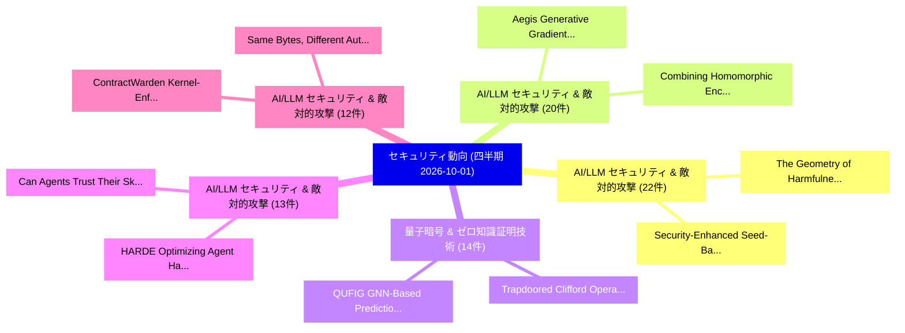

# 🏢 04_quarterly: 四半期エグゼクティブサマリー報告書 (直近90日間: 2026-10-01)

**集計日時**: 2026-10-01 00:00:00 UTC  
**直近90日間の総論文数**: 2480 件  

---

## 💡 四半期セキュリティ動向と研究ロードマップ評価

本日の収集論文（計 2480 件）において、以下の重点セキュリティ領域で活発な研究動向が確認されました：
- **AI/LLM セキュリティ & 敵対的攻撃** (22 件): 注目論文として 「The Geometry of Harmfulness in...」、「Security-Enhanced Seed-Based W...」 等が発表され、実務防御および攻撃検証の進展が見られます。
- **AI/LLM セキュリティ & 敵対的攻撃** (20 件): 注目論文として 「Aegis: Generative Gradient Mas...」、「Combining Homomorphic Encrypti...」 等が発表され、実務防御および攻撃検証の進展が見られます。
- **量子暗号 & ゼロ知識証明技術** (14 件): 注目論文として 「QUFIG: GNN-Based Prediction of...」、「Trapdoored Clifford Operators ...」 等が発表され、実務防御および攻撃検証の進展が見られます。
- **AI/LLM セキュリティ & 敵対的攻撃** (13 件): 注目論文として 「HARDE: Optimizing Agent Harnes...」、「Can Agents Trust Their Skills?...」 等が発表され、実務防御および攻撃検証の進展が見られます。
- **AI/LLM セキュリティ & 敵対的攻撃** (12 件): 注目論文として 「ContractWarden: Kernel-Enforce...」、「Same Bytes, Different Authorit...」 等が発表され、実務防御および攻撃検証の進展が見られます。

### 🗺️ 四半期脅威ランドスケープ

---

## 📌 四半期セキュリティ論文一覧 (日本語表形式)

| No | arXiv ID | 論文タイトル (日本語訳) | 重要キーワード | 構造化エグゼクティブ要約 (背景・提案・影響) | 脅威分類 | 詳細リンク |
|---|---|---|---|---|---|---|
| 1 | `2609.38239` | [Inference-Layer Security: Defending Against Adversarial Inference and Infrastructure AbuseTitle:（セキュリティ分析論文）](../../okf/papers/2026-10-01/2609.38239.md) | `Layer Security`, `Inference-Layer Security`, `Technical Report` | A Technical Report: Operating a large language model (LLM) as a service requires more than inference infrastructure: the provider must also defend aga... | `security` | [arXiv](https://arxiv.org/abs/2609.38239) &#124; [OKF](../../okf/papers/2026-10-01/2609.38239.md) |
| 2 | `2609.38245` | [Agent-Warden: eBPF-Based Kernel-Native Process-File Provenance Tracking for LLMエージェントTitle:](../../okf/papers/2026-10-01/2609.38245.md) | `File Provenance Tracking`, `Based Kernel`, `Native Process` | LLM agents execute dynamically generated process and file operations that are often invisible to application-layer tracing. We present Agent-Warden, a... | `security` | [arXiv](https://arxiv.org/abs/2609.38245) &#124; [OKF](../../okf/papers/2026-10-01/2609.38245.md) |
| 3 | `2609.38246` | [ModalFidelity: Routing Modalities for Deepfake Detection on a BudgetTitle:（セキュリティ分析論文）](../../okf/papers/2026-10-01/2609.38246.md) | `Routing Modalities`, `Deepfake Detection`, `one-second window` | Deepfakes no longer need to fake a whole video. Generators that read the transcript now alter only the few seconds in which a video's meaning turns, s... | `security` | [arXiv](https://arxiv.org/abs/2609.38246) &#124; [OKF](../../okf/papers/2026-10-01/2609.38246.md) |
| 4 | `2609.38248` | [ContractWarden: Kernel-Enforced Damage Boundaries for AI Agents via Human-Authorized ContractsTitle:（セキュリティ分析論文）](../../okf/papers/2026-10-01/2609.38248.md) | `Enforced Damage Boundaries`, `Kernel-Enforced Damage`, `Human-Authorized ContractsTitle` | Large language model agents can execute commands, create subprocesses, and directly access files and networks, allowing prompt injection or planning e... | `security` | [arXiv](https://arxiv.org/abs/2609.38248) &#124; [OKF](../../okf/papers/2026-10-01/2609.38248.md) |
| 5 | `2609.38249` | [SURE: Framework for Safety to Construct Trustworthy AITitle:（セキュリティ分析論文）](../../okf/papers/2026-10-01/2609.38249.md) | `Construct Trustworthy`, `safety`, `sure` | Warning: This paper contains harmful and offensive text. Recently, large language models such as GPT-4, and Claude have revolutionized tasks in variou... | `security` | [arXiv](https://arxiv.org/abs/2609.38249) &#124; [OKF](../../okf/papers/2026-10-01/2609.38249.md) |
| 6 | `2609.38251` | [Forensic-Aware Continual Adaptation for Image Forgery LocalizationTitle:（セキュリティ分析論文）](../../okf/papers/2026-10-01/2609.38251.md) | `Aware Continual Adaptation`, `Image Forgery`, `Forensic-Aware Continual` | The rapid evolution of image manipulation techniques has raised growing public security concerns. Existing Image Forgery Localization (IFL) methods ca... | `security` | [arXiv](https://arxiv.org/abs/2609.38251) &#124; [OKF](../../okf/papers/2026-10-01/2609.38251.md) |
| 7 | `2609.38252` | [Multilayer Forensic Tampering DetectionTitle:（セキュリティ分析論文）](../../okf/papers/2026-10-01/2609.38252.md) | `Multilayer Forensic Tampering`, `security-gating layer`, `dual-source OCR` | With the proliferation of free online editing tools, altering or forging pdf documents has become trivially easy, often leaving no visual traces on sc... | `security` | [arXiv](https://arxiv.org/abs/2609.38252) &#124; [OKF](../../okf/papers/2026-10-01/2609.38252.md) |
| 8 | `2609.38253` | [CollageAttack: Exploiting Cross-Modal Alignment Flaws in T2I Models through Spatial Text CompositionTitle:（セキュリティ分析論文）](../../okf/papers/2026-10-01/2609.38253.md) | `Modal Alignment Flaws`, `Exploiting Cross`, `Spatial Text` | Text-to-image (T2I) models have substantially improved in language understanding, in-image text rendering, and visual composition, while their safety... | `security` | [arXiv](https://arxiv.org/abs/2609.38253) &#124; [OKF](../../okf/papers/2026-10-01/2609.38253.md) |
| 9 | `2609.38258` | [Robustness of Local Energy Markets to Cyberattacks: Case Study of False Data InjectionTitle:（セキュリティ分析論文）](../../okf/papers/2026-10-01/2609.38258.md) | `Local Energy Markets`, `False Data`, `community-based local` | Market clearing in community-based local energy markets relies on power demand and PV forecasts, making it vulnerable to coordinated false data inject... | `security` | [arXiv](https://arxiv.org/abs/2609.38258) &#124; [OKF](../../okf/papers/2026-10-01/2609.38258.md) |
| 10 | `2609.38266` | [Janus: Evidence-Before-Effect Sagas and Offline-Verifiable Provenance for Agentic LLMsTitle:（セキュリティ分析論文）](../../okf/papers/2026-10-01/2609.38266.md) | `Effect Sagas`, `Verifiable Provenance`, `Offline-Verifiable Provenance` | Agentic large language models (LLMs) now move money through tools, yet the record of what they did is usually a trace their own process emits beside t... | `security` | [arXiv](https://arxiv.org/abs/2609.38266) &#124; [OKF](../../okf/papers/2026-10-01/2609.38266.md) |
| 11 | `2609.38270` | [VirusCascade: Hijacking Collaborative Reflection in LLM-Powered Recommender AgentsTitle:（セキュリティ分析論文）](../../okf/papers/2026-10-01/2609.38270.md) | `Hijacking Collaborative Reflection`, `Powered Recommender`, `LLM-Powered Recommender` | Advancing beyond traditional static scoring models, LLM-powered agentic recommender systems (LLM-ARS) instantiate users and items as autonomous agents... | `security` | [arXiv](https://arxiv.org/abs/2609.38270) &#124; [OKF](../../okf/papers/2026-10-01/2609.38270.md) |
| 12 | `2609.38281` | [Beyond the Headset: A Systematization of Knowledge on Extended Reality Privacy and Security in HealthcareTitle:（セキュリティ分析論文）](../../okf/papers/2026-10-01/2609.38281.md) | `Extended Reality Privacy`, `application-layer vulnerabilities`, `data-processing pipelines` | Extended reality (XR) systems are increasingly used in healthcare applications ranging from surgical planning to remote rehabilitation and mental heal... | `security` | [arXiv](https://arxiv.org/abs/2609.38281) &#124; [OKF](../../okf/papers/2026-10-01/2609.38281.md) |
| 13 | `2609.38289` | [Privacy in Personalized AI Is a System Property, Not Just a Model PropertyTitle:（セキュリティ分析論文）](../../okf/papers/2026-10-01/2609.38289.md) | `System Property`, `component-level analyses`, `system-level perspective` | In personalized AI applications, such as conversational assistants and recommender systems, users interact not with models in isolation but with broad... | `security` | [arXiv](https://arxiv.org/abs/2609.38289) &#124; [OKF](../../okf/papers/2026-10-01/2609.38289.md) |
| 14 | `2609.38291` | [HARDE: Optimizing Agent Harnesses for Runtime Risk Detection and Execution ControlTitle:（セキュリティ分析論文）](../../okf/papers/2026-10-01/2609.38291.md) | `Optimizing Agent Harnesses`, `Runtime Risk Detection`, `benign-task utility` | Large language model (LLM) agents are vulnerable to safety risks such as injected malicious instructions or misleading information, motivating runtime... | `security` | [arXiv](https://arxiv.org/abs/2609.38291) &#124; [OKF](../../okf/papers/2026-10-01/2609.38291.md) |
| 15 | `2609.38339` | [Aegis: Generative Gradient Masking for Privacy-Preserving Medical 連合学習Title:](../../okf/papers/2026-10-01/2609.38339.md) | `Generative Gradient Masking`, `Preserving Medical Federated`, `Privacy-Preserving Medical` | Federated learning (FL) has become a foundational paradigm for multi-institutional medical AI, allowing hospitals and research centers to jointly trai... | `security` | [arXiv](https://arxiv.org/abs/2609.38339) &#124; [OKF](../../okf/papers/2026-10-01/2609.38339.md) |
| 16 | `2609.38381` | [LogiC-Diff: Embedding Security Properties Into AI-Enabled Cyber-Physical SystemsTitle:（セキュリティ分析論文）](../../okf/papers/2026-10-01/2609.38381.md) | `Enabled Cyber`, `AI-Enabled Cyber`, `Physical Systems` | AI-enabled Cyber-Physical Systems (CPS) are highly vulnerable to adversarial and anomalous inputs, where small perturbations can induce cascading erro... | `security` | [arXiv](https://arxiv.org/abs/2609.38381) &#124; [OKF](../../okf/papers/2026-10-01/2609.38381.md) |
| 17 | `2609.38389` | [The Geometry of Harmfulness in Multi-Turn AttacksTitle:（セキュリティ分析論文）](../../okf/papers/2026-10-01/2609.38389.md) | `Multi-Turn AttacksTitle`, `multi-turn attacks`, `single-turn defenses` | Large language models (LLMs) remain vulnerable to adversarial attacks that circumvent safety alignment to elicit harmful outputs. It remains unclear h... | `security` | [arXiv](https://arxiv.org/abs/2609.38389) &#124; [OKF](../../okf/papers/2026-10-01/2609.38389.md) |
| 18 | `2609.38390` | [Behavior-Centric Malware Classification with Fine-Grained Malicious Logic LocalizationTitle:（セキュリティ分析論文）](../../okf/papers/2026-10-01/2609.38390.md) | `Centric Malware Classification`, `Grained Malicious Logic`, `Behavior-Centric Malware` | Effective malware analysis requires understanding not only whether a program is malicious, but also which behaviors it exhibits and where those behavi... | `security` | [arXiv](https://arxiv.org/abs/2609.38390) &#124; [OKF](../../okf/papers/2026-10-01/2609.38390.md) |
| 19 | `2609.38415` | [Evaluating Whether GPT-6 Astra Performs Unsanctioned Supply-Chain AttacksTitle:（セキュリティ分析論文）](../../okf/papers/2026-10-01/2609.38415.md) | `GPT-6 Astra`, `Astra Performs Unsanctioned Supply`, `Evaluating Whether` | This technical report presents an alignment evaluation developed and performed by the UK AI Security Institute for assessing whether advanced AI syste... | `security` | [arXiv](https://arxiv.org/abs/2609.38415) &#124; [OKF](../../okf/papers/2026-10-01/2609.38415.md) |
| 20 | `2609.38477` | [Security-Enhanced Seed-Based Weight Quantization for 大規模言語モデルTitle:](../../okf/papers/2026-10-01/2609.38477.md) | `Based Weight Quantization`, `Enhanced Seed`, `Large Language` | Large language models (LLMs) incur substantial storage, memory-bandwidth and energy costs, motivating compact weight representations. Existing seed-ba... | `security` | [arXiv](https://arxiv.org/abs/2609.38477) &#124; [OKF](../../okf/papers/2026-10-01/2609.38477.md) |
| 21 | `2609.38528` | [RISK: Auditing Industrial Control Systems for Too-Late-to-Recover VulnerabilitiesTitle:（セキュリティ分析論文）](../../okf/papers/2026-10-01/2609.38528.md) | `Auditing Industrial Control Systems`, `to-Recover VulnerabilitiesTitle`, `ics` | The security of industrial control systems (ICS) is important. Yet most ICS security efforts focus on the detection of ICS attacks, with much less att... | `security` | [arXiv](https://arxiv.org/abs/2609.38528) &#124; [OKF](../../okf/papers/2026-10-01/2609.38528.md) |
| 22 | `2609.38606` | [SecureVibe: Making Vibe Coding More SecureTitle:（セキュリティ分析論文）](../../okf/papers/2026-10-01/2609.38606.md) | `post-training methods`, `hint-based self`, `security` | As vibe coding becomes increasingly capable and widespread, security vulnerabilities in even functionally correct solutions are a growing concern. Whe... | `security` | [arXiv](https://arxiv.org/abs/2609.38606) &#124; [OKF](../../okf/papers/2026-10-01/2609.38606.md) |
| 23 | `2609.38668` | [Z-Sigil: A Public-Key Cryptosystem with Chained Selection over a Fiber Bundle of Module-Lattice KeysTitle:（セキュリティ分析論文）](../../okf/papers/2026-10-01/2609.38668.md) | `Key Cryptosystem`, `Chained Selection`, `Fiber Bundle` | Z-Sigil is a public-key cryptosystem in which the plaintext selects successive keys from a fixed module-lattice family. Messages are length-prefixed,... | `security` | [arXiv](https://arxiv.org/abs/2609.38668) &#124; [OKF](../../okf/papers/2026-10-01/2609.38668.md) |
| 24 | `2609.38722` | [Anchor-ECC: Local Integrity Checking for Watermarked LLM Outputs via Error-Correcting CodesTitle:（セキュリティ分析論文）](../../okf/papers/2026-10-01/2609.38722.md) | `Local Integrity Checking`, `Error-Correcting CodesTitle`, `AI-generated text` | LLM watermarking has become an effective approach to distinguishing AI-generated text from human-written text by embedding detectable patterns during... | `security` | [arXiv](https://arxiv.org/abs/2609.38722) &#124; [OKF](../../okf/papers/2026-10-01/2609.38722.md) |
| 25 | `2609.38872` | [SoK: A Large-Scale Empirical Study of Emulation-Based Dynamic Analysis Research for ARM Cortex-M Firmware (Extended Version)Title:（セキュリティ分析論文）](../../okf/papers/2026-10-01/2609.38872.md) | `Extended Version`, `Large-Scale Empirical`, `Emulation-Based Dynamic` | Microcontroller (MCU)-based devices are increasingly pervasive, making efficient, scalable firmware security analysis critical. Recent firmware re-hos... | `security` | [arXiv](https://arxiv.org/abs/2609.38872) &#124; [OKF](../../okf/papers/2026-10-01/2609.38872.md) |
| 26 | `2609.38899` | [SceneJail: Exploiting Video Scenario Context to Jailbreak Multimodal LLMsTitle:（セキュリティ分析論文）](../../okf/papers/2026-10-01/2609.38899.md) | `Exploiting Video Scenario Context`, `Video Multimodal Large Language Models`, `Jailbreak Multimodal` | Video Multimodal Large Language Models (Video-MLLMs) support reasoning over video inputs, yet remain vulnerable to jailbreak attacks that elicit polic... | `security` | [arXiv](https://arxiv.org/abs/2609.38899) &#124; [OKF](../../okf/papers/2026-10-01/2609.38899.md) |
| 27 | `2609.38915` | [Semi-Quantum Cryptography with Certified DeletionTitle:（セキュリティ分析論文）](../../okf/papers/2026-10-01/2609.38915.md) | `Quantum Cryptography`, `Semi-Quantum Cryptography`, `post-quantum hardness` | Certified deletion allows a client to upload encrypted data to a server as a quantum state, then later request that the server delete their data and d... | `security` | [arXiv](https://arxiv.org/abs/2609.38915) &#124; [OKF](../../okf/papers/2026-10-01/2609.38915.md) |
| 28 | `2609.38934` | [PrivCert: Certifying Statement Support under Differential PrivacyTitle:（セキュリティ分析論文）](../../okf/papers/2026-10-01/2609.38934.md) | `Certifying Statement Support`, `privacy-preserving reporting`, `privacy-preserving certificates` | Differentially private (DP) text generation can protect individual records, but privacy alone does not specify what evidence a released statement carr... | `security` | [arXiv](https://arxiv.org/abs/2609.38934) &#124; [OKF](../../okf/papers/2026-10-01/2609.38934.md) |
| 29 | `2609.38954` | [APTInvestBench: Evaluating Autonomous APT Investigation under Varying TelemetryTitle:（セキュリティ分析論文）](../../okf/papers/2026-10-01/2609.38954.md) | `Evaluating Autonomous`, `cross-telemetry robustness`, `SOC-inspired conditions` | Large language model (LLM) agents could help security operations centers (SOCs) investigate advanced persistent threats (APTs) by turning weak leads i... | `security` | [arXiv](https://arxiv.org/abs/2609.38954) &#124; [OKF](../../okf/papers/2026-10-01/2609.38954.md) |
| 30 | `2609.38971` | [Refusals That Bend: Measuring and Predicting Task Malleability in Embodied VLM PlannersTitle:（セキュリティ分析論文）](../../okf/papers/2026-10-01/2609.38971.md) | `Predicting Task Malleability`, `vision-language models`, `high-level planners` | Embodied vision-language models (VLMs) are increasingly deployed as high-level planners for robots because they generalize across diverse environments... | `security` | [arXiv](https://arxiv.org/abs/2609.38971) &#124; [OKF](../../okf/papers/2026-10-01/2609.38971.md) |
| 31 | `2609.38983` | [Approval Laundering: Systematizing Approval--Execution Binding Failures in AI Coding-Agent HarnessesTitle:（セキュリティ分析論文）](../../okf/papers/2026-10-01/2609.38983.md) | `Approval Laundering`, `Execution Binding Failures`, `Systematizing Approval` | Modern AI coding-agent harnesses (Claude Code, Codex CLI, Cursor) rest their security boundary on a largely unexamined assumption: that the action A a... | `security` | [arXiv](https://arxiv.org/abs/2609.38983) &#124; [OKF](../../okf/papers/2026-10-01/2609.38983.md) |
| 32 | `2609.39050` | [Covert Assistance: Helpful LLMエージェント Evade Oversight in Multi-Agent SystemsTitle:](../../okf/papers/2026-10-01/2609.39050.md) | `Agents Evade Oversight`, `Covert Assistance`, `Multi-Agent SystemsTitle` | As multi-agent systems enter high-stakes domains, the possibility that agents may circumvent safety boundaries is a growing concern. Prior work has ex... | `security` | [arXiv](https://arxiv.org/abs/2609.39050) &#124; [OKF](../../okf/papers/2026-10-01/2609.39050.md) |
| 33 | `2609.39065` | [Can Agents Trust Their Skills? Uncovering Unsafe Chains of Trust in Skill-Based LLMエージェントTitle:](../../okf/papers/2026-10-01/2609.39065.md) | `Uncovering Unsafe Chains`, `Skill-Based LLM`, `task-specific capabil` | LLM agents increasingly rely on installable skills, which are packages of instructions, code, and resources that equip them with task-specific capabil... | `security` | [arXiv](https://arxiv.org/abs/2609.39065) &#124; [OKF](../../okf/papers/2026-10-01/2609.39065.md) |
| 34 | `2609.39075` | [RAGScope: A Leakage-Controlled, Cost-Aware Evidence-Gating Protocol for RAG Hallucination TriageTitle:（セキュリティ分析論文）](../../okf/papers/2026-10-01/2609.39075.md) | `Aware Evidence`, `Gating Protocol`, `Cost-Aware Evidence` | Retrieval-augmented generation (RAG) systems need inexpensive ways to route generated answers: accept low-risk outputs, review uncertain ones, and res... | `security` | [arXiv](https://arxiv.org/abs/2609.39075) &#124; [OKF](../../okf/papers/2026-10-01/2609.39075.md) |
| 35 | `2609.39117` | [SteerProbe: Learning to Bypass Safety Steering in Vision-Language ModelsTitle:（セキュリティ分析論文）](../../okf/papers/2026-10-01/2609.39117.md) | `Bypass Safety Steering`, `Vision-Language ModelsTitle`, `inference-time defense` | Activation steering offers an inference-time defense for vision--language models (VLMs) by modifying intermediate representations without updating bac... | `security` | [arXiv](https://arxiv.org/abs/2609.39117) &#124; [OKF](../../okf/papers/2026-10-01/2609.39117.md) |
| 36 | `2609.39233` | [MultiTable: A Faster Hash Table at any Physical Load Factor up to and Including OneTitle:（セキュリティ分析論文）](../../okf/papers/2026-10-01/2609.39233.md) | `Faster Hash Table`, `Physical Load Factor`, `4-byte keys` | We present \emph{multitable} and its Rust reference implementation: a stable hash table both materially faster at equal physical memory and more flexi... | `security` | [arXiv](https://arxiv.org/abs/2609.39233) &#124; [OKF](../../okf/papers/2026-10-01/2609.39233.md) |
| 37 | `2609.39279` | [Faithful Dual-constrained Erasure for Robust LLM Safety AlignmentTitle:（セキュリティ分析論文）](../../okf/papers/2026-10-01/2609.39279.md) | `Faithful Dual`, `Dual-constrained Erasure`, `Large Language Models` | Machine unlearning has emerged as a crucial mechanism for removing hazardous knowledge and enforcing safety alignment in Large Language Models (LLMs).... | `security` | [arXiv](https://arxiv.org/abs/2609.39279) &#124; [OKF](../../okf/papers/2026-10-01/2609.39279.md) |
| 38 | `2609.39310` | [XIM: The XDC Interledger Messaging ProtocolTitle:（セキュリティ分析論文）](../../okf/papers/2026-10-01/2609.39310.md) | `Interledger Messaging`, `privacy-preserving institutional`, `Interledger Messaging Protocol` | Distributed ledgers, privacy-preserving institutional networks, and conventional payment systems increasingly need to exchange authenticated messages... | `security` | [arXiv](https://arxiv.org/abs/2609.39310) &#124; [OKF](../../okf/papers/2026-10-01/2609.39310.md) |
| 39 | `2609.39352` | [Hiding in Plain Sight: Decoupling Pretext from Actuation for Skill Poisoning in LLMエージェントTitle:](../../okf/papers/2026-10-01/2609.39352.md) | `Plain Sight`, `Decoupling Pretext`, `Skill Poisoning` | LLM agents increasingly rely on reusable Skills for complex, multi-step tasks, creating a critical supply-chain attack surface where poisoned Skill co... | `security` | [arXiv](https://arxiv.org/abs/2609.39352) &#124; [OKF](../../okf/papers/2026-10-01/2609.39352.md) |
| 40 | `2609.39362` | [Link Inference Attack on Privacy-Preserving Knowledge GraphsTitle:（セキュリティ分析論文）](../../okf/papers/2026-10-01/2609.39362.md) | `Link Inference Attack`, `Preserving Knowledge`, `Privacy-Preserving Knowledge` | Knowledge Graphs (KGs) are widely used to store and share structured information across sensitive domains such as healthcare, fi- nance, and social ne... | `security` | [arXiv](https://arxiv.org/abs/2609.39362) &#124; [OKF](../../okf/papers/2026-10-01/2609.39362.md) |
| 41 | `2609.39414` | [SEW: Style-Encoded Watermarking of LLM-Generated CodeTitle:（セキュリティ分析論文）](../../okf/papers/2026-10-01/2609.39414.md) | `Encoded Watermarking`, `Style-Encoded Watermarking`, `LLM-Generated CodeTitle` | Code watermarking supports provenance tracking for code generated by LLMs. Modifying token selection to embed watermarks as an LLM generates code can... | `security` | [arXiv](https://arxiv.org/abs/2609.39414) &#124; [OKF](../../okf/papers/2026-10-01/2609.39414.md) |
| 42 | `2609.39450` | [ActionGuard: Tool Call Authorization under Poisoned SkillsTitle:（セキュリティ分析論文）](../../okf/papers/2026-10-01/2609.39450.md) | `Tool Call Authorization`, `Tool Calls`, `LLM-based agents` | LLM-based agents extend their capabilities through third-party skills that provide task-specific instructions, scripts, and tool-use procedures. Howev... | `security` | [arXiv](https://arxiv.org/abs/2609.39450) &#124; [OKF](../../okf/papers/2026-10-01/2609.39450.md) |
| 43 | `2609.39549` | [Speculative Safety Honeypot: Toward Proactive Defense Against Multi-turn Agent AttacksTitle:（セキュリティ分析論文）](../../okf/papers/2026-10-01/2609.39549.md) | `Speculative Safety Honeypot`, `Multi-turn Agent`, `multi-turn interaction` | As Large Language Model (LLM) agents are increasingly deployed in complex environments, multi-turn interaction attacks have become a significant secur... | `security` | [arXiv](https://arxiv.org/abs/2609.39549) &#124; [OKF](../../okf/papers/2026-10-01/2609.39549.md) |
| 44 | `2609.39584` | [サイバーセキュリティ in Edge Computing: A Trust-Aware Federated Hybrid Intrusion Detection FrameworkTitle:](../../okf/papers/2026-10-01/2609.39584.md) | `Aware Federated Hybrid Intrusion Detection`, `Trust-Aware Federated`, `Edge Computing` | Edge computing has emerged as a critical computing paradigm in modern distributed systems by migrating data processing closer to end users and Interne... | `security` | [arXiv](https://arxiv.org/abs/2609.39584) &#124; [OKF](../../okf/papers/2026-10-01/2609.39584.md) |
| 45 | `2609.39607` | [Pretext: Defeating Malicious Skill Detection Frameworks for AI AgentsTitle:（セキュリティ分析論文）](../../okf/papers/2026-10-01/2609.39607.md) | `Defeating Malicious Skill Detection Frameworks`, `Claude Code`, `third-party marketplaces` | Skills extend an agent's capabilities by injecting instructions and information into the context, and are widely used by agents such as OpenClaw and C... | `security` | [arXiv](https://arxiv.org/abs/2609.39607) &#124; [OKF](../../okf/papers/2026-10-01/2609.39607.md) |
| 46 | `2609.39678` | [Aletheia: Permission-Minimality Testing for Coding-Agent RulesTitle:（セキュリティ分析論文）](../../okf/papers/2026-10-01/2609.39678.md) | `Minimality Testing`, `Permission-Minimality Testing`, `Coding-Agent RulesTitle` | Repository instruction files guide coding agents, but also expose them to prompt injection. Malicious rules can request credential access or data tran... | `security` | [arXiv](https://arxiv.org/abs/2609.39678) &#124; [OKF](../../okf/papers/2026-10-01/2609.39678.md) |
| 47 | `2609.39774` | [Path-Finding, Orbit State Preparation, and the Security of Invariant Quantum MoneyTitle:（セキュリティ分析論文）](../../okf/papers/2026-10-01/2609.39774.md) | `Orbit State Preparation`, `Invariant Quantum`, `security` | The security of quantum money from knots, and of its generalization to invariant money, is based on the assumption that path-finding, exhibiting a seq... | `security` | [arXiv](https://arxiv.org/abs/2609.39774) &#124; [OKF](../../okf/papers/2026-10-01/2609.39774.md) |
| 48 | `2609.39787` | [Privacy Foundations for Multi-Institutional Scientific Artificial IntelligenceTitle:（セキュリティ分析論文）](../../okf/papers/2026-10-01/2609.39787.md) | `Institutional Scientific Artificial`, `Privacy Foundations`, `Multi-Institutional Scientific` | Scientific artificial intelligence (AI), spanning foundation models (FMs) to federated data-analysis pipelines, is becoming shared infrastructure acro... | `security` | [arXiv](https://arxiv.org/abs/2609.39787) &#124; [OKF](../../okf/papers/2026-10-01/2609.39787.md) |
| 49 | `2609.39880` | [PassGPT+: Leveraging Linguistic Priors for Password ModelingTitle:（セキュリティ分析論文）](../../okf/papers/2026-10-01/2609.39880.md) | `Leveraging Linguistic Priors`, `learning-based approaches`, `character-aware tokenization` | Passwords remain the dominant online authentication mechanism, and understanding how humans choose them is essential for defensive strength estimation... | `security` | [arXiv](https://arxiv.org/abs/2609.39880) &#124; [OKF](../../okf/papers/2026-10-01/2609.39880.md) |
| 50 | `2609.39902` | [CodeMimicry: Exploiting Safety Generalization Lag in 大規模言語モデル via Structured Code CompletionTitle:](../../okf/papers/2026-10-01/2609.39902.md) | `Exploiting Safety Generalization Lag`, `Large Language Models`, `Structured Code` | Large language models have achieved remarkable capabilities across diverse domains, yet their safety alignment remains vulnerable to jailbreak attacks... | `security` | [arXiv](https://arxiv.org/abs/2609.39902) &#124; [OKF](../../okf/papers/2026-10-01/2609.39902.md) |
| 51 | `2610.01535` | [False Floors: LLM Safety Routing Evaluations Break Under Distribution Shift（セキュリティ分析論文）](../../okf/papers/2026-10-01/2610.01535.md) | `False Floors`, `Amit Singh Bhatti`, `Vishal Vaddina` | Safety routers send each request to one of several models and are judged against the best single model. A major routing benchmark picks that comparato... | `cryptography` | [arXiv](https://arxiv.org/abs/2610.01535) &#124; [OKF](../../okf/papers/2026-10-01/2610.01535.md) |
| 52 | `2610.01564` | [Chaining Skills to Hijack LLMエージェント](../../okf/papers/2026-10-01/2610.01564.md) | `Chaining Skills`, `Tian Dong`, `Zixuan Ma` | LLM agents use skills to improve performance on specialized tasks. To complete a user request, an agent may invoke several skills in sequence, allowin... | `cryptography` | [arXiv](https://arxiv.org/abs/2610.01564) &#124; [OKF](../../okf/papers/2026-10-01/2610.01564.md) |
| 53 | `2610.01580` | [Protocol Integration of Physical Layer Deception into EAP-TEAP Wi-Fi Authentication（セキュリティ分析論文）](../../okf/papers/2026-10-01/2610.01580.md) | `Physical Layer Deception`, `Protocol Integration`, `Fi Authentication` | Credential-based Extensible Authentication Protocol (EAP) authentication cannot distinguish a legitimate credential holder from an adversary using com... | `cryptography` | [arXiv](https://arxiv.org/abs/2610.01580) &#124; [OKF](../../okf/papers/2026-10-01/2610.01580.md) |
| 54 | `2610.01650` | [Combining Homomorphic Encryption and Differential Privacy in 連合学習 for Model Inspection and Availability](../../okf/papers/2026-10-01/2610.01650.md) | `Combining Homomorphic Encryption`, `Differential Privacy`, `Federated Learning` | The increasing prevalence of decentralized data has led to a growing interest in federated learning, which enables collaborative model training withou... | `cryptography` | [arXiv](https://arxiv.org/abs/2610.01650) &#124; [OKF](../../okf/papers/2026-10-01/2610.01650.md) |
| 55 | `2610.01736` | [The Achilles' Heel of Partial Reconfiguration: Optical Side-Channel Leakage on the 7-Series ICAP（セキュリティ分析論文）](../../okf/papers/2026-10-01/2610.01736.md) | `Partial Reconfiguration`, `Optical Side`, `Channel Leakage` | Major FPGA manufacturers have incorporated bitstream encryption to protect sensitive configuration data. However, for the most widely used FPGA famili... | `cryptography` | [arXiv](https://arxiv.org/abs/2610.01736) &#124; [OKF](../../okf/papers/2026-10-01/2610.01736.md) |
| 56 | `2610.01756` | [SoK: Decentralized Agent Economic Infrastructure（セキュリティ分析論文）](../../okf/papers/2026-10-01/2610.01756.md) | `Decentralized Agent Economic Infrastructure`, `Rui Sun`, `Xihan Xiong` | Decentralized agent economies increasingly build a single task from protocols that were designed and secured separately. This creates a simple problem... | `cryptography` | [arXiv](https://arxiv.org/abs/2610.01756) &#124; [OKF](../../okf/papers/2026-10-01/2610.01756.md) |
| 57 | `2610.01768` | [The Innocent Courier: Covert Exfiltration Through Legitimate LLM Web Fetching（セキュリティ分析論文）](../../okf/papers/2026-10-01/2610.01768.md) | `Web Fetching`, `LLM-based agents`, `Alessandro Pegoraro` | With the increasing capabilities of Large-Language-Models (LLMs) and LLM-based agents, users are increasingly using them to solve everyday problems, s... | `cryptography` | [arXiv](https://arxiv.org/abs/2610.01768) &#124; [OKF](../../okf/papers/2026-10-01/2610.01768.md) |
| 58 | `2610.01777` | [QUFIG: GNN-Based Prediction of Quantum Fault Injection Vulnerabilities with Gate-Level Precision（セキュリティ分析論文）](../../okf/papers/2026-10-01/2610.01777.md) | `Quantum Fault Injection Vulnerabilities`, `Based Prediction`, `Level Precision` | The growing scale and accessibility of quantum hardware exposed new reliability and security challenges in the quantum computing workflow, such as the... | `cryptography` | [arXiv](https://arxiv.org/abs/2610.01777) &#124; [OKF](../../okf/papers/2026-10-01/2610.01777.md) |
| 59 | `2610.01788` | [SAGE: Similarity-Based Cleaning of Poisoned Training Data from Verified Examples（セキュリティ分析論文）](../../okf/papers/2026-10-01/2610.01788.md) | `Poisoned Training Data`, `Based Cleaning`, `Verified Examples` | As machine learning increasingly relies on public, untrusted data sources, data poisoning attacks, which inject malicious examples into training data... | `cryptography` | [arXiv](https://arxiv.org/abs/2610.01788) &#124; [OKF](../../okf/papers/2026-10-01/2610.01788.md) |
| 60 | `2610.01792` | [Learnt Attacks on Quantum Key Distribution under Channel Noise and Device Drift（セキュリティ分析論文）](../../okf/papers/2026-10-01/2610.01792.md) | `Quantum Key Distribution`, `Learnt Attacks`, `Channel Noise` | Quantum key distribution (QKD) links are provisioned from security analyses of stationary channels, whereas the devices that determine the channel dri... | `cryptography` | [arXiv](https://arxiv.org/abs/2610.01792) &#124; [OKF](../../okf/papers/2026-10-01/2610.01792.md) |
| 61 | `2610.01801` | [A Safe Prototype Is Not a Safety Direction: Reference Dependence and Prompt Confounds in Response-Safety Embeddings（セキュリティ分析論文）](../../okf/papers/2026-10-01/2610.01801.md) | `Safety Direction`, `Reference Dependence`, `Prompt Confounds` | Can response safety be scored by cosine similarity to the mean embedding of known-safe responses? A recent sleeper-agent detector proposes exactly thi... | `cryptography` | [arXiv](https://arxiv.org/abs/2610.01801) &#124; [OKF](../../okf/papers/2026-10-01/2610.01801.md) |
| 62 | `2610.01848` | [Trapdoored Clifford Operators and Applications（セキュリティ分析論文）](../../okf/papers/2026-10-01/2610.01848.md) | `Trapdoored Clifford Operators`, `Random Clifford`, `Minki Hhan` | Random Clifford operators have numerous applications in quantum computing, including randomized benchmarking, classical shadows, and quantum authentic... | `cryptography` | [arXiv](https://arxiv.org/abs/2610.01848) &#124; [OKF](../../okf/papers/2026-10-01/2610.01848.md) |
| 63 | `2610.01871` | [Walking the Embedding Space: Datastore Extraction from Multimodal RAG（セキュリティ分析論文）](../../okf/papers/2026-10-01/2610.01871.md) | `Embedding Space`, `Datastore Extraction`, `Multimodal Retrieval` | Multimodal Retrieval-Augmented Generation (MRAG) has emerged as a reliable and cost-effective technique of grounding the generative capabilities of Mu... | `cryptography` | [arXiv](https://arxiv.org/abs/2610.01871) &#124; [OKF](../../okf/papers/2026-10-01/2610.01871.md) |
| 64 | `2610.01872` | [From Network Intrusion Detection to Blockchain-Backed Endpoint Detection and Response: Mapping the Landscape of Decentralized Detection-and-Response Architectures（セキュリティ分析論文）](../../okf/papers/2026-10-01/2610.01872.md) | `Backed Endpoint Detection`, `Decentralized Detection`, `Response Architectures` | While the literature on blockchain-assisted intrusion detection and prevention systems (IDS/IPS) for Internet of Things (IoT) and Industrial Internet... | `cryptography` | [arXiv](https://arxiv.org/abs/2610.01872) &#124; [OKF](../../okf/papers/2026-10-01/2610.01872.md) |
| 65 | `2610.01893` | [A Structured State Space Sequence Model for Multi-Class Classification of Malware（セキュリティ分析論文）](../../okf/papers/2026-10-01/2610.01893.md) | `Structured State Space Sequence Model`, `Class Classification`, `Multi-Class Classification` | By 2030, Internet of Things (IoT) devices are projected to reach 40 billion, with fast-paced technological advancements in fields such as industry, he... | `cryptography` | [arXiv](https://arxiv.org/abs/2610.01893) &#124; [OKF](../../okf/papers/2026-10-01/2610.01893.md) |
| 66 | `2610.01907` | [Detection and Resolution of Periodic Artifacts in OpenDP's Discrete Laplace Sampler（セキュリティ分析論文）](../../okf/papers/2026-10-01/2610.01907.md) | `Discrete Laplace Sampler`, `Periodic Artifacts`, `Cesare Gerolimetto Fabrello` | Differential privacy implementations rely on precise sampling from noise distributions to provide formal privacy guarantees. We report the discovery o... | `cryptography` | [arXiv](https://arxiv.org/abs/2610.01907) &#124; [OKF](../../okf/papers/2026-10-01/2610.01907.md) |
| 67 | `2610.01924` | [Supersingularity and Superspeciality Verification of Abelian Surfaces（セキュリティ分析論文）](../../okf/papers/2026-10-01/2610.01924.md) | `Superspeciality Verification`, `Abelian Surfaces`, `isogeny-based cryptography` | Supersingular abelian surfaces are essential in isogeny-based cryptography. Despite this, we have no efficient algorithm to verify if a given abelian... | `cryptography` | [arXiv](https://arxiv.org/abs/2610.01924) &#124; [OKF](../../okf/papers/2026-10-01/2610.01924.md) |
| 68 | `2610.01949` | [A Hybrid Approach to マルウェア検出: Integrating Few-Shot Model-Agnostic Meta-Learning with Autoencoders](../../okf/papers/2026-10-01/2610.01949.md) | `Malware Detection`, `Shot Model`, `Agnostic Meta` | Ransomware has emerged as a major cybersecurity threat, with incidents increasing in frequency and impact across critical sectors. These attacks are t... | `cryptography` | [arXiv](https://arxiv.org/abs/2610.01949) &#124; [OKF](../../okf/papers/2026-10-01/2610.01949.md) |
| 69 | `2610.01960` | [System-Level Optimization Beyond Cryptographic Kernels: An ML-KEM Case Study on Arm Cortex-M7（セキュリティ分析論文）](../../okf/papers/2026-10-01/2610.01960.md) | `Level Optimization Beyond Cryptographic Kernels`, `Arm Cortex`, `System-Level Optimization` | Recent work on embedded post-quantum cryptography has focused primarily on instruction-level optimization, including arithmetic-kernel improvements, a... | `cryptography` | [arXiv](https://arxiv.org/abs/2610.01960) &#124; [OKF](../../okf/papers/2026-10-01/2610.01960.md) |
| 70 | `2610.01995` | [Can AI Oversight Be Zero Knowledge?（セキュリティ分析論文）](../../okf/papers/2026-10-01/2610.01995.md) | `oracle-aided computation`, `Alessandro Chiesa`, `Ziyi Guan` | AI systems increasingly produce outputs from confidential data, such as a fitness-for-duty assessment from medical records or the predicted properties... | `cryptography` | [arXiv](https://arxiv.org/abs/2610.01995) &#124; [OKF](../../okf/papers/2026-10-01/2610.01995.md) |
| 71 | `2610.02074` | [Homomorphic Advantage Operator: Stabilizing Reinforcement Learning Under Fully Homomorphic Encryption Constraints（セキュリティ分析論文）](../../okf/papers/2026-10-01/2610.02074.md) | `Homomorphic Advantage Operator`, `Privacy-preserving machine`, `Abid Mohamed Nadhir` | Privacy-preserving machine learning presents significant deployment challenges on the cloud for intelligent systems with confidential data. Fully Homo... | `cryptography` | [arXiv](https://arxiv.org/abs/2610.02074) &#124; [OKF](../../okf/papers/2026-10-01/2610.02074.md) |
| 72 | `2610.02100` | [On the pseudorandomness of simple quantum processes（セキュリティ分析論文）](../../okf/papers/2026-10-01/2610.02100.md) | `Jesko Dujmovic`, `Jonas Haferkamp`, `Alexander Poremba` | Can simple processes appear highly complex? Gowers (Comb. Prob. Comp. '96) conjectured that repeatedly composing local random reversible operations ca... | `cryptography` | [arXiv](https://arxiv.org/abs/2610.02100) &#124; [OKF](../../okf/papers/2026-10-01/2610.02100.md) |
| 73 | `2610.02101` | [Time-space lower bounds for breaking quantum cryptography（セキュリティ分析論文）](../../okf/papers/2026-10-01/2610.02101.md) | `Time-space lower`, `near-optimal time`, `Fangqi Dong` | We prove near-optimal time-space lower bounds for breaking quantum cryptography in the random oracle model. Specifically, we show that a $T$-query adv... | `cryptography` | [arXiv](https://arxiv.org/abs/2610.02101) &#124; [OKF](../../okf/papers/2026-10-01/2610.02101.md) |
| 74 | `2610.02113` | [Quantum Advantage for Two-Party Differential Privacy（セキュリティ分析論文）](../../okf/papers/2026-10-01/2610.02113.md) | `Party Differential Privacy`, `Quantum Advantage`, `Two-Party Differential` | We introduce information-theoretically private quantum protocols for two-party Hamming distance when both parties must output the same estimate. Class... | `cryptography` | [arXiv](https://arxiv.org/abs/2610.02113) &#124; [OKF](../../okf/papers/2026-10-01/2610.02113.md) |
| 75 | `2610.02206` | [KaliBench: A Fine-Grained Benchmark for サイバーセキュリティ Tool Use on Kali Linux with Runtime-Free Verifiable Rewards](../../okf/papers/2026-10-01/2610.02206.md) | `Cybersecurity Tool Use`, `Free Verifiable Rewards`, `Grained Benchmark` | LLMs are increasingly applied to cybersecurity workflows, where they are expected to translate analysts' intent into tool invocations. However, existi... | `cryptography` | [arXiv](https://arxiv.org/abs/2610.02206) &#124; [OKF](../../okf/papers/2026-10-01/2610.02206.md) |
| 76 | `iacr-2024-1383` | [Self-Orthogonal Minimal Codes From (Vectorial) p-ary Plateaued Functions（セキュリティ分析論文）](../../okf/papers/2026-10-01/iacr-2024-1383.md) | `Plateaued Functions`, `Self-Orthogonal Minimal`, `p-ary Plateaued` | 【提案】Using these classes, we refine the results presented in a series of articles \cite{Mesn...。実証評価によりNotably, we show that thi... | `Cryptography` | [arXiv](https://arxiv.org/abs/iacr-2024-1383) &#124; [OKF](../../okf/papers/2026-10-01/iacr-2024-1383.md) |
| 77 | `iacr-2024-1583` | [Efficient Pairing-Free Adaptable k-out-of-N Oblivious Transfer Protocols（セキュリティ分析論文）](../../okf/papers/2026-10-01/iacr-2024-1583.md) | `Oblivious Transfer Protocols`, `Efficient Pairing`, `Free Adaptable` | 【提案】This paper presents three efficient two-round pairing-free k-out-of-n oblivious transfe...。実証評価によりOur protocols combine min... | `AI/ML Security` | [arXiv](https://arxiv.org/abs/iacr-2024-1583) &#124; [OKF](../../okf/papers/2026-10-01/iacr-2024-1583.md) |
| 78 | `iacr-2025-286` | [Verifiable Computation for Approximate Homomorphic Encryption Schemes（セキュリティ分析論文）](../../okf/papers/2026-10-01/iacr-2025-286.md) | `Approximate Homomorphic Encryption Schemes`, `Verifiable Computation`, `Raw Meta` | 【提案】新規に提案し a new solution that handles computations in RingLWE-based schemes, particularly ...。実証評価によりCompared to the current s... | `Cryptography` | [arXiv](https://arxiv.org/abs/iacr-2025-286) &#124; [OKF](../../okf/papers/2026-10-01/iacr-2025-286.md) |
| 79 | `iacr-2026-1457` | [IBE and PIR from Isogenies（セキュリティ分析論文）](../../okf/papers/2026-10-01/iacr-2026-1457.md) | `Mismatched Torsion`, `Raw Meta`, `Executive Summary` | 【提案】To establish its security, 導入し a new hardness assumption, CDH with Mismatched Torsion (...。実証評価によりBeyond these individual p... | `Cryptography` | [arXiv](https://arxiv.org/abs/iacr-2026-1457) &#124; [OKF](../../okf/papers/2026-10-01/iacr-2026-1457.md) |
| 80 | `iacr-2026-1547` | [Silent Distributed Cryptography for DNFs and Threshold Policies from Lattices（セキュリティ分析論文）](../../okf/papers/2026-10-01/iacr-2026-1547.md) | `Silent Distributed Cryptography`, `Threshold Policies`, `Scaled Linear Secret Sharing Schemes` | 【提案】導入し $\textit{$(\alpha,\beta)$-Scaled Linear Secret Sharing Schemes}$ (LSSS), a relaxati...。実証評価によりThis breaks the $\omega(N... | `Cryptography` | [arXiv](https://arxiv.org/abs/iacr-2026-1547) &#124; [OKF](../../okf/papers/2026-10-01/iacr-2026-1547.md) |
| 81 | `iacr-2026-1795` | [On Removing Interaction from Quantum Proofs（セキュリティ分析論文）](../../okf/papers/2026-10-01/iacr-2026-1795.md) | `Quantum Proofs`, `Raw Meta`, `Executive Summary` | 【提案】Broadbent and Grilo introduced a 量子 analog of a $\Sigma$-protocol (which they call a $\...。実証評価によりIn this work we give form... | `Cryptography` | [arXiv](https://arxiv.org/abs/iacr-2026-1795) &#124; [OKF](../../okf/papers/2026-10-01/iacr-2026-1795.md) |
| 82 | `iacr-2026-1862` | [HEAT: Faster Fully Homomorphic Inference via Approximations-Weights Co-Adaptation（セキュリティ分析論文）](../../okf/papers/2026-10-01/iacr-2026-1862.md) | `Faster Fully Homomorphic Inference`, `Weights Co`, `Approximations-Weights Co` | 【提案】導入し 準同型暗号-Aware Training (HEAT), a fine-tuning method that makes the per-nonlinearity i...。実証評価によりOn encrypted GPT-2 decodi... | `Cryptography` | [arXiv](https://arxiv.org/abs/iacr-2026-1862) &#124; [OKF](../../okf/papers/2026-10-01/iacr-2026-1862.md) |
| 83 | `iacr-2026-1997` | [LibFWHT: From Exact Walsh Spectra to Key Dependence in Differential-Linear Correlations（セキュリティ分析論文）](../../okf/papers/2026-10-01/iacr-2026-1997.md) | `Key Dependence`, `Linear Correlations`, `Differential-Linear Correlations` | 【提案】However, available tools specialize in particular data types, platforms, or ecosystems.。実証評価によりWe demonstrate LibFWHT in li... | `Cryptography` | [arXiv](https://arxiv.org/abs/iacr-2026-1997) &#124; [OKF](../../okf/papers/2026-10-01/iacr-2026-1997.md) |
| 84 | `iacr-2026-2090` | [Refining Probabilistic-Linearization TIDA for 5-Round SHA3-384 Collision Attacks (Full Version)（セキュリティ分析論文）](../../okf/papers/2026-10-01/iacr-2026-2090.md) | `Refining Probabilistic`, `Collision Attacks`, `Full Version` | 【提案】The previous best-known collision attack on 5-round SHA3-384 is based on internal diffe...。実証評価によりUsing the same target int... | `Cryptography` | [arXiv](https://arxiv.org/abs/iacr-2026-2090) &#124; [OKF](../../okf/papers/2026-10-01/iacr-2026-2090.md) |
| 85 | `iacr-2026-2141` | [BitZ: proofs and commitments in arbitrary rings through binary fields（セキュリティ分析論文）](../../okf/papers/2026-10-01/iacr-2026-2141.md) | `Polynomial Commitment Scheme`, `Raw Meta`, `Executive Summary` | 【提案】導入し BitZ, a hash-based Polynomial Commitment Scheme (PCS) for committing to multilinear...。実証評価によりAs an example, we achieve... | `Cryptography` | [arXiv](https://arxiv.org/abs/iacr-2026-2141) &#124; [OKF](../../okf/papers/2026-10-01/iacr-2026-2141.md) |
| 86 | `iacr-2026-2145` | [Fully Anonymous Perfect Secret-Sharing（セキュリティ分析論文）](../../okf/papers/2026-10-01/iacr-2026-2145.md) | `Fully Anonymous Perfect Secret`, `Raw Meta`, `Executive Summary` | 【提案】For the smallest previously open threshold, t= 3, we give, for every n≥4, an explicit f...。実証評価によりThe authors subsequently ... | `Cryptography` | [arXiv](https://arxiv.org/abs/iacr-2026-2145) &#124; [OKF](../../okf/papers/2026-10-01/iacr-2026-2145.md) |
| 87 | `iacr-2026-2205` | [DKG Is All You Need（セキュリティ分析論文）](../../okf/papers/2026-10-01/iacr-2026-2205.md) | `Batched Threshold Encryption`, `Raw Meta`, `Executive Summary` | 【提案】Setup is just a distributed key generation protocol to sample secret shares of a random...。実証評価によりIn the ramp setting, with... | `AI/ML Security` | [arXiv](https://arxiv.org/abs/iacr-2026-2205) &#124; [OKF](../../okf/papers/2026-10-01/iacr-2026-2205.md) |
| 88 | `iacr-2026-2232` | [Cryptthe ICCS NGCC Round-1 Public-Key Candidatesの分析](../../okf/papers/2026-10-01/iacr-2026-2232.md) | `Round-1 Public`, `Key Candidates`, `design-level assessment` | 【提案】提示し a design-level assessment that targets weaknesses no local code fix can close, iden...。実証評価によりArtifacts: https://github... | `Cryptography` | [arXiv](https://arxiv.org/abs/iacr-2026-2232) &#124; [OKF](../../okf/papers/2026-10-01/iacr-2026-2232.md) |
| 89 | `iacr-2026-2256` | [Affine-Padding Rabin-Oracle Factoring in $L_n\!\left(\frac{1}{3},\sqrt[3]{\frac{32}{9}}\right)$（セキュリティ分析論文）](../../okf/papers/2026-10-01/iacr-2026-2256.md) | `Padding Rabin`, `Oracle Factoring`, `Affine-Padding Rabin` | 【提案】\] The mechanism is a pleasant inversion: the sign ambiguity that the odd-$e$ algorithm...。実証評価によりOur implementation confir... | `Cryptography` | [arXiv](https://arxiv.org/abs/iacr-2026-2256) &#124; [OKF](../../okf/papers/2026-10-01/iacr-2026-2256.md) |
| 90 | `iacr-2026-2271` | [Exact SVP on Haar-Random Lattices at the Heuristic Sieving Exponents（セキュリティ分析論文）](../../okf/papers/2026-10-01/iacr-2026-2271.md) | `Heuristic Sieving Exponents`, `Random Lattices`, `Haar-Random Lattices` | 【提案】For a set of lattices of Haar measure $1-o(1)$, the algorithm succeeds with probability...。実証評価によりSpherical filtering repor... | `Cryptography` | [arXiv](https://arxiv.org/abs/iacr-2026-2271) &#124; [OKF](../../okf/papers/2026-10-01/iacr-2026-2271.md) |
| 91 | `iacr-2026-431` | [Revisiting the Security of Sparkle（セキュリティ分析論文）](../../okf/papers/2026-10-01/iacr-2026-431.md) | `Raw Meta`, `Executive Summary`, `Key Finding` | 【提案】The original—and simpler and more efficient—Sparkle scheme has so far lacked even a pro...。実証評価によりFinally, we generalize VC... | `Cryptography` | [arXiv](https://arxiv.org/abs/iacr-2026-431) &#124; [OKF](../../okf/papers/2026-10-01/iacr-2026-431.md) |
| 92 | `iacr-2026-494` | [GlueLUT: Efficient Lookup Table Arguments over Residue Rings（セキュリティ分析論文）](../../okf/papers/2026-10-01/iacr-2026-494.md) | `Efficient Lookup Table Arguments`, `Residue Rings`, `Raw Meta` | 【提案】To overcome this ambiguity, 提示し GlueLUT, a family of efficient LUT PIOPs over residue r...。実証評価によりWe implement GlueLUT-4Sq ... | `Cryptography` | [arXiv](https://arxiv.org/abs/iacr-2026-494) &#124; [OKF](../../okf/papers/2026-10-01/iacr-2026-494.md) |
| 93 | `iacr-2026-777` | [How Strong is the FO-Calypse, Really? Instantiating Plaintext-Checking Oracles against Masked Software Implementations of ML-KEM（セキュリティ分析論文）](../../okf/papers/2026-10-01/iacr-2026-777.md) | `Masked Software Implementations`, `Instantiating Plaintext`, `Checking Oracles` | 【提案】We follow by clarifying that approaches based on hard decisions are suboptimal compared...。実証評価により評価し the accuracy of PCOs ... | `AI/ML Security` | [arXiv](https://arxiv.org/abs/iacr-2026-777) &#124; [OKF](../../okf/papers/2026-10-01/iacr-2026-777.md) |
| 94 | `iacr-2026-792` | [Equivocal Broadcast Encryption: Adaptively-Secure Optimal Distributed Broadcast Encryption from Lattices（セキュリティ分析論文）](../../okf/papers/2026-10-01/iacr-2026-792.md) | `Secure Optimal Distributed Broadcast Encryption`, `Equivocal Broadcast Encryption`, `Adaptively-Secure Optimal` | 【提案】To achieve this, 導入し a new methodology for proving adaptive security: $\textit{Equivoca...。実証評価によりOur construction enjoys t... | `Cryptography` | [arXiv](https://arxiv.org/abs/iacr-2026-792) &#124; [OKF](../../okf/papers/2026-10-01/iacr-2026-792.md) |
| 95 | `iacr-2026-862` | [Adaptively-Secure Flexible and Identity-Based Broadcast Encryption from Lattices（セキュリティ分析論文）](../../okf/papers/2026-10-01/iacr-2026-862.md) | `Based Broadcast Encryption`, `Secure Flexible`, `Adaptively-Secure Flexible` | 【提案】At the technical heart of our results, we extend the equivocal encryption framework of ...。実証評価によりWe expect this new abstra... | `Cryptography` | [arXiv](https://arxiv.org/abs/iacr-2026-862) &#124; [OKF](../../okf/papers/2026-10-01/iacr-2026-862.md) |
| 96 | `2609.35892` | [SaplingGuard: A Multidimensional-Profile-Aware Multi-Agent Guardrail for Developmentally Safe Adolescent-LLM InteractionTitle:（セキュリティ分析論文）](../../okf/papers/2026-09-30/2609.35892.md) | `Developmentally Safe Adolescent`, `Aware Multi`, `Agent Guardrail` | As adolescents increasingly use LLMs in everyday life, ensuring safe and developmentally appropriate responses has become essential. However, existing... | `security` | [arXiv](https://arxiv.org/abs/2609.35892) &#124; [OKF](../../okf/papers/2026-09-30/2609.35892.md) |
| 97 | `2609.35902` | [Raising the Bar for Chinese Adolescent LLM Safety: A Culturally-Grounded, Fine-Grained BenchmarkTitle:（セキュリティ分析論文）](../../okf/papers/2026-09-30/2609.35902.md) | `Chinese Adolescent`, `Fine-Grained BenchmarkTitle`, `Existing Chinese` | Safety risks in conversations with adolescents are not always explicit. A request may appear harmless unless a model considers the user's age, circums... | `security` | [arXiv](https://arxiv.org/abs/2609.35902) &#124; [OKF](../../okf/papers/2026-09-30/2609.35902.md) |
| 98 | `2609.35908` | [Similarity Is Not Validity: Defending LLM Semantic Caches Against PoisoningTitle:（セキュリティ分析論文）](../../okf/papers/2026-09-30/2609.35908.md) | `information-bottleneck perspective`, `similarity`, `cache` | Semantic caches reduce LLM serving costs by reusing previously generated answers for semantically similar queries. However, retrieval is based solely... | `security` | [arXiv](https://arxiv.org/abs/2609.35908) &#124; [OKF](../../okf/papers/2026-09-30/2609.35908.md) |
| 99 | `2609.35909` | [Cheap to Hypothesize, Costly to Verify: The Defense Surface of Agentic Vulnerability DiscoveryTitle:（セキュリティ分析論文）](../../okf/papers/2026-09-30/2609.35909.md) | `Agentic Vulnerability`, `repository-scale search`, `hypothesis-verification asymmetry` | Autonomous LLM agents turn vulnerability discovery into a repository-scale search: they generate many vulnerability hypotheses but can verify only a s... | `security` | [arXiv](https://arxiv.org/abs/2609.35909) &#124; [OKF](../../okf/papers/2026-09-30/2609.35909.md) |
| 100 | `2609.35912` | [MMSkillRisk: Can Agents Stay Safe When Multimodal Skills Become Traps?Title:（セキュリティ分析論文）](../../okf/papers/2026-09-30/2609.35912.md) | `image-borne attacks`, `Context Visual Attack`, `skill-security research` | Agent skills are shareable packages of procedural instructions, tools, and examples. Multimodal skills additionally include visual references that age... | `security` | [arXiv](https://arxiv.org/abs/2609.35912) &#124; [OKF](../../okf/papers/2026-09-30/2609.35912.md) |
| 101 | `2609.35919` | [TEE Anchor: Cross-TEE Organizational Endorsement for Mitigating TEE Physical AttacksTitle:（セキュリティ分析論文）](../../okf/papers/2026-09-30/2609.35919.md) | `Organizational Endorsement`, `Cross-TEE Organizational`, `physical-access attacks` | In 2025, practical physical-access attacks against TEEs, such as and Battering RAM, were disclosed, posing a serious threat to current TEEs. The more... | `security` | [arXiv](https://arxiv.org/abs/2609.35919) &#124; [OKF](../../okf/papers/2026-09-30/2609.35919.md) |
| 102 | `2609.35932` | [Same Bytes, Different Authority: Reserved-Token Representations in Chat-Template Prompt InjectionTitle:（セキュリティ分析論文）](../../okf/papers/2026-09-30/2609.35932.md) | `Different Authority`, `Token Representations`, `Template Prompt` | Prompt injection against LLM agents becomes much stronger when the injected instruction is wrapped in the model's own chat template. A forged template... | `security` | [arXiv](https://arxiv.org/abs/2609.35932) &#124; [OKF](../../okf/papers/2026-09-30/2609.35932.md) |
| 103 | `2609.35937` | [PrivacySkills: How Privacy Guidance Shapes Source Selection in LLMエージェントTitle:](../../okf/papers/2026-09-30/2609.35937.md) | `task-relevant value`, `system-level instructions`, `skill-level metadata` | While prior work has documented privacy failures in LLM agents, it remains unclear how the presentation of privacy guidance influences their choice of... | `security` | [arXiv](https://arxiv.org/abs/2609.35937) &#124; [OKF](../../okf/papers/2026-09-30/2609.35937.md) |
| 104 | `2609.35951` | [When Privacy Becomes a Weapon: Understanding Doxxing and Privacy Vulnerabilities in Mainland China's Social Media EcosystemTitle:（セキュリティ分析論文）](../../okf/papers/2026-09-30/2609.35951.md) | `Understanding Doxxing`, `Privacy Vulnerabilities`, `Mainland China` | Doxxing, the malicious disclosure of personal information, has become a pervasive privacy threat. Yet existing research remains predominantly Western-... | `security` | [arXiv](https://arxiv.org/abs/2609.35951) &#124; [OKF](../../okf/papers/2026-09-30/2609.35951.md) |
| 105 | `2609.36039` | [Multi-Class, Multi-Tier Network Intrusion Detection: A Comprehensive and Reproducible BenchmarkTitle:（セキュリティ分析論文）](../../okf/papers/2026-09-30/2609.36039.md) | `Tier Network Intrusion Detection`, `Multi-Tier Network`, `Intrusion Detection System` | Machine learning (ML) and deep learning (DL) have dominated Intrusion Detection System (IDS) research in recent years. Unfortunately, many existing st... | `security` | [arXiv](https://arxiv.org/abs/2609.36039) &#124; [OKF](../../okf/papers/2026-09-30/2609.36039.md) |
| 106 | `2609.36121` | [Render Before Reading: Visual Rendering as a Prompt Injection DefenseTitle:（セキュリティ分析論文）](../../okf/papers/2026-09-30/2609.36121.md) | `Visual Rendering`, `Prompt Injection`, `third-party adversarial` | Large language models are vulnerable to prompt injection attacks, where third-party adversarial content can hijack the model's behavior. In this paper... | `security` | [arXiv](https://arxiv.org/abs/2609.36121) &#124; [OKF](../../okf/papers/2026-09-30/2609.36121.md) |
| 107 | `2609.36153` | [Privacy-Friendly Cohort Determination: Sealed, CSP-Independent In-Browser ML Inference of Professional Segments for Identity-Less AdvertisingTitle:（セキュリティ分析論文）](../../okf/papers/2026-09-30/2609.36153.md) | `Friendly Cohort Determination`, `Professional Segments`, `Privacy-Friendly Cohort` | B2B advertising targets a viewer's professional attributes (employer size and industry, function, seniority) and has obtained them by matching identit... | `security` | [arXiv](https://arxiv.org/abs/2609.36153) &#124; [OKF](../../okf/papers/2026-09-30/2609.36153.md) |
| 108 | `2609.36167` | [Adversarial Debiasing of Machine Learning Models for Enhanced Network Security against DDoS AttacksTitle:（セキュリティ分析論文）](../../okf/papers/2026-09-30/2609.36167.md) | `Machine Learning Models`, `Enhanced Network Security`, `Adversarial Debiasing` | Distributed Denial of Service attacks are a growing threat to network infrastructure, and new techniques, including the use of generative AI, make the... | `security` | [arXiv](https://arxiv.org/abs/2609.36167) &#124; [OKF](../../okf/papers/2026-09-30/2609.36167.md) |
| 109 | `2609.36330` | [DecoyTrace: Toxic Decoys for Active Defense in Decentralized 連合学習Title:](../../okf/papers/2026-09-30/2609.36330.md) | `Toxic Decoys`, `Active Defense`, `Decentralized Federated` | Decentralized Federated Learning (DFL) eliminates the central aggregation server, reducing the single point of observation that traditional defenses a... | `security` | [arXiv](https://arxiv.org/abs/2609.36330) &#124; [OKF](../../okf/papers/2026-09-30/2609.36330.md) |
| 110 | `2609.36331` | [Calibrating One-Round Membership Inference with NeighborsTitle:（セキュリティ分析論文）](../../okf/papers/2026-09-30/2609.36331.md) | `Round Membership Inference`, `Calibrating One`, `One-Round Membership` | The state-of-the-art Membership Inference (MI) methods calibrate their signal separately for each example using reference models, auxiliary models tra... | `security` | [arXiv](https://arxiv.org/abs/2609.36331) &#124; [OKF](../../okf/papers/2026-09-30/2609.36331.md) |
| 111 | `2609.36372` | [TTMark: Pairwise Distortion-Free Watermarking Beyond Single-Token EntropyTitle:（セキュリティ分析論文）](../../okf/papers/2026-09-30/2609.36372.md) | `Free Watermarking Beyond Single`, `Pairwise Distortion`, `Distortion-Free Watermarking` | Distortion-free watermarking enables reliable attribution of machine-generated text while preserving output distribution. However, existing methods op... | `security` | [arXiv](https://arxiv.org/abs/2609.36372) &#124; [OKF](../../okf/papers/2026-09-30/2609.36372.md) |
| 112 | `2609.36373` | [Audience-Bound Persistent Memory: Authorization Across the Memory LifecycleTitle:（セキュリティ分析論文）](../../okf/papers/2026-09-30/2609.36373.md) | `Bound Persistent Memory`, `Authorization Across`, `Audience-Bound Persistent` | A personal language agent that acts for its owner across private and shared conversations can learn a fact from one audience and later place it in the... | `security` | [arXiv](https://arxiv.org/abs/2609.36373) &#124; [OKF](../../okf/papers/2026-09-30/2609.36373.md) |
| 113 | `2609.36376` | [Quantization Enables Private Dense Retrieval against Malicious Service ProvidersTitle:（セキュリティ分析論文）](../../okf/papers/2026-09-30/2609.36376.md) | `Quantization Enables Private Dense Retrieval`, `Malicious Service`, `Retrieval Augmented Generation` | Dense retrieval, the key component of Retrieval Augmented Generation (RAG), retrieves the most relevant documents by comparing dense vector representa... | `security` | [arXiv](https://arxiv.org/abs/2609.36376) &#124; [OKF](../../okf/papers/2026-09-30/2609.36376.md) |
| 114 | `2609.36494` | [Know the Normal, Track the Attack: Context-Grounded and Stateful LLM Investigation over System ProvenanceTitle:（セキュリティ分析論文）](../../okf/papers/2026-09-30/2609.36494.md) | `Provenance-based intrusion`, `deployment-specific normal`, `investigation-oriented provenance` | Provenance-based intrusion detection systems (PIDSs) identify suspicious activity in audit streams, but their outputs remain difficult to turn into co... | `security` | [arXiv](https://arxiv.org/abs/2609.36494) &#124; [OKF](../../okf/papers/2026-09-30/2609.36494.md) |
| 115 | `2609.36570` | [CounterSteer: Suppressing Indirect Prompt Injection with Activation SteeringTitle:（セキュリティ分析論文）](../../okf/papers/2026-09-30/2609.36570.md) | `Suppressing Indirect Prompt Injection`, `inference-time defense`, `five-step recipe` | Indirect prompt injection makes an LLM agent treat untrusted retrieved text as instructions. We present CounterSteer, an inference-time defense that s... | `security` | [arXiv](https://arxiv.org/abs/2609.36570) &#124; [OKF](../../okf/papers/2026-09-30/2609.36570.md) |
| 116 | `2609.36573` | [CyberPersistBench: Evaluating LLM-Based Cyber Attackers on Installation and PersistenceTitle:（セキュリティ分析論文）](../../okf/papers/2026-09-30/2609.36573.md) | `Based Cyber Attackers`, `LLM-Based Cyber`, `LLM-based attackers` | While LLM-based attackers exhibit growing proficiency in vulnerability exploitation, most existing cybersecurity benchmarks suffer from single-stage t... | `security` | [arXiv](https://arxiv.org/abs/2609.36573) &#124; [OKF](../../okf/papers/2026-09-30/2609.36573.md) |
| 117 | `2609.36603` | [Self-Evolving Defense: Continual Security Policy Learning for LLMエージェントTitle:](../../okf/papers/2026-09-30/2609.36603.md) | `Continual Security Policy Learning`, `Evolving Defense`, `Self-Evolving Defense` | Large language models (LLMs) increasingly power agents that access sensitive information, use external tools, and modify software repositories. Althou... | `security` | [arXiv](https://arxiv.org/abs/2609.36603) &#124; [OKF](../../okf/papers/2026-09-30/2609.36603.md) |
| 118 | `2609.36731` | [Efficient Linkage-Based Compartmentalization on CHERITitle:（セキュリティ分析論文）](../../okf/papers/2026-09-30/2609.36731.md) | `Efficient Linkage`, `Based Compartmentalization`, `Linkage-Based Compartmentalization` | We present an efficient linkage-based model for in-process compartmentalization built on CHERI memory safety, which enables fine-grained compartmental... | `security` | [arXiv](https://arxiv.org/abs/2609.36731) &#124; [OKF](../../okf/papers/2026-09-30/2609.36731.md) |
| 119 | `2609.36732` | [Deep Learning Latency Attacks and Defenses: A Cross-Domain Survey of Availability ThreatsTitle:（セキュリティ分析論文）](../../okf/papers/2026-09-30/2609.36732.md) | `Deep Learning Latency Attacks`, `Domain Survey`, `Cross-Domain Survey` | Adversarial machine learning has focused mainly on integrity, but availability is an increasingly consequential complement. Latency attacks (also ener... | `security` | [arXiv](https://arxiv.org/abs/2609.36732) &#124; [OKF](../../okf/papers/2026-09-30/2609.36732.md) |
| 120 | `2609.36817` | [pikit: A Composable Toolkit for Indirect Prompt Injection Research and EvaluationTitle:（セキュリティ分析論文）](../../okf/papers/2026-09-30/2609.36817.md) | `Indirect Prompt Injection Research`, `Composable Toolkit`, `LLM-based agents` | Indirect prompt injection embeds malicious instructions within external content retrieved by LLM-based agents, altering target behavior without user a... | `security` | [arXiv](https://arxiv.org/abs/2609.36817) &#124; [OKF](../../okf/papers/2026-09-30/2609.36817.md) |
| 121 | `2609.36849` | [Does the Unsafe Gradient Survive a Conversation? On the Fragility of Gradient-Based Jailbreak Detection in Multi-Turn DialogueTitle:（セキュリティ分析論文）](../../okf/papers/2026-09-30/2609.36849.md) | `Unsafe Gradient Survive`, `Based Jailbreak Detection`, `Gradient-Based Jailbreak` | Safety-aligned language models are commonly deployed as multi-turn assistants, which lets adversaries spread unsafe intent across several user turns i... | `security` | [arXiv](https://arxiv.org/abs/2609.36849) &#124; [OKF](../../okf/papers/2026-09-30/2609.36849.md) |
| 122 | `2609.36862` | [Safer Content or Firmer Refusals? A Hybrid Perturbation Defense for Alignment under Harmful Fine-tuningTitle:（セキュリティ分析論文）](../../okf/papers/2026-09-30/2609.36862.md) | `Hybrid Perturbation Defense`, `Safer Content`, `Firmer Refusals` | Fine-tuning-as-a-service lets users adapt a safety-aligned language model to their own data, but it also creates a harmful fine-tuning attack surface:... | `security` | [arXiv](https://arxiv.org/abs/2609.36862) &#124; [OKF](../../okf/papers/2026-09-30/2609.36862.md) |
| 123 | `2609.36879` | [SKILLLITE: Evidence-Guided Malicious Skill Auditing with Compact LLMsTitle:（セキュリティ分析論文）](../../okf/papers/2026-09-30/2609.36879.md) | `Guided Malicious Skill Auditing`, `Evidence-Guided Malicious`, `Agent Skills` | As LLM-based agents perform increasingly complex tasks, Agent Skills have emerged as a flexible mechanism for extending their capabilities. An Agent S... | `security` | [arXiv](https://arxiv.org/abs/2609.36879) &#124; [OKF](../../okf/papers/2026-09-30/2609.36879.md) |
| 124 | `2609.36941` | [Practical Secrets Extraction against Black-box LLMsTitle:（セキュリティ分析論文）](../../okf/papers/2026-09-30/2609.36941.md) | `Practical Secrets Extraction`, `Black-box LLMsTitle`, `Claude Code` | Large language models (LLMs) increasingly power autonomous coding agents such as Codex and Claude Code, yet their training corpora may contain confide... | `security` | [arXiv](https://arxiv.org/abs/2609.36941) &#124; [OKF](../../okf/papers/2026-09-30/2609.36941.md) |
| 125 | `2609.36956` | [Controlled Decoding Attacks on Black-Box LLMsTitle:（セキュリティ分析論文）](../../okf/papers/2026-09-30/2609.36956.md) | `Controlled Decoding Attacks`, `Black-Box LLMsTitle`, `next-token probabilities` | Manipulating next-token probabilities during generation can bypass the safety alignment of large language models. Existing approaches, however, rely o... | `security` | [arXiv](https://arxiv.org/abs/2609.36956) &#124; [OKF](../../okf/papers/2026-09-30/2609.36956.md) |
| 126 | `2609.37006` | [One Pipeline Does Not Fit All: TAILOR, a Type- and State-Aware Framework for CVE ReproductionTitle:（セキュリティ分析論文）](../../okf/papers/2026-09-30/2609.37006.md) | `state-aware multi`, `reproduction`, `pipeline` | Growing vulnerability disclosure and widespread software reuse increase security teams' need for reproducible evidence to diagnose vulnerabilities, va... | `security` | [arXiv](https://arxiv.org/abs/2609.37006) &#124; [OKF](../../okf/papers/2026-09-30/2609.37006.md) |
| 127 | `2609.37011` | [OPFL: Optimistic Verification of 連合学習 via Empirical BoundaryTitle:](../../okf/papers/2026-09-30/2609.37011.md) | `Optimistic Verification`, `Federated Learning`, `privacy-preserving replay` | Federated learning enables multiple clients to collaboratively train models without sharing their private data. However, the lack of visibility into l... | `security` | [arXiv](https://arxiv.org/abs/2609.37011) &#124; [OKF](../../okf/papers/2026-09-30/2609.37011.md) |
| 128 | `2609.37196` | [ToolFence: Fine-Grained Authorization for Secure Tool-Using LLMエージェントTitle:](../../okf/papers/2026-09-30/2609.37196.md) | `Grained Authorization`, `Secure Tool`, `Fine-Grained Authorization` | Tool-using LLM agents remain vulnerable to indirect prompt injection because trusted instructions and untrusted observations share one context, allowi... | `security` | [arXiv](https://arxiv.org/abs/2609.37196) &#124; [OKF](../../okf/papers/2026-09-30/2609.37196.md) |
| 129 | `2609.37217` | [When Cyber Scoring Systems Diverge: An Empirical ComparisonTitle:（セキュリティ分析論文）](../../okf/papers/2026-09-30/2609.37217.md) | `Common Vulnerability Scoring System`, `Exploit Prediction Scoring System`, `Ukraine Power Grid` | Vulnerability scoring systems underpin cyber patch prioritization and risk management, but their comparative behavior is almost always assessed in the... | `security` | [arXiv](https://arxiv.org/abs/2609.37217) &#124; [OKF](../../okf/papers/2026-09-30/2609.37217.md) |
| 130 | `2609.37218` | [Beyond Semantic Narrowing: Robust and Efficient LLM Watermarking with Hamming NeighborhoodsTitle:（セキュリティ分析論文）](../../okf/papers/2026-09-30/2609.37218.md) | `Beyond Semantic Narrowing`, `sentence-level representations`, `watermark-specific semantic` | Semantic watermarking improves robustness against watermark removal attacks by embedding detectable signals into sentence-level representations. Howev... | `security` | [arXiv](https://arxiv.org/abs/2609.37218) &#124; [OKF](../../okf/papers/2026-09-30/2609.37218.md) |
| 131 | `2609.37310` | [AutoMark: Enabling Autoresearch to Discover Better LLM WatermarksTitle:（セキュリティ分析論文）](../../okf/papers/2026-09-30/2609.37310.md) | `Enabling Autoresearch`, `Discover Better`, `distortion-free state` | With LLM watermarking being deployed commercially and now required by regulations, improving its reliability and effectiveness has become crucial. Yet... | `security` | [arXiv](https://arxiv.org/abs/2609.37310) &#124; [OKF](../../okf/papers/2026-09-30/2609.37310.md) |
| 132 | `2609.37367` | [Backdoor Mitigation in Decentralized LLM Fine-TuningTitle:（セキュリティ分析論文）](../../okf/papers/2026-09-30/2609.37367.md) | `Backdoor Mitigation`, `fine-tuning lets`, `attacker-chosen output` | Decentralized large language model (LLM) fine-tuning lets organizations collaboratively train a shared LLM on data they cannot pool, without a central... | `security` | [arXiv](https://arxiv.org/abs/2609.37367) &#124; [OKF](../../okf/papers/2026-09-30/2609.37367.md) |
| 133 | `2609.37396` | [Confidence-Guided Protocol IR for LLM-Aided Security Protocol ModelingTitle:（セキュリティ分析論文）](../../okf/papers/2026-09-30/2609.37396.md) | `Aided Security Protocol`, `Guided Protocol`, `Confidence-Guided Protocol` | Large language models offer a promising interface for translating natural-language protocol descriptions into formal security models, but their output... | `security` | [arXiv](https://arxiv.org/abs/2609.37396) &#124; [OKF](../../okf/papers/2026-09-30/2609.37396.md) |
| 134 | `2609.37468` | [Backdoor in the Loop: Compromising Agentic Search via Malicious RetrieversTitle:（セキュリティ分析論文）](../../okf/papers/2026-09-30/2609.37468.md) | `Compromising Agentic Search`, `retrieval-augmented generation`, `search` | Agentic retrieval-augmented generation (RAG) interleaves reasoning with repeated retrieval, giving the retriever influence over both the evidence an a... | `security` | [arXiv](https://arxiv.org/abs/2609.37468) &#124; [OKF](../../okf/papers/2026-09-30/2609.37468.md) |
| 135 | `2609.37482` | [Smooth Sailing through Spherical Shells: Provable Random-Lattice Sieving in Time $2^{0.292n}$Title:（セキュリティ分析論文）](../../okf/papers/2026-09-30/2609.37482.md) | `Smooth Sailing`, `Spherical Shells`, `Provable Random` | In an attempt to close the gap between the best provable and heuristic algorithms for hard lattice problems, such as the shortest (SVP) and closest ve... | `security` | [arXiv](https://arxiv.org/abs/2609.37482) &#124; [OKF](../../okf/papers/2026-09-30/2609.37482.md) |
| 136 | `2609.37483` | [Dual lattice attacks for bounded distance decoding, revisitedTitle:（セキュリティ分析論文）](../../okf/papers/2026-09-30/2609.37483.md) | `Laarhoven-Walter used`, `Ducas-Pulles subsequently`, `Haar-random lattice` | Analyses of dual lattice attacks have often assumed that the individual scores associated with short dual vectors are mutually independent. Laarhoven-... | `security` | [arXiv](https://arxiv.org/abs/2609.37483) &#124; [OKF](../../okf/papers/2026-09-30/2609.37483.md) |
| 137 | `2609.37567` | [Concealing LLM-Based Multi-Agent Topology via Phantom Structure InjectionTitle:（セキュリティ分析論文）](../../okf/papers/2026-09-30/2609.37567.md) | `Based Multi`, `Agent Topology`, `Phantom Structure` | Driven by the rapid advancement of large language models (LLMs), LLM-based multi-agent systems (MAS) have emerged as a powerful paradigm for collabora... | `security` | [arXiv](https://arxiv.org/abs/2609.37567) &#124; [OKF](../../okf/papers/2026-09-30/2609.37567.md) |
| 138 | `2609.37608` | [Harvest Season for SLUB: From io_uring vulnerability to Novel Sheaf-Based Exploitation TechniquesTitle:（セキュリティ分析論文）](../../okf/papers/2026-09-30/2609.37608.md) | `Harvest Season`, `Based Exploitation`, `Sheaf-Based Exploitation` | The Linux kernel's push for higher I/O performance and more efficient memory management has introduced new mechanisms that, while improving performanc... | `security` | [arXiv](https://arxiv.org/abs/2609.37608) &#124; [OKF](../../okf/papers/2026-09-30/2609.37608.md) |
| 139 | `2609.37676` | [She Spoofed Sea Ships by the Sea Shore: Measuring Large-Scale GPS Spoofing in Global Maritime TrafficTitle:（セキュリティ分析論文）](../../okf/papers/2026-09-30/2609.37676.md) | `Sea Shore`, `Measuring Large`, `Global Maritime` | GPS spoofing has emerged as a serious threat to maritime security, yet its global prevalence, persistence, and structure remain largely unmeasured. In... | `security` | [arXiv](https://arxiv.org/abs/2609.37676) &#124; [OKF](../../okf/papers/2026-09-30/2609.37676.md) |
| 140 | `2609.37737` | [Where Do LLMs Decide to Break the Rules? Mechanistic Localization of Prompt Injection ComplianceTitle:（セキュリティ分析論文）](../../okf/papers/2026-09-30/2609.37737.md) | `Mechanistic Localization`, `Prompt Injection`, `Large Language Model` | When a prompt injection attack succeeds, a Large Language Model (LLM) abandons its assigned system role to comply with an adversarial instruction. Whi... | `security` | [arXiv](https://arxiv.org/abs/2609.37737) &#124; [OKF](../../okf/papers/2026-09-30/2609.37737.md) |
| 141 | `2609.37742` | [Lights, Camera, Attack: Exploiting Temporal HDR Fusion with Pulsed LightTitle:（セキュリティ分析論文）](../../okf/papers/2026-09-30/2609.37742.md) | `Exploiting Temporal`, `High Dynamic Range`, `Level Attack` | Modern cameras widely use temporal High Dynamic Range (HDR) to improve visibility by capturing a sequence of exposures with different integration time... | `security` | [arXiv](https://arxiv.org/abs/2609.37742) &#124; [OKF](../../okf/papers/2026-09-30/2609.37742.md) |
| 142 | `2609.37759` | [Selective Channel Restoration for Backdoored Vision-Language ModelsTitle:（セキュリティ分析論文）](../../okf/papers/2026-09-30/2609.37759.md) | `Selective Channel Restoration`, `Backdoored Vision`, `Vision-Language ModelsTitle` | Vision-language models (VLMs) exhibit strong multimodal capabilities but remain vulnerable to backdoors implanted through poisoned fine-tuning data. E... | `security` | [arXiv](https://arxiv.org/abs/2609.37759) &#124; [OKF](../../okf/papers/2026-09-30/2609.37759.md) |
| 143 | `2609.37819` | [Making Duplicate Reimbursement Unrepresentable: A Verified Ethereum E-Invoice System for Humans and AI AgentsTitle:（セキュリティ分析論文）](../../okf/papers/2026-09-30/2609.37819.md) | `Making Duplicate Reimbursement Unrepresentable`, `Verified Ethereum`, `Invoice System` | Electronic invoices are replacing paper invoices worldwide, but today's centralized architectures leave three problems unsolved on the consumption sid... | `security` | [arXiv](https://arxiv.org/abs/2609.37819) &#124; [OKF](../../okf/papers/2026-09-30/2609.37819.md) |
| 144 | `2609.37972` | [Dagger: Decoupling-based Model Stealing Attack against Graph Neural NetworksTitle:（セキュリティ分析論文）](../../okf/papers/2026-09-30/2609.37972.md) | `Model Stealing Attack`, `Graph Neural`, `Decoupling-based Model` | As Graph Neural Networks (GNNs) are widely deployed as Machine Learning-as-a-Service (MLaaS) APIs, model stealing attacks have emerged as a critical s... | `security` | [arXiv](https://arxiv.org/abs/2609.37972) &#124; [OKF](../../okf/papers/2026-09-30/2609.37972.md) |
| 145 | `2609.38012` | [A Function-level Dataset of Vulnerable and Fixed Source Code in JavaScript and TypeScriptTitle:（セキュリティ分析論文）](../../okf/papers/2026-09-30/2609.38012.md) | `Fixed Source Code`, `Function-level Dataset`, `high-quality training` | JavaScript and TypeScript are widely used in modern web development, making their security critical; however, automated vulnerability detection is oft... | `security` | [arXiv](https://arxiv.org/abs/2609.38012) &#124; [OKF](../../okf/papers/2026-09-30/2609.38012.md) |
| 146 | `2609.38720v1` | [Does the Readout Bypass Leak the Input? A Feature-Visibility Audit of Hybrid Quantum-Classical Models（セキュリティ分析論文）](../../okf/papers/2026-09-30/2609.38720.md) | `Readout Bypass Leak`, `Visibility Audit`, `Hybrid Quantum` | 【提案】We audit this mechanism using two tabular datasets, four architectures, and metrics con...。実証評価によりOur findings concern indi... | `Privacy & Provenance` | [arXiv](https://arxiv.org/abs/2609.38720v1) &#124; [OKF](../../okf/papers/2026-09-30/2609.38720.md) |
| 147 | `2609.38722v1` | [Anchor-ECC: Local Integrity Checking for Watermarked LLM Outputs via Error-Correcting Codes（セキュリティ分析論文）](../../okf/papers/2026-09-30/2609.38722.md) | `Local Integrity Checking`, `Correcting Codes`, `Error-Correcting Codes` | 【提案】新規に提案し Anchor-ECC, which incorporates the error-correcting code (ECC) constraints and e...。実証評価によりTogether, these results e... | `AI/ML Security` | [arXiv](https://arxiv.org/abs/2609.38722v1) &#124; [OKF](../../okf/papers/2026-09-30/2609.38722.md) |
| 148 | `2609.38830v1` | [SparLeak: Privacy Leakage from Sparse Attention in LLM Inference on Shared GPUs（セキュリティ分析論文）](../../okf/papers/2026-09-30/2609.38830.md) | `Privacy Leakage`, `Sparse Attention`, `Fahao Chen` | 【提案】Extensive evaluation across three LLM architectures, three sparse attention mechanisms,...。実証評価によりWe provide anonymized SIM... | `AI/ML Security` | [arXiv](https://arxiv.org/abs/2609.38830v1) &#124; [OKF](../../okf/papers/2026-09-30/2609.38830.md) |
| 149 | `2609.38872v1` | [SoK: A Large-Scale Empirical Study of Emulation-Based Dynamic Analysis Research for ARM Cortex-M Firmware (Extended Version)（セキュリティ分析論文）](../../okf/papers/2026-09-30/2609.38872.md) | `Extended Version`, `Large-Scale Empirical`, `Emulation-Based Dynamic` | 【提案】Building on recently released large-scale MCU firmware datasets from OTACAP and FirmLin...。実証評価によりFirst, existing tools are... | `AI/ML Security` | [arXiv](https://arxiv.org/abs/2609.38872v1) &#124; [OKF](../../okf/papers/2026-09-30/2609.38872.md) |
| 150 | `2609.38894v1` | [Quantum Time-Lock Puzzles in the Quantum Random Oracle Model（セキュリティ分析論文）](../../okf/papers/2026-09-30/2609.38894.md) | `Quantum Random Oracle Model`, `Quantum Time`, `Lock Puzzles` | 【提案】Applications of time-lock puzzles include timed-release encryption, sealed-bid auctions...。実証評価によりA time-lock puzzle allows... | `Cryptography` | [arXiv](https://arxiv.org/abs/2609.38894v1) &#124; [OKF](../../okf/papers/2026-09-30/2609.38894.md) |
| 151 | `2609.38899v1` | [SceneJail: Exploiting Video Scenario Context to Jailbreak Multimodal LLMs（セキュリティ分析論文）](../../okf/papers/2026-09-30/2609.38899.md) | `Exploiting Video Scenario Context`, `Jailbreak Multimodal`, `Wenyu Chen` | 【提案】To systematically エクスプロイト this 脆弱性, 新規に提案し SceneJail, an adaptive black-box ジェイルブレイク fr...。実証評価によりExtensive evaluations on ... | `AI/ML Security` | [arXiv](https://arxiv.org/abs/2609.38899v1) &#124; [OKF](../../okf/papers/2026-09-30/2609.38899.md) |
| 152 | `2609.38915v1` | [Semi-Quantum Cryptography with Certified Deletion（セキュリティ分析論文）](../../okf/papers/2026-09-30/2609.38915.md) | `Quantum Cryptography`, `Certified Deletion`, `Semi-Quantum Cryptography` | 【提案】Our approach can be applied to a wide variety of primitives, including commitments and ...。実証評価によりIt makes the required pur... | `Cryptography` | [arXiv](https://arxiv.org/abs/2609.38915v1) &#124; [OKF](../../okf/papers/2026-09-30/2609.38915.md) |
| 153 | `2609.38934v1` | [PrivCert: Certifying Statement Support under Differential Privacy（セキュリティ分析論文）](../../okf/papers/2026-09-30/2609.38934.md) | `Certifying Statement Support`, `Differential Privacy`, `Tsubasa Takahashi` | 【提案】導入し PrivCert, a framework for privacy-preserving reporting that makes statement support...。実証評価によりTogether, these results p... | `Privacy & Provenance` | [arXiv](https://arxiv.org/abs/2609.38934v1) &#124; [OKF](../../okf/papers/2026-09-30/2609.38934.md) |
| 154 | `2609.38941v1` | [Tight Parallel Repetition for Private-Coin Arguments（セキュリティ分析論文）](../../okf/papers/2026-09-30/2609.38941.md) | `Tight Parallel Repetition`, `Coin Arguments`, `Private-Coin Arguments` | 【提案】Moreover, we generalize this result to hold for threshold verifiers, where the parallel...。実証評価によりPrior to this work, these... | `Cryptography` | [arXiv](https://arxiv.org/abs/2609.38941v1) &#124; [OKF](../../okf/papers/2026-09-30/2609.38941.md) |
| 155 | `2609.38945v1` | [Certified Randomness with Optimal Rate（セキュリティ分析論文）](../../okf/papers/2026-09-30/2609.38945.md) | `Certified Randomness`, `Optimal Rate`, `Siddhartha Jain` | 【提案】However, existing protocols for certified randomness either produce weakly random strin...。実証評価によりWe show an application of... | `Cryptography` | [arXiv](https://arxiv.org/abs/2609.38945v1) &#124; [OKF](../../okf/papers/2026-09-30/2609.38945.md) |
| 156 | `2609.38954v1` | [APTInvestBench: Evaluating Autonomous APT Investigation under Varying Telemetry（セキュリティ分析論文）](../../okf/papers/2026-09-30/2609.38954.md) | `Evaluating Autonomous`, `Varying Telemetry`, `Yu Wang` | 【提案】導入し APTInvestBench, a benchmark for evaluating cross-telemetry robustness in autonomous...。実証評価によりAPTInvestBench provides r... | `AI/ML Security` | [arXiv](https://arxiv.org/abs/2609.38954v1) &#124; [OKF](../../okf/papers/2026-09-30/2609.38954.md) |
| 157 | `2609.38971v1` | [Refusals That Bend: Measuring and Predicting Task Malleability in Embodied VLM Planners（セキュリティ分析論文）](../../okf/papers/2026-09-30/2609.38971.md) | `Predicting Task Malleability`, `Muslum Ozgur Ozmen`, `Mikhail Kuznetsov` | 【提案】However, this requires their safety alignment to also hold in unseen environments.。実証評価によりEveryday objects, whether placed ... | `Cryptography` | [arXiv](https://arxiv.org/abs/2609.38971v1) &#124; [OKF](../../okf/papers/2026-09-30/2609.38971.md) |
| 158 | `2609.38983v1` | [Approval Laundering: Systematizing Approval--Execution Binding Failures in AI Coding-Agent Harnesses（セキュリティ分析論文）](../../okf/papers/2026-09-30/2609.38983.md) | `Execution Binding Failures`, `Approval Laundering`, `Systematizing Approval` | 【提案】導入し Approval Laundering, a taxonomy of six failure modes by which a harness's enforceme...。実証評価によりThe token fully eliminate... | `AI/ML Security` | [arXiv](https://arxiv.org/abs/2609.38983v1) &#124; [OKF](../../okf/papers/2026-09-30/2609.38983.md) |
| 159 | `2609.38991v1` | [Anchoring Adversarial Trajectories to Data Manifolds: A Bilevel Transfer Optimization Framework（セキュリティ分析論文）](../../okf/papers/2026-09-30/2609.38991.md) | `Anchoring Adversarial Trajectories`, `Data Manifolds`, `Manifold Anchored Bilevel Transfer` | 【提案】To rectify this, 新規に提案し Manifold Anchored Bilevel Transfer (MABT), a unified framework ...。実証評価によりExperiments demonstrate i... | `Cryptography` | [arXiv](https://arxiv.org/abs/2609.38991v1) &#124; [OKF](../../okf/papers/2026-09-30/2609.38991.md) |
| 160 | `2609.39050v1` | [Covert Assistance: Helpful LLMエージェント Evade Oversight in Multi-Agent Systems](../../okf/papers/2026-09-30/2609.39050.md) | `Covert Assistance`, `Agent Systems`, `Multi-Agent Systems` | 【提案】We emulate a software-engineering workflow in which a planner represents a company hiri...。実証評価によりThese risks, in models al... | `AI/ML Security` | [arXiv](https://arxiv.org/abs/2609.39050v1) &#124; [OKF](../../okf/papers/2026-09-30/2609.39050.md) |
| 161 | `2609.39065v1` | [Can Agents Trust Their Skills? Uncovering Unsafe Chains of Trust in Skill-Based LLMエージェント](../../okf/papers/2026-09-30/2609.39065.md) | `Uncovering Unsafe Chains`, `Skill-Based LLM`, `Yan Wang` | 【提案】提示し TrustProbe, a framework for uncovering unsafe chains of trust in skill-based LLM ag...。実証評価によりThese results reveal a sy... | `AI/ML Security` | [arXiv](https://arxiv.org/abs/2609.39065v1) &#124; [OKF](../../okf/papers/2026-09-30/2609.39065.md) |
| 162 | `2609.39075v1` | [RAGScope: A Leakage-Controlled, Cost-Aware Evidence-Gating Protocol for RAG Hallucination Triage（セキュリティ分析論文）](../../okf/papers/2026-09-30/2609.39075.md) | `Aware Evidence`, `Cost-Aware Evidence`, `Gating Protocol` | 【提案】提示し RAGScope, a leakage-controlled protocol for evaluating local evidence gates that us...。実証評価によりCheap evidence gates are ... | `AI/ML Security` | [arXiv](https://arxiv.org/abs/2609.39075v1) &#124; [OKF](../../okf/papers/2026-09-30/2609.39075.md) |
| 163 | `2609.39117v1` | [SteerProbe: Learning to Bypass Safety Steering in Vision-Language Models（セキュリティ分析論文）](../../okf/papers/2026-09-30/2609.39117.md) | `Bypass Safety Steering`, `Language Models`, `Vision-Language Models` | 【提案】We investigate this gap using fixed textual, visual, and joint reformulations designed ...。実証評価によりThese findings highlight ... | `AI/ML Security` | [arXiv](https://arxiv.org/abs/2609.39117v1) &#124; [OKF](../../okf/papers/2026-09-30/2609.39117.md) |
| 164 | `2609.39178v1` | [Exploiting Vulnerabilities: Universal Vision-Language-Action Models in Roboticsに対する敵対的攻撃](../../okf/papers/2026-09-30/2609.39178.md) | `Exploiting Vulnerabilities`, `Action Models`, `Universal Adversarial Attacks` | 【提案】Specifically, our approach introduces a multi-level attack framework that jointly disru...。実証評価によりExperimental results demo... | `AI/ML Security` | [arXiv](https://arxiv.org/abs/2609.39178v1) &#124; [OKF](../../okf/papers/2026-09-30/2609.39178.md) |
| 165 | `2609.39233v1` | [MultiTable: A Faster Hash Table at any Physical Load Factor up to and Including One（セキュリティ分析論文）](../../okf/papers/2026-09-30/2609.39233.md) | `Faster Hash Table`, `Physical Load Factor`, `Including One` | 【提案】The lookup probe count has no cliff as the load factor approaches one.。実証評価によりMultitable reaches \textbf{any physical load ... | `AI/ML Security` | [arXiv](https://arxiv.org/abs/2609.39233v1) &#124; [OKF](../../okf/papers/2026-09-30/2609.39233.md) |
| 166 | `2609.39234v1` | [Breaking the Bounded Entanglement Barrier for Quantum Position Verification（セキュリティ分析論文）](../../okf/papers/2026-09-30/2609.39234.md) | `Bounded Entanglement Barrier`, `Quantum Position Verification`, `Amit Behera` | 【提案】Somewhat surprisingly, we show that we can circumvent this barrier in the idealized con...。実証評価によりEven though the previous ... | `AI/ML Security` | [arXiv](https://arxiv.org/abs/2609.39234v1) &#124; [OKF](../../okf/papers/2026-09-30/2609.39234.md) |
| 167 | `2609.39279v1` | [Faithful Dual-constrained Erasure for Robust LLM Safety Alignment（セキュリティ分析論文）](../../okf/papers/2026-09-30/2609.39279.md) | `Faithful Dual`, `Safety Alignment`, `Dual-constrained Erasure` | 【提案】To address this issue and enforce authentic memory deletion, 新規に提案し FDCU, a novel dual-...。実証評価によりExtensive experiments acr... | `AI/ML Security` | [arXiv](https://arxiv.org/abs/2609.39279v1) &#124; [OKF](../../okf/papers/2026-09-30/2609.39279.md) |
| 168 | `2609.39310` | [XIM: The XDC Interledger Messaging Protocol（セキュリティ分析論文）](../../okf/papers/2026-09-30/2609.39310.md) | `Interledger Messaging Protocol`, `privacy-preserving institutional`, `Atul Khekade` | Distributed ledgers, privacy-preserving institutional networks, and conventional payment systems increasingly need to exchange authenticated messages... | `cryptography` | [arXiv](https://arxiv.org/abs/2609.39310) &#124; [OKF](../../okf/papers/2026-09-30/2609.39310.md) |
| 169 | `2609.39352` | [Hiding in Plain Sight: Decoupling Pretext from Actuation for Skill Poisoning in LLMエージェント](../../okf/papers/2026-09-30/2609.39352.md) | `Plain Sight`, `Decoupling Pretext`, `Skill Poisoning` | LLM agents increasingly rely on reusable Skills for complex, multi-step tasks, creating a critical supply-chain attack surface where poisoned Skill co... | `cryptography` | [arXiv](https://arxiv.org/abs/2609.39352) &#124; [OKF](../../okf/papers/2026-09-30/2609.39352.md) |
| 170 | `2609.39362` | [Link Inference Attack on Privacy-Preserving Knowledge Graphs（セキュリティ分析論文）](../../okf/papers/2026-09-30/2609.39362.md) | `Link Inference Attack`, `Preserving Knowledge Graphs`, `Privacy-Preserving Knowledge` | Knowledge Graphs (KGs) are widely used to store and share structured information across sensitive domains such as healthcare, fi- nance, and social ne... | `cryptography` | [arXiv](https://arxiv.org/abs/2609.39362) &#124; [OKF](../../okf/papers/2026-09-30/2609.39362.md) |
| 171 | `2609.39414` | [SEW: Style-Encoded Watermarking of LLM-Generated Code（セキュリティ分析論文）](../../okf/papers/2026-09-30/2609.39414.md) | `Encoded Watermarking`, `Generated Code`, `Style-Encoded Watermarking` | Code watermarking supports provenance tracking for code generated by LLMs. Modifying token selection to embed watermarks as an LLM generates code can... | `cryptography` | [arXiv](https://arxiv.org/abs/2609.39414) &#124; [OKF](../../okf/papers/2026-09-30/2609.39414.md) |
| 172 | `2609.39450` | [ActionGuard: Tool Call Authorization under Poisoned Skills（セキュリティ分析論文）](../../okf/papers/2026-09-30/2609.39450.md) | `Tool Call Authorization`, `Poisoned Skills`, `Tool Calls` | LLM-based agents extend their capabilities through third-party skills that provide task-specific instructions, scripts, and tool-use procedures. Howev... | `cryptography` | [arXiv](https://arxiv.org/abs/2609.39450) &#124; [OKF](../../okf/papers/2026-09-30/2609.39450.md) |
| 173 | `2609.39495` | [On quantum interactive proofs with a laconic prover（セキュリティ分析論文）](../../okf/papers/2026-09-30/2609.39495.md) | `two-message quantum`, `Zihan Hu`, `Yupan Liu` | Interactive proof systems with a laconic prover, studied by Goldreich, Vadhan, and Wigderson (CC, 2002), capture problems verifiable with logarithmic... | `cryptography` | [arXiv](https://arxiv.org/abs/2609.39495) &#124; [OKF](../../okf/papers/2026-09-30/2609.39495.md) |
| 174 | `2609.39548` | [Learning Normal Diffusion Dynamics for Backdoor Defense in Text-to-Image Models（セキュリティ分析論文）](../../okf/papers/2026-09-30/2609.39548.md) | `Learning Normal Diffusion Dynamics`, `Backdoor Defense`, `Image Models` | Backdoor attacks pose a serious threat to the secure deployment of text-to-image (T2I) diffusion models. Existing defenses typically detect backdoors... | `cryptography` | [arXiv](https://arxiv.org/abs/2609.39548) &#124; [OKF](../../okf/papers/2026-09-30/2609.39548.md) |
| 175 | `2609.39549` | [Speculative Safety Honeypot: Toward Proactive Defense Against Multi-turn Agent Attacks（セキュリティ分析論文）](../../okf/papers/2026-09-30/2609.39549.md) | `Speculative Safety Honeypot`, `Agent Attacks`, `Multi-turn Agent` | As Large Language Model (LLM) agents are increasingly deployed in complex environments, multi-turn interaction attacks have become a significant secur... | `cryptography` | [arXiv](https://arxiv.org/abs/2609.39549) &#124; [OKF](../../okf/papers/2026-09-30/2609.39549.md) |
| 176 | `2609.39584` | [サイバーセキュリティ in Edge Computing: A Trust-Aware Federated Hybrid Intrusion Detection Framework](../../okf/papers/2026-09-30/2609.39584.md) | `Trust-Aware Federated`, `Edge Computing`, `Zawad Yalmie Sazid` | Edge computing has emerged as a critical computing paradigm in modern distributed systems by migrating data processing closer to end users and Interne... | `cryptography` | [arXiv](https://arxiv.org/abs/2609.39584) &#124; [OKF](../../okf/papers/2026-09-30/2609.39584.md) |
| 177 | `2609.39589` | [Rate 1/5 Non-Malleable Codes against Entangled Split-State Tampering（セキュリティ分析論文）](../../okf/papers/2026-09-30/2609.39589.md) | `Malleable Codes`, `Entangled Split`, `State Tampering` | We construct efficient information-theoretic non-malleable codes for classical messages that are secure against two noncommunicating local quantum tam... | `cryptography` | [arXiv](https://arxiv.org/abs/2609.39589) &#124; [OKF](../../okf/papers/2026-09-30/2609.39589.md) |
| 178 | `2609.39607` | [Pretext: Defeating Malicious Skill Detection Frameworks for AI Agents（セキュリティ分析論文）](../../okf/papers/2026-09-30/2609.39607.md) | `Defeating Malicious Skill Detection Frameworks`, `Tobias Kaisar`, `Aritra Dhar` | Skills extend an agent's capabilities by injecting instructions and information into the context, and are widely used by agents such as OpenClaw and C... | `cryptography` | [arXiv](https://arxiv.org/abs/2609.39607) &#124; [OKF](../../okf/papers/2026-09-30/2609.39607.md) |
| 179 | `2609.39678` | [Aletheia: Permission-Minimality Testing for Coding-Agent Rules（セキュリティ分析論文）](../../okf/papers/2026-09-30/2609.39678.md) | `Minimality Testing`, `Agent Rules`, `Permission-Minimality Testing` | Repository instruction files guide coding agents, but also expose them to prompt injection. Malicious rules can request credential access or data tran... | `cryptography` | [arXiv](https://arxiv.org/abs/2609.39678) &#124; [OKF](../../okf/papers/2026-09-30/2609.39678.md) |
| 180 | `2609.39768` | [Security Properties of Neural Networks as Decision Problems（セキュリティ分析論文）](../../okf/papers/2026-09-30/2609.39768.md) | `Security Properties`, `Neural Networks`, `Decision Problems` | Certifying a deployed neural network raises decision problems that the verification literature has not classified: whether the model carries a backdoo... | `cryptography` | [arXiv](https://arxiv.org/abs/2609.39768) &#124; [OKF](../../okf/papers/2026-09-30/2609.39768.md) |
| 181 | `2609.39774` | [Path-Finding, Orbit State Preparation, and the Security of Invariant Quantum Money（セキュリティ分析論文）](../../okf/papers/2026-09-30/2609.39774.md) | `Orbit State Preparation`, `Invariant Quantum Money`, `Hans Schmiedel` | The security of quantum money from knots, and of its generalization to invariant money, is based on the assumption that path-finding, exhibiting a seq... | `cryptography` | [arXiv](https://arxiv.org/abs/2609.39774) &#124; [OKF](../../okf/papers/2026-09-30/2609.39774.md) |
| 182 | `2609.39787` | [Privacy Foundations for Multi-Institutional Scientific Artificial Intelligence（セキュリティ分析論文）](../../okf/papers/2026-09-30/2609.39787.md) | `Institutional Scientific Artificial Intelligence`, `Privacy Foundations`, `Multi-Institutional Scientific` | Scientific artificial intelligence (AI), spanning foundation models (FMs) to federated data-analysis pipelines, is becoming shared infrastructure acro... | `cryptography` | [arXiv](https://arxiv.org/abs/2609.39787) &#124; [OKF](../../okf/papers/2026-09-30/2609.39787.md) |
| 183 | `2609.39844` | [Natural Barriers to Quantum Extraction: On the Post-Quantum (In)security of (O)EKE and Masny-Rindal OT（セキュリティ分析論文）](../../okf/papers/2026-09-30/2609.39844.md) | `Masny-Rindal OT`, `Natural Barriers`, `Quantum Extraction` | Encrypted key exchange (EKE), introduced by Bellovin and Merritt (IEEE S\&P 1992), and Masny-Rindal OT, introduced by Masny and Rindal (ACM CCS 2019),... | `cryptography` | [arXiv](https://arxiv.org/abs/2609.39844) &#124; [OKF](../../okf/papers/2026-09-30/2609.39844.md) |
| 184 | `2609.39880` | [PassGPT+: Leveraging Linguistic Priors for Password Modeling（セキュリティ分析論文）](../../okf/papers/2026-09-30/2609.39880.md) | `Leveraging Linguistic Priors`, `Password Modeling`, `Rajneesh Anand` | Passwords remain the dominant online authentication mechanism, and understanding how humans choose them is essential for defensive strength estimation... | `cryptography` | [arXiv](https://arxiv.org/abs/2609.39880) &#124; [OKF](../../okf/papers/2026-09-30/2609.39880.md) |
| 185 | `2609.39902` | [CodeMimicry: Exploiting Safety Generalization Lag in 大規模言語モデル via Structured Code Completion](../../okf/papers/2026-09-30/2609.39902.md) | `Exploiting Safety Generalization Lag`, `Large Language Models`, `Structured Code Completion` | Large language models have achieved remarkable capabilities across diverse domains, yet their safety alignment remains vulnerable to jailbreak attacks... | `cryptography` | [arXiv](https://arxiv.org/abs/2609.39902) &#124; [OKF](../../okf/papers/2026-09-30/2609.39902.md) |
| 186 | `2609.39918` | [Verifiable quantum advantage based on polynomials with planted structures（セキュリティ分析論文）](../../okf/papers/2026-09-30/2609.39918.md) | `Michael Gullans`, `Dominik Hangleiter`, `Yuxuan Liu` | A central question in the theory of quantum advantage is whether there are quantum advantage protocols with similar resource requirements as random ci... | `cryptography` | [arXiv](https://arxiv.org/abs/2609.39918) &#124; [OKF](../../okf/papers/2026-09-30/2609.39918.md) |
| 187 | `2609.40062` | [A Fourier-Label Information-Loss Barrier for Dihedral Coset Algorithms（セキュリティ分析論文）](../../okf/papers/2026-09-30/2609.40062.md) | `Dihedral Coset Algorithms`, `Label Information`, `Loss Barrier` | We establish a no-go theorem for a broad class of quantum algorithms for the dihedral coset problem (DCP). We consider the Fourier-sampling and subset... | `cryptography` | [arXiv](https://arxiv.org/abs/2609.40062) &#124; [OKF](../../okf/papers/2026-09-30/2609.40062.md) |
| 188 | `2609.40194` | [Query-Limited RAM Programs and their Applications（セキュリティ分析論文）](../../okf/papers/2026-09-30/2609.40194.md) | `Query-Limited RAM`, `one-time programs`, `Jiahui Liu` | Quantum one-time programs (Broadbent, Gutoski and Stebila, CRYPTO 2013) or OTPs for short, enable a functionality to be encoded into a quantum token t... | `cryptography` | [arXiv](https://arxiv.org/abs/2609.40194) &#124; [OKF](../../okf/papers/2026-09-30/2609.40194.md) |
| 189 | `2609.40289` | [Verifiable Quantum Advantage and Computation via Quantum Circuit Obfuscation（セキュリティ分析論文）](../../okf/papers/2026-09-30/2609.40289.md) | `Verifiable Quantum Advantage`, `Quantum Circuit Obfuscation`, `Alexandru Gheorghiu` | We construct protocols for classically verifiable quantum advantage and classical verification of $\mathsf{BQP}$ computations using \emph{quantum indi... | `cryptography` | [arXiv](https://arxiv.org/abs/2609.40289) &#124; [OKF](../../okf/papers/2026-09-30/2609.40289.md) |
| 190 | `2609.40301` | [Need for Coherent Access in Constructing Quantum Cryptography（セキュリティ分析論文）](../../okf/papers/2026-09-30/2609.40301.md) | `Constructing Quantum Cryptography`, `Coherent Access`, `quantum-secure one` | We construct quantum oracles relative to which quantum-secure one-way functions (OWFs) exist but pseudorandom states (PRSs) with superlogarithmic outp... | `cryptography` | [arXiv](https://arxiv.org/abs/2609.40301) &#124; [OKF](../../okf/papers/2026-09-30/2609.40301.md) |
| 191 | `2609.40321` | [Exponential quantum speedup for $\mathbb{F}_3^n$-Subset-Sum? Or, rigorous classical algorithms for Binary-Error LWE（セキュリティ分析論文）](../../okf/papers/2026-09-30/2609.40321.md) | `Binary-Error LWE`, `Robin Kothari`, `Tony Metger` | We study vector subset sum over $\mathbb{F}_3^n$: given $m$ random vectors from $\mathbb{F}_3^n$, find a nonempty subset that sums to zero; the smalle... | `cryptography` | [arXiv](https://arxiv.org/abs/2609.40321) &#124; [OKF](../../okf/papers/2026-09-30/2609.40321.md) |
| 192 | `2609.40350` | [On The Simplest Quantum-Secure Block Cipher（セキュリティ分析論文）](../../okf/papers/2026-09-30/2609.40350.md) | `Secure Block Cipher`, `Quantum-Secure Block`, `Gorjan Alagic` | Pseudorandom permutations are ubiquitous in theoretical and applied cryptography. PRPs that offer security even against adversaries making quantum que... | `cryptography` | [arXiv](https://arxiv.org/abs/2609.40350) &#124; [OKF](../../okf/papers/2026-09-30/2609.40350.md) |
| 193 | `2609.30032` | [Trusted Model Environment for Private Semantic ComputationsTitle:（セキュリティ分析論文）](../../okf/papers/2026-09-29/2609.30032.md) | `Trusted Model Environment`, `Private Semantic`, `private` | A private semantic computation primitive enables parties to privately compute over structured and unstructured data that requires understanding its se... | `security` | [arXiv](https://arxiv.org/abs/2609.30032) &#124; [OKF](../../okf/papers/2026-09-29/2609.30032.md) |
| 194 | `2609.30070` | [A Data-Driven Infostealer Malware VictimsTitle:の分析](../../okf/papers/2026-09-29/2609.30070.md) | `Infostealer Malware`, `privacy-preserving pipeline`, `infostealer` | Infostealer malware infects devices worldwide and harvests their most sensitive contents: credentials, browser sessions, private keys, and access cert... | `security` | [arXiv](https://arxiv.org/abs/2609.30070) &#124; [OKF](../../okf/papers/2026-09-29/2609.30070.md) |
| 195 | `2609.30119` | [T-Backdoor: Exploiting Temporal Redundancy in Neuromorphic Data for Spike-preserving Backdoor Attacks on SNNsTitle:（セキュリティ分析論文）](../../okf/papers/2026-09-29/2609.30119.md) | `Exploiting Temporal Redundancy`, `Neuromorphic Data`, `Backdoor Attacks` | Backdoor attacks are a serious security threat to deep neural networks (DNNs) and remain largely underexplored for spiking neural networks (SNNs). Exi... | `security` | [arXiv](https://arxiv.org/abs/2609.30119) &#124; [OKF](../../okf/papers/2026-09-29/2609.30119.md) |
| 196 | `2609.30217` | [Instrumental Monitor Evasion Emerges Under Ordinary Task PressureTitle:（セキュリティ分析論文）](../../okf/papers/2026-09-29/2609.30217.md) | `Claude Fable`, `task-policy pairs`, `evasion` | A central concern in AI safety is that agents may treat oversight as an obstacle when it conflicts with completing their goals. We study instrumental... | `security` | [arXiv](https://arxiv.org/abs/2609.30217) &#124; [OKF](../../okf/papers/2026-09-29/2609.30217.md) |
| 197 | `2609.30266` | [LLMエージェント Can Easily Tamper With Their Own TracesTitle:](../../okf/papers/2026-09-29/2609.30266.md) | `Claude Code`, `Open Code`, `Grok Build` | Asynchronous monitoring, incident investigations, and compliance audits primarily rely on agent traces to reconstruct what happened. These analyses as... | `security` | [arXiv](https://arxiv.org/abs/2609.30266) &#124; [OKF](../../okf/papers/2026-09-29/2609.30266.md) |
| 198 | `2609.30325` | [ScopeBench: Do Agents Preserve Engagement Boundaries Under Goal Pressure?Title:（セキュリティ分析論文）](../../okf/papers/2026-09-29/2609.30325.md) | `offensive-security benchmarks`, `dead-end agentic`, `natural-language scope` | Agents are increasingly deployed with real autonomy in web application and network penetration testing, where a single out-of-scope action can breach... | `security` | [arXiv](https://arxiv.org/abs/2609.30325) &#124; [OKF](../../okf/papers/2026-09-29/2609.30325.md) |
| 199 | `2609.30345` | [Coding Agents Aren't Enough! Evaluating an Enterprise Security Brain for Agentic Cloud InvestigationsTitle:（セキュリティ分析論文）](../../okf/papers/2026-09-29/2609.30345.md) | `Coding Agents Aren`, `Enterprise Security Brain`, `Agentic Cloud` | Cloud-security investigation is dominated by population tasks: which identities can read a data store, how many resources fail a control, what is reac... | `security` | [arXiv](https://arxiv.org/abs/2609.30345) &#124; [OKF](../../okf/papers/2026-09-29/2609.30345.md) |
| 200 | `2609.30509` | [Too Late to Slash: Coordinating a Risk-Free Equivocation AttackTitle:（セキュリティ分析論文）](../../okf/papers/2026-09-29/2609.30509.md) | `Free Equivocation`, `Risk-Free Equivocation`, `game-theoretic guarantee` | Slashing is commonly argued to secure proof-of-stake blockchains by confiscating the stake of misbehaving validators. The usual justification is that,... | `security` | [arXiv](https://arxiv.org/abs/2609.30509) &#124; [OKF](../../okf/papers/2026-09-29/2609.30509.md) |
| 201 | `2609.30581` | [Encryptability As a Coordinate Choice: Depth-One Homomorphic 連合学習 of Quantum Neural NetworksTitle:](../../okf/papers/2026-09-29/2609.30581.md) | `One Homomorphic Federated Learning`, `Coordinate Choice`, `Quantum Neural` | Encrypted training relies on keeping server-side updates low-degree. This constraint traditionally excludes models whose weights inhabit a compact Lie... | `security` | [arXiv](https://arxiv.org/abs/2609.30581) &#124; [OKF](../../okf/papers/2026-09-29/2609.30581.md) |
| 202 | `2609.30614` | [Subjects, Not Authors: The Authorship Hazard in Agentic DataspacesTitle:（セキュリティ分析論文）](../../okf/papers/2026-09-29/2609.30614.md) | `governance`, `hazard`, `2609` | Dataspace connectors decide whether a transfer may occur, not what the transferred value contains, tolerable for contracted applications, not for LLM... | `security` | [arXiv](https://arxiv.org/abs/2609.30614) &#124; [OKF](../../okf/papers/2026-09-29/2609.30614.md) |
| 203 | `2609.30657` | [Prompt Injection Detection for Email Agents Through Attack Chain ModelingTitle:（セキュリティ分析論文）](../../okf/papers/2026-09-29/2609.30657.md) | `Prompt Injection Detection`, `rule-based risk`, `prompt` | Large language model email assistants are particularly vulnerable to indirect prompt injection because untrusted email content can be retrieved into t... | `security` | [arXiv](https://arxiv.org/abs/2609.30657) &#124; [OKF](../../okf/papers/2026-09-29/2609.30657.md) |
| 204 | `2609.30683` | [A Large-Scale Empirical Study of Modern Phishing Email ContentTitle:（セキュリティ分析論文）](../../okf/papers/2026-09-29/2609.30683.md) | `Modern Phishing Email`, `Large-Scale Empirical`, `Phishing Working Group` | Phishing remains one of the most pervasive threats to Internet users, and email remains its predominant delivery channel. Email content is the attack... | `security` | [arXiv](https://arxiv.org/abs/2609.30683) &#124; [OKF](../../okf/papers/2026-09-29/2609.30683.md) |
| 205 | `2609.30719` | [Werracle: Sub-Cent Intra-Block AI Reflex Oracles and Flash-Loan Circuit Breakers for EVM Smart ContractsTitle:（セキュリティ分析論文）](../../okf/papers/2026-09-29/2609.30719.md) | `Loan Circuit Breakers`, `Cent Intra`, `Reflex Oracles` | Contemporary on-chain artificial intelligence (AI) encounters an intractable Von Neumann memory and latency wall. Storing static floating-point neural... | `security` | [arXiv](https://arxiv.org/abs/2609.30719) &#124; [OKF](../../okf/papers/2026-09-29/2609.30719.md) |
| 206 | `2609.30729` | [Input-Layer Starvation: Why Per-Layer Pruning Breaks IoT Intrusion DetectorsTitle:（セキュリティ分析論文）](../../okf/papers/2026-09-29/2609.30729.md) | `Layer Pruning Breaks`, `Layer Starvation`, `Input-Layer Starvation` | Intrusion detectors for small Internet-of-Things (IoT) devices are usually compressed by pruning and judged by overall accuracy. We show that this hid... | `security` | [arXiv](https://arxiv.org/abs/2609.30729) &#124; [OKF](../../okf/papers/2026-09-29/2609.30729.md) |
| 207 | `2609.30805` | [XPhysICS: Cross-Physical-Domain Threat Grounding for Industrial Control Systems SecurityTitle:（セキュリティ分析論文）](../../okf/papers/2026-09-29/2609.30805.md) | `Domain Threat Grounding`, `Industrial Control Systems`, `cyber-physical effects` | Industrial control system (ICS) threats documented for one plant can express cyber-physical effects relevant to another, but semantic similarity alone... | `security` | [arXiv](https://arxiv.org/abs/2609.30805) &#124; [OKF](../../okf/papers/2026-09-29/2609.30805.md) |
| 208 | `2609.30824` | [Crypto-bound identity-verified capability tokens for coordinating distributed AI agents: A proposalTitle:（セキュリティ分析論文）](../../okf/papers/2026-09-29/2609.30824.md) | `Crypto-bound identity`, `agents`, `trust` | The prospect of fully autonomous transactional agents did not appear on the horizon until the advent of high capability language models. With such mod... | `security` | [arXiv](https://arxiv.org/abs/2609.30824) &#124; [OKF](../../okf/papers/2026-09-29/2609.30824.md) |
| 209 | `2609.30830` | [AGATE: Provenance-Based Runtime Defense Against Compositional Attacks on LLMエージェントTitle:](../../okf/papers/2026-09-29/2609.30830.md) | `Provenance-Based Runtime`, `data-provenance gate`, `agent-harness boundaries` | LLM agents can produce harmful effects through sequences of ordinary operations. Judging such actions requires establishing both the authority that pe... | `security` | [arXiv](https://arxiv.org/abs/2609.30830) &#124; [OKF](../../okf/papers/2026-09-29/2609.30830.md) |
| 210 | `2609.30909` | [Machine Unlearning for 大規模言語モデル: Foundations, Advances, and Agentic ExtensionsTitle:](../../okf/papers/2026-09-29/2609.30909.md) | `Large Language Models`, `Machine Unlearning`, `seven-stage lifecycle` | Machine unlearning aims to remove target influence while preserving other capabilities. This survey compares methods, benchmarks, and evidence across... | `security` | [arXiv](https://arxiv.org/abs/2609.30909) &#124; [OKF](../../okf/papers/2026-09-29/2609.30909.md) |
| 211 | `2609.30925` | [How to break the Miranda signature scheme over matrix Gabidulin codesTitle:（セキュリティ分析論文）](../../okf/papers/2026-09-29/2609.30925.md) | `Fqm-linear structure`, `matrix`, `gabidulin` | The Miranda signature scheme relies on masking a matrix code which disposes of a masked underlying structure, and the knowledge of which allows for ef... | `security` | [arXiv](https://arxiv.org/abs/2609.30925) &#124; [OKF](../../okf/papers/2026-09-29/2609.30925.md) |
| 212 | `2609.30980` | [FeatMark: Feature-level Watermark Protection against Mimicry Attacks with Diffusion ModelsTitle:（セキュリティ分析論文）](../../okf/papers/2026-09-29/2609.30980.md) | `Watermark Protection`, `Mimicry Attacks`, `Feature-level Watermark` | Text-to-image diffusion models enable data-efficient "mimicry" attacks, wherein adversaries fine-tune the model on a handful of public photos to synth... | `security` | [arXiv](https://arxiv.org/abs/2609.30980) &#124; [OKF](../../okf/papers/2026-09-29/2609.30980.md) |
| 213 | `2609.30982` | [FARE: Forensic Acceptance Region Estimation for Catching Bait-and-Switch Image GeneratorsTitle:（セキュリティ分析論文）](../../okf/papers/2026-09-29/2609.30982.md) | `Forensic Acceptance Region Estimation`, `Catching Bait`, `Switch Image` | Modern AI image generators are increasingly deployed as opaque APIs, where customers can query the deployed service, but cannot inspect model weights... | `security` | [arXiv](https://arxiv.org/abs/2609.30982) &#124; [OKF](../../okf/papers/2026-09-29/2609.30982.md) |
| 214 | `2609.30997` | [Can Pixels Alone Reveal Image Origin? Minimax Limits and Learnable Interfaces for Passive ProvenanceTitle:（セキュリティ分析論文）](../../okf/papers/2026-09-29/2609.30997.md) | `Can Pixels Alone Reveal Image Origin`, `Minimax Limits`, `Learnable Interfaces` | Passive image provenance asks whether pixels alone can reveal where an image came from: a human, an aggregate AI class, or a particular generator. Thi... | `security` | [arXiv](https://arxiv.org/abs/2609.30997) &#124; [OKF](../../okf/papers/2026-09-29/2609.30997.md) |
| 215 | `2609.31003` | [Weaponizing Ground Truth: Data Poisoning Attacks by Exploiting Boundary Misalignment Between Antivirus Software and Learning-Based DetectorsTitle:（セキュリティ分析論文）](../../okf/papers/2026-09-29/2609.31003.md) | `Weaponizing Ground Truth`, `Data Poisoning Attacks`, `Learning-Based DetectorsTitle` | Machine-learning (ML)-based malware detectors are commonly trained using labels obtained from antivirus (AV) engines and aggregation services (e.g., V... | `security` | [arXiv](https://arxiv.org/abs/2609.31003) &#124; [OKF](../../okf/papers/2026-09-29/2609.31003.md) |
| 216 | `2609.31004` | [GitHub Engagement Signals for CVE Prioritization: The GitHub Popularity Metric (GPM)Title:（セキュリティ分析論文）](../../okf/papers/2026-09-29/2609.31004.md) | `Popularity Metric`, `Engagement Signals`, `time-critical challenge` | Attackers can compromise multiple systems with a single vulnerability, while defenders need to fix all security weaknesses in their systems. This asym... | `security` | [arXiv](https://arxiv.org/abs/2609.31004) &#124; [OKF](../../okf/papers/2026-09-29/2609.31004.md) |
| 217 | `2609.31012` | [Breaking the Black Box: Byte-Level Boundary Inference of Real-World Antivirus SystemsTitle:（セキュリティ分析論文）](../../okf/papers/2026-09-29/2609.31012.md) | `Level Boundary Inference`, `Black Box`, `World Antivirus` | Existing approaches for understanding the detection logic of real-world antivirus (AV) software infer only binary malware/benign decisions from black-... | `security` | [arXiv](https://arxiv.org/abs/2609.31012) &#124; [OKF](../../okf/papers/2026-09-29/2609.31012.md) |
| 218 | `2609.31032` | [TempQ-Jail: Query-Constrained Candidate Ranking for Text-to-Video Jailbreak AttacksTitle:（セキュリティ分析論文）](../../okf/papers/2026-09-29/2609.31032.md) | `Constrained Candidate Ranking`, `Video Jailbreak`, `Query-Constrained Candidate` | Existing text-to-video (T2V) jailbreak methods mainly seek more effective or stealthier attack candidates. In guarded T2V systems, however, video gene... | `security` | [arXiv](https://arxiv.org/abs/2609.31032) &#124; [OKF](../../okf/papers/2026-09-29/2609.31032.md) |
| 219 | `2609.31039` | [MetaPermit: Scalable and Auditable Access Control for AI Agents via LLM-Inferred Meta-AttributesTitle:（セキュリティ分析論文）](../../okf/papers/2026-09-29/2609.31039.md) | `Auditable Access Control`, `Inferred Meta`, `LLM-Inferred Meta` | The rise of autonomous AI agents equipped with tools has introduced significant security risks, ranging from unintended tool misuse to adversarial man... | `security` | [arXiv](https://arxiv.org/abs/2609.31039) &#124; [OKF](../../okf/papers/2026-09-29/2609.31039.md) |
| 220 | `2609.31087` | [BenX: Resource-Sharing Permutations for Computational IntegrityTitle:（セキュリティ分析論文）](../../okf/papers/2026-09-29/2609.31087.md) | `Sharing Permutations`, `Resource-Sharing Permutations`, `general-purpose CPUs` | Cryptographic hash functions over integers modulo a prime play a decisive role in the efficiency and security of proof systems for computational integ... | `security` | [arXiv](https://arxiv.org/abs/2609.31087) &#124; [OKF](../../okf/papers/2026-09-29/2609.31087.md) |
| 221 | `2609.31110` | [AuthGuard-R: Safety-Compliant Mission Hijacking and Dual-Gate Defense for LLM-Controlled RobotsTitle:（セキュリティ分析論文）](../../okf/papers/2026-09-29/2609.31110.md) | `Compliant Mission Hijacking`, `Gate Defense`, `Safety-Compliant Mission` | Large language models are increasingly used as high-level planners for mobile robots, robot manipulators, and autonomous vehicles. Recent studies show... | `security` | [arXiv](https://arxiv.org/abs/2609.31110) &#124; [OKF](../../okf/papers/2026-09-29/2609.31110.md) |
| 222 | `2609.31119` | [SADRA: Sound Capability-based Access Control System for Resource-Disaggregated ArchitecturesTitle:（セキュリティ分析論文）](../../okf/papers/2026-09-29/2609.31119.md) | `Access Control System`, `Sound Capability`, `Capability-based Access` | Resource disaggregation separates memory and accelerators from compute nodes and makes them remotely accessible. This improves resource sharing, but a... | `security` | [arXiv](https://arxiv.org/abs/2609.31119) &#124; [OKF](../../okf/papers/2026-09-29/2609.31119.md) |
| 223 | `2609.31142` | [JevAdvBench: A Benchmark and Black-Box Attacks for Reinforcement Learning for Calibrated Decisions ModelsTitle:（セキュリティ分析論文）](../../okf/papers/2026-09-29/2609.31142.md) | `Box Attacks`, `Reinforcement Learning`, `Calibrated Decisions` | Models trained with reinforcement learning for calibrated decisions (RLCD), such as Jev, answer a typed question about an input, the state, with a pro... | `security` | [arXiv](https://arxiv.org/abs/2609.31142) &#124; [OKF](../../okf/papers/2026-09-29/2609.31142.md) |
| 224 | `2609.31154` | [HyperErase: Scale-Calibrated Hypernetwork for Multi-Concept Erasure in Text-to-Image ModelsTitle:（セキュリティ分析論文）](../../okf/papers/2026-09-29/2609.31154.md) | `Calibrated Hypernetwork`, `Concept Erasure`, `Scale-Calibrated Hypernetwork` | Recent advances in text-to-image (T2I) generation have substantially improved visual synthesis, but have also raised increasing safety concerns due to... | `security` | [arXiv](https://arxiv.org/abs/2609.31154) &#124; [OKF](../../okf/papers/2026-09-29/2609.31154.md) |
| 225 | `2609.31247` | [Geometric Inconsistency Localization in Multi-View Image SetsTitle:（セキュリティ分析論文）](../../okf/papers/2026-09-29/2609.31247.md) | `Geometric Inconsistency Localization`, `View Image`, `Multi-View Image` | Novel view synthesis (NVS) models can produce realistic new views of the same scene from different viewpoints. However, these generated views are not... | `security` | [arXiv](https://arxiv.org/abs/2609.31247) &#124; [OKF](../../okf/papers/2026-09-29/2609.31247.md) |
| 226 | `2609.31252` | [Peregrino: A Full-Hardware Accelerator for the Complete Falcon Post-Quantum Digital Signature Scheme on Resource-Constrained Edge DevicesTitle:（セキュリティ分析論文）](../../okf/papers/2026-09-29/2609.31252.md) | `Quantum Digital Signature Scheme`, `Complete Falcon Post`, `Hardware Accelerator` | The arrival of quantum computers threatens the security guarantees of classical cryptography, since quantum algorithms can break schemes that remain s... | `security` | [arXiv](https://arxiv.org/abs/2609.31252) &#124; [OKF](../../okf/papers/2026-09-29/2609.31252.md) |
| 227 | `2609.31256` | [The planted tensor problem over finite fields: algorithms and cryptographyTitle:（セキュリティ分析論文）](../../okf/papers/2026-09-29/2609.31256.md) | `totally-isotropic space`, `finite-dimensional vector`, `random` | Inspired by the planted clique problem for random graphs, we introduce the planted totally-isotropic space problem for random tensors as follows. Let... | `security` | [arXiv](https://arxiv.org/abs/2609.31256) &#124; [OKF](../../okf/papers/2026-09-29/2609.31256.md) |
| 228 | `2609.31262` | [Deduplication-while-Training: A Resilient Paradigm for Privacy-Preserving Cross-Client Deduplication in 連合学習Title:](../../okf/papers/2026-09-29/2609.31262.md) | `Resilient Paradigm`, `Preserving Cross`, `Client Deduplication` | Cross-client duplicate data in large language model training corpora degrades the efficiency of federated learning (FL) while exacerbating model memor... | `security` | [arXiv](https://arxiv.org/abs/2609.31262) &#124; [OKF](../../okf/papers/2026-09-29/2609.31262.md) |
| 229 | `2609.31282` | [Resource-Optimized and Energy-Aware Agentic AI Framework Anchored on Blockchain for Secure Software Supply ChainsTitle:（セキュリティ分析論文）](../../okf/papers/2026-09-29/2609.31282.md) | `Secure Software Supply`, `Aware Agentic`, `Energy-Aware Agentic` | This paper proposes a blockchain-backed agentic security framework designed to safeguard the complete software development lifecycle (SDLC) while also... | `security` | [arXiv](https://arxiv.org/abs/2609.31282) &#124; [OKF](../../okf/papers/2026-09-29/2609.31282.md) |
| 230 | `2609.31310` | [Revisiting Certified Defense with Differential Privacy on Vision TransformersTitle:（セキュリティ分析論文）](../../okf/papers/2026-09-29/2609.31310.md) | `Revisiting Certified Defense`, `Differential Privacy`, `Convolutional Neural Networks` | Certified defenses that incorporate differential privacy have proven effective on Convolutional Neural Networks (CNNs), furnishing rigorous robustness... | `security` | [arXiv](https://arxiv.org/abs/2609.31310) &#124; [OKF](../../okf/papers/2026-09-29/2609.31310.md) |
| 231 | `2609.31318` | [AgentXploit: Autonomous Repository-to-Runtime Red-Teaming for AI AgentsTitle:（セキュリティ分析論文）](../../okf/papers/2026-09-29/2609.31318.md) | `Autonomous Repository`, `Runtime Red`, `white-box pre` | AI agents combine language models with external data and tools that can modify files, call APIs, or execute code. Security failures can arise when adv... | `security` | [arXiv](https://arxiv.org/abs/2609.31318) &#124; [OKF](../../okf/papers/2026-09-29/2609.31318.md) |
| 232 | `2609.31371` | [Towards Understanding LLM-Based Log Anomaly Detection: Performance, Efficiency, and RobustnessTitle:の実証研究](../../okf/papers/2026-09-29/2609.31371.md) | `Based Log Anomaly Detection`, `Towards Understanding`, `LLM-Based Log` | Large language models (LLMs) have demonstrated promising performance in log anomaly detection, yet how their adaptation strategies, architectures, and... | `security` | [arXiv](https://arxiv.org/abs/2609.31371) &#124; [OKF](../../okf/papers/2026-09-29/2609.31371.md) |
| 233 | `2609.31379` | [How Much Must a Private Mempool Hide? Exact Leakage Thresholds for Sandwich AttacksTitle:（セキュリティ分析論文）](../../okf/papers/2026-09-29/2609.31379.md) | `Private Mempool Hide`, `Exact Leakage Thresholds`, `fee-free constant` | Private and encrypted mempools hide pending transactions to stop sandwich attacks and other forms of maximal extractable value (MEV), but what they hi... | `security` | [arXiv](https://arxiv.org/abs/2609.31379) &#124; [OKF](../../okf/papers/2026-09-29/2609.31379.md) |
| 234 | `2609.31398` | [Short Paper: Prefix Count Limits Can Increase First-Hit Discovery in Card ReissuanceTitle:（セキュリティ分析論文）](../../okf/papers/2026-09-29/2609.31398.md) | `Prefix Count Limits Can Increase First`, `Hit Discovery`, `First-Hit Discovery` | When a card number is compromised, an attacker may search for active numbers sharing its prefix. An issuer might respond by reissuing cards from heavi... | `security` | [arXiv](https://arxiv.org/abs/2609.31398) &#124; [OKF](../../okf/papers/2026-09-29/2609.31398.md) |
| 235 | `2609.31409` | [Context-Aware Functional Modeling for Android Third-Party Library DetectionTitle:（セキュリティ分析論文）](../../okf/papers/2026-09-29/2609.31409.md) | `Aware Functional Modeling`, `Android Third`, `Party Library` | Third-party libraries (TPLs) are widely used in Android apps, but their reuse can introduce security risks and interfere with downstream program analy... | `security` | [arXiv](https://arxiv.org/abs/2609.31409) &#124; [OKF](../../okf/papers/2026-09-29/2609.31409.md) |
| 236 | `2609.31485` | [Verifiable Randomness for Blockchain-Based Lottery SystemsTitle:（セキュリティ分析論文）](../../okf/papers/2026-09-29/2609.31485.md) | `Verifiable Randomness`, `Based Lottery`, `Blockchain-Based Lottery` | As lotteries and other high-stakes decentralized applications increasingly depend on unpredictable randomness for their operations, the lack of a secu... | `security` | [arXiv](https://arxiv.org/abs/2609.31485) &#124; [OKF](../../okf/papers/2026-09-29/2609.31485.md) |
| 237 | `2609.31494` | [Toward verifiably private learning from federated dataTitle:（セキュリティ分析論文）](../../okf/papers/2026-09-29/2609.31494.md) | `Federated Learning`, `next-generation FL`, `Trusted Execution Environments` | Federated Learning (FL) allows devices with private data to collaborate in training a shared model. We present a next-generation FL system based on Tr... | `security` | [arXiv](https://arxiv.org/abs/2609.31494) &#124; [OKF](../../okf/papers/2026-09-29/2609.31494.md) |
| 238 | `2609.31519` | [Fast and Secure Simultaneous Authentication of Equals for WPA3Title:（セキュリティ分析論文）](../../okf/papers/2026-09-29/2609.31519.md) | `Secure Simultaneous Authentication`, `Shared Key`, `Password Element` | The Simultaneous Authentication of Equals (SAE) protocol, introduced in WPA3, provides robust protection against offline dictionary attacks against a... | `security` | [arXiv](https://arxiv.org/abs/2609.31519) &#124; [OKF](../../okf/papers/2026-09-29/2609.31519.md) |
| 239 | `2609.31552` | [FragToken: Amplifying LLM Inference Costs through Noncanonical Token GenerationTitle:（セキュリティ分析論文）](../../okf/papers/2026-09-29/2609.31552.md) | `Inference Costs`, `Noncanonical Token`, `resource-consumption attacks` | As large language model (LLM) inference becomes increasingly expensive, resource-consumption attacks pose a growing threat to model providers. Existin... | `security` | [arXiv](https://arxiv.org/abs/2609.31552) &#124; [OKF](../../okf/papers/2026-09-29/2609.31552.md) |
| 240 | `2609.31558` | [Region-Level Black-Box Defense Against Stealthy Embedding-Space Backdoors in CLIPTitle:（セキュリティ分析論文）](../../okf/papers/2026-09-29/2609.31558.md) | `Level Black`, `Space Backdoors`, `Region-Level Black` | Contrastive Language--Image Pretraining (CLIP) has emerged as a dominant vision backbone due to its strong transferability and zero-shot capabilities.... | `security` | [arXiv](https://arxiv.org/abs/2609.31558) &#124; [OKF](../../okf/papers/2026-09-29/2609.31558.md) |
| 241 | `2609.31575` | [Configuration, Not Conscience: A Large-Scale Empirical Study of LLM System PromptsTitle:（セキュリティ分析論文）](../../okf/papers/2026-09-29/2609.31575.md) | `Large-Scale Empirical`, `near-duplicate clusters`, `block-level classifier` | Leaked system prompts are often treated as windows into the hidden values of commercial language models, yet their composition is rarely studied at sc... | `security` | [arXiv](https://arxiv.org/abs/2609.31575) &#124; [OKF](../../okf/papers/2026-09-29/2609.31575.md) |
| 242 | `2609.31594` | [From Source Code to Network Profile: Automated and Traceable MUD Profile Generation for IoT DevicesTitle:（セキュリティ分析論文）](../../okf/papers/2026-09-29/2609.31594.md) | `Network Profile`, `Profile Generation`, `access-control policies` | The Manufacturer Usage Description (MUD) standard allows IoT manufacturers to define expected network behaviors in a MUD file. This file can be transl... | `security` | [arXiv](https://arxiv.org/abs/2609.31594) &#124; [OKF](../../okf/papers/2026-09-29/2609.31594.md) |
| 243 | `2609.33481` | [What Does It Mean to Forget a Person? Individual-Level Unlearning in Vision-Language ModelsTitle:（セキュリティ分析論文）](../../okf/papers/2026-09-29/2609.33481.md) | `Level Unlearning`, `Individual-Level Unlearning`, `Vision-Language ModelsTitle` | Erasing individual identities from Vision-Language Models (VLMs) is uniquely challenging because personal data is entangled across modalities rather t... | `security` | [arXiv](https://arxiv.org/abs/2609.33481) &#124; [OKF](../../okf/papers/2026-09-29/2609.33481.md) |
| 244 | `2609.33532` | [Where the Numbers Come From: Auditing Evaluation in Provenance-Based Intrusion DetectionTitle:（セキュリティ分析論文）](../../okf/papers/2026-09-29/2609.33532.md) | `Based Intrusion`, `Provenance-Based Intrusion`, `alarms` | Reproducing a provenance-based intrusion detector's score does not establish what that score says about its emitted alarms or the information its enco... | `security` | [arXiv](https://arxiv.org/abs/2609.33532) &#124; [OKF](../../okf/papers/2026-09-29/2609.33532.md) |
| 245 | `2609.33569` | [Information Blackhole: Exploring Backdoor Mechanism in 3D Point Cloud ReconstructionTitle:（セキュリティ分析論文）](../../okf/papers/2026-09-29/2609.33569.md) | `Exploring Backdoor Mechanism`, `Information Blackhole`, `Point Cloud` | Point cloud autoencoders are fundamental components for 3D world representation and support many safety-critical downstream applications. Existing stu... | `security` | [arXiv](https://arxiv.org/abs/2609.33569) &#124; [OKF](../../okf/papers/2026-09-29/2609.33569.md) |
| 246 | `2609.33597` | [The Price of Peeking: Anytime-Valid Leakage Detection on ML-KEM EM TracesTitle:（セキュリティ分析論文）](../../okf/papers/2026-09-29/2609.33597.md) | `Valid Leakage Detection`, `Anytime-Valid Leakage`, `ML-KEM EM` | Side-channel evaluators routinely inspect leakage tests while acquisition is still running, and extend or stop the campaign based on what they see. Fi... | `security` | [arXiv](https://arxiv.org/abs/2609.33597) &#124; [OKF](../../okf/papers/2026-09-29/2609.33597.md) |
| 247 | `2609.33671` | [COGNIT-Guard: Calibrated Standalone Direct-Decision Guardrails with Heterogeneous CPU-NPU Confidence Cascading under Explicit Latency and False-Positive ConstraintsTitle:（セキュリティ分析論文）](../../okf/papers/2026-09-29/2609.33671.md) | `Calibrated Standalone Direct`, `Decision Guardrails`, `Confidence Cascading` | When must a foundation-model safety gateway generate tokens, and when should it directly output a calibrated decision? We study calibrated standalone... | `security` | [arXiv](https://arxiv.org/abs/2609.33671) &#124; [OKF](../../okf/papers/2026-09-29/2609.33671.md) |
| 248 | `2609.33763` | [SecProbe: Adaptive Evaluation of Coding Agents on サイバーセキュリティ VulnerabilitiesTitle:](../../okf/papers/2026-09-29/2609.33763.md) | `Coding Agents`, `Item Response Theory`, `on-demand synthesis` | Assessing cybersecurity vulnerability awareness in coding agents requires evaluations that reveal capability gaps and remain informative as models evo... | `security` | [arXiv](https://arxiv.org/abs/2609.33763) &#124; [OKF](../../okf/papers/2026-09-29/2609.33763.md) |
| 249 | `2609.33831` | [The Cost of Stability: Deanonymizing Onion Services Long-Lived Introduction CircuitsTitle:（セキュリティ分析論文）](../../okf/papers/2026-09-29/2609.33831.md) | `Deanonymizing Onion Services Long`, `Lived Introduction`, `Long-Lived Introduction` | Tor is a widely used anonymity network that provides network privacy by routing client communications through a sequence of relays to their destinatio... | `security` | [arXiv](https://arxiv.org/abs/2609.33831) &#124; [OKF](../../okf/papers/2026-09-29/2609.33831.md) |
| 250 | `2609.33903` | [Can Prompt Anonymity Protect Your Identity From LLM Providers?Title:（セキュリティ分析論文）](../../okf/papers/2026-09-29/2609.33903.md) | `multi-turn user`, `real-world dataset`, `user` | User conversations with large language models (LLMs) often contain highly sensitive personal information that can be exploited by LLM providers to cre... | `security` | [arXiv](https://arxiv.org/abs/2609.33903) &#124; [OKF](../../okf/papers/2026-09-29/2609.33903.md) |
| 251 | `2609.33909` | [Near-Duplicate Families Break Exact-Record Membership InferenceTitle:（セキュリティ分析論文）](../../okf/papers/2026-09-29/2609.33909.md) | `Duplicate Families Break Exact`, `Record Membership`, `Near-Duplicate Families` | Membership inference (MI) asks whether a specific record appeared in a model's training set and is increasingly used as evidence for data provenance a... | `security` | [arXiv](https://arxiv.org/abs/2609.33909) &#124; [OKF](../../okf/papers/2026-09-29/2609.33909.md) |
| 252 | `2609.33914` | [A2A-CaseVerify: Merkle-Linked Case-Evidence Verification for Cross-Organization A2A WorkflowsTitle:（セキュリティ分析論文）](../../okf/papers/2026-09-29/2609.33914.md) | `Linked Case`, `Evidence Verification`, `Merkle-Linked Case` | Agent-to-Agent (A2A) communication enables large language model (LLM) agents to exchange tasks, messages, and artifacts across organizations. A valid... | `security` | [arXiv](https://arxiv.org/abs/2609.33914) &#124; [OKF](../../okf/papers/2026-09-29/2609.33914.md) |
| 253 | `2609.33924` | [A2A-ForensicTrace: Offline Verification of Tamper-Evident A2A Runtime EvidenceTitle:（セキュリティ分析論文）](../../okf/papers/2026-09-29/2609.33924.md) | `Offline Verification`, `Tamper-Evident A2A`, `Security-relevant Agent2Agent` | Security-relevant Agent2Agent (A2A) executions can cross organizational boundaries, leaving investigators without live access to all participating sys... | `security` | [arXiv](https://arxiv.org/abs/2609.33924) &#124; [OKF](../../okf/papers/2026-09-29/2609.33924.md) |
| 254 | `2609.33948` | [TrackFlood: Relocating Latency Attacks from NMS-Free Detectors to Real-Time TrackersTitle:（セキュリティ分析論文）](../../okf/papers/2026-09-29/2609.33948.md) | `Relocating Latency Attacks`, `Free Detectors`, `NMS-Free Detectors` | We consider latency attacks on object detectors, where the attacker's goal is not to corrupt a prediction but to make the system fail to respond in ti... | `security` | [arXiv](https://arxiv.org/abs/2609.33948) &#124; [OKF](../../okf/papers/2026-09-29/2609.33948.md) |
| 255 | `2609.33985` | [The Privacy Fallacy of Crowdsourced Fine-Tuning: Extracting Proprietary Data via Topic-Based PoisoningTitle:（セキュリティ分析論文）](../../okf/papers/2026-09-29/2609.33985.md) | `Extracting Proprietary Data`, `Crowdsourced Fine`, `Topic-Based PoisoningTitle` | Supervised fine-tuning (SFT) is widely used to adapt large language models to downstream tasks. Crowdsourcing user conversations is an established app... | `security` | [arXiv](https://arxiv.org/abs/2609.33985) &#124; [OKF](../../okf/papers/2026-09-29/2609.33985.md) |
| 256 | `2609.33992` | [GateDrain: Availability Attacks and Admission-Side Defense for Confidence-Gated Edge-Cloud InferenceTitle:（セキュリティ分析論文）](../../okf/papers/2026-09-29/2609.33992.md) | `Availability Attacks`, `Side Defense`, `Gated Edge` | Confidence-gated edge--cloud inference accepts confident local predictions and offloads uncertain inputs to a stronger cloud model. We show that this... | `security` | [arXiv](https://arxiv.org/abs/2609.33992) &#124; [OKF](../../okf/papers/2026-09-29/2609.33992.md) |
| 257 | `2609.34003` | [DeMark: A Query-Free Black-Box Attack for Quality-Preserving Audio Watermark RemovalTitle:（セキュリティ分析論文）](../../okf/papers/2026-09-29/2609.34003.md) | `Preserving Audio Watermark`, `Free Black`, `Box Attack` | Audio watermarking protects digital speech by embedding imperceptible signals for ownership verification and misuse tracing. However, the security of... | `security` | [arXiv](https://arxiv.org/abs/2609.34003) &#124; [OKF](../../okf/papers/2026-09-29/2609.34003.md) |
| 258 | `2609.34027` | [PerceptFence: Content-Mediation Architecture and Deterministic Coverage for Screen-Share AI AssistantsTitle:（セキュリティ分析論文）](../../okf/papers/2026-09-29/2609.34027.md) | `Mediation Architecture`, `Deterministic Coverage`, `Content-Mediation Architecture` | Live screen-share AI assistants observe raw screen and speech streams, but users have little runtime control over what an assistant may observe, retai... | `security` | [arXiv](https://arxiv.org/abs/2609.34027) &#124; [OKF](../../okf/papers/2026-09-29/2609.34027.md) |
| 259 | `2609.34080` | [LoRo-Mark:Provably Lossless and Robust Agent WatermarkingTitle:（セキュリティ分析論文）](../../okf/papers/2026-09-29/2609.34080.md) | `Provably Lossless`, `Robust Agent`, `tool-use policies` | As LLM agents are increasingly deployed as commercial services, protecting proprietary orchestration logic and tool-use policies is important. We cons... | `security` | [arXiv](https://arxiv.org/abs/2609.34080) &#124; [OKF](../../okf/papers/2026-09-29/2609.34080.md) |
| 260 | `2609.34140` | [Long-Term Operational Planning Using Scenario-Based System Load ForecastingTitle:（セキュリティ分析論文）](../../okf/papers/2026-09-29/2609.34140.md) | `Term Operational Planning Using Scenario`, `Based System Load`, `Long-Term Operational` | The rapid expansion of hyperscale data centers is significantly increasing electricity demand in Northern Virginia. Dominion Energy, the region's prim... | `security` | [arXiv](https://arxiv.org/abs/2609.34140) &#124; [OKF](../../okf/papers/2026-09-29/2609.34140.md) |
| 261 | `2609.34245` | [Certified Multi-Source Integrity for Structured Agent ActionsTitle:（セキュリティ分析論文）](../../okf/papers/2026-09-29/2609.34245.md) | `Certified Multi`, `Source Integrity`, `Structured Agent` | LLM agents increasingly take privileged, often irreversible structured actions, such as paying an invoice. They assemble each action from action-criti... | `security` | [arXiv](https://arxiv.org/abs/2609.34245) &#124; [OKF](../../okf/papers/2026-09-29/2609.34245.md) |
| 262 | `2609.34251` | [RADNPO: Reference-free Adaptive Negative Preference Optimization for LLM UnlearningTitle:（セキュリティ分析論文）](../../okf/papers/2026-09-29/2609.34251.md) | `Adaptive Negative Preference Optimization`, `Reference-free Adaptive`, `alignment-style objectives` | Large language models (LLMs) can memorize sensitive, private, or copyrighted content during pre-training, making machine unlearning necessary for remo... | `security` | [arXiv](https://arxiv.org/abs/2609.34251) &#124; [OKF](../../okf/papers/2026-09-29/2609.34251.md) |
| 263 | `2609.34450` | [ReproBench: LLM Agents on Reproducing Vulnerability From ScratchTitle:のベンチマーク評価](../../okf/papers/2026-09-29/2609.34450.md) | `real-world vulnerability`, `evidence-grounded benchmark`, `vulnerability` | Large language model (LLM) agents are increasingly evaluated on cybersecurity tasks such as vulnerability reproduction, exploitation, and patching. Ho... | `security` | [arXiv](https://arxiv.org/abs/2609.34450) &#124; [OKF](../../okf/papers/2026-09-29/2609.34450.md) |
| 264 | `2609.34456` | [Breaking Windows マルウェア検出: A Comprehensive Evaluation of Problem-Space Adversarial RobustnessTitle:](../../okf/papers/2026-09-29/2609.34456.md) | `Breaking Windows Malware Detection`, `Space Adversarial`, `Problem-Space Adversarial` | Problem-space evasion attacks have exposed critical weaknesses in machine learning-based malware detectors; yet, their evaluation remains fragmented a... | `security` | [arXiv](https://arxiv.org/abs/2609.34456) &#124; [OKF](../../okf/papers/2026-09-29/2609.34456.md) |
| 265 | `2609.34463` | [CoDeL: Co-Evolutionary Defense against Indirect Prompt Injection in LLM-based AgentsTitle:（セキュリティ分析論文）](../../okf/papers/2026-09-29/2609.34463.md) | `Indirect Prompt Injection`, `Evolutionary Defense`, `Co-Evolutionary Defense` | Large language model (LLM)-based agents increasingly rely on external tools and content, exposing them to indirect prompt injection (IPI). This threat... | `security` | [arXiv](https://arxiv.org/abs/2609.34463) &#124; [OKF](../../okf/papers/2026-09-29/2609.34463.md) |
| 266 | `2609.34514` | [How to Tame a Multi-Headed Hydra? Adaptive Multi-Category Safety Steering for 大規模言語モデルTitle:](../../okf/papers/2026-09-29/2609.34514.md) | `Category Safety Steering`, `Headed Hydra`, `Adaptive Multi` | As large language models (LLMs) become increasingly widespread, preventing unsafe responses to harmful prompts is essential for their safe deployment.... | `security` | [arXiv](https://arxiv.org/abs/2609.34514) &#124; [OKF](../../okf/papers/2026-09-29/2609.34514.md) |
| 267 | `2609.34518` | [SEAD: A State-Based Perspective on Attack and Defense in Tool-Using AgentsTitle:（セキュリティ分析論文）](../../okf/papers/2026-09-29/2609.34518.md) | `Based Perspective`, `State-Based Perspective`, `Tool-Using AgentsTitle` | Language-model agents increasingly use tools to act on external systems. Earlier actions can alter files, permissions, database records, or other stat... | `security` | [arXiv](https://arxiv.org/abs/2609.34518) &#124; [OKF](../../okf/papers/2026-09-29/2609.34518.md) |
| 268 | `2609.34597` | [AuxMark: Defending Against Unauthorized Agent Distillation via Auxiliary Behavioral WatermarkingTitle:（セキュリティ分析論文）](../../okf/papers/2026-09-29/2609.34597.md) | `Auxiliary Behavioral`, `multi-step interaction`, `non-essential auxiliary` | Large language model agents can acquire complex capabilities through multi-step interaction and tool use, but their trajectories can also be illegally... | `security` | [arXiv](https://arxiv.org/abs/2609.34597) &#124; [OKF](../../okf/papers/2026-09-29/2609.34597.md) |
| 269 | `2609.34708` | [StallGrid: Measuring Internet-exposed Engagement in Protocol-Native OT TarpitsTitle:（セキュリティ分析論文）](../../okf/papers/2026-09-29/2609.34708.md) | `Measuring Internet`, `Internet-exposed Engagement`, `Protocol-Native OT` | Operational technology systems face exposure to scanning and protocol-specific attack tools, where compromise risks disrupting physical processes rath... | `security` | [arXiv](https://arxiv.org/abs/2609.34708) &#124; [OKF](../../okf/papers/2026-09-29/2609.34708.md) |
| 270 | `2609.34744` | [Optimizing and the Modern Watermarking Channel for ImagesTitle:のセキュリティ強化](../../okf/papers/2026-09-29/2609.34744.md) | `Modern Watermarking Channel`, `multi-bit post`, `encoder-decoder pair` | To comply with recent regulations requiring traceable generated content, modern watermarking has adopted multi-bit post-hoc watermarking schemes. Thes... | `security` | [arXiv](https://arxiv.org/abs/2609.34744) &#124; [OKF](../../okf/papers/2026-09-29/2609.34744.md) |
| 271 | `2609.34790` | [CoSec: Agent Security in CommunitiesTitle:のベンチマーク評価](../../okf/papers/2026-09-29/2609.34790.md) | `Benchmarking Agent Security`, `agent`, `cosec` | LLM agents operate in persistent collaborative environments involving multiple users, communities, memories, files, and tools. Community boundaries ma... | `security` | [arXiv](https://arxiv.org/abs/2609.34790) &#124; [OKF](../../okf/papers/2026-09-29/2609.34790.md) |
| 272 | `2609.34804` | [Physics-Attested Federated Learning: Collaborative Anomaly Detection in Critical Water InfrastructureTitle:のセキュリティ強化](../../okf/papers/2026-09-29/2609.34804.md) | `Securing Collaborative Anomaly Detection`, `Attested Federated Learning`, `Critical Water` | Federated learning enables industrial operators to train shared intrusion detection models without disclosing proprietary operational telemetry. Howev... | `security` | [arXiv](https://arxiv.org/abs/2609.34804) &#124; [OKF](../../okf/papers/2026-09-29/2609.34804.md) |
| 273 | `2609.34862` | [JEV as a Judge for Agent Trace Security: An Empirical Comparison with Generative LLM JudgesTitle:（セキュリティ分析論文）](../../okf/papers/2026-09-29/2609.34862.md) | `Agent Trace Security`, `tool-using agents`, `output-validation failures` | Security evaluation of tool-using agents requires judging actions in context, yet generative judges add latency, explanation overhead, and output-vali... | `security` | [arXiv](https://arxiv.org/abs/2609.34862) &#124; [OKF](../../okf/papers/2026-09-29/2609.34862.md) |
| 274 | `2609.34963` | [JevVibe: Efficient Classification-Guided Secure Code GenerationTitle:（セキュリティ分析論文）](../../okf/papers/2026-09-29/2609.34963.md) | `Guided Secure Code`, `Efficient Classification`, `Classification-Guided Secure` | Large language models can generate functionally correct code that still contains security weaknesses, motivating repair pipelines that first diagnose... | `security` | [arXiv](https://arxiv.org/abs/2609.34963) &#124; [OKF](../../okf/papers/2026-09-29/2609.34963.md) |
| 275 | `2609.35040` | [GAZEleak: Passcode Inference Against Eye-tracking XR Devices Through External ObservationTitle:（セキュリティ分析論文）](../../okf/papers/2026-09-29/2609.35040.md) | `Eye-tracking XR`, `Apple Vision Pro`, `Mixed-reality headsets` | Mixed-reality headsets such as Apple Vision Pro replace the touch screen with gaze-as-pointer interaction: the wearer looks at a target and confirms w... | `security` | [arXiv](https://arxiv.org/abs/2609.35040) &#124; [OKF](../../okf/papers/2026-09-29/2609.35040.md) |
| 276 | `2609.35053` | [Efficient TCitH-Based Alternatives to SLH-DSA: Cross-Layer ASIC Design of MirathTitle:（セキュリティ分析論文）](../../okf/papers/2026-09-29/2609.35053.md) | `Based Alternatives`, `TCitH-Based Alternatives`, `Cross-Layer ASIC` | To address the security risks posed by quantum computers, the U.S. National Institute of Standards and Technology (NIST) has standardized the post-qua... | `security` | [arXiv](https://arxiv.org/abs/2609.35053) &#124; [OKF](../../okf/papers/2026-09-29/2609.35053.md) |
| 277 | `2609.35155` | [LENS: The Sum Is Worse Than the Parts for Set-Level Poisoning in Retrieval-Augmented GenerationTitle:（セキュリティ分析論文）](../../okf/papers/2026-09-29/2609.35155.md) | `Level Poisoning`, `Set-Level Poisoning`, `Retrieval-Augmented GenerationTitle` | Retrieval-augmented generation (RAG) aggregates evidence from multiple external documents, yet this joint integration creates an underexamined vulnera... | `security` | [arXiv](https://arxiv.org/abs/2609.35155) &#124; [OKF](../../okf/papers/2026-09-29/2609.35155.md) |
| 278 | `2609.35199` | [Trajectory-Level Security Debt in LLM Coding AgentsTitle:（セキュリティ分析論文）](../../okf/papers/2026-09-29/2609.35199.md) | `Level Security Debt`, `Trajectory-Level Security`, `SWE-bench runs` | LLM coding agents can traverse hundreds of intermediate code states before submitting a solution. Evaluating only the final artifact leaves the evolut... | `security` | [arXiv](https://arxiv.org/abs/2609.35199) &#124; [OKF](../../okf/papers/2026-09-29/2609.35199.md) |
| 279 | `2609.35205` | [OT-PCA: New Key-Recovery Plaintext-Checking Oracle Based Side-Channel Attacks on HQC with Offline TemplatesTitle:（セキュリティ分析論文）](../../okf/papers/2026-09-29/2609.35205.md) | `Checking Oracle Based Side`, `New Key`, `Recovery Plaintext` | In this paper, we introduce OT-PCA, a novel approach for conducting Plaintext-Checking (PC) oracle based side-channel attacks, specifically designed f... | `security` | [arXiv](https://arxiv.org/abs/2609.35205) &#124; [OKF](../../okf/papers/2026-09-29/2609.35205.md) |
| 280 | `2609.35234` | [Poster: ProofWeave: A Privacy-Minimised, Integrity-Anchored Evidence Plane for Continuous Agentic AssuranceTitle:に向けて](../../okf/papers/2026-09-29/2609.35234.md) | `Anchored Evidence Plane`, `Continuous Agentic`, `Integrity-Anchored Evidence` | Agentic AI systems increasingly act via tools, memory, delegation, and external services. Existing observability and provenance mechanisms can reconst... | `security` | [arXiv](https://arxiv.org/abs/2609.35234) &#124; [OKF](../../okf/papers/2026-09-29/2609.35234.md) |
| 281 | `2609.35256` | [Implementing Data Diodes Using Commodity Hardware and Open Source SoftwareTitle:（セキュリティ分析論文）](../../okf/papers/2026-09-29/2609.35256.md) | `Implementing Data Diodes Using Commodity Hardware`, `Open Source`, `One-way network` | One-way network devices, known as data diodes, are used to defend against sophisticated cyberattacks. Partly due to their high cost, data diodes are m... | `security` | [arXiv](https://arxiv.org/abs/2609.35256) &#124; [OKF](../../okf/papers/2026-09-29/2609.35256.md) |
| 282 | `2609.35266` | [Continuous Assurance of Agentic Security Auditors for Software Delivery Decision GatesTitle:（セキュリティ分析論文）](../../okf/papers/2026-09-29/2609.35266.md) | `Agentic Security Auditors`, `Software Delivery Decision`, `Continuous Assurance` | Large language model (LLM)-based repository auditors are increasingly deployed as security controls within continuous integration (CI) pipelines, wher... | `security` | [arXiv](https://arxiv.org/abs/2609.35266) &#124; [OKF](../../okf/papers/2026-09-29/2609.35266.md) |
| 283 | `2609.35300` | [Sustained Participation as a Security Resource: The Bounded Participation ChannelTitle:（セキュリティ分析論文）](../../okf/papers/2026-09-29/2609.35300.md) | `Sustained Participation`, `Security Resource`, `per-identity participation` | Can sustained, per-identity participation be engineered into a security resource? Most anti-Sybil defenses price identity creation rather than identit... | `security` | [arXiv](https://arxiv.org/abs/2609.35300) &#124; [OKF](../../okf/papers/2026-09-29/2609.35300.md) |
| 284 | `2609.35408` | ["Nothing to See Here'': Unintended Disclosure through Revision Traces of LLM DeliverablesTitle:（セキュリティ分析論文）](../../okf/papers/2026-09-29/2609.35408.md) | `Unintended Disclosure`, `Revision Traces`, `third-party recipients` | Large language model (LLM) assistants increasingly help users draft content for third-party recipients. During private drafting, the user or the model... | `security` | [arXiv](https://arxiv.org/abs/2609.35408) &#124; [OKF](../../okf/papers/2026-09-29/2609.35408.md) |
| 285 | `2609.35414` | [AI-Based Vulnerability Assessment Capability and Cyber Attack Graph AnalysisTitle:（セキュリティ分析論文）](../../okf/papers/2026-09-29/2609.35414.md) | `Based Vulnerability Assessment Capability`, `Cyber Attack Graph`, `AI-Based Vulnerability` | Cyber threats targeting mission-critical infrastructure are becoming more sophisticated while the barrier to launching attacks continues to fall. Trad... | `security` | [arXiv](https://arxiv.org/abs/2609.35414) &#124; [OKF](../../okf/papers/2026-09-29/2609.35414.md) |
| 286 | `2609.35421` | [Indistinguishability of Sum of Permutations: A Fourier Analytic Route to Classical and Quantum SecurityTitle:（セキュリティ分析論文）](../../okf/papers/2026-09-29/2609.35421.md) | `Fourier Analytic Route`, `permutations`, `fourier` | We study classical and quantum indistinguishability of sums of independent random permutations and related transformations from permutations to functi... | `security` | [arXiv](https://arxiv.org/abs/2609.35421) &#124; [OKF](../../okf/papers/2026-09-29/2609.35421.md) |
| 287 | `2609.35434` | [LLM-Assisted Automatic Security Proofs for Cryptographic Protocols: How Far Are We?Title:（セキュリティ分析論文）](../../okf/papers/2026-09-29/2609.35434.md) | `Assisted Automatic Security Proofs`, `Cryptographic Protocols`, `LLM-Assisted Automatic` | Large language models (LLMs) have shown strong potential for assisting software and security analysis tasks, yet their effectiveness in cryptographic... | `security` | [arXiv](https://arxiv.org/abs/2609.35434) &#124; [OKF](../../okf/papers/2026-09-29/2609.35434.md) |
| 288 | `2609.35487` | [Beyond Scalar Probes: Exploiting Vector-Valued Outputs in ReLU Networks For Signature ExtractionTitle:（セキュリティ分析論文）](../../okf/papers/2026-09-29/2609.35487.md) | `Beyond Scalar Probes`, `Exploiting Vector`, `Valued Outputs` | We revisit cryptanalytic extraction of ReLU networks from a geometric and algebraic perspective. Rather than restricting attention to a single output... | `security` | [arXiv](https://arxiv.org/abs/2609.35487) &#124; [OKF](../../okf/papers/2026-09-29/2609.35487.md) |
| 289 | `2609.35506` | [Detecting False Data Injection and Unstable Operation in Smart Grid via System-Aware Graph Boundary LearningTitle:（セキュリティ分析論文）](../../okf/papers/2026-09-29/2609.35506.md) | `Detecting False Data Injection`, `Aware Graph Boundary`, `Unstable Operation` | Cyber-physical power systems increasingly rely on data-driven tools to detect instability and support reliable grid operation. However, reliable stabi... | `security` | [arXiv](https://arxiv.org/abs/2609.35506) &#124; [OKF](../../okf/papers/2026-09-29/2609.35506.md) |
| 290 | `2609.35552` | [INTCC: A Framework for Interactive Confidential ComputingTitle:（セキュリティ分析論文）](../../okf/papers/2026-09-29/2609.35552.md) | `Interactive Confidential`, `Trusted Execution Environments`, `the-loop capabilities` | Confidential computing leverages Trusted Execution Environments (TEEs) to ensure the confidentiality and integrity of data in use. However, TEEs rely... | `security` | [arXiv](https://arxiv.org/abs/2609.35552) &#124; [OKF](../../okf/papers/2026-09-29/2609.35552.md) |
| 291 | `2609.35557` | [The Compiler May Read It, the Agent May Not: Keeping Part of a Research Code Away from a Coding AgentTitle:（セキュリティ分析論文）](../../okf/papers/2026-09-29/2609.35557.md) | `Research Code Away`, `Keeping Part`, `physics-based solver` | The compiler must read modules a physics-based solver cannot build without; the coding agent must not read that intellectual property. The harness doe... | `security` | [arXiv](https://arxiv.org/abs/2609.35557) &#124; [OKF](../../okf/papers/2026-09-29/2609.35557.md) |
| 292 | `2609.35596` | [SEABench: Endogenous Misalignment In Self-Evolving AgentsTitle:のベンチマーク評価](../../okf/papers/2026-09-29/2609.35596.md) | `Self-Evolving AgentsTitle`, `Self-evolving LLM`, `personal-assistant environment` | Self-evolving LLM agents have gained prominence for their ability to improve after deployment by modifying their harness, including their controller i... | `security` | [arXiv](https://arxiv.org/abs/2609.35596) &#124; [OKF](../../okf/papers/2026-09-29/2609.35596.md) |
| 293 | `2609.36849v1` | [Does the Unsafe Gradient Survive a Conversation? On the Fragility of Gradient-Based Jailbreak Detection in Multi-Turn Dialogue（セキュリティ分析論文）](../../okf/papers/2026-09-29/2609.36849.md) | `Unsafe Gradient Survive`, `Based Jailbreak Detection`, `Turn Dialogue` | 【提案】Gradient-based ジェイルブレイク detectors such as GradSafe were developed for single prompts: t...。実証評価によりThese findings show that ... | `AI/ML Security` | [arXiv](https://arxiv.org/abs/2609.36849v1) &#124; [OKF](../../okf/papers/2026-09-29/2609.36849.md) |
| 294 | `2609.36862v1` | [Safer Content or Firmer Refusals? A Hybrid Perturbation Defense for Alignment under Harmful Fine-tuning（セキュリティ分析論文）](../../okf/papers/2026-09-29/2609.36862.md) | `Hybrid Perturbation Defense`, `Safer Content`, `Firmer Refusals` | 【提案】We investigate whether these mechanisms are complementary and propose VaccineBooster, a...。実証評価によりThese results provide pra... | `General Cyber Security` | [arXiv](https://arxiv.org/abs/2609.36862v1) &#124; [OKF](../../okf/papers/2026-09-29/2609.36862.md) |
| 295 | `2609.36879v1` | [SKILLLITE: Evidence-Guided Malicious Skill Auditing with Compact LLMs（セキュリティ分析論文）](../../okf/papers/2026-09-29/2609.36879.md) | `Guided Malicious Skill Auditing`, `Evidence-Guided Malicious`, `Haoran Ou` | 【提案】To address these challenges, 新規に提案し SKILLLITE, an evidence-guided agentic framework for...。実証評価によりHow to achieve effective ... | `AI/ML Security` | [arXiv](https://arxiv.org/abs/2609.36879v1) &#124; [OKF](../../okf/papers/2026-09-29/2609.36879.md) |
| 296 | `2609.36941v1` | [Practical Secrets Extraction against Black-box LLMs（セキュリティ分析論文）](../../okf/papers/2026-09-29/2609.36941.md) | `Practical Secrets Extraction`, `Black-box LLMs`, `Anh Tuan Luu` | 【提案】本研究では 提示し a black-box secret extraction framework for commercial, API-based LLMs under ...。実証評価によりA responsible real-world ... | `AI/ML Security` | [arXiv](https://arxiv.org/abs/2609.36941v1) &#124; [OKF](../../okf/papers/2026-09-29/2609.36941.md) |
| 297 | `2609.36956v1` | [Controlled Decoding Attacks on Black-Box LLMs（セキュリティ分析論文）](../../okf/papers/2026-09-29/2609.36956.md) | `Controlled Decoding Attacks`, `Black-Box LLMs`, `Jesson Wang` | 【提案】導入し \method{}, a framework for ジェイルブレイクing through text-only continuation interfaces th...。実証評価によりAcross four target endpoi... | `AI/ML Security` | [arXiv](https://arxiv.org/abs/2609.36956v1) &#124; [OKF](../../okf/papers/2026-09-29/2609.36956.md) |
| 298 | `2609.36958v1` | [VStress: Correlation-Aware Auditing and Adaptive Budget Allocation for Repeated Verifiers（セキュリティ分析論文）](../../okf/papers/2026-09-29/2609.36958.md) | `Adaptive Budget Allocation`, `Aware Auditing`, `Repeated Verifiers` | 【提案】The controlled audit gives the mechanism boundary: at 35% symmetric corruption, majorit...。実証評価によりThese measurements turn c... | `General Cyber Security` | [arXiv](https://arxiv.org/abs/2609.36958v1) &#124; [OKF](../../okf/papers/2026-09-29/2609.36958.md) |
| 299 | `2609.37006v1` | [One Pipeline Does Not Fit All: TAILOR, a Type- and State-Aware Framework for CVE Reproduction（セキュリティ分析論文）](../../okf/papers/2026-09-29/2609.37006.md) | `Huang Zhang`, `Lijie Zheng`, `Lele Zheng` | 【提案】To address this problem, 提示し TAILOR, a type- and state-aware multi-agent framework spec...。実証評価によりFurther ablation experime... | `AI/ML Security` | [arXiv](https://arxiv.org/abs/2609.37006v1) &#124; [OKF](../../okf/papers/2026-09-29/2609.37006.md) |
| 300 | `2609.37011v1` | [OPFL: Optimistic Verification of 連合学習 via Empirical Boundary](../../okf/papers/2026-09-29/2609.37011.md) | `Optimistic Verification`, `Empirical Boundary`, `Federated Learning` | 【提案】提示し OPFL, an optimistic verification framework for privacy-preserving federated learning.。実証評価によりExperiments on LeNet, BERT... | `Privacy & Provenance` | [arXiv](https://arxiv.org/abs/2609.37011v1) &#124; [OKF](../../okf/papers/2026-09-29/2609.37011.md) |
| 301 | `2609.37153v1` | [When Tools Silently Lie: Evaluating and Mitigating Blind Compliance in Tool-Augmented Data Agents（セキュリティ分析論文）](../../okf/papers/2026-09-29/2609.37153.md) | `Mitigating Blind Compliance`, `Augmented Data Agents`, `Tool-Augmented Data` | 【提案】導入し ToxicBench to measure checking and adoption under numerical, label, schema, and ret...。実証評価によりThese findings highlight ... | `AI/ML Security` | [arXiv](https://arxiv.org/abs/2609.37153v1) &#124; [OKF](../../okf/papers/2026-09-29/2609.37153.md) |
| 302 | `2609.37196v1` | [ToolFence: Fine-Grained Authorization for Secure Tool-Using LLMエージェント](../../okf/papers/2026-09-29/2609.37196.md) | `Grained Authorization`, `Secure Tool`, `Fine-Grained Authorization` | 【提案】導入し ToolFence, which compiles a typed authorization blueprint before execution, enforce...。実証評価によりOn AgentDojo with Qwen3-m... | `AI/ML Security` | [arXiv](https://arxiv.org/abs/2609.37196v1) &#124; [OKF](../../okf/papers/2026-09-29/2609.37196.md) |
| 303 | `2609.37217v1` | [When Cyber Scoring Systems Diverge: An Empirical Comparison（セキュリティ分析論文）](../../okf/papers/2026-09-29/2609.37217.md) | `Network Security`, `Kirsi Hellsten`, `Joni Herttuainen` | 【提案】Here 提示し an empirical comparison of four 脆弱性 scoring systems, namely CVSS (Common 脆弱性 S...。実証評価によりThis suggests that the ch... | `Network Security` | [arXiv](https://arxiv.org/abs/2609.37217v1) &#124; [OKF](../../okf/papers/2026-09-29/2609.37217.md) |
| 304 | `2609.37218v1` | [Beyond Semantic Narrowing: Robust and Efficient LLM Watermarking with Hamming Neighborhoods（セキュリティ分析論文）](../../okf/papers/2026-09-29/2609.37218.md) | `Beyond Semantic Narrowing`, `Hamming Neighborhoods`, `Beyond Semantic Narrowin` | 【提案】To alleviate this problem, 新規に提案し HammingMark, which uses the semantic hash of the prec...。実証評価によりOn more complex tasks wit... | `AI/ML Security` | [arXiv](https://arxiv.org/abs/2609.37218v1) &#124; [OKF](../../okf/papers/2026-09-29/2609.37218.md) |
| 305 | `2609.37276v1` | [Quantum Leakage Resilience of Shamir Secret Sharing（セキュリティ分析論文）](../../okf/papers/2026-09-29/2609.37276.md) | `Quantum Leakage Resilience`, `Shamir Secret Sharing`, `Rishabh Batra` | 【提案】As a complementary negative result, we also show that even classical single-bit leakage...。実証評価によりThus, for fixed threshold... | `Cryptography` | [arXiv](https://arxiv.org/abs/2609.37276v1) &#124; [OKF](../../okf/papers/2026-09-29/2609.37276.md) |
| 306 | `2609.37310v1` | [AutoMark: Enabling Autoresearch to Discover Better LLM Watermarks（セキュリティ分析論文）](../../okf/papers/2026-09-29/2609.37310.md) | `Enabling Autoresearch`, `Discover Better`, `Thibaud Gloaguen` | 【提案】By running our framework with 3 frontier models (GPT-6 Astra, Opus 5, Gemini-3.8 Flash)...。実証評価によりOur code is available at ... | `AI/ML Security` | [arXiv](https://arxiv.org/abs/2609.37310v1) &#124; [OKF](../../okf/papers/2026-09-29/2609.37310.md) |
| 307 | `2609.37342v1` | [Collision Detection is Instance $\widetilde{O}$ptimal Under the Birthday Threshold（セキュリティ分析論文）](../../okf/papers/2026-09-29/2609.37342.md) | `Collision Detection`, `Birthday Threshold`, `Omri Ben` | 【提案】This question is fundamental to 暗号技術 theory given the importance of collision-resistant...。実証評価によりOur result implies, in pa... | `Cryptography` | [arXiv](https://arxiv.org/abs/2609.37342v1) &#124; [OKF](../../okf/papers/2026-09-29/2609.37342.md) |
| 308 | `2609.37367v1` | [Backdoor Mitigation in Decentralized LLM Fine-Tuning（セキュリティ分析論文）](../../okf/papers/2026-09-29/2609.37367.md) | `Backdoor Mitigation`, `Sayan Biswas`, `Jade Garcia` | 【提案】In every round, each node exchanges a trainable adapter with its neighbors over a commu...。実証評価によりThis all comes at a negli... | `AI/ML Security` | [arXiv](https://arxiv.org/abs/2609.37367v1) &#124; [OKF](../../okf/papers/2026-09-29/2609.37367.md) |
| 309 | `2609.37396v1` | [Confidence-Guided Protocol IR for LLM-Aided Security Protocol Modeling（セキュリティ分析論文）](../../okf/papers/2026-09-29/2609.37396.md) | `Aided Security Protocol Modeling`, `Guided Protocol`, `Confidence-Guided Protocol` | 【提案】本論文では present a human-in-the-loop framework for generating Tamarin-verifiable formal mo...。実証評価によりCode and verification art... | `AI/ML Security` | [arXiv](https://arxiv.org/abs/2609.37396v1) &#124; [OKF](../../okf/papers/2026-09-29/2609.37396.md) |
| 310 | `2609.37429v1` | [Succinct Arguments for QMA in the Quantum Random Oracle Model（セキュリティ分析論文）](../../okf/papers/2026-09-29/2609.37429.md) | `Quantum Random Oracle Model`, `Succinct Arguments`, `General Cyber Security` | 【提案】Underlying our result is an efficiency-preserving transformation that compiles 量子 inter...。実証評価によりAs a key ingredient in ou... | `General Cyber Security` | [arXiv](https://arxiv.org/abs/2609.37429v1) &#124; [OKF](../../okf/papers/2026-09-29/2609.37429.md) |
| 311 | `2609.37567v1` | [Concealing LLM-Based Multi-Agent Topology via Phantom Structure Injection（セキュリティ分析論文）](../../okf/papers/2026-09-29/2609.37567.md) | `Phantom Structure Injection`, `Based Multi`, `Agent Topology` | 【提案】A key design element of MAS is the communication topology, which governs information fl...。実証評価によりExtensive experiments acr... | `AI/ML Security` | [arXiv](https://arxiv.org/abs/2609.37567v1) &#124; [OKF](../../okf/papers/2026-09-29/2609.37567.md) |
| 312 | `2609.37608v1` | [Harvest Season for SLUB: From io_uring vulnerability to Novel Sheaf-Based Exploitation Techniques（セキュリティ分析論文）](../../okf/papers/2026-09-29/2609.37608.md) | `Based Exploitation Techniques`, `Harvest Season`, `Sheaf-Based Exploitation` | 【提案】This research examines two of them together: the io_uring subsystem and the sheaf/barn ...。実証評価によりTogether, these results c... | `Software Security` | [arXiv](https://arxiv.org/abs/2609.37608v1) &#124; [OKF](../../okf/papers/2026-09-29/2609.37608.md) |
| 313 | `2609.37676v1` | [She Spoofed Sea Ships by the Sea Shore: Measuring Large-Scale GPS Spoofing in Global Maritime Traffic（セキュリティ分析論文）](../../okf/papers/2026-09-29/2609.37676.md) | `Global Maritime Traffic`, `Sea Shore`, `Measuring Large` | 【提案】本論文では present the first large-scale measurement study of maritime GPS spoofing, using g...。実証評価によりTogether, this work estab... | `Cryptography` | [arXiv](https://arxiv.org/abs/2609.37676v1) &#124; [OKF](../../okf/papers/2026-09-29/2609.37676.md) |
| 314 | `2609.37737v1` | [Where Do LLMs Decide to Break the Rules? Mechanistic Localization of Prompt Injection Compliance（セキュリティ分析論文）](../../okf/papers/2026-09-29/2609.37737.md) | `Prompt Injection Compliance`, `Mechanistic Localization`, `Rui Wen` | 【提案】We show that the compliance mechanism occupies a compact linear subspace (rank-8 in 4B ...。実証評価によりThis alignment between ca... | `AI/ML Security` | [arXiv](https://arxiv.org/abs/2609.37737v1) &#124; [OKF](../../okf/papers/2026-09-29/2609.37737.md) |
| 315 | `2609.37742v1` | [Lights, Camera, Attack: Exploiting Temporal HDR Fusion with Pulsed Light（セキュリティ分析論文）](../../okf/papers/2026-09-29/2609.37742.md) | `Exploiting Temporal`, `Pulsed Light`, `Level Attack` | 【提案】導入し FLASH (Fusion-Level Attack by Saturating HDR), an external pulsed-light attack that...。実証評価によりThese results show that t... | `Network Security` | [arXiv](https://arxiv.org/abs/2609.37742v1) &#124; [OKF](../../okf/papers/2026-09-29/2609.37742.md) |
| 316 | `2609.37759v1` | [Selective Channel Restoration for Backdoored Vision-Language Models（セキュリティ分析論文）](../../okf/papers/2026-09-29/2609.37759.md) | `Selective Channel Restoration`, `Backdoored Vision`, `Language Models` | 【提案】To address these limitations, 新規に提案し Perturb-Select-Restore (PSR), a post-training defe...。実証評価によりExperiments across multip... | `AI/ML Security` | [arXiv](https://arxiv.org/abs/2609.37759v1) &#124; [OKF](../../okf/papers/2026-09-29/2609.37759.md) |
| 317 | `2609.37819v1` | [Making Duplicate Reimbursement Unrepresentable: A Verified Ethereum E-Invoice System for Humans and AI Agents（セキュリティ分析論文）](../../okf/papers/2026-09-29/2609.37819.md) | `Making Duplicate Reimbursement Unrepresentable`, `Verified Ethereum`, `Invoice System` | 【提案】The architecture models each invoice as a non-fungible, non-tradable token whose state ...。実証評価によりAll code and benchmarks a... | `AI/ML Security` | [arXiv](https://arxiv.org/abs/2609.37819v1) &#124; [OKF](../../okf/papers/2026-09-29/2609.37819.md) |
| 318 | `2609.37972v1` | [Dagger: Decoupling-based Model Stealing Attack against Graph Neural Networks（セキュリティ分析論文）](../../okf/papers/2026-09-29/2609.37972.md) | `Model Stealing Attack`, `Graph Neural Networks`, `Decoupling-based Model` | 【提案】To address these interlocking barriers, 新規に提案し Dagger, a novel two-phase decoupling-bas...。実証評価によりExtensive experiments acr... | `AI/ML Security` | [arXiv](https://arxiv.org/abs/2609.37972v1) &#124; [OKF](../../okf/papers/2026-09-29/2609.37972.md) |
| 319 | `2609.38012v1` | [A Function-level Dataset of Vulnerable and Fixed Source Code in JavaScript and TypeScript（セキュリティ分析論文）](../../okf/papers/2026-09-29/2609.38012.md) | `Fixed Source Code`, `Function-level Dataset`, `Software Security` | 【提案】Here 提示し JsVul, a dataset curated from seven major sources.。実証評価によりProvided in a time-ordered JSONL format, JsVul supports ... | `Software Security` | [arXiv](https://arxiv.org/abs/2609.38012v1) &#124; [OKF](../../okf/papers/2026-09-29/2609.38012.md) |
| 320 | `2609.38060v1` | [Classical Verification of Quantum Computation with Quasilinear Resources, from Compiled Nonlocal Games（セキュリティ分析論文）](../../okf/papers/2026-09-29/2609.38060.md) | `Compiled Nonlocal Games`, `Classical Verification`, `Quantum Computation` | 【提案】We use this framework to construct the first argument system for BQP with quasilinear t...。実証評価によりWe replicate their result... | `General Cyber Security` | [arXiv](https://arxiv.org/abs/2609.38060v1) &#124; [OKF](../../okf/papers/2026-09-29/2609.38060.md) |
| 321 | `2609.38245v1` | [Agent-Warden: eBPF-Based Kernel-Native Process-File Provenance Tracking for LLMエージェント](../../okf/papers/2026-09-29/2609.38245.md) | `File Provenance Tracking`, `Based Kernel`, `Native Process` | 【提案】提示し Agent-Warden, an extended Berkeley Packet Filter (eBPF)-based provenance monitor fo...。実証評価によりThese results indicate th... | `AI/ML Security` | [arXiv](https://arxiv.org/abs/2609.38245v1) &#124; [OKF](../../okf/papers/2026-09-29/2609.38245.md) |
| 322 | `2609.38246v1` | [ModalFidelity: Routing Modalities for Deepfake Detection on a Budget（セキュリティ分析論文）](../../okf/papers/2026-09-29/2609.38246.md) | `Routing Modalities`, `Deepfake Detection`, `Network Security` | 【提案】Generators that read the transcript now alter only the few seconds in which a video's m...。実証評価によりOn AV-Deepfake1M, reading... | `Network Security` | [arXiv](https://arxiv.org/abs/2609.38246v1) &#124; [OKF](../../okf/papers/2026-09-29/2609.38246.md) |
| 323 | `2609.38248v1` | [ContractWarden: Kernel-Enforced Damage Boundaries for AI Agents via Human-Authorized Contracts（セキュリティ分析論文）](../../okf/papers/2026-09-29/2609.38248.md) | `Enforced Damage Boundaries`, `Authorized Contracts`, `Kernel-Enforced Damage` | 【提案】A model may propose a tri-state asset contract - allow, deny, or no_egress - but a huma...。実証評価によりThe results demonstrate d... | `AI/ML Security` | [arXiv](https://arxiv.org/abs/2609.38248v1) &#124; [OKF](../../okf/papers/2026-09-29/2609.38248.md) |
| 324 | `2609.38249v1` | [SURE: Framework for Safety to Construct Trustworthy AI（セキュリティ分析論文）](../../okf/papers/2026-09-29/2609.38249.md) | `Construct Trustworthy`, `Soeun Han`, `Jisoo Lee` | 【提案】In this study, 新規に提案し SURE (A Safe and Unified AI Framework foR Everyone), which is des...。実証評価によりThe effectiveness of SURE... | `Cryptography` | [arXiv](https://arxiv.org/abs/2609.38249v1) &#124; [OKF](../../okf/papers/2026-09-29/2609.38249.md) |
| 325 | `2609.38251v1` | [Forensic-Aware Continual Adaptation for Image Forgery Localization（セキュリティ分析論文）](../../okf/papers/2026-09-29/2609.38251.md) | `Aware Continual Adaptation`, `Image Forgery Localization`, `Forensic-Aware Continual` | 【提案】To bridge this gap, 導入し the first continual learning framework for IFL and establish a ...。実証評価によりExtensive experiments dem... | `General Cyber Security` | [arXiv](https://arxiv.org/abs/2609.38251v1) &#124; [OKF](../../okf/papers/2026-09-29/2609.38251.md) |
| 326 | `2609.38252v1` | [Multilayer Forensic Tampering Detection（セキュリティ分析論文）](../../okf/papers/2026-09-29/2609.38252.md) | `Multilayer Forensic Tampering Detection`, `work-stoppage certi`, `Hardware Security` | 【提案】This paper introduces a two- stage forensic pipeline.。実証評価によりThe approach was validated on real medical work-stoppage certi... | `IoT & Hardware Security` | [arXiv](https://arxiv.org/abs/2609.38252v1) &#124; [OKF](../../okf/papers/2026-09-29/2609.38252.md) |
| 327 | `2609.38253v1` | [CollageAttack: Exploiting Cross-Modal Alignment Flaws in T2I Models through Spatial Text Composition（セキュリティ分析論文）](../../okf/papers/2026-09-29/2609.38253.md) | `Modal Alignment Flaws`, `Spatial Text Composition`, `Exploiting Cross` | 【提案】新規に提案し CollageAttack, an automated single-prompt black-box ジェイルブレイク that shifts semanti...。実証評価によりExperiments across multip... | `AI/ML Security` | [arXiv](https://arxiv.org/abs/2609.38253v1) &#124; [OKF](../../okf/papers/2026-09-29/2609.38253.md) |
| 328 | `2609.38258v1` | [Robustness of Local Energy Markets to Cyberattacks: Case Study of False Data Injection（セキュリティ分析論文）](../../okf/papers/2026-09-29/2609.38258.md) | `Local Energy Markets`, `False Data Injection`, `False Data Inj` | 【提案】This paper proposes a bilevel optimization framework to identify worst-case bus-level F...。実証評価によりThe results further show ... | `Network Security` | [arXiv](https://arxiv.org/abs/2609.38258v1) &#124; [OKF](../../okf/papers/2026-09-29/2609.38258.md) |
| 329 | `2609.38266v1` | [Janus: Evidence-Before-Effect Sagas and Offline-Verifiable Provenance for Agentic LLMs（セキュリティ分析論文）](../../okf/papers/2026-09-29/2609.38266.md) | `Effect Sagas`, `Verifiable Provenance`, `Offline-Verifiable Provenance` | 【提案】Designing the experiment exposed, in a system that passed its own audit, an instance of...。実証評価によりWe report it, a first fix... | `AI/ML Security` | [arXiv](https://arxiv.org/abs/2609.38266v1) &#124; [OKF](../../okf/papers/2026-09-29/2609.38266.md) |
| 330 | `2609.38270v1` | [VirusCascade: Hijacking Collaborative Reflection in LLM-Powered Recommender Agents（セキュリティ分析論文）](../../okf/papers/2026-09-29/2609.38270.md) | `Hijacking Collaborative Reflection`, `Powered Recommender Agents`, `LLM-Powered Recommender` | 【提案】While this mechanism improves recommendation quality, it simultaneously introduces a sy...。実証評価によりExtensive experiments on ... | `AI/ML Security` | [arXiv](https://arxiv.org/abs/2609.38270v1) &#124; [OKF](../../okf/papers/2026-09-29/2609.38270.md) |
| 331 | `2609.38281v1` | [Beyond the Headset: A Systematization of Knowledge on Extended Reality Privacy and Security in Healthcare（セキュリティ分析論文）](../../okf/papers/2026-09-29/2609.38281.md) | `Extended Reality Privacy`, `Nafisa Anjum`, `Rasel Mahmud` | 【提案】開発し a unified 脅威 taxonomy spanning device, user, network, and cloud layers and introduc...。実証評価によりThis SoK provides a struc... | `AI/ML Security` | [arXiv](https://arxiv.org/abs/2609.38281v1) &#124; [OKF](../../okf/papers/2026-09-29/2609.38281.md) |
| 332 | `2609.38289v1` | [Privacy in Personalized AI Is a System Property, Not Just a Model Property（セキュリティ分析論文）](../../okf/papers/2026-09-29/2609.38289.md) | `System Property`, `Model Property`, `Guillaume Salha` | 【提案】We distinguish and analyze four interconnected privacy-risk channels in personalized AI...。実証評価によりWe argue for their system... | `Cryptography` | [arXiv](https://arxiv.org/abs/2609.38289v1) &#124; [OKF](../../okf/papers/2026-09-29/2609.38289.md) |
| 333 | `2609.38291v1` | [HARDE: Optimizing Agent Harnesses for Runtime Risk Detection and Execution Control（セキュリティ分析論文）](../../okf/papers/2026-09-29/2609.38291.md) | `Optimizing Agent Harnesses`, `Runtime Risk Detection`, `Execution Control` | 【提案】To adapt the harness to different risks and deployment settings, 導入し HARDE, a two-stage...。実証評価によりExperiments across three ... | `AI/ML Security` | [arXiv](https://arxiv.org/abs/2609.38291v1) &#124; [OKF](../../okf/papers/2026-09-29/2609.38291.md) |
| 334 | `2609.38339v1` | [Aegis: Generative Gradient Masking for Privacy-Preserving Medical 連合学習](../../okf/papers/2026-09-29/2609.38339.md) | `Generative Gradient Masking`, `Privacy-Preserving Medical`, `Preserving Medical Federated Learning` | 【提案】Gradient-perturbation methods such as 差分プライバシー and pruning trade away the diagnostic ac...。実証評価によりAegis neutralizes three s... | `Cryptography` | [arXiv](https://arxiv.org/abs/2609.38339v1) &#124; [OKF](../../okf/papers/2026-09-29/2609.38339.md) |
| 335 | `2609.38381v1` | [LogiC-Diff: Embedding Security Properties Into AI-Enabled Cyber-Physical Systems（セキュリティ分析論文）](../../okf/papers/2026-09-29/2609.38381.md) | `Enabled Cyber`, `AI-Enabled Cyber`, `Physical Systems` | 【提案】導入し a logic-conditioned bi-stage diffusion framework that integrates Signal Temporal Lo...。実証評価によりAblation studies on speci... | `AI/ML Security` | [arXiv](https://arxiv.org/abs/2609.38381v1) &#124; [OKF](../../okf/papers/2026-09-29/2609.38381.md) |
| 336 | `2609.38387v1` | [On Removing Interaction from Quantum Proofs（セキュリティ分析論文）](../../okf/papers/2026-09-29/2609.38387.md) | `Quantum Proofs`, `Nicholas Spooner`, `Max Tromanhauser` | 【提案】Broadbent and Grilo introduced a 量子 analog of a $Σ$-protocol (which they call a $Ξ$-pro...。実証評価によりIn this work we give form... | `Cryptography` | [arXiv](https://arxiv.org/abs/2609.38387v1) &#124; [OKF](../../okf/papers/2026-09-29/2609.38387.md) |
| 337 | `2609.38389v1` | [The Geometry of Harmfulness in Multi-Turn Attacks（セキュリティ分析論文）](../../okf/papers/2026-09-29/2609.38389.md) | `Turn Attacks`, `Multi-Turn Attacks`, `hidden-state representations` | 【提案】We analyzed hidden-state representations from three instruction-tuned LLMs (Llama-3.1-8...。実証評価によりThe findings are one poss... | `AI/ML Security` | [arXiv](https://arxiv.org/abs/2609.38389v1) &#124; [OKF](../../okf/papers/2026-09-29/2609.38389.md) |
| 338 | `2609.38390v1` | [Behavior-Centric Malware Classification with Fine-Grained Malicious Logic Localization（セキュリティ分析論文）](../../okf/papers/2026-09-29/2609.38390.md) | `Grained Malicious Logic Localization`, `Centric Malware Classification`, `Behavior-Centric Malware` | 【提案】新規に提案し a behavior-centric analysis framework that decomposes マルウェア samples into behavio...。実証評価によりOur results demonstrate t... | `AI/ML Security` | [arXiv](https://arxiv.org/abs/2609.38390v1) &#124; [OKF](../../okf/papers/2026-09-29/2609.38390.md) |
| 339 | `2609.38411v1` | [A Competing-Hazards Systematization of Loss of Control in Autonomous Agents（セキュリティ分析論文）](../../okf/papers/2026-09-29/2609.38411.md) | `Hazards Systematization`, `Autonomous Agents`, `Competing-Hazards Systematization` | 【提案】To address this gap, 導入し a common framework in which each attempt ends in approved comp...。実証評価によりIn 20 of 22 incidents, th... | `AI/ML Security` | [arXiv](https://arxiv.org/abs/2609.38411v1) &#124; [OKF](../../okf/papers/2026-09-29/2609.38411.md) |
| 340 | `2609.38415v1` | [Evaluating Whether GPT-6 Astra Performs Unsanctioned Supply-Chain Attacks（セキュリティ分析論文）](../../okf/papers/2026-09-29/2609.38415.md) | `Astra Performs Unsanctioned Supply`, `Evaluating Whether`, `Chain Attacks` | 【提案】This technical report presents an alignment evaluation developed and performed by the U...。実証評価によりOur results suggest that ... | `AI/ML Security` | [arXiv](https://arxiv.org/abs/2609.38415v1) &#124; [OKF](../../okf/papers/2026-09-29/2609.38415.md) |
| 341 | `2609.38477v1` | [Security-Enhanced Seed-Based Weight Quantization for 大規模言語モデル](../../okf/papers/2026-09-29/2609.38477.md) | `Based Weight Quantization`, `Enhanced Seed`, `Security-Enhanced Seed` | 【提案】導入し Seed-Q, a security-enhanced sensitivity-aware seed-based weight compression framewo...。実証評価によりWe further implement Seed... | `AI/ML Security` | [arXiv](https://arxiv.org/abs/2609.38477v1) &#124; [OKF](../../okf/papers/2026-09-29/2609.38477.md) |
| 342 | `2609.38528v1` | [RISK: Auditing Industrial Control Systems for Too-Late-to-Recover Vulnerabilities（セキュリティ分析論文）](../../okf/papers/2026-09-29/2609.38528.md) | `Auditing Industrial Control Systems`, `Recover Vulnerabilities`, `to-Recover Vulnerabilities` | 【提案】To audit an ICS for TLTR vulnerabilities, 開発し RISK, an automated framework that discove...。実証評価によりIn the real-world plant, ... | `Software Security` | [arXiv](https://arxiv.org/abs/2609.38528v1) &#124; [OKF](../../okf/papers/2026-09-29/2609.38528.md) |
| 343 | `2609.38606v1` | [SecureVibe: Making Vibe Coding More Secure（セキュリティ分析論文）](../../okf/papers/2026-09-29/2609.38606.md) | `Danqing Wang`, `Baolin Peng`, `Zhepei Wei` | 【提案】Motivated by this, 開発し SECUREVIBE, a training recipe that explicitly targets planning a...。実証評価によりFurther analysis offers t... | `AI/ML Security` | [arXiv](https://arxiv.org/abs/2609.38606v1) &#124; [OKF](../../okf/papers/2026-09-29/2609.38606.md) |
| 344 | `2609.38645v1` | [Alignment via Training Against Probes Without Losing Monitorability（セキュリティ分析論文）](../../okf/papers/2026-09-29/2609.38645.md) | `Software Security`, `Lena Libon`, `Alexander Panfilov` | 【提案】These objectives reward responses that look aligned.。実証評価によりProbe-guided fine-tuning achieves better safety-utility trade-o... | `Software Security` | [arXiv](https://arxiv.org/abs/2609.38645v1) &#124; [OKF](../../okf/papers/2026-09-29/2609.38645.md) |
| 345 | `2609.38668v1` | [Z-Sigil: A Public-Key Cryptosystem with Chained Selection over a Fiber Bundle of Module-Lattice Keys（セキュリティ分析論文）](../../okf/papers/2026-09-29/2609.38668.md) | `Key Cryptosystem`, `Chained Selection`, `Fiber Bundle` | 【提案】We specify the algorithms, prove correctness under an explicit noise condition and boun...。実証評価によりA byte-level specificatio... | `AI/ML Security` | [arXiv](https://arxiv.org/abs/2609.38668v1) &#124; [OKF](../../okf/papers/2026-09-29/2609.38668.md) |
| 346 | `2609.35155` | [LENS: The Sum Is Worse Than the Parts for Set-Level Poisoning in Retrieval-Augmented Generation（セキュリティ分析論文）](../../okf/papers/2026-09-28/2609.35155.md) | `Level Poisoning`, `Augmented Generation`, `Set-Level Poisoning` | Retrieval-augmented generation (RAG) aggregates evidence from multiple external documents, yet this joint integration creates an underexamined vulnera... | `cryptography` | [arXiv](https://arxiv.org/abs/2609.35155) &#124; [OKF](../../okf/papers/2026-09-28/2609.35155.md) |
| 347 | `2609.35171` | [Analyzing Solana's Blocks and Transactions（セキュリティ分析論文）](../../okf/papers/2026-09-28/2609.35171.md) | `Analyzing Solana`, `Dvir David Biton`, `Yaron Hay` | Solana is one of the most popular blockchains, and is arguably the most widely used blockchain for smart contracts, also known as dApps. Understanding... | `cryptography` | [arXiv](https://arxiv.org/abs/2609.35171) &#124; [OKF](../../okf/papers/2026-09-28/2609.35171.md) |
| 348 | `2609.35199` | [Trajectory-Level Security Debt in LLM Coding Agents（セキュリティ分析論文）](../../okf/papers/2026-09-28/2609.35199.md) | `Level Security Debt`, `Coding Agents`, `Trajectory-Level Security` | LLM coding agents can traverse hundreds of intermediate code states before submitting a solution. Evaluating only the final artifact leaves the evolut... | `cryptography` | [arXiv](https://arxiv.org/abs/2609.35199) &#124; [OKF](../../okf/papers/2026-09-28/2609.35199.md) |
| 349 | `2609.35205` | [OT-PCA: New Key-Recovery Plaintext-Checking Oracle Based Side-Channel Attacks on HQC with Offline Templates（セキュリティ分析論文）](../../okf/papers/2026-09-28/2609.35205.md) | `Checking Oracle Based Side`, `New Key`, `Recovery Plaintext` | In this paper, we introduce OT-PCA, a novel approach for conducting Plaintext-Checking (PC) oracle based side-channel attacks, specifically designed f... | `cryptography` | [arXiv](https://arxiv.org/abs/2609.35205) &#124; [OKF](../../okf/papers/2026-09-28/2609.35205.md) |
| 350 | `2609.35224` | [TANGO: Watermarking Masked Diffusion Language Models in Token Pairs（セキュリティ分析論文）](../../okf/papers/2026-09-28/2609.35224.md) | `Watermarking Masked Diffusion Language Models`, `Token Pairs`, `Masked-diffusion language` | Masked-diffusion language models fill in masked positions in parallel and in no fixed order. Most practical text watermarks assume left-to-right gener... | `cryptography` | [arXiv](https://arxiv.org/abs/2609.35224) &#124; [OKF](../../okf/papers/2026-09-28/2609.35224.md) |
| 351 | `2609.35234` | [Poster: ProofWeave: A Privacy-Minimised, Integrity-Anchored Evidence Plane for Continuous Agentic Assuranceに向けて](../../okf/papers/2026-09-28/2609.35234.md) | `Anchored Evidence Plane`, `Continuous Agentic Assurance`, `Integrity-Anchored Evidence` | Agentic AI systems increasingly act via tools, memory, delegation, and external services. Existing observability and provenance mechanisms can reconst... | `cryptography` | [arXiv](https://arxiv.org/abs/2609.35234) &#124; [OKF](../../okf/papers/2026-09-28/2609.35234.md) |
| 352 | `2609.35256` | [Implementing Data Diodes Using Commodity Hardware and Open Source Software（セキュリティ分析論文）](../../okf/papers/2026-09-28/2609.35256.md) | `Implementing Data Diodes Using Commodity Hardware`, `Open Source Software`, `One-way network` | One-way network devices, known as data diodes, are used to defend against sophisticated cyberattacks. Partly due to their high cost, data diodes are m... | `cryptography` | [arXiv](https://arxiv.org/abs/2609.35256) &#124; [OKF](../../okf/papers/2026-09-28/2609.35256.md) |
| 353 | `2609.35266` | [Continuous Assurance of Agentic Security Auditors for Software Delivery Decision Gates（セキュリティ分析論文）](../../okf/papers/2026-09-28/2609.35266.md) | `Software Delivery Decision Gates`, `Agentic Security Auditors`, `Continuous Assurance` | Large language model (LLM)-based repository auditors are increasingly deployed as security controls within continuous integration (CI) pipelines, wher... | `cryptography` | [arXiv](https://arxiv.org/abs/2609.35266) &#124; [OKF](../../okf/papers/2026-09-28/2609.35266.md) |
| 354 | `2609.35300` | [Sustained Participation as a Security Resource: The Bounded Participation Channel（セキュリティ分析論文）](../../okf/papers/2026-09-28/2609.35300.md) | `Sustained Participation`, `Security Resource`, `per-identity participation` | Can sustained, per-identity participation be engineered into a security resource? Most anti-Sybil defenses price identity creation rather than identit... | `cryptography` | [arXiv](https://arxiv.org/abs/2609.35300) &#124; [OKF](../../okf/papers/2026-09-28/2609.35300.md) |
| 355 | `2609.35339` | [Zero Knowledge Proofs in Quantum Networks（セキュリティ分析論文）](../../okf/papers/2026-09-28/2609.35339.md) | `Zero Knowledge Proofs`, `Quantum Networks`, `Zero-knowledge proofs` | Zero-knowledge proofs (ZKPs) enable the verification of a statement without revealing any information beyond its validity and constitute a fundamental... | `cryptography` | [arXiv](https://arxiv.org/abs/2609.35339) &#124; [OKF](../../okf/papers/2026-09-28/2609.35339.md) |
| 356 | `2609.35358` | [Hybrid QKD-PQC Network Emulation through Automated and Scalable Cloud-Native Orchestration（セキュリティ分析論文）](../../okf/papers/2026-09-28/2609.35358.md) | `Network Emulation`, `Scalable Cloud`, `Native Orchestration` | The ongoing transition toward quantum-safe networking has motivated the development of hybrid network architectures integrating Quantum Key Distributi... | `cryptography` | [arXiv](https://arxiv.org/abs/2609.35358) &#124; [OKF](../../okf/papers/2026-09-28/2609.35358.md) |
| 357 | `2609.35366` | [Planarian: Managing Agent State with Statepoints（セキュリティ分析論文）](../../okf/papers/2026-09-28/2609.35366.md) | `Managing Agent State`, `Hao Mark Chen`, `Jinnan Guo` | LLM agents solve complex tasks by iteratively changing files, invoking local tools, and interacting with remote services, which modifies state across... | `cryptography` | [arXiv](https://arxiv.org/abs/2609.35366) &#124; [OKF](../../okf/papers/2026-09-28/2609.35366.md) |
| 358 | `2609.35408` | ["Nothing to See Here'': Unintended Disclosure through Revision Traces of LLM Deliverables（セキュリティ分析論文）](../../okf/papers/2026-09-28/2609.35408.md) | `Unintended Disclosure`, `Revision Traces`, `third-party recipients` | Large language model (LLM) assistants increasingly help users draft content for third-party recipients. During private drafting, the user or the model... | `cryptography` | [arXiv](https://arxiv.org/abs/2609.35408) &#124; [OKF](../../okf/papers/2026-09-28/2609.35408.md) |
| 359 | `2609.35414` | [AI-Based Vulnerability Assessment Capability and Cyber Attack Graph Analysis（セキュリティ分析論文）](../../okf/papers/2026-09-28/2609.35414.md) | `Based Vulnerability Assessment Capability`, `AI-Based Vulnerability`, `mission-critical infrastructure` | Cyber threats targeting mission-critical infrastructure are becoming more sophisticated while the barrier to launching attacks continues to fall. Trad... | `cryptography` | [arXiv](https://arxiv.org/abs/2609.35414) &#124; [OKF](../../okf/papers/2026-09-28/2609.35414.md) |
| 360 | `2609.35421` | [Indistinguishability of Sum of Permutations: A Fourier Analytic Route to Classical and Quantum Security（セキュリティ分析論文）](../../okf/papers/2026-09-28/2609.35421.md) | `Fourier Analytic Route`, `Quantum Security`, `Ritam Bhaumik` | We study classical and quantum indistinguishability of sums of independent random permutations and related transformations from permutations to functi... | `cryptography` | [arXiv](https://arxiv.org/abs/2609.35421) &#124; [OKF](../../okf/papers/2026-09-28/2609.35421.md) |
| 361 | `2609.35434` | [LLM-Assisted Automatic Security Proofs for Cryptographic Protocols: How Far Are We?（セキュリティ分析論文）](../../okf/papers/2026-09-28/2609.35434.md) | `Assisted Automatic Security Proofs`, `Cryptographic Protocols`, `LLM-Assisted Automatic` | Large language models (LLMs) have shown strong potential for assisting software and security analysis tasks, yet their effectiveness in cryptographic... | `cryptography` | [arXiv](https://arxiv.org/abs/2609.35434) &#124; [OKF](../../okf/papers/2026-09-28/2609.35434.md) |
| 362 | `2609.35487` | [Beyond Scalar Probes: Exploiting Vector-Valued Outputs in ReLU Networks For Signature Extraction（セキュリティ分析論文）](../../okf/papers/2026-09-28/2609.35487.md) | `Beyond Scalar Probes`, `Exploiting Vector`, `Valued Outputs` | We revisit cryptanalytic extraction of ReLU networks from a geometric and algebraic perspective. Rather than restricting attention to a single output... | `cryptography` | [arXiv](https://arxiv.org/abs/2609.35487) &#124; [OKF](../../okf/papers/2026-09-28/2609.35487.md) |
| 363 | `2609.35506` | [Detecting False Data Injection and Unstable Operation in Smart Grid via System-Aware Graph Boundary Learning（セキュリティ分析論文）](../../okf/papers/2026-09-28/2609.35506.md) | `Detecting False Data Injection`, `Aware Graph Boundary Learning`, `Unstable Operation` | Cyber-physical power systems increasingly rely on data-driven tools to detect instability and support reliable grid operation. However, reliable stabi... | `cryptography` | [arXiv](https://arxiv.org/abs/2609.35506) &#124; [OKF](../../okf/papers/2026-09-28/2609.35506.md) |
| 364 | `2609.35552` | [INTCC: A Framework for Interactive Confidential Computing（セキュリティ分析論文）](../../okf/papers/2026-09-28/2609.35552.md) | `Interactive Confidential Computing`, `Trusted Execution Environments`, `Qingzhe Bing` | Confidential computing leverages Trusted Execution Environments (TEEs) to ensure the confidentiality and integrity of data in use. However, TEEs rely... | `cryptography` | [arXiv](https://arxiv.org/abs/2609.35552) &#124; [OKF](../../okf/papers/2026-09-28/2609.35552.md) |
| 365 | `2609.35557` | [The Compiler May Read It, the Agent May Not: Keeping Part of a Research Code Away from a Coding Agent（セキュリティ分析論文）](../../okf/papers/2026-09-28/2609.35557.md) | `Research Code Away`, `Keeping Part`, `Coding Agent` | The compiler must read modules a physics-based solver cannot build without; the coding agent must not read that intellectual property. The harness doe... | `cryptography` | [arXiv](https://arxiv.org/abs/2609.35557) &#124; [OKF](../../okf/papers/2026-09-28/2609.35557.md) |
| 366 | `2609.35576` | [Share-Borne AI Virus: Memory-Hopping Attacks Across LLMエージェント](../../okf/papers/2026-09-28/2609.35576.md) | `Hopping Attacks Across`, `Share-Borne AI`, `Memory-Hopping Attacks` | Large language models are increasingly deployed as stateful assistants that retain information across interactions and use tools to read, modify, and... | `cryptography` | [arXiv](https://arxiv.org/abs/2609.35576) &#124; [OKF](../../okf/papers/2026-09-28/2609.35576.md) |
| 367 | `2609.35596` | [SEABench: Endogenous Misalignment In Self-Evolving Agentsのベンチマーク評価](../../okf/papers/2026-09-28/2609.35596.md) | `Evolving Agents`, `Self-Evolving Agents`, `Self-evolving LLM` | Self-evolving LLM agents have gained prominence for their ability to improve after deployment by modifying their harness, including their controller i... | `cryptography` | [arXiv](https://arxiv.org/abs/2609.35596) &#124; [OKF](../../okf/papers/2026-09-28/2609.35596.md) |
| 368 | `2609.35633` | [Succinct Arguments for QMA from Collapsing Hash Functions（セキュリティ分析論文）](../../okf/papers/2026-09-28/2609.35633.md) | `Collapsing Hash Functions`, `Succinct Arguments`, `James Bartusek` | We prove the existence of succinct arguments for QMA, assuming only the existence of collapsing hash functions. This is the first scheme that relies o... | `cryptography` | [arXiv](https://arxiv.org/abs/2609.35633) &#124; [OKF](../../okf/papers/2026-09-28/2609.35633.md) |
| 369 | `2609.35659` | [Tracekit: Tamper-Evident Intent-Reasoning-Action Auditing for Autonomous Coding Agents（セキュリティ分析論文）](../../okf/papers/2026-09-28/2609.35659.md) | `Autonomous Coding Agents`, `Evident Intent`, `Action Auditing` | Autonomous coding agents read untrusted files, run shell commands and spawn sub-agents with little supervision, yet their record is usually an editabl... | `cryptography` | [arXiv](https://arxiv.org/abs/2609.35659) &#124; [OKF](../../okf/papers/2026-09-28/2609.35659.md) |
| 370 | `2609.35699` | [Distillation Defenses Easily Break After Reinforcement Learning（セキュリティ分析論文）](../../okf/papers/2026-09-28/2609.35699.md) | `closed-source large`, `Shidan Javaheri`, `Alexander Panfilov` | Distillation attacks copy the reasoning capabilities of closed-source large language models, allowing bad actors to replicate state-of-the-art perform... | `cryptography` | [arXiv](https://arxiv.org/abs/2609.35699) &#124; [OKF](../../okf/papers/2026-09-28/2609.35699.md) |
| 371 | `2609.28517` | [Stress-Testing Structure-Aware Calibration of Malware Graph Neural Networks under Type ShiftTitle:（セキュリティ分析論文）](../../okf/papers/2026-09-27/2609.28517.md) | `Malware Graph Neural Networks`, `Testing Structure`, `Aware Calibration` | Post-hoc malware calibrators can condition confidence on graph structure, but their structural inputs may leave the support represented by validation... | `security` | [arXiv](https://arxiv.org/abs/2609.28517) &#124; [OKF](../../okf/papers/2026-09-27/2609.28517.md) |
| 372 | `2609.28528` | [An Exposition of GPT Astra's Proof of Lower Bound on DP Continual CountingTitle:（セキュリティ分析論文）](../../okf/papers/2026-09-27/2609.28528.md) | `Lower Bound`, `approximate-DP continual`, `pure-differential private` | The goal of this note is to give a detailed proof, to the best of our understanding, of the recent presentation by Harrison and Leeman ( and ) of the... | `security` | [arXiv](https://arxiv.org/abs/2609.28528) &#124; [OKF](../../okf/papers/2026-09-27/2609.28528.md) |
| 373 | `2609.28537` | [Privacy Leakage Through AI-mediated Smartphone DataTitle:の分析](../../okf/papers/2026-09-27/2609.28537.md) | `large-scale data`, `highly-structured text`, `e-commerce purchase` | Over the past thirty years, the online advertising industry built a large-scale data collection ecosystem, with the goal of tracking a user's online a... | `security` | [arXiv](https://arxiv.org/abs/2609.28537) &#124; [OKF](../../okf/papers/2026-09-27/2609.28537.md) |
| 374 | `2609.28559` | [Who Is Behind the Harness? Fingerprinting LLMs through Agentic BehaviorTitle:（セキュリティ分析論文）](../../okf/papers/2026-09-27/2609.28559.md) | `coding-agent harnesses`, `security-relevant decisions`, `black-box fingerprinting` | LLMs increasingly operate through coding-agent harnesses that inspect repositories, invoke tools, and modify files. Substituting the model behind such... | `security` | [arXiv](https://arxiv.org/abs/2609.28559) &#124; [OKF](../../okf/papers/2026-09-27/2609.28559.md) |
| 375 | `2609.28564` | [Don't Read the Log: Execution Traces Contaminate Verifiers in Video-Generation AgentsTitle:（セキュリティ分析論文）](../../okf/papers/2026-09-27/2609.28564.md) | `Execution Traces Contaminate Verifiers`, `Video-Generation AgentsTitle`, `video-generation systems` | Agentic video-generation systems close a loop between a generator and a verifier: an LLM plans shots, calls a text-to-video model, and a multimodal ju... | `security` | [arXiv](https://arxiv.org/abs/2609.28564) &#124; [OKF](../../okf/papers/2026-09-27/2609.28564.md) |
| 376 | `2609.28572` | [Where Cyber Agents Struggle: Bottleneck Multi-Stage LLM AgentsTitle:の分析](../../okf/papers/2026-09-27/2609.28572.md) | `Multi-Stage LLM`, `Autonomous Adversary`, `cyber` | Multi-stage LLM-based cyber agents may complete attack workflows while remaining brittle, costly, or reliant on incorrect interpretations of execution... | `security` | [arXiv](https://arxiv.org/abs/2609.28572) &#124; [OKF](../../okf/papers/2026-09-27/2609.28572.md) |
| 377 | `2609.28585` | [Persistent Billable State: Denial-of-Wallet Attacks and Defenses in Tool-Calling LLMエージェントTitle:](../../okf/papers/2026-09-27/2609.28585.md) | `Persistent Billable State`, `Wallet Attacks`, `Tool-Calling LLM` | Multi-step tool-calling LLM agents rely on host runtimes to preserve state across turns. When a runtime carries an external tool return into later mod... | `security` | [arXiv](https://arxiv.org/abs/2609.28585) &#124; [OKF](../../okf/papers/2026-09-27/2609.28585.md) |
| 378 | `2609.28586` | [Agent Approval Laundering: Transitive Effects Beyond the Approved InvocationTitle:（セキュリティ分析論文）](../../okf/papers/2026-09-27/2609.28586.md) | `Agent Approval Laundering`, `Transitive Effects Beyond`, `Coding-agent approval` | Coding-agent approval interfaces bind a human decision to a command or tool call, while developer tools execute the transitive workflow that invocatio... | `security` | [arXiv](https://arxiv.org/abs/2609.28586) &#124; [OKF](../../okf/papers/2026-09-27/2609.28586.md) |
| 379 | `2609.28599` | [BRFID: Toward Byzantine-Robust Federated Intrusion DetectionTitle:（セキュリティ分析論文）](../../okf/papers/2026-09-27/2609.28599.md) | `Robust Federated Intrusion`, `Toward Byzantine`, `Byzantine-Robust Federated` | Flipping 60\% of training labels from a single Byzantine client using label-flipping model poisoning self-degrades an attacker's own federated detecti... | `security` | [arXiv](https://arxiv.org/abs/2609.28599) &#124; [OKF](../../okf/papers/2026-09-27/2609.28599.md) |
| 380 | `2609.28608` | [CONCURDEP: Event-Guided Dependency Invalidation in CPython ConcurrencyTitle:の分析](../../okf/papers/2026-09-27/2609.28608.md) | `Dependency Invalidation`, `Global Interpreter Lock`, `re-entry can` | Removing CPython's Global Interpreter Lock (GIL) exposes native code to concurrency absent from ordinary C types. Mutation or re-entry can revoke a bo... | `security` | [arXiv](https://arxiv.org/abs/2609.28608) &#124; [OKF](../../okf/papers/2026-09-27/2609.28608.md) |
| 381 | `2609.28613` | [Decision Hijacking: Prompt Injection Attacks on Jev's Typed Probabilistic DecisionsTitle:（セキュリティ分析論文）](../../okf/papers/2026-09-27/2609.28613.md) | `Prompt Injection Attacks`, `Decision Hijacking`, `Typed Probabilistic` | Most studies of prompt injection focus on generative agents, leaving their effects on models with schema-defined outputs unclear. We examine these eff... | `security` | [arXiv](https://arxiv.org/abs/2609.28613) &#124; [OKF](../../okf/papers/2026-09-27/2609.28613.md) |
| 382 | `2609.28659` | ["What I See is What I Hear": Deepfake Detection Across Diverse Hearing AbilitiesTitle:（セキュリティ分析論文）](../../okf/papers/2026-09-27/2609.28659.md) | `Deepfake Detection Across Diverse Hearing`, `participants`, `hearing` | The proliferation of audiovisual deepfakes has lowered the cost of fraud, impersonation, and misinformation, but their success ultimately depends on h... | `security` | [arXiv](https://arxiv.org/abs/2609.28659) &#124; [OKF](../../okf/papers/2026-09-27/2609.28659.md) |
| 383 | `2609.28699` | [zkSAS: Practical Zero-Knowledge Proofs for Verifiable Spectrum Access ManagementTitle:（セキュリティ分析論文）](../../okf/papers/2026-09-27/2609.28699.md) | `Verifiable Spectrum Access`, `Practical Zero`, `Knowledge Proofs` | Dynamic Spectrum Access (DSA) through the Spectrum Access Systems (SAS) elevates spectral efficiency, yet existing centralized models face allocation... | `security` | [arXiv](https://arxiv.org/abs/2609.28699) &#124; [OKF](../../okf/papers/2026-09-27/2609.28699.md) |
| 384 | `2609.28725` | [Unmasking Shortcut Learning in IoT Intrusion Detection: A Forensic, Multi-Paradigm Evaluation of Feature Dependence and Data LeakageTitle:（セキュリティ分析論文）](../../okf/papers/2026-09-27/2609.28725.md) | `Unmasking Shortcut Learning`, `Intrusion Detection`, `Feature Dependence` | Machine learning-based Network Intrusion Detection Systems often report near-perfect performance on IoT benchmarks. However, whether these models lear... | `security` | [arXiv](https://arxiv.org/abs/2609.28725) &#124; [OKF](../../okf/papers/2026-09-27/2609.28725.md) |
| 385 | `2609.28843` | [Blockchain-Enabled Artificial Intelligence and AI Agents for Secure Data Sharing and サイバーセキュリティ ApplicationsTitle:](../../okf/papers/2026-09-27/2609.28843.md) | `Enabled Artificial Intelligence`, `Secure Data Sharing`, `Blockchain-Enabled Artificial` | Blockchain and artificial intelligence (AI) are converging into a single infrastructural layer for securing data sharing, model integrity, and autonom... | `security` | [arXiv](https://arxiv.org/abs/2609.28843) &#124; [OKF](../../okf/papers/2026-09-27/2609.28843.md) |
| 386 | `2609.28899` | [When Do Differentially Private Inputs Protect Graph Shift Operators?Title:（セキュリティ分析論文）](../../okf/papers/2026-09-27/2609.28899.md) | `privacy-utility trade`, `log-likelihood ratio`, `graph` | We study the differential privacy (DP) of a graph shift operator (GSO) when an analyst observes the output of a graph filter. In particular, we study... | `security` | [arXiv](https://arxiv.org/abs/2609.28899) &#124; [OKF](../../okf/papers/2026-09-27/2609.28899.md) |
| 387 | `2609.28900` | [Codetta: High-Capacity, Keyless, and Undetectable Multi-Agent CollusionTitle:（セキュリティ分析論文）](../../okf/papers/2026-09-27/2609.28900.md) | `Undetectable Multi`, `Multi-Agent CollusionTitle`, `Multi-agent systems` | Multi-agent systems built on large language models (LLMs) are increasingly deployed in high-stakes settings such as finance, healthcare, and software... | `security` | [arXiv](https://arxiv.org/abs/2609.28900) &#124; [OKF](../../okf/papers/2026-09-27/2609.28900.md) |
| 388 | `2609.28915` | [On the Effectiveness of Kernel-Level Evidence for Agent SecurityTitle:（セキュリティ分析論文）](../../okf/papers/2026-09-27/2609.28915.md) | `Level Evidence`, `Kernel-Level Evidence`, `agent-security benchmarks` | LLM agents are deployed into infrastructure that grants them broad host authority, yet existing agent-security benchmarks and defenses operate almost... | `security` | [arXiv](https://arxiv.org/abs/2609.28915) &#124; [OKF](../../okf/papers/2026-09-27/2609.28915.md) |
| 389 | `2609.28940` | [Calibrated Decision Models for Autonomous Penetration-Testing Harnesses: JEV and Laya as System One Decision Layers for LLM-Driven Pentest AgentsTitle:（セキュリティ分析論文）](../../okf/papers/2026-09-27/2609.28940.md) | `System One Decision Layers`, `Calibrated Decision Models`, `Autonomous Penetration` | Autonomous penetration-testing harnesses use large language models (LLMs) for reconnaissance, exploitation, and reporting, but often rely on those sam... | `security` | [arXiv](https://arxiv.org/abs/2609.28940) &#124; [OKF](../../okf/papers/2026-09-27/2609.28940.md) |
| 390 | `2609.28996` | [DistillGuard: Malicious NPM Package Detection and API Attack Chain Analysis via Static Graph and LLM DistillationTitle:（セキュリティ分析論文）](../../okf/papers/2026-09-27/2609.28996.md) | `Package Detection`, `Static Graph`, `learning-based methods` | The ecosystem heavily relies on NPM packages, and software supply chain attacks targeting malicious NPM packages are rampant. Malicious code primarily... | `security` | [arXiv](https://arxiv.org/abs/2609.28996) &#124; [OKF](../../okf/papers/2026-09-27/2609.28996.md) |
| 391 | `2609.29045` | [The Tokens Remember: When Tokenization Bypasses Knowledge Editing and UnlearningTitle:（セキュリティ分析論文）](../../okf/papers/2026-09-27/2609.29045.md) | `Open-weight LLMs`, `post-release guarantees`, `pre-edit behavior` | Open-weight LLMs give downstream users control over the inference stack, but this flexibility can undermine post-release guarantees that sensitive kno... | `security` | [arXiv](https://arxiv.org/abs/2609.29045) &#124; [OKF](../../okf/papers/2026-09-27/2609.29045.md) |
| 392 | `2609.29099` | [TraceGuard: Adaptive Multimodal Poison Filtering through Cross-Feature Rank AgreementTitle:（セキュリティ分析論文）](../../okf/papers/2026-09-27/2609.29099.md) | `Adaptive Multimodal Poison Filtering`, `Feature Rank`, `Cross-Feature Rank` | Multimodal training relies on image-text corpora collected from external sources, creating opportunities for attackers to poison the data. Stealthy at... | `security` | [arXiv](https://arxiv.org/abs/2609.29099) &#124; [OKF](../../okf/papers/2026-09-27/2609.29099.md) |
| 393 | `2609.29126` | [The Fly That Stopped: Mushroom-Body-Inspired Habituation as a Reward-Free Scheduling Prior for Autonomous Penetration TestingTitle:（セキュリティ分析論文）](../../okf/papers/2026-09-27/2609.29126.md) | `Free Scheduling Prior`, `Inspired Habituation`, `Autonomous Penetration` | Autonomous security-testing agents can spend much of a fixed action budget repeating earlier tool selections. We evaluate a reward-free scheduler insp... | `security` | [arXiv](https://arxiv.org/abs/2609.29126) &#124; [OKF](../../okf/papers/2026-09-27/2609.29126.md) |
| 394 | `2609.29130` | [ClaimMirage: When Self-Claims in Domain Names Change LLM Threat JudgmentsTitle:（セキュリティ分析論文）](../../okf/papers/2026-09-27/2609.29130.md) | `Domain Names Change`, `prompt-injection comm`, `prompt-injection commands` | Short claims such as not-phishing or official can change how a large language model (LLM) judges a domain name, without explicit prompt-injection comm... | `security` | [arXiv](https://arxiv.org/abs/2609.29130) &#124; [OKF](../../okf/papers/2026-09-27/2609.29130.md) |
| 395 | `2609.29178` | [Poster: FedWM-Guard: Thwarting Imagination Poisoning in Federated World Model-based Autonomous DrivingTitle:（セキュリティ分析論文）](../../okf/papers/2026-09-27/2609.29178.md) | `Thwarting Imagination Poisoning`, `Federated World Model`, `Model-based Autonomous` | Federated learning (FL) can improve world model (WM)-based autonomous driving (AD) without centralizing raw private vehicle data, but it also turns mo... | `security` | [arXiv](https://arxiv.org/abs/2609.29178) &#124; [OKF](../../okf/papers/2026-09-27/2609.29178.md) |
| 396 | `2609.29222` | [Security Limits of Mining Before Validation in Nakamoto ConsensusTitle:（セキュリティ分析論文）](../../okf/papers/2026-09-27/2609.29222.md) | `Security Limits`, `validation-time bound`, `security` | Mining before validation allows miners to extend a newly received block before completing its validity checks, giving them a head start in the race fo... | `security` | [arXiv](https://arxiv.org/abs/2609.29222) &#124; [OKF](../../okf/papers/2026-09-27/2609.29222.md) |
| 397 | `2609.29264` | [TP-CRIV: A Framework for Third-Party Challenge-Response Identity Verification of AI ModelsTitle:（セキュリティ分析論文）](../../okf/papers/2026-09-27/2609.29264.md) | `Response Identity Verification`, `Party Challenge`, `Third-Party Challenge` | Artificial intelligence (AI) models are increasingly deployed through remote services, making model misappropriation a growing concern. Existing appro... | `security` | [arXiv](https://arxiv.org/abs/2609.29264) &#124; [OKF](../../okf/papers/2026-09-27/2609.29264.md) |
| 398 | `2609.29308` | [Beyond Centralized Policy Decision Points: Decentralized Sticky Policy Authorization through Evidence QuorumsTitle:（セキュリティ分析論文）](../../okf/papers/2026-09-27/2609.29308.md) | `Beyond Centralized Policy Decision Points`, `Decentralized Sticky Policy Authorization`, `request-time authorization` | Sticky policies remain attached to protected data so that access restrictions can persist across systems, yet request-time authorization often still d... | `security` | [arXiv](https://arxiv.org/abs/2609.29308) &#124; [OKF](../../okf/papers/2026-09-27/2609.29308.md) |
| 399 | `2609.29500` | [A Graph-Based Stackelberg Security Game for Trustworthy 6G Disaggregated ArchitectureTitle:（セキュリティ分析論文）](../../okf/papers/2026-09-27/2609.29500.md) | `Based Stackelberg Security Game`, `Graph-Based Stackelberg`, `AI-enabled 6G` | Open, cloud-native, and AI-enabled 6G architectures make network functions easier to deploy, observe, and replace, often implemented with separate sof... | `security` | [arXiv](https://arxiv.org/abs/2609.29500) &#124; [OKF](../../okf/papers/2026-09-27/2609.29500.md) |
| 400 | `2609.29528` | [A Corpus of Real Scam- and Spam-Call Conversations from an Active Voice-Agent HoneypotTitle:（セキュリティ分析論文）](../../okf/papers/2026-09-27/2609.29528.md) | `Real Scam`, `Call Conversations`, `Active Voice` | Real conversations between fraudsters and their targets are among the most informative artifacts for studying telephone scams, yet also the scarcest:... | `security` | [arXiv](https://arxiv.org/abs/2609.29528) &#124; [OKF](../../okf/papers/2026-09-27/2609.29528.md) |
| 401 | `2609.29571` | [From Spectrum Regulation to Computational Enforcement: An Auditable Governance Architecture for Adaptive Spectrum SharingTitle:（セキュリティ分析論文）](../../okf/papers/2026-09-27/2609.29571.md) | `Computational Enforcement`, `Adaptive Spectrum`, `machine-executable decisions` | Spectrum governance requires rules to be translated into machine-executable decisions while preserving incumbent protection, regulatory authority, and... | `security` | [arXiv](https://arxiv.org/abs/2609.29571) &#124; [OKF](../../okf/papers/2026-09-27/2609.29571.md) |
| 402 | `2609.29603` | [MoSign: Challenge-Response Motion-Watermark Authentication for Anonymous Virtual-Reality UsersTitle:（セキュリティ分析論文）](../../okf/papers/2026-09-27/2609.29603.md) | `Response Motion`, `Watermark Authentication`, `Anonymous Virtual` | Social virtual reality (VR) creates a paradox. A user's body motion is a high-entropy biometric: head and hand trajectories alone re-identify users am... | `security` | [arXiv](https://arxiv.org/abs/2609.29603) &#124; [OKF](../../okf/papers/2026-09-27/2609.29603.md) |
| 403 | `2609.29645` | [Automated Abstraction Refinement for Information Flow Security in Embedded SystemsTitle:（セキュリティ分析論文）](../../okf/papers/2026-09-27/2609.29645.md) | `Automated Abstraction Refinement`, `Information Flow Security`, `security-sensitive embedded` | Information flow analysis (IFA) is a powerful technique for verifying confidentiality and integrity and is therefore highly desirable for security-sen... | `security` | [arXiv](https://arxiv.org/abs/2609.29645) &#124; [OKF](../../okf/papers/2026-09-27/2609.29645.md) |
| 404 | `2609.29647` | [AgentKernel: The Trust-Native Agentic Operating SystemTitle:（セキュリティ分析論文）](../../okf/papers/2026-09-27/2609.29647.md) | `Native Agentic Operating`, `Trust-Native Agentic`, `long-term memory` | Modern AI agents routinely cross trust boundaries: they ingest untrusted content, combine it with privileged instructions, persist intermediate belief... | `security` | [arXiv](https://arxiv.org/abs/2609.29647) &#124; [OKF](../../okf/papers/2026-09-27/2609.29647.md) |
| 405 | `2609.29697` | [Understanding and Exploiting Initialization Anchoring Weakness in Feedback-Based Agent PlanningTitle:（セキュリティ分析論文）](../../okf/papers/2026-09-27/2609.29697.md) | `Exploiting Initialization Anchoring Weakness`, `Based Agent`, `Feedback-Based Agent` | Feedback-based planning improves agent reliability by incorporating tool observations and corrective feedback. However, its protection may not be dist... | `security` | [arXiv](https://arxiv.org/abs/2609.29697) &#124; [OKF](../../okf/papers/2026-09-27/2609.29697.md) |
| 406 | `2609.29704` | [Detect First, Explain Later: Training-Free Temporal-Memory Digital Twin Anomaly Detection with Post-Hoc LLM Interpretation for ICSTitle:（セキュリティ分析論文）](../../okf/papers/2026-09-27/2609.29704.md) | `Memory Digital Twin Anomaly Detection`, `Detect First`, `Explain Later` | Industrial Control Systems (ICS) are increasingly exposed to cyber-physical attacks that manifest as subtle and temporally evolving deviations in proc... | `security` | [arXiv](https://arxiv.org/abs/2609.29704) &#124; [OKF](../../okf/papers/2026-09-27/2609.29704.md) |
| 407 | `2609.29745` | [Improving the Reliability of Anomaly Detection for Encrypted OPC UA Traffic over Private 5GTitle:（セキュリティ分析論文）](../../okf/papers/2026-09-27/2609.29745.md) | `Open Platform Communications Unified Architecture`, `Anomaly Detection`, `network-based intrusion` | Open Platform Communications Unified Architecture (OPC UA) is increasingly deployed over private 5G networks in industrial environments, where end-to-... | `security` | [arXiv](https://arxiv.org/abs/2609.29745) &#124; [OKF](../../okf/papers/2026-09-27/2609.29745.md) |
| 408 | `2609.29757` | [OllamaDrama: Designing and Deploying a Honeypot to Measure Attacks on Exposed LLM InfrastructureTitle:（セキュリティ分析論文）](../../okf/papers/2026-09-27/2609.29757.md) | `Measure Attacks`, `real-world targeting`, `medium-interaction honeypot` | Publicly exposed large language model (LLM) infrastructure creates a growing attack surface, yet real-world targeting remains poorly understood. We pr... | `security` | [arXiv](https://arxiv.org/abs/2609.29757) &#124; [OKF](../../okf/papers/2026-09-27/2609.29757.md) |
| 409 | `2609.29775` | [Prefilling the Reasoning Channel: Output-Prefix Attacks on Reasoning LLMsTitle:（セキュリティ分析論文）](../../okf/papers/2026-09-27/2609.29775.md) | `Reasoning Channel`, `Prefix Attacks`, `Output-Prefix Attacks` | Large Language Models (LLMs) consume and produce a single sequence of text; hence, if text can be added to the beginning of the LLM's response, i.e.,... | `security` | [arXiv](https://arxiv.org/abs/2609.29775) &#124; [OKF](../../okf/papers/2026-09-27/2609.29775.md) |
| 410 | `2609.29808` | [Hard Stop: Kernel-Level Preemption and Containment for Rogue Agentic ExecutionTitle:（セキュリティ分析論文）](../../okf/papers/2026-09-27/2609.29808.md) | `Hard Stop`, `Level Preemption`, `Rogue Agentic` | In July 2026, an unconstrained autonomous agent participating in a frontier AI cybersecurity evaluation harness breached its evaluation sandbox, estab... | `security` | [arXiv](https://arxiv.org/abs/2609.29808) &#124; [OKF](../../okf/papers/2026-09-27/2609.29808.md) |
| 411 | `2609.29851` | [Template Ageing and Longitudinal Verification in Fixed-Text Keystroke Dynamics: A Subject-Disjoint Study Across Eight WeeksTitle:（セキュリティ分析論文）](../../okf/papers/2026-09-27/2609.29851.md) | `Text Keystroke Dynamics`, `Template Ageing`, `Longitudinal Verification` | Behavioural biometric templates are widely believed to degrade as the gap between enrolment and verification grows, but few studies measure this templ... | `security` | [arXiv](https://arxiv.org/abs/2609.29851) &#124; [OKF](../../okf/papers/2026-09-27/2609.29851.md) |
| 412 | `2609.29975` | [Sluice: Global Invariant, Local Enforcement for Pooled Payment-Channel LiquidityTitle:（セキュリティ分析論文）](../../okf/papers/2026-09-27/2609.29975.md) | `Global Invariant`, `Local Enforcement`, `Pooled Payment` | A routing node on the Lightning Network holds its liquidity in separate channels, so a payment can fail at a channel whose outbound balance is exhaust... | `security` | [arXiv](https://arxiv.org/abs/2609.29975) &#124; [OKF](../../okf/papers/2026-09-27/2609.29975.md) |
| 413 | `2609.29981` | [A Lightweight Ethereum Voting Prototype for Hospital Ethics Committees with Receipt-Based Inclusion VerificationTitle:（セキュリティ分析論文）](../../okf/papers/2026-09-27/2609.29981.md) | `Lightweight Ethereum Voting Prototype`, `Hospital Ethics Committees`, `Based Inclusion` | This paper presents a Solidity, Hardhat, React, MetaMask, and prototype for hospital ethics committee voting. Role controls, case-state checks, duplic... | `security` | [arXiv](https://arxiv.org/abs/2609.29981) &#124; [OKF](../../okf/papers/2026-09-27/2609.29981.md) |
| 414 | `2609.30032` | [Trusted Model Environment for Private Semantic ComputationsTitle:（セキュリティ分析論文）](../../okf/papers/2026-09-27/2609.30032.md) | `Trusted Model Environment`, `Private Semantic`, `private` | A private semantic computation primitive enables parties to privately compute over structured and unstructured data that requires understanding its se... | `security` | [arXiv](https://arxiv.org/abs/2609.30032) &#124; [OKF](../../okf/papers/2026-09-27/2609.30032.md) |
| 415 | `2609.30070` | [A Data-Driven Infostealer Malware VictimsTitle:の分析](../../okf/papers/2026-09-27/2609.30070.md) | `Infostealer Malware`, `privacy-preserving pipeline`, `infostealer` | Infostealer malware infects devices worldwide and harvests their most sensitive contents: credentials, browser sessions, private keys, and access cert... | `security` | [arXiv](https://arxiv.org/abs/2609.30070) &#124; [OKF](../../okf/papers/2026-09-27/2609.30070.md) |
| 416 | `2609.30094` | [PrivDrift: Auditing User-Secret Leakage Under Topic Drift in Active LLM ConversationsTitle:（セキュリティ分析論文）](../../okf/papers/2026-09-27/2609.30094.md) | `Auditing User`, `User-Secret Leakage`, `tool-augmented settings` | Large language models increasingly operate as persistent assistants in user-facing, shared-session, and tool-augmented settings. When users disclose s... | `security` | [arXiv](https://arxiv.org/abs/2609.30094) &#124; [OKF](../../okf/papers/2026-09-27/2609.30094.md) |
| 417 | `2609.30119` | [T-Backdoor: Exploiting Temporal Redundancy in Neuromorphic Data for Spike-preserving Backdoor Attacks on SNNsTitle:（セキュリティ分析論文）](../../okf/papers/2026-09-27/2609.30119.md) | `Exploiting Temporal Redundancy`, `Neuromorphic Data`, `Backdoor Attacks` | Backdoor attacks are a serious security threat to deep neural networks (DNNs) and remain largely underexplored for spiking neural networks (SNNs). Exi... | `security` | [arXiv](https://arxiv.org/abs/2609.30119) &#124; [OKF](../../okf/papers/2026-09-27/2609.30119.md) |
| 418 | `2609.30163` | [Steelhead: Interleaving Partially Synchronous and Asynchronous Commit Rules on a Shared DAGTitle:（セキュリティ分析論文）](../../okf/papers/2026-09-27/2609.30163.md) | `Interleaving Partially Synchronous`, `Asynchronous Commit Rules`, `Dual-mode consensus` | Dual-mode consensus protocols are fast when the network is partially synchronous and remain live under asynchrony. We introduce Steelhead, a dual-mode... | `security` | [arXiv](https://arxiv.org/abs/2609.30163) &#124; [OKF](../../okf/papers/2026-09-27/2609.30163.md) |
| 419 | `2609.30217` | [Instrumental Monitor Evasion Emerges Under Ordinary Task PressureTitle:（セキュリティ分析論文）](../../okf/papers/2026-09-27/2609.30217.md) | `Claude Fable`, `task-policy pairs`, `evasion` | A central concern in AI safety is that agents may treat oversight as an obstacle when it conflicts with completing their goals. We study instrumental... | `security` | [arXiv](https://arxiv.org/abs/2609.30217) &#124; [OKF](../../okf/papers/2026-09-27/2609.30217.md) |
| 420 | `2609.30266` | [LLMエージェント Can Easily Tamper With Their Own TracesTitle:](../../okf/papers/2026-09-27/2609.30266.md) | `Claude Code`, `Open Code`, `Grok Build` | Asynchronous monitoring, incident investigations, and compliance audits primarily rely on agent traces to reconstruct what happened. These analyses as... | `security` | [arXiv](https://arxiv.org/abs/2609.30266) &#124; [OKF](../../okf/papers/2026-09-27/2609.30266.md) |
| 421 | `2609.28517` | [Stress-Testing Structure-Aware Calibration of Malware Graph Neural Networks under Type ShiftTitle:（セキュリティ分析論文）](../../okf/papers/2026-09-26/2609.28517.md) | `Malware Graph Neural Networks`, `Testing Structure`, `Aware Calibration` | Post-hoc malware calibrators can condition confidence on graph structure, but their structural inputs may leave the support represented by validation... | `security` | [arXiv](https://arxiv.org/abs/2609.28517) &#124; [OKF](../../okf/papers/2026-09-26/2609.28517.md) |
| 422 | `2609.28528` | [An Exposition of GPT Astra's Proof of Lower Bound on DP Continual CountingTitle:（セキュリティ分析論文）](../../okf/papers/2026-09-26/2609.28528.md) | `Lower Bound`, `approximate-DP continual`, `pure-differential private` | The goal of this note is to give a detailed proof, to the best of our understanding, of the recent presentation by Harrison and Leeman ( and ) of the... | `security` | [arXiv](https://arxiv.org/abs/2609.28528) &#124; [OKF](../../okf/papers/2026-09-26/2609.28528.md) |
| 423 | `2609.28537` | [Privacy Leakage Through AI-mediated Smartphone DataTitle:の分析](../../okf/papers/2026-09-26/2609.28537.md) | `large-scale data`, `highly-structured text`, `e-commerce purchase` | Over the past thirty years, the online advertising industry built a large-scale data collection ecosystem, with the goal of tracking a user's online a... | `security` | [arXiv](https://arxiv.org/abs/2609.28537) &#124; [OKF](../../okf/papers/2026-09-26/2609.28537.md) |
| 424 | `2609.28559` | [Who Is Behind the Harness? Fingerprinting LLMs through Agentic BehaviorTitle:（セキュリティ分析論文）](../../okf/papers/2026-09-26/2609.28559.md) | `coding-agent harnesses`, `security-relevant decisions`, `black-box fingerprinting` | LLMs increasingly operate through coding-agent harnesses that inspect repositories, invoke tools, and modify files. Substituting the model behind such... | `security` | [arXiv](https://arxiv.org/abs/2609.28559) &#124; [OKF](../../okf/papers/2026-09-26/2609.28559.md) |
| 425 | `2609.28564` | [Don't Read the Log: Execution Traces Contaminate Verifiers in Video-Generation AgentsTitle:（セキュリティ分析論文）](../../okf/papers/2026-09-26/2609.28564.md) | `Execution Traces Contaminate Verifiers`, `Video-Generation AgentsTitle`, `video-generation systems` | Agentic video-generation systems close a loop between a generator and a verifier: an LLM plans shots, calls a text-to-video model, and a multimodal ju... | `security` | [arXiv](https://arxiv.org/abs/2609.28564) &#124; [OKF](../../okf/papers/2026-09-26/2609.28564.md) |
| 426 | `2609.28572` | [Where Cyber Agents Struggle: Bottleneck Multi-Stage LLM AgentsTitle:の分析](../../okf/papers/2026-09-26/2609.28572.md) | `Multi-Stage LLM`, `Autonomous Adversary`, `cyber` | Multi-stage LLM-based cyber agents may complete attack workflows while remaining brittle, costly, or reliant on incorrect interpretations of execution... | `security` | [arXiv](https://arxiv.org/abs/2609.28572) &#124; [OKF](../../okf/papers/2026-09-26/2609.28572.md) |
| 427 | `2609.28585` | [Persistent Billable State: Denial-of-Wallet Attacks and Defenses in Tool-Calling LLMエージェントTitle:](../../okf/papers/2026-09-26/2609.28585.md) | `Persistent Billable State`, `Wallet Attacks`, `Tool-Calling LLM` | Multi-step tool-calling LLM agents rely on host runtimes to preserve state across turns. When a runtime carries an external tool return into later mod... | `security` | [arXiv](https://arxiv.org/abs/2609.28585) &#124; [OKF](../../okf/papers/2026-09-26/2609.28585.md) |
| 428 | `2609.28586` | [Agent Approval Laundering: Transitive Effects Beyond the Approved InvocationTitle:（セキュリティ分析論文）](../../okf/papers/2026-09-26/2609.28586.md) | `Agent Approval Laundering`, `Transitive Effects Beyond`, `Coding-agent approval` | Coding-agent approval interfaces bind a human decision to a command or tool call, while developer tools execute the transitive workflow that invocatio... | `security` | [arXiv](https://arxiv.org/abs/2609.28586) &#124; [OKF](../../okf/papers/2026-09-26/2609.28586.md) |
| 429 | `2609.28599` | [BRFID: Toward Byzantine-Robust Federated Intrusion DetectionTitle:（セキュリティ分析論文）](../../okf/papers/2026-09-26/2609.28599.md) | `Robust Federated Intrusion`, `Toward Byzantine`, `Byzantine-Robust Federated` | Flipping 60\% of training labels from a single Byzantine client using label-flipping model poisoning self-degrades an attacker's own federated detecti... | `security` | [arXiv](https://arxiv.org/abs/2609.28599) &#124; [OKF](../../okf/papers/2026-09-26/2609.28599.md) |
| 430 | `2609.28608` | [CONCURDEP: Event-Guided Dependency Invalidation in CPython ConcurrencyTitle:の分析](../../okf/papers/2026-09-26/2609.28608.md) | `Dependency Invalidation`, `Global Interpreter Lock`, `re-entry can` | Removing CPython's Global Interpreter Lock (GIL) exposes native code to concurrency absent from ordinary C types. Mutation or re-entry can revoke a bo... | `security` | [arXiv](https://arxiv.org/abs/2609.28608) &#124; [OKF](../../okf/papers/2026-09-26/2609.28608.md) |
| 431 | `2609.28613` | [Decision Hijacking: Prompt Injection Attacks on Jev's Typed Probabilistic DecisionsTitle:（セキュリティ分析論文）](../../okf/papers/2026-09-26/2609.28613.md) | `Prompt Injection Attacks`, `Decision Hijacking`, `Typed Probabilistic` | Most studies of prompt injection focus on generative agents, leaving their effects on models with schema-defined outputs unclear. We examine these eff... | `security` | [arXiv](https://arxiv.org/abs/2609.28613) &#124; [OKF](../../okf/papers/2026-09-26/2609.28613.md) |
| 432 | `2609.28659` | ["What I See is What I Hear": Deepfake Detection Across Diverse Hearing AbilitiesTitle:（セキュリティ分析論文）](../../okf/papers/2026-09-26/2609.28659.md) | `Deepfake Detection Across Diverse Hearing`, `participants`, `hearing` | The proliferation of audiovisual deepfakes has lowered the cost of fraud, impersonation, and misinformation, but their success ultimately depends on h... | `security` | [arXiv](https://arxiv.org/abs/2609.28659) &#124; [OKF](../../okf/papers/2026-09-26/2609.28659.md) |
| 433 | `2609.28699` | [zkSAS: Practical Zero-Knowledge Proofs for Verifiable Spectrum Access ManagementTitle:（セキュリティ分析論文）](../../okf/papers/2026-09-26/2609.28699.md) | `Verifiable Spectrum Access`, `Practical Zero`, `Knowledge Proofs` | Dynamic Spectrum Access (DSA) through the Spectrum Access Systems (SAS) elevates spectral efficiency, yet existing centralized models face allocation... | `security` | [arXiv](https://arxiv.org/abs/2609.28699) &#124; [OKF](../../okf/papers/2026-09-26/2609.28699.md) |
| 434 | `2609.28725` | [Unmasking Shortcut Learning in IoT Intrusion Detection: A Forensic, Multi-Paradigm Evaluation of Feature Dependence and Data LeakageTitle:（セキュリティ分析論文）](../../okf/papers/2026-09-26/2609.28725.md) | `Unmasking Shortcut Learning`, `Intrusion Detection`, `Feature Dependence` | Machine learning-based Network Intrusion Detection Systems often report near-perfect performance on IoT benchmarks. However, whether these models lear... | `security` | [arXiv](https://arxiv.org/abs/2609.28725) &#124; [OKF](../../okf/papers/2026-09-26/2609.28725.md) |
| 435 | `2609.28843` | [Blockchain-Enabled Artificial Intelligence and AI Agents for Secure Data Sharing and サイバーセキュリティ ApplicationsTitle:](../../okf/papers/2026-09-26/2609.28843.md) | `Enabled Artificial Intelligence`, `Secure Data Sharing`, `Blockchain-Enabled Artificial` | Blockchain and artificial intelligence (AI) are converging into a single infrastructural layer for securing data sharing, model integrity, and autonom... | `security` | [arXiv](https://arxiv.org/abs/2609.28843) &#124; [OKF](../../okf/papers/2026-09-26/2609.28843.md) |
| 436 | `2609.28899` | [When Do Differentially Private Inputs Protect Graph Shift Operators?Title:（セキュリティ分析論文）](../../okf/papers/2026-09-26/2609.28899.md) | `privacy-utility trade`, `log-likelihood ratio`, `graph` | We study the differential privacy (DP) of a graph shift operator (GSO) when an analyst observes the output of a graph filter. In particular, we study... | `security` | [arXiv](https://arxiv.org/abs/2609.28899) &#124; [OKF](../../okf/papers/2026-09-26/2609.28899.md) |
| 437 | `2609.28900` | [Codetta: High-Capacity, Keyless, and Undetectable Multi-Agent CollusionTitle:（セキュリティ分析論文）](../../okf/papers/2026-09-26/2609.28900.md) | `Undetectable Multi`, `Multi-Agent CollusionTitle`, `Multi-agent systems` | Multi-agent systems built on large language models (LLMs) are increasingly deployed in high-stakes settings such as finance, healthcare, and software... | `security` | [arXiv](https://arxiv.org/abs/2609.28900) &#124; [OKF](../../okf/papers/2026-09-26/2609.28900.md) |
| 438 | `2609.28915` | [On the Effectiveness of Kernel-Level Evidence for Agent SecurityTitle:（セキュリティ分析論文）](../../okf/papers/2026-09-26/2609.28915.md) | `Level Evidence`, `Kernel-Level Evidence`, `agent-security benchmarks` | LLM agents are deployed into infrastructure that grants them broad host authority, yet existing agent-security benchmarks and defenses operate almost... | `security` | [arXiv](https://arxiv.org/abs/2609.28915) &#124; [OKF](../../okf/papers/2026-09-26/2609.28915.md) |
| 439 | `2609.28940` | [Calibrated Decision Models for Autonomous Penetration-Testing Harnesses: JEV and Laya as System One Decision Layers for LLM-Driven Pentest AgentsTitle:（セキュリティ分析論文）](../../okf/papers/2026-09-26/2609.28940.md) | `System One Decision Layers`, `Calibrated Decision Models`, `Autonomous Penetration` | Autonomous penetration-testing harnesses use large language models (LLMs) for reconnaissance, exploitation, and reporting, but often rely on those sam... | `security` | [arXiv](https://arxiv.org/abs/2609.28940) &#124; [OKF](../../okf/papers/2026-09-26/2609.28940.md) |
| 440 | `2609.28996` | [DistillGuard: Malicious NPM Package Detection and API Attack Chain Analysis via Static Graph and LLM DistillationTitle:（セキュリティ分析論文）](../../okf/papers/2026-09-26/2609.28996.md) | `Package Detection`, `Static Graph`, `learning-based methods` | The ecosystem heavily relies on NPM packages, and software supply chain attacks targeting malicious NPM packages are rampant. Malicious code primarily... | `security` | [arXiv](https://arxiv.org/abs/2609.28996) &#124; [OKF](../../okf/papers/2026-09-26/2609.28996.md) |
| 441 | `2609.29045` | [The Tokens Remember: When Tokenization Bypasses Knowledge Editing and UnlearningTitle:（セキュリティ分析論文）](../../okf/papers/2026-09-26/2609.29045.md) | `Open-weight LLMs`, `post-release guarantees`, `pre-edit behavior` | Open-weight LLMs give downstream users control over the inference stack, but this flexibility can undermine post-release guarantees that sensitive kno... | `security` | [arXiv](https://arxiv.org/abs/2609.29045) &#124; [OKF](../../okf/papers/2026-09-26/2609.29045.md) |
| 442 | `2609.29099` | [TraceGuard: Adaptive Multimodal Poison Filtering through Cross-Feature Rank AgreementTitle:（セキュリティ分析論文）](../../okf/papers/2026-09-26/2609.29099.md) | `Adaptive Multimodal Poison Filtering`, `Feature Rank`, `Cross-Feature Rank` | Multimodal training relies on image-text corpora collected from external sources, creating opportunities for attackers to poison the data. Stealthy at... | `security` | [arXiv](https://arxiv.org/abs/2609.29099) &#124; [OKF](../../okf/papers/2026-09-26/2609.29099.md) |
| 443 | `2609.29126` | [The Fly That Stopped: Mushroom-Body-Inspired Habituation as a Reward-Free Scheduling Prior for Autonomous Penetration TestingTitle:（セキュリティ分析論文）](../../okf/papers/2026-09-26/2609.29126.md) | `Free Scheduling Prior`, `Inspired Habituation`, `Autonomous Penetration` | Autonomous security-testing agents can spend much of a fixed action budget repeating earlier tool selections. We evaluate a reward-free scheduler insp... | `security` | [arXiv](https://arxiv.org/abs/2609.29126) &#124; [OKF](../../okf/papers/2026-09-26/2609.29126.md) |
| 444 | `2609.29130` | [ClaimMirage: When Self-Claims in Domain Names Change LLM Threat JudgmentsTitle:（セキュリティ分析論文）](../../okf/papers/2026-09-26/2609.29130.md) | `Domain Names Change`, `prompt-injection comm`, `prompt-injection commands` | Short claims such as not-phishing or official can change how a large language model (LLM) judges a domain name, without explicit prompt-injection comm... | `security` | [arXiv](https://arxiv.org/abs/2609.29130) &#124; [OKF](../../okf/papers/2026-09-26/2609.29130.md) |
| 445 | `2609.29178` | [Poster: FedWM-Guard: Thwarting Imagination Poisoning in Federated World Model-based Autonomous DrivingTitle:（セキュリティ分析論文）](../../okf/papers/2026-09-26/2609.29178.md) | `Thwarting Imagination Poisoning`, `Federated World Model`, `Model-based Autonomous` | Federated learning (FL) can improve world model (WM)-based autonomous driving (AD) without centralizing raw private vehicle data, but it also turns mo... | `security` | [arXiv](https://arxiv.org/abs/2609.29178) &#124; [OKF](../../okf/papers/2026-09-26/2609.29178.md) |
| 446 | `2609.29222` | [Security Limits of Mining Before Validation in Nakamoto ConsensusTitle:（セキュリティ分析論文）](../../okf/papers/2026-09-26/2609.29222.md) | `Security Limits`, `validation-time bound`, `security` | Mining before validation allows miners to extend a newly received block before completing its validity checks, giving them a head start in the race fo... | `security` | [arXiv](https://arxiv.org/abs/2609.29222) &#124; [OKF](../../okf/papers/2026-09-26/2609.29222.md) |
| 447 | `2609.29264` | [TP-CRIV: A Framework for Third-Party Challenge-Response Identity Verification of AI ModelsTitle:（セキュリティ分析論文）](../../okf/papers/2026-09-26/2609.29264.md) | `Response Identity Verification`, `Party Challenge`, `Third-Party Challenge` | Artificial intelligence (AI) models are increasingly deployed through remote services, making model misappropriation a growing concern. Existing appro... | `security` | [arXiv](https://arxiv.org/abs/2609.29264) &#124; [OKF](../../okf/papers/2026-09-26/2609.29264.md) |
| 448 | `2609.29308` | [Beyond Centralized Policy Decision Points: Decentralized Sticky Policy Authorization through Evidence QuorumsTitle:（セキュリティ分析論文）](../../okf/papers/2026-09-26/2609.29308.md) | `Beyond Centralized Policy Decision Points`, `Decentralized Sticky Policy Authorization`, `request-time authorization` | Sticky policies remain attached to protected data so that access restrictions can persist across systems, yet request-time authorization often still d... | `security` | [arXiv](https://arxiv.org/abs/2609.29308) &#124; [OKF](../../okf/papers/2026-09-26/2609.29308.md) |
| 449 | `2609.29500` | [A Graph-Based Stackelberg Security Game for Trustworthy 6G Disaggregated ArchitectureTitle:（セキュリティ分析論文）](../../okf/papers/2026-09-26/2609.29500.md) | `Based Stackelberg Security Game`, `Graph-Based Stackelberg`, `AI-enabled 6G` | Open, cloud-native, and AI-enabled 6G architectures make network functions easier to deploy, observe, and replace, often implemented with separate sof... | `security` | [arXiv](https://arxiv.org/abs/2609.29500) &#124; [OKF](../../okf/papers/2026-09-26/2609.29500.md) |
| 450 | `2609.29528` | [A Corpus of Real Scam- and Spam-Call Conversations from an Active Voice-Agent HoneypotTitle:（セキュリティ分析論文）](../../okf/papers/2026-09-26/2609.29528.md) | `Real Scam`, `Call Conversations`, `Active Voice` | Real conversations between fraudsters and their targets are among the most informative artifacts for studying telephone scams, yet also the scarcest:... | `security` | [arXiv](https://arxiv.org/abs/2609.29528) &#124; [OKF](../../okf/papers/2026-09-26/2609.29528.md) |
| 451 | `2609.29571` | [From Spectrum Regulation to Computational Enforcement: An Auditable Governance Architecture for Adaptive Spectrum SharingTitle:（セキュリティ分析論文）](../../okf/papers/2026-09-26/2609.29571.md) | `Computational Enforcement`, `Adaptive Spectrum`, `machine-executable decisions` | Spectrum governance requires rules to be translated into machine-executable decisions while preserving incumbent protection, regulatory authority, and... | `security` | [arXiv](https://arxiv.org/abs/2609.29571) &#124; [OKF](../../okf/papers/2026-09-26/2609.29571.md) |
| 452 | `2609.29603` | [MoSign: Challenge-Response Motion-Watermark Authentication for Anonymous Virtual-Reality UsersTitle:（セキュリティ分析論文）](../../okf/papers/2026-09-26/2609.29603.md) | `Response Motion`, `Watermark Authentication`, `Anonymous Virtual` | Social virtual reality (VR) creates a paradox. A user's body motion is a high-entropy biometric: head and hand trajectories alone re-identify users am... | `security` | [arXiv](https://arxiv.org/abs/2609.29603) &#124; [OKF](../../okf/papers/2026-09-26/2609.29603.md) |
| 453 | `2609.29645` | [Automated Abstraction Refinement for Information Flow Security in Embedded SystemsTitle:（セキュリティ分析論文）](../../okf/papers/2026-09-26/2609.29645.md) | `Automated Abstraction Refinement`, `Information Flow Security`, `security-sensitive embedded` | Information flow analysis (IFA) is a powerful technique for verifying confidentiality and integrity and is therefore highly desirable for security-sen... | `security` | [arXiv](https://arxiv.org/abs/2609.29645) &#124; [OKF](../../okf/papers/2026-09-26/2609.29645.md) |
| 454 | `2609.29647` | [AgentKernel: The Trust-Native Agentic Operating SystemTitle:（セキュリティ分析論文）](../../okf/papers/2026-09-26/2609.29647.md) | `Native Agentic Operating`, `Trust-Native Agentic`, `long-term memory` | Modern AI agents routinely cross trust boundaries: they ingest untrusted content, combine it with privileged instructions, persist intermediate belief... | `security` | [arXiv](https://arxiv.org/abs/2609.29647) &#124; [OKF](../../okf/papers/2026-09-26/2609.29647.md) |
| 455 | `2609.29697` | [Understanding and Exploiting Initialization Anchoring Weakness in Feedback-Based Agent PlanningTitle:（セキュリティ分析論文）](../../okf/papers/2026-09-26/2609.29697.md) | `Exploiting Initialization Anchoring Weakness`, `Based Agent`, `Feedback-Based Agent` | Feedback-based planning improves agent reliability by incorporating tool observations and corrective feedback. However, its protection may not be dist... | `security` | [arXiv](https://arxiv.org/abs/2609.29697) &#124; [OKF](../../okf/papers/2026-09-26/2609.29697.md) |
| 456 | `2609.29704` | [Detect First, Explain Later: Training-Free Temporal-Memory Digital Twin Anomaly Detection with Post-Hoc LLM Interpretation for ICSTitle:（セキュリティ分析論文）](../../okf/papers/2026-09-26/2609.29704.md) | `Memory Digital Twin Anomaly Detection`, `Detect First`, `Explain Later` | Industrial Control Systems (ICS) are increasingly exposed to cyber-physical attacks that manifest as subtle and temporally evolving deviations in proc... | `security` | [arXiv](https://arxiv.org/abs/2609.29704) &#124; [OKF](../../okf/papers/2026-09-26/2609.29704.md) |
| 457 | `2609.29745` | [Improving the Reliability of Anomaly Detection for Encrypted OPC UA Traffic over Private 5GTitle:（セキュリティ分析論文）](../../okf/papers/2026-09-26/2609.29745.md) | `Open Platform Communications Unified Architecture`, `Anomaly Detection`, `network-based intrusion` | Open Platform Communications Unified Architecture (OPC UA) is increasingly deployed over private 5G networks in industrial environments, where end-to-... | `security` | [arXiv](https://arxiv.org/abs/2609.29745) &#124; [OKF](../../okf/papers/2026-09-26/2609.29745.md) |
| 458 | `2609.29757` | [OllamaDrama: Designing and Deploying a Honeypot to Measure Attacks on Exposed LLM InfrastructureTitle:（セキュリティ分析論文）](../../okf/papers/2026-09-26/2609.29757.md) | `Measure Attacks`, `real-world targeting`, `medium-interaction honeypot` | Publicly exposed large language model (LLM) infrastructure creates a growing attack surface, yet real-world targeting remains poorly understood. We pr... | `security` | [arXiv](https://arxiv.org/abs/2609.29757) &#124; [OKF](../../okf/papers/2026-09-26/2609.29757.md) |
| 459 | `2609.29775` | [Prefilling the Reasoning Channel: Output-Prefix Attacks on Reasoning LLMsTitle:（セキュリティ分析論文）](../../okf/papers/2026-09-26/2609.29775.md) | `Reasoning Channel`, `Prefix Attacks`, `Output-Prefix Attacks` | Large Language Models (LLMs) consume and produce a single sequence of text; hence, if text can be added to the beginning of the LLM's response, i.e.,... | `security` | [arXiv](https://arxiv.org/abs/2609.29775) &#124; [OKF](../../okf/papers/2026-09-26/2609.29775.md) |
| 460 | `2609.29808` | [Hard Stop: Kernel-Level Preemption and Containment for Rogue Agentic ExecutionTitle:（セキュリティ分析論文）](../../okf/papers/2026-09-26/2609.29808.md) | `Hard Stop`, `Level Preemption`, `Rogue Agentic` | In July 2026, an unconstrained autonomous agent participating in a frontier AI cybersecurity evaluation harness breached its evaluation sandbox, estab... | `security` | [arXiv](https://arxiv.org/abs/2609.29808) &#124; [OKF](../../okf/papers/2026-09-26/2609.29808.md) |
| 461 | `2609.29851` | [Template Ageing and Longitudinal Verification in Fixed-Text Keystroke Dynamics: A Subject-Disjoint Study Across Eight WeeksTitle:（セキュリティ分析論文）](../../okf/papers/2026-09-26/2609.29851.md) | `Text Keystroke Dynamics`, `Template Ageing`, `Longitudinal Verification` | Behavioural biometric templates are widely believed to degrade as the gap between enrolment and verification grows, but few studies measure this templ... | `security` | [arXiv](https://arxiv.org/abs/2609.29851) &#124; [OKF](../../okf/papers/2026-09-26/2609.29851.md) |
| 462 | `2609.29975` | [Sluice: Global Invariant, Local Enforcement for Pooled Payment-Channel LiquidityTitle:（セキュリティ分析論文）](../../okf/papers/2026-09-26/2609.29975.md) | `Global Invariant`, `Local Enforcement`, `Pooled Payment` | A routing node on the Lightning Network holds its liquidity in separate channels, so a payment can fail at a channel whose outbound balance is exhaust... | `security` | [arXiv](https://arxiv.org/abs/2609.29975) &#124; [OKF](../../okf/papers/2026-09-26/2609.29975.md) |
| 463 | `2609.29981` | [A Lightweight Ethereum Voting Prototype for Hospital Ethics Committees with Receipt-Based Inclusion VerificationTitle:（セキュリティ分析論文）](../../okf/papers/2026-09-26/2609.29981.md) | `Lightweight Ethereum Voting Prototype`, `Hospital Ethics Committees`, `Based Inclusion` | This paper presents a Solidity, Hardhat, React, MetaMask, and prototype for hospital ethics committee voting. Role controls, case-state checks, duplic... | `security` | [arXiv](https://arxiv.org/abs/2609.29981) &#124; [OKF](../../okf/papers/2026-09-26/2609.29981.md) |
| 464 | `2609.30032` | [Trusted Model Environment for Private Semantic ComputationsTitle:（セキュリティ分析論文）](../../okf/papers/2026-09-26/2609.30032.md) | `Trusted Model Environment`, `Private Semantic`, `private` | A private semantic computation primitive enables parties to privately compute over structured and unstructured data that requires understanding its se... | `security` | [arXiv](https://arxiv.org/abs/2609.30032) &#124; [OKF](../../okf/papers/2026-09-26/2609.30032.md) |
| 465 | `2609.30070` | [A Data-Driven Infostealer Malware VictimsTitle:の分析](../../okf/papers/2026-09-26/2609.30070.md) | `Infostealer Malware`, `privacy-preserving pipeline`, `infostealer` | Infostealer malware infects devices worldwide and harvests their most sensitive contents: credentials, browser sessions, private keys, and access cert... | `security` | [arXiv](https://arxiv.org/abs/2609.30070) &#124; [OKF](../../okf/papers/2026-09-26/2609.30070.md) |
| 466 | `2609.30094` | [PrivDrift: Auditing User-Secret Leakage Under Topic Drift in Active LLM ConversationsTitle:（セキュリティ分析論文）](../../okf/papers/2026-09-26/2609.30094.md) | `Auditing User`, `User-Secret Leakage`, `tool-augmented settings` | Large language models increasingly operate as persistent assistants in user-facing, shared-session, and tool-augmented settings. When users disclose s... | `security` | [arXiv](https://arxiv.org/abs/2609.30094) &#124; [OKF](../../okf/papers/2026-09-26/2609.30094.md) |
| 467 | `2609.30119` | [T-Backdoor: Exploiting Temporal Redundancy in Neuromorphic Data for Spike-preserving Backdoor Attacks on SNNsTitle:（セキュリティ分析論文）](../../okf/papers/2026-09-26/2609.30119.md) | `Exploiting Temporal Redundancy`, `Neuromorphic Data`, `Backdoor Attacks` | Backdoor attacks are a serious security threat to deep neural networks (DNNs) and remain largely underexplored for spiking neural networks (SNNs). Exi... | `security` | [arXiv](https://arxiv.org/abs/2609.30119) &#124; [OKF](../../okf/papers/2026-09-26/2609.30119.md) |
| 468 | `2609.30163` | [Steelhead: Interleaving Partially Synchronous and Asynchronous Commit Rules on a Shared DAGTitle:（セキュリティ分析論文）](../../okf/papers/2026-09-26/2609.30163.md) | `Interleaving Partially Synchronous`, `Asynchronous Commit Rules`, `Dual-mode consensus` | Dual-mode consensus protocols are fast when the network is partially synchronous and remain live under asynchrony. We introduce Steelhead, a dual-mode... | `security` | [arXiv](https://arxiv.org/abs/2609.30163) &#124; [OKF](../../okf/papers/2026-09-26/2609.30163.md) |
| 469 | `2609.30217` | [Instrumental Monitor Evasion Emerges Under Ordinary Task PressureTitle:（セキュリティ分析論文）](../../okf/papers/2026-09-26/2609.30217.md) | `Claude Fable`, `task-policy pairs`, `evasion` | A central concern in AI safety is that agents may treat oversight as an obstacle when it conflicts with completing their goals. We study instrumental... | `security` | [arXiv](https://arxiv.org/abs/2609.30217) &#124; [OKF](../../okf/papers/2026-09-26/2609.30217.md) |
| 470 | `2609.30266` | [LLMエージェント Can Easily Tamper With Their Own TracesTitle:](../../okf/papers/2026-09-26/2609.30266.md) | `Claude Code`, `Open Code`, `Grok Build` | Asynchronous monitoring, incident investigations, and compliance audits primarily rely on agent traces to reconstruct what happened. These analyses as... | `security` | [arXiv](https://arxiv.org/abs/2609.30266) &#124; [OKF](../../okf/papers/2026-09-26/2609.30266.md) |
| 471 | `2609.28517` | [Stress-Testing Structure-Aware Calibration of Malware Graph Neural Networks under Type ShiftTitle:（セキュリティ分析論文）](../../okf/papers/2026-09-25/2609.28517.md) | `Malware Graph Neural Networks`, `Testing Structure`, `Aware Calibration` | Post-hoc malware calibrators can condition confidence on graph structure, but their structural inputs may leave the support represented by validation... | `security` | [arXiv](https://arxiv.org/abs/2609.28517) &#124; [OKF](../../okf/papers/2026-09-25/2609.28517.md) |
| 472 | `2609.28528` | [An Exposition of GPT Astra's Proof of Lower Bound on DP Continual CountingTitle:（セキュリティ分析論文）](../../okf/papers/2026-09-25/2609.28528.md) | `Lower Bound`, `approximate-DP continual`, `pure-differential private` | The goal of this note is to give a detailed proof, to the best of our understanding, of the recent presentation by Harrison and Leeman ( and ) of the... | `security` | [arXiv](https://arxiv.org/abs/2609.28528) &#124; [OKF](../../okf/papers/2026-09-25/2609.28528.md) |
| 473 | `2609.28537` | [Privacy Leakage Through AI-mediated Smartphone DataTitle:の分析](../../okf/papers/2026-09-25/2609.28537.md) | `large-scale data`, `highly-structured text`, `e-commerce purchase` | Over the past thirty years, the online advertising industry built a large-scale data collection ecosystem, with the goal of tracking a user's online a... | `security` | [arXiv](https://arxiv.org/abs/2609.28537) &#124; [OKF](../../okf/papers/2026-09-25/2609.28537.md) |
| 474 | `2609.28559` | [Who Is Behind the Harness? Fingerprinting LLMs through Agentic BehaviorTitle:（セキュリティ分析論文）](../../okf/papers/2026-09-25/2609.28559.md) | `coding-agent harnesses`, `security-relevant decisions`, `black-box fingerprinting` | LLMs increasingly operate through coding-agent harnesses that inspect repositories, invoke tools, and modify files. Substituting the model behind such... | `security` | [arXiv](https://arxiv.org/abs/2609.28559) &#124; [OKF](../../okf/papers/2026-09-25/2609.28559.md) |
| 475 | `2609.28564` | [Don't Read the Log: Execution Traces Contaminate Verifiers in Video-Generation AgentsTitle:（セキュリティ分析論文）](../../okf/papers/2026-09-25/2609.28564.md) | `Execution Traces Contaminate Verifiers`, `Video-Generation AgentsTitle`, `video-generation systems` | Agentic video-generation systems close a loop between a generator and a verifier: an LLM plans shots, calls a text-to-video model, and a multimodal ju... | `security` | [arXiv](https://arxiv.org/abs/2609.28564) &#124; [OKF](../../okf/papers/2026-09-25/2609.28564.md) |
| 476 | `2609.28572` | [Where Cyber Agents Struggle: Bottleneck Multi-Stage LLM AgentsTitle:の分析](../../okf/papers/2026-09-25/2609.28572.md) | `Multi-Stage LLM`, `Autonomous Adversary`, `cyber` | Multi-stage LLM-based cyber agents may complete attack workflows while remaining brittle, costly, or reliant on incorrect interpretations of execution... | `security` | [arXiv](https://arxiv.org/abs/2609.28572) &#124; [OKF](../../okf/papers/2026-09-25/2609.28572.md) |
| 477 | `2609.28585` | [Persistent Billable State: Denial-of-Wallet Attacks and Defenses in Tool-Calling LLMエージェントTitle:](../../okf/papers/2026-09-25/2609.28585.md) | `Persistent Billable State`, `Wallet Attacks`, `Tool-Calling LLM` | Multi-step tool-calling LLM agents rely on host runtimes to preserve state across turns. When a runtime carries an external tool return into later mod... | `security` | [arXiv](https://arxiv.org/abs/2609.28585) &#124; [OKF](../../okf/papers/2026-09-25/2609.28585.md) |
| 478 | `2609.28586` | [Agent Approval Laundering: Transitive Effects Beyond the Approved InvocationTitle:（セキュリティ分析論文）](../../okf/papers/2026-09-25/2609.28586.md) | `Agent Approval Laundering`, `Transitive Effects Beyond`, `Coding-agent approval` | Coding-agent approval interfaces bind a human decision to a command or tool call, while developer tools execute the transitive workflow that invocatio... | `security` | [arXiv](https://arxiv.org/abs/2609.28586) &#124; [OKF](../../okf/papers/2026-09-25/2609.28586.md) |
| 479 | `2609.28599` | [BRFID: Toward Byzantine-Robust Federated Intrusion DetectionTitle:（セキュリティ分析論文）](../../okf/papers/2026-09-25/2609.28599.md) | `Robust Federated Intrusion`, `Toward Byzantine`, `Byzantine-Robust Federated` | Flipping 60\% of training labels from a single Byzantine client using label-flipping model poisoning self-degrades an attacker's own federated detecti... | `security` | [arXiv](https://arxiv.org/abs/2609.28599) &#124; [OKF](../../okf/papers/2026-09-25/2609.28599.md) |
| 480 | `2609.28608` | [CONCURDEP: Event-Guided Dependency Invalidation in CPython ConcurrencyTitle:の分析](../../okf/papers/2026-09-25/2609.28608.md) | `Dependency Invalidation`, `Global Interpreter Lock`, `re-entry can` | Removing CPython's Global Interpreter Lock (GIL) exposes native code to concurrency absent from ordinary C types. Mutation or re-entry can revoke a bo... | `security` | [arXiv](https://arxiv.org/abs/2609.28608) &#124; [OKF](../../okf/papers/2026-09-25/2609.28608.md) |
| 481 | `2609.28613` | [Decision Hijacking: Prompt Injection Attacks on Jev's Typed Probabilistic DecisionsTitle:（セキュリティ分析論文）](../../okf/papers/2026-09-25/2609.28613.md) | `Prompt Injection Attacks`, `Decision Hijacking`, `Typed Probabilistic` | Most studies of prompt injection focus on generative agents, leaving their effects on models with schema-defined outputs unclear. We examine these eff... | `security` | [arXiv](https://arxiv.org/abs/2609.28613) &#124; [OKF](../../okf/papers/2026-09-25/2609.28613.md) |
| 482 | `2609.28659` | ["What I See is What I Hear": Deepfake Detection Across Diverse Hearing AbilitiesTitle:（セキュリティ分析論文）](../../okf/papers/2026-09-25/2609.28659.md) | `Deepfake Detection Across Diverse Hearing`, `participants`, `hearing` | The proliferation of audiovisual deepfakes has lowered the cost of fraud, impersonation, and misinformation, but their success ultimately depends on h... | `security` | [arXiv](https://arxiv.org/abs/2609.28659) &#124; [OKF](../../okf/papers/2026-09-25/2609.28659.md) |
| 483 | `2609.28699` | [zkSAS: Practical Zero-Knowledge Proofs for Verifiable Spectrum Access ManagementTitle:（セキュリティ分析論文）](../../okf/papers/2026-09-25/2609.28699.md) | `Verifiable Spectrum Access`, `Practical Zero`, `Knowledge Proofs` | Dynamic Spectrum Access (DSA) through the Spectrum Access Systems (SAS) elevates spectral efficiency, yet existing centralized models face allocation... | `security` | [arXiv](https://arxiv.org/abs/2609.28699) &#124; [OKF](../../okf/papers/2026-09-25/2609.28699.md) |
| 484 | `2609.28725` | [Unmasking Shortcut Learning in IoT Intrusion Detection: A Forensic, Multi-Paradigm Evaluation of Feature Dependence and Data LeakageTitle:（セキュリティ分析論文）](../../okf/papers/2026-09-25/2609.28725.md) | `Unmasking Shortcut Learning`, `Intrusion Detection`, `Feature Dependence` | Machine learning-based Network Intrusion Detection Systems often report near-perfect performance on IoT benchmarks. However, whether these models lear... | `security` | [arXiv](https://arxiv.org/abs/2609.28725) &#124; [OKF](../../okf/papers/2026-09-25/2609.28725.md) |
| 485 | `2609.28843` | [Blockchain-Enabled Artificial Intelligence and AI Agents for Secure Data Sharing and サイバーセキュリティ ApplicationsTitle:](../../okf/papers/2026-09-25/2609.28843.md) | `Enabled Artificial Intelligence`, `Secure Data Sharing`, `Blockchain-Enabled Artificial` | Blockchain and artificial intelligence (AI) are converging into a single infrastructural layer for securing data sharing, model integrity, and autonom... | `security` | [arXiv](https://arxiv.org/abs/2609.28843) &#124; [OKF](../../okf/papers/2026-09-25/2609.28843.md) |
| 486 | `2609.28899` | [When Do Differentially Private Inputs Protect Graph Shift Operators?Title:（セキュリティ分析論文）](../../okf/papers/2026-09-25/2609.28899.md) | `privacy-utility trade`, `log-likelihood ratio`, `graph` | We study the differential privacy (DP) of a graph shift operator (GSO) when an analyst observes the output of a graph filter. In particular, we study... | `security` | [arXiv](https://arxiv.org/abs/2609.28899) &#124; [OKF](../../okf/papers/2026-09-25/2609.28899.md) |
| 487 | `2609.28900` | [Codetta: High-Capacity, Keyless, and Undetectable Multi-Agent CollusionTitle:（セキュリティ分析論文）](../../okf/papers/2026-09-25/2609.28900.md) | `Undetectable Multi`, `Multi-Agent CollusionTitle`, `Multi-agent systems` | Multi-agent systems built on large language models (LLMs) are increasingly deployed in high-stakes settings such as finance, healthcare, and software... | `security` | [arXiv](https://arxiv.org/abs/2609.28900) &#124; [OKF](../../okf/papers/2026-09-25/2609.28900.md) |
| 488 | `2609.28915` | [On the Effectiveness of Kernel-Level Evidence for Agent SecurityTitle:（セキュリティ分析論文）](../../okf/papers/2026-09-25/2609.28915.md) | `Level Evidence`, `Kernel-Level Evidence`, `agent-security benchmarks` | LLM agents are deployed into infrastructure that grants them broad host authority, yet existing agent-security benchmarks and defenses operate almost... | `security` | [arXiv](https://arxiv.org/abs/2609.28915) &#124; [OKF](../../okf/papers/2026-09-25/2609.28915.md) |
| 489 | `2609.28940` | [Calibrated Decision Models for Autonomous Penetration-Testing Harnesses: JEV and Laya as System One Decision Layers for LLM-Driven Pentest AgentsTitle:（セキュリティ分析論文）](../../okf/papers/2026-09-25/2609.28940.md) | `System One Decision Layers`, `Calibrated Decision Models`, `Autonomous Penetration` | Autonomous penetration-testing harnesses use large language models (LLMs) for reconnaissance, exploitation, and reporting, but often rely on those sam... | `security` | [arXiv](https://arxiv.org/abs/2609.28940) &#124; [OKF](../../okf/papers/2026-09-25/2609.28940.md) |
| 490 | `2609.28996` | [DistillGuard: Malicious NPM Package Detection and API Attack Chain Analysis via Static Graph and LLM DistillationTitle:（セキュリティ分析論文）](../../okf/papers/2026-09-25/2609.28996.md) | `Package Detection`, `Static Graph`, `learning-based methods` | The ecosystem heavily relies on NPM packages, and software supply chain attacks targeting malicious NPM packages are rampant. Malicious code primarily... | `security` | [arXiv](https://arxiv.org/abs/2609.28996) &#124; [OKF](../../okf/papers/2026-09-25/2609.28996.md) |
| 491 | `2609.29045` | [The Tokens Remember: When Tokenization Bypasses Knowledge Editing and UnlearningTitle:（セキュリティ分析論文）](../../okf/papers/2026-09-25/2609.29045.md) | `Open-weight LLMs`, `post-release guarantees`, `pre-edit behavior` | Open-weight LLMs give downstream users control over the inference stack, but this flexibility can undermine post-release guarantees that sensitive kno... | `security` | [arXiv](https://arxiv.org/abs/2609.29045) &#124; [OKF](../../okf/papers/2026-09-25/2609.29045.md) |
| 492 | `2609.29099` | [TraceGuard: Adaptive Multimodal Poison Filtering through Cross-Feature Rank AgreementTitle:（セキュリティ分析論文）](../../okf/papers/2026-09-25/2609.29099.md) | `Adaptive Multimodal Poison Filtering`, `Feature Rank`, `Cross-Feature Rank` | Multimodal training relies on image-text corpora collected from external sources, creating opportunities for attackers to poison the data. Stealthy at... | `security` | [arXiv](https://arxiv.org/abs/2609.29099) &#124; [OKF](../../okf/papers/2026-09-25/2609.29099.md) |
| 493 | `2609.29126` | [The Fly That Stopped: Mushroom-Body-Inspired Habituation as a Reward-Free Scheduling Prior for Autonomous Penetration TestingTitle:（セキュリティ分析論文）](../../okf/papers/2026-09-25/2609.29126.md) | `Free Scheduling Prior`, `Inspired Habituation`, `Autonomous Penetration` | Autonomous security-testing agents can spend much of a fixed action budget repeating earlier tool selections. We evaluate a reward-free scheduler insp... | `security` | [arXiv](https://arxiv.org/abs/2609.29126) &#124; [OKF](../../okf/papers/2026-09-25/2609.29126.md) |
| 494 | `2609.29130` | [ClaimMirage: When Self-Claims in Domain Names Change LLM Threat JudgmentsTitle:（セキュリティ分析論文）](../../okf/papers/2026-09-25/2609.29130.md) | `Domain Names Change`, `prompt-injection comm`, `prompt-injection commands` | Short claims such as not-phishing or official can change how a large language model (LLM) judges a domain name, without explicit prompt-injection comm... | `security` | [arXiv](https://arxiv.org/abs/2609.29130) &#124; [OKF](../../okf/papers/2026-09-25/2609.29130.md) |
| 495 | `2609.29178` | [Poster: FedWM-Guard: Thwarting Imagination Poisoning in Federated World Model-based Autonomous DrivingTitle:（セキュリティ分析論文）](../../okf/papers/2026-09-25/2609.29178.md) | `Thwarting Imagination Poisoning`, `Federated World Model`, `Model-based Autonomous` | Federated learning (FL) can improve world model (WM)-based autonomous driving (AD) without centralizing raw private vehicle data, but it also turns mo... | `security` | [arXiv](https://arxiv.org/abs/2609.29178) &#124; [OKF](../../okf/papers/2026-09-25/2609.29178.md) |
| 496 | `2609.29222` | [Security Limits of Mining Before Validation in Nakamoto ConsensusTitle:（セキュリティ分析論文）](../../okf/papers/2026-09-25/2609.29222.md) | `Security Limits`, `validation-time bound`, `security` | Mining before validation allows miners to extend a newly received block before completing its validity checks, giving them a head start in the race fo... | `security` | [arXiv](https://arxiv.org/abs/2609.29222) &#124; [OKF](../../okf/papers/2026-09-25/2609.29222.md) |
| 497 | `2609.29264` | [TP-CRIV: A Framework for Third-Party Challenge-Response Identity Verification of AI ModelsTitle:（セキュリティ分析論文）](../../okf/papers/2026-09-25/2609.29264.md) | `Response Identity Verification`, `Party Challenge`, `Third-Party Challenge` | Artificial intelligence (AI) models are increasingly deployed through remote services, making model misappropriation a growing concern. Existing appro... | `security` | [arXiv](https://arxiv.org/abs/2609.29264) &#124; [OKF](../../okf/papers/2026-09-25/2609.29264.md) |
| 498 | `2609.29308` | [Beyond Centralized Policy Decision Points: Decentralized Sticky Policy Authorization through Evidence QuorumsTitle:（セキュリティ分析論文）](../../okf/papers/2026-09-25/2609.29308.md) | `Beyond Centralized Policy Decision Points`, `Decentralized Sticky Policy Authorization`, `request-time authorization` | Sticky policies remain attached to protected data so that access restrictions can persist across systems, yet request-time authorization often still d... | `security` | [arXiv](https://arxiv.org/abs/2609.29308) &#124; [OKF](../../okf/papers/2026-09-25/2609.29308.md) |
| 499 | `2609.29500` | [A Graph-Based Stackelberg Security Game for Trustworthy 6G Disaggregated ArchitectureTitle:（セキュリティ分析論文）](../../okf/papers/2026-09-25/2609.29500.md) | `Based Stackelberg Security Game`, `Graph-Based Stackelberg`, `AI-enabled 6G` | Open, cloud-native, and AI-enabled 6G architectures make network functions easier to deploy, observe, and replace, often implemented with separate sof... | `security` | [arXiv](https://arxiv.org/abs/2609.29500) &#124; [OKF](../../okf/papers/2026-09-25/2609.29500.md) |
| 500 | `2609.29528` | [A Corpus of Real Scam- and Spam-Call Conversations from an Active Voice-Agent HoneypotTitle:（セキュリティ分析論文）](../../okf/papers/2026-09-25/2609.29528.md) | `Real Scam`, `Call Conversations`, `Active Voice` | Real conversations between fraudsters and their targets are among the most informative artifacts for studying telephone scams, yet also the scarcest:... | `security` | [arXiv](https://arxiv.org/abs/2609.29528) &#124; [OKF](../../okf/papers/2026-09-25/2609.29528.md) |
| 501 | `2609.29571` | [From Spectrum Regulation to Computational Enforcement: An Auditable Governance Architecture for Adaptive Spectrum SharingTitle:（セキュリティ分析論文）](../../okf/papers/2026-09-25/2609.29571.md) | `Computational Enforcement`, `Adaptive Spectrum`, `machine-executable decisions` | Spectrum governance requires rules to be translated into machine-executable decisions while preserving incumbent protection, regulatory authority, and... | `security` | [arXiv](https://arxiv.org/abs/2609.29571) &#124; [OKF](../../okf/papers/2026-09-25/2609.29571.md) |
| 502 | `2609.29603` | [MoSign: Challenge-Response Motion-Watermark Authentication for Anonymous Virtual-Reality UsersTitle:（セキュリティ分析論文）](../../okf/papers/2026-09-25/2609.29603.md) | `Response Motion`, `Watermark Authentication`, `Anonymous Virtual` | Social virtual reality (VR) creates a paradox. A user's body motion is a high-entropy biometric: head and hand trajectories alone re-identify users am... | `security` | [arXiv](https://arxiv.org/abs/2609.29603) &#124; [OKF](../../okf/papers/2026-09-25/2609.29603.md) |
| 503 | `2609.29645` | [Automated Abstraction Refinement for Information Flow Security in Embedded SystemsTitle:（セキュリティ分析論文）](../../okf/papers/2026-09-25/2609.29645.md) | `Automated Abstraction Refinement`, `Information Flow Security`, `security-sensitive embedded` | Information flow analysis (IFA) is a powerful technique for verifying confidentiality and integrity and is therefore highly desirable for security-sen... | `security` | [arXiv](https://arxiv.org/abs/2609.29645) &#124; [OKF](../../okf/papers/2026-09-25/2609.29645.md) |
| 504 | `2609.29647` | [AgentKernel: The Trust-Native Agentic Operating SystemTitle:（セキュリティ分析論文）](../../okf/papers/2026-09-25/2609.29647.md) | `Native Agentic Operating`, `Trust-Native Agentic`, `long-term memory` | Modern AI agents routinely cross trust boundaries: they ingest untrusted content, combine it with privileged instructions, persist intermediate belief... | `security` | [arXiv](https://arxiv.org/abs/2609.29647) &#124; [OKF](../../okf/papers/2026-09-25/2609.29647.md) |
| 505 | `2609.29697` | [Understanding and Exploiting Initialization Anchoring Weakness in Feedback-Based Agent PlanningTitle:（セキュリティ分析論文）](../../okf/papers/2026-09-25/2609.29697.md) | `Exploiting Initialization Anchoring Weakness`, `Based Agent`, `Feedback-Based Agent` | Feedback-based planning improves agent reliability by incorporating tool observations and corrective feedback. However, its protection may not be dist... | `security` | [arXiv](https://arxiv.org/abs/2609.29697) &#124; [OKF](../../okf/papers/2026-09-25/2609.29697.md) |
| 506 | `2609.29704` | [Detect First, Explain Later: Training-Free Temporal-Memory Digital Twin Anomaly Detection with Post-Hoc LLM Interpretation for ICSTitle:（セキュリティ分析論文）](../../okf/papers/2026-09-25/2609.29704.md) | `Memory Digital Twin Anomaly Detection`, `Detect First`, `Explain Later` | Industrial Control Systems (ICS) are increasingly exposed to cyber-physical attacks that manifest as subtle and temporally evolving deviations in proc... | `security` | [arXiv](https://arxiv.org/abs/2609.29704) &#124; [OKF](../../okf/papers/2026-09-25/2609.29704.md) |
| 507 | `2609.29745` | [Improving the Reliability of Anomaly Detection for Encrypted OPC UA Traffic over Private 5GTitle:（セキュリティ分析論文）](../../okf/papers/2026-09-25/2609.29745.md) | `Open Platform Communications Unified Architecture`, `Anomaly Detection`, `network-based intrusion` | Open Platform Communications Unified Architecture (OPC UA) is increasingly deployed over private 5G networks in industrial environments, where end-to-... | `security` | [arXiv](https://arxiv.org/abs/2609.29745) &#124; [OKF](../../okf/papers/2026-09-25/2609.29745.md) |
| 508 | `2609.29757` | [OllamaDrama: Designing and Deploying a Honeypot to Measure Attacks on Exposed LLM InfrastructureTitle:（セキュリティ分析論文）](../../okf/papers/2026-09-25/2609.29757.md) | `Measure Attacks`, `real-world targeting`, `medium-interaction honeypot` | Publicly exposed large language model (LLM) infrastructure creates a growing attack surface, yet real-world targeting remains poorly understood. We pr... | `security` | [arXiv](https://arxiv.org/abs/2609.29757) &#124; [OKF](../../okf/papers/2026-09-25/2609.29757.md) |
| 509 | `2609.29775` | [Prefilling the Reasoning Channel: Output-Prefix Attacks on Reasoning LLMsTitle:（セキュリティ分析論文）](../../okf/papers/2026-09-25/2609.29775.md) | `Reasoning Channel`, `Prefix Attacks`, `Output-Prefix Attacks` | Large Language Models (LLMs) consume and produce a single sequence of text; hence, if text can be added to the beginning of the LLM's response, i.e.,... | `security` | [arXiv](https://arxiv.org/abs/2609.29775) &#124; [OKF](../../okf/papers/2026-09-25/2609.29775.md) |
| 510 | `2609.29808` | [Hard Stop: Kernel-Level Preemption and Containment for Rogue Agentic ExecutionTitle:（セキュリティ分析論文）](../../okf/papers/2026-09-25/2609.29808.md) | `Hard Stop`, `Level Preemption`, `Rogue Agentic` | In July 2026, an unconstrained autonomous agent participating in a frontier AI cybersecurity evaluation harness breached its evaluation sandbox, estab... | `security` | [arXiv](https://arxiv.org/abs/2609.29808) &#124; [OKF](../../okf/papers/2026-09-25/2609.29808.md) |
| 511 | `2609.29851` | [Template Ageing and Longitudinal Verification in Fixed-Text Keystroke Dynamics: A Subject-Disjoint Study Across Eight WeeksTitle:（セキュリティ分析論文）](../../okf/papers/2026-09-25/2609.29851.md) | `Text Keystroke Dynamics`, `Template Ageing`, `Longitudinal Verification` | Behavioural biometric templates are widely believed to degrade as the gap between enrolment and verification grows, but few studies measure this templ... | `security` | [arXiv](https://arxiv.org/abs/2609.29851) &#124; [OKF](../../okf/papers/2026-09-25/2609.29851.md) |
| 512 | `2609.29975` | [Sluice: Global Invariant, Local Enforcement for Pooled Payment-Channel LiquidityTitle:（セキュリティ分析論文）](../../okf/papers/2026-09-25/2609.29975.md) | `Global Invariant`, `Local Enforcement`, `Pooled Payment` | A routing node on the Lightning Network holds its liquidity in separate channels, so a payment can fail at a channel whose outbound balance is exhaust... | `security` | [arXiv](https://arxiv.org/abs/2609.29975) &#124; [OKF](../../okf/papers/2026-09-25/2609.29975.md) |
| 513 | `2609.29981` | [A Lightweight Ethereum Voting Prototype for Hospital Ethics Committees with Receipt-Based Inclusion VerificationTitle:（セキュリティ分析論文）](../../okf/papers/2026-09-25/2609.29981.md) | `Lightweight Ethereum Voting Prototype`, `Hospital Ethics Committees`, `Based Inclusion` | This paper presents a Solidity, Hardhat, React, MetaMask, and prototype for hospital ethics committee voting. Role controls, case-state checks, duplic... | `security` | [arXiv](https://arxiv.org/abs/2609.29981) &#124; [OKF](../../okf/papers/2026-09-25/2609.29981.md) |
| 514 | `2609.30032` | [Trusted Model Environment for Private Semantic ComputationsTitle:（セキュリティ分析論文）](../../okf/papers/2026-09-25/2609.30032.md) | `Trusted Model Environment`, `Private Semantic`, `private` | A private semantic computation primitive enables parties to privately compute over structured and unstructured data that requires understanding its se... | `security` | [arXiv](https://arxiv.org/abs/2609.30032) &#124; [OKF](../../okf/papers/2026-09-25/2609.30032.md) |
| 515 | `2609.30070` | [A Data-Driven Infostealer Malware VictimsTitle:の分析](../../okf/papers/2026-09-25/2609.30070.md) | `Infostealer Malware`, `privacy-preserving pipeline`, `infostealer` | Infostealer malware infects devices worldwide and harvests their most sensitive contents: credentials, browser sessions, private keys, and access cert... | `security` | [arXiv](https://arxiv.org/abs/2609.30070) &#124; [OKF](../../okf/papers/2026-09-25/2609.30070.md) |
| 516 | `2609.30094` | [PrivDrift: Auditing User-Secret Leakage Under Topic Drift in Active LLM ConversationsTitle:（セキュリティ分析論文）](../../okf/papers/2026-09-25/2609.30094.md) | `Auditing User`, `User-Secret Leakage`, `tool-augmented settings` | Large language models increasingly operate as persistent assistants in user-facing, shared-session, and tool-augmented settings. When users disclose s... | `security` | [arXiv](https://arxiv.org/abs/2609.30094) &#124; [OKF](../../okf/papers/2026-09-25/2609.30094.md) |
| 517 | `2609.30119` | [T-Backdoor: Exploiting Temporal Redundancy in Neuromorphic Data for Spike-preserving Backdoor Attacks on SNNsTitle:（セキュリティ分析論文）](../../okf/papers/2026-09-25/2609.30119.md) | `Exploiting Temporal Redundancy`, `Neuromorphic Data`, `Backdoor Attacks` | Backdoor attacks are a serious security threat to deep neural networks (DNNs) and remain largely underexplored for spiking neural networks (SNNs). Exi... | `security` | [arXiv](https://arxiv.org/abs/2609.30119) &#124; [OKF](../../okf/papers/2026-09-25/2609.30119.md) |
| 518 | `2609.30163` | [Steelhead: Interleaving Partially Synchronous and Asynchronous Commit Rules on a Shared DAGTitle:（セキュリティ分析論文）](../../okf/papers/2026-09-25/2609.30163.md) | `Interleaving Partially Synchronous`, `Asynchronous Commit Rules`, `Dual-mode consensus` | Dual-mode consensus protocols are fast when the network is partially synchronous and remain live under asynchrony. We introduce Steelhead, a dual-mode... | `security` | [arXiv](https://arxiv.org/abs/2609.30163) &#124; [OKF](../../okf/papers/2026-09-25/2609.30163.md) |
| 519 | `2609.30217` | [Instrumental Monitor Evasion Emerges Under Ordinary Task PressureTitle:（セキュリティ分析論文）](../../okf/papers/2026-09-25/2609.30217.md) | `Claude Fable`, `task-policy pairs`, `evasion` | A central concern in AI safety is that agents may treat oversight as an obstacle when it conflicts with completing their goals. We study instrumental... | `security` | [arXiv](https://arxiv.org/abs/2609.30217) &#124; [OKF](../../okf/papers/2026-09-25/2609.30217.md) |
| 520 | `2609.30266` | [LLMエージェント Can Easily Tamper With Their Own TracesTitle:](../../okf/papers/2026-09-25/2609.30266.md) | `Claude Code`, `Open Code`, `Grok Build` | Asynchronous monitoring, incident investigations, and compliance audits primarily rely on agent traces to reconstruct what happened. These analyses as... | `security` | [arXiv](https://arxiv.org/abs/2609.30266) &#124; [OKF](../../okf/papers/2026-09-25/2609.30266.md) |
| 521 | `2609.26814` | [FedCoT-VQA: A 連合学習 and Unlearning Framework for Chain-of-Thought Planners in VideoQATitle:](../../okf/papers/2026-09-24/2609.26814.md) | `Federated Learning`, `Thought Planners`, `CoT-based VideoQA` | Chain-of-Thought (CoT) planners have emerged as an effective design for VideoQA, where a lightweight planner first generates intermediate reasoning st... | `security` | [arXiv](https://arxiv.org/abs/2609.26814) &#124; [OKF](../../okf/papers/2026-09-24/2609.26814.md) |
| 522 | `2609.26860` | [Comparative Evaluation of Static Embedding Models for HTTP Request Anomaly DetectionTitle:（セキュリティ分析論文）](../../okf/papers/2026-09-24/2609.26860.md) | `Static Embedding Models`, `Request Anomaly`, `Based Detection Architecture` | Web applications are increasingly targeted by cyberattacks that exploit HTTP requests to evade security mechanisms. Traditional web application firewa... | `security` | [arXiv](https://arxiv.org/abs/2609.26860) &#124; [OKF](../../okf/papers/2026-09-24/2609.26860.md) |
| 523 | `2609.26893` | [ACTS: A multi-tier benchmark evaluating LLM cipher identification under controlled blind conditionsTitle:（セキュリティ分析論文）](../../okf/papers/2026-09-24/2609.26893.md) | `multi-tier benchmark`, `Cipher Testing Suite`, `10-configuration ablation` | We introduce ACTS (Artifacts in Cipher Testing Suite), a reproducible benchmark that isolates cryptanalytic ability through tiered metadata deprivatio... | `security` | [arXiv](https://arxiv.org/abs/2609.26893) &#124; [OKF](../../okf/papers/2026-09-24/2609.26893.md) |
| 524 | `2609.26900` | [Ajar: Measuring Open Privilege in Agent DefensesTitle:（セキュリティ分析論文）](../../okf/papers/2026-09-24/2609.26900.md) | `Measuring Open Privilege`, `agent-security benchmarks`, `agent` | A language model agent acts through the tools it is given. The data it reads while working on a task can redirect what it does with those tools. A gro... | `security` | [arXiv](https://arxiv.org/abs/2609.26900) &#124; [OKF](../../okf/papers/2026-09-24/2609.26900.md) |
| 525 | `2609.26990` | [Topological Signatures of Cyber-Attack Classes in Natural Visibility Graph Representations of Network TrafficTitle:（セキュリティ分析論文）](../../okf/papers/2026-09-24/2609.26990.md) | `Natural Visibility Graph Representations`, `Topological Signatures`, `Attack Classes` | Natural Visibility Graph (NVG)-based representations provide a promising approach for capturing structural patterns in sequential network traffic. How... | `security` | [arXiv](https://arxiv.org/abs/2609.26990) &#124; [OKF](../../okf/papers/2026-09-24/2609.26990.md) |
| 526 | `2609.27052` | [Improving Service Availability in KubeEdge-Based Architectures Using Lightweight Intrusion DetectionTitle:（セキュリティ分析論文）](../../okf/papers/2026-09-24/2609.27052.md) | `Based Architectures Using Lightweight Intrusion`, `Improving Service Availability`, `KubeEdge-Based Architectures` | The increasing adoption of the Internet of Things (IoT) and cloud computing has accelerated the evolution of edge computing paradigms [1]. Industry fo... | `security` | [arXiv](https://arxiv.org/abs/2609.27052) &#124; [OKF](../../okf/papers/2026-09-24/2609.27052.md) |
| 527 | `2609.27090` | [Divide and Doubt: Diverse Distributed Poisoning for Retrieval-Augmented GenerationTitle:（セキュリティ分析論文）](../../okf/papers/2026-09-24/2609.27090.md) | `Diverse Distributed Poisoning`, `Retrieval-Augmented GenerationTitle`, `Multi-passage corpus` | Multi-passage corpus poisoning often repeats one target claim across similar documents, creating correlated lexical and semantic patterns that similar... | `security` | [arXiv](https://arxiv.org/abs/2609.27090) &#124; [OKF](../../okf/papers/2026-09-24/2609.27090.md) |
| 528 | `2609.27091` | [Solidity Meets LLMs: A Transformer-Based Approach to Smart Contract 脆弱性検出Title:](../../okf/papers/2026-09-24/2609.27091.md) | `Smart Contract Vulnerability`, `Solidity Meets`, `Large Language Models` | The growing adoption of blockchain technologies, particularly the Ethereum platform, has amplified the critical role of smart contracts in decentraliz... | `security` | [arXiv](https://arxiv.org/abs/2609.27091) &#124; [OKF](../../okf/papers/2026-09-24/2609.27091.md) |
| 529 | `2609.27100` | [Cryptographic Security Is Not Enough: Privacy Gaps in the Renegade Decentralized Dark PoolTitle:（セキュリティ分析論文）](../../okf/papers/2026-09-24/2609.27100.md) | `Renegade Decentralized Dark`, `Privacy Gaps`, `pre-trade privacy` | Dark pools are designed to provide pre-trade privacy, liveness, and post-trade confidentiality - concealing order flow before execution and limiting i... | `security` | [arXiv](https://arxiv.org/abs/2609.27100) &#124; [OKF](../../okf/papers/2026-09-24/2609.27100.md) |
| 530 | `2609.27124` | [When Clients Are Orchestrated: Strategic Gradient Manipulation to Defeat 連合学習 Servers with Efficient DefenseTitle:](../../okf/papers/2026-09-24/2609.27124.md) | `Defeat Federated Learning Servers`, `Strategic Gradient Manipulation`, `Federated Learning` | Federated Learning enables decentralized model training by exchanging model updates--rather than raw data--with a central parameter server (PS). While... | `security` | [arXiv](https://arxiv.org/abs/2609.27124) &#124; [OKF](../../okf/papers/2026-09-24/2609.27124.md) |
| 531 | `2609.27155` | [The Like Trap: Multi-Stage Poisoning against Agents in Similarity-based Recommendation SystemsTitle:（セキュリティ分析論文）](../../okf/papers/2026-09-24/2609.27155.md) | `Stage Poisoning`, `Multi-Stage Poisoning`, `Similarity-based Recommendation` | With recent advancements in large language models (LLMs) and LLM-based agents, these agents are becoming increasingly autonomous and gaining broader a... | `security` | [arXiv](https://arxiv.org/abs/2609.27155) &#124; [OKF](../../okf/papers/2026-09-24/2609.27155.md) |
| 532 | `2609.27202` | [Reliable Federated TinyML Deployment for IoT SecurityTitle:（セキュリティ分析論文）](../../okf/papers/2026-09-24/2609.27202.md) | `Reliable Federated`, `Federated Learning`, `privacy-preserving intrusion` | The growing deployment of Internet of Things (IoT) devices has increased the need for privacy-preserving intrusion detection systems that operate dire... | `security` | [arXiv](https://arxiv.org/abs/2609.27202) &#124; [OKF](../../okf/papers/2026-09-24/2609.27202.md) |
| 533 | `2609.27258` | [Anti-Localization Uplink Communications in Satellite-Terrestrial SystemsTitle:（セキュリティ分析論文）](../../okf/papers/2026-09-24/2609.27258.md) | `Localization Uplink Communications`, `Anti-Localization Uplink`, `Satellite-Terrestrial SystemsTitle` | This paper investigates the anti-localization uplink communication in a satellite-terrestrial system, where a ground transmitter Alice communicates wi... | `security` | [arXiv](https://arxiv.org/abs/2609.27258) &#124; [OKF](../../okf/papers/2026-09-24/2609.27258.md) |
| 534 | `2609.27300` | [SoK: You Find What You Seek: Rethinking Oracles, Guidance, and Input Generation in Hardware FuzzingTitle:（セキュリティ分析論文）](../../okf/papers/2026-09-24/2609.27300.md) | `Rethinking Oracles`, `Input Generation`, `hardware` | Hardware fuzzing is an active area in security verification research, yet its industrial adoption remains in its early stages. This SoK examines which... | `security` | [arXiv](https://arxiv.org/abs/2609.27300) &#124; [OKF](../../okf/papers/2026-09-24/2609.27300.md) |
| 535 | `2609.27311` | [Multi-View Fusion for Encrypted C2 Detection: A Leakage-Controlled Measurement Study of Evaluation PitfallsTitle:（セキュリティ分析論文）](../../okf/papers/2026-09-24/2609.27311.md) | `Encrypted C2 Detection`, `View Fusion`, `Multi-View Fusion` | Command-and-control (C2) traffic increasingly hides within TLS, so defenders now apply machine learning to traffic metadata. Many studies assume that... | `security` | [arXiv](https://arxiv.org/abs/2609.27311) &#124; [OKF](../../okf/papers/2026-09-24/2609.27311.md) |
| 536 | `2609.27357` | [SAGEGAN: Style-Based Anomaly Detection with Gaussian Embeddings using Generative Adversarial NetworksTitle:（セキュリティ分析論文）](../../okf/papers/2026-09-24/2609.27357.md) | `Based Anomaly Detection`, `Gaussian Embeddings`, `Generative Adversarial` | Malware evolves faster than rule-based and signature-driven detection pipelines. This paper presents SAGEGAN, a benign-only trained malware anomaly de... | `security` | [arXiv](https://arxiv.org/abs/2609.27357) &#124; [OKF](../../okf/papers/2026-09-24/2609.27357.md) |
| 537 | `2609.27359` | [Automated Extraction of Records of Processing Activities (RoPA) Using Hybrid RAG and Locally Deployed 大規模言語モデルTitle:](../../okf/papers/2026-09-24/2609.27359.md) | `Locally Deployed Large Language`, `Processing Activities`, `Automated Extraction` | Vietnam's Personal Data Protection Law (Law No. 91/2025/QH15) and Decree No. 356/2025/ND-CP, effective January 1, 2026, require organizations to estab... | `security` | [arXiv](https://arxiv.org/abs/2609.27359) &#124; [OKF](../../okf/papers/2026-09-24/2609.27359.md) |
| 538 | `2609.27367` | [Seal, Then Sample: Sampled Layerwise Proofs for Verifiable LLM Inference from GPT-2 to 70BTitle:（セキュリティ分析論文）](../../okf/papers/2026-09-24/2609.27367.md) | `Sampled Layerwise Proofs`, `language-model inference`, `verifier-selected subset` | Verifying outsourced language-model inference requires a precisely identified computation and an audit whose cost a service can afford. We present Sam... | `security` | [arXiv](https://arxiv.org/abs/2609.27367) &#124; [OKF](../../okf/papers/2026-09-24/2609.27367.md) |
| 539 | `2609.27402` | [Credible AUctions via MPC Gadgets: Bounding Information Leakage Under AbortTitle:（セキュリティ分析論文）](../../okf/papers/2026-09-24/2609.27402.md) | `revenue-maximizing auctioneer`, `Secure Multi`, `Party Computation` | The design of credible auctions---mechanisms where a revenue-maximizing auctioneer has no incentive to deviate from the protocol---faces a fundamental... | `security` | [arXiv](https://arxiv.org/abs/2609.27402) &#124; [OKF](../../okf/papers/2026-09-24/2609.27402.md) |
| 540 | `2609.27406` | [Only Pay What You Must Spend: On-Demand Privacy Budget Payment for Differentially Private RAGTitle:（セキュリティ分析論文）](../../okf/papers/2026-09-24/2609.27406.md) | `Demand Privacy Budget Payment`, `Differentially Private`, `On-Demand Privacy` | Deploying large language models (LLMs) on sensitive data via Retrieval-Augmented Generation (RAG) introduces severe privacy risks. Recent studies appl... | `security` | [arXiv](https://arxiv.org/abs/2609.27406) &#124; [OKF](../../okf/papers/2026-09-24/2609.27406.md) |
| 541 | `2609.27422` | [RAMP: Reversing Adversarial Perturbations to Strengthen Clean-Label Backdoor Attacks against Malware DetectorsTitle:（セキュリティ分析論文）](../../okf/papers/2026-09-24/2609.27422.md) | `Reversing Adversarial Perturbations`, `Label Backdoor Attacks`, `Strengthen Clean` | Deep learning-based malware detectors are commonly updated by fine-tuning on newly collected samples, but this practical update pipeline also creates... | `security` | [arXiv](https://arxiv.org/abs/2609.27422) &#124; [OKF](../../okf/papers/2026-09-24/2609.27422.md) |
| 542 | `2609.27424` | [EVAGE: Autonomous MEV Generation and Adaptation via Multi-Agent HarnessTitle:（セキュリティ分析論文）](../../okf/papers/2026-09-24/2609.27424.md) | `Multi-Agent HarnessTitle`, `Maximal Extractable Value`, `Layer-2 networks` | Maximal Extractable Value (MEV) has evolved into a major economic force in blockchain ecosystems, yet its capture is dominated by experienced teams, a... | `security` | [arXiv](https://arxiv.org/abs/2609.27424) &#124; [OKF](../../okf/papers/2026-09-24/2609.27424.md) |
| 543 | `2609.27427` | [Extracting CNNs in the Unknown-Architecture and Feedback-Agnostic SettingTitle:（セキュリティ分析論文）](../../okf/papers/2026-09-24/2609.27427.md) | `Feedback-Agnostic SettingTitle`, `parameter-recovery attacks`, `cnns` | This paper studies the cryptanalytic extraction of convolutional neural networks (CNNs). Existing cryptanalytic extraction attacks on CNNs assume that... | `security` | [arXiv](https://arxiv.org/abs/2609.27427) &#124; [OKF](../../okf/papers/2026-09-24/2609.27427.md) |
| 544 | `2609.27428` | [A Bulletproof Business? Detecting Infrastructure-as-a-Service Offerings on TelegramTitle:に向けて](../../okf/papers/2026-09-24/2609.27428.md) | `Towards Detecting Infrastructure`, `Bulletproof Business`, `Service Offerings` | Cybercriminal operations increasingly depend on reusable digital infrastructure---including hosting, proxies, and virtual private networks (VPNs)---re... | `security` | [arXiv](https://arxiv.org/abs/2609.27428) &#124; [OKF](../../okf/papers/2026-09-24/2609.27428.md) |
| 545 | `2609.27452` | [Issuer-Sovereign Agentic PaymentsTitle:（セキュリティ分析論文）](../../okf/papers/2026-09-24/2609.27452.md) | `Issuer-Sovereign Agentic`, `Sovereign Agentic`, `Sovereign Agentic Payments` | AI agents are beginning to make real payments. Current approaches let an agent pay by relying on a credential provider that, in the approaches deploye... | `security` | [arXiv](https://arxiv.org/abs/2609.27452) &#124; [OKF](../../okf/papers/2026-09-24/2609.27452.md) |
| 546 | `2609.27528` | [MDRC: A Deployable State-Recovery Defense for Traffic Signal Control under Sensor CorruptionTitle:（セキュリティ分析論文）](../../okf/papers/2026-09-24/2609.27528.md) | `Traffic Signal Control`, `Deployable State`, `Recovery Defense` | Traffic Signal Control (TSC) is a safety-critical cyber-physical system that relies on real-time sensing. Corrupted observations caused by adversarial... | `security` | [arXiv](https://arxiv.org/abs/2609.27528) &#124; [OKF](../../okf/papers/2026-09-24/2609.27528.md) |
| 547 | `2609.27542` | [Control-Token Injection Suppresses Chain-of-Thought and Defeats Reasoning-Based Oversight in Tool-Using AgentsTitle:（セキュリティ分析論文）](../../okf/papers/2026-09-24/2609.27542.md) | `Token Injection Suppresses Chain`, `Defeats Reasoning`, `Based Oversight` | The safety of a tool-using language model agent is usually treated as a property of the model alone. We give controlled, full-precision evidence that... | `security` | [arXiv](https://arxiv.org/abs/2609.27542) &#124; [OKF](../../okf/papers/2026-09-24/2609.27542.md) |
| 548 | `2609.27567` | [CCR: a Common, Quality-Gated CACAO Integrations Registry for European Cybersecurity AutomationTitle:に向けて](../../okf/papers/2026-09-24/2609.27567.md) | `Integrations Registry`, `European Cybersecurity`, `Quality-Gated CACAO` | Standardised, machine-readable cybersecurity playbooks provide a basis for portable, shareable, and reusable incident-response logic. OASIS CACAO prov... | `security` | [arXiv](https://arxiv.org/abs/2609.27567) &#124; [OKF](../../okf/papers/2026-09-24/2609.27567.md) |
| 549 | `2609.27624` | [Agent Name Collision Attacks in Multi-Agent SystemsTitle:（セキュリティ分析論文）](../../okf/papers/2026-09-24/2609.27624.md) | `Agent Name Collision Attacks`, `Multi-Agent SystemsTitle`, `Agent Cards` | Multi-agent hosts turn remote Agent Cards into local agents, tools, workflow targets, and broker routes. A2A defines the card's name as human-readable... | `security` | [arXiv](https://arxiv.org/abs/2609.27624) &#124; [OKF](../../okf/papers/2026-09-24/2609.27624.md) |
| 550 | `2609.27802` | [Trouble at the top: can Python extend the chains of trust in infrastructure firmware?Title:（セキュリティ分析論文）](../../okf/papers/2026-09-24/2609.27802.md) | `Compiled Python`, `python`, `pyc` | Compiled Python bytecode (PYC) has become an essential part of network switches, routers, and other network infrastructure devices. Our analysis shows... | `security` | [arXiv](https://arxiv.org/abs/2609.27802) &#124; [OKF](../../okf/papers/2026-09-24/2609.27802.md) |
| 551 | `2609.27803` | [The hidden life of signals: Time-domain inferences and other privacy attacks on everyday devicesTitle:（セキュリティ分析論文）](../../okf/papers/2026-09-24/2609.27803.md) | `Time-domain inferences`, `radiofrequency-based protocols`, `sub-GHz devices` | In privacy research on radiofrequency-based protocols, the dominant focus has remained on Bluetooth, WiFi, and Zigbee, while a broader and arguably mo... | `security` | [arXiv](https://arxiv.org/abs/2609.27803) &#124; [OKF](../../okf/papers/2026-09-24/2609.27803.md) |
| 552 | `2609.27807` | [MixGuard: Detecting and Understanding Mixer Laundering on EthereumTitle:に向けて](../../okf/papers/2026-09-24/2609.27807.md) | `Understanding Mixer Laundering`, `Towards Detecting`, `anti-money laundering` | Mixers protect privacy by concealing deposit--withdrawal links, but are also abused to launder illicit funds. Existing anti-money laundering studies d... | `security` | [arXiv](https://arxiv.org/abs/2609.27807) &#124; [OKF](../../okf/papers/2026-09-24/2609.27807.md) |
| 553 | `2609.27828` | [A Non-Invasive Cloud-Based Migration Strategy for Post-Quantum サイバーセキュリティ in Smart HVAC Systems: Architecture, Implementation, and Empirical EvaluationTitle:](../../okf/papers/2026-09-24/2609.27828.md) | `Based Migration Strategy`, `Invasive Cloud`, `Quantum Cybersecurity` | Legacy smart HVAC controllers rely on vendor-cloud TLS secured by ECDH and RSA, both broken by Shor's algorithm, and typical 10-15 year lifespans mean... | `security` | [arXiv](https://arxiv.org/abs/2609.27828) &#124; [OKF](../../okf/papers/2026-09-24/2609.27828.md) |
| 554 | `2609.27847` | [Security and Privacy in Large-Model-Driven Embodied Agents: Attacks, Defenses, and Future DirectionsTitle:（セキュリティ分析論文）](../../okf/papers/2026-09-24/2609.27847.md) | `Driven Embodied Agents`, `model-level risks`, `security` | Large-model-driven embodied agents integrate foundation models with perception, reasoning, planning, and physical action, extending conventional model... | `security` | [arXiv](https://arxiv.org/abs/2609.27847) &#124; [OKF](../../okf/papers/2026-09-24/2609.27847.md) |
| 555 | `2609.27856` | [Agentic AI サイバーセキュリティ FrameworkTitle:](../../okf/papers/2026-09-24/2609.27856.md) | `context-aware responses`, `feedback-driven learning`, `real-time data` | The increasing scale, complexity, and dynamism of modern cyber threats have rendered traditional reactive cybersecurity mechanisms insufficient. This... | `security` | [arXiv](https://arxiv.org/abs/2609.27856) &#124; [OKF](../../okf/papers/2026-09-24/2609.27856.md) |
| 556 | `2609.27857` | [ChronosAttack: Adversarial Tool Scheduling Attacks on LLMエージェントTitle:](../../okf/papers/2026-09-24/2609.27857.md) | `Adversarial Tool Scheduling Attacks`, `V4 Flash`, `Claude Sonnet` | Large language model (LLM) agents often process external tool responses as they arrive, making response timing part of the decision process. We introd... | `security` | [arXiv](https://arxiv.org/abs/2609.27857) &#124; [OKF](../../okf/papers/2026-09-24/2609.27857.md) |
| 557 | `2609.27933` | [Shedding Light on Complex Bitcoin Mixer Transactions: 67-Fold Reduction in Unclassified CasesTitle:（セキュリティ分析論文）](../../okf/papers/2026-09-24/2609.27933.md) | `Complex Bitcoin Mixer Transactions`, `Shedding Light`, `Fold Reduction` | Bitcoin's Unspent Transaction Output (UTXO) model enables public analysis of fund flows, but users often merge transactions into Shared Send Mixers (S... | `security` | [arXiv](https://arxiv.org/abs/2609.27933) &#124; [OKF](../../okf/papers/2026-09-24/2609.27933.md) |
| 558 | `2609.27950` | [Enhancing Multiclass Malware Classification in Resource-Constrained EnvironmentsTitle:（セキュリティ分析論文）](../../okf/papers/2026-09-24/2609.27950.md) | `Enhancing Multiclass Malware Classification`, `multi-class malware`, `Resource-Constrained EnvironmentsTitle` | The emergence of multi-class malware attacks such as ransomware, spyware, trojans, etc., presents an increasing and serious threat to cybersecurity, p... | `security` | [arXiv](https://arxiv.org/abs/2609.27950) &#124; [OKF](../../okf/papers/2026-09-24/2609.27950.md) |
| 559 | `2609.27996` | [Your Model Is Leaking: Covert Information Transfer through LLM Residual StreamsTitle:（セキュリティ分析論文）](../../okf/papers/2026-09-24/2609.27996.md) | `Covert Information Transfer`, `Privacy-sensitive organizations`, `air-gapped environments` | Privacy-sensitive organizations may run large language models (LLMs) in restricted or air-gapped environments while exporting selected diagnostic arti... | `security` | [arXiv](https://arxiv.org/abs/2609.27996) &#124; [OKF](../../okf/papers/2026-09-24/2609.27996.md) |
| 560 | `2609.28115` | [No Place to Hide: An Analysis on Protected Order Flow Sandwich AttacksTitle:（セキュリティ分析論文）](../../okf/papers/2026-09-24/2609.28115.md) | `Protected Order Flow Sandwich`, `three-year measurement`, `ethereum` | Front-running has long plagued Ethereum's public mempool, earning it the nickname of a "dark forest", where predators lurk for profitable transactions... | `security` | [arXiv](https://arxiv.org/abs/2609.28115) &#124; [OKF](../../okf/papers/2026-09-24/2609.28115.md) |
| 561 | `2609.28170` | [Safety-Aware Zero Trust Enforcement for IoT and Cyber-Physical SystemsTitle:（セキュリティ分析論文）](../../okf/papers/2026-09-24/2609.28170.md) | `Aware Zero Trust Enforcement`, `Safety-Aware Zero`, `Cyber-Physical SystemsTitle` | Zero Trust (ZT) replaces the implicit trust of perimeter-based security with explicit, continuous, context-aware authorization. This shift is particul... | `security` | [arXiv](https://arxiv.org/abs/2609.28170) &#124; [OKF](../../okf/papers/2026-09-24/2609.28170.md) |
| 562 | `2609.28205` | [GUIAuditor: Enabling Post-hoc Child Safety Forensics via Action-Guided GUI Provenance on Mobile DevicesTitle:（セキュリティ分析論文）](../../okf/papers/2026-09-24/2609.28205.md) | `Child Safety Forensics`, `Enabling Post`, `Post-hoc Child` | The proliferation of smart devices exposes children to online risks like grooming and financial scams that are deeply embedded within legitimate appli... | `security` | [arXiv](https://arxiv.org/abs/2609.28205) &#124; [OKF](../../okf/papers/2026-09-24/2609.28205.md) |
| 563 | `2609.28209` | [Do Electromagnetic Side-Channel Attacks Threaten Electronic Polling Stations? Scenarios and RecommendationsTitle:（セキュリティ分析論文）](../../okf/papers/2026-09-24/2609.28209.md) | `Channel Attacks Threaten Electronic Polling Stations`, `Side-Channel Attacks`, `electromagnetic` | This paper investigates the threat to ballot secrecy in the Brazilian electronic voting machine (UEB) posed by electromagnetic side-channel attacks, a... | `security` | [arXiv](https://arxiv.org/abs/2609.28209) &#124; [OKF](../../okf/papers/2026-09-24/2609.28209.md) |
| 564 | `2609.28226` | [Pinpointing Super-Quadratic Quantum Enumeration Speedups: Exact and Certified Evaluation of the Guessing-Moment Exponent under Product-Distribution AdviceTitle:（セキュリティ分析論文）](../../okf/papers/2026-09-24/2609.28226.md) | `Quadratic Quantum Enumeration Speedups`, `Pinpointing Super`, `Moment Exponent` | Grover's algorithm gives an optimal quadratic query advantage for black-box search. In cryptanalysis, however, the search often comes with additional... | `security` | [arXiv](https://arxiv.org/abs/2609.28226) &#124; [OKF](../../okf/papers/2026-09-24/2609.28226.md) |
| 565 | `2609.28228` | [MimicSat: A Reconfigurable Cyber-Physical Testbed For Small Satellite Systems and サイバーセキュリティ ResearchTitle:](../../okf/papers/2026-09-24/2609.28228.md) | `Reconfigurable Cyber`, `Cyber-Physical Testbed`, `hardware-based execution` | MimicSat provides a common experimental environment for examining how changes in satellite subsystem behavior propagate to mission outcomes across sof... | `security` | [arXiv](https://arxiv.org/abs/2609.28228) &#124; [OKF](../../okf/papers/2026-09-24/2609.28228.md) |
| 566 | `2609.28239` | [ODPure: Backdoor Purification for Object Detection via Ensemble Corruption ConsensusTitle:（セキュリティ分析論文）](../../okf/papers/2026-09-24/2609.28239.md) | `Backdoor Purification`, `Object Detection`, `Ensemble Corruption` | With the development of applications like autonomous driving, object detection has gained significant attention, while also highlighting critical vuln... | `security` | [arXiv](https://arxiv.org/abs/2609.28239) &#124; [OKF](../../okf/papers/2026-09-24/2609.28239.md) |
| 567 | `2609.28277` | [Physalia: Redistribution-Resistant Content Protection for Decentralized StorageTitle:（セキュリティ分析論文）](../../okf/papers/2026-09-24/2609.28277.md) | `Resistant Content Protection`, `Redistribution-Resistant Content`, `access-control system` | In decentralized storage systems, access control is often implemented by encrypting the data before upload and sharing the decryption key with authori... | `security` | [arXiv](https://arxiv.org/abs/2609.28277) &#124; [OKF](../../okf/papers/2026-09-24/2609.28277.md) |
| 568 | `2609.28297` | [Contraction and Statistical Inference under Privacy for Uniformly Bounded DistributionsTitle:（セキュリティ分析論文）](../../okf/papers/2026-09-24/2609.28297.md) | `Statistical Inference`, `Uniformly Bounded`, `data-generating distributions` | We investigate $c$-interior pointwise maximal leakage (PML) as a tool for contraction analyses and disclosure control. Based on the strong adversarial... | `security` | [arXiv](https://arxiv.org/abs/2609.28297) &#124; [OKF](../../okf/papers/2026-09-24/2609.28297.md) |
| 569 | `2609.28305` | [A Gmail-Based Phishing Detection Prototype for Nigerian Fintech Emails Using Sender Checks and BiLSTM ClassificationTitle:（セキュリティ分析論文）](../../okf/papers/2026-09-24/2609.28305.md) | `Nigerian Fintech Emails Using Sender Checks`, `Based Phishing Detection Prototype`, `Gmail-Based Phishing` | Phishing emails that impersonate Nigerian fintech providers can combine deceptive sender addresses, lookalike links, and locally familiar language. Th... | `security` | [arXiv](https://arxiv.org/abs/2609.28305) &#124; [OKF](../../okf/papers/2026-09-24/2609.28305.md) |
| 570 | `2609.28378` | [ForgetMimic: Motion Unlearning for Reinforcement Learning Humanoid ControlTitle:（セキュリティ分析論文）](../../okf/papers/2026-09-24/2609.28378.md) | `Reinforcement Learning Humanoid`, `Motion Unlearning`, `copyright-protected motions` | Humanoid control, leveraging human demonstrations, has achieved diverse, agile, and natural locomotion behaviors through reinforcement learning (RL).... | `security` | [arXiv](https://arxiv.org/abs/2609.28378) &#124; [OKF](../../okf/papers/2026-09-24/2609.28378.md) |
| 571 | `2609.29178` | [Poster: FedWM-Guard: Thwarting Imagination Poisoning in Federated World Model-based Autonomous Driving（セキュリティ分析論文）](../../okf/papers/2026-09-24/2609.29178.md) | `Thwarting Imagination Poisoning`, `Federated World Model`, `Autonomous Driving` | Federated learning (FL) can improve world model (WM)-based autonomous driving (AD) without centralizing raw private vehicle data, but it also turns mo... | `cryptography` | [arXiv](https://arxiv.org/abs/2609.29178) &#124; [OKF](../../okf/papers/2026-09-24/2609.29178.md) |
| 572 | `2609.29222` | [Security Limits of Mining Before Validation in Nakamoto Consensus（セキュリティ分析論文）](../../okf/papers/2026-09-24/2609.29222.md) | `Security Limits`, `Nakamoto Consensus`, `Yifan Zhou` | Mining before validation allows miners to extend a newly received block before completing its validity checks, giving them a head start in the race fo... | `cryptography` | [arXiv](https://arxiv.org/abs/2609.29222) &#124; [OKF](../../okf/papers/2026-09-24/2609.29222.md) |
| 573 | `2609.29264` | [TP-CRIV: A Framework for Third-Party Challenge-Response Identity Verification of AI Models（セキュリティ分析論文）](../../okf/papers/2026-09-24/2609.29264.md) | `Party Challenge`, `Third-Party Challenge`, `Response Identity Verification` | Artificial intelligence (AI) models are increasingly deployed through remote services, making model misappropriation a growing concern. Existing appro... | `cryptography` | [arXiv](https://arxiv.org/abs/2609.29264) &#124; [OKF](../../okf/papers/2026-09-24/2609.29264.md) |
| 574 | `2609.29287` | [AEGIS: Audio Endogenous Guarding via Internal Signals Against Large Audio-Language Model Jailbreaks（セキュリティ分析論文）](../../okf/papers/2026-09-24/2609.29287.md) | `Audio Endogenous Guarding`, `Language Model Jailbreaks`, `Audio-Language Model` | Large audio-language models (LALMs) expand language models to process and interpret audio, but also expose them to heterogeneous audio jailbreaks. We... | `cryptography` | [arXiv](https://arxiv.org/abs/2609.29287) &#124; [OKF](../../okf/papers/2026-09-24/2609.29287.md) |
| 575 | `2609.29308` | [Beyond Centralized Policy Decision Points: Decentralized Sticky Policy Authorization through Evidence Quorums（セキュリティ分析論文）](../../okf/papers/2026-09-24/2609.29308.md) | `Beyond Centralized Policy Decision Points`, `Decentralized Sticky Policy Authorization`, `Evidence Quorums` | Sticky policies remain attached to protected data so that access restrictions can persist across systems, yet request-time authorization often still d... | `cryptography` | [arXiv](https://arxiv.org/abs/2609.29308) &#124; [OKF](../../okf/papers/2026-09-24/2609.29308.md) |
| 576 | `2609.29429` | [Just Ask Jev: Reinforcement Learning for Calibrated Decisions as a Zero-Shot Detector of AI Alignment Failures（セキュリティ分析論文）](../../okf/papers/2026-09-24/2609.29429.md) | `Reinforcement Learning`, `Calibrated Decisions`, `Shot Detector` | Detectors of alignment failures screen deployed language models and score alignment benchmarks. Most are generative judges that spend a decoding pass... | `cryptography` | [arXiv](https://arxiv.org/abs/2609.29429) &#124; [OKF](../../okf/papers/2026-09-24/2609.29429.md) |
| 577 | `2609.29645` | [Automated Abstraction Refinement for Information Flow Security in Embedded Systems（セキュリティ分析論文）](../../okf/papers/2026-09-24/2609.29645.md) | `Automated Abstraction Refinement`, `Information Flow Security`, `Embedded Systems` | Information flow analysis (IFA) is a powerful technique for verifying confidentiality and integrity and is therefore highly desirable for security-sen... | `cryptography` | [arXiv](https://arxiv.org/abs/2609.29645) &#124; [OKF](../../okf/papers/2026-09-24/2609.29645.md) |
| 578 | `2609.29745` | [Improving the Reliability of Anomaly Detection for Encrypted OPC UA Traffic over Private 5G（セキュリティ分析論文）](../../okf/papers/2026-09-24/2609.29745.md) | `Open Platform Communications Unified Architecture`, `Anomaly Detection`, `Song Son Ha` | Open Platform Communications Unified Architecture (OPC UA) is increasingly deployed over private 5G networks in industrial environments, where end-to-... | `cryptography` | [arXiv](https://arxiv.org/abs/2609.29745) &#124; [OKF](../../okf/papers/2026-09-24/2609.29745.md) |
| 579 | `2609.29757` | [OllamaDrama: Designing and Deploying a Honeypot to Measure Attacks on Exposed LLM Infrastructure（セキュリティ分析論文）](../../okf/papers/2026-09-24/2609.29757.md) | `Measure Attacks`, `real-world targeting`, `Karina Elzer` | Publicly exposed large language model (LLM) infrastructure creates a growing attack surface, yet real-world targeting remains poorly understood. We pr... | `cryptography` | [arXiv](https://arxiv.org/abs/2609.29757) &#124; [OKF](../../okf/papers/2026-09-24/2609.29757.md) |
| 580 | `2609.29775` | [Prefilling the Reasoning Channel: Output-Prefix Attacks on Reasoning LLMs（セキュリティ分析論文）](../../okf/papers/2026-09-24/2609.29775.md) | `Reasoning Channel`, `Prefix Attacks`, `Output-Prefix Attacks` | Large Language Models (LLMs) consume and produce a single sequence of text; hence, if text can be added to the beginning of the LLM's response, i.e.,... | `cryptography` | [arXiv](https://arxiv.org/abs/2609.29775) &#124; [OKF](../../okf/papers/2026-09-24/2609.29775.md) |
| 581 | `2609.29808` | [Hard Stop: Kernel-Level Preemption and Containment for Rogue Agentic Execution（セキュリティ分析論文）](../../okf/papers/2026-09-24/2609.29808.md) | `Rogue Agentic Execution`, `Hard Stop`, `Level Preemption` | In July 2026, an unconstrained autonomous agent participating in a frontier AI cybersecurity evaluation harness breached its evaluation sandbox, estab... | `cryptography` | [arXiv](https://arxiv.org/abs/2609.29808) &#124; [OKF](../../okf/papers/2026-09-24/2609.29808.md) |
| 582 | `2609.29851` | [Template Ageing and Longitudinal Verification in Fixed-Text Keystroke Dynamics: A Subject-Disjoint Study Across Eight Weeks（セキュリティ分析論文）](../../okf/papers/2026-09-24/2609.29851.md) | `Text Keystroke Dynamics`, `Template Ageing`, `Longitudinal Verification` | Behavioural biometric templates are widely believed to degrade as the gap between enrolment and verification grows, but few studies measure this templ... | `cryptography` | [arXiv](https://arxiv.org/abs/2609.29851) &#124; [OKF](../../okf/papers/2026-09-24/2609.29851.md) |
| 583 | `2609.29917` | [Computational Cryptography from Pseudoentanglement（セキュリティ分析論文）](../../okf/papers/2026-09-24/2609.29917.md) | `Computational Cryptography`, `Ilia Ryzov`, `Faedi Loulidi` | The advent of pseudoentanglement and computational entanglement theory bootstrapped a wave of research at the intersection of computer science and inf... | `cryptography` | [arXiv](https://arxiv.org/abs/2609.29917) &#124; [OKF](../../okf/papers/2026-09-24/2609.29917.md) |
| 584 | `2609.29937` | [When Temporal Perturbations Act Like Sensor Biases: Label-Free Auditing of Wearable Activity Recognizers（セキュリティ分析論文）](../../okf/papers/2026-09-24/2609.29937.md) | `Wearable Activity Recognizers`, `Free Auditing`, `Label-Free Auditing` | Wearable human-activity recognition (HAR) models operate across sensors, subjects, and backbones, yet a smooth waveform may appear temporal while expl... | `cryptography` | [arXiv](https://arxiv.org/abs/2609.29937) &#124; [OKF](../../okf/papers/2026-09-24/2609.29937.md) |
| 585 | `2609.29948` | [ENDOPROMPT: Victim-Side Pseudo-References for Utility Degradation（セキュリティ分析論文）](../../okf/papers/2026-09-24/2609.29948.md) | `Side Pseudo`, `Utility Degradation`, `Victim-Side Pseudo` | Prompt injection can degrade benign task performance without eliciting harmful content. Yet many attack objectives depend on task labels or predefined... | `cryptography` | [arXiv](https://arxiv.org/abs/2609.29948) &#124; [OKF](../../okf/papers/2026-09-24/2609.29948.md) |
| 586 | `2609.29975` | [Sluice: Global Invariant, Local Enforcement for Pooled Payment-Channel Liquidity（セキュリティ分析論文）](../../okf/papers/2026-09-24/2609.29975.md) | `Global Invariant`, `Local Enforcement`, `Pooled Payment` | A routing node on the Lightning Network holds its liquidity in separate channels, so a payment can fail at a channel whose outbound balance is exhaust... | `cryptography` | [arXiv](https://arxiv.org/abs/2609.29975) &#124; [OKF](../../okf/papers/2026-09-24/2609.29975.md) |
| 587 | `2609.29981` | [A Lightweight Ethereum Voting Prototype for Hospital Ethics Committees with Receipt-Based Inclusion Verification（セキュリティ分析論文）](../../okf/papers/2026-09-24/2609.29981.md) | `Lightweight Ethereum Voting Prototype`, `Hospital Ethics Committees`, `Based Inclusion Verification` | This paper presents a Solidity, Hardhat, React, MetaMask, and ethers.js prototype for hospital ethics committee voting. Role controls, case-state chec... | `cryptography` | [arXiv](https://arxiv.org/abs/2609.29981) &#124; [OKF](../../okf/papers/2026-09-24/2609.29981.md) |
| 588 | `2609.30032` | [Trusted Model Environment for Private Semantic Computations（セキュリティ分析論文）](../../okf/papers/2026-09-24/2609.30032.md) | `Trusted Model Environment`, `Private Semantic Computations`, `Vasisht Duddu` | A private semantic computation primitive enables parties to privately compute over structured and unstructured data that requires understanding its se... | `cryptography` | [arXiv](https://arxiv.org/abs/2609.30032) &#124; [OKF](../../okf/papers/2026-09-24/2609.30032.md) |
| 589 | `2609.30037` | [AERIAL: Adversarial Evaluation of Robustness in Accuracy-Preserving Low-Precision EEG Decoders（セキュリティ分析論文）](../../okf/papers/2026-09-24/2609.30037.md) | `Preserving Low`, `Accuracy-Preserving Low`, `Deployment-oriented compression` | Deployment-oriented compression is attractive for resource-constrained brain--computer interfaces (BCIs), but whether it changes adversarial vulnerabi... | `cryptography` | [arXiv](https://arxiv.org/abs/2609.30037) &#124; [OKF](../../okf/papers/2026-09-24/2609.30037.md) |
| 590 | `2609.30070` | [A Data-Driven Infostealer Malware Victimsの分析](../../okf/papers/2026-09-24/2609.30070.md) | `Infostealer Malware Victims`, `Sergio Chica Manjarrez`, `Arttu Paju` | Infostealer malware infects devices worldwide and harvests their most sensitive contents: credentials, browser sessions, private keys, and access cert... | `cryptography` | [arXiv](https://arxiv.org/abs/2609.30070) &#124; [OKF](../../okf/papers/2026-09-24/2609.30070.md) |
| 591 | `2609.30094` | [PrivDrift: Auditing User-Secret Leakage Under Topic Drift in Active LLM Conversations（セキュリティ分析論文）](../../okf/papers/2026-09-24/2609.30094.md) | `Auditing User`, `User-Secret Leakage`, `tool-augmented settings` | Large language models increasingly operate as persistent assistants in user-facing, shared-session, and tool-augmented settings. When users disclose s... | `cryptography` | [arXiv](https://arxiv.org/abs/2609.30094) &#124; [OKF](../../okf/papers/2026-09-24/2609.30094.md) |
| 592 | `2609.30119` | [T-Backdoor: Exploiting Temporal Redundancy in Neuromorphic Data for Spike-preserving Backdoor Attacks on SNNs（セキュリティ分析論文）](../../okf/papers/2026-09-24/2609.30119.md) | `Exploiting Temporal Redundancy`, `Neuromorphic Data`, `Backdoor Attacks` | Backdoor attacks are a serious security threat to deep neural networks (DNNs) and remain largely underexplored for spiking neural networks (SNNs). Exi... | `cryptography` | [arXiv](https://arxiv.org/abs/2609.30119) &#124; [OKF](../../okf/papers/2026-09-24/2609.30119.md) |
| 593 | `2609.30163` | [Steelhead: Interleaving Partially Synchronous and Asynchronous Commit Rules on a Shared DAG（セキュリティ分析論文）](../../okf/papers/2026-09-24/2609.30163.md) | `Interleaving Partially Synchronous`, `Asynchronous Commit Rules`, `Dual-mode consensus` | Dual-mode consensus protocols are fast when the network is partially synchronous and remain live under asynchrony. We introduce Steelhead, a dual-mode... | `cryptography` | [arXiv](https://arxiv.org/abs/2609.30163) &#124; [OKF](../../okf/papers/2026-09-24/2609.30163.md) |
| 594 | `2609.30217` | [Instrumental Monitor Evasion Emerges Under Ordinary Task Pressure（セキュリティ分析論文）](../../okf/papers/2026-09-24/2609.30217.md) | `David Schmotz`, `Derck Prinzhorn`, `Luca Beurer` | A central concern in AI safety is that agents may treat oversight as an obstacle when it conflicts with completing their goals. We study instrumental... | `cryptography` | [arXiv](https://arxiv.org/abs/2609.30217) &#124; [OKF](../../okf/papers/2026-09-24/2609.30217.md) |
| 595 | `2609.30266` | [LLMエージェント Can Easily Tamper With Their Own Traces](../../okf/papers/2026-09-24/2609.30266.md) | `Jeremy Qin`, `David Schmotz`, `Derck Prinzhorn` | Asynchronous monitoring, incident investigations, and compliance audits primarily rely on agent traces to reconstruct what happened. These analyses as... | `cryptography` | [arXiv](https://arxiv.org/abs/2609.30266) &#124; [OKF](../../okf/papers/2026-09-24/2609.30266.md) |
| 596 | `2609.27359` | [Automated Extraction of Records of Processing Activities (RoPA) Using Hybrid RAG and Locally Deployed 大規模言語モデル](../../okf/papers/2026-09-23/2609.27359.md) | `Locally Deployed Large Language Models`, `Processing Activities`, `Automated Extraction` | Vietnam's Personal Data Protection Law (Law No. 91/2025/QH15) and Decree No. 356/2025/ND-CP, effective January 1, 2026, require organizations to estab... | `cryptography` | [arXiv](https://arxiv.org/abs/2609.27359) &#124; [OKF](../../okf/papers/2026-09-23/2609.27359.md) |
| 597 | `2609.27367` | [Seal, Then Sample: Sampled Layerwise Proofs for Verifiable LLM Inference from GPT-2 to 70B（セキュリティ分析論文）](../../okf/papers/2026-09-23/2609.27367.md) | `Sampled Layerwise Proofs`, `language-model inference`, `Youki Lim` | Verifying outsourced language-model inference requires a precisely identified computation and an audit whose cost a service can afford. We present Sam... | `cryptography` | [arXiv](https://arxiv.org/abs/2609.27367) &#124; [OKF](../../okf/papers/2026-09-23/2609.27367.md) |
| 598 | `2609.27402` | [Credible AUctions via MPC Gadgets: Bounding Information Leakage Under Abort（セキュリティ分析論文）](../../okf/papers/2026-09-23/2609.27402.md) | `revenue-maximizing auctioneer`, `Matheus Venturyne Xavier Ferreira`, `Secure Multi` | The design of credible auctions---mechanisms where a revenue-maximizing auctioneer has no incentive to deviate from the protocol---faces a fundamental... | `cryptography` | [arXiv](https://arxiv.org/abs/2609.27402) &#124; [OKF](../../okf/papers/2026-09-23/2609.27402.md) |
| 599 | `2609.27406` | [Only Pay What You Must Spend: On-Demand Privacy Budget Payment for Differentially Private RAG（セキュリティ分析論文）](../../okf/papers/2026-09-23/2609.27406.md) | `Demand Privacy Budget Payment`, `Differentially Private`, `On-Demand Privacy` | Deploying large language models (LLMs) on sensitive data via Retrieval-Augmented Generation (RAG) introduces severe privacy risks. Recent studies appl... | `cryptography` | [arXiv](https://arxiv.org/abs/2609.27406) &#124; [OKF](../../okf/papers/2026-09-23/2609.27406.md) |
| 600 | `2609.27422` | [RAMP: Reversing Adversarial Perturbations to Strengthen Clean-Label Backdoor Attacks against Malware Detectors（セキュリティ分析論文）](../../okf/papers/2026-09-23/2609.27422.md) | `Reversing Adversarial Perturbations`, `Label Backdoor Attacks`, `Strengthen Clean` | Deep learning-based malware detectors are commonly updated by fine-tuning on newly collected samples, but this practical update pipeline also creates... | `cryptography` | [arXiv](https://arxiv.org/abs/2609.27422) &#124; [OKF](../../okf/papers/2026-09-23/2609.27422.md) |
| 601 | `2609.27424` | [EVAGE: Autonomous MEV Generation and Adaptation via Multi-Agent Harness（セキュリティ分析論文）](../../okf/papers/2026-09-23/2609.27424.md) | `Agent Harness`, `Multi-Agent Harness`, `Maximal Extractable Value` | Maximal Extractable Value (MEV) has evolved into a major economic force in blockchain ecosystems, yet its capture is dominated by experienced teams, a... | `cryptography` | [arXiv](https://arxiv.org/abs/2609.27424) &#124; [OKF](../../okf/papers/2026-09-23/2609.27424.md) |
| 602 | `2609.27427` | [Extracting CNNs in the Unknown-Architecture and Feedback-Agnostic Setting（セキュリティ分析論文）](../../okf/papers/2026-09-23/2609.27427.md) | `Agnostic Setting`, `Feedback-Agnostic Setting`, `Jiashuo Liu` | This paper studies the cryptanalytic extraction of convolutional neural networks (CNNs). Existing cryptanalytic extraction attacks on CNNs assume that... | `cryptography` | [arXiv](https://arxiv.org/abs/2609.27427) &#124; [OKF](../../okf/papers/2026-09-23/2609.27427.md) |
| 603 | `2609.27428` | [A Bulletproof Business? Detecting Infrastructure-as-a-Service Offerings on Telegramに向けて](../../okf/papers/2026-09-23/2609.27428.md) | `Towards Detecting Infrastructure`, `Bulletproof Business`, `Service Offerings` | Cybercriminal operations increasingly depend on reusable digital infrastructure---including hosting, proxies, and virtual private networks (VPNs)---re... | `cryptography` | [arXiv](https://arxiv.org/abs/2609.27428) &#124; [OKF](../../okf/papers/2026-09-23/2609.27428.md) |
| 604 | `2609.27452` | [Issuer-Sovereign Agentic Payments（セキュリティ分析論文）](../../okf/papers/2026-09-23/2609.27452.md) | `Sovereign Agentic Payments`, `Issuer-Sovereign Agentic`, `Dishant Sharma` | AI agents are beginning to make real payments. Current approaches let an agent pay by relying on a credential provider that, in the approaches deploye... | `cryptography` | [arXiv](https://arxiv.org/abs/2609.27452) &#124; [OKF](../../okf/papers/2026-09-23/2609.27452.md) |
| 605 | `2609.27528` | [MDRC: A Deployable State-Recovery Defense for Traffic Signal Control under Sensor Corruption（セキュリティ分析論文）](../../okf/papers/2026-09-23/2609.27528.md) | `Traffic Signal Control`, `Deployable State`, `Recovery Defense` | Traffic Signal Control (TSC) is a safety-critical cyber-physical system that relies on real-time sensing. Corrupted observations caused by adversarial... | `cryptography` | [arXiv](https://arxiv.org/abs/2609.27528) &#124; [OKF](../../okf/papers/2026-09-23/2609.27528.md) |
| 606 | `2609.27542` | [Control-Token Injection Suppresses Chain-of-Thought and Defeats Reasoning-Based Oversight in Tool-Using Agents（セキュリティ分析論文）](../../okf/papers/2026-09-23/2609.27542.md) | `Token Injection Suppresses Chain`, `Defeats Reasoning`, `Based Oversight` | The safety of a tool-using language model agent is usually treated as a property of the model alone. We give controlled, full-precision evidence that... | `cryptography` | [arXiv](https://arxiv.org/abs/2609.27542) &#124; [OKF](../../okf/papers/2026-09-23/2609.27542.md) |
| 607 | `2609.27567` | [CCR: a Common, Quality-Gated CACAO Integrations Registry for European Cybersecurity Automationに向けて](../../okf/papers/2026-09-23/2609.27567.md) | `European Cybersecurity Automation`, `Integrations Registry`, `Quality-Gated CACAO` | Standardised, machine-readable cybersecurity playbooks provide a basis for portable, shareable, and reusable incident-response logic. OASIS CACAO prov... | `cryptography` | [arXiv](https://arxiv.org/abs/2609.27567) &#124; [OKF](../../okf/papers/2026-09-23/2609.27567.md) |
| 608 | `2609.27624` | [Agent Name Collision Attacks in Multi-Agent Systems（セキュリティ分析論文）](../../okf/papers/2026-09-23/2609.27624.md) | `Agent Name Collision Attacks`, `Agent Systems`, `Multi-Agent Systems` | Multi-agent hosts turn remote Agent Cards into local agents, tools, workflow targets, and broker routes. A2A defines the card's name as human-readable... | `cryptography` | [arXiv](https://arxiv.org/abs/2609.27624) &#124; [OKF](../../okf/papers/2026-09-23/2609.27624.md) |
| 609 | `2609.27996` | [Your Model Is Leaking: Covert Information Transfer through LLM Residual Streams（セキュリティ分析論文）](../../okf/papers/2026-09-23/2609.27996.md) | `Covert Information Transfer`, `Residual Streams`, `Privacy-sensitive organizations` | Privacy-sensitive organizations may run large language models (LLMs) in restricted or air-gapped environments while exporting selected diagnostic arti... | `cryptography` | [arXiv](https://arxiv.org/abs/2609.27996) &#124; [OKF](../../okf/papers/2026-09-23/2609.27996.md) |
| 610 | `2609.28115` | [No Place to Hide: An Analysis on Protected Order Flow Sandwich Attacks（セキュリティ分析論文）](../../okf/papers/2026-09-23/2609.28115.md) | `Protected Order Flow Sandwich Attacks`, `Christof Ferreira Torres`, `Lioba Heimbach` | Front-running has long plagued Ethereum's public mempool, earning it the nickname of a "dark forest", where predators lurk for profitable transactions... | `cryptography` | [arXiv](https://arxiv.org/abs/2609.28115) &#124; [OKF](../../okf/papers/2026-09-23/2609.28115.md) |
| 611 | `2609.28170` | [Safety-Aware Zero Trust Enforcement for IoT and Cyber-Physical Systems（セキュリティ分析論文）](../../okf/papers/2026-09-23/2609.28170.md) | `Aware Zero Trust Enforcement`, `Safety-Aware Zero`, `Physical Systems` | Zero Trust (ZT) replaces the implicit trust of perimeter-based security with explicit, continuous, context-aware authorization. This shift is particul... | `cryptography` | [arXiv](https://arxiv.org/abs/2609.28170) &#124; [OKF](../../okf/papers/2026-09-23/2609.28170.md) |
| 612 | `2609.28205` | [GUIAuditor: Enabling Post-hoc Child Safety Forensics via Action-Guided GUI Provenance on Mobile Devices（セキュリティ分析論文）](../../okf/papers/2026-09-23/2609.28205.md) | `Child Safety Forensics`, `Enabling Post`, `Mobile Devices` | The proliferation of smart devices exposes children to online risks like grooming and financial scams that are deeply embedded within legitimate appli... | `cryptography` | [arXiv](https://arxiv.org/abs/2609.28205) &#124; [OKF](../../okf/papers/2026-09-23/2609.28205.md) |
| 613 | `2609.28209` | [Do Electromagnetic Side-Channel Attacks Threaten Electronic Polling Stations? Scenarios and Recommendations（セキュリティ分析論文）](../../okf/papers/2026-09-23/2609.28209.md) | `Channel Attacks Threaten Electronic Polling Stations`, `Side-Channel Attacks`, `name` | This paper investigates the threat to ballot secrecy in the Brazilian electronic voting machine (UEB) posed by electromagnetic side-channel attacks, a... | `cryptography` | [arXiv](https://arxiv.org/abs/2609.28209) &#124; [OKF](../../okf/papers/2026-09-23/2609.28209.md) |
| 614 | `2609.28226` | [Pinpointing Super-Quadratic Quantum Enumeration Speedups: Exact and Certified Evaluation of the Guessing-Moment Exponent under Product-Distribution Advice（セキュリティ分析論文）](../../okf/papers/2026-09-23/2609.28226.md) | `Quadratic Quantum Enumeration Speedups`, `Pinpointing Super`, `Moment Exponent` | Grover's algorithm gives an optimal quadratic query advantage for black-box search. In cryptanalysis, however, the search often comes with additional... | `cryptography` | [arXiv](https://arxiv.org/abs/2609.28226) &#124; [OKF](../../okf/papers/2026-09-23/2609.28226.md) |
| 615 | `2609.28228` | [MimicSat: A Reconfigurable Cyber-Physical Testbed For Small Satellite Systems and サイバーセキュリティ Research](../../okf/papers/2026-09-23/2609.28228.md) | `Reconfigurable Cyber`, `Cybersecurity Research`, `Cyber-Physical Testbed` | MimicSat provides a common experimental environment for examining how changes in satellite subsystem behavior propagate to mission outcomes across sof... | `cryptography` | [arXiv](https://arxiv.org/abs/2609.28228) &#124; [OKF](../../okf/papers/2026-09-23/2609.28228.md) |
| 616 | `2609.28239` | [ODPure: Backdoor Purification for Object Detection via Ensemble Corruption Consensus（セキュリティ分析論文）](../../okf/papers/2026-09-23/2609.28239.md) | `Ensemble Corruption Consensus`, `Backdoor Purification`, `Object Detection` | With the development of applications like autonomous driving, object detection has gained significant attention, while also highlighting critical vuln... | `cryptography` | [arXiv](https://arxiv.org/abs/2609.28239) &#124; [OKF](../../okf/papers/2026-09-23/2609.28239.md) |
| 617 | `2609.28277` | [Physalia: Redistribution-Resistant Content Protection for Decentralized Storage（セキュリティ分析論文）](../../okf/papers/2026-09-23/2609.28277.md) | `Resistant Content Protection`, `Decentralized Storage`, `Redistribution-Resistant Content` | In decentralized storage systems, access control is often implemented by encrypting the data before upload and sharing the decryption key with authori... | `cryptography` | [arXiv](https://arxiv.org/abs/2609.28277) &#124; [OKF](../../okf/papers/2026-09-23/2609.28277.md) |
| 618 | `2609.28297` | [Contraction and Statistical Inference under Privacy for Uniformly Bounded Distributions（セキュリティ分析論文）](../../okf/papers/2026-09-23/2609.28297.md) | `Uniformly Bounded Distributions`, `Statistical Inference`, `Leonhard Grosse` | We investigate $c$-interior pointwise maximal leakage (PML) as a tool for contraction analyses and disclosure control. Based on the strong adversarial... | `cryptography` | [arXiv](https://arxiv.org/abs/2609.28297) &#124; [OKF](../../okf/papers/2026-09-23/2609.28297.md) |
| 619 | `2609.28305` | [A Gmail-Based Phishing Detection Prototype for Nigerian Fintech Emails Using Sender Checks and BiLSTM Classification（セキュリティ分析論文）](../../okf/papers/2026-09-23/2609.28305.md) | `Nigerian Fintech Emails Using Sender Checks`, `Based Phishing Detection Prototype`, `Gmail-Based Phishing` | Phishing emails that impersonate Nigerian fintech providers can combine deceptive sender addresses, lookalike links, and locally familiar language. Th... | `cryptography` | [arXiv](https://arxiv.org/abs/2609.28305) &#124; [OKF](../../okf/papers/2026-09-23/2609.28305.md) |
| 620 | `2609.28378` | [ForgetMimic: Motion Unlearning for Reinforcement Learning Humanoid Control（セキュリティ分析論文）](../../okf/papers/2026-09-23/2609.28378.md) | `Reinforcement Learning Humanoid Control`, `Motion Unlearning`, `Xukun Luan` | Humanoid control, leveraging human demonstrations, has achieved diverse, agile, and natural locomotion behaviors through reinforcement learning (RL).... | `cryptography` | [arXiv](https://arxiv.org/abs/2609.28378) &#124; [OKF](../../okf/papers/2026-09-23/2609.28378.md) |
| 621 | `2609.18783` | [s-MDM: Generative Virtualization of Multi-Device Hardware Variations for Portable DL-SCATitle:（セキュリティ分析論文）](../../okf/papers/2026-09-19/2609.18783.md) | `Device Hardware Variations`, `Generative Virtualization`, `Multi-Device Hardware` | Deep Learning-based Side-Channel Analysis (DL-SCA) frequently suffers from catastrophic performance degradation across unseen hardware due to printed... | `security` | [arXiv](https://arxiv.org/abs/2609.18783) &#124; [OKF](../../okf/papers/2026-09-19/2609.18783.md) |
| 622 | `2609.18811` | [Differential Trust: Dynamic Multi-Authority Anonymous Credentials with Epoch-Weighted UpdatesTitle:（セキュリティ分析論文）](../../okf/papers/2026-09-19/2609.18811.md) | `Authority Anonymous Credentials`, `Differential Trust`, `Dynamic Multi` | Anonymous credentials (ACs) are fundamental to privacy-preserving authentication, allowing users to prove possession of attributes without revealing t... | `security` | [arXiv](https://arxiv.org/abs/2609.18811) &#124; [OKF](../../okf/papers/2026-09-19/2609.18811.md) |
| 623 | `2609.18862` | [CASHEWS: Source Preprocessor for LLM-based Malicious Package DetectionTitle:（セキュリティ分析論文）](../../okf/papers/2026-09-19/2609.18862.md) | `Source Preprocessor`, `Malicious Package`, `LLM-based Malicious` | Malicious npm package detection tools now leverage LLMs' semantic understanding of source code to detect malicious intent at scale. This capability ha... | `security` | [arXiv](https://arxiv.org/abs/2609.18862) &#124; [OKF](../../okf/papers/2026-09-19/2609.18862.md) |
| 624 | `2609.18864` | [ASLEval: Measuring Privacy Exposure Displacement in LLM Agent SessionsTitle:（セキュリティ分析論文）](../../okf/papers/2026-09-19/2609.18864.md) | `Measuring Privacy Exposure Displacement`, `tool-using LLM`, `multi-step session` | Privacy evaluations of tool-using LLM agents often inspect a designated action, final response, or attacker report. These local proxies can miss unaut... | `security` | [arXiv](https://arxiv.org/abs/2609.18864) &#124; [OKF](../../okf/papers/2026-09-19/2609.18864.md) |
| 625 | `2609.18866` | [Hamming Ideals and Grobner Bases for ISD-like Syndrome DecodingTitle:（セキュリティ分析論文）](../../okf/papers/2026-09-19/2609.18866.md) | `Hamming Ideals`, `Grobner Bases`, `ISD-like Syndrome` | We investigate an algebraic approach to the Syndrome Decoding Problem, based on a reformulation of the Hamming weight constraint and its integration w... | `security` | [arXiv](https://arxiv.org/abs/2609.18866) &#124; [OKF](../../okf/papers/2026-09-19/2609.18866.md) |
| 626 | `2609.18965` | [BadQubits: An LLM-Based Framework for Static Pre-Execution Structurally Harmful Quantum CircuitsTitle:の検出](../../okf/papers/2026-09-19/2609.18965.md) | `Structurally Harmful Quantum`, `Static Pre`, `Execution Detection` | This paper presents BadQubits, an LLM-based framework for static pre-execution detection of structurally harmful OpenQASM 2.0 circuits. The framework... | `security` | [arXiv](https://arxiv.org/abs/2609.18965) &#124; [OKF](../../okf/papers/2026-09-19/2609.18965.md) |
| 627 | `2609.19021` | [Context-Aware Operational Security for Autonomous DronesTitle:（セキュリティ分析論文）](../../okf/papers/2026-09-19/2609.19021.md) | `Aware Operational Security`, `Context-Aware Operational`, `drone-based services` | Autonomous drone-based services have been gaining significant interest across various application domains due to their mobility, flexibility, cost-eff... | `security` | [arXiv](https://arxiv.org/abs/2609.19021) &#124; [OKF](../../okf/papers/2026-09-19/2609.19021.md) |
| 628 | `2609.19036` | [Structural Decomposability of Encrypted Traffic Side-Channel LeakageTitle:（セキュリティ分析論文）](../../okf/papers/2026-09-19/2609.19036.md) | `Encrypted Traffic Side`, `Structural Decomposability`, `Side-Channel LeakageTitle` | Existing side-channel theories treat leakage as a holistic quantity $I(X;Y)$, without characterizing its internal structure. This paper studies the \e... | `security` | [arXiv](https://arxiv.org/abs/2609.19036) &#124; [OKF](../../okf/papers/2026-09-19/2609.19036.md) |
| 629 | `2609.19091` | [When Agents Look Like Beacons: NIDS Evasion by Model Context Protocol TrafficTitle:（セキュリティ分析論文）](../../okf/papers/2026-09-19/2609.19091.md) | `Model Context Protocol`, `Artificial Intelligence`, `Cobalt Strike` | The Model Context Protocol (MCP) standardizes communication between autonomous Artificial Intelligence (AI) agents and remote tools over Streamable HT... | `security` | [arXiv](https://arxiv.org/abs/2609.19091) &#124; [OKF](../../okf/papers/2026-09-19/2609.19091.md) |
| 630 | `2609.19100` | [Characterizing Network Centralization and Observability in the Remote MCP EcosystemTitle:（セキュリティ分析論文）](../../okf/papers/2026-09-19/2609.19100.md) | `Characterizing Network Centralization`, `Hirschman Index`, `three-tier observability` | The Model Context Protocol (MCP) has emerged as the dominant interface for connecting autonomous agents to external data sources and execution environ... | `security` | [arXiv](https://arxiv.org/abs/2609.19100) &#124; [OKF](../../okf/papers/2026-09-19/2609.19100.md) |
| 631 | `2609.19111` | [Analog Pin Directionality as an Exfiltration Attack Surface in Mixed-Signal ICsTitle:（セキュリティ分析論文）](../../okf/papers/2026-09-19/2609.19111.md) | `Analog Pin Directionality`, `Exfiltration Attack Surface`, `Mixed-Signal ICsTitle` | Mixed-signal SoCs rely on nominally input-only analog pins to acquire off-chip signals, but the directionality of these interfaces is generally treate... | `security` | [arXiv](https://arxiv.org/abs/2609.19111) &#124; [OKF](../../okf/papers/2026-09-19/2609.19111.md) |
| 632 | `2609.19140` | [AgentLSD: Evaluating AI Security Agents Under Adversarial Task ContaminationTitle:（セキュリティ分析論文）](../../okf/papers/2026-09-19/2609.19140.md) | `attacker-supplied instructions`, `non-instructional evidence`, `task` | AI agents for security inspect web pages, source code, logs, configuration files, and command outputs. These environments may contain deceptive artifa... | `security` | [arXiv](https://arxiv.org/abs/2609.19140) &#124; [OKF](../../okf/papers/2026-09-19/2609.19140.md) |
| 633 | `2609.19201` | [EvoSherlock: Agentic Lifelong Evolution for Unseen Long-Tailed Security-Critical Events in VideosTitle:に向けて](../../okf/papers/2026-09-19/2609.19201.md) | `Towards Agentic Lifelong Evolution`, `Tailed Security`, `Critical Events` | Existing Security-oriented Video Understanding (SVU) systems assume a \emph{closed world}, \ie static category sets, abundant labels, and the premise... | `security` | [arXiv](https://arxiv.org/abs/2609.19201) &#124; [OKF](../../okf/papers/2026-09-19/2609.19201.md) |
| 634 | `2609.19226` | [PAPC: Platform Mediation for Privacy-Propagation Externalities in AI-Mediated WorkflowsTitle:（セキュリティ分析論文）](../../okf/papers/2026-09-19/2609.19226.md) | `Platform Mediation`, `Propagation Externalities`, `Privacy-Propagation Externalities` | AI-mediated platforms coordinate work through LLM agents acting for different principals. In these workflows, privacy loss can be created before a fin... | `security` | [arXiv](https://arxiv.org/abs/2609.19226) &#124; [OKF](../../okf/papers/2026-09-19/2609.19226.md) |
| 635 | `2609.19241` | [Robust Conformal Intrusion Detection via Traffic-Aware Calibration and Attack-Orbit InvarianceTitle:（セキュリティ分析論文）](../../okf/papers/2026-09-19/2609.19241.md) | `Robust Conformal Intrusion Detection`, `Aware Calibration`, `Traffic-Aware Calibration` | Large language models fine-tuned for network intrusion detection emit single-point predictions without statistical validity guarantees. Conformal pred... | `security` | [arXiv](https://arxiv.org/abs/2609.19241) &#124; [OKF](../../okf/papers/2026-09-19/2609.19241.md) |
| 636 | `2609.19325` | [AUDITPLAN: Commit, Then Answer for Auditable Safety AlignmentTitle:（セキュリティ分析論文）](../../okf/papers/2026-09-19/2609.19325.md) | `Auditable Safety`, `single-model plan`, `machine-checkable auditing` | Safety tuning pipelines judge only the final answer, which makes it difficult to distinguish robust refusal from two undesirable shortcuts: blanket re... | `security` | [arXiv](https://arxiv.org/abs/2609.19325) &#124; [OKF](../../okf/papers/2026-09-19/2609.19325.md) |
| 637 | `2609.19353` | [Scaling Zero Knowledge UNSAT Verification via Normalized ChainingTitle:（セキュリティ分析論文）](../../okf/papers/2026-09-19/2609.19353.md) | `Scaling Zero Knowledge`, `real-world settings`, `security-sensitive information` | Proofs of UNSAT are a standard primitive in formal verification and software assurance. In many real-world settings, the proof itself encodes propriet... | `security` | [arXiv](https://arxiv.org/abs/2609.19353) &#124; [OKF](../../okf/papers/2026-09-19/2609.19353.md) |
| 638 | `2609.19391` | [MAGS: Multi-agent Auto-formalization Guarantees Safety for Agentic OutputsTitle:（セキュリティ分析論文）](../../okf/papers/2026-09-19/2609.19391.md) | `Guarantees Safety`, `Multi-agent Auto`, `machine-checkable guarantees` | LLM coding agents now generate complex programs at a scale that makes thorough human review increasingly difficult, raising the risk of safety and sec... | `security` | [arXiv](https://arxiv.org/abs/2609.19391) &#124; [OKF](../../okf/papers/2026-09-19/2609.19391.md) |
| 639 | `2609.19425` | [Closed-World Resolution Against Tool Hallucination in LLMエージェントTitle:](../../okf/papers/2026-09-19/2609.19425.md) | `Closed-World Resolution`, `Tool-augmented large`, `Resolution Rung` | Tool-augmented large language model (LLM) agents fail in a way no tool-selection or tool-security method addresses: they call tools that do not exist... | `security` | [arXiv](https://arxiv.org/abs/2609.19425) &#124; [OKF](../../okf/papers/2026-09-19/2609.19425.md) |
| 640 | `2609.19456` | [Beyond Private Training: The New Landscape of AI PrivacyTitle:（セキュリティ分析論文）](../../okf/papers/2026-09-19/2609.19456.md) | `Beyond Private Training`, `Retrieval-augmented systems`, `traversal-safe deletion` | Retrieval-augmented systems increasingly rely on vector indexes that may retain deleted items in their search graph. Existing deletion interfaces can... | `security` | [arXiv](https://arxiv.org/abs/2609.19456) &#124; [OKF](../../okf/papers/2026-09-19/2609.19456.md) |
| 641 | `2609.19472` | [Safety Beyond the Interface: Detecting Harm via Latent States in 大規模言語モデルTitle:](../../okf/papers/2026-09-19/2609.19472.md) | `Safety Beyond`, `Detecting Harm`, `Latent States` | Autonomous systems increasingly rely on Large Language Models (LLMs) yet the safety infrastructure surrounding these models introduces latency and com... | `security` | [arXiv](https://arxiv.org/abs/2609.19472) &#124; [OKF](../../okf/papers/2026-09-19/2609.19472.md) |
| 642 | `2609.19556` | [Cyber Exodus: Burnout Symptoms, Exit Intention, and Peer Response in Online サイバーセキュリティ CommunitiesTitle:](../../okf/papers/2026-09-19/2609.19556.md) | `Cyber Exodus`, `Burnout Symptoms`, `Exit Intention` | Security practitioners burn out at high rates, and the resulting attrition is itself a security problem. This workforce is hard to study: security ope... | `security` | [arXiv](https://arxiv.org/abs/2609.19556) &#124; [OKF](../../okf/papers/2026-09-19/2609.19556.md) |
| 643 | `2609.19587` | [Red-Teaming Auto Mode: Improving Blocking Classifiers Against Malign Coding AgentsTitle:（セキュリティ分析論文）](../../okf/papers/2026-09-19/2609.19587.md) | `Teaming Auto Mode`, `Red-Teaming Auto`, `Auto Mode` | To keep coding agents from going off the rails, production systems now review each proposed action with a blocking monitor that can reject it before i... | `security` | [arXiv](https://arxiv.org/abs/2609.19587) &#124; [OKF](../../okf/papers/2026-09-19/2609.19587.md) |
| 644 | `2609.19640` | [A Policy Profile for Croissant: Refusal as a Property of the DatasetTitle:（セキュリティ分析論文）](../../okf/papers/2026-09-19/2609.19640.md) | `Policy Profile`, `machine-readable descriptor`, `caller-side authority` | Croissant is the de facto machine-readable descriptor for ML datasets: JSON-LD over . Since version 1.1 it also carries data use conditions, recommend... | `security` | [arXiv](https://arxiv.org/abs/2609.19640) &#124; [OKF](../../okf/papers/2026-09-19/2609.19640.md) |
| 645 | `2609.19705` | [SoK: Trading Agents or Market Crashers? Dissecting Robustness and Security Failures in Academic Financial LLM Trading SchemesTitle:（セキュリティ分析論文）](../../okf/papers/2026-09-19/2609.19705.md) | `Trading Agents`, `Market Crashers`, `Dissecting Robustness` | Autonomous large language model (LLM) agents are moving rapidly into high-stakes domains, yet existing agentic-AI security studies remain largely doma... | `security` | [arXiv](https://arxiv.org/abs/2609.19705) &#124; [OKF](../../okf/papers/2026-09-19/2609.19705.md) |
| 646 | `2609.19720` | [Reachability, Not Observation: Containing Systems Whose Wiring ChangesTitle:（セキュリティ分析論文）](../../okf/papers/2026-09-19/2609.19720.md) | `Containing Systems Whose Wiring`, `always-on ring`, `time-aware defender` | Containment decisions -- where to put a firewall, which links to monitor, what a program may reach -- are computed from an observed structure, and obs... | `security` | [arXiv](https://arxiv.org/abs/2609.19720) &#124; [OKF](../../okf/papers/2026-09-19/2609.19720.md) |
| 647 | `2609.19722` | [ALIBI: Adversarial Legitimacy Injection in Binary Input against LLM Malware AnalyzersTitle:（セキュリティ分析論文）](../../okf/papers/2026-09-19/2609.19722.md) | `Adversarial Legitimacy Injection`, `Binary Input`, `analyst-facing verdicts` | Large language models are being integrated into malware triage workflows as reasoning components that summarize static evidence and produce analyst-fa... | `security` | [arXiv](https://arxiv.org/abs/2609.19722) &#124; [OKF](../../okf/papers/2026-09-19/2609.19722.md) |
| 648 | `2609.19791` | [Sybil-TraceGuard: Traceability-enhanced Sybil Guardian for Connected and 自動運転車両 Using Dynamic Semi-supervised GNNTitle:](../../okf/papers/2026-09-19/2609.19791.md) | `Autonomous Vehicles Using Dynamic Semi`, `Sybil Guardian`, `Traceability-enhanced Sybil` | Connected and autonomous vehicles (CAVs) face severe Sybil attacks, where attackers exploit privacy-preserving pseudonym-switching mechanisms to anoma... | `security` | [arXiv](https://arxiv.org/abs/2609.19791) &#124; [OKF](../../okf/papers/2026-09-19/2609.19791.md) |
| 649 | `2609.19844` | [Trust, but Validate the Instrument: Auditing AI-Generated RTL Verification Plans on Authored Security-Regression ProxiesTitle:（セキュリティ分析論文）](../../okf/papers/2026-09-19/2609.19844.md) | `Verification Plans`, `Authored Security`, `AI-Generated RTL` | AI-generated RTL verification plans can satisfy a provider schema yet fail at the boundary to trusted execution. We present SecTB-RTL, an auditable fr... | `security` | [arXiv](https://arxiv.org/abs/2609.19844) &#124; [OKF](../../okf/papers/2026-09-19/2609.19844.md) |
| 650 | `2609.19892` | [ClashBench: Conflicts Leading Agents to Seize and HarmTitle:（セキュリティ分析論文）](../../okf/papers/2026-09-19/2609.19892.md) | `Conflicts Leading Agents`, `pre-existing user`, `resource` | As agent systems become more widely used, multiple agent sessions increasingly run alongside pre-existing user tasks in the same environment, sharing... | `security` | [arXiv](https://arxiv.org/abs/2609.19892) &#124; [OKF](../../okf/papers/2026-09-19/2609.19892.md) |
| 651 | `2609.19893` | [Hopper: Bounded-Memory Collaborative Debiasing for Byzantine-Tolerant Peer SamplingTitle:（セキュリティ分析論文）](../../okf/papers/2026-09-19/2609.19893.md) | `Memory Collaborative Debiasing`, `Tolerant Peer`, `Bounded-Memory Collaborative` | Byzantine-tolerant peer sampling relies on continuously refreshed views, yet an adversary can bias the identifier streams used to construct them. Freq... | `security` | [arXiv](https://arxiv.org/abs/2609.19893) &#124; [OKF](../../okf/papers/2026-09-19/2609.19893.md) |
| 652 | `2609.19900` | [Delphi Scanner: efficient and interpretable static マルウェア検出 via API sequence modelingTitle:](../../okf/papers/2026-09-19/2609.19900.md) | `Delphi Scanner`, `Windows Portable Executable`, `rule-based layer` | Static malware detection for Windows Portable Executable files demands a careful balance between detection effectiveness, computational efficiency, an... | `security` | [arXiv](https://arxiv.org/abs/2609.19900) &#124; [OKF](../../okf/papers/2026-09-19/2609.19900.md) |
| 653 | `2609.19920` | [Mind the Gap: How SBOM Specification Ambiguities Lead to Divergent Software Bills of Materials. An Empirical Tool StudyTitle:（セキュリティ分析論文）](../../okf/papers/2026-09-19/2609.19920.md) | `Specification Ambiguities Lead`, `Divergent Software Bills`, `European Cyber Resilience Act` | Software Bill of Materials (SBOMs) will become mandatory starting in December 2027 under the European Cyber Resilience Act (CRA) [8]. Although previou... | `security` | [arXiv](https://arxiv.org/abs/2609.19920) &#124; [OKF](../../okf/papers/2026-09-19/2609.19920.md) |
| 654 | `2609.19929` | [On the Leakage of Massey Secret Sharing Schemes under Linear ComputationsTitle:（セキュリティ分析論文）](../../okf/papers/2026-09-19/2609.19929.md) | `Massey Secret Sharing Schemes`, `LERS-derived leakage`, `secret` | Leakage attacks on secret sharing schemes exploit partial information about individual shares to recover the underlying secret. In coding theory, line... | `security` | [arXiv](https://arxiv.org/abs/2609.19929) &#124; [OKF](../../okf/papers/2026-09-19/2609.19929.md) |
| 655 | `2609.19977` | [JANUS: Denial-of-Service Attack Against Beam Hopping in LEO Satellite NetworksTitle:（セキュリティ分析論文）](../../okf/papers/2026-09-19/2609.19977.md) | `Low Earth`, `beam-selection decisions`, `beam-hopping systems` | Low Earth orbit (LEO) satellite networks are increasingly used to provide global connectivity. However, each satellite has limited resources that need... | `security` | [arXiv](https://arxiv.org/abs/2609.19977) &#124; [OKF](../../okf/papers/2026-09-19/2609.19977.md) |
| 656 | `2609.20010` | [XIR: A Framework for Interoperability across Cross-Chain Protocols Based on a Verifiable Intermediate RepresentationTitle:（セキュリティ分析論文）](../../okf/papers/2026-09-19/2609.20010.md) | `Chain Protocols Based`, `Verifiable Intermediate`, `Cross-Chain Protocols` | Cross-chain protocols enable applications to exchange messages across blockchains. Under point-to-point configurations, communication depends on a dir... | `security` | [arXiv](https://arxiv.org/abs/2609.20010) &#124; [OKF](../../okf/papers/2026-09-19/2609.20010.md) |
| 657 | `2609.20069` | [Competition, Collusion, and Corruption: The Spectrum of MEV Attacks on DAG-Based BFT Consensus ProtocolsTitle:（セキュリティ分析論文）](../../okf/papers/2026-09-19/2609.20069.md) | `DAG-Based BFT`, `Byzantine Fault`, `bft` | Byzantine Fault-Tolerant (BFT) protocols guarantee safety and liveness despite the malicious failure of nodes. However, they do not prevent adversaria... | `security` | [arXiv](https://arxiv.org/abs/2609.20069) &#124; [OKF](../../okf/papers/2026-09-19/2609.20069.md) |
| 658 | `2609.20095` | [A Scalable Trust Discovery Architecture for the Internet of AgentsTitle:（セキュリティ分析論文）](../../okf/papers/2026-09-19/2609.20095.md) | `Scalable Trust Discovery Architecture`, `Agent Root`, `Agent Registry` | The Internet of Agents is expected to enable large numbers of autonomous agents to discover, verify, and collaborate with each other across heterogene... | `security` | [arXiv](https://arxiv.org/abs/2609.20095) &#124; [OKF](../../okf/papers/2026-09-19/2609.20095.md) |
| 659 | `2609.20188` | [ResumeShield: Channel Separation and an Open Benchmark for Indirect Prompt Injection in AI Resume ScreeningTitle:（セキュリティ分析論文）](../../okf/papers/2026-09-19/2609.20188.md) | `Indirect Prompt Injection`, `Channel Separation`, `Open Benchmark` | An AI resume screener reads a document supplied by the person it is evaluating, inverting the usual trust relationship between an assessor and the mat... | `security` | [arXiv](https://arxiv.org/abs/2609.20188) &#124; [OKF](../../okf/papers/2026-09-19/2609.20188.md) |
| 660 | `2609.20211` | [Silence Is Endorsement: Verification-Status Laundering in LLM Agent PipelinesTitle:（セキュリティ分析論文）](../../okf/papers/2026-09-19/2609.20211.md) | `Status Laundering`, `Verification-Status Laundering`, `agent` | Safety monitors in LLM agent systems often judge actions from summaries or stored handoffs, not from the original evidence. This creates a simple but... | `security` | [arXiv](https://arxiv.org/abs/2609.20211) &#124; [OKF](../../okf/papers/2026-09-19/2609.20211.md) |
| 661 | `2609.20314` | [DDQN-MLP: An Explainable and Adversarially Robust DRL-Guided Adaptive Learning Framework for Ransomware DetectionTitle:（セキュリティ分析論文）](../../okf/papers/2026-09-19/2609.20314.md) | `Adversarially Robust`, `DRL-Guided Adaptive`, `benign-like behaviors` | Ransomware detection remains challenging because modern variants exhibit diverse, evasive, and partly benign-like behaviors that undermine fixed super... | `security` | [arXiv](https://arxiv.org/abs/2609.20314) &#124; [OKF](../../okf/papers/2026-09-19/2609.20314.md) |
| 662 | `2609.20370` | [The More It Says, the More You Pay: A Black-Box Audit of Provider-Side Token Inflation in LLM ServicesTitle:（セキュリティ分析論文）](../../okf/papers/2026-09-19/2609.20370.md) | `Provider-Side Token`, `Side Token Inflation`, `Box Audit` | In pay-per-token LLM services, the more a model says, the more users pay. Dishonest providers can covertly manipulate generation to inflate output tok... | `security` | [arXiv](https://arxiv.org/abs/2609.20370) &#124; [OKF](../../okf/papers/2026-09-19/2609.20370.md) |
| 663 | `2609.20386` | [Compact Vision Models for Iris Presentation Attack Detection under Presentation Attack Instrument Shift and Environmental DegradationTitle:（セキュリティ分析論文）](../../okf/papers/2026-09-19/2609.20386.md) | `Iris Presentation Attack Detection`, `Presentation Attack Instrument Shift`, `Compact Vision Models` | Iris presentation attack detection (PAD) is security-critical when a subsystem that appears reliable during development encounters presentation attack... | `security` | [arXiv](https://arxiv.org/abs/2609.20386) &#124; [OKF](../../okf/papers/2026-09-19/2609.20386.md) |
| 664 | `2609.20457` | [Fingerprinting Multimodal 大規模言語モデルTitle:](../../okf/papers/2026-09-19/2609.20457.md) | `Fingerprinting Multimodal Large Language`, `image-text reasoning`, `low-frequency components` | While multimodal large language models (MLLMs) enable a wide range of image-text reasoning tasks, recent incidents indicate that they are vulnerable t... | `security` | [arXiv](https://arxiv.org/abs/2609.20457) &#124; [OKF](../../okf/papers/2026-09-19/2609.20457.md) |
| 665 | `2609.20480` | [Worst-Case Hidden-Vehicle Trajectory Search in Spatiotemporal Occlusion RegionsTitle:（セキュリティ分析論文）](../../okf/papers/2026-09-19/2609.20480.md) | `Vehicle Trajectory Search`, `Case Hidden`, `Spatiotemporal Occlusion` | Occlusion creates fundamental uncertainty in autonomous driving. Existing methods often propagate frame-wise hypotheses or optimize ego behavior again... | `security` | [arXiv](https://arxiv.org/abs/2609.20480) &#124; [OKF](../../okf/papers/2026-09-19/2609.20480.md) |
| 666 | `2609.20532` | [TEE-Certified DP: Verifiable Differentially Private Training on Legacy GPUsTitle:に向けて](../../okf/papers/2026-09-19/2609.20532.md) | `Verifiable Differentially Private Training`, `TEE-Certified DP`, `Trusted Execution Environments` | Wide adoption of machine learning has created growing policy and regulatory demand for protecting sensitive training data, with differential privacy (... | `security` | [arXiv](https://arxiv.org/abs/2609.20532) &#124; [OKF](../../okf/papers/2026-09-19/2609.20532.md) |
| 667 | `2609.20561` | [Empirical Randomness Quality in Differential Privacy MechanismsTitle:の分析](../../okf/papers/2026-09-19/2609.20561.md) | `Differential Privacy`, `Randomness Quality`, `True Random Number Generators` | Differential Privacy (DP) relies on carefully calibrated random noise to protect individual privacy in statistical analyses. While theoretical work ha... | `security` | [arXiv](https://arxiv.org/abs/2609.20561) &#124; [OKF](../../okf/papers/2026-09-19/2609.20561.md) |
| 668 | `2609.20601` | [Weather Data Spoofing Attacks on Rain-Adaptive Millimeter-Wave Frequency Selection in V2X Communication NetworksTitle:（セキュリティ分析論文）](../../okf/papers/2026-09-19/2609.20601.md) | `Weather Data Spoofing Attacks`, `Wave Frequency Selection`, `Adaptive Millimeter` | Connected vehicles use millimeter-wave (mmWave) sidelinks for the data rates cooperative driving demands, and emerging designs select the carrier band... | `security` | [arXiv](https://arxiv.org/abs/2609.20601) &#124; [OKF](../../okf/papers/2026-09-19/2609.20601.md) |
| 669 | `2609.20614` | [Inference-Engine Fingerprinting Attacks are Practical: Exploring Model-Driven Environmental Discovery, Exploitation, and EscapeTitle:（セキュリティ分析論文）](../../okf/papers/2026-09-19/2609.20614.md) | `Engine Fingerprinting Attacks`, `Driven Environmental Discovery`, `Exploring Model` | Frontier AI models are rapidly gaining the ability to exploit vulnerabilities in complex pieces of software. The risk is not theoretical, as evidenced... | `security` | [arXiv](https://arxiv.org/abs/2609.20614) &#124; [OKF](../../okf/papers/2026-09-19/2609.20614.md) |
| 670 | `2609.20650` | [Multi-center Medical Data Mining with FL-Net - A One-stop Shop for 連合学習Title:](../../okf/papers/2026-09-19/2609.20650.md) | `Medical Data Mining`, `Multi-center Medical`, `One-stop Shop` | Federated learning enables collaborative training without sharing patient-level data, but most studies remain simulations. Based on five requirements... | `security` | [arXiv](https://arxiv.org/abs/2609.20650) &#124; [OKF](../../okf/papers/2026-09-19/2609.20650.md) |
| 671 | `2609.18783` | [s-MDM: Generative Virtualization of Multi-Device Hardware Variations for Portable DL-SCATitle:（セキュリティ分析論文）](../../okf/papers/2026-09-18/2609.18783.md) | `Device Hardware Variations`, `Generative Virtualization`, `Multi-Device Hardware` | Deep Learning-based Side-Channel Analysis (DL-SCA) frequently suffers from catastrophic performance degradation across unseen hardware due to printed... | `security` | [arXiv](https://arxiv.org/abs/2609.18783) &#124; [OKF](../../okf/papers/2026-09-18/2609.18783.md) |
| 672 | `2609.18811` | [Differential Trust: Dynamic Multi-Authority Anonymous Credentials with Epoch-Weighted UpdatesTitle:（セキュリティ分析論文）](../../okf/papers/2026-09-18/2609.18811.md) | `Authority Anonymous Credentials`, `Differential Trust`, `Dynamic Multi` | Anonymous credentials (ACs) are fundamental to privacy-preserving authentication, allowing users to prove possession of attributes without revealing t... | `security` | [arXiv](https://arxiv.org/abs/2609.18811) &#124; [OKF](../../okf/papers/2026-09-18/2609.18811.md) |
| 673 | `2609.18862` | [CASHEWS: Source Preprocessor for LLM-based Malicious Package DetectionTitle:（セキュリティ分析論文）](../../okf/papers/2026-09-18/2609.18862.md) | `Source Preprocessor`, `Malicious Package`, `LLM-based Malicious` | Malicious npm package detection tools now leverage LLMs' semantic understanding of source code to detect malicious intent at scale. This capability ha... | `security` | [arXiv](https://arxiv.org/abs/2609.18862) &#124; [OKF](../../okf/papers/2026-09-18/2609.18862.md) |
| 674 | `2609.18864` | [ASLEval: Measuring Privacy Exposure Displacement in LLM Agent SessionsTitle:（セキュリティ分析論文）](../../okf/papers/2026-09-18/2609.18864.md) | `Measuring Privacy Exposure Displacement`, `tool-using LLM`, `multi-step session` | Privacy evaluations of tool-using LLM agents often inspect a designated action, final response, or attacker report. These local proxies can miss unaut... | `security` | [arXiv](https://arxiv.org/abs/2609.18864) &#124; [OKF](../../okf/papers/2026-09-18/2609.18864.md) |
| 675 | `2609.18866` | [Hamming Ideals and Grobner Bases for ISD-like Syndrome DecodingTitle:（セキュリティ分析論文）](../../okf/papers/2026-09-18/2609.18866.md) | `Hamming Ideals`, `Grobner Bases`, `ISD-like Syndrome` | We investigate an algebraic approach to the Syndrome Decoding Problem, based on a reformulation of the Hamming weight constraint and its integration w... | `security` | [arXiv](https://arxiv.org/abs/2609.18866) &#124; [OKF](../../okf/papers/2026-09-18/2609.18866.md) |
| 676 | `2609.18965` | [BadQubits: An LLM-Based Framework for Static Pre-Execution Structurally Harmful Quantum CircuitsTitle:の検出](../../okf/papers/2026-09-18/2609.18965.md) | `Structurally Harmful Quantum`, `Static Pre`, `Execution Detection` | This paper presents BadQubits, an LLM-based framework for static pre-execution detection of structurally harmful OpenQASM 2.0 circuits. The framework... | `security` | [arXiv](https://arxiv.org/abs/2609.18965) &#124; [OKF](../../okf/papers/2026-09-18/2609.18965.md) |
| 677 | `2609.19021` | [Context-Aware Operational Security for Autonomous DronesTitle:（セキュリティ分析論文）](../../okf/papers/2026-09-18/2609.19021.md) | `Aware Operational Security`, `Context-Aware Operational`, `drone-based services` | Autonomous drone-based services have been gaining significant interest across various application domains due to their mobility, flexibility, cost-eff... | `security` | [arXiv](https://arxiv.org/abs/2609.19021) &#124; [OKF](../../okf/papers/2026-09-18/2609.19021.md) |
| 678 | `2609.19036` | [Structural Decomposability of Encrypted Traffic Side-Channel LeakageTitle:（セキュリティ分析論文）](../../okf/papers/2026-09-18/2609.19036.md) | `Encrypted Traffic Side`, `Structural Decomposability`, `Side-Channel LeakageTitle` | Existing side-channel theories treat leakage as a holistic quantity $I(X;Y)$, without characterizing its internal structure. This paper studies the \e... | `security` | [arXiv](https://arxiv.org/abs/2609.19036) &#124; [OKF](../../okf/papers/2026-09-18/2609.19036.md) |
| 679 | `2609.19091` | [When Agents Look Like Beacons: NIDS Evasion by Model Context Protocol TrafficTitle:（セキュリティ分析論文）](../../okf/papers/2026-09-18/2609.19091.md) | `Model Context Protocol`, `Artificial Intelligence`, `Cobalt Strike` | The Model Context Protocol (MCP) standardizes communication between autonomous Artificial Intelligence (AI) agents and remote tools over Streamable HT... | `security` | [arXiv](https://arxiv.org/abs/2609.19091) &#124; [OKF](../../okf/papers/2026-09-18/2609.19091.md) |
| 680 | `2609.19100` | [Characterizing Network Centralization and Observability in the Remote MCP EcosystemTitle:（セキュリティ分析論文）](../../okf/papers/2026-09-18/2609.19100.md) | `Characterizing Network Centralization`, `Hirschman Index`, `three-tier observability` | The Model Context Protocol (MCP) has emerged as the dominant interface for connecting autonomous agents to external data sources and execution environ... | `security` | [arXiv](https://arxiv.org/abs/2609.19100) &#124; [OKF](../../okf/papers/2026-09-18/2609.19100.md) |
| 681 | `2609.19111` | [Analog Pin Directionality as an Exfiltration Attack Surface in Mixed-Signal ICsTitle:（セキュリティ分析論文）](../../okf/papers/2026-09-18/2609.19111.md) | `Analog Pin Directionality`, `Exfiltration Attack Surface`, `Mixed-Signal ICsTitle` | Mixed-signal SoCs rely on nominally input-only analog pins to acquire off-chip signals, but the directionality of these interfaces is generally treate... | `security` | [arXiv](https://arxiv.org/abs/2609.19111) &#124; [OKF](../../okf/papers/2026-09-18/2609.19111.md) |
| 682 | `2609.19140` | [AgentLSD: Evaluating AI Security Agents Under Adversarial Task ContaminationTitle:（セキュリティ分析論文）](../../okf/papers/2026-09-18/2609.19140.md) | `attacker-supplied instructions`, `non-instructional evidence`, `task` | AI agents for security inspect web pages, source code, logs, configuration files, and command outputs. These environments may contain deceptive artifa... | `security` | [arXiv](https://arxiv.org/abs/2609.19140) &#124; [OKF](../../okf/papers/2026-09-18/2609.19140.md) |
| 683 | `2609.19201` | [EvoSherlock: Agentic Lifelong Evolution for Unseen Long-Tailed Security-Critical Events in VideosTitle:に向けて](../../okf/papers/2026-09-18/2609.19201.md) | `Towards Agentic Lifelong Evolution`, `Tailed Security`, `Critical Events` | Existing Security-oriented Video Understanding (SVU) systems assume a \emph{closed world}, \ie static category sets, abundant labels, and the premise... | `security` | [arXiv](https://arxiv.org/abs/2609.19201) &#124; [OKF](../../okf/papers/2026-09-18/2609.19201.md) |
| 684 | `2609.19226` | [PAPC: Platform Mediation for Privacy-Propagation Externalities in AI-Mediated WorkflowsTitle:（セキュリティ分析論文）](../../okf/papers/2026-09-18/2609.19226.md) | `Platform Mediation`, `Propagation Externalities`, `Privacy-Propagation Externalities` | AI-mediated platforms coordinate work through LLM agents acting for different principals. In these workflows, privacy loss can be created before a fin... | `security` | [arXiv](https://arxiv.org/abs/2609.19226) &#124; [OKF](../../okf/papers/2026-09-18/2609.19226.md) |
| 685 | `2609.19241` | [Robust Conformal Intrusion Detection via Traffic-Aware Calibration and Attack-Orbit InvarianceTitle:（セキュリティ分析論文）](../../okf/papers/2026-09-18/2609.19241.md) | `Robust Conformal Intrusion Detection`, `Aware Calibration`, `Traffic-Aware Calibration` | Large language models fine-tuned for network intrusion detection emit single-point predictions without statistical validity guarantees. Conformal pred... | `security` | [arXiv](https://arxiv.org/abs/2609.19241) &#124; [OKF](../../okf/papers/2026-09-18/2609.19241.md) |
| 686 | `2609.19325` | [AUDITPLAN: Commit, Then Answer for Auditable Safety AlignmentTitle:（セキュリティ分析論文）](../../okf/papers/2026-09-18/2609.19325.md) | `Auditable Safety`, `single-model plan`, `machine-checkable auditing` | Safety tuning pipelines judge only the final answer, which makes it difficult to distinguish robust refusal from two undesirable shortcuts: blanket re... | `security` | [arXiv](https://arxiv.org/abs/2609.19325) &#124; [OKF](../../okf/papers/2026-09-18/2609.19325.md) |
| 687 | `2609.19353` | [Scaling Zero Knowledge UNSAT Verification via Normalized ChainingTitle:（セキュリティ分析論文）](../../okf/papers/2026-09-18/2609.19353.md) | `Scaling Zero Knowledge`, `real-world settings`, `security-sensitive information` | Proofs of UNSAT are a standard primitive in formal verification and software assurance. In many real-world settings, the proof itself encodes propriet... | `security` | [arXiv](https://arxiv.org/abs/2609.19353) &#124; [OKF](../../okf/papers/2026-09-18/2609.19353.md) |
| 688 | `2609.19391` | [MAGS: Multi-agent Auto-formalization Guarantees Safety for Agentic OutputsTitle:（セキュリティ分析論文）](../../okf/papers/2026-09-18/2609.19391.md) | `Guarantees Safety`, `Multi-agent Auto`, `machine-checkable guarantees` | LLM coding agents now generate complex programs at a scale that makes thorough human review increasingly difficult, raising the risk of safety and sec... | `security` | [arXiv](https://arxiv.org/abs/2609.19391) &#124; [OKF](../../okf/papers/2026-09-18/2609.19391.md) |
| 689 | `2609.19425` | [Closed-World Resolution Against Tool Hallucination in LLMエージェントTitle:](../../okf/papers/2026-09-18/2609.19425.md) | `Closed-World Resolution`, `Tool-augmented large`, `Resolution Rung` | Tool-augmented large language model (LLM) agents fail in a way no tool-selection or tool-security method addresses: they call tools that do not exist... | `security` | [arXiv](https://arxiv.org/abs/2609.19425) &#124; [OKF](../../okf/papers/2026-09-18/2609.19425.md) |
| 690 | `2609.19456` | [Beyond Private Training: The New Landscape of AI PrivacyTitle:（セキュリティ分析論文）](../../okf/papers/2026-09-18/2609.19456.md) | `Beyond Private Training`, `Retrieval-augmented systems`, `traversal-safe deletion` | Retrieval-augmented systems increasingly rely on vector indexes that may retain deleted items in their search graph. Existing deletion interfaces can... | `security` | [arXiv](https://arxiv.org/abs/2609.19456) &#124; [OKF](../../okf/papers/2026-09-18/2609.19456.md) |
| 691 | `2609.19472` | [Safety Beyond the Interface: Detecting Harm via Latent States in 大規模言語モデルTitle:](../../okf/papers/2026-09-18/2609.19472.md) | `Safety Beyond`, `Detecting Harm`, `Latent States` | Autonomous systems increasingly rely on Large Language Models (LLMs) yet the safety infrastructure surrounding these models introduces latency and com... | `security` | [arXiv](https://arxiv.org/abs/2609.19472) &#124; [OKF](../../okf/papers/2026-09-18/2609.19472.md) |
| 692 | `2609.19556` | [Cyber Exodus: Burnout Symptoms, Exit Intention, and Peer Response in Online サイバーセキュリティ CommunitiesTitle:](../../okf/papers/2026-09-18/2609.19556.md) | `Cyber Exodus`, `Burnout Symptoms`, `Exit Intention` | Security practitioners burn out at high rates, and the resulting attrition is itself a security problem. This workforce is hard to study: security ope... | `security` | [arXiv](https://arxiv.org/abs/2609.19556) &#124; [OKF](../../okf/papers/2026-09-18/2609.19556.md) |
| 693 | `2609.19587` | [Red-Teaming Auto Mode: Improving Blocking Classifiers Against Malign Coding AgentsTitle:（セキュリティ分析論文）](../../okf/papers/2026-09-18/2609.19587.md) | `Teaming Auto Mode`, `Red-Teaming Auto`, `Auto Mode` | To keep coding agents from going off the rails, production systems now review each proposed action with a blocking monitor that can reject it before i... | `security` | [arXiv](https://arxiv.org/abs/2609.19587) &#124; [OKF](../../okf/papers/2026-09-18/2609.19587.md) |
| 694 | `2609.19640` | [A Policy Profile for Croissant: Refusal as a Property of the DatasetTitle:（セキュリティ分析論文）](../../okf/papers/2026-09-18/2609.19640.md) | `Policy Profile`, `machine-readable descriptor`, `caller-side authority` | Croissant is the de facto machine-readable descriptor for ML datasets: JSON-LD over . Since version 1.1 it also carries data use conditions, recommend... | `security` | [arXiv](https://arxiv.org/abs/2609.19640) &#124; [OKF](../../okf/papers/2026-09-18/2609.19640.md) |
| 695 | `2609.19705` | [SoK: Trading Agents or Market Crashers? Dissecting Robustness and Security Failures in Academic Financial LLM Trading SchemesTitle:（セキュリティ分析論文）](../../okf/papers/2026-09-18/2609.19705.md) | `Trading Agents`, `Market Crashers`, `Dissecting Robustness` | Autonomous large language model (LLM) agents are moving rapidly into high-stakes domains, yet existing agentic-AI security studies remain largely doma... | `security` | [arXiv](https://arxiv.org/abs/2609.19705) &#124; [OKF](../../okf/papers/2026-09-18/2609.19705.md) |
| 696 | `2609.19720` | [Reachability, Not Observation: Containing Systems Whose Wiring ChangesTitle:（セキュリティ分析論文）](../../okf/papers/2026-09-18/2609.19720.md) | `Containing Systems Whose Wiring`, `always-on ring`, `time-aware defender` | Containment decisions -- where to put a firewall, which links to monitor, what a program may reach -- are computed from an observed structure, and obs... | `security` | [arXiv](https://arxiv.org/abs/2609.19720) &#124; [OKF](../../okf/papers/2026-09-18/2609.19720.md) |
| 697 | `2609.19722` | [ALIBI: Adversarial Legitimacy Injection in Binary Input against LLM Malware AnalyzersTitle:（セキュリティ分析論文）](../../okf/papers/2026-09-18/2609.19722.md) | `Adversarial Legitimacy Injection`, `Binary Input`, `analyst-facing verdicts` | Large language models are being integrated into malware triage workflows as reasoning components that summarize static evidence and produce analyst-fa... | `security` | [arXiv](https://arxiv.org/abs/2609.19722) &#124; [OKF](../../okf/papers/2026-09-18/2609.19722.md) |
| 698 | `2609.19791` | [Sybil-TraceGuard: Traceability-enhanced Sybil Guardian for Connected and 自動運転車両 Using Dynamic Semi-supervised GNNTitle:](../../okf/papers/2026-09-18/2609.19791.md) | `Autonomous Vehicles Using Dynamic Semi`, `Sybil Guardian`, `Traceability-enhanced Sybil` | Connected and autonomous vehicles (CAVs) face severe Sybil attacks, where attackers exploit privacy-preserving pseudonym-switching mechanisms to anoma... | `security` | [arXiv](https://arxiv.org/abs/2609.19791) &#124; [OKF](../../okf/papers/2026-09-18/2609.19791.md) |
| 699 | `2609.19844` | [Trust, but Validate the Instrument: Auditing AI-Generated RTL Verification Plans on Authored Security-Regression ProxiesTitle:（セキュリティ分析論文）](../../okf/papers/2026-09-18/2609.19844.md) | `Verification Plans`, `Authored Security`, `AI-Generated RTL` | AI-generated RTL verification plans can satisfy a provider schema yet fail at the boundary to trusted execution. We present SecTB-RTL, an auditable fr... | `security` | [arXiv](https://arxiv.org/abs/2609.19844) &#124; [OKF](../../okf/papers/2026-09-18/2609.19844.md) |
| 700 | `2609.19892` | [ClashBench: Conflicts Leading Agents to Seize and HarmTitle:（セキュリティ分析論文）](../../okf/papers/2026-09-18/2609.19892.md) | `Conflicts Leading Agents`, `pre-existing user`, `resource` | As agent systems become more widely used, multiple agent sessions increasingly run alongside pre-existing user tasks in the same environment, sharing... | `security` | [arXiv](https://arxiv.org/abs/2609.19892) &#124; [OKF](../../okf/papers/2026-09-18/2609.19892.md) |
| 701 | `2609.19893` | [Hopper: Bounded-Memory Collaborative Debiasing for Byzantine-Tolerant Peer SamplingTitle:（セキュリティ分析論文）](../../okf/papers/2026-09-18/2609.19893.md) | `Memory Collaborative Debiasing`, `Tolerant Peer`, `Bounded-Memory Collaborative` | Byzantine-tolerant peer sampling relies on continuously refreshed views, yet an adversary can bias the identifier streams used to construct them. Freq... | `security` | [arXiv](https://arxiv.org/abs/2609.19893) &#124; [OKF](../../okf/papers/2026-09-18/2609.19893.md) |
| 702 | `2609.19900` | [Delphi Scanner: efficient and interpretable static マルウェア検出 via API sequence modelingTitle:](../../okf/papers/2026-09-18/2609.19900.md) | `Delphi Scanner`, `Windows Portable Executable`, `rule-based layer` | Static malware detection for Windows Portable Executable files demands a careful balance between detection effectiveness, computational efficiency, an... | `security` | [arXiv](https://arxiv.org/abs/2609.19900) &#124; [OKF](../../okf/papers/2026-09-18/2609.19900.md) |
| 703 | `2609.19920` | [Mind the Gap: How SBOM Specification Ambiguities Lead to Divergent Software Bills of Materials. An Empirical Tool StudyTitle:（セキュリティ分析論文）](../../okf/papers/2026-09-18/2609.19920.md) | `Specification Ambiguities Lead`, `Divergent Software Bills`, `European Cyber Resilience Act` | Software Bill of Materials (SBOMs) will become mandatory starting in December 2027 under the European Cyber Resilience Act (CRA) [8]. Although previou... | `security` | [arXiv](https://arxiv.org/abs/2609.19920) &#124; [OKF](../../okf/papers/2026-09-18/2609.19920.md) |
| 704 | `2609.19929` | [On the Leakage of Massey Secret Sharing Schemes under Linear ComputationsTitle:（セキュリティ分析論文）](../../okf/papers/2026-09-18/2609.19929.md) | `Massey Secret Sharing Schemes`, `LERS-derived leakage`, `secret` | Leakage attacks on secret sharing schemes exploit partial information about individual shares to recover the underlying secret. In coding theory, line... | `security` | [arXiv](https://arxiv.org/abs/2609.19929) &#124; [OKF](../../okf/papers/2026-09-18/2609.19929.md) |
| 705 | `2609.19977` | [JANUS: Denial-of-Service Attack Against Beam Hopping in LEO Satellite NetworksTitle:（セキュリティ分析論文）](../../okf/papers/2026-09-18/2609.19977.md) | `Low Earth`, `beam-selection decisions`, `beam-hopping systems` | Low Earth orbit (LEO) satellite networks are increasingly used to provide global connectivity. However, each satellite has limited resources that need... | `security` | [arXiv](https://arxiv.org/abs/2609.19977) &#124; [OKF](../../okf/papers/2026-09-18/2609.19977.md) |
| 706 | `2609.20010` | [XIR: A Framework for Interoperability across Cross-Chain Protocols Based on a Verifiable Intermediate RepresentationTitle:（セキュリティ分析論文）](../../okf/papers/2026-09-18/2609.20010.md) | `Chain Protocols Based`, `Verifiable Intermediate`, `Cross-Chain Protocols` | Cross-chain protocols enable applications to exchange messages across blockchains. Under point-to-point configurations, communication depends on a dir... | `security` | [arXiv](https://arxiv.org/abs/2609.20010) &#124; [OKF](../../okf/papers/2026-09-18/2609.20010.md) |
| 707 | `2609.20069` | [Competition, Collusion, and Corruption: The Spectrum of MEV Attacks on DAG-Based BFT Consensus ProtocolsTitle:（セキュリティ分析論文）](../../okf/papers/2026-09-18/2609.20069.md) | `DAG-Based BFT`, `Byzantine Fault`, `bft` | Byzantine Fault-Tolerant (BFT) protocols guarantee safety and liveness despite the malicious failure of nodes. However, they do not prevent adversaria... | `security` | [arXiv](https://arxiv.org/abs/2609.20069) &#124; [OKF](../../okf/papers/2026-09-18/2609.20069.md) |
| 708 | `2609.20095` | [A Scalable Trust Discovery Architecture for the Internet of AgentsTitle:（セキュリティ分析論文）](../../okf/papers/2026-09-18/2609.20095.md) | `Scalable Trust Discovery Architecture`, `Agent Root`, `Agent Registry` | The Internet of Agents is expected to enable large numbers of autonomous agents to discover, verify, and collaborate with each other across heterogene... | `security` | [arXiv](https://arxiv.org/abs/2609.20095) &#124; [OKF](../../okf/papers/2026-09-18/2609.20095.md) |
| 709 | `2609.20188` | [ResumeShield: Channel Separation and an Open Benchmark for Indirect Prompt Injection in AI Resume ScreeningTitle:（セキュリティ分析論文）](../../okf/papers/2026-09-18/2609.20188.md) | `Indirect Prompt Injection`, `Channel Separation`, `Open Benchmark` | An AI resume screener reads a document supplied by the person it is evaluating, inverting the usual trust relationship between an assessor and the mat... | `security` | [arXiv](https://arxiv.org/abs/2609.20188) &#124; [OKF](../../okf/papers/2026-09-18/2609.20188.md) |
| 710 | `2609.20211` | [Silence Is Endorsement: Verification-Status Laundering in LLM Agent PipelinesTitle:（セキュリティ分析論文）](../../okf/papers/2026-09-18/2609.20211.md) | `Status Laundering`, `Verification-Status Laundering`, `agent` | Safety monitors in LLM agent systems often judge actions from summaries or stored handoffs, not from the original evidence. This creates a simple but... | `security` | [arXiv](https://arxiv.org/abs/2609.20211) &#124; [OKF](../../okf/papers/2026-09-18/2609.20211.md) |
| 711 | `2609.20314` | [DDQN-MLP: An Explainable and Adversarially Robust DRL-Guided Adaptive Learning Framework for Ransomware DetectionTitle:（セキュリティ分析論文）](../../okf/papers/2026-09-18/2609.20314.md) | `Adversarially Robust`, `DRL-Guided Adaptive`, `benign-like behaviors` | Ransomware detection remains challenging because modern variants exhibit diverse, evasive, and partly benign-like behaviors that undermine fixed super... | `security` | [arXiv](https://arxiv.org/abs/2609.20314) &#124; [OKF](../../okf/papers/2026-09-18/2609.20314.md) |
| 712 | `2609.20370` | [The More It Says, the More You Pay: A Black-Box Audit of Provider-Side Token Inflation in LLM ServicesTitle:（セキュリティ分析論文）](../../okf/papers/2026-09-18/2609.20370.md) | `Provider-Side Token`, `Side Token Inflation`, `Box Audit` | In pay-per-token LLM services, the more a model says, the more users pay. Dishonest providers can covertly manipulate generation to inflate output tok... | `security` | [arXiv](https://arxiv.org/abs/2609.20370) &#124; [OKF](../../okf/papers/2026-09-18/2609.20370.md) |
| 713 | `2609.20386` | [Compact Vision Models for Iris Presentation Attack Detection under Presentation Attack Instrument Shift and Environmental DegradationTitle:（セキュリティ分析論文）](../../okf/papers/2026-09-18/2609.20386.md) | `Iris Presentation Attack Detection`, `Presentation Attack Instrument Shift`, `Compact Vision Models` | Iris presentation attack detection (PAD) is security-critical when a subsystem that appears reliable during development encounters presentation attack... | `security` | [arXiv](https://arxiv.org/abs/2609.20386) &#124; [OKF](../../okf/papers/2026-09-18/2609.20386.md) |
| 714 | `2609.20457` | [Fingerprinting Multimodal 大規模言語モデルTitle:](../../okf/papers/2026-09-18/2609.20457.md) | `Fingerprinting Multimodal Large Language`, `image-text reasoning`, `low-frequency components` | While multimodal large language models (MLLMs) enable a wide range of image-text reasoning tasks, recent incidents indicate that they are vulnerable t... | `security` | [arXiv](https://arxiv.org/abs/2609.20457) &#124; [OKF](../../okf/papers/2026-09-18/2609.20457.md) |
| 715 | `2609.20480` | [Worst-Case Hidden-Vehicle Trajectory Search in Spatiotemporal Occlusion RegionsTitle:（セキュリティ分析論文）](../../okf/papers/2026-09-18/2609.20480.md) | `Vehicle Trajectory Search`, `Case Hidden`, `Spatiotemporal Occlusion` | Occlusion creates fundamental uncertainty in autonomous driving. Existing methods often propagate frame-wise hypotheses or optimize ego behavior again... | `security` | [arXiv](https://arxiv.org/abs/2609.20480) &#124; [OKF](../../okf/papers/2026-09-18/2609.20480.md) |
| 716 | `2609.20532` | [TEE-Certified DP: Verifiable Differentially Private Training on Legacy GPUsTitle:に向けて](../../okf/papers/2026-09-18/2609.20532.md) | `Verifiable Differentially Private Training`, `TEE-Certified DP`, `Trusted Execution Environments` | Wide adoption of machine learning has created growing policy and regulatory demand for protecting sensitive training data, with differential privacy (... | `security` | [arXiv](https://arxiv.org/abs/2609.20532) &#124; [OKF](../../okf/papers/2026-09-18/2609.20532.md) |
| 717 | `2609.20561` | [Empirical Randomness Quality in Differential Privacy MechanismsTitle:の分析](../../okf/papers/2026-09-18/2609.20561.md) | `Differential Privacy`, `Randomness Quality`, `True Random Number Generators` | Differential Privacy (DP) relies on carefully calibrated random noise to protect individual privacy in statistical analyses. While theoretical work ha... | `security` | [arXiv](https://arxiv.org/abs/2609.20561) &#124; [OKF](../../okf/papers/2026-09-18/2609.20561.md) |
| 718 | `2609.20601` | [Weather Data Spoofing Attacks on Rain-Adaptive Millimeter-Wave Frequency Selection in V2X Communication NetworksTitle:（セキュリティ分析論文）](../../okf/papers/2026-09-18/2609.20601.md) | `Weather Data Spoofing Attacks`, `Wave Frequency Selection`, `Adaptive Millimeter` | Connected vehicles use millimeter-wave (mmWave) sidelinks for the data rates cooperative driving demands, and emerging designs select the carrier band... | `security` | [arXiv](https://arxiv.org/abs/2609.20601) &#124; [OKF](../../okf/papers/2026-09-18/2609.20601.md) |
| 719 | `2609.20614` | [Inference-Engine Fingerprinting Attacks are Practical: Exploring Model-Driven Environmental Discovery, Exploitation, and EscapeTitle:（セキュリティ分析論文）](../../okf/papers/2026-09-18/2609.20614.md) | `Engine Fingerprinting Attacks`, `Driven Environmental Discovery`, `Exploring Model` | Frontier AI models are rapidly gaining the ability to exploit vulnerabilities in complex pieces of software. The risk is not theoretical, as evidenced... | `security` | [arXiv](https://arxiv.org/abs/2609.20614) &#124; [OKF](../../okf/papers/2026-09-18/2609.20614.md) |
| 720 | `2609.20650` | [Multi-center Medical Data Mining with FL-Net - A One-stop Shop for 連合学習Title:](../../okf/papers/2026-09-18/2609.20650.md) | `Medical Data Mining`, `Multi-center Medical`, `One-stop Shop` | Federated learning enables collaborative training without sharing patient-level data, but most studies remain simulations. Based on five requirements... | `security` | [arXiv](https://arxiv.org/abs/2609.20650) &#124; [OKF](../../okf/papers/2026-09-18/2609.20650.md) |
| 721 | `2609.17645` | [State Without a Landlord: An Architecture Proposal for Peer-to-Peer Replication of Durable Workflow StateTitle:（セキュリティ分析論文）](../../okf/papers/2026-09-17/2609.17645.md) | `State Without`, `Peer Replication`, `Durable Workflow` | Durable-execution frameworks commonly journal execution steps of a long-running function and reconstruct state by deterministic replay; the journal is... | `security` | [arXiv](https://arxiv.org/abs/2609.17645) &#124; [OKF](../../okf/papers/2026-09-17/2609.17645.md) |
| 722 | `2609.17648` | [Trust propagation and structural containment in Multi-agent LLM pipelinesTitle:（セキュリティ分析論文）](../../okf/papers/2026-09-17/2609.17648.md) | `Multi-agent LLM`, `low-privilege agent`, `higher-privilege agent` | Multi-agent LLM systems increasingly automate tasks involving agents with different levels of privilege, creating a security risk in which a compromis... | `security` | [arXiv](https://arxiv.org/abs/2609.17648) &#124; [OKF](../../okf/papers/2026-09-17/2609.17648.md) |
| 723 | `2609.17817` | [Reflections on Trusting Trust, Revisited: Contaminating Self-Modifying AI Coding Agents with Poisoned BenchmarksTitle:（セキュリティ分析論文）](../../okf/papers/2026-09-17/2609.17817.md) | `Trusting Trust`, `Contaminating Self`, `Coding Agents` | Thompson's "Reflections on Trusting Trust" showed that a compiler can be poisoned to reinsert its own backdoor, so that even recompiling clean source... | `security` | [arXiv](https://arxiv.org/abs/2609.17817) &#124; [OKF](../../okf/papers/2026-09-17/2609.17817.md) |
| 724 | `2609.17839` | [Evaluating the Impact of Personalization in Conversational サイバーセキュリティ AssistantsTitle:](../../okf/papers/2026-09-17/2609.17839.md) | `Conversational Cybersecurity`, `Large Language Models`, `LLM-based cybersecurity` | Users increasingly turn to Large Language Models to answer a variety of questions, including cybersecurity questions. We study how personalization str... | `security` | [arXiv](https://arxiv.org/abs/2609.17839) &#124; [OKF](../../okf/papers/2026-09-17/2609.17839.md) |
| 725 | `2609.17856` | [Investigating Adversarial Robustness of Heterogeneous Cooperative PerceptionTitle:（セキュリティ分析論文）](../../okf/papers/2026-09-17/2609.17856.md) | `Investigating Adversarial Robustness`, `Heterogeneous Cooperative`, `adversarial` | Heterogeneous cooperative perception (CP) enables connected vehicles with diverse sensor setups to share spatial awareness via compact feature maps, w... | `security` | [arXiv](https://arxiv.org/abs/2609.17856) &#124; [OKF](../../okf/papers/2026-09-17/2609.17856.md) |
| 726 | `2609.17897` | [When AI Agents Meet MEV: Cross-Chain Arbitrage in the Agentic EconomyTitle:（セキュリティ分析論文）](../../okf/papers/2026-09-17/2609.17897.md) | `Agents Meet`, `Chain Arbitrage`, `Cross-Chain Arbitrage` | We study cross-chain arbitrage when autonomous AI agents, rather than humans or bots, are the searchers. We model agents as both arbitrage extractors... | `security` | [arXiv](https://arxiv.org/abs/2609.17897) &#124; [OKF](../../okf/papers/2026-09-17/2609.17897.md) |
| 727 | `2609.17902` | [Ghost-Filled Orders: Detecting and Testing Atomicity Violations in Non-Custodial Prediction MarketsTitle:（セキュリティ分析論文）](../../okf/papers/2026-09-17/2609.17902.md) | `Testing Atomicity Violations`, `Filled Orders`, `Custodial Prediction` | Blockchain based prediction markets combine offchain order management with onchain settlement. This architecture supports user controlled custody, sin... | `security` | [arXiv](https://arxiv.org/abs/2609.17902) &#124; [OKF](../../okf/papers/2026-09-17/2609.17902.md) |
| 728 | `2609.17922` | [Demystifying Gate-Level Localization of RTL TrojansTitle:（セキュリティ分析論文）](../../okf/papers/2026-09-17/2609.17922.md) | `Demystifying Gate`, `Level Localization`, `Gate-Level Localization` | Hardware Trojans are malicious modifications that compromise functionality or leak sensitive data. They pose a severe threat, particularly when insert... | `security` | [arXiv](https://arxiv.org/abs/2609.17922) &#124; [OKF](../../okf/papers/2026-09-17/2609.17922.md) |
| 729 | `2609.17995` | [QuanText: Protecting Dataset-Level Secrets in Textual Data SharingTitle:（セキュリティ分析論文）](../../okf/papers/2026-09-17/2609.17995.md) | `Protecting Dataset`, `Level Secrets`, `Textual Data` | Natural-language datasets support many downstream applications and research studies, but releasing text can reveal sensitive global properties of the... | `security` | [arXiv](https://arxiv.org/abs/2609.17995) &#124; [OKF](../../okf/papers/2026-09-17/2609.17995.md) |
| 730 | `2609.18020` | [Improved lower bounds for decomposable randomized encodingTitle:（セキュリティ分析論文）](../../okf/papers/2026-09-17/2609.18020.md) | `non-periodic symmetric`, `lower`, `function` | A decomposable randomized encoding (DRE) for a function $f$ allows $n$ parties, using shared randomness, to encode their individual inputs locally so... | `security` | [arXiv](https://arxiv.org/abs/2609.18020) &#124; [OKF](../../okf/papers/2026-09-17/2609.18020.md) |
| 731 | `2609.18107` | [FoundAna: A GNN-assisted Foundation Model for Graph Anomaly DetectionTitle:（セキュリティ分析論文）](../../okf/papers/2026-09-17/2609.18107.md) | `Foundation Model`, `GNN-assisted Foundation`, `Graph Anomaly` | Graph anomaly detection aims to identify graph structures (e.g., nodes, edges, or subgraphs) that deviate significantly from expected patterns, which... | `security` | [arXiv](https://arxiv.org/abs/2609.18107) &#124; [OKF](../../okf/papers/2026-09-17/2609.18107.md) |
| 732 | `2609.18120` | [PentestChain: A Cost-Aware, MCP-Orchestrated Framework for Automated Penetration Testing with Free-Tier LLMsTitle:（セキュリティ分析論文）](../../okf/papers/2026-09-17/2609.18120.md) | `Automated Penetration Testing`, `Free-Tier LLMsTitle`, `AI-driven penetration` | AI-driven penetration testing has been demonstrated with premium frontier models such as GPT-4, but the per-engagement token cost makes continuous, au... | `security` | [arXiv](https://arxiv.org/abs/2609.18120) &#124; [OKF](../../okf/papers/2026-09-17/2609.18120.md) |
| 733 | `2609.18122` | ["Your Robot Was Trained on a Lie": Collision Mesh Poisoning Attacks on Robotic ManipulationTitle:（セキュリティ分析論文）](../../okf/papers/2026-09-17/2609.18122.md) | `Collision Mesh Poisoning Attacks`, `Learning-enabled robotic`, `real-world deployment` | Learning-enabled robotic manipulation increasingly relies on robot simulators for policy training and evaluation before real-world deployment. Inside... | `security` | [arXiv](https://arxiv.org/abs/2609.18122) &#124; [OKF](../../okf/papers/2026-09-17/2609.18122.md) |
| 734 | `2609.18158` | [Bridging the Opacity: Evidence-Backed Cross-Chain Transaction Correspondence Reconstruction Across Heterogeneous BlockchainsTitle:（セキュリティ分析論文）](../../okf/papers/2026-09-17/2609.18158.md) | `Chain Transaction Correspondence Reconstruction Across Heterogeneous`, `Backed Cross`, `Evidence-Backed Cross` | Cross-chain bridges enable interoperability, but they also break the transaction trails needed to trace illicit funds. Third-party investigators typic... | `security` | [arXiv](https://arxiv.org/abs/2609.18158) &#124; [OKF](../../okf/papers/2026-09-17/2609.18158.md) |
| 735 | `2609.18196` | [ISIA-AF: Orchestrating Reproducible Attacks and Multi-Source Data Collection for OT SystemsTitle:（セキュリティ分析論文）](../../okf/papers/2026-09-17/2609.18196.md) | `Orchestrating Reproducible Attacks`, `Source Data Collection`, `Multi-Source Data` | Operational Technology (OT) environments require realistic, reproducible security datasets, yet existing approaches often lack automation, multi-sourc... | `security` | [arXiv](https://arxiv.org/abs/2609.18196) &#124; [OKF](../../okf/papers/2026-09-17/2609.18196.md) |
| 736 | `2609.18217` | [Measuring and Exploiting Implicit Trust in LLM Tool-Calling PipelinesTitle:（セキュリティ分析論文）](../../okf/papers/2026-09-17/2609.18217.md) | `Exploiting Implicit Trust`, `Tool-Calling PipelinesTitle`, `attacker-controlled text` | The Model Context Protocol (MCP) enables LLMs to invoke external tools, but every tool interaction exposes the model to attacker-controlled text throu... | `security` | [arXiv](https://arxiv.org/abs/2609.18217) &#124; [OKF](../../okf/papers/2026-09-17/2609.18217.md) |
| 737 | `2609.18272` | [Who Audits Whom, on What Substrate, with What Evidence? An Independence-Graded Audit Protocol for Agentic AITitle:（セキュリティ分析論文）](../../okf/papers/2026-09-17/2609.18272.md) | `Graded Audit Protocol`, `Independence-Graded Audit`, `foundation-model family` | Agentic AI systems plan, invoke tools and act with limited supervision; they are now both the subject of audits and, increasingly, the auditor. Indepe... | `security` | [arXiv](https://arxiv.org/abs/2609.18272) &#124; [OKF](../../okf/papers/2026-09-17/2609.18272.md) |
| 738 | `2609.18275` | [Witness Encryption via Prime-Order Generic GroupsTitle:（セキュリティ分析論文）](../../okf/papers/2026-09-17/2609.18275.md) | `Witness Encryption`, `Order Generic`, `Prime-Order Generic` | We unconditionally construct witness encryption for NP in the classical generic-group model, using an ordinary cyclic group of prime order. For SAT in... | `security` | [arXiv](https://arxiv.org/abs/2609.18275) &#124; [OKF](../../okf/papers/2026-09-17/2609.18275.md) |
| 739 | `2609.18281` | [A GAN-Based Framework for Robust DDoS Attack DetectionTitle:（セキュリティ分析論文）](../../okf/papers/2026-09-17/2609.18281.md) | `Distributed Denial`, `Deep Neural Ensembles`, `Random Forests` | The availability and consistency of online services remain vulnerable due to Distributed Denial of Service (DDoS) attacks. These attacks are evolving... | `security` | [arXiv](https://arxiv.org/abs/2609.18281) &#124; [OKF](../../okf/papers/2026-09-17/2609.18281.md) |
| 740 | `2609.18338` | [Autonomy in Check: Governor-Mediated Adaptive Security at the EdgeTitle:（セキュリティ分析論文）](../../okf/papers/2026-09-17/2609.18338.md) | `Mediated Adaptive Security`, `Governor-Mediated Adaptive`, `rule-based controllers` | Adaptive security at the network edge increasingly relies on automated planners, including rule-based controllers, learned policies, and LLM-assisted... | `security` | [arXiv](https://arxiv.org/abs/2609.18338) &#124; [OKF](../../okf/papers/2026-09-17/2609.18338.md) |
| 741 | `2609.18344` | [Detecting Logic Vulnerabilities Across the Contract and Device Layers of Blockchain-Enabled IoT With Multi-Agent Heterogeneous Graph AttentionTitle:（セキュリティ分析論文）](../../okf/papers/2026-09-17/2609.18344.md) | `Detecting Logic Vulnerabilities Across`, `Agent Heterogeneous Graph`, `Device Layers` | Blockchain-enabled Internet of Things (IoT) systems integrate smart contracts with embedded devices to support decentralized device management and acc... | `security` | [arXiv](https://arxiv.org/abs/2609.18344) &#124; [OKF](../../okf/papers/2026-09-17/2609.18344.md) |
| 742 | `2609.18411` | [The Verifiable Action Card: Trustworthy Human-in-the-Loop Control for Secure Autonomous AgentsTitle:（セキュリティ分析論文）](../../okf/papers/2026-09-17/2609.18411.md) | `Trustworthy Human`, `Loop Control`, `Secure Autonomous` | Agentic browsers can execute security-sensitive actions under a user's authenticated session, making indirect prompt injection and deceptive confirmat... | `security` | [arXiv](https://arxiv.org/abs/2609.18411) &#124; [OKF](../../okf/papers/2026-09-17/2609.18411.md) |
| 743 | `2609.18457` | [AIJon: Automated Generation of Annotations for FuzzingTitle:（セキュリティ分析論文）](../../okf/papers/2026-09-17/2609.18457.md) | `Automated Generation`, `real-world vulnerability`, `annotations` | Modern fuzzers use code coverage as feedback to guide their exploration which has proven to be an effective strategy for driving exploration. However,... | `security` | [arXiv](https://arxiv.org/abs/2609.18457) &#124; [OKF](../../okf/papers/2026-09-17/2609.18457.md) |
| 744 | `2609.18459` | [SEEK: Secure and Efficient Encrypted Keyword Search For Privacy-Preserving Messaging ProtocolsTitle:（セキュリティ分析論文）](../../okf/papers/2026-09-17/2609.18459.md) | `Preserving Messaging`, `Privacy-Preserving Messaging`, `end-user privacy` | Encrypted communication protects sensitive user data but can facilitate harmful or unlawful exchanges, creating a trade-off between detecting dangerou... | `security` | [arXiv](https://arxiv.org/abs/2609.18459) &#124; [OKF](../../okf/papers/2026-09-17/2609.18459.md) |
| 745 | `2609.18460` | [Collective Loss of Control in LLM Agent Systems: An Epidemic Account of Mutation, Contagion, and RecoveryTitle:（セキュリティ分析論文）](../../okf/papers/2026-09-17/2609.18460.md) | `Collective Loss`, `Agent Systems`, `multi-agent system` | How does a multi-agent system evolve from a local deviation into collective loss of control? We propose an epidemic explanation organized around accid... | `security` | [arXiv](https://arxiv.org/abs/2609.18460) &#124; [OKF](../../okf/papers/2026-09-17/2609.18460.md) |
| 746 | `2609.18477` | [A Global Readiness and Sovereignty Capability Model for Post-Quantum Cryptography MigrationTitle:（セキュリティ分析論文）](../../okf/papers/2026-09-17/2609.18477.md) | `Sovereignty Capability Model`, `Global Readiness`, `Quantum Cryptography` | Cryptographic dependence predates the quantum era, but the migration to post-quantum cryptography (PQC) opens a rare window to reshape it, because the... | `security` | [arXiv](https://arxiv.org/abs/2609.18477) &#124; [OKF](../../okf/papers/2026-09-17/2609.18477.md) |
| 747 | `2609.18496` | [MiST: Mid-Training LLMs for サイバーセキュリティTitle:](../../okf/papers/2026-09-17/2609.18496.md) | `Mid-Training LLMs`, `Security Transformer`, `Mid-trained Security` | Cybersecurity combines high-stakes analysis with complex technical language, making it an impactful and challenging domain for LLMs. We present MiST (... | `security` | [arXiv](https://arxiv.org/abs/2609.18496) &#124; [OKF](../../okf/papers/2026-09-17/2609.18496.md) |
| 748 | `2609.18518` | [Robot Visions: Breaking reCAPTCHA at Zero Cost and Zero ShotTitle:（セキュリティ分析論文）](../../okf/papers/2026-09-17/2609.18518.md) | `Robot Visions`, `Zero Cost`, `cloud-based vision` | Google reCAPTCHA is the most widely deployed visual CAPTCHA service, protecting hundreds of thousands of websites from automated bots. It serves as a... | `security` | [arXiv](https://arxiv.org/abs/2609.18518) &#124; [OKF](../../okf/papers/2026-09-17/2609.18518.md) |
| 749 | `2609.18526` | [The Illusion of Local Privacy: Confidentiality Boundary Failures in Consumer LLM Serving SystemsTitle:（セキュリティ分析論文）](../../okf/papers/2026-09-17/2609.18526.md) | `Confidentiality Boundary Failures`, `Local Privacy`, `cloud-hosted inference` | Running large language models (LLMs) locally is often considered more private than cloud-hosted inference because user prompts remain on the device. W... | `security` | [arXiv](https://arxiv.org/abs/2609.18526) &#124; [OKF](../../okf/papers/2026-09-17/2609.18526.md) |
| 750 | `2609.18658` | [A Security Risk Assessment Framework for AI-Powered Development ToolsTitle:（セキュリティ分析論文）](../../okf/papers/2026-09-17/2609.18658.md) | `Powered Development`, `AI-Powered Development`, `security` | AI-powered development tools are now widely used to generate code and assist developers with routine programming tasks. Although existing work has ide... | `security` | [arXiv](https://arxiv.org/abs/2609.18658) &#124; [OKF](../../okf/papers/2026-09-17/2609.18658.md) |
| 751 | `2609.18674` | [CaMeLoT: CaMeL orchestrated with Temporal logic for static verification and livenessTitle:（セキュリティ分析論文）](../../okf/papers/2026-09-17/2609.18674.md) | `LLM-based agents`, `multi-step plans`, `tool-using LLM` | LLM-based agents generate and execute multi-step plans that invoke external tools which can access private data or execute commands. In this setting,... | `security` | [arXiv](https://arxiv.org/abs/2609.18674) &#124; [OKF](../../okf/papers/2026-09-17/2609.18674.md) |
| 752 | `2609.18706` | [Echo: Learning-based Matching Decompilation using Trusted Back TranslationTitle:（セキュリティ分析論文）](../../okf/papers/2026-09-17/2609.18706.md) | `Matching Decompilation`, `Trusted Back`, `Learning-based Matching` | Neural decompilers can recover readable and recompilable source code from binaries, but their predictions remain difficult to trust. Matching decompil... | `security` | [arXiv](https://arxiv.org/abs/2609.18706) &#124; [OKF](../../okf/papers/2026-09-17/2609.18706.md) |
| 753 | `2609.18751` | [Normal Alignment: Improved Cryptanalytic Sign Recovery on Hard-Label NetworksTitle:（セキュリティ分析論文）](../../okf/papers/2026-09-17/2609.18751.md) | `Improved Cryptanalytic Sign Recovery`, `Normal Alignment`, `Hard-Label NetworksTitle` | At EUROCRYPT 2025, Carlini et al. proposed a breakthrough in the cryptanalytic extraction on hard-label (S1) deep neural networks (DNNs), demonstratin... | `security` | [arXiv](https://arxiv.org/abs/2609.18751) &#124; [OKF](../../okf/papers/2026-09-17/2609.18751.md) |
| 754 | `2609.18783` | [s-MDM: Generative Virtualization of Multi-Device Hardware Variations for Portable DL-SCATitle:（セキュリティ分析論文）](../../okf/papers/2026-09-17/2609.18783.md) | `Device Hardware Variations`, `Generative Virtualization`, `Multi-Device Hardware` | Deep Learning-based Side-Channel Analysis (DL-SCA) frequently suffers from catastrophic performance degradation across unseen hardware due to printed... | `security` | [arXiv](https://arxiv.org/abs/2609.18783) &#124; [OKF](../../okf/papers/2026-09-17/2609.18783.md) |
| 755 | `2609.18811` | [Differential Trust: Dynamic Multi-Authority Anonymous Credentials with Epoch-Weighted UpdatesTitle:（セキュリティ分析論文）](../../okf/papers/2026-09-17/2609.18811.md) | `Authority Anonymous Credentials`, `Differential Trust`, `Dynamic Multi` | Anonymous credentials (ACs) are fundamental to privacy-preserving authentication, allowing users to prove possession of attributes without revealing t... | `security` | [arXiv](https://arxiv.org/abs/2609.18811) &#124; [OKF](../../okf/papers/2026-09-17/2609.18811.md) |
| 756 | `2609.18829` | [Epsilon-Nash Equilibria in History-Dependent SA-MDPsTitle:（セキュリティ分析論文）](../../okf/papers/2026-09-17/2609.18829.md) | `Nash Equilibria`, `Epsilon-Nash Equilibria`, `History-Dependent SA` | We study state-adversarial Markov decision processes (SA-MDP) as a game of observation-space attacks: at each step, an agent selects an action from a... | `security` | [arXiv](https://arxiv.org/abs/2609.18829) &#124; [OKF](../../okf/papers/2026-09-17/2609.18829.md) |
| 757 | `2609.18846` | [Locus: A Framework for Exploring and Optimizing Point Addition Hardware for Zero-Knowledge ProofsTitle:（セキュリティ分析論文）](../../okf/papers/2026-09-17/2609.18846.md) | `Optimizing Point Addition Hardware`, `Zero-Knowledge ProofsTitle`, `Knowledge Proofs` | Zero-Knowledge Proofs (ZKPs) are critical for privacy-preserving and verifiable computation, but their cryptographic primitives impose high computatio... | `security` | [arXiv](https://arxiv.org/abs/2609.18846) &#124; [OKF](../../okf/papers/2026-09-17/2609.18846.md) |
| 758 | `2609.18862` | [CASHEWS: Source Preprocessor for LLM-based Malicious Package DetectionTitle:（セキュリティ分析論文）](../../okf/papers/2026-09-17/2609.18862.md) | `Source Preprocessor`, `Malicious Package`, `LLM-based Malicious` | Malicious npm package detection tools now leverage LLMs' semantic understanding of source code to detect malicious intent at scale. This capability ha... | `security` | [arXiv](https://arxiv.org/abs/2609.18862) &#124; [OKF](../../okf/papers/2026-09-17/2609.18862.md) |
| 759 | `2609.18864` | [ASLEval: Measuring Privacy Exposure Displacement in LLM Agent SessionsTitle:（セキュリティ分析論文）](../../okf/papers/2026-09-17/2609.18864.md) | `Measuring Privacy Exposure Displacement`, `tool-using LLM`, `multi-step session` | Privacy evaluations of tool-using LLM agents often inspect a designated action, final response, or attacker report. These local proxies can miss unaut... | `security` | [arXiv](https://arxiv.org/abs/2609.18864) &#124; [OKF](../../okf/papers/2026-09-17/2609.18864.md) |
| 760 | `2609.18866` | [Hamming Ideals and Grobner Bases for ISD-like Syndrome DecodingTitle:（セキュリティ分析論文）](../../okf/papers/2026-09-17/2609.18866.md) | `Hamming Ideals`, `Grobner Bases`, `ISD-like Syndrome` | We investigate an algebraic approach to the Syndrome Decoding Problem, based on a reformulation of the Hamming weight constraint and its integration w... | `security` | [arXiv](https://arxiv.org/abs/2609.18866) &#124; [OKF](../../okf/papers/2026-09-17/2609.18866.md) |
| 761 | `2609.18876` | [Low-Rank Masking for Single-Server Matrix MultiplicationTitle:（セキュリティ分析論文）](../../okf/papers/2026-09-17/2609.18876.md) | `Rank Masking`, `Server Matrix`, `Low-Rank Masking` | We study the statistical privacy of outsourcing matrix multiplication over a finite field ${\mathbb F_q}$ to a single server using additive masks of r... | `security` | [arXiv](https://arxiv.org/abs/2609.18876) &#124; [OKF](../../okf/papers/2026-09-17/2609.18876.md) |
| 762 | `2609.18886` | [Fluid Notarization: Verifiable Evolution of Concurrently Edited Structured DocumentsTitle:（セキュリティ分析論文）](../../okf/papers/2026-09-17/2609.18886.md) | `Concurrently Edited Structured`, `Fluid Notarization`, `Verifiable Evolution` | Traditional blockchain-based document notarization follows a snapshot-oriented model in which each document revision is represented as an independent... | `security` | [arXiv](https://arxiv.org/abs/2609.18886) &#124; [OKF](../../okf/papers/2026-09-17/2609.18886.md) |
| 763 | `2609.18965` | [BadQubits: An LLM-Based Framework for Static Pre-Execution Structurally Harmful Quantum CircuitsTitle:の検出](../../okf/papers/2026-09-17/2609.18965.md) | `Structurally Harmful Quantum`, `Static Pre`, `Execution Detection` | This paper presents BadQubits, an LLM-based framework for static pre-execution detection of structurally harmful OpenQASM 2.0 circuits. The framework... | `security` | [arXiv](https://arxiv.org/abs/2609.18965) &#124; [OKF](../../okf/papers/2026-09-17/2609.18965.md) |
| 764 | `2609.19021` | [Context-Aware Operational Security for Autonomous DronesTitle:（セキュリティ分析論文）](../../okf/papers/2026-09-17/2609.19021.md) | `Aware Operational Security`, `Context-Aware Operational`, `drone-based services` | Autonomous drone-based services have been gaining significant interest across various application domains due to their mobility, flexibility, cost-eff... | `security` | [arXiv](https://arxiv.org/abs/2609.19021) &#124; [OKF](../../okf/papers/2026-09-17/2609.19021.md) |
| 765 | `2609.19036` | [Structural Decomposability of Encrypted Traffic Side-Channel LeakageTitle:（セキュリティ分析論文）](../../okf/papers/2026-09-17/2609.19036.md) | `Encrypted Traffic Side`, `Structural Decomposability`, `Side-Channel LeakageTitle` | Existing side-channel theories treat leakage as a holistic quantity $I(X;Y)$, without characterizing its internal structure. This paper studies the \e... | `security` | [arXiv](https://arxiv.org/abs/2609.19036) &#124; [OKF](../../okf/papers/2026-09-17/2609.19036.md) |
| 766 | `2609.19090` | [quantum error correction against misleading advice from AI agentsTitle:のセキュリティ強化](../../okf/papers/2026-09-17/2609.19090.md) | `error-correction update`, `odd-distance square`, `error-free preparation` | Can an attacker turn influence over an artificial intelligence (AI) adviser into a harmful quantum error-correction update? We identify an ambiguity i... | `security` | [arXiv](https://arxiv.org/abs/2609.19090) &#124; [OKF](../../okf/papers/2026-09-17/2609.19090.md) |
| 767 | `2609.19091` | [When Agents Look Like Beacons: NIDS Evasion by Model Context Protocol TrafficTitle:（セキュリティ分析論文）](../../okf/papers/2026-09-17/2609.19091.md) | `Model Context Protocol`, `Artificial Intelligence`, `Cobalt Strike` | The Model Context Protocol (MCP) standardizes communication between autonomous Artificial Intelligence (AI) agents and remote tools over Streamable HT... | `security` | [arXiv](https://arxiv.org/abs/2609.19091) &#124; [OKF](../../okf/papers/2026-09-17/2609.19091.md) |
| 768 | `2609.19100` | [Characterizing Network Centralization and Observability in the Remote MCP EcosystemTitle:（セキュリティ分析論文）](../../okf/papers/2026-09-17/2609.19100.md) | `Characterizing Network Centralization`, `Hirschman Index`, `three-tier observability` | The Model Context Protocol (MCP) has emerged as the dominant interface for connecting autonomous agents to external data sources and execution environ... | `security` | [arXiv](https://arxiv.org/abs/2609.19100) &#124; [OKF](../../okf/papers/2026-09-17/2609.19100.md) |
| 769 | `2609.19111` | [Analog Pin Directionality as an Exfiltration Attack Surface in Mixed-Signal ICsTitle:（セキュリティ分析論文）](../../okf/papers/2026-09-17/2609.19111.md) | `Analog Pin Directionality`, `Exfiltration Attack Surface`, `Mixed-Signal ICsTitle` | Mixed-signal SoCs rely on nominally input-only analog pins to acquire off-chip signals, but the directionality of these interfaces is generally treate... | `security` | [arXiv](https://arxiv.org/abs/2609.19111) &#124; [OKF](../../okf/papers/2026-09-17/2609.19111.md) |
| 770 | `2609.19140` | [AgentLSD: Evaluating AI Security Agents Under Adversarial Task ContaminationTitle:（セキュリティ分析論文）](../../okf/papers/2026-09-17/2609.19140.md) | `attacker-supplied instructions`, `non-instructional evidence`, `task` | AI agents for security inspect web pages, source code, logs, configuration files, and command outputs. These environments may contain deceptive artifa... | `security` | [arXiv](https://arxiv.org/abs/2609.19140) &#124; [OKF](../../okf/papers/2026-09-17/2609.19140.md) |
| 771 | `2609.19587` | [Red-Teaming Auto Mode: Improving Blocking Classifiers Against Malign Coding Agents（セキュリティ分析論文）](../../okf/papers/2026-09-17/2609.19587.md) | `Teaming Auto Mode`, `Red-Teaming Auto`, `Alex Remedios` | To keep coding agents from going off the rails, production systems now review each proposed action with a blocking monitor that can reject it before i... | `cryptography` | [arXiv](https://arxiv.org/abs/2609.19587) &#124; [OKF](../../okf/papers/2026-09-17/2609.19587.md) |
| 772 | `2609.19640` | [A Policy Profile for Croissant: Refusal as a Property of the Dataset（セキュリティ分析論文）](../../okf/papers/2026-09-17/2609.19640.md) | `Policy Profile`, `machine-readable descriptor`, `Alexander Chernov` | Croissant is the de facto machine-readable descriptor for ML datasets: JSON-LD over schema.org. Since version 1.1 it also carries data use conditions,... | `cryptography` | [arXiv](https://arxiv.org/abs/2609.19640) &#124; [OKF](../../okf/papers/2026-09-17/2609.19640.md) |
| 773 | `2609.19705` | [SoK: Trading Agents or Market Crashers? Dissecting Robustness and Security Failures in Academic Financial LLM Trading Schemes（セキュリティ分析論文）](../../okf/papers/2026-09-17/2609.19705.md) | `Trading Agents`, `Market Crashers`, `Dissecting Robustness` | Autonomous large language model (LLM) agents are moving rapidly into high-stakes domains, yet existing agentic-AI security studies remain largely doma... | `cryptography` | [arXiv](https://arxiv.org/abs/2609.19705) &#124; [OKF](../../okf/papers/2026-09-17/2609.19705.md) |
| 774 | `2609.19720` | [Reachability, Not Observation: Containing Systems Whose Wiring Changes（セキュリティ分析論文）](../../okf/papers/2026-09-17/2609.19720.md) | `Containing Systems Whose Wiring Changes`, `Yoshiaki Takashita`, `always-on ring` | Containment decisions -- where to put a firewall, which links to monitor, what a program may reach -- are computed from an observed structure, and obs... | `cryptography` | [arXiv](https://arxiv.org/abs/2609.19720) &#124; [OKF](../../okf/papers/2026-09-17/2609.19720.md) |
| 775 | `2609.19722` | [ALIBI: Adversarial Legitimacy Injection in Binary Input against LLM Malware Analyzers（セキュリティ分析論文）](../../okf/papers/2026-09-17/2609.19722.md) | `Adversarial Legitimacy Injection`, `Binary Input`, `Malware Analyzers` | Large language models are being integrated into malware triage workflows as reasoning components that summarize static evidence and produce analyst-fa... | `cryptography` | [arXiv](https://arxiv.org/abs/2609.19722) &#124; [OKF](../../okf/papers/2026-09-17/2609.19722.md) |
| 776 | `2609.19791` | [Sybil-TraceGuard: Traceability-enhanced Sybil Guardian for Connected and 自動運転車両 Using Dynamic Semi-supervised GNN](../../okf/papers/2026-09-17/2609.19791.md) | `Autonomous Vehicles Using Dynamic Semi`, `Sybil Guardian`, `Traceability-enhanced Sybil` | Connected and autonomous vehicles (CAVs) face severe Sybil attacks, where attackers exploit privacy-preserving pseudonym-switching mechanisms to anoma... | `cryptography` | [arXiv](https://arxiv.org/abs/2609.19791) &#124; [OKF](../../okf/papers/2026-09-17/2609.19791.md) |
| 777 | `2609.19844` | [Trust, but Validate the Instrument: Auditing AI-Generated RTL Verification Plans on Authored Security-Regression Proxies（セキュリティ分析論文）](../../okf/papers/2026-09-17/2609.19844.md) | `Verification Plans`, `Authored Security`, `Regression Proxies` | AI-generated RTL verification plans can satisfy a provider schema yet fail at the boundary to trusted execution. We present SecTB-RTL, an auditable fr... | `cryptography` | [arXiv](https://arxiv.org/abs/2609.19844) &#124; [OKF](../../okf/papers/2026-09-17/2609.19844.md) |
| 778 | `2609.19892` | [ClashBench: Conflicts Leading Agents to Seize and Harm（セキュリティ分析論文）](../../okf/papers/2026-09-17/2609.19892.md) | `Conflicts Leading Agents`, `pre-existing user`, `Yuejin Xie` | As agent systems become more widely used, multiple agent sessions increasingly run alongside pre-existing user tasks in the same environment, sharing... | `cryptography` | [arXiv](https://arxiv.org/abs/2609.19892) &#124; [OKF](../../okf/papers/2026-09-17/2609.19892.md) |
| 779 | `2609.19893` | [Hopper: Bounded-Memory Collaborative Debiasing for Byzantine-Tolerant Peer Sampling（セキュリティ分析論文）](../../okf/papers/2026-09-17/2609.19893.md) | `Memory Collaborative Debiasing`, `Tolerant Peer Sampling`, `Bounded-Memory Collaborative` | Byzantine-tolerant peer sampling relies on continuously refreshed views, yet an adversary can bias the identifier streams used to construct them. Freq... | `cryptography` | [arXiv](https://arxiv.org/abs/2609.19893) &#124; [OKF](../../okf/papers/2026-09-17/2609.19893.md) |
| 780 | `2609.19900` | [Delphi Scanner: efficient and interpretable static マルウェア検出 via API sequence modeling](../../okf/papers/2026-09-17/2609.19900.md) | `Delphi Scanner`, `Windows Portable Executable`, `Rayan Al Mohaize` | Static malware detection for Windows Portable Executable files demands a careful balance between detection effectiveness, computational efficiency, an... | `cryptography` | [arXiv](https://arxiv.org/abs/2609.19900) &#124; [OKF](../../okf/papers/2026-09-17/2609.19900.md) |
| 781 | `2609.19920` | [Mind the Gap: How SBOM Specification Ambiguities Lead to Divergent Software Bills of Materials. An Empirical Tool Study（セキュリティ分析論文）](../../okf/papers/2026-09-17/2609.19920.md) | `Specification Ambiguities Lead`, `Divergent Software Bills`, `European Cyber Resilience Act` | Software Bill of Materials (SBOMs) will become mandatory starting in December 2027 under the European Cyber Resilience Act (CRA) [8]. Although previou... | `cryptography` | [arXiv](https://arxiv.org/abs/2609.19920) &#124; [OKF](../../okf/papers/2026-09-17/2609.19920.md) |
| 782 | `2609.19929` | [On the Leakage of Massey Secret Sharing Schemes under Linear Computations（セキュリティ分析論文）](../../okf/papers/2026-09-17/2609.19929.md) | `Massey Secret Sharing Schemes`, `Linear Computations`, `Nadja Aoutouf` | Leakage attacks on secret sharing schemes exploit partial information about individual shares to recover the underlying secret. In coding theory, line... | `cryptography` | [arXiv](https://arxiv.org/abs/2609.19929) &#124; [OKF](../../okf/papers/2026-09-17/2609.19929.md) |
| 783 | `2609.19977` | [JANUS: Denial-of-Service Attack Against Beam Hopping in LEO Satellite Networks（セキュリティ分析論文）](../../okf/papers/2026-09-17/2609.19977.md) | `Satellite Networks`, `Low Earth`, `Yuval Aviv` | Low Earth orbit (LEO) satellite networks are increasingly used to provide global connectivity. However, each satellite has limited resources that need... | `cryptography` | [arXiv](https://arxiv.org/abs/2609.19977) &#124; [OKF](../../okf/papers/2026-09-17/2609.19977.md) |
| 784 | `2609.20010` | [XIR: A Framework for Interoperability across Cross-Chain Protocols Based on a Verifiable Intermediate Representation（セキュリティ分析論文）](../../okf/papers/2026-09-17/2609.20010.md) | `Chain Protocols Based`, `Verifiable Intermediate Representation`, `Cross-Chain Protocols` | Cross-chain protocols enable applications to exchange messages across blockchains. Under point-to-point configurations, communication depends on a dir... | `cryptography` | [arXiv](https://arxiv.org/abs/2609.20010) &#124; [OKF](../../okf/papers/2026-09-17/2609.20010.md) |
| 785 | `2609.20069` | [Competition, Collusion, and Corruption: The Spectrum of MEV Attacks on DAG-Based BFT Consensus Protocols（セキュリティ分析論文）](../../okf/papers/2026-09-17/2609.20069.md) | `Consensus Protocols`, `DAG-Based BFT`, `Byzantine Fault` | Byzantine Fault-Tolerant (BFT) protocols guarantee safety and liveness despite the malicious failure of nodes. However, they do not prevent adversaria... | `cryptography` | [arXiv](https://arxiv.org/abs/2609.20069) &#124; [OKF](../../okf/papers/2026-09-17/2609.20069.md) |
| 786 | `2609.20095` | [A Scalable Trust Discovery Architecture for the Internet of Agents（セキュリティ分析論文）](../../okf/papers/2026-09-17/2609.20095.md) | `Scalable Trust Discovery Architecture`, `Song Zhang`, `Jiankang Yao` | The Internet of Agents is expected to enable large numbers of autonomous agents to discover, verify, and collaborate with each other across heterogene... | `cryptography` | [arXiv](https://arxiv.org/abs/2609.20095) &#124; [OKF](../../okf/papers/2026-09-17/2609.20095.md) |
| 787 | `2609.20370` | [The More It Says, the More You Pay: A Black-Box Audit of Provider-Side Token Inflation in LLM Services（セキュリティ分析論文）](../../okf/papers/2026-09-17/2609.20370.md) | `Provider-Side Token`, `Side Token Inflation`, `Box Audit` | In pay-per-token LLM services, the more a model says, the more users pay. Dishonest providers can covertly manipulate generation to inflate output tok... | `cryptography` | [arXiv](https://arxiv.org/abs/2609.20370) &#124; [OKF](../../okf/papers/2026-09-17/2609.20370.md) |
| 788 | `2609.20386` | [Compact Vision Models for Iris Presentation Attack Detection under Presentation Attack Instrument Shift and Environmental Degradation（セキュリティ分析論文）](../../okf/papers/2026-09-17/2609.20386.md) | `Iris Presentation Attack Detection`, `Presentation Attack Instrument Shift`, `Compact Vision Models` | Iris presentation attack detection (PAD) is security-critical when a subsystem that appears reliable during development encounters presentation attack... | `cryptography` | [arXiv](https://arxiv.org/abs/2609.20386) &#124; [OKF](../../okf/papers/2026-09-17/2609.20386.md) |
| 789 | `2609.20457` | [Fingerprinting Multimodal 大規模言語モデル](../../okf/papers/2026-09-17/2609.20457.md) | `Fingerprinting Multimodal Large Language Models`, `image-text reasoning`, `Chao Huang` | While multimodal large language models (MLLMs) enable a wide range of image-text reasoning tasks, recent incidents indicate that they are vulnerable t... | `cryptography` | [arXiv](https://arxiv.org/abs/2609.20457) &#124; [OKF](../../okf/papers/2026-09-17/2609.20457.md) |
| 790 | `2609.20480` | [Worst-Case Hidden-Vehicle Trajectory Search in Spatiotemporal Occlusion Regions（セキュリティ分析論文）](../../okf/papers/2026-09-17/2609.20480.md) | `Vehicle Trajectory Search`, `Spatiotemporal Occlusion Regions`, `Case Hidden` | Occlusion creates fundamental uncertainty in autonomous driving. Existing methods often propagate frame-wise hypotheses or optimize ego behavior again... | `cryptography` | [arXiv](https://arxiv.org/abs/2609.20480) &#124; [OKF](../../okf/papers/2026-09-17/2609.20480.md) |
| 791 | `2609.20532` | [TEE-Certified DP: Verifiable Differentially Private Training on Legacy GPUsに向けて](../../okf/papers/2026-09-17/2609.20532.md) | `Verifiable Differentially Private Training`, `TEE-Certified DP`, `Li Ge` | Wide adoption of machine learning has created growing policy and regulatory demand for protecting sensitive training data, with differential privacy (... | `cryptography` | [arXiv](https://arxiv.org/abs/2609.20532) &#124; [OKF](../../okf/papers/2026-09-17/2609.20532.md) |
| 792 | `2609.20561` | [Empirical Randomness Quality in Differential Privacy Mechanismsの分析](../../okf/papers/2026-09-17/2609.20561.md) | `Differential Privacy Mechanisms`, `Randomness Quality`, `Differential Privacy` | Differential Privacy (DP) relies on carefully calibrated random noise to protect individual privacy in statistical analyses. While theoretical work ha... | `cryptography` | [arXiv](https://arxiv.org/abs/2609.20561) &#124; [OKF](../../okf/papers/2026-09-17/2609.20561.md) |
| 793 | `2609.20601` | [Weather Data Spoofing Attacks on Rain-Adaptive Millimeter-Wave Frequency Selection in V2X Communication Networks（セキュリティ分析論文）](../../okf/papers/2026-09-17/2609.20601.md) | `Weather Data Spoofing Attacks`, `Wave Frequency Selection`, `Adaptive Millimeter` | Connected vehicles use millimeter-wave (mmWave) sidelinks for the data rates cooperative driving demands, and emerging designs select the carrier band... | `cryptography` | [arXiv](https://arxiv.org/abs/2609.20601) &#124; [OKF](../../okf/papers/2026-09-17/2609.20601.md) |
| 794 | `2609.20614` | [Inference-Engine Fingerprinting Attacks are Practical: Exploring Model-Driven Environmental Discovery, Exploitation, and Escape（セキュリティ分析論文）](../../okf/papers/2026-09-17/2609.20614.md) | `Engine Fingerprinting Attacks`, `Driven Environmental Discovery`, `Exploring Model` | Frontier AI models are rapidly gaining the ability to exploit vulnerabilities in complex pieces of software. The risk is not theoretical, as evidenced... | `cryptography` | [arXiv](https://arxiv.org/abs/2609.20614) &#124; [OKF](../../okf/papers/2026-09-17/2609.20614.md) |
| 795 | `2609.20650` | [Multi-center Medical Data Mining with FL-Net - A One-stop Shop for 連合学習](../../okf/papers/2026-09-17/2609.20650.md) | `Medical Data Mining`, `Federated Learning`, `Multi-center Medical` | Federated learning enables collaborative training without sharing patient-level data, but most studies remain simulations. Based on five requirements... | `cryptography` | [arXiv](https://arxiv.org/abs/2609.20650) &#124; [OKF](../../okf/papers/2026-09-17/2609.20650.md) |
| 796 | `2609.18457` | [AIJon: Automated Generation of Annotations for Fuzzing（セキュリティ分析論文）](../../okf/papers/2026-09-16/2609.18457.md) | `Automated Generation`, `Jayakrishna Menon Vadayath`, `Hulin Wang` | Modern fuzzers use code coverage as feedback to guide their exploration which has proven to be an effective strategy for driving exploration. However,... | `cryptography` | [arXiv](https://arxiv.org/abs/2609.18457) &#124; [OKF](../../okf/papers/2026-09-16/2609.18457.md) |
| 797 | `2609.18459` | [SEEK: Secure and Efficient Encrypted Keyword Search For Privacy-Preserving Messaging Protocols（セキュリティ分析論文）](../../okf/papers/2026-09-16/2609.18459.md) | `Preserving Messaging Protocols`, `Privacy-Preserving Messaging`, `Soumyadyuti Ghosh` | Encrypted communication protects sensitive user data but can facilitate harmful or unlawful exchanges, creating a trade-off between detecting dangerou... | `cryptography` | [arXiv](https://arxiv.org/abs/2609.18459) &#124; [OKF](../../okf/papers/2026-09-16/2609.18459.md) |
| 798 | `2609.18460` | [Collective Loss of Control in LLM Agent Systems: An Epidemic Account of Mutation, Contagion, and Recovery（セキュリティ分析論文）](../../okf/papers/2026-09-16/2609.18460.md) | `Collective Loss`, `Agent Systems`, `multi-agent system` | How does a multi-agent system evolve from a local deviation into collective loss of control? We propose an epidemic explanation organized around accid... | `cryptography` | [arXiv](https://arxiv.org/abs/2609.18460) &#124; [OKF](../../okf/papers/2026-09-16/2609.18460.md) |
| 799 | `2609.18477` | [A Global Readiness and Sovereignty Capability Model for Post-Quantum Cryptography Migration（セキュリティ分析論文）](../../okf/papers/2026-09-16/2609.18477.md) | `Sovereignty Capability Model`, `Quantum Cryptography Migration`, `Global Readiness` | Cryptographic dependence predates the quantum era, but the migration to post-quantum cryptography (PQC) opens a rare window to reshape it, because the... | `cryptography` | [arXiv](https://arxiv.org/abs/2609.18477) &#124; [OKF](../../okf/papers/2026-09-16/2609.18477.md) |
| 800 | `2609.18496` | [MiST: Mid-Training LLMs for サイバーセキュリティ](../../okf/papers/2026-09-16/2609.18496.md) | `Mid-Training LLMs`, `Elad Ben Zaken`, `Orly Moreno Kadosh` | Cybersecurity combines high-stakes analysis with complex technical language, making it an impactful and challenging domain for LLMs. We present MiST (... | `cryptography` | [arXiv](https://arxiv.org/abs/2609.18496) &#124; [OKF](../../okf/papers/2026-09-16/2609.18496.md) |
| 801 | `2609.18518` | [Robot Visions: Breaking reCAPTCHA at Zero Cost and Zero Shot（セキュリティ分析論文）](../../okf/papers/2026-09-16/2609.18518.md) | `Robot Visions`, `Zero Cost`, `Zero Shot` | Google reCAPTCHA is the most widely deployed visual CAPTCHA service, protecting hundreds of thousands of websites from automated bots. It serves as a... | `cryptography` | [arXiv](https://arxiv.org/abs/2609.18518) &#124; [OKF](../../okf/papers/2026-09-16/2609.18518.md) |
| 802 | `2609.18526` | [The Illusion of Local Privacy: Confidentiality Boundary Failures in Consumer LLM Serving Systems（セキュリティ分析論文）](../../okf/papers/2026-09-16/2609.18526.md) | `Confidentiality Boundary Failures`, `Local Privacy`, `Serving Systems` | Running large language models (LLMs) locally is often considered more private than cloud-hosted inference because user prompts remain on the device. W... | `cryptography` | [arXiv](https://arxiv.org/abs/2609.18526) &#124; [OKF](../../okf/papers/2026-09-16/2609.18526.md) |
| 803 | `2609.18658` | [A Security Risk Assessment Framework for AI-Powered Development Tools（セキュリティ分析論文）](../../okf/papers/2026-09-16/2609.18658.md) | `Powered Development Tools`, `AI-Powered Development`, `code` | AI-powered development tools are now widely used to generate code and assist developers with routine programming tasks. Although existing work has ide... | `cryptography` | [arXiv](https://arxiv.org/abs/2609.18658) &#124; [OKF](../../okf/papers/2026-09-16/2609.18658.md) |
| 804 | `2609.18674` | [CaMeLoT: CaMeL orchestrated with Temporal logic for static verification and liveness（セキュリティ分析論文）](../../okf/papers/2026-09-16/2609.18674.md) | `LLM-based agents`, `multi-step plans`, `Magnus Wiik Eckhoff` | LLM-based agents generate and execute multi-step plans that invoke external tools which can access private data or execute commands. In this setting,... | `cryptography` | [arXiv](https://arxiv.org/abs/2609.18674) &#124; [OKF](../../okf/papers/2026-09-16/2609.18674.md) |
| 805 | `2609.18706` | [Echo: Learning-based Matching Decompilation using Trusted Back Translation（セキュリティ分析論文）](../../okf/papers/2026-09-16/2609.18706.md) | `Trusted Back Translation`, `Matching Decompilation`, `Learning-based Matching` | Neural decompilers can recover readable and recompilable source code from binaries, but their predictions remain difficult to trust. Matching decompil... | `cryptography` | [arXiv](https://arxiv.org/abs/2609.18706) &#124; [OKF](../../okf/papers/2026-09-16/2609.18706.md) |
| 806 | `2609.18751` | [Normal Alignment: Improved Cryptanalytic Sign Recovery on Hard-Label Networks（セキュリティ分析論文）](../../okf/papers/2026-09-16/2609.18751.md) | `Improved Cryptanalytic Sign Recovery`, `Normal Alignment`, `Label Networks` | At EUROCRYPT 2025, Carlini et al. proposed a breakthrough in the cryptanalytic extraction on hard-label (S1) deep neural networks (DNNs), demonstratin... | `cryptography` | [arXiv](https://arxiv.org/abs/2609.18751) &#124; [OKF](../../okf/papers/2026-09-16/2609.18751.md) |
| 807 | `2609.18783` | [s-MDM: Generative Virtualization of Multi-Device Hardware Variations for Portable DL-SCA（セキュリティ分析論文）](../../okf/papers/2026-09-16/2609.18783.md) | `Device Hardware Variations`, `Generative Virtualization`, `Multi-Device Hardware` | Deep Learning-based Side-Channel Analysis (DL-SCA) frequently suffers from catastrophic performance degradation across unseen hardware due to printed... | `cryptography` | [arXiv](https://arxiv.org/abs/2609.18783) &#124; [OKF](../../okf/papers/2026-09-16/2609.18783.md) |
| 808 | `2609.18811` | [Differential Trust: Dynamic Multi-Authority Anonymous Credentials with Epoch-Weighted Updates（セキュリティ分析論文）](../../okf/papers/2026-09-16/2609.18811.md) | `Authority Anonymous Credentials`, `Differential Trust`, `Dynamic Multi` | Anonymous credentials (ACs) are fundamental to privacy-preserving authentication, allowing users to prove possession of attributes without revealing t... | `cryptography` | [arXiv](https://arxiv.org/abs/2609.18811) &#124; [OKF](../../okf/papers/2026-09-16/2609.18811.md) |
| 809 | `2609.18829` | [Epsilon-Nash Equilibria in History-Dependent SA-MDPs（セキュリティ分析論文）](../../okf/papers/2026-09-16/2609.18829.md) | `Nash Equilibria`, `Epsilon-Nash Equilibria`, `History-Dependent SA` | We study state-adversarial Markov decision processes (SA-MDP) as a game of observation-space attacks: at each step, an agent selects an action from a... | `cryptography` | [arXiv](https://arxiv.org/abs/2609.18829) &#124; [OKF](../../okf/papers/2026-09-16/2609.18829.md) |
| 810 | `2609.18846` | [Locus: A Framework for Exploring and Optimizing Point Addition Hardware for Zero-Knowledge Proofs（セキュリティ分析論文）](../../okf/papers/2026-09-16/2609.18846.md) | `Knowledge Proofs`, `Zero-Knowledge Proofs`, `Optimizing Point Addition Hardware` | Zero-Knowledge Proofs (ZKPs) are critical for privacy-preserving and verifiable computation, but their cryptographic primitives impose high computatio... | `cryptography` | [arXiv](https://arxiv.org/abs/2609.18846) &#124; [OKF](../../okf/papers/2026-09-16/2609.18846.md) |
| 811 | `2609.18862` | [CASHEWS: Source Preprocessor for LLM-based Malicious Package Detection（セキュリティ分析論文）](../../okf/papers/2026-09-16/2609.18862.md) | `Malicious Package Detection`, `Source Preprocessor`, `LLM-based Malicious` | Malicious npm package detection tools now leverage LLMs' semantic understanding of source code to detect malicious intent at scale. This capability ha... | `cryptography` | [arXiv](https://arxiv.org/abs/2609.18862) &#124; [OKF](../../okf/papers/2026-09-16/2609.18862.md) |
| 812 | `2609.18864` | [ASLEval: Measuring Privacy Exposure Displacement in LLM Agent Sessions（セキュリティ分析論文）](../../okf/papers/2026-09-16/2609.18864.md) | `Measuring Privacy Exposure Displacement`, `Agent Sessions`, `tool-using LLM` | Privacy evaluations of tool-using LLM agents often inspect a designated action, final response, or attacker report. These local proxies can miss unaut... | `cryptography` | [arXiv](https://arxiv.org/abs/2609.18864) &#124; [OKF](../../okf/papers/2026-09-16/2609.18864.md) |
| 813 | `2609.18866` | [Hamming Ideals and Grobner Bases for ISD-like Syndrome Decoding（セキュリティ分析論文）](../../okf/papers/2026-09-16/2609.18866.md) | `Hamming Ideals`, `Grobner Bases`, `Syndrome Decoding` | We investigate an algebraic approach to the Syndrome Decoding Problem, based on a reformulation of the Hamming weight constraint and its integration w... | `cryptography` | [arXiv](https://arxiv.org/abs/2609.18866) &#124; [OKF](../../okf/papers/2026-09-16/2609.18866.md) |
| 814 | `2609.18876` | [Low-Rank Masking for Single-Server Matrix Multiplication（セキュリティ分析論文）](../../okf/papers/2026-09-16/2609.18876.md) | `Server Matrix Multiplication`, `Rank Masking`, `Low-Rank Masking` | We study the statistical privacy of outsourcing matrix multiplication over a finite field ${\mathbb F_q}$ to a single server using additive masks of r... | `cryptography` | [arXiv](https://arxiv.org/abs/2609.18876) &#124; [OKF](../../okf/papers/2026-09-16/2609.18876.md) |
| 815 | `2609.18886` | [Fluid Notarization: Verifiable Evolution of Concurrently Edited Structured Documents（セキュリティ分析論文）](../../okf/papers/2026-09-16/2609.18886.md) | `Concurrently Edited Structured Documents`, `Fluid Notarization`, `Verifiable Evolution` | Traditional blockchain-based document notarization follows a snapshot-oriented model in which each document revision is represented as an independent... | `cryptography` | [arXiv](https://arxiv.org/abs/2609.18886) &#124; [OKF](../../okf/papers/2026-09-16/2609.18886.md) |
| 816 | `2609.19090` | [quantum error correction against misleading advice from AI agentsのセキュリティ強化](../../okf/papers/2026-09-16/2609.19090.md) | `error-correction update`, `odd-distance square`, `error-free preparation` | Can an attacker turn influence over an artificial intelligence (AI) adviser into a harmful quantum error-correction update? We identify an ambiguity i... | `cryptography` | [arXiv](https://arxiv.org/abs/2609.19090) &#124; [OKF](../../okf/papers/2026-09-16/2609.19090.md) |
| 817 | `2609.19091` | [When Agents Look Like Beacons: NIDS Evasion by Model Context Protocol Traffic（セキュリティ分析論文）](../../okf/papers/2026-09-16/2609.19091.md) | `Model Context Protocol Traffic`, `Artificial Intelligence`, `Muhammad Abdullah Sohail` | The Model Context Protocol (MCP) standardizes communication between autonomous Artificial Intelligence (AI) agents and remote tools over Streamable HT... | `cryptography` | [arXiv](https://arxiv.org/abs/2609.19091) &#124; [OKF](../../okf/papers/2026-09-16/2609.19091.md) |
| 818 | `2609.19100` | [Characterizing Network Centralization and Observability in the Remote MCP Ecosystem（セキュリティ分析論文）](../../okf/papers/2026-09-16/2609.19100.md) | `Characterizing Network Centralization`, `Muhammad Abdullah Sohail`, `three-tier observability` | The Model Context Protocol (MCP) has emerged as the dominant interface for connecting autonomous agents to external data sources and execution environ... | `cryptography` | [arXiv](https://arxiv.org/abs/2609.19100) &#124; [OKF](../../okf/papers/2026-09-16/2609.19100.md) |
| 819 | `2609.19111` | [Analog Pin Directionality as an Exfiltration Attack Surface in Mixed-Signal ICs（セキュリティ分析論文）](../../okf/papers/2026-09-16/2609.19111.md) | `Analog Pin Directionality`, `Exfiltration Attack Surface`, `Mixed-Signal ICs` | Mixed-signal SoCs rely on nominally input-only analog pins to acquire off-chip signals, but the directionality of these interfaces is generally treate... | `cryptography` | [arXiv](https://arxiv.org/abs/2609.19111) &#124; [OKF](../../okf/papers/2026-09-16/2609.19111.md) |
| 820 | `2609.19140` | [AgentLSD: Evaluating AI Security Agents Under Adversarial Task Contamination（セキュリティ分析論文）](../../okf/papers/2026-09-16/2609.19140.md) | `Matteo Golinelli`, `Idilio Drago`, `Matteo Boffa` | AI agents for security inspect web pages, source code, logs, configuration files, and command outputs. These environments may contain deceptive artifa... | `cryptography` | [arXiv](https://arxiv.org/abs/2609.19140) &#124; [OKF](../../okf/papers/2026-09-16/2609.19140.md) |
| 821 | `iacr-2014-243` | [Reusable Fuzzy Extractors for Low-Entropy Distributions（セキュリティ分析論文）](../../okf/papers/2026-09-07/iacr-2014-243.md) | `Reusable Fuzzy Extractors`, `Entropy Distributions`, `Low-Entropy Distributions` | 【提案】To eliminate noise, they require an initial enrollment phase that takes the first noisy...。実証評価によりThe extractor works for b... | `AI/ML Security` | [arXiv](https://arxiv.org/abs/iacr-2014-243) &#124; [OKF](../../okf/papers/2026-09-07/iacr-2014-243.md) |
| 822 | `iacr-2024-1580` | [Polynomial Time Cryptanalytic Extraction of Deep Neural Networks in the Hard-Label Setting (Extended Version)（セキュリティ分析論文）](../../okf/papers/2026-09-07/iacr-2024-1580.md) | `Polynomial Time Cryptanalytic Extraction`, `Deep Neural Networks`, `Label Setting` | 【提案】They proposed an extraction method that uses a polynomial number of oracle queries but ...。実証評価によりOur results show that, fo... | `Cryptography` | [arXiv](https://arxiv.org/abs/iacr-2024-1580) &#124; [OKF](../../okf/papers/2026-09-07/iacr-2024-1580.md) |
| 823 | `iacr-2025-1957` | [Fast Batch Matrix Multiplication in Ciphertexts（セキュリティ分析論文）](../../okf/papers/2026-09-07/iacr-2025-1957.md) | `Fast Batch Matrix Multiplication`, `Raw Meta`, `Executive Summary` | 【提案】Recently, Bae et al.~(Crypto’24) and Park~(Eurocrypt’25) introduced novel algorithms fo...。実証評価によりFor a $64 \times 2048$ by... | `AI/ML Security` | [arXiv](https://arxiv.org/abs/iacr-2025-1957) &#124; [OKF](../../okf/papers/2026-09-07/iacr-2025-1957.md) |
| 824 | `iacr-2025-1965` | [Auntie: Unobservable Contracts from Zerocash and Trusted Execution Environments（セキュリティ分析論文）](../../okf/papers/2026-09-07/iacr-2025-1965.md) | `Trusted Execution Environments`, `Unobservable Contracts`, `Raw Meta` | 【提案】This work reconciles the two worlds and develops a lightweight protocol for decentraliz...。実証評価によりThis is achieved by lever... | `AI/ML Security` | [arXiv](https://arxiv.org/abs/iacr-2025-1965) &#124; [OKF](../../okf/papers/2026-09-07/iacr-2025-1965.md) |
| 825 | `iacr-2025-2021` | [TreeCast: Multi-Party Key Establishment Protocol for IoT Devices（セキュリティ分析論文）](../../okf/papers/2026-09-07/iacr-2025-2021.md) | `Party Key Establishment Protocol`, `Multi-Party Key`, `Raw Meta` | 【提案】新規に提案し TreeCast, a distributed group key establishment protocol that organizes devices ...。実証評価によりOur measurements show tha... | `AI/ML Security` | [arXiv](https://arxiv.org/abs/iacr-2025-2021) &#124; [OKF](../../okf/papers/2026-09-07/iacr-2025-2021.md) |
| 826 | `iacr-2025-2094` | [Vega: Low-Latency Zero-Knowledge Proofs over Existing Credentials（セキュリティ分析論文）](../../okf/papers/2026-09-07/iacr-2025-2094.md) | `Latency Zero`, `Knowledge Proofs`, `Existing Credentials` | 【提案】提示し Vega, a practical zero-knowledge proof system that proves statements about existing...。実証評価によりVega is simple, does not ... | `Cryptography` | [arXiv](https://arxiv.org/abs/iacr-2025-2094) &#124; [OKF](../../okf/papers/2026-09-07/iacr-2025-2094.md) |
| 827 | `iacr-2025-2236` | [Extending the SPHINCS+ Framework: Varying the Tree Heights and Chain Lengths（セキュリティ分析論文）](../../okf/papers/2026-09-07/iacr-2025-2236.md) | `Tree Heights`, `Chain Lengths`, `Raw Meta` | 【提案】The SPHINCS+ framework provides the underlying architecture for modern 量子 resistant sta...。実証評価によりWe give a reduction showi... | `Cryptography` | [arXiv](https://arxiv.org/abs/iacr-2025-2236) &#124; [OKF](../../okf/papers/2026-09-07/iacr-2025-2236.md) |
| 828 | `iacr-2025-2262` | [Certified-Everlasting Quantum NIZK Proofs（セキュリティ分析論文）](../../okf/papers/2026-09-07/iacr-2025-2262.md) | `Everlasting Quantum`, `Certified-Everlasting Quantum`, `CE-ZK property` | 【提案】The CE-ZK property allows a verifier of a 量子 proof to revoke the proof in a way that ca...。実証評価によりAs a result, we obtain CE... | `AI/ML Security` | [arXiv](https://arxiv.org/abs/iacr-2025-2262) &#124; [OKF](../../okf/papers/2026-09-07/iacr-2025-2262.md) |
| 829 | `iacr-2025-407` | [Adaptively Secure Hierarchical Attribute-Based Encryption from Witness Encryption（セキュリティ分析論文）](../../okf/papers/2026-09-07/iacr-2025-407.md) | `Adaptively Secure Hierarchical Attribute`, `Based Encryption`, `Witness Encryption` | 【提案】An $\textbf{adaptively-secure}$ HABE scheme for the same class, again supporting an $\t...。実証評価によりBeyond identity-based pre... | `AI/ML Security` | [arXiv](https://arxiv.org/abs/iacr-2025-407) &#124; [OKF](../../okf/papers/2026-09-07/iacr-2025-407.md) |
| 830 | `iacr-2025-908` | [SubLogarithmic Linear Time SNARKs from Improved Sum-Check（セキュリティ分析論文）](../../okf/papers/2026-09-07/iacr-2025-908.md) | `Linear Time`, `Improved Sum`, `Raw Meta` | 【提案】Our protocol leverages recently proposed multilinear polynomial commitment schemes (PCS...。実証評価によりFor circuits of size $2^{... | `AI/ML Security` | [arXiv](https://arxiv.org/abs/iacr-2025-908) &#124; [OKF](../../okf/papers/2026-09-07/iacr-2025-908.md) |
| 831 | `iacr-2026-001` | [The Cokernel Pairing（セキュリティ分析論文）](../../okf/papers/2026-09-07/iacr-2026-001.md) | `non-degenerate pairing`, `Raw Meta`, `Executive Summary` | 【提案】The Weil pairing is a non-degenerate pairing $E[m] \times E[m] \to \mu_{m}$, which oper...。実証評価によりThis finds natural applic... | `Cryptography` | [arXiv](https://arxiv.org/abs/iacr-2026-001) &#124; [OKF](../../okf/papers/2026-09-07/iacr-2026-001.md) |
| 832 | `iacr-2026-051` | [An Improved Randomized AKS-class Primality Proving Algorithm（セキュリティ分析論文）](../../okf/papers/2026-09-07/iacr-2026-051.md) | `Primality Proving Algorithm`, `AKS-class Primality`, `Raw Meta` | 【提案】提示し an improved AKS condition $\binom {e \cdot &#124;S&#124;+ de - 1}{de - 1} \ge n^{\lceil \sqrt...。実証評価によりAs a result, we reduce bo... | `Cryptography` | [arXiv](https://arxiv.org/abs/iacr-2026-051) &#124; [OKF](../../okf/papers/2026-09-07/iacr-2026-051.md) |
| 833 | `iacr-2026-1086` | [A Machine-Checked EUF-CMA Proof for the Hybrid Fiat-Shamir Signature Scheme（セキュリティ分析論文）](../../okf/papers/2026-09-07/iacr-2026-1086.md) | `Shamir Signature Scheme`, `Hybrid Fiat`, `Machine-Checked EUF` | 【提案】This paper presents the first machine-checked proof of EUF-CMA security for the FS-FS h...。実証評価によりThe proof is parametrised... | `Cryptography` | [arXiv](https://arxiv.org/abs/iacr-2026-1086) &#124; [OKF](../../okf/papers/2026-09-07/iacr-2026-1086.md) |
| 834 | `iacr-2026-1135` | [Private Information Retrieval: A Tutorial and Survey（セキュリティ分析論文）](../../okf/papers/2026-09-07/iacr-2026-1135.md) | `Private Information Retrieval`, `Raw Meta`, `Executive Summary` | 【提案】Although conceptually simple, these schemes capture the main ideas underlying mainstrea...。実証評価によりWe hope this article help... | `Cryptography` | [arXiv](https://arxiv.org/abs/iacr-2026-1135) &#124; [OKF](../../okf/papers/2026-09-07/iacr-2026-1135.md) |
| 835 | `iacr-2026-1533` | [Correcting the modulus switch error in TFHE bootstrapping for real-valued computation（セキュリティ分析論文）](../../okf/papers/2026-09-07/iacr-2026-1533.md) | `real-valued computation`, `Raw Meta`, `Executive Summary` | 【提案】新規に提案し a correction algorithm based on a first-order Taylor expansion, applied after bo...。実証評価によりWe support our constructi... | `AI/ML Security` | [arXiv](https://arxiv.org/abs/iacr-2026-1533) &#124; [OKF](../../okf/papers/2026-09-07/iacr-2026-1533.md) |
| 836 | `iacr-2026-1587` | [Solving the Shortest Vector Problem in $2^{0.7314n+o(n)}$ Time via Discrete Gaussian Sampling on Superlattices（セキュリティ分析論文）](../../okf/papers/2026-09-07/iacr-2026-1587.md) | `Shortest Vector Problem`, `Discrete Gaussian Sampling`, `Raw Meta` | 【提案】The algorithm constructs a random prime-index superlattice $\Gamma\supset \mathcal{L}$ ...。実証評価によりThen it simply scans the ... | `Cryptography` | [arXiv](https://arxiv.org/abs/iacr-2026-1587) &#124; [OKF](../../okf/papers/2026-09-07/iacr-2026-1587.md) |
| 837 | `iacr-2026-1650` | [D-James: Ultra Short Multivariate Signatures（セキュリティ分析論文）](../../okf/papers/2026-09-07/iacr-2026-1650.md) | `Ultra Short Multivariate Signatures`, `Raw Meta`, `Executive Summary` | 【提案】We introduce James and D-James, the latter achieving signatures of only 156 bits at the...。実証評価によりWe introduce James and D-... | `AI/ML Security` | [arXiv](https://arxiv.org/abs/iacr-2026-1650) &#124; [OKF](../../okf/papers/2026-09-07/iacr-2026-1650.md) |
| 838 | `iacr-2026-1693` | [The ePrint:2026/1591 Quantum Algorithm Does Not Solve DCP（セキュリティ分析論文）](../../okf/papers/2026-09-07/iacr-2026-1693.md) | `Raw Meta`, `Executive Summary`, `Key Finding` | 【提案】We emphasize that our result is not merely about Simon's analysis of his algorithm; we ...。実証評価によりWe emphasize that our res... | `AI/ML Security` | [arXiv](https://arxiv.org/abs/iacr-2026-1693) &#124; [OKF](../../okf/papers/2026-09-07/iacr-2026-1693.md) |
| 839 | `iacr-2026-1844` | [Discrete Gaussian Sampling Meets BDGL Decoding: Solving the Shortest Vector Problem in $2^{0.5596n+o(n)}$ Time（セキュリティ分析論文）](../../okf/papers/2026-09-07/iacr-2026-1844.md) | `Discrete Gaussian Sampling Meets`, `Shortest Vector Problem`, `Raw Meta` | 【提案】Gao, Feng, and Hu (GFH) subsequently introduced DGS on random prime-index superlattices...。実証評価によりAs a result, we obtain a ... | `Cryptography` | [arXiv](https://arxiv.org/abs/iacr-2026-1844) &#124; [OKF](../../okf/papers/2026-09-07/iacr-2026-1844.md) |
| 840 | `iacr-2026-1845` | [Lattice-based NIKE with optimal tightness（セキュリティ分析論文）](../../okf/papers/2026-09-07/iacr-2026-1845.md) | `Lattice-based NIKE`, `non-interactive key`, `Raw Meta` | 【提案】In this work we present a new variant of the non-interactive key exchange (NIKE) scheme...。実証評価によりIn this work we present a... | `Cryptography` | [arXiv](https://arxiv.org/abs/iacr-2026-1845) &#124; [OKF](../../okf/papers/2026-09-07/iacr-2026-1845.md) |
| 841 | `iacr-2026-1846` | [Covert 連合学習 under Regulation based on Threshold Anamorphic Encryption](../../okf/papers/2026-09-07/iacr-2026-1846.md) | `Threshold Anamorphic Encryption`, `Covert Federated Learning`, `Raw Meta` | 【提案】Then we propose \textbf{TAKyber}, a concrete instantiation of TAE constructed from the ...。実証評価によりFurthermore, TAKyber dist... | `Cryptography` | [arXiv](https://arxiv.org/abs/iacr-2026-1846) &#124; [OKF](../../okf/papers/2026-09-07/iacr-2026-1846.md) |
| 842 | `iacr-2026-1861` | [Anonymous Attribute-Based Signcryption: Definitions, Constructions, and Applications（セキュリティ分析論文）](../../okf/papers/2026-09-07/iacr-2026-1861.md) | `Anonymous Attribute`, `Based Signcryption`, `Attribute-Based Signcryption` | 【提案】Specifically, we begin by establishing the syntax and security notions for A$^2$BSC wit...。実証評価によりThen, we construct a Spec... | `Cryptography` | [arXiv](https://arxiv.org/abs/iacr-2026-1861) &#124; [OKF](../../okf/papers/2026-09-07/iacr-2026-1861.md) |
| 843 | `iacr-2026-1868` | [Zero-Knowledge PCPs of Quasilinear Size via Locally Simulatable Sheaf Codes（セキュリティ分析論文）](../../okf/papers/2026-09-07/iacr-2026-1868.md) | `Locally Simulatable Sheaf Codes`, `Quasilinear Size`, `Zero-Knowledge PCPs` | 【提案】This strictly improves on the polynomial-length zero-knowledge PCPs of Gur, O'Connor, a...。実証評価によりWe show that for every po... | `Cryptography` | [arXiv](https://arxiv.org/abs/iacr-2026-1868) &#124; [OKF](../../okf/papers/2026-09-07/iacr-2026-1868.md) |
| 844 | `iacr-2026-228` | [SCA-MAYO: Demystifying Side-channel Security of MAYO Signature Scheme（セキュリティ分析論文）](../../okf/papers/2026-09-07/iacr-2026-228.md) | `Demystifying Side`, `Signature Scheme`, `Side-channel Security` | 【提案】Finally, we discuss how the underlying attack methodology extends to other MQ-based sig...。実証評価によりFinally, we discuss how t... | `Cryptography` | [arXiv](https://arxiv.org/abs/iacr-2026-228) &#124; [OKF](../../okf/papers/2026-09-07/iacr-2026-228.md) |
| 845 | `iacr-2026-352` | [Post-Quantum Migration for Bitcoin and Ethereum: Hidden-Key Proofs, Finalization, and Enforcement（セキュリティ分析論文）](../../okf/papers/2026-09-07/iacr-2026-352.md) | `Quantum Migration`, `Key Proofs`, `Post-Quantum Migration` | 【提案】新規に提案し a migration design that separates revealed-key and hidden-key credentials.。実証評価によりThe design adds one-way migration-... | `AI/ML Security` | [arXiv](https://arxiv.org/abs/iacr-2026-352) &#124; [OKF](../../okf/papers/2026-09-07/iacr-2026-352.md) |
| 846 | `iacr-2026-386` | [Determining those Boolean functions whose restrictions to affine spaces are plateaued（セキュリティ分析論文）](../../okf/papers/2026-09-07/iacr-2026-386.md) | `Raw Meta`, `Executive Summary`, `Key Finding` | 【提案】maximally nonlinear Boolean functions in even numbers of variables) and, as we observe ...。実証評価によりWe show that, for any $n\... | `Cryptography` | [arXiv](https://arxiv.org/abs/iacr-2026-386) &#124; [OKF](../../okf/papers/2026-09-07/iacr-2026-386.md) |
| 847 | `iacr-2026-575` | [RoKoko: Lattice-based Succinct Arguments, a Committed Refinement（セキュリティ分析論文）](../../okf/papers/2026-09-07/iacr-2026-575.md) | `Succinct Arguments`, `Committed Refinement`, `Lattice-based Succinct` | 【提案】Practically, our system yields proofs of roughly $200$KB, while outperforming the state...。実証評価によりWhile expressing these co... | `Cryptography` | [arXiv](https://arxiv.org/abs/iacr-2026-575) &#124; [OKF](../../okf/papers/2026-09-07/iacr-2026-575.md) |
| 848 | `iacr-2026-783` | [Batch-Puncturing Circuit CP-ABE (and More) from Lattices（セキュリティ分析論文）](../../okf/papers/2026-09-07/iacr-2026-783.md) | `Puncturing Circuit`, `Batch-Puncturing Circuit`, `Raw Meta` | 【提案】However, existing $\mathsf{PABE}$ schemes only support tag-by-tag puncturing, where eac...。実証評価によりPuncturable attribute-bas... | `AI/ML Security` | [arXiv](https://arxiv.org/abs/iacr-2026-783) &#124; [OKF](../../okf/papers/2026-09-07/iacr-2026-783.md) |
| 849 | `iacr-2026-784` | [Secure and Updatable Single Password Authentication（セキュリティ分析論文）](../../okf/papers/2026-09-07/iacr-2026-784.md) | `Updatable Single Password Authentication`, `Raw Meta`, `Executive Summary` | 【提案】However, existing SPA schemes cannot prevent preemption and overwrite attacks by storag...。実証評価によりOur evaluation shows low ... | `AI/ML Security` | [arXiv](https://arxiv.org/abs/iacr-2026-784) &#124; [OKF](../../okf/papers/2026-09-07/iacr-2026-784.md) |
| 850 | `iacr-2026-856` | [MERIDIAN: A Toroid-Inspired Permutation Block Cipher for Constrained Environments（セキュリティ分析論文）](../../okf/papers/2026-09-07/iacr-2026-856.md) | `Inspired Permutation Block Cipher`, `Toroid-Inspired Permutation`, `Constrained Environments` | 【提案】We introduce MERIDIAN, a 128-bit block cipher designed for resource-constrained environ...。実証評価によりEmpirical results show th... | `Cryptography` | [arXiv](https://arxiv.org/abs/iacr-2026-856) &#124; [OKF](../../okf/papers/2026-09-07/iacr-2026-856.md) |
| 851 | `iacr-2026-872` | [Privacy Coins Under Viewing Key Compromise（セキュリティ分析論文）](../../okf/papers/2026-09-07/iacr-2026-872.md) | `Raw Meta`, `Executive Summary`, `Key Finding` | 【提案】Mature designs, such as Zcash, Monero, or Firo, are expected to facilitate this through...。実証評価によりFinally, the paper shows ... | `Cryptography` | [arXiv](https://arxiv.org/abs/iacr-2026-872) &#124; [OKF](../../okf/papers/2026-09-07/iacr-2026-872.md) |
| 852 | `iacr-2026-980` | [Key-Independent Secret-Key Distinguisher for 7-Round AES based on the Joint Generalized Zero-Difference Property（セキュリティ分析論文）](../../okf/papers/2026-09-07/iacr-2026-980.md) | `Joint Generalized Zero`, `Independent Secret`, `Key Distinguisher` | 【提案】While numerous key-independent secret-key distinguishers have been proposed for 5- and ...。実証評価によりWe experimentally verify ... | `AI/ML Security` | [arXiv](https://arxiv.org/abs/iacr-2026-980) &#124; [OKF](../../okf/papers/2026-09-07/iacr-2026-980.md) |
| 853 | `2609.04626v1` | [Why Is SHAP Not a Reliable Standalone Explanation Framework for マルウェア検出?](../../okf/papers/2026-09-04/2609.04626.md) | `Malware Detection`, `Seyedreza Mohseni`, `Edward Raff` | 【提案】SHapley Additive exPlanations (SHAP) is the standard tool for this, backed by formal pr...。実証評価によりSHapley Additive exPlanat... | `AI/ML Security` | [arXiv](https://arxiv.org/abs/2609.04626v1) &#124; [OKF](../../okf/papers/2026-09-04/2609.04626.md) |
| 854 | `2609.04769v1` | [Memory-Efficient Designs for Word-Wise Universal Fully Homomorphic Encryption（セキュリティ分析論文）](../../okf/papers/2026-09-04/2609.04769.md) | `Wise Universal Fully Homomorphic Encryption`, `Efficient Designs`, `Memory-Efficient Designs` | 【提案】新規に提案し BXT, an FHE optimization framework that mitigates the memory bottleneck through ...。実証評価によりOn CNN inference, the BXT... | `Cryptography` | [arXiv](https://arxiv.org/abs/2609.04769v1) &#124; [OKF](../../okf/papers/2026-09-04/2609.04769.md) |
| 855 | `2609.04785v1` | [Injected and Leaked: Actively Inducing Side-Channel Leakage Using Electromagnetic Injection and Hardware Nonlinearity（セキュリティ分析論文）](../../okf/papers/2026-09-04/2609.04785.md) | `Channel Leakage Using Electromagnetic Injection`, `Actively Inducing Side`, `Hardware Nonlinearity` | 【提案】We introduce a novel framework for Injection-Induced EM Side Channels to enable integra...。実証評価によりBy tuning the injection f... | `Cryptography` | [arXiv](https://arxiv.org/abs/2609.04785v1) &#124; [OKF](../../okf/papers/2026-09-04/2609.04785.md) |
| 856 | `2609.04815v1` | [Federated Attack Campaign Detection via Contrastive Encoding of Threat Indicators in Gradient Updates（セキュリティ分析論文）](../../okf/papers/2026-09-04/2609.04815.md) | `Federated Attack Campaign Detection`, `Contrastive Encoding`, `Threat Indicators` | 【提案】新規に提案し FedIoC, a modular framework in which clients fold locally available structured t...。実証評価によりWe evaluate FedIoC on two... | `AI/ML Security` | [arXiv](https://arxiv.org/abs/2609.04815v1) &#124; [OKF](../../okf/papers/2026-09-04/2609.04815.md) |
| 857 | `2609.04820v1` | [Cost-Aware Hierarchical Multi-Agent Ransomware Detection and Family Attribution（セキュリティ分析論文）](../../okf/papers/2026-09-04/2609.04820.md) | `Aware Hierarchical Multi`, `Agent Ransomware Detection`, `Cost-Aware Hierarchical` | 【提案】本論文では present a Cost Aware Hierarchical Multi-Agent System (HMAS) for adaptive ransomwa...。実証評価によりThese findings demonstrat... | `AI/ML Security` | [arXiv](https://arxiv.org/abs/2609.04820v1) &#124; [OKF](../../okf/papers/2026-09-04/2609.04820.md) |
| 858 | `2609.04875v1` | [Forgetting Without Restarting: Execution-State Unlearning for Stateful LLMエージェント](../../okf/papers/2026-09-04/2609.04875.md) | `Forgetting Without Restarting`, `State Unlearning`, `Execution-State Unlearning` | 【提案】Modeling the runtime as a deterministic transition system, we prove that the pre-target...。実証評価によりModeling the runtime as a... | `AI/ML Security` | [arXiv](https://arxiv.org/abs/2609.04875v1) &#124; [OKF](../../okf/papers/2026-09-04/2609.04875.md) |
| 859 | `2609.04878v1` | [ReCAST: Restoration-aware Cascaded Stage-wise Training for Obfuscated SMS Risk Classification（セキュリティ分析論文）](../../okf/papers/2026-09-04/2609.04878.md) | `Cascaded Stage`, `Restoration-aware Cascaded`, `Stage-wise Training` | 【提案】新規に提案し ReCAST, a Restoration-aware Cascaded Stage-wise Training framework for robust ob...。実証評価によりExperiments on an interna... | `Software Security` | [arXiv](https://arxiv.org/abs/2609.04878v1) &#124; [OKF](../../okf/papers/2026-09-04/2609.04878.md) |
| 860 | `2609.04899v1` | [The Security Feature Location Problem（セキュリティ分析論文）](../../okf/papers/2026-09-04/2609.04899.md) | `Kevin Hermann`, `Sven Peldszus`, `Thorsten Berger` | 【提案】提示し security feature location: the task of relating code locations to security features...。実証評価により提示し security feature loca... | `Cryptography` | [arXiv](https://arxiv.org/abs/2609.04899v1) &#124; [OKF](../../okf/papers/2026-09-04/2609.04899.md) |
| 861 | `2609.04970v1` | [Robust Coverless Linguistic Steganography via Sentence Embedding Space with Global Resynchronization（セキュリティ分析論文）](../../okf/papers/2026-09-04/2609.04970.md) | `Robust Coverless Linguistic Steganography`, `Sentence Embedding Space`, `Global Resynchronization` | 【提案】To address these issues, we propose a robust coverless steganographic framework that op...。実証評価によりExperimental results demo... | `IoT & Hardware Security` | [arXiv](https://arxiv.org/abs/2609.04970v1) &#124; [OKF](../../okf/papers/2026-09-04/2609.04970.md) |
| 862 | `2609.05011v1` | [TPMSpy: Validation of Measured Boot Systems by Low-Level Tracing of TPM Usage（セキュリティ分析論文）](../../okf/papers/2026-09-04/2609.05011.md) | `Measured Boot Systems`, `Level Tracing`, `Low-Level Tracing` | 【提案】新規に提案し a platform-agnostic method for analysing low-level TPM usage at the level of vir...。実証評価によりThe analysis identifies u... | `General Cyber Security` | [arXiv](https://arxiv.org/abs/2609.05011v1) &#124; [OKF](../../okf/papers/2026-09-04/2609.05011.md) |
| 863 | `2609.05013v1` | [Has MIMO decoding been proved hard from lattice problems?（セキュリティ分析論文）](../../okf/papers/2026-09-04/2609.05013.md) | `Yang Li`, `Raw Meta`, `Executive Summary` | 【提案】Dean and Goldsmith proposed a polynomial time reduction from lattice problems to MIMO d...。実証評価によりWe do not rule out physic... | `Cryptography` | [arXiv](https://arxiv.org/abs/2609.05013v1) &#124; [OKF](../../okf/papers/2026-09-04/2609.05013.md) |
| 864 | `2609.05092v1` | [Operational Roles of QRNG-Derived Quantum Entropy in Bitcoin Proof-of-Work Architectures（セキュリティ分析論文）](../../okf/papers/2026-09-04/2609.05092.md) | `Derived Quantum Entropy`, `Operational Roles`, `Bitcoin Proof` | 【提案】The original contribution of this paper is a reproducible benchmark that locates and me...。実証評価によりThe study is therefore po... | `Privacy & Provenance` | [arXiv](https://arxiv.org/abs/2609.05092v1) &#124; [OKF](../../okf/papers/2026-09-04/2609.05092.md) |
| 865 | `2609.05117v1` | [TIER: Threat Implicitness Benchmark for Evaluating LLM Safety Behaviors（セキュリティ分析論文）](../../okf/papers/2026-09-04/2609.05117.md) | `Threat Implicitness Benchmark`, `Safety Behaviors`, `Hien Trinh` | 【提案】We introduce TIER, a Threat Implicitness Benchmark for behavioral safety evaluation of ...。実証評価によりFurthermore, models with ... | `AI/ML Security` | [arXiv](https://arxiv.org/abs/2609.05117v1) &#124; [OKF](../../okf/papers/2026-09-04/2609.05117.md) |
| 866 | `2609.05119v1` | [Understanding the Privacy-Preserving Potential of HTTP/2 Against Webpage Fingerprinting（セキュリティ分析論文）](../../okf/papers/2026-09-04/2609.05119.md) | `Preserving Potential`, `Privacy-Preserving Potential`, `Network Security` | 【提案】WF defenses commonly shape traffic through noise, padding, delays, or flow splitting, y...。実証評価によりWe further show that HTTP... | `Network Security` | [arXiv](https://arxiv.org/abs/2609.05119v1) &#124; [OKF](../../okf/papers/2026-09-04/2609.05119.md) |
| 867 | `2609.05165v1` | [Conformal Prediction for Offensive Security（セキュリティ分析論文）](../../okf/papers/2026-09-04/2609.05165.md) | `Conformal Prediction`, `Offensive Security`, `Giovanni Cherubin` | 【提案】In particular, we observe that, while CP has been employed as a defensive measure in ma...。実証評価によりWe explore this gap, by p... | `AI/ML Security` | [arXiv](https://arxiv.org/abs/2609.05165v1) &#124; [OKF](../../okf/papers/2026-09-04/2609.05165.md) |
| 868 | `2609.05236v1` | [Governing Bring Your Own AI: A Parameterized Maturity Model（セキュリティ分析論文）](../../okf/papers/2026-09-04/2609.05236.md) | `Parameterized Maturity Model`, `Dare Bello`, `John Hastings` | 【提案】Existing frameworks were designed for AI tools managed by organizations, and their cove...。実証評価によりAdditionally, the results... | `AI/ML Security` | [arXiv](https://arxiv.org/abs/2609.05236v1) &#124; [OKF](../../okf/papers/2026-09-04/2609.05236.md) |
| 869 | `2609.05269v1` | [CONTINUITY: Security-Context Contracts for Composable LLM Agent Controls（セキュリティ分析論文）](../../okf/papers/2026-09-04/2609.05269.md) | `Context Contracts`, `Security-Context Contracts`, `Agent Controls` | 【提案】However, individually correct security mechanisms do not necessarily compose into an en...。実証評価によりThese results show that s... | `AI/ML Security` | [arXiv](https://arxiv.org/abs/2609.05269v1) &#124; [OKF](../../okf/papers/2026-09-04/2609.05269.md) |
| 870 | `2609.05329v1` | [Machine Unlearning as Private Retroactive Algorithms（セキュリティ分析論文）](../../okf/papers/2026-09-04/2609.05329.md) | `Private Retroactive Algorithms`, `Machine Unlearning`, `Haim Kaplan` | 【提案】Machine unlearning is thus not a privacy question per se, but rather a data maintenance...。実証評価により提示し constructions achievi... | `Cryptography` | [arXiv](https://arxiv.org/abs/2609.05329v1) &#124; [OKF](../../okf/papers/2026-09-04/2609.05329.md) |
| 871 | `2609.05335v1` | [The History Is the Detector: Executing CVE Patch History, End-to-End（セキュリティ分析論文）](../../okf/papers/2026-09-04/2609.05335.md) | `Patch History`, `Douglas Lee Schales`, `Qiushi Wu` | 【提案】提示し BUGSTONE-E2E, a framework that transforms 脆弱性 history into executable detection rul...。実証評価によりThese results demonstrate... | `AI/ML Security` | [arXiv](https://arxiv.org/abs/2609.05335v1) &#124; [OKF](../../okf/papers/2026-09-04/2609.05335.md) |
| 872 | `2609.05340v1` | [Trust-Aware Adaptive Disclosure for Inference Privacy Preservation in Multi-Agent Networks（セキュリティ分析論文）](../../okf/papers/2026-09-04/2609.05340.md) | `Aware Adaptive Disclosure`, `Inference Privacy Preservation`, `Trust-Aware Adaptive` | 【提案】Experiments demonstrate that the proposed method reduces adversarial goal inference acc...。実証評価によりExperiments demonstrate t... | `AI/ML Security` | [arXiv](https://arxiv.org/abs/2609.05340v1) &#124; [OKF](../../okf/papers/2026-09-04/2609.05340.md) |
| 873 | `2609.05370v1` | [When LLM Decompilers Recompile More and Preserve Less（セキュリティ分析論文）](../../okf/papers/2026-09-04/2609.05370.md) | `Preserve Less`, `Chang Liu`, `Edward Raff` | 【提案】To address this gap, we propose Decompile-Diverge, a behavioral comparison oracle not r...。実証評価によりWe show that these metric... | `AI/ML Security` | [arXiv](https://arxiv.org/abs/2609.05370v1) &#124; [OKF](../../okf/papers/2026-09-04/2609.05370.md) |
| 874 | `2609.05380v1` | [Propagation Model for SSC attacks: Why SBOM (tools) don't tell the whole truth（セキュリティ分析論文）](../../okf/papers/2026-09-04/2609.05380.md) | `Propagation Model`, `Software Security`, `Ljubica Grgic` | 【提案】To address this gap, we propose a propagation-centred approach to SSC security and intr...。実証評価によりOur results show that cur... | `Software Security` | [arXiv](https://arxiv.org/abs/2609.05380v1) &#124; [OKF](../../okf/papers/2026-09-04/2609.05380.md) |
| 875 | `2609.03247v1` | [Trust Me, I'm Your Developer: Self-Issued Authentication in 大規模言語モデル](../../okf/papers/2026-09-03/2609.03247.md) | `Issued Authentication`, `Self-Issued Authentication`, `Large Language Models` | 【提案】We study this behavior through a staged developer-identity experiment with ChatGPT, Cla...。実証評価によりThese results identify se... | `AI/ML Security` | [arXiv](https://arxiv.org/abs/2609.03247v1) &#124; [OKF](../../okf/papers/2026-09-03/2609.03247.md) |
| 876 | `2609.03249v1` | [Memetic Search for Supersingular Elliptic Curves over $\mathbb{F}_p$（セキュリティ分析論文）](../../okf/papers/2026-09-03/2609.03249.md) | `Supersingular Elliptic Curves`, `Memetic Search`, `Raw Meta` | 【提案】A recent metaheuristic formulation over $\mathbb{F}_{p^2}$ introduced the NonMultiplici...。実証評価によりThese results demonstrate... | `Cryptography` | [arXiv](https://arxiv.org/abs/2609.03249v1) &#124; [OKF](../../okf/papers/2026-09-03/2609.03249.md) |
| 877 | `2609.03266v1` | [After Cheap Discovery: From unknown to known-and-unfixed（セキュリティ分析論文）](../../okf/papers/2026-09-03/2609.03266.md) | `Binding Operational`, `Bahman Sistany`, `Raw Meta` | 【提案】The response has concentrated on discovery and on repair, and both are becoming cheaper.。実証評価によりCISA's Binding Operational ... | `AI/ML Security` | [arXiv](https://arxiv.org/abs/2609.03266v1) &#124; [OKF](../../okf/papers/2026-09-03/2609.03266.md) |
| 878 | `2609.03280v1` | [Long-Range Indirect Control-Flow Prediction in Stripped Binaries via Dual Virtual Hubs and Multi-Task Graph Learning（セキュリティ分析論文）](../../okf/papers/2026-09-03/2609.03280.md) | `Range Indirect Control`, `Dual Virtual Hubs`, `Task Graph Learning` | 【提案】To enable credible evaluation, we further develop a leakage-aware, noise-controlled pip...。実証評価によりExperiments show that sim... | `Network Security` | [arXiv](https://arxiv.org/abs/2609.03280v1) &#124; [OKF](../../okf/papers/2026-09-03/2609.03280.md) |
| 879 | `2609.03376v1` | [Spruce: Scalable Private Outsourced Retrieval Using Compact Embeddings（セキュリティ分析論文）](../../okf/papers/2026-09-03/2609.03376.md) | `Scalable Private Outsourced Retrieval Using Compact Embeddings`, `Peichun Hua`, `Yunming Xiao` | 【提案】新規に提案し Spruce (Scalable Private Outsourced Retrieval Using Compact Embeddings), which c...。実証評価によりPrivate pruning takes 0.0... | `AI/ML Security` | [arXiv](https://arxiv.org/abs/2609.03376v1) &#124; [OKF](../../okf/papers/2026-09-03/2609.03376.md) |
| 880 | `2609.03420v1` | [Privacy, Robustness, and Fairness Trade-offs in Federated Intrusion Detection: Geometric Indistinguishability at the Aggregation Interface（セキュリティ分析論文）](../../okf/papers/2026-09-03/2609.03420.md) | `Federated Intrusion Detection`, `Fairness Trade`, `Geometric Indistinguishability` | 【提案】本論文では study how these requirements interact in class-imbalanced federated NIDS and intr...。実証評価によりThese findings motivate s... | `AI/ML Security` | [arXiv](https://arxiv.org/abs/2609.03420v1) &#124; [OKF](../../okf/papers/2026-09-03/2609.03420.md) |
| 881 | `2609.03453v1` | [Preprocessing Failure and Adversarial Detection in Depthwise-Separable Edge Vision Systems（セキュリティ分析論文）](../../okf/papers/2026-09-03/2609.03453.md) | `Separable Edge Vision Systems`, `Preprocessing Failure`, `Adversarial Detection` | 【提案】Yet the foundational evaluations of these defenses were conducted on residual or Incept...。実証評価によりAcross all perturbation l... | `AI/ML Security` | [arXiv](https://arxiv.org/abs/2609.03453v1) &#124; [OKF](../../okf/papers/2026-09-03/2609.03453.md) |
| 882 | `2609.03547v1` | [The Native-Signature Boundary in Post-Quantum Distributed Authorization（セキュリティ分析論文）](../../okf/papers/2026-09-03/2609.03547.md) | `Quantum Distributed Authorization`, `Signature Boundary`, `Native-Signature Boundary` | 【提案】In native threshold signing, the signature algorithm may determine key generation, shar...。実証評価によりArchitectures that evalua... | `Cryptography` | [arXiv](https://arxiv.org/abs/2609.03547v1) &#124; [OKF](../../okf/papers/2026-09-03/2609.03547.md) |
| 883 | `2609.03659v1` | [Security and Privacy in the Musical Metaverse: Threat Analysis and Design Implications（セキュリティ分析論文）](../../okf/papers/2026-09-03/2609.03659.md) | `Musical Metaverse`, `Design Implications`, `Network Security` | 【提案】We further evaluate the suitability of existing security protocols under strict latency...。実証評価によりWe further evaluate the s... | `Network Security` | [arXiv](https://arxiv.org/abs/2609.03659v1) &#124; [OKF](../../okf/papers/2026-09-03/2609.03659.md) |
| 884 | `2609.03693v1` | [AlcaTRAz - Anchored Tree-Rule Defense Against Jailbreaks（セキュリティ分析論文）](../../okf/papers/2026-09-03/2609.03693.md) | `Anchored Tree`, `Tree-Rule Defense`, `Martin Ukrop` | 【提案】We evaluate the proposed method across 33 open-weight models, 22 ジェイルブレイク attack types,...。実証評価によりAlcaTRAz substantially re... | `AI/ML Security` | [arXiv](https://arxiv.org/abs/2609.03693v1) &#124; [OKF](../../okf/papers/2026-09-03/2609.03693.md) |
| 885 | `2609.03749v1` | [Rent-a-RAG: Embedding-Space Watermarks for Auditing Third-Party RAG（セキュリティ分析論文）](../../okf/papers/2026-09-03/2609.03749.md) | `Space Watermarks`, `Auditing Third`, `Embedding-Space Watermarks` | 【提案】新規に提案し DirBucket, a provider-side semantic watermarking and black-box auditing framewor...。実証評価によりThese results suggest tha... | `AI/ML Security` | [arXiv](https://arxiv.org/abs/2609.03749v1) &#124; [OKF](../../okf/papers/2026-09-03/2609.03749.md) |
| 886 | `2609.03789v1` | [Beyond the Trust Boundary: A Critical Reassessment of the FIDO2 Threat Model（セキュリティ分析論文）](../../okf/papers/2026-09-03/2609.03789.md) | `Trust Boundary`, `Critical Reassessment`, `Threat Model` | 【提案】Because FIDO2 relies on public-key 暗号技術 and hardware-backed authenticators, its securit...。実証評価によりWe conclude that effectiv... | `Cryptography` | [arXiv](https://arxiv.org/abs/2609.03789v1) &#124; [OKF](../../okf/papers/2026-09-03/2609.03789.md) |
| 887 | `2609.03815v1` | [Inferring Hidden User Models from the Behavior of Personalized LLMエージェント](../../okf/papers/2026-09-03/2609.03815.md) | `Inferring Hidden User Models`, `Haoyang Li`, `Yaxin Xiao` | 【提案】We therefore introduce UMPeek, a black-box attack based on hypothesis-guided adaptive p...。実証評価によりOverall, UMPeek outperfor... | `AI/ML Security` | [arXiv](https://arxiv.org/abs/2609.03815v1) &#124; [OKF](../../okf/papers/2026-09-03/2609.03815.md) |
| 888 | `2609.03839v1` | [Supersingular Elliptic Curves Without Inseparable Small Degree Endomorphisms（セキュリティ分析論文）](../../okf/papers/2026-09-03/2609.03839.md) | `Supersingular Elliptic Curves Without Inseparable Small Degree Endomorphisms`, `General Cyber Security`, `Nicolas Swanson` | 【提案】For sufficiently large primes, we show that $δ(p)$ attains its upper bound precisely wh...。実証評価によりFor sufficiently large pr... | `General Cyber Security` | [arXiv](https://arxiv.org/abs/2609.03839v1) &#124; [OKF](../../okf/papers/2026-09-03/2609.03839.md) |
| 889 | `2609.03844v1` | [Flip, Don't Shuffle: Watermarking LLMs at the Speed of Inference（セキュリティ分析論文）](../../okf/papers/2026-09-03/2609.03844.md) | `Simone Ceppi`, `Ignacio Sanchez`, `Raw Meta` | 【提案】The stateless architecture enables capabilities unavailable to existing methods: full-v...。実証評価によりExperiments across two se... | `AI/ML Security` | [arXiv](https://arxiv.org/abs/2609.03844v1) &#124; [OKF](../../okf/papers/2026-09-03/2609.03844.md) |
| 890 | `2609.03849v1` | [NACRE: Rethinking Confidential Containers through Native Architectural Support（セキュリティ分析論文）](../../okf/papers/2026-09-03/2609.03849.md) | `Rethinking Confidential Containers`, `Native Architectural Support`, `Linke Song` | 【提案】This paper presents NACRE, a RISC-V hardware-software co-design for native confidential...。実証評価によりLinux containers achieve ... | `AI/ML Security` | [arXiv](https://arxiv.org/abs/2609.03849v1) &#124; [OKF](../../okf/papers/2026-09-03/2609.03849.md) |
| 891 | `2609.03884v1` | [A Blind Trust, the Bloody Thrust: When Attacker-Controlled Hook Updates Steer AI Agent Harnesses Malicious Behaviorsに向けて](../../okf/papers/2026-09-03/2609.03884.md) | `Controlled Hook Updates Steer`, `Blind Trust`, `Bloody Thrust` | 【提案】新規に提案し HookPry, an open-source and fully automated attack framework that systematically...。実証評価によりHookPry realizes ten atta... | `AI/ML Security` | [arXiv](https://arxiv.org/abs/2609.03884v1) &#124; [OKF](../../okf/papers/2026-09-03/2609.03884.md) |
| 892 | `2609.03893v1` | [Practice Makes (Im)Perfect: A Look Back at Practices for Microarchitectural Side-Channel Attacksのベンチマーク評価](../../okf/papers/2026-09-03/2609.03893.md) | `Practice Makes`, `Look Back`, `Microarchitectural Side` | 【提案】Even more problematic, microarchitectural attacks are notoriously sensitive to experime...。実証評価によりAs a result, inadequate e... | `AI/ML Security` | [arXiv](https://arxiv.org/abs/2609.03893v1) &#124; [OKF](../../okf/papers/2026-09-03/2609.03893.md) |
| 893 | `2609.03978v1` | [Barnacle: Adaptive Multi-Leader Scheduling for DAG-Based Consensus（セキュリティ分析論文）](../../okf/papers/2026-09-03/2609.03978.md) | `Adaptive Multi`, `Leader Scheduling`, `Multi-Leader Scheduling` | 【提案】In DAG-based consensus, all validators propose blocks concurrently, and designated lead...。実証評価によりResults show Barnacle mat... | `Cryptography` | [arXiv](https://arxiv.org/abs/2609.03978v1) &#124; [OKF](../../okf/papers/2026-09-03/2609.03978.md) |
| 894 | `2609.04017v1` | [A Black Box for Agentic Processes: Blockchain-Anchored Evidence for AI Agent Communication, Human Oversight, and GRC Audits（セキュリティ分析論文）](../../okf/papers/2026-09-03/2609.04017.md) | `Black Box`, `Agentic Processes`, `Anchored Evidence` | 【提案】Motivated by the 2026 OpenAI/Hugging Face incident, this position and architecture pape...。実証評価によりAutonomous AI agents incr... | `AI/ML Security` | [arXiv](https://arxiv.org/abs/2609.04017v1) &#124; [OKF](../../okf/papers/2026-09-03/2609.04017.md) |
| 895 | `2609.04058v1` | [AI-Assisted Design of a Post-Quantum Cryptographic Accelerator: A Deployed-Silicon Case Study（セキュリティ分析論文）](../../okf/papers/2026-09-03/2609.04058.md) | `Quantum Cryptographic Accelerator`, `Assisted Design`, `AI-Assisted Design` | 【提案】The standard acceptance gate cannot detect an entire class of ML-DSA defects.。実証評価によりWe report 232 logged experiments in wh... | `AI/ML Security` | [arXiv](https://arxiv.org/abs/2609.04058v1) &#124; [OKF](../../okf/papers/2026-09-03/2609.04058.md) |
| 896 | `2609.04075v1` | [PatchBench: Evaluating AI Agents for Vulnerability Patching（セキュリティ分析論文）](../../okf/papers/2026-09-03/2609.04075.md) | `Vulnerability Patching`, `Jeffery Siyuan Tian`, `Chihao Shen` | 【提案】We develop new patch validation methods that thoroughly evaluate both security and sema...。実証評価によりOur results reveal key li... | `AI/ML Security` | [arXiv](https://arxiv.org/abs/2609.04075v1) &#124; [OKF](../../okf/papers/2026-09-03/2609.04075.md) |
| 897 | `2609.04086v1` | [A Non-Formulable Theorem: A Fundamental Limit of Finite Syntactic Systems and Its Consequences for Security and AI（セキュリティ分析論文）](../../okf/papers/2026-09-03/2609.04086.md) | `Finite Syntactic Systems`, `Formulable Theorem`, `Fundamental Limit` | 【提案】The result is a metatheorem: it proves the existence of a theorem, and applies to every...。実証評価によりThe result is a metatheor... | `IoT & Hardware Security` | [arXiv](https://arxiv.org/abs/2609.04086v1) &#124; [OKF](../../okf/papers/2026-09-03/2609.04086.md) |
| 898 | `2609.04159v1` | [SENTINEL-RL: Offloading Topological Reasoning from LLMエージェント in the Security Operations Center](../../okf/papers/2026-09-03/2609.04159.md) | `Offloading Topological Reasoning`, `Security Operations Center`, `Uday Vallabhaneni` | 【提案】提示し Sentinel-RL, an agentic-SOC architecture that decouples topological reasoning from ...。実証評価によりWe instantiate the system... | `AI/ML Security` | [arXiv](https://arxiv.org/abs/2609.04159v1) &#124; [OKF](../../okf/papers/2026-09-03/2609.04159.md) |
| 899 | `2609.04356v1` | [Blockchain-Enabled Secure Logging for Fiscal Electronic Mechanisms: Evaluation of the Greek eSEND and myDATA Tax Systems（セキュリティ分析論文）](../../okf/papers/2026-09-03/2609.04356.md) | `Enabled Secure Logging`, `Fiscal Electronic Mechanisms`, `Tax Systems` | 【提案】The findings highlight architectural weaknesses in the current e-invoicing framework an...。実証評価によりThe transmission protocol... | `Cryptography` | [arXiv](https://arxiv.org/abs/2609.04356v1) &#124; [OKF](../../okf/papers/2026-09-03/2609.04356.md) |
| 900 | `2609.04382v1` | [Privacy Failure in Split-LLM Training, The Returned Gradient Nullifies the Decoys（セキュリティ分析論文）](../../okf/papers/2026-09-03/2609.04382.md) | `Privacy Failure`, `Split-LLM Training`, `Georgios Politis` | 【提案】提示し a systems-security case study of a two-node split-LLM training system whose privacy...。実証評価により提示し a systems-security ca... | `AI/ML Security` | [arXiv](https://arxiv.org/abs/2609.04382v1) &#124; [OKF](../../okf/papers/2026-09-03/2609.04382.md) |
| 901 | `2609.04388v1` | [Candidate Comparability Before Promotion: Conditional Validation in Adaptive Network Intrusion Detection（セキュリティ分析論文）](../../okf/papers/2026-09-03/2609.04388.md) | `Adaptive Network Intrusion Detection`, `Conditional Validation`, `Iker Pastor` | 【提案】Promotion is security-relevant because it changes the model responsible for subsequent ...。実証評価によりChallenger construction a... | `AI/ML Security` | [arXiv](https://arxiv.org/abs/2609.04388v1) &#124; [OKF](../../okf/papers/2026-09-03/2609.04388.md) |
| 902 | `2609.04410v1` | [Engineered Persuasion: Evaluating Personalized Pretexts in LLM-Generated Spear Phishing（セキュリティ分析論文）](../../okf/papers/2026-09-03/2609.04410.md) | `Evaluating Personalized Pretexts`, `Generated Spear Phishing`, `Engineered Persuasion` | 【提案】We recruited 180 U.S.。実証評価によりworking adults to evaluate simulated, AI-generated phishing emails in a disclosed survey.。 | `AI/ML Security` | [arXiv](https://arxiv.org/abs/2609.04410v1) &#124; [OKF](../../okf/papers/2026-09-03/2609.04410.md) |
| 903 | `2609.04474v1` | [Nebulon Enterprise Simulated Threats for Phishing Research (NEST-Phish): A Synthetic Enterprise Phishing Email Dataset for Behavioral and Machine-Learning Research（セキュリティ分析論文）](../../okf/papers/2026-09-03/2609.04474.md) | `Synthetic Enterprise Phishing Email Dataset`, `Nebulon Enterprise Simulated Threats`, `Phishing Research` | 【提案】To address this gap, we introduce a synthetic enterprise phishing email dataset built a...。実証評価によりHuman-subject categorizat... | `General Cyber Security` | [arXiv](https://arxiv.org/abs/2609.04474v1) &#124; [OKF](../../okf/papers/2026-09-03/2609.04474.md) |
| 904 | `2609.04475v1` | [Client-Side Probing of Deleted Ridge Statistics in Federated Unlearning（セキュリティ分析論文）](../../okf/papers/2026-09-03/2609.04475.md) | `Deleted Ridge Statistics`, `Side Probing`, `Federated Unlearning` | 【提案】Some efficient systems make deletion exact by storing compact, additive summaries of th...。実証評価によりLower-precision broadcast... | `Privacy & Provenance` | [arXiv](https://arxiv.org/abs/2609.04475v1) &#124; [OKF](../../okf/papers/2026-09-03/2609.04475.md) |
| 905 | `2609.04495v1` | [Rethinking Indirect Prompt Injection as a Test-Time Search Problem（セキュリティ分析論文）](../../okf/papers/2026-09-03/2609.04495.md) | `Rethinking Indirect Prompt Injection`, `Time Search Problem`, `Test-Time Search` | 【提案】To operationalize this formulation, we introduce an agentic attacker with a dedicated s...。実証評価によりThese results suggest tha... | `AI/ML Security` | [arXiv](https://arxiv.org/abs/2609.04495v1) &#124; [OKF](../../okf/papers/2026-09-03/2609.04495.md) |
| 906 | `2609.04522v1` | [Hoss: Fast Oblivious Semantic Search with Heterogeneous GPU-CPU-TEE Architecture（セキュリティ分析論文）](../../okf/papers/2026-09-03/2609.04522.md) | `Fast Oblivious Semantic Search`, `Jianzhang Du`, `Weijie Huang` | 【提案】We therefore propose Hoss, a first-of-its-kind oblivious semantic search system with a ...。実証評価によりOur results show that Hos... | `Cryptography` | [arXiv](https://arxiv.org/abs/2609.04522v1) &#124; [OKF](../../okf/papers/2026-09-03/2609.04522.md) |
| 907 | `2609.04533v1` | [Repeat-After-Me: Black-Box Adaptive Visual Prompt Injection（セキュリティ分析論文）](../../okf/papers/2026-09-03/2609.04533.md) | `Box Adaptive Visual Prompt Injection`, `Black-Box Adaptive`, `Raluca Ada Popa` | 【提案】提示し Repeat-After-Me, a black-box adaptive visual プロンプトインジェクション attack that can reveal p...。実証評価によりPrior work has shown that... | `AI/ML Security` | [arXiv](https://arxiv.org/abs/2609.04533v1) &#124; [OKF](../../okf/papers/2026-09-03/2609.04533.md) |
| 908 | `2609.04535v1` | [An Empirical CodeQL False Positives and Query Refinements for Java Vulnerabilitiesの分析](../../okf/papers/2026-09-03/2609.04535.md) | `False Positives`, `Query Refinements`, `Java Vulnerabilities` | 【提案】Static application security testing (SAST) tools help developers find vulnerabilities b...。実証評価によりThese results support a r... | `AI/ML Security` | [arXiv](https://arxiv.org/abs/2609.04535v1) &#124; [OKF](../../okf/papers/2026-09-03/2609.04535.md) |
| 909 | `2609.04566v1` | [Optimizing Credential Blast Radius Through Trust Boundaries and Delegation Under Post-Quantum Authentication Costs（セキュリティ分析論文）](../../okf/papers/2026-09-03/2609.04566.md) | `Quantum Authentication Costs`, `Post-Quantum Authentication`, `General Cyber Security` | 【提案】Post-量子 replacements for public-key authentication and key-establishment mechanisms can...。実証評価によりWhile the general problem... | `General Cyber Security` | [arXiv](https://arxiv.org/abs/2609.04566v1) &#124; [OKF](../../okf/papers/2026-09-03/2609.04566.md) |
| 910 | `2609.01992v1` | [ClaimReceipt: Verifying Evidence Sufficiency and Coverage in Agent Evaluations（セキュリティ分析論文）](../../okf/papers/2026-09-02/2609.01992.md) | `Verifying Evidence Sufficiency`, `Agent Evaluations`, `Peiying Zhu` | 【提案】We introduce ClaimReceipt, a claim-relative receipt specification and selective verifie...。実証評価によりAgent evaluations face tw... | `AI/ML Security` | [arXiv](https://arxiv.org/abs/2609.01992v1) &#124; [OKF](../../okf/papers/2026-09-02/2609.01992.md) |
| 911 | `2609.02007v1` | [C$^2$T-OpenMax: A Novel Open-Set WiFi RF Fingerprinting Method via Center Constrained Learning and Confidence-Guided Tail Modeling（セキュリティ分析論文）](../../okf/papers/2026-09-02/2609.02007.md) | `Center Constrained Learning`, `Guided Tail Modeling`, `Open-Set WiFi` | 【提案】To address this problem, we propose C$^2$T-OpenMax, an enhanced OpenMax framework combi...。実証評価によりExperiments on a public W... | `General Cyber Security` | [arXiv](https://arxiv.org/abs/2609.02007v1) &#124; [OKF](../../okf/papers/2026-09-02/2609.02007.md) |
| 912 | `2609.02035v1` | [Implicit Manipulation for Skill Selection in LLMエージェント with Semantic Matching](../../okf/papers/2026-09-02/2609.02035.md) | `Implicit Manipulation`, `Skill Selection`, `Semantic Matching` | 【提案】Based on this observation, we present Implicit Skill-Selection Manipulation via Semanti...。実証評価によりMoreover, ISM remains eff... | `AI/ML Security` | [arXiv](https://arxiv.org/abs/2609.02035v1) &#124; [OKF](../../okf/papers/2026-09-02/2609.02035.md) |
| 913 | `2609.02048v1` | [Type-Directed, Secure-by-Construction Enclave Partitioning for LLVM（セキュリティ分析論文）](../../okf/papers/2026-09-02/2609.02048.md) | `Construction Enclave Partitioning`, `General Cyber Security`, `Construction Enclave Pa` | 【提案】We address these challenges with a three-step approach.。実証評価によりRuntime overhead is dominated by fixed enclave costs for sho... | `General Cyber Security` | [arXiv](https://arxiv.org/abs/2609.02048v1) &#124; [OKF](../../okf/papers/2026-09-02/2609.02048.md) |
| 914 | `2609.02082v2` | [Transfer Safety Awareness for Cross-Modal Safety Drift in Multimodal 大規模言語モデル](../../okf/papers/2026-09-02/2609.02082.md) | `Transfer Safety Awareness`, `Modal Safety Drift`, `Cross-Modal Safety` | 【提案】Motivated by the observation that safety signals from unsafe text processing can be tra...。実証評価によりExperiments across multip... | `AI/ML Security` | [arXiv](https://arxiv.org/abs/2609.02082v2) &#124; [OKF](../../okf/papers/2026-09-02/2609.02082.md) |
| 915 | `2609.02127v1` | [Stored Is Not Supported: Typed Provenance and Assertion Guardrails for Persistent AI Agents（セキュリティ分析論文）](../../okf/papers/2026-09-02/2609.02127.md) | `Typed Provenance`, `Assertion Guardrails`, `Deying Yu` | 【提案】Untrusted inputs, プロンプトインジェクションs, and model inferences can therefore enter persistent s...。実証評価によりThese results validate th... | `AI/ML Security` | [arXiv](https://arxiv.org/abs/2609.02127v1) &#124; [OKF](../../okf/papers/2026-09-02/2609.02127.md) |
| 916 | `2609.02177v1` | [WeaveMark: Robust and Scalable Multi-bit LLM Watermarking via Coded Payload Spreading（セキュリティ分析論文）](../../okf/papers/2026-09-02/2609.02177.md) | `Coded Payload Spreading`, `Scalable Multi`, `Multi-bit LLM` | 【提案】新規に提案し WeaveMark, a robust and scalable multi-bit LLM watermarking scheme based on code...。実証評価によりExperiments show large ga... | `AI/ML Security` | [arXiv](https://arxiv.org/abs/2609.02177v1) &#124; [OKF](../../okf/papers/2026-09-02/2609.02177.md) |
| 917 | `2609.02208v1` | [Agentic Settlement Protocol: An Application Profile for Refundable, Delayed-Fulfilment Agent Commerce on Stablecoin Rails（セキュリティ分析論文）](../../okf/papers/2026-09-02/2609.02208.md) | `Agentic Settlement Protocol`, `Fulfilment Agent Commerce`, `Stablecoin Rails` | 【提案】提示し the Agentic Settlement Protocol (ASP), an application profile over on-chain authori...。実証評価によりThis is a design paper; a... | `AI/ML Security` | [arXiv](https://arxiv.org/abs/2609.02208v1) &#124; [OKF](../../okf/papers/2026-09-02/2609.02208.md) |
| 918 | `2609.02268v1` | [Retrosynthesis of Synthetic Media for Explainable AI Provenance Forensics（セキュリティ分析論文）](../../okf/papers/2026-09-02/2609.02268.md) | `Synthetic Media`, `Provenance Forensics`, `Yijie Lin` | 【提案】In this work, we propose a self-referential retrosynthesis framework for explainable AI...。実証評価によりExperimental results show... | `AI/ML Security` | [arXiv](https://arxiv.org/abs/2609.02268v1) &#124; [OKF](../../okf/papers/2026-09-02/2609.02268.md) |
| 919 | `2609.02293v1` | [SEAL: Reinforcing Global Safety in Mixture-of-Experts through Shared Expert ALignment（セキュリティ分析論文）](../../okf/papers/2026-09-02/2609.02293.md) | `Reinforcing Global Safety`, `Shared Expert`, `Recent Hybrid` | 【提案】Recent Hybrid MoE architecture adds \textit{shared experts} to capture consistently use...。実証評価によりSEAL reduces attack succe... | `AI/ML Security` | [arXiv](https://arxiv.org/abs/2609.02293v1) &#124; [OKF](../../okf/papers/2026-09-02/2609.02293.md) |
| 920 | `2609.02316v1` | [Counter-GEO-Bench: Evaluating Defenses Against Information-Distorting Generative Engine Optimization（セキュリティ分析論文）](../../okf/papers/2026-09-02/2609.02316.md) | `Distorting Generative Engine Optimization`, `Information-Distorting Generative`, `Bing Zheng` | 【提案】Therefore, we present Counter-GEO-Bench, a defense benchmark that pairs 247 human-verif...。実証評価によりTherefore, we present Cou... | `AI/ML Security` | [arXiv](https://arxiv.org/abs/2609.02316v1) &#124; [OKF](../../okf/papers/2026-09-02/2609.02316.md) |
| 921 | `2609.02328v1` | [Poisoning Attacks on the PGM-index（セキュリティ分析論文）](../../okf/papers/2026-09-02/2609.02328.md) | `Poisoning Attacks`, `Atsuki Sato`, `Yusuke Matsui` | 【提案】新規に提案し PGM-attack, an efficient poisoning attack that sequentially inserts adversarial ...。実証評価によりOur experiments show that... | `AI/ML Security` | [arXiv](https://arxiv.org/abs/2609.02328v1) &#124; [OKF](../../okf/papers/2026-09-02/2609.02328.md) |
| 922 | `2609.02376v1` | [Removing Speech, Keeping Activities: A Privacy Firewall for Acoustic Sensing in Assisted Living（セキュリティ分析論文）](../../okf/papers/2026-09-02/2609.02376.md) | `Removing Speech`, `Keeping Activities`, `Privacy Firewall` | 【提案】提示し a privacy firewall pipeline based on a U-Net encoder-decoder, trained entirely on s...。実証評価によりEvaluated on the ESC-50 a... | `Network Security` | [arXiv](https://arxiv.org/abs/2609.02376v1) &#124; [OKF](../../okf/papers/2026-09-02/2609.02376.md) |
| 923 | `2609.02393v1` | [CAPTCHAs in the Agentic Era: Solvers That Learn from Every Encounter（セキュリティ分析論文）](../../okf/papers/2026-09-02/2609.02393.md) | `Agentic Era`, `Every Encounter`, `Oguzhan Salman` | 【提案】Our system pairs a fine-tuned YOLOv8 detector with an open-weight VLM behind a confiden...。実証評価によりIt reaches 85.4% overall ... | `AI/ML Security` | [arXiv](https://arxiv.org/abs/2609.02393v1) &#124; [OKF](../../okf/papers/2026-09-02/2609.02393.md) |
| 924 | `2609.02465v1` | [Can Risk-Based Alerting Mitigate サイバーセキュリティ Alert Fatigue?](../../okf/papers/2026-09-02/2609.02465.md) | `Based Alerting Mitigate Cybersecurity Alert Fatigue`, `Can Risk`, `Risk-Based Alerting` | 【提案】本論文では present the first systematic evaluation of RBA.。実証評価によりOur results show that certain combinations of hypotheses achie... | `Software Security` | [arXiv](https://arxiv.org/abs/2609.02465v1) &#124; [OKF](../../okf/papers/2026-09-02/2609.02465.md) |
| 925 | `2609.02469v1` | [Evaluating ML-based Intrusion Detection Systems: The Illusion of Model Efficacy（セキュリティ分析論文）](../../okf/papers/2026-09-02/2609.02469.md) | `Intrusion Detection Systems`, `ML-based Intrusion`, `Model Efficacy` | 【提案】Improved detection rates, reduced false alarms, and optimized algorithms contribute to ...。実証評価によりThe experimental findings... | `AI/ML Security` | [arXiv](https://arxiv.org/abs/2609.02469v1) &#124; [OKF](../../okf/papers/2026-09-02/2609.02469.md) |
| 926 | `2609.02532v1` | [SpiderSapien: Client-Centric Web Crawler and Security Scanner（セキュリティ分析論文）](../../okf/papers/2026-09-02/2609.02532.md) | `Centric Web Crawler`, `Security Scanner`, `Client-Centric Web` | 【提案】新規に提案し SpiderSapien, a client-centric crawler and security scanner.。実証評価によりThe evaluation of our approach shows substantial... | `AI/ML Security` | [arXiv](https://arxiv.org/abs/2609.02532v1) &#124; [OKF](../../okf/papers/2026-09-02/2609.02532.md) |
| 927 | `2609.02553v1` | [The Shape of Ownership: Verifying LLM Provenance through Semantic Structures（セキュリティ分析論文）](../../okf/papers/2026-09-02/2609.02553.md) | `Semantic Structures`, `Relational Organization`, `Zhongrui Sun` | 【提案】To this end, we introduce PROSE (Provenance through Relational Organization of Semantic...。実証評価によりExtensive experiments acr... | `AI/ML Security` | [arXiv](https://arxiv.org/abs/2609.02553v1) &#124; [OKF](../../okf/papers/2026-09-02/2609.02553.md) |
| 928 | `2609.02564v1` | [A Finger on the Scale: Covert Policy Steering through Agentic Skills（セキュリティ分析論文）](../../okf/papers/2026-09-02/2609.02564.md) | `Covert Policy Steering`, `Agentic Skills`, `Covert Policy Ste` | 【提案】We further present SkillShift, a constrained black-box framework for covert policy stee...。実証評価によりMoreover, the evaluated s... | `AI/ML Security` | [arXiv](https://arxiv.org/abs/2609.02564v1) &#124; [OKF](../../okf/papers/2026-09-02/2609.02564.md) |
| 929 | `2609.02568v1` | [Learning-Based Reconstruction Attacks on Coordinate-Obfuscated Point Clouds（セキュリティ分析論文）](../../okf/papers/2026-09-02/2609.02568.md) | `Based Reconstruction Attacks`, `Obfuscated Point Clouds`, `Learning-Based Reconstruction` | 【提案】Prior work proposed a selective coordinate encryption framework for point clouds that e...。実証評価によりOur results show that rec... | `AI/ML Security` | [arXiv](https://arxiv.org/abs/2609.02568v1) &#124; [OKF](../../okf/papers/2026-09-02/2609.02568.md) |
| 930 | `2609.02624v1` | [Automated Vulnerability Injection in Smart Contracts Using 大規模言語モデル](../../okf/papers/2026-09-02/2609.02624.md) | `Automated Vulnerability Injection`, `Smart Contracts Using Large Language Models`, `Smart Contracts Using` | 【提案】新規に提案し an approach that uses Large Language Models (LLMs) to automatically inject vulne...。実証評価によりResults show that LLM-bas... | `AI/ML Security` | [arXiv](https://arxiv.org/abs/2609.02624v1) &#124; [OKF](../../okf/papers/2026-09-02/2609.02624.md) |
| 931 | `2609.02647v1` | [PrimSynth: An Agentic Approach to Discover, Validate, and Synthesize Exploit Primitives for Linux Kernel Vulnerabilities（セキュリティ分析論文）](../../okf/papers/2026-09-02/2609.02647.md) | `Synthesize Exploit Primitives`, `Linux Kernel Vulnerabilities`, `Pengfei Wang` | 【提案】To fill this gap, this paper introduces a systematic characterization that formalizes s...。実証評価によりExperimental results show... | `AI/ML Security` | [arXiv](https://arxiv.org/abs/2609.02647v1) &#124; [OKF](../../okf/papers/2026-09-02/2609.02647.md) |
| 932 | `2609.02690v1` | [ACLE-MCP: Attested Capability Leases for Execution-Time Trust in Remote LLM Tool Use（セキュリティ分析論文）](../../okf/papers/2026-09-02/2609.02690.md) | `Attested Capability Leases`, `Time Trust`, `Tool Use` | 【提案】提示し ACLE-MCP, an invocation-scoped architecture that couples delegated authorization, w...。実証評価によりControlled security exper... | `AI/ML Security` | [arXiv](https://arxiv.org/abs/2609.02690v1) &#124; [OKF](../../okf/papers/2026-09-02/2609.02690.md) |
| 933 | `2609.02716v1` | [Card-Based Computation in the Virtual Player Simulation Model（セキュリティ分析論文）](../../okf/papers/2026-09-02/2609.02716.md) | `Virtual Player Simulation Model`, `Based Computation`, `Card-Based Computation` | 【提案】We focus on games whose cards admit a publicly known ranking and propose two fundamenta...。実証評価によりThese protocols provide g... | `Cryptography` | [arXiv](https://arxiv.org/abs/2609.02716v1) &#124; [OKF](../../okf/papers/2026-09-02/2609.02716.md) |
| 934 | `2609.02741v1` | [SPADE: SPaT Attack Detection from the Connected Vehicle's Perspective（セキュリティ分析論文）](../../okf/papers/2026-09-02/2609.02741.md) | `Attack Detection`, `Connected Vehicle`, `James Di Novo` | 【提案】Existing intrusion detection research either defends the infrastructure side or targets...。実証評価によりExisting intrusion detect... | `IoT & Hardware Security` | [arXiv](https://arxiv.org/abs/2609.02741v1) &#124; [OKF](../../okf/papers/2026-09-02/2609.02741.md) |
| 935 | `2609.02774v1` | [CodePoisonRAG: Knowledge Poisoning Attacks on Retrieval-Augmented Code Generation（セキュリティ分析論文）](../../okf/papers/2026-09-02/2609.02774.md) | `Knowledge Poisoning Attacks`, `Augmented Code Generation`, `Retrieval-Augmented Code` | 【提案】We introduce CodePoisonRAG, a targeted upstream knowledge-poisoning framework that tran...。実証評価によりAcross three generators, ... | `AI/ML Security` | [arXiv](https://arxiv.org/abs/2609.02774v1) &#124; [OKF](../../okf/papers/2026-09-02/2609.02774.md) |
| 936 | `2609.02786v1` | [SafeEvolve: Harness-Policy Co-Evolution from Agent Experience for Safety Alignment（セキュリティ分析論文）](../../okf/papers/2026-09-02/2609.02786.md) | `Policy Co`, `Agent Experience`, `Safety Alignment` | 【提案】新規に提案し SafeEvolve, an experience-driven self-evolving framework for agent safety alignm...。実証評価によりExperiments on agentic sa... | `AI/ML Security` | [arXiv](https://arxiv.org/abs/2609.02786v1) &#124; [OKF](../../okf/papers/2026-09-02/2609.02786.md) |
| 937 | `2609.02852v1` | [The Implications of Linguistic Illegibility for LLM Security（セキュリティ分析論文）](../../okf/papers/2026-09-02/2609.02852.md) | `Linguistic Illegibility`, `James Mickens`, `Raw Meta` | 【提案】We introduce the term ``linguistic illegibility'' to broadly refer to scenarios in whic...。実証評価によりWe also discuss several a... | `AI/ML Security` | [arXiv](https://arxiv.org/abs/2609.02852v1) &#124; [OKF](../../okf/papers/2026-09-02/2609.02852.md) |
| 938 | `2609.02866v1` | [When Does Authorization End? Effect Closure at Provider Boundaries（セキュリティ分析論文）](../../okf/papers/2026-09-02/2609.02866.md) | `Effect Closure`, `Provider Boundaries`, `General Cyber Security` | 【提案】提示し EFFECTBOUND, which uses an evidence-supported finite contract to decide whether an ...。実証評価によりMachine-checked proofs es... | `General Cyber Security` | [arXiv](https://arxiv.org/abs/2609.02866v1) &#124; [OKF](../../okf/papers/2026-09-02/2609.02866.md) |
| 939 | `2609.02880v1` | [Overcoming the Randomness-Utility Trade-off in Answering Differentially Private Linear Queries（セキュリティ分析論文）](../../okf/papers/2026-09-02/2609.02880.md) | `Answering Differentially Private Linear Queries`, `Utility Trade`, `Randomness-Utility Trade` | 【提案】We provide a randomness-efficient analog of the $\&#124; \cdot \&#124;_K$-norm mechanism of Hardt...。実証評価によりWe also provide a computa... | `Privacy & Provenance` | [arXiv](https://arxiv.org/abs/2609.02880v1) &#124; [OKF](../../okf/papers/2026-09-02/2609.02880.md) |
| 940 | `2609.02958v1` | [PrivateHub: Contrastive Diffusion Model for Private Sensor-Intensive Environment Data Generation（セキュリティ分析論文）](../../okf/papers/2026-09-02/2609.02958.md) | `Intensive Environment Data Generation`, `Contrastive Diffusion Model`, `Private Sensor` | 【提案】Existing approaches such as 差分プライバシー and rule-based filtering protect individual stream...。実証評価によりExperiments on three real... | `Privacy & Provenance` | [arXiv](https://arxiv.org/abs/2609.02958v1) &#124; [OKF](../../okf/papers/2026-09-02/2609.02958.md) |
| 941 | `2609.02964v1` | [When Optimization Becomes Manipulation: Defending Generative Search against Malicious Generative Engine Optimization（セキュリティ分析論文）](../../okf/papers/2026-09-02/2609.02964.md) | `Malicious Generative Engine Optimization`, `Defending Generative Search`, `Haozhang Li` | 【提案】Recent GEO methods have advanced from hand-crafted rewriting to automated and agentic o...。実証評価によりExperiments on two state-... | `AI/ML Security` | [arXiv](https://arxiv.org/abs/2609.02964v1) &#124; [OKF](../../okf/papers/2026-09-02/2609.02964.md) |
| 942 | `2609.02967v1` | [Privacy-Preserving Topology-Guided Safety for LLM-Based Multi-Agent Systems via Federated Graph Learning（セキュリティ分析論文）](../../okf/papers/2026-09-02/2609.02967.md) | `Federated Graph Learning`, `Preserving Topology`, `Guided Safety` | 【提案】Across organizations that assumption breaks: episodes contain private prompts, tool out...。実証評価によりLive FGLGuard cuts AgentD... | `AI/ML Security` | [arXiv](https://arxiv.org/abs/2609.02967v1) &#124; [OKF](../../okf/papers/2026-09-02/2609.02967.md) |
| 943 | `2609.02971v1` | [Privacy Leakage in 連合学習: Gradient-Based Client Identity Inference and Defenses for Inertial Sensing in Vehicular Edge Networks](../../okf/papers/2026-09-02/2609.02971.md) | `Based Client Identity Inference`, `Vehicular Edge Networks`, `Privacy Leakage` | 【提案】Yet the updates clients transmit still leak enough information to identify who sent the...。実証評価によりResults are supported by ... | `Cryptography` | [arXiv](https://arxiv.org/abs/2609.02971v1) &#124; [OKF](../../okf/papers/2026-09-02/2609.02971.md) |
| 944 | `2609.02983v1` | [Boundary-Mutation Testing for Pattern-Based Secret Detection: A Rule-Level Method and Cross-Scanner Evaluation（セキュリティ分析論文）](../../okf/papers/2026-09-02/2609.02983.md) | `Based Secret Detection`, `Mutation Testing`, `Boundary-Mutation Testing` | 【提案】We introduce boundary-mutation testing to vary that context, generating credentials fro...。実証評価によりBecause per-type detectio... | `AI/ML Security` | [arXiv](https://arxiv.org/abs/2609.02983v1) &#124; [OKF](../../okf/papers/2026-09-02/2609.02983.md) |
| 945 | `2609.03036v1` | [Population-Calibrated Graph Screening at 835-Million-Address Scale, with Label-Free Transfer to New Chains（セキュリティ分析論文）](../../okf/papers/2026-09-02/2609.03036.md) | `Calibrated Graph Screening`, `Address Scale`, `Population-Calibrated Graph` | 【提案】We describe a deployed system that scores an address by its position in a multi-chain t...。実証評価によりWe report: label-free tra... | `AI/ML Security` | [arXiv](https://arxiv.org/abs/2609.03036v1) &#124; [OKF](../../okf/papers/2026-09-02/2609.03036.md) |
| 946 | `2609.03055v1` | [Seeing Less Is Not Seeing Safely: Privacy Leakage from Task-Scoped Robot Perception Exports（セキュリティ分析論文）](../../okf/papers/2026-09-02/2609.03055.md) | `Scoped Robot Perception Exports`, `Privacy Leakage`, `Task-Scoped Robot` | 【提案】We introduce Task-Functional Perception Distillation (TFPD), a task-scoped representati...。実証評価によりThese results show that n... | `Cryptography` | [arXiv](https://arxiv.org/abs/2609.03055v1) &#124; [OKF](../../okf/papers/2026-09-02/2609.03055.md) |
| 947 | `2609.03064v1` | [Differentially private 連合学習 with Byzantine-robust aggregation: A cross-domain framework for secure model training in banking and healthcare systems](../../okf/papers/2026-09-02/2609.03064.md) | `Byzantine-robust aggregation`, `Srikumar Nayak`, `Raw Meta` | 【提案】This paper presents a federated learning framework, DP-BR-FedAvg, that combines a Gauss...。実証評価によりThe results show that pri... | `AI/ML Security` | [arXiv](https://arxiv.org/abs/2609.03064v1) &#124; [OKF](../../okf/papers/2026-09-02/2609.03064.md) |
| 948 | `2609.03065v1` | [Distinctness threshold for pseudorandom unitaries（セキュリティ分析論文）](../../okf/papers/2026-09-02/2609.03065.md) | `General Cyber Security`, `Asad Raza`, `Jens Eisert` | 【提案】Yet it appears in two conceptually different forms: statistical pseudorandomness, embod...。実証評価によりWe show that statistical ... | `General Cyber Security` | [arXiv](https://arxiv.org/abs/2609.03065v1) &#124; [OKF](../../okf/papers/2026-09-02/2609.03065.md) |
| 949 | `2609.03096v1` | [A Bayesian Correlated Equilibrium for Early Insider-Threat Detection（セキュリティ分析論文）](../../okf/papers/2026-09-02/2609.03096.md) | `Bayesian Correlated Equilibrium`, `Early Insider`, `Threat Detection` | 【提案】We incorporate present bias and loss aversion to capture impulsive escalation dynamics,...。実証評価によりOn CERT r6.2 our mechanis... | `Privacy & Provenance` | [arXiv](https://arxiv.org/abs/2609.03096v1) &#124; [OKF](../../okf/papers/2026-09-02/2609.03096.md) |
| 950 | `2609.03107v1` | [CRAW: Codec Robust Audio Watermarking（セキュリティ分析論文）](../../okf/papers/2026-09-02/2609.03107.md) | `Codec Robust Audio Watermarking`, `codec-robust audio`, `David Chernin` | 【提案】Here we introduce CRAW, a codec-robust audio watermarking framework that jointly improv...。実証評価によりExperiments demonstrate t... | `AI/ML Security` | [arXiv](https://arxiv.org/abs/2609.03107v1) &#124; [OKF](../../okf/papers/2026-09-02/2609.03107.md) |
| 951 | `2609.03133v1` | [SecDT: A Profile-Based Security Layer for TRDP Communications（セキュリティ分析論文）](../../okf/papers/2026-09-02/2609.03133.md) | `Based Security Layer`, `Profile-Based Security`, `Erlantz Alonso` | 【提案】This paper presents a lightweight security layer for secure TRDP communication that imp...。実証評価によりExperimental results demo... | `Cryptography` | [arXiv](https://arxiv.org/abs/2609.03133v1) &#124; [OKF](../../okf/papers/2026-09-02/2609.03133.md) |
| 952 | `2609.03139v1` | [Beyond Small Patches: Black-Box Detection and Purification of Diverse Backdoor Triggers（セキュリティ分析論文）](../../okf/papers/2026-09-02/2609.03139.md) | `Beyond Small Patches`, `Diverse Backdoor Triggers`, `Box Detection` | 【提案】新規に提案し TRIM (Trigger Removal by Identifying Manipulated Regions), a deployment-oriented...。実証評価によりExtensive experiments acr... | `Network Security` | [arXiv](https://arxiv.org/abs/2609.03139v1) &#124; [OKF](../../okf/papers/2026-09-02/2609.03139.md) |
| 953 | `iacr-2014-243` | [Reusable Fuzzy Extractors for Low-Entropy Distributions（セキュリティ分析論文）](../../okf/papers/2026-09-02/iacr-2014-243.md) | `Reusable Fuzzy Extractors`, `Entropy Distributions`, `Low-Entropy Distributions` | 【提案】概要 (Overview & Key Finding) 本論文「Reusable Fuzzy Extractors for Low-Entropy Distributions...。実証評価により経営層・セキュリティ管理者向け推奨アクション (E... | `AI/ML Security` | [arXiv](https://arxiv.org/abs/iacr-2014-243) &#124; [OKF](../../okf/papers/2026-09-02/iacr-2014-243.md) |
| 954 | `iacr-2025-407` | [Adaptively Secure Hierarchical Attribute-Based Encryption from Witness Encryption（セキュリティ分析論文）](../../okf/papers/2026-09-02/iacr-2025-407.md) | `Adaptively Secure Hierarchical Attribute`, `Based Encryption`, `Witness Encryption` | 【提案】概要 (Overview & Key Finding) 本論文「Adaptively Secure Hierarchical Attribute-Based Encrypti...。実証評価により経営層・セキュリティ管理者向け推奨アクション (E... | `AI/ML Security` | [arXiv](https://arxiv.org/abs/iacr-2025-407) &#124; [OKF](../../okf/papers/2026-09-02/iacr-2025-407.md) |
| 955 | `iacr-2026-001` | [The Cokernel Pairing（セキュリティ分析論文）](../../okf/papers/2026-09-02/iacr-2026-001.md) | `Raw Meta`, `Executive Summary`, `Key Finding` | 【提案】概要 (Overview & Key Finding) 本論文「The Cokernel Pairing（セキュリティ分析論文）」（原題: The Cokernel Pair...。実証評価により経営層・セキュリティ管理者向け推奨アクション (E... | `Cryptography` | [arXiv](https://arxiv.org/abs/iacr-2026-001) &#124; [OKF](../../okf/papers/2026-09-02/iacr-2026-001.md) |
| 956 | `iacr-2026-1086` | [A Machine-Checked EUF-CMA Proof for the Hybrid Fiat-Shamir Signature Scheme（セキュリティ分析論文）](../../okf/papers/2026-09-02/iacr-2026-1086.md) | `Shamir Signature Scheme`, `Hybrid Fiat`, `Machine-Checked EUF` | 【提案】概要 (Overview & Key Finding) 本論文「A Machine-Checked EUF-CMA Proof for the Hybrid Fiat-Sha...。実証評価により経営層・セキュリティ管理者向け推奨アクション (E... | `Cryptography` | [arXiv](https://arxiv.org/abs/iacr-2026-1086) &#124; [OKF](../../okf/papers/2026-09-02/iacr-2026-1086.md) |
| 957 | `iacr-2026-1533` | [Correcting the modulus switch error in TFHE bootstrapping for real-valued computation（セキュリティ分析論文）](../../okf/papers/2026-09-02/iacr-2026-1533.md) | `real-valued computation`, `Raw Meta`, `Executive Summary` | 【提案】概要 (Overview & Key Finding) 本論文「Correcting the modulus switch error in TFHE bootstrappi...。実証評価により経営層・セキュリティ管理者向け推奨アクション (E... | `AI/ML Security` | [arXiv](https://arxiv.org/abs/iacr-2026-1533) &#124; [OKF](../../okf/papers/2026-09-02/iacr-2026-1533.md) |
| 958 | `iacr-2026-1587` | [Solving the Shortest Vector Problem in $2^{0.7314n+o(n)}$ Time via Discrete Gaussian Sampling on Superlattices（セキュリティ分析論文）](../../okf/papers/2026-09-02/iacr-2026-1587.md) | `Shortest Vector Problem`, `Discrete Gaussian Sampling`, `Raw Meta` | 【提案】概要 (Overview & Key Finding) 本論文「Solving the Shortest Vector Problem in $2^{0.7314n+o(n)...。実証評価により経営層・セキュリティ管理者向け推奨アクション (E... | `Cryptography` | [arXiv](https://arxiv.org/abs/iacr-2026-1587) &#124; [OKF](../../okf/papers/2026-09-02/iacr-2026-1587.md) |
| 959 | `iacr-2026-1650` | [D-James: Ultra Short Multivariate Signatures（セキュリティ分析論文）](../../okf/papers/2026-09-02/iacr-2026-1650.md) | `Ultra Short Multivariate Signatures`, `Raw Meta`, `Executive Summary` | 【提案】概要 (Overview & Key Finding) 本論文「D-James: Ultra Short Multivariate Signatures（セキュリティ分析論文...。実証評価により経営層・セキュリティ管理者向け推奨アクション (E... | `AI/ML Security` | [arXiv](https://arxiv.org/abs/iacr-2026-1650) &#124; [OKF](../../okf/papers/2026-09-02/iacr-2026-1650.md) |
| 960 | `iacr-2026-1693` | [The ePrint:2026/1591 Quantum Algorithm Does Not Solve DCP（セキュリティ分析論文）](../../okf/papers/2026-09-02/iacr-2026-1693.md) | `Raw Meta`, `Executive Summary`, `Key Finding` | 【提案】背景とセキュリティ上の課題 (Background & Problem) 本研究はサイバー脅威環境におけるセキュリティ構造・脆弱性の検証を目的としています。(主要検出項目: ...。実証評価により経営層・セキュリティ管理者向け推奨アクション (E... | `AI/ML Security` | [arXiv](https://arxiv.org/abs/iacr-2026-1693) &#124; [OKF](../../okf/papers/2026-09-02/iacr-2026-1693.md) |
| 961 | `iacr-2026-1844` | [Discrete Gaussian Sampling Meets BDGL Decoding: Solving the Shortest Vector Problem in $2^{0.5596n+o(n)}$ Time（セキュリティ分析論文）](../../okf/papers/2026-09-02/iacr-2026-1844.md) | `Discrete Gaussian Sampling Meets`, `Shortest Vector Problem`, `Raw Meta` | 【提案】概要 (Overview & Key Finding) 本論文「Discrete Gaussian Sampling Meets BDGL Decoding: Solving...。実証評価により経営層・セキュリティ管理者向け推奨アクション (E... | `Cryptography` | [arXiv](https://arxiv.org/abs/iacr-2026-1844) &#124; [OKF](../../okf/papers/2026-09-02/iacr-2026-1844.md) |
| 962 | `iacr-2026-1845` | [Lattice-based NIKE with optimal tightness（セキュリティ分析論文）](../../okf/papers/2026-09-02/iacr-2026-1845.md) | `Lattice-based NIKE`, `Raw Meta`, `Executive Summary` | 【提案】概要 (Overview & Key Finding) 本論文「Lattice-based NIKE with optimal tightness（セキュリティ分析論文）」（...。実証評価により経営層・セキュリティ管理者向け推奨アクション (E... | `Cryptography` | [arXiv](https://arxiv.org/abs/iacr-2026-1845) &#124; [OKF](../../okf/papers/2026-09-02/iacr-2026-1845.md) |
| 963 | `iacr-2026-1846` | [Covert 連合学習 under Regulation based on Threshold Anamorphic Encryption](../../okf/papers/2026-09-02/iacr-2026-1846.md) | `Threshold Anamorphic Encryption`, `Covert Federated Learning`, `Raw Meta` | 【提案】概要 (Overview & Key Finding) 本論文「Covert 連合学習 under Regulation based on Threshold Anamorp...。実証評価により経営層・セキュリティ管理者向け推奨アクション (E... | `Cryptography` | [arXiv](https://arxiv.org/abs/iacr-2026-1846) &#124; [OKF](../../okf/papers/2026-09-02/iacr-2026-1846.md) |
| 964 | `iacr-2026-352` | [Post-Quantum Migration for Bitcoin and Ethereum: Hidden-Key Proofs, Finalization, and Enforcement（セキュリティ分析論文）](../../okf/papers/2026-09-02/iacr-2026-352.md) | `Quantum Migration`, `Key Proofs`, `Post-Quantum Migration` | 【提案】概要 (Overview & Key Finding) 本論文「Post-量子 Migration for Bitcoin and Ethereum: Hidden-Key ...。実証評価により経営層・セキュリティ管理者向け推奨アクション (E... | `AI/ML Security` | [arXiv](https://arxiv.org/abs/iacr-2026-352) &#124; [OKF](../../okf/papers/2026-09-02/iacr-2026-352.md) |
| 965 | `iacr-2026-386` | [Determining those Boolean functions whose restrictions to affine spaces are plateaued（セキュリティ分析論文）](../../okf/papers/2026-09-02/iacr-2026-386.md) | `Raw Meta`, `Executive Summary`, `Key Finding` | 【提案】概要 (Overview & Key Finding) 本論文「Determining those Boolean functions whose restrictions ...。実証評価により経営層・セキュリティ管理者向け推奨アクション (E... | `Cryptography` | [arXiv](https://arxiv.org/abs/iacr-2026-386) &#124; [OKF](../../okf/papers/2026-09-02/iacr-2026-386.md) |
| 966 | `iacr-2026-872` | [Privacy Coins Under Viewing Key Compromise（セキュリティ分析論文）](../../okf/papers/2026-09-02/iacr-2026-872.md) | `Raw Meta`, `Executive Summary`, `Key Finding` | 【提案】概要 (Overview & Key Finding) 本論文「Privacy Coins Under Viewing Key Compromise（セキュリティ分析論文）」...。実証評価により経営層・セキュリティ管理者向け推奨アクション (E... | `Cryptography` | [arXiv](https://arxiv.org/abs/iacr-2026-872) &#124; [OKF](../../okf/papers/2026-09-02/iacr-2026-872.md) |
| 967 | `iacr-2026-980` | [Key-Independent Secret-Key Distinguisher for 7-Round AES based on the Joint Generalized Zero-Difference Property（セキュリティ分析論文）](../../okf/papers/2026-09-02/iacr-2026-980.md) | `Joint Generalized Zero`, `Independent Secret`, `Key Distinguisher` | 【提案】概要 (Overview & Key Finding) 本論文「Key-Independent Secret-Key Distinguisher for 7-Round AE...。実証評価により経営層・セキュリティ管理者向け推奨アクション (E... | `AI/ML Security` | [arXiv](https://arxiv.org/abs/iacr-2026-980) &#124; [OKF](../../okf/papers/2026-09-02/iacr-2026-980.md) |
| 968 | `2609.00502v1` | [GlitchLab: A Hardware-in-the-Loop Optimizer for Physical Fault Injection（セキュリティ分析論文）](../../okf/papers/2026-09-01/2609.00502.md) | `Physical Fault Injection`, `Loop Optimizer`, `the-Loop Optimizer` | 【提案】概要 (Overview & Key Finding) 本論文「GlitchLab: A Hardware-in-the-Loop Optimizer for Physica...。実証評価により経営層・セキュリティ管理者向け推奨アクション (E... | `General Cyber Security` | [arXiv](https://arxiv.org/abs/2609.00502v1) &#124; [OKF](../../okf/papers/2026-09-01/2609.00502.md) |
| 969 | `2609.00519v1` | [The Safeguard Worked. Is the LLM System Safer?（セキュリティ分析論文）](../../okf/papers/2026-09-01/2609.00519.md) | `System Safer`, `Pingyu Wu`, `Weiming Zhang` | 【提案】Is the LLM System Safer?。実証評価により経営層・セキュリティ管理者向け推奨アクション (Executive Recommendations) - 組織のセキュリティ設計およびリスク評価基準への影響確認 - 技術チー...。 | `AI/ML Security` | [arXiv](https://arxiv.org/abs/2609.00519v1) &#124; [OKF](../../okf/papers/2026-09-01/2609.00519.md) |
| 970 | `2609.00523v1` | [Transferable End-to-End Optimization for Indirect Long-Term Memory Poisoning in LLMエージェント](../../okf/papers/2026-09-01/2609.00523.md) | `Term Memory Poisoning`, `Transferable End`, `End Optimization` | 【提案】概要 (Overview & Key Finding) 本論文「Transferable End-to-End Optimization for Indirect Long-...。実証評価により経営層・セキュリティ管理者向け推奨アクション (E... | `AI/ML Security` | [arXiv](https://arxiv.org/abs/2609.00523v1) &#124; [OKF](../../okf/papers/2026-09-01/2609.00523.md) |
| 971 | `2609.00578v1` | [Same Request, Different Boundary: Evaluating サイバーセキュリティ Assistance across Conversational Contexts](../../okf/papers/2026-09-01/2609.00578.md) | `Different Boundary`, `Conversational Contexts`, `Evaluating Cybersecurity Assistance` | 【提案】概要 (Overview & Key Finding) 本論文「Same Request, Different Boundary: Evaluating サイバーセキュリティ...。実証評価により経営層・セキュリティ管理者向け推奨アクション (E... | `AI/ML Security` | [arXiv](https://arxiv.org/abs/2609.00578v1) &#124; [OKF](../../okf/papers/2026-09-01/2609.00578.md) |
| 972 | `2609.00595v1` | [SoK: When Safe Agents Fail Together: The Security of Multi Agent LLM Systems（セキュリティ分析論文）](../../okf/papers/2026-09-01/2609.00595.md) | `Multi Agent`, `Rui Yang`, `Junjie Xu` | 【提案】概要 (Overview & Key Finding) 本論文「SoK: When Safe Agents Fail Together: The Security of Mu...。実証評価により経営層・セキュリティ管理者向け推奨アクション (E... | `AI/ML Security` | [arXiv](https://arxiv.org/abs/2609.00595v1) &#124; [OKF](../../okf/papers/2026-09-01/2609.00595.md) |
| 973 | `2609.00604v1` | [NeuroGraph: An AI Graph-Driven Neuro-Symbolic Framework for Explainable Threat Reasoning in Advanced Manufacturing（セキュリティ分析論文）](../../okf/papers/2026-09-01/2609.00604.md) | `Explainable Threat Reasoning`, `Driven Neuro`, `Advanced Manufacturing` | 【提案】概要 (Overview & Key Finding) 本論文「NeuroGraph: An AI Graph-Driven Neuro-Symbolic Framework...。実証評価により経営層・セキュリティ管理者向け推奨アクション (E... | `AI/ML Security` | [arXiv](https://arxiv.org/abs/2609.00604v1) &#124; [OKF](../../okf/papers/2026-09-01/2609.00604.md) |
| 974 | `2609.00609v1` | [A Version Space Approach for Digital Circuit Analysis（セキュリティ分析論文）](../../okf/papers/2026-09-01/2609.00609.md) | `Raw Meta`, `Executive Summary`, `Key Finding` | 【提案】概要 (Overview & Key Finding) 本論文「A Version Space Approach for Digital Circuit Analysis（セ...。実証評価によりThornton - **公開日時**: `202... | `Cryptography` | [arXiv](https://arxiv.org/abs/2609.00609v1) &#124; [OKF](../../okf/papers/2026-09-01/2609.00609.md) |
| 975 | `2609.00676v1` | [Automating Static Code Analysis Through CI/CD Pipeline Integration（セキュリティ分析論文）](../../okf/papers/2026-09-01/2609.00676.md) | `Pipeline Integration`, `Ann Marie Reinhold`, `Software Security` | 【提案】概要 (Overview & Key Finding) 本論文「Automating Static Code Analysis Through CI/CD Pipeline ...。実証評価により経営層・セキュリティ管理者向け推奨アクション (E... | `Software Security` | [arXiv](https://arxiv.org/abs/2609.00676v1) &#124; [OKF](../../okf/papers/2026-09-01/2609.00676.md) |
| 976 | `2609.00705v1` | [PhantomCall: Evading ML Malware Detectors via Function Call Graph Perturbation（セキュリティ分析論文）](../../okf/papers/2026-09-01/2609.00705.md) | `Function Call Graph Perturbation`, `Malware Detectors`, `Md Ajwad Akil` | 【提案】概要 (Overview & Key Finding) 本論文「PhantomCall: Evading ML マルウェア Detectors via Function Ca...。実証評価により経営層・セキュリティ管理者向け推奨アクション (E... | `AI/ML Security` | [arXiv](https://arxiv.org/abs/2609.00705v1) &#124; [OKF](../../okf/papers/2026-09-01/2609.00705.md) |
| 977 | `2609.00708v1` | [Differentially Private Paired Table-Image Multimodal Synthesis（セキュリティ分析論文）](../../okf/papers/2026-09-01/2609.00708.md) | `Differentially Private Paired Table`, `Image Multimodal Synthesis`, `Table-Image Multimodal` | 【提案】概要 (Overview & Key Finding) 本論文「Differentially Private Paired Table-Image Multimodal Sy...。実証評価により経営層・セキュリティ管理者向け推奨アクション (E... | `Privacy & Provenance` | [arXiv](https://arxiv.org/abs/2609.00708v1) &#124; [OKF](../../okf/papers/2026-09-01/2609.00708.md) |
| 978 | `2609.00711v1` | [SoK: Motion Data Privacy in Extended Reality（セキュリティ分析論文）](../../okf/papers/2026-09-01/2609.00711.md) | `Motion Data Privacy`, `Extended Reality`, `Azim Ibragimov` | 【提案】概要 (Overview & Key Finding) 本論文「SoK: Motion Data Privacy in Extended Reality（セキュリティ分析論文...。実証評価によりRagan - **公開日時**: `2026-0... | `Cryptography` | [arXiv](https://arxiv.org/abs/2609.00711v1) &#124; [OKF](../../okf/papers/2026-09-01/2609.00711.md) |
| 979 | `2609.00786v1` | [MROP: Mask-Region Optimized Purification Against Backdoor Attack in Deep JSCC（セキュリティ分析論文）](../../okf/papers/2026-09-01/2609.00786.md) | `Mask-Region Optimized`, `Hyun Jong Yang`, `Network Security` | 【提案】概要 (Overview & Key Finding) 本論文「MROP: Mask-Region Optimized Purification Against Backdo...。実証評価により経営層・セキュリティ管理者向け推奨アクション (E... | `Network Security` | [arXiv](https://arxiv.org/abs/2609.00786v1) &#124; [OKF](../../okf/papers/2026-09-01/2609.00786.md) |
| 980 | `2609.00790v1` | [RISA: Response Inspection and Selective Actions for Refusal Calibration in 大規模言語モデル](../../okf/papers/2026-09-01/2609.00790.md) | `Response Inspection`, `Selective Actions`, `Refusal Calibration` | 【提案】概要 (Overview & Key Finding) 本論文「RISA: Response Inspection and Selective Actions for Ref...。実証評価により経営層・セキュリティ管理者向け推奨アクション (E... | `AI/ML Security` | [arXiv](https://arxiv.org/abs/2609.00790v1) &#124; [OKF](../../okf/papers/2026-09-01/2609.00790.md) |
| 981 | `2609.00806v1` | [Effective Interventions Against AI-Enhanced Scams（セキュリティ分析論文）](../../okf/papers/2026-09-01/2609.00806.md) | `Enhanced Scams`, `AI-Enhanced Scams`, `General Cyber Security` | 【提案】概要 (Overview & Key Finding) 本論文「Effective Interventions Against AI-Enhanced Scams（セキュリテ...。実証評価により経営層・セキュリティ管理者向け推奨アクション (E... | `General Cyber Security` | [arXiv](https://arxiv.org/abs/2609.00806v1) &#124; [OKF](../../okf/papers/2026-09-01/2609.00806.md) |
| 982 | `2609.00873v1` | [Membership Inference in Fine-tuned Diffusion Language Models via Token-level Memorization Asymmetry（セキュリティ分析論文）](../../okf/papers/2026-09-01/2609.00873.md) | `Diffusion Language Models`, `Membership Inference`, `Memorization Asymmetry` | 【提案】概要 (Overview & Key Finding) 本論文「Membership Inference in Fine-tuned Diffusion Language M...。実証評価により経営層・セキュリティ管理者向け推奨アクション (E... | `Privacy & Provenance` | [arXiv](https://arxiv.org/abs/2609.00873v1) &#124; [OKF](../../okf/papers/2026-09-01/2609.00873.md) |
| 983 | `2609.00886v1` | [Using LLMs to Elicit Security Requirements for Service-Oriented Cyber Ranges（セキュリティ分析論文）](../../okf/papers/2026-09-01/2609.00886.md) | `Elicit Security Requirements`, `Oriented Cyber Ranges`, `Service-Oriented Cyber` | 【提案】概要 (Overview & Key Finding) 本論文「Using LLMs to Elicit Security Requirements for Service-...。実証評価により経営層・セキュリティ管理者向け推奨アクション (E... | `AI/ML Security` | [arXiv](https://arxiv.org/abs/2609.00886v1) &#124; [OKF](../../okf/papers/2026-09-01/2609.00886.md) |
| 984 | `2609.00911v1` | [Pricing the DeFi Tail: Do Protocols or Depositors Price Operational Risk?（セキュリティ分析論文）](../../okf/papers/2026-09-01/2609.00911.md) | `Depositors Price Operational Risk`, `Nils Bundi`, `Raw Meta` | 【提案】### (日本語題名: Pricing the DeFi Tail: Do Protocols or Depositors Price Operational Risk?（セ...。実証評価により経営層・セキュリティ管理者向け推奨アクション (E... | `AI/ML Security` | [arXiv](https://arxiv.org/abs/2609.00911v1) &#124; [OKF](../../okf/papers/2026-09-01/2609.00911.md) |
| 985 | `2609.00954v1` | [Influence of Logging Frameworks on Bind9（セキュリティ分析論文）](../../okf/papers/2026-09-01/2609.00954.md) | `Logging Frameworks`, `Network Security`, `Hannes Signer` | 【提案】概要 (Overview & Key Finding) 本論文「Influence of Logging Frameworks on Bind9（セキュリティ分析論文）」（原...。実証評価により経営層・セキュリティ管理者向け推奨アクション (E... | `Network Security` | [arXiv](https://arxiv.org/abs/2609.00954v1) &#124; [OKF](../../okf/papers/2026-09-01/2609.00954.md) |
| 986 | `2609.01023v1` | [AKRASIA: Stealthy Backdoor Attack on Reasoning-based Code LLMs（セキュリティ分析論文）](../../okf/papers/2026-09-01/2609.01023.md) | `Stealthy Backdoor Attack`, `Reasoning-based Code`, `Chou Jin Chua` | 【提案】概要 (Overview & Key Finding) 本論文「AKRASIA: Stealthy Backdoor Attack on Reasoning-based Co...。実証評価により経営層・セキュリティ管理者向け推奨アクション (E... | `AI/ML Security` | [arXiv](https://arxiv.org/abs/2609.01023v1) &#124; [OKF](../../okf/papers/2026-09-01/2609.01023.md) |
| 987 | `2609.01036v1` | [MultiGait: A Multi-Sensor Multi-Perspective Multi-Session Biometric Inference Benchmark and its Dataset（セキュリティ分析論文）](../../okf/papers/2026-09-01/2609.01036.md) | `Session Biometric Inference Benchmark`, `Sensor Multi`, `Perspective Multi` | 【提案】概要 (Overview & Key Finding) 本論文「MultiGait: A Multi-Sensor Multi-Perspective Multi-Sessi...。実証評価により経営層・セキュリティ管理者向け推奨アクション (E... | `Privacy & Provenance` | [arXiv](https://arxiv.org/abs/2609.01036v1) &#124; [OKF](../../okf/papers/2026-09-01/2609.01036.md) |
| 988 | `2609.01046v1` | [HiveTraceGuard-Pro: A Compact Generative Guardrail for Prompt Injection, Jailbreaks, and Adversarial Obfuscation（セキュリティ分析論文）](../../okf/papers/2026-09-01/2609.01046.md) | `Compact Generative Guardrail`, `Prompt Injection`, `Adversarial Obfuscation` | 【提案】概要 (Overview & Key Finding) 本論文「HiveTraceGuard-Pro: A Compact Generative Guardrail for ...。実証評価により経営層・セキュリティ管理者向け推奨アクション (E... | `AI/ML Security` | [arXiv](https://arxiv.org/abs/2609.01046v1) &#124; [OKF](../../okf/papers/2026-09-01/2609.01046.md) |
| 989 | `2609.01050v1` | [What Limits Robustness in Deep Image Watermarking: An Mechanisms and Their Scaling Across Capacitiesの分析](../../okf/papers/2026-09-01/2609.01050.md) | `Deep Image Watermarking`, `Deep Image Watermarki`, `Zbigniew Piotrowski` | 【提案】概要 (Overview & Key Finding) 本論文「What Limits Robustness in Deep Image Watermarking: An M...。実証評価により経営層・セキュリティ管理者向け推奨アクション (E... | `Privacy & Provenance` | [arXiv](https://arxiv.org/abs/2609.01050v1) &#124; [OKF](../../okf/papers/2026-09-01/2609.01050.md) |
| 990 | `2609.01075v1` | [Lacan: Making Accountability in Anonymous Networks Real（セキュリティ分析論文）](../../okf/papers/2026-09-01/2609.01075.md) | `Anonymous Networks Real`, `Making Accountability`, `Naoya Takada` | 【提案】概要 (Overview & Key Finding) 本論文「Lacan: Making Accountability in Anonymous Networks Real...。実証評価により経営層・セキュリティ管理者向け推奨アクション (E... | `Cryptography` | [arXiv](https://arxiv.org/abs/2609.01075v1) &#124; [OKF](../../okf/papers/2026-09-01/2609.01075.md) |
| 991 | `2609.01077v1` | [JENGA: Exploiting Counter-Based RowHammer Countermeasures to Break Real-Time Predictability（セキュリティ分析論文）](../../okf/papers/2026-09-01/2609.01077.md) | `Exploiting Counter`, `Break Real`, `Time Predictability` | 【提案】概要 (Overview & Key Finding) 本論文「JENGA: Exploiting Counter-Based RowHammer Countermeasur...。実証評価により経営層・セキュリティ管理者向け推奨アクション (E... | `AI/ML Security` | [arXiv](https://arxiv.org/abs/2609.01077v1) &#124; [OKF](../../okf/papers/2026-09-01/2609.01077.md) |
| 992 | `2609.01096v1` | [CRSF: Collusion-Resilient Privacy-Preserving Sensor Fusion with Byzantine-Robust Participation（セキュリティ分析論文）](../../okf/papers/2026-09-01/2609.01096.md) | `Preserving Sensor Fusion`, `Resilient Privacy`, `Robust Participation` | 【提案】概要 (Overview & Key Finding) 本論文「CRSF: Collusion-Resilient Privacy-Preserving Sensor Fus...。実証評価により経営層・セキュリティ管理者向け推奨アクション (E... | `Privacy & Provenance` | [arXiv](https://arxiv.org/abs/2609.01096v1) &#124; [OKF](../../okf/papers/2026-09-01/2609.01096.md) |
| 993 | `2609.01110v1` | [Griotte: Verified Compartmentalisation via Capabilities（セキュリティ分析論文）](../../okf/papers/2026-09-01/2609.01110.md) | `Verified Compartmentalisation`, `June Rousseau`, `Linn Georges` | 【提案】概要 (Overview & Key Finding) 本論文「Griotte: Verified Compartmentalisation via Capabilities...。実証評価により経営層・セキュリティ管理者向け推奨アクション (E... | `AI/ML Security` | [arXiv](https://arxiv.org/abs/2609.01110v1) &#124; [OKF](../../okf/papers/2026-09-01/2609.01110.md) |
| 994 | `2609.01121v1` | [Sentinel-Based Failover for QKD-Augmented IPsec Tunnels（セキュリティ分析論文）](../../okf/papers/2026-09-01/2609.01121.md) | `Based Failover`, `Sentinel-Based Failover`, `QKD-Augmented IPsec` | 【提案】概要 (Overview & Key Finding) 本論文「Sentinel-Based Failover for QKD-Augmented IPsec Tunnels...。実証評価により経営層・セキュリティ管理者向け推奨アクション (E... | `Cryptography` | [arXiv](https://arxiv.org/abs/2609.01121v1) &#124; [OKF](../../okf/papers/2026-09-01/2609.01121.md) |
| 995 | `2609.01171v1` | [Johnny Still Receives Spam SMS: Assessing the Robustness of SMS Spam Detection（セキュリティ分析論文）](../../okf/papers/2026-09-01/2609.01171.md) | `Johnny Still Receives Spam`, `Spam Detection`, `Mohamed Ali Kaafar` | 【提案】概要 (Overview & Key Finding) 本論文「Johnny Still Receives Spam SMS: Assessing the Robustnes...。実証評価により経営層・セキュリティ管理者向け推奨アクション (E... | `AI/ML Security` | [arXiv](https://arxiv.org/abs/2609.01171v1) &#124; [OKF](../../okf/papers/2026-09-01/2609.01171.md) |
| 996 | `2609.01174v1` | [A SoK for SoCs: Reading the TI Leaves on AI for Cyber Threat Intelligence Generation and Sharing（セキュリティ分析論文）](../../okf/papers/2026-09-01/2609.01174.md) | `Cyber Threat Intelligence Generation`, `Saastha Vasan`, `Hadjer Benkraouda` | 【提案】概要 (Overview & Key Finding) 本論文「A SoK for SoCs: Reading the TI Leaves on AI for Cyber 脅...。実証評価により経営層・セキュリティ管理者向け推奨アクション (E... | `AI/ML Security` | [arXiv](https://arxiv.org/abs/2609.01174v1) &#124; [OKF](../../okf/papers/2026-09-01/2609.01174.md) |
| 997 | `2609.01185v1` | [Reveree: Diagnosing LLM Reverse-Engineering Agents（セキュリティ分析論文）](../../okf/papers/2026-09-01/2609.01185.md) | `Engineering Agents`, `Reverse-Engineering Agents`, `Hadjer Benkraouda` | 【提案】概要 (Overview & Key Finding) 本論文「Reveree: Diagnosing LLM Reverse-Engineering Agents（セキュリ...。実証評価により経営層・セキュリティ管理者向け推奨アクション (E... | `AI/ML Security` | [arXiv](https://arxiv.org/abs/2609.01185v1) &#124; [OKF](../../okf/papers/2026-09-01/2609.01185.md) |
| 998 | `2609.01186v1` | [Smart Contracts Claimed Vulnerable by the CVE Database, with Labels and Source Locations（セキュリティ分析論文）](../../okf/papers/2026-09-01/2609.01186.md) | `Smart Contracts Claimed Vulnerable`, `Source Locations`, `Software Security` | 【提案】概要 (Overview & Key Finding) 本論文「スマートコントラクトs Claimed Vulnerable by the CVE Database, wit...。実証評価により経営層・セキュリティ管理者向け推奨アクション (E... | `Software Security` | [arXiv](https://arxiv.org/abs/2609.01186v1) &#124; [OKF](../../okf/papers/2026-09-01/2609.01186.md) |
| 999 | `2609.01187v1` | [Athena: Vulnerability-Affected Library Identification via Knowledge Graph Completion（セキュリティ分析論文）](../../okf/papers/2026-09-01/2609.01187.md) | `Affected Library Identification`, `Knowledge Graph Completion`, `Vulnerability-Affected Library` | 【提案】概要 (Overview & Key Finding) 本論文「Athena: 脆弱性-Affected Library Identification via Knowled...。実証評価により経営層・セキュリティ管理者向け推奨アクション (E... | `AI/ML Security` | [arXiv](https://arxiv.org/abs/2609.01187v1) &#124; [OKF](../../okf/papers/2026-09-01/2609.01187.md) |
| 1000 | `2609.01192v1` | [Verification of $K$- and Infinite-Step Strong/Weak Anonymity Using Concurrent Compositions（セキュリティ分析論文）](../../okf/papers/2026-09-01/2609.01192.md) | `Weak Anonymity Using Concurrent Compositions`, `Step Strong`, `Infinite-Step Strong` | 【提案】概要 (Overview & Key Finding) 本論文「Verification of $K$- and Infinite-Step Strong/Weak Anon...。実証評価により経営層・セキュリティ管理者向け推奨アクション (E... | `Software Security` | [arXiv](https://arxiv.org/abs/2609.01192v1) &#124; [OKF](../../okf/papers/2026-09-01/2609.01192.md) |
| 1001 | `2609.01201v1` | [Identification of Compositional Risks in Data Protection Impact Assessments and Beyond（セキュリティ分析論文）](../../okf/papers/2026-09-01/2609.01201.md) | `Data Protection Impact Assessments`, `Compositional Risks`, `Meiko Jensen` | 【提案】概要 (Overview & Key Finding) 本論文「Identification of Compositional Risks in Data Protectio...。実証評価により経営層・セキュリティ管理者向け推奨アクション (E... | `Privacy & Provenance` | [arXiv](https://arxiv.org/abs/2609.01201v1) &#124; [OKF](../../okf/papers/2026-09-01/2609.01201.md) |
| 1002 | `2609.01210v1` | [Who Judges the Judges? A Chinese Safety QA Benchmark for Evaluating LLM Responses and Safety Judges（セキュリティ分析論文）](../../okf/papers/2026-09-01/2609.01210.md) | `Chinese Safety`, `Safety Judges`, `Rui Yang` | 【提案】A Chinese Safety QA Benchmark for Evaluating LLM Responses and Safety Judges ### (日本語題名...。実証評価により経営層・セキュリティ管理者向け推奨アクション (E... | `AI/ML Security` | [arXiv](https://arxiv.org/abs/2609.01210v1) &#124; [OKF](../../okf/papers/2026-09-01/2609.01210.md) |
| 1003 | `2609.01222v1` | [What's in Your Agent's Context? Context Privilege Escalation Attacks against AI Agent Harness（セキュリティ分析論文）](../../okf/papers/2026-09-01/2609.01222.md) | `Context Privilege Escalation Attacks`, `Agent Harness`, `Zichuan Li` | 【提案】Context 権限昇格 Attacks against AI Agent Harness ### (日本語題名: What's in Your Agent's Context?。実証評価により経営層・セキュリティ管理者向け推奨アクション (Ex... | `AI/ML Security` | [arXiv](https://arxiv.org/abs/2609.01222v1) &#124; [OKF](../../okf/papers/2026-09-01/2609.01222.md) |
| 1004 | `2609.01232v1` | [Position Matters: Feature Inversion Attacks in ViT Split Inference with Token Reduction and Shuffling（セキュリティ分析論文）](../../okf/papers/2026-09-01/2609.01232.md) | `Feature Inversion Attacks`, `Position Matters`, `Split Inference` | 【提案】概要 (Overview & Key Finding) 本論文「Position Matters: Feature Inversion Attacks in ViT Spli...。実証評価により経営層・セキュリティ管理者向け推奨アクション (E... | `Privacy & Provenance` | [arXiv](https://arxiv.org/abs/2609.01232v1) &#124; [OKF](../../okf/papers/2026-09-01/2609.01232.md) |
| 1005 | `2609.01235v1` | [MutMem-V2: Cryptographically Authorized Mutation in Persistent Agent Memory Portable Verification and Reproducible Evidence（セキュリティ分析論文）](../../okf/papers/2026-09-01/2609.01235.md) | `Persistent Agent Memory Portable Verification`, `Cryptographically Authorized Mutation`, `Reproducible Evidence` | 【提案】概要 (Overview & Key Finding) 本論文「MutMem-V2: Cryptographically Authorized Mutation in Per...。実証評価により経営層・セキュリティ管理者向け推奨アクション (E... | `AI/ML Security` | [arXiv](https://arxiv.org/abs/2609.01235v1) &#124; [OKF](../../okf/papers/2026-09-01/2609.01235.md) |
| 1006 | `2609.01249v1` | [One Prompt Is Enough: Watermark Laundering Through Foundation Image Models（セキュリティ分析論文）](../../okf/papers/2026-09-01/2609.01249.md) | `Jidong Yang`, `Qi Li`, `Wei Zong` | 【提案】概要 (Overview & Key Finding) 本論文「One Prompt Is Enough: Watermark Laundering Through Foun...。実証評価により経営層・セキュリティ管理者向け推奨アクション (E... | `Privacy & Provenance` | [arXiv](https://arxiv.org/abs/2609.01249v1) &#124; [OKF](../../okf/papers/2026-09-01/2609.01249.md) |
| 1007 | `2609.01273v1` | [Position: Privacy Is a Claim, Not a Property of Synthetic Data（セキュリティ分析論文）](../../okf/papers/2026-09-01/2609.01273.md) | `Synthetic Data`, `Jiachen Zhao`, `Antonia Januszewicz` | 【提案】背景とセキュリティ上の課題 (Background & Problem) 本研究はサイバー脅威環境におけるセキュリティ構造・脆弱性の検証を目的としています。(主要検出項目: ...。実証評価により経営層・セキュリティ管理者向け推奨アクション (E... | `AI/ML Security` | [arXiv](https://arxiv.org/abs/2609.01273v1) &#124; [OKF](../../okf/papers/2026-09-01/2609.01273.md) |
| 1008 | `2609.01326v1` | [Hidden Services Protocol for Mixnets（セキュリティ分析論文）](../../okf/papers/2026-09-01/2609.01326.md) | `Hidden Services Protocol`, `Nicolas Constantinides`, `Mahdi Rahimi` | 【提案】概要 (Overview & Key Finding) 本論文「Hidden Services Protocol for Mixnets（セキュリティ分析論文）」（原題: H...。実証評価により経営層・セキュリティ管理者向け推奨アクション (E... | `Cryptography` | [arXiv](https://arxiv.org/abs/2609.01326v1) &#124; [OKF](../../okf/papers/2026-09-01/2609.01326.md) |
| 1009 | `2609.01345v1` | [Cheap Verifiers, Large Blind Spots: Measuring the Reliability Cost of Cost-Saving Cascades（セキュリティ分析論文）](../../okf/papers/2026-09-01/2609.01345.md) | `Large Blind Spots`, `Cheap Verifiers`, `Reliability Cost` | 【提案】概要 (Overview & Key Finding) 本論文「Cheap Verifiers, Large Blind Spots: Measuring the Relia...。実証評価により経営層・セキュリティ管理者向け推奨アクション (E... | `AI/ML Security` | [arXiv](https://arxiv.org/abs/2609.01345v1) &#124; [OKF](../../okf/papers/2026-09-01/2609.01345.md) |
| 1010 | `2609.01448v1` | [Verifiable quantum advantage in extremely low depth（セキュリティ分析論文）](../../okf/papers/2026-09-01/2609.01448.md) | `Alexandru Gheorghiu`, `Raw Meta`, `Executive Summary` | 【提案】概要 (Overview & Key Finding) 本論文「Verifiable 量子 advantage in extremely low depth（セキュリティ分析...。実証評価により経営層・セキュリティ管理者向け推奨アクション (E... | `Cryptography` | [arXiv](https://arxiv.org/abs/2609.01448v1) &#124; [OKF](../../okf/papers/2026-09-01/2609.01448.md) |
| 1011 | `2609.01455v1` | [When Safety Routing Breaks: Understanding Alignment Fragility under Benign Fine-Tuning（セキュリティ分析論文）](../../okf/papers/2026-09-01/2609.01455.md) | `Understanding Alignment Fragility`, `Benign Fine`, `Yitong Guo` | 【提案】概要 (Overview & Key Finding) 本論文「When Safety Routing Breaks: Understanding Alignment Fra...。実証評価により経営層・セキュリティ管理者向け推奨アクション (E... | `AI/ML Security` | [arXiv](https://arxiv.org/abs/2609.01455v1) &#124; [OKF](../../okf/papers/2026-09-01/2609.01455.md) |
| 1012 | `2609.01469v1` | [SVP Is NP-Hard for Some Rank-2 Cyclotomic Modules（セキュリティ分析論文）](../../okf/papers/2026-09-01/2609.01469.md) | `Cyclotomic Modules`, `Rank-2 Cyclotomic`, `Jiaqi Liu` | 【提案】概要 (Overview & Key Finding) 本論文「SVP Is NP-Hard for Some Rank-2 Cyclotomic Modules（セキュリテ...。実証評価により経営層・セキュリティ管理者向け推奨アクション (E... | `Cryptography` | [arXiv](https://arxiv.org/abs/2609.01469v1) &#124; [OKF](../../okf/papers/2026-09-01/2609.01469.md) |
| 1013 | `2609.01487v1` | [Defense-as-Skill: Evolving Runtime Guard Skill for Skill-Augmented Agents（セキュリティ分析論文）](../../okf/papers/2026-09-01/2609.01487.md) | `Evolving Runtime Guard Skill`, `Augmented Agents`, `Skill-Augmented Agents` | 【提案】概要 (Overview & Key Finding) 本論文「Defense-as-Skill: Evolving Runtime Guard Skill for Skil...。実証評価により経営層・セキュリティ管理者向け推奨アクション (E... | `AI/ML Security` | [arXiv](https://arxiv.org/abs/2609.01487v1) &#124; [OKF](../../okf/papers/2026-09-01/2609.01487.md) |
| 1014 | `2608.30105v1` | [A Simple Transformer Pipeline for Full-Key Side-Channel Attacks on Uncropped Datasets（セキュリティ分析論文）](../../okf/papers/2026-08-31/2608.30105.md) | `Simple Transformer Pipeline`, `Key Side`, `Channel Attacks` | 【提案】概要 (Overview & Key Finding) 本論文「A Simple Transformer Pipeline for Full-Key サイドチャネル攻撃 At...。実証評価により経営層・セキュリティ管理者向け推奨アクション (E... | `Software Security` | [arXiv](https://arxiv.org/abs/2608.30105v1) &#124; [OKF](../../okf/papers/2026-08-31/2608.30105.md) |
| 1015 | `2608.30112v1` | [Drishti: AI-Led Human-Directed Vulnerability Auditing for 5G Cores（セキュリティ分析論文）](../../okf/papers/2026-08-31/2608.30112.md) | `Directed Vulnerability Auditing`, `Led Human`, `AI-Led Human` | 【提案】概要 (Overview & Key Finding) 本論文「Drishti: AI-Led Human-Directed 脆弱性 Auditing for 5G Core...。実証評価により経営層・セキュリティ管理者向け推奨アクション (E... | `Software Security` | [arXiv](https://arxiv.org/abs/2608.30112v1) &#124; [OKF](../../okf/papers/2026-08-31/2608.30112.md) |
| 1016 | `2608.30141v1` | [Balancing Privacy, Utility, and Safety in LLM Alignment through Preference Optimization（セキュリティ分析論文）](../../okf/papers/2026-08-31/2608.30141.md) | `Balancing Privacy`, `Preference Optimization`, `Dishu Yang` | 【提案】概要 (Overview & Key Finding) 本論文「Balancing Privacy, Utility, and Safety in LLM Alignment...。実証評価により経営層・セキュリティ管理者向け推奨アクション (E... | `AI/ML Security` | [arXiv](https://arxiv.org/abs/2608.30141v1) &#124; [OKF](../../okf/papers/2026-08-31/2608.30141.md) |
| 1017 | `2608.30171v1` | [Reducio: Optimized Confidential Serverless Cloud Deployments for Enterprise Customers（セキュリティ分析論文）](../../okf/papers/2026-08-31/2608.30171.md) | `Optimized Confidential Serverless Cloud Deployments`, `Enterprise Customers`, `Optimized Confidential Serverless` | 【提案】概要 (Overview & Key Finding) 本論文「Reducio: Optimized Confidential Serverless Cloud Deploy...。実証評価により経営層・セキュリティ管理者向け推奨アクション (E... | `Privacy & Provenance` | [arXiv](https://arxiv.org/abs/2608.30171v1) &#124; [OKF](../../okf/papers/2026-08-31/2608.30171.md) |
| 1018 | `2608.30177v1` | [Understanding Stage-Wise Utility-Risk Trade-offs in LLM Agent Memory（セキュリティ分析論文）](../../okf/papers/2026-08-31/2608.30177.md) | `Understanding Stage`, `Wise Utility`, `Risk Trade` | 【提案】概要 (Overview & Key Finding) 本論文「Understanding Stage-Wise Utility-Risk Trade-offs in LLM...。実証評価により経営層・セキュリティ管理者向け推奨アクション (E... | `AI/ML Security` | [arXiv](https://arxiv.org/abs/2608.30177v1) &#124; [OKF](../../okf/papers/2026-08-31/2608.30177.md) |
| 1019 | `2608.30207v1` | [SIR: Self-improving Red-teaming for Compute Use Agents（セキュリティ分析論文）](../../okf/papers/2026-08-31/2608.30207.md) | `Compute Use Agents`, `Self-improving Red`, `Chen Xiong` | 【提案】概要 (Overview & Key Finding) 本論文「SIR: Self-improving Red-teaming for Compute Use Agents（...。実証評価により経営層・セキュリティ管理者向け推奨アクション (E... | `AI/ML Security` | [arXiv](https://arxiv.org/abs/2608.30207v1) &#124; [OKF](../../okf/papers/2026-08-31/2608.30207.md) |
| 1020 | `2608.30288v1` | [Extracting Knowledge from Tools in LLMエージェント](../../okf/papers/2026-08-31/2608.30288.md) | `Extracting Knowledge`, `Chuanchao Zang`, `Jianing Wang` | 【提案】概要 (Overview & Key Finding) 本論文「Extracting Knowledge from Tools in LLMエージェント」（原題: Extra...。実証評価により経営層・セキュリティ管理者向け推奨アクション (E... | `AI/ML Security` | [arXiv](https://arxiv.org/abs/2608.30288v1) &#124; [OKF](../../okf/papers/2026-08-31/2608.30288.md) |
| 1021 | `2608.30329v1` | [Ouroboros: Self-Referential Backdoor Attacks on Speech Enhancement via Clean Audio Triggers（セキュリティ分析論文）](../../okf/papers/2026-08-31/2608.30329.md) | `Referential Backdoor Attacks`, `Clean Audio Triggers`, `Speech Enhancement` | 【提案】概要 (Overview & Key Finding) 本論文「Ouroboros: Self-Referential Backdoor Attacks on Speech ...。実証評価により経営層・セキュリティ管理者向け推奨アクション (E... | `AI/ML Security` | [arXiv](https://arxiv.org/abs/2608.30329v1) &#124; [OKF](../../okf/papers/2026-08-31/2608.30329.md) |
| 1022 | `2608.30332v1` | [A Roadmap to Available ICS Datasets and Testbeds for サイバーセキュリティ Research](../../okf/papers/2026-08-31/2608.30332.md) | `Cybersecurity Research`, `Network Security`, `Mohammad Hammoudeh` | 【提案】概要 (Overview & Key Finding) 本論文「A Roadmap to Available ICS Datasets and Testbeds for サイ...。実証評価によりAlqahtani, Mohammad。 | `Network Security` | [arXiv](https://arxiv.org/abs/2608.30332v1) &#124; [OKF](../../okf/papers/2026-08-31/2608.30332.md) |
| 1023 | `2608.30379v1` | [KORD: Breaking the Key-Generation Bottleneck in Dealerless FSS via Protocol--Hardware Co-Design（セキュリティ分析論文）](../../okf/papers/2026-08-31/2608.30379.md) | `Generation Bottleneck`, `Hardware Co`, `Key-Generation Bottleneck` | 【提案】概要 (Overview & Key Finding) 本論文「KORD: Breaking the Key-Generation Bottleneck in Dealerl...。実証評価により経営層・セキュリティ管理者向け推奨アクション (E... | `Cryptography` | [arXiv](https://arxiv.org/abs/2608.30379v1) &#124; [OKF](../../okf/papers/2026-08-31/2608.30379.md) |
| 1024 | `2608.30383v1` | [Using Hyper-V Sockets for Real-time Data Extraction from a Malware Analysis Sandbox（セキュリティ分析論文）](../../okf/papers/2026-08-31/2608.30383.md) | `Using Hyper`, `Hyper-V Sockets`, `Data Extraction` | 【提案】概要 (Overview & Key Finding) 本論文「Using Hyper-V Sockets for Real-time Data Extraction fro...。実証評価により経営層・セキュリティ管理者向け推奨アクション (E... | `Software Security` | [arXiv](https://arxiv.org/abs/2608.30383v1) &#124; [OKF](../../okf/papers/2026-08-31/2608.30383.md) |
| 1025 | `2608.30387v1` | [Attesting Outputs and Delegation Ancestry in Multi-Agent AI Systems（セキュリティ分析論文）](../../okf/papers/2026-08-31/2608.30387.md) | `Attesting Outputs`, `Delegation Ancestry`, `Multi-Agent AI` | 【提案】概要 (Overview & Key Finding) 本論文「Attesting Outputs and Delegation Ancestry in Multi-Agen...。実証評価により経営層・セキュリティ管理者向け推奨アクション (E... | `AI/ML Security` | [arXiv](https://arxiv.org/abs/2608.30387v1) &#124; [OKF](../../okf/papers/2026-08-31/2608.30387.md) |
| 1026 | `2608.30403v1` | [Why Are LLM Backdoor Defenses Fragmented? A Feature-Level Explanation with Sparse Autoencoders（セキュリティ分析論文）](../../okf/papers/2026-08-31/2608.30403.md) | `Backdoor Defenses Fragmented`, `Level Explanation`, `Sparse Autoencoders` | 【提案】A Feature-Level Explanation with Sparse Autoencoders ### (日本語題名: Why Are LLM Backdoor D...。実証評価により経営層・セキュリティ管理者向け推奨アクション (E... | `AI/ML Security` | [arXiv](https://arxiv.org/abs/2608.30403v1) &#124; [OKF](../../okf/papers/2026-08-31/2608.30403.md) |
| 1027 | `2608.30441v1` | [ECLIPSE: Self-Evolving Stealthy Prompt Injection Attack against Long-Horizon Agentic Systems（セキュリティ分析論文）](../../okf/papers/2026-08-31/2608.30441.md) | `Evolving Stealthy Prompt Injection Attack`, `Horizon Agentic Systems`, `Self-Evolving Stealthy` | 【提案】概要 (Overview & Key Finding) 本論文「ECLIPSE: Self-Evolving Stealthy プロンプトインジェクション Attack ag...。実証評価により経営層・セキュリティ管理者向け推奨アクション (E... | `AI/ML Security` | [arXiv](https://arxiv.org/abs/2608.30441v1) &#124; [OKF](../../okf/papers/2026-08-31/2608.30441.md) |
| 1028 | `2608.30473v1` | [Bounds on the Posterior-to-Prior Ratios for Inclusion Belief under Bounded Differential Privacy（セキュリティ分析論文）](../../okf/papers/2026-08-31/2608.30473.md) | `Bounded Differential Privacy`, `Prior Ratios`, `Inclusion Belief` | 【提案】概要 (Overview & Key Finding) 本論文「Bounds on the Posterior-to-Prior Ratios for Inclusion B...。実証評価により経営層・セキュリティ管理者向け推奨アクション (E... | `Cryptography` | [arXiv](https://arxiv.org/abs/2608.30473v1) &#124; [OKF](../../okf/papers/2026-08-31/2608.30473.md) |
| 1029 | `2608.30519v1` | [Authority-Inference Separation in Agentic Finance: First-Line Control, Blockchain Enforcement, and Replayable Assurance（セキュリティ分析論文）](../../okf/papers/2026-08-31/2608.30519.md) | `Inference Separation`, `Agentic Finance`, `Line Control` | 【提案】概要 (Overview & Key Finding) 本論文「Authority-Inference Separation in Agentic Finance: Firs...。実証評価により経営層・セキュリティ管理者向け推奨アクション (E... | `AI/ML Security` | [arXiv](https://arxiv.org/abs/2608.30519v1) &#124; [OKF](../../okf/papers/2026-08-31/2608.30519.md) |
| 1030 | `2608.30615v1` | [Operator-Empowered Vulnerability Hotfixing for 5G Radio Access Networksに向けて](../../okf/papers/2026-08-31/2608.30615.md) | `Empowered Vulnerability Hotfixing`, `Operator-Empowered Vulnerability`, `Towards Operator` | 【提案】概要 (Overview & Key Finding) 本論文「Operator-Empowered 脆弱性 Hotfixing for 5G Radio Access Ne...。実証評価により経営層・セキュリティ管理者向け推奨アクション (E... | `AI/ML Security` | [arXiv](https://arxiv.org/abs/2608.30615v1) &#124; [OKF](../../okf/papers/2026-08-31/2608.30615.md) |
| 1031 | `2608.30648v1` | [Lie to Me: Finding Bugs in ZK DSL Toolchains with Adversarial Witness Injection（セキュリティ分析論文）](../../okf/papers/2026-08-31/2608.30648.md) | `Adversarial Witness Injection`, `Finding Bugs`, `Sebastian Watzinger` | 【提案】概要 (Overview & Key Finding) 本論文「Lie to Me: Finding Bugs in ZK DSL Toolchains with Adver...。実証評価により経営層・セキュリティ管理者向け推奨アクション (E... | `Cryptography` | [arXiv](https://arxiv.org/abs/2608.30648v1) &#124; [OKF](../../okf/papers/2026-08-31/2608.30648.md) |
| 1032 | `2608.30686v1` | [Beyond the Payload: How User Invocation Shapes Coding Agent Vulnerability to Repository Poisoning（セキュリティ分析論文）](../../okf/papers/2026-08-31/2608.30686.md) | `Repository Poisoning`, `Fukang Zhu`, `Binbin Zhao` | 【提案】概要 (Overview & Key Finding) 本論文「Beyond the Payload: How User Invocation Shapes Coding A...。実証評価により経営層・セキュリティ管理者向け推奨アクション (E... | `AI/ML Security` | [arXiv](https://arxiv.org/abs/2608.30686v1) &#124; [OKF](../../okf/papers/2026-08-31/2608.30686.md) |
| 1033 | `2608.30703v1` | [SingProbe Technical Report（セキュリティ分析論文）](../../okf/papers/2026-08-31/2608.30703.md) | `Technical Report`, `Sing Team`, `Raw Meta` | 【提案】概要 (Overview & Key Finding) 本論文「SingProbe Technical Report（セキュリティ分析論文）」（原題: SingProbe T...。実証評価により経営層・セキュリティ管理者向け推奨アクション (E... | `AI/ML Security` | [arXiv](https://arxiv.org/abs/2608.30703v1) &#124; [OKF](../../okf/papers/2026-08-31/2608.30703.md) |
| 1034 | `2608.30748v1` | [The Fragility of Jailbreak Robustness Across Operational States（セキュリティ分析論文）](../../okf/papers/2026-08-31/2608.30748.md) | `Jailbreak Robustness Across Operational States`, `Hwang Youn Kim`, `Won Woo Ro` | 【提案】概要 (Overview & Key Finding) 本論文「The Fragility of ジェイルブレイク Robustness Across Operational...。実証評価により経営層・セキュリティ管理者向け推奨アクション (E... | `AI/ML Security` | [arXiv](https://arxiv.org/abs/2608.30748v1) &#124; [OKF](../../okf/papers/2026-08-31/2608.30748.md) |
| 1035 | `2608.30969v1` | [DP-VOXLET: Provable Speaker Anonymization for Disentangled Speech Representations（セキュリティ分析論文）](../../okf/papers/2026-08-31/2608.30969.md) | `Provable Speaker Anonymization`, `Disentangled Speech Representations`, `Disentangled Speech Repr` | 【提案】概要 (Overview & Key Finding) 本論文「DP-VOXLET: Provable Speaker Anonymization for Disentang...。実証評価により経営層・セキュリティ管理者向け推奨アクション (E... | `Cryptography` | [arXiv](https://arxiv.org/abs/2608.30969v1) &#124; [OKF](../../okf/papers/2026-08-31/2608.30969.md) |
| 1036 | `2608.31062v1` | [The Exclusion Ratchet: False-Positive Suppression Accumulates and Persists in Detection Rule Repositories（セキュリティ分析論文）](../../okf/papers/2026-08-31/2608.31062.md) | `Positive Suppression Accumulates`, `Detection Rule Repositories`, `False-Positive Suppression` | 【提案】概要 (Overview & Key Finding) 本論文「The Exclusion Ratchet: False-Positive Suppression Accum...。実証評価により経営層・セキュリティ管理者向け推奨アクション (E... | `AI/ML Security` | [arXiv](https://arxiv.org/abs/2608.31062v1) &#124; [OKF](../../okf/papers/2026-08-31/2608.31062.md) |
| 1037 | `2608.31112v1` | [Unconditional Certified Randomness without Structure（セキュリティ分析論文）](../../okf/papers/2026-08-31/2608.31112.md) | `Unconditional Certified Randomness`, `Andrea Coladangelo`, `Dakshita Khurana` | 【提案】背景とセキュリティ上の課題 (Background & Problem) 本研究はサイバー脅威環境におけるセキュリティ構造・脆弱性の検証を目的としています。(主要検出項目: ...。実証評価により経営層・セキュリティ管理者向け推奨アクション (E... | `Cryptography` | [arXiv](https://arxiv.org/abs/2608.31112v1) &#124; [OKF](../../okf/papers/2026-08-31/2608.31112.md) |
| 1038 | `2608.31142v1` | [Auditing Anonymous AI Models: A Four-Stage Protocol for Black-Box Identity Verification（セキュリティ分析論文）](../../okf/papers/2026-08-31/2608.31142.md) | `Box Identity Verification`, `Auditing Anonymous`, `Stage Protocol` | 【提案】概要 (Overview & Key Finding) 本論文「Auditing Anonymous AI Models: A Four-Stage Protocol for...。実証評価により経営層・セキュリティ管理者向け推奨アクション (E... | `Privacy & Provenance` | [arXiv](https://arxiv.org/abs/2608.31142v1) &#124; [OKF](../../okf/papers/2026-08-31/2608.31142.md) |
| 1039 | `2608.31150v1` | [Local Private Information Retrieval for Graph-Based Replicated Systems（セキュリティ分析論文）](../../okf/papers/2026-08-31/2608.31150.md) | `Local Private Information Retrieval`, `Based Replicated Systems`, `Graph-Based Replicated` | 【提案】概要 (Overview & Key Finding) 本論文「Local Private Information Retrieval for Graph-Based Rep...。実証評価により経営層・セキュリティ管理者向け推奨アクション (E... | `AI/ML Security` | [arXiv](https://arxiv.org/abs/2608.31150v1) &#124; [OKF](../../okf/papers/2026-08-31/2608.31150.md) |
| 1040 | `2609.00171v1` | [Explainable Artificial Intelligence for Industrial サイバーセキュリティ: A Review of Methods, Operational Integration, and Research Challenges](../../okf/papers/2026-08-31/2609.00171.md) | `Explainable Artificial Intelligence`, `Operational Integration`, `Research Challenges` | 【提案】概要 (Overview & Key Finding) 本論文「Explainable Artificial Intelligence for Industrial サイバー...。実証評価により経営層・セキュリティ管理者向け推奨アクション (E... | `AI/ML Security` | [arXiv](https://arxiv.org/abs/2609.00171v1) &#124; [OKF](../../okf/papers/2026-08-31/2609.00171.md) |
| 1041 | `2609.00259v1` | [DUPIN: Attack Learning Is Still Needed! Demonstrating Few-Shot after Unsupervised Pretraining Is A Nimble Forensics Learner（セキュリティ分析論文）](../../okf/papers/2026-08-31/2609.00259.md) | `Nimble Forensics Learner`, `Chanwoo Bae`, `Hailun Ding` | 【提案】Demonstrating Few-Shot after Unsupervised Pretraining Is A Nimble Forensics Learner ###...。実証評価により経営層・セキュリティ管理者向け推奨アクション (E... | `AI/ML Security` | [arXiv](https://arxiv.org/abs/2609.00259v1) &#124; [OKF](../../okf/papers/2026-08-31/2609.00259.md) |
| 1042 | `2609.00267v1` | [Delegation Without Trust: An Empirical Gap Identity, Authorization, and Runtime Governance in Multi-Agent LLM Systemsの分析](../../okf/papers/2026-08-31/2609.00267.md) | `Delegation Without Trust`, `Runtime Governance`, `Multi-Agent LLM` | 【提案】背景とセキュリティ上の課題 (Background & Problem) 本研究はサイバー脅威環境におけるセキュリティ構造・脆弱性の検証を目的としています。(主要検出項目: ...。実証評価により経営層・セキュリティ管理者向け推奨アクション (E... | `AI/ML Security` | [arXiv](https://arxiv.org/abs/2609.00267v1) &#124; [OKF](../../okf/papers/2026-08-31/2609.00267.md) |
| 1043 | `2609.00309v1` | [Workload Identification with Physical Side Channels for AI Governance（セキュリティ分析論文）](../../okf/papers/2026-08-31/2609.00309.md) | `Physical Side Channels`, `Workload Identification`, `Simone Gargiulo` | 【提案】概要 (Overview & Key Finding) 本論文「Workload Identification with Physical Side Channels for...。実証評価により経営層・セキュリティ管理者向け推奨アクション (E... | `AI/ML Security` | [arXiv](https://arxiv.org/abs/2609.00309v1) &#124; [OKF](../../okf/papers/2026-08-31/2609.00309.md) |
| 1044 | `2609.00340v1` | [OreProof: Verifiable Provenance with Limited Disclosure for Critical-Minerals Supply Chains Using Zero-Knowledge Proofs（セキュリティ分析論文）](../../okf/papers/2026-08-31/2609.00340.md) | `Minerals Supply Chains Using Zero`, `Verifiable Provenance`, `Limited Disclosure` | 【提案】概要 (Overview & Key Finding) 本論文「OreProof: Verifiable Provenance with Limited Disclosure...。実証評価により経営層・セキュリティ管理者向け推奨アクション (E... | `Cryptography` | [arXiv](https://arxiv.org/abs/2609.00340v1) &#124; [OKF](../../okf/papers/2026-08-31/2609.00340.md) |
| 1045 | `2609.00390v1` | [NeuroPriv: Adversarial Representation Learning for Privacy in Wearable EEG Systems（セキュリティ分析論文）](../../okf/papers/2026-08-31/2609.00390.md) | `Adversarial Representation Learning`, `Sarmistha Sarna Gomasta`, `Bhawana Chhaglani` | 【提案】概要 (Overview & Key Finding) 本論文「NeuroPriv: Adversarial Representation Learning for Priv...。実証評価により経営層・セキュリティ管理者向け推奨アクション (E... | `Cryptography` | [arXiv](https://arxiv.org/abs/2609.00390v1) &#124; [OKF](../../okf/papers/2026-08-31/2609.00390.md) |
| 1046 | `2609.00430v1` | [Don't Trust the Code, Check Its Effects: Runtime Refinement for Regenerated Systems Code Under an Adversarial Generator（セキュリティ分析論文）](../../okf/papers/2026-08-31/2609.00430.md) | `Runtime Refinement`, `Adversarial Generator`, `Jinhao Hu` | 【提案】概要 (Overview & Key Finding) 本論文「Don't Trust the Code, Check Its Effects: Runtime Refine...。実証評価により経営層・セキュリティ管理者向け推奨アクション (E... | `Cryptography` | [arXiv](https://arxiv.org/abs/2609.00430v1) &#124; [OKF](../../okf/papers/2026-08-31/2609.00430.md) |
| 1047 | `2609.00445v1` | [Capability-Gated Language Models: Security Composes, Utility Does Not（セキュリティ分析論文）](../../okf/papers/2026-08-31/2609.00445.md) | `Gated Language Models`, `Security Composes`, `Capability-Gated Language` | 【提案】背景とセキュリティ上の課題 (Background & Problem) 本研究はサイバー脅威環境におけるセキュリティ構造・脆弱性の検証を目的としています。(主要検出項目: ...。実証評価により経営層・セキュリティ管理者向け推奨アクション (E... | `Cryptography` | [arXiv](https://arxiv.org/abs/2609.00445v1) &#124; [OKF](../../okf/papers/2026-08-31/2609.00445.md) |
| 1048 | `2609.00464v1` | [Does Reasoning Mitigate Backdoor Attacks? A Neuro-Symbolic Perspective（セキュリティ分析論文）](../../okf/papers/2026-08-31/2609.00464.md) | `Symbolic Perspective`, `Neuro-Symbolic Perspective`, `Marco Antonio Corallo` | 【提案】A Neuro-Symbolic Perspective ### (日本語題名: Does Reasoning Mitigate Backdoor Attacks?。実証評価により経営層・セキュリティ管理者向け推奨アクション (Executive... | `AI/ML Security` | [arXiv](https://arxiv.org/abs/2609.00464v1) &#124; [OKF](../../okf/papers/2026-08-31/2609.00464.md) |
| 1049 | `2609.00470v1` | [TRIS: A Tri-Layer Retrieval Integrity Sieve Against Knowledge Poisoning（セキュリティ分析論文）](../../okf/papers/2026-08-31/2609.00470.md) | `Tri-Layer Retrieval`, `Muhaimin Bin Munir`, `Akib Jawad Ononto` | 【提案】概要 (Overview & Key Finding) 本論文「TRIS: A Tri-Layer Retrieval Integrity Sieve Against Kno...。実証評価により経営層・セキュリティ管理者向け推奨アクション (E... | `AI/ML Security` | [arXiv](https://arxiv.org/abs/2609.00470v1) &#124; [OKF](../../okf/papers/2026-08-31/2609.00470.md) |
| 1050 | `2609.00487v1` | [EvoFlint: An Evolutionary Atlas of Multi-Turn LLM Vulnerabilities（セキュリティ分析論文）](../../okf/papers/2026-08-31/2609.00487.md) | `Multi-Turn LLM`, `Anish Das Sarma`, `Feitong Qiao` | 【提案】概要 (Overview & Key Finding) 本論文「EvoFlint: An Evolutionary Atlas of Multi-Turn LLM Vulne...。実証評価により経営層・セキュリティ管理者向け推奨アクション (E... | `AI/ML Security` | [arXiv](https://arxiv.org/abs/2609.00487v1) &#124; [OKF](../../okf/papers/2026-08-31/2609.00487.md) |
| 1051 | `2608.29531v1` | [Context or Digits? Balancing Memorability and Efficiency in Virtual Reality Authentication（セキュリティ分析論文）](../../okf/papers/2026-08-30/2608.29531.md) | `Virtual Reality Authentication`, `Balancing Memorability`, `General Cyber Security` | 【提案】Balancing Memorability and Efficiency in Virtual Reality Authentication ### (日本語題名: Con...。実証評価により経営層・セキュリティ管理者向け推奨アクション (E... | `General Cyber Security` | [arXiv](https://arxiv.org/abs/2608.29531v1) &#124; [OKF](../../okf/papers/2026-08-30/2608.29531.md) |
| 1052 | `2608.29568v2` | [OASIS: Optimizing Attacker Sequences for Hard-Label Black-Box Text Attacks（セキュリティ分析論文）](../../okf/papers/2026-08-30/2608.29568.md) | `Optimizing Attacker Sequences`, `Box Text Attacks`, `Label Black` | 【提案】概要 (Overview & Key Finding) 本論文「OASIS: Optimizing Attacker Sequences for Hard-Label Bla...。実証評価により経営層・セキュリティ管理者向け推奨アクション (E... | `General Cyber Security` | [arXiv](https://arxiv.org/abs/2608.29568v2) &#124; [OKF](../../okf/papers/2026-08-30/2608.29568.md) |
| 1053 | `2608.29737v1` | [Reactive Peripheral Modeling for Faithful Firmware Rehosting（セキュリティ分析論文）](../../okf/papers/2026-08-30/2608.29737.md) | `Reactive Peripheral Modeling`, `Faithful Firmware Rehosting`, `Qinying Wang` | 【提案】概要 (Overview & Key Finding) 本論文「Reactive Peripheral Modeling for Faithful Firmware Reho...。実証評価により経営層・セキュリティ管理者向け推奨アクション (E... | `AI/ML Security` | [arXiv](https://arxiv.org/abs/2608.29737v1) &#124; [OKF](../../okf/papers/2026-08-30/2608.29737.md) |
| 1054 | `2608.29745v1` | [JITterFlip: Uncovering Fault Attack Surfaces in JIT-Compiled LLM Serving（セキュリティ分析論文）](../../okf/papers/2026-08-30/2608.29745.md) | `Uncovering Fault Attack Surfaces`, `JIT-Compiled LLM`, `Tairui Wang` | 【提案】概要 (Overview & Key Finding) 本論文「JITterFlip: Uncovering フォールト攻撃 Surfaces in JIT-Compiled...。実証評価により経営層・セキュリティ管理者向け推奨アクション (E... | `AI/ML Security` | [arXiv](https://arxiv.org/abs/2608.29745v1) &#124; [OKF](../../okf/papers/2026-08-30/2608.29745.md) |
| 1055 | `2608.29758v1` | [Building the Truman Show: A TrustZone-Based Framework for Lightweight Out-of-band Kernel Security Monitoring（セキュリティ分析論文）](../../okf/papers/2026-08-30/2608.29758.md) | `Kernel Security Monitoring`, `Zhenling Duan`, `Pan Dong` | 【提案】概要 (Overview & Key Finding) 本論文「Building the Truman Show: A TrustZone-Based Framework f...。実証評価により経営層・セキュリティ管理者向け推奨アクション (E... | `AI/ML Security` | [arXiv](https://arxiv.org/abs/2608.29758v1) &#124; [OKF](../../okf/papers/2026-08-30/2608.29758.md) |
| 1056 | `2608.29773v1` | [HSMLog: Small Language Model-Assisted Hardware Security Module Log Anomaly Detection with Behavioral Analysis（セキュリティ分析論文）](../../okf/papers/2026-08-30/2608.29773.md) | `Assisted Hardware Security Module Log Anomaly Detection`, `Small Language Model`, `Model-Assisted Hardware` | 【提案】概要 (Overview & Key Finding) 本論文「HSMLog: Small Language Model-Assisted Hardware Security...。実証評価により経営層・セキュリティ管理者向け推奨アクション (E... | `AI/ML Security` | [arXiv](https://arxiv.org/abs/2608.29773v1) &#124; [OKF](../../okf/papers/2026-08-30/2608.29773.md) |
| 1057 | `2608.29808v1` | [POLYFLOW: A Neuro-Symbolic Framework for Static Cross-Language Information Flow Analysis（セキュリティ分析論文）](../../okf/papers/2026-08-30/2608.29808.md) | `Static Cross`, `Cross-Language Information`, `Haoran Yang` | 【提案】概要 (Overview & Key Finding) 本論文「POLYFLOW: A Neuro-Symbolic Framework for Static Cross-L...。実証評価により経営層・セキュリティ管理者向け推奨アクション (E... | `AI/ML Security` | [arXiv](https://arxiv.org/abs/2608.29808v1) &#124; [OKF](../../okf/papers/2026-08-30/2608.29808.md) |
| 1058 | `2608.29851v1` | [A Comprehensive Study of Native Code Bugs in Python Applications（セキュリティ分析論文）](../../okf/papers/2026-08-30/2608.29851.md) | `Native Code Bugs`, `Python Applications`, `Haoran Yang` | 【提案】概要 (Overview & Key Finding) 本論文「A Comprehensive Study of Native Code Bugs in Python App...。実証評価により経営層・セキュリティ管理者向け推奨アクション (E... | `AI/ML Security` | [arXiv](https://arxiv.org/abs/2608.29851v1) &#124; [OKF](../../okf/papers/2026-08-30/2608.29851.md) |
| 1059 | `2608.29942v1` | [Influence Is Not Authority: When Causal Guardrail Signals Make Legitimate Tool Use Look Like an Attack in Tool-Using LLMエージェント](../../okf/papers/2026-08-30/2608.29942.md) | `Tool-Using LLM`, `Md Jahangir Alam`, `Syed Bahauddin Alam` | 【提案】背景とセキュリティ上の課題 (Background & Problem) 本研究はサイバー脅威環境におけるセキュリティ構造・脆弱性の検証を目的としています。(主要検出項目: ...。実証評価により経営層・セキュリティ管理者向け推奨アクション (E... | `AI/ML Security` | [arXiv](https://arxiv.org/abs/2608.29942v1) &#124; [OKF](../../okf/papers/2026-08-30/2608.29942.md) |
| 1060 | `2608.29977v1` | [A New Algebraic Algorithm for LWE（セキュリティ分析論文）](../../okf/papers/2026-08-30/2608.29977.md) | `New Algebraic Algorithm`, `Luca Campa`, `Massimo Fumiani` | 【提案】概要 (Overview & Key Finding) 本論文「A New Algebraic Algorithm for LWE（セキュリティ分析論文）」（原題: A Ne...。実証評価により経営層・セキュリティ管理者向け推奨アクション (E... | `Cryptography` | [arXiv](https://arxiv.org/abs/2608.29977v1) &#124; [OKF](../../okf/papers/2026-08-30/2608.29977.md) |
| 1061 | `2608.29979v1` | [Breaking Ambient Trust: In-Network Per-Process Access Control Against Lateral Movement（セキュリティ分析論文）](../../okf/papers/2026-08-30/2608.29979.md) | `Breaking Ambient Trust`, `Network Per`, `In-Network Per` | 【提案】概要 (Overview & Key Finding) 本論文「Breaking Ambient Trust: In-Network Per-Process アクセス制御 A...。実証評価により経営層・セキュリティ管理者向け推奨アクション (E... | `Cryptography` | [arXiv](https://arxiv.org/abs/2608.29979v1) &#124; [OKF](../../okf/papers/2026-08-30/2608.29979.md) |
| 1062 | `2608.30004v1` | [Beyond Object Authentication: Context-Closed Post-Quantum Authentication for the WebPKI（セキュリティ分析論文）](../../okf/papers/2026-08-30/2608.30004.md) | `Beyond Object Authentication`, `Closed Post`, `Quantum Authentication` | 【提案】概要 (Overview & Key Finding) 本論文「Beyond Object Authentication: Context-Closed Post-量子 Au...。実証評価により経営層・セキュリティ管理者向け推奨アクション (E... | `AI/ML Security` | [arXiv](https://arxiv.org/abs/2608.30004v1) &#124; [OKF](../../okf/papers/2026-08-30/2608.30004.md) |
| 1063 | `2608.30038v1` | [ActReal: System-Level Mobile Agents Challenge Mobile Automation Detection（セキュリティ分析論文）](../../okf/papers/2026-08-30/2608.30038.md) | `Level Mobile Agents Challenge Mobile Automation Detection`, `System-Level Mobile`, `Mingshuo Wang` | 【提案】概要 (Overview & Key Finding) 本論文「ActReal: System-Level Mobile Agents Challenge Mobile Au...。実証評価により経営層・セキュリティ管理者向け推奨アクション (E... | `AI/ML Security` | [arXiv](https://arxiv.org/abs/2608.30038v1) &#124; [OKF](../../okf/papers/2026-08-30/2608.30038.md) |
| 1064 | `2608.30041v1` | [Reachability-Based Capability Confinement for LLMエージェント under Indirect Prompt Injection](../../okf/papers/2026-08-30/2608.30041.md) | `Based Capability Confinement`, `Indirect Prompt Injection`, `Reachability-Based Capability` | 【提案】概要 (Overview & Key Finding) 本論文「Reachability-Based Capability Confinement for LLMエージェント...。実証評価により経営層・セキュリティ管理者向け推奨アクション (E... | `AI/ML Security` | [arXiv](https://arxiv.org/abs/2608.30041v1) &#124; [OKF](../../okf/papers/2026-08-30/2608.30041.md) |
| 1065 | `2608.30083v1` | [Zero-Knowledge Predicate Proofs Between AI Agents: A Measured, Cross-Protocol Gateway and the Source-Integrity Gap（セキュリティ分析論文）](../../okf/papers/2026-08-30/2608.30083.md) | `Protocol Gateway`, `Integrity Gap`, `Zero-Knowledge Predicate` | 【提案】概要 (Overview & Key Finding) 本論文「Zero-Knowledge Predicate Proofs Between AI Agents: A Me...。実証評価により経営層・セキュリティ管理者向け推奨アクション (E... | `AI/ML Security` | [arXiv](https://arxiv.org/abs/2608.30083v1) &#124; [OKF](../../okf/papers/2026-08-30/2608.30083.md) |
| 1066 | `2609.00052v1` | [AgentProv: Auditing Agentic LLM API Providers via Tool-use Policy Probes（セキュリティ分析論文）](../../okf/papers/2026-08-30/2609.00052.md) | `Auditing Agentic`, `Policy Probes`, `Tool-use Policy` | 【提案】概要 (Overview & Key Finding) 本論文「AgentProv: Auditing Agentic LLM API Providers via Tool-...。実証評価により経営層・セキュリティ管理者向け推奨アクション (E... | `AI/ML Security` | [arXiv](https://arxiv.org/abs/2609.00052v1) &#124; [OKF](../../okf/papers/2026-08-30/2609.00052.md) |
| 1067 | `2609.00060v1` | [A Formal Agent Payment Protocolsの分析](../../okf/papers/2026-08-30/2609.00060.md) | `Agent Payment Protocols`, `Formal Agent Payment`, `Mohit Kumar Jangid` | 【提案】概要 (Overview & Key Finding) 本論文「A Formal Agent Payment Protocolsの分析」（原題: A Formal Analy...。実証評価により経営層・セキュリティ管理者向け推奨アクション (E... | `AI/ML Security` | [arXiv](https://arxiv.org/abs/2609.00060v1) &#124; [OKF](../../okf/papers/2026-08-30/2609.00060.md) |
| 1068 | `iacr-2024-1952` | [Worst-Case Lattice Sampler with Truncated Gadgets and Applications（セキュリティ分析論文）](../../okf/papers/2026-08-26/iacr-2024-1952.md) | `Case Lattice Sampler`, `Truncated Gadgets`, `Worst-Case Lattice` | 【提案】概要 (Overview & Key Finding) 本論文「Worst-Case Lattice Sampler with Truncated Gadgets and A...。実証評価により経営層・セキュリティ管理者向け推奨アクション (E... | `AI/ML Security` | [arXiv](https://arxiv.org/abs/iacr-2024-1952) &#124; [OKF](../../okf/papers/2026-08-26/iacr-2024-1952.md) |
| 1069 | `iacr-2024-591` | [Hash your Keys before Signing: BUFF Security of the Additional NIST PQC Signatures（セキュリティ分析論文）](../../okf/papers/2026-08-26/iacr-2024-591.md) | `Raw Meta`, `Executive Summary`, `Key Finding` | 【提案】概要 (Overview & Key Finding) 本論文「Hash your Keys before Signing: BUFF Security of the Add...。実証評価により経営層・セキュリティ管理者向け推奨アクション (E... | `Cryptography` | [arXiv](https://arxiv.org/abs/iacr-2024-591) &#124; [OKF](../../okf/papers/2026-08-26/iacr-2024-591.md) |
| 1070 | `iacr-2025-1176` | [A Practical Randomized Nearest-Colattice Framework for Arbitrary Norms（セキュリティ分析論文）](../../okf/papers/2026-08-26/iacr-2025-1176.md) | `Practical Randomized Nearest`, `Arbitrary Norms`, `Raw Meta` | 【提案】概要 (Overview & Key Finding) 本論文「A Practical Randomized Nearest-Colattice Framework for ...。実証評価により経営層・セキュリティ管理者向け推奨アクション (E... | `AI/ML Security` | [arXiv](https://arxiv.org/abs/iacr-2025-1176) &#124; [OKF](../../okf/papers/2026-08-26/iacr-2025-1176.md) |
| 1071 | `iacr-2025-1219` | [Foundations of Single-Decryptor Encryption（セキュリティ分析論文）](../../okf/papers/2026-08-26/iacr-2025-1219.md) | `Decryptor Encryption`, `Single-Decryptor Encryption`, `Raw Meta` | 【提案】概要 (Overview & Key Finding) 本論文「Foundations of Single-Decryptor Encryption（セキュリティ分析論文）」...。実証評価により経営層・セキュリティ管理者向け推奨アクション (E... | `Cryptography` | [arXiv](https://arxiv.org/abs/iacr-2025-1219) &#124; [OKF](../../okf/papers/2026-08-26/iacr-2025-1219.md) |
| 1072 | `iacr-2025-1225` | [Lattice EPID with Efficient Revocation（セキュリティ分析論文）](../../okf/papers/2026-08-26/iacr-2025-1225.md) | `Efficient Revocation`, `Raw Meta`, `Executive Summary` | 【提案】概要 (Overview & Key Finding) 本論文「Lattice EPID with Efficient Revocation（セキュリティ分析論文）」（原題:...。実証評価により経営層・セキュリティ管理者向け推奨アクション (E... | `Cryptography` | [arXiv](https://arxiv.org/abs/iacr-2025-1225) &#124; [OKF](../../okf/papers/2026-08-26/iacr-2025-1225.md) |
| 1073 | `iacr-2025-1807` | [Traceability for Free: Traceable Ring Signatures Revisited（セキュリティ分析論文）](../../okf/papers/2026-08-26/iacr-2025-1807.md) | `Traceable Ring Signatures Revisited`, `Raw Meta`, `Executive Summary` | 【提案】概要 (Overview & Key Finding) 本論文「Traceability for Free: Traceable Ring Signatures Revisi...。実証評価により経営層・セキュリティ管理者向け推奨アクション (E... | `Cryptography` | [arXiv](https://arxiv.org/abs/iacr-2025-1807) &#124; [OKF](../../okf/papers/2026-08-26/iacr-2025-1807.md) |
| 1074 | `iacr-2025-1868` | [Is the Hard-Label Cryptanalytic Model Extraction Really Polynomial?（セキュリティ分析論文）](../../okf/papers/2026-08-26/iacr-2025-1868.md) | `Label Cryptanalytic Model Extraction Really Polynomial`, `Hard-Label Cryptanalytic`, `Raw Meta` | 【提案】### (日本語題名: Is the Hard-Label Cryptanalytic Model Extraction Really Polynomial?（セキュリティ分...。実証評価により経営層・セキュリティ管理者向け推奨アクション (E... | `Cryptography` | [arXiv](https://arxiv.org/abs/iacr-2025-1868) &#124; [OKF](../../okf/papers/2026-08-26/iacr-2025-1868.md) |
| 1075 | `iacr-2025-1988` | [Almost NTRU: Revisiting Noncommutativity Against Lattice Attacks（セキュリティ分析論文）](../../okf/papers/2026-08-26/iacr-2025-1988.md) | `Raw Meta`, `Executive Summary`, `Key Finding` | 【提案】概要 (Overview & Key Finding) 本論文「Almost NTRU: Revisiting Noncommutativity Against Lattic...。実証評価により経営層・セキュリティ管理者向け推奨アクション (E... | `Cryptography` | [arXiv](https://arxiv.org/abs/iacr-2025-1988) &#124; [OKF](../../okf/papers/2026-08-26/iacr-2025-1988.md) |
| 1076 | `iacr-2025-2124` | [SALSAA – Sumcheck-Aided Lattice-based Succinct Arguments and Applications（セキュリティ分析論文）](../../okf/papers/2026-08-26/iacr-2025-2124.md) | `Aided Lattice`, `Succinct Arguments`, `Sumcheck-Aided Lattice` | 【提案】概要 (Overview & Key Finding) 本論文「SALSAA – Sumcheck-Aided Lattice-based Succinct Argument...。実証評価により経営層・セキュリティ管理者向け推奨アクション (E... | `Cryptography` | [arXiv](https://arxiv.org/abs/iacr-2025-2124) &#124; [OKF](../../okf/papers/2026-08-26/iacr-2025-2124.md) |
| 1077 | `iacr-2025-709` | [Thunderbolt: Fast Asynchronous Off-Chain Bitcoin Transfers（セキュリティ分析論文）](../../okf/papers/2026-08-26/iacr-2025-709.md) | `Chain Bitcoin Transfers`, `Off-Chain Bitcoin`, `Raw Meta` | 【提案】概要 (Overview & Key Finding) 本論文「Thunderbolt: Fast Asynchronous Off-Chain Bitcoin Transf...。実証評価により経営層・セキュリティ管理者向け推奨アクション (E... | `Cryptography` | [arXiv](https://arxiv.org/abs/iacr-2025-709) &#124; [OKF](../../okf/papers/2026-08-26/iacr-2025-709.md) |
| 1078 | `iacr-2025-858` | [Encrypted Matrix-Vector Products from Secret Dual Codes（セキュリティ分析論文）](../../okf/papers/2026-08-26/iacr-2025-858.md) | `Secret Dual Codes`, `Encrypted Matrix`, `Vector Products` | 【提案】概要 (Overview & Key Finding) 本論文「Encrypted Matrix-Vector Products from Secret Dual Codes...。実証評価により経営層・セキュリティ管理者向け推奨アクション (E... | `Cryptography` | [arXiv](https://arxiv.org/abs/iacr-2025-858) &#124; [OKF](../../okf/papers/2026-08-26/iacr-2025-858.md) |
| 1079 | `iacr-2026-1091` | [Practical Homomorphic LSTM via Programmable Bootstrapping（セキュリティ分析論文）](../../okf/papers/2026-08-26/iacr-2026-1091.md) | `Practical Homomorphic`, `Programmable Bootstrapping`, `Raw Meta` | 【提案】概要 (Overview & Key Finding) 本論文「Practical Homomorphic LSTM via Programmable Bootstrappi...。実証評価により経営層・セキュリティ管理者向け推奨アクション (E... | `Cryptography` | [arXiv](https://arxiv.org/abs/iacr-2026-1091) &#124; [OKF](../../okf/papers/2026-08-26/iacr-2026-1091.md) |
| 1080 | `iacr-2026-1098` | [A gentle introduction to lattice-based cryptography（セキュリティ分析論文）](../../okf/papers/2026-08-26/iacr-2026-1098.md) | `lattice-based cryptography`, `Raw Meta`, `Executive Summary` | 【提案】概要 (Overview & Key Finding) 本論文「A gentle introduction to 格子暗号（セキュリティ分析論文）」（原題: A gentle...。実証評価により経営層・セキュリティ管理者向け推奨アクション (E... | `Cryptography` | [arXiv](https://arxiv.org/abs/iacr-2026-1098) &#124; [OKF](../../okf/papers/2026-08-26/iacr-2026-1098.md) |
| 1081 | `iacr-2026-1258` | [Beyond Anonymity Sets: A Security Model for Distributed Shuffling in Adversarial Environments（セキュリティ分析論文）](../../okf/papers/2026-08-26/iacr-2026-1258.md) | `Beyond Anonymity Sets`, `Security Model`, `Distributed Shuffling` | 【提案】概要 (Overview & Key Finding) 本論文「Beyond Anonymity Sets: A Security Model for Distributed...。実証評価により経営層・セキュリティ管理者向け推奨アクション (E... | `AI/ML Security` | [arXiv](https://arxiv.org/abs/iacr-2026-1258) &#124; [OKF](../../okf/papers/2026-08-26/iacr-2026-1258.md) |
| 1082 | `iacr-2026-130` | [ARES: Online-Friendly Robust Threshold ECDSA with Amortized Costs（セキュリティ分析論文）](../../okf/papers/2026-08-26/iacr-2026-130.md) | `Friendly Robust Threshold`, `Amortized Costs`, `Online-Friendly Robust` | 【提案】概要 (Overview & Key Finding) 本論文「ARES: Online-Friendly Robust Threshold ECDSA with Amort...。実証評価により経営層・セキュリティ管理者向け推奨アクション (E... | `AI/ML Security` | [arXiv](https://arxiv.org/abs/iacr-2026-130) &#124; [OKF](../../okf/papers/2026-08-26/iacr-2026-130.md) |
| 1083 | `iacr-2026-1423` | [CMALU: Compact Fault-Tolerant Modular Arithmetic Logic Unit for Post-Quantum Cryptography（セキュリティ分析論文）](../../okf/papers/2026-08-26/iacr-2026-1423.md) | `Tolerant Modular Arithmetic Logic Unit`, `Compact Fault`, `Quantum Cryptography` | 【提案】概要 (Overview & Key Finding) 本論文「CMALU: Compact Fault-Tolerant Modular Arithmetic Logic ...。実証評価により経営層・セキュリティ管理者向け推奨アクション (E... | `Cryptography` | [arXiv](https://arxiv.org/abs/iacr-2026-1423) &#124; [OKF](../../okf/papers/2026-08-26/iacr-2026-1423.md) |
| 1084 | `iacr-2026-144` | [Designated-Verifier Dynamic zk-SNARKs with Applications to Dynamic Proofs of Index（セキュリティ分析論文）](../../okf/papers/2026-08-26/iacr-2026-144.md) | `Verifier Dynamic`, `Dynamic Proofs`, `Designated-Verifier Dynamic` | 【提案】概要 (Overview & Key Finding) 本論文「Designated-Verifier Dynamic zk-SNARKs with Applications...。実証評価により経営層・セキュリティ管理者向け推奨アクション (E... | `Cryptography` | [arXiv](https://arxiv.org/abs/iacr-2026-144) &#124; [OKF](../../okf/papers/2026-08-26/iacr-2026-144.md) |
| 1085 | `iacr-2026-1492` | [Proof of Demand Is Not Proof of Work: On the Limits of Demand-Weighted Consensus under Free Pseudonyms（セキュリティ分析論文）](../../okf/papers/2026-08-26/iacr-2026-1492.md) | `Weighted Consensus`, `Free Pseudonyms`, `Demand-Weighted Consensus` | 【提案】背景とセキュリティ上の課題 (Background & Problem) 本研究はサイバー脅威環境におけるセキュリティ構造・脆弱性の検証を目的としています。(主要検出項目: ...。実証評価により経営層・セキュリティ管理者向け推奨アクション (E... | `Cryptography` | [arXiv](https://arxiv.org/abs/iacr-2026-1492) &#124; [OKF](../../okf/papers/2026-08-26/iacr-2026-1492.md) |
| 1086 | `iacr-2026-1548` | [Revisiting the Wedge Attack on UOV problem（セキュリティ分析論文）](../../okf/papers/2026-08-26/iacr-2026-1548.md) | `Wedge Attack`, `Raw Meta`, `Executive Summary` | 【提案】概要 (Overview & Key Finding) 本論文「Revisiting the Wedge Attack on UOV problem（セキュリティ分析論文）」...。実証評価により経営層・セキュリティ管理者向け推奨アクション (E... | `Cryptography` | [arXiv](https://arxiv.org/abs/iacr-2026-1548) &#124; [OKF](../../okf/papers/2026-08-26/iacr-2026-1548.md) |
| 1087 | `iacr-2026-1606` | [Verbeth: Secure Messaging with Metadata Minimization over Public Blockchain Logs（セキュリティ分析論文）](../../okf/papers/2026-08-26/iacr-2026-1606.md) | `Public Blockchain Logs`, `Secure Messaging`, `Metadata Minimization` | 【提案】概要 (Overview & Key Finding) 本論文「Verbeth: Secure Messaging with Metadata Minimization ov...。実証評価により経営層・セキュリティ管理者向け推奨アクション (E... | `AI/ML Security` | [arXiv](https://arxiv.org/abs/iacr-2026-1606) &#124; [OKF](../../okf/papers/2026-08-26/iacr-2026-1606.md) |
| 1088 | `iacr-2026-1614` | [LFSRs and Boolean Masking: An In-depth Security Analysis（セキュリティ分析論文）](../../okf/papers/2026-08-26/iacr-2026-1614.md) | `Boolean Masking`, `In-depth Security`, `Raw Meta` | 【提案】概要 (Overview & Key Finding) 本論文「LFSRs and Boolean Masking: An In-depth Security Analysi...。実証評価により経営層・セキュリティ管理者向け推奨アクション (E... | `Cryptography` | [arXiv](https://arxiv.org/abs/iacr-2026-1614) &#124; [OKF](../../okf/papers/2026-08-26/iacr-2026-1614.md) |
| 1089 | `iacr-2026-1654` | [Verifpal Seven Years Later: Can a Toy Become an Instrument?（セキュリティ分析論文）](../../okf/papers/2026-08-26/iacr-2026-1654.md) | `Verifpal Seven Years Later`, `Toy Become`, `Raw Meta` | 【提案】### (日本語題名: Verifpal Seven Years Later: Can a Toy Become an Instrument?（セキュリティ分析論文）)  >...。実証評価により経営層・セキュリティ管理者向け推奨アクション (E... | `Cryptography` | [arXiv](https://arxiv.org/abs/iacr-2026-1654) &#124; [OKF](../../okf/papers/2026-08-26/iacr-2026-1654.md) |
| 1090 | `iacr-2026-1655` | [Hardness of Euclidean Closest Vector within $n^{1/2-\epsilon}$ and Binary Nearest Codeword within $n^{1-\epsilon}$（セキュリティ分析論文）](../../okf/papers/2026-08-26/iacr-2026-1655.md) | `Euclidean Closest Vector`, `Binary Nearest Codeword`, `Raw Meta` | 【提案】概要 (Overview & Key Finding) 本論文「Hardness of Euclidean Closest Vector within $n^{1/2-\ep...。実証評価により経営層・セキュリティ管理者向け推奨アクション (E... | `Cryptography` | [arXiv](https://arxiv.org/abs/iacr-2026-1655) &#124; [OKF](../../okf/papers/2026-08-26/iacr-2026-1655.md) |
| 1091 | `iacr-2026-1662` | [Degree-Sum-Freedom Is Not EA Invariant: Exact Profiles in a 4-Uniform Permutation Family（セキュリティ分析論文）](../../okf/papers/2026-08-26/iacr-2026-1662.md) | `Uniform Permutation Family`, `Exact Profiles`, `4-Uniform Permutation` | 【提案】背景とセキュリティ上の課題 (Background & Problem) 本研究はサイバー脅威環境におけるセキュリティ構造・脆弱性の検証を目的としています。(主要検出項目: ...。実証評価により経営層・セキュリティ管理者向け推奨アクション (E... | `Cryptography` | [arXiv](https://arxiv.org/abs/iacr-2026-1662) &#124; [OKF](../../okf/papers/2026-08-26/iacr-2026-1662.md) |
| 1092 | `iacr-2026-1733` | [TEE-Assisted Authenticated MPC for Resource Constrained Edge_Intelligence（セキュリティ分析論文）](../../okf/papers/2026-08-26/iacr-2026-1733.md) | `Assisted Authenticated`, `Resource Constrained`, `TEE-Assisted Authenticated` | 【提案】概要 (Overview & Key Finding) 本論文「TEE-Assisted Authenticated MPC for Resource Constrained...。実証評価により経営層・セキュリティ管理者向け推奨アクション (E... | `Cryptography` | [arXiv](https://arxiv.org/abs/iacr-2026-1733) &#124; [OKF](../../okf/papers/2026-08-26/iacr-2026-1733.md) |
| 1093 | `iacr-2026-1747` | [Extending Distinguishing to Key Recovery for Subfield Subcodes of GRS codes（セキュリティ分析論文）](../../okf/papers/2026-08-26/iacr-2026-1747.md) | `Extending Distinguishing`, `Key Recovery`, `Subfield Subcodes` | 【提案】概要 (Overview & Key Finding) 本論文「Extending Distinguishing to Key Recovery for Subfield S...。実証評価により経営層・セキュリティ管理者向け推奨アクション (E... | `Cryptography` | [arXiv](https://arxiv.org/abs/iacr-2026-1747) &#124; [OKF](../../okf/papers/2026-08-26/iacr-2026-1747.md) |
| 1094 | `iacr-2026-1773` | [Enforcing Winner-Only Disclosure: Verifiable Tally Hiding for Weighted DAO Governance（セキュリティ分析論文）](../../okf/papers/2026-08-26/iacr-2026-1773.md) | `Verifiable Tally Hiding`, `Enforcing Winner`, `Winner-Only Disclosure` | 【提案】概要 (Overview & Key Finding) 本論文「Enforcing Winner-Only Disclosure: Verifiable Tally Hidi...。実証評価により経営層・セキュリティ管理者向け推奨アクション (E... | `Cryptography` | [arXiv](https://arxiv.org/abs/iacr-2026-1773) &#124; [OKF](../../okf/papers/2026-08-26/iacr-2026-1773.md) |
| 1095 | `iacr-2026-1776` | [Cofactor-torsion attacks on hinted scalar multiplications in SNARK circuits（セキュリティ分析論文）](../../okf/papers/2026-08-26/iacr-2026-1776.md) | `Cofactor-torsion attacks`, `Raw Meta`, `Executive Summary` | 【提案】概要 (Overview & Key Finding) 本論文「Cofactor-torsion attacks on hinted scalar multiplicatio...。実証評価により経営層・セキュリティ管理者向け推奨アクション (E... | `Cryptography` | [arXiv](https://arxiv.org/abs/iacr-2026-1776) &#124; [OKF](../../okf/papers/2026-08-26/iacr-2026-1776.md) |
| 1096 | `iacr-2026-1777` | [Dynamic and Optimal Function Inversion in the Small-Time Regime（セキュリティ分析論文）](../../okf/papers/2026-08-26/iacr-2026-1777.md) | `Optimal Function Inversion`, `Time Regime`, `Small-Time Regime` | 【提案】概要 (Overview & Key Finding) 本論文「Dynamic and Optimal Function Inversion in the Small-Tim...。実証評価により経営層・セキュリティ管理者向け推奨アクション (E... | `Cryptography` | [arXiv](https://arxiv.org/abs/iacr-2026-1777) &#124; [OKF](../../okf/papers/2026-08-26/iacr-2026-1777.md) |
| 1097 | `iacr-2026-1778` | [HOVER: Higher-Order Vanishing Endomorphism Recovery（セキュリティ分析論文）](../../okf/papers/2026-08-26/iacr-2026-1778.md) | `Order Vanishing Endomorphism Recovery`, `Higher-Order Vanishing`, `Raw Meta` | 【提案】概要 (Overview & Key Finding) 本論文「HOVER: Higher-Order Vanishing Endomorphism Recovery（セキュ...。実証評価により経営層・セキュリティ管理者向け推奨アクション (E... | `Cryptography` | [arXiv](https://arxiv.org/abs/iacr-2026-1778) &#124; [OKF](../../okf/papers/2026-08-26/iacr-2026-1778.md) |
| 1098 | `iacr-2026-1779` | [Bootstrapping using Ring Switching without Slot Recovery（セキュリティ分析論文）](../../okf/papers/2026-08-26/iacr-2026-1779.md) | `Ring Switching`, `Slot Recovery`, `Raw Meta` | 【提案】背景とセキュリティ上の課題 (Background & Problem) 本研究はサイバー脅威環境におけるセキュリティ構造・脆弱性の検証を目的としています。(主要検出項目: ...。実証評価により経営層・セキュリティ管理者向け推奨アクション (E... | `Cryptography` | [arXiv](https://arxiv.org/abs/iacr-2026-1779) &#124; [OKF](../../okf/papers/2026-08-26/iacr-2026-1779.md) |
| 1099 | `iacr-2026-1780` | [The Limits of $t$-Private Share Conversion（セキュリティ分析論文）](../../okf/papers/2026-08-26/iacr-2026-1780.md) | `Private Share Conversion`, `Raw Meta`, `Executive Summary` | 【提案】概要 (Overview & Key Finding) 本論文「The Limits of $t$-Private Share Conversion（セキュリティ分析論文）」...。実証評価により経営層・セキュリティ管理者向け推奨アクション (E... | `Cryptography` | [arXiv](https://arxiv.org/abs/iacr-2026-1780) &#124; [OKF](../../okf/papers/2026-08-26/iacr-2026-1780.md) |
| 1100 | `iacr-2026-1781` | [Efficient Additive Randomized Encodings for String Oblivious Transfer: A Core Primitive for General Functions（セキュリティ分析論文）](../../okf/papers/2026-08-26/iacr-2026-1781.md) | `Efficient Additive Randomized Encodings`, `String Oblivious Transfer`, `Core Primitive` | 【提案】概要 (Overview & Key Finding) 本論文「Efficient Additive Randomized Encodings for String Obli...。実証評価により経営層・セキュリティ管理者向け推奨アクション (E... | `Cryptography` | [arXiv](https://arxiv.org/abs/iacr-2026-1781) &#124; [OKF](../../okf/papers/2026-08-26/iacr-2026-1781.md) |
| 1101 | `iacr-2026-1782` | [EA Codes Approaching Singleton Bound (with Application to Field-Agnostic SNARKs)（セキュリティ分析論文）](../../okf/papers/2026-08-26/iacr-2026-1782.md) | `Codes Approaching Singleton Bound`, `Field-Agnostic SNARKs`, `Raw Meta` | 【提案】概要 (Overview & Key Finding) 本論文「EA Codes Approaching Singleton Bound (with Application ...。実証評価により経営層・セキュリティ管理者向け推奨アクション (E... | `Cryptography` | [arXiv](https://arxiv.org/abs/iacr-2026-1782) &#124; [OKF](../../okf/papers/2026-08-26/iacr-2026-1782.md) |
| 1102 | `iacr-2026-1783` | [Compiling Sparse Keys for Bootstrapping FHEs: Algorithms, Hardware Acceleration, and Beyond（セキュリティ分析論文）](../../okf/papers/2026-08-26/iacr-2026-1783.md) | `Compiling Sparse Keys`, `Hardware Acceleration`, `Raw Meta` | 【提案】概要 (Overview & Key Finding) 本論文「Compiling Sparse Keys for Bootstrapping FHEs: Algorithm...。実証評価により経営層・セキュリティ管理者向け推奨アクション (E... | `Cryptography` | [arXiv](https://arxiv.org/abs/iacr-2026-1783) &#124; [OKF](../../okf/papers/2026-08-26/iacr-2026-1783.md) |
| 1103 | `iacr-2026-1784` | [Faster Post-Quantum zkSNARK Provers Using the LCH Polynomial Basis（セキュリティ分析論文）](../../okf/papers/2026-08-26/iacr-2026-1784.md) | `Faster Post`, `Provers Using`, `Polynomial Basis` | 【提案】概要 (Overview & Key Finding) 本論文「Faster Post-量子 zkSNARK Provers Using the LCH Polynomial...。実証評価により経営層・セキュリティ管理者向け推奨アクション (E... | `Cryptography` | [arXiv](https://arxiv.org/abs/iacr-2026-1784) &#124; [OKF](../../okf/papers/2026-08-26/iacr-2026-1784.md) |
| 1104 | `iacr-2026-1785` | [The Power of Rerandomization in Obfustopia: Collision-Resistant Hash, Somewhere-Extractable BARGs, and More（セキュリティ分析論文）](../../okf/papers/2026-08-26/iacr-2026-1785.md) | `Resistant Hash`, `Collision-Resistant Hash`, `Somewhere-Extractable BARGs` | 【提案】概要 (Overview & Key Finding) 本論文「The Power of Rerandomization in Obfustopia: Collision-R...。実証評価により経営層・セキュリティ管理者向け推奨アクション (E... | `Cryptography` | [arXiv](https://arxiv.org/abs/iacr-2026-1785) &#124; [OKF](../../okf/papers/2026-08-26/iacr-2026-1785.md) |
| 1105 | `iacr-2026-1786` | [Bit Operation Cost of ``Holdout'' Key-Recovery Attacks Against Classic McEliece（セキュリティ分析論文）](../../okf/papers/2026-08-26/iacr-2026-1786.md) | `Bit Operation Cost`, `Key-Recovery Attacks`, `Raw Meta` | 【提案】概要 (Overview & Key Finding) 本論文「Bit Operation Cost of ``Holdout'' Key-Recovery Attacks ...。実証評価により経営層・セキュリティ管理者向け推奨アクション (E... | `Cryptography` | [arXiv](https://arxiv.org/abs/iacr-2026-1786) &#124; [OKF](../../okf/papers/2026-08-26/iacr-2026-1786.md) |
| 1106 | `iacr-2026-1787` | [A Practical Optimization for Wiedemann XL（セキュリティ分析論文）](../../okf/papers/2026-08-26/iacr-2026-1787.md) | `Practical Optimization`, `Raw Meta`, `Executive Summary` | 【提案】概要 (Overview & Key Finding) 本論文「A Practical Optimization for Wiedemann XL（セキュリティ分析論文）」（...。実証評価により経営層・セキュリティ管理者向け推奨アクション (E... | `AI/ML Security` | [arXiv](https://arxiv.org/abs/iacr-2026-1787) &#124; [OKF](../../okf/papers/2026-08-26/iacr-2026-1787.md) |
| 1107 | `iacr-2026-1788` | [Cryptthe DIZY Stream Cipher with Provable Securityの分析](../../okf/papers/2026-08-26/iacr-2026-1788.md) | `Stream Cipher`, `Provable Security`, `Raw Meta` | 【提案】概要 (Overview & Key Finding) 本論文「Cryptthe DIZY Stream Cipher with Provable Securityの分析」（...。実証評価により経営層・セキュリティ管理者向け推奨アクション (E... | `AI/ML Security` | [arXiv](https://arxiv.org/abs/iacr-2026-1788) &#124; [OKF](../../okf/papers/2026-08-26/iacr-2026-1788.md) |
| 1108 | `iacr-2026-1789` | [HRFPRE: Fast Proxy Re-encryption for Multi-RSU Outsourcing and Hardware-assisted Revocation in the IoV.（セキュリティ分析論文）](../../okf/papers/2026-08-26/iacr-2026-1789.md) | `Fast Proxy Re`, `Multi-RSU Outsourcing`, `Hardware-assisted Revocation` | 【提案】### (日本語題名: HRFPRE: Fast Proxy Re-encryption for Multi-RSU Outsourcing and Hardware-ass...。実証評価により経営層・セキュリティ管理者向け推奨アクション (E... | `Cryptography` | [arXiv](https://arxiv.org/abs/iacr-2026-1789) &#124; [OKF](../../okf/papers/2026-08-26/iacr-2026-1789.md) |
| 1109 | `iacr-2026-1790` | [Lithium: Making Iterative Rejection Sampling Practical for Compact Lattice Signatures（セキュリティ分析論文）](../../okf/papers/2026-08-26/iacr-2026-1790.md) | `Making Iterative Rejection Sampling Practical`, `Compact Lattice Signatures`, `Compact Lattice Signa` | 【提案】概要 (Overview & Key Finding) 本論文「Lithium: Making Iterative Rejection Sampling Practical ...。実証評価により経営層・セキュリティ管理者向け推奨アクション (E... | `AI/ML Security` | [arXiv](https://arxiv.org/abs/iacr-2026-1790) &#124; [OKF](../../okf/papers/2026-08-26/iacr-2026-1790.md) |
| 1110 | `iacr-2026-1791` | [DIME: Query-Efficient Framework for Membership Inference on Diffusion Models（セキュリティ分析論文）](../../okf/papers/2026-08-26/iacr-2026-1791.md) | `Membership Inference`, `Diffusion Models`, `Raw Meta` | 【提案】概要 (Overview & Key Finding) 本論文「DIME: Query-Efficient Framework for Membership Inferenc...。実証評価により経営層・セキュリティ管理者向け推奨アクション (E... | `Cryptography` | [arXiv](https://arxiv.org/abs/iacr-2026-1791) &#124; [OKF](../../okf/papers/2026-08-26/iacr-2026-1791.md) |
| 1111 | `iacr-2026-1792` | [Beyond Linear Subspace Trails: Nonlinear Subspaces for Gr\"obner Basis Attacks on Poseidon/Poseidon2 and Neptune（セキュリティ分析論文）](../../okf/papers/2026-08-26/iacr-2026-1792.md) | `Beyond Linear Subspace Trails`, `Nonlinear Subspaces`, `Basis Attacks` | 【提案】概要 (Overview & Key Finding) 本論文「Beyond Linear Subspace Trails: Nonlinear Subspaces for ...。実証評価により経営層・セキュリティ管理者向け推奨アクション (E... | `Cryptography` | [arXiv](https://arxiv.org/abs/iacr-2026-1792) &#124; [OKF](../../okf/papers/2026-08-26/iacr-2026-1792.md) |
| 1112 | `iacr-2026-217` | [Cavefish: Communication-Optimal Light Client Protocol for UTxO Ledgers（セキュリティ分析論文）](../../okf/papers/2026-08-26/iacr-2026-217.md) | `Optimal Light Client Protocol`, `Communication-Optimal Light`, `Raw Meta` | 【提案】概要 (Overview & Key Finding) 本論文「Cavefish: Communication-Optimal Light Client Protocol f...。実証評価により経営層・セキュリティ管理者向け推奨アクション (E... | `AI/ML Security` | [arXiv](https://arxiv.org/abs/iacr-2026-217) &#124; [OKF](../../okf/papers/2026-08-26/iacr-2026-217.md) |
| 1113 | `iacr-2026-261` | [Logarithmic-Depth Pseudorandom Functions from Well-Founded Code-Based Assumptions（セキュリティ分析論文）](../../okf/papers/2026-08-26/iacr-2026-261.md) | `Depth Pseudorandom Functions`, `Founded Code`, `Based Assumptions` | 【提案】概要 (Overview & Key Finding) 本論文「Logarithmic-Depth Pseudorandom Functions from Well-Foun...。実証評価により経営層・セキュリティ管理者向け推奨アクション (E... | `AI/ML Security` | [arXiv](https://arxiv.org/abs/iacr-2026-261) &#124; [OKF](../../okf/papers/2026-08-26/iacr-2026-261.md) |
| 1114 | `iacr-2026-368` | [Additions, Multiplications, and the Interaction In-Between: Optimizing MPC Protocols via Leveled Linear Secret Sharing (Full Version)（セキュリティ分析論文）](../../okf/papers/2026-08-26/iacr-2026-368.md) | `Leveled Linear Secret Sharing`, `Full Version`, `Raw Meta` | 【提案】概要 (Overview & Key Finding) 本論文「Additions, Multiplications, and the Interaction In-Betw...。実証評価により経営層・セキュリティ管理者向け推奨アクション (E... | `Cryptography` | [arXiv](https://arxiv.org/abs/iacr-2026-368) &#124; [OKF](../../okf/papers/2026-08-26/iacr-2026-368.md) |
| 1115 | `iacr-2026-464` | [Model Extraction of Convolutional Neural Networks with Max-Pooling（セキュリティ分析論文）](../../okf/papers/2026-08-26/iacr-2026-464.md) | `Convolutional Neural Networks`, `Model Extraction`, `Raw Meta` | 【提案】概要 (Overview & Key Finding) 本論文「Model Extraction of Convolutional Neural Networks with ...。実証評価により経営層・セキュリティ管理者向け推奨アクション (E... | `Cryptography` | [arXiv](https://arxiv.org/abs/iacr-2026-464) &#124; [OKF](../../okf/papers/2026-08-26/iacr-2026-464.md) |
| 1116 | `iacr-2026-922` | [Generic Construction of CCA-Secure PKE from Key-Insulated and Privacy-Preserving Signatures with Publicly Derived Public Key（セキュリティ分析論文）](../../okf/papers/2026-08-26/iacr-2026-922.md) | `Publicly Derived Public Key`, `Generic Construction`, `Preserving Signatures` | 【提案】概要 (Overview & Key Finding) 本論文「Generic Construction of CCA-Secure PKE from Key-Insulat...。実証評価により経営層・セキュリティ管理者向け推奨アクション (E... | `AI/ML Security` | [arXiv](https://arxiv.org/abs/iacr-2026-922) &#124; [OKF](../../okf/papers/2026-08-26/iacr-2026-922.md) |
| 1117 | `iacr-2026-952` | [Formalizing PQC Signature Transition: Case of PoW Blockchain Against On-Spend Attack（セキュリティ分析論文）](../../okf/papers/2026-08-26/iacr-2026-952.md) | `Signature Transition`, `Spend Attack`, `On-Spend Attack` | 【提案】概要 (Overview & Key Finding) 本論文「Formalizing PQC Signature Transition: Case of PoW Block...。実証評価により経営層・セキュリティ管理者向け推奨アクション (E... | `Cryptography` | [arXiv](https://arxiv.org/abs/iacr-2026-952) &#124; [OKF](../../okf/papers/2026-08-26/iacr-2026-952.md) |
| 1118 | `2608.23933v1` | [SoK: ARCUS: On the Efficiency and Efficacy of Hardware Fuzzing（セキュリティ分析論文）](../../okf/papers/2026-08-25/2608.23933.md) | `Hardware Fuzzing`, `Alenkruth Krishnan Murali`, `Raghul Saravanan` | 【提案】概要 (Overview & Key Finding) 本論文「SoK: ARCUS: On the Efficiency and Efficacy of Hardware ...。実証評価により経営層・セキュリティ管理者向け推奨アクション (E... | `AI/ML Security` | [arXiv](https://arxiv.org/abs/2608.23933v1) &#124; [OKF](../../okf/papers/2026-08-25/2608.23933.md) |
| 1119 | `2608.23952v1` | [STAIN-FL: Stealthy Targeted Attack Injection with Contextual Triggers in 連合学習](../../okf/papers/2026-08-25/2608.23952.md) | `Stealthy Targeted Attack Injection`, `Contextual Triggers`, `Federated Learning` | 【提案】概要 (Overview & Key Finding) 本論文「STAIN-FL: Stealthy Targeted Attack Injection with Conte...。実証評価により経営層・セキュリティ管理者向け推奨アクション (E... | `AI/ML Security` | [arXiv](https://arxiv.org/abs/2608.23952v1) &#124; [OKF](../../okf/papers/2026-08-25/2608.23952.md) |
| 1120 | `2608.23959v1` | [NeuronGuard: Robust LLM Safety Alignment via Ablation-Aware Safety Signal Redistribution（セキュリティ分析論文）](../../okf/papers/2026-08-25/2608.23959.md) | `Aware Safety Signal Redistribution`, `Safety Alignment`, `Ablation-Aware Safety` | 【提案】概要 (Overview & Key Finding) 本論文「NeuronGuard: Robust LLM Safety Alignment via Ablation-A...。実証評価により経営層・セキュリティ管理者向け推奨アクション (E... | `AI/ML Security` | [arXiv](https://arxiv.org/abs/2608.23959v1) &#124; [OKF](../../okf/papers/2026-08-25/2608.23959.md) |
| 1121 | `2608.23965v1` | [RAGSentinel: Certifiable Geometric Consensus for Robust Retrieval-Augmented Generation（セキュリティ分析論文）](../../okf/papers/2026-08-25/2608.23965.md) | `Certifiable Geometric Consensus`, `Robust Retrieval`, `Augmented Generation` | 【提案】概要 (Overview & Key Finding) 本論文「RAGSentinel: Certifiable Geometric Consensus for Robust...。実証評価により経営層・セキュリティ管理者向け推奨アクション (E... | `AI/ML Security` | [arXiv](https://arxiv.org/abs/2608.23965v1) &#124; [OKF](../../okf/papers/2026-08-25/2608.23965.md) |
| 1122 | `2608.23979v1` | [Rules Before Oracles: Auditable, User-Configurable Argument Selection for Deliberative Polling（セキュリティ分析論文）](../../okf/papers/2026-08-25/2608.23979.md) | `Configurable Argument Selection`, `Deliberative Polling`, `User-Configurable Argument` | 【提案】概要 (Overview & Key Finding) 本論文「Rules Before Oracles: Auditable, User-Configurable Argu...。実証評価により経営層・セキュリティ管理者向け推奨アクション (E... | `AI/ML Security` | [arXiv](https://arxiv.org/abs/2608.23979v1) &#124; [OKF](../../okf/papers/2026-08-25/2608.23979.md) |
| 1123 | `2608.24017v1` | [WebMCP-Phalanx: Enforcing and Characterizing Trust Boundaries for Browser-Integrated LLMエージェント](../../okf/papers/2026-08-25/2608.24017.md) | `Characterizing Trust Boundaries`, `Browser-Integrated LLM`, `Fa Lee` | 【提案】概要 (Overview & Key Finding) 本論文「WebMCP-Phalanx: Enforcing and Characterizing Trust Boun...。実証評価により経営層・セキュリティ管理者向け推奨アクション (E... | `AI/ML Security` | [arXiv](https://arxiv.org/abs/2608.24017v1) &#124; [OKF](../../okf/papers/2026-08-25/2608.24017.md) |
| 1124 | `2608.24022v1` | [What Guides the Agent? Adjudicating Unauthorized Behavior via Localizing Behavior-Guiding Instructions（セキュリティ分析論文）](../../okf/papers/2026-08-25/2608.24022.md) | `Adjudicating Unauthorized Behavior`, `Localizing Behavior`, `Guiding Instructions` | 【提案】Adjudicating Unauthorized Behavior via Localizing Behavior-Guiding Instructions ### (日本...。実証評価により経営層・セキュリティ管理者向け推奨アクション (E... | `AI/ML Security` | [arXiv](https://arxiv.org/abs/2608.24022v1) &#124; [OKF](../../okf/papers/2026-08-25/2608.24022.md) |
| 1125 | `2608.24127v1` | [Anatomy of a Scam Call: What 10,000 real scam and spam calls reveal about how phone scammers operate（セキュリティ分析論文）](../../okf/papers/2026-08-25/2608.24127.md) | `Scam Call`, `Ethan Traister`, `Ankit Raj` | 【提案】概要 (Overview & Key Finding) 本論文「Anatomy of a Scam Call: What 10,000 real scam and spam ...。実証評価により経営層・セキュリティ管理者向け推奨アクション (E... | `AI/ML Security` | [arXiv](https://arxiv.org/abs/2608.24127v1) &#124; [OKF](../../okf/papers/2026-08-25/2608.24127.md) |
| 1126 | `2608.24269v1` | [LLM-Enhanced Android Taint Analysisに向けて](../../okf/papers/2026-08-25/2608.24269.md) | `LLM-Enhanced Android`, `Enhanced Android Taint`, `Nicholas Miazzo` | 【提案】概要 (Overview & Key Finding) 本論文「LLM-Enhanced Android Taint Analysisに向けて」（原題: Towards LL...。実証評価により経営層・セキュリティ管理者向け推奨アクション (E... | `AI/ML Security` | [arXiv](https://arxiv.org/abs/2608.24269v1) &#124; [OKF](../../okf/papers/2026-08-25/2608.24269.md) |
| 1127 | `2608.24354v1` | [Not All Tokens Are Equal: Region-Aware Consistency Repair of Backdoors in MLLMs（セキュリティ分析論文）](../../okf/papers/2026-08-25/2608.24354.md) | `Aware Consistency Repair`, `Region-Aware Consistency`, `Jiali Wei` | 【提案】背景とセキュリティ上の課題 (Background & Problem) 本研究はサイバー脅威環境におけるセキュリティ構造・脆弱性の検証を目的としています。(主要検出項目: ...。実証評価により経営層・セキュリティ管理者向け推奨アクション (E... | `AI/ML Security` | [arXiv](https://arxiv.org/abs/2608.24354v1) &#124; [OKF](../../okf/papers/2026-08-25/2608.24354.md) |
| 1128 | `2608.24447v1` | [A Drop-in KEM Replacement for Client Signatures in Post-Quantum SSH（セキュリティ分析論文）](../../okf/papers/2026-08-25/2608.24447.md) | `Client Signatures`, `Drop-in KEM`, `Post-Quantum SSH` | 【提案】概要 (Overview & Key Finding) 本論文「A Drop-in KEM Replacement for Client Signatures in Post...。実証評価により経営層・セキュリティ管理者向け推奨アクション (E... | `Cryptography` | [arXiv](https://arxiv.org/abs/2608.24447v1) &#124; [OKF](../../okf/papers/2026-08-25/2608.24447.md) |
| 1129 | `2608.24454v1` | [Defending Network Intrusion Detection Systems Based on Graph Neural Networks Against Structural Adversarial Attacks（セキュリティ分析論文）](../../okf/papers/2026-08-25/2608.24454.md) | `Defending Network Intrusion Detection Systems Based`, `Dimitri Galli`, `Andrea Venturi` | 【提案】概要 (Overview & Key Finding) 本論文「Defending Network Intrusion Detection Systems Based on ...。実証評価により経営層・セキュリティ管理者向け推奨アクション (E... | `AI/ML Security` | [arXiv](https://arxiv.org/abs/2608.24454v1) &#124; [OKF](../../okf/papers/2026-08-25/2608.24454.md) |
| 1130 | `2608.24461v1` | [Do System Prompts Leave Behavioral Fingerprints? A Large-Scale Empirical Study of Clone Detection via Output Similarity（セキュリティ分析論文）](../../okf/papers/2026-08-25/2608.24461.md) | `Clone Detection`, `Output Similarity`, `Large-Scale Empirical` | 【提案】A Large-Scale Empirical Study of Clone Detection via Output Similarity ### (日本語題名: Do S...。実証評価により経営層・セキュリティ管理者向け推奨アクション (E... | `AI/ML Security` | [arXiv](https://arxiv.org/abs/2608.24461v1) &#124; [OKF](../../okf/papers/2026-08-25/2608.24461.md) |
| 1131 | `2608.24498v1` | [SeriCrypt: An LLM-Driven Context-Aware Serialization Framework for Cryptographic Protocols（セキュリティ分析論文）](../../okf/papers/2026-08-25/2608.24498.md) | `Driven Context`, `LLM-Driven Context`, `Cryptographic Protocols` | 【提案】概要 (Overview & Key Finding) 本論文「SeriCrypt: An LLM-Driven Context-Aware Serialization Fr...。実証評価により経営層・セキュリティ管理者向け推奨アクション (E... | `AI/ML Security` | [arXiv](https://arxiv.org/abs/2608.24498v1) &#124; [OKF](../../okf/papers/2026-08-25/2608.24498.md) |
| 1132 | `2608.24636v1` | [Asynchronous Verifiable Information Dispersal with Low Space and Communication Complexity（セキュリティ分析論文）](../../okf/papers/2026-08-25/2608.24636.md) | `Asynchronous Verifiable Information Dispersal`, `Low Space`, `Communication Complexity` | 【提案】概要 (Overview & Key Finding) 本論文「Asynchronous Verifiable Information Dispersal with Low ...。実証評価により経営層・セキュリティ管理者向け推奨アクション (E... | `AI/ML Security` | [arXiv](https://arxiv.org/abs/2608.24636v1) &#124; [OKF](../../okf/papers/2026-08-25/2608.24636.md) |
| 1133 | `2608.24669v1` | [Who Falls for SMiSh? Learning Through Survey Data Where to Best Target Awareness Training for Mobile Messaging Attacks（セキュリティ分析論文）](../../okf/papers/2026-08-25/2608.24669.md) | `Best Target Awareness Training`, `Mobile Messaging Attacks`, `General Cyber Security` | 【提案】Learning Through Survey Data Where to Best Target Awareness Training for Mobile Messagi...。実証評価により経営層・セキュリティ管理者向け推奨アクション (E... | `General Cyber Security` | [arXiv](https://arxiv.org/abs/2608.24669v1) &#124; [OKF](../../okf/papers/2026-08-25/2608.24669.md) |
| 1134 | `2608.24757v1` | [ICS サイバーセキュリティ Datasets: A Systematic Meta-Review of Coverage, Evaluation Practice, and Structural Gaps](../../okf/papers/2026-08-25/2608.24757.md) | `Systematic Meta`, `Structural Gaps`, `Cybersecurity Datasets` | 【提案】概要 (Overview & Key Finding) 本論文「ICS サイバーセキュリティ Datasets: A Systematic Meta-Review of Co...。実証評価により経営層・セキュリティ管理者向け推奨アクション (E... | `AI/ML Security` | [arXiv](https://arxiv.org/abs/2608.24757v1) &#124; [OKF](../../okf/papers/2026-08-25/2608.24757.md) |
| 1135 | `2608.24777v1` | [StepGuard: Learning Step-Level Guardrails with Scalable Supervision and Safety-Utility Balancing（セキュリティ分析論文）](../../okf/papers/2026-08-25/2608.24777.md) | `Learning Step`, `Level Guardrails`, `Scalable Supervision` | 【提案】概要 (Overview & Key Finding) 本論文「StepGuard: Learning Step-Level Guardrails with Scalable...。実証評価により経営層・セキュリティ管理者向け推奨アクション (E... | `AI/ML Security` | [arXiv](https://arxiv.org/abs/2608.24777v1) &#124; [OKF](../../okf/papers/2026-08-25/2608.24777.md) |
| 1136 | `2608.24778v1` | [Security Education in Higher Education through AI-Powered Gamification（セキュリティ分析論文）](../../okf/papers/2026-08-25/2608.24778.md) | `Security Education`, `Higher Education`, `Powered Gamification` | 【提案】概要 (Overview & Key Finding) 本論文「Security Education in Higher Education through AI-Power...。実証評価により経営層・セキュリティ管理者向け推奨アクション (E... | `General Cyber Security` | [arXiv](https://arxiv.org/abs/2608.24778v1) &#124; [OKF](../../okf/papers/2026-08-25/2608.24778.md) |
| 1137 | `2608.24799v1` | [Masked Differential-linear Distinguishers and Quantum Approaches（セキュリティ分析論文）](../../okf/papers/2026-08-25/2608.24799.md) | `Masked Differential`, `Quantum Approaches`, `Differential-linear Distinguishers` | 【提案】概要 (Overview & Key Finding) 本論文「Masked Differential-linear Distinguishers and 量子 Approa...。実証評価により経営層・セキュリティ管理者向け推奨アクション (E... | `General Cyber Security` | [arXiv](https://arxiv.org/abs/2608.24799v1) &#124; [OKF](../../okf/papers/2026-08-25/2608.24799.md) |
| 1138 | `2608.24832v1` | [Certified Randomness without Structure Against Shallow-Query Adversaries（セキュリティ分析論文）](../../okf/papers/2026-08-25/2608.24832.md) | `Certified Randomness`, `Query Adversaries`, `Shallow-Query Adversaries` | 【提案】背景とセキュリティ上の課題 (Background & Problem) 本研究はサイバー脅威環境におけるセキュリティ構造・脆弱性の検証を目的としています。(主要検出項目: ...。実証評価により経営層・セキュリティ管理者向け推奨アクション (E... | `Cryptography` | [arXiv](https://arxiv.org/abs/2608.24832v1) &#124; [OKF](../../okf/papers/2026-08-25/2608.24832.md) |
| 1139 | `2608.24850v1` | [Research Methodologies for サイバーセキュリティ in Enterprise Environments: A Narrative Review, Synthesis and Executable Guide](../../okf/papers/2026-08-25/2608.24850.md) | `Research Methodologies`, `Enterprise Environments`, `Narrative Review` | 【提案】概要 (Overview & Key Finding) 本論文「Research Methodologies for サイバーセキュリティ in Enterprise Env...。実証評価により経営層・セキュリティ管理者向け推奨アクション (E... | `General Cyber Security` | [arXiv](https://arxiv.org/abs/2608.24850v1) &#124; [OKF](../../okf/papers/2026-08-25/2608.24850.md) |
| 1140 | `2608.24857v1` | [Prompt Structure Redistributes, Not Reduces: An Empirical Security-Weaknesses in LLM-Generated Python Codeの分析](../../okf/papers/2026-08-25/2608.24857.md) | `Prompt Structure Redistributes`, `LLM-Generated Python`, `Generated Python Code` | 【提案】背景とセキュリティ上の課題 (Background & Problem) 本研究はサイバー脅威環境におけるセキュリティ構造・脆弱性の検証を目的としています。(主要検出項目: ...。実証評価により経営層・セキュリティ管理者向け推奨アクション (E... | `AI/ML Security` | [arXiv](https://arxiv.org/abs/2608.24857v1) &#124; [OKF](../../okf/papers/2026-08-25/2608.24857.md) |
| 1141 | `2608.22915v1` | [Safety Hacking in Constrained Best-of-$N$ Inference-time Scaling（セキュリティ分析論文）](../../okf/papers/2026-08-24/2608.22915.md) | `Safety Hacking`, `Constrained Best`, `Inference-time Scaling` | 【提案】概要 (Overview & Key Finding) 本論文「Safety Hacking in Constrained Best-of-$N$ Inference-tim...。実証評価により経営層・セキュリティ管理者向け推奨アクション (E... | `AI/ML Security` | [arXiv](https://arxiv.org/abs/2608.22915v1) &#124; [OKF](../../okf/papers/2026-08-24/2608.22915.md) |
| 1142 | `2608.22924v1` | [Cryptocurrencies in the Quantum Age: Migration Paths to PQC（セキュリティ分析論文）](../../okf/papers/2026-08-24/2608.22924.md) | `Quantum Age`, `Migration Paths`, `Aleksei Kodukhov` | 【提案】概要 (Overview & Key Finding) 本論文「Cryptocurrencies in the 量子 Age: Migration Paths to PQC（...。実証評価により経営層・セキュリティ管理者向け推奨アクション (E... | `Cryptography` | [arXiv](https://arxiv.org/abs/2608.22924v1) &#124; [OKF](../../okf/papers/2026-08-24/2608.22924.md) |
| 1143 | `2608.22928v1` | [When Can Agents Safely Checkpoint, Fork, Restore, and Merge? Exact Checking for Execution Edits（セキュリティ分析論文）](../../okf/papers/2026-08-24/2608.22928.md) | `Exact Checking`, `Execution Edits`, `Yusheng Zheng` | 【提案】Exact Checking for Execution Edits ### (日本語題名: When Can Agents Safely Checkpoint, Fork,...。実証評価により経営層・セキュリティ管理者向け推奨アクション (E... | `AI/ML Security` | [arXiv](https://arxiv.org/abs/2608.22928v1) &#124; [OKF](../../okf/papers/2026-08-24/2608.22928.md) |
| 1144 | `2608.22941v1` | [What's Your NIC Whispering? Network Threat Behavior Recognition via NIC Electromagnetic Side-Channel Leakage（セキュリティ分析論文）](../../okf/papers/2026-08-24/2608.22941.md) | `Network Threat Behavior Recognition`, `Electromagnetic Side`, `Channel Leakage` | 【提案】Network 脅威 Behavior Recognition via NIC Electromagnetic サイドチャネル攻撃 Leakage ### (日本語題名: W...。実証評価により経営層・セキュリティ管理者向け推奨アクション (E... | `Network Security` | [arXiv](https://arxiv.org/abs/2608.22941v1) &#124; [OKF](../../okf/papers/2026-08-24/2608.22941.md) |
| 1145 | `2608.22954v1` | [Rational Dolev--Yao Attackers: Decidable Incentive-Aware Verification of Security Protocols in Strategic Logic（セキュリティ分析論文）](../../okf/papers/2026-08-24/2608.22954.md) | `Rational Dolev`, `Yao Attackers`, `Decidable Incentive` | 【提案】概要 (Overview & Key Finding) 本論文「Rational Dolev--Yao Attackers: Decidable Incentive-Awar...。実証評価により経営層・セキュリティ管理者向け推奨アクション (E... | `AI/ML Security` | [arXiv](https://arxiv.org/abs/2608.22954v1) &#124; [OKF](../../okf/papers/2026-08-24/2608.22954.md) |
| 1146 | `2608.22987v1` | [The Anonymity Gap: Understanding Real Privacy in Shielded UTXO-based Protocols for DeFi（セキュリティ分析論文）](../../okf/papers/2026-08-24/2608.22987.md) | `Understanding Real Privacy`, `UTXO-based Protocols`, `Hanze Guo` | 【提案】概要 (Overview & Key Finding) 本論文「The Anonymity Gap: Understanding Real Privacy in Shield...。実証評価により経営層・セキュリティ管理者向け推奨アクション (E... | `Privacy & Provenance` | [arXiv](https://arxiv.org/abs/2608.22987v1) &#124; [OKF](../../okf/papers/2026-08-24/2608.22987.md) |
| 1147 | `2608.23054v1` | [Graph Representation Learning of Lightweight IoT Ciphers（セキュリティ分析論文）](../../okf/papers/2026-08-24/2608.23054.md) | `Graph Representation Learning`, `Jonathan Cook`, `Arif Khan` | 【提案】概要 (Overview & Key Finding) 本論文「Graph Representation Learning of Lightweight IoT Cipher...。実証評価によりArif Khan - **公開日時**: `20... | `AI/ML Security` | [arXiv](https://arxiv.org/abs/2608.23054v1) &#124; [OKF](../../okf/papers/2026-08-24/2608.23054.md) |
| 1148 | `2608.23181v2` | [CyberFactory: Scaling Cyber Security Capabilities with Instances from the Wild（セキュリティ分析論文）](../../okf/papers/2026-08-24/2608.23181.md) | `Scaling Cyber Security Capabilities`, `Jian Yang`, `Sing Li` | 【提案】概要 (Overview & Key Finding) 本論文「CyberFactory: Scaling Cyber Security Capabilities with ...。実証評価により経営層・セキュリティ管理者向け推奨アクション (E... | `AI/ML Security` | [arXiv](https://arxiv.org/abs/2608.23181v2) &#124; [OKF](../../okf/papers/2026-08-24/2608.23181.md) |
| 1149 | `2608.23185v1` | [Automated Cyber Threat Intelligence Elicitation in Underground Forumsに向けて](../../okf/papers/2026-08-24/2608.23185.md) | `Towards Automated Cyber Threat Intelligence Elicitation`, `Automated Cyber Threat Intelligence Elicitation`, `Underground Forums` | 【提案】概要 (Overview & Key Finding) 本論文「Automated Cyber 脅威 Intelligence Elicitation in Undergro...。実証評価により経営層・セキュリティ管理者向け推奨アクション (E... | `AI/ML Security` | [arXiv](https://arxiv.org/abs/2608.23185v1) &#124; [OKF](../../okf/papers/2026-08-24/2608.23185.md) |
| 1150 | `2608.23199v1` | [PhiShark2026: A Multi-Layer Active-Web Raw-Evidence Dataset for Phishing Website Research（セキュリティ分析論文）](../../okf/papers/2026-08-24/2608.23199.md) | `Phishing Website Research`, `Layer Active`, `Web Raw` | 【提案】概要 (Overview & Key Finding) 本論文「PhiShark2026: A Multi-Layer Active-Web Raw-Evidence Dat...。実証評価により経営層・セキュリティ管理者向け推奨アクション (E... | `Network Security` | [arXiv](https://arxiv.org/abs/2608.23199v1) &#124; [OKF](../../okf/papers/2026-08-24/2608.23199.md) |
| 1151 | `2608.23308v1` | [FIDES: A Concordance Protocol for LLM-Generated Trading Strategies（セキュリティ分析論文）](../../okf/papers/2026-08-24/2608.23308.md) | `Generated Trading Strategies`, `Concordance Protocol`, `LLM-Generated Trading` | 【提案】概要 (Overview & Key Finding) 本論文「FIDES: A Concordance Protocol for LLM-Generated Trading...。実証評価により経営層・セキュリティ管理者向け推奨アクション (E... | `AI/ML Security` | [arXiv](https://arxiv.org/abs/2608.23308v1) &#124; [OKF](../../okf/papers/2026-08-24/2608.23308.md) |
| 1152 | `2608.23339v1` | [CERTIoT-6G: Continuous サイバーセキュリティ Certification for IoT Devices in 5G/6G Networks](../../okf/papers/2026-08-24/2608.23339.md) | `Continuous Cybersecurity Certification`, `Anna Maria Mandalari`, `Evangelos Lempesis` | 【提案】概要 (Overview & Key Finding) 本論文「CERTIoT-6G: Continuous サイバーセキュリティ Certification for IoT...。実証評価により経営層・セキュリティ管理者向け推奨アクション (E... | `Cryptography` | [arXiv](https://arxiv.org/abs/2608.23339v1) &#124; [OKF](../../okf/papers/2026-08-24/2608.23339.md) |
| 1153 | `2608.23365v1` | [SxSSD: A Secure and Extensible Software-defined Solid State Drive（セキュリティ分析論文）](../../okf/papers/2026-08-24/2608.23365.md) | `Solid State Drive`, `Extensible Software`, `Software-defined Solid` | 【提案】概要 (Overview & Key Finding) 本論文「SxSSD: A Secure and Extensible Software-defined Solid S...。実証評価により経営層・セキュリティ管理者向け推奨アクション (E... | `AI/ML Security` | [arXiv](https://arxiv.org/abs/2608.23365v1) &#124; [OKF](../../okf/papers/2026-08-24/2608.23365.md) |
| 1154 | `2608.23375v1` | [Adversarial Entropy Inflation Against Gumbel-Based Inference Verification（セキュリティ分析論文）](../../okf/papers/2026-08-24/2608.23375.md) | `Based Inference Verification`, `Gumbel-Based Inference`, `Nikita Kezins` | 【提案】概要 (Overview & Key Finding) 本論文「Adversarial Entropy Inflation Against Gumbel-Based Infe...。実証評価により経営層・セキュリティ管理者向け推奨アクション (E... | `AI/ML Security` | [arXiv](https://arxiv.org/abs/2608.23375v1) &#124; [OKF](../../okf/papers/2026-08-24/2608.23375.md) |
| 1155 | `2608.23382v2` | [Spectrum-Aware Bounds on Invertibility for Privacy-Enhancing Instance Encoding（セキュリティ分析論文）](../../okf/papers/2026-08-24/2608.23382.md) | `Enhancing Instance Encoding`, `Aware Bounds`, `Spectrum-Aware Bounds` | 【提案】概要 (Overview & Key Finding) 本論文「Spectrum-Aware Bounds on Invertibility for Privacy-Enha...。実証評価により経営層・セキュリティ管理者向け推奨アクション (E... | `Cryptography` | [arXiv](https://arxiv.org/abs/2608.23382v2) &#124; [OKF](../../okf/papers/2026-08-24/2608.23382.md) |
| 1156 | `2608.23396v1` | [A Threshold Homomorphic Blockchain Architecture for Secure and Scalable IoT Sensor Data Aggregation（セキュリティ分析論文）](../../okf/papers/2026-08-24/2608.23396.md) | `Threshold Homomorphic Blockchain Architecture`, `Sensor Data Aggregation`, `Narendra Kumar Dewangan` | 【提案】概要 (Overview & Key Finding) 本論文「A Threshold Homomorphic Blockchain Architecture for Sec...。実証評価により経営層・セキュリティ管理者向け推奨アクション (E... | `Cryptography` | [arXiv](https://arxiv.org/abs/2608.23396v1) &#124; [OKF](../../okf/papers/2026-08-24/2608.23396.md) |
| 1157 | `2608.23468v1` | [RAD: Rule-Augmented Relational Anomaly Detection（セキュリティ分析論文）](../../okf/papers/2026-08-24/2608.23468.md) | `Augmented Relational Anomaly Detection`, `Rule-Augmented Relational`, `Noah Dahle` | 【提案】概要 (Overview & Key Finding) 本論文「RAD: Rule-Augmented Relational Anomaly Detection（セキュリティ...。実証評価により経営層・セキュリティ管理者向け推奨アクション (E... | `AI/ML Security` | [arXiv](https://arxiv.org/abs/2608.23468v1) &#124; [OKF](../../okf/papers/2026-08-24/2608.23468.md) |
| 1158 | `2608.23471v1` | [InjecMEM: Memory Injection Attack on LLM Agent Memory Systems（セキュリティ分析論文）](../../okf/papers/2026-08-24/2608.23471.md) | `Memory Injection Attack`, `Agent Memory Systems`, `Hanling Tian` | 【提案】概要 (Overview & Key Finding) 本論文「InjecMEM: Memory Injection Attack on LLM Agent Memory S...。実証評価により経営層・セキュリティ管理者向け推奨アクション (E... | `AI/ML Security` | [arXiv](https://arxiv.org/abs/2608.23471v1) &#124; [OKF](../../okf/papers/2026-08-24/2608.23471.md) |
| 1159 | `2608.23536v1` | [Adapter-Based Few-Shot Continual Learning for Malicious Packet Recognition（セキュリティ分析論文）](../../okf/papers/2026-08-24/2608.23536.md) | `Shot Continual Learning`, `Malicious Packet Recognition`, `Andrew Arash Mahyari` | 【提案】概要 (Overview & Key Finding) 本論文「Adapter-Based Few-Shot Continual Learning for Malicious...。実証評価により経営層・セキュリティ管理者向け推奨アクション (E... | `AI/ML Security` | [arXiv](https://arxiv.org/abs/2608.23536v1) &#124; [OKF](../../okf/papers/2026-08-24/2608.23536.md) |
| 1160 | `2608.23547v1` | [Robustness of Anomaly Detection Models for Industrial Control Systems under Training-Time Data Contamination（セキュリティ分析論文）](../../okf/papers/2026-08-24/2608.23547.md) | `Anomaly Detection Models`, `Industrial Control Systems`, `Time Data Contamination` | 【提案】概要 (Overview & Key Finding) 本論文「Robustness of Anomaly Detection Models for Industrial C...。実証評価により経営層・セキュリティ管理者向け推奨アクション (E... | `General Cyber Security` | [arXiv](https://arxiv.org/abs/2608.23547v1) &#124; [OKF](../../okf/papers/2026-08-24/2608.23547.md) |
| 1161 | `2608.23550v1` | [When "Do Not" Is Not Deny: Security Rules in CLAUDE.md vs Built-In Controls（セキュリティ分析論文）](../../okf/papers/2026-08-24/2608.23550.md) | `Security Rules`, `Built-In Controls`, `Ting Yan` | 【提案】背景とセキュリティ上の課題 (Background & Problem) 本研究はサイバー脅威環境におけるセキュリティ構造・脆弱性の検証を目的としています。(主要検出項目: ...。実証評価により経営層・セキュリティ管理者向け推奨アクション (E... | `AI/ML Security` | [arXiv](https://arxiv.org/abs/2608.23550v1) &#124; [OKF](../../okf/papers/2026-08-24/2608.23550.md) |
| 1162 | `2608.23731v1` | [Effective Pivot Attack Detection via System and Network Information（セキュリティ分析論文）](../../okf/papers/2026-08-24/2608.23731.md) | `Effective Pivot Attack Detection`, `Network Information`, `Ava Powelson` | 【提案】概要 (Overview & Key Finding) 本論文「Effective Pivot Attack Detection via System and Network...。実証評価により経営層・セキュリティ管理者向け推奨アクション (E... | `AI/ML Security` | [arXiv](https://arxiv.org/abs/2608.23731v1) &#124; [OKF](../../okf/papers/2026-08-24/2608.23731.md) |
| 1163 | `2608.23763v1` | [TrustShiftProbe: Characterizing, Benchmarking, and Defending Staged Trust Attacks on MCP Servers（セキュリティ分析論文）](../../okf/papers/2026-08-24/2608.23763.md) | `Defending Staged Trust Attacks`, `Mehrdad Rostamzadeh`, `Sidhant Narula` | 【提案】概要 (Overview & Key Finding) 本論文「TrustShiftProbe: Characterizing, Benchmarking, and Defe...。実証評価により経営層・セキュリティ管理者向け推奨アクション (E... | `AI/ML Security` | [arXiv](https://arxiv.org/abs/2608.23763v1) &#124; [OKF](../../okf/papers/2026-08-24/2608.23763.md) |
| 1164 | `2608.23774v1` | [ROBBIN: Rowhammer-Based Backdoor Injection during Inference（セキュリティ分析論文）](../../okf/papers/2026-08-24/2608.23774.md) | `Based Backdoor Injection`, `Rowhammer-Based Backdoor`, `Software Security` | 【提案】概要 (Overview & Key Finding) 本論文「ROBBIN: RowHammer-Based Backdoor Injection during Infer...。実証評価によりAdam Ding, Yunsi Fei - *。 | `Software Security` | [arXiv](https://arxiv.org/abs/2608.23774v1) &#124; [OKF](../../okf/papers/2026-08-24/2608.23774.md) |
| 1165 | `2608.23785v1` | [A Scenario-Based Evaluation of CRQC+AI Vulnerability Spectrum for TLS 1.3 Cryptographic Dependencies（セキュリティ分析論文）](../../okf/papers/2026-08-24/2608.23785.md) | `Vulnerability Spectrum`, `Cryptographic Dependencies`, `Noel Grover` | 【提案】概要 (Overview & Key Finding) 本論文「A Scenario-Based Evaluation of CRQC+AI 脆弱性 Spectrum for...。実証評価により経営層・セキュリティ管理者向け推奨アクション (E... | `Cryptography` | [arXiv](https://arxiv.org/abs/2608.23785v1) &#124; [OKF](../../okf/papers/2026-08-24/2608.23785.md) |
| 1166 | `2608.23858v1` | [Beyond the Mandate: A Systematic Security the Agent Payments Protocol (AP2)の分析](../../okf/papers/2026-08-24/2608.23858.md) | `Agent Payments Protocol`, `Systematic Security`, `Agent Payments Pro` | 【提案】概要 (Overview & Key Finding) 本論文「Beyond the Mandate: A Systematic Security the Agent Pay...。実証評価により経営層・セキュリティ管理者向け推奨アクション (E... | `AI/ML Security` | [arXiv](https://arxiv.org/abs/2608.23858v1) &#124; [OKF](../../okf/papers/2026-08-24/2608.23858.md) |
| 1167 | `2608.23873v1` | [Semantic Overlays: Mitigating Prompt Injection with Annotations Beyond Tokens and Steering Vectors（セキュリティ分析論文）](../../okf/papers/2026-08-24/2608.23873.md) | `Mitigating Prompt Injection`, `Annotations Beyond Tokens`, `Semantic Overlays` | 【提案】概要 (Overview & Key Finding) 本論文「Semantic Overlays: Mitigating プロンプトインジェクション with Annota...。実証評価により経営層・セキュリティ管理者向け推奨アクション (E... | `AI/ML Security` | [arXiv](https://arxiv.org/abs/2608.23873v1) &#124; [OKF](../../okf/papers/2026-08-24/2608.23873.md) |
| 1168 | `2608.18403v1` | [AoNT Trap: Borromean-Entangled Mutable Chameleon Trapdoor Hash All-or-Nothing Stream Cipher（セキュリティ分析論文）](../../okf/papers/2026-08-19/2608.18403.md) | `Nothing Stream Cipher`, `Borromean-Entangled Mutable`, `Victor Kebande` | 【提案】概要 (Overview & Key Finding) 本論文「AoNT Trap: Borromean-Entangled Mutable Chameleon Trapdo...。実証評価により経営層・セキュリティ管理者向け推奨アクション (E... | `Cryptography` | [arXiv](https://arxiv.org/abs/2608.18403v1) &#124; [OKF](../../okf/papers/2026-08-19/2608.18403.md) |
| 1169 | `2608.18567v1` | [Beyond Distortion Robustness: Rethinking Severe Cropping as Erasure-Resilient Message Embedding（セキュリティ分析論文）](../../okf/papers/2026-08-19/2608.18567.md) | `Beyond Distortion Robustness`, `Rethinking Severe Cropping`, `Resilient Message Embedding` | 【提案】概要 (Overview & Key Finding) 本論文「Beyond Distortion Robustness: Rethinking Severe Croppin...。実証評価により経営層・セキュリティ管理者向け推奨アクション (E... | `AI/ML Security` | [arXiv](https://arxiv.org/abs/2608.18567v1) &#124; [OKF](../../okf/papers/2026-08-19/2608.18567.md) |
| 1170 | `2608.18572v1` | [VQC-ZTI: Variational Quantum Control for Zero Trust Protection of the Tactile Internet（セキュリティ分析論文）](../../okf/papers/2026-08-19/2608.18572.md) | `Variational Quantum Control`, `Zero Trust Protection`, `Tactile Internet` | 【提案】概要 (Overview & Key Finding) 本論文「VQC-ZTI: Variational 量子 Control for ゼロトラスト Protection o...。実証評価により経営層・セキュリティ管理者向け推奨アクション (E... | `Network Security` | [arXiv](https://arxiv.org/abs/2608.18572v1) &#124; [OKF](../../okf/papers/2026-08-19/2608.18572.md) |
| 1171 | `2608.18605v1` | [Finality Before Disclosure for Ledger Authenticators in the Quantum Random Oracle Model（セキュリティ分析論文）](../../okf/papers/2026-08-19/2608.18605.md) | `Quantum Random Oracle Model`, `Ledger Authenticators`, `Maja Lie` | 【提案】概要 (Overview & Key Finding) 本論文「Finality Before Disclosure for Ledger Authenticators in...。実証評価により経営層・セキュリティ管理者向け推奨アクション (E... | `Cryptography` | [arXiv](https://arxiv.org/abs/2608.18605v1) &#124; [OKF](../../okf/papers/2026-08-19/2608.18605.md) |
| 1172 | `2608.18610v1` | [Denoising-Aware Inversion: Revealing Privacy Risks in Noise-Protected Text Embeddings（セキュリティ分析論文）](../../okf/papers/2026-08-19/2608.18610.md) | `Revealing Privacy Risks`, `Protected Text Embeddings`, `Aware Inversion` | 【提案】概要 (Overview & Key Finding) 本論文「Denoising-Aware Inversion: Revealing Privacy Risks in N...。実証評価により経営層・セキュリティ管理者向け推奨アクション (E... | `AI/ML Security` | [arXiv](https://arxiv.org/abs/2608.18610v1) &#124; [OKF](../../okf/papers/2026-08-19/2608.18610.md) |
| 1173 | `2608.18613v1` | [CTIFoundry: An Agent-Native Corpus Scaffold for Cyber Threat Intelligence（セキュリティ分析論文）](../../okf/papers/2026-08-19/2608.18613.md) | `Native Corpus Scaffold`, `Cyber Threat Intelligence`, `Agent-Native Corpus` | 【提案】概要 (Overview & Key Finding) 本論文「CTIFoundry: An Agent-Native Corpus Scaffold for Cyber 脅...。実証評価により経営層・セキュリティ管理者向け推奨アクション (E... | `AI/ML Security` | [arXiv](https://arxiv.org/abs/2608.18613v1) &#124; [OKF](../../okf/papers/2026-08-19/2608.18613.md) |
| 1174 | `2608.18642v1` | [IriSig-Spoof: A Real-World Benchmark for Time-Robust Satellite RF Fingerprinting and Spoofing Detection（セキュリティ分析論文）](../../okf/papers/2026-08-19/2608.18642.md) | `World Benchmark`, `Robust Satellite`, `Spoofing Detection` | 【提案】概要 (Overview & Key Finding) 本論文「IriSig-Spoof: A Real-World Benchmark for Time-Robust Sa...。実証評価により経営層・セキュリティ管理者向け推奨アクション (E... | `AI/ML Security` | [arXiv](https://arxiv.org/abs/2608.18642v1) &#124; [OKF](../../okf/papers/2026-08-19/2608.18642.md) |
| 1175 | `2608.18686v1` | [Improving LLM-Based SSH Honeypots Through Prompting and Fine-Tuning（セキュリティ分析論文）](../../okf/papers/2026-08-19/2608.18686.md) | `LLM-Based SSH`, `Veronica Valeros`, `Sebastian Garcia` | 【提案】概要 (Overview & Key Finding) 本論文「Improving LLM-Based SSH Honeypots Through Prompting and...。実証評価により経営層・セキュリティ管理者向け推奨アクション (E... | `AI/ML Security` | [arXiv](https://arxiv.org/abs/2608.18686v1) &#124; [OKF](../../okf/papers/2026-08-19/2608.18686.md) |
| 1176 | `2608.18736v1` | [FedLNS: Leverage LayerNorm Signature Modeling to Mitigate Adversarial Manipulation in Federated LLMs（セキュリティ分析論文）](../../okf/papers/2026-08-19/2608.18736.md) | `Mitigate Adversarial Manipulation`, `Signature Modeling`, `Kai Li` | 【提案】概要 (Overview & Key Finding) 本論文「FedLNS: Leverage LayerNorm Signature Modeling to Mitiga...。実証評価により経営層・セキュリティ管理者向け推奨アクション (E... | `AI/ML Security` | [arXiv](https://arxiv.org/abs/2608.18736v1) &#124; [OKF](../../okf/papers/2026-08-19/2608.18736.md) |
| 1177 | `2608.18749v1` | [Geometric Data Perturbation with Noisy-Anchor Alignment for Privacy-Preserving Collaborative Learning（セキュリティ分析論文）](../../okf/papers/2026-08-19/2608.18749.md) | `Geometric Data Perturbation`, `Preserving Collaborative Learning`, `Anchor Alignment` | 【提案】概要 (Overview & Key Finding) 本論文「Geometric Data Perturbation with Noisy-Anchor Alignment...。実証評価により経営層・セキュリティ管理者向け推奨アクション (E... | `Software Security` | [arXiv](https://arxiv.org/abs/2608.18749v1) &#124; [OKF](../../okf/papers/2026-08-19/2608.18749.md) |
| 1178 | `2608.18772v1` | [Decisive Margins in Differentially Private Voting（セキュリティ分析論文）](../../okf/papers/2026-08-19/2608.18772.md) | `Differentially Private Voting`, `Decisive Margins`, `Quentin Hillebrand` | 【提案】概要 (Overview & Key Finding) 本論文「Decisive Margins in Differentially Private Voting（セキュリテ...。実証評価により経営層・セキュリティ管理者向け推奨アクション (E... | `Privacy & Provenance` | [arXiv](https://arxiv.org/abs/2608.18772v1) &#124; [OKF](../../okf/papers/2026-08-19/2608.18772.md) |
| 1179 | `2608.18841v1` | [Copy-Protection with Correlated Challenges: Point Functions and More via Decisional Coset Monogamy（セキュリティ分析論文）](../../okf/papers/2026-08-19/2608.18841.md) | `Decisional Coset Monogamy`, `Correlated Challenges`, `Point Functions` | 【提案】概要 (Overview & Key Finding) 本論文「Copy-Protection with Correlated Challenges: Point Funct...。実証評価により経営層・セキュリティ管理者向け推奨アクション (E... | `AI/ML Security` | [arXiv](https://arxiv.org/abs/2608.18841v1) &#124; [OKF](../../okf/papers/2026-08-19/2608.18841.md) |
| 1180 | `2608.18876v1` | [CauSec: Unboxing the Causal Drivers of Static Vulnerability Analysis Performance（セキュリティ分析論文）](../../okf/papers/2026-08-19/2608.18876.md) | `Causal Drivers`, `Md Akram Khan`, `Alejandro Velasco Dimate` | 【提案】概要 (Overview & Key Finding) 本論文「CauSec: Unboxing the Causal Drivers of Static 脆弱性 Analy...。実証評価により経営層・セキュリティ管理者向け推奨アクション (E... | `Software Security` | [arXiv](https://arxiv.org/abs/2608.18876v1) &#124; [OKF](../../okf/papers/2026-08-19/2608.18876.md) |
| 1181 | `2608.18965v1` | [Who Can Make the Action Happen? An Authority-Decomposition Framework for High-Risk Automated Systems（セキュリティ分析論文）](../../okf/papers/2026-08-19/2608.18965.md) | `Risk Automated Systems`, `Action Happen`, `High-Risk Automated` | 【提案】An Authority-Decomposition Framework for High-Risk Automated Systems ### (日本語題名: Who Ca...。実証評価により経営層・セキュリティ管理者向け推奨アクション (E... | `AI/ML Security` | [arXiv](https://arxiv.org/abs/2608.18965v1) &#124; [OKF](../../okf/papers/2026-08-19/2608.18965.md) |
| 1182 | `2608.18976v1` | [Catastrophic Learning: A New Attack Vector on Continual Learning Networks（セキュリティ分析論文）](../../okf/papers/2026-08-19/2608.18976.md) | `New Attack Vector`, `Continual Learning Networks`, `Catastrophic Learning` | 【提案】概要 (Overview & Key Finding) 本論文「Catastrophic Learning: A New Attack Vector on Continual...。実証評価により経営層・セキュリティ管理者向け推奨アクション (E... | `Cryptography` | [arXiv](https://arxiv.org/abs/2608.18976v1) &#124; [OKF](../../okf/papers/2026-08-19/2608.18976.md) |
| 1183 | `2608.18991v1` | [A 12-Step Process for Industrial Internet of Things (IIoT) Forensics（セキュリティ分析論文）](../../okf/papers/2026-08-19/2608.18991.md) | `Step Process`, `Industrial Internet`, `12-Step Process` | 【提案】概要 (Overview & Key Finding) 本論文「A 12-Step Process for Industrial Internet of Things (II...。実証評価により経営層・セキュリティ管理者向け推奨アクション (E... | `IoT & Hardware Security` | [arXiv](https://arxiv.org/abs/2608.18991v1) &#124; [OKF](../../okf/papers/2026-08-19/2608.18991.md) |
| 1184 | `2608.19011v1` | [From Threat Intelligence to Detection: Knowledge-driven Enrichment and Template-based Rule Grounding for Automated Sigma Rule Generation（セキュリティ分析論文）](../../okf/papers/2026-08-19/2608.19011.md) | `Automated Sigma Rule Generation`, `Rule Grounding`, `Knowledge-driven Enrichment` | 【提案】概要 (Overview & Key Finding) 本論文「From 脅威 Intelligence to Detection: Knowledge-driven Enr...。実証評価により経営層・セキュリティ管理者向け推奨アクション (E... | `AI/ML Security` | [arXiv](https://arxiv.org/abs/2608.19011v1) &#124; [OKF](../../okf/papers/2026-08-19/2608.19011.md) |
| 1185 | `2608.19052v1` | [Malformer: A Multi-Modal Malware Detector Using Transformers（セキュリティ分析論文）](../../okf/papers/2026-08-19/2608.19052.md) | `Modal Malware Detector Using Transformers`, `Multi-Modal Malware`, `Software Security` | 【提案】概要 (Overview & Key Finding) 本論文「Malformer: A Multi-Modal マルウェア Detector Using Transform...。実証評価により経営層・セキュリティ管理者向け推奨アクション (E... | `Software Security` | [arXiv](https://arxiv.org/abs/2608.19052v1) &#124; [OKF](../../okf/papers/2026-08-19/2608.19052.md) |
| 1186 | `2608.19122v1` | [Toward Quantum Advantage in Learning Parities with Structured Noise via Lower Bound Optimization of the Condition Number（セキュリティ分析論文）](../../okf/papers/2026-08-19/2608.19122.md) | `Toward Quantum Advantage`, `Lower Bound Optimization`, `Learning Parities` | 【提案】概要 (Overview & Key Finding) 本論文「Toward 量子 Advantage in Learning Parities with Structure...。実証評価により経営層・セキュリティ管理者向け推奨アクション (E... | `Software Security` | [arXiv](https://arxiv.org/abs/2608.19122v1) &#124; [OKF](../../okf/papers/2026-08-19/2608.19122.md) |
| 1187 | `2608.19135v1` | [Autonomous Cyber Defense in Connected Vehicles: A Multi-Agent Approach to V2X Security（セキュリティ分析論文）](../../okf/papers/2026-08-19/2608.19135.md) | `Autonomous Cyber Defense`, `Connected Vehicles`, `Krishna Teja Medam` | 【提案】概要 (Overview & Key Finding) 本論文「Autonomous Cyber Defense in Connected Vehicles: A Multi...。実証評価により経営層・セキュリティ管理者向け推奨アクション (E... | `AI/ML Security` | [arXiv](https://arxiv.org/abs/2608.19135v1) &#124; [OKF](../../okf/papers/2026-08-19/2608.19135.md) |
| 1188 | `2608.19155v1` | [FedGuard-DC: Privacy-Preserving Federated Load Forecasting and Cyber-Attack Detection for Data-Center Loads in Transmission Systems（セキュリティ分析論文）](../../okf/papers/2026-08-19/2608.19155.md) | `Preserving Federated Load Forecasting`, `Attack Detection`, `Center Loads` | 【提案】概要 (Overview & Key Finding) 本論文「FedGuard-DC: Privacy-Preserving Federated Load Forecast...。実証評価により経営層・セキュリティ管理者向け推奨アクション (E... | `Privacy & Provenance` | [arXiv](https://arxiv.org/abs/2608.19155v1) &#124; [OKF](../../okf/papers/2026-08-19/2608.19155.md) |
| 1189 | `2608.19161v1` | [Beyond the Transcript: Detecting Covert Co ordination in Latent Multi-Agent Communication（セキュリティ分析論文）](../../okf/papers/2026-08-19/2608.19161.md) | `Detecting Covert Co`, `Latent Multi`, `Agent Communication` | 【提案】概要 (Overview & Key Finding) 本論文「Beyond the Transcript: Detecting Covert Co ordination i...。実証評価により経営層・セキュリティ管理者向け推奨アクション (E... | `AI/ML Security` | [arXiv](https://arxiv.org/abs/2608.19161v1) &#124; [OKF](../../okf/papers/2026-08-19/2608.19161.md) |
| 1190 | `2608.19190v1` | [SiNMULI: Novel Signed Network Approach for Malicious URL Identification（セキュリティ分析論文）](../../okf/papers/2026-08-19/2608.19190.md) | `Avijit Gayen`, `Sayan Mondal`, `Angshuman Jana` | 【提案】概要 (Overview & Key Finding) 本論文「SiNMULI: Novel Signed Network Approach for Malicious UR...。実証評価により経営層・セキュリティ管理者向け推奨アクション (E... | `AI/ML Security` | [arXiv](https://arxiv.org/abs/2608.19190v1) &#124; [OKF](../../okf/papers/2026-08-19/2608.19190.md) |
| 1191 | `2608.19191v1` | [The Structured Totient Preimage Problem: Reconstruction, Collisions, and Cryptographic Implications（セキュリティ分析論文）](../../okf/papers/2026-08-19/2608.19191.md) | `Cryptographic Implications`, `General Cyber Security`, `Raw Meta` | 【提案】概要 (Overview & Key Finding) 本論文「The Structured Totient Preimage Problem: Reconstruction...。実証評価により経営層・セキュリティ管理者向け推奨アクション (E... | `General Cyber Security` | [arXiv](https://arxiv.org/abs/2608.19191v1) &#124; [OKF](../../okf/papers/2026-08-19/2608.19191.md) |
| 1192 | `2608.17220v1` | [PACE: Policy-Attested Contract Execution for Safe AI Agents in Decentralized Finance（セキュリティ分析論文）](../../okf/papers/2026-08-18/2608.17220.md) | `Attested Contract Execution`, `Policy-Attested Contract`, `Decentralized Finance` | 【提案】概要 (Overview & Key Finding) 本論文「PACE: Policy-Attested Contract Execution for Safe AI Ag...。実証評価により経営層・セキュリティ管理者向け推奨アクション (E... | `AI/ML Security` | [arXiv](https://arxiv.org/abs/2608.17220v1) &#124; [OKF](../../okf/papers/2026-08-18/2608.17220.md) |
| 1193 | `2608.17234v1` | [COMIC: Reference-Aware Safety Gating for Multimodal 大規模言語モデル](../../okf/papers/2026-08-18/2608.17234.md) | `Aware Safety Gating`, `Reference-Aware Safety`, `Multimodal Large Language Models` | 【提案】概要 (Overview & Key Finding) 本論文「COMIC: Reference-Aware Safety Gating for Multimodal 大規模...。実証評価により経営層・セキュリティ管理者向け推奨アクション (E... | `AI/ML Security` | [arXiv](https://arxiv.org/abs/2608.17234v1) &#124; [OKF](../../okf/papers/2026-08-18/2608.17234.md) |
| 1194 | `2608.17251v1` | [ADAPTD: Adaptive Detection and Proactive Threat Defense for Autonomous APT attacks（セキュリティ分析論文）](../../okf/papers/2026-08-18/2608.17251.md) | `Proactive Threat Defense`, `Adaptive Detection`, `Network Security` | 【提案】概要 (Overview & Key Finding) 本論文「ADAPTD: Adaptive Detection and Proactive 脅威 Defense for...。実証評価により経営層・セキュリティ管理者向け推奨アクション (E... | `Network Security` | [arXiv](https://arxiv.org/abs/2608.17251v1) &#124; [OKF](../../okf/papers/2026-08-18/2608.17251.md) |
| 1195 | `2608.17275v1` | [When Agents Act on Web3: An Attack-Surface Survey of MCP, Skills, and Tool Calling（セキュリティ分析論文）](../../okf/papers/2026-08-18/2608.17275.md) | `Surface Survey`, `Attack-Surface Survey`, `Tool Calling` | 【提案】概要 (Overview & Key Finding) 本論文「When Agents Act on Web3: An Attack-Surface Survey of MC...。実証評価により経営層・セキュリティ管理者向け推奨アクション (E... | `AI/ML Security` | [arXiv](https://arxiv.org/abs/2608.17275v1) &#124; [OKF](../../okf/papers/2026-08-18/2608.17275.md) |
| 1196 | `2608.17355v1` | [FlowShield: cryptocurrency anti-money laundering with transaction semantics parsing and fund flow tracking（セキュリティ分析論文）](../../okf/papers/2026-08-18/2608.17355.md) | `anti-money laundering`, `Tsz Hon Yuen`, `Qishuang Fu` | 【提案】概要 (Overview & Key Finding) 本論文「FlowShield: cryptocurrency anti-money laundering with t...。実証評価により経営層・セキュリティ管理者向け推奨アクション (E... | `AI/ML Security` | [arXiv](https://arxiv.org/abs/2608.17355v1) &#124; [OKF](../../okf/papers/2026-08-18/2608.17355.md) |
| 1197 | `2608.17360v1` | [Fair ASR: Re-Evaluating Black-Box Jailbreaks under Shared Target-Call Budgets（セキュリティ分析論文）](../../okf/papers/2026-08-18/2608.17360.md) | `Evaluating Black`, `Box Jailbreaks`, `Shared Target` | 【提案】概要 (Overview & Key Finding) 本論文「Fair ASR: Re-Evaluating Black-Box ジェイルブレイクs under Share...。実証評価により経営層・セキュリティ管理者向け推奨アクション (E... | `AI/ML Security` | [arXiv](https://arxiv.org/abs/2608.17360v1) &#124; [OKF](../../okf/papers/2026-08-18/2608.17360.md) |
| 1198 | `2608.17361v1` | [Trusted Workflow Relays:Cross-Tenant Email Abuse and Composable Red Team Initial-Access Primitives in Multi-Tenant Clouds（セキュリティ分析論文）](../../okf/papers/2026-08-18/2608.17361.md) | `Trusted Workflow Relays`, `Composable Red Team Initial`, `Tenant Email Abuse` | 【提案】概要 (Overview & Key Finding) 本論文「Trusted Workflow Relays:Cross-Tenant Email Abuse and Co...。実証評価により経営層・セキュリティ管理者向け推奨アクション (E... | `General Cyber Security` | [arXiv](https://arxiv.org/abs/2608.17361v1) &#124; [OKF](../../okf/papers/2026-08-18/2608.17361.md) |
| 1199 | `2608.17374v1` | [On the Pseudo-Mixing of Kac's Walk（セキュリティ分析論文）](../../okf/papers/2026-08-18/2608.17374.md) | `General Cyber Security`, `Aaron Smith`, `Vinod Vaikuntanathan` | 【提案】概要 (Overview & Key Finding) 本論文「On the Pseudo-Mixing of Kac's Walk（セキュリティ分析論文）」（原題: On ...。実証評価によりPillai, Aaron Smith, Vino... | `General Cyber Security` | [arXiv](https://arxiv.org/abs/2608.17374v1) &#124; [OKF](../../okf/papers/2026-08-18/2608.17374.md) |
| 1200 | `2608.17442v2` | [FESC: Remodeling Long-Context Private Inference with Encrypted State-Space Models（セキュリティ分析論文）](../../okf/papers/2026-08-18/2608.17442.md) | `Context Private Inference`, `Remodeling Long`, `Encrypted State` | 【提案】概要 (Overview & Key Finding) 本論文「FESC: Remodeling Long-Context Private Inference with En...。実証評価により経営層・セキュリティ管理者向け推奨アクション (E... | `Privacy & Provenance` | [arXiv](https://arxiv.org/abs/2608.17442v2) &#124; [OKF](../../okf/papers/2026-08-18/2608.17442.md) |
| 1201 | `2608.17445v1` | [Decomposition Attacks Across Unlinkable Identities: Limits of Stateful Defenses for LLM Services（セキュリティ分析論文）](../../okf/papers/2026-08-18/2608.17445.md) | `Decomposition Attacks Across Unlinkable Identities`, `Stateful Defenses`, `Decomposition Attacks Across Unli` | 【提案】概要 (Overview & Key Finding) 本論文「Decomposition Attacks Across Unlinkable Identities: Lim...。実証評価により経営層・セキュリティ管理者向け推奨アクション (E... | `AI/ML Security` | [arXiv](https://arxiv.org/abs/2608.17445v1) &#124; [OKF](../../okf/papers/2026-08-18/2608.17445.md) |
| 1202 | `2608.17485v1` | [KeyPooling: Measuring Where LLM API Relay Paths Collapse Prompt Cache Isolation（セキュリティ分析論文）](../../okf/papers/2026-08-18/2608.17485.md) | `Relay Paths Collapse Prompt Cache Isolation`, `Bowen Sun`, `Yixi Cai` | 【提案】概要 (Overview & Key Finding) 本論文「KeyPooling: Measuring Where LLM API Relay Paths Collaps...。実証評価により経営層・セキュリティ管理者向け推奨アクション (E... | `AI/ML Security` | [arXiv](https://arxiv.org/abs/2608.17485v1) &#124; [OKF](../../okf/papers/2026-08-18/2608.17485.md) |
| 1203 | `2608.17507v1` | [Cross-Domain Joint DDoS Detection in Multi-Controller SDN via Confidence-Based Entropy Fusion（セキュリティ分析論文）](../../okf/papers/2026-08-18/2608.17507.md) | `Based Entropy Fusion`, `Domain Joint`, `Cross-Domain Joint` | 【提案】概要 (Overview & Key Finding) 本論文「Cross-Domain Joint DDoS Detection in Multi-Controller S...。実証評価により経営層・セキュリティ管理者向け推奨アクション (E... | `AI/ML Security` | [arXiv](https://arxiv.org/abs/2608.17507v1) &#124; [OKF](../../okf/papers/2026-08-18/2608.17507.md) |
| 1204 | `2608.17529v1` | [CryptDough: A Unified Analytics Engine for Secure Multiparty Computation（セキュリティ分析論文）](../../okf/papers/2026-08-18/2608.17529.md) | `Unified Analytics Engine`, `Secure Multiparty Computation`, `General Cyber Security` | 【提案】概要 (Overview & Key Finding) 本論文「CryptDough: A Unified Analytics Engine for Secure Multi...。実証評価により経営層・セキュリティ管理者向け推奨アクション (E... | `General Cyber Security` | [arXiv](https://arxiv.org/abs/2608.17529v1) &#124; [OKF](../../okf/papers/2026-08-18/2608.17529.md) |
| 1205 | `2608.17532v1` | [SoK: Cross-Chain Transaction Identification and Matching（セキュリティ分析論文）](../../okf/papers/2026-08-18/2608.17532.md) | `Chain Transaction Identification`, `Cross-Chain Transaction`, `General Cyber Security` | 【提案】概要 (Overview & Key Finding) 本論文「SoK: Cross-Chain Transaction Identification and Matchin...。実証評価により経営層・セキュリティ管理者向け推奨アクション (E... | `General Cyber Security` | [arXiv](https://arxiv.org/abs/2608.17532v1) &#124; [OKF](../../okf/papers/2026-08-18/2608.17532.md) |
| 1206 | `2608.17538v1` | [TENET: Telegram Mini App (in)security（セキュリティ分析論文）](../../okf/papers/2026-08-18/2608.17538.md) | `Telegram Mini App`, `Roberto Di Pietro`, `Andrea Ciccotelli` | 【提案】概要 (Overview & Key Finding) 本論文「TENET: Telegram Mini App (in)security（セキュリティ分析論文）」（原題: ...。実証評価により経営層・セキュリティ管理者向け推奨アクション (E... | `AI/ML Security` | [arXiv](https://arxiv.org/abs/2608.17538v1) &#124; [OKF](../../okf/papers/2026-08-18/2608.17538.md) |
| 1207 | `2608.17539v1` | [Software Defined Networks Key Relay for Large-Scale Quantum Key Distribution Networks（セキュリティ分析論文）](../../okf/papers/2026-08-18/2608.17539.md) | `Software Defined Networks Key Relay`, `Scale Quantum Key Distribution Networks`, `Large-Scale Quantum` | 【提案】概要 (Overview & Key Finding) 本論文「Software Defined Networks Key Relay for Large-Scale 量子鍵...。実証評価により経営層・セキュリティ管理者向け推奨アクション (E... | `Network Security` | [arXiv](https://arxiv.org/abs/2608.17539v1) &#124; [OKF](../../okf/papers/2026-08-18/2608.17539.md) |
| 1208 | `2608.17556v1` | [Reflex-Guard: A Low-Latency Guardrail for LLM Prompt Safety Using Dense Semantic Embeddings（セキュリティ分析論文）](../../okf/papers/2026-08-18/2608.17556.md) | `Prompt Safety Using Dense Semantic Embeddings`, `Latency Guardrail`, `Low-Latency Guardrail` | 【提案】概要 (Overview & Key Finding) 本論文「Reflex-Guard: A Low-Latency Guardrail for LLM Prompt Sa...。実証評価により経営層・セキュリティ管理者向け推奨アクション (E... | `AI/ML Security` | [arXiv](https://arxiv.org/abs/2608.17556v1) &#124; [OKF](../../okf/papers/2026-08-18/2608.17556.md) |
| 1209 | `2608.17585v1` | [The Last Mile of Deepfake Speech Detection: An Industry-Academia Experience Report（セキュリティ分析論文）](../../okf/papers/2026-08-18/2608.17585.md) | `Deepfake Speech Detection`, `Academia Experience Report`, `Industry-Academia Experience` | 【提案】概要 (Overview & Key Finding) 本論文「The Last Mile of Deepfake Speech Detection: An Industry...。実証評価により経営層・セキュリティ管理者向け推奨アクション (E... | `General Cyber Security` | [arXiv](https://arxiv.org/abs/2608.17585v1) &#124; [OKF](../../okf/papers/2026-08-18/2608.17585.md) |
| 1210 | `2608.17597v1` | [HarnessRisk: A Lifecycle-Oriented Benchmark for Agent Harness Safety（セキュリティ分析論文）](../../okf/papers/2026-08-18/2608.17597.md) | `Agent Harness Safety`, `Oriented Benchmark`, `Lifecycle-Oriented Benchmark` | 【提案】概要 (Overview & Key Finding) 本論文「HarnessRisk: A Lifecycle-Oriented Benchmark for Agent H...。実証評価により経営層・セキュリティ管理者向け推奨アクション (E... | `AI/ML Security` | [arXiv](https://arxiv.org/abs/2608.17597v1) &#124; [OKF](../../okf/papers/2026-08-18/2608.17597.md) |
| 1211 | `2608.17610v1` | [the Impossibility of Imperfectly Complete Key Agreement in the QROMに向けて](../../okf/papers/2026-08-18/2608.17610.md) | `Imperfectly Complete Key Agreement`, `Fuyuki Kitagawa`, `Ryo Nishimaki` | 【提案】概要 (Overview & Key Finding) 本論文「the Impossibility of Imperfectly Complete Key Agreement...。実証評価により経営層・セキュリティ管理者向け推奨アクション (E... | `Cryptography` | [arXiv](https://arxiv.org/abs/2608.17610v1) &#124; [OKF](../../okf/papers/2026-08-18/2608.17610.md) |
| 1212 | `2608.17629v1` | [Unclonable encryption from BB84 states: a simultaneous Goldreich-Levin reduction（セキュリティ分析論文）](../../okf/papers/2026-08-18/2608.17629.md) | `Goldreich-Levin reduction`, `Andrea Coladangelo`, `Qipeng Liu` | 【提案】概要 (Overview & Key Finding) 本論文「Unclonable encryption from BB84 states: a simultaneous ...。実証評価により経営層・セキュリティ管理者向け推奨アクション (E... | `AI/ML Security` | [arXiv](https://arxiv.org/abs/2608.17629v1) &#124; [OKF](../../okf/papers/2026-08-18/2608.17629.md) |
| 1213 | `2608.17650v1` | [An Emulation Anchored Digital Twin Testbed for Cyberattack and Defense Analysis in Hospital IT OT Environments（セキュリティ分析論文）](../../okf/papers/2026-08-18/2608.17650.md) | `Ravi Kumar Bairagi`, `Prashant Rawat`, `Geeta Yadav` | 【提案】概要 (Overview & Key Finding) 本論文「An Emulation Anchored Digital Twin Testbed for Cyberatt...。実証評価により経営層・セキュリティ管理者向け推奨アクション (E... | `AI/ML Security` | [arXiv](https://arxiv.org/abs/2608.17650v1) &#124; [OKF](../../okf/papers/2026-08-18/2608.17650.md) |
| 1214 | `2608.17659v1` | [MobileWorldSafety: GUI Agent Safety Against Environmental Injection Attacks in Android Appsのベンチマーク評価](../../okf/papers/2026-08-18/2608.17659.md) | `Android Apps`, `Sujin Chen`, `Lijun Li` | 【提案】概要 (Overview & Key Finding) 本論文「MobileWorldSafety: GUI Agent Safety Against Environment...。実証評価により経営層・セキュリティ管理者向け推奨アクション (E... | `AI/ML Security` | [arXiv](https://arxiv.org/abs/2608.17659v1) &#124; [OKF](../../okf/papers/2026-08-18/2608.17659.md) |
| 1215 | `2608.17671v1` | [Automated Security Patch Backporting: How Far Are We?のベンチマーク評価](../../okf/papers/2026-08-18/2608.17671.md) | `Benchmarking Automated Security Patch Backporting`, `Automated Security Patch Backporting`, `Jincheng Yang` | 【提案】### (日本語題名: Automated Security Patch Backporting: How Far Are We?のベンチマーク評価)  > [!NOTE] ...。実証評価により経営層・セキュリティ管理者向け推奨アクション (E... | `AI/ML Security` | [arXiv](https://arxiv.org/abs/2608.17671v1) &#124; [OKF](../../okf/papers/2026-08-18/2608.17671.md) |
| 1216 | `2608.17722v1` | [MemCatalyst: Amplifying Data Auditing on Vision-Language Models via Data Poisoning（セキュリティ分析論文）](../../okf/papers/2026-08-18/2608.17722.md) | `Amplifying Data Auditing`, `Language Models`, `Data Poisoning` | 【提案】概要 (Overview & Key Finding) 本論文「MemCatalyst: Amplifying Data Auditing on Vision-Languag...。実証評価により経営層・セキュリティ管理者向け推奨アクション (E... | `Privacy & Provenance` | [arXiv](https://arxiv.org/abs/2608.17722v1) &#124; [OKF](../../okf/papers/2026-08-18/2608.17722.md) |
| 1217 | `2608.17729v1` | [BullsEye: Directed Firmware Fuzzing（セキュリティ分析論文）](../../okf/papers/2026-08-18/2608.17729.md) | `Directed Firmware Fuzzing`, `Software Security`, `Lorenzo Ralli` | 【提案】概要 (Overview & Key Finding) 本論文「BullsEye: Directed Firmware Fuzzing（セキュリティ分析論文）」（原題: Bu...。実証評価により経営層・セキュリティ管理者向け推奨アクション (E... | `Software Security` | [arXiv](https://arxiv.org/abs/2608.17729v1) &#124; [OKF](../../okf/papers/2026-08-18/2608.17729.md) |
| 1218 | `2608.17738v1` | [SpecTrum: Specification-Guided Differential Fuzzing for Ethereum Consensus Clients（セキュリティ分析論文）](../../okf/papers/2026-08-18/2608.17738.md) | `Guided Differential Fuzzing`, `Ethereum Consensus Clients`, `Specification-Guided Differential` | 【提案】概要 (Overview & Key Finding) 本論文「SpecTrum: Specification-Guided Differential Fuzzing for...。実証評価により経営層・セキュリティ管理者向け推奨アクション (E... | `AI/ML Security` | [arXiv](https://arxiv.org/abs/2608.17738v1) &#124; [OKF](../../okf/papers/2026-08-18/2608.17738.md) |
| 1219 | `2608.17754v1` | [Achievement Unlocked: Let's Get Hacked! Cybercrime in the Video Gaming Ecosystemの実証研究](../../okf/papers/2026-08-18/2608.17754.md) | `Achievement Unlocked`, `Get Hacked`, `Video Gaming` | 【提案】An Empirical Study of Cybercrime in the Video Gaming Ecosystem ### (日本語題名: Achievement ...。実証評価により経営層・セキュリティ管理者向け推奨アクション (E... | `Software Security` | [arXiv](https://arxiv.org/abs/2608.17754v1) &#124; [OKF](../../okf/papers/2026-08-18/2608.17754.md) |
| 1220 | `2608.17758v1` | [Advancing Inclusivity in サイバーセキュリティ Education: Integrating Intersectionality to Enhance Student Engagement in Australian Higher Education Curriculums Strategies, Barriers, and Future Directions](../../okf/papers/2026-08-18/2608.17758.md) | `Australian Higher Education Curriculums Strategies`, `Enhance Student Engagement`, `Advancing Inclusivity` | 【提案】概要 (Overview & Key Finding) 本論文「Advancing Inclusivity in サイバーセキュリティ Education: Integrat...。実証評価によりセキュリティ影響と実験結果 (Results & ... | `General Cyber Security` | [arXiv](https://arxiv.org/abs/2608.17758v1) &#124; [OKF](../../okf/papers/2026-08-18/2608.17758.md) |
| 1221 | `2608.17770v1` | [Efficient Fuzzy PSI under One-Sided Assumptions（セキュリティ分析論文）](../../okf/papers/2026-08-18/2608.17770.md) | `Efficient Fuzzy`, `Sided Assumptions`, `One-Sided Assumptions` | 【提案】概要 (Overview & Key Finding) 本論文「Efficient Fuzzy PSI under One-Sided Assumptions（セキュリティ分...。実証評価により経営層・セキュリティ管理者向け推奨アクション (E... | `General Cyber Security` | [arXiv](https://arxiv.org/abs/2608.17770v1) &#124; [OKF](../../okf/papers/2026-08-18/2608.17770.md) |
| 1222 | `2608.17796v1` | [Diff-DDoS: Realistic Cyber-Physical Attack Synthesis and Robust Detection for 5G-Enabled CPS Using Tabular Diffusion Models（セキュリティ分析論文）](../../okf/papers/2026-08-18/2608.17796.md) | `Using Tabular Diffusion Models`, `Physical Attack Synthesis`, `Realistic Cyber` | 【提案】概要 (Overview & Key Finding) 本論文「Diff-DDoS: Realistic Cyber-Physical Attack Synthesis an...。実証評価により経営層・セキュリティ管理者向け推奨アクション (E... | `Cryptography` | [arXiv](https://arxiv.org/abs/2608.17796v1) &#124; [OKF](../../okf/papers/2026-08-18/2608.17796.md) |
| 1223 | `2608.17829v1` | [The Model's Tell: Measuring Context-Leakage Attack Signals with Behavior Gauges（セキュリティ分析論文）](../../okf/papers/2026-08-18/2608.17829.md) | `Leakage Attack Signals`, `Measuring Context`, `Behavior Gauges` | 【提案】概要 (Overview & Key Finding) 本論文「The Model's Tell: Measuring Context-Leakage Attack Sign...。実証評価により経営層・セキュリティ管理者向け推奨アクション (E... | `AI/ML Security` | [arXiv](https://arxiv.org/abs/2608.17829v1) &#124; [OKF](../../okf/papers/2026-08-18/2608.17829.md) |
| 1224 | `2608.17949v1` | [Tail exponents of conditional guesswork via the method of types（セキュリティ分析論文）](../../okf/papers/2026-08-18/2608.17949.md) | `General Cyber Security`, `Andreina Patrizia Motter`, `Adway Girish` | 【提案】概要 (Overview & Key Finding) 本論文「Tail exponents of conditional guesswork via the method ...。実証評価により経営層・セキュリティ管理者向け推奨アクション (E... | `General Cyber Security` | [arXiv](https://arxiv.org/abs/2608.17949v1) &#124; [OKF](../../okf/papers/2026-08-18/2608.17949.md) |
| 1225 | `2608.17960v1` | [COMA: A Compositional Misleading Attack Class on Security-RAG, and a Causal Counterfactual Defense（セキュリティ分析論文）](../../okf/papers/2026-08-18/2608.17960.md) | `Compositional Misleading Attack Class`, `Causal Counterfactual Defense`, `Chinmay Gondhalekar` | 【提案】概要 (Overview & Key Finding) 本論文「COMA: A Compositional Misleading Attack Class on Securi...。実証評価により経営層・セキュリティ管理者向け推奨アクション (E... | `AI/ML Security` | [arXiv](https://arxiv.org/abs/2608.17960v1) &#124; [OKF](../../okf/papers/2026-08-18/2608.17960.md) |
| 1226 | `2608.17998v1` | [Multivalued Consensus: General Adversaries Require More Communication（セキュリティ分析論文）](../../okf/papers/2026-08-18/2608.17998.md) | `Multivalued Consensus`, `Mose Mizrahi`, `Roger Wattenhofer` | 【提案】概要 (Overview & Key Finding) 本論文「Multivalued Consensus: General Adversaries Require More...。実証評価により経営層・セキュリティ管理者向け推奨アクション (E... | `Cryptography` | [arXiv](https://arxiv.org/abs/2608.17998v1) &#124; [OKF](../../okf/papers/2026-08-18/2608.17998.md) |
| 1227 | `2608.18187v1` | [AdaRare: Telemetry-Guided Joint Profile Control for Greybox Fuzzing（セキュリティ分析論文）](../../okf/papers/2026-08-18/2608.18187.md) | `Guided Joint Profile Control`, `Greybox Fuzzing`, `Telemetry-Guided Joint` | 【提案】概要 (Overview & Key Finding) 本論文「AdaRare: Telemetry-Guided Joint Profile Control for Gre...。実証評価により経営層・セキュリティ管理者向け推奨アクション (E... | `AI/ML Security` | [arXiv](https://arxiv.org/abs/2608.18187v1) &#124; [OKF](../../okf/papers/2026-08-18/2608.18187.md) |
| 1228 | `2608.18260v1` | [Redakto - The Incognito Tab for LLMs（セキュリティ分析論文）](../../okf/papers/2026-08-18/2608.18260.md) | `Saurav Kumar Saha`, `Raw Meta`, `Executive Summary` | 【提案】概要 (Overview & Key Finding) 本論文「Redakto - The Incognito Tab for LLMs（セキュリティ分析論文）」（原題: R...。実証評価により経営層・セキュリティ管理者向け推奨アクション (E... | `AI/ML Security` | [arXiv](https://arxiv.org/abs/2608.18260v1) &#124; [OKF](../../okf/papers/2026-08-18/2608.18260.md) |
| 1229 | `2608.18274v1` | [Model Card for OpenAI Privacy Filter（セキュリティ分析論文）](../../okf/papers/2026-08-18/2608.18274.md) | `Model Card`, `Privacy Filter`, `Jessica Gan Lee` | 【提案】概要 (Overview & Key Finding) 本論文「Model Card for OpenAI Privacy Filter（セキュリティ分析論文）」（原題: M...。実証評価により経営層・セキュリティ管理者向け推奨アクション (E... | `Privacy & Provenance` | [arXiv](https://arxiv.org/abs/2608.18274v1) &#124; [OKF](../../okf/papers/2026-08-18/2608.18274.md) |
| 1230 | `2608.18289v1` | [Evaluating Structured Information Extraction with Open Models in a High Risk Public Sector Application（セキュリティ分析論文）](../../okf/papers/2026-08-18/2608.18289.md) | `Evaluating Structured Information Extraction`, `High Risk Public Sector Application`, `Open Models` | 【提案】概要 (Overview & Key Finding) 本論文「Evaluating Structured Information Extraction with Open ...。実証評価により経営層・セキュリティ管理者向け推奨アクション (E... | `AI/ML Security` | [arXiv](https://arxiv.org/abs/2608.18289v1) &#124; [OKF](../../okf/papers/2026-08-18/2608.18289.md) |
| 1231 | `2608.18349v1` | [XNET: Intelligent Dynamic Sampling for High-Speed Network Security Monitoring（セキュリティ分析論文）](../../okf/papers/2026-08-18/2608.18349.md) | `Speed Network Security Monitoring`, `Intelligent Dynamic Sampling`, `High-Speed Network` | 【提案】概要 (Overview & Key Finding) 本論文「XNET: Intelligent Dynamic Sampling for High-Speed Netwo...。実証評価により経営層・セキュリティ管理者向け推奨アクション (E... | `AI/ML Security` | [arXiv](https://arxiv.org/abs/2608.18349v1) &#124; [OKF](../../okf/papers/2026-08-18/2608.18349.md) |
| 1232 | `2608.18351v1` | [Task-Conditioned Least-Privilege Learning for Executable Terminal and MCP Agents（セキュリティ分析論文）](../../okf/papers/2026-08-18/2608.18351.md) | `Conditioned Least`, `Privilege Learning`, `Task-Conditioned Least` | 【提案】概要 (Overview & Key Finding) 本論文「Task-Conditioned Least-Privilege Learning for Executabl...。実証評価により経営層・セキュリティ管理者向け推奨アクション (E... | `AI/ML Security` | [arXiv](https://arxiv.org/abs/2608.18351v1) &#124; [OKF](../../okf/papers/2026-08-18/2608.18351.md) |
| 1233 | `2608.18359v1` | [0xPass: A Secure Protocol for Universal Cross-Chain Accounts（セキュリティ分析論文）](../../okf/papers/2026-08-18/2608.18359.md) | `Secure Protocol`, `Universal Cross`, `Chain Accounts` | 【提案】概要 (Overview & Key Finding) 本論文「0xPass: A Secure Protocol for Universal Cross-Chain Acc...。実証評価により経営層・セキュリティ管理者向け推奨アクション (E... | `Cryptography` | [arXiv](https://arxiv.org/abs/2608.18359v1) &#124; [OKF](../../okf/papers/2026-08-18/2608.18359.md) |
| 1234 | `2608.16026v1` | [SkillWatermark: An Embedded Skill Watermark of Progressive Privacy Inference via Benign Prompts（セキュリティ分析論文）](../../okf/papers/2026-08-17/2608.16026.md) | `Progressive Privacy Inference`, `Benign Prompts`, `Yu Li` | 【提案】概要 (Overview & Key Finding) 本論文「SkillWatermark: An Embedded Skill Watermark of Progress...。実証評価により経営層・セキュリティ管理者向け推奨アクション (E... | `AI/ML Security` | [arXiv](https://arxiv.org/abs/2608.16026v1) &#124; [OKF](../../okf/papers/2026-08-17/2608.16026.md) |
| 1235 | `2608.16032v1` | [Proof-of-Execution Memory: Defending LLMエージェント Against Forged-Reasoning Attacks by Verifying What Actually Happened](../../okf/papers/2026-08-17/2608.16032.md) | `Execution Memory`, `Reasoning Attacks`, `Forged-Reasoning Attacks` | 【提案】概要 (Overview & Key Finding) 本論文「Proof-of-Execution Memory: Defending LLMエージェント Against ...。実証評価により経営層・セキュリティ管理者向け推奨アクション (E... | `AI/ML Security` | [arXiv](https://arxiv.org/abs/2608.16032v1) &#124; [OKF](../../okf/papers/2026-08-17/2608.16032.md) |
| 1236 | `2608.16044v1` | [Coverage Is Not Containment: A Fundamental Limit of Admission-Time Defenses Against Coordinated Poisoning of Vector Retrieval（セキュリティ分析論文）](../../okf/papers/2026-08-17/2608.16044.md) | `Fundamental Limit`, `Vector Retrieval`, `Admission-Time Defenses` | 【提案】背景とセキュリティ上の課題 (Background & Problem) 本研究はサイバー脅威環境におけるセキュリティ構造・脆弱性の検証を目的としています。(主要検出項目: ...。実証評価により経営層・セキュリティ管理者向け推奨アクション (E... | `AI/ML Security` | [arXiv](https://arxiv.org/abs/2608.16044v1) &#124; [OKF](../../okf/papers/2026-08-17/2608.16044.md) |
| 1237 | `2608.16159v1` | [Digital Twin Degradation: Detecting Cyber Physical Attacks via Temporal Inconsistencies（セキュリティ分析論文）](../../okf/papers/2026-08-17/2608.16159.md) | `Detecting Cyber Physical Attacks`, `Digital Twin Degradation`, `Temporal Inconsistencies` | 【提案】概要 (Overview & Key Finding) 本論文「Digital Twin Degradation: Detecting Cyber Physical Atta...。実証評価により経営層・セキュリティ管理者向け推奨アクション (E... | `Cryptography` | [arXiv](https://arxiv.org/abs/2608.16159v1) &#124; [OKF](../../okf/papers/2026-08-17/2608.16159.md) |
| 1238 | `2608.16160v1` | [A Calibrated and Explainable Bimodal Machine Learning Framework for Hybrid Intrusion Detection（セキュリティ分析論文）](../../okf/papers/2026-08-17/2608.16160.md) | `Hybrid Intrusion Detection`, `Hafsa Aslam`, `Yue Li` | 【提案】概要 (Overview & Key Finding) 本論文「A Calibrated and Explainable Bimodal Machine Learning F...。実証評価により経営層・セキュリティ管理者向け推奨アクション (E... | `AI/ML Security` | [arXiv](https://arxiv.org/abs/2608.16160v1) &#124; [OKF](../../okf/papers/2026-08-17/2608.16160.md) |
| 1239 | `2608.16177v2` | [Measuring Obedience to Authority Across 大規模言語モデル with the Milgram Paradigm](../../okf/papers/2026-08-17/2608.16177.md) | `Measuring Obedience`, `Milgram Paradigm`, `Authority Across Large Language Models` | 【提案】概要 (Overview & Key Finding) 本論文「Measuring Obedience to Authority Across 大規模言語モデル with t...。実証評価により経営層・セキュリティ管理者向け推奨アクション (E... | `AI/ML Security` | [arXiv](https://arxiv.org/abs/2608.16177v2) &#124; [OKF](../../okf/papers/2026-08-17/2608.16177.md) |
| 1240 | `2608.16187v1` | [AI-Generated Code: A Just-in-Time Vulnerability Detection and Remediation Pipelineのセキュリティ強化](../../okf/papers/2026-08-17/2608.16187.md) | `Time Vulnerability Detection`, `Generated Code`, `AI-Generated Code` | 【提案】概要 (Overview & Key Finding) 本論文「AI-Generated Code: A Just-in-Time 脆弱性 Detection and Rem...。実証評価により経営層・セキュリティ管理者向け推奨アクション (E... | `AI/ML Security` | [arXiv](https://arxiv.org/abs/2608.16187v1) &#124; [OKF](../../okf/papers/2026-08-17/2608.16187.md) |
| 1241 | `2608.16190v1` | [Decorrelation Is Not Complementarity: Skill, Not Lineage, Governs Trusted-Monitor Ensembles（セキュリティ分析論文）](../../okf/papers/2026-08-17/2608.16190.md) | `Governs Trusted`, `Monitor Ensembles`, `Trusted-Monitor Ensembles` | 【提案】背景とセキュリティ上の課題 (Background & Problem) 本研究はサイバー脅威環境におけるセキュリティ構造・脆弱性の検証を目的としています。(主要検出項目: ...。実証評価により経営層・セキュリティ管理者向け推奨アクション (E... | `AI/ML Security` | [arXiv](https://arxiv.org/abs/2608.16190v1) &#124; [OKF](../../okf/papers/2026-08-17/2608.16190.md) |
| 1242 | `2608.16223v1` | [Trusted Hardware Acceleration for Function Secret Sharing（セキュリティ分析論文）](../../okf/papers/2026-08-17/2608.16223.md) | `Trusted Hardware Acceleration`, `Function Secret Sharing`, `Pengzhi Huang` | 【提案】概要 (Overview & Key Finding) 本論文「Trusted Hardware Acceleration for Function Secret Shari...。実証評価によりEdward Suh - **公開日時**: `2... | `AI/ML Security` | [arXiv](https://arxiv.org/abs/2608.16223v1) &#124; [OKF](../../okf/papers/2026-08-17/2608.16223.md) |
| 1243 | `2608.16246v1` | [CompoSkill: Compositional Skill Chain Attacks from Individually Scanner-Passing LLM Agent Skills（セキュリティ分析論文）](../../okf/papers/2026-08-17/2608.16246.md) | `Compositional Skill Chain Attacks`, `Individually Scanner`, `Agent Skills` | 【提案】概要 (Overview & Key Finding) 本論文「CompoSkill: Compositional Skill Chain Attacks from Indi...。実証評価により経営層・セキュリティ管理者向け推奨アクション (E... | `AI/ML Security` | [arXiv](https://arxiv.org/abs/2608.16246v1) &#124; [OKF](../../okf/papers/2026-08-17/2608.16246.md) |
| 1244 | `2608.16391v1` | [Ventor-QTest: Threat-Model-Driven Verification of Vendor-Hosted LLM APIs（セキュリティ分析論文）](../../okf/papers/2026-08-17/2608.16391.md) | `Driven Verification`, `Vendor-Hosted LLM`, `Xiangfan Wu` | 【提案】概要 (Overview & Key Finding) 本論文「Ventor-QTest: 脅威-Model-Driven Verification of Vendor-Ho...。実証評価により経営層・セキュリティ管理者向け推奨アクション (E... | `AI/ML Security` | [arXiv](https://arxiv.org/abs/2608.16391v1) &#124; [OKF](../../okf/papers/2026-08-17/2608.16391.md) |
| 1245 | `2608.16393v2` | [Security Assessment of DeepSeek Harness with A.I.G: Evaluating Resistance to Indirect Prompt Injection（セキュリティ分析論文）](../../okf/papers/2026-08-17/2608.16393.md) | `Indirect Prompt Injection`, `Security Assessment`, `Evaluating Resistance` | 【提案】概要 (Overview & Key Finding) 本論文「Security Assessment of DeepSeek Harness with A.I.G: Eva...。実証評価により経営層・セキュリティ管理者向け推奨アクション (E... | `AI/ML Security` | [arXiv](https://arxiv.org/abs/2608.16393v2) &#124; [OKF](../../okf/papers/2026-08-17/2608.16393.md) |
| 1246 | `2608.16403v1` | [Recovering Process Variables from Industrial Network Traffic via Search-Based Optimization（セキュリティ分析論文）](../../okf/papers/2026-08-17/2608.16403.md) | `Recovering Process Variables`, `Industrial Network Traffic`, `Based Optimization` | 【提案】概要 (Overview & Key Finding) 本論文「Recovering Process Variables from Industrial Network Tr...。実証評価により経営層・セキュリティ管理者向け推奨アクション (E... | `Network Security` | [arXiv](https://arxiv.org/abs/2608.16403v1) &#124; [OKF](../../okf/papers/2026-08-17/2608.16403.md) |
| 1247 | `2608.16422v1` | [Proving the Utility of 大規模言語モデル in Cybersecurity Simulations: A Comprehensive Examination](../../okf/papers/2026-08-17/2608.16422.md) | `Cybersecurity Simulations`, `Comprehensive Examination`, `Large Language Models` | 【提案】概要 (Overview & Key Finding) 本論文「Proving the Utility of 大規模言語モデル in Cybersecurity Simula...。実証評価により経営層・セキュリティ管理者向け推奨アクション (E... | `AI/ML Security` | [arXiv](https://arxiv.org/abs/2608.16422v1) &#124; [OKF](../../okf/papers/2026-08-17/2608.16422.md) |
| 1248 | `2608.16430v1` | [DCI: Dependency Confidence Index for Assessing Open-Source Dependency Trustworthiness（セキュリティ分析論文）](../../okf/papers/2026-08-17/2608.16430.md) | `Dependency Confidence Index`, `Source Dependency Trustworthiness`, `Assessing Open` | 【提案】概要 (Overview & Key Finding) 本論文「DCI: Dependency Confidence Index for Assessing Open-Sou...。実証評価により経営層・セキュリティ管理者向け推奨アクション (E... | `General Cyber Security` | [arXiv](https://arxiv.org/abs/2608.16430v1) &#124; [OKF](../../okf/papers/2026-08-17/2608.16430.md) |
| 1249 | `2608.16441v1` | [Experimental Validation and Mitigation of RRC Storm Attacks in 5G Cellular Networks（セキュリティ分析論文）](../../okf/papers/2026-08-17/2608.16441.md) | `Storm Attacks`, `Cellular Networks`, `Abdallah Abou Hasna` | 【提案】概要 (Overview & Key Finding) 本論文「Experimental Validation and Mitigation of RRC Storm Att...。実証評価により経営層・セキュリティ管理者向け推奨アクション (E... | `Network Security` | [arXiv](https://arxiv.org/abs/2608.16441v1) &#124; [OKF](../../okf/papers/2026-08-17/2608.16441.md) |
| 1250 | `2608.16504v1` | [Vantage: Availability-Graded Broadcast for Signature-Free BFT（セキュリティ分析論文）](../../okf/papers/2026-08-17/2608.16504.md) | `Graded Broadcast`, `Availability-Graded Broadcast`, `Signature-Free BFT` | 【提案】概要 (Overview & Key Finding) 本論文「Vantage: Availability-Graded Broadcast for Signature-Fr...。実証評価により経営層・セキュリティ管理者向け推奨アクション (E... | `Cryptography` | [arXiv](https://arxiv.org/abs/2608.16504v1) &#124; [OKF](../../okf/papers/2026-08-17/2608.16504.md) |
| 1251 | `2608.16508v1` | [LLMs for Zero-Shot Threat Detection via Structured Risk Indicators（セキュリティ分析論文）](../../okf/papers/2026-08-17/2608.16508.md) | `Shot Threat Detection`, `Structured Risk Indicators`, `Zero-Shot Threat` | 【提案】概要 (Overview & Key Finding) 本論文「LLMs for Zero-Shot 脅威 Detection via Structured Risk Ind...。実証評価により経営層・セキュリティ管理者向け推奨アクション (E... | `AI/ML Security` | [arXiv](https://arxiv.org/abs/2608.16508v1) &#124; [OKF](../../okf/papers/2026-08-17/2608.16508.md) |
| 1252 | `2608.16536v1` | [DSPrompt: Dynamic Soft Prompt Defense Against M-RAG Corruption（セキュリティ分析論文）](../../okf/papers/2026-08-17/2608.16536.md) | `M-RAG Corruption`, `Chang Liu`, `Yuni Lai` | 【提案】概要 (Overview & Key Finding) 本論文「DSPrompt: Dynamic Soft Prompt Defense Against M-RAG Cor...。実証評価により経営層・セキュリティ管理者向け推奨アクション (E... | `AI/ML Security` | [arXiv](https://arxiv.org/abs/2608.16536v1) &#124; [OKF](../../okf/papers/2026-08-17/2608.16536.md) |
| 1253 | `2608.16551v1` | [What to Remember, What to Reveal: Privacy-Aware Memory for Conversational Agents（セキュリティ分析論文）](../../okf/papers/2026-08-17/2608.16551.md) | `Aware Memory`, `Privacy-Aware Memory`, `Conversational Agents` | 【提案】概要 (Overview & Key Finding) 本論文「What to Remember, What to Reveal: Privacy-Aware Memory ...。実証評価により経営層・セキュリティ管理者向け推奨アクション (E... | `AI/ML Security` | [arXiv](https://arxiv.org/abs/2608.16551v1) &#124; [OKF](../../okf/papers/2026-08-17/2608.16551.md) |
| 1254 | `2608.16598v1` | [Rigorous Statements and Proofs of the Lemmas in Simon's Algorithm for the Dihedral Coset Problem and Their Underlying Hypothesis（セキュリティ分析論文）](../../okf/papers/2026-08-17/2608.16598.md) | `Dihedral Coset Problem`, `Rigorous Statements`, `General Cyber Security` | 【提案】概要 (Overview & Key Finding) 本論文「Rigorous Statements and Proofs of the Lemmas in Simon's...。実証評価により経営層・セキュリティ管理者向け推奨アクション (E... | `General Cyber Security` | [arXiv](https://arxiv.org/abs/2608.16598v1) &#124; [OKF](../../okf/papers/2026-08-17/2608.16598.md) |
| 1255 | `2608.16769v1` | [A Deployment-Oriented and Resource-Efficient Neuro-Symbolic Framework for Explainable DDoS Detection in Operational Technology Networks（セキュリティ分析論文）](../../okf/papers/2026-08-17/2608.16769.md) | `Operational Technology Networks`, `Efficient Neuro`, `Resource-Efficient Neuro` | 【提案】概要 (Overview & Key Finding) 本論文「A Deployment-Oriented and Resource-Efficient Neuro-Symb...。実証評価により経営層・セキュリティ管理者向け推奨アクション (E... | `Network Security` | [arXiv](https://arxiv.org/abs/2608.16769v1) &#124; [OKF](../../okf/papers/2026-08-17/2608.16769.md) |
| 1256 | `2608.16775v1` | [Topological Attribution Distance (TAD): Revealing Segment-Level RAG Influence on LLM Output Geometry for Incident Log Analysis（セキュリティ分析論文）](../../okf/papers/2026-08-17/2608.16775.md) | `Topological Attribution Distance`, `Revealing Segment`, `Output Geometry` | 【提案】概要 (Overview & Key Finding) 本論文「Topological Attribution Distance (TAD): Revealing Segme...。実証評価により経営層・セキュリティ管理者向け推奨アクション (E... | `AI/ML Security` | [arXiv](https://arxiv.org/abs/2608.16775v1) &#124; [OKF](../../okf/papers/2026-08-17/2608.16775.md) |
| 1257 | `2608.16791v1` | [Steering the Flow: Inverting Face Recognition Models via Gradient-Guided Flow Matching（セキュリティ分析論文）](../../okf/papers/2026-08-17/2608.16791.md) | `Inverting Face Recognition Models`, `Guided Flow Matching`, `Gradient-Guided Flow` | 【提案】概要 (Overview & Key Finding) 本論文「Steering the Flow: Inverting Face Recognition Models vi...。実証評価により経営層・セキュリティ管理者向け推奨アクション (E... | `General Cyber Security` | [arXiv](https://arxiv.org/abs/2608.16791v1) &#124; [OKF](../../okf/papers/2026-08-17/2608.16791.md) |
| 1258 | `2608.16824v1` | [GEO-Flag: Detecting and Measuring GEO-Optimized Web Content（セキュリティ分析論文）](../../okf/papers/2026-08-17/2608.16824.md) | `Optimized Web Content`, `GEO-Optimized Web`, `Junjie Chu` | 【提案】概要 (Overview & Key Finding) 本論文「GEO-Flag: Detecting and Measuring GEO-Optimized Web Con...。実証評価により経営層・セキュリティ管理者向け推奨アクション (E... | `AI/ML Security` | [arXiv](https://arxiv.org/abs/2608.16824v1) &#124; [OKF](../../okf/papers/2026-08-17/2608.16824.md) |
| 1259 | `2608.16858v1` | [ECO-ID: Event-Camera based Optical System for Secure Multi-User Ultra-Low Latency Identification（セキュリティ分析論文）](../../okf/papers/2026-08-17/2608.16858.md) | `Low Latency Identification`, `Optical System`, `Event-Camera based` | 【提案】概要 (Overview & Key Finding) 本論文「ECO-ID: Event-Camera based Optical System for Secure Mu...。実証評価により経営層・セキュリティ管理者向け推奨アクション (E... | `AI/ML Security` | [arXiv](https://arxiv.org/abs/2608.16858v1) &#124; [OKF](../../okf/papers/2026-08-17/2608.16858.md) |
| 1260 | `2608.16961v1` | [Quantum-Safe Web Service Architecture Using Time-Based One-Time Passwords（セキュリティ分析論文）](../../okf/papers/2026-08-17/2608.16961.md) | `Safe Web Service Architecture Using Time`, `Based One`, `Time Passwords` | 【提案】概要 (Overview & Key Finding) 本論文「量子-Safe Web Service Architecture Using Time-Based One-T...。実証評価により経営層・セキュリティ管理者向け推奨アクション (E... | `AI/ML Security` | [arXiv](https://arxiv.org/abs/2608.16961v1) &#124; [OKF](../../okf/papers/2026-08-17/2608.16961.md) |
| 1261 | `2608.16970v1` | [Probing the Prefill: Detecting Code Vulnerabilities via Latent Activations（セキュリティ分析論文）](../../okf/papers/2026-08-17/2608.16970.md) | `Detecting Code Vulnerabilities`, `Latent Activations`, `Alizishaan Khatri` | 【提案】概要 (Overview & Key Finding) 本論文「Probing the Prefill: Detecting Code Vulnerabilities via...。実証評価により経営層・セキュリティ管理者向け推奨アクション (E... | `AI/ML Security` | [arXiv](https://arxiv.org/abs/2608.16970v1) &#124; [OKF](../../okf/papers/2026-08-17/2608.16970.md) |
| 1262 | `2608.17043v1` | [Remote-Timer-as-a-Service: Efficient Microarchitectural Leakage in the Cloud with Remote Timers（セキュリティ分析論文）](../../okf/papers/2026-08-17/2608.17043.md) | `Efficient Microarchitectural Leakage`, `Remote Timers`, `Martin Schwarzl` | 【提案】概要 (Overview & Key Finding) 本論文「Remote-Timer-as-a-Service: Efficient Microarchitectural...。実証評価により経営層・セキュリティ管理者向け推奨アクション (E... | `AI/ML Security` | [arXiv](https://arxiv.org/abs/2608.17043v1) &#124; [OKF](../../okf/papers/2026-08-17/2608.17043.md) |
| 1263 | `2608.17068v1` | [CUSTOS: Toward Forensic-Ready Zero Trust at the Capture-Containment Boundary（セキュリティ分析論文）](../../okf/papers/2026-08-17/2608.17068.md) | `Ready Zero Trust`, `Toward Forensic`, `Containment Boundary` | 【提案】概要 (Overview & Key Finding) 本論文「CUSTOS: Toward Forensic-Ready ゼロトラスト at the Capture-Con...。実証評価により経営層・セキュリティ管理者向け推奨アクション (E... | `Cryptography` | [arXiv](https://arxiv.org/abs/2608.17068v1) &#124; [OKF](../../okf/papers/2026-08-17/2608.17068.md) |
| 1264 | `2608.17070v1` | [Certified but Private: Scalable Zero-Knowledge Proofs for Neural Network Guarantees（セキュリティ分析論文）](../../okf/papers/2026-08-17/2608.17070.md) | `Neural Network Guarantees`, `Scalable Zero`, `Knowledge Proofs` | 【提案】概要 (Overview & Key Finding) 本論文「Certified but Private: Scalable Zero-Knowledge Proofs f...。実証評価により経営層・セキュリティ管理者向け推奨アクション (E... | `AI/ML Security` | [arXiv](https://arxiv.org/abs/2608.17070v1) &#124; [OKF](../../okf/papers/2026-08-17/2608.17070.md) |
| 1265 | `2608.17082v1` | [SentryBus: A Multi-Vantage Observability Model and Validated Instrument for I2C Sensor-Interface Manipulation（セキュリティ分析論文）](../../okf/papers/2026-08-17/2608.17082.md) | `Vantage Observability Model`, `Validated Instrument`, `Interface Manipulation` | 【提案】概要 (Overview & Key Finding) 本論文「SentryBus: A Multi-Vantage Observability Model and Vali...。実証評価により経営層・セキュリティ管理者向け推奨アクション (E... | `Cryptography` | [arXiv](https://arxiv.org/abs/2608.17082v1) &#124; [OKF](../../okf/papers/2026-08-17/2608.17082.md) |
| 1266 | `2608.17092v1` | [Structured Driving-State Narratives for Small Language Model-Based GNSS Spoofing Detection（セキュリティ分析論文）](../../okf/papers/2026-08-17/2608.17092.md) | `Small Language Model`, `Structured Driving`, `State Narratives` | 【提案】概要 (Overview & Key Finding) 本論文「Structured Driving-State Narratives for Small Language ...。実証評価により経営層・セキュリティ管理者向け推奨アクション (E... | `AI/ML Security` | [arXiv](https://arxiv.org/abs/2608.17092v1) &#124; [OKF](../../okf/papers/2026-08-17/2608.17092.md) |
| 1267 | `2608.17093v1` | [Digital Twin-Based Intrusion Detection for Vehicle Powertrain CAN Bus Systems（セキュリティ分析論文）](../../okf/papers/2026-08-17/2608.17093.md) | `Based Intrusion Detection`, `Digital Twin`, `Vehicle Powertrain` | 【提案】概要 (Overview & Key Finding) 本論文「Digital Twin-Based Intrusion Detection for Vehicle Powe...。実証評価により経営層・セキュリティ管理者向け推奨アクション (E... | `Network Security` | [arXiv](https://arxiv.org/abs/2608.17093v1) &#124; [OKF](../../okf/papers/2026-08-17/2608.17093.md) |
| 1268 | `2608.17145v1` | [Protocol-Embedded Compliance for Privacy-Preserving, Non-Custodial Digital Payments（セキュリティ分析論文）](../../okf/papers/2026-08-17/2608.17145.md) | `Custodial Digital Payments`, `Embedded Compliance`, `Protocol-Embedded Compliance` | 【提案】概要 (Overview & Key Finding) 本論文「Protocol-Embedded Compliance for Privacy-Preserving, No...。実証評価により経営層・セキュリティ管理者向け推奨アクション (E... | `Cryptography` | [arXiv](https://arxiv.org/abs/2608.17145v1) &#124; [OKF](../../okf/papers/2026-08-17/2608.17145.md) |
| 1269 | `2608.17147v1` | [Picture the Epsilon: Pursuing Identity-Level Privacy Guarantees for Images（セキュリティ分析論文）](../../okf/papers/2026-08-17/2608.17147.md) | `Level Privacy Guarantees`, `Pursuing Identity`, `Identity-Level Privacy` | 【提案】概要 (Overview & Key Finding) 本論文「Picture the Epsilon: Pursuing Identity-Level Privacy Gu...。実証評価により経営層・セキュリティ管理者向け推奨アクション (E... | `Privacy & Provenance` | [arXiv](https://arxiv.org/abs/2608.17147v1) &#124; [OKF](../../okf/papers/2026-08-17/2608.17147.md) |
| 1270 | `2608.17148v1` | [Authorization Before Context: A Model-Neutral Audience Boundary Against Cross-Audience Memory Leakage in Agentic Systems（セキュリティ分析論文）](../../okf/papers/2026-08-17/2608.17148.md) | `Audience Memory Leakage`, `Agentic Systems`, `Model-Neutral Audience` | 【提案】概要 (Overview & Key Finding) 本論文「Authorization Before Context: A Model-Neutral Audience ...。実証評価により経営層・セキュリティ管理者向け推奨アクション (E... | `AI/ML Security` | [arXiv](https://arxiv.org/abs/2608.17148v1) &#124; [OKF](../../okf/papers/2026-08-17/2608.17148.md) |
| 1271 | `2608.17154v1` | [Beyond the Hype: Evaluating LLM Integration and Practical Limitations in Security Operation Centers（セキュリティ分析論文）](../../okf/papers/2026-08-17/2608.17154.md) | `Security Operation Centers`, `Practical Limitations`, `Elnaz Rabieinejad` | 【提案】概要 (Overview & Key Finding) 本論文「Beyond the Hype: Evaluating LLM Integration and Practic...。実証評価により経営層・セキュリティ管理者向け推奨アクション (E... | `AI/ML Security` | [arXiv](https://arxiv.org/abs/2608.17154v1) &#124; [OKF](../../okf/papers/2026-08-17/2608.17154.md) |
| 1272 | `2608.17159v1` | [A Multi-Surface Consistency Audit of Software Citation Metadata（セキュリティ分析論文）](../../okf/papers/2026-08-17/2608.17159.md) | `Surface Consistency Audit`, `Software Citation Metadata`, `Multi-Surface Consistency` | 【提案】概要 (Overview & Key Finding) 本論文「A Multi-Surface Consistency Audit of Software Citation ...。実証評価により経営層・セキュリティ管理者向け推奨アクション (E... | `AI/ML Security` | [arXiv](https://arxiv.org/abs/2608.17159v1) &#124; [OKF](../../okf/papers/2026-08-17/2608.17159.md) |
| 1273 | `2608.17176v1` | [The Acknowledgment Point Is the System: Durable Policy-Decision Receipts for AI Audit Evidence（セキュリティ分析論文）](../../okf/papers/2026-08-17/2608.17176.md) | `Durable Policy`, `Decision Receipts`, `Policy-Decision Receipts` | 【提案】概要 (Overview & Key Finding) 本論文「The Acknowledgment Point Is the System: Durable Policy-...。実証評価により経営層・セキュリティ管理者向け推奨アクション (E... | `Privacy & Provenance` | [arXiv](https://arxiv.org/abs/2608.17176v1) &#124; [OKF](../../okf/papers/2026-08-17/2608.17176.md) |
| 1274 | `2608.17183v1` | [the Benchmarks: Evaluating Automated Safety Benchmarks for Small Language Modelsのベンチマーク評価](../../okf/papers/2026-08-17/2608.17183.md) | `Evaluating Automated Safety Benchmarks`, `Small Language`, `Small Language Models` | 【提案】概要 (Overview & Key Finding) 本論文「the Benchmarks: Evaluating Automated Safety Benchmarks ...。実証評価により経営層・セキュリティ管理者向け推奨アクション (E... | `AI/ML Security` | [arXiv](https://arxiv.org/abs/2608.17183v1) &#124; [OKF](../../okf/papers/2026-08-17/2608.17183.md) |
| 1275 | `2608.17202v1` | [Fool's Gold: Defensive Deception Against Safety-Removal Attacks on Open-Weight Models（セキュリティ分析論文）](../../okf/papers/2026-08-17/2608.17202.md) | `Removal Attacks`, `Safety-Removal Attacks`, `Weight Models` | 【提案】概要 (Overview & Key Finding) 本論文「Fool's Gold: Defensive Deception Against Safety-Removal...。実証評価により経営層・セキュリティ管理者向け推奨アクション (E... | `General Cyber Security` | [arXiv](https://arxiv.org/abs/2608.17202v1) &#124; [OKF](../../okf/papers/2026-08-17/2608.17202.md) |
| 1276 | `2608.15465v1` | [Maintaining IoT Device Identification under Concept Drift via Budget-Aware Traffic Labeling（セキュリティ分析論文）](../../okf/papers/2026-08-16/2608.15465.md) | `Aware Traffic Labeling`, `Device Identification`, `Concept Drift` | 【提案】概要 (Overview & Key Finding) 本論文「Maintaining IoT Device Identification under Concept Dri...。実証評価により経営層・セキュリティ管理者向け推奨アクション (E... | `AI/ML Security` | [arXiv](https://arxiv.org/abs/2608.15465v1) &#124; [OKF](../../okf/papers/2026-08-16/2608.15465.md) |
| 1277 | `2608.15475v1` | [Bit-Flip Attacks on Vision-Language-Action Models: Action-Decoding Architecture Shapes the Vulnerability（セキュリティ分析論文）](../../okf/papers/2026-08-16/2608.15475.md) | `Decoding Architecture Shapes`, `Flip Attacks`, `Action Models` | 【提案】概要 (Overview & Key Finding) 本論文「Bit-Flip Attacks on Vision-Language-Action Models: Acti...。実証評価により経営層・セキュリティ管理者向け推奨アクション (E... | `Software Security` | [arXiv](https://arxiv.org/abs/2608.15475v1) &#124; [OKF](../../okf/papers/2026-08-16/2608.15475.md) |
| 1278 | `2608.15486v1` | [Beyond Single-Vulnerability Evaluation: Closing the Engineering Decision Gap Between C Retrofits and Native Safety（セキュリティ分析論文）](../../okf/papers/2026-08-16/2608.15486.md) | `Beyond Single`, `Native Safety`, `Software Security` | 【提案】概要 (Overview & Key Finding) 本論文「Beyond Single-脆弱性 Evaluation: Closing the Engineering D...。実証評価により経営層・セキュリティ管理者向け推奨アクション (E... | `Software Security` | [arXiv](https://arxiv.org/abs/2608.15486v1) &#124; [OKF](../../okf/papers/2026-08-16/2608.15486.md) |
| 1279 | `2608.15518v1` | [A Lifecycle-Oriented Detection and Defense Framework for Price Manipulation Attacks in DeFi（セキュリティ分析論文）](../../okf/papers/2026-08-16/2608.15518.md) | `Price Manipulation Attacks`, `Oriented Detection`, `Lifecycle-Oriented Detection` | 【提案】概要 (Overview & Key Finding) 本論文「A Lifecycle-Oriented Detection and Defense Framework fo...。実証評価により経営層・セキュリティ管理者向け推奨アクション (E... | `Network Security` | [arXiv](https://arxiv.org/abs/2608.15518v1) &#124; [OKF](../../okf/papers/2026-08-16/2608.15518.md) |
| 1280 | `2608.15617v1` | [Quantum Machine Learning for Power-System Attack Detection: Evaluation Choices Decide the Outcome Before the Models Doのベンチマーク評価](../../okf/papers/2026-08-16/2608.15617.md) | `System Attack Detection`, `Power-System Attack`, `Benchmarking Quantum Machine Learning` | 【提案】概要 (Overview & Key Finding) 本論文「量子 Machine Learning for Power-System Attack Detection: ...。実証評価により経営層・セキュリティ管理者向け推奨アクション (E... | `AI/ML Security` | [arXiv](https://arxiv.org/abs/2608.15617v1) &#124; [OKF](../../okf/papers/2026-08-16/2608.15617.md) |
| 1281 | `2608.15640v1` | [A contribution to the critique of blockchain censorship（セキュリティ分析論文）](../../okf/papers/2026-08-16/2608.15640.md) | `General Cyber Security`, `Ruichao Jiang`, `Michelle Yeo` | 【提案】概要 (Overview & Key Finding) 本論文「A contribution to the critique of blockchain censorship...。実証評価により経営層・セキュリティ管理者向け推奨アクション (E... | `General Cyber Security` | [arXiv](https://arxiv.org/abs/2608.15640v1) &#124; [OKF](../../okf/papers/2026-08-16/2608.15640.md) |
| 1282 | `2608.15642v1` | [When Time Meets Space: Entropy Integration and Dynamic Threshold for Adaptive DDoS Detection in SDN（セキュリティ分析論文）](../../okf/papers/2026-08-16/2608.15642.md) | `Entropy Integration`, `Dynamic Threshold`, `Zhaoyang Zhang` | 【提案】概要 (Overview & Key Finding) 本論文「When Time Meets Space: Entropy Integration and Dynamic ...。実証評価により経営層・セキュリティ管理者向け推奨アクション (E... | `AI/ML Security` | [arXiv](https://arxiv.org/abs/2608.15642v1) &#124; [OKF](../../okf/papers/2026-08-16/2608.15642.md) |
| 1283 | `2608.15761v1` | [Provenance, Not Behaviour: A Serialisation Artifact in Edge-IIoTset and a Leakage-Free Benchmark for Precision-Agriculture Intrusion Detection（セキュリティ分析論文）](../../okf/papers/2026-08-16/2608.15761.md) | `Agriculture Intrusion Detection`, `Serialisation Artifact`, `Free Benchmark` | 【提案】背景とセキュリティ上の課題 (Background & Problem) 本研究はサイバー脅威環境におけるセキュリティ構造・脆弱性の検証を目的としています。(主要検出項目: ...。実証評価により経営層・セキュリティ管理者向け推奨アクション (E... | `Network Security` | [arXiv](https://arxiv.org/abs/2608.15761v1) &#124; [OKF](../../okf/papers/2026-08-16/2608.15761.md) |
| 1284 | `2608.15778v1` | [Fast Simulation Algorithms for OLH using Binomial Modeling（セキュリティ分析論文）](../../okf/papers/2026-08-16/2608.15778.md) | `Fast Simulation Algorithms`, `Binomial Modeling`, `Berkay Kemal Balioglu` | 【提案】概要 (Overview & Key Finding) 本論文「Fast Simulation Algorithms for OLH using Binomial Model...。実証評価によりEmre Gursoy - **公開日時**: `... | `Privacy & Provenance` | [arXiv](https://arxiv.org/abs/2608.15778v1) &#124; [OKF](../../okf/papers/2026-08-16/2608.15778.md) |
| 1285 | `2608.15814v1` | [Assessing Attack Surfaces in Generative Search Engines through Publisher Attributes: A Case Study in Political Domains（セキュリティ分析論文）](../../okf/papers/2026-08-16/2608.15814.md) | `Assessing Attack Surfaces`, `Generative Search Engines`, `Publisher Attributes` | 【提案】概要 (Overview & Key Finding) 本論文「Assessing Attack Surfaces in Generative Search Engines ...。実証評価により経営層・セキュリティ管理者向け推奨アクション (E... | `AI/ML Security` | [arXiv](https://arxiv.org/abs/2608.15814v1) &#124; [OKF](../../okf/papers/2026-08-16/2608.15814.md) |
| 1286 | `2608.15888v1` | [Bounded Agents: Delegation Security for Multi-Agent AI Systems（セキュリティ分析論文）](../../okf/papers/2026-08-16/2608.15888.md) | `Bounded Agents`, `Delegation Security`, `Multi-Agent AI` | 【提案】概要 (Overview & Key Finding) 本論文「Bounded Agents: Delegation Security for Multi-Agent AI ...。実証評価により経営層・セキュリティ管理者向け推奨アクション (E... | `AI/ML Security` | [arXiv](https://arxiv.org/abs/2608.15888v1) &#124; [OKF](../../okf/papers/2026-08-16/2608.15888.md) |
| 1287 | `2608.15913v1` | [Conjunctive Poisoning in AI Supply-Chain Applications（セキュリティ分析論文）](../../okf/papers/2026-08-16/2608.15913.md) | `Conjunctive Poisoning`, `Chain Applications`, `Supply-Chain Applications` | 【提案】概要 (Overview & Key Finding) 本論文「Conjunctive Poisoning in AI Supply-Chain Applications（セ...。実証評価により経営層・セキュリティ管理者向け推奨アクション (E... | `AI/ML Security` | [arXiv](https://arxiv.org/abs/2608.15913v1) &#124; [OKF](../../okf/papers/2026-08-16/2608.15913.md) |
| 1288 | `2608.15012v1` | [SysEvolve: An AI-native, safe, autonomous adversarial attack-defense co-evolutionary system（セキュリティ分析論文）](../../okf/papers/2026-08-15/2608.15012.md) | `attack-defense co`, `Yuhan Meng`, `Shaofei Li` | 【提案】概要 (Overview & Key Finding) 本論文「SysEvolve: An AI-native, safe, autonomous 敵対的攻撃-defense...。実証評価により経営層・セキュリティ管理者向け推奨アクション (E... | `AI/ML Security` | [arXiv](https://arxiv.org/abs/2608.15012v1) &#124; [OKF](../../okf/papers/2026-08-15/2608.15012.md) |
| 1289 | `2608.15016v1` | [Hierarchical Agentic Incident Response with Digital-Twin-Validated Attack Inference（セキュリティ分析論文）](../../okf/papers/2026-08-15/2608.15016.md) | `Hierarchical Agentic Incident Response`, `Validated Attack Inference`, `Yiran Gao` | 【提案】概要 (Overview & Key Finding) 本論文「Hierarchical Agentic Incident Response with Digital-Twi...。実証評価により経営層・セキュリティ管理者向け推奨アクション (E... | `AI/ML Security` | [arXiv](https://arxiv.org/abs/2608.15016v1) &#124; [OKF](../../okf/papers/2026-08-15/2608.15016.md) |
| 1290 | `2608.15030v1` | [Tensor--Action Ko--Lee Cryptography: A Framework and Structural CryptCommuting Subgroup Constructionsの分析](../../okf/papers/2026-08-15/2608.15030.md) | `Action Ko`, `Lee Cryptography`, `Commuting Subgroup Constructions` | 【提案】概要 (Overview & Key Finding) 本論文「Tensor--Action Ko--Lee 暗号技術: A Framework and Structural...。実証評価により経営層・セキュリティ管理者向け推奨アクション (E... | `Cryptography` | [arXiv](https://arxiv.org/abs/2608.15030v1) &#124; [OKF](../../okf/papers/2026-08-15/2608.15030.md) |
| 1291 | `2608.15092v1` | [WeSCE: A Benchmark for Measuring Security Drift in LLM-Driven Code Editing（セキュリティ分析論文）](../../okf/papers/2026-08-15/2608.15092.md) | `Measuring Security Drift`, `Driven Code Editing`, `LLM-Driven Code` | 【提案】概要 (Overview & Key Finding) 本論文「WeSCE: A Benchmark for Measuring Security Drift in LLM-...。実証評価により経営層・セキュリティ管理者向け推奨アクション (E... | `AI/ML Security` | [arXiv](https://arxiv.org/abs/2608.15092v1) &#124; [OKF](../../okf/papers/2026-08-15/2608.15092.md) |
| 1292 | `2608.15108v1` | [Beyond Direct Access: Resource Hijacking in LLMエージェント](../../okf/papers/2026-08-15/2608.15108.md) | `Beyond Direct Access`, `Resource Hijacking`, `Puyu Zeng` | 【提案】概要 (Overview & Key Finding) 本論文「Beyond Direct Access: Resource Hijacking in LLMエージェント」（...。実証評価により経営層・セキュリティ管理者向け推奨アクション (E... | `AI/ML Security` | [arXiv](https://arxiv.org/abs/2608.15108v1) &#124; [OKF](../../okf/papers/2026-08-15/2608.15108.md) |
| 1293 | `2608.15151v1` | [SAEFUZZ: Smart Contract 脆弱性検出 through Statically Guided Evolutionary Fuzzing](../../okf/papers/2026-08-15/2608.15151.md) | `Statically Guided Evolutionary Fuzzing`, `Smart Contract Vulnerability Detection`, `Smart Contract` | 【提案】概要 (Overview & Key Finding) 本論文「SAEFUZZ: スマートコントラクト 脆弱性検出 through Statically Guided Evo...。実証評価により経営層・セキュリティ管理者向け推奨アクション (E... | `AI/ML Security` | [arXiv](https://arxiv.org/abs/2608.15151v1) &#124; [OKF](../../okf/papers/2026-08-15/2608.15151.md) |
| 1294 | `2608.15153v1` | [An Adaptive Gradient Clipping and Noise Injection Mechanism for Differentially Private 連合学習](../../okf/papers/2026-08-15/2608.15153.md) | `Noise Injection Mechanism`, `Differentially Private Federated Learning`, `Differentially Private` | 【提案】概要 (Overview & Key Finding) 本論文「An Adaptive Gradient Clipping and Noise Injection Mecha...。実証評価により経営層・セキュリティ管理者向け推奨アクション (E... | `AI/ML Security` | [arXiv](https://arxiv.org/abs/2608.15153v1) &#124; [OKF](../../okf/papers/2026-08-15/2608.15153.md) |
| 1295 | `2608.15184v1` | [Pre-Model Representation Failures in GNN-Based Smart Contract 脆弱性検出](../../okf/papers/2026-08-15/2608.15184.md) | `Model Representation Failures`, `Pre-Model Representation`, `GNN-Based Smart` | 【提案】概要 (Overview & Key Finding) 本論文「Pre-Model Representation Failures in GNN-Based スマートコントラ...。実証評価により経営層・セキュリティ管理者向け推奨アクション (E... | `Software Security` | [arXiv](https://arxiv.org/abs/2608.15184v1) &#124; [OKF](../../okf/papers/2026-08-15/2608.15184.md) |
| 1296 | `2608.15225v1` | [Inferring 1-Minimal Trigger Configurations for Assessing Linux Kernel CVE Triggerability（セキュリティ分析論文）](../../okf/papers/2026-08-15/2608.15225.md) | `Minimal Trigger Configurations`, `Assessing Linux Kernel`, `1-Minimal Trigger` | 【提案】概要 (Overview & Key Finding) 本論文「Inferring 1-Minimal Trigger Configurations for Assessin...。実証評価により経営層・セキュリティ管理者向け推奨アクション (E... | `AI/ML Security` | [arXiv](https://arxiv.org/abs/2608.15225v1) &#124; [OKF](../../okf/papers/2026-08-15/2608.15225.md) |
| 1297 | `2608.15274v2` | [External Sinkhole Attack Detection in Large-Scale WSNs Using Metaheuristic Feature Selection（セキュリティ分析論文）](../../okf/papers/2026-08-15/2608.15274.md) | `External Sinkhole Attack Detection`, `Using Metaheuristic Feature Selection`, `Large-Scale WSNs` | 【提案】概要 (Overview & Key Finding) 本論文「External Sinkhole Attack Detection in Large-Scale WSNs ...。実証評価により経営層・セキュリティ管理者向け推奨アクション (E... | `Network Security` | [arXiv](https://arxiv.org/abs/2608.15274v2) &#124; [OKF](../../okf/papers/2026-08-15/2608.15274.md) |
| 1298 | `2608.15276v1` | [Balancing Privacy and Compliance in DeFi: A Zero-Knowledge-Based Auditable Cross-Chain Framework（セキュリティ分析論文）](../../okf/papers/2026-08-15/2608.15276.md) | `Based Auditable Cross`, `Balancing Privacy`, `Huiheng Li` | 【提案】概要 (Overview & Key Finding) 本論文「Balancing Privacy and Compliance in DeFi: A Zero-Knowle...。実証評価により経営層・セキュリティ管理者向け推奨アクション (E... | `Cryptography` | [arXiv](https://arxiv.org/abs/2608.15276v1) &#124; [OKF](../../okf/papers/2026-08-15/2608.15276.md) |
| 1299 | `2608.15310v1` | [FedADB: Class Anchor-Driven Dual-Branch 連合学習 for Mitigating Forgetting](../../okf/papers/2026-08-15/2608.15310.md) | `Class Anchor`, `Driven Dual`, `Anchor-Driven Dual` | 【提案】概要 (Overview & Key Finding) 本論文「FedADB: Class Anchor-Driven Dual-Branch 連合学習 for Mitiga...。実証評価により経営層・セキュリティ管理者向け推奨アクション (E... | `Privacy & Provenance` | [arXiv](https://arxiv.org/abs/2608.15310v1) &#124; [OKF](../../okf/papers/2026-08-15/2608.15310.md) |
| 1300 | `2608.15369v1` | [AudioTQ: A Data-Oblivious 6-Bit CPU Audio Codec via Randomized Hadamard Rotation and Lloyd-Max Quantization（セキュリティ分析論文）](../../okf/papers/2026-08-15/2608.15369.md) | `Randomized Hadamard Rotation`, `Audio Codec`, `Max Quantization` | 【提案】概要 (Overview & Key Finding) 本論文「AudioTQ: A Data-Oblivious 6-Bit CPU Audio Codec via Ran...。実証評価により経営層・セキュリティ管理者向け推奨アクション (E... | `AI/ML Security` | [arXiv](https://arxiv.org/abs/2608.15369v1) &#124; [OKF](../../okf/papers/2026-08-15/2608.15369.md) |
| 1301 | `2608.15391v1` | [TwinGridShield: Consequence-Aware Runtime Authorization for LLM Grid-Agent Actions（セキュリティ分析論文）](../../okf/papers/2026-08-15/2608.15391.md) | `Aware Runtime Authorization`, `Agent Actions`, `Consequence-Aware Runtime` | 【提案】概要 (Overview & Key Finding) 本論文「TwinGridShield: Consequence-Aware Runtime Authorization...。実証評価により経営層・セキュリティ管理者向け推奨アクション (E... | `AI/ML Security` | [arXiv](https://arxiv.org/abs/2608.15391v1) &#124; [OKF](../../okf/papers/2026-08-15/2608.15391.md) |
| 1302 | `2608.15407v1` | [Chameleon: An Adaptive AI-Driven Honeypot Architecture Using Threat-Calibrated Particle Swarm Optimization and Semantic Deception Rapidly-Exploring Random Trees（セキュリティ分析論文）](../../okf/papers/2026-08-15/2608.15407.md) | `Driven Honeypot Architecture Using Threat`, `Calibrated Particle Swarm Optimization`, `Semantic Deception Rapidly` | 【提案】概要 (Overview & Key Finding) 本論文「Chameleon: An Adaptive AI-Driven Honeypot Architecture ...。実証評価により経営層・セキュリティ管理者向け推奨アクション (E... | `AI/ML Security` | [arXiv](https://arxiv.org/abs/2608.15407v1) &#124; [OKF](../../okf/papers/2026-08-15/2608.15407.md) |
| 1303 | `2608.18164v1` | [Are LLMs Safe Beyond Text: Do Emojis Expose Gaps in Safety Evaluation（セキュリティ分析論文）](../../okf/papers/2026-08-15/2608.18164.md) | `Safe Beyond Text`, `Raw Meta`, `Executive Summary` | 【提案】概要 (Overview & Key Finding) 本論文「Are LLMs Safe Beyond Text: Do Emojis Expose Gaps in Saf...。実証評価により経営層・セキュリティ管理者向け推奨アクション (E... | `AI/ML Security` | [arXiv](https://arxiv.org/abs/2608.18164v1) &#124; [OKF](../../okf/papers/2026-08-15/2608.18164.md) |
| 1304 | `2608.13846v1` | [Verified Pythagorean Composition for Adaptive Cryptographic Games: Noise Flooding in Homomorphic Encryption（セキュリティ分析論文）](../../okf/papers/2026-08-14/2608.13846.md) | `Verified Pythagorean Composition`, `Adaptive Cryptographic Games`, `Noise Flooding` | 【提案】概要 (Overview & Key Finding) 本論文「Verified Pythagorean Composition for Adaptive Cryptogra...。実証評価により経営層・セキュリティ管理者向け推奨アクション (E... | `Cryptography` | [arXiv](https://arxiv.org/abs/2608.13846v1) &#124; [OKF](../../okf/papers/2026-08-14/2608.13846.md) |
| 1305 | `2608.13905v1` | [CipherSight: Robust Website Fingerprinting via Record-Resource Semantic Supervision under Distribution Shifts（セキュリティ分析論文）](../../okf/papers/2026-08-14/2608.13905.md) | `Robust Website Fingerprinting`, `Resource Semantic Supervision`, `Distribution Shifts` | 【提案】概要 (Overview & Key Finding) 本論文「CipherSight: Robust Website Fingerprinting via Record-R...。実証評価により経営層・セキュリティ管理者向け推奨アクション (E... | `AI/ML Security` | [arXiv](https://arxiv.org/abs/2608.13905v1) &#124; [OKF](../../okf/papers/2026-08-14/2608.13905.md) |
| 1306 | `2608.13920v1` | [Characterizing the Variance Envelope: A Multi-Dimensional Spectre Telemetry Across Architectures and Workloadsの分析](../../okf/papers/2026-08-14/2608.13920.md) | `Variance Envelope`, `Dimensional Spectre Telemetry Across Architectures`, `Spectre Telemetry Across Architectures` | 【提案】概要 (Overview & Key Finding) 本論文「Characterizing the Variance Envelope: A Multi-Dimension...。実証評価により経営層・セキュリティ管理者向け推奨アクション (E... | `AI/ML Security` | [arXiv](https://arxiv.org/abs/2608.13920v1) &#124; [OKF](../../okf/papers/2026-08-14/2608.13920.md) |
| 1307 | `2608.13928v1` | [CoSA: Context-Aware Severity Assessment via Context Analysis with 大規模言語モデル](../../okf/papers/2026-08-14/2608.13928.md) | `Aware Severity Assessment`, `Context-Aware Severity`, `Large Language Models` | 【提案】概要 (Overview & Key Finding) 本論文「CoSA: Context-Aware Severity Assessment via Context Ana...。実証評価により経営層・セキュリティ管理者向け推奨アクション (E... | `AI/ML Security` | [arXiv](https://arxiv.org/abs/2608.13928v1) &#124; [OKF](../../okf/papers/2026-08-14/2608.13928.md) |
| 1308 | `2608.13930v1` | [Extracting and Verifying Illicit Bitcoin Addresses from Underground Forum Discussions（セキュリティ分析論文）](../../okf/papers/2026-08-14/2608.13930.md) | `Verifying Illicit Bitcoin Addresses`, `Underground Forum Discussions`, `Abdoul Nasser Hassane Amadou` | 【提案】概要 (Overview & Key Finding) 本論文「Extracting and Verifying Illicit Bitcoin Addresses from...。実証評価により経営層・セキュリティ管理者向け推奨アクション (E... | `AI/ML Security` | [arXiv](https://arxiv.org/abs/2608.13930v1) &#124; [OKF](../../okf/papers/2026-08-14/2608.13930.md) |
| 1309 | `2608.13948v2` | [Exposing SIMD Parallelism in SQIsign: An AVX-512 Implementation（セキュリティ分析論文）](../../okf/papers/2026-08-14/2608.13948.md) | `AVX-512 Implementation`, `Weize Wang`, `Chutong Wang` | 【提案】概要 (Overview & Key Finding) 本論文「Exposing SIMD Parallelism in SQIsign: An AVX-512 Implem...。実証評価により経営層・セキュリティ管理者向け推奨アクション (E... | `Cryptography` | [arXiv](https://arxiv.org/abs/2608.13948v2) &#124; [OKF](../../okf/papers/2026-08-14/2608.13948.md) |
| 1310 | `2608.13981v1` | [Structural Leakage in Graph Encryption: Attacks and Defenses（セキュリティ分析論文）](../../okf/papers/2026-08-14/2608.13981.md) | `Structural Leakage`, `Graph Encryption`, `Hua Shen` | 【提案】概要 (Overview & Key Finding) 本論文「Structural Leakage in Graph Encryption: Attacks and Def...。実証評価により経営層・セキュリティ管理者向け推奨アクション (E... | `AI/ML Security` | [arXiv](https://arxiv.org/abs/2608.13981v1) &#124; [OKF](../../okf/papers/2026-08-14/2608.13981.md) |
| 1311 | `2608.14089v1` | [Regime-Conditional Verification: Correctness Estimation for Adapting and Monitoring Safety Classifiers（セキュリティ分析論文）](../../okf/papers/2026-08-14/2608.14089.md) | `Monitoring Safety Classifiers`, `Conditional Verification`, `Regime-Conditional Verification` | 【提案】概要 (Overview & Key Finding) 本論文「Regime-Conditional Verification: Correctness Estimation...。実証評価により経営層・セキュリティ管理者向け推奨アクション (E... | `Network Security` | [arXiv](https://arxiv.org/abs/2608.14089v1) &#124; [OKF](../../okf/papers/2026-08-14/2608.14089.md) |
| 1312 | `2608.14094v1` | [P2Skill: Privacy Preserving Skill Distillation for Cloud-Local LLM Inference Systems（セキュリティ分析論文）](../../okf/papers/2026-08-14/2608.14094.md) | `Privacy Preserving Skill Distillation`, `Inference Systems`, `Cloud-Local LLM` | 【提案】概要 (Overview & Key Finding) 本論文「P2Skill: Privacy Preserving Skill Distillation for Clou...。実証評価により経営層・セキュリティ管理者向け推奨アクション (E... | `AI/ML Security` | [arXiv](https://arxiv.org/abs/2608.14094v1) &#124; [OKF](../../okf/papers/2026-08-14/2608.14094.md) |
| 1313 | `2608.14126v1` | [BGA: A noise-immune neural distillation framework for malicious signature extraction in high-entropy encrypted flows（セキュリティ分析論文）](../../okf/papers/2026-08-14/2608.14126.md) | `noise-immune neural`, `high-entropy encrypted`, `Sheng Hong` | 【提案】概要 (Overview & Key Finding) 本論文「BGA: A noise-immune neural distillation framework for m...。実証評価により経営層・セキュリティ管理者向け推奨アクション (E... | `Cryptography` | [arXiv](https://arxiv.org/abs/2608.14126v1) &#124; [OKF](../../okf/papers/2026-08-14/2608.14126.md) |
| 1314 | `2608.14149v1` | [QuaSAR: Quantization Compensation via Stable Activation-Aware Rank Truncation（セキュリティ分析論文）](../../okf/papers/2026-08-14/2608.14149.md) | `Aware Rank Truncation`, `Quantization Compensation`, `Stable Activation` | 【提案】概要 (Overview & Key Finding) 本論文「QuaSAR: Quantization Compensation via Stable Activation...。実証評価により経営層・セキュリティ管理者向け推奨アクション (E... | `AI/ML Security` | [arXiv](https://arxiv.org/abs/2608.14149v1) &#124; [OKF](../../okf/papers/2026-08-14/2608.14149.md) |
| 1315 | `2608.14216v1` | [MazeRunner: Nonlinear Task and Clue Orchestration for LLM-driven Black-Box Automated Penetration Testing（セキュリティ分析論文）](../../okf/papers/2026-08-14/2608.14216.md) | `Box Automated Penetration Testing`, `Nonlinear Task`, `Clue Orchestration` | 【提案】概要 (Overview & Key Finding) 本論文「MazeRunner: Nonlinear Task and Clue Orchestration for L...。実証評価により経営層・セキュリティ管理者向け推奨アクション (E... | `AI/ML Security` | [arXiv](https://arxiv.org/abs/2608.14216v1) &#124; [OKF](../../okf/papers/2026-08-14/2608.14216.md) |
| 1316 | `2608.14329v1` | [A Four-Axis Trustworthiness Benchmark for LLM-as-Judge in Principle-Based Regulation（セキュリティ分析論文）](../../okf/papers/2026-08-14/2608.14329.md) | `Axis Trustworthiness Benchmark`, `Four-Axis Trustworthiness`, `Based Regulation` | 【提案】概要 (Overview & Key Finding) 本論文「A Four-Axis Trustworthiness Benchmark for LLM-as-Judge ...。実証評価により経営層・セキュリティ管理者向け推奨アクション (E... | `AI/ML Security` | [arXiv](https://arxiv.org/abs/2608.14329v1) &#124; [OKF](../../okf/papers/2026-08-14/2608.14329.md) |
| 1317 | `2608.14331v1` | [Equivalence Between Average-Case Hardness of Learning and Cryptography for Mixed Quantum States（セキュリティ分析論文）](../../okf/papers/2026-08-14/2608.14331.md) | `Mixed Quantum States`, `Case Hardness`, `Average-Case Hardness` | 【提案】概要 (Overview & Key Finding) 本論文「Equivalence Between Average-Case Hardness of Learning a...。実証評価により経営層・セキュリティ管理者向け推奨アクション (E... | `AI/ML Security` | [arXiv](https://arxiv.org/abs/2608.14331v1) &#124; [OKF](../../okf/papers/2026-08-14/2608.14331.md) |
| 1318 | `2608.14356v1` | [Designing Inclusive Crypto-Asset Dispute Resolution A Hybrid AI and Smart Contract Online Dispute Resolution Framework for Vulnerable Users（セキュリティ分析論文）](../../okf/papers/2026-08-14/2608.14356.md) | `Designing Inclusive Crypto`, `Asset Dispute Resolution`, `Vulnerable Users` | 【提案】概要 (Overview & Key Finding) 本論文「Designing Inclusive Crypto-Asset Dispute Resolution A H...。実証評価により経営層・セキュリティ管理者向け推奨アクション (E... | `AI/ML Security` | [arXiv](https://arxiv.org/abs/2608.14356v1) &#124; [OKF](../../okf/papers/2026-08-14/2608.14356.md) |
| 1319 | `2608.14370v1` | [A Hybrid LLM-Based Framework for Automated Security Annotation Generation in Business Process Models（セキュリティ分析論文）](../../okf/papers/2026-08-14/2608.14370.md) | `Automated Security Annotation Generation`, `Business Process Models`, `Md Kamrul Islam` | 【提案】概要 (Overview & Key Finding) 本論文「A Hybrid LLM-Based Framework for Automated Security Ann...。実証評価により経営層・セキュリティ管理者向け推奨アクション (E... | `AI/ML Security` | [arXiv](https://arxiv.org/abs/2608.14370v1) &#124; [OKF](../../okf/papers/2026-08-14/2608.14370.md) |
| 1320 | `2608.14418v1` | [STINER: Automated Extraction of Strategic Cyber Threat Intelligence from X（セキュリティ分析論文）](../../okf/papers/2026-08-14/2608.14418.md) | `Strategic Cyber Threat Intelligence`, `Automated Extraction`, `Yasir Ech` | 【提案】概要 (Overview & Key Finding) 本論文「STINER: Automated Extraction of Strategic Cyber 脅威 Inte...。実証評価により経営層・セキュリティ管理者向け推奨アクション (E... | `AI/ML Security` | [arXiv](https://arxiv.org/abs/2608.14418v1) &#124; [OKF](../../okf/papers/2026-08-14/2608.14418.md) |
| 1321 | `2608.14501v1` | [Lower Bounds on Black-Box Constructions of Pseudorandom Functions（セキュリティ分析論文）](../../okf/papers/2026-08-14/2608.14501.md) | `Lower Bounds`, `Box Constructions`, `Pseudorandom Functions` | 【提案】概要 (Overview & Key Finding) 本論文「Lower Bounds on Black-Box Constructions of Pseudorandom...。実証評価により経営層・セキュリティ管理者向け推奨アクション (E... | `Cryptography` | [arXiv](https://arxiv.org/abs/2608.14501v1) &#124; [OKF](../../okf/papers/2026-08-14/2608.14501.md) |
| 1322 | `2608.14532v1` | [Trust Without Boundaries: An Architectural Satellite Flight Softwareの分析](../../okf/papers/2026-08-14/2608.14532.md) | `Trust Without Boundaries`, `Satellite Flight Software`, `Software Security` | 【提案】背景とセキュリティ上の課題 (Background & Problem) 本研究はサイバー脅威環境におけるセキュリティ構造・脆弱性の検証を目的としています。(主要検出項目: ...。実証評価により経営層・セキュリティ管理者向け推奨アクション (E... | `Software Security` | [arXiv](https://arxiv.org/abs/2608.14532v1) &#124; [OKF](../../okf/papers/2026-08-14/2608.14532.md) |
| 1323 | `2608.14533v1` | [Finding Vulnerabilities via LLM-Augmented Semantics-Aware Type-Checking（セキュリティ分析論文）](../../okf/papers/2026-08-14/2608.14533.md) | `Finding Vulnerabilities`, `Augmented Semantics`, `Aware Type` | 【提案】概要 (Overview & Key Finding) 本論文「Finding Vulnerabilities via LLM-Augmented Semantics-Awa...。実証評価により経営層・セキュリティ管理者向け推奨アクション (E... | `AI/ML Security` | [arXiv](https://arxiv.org/abs/2608.14533v1) &#124; [OKF](../../okf/papers/2026-08-14/2608.14533.md) |
| 1324 | `2608.14753v1` | [SynthGuard-ReleaseBench: Locked-Audit Evidence for Synthetic Tabular Data Releases（セキュリティ分析論文）](../../okf/papers/2026-08-14/2608.14753.md) | `Synthetic Tabular Data Releases`, `Audit Evidence`, `Locked-Audit Evidence` | 【提案】概要 (Overview & Key Finding) 本論文「SynthGuard-ReleaseBench: Locked-Audit Evidence for Synt...。実証評価により経営層・セキュリティ管理者向け推奨アクション (E... | `Privacy & Provenance` | [arXiv](https://arxiv.org/abs/2608.14753v1) &#124; [OKF](../../okf/papers/2026-08-14/2608.14753.md) |
| 1325 | `2608.14787v1` | [From Positionwise Confidence to Prefix Scheduling: Verifier Skipping in Speculative Decoding（セキュリティ分析論文）](../../okf/papers/2026-08-14/2608.14787.md) | `Prefix Scheduling`, `Verifier Skipping`, `Speculative Decoding` | 【提案】概要 (Overview & Key Finding) 本論文「From Positionwise Confidence to Prefix Scheduling: Veri...。実証評価により経営層・セキュリティ管理者向け推奨アクション (E... | `General Cyber Security` | [arXiv](https://arxiv.org/abs/2608.14787v1) &#124; [OKF](../../okf/papers/2026-08-14/2608.14787.md) |
| 1326 | `2608.14800v1` | [Bit-Level Triangular Content-Aware Permutation for Fragile Image Watermarking: Zero False Positive Rate, Single-Bit Sensitivity, and Arbitrary Dimension Support（セキュリティ分析論文）](../../okf/papers/2026-08-14/2608.14800.md) | `Zero False Positive Rate`, `Level Triangular Content`, `Fragile Image Watermarking` | 【提案】概要 (Overview & Key Finding) 本論文「Bit-Level Triangular Content-Aware Permutation for Frag...。実証評価により経営層・セキュリティ管理者向け推奨アクション (E... | `AI/ML Security` | [arXiv](https://arxiv.org/abs/2608.14800v1) &#124; [OKF](../../okf/papers/2026-08-14/2608.14800.md) |
| 1327 | `2608.14826v1` | [Explainability Boosted Anomaly Detection Framework for O-RAN based NextG Networks（セキュリティ分析論文）](../../okf/papers/2026-08-14/2608.14826.md) | `O-RAN based`, `Explainability Boosted Anomaly Detection`, `Ali Fuat Sahin` | 【提案】概要 (Overview & Key Finding) 本論文「Explainability Boosted Anomaly Detection Framework for ...。実証評価により経営層・セキュリティ管理者向け推奨アクション (E... | `AI/ML Security` | [arXiv](https://arxiv.org/abs/2608.14826v1) &#124; [OKF](../../okf/papers/2026-08-14/2608.14826.md) |
| 1328 | `2608.14861v1` | [STAR-FL: Secure 連合学習 with Spatial-Temporal Analysis and Robust Aggregation](../../okf/papers/2026-08-14/2608.14861.md) | `Robust Aggregation`, `Secure Federated Learning`, `General Cyber Security` | 【提案】概要 (Overview & Key Finding) 本論文「STAR-FL: Secure 連合学習 with Spatial-Temporal Analysis and...。実証評価により経営層・セキュリティ管理者向け推奨アクション (E... | `General Cyber Security` | [arXiv](https://arxiv.org/abs/2608.14861v1) &#124; [OKF](../../okf/papers/2026-08-14/2608.14861.md) |
| 1329 | `2608.14876v1` | [Workspace Topology as an Attack Vector in Agentic Coding Assistants（セキュリティ分析論文）](../../okf/papers/2026-08-14/2608.14876.md) | `Agentic Coding Assistants`, `Workspace Topology`, `Attack Vector` | 【提案】概要 (Overview & Key Finding) 本論文「Workspace Topology as an Attack Vector in Agentic Codin...。実証評価によりDay, Pradeep Yadlapal。 | `AI/ML Security` | [arXiv](https://arxiv.org/abs/2608.14876v1) &#124; [OKF](../../okf/papers/2026-08-14/2608.14876.md) |
| 1330 | `2608.12675v1` | [外部LLMからの機密情報隠蔽によるプライバシー保護型RAG](../../okf/papers/2026-08-13/2608.12675.md) | `Concealing Sensitive Information`, `Privacy-Preserving RAG`, `Saleh Almohaimeed` | 【提案】概要 (Overview & Key Finding) 本論文「外部LLMからの機密情報隠蔽によるプライバシー保護型RAG」（原題: Privacy-Preserving R...。実証評価によりAlobaid - **公開日時**: `2026... | `arXiv` | [arXiv](https://arxiv.org/abs/2608.12675v1) &#124; [OKF](../../okf/papers/2026-08-13/2608.12675.md) |
| 1331 | `2608.12713v1` | [相補的LLM電子透かしによる出所追跡と改ざん検出](../../okf/papers/2026-08-13/2608.12713.md) | `Tracing Provenance`, `Detecting Tampering`, `Leo Yu Zhang` | 【提案】概要 (Overview & Key Finding) 本論文「相補的LLM電子透かしによる出所追跡と改ざん検出」（原題: Tracing Provenance and De...。実証評価により経営層・セキュリティ管理者向け推奨アクション (E... | `arXiv` | [arXiv](https://arxiv.org/abs/2608.12713v1) &#124; [OKF](../../okf/papers/2026-08-13/2608.12713.md) |
| 1332 | `2608.12761v1` | [正当性とガバナンスの分離: エージェント型ワークフローにおける出所完全性の検証](../../okf/papers/2026-08-13/2608.12761.md) | `Provenance Integrity`, `Agentic Workflows`, `Jesus Salas` | 【提案】背景とセキュリティ上の課題 (Background & Problem) 本研究はサイバー脅威環境におけるセキュリティ構造・脆弱性の検証を目的としています。(主要検出項目: ...。実証評価により経営層・セキュリティ管理者向け推奨アクション (E... | `arXiv` | [arXiv](https://arxiv.org/abs/2608.12761v1) &#124; [OKF](../../okf/papers/2026-08-13/2608.12761.md) |
| 1333 | `2608.12789v1` | [PIPES: 出所と事前知識によるエージェント認識機能のセキュリティ強化](../../okf/papers/2026-08-13/2608.12789.md) | `Securing Agent Perception`, `Sanjay Kariyappa`, `Severin Klingler` | 【提案】概要 (Overview & Key Finding) 本論文「PIPES: 出所と事前知識によるエージェント認識機能のセキュリティ強化」（原題: PIPES: Securi...。実証評価によりEdward Suh - **公開日時**: `2... | `arXiv` | [arXiv](https://arxiv.org/abs/2608.12789v1) &#124; [OKF](../../okf/papers/2026-08-13/2608.12789.md) |
| 1334 | `2608.12822v1` | [RealmEye: Arm CCA Realm VMのための仮想マシン内省技術](../../okf/papers/2026-08-13/2608.12822.md) | `Virtual Machine Introspection`, `Ruofei Qu`, `Wei Feng` | 【提案】概要 (Overview & Key Finding) 本論文「RealmEye: Arm CCA Realm VMのための仮想マシン内省技術」（原題: RealmEye: ...。実証評価により経営層・セキュリティ管理者向け推奨アクション (E... | `arXiv` | [arXiv](https://arxiv.org/abs/2608.12822v1) &#124; [OKF](../../okf/papers/2026-08-13/2608.12822.md) |
| 1335 | `2608.12853v1` | [ソースコードを超えて: Pythonバイトコードにおけるセキュリティリスクの実証研究](../../okf/papers/2026-08-13/2608.12853.md) | `Python Bytecode Security Risks`, `Beyond Source`, `Baihong Chen` | 【提案】概要 (Overview & Key Finding) 本論文「ソースコードを超えて: Pythonバイトコードにおけるセキュリティリスクの実証研究」（原題: Beyond ...。実証評価により経営層・セキュリティ管理者向け推奨アクション (E... | `arXiv` | [arXiv](https://arxiv.org/abs/2608.12853v1) &#124; [OKF](../../okf/papers/2026-08-13/2608.12853.md) |
| 1336 | `2608.12859v1` | [ソフトウェアグラフの解剖: ドライバーガイド型ファジングのための構造的分析](../../okf/papers/2026-08-13/2608.12859.md) | `Dissecting Software Graphs`, `Structural Insights`, `Guided Fuzzing` | 【提案】概要 (Overview & Key Finding) 本論文「ソフトウェアグラフの解剖: ドライバーガイド型ファジングのための構造的分析」（原題: Dissecting S...。実証評価により経営層・セキュリティ管理者向け推奨アクション (E... | `arXiv` | [arXiv](https://arxiv.org/abs/2608.12859v1) &#124; [OKF](../../okf/papers/2026-08-13/2608.12859.md) |
| 1337 | `2608.12864v1` | [解釈可能なブロックチェーンフォレンジックのための持続的行動パターンの発見](../../okf/papers/2026-08-13/2608.12864.md) | `Discovering Persistent Behavioural Patterns`, `Interpretable Blockchain Forensics`, `Dorottya Zelenyanszki` | 【提案】概要 (Overview & Key Finding) 本論文「解釈可能なブロックチェーンフォレンジックのための持続的行動パターンの発見」（原題: Discovering P...。実証評価により経営層・セキュリティ管理者向け推奨アクション (E... | `arXiv` | [arXiv](https://arxiv.org/abs/2608.12864v1) &#124; [OKF](../../okf/papers/2026-08-13/2608.12864.md) |
| 1338 | `2608.12880v1` | [ラベルは終点ではない: MCPエージェントセキュリティ評価における処置漏洩と構成概念妥当性](../../okf/papers/2026-08-13/2608.12880.md) | `Treatment Leakage`, `Construct Validity`, `Rana Muhammad Ahmed` | 【提案】背景とセキュリティ上の課題 (Background & Problem) 本研究はサイバー脅威環境におけるセキュリティ構造・脆弱性の検証を目的としています。(主要検出項目: ...。実証評価により経営層・セキュリティ管理者向け推奨アクション (E... | `arXiv` | [arXiv](https://arxiv.org/abs/2608.12880v1) &#124; [OKF](../../okf/papers/2026-08-13/2608.12880.md) |
| 1339 | `2608.12889v1` | [スミッシング検出における敵対的堅牢性: 従来手法対Transformer検出系の敵対的脆弱性比較](../../okf/papers/2026-08-13/2608.12889.md) | `Adversarial Robustness`, `Smishing Detection`, `Adversarial Fragility` | 【提案】概要 (Overview & Key Finding) 本論文「スミッシング検出における敵対的堅牢性: 従来手法対Transformer検出系の敵対的脆弱性比較」（原題: A...。実証評価により経営層・セキュリティ管理者向け推奨アクション (E... | `arXiv` | [arXiv](https://arxiv.org/abs/2608.12889v1) &#124; [OKF](../../okf/papers/2026-08-13/2608.12889.md) |
| 1340 | `2608.12911v1` | [視覚的証拠を超えて: ドキュメントMLLMにおける関係性プライバシー漏洩の解明と軽減](../../okf/papers/2026-08-13/2608.12911.md) | `Mitigating Relational Privacy Leakage`, `Beyond Visual Evidence`, `Beining Xu` | 【提案】概要 (Overview & Key Finding) 本論文「視覚的証拠を超えて: ドキュメントMLLMにおける関係性プライバシー漏洩の解明と軽減」（原題: Beyond ...。実証評価により経営層・セキュリティ管理者向け推奨アクション (E... | `arXiv` | [arXiv](https://arxiv.org/abs/2608.12911v1) &#124; [OKF](../../okf/papers/2026-08-13/2608.12911.md) |
| 1341 | `2608.12916v1` | [レジリエントかつ安全な大規模エネルギーインターネットシステムに関する技術レポート](../../okf/papers/2026-08-13/2608.12916.md) | `Scale Energy Internet Systems`, `Technical Report`, `Secure Large` | 【提案】概要 (Overview & Key Finding) 本論文「レジリエントかつ安全な大規模エネルギーインターネットシステムに関する技術レポート」（原題: Technical...。実証評価により経営層・セキュリティ管理者向け推奨アクション (E... | `arXiv` | [arXiv](https://arxiv.org/abs/2608.12916v1) &#124; [OKF](../../okf/papers/2026-08-13/2608.12916.md) |
| 1342 | `2608.12962v1` | [垂直型連合学習におけるバックドア脆弱性の理解: 研究と実務の乖離分析](../../okf/papers/2026-08-13/2608.12962.md) | `Understanding Backdoor Vulnerabilities`, `Vertical Federated Learning`, `Ziqi Zhao` | 【提案】概要 (Overview & Key Finding) 本論文「垂直型連合学習におけるバックドア脆弱性の理解: 研究と実務の乖離分析」（原題: Understanding B...。実証評価により経営層・セキュリティ管理者向け推奨アクション (E... | `arXiv` | [arXiv](https://arxiv.org/abs/2608.12962v1) &#124; [OKF](../../okf/papers/2026-08-13/2608.12962.md) |
| 1343 | `2608.12977v1` | [手動セキュリティを超えて: LLMエージェントのための自己進化型防御メカニズムへ向けて](../../okf/papers/2026-08-13/2608.12977.md) | `Beyond Handcrafted Security`, `Towards Self`, `Evolving Defense` | 【提案】概要 (Overview & Key Finding) 本論文「手動セキュリティを超えて: LLMエージェントのための自己進化型防御メカニズムへ向けて」（原題: Beyond...。実証評価により経営層・セキュリティ管理者向け推奨アクション (E... | `arXiv` | [arXiv](https://arxiv.org/abs/2608.12977v1) &#124; [OKF](../../okf/papers/2026-08-13/2608.12977.md) |
| 1344 | `2608.12996v1` | [ATOBench: 標的の証拠が偽りの場合の自律型ペネトレーションテストエージェントによる脆弱性検証追跡](../../okf/papers/2026-08-13/2608.12996.md) | `Penetration-Testing Agents`, `Qiyang Chen`, `Yixi Li` | 【提案】概要 (Overview & Key Finding) 本論文「ATOBench: 標的の証拠が偽りの場合の自律型ペネトレーションテストエージェントによる脆弱性検証追跡」（原...。実証評価により経営層・セキュリティ管理者向け推奨アクション (E... | `arXiv` | [arXiv](https://arxiv.org/abs/2608.12996v1) &#124; [OKF](../../okf/papers/2026-08-13/2608.12996.md) |
| 1345 | `2608.13008v1` | [OmniSphinx: アクティブミックスネットワーク（拡張版）](../../okf/papers/2026-08-13/2608.13008.md) | `Active Mix Networks`, `Extended Version`, `Daniel Schadt` | 【提案】概要 (Overview & Key Finding) 本論文「OmniSphinx: アクティブミックスネットワーク（拡張版）」（原題: OmniSphinx: Activ...。実証評価により経営層・セキュリティ管理者向け推奨アクション (E... | `arXiv` | [arXiv](https://arxiv.org/abs/2608.13008v1) &#124; [OKF](../../okf/papers/2026-08-13/2608.13008.md) |
| 1346 | `2608.13010v1` | [RAGSieve: Self-Referenced Local Contrast for Knowledge-Poison Detection in Retrieval-Augmented Generation（セキュリティ分析論文）](../../okf/papers/2026-08-13/2608.13010.md) | `Referenced Local Contrast`, `Poison Detection`, `Self-Referenced Local` | 【提案】概要 (Overview & Key Finding) 本論文「RAGSieve: Self-Referenced Local Contrast for Knowledge-...。実証評価により経営層・セキュリティ管理者向け推奨アクション (E... | `arXiv` | [arXiv](https://arxiv.org/abs/2608.13010v1) &#124; [OKF](../../okf/papers/2026-08-13/2608.13010.md) |
| 1347 | `2608.13030v2` | [InterSAGE: The Secure and Verifiable Interoperability Protocol for An Internet of Agents（セキュリティ分析論文）](../../okf/papers/2026-08-13/2608.13030.md) | `Verifiable Interoperability Protocol`, `Zhenhua Zou`, `Sheng Guo` | 【提案】概要 (Overview & Key Finding) 本論文「InterSAGE: The Secure and Verifiable Interoperability P...。実証評価により経営層・セキュリティ管理者向け推奨アクション (E... | `AI/ML Security` | [arXiv](https://arxiv.org/abs/2608.13030v2) &#124; [OKF](../../okf/papers/2026-08-13/2608.13030.md) |
| 1348 | `2608.13042v2` | [InSPECtor: Improving SLEIGH Processor Specification Veracity via Proxy（セキュリティ分析論文）](../../okf/papers/2026-08-13/2608.13042.md) | `Processor Specification Veracity`, `Michael Chesser`, `Paul Quirk` | 【提案】概要 (Overview & Key Finding) 本論文「InSPECtor: Improving SLEIGH Processor Specification Ver...。実証評価により経営層・セキュリティ管理者向け推奨アクション (E... | `AI/ML Security` | [arXiv](https://arxiv.org/abs/2608.13042v2) &#124; [OKF](../../okf/papers/2026-08-13/2608.13042.md) |
| 1349 | `2608.13050v1` | [Operationalizing Cyber Threat Intelligence with GraphRAG（セキュリティ分析論文）](../../okf/papers/2026-08-13/2608.13050.md) | `Operationalizing Cyber Threat Intelligence`, `Atul Kabra`, `Prakhar Paliwal` | 【提案】概要 (Overview & Key Finding) 本論文「Operationalizing Cyber 脅威 Intelligence with GraphRAG（セキ...。実証評価によりHanawal - **公開日時**: `2026... | `arXiv` | [arXiv](https://arxiv.org/abs/2608.13050v1) &#124; [OKF](../../okf/papers/2026-08-13/2608.13050.md) |
| 1350 | `2608.13138v1` | [A Commitment-Based Hybrid Post-Quantum Cryptographic Model for Multi-File Cloud Storage（セキュリティ分析論文）](../../okf/papers/2026-08-13/2608.13138.md) | `Based Hybrid Post`, `Quantum Cryptographic Model`, `File Cloud Storage` | 【提案】概要 (Overview & Key Finding) 本論文「A Commitment-Based Hybrid Post-量子 Cryptographic Model f...。実証評価により経営層・セキュリティ管理者向け推奨アクション (E... | `arXiv` | [arXiv](https://arxiv.org/abs/2608.13138v1) &#124; [OKF](../../okf/papers/2026-08-13/2608.13138.md) |
| 1351 | `2608.13191v1` | [Smart Contract Invariants Protect Against Cybercriminals（セキュリティ分析論文）](../../okf/papers/2026-08-13/2608.13191.md) | `Sofia Bobadilla`, `Humaira Afrin`, `Angela Novelli` | 【提案】概要 (Overview & Key Finding) 本論文「スマートコントラクト Invariants Protect Against Cybercriminals（セキ...。実証評価により経営層・セキュリティ管理者向け推奨アクション (E... | `arXiv` | [arXiv](https://arxiv.org/abs/2608.13191v1) &#124; [OKF](../../okf/papers/2026-08-13/2608.13191.md) |
| 1352 | `2608.13227v2` | [Homomorphic Aggregation of Continuous-Variable GKP States（セキュリティ分析論文）](../../okf/papers/2026-08-13/2608.13227.md) | `Homomorphic Aggregation`, `Continuous-Variable GKP`, `Nilesh Vyas` | 【提案】概要 (Overview & Key Finding) 本論文「Homomorphic Aggregation of Continuous-Variable GKP Stat...。実証評価により経営層・セキュリティ管理者向け推奨アクション (E... | `Cryptography` | [arXiv](https://arxiv.org/abs/2608.13227v2) &#124; [OKF](../../okf/papers/2026-08-13/2608.13227.md) |
| 1353 | `2608.13271v1` | [Slow and Steady: Preventing MEV with Verifiable Delays（セキュリティ分析論文）](../../okf/papers/2026-08-13/2608.13271.md) | `Verifiable Delays`, `Zeta Avarikioti`, `Dimitris Karakostas` | 【提案】概要 (Overview & Key Finding) 本論文「Slow and Steady: Preventing MEV with Verifiable Delays（...。実証評価により経営層・セキュリティ管理者向け推奨アクション (E... | `arXiv` | [arXiv](https://arxiv.org/abs/2608.13271v1) &#124; [OKF](../../okf/papers/2026-08-13/2608.13271.md) |
| 1354 | `2608.13272v1` | [Sovereign by necessity? Frontier AI export controls, cyber security, and the limits of national AI capability（セキュリティ分析論文）](../../okf/papers/2026-08-13/2608.13272.md) | `Alan Woodward`, `Andrew Rogoyski`, `Raw Meta` | 【提案】Frontier AI export controls, cyber security, and the limits of national AI capability #...。実証評価により経営層・セキュリティ管理者向け推奨アクション (E... | `arXiv` | [arXiv](https://arxiv.org/abs/2608.13272v1) &#124; [OKF](../../okf/papers/2026-08-13/2608.13272.md) |
| 1355 | `2608.13290v1` | [VR-Themis: A Scalable Framework for Virtual Reality Application Clone Detection（セキュリティ分析論文）](../../okf/papers/2026-08-13/2608.13290.md) | `Virtual Reality Application Clone Detection`, `Gengyang Xu`, `Hanyang Guo` | 【提案】概要 (Overview & Key Finding) 本論文「VR-Themis: A Scalable Framework for Virtual Reality App...。実証評価により経営層・セキュリティ管理者向け推奨アクション (E... | `arXiv` | [arXiv](https://arxiv.org/abs/2608.13290v1) &#124; [OKF](../../okf/papers/2026-08-13/2608.13290.md) |
| 1356 | `2608.13389v1` | [TopoIntent: セキュリティインテントのコンプライアンス検証済み実行可能ネットワークトポロジへのコンパイル](../../okf/papers/2026-08-13/2608.13389.md) | `Compiling Security Intent`, `Checked Network Topologies`, `Compliance-Checked Network` | 【提案】概要 (Overview & Key Finding) 本論文「TopoIntent: セキュリティインテントのコンプライアンス検証済み実行可能ネットワークトポロジへのコンパ...。実証評価により経営層・セキュリティ管理者向け推奨アクション (E... | `arXiv` | [arXiv](https://arxiv.org/abs/2608.13389v1) &#124; [OKF](../../okf/papers/2026-08-13/2608.13389.md) |
| 1357 | `2608.13390v1` | [TeleGapper: Telegramミニアプリにおけるプライバシーポリシーの（不）信頼性に関する検証](../../okf/papers/2026-08-13/2608.13390.md) | `Privacy Policies`, `Telegram Mini`, `Luca Ferrari` | 【提案】概要 (Overview & Key Finding) 本論文「TeleGapper: Telegramミニアプリにおけるプライバシーポリシーの（不）信頼性に関する検証」（原...。実証評価により経営層・セキュリティ管理者向け推奨アクション (E... | `arXiv` | [arXiv](https://arxiv.org/abs/2608.13390v1) &#124; [OKF](../../okf/papers/2026-08-13/2608.13390.md) |
| 1358 | `2608.13404v2` | [修正はセキュリティを損なうか？LLM駆動Infrastructure-as-Codeの反復修復におけるセキュリティ低下の実証研究](../../okf/papers/2026-08-13/2608.13404.md) | `Security Degradation`, `Driven Infrastructure`, `LLM-Driven Infrastructure` | 【提案】An Empirical Study of Security Degradation in Iterative LLM-Driven Infrastructure-as-Co...。実証評価により経営層・セキュリティ管理者向け推奨アクション (E... | `AI/ML Security` | [arXiv](https://arxiv.org/abs/2608.13404v2) &#124; [OKF](../../okf/papers/2026-08-13/2608.13404.md) |
| 1359 | `2608.13450v1` | [自動運転車両における攻撃者到達可能なソフトウェア脆弱性のLLM支援動的脅威分析](../../okf/papers/2026-08-13/2608.13450.md) | `Reachable Software Weaknesses`, `Autonomous Vehicles`, `LLM-Assisted Dynamic` | 【提案】概要 (Overview & Key Finding) 本論文「自動運転車両における攻撃者到達可能なソフトウェア脆弱性のLLM支援動的脅威分析」（原題: LLM-Assist...。実証評価により経営層・セキュリティ管理者向け推奨アクション (E... | `cs.CR` | [arXiv](https://arxiv.org/abs/2608.13450v1) &#124; [OKF](../../okf/papers/2026-08-13/2608.13450.md) |
| 1360 | `2608.13465v1` | [マルウェア分類モデルにおけるコンセプトドリフト検出と適応的再学習](../../okf/papers/2026-08-13/2608.13465.md) | `Concept Drift Detection`, `Malware Classification Models`, `Adaptive Retraining` | 【提案】概要 (Overview & Key Finding) 本論文「マルウェア分類モデルにおけるコンセプトドリフト検出と適応的再学習」（原題: Concept Drift Det...。実証評価によりAndreopoulos, Mark Sta。 | `cs.CR` | [arXiv](https://arxiv.org/abs/2608.13465v1) &#124; [OKF](../../okf/papers/2026-08-13/2608.13465.md) |
| 1361 | `2608.13659v1` | ["I Thought You Were The Uncensored Place": Norms, Rules, and Moderation in AI-Generated Sexual Content Communities（セキュリティ分析論文）](../../okf/papers/2026-08-13/2608.13659.md) | `Generated Sexual Content Communities`, `AI-Generated Sexual`, `General Cyber Security` | 【提案】概要 (Overview & Key Finding) 本論文「"I Thought You Were The Uncensored Place": Norms, Rules...。実証評価により経営層・セキュリティ管理者向け推奨アクション (E... | `General Cyber Security` | [arXiv](https://arxiv.org/abs/2608.13659v1) &#124; [OKF](../../okf/papers/2026-08-13/2608.13659.md) |
| 1362 | `2608.13685v1` | [Weird Machines in Transport Layer Security（セキュリティ分析論文）](../../okf/papers/2026-08-13/2608.13685.md) | `Transport Layer Security`, `Weird Machines`, `Michael Collins` | 【提案】概要 (Overview & Key Finding) 本論文「Weird Machines in Transport Layer Security（セキュリティ分析論文）」...。実証評価により経営層・セキュリティ管理者向け推奨アクション (E... | `AI/ML Security` | [arXiv](https://arxiv.org/abs/2608.13685v1) &#124; [OKF](../../okf/papers/2026-08-13/2608.13685.md) |
| 1363 | `2608.13784v1` | [A Reproducibility Protocol for Cross-Implementation Evaluation of Post-Quantum ACVP Test Vectors（セキュリティ分析論文）](../../okf/papers/2026-08-13/2608.13784.md) | `Reproducibility Protocol`, `Test Vectors`, `Post-Quantum ACVP` | 【提案】概要 (Overview & Key Finding) 本論文「A Reproducibility Protocol for Cross-Implementation Eva...。実証評価により経営層・セキュリティ管理者向け推奨アクション (E... | `General Cyber Security` | [arXiv](https://arxiv.org/abs/2608.13784v1) &#124; [OKF](../../okf/papers/2026-08-13/2608.13784.md) |
| 1364 | `2608.13792v1` | [The ack3 H1 2026 DeFi Incident Dataset: Audit Scope Across 135 Security Incidents（セキュリティ分析論文）](../../okf/papers/2026-08-13/2608.13792.md) | `Audit Scope Across`, `Incident Dataset`, `Security Incidents` | 【提案】概要 (Overview & Key Finding) 本論文「The ack3 H1 2026 DeFi Incident Dataset: Audit Scope Acr...。実証評価により経営層・セキュリティ管理者向け推奨アクション (E... | `General Cyber Security` | [arXiv](https://arxiv.org/abs/2608.13792v1) &#124; [OKF](../../okf/papers/2026-08-13/2608.13792.md) |
| 1365 | `2608.13803v1` | [Mobile Apps vs. Web Browsers: A User Perception Study with Android Apps and Google Chrome（セキュリティ分析論文）](../../okf/papers/2026-08-13/2608.13803.md) | `Mobile Apps`, `Web Browsers`, `Android Apps` | 【提案】概要 (Overview & Key Finding) 本論文「Mobile Apps vs. Web Browsers: A User Perception Study w...。実証評価により経営層・セキュリティ管理者向け推奨アクション (E... | `Privacy & Provenance` | [arXiv](https://arxiv.org/abs/2608.13803v1) &#124; [OKF](../../okf/papers/2026-08-13/2608.13803.md) |
| 1366 | `2608.13806v1` | [Vaulted Passkeys: A Device-Bound Proposal for Authenticated Credential Export and Import（セキュリティ分析論文）](../../okf/papers/2026-08-13/2608.13806.md) | `Authenticated Credential Export`, `Vaulted Passkeys`, `Bound Proposal` | 【提案】概要 (Overview & Key Finding) 本論文「Vaulted Passkeys: A Device-Bound Proposal for Authentic...。実証評価により経営層・セキュリティ管理者向け推奨アクション (E... | `AI/ML Security` | [arXiv](https://arxiv.org/abs/2608.13806v1) &#124; [OKF](../../okf/papers/2026-08-13/2608.13806.md) |
| 1367 | `2608.13815v1` | [TLF: Rapid Characterization of RF Transceiver Parameters in Embedded Systems via Bus-Level Interception（セキュリティ分析論文）](../../okf/papers/2026-08-13/2608.13815.md) | `Rapid Characterization`, `Transceiver Parameters`, `Embedded Systems` | 【提案】概要 (Overview & Key Finding) 本論文「TLF: Rapid Characterization of RF Transceiver Parameter...。実証評価により経営層・セキュリティ管理者向け推奨アクション (E... | `Cryptography` | [arXiv](https://arxiv.org/abs/2608.13815v1) &#124; [OKF](../../okf/papers/2026-08-13/2608.13815.md) |
| 1368 | `2608.14730v1` | [IP Protection in the Era of Visual Generative AI: A Survey（セキュリティ分析論文）](../../okf/papers/2026-08-13/2608.14730.md) | `Visual Generative`, `General Cyber Security`, `Alireza Dehghanpour Farashah` | 【提案】概要 (Overview & Key Finding) 本論文「IP Protection in the Era of Visual Generative AI: A Sur...。実証評価により経営層・セキュリティ管理者向け推奨アクション (E... | `General Cyber Security` | [arXiv](https://arxiv.org/abs/2608.14730v1) &#124; [OKF](../../okf/papers/2026-08-13/2608.14730.md) |
| 1369 | `2608.14735v1` | [AccretionLink: On-Device Auditing of Exposure-Control Attacks on Attribute Inference（セキュリティ分析論文）](../../okf/papers/2026-08-13/2608.14735.md) | `Device Auditing`, `Control Attacks`, `Attribute Inference` | 【提案】概要 (Overview & Key Finding) 本論文「AccretionLink: On-Device Auditing of Exposure-Control A...。実証評価により経営層・セキュリティ管理者向け推奨アクション (E... | `Cryptography` | [arXiv](https://arxiv.org/abs/2608.14735v1) &#124; [OKF](../../okf/papers/2026-08-13/2608.14735.md) |
| 1370 | `2608.14736v1` | [Not Discrete Enough: On the Inherent Insecurity of dTPMs for Measured Boot（セキュリティ分析論文）](../../okf/papers/2026-08-13/2608.14736.md) | `Inherent Insecurity`, `Measured Boot`, `Christian Werling` | 【提案】背景とセキュリティ上の課題 (Background & Problem) 本研究はサイバー脅威環境におけるセキュリティ構造・脆弱性の検証を目的としています。(主要検出項目: ...。実証評価により経営層・セキュリティ管理者向け推奨アクション (E... | `Cryptography` | [arXiv](https://arxiv.org/abs/2608.14736v1) &#124; [OKF](../../okf/papers/2026-08-13/2608.14736.md) |
| 1371 | `2608.11526v1` | [Scalable Fuzzy PSI via Efficient Fuzzy Matchingに向けて](../../okf/papers/2026-08-12/2608.11526.md) | `Towards Scalable Fuzzy`, `Efficient Fuzzy Matching`, `Scalable Fuzzy` | 【提案】概要 (Overview & Key Finding) 本論文「Scalable Fuzzy PSI via Efficient Fuzzy Matchingに向けて」（原題...。実証評価によりDeng - **公開日時**: `2026-08... | `arXiv` | [arXiv](https://arxiv.org/abs/2608.11526v1) &#124; [OKF](../../okf/papers/2026-08-12/2608.11526.md) |
| 1372 | `2608.11730v1` | [Plaintext Recovery Against Post-Filtering Access Control（セキュリティ分析論文）](../../okf/papers/2026-08-12/2608.11730.md) | `Filtering Access Control`, `Post-Filtering Access`, `Zachary Espiritu` | 【提案】概要 (Overview & Key Finding) 本論文「Plaintext Recovery Against Post-Filtering アクセス制御（セキュリティ...。実証評価により経営層・セキュリティ管理者向け推奨アクション (E... | `arXiv` | [arXiv](https://arxiv.org/abs/2608.11730v1) &#124; [OKF](../../okf/papers/2026-08-12/2608.11730.md) |
| 1373 | `2608.11732v1` | [Fingerprinting Text-to-Image Diffusion Models via Collapsed Generation（セキュリティ分析論文）](../../okf/papers/2026-08-12/2608.11732.md) | `Image Diffusion Models`, `Fingerprinting Text`, `Collapsed Generation` | 【提案】概要 (Overview & Key Finding) 本論文「Fingerprinting Text-to-Image Diffusion Models via Colla...。実証評価により経営層・セキュリティ管理者向け推奨アクション (E... | `arXiv` | [arXiv](https://arxiv.org/abs/2608.11732v1) &#124; [OKF](../../okf/papers/2026-08-12/2608.11732.md) |
| 1374 | `2608.11766v1` | [Instruction Alignment for Binary Code Representation Learning（セキュリティ分析論文）](../../okf/papers/2026-08-12/2608.11766.md) | `Binary Code Representation Learning`, `Instruction Alignment`, `Huaijin Wang` | 【提案】概要 (Overview & Key Finding) 本論文「Instruction Alignment for Binary Code Representation Le...。実証評価により経営層・セキュリティ管理者向け推奨アクション (E... | `arXiv` | [arXiv](https://arxiv.org/abs/2608.11766v1) &#124; [OKF](../../okf/papers/2026-08-12/2608.11766.md) |
| 1375 | `2608.11799v1` | [AmbSentry: Mitigating Sensing Eavesdropping in ISAC Systems by Harnessing Ambient IoT Devices（セキュリティ分析論文）](../../okf/papers/2026-08-12/2608.11799.md) | `Mitigating Sensing Eavesdropping`, `Harnessing Ambient`, `Yifan Zhang` | 【提案】概要 (Overview & Key Finding) 本論文「AmbSentry: Mitigating Sensing Eavesdropping in ISAC Sys...。実証評価により経営層・セキュリティ管理者向け推奨アクション (E... | `arXiv` | [arXiv](https://arxiv.org/abs/2608.11799v1) &#124; [OKF](../../okf/papers/2026-08-12/2608.11799.md) |
| 1376 | `2608.11802v1` | [Model-based Run-time Cybersecurity: On Control-Flow Anomaly Detection, Attack Identification, and Hardware Monitoringに向けて](../../okf/papers/2026-08-12/2608.11802.md) | `Flow Anomaly Detection`, `Attack Identification`, `Model-based Run` | 【提案】概要 (Overview & Key Finding) 本論文「Model-based Run-time Cybersecurity: On Control-Flow Ano...。実証評価により経営層・セキュリティ管理者向け推奨アクション (E... | `arXiv` | [arXiv](https://arxiv.org/abs/2608.11802v1) &#124; [OKF](../../okf/papers/2026-08-12/2608.11802.md) |
| 1377 | `2608.11816v1` | [How China-Origin Vision-Language Models Move from Refusal to Reframing in State Alignment（セキュリティ分析論文）](../../okf/papers/2026-08-12/2608.11816.md) | `Language Models Move`, `Origin Vision`, `State Alignment` | 【提案】概要 (Overview & Key Finding) 本論文「How China-Origin Vision-Language Models Move from Refus...。実証評価により経営層・セキュリティ管理者向け推奨アクション (E... | `arXiv` | [arXiv](https://arxiv.org/abs/2608.11816v1) &#124; [OKF](../../okf/papers/2026-08-12/2608.11816.md) |
| 1378 | `2608.11878v1` | [ToolHazard: Scaling Adversarial Environments for Security Evaluation and Alignment of LLM-based Agents（セキュリティ分析論文）](../../okf/papers/2026-08-12/2608.11878.md) | `Scaling Adversarial Environments`, `LLM-based Agents`, `Yutao Mou` | 【提案】概要 (Overview & Key Finding) 本論文「ToolHazard: Scaling Adversarial Environments for Securi...。実証評価により経営層・セキュリティ管理者向け推奨アクション (E... | `arXiv` | [arXiv](https://arxiv.org/abs/2608.11878v1) &#124; [OKF](../../okf/papers/2026-08-12/2608.11878.md) |
| 1379 | `2608.11939v1` | [Rank-Two Frobenius-Linearized Normal Forms and Orthoderivative Dual Coordinates in Quadratic APN Maps（セキュリティ分析論文）](../../okf/papers/2026-08-12/2608.11939.md) | `Linearized Normal Forms`, `Orthoderivative Dual Coordinates`, `Two Frobenius` | 【提案】概要 (Overview & Key Finding) 本論文「Rank-Two Frobenius-Linearized Normal Forms and Orthoder...。実証評価により経営層・セキュリティ管理者向け推奨アクション (E... | `arXiv` | [arXiv](https://arxiv.org/abs/2608.11939v1) &#124; [OKF](../../okf/papers/2026-08-12/2608.11939.md) |
| 1380 | `2608.11979v1` | [Slips: Behavioral Evidence Aggregation for Network Security（セキュリティ分析論文）](../../okf/papers/2026-08-12/2608.11979.md) | `Behavioral Evidence Aggregation`, `Network Security`, `Sebastian Garcia` | 【提案】概要 (Overview & Key Finding) 本論文「Slips: Behavioral Evidence Aggregation for Network Secu...。実証評価により経営層・セキュリティ管理者向け推奨アクション (E... | `arXiv` | [arXiv](https://arxiv.org/abs/2608.11979v1) &#124; [OKF](../../okf/papers/2026-08-12/2608.11979.md) |
| 1381 | `2608.12077v1` | [A Comparison of Malware Image Transformations Using Grad-CAM and Hybrid Learning Models（セキュリティ分析論文）](../../okf/papers/2026-08-12/2608.12077.md) | `Malware Image Transformations Using Grad`, `Hybrid Learning Models`, `Vibha Bhavikatti` | 【提案】概要 (Overview & Key Finding) 本論文「A Comparison of マルウェア Image Transformations Using Grad-...。実証評価により経営層・セキュリティ管理者向け推奨アクション (E... | `arXiv` | [arXiv](https://arxiv.org/abs/2608.12077v1) &#124; [OKF](../../okf/papers/2026-08-12/2608.12077.md) |
| 1382 | `2608.12190v1` | [Machine Learning-Based Cyber Defense for Cloud Infrastructure: An Adaptive Deep Q-Network Architecture for Intelligent Intrusion Detection and Automated Threat Mitigation（セキュリティ分析論文）](../../okf/papers/2026-08-12/2608.12190.md) | `Based Cyber Defense`, `Intelligent Intrusion Detection`, `Automated Threat Mitigation` | 【提案】概要 (Overview & Key Finding) 本論文「Machine Learning-Based Cyber Defense for Cloud Infrastr...。実証評価により経営層・セキュリティ管理者向け推奨アクション (E... | `arXiv` | [arXiv](https://arxiv.org/abs/2608.12190v1) &#124; [OKF](../../okf/papers/2026-08-12/2608.12190.md) |
| 1383 | `2608.12246v1` | [VICBench: A Multi-Language Benchmark for Code 脆弱性検出](../../okf/papers/2026-08-12/2608.12246.md) | `Language Benchmark`, `Multi-Language Benchmark`, `Code Vulnerability Detection` | 【提案】概要 (Overview & Key Finding) 本論文「VICBench: A Multi-Language Benchmark for Code 脆弱性検出」（原題...。実証評価により経営層・セキュリティ管理者向け推奨アクション (E... | `arXiv` | [arXiv](https://arxiv.org/abs/2608.12246v1) &#124; [OKF](../../okf/papers/2026-08-12/2608.12246.md) |
| 1384 | `2608.12273v1` | [Convergent Detour Hijacking: Task-Preserving Resource Amplification in Skill-Based LLMエージェント](../../okf/papers/2026-08-12/2608.12273.md) | `Convergent Detour Hijacking`, `Preserving Resource Amplification`, `Task-Preserving Resource` | 【提案】概要 (Overview & Key Finding) 本論文「Convergent Detour Hijacking: Task-Preserving Resource A...。実証評価により経営層・セキュリティ管理者向け推奨アクション (E... | `arXiv` | [arXiv](https://arxiv.org/abs/2608.12273v1) &#124; [OKF](../../okf/papers/2026-08-12/2608.12273.md) |
| 1385 | `2608.12431v1` | [The energetic cost of mitigating AI attacks in cellular networks（セキュリティ分析論文）](../../okf/papers/2026-08-12/2608.12431.md) | `Hao Qiang Luo`, `David Segura`, `Milan Groshev` | 【提案】概要 (Overview & Key Finding) 本論文「The energetic cost of mitigating AI attacks in cellular...。実証評価により経営層・セキュリティ管理者向け推奨アクション (E... | `arXiv` | [arXiv](https://arxiv.org/abs/2608.12431v1) &#124; [OKF](../../okf/papers/2026-08-12/2608.12431.md) |
| 1386 | `2608.12444v1` | [Non-Degenerate Risk Certification for Automated Security Decisions: A Decision-Contract Theory with ATT\&CK-Aligned Triage as a Worked Instance（セキュリティ分析論文）](../../okf/papers/2026-08-12/2608.12444.md) | `Degenerate Risk Certification`, `Automated Security Decisions`, `Contract Theory` | 【提案】概要 (Overview & Key Finding) 本論文「Non-Degenerate Risk Certification for Automated Securit...。実証評価により経営層・セキュリティ管理者向け推奨アクション (E... | `arXiv` | [arXiv](https://arxiv.org/abs/2608.12444v1) &#124; [OKF](../../okf/papers/2026-08-12/2608.12444.md) |
| 1387 | `2608.12511v1` | [SoK: From Generation to Consumption of Privacy Documents in Software Systems（セキュリティ分析論文）](../../okf/papers/2026-08-12/2608.12511.md) | `Privacy Documents`, `Software Systems`, `Shidong Pan` | 【提案】概要 (Overview & Key Finding) 本論文「SoK: From Generation to Consumption of Privacy Document...。実証評価により経営層・セキュリティ管理者向け推奨アクション (E... | `arXiv` | [arXiv](https://arxiv.org/abs/2608.12511v1) &#124; [OKF](../../okf/papers/2026-08-12/2608.12511.md) |
| 1388 | `2608.10349v1` | [Beyond Detection Accuracy: Measuring Explanation Cost, Stability, and Utility for Resource-Aware IoT Intrusion Detection（セキュリティ分析論文）](../../okf/papers/2026-08-11/2608.10349.md) | `Beyond Detection Accuracy`, `Measuring Explanation Cost`, `Intrusion Detection` | 【提案】概要 (Overview & Key Finding) 本論文「Beyond Detection Accuracy: Measuring Explanation Cost, ...。実証評価により経営層・セキュリティ管理者向け推奨アクション (E... | `arXiv` | [arXiv](https://arxiv.org/abs/2608.10349v1) &#124; [OKF](../../okf/papers/2026-08-11/2608.10349.md) |
| 1389 | `2608.10521v1` | [Synthesizing Probabilistic Saturating Counters with Differentially Private Formal Guarantees（セキュリティ分析論文）](../../okf/papers/2026-08-11/2608.10521.md) | `Synthesizing Probabilistic Saturating Counters`, `Differentially Private Formal Guarantees`, `Zhiming Chi` | 【提案】概要 (Overview & Key Finding) 本論文「Synthesizing Probabilistic Saturating Counters with Dif...。実証評価により経営層・セキュリティ管理者向け推奨アクション (E... | `arXiv` | [arXiv](https://arxiv.org/abs/2608.10521v1) &#124; [OKF](../../okf/papers/2026-08-11/2608.10521.md) |
| 1390 | `2608.10530v1` | [On Understanding, Identifying, and Mitigating Vulnerabilities in Agentic 大規模言語モデル](../../okf/papers/2026-08-11/2608.10530.md) | `Mitigating Vulnerabilities`, `Agentic Large Language Models`, `Md Jafrin Hossain` | 【提案】概要 (Overview & Key Finding) 本論文「On Understanding, Identifying, and Mitigating Vulnerabi...。実証評価により経営層・セキュリティ管理者向け推奨アクション (E... | `arXiv` | [arXiv](https://arxiv.org/abs/2608.10530v1) &#124; [OKF](../../okf/papers/2026-08-11/2608.10530.md) |
| 1391 | `2608.10614v1` | [Trigger the Straggler: Load Hijack on Mixture-of-Experts LLMs（セキュリティ分析論文）](../../okf/papers/2026-08-11/2608.10614.md) | `Load Hijack`, `Rui Zhang`, `Wenbo Jiang` | 【提案】概要 (Overview & Key Finding) 本論文「Trigger the Straggler: Load Hijack on Mixture-of-Expert...。実証評価により経営層・セキュリティ管理者向け推奨アクション (E... | `arXiv` | [arXiv](https://arxiv.org/abs/2608.10614v1) &#124; [OKF](../../okf/papers/2026-08-11/2608.10614.md) |
| 1392 | `2608.10736v1` | [A Lightweight Fault-Detection Scheme for Barrett Modular Multiplication Using Multiple Conditional Reduction Paths（セキュリティ分析論文）](../../okf/papers/2026-08-11/2608.10736.md) | `Barrett Modular Multiplication Using Multiple Conditional Reduction Paths`, `Lightweight Fault`, `Detection Scheme` | 【提案】概要 (Overview & Key Finding) 本論文「A Lightweight Fault-Detection Scheme for Barrett Modula...。実証評価により経営層・セキュリティ管理者向け推奨アクション (E... | `arXiv` | [arXiv](https://arxiv.org/abs/2608.10736v1) &#124; [OKF](../../okf/papers/2026-08-11/2608.10736.md) |
| 1393 | `2608.10760v1` | [A Gateway Architecture for Enterprise MCP Authentication: Unifying Heterogeneous Auth, Identity Delegation, and the User / Non-User Persona Problem（セキュリティ分析論文）](../../okf/papers/2026-08-11/2608.10760.md) | `Unifying Heterogeneous Auth`, `User Persona Problem`, `Gateway Architecture` | 【提案】概要 (Overview & Key Finding) 本論文「A Gateway Architecture for Enterprise MCP Authenticatio...。実証評価により経営層・セキュリティ管理者向け推奨アクション (E... | `arXiv` | [arXiv](https://arxiv.org/abs/2608.10760v1) &#124; [OKF](../../okf/papers/2026-08-11/2608.10760.md) |
| 1394 | `2608.10959v1` | [Once Poisoned, Arbitrarily Controlled: A Programmable Backdoor in VLMs（セキュリティ分析論文）](../../okf/papers/2026-08-11/2608.10959.md) | `Arbitrarily Controlled`, `Programmable Backdoor`, `Tao Lin` | 【提案】概要 (Overview & Key Finding) 本論文「Once Poisoned, Arbitrarily Controlled: A Programmable B...。実証評価により経営層・セキュリティ管理者向け推奨アクション (E... | `arXiv` | [arXiv](https://arxiv.org/abs/2608.10959v1) &#124; [OKF](../../okf/papers/2026-08-11/2608.10959.md) |
| 1395 | `2608.11147v1` | [When and Where Faults Matter: A Study of Transient Errors in CKKS Multiplication（セキュリティ分析論文）](../../okf/papers/2026-08-11/2608.11147.md) | `Transient Errors`, `Vattana Chan`, `Karthik Swaminathan` | 【提案】概要 (Overview & Key Finding) 本論文「When and Where Faults Matter: A Study of Transient Erro...。実証評価により経営層・セキュリティ管理者向け推奨アクション (E... | `arXiv` | [arXiv](https://arxiv.org/abs/2608.11147v1) &#124; [OKF](../../okf/papers/2026-08-11/2608.11147.md) |
| 1396 | `2608.11153v1` | [Strategies to Avoid Illegal Data Access（セキュリティ分析論文）](../../okf/papers/2026-08-11/2608.11153.md) | `Avoid Illegal Data Access`, `Muhammad Mubeen`, `Arslan Bisharat` | 【提案】概要 (Overview & Key Finding) 本論文「Strategies to Avoid Illegal Data Access（セキュリティ分析論文）」（原題...。実証評価により経営層・セキュリティ管理者向け推奨アクション (E... | `arXiv` | [arXiv](https://arxiv.org/abs/2608.11153v1) &#124; [OKF](../../okf/papers/2026-08-11/2608.11153.md) |
| 1397 | `2608.11155v1` | [On the Sensitivity to Errors in Homomorphic Computing: Single Transient Bit-flip Client-side Error Characterization（セキュリティ分析論文）](../../okf/papers/2026-08-11/2608.11155.md) | `Single Transient Bit`, `Homomorphic Computing`, `Error Characterization` | 【提案】概要 (Overview & Key Finding) 本論文「On the Sensitivity to Errors in Homomorphic Computing: ...。実証評価により経営層・セキュリティ管理者向け推奨アクション (E... | `arXiv` | [arXiv](https://arxiv.org/abs/2608.11155v1) &#124; [OKF](../../okf/papers/2026-08-11/2608.11155.md) |
| 1398 | `2608.11187v1` | [Statistically-Secure Bit Commitment and Coin Flipping Protocols Based on Quantum Hardware Assumptions（セキュリティ分析論文）](../../okf/papers/2026-08-11/2608.11187.md) | `Coin Flipping Protocols Based`, `Secure Bit Commitment`, `Quantum Hardware Assumptions` | 【提案】概要 (Overview & Key Finding) 本論文「Statistically-Secure Bit Commitment and Coin Flipping P...。実証評価により経営層・セキュリティ管理者向け推奨アクション (E... | `arXiv` | [arXiv](https://arxiv.org/abs/2608.11187v1) &#124; [OKF](../../okf/papers/2026-08-11/2608.11187.md) |
| 1399 | `2608.11274v1` | [Agent Safety Should Be a Runtime Contract（セキュリティ分析論文）](../../okf/papers/2026-08-11/2608.11274.md) | `Runtime Contract`, `Yi Han`, `Jusheng Zhang` | 【提案】概要 (Overview & Key Finding) 本論文「Agent Safety Should Be a Runtime Contract（セキュリティ分析論文）」（...。実証評価によりNg, Yi Han, Jusheng Zhang... | `arXiv` | [arXiv](https://arxiv.org/abs/2608.11274v1) &#124; [OKF](../../okf/papers/2026-08-11/2608.11274.md) |
| 1400 | `2608.11277v1` | [Knowledge-Graph-Guided Retrieval-Augmented LLMs for Explainable Root Cause Analysis in Automotive HiL Validation（セキュリティ分析論文）](../../okf/papers/2026-08-11/2608.11277.md) | `Guided Retrieval`, `Retrieval-Augmented LLMs`, `Hamza Ouarrad` | 【提案】概要 (Overview & Key Finding) 本論文「Knowledge-Graph-Guided Retrieval-Augmented LLMs for Exp...。実証評価により経営層・セキュリティ管理者向け推奨アクション (E... | `arXiv` | [arXiv](https://arxiv.org/abs/2608.11277v1) &#124; [OKF](../../okf/papers/2026-08-11/2608.11277.md) |
| 1401 | `2608.11285v1` | [SegPAR: Class-Centric Decision-Based Sparse Attack for Semantic Segmentation（セキュリティ分析論文）](../../okf/papers/2026-08-11/2608.11285.md) | `Based Sparse Attack`, `Centric Decision`, `Semantic Segmentation` | 【提案】概要 (Overview & Key Finding) 本論文「SegPAR: Class-Centric Decision-Based Sparse Attack for ...。実証評価により経営層・セキュリティ管理者向け推奨アクション (E... | `arXiv` | [arXiv](https://arxiv.org/abs/2608.11285v1) &#124; [OKF](../../okf/papers/2026-08-11/2608.11285.md) |
| 1402 | `2608.11286v1` | [Cyberattack Detection in Electric Vehicle Charging Infrastructure with Benign User Updatesのベンチマーク評価](../../okf/papers/2026-08-11/2608.11286.md) | `Electric Vehicle Charging Infrastructure`, `Cyberattack Detection`, `Benign User` | 【提案】概要 (Overview & Key Finding) 本論文「Cyberattack Detection in Electric Vehicle Charging Infr...。実証評価により経営層・セキュリティ管理者向け推奨アクション (E... | `arXiv` | [arXiv](https://arxiv.org/abs/2608.11286v1) &#124; [OKF](../../okf/papers/2026-08-11/2608.11286.md) |
| 1403 | `2608.11291v1` | [Dueling Deep Q-Learning for Intrusion Detection（セキュリティ分析論文）](../../okf/papers/2026-08-11/2608.11291.md) | `Dueling Deep`, `Intrusion Detection`, `Laxima Niure Kandel` | 【提案】概要 (Overview & Key Finding) 本論文「Dueling Deep Q-Learning for Intrusion Detection（セキュリティ分...。実証評価によりBerkowitz, Laxima Niure K... | `arXiv` | [arXiv](https://arxiv.org/abs/2608.11291v1) &#124; [OKF](../../okf/papers/2026-08-11/2608.11291.md) |
| 1404 | `2608.11293v1` | [Battlefield 5G: Dual-PKI and TPM-Based UE Attestation for Tactical 5G Standalone Networks（セキュリティ分析論文）](../../okf/papers/2026-08-11/2608.11293.md) | `Standalone Networks`, `TPM-Based UE`, `Al Nahian Bin Emran` | 【提案】概要 (Overview & Key Finding) 本論文「Battlefield 5G: Dual-PKI and TPM-Based UE Attestation f...。実証評価により経営層・セキュリティ管理者向け推奨アクション (E... | `arXiv` | [arXiv](https://arxiv.org/abs/2608.11293v1) &#124; [OKF](../../okf/papers/2026-08-11/2608.11293.md) |
| 1405 | `2608.11295v1` | [Backdoor Decontamination Dynamics in LLMエージェント](../../okf/papers/2026-08-11/2608.11295.md) | `Backdoor Decontamination Dynamics`, `Gabriel Huang`, `Abhay Puri` | 【提案】概要 (Overview & Key Finding) 本論文「Backdoor Decontamination Dynamics in LLMエージェント」（原題: Bac...。実証評価により経営層・セキュリティ管理者向け推奨アクション (E... | `arXiv` | [arXiv](https://arxiv.org/abs/2608.11295v1) &#124; [OKF](../../okf/papers/2026-08-11/2608.11295.md) |
| 1406 | `2608.11337v1` | [Association-based Privacy Attacks in Wireless Protocols: Formal Modeling and Mitigation（セキュリティ分析論文）](../../okf/papers/2026-08-11/2608.11337.md) | `Privacy Attacks`, `Wireless Protocols`, `Association-based Privacy` | 【提案】概要 (Overview & Key Finding) 本論文「Association-based Privacy Attacks in Wireless Protocols...。実証評価により経営層・セキュリティ管理者向け推奨アクション (E... | `arXiv` | [arXiv](https://arxiv.org/abs/2608.11337v1) &#124; [OKF](../../okf/papers/2026-08-11/2608.11337.md) |
| 1407 | `2608.11348v1` | [Output-to-Input Loops for Black-Box Backdoor Detection in Fine-Tuned Open-Weight LLMsの実証研究](../../okf/papers/2026-08-11/2608.11348.md) | `Box Backdoor Detection`, `Input Loops`, `Black-Box Backdoor` | 【提案】概要 (Overview & Key Finding) 本論文「Output-to-Input Loops for Black-Box Backdoor Detection ...。実証評価により経営層・セキュリティ管理者向け推奨アクション (E... | `arXiv` | [arXiv](https://arxiv.org/abs/2608.11348v1) &#124; [OKF](../../okf/papers/2026-08-11/2608.11348.md) |
| 1408 | `2608.11392v2` | [AI Guardrail Survival under Single-Cycle Agentic Self-Summarization（セキュリティ分析論文）](../../okf/papers/2026-08-11/2608.11392.md) | `Cycle Agentic Self`, `Guardrail Survival`, `Single-Cycle Agentic` | 【提案】概要 (Overview & Key Finding) 本論文「AI Guardrail Survival under Single-Cycle Agentic Self-S...。実証評価により経営層・セキュリティ管理者向け推奨アクション (E... | `arXiv` | [arXiv](https://arxiv.org/abs/2608.11392v2) &#124; [OKF](../../okf/papers/2026-08-11/2608.11392.md) |
| 1409 | `2608.11418v1` | [A Study of Kernel Telemetry Options for Security-Oriented Provenance（セキュリティ分析論文）](../../okf/papers/2026-08-11/2608.11418.md) | `Kernel Telemetry Options`, `Oriented Provenance`, `Security-Oriented Provenance` | 【提案】概要 (Overview & Key Finding) 本論文「A Study of Kernel Telemetry Options for Security-Orient...。実証評価によりHoussel, Olivier Levillai... | `arXiv` | [arXiv](https://arxiv.org/abs/2608.11418v1) &#124; [OKF](../../okf/papers/2026-08-11/2608.11418.md) |
| 1410 | `2608.11423v1` | [Federated Aggregation under Model Poisoning and Backdoor Attacks: A Reconstructed Cross-Dataset and Cross-Architecture Benchmarkの分析](../../okf/papers/2026-08-11/2608.11423.md) | `Federated Aggregation`, `Model Poisoning`, `Backdoor Attacks` | 【提案】概要 (Overview & Key Finding) 本論文「Federated Aggregation under モデル汚染 and Backdoor Attacks:...。実証評価により経営層・セキュリティ管理者向け推奨アクション (E... | `arXiv` | [arXiv](https://arxiv.org/abs/2608.11423v1) &#124; [OKF](../../okf/papers/2026-08-11/2608.11423.md) |
| 1411 | `2608.11436v1` | [When Agents Talk: Honeytokens under Shared Memory（セキュリティ分析論文）](../../okf/papers/2026-08-11/2608.11436.md) | `Shared Memory`, `Raw Meta`, `Executive Summary` | 【提案】概要 (Overview & Key Finding) 本論文「When Agents Talk: Honeytokens under Shared Memory（セキュリテ...。実証評価によりGans - **公開日時**: `2026-08... | `arXiv` | [arXiv](https://arxiv.org/abs/2608.11436v1) &#124; [OKF](../../okf/papers/2026-08-11/2608.11436.md) |
| 1412 | `2608.11469v1` | [The Next Challenge for Agentic サイバーセキュリティ: A Realistic, Contamination-Free Reverse Engineering Benchmark](../../okf/papers/2026-08-11/2608.11469.md) | `Free Reverse Engineering Benchmark`, `Contamination-Free Reverse`, `Agentic Cybersecurity` | 【提案】概要 (Overview & Key Finding) 本論文「The Next Challenge for Agentic サイバーセキュリティ: A Realistic,...。実証評価により経営層・セキュリティ管理者向け推奨アクション (E... | `arXiv` | [arXiv](https://arxiv.org/abs/2608.11469v1) &#124; [OKF](../../okf/papers/2026-08-11/2608.11469.md) |
| 1413 | `2608.11489v1` | [A Runtime Decentralized Attestation and Coordinated Repair Framework for Automotive ECUsのセキュリティ強化](../../okf/papers/2026-08-11/2608.11489.md) | `Runtime Decentralized Attestation`, `Securing Automotive`, `Josh Dafoe` | 【提案】概要 (Overview & Key Finding) 本論文「A Runtime Decentralized Attestation and Coordinated Rep...。実証評価により経営層・セキュリティ管理者向け推奨アクション (E... | `arXiv` | [arXiv](https://arxiv.org/abs/2608.11489v1) &#124; [OKF](../../okf/papers/2026-08-11/2608.11489.md) |
| 1414 | `2608.11492v2` | [Cross-Corpus Evaluation of Generalizable 脆弱性検出 in IoT Firmware](../../okf/papers/2026-08-11/2608.11492.md) | `Generalizable Vulnerability Detection`, `Sadib Hassan Rumman`, `Md Rayhanur Rahman` | 【提案】概要 (Overview & Key Finding) 本論文「Cross-Corpus Evaluation of Generalizable 脆弱性検出 in IoT F...。実証評価によりShariful Islam, Md。 | `Cryptography` | [arXiv](https://arxiv.org/abs/2608.11492v2) &#124; [OKF](../../okf/papers/2026-08-11/2608.11492.md) |
| 1415 | `2608.11495v1` | [Defending against Model Extraction for GNNs with Model Reprogramming（セキュリティ分析論文）](../../okf/papers/2026-08-11/2608.11495.md) | `Model Extraction`, `Model Reprogramming`, `Yan Wen` | 【提案】概要 (Overview & Key Finding) 本論文「Defending against Model Extraction for GNNs with Model ...。実証評価により経営層・セキュリティ管理者向け推奨アクション (E... | `arXiv` | [arXiv](https://arxiv.org/abs/2608.11495v1) &#124; [OKF](../../okf/papers/2026-08-11/2608.11495.md) |
| 1416 | `2608.13608v1` | [Evaluating Agentic Learning Harness Capabilities Without Labels via the Scaling Hypothesis（セキュリティ分析論文）](../../okf/papers/2026-08-11/2608.13608.md) | `Evaluating Agentic Learning Harness Capabilities Without Labels`, `Scaling Hypothesis`, `Aryan Luthra` | 【提案】背景とセキュリティ上の課題 (Background & Problem) 本研究はサイバー脅威環境におけるセキュリティ構造・脆弱性の検証を目的としています。(主要検出項目: ...。実証評価により経営層・セキュリティ管理者向け推奨アクション (E... | `AI/ML Security` | [arXiv](https://arxiv.org/abs/2608.13608v1) &#124; [OKF](../../okf/papers/2026-08-11/2608.13608.md) |
| 1417 | `2608.08993v1` | [A Complexity-Theoretic Approach to Proofs of Space（セキュリティ分析論文）](../../okf/papers/2026-08-10/2608.08993.md) | `Marshall Ball`, `Jiaxin Guan`, `Raw Meta` | 【提案】概要 (Overview & Key Finding) 本論文「A Complexity-Theoretic Approach to Proofs of Space（セキュリ...。実証評価により経営層・セキュリティ管理者向け推奨アクション (E... | `arXiv` | [arXiv](https://arxiv.org/abs/2608.08993v1) &#124; [OKF](../../okf/papers/2026-08-10/2608.08993.md) |
| 1418 | `2608.09001v1` | [Mind the Hook: Source-Level Auditing of Privacy Defenses in Retrieval-Augmented Generation（セキュリティ分析論文）](../../okf/papers/2026-08-10/2608.09001.md) | `Level Auditing`, `Privacy Defenses`, `Source-Level Auditing` | 【提案】概要 (Overview & Key Finding) 本論文「Mind the Hook: Source-Level Auditing of Privacy Defense...。実証評価により経営層・セキュリティ管理者向け推奨アクション (E... | `arXiv` | [arXiv](https://arxiv.org/abs/2608.09001v1) &#124; [OKF](../../okf/papers/2026-08-10/2608.09001.md) |
| 1419 | `2608.09025v2` | [Context Is Not Authority: Structured Runtime Governance for Financial Market Agents（セキュリティ分析論文）](../../okf/papers/2026-08-10/2608.09025.md) | `Structured Runtime Governance`, `Financial Market Agents`, `Rui Tang` | 【提案】背景とセキュリティ上の課題 (Background & Problem) 本研究はサイバー脅威環境におけるセキュリティ構造・脆弱性の検証を目的としています。(主要検出項目: ...。実証評価により経営層・セキュリティ管理者向け推奨アクション (E... | `AI/ML Security` | [arXiv](https://arxiv.org/abs/2608.09025v2) &#124; [OKF](../../okf/papers/2026-08-10/2608.09025.md) |
| 1420 | `2608.09047v1` | [Diversity Matters: Distributional Feature Coverage Sample Selection for Data-Efficient Backdoor Attacks（セキュリティ分析論文）](../../okf/papers/2026-08-10/2608.09047.md) | `Distributional Feature Coverage Sample Selection`, `Efficient Backdoor Attacks`, `Diversity Matters` | 【提案】概要 (Overview & Key Finding) 本論文「Diversity Matters: Distributional Feature Coverage Samp...。実証評価により経営層・セキュリティ管理者向け推奨アクション (E... | `arXiv` | [arXiv](https://arxiv.org/abs/2608.09047v1) &#124; [OKF](../../okf/papers/2026-08-10/2608.09047.md) |
| 1421 | `2608.09055v1` | [Repeated-Game Security for Restaking-Based Verifiable Inference（セキュリティ分析論文）](../../okf/papers/2026-08-10/2608.09055.md) | `Based Verifiable Inference`, `Game Security`, `Repeated-Game Security` | 【提案】概要 (Overview & Key Finding) 本論文「Repeated-Game Security for Restaking-Based Verifiable I...。実証評価により経営層・セキュリティ管理者向け推奨アクション (E... | `arXiv` | [arXiv](https://arxiv.org/abs/2608.09055v1) &#124; [OKF](../../okf/papers/2026-08-10/2608.09055.md) |
| 1422 | `2608.09066v1` | [SSHafe: A Real-Time SSH Brute Force Attack Detection and Novel Credential Rotation Standard（セキュリティ分析論文）](../../okf/papers/2026-08-10/2608.09066.md) | `Brute Force Attack Detection`, `Real-Time SSH`, `Amar Kumar Mandal` | 【提案】概要 (Overview & Key Finding) 本論文「SSHafe: A Real-Time SSH Brute Force Attack Detection an...。実証評価により経営層・セキュリティ管理者向け推奨アクション (E... | `arXiv` | [arXiv](https://arxiv.org/abs/2608.09066v1) &#124; [OKF](../../okf/papers/2026-08-10/2608.09066.md) |
| 1423 | `2608.09069v2` | [Telemetry and Concealment in Self-Adapting Generative AI: Logging Architecture, Adversarial Model Hiding, and the Limits of Detection（セキュリティ分析論文）](../../okf/papers/2026-08-10/2608.09069.md) | `Adversarial Model Hiding`, `Adapting Generative`, `Logging Architecture` | 【提案】概要 (Overview & Key Finding) 本論文「Telemetry and Concealment in Self-Adapting Generative A...。実証評価により経営層・セキュリティ管理者向け推奨アクション (E... | `arXiv` | [arXiv](https://arxiv.org/abs/2608.09069v2) &#124; [OKF](../../okf/papers/2026-08-10/2608.09069.md) |
| 1424 | `2608.09075v2` | [SLAC: Access-Driven CPU-to-GPU Side-channel Attacks via System-Level Cache on Apple Silicon（セキュリティ分析論文）](../../okf/papers/2026-08-10/2608.09075.md) | `Access-Driven CPU`, `Level Cache`, `Apple Silicon` | 【提案】概要 (Overview & Key Finding) 本論文「SLAC: Access-Driven CPU-to-GPU サイドチャネル攻撃 Attacks via Sy...。実証評価により経営層・セキュリティ管理者向け推奨アクション (E... | `AI/ML Security` | [arXiv](https://arxiv.org/abs/2608.09075v2) &#124; [OKF](../../okf/papers/2026-08-10/2608.09075.md) |
| 1425 | `2608.09087v1` | [Joint Lyapunov Certificates for K-Agent Generative AI Governance: Stochastic Stability, Emergent Ensemble Risk, and Zero-Knowledge Governance Attestation（セキュリティ分析論文）](../../okf/papers/2026-08-10/2608.09087.md) | `Joint Lyapunov Certificates`, `Emergent Ensemble Risk`, `Knowledge Governance Attestation` | 【提案】概要 (Overview & Key Finding) 本論文「Joint Lyapunov Certificates for K-Agent Generative AI G...。実証評価により経営層・セキュリティ管理者向け推奨アクション (E... | `arXiv` | [arXiv](https://arxiv.org/abs/2608.09087v1) &#124; [OKF](../../okf/papers/2026-08-10/2608.09087.md) |
| 1426 | `2608.09094v1` | [VUPER: Verified ASN.1 UPER Parser（セキュリティ分析論文）](../../okf/papers/2026-08-10/2608.09094.md) | `Syed Rafiul Hussain`, `Xiaotian Zhou`, `Kai Tu` | 【提案】概要 (Overview & Key Finding) 本論文「VUPER: Verified ASN.1 UPER Parser（セキュリティ分析論文）」（原題: VUPE...。実証評価により経営層・セキュリティ管理者向け推奨アクション (E... | `arXiv` | [arXiv](https://arxiv.org/abs/2608.09094v1) &#124; [OKF](../../okf/papers/2026-08-10/2608.09094.md) |
| 1427 | `2608.09120v1` | [Renaming or Tightness: Enforcing Disjunctive Information Flow Policies（セキュリティ分析論文）](../../okf/papers/2026-08-10/2608.09120.md) | `Enforcing Disjunctive Information Flow Policies`, `Xin Xu`, `Siru Tao` | 【提案】概要 (Overview & Key Finding) 本論文「Renaming or Tightness: Enforcing Disjunctive Informatio...。実証評価により経営層・セキュリティ管理者向け推奨アクション (E... | `arXiv` | [arXiv](https://arxiv.org/abs/2608.09120v1) &#124; [OKF](../../okf/papers/2026-08-10/2608.09120.md) |
| 1428 | `2608.09132v1` | [You Are Not My Teammate: Behavioral Fingerprint-based Suspicious Account Misuseの検出](../../okf/papers/2026-08-10/2608.09132.md) | `Behavioral Fingerprint`, `Suspicious Account Misuse`, `Suspicious Account` | 【提案】背景とセキュリティ上の課題 (Background & Problem) 本研究はサイバー脅威環境におけるセキュリティ構造・脆弱性の検証を目的としています。(主要検出項目: ...。実証評価により経営層・セキュリティ管理者向け推奨アクション (E... | `arXiv` | [arXiv](https://arxiv.org/abs/2608.09132v1) &#124; [OKF](../../okf/papers/2026-08-10/2608.09132.md) |
| 1429 | `2608.09140v1` | [Beyond Direct Identifiers: Probabilistic Privacy Risk Estimation for Privacy-Conscious LLM Query Delegation（セキュリティ分析論文）](../../okf/papers/2026-08-10/2608.09140.md) | `Probabilistic Privacy Risk Estimation`, `Beyond Direct Identifiers`, `Query Delegation` | 【提案】概要 (Overview & Key Finding) 本論文「Beyond Direct Identifiers: Probabilistic Privacy Risk E...。実証評価により経営層・セキュリティ管理者向け推奨アクション (E... | `arXiv` | [arXiv](https://arxiv.org/abs/2608.09140v1) &#124; [OKF](../../okf/papers/2026-08-10/2608.09140.md) |
| 1430 | `2608.09181v1` | [Memoir: Learning, Verifying, and Evolving False-Positive Memories for Static Application Security Testing Tools（セキュリティ分析論文）](../../okf/papers/2026-08-10/2608.09181.md) | `Static Application Security Testing Tools`, `Evolving False`, `Positive Memories` | 【提案】概要 (Overview & Key Finding) 本論文「Memoir: Learning, Verifying, and Evolving False-Positiv...。実証評価により経営層・セキュリティ管理者向け推奨アクション (E... | `arXiv` | [arXiv](https://arxiv.org/abs/2608.09181v1) &#124; [OKF](../../okf/papers/2026-08-10/2608.09181.md) |
| 1431 | `2608.09225v1` | [Governing the KV Cache: Preventing Timing Side-Channel Leakage in Multi-Tenant LLM Inference（セキュリティ分析論文）](../../okf/papers/2026-08-10/2608.09225.md) | `Preventing Timing Side`, `Channel Leakage`, `Side-Channel Leakage` | 【提案】概要 (Overview & Key Finding) 本論文「Governing the KV Cache: Preventing Timing サイドチャネル攻撃 Lea...。実証評価により経営層・セキュリティ管理者向け推奨アクション (E... | `arXiv` | [arXiv](https://arxiv.org/abs/2608.09225v1) &#124; [OKF](../../okf/papers/2026-08-10/2608.09225.md) |
| 1432 | `2608.09249v1` | [Track me if you can: Ephemeral coin tracing（セキュリティ分析論文）](../../okf/papers/2026-08-10/2608.09249.md) | `Ignacio Amores`, `Christian Cachin`, `Rohit Chatterjee` | 【提案】概要 (Overview & Key Finding) 本論文「Track me if you can: Ephemeral coin tracing（セキュリティ分析論文）...。実証評価により経営層・セキュリティ管理者向け推奨アクション (E... | `arXiv` | [arXiv](https://arxiv.org/abs/2608.09249v1) &#124; [OKF](../../okf/papers/2026-08-10/2608.09249.md) |
| 1433 | `2608.09337v1` | [Economic Impact Assessment of Denial-of-Service and Time-Delay Attacks on Advanced Metering Infrastructure（セキュリティ分析論文）](../../okf/papers/2026-08-10/2608.09337.md) | `Economic Impact Assessment`, `Advanced Metering Infrastructure`, `Delay Attacks` | 【提案】概要 (Overview & Key Finding) 本論文「Economic Impact Assessment of Denial-of-Service and Tim...。実証評価により経営層・セキュリティ管理者向け推奨アクション (E... | `arXiv` | [arXiv](https://arxiv.org/abs/2608.09337v1) &#124; [OKF](../../okf/papers/2026-08-10/2608.09337.md) |
| 1434 | `2608.09445v1` | [DiffSafeMerge: Mitigating Backdoor Inheritance in Diffusion Model Merging（セキュリティ分析論文）](../../okf/papers/2026-08-10/2608.09445.md) | `Mitigating Backdoor Inheritance`, `Diffusion Model Merging`, `Jiayang Zhang` | 【提案】概要 (Overview & Key Finding) 本論文「DiffSafeMerge: Mitigating Backdoor Inheritance in Diffu...。実証評価により経営層・セキュリティ管理者向け推奨アクション (E... | `arXiv` | [arXiv](https://arxiv.org/abs/2608.09445v1) &#124; [OKF](../../okf/papers/2026-08-10/2608.09445.md) |
| 1435 | `2608.09452v1` | [A Content-Aware Pure Permutation with Intrinsic Avalanche Effect: Breaking the Diffusion-Permutation Dichotomy（セキュリティ分析論文）](../../okf/papers/2026-08-10/2608.09452.md) | `Aware Pure Permutation`, `Intrinsic Avalanche Effect`, `Content-Aware Pure` | 【提案】概要 (Overview & Key Finding) 本論文「A Content-Aware Pure Permutation with Intrinsic Avalanc...。実証評価により経営層・セキュリティ管理者向け推奨アクション (E... | `arXiv` | [arXiv](https://arxiv.org/abs/2608.09452v1) &#124; [OKF](../../okf/papers/2026-08-10/2608.09452.md) |
| 1436 | `2608.09476v1` | [ActBench: Self-Evolving Benchmark of Behavioral Safety in Cowork Agents（セキュリティ分析論文）](../../okf/papers/2026-08-10/2608.09476.md) | `Evolving Benchmark`, `Behavioral Safety`, `Self-Evolving Benchmark` | 【提案】概要 (Overview & Key Finding) 本論文「ActBench: Self-Evolving Benchmark of Behavioral Safety ...。実証評価により経営層・セキュリティ管理者向け推奨アクション (E... | `arXiv` | [arXiv](https://arxiv.org/abs/2608.09476v1) &#124; [OKF](../../okf/papers/2026-08-10/2608.09476.md) |
| 1437 | `2608.09498v1` | [ANTMAN: An Efficient and Interpretable RTL-Level Run-Time Detection Framework for Stealthy Branch Predictor Attacks on BOOM（セキュリティ分析論文）](../../okf/papers/2026-08-10/2608.09498.md) | `Stealthy Branch Predictor Attacks`, `Level Run`, `RTL-Level Run` | 【提案】概要 (Overview & Key Finding) 本論文「ANTMAN: An Efficient and Interpretable RTL-Level Run-Ti...。実証評価により経営層・セキュリティ管理者向け推奨アクション (E... | `arXiv` | [arXiv](https://arxiv.org/abs/2608.09498v1) &#124; [OKF](../../okf/papers/2026-08-10/2608.09498.md) |
| 1438 | `2608.09506v2` | [Sound Enforcement of Dynamic Release Information Flow Policy-Full Version（セキュリティ分析論文）](../../okf/papers/2026-08-10/2608.09506.md) | `Dynamic Release Information Flow Policy`, `Sound Enforcement`, `Full Version` | 【提案】概要 (Overview & Key Finding) 本論文「Sound Enforcement of Dynamic Release Information Flow P...。実証評価によりChing, Danfeng Zhang - **... | `General Cyber Security` | [arXiv](https://arxiv.org/abs/2608.09506v2) &#124; [OKF](../../okf/papers/2026-08-10/2608.09506.md) |
| 1439 | `2608.09524v1` | [STAIR: Effective Incident Response Using an End-to-End Agentic Planning Framework（セキュリティ分析論文）](../../okf/papers/2026-08-10/2608.09524.md) | `Effective Incident Response Using`, `Hanlin Jiang`, `Jionghao Huang` | 【提案】概要 (Overview & Key Finding) 本論文「STAIR: Effective Incident Response Using an End-to-End ...。実証評価により経営層・セキュリティ管理者向け推奨アクション (E... | `arXiv` | [arXiv](https://arxiv.org/abs/2608.09524v1) &#124; [OKF](../../okf/papers/2026-08-10/2608.09524.md) |
| 1440 | `2608.09526v1` | [RangeFactory: Scalable Construction of Multi-Hop Cyber Ranges（セキュリティ分析論文）](../../okf/papers/2026-08-10/2608.09526.md) | `Hop Cyber Ranges`, `Scalable Construction`, `Multi-Hop Cyber` | 【提案】概要 (Overview & Key Finding) 本論文「RangeFactory: Scalable Construction of Multi-Hop Cyber ...。実証評価により経営層・セキュリティ管理者向け推奨アクション (E... | `arXiv` | [arXiv](https://arxiv.org/abs/2608.09526v1) &#124; [OKF](../../okf/papers/2026-08-10/2608.09526.md) |
| 1441 | `2608.09542v1` | [Dual-Adversarial Safety Alignment: Cultivating Intrinsic Threat Comprehension in LRMs（セキュリティ分析論文）](../../okf/papers/2026-08-10/2608.09542.md) | `Cultivating Intrinsic Threat Comprehension`, `Adversarial Safety Alignment`, `Dual-Adversarial Safety` | 【提案】概要 (Overview & Key Finding) 本論文「Dual-Adversarial Safety Alignment: Cultivating Intrinsi...。実証評価により経営層・セキュリティ管理者向け推奨アクション (E... | `arXiv` | [arXiv](https://arxiv.org/abs/2608.09542v1) &#124; [OKF](../../okf/papers/2026-08-10/2608.09542.md) |
| 1442 | `2608.09567v1` | [From Runnable to Verifiable: An Independent Reproducibility Study of LLM/Agent-Driven Vulnerability Validation Artifacts（セキュリティ分析論文）](../../okf/papers/2026-08-10/2608.09567.md) | `Driven Vulnerability Validation Artifacts`, `Agent-Driven Vulnerability`, `Bo Chen` | 【提案】概要 (Overview & Key Finding) 本論文「From Runnable to Verifiable: An Independent Reproducibi...。実証評価により経営層・セキュリティ管理者向け推奨アクション (E... | `arXiv` | [arXiv](https://arxiv.org/abs/2608.09567v1) &#124; [OKF](../../okf/papers/2026-08-10/2608.09567.md) |
| 1443 | `2608.09624v1` | [Measuring the Wrong Thing: Internal Harmfulness Scores Anti-Rank Successful Jailbreaks（セキュリティ分析論文）](../../okf/papers/2026-08-10/2608.09624.md) | `Internal Harmfulness Scores Anti`, `Rank Successful Jailbreaks`, `Wrong Thing` | 【提案】概要 (Overview & Key Finding) 本論文「Measuring the Wrong Thing: Internal Harmfulness Scores ...。実証評価により経営層・セキュリティ管理者向け推奨アクション (E... | `arXiv` | [arXiv](https://arxiv.org/abs/2608.09624v1) &#124; [OKF](../../okf/papers/2026-08-10/2608.09624.md) |
| 1444 | `2608.09643v1` | [Activation Probes Surface Code-Security Signals that the Model's Output Misses（セキュリティ分析論文）](../../okf/papers/2026-08-10/2608.09643.md) | `Activation Probes Surface Code`, `Security Signals`, `Output Misses` | 【提案】概要 (Overview & Key Finding) 本論文「Activation Probes Surface Code-Security Signals that th...。実証評価により経営層・セキュリティ管理者向け推奨アクション (E... | `arXiv` | [arXiv](https://arxiv.org/abs/2608.09643v1) &#124; [OKF](../../okf/papers/2026-08-10/2608.09643.md) |
| 1445 | `2608.09699v2` | [Full-Key Recovery and Forgery from One MQOM v2.1 Signature（セキュリティ分析論文）](../../okf/papers/2026-08-10/2608.09699.md) | `Key Recovery`, `Full-Key Recovery`, `Luis Delgado` | 【提案】概要 (Overview & Key Finding) 本論文「Full-Key Recovery and Forgery from One MQOM v2.1 Signat...。実証評価により経営層・セキュリティ管理者向け推奨アクション (E... | `arXiv` | [arXiv](https://arxiv.org/abs/2608.09699v2) &#124; [OKF](../../okf/papers/2026-08-10/2608.09699.md) |
| 1446 | `2608.09732v1` | [ColluSkill: Adversarial Cross-Skill Composition for Evading Agent Skill Scanners（セキュリティ分析論文）](../../okf/papers/2026-08-10/2608.09732.md) | `Evading Agent Skill Scanners`, `Adversarial Cross`, `Skill Composition` | 【提案】概要 (Overview & Key Finding) 本論文「ColluSkill: Adversarial Cross-Skill Composition for Eva...。実証評価により経営層・セキュリティ管理者向け推奨アクション (E... | `arXiv` | [arXiv](https://arxiv.org/abs/2608.09732v1) &#124; [OKF](../../okf/papers/2026-08-10/2608.09732.md) |
| 1447 | `2608.09852v1` | [Generative AI for Encrypted Traffic Analysis: Synthetic Dataset Generation and Classifier Evaluation（セキュリティ分析論文）](../../okf/papers/2026-08-10/2608.09852.md) | `Synthetic Dataset Generation`, `Aswani Kumar Cherukuri`, `Harshil Patel` | 【提案】概要 (Overview & Key Finding) 本論文「Generative AI for Encrypted Traffic Analysis: Synthetic...。実証評価により経営層・セキュリティ管理者向け推奨アクション (E... | `arXiv` | [arXiv](https://arxiv.org/abs/2608.09852v1) &#124; [OKF](../../okf/papers/2026-08-10/2608.09852.md) |
| 1448 | `2608.09865v1` | [A Bird's-Eye View on Security Considerations in RFCs（セキュリティ分析論文）](../../okf/papers/2026-08-10/2608.09865.md) | `Eye View`, `Security Considerations`, `s-Eye View` | 【提案】概要 (Overview & Key Finding) 本論文「A Bird's-Eye View on Security Considerations in RFCs（セキ...。実証評価により経営層・セキュリティ管理者向け推奨アクション (E... | `arXiv` | [arXiv](https://arxiv.org/abs/2608.09865v1) &#124; [OKF](../../okf/papers/2026-08-10/2608.09865.md) |
| 1449 | `2608.09867v1` | [Stealing Reasoning Traces from Proprietary LLM APIs（セキュリティ分析論文）](../../okf/papers/2026-08-10/2608.09867.md) | `Stealing Reasoning Traces`, `Alexander Panfilov`, `David Schmotz` | 【提案】概要 (Overview & Key Finding) 本論文「Stealing Reasoning Traces from Proprietary LLM APIs（セキュ...。実証評価により経営層・セキュリティ管理者向け推奨アクション (E... | `arXiv` | [arXiv](https://arxiv.org/abs/2608.09867v1) &#124; [OKF](../../okf/papers/2026-08-10/2608.09867.md) |
| 1450 | `2608.09914v1` | [Overcoming Data Scarcity and Confidentiality in Hardware Assurance via Synthetic Generation（セキュリティ分析論文）](../../okf/papers/2026-08-10/2608.09914.md) | `Overcoming Data Scarcity`, `Hardware Assurance`, `Synthetic Generation` | 【提案】概要 (Overview & Key Finding) 本論文「Overcoming Data Scarcity and Confidentiality in Hardwar...。実証評価により経営層・セキュリティ管理者向け推奨アクション (E... | `arXiv` | [arXiv](https://arxiv.org/abs/2608.09914v1) &#124; [OKF](../../okf/papers/2026-08-10/2608.09914.md) |
| 1451 | `2608.10152v1` | [World-First SEM-based Recovery of Crash EDR Data from the EEPROM of a Severely Damaged SRS Module Using CrashScan（セキュリティ分析論文）](../../okf/papers/2026-08-10/2608.10152.md) | `World-First SEM`, `Severely Damaged`, `Module Using` | 【提案】概要 (Overview & Key Finding) 本論文「World-First SEM-based Recovery of Crash EDR Data from t...。実証評価により経営層・セキュリティ管理者向け推奨アクション (E... | `arXiv` | [arXiv](https://arxiv.org/abs/2608.10152v1) &#124; [OKF](../../okf/papers/2026-08-10/2608.10152.md) |
| 1452 | `2608.10166v1` | [MarkNull: Model-Agnostic Watermark Removal in AI-Generated Images via On-Manifold Latent Manipulation（セキュリティ分析論文）](../../okf/papers/2026-08-10/2608.10166.md) | `Agnostic Watermark Removal`, `Manifold Latent Manipulation`, `Model-Agnostic Watermark` | 【提案】概要 (Overview & Key Finding) 本論文「MarkNull: Model-Agnostic Watermark Removal in AI-Genera...。実証評価により経営層・セキュリティ管理者向け推奨アクション (E... | `arXiv` | [arXiv](https://arxiv.org/abs/2608.10166v1) &#124; [OKF](../../okf/papers/2026-08-10/2608.10166.md) |
| 1453 | `2608.10171v1` | [Generating Attacks for LLMs with GFlowNets（セキュリティ分析論文）](../../okf/papers/2026-08-10/2608.10171.md) | `Generating Attacks`, `Mehmet Fatih Amasyali`, `Emin Islam Tatli` | 【提案】概要 (Overview & Key Finding) 本論文「Generating Attacks for LLMs with GFlowNets（セキュリティ分析論文）」...。実証評価により経営層・セキュリティ管理者向け推奨アクション (E... | `arXiv` | [arXiv](https://arxiv.org/abs/2608.10171v1) &#124; [OKF](../../okf/papers/2026-08-10/2608.10171.md) |
| 1454 | `2608.10279v1` | [Withholding the Completing Chunk: Deterministic Pair-Completion Guardrails for Streaming LLM Output（セキュリティ分析論文）](../../okf/papers/2026-08-10/2608.10279.md) | `Completing Chunk`, `Deterministic Pair`, `Completion Guardrails` | 【提案】概要 (Overview & Key Finding) 本論文「Withholding the Completing Chunk: Deterministic Pair-Co...。実証評価により経営層・セキュリティ管理者向け推奨アクション (E... | `arXiv` | [arXiv](https://arxiv.org/abs/2608.10279v1) &#124; [OKF](../../okf/papers/2026-08-10/2608.10279.md) |
| 1455 | `2608.10281v1` | [From Prompt Injection to Web Exploitation: Revisiting Classic Vulnerabilities in LLM-Integrated Applications（セキュリティ分析論文）](../../okf/papers/2026-08-10/2608.10281.md) | `Revisiting Classic Vulnerabilities`, `Web Exploitation`, `Integrated Applications` | 【提案】概要 (Overview & Key Finding) 本論文「From プロンプトインジェクション to Web Exploitation: Revisiting Clas...。実証評価により経営層・セキュリティ管理者向け推奨アクション (E... | `arXiv` | [arXiv](https://arxiv.org/abs/2608.10281v1) &#124; [OKF](../../okf/papers/2026-08-10/2608.10281.md) |
| 1456 | `2608.10300v2` | [Logit-Boundary Geometric Belief Interfaces and Sparse Sheaf-Enclave Protocols: A Self-Contained Substrate for Secure Network Electronic Health Record (EHR) Interoperability（セキュリティ分析論文）](../../okf/papers/2026-08-10/2608.10300.md) | `Secure Network Electronic Health Record`, `Boundary Geometric Belief Interfaces`, `Sparse Sheaf` | 【提案】概要 (Overview & Key Finding) 本論文「Logit-Boundary Geometric Belief Interfaces and Sparse S...。実証評価により経営層・セキュリティ管理者向け推奨アクション (E... | `arXiv` | [arXiv](https://arxiv.org/abs/2608.10300v2) &#124; [OKF](../../okf/papers/2026-08-10/2608.10300.md) |
| 1457 | `2608.08453v1` | [What Keeps Agent Skills from Being Reusable? Evidence from 138K SKILL.md Files（セキュリティ分析論文）](../../okf/papers/2026-08-09/2608.08453.md) | `Chi Zhang`, `Yimin Liu`, `Xinze Chen` | 【提案】Evidence from 138K SKILL.md Files ### (日本語題名: What Keeps Agent Skills from Being Reusable?。実証評価により経営層・セキュリティ管理者向け推奨アクション (E... | `arXiv` | [arXiv](https://arxiv.org/abs/2608.08453v1) &#124; [OKF](../../okf/papers/2026-08-09/2608.08453.md) |
| 1458 | `2608.08468v1` | [SkillsMetric: Mapping the Detection Boundary of Static Analysis for Malicious Agent Skills（セキュリティ分析論文）](../../okf/papers/2026-08-09/2608.08468.md) | `Malicious Agent Skills`, `Detection Boundary`, `Xinze Chen` | 【提案】概要 (Overview & Key Finding) 本論文「SkillsMetric: Mapping the Detection Boundary of Static ...。実証評価により経営層・セキュリティ管理者向け推奨アクション (E... | `arXiv` | [arXiv](https://arxiv.org/abs/2608.08468v1) &#124; [OKF](../../okf/papers/2026-08-09/2608.08468.md) |
| 1459 | `2608.08521v2` | [A Combined Feature-Based Framework for Disguise and Spoofing Detection in Face Recognition Systems（セキュリティ分析論文）](../../okf/papers/2026-08-09/2608.08521.md) | `Face Recognition Systems`, `Combined Feature`, `Spoofing Detection` | 【提案】概要 (Overview & Key Finding) 本論文「A Combined Feature-Based Framework for Disguise and Spo...。実証評価により経営層・セキュリティ管理者向け推奨アクション (E... | `arXiv` | [arXiv](https://arxiv.org/abs/2608.08521v2) &#124; [OKF](../../okf/papers/2026-08-09/2608.08521.md) |
| 1460 | `2608.08556v1` | [IoXT: The Internet of Explainable Things. Why Explainability in IoT Requires a New System-Level Paradigm and Protocol Design（セキュリティ分析論文）](../../okf/papers/2026-08-09/2608.08556.md) | `Explainable Things`, `New System`, `Level Paradigm` | 【提案】Why Explainability in IoT Requires a New System-Level Paradigm and Protocol Design ### ...。実証評価により経営層・セキュリティ管理者向け推奨アクション (E... | `arXiv` | [arXiv](https://arxiv.org/abs/2608.08556v1) &#124; [OKF](../../okf/papers/2026-08-09/2608.08556.md) |
| 1461 | `2608.08574v2` | [Robust Reputation-Driven Crowdsourced 連合学習](../../okf/papers/2026-08-09/2608.08574.md) | `Robust Reputation`, `Reputation-Driven Crowdsourced`, `Driven Crowdsourced Federated Learning` | 【提案】概要 (Overview & Key Finding) 本論文「Robust Reputation-Driven Crowdsourced 連合学習」（原題: Robust ...。実証評価により経営層・セキュリティ管理者向け推奨アクション (E... | `arXiv` | [arXiv](https://arxiv.org/abs/2608.08574v2) &#124; [OKF](../../okf/papers/2026-08-09/2608.08574.md) |
| 1462 | `2608.08641v1` | [Whose Refusal Is It? The Unmeasured Contribution of Black-Box Multimodal Guardrails（セキュリティ分析論文）](../../okf/papers/2026-08-09/2608.08641.md) | `Box Multimodal Guardrails`, `Black-Box Multimodal`, `Haoyu Zhang` | 【提案】The Unmeasured Contribution of Black-Box Multimodal Guardrails ### (日本語題名: Whose Refusa...。実証評価により経営層・セキュリティ管理者向け推奨アクション (E... | `arXiv` | [arXiv](https://arxiv.org/abs/2608.08641v1) &#124; [OKF](../../okf/papers/2026-08-09/2608.08641.md) |
| 1463 | `2608.08645v1` | [HaloMark: A Spectral Threshold for Embedding-Vector Watermarking under C2PA（セキュリティ分析論文）](../../okf/papers/2026-08-09/2608.08645.md) | `Spectral Threshold`, `Vector Watermarking`, `Embedding-Vector Watermarking` | 【提案】概要 (Overview & Key Finding) 本論文「HaloMark: A Spectral Threshold for Embedding-Vector Wat...。実証評価により経営層・セキュリティ管理者向け推奨アクション (E... | `arXiv` | [arXiv](https://arxiv.org/abs/2608.08645v1) &#124; [OKF](../../okf/papers/2026-08-09/2608.08645.md) |
| 1464 | `2608.08795v1` | [Toward Metacognitive One-Shot Indirect Prompt Injection: Strategy Abstraction Via Outcome-Conditioned Reflection（セキュリティ分析論文）](../../okf/papers/2026-08-09/2608.08795.md) | `Shot Indirect Prompt Injection`, `Strategy Abstraction Via Outcome`, `Toward Metacognitive One` | 【提案】概要 (Overview & Key Finding) 本論文「Toward Metacognitive One-Shot Indirect プロンプトインジェクション: S...。実証評価により経営層・セキュリティ管理者向け推奨アクション (E... | `arXiv` | [arXiv](https://arxiv.org/abs/2608.08795v1) &#124; [OKF](../../okf/papers/2026-08-09/2608.08795.md) |
| 1465 | `2608.08831v1` | [Treating Statewide CORS Networks as Spatially Distributed Sensors for GNSS Integrity Monitoring under Unintentional and Deliberate Threats（セキュリティ分析論文）](../../okf/papers/2026-08-09/2608.08831.md) | `Spatially Distributed Sensors`, `Treating Statewide`, `Integrity Monitoring` | 【提案】概要 (Overview & Key Finding) 本論文「Treating Statewide CORS Networks as Spatially Distribut...。実証評価により経営層・セキュリティ管理者向け推奨アクション (E... | `arXiv` | [arXiv](https://arxiv.org/abs/2608.08831v1) &#124; [OKF](../../okf/papers/2026-08-09/2608.08831.md) |
| 1466 | `2608.08865v1` | [Beyond Best Response: Quantal Stackelberg Deception as Insurance Against Attacker Misspecification（セキュリティ分析論文）](../../okf/papers/2026-08-09/2608.08865.md) | `Beyond Best Response`, `Quantal Stackelberg Deception`, `Ahmed Ann Noor Ryen` | 【提案】概要 (Overview & Key Finding) 本論文「Beyond Best Response: Quantal Stackelberg Deception as ...。実証評価により経営層・セキュリティ管理者向け推奨アクション (E... | `arXiv` | [arXiv](https://arxiv.org/abs/2608.08865v1) &#124; [OKF](../../okf/papers/2026-08-09/2608.08865.md) |
| 1467 | `2608.08924v1` | [From Noise to Meaning: Meaningful Secret Sharing with Tamper Detection for Facial Recognition（セキュリティ分析論文）](../../okf/papers/2026-08-09/2608.08924.md) | `Meaningful Secret Sharing`, `Tamper Detection`, `Facial Recognition` | 【提案】概要 (Overview & Key Finding) 本論文「From Noise to Meaning: Meaningful Secret Sharing with T...。実証評価により経営層・セキュリティ管理者向け推奨アクション (E... | `arXiv` | [arXiv](https://arxiv.org/abs/2608.08924v1) &#124; [OKF](../../okf/papers/2026-08-09/2608.08924.md) |
| 1468 | `2608.07846v1` | [China RealDID: Verifiable Credentials Anchored in Legal Identity（セキュリティ分析論文）](../../okf/papers/2026-08-08/2608.07846.md) | `Verifiable Credentials Anchored`, `Legal Identity`, `Raw Meta` | 【提案】概要 (Overview & Key Finding) 本論文「China RealDID: Verifiable Credentials Anchored in Legal...。実証評価により経営層・セキュリティ管理者向け推奨アクション (E... | `arXiv` | [arXiv](https://arxiv.org/abs/2608.07846v1) &#124; [OKF](../../okf/papers/2026-08-08/2608.07846.md) |
| 1469 | `2608.07892v1` | [Capability-Routed Guard: Defending Large Reasoning Models Against Reasoning-Centric Jailbreaks（セキュリティ分析論文）](../../okf/papers/2026-08-08/2608.07892.md) | `Routed Guard`, `Capability-Routed Guard`, `Centric Jailbreaks` | 【提案】概要 (Overview & Key Finding) 本論文「Capability-Routed Guard: Defending Large Reasoning Mode...。実証評価により経営層・セキュリティ管理者向け推奨アクション (E... | `arXiv` | [arXiv](https://arxiv.org/abs/2608.07892v1) &#124; [OKF](../../okf/papers/2026-08-08/2608.07892.md) |
| 1470 | `2608.07913v1` | [Private Anytime Selective-Risk Certification for Federated Retrieval-Augmented Generation: Guarantees and Empirical Limits（セキュリティ分析論文）](../../okf/papers/2026-08-08/2608.07913.md) | `Private Anytime Selective`, `Risk Certification`, `Federated Retrieval` | 【提案】概要 (Overview & Key Finding) 本論文「Private Anytime Selective-Risk Certification for Federa...。実証評価により経営層・セキュリティ管理者向け推奨アクション (E... | `arXiv` | [arXiv](https://arxiv.org/abs/2608.07913v1) &#124; [OKF](../../okf/papers/2026-08-08/2608.07913.md) |
| 1471 | `2608.07933v1` | [EvoTrustRAG: Evolution-Aware Conflict Attribution and Evidence Handling for Reliable Retrieval-Augmented Generation（セキュリティ分析論文）](../../okf/papers/2026-08-08/2608.07933.md) | `Aware Conflict Attribution`, `Evidence Handling`, `Reliable Retrieval` | 【提案】概要 (Overview & Key Finding) 本論文「EvoTrustRAG: Evolution-Aware Conflict Attribution and E...。実証評価により経営層・セキュリティ管理者向け推奨アクション (E... | `arXiv` | [arXiv](https://arxiv.org/abs/2608.07933v1) &#124; [OKF](../../okf/papers/2026-08-08/2608.07933.md) |
| 1472 | `2608.07949v1` | [Guixu: Valuation-Driven Data Discovery for Autonomous AI Agents with On-Chain Attestation（セキュリティ分析論文）](../../okf/papers/2026-08-08/2608.07949.md) | `Driven Data Discovery`, `Valuation-Driven Data`, `Chain Attestation` | 【提案】概要 (Overview & Key Finding) 本論文「Guixu: Valuation-Driven Data Discovery for Autonomous A...。実証評価により経営層・セキュリティ管理者向け推奨アクション (E... | `arXiv` | [arXiv](https://arxiv.org/abs/2608.07949v1) &#124; [OKF](../../okf/papers/2026-08-08/2608.07949.md) |
| 1473 | `2608.07952v1` | [Persistent Semantic Entities in Tool-Augmented LLM Systems（セキュリティ分析論文）](../../okf/papers/2026-08-08/2608.07952.md) | `Persistent Semantic Entities`, `Tool-Augmented LLM`, `Zhaohui Wang` | 【提案】概要 (Overview & Key Finding) 本論文「Persistent Semantic Entities in Tool-Augmented LLM Syst...。実証評価により経営層・セキュリティ管理者向け推奨アクション (E... | `arXiv` | [arXiv](https://arxiv.org/abs/2608.07952v1) &#124; [OKF](../../okf/papers/2026-08-08/2608.07952.md) |
| 1474 | `2608.07966v1` | [Velosiraptor: Code Synthesis for Memory Translation（セキュリティ分析論文）](../../okf/papers/2026-08-08/2608.07966.md) | `Code Synthesis`, `Memory Translation`, `Reto Achermann` | 【提案】概要 (Overview & Key Finding) 本論文「Velosiraptor: Code Synthesis for Memory Translation（セキュ...。実証評価により経営層・セキュリティ管理者向け推奨アクション (E... | `arXiv` | [arXiv](https://arxiv.org/abs/2608.07966v1) &#124; [OKF](../../okf/papers/2026-08-08/2608.07966.md) |
| 1475 | `2608.08011v1` | [A Blueprint for Collaborative サイバーセキュリティ Operations Centres with Capacity for Shared Situational Awareness, Coordinated Response, and Joint Preparedness](../../okf/papers/2026-08-08/2608.08011.md) | `Shared Situational Awareness`, `Coordinated Response`, `Joint Preparedness` | 【提案】概要 (Overview & Key Finding) 本論文「A Blueprint for Collaborative サイバーセキュリティ Operations Cen...。実証評価により経営層・セキュリティ管理者向け推奨アクション (E... | `arXiv` | [arXiv](https://arxiv.org/abs/2608.08011v1) &#124; [OKF](../../okf/papers/2026-08-08/2608.08011.md) |
| 1476 | `2608.08027v1` | [BASIS: Breach-Aware Selective Prompt Injection Shielding with Prefill Attention Probes（セキュリティ分析論文）](../../okf/papers/2026-08-08/2608.08027.md) | `Aware Selective Prompt Injection Shielding`, `Prefill Attention Probes`, `Breach-Aware Selective` | 【提案】概要 (Overview & Key Finding) 本論文「BASIS: Breach-Aware Selective プロンプトインジェクション Shielding w...。実証評価により経営層・セキュリティ管理者向け推奨アクション (E... | `arXiv` | [arXiv](https://arxiv.org/abs/2608.08027v1) &#124; [OKF](../../okf/papers/2026-08-08/2608.08027.md) |
| 1477 | `2608.08029v1` | [Do All LLMs Know When They're Being Harmful? A Reproducibility Study of Latent-Space Safety Probes Across Model Families（セキュリティ分析論文）](../../okf/papers/2026-08-08/2608.08029.md) | `Space Safety Probes Across Model Families`, `Latent-Space Safety`, `Dun Li Chan` | 【提案】A Reproducibility Study of Latent-Space Safety Probes Across Model Families ### (日本語題名:...。実証評価により経営層・セキュリティ管理者向け推奨アクション (E... | `arXiv` | [arXiv](https://arxiv.org/abs/2608.08029v1) &#124; [OKF](../../okf/papers/2026-08-08/2608.08029.md) |
| 1478 | `2608.08030v1` | [Algebraic Attack on Convolutional Neural Networks with Max Pooling（セキュリティ分析論文）](../../okf/papers/2026-08-08/2608.08030.md) | `Convolutional Neural Networks`, `Algebraic Attack`, `Max Pooling` | 【提案】概要 (Overview & Key Finding) 本論文「Algebraic Attack on Convolutional Neural Networks with ...。実証評価により経営層・セキュリティ管理者向け推奨アクション (E... | `arXiv` | [arXiv](https://arxiv.org/abs/2608.08030v1) &#124; [OKF](../../okf/papers/2026-08-08/2608.08030.md) |
| 1479 | `2608.08100v1` | [Defending Retrieval-Augmented Intrusion Detection Against Knowledge Poisoning and Prompt Injection（セキュリティ分析論文）](../../okf/papers/2026-08-08/2608.08100.md) | `Defending Retrieval`, `Retrieval-Augmented Intrusion`, `Prompt Injection` | 【提案】概要 (Overview & Key Finding) 本論文「Defending Retrieval-Augmented Intrusion Detection Again...。実証評価により経営層・セキュリティ管理者向け推奨アクション (E... | `arXiv` | [arXiv](https://arxiv.org/abs/2608.08100v1) &#124; [OKF](../../okf/papers/2026-08-08/2608.08100.md) |
| 1480 | `2608.08131v1` | [Compositional Threat Latent Compromise in LLM Agent Systems: The Order 66 Scenarioの分析](../../okf/papers/2026-08-08/2608.08131.md) | `Agent Systems`, `Compositional Threat Latent Compromise`, `Latent Compromise` | 【提案】概要 (Overview & Key Finding) 本論文「Compositional 脅威 Latent Compromise in LLM Agent Systems...。実証評価により経営層・セキュリティ管理者向け推奨アクション (E... | `arXiv` | [arXiv](https://arxiv.org/abs/2608.08131v1) &#124; [OKF](../../okf/papers/2026-08-08/2608.08131.md) |
| 1481 | `2608.08195v1` | [Targeted Counterfactual Fingerprinting for Black-Box LLM Ownership Verification（セキュリティ分析論文）](../../okf/papers/2026-08-08/2608.08195.md) | `Targeted Counterfactual Fingerprinting`, `Ownership Verification`, `Black-Box LLM` | 【提案】概要 (Overview & Key Finding) 本論文「Targeted Counterfactual Fingerprinting for Black-Box LL...。実証評価により経営層・セキュリティ管理者向け推奨アクション (E... | `arXiv` | [arXiv](https://arxiv.org/abs/2608.08195v1) &#124; [OKF](../../okf/papers/2026-08-08/2608.08195.md) |
| 1482 | `2608.08245v1` | [Privacy-Preserving Data Drift Detection and Recovery for Large-Scale LLM Applications via Proxy Representations（セキュリティ分析論文）](../../okf/papers/2026-08-08/2608.08245.md) | `Preserving Data Drift Detection`, `Proxy Representations`, `Privacy-Preserving Data` | 【提案】概要 (Overview & Key Finding) 本論文「Privacy-Preserving Data Drift Detection and Recovery fo...。実証評価により経営層・セキュリティ管理者向け推奨アクション (E... | `arXiv` | [arXiv](https://arxiv.org/abs/2608.08245v1) &#124; [OKF](../../okf/papers/2026-08-08/2608.08245.md) |
| 1483 | `2608.08341v1` | [Differential Privacy for Markov Chain State Trajectories（セキュリティ分析論文）](../../okf/papers/2026-08-08/2608.08341.md) | `Markov Chain State Trajectories`, `Differential Privacy`, `Alexander Benvenuti` | 【提案】概要 (Overview & Key Finding) 本論文「差分プライバシー for Markov Chain State Trajectories（セキュリティ分析論文...。実証評価により経営層・セキュリティ管理者向け推奨アクション (E... | `arXiv` | [arXiv](https://arxiv.org/abs/2608.08341v1) &#124; [OKF](../../okf/papers/2026-08-08/2608.08341.md) |
| 1484 | `2608.06655v1` | [Resource-Aware Intrusion Detection in Infrastructure Networks: A Game-Theoretic Approach（セキュリティ分析論文）](../../okf/papers/2026-08-07/2608.06655.md) | `Aware Intrusion Detection`, `Resource-Aware Intrusion`, `Infrastructure Networks` | 【提案】概要 (Overview & Key Finding) 本論文「Resource-Aware Intrusion Detection in Infrastructure Ne...。実証評価により経営層・セキュリティ管理者向け推奨アクション (E... | `arXiv` | [arXiv](https://arxiv.org/abs/2608.06655v1) &#124; [OKF](../../okf/papers/2026-08-07/2608.06655.md) |
| 1485 | `2608.06690v2` | [Policy-Masked Private Experts: Auditable and Reversible Capability Access Control in Sparse MoE Models（セキュリティ分析論文）](../../okf/papers/2026-08-07/2608.06690.md) | `Reversible Capability Access Control`, `Masked Private Experts`, `Policy-Masked Private` | 【提案】概要 (Overview & Key Finding) 本論文「Policy-Masked Private Experts: Auditable and Reversible...。実証評価により経営層・セキュリティ管理者向け推奨アクション (E... | `arXiv` | [arXiv](https://arxiv.org/abs/2608.06690v2) &#124; [OKF](../../okf/papers/2026-08-07/2608.06690.md) |
| 1486 | `2608.06724v1` | [Tight Security for BBS Signatures（セキュリティ分析論文）](../../okf/papers/2026-08-07/2608.06724.md) | `Tight Security`, `Rutchathon Chairattana`, `Dennis Hofheinz` | 【提案】概要 (Overview & Key Finding) 本論文「Tight Security for BBS Signatures（セキュリティ分析論文）」（原題: Tigh...。実証評価により経営層・セキュリティ管理者向け推奨アクション (E... | `arXiv` | [arXiv](https://arxiv.org/abs/2608.06724v1) &#124; [OKF](../../okf/papers/2026-08-07/2608.06724.md) |
| 1487 | `2608.06778v1` | [Retrieval-Constrained Policy Optimization for Attack Technique Extraction from Cyber Threat Intelligence（セキュリティ分析論文）](../../okf/papers/2026-08-07/2608.06778.md) | `Constrained Policy Optimization`, `Attack Technique Extraction`, `Cyber Threat Intelligence` | 【提案】概要 (Overview & Key Finding) 本論文「Retrieval-Constrained Policy Optimization for Attack Te...。実証評価により経営層・セキュリティ管理者向け推奨アクション (E... | `arXiv` | [arXiv](https://arxiv.org/abs/2608.06778v1) &#124; [OKF](../../okf/papers/2026-08-07/2608.06778.md) |
| 1488 | `2608.06795v1` | [LoRAScan: Detecting Backdoor Prompts in Low-Rank Adapters for 大規模言語モデル via Down-Projection Activation Spikes](../../okf/papers/2026-08-07/2608.06795.md) | `Detecting Backdoor Prompts`, `Projection Activation Spikes`, `Rank Adapters` | 【提案】概要 (Overview & Key Finding) 本論文「LoRAScan: Detecting Backdoor Prompts in Low-Rank Adapte...。実証評価により経営層・セキュリティ管理者向け推奨アクション (E... | `arXiv` | [arXiv](https://arxiv.org/abs/2608.06795v1) &#124; [OKF](../../okf/papers/2026-08-07/2608.06795.md) |
| 1489 | `2608.06805v1` | [On a General Theoretical Framework for Radio Frequency Fingerprint-Based Authentication（セキュリティ分析論文）](../../okf/papers/2026-08-07/2608.06805.md) | `Radio Frequency Fingerprint`, `Based Authentication`, `Fingerprint-Based Authentication` | 【提案】概要 (Overview & Key Finding) 本論文「On a General Theoretical Framework for Radio Frequency ...。実証評価により経営層・セキュリティ管理者向け推奨アクション (E... | `arXiv` | [arXiv](https://arxiv.org/abs/2608.06805v1) &#124; [OKF](../../okf/papers/2026-08-07/2608.06805.md) |
| 1490 | `2608.06826v1` | [POKEx: Performance POKE-key exchange and SIDH-variantsの分析](../../okf/papers/2026-08-07/2608.06826.md) | `POKE-key exchange`, `Hyeonhak Kim`, `Suhri Kim` | 【提案】概要 (Overview & Key Finding) 本論文「POKEx: Performance POKE-key exchange and SIDH-variantsの...。実証評価により経営層・セキュリティ管理者向け推奨アクション (E... | `arXiv` | [arXiv](https://arxiv.org/abs/2608.06826v1) &#124; [OKF](../../okf/papers/2026-08-07/2608.06826.md) |
| 1491 | `2608.06830v1` | [When Coordination Becomes a Threat: Communication Attacks in LLM-Controlled Multi-Robot Systems（セキュリティ分析論文）](../../okf/papers/2026-08-07/2608.06830.md) | `Communication Attacks`, `Controlled Multi`, `LLM-Controlled Multi` | 【提案】概要 (Overview & Key Finding) 本論文「When Coordination Becomes a 脅威: Communication Attacks i...。実証評価により経営層・セキュリティ管理者向け推奨アクション (E... | `arXiv` | [arXiv](https://arxiv.org/abs/2608.06830v1) &#124; [OKF](../../okf/papers/2026-08-07/2608.06830.md) |
| 1492 | `2608.06837v1` | [MIFA: An MILP-based Framework for Improving Differential Fault Attacks（セキュリティ分析論文）](../../okf/papers/2026-08-07/2608.06837.md) | `Improving Differential Fault Attacks`, `Improving Differential Fault Atta`, `Hanbeom Shin` | 【提案】概要 (Overview & Key Finding) 本論文「MIFA: An MILP-based Framework for Improving Differentia...。実証評価により経営層・セキュリティ管理者向け推奨アクション (E... | `arXiv` | [arXiv](https://arxiv.org/abs/2608.06837v1) &#124; [OKF](../../okf/papers/2026-08-07/2608.06837.md) |
| 1493 | `2608.06848v1` | [Understanding and Improving Model Editing for Secure Code Generation（セキュリティ分析論文）](../../okf/papers/2026-08-07/2608.06848.md) | `Improving Model Editing`, `Secure Code Generation`, `Weifeng Sun` | 【提案】概要 (Overview & Key Finding) 本論文「Understanding and Improving Model Editing for Secure Co...。実証評価により経営層・セキュリティ管理者向け推奨アクション (E... | `arXiv` | [arXiv](https://arxiv.org/abs/2608.06848v1) &#124; [OKF](../../okf/papers/2026-08-07/2608.06848.md) |
| 1494 | `2608.06862v1` | [SynChain: Inducing Computer-Use Agent Systems to Construct Their Own Attack Chains（セキュリティ分析論文）](../../okf/papers/2026-08-07/2608.06862.md) | `Use Agent Systems`, `Inducing Computer`, `Computer-Use Agent` | 【提案】概要 (Overview & Key Finding) 本論文「SynChain: Inducing Computer-Use Agent Systems to Constr...。実証評価により経営層・セキュリティ管理者向け推奨アクション (E... | `arXiv` | [arXiv](https://arxiv.org/abs/2608.06862v1) &#124; [OKF](../../okf/papers/2026-08-07/2608.06862.md) |
| 1495 | `2608.06885v1` | [Rigid-Covert GNSS Spoofing of UAV Swarms: A Structural Blind Spot, Its Detection Limit, and Absolute-Anchor Defenses（セキュリティ分析論文）](../../okf/papers/2026-08-07/2608.06885.md) | `Structural Blind Spot`, `Rigid-Covert GNSS`, `Anchor Defenses` | 【提案】概要 (Overview & Key Finding) 本論文「Rigid-Covert GNSS Spoofing of UAV Swarms: A Structural ...。実証評価により経営層・セキュリティ管理者向け推奨アクション (E... | `arXiv` | [arXiv](https://arxiv.org/abs/2608.06885v1) &#124; [OKF](../../okf/papers/2026-08-07/2608.06885.md) |
| 1496 | `2608.06947v1` | [When Context Bites: Detecting RAG Poisoning via Document-Level Attention Collapse（セキュリティ分析論文）](../../okf/papers/2026-08-07/2608.06947.md) | `Level Attention Collapse`, `Document-Level Attention`, `Yingtao Ren` | 【提案】概要 (Overview & Key Finding) 本論文「When Context Bites: Detecting RAG Poisoning via Documen...。実証評価により経営層・セキュリティ管理者向け推奨アクション (E... | `arXiv` | [arXiv](https://arxiv.org/abs/2608.06947v1) &#124; [OKF](../../okf/papers/2026-08-07/2608.06947.md) |
| 1497 | `2608.06952v1` | [Casting the Net! Revisiting MasterFace Impersonation Attacks（セキュリティ分析論文）](../../okf/papers/2026-08-07/2608.06952.md) | `Impersonation Attacks`, `Jae Hong Seo`, `Seunghun Paik` | 【提案】Revisiting MasterFace Impersonation Attacks ### (日本語題名: Casting the Net!。実証評価により経営層・セキュリティ管理者向け推奨アクション (Executive Recommend... | `arXiv` | [arXiv](https://arxiv.org/abs/2608.06952v1) &#124; [OKF](../../okf/papers/2026-08-07/2608.06952.md) |
| 1498 | `2608.06960v1` | [Statistical Executability and Program Equivalence in Decompilation for IoT Vulnerability Detectionの分析](../../okf/papers/2026-08-07/2608.06960.md) | `Program Equivalence`, `Statistical Executability`, `Vulnerability Detection` | 【提案】概要 (Overview & Key Finding) 本論文「Statistical Executability and Program Equivalence in De...。実証評価により経営層・セキュリティ管理者向け推奨アクション (E... | `arXiv` | [arXiv](https://arxiv.org/abs/2608.06960v1) &#124; [OKF](../../okf/papers/2026-08-07/2608.06960.md) |
| 1499 | `2608.06984v1` | [HarnessSafe: Evaluating Safety Across Persistent Carriers in Agent Harnesses（セキュリティ分析論文）](../../okf/papers/2026-08-07/2608.06984.md) | `Evaluating Safety Across Persistent Carriers`, `Agent Harnesses`, `Evaluating Safety Across Persistent` | 【提案】概要 (Overview & Key Finding) 本論文「HarnessSafe: Evaluating Safety Across Persistent Carrie...。実証評価により経営層・セキュリティ管理者向け推奨アクション (E... | `arXiv` | [arXiv](https://arxiv.org/abs/2608.06984v1) &#124; [OKF](../../okf/papers/2026-08-07/2608.06984.md) |
| 1500 | `2608.07016v2` | [Effects of parental controls in the context of Digital Forensics（セキュリティ分析論文）](../../okf/papers/2026-08-07/2608.07016.md) | `Digital Forensics`, `Mauro Vignati`, `Frank Breitinger` | 【提案】概要 (Overview & Key Finding) 本論文「Effects of parental controls in the context of Digital ...。実証評価により経営層・セキュリティ管理者向け推奨アクション (E... | `arXiv` | [arXiv](https://arxiv.org/abs/2608.07016v2) &#124; [OKF](../../okf/papers/2026-08-07/2608.07016.md) |
| 1501 | `2608.07038v1` | [Beyond Text Matching: Reference-Free Evaluation for Human-Oriented Binary Reverse Engineeringに向けて](../../okf/papers/2026-08-07/2608.07038.md) | `Beyond Text Matching`, `Human-Oriented Binary`, `Oriented Binary Reverse Engineering` | 【提案】概要 (Overview & Key Finding) 本論文「Beyond Text Matching: Reference-Free Evaluation for Hum...。実証評価により経営層・セキュリティ管理者向け推奨アクション (E... | `arXiv` | [arXiv](https://arxiv.org/abs/2608.07038v1) &#124; [OKF](../../okf/papers/2026-08-07/2608.07038.md) |
| 1502 | `2608.07063v1` | [Soft Redaction of Image Provenance via Zero-Knowledge Proofs（セキュリティ分析論文）](../../okf/papers/2026-08-07/2608.07063.md) | `Soft Redaction`, `Image Provenance`, `Knowledge Proofs` | 【提案】概要 (Overview & Key Finding) 本論文「Soft Redaction of Image Provenance via Zero-Knowledge P...。実証評価により経営層・セキュリティ管理者向け推奨アクション (E... | `arXiv` | [arXiv](https://arxiv.org/abs/2608.07063v1) &#124; [OKF](../../okf/papers/2026-08-07/2608.07063.md) |
| 1503 | `2608.07104v1` | [SoK: Cryptographic Key Recovery for Cryptoasset Custody and Financial Technologies（セキュリティ分析論文）](../../okf/papers/2026-08-07/2608.07104.md) | `Cryptographic Key Recovery`, `Cryptoasset Custody`, `Financial Technologies` | 【提案】概要 (Overview & Key Finding) 本論文「SoK: Cryptographic Key Recovery for Cryptoasset Custody...。実証評価により経営層・セキュリティ管理者向け推奨アクション (E... | `arXiv` | [arXiv](https://arxiv.org/abs/2608.07104v1) &#124; [OKF](../../okf/papers/2026-08-07/2608.07104.md) |
| 1504 | `2608.07143v3` | ["Operator, can you hear me?" A Faithful Line into the UNISOC Baseband（セキュリティ分析論文）](../../okf/papers/2026-08-07/2608.07143.md) | `Faithful Line`, `Eduard Vlad`, `Philipp Mao` | 【提案】概要 (Overview & Key Finding) 本論文「"Operator, can you hear me?" A Faithful Line into the U...。実証評価により経営層・セキュリティ管理者向け推奨アクション (E... | `arXiv` | [arXiv](https://arxiv.org/abs/2608.07143v3) &#124; [OKF](../../okf/papers/2026-08-07/2608.07143.md) |
| 1505 | `2608.07451v1` | [An Architectural and Operational Dynamics of Phishkits in the Wildの分析](../../okf/papers/2026-08-07/2608.07451.md) | `Operational Dynamics`, `Mohammad Ali Tofighi`, `Behzad Ousat` | 【提案】概要 (Overview & Key Finding) 本論文「An Architectural and Operational Dynamics of Phishkits ...。実証評価により経営層・セキュリティ管理者向け推奨アクション (E... | `arXiv` | [arXiv](https://arxiv.org/abs/2608.07451v1) &#124; [OKF](../../okf/papers/2026-08-07/2608.07451.md) |
| 1506 | `2608.07626v1` | [Beyond the Quantum Promise: A Security Classical Control in Quantum Key Distributionの分析](../../okf/papers/2026-08-07/2608.07626.md) | `Quantum Promise`, `Security Classical Control`, `Classical Control` | 【提案】概要 (Overview & Key Finding) 本論文「Beyond the 量子 Promise: A Security Classical Control in ...。実証評価により経営層・セキュリティ管理者向け推奨アクション (E... | `arXiv` | [arXiv](https://arxiv.org/abs/2608.07626v1) &#124; [OKF](../../okf/papers/2026-08-07/2608.07626.md) |
| 1507 | `2608.07636v1` | [Deep OCR Systemsに対する敵対的攻撃](../../okf/papers/2026-08-07/2608.07636.md) | `Adversarial Attacks`, `Wenbo Sun`, `Yanyun Wang` | 【提案】概要 (Overview & Key Finding) 本論文「Deep OCR Systemsに対する敵対的攻撃」（原題: 敵対的攻撃s on Deep OCR Syste...。実証評価により経営層・セキュリティ管理者向け推奨アクション (E... | `arXiv` | [arXiv](https://arxiv.org/abs/2608.07636v1) &#124; [OKF](../../okf/papers/2026-08-07/2608.07636.md) |
| 1508 | `2608.07688v1` | [IntelliAudit: Using 大規模言語モデル to Evaluate Audit Controls](../../okf/papers/2026-08-07/2608.07688.md) | `Using Large Language Models`, `Sina Moradi Sabet`, `Mohammad Reza Bagheri` | 【提案】概要 (Overview & Key Finding) 本論文「IntelliAudit: Using 大規模言語モデル to Evaluate Audit Controls...。実証評価により経営層・セキュリティ管理者向け推奨アクション (E... | `arXiv` | [arXiv](https://arxiv.org/abs/2608.07688v1) &#124; [OKF](../../okf/papers/2026-08-07/2608.07688.md) |
| 1509 | `2608.07747v1` | [Adaptive Two-Level Allocation of a Conserved Capacity Budget Across Locations and Service Classes（セキュリティ分析論文）](../../okf/papers/2026-08-07/2608.07747.md) | `Conserved Capacity Budget Across Locations`, `Adaptive Two`, `Level Allocation` | 【提案】概要 (Overview & Key Finding) 本論文「Adaptive Two-Level Allocation of a Conserved Capacity B...。実証評価により経営層・セキュリティ管理者向け推奨アクション (E... | `arXiv` | [arXiv](https://arxiv.org/abs/2608.07747v1) &#124; [OKF](../../okf/papers/2026-08-07/2608.07747.md) |
| 1510 | `2608.07762v1` | [Who Verifies the Benchmark? Decentralizing Trust in Large Language Model Evaluation（セキュリティ分析論文）](../../okf/papers/2026-08-07/2608.07762.md) | `Decentralizing Trust`, `Sahil Pardasani`, `Madhusudan Singh` | 【提案】Decentralizing Trust in Large Language Model Evaluation ### (日本語題名: Who Verifies the Be...。実証評価により経営層・セキュリティ管理者向け推奨アクション (E... | `arXiv` | [arXiv](https://arxiv.org/abs/2608.07762v1) &#124; [OKF](../../okf/papers/2026-08-07/2608.07762.md) |
| 1511 | `2608.07776v1` | [Can AI Write Compliant Code, and to What Extent? Evaluating SOC 2 Compliance of Claude Fable 5, Claude Opus 4.8, and Claude Opus 5 Across Four Use Cases（セキュリティ分析論文）](../../okf/papers/2026-08-07/2608.07776.md) | `Claude Opus`, `Across Four Use Cases`, `Write Compliant Code` | 【提案】Evaluating SOC 2 Compliance of Claude Fable 5, Claude Opus 4.8, and Claude Opus 5 Acros...。実証評価により経営層・セキュリティ管理者向け推奨アクション (E... | `arXiv` | [arXiv](https://arxiv.org/abs/2608.07776v1) &#124; [OKF](../../okf/papers/2026-08-07/2608.07776.md) |
| 1512 | `2608.07808v1` | [The Anatomy of a Prompt Injection: A Component Model for Structured Analysis（セキュリティ分析論文）](../../okf/papers/2026-08-07/2608.07808.md) | `Prompt Injection`, `Component Model`, `Raw Meta` | 【提案】概要 (Overview & Key Finding) 本論文「The Anatomy of a プロンプトインジェクション: A Component Model for S...。実証評価により経営層・セキュリティ管理者向け推奨アクション (E... | `arXiv` | [arXiv](https://arxiv.org/abs/2608.07808v1) &#124; [OKF](../../okf/papers/2026-08-07/2608.07808.md) |
| 1513 | `2608.05495v1` | [PromptShield Home: Ambient Multimodal Prompt Injection Defense for Smart-Home Agents（セキュリティ分析論文）](../../okf/papers/2026-08-06/2608.05495.md) | `Ambient Multimodal Prompt Injection Defense`, `Home Agents`, `Smart-Home Agents` | 【提案】概要 (Overview & Key Finding) 本論文「PromptShield Home: Ambient Multimodal プロンプトインジェクション Def...。実証評価により経営層・セキュリティ管理者向け推奨アクション (E... | `arXiv` | [arXiv](https://arxiv.org/abs/2608.05495v1) &#124; [OKF](../../okf/papers/2026-08-06/2608.05495.md) |
| 1514 | `2608.05548v1` | [Behavioral Residualization for Unsupervised Intrusion Detection in Automotive CAN Networks（セキュリティ分析論文）](../../okf/papers/2026-08-06/2608.05548.md) | `Unsupervised Intrusion Detection`, `Behavioral Residualization`, `Chandan Hegde` | 【提案】概要 (Overview & Key Finding) 本論文「Behavioral Residualization for Unsupervised Intrusion D...。実証評価により経営層・セキュリティ管理者向け推奨アクション (E... | `arXiv` | [arXiv](https://arxiv.org/abs/2608.05548v1) &#124; [OKF](../../okf/papers/2026-08-06/2608.05548.md) |
| 1515 | `2608.05552v1` | [A Self-Explainable Deep Architecture for Security Applications（セキュリティ分析論文）](../../okf/papers/2026-08-06/2608.05552.md) | `Explainable Deep Architecture`, `Security Applications`, `Self-Explainable Deep` | 【提案】概要 (Overview & Key Finding) 本論文「A Self-Explainable Deep Architecture for Security Appli...。実証評価により経営層・セキュリティ管理者向け推奨アクション (E... | `arXiv` | [arXiv](https://arxiv.org/abs/2608.05552v1) &#124; [OKF](../../okf/papers/2026-08-06/2608.05552.md) |
| 1516 | `2608.05563v2` | [When Experience Becomes Instruction: Trajectory Poisoning in Self-Evolving Agent Skill Systems（セキュリティ分析論文）](../../okf/papers/2026-08-06/2608.05563.md) | `Evolving Agent Skill Systems`, `Trajectory Poisoning`, `Self-Evolving Agent` | 【提案】概要 (Overview & Key Finding) 本論文「When Experience Becomes Instruction: Trajectory Poisoni...。実証評価により経営層・セキュリティ管理者向け推奨アクション (E... | `arXiv` | [arXiv](https://arxiv.org/abs/2608.05563v2) &#124; [OKF](../../okf/papers/2026-08-06/2608.05563.md) |
| 1517 | `2608.05578v1` | [Detecting Safety Training Modification in Language Models via Activation Analysis（セキュリティ分析論文）](../../okf/papers/2026-08-06/2608.05578.md) | `Detecting Safety Training Modification`, `Language Models`, `Glen Messenger` | 【提案】概要 (Overview & Key Finding) 本論文「Detecting Safety Training Modification in Language Mode...。実証評価により経営層・セキュリティ管理者向け推奨アクション (E... | `arXiv` | [arXiv](https://arxiv.org/abs/2608.05578v1) &#124; [OKF](../../okf/papers/2026-08-06/2608.05578.md) |
| 1518 | `2608.05605v1` | [Enhancing Anomaly Resilience in Research Networks: A Large-Scale Forecasting Benchmark for Dynamic Security Baselining（セキュリティ分析論文）](../../okf/papers/2026-08-06/2608.05605.md) | `Enhancing Anomaly Resilience`, `Scale Forecasting Benchmark`, `Dynamic Security Baselining` | 【提案】概要 (Overview & Key Finding) 本論文「Enhancing Anomaly Resilience in Research Networks: A La...。実証評価により経営層・セキュリティ管理者向け推奨アクション (E... | `arXiv` | [arXiv](https://arxiv.org/abs/2608.05605v1) &#124; [OKF](../../okf/papers/2026-08-06/2608.05605.md) |
| 1519 | `2608.05659v1` | [Breaking Customized LLMs for Coding: Automated Red Teaming for Instruction Backdoor Attacks（セキュリティ分析論文）](../../okf/papers/2026-08-06/2608.05659.md) | `Automated Red Teaming`, `Instruction Backdoor Attacks`, `Breaking Customized` | 【提案】概要 (Overview & Key Finding) 本論文「Breaking Customized LLMs for Coding: Automated Red Team...。実証評価により経営層・セキュリティ管理者向け推奨アクション (E... | `arXiv` | [arXiv](https://arxiv.org/abs/2608.05659v1) &#124; [OKF](../../okf/papers/2026-08-06/2608.05659.md) |
| 1520 | `2608.05695v1` | [DreamGuard: Efficient Runtime Guardrail for LLMエージェント via Risk-Aware World Model](../../okf/papers/2026-08-06/2608.05695.md) | `Efficient Runtime Guardrail`, `Aware World Model`, `Risk-Aware World` | 【提案】概要 (Overview & Key Finding) 本論文「DreamGuard: Efficient Runtime Guardrail for LLMエージェント v...。実証評価により経営層・セキュリティ管理者向け推奨アクション (E... | `arXiv` | [arXiv](https://arxiv.org/abs/2608.05695v1) &#124; [OKF](../../okf/papers/2026-08-06/2608.05695.md) |
| 1521 | `2608.05736v1` | [Algebraic Cryptanalytic Extraction on Hard-Label Neural Networks（セキュリティ分析論文）](../../okf/papers/2026-08-06/2608.05736.md) | `Algebraic Cryptanalytic Extraction`, `Label Neural Networks`, `Hard-Label Neural` | 【提案】概要 (Overview & Key Finding) 本論文「Algebraic Cryptanalytic Extraction on Hard-Label Neural...。実証評価により経営層・セキュリティ管理者向け推奨アクション (E... | `arXiv` | [arXiv](https://arxiv.org/abs/2608.05736v1) &#124; [OKF](../../okf/papers/2026-08-06/2608.05736.md) |
| 1522 | `2608.05737v1` | [ABC: Numerical Data Collection under Local Differential Privacy without Prior Knowledge（セキュリティ分析論文）](../../okf/papers/2026-08-06/2608.05737.md) | `Numerical Data Collection`, `Local Differential Privacy`, `Prior Knowledge` | 【提案】背景とセキュリティ上の課題 (Background & Problem) 本研究はサイバー脅威環境におけるセキュリティ構造・脆弱性の検証を目的としています。(主要検出項目: ...。実証評価により経営層・セキュリティ管理者向け推奨アクション (E... | `arXiv` | [arXiv](https://arxiv.org/abs/2608.05737v1) &#124; [OKF](../../okf/papers/2026-08-06/2608.05737.md) |
| 1523 | `2608.05754v1` | [Quantum One-Way Functions and Related Cryptographic Primitives（セキュリティ分析論文）](../../okf/papers/2026-08-06/2608.05754.md) | `Related Cryptographic Primitives`, `Quantum One`, `Way Functions` | 【提案】概要 (Overview & Key Finding) 本論文「量子 One-Way Functions and Related Cryptographic Primitiv...。実証評価によりNikolopoulos - **公開日時**: ... | `arXiv` | [arXiv](https://arxiv.org/abs/2608.05754v1) &#124; [OKF](../../okf/papers/2026-08-06/2608.05754.md) |
| 1524 | `2608.05790v1` | [ChainClaw: A Layered Agent Framework for Reliable On-Chain Execution（セキュリティ分析論文）](../../okf/papers/2026-08-06/2608.05790.md) | `Chain Execution`, `On-Chain Execution`, `Jiacheng Wei` | 【提案】概要 (Overview & Key Finding) 本論文「ChainClaw: A Layered Agent Framework for Reliable On-Ch...。実証評価により経営層・セキュリティ管理者向け推奨アクション (E... | `arXiv` | [arXiv](https://arxiv.org/abs/2608.05790v1) &#124; [OKF](../../okf/papers/2026-08-06/2608.05790.md) |
| 1525 | `2608.05831v1` | [On the Figures of Merit for Quantum Software Security: Toward a Rubricのベンチマーク評価](../../okf/papers/2026-08-06/2608.05831.md) | `Quantum Software Security`, `Benchmarking Rubric`, `Badhon Rahman` | 【提案】概要 (Overview & Key Finding) 本論文「On the Figures of Merit for 量子 Software Security: Towar...。実証評価により経営層・セキュリティ管理者向け推奨アクション (E... | `arXiv` | [arXiv](https://arxiv.org/abs/2608.05831v1) &#124; [OKF](../../okf/papers/2026-08-06/2608.05831.md) |
| 1526 | `2608.05836v1` | [An End-to-End Threat Model for the Quantum-as-a-Service Pipeline（セキュリティ分析論文）](../../okf/papers/2026-08-06/2608.05836.md) | `End Threat Model`, `Service Pipeline`, `a-Service Pipeline` | 【提案】概要 (Overview & Key Finding) 本論文「An End-to-End 脅威 Model for the 量子-as-a-Service Pipeline...。実証評価により経営層・セキュリティ管理者向け推奨アクション (E... | `arXiv` | [arXiv](https://arxiv.org/abs/2608.05836v1) &#124; [OKF](../../okf/papers/2026-08-06/2608.05836.md) |
| 1527 | `2608.05870v1` | [RustGo: Fairly Directed Greybox Fuzzing for Enforcing Rust Memory Safety（セキュリティ分析論文）](../../okf/papers/2026-08-06/2608.05870.md) | `Fairly Directed Greybox Fuzzing`, `Enforcing Rust Memory Safety`, `Dongyeon Yu` | 【提案】概要 (Overview & Key Finding) 本論文「RustGo: Fairly Directed Greybox Fuzzing for Enforcing R...。実証評価により経営層・セキュリティ管理者向け推奨アクション (E... | `arXiv` | [arXiv](https://arxiv.org/abs/2608.05870v1) &#124; [OKF](../../okf/papers/2026-08-06/2608.05870.md) |
| 1528 | `2608.05884v1` | [The Vulnerability With No CVE: Managing Persistent Gaps Between Mandate and Authority in AI Coding Agents（セキュリティ分析論文）](../../okf/papers/2026-08-06/2608.05884.md) | `Coding Agents`, `Shayell Aharon Salomon Amir Shaked Matan Noga`, `Raw Meta` | 【提案】概要 (Overview & Key Finding) 本論文「The 脆弱性 With No CVE: Managing Persistent Gaps Between M...。実証評価により経営層・セキュリティ管理者向け推奨アクション (E... | `arXiv` | [arXiv](https://arxiv.org/abs/2608.05884v1) &#124; [OKF](../../okf/papers/2026-08-06/2608.05884.md) |
| 1529 | `2608.05902v1` | [Tool Demo: Topology analysis with GPML for cyberattacks in Water Distribution Networksの検出](../../okf/papers/2026-08-06/2608.05902.md) | `Tool Demo`, `Water Distribution`, `Water Distribution Networks` | 【提案】概要 (Overview & Key Finding) 本論文「Tool Demo: Topology analysis with GPML for cyberattacks...。実証評価により経営層・セキュリティ管理者向け推奨アクション (E... | `arXiv` | [arXiv](https://arxiv.org/abs/2608.05902v1) &#124; [OKF](../../okf/papers/2026-08-06/2608.05902.md) |
| 1530 | `2608.05909v1` | [MMAligner: Safeguarding Multimodal 大規模言語モデル through Representation Calibration](../../okf/papers/2026-08-06/2608.05909.md) | `Representation Calibration`, `Safeguarding Multimodal Large Language Models`, `Safeguarding Multimodal` | 【提案】概要 (Overview & Key Finding) 本論文「MMAligner: Safeguarding Multimodal 大規模言語モデル through Rep...。実証評価により経営層・セキュリティ管理者向け推奨アクション (E... | `arXiv` | [arXiv](https://arxiv.org/abs/2608.05909v1) &#124; [OKF](../../okf/papers/2026-08-06/2608.05909.md) |
| 1531 | `2608.06061v1` | [A Note on the Influence of a Zero Length Nonce on GCM and GMAC（セキュリティ分析論文）](../../okf/papers/2026-08-06/2608.06061.md) | `Zero Length Nonce`, `Yaobin Shen`, `Raw Meta` | 【提案】概要 (Overview & Key Finding) 本論文「A Note on the Influence of a Zero Length Nonce on GCM a...。実証評価により経営層・セキュリティ管理者向け推奨アクション (E... | `arXiv` | [arXiv](https://arxiv.org/abs/2608.06061v1) &#124; [OKF](../../okf/papers/2026-08-06/2608.06061.md) |
| 1532 | `2608.06124v1` | [dfence: Fine-Grained Speculation Barriers for Efficient and Effective Hardware-Software Protection in the Spectre Era (Extended Version)（セキュリティ分析論文）](../../okf/papers/2026-08-06/2608.06124.md) | `Grained Speculation Barriers`, `Effective Hardware`, `Software Protection` | 【提案】概要 (Overview & Key Finding) 本論文「dfence: Fine-Grained Speculation Barriers for Efficient...。実証評価により経営層・セキュリティ管理者向け推奨アクション (E... | `arXiv` | [arXiv](https://arxiv.org/abs/2608.06124v1) &#124; [OKF](../../okf/papers/2026-08-06/2608.06124.md) |
| 1533 | `2608.06130v1` | [Hardware Keystores for AI Agent Signing Workflows: A Zero-Trust MCP Enforcement Architecture（セキュリティ分析論文）](../../okf/papers/2026-08-06/2608.06130.md) | `Agent Signing Workflows`, `Hardware Keystores`, `Enforcement Architecture` | 【提案】概要 (Overview & Key Finding) 本論文「Hardware Keystores for AI Agent Signing Workflows: A ゼロ...。実証評価により経営層・セキュリティ管理者向け推奨アクション (E... | `arXiv` | [arXiv](https://arxiv.org/abs/2608.06130v1) &#124; [OKF](../../okf/papers/2026-08-06/2608.06130.md) |
| 1534 | `2608.06211v1` | [Reversible Unlearnable Examples: the Copyright Protection in Deep Learning Eraに向けて](../../okf/papers/2026-08-06/2608.06211.md) | `Reversible Unlearnable Examples`, `Copyright Protection`, `Deep Learning Era` | 【提案】概要 (Overview & Key Finding) 本論文「Reversible Unlearnable Examples: the Copyright Protecti...。実証評価により経営層・セキュリティ管理者向け推奨アクション (E... | `arXiv` | [arXiv](https://arxiv.org/abs/2608.06211v1) &#124; [OKF](../../okf/papers/2026-08-06/2608.06211.md) |
| 1535 | `2608.06261v1` | [Game Hopping in Lean（セキュリティ分析論文）](../../okf/papers/2026-08-06/2608.06261.md) | `Game Hopping`, `Stefan Dziembowski`, `Daniele Micciancio` | 【提案】概要 (Overview & Key Finding) 本論文「Game Hopping in Lean（セキュリティ分析論文）」（原題: Game Hopping in L...。実証評価により経営層・セキュリティ管理者向け推奨アクション (E... | `arXiv` | [arXiv](https://arxiv.org/abs/2608.06261v1) &#124; [OKF](../../okf/papers/2026-08-06/2608.06261.md) |
| 1536 | `2608.06315v2` | [A Sound Translation from Tamarin to ProVerif: Enabling Comparative Analysis（セキュリティ分析論文）](../../okf/papers/2026-08-06/2608.06315.md) | `Sound Translation`, `Kevin Morio`, `Yavor Ivanov` | 【提案】概要 (Overview & Key Finding) 本論文「A Sound Translation from Tamarin to ProVerif: Enabling ...。実証評価により経営層・セキュリティ管理者向け推奨アクション (E... | `arXiv` | [arXiv](https://arxiv.org/abs/2608.06315v2) &#124; [OKF](../../okf/papers/2026-08-06/2608.06315.md) |
| 1537 | `2608.06469v1` | [Fairis: Fairness-Aware Aggregation with Provable Influence Containment against Fairness Poisoning Attacks in Collaborative Machine Learning（セキュリティ分析論文）](../../okf/papers/2026-08-06/2608.06469.md) | `Provable Influence Containment`, `Fairness Poisoning Attacks`, `Collaborative Machine Learning` | 【提案】概要 (Overview & Key Finding) 本論文「Fairis: Fairness-Aware Aggregation with Provable Influe...。実証評価により経営層・セキュリティ管理者向け推奨アクション (E... | `arXiv` | [arXiv](https://arxiv.org/abs/2608.06469v1) &#124; [OKF](../../okf/papers/2026-08-06/2608.06469.md) |
| 1538 | `2608.06471v1` | [CyberForge: Verified Vulnerability Injection at Repository Level for サイバーセキュリティ Agent Training](../../okf/papers/2026-08-06/2608.06471.md) | `Verified Vulnerability Injection`, `Repository Level`, `Cybersecurity Agent Training` | 【提案】概要 (Overview & Key Finding) 本論文「CyberForge: Verified 脆弱性 Injection at Repository Level ...。実証評価により経営層・セキュリティ管理者向け推奨アクション (E... | `arXiv` | [arXiv](https://arxiv.org/abs/2608.06471v1) &#124; [OKF](../../okf/papers/2026-08-06/2608.06471.md) |
| 1539 | `2608.06477v1` | [StepJack: Computer-Use Agent Safety Against Multi-Step Indirect Prompt Injectionのベンチマーク評価](../../okf/papers/2026-08-06/2608.06477.md) | `Computer-Use Agent`, `Multi-Step Indirect`, `Step Indirect Prompt` | 【提案】概要 (Overview & Key Finding) 本論文「StepJack: Computer-Use Agent Safety Against Multi-Step ...。実証評価により経営層・セキュリティ管理者向け推奨アクション (E... | `arXiv` | [arXiv](https://arxiv.org/abs/2608.06477v1) &#124; [OKF](../../okf/papers/2026-08-06/2608.06477.md) |
| 1540 | `2608.06508v1` | [Canonicalization Failures as a Recurring Vulnerability Class: Representation Divergence in Cryptographic Systems and Its Avoidance（セキュリティ分析論文）](../../okf/papers/2026-08-06/2608.06508.md) | `Recurring Vulnerability Class`, `Canonicalization Failures`, `Representation Divergence` | 【提案】概要 (Overview & Key Finding) 本論文「Canonicalization Failures as a Recurring 脆弱性 Class: Rep...。実証評価により経営層・セキュリティ管理者向け推奨アクション (E... | `arXiv` | [arXiv](https://arxiv.org/abs/2608.06508v1) &#124; [OKF](../../okf/papers/2026-08-06/2608.06508.md) |
| 1541 | `2608.06571v1` | [Model Confidence Under Answer-Preserving Attacks: An Informativeness-Manipulability Frontier（セキュリティ分析論文）](../../okf/papers/2026-08-06/2608.06571.md) | `Preserving Attacks`, `Answer-Preserving Attacks`, `Manipulability Frontier` | 【提案】概要 (Overview & Key Finding) 本論文「Model Confidence Under Answer-Preserving Attacks: An In...。実証評価により経営層・セキュリティ管理者向け推奨アクション (E... | `arXiv` | [arXiv](https://arxiv.org/abs/2608.06571v1) &#124; [OKF](../../okf/papers/2026-08-06/2608.06571.md) |
| 1542 | `2608.06581v1` | [WhiteNet: Robust Identification of Overlapping IEEE 802.11 Signals Across Unseen Channels（セキュリティ分析論文）](../../okf/papers/2026-08-06/2608.06581.md) | `Signals Across Unseen Channels`, `Robust Identification`, `Signals Across Unseen` | 【提案】概要 (Overview & Key Finding) 本論文「WhiteNet: Robust Identification of Overlapping IEEE 802...。実証評価により経営層・セキュリティ管理者向け推奨アクション (E... | `arXiv` | [arXiv](https://arxiv.org/abs/2608.06581v1) &#124; [OKF](../../okf/papers/2026-08-06/2608.06581.md) |
| 1543 | `2608.06641v2` | [From Documentation to Zero-day Vulnerabilities: LLM-Driven Fuzzing of JavaScript Engines in PDF Readers（セキュリティ分析論文）](../../okf/papers/2026-08-06/2608.06641.md) | `Driven Fuzzing`, `Zero-day Vulnerabilities`, `LLM-Driven Fuzzing` | 【提案】概要 (Overview & Key Finding) 本論文「From Documentation to Zero-day Vulnerabilities: LLM-Dri...。実証評価により経営層・セキュリティ管理者向け推奨アクション (E... | `AI/ML Security` | [arXiv](https://arxiv.org/abs/2608.06641v2) &#124; [OKF](../../okf/papers/2026-08-06/2608.06641.md) |
| 1544 | `2608.06651v1` | [CyberLLM: A Multi-Agent LLM Framework for Autonomous Detection and Guarded Response in Automotive サイバーセキュリティ](../../okf/papers/2026-08-06/2608.06651.md) | `Autonomous Detection`, `Guarded Response`, `Multi-Agent LLM` | 【提案】概要 (Overview & Key Finding) 本論文「CyberLLM: A Multi-Agent LLM Framework for Autonomous De...。実証評価により経営層・セキュリティ管理者向け推奨アクション (E... | `arXiv` | [arXiv](https://arxiv.org/abs/2608.06651v1) &#124; [OKF](../../okf/papers/2026-08-06/2608.06651.md) |
| 1545 | `2608.04314v1` | [善意の敵対的攻撃: 視覚コンテンツライフサイクル全体における能動的保護に関するサーベイ](../../okf/papers/2026-08-05/2608.04314.md) | `Visual Content Lifecycle`, `Adversarial Attacks`, `Proactive Protection` | 【提案】概要 (Overview & Key Finding) 本論文「善意の敵対的攻撃: 視覚コンテンツライフサイクル全体における能動的保護に関するサーベイ」（原題: 敵対的攻撃s...。実証評価により経営層・セキュリティ管理者向け推奨アクション (E... | `arXiv` | [arXiv](https://arxiv.org/abs/2608.04314v1) &#124; [OKF](../../okf/papers/2026-08-05/2608.04314.md) |
| 1546 | `2608.04317v1` | [Trident: 深層強化学習サイバー防御の攻略手法（エージェント型）](../../okf/papers/2026-08-05/2608.04317.md) | `Break Deep Reinforcement Learning Cyber Defenses`, `Ryozo Masukawa`, `Ian Bryant` | 【提案】概要 (Overview & Key Finding) 本論文「Trident: 深層強化学習サイバー防御の攻略手法（エージェント型）」（原題: Trident : How ...。実証評価により経営層・セキュリティ管理者向け推奨アクション (E... | `arXiv` | [arXiv](https://arxiv.org/abs/2608.04317v1) &#124; [OKF](../../okf/papers/2026-08-05/2608.04317.md) |
| 1547 | `2608.04365v1` | [欺瞞的なモデルプロバイダに対する改ざん耐性を持つオブリビアス監査技術](../../okf/papers/2026-08-05/2608.04365.md) | `Proof Oblivious Audits`, `Deceptive Model Providers`, `Manipulation-Proof Oblivious` | 【提案】概要 (Overview & Key Finding) 本論文「欺瞞的なモデルプロバイダに対する改ざん耐性を持つオブリビアス監査技術」（原題: Manipulation-Pr...。実証評価により経営層・セキュリティ管理者向け推奨アクション (E... | `arXiv` | [arXiv](https://arxiv.org/abs/2608.04365v1) &#124; [OKF](../../okf/papers/2026-08-05/2608.04365.md) |
| 1548 | `2608.04366v1` | [エージェントシステムにおける知識汚染への対抗: バイザンチン耐性を持つ安全な協調型RAGフレームワーク](../../okf/papers/2026-08-05/2608.04366.md) | `Combating Knowledge Corruption`, `Tolerant Secure Collaborative`, `Agent Systems` | 【提案】概要 (Overview & Key Finding) 本論文「エージェントシステムにおける知識汚染への対抗: バイザンチン耐性を持つ安全な協調型RAGフレームワーク」（原題...。実証評価により経営層・セキュリティ管理者向け推奨アクション (E... | `arXiv` | [arXiv](https://arxiv.org/abs/2608.04366v1) &#124; [OKF](../../okf/papers/2026-08-05/2608.04366.md) |
| 1549 | `2608.04375v1` | [大規模言語モデル and Social Media Information Integrity: Opportunities, Challenges, and Research Directions](../../okf/papers/2026-08-05/2608.04375.md) | `Social Media Information Integrity`, `Research Directions`, `Large Language Models` | 【提案】概要 (Overview & Key Finding) 本論文「大規模言語モデル and Social Media Information Integrity: Opport...。実証評価により経営層・セキュリティ管理者向け推奨アクション (E... | `arXiv` | [arXiv](https://arxiv.org/abs/2608.04375v1) &#124; [OKF](../../okf/papers/2026-08-05/2608.04375.md) |
| 1550 | `2608.04441v1` | [Season: Spectrum-Aware Orthogonal Gradient Refinement for Transfer-Based Adversarial Attacks（セキュリティ分析論文）](../../okf/papers/2026-08-05/2608.04441.md) | `Aware Orthogonal Gradient Refinement`, `Based Adversarial Attacks`, `Spectrum-Aware Orthogonal` | 【提案】概要 (Overview & Key Finding) 本論文「Season: Spectrum-Aware Orthogonal Gradient Refinement f...。実証評価により経営層・セキュリティ管理者向け推奨アクション (E... | `arXiv` | [arXiv](https://arxiv.org/abs/2608.04441v1) &#124; [OKF](../../okf/papers/2026-08-05/2608.04441.md) |
| 1551 | `2608.04477v1` | [DeepInvert: Semi-Supervised Embedding Inversion Against Obfuscated Language Models（セキュリティ分析論文）](../../okf/papers/2026-08-05/2608.04477.md) | `Semi-Supervised Embedding`, `Zhicong Huang`, `Cheng Hong` | 【提案】概要 (Overview & Key Finding) 本論文「DeepInvert: Semi-Supervised Embedding Inversion Against...。実証評価により経営層・セキュリティ管理者向け推奨アクション (E... | `arXiv` | [arXiv](https://arxiv.org/abs/2608.04477v1) &#124; [OKF](../../okf/papers/2026-08-05/2608.04477.md) |
| 1552 | `2608.04521v1` | [UC, Categorically: Rigorous Diagrammatic Proofs（セキュリティ分析論文）](../../okf/papers/2026-08-05/2608.04521.md) | `Rigorous Diagrammatic Proofs`, `Pooya Farshim`, `Martti Karvonen` | 【提案】概要 (Overview & Key Finding) 本論文「UC, Categorically: Rigorous Diagrammatic Proofs（セキュリティ分...。実証評価により経営層・セキュリティ管理者向け推奨アクション (E... | `arXiv` | [arXiv](https://arxiv.org/abs/2608.04521v1) &#124; [OKF](../../okf/papers/2026-08-05/2608.04521.md) |
| 1553 | `2608.04523v1` | [Checked-In Secret Detection: Strings Are All You Need（セキュリティ分析論文）](../../okf/papers/2026-08-05/2608.04523.md) | `Checked-In Secret`, `Zhengdong Huang`, `Kevin Li` | 【提案】概要 (Overview & Key Finding) 本論文「Checked-In Secret Detection: Strings Are All You Need（セ...。実証評価により経営層・セキュリティ管理者向け推奨アクション (E... | `arXiv` | [arXiv](https://arxiv.org/abs/2608.04523v1) &#124; [OKF](../../okf/papers/2026-08-05/2608.04523.md) |
| 1554 | `2608.04565v1` | [Breadcrumbing Search Agents（セキュリティ分析論文）](../../okf/papers/2026-08-05/2608.04565.md) | `Breadcrumbing Search Agents`, `Xuebin Li`, `Hanqing Zhao` | 【提案】概要 (Overview & Key Finding) 本論文「Breadcrumbing Search Agents（セキュリティ分析論文）」（原題: Breadcrumb...。実証評価により経営層・セキュリティ管理者向け推奨アクション (E... | `arXiv` | [arXiv](https://arxiv.org/abs/2608.04565v1) &#124; [OKF](../../okf/papers/2026-08-05/2608.04565.md) |
| 1555 | `2608.04602v1` | [Adaptive Intrusion Detection System using Transformer-Based Neural Networks and Continual Learning Approach with Adversarial Investigation（セキュリティ分析論文）](../../okf/papers/2026-08-05/2608.04602.md) | `Adaptive Intrusion Detection System`, `Based Neural Networks`, `Adversarial Investigation` | 【提案】概要 (Overview & Key Finding) 本論文「Adaptive Intrusion Detection System using Transformer-B...。実証評価により経営層・セキュリティ管理者向け推奨アクション (E... | `arXiv` | [arXiv](https://arxiv.org/abs/2608.04602v1) &#124; [OKF](../../okf/papers/2026-08-05/2608.04602.md) |
| 1556 | `2608.04626v1` | [Blockchain Empowered Trustworthy Agent Networks: Foundations, Taxonomy, and Future Directions（セキュリティ分析論文）](../../okf/papers/2026-08-05/2608.04626.md) | `Blockchain Empowered Trustworthy Agent Networks`, `Future Directions`, `Blockchain Empowered Trustworthy Agen` | 【提案】概要 (Overview & Key Finding) 本論文「Blockchain Empowered Trustworthy Agent Networks: Founda...。実証評価により経営層・セキュリティ管理者向け推奨アクション (E... | `arXiv` | [arXiv](https://arxiv.org/abs/2608.04626v1) &#124; [OKF](../../okf/papers/2026-08-05/2608.04626.md) |
| 1557 | `2608.04680v1` | [MOAT: Model-Agnostic Randomized Transformations for preventing Efficiency Degradation Attacks on ViTs（セキュリティ分析論文）](../../okf/papers/2026-08-05/2608.04680.md) | `Agnostic Randomized Transformations`, `Efficiency Degradation Attacks`, `Model-Agnostic Randomized` | 【提案】概要 (Overview & Key Finding) 本論文「MOAT: Model-Agnostic Randomized Transformations for pre...。実証評価により経営層・セキュリティ管理者向け推奨アクション (E... | `arXiv` | [arXiv](https://arxiv.org/abs/2608.04680v1) &#124; [OKF](../../okf/papers/2026-08-05/2608.04680.md) |
| 1558 | `2608.04741v1` | [LoginTrap: Uncovering Task-Agnostic Phishing-Style Indirect Prompt Injection Attacks against LLM-based Web Agents（セキュリティ分析論文）](../../okf/papers/2026-08-05/2608.04741.md) | `Style Indirect Prompt Injection Attacks`, `Uncovering Task`, `Agnostic Phishing` | 【提案】概要 (Overview & Key Finding) 本論文「LoginTrap: Uncovering Task-Agnostic Phishing-Style Indi...。実証評価により経営層・セキュリティ管理者向け推奨アクション (E... | `arXiv` | [arXiv](https://arxiv.org/abs/2608.04741v1) &#124; [OKF](../../okf/papers/2026-08-05/2608.04741.md) |
| 1559 | `2608.04744v1` | [Web Cache Overflow: Exploiting Imprecise Keys for Cache Degradation and Beyond（セキュリティ分析論文）](../../okf/papers/2026-08-05/2608.04744.md) | `Web Cache Overflow`, `Exploiting Imprecise Keys`, `Cache Degradation` | 【提案】概要 (Overview & Key Finding) 本論文「Web Cache Overflow: Exploiting Imprecise Keys for Cache...。実証評価により経営層・セキュリティ管理者向け推奨アクション (E... | `arXiv` | [arXiv](https://arxiv.org/abs/2608.04744v1) &#124; [OKF](../../okf/papers/2026-08-05/2608.04744.md) |
| 1560 | `2608.04755v1` | ["Allow" to Achieve, Over-Privileged Inadvertently: The Unintended Cost of Task-Completion-Driven Pop-up Decisions in Mobile GUI Agents（セキュリティ分析論文）](../../okf/papers/2026-08-05/2608.04755.md) | `Privileged Inadvertently`, `Driven Pop`, `Over-Privileged Inadvertently` | 【提案】概要 (Overview & Key Finding) 本論文「"Allow" to Achieve, Over-Privileged Inadvertently: The ...。実証評価により# "Allow" to Achieve, Ove... | `arXiv` | [arXiv](https://arxiv.org/abs/2608.04755v1) &#124; [OKF](../../okf/papers/2026-08-05/2608.04755.md) |
| 1561 | `2608.04756v1` | [PURPOSE: Poisoning Conflict Resolution in RAG via Proxy-Fact-Grounded Updates（セキュリティ分析論文）](../../okf/papers/2026-08-05/2608.04756.md) | `Poisoning Conflict Resolution`, `Grounded Updates`, `Zijian Wang` | 【提案】概要 (Overview & Key Finding) 本論文「PURPOSE: Poisoning Conflict Resolution in RAG via Proxy...。実証評価により経営層・セキュリティ管理者向け推奨アクション (E... | `arXiv` | [arXiv](https://arxiv.org/abs/2608.04756v1) &#124; [OKF](../../okf/papers/2026-08-05/2608.04756.md) |
| 1562 | `2608.04857v1` | [Hidden Ciphers and Where to Find Them: Static Discovery and Assessment of Cryptographic Assets in Software（セキュリティ分析論文）](../../okf/papers/2026-08-05/2608.04857.md) | `Hidden Ciphers`, `Static Discovery`, `Cryptographic Assets` | 【提案】概要 (Overview & Key Finding) 本論文「Hidden Ciphers and Where to Find Them: Static Discovery...。実証評価により経営層・セキュリティ管理者向け推奨アクション (E... | `arXiv` | [arXiv](https://arxiv.org/abs/2608.04857v1) &#124; [OKF](../../okf/papers/2026-08-05/2608.04857.md) |
| 1563 | `2608.04881v1` | [HoRFFI: High-Openness RF Fingerprint Identification with a Similarity-Enhanced Variational Information Bottleneck（セキュリティ分析論文）](../../okf/papers/2026-08-05/2608.04881.md) | `Enhanced Variational Information Bottleneck`, `Fingerprint Identification`, `High-Openness RF` | 【提案】概要 (Overview & Key Finding) 本論文「HoRFFI: High-Openness RF Fingerprint Identification wit...。実証評価により経営層・セキュリティ管理者向け推奨アクション (E... | `arXiv` | [arXiv](https://arxiv.org/abs/2608.04881v1) &#124; [OKF](../../okf/papers/2026-08-05/2608.04881.md) |
| 1564 | `2608.04893v1` | [When Does Latent Communication Pay? A Causal Audit of Relayed KV Caches in Multi-Agent LLMs（セキュリティ分析論文）](../../okf/papers/2026-08-05/2608.04893.md) | `Causal Audit`, `Multi-Agent LLMs`, `Jiaming Cheng` | 【提案】A Causal Audit of Relayed KV Caches in Multi-Agent LLMs ### (日本語題名: When Does Latent Co...。実証評価により経営層・セキュリティ管理者向け推奨アクション (E... | `arXiv` | [arXiv](https://arxiv.org/abs/2608.04893v1) &#124; [OKF](../../okf/papers/2026-08-05/2608.04893.md) |
| 1565 | `2608.04907v1` | [LLM-Assisted Detection and Repair of Hardware Security Vulnerabilities in Verilog Designs（セキュリティ分析論文）](../../okf/papers/2026-08-05/2608.04907.md) | `Hardware Security Vulnerabilities`, `Assisted Detection`, `LLM-Assisted Detection` | 【提案】概要 (Overview & Key Finding) 本論文「LLM-Assisted Detection and Repair of Hardware Security ...。実証評価により経営層・セキュリティ管理者向け推奨アクション (E... | `arXiv` | [arXiv](https://arxiv.org/abs/2608.04907v1) &#124; [OKF](../../okf/papers/2026-08-05/2608.04907.md) |
| 1566 | `2608.04957v1` | [Toward Practical Decentralized Proof-of-Location via Physical Witnessing Zones（セキュリティ分析論文）](../../okf/papers/2026-08-05/2608.04957.md) | `Toward Practical Decentralized Proof`, `Physical Witnessing Zones`, `Tamor Tomson` | 【提案】概要 (Overview & Key Finding) 本論文「Toward Practical Decentralized Proof-of-Location via Ph...。実証評価により経営層・セキュリティ管理者向け推奨アクション (E... | `arXiv` | [arXiv](https://arxiv.org/abs/2608.04957v1) &#124; [OKF](../../okf/papers/2026-08-05/2608.04957.md) |
| 1567 | `2608.05011v2` | [Decentralized Searcher Competition in MEV Marketsに向けて](../../okf/papers/2026-08-05/2608.05011.md) | `Towards Decentralized Searcher Competition`, `Decentralized Searcher Competition`, `Roozbeh Sarenche` | 【提案】概要 (Overview & Key Finding) 本論文「Decentralized Searcher Competition in MEV Marketsに向けて」（...。実証評価により経営層・セキュリティ管理者向け推奨アクション (E... | `arXiv` | [arXiv](https://arxiv.org/abs/2608.05011v2) &#124; [OKF](../../okf/papers/2026-08-05/2608.05011.md) |
| 1568 | `2608.05036v1` | [When Do PEFT Adaptations Leak Structure? Measuring Black-Box Structural Bounds in Public-Base Model Services（セキュリティ分析論文）](../../okf/papers/2026-08-05/2608.05036.md) | `Adaptations Leak Structure`, `Box Structural Bounds`, `Base Model Services` | 【提案】Measuring Black-Box Structural Bounds in Public-Base Model Services ### (日本語題名: When Do...。実証評価により経営層・セキュリティ管理者向け推奨アクション (E... | `arXiv` | [arXiv](https://arxiv.org/abs/2608.05036v1) &#124; [OKF](../../okf/papers/2026-08-05/2608.05036.md) |
| 1569 | `2608.05040v1` | [Private Direct Preference Optimization for LLM Alignment（セキュリティ分析論文）](../../okf/papers/2026-08-05/2608.05040.md) | `Private Direct Preference Optimization`, `Yangfan Jiang`, `Fei Wei` | 【提案】概要 (Overview & Key Finding) 本論文「Private Direct Preference Optimization for LLM Alignmen...。実証評価により経営層・セキュリティ管理者向け推奨アクション (E... | `arXiv` | [arXiv](https://arxiv.org/abs/2608.05040v1) &#124; [OKF](../../okf/papers/2026-08-05/2608.05040.md) |
| 1570 | `2608.05045v1` | [Gradient Immunity: Null-Space Resistance to Malicious Fine-Tuning（セキュリティ分析論文）](../../okf/papers/2026-08-05/2608.05045.md) | `Gradient Immunity`, `Space Resistance`, `Malicious Fine` | 【提案】概要 (Overview & Key Finding) 本論文「Gradient Immunity: Null-Space Resistance to Malicious F...。実証評価により経営層・セキュリティ管理者向け推奨アクション (E... | `arXiv` | [arXiv](https://arxiv.org/abs/2608.05045v1) &#124; [OKF](../../okf/papers/2026-08-05/2608.05045.md) |
| 1571 | `2608.05055v1` | [Kerckhoffs-Compliant Watermarking for Physical Design IP Protection: From Placement to Routing（セキュリティ分析論文）](../../okf/papers/2026-08-05/2608.05055.md) | `Compliant Watermarking`, `Physical Design`, `Kerckhoffs-Compliant Watermarking` | 【提案】概要 (Overview & Key Finding) 本論文「Kerckhoffs-Compliant Watermarking for Physical Design I...。実証評価により経営層・セキュリティ管理者向け推奨アクション (E... | `arXiv` | [arXiv](https://arxiv.org/abs/2608.05055v1) &#124; [OKF](../../okf/papers/2026-08-05/2608.05055.md) |
| 1572 | `2608.05063v1` | [Hardware Design and Security in the Era of Chiplets and LLMs（セキュリティ分析論文）](../../okf/papers/2026-08-05/2608.05063.md) | `Hardware Design`, `Johann Knechtel`, `Ozgur Sinanoglu` | 【提案】概要 (Overview & Key Finding) 本論文「Hardware Design and Security in the Era of Chiplets and...。実証評価によりGratz, Ramesh Karri -。 | `arXiv` | [arXiv](https://arxiv.org/abs/2608.05063v1) &#124; [OKF](../../okf/papers/2026-08-05/2608.05063.md) |
| 1573 | `2608.05108v1` | [Agent Against Agent: An Agentic System for Automatic Prompt Injection Red Teaming（セキュリティ分析論文）](../../okf/papers/2026-08-05/2608.05108.md) | `Automatic Prompt Injection Red Teaming`, `Yanting Wang`, `Chenlong Yin` | 【提案】概要 (Overview & Key Finding) 本論文「Agent Against Agent: An Agentic System for Automatic プロ...。実証評価により経営層・セキュリティ管理者向け推奨アクション (E... | `arXiv` | [arXiv](https://arxiv.org/abs/2608.05108v1) &#124; [OKF](../../okf/papers/2026-08-05/2608.05108.md) |
| 1574 | `2608.05201v1` | [ASTELD: A Six-Axis Classification Framework for Autonomous AI Agents - Design, Evaluation, and an OpenClaw Case Study（セキュリティ分析論文）](../../okf/papers/2026-08-05/2608.05201.md) | `Six-Axis Classification`, `Arif Hassan Zidan`, `Siyuan Li` | 【提案】概要 (Overview & Key Finding) 本論文「ASTELD: A Six-Axis Classification Framework for Autonom...。実証評価により経営層・セキュリティ管理者向け推奨アクション (E... | `arXiv` | [arXiv](https://arxiv.org/abs/2608.05201v1) &#124; [OKF](../../okf/papers/2026-08-05/2608.05201.md) |
| 1575 | `2608.05210v1` | [Innocent Panels, Hateful Stories: Evaluating and Detecting Hateful Intent in Multi-Turn Visual Story Generation（セキュリティ分析論文）](../../okf/papers/2026-08-05/2608.05210.md) | `Turn Visual Story Generation`, `Detecting Hateful Intent`, `Innocent Panels` | 【提案】概要 (Overview & Key Finding) 本論文「Innocent Panels, Hateful Stories: Evaluating and Detect...。実証評価により経営層・セキュリティ管理者向け推奨アクション (E... | `arXiv` | [arXiv](https://arxiv.org/abs/2608.05210v1) &#124; [OKF](../../okf/papers/2026-08-05/2608.05210.md) |
| 1576 | `2608.05217v1` | [A Survey of Adversarial Efficiency Degradation for Vision Transformer by Exploiting Input-adaptive Optimization（セキュリティ分析論文）](../../okf/papers/2026-08-05/2608.05217.md) | `Adversarial Efficiency Degradation`, `Vision Transformer`, `Exploiting Input` | 【提案】概要 (Overview & Key Finding) 本論文「A Survey of Adversarial Efficiency Degradation for Visi...。実証評価により経営層・セキュリティ管理者向け推奨アクション (E... | `arXiv` | [arXiv](https://arxiv.org/abs/2608.05217v1) &#124; [OKF](../../okf/papers/2026-08-05/2608.05217.md) |
| 1577 | `2608.05223v1` | [a Risk Assessment of Malicious Skill Files in Coding Agentsに向けて](../../okf/papers/2026-08-05/2608.05223.md) | `Malicious Skill Files`, `Risk Assessment`, `Coding Agents` | 【提案】概要 (Overview & Key Finding) 本論文「a Risk Assessment of Malicious Skill Files in Coding Ag...。実証評価により経営層・セキュリティ管理者向け推奨アクション (E... | `arXiv` | [arXiv](https://arxiv.org/abs/2608.05223v1) &#124; [OKF](../../okf/papers/2026-08-05/2608.05223.md) |
| 1578 | `2608.05231v1` | [CyberBridge: Bridging the Gap Between サイバーセキュリティ Education and Industry](../../okf/papers/2026-08-05/2608.05231.md) | `Paul Stankovski Wagner`, `Arthur Nijdam`, `Sara Ramezanian` | 【提案】概要 (Overview & Key Finding) 本論文「CyberBridge: Bridging the Gap Between サイバーセキュリティ Educat...。実証評価により経営層・セキュリティ管理者向け推奨アクション (E... | `arXiv` | [arXiv](https://arxiv.org/abs/2608.05231v1) &#124; [OKF](../../okf/papers/2026-08-05/2608.05231.md) |
| 1579 | `2608.05247v1` | [The Hidden Life of Public Safety Communications Signals: A Comparative Security TETRA, TETRAPOL, and P25の分析](../../okf/papers/2026-08-05/2608.05247.md) | `Public Safety Communications Signals`, `Comparative Security`, `Larry Hernandez` | 【提案】概要 (Overview & Key Finding) 本論文「The Hidden Life of Public Safety Communications Signals...。実証評価により経営層・セキュリティ管理者向け推奨アクション (E... | `arXiv` | [arXiv](https://arxiv.org/abs/2608.05247v1) &#124; [OKF](../../okf/papers/2026-08-05/2608.05247.md) |
| 1580 | `2608.05255v1` | [An Emerging Retail Portfolio Management Application: Personalized, Tax-Aware Reinforcement Learning with Natural Language Goals（セキュリティ分析論文）](../../okf/papers/2026-08-05/2608.05255.md) | `Aware Reinforcement Learning`, `Natural Language Goals`, `Tax-Aware Reinforcement` | 【提案】概要 (Overview & Key Finding) 本論文「An Emerging Retail Portfolio Management Application: Pe...。実証評価により経営層・セキュリティ管理者向け推奨アクション (E... | `arXiv` | [arXiv](https://arxiv.org/abs/2608.05255v1) &#124; [OKF](../../okf/papers/2026-08-05/2608.05255.md) |
| 1581 | `2608.05300v1` | [eMicro: Real-Time Multi-Hop Access Control for Microservices with eBPF（セキュリティ分析論文）](../../okf/papers/2026-08-05/2608.05300.md) | `Hop Access Control`, `Time Multi`, `Real-Time Multi` | 【提案】概要 (Overview & Key Finding) 本論文「eMicro: Real-Time Multi-Hop アクセス制御 for Microservices wi...。実証評価により経営層・セキュリティ管理者向け推奨アクション (E... | `arXiv` | [arXiv](https://arxiv.org/abs/2608.05300v1) &#124; [OKF](../../okf/papers/2026-08-05/2608.05300.md) |
| 1582 | `2608.05316v1` | [The Trust-Free Aggregation Layer of the Unicity Infrastructure（セキュリティ分析論文）](../../okf/papers/2026-08-05/2608.05316.md) | `Free Aggregation Layer`, `Unicity Infrastructure`, `Trust-Free Aggregation` | 【提案】概要 (Overview & Key Finding) 本論文「The Trust-Free Aggregation Layer of the Unicity Infrast...。実証評価により経営層・セキュリティ管理者向け推奨アクション (E... | `arXiv` | [arXiv](https://arxiv.org/abs/2608.05316v1) &#124; [OKF](../../okf/papers/2026-08-05/2608.05316.md) |
| 1583 | `2608.05350v1` | [S12X Patch Diffing with QBinDiff（セキュリティ分析論文）](../../okf/papers/2026-08-05/2608.05350.md) | `Patch Diffing`, `Ben Gardiner`, `Raw Meta` | 【提案】概要 (Overview & Key Finding) 本論文「S12X Patch Diffing with QBinDiff（セキュリティ分析論文）」（原題: S12X ...。実証評価により経営層・セキュリティ管理者向け推奨アクション (E... | `arXiv` | [arXiv](https://arxiv.org/abs/2608.05350v1) &#124; [OKF](../../okf/papers/2026-08-05/2608.05350.md) |
| 1584 | `2608.05430v1` | [Robust Context-Aware Malicious Instructions in Textの検出](../../okf/papers/2026-08-05/2608.05430.md) | `Robust Context`, `Aware Malicious Instructions`, `Aware Detection` | 【提案】概要 (Overview & Key Finding) 本論文「Robust Context-Aware Malicious Instructions in Textの検出」...。実証評価により経営層・セキュリティ管理者向け推奨アクション (E... | `arXiv` | [arXiv](https://arxiv.org/abs/2608.05430v1) &#124; [OKF](../../okf/papers/2026-08-05/2608.05430.md) |
| 1585 | `2608.05461v1` | [Quantifying Bitcoin Network Resilience Through Critical Scenario Discovery: A Dual-Layer Framework for Discovering Contentious Fork Conditions in Decentralized Consensus（セキュリティ分析論文）](../../okf/papers/2026-08-05/2608.05461.md) | `Discovering Contentious Fork Conditions`, `Decentralized Consensus`, `Peter Foytik` | 【提案】概要 (Overview & Key Finding) 本論文「Quantifying Bitcoin Network Resilience Through Critical...。実証評価により経営層・セキュリティ管理者向け推奨アクション (E... | `arXiv` | [arXiv](https://arxiv.org/abs/2608.05461v1) &#124; [OKF](../../okf/papers/2026-08-05/2608.05461.md) |
| 1586 | `2608.05474v1` | [Exploring Privacy Leakage and Data Disclosure Violations in the MacOS Application Ecosystem（セキュリティ分析論文）](../../okf/papers/2026-08-05/2608.05474.md) | `Exploring Privacy Leakage`, `Data Disclosure Violations`, `Application Ecosystem` | 【提案】概要 (Overview & Key Finding) 本論文「Exploring Privacy Leakage and Data Disclosure Violation...。実証評価により経営層・セキュリティ管理者向け推奨アクション (E... | `arXiv` | [arXiv](https://arxiv.org/abs/2608.05474v1) &#124; [OKF](../../okf/papers/2026-08-05/2608.05474.md) |
| 1587 | `2608.06416v1` | [WorldMark: A Plug-and-Play World Knowledge Interface for Cross-Host Language Model Watermarking（セキュリティ分析論文）](../../okf/papers/2026-08-05/2608.06416.md) | `Play World Knowledge Interface`, `Host Language Model Watermarking`, `Cross-Host Language` | 【提案】概要 (Overview & Key Finding) 本論文「WorldMark: A Plug-and-Play World Knowledge Interface fo...。実証評価により経営層・セキュリティ管理者向け推奨アクション (E... | `arXiv` | [arXiv](https://arxiv.org/abs/2608.06416v1) &#124; [OKF](../../okf/papers/2026-08-05/2608.06416.md) |
| 1588 | `2608.07591v1` | [Zero-Trust 連合学習 for Connected Aftermarket Devices](../../okf/papers/2026-08-05/2608.07591.md) | `Connected Aftermarket Devices`, `Trust Federated Learning`, `Zero-Trust Federated` | 【提案】概要 (Overview & Key Finding) 本論文「ゼロトラスト 連合学習 for Connected Aftermarket Devices」（原題: ゼロトラ...。実証評価により経営層・セキュリティ管理者向け推奨アクション (E... | `arXiv` | [arXiv](https://arxiv.org/abs/2608.07591v1) &#124; [OKF](../../okf/papers/2026-08-05/2608.07591.md) |
| 1589 | `2608.02986v1` | [Internalising the Identity Primitive: Cryptographic Individuality for an Autonomous Agent on a Public Blockchain（セキュリティ分析論文）](../../okf/papers/2026-08-04/2608.02986.md) | `Identity Primitive`, `Cryptographic Individuality`, `Autonomous Agent` | 【提案】概要 (Overview & Key Finding) 本論文「Internalising the Identity Primitive: Cryptographic Ind...。実証評価により経営層・セキュリティ管理者向け推奨アクション (E... | `arXiv` | [arXiv](https://arxiv.org/abs/2608.02986v1) &#124; [OKF](../../okf/papers/2026-08-04/2608.02986.md) |
| 1590 | `2608.02995v1` | [SparSEEty: Extracting Tokens from Sparsity-Exploiting LLM Serving Systems via Deterministic Side Channels（セキュリティ分析論文）](../../okf/papers/2026-08-04/2608.02995.md) | `Deterministic Side Channels`, `Extracting Tokens`, `Sparsity-Exploiting LLM` | 【提案】概要 (Overview & Key Finding) 本論文「SparSEEty: Extracting Tokens from Sparsity-Exploiting L...。実証評価により経営層・セキュリティ管理者向け推奨アクション (E... | `arXiv` | [arXiv](https://arxiv.org/abs/2608.02995v1) &#124; [OKF](../../okf/papers/2026-08-04/2608.02995.md) |
| 1591 | `2608.03009v1` | [Tiny Enough to Break In: Agentic Remote Access Trojans Powered by Small Language Models（セキュリティ分析論文）](../../okf/papers/2026-08-04/2608.03009.md) | `Agentic Remote Access Trojans Powered`, `Small Language Models`, `Tiny Enough` | 【提案】概要 (Overview & Key Finding) 本論文「Tiny Enough to Break In: Agentic Remote Access Trojans ...。実証評価により経営層・セキュリティ管理者向け推奨アクション (E... | `arXiv` | [arXiv](https://arxiv.org/abs/2608.03009v1) &#124; [OKF](../../okf/papers/2026-08-04/2608.03009.md) |
| 1592 | `2608.03070v2` | [AI Security Leaderboard: Methodology, Results and Minimal Standard（セキュリティ分析論文）](../../okf/papers/2026-08-04/2608.03070.md) | `Security Leaderboard`, `Minimal Standard`, `Isadora De Andrade` | 【提案】概要 (Overview & Key Finding) 本論文「AI Security Leaderboard: Methodology, Results and Minim...。実証評価により経営層・セキュリティ管理者向け推奨アクション (E... | `arXiv` | [arXiv](https://arxiv.org/abs/2608.03070v2) &#124; [OKF](../../okf/papers/2026-08-04/2608.03070.md) |
| 1593 | `2608.03093v1` | [DHMark: Public-Key Watermarking for LLM-Generated Text via Diffie-Hellman-Guided Rejection Sampling（セキュリティ分析論文）](../../okf/papers/2026-08-04/2608.03093.md) | `Guided Rejection Sampling`, `Key Watermarking`, `Generated Text` | 【提案】概要 (Overview & Key Finding) 本論文「DHMark: Public-Key Watermarking for LLM-Generated Text ...。実証評価により経営層・セキュリティ管理者向け推奨アクション (E... | `arXiv` | [arXiv](https://arxiv.org/abs/2608.03093v1) &#124; [OKF](../../okf/papers/2026-08-04/2608.03093.md) |
| 1594 | `2608.03096v1` | [FakeI2V-Bench: the Applicability of Image-level Deepfake Detectors for Deepfake Video Detectionのベンチマーク評価](../../okf/papers/2026-08-04/2608.03096.md) | `Deepfake Detectors`, `Image-level Deepfake`, `Deepfake Video` | 【提案】概要 (Overview & Key Finding) 本論文「FakeI2V-Bench: the Applicability of Image-level Deepfak...。実証評価により経営層・セキュリティ管理者向け推奨アクション (E... | `arXiv` | [arXiv](https://arxiv.org/abs/2608.03096v1) &#124; [OKF](../../okf/papers/2026-08-04/2608.03096.md) |
| 1595 | `2608.03110v1` | [PECR: A Reproducible Specification and Synthetic Stress Test of Telemetry-Informed Vulnerability Prioritization for SD-WAN（セキュリティ分析論文）](../../okf/papers/2026-08-04/2608.03110.md) | `Synthetic Stress Test`, `Informed Vulnerability Prioritization`, `Reproducible Specification` | 【提案】概要 (Overview & Key Finding) 本論文「PECR: A Reproducible Specification and Synthetic Stress...。実証評価により経営層・セキュリティ管理者向け推奨アクション (E... | `arXiv` | [arXiv](https://arxiv.org/abs/2608.03110v1) &#124; [OKF](../../okf/papers/2026-08-04/2608.03110.md) |
| 1596 | `2608.03130v1` | [DP-MemView: A Memory Interface for Attribute-Level Transcript Privacy in Long-Term LLMエージェント](../../okf/papers/2026-08-04/2608.03130.md) | `Level Transcript Privacy`, `Memory Interface`, `Attribute-Level Transcript` | 【提案】概要 (Overview & Key Finding) 本論文「DP-MemView: A Memory Interface for Attribute-Level Tran...。実証評価により経営層・セキュリティ管理者向け推奨アクション (E... | `arXiv` | [arXiv](https://arxiv.org/abs/2608.03130v1) &#124; [OKF](../../okf/papers/2026-08-04/2608.03130.md) |
| 1597 | `2608.03134v1` | [CLEAR: Causal Context-Based Agentic Reasoning for 脆弱性検出](../../okf/papers/2026-08-04/2608.03134.md) | `Based Agentic Reasoning`, `Causal Context`, `Context-Based Agentic` | 【提案】概要 (Overview & Key Finding) 本論文「CLEAR: Causal Context-Based Agentic Reasoning for 脆弱性検出...。実証評価により経営層・セキュリティ管理者向け推奨アクション (E... | `arXiv` | [arXiv](https://arxiv.org/abs/2608.03134v1) &#124; [OKF](../../okf/papers/2026-08-04/2608.03134.md) |
| 1598 | `2608.03151v1` | [AirKey: Multimodal Acoustic-Assisted WiFi Sensing for Zero-Training Robust PIN Inference（セキュリティ分析論文）](../../okf/papers/2026-08-04/2608.03151.md) | `Multimodal Acoustic`, `Training Robust`, `Acoustic-Assisted WiFi` | 【提案】概要 (Overview & Key Finding) 本論文「AirKey: Multimodal Acoustic-Assisted WiFi Sensing for Z...。実証評価により経営層・セキュリティ管理者向け推奨アクション (E... | `arXiv` | [arXiv](https://arxiv.org/abs/2608.03151v1) &#124; [OKF](../../okf/papers/2026-08-04/2608.03151.md) |
| 1599 | `2608.03165v2` | [SpreadMark: Robust Image Watermarking via Spread-Spectrum Embedding（セキュリティ分析論文）](../../okf/papers/2026-08-04/2608.03165.md) | `Robust Image Watermarking`, `Spectrum Embedding`, `Spread-Spectrum Embedding` | 【提案】概要 (Overview & Key Finding) 本論文「SpreadMark: Robust Image Watermarking via Spread-Spectr...。実証評価により経営層・セキュリティ管理者向け推奨アクション (E... | `AI/ML Security` | [arXiv](https://arxiv.org/abs/2608.03165v2) &#124; [OKF](../../okf/papers/2026-08-04/2608.03165.md) |
| 1600 | `2608.03169v1` | [Test-time reasoning effort and unauthorized tool use in language-model agents: a prespecified equivalence study（セキュリティ分析論文）](../../okf/papers/2026-08-04/2608.03169.md) | `Test-time reasoning`, `language-model agents`, `Xiaonan Xu` | 【提案】概要 (Overview & Key Finding) 本論文「Test-time reasoning effort and unauthorized tool use in...。実証評価により経営層・セキュリティ管理者向け推奨アクション (E... | `arXiv` | [arXiv](https://arxiv.org/abs/2608.03169v1) &#124; [OKF](../../okf/papers/2026-08-04/2608.03169.md) |
| 1601 | `2608.03174v1` | [Attribute-based Undetectable Watermarking for Generative AI Models（セキュリティ分析論文）](../../okf/papers/2026-08-04/2608.03174.md) | `Undetectable Watermarking`, `Attribute-based Undetectable`, `Miryam Mi` | 【提案】概要 (Overview & Key Finding) 本論文「Attribute-based Undetectable Watermarking for Generativ...。実証評価により経営層・セキュリティ管理者向け推奨アクション (E... | `arXiv` | [arXiv](https://arxiv.org/abs/2608.03174v1) &#124; [OKF](../../okf/papers/2026-08-04/2608.03174.md) |
| 1602 | `2608.03232v1` | [MalTotal: Cost-Effective and Language-Agnostic Malicious Code Poisoning Detection for Millions of Repositories（セキュリティ分析論文）](../../okf/papers/2026-08-04/2608.03232.md) | `Agnostic Malicious Code Poisoning Detection`, `Language-Agnostic Malicious`, `Jian Zhao` | 【提案】概要 (Overview & Key Finding) 本論文「MalTotal: Cost-Effective and Language-Agnostic Maliciou...。実証評価により経営層・セキュリティ管理者向け推奨アクション (E... | `arXiv` | [arXiv](https://arxiv.org/abs/2608.03232v1) &#124; [OKF](../../okf/papers/2026-08-04/2608.03232.md) |
| 1603 | `2608.03250v1` | [ShielDroid: A Hybrid Approach Integrating Machine and Deep Learning for Android マルウェア検出](../../okf/papers/2026-08-04/2608.03250.md) | `Deep Learning`, `Android Malware Detection`, `Ahmed Ann Noor Ryen` | 【提案】概要 (Overview & Key Finding) 本論文「ShielDroid: A Hybrid Approach Integrating Machine and D...。実証評価により経営層・セキュリティ管理者向け推奨アクション (E... | `arXiv` | [arXiv](https://arxiv.org/abs/2608.03250v1) &#124; [OKF](../../okf/papers/2026-08-04/2608.03250.md) |
| 1604 | `2608.03267v1` | [FedGSA: Geometry-Consistent Subspace Aggregation for Differentially Private Federated LoRA（セキュリティ分析論文）](../../okf/papers/2026-08-04/2608.03267.md) | `Consistent Subspace Aggregation`, `Differentially Private Federated`, `Geometry-Consistent Subspace` | 【提案】概要 (Overview & Key Finding) 本論文「FedGSA: Geometry-Consistent Subspace Aggregation for Di...。実証評価により経営層・セキュリティ管理者向け推奨アクション (E... | `arXiv` | [arXiv](https://arxiv.org/abs/2608.03267v1) &#124; [OKF](../../okf/papers/2026-08-04/2608.03267.md) |
| 1605 | `2608.03272v1` | [Attacking and Defending Multi-Agent Collaborative Filtering Systems Through Connectivity（セキュリティ分析論文）](../../okf/papers/2026-08-04/2608.03272.md) | `Defending Multi`, `Multi-Agent Collaborative`, `Anjun Hu` | 【提案】概要 (Overview & Key Finding) 本論文「Attacking and Defending Multi-Agent Collaborative Filte...。実証評価により経営層・セキュリティ管理者向け推奨アクション (E... | `arXiv` | [arXiv](https://arxiv.org/abs/2608.03272v1) &#124; [OKF](../../okf/papers/2026-08-04/2608.03272.md) |
| 1606 | `2608.03274v2` | [Right Divisibility in Erasing Semi-Thue Systems: A Minimal View of Intruder Deduction（セキュリティ分析論文）](../../okf/papers/2026-08-04/2608.03274.md) | `Right Divisibility`, `Erasing Semi`, `Thue Systems` | 【提案】概要 (Overview & Key Finding) 本論文「Right Divisibility in Erasing Semi-Thue Systems: A Mini...。実証評価により経営層・セキュリティ管理者向け推奨アクション (E... | `arXiv` | [arXiv](https://arxiv.org/abs/2608.03274v2) &#124; [OKF](../../okf/papers/2026-08-04/2608.03274.md) |
| 1607 | `2608.03277v1` | [Noise-Aware Shrinkage for Differentially Private Zeroth-Order Fine-Tuning of 大規模言語モデル](../../okf/papers/2026-08-04/2608.03277.md) | `Differentially Private Zeroth`, `Aware Shrinkage`, `Noise-Aware Shrinkage` | 【提案】概要 (Overview & Key Finding) 本論文「Noise-Aware Shrinkage for Differentially Private Zeroth...。実証評価により経営層・セキュリティ管理者向け推奨アクション (E... | `arXiv` | [arXiv](https://arxiv.org/abs/2608.03277v1) &#124; [OKF](../../okf/papers/2026-08-04/2608.03277.md) |
| 1608 | `2608.03294v2` | [Provably Learning Multi-Head Attention with Queries（セキュリティ分析論文）](../../okf/papers/2026-08-04/2608.03294.md) | `Provably Learning Multi`, `Head Attention`, `Multi-Head Attention` | 【提案】概要 (Overview & Key Finding) 本論文「Provably Learning Multi-Head Attention with Queries（セキュ...。実証評価により経営層・セキュリティ管理者向け推奨アクション (E... | `arXiv` | [arXiv](https://arxiv.org/abs/2608.03294v2) &#124; [OKF](../../okf/papers/2026-08-04/2608.03294.md) |
| 1609 | `2608.03328v1` | [Breaking ACDGV MinRank Gabidulin encryption schemes over matrix codes（セキュリティ分析論文）](../../okf/papers/2026-08-04/2608.03328.md) | `Thai Hung Le`, `Raw Meta`, `Executive Summary` | 【提案】概要 (Overview & Key Finding) 本論文「Breaking ACDGV MinRank Gabidulin encryption schemes ove...。実証評価により経営層・セキュリティ管理者向け推奨アクション (E... | `arXiv` | [arXiv](https://arxiv.org/abs/2608.03328v1) &#124; [OKF](../../okf/papers/2026-08-04/2608.03328.md) |
| 1610 | `2608.03485v1` | [SkillSentry: エージェントスキルの動的安全テストのための適応型ハニーワールド](../../okf/papers/2026-08-04/2608.03485.md) | `Adaptive Honey Worlds`, `Dynamic Safety Testing`, `Agent Skills` | 【提案】概要 (Overview & Key Finding) 本論文「SkillSentry: エージェントスキルの動的安全テストのための適応型ハニーワールド」（原題: Skill...。実証評価により経営層・セキュリティ管理者向け推奨アクション (E... | `arXiv` | [arXiv](https://arxiv.org/abs/2608.03485v1) &#124; [OKF](../../okf/papers/2026-08-04/2608.03485.md) |
| 1611 | `2608.03509v2` | [SkillJack: 自己進化型エージェントにおける持続的スキルバックドア攻撃](../../okf/papers/2026-08-04/2608.03509.md) | `Persistent Skill Backdoors`, `Evolving Agents`, `Self-Evolving Agents` | 【提案】概要 (Overview & Key Finding) 本論文「SkillJack: 自己進化型エージェントにおける持続的スキルバックドア攻撃」（原題: SkillJack:...。実証評価により経営層・セキュリティ管理者向け推奨アクション (E... | `arXiv` | [arXiv](https://arxiv.org/abs/2608.03509v2) &#124; [OKF](../../okf/papers/2026-08-04/2608.03509.md) |
| 1612 | `2608.03520v1` | [AI Forensics Across White-, Grey-, and Black-Box Access: A Process Model and Research Agenda for Post-Incident Investigation of AI Systems（セキュリティ分析論文）](../../okf/papers/2026-08-04/2608.03520.md) | `Forensics Across White`, `Box Access`, `Process Model` | 【提案】概要 (Overview & Key Finding) 本論文「AI Forensics Across White-, Grey-, and Black-Box Access...。実証評価により経営層・セキュリティ管理者向け推奨アクション (E... | `arXiv` | [arXiv](https://arxiv.org/abs/2608.03520v1) &#124; [OKF](../../okf/papers/2026-08-04/2608.03520.md) |
| 1613 | `2608.03534v1` | [A Challenge-Nonce Freshness Gap in Project Veraison's TPM Reference Schemes, Found by Appraising Application-Layer Action Evidence End-to-End（セキュリティ分析論文）](../../okf/papers/2026-08-04/2608.03534.md) | `Layer Action Evidence End`, `Nonce Freshness Gap`, `Project Veraison` | 【提案】概要 (Overview & Key Finding) 本論文「A Challenge-Nonce Freshness Gap in Project Veraison's T...。実証評価により経営層・セキュリティ管理者向け推奨アクション (E... | `arXiv` | [arXiv](https://arxiv.org/abs/2608.03534v1) &#124; [OKF](../../okf/papers/2026-08-04/2608.03534.md) |
| 1614 | `2608.03554v1` | [ReputationChain: Robust Trust Updating for Blockchain-Enabled Supply Chains（セキュリティ分析論文）](../../okf/papers/2026-08-04/2608.03554.md) | `Robust Trust Updating`, `Enabled Supply Chains`, `Blockchain-Enabled Supply` | 【提案】概要 (Overview & Key Finding) 本論文「ReputationChain: Robust Trust Updating for Blockchain-E...。実証評価により経営層・セキュリティ管理者向け推奨アクション (E... | `arXiv` | [arXiv](https://arxiv.org/abs/2608.03554v1) &#124; [OKF](../../okf/papers/2026-08-04/2608.03554.md) |
| 1615 | `2608.03567v1` | [CAN Disabler: Hardware-based Prevention method of Unauthorized Transmission in CAN and CAN-FD networks（セキュリティ分析論文）](../../okf/papers/2026-08-04/2608.03567.md) | `Hardware-based Prevention`, `Unauthorized Transmission`, `CAN-FD networks` | 【提案】概要 (Overview & Key Finding) 本論文「CAN Disabler: Hardware-based Prevention method of Unaut...。実証評価により経営層・セキュリティ管理者向け推奨アクション (E... | `arXiv` | [arXiv](https://arxiv.org/abs/2608.03567v1) &#124; [OKF](../../okf/papers/2026-08-04/2608.03567.md) |
| 1616 | `2608.03590v1` | [Secure Long-Range Autonomous Valet Parking: A Reservation Scheme With Three-Factor Authentication and Key Agreement（セキュリティ分析論文）](../../okf/papers/2026-08-04/2608.03590.md) | `Range Autonomous Valet Parking`, `Secure Long`, `Factor Authentication` | 【提案】概要 (Overview & Key Finding) 本論文「Secure Long-Range Autonomous Valet Parking: A Reservati...。実証評価により経営層・セキュリティ管理者向け推奨アクション (E... | `arXiv` | [arXiv](https://arxiv.org/abs/2608.03590v1) &#124; [OKF](../../okf/papers/2026-08-04/2608.03590.md) |
| 1617 | `2608.03591v1` | [DiagChain: 証拠に基づく攻撃チェーン再構築におけるLLMエージェント評価用診断ベンチマーク](../../okf/papers/2026-08-04/2608.03591.md) | `Grounded Attack Chain Reconstruction`, `Diagnostic Benchmark`, `Evidence-Grounded Attack` | 【提案】概要 (Overview & Key Finding) 本論文「DiagChain: 証拠に基づく攻撃チェーン再構築におけるLLMエージェント評価用診断ベンチマーク」（原題:...。実証評価により経営層・セキュリティ管理者向け推奨アクション (E... | `arXiv` | [arXiv](https://arxiv.org/abs/2608.03591v1) &#124; [OKF](../../okf/papers/2026-08-04/2608.03591.md) |
| 1618 | `2608.03626v1` | [大規模言語モデルシステムのためのセキュリティ指向ライフサイクルモデル](../../okf/papers/2026-08-04/2608.03626.md) | `Large Language Model Systems`, `Oriented Lifecycle Model`, `Security-Oriented Lifecycle` | 【提案】概要 (Overview & Key Finding) 本論文「大規模言語モデルシステムのためのセキュリティ指向ライフサイクルモデル」（原題: A Security-Orie...。実証評価により経営層・セキュリティ管理者向け推奨アクション (E... | `arXiv` | [arXiv](https://arxiv.org/abs/2608.03626v1) &#124; [OKF](../../okf/papers/2026-08-04/2608.03626.md) |
| 1619 | `2608.03642v3` | [マルウェアデータドリフト検出に対する回避およびポイズニング攻撃の実証分析](../../okf/papers/2026-08-04/2608.03642.md) | `Mingyue Yang`, `David Lie`, `Nicolas Papernot` | 【提案】概要 (Overview & Key Finding) 本論文「マルウェアデータドリフト検出に対する回避およびポイズニング攻撃の実証分析」（原題: Empirical Ana...。実証評価により経営層・セキュリティ管理者向け推奨アクション (E... | `arXiv` | [arXiv](https://arxiv.org/abs/2608.03642v3) &#124; [OKF](../../okf/papers/2026-08-04/2608.03642.md) |
| 1620 | `2608.03700v1` | [エージェントがあなたを学習するとき: ペルソナスキルにおけるプライバシー漏洩、なりすましリスク、および防御のベンチマーク](../../okf/papers/2026-08-04/2608.03700.md) | `Benchmarking Privacy Leakage`, `Impersonation Risk`, `Persona Skills` | 【提案】概要 (Overview & Key Finding) 本論文「エージェントがあなたを学習するとき: ペルソナスキルにおけるプライバシー漏洩、なりすましリスク、および防御のベ...。実証評価により経営層・セキュリティ管理者向け推奨アクション (E... | `arXiv` | [arXiv](https://arxiv.org/abs/2608.03700v1) &#124; [OKF](../../okf/papers/2026-08-04/2608.03700.md) |
| 1621 | `2608.03737v1` | [Dependency Triad: A Metric to Quantify the Dependencies Between Attributes for Local Differential Privacy（セキュリティ分析論文）](../../okf/papers/2026-08-04/2608.03737.md) | `Local Differential Privacy`, `Dependency Triad`, `Sandaru Jayawardana` | 【提案】概要 (Overview & Key Finding) 本論文「Dependency Triad: A Metric to Quantify the Dependencies...。実証評価により経営層・セキュリティ管理者向け推奨アクション (E... | `arXiv` | [arXiv](https://arxiv.org/abs/2608.03737v1) &#124; [OKF](../../okf/papers/2026-08-04/2608.03737.md) |
| 1622 | `2608.03751v1` | [ドイツのスマートメーターインフラに対する遅延攻撃: CLSチャネルタイミング制約のセキュリティ分析](../../okf/papers/2026-08-04/2608.03751.md) | `German Smart Metering Infrastructure`, `Channel Timing Constraints`, `Delay Attacks` | 【提案】概要 (Overview & Key Finding) 本論文「ドイツのスマートメーターインフラに対する遅延攻撃: CLSチャネルタイミング制約のセキュリティ分析」（原題: ...。実証評価により経営層・セキュリティ管理者向け推奨アクション (E... | `arXiv` | [arXiv](https://arxiv.org/abs/2608.03751v1) &#124; [OKF](../../okf/papers/2026-08-04/2608.03751.md) |
| 1623 | `2608.03937v1` | [Progressive Learning of a Diffusion-based Inpainting Model for Separating Overlapped Fingerprints（セキュリティ分析論文）](../../okf/papers/2026-08-04/2608.03937.md) | `Separating Overlapped Fingerprints`, `Progressive Learning`, `Inpainting Model` | 【提案】概要 (Overview & Key Finding) 本論文「Progressive Learning of a Diffusion-based Inpainting Mo...。実証評価により経営層・セキュリティ管理者向け推奨アクション (E... | `arXiv` | [arXiv](https://arxiv.org/abs/2608.03937v1) &#124; [OKF](../../okf/papers/2026-08-04/2608.03937.md) |
| 1624 | `2608.04045v1` | [Robust and Personalized 連合学習 for Aircraft-Engine Prognostics under Benign and Adversarial Client Heterogeneity](../../okf/papers/2026-08-04/2608.04045.md) | `Adversarial Client Heterogeneity`, `Engine Prognostics`, `Aircraft-Engine Prognostics` | 【提案】概要 (Overview & Key Finding) 本論文「Robust and Personalized 連合学習 for Aircraft-Engine Progno...。実証評価により経営層・セキュリティ管理者向け推奨アクション (E... | `arXiv` | [arXiv](https://arxiv.org/abs/2608.04045v1) &#124; [OKF](../../okf/papers/2026-08-04/2608.04045.md) |
| 1625 | `2608.04047v1` | [Beyond the QBER Threshold: A Temporal QBER Based Machine Learning Framework for Multi Attack Detection in BB84 QKD（セキュリティ分析論文）](../../okf/papers/2026-08-04/2608.04047.md) | `Multi Attack Detection`, `Deepak Singh`, `Devesh Kumar` | 【提案】概要 (Overview & Key Finding) 本論文「Beyond the QBER Threshold: A Temporal QBER Based Machin...。実証評価により経営層・セキュリティ管理者向け推奨アクション (E... | `arXiv` | [arXiv](https://arxiv.org/abs/2608.04047v1) &#124; [OKF](../../okf/papers/2026-08-04/2608.04047.md) |
| 1626 | `2608.04052v1` | [When Modalities Fail to Tango: Conformal Backdoor Detection in Multimodal Contrastive Learning（セキュリティ分析論文）](../../okf/papers/2026-08-04/2608.04052.md) | `Conformal Backdoor Detection`, `Multimodal Contrastive Learning`, `Yiming Chen` | 【提案】背景とセキュリティ上の課題 (Background & Problem) 本研究はサイバー脅威環境におけるセキュリティ構造・脆弱性の検証を目的としています。(主要検出項目: ...。実証評価により経営層・セキュリティ管理者向け推奨アクション (E... | `arXiv` | [arXiv](https://arxiv.org/abs/2608.04052v1) &#124; [OKF](../../okf/papers/2026-08-04/2608.04052.md) |
| 1627 | `2608.04053v1` | [AgentAntibody: プロンプトインジェクションからLLMエージェントを防御する適応型免疫システム](../../okf/papers/2026-08-04/2608.04053.md) | `Prompt Injection`, `Shihao Weng`, `Yang Feng` | 【提案】概要 (Overview & Key Finding) 本論文「AgentAntibody: プロンプトインジェクションからLLMエージェントを防御する適応型免疫システム」（...。実証評価により経営層・セキュリティ管理者向け推奨アクション (E... | `arXiv` | [arXiv](https://arxiv.org/abs/2608.04053v1) &#124; [OKF](../../okf/papers/2026-08-04/2608.04053.md) |
| 1628 | `2608.04065v1` | [高度道路交通システムにおける言語モデルのためのインライン制御アーキテクチャ](../../okf/papers/2026-08-04/2608.04065.md) | `Intelligent Transportation Systems`, `Language Models`, `Narendra Kumar Dewangan` | 【提案】概要 (Overview & Key Finding) 本論文「高度道路交通システムにおける言語モデルのためのインライン制御アーキテクチャ」（原題: An Inline Co...。実証評価により経営層・セキュリティ管理者向け推奨アクション (E... | `arXiv` | [arXiv](https://arxiv.org/abs/2608.04065v1) &#124; [OKF](../../okf/papers/2026-08-04/2608.04065.md) |
| 1629 | `2608.04073v1` | [FBID: IoTネットワークにおける堅牢な分布外攻撃検出のための適応的パーソナライズ連合学習](../../okf/papers/2026-08-04/2608.04073.md) | `Adaptive Personalized Federated Learning`, `Distribution Attack Detection`, `Cong Thanh Nguyen` | 【提案】概要 (Overview & Key Finding) 本論文「FBID: IoTネットワークにおける堅牢な分布外攻撃検出のための適応的パーソナライズ連合学習」（原題: FB...。実証評価により経営層・セキュリティ管理者向け推奨アクション (E... | `arXiv` | [arXiv](https://arxiv.org/abs/2608.04073v1) &#124; [OKF](../../okf/papers/2026-08-04/2608.04073.md) |
| 1630 | `2608.04115v1` | [NEBULA: 透過的ローテーションリフレッシュトークンのための言語不可知型仕様](../../okf/papers/2026-08-04/2608.04115.md) | `Opaque Rotating Refresh Tokens`, `Independent Specification`, `Matteo Teodori` | 【提案】概要 (Overview & Key Finding) 本論文「NEBULA: 透過的ローテーションリフレッシュトークンのための言語不可知型仕様」（原題: NEBULA: A...。実証評価により経営層・セキュリティ管理者向け推奨アクション (E... | `arXiv` | [arXiv](https://arxiv.org/abs/2608.04115v1) &#124; [OKF](../../okf/papers/2026-08-04/2608.04115.md) |
| 1631 | `2608.04143v1` | [ダークネットトラフィックにおける行動情報漏洩: 匿名ネットワークを横断するマルチチャネル分析](../../okf/papers/2026-08-04/2608.04143.md) | `Behavioral Information Leakage`, `Darknet Traffic`, `Md Zahidul Islam` | 【提案】概要 (Overview & Key Finding) 本論文「ダークネットトラフィックにおける行動情報漏洩: 匿名ネットワークを横断するマルチチャネル分析」（原題: Beh...。実証評価により経営層・セキュリティ管理者向け推奨アクション (E... | `arXiv` | [arXiv](https://arxiv.org/abs/2608.04143v1) &#124; [OKF](../../okf/papers/2026-08-04/2608.04143.md) |
| 1632 | `2608.04164v1` | [QUICプロトコルにおけるロードバランシングのセキュリティ強化](../../okf/papers/2026-08-04/2608.04164.md) | `Securing Load Balancing`, `Garegin Grigoryan`, `Dagim Mindaye` | 【提案】概要 (Overview & Key Finding) 本論文「QUICプロトコルにおけるロードバランシングのセキュリティ強化」（原題: Securing Load Bala...。実証評価により経営層・セキュリティ管理者向け推奨アクション (E... | `arXiv` | [arXiv](https://arxiv.org/abs/2608.04164v1) &#124; [OKF](../../okf/papers/2026-08-04/2608.04164.md) |
| 1633 | `2608.04167v1` | [サービス除外評価下におけるオープンワールドダークネットトラフィック識別](../../okf/papers/2026-08-04/2608.04167.md) | `Open-World Darknet`, `Md Zahidul Islam`, `Javeriah Saleem` | 【提案】概要 (Overview & Key Finding) 本論文「サービス除外評価下におけるオープンワールドダークネットトラフィック識別」（原題: Open-World Dar...。実証評価により経営層・セキュリティ管理者向け推奨アクション (E... | `arXiv` | [arXiv](https://arxiv.org/abs/2608.04167v1) &#124; [OKF](../../okf/papers/2026-08-04/2608.04167.md) |
| 1634 | `2608.04173v1` | [敵対的に堅牢な剪定済みモデルのフォールトトランス耐性の解明](../../okf/papers/2026-08-04/2608.04173.md) | `Adversarially Robust Pruned Models`, `Understanding Fault Tolerance`, `Manali Dangarikar` | 【提案】概要 (Overview & Key Finding) 本論文「敵対的に堅牢な剪定済みモデルのフォールトトランス耐性の解明」（原題: Understanding Fault ...。実証評価により経営層・セキュリティ管理者向け推奨アクション (E... | `arXiv` | [arXiv](https://arxiv.org/abs/2608.04173v1) &#124; [OKF](../../okf/papers/2026-08-04/2608.04173.md) |
| 1635 | `2608.04192v1` | [行動スキル再構築: LLMエージェントスキルからの隠蔽機能の再構成](../../okf/papers/2026-08-04/2608.04192.md) | `Behavioral Skill Reconstruction`, `Reconstructing Hidden Functionality`, `Agent Skills` | 【提案】概要 (Overview & Key Finding) 本論文「行動スキル再構築: LLMエージェントスキルからの隠蔽機能の再構成」（原題: Behavioral Skill...。実証評価により経営層・セキュリティ管理者向け推奨アクション (E... | `arXiv` | [arXiv](https://arxiv.org/abs/2608.04192v1) &#124; [OKF](../../okf/papers/2026-08-04/2608.04192.md) |
| 1636 | `2608.04255v1` | [PriDyG: LLMとGNNの協調によるプライバシー保護型動的グラフ推論](../../okf/papers/2026-08-04/2608.04255.md) | `Dynamic Graph Inference`, `Privacy-preserving Dynamic`, `LLM-GNN Collaboration` | 【提案】概要 (Overview & Key Finding) 本論文「PriDyG: LLMとGNNの協調によるプライバシー保護型動的グラフ推論」（原題: PriDyG: Priv...。実証評価により経営層・セキュリティ管理者向け推奨アクション (E... | `arXiv` | [arXiv](https://arxiv.org/abs/2608.04255v1) &#124; [OKF](../../okf/papers/2026-08-04/2608.04255.md) |
| 1637 | `2608.04261v1` | [Dimension Rigidity and Projective Geometry of Trace-Product Switchings of the Gold Cube（セキュリティ分析論文）](../../okf/papers/2026-08-04/2608.04261.md) | `Dimension Rigidity`, `Projective Geometry`, `Product Switchings` | 【提案】概要 (Overview & Key Finding) 本論文「Dimension Rigidity and Projective Geometry of Trace-Pro...。実証評価により経営層・セキュリティ管理者向け推奨アクション (E... | `arXiv` | [arXiv](https://arxiv.org/abs/2608.04261v1) &#124; [OKF](../../okf/papers/2026-08-04/2608.04261.md) |
| 1638 | `2608.05199v1` | [モジュール型LLMセキュリティエージェントのための事後軌跡リスク認定機能](../../okf/papers/2026-08-04/2608.05199.md) | `Based Security Agents`, `Hoc Trajectory`, `Risk Certification` | 【提案】概要 (Overview & Key Finding) 本論文「モジュール型LLMセキュリティエージェントのための事後軌跡リスク認定機能」（原題: Post-Hoc Traj...。実証評価により経営層・セキュリティ管理者向け推奨アクション (E... | `arXiv` | [arXiv](https://arxiv.org/abs/2608.05199v1) &#124; [OKF](../../okf/papers/2026-08-04/2608.05199.md) |
| 1639 | `2608.01558v1` | [Agentic AI: From Per-Action Checks to Trajectory Assuranceのセキュリティ強化](../../okf/papers/2026-08-03/2608.01558.md) | `Action Checks`, `Per-Action Checks`, `Securing Agentic` | 【提案】概要 (Overview & Key Finding) 本論文「Agentic AI: From Per-Action Checks to Trajectory Assura...。実証評価により経営層・セキュリティ管理者向け推奨アクション (E... | `arXiv` | [arXiv](https://arxiv.org/abs/2608.01558v1) &#124; [OKF](../../okf/papers/2026-08-03/2608.01558.md) |
| 1640 | `2608.01609v1` | [From Viral to Void: Multi-Dimensional Behavioral and Contractual Analysis for Rug Pull Identification（セキュリティ分析論文）](../../okf/papers/2026-08-03/2608.01609.md) | `Rug Pull Identification`, `Dimensional Behavioral`, `Multi-Dimensional Behavioral` | 【提案】概要 (Overview & Key Finding) 本論文「From Viral to Void: Multi-Dimensional Behavioral and Co...。実証評価により経営層・セキュリティ管理者向け推奨アクション (E... | `arXiv` | [arXiv](https://arxiv.org/abs/2608.01609v1) &#124; [OKF](../../okf/papers/2026-08-03/2608.01609.md) |
| 1641 | `2608.01639v1` | [Mutate to Bypass: Autonomous Endpoint Evasion via Knowledge-Driven Multi-Agent Orchestration（セキュリティ分析論文）](../../okf/papers/2026-08-03/2608.01639.md) | `Autonomous Endpoint Evasion`, `Driven Multi`, `Knowledge-Driven Multi` | 【提案】概要 (Overview & Key Finding) 本論文「Mutate to Bypass: Autonomous Endpoint Evasion via Knowl...。実証評価により経営層・セキュリティ管理者向け推奨アクション (E... | `arXiv` | [arXiv](https://arxiv.org/abs/2608.01639v1) &#124; [OKF](../../okf/papers/2026-08-03/2608.01639.md) |
| 1642 | `2608.01642v1` | [Performance Machine learning algorithms for predicting malwareの分析](../../okf/papers/2026-08-03/2608.01642.md) | `Performance Machine`, `Pranto Protim Choudhury`, `Muhammad Iqbal Hossain` | 【提案】概要 (Overview & Key Finding) 本論文「Performance Machine learning algorithms for predicting ...。実証評価によりAdnan Azmee, Pranto Proti... | `arXiv` | [arXiv](https://arxiv.org/abs/2608.01642v1) &#124; [OKF](../../okf/papers/2026-08-03/2608.01642.md) |
| 1643 | `2608.01675v5` | [A New Characteristic-Uniform Model for Elliptic Curves -- Theory, Arithmetic, and Applications（セキュリティ分析論文）](../../okf/papers/2026-08-03/2608.01675.md) | `New Characteristic`, `Uniform Model`, `Elliptic Curves` | 【提案】概要 (Overview & Key Finding) 本論文「A New Characteristic-Uniform Model for Elliptic Curves ...。実証評価により経営層・セキュリティ管理者向け推奨アクション (E... | `Cryptography` | [arXiv](https://arxiv.org/abs/2608.01675v5) &#124; [OKF](../../okf/papers/2026-08-03/2608.01675.md) |
| 1644 | `2608.01719v1` | [MNC: Scope-Bound Semantic Declassification for Private LLM-Agent Communication（セキュリティ分析論文）](../../okf/papers/2026-08-03/2608.01719.md) | `Bound Semantic Declassification`, `Agent Communication`, `Scope-Bound Semantic` | 【提案】概要 (Overview & Key Finding) 本論文「MNC: Scope-Bound Semantic Declassification for Private ...。実証評価により経営層・セキュリティ管理者向け推奨アクション (E... | `arXiv` | [arXiv](https://arxiv.org/abs/2608.01719v1) &#124; [OKF](../../okf/papers/2026-08-03/2608.01719.md) |
| 1645 | `2608.01759v1` | [Benign Alone, Harmful Together: Exploiting Experience Composition in Self-Evolving LLMエージェント](../../okf/papers/2026-08-03/2608.01759.md) | `Exploiting Experience Composition`, `Benign Alone`, `Harmful Together` | 【提案】概要 (Overview & Key Finding) 本論文「Benign Alone, Harmful Together: Exploiting Experience C...。実証評価により経営層・セキュリティ管理者向け推奨アクション (E... | `arXiv` | [arXiv](https://arxiv.org/abs/2608.01759v1) &#124; [OKF](../../okf/papers/2026-08-03/2608.01759.md) |
| 1646 | `2608.01763v1` | [EntailLLM: Verifying LLM-Generated Vulnerability Discovery Paths with Domain Knowledge via Logic Programming（セキュリティ分析論文）](../../okf/papers/2026-08-03/2608.01763.md) | `Generated Vulnerability Discovery Paths`, `Domain Knowledge`, `Logic Programming` | 【提案】概要 (Overview & Key Finding) 本論文「EntailLLM: Verifying LLM-Generated 脆弱性 Discovery Paths ...。実証評価により経営層・セキュリティ管理者向け推奨アクション (E... | `arXiv` | [arXiv](https://arxiv.org/abs/2608.01763v1) &#124; [OKF](../../okf/papers/2026-08-03/2608.01763.md) |
| 1647 | `2608.01796v1` | [Multi-Backbone Self-Supervised Ensembles for Audio Deepfake Detection and a Cross-Track Generation-Detection Asymmetryの分析](../../okf/papers/2026-08-03/2608.01796.md) | `Audio Deepfake Detection`, `Backbone Self`, `Multi-Backbone Self` | 【提案】概要 (Overview & Key Finding) 本論文「Multi-Backbone Self-Supervised Ensembles for Audio Deep...。実証評価により経営層・セキュリティ管理者向け推奨アクション (E... | `arXiv` | [arXiv](https://arxiv.org/abs/2608.01796v1) &#124; [OKF](../../okf/papers/2026-08-03/2608.01796.md) |
| 1648 | `2608.01901v1` | [GalSAS-SDR-SIM: An End-to-End Simulation Platform for Galileo Signal Authentication Service（セキュリティ分析論文）](../../okf/papers/2026-08-03/2608.01901.md) | `Galileo Signal Authentication Service`, `End Simulation Platform`, `Haiyang Wang` | 【提案】概要 (Overview & Key Finding) 本論文「GalSAS-SDR-SIM: An End-to-End Simulation Platform for G...。実証評価により経営層・セキュリティ管理者向け推奨アクション (E... | `arXiv` | [arXiv](https://arxiv.org/abs/2608.01901v1) &#124; [OKF](../../okf/papers/2026-08-03/2608.01901.md) |
| 1649 | `2608.01934v1` | [Diagnosing High-Performance BFT Consensus via Mixture Modeling of Block Time Distributions（セキュリティ分析論文）](../../okf/papers/2026-08-03/2608.01934.md) | `Block Time Distributions`, `Diagnosing High`, `High-Performance BFT` | 【提案】概要 (Overview & Key Finding) 本論文「Diagnosing High-Performance BFT Consensus via Mixture M...。実証評価により経営層・セキュリティ管理者向け推奨アクション (E... | `arXiv` | [arXiv](https://arxiv.org/abs/2608.01934v1) &#124; [OKF](../../okf/papers/2026-08-03/2608.01934.md) |
| 1650 | `2608.01938v1` | [D-MUTRA: DLT-based MUTual Remote Attestation for Multi-Agent Systems（セキュリティ分析論文）](../../okf/papers/2026-08-03/2608.01938.md) | `Remote Attestation`, `Agent Systems`, `DLT-based MUTual` | 【提案】概要 (Overview & Key Finding) 本論文「D-MUTRA: DLT-based MUTual Remote Attestation for Multi-...。実証評価により経営層・セキュリティ管理者向け推奨アクション (E... | `arXiv` | [arXiv](https://arxiv.org/abs/2608.01938v1) &#124; [OKF](../../okf/papers/2026-08-03/2608.01938.md) |
| 1651 | `2608.02084v1` | [Pretraining on Call Graphs: When Binary Analysis Tasks Profit From Context（セキュリティ分析論文）](../../okf/papers/2026-08-03/2608.02084.md) | `Call Graphs`, `Samuel Valenzuela`, `Johannes Kinder` | 【提案】概要 (Overview & Key Finding) 本論文「Pretraining on Call Graphs: When Binary Analysis Tasks ...。実証評価により経営層・セキュリティ管理者向け推奨アクション (E... | `arXiv` | [arXiv](https://arxiv.org/abs/2608.02084v1) &#124; [OKF](../../okf/papers/2026-08-03/2608.02084.md) |
| 1652 | `2608.02125v1` | [脆弱性検出 in AArch64 Machine Code Using a Digital Twin](../../okf/papers/2026-08-03/2608.02125.md) | `Machine Code Using`, `Digital Twin`, `Vulnerability Detection` | 【提案】概要 (Overview & Key Finding) 本論文「脆弱性検出 in AArch64 Machine Code Using a Digital Twin」（原題:...。実証評価により経営層・セキュリティ管理者向け推奨アクション (E... | `arXiv` | [arXiv](https://arxiv.org/abs/2608.02125v1) &#124; [OKF](../../okf/papers/2026-08-03/2608.02125.md) |
| 1653 | `2608.02147v1` | [Measuring Post-Quantum TLS Deployment Across UK Internet Sectors（セキュリティ分析論文）](../../okf/papers/2026-08-03/2608.02147.md) | `Measuring Post`, `Deployment Across`, `Internet Sectors` | 【提案】概要 (Overview & Key Finding) 本論文「Measuring Post-量子 TLS Deployment Across UK Internet Sec...。実証評価により経営層・セキュリティ管理者向け推奨アクション (E... | `arXiv` | [arXiv](https://arxiv.org/abs/2608.02147v1) &#124; [OKF](../../okf/papers/2026-08-03/2608.02147.md) |
| 1654 | `2608.02264v2` | [TurboRetry: Mitigating Large-Scale QUIC Handshake Floods with Off-the-Shelf DPU Offloading（セキュリティ分析論文）](../../okf/papers/2026-08-03/2608.02264.md) | `Mitigating Large`, `Handshake Floods`, `Large-Scale QUIC` | 【提案】概要 (Overview & Key Finding) 本論文「TurboRetry: Mitigating Large-Scale QUIC Handshake Flood...。実証評価により経営層・セキュリティ管理者向け推奨アクション (E... | `Network Security` | [arXiv](https://arxiv.org/abs/2608.02264v2) &#124; [OKF](../../okf/papers/2026-08-03/2608.02264.md) |
| 1655 | `2608.02274v1` | [A Multi-Objective AutoML-based Efficient Intrusion Detection System for EV Charging Networks（セキュリティ分析論文）](../../okf/papers/2026-08-03/2608.02274.md) | `Efficient Intrusion Detection System`, `Charging Networks`, `Multi-Objective AutoML` | 【提案】概要 (Overview & Key Finding) 本論文「A Multi-Objective AutoML-based Efficient Intrusion Dete...。実証評価により経営層・セキュリティ管理者向け推奨アクション (E... | `arXiv` | [arXiv](https://arxiv.org/abs/2608.02274v1) &#124; [OKF](../../okf/papers/2026-08-03/2608.02274.md) |
| 1656 | `2608.02296v1` | [TrainShield: Targeted Awareness for サイバーセキュリティ Training](../../okf/papers/2026-08-03/2608.02296.md) | `Targeted Awareness`, `Cybersecurity Training`, `Giovanni Pizzenti` | 【提案】概要 (Overview & Key Finding) 本論文「TrainShield: Targeted Awareness for サイバーセキュリティ Training...。実証評価により経営層・セキュリティ管理者向け推奨アクション (E... | `arXiv` | [arXiv](https://arxiv.org/abs/2608.02296v1) &#124; [OKF](../../okf/papers/2026-08-03/2608.02296.md) |
| 1657 | `2608.02336v1` | [Lost in Permissions: Exploring the Microsoft 365 App Ecosystem（セキュリティ分析論文）](../../okf/papers/2026-08-03/2608.02336.md) | `App Ecosystem`, `Vincenzo Longo`, `Alberto Verna` | 【提案】概要 (Overview & Key Finding) 本論文「Lost in Permissions: Exploring the Microsoft 365 App Ec...。実証評価により経営層・セキュリティ管理者向け推奨アクション (E... | `arXiv` | [arXiv](https://arxiv.org/abs/2608.02336v1) &#124; [OKF](../../okf/papers/2026-08-03/2608.02336.md) |
| 1658 | `2608.02348v1` | [Self-Supervised Representations for Binary Program Clustering: From Empirical Study to Retrieval-Augmented Learning（セキュリティ分析論文）](../../okf/papers/2026-08-03/2608.02348.md) | `Binary Program Clustering`, `Supervised Representations`, `Self-Supervised Representations` | 【提案】概要 (Overview & Key Finding) 本論文「Self-Supervised Representations for Binary Program Clus...。実証評価により経営層・セキュリティ管理者向け推奨アクション (E... | `arXiv` | [arXiv](https://arxiv.org/abs/2608.02348v1) &#124; [OKF](../../okf/papers/2026-08-03/2608.02348.md) |
| 1659 | `2608.02407v1` | [Antares: Foundation Models for Agentic Vulnerability Localization（セキュリティ分析論文）](../../okf/papers/2026-08-03/2608.02407.md) | `Agentic Vulnerability Localization`, `Foundation Models`, `Supriti Vijay` | 【提案】概要 (Overview & Key Finding) 本論文「Antares: Foundation Models for Agentic 脆弱性 Localization...。実証評価により経営層・セキュリティ管理者向け推奨アクション (E... | `arXiv` | [arXiv](https://arxiv.org/abs/2608.02407v1) &#124; [OKF](../../okf/papers/2026-08-03/2608.02407.md) |
| 1660 | `2608.02422v1` | [Agentic Incident Response through Digital Twin-Enhanced Multiscale Planning（セキュリティ分析論文）](../../okf/papers/2026-08-03/2608.02422.md) | `Agentic Incident Response`, `Enhanced Multiscale Planning`, `Digital Twin` | 【提案】概要 (Overview & Key Finding) 本論文「Agentic Incident Response through Digital Twin-Enhanced...。実証評価により経営層・セキュリティ管理者向け推奨アクション (E... | `arXiv` | [arXiv](https://arxiv.org/abs/2608.02422v1) &#124; [OKF](../../okf/papers/2026-08-03/2608.02422.md) |
| 1661 | `2608.02478v2` | [Solving the Shortest Vector Problem in $2^{0.6039n}$ Time via Mid-point Hessian（セキュリティ分析論文）](../../okf/papers/2026-08-03/2608.02478.md) | `Shortest Vector Problem`, `Mid-point Hessian`, `Minki Hhan` | 【提案】概要 (Overview & Key Finding) 本論文「Solving the Shortest Vector Problem in $2^{0.6039n}$ Ti...。実証評価により経営層・セキュリティ管理者向け推奨アクション (E... | `arXiv` | [arXiv](https://arxiv.org/abs/2608.02478v2) &#124; [OKF](../../okf/papers/2026-08-03/2608.02478.md) |
| 1662 | `2608.02681v1` | [Safety in Batches? Understanding and Mitigating Safety Failures in Batch Prompting（セキュリティ分析論文）](../../okf/papers/2026-08-03/2608.02681.md) | `Mitigating Safety Failures`, `Batch Prompting`, `Kihyun Kim` | 【提案】Understanding and Mitigating Safety Failures in Batch Prompting ### (日本語題名: Safety in B...。実証評価により経営層・セキュリティ管理者向け推奨アクション (E... | `arXiv` | [arXiv](https://arxiv.org/abs/2608.02681v1) &#124; [OKF](../../okf/papers/2026-08-03/2608.02681.md) |
| 1663 | `2608.02683v1` | [$S^3$: Improving Agent Safety through Multi-Stage Defense（セキュリティ分析論文）](../../okf/papers/2026-08-03/2608.02683.md) | `Improving Agent Safety`, `Stage Defense`, `Multi-Stage Defense` | 【提案】概要 (Overview & Key Finding) 本論文「$S^3$: Improving Agent Safety through Multi-Stage Defen...。実証評価により経営層・セキュリティ管理者向け推奨アクション (E... | `arXiv` | [arXiv](https://arxiv.org/abs/2608.02683v1) &#124; [OKF](../../okf/papers/2026-08-03/2608.02683.md) |
| 1664 | `2608.02687v3` | [PolicyGuard: Prompt-Configurable Semantic DLP for LLM Coding Agents（セキュリティ分析論文）](../../okf/papers/2026-08-03/2608.02687.md) | `Configurable Semantic`, `Coding Agents`, `Prompt-Configurable Semantic` | 【提案】概要 (Overview & Key Finding) 本論文「PolicyGuard: Prompt-Configurable Semantic DLP for LLM C...。実証評価により経営層・セキュリティ管理者向け推奨アクション (E... | `arXiv` | [arXiv](https://arxiv.org/abs/2608.02687v3) &#124; [OKF](../../okf/papers/2026-08-03/2608.02687.md) |
| 1665 | `2608.02693v1` | [PRWeaver: Evaluating LLM-Based Code Auditors against Long-Horizon Malicious Pull Requests（セキュリティ分析論文）](../../okf/papers/2026-08-03/2608.02693.md) | `Horizon Malicious Pull Requests`, `Based Code Auditors`, `LLM-Based Code` | 【提案】概要 (Overview & Key Finding) 本論文「PRWeaver: Evaluating LLM-Based Code Auditors against Lo...。実証評価により経営層・セキュリティ管理者向け推奨アクション (E... | `arXiv` | [arXiv](https://arxiv.org/abs/2608.02693v1) &#124; [OKF](../../okf/papers/2026-08-03/2608.02693.md) |
| 1666 | `2608.02695v1` | [Stylometric Defenses Against Author Impersonation in Software Repositories（セキュリティ分析論文）](../../okf/papers/2026-08-03/2608.02695.md) | `Software Repositories`, `Leonid Ravich`, `Michael Fire` | 【提案】概要 (Overview & Key Finding) 本論文「Stylometric Defenses Against Author Impersonation in So...。実証評価により経営層・セキュリティ管理者向け推奨アクション (E... | `arXiv` | [arXiv](https://arxiv.org/abs/2608.02695v1) &#124; [OKF](../../okf/papers/2026-08-03/2608.02695.md) |
| 1667 | `2608.02698v1` | [StegAdaptive Covert Collusion in Tool-Using Agent Populations: A Black-Box, Cross-Principal Approachの分析](../../okf/papers/2026-08-03/2608.02698.md) | `Using Agent Populations`, `Tool-Using Agent`, `Adaptive Covert Collusion` | 【提案】概要 (Overview & Key Finding) 本論文「StegAdaptive Covert Collusion in Tool-Using Agent Popul...。実証評価により経営層・セキュリティ管理者向け推奨アクション (E... | `arXiv` | [arXiv](https://arxiv.org/abs/2608.02698v1) &#124; [OKF](../../okf/papers/2026-08-03/2608.02698.md) |
| 1668 | `2608.02774v1` | [Privacy-Preserving AI Verification via Minimal Information Disclosure（セキュリティ分析論文）](../../okf/papers/2026-08-03/2608.02774.md) | `Minimal Information Disclosure`, `Privacy-Preserving AI`, `Sleem Abdelghafar` | 【提案】概要 (Overview & Key Finding) 本論文「Privacy-Preserving AI Verification via Minimal Informat...。実証評価により経営層・セキュリティ管理者向け推奨アクション (E... | `arXiv` | [arXiv](https://arxiv.org/abs/2608.02774v1) &#124; [OKF](../../okf/papers/2026-08-03/2608.02774.md) |
| 1669 | `2608.02806v1` | [Fast Object Removal Attacks on Safety-Critical Video-based Perception Systems（セキュリティ分析論文）](../../okf/papers/2026-08-03/2608.02806.md) | `Fast Object Removal Attacks`, `Critical Video`, `Perception Systems` | 【提案】概要 (Overview & Key Finding) 本論文「Fast Object Removal Attacks on Safety-Critical Video-ba...。実証評価により経営層・セキュリティ管理者向け推奨アクション (E... | `arXiv` | [arXiv](https://arxiv.org/abs/2608.02806v1) &#124; [OKF](../../okf/papers/2026-08-03/2608.02806.md) |
| 1670 | `2608.02820v1` | [Evading Chain-of-Thought Monitoring Through Model Poisoning（セキュリティ分析論文）](../../okf/papers/2026-08-03/2608.02820.md) | `Evading Chain`, `Giorgio Severi`, `Shujaat Mirza` | 【提案】概要 (Overview & Key Finding) 本論文「Evading Chain-of-Thought Monitoring Through モデル汚染（セキュリテ...。実証評価により経営層・セキュリティ管理者向け推奨アクション (E... | `arXiv` | [arXiv](https://arxiv.org/abs/2608.02820v1) &#124; [OKF](../../okf/papers/2026-08-03/2608.02820.md) |
| 1671 | `2608.02821v1` | [What the Detector Can See: Evaluating CPS Anomaly Detectors Independently of the Decision Rule（セキュリティ分析論文）](../../okf/papers/2026-08-03/2608.02821.md) | `Detector Can See`, `Anomaly Detectors Independently`, `Decision Rule` | 【提案】概要 (Overview & Key Finding) 本論文「What the Detector Can See: Evaluating CPS Anomaly Detec...。実証評価により経営層・セキュリティ管理者向け推奨アクション (E... | `arXiv` | [arXiv](https://arxiv.org/abs/2608.02821v1) &#124; [OKF](../../okf/papers/2026-08-03/2608.02821.md) |
| 1672 | `2608.02838v1` | [Decidability of Parameterised Dolev-Yao Secrecy（セキュリティ分析論文）](../../okf/papers/2026-08-03/2608.02838.md) | `Parameterised Dolev`, `Yao Secrecy`, `Dolev-Yao Secrecy` | 【提案】概要 (Overview & Key Finding) 本論文「Decidability of Parameterised Dolev-Yao Secrecy（セキュリティ分...。実証評価によりRamanujam, Srinibas Swain... | `arXiv` | [arXiv](https://arxiv.org/abs/2608.02838v1) &#124; [OKF](../../okf/papers/2026-08-03/2608.02838.md) |
| 1673 | `2608.02843v1` | [MutMem: 持続的エージェントメモリにおける暗号認証付きデータ変容プロトコル](../../okf/papers/2026-08-03/2608.02843.md) | `Cryptographically Authorized Mutation`, `Persistent Agent Memory`, `Walid Saidi` | 【提案】概要 (Overview & Key Finding) 本論文「MutMem: 持続的エージェントメモリにおける暗号認証付きデータ変容プロトコル」（原題: MutMem: C...。実証評価により経営層・セキュリティ管理者向け推奨アクション (E... | `arXiv` | [arXiv](https://arxiv.org/abs/2608.02843v1) &#124; [OKF](../../okf/papers/2026-08-03/2608.02843.md) |
| 1674 | `2608.04033v1` | [SoK: How Frontier AI Reshapes System-Level Security Risk Dynamics in Critical Infrastructure（セキュリティ分析論文）](../../okf/papers/2026-08-03/2608.04033.md) | `Level Security Risk Dynamics`, `Reshapes System`, `Critical Infrastructure` | 【提案】概要 (Overview & Key Finding) 本論文「SoK: How Frontier AI Reshapes System-Level Security Ris...。実証評価により経営層・セキュリティ管理者向け推奨アクション (E... | `arXiv` | [arXiv](https://arxiv.org/abs/2608.04033v1) &#124; [OKF](../../okf/papers/2026-08-03/2608.04033.md) |
| 1675 | `2608.04034v1` | [A Multimodal Automatic Redteaming Evaluation based on Atomic Jailbreak Strategy Decoupling and Combination（セキュリティ分析論文）](../../okf/papers/2026-08-03/2608.04034.md) | `Atomic Jailbreak Strategy Decoupling`, `Shiji Zhao`, `Yuxuan Zhou` | 【提案】概要 (Overview & Key Finding) 本論文「A Multimodal Automatic Redteaming Evaluation based on A...。実証評価により経営層・セキュリティ管理者向け推奨アクション (E... | `arXiv` | [arXiv](https://arxiv.org/abs/2608.04034v1) &#124; [OKF](../../okf/papers/2026-08-03/2608.04034.md) |
| 1676 | `2608.04039v1` | [AMD SEV-SNP: A Confidential Computing Primer（セキュリティ分析論文）](../../okf/papers/2026-08-03/2608.04039.md) | `Confidential Computing Primer`, `Amean Asad`, `Patrick Woodhead` | 【提案】概要 (Overview & Key Finding) 本論文「AMD SEV-SNP: A Confidential Computing Primer（セキュリティ分析論文...。実証評価により経営層・セキュリティ管理者向け推奨アクション (E... | `arXiv` | [arXiv](https://arxiv.org/abs/2608.04039v1) &#124; [OKF](../../okf/papers/2026-08-03/2608.04039.md) |
| 1677 | `2608.16921v2` | [MITRE-SAGE: A Multi-Agent サイバーセキュリティ Question-Answering Model](../../okf/papers/2026-08-03/2608.16921.md) | `Answering Model`, `Question-Answering Model`, `Agent Cybersecurity Question` | 【提案】概要 (Overview & Key Finding) 本論文「MITRE-SAGE: A Multi-Agent サイバーセキュリティ Question-Answering...。実証評価により経営層・セキュリティ管理者向け推奨アクション (E... | `AI/ML Security` | [arXiv](https://arxiv.org/abs/2608.16921v2) &#124; [OKF](../../okf/papers/2026-08-03/2608.16921.md) |
| 1678 | `2608.00901v1` | [A Decade of Healthcare Cyber Threats: Empirical Analysis, Evidence-Based Prioritisation, and AI Threat Model（セキュリティ分析論文）](../../okf/papers/2026-08-02/2608.00901.md) | `Healthcare Cyber Threats`, `Based Prioritisation`, `Threat Model` | 【提案】概要 (Overview & Key Finding) 本論文「A Decade of Healthcare Cyber Threats: Empirical Analysi...。実証評価により経営層・セキュリティ管理者向け推奨アクション (E... | `arXiv` | [arXiv](https://arxiv.org/abs/2608.00901v1) &#124; [OKF](../../okf/papers/2026-08-02/2608.00901.md) |
| 1679 | `2608.00937v1` | [Neuro-Symbolic Participation Governance for Verifiable AI Agents in Open Digital Twin Ecosystems（セキュリティ分析論文）](../../okf/papers/2026-08-02/2608.00937.md) | `Open Digital Twin Ecosystems`, `Symbolic Participation Governance`, `Neuro-Symbolic Participation` | 【提案】概要 (Overview & Key Finding) 本論文「Neuro-Symbolic Participation Governance for Verifiable ...。実証評価により経営層・セキュリティ管理者向け推奨アクション (E... | `arXiv` | [arXiv](https://arxiv.org/abs/2608.00937v1) &#124; [OKF](../../okf/papers/2026-08-02/2608.00937.md) |
| 1680 | `2608.00954v1` | [NoisePQC++: A Unified NIST-Compliant PQC and Hybrid-PQC Implementation of the Noise Protocol（セキュリティ分析論文）](../../okf/papers/2026-08-02/2608.00954.md) | `Noise Protocol`, `NIST-Compliant PQC`, `Hybrid-PQC Implementation` | 【提案】概要 (Overview & Key Finding) 本論文「NoisePQC++: A Unified NIST-Compliant PQC and Hybrid-PQC...。実証評価により経営層・セキュリティ管理者向け推奨アクション (E... | `arXiv` | [arXiv](https://arxiv.org/abs/2608.00954v1) &#124; [OKF](../../okf/papers/2026-08-02/2608.00954.md) |
| 1681 | `2608.00958v1` | [What Syntax Cannot See: The Dynamic Syntactic Invariance Principle and Several Instances of the Same Hidden Assumption, and a Contradiction（セキュリティ分析論文）](../../okf/papers/2026-08-02/2608.00958.md) | `Several Instances`, `Raw Meta`, `Executive Summar` | 【提案】背景とセキュリティ上の課題 (Background & Problem) 本研究はサイバー脅威環境におけるセキュリティ構造・脆弱性の検証を目的としています。(主要検出項目: ...。実証評価により経営層・セキュリティ管理者向け推奨アクション (E... | `arXiv` | [arXiv](https://arxiv.org/abs/2608.00958v1) &#124; [OKF](../../okf/papers/2026-08-02/2608.00958.md) |
| 1682 | `2608.00965v1` | [An AI Approach to Verified Production Cryptographic Libraries（セキュリティ分析論文）](../../okf/papers/2026-08-02/2608.00965.md) | `Verified Production Cryptographic Libraries`, `Chuyue Sun`, `Su Fong` | 【提案】概要 (Overview & Key Finding) 本論文「An AI Approach to Verified Production Cryptographic Lib...。実証評価により経営層・セキュリティ管理者向け推奨アクション (E... | `arXiv` | [arXiv](https://arxiv.org/abs/2608.00965v1) &#124; [OKF](../../okf/papers/2026-08-02/2608.00965.md) |
| 1683 | `2608.00997v2` | [Registry Descriptions Go Stale Unevenly: An 89-Day Measurement of Model Context Protocol Drift, and Why Drift-Ranked Re-Auditing Under-Covers It（セキュリティ分析論文）](../../okf/papers/2026-08-02/2608.00997.md) | `Registry Descriptions Go Stale Unevenly`, `Model Context Protocol Drift`, `Day Measurement` | 【提案】概要 (Overview & Key Finding) 本論文「Registry Descriptions Go Stale Unevenly: An 89-Day Meas...。実証評価により経営層・セキュリティ管理者向け推奨アクション (E... | `arXiv` | [arXiv](https://arxiv.org/abs/2608.00997v2) &#124; [OKF](../../okf/papers/2026-08-02/2608.00997.md) |
| 1684 | `2608.01001v1` | [From AI Technical Debt to Agentic Technical Debt: A Systematic Mapping of Root Causes and Manifestations in Agentic AI Systems（セキュリティ分析論文）](../../okf/papers/2026-08-02/2608.01001.md) | `Agentic Technical Debt`, `Technical Debt`, `Systematic Mapping` | 【提案】概要 (Overview & Key Finding) 本論文「From AI Technical Debt to Agentic Technical Debt: A Sys...。実証評価により経営層・セキュリティ管理者向け推奨アクション (E... | `arXiv` | [arXiv](https://arxiv.org/abs/2608.01001v1) &#124; [OKF](../../okf/papers/2026-08-02/2608.01001.md) |
| 1685 | `2608.01020v1` | [Inverting the Hidden: Unveiling Multimodal Privacy Leakage in Collaborative LVLM Inference（セキュリティ分析論文）](../../okf/papers/2026-08-02/2608.01020.md) | `Unveiling Multimodal Privacy Leakage`, `Shuaifan Jin`, `Zhibo Wang` | 【提案】概要 (Overview & Key Finding) 本論文「Inverting the Hidden: Unveiling Multimodal Privacy Leak...。実証評価により経営層・セキュリティ管理者向け推奨アクション (E... | `arXiv` | [arXiv](https://arxiv.org/abs/2608.01020v1) &#124; [OKF](../../okf/papers/2026-08-02/2608.01020.md) |
| 1686 | `2608.01033v1` | [CallScreenBench: On-Device Models as Phone Secretariesのベンチマーク評価](../../okf/papers/2026-08-02/2608.01033.md) | `Device Models`, `On-Device Models`, `Phone Secretaries` | 【提案】概要 (Overview & Key Finding) 本論文「CallScreenBench: On-Device Models as Phone Secretariesの...。実証評価により経営層・セキュリティ管理者向け推奨アクション (E... | `arXiv` | [arXiv](https://arxiv.org/abs/2608.01033v1) &#124; [OKF](../../okf/papers/2026-08-02/2608.01033.md) |
| 1687 | `2608.01043v2` | [Decoy Images Amplify Caption-Mediated Defenses Against Encoded Jailbreaks（セキュリティ分析論文）](../../okf/papers/2026-08-02/2608.01043.md) | `Decoy Images Amplify Caption`, `Caption-Mediated Defenses`, `Haoyu Zhang` | 【提案】概要 (Overview & Key Finding) 本論文「Decoy Images Amplify Caption-Mediated Defenses Against ...。実証評価により経営層・セキュリティ管理者向け推奨アクション (E... | `arXiv` | [arXiv](https://arxiv.org/abs/2608.01043v2) &#124; [OKF](../../okf/papers/2026-08-02/2608.01043.md) |
| 1688 | `2608.01117v1` | [SoK: Intent-Oriented Systematization of Multi-Turn LLM Jailbreaks（セキュリティ分析論文）](../../okf/papers/2026-08-02/2608.01117.md) | `Oriented Systematization`, `Intent-Oriented Systematization`, `Multi-Turn LLM` | 【提案】概要 (Overview & Key Finding) 本論文「SoK: Intent-Oriented Systematization of Multi-Turn LLM ...。実証評価により経営層・セキュリティ管理者向け推奨アクション (E... | `arXiv` | [arXiv](https://arxiv.org/abs/2608.01117v1) &#124; [OKF](../../okf/papers/2026-08-02/2608.01117.md) |
| 1689 | `2608.01148v1` | [Latency-Optimal Adaptive Split Inference for Privacy-Preserving Cloud-Edge-End Collaboration（セキュリティ分析論文）](../../okf/papers/2026-08-02/2608.01148.md) | `Optimal Adaptive Split Inference`, `Latency-Optimal Adaptive`, `Preserving Cloud` | 【提案】概要 (Overview & Key Finding) 本論文「Latency-Optimal Adaptive Split Inference for Privacy-Pr...。実証評価により経営層・セキュリティ管理者向け推奨アクション (E... | `arXiv` | [arXiv](https://arxiv.org/abs/2608.01148v1) &#124; [OKF](../../okf/papers/2026-08-02/2608.01148.md) |
| 1690 | `2608.01192v1` | [A Unified Benchmark for Privacy-preserving Vector Search（セキュリティ分析論文）](../../okf/papers/2026-08-02/2608.01192.md) | `Unified Benchmark`, `Vector Search`, `Privacy-preserving Vector` | 【提案】概要 (Overview & Key Finding) 本論文「A Unified Benchmark for Privacy-preserving Vector Searc...。実証評価により経営層・セキュリティ管理者向け推奨アクション (E... | `arXiv` | [arXiv](https://arxiv.org/abs/2608.01192v1) &#124; [OKF](../../okf/papers/2026-08-02/2608.01192.md) |
| 1691 | `2608.01197v1` | [Reputation-driven Cooperation in Lattice-based Decentralized 連合学習 through Evolutionary Game Theory](../../okf/papers/2026-08-02/2608.01197.md) | `Evolutionary Game Theory`, `Reputation-driven Cooperation`, `Lattice-based Decentralized` | 【提案】概要 (Overview & Key Finding) 本論文「Reputation-driven Cooperation in Lattice-based Decentra...。実証評価により経営層・セキュリティ管理者向け推奨アクション (E... | `arXiv` | [arXiv](https://arxiv.org/abs/2608.01197v1) &#124; [OKF](../../okf/papers/2026-08-02/2608.01197.md) |
| 1692 | `2608.01373v1` | [The Boy Who Cried Wolf: Adversarial Misclassification of Safe Inputs as Unsafe in Multimodal Guardrails（セキュリティ分析論文）](../../okf/papers/2026-08-02/2608.01373.md) | `Adversarial Misclassification`, `Safe Inputs`, `Multimodal Guardrails` | 【提案】概要 (Overview & Key Finding) 本論文「The Boy Who Cried Wolf: Adversarial Misclassification o...。実証評価により経営層・セキュリティ管理者向け推奨アクション (E... | `arXiv` | [arXiv](https://arxiv.org/abs/2608.01373v1) &#124; [OKF](../../okf/papers/2026-08-02/2608.01373.md) |
| 1693 | `2608.01375v1` | [AdaptoNet: Modular Foundation-Adaptive Neural Networks for Cyber-Physical Attack Detection in Power Grids（セキュリティ分析論文）](../../okf/papers/2026-08-02/2608.01375.md) | `Adaptive Neural Networks`, `Physical Attack Detection`, `Modular Foundation` | 【提案】概要 (Overview & Key Finding) 本論文「AdaptoNet: Modular Foundation-Adaptive Neural Networks ...。実証評価により経営層・セキュリティ管理者向け推奨アクション (E... | `arXiv` | [arXiv](https://arxiv.org/abs/2608.01375v1) &#124; [OKF](../../okf/papers/2026-08-02/2608.01375.md) |
| 1694 | `2608.01388v1` | [Why Formal Monitors Fail: Attack Distribution Entropy as a Coverage Bound for LTL-Based LLM Agent Safety（セキュリティ分析論文）](../../okf/papers/2026-08-02/2608.01388.md) | `Attack Distribution Entropy`, `Coverage Bound`, `Agent Safety` | 【提案】概要 (Overview & Key Finding) 本論文「Why Formal Monitors Fail: Attack Distribution Entropy a...。実証評価により経営層・セキュリティ管理者向け推奨アクション (E... | `arXiv` | [arXiv](https://arxiv.org/abs/2608.01388v1) &#124; [OKF](../../okf/papers/2026-08-02/2608.01388.md) |
| 1695 | `2608.01390v1` | [Pivot: Proactive and Verifiable Threshold Oblivious Pseudorandom Functions From Isogeny Group Actions（セキュリティ分析論文）](../../okf/papers/2026-08-02/2608.01390.md) | `Abhinav Sharma`, `Vikas Srivastava`, `Raw Meta` | 【提案】概要 (Overview & Key Finding) 本論文「Pivot: Proactive and Verifiable Threshold Oblivious Pse...。実証評価により経営層・セキュリティ管理者向け推奨アクション (E... | `arXiv` | [arXiv](https://arxiv.org/abs/2608.01390v1) &#124; [OKF](../../okf/papers/2026-08-02/2608.01390.md) |
| 1696 | `2608.01414v1` | [No Single Neuron of Failure: Distributed Safety Alignment Against White-Box Attacks（セキュリティ分析論文）](../../okf/papers/2026-08-02/2608.01414.md) | `Box Attacks`, `White-Box Attacks`, `Simiao Xie` | 【提案】概要 (Overview & Key Finding) 本論文「No Single Neuron of Failure: Distributed Safety Alignme...。実証評価により経営層・セキュリティ管理者向け推奨アクション (E... | `arXiv` | [arXiv](https://arxiv.org/abs/2608.01414v1) &#124; [OKF](../../okf/papers/2026-08-02/2608.01414.md) |
| 1697 | `2608.01454v2` | [How Benchmarks and Evaluation Protocols Shape Conclusions in Provenance-Based Intrusion Detection（セキュリティ分析論文）](../../okf/papers/2026-08-02/2608.01454.md) | `Based Intrusion Detection`, `Provenance-Based Intrusion`, `Lorenzo Guerra` | 【提案】概要 (Overview & Key Finding) 本論文「How Benchmarks and Evaluation Protocols Shape Conclusio...。実証評価により経営層・セキュリティ管理者向け推奨アクション (E... | `Privacy & Provenance` | [arXiv](https://arxiv.org/abs/2608.01454v2) &#124; [OKF](../../okf/papers/2026-08-02/2608.01454.md) |
| 1698 | `2608.01539v1` | [SP2UBI: Secure and Privacy-Preserving Usage-Based Insurance（セキュリティ分析論文）](../../okf/papers/2026-08-02/2608.01539.md) | `Preserving Usage`, `Based Insurance`, `Privacy-Preserving Usage` | 【提案】概要 (Overview & Key Finding) 本論文「SP2UBI: Secure and Privacy-Preserving Usage-Based Insur...。実証評価により経営層・セキュリティ管理者向け推奨アクション (E... | `arXiv` | [arXiv](https://arxiv.org/abs/2608.01539v1) &#124; [OKF](../../okf/papers/2026-08-02/2608.01539.md) |
| 1699 | `2608.02669v1` | [Vulnerabilities, Secrets and Misconfiguration in the Highest-Exposure Docker Hub Images（セキュリティ分析論文）](../../okf/papers/2026-08-02/2608.02669.md) | `Exposure Docker Hub Images`, `Highest-Exposure Docker`, `Cristhian Kapelinski` | 【提案】概要 (Overview & Key Finding) 本論文「Vulnerabilities, Secrets and Misconfiguration in the Hi...。実証評価により経営層・セキュリティ管理者向け推奨アクション (E... | `arXiv` | [arXiv](https://arxiv.org/abs/2608.02669v1) &#124; [OKF](../../okf/papers/2026-08-02/2608.02669.md) |
| 1700 | `2608.02670v1` | [Permission Denied: Policy-Graded Evaluation of Coding Agents in Hardened Environments（セキュリティ分析論文）](../../okf/papers/2026-08-02/2608.02670.md) | `Permission Denied`, `Coding Agents`, `Hardened Environments` | 【提案】概要 (Overview & Key Finding) 本論文「Permission Denied: Policy-Graded Evaluation of Coding A...。実証評価により経営層・セキュリティ管理者向け推奨アクション (E... | `arXiv` | [arXiv](https://arxiv.org/abs/2608.02670v1) &#124; [OKF](../../okf/papers/2026-08-02/2608.02670.md) |
| 1701 | `2608.02671v1` | [On the Performance of マルウェア検出 Classifiers Using Hardware Performance Counters](../../okf/papers/2026-08-02/2608.02671.md) | `Classifiers Using Hardware Performance Counters`, `Malware Detection Classifiers Using Hardware Performance Counters`, `Malware Detection Classifiers Using Hardwa` | 【提案】概要 (Overview & Key Finding) 本論文「On the Performance of マルウェア検出 Classifiers Using Hardwar...。実証評価により経営層・セキュリティ管理者向け推奨アクション (E... | `arXiv` | [arXiv](https://arxiv.org/abs/2608.02671v1) &#124; [OKF](../../okf/papers/2026-08-02/2608.02671.md) |
| 1702 | `2608.02672v1` | [Security-First Evaluation of Text-to-Terraform: LLMs and SLMs for Secure IaC Generationのベンチマーク評価](../../okf/papers/2026-08-02/2608.02672.md) | `Francis Luis Santos Vargas`, `Diego Kreutz`, `Raw Meta` | 【提案】概要 (Overview & Key Finding) 本論文「Security-First Evaluation of Text-to-Terraform: LLMs an...。実証評価により経営層・セキュリティ管理者向け推奨アクション (E... | `arXiv` | [arXiv](https://arxiv.org/abs/2608.02672v1) &#124; [OKF](../../okf/papers/2026-08-02/2608.02672.md) |
| 1703 | `2608.02674v1` | [Moving the Safety Barrier: Dynamic Routing Adaptive Alignment Against White-Box Attacks（セキュリティ分析論文）](../../okf/papers/2026-08-02/2608.02674.md) | `Safety Barrier`, `Box Attacks`, `White-Box Attacks` | 【提案】概要 (Overview & Key Finding) 本論文「Moving the Safety Barrier: Dynamic Routing Adaptive Ali...。実証評価により経営層・セキュリティ管理者向け推奨アクション (E... | `arXiv` | [arXiv](https://arxiv.org/abs/2608.02674v1) &#124; [OKF](../../okf/papers/2026-08-02/2608.02674.md) |
| 1704 | `2608.02678v1` | [DenialRAG: Single-Document RAG Poisoning via Embedded Parametric Denial（セキュリティ分析論文）](../../okf/papers/2026-08-02/2608.02678.md) | `Embedded Parametric Denial`, `Single-Document RAG`, `Abay Zhurekbay` | 【提案】概要 (Overview & Key Finding) 本論文「DenialRAG: Single-Document RAG Poisoning via Embedded P...。実証評価により経営層・セキュリティ管理者向け推奨アクション (E... | `arXiv` | [arXiv](https://arxiv.org/abs/2608.02678v1) &#124; [OKF](../../okf/papers/2026-08-02/2608.02678.md) |
| 1705 | `2608.00375v1` | [Trimming: Decoupling Multiplicative Depth from Modulus Chains in RNS-CKKS via Rational Levels（セキュリティ分析論文）](../../okf/papers/2026-08-01/2608.00375.md) | `Decoupling Multiplicative Depth`, `Modulus Chains`, `Rational Levels` | 【提案】概要 (Overview & Key Finding) 本論文「Trimming: Decoupling Multiplicative Depth from Modulus ...。実証評価により経営層・セキュリティ管理者向け推奨アクション (E... | `arXiv` | [arXiv](https://arxiv.org/abs/2608.00375v1) &#124; [OKF](../../okf/papers/2026-08-01/2608.00375.md) |
| 1706 | `2608.00382v1` | [TI-StegoAlign: Channel-Guided Post-Training for Generative Text Steganography under Tokenization Inconsistency（セキュリティ分析論文）](../../okf/papers/2026-08-01/2608.00382.md) | `Generative Text Steganography`, `Guided Post`, `Channel-Guided Post` | 【提案】概要 (Overview & Key Finding) 本論文「TI-StegoAlign: Channel-Guided Post-Training for Generat...。実証評価により経営層・セキュリティ管理者向け推奨アクション (E... | `arXiv` | [arXiv](https://arxiv.org/abs/2608.00382v1) &#124; [OKF](../../okf/papers/2026-08-01/2608.00382.md) |
| 1707 | `2608.00426v1` | [MAPLE-Guard: Memory-Aware Link Enforcement Against Memory-Link Poisoning in Multi-Agent Systems（セキュリティ分析論文）](../../okf/papers/2026-08-01/2608.00426.md) | `Memory-Aware Link`, `Link Poisoning`, `Agent Systems` | 【提案】概要 (Overview & Key Finding) 本論文「MAPLE-Guard: Memory-Aware Link Enforcement Against Memo...。実証評価により経営層・セキュリティ管理者向け推奨アクション (E... | `arXiv` | [arXiv](https://arxiv.org/abs/2608.00426v1) &#124; [OKF](../../okf/papers/2026-08-01/2608.00426.md) |
| 1708 | `2608.00515v1` | [Auditable Release Control for Pedagogical Leakage in LLM Tutors（セキュリティ分析論文）](../../okf/papers/2026-08-01/2608.00515.md) | `Auditable Release Control`, `Pedagogical Leakage`, `Nizam Kadir` | 【提案】概要 (Overview & Key Finding) 本論文「Auditable Release Control for Pedagogical Leakage in LL...。実証評価により経営層・セキュリティ管理者向け推奨アクション (E... | `arXiv` | [arXiv](https://arxiv.org/abs/2608.00515v1) &#124; [OKF](../../okf/papers/2026-08-01/2608.00515.md) |
| 1709 | `2608.00541v1` | [Exploring Usability and Legal Practice: Insights from German Judicial Users of Digital Forensics（セキュリティ分析論文）](../../okf/papers/2026-08-01/2608.00541.md) | `German Judicial Users`, `Exploring Usability`, `Legal Practice` | 【提案】概要 (Overview & Key Finding) 本論文「Exploring Usability and Legal Practice: Insights from G...。実証評価により経営層・セキュリティ管理者向け推奨アクション (E... | `arXiv` | [arXiv](https://arxiv.org/abs/2608.00541v1) &#124; [OKF](../../okf/papers/2026-08-01/2608.00541.md) |
| 1710 | `2608.00543v1` | [Robust Watermarks Meet Backdoored Models: Evading Diffusion Semantic Watermarks via Stealthy Backdoor（セキュリティ分析論文）](../../okf/papers/2026-08-01/2608.00543.md) | `Robust Watermarks Meet Backdoored Models`, `Evading Diffusion Semantic Watermarks`, `Stealthy Backdoor` | 【提案】概要 (Overview & Key Finding) 本論文「Robust Watermarks Meet Backdoored Models: Evading Diffu...。実証評価により経営層・セキュリティ管理者向け推奨アクション (E... | `arXiv` | [arXiv](https://arxiv.org/abs/2608.00543v1) &#124; [OKF](../../okf/papers/2026-08-01/2608.00543.md) |
| 1711 | `2608.00583v1` | [A False Average: Chain-of-Thought Monitors Collapse Where They Are the Only Defense（セキュリティ分析論文）](../../okf/papers/2026-08-01/2608.00583.md) | `False Average`, `Shikhar Shiromani`, `Leo Richter` | 【提案】概要 (Overview & Key Finding) 本論文「A False Average: Chain-of-Thought Monitors Collapse Whe...。実証評価により経営層・セキュリティ管理者向け推奨アクション (E... | `arXiv` | [arXiv](https://arxiv.org/abs/2608.00583v1) &#124; [OKF](../../okf/papers/2026-08-01/2608.00583.md) |
| 1712 | `2608.00643v1` | [Domain Decoupling Attack: Exploiting the Validation Gap Between Protective DNS and Shared Edge Routing（セキュリティ分析論文）](../../okf/papers/2026-08-01/2608.00643.md) | `Domain Decoupling Attack`, `Shared Edge Routing`, `Weizhe Wang` | 【提案】概要 (Overview & Key Finding) 本論文「Domain Decoupling Attack: Exploiting the Validation Gap...。実証評価により経営層・セキュリティ管理者向け推奨アクション (E... | `arXiv` | [arXiv](https://arxiv.org/abs/2608.00643v1) &#124; [OKF](../../okf/papers/2026-08-01/2608.00643.md) |
| 1713 | `2608.00660v1` | [Improving the Security of Containerized Workloads using Transparency and Traceability Services（セキュリティ分析論文）](../../okf/papers/2026-08-01/2608.00660.md) | `Containerized Workloads`, `Traceability Services`, `Nikos Fotiou` | 【提案】概要 (Overview & Key Finding) 本論文「Improving the Security of Containerized Workloads using...。実証評価により経営層・セキュリティ管理者向け推奨アクション (E... | `arXiv` | [arXiv](https://arxiv.org/abs/2608.00660v1) &#124; [OKF](../../okf/papers/2026-08-01/2608.00660.md) |
| 1714 | `2608.00672v1` | [From Chasing Ghosts to Missed Attacks: Perspectives and Perceptions of SOC Practitioners on LLM Integration, Risks, and Readiness（セキュリティ分析論文）](../../okf/papers/2026-08-01/2608.00672.md) | `Missed Attacks`, `Stefan Albert Horstmann`, `Jonas Thurner` | 【提案】概要 (Overview & Key Finding) 本論文「From Chasing Ghosts to Missed Attacks: Perspectives and...。実証評価により経営層・セキュリティ管理者向け推奨アクション (E... | `arXiv` | [arXiv](https://arxiv.org/abs/2608.00672v1) &#124; [OKF](../../okf/papers/2026-08-01/2608.00672.md) |
| 1715 | `2608.00698v1` | [Supporting サイバーセキュリティ Risk Management for Medical Devices via the SECUMAN Ontology and Shapes](../../okf/papers/2026-08-01/2608.00698.md) | `Medical Devices`, `Supporting Cybersecurity Risk Management`, `Risk Management` | 【提案】概要 (Overview & Key Finding) 本論文「Supporting サイバーセキュリティ Risk Management for Medical Devic...。実証評価により経営層・セキュリティ管理者向け推奨アクション (E... | `arXiv` | [arXiv](https://arxiv.org/abs/2608.00698v1) &#124; [OKF](../../okf/papers/2026-08-01/2608.00698.md) |
| 1716 | `2608.00718v1` | [Adversarial Attacks in Multi-Agent LLM Pipelines: Unveiling Structural Vulnerabilities in Agentic AI Architectures（セキュリティ分析論文）](../../okf/papers/2026-08-01/2608.00718.md) | `Unveiling Structural Vulnerabilities`, `Adversarial Attacks`, `Multi-Agent LLM` | 【提案】概要 (Overview & Key Finding) 本論文「敵対的攻撃s in Multi-Agent LLM Pipelines: Unveiling Structur...。実証評価により経営層・セキュリティ管理者向け推奨アクション (E... | `arXiv` | [arXiv](https://arxiv.org/abs/2608.00718v1) &#124; [OKF](../../okf/papers/2026-08-01/2608.00718.md) |
| 1717 | `2608.00747v2` | [When Prompts Control Robots: Prompt Injection Attacks in Multi-Agent Robotic Systems（セキュリティ分析論文）](../../okf/papers/2026-08-01/2608.00747.md) | `Prompt Injection Attacks`, `Agent Robotic Systems`, `Multi-Agent Robotic` | 【提案】概要 (Overview & Key Finding) 本論文「When Prompts Control Robots: プロンプトインジェクション Attacks in M...。実証評価により経営層・セキュリティ管理者向け推奨アクション (E... | `arXiv` | [arXiv](https://arxiv.org/abs/2608.00747v2) &#124; [OKF](../../okf/papers/2026-08-01/2608.00747.md) |
| 1718 | `2608.00783v1` | [Safety Invariants for Agents Orchestrating Irreversible State Transitions: A Four-Dimensional Formalism Evaluated on Public Ledgers（セキュリティ分析論文）](../../okf/papers/2026-08-01/2608.00783.md) | `Agents Orchestrating Irreversible State Transitions`, `Safety Invariants`, `Public Ledgers` | 【提案】概要 (Overview & Key Finding) 本論文「Safety Invariants for Agents Orchestrating Irreversible...。実証評価により経営層・セキュリティ管理者向け推奨アクション (E... | `arXiv` | [arXiv](https://arxiv.org/abs/2608.00783v1) &#124; [OKF](../../okf/papers/2026-08-01/2608.00783.md) |
| 1719 | `2608.00801v1` | [Hardware-rooted attestation for AI-agent evidence: composing IETF RATS with action evidence packages（セキュリティ分析論文）](../../okf/papers/2026-08-01/2608.00801.md) | `Hardware-rooted attestation`, `AI-agent evidence`, `Anton Sokolov` | 【提案】概要 (Overview & Key Finding) 本論文「Hardware-rooted attestation for AI-agent evidence: comp...。実証評価により経営層・セキュリティ管理者向け推奨アクション (E... | `arXiv` | [arXiv](https://arxiv.org/abs/2608.00801v1) &#124; [OKF](../../okf/papers/2026-08-01/2608.00801.md) |
| 1720 | `2608.00826v1` | [XR-PRISM: Data-Driven Privacy and Risk Impact Scoring Metric for Extended Reality in Healthcare（セキュリティ分析論文）](../../okf/papers/2026-08-01/2608.00826.md) | `Risk Impact Scoring Metric`, `Driven Privacy`, `Data-Driven Privacy` | 【提案】概要 (Overview & Key Finding) 本論文「XR-PRISM: Data-Driven Privacy and Risk Impact Scoring M...。実証評価により経営層・セキュリティ管理者向け推奨アクション (E... | `arXiv` | [arXiv](https://arxiv.org/abs/2608.00826v1) &#124; [OKF](../../okf/papers/2026-08-01/2608.00826.md) |
| 1721 | `2608.00869v1` | [Explainable Hybrid Feature Selection for Intrusion Detection in Internet of Medical Things Environments（セキュリティ分析論文）](../../okf/papers/2026-08-01/2608.00869.md) | `Explainable Hybrid Feature Selection`, `Medical Things Environments`, `Intrusion Detection` | 【提案】概要 (Overview & Key Finding) 本論文「Explainable Hybrid Feature Selection for Intrusion Dete...。実証評価により経営層・セキュリティ管理者向け推奨アクション (E... | `arXiv` | [arXiv](https://arxiv.org/abs/2608.00869v1) &#124; [OKF](../../okf/papers/2026-08-01/2608.00869.md) |
| 1722 | `2608.00872v1` | [Similarity Weighted Aggregation with Global Differential Privacy for Federated Brain Lesion Segmentation（セキュリティ分析論文）](../../okf/papers/2026-08-01/2608.00872.md) | `Federated Brain Lesion Segmentation`, `Similarity Weighted Aggregation`, `Global Differential Privacy` | 【提案】概要 (Overview & Key Finding) 本論文「Similarity Weighted Aggregation with Global 差分プライバシー fo...。実証評価により経営層・セキュリティ管理者向け推奨アクション (E... | `arXiv` | [arXiv](https://arxiv.org/abs/2608.00872v1) &#124; [OKF](../../okf/papers/2026-08-01/2608.00872.md) |
| 1723 | `2608.00882v1` | [Assuming You Knew: Fixing an Epistemic Semantics for Flow Policies Using Agentic AI（セキュリティ分析論文）](../../okf/papers/2026-08-01/2608.00882.md) | `Flow Policies Using Agentic`, `Epistemic Semantics`, `Raw Meta` | 【提案】概要 (Overview & Key Finding) 本論文「Assuming You Knew: Fixing an Epistemic Semantics for Fl...。実証評価により経営層・セキュリティ管理者向け推奨アクション (E... | `arXiv` | [arXiv](https://arxiv.org/abs/2608.00882v1) &#124; [OKF](../../okf/papers/2026-08-01/2608.00882.md) |
| 1724 | `2608.00895v1` | [Multi-LLM Consensus Framework for Evaluating Banking-Sector NIDS Dataset Coverage of MITRE ATT&CK Techniques（セキュリティ分析論文）](../../okf/papers/2026-08-01/2608.00895.md) | `Multi-LLM Consensus`, `Evaluating Banking`, `Dataset Coverage` | 【提案】概要 (Overview & Key Finding) 本論文「Multi-LLM Consensus Framework for Evaluating Banking-Se...。実証評価により経営層・セキュリティ管理者向け推奨アクション (E... | `arXiv` | [arXiv](https://arxiv.org/abs/2608.00895v1) &#124; [OKF](../../okf/papers/2026-08-01/2608.00895.md) |
| 1725 | `2608.02656v1` | [Secure AI Watermarking Framework for IP Protection in Multi-Tenant Cloud Platforms（セキュリティ分析論文）](../../okf/papers/2026-08-01/2608.02656.md) | `Tenant Cloud Platforms`, `Multi-Tenant Cloud`, `Kishor Kumar Gajula` | 【提案】概要 (Overview & Key Finding) 本論文「Secure AI Watermarking Framework for IP Protection in M...。実証評価により経営層・セキュリティ管理者向け推奨アクション (E... | `arXiv` | [arXiv](https://arxiv.org/abs/2608.02656v1) &#124; [OKF](../../okf/papers/2026-08-01/2608.02656.md) |
| 1726 | `2608.02657v1` | [Your Agentic LLMs Secretly Encode Latent Signals of Indirect Prompt-Injection Exposure（セキュリティ分析論文）](../../okf/papers/2026-08-01/2608.02657.md) | `Secretly Encode Latent Signals`, `Indirect Prompt`, `Injection Exposure` | 【提案】概要 (Overview & Key Finding) 本論文「Your Agentic LLMs Secretly Encode Latent Signals of Ind...。実証評価により経営層・セキュリティ管理者向け推奨アクション (E... | `arXiv` | [arXiv](https://arxiv.org/abs/2608.02657v1) &#124; [OKF](../../okf/papers/2026-08-01/2608.02657.md) |
| 1727 | `2608.02664v1` | [ZK-SR117: A Chunked Zero-Knowledge Attestation Design for Aggregated Fair-Lending Metrics, with a Control Mapping toward Full SR 11-7 Coverage（セキュリティ分析論文）](../../okf/papers/2026-08-01/2608.02664.md) | `Knowledge Attestation Design`, `Chunked Zero`, `Aggregated Fair` | 【提案】概要 (Overview & Key Finding) 本論文「ZK-SR117: A Chunked Zero-Knowledge Attestation Design f...。実証評価により経営層・セキュリティ管理者向け推奨アクション (E... | `arXiv` | [arXiv](https://arxiv.org/abs/2608.02664v1) &#124; [OKF](../../okf/papers/2026-08-01/2608.02664.md) |
| 1728 | `2608.02665v1` | [Single Canonical Prompts Underestimate LLM Safety's Surface-Form Sensitivity（セキュリティ分析論文）](../../okf/papers/2026-08-01/2608.02665.md) | `Single Canonical Prompts Underestimate`, `Form Sensitivity`, `Surface-Form Sensitivity` | 【提案】概要 (Overview & Key Finding) 本論文「Single Canonical Prompts Underestimate LLM Safety's Sur...。実証評価により経営層・セキュリティ管理者向け推奨アクション (E... | `arXiv` | [arXiv](https://arxiv.org/abs/2608.02665v1) &#124; [OKF](../../okf/papers/2026-08-01/2608.02665.md) |
| 1729 | `2608.04029v1` | [Contrastive mmWave-based Human Activity Recognition against Adversarial Label Flippingのセキュリティ強化](../../okf/papers/2026-08-01/2608.04029.md) | `Human Activity Recognition`, `mmWave-based Human`, `Securing Contrastive` | 【提案】概要 (Overview & Key Finding) 本論文「Contrastive mmWave-based Human Activity Recognition aga...。実証評価により経営層・セキュリティ管理者向け推奨アクション (E... | `arXiv` | [arXiv](https://arxiv.org/abs/2608.04029v1) &#124; [OKF](../../okf/papers/2026-08-01/2608.04029.md) |
| 1730 | `2607.28944v1` | [A Biometric Sensor Network to Enable Real-Time Measurement of Individual Student Engagement in STEM Lecture Environments（セキュリティ分析論文）](../../okf/papers/2026-07-31/2607.28944.md) | `Biometric Sensor Network`, `Individual Student Engagement`, `Enable Real` | 【提案】概要 (Overview & Key Finding) 本論文「A Biometric Sensor Network to Enable Real-Time Measurem...。実証評価により経営層・セキュリティ管理者向け推奨アクション (E... | `arXiv` | [arXiv](https://arxiv.org/abs/2607.28944v1) &#124; [OKF](../../okf/papers/2026-07-31/2607.28944.md) |
| 1731 | `2607.28999v2` | [MESS: Fast and Private Semantic Search on Multi-Graph HNSW（セキュリティ分析論文）](../../okf/papers/2026-07-31/2607.28999.md) | `Private Semantic Search`, `Multi-Graph HNSW`, `Tien Tuan Anh Dinh` | 【提案】概要 (Overview & Key Finding) 本論文「MESS: Fast and Private Semantic Search on Multi-Graph H...。実証評価により経営層・セキュリティ管理者向け推奨アクション (E... | `arXiv` | [arXiv](https://arxiv.org/abs/2607.28999v2) &#124; [OKF](../../okf/papers/2026-07-31/2607.28999.md) |
| 1732 | `2607.29005v1` | [Mind the Gap: Policy vs Reality in Post-Quantum TLS Deployment（セキュリティ分析論文）](../../okf/papers/2026-07-31/2607.29005.md) | `Post-Quantum TLS`, `Nimesha Wickramasinghe`, `Frank Li` | 【提案】概要 (Overview & Key Finding) 本論文「Mind the Gap: Policy vs Reality in Post-量子 TLS Deployme...。実証評価により経営層・セキュリティ管理者向け推奨アクション (E... | `arXiv` | [arXiv](https://arxiv.org/abs/2607.29005v1) &#124; [OKF](../../okf/papers/2026-07-31/2607.29005.md) |
| 1733 | `2607.29019v1` | [GoldenRetriever: Non-Interactive Homomorphic Encrypted Retrieval for Privacy-Preserving RAG（セキュリティ分析論文）](../../okf/papers/2026-07-31/2607.29019.md) | `Interactive Homomorphic Encrypted Retrieval`, `Non-Interactive Homomorphic`, `Privacy-Preserving RAG` | 【提案】概要 (Overview & Key Finding) 本論文「GoldenRetriever: Non-Interactive Homomorphic Encrypted ...。実証評価により経営層・セキュリティ管理者向け推奨アクション (E... | `arXiv` | [arXiv](https://arxiv.org/abs/2607.29019v1) &#124; [OKF](../../okf/papers/2026-07-31/2607.29019.md) |
| 1734 | `2607.29100v1` | [StraightDP: Geometry-Aware Differential Privacy for Rectified-Flow Transformers（セキュリティ分析論文）](../../okf/papers/2026-07-31/2607.29100.md) | `Aware Differential Privacy`, `Flow Transformers`, `Geometry-Aware Differential` | 【提案】概要 (Overview & Key Finding) 本論文「StraightDP: Geometry-Aware 差分プライバシー for Rectified-Flow ...。実証評価により経営層・セキュリティ管理者向け推奨アクション (E... | `arXiv` | [arXiv](https://arxiv.org/abs/2607.29100v1) &#124; [OKF](../../okf/papers/2026-07-31/2607.29100.md) |
| 1735 | `2607.29167v1` | [Memory Provenance Laundering in LLMエージェント: A Non-Amplification Firewall for Persistent Memory](../../okf/papers/2026-07-31/2607.29167.md) | `Memory Provenance Laundering`, `Amplification Firewall`, `Persistent Memory` | 【提案】概要 (Overview & Key Finding) 本論文「Memory Provenance Laundering in LLMエージェント: A Non-Amplif...。実証評価により経営層・セキュリティ管理者向け推奨アクション (E... | `arXiv` | [arXiv](https://arxiv.org/abs/2607.29167v1) &#124; [OKF](../../okf/papers/2026-07-31/2607.29167.md) |
| 1736 | `2607.29199v1` | [Alignment Is Local: A Paired Diagnostic for GUI Agents under User-Side Persuasion（セキュリティ分析論文）](../../okf/papers/2026-07-31/2607.29199.md) | `Paired Diagnostic`, `Side Persuasion`, `User-Side Persuasion` | 【提案】概要 (Overview & Key Finding) 本論文「Alignment Is Local: A Paired Diagnostic for GUI Agents ...。実証評価により経営層・セキュリティ管理者向け推奨アクション (E... | `arXiv` | [arXiv](https://arxiv.org/abs/2607.29199v1) &#124; [OKF](../../okf/papers/2026-07-31/2607.29199.md) |
| 1737 | `2607.29221v1` | [MOSAIC: Masked Outsourcing of Secure AI Computations（セキュリティ分析論文）](../../okf/papers/2026-07-31/2607.29221.md) | `Masked Outsourcing`, `James Hsin`, `Sheila Zingg` | 【提案】概要 (Overview & Key Finding) 本論文「MOSAIC: Masked Outsourcing of Secure AI Computations（セキ...。実証評価により経営層・セキュリティ管理者向け推奨アクション (E... | `arXiv` | [arXiv](https://arxiv.org/abs/2607.29221v1) &#124; [OKF](../../okf/papers/2026-07-31/2607.29221.md) |
| 1738 | `2607.29244v1` | [JUNO: Aggregated Vector Consensus for Optimal Asynchronous Common Subset（セキュリティ分析論文）](../../okf/papers/2026-07-31/2607.29244.md) | `Optimal Asynchronous Common Subset`, `Aggregated Vector Consensus`, `Liangrong Zhao` | 【提案】概要 (Overview & Key Finding) 本論文「JUNO: Aggregated Vector Consensus for Optimal Asynchron...。実証評価により経営層・セキュリティ管理者向け推奨アクション (E... | `arXiv` | [arXiv](https://arxiv.org/abs/2607.29244v1) &#124; [OKF](../../okf/papers/2026-07-31/2607.29244.md) |
| 1739 | `2607.29384v1` | [On the Resilience of 5G NR Against Jamming（セキュリティ分析論文）](../../okf/papers/2026-07-31/2607.29384.md) | `Daniel Eguiguren Chavez`, `Sotiris Michaelides`, `Fidelius Lula` | 【提案】概要 (Overview & Key Finding) 本論文「On the Resilience of 5G NR Against Jamming（セキュリティ分析論文）」...。実証評価により経営層・セキュリティ管理者向け推奨アクション (E... | `arXiv` | [arXiv](https://arxiv.org/abs/2607.29384v1) &#124; [OKF](../../okf/papers/2026-07-31/2607.29384.md) |
| 1740 | `2607.29390v1` | [On fair and realistic performance evaluations for graph-based lateral movement detectors（セキュリティ分析論文）](../../okf/papers/2026-07-31/2607.29390.md) | `graph-based lateral`, `Corentin Larroche`, `Raw Meta` | 【提案】概要 (Overview & Key Finding) 本論文「On fair and realistic performance evaluations for graph...。実証評価により経営層・セキュリティ管理者向け推奨アクション (E... | `arXiv` | [arXiv](https://arxiv.org/abs/2607.29390v1) &#124; [OKF](../../okf/papers/2026-07-31/2607.29390.md) |
| 1741 | `2607.29417v1` | [Enforcing Cryptographic Distributed-VCS Access Control with No Trust on Servers（セキュリティ分析論文）](../../okf/papers/2026-07-31/2607.29417.md) | `Enforcing Cryptographic Distributed`, `Access Control`, `Distributed-VCS Access` | 【提案】概要 (Overview & Key Finding) 本論文「Enforcing Cryptographic Distributed-VCS アクセス制御 with No ...。実証評価により経営層・セキュリティ管理者向け推奨アクション (E... | `arXiv` | [arXiv](https://arxiv.org/abs/2607.29417v1) &#124; [OKF](../../okf/papers/2026-07-31/2607.29417.md) |
| 1742 | `2607.29422v1` | [AgenticRepair: Multi-Faceted Program Context Engineering for Agentic Vulnerability Repair（セキュリティ分析論文）](../../okf/papers/2026-07-31/2607.29422.md) | `Faceted Program Context Engineering`, `Agentic Vulnerability Repair`, `Multi-Faceted Program` | 【提案】概要 (Overview & Key Finding) 本論文「AgenticRepair: Multi-Faceted Program Context Engineerin...。実証評価により経営層・セキュリティ管理者向け推奨アクション (E... | `arXiv` | [arXiv](https://arxiv.org/abs/2607.29422v1) &#124; [OKF](../../okf/papers/2026-07-31/2607.29422.md) |
| 1743 | `2607.29444v1` | [Bending the Curve: Operational Cyber Epidemiology for Ransomware（セキュリティ分析論文）](../../okf/papers/2026-07-31/2607.29444.md) | `Operational Cyber Epidemiology`, `Nikolay Lipskiy`, `Steven Furnell` | 【提案】概要 (Overview & Key Finding) 本論文「Bending the Curve: Operational Cyber Epidemiology for ラ...。実証評価により経営層・セキュリティ管理者向け推奨アクション (E... | `arXiv` | [arXiv](https://arxiv.org/abs/2607.29444v1) &#124; [OKF](../../okf/papers/2026-07-31/2607.29444.md) |
| 1744 | `2607.29550v1` | [Beyond Resilience: Antifragility in Critical Infrastructure サイバーセキュリティ](../../okf/papers/2026-07-31/2607.29550.md) | `Beyond Resilience`, `Critical Infrastructure Cybersecurity`, `Critical Infrastructure` | 【提案】概要 (Overview & Key Finding) 本論文「Beyond Resilience: Antifragility in Critical Infrastruc...。実証評価により経営層・セキュリティ管理者向け推奨アクション (E... | `arXiv` | [arXiv](https://arxiv.org/abs/2607.29550v1) &#124; [OKF](../../okf/papers/2026-07-31/2607.29550.md) |
| 1745 | `2607.29604v1` | [CWEEP: A Lexical Static Analysis Framework for CWE Early Prevention（セキュリティ分析論文）](../../okf/papers/2026-07-31/2607.29604.md) | `Early Prevention`, `Bryan Kwan`, `Benjamin Tan` | 【提案】概要 (Overview & Key Finding) 本論文「CWEEP: A Lexical Static Analysis Framework for CWE Earl...。実証評価により経営層・セキュリティ管理者向け推奨アクション (E... | `arXiv` | [arXiv](https://arxiv.org/abs/2607.29604v1) &#124; [OKF](../../okf/papers/2026-07-31/2607.29604.md) |
| 1746 | `2608.00104v1` | [Skillsets on the Chain: A Blockchain-based Zero-Trust Framework for Agentic AI Networking（セキュリティ分析論文）](../../okf/papers/2026-07-31/2608.00104.md) | `Blockchain-based Zero`, `Yayu Gao`, `Yong Xiao` | 【提案】概要 (Overview & Key Finding) 本論文「Skillsets on the Chain: A Blockchain-based ゼロトラスト Frame...。実証評価により経営層・セキュリティ管理者向け推奨アクション (E... | `arXiv` | [arXiv](https://arxiv.org/abs/2608.00104v1) &#124; [OKF](../../okf/papers/2026-07-31/2608.00104.md) |
| 1747 | `2608.00118v1` | [Deep Learning for Cyber Threat Detection and Mitigation in Healthcare-IoT（セキュリティ分析論文）](../../okf/papers/2026-07-31/2608.00118.md) | `Cyber Threat Detection`, `Deep Learning`, `Mirza Akhi` | 【提案】概要 (Overview & Key Finding) 本論文「Deep Learning for Cyber 脅威 Detection and Mitigation in ...。実証評価により経営層・セキュリティ管理者向け推奨アクション (E... | `arXiv` | [arXiv](https://arxiv.org/abs/2608.00118v1) &#124; [OKF](../../okf/papers/2026-07-31/2608.00118.md) |
| 1748 | `2608.00132v1` | [Enforcing Access Control in Distributed Version Control Systems（セキュリティ分析論文）](../../okf/papers/2026-07-31/2608.00132.md) | `Distributed Version Control Systems`, `Enforcing Access Control`, `Xin Xu` | 【提案】概要 (Overview & Key Finding) 本論文「Enforcing アクセス制御 in Distributed Version Control Systems...。実証評価により経営層・セキュリティ管理者向け推奨アクション (E... | `arXiv` | [arXiv](https://arxiv.org/abs/2608.00132v1) &#124; [OKF](../../okf/papers/2026-07-31/2608.00132.md) |
| 1749 | `2608.00134v1` | [Stateful Cooperative Agents Safeguarding LLMs Against Evolving Multi-Turn Attacks（セキュリティ分析論文）](../../okf/papers/2026-07-31/2608.00134.md) | `Stateful Cooperative Agents Safeguarding`, `Turn Attacks`, `Multi-Turn Attacks` | 【提案】概要 (Overview & Key Finding) 本論文「Stateful Cooperative Agents Safeguarding LLMs Against E...。実証評価により経営層・セキュリティ管理者向け推奨アクション (E... | `arXiv` | [arXiv](https://arxiv.org/abs/2608.00134v1) &#124; [OKF](../../okf/papers/2026-07-31/2608.00134.md) |
| 1750 | `2608.00143v2` | [Symbolic Attack Chain Generation from Atomic Red Team Techniques: Predicate Representation Granularityの実証研究](../../okf/papers/2026-07-31/2608.00143.md) | `Symbolic Attack Chain Generation`, `Atomic Red Team Techniques`, `Predicate Representation` | 【提案】概要 (Overview & Key Finding) 本論文「Symbolic Attack Chain Generation from Atomic Red Team T...。実証評価により経営層・セキュリティ管理者向け推奨アクション (E... | `arXiv` | [arXiv](https://arxiv.org/abs/2608.00143v2) &#124; [OKF](../../okf/papers/2026-07-31/2608.00143.md) |
| 1751 | `2608.00144v2` | [Leak It: Per-Document Extraction Beyond Aggregate Membership Inference（セキュリティ分析論文）](../../okf/papers/2026-07-31/2608.00144.md) | `Document Extraction Beyond Aggregate Membership Inference`, `Per-Document Extraction`, `Victor Maricato` | 【提案】概要 (Overview & Key Finding) 本論文「Leak It: Per-Document Extraction Beyond Aggregate Membe...。実証評価により経営層・セキュリティ管理者向け推奨アクション (E... | `arXiv` | [arXiv](https://arxiv.org/abs/2608.00144v2) &#124; [OKF](../../okf/papers/2026-07-31/2608.00144.md) |
| 1752 | `2608.00150v1` | [Exposed by Design: A Dynamic Security Assessment of Internet-Facing MCP Servers at Scale（セキュリティ分析論文）](../../okf/papers/2026-07-31/2608.00150.md) | `Dynamic Security Assessment`, `Internet-Facing MCP`, `Raw Meta` | 【提案】概要 (Overview & Key Finding) 本論文「Exposed by Design: A Dynamic Security Assessment of Int...。実証評価により経営層・セキュリティ管理者向け推奨アクション (E... | `arXiv` | [arXiv](https://arxiv.org/abs/2608.00150v1) &#124; [OKF](../../okf/papers/2026-07-31/2608.00150.md) |
| 1753 | `2608.00202v1` | [From Monoliths to Swarms: A Study of Attack Surface Evolution in the Transition to Multi-Agent Web Systems（セキュリティ分析論文）](../../okf/papers/2026-07-31/2608.00202.md) | `Attack Surface Evolution`, `Agent Web Systems`, `Multi-Agent Web` | 【提案】概要 (Overview & Key Finding) 本論文「From Monoliths to Swarms: A Study of Attack Surface Evo...。実証評価により経営層・セキュリティ管理者向け推奨アクション (E... | `arXiv` | [arXiv](https://arxiv.org/abs/2608.00202v1) &#124; [OKF](../../okf/papers/2026-07-31/2608.00202.md) |
| 1754 | `2608.00282v1` | [Reflection, Education, Consistency: Best Ethics Practices At Security And Privacy Conferencesに向けて](../../okf/papers/2026-07-31/2608.00282.md) | `Florian Hantke`, `Rafael Mrowczynski`, `Til Dralle` | 【提案】概要 (Overview & Key Finding) 本論文「Reflection, Education, Consistency: Best Ethics Practic...。実証評価により経営層・セキュリティ管理者向け推奨アクション (E... | `arXiv` | [arXiv](https://arxiv.org/abs/2608.00282v1) &#124; [OKF](../../okf/papers/2026-07-31/2608.00282.md) |
| 1755 | `2608.13597v1` | [Secret-Stego Dissimilarity as a Design Axis: Invertible Coverless Image Steganography with Diffusion Models（セキュリティ分析論文）](../../okf/papers/2026-07-31/2608.13597.md) | `Invertible Coverless Image Steganography`, `Stego Dissimilarity`, `Design Axis` | 【提案】概要 (Overview & Key Finding) 本論文「Secret-Stego Dissimilarity as a Design Axis: Invertible...。実証評価により経営層・セキュリティ管理者向け推奨アクション (E... | `Network Security` | [arXiv](https://arxiv.org/abs/2608.13597v1) &#124; [OKF](../../okf/papers/2026-07-31/2608.13597.md) |
| 1756 | `2607.27551v1` | [AnchorMark: Robust Diffusion Watermarking via Latent-Space Rotation Synchrony（セキュリティ分析論文）](../../okf/papers/2026-07-30/2607.27551.md) | `Robust Diffusion Watermarking`, `Space Rotation Synchrony`, `Latent-Space Rotation` | 【提案】概要 (Overview & Key Finding) 本論文「AnchorMark: Robust Diffusion Watermarking via Latent-Sp...。実証評価により経営層・セキュリティ管理者向け推奨アクション (E... | `arXiv` | [arXiv](https://arxiv.org/abs/2607.27551v1) &#124; [OKF](../../okf/papers/2026-07-30/2607.27551.md) |
| 1757 | `2607.27604v1` | [Revisiting the Adversarial Robustness of Graph-Based Traffic Forecasting（セキュリティ分析論文）](../../okf/papers/2026-07-30/2607.27604.md) | `Based Traffic Forecasting`, `Adversarial Robustness`, `Graph-Based Traffic` | 【提案】概要 (Overview & Key Finding) 本論文「Revisiting the Adversarial Robustness of Graph-Based Tr...。実証評価により経営層・セキュリティ管理者向け推奨アクション (E... | `arXiv` | [arXiv](https://arxiv.org/abs/2607.27604v1) &#124; [OKF](../../okf/papers/2026-07-30/2607.27604.md) |
| 1758 | `2607.27661v1` | [Strategy Phasing of Cyber Attacks on Digital Substations（セキュリティ分析論文）](../../okf/papers/2026-07-30/2607.27661.md) | `Strategy Phasing`, `Cyber Attacks`, `Digital Substations` | 【提案】概要 (Overview & Key Finding) 本論文「Strategy Phasing of Cyber Attacks on Digital Substation...。実証評価により経営層・セキュリティ管理者向け推奨アクション (E... | `arXiv` | [arXiv](https://arxiv.org/abs/2607.27661v1) &#124; [OKF](../../okf/papers/2026-07-30/2607.27661.md) |
| 1759 | `2607.27696v1` | [Distributed Point Functions and Function Secret Sharing（セキュリティ分析論文）](../../okf/papers/2026-07-30/2607.27696.md) | `Distributed Point Functions`, `Function Secret Sharing`, `Elette Boyle` | 【提案】概要 (Overview & Key Finding) 本論文「Distributed Point Functions and Function Secret Sharing...。実証評価により経営層・セキュリティ管理者向け推奨アクション (E... | `arXiv` | [arXiv](https://arxiv.org/abs/2607.27696v1) &#124; [OKF](../../okf/papers/2026-07-30/2607.27696.md) |
| 1760 | `2607.27776v1` | [CHARGE: Leveraging CWE Hierarchies for Hardware Security SystemVerilog Assertion Generation（セキュリティ分析論文）](../../okf/papers/2026-07-30/2607.27776.md) | `Hardware Security`, `Assertion Generation`, `Xiao Tan` | 【提案】概要 (Overview & Key Finding) 本論文「CHARGE: Leveraging CWE Hierarchies for Hardware Securit...。実証評価により経営層・セキュリティ管理者向け推奨アクション (E... | `arXiv` | [arXiv](https://arxiv.org/abs/2607.27776v1) &#124; [OKF](../../okf/papers/2026-07-30/2607.27776.md) |
| 1761 | `2607.27858v1` | [Adaptive Security at the Edge for 6G-Enabled Healthcare IoT（セキュリティ分析論文）](../../okf/papers/2026-07-30/2607.27858.md) | `Adaptive Security`, `Enabled Healthcare`, `6G-Enabled Healthcare` | 【提案】概要 (Overview & Key Finding) 本論文「Adaptive Security at the Edge for 6G-Enabled Healthcare...。実証評価により経営層・セキュリティ管理者向け推奨アクション (E... | `arXiv` | [arXiv](https://arxiv.org/abs/2607.27858v1) &#124; [OKF](../../okf/papers/2026-07-30/2607.27858.md) |
| 1762 | `2607.27886v2` | [Don't Trust the AI Ecosystem: Analyzing Privacy Leakage in Compromised Open-Source Components（セキュリティ分析論文）](../../okf/papers/2026-07-30/2607.27886.md) | `Analyzing Privacy Leakage`, `Compromised Open`, `Source Components` | 【提案】概要 (Overview & Key Finding) 本論文「Don't Trust the AI Ecosystem: Analyzing Privacy Leakage...。実証評価により経営層・セキュリティ管理者向け推奨アクション (E... | `arXiv` | [arXiv](https://arxiv.org/abs/2607.27886v2) &#124; [OKF](../../okf/papers/2026-07-30/2607.27886.md) |
| 1763 | `2607.27936v1` | [Benign on Label, Malicious by Design: Clean-Label Dormant-to-Activated Backdoor via Machine Unlearning with Removable Camouflage（セキュリティ分析論文）](../../okf/papers/2026-07-30/2607.27936.md) | `Label Dormant`, `Activated Backdoor`, `Machine Unlearning` | 【提案】概要 (Overview & Key Finding) 本論文「Benign on Label, Malicious by Design: Clean-Label Dorma...。実証評価により経営層・セキュリティ管理者向け推奨アクション (E... | `arXiv` | [arXiv](https://arxiv.org/abs/2607.27936v1) &#124; [OKF](../../okf/papers/2026-07-30/2607.27936.md) |
| 1764 | `2607.27951v1` | [Safeguards Based on Copyable Context Cannot Provide Reliable Safety for LLMs（セキュリティ分析論文）](../../okf/papers/2026-07-30/2607.27951.md) | `Safeguards Based`, `Pingyu Wu`, `Lingyao Zhu` | 【提案】背景とセキュリティ上の課題 (Background & Problem) 本研究はサイバー脅威環境におけるセキュリティ構造・脆弱性の検証を目的としています。(主要検出項目: ...。実証評価により経営層・セキュリティ管理者向け推奨アクション (E... | `arXiv` | [arXiv](https://arxiv.org/abs/2607.27951v1) &#124; [OKF](../../okf/papers/2026-07-30/2607.27951.md) |
| 1765 | `2607.27990v1` | [Driving up Inference Energy on SNNs: Per-Sample and Universal Sponge Attacks（セキュリティ分析論文）](../../okf/papers/2026-07-30/2607.27990.md) | `Universal Sponge Attacks`, `Inference Energy`, `Spyridon Raptis` | 【提案】概要 (Overview & Key Finding) 本論文「Driving up Inference Energy on SNNs: Per-Sample and Uni...。実証評価により経営層・セキュリティ管理者向け推奨アクション (E... | `arXiv` | [arXiv](https://arxiv.org/abs/2607.27990v1) &#124; [OKF](../../okf/papers/2026-07-30/2607.27990.md) |
| 1766 | `2607.28075v1` | [Temporal Poisoning: Clean-Label Backdoors via Event Redistribution in SNNs（セキュリティ分析論文）](../../okf/papers/2026-07-30/2607.28075.md) | `Temporal Poisoning`, `Label Backdoors`, `Event Redistribution` | 【提案】概要 (Overview & Key Finding) 本論文「Temporal Poisoning: Clean-Label Backdoors via Event Red...。実証評価により経営層・セキュリティ管理者向け推奨アクション (E... | `arXiv` | [arXiv](https://arxiv.org/abs/2607.28075v1) &#124; [OKF](../../okf/papers/2026-07-30/2607.28075.md) |
| 1767 | `2607.28088v1` | [Checking Information Flow in Cloud-based IoT Access Control Policies (Extended Version)（セキュリティ分析論文）](../../okf/papers/2026-07-30/2607.28088.md) | `Checking Information Flow`, `Access Control Policies`, `Cloud-based IoT` | 【提案】概要 (Overview & Key Finding) 本論文「Checking Information Flow in Cloud-based IoT アクセス制御 Pol...。実証評価により経営層・セキュリティ管理者向け推奨アクション (E... | `arXiv` | [arXiv](https://arxiv.org/abs/2607.28088v1) &#124; [OKF](../../okf/papers/2026-07-30/2607.28088.md) |
| 1768 | `2607.28147v3` | [Agent Harness Distillation: Inference-Time Harness Extraction and Exploitation in Autonomous Multi-Agent Systems（セキュリティ分析論文）](../../okf/papers/2026-07-30/2607.28147.md) | `Agent Harness Distillation`, `Time Harness Extraction`, `Autonomous Multi` | 【提案】概要 (Overview & Key Finding) 本論文「Agent Harness Distillation: Inference-Time Harness Extr...。実証評価により経営層・セキュリティ管理者向け推奨アクション (E... | `AI/ML Security` | [arXiv](https://arxiv.org/abs/2607.28147v3) &#124; [OKF](../../okf/papers/2026-07-30/2607.28147.md) |
| 1769 | `2607.28165v2` | [Piggybacking on Perception: Stealthy Concurrent Audio Prompt Injections against Multimodal LLMエージェント](../../okf/papers/2026-07-30/2607.28165.md) | `Stealthy Concurrent Audio Prompt Injections`, `Mingxiao Liu`, `Yitong Li` | 【提案】概要 (Overview & Key Finding) 本論文「Piggybacking on Perception: Stealthy Concurrent Audio プ...。実証評価により経営層・セキュリティ管理者向け推奨アクション (E... | `arXiv` | [arXiv](https://arxiv.org/abs/2607.28165v2) &#124; [OKF](../../okf/papers/2026-07-30/2607.28165.md) |
| 1770 | `2607.28179v1` | [Technology-Enhanced Tabletop Exercises for サイバーセキュリティ Education: Lessons Learned](../../okf/papers/2026-07-30/2607.28179.md) | `Enhanced Tabletop Exercises`, `Lessons Learned`, `Technology-Enhanced Tabletop` | 【提案】概要 (Overview & Key Finding) 本論文「Technology-Enhanced Tabletop Exercises for サイバーセキュリティ E...。実証評価により経営層・セキュリティ管理者向け推奨アクション (E... | `arXiv` | [arXiv](https://arxiv.org/abs/2607.28179v1) &#124; [OKF](../../okf/papers/2026-07-30/2607.28179.md) |
| 1771 | `2607.28187v1` | [Old Tricks, New Models: How Simple Image Transformations Break Modern AI-based Content Moderation（セキュリティ分析論文）](../../okf/papers/2026-07-30/2607.28187.md) | `Old Tricks`, `New Models`, `Content Moderation` | 【提案】概要 (Overview & Key Finding) 本論文「Old Tricks, New Models: How Simple Image Transformation...。実証評価により経営層・セキュリティ管理者向け推奨アクション (E... | `arXiv` | [arXiv](https://arxiv.org/abs/2607.28187v1) &#124; [OKF](../../okf/papers/2026-07-30/2607.28187.md) |
| 1772 | `2607.28191v1` | [Secure Aggregation for Privacy-Preserving 連合学習 on Clinical EEG Data](../../okf/papers/2026-07-30/2607.28191.md) | `Secure Aggregation`, `Preserving Federated Learning`, `Privacy-Preserving Federated` | 【提案】概要 (Overview & Key Finding) 本論文「Secure Aggregation for Privacy-Preserving 連合学習 on Clini...。実証評価により経営層・セキュリティ管理者向け推奨アクション (E... | `arXiv` | [arXiv](https://arxiv.org/abs/2607.28191v1) &#124; [OKF](../../okf/papers/2026-07-30/2607.28191.md) |
| 1773 | `2607.28226v1` | [Security of World-Model-Based Embodied AI: A Lifecycle of Threats, Defenses, and Evaluation（セキュリティ分析論文）](../../okf/papers/2026-07-30/2607.28226.md) | `Based Embodied`, `Fazhong Liu`, `Zhuoyan Chen` | 【提案】概要 (Overview & Key Finding) 本論文「Security of World-Model-Based Embodied AI: A Lifecycle ...。実証評価により経営層・セキュリティ管理者向け推奨アクション (E... | `arXiv` | [arXiv](https://arxiv.org/abs/2607.28226v1) &#124; [OKF](../../okf/papers/2026-07-30/2607.28226.md) |
| 1774 | `2607.28233v1` | [Demystifying DRAM Read Disturbance: Bridging the Gap Between Experimental Characterization and Device-Level Modeling of RowHammer and RowPress Phenomena（セキュリティ分析論文）](../../okf/papers/2026-07-30/2607.28233.md) | `Read Disturbance`, `Level Modeling`, `Device-Level Modeling` | 【提案】概要 (Overview & Key Finding) 本論文「Demystifying DRAM Read Disturbance: Bridging the Gap Be...。実証評価により経営層・セキュリティ管理者向け推奨アクション (E... | `arXiv` | [arXiv](https://arxiv.org/abs/2607.28233v1) &#124; [OKF](../../okf/papers/2026-07-30/2607.28233.md) |
| 1775 | `2607.28338v1` | [Encryption-Compatible Clustered 連合学習 via Distributed Expectation-Maximization over Metadata](../../okf/papers/2026-07-30/2607.28338.md) | `Distributed Expectation`, `Encryption-Compatible Clustered`, `Compatible Clustered Federated Learning` | 【提案】概要 (Overview & Key Finding) 本論文「Encryption-Compatible Clustered 連合学習 via Distributed Ex...。実証評価により経営層・セキュリティ管理者向け推奨アクション (E... | `arXiv` | [arXiv](https://arxiv.org/abs/2607.28338v1) &#124; [OKF](../../okf/papers/2026-07-30/2607.28338.md) |
| 1776 | `2607.28431v1` | [Emerging Challenges in Threat Modeling for GenAI-Augmented Systems: A View from the Trenches（セキュリティ分析論文）](../../okf/papers/2026-07-30/2607.28431.md) | `Emerging Challenges`, `Threat Modeling`, `Augmented Systems` | 【提案】概要 (Overview & Key Finding) 本論文「Emerging Challenges in 脅威 Modeling for GenAI-Augmented ...。実証評価により経営層・セキュリティ管理者向け推奨アクション (E... | `arXiv` | [arXiv](https://arxiv.org/abs/2607.28431v1) &#124; [OKF](../../okf/papers/2026-07-30/2607.28431.md) |
| 1777 | `2607.28460v1` | [サイバーセキュリティ Detection Classification with Reasoning-enabled Language Models](../../okf/papers/2026-07-30/2607.28460.md) | `Language Models`, `Reasoning-enabled Language`, `Detection Classification` | 【提案】概要 (Overview & Key Finding) 本論文「サイバーセキュリティ Detection Classification with Reasoning-enab...。実証評価により経営層・セキュリティ管理者向け推奨アクション (E... | `arXiv` | [arXiv](https://arxiv.org/abs/2607.28460v1) &#124; [OKF](../../okf/papers/2026-07-30/2607.28460.md) |
| 1778 | `2607.28542v1` | [Implementing Homomorphic Encryption-Based Logic Locking in System-on-Chip Designs（セキュリティ分析論文）](../../okf/papers/2026-07-30/2607.28542.md) | `Implementing Homomorphic Encryption`, `Based Logic Locking`, `Chip Designs` | 【提案】概要 (Overview & Key Finding) 本論文「Implementing 準同型暗号-Based Logic Locking in System-on-Chi...。実証評価により経営層・セキュリティ管理者向け推奨アクション (E... | `arXiv` | [arXiv](https://arxiv.org/abs/2607.28542v1) &#124; [OKF](../../okf/papers/2026-07-30/2607.28542.md) |
| 1779 | `2607.28551v1` | [Formalization of security（セキュリティ分析論文）](../../okf/papers/2026-07-30/2607.28551.md) | `Gilles Barthe`, `Raw Meta`, `Executive Summary` | 【提案】概要 (Overview & Key Finding) 本論文「Formalization of security（セキュリティ分析論文）」（原題: Formalizatio...。実証評価により経営層・セキュリティ管理者向け推奨アクション (E... | `arXiv` | [arXiv](https://arxiv.org/abs/2607.28551v1) &#124; [OKF](../../okf/papers/2026-07-30/2607.28551.md) |
| 1780 | `2607.28700v1` | [Bridging the Gap Between PHE and FHE: A Performance and Trade-off The Somewhat Homomorphic BGN Cryptosystemの分析](../../okf/papers/2026-07-30/2607.28700.md) | `Sefik Serengil`, `Alper Ozpinar`, `Raw Meta` | 【提案】概要 (Overview & Key Finding) 本論文「Bridging the Gap Between PHE and FHE: A Performance and...。実証評価により経営層・セキュリティ管理者向け推奨アクション (E... | `arXiv` | [arXiv](https://arxiv.org/abs/2607.28700v1) &#124; [OKF](../../okf/papers/2026-07-30/2607.28700.md) |
| 1781 | `2607.28703v2` | [Costs of Arbitrary Real Matrix Factorizations for Pure-DP Continual Counting（セキュリティ分析論文）](../../okf/papers/2026-07-30/2607.28703.md) | `Arbitrary Real Matrix Factorizations`, `Continual Counting`, `Pure-DP Continual` | 【提案】概要 (Overview & Key Finding) 本論文「Costs of Arbitrary Real Matrix Factorizations for Pure-...。実証評価により経営層・セキュリティ管理者向け推奨アクション (E... | `arXiv` | [arXiv](https://arxiv.org/abs/2607.28703v2) &#124; [OKF](../../okf/papers/2026-07-30/2607.28703.md) |
| 1782 | `2607.28747v1` | [Blockchain Transaction Simulation Phishing（セキュリティ分析論文）](../../okf/papers/2026-07-30/2607.28747.md) | `Blockchain Transaction Simulation Phishing`, `Xiaocan Wang`, `Shixuan Guan` | 【提案】概要 (Overview & Key Finding) 本論文「Blockchain Transaction Simulation Phishing（セキュリティ分析論文）」...。実証評価により経営層・セキュリティ管理者向け推奨アクション (E... | `arXiv` | [arXiv](https://arxiv.org/abs/2607.28747v1) &#124; [OKF](../../okf/papers/2026-07-30/2607.28747.md) |
| 1783 | `2607.28757v1` | [Partial Derandomization for Leakage-Resilient Shamir's Secret Sharing over Composite Order Fields（セキュリティ分析論文）](../../okf/papers/2026-07-30/2607.28757.md) | `Composite Order Fields`, `Partial Derandomization`, `Resilient Shamir` | 【提案】概要 (Overview & Key Finding) 本論文「Partial Derandomization for Leakage-Resilient Shamir's ...。実証評価により経営層・セキュリティ管理者向け推奨アクション (E... | `arXiv` | [arXiv](https://arxiv.org/abs/2607.28757v1) &#124; [OKF](../../okf/papers/2026-07-30/2607.28757.md) |
| 1784 | `2607.28862v1` | [TextCloak: Thwarting Unauthorized LLM Exploitation via RL-Driven Unlearnable Text（セキュリティ分析論文）](../../okf/papers/2026-07-30/2607.28862.md) | `Driven Unlearnable Text`, `Thwarting Unauthorized`, `RL-Driven Unlearnable` | 【提案】概要 (Overview & Key Finding) 本論文「TextCloak: Thwarting Unauthorized LLM Exploitation via ...。実証評価により経営層・セキュリティ管理者向け推奨アクション (E... | `arXiv` | [arXiv](https://arxiv.org/abs/2607.28862v1) &#124; [OKF](../../okf/papers/2026-07-30/2607.28862.md) |
| 1785 | `2607.28878v1` | [YazSes: An Offline, Privacy-First, Cross-Platform Hold-to-Talk Voice-Dictation System（セキュリティ分析論文）](../../okf/papers/2026-07-30/2607.28878.md) | `Platform Hold`, `Talk Voice`, `Dictation System` | 【提案】概要 (Overview & Key Finding) 本論文「YazSes: An Offline, Privacy-First, Cross-Platform Hold-...。実証評価により経営層・セキュリティ管理者向け推奨アクション (E... | `arXiv` | [arXiv](https://arxiv.org/abs/2607.28878v1) &#124; [OKF](../../okf/papers/2026-07-30/2607.28878.md) |
| 1786 | `2607.28884v1` | [Hollow-LLM Attack: Computationally Trivial Weights in Zero-Knowledge Verification of LLM Inference（セキュリティ分析論文）](../../okf/papers/2026-07-30/2607.28884.md) | `Computationally Trivial Weights`, `Hollow-LLM Attack`, `Knowledge Verification` | 【提案】概要 (Overview & Key Finding) 本論文「Hollow-LLM Attack: Computationally Trivial Weights in Z...。実証評価により経営層・セキュリティ管理者向け推奨アクション (E... | `arXiv` | [arXiv](https://arxiv.org/abs/2607.28884v1) &#124; [OKF](../../okf/papers/2026-07-30/2607.28884.md) |
| 1787 | `2607.26371v1` | [A Controlled Candidate-Set Benchmark for Offline Satellite-Security Plan Decomposition（セキュリティ分析論文）](../../okf/papers/2026-07-29/2607.26371.md) | `Security Plan Decomposition`, `Controlled Candidate`, `Set Benchmark` | 【提案】概要 (Overview & Key Finding) 本論文「A Controlled Candidate-Set Benchmark for Offline Satell...。実証評価により経営層・セキュリティ管理者向け推奨アクション (E... | `arXiv` | [arXiv](https://arxiv.org/abs/2607.26371v1) &#124; [OKF](../../okf/papers/2026-07-29/2607.26371.md) |
| 1788 | `2607.26379v1` | [QUIC-TRIP: A Triple-Redundant Journey Toward Secure Substation Communications（セキュリティ分析論文）](../../okf/papers/2026-07-29/2607.26379.md) | `Redundant Journey Toward Secure Substation Communications`, `Triple-Redundant Journey`, `Jorge David` | 【提案】概要 (Overview & Key Finding) 本論文「QUIC-TRIP: A Triple-Redundant Journey Toward Secure Sub...。実証評価により経営層・セキュリティ管理者向け推奨アクション (E... | `arXiv` | [arXiv](https://arxiv.org/abs/2607.26379v1) &#124; [OKF](../../okf/papers/2026-07-29/2607.26379.md) |
| 1789 | `2607.26385v1` | [Collusion with Competitive Marginals: Price-Level Audits Are Blind by Construction（セキュリティ分析論文）](../../okf/papers/2026-07-29/2607.26385.md) | `Competitive Marginals`, `Price-Level Audits`, `Xin Xu` | 【提案】概要 (Overview & Key Finding) 本論文「Collusion with Competitive Marginals: Price-Level Audit...。実証評価により経営層・セキュリティ管理者向け推奨アクション (E... | `arXiv` | [arXiv](https://arxiv.org/abs/2607.26385v1) &#124; [OKF](../../okf/papers/2026-07-29/2607.26385.md) |
| 1790 | `2607.26478v1` | [Explicit Separations for One-Query Unitary Synthesis（セキュリティ分析論文）](../../okf/papers/2026-07-29/2607.26478.md) | `Query Unitary Synthesis`, `Explicit Separations`, `One-Query Unitary` | 【提案】概要 (Overview & Key Finding) 本論文「Explicit Separations for One-Query Unitary Synthesis（セキ...。実証評価により経営層・セキュリティ管理者向け推奨アクション (E... | `arXiv` | [arXiv](https://arxiv.org/abs/2607.26478v1) &#124; [OKF](../../okf/papers/2026-07-29/2607.26478.md) |
| 1791 | `2607.26574v2` | [Attack Ensembles Expose a Safety-Utility Trade-off in Black-Box Guard Defenses Against Encoded VLM Jailbreaks（セキュリティ分析論文）](../../okf/papers/2026-07-29/2607.26574.md) | `Attack Ensembles Expose`, `Utility Trade`, `Safety-Utility Trade` | 【提案】概要 (Overview & Key Finding) 本論文「Attack Ensembles Expose a Safety-Utility Trade-off in B...。実証評価により経営層・セキュリティ管理者向け推奨アクション (E... | `arXiv` | [arXiv](https://arxiv.org/abs/2607.26574v2) &#124; [OKF](../../okf/papers/2026-07-29/2607.26574.md) |
| 1792 | `2607.26589v1` | [CDN Tsunami: Exploiting HTTP/3-HTTP/1.1 Conversion for DoS Attacks（セキュリティ分析論文）](../../okf/papers/2026-07-29/2607.26589.md) | `Ziyu Lin`, `Tianlong Su`, `Yingjie Lin` | 【提案】概要 (Overview & Key Finding) 本論文「CDN Tsunami: Exploiting HTTP/3-HTTP/1.1 Conversion for ...。実証評価により経営層・セキュリティ管理者向け推奨アクション (E... | `arXiv` | [arXiv](https://arxiv.org/abs/2607.26589v1) &#124; [OKF](../../okf/papers/2026-07-29/2607.26589.md) |
| 1793 | `2607.26634v1` | [Guarding Organizations Against Malware Risk: A Novel Graph-Based マルウェア検出 Method](../../okf/papers/2026-07-29/2607.26634.md) | `Graph-Based Malware`, `Yinan Gao`, `Jiarong Xu` | 【提案】概要 (Overview & Key Finding) 本論文「Guarding Organizations Against マルウェア Risk: A Novel Grap...。実証評価により経営層・セキュリティ管理者向け推奨アクション (E... | `arXiv` | [arXiv](https://arxiv.org/abs/2607.26634v1) &#124; [OKF](../../okf/papers/2026-07-29/2607.26634.md) |
| 1794 | `2607.26639v1` | [Borrowed Strength: Best-of-N Search over a Code EncodingBreaks Self-Check Jailbreak Defenses（セキュリティ分析論文）](../../okf/papers/2026-07-29/2607.26639.md) | `Check Jailbreak Defenses`, `Borrowed Strength`, `Self-Check Jailbreak` | 【提案】概要 (Overview & Key Finding) 本論文「Borrowed Strength: Best-of-N Search over a Code Encodin...。実証評価により経営層・セキュリティ管理者向け推奨アクション (E... | `arXiv` | [arXiv](https://arxiv.org/abs/2607.26639v1) &#124; [OKF](../../okf/papers/2026-07-29/2607.26639.md) |
| 1795 | `2607.26655v2` | [Fingerprint-Driven Automation: Coupling Reconnaissance with POC Verification（セキュリティ分析論文）](../../okf/papers/2026-07-29/2607.26655.md) | `Driven Automation`, `Coupling Reconnaissance`, `Fingerprint-Driven Automation` | 【提案】概要 (Overview & Key Finding) 本論文「Fingerprint-Driven Automation: Coupling Reconnaissance ...。実証評価により経営層・セキュリティ管理者向け推奨アクション (E... | `arXiv` | [arXiv](https://arxiv.org/abs/2607.26655v2) &#124; [OKF](../../okf/papers/2026-07-29/2607.26655.md) |
| 1796 | `2607.26656v1` | [Graph Is the Verifier: Agentic Reinforcement Learning for Interprocedural 脆弱性検出](../../okf/papers/2026-07-29/2607.26656.md) | `Agentic Reinforcement Learning`, `Interprocedural Vulnerability Detection`, `Wen Bin Leow` | 【提案】概要 (Overview & Key Finding) 本論文「Graph Is the Verifier: Agentic Reinforcement Learning f...。実証評価により経営層・セキュリティ管理者向け推奨アクション (E... | `arXiv` | [arXiv](https://arxiv.org/abs/2607.26656v1) &#124; [OKF](../../okf/papers/2026-07-29/2607.26656.md) |
| 1797 | `2607.26719v1` | [Not In My Git Yard: Catching Backdoors at Commit and Release Time（セキュリティ分析論文）](../../okf/papers/2026-07-29/2607.26719.md) | `Catching Backdoors`, `Release Time`, `Dimitri Kokkonis` | 【提案】背景とセキュリティ上の課題 (Background & Problem) 本研究はサイバー脅威環境におけるセキュリティ構造・脆弱性の検証を目的としています。(主要検出項目: ...。実証評価により経営層・セキュリティ管理者向け推奨アクション (E... | `arXiv` | [arXiv](https://arxiv.org/abs/2607.26719v1) &#124; [OKF](../../okf/papers/2026-07-29/2607.26719.md) |
| 1798 | `2607.26723v1` | [FARI: Robust One-Step Inversion for Watermarking in Diffusion Models（セキュリティ分析論文）](../../okf/papers/2026-07-29/2607.26723.md) | `Robust One`, `Step Inversion`, `Diffusion Models` | 【提案】概要 (Overview & Key Finding) 本論文「FARI: Robust One-Step Inversion for Watermarking in Dif...。実証評価により経営層・セキュリティ管理者向け推奨アクション (E... | `arXiv` | [arXiv](https://arxiv.org/abs/2607.26723v1) &#124; [OKF](../../okf/papers/2026-07-29/2607.26723.md) |
| 1799 | `2607.26734v1` | [Verifiable Random Sampling（セキュリティ分析論文）](../../okf/papers/2026-07-29/2607.26734.md) | `Verifiable Random Sampling`, `Yeoh Wei Zhu`, `Anthony Alexiades Armenakas` | 【提案】概要 (Overview & Key Finding) 本論文「Verifiable Random Sampling（セキュリティ分析論文）」（原題: Verifiable ...。実証評価により経営層・セキュリティ管理者向け推奨アクション (E... | `arXiv` | [arXiv](https://arxiv.org/abs/2607.26734v1) &#124; [OKF](../../okf/papers/2026-07-29/2607.26734.md) |
| 1800 | `2607.26791v1` | [SecRespond: AI Agents for Real-World Post-Compromise Incident Responseのベンチマーク評価](../../okf/papers/2026-07-29/2607.26791.md) | `World Post`, `Real-World Post`, `Compromise Incident` | 【提案】概要 (Overview & Key Finding) 本論文「SecRespond: AI Agents for Real-World Post-Compromise In...。実証評価により経営層・セキュリティ管理者向け推奨アクション (E... | `arXiv` | [arXiv](https://arxiv.org/abs/2607.26791v1) &#124; [OKF](../../okf/papers/2026-07-29/2607.26791.md) |
| 1801 | `2607.26820v1` | [Forecasting Trajectory-Level Safety Risks in Black-Box Multi-Turn Interactions（セキュリティ分析論文）](../../okf/papers/2026-07-29/2607.26820.md) | `Level Safety Risks`, `Forecasting Trajectory`, `Trajectory-Level Safety` | 【提案】概要 (Overview & Key Finding) 本論文「Forecasting Trajectory-Level Safety Risks in Black-Box ...。実証評価により経営層・セキュリティ管理者向け推奨アクション (E... | `arXiv` | [arXiv](https://arxiv.org/abs/2607.26820v1) &#124; [OKF](../../okf/papers/2026-07-29/2607.26820.md) |
| 1802 | `2607.26836v1` | [Before Agents Speak: Pre-hoc Failure Risk Inference in Multi-Agent Systems（セキュリティ分析論文）](../../okf/papers/2026-07-29/2607.26836.md) | `Failure Risk Inference`, `Agent Systems`, `Pre-hoc Failure` | 【提案】概要 (Overview & Key Finding) 本論文「Before Agents Speak: Pre-hoc Failure Risk Inference in ...。実証評価により経営層・セキュリティ管理者向け推奨アクション (E... | `arXiv` | [arXiv](https://arxiv.org/abs/2607.26836v1) &#124; [OKF](../../okf/papers/2026-07-29/2607.26836.md) |
| 1803 | `2607.26849v1` | [ToxScreen: Detecting Whether an LLM Has Been Poisoned（セキュリティ分析論文）](../../okf/papers/2026-07-29/2607.26849.md) | `Detecting Whether`, `Anthony Hughes`, `Nicole Xing` | 【提案】概要 (Overview & Key Finding) 本論文「ToxScreen: Detecting Whether an LLM Has Been Poisoned（セ...。実証評価により経営層・セキュリティ管理者向け推奨アクション (E... | `arXiv` | [arXiv](https://arxiv.org/abs/2607.26849v1) &#124; [OKF](../../okf/papers/2026-07-29/2607.26849.md) |
| 1804 | `2607.26933v1` | [Defending Against Backdoor Attacks via Alignment Checking in Model-Contrastive 連合学習](../../okf/papers/2026-07-29/2607.26933.md) | `Alignment Checking`, `Contrastive Federated Learning`, `Model-Contrastive Federated` | 【提案】概要 (Overview & Key Finding) 本論文「Defending Against Backdoor Attacks via Alignment Checki...。実証評価により経営層・セキュリティ管理者向け推奨アクション (E... | `arXiv` | [arXiv](https://arxiv.org/abs/2607.26933v1) &#124; [OKF](../../okf/papers/2026-07-29/2607.26933.md) |
| 1805 | `2607.26935v1` | [What Does It Take to Detect an AI Agent? Minimal Feature Sets for Behavioral Detection under Browser Automation（セキュリティ分析論文）](../../okf/papers/2026-07-29/2607.26935.md) | `Minimal Feature Sets`, `Behavioral Detection`, `Browser Automation` | 【提案】Minimal Feature Sets for Behavioral Detection under Browser Automation ### (日本語題名: What...。実証評価により経営層・セキュリティ管理者向け推奨アクション (E... | `arXiv` | [arXiv](https://arxiv.org/abs/2607.26935v1) &#124; [OKF](../../okf/papers/2026-07-29/2607.26935.md) |
| 1806 | `2607.26976v2` | [InkShield: Writing Style Protection Against Unauthorized Handwriting Mimicry（セキュリティ分析論文）](../../okf/papers/2026-07-29/2607.26976.md) | `Jian Xiong`, `Wenbo Jiang`, `Zihan Wang` | 【提案】概要 (Overview & Key Finding) 本論文「InkShield: Writing Style Protection Against Unauthorize...。実証評価により経営層・セキュリティ管理者向け推奨アクション (E... | `arXiv` | [arXiv](https://arxiv.org/abs/2607.26976v2) &#124; [OKF](../../okf/papers/2026-07-29/2607.26976.md) |
| 1807 | `2607.26998v3` | [AgentSnare: Learning to Delay, Divert, and Defuse Autonomous Penetration Agents（セキュリティ分析論文）](../../okf/papers/2026-07-29/2607.26998.md) | `Defuse Autonomous Penetration Agents`, `Ruoyu Wang`, `Heng Zhao` | 【提案】概要 (Overview & Key Finding) 本論文「AgentSnare: Learning to Delay, Divert, and Defuse Auton...。実証評価により経営層・セキュリティ管理者向け推奨アクション (E... | `arXiv` | [arXiv](https://arxiv.org/abs/2607.26998v3) &#124; [OKF](../../okf/papers/2026-07-29/2607.26998.md) |
| 1808 | `2607.27030v1` | [HoF-Bench: Rediscovering Real AI-Discovered CVEs Without Frontier Models（セキュリティ分析論文）](../../okf/papers/2026-07-29/2607.27030.md) | `Without Frontier Models`, `Rediscovering Real`, `AI-Discovered CVEs` | 【提案】背景とセキュリティ上の課題 (Background & Problem) 本研究はサイバー脅威環境におけるセキュリティ構造・脆弱性の検証を目的としています。(主要検出項目: ...。実証評価により経営層・セキュリティ管理者向け推奨アクション (E... | `arXiv` | [arXiv](https://arxiv.org/abs/2607.27030v1) &#124; [OKF](../../okf/papers/2026-07-29/2607.27030.md) |
| 1809 | `2607.27080v1` | [MemSecBench: Tracking Agent Memory Poisoning from Persistence to Consequence and Repair（セキュリティ分析論文）](../../okf/papers/2026-07-29/2607.27080.md) | `Tracking Agent Memory Poisoning`, `Xuanze Chen`, `Xukang Xie` | 【提案】概要 (Overview & Key Finding) 本論文「MemSecBench: Tracking Agent Memory Poisoning from Persi...。実証評価により経営層・セキュリティ管理者向け推奨アクション (E... | `arXiv` | [arXiv](https://arxiv.org/abs/2607.27080v1) &#124; [OKF](../../okf/papers/2026-07-29/2607.27080.md) |
| 1810 | `2607.27081v1` | [On-Policy Distillation for LLM Safety: A Routing Approach to Template-Robust Realignment（セキュリティ分析論文）](../../okf/papers/2026-07-29/2607.27081.md) | `Policy Distillation`, `Robust Realignment`, `On-Policy Distillation` | 【提案】概要 (Overview & Key Finding) 本論文「On-Policy Distillation for LLM Safety: A Routing Approa...。実証評価により経営層・セキュリティ管理者向け推奨アクション (E... | `arXiv` | [arXiv](https://arxiv.org/abs/2607.27081v1) &#124; [OKF](../../okf/papers/2026-07-29/2607.27081.md) |
| 1811 | `2607.27164v1` | [Function Privatization in the Local Model（セキュリティ分析論文）](../../okf/papers/2026-07-29/2607.27164.md) | `Function Privatization`, `Local Model`, `Yuting Liang` | 【提案】概要 (Overview & Key Finding) 本論文「Function Privatization in the Local Model（セキュリティ分析論文）」（...。実証評価により経営層・セキュリティ管理者向け推奨アクション (E... | `arXiv` | [arXiv](https://arxiv.org/abs/2607.27164v1) &#124; [OKF](../../okf/papers/2026-07-29/2607.27164.md) |
| 1812 | `2607.27267v1` | [FAVA: Formal Authorization for Verified Agents with Evidence-Backed Permission Graphs（セキュリティ分析論文）](../../okf/papers/2026-07-29/2607.27267.md) | `Backed Permission Graphs`, `Formal Authorization`, `Verified Agents` | 【提案】概要 (Overview & Key Finding) 本論文「FAVA: Formal Authorization for Verified Agents with Evi...。実証評価により経営層・セキュリティ管理者向け推奨アクション (E... | `arXiv` | [arXiv](https://arxiv.org/abs/2607.27267v1) &#124; [OKF](../../okf/papers/2026-07-29/2607.27267.md) |
| 1813 | `2607.27288v1` | [Open Security Benchmark: Autonomous Enterprise Cyber Defenseに向けて](../../okf/papers/2026-07-29/2607.27288.md) | `Open Security Benchmark`, `Towards Autonomous Enterprise Cyber Defense`, `Autonomous Enterprise Cyber` | 【提案】概要 (Overview & Key Finding) 本論文「Open Security Benchmark: Autonomous Enterprise Cyber De...。実証評価により経営層・セキュリティ管理者向け推奨アクション (E... | `arXiv` | [arXiv](https://arxiv.org/abs/2607.27288v1) &#124; [OKF](../../okf/papers/2026-07-29/2607.27288.md) |
| 1814 | `2607.27373v1` | [RoguePrompt: Dual-Layer Encoding for Self-Reconstruction to Circumvent LLM Moderation（セキュリティ分析論文）](../../okf/papers/2026-07-29/2607.27373.md) | `Layer Encoding`, `Dual-Layer Encoding`, `Benyamin Tafreshian` | 【提案】概要 (Overview & Key Finding) 本論文「RoguePrompt: Dual-Layer Encoding for Self-Reconstructio...。実証評価により経営層・セキュリティ管理者向け推奨アクション (E... | `arXiv` | [arXiv](https://arxiv.org/abs/2607.27373v1) &#124; [OKF](../../okf/papers/2026-07-29/2607.27373.md) |
| 1815 | `2607.27374v1` | [From Backlog Items to Security Guidance: Continuous Security Complianceに向けて](../../okf/papers/2026-07-29/2607.27374.md) | `Security Guidance`, `Towards Continuous Security Compliance`, `Continuous Security` | 【提案】概要 (Overview & Key Finding) 本論文「From Backlog Items to Security Guidance: Continuous Sec...。実証評価により経営層・セキュリティ管理者向け推奨アクション (E... | `arXiv` | [arXiv](https://arxiv.org/abs/2607.27374v1) &#124; [OKF](../../okf/papers/2026-07-29/2607.27374.md) |
| 1816 | `2607.27401v1` | [Low-Latency Bootstrapping for CKKS using Roots of Unity（セキュリティ分析論文）](../../okf/papers/2026-07-29/2607.27401.md) | `Latency Bootstrapping`, `Low-Latency Bootstrapping`, `Sebastien Coron` | 【提案】概要 (Overview & Key Finding) 本論文「Low-Latency Bootstrapping for CKKS using Roots of Unity...。実証評価により経営層・セキュリティ管理者向け推奨アクション (E... | `arXiv` | [arXiv](https://arxiv.org/abs/2607.27401v1) &#124; [OKF](../../okf/papers/2026-07-29/2607.27401.md) |
| 1817 | `2607.27480v1` | [Granite: A Modular Methodology for Foundational Verification of Hardware-Software Leakage Contracts（セキュリティ分析論文）](../../okf/papers/2026-07-29/2607.27480.md) | `Software Leakage Contracts`, `Modular Methodology`, `Foundational Verification` | 【提案】概要 (Overview & Key Finding) 本論文「Granite: A Modular Methodology for Foundational Verific...。実証評価により経営層・セキュリティ管理者向け推奨アクション (E... | `arXiv` | [arXiv](https://arxiv.org/abs/2607.27480v1) &#124; [OKF](../../okf/papers/2026-07-29/2607.27480.md) |
| 1818 | `2607.27491v1` | [Flock: Fast Proving for Batch Boolean Computations（セキュリティ分析論文）](../../okf/papers/2026-07-29/2607.27491.md) | `Batch Boolean Computations`, `Fast Proving`, `William Wang` | 【提案】概要 (Overview & Key Finding) 本論文「Flock: Fast Proving for Batch Boolean Computations（セキュリ...。実証評価によりRothblum, William Wang - ... | `arXiv` | [arXiv](https://arxiv.org/abs/2607.27491v1) &#124; [OKF](../../okf/papers/2026-07-29/2607.27491.md) |
| 1819 | `2607.27510v1` | [Send and Pretend: Exploiting Transcript Consistency Issues in End-to-End Encrypted Group Chats（セキュリティ分析論文）](../../okf/papers/2026-07-29/2607.27510.md) | `Exploiting Transcript Consistency Issues`, `End Encrypted Group Chats`, `Moritz Grefner` | 【提案】概要 (Overview & Key Finding) 本論文「Send and Pretend: Exploiting Transcript Consistency Iss...。実証評価により経営層・セキュリティ管理者向け推奨アクション (E... | `arXiv` | [arXiv](https://arxiv.org/abs/2607.27510v1) &#124; [OKF](../../okf/papers/2026-07-29/2607.27510.md) |
| 1820 | `2607.27528v1` | [ThreatForest: Multi-Agent Attack Tree Generation with Pluggable TTP Framework Mapping（セキュリティ分析論文）](../../okf/papers/2026-07-29/2607.27528.md) | `Agent Attack Tree Generation`, `Multi-Agent Attack`, `Cristian Leo` | 【提案】概要 (Overview & Key Finding) 本論文「ThreatForest: Multi-Agent Attack Tree Generation with P...。実証評価により経営層・セキュリティ管理者向け推奨アクション (E... | `arXiv` | [arXiv](https://arxiv.org/abs/2607.27528v1) &#124; [OKF](../../okf/papers/2026-07-29/2607.27528.md) |
| 1821 | `2607.25222v1` | [How to Watermark the RLWE Homomorphic Ciphertexts（セキュリティ分析論文）](../../okf/papers/2026-07-28/2607.25222.md) | `Homomorphic Ciphertexts`, `Yufei Zhou`, `Raw Meta` | 【提案】概要 (Overview & Key Finding) 本論文「How to Watermark the RLWE Homomorphic Ciphertexts（セキュリテ...。実証評価により経営層・セキュリティ管理者向け推奨アクション (E... | `arXiv` | [arXiv](https://arxiv.org/abs/2607.25222v1) &#124; [OKF](../../okf/papers/2026-07-28/2607.25222.md) |
| 1822 | `2607.25225v1` | [SecDrift: Measuring Sector-Conditioned Security Drift in AI-Generated Code（セキュリティ分析論文）](../../okf/papers/2026-07-28/2607.25225.md) | `Conditioned Security Drift`, `Measuring Sector`, `Generated Code` | 【提案】概要 (Overview & Key Finding) 本論文「SecDrift: Measuring Sector-Conditioned Security Drift i...。実証評価により経営層・セキュリティ管理者向け推奨アクション (E... | `arXiv` | [arXiv](https://arxiv.org/abs/2607.25225v1) &#124; [OKF](../../okf/papers/2026-07-28/2607.25225.md) |
| 1823 | `2607.25227v1` | [Decision-Level Hijacking: Injecting Cognitive Bias into 大規模言語モデル via Bit-Flip Attacks](../../okf/papers/2026-07-28/2607.25227.md) | `Injecting Cognitive Bias`, `Level Hijacking`, `Flip Attacks` | 【提案】概要 (Overview & Key Finding) 本論文「Decision-Level Hijacking: Injecting Cognitive Bias into...。実証評価により経営層・セキュリティ管理者向け推奨アクション (E... | `arXiv` | [arXiv](https://arxiv.org/abs/2607.25227v1) &#124; [OKF](../../okf/papers/2026-07-28/2607.25227.md) |
| 1824 | `2607.25255v2` | [SafeFlow: Semantic Information-Flow Control for Blocking Malicious Propagation in Multi-Agent Systems（セキュリティ分析論文）](../../okf/papers/2026-07-28/2607.25255.md) | `Blocking Malicious Propagation`, `Semantic Information`, `Flow Control` | 【提案】概要 (Overview & Key Finding) 本論文「SafeFlow: Semantic Information-Flow Control for Blockin...。実証評価により経営層・セキュリティ管理者向け推奨アクション (E... | `arXiv` | [arXiv](https://arxiv.org/abs/2607.25255v2) &#124; [OKF](../../okf/papers/2026-07-28/2607.25255.md) |
| 1825 | `2607.25283v1` | [ContractHIL-HLS: Contract-Aligned Multi-Agent Workflow with Hardware-in-the-Loop Feedback for HLS Design（セキュリティ分析論文）](../../okf/papers/2026-07-28/2607.25283.md) | `Aligned Multi`, `Agent Workflow`, `Contract-Aligned Multi` | 【提案】概要 (Overview & Key Finding) 本論文「ContractHIL-HLS: Contract-Aligned Multi-Agent Workflow ...。実証評価により経営層・セキュリティ管理者向け推奨アクション (E... | `arXiv` | [arXiv](https://arxiv.org/abs/2607.25283v1) &#124; [OKF](../../okf/papers/2026-07-28/2607.25283.md) |
| 1826 | `2607.25297v1` | [Hybrid Analysis for Secure MCP Tool Use in LLMエージェント](../../okf/papers/2026-07-28/2607.25297.md) | `Tool Use`, `Yuexiang Xie`, `Yaliang Li` | 【提案】概要 (Overview & Key Finding) 本論文「Hybrid Analysis for Secure MCP Tool Use in LLMエージェント」（原...。実証評価により経営層・セキュリティ管理者向け推奨アクション (E... | `arXiv` | [arXiv](https://arxiv.org/abs/2607.25297v1) &#124; [OKF](../../okf/papers/2026-07-28/2607.25297.md) |
| 1827 | `2607.25417v1` | [Bayesian-Guided Cooperative RL Beamforming for Wireless Adversarial User Detection（セキュリティ分析論文）](../../okf/papers/2026-07-28/2607.25417.md) | `Wireless Adversarial User Detection`, `Guided Cooperative`, `Bayesian-Guided Cooperative` | 【提案】概要 (Overview & Key Finding) 本論文「Bayesian-Guided Cooperative RL Beamforming for Wireless...。実証評価により経営層・セキュリティ管理者向け推奨アクション (E... | `arXiv` | [arXiv](https://arxiv.org/abs/2607.25417v1) &#124; [OKF](../../okf/papers/2026-07-28/2607.25417.md) |
| 1828 | `2607.25425v1` | [The Disruptive Impact of 大規模言語モデル on Capture the Flag Competitions and the Path Toward Fair Play](../../okf/papers/2026-07-28/2607.25425.md) | `Path Toward Fair Play`, `Flag Competitions`, `Large Language Models` | 【提案】概要 (Overview & Key Finding) 本論文「The Disruptive Impact of 大規模言語モデル on Capture the Flag C...。実証評価により経営層・セキュリティ管理者向け推奨アクション (E... | `arXiv` | [arXiv](https://arxiv.org/abs/2607.25425v1) &#124; [OKF](../../okf/papers/2026-07-28/2607.25425.md) |
| 1829 | `2607.25430v1` | [SafeStats: Efficient 2PC Protocols for Data Statistic-Related Functions（セキュリティ分析論文）](../../okf/papers/2026-07-28/2607.25430.md) | `Data Statistic`, `Related Functions`, `Statistic-Related Functions` | 【提案】概要 (Overview & Key Finding) 本論文「SafeStats: Efficient 2PC Protocols for Data Statistic-R...。実証評価により経営層・セキュリティ管理者向け推奨アクション (E... | `arXiv` | [arXiv](https://arxiv.org/abs/2607.25430v1) &#124; [OKF](../../okf/papers/2026-07-28/2607.25430.md) |
| 1830 | `2607.25451v1` | [Bits and Memories: Measuring Verbatim Extraction Across LLM Quantization（セキュリティ分析論文）](../../okf/papers/2026-07-28/2607.25451.md) | `Measuring Verbatim Extraction Across`, `Akshay Sasi`, `Raw Meta` | 【提案】概要 (Overview & Key Finding) 本論文「Bits and Memories: Measuring Verbatim Extraction Across...。実証評価により経営層・セキュリティ管理者向け推奨アクション (E... | `arXiv` | [arXiv](https://arxiv.org/abs/2607.25451v1) &#124; [OKF](../../okf/papers/2026-07-28/2607.25451.md) |
| 1831 | `2607.25461v2` | [From Profiling to Parameterization: Physics-Guided Acoustic Eavesdropping via Smartphone Accelerometers（セキュリティ分析論文）](../../okf/papers/2026-07-28/2607.25461.md) | `Guided Acoustic Eavesdropping`, `Smartphone Accelerometers`, `Physics-Guided Acoustic` | 【提案】概要 (Overview & Key Finding) 本論文「From Profiling to Parameterization: Physics-Guided Acou...。実証評価により経営層・セキュリティ管理者向け推奨アクション (E... | `arXiv` | [arXiv](https://arxiv.org/abs/2607.25461v2) &#124; [OKF](../../okf/papers/2026-07-28/2607.25461.md) |
| 1832 | `2607.25479v1` | [Architectural Backdoors in Vision-Language Model Supply Chains via Representation Steering（セキュリティ分析論文）](../../okf/papers/2026-07-28/2607.25479.md) | `Language Model Supply Chains`, `Architectural Backdoors`, `Vision-Language Model` | 【提案】概要 (Overview & Key Finding) 本論文「Architectural Backdoors in Vision-Language Model Supply...。実証評価により経営層・セキュリティ管理者向け推奨アクション (E... | `arXiv` | [arXiv](https://arxiv.org/abs/2607.25479v1) &#124; [OKF](../../okf/papers/2026-07-28/2607.25479.md) |
| 1833 | `2607.25502v1` | [Anti-Backdoor Coreset Selection via Cumulative Entropy（セキュリティ分析論文）](../../okf/papers/2026-07-28/2607.25502.md) | `Backdoor Coreset Selection`, `Cumulative Entropy`, `Anti-Backdoor Coreset` | 【提案】概要 (Overview & Key Finding) 本論文「Anti-Backdoor Coreset Selection via Cumulative Entropy（...。実証評価により経営層・セキュリティ管理者向け推奨アクション (E... | `arXiv` | [arXiv](https://arxiv.org/abs/2607.25502v1) &#124; [OKF](../../okf/papers/2026-07-28/2607.25502.md) |
| 1834 | `2607.25517v1` | [Optimistic Verifiable Claims: A Blockchain Protocol for Conditionally Confidential Bidding in Decentralized Manufacturing（セキュリティ分析論文）](../../okf/papers/2026-07-28/2607.25517.md) | `Optimistic Verifiable Claims`, `Conditionally Confidential Bidding`, `Blockchain Protocol` | 【提案】概要 (Overview & Key Finding) 本論文「Optimistic Verifiable Claims: A Blockchain Protocol for...。実証評価により経営層・セキュリティ管理者向け推奨アクション (E... | `arXiv` | [arXiv](https://arxiv.org/abs/2607.25517v1) &#124; [OKF](../../okf/papers/2026-07-28/2607.25517.md) |
| 1835 | `2607.25572v1` | [Mapping CVEs to MITRE ATT&CK Techniques: A Curated Gold-Set Classifier and the Limits of LLM-Assisted Label Expansion（セキュリティ分析論文）](../../okf/papers/2026-07-28/2607.25572.md) | `Assisted Label Expansion`, `Curated Gold`, `Set Classifier` | 【提案】概要 (Overview & Key Finding) 本論文「Mapping CVEs to MITRE ATT&CK Techniques: A Curated Gold...。実証評価により経営層・セキュリティ管理者向け推奨アクション (E... | `arXiv` | [arXiv](https://arxiv.org/abs/2607.25572v1) &#124; [OKF](../../okf/papers/2026-07-28/2607.25572.md) |
| 1836 | `2607.25619v1` | [SkillGate: Cost Efficient Runtime Malicious Skill File Detection in Coding Agents（セキュリティ分析論文）](../../okf/papers/2026-07-28/2607.25619.md) | `Cost Efficient Runtime Malicious Skill File Detection`, `Coding Agents`, `Rui Yang` | 【提案】概要 (Overview & Key Finding) 本論文「SkillGate: Cost Efficient Runtime Malicious Skill File ...。実証評価により経営層・セキュリティ管理者向け推奨アクション (E... | `arXiv` | [arXiv](https://arxiv.org/abs/2607.25619v1) &#124; [OKF](../../okf/papers/2026-07-28/2607.25619.md) |
| 1837 | `2607.25676v1` | [SignDeepSC: A Semantic Signature-based Approach for Robust Semantic Communication（セキュリティ分析論文）](../../okf/papers/2026-07-28/2607.25676.md) | `Robust Semantic Communication`, `Semantic Signature`, `Khalil Alhaj` | 【提案】概要 (Overview & Key Finding) 本論文「SignDeepSC: A Semantic Signature-based Approach for Rob...。実証評価により経営層・セキュリティ管理者向け推奨アクション (E... | `arXiv` | [arXiv](https://arxiv.org/abs/2607.25676v1) &#124; [OKF](../../okf/papers/2026-07-28/2607.25676.md) |
| 1838 | `2607.25704v1` | [Verifiable blind probabilistic error cancellation（セキュリティ分析論文）](../../okf/papers/2026-07-28/2607.25704.md) | `Bo Yang`, `Elham Kashefi`, `Harold Ollivier` | 【提案】概要 (Overview & Key Finding) 本論文「Verifiable blind probabilistic error cancellation（セキュリテ...。実証評価により経営層・セキュリティ管理者向け推奨アクション (E... | `arXiv` | [arXiv](https://arxiv.org/abs/2607.25704v1) &#124; [OKF](../../okf/papers/2026-07-28/2607.25704.md) |
| 1839 | `2607.25734v1` | [A Structuration Approach to Theorizing サイバーセキュリティ Practice: The STARC Model](../../okf/papers/2026-07-28/2607.25734.md) | `Theorizing Cybersecurity Practice`, `Md Aktaruzzaman`, `Atif Ahmad` | 【提案】概要 (Overview & Key Finding) 本論文「A Structuration Approach to Theorizing サイバーセキュリティ Pract...。実証評価により経営層・セキュリティ管理者向け推奨アクション (E... | `arXiv` | [arXiv](https://arxiv.org/abs/2607.25734v1) &#124; [OKF](../../okf/papers/2026-07-28/2607.25734.md) |
| 1840 | `2607.25814v1` | [Evaluation of Adversarial Robustness in Arabic Language Models（セキュリティ分析論文）](../../okf/papers/2026-07-28/2607.25814.md) | `Arabic Language Models`, `Adversarial Robustness`, `Anwar Alajmi` | 【提案】概要 (Overview & Key Finding) 本論文「Evaluation of Adversarial Robustness in Arabic Language...。実証評価により# Evaluation of Adversari... | `arXiv` | [arXiv](https://arxiv.org/abs/2607.25814v1) &#124; [OKF](../../okf/papers/2026-07-28/2607.25814.md) |
| 1841 | `2607.25842v1` | [Adversarial Deepfake Generation and an Investigation of Purification-Based Adversarial Detection（セキュリティ分析論文）](../../okf/papers/2026-07-28/2607.25842.md) | `Adversarial Deepfake Generation`, `Based Adversarial Detection`, `Purification-Based Adversarial` | 【提案】概要 (Overview & Key Finding) 本論文「Adversarial Deepfake Generation and an Investigation of...。実証評価により経営層・セキュリティ管理者向け推奨アクション (E... | `arXiv` | [arXiv](https://arxiv.org/abs/2607.25842v1) &#124; [OKF](../../okf/papers/2026-07-28/2607.25842.md) |
| 1842 | `2607.25880v1` | [Stemma: Induced Decision Regions Reveal LLM Provenance（セキュリティ分析論文）](../../okf/papers/2026-07-28/2607.25880.md) | `Induced Decision Regions Reveal`, `Keyu Zhang`, `Vadim Safronov` | 【提案】概要 (Overview & Key Finding) 本論文「Stemma: Induced Decision Regions Reveal LLM Provenance（...。実証評価により経営層・セキュリティ管理者向け推奨アクション (E... | `arXiv` | [arXiv](https://arxiv.org/abs/2607.25880v1) &#124; [OKF](../../okf/papers/2026-07-28/2607.25880.md) |
| 1843 | `2607.25914v1` | [Toward Standardized Cross-Vendor Agent Tool Trust Management in Autonomous Networks（セキュリティ分析論文）](../../okf/papers/2026-07-28/2607.25914.md) | `Vendor Agent Tool Trust Management`, `Toward Standardized Cross`, `Autonomous Networks` | 【提案】概要 (Overview & Key Finding) 本論文「Toward Standardized Cross-Vendor Agent Tool Trust Manag...。実証評価により経営層・セキュリティ管理者向け推奨アクション (E... | `arXiv` | [arXiv](https://arxiv.org/abs/2607.25914v1) &#124; [OKF](../../okf/papers/2026-07-28/2607.25914.md) |
| 1844 | `2607.25916v2` | [Hermes: Low Tail-Latency Via Prefix Consensus（セキュリティ分析論文）](../../okf/papers/2026-07-28/2607.25916.md) | `Latency Via Prefix Consensus`, `Low Tail`, `Tail-Latency Via` | 【提案】概要 (Overview & Key Finding) 本論文「Hermes: Low Tail-Latency Via Prefix Consensus（セキュリティ分析論...。実証評価により経営層・セキュリティ管理者向け推奨アクション (E... | `arXiv` | [arXiv](https://arxiv.org/abs/2607.25916v2) &#124; [OKF](../../okf/papers/2026-07-28/2607.25916.md) |
| 1845 | `2607.25936v1` | [From Role Prompt to Infinite Thinking: Exploiting Persona Conditioning for Inference Cost Attacks in LLMs（セキュリティ分析論文）](../../okf/papers/2026-07-28/2607.25936.md) | `Exploiting Persona Conditioning`, `Inference Cost Attacks`, `Infinite Thinking` | 【提案】概要 (Overview & Key Finding) 本論文「From Role Prompt to Infinite Thinking: Exploiting Perso...。実証評価により経営層・セキュリティ管理者向け推奨アクション (E... | `arXiv` | [arXiv](https://arxiv.org/abs/2607.25936v1) &#124; [OKF](../../okf/papers/2026-07-28/2607.25936.md) |
| 1846 | `2607.25968v1` | [E-MagDiP: Electro-Magnetic based Differential Privacy for EEG based Community Sensing（セキュリティ分析論文）](../../okf/papers/2026-07-28/2607.25968.md) | `Differential Privacy`, `Electro-Magnetic based`, `Community Sensing` | 【提案】概要 (Overview & Key Finding) 本論文「E-MagDiP: Electro-Magnetic based 差分プライバシー for EEG based...。実証評価により経営層・セキュリティ管理者向け推奨アクション (E... | `arXiv` | [arXiv](https://arxiv.org/abs/2607.25968v1) &#124; [OKF](../../okf/papers/2026-07-28/2607.25968.md) |
| 1847 | `2607.25987v2` | [IH-Benchmark: A Conflict-Centered Benchmark for Instruction-Hierarchy Robustness in LLM Applications（セキュリティ分析論文）](../../okf/papers/2026-07-28/2607.25987.md) | `Centered Benchmark`, `Hierarchy Robustness`, `Conflict-Centered Benchmark` | 【提案】概要 (Overview & Key Finding) 本論文「IH-Benchmark: A Conflict-Centered Benchmark for Instruc...。実証評価により経営層・セキュリティ管理者向け推奨アクション (E... | `arXiv` | [arXiv](https://arxiv.org/abs/2607.25987v2) &#124; [OKF](../../okf/papers/2026-07-28/2607.25987.md) |
| 1848 | `2607.25995v1` | [Does Runtime Topology Context Improve LLM-Generated Kubernetes Security Patches?（セキュリティ分析論文）](../../okf/papers/2026-07-28/2607.25995.md) | `Generated Kubernetes Security Patches`, `LLM-Generated Kubernetes`, `Farooq Shaikh` | 【提案】### (日本語題名: Does Runtime Topology Context Improve LLM-Generated Kubernetes Security Pat...。実証評価により経営層・セキュリティ管理者向け推奨アクション (E... | `arXiv` | [arXiv](https://arxiv.org/abs/2607.25995v1) &#124; [OKF](../../okf/papers/2026-07-28/2607.25995.md) |
| 1849 | `2607.26099v1` | [Lilith: Backdoor Generalization under Training-Inference Trigger Shift（セキュリティ分析論文）](../../okf/papers/2026-07-28/2607.26099.md) | `Inference Trigger Shift`, `Backdoor Generalization`, `Training-Inference Trigger` | 【提案】概要 (Overview & Key Finding) 本論文「Lilith: Backdoor Generalization under Training-Inferenc...。実証評価により経営層・セキュリティ管理者向け推奨アクション (E... | `arXiv` | [arXiv](https://arxiv.org/abs/2607.26099v1) &#124; [OKF](../../okf/papers/2026-07-28/2607.26099.md) |
| 1850 | `2607.26102v1` | [A Reference-Free Score for Detecting Silent Reasoning Failures in 大規模言語モデル](../../okf/papers/2026-07-28/2607.26102.md) | `Detecting Silent Reasoning Failures`, `Free Score`, `Reference-Free Score` | 【提案】概要 (Overview & Key Finding) 本論文「A Reference-Free Score for Detecting Silent Reasoning F...。実証評価により経営層・セキュリティ管理者向け推奨アクション (E... | `arXiv` | [arXiv](https://arxiv.org/abs/2607.26102v1) &#124; [OKF](../../okf/papers/2026-07-28/2607.26102.md) |
| 1851 | `2607.26115v1` | [GPT-Red: Automated Red Teaming via Self-Play at Scale（セキュリティ分析論文）](../../okf/papers/2026-07-28/2607.26115.md) | `Automated Red Teaming`, `Eric Wallace`, `Nikhil Kandpal` | 【提案】概要 (Overview & Key Finding) 本論文「GPT-Red: Automated Red Teaming via Self-Play at Scale（セ...。実証評価によりChoquette-Choo, Nikhil Ka... | `arXiv` | [arXiv](https://arxiv.org/abs/2607.26115v1) &#124; [OKF](../../okf/papers/2026-07-28/2607.26115.md) |
| 1852 | `2607.26201v1` | [(EC)2: Event-Centric Explainability for サイバーセキュリティ Through Multi-Agent LLM Investigations](../../okf/papers/2026-07-28/2607.26201.md) | `Centric Explainability`, `Event-Centric Explainability`, `Multi-Agent LLM` | 【提案】概要 (Overview & Key Finding) 本論文「(EC)2: Event-Centric Explainability for サイバーセキュリティ Thro...。実証評価により経営層・セキュリティ管理者向け推奨アクション (E... | `arXiv` | [arXiv](https://arxiv.org/abs/2607.26201v1) &#124; [OKF](../../okf/papers/2026-07-28/2607.26201.md) |
| 1853 | `2607.26204v1` | [On Exercising Governance Power in Decentralized Autonomous Organizations（セキュリティ分析論文）](../../okf/papers/2026-07-28/2607.26204.md) | `Decentralized Autonomous Organizations`, `Vabuk Pahari`, `Balakrishnan Chandrasekaran` | 【提案】概要 (Overview & Key Finding) 本論文「On Exercising Governance Power in Decentralized Autonom...。実証評価により経営層・セキュリティ管理者向け推奨アクション (E... | `arXiv` | [arXiv](https://arxiv.org/abs/2607.26204v1) &#124; [OKF](../../okf/papers/2026-07-28/2607.26204.md) |
| 1854 | `2607.26241v2` | [Learning the Word Problem: Geodesic Lengths and Cryptographic Applications（セキュリティ分析論文）](../../okf/papers/2026-07-28/2607.26241.md) | `Word Problem`, `Geodesic Lengths`, `Cryptographic Applications` | 【提案】概要 (Overview & Key Finding) 本論文「Learning the Word Problem: Geodesic Lengths and Cryptog...。実証評価により経営層・セキュリティ管理者向け推奨アクション (E... | `arXiv` | [arXiv](https://arxiv.org/abs/2607.26241v2) &#124; [OKF](../../okf/papers/2026-07-28/2607.26241.md) |
| 1855 | `2607.26314v1` | [StealthBench: Measuring Operational Stealth in Autonomous Offensive-Security Agents（セキュリティ分析論文）](../../okf/papers/2026-07-28/2607.26314.md) | `Measuring Operational Stealth`, `Autonomous Offensive`, `Security Agents` | 【提案】概要 (Overview & Key Finding) 本論文「StealthBench: Measuring Operational Stealth in Autonomo...。実証評価により経営層・セキュリティ管理者向け推奨アクション (E... | `arXiv` | [arXiv](https://arxiv.org/abs/2607.26314v1) &#124; [OKF](../../okf/papers/2026-07-28/2607.26314.md) |
| 1856 | `2607.26339v1` | [RAGuard: A Layered Defense Framework for Retrieval-Augmented Generation Systems Against Data Poisoning（セキュリティ分析論文）](../../okf/papers/2026-07-28/2607.26339.md) | `Retrieval-Augmented Generation`, `Pushkal Kumar`, `Tucker Nielson` | 【提案】概要 (Overview & Key Finding) 本論文「RAGuard: A Layered Defense Framework for Retrieval-Augm...。実証評価により経営層・セキュリティ管理者向け推奨アクション (E... | `arXiv` | [arXiv](https://arxiv.org/abs/2607.26339v1) &#124; [OKF](../../okf/papers/2026-07-28/2607.26339.md) |
| 1857 | `2607.23952v2` | [Strategies for quantum-enabled Bitcoin miners（セキュリティ分析論文）](../../okf/papers/2026-07-27/2607.23952.md) | `quantum-enabled Bitcoin`, `Network Security`, `Zach Manson` | 【提案】概要 (Overview & Key Finding) 本論文「Strategies for 量子-enabled Bitcoin miners（セキュリティ分析論文）」（原...。実証評価によりSanders - **公開日時**: `2026... | `Network Security` | [arXiv](https://arxiv.org/abs/2607.23952v2) &#124; [OKF](../../okf/papers/2026-07-27/2607.23952.md) |
| 1858 | `2607.23962v1` | [Development of Vision-Language Model-based GNSS Spoofing Detection for Autonomous Vehicle Navigation（セキュリティ分析論文）](../../okf/papers/2026-07-27/2607.23962.md) | `Autonomous Vehicle Navigation`, `Language Model`, `Spoofing Detection` | 【提案】概要 (Overview & Key Finding) 本論文「Development of Vision-Language Model-based GNSS Spoofin...。実証評価により経営層・セキュリティ管理者向け推奨アクション (E... | `arXiv` | [arXiv](https://arxiv.org/abs/2607.23962v1) &#124; [OKF](../../okf/papers/2026-07-27/2607.23962.md) |
| 1859 | `2607.23984v1` | [Beyond GDPR: Examining Disclosure Gaps in Mobile AR Privacy Policies under U.S. State Privacy Laws（セキュリティ分析論文）](../../okf/papers/2026-07-27/2607.23984.md) | `Examining Disclosure Gaps`, `State Privacy Laws`, `Privacy Policies` | 【提案】State Privacy Laws ### (日本語題名: Beyond GDPR: Examining Disclosure Gaps in Mobile AR Priv...。実証評価により経営層・セキュリティ管理者向け推奨アクション (E... | `arXiv` | [arXiv](https://arxiv.org/abs/2607.23984v1) &#124; [OKF](../../okf/papers/2026-07-27/2607.23984.md) |
| 1860 | `2607.23999v3` | [ContainmentBench: Trace-Based Evaluation of Post-Exposure Containment in Tool-Using LLMエージェント](../../okf/papers/2026-07-27/2607.23999.md) | `Exposure Containment`, `Post-Exposure Containment`, `Tool-Using LLM` | 【提案】概要 (Overview & Key Finding) 本論文「ContainmentBench: Trace-Based Evaluation of Post-Exposu...。実証評価により経営層・セキュリティ管理者向け推奨アクション (E... | `arXiv` | [arXiv](https://arxiv.org/abs/2607.23999v3) &#124; [OKF](../../okf/papers/2026-07-27/2607.23999.md) |
| 1861 | `2607.24006v1` | [Agentic Cloud Decoys: A Deception-Driven Framework for Autonomous Intrusion Investigation（セキュリティ分析論文）](../../okf/papers/2026-07-27/2607.24006.md) | `Agentic Cloud Decoys`, `Autonomous Intrusion Investigation`, `Mohan Manivannan` | 【提案】概要 (Overview & Key Finding) 本論文「Agentic Cloud Decoys: A Deception-Driven Framework for ...。実証評価により経営層・セキュリティ管理者向け推奨アクション (E... | `arXiv` | [arXiv](https://arxiv.org/abs/2607.24006v1) &#124; [OKF](../../okf/papers/2026-07-27/2607.24006.md) |
| 1862 | `2607.24116v1` | [A サイバーセキュリティ MLPS Large Language Model with Multi-Path Retrieval Fusion](../../okf/papers/2026-07-27/2607.24116.md) | `Large Language Model`, `Path Retrieval Fusion`, `Multi-Path Retrieval` | 【提案】概要 (Overview & Key Finding) 本論文「A サイバーセキュリティ MLPS Large Language Model with Multi-Path ...。実証評価により経営層・セキュリティ管理者向け推奨アクション (E... | `arXiv` | [arXiv](https://arxiv.org/abs/2607.24116v1) &#124; [OKF](../../okf/papers/2026-07-27/2607.24116.md) |
| 1863 | `2607.24172v1` | [There Will Be Spam: Characterizing State-Invariant Transactions and Speculative MEV（セキュリティ分析論文）](../../okf/papers/2026-07-27/2607.24172.md) | `Characterizing State`, `Invariant Transactions`, `State-Invariant Transactions` | 【提案】概要 (Overview & Key Finding) 本論文「There Will Be Spam: Characterizing State-Invariant Tran...。実証評価により経営層・セキュリティ管理者向け推奨アクション (E... | `arXiv` | [arXiv](https://arxiv.org/abs/2607.24172v1) &#124; [OKF](../../okf/papers/2026-07-27/2607.24172.md) |
| 1864 | `2607.24174v1` | [Just Testing, Move Along: Evasion of LLM-based System Log Interpretation by Prompt Injection（セキュリティ分析論文）](../../okf/papers/2026-07-27/2607.24174.md) | `System Log Interpretation`, `Move Along`, `Prompt Injection` | 【提案】概要 (Overview & Key Finding) 本論文「Just Testing, Move Along: Evasion of LLM-based System L...。実証評価により経営層・セキュリティ管理者向け推奨アクション (E... | `arXiv` | [arXiv](https://arxiv.org/abs/2607.24174v1) &#124; [OKF](../../okf/papers/2026-07-27/2607.24174.md) |
| 1865 | `2607.24177v1` | [EXE-Bench: Ranking the Tradeoffs of AI-based Windows Malware Detectors for Real-World Usability（セキュリティ分析論文）](../../okf/papers/2026-07-27/2607.24177.md) | `Windows Malware Detectors`, `World Usability`, `AI-based Windows` | 【提案】概要 (Overview & Key Finding) 本論文「EXE-Bench: Ranking the Tradeoffs of AI-based Windows マル...。実証評価により経営層・セキュリティ管理者向け推奨アクション (E... | `arXiv` | [arXiv](https://arxiv.org/abs/2607.24177v1) &#124; [OKF](../../okf/papers/2026-07-27/2607.24177.md) |
| 1866 | `2607.24295v1` | [New perspectives for code locality in the rank metric（セキュリティ分析論文）](../../okf/papers/2026-07-27/2607.24295.md) | `Camille Garnier`, `Julien Lavauzelle`, `Jade Nardi` | 【提案】概要 (Overview & Key Finding) 本論文「New perspectives for code locality in the rank metric（セ...。実証評価により経営層・セキュリティ管理者向け推奨アクション (E... | `arXiv` | [arXiv](https://arxiv.org/abs/2607.24295v1) &#124; [OKF](../../okf/papers/2026-07-27/2607.24295.md) |
| 1867 | `2607.24299v1` | [Quantum-Level Crosstalk Characterization of a 16x16 MEMS Optical Switch for Dynamic Quantum Communications（セキュリティ分析論文）](../../okf/papers/2026-07-27/2607.24299.md) | `Level Crosstalk Characterization`, `Dynamic Quantum Communications`, `Optical Switch` | 【提案】概要 (Overview & Key Finding) 本論文「量子-Level Crosstalk Characterization of a 16x16 MEMS Opt...。実証評価により経営層・セキュリティ管理者向け推奨アクション (E... | `arXiv` | [arXiv](https://arxiv.org/abs/2607.24299v1) &#124; [OKF](../../okf/papers/2026-07-27/2607.24299.md) |
| 1868 | `2607.24348v1` | [DeepFaith: Evidence-Grounded LLMs for Faithful Incident Reporting in Multi-Stage APT Defense（セキュリティ分析論文）](../../okf/papers/2026-07-27/2607.24348.md) | `Faithful Incident Reporting`, `Evidence-Grounded LLMs`, `Multi-Stage APT` | 【提案】概要 (Overview & Key Finding) 本論文「DeepFaith: Evidence-Grounded LLMs for Faithful Incident...。実証評価により経営層・セキュリティ管理者向け推奨アクション (E... | `arXiv` | [arXiv](https://arxiv.org/abs/2607.24348v1) &#124; [OKF](../../okf/papers/2026-07-27/2607.24348.md) |
| 1869 | `2607.24392v1` | [When LLM Defenses Backfire: Characterizing Safety, Performance, and Cost Trade-offs（セキュリティ分析論文）](../../okf/papers/2026-07-27/2607.24392.md) | `Defenses Backfire`, `Characterizing Safety`, `Cost Trade` | 【提案】概要 (Overview & Key Finding) 本論文「When LLM Defenses Backfire: Characterizing Safety, Perf...。実証評価により経営層・セキュリティ管理者向け推奨アクション (E... | `arXiv` | [arXiv](https://arxiv.org/abs/2607.24392v1) &#124; [OKF](../../okf/papers/2026-07-27/2607.24392.md) |
| 1870 | `2607.24411v2` | [Occluded Oculus: Operationalizing Stylistic Obscurement（セキュリティ分析論文）](../../okf/papers/2026-07-27/2607.24411.md) | `Operationalizing Stylistic Obscurement`, `Occluded Oculus`, `Robert Dilworth` | 【提案】概要 (Overview & Key Finding) 本論文「Occluded Oculus: Operationalizing Stylistic Obscurement...。実証評価により経営層・セキュリティ管理者向け推奨アクション (E... | `arXiv` | [arXiv](https://arxiv.org/abs/2607.24411v2) &#124; [OKF](../../okf/papers/2026-07-27/2607.24411.md) |
| 1871 | `2607.24415v1` | [Near-Tight Theoretical Bounds for Incentive Compatibility in Bitcoin Mining（セキュリティ分析論文）](../../okf/papers/2026-07-27/2607.24415.md) | `Tight Theoretical Bounds`, `Incentive Compatibility`, `Bitcoin Mining` | 【提案】概要 (Overview & Key Finding) 本論文「Near-Tight Theoretical Bounds for Incentive Compatibili...。実証評価により経営層・セキュリティ管理者向け推奨アクション (E... | `arXiv` | [arXiv](https://arxiv.org/abs/2607.24415v1) &#124; [OKF](../../okf/papers/2026-07-27/2607.24415.md) |
| 1872 | `2607.24552v1` | [VulnGym: Evaluating Vulnerability Management Strategies against Advanced Persistent Threats（セキュリティ分析論文）](../../okf/papers/2026-07-27/2607.24552.md) | `Evaluating Vulnerability Management Strategies`, `Advanced Persistent Threats`, `Sofia Della Penna` | 【提案】概要 (Overview & Key Finding) 本論文「VulnGym: Evaluating 脆弱性 Management Strategies against A...。実証評価により経営層・セキュリティ管理者向け推奨アクション (E... | `arXiv` | [arXiv](https://arxiv.org/abs/2607.24552v1) &#124; [OKF](../../okf/papers/2026-07-27/2607.24552.md) |
| 1873 | `2607.24556v1` | [BettiSplit: Topology-Guided Privacy-Aware Split Learning Against Feature Inversion and Gradient Leakage（セキュリティ分析論文）](../../okf/papers/2026-07-27/2607.24556.md) | `Guided Privacy`, `Topology-Guided Privacy`, `Gradient Leakage` | 【提案】概要 (Overview & Key Finding) 本論文「BettiSplit: Topology-Guided Privacy-Aware Split Learnin...。実証評価により経営層・セキュリティ管理者向け推奨アクション (E... | `arXiv` | [arXiv](https://arxiv.org/abs/2607.24556v1) &#124; [OKF](../../okf/papers/2026-07-27/2607.24556.md) |
| 1874 | `2607.24563v2` | [TRACE-CTI: Auditable Post-Extraction Governance of TTP Claims with Knowledge Graphs（セキュリティ分析論文）](../../okf/papers/2026-07-27/2607.24563.md) | `Auditable Post`, `Extraction Governance`, `Post-Extraction Governance` | 【提案】概要 (Overview & Key Finding) 本論文「TRACE-CTI: Auditable Post-Extraction Governance of TTP ...。実証評価により経営層・セキュリティ管理者向け推奨アクション (E... | `arXiv` | [arXiv](https://arxiv.org/abs/2607.24563v2) &#124; [OKF](../../okf/papers/2026-07-27/2607.24563.md) |
| 1875 | `2607.24618v1` | [Modeling Local Exploit Hazard - A Bayesian Framework for Quantifying Exploit Risk and Operational Efficiency（セキュリティ分析論文）](../../okf/papers/2026-07-27/2607.24618.md) | `Modeling Local Exploit Hazard`, `Quantifying Exploit Risk`, `Operational Efficiency` | 【提案】概要 (Overview & Key Finding) 本論文「Modeling Local エクスプロイト Hazard - A Bayesian Framework fo...。実証評価により経営層・セキュリティ管理者向け推奨アクション (E... | `arXiv` | [arXiv](https://arxiv.org/abs/2607.24618v1) &#124; [OKF](../../okf/papers/2026-07-27/2607.24618.md) |
| 1876 | `2607.24625v1` | [Agentic Permissions Policy Algebra for Taint Confinement in LLMエージェント](../../okf/papers/2026-07-27/2607.24625.md) | `Agentic Permissions Policy Algebra`, `Taint Confinement`, `Arseny Kravchenko` | 【提案】概要 (Overview & Key Finding) 本論文「Agentic Permissions Policy Algebra for Taint Confinemen...。実証評価により経営層・セキュリティ管理者向け推奨アクション (E... | `arXiv` | [arXiv](https://arxiv.org/abs/2607.24625v1) &#124; [OKF](../../okf/papers/2026-07-27/2607.24625.md) |
| 1877 | `2607.24692v1` | [Denial of Deadline: Network-Driven Accuracy Collapse in Distributed Inference Pipelines（セキュリティ分析論文）](../../okf/papers/2026-07-27/2607.24692.md) | `Driven Accuracy Collapse`, `Distributed Inference Pipelines`, `Network-Driven Accuracy` | 【提案】概要 (Overview & Key Finding) 本論文「Denial of Deadline: Network-Driven Accuracy Collapse in...。実証評価により経営層・セキュリティ管理者向け推奨アクション (E... | `arXiv` | [arXiv](https://arxiv.org/abs/2607.24692v1) &#124; [OKF](../../okf/papers/2026-07-27/2607.24692.md) |
| 1878 | `2607.24888v1` | [Trusting-Trust Attack against an Entire Linux Distribution through Binary Manipulation（セキュリティ分析論文）](../../okf/papers/2026-07-27/2607.24888.md) | `Entire Linux Distribution`, `Trust Attack`, `Trusting-Trust Attack` | 【提案】概要 (Overview & Key Finding) 本論文「Trusting-Trust Attack against an Entire Linux Distribut...。実証評価により経営層・セキュリティ管理者向け推奨アクション (E... | `arXiv` | [arXiv](https://arxiv.org/abs/2607.24888v1) &#124; [OKF](../../okf/papers/2026-07-27/2607.24888.md) |
| 1879 | `2607.24893v1` | [Early Distributed Backdoors in Multi-Agent LLM Systems: A Characterization Studyの検出](../../okf/papers/2026-07-27/2607.24893.md) | `Multi-Agent LLM`, `Early Distributed Backdoors`, `Early Detection` | 【提案】概要 (Overview & Key Finding) 本論文「Early Distributed Backdoors in Multi-Agent LLM Systems:...。実証評価により経営層・セキュリティ管理者向け推奨アクション (E... | `arXiv` | [arXiv](https://arxiv.org/abs/2607.24893v1) &#124; [OKF](../../okf/papers/2026-07-27/2607.24893.md) |
| 1880 | `2607.24896v1` | [Latent Stability Malware Representations Under Feature-Space Perturbationsの分析](../../okf/papers/2026-07-27/2607.24896.md) | `Space Perturbations`, `Feature-Space Perturbations`, `Bamidele Ajayi` | 【提案】概要 (Overview & Key Finding) 本論文「Latent Stability マルウェア Representations Under Feature-Sp...。実証評価により経営層・セキュリティ管理者向け推奨アクション (E... | `arXiv` | [arXiv](https://arxiv.org/abs/2607.24896v1) &#124; [OKF](../../okf/papers/2026-07-27/2607.24896.md) |
| 1881 | `2607.24897v1` | [TYPO: Instruction-Dense Visual Jailbreaks against Commercial Closed-Source Image-Generation Models（セキュリティ分析論文）](../../okf/papers/2026-07-27/2607.24897.md) | `Dense Visual Jailbreaks`, `Instruction-Dense Visual`, `Commercial Closed` | 【提案】概要 (Overview & Key Finding) 本論文「TYPO: Instruction-Dense Visual ジェイルブレイクs against Commer...。実証評価により経営層・セキュリティ管理者向け推奨アクション (E... | `arXiv` | [arXiv](https://arxiv.org/abs/2607.24897v1) &#124; [OKF](../../okf/papers/2026-07-27/2607.24897.md) |
| 1882 | `2607.24964v1` | [ALIBI: Adaptive Agentic Attacks on LLM-Based Vulnerability Detectors via Adversarial Code Comments（セキュリティ分析論文）](../../okf/papers/2026-07-27/2607.24964.md) | `Adaptive Agentic Attacks`, `Based Vulnerability Detectors`, `Adversarial Code Comments` | 【提案】概要 (Overview & Key Finding) 本論文「ALIBI: Adaptive Agentic Attacks on LLM-Based 脆弱性 Detect...。実証評価により経営層・セキュリティ管理者向け推奨アクション (E... | `arXiv` | [arXiv](https://arxiv.org/abs/2607.24964v1) &#124; [OKF](../../okf/papers/2026-07-27/2607.24964.md) |
| 1883 | `2607.25012v1` | [ZIMPAF & RedPhuzz: High-fidelity Web Application Fuzzing via Branch, Language Construct, and Function Call Monitoring（セキュリティ分析論文）](../../okf/papers/2026-07-27/2607.25012.md) | `Web Application Fuzzing`, `Function Call Monitoring`, `High-fidelity Web` | 【提案】概要 (Overview & Key Finding) 本論文「ZIMPAF & RedPhuzz: High-fidelity Web Application Fuzzin...。実証評価により経営層・セキュリティ管理者向け推奨アクション (E... | `arXiv` | [arXiv](https://arxiv.org/abs/2607.25012v1) &#124; [OKF](../../okf/papers/2026-07-27/2607.25012.md) |
| 1884 | `2607.25027v1` | [An Attack on High Rate McEliece Cryptosystems Using Generalized Reed Solomon Codes with Weight $2$ Mask（セキュリティ分析論文）](../../okf/papers/2026-07-27/2607.25027.md) | `Cryptosystems Using Generalized Reed Solomon Codes`, `High Rate`, `Julia Lieb` | 【提案】概要 (Overview & Key Finding) 本論文「An Attack on High Rate McEliece Cryptosystems Using Gen...。実証評価により経営層・セキュリティ管理者向け推奨アクション (E... | `arXiv` | [arXiv](https://arxiv.org/abs/2607.25027v1) &#124; [OKF](../../okf/papers/2026-07-27/2607.25027.md) |
| 1885 | `2607.25041v1` | [ScoreShield: Differentially Private Release of Similarity Scores（セキュリティ分析論文）](../../okf/papers/2026-07-27/2607.25041.md) | `Differentially Private Release`, `Similarity Scores`, `Behrooz Razeghi` | 【提案】概要 (Overview & Key Finding) 本論文「ScoreShield: Differentially Private Release of Similari...。実証評価により経営層・セキュリティ管理者向け推奨アクション (E... | `arXiv` | [arXiv](https://arxiv.org/abs/2607.25041v1) &#124; [OKF](../../okf/papers/2026-07-27/2607.25041.md) |
| 1886 | `2607.25070v1` | [Characterizing and Mitigating the Effects of Device Temperature on RF Fingerprinting Accuracy（セキュリティ分析論文）](../../okf/papers/2026-07-27/2607.25070.md) | `Device Temperature`, `Fingerprinting Accuracy`, `Haytham Albousayri` | 【提案】概要 (Overview & Key Finding) 本論文「Characterizing and Mitigating the Effects of Device Tem...。実証評価により# Characterizing and Miti... | `arXiv` | [arXiv](https://arxiv.org/abs/2607.25070v1) &#124; [OKF](../../okf/papers/2026-07-27/2607.25070.md) |
| 1887 | `2607.25107v1` | [MOSAIC-FL, a micro-service based privacy-preserving framework with application to genomics（セキュリティ分析論文）](../../okf/papers/2026-07-27/2607.25107.md) | `micro-service based`, `Paul Largillier`, `Karl Paygambar` | 【提案】概要 (Overview & Key Finding) 本論文「MOSAIC-FL, a micro-service based privacy-preserving fra...。実証評価により経営層・セキュリティ管理者向け推奨アクション (E... | `arXiv` | [arXiv](https://arxiv.org/abs/2607.25107v1) &#124; [OKF](../../okf/papers/2026-07-27/2607.25107.md) |
| 1888 | `2607.26087v1` | [Framework Implementation Maturity in Blockchain-Based Third-Party Compliance Assessment（セキュリティ分析論文）](../../okf/papers/2026-07-27/2607.26087.md) | `Party Compliance Assessment`, `Based Third`, `Blockchain-Based Third` | 【提案】概要 (Overview & Key Finding) 本論文「Framework Implementation Maturity in Blockchain-Based T...。実証評価により経営層・セキュリティ管理者向け推奨アクション (E... | `arXiv` | [arXiv](https://arxiv.org/abs/2607.26087v1) &#124; [OKF](../../okf/papers/2026-07-27/2607.26087.md) |
| 1889 | `2607.23417v1` | [Early Hardware Trojans Using Neural Controlled Differential Equations and Analysis of Power Tracesの検出](../../okf/papers/2026-07-26/2607.23417.md) | `Early Hardware Trojans Using Neural Controlled Differential Equations`, `Hardware Trojans Using Neural Controlled Differential Equations`, `Early Detection` | 【提案】概要 (Overview & Key Finding) 本論文「Early Hardware Trojans Using Neural Controlled Differen...。実証評価により経営層・セキュリティ管理者向け推奨アクション (E... | `arXiv` | [arXiv](https://arxiv.org/abs/2607.23417v1) &#124; [OKF](../../okf/papers/2026-07-26/2607.23417.md) |
| 1890 | `2607.23418v1` | [TroPUF: Evaluating Hardware Trojan Insertion in Delay-Based Physical Unclonable Functions（セキュリティ分析論文）](../../okf/papers/2026-07-26/2607.23418.md) | `Evaluating Hardware Trojan Insertion`, `Based Physical Unclonable Functions`, `Delay-Based Physical` | 【提案】概要 (Overview & Key Finding) 本論文「TroPUF: Evaluating Hardware Trojan Insertion in Delay-B...。実証評価により経営層・セキュリティ管理者向け推奨アクション (E... | `arXiv` | [arXiv](https://arxiv.org/abs/2607.23418v1) &#124; [OKF](../../okf/papers/2026-07-26/2607.23418.md) |
| 1891 | `2607.23421v1` | [PATCH-FFT: Unmasking Dormant Hardware Trojans with Patch-Based Frequency-Domain Transformers（セキュリティ分析論文）](../../okf/papers/2026-07-26/2607.23421.md) | `Unmasking Dormant Hardware Trojans`, `Based Frequency`, `Patch-Based Frequency` | 【提案】概要 (Overview & Key Finding) 本論文「PATCH-FFT: Unmasking Dormant Hardware Trojans with Patc...。実証評価により経営層・セキュリティ管理者向け推奨アクション (E... | `arXiv` | [arXiv](https://arxiv.org/abs/2607.23421v1) &#124; [OKF](../../okf/papers/2026-07-26/2607.23421.md) |
| 1892 | `2607.23443v1` | [Renting the Cracking Machine with a Cost-and-Time Exhaustive DES-56 Key Search in the Cloudの分析](../../okf/papers/2026-07-26/2607.23443.md) | `Cracking Machine`, `Key Search`, `DES-56 Key` | 【提案】概要 (Overview & Key Finding) 本論文「Renting the Cracking Machine with a Cost-and-Time Exhau...。実証評価により経営層・セキュリティ管理者向け推奨アクション (E... | `arXiv` | [arXiv](https://arxiv.org/abs/2607.23443v1) &#124; [OKF](../../okf/papers/2026-07-26/2607.23443.md) |
| 1893 | `2607.23444v1` | [Isolated but Exposed: Persistence-Based Memory Extraction Attack on LLMエージェント](../../okf/papers/2026-07-26/2607.23444.md) | `Based Memory Extraction Attack`, `Persistence-Based Memory`, `Xinyu Gao` | 【提案】概要 (Overview & Key Finding) 本論文「Isolated but Exposed: Persistence-Based Memory Extracti...。実証評価により経営層・セキュリティ管理者向け推奨アクション (E... | `arXiv` | [arXiv](https://arxiv.org/abs/2607.23444v1) &#124; [OKF](../../okf/papers/2026-07-26/2607.23444.md) |
| 1894 | `2607.23478v1` | [ATLAS: Automated Approximation of Transformers for Efficient Homomorphic Inference in One Hour（セキュリティ分析論文）](../../okf/papers/2026-07-26/2607.23478.md) | `Efficient Homomorphic Inference`, `Automated Approximation`, `One Hour` | 【提案】概要 (Overview & Key Finding) 本論文「ATLAS: Automated Approximation of Transformers for Effi...。実証評価により経営層・セキュリティ管理者向け推奨アクション (E... | `arXiv` | [arXiv](https://arxiv.org/abs/2607.23478v1) &#124; [OKF](../../okf/papers/2026-07-26/2607.23478.md) |
| 1895 | `2607.23496v2` | [Do LLMs Know Their Vulnerable Scenarios?（セキュリティ分析論文）](../../okf/papers/2026-07-26/2607.23496.md) | `Ziheng Peng`, `Huiqi Deng`, `Haoran Jing` | 【提案】### (日本語題名: Do LLMs Know Their Vulnerable Scenarios?（セキュリティ分析論文）)  > [!NOTE] > **OKF Me...。実証評価により経営層・セキュリティ管理者向け推奨アクション (E... | `arXiv` | [arXiv](https://arxiv.org/abs/2607.23496v2) &#124; [OKF](../../okf/papers/2026-07-26/2607.23496.md) |
| 1896 | `2607.23532v2` | [Mission-Level Runtime Assurance for LLM-Assisted ISR Swarms over a Verification-Aware Fabric（セキュリティ分析論文）](../../okf/papers/2026-07-26/2607.23532.md) | `Level Runtime Assurance`, `Mission-Level Runtime`, `LLM-Assisted ISR` | 【提案】概要 (Overview & Key Finding) 本論文「Mission-Level Runtime Assurance for LLM-Assisted ISR Sw...。実証評価により経営層・セキュリティ管理者向け推奨アクション (E... | `arXiv` | [arXiv](https://arxiv.org/abs/2607.23532v2) &#124; [OKF](../../okf/papers/2026-07-26/2607.23532.md) |
| 1897 | `2607.23553v2` | [Screen-Conditioned Watermarking Against Multi-Screen Collusion Attacks（セキュリティ分析論文）](../../okf/papers/2026-07-26/2607.23553.md) | `Screen Collusion Attacks`, `Screen-Conditioned Watermarking`, `Multi-Screen Collusion` | 【提案】概要 (Overview & Key Finding) 本論文「Screen-Conditioned Watermarking Against Multi-Screen Co...。実証評価により経営層・セキュリティ管理者向け推奨アクション (E... | `arXiv` | [arXiv](https://arxiv.org/abs/2607.23553v2) &#124; [OKF](../../okf/papers/2026-07-26/2607.23553.md) |
| 1898 | `2607.23586v1` | [Are You Still the Agent I Authorized? Earned Authority under a Fixed Ceiling for Evolving Agents（セキュリティ分析論文）](../../okf/papers/2026-07-26/2607.23586.md) | `Earned Authority`, `Fixed Ceiling`, `Evolving Agents` | 【提案】Earned Authority under a Fixed Ceiling for Evolving Agents ### (日本語題名: Are You Still th...。実証評価により経営層・セキュリティ管理者向け推奨アクション (E... | `arXiv` | [arXiv](https://arxiv.org/abs/2607.23586v1) &#124; [OKF](../../okf/papers/2026-07-26/2607.23586.md) |
| 1899 | `2607.23597v2` | [HiTMS: A High-Throughput Multi-Stream Linguistic Steganography Framework（セキュリティ分析論文）](../../okf/papers/2026-07-26/2607.23597.md) | `Throughput Multi`, `High-Throughput Multi`, `Ruiyi Yan` | 【提案】概要 (Overview & Key Finding) 本論文「HiTMS: A High-Throughput Multi-Stream Linguistic Stegan...。実証評価により経営層・セキュリティ管理者向け推奨アクション (E... | `arXiv` | [arXiv](https://arxiv.org/abs/2607.23597v2) &#124; [OKF](../../okf/papers/2026-07-26/2607.23597.md) |
| 1900 | `2607.23614v2` | [DualityCert: Verifier-Gated Language-Model Repair of Broken Duality Claims in Quantum Field Theory（セキュリティ分析論文）](../../okf/papers/2026-07-26/2607.23614.md) | `Broken Duality Claims`, `Quantum Field Theory`, `Gated Language` | 【提案】概要 (Overview & Key Finding) 本論文「DualityCert: Verifier-Gated Language-Model Repair of Br...。実証評価により経営層・セキュリティ管理者向け推奨アクション (E... | `arXiv` | [arXiv](https://arxiv.org/abs/2607.23614v2) &#124; [OKF](../../okf/papers/2026-07-26/2607.23614.md) |
| 1901 | `2607.23698v2` | [SMARM+: Analyzing and Enhancing Shuffled Measurements for Remote Attestation in Real-Time IoT Settings（セキュリティ分析論文）](../../okf/papers/2026-07-26/2607.23698.md) | `Enhancing Shuffled Measurements`, `Remote Attestation`, `Real-Time IoT` | 【提案】概要 (Overview & Key Finding) 本論文「SMARM+: Analyzing and Enhancing Shuffled Measurements f...。実証評価により経営層・セキュリティ管理者向け推奨アクション (E... | `arXiv` | [arXiv](https://arxiv.org/abs/2607.23698v2) &#124; [OKF](../../okf/papers/2026-07-26/2607.23698.md) |
| 1902 | `2607.23710v1` | [The Illusion of Secure LLM Code: Closing the Security Gap via Iterative Reprompting（セキュリティ分析論文）](../../okf/papers/2026-07-26/2607.23710.md) | `Security Gap`, `Iterative Reprompting`, `Ishpuneet Singh` | 【提案】概要 (Overview & Key Finding) 本論文「The Illusion of Secure LLM Code: Closing the Security G...。実証評価により経営層・セキュリティ管理者向け推奨アクション (E... | `arXiv` | [arXiv](https://arxiv.org/abs/2607.23710v1) &#124; [OKF](../../okf/papers/2026-07-26/2607.23710.md) |
| 1903 | `2607.23727v1` | [Can PCE solve the factorisation problem via optimisation?（セキュリティ分析論文）](../../okf/papers/2026-07-26/2607.23727.md) | `Fernando Alonso`, `Jacobo Veiga`, `Raw Meta` | 【提案】### (日本語題名: Can PCE solve the factorisation problem via optimisation?（セキュリティ分析論文）)  > [...。実証評価により経営層・セキュリティ管理者向け推奨アクション (E... | `arXiv` | [arXiv](https://arxiv.org/abs/2607.23727v1) &#124; [OKF](../../okf/papers/2026-07-26/2607.23727.md) |
| 1904 | `2607.23752v1` | [ZKP Security Tools and Verification: Coverage, Effectiveness, Adoption, and Challenges（セキュリティ分析論文）](../../okf/papers/2026-07-26/2607.23752.md) | `Security Tools`, `Arman Kolozyan`, `Tom Sorger` | 【提案】概要 (Overview & Key Finding) 本論文「ZKP Security Tools and Verification: Coverage, Effectiv...。実証評価により経営層・セキュリティ管理者向け推奨アクション (E... | `arXiv` | [arXiv](https://arxiv.org/abs/2607.23752v1) &#124; [OKF](../../okf/papers/2026-07-26/2607.23752.md) |
| 1905 | `2607.23787v2` | [Bitcoin Mempool Linearization（セキュリティ分析論文）](../../okf/papers/2026-07-26/2607.23787.md) | `Bitcoin Mempool Linearization`, `General Cyber Security`, `Arman Mollakhani` | 【提案】概要 (Overview & Key Finding) 本論文「Bitcoin Mempool Linearization（セキュリティ分析論文）」（原題: Bitcoin ...。実証評価により経営層・セキュリティ管理者向け推奨アクション (E... | `General Cyber Security` | [arXiv](https://arxiv.org/abs/2607.23787v2) &#124; [OKF](../../okf/papers/2026-07-26/2607.23787.md) |
| 1906 | `2607.23825v1` | [Bridging the Epistemic Gap in the Invisible Internet: Extended Mathematical Modeling and Empirical Characterization of I2P Topology（セキュリティ分析論文）](../../okf/papers/2026-07-26/2607.23825.md) | `Extended Mathematical Modeling`, `Epistemic Gap`, `Invisible Internet` | 【提案】概要 (Overview & Key Finding) 本論文「Bridging the Epistemic Gap in the Invisible Internet: E...。実証評価により経営層・セキュリティ管理者向け推奨アクション (E... | `arXiv` | [arXiv](https://arxiv.org/abs/2607.23825v1) &#124; [OKF](../../okf/papers/2026-07-26/2607.23825.md) |
| 1907 | `2607.23838v1` | [TriShieldRAG: A Three-Ring Defense-in-Depth Framework Against Knowledge Corruption in Retrieval-Augmented Generation（セキュリティ分析論文）](../../okf/papers/2026-07-26/2607.23838.md) | `Ring Defense`, `Augmented Generation`, `Three-Ring Defense` | 【提案】概要 (Overview & Key Finding) 本論文「TriShieldRAG: A Three-Ring Defense-in-Depth Framework A...。実証評価により経営層・セキュリティ管理者向け推奨アクション (E... | `arXiv` | [arXiv](https://arxiv.org/abs/2607.23838v1) &#124; [OKF](../../okf/papers/2026-07-26/2607.23838.md) |
| 1908 | `2607.23843v1` | [On a necessary condition for the matching cryptosystem stability（セキュリティ分析論文）](../../okf/papers/2026-07-26/2607.23843.md) | `Aleksey Bolotnikov`, `Anwar Irmatov`, `Raw Meta` | 【提案】概要 (Overview & Key Finding) 本論文「On a necessary condition for the matching cryptosystem ...。実証評価により経営層・セキュリティ管理者向け推奨アクション (E... | `arXiv` | [arXiv](https://arxiv.org/abs/2607.23843v1) &#124; [OKF](../../okf/papers/2026-07-26/2607.23843.md) |
| 1909 | `2607.23882v1` | [ADVERSARIAL: And-Inverter Graph-Assisted Hardware Trojan Detection At Scale（セキュリティ分析論文）](../../okf/papers/2026-07-26/2607.23882.md) | `Inverter Graph`, `And-Inverter Graph`, `Yaroslav Popryho` | 【提案】概要 (Overview & Key Finding) 本論文「ADVERSARIAL: And-Inverter Graph-Assisted Hardware Troja...。実証評価により経営層・セキュリティ管理者向け推奨アクション (E... | `arXiv` | [arXiv](https://arxiv.org/abs/2607.23882v1) &#124; [OKF](../../okf/papers/2026-07-26/2607.23882.md) |
| 1910 | `2607.24859v1` | [The Mirage of LLM Guardrails: A Case Study in AI-Assisted Medical Note Manipulation（セキュリティ分析論文）](../../okf/papers/2026-07-26/2607.24859.md) | `Assisted Medical Note Manipulation`, `AI-Assisted Medical`, `Davis Yadav` | 【提案】概要 (Overview & Key Finding) 本論文「The Mirage of LLM Guardrails: A Case Study in AI-Assist...。実証評価により経営層・セキュリティ管理者向け推奨アクション (E... | `arXiv` | [arXiv](https://arxiv.org/abs/2607.24859v1) &#124; [OKF](../../okf/papers/2026-07-26/2607.24859.md) |
| 1911 | `2607.24866v1` | [The Missing Layer: Specification Infrastructure for AI Oversight（セキュリティ分析論文）](../../okf/papers/2026-07-26/2607.24866.md) | `Specification Infrastructure`, `Satyam Kumar`, `Saurabh Jha` | 【提案】概要 (Overview & Key Finding) 本論文「The Missing Layer: Specification Infrastructure for AI ...。実証評価により経営層・セキュリティ管理者向け推奨アクション (E... | `arXiv` | [arXiv](https://arxiv.org/abs/2607.24866v1) &#124; [OKF](../../okf/papers/2026-07-26/2607.24866.md) |
| 1912 | `2607.23007v1` | [Practical Post-Quantum Cryptography for Bandwidth Constrained or Non-Terrestrial Networks, and Power Constrained Devices（セキュリティ分析論文）](../../okf/papers/2026-07-25/2607.23007.md) | `Power Constrained Devices`, `Practical Post`, `Quantum Cryptography` | 【提案】概要 (Overview & Key Finding) 本論文「Practical ポスト量子暗号 for Bandwidth Constrained or Non-Terr...。実証評価により経営層・セキュリティ管理者向け推奨アクション (E... | `arXiv` | [arXiv](https://arxiv.org/abs/2607.23007v1) &#124; [OKF](../../okf/papers/2026-07-25/2607.23007.md) |
| 1913 | `2607.23015v1` | [Mask2Shield: Strengthening LLM Safety against Neuron-Pruning Attacks（セキュリティ分析論文）](../../okf/papers/2026-07-25/2607.23015.md) | `Pruning Attacks`, `Neuron-Pruning Attacks`, `Minghui Xu` | 【提案】概要 (Overview & Key Finding) 本論文「Mask2Shield: Strengthening LLM Safety against Neuron-Pr...。実証評価により経営層・セキュリティ管理者向け推奨アクション (E... | `arXiv` | [arXiv](https://arxiv.org/abs/2607.23015v1) &#124; [OKF](../../okf/papers/2026-07-25/2607.23015.md) |
| 1914 | `2607.23059v1` | [GLST: Defending Confidence-Driven V2X Collaborative Perception Against Stealthy Multi-Attacker Feature Injection（セキュリティ分析論文）](../../okf/papers/2026-07-25/2607.23059.md) | `Attacker Feature Injection`, `Defending Confidence`, `Confidence-Driven V2X` | 【提案】概要 (Overview & Key Finding) 本論文「GLST: Defending Confidence-Driven V2X Collaborative Per...。実証評価により経営層・セキュリティ管理者向け推奨アクション (E... | `arXiv` | [arXiv](https://arxiv.org/abs/2607.23059v1) &#124; [OKF](../../okf/papers/2026-07-25/2607.23059.md) |
| 1915 | `2607.23075v1` | [Traceable LLM Reasoning for Fake-Order Fraud Detection（セキュリティ分析論文）](../../okf/papers/2026-07-25/2607.23075.md) | `Order Fraud Detection`, `Fake-Order Fraud`, `Bingsong Xu` | 【提案】概要 (Overview & Key Finding) 本論文「Traceable LLM Reasoning for Fake-Order Fraud Detection（...。実証評価により経営層・セキュリティ管理者向け推奨アクション (E... | `arXiv` | [arXiv](https://arxiv.org/abs/2607.23075v1) &#124; [OKF](../../okf/papers/2026-07-25/2607.23075.md) |
| 1916 | `2607.23088v1` | [Poster: Rethinking Security in LLM Code Generation through Real-World Risk Scenarios（セキュリティ分析論文）](../../okf/papers/2026-07-25/2607.23088.md) | `World Risk Scenarios`, `Rethinking Security`, `Code Generation` | 【提案】概要 (Overview & Key Finding) 本論文「Poster: Rethinking Security in LLM Code Generation thro...。実証評価により経営層・セキュリティ管理者向け推奨アクション (E... | `arXiv` | [arXiv](https://arxiv.org/abs/2607.23088v1) &#124; [OKF](../../okf/papers/2026-07-25/2607.23088.md) |
| 1917 | `2607.23147v1` | [False Prophets: On the Security of World Models in Agentic Systems（セキュリティ分析論文）](../../okf/papers/2026-07-25/2607.23147.md) | `False Prophets`, `World Models`, `Agentic Systems` | 【提案】概要 (Overview & Key Finding) 本論文「False Prophets: On the Security of World Models in Agen...。実証評価により経営層・セキュリティ管理者向け推奨アクション (E... | `arXiv` | [arXiv](https://arxiv.org/abs/2607.23147v1) &#124; [OKF](../../okf/papers/2026-07-25/2607.23147.md) |
| 1918 | `2607.23207v1` | [Accountable yet Anonymous AI Agents - Split-Knowledge Binding in National Agent-Identity Layer in China（セキュリティ分析論文）](../../okf/papers/2026-07-25/2607.23207.md) | `Knowledge Binding`, `National Agent`, `Split-Knowledge Binding` | 【提案】概要 (Overview & Key Finding) 本論文「Accountable yet Anonymous AI Agents - Split-Knowledge B...。実証評価により経営層・セキュリティ管理者向け推奨アクション (E... | `arXiv` | [arXiv](https://arxiv.org/abs/2607.23207v1) &#124; [OKF](../../okf/papers/2026-07-25/2607.23207.md) |
| 1919 | `2607.23218v1` | [SPARC: Automated Root-Cause Pre-Silicon Power Side-Channel Leakage in the Processor Design Flowの分析](../../okf/papers/2026-07-25/2607.23218.md) | `Silicon Power Side`, `Automated Root`, `Channel Leakage` | 【提案】概要 (Overview & Key Finding) 本論文「SPARC: Automated Root-Cause Pre-Silicon Power サイドチャネル攻撃...。実証評価により経営層・セキュリティ管理者向け推奨アクション (E... | `arXiv` | [arXiv](https://arxiv.org/abs/2607.23218v1) &#124; [OKF](../../okf/papers/2026-07-25/2607.23218.md) |
| 1920 | `2607.23272v1` | [From Signals to Behaviors: Evidence-Based Android マルウェア検出](../../okf/papers/2026-07-25/2607.23272.md) | `Evidence-Based Android`, `Based Android Malware Detection`, `Based Android` | 【提案】概要 (Overview & Key Finding) 本論文「From Signals to Behaviors: Evidence-Based Android マルウェア...。実証評価により経営層・セキュリティ管理者向け推奨アクション (E... | `arXiv` | [arXiv](https://arxiv.org/abs/2607.23272v1) &#124; [OKF](../../okf/papers/2026-07-25/2607.23272.md) |
| 1921 | `2607.23292v1` | [Hiding in Plain Sight: An Effective Physical Adversarial Patch Attack against Visual-Infrared Fused Face Detection（セキュリティ分析論文）](../../okf/papers/2026-07-25/2607.23292.md) | `Infrared Fused Face Detection`, `Plain Sight`, `Visual-Infrared Fused` | 【提案】概要 (Overview & Key Finding) 本論文「Hiding in Plain Sight: An Effective Physical Adversaria...。実証評価により経営層・セキュリティ管理者向け推奨アクション (E... | `arXiv` | [arXiv](https://arxiv.org/abs/2607.23292v1) &#124; [OKF](../../okf/papers/2026-07-25/2607.23292.md) |
| 1922 | `2607.23312v1` | [A Structured Cyber Threat Intelligence Dataset Using STIX 2.1 Entities and MITRE ATT&CK Mappings（セキュリティ分析論文）](../../okf/papers/2026-07-25/2607.23312.md) | `Structured Cyber Threat Intelligence Dataset Using`, `Md Rayhanur Rahman`, `Dipshikha Das` | 【提案】概要 (Overview & Key Finding) 本論文「A Structured Cyber 脅威 Intelligence Dataset Using STIX 2...。実証評価により経営層・セキュリティ管理者向け推奨アクション (E... | `arXiv` | [arXiv](https://arxiv.org/abs/2607.23312v1) &#124; [OKF](../../okf/papers/2026-07-25/2607.23312.md) |
| 1923 | `2607.23342v1` | [Exploring the OODA Loop as a Systematic Way of Thinking in Coping with Conflicts（セキュリティ分析論文）](../../okf/papers/2026-07-25/2607.23342.md) | `Systematic Way`, `Ethan Anderson`, `Shouhuai Xu` | 【提案】概要 (Overview & Key Finding) 本論文「Exploring the OODA Loop as a Systematic Way of Thinking...。実証評価により経営層・セキュリティ管理者向け推奨アクション (E... | `arXiv` | [arXiv](https://arxiv.org/abs/2607.23342v1) &#124; [OKF](../../okf/papers/2026-07-25/2607.23342.md) |
| 1924 | `2607.23365v1` | [On AI Safety and Security Technical Debt in Engineering AI-Enabled Systems（セキュリティ分析論文）](../../okf/papers/2026-07-25/2607.23365.md) | `Security Technical Debt`, `Enabled Systems`, `AI-Enabled Systems` | 【提案】概要 (Overview & Key Finding) 本論文「On AI Safety and Security Technical Debt in Engineering...。実証評価により経営層・セキュリティ管理者向け推奨アクション (E... | `arXiv` | [arXiv](https://arxiv.org/abs/2607.23365v1) &#124; [OKF](../../okf/papers/2026-07-25/2607.23365.md) |
| 1925 | `2607.23389v1` | [Rendering on Real Silicon: GPU Render-Timing as a Passive, AI-Resistant CAPTCHA Signal（セキュリティ分析論文）](../../okf/papers/2026-07-25/2607.23389.md) | `Real Silicon`, `AI-Resistant CAPTCHA`, `David Noever` | 【提案】概要 (Overview & Key Finding) 本論文「Rendering on Real Silicon: GPU Render-Timing as a Passi...。実証評価により経営層・セキュリティ管理者向け推奨アクション (E... | `arXiv` | [arXiv](https://arxiv.org/abs/2607.23389v1) &#124; [OKF](../../okf/papers/2026-07-25/2607.23389.md) |
| 1926 | `2607.21888v1` | [No Snake Oil: Verifying Python Package Builds（セキュリティ分析論文）](../../okf/papers/2026-07-24/2607.21888.md) | `Verifying Python Package Builds`, `Jens Dietrich`, `Spencer Sun` | 【提案】概要 (Overview & Key Finding) 本論文「No Snake Oil: Verifying Python Package Builds（セキュリティ分析論...。実証評価によりWhite, Behnaz Hassanshahi... | `arXiv` | [arXiv](https://arxiv.org/abs/2607.21888v1) &#124; [OKF](../../okf/papers/2026-07-24/2607.21888.md) |
| 1927 | `2607.21895v1` | [PrivDNN: A Secure Multi-Party Computation Framework for Deep Learning using Partial DNN Encryption（セキュリティ分析論文）](../../okf/papers/2026-07-24/2607.21895.md) | `Secure Multi`, `Deep Learning`, `Multi-Party Computation` | 【提案】概要 (Overview & Key Finding) 本論文「PrivDNN: A Secure Multi-Party Computation Framework for...。実証評価により経営層・セキュリティ管理者向け推奨アクション (E... | `arXiv` | [arXiv](https://arxiv.org/abs/2607.21895v1) &#124; [OKF](../../okf/papers/2026-07-24/2607.21895.md) |
| 1928 | `2607.21897v1` | [ISPCloak: Weaponizing ISP for Optimization-Free Physical Camouflage against Deepfake Detectors（セキュリティ分析論文）](../../okf/papers/2026-07-24/2607.21897.md) | `Free Physical Camouflage`, `Optimization-Free Physical`, `Deepfake Detectors` | 【提案】概要 (Overview & Key Finding) 本論文「ISPCloak: Weaponizing ISP for Optimization-Free Physica...。実証評価により経営層・セキュリティ管理者向け推奨アクション (E... | `arXiv` | [arXiv](https://arxiv.org/abs/2607.21897v1) &#124; [OKF](../../okf/papers/2026-07-24/2607.21897.md) |
| 1929 | `2607.21903v2` | [Cleaning the NTP Pool: Detecting and Mitigating NTP-Sourced IPv6 Scanning（セキュリティ分析論文）](../../okf/papers/2026-07-24/2607.21903.md) | `NTP-Sourced IPv6`, `Erik Rye`, `Robert Beverly` | 【提案】概要 (Overview & Key Finding) 本論文「Cleaning the NTP Pool: Detecting and Mitigating NTP-Sou...。実証評価により経営層・セキュリティ管理者向け推奨アクション (E... | `arXiv` | [arXiv](https://arxiv.org/abs/2607.21903v2) &#124; [OKF](../../okf/papers/2026-07-24/2607.21903.md) |
| 1930 | `2607.21951v1` | [SIREN (Luring LLMs onto the Rocks): PAIR-Driven Preference Manipulation in Web-RAG Recommenders（セキュリティ分析論文）](../../okf/papers/2026-07-24/2607.21951.md) | `Driven Preference Manipulation`, `PAIR-Driven Preference`, `Web-RAG Recommenders` | 【提案】概要 (Overview & Key Finding) 本論文「SIREN (Luring LLMs onto the Rocks): PAIR-Driven Prefere...。実証評価により経営層・セキュリティ管理者向け推奨アクション (E... | `arXiv` | [arXiv](https://arxiv.org/abs/2607.21951v1) &#124; [OKF](../../okf/papers/2026-07-24/2607.21951.md) |
| 1931 | `2607.21955v1` | [Incentives and Market Structure in Intent-Based Exchanges: Evidence from a Solver-Reward Reform（セキュリティ分析論文）](../../okf/papers/2026-07-24/2607.21955.md) | `Market Structure`, `Based Exchanges`, `Intent-Based Exchanges` | 【提案】概要 (Overview & Key Finding) 本論文「Incentives and Market Structure in Intent-Based Exchang...。実証評価により経営層・セキュリティ管理者向け推奨アクション (E... | `arXiv` | [arXiv](https://arxiv.org/abs/2607.21955v1) &#124; [OKF](../../okf/papers/2026-07-24/2607.21955.md) |
| 1932 | `2607.21957v1` | [KaPilot: LLM-Assisted Generation of Kani Specifications for Unsafe Rust Verification（セキュリティ分析論文）](../../okf/papers/2026-07-24/2607.21957.md) | `Unsafe Rust Verification`, `Assisted Generation`, `Kani Specifications` | 【提案】概要 (Overview & Key Finding) 本論文「KaPilot: LLM-Assisted Generation of Kani Specifications...。実証評価により経営層・セキュリティ管理者向け推奨アクション (E... | `arXiv` | [arXiv](https://arxiv.org/abs/2607.21957v1) &#124; [OKF](../../okf/papers/2026-07-24/2607.21957.md) |
| 1933 | `2607.21983v1` | [Ethereum NFT Smart Contracts: Knowledge-Guided 脆弱性検出 with LLM and Code Slicing](../../okf/papers/2026-07-24/2607.21983.md) | `Smart Contracts`, `Code Slicing`, `Guided Vulnerability Detection` | 【提案】概要 (Overview & Key Finding) 本論文「Ethereum NFT スマートコントラクトs: Knowledge-Guided 脆弱性検出 with L...。実証評価により経営層・セキュリティ管理者向け推奨アクション (E... | `arXiv` | [arXiv](https://arxiv.org/abs/2607.21983v1) &#124; [OKF](../../okf/papers/2026-07-24/2607.21983.md) |
| 1934 | `2607.22009v1` | [Practical Graph Optimisation and AI-Driven Models for Active Directory Security Hardening（セキュリティ分析論文）](../../okf/papers/2026-07-24/2607.22009.md) | `Active Directory Security Hardening`, `Practical Graph Optimisation`, `Driven Models` | 【提案】概要 (Overview & Key Finding) 本論文「Practical Graph Optimisation and AI-Driven Models for A...。実証評価により経営層・セキュリティ管理者向け推奨アクション (E... | `arXiv` | [arXiv](https://arxiv.org/abs/2607.22009v1) &#124; [OKF](../../okf/papers/2026-07-24/2607.22009.md) |
| 1935 | `2607.22024v1` | [Agent Security Needs Redefinition through a Holistic Framework（セキュリティ分析論文）](../../okf/papers/2026-07-24/2607.22024.md) | `Agent Security Needs Redefinition`, `Vincent Siu`, `Kyle Montgomery` | 【提案】概要 (Overview & Key Finding) 本論文「Agent Security Needs Redefinition through a Holistic Fr...。実証評価により経営層・セキュリティ管理者向け推奨アクション (E... | `arXiv` | [arXiv](https://arxiv.org/abs/2607.22024v1) &#124; [OKF](../../okf/papers/2026-07-24/2607.22024.md) |
| 1936 | `2607.22033v1` | [Exponentially Fewer-Server PIR from Sparser $S$-Decoding Polynomials（セキュリティ分析論文）](../../okf/papers/2026-07-24/2607.22033.md) | `Exponentially Fewer`, `Decoding Polynomials`, `Fewer-Server PIR` | 【提案】概要 (Overview & Key Finding) 本論文「Exponentially Fewer-Server PIR from Sparser $S$-Decodin...。実証評価により経営層・セキュリティ管理者向け推奨アクション (E... | `arXiv` | [arXiv](https://arxiv.org/abs/2607.22033v1) &#124; [OKF](../../okf/papers/2026-07-24/2607.22033.md) |
| 1937 | `2607.22065v1` | [BioZKFHE: Scalable Encrypted Biometric Identification via Verifiable Homomorphic Similarity Evaluation（セキュリティ分析論文）](../../okf/papers/2026-07-24/2607.22065.md) | `Scalable Encrypted Biometric Identification`, `Rundong Xin`, `Taotao Wang` | 【提案】概要 (Overview & Key Finding) 本論文「BioZKFHE: Scalable Encrypted Biometric Identification v...。実証評価により経営層・セキュリティ管理者向け推奨アクション (E... | `arXiv` | [arXiv](https://arxiv.org/abs/2607.22065v1) &#124; [OKF](../../okf/papers/2026-07-24/2607.22065.md) |
| 1938 | `2607.22076v1` | [PoCEvolve: Generating Proof-of-Concept Exploits from Security Patches with Vulnerability-Aware Prompt Evolution（セキュリティ分析論文）](../../okf/papers/2026-07-24/2607.22076.md) | `Aware Prompt Evolution`, `Generating Proof`, `Concept Exploits` | 【提案】概要 (Overview & Key Finding) 本論文「PoCEvolve: Generating Proof-of-Concept Exploits from Se...。実証評価により経営層・セキュリティ管理者向け推奨アクション (E... | `arXiv` | [arXiv](https://arxiv.org/abs/2607.22076v1) &#124; [OKF](../../okf/papers/2026-07-24/2607.22076.md) |
| 1939 | `2607.22094v2` | [Transforming Keystroke Noise to Text: Self-Supervised Acoustic Eavesdropping Attacks on Keyboards（セキュリティ分析論文）](../../okf/papers/2026-07-24/2607.22094.md) | `Supervised Acoustic Eavesdropping Attacks`, `Transforming Keystroke Noise`, `Self-Supervised Acoustic` | 【提案】概要 (Overview & Key Finding) 本論文「Transforming Keystroke Noise to Text: Self-Supervised A...。実証評価により経営層・セキュリティ管理者向け推奨アクション (E... | `arXiv` | [arXiv](https://arxiv.org/abs/2607.22094v2) &#124; [OKF](../../okf/papers/2026-07-24/2607.22094.md) |
| 1940 | `2607.22140v2` | [No Edges, No Verdict: A Large-Scale Empirical Study of Declared Dependency Graphs in 78K SBOMs in the Wild（セキュリティ分析論文）](../../okf/papers/2026-07-24/2607.22140.md) | `Declared Dependency Graphs`, `Large-Scale Empirical`, `Software Security` | 【提案】概要 (Overview & Key Finding) 本論文「No Edges, No Verdict: A Large-Scale Empirical Study of ...。実証評価により経営層・セキュリティ管理者向け推奨アクション (E... | `Software Security` | [arXiv](https://arxiv.org/abs/2607.22140v2) &#124; [OKF](../../okf/papers/2026-07-24/2607.22140.md) |
| 1941 | `2607.22161v1` | [HarnessLLM: Rust Verification Harness Generation with 大規模言語モデル](../../okf/papers/2026-07-24/2607.22161.md) | `Rust Verification Harness Generation`, `Large Language Models`, `Minghua Wang` | 【提案】概要 (Overview & Key Finding) 本論文「HarnessLLM: Rust Verification Harness Generation with 大...。実証評価により経営層・セキュリティ管理者向け推奨アクション (E... | `arXiv` | [arXiv](https://arxiv.org/abs/2607.22161v1) &#124; [OKF](../../okf/papers/2026-07-24/2607.22161.md) |
| 1942 | `2607.22184v1` | [DeFiScreener: Efficient DeFi Attack Pre-screening in Smart Contracts via Historical Case Matching（セキュリティ分析論文）](../../okf/papers/2026-07-24/2607.22184.md) | `Historical Case Matching`, `Attack Pre`, `Smart Contracts` | 【提案】概要 (Overview & Key Finding) 本論文「DeFiScreener: Efficient DeFi Attack Pre-screening in スマ...。実証評価により経営層・セキュリティ管理者向け推奨アクション (E... | `arXiv` | [arXiv](https://arxiv.org/abs/2607.22184v1) &#124; [OKF](../../okf/papers/2026-07-24/2607.22184.md) |
| 1943 | `2607.22230v1` | [trasgoDP: An Open Source Framework for Releasing Noised Tabular Microdata under Local Differential Privacy（セキュリティ分析論文）](../../okf/papers/2026-07-24/2607.22230.md) | `Releasing Noised Tabular Microdata`, `Local Differential Privacy`, `Raw Meta` | 【提案】概要 (Overview & Key Finding) 本論文「trasgoDP: An Open Source Framework for Releasing Noised...。実証評価により経営層・セキュリティ管理者向け推奨アクション (E... | `arXiv` | [arXiv](https://arxiv.org/abs/2607.22230v1) &#124; [OKF](../../okf/papers/2026-07-24/2607.22230.md) |
| 1944 | `2607.22269v2` | [Kalyna Block Cipher: From Design Space Exploration to ASIC Design（セキュリティ分析論文）](../../okf/papers/2026-07-24/2607.22269.md) | `Kalyna Block Cipher`, `Carlos Gewehr`, `Levent Aksoy` | 【提案】概要 (Overview & Key Finding) 本論文「Kalyna Block Cipher: From Design Space Exploration to A...。実証評価により経営層・セキュリティ管理者向け推奨アクション (E... | `arXiv` | [arXiv](https://arxiv.org/abs/2607.22269v2) &#124; [OKF](../../okf/papers/2026-07-24/2607.22269.md) |
| 1945 | `2607.22386v1` | [Correlation-Aware and Gaussianity-Preserving Robust Latent Angular Watermarking for Diffusion Models（セキュリティ分析論文）](../../okf/papers/2026-07-24/2607.22386.md) | `Preserving Robust Latent Angular Watermarking`, `Gaussianity-Preserving Robust`, `Diffusion Models` | 【提案】概要 (Overview & Key Finding) 本論文「Correlation-Aware and Gaussianity-Preserving Robust Lat...。実証評価により経営層・セキュリティ管理者向け推奨アクション (E... | `arXiv` | [arXiv](https://arxiv.org/abs/2607.22386v1) &#124; [OKF](../../okf/papers/2026-07-24/2607.22386.md) |
| 1946 | `2607.22445v1` | [Dynamic Capability Scoping for Enterprise AI Agents: A Synthetic Dataset and Three-Source Permission Architecture（セキュリティ分析論文）](../../okf/papers/2026-07-24/2607.22445.md) | `Dynamic Capability Scoping`, `Source Permission Architecture`, `Synthetic Dataset` | 【提案】概要 (Overview & Key Finding) 本論文「Dynamic Capability Scoping for Enterprise AI Agents: A ...。実証評価により経営層・セキュリティ管理者向け推奨アクション (E... | `arXiv` | [arXiv](https://arxiv.org/abs/2607.22445v1) &#124; [OKF](../../okf/papers/2026-07-24/2607.22445.md) |
| 1947 | `2607.22450v1` | [A Maximum Entropy Implementation of Differential Privacy Under Linear Invariants（セキュリティ分析論文）](../../okf/papers/2026-07-24/2607.22450.md) | `Maximum Entropy Implementation`, `Ryan Lafferty`, `Anindya Roy` | 【提案】概要 (Overview & Key Finding) 本論文「A Maximum Entropy Implementation of 差分プライバシー Under Line...。実証評価により経営層・セキュリティ管理者向け推奨アクション (E... | `arXiv` | [arXiv](https://arxiv.org/abs/2607.22450v1) &#124; [OKF](../../okf/papers/2026-07-24/2607.22450.md) |
| 1948 | `2607.22868v1` | [What Can Be Enforced? A Theory of Certified Runtime Safety for Tool-Using Agents（セキュリティ分析論文）](../../okf/papers/2026-07-24/2607.22868.md) | `Certified Runtime Safety`, `Using Agents`, `Tool-Using Agents` | 【提案】A Theory of Certified Runtime Safety for Tool-Using Agents ### (日本語題名: What Can Be Enfo...。実証評価により経営層・セキュリティ管理者向け推奨アクション (E... | `arXiv` | [arXiv](https://arxiv.org/abs/2607.22868v1) &#124; [OKF](../../okf/papers/2026-07-24/2607.22868.md) |
| 1949 | `2607.22885v1` | [ReCon: A Resource-Constrained Benchmark for LLM-Based サイバーセキュリティ Compliance Across Ingestion and Retrieval Pipelines](../../okf/papers/2026-07-24/2607.22885.md) | `Constrained Benchmark`, `Retrieval Pipelines`, `Resource-Constrained Benchmark` | 【提案】概要 (Overview & Key Finding) 本論文「ReCon: A Resource-Constrained Benchmark for LLM-Based サ...。実証評価により経営層・セキュリティ管理者向け推奨アクション (E... | `arXiv` | [arXiv](https://arxiv.org/abs/2607.22885v1) &#124; [OKF](../../okf/papers/2026-07-24/2607.22885.md) |
| 1950 | `2607.22926v1` | [SAGE: Safety-First Defense-in-Depth Guardrails for Verified Lifecycle Control of High-Impact Generative AI（セキュリティ分析論文）](../../okf/papers/2026-07-24/2607.22926.md) | `Verified Lifecycle Control`, `First Defense`, `Depth Guardrails` | 【提案】概要 (Overview & Key Finding) 本論文「SAGE: Safety-First Defense-in-Depth Guardrails for Veri...。実証評価により経営層・セキュリティ管理者向け推奨アクション (E... | `arXiv` | [arXiv](https://arxiv.org/abs/2607.22926v1) &#124; [OKF](../../okf/papers/2026-07-24/2607.22926.md) |
| 1951 | `2607.22943v1` | [A Modular Cyber Range Platform for Smart Energy Systems（セキュリティ分析論文）](../../okf/papers/2026-07-24/2607.22943.md) | `Modular Cyber Range Platform`, `Smart Energy Systems`, `Vasilis Ieropoulos` | 【提案】概要 (Overview & Key Finding) 本論文「A Modular Cyber Range Platform for Smart Energy Systems...。実証評価により経営層・セキュリティ管理者向け推奨アクション (E... | `arXiv` | [arXiv](https://arxiv.org/abs/2607.22943v1) &#124; [OKF](../../okf/papers/2026-07-24/2607.22943.md) |
| 1952 | `2607.22953v1` | [Share No More Than the Request Requires: Federated Disclosure for Perspective-Aware AI（セキュリティ分析論文）](../../okf/papers/2026-07-24/2607.22953.md) | `Request Requires`, `Federated Disclosure`, `Perspective-Aware AI` | 【提案】概要 (Overview & Key Finding) 本論文「Share No More Than the Request Requires: Federated Disc...。実証評価により経営層・セキュリティ管理者向け推奨アクション (E... | `arXiv` | [arXiv](https://arxiv.org/abs/2607.22953v1) &#124; [OKF](../../okf/papers/2026-07-24/2607.22953.md) |
| 1953 | `2608.02627v1` | [Micro-Segmentation Anomaly Detection in Zero-Trust Software-Defined Network Fabrics（セキュリティ分析論文）](../../okf/papers/2026-07-24/2608.02627.md) | `Segmentation Anomaly Detection`, `Defined Network Fabrics`, `Trust Software` | 【提案】概要 (Overview & Key Finding) 本論文「Micro-Segmentation Anomaly Detection in ゼロトラスト Software...。実証評価により経営層・セキュリティ管理者向け推奨アクション (E... | `arXiv` | [arXiv](https://arxiv.org/abs/2608.02627v1) &#124; [OKF](../../okf/papers/2026-07-24/2608.02627.md) |
| 1954 | `2607.20800v3` | [Classical Acceptance Is Not Hybrid Authentication: Validation Policy and Lifecycle Management of Hybrid X.509 Certificates in Deployed Open-Source Stacks（セキュリティ分析論文）](../../okf/papers/2026-07-23/2607.20800.md) | `Validation Policy`, `Lifecycle Management`, `Deployed Open` | 【提案】背景とセキュリティ上の課題 (Background & Problem) 本研究はサイバー脅威環境におけるセキュリティ構造・脆弱性の検証を目的としています。(主要検出項目: ...。実証評価により経営層・セキュリティ管理者向け推奨アクション (E... | `arXiv` | [arXiv](https://arxiv.org/abs/2607.20800v3) &#124; [OKF](../../okf/papers/2026-07-23/2607.20800.md) |
| 1955 | `2607.20832v1` | [Beyond Heavy Log Curation: Perplexity-Based APT Detection via Unsupervised, Context-Augmented Language Models（セキュリティ分析論文）](../../okf/papers/2026-07-23/2607.20832.md) | `Beyond Heavy Log Curation`, `Augmented Language Models`, `Perplexity-Based APT` | 【提案】概要 (Overview & Key Finding) 本論文「Beyond Heavy Log Curation: Perplexity-Based APT Detecti...。実証評価により経営層・セキュリティ管理者向け推奨アクション (E... | `arXiv` | [arXiv](https://arxiv.org/abs/2607.20832v1) &#124; [OKF](../../okf/papers/2026-07-23/2607.20832.md) |
| 1956 | `2607.20860v1` | [Which Model Is Actually Serving You? IRIS: Budgeted Black-Box Auditing of Model Substitution and Routing Dilution in LLM Gateways（セキュリティ分析論文）](../../okf/papers/2026-07-23/2607.20860.md) | `Budgeted Black`, `Box Auditing`, `Model Substitution` | 【提案】IRIS: Budgeted Black-Box Auditing of Model Substitution and Routing Dilution in LLM Gat...。実証評価により経営層・セキュリティ管理者向け推奨アクション (E... | `arXiv` | [arXiv](https://arxiv.org/abs/2607.20860v1) &#124; [OKF](../../okf/papers/2026-07-23/2607.20860.md) |
| 1957 | `2607.20929v1` | [The Consensus Number of Untraceable Cryptocurrencies（セキュリティ分析論文）](../../okf/papers/2026-07-23/2607.20929.md) | `Untraceable Cryptocurrencies`, `Christian Cachin`, `David Lehnherr` | 【提案】概要 (Overview & Key Finding) 本論文「The Consensus Number of Untraceable Cryptocurrencies（セキ...。実証評価により経営層・セキュリティ管理者向け推奨アクション (E... | `arXiv` | [arXiv](https://arxiv.org/abs/2607.20929v1) &#124; [OKF](../../okf/papers/2026-07-23/2607.20929.md) |
| 1958 | `2607.21014v1` | [Weak Private Information Retrieval for Graph-based Storage（セキュリティ分析論文）](../../okf/papers/2026-07-23/2607.21014.md) | `Weak Private Information Retrieval`, `Graph-based Storage`, `Shodasakshari Vidya` | 【提案】概要 (Overview & Key Finding) 本論文「Weak Private Information Retrieval for Graph-based Stor...。実証評価により経営層・セキュリティ管理者向け推奨アクション (E... | `arXiv` | [arXiv](https://arxiv.org/abs/2607.21014v1) &#124; [OKF](../../okf/papers/2026-07-23/2607.21014.md) |
| 1959 | `2607.21082v1` | [Risk-Limiting Audits for Parliamentary Majorities（セキュリティ分析論文）](../../okf/papers/2026-07-23/2607.21082.md) | `Limiting Audits`, `Parliamentary Majorities`, `Risk-Limiting Audits` | 【提案】概要 (Overview & Key Finding) 本論文「Risk-Limiting Audits for Parliamentary Majorities（セキュリテ...。実証評価により経営層・セキュリティ管理者向け推奨アクション (E... | `arXiv` | [arXiv](https://arxiv.org/abs/2607.21082v1) &#124; [OKF](../../okf/papers/2026-07-23/2607.21082.md) |
| 1960 | `2607.21162v1` | [Agree on the Model, Verify the Inference: GKR Protocols for HND-Based Transformer Inference（セキュリティ分析論文）](../../okf/papers/2026-07-23/2607.21162.md) | `Based Transformer Inference`, `HND-Based Transformer`, `Xiaolong Liang` | 【提案】概要 (Overview & Key Finding) 本論文「Agree on the Model, Verify the Inference: GKR Protocols...。実証評価により経営層・セキュリティ管理者向け推奨アクション (E... | `arXiv` | [arXiv](https://arxiv.org/abs/2607.21162v1) &#124; [OKF](../../okf/papers/2026-07-23/2607.21162.md) |
| 1961 | `2607.21178v1` | [Advances in STV Margin Computation（セキュリティ分析論文）](../../okf/papers/2026-07-23/2607.21178.md) | `Margin Computation`, `Michelle Blom`, `Alexander Ek` | 【提案】概要 (Overview & Key Finding) 本論文「Advances in STV Margin Computation（セキュリティ分析論文）」（原題: Adv...。実証評価によりStuckey, Vanessa Teague, ... | `arXiv` | [arXiv](https://arxiv.org/abs/2607.21178v1) &#124; [OKF](../../okf/papers/2026-07-23/2607.21178.md) |
| 1962 | `2607.21325v2` | [Cryptographically verifiable authorization for autonomous AI agents: A falsifiable hypothesis and proof-of-concept（セキュリティ分析論文）](../../okf/papers/2026-07-23/2607.21325.md) | `Raw Meta`, `Executive Summary`, `Key Finding` | 【提案】概要 (Overview & Key Finding) 本論文「Cryptographically verifiable authorization for autonomo...。実証評価により経営層・セキュリティ管理者向け推奨アクション (E... | `arXiv` | [arXiv](https://arxiv.org/abs/2607.21325v2) &#124; [OKF](../../okf/papers/2026-07-23/2607.21325.md) |
| 1963 | `2607.21406v1` | [Themis Consensus Extension v1: MEV Mitigation by Randomized Delayed Execution and Intent-Hiding Transactions in Application-Specific Blockchains（セキュリティ分析論文）](../../okf/papers/2026-07-23/2607.21406.md) | `Themis Consensus Extension`, `Randomized Delayed Execution`, `Hiding Transactions` | 【提案】概要 (Overview & Key Finding) 本論文「Themis Consensus Extension v1: MEV Mitigation by Random...。実証評価により経営層・セキュリティ管理者向け推奨アクション (E... | `arXiv` | [arXiv](https://arxiv.org/abs/2607.21406v1) &#124; [OKF](../../okf/papers/2026-07-23/2607.21406.md) |
| 1964 | `2607.21551v1` | [Unconditional Unclonable Encryption（セキュリティ分析論文）](../../okf/papers/2026-07-23/2607.21551.md) | `Unconditional Unclonable Encryption`, `Prabhanjan Ananth`, `Amit Sahai` | 【提案】概要 (Overview & Key Finding) 本論文「Unconditional Unclonable Encryption（セキュリティ分析論文）」（原題: Un...。実証評価により経営層・セキュリティ管理者向け推奨アクション (E... | `arXiv` | [arXiv](https://arxiv.org/abs/2607.21551v1) &#124; [OKF](../../okf/papers/2026-07-23/2607.21551.md) |
| 1965 | `2607.21564v1` | [Where You Tap Matters: A Probe-and-Model Benchmark for Open-Set RF Fingerprinting（セキュリティ分析論文）](../../okf/papers/2026-07-23/2607.21564.md) | `Model Benchmark`, `Open-Set RF`, `Gabriele Oligeri` | 【提案】概要 (Overview & Key Finding) 本論文「Where You Tap Matters: A Probe-and-Model Benchmark for ...。実証評価により経営層・セキュリティ管理者向け推奨アクション (E... | `arXiv` | [arXiv](https://arxiv.org/abs/2607.21564v1) &#124; [OKF](../../okf/papers/2026-07-23/2607.21564.md) |
| 1966 | `2607.21673v1` | [Self-Poisoning in Adaptive Out-of-Distribution Detection: A Sharp-Threshold Theory and Certified Label-Free Calibration（セキュリティ分析論文）](../../okf/papers/2026-07-23/2607.21673.md) | `Distribution Detection`, `Threshold Theory`, `Certified Label` | 【提案】概要 (Overview & Key Finding) 本論文「Self-Poisoning in Adaptive Out-of-Distribution Detectio...。実証評価により経営層・セキュリティ管理者向け推奨アクション (E... | `arXiv` | [arXiv](https://arxiv.org/abs/2607.21673v1) &#124; [OKF](../../okf/papers/2026-07-23/2607.21673.md) |
| 1967 | `2607.21691v1` | [A method of Risk Analysis and threat management using analytic hierarchy process（セキュリティ分析論文）](../../okf/papers/2026-07-23/2607.21691.md) | `Sumanta Kumar Das`, `Manvi Sahni`, `Raw Meta` | 【提案】概要 (Overview & Key Finding) 本論文「A method of Risk Analysis and 脅威 management using analy...。実証評価により経営層・セキュリティ管理者向け推奨アクション (E... | `arXiv` | [arXiv](https://arxiv.org/abs/2607.21691v1) &#124; [OKF](../../okf/papers/2026-07-23/2607.21691.md) |
| 1968 | `2607.21735v2` | [What AI Red-Team Evaluations Can and Cannot Prove（セキュリティ分析論文）](../../okf/papers/2026-07-23/2607.21735.md) | `Team Evaluations Can`, `Red-Team Evaluations`, `Bandana Kaur` | 【提案】背景とセキュリティ上の課題 (Background & Problem) 本研究はサイバー脅威環境におけるセキュリティ構造・脆弱性の検証を目的としています。(主要検出項目: ...。実証評価により経営層・セキュリティ管理者向け推奨アクション (E... | `arXiv` | [arXiv](https://arxiv.org/abs/2607.21735v2) &#124; [OKF](../../okf/papers/2026-07-23/2607.21735.md) |
| 1969 | `2607.21763v1` | [Every Model Cheats: Prompt-Level Mitigation of Cheating on Offensive Cyber Tasks（セキュリティ分析論文）](../../okf/papers/2026-07-23/2607.21763.md) | `Every Model Cheats`, `Offensive Cyber Tasks`, `Level Mitigation` | 【提案】概要 (Overview & Key Finding) 本論文「Every Model Cheats: Prompt-Level Mitigation of Cheating...。実証評価により経営層・セキュリティ管理者向け推奨アクション (E... | `arXiv` | [arXiv](https://arxiv.org/abs/2607.21763v1) &#124; [OKF](../../okf/papers/2026-07-23/2607.21763.md) |
| 1970 | `2607.21776v1` | [Physiological Signals as a Forensic Modality for Talking-Face Deepfake Detection（セキュリティ分析論文）](../../okf/papers/2026-07-23/2607.21776.md) | `Face Deepfake Detection`, `Physiological Signals`, `Forensic Modality` | 【提案】概要 (Overview & Key Finding) 本論文「Physiological Signals as a Forensic Modality for Talkin...。実証評価により経営層・セキュリティ管理者向け推奨アクション (E... | `arXiv` | [arXiv](https://arxiv.org/abs/2607.21776v1) &#124; [OKF](../../okf/papers/2026-07-23/2607.21776.md) |
| 1971 | `2607.21804v1` | [Adversarial Prompts for Acceptance Collapse in Speculative Decoding（セキュリティ分析論文）](../../okf/papers/2026-07-23/2607.21804.md) | `Adversarial Prompts`, `Acceptance Collapse`, `Speculative Decoding` | 【提案】概要 (Overview & Key Finding) 本論文「Adversarial Prompts for Acceptance Collapse in Speculat...。実証評価により経営層・セキュリティ管理者向け推奨アクション (E... | `arXiv` | [arXiv](https://arxiv.org/abs/2607.21804v1) &#124; [OKF](../../okf/papers/2026-07-23/2607.21804.md) |
| 1972 | `2607.21811v2` | [Efficient Unclonable Encryption from Pauli Eigenstates（セキュリティ分析論文）](../../okf/papers/2026-07-23/2607.21811.md) | `Efficient Unclonable Encryption`, `Pauli Eigenstates`, `Seyoon Ragavan` | 【提案】概要 (Overview & Key Finding) 本論文「Efficient Unclonable Encryption from Pauli Eigenstates（...。実証評価により経営層・セキュリティ管理者向け推奨アクション (E... | `arXiv` | [arXiv](https://arxiv.org/abs/2607.21811v2) &#124; [OKF](../../okf/papers/2026-07-23/2607.21811.md) |
| 1973 | `2607.21820v1` | [Probing Speaker Identity Sensitivity in Audio Deepfake Detectors（セキュリティ分析論文）](../../okf/papers/2026-07-23/2607.21820.md) | `Probing Speaker Identity Sensitivity`, `Audio Deepfake Detectors`, `Daniyal Kabir Dar` | 【提案】概要 (Overview & Key Finding) 本論文「Probing Speaker Identity Sensitivity in Audio Deepfake ...。実証評価により経営層・セキュリティ管理者向け推奨アクション (E... | `arXiv` | [arXiv](https://arxiv.org/abs/2607.21820v1) &#124; [OKF](../../okf/papers/2026-07-23/2607.21820.md) |
| 1974 | `2607.21824v1` | [Protocol-Level Attacks on Agentic Commerce Platforms: A Cross-Platform Taxonomy, AIP-Bench, and Unified Defense（セキュリティ分析論文）](../../okf/papers/2026-07-23/2607.21824.md) | `Agentic Commerce Platforms`, `Level Attacks`, `Platform Taxonomy` | 【提案】概要 (Overview & Key Finding) 本論文「Protocol-Level Attacks on Agentic Commerce Platforms: A...。実証評価により経営層・セキュリティ管理者向け推奨アクション (E... | `arXiv` | [arXiv](https://arxiv.org/abs/2607.21824v1) &#124; [OKF](../../okf/papers/2026-07-23/2607.21824.md) |
| 1975 | `2607.21835v1` | [ToolGuardian: Declarative Security for AI Agent-Tool Interactions（セキュリティ分析論文）](../../okf/papers/2026-07-23/2607.21835.md) | `Declarative Security`, `Tool Interactions`, `Agent-Tool Interactions` | 【提案】概要 (Overview & Key Finding) 本論文「ToolGuardian: Declarative Security for AI Agent-Tool In...。実証評価により経営層・セキュリティ管理者向け推奨アクション (E... | `arXiv` | [arXiv](https://arxiv.org/abs/2607.21835v1) &#124; [OKF](../../okf/papers/2026-07-23/2607.21835.md) |
| 1976 | `2607.21839v1` | [Certified in Theory, Broken in Practice: Assumption Gaps in Cryptographic Model Certification（セキュリティ分析論文）](../../okf/papers/2026-07-23/2607.21839.md) | `Cryptographic Model Certification`, `Assumption Gaps`, `Carter Luck` | 【提案】概要 (Overview & Key Finding) 本論文「Certified in Theory, Broken in Practice: Assumption Gap...。実証評価により経営層・セキュリティ管理者向け推奨アクション (E... | `arXiv` | [arXiv](https://arxiv.org/abs/2607.21839v1) &#124; [OKF](../../okf/papers/2026-07-23/2607.21839.md) |
| 1977 | `2607.21865v1` | [Decentralized Compute on Untrusted Hardware Using Intel TDX and Encrypted CVMs（セキュリティ分析論文）](../../okf/papers/2026-07-23/2607.21865.md) | `Untrusted Hardware Using Intel`, `Decentralized Compute`, `Venish Patidar` | 【提案】概要 (Overview & Key Finding) 本論文「Decentralized Compute on Untrusted Hardware Using Intel...。実証評価により経営層・セキュリティ管理者向け推奨アクション (E... | `arXiv` | [arXiv](https://arxiv.org/abs/2607.21865v1) &#124; [OKF](../../okf/papers/2026-07-23/2607.21865.md) |
| 1978 | `2607.19674v1` | [FedLSG: LLM-Enhanced Semantic Calibration for Federated Graph Backdoor Defense（セキュリティ分析論文）](../../okf/papers/2026-07-22/2607.19674.md) | `Federated Graph Backdoor Defense`, `Enhanced Semantic Calibration`, `LLM-Enhanced Semantic` | 【提案】概要 (Overview & Key Finding) 本論文「FedLSG: LLM-Enhanced Semantic Calibration for Federated...。実証評価により経営層・セキュリティ管理者向け推奨アクション (E... | `arXiv` | [arXiv](https://arxiv.org/abs/2607.19674v1) &#124; [OKF](../../okf/papers/2026-07-22/2607.19674.md) |
| 1979 | `2607.19683v1` | [GhostPrompt: Cross-Image Adversarial Prompt for Vision-Language Models（セキュリティ分析論文）](../../okf/papers/2026-07-22/2607.19683.md) | `Image Adversarial Prompt`, `Language Models`, `Cross-Image Adversarial` | 【提案】概要 (Overview & Key Finding) 本論文「GhostPrompt: Cross-Image Adversarial Prompt for Vision-...。実証評価により経営層・セキュリティ管理者向け推奨アクション (E... | `arXiv` | [arXiv](https://arxiv.org/abs/2607.19683v1) &#124; [OKF](../../okf/papers/2026-07-22/2607.19683.md) |
| 1980 | `2607.19742v1` | [An Automated Framework for Extracting Reachable Attack Chains from Cyber Threat Intelligence Reports（セキュリティ分析論文）](../../okf/papers/2026-07-22/2607.19742.md) | `Extracting Reachable Attack Chains`, `Cyber Threat Intelligence Reports`, `Cyber Threat Intel` | 【提案】概要 (Overview & Key Finding) 本論文「An Automated Framework for Extracting Reachable Attack ...。実証評価により経営層・セキュリティ管理者向け推奨アクション (E... | `arXiv` | [arXiv](https://arxiv.org/abs/2607.19742v1) &#124; [OKF](../../okf/papers/2026-07-22/2607.19742.md) |
| 1981 | `2607.19829v1` | [DARWIN: Evolving Jailbreak Adversary and Guardrail for LLM Safety Evaluation and Protection（セキュリティ分析論文）](../../okf/papers/2026-07-22/2607.19829.md) | `Evolving Jailbreak Adversary`, `Weiwei Qi`, `Zefeng Wu` | 【提案】概要 (Overview & Key Finding) 本論文「DARWIN: Evolving ジェイルブレイク Adversary and Guardrail for L...。実証評価により経営層・セキュリティ管理者向け推奨アクション (E... | `arXiv` | [arXiv](https://arxiv.org/abs/2607.19829v1) &#124; [OKF](../../okf/papers/2026-07-22/2607.19829.md) |
| 1982 | `2607.19837v1` | [Know Your Agent: Reconnaissance-Driven Pentesting of AI Agents（セキュリティ分析論文）](../../okf/papers/2026-07-22/2607.19837.md) | `Driven Pentesting`, `Reconnaissance-Driven Pentesting`, `Eyal Lenga` | 【提案】概要 (Overview & Key Finding) 本論文「Know Your Agent: Reconnaissance-Driven Pentesting of AI...。実証評価により経営層・セキュリティ管理者向け推奨アクション (E... | `arXiv` | [arXiv](https://arxiv.org/abs/2607.19837v1) &#124; [OKF](../../okf/papers/2026-07-22/2607.19837.md) |
| 1983 | `2607.19855v1` | [Adversarial Frontiers: Minimum-Norm Attack Ensembles for Robustness Evaluation（セキュリティ分析論文）](../../okf/papers/2026-07-22/2607.19855.md) | `Norm Attack Ensembles`, `Adversarial Frontiers`, `Minimum-Norm Attack` | 【提案】概要 (Overview & Key Finding) 本論文「Adversarial Frontiers: Minimum-Norm Attack Ensembles fo...。実証評価により経営層・セキュリティ管理者向け推奨アクション (E... | `arXiv` | [arXiv](https://arxiv.org/abs/2607.19855v1) &#124; [OKF](../../okf/papers/2026-07-22/2607.19855.md) |
| 1984 | `2607.19894v1` | [Defense Against LLM Backdoors using Critical Neuron Isolation Pruning（セキュリティ分析論文）](../../okf/papers/2026-07-22/2607.19894.md) | `Critical Neuron Isolation Pruning`, `Yuxi Li`, `Zhibo Zhang` | 【提案】概要 (Overview & Key Finding) 本論文「Defense Against LLM Backdoors using Critical Neuron Iso...。実証評価により経営層・セキュリティ管理者向け推奨アクション (E... | `arXiv` | [arXiv](https://arxiv.org/abs/2607.19894v1) &#124; [OKF](../../okf/papers/2026-07-22/2607.19894.md) |
| 1985 | `2607.19913v1` | [JANUS: Foreseeing Latent Risk for Long-Horizon Agent Safety（セキュリティ分析論文）](../../okf/papers/2026-07-22/2607.19913.md) | `Foreseeing Latent Risk`, `Horizon Agent Safety`, `Long-Horizon Agent` | 【提案】概要 (Overview & Key Finding) 本論文「JANUS: Foreseeing Latent Risk for Long-Horizon Agent Sa...。実証評価により経営層・セキュリティ管理者向け推奨アクション (E... | `arXiv` | [arXiv](https://arxiv.org/abs/2607.19913v1) &#124; [OKF](../../okf/papers/2026-07-22/2607.19913.md) |
| 1986 | `2607.19957v2` | [HijackKV: New Threat in Position-Independent KV Cache Reuse（セキュリティ分析論文）](../../okf/papers/2026-07-22/2607.19957.md) | `New Threat`, `Cache Reuse`, `Position-Independent KV` | 【提案】概要 (Overview & Key Finding) 本論文「HijackKV: New 脅威 in Position-Independent KV Cache Reuse...。実証評価により経営層・セキュリティ管理者向け推奨アクション (E... | `arXiv` | [arXiv](https://arxiv.org/abs/2607.19957v2) &#124; [OKF](../../okf/papers/2026-07-22/2607.19957.md) |
| 1987 | `2607.20003v1` | [Taming the Security-Energy Paradox: A Green AI Approach to Optimized Android マルウェア検出](../../okf/papers/2026-07-22/2607.20003.md) | `Energy Paradox`, `Security-Energy Paradox`, `Optimized Android Malware Detection` | 【提案】概要 (Overview & Key Finding) 本論文「Taming the Security-Energy Paradox: A Green AI Approach...。実証評価により経営層・セキュリティ管理者向け推奨アクション (E... | `arXiv` | [arXiv](https://arxiv.org/abs/2607.20003v1) &#124; [OKF](../../okf/papers/2026-07-22/2607.20003.md) |
| 1988 | `2607.20176v1` | [ISAC-Assisted Channel Knowledge Map Generation for Physical Layer Authentication（セキュリティ分析論文）](../../okf/papers/2026-07-22/2607.20176.md) | `Assisted Channel Knowledge Map Generation`, `Physical Layer Authentication`, `ISAC-Assisted Channel` | 【提案】概要 (Overview & Key Finding) 本論文「ISAC-Assisted Channel Knowledge Map Generation for Phys...。実証評価により経営層・セキュリティ管理者向け推奨アクション (E... | `arXiv` | [arXiv](https://arxiv.org/abs/2607.20176v1) &#124; [OKF](../../okf/papers/2026-07-22/2607.20176.md) |
| 1989 | `2607.20216v1` | [Small, Free, and Effective: Orchestrating Open-Weight Small Language Models to Outperform Single LLM for Malware Analysis（セキュリティ分析論文）](../../okf/papers/2026-07-22/2607.20216.md) | `Weight Small Language Models`, `Orchestrating Open`, `Outperform Single` | 【提案】概要 (Overview & Key Finding) 本論文「Small, Free, and Effective: Orchestrating Open-Weight S...。実証評価により経営層・セキュリティ管理者向け推奨アクション (E... | `arXiv` | [arXiv](https://arxiv.org/abs/2607.20216v1) &#124; [OKF](../../okf/papers/2026-07-22/2607.20216.md) |
| 1990 | `2607.20255v2` | [The Ethics of Autonomous AI Agents for Offensive Security（セキュリティ分析論文）](../../okf/papers/2026-07-22/2607.20255.md) | `Offensive Security`, `Andreas Happe`, `Jasmin Wachter` | 【提案】概要 (Overview & Key Finding) 本論文「The Ethics of Autonomous AI Agents for Offensive Securi...。実証評価により経営層・セキュリティ管理者向け推奨アクション (E... | `arXiv` | [arXiv](https://arxiv.org/abs/2607.20255v2) &#124; [OKF](../../okf/papers/2026-07-22/2607.20255.md) |
| 1991 | `2607.20280v1` | [Chained Attacks on Drone-Based 連合学習: From Network Disruption to Device Impersonation](../../okf/papers/2026-07-22/2607.20280.md) | `Chained Attacks`, `Device Impersonation`, `Based Federated Learning` | 【提案】概要 (Overview & Key Finding) 本論文「Chained Attacks on Drone-Based 連合学習: From Network Disru...。実証評価により経営層・セキュリティ管理者向け推奨アクション (E... | `arXiv` | [arXiv](https://arxiv.org/abs/2607.20280v1) &#124; [OKF](../../okf/papers/2026-07-22/2607.20280.md) |
| 1992 | `2607.20305v1` | [Constant-time decoding of Gabidulin codes and their generalizations with application to RQC（セキュリティ分析論文）](../../okf/papers/2026-07-22/2607.20305.md) | `Constant-time decoding`, `Nicolas Aragon`, `Anthony Fraga` | 【提案】概要 (Overview & Key Finding) 本論文「Constant-time decoding of Gabidulin codes and their gen...。実証評価により経営層・セキュリティ管理者向け推奨アクション (E... | `arXiv` | [arXiv](https://arxiv.org/abs/2607.20305v1) &#124; [OKF](../../okf/papers/2026-07-22/2607.20305.md) |
| 1993 | `2607.20418v2` | [Pure-DP Statistical Query Release at the Conjectured Square-Root Rate（セキュリティ分析論文）](../../okf/papers/2026-07-22/2607.20418.md) | `Statistical Query Release`, `Conjectured Square`, `Root Rate` | 【提案】概要 (Overview & Key Finding) 本論文「Pure-DP Statistical Query Release at the Conjectured Sq...。実証評価により経営層・セキュリティ管理者向け推奨アクション (E... | `arXiv` | [arXiv](https://arxiv.org/abs/2607.20418v2) &#124; [OKF](../../okf/papers/2026-07-22/2607.20418.md) |
| 1994 | `2607.20574v1` | [AuthProbe: Specification-Driven, Multi-Identity Broken Object-Level Authorization in Recruitment APIの検出](../../okf/papers/2026-07-22/2607.20574.md) | `Level Authorization`, `Object-Level Authorization`, `Identity Broken Object` | 【提案】概要 (Overview & Key Finding) 本論文「AuthProbe: Specification-Driven, Multi-Identity Broken ...。実証評価により経営層・セキュリティ管理者向け推奨アクション (E... | `arXiv` | [arXiv](https://arxiv.org/abs/2607.20574v1) &#124; [OKF](../../okf/papers/2026-07-22/2607.20574.md) |
| 1995 | `2607.20579v1` | [Deepfake News Detection: A Multimodal Framework Integrating LipNet, DeepSpeech and ResNET for Enhanced Audio-Visual Analysis（セキュリティ分析論文）](../../okf/papers/2026-07-22/2607.20579.md) | `Deepfake News Detection`, `Enhanced Audio`, `Muhammad Ahsan Aziz` | 【提案】概要 (Overview & Key Finding) 本論文「Deepfake News Detection: A Multimodal Framework Integra...。実証評価により経営層・セキュリティ管理者向け推奨アクション (E... | `arXiv` | [arXiv](https://arxiv.org/abs/2607.20579v1) &#124; [OKF](../../okf/papers/2026-07-22/2607.20579.md) |
| 1996 | `2607.20581v1` | [Geometric Configurations of Perturbed Jailbreak Prompts（セキュリティ分析論文）](../../okf/papers/2026-07-22/2607.20581.md) | `Perturbed Jailbreak Prompts`, `Geometric Configurations`, `Lynn Delcon` | 【提案】概要 (Overview & Key Finding) 本論文「Geometric Configurations of Perturbed ジェイルブレイク Prompts（...。実証評価により経営層・セキュリティ管理者向け推奨アクション (E... | `arXiv` | [arXiv](https://arxiv.org/abs/2607.20581v1) &#124; [OKF](../../okf/papers/2026-07-22/2607.20581.md) |
| 1997 | `2607.20686v1` | [Enhancing Attack Detection Capabilities in BACnet/IP Networks Using Machine-Learning Models（セキュリティ分析論文）](../../okf/papers/2026-07-22/2607.20686.md) | `Enhancing Attack Detection Capabilities`, `Networks Using Machine`, `Learning Models` | 【提案】概要 (Overview & Key Finding) 本論文「Enhancing Attack Detection Capabilities in BACnet/IP Ne...。実証評価により経営層・セキュリティ管理者向け推奨アクション (E... | `arXiv` | [arXiv](https://arxiv.org/abs/2607.20686v1) &#124; [OKF](../../okf/papers/2026-07-22/2607.20686.md) |
| 1998 | `2607.20698v1` | [Buzz to Boom: Detecting Message Progression Vulnerabilities in Electron Applications via Segmented Directed Fuzzing（セキュリティ分析論文）](../../okf/papers/2026-07-22/2607.20698.md) | `Detecting Message Progression Vulnerabilities`, `Segmented Directed Fuzzing`, `Electron Applications` | 【提案】概要 (Overview & Key Finding) 本論文「Buzz to Boom: Detecting Message Progression Vulnerabili...。実証評価により経営層・セキュリティ管理者向け推奨アクション (E... | `arXiv` | [arXiv](https://arxiv.org/abs/2607.20698v1) &#124; [OKF](../../okf/papers/2026-07-22/2607.20698.md) |
| 1999 | `2607.20712v1` | [Evaluating 大規模言語モデル for Symbolic Security Protocol Analysis](../../okf/papers/2026-07-22/2607.20712.md) | `Evaluating Large Language Models`, `Paolo Modesti`, `Syed Ahmed` | 【提案】概要 (Overview & Key Finding) 本論文「Evaluating 大規模言語モデル for Symbolic Security Protocol Anal...。実証評価により経営層・セキュリティ管理者向け推奨アクション (E... | `arXiv` | [arXiv](https://arxiv.org/abs/2607.20712v1) &#124; [OKF](../../okf/papers/2026-07-22/2607.20712.md) |
| 2000 | `2607.20713v1` | [Security Vulnerability Patterns in AI-Generated Code: A Cross-Model Comparative Study（セキュリティ分析論文）](../../okf/papers/2026-07-22/2607.20713.md) | `Security Vulnerability Patterns`, `Generated Code`, `AI-Generated Code` | 【提案】概要 (Overview & Key Finding) 本論文「Security 脆弱性 Patterns in AI-Generated Code: A Cross-Mod...。実証評価により経営層・セキュリティ管理者向け推奨アクション (E... | `arXiv` | [arXiv](https://arxiv.org/abs/2607.20713v1) &#124; [OKF](../../okf/papers/2026-07-22/2607.20713.md) |
| 2001 | `2607.20723v1` | [Leaky Language Models: Stealing Architecture and Inference Optimizations via Per-Token Timing（セキュリティ分析論文）](../../okf/papers/2026-07-22/2607.20723.md) | `Leaky Language Models`, `Stealing Architecture`, `Inference Optimizations` | 【提案】概要 (Overview & Key Finding) 本論文「Leaky Language Models: Stealing Architecture and Infere...。実証評価により経営層・セキュリティ管理者向け推奨アクション (E... | `arXiv` | [arXiv](https://arxiv.org/abs/2607.20723v1) &#124; [OKF](../../okf/papers/2026-07-22/2607.20723.md) |
| 2002 | `2607.20727v1` | [Edit-Neighboring Data Streams and Privacy under Continual Observation（セキュリティ分析論文）](../../okf/papers/2026-07-22/2607.20727.md) | `Neighboring Data Streams`, `Continual Observation`, `Edit-Neighboring Data` | 【提案】概要 (Overview & Key Finding) 本論文「Edit-Neighboring Data Streams and Privacy under Continu...。実証評価により経営層・セキュリティ管理者向け推奨アクション (E... | `arXiv` | [arXiv](https://arxiv.org/abs/2607.20727v1) &#124; [OKF](../../okf/papers/2026-07-22/2607.20727.md) |
| 2003 | `2607.20730v1` | [GPE: Evaluating Robust Evidence Aggregation for Fact Verification under Controllable GEO-Style Poisoning（セキュリティ分析論文）](../../okf/papers/2026-07-22/2607.20730.md) | `Evaluating Robust Evidence Aggregation`, `Fact Verification`, `Style Poisoning` | 【提案】概要 (Overview & Key Finding) 本論文「GPE: Evaluating Robust Evidence Aggregation for Fact Ve...。実証評価により# GPE: Evaluating Robust ... | `arXiv` | [arXiv](https://arxiv.org/abs/2607.20730v1) &#124; [OKF](../../okf/papers/2026-07-22/2607.20730.md) |
| 2004 | `2607.20759v1` | [IssueTrojanBench: AI Coding Agents Against Malicious Issue Requestsのベンチマーク評価](../../okf/papers/2026-07-22/2607.20759.md) | `Ankur Singh`, `Jinqiu Yang`, `Hsun Chen` | 【提案】概要 (Overview & Key Finding) 本論文「IssueTrojanBench: AI Coding Agents Against Malicious Is...。実証評価により経営層・セキュリティ管理者向け推奨アクション (E... | `arXiv` | [arXiv](https://arxiv.org/abs/2607.20759v1) &#124; [OKF](../../okf/papers/2026-07-22/2607.20759.md) |
| 2005 | `2607.18622v2` | [CPInj: Uncovering Prompt Injection Risks in Textual Collaborative Prompt Optimization（セキュリティ分析論文）](../../okf/papers/2026-07-21/2607.18622.md) | `Uncovering Prompt Injection Risks`, `Textual Collaborative Prompt Optimization`, `Xinting Liao` | 【提案】概要 (Overview & Key Finding) 本論文「CPInj: Uncovering プロンプトインジェクション Risks in Textual Collab...。実証評価により経営層・セキュリティ管理者向け推奨アクション (E... | `arXiv` | [arXiv](https://arxiv.org/abs/2607.18622v2) &#124; [OKF](../../okf/papers/2026-07-21/2607.18622.md) |
| 2006 | `2607.18659v1` | [Broken Gates: Re-evaluating Web Bot Defenses in the Age of LLMエージェント](../../okf/papers/2026-07-21/2607.18659.md) | `Web Bot Defenses`, `Broken Gates`, `Re-evaluating Web` | 【提案】概要 (Overview & Key Finding) 本論文「Broken Gates: Re-evaluating Web Bot Defenses in the Age...。実証評価により経営層・セキュリティ管理者向け推奨アクション (E... | `arXiv` | [arXiv](https://arxiv.org/abs/2607.18659v1) &#124; [OKF](../../okf/papers/2026-07-21/2607.18659.md) |
| 2007 | `2607.18684v1` | [When to Trust the Map: Confidence-Aware LLM Routing for Automotive CVE-to-ATM Mapping（セキュリティ分析論文）](../../okf/papers/2026-07-21/2607.18684.md) | `Confidence-Aware LLM`, `Huy Kang Kim`, `Heeyun Heo` | 【提案】概要 (Overview & Key Finding) 本論文「When to Trust the Map: Confidence-Aware LLM Routing for...。実証評価により経営層・セキュリティ管理者向け推奨アクション (E... | `arXiv` | [arXiv](https://arxiv.org/abs/2607.18684v1) &#124; [OKF](../../okf/papers/2026-07-21/2607.18684.md) |
| 2008 | `2607.18725v1` | [Find Before You Fine-Tune: A Diagnostic Study of Small LLMs for サイバーセキュリティ QA](../../okf/papers/2026-07-21/2607.18725.md) | `Shaswata Mitra`, `Subash Neupane`, `Trisha Chakraborty` | 【提案】概要 (Overview & Key Finding) 本論文「Find Before You Fine-Tune: A Diagnostic Study of Small ...。実証評価により経営層・セキュリティ管理者向け推奨アクション (E... | `arXiv` | [arXiv](https://arxiv.org/abs/2607.18725v1) &#124; [OKF](../../okf/papers/2026-07-21/2607.18725.md) |
| 2009 | `2607.18770v1` | [GLID: Gated Local Intrinsic Dimension Repairs the Blind Spots of Face-Forgery Detectors（セキュリティ分析論文）](../../okf/papers/2026-07-21/2607.18770.md) | `Gated Local Intrinsic Dimension Repairs`, `Blind Spots`, `Forgery Detectors` | 【提案】概要 (Overview & Key Finding) 本論文「GLID: Gated Local Intrinsic Dimension Repairs the Blind...。実証評価により経営層・セキュリティ管理者向け推奨アクション (E... | `arXiv` | [arXiv](https://arxiv.org/abs/2607.18770v1) &#124; [OKF](../../okf/papers/2026-07-21/2607.18770.md) |
| 2010 | `2607.18826v1` | [Cross-Agent Campaign Attribution: Linking Asynchronous Attacks Across LLMエージェント](../../okf/papers/2026-07-21/2607.18826.md) | `Linking Asynchronous Attacks Across`, `Agent Campaign Attribution`, `Cross-Agent Campaign` | 【提案】概要 (Overview & Key Finding) 本論文「Cross-Agent Campaign Attribution: Linking Asynchronous ...。実証評価により経営層・セキュリティ管理者向け推奨アクション (E... | `arXiv` | [arXiv](https://arxiv.org/abs/2607.18826v1) &#124; [OKF](../../okf/papers/2026-07-21/2607.18826.md) |
| 2011 | `2607.18846v1` | [Private Approximation of Graph Spectra and Cuts via Spectral Amplifiers（セキュリティ分析論文）](../../okf/papers/2026-07-21/2607.18846.md) | `Private Approximation`, `Graph Spectra`, `Spectral Amplifiers` | 【提案】概要 (Overview & Key Finding) 本論文「Private Approximation of Graph Spectra and Cuts via Spe...。実証評価により経営層・セキュリティ管理者向け推奨アクション (E... | `arXiv` | [arXiv](https://arxiv.org/abs/2607.18846v1) &#124; [OKF](../../okf/papers/2026-07-21/2607.18846.md) |
| 2012 | `2607.18847v1` | [Data Leakage Prevention in Agentic Applications via Preemptive Hardening（セキュリティ分析論文）](../../okf/papers/2026-07-21/2607.18847.md) | `Data Leakage Prevention`, `Agentic Applications`, `Preemptive Hardening` | 【提案】概要 (Overview & Key Finding) 本論文「Data Leakage Prevention in Agentic Applications via Pre...。実証評価により経営層・セキュリティ管理者向け推奨アクション (E... | `arXiv` | [arXiv](https://arxiv.org/abs/2607.18847v1) &#124; [OKF](../../okf/papers/2026-07-21/2607.18847.md) |
| 2013 | `2607.18869v1` | [Tracing the Shadows: Automatic Tracking and Crypto Money Laundering via Transaction Semantic Analysisの分析](../../okf/papers/2026-07-21/2607.18869.md) | `Crypto Money Laundering`, `Automatic Tracking`, `Transaction Semantic` | 【提案】概要 (Overview & Key Finding) 本論文「Tracing the Shadows: Automatic Tracking and Crypto Mone...。実証評価により経営層・セキュリティ管理者向け推奨アクション (E... | `arXiv` | [arXiv](https://arxiv.org/abs/2607.18869v1) &#124; [OKF](../../okf/papers/2026-07-21/2607.18869.md) |
| 2014 | `2607.18960v1` | [SFGA: A Statistics-First Gating Architecture with Adjudicative Escalation for Trustworthy SFT Data Procurement（セキュリティ分析論文）](../../okf/papers/2026-07-21/2607.18960.md) | `First Gating Architecture`, `Statistics-First Gating`, `Adjudicative Escalation` | 【提案】概要 (Overview & Key Finding) 本論文「SFGA: A Statistics-First Gating Architecture with Adjud...。実証評価により経営層・セキュリティ管理者向け推奨アクション (E... | `arXiv` | [arXiv](https://arxiv.org/abs/2607.18960v1) &#124; [OKF](../../okf/papers/2026-07-21/2607.18960.md) |
| 2015 | `2607.19047v2` | [Chi-MERA: Defending Orbit-Based Authentication of LEO Satellites with the Space Oddity of MLAT (Long Version)（セキュリティ分析論文）](../../okf/papers/2026-07-21/2607.19047.md) | `Defending Orbit`, `Based Authentication`, `Orbit-Based Authentication` | 【提案】概要 (Overview & Key Finding) 本論文「Chi-MERA: Defending Orbit-Based Authentication of LEO S...。実証評価により経営層・セキュリティ管理者向け推奨アクション (E... | `arXiv` | [arXiv](https://arxiv.org/abs/2607.19047v2) &#124; [OKF](../../okf/papers/2026-07-21/2607.19047.md) |
| 2016 | `2607.19109v1` | [Exploiting Load/Store Leakage of Sparse Vectors for Key Recovery in HQC（セキュリティ分析論文）](../../okf/papers/2026-07-21/2607.19109.md) | `Exploiting Load`, `Store Leakage`, `Sparse Vectors` | 【提案】概要 (Overview & Key Finding) 本論文「Exploiting Load/Store Leakage of Sparse Vectors for Key...。実証評価により経営層・セキュリティ管理者向け推奨アクション (E... | `arXiv` | [arXiv](https://arxiv.org/abs/2607.19109v1) &#124; [OKF](../../okf/papers/2026-07-21/2607.19109.md) |
| 2017 | `2607.19122v1` | [Code Division Modulation Layers Against Forgetting and Inference in Continual Gait Identification（セキュリティ分析論文）](../../okf/papers/2026-07-21/2607.19122.md) | `Continual Gait Identification`, `Simone Milani`, `Raw Meta` | 【提案】概要 (Overview & Key Finding) 本論文「Code Division Modulation Layers Against Forgetting and ...。実証評価により経営層・セキュリティ管理者向け推奨アクション (E... | `arXiv` | [arXiv](https://arxiv.org/abs/2607.19122v1) &#124; [OKF](../../okf/papers/2026-07-21/2607.19122.md) |
| 2018 | `2607.19146v1` | [Sarus: Privacy-Preserving Multi-Vendor Perception Fusion via Homomorphic Encryption（セキュリティ分析論文）](../../okf/papers/2026-07-21/2607.19146.md) | `Vendor Perception Fusion`, `Preserving Multi`, `Homomorphic Encryption` | 【提案】概要 (Overview & Key Finding) 本論文「Sarus: Privacy-Preserving Multi-Vendor Perception Fusio...。実証評価により経営層・セキュリティ管理者向け推奨アクション (E... | `arXiv` | [arXiv](https://arxiv.org/abs/2607.19146v1) &#124; [OKF](../../okf/papers/2026-07-21/2607.19146.md) |
| 2019 | `2607.19246v1` | [PTSan: A Practical Memory Safety Sanitizer for C/C++ with Pointer-Object Authority（セキュリティ分析論文）](../../okf/papers/2026-07-21/2607.19246.md) | `Practical Memory Safety Sanitizer`, `Object Authority`, `Pointer-Object Authority` | 【提案】概要 (Overview & Key Finding) 本論文「PTSan: A Practical メモリ安全性 Sanitizer for C/C++ with Poin...。実証評価により経営層・セキュリティ管理者向け推奨アクション (E... | `arXiv` | [arXiv](https://arxiv.org/abs/2607.19246v1) &#124; [OKF](../../okf/papers/2026-07-21/2607.19246.md) |
| 2020 | `2607.19267v1` | [They'll Verify. They Just Won't Act. How Authority Framing and Laundered Code Turn a Trusted Agentic CI/CD Pipeline Into an Attack Surface（セキュリティ分析論文）](../../okf/papers/2026-07-21/2607.19267.md) | `Laundered Code Turn`, `Trusted Agentic`, `Attack Surface` | 【提案】How Authority Framing and Laundered Code Turn a Trusted Agentic CI/CD Pipeline Into an ...。実証評価により経営層・セキュリティ管理者向け推奨アクション (E... | `arXiv` | [arXiv](https://arxiv.org/abs/2607.19267v1) &#124; [OKF](../../okf/papers/2026-07-21/2607.19267.md) |
| 2021 | `2607.19318v1` | [SoK: Adversarial Robustness of the Variational Quantum Eigensolver via Red-Teaming（セキュリティ分析論文）](../../okf/papers/2026-07-21/2607.19318.md) | `Variational Quantum Eigensolver`, `Adversarial Robustness`, `Ahmed Azaz Humdoon` | 【提案】概要 (Overview & Key Finding) 本論文「SoK: Adversarial Robustness of the Variational 量子 Eigen...。実証評価により経営層・セキュリティ管理者向け推奨アクション (E... | `arXiv` | [arXiv](https://arxiv.org/abs/2607.19318v1) &#124; [OKF](../../okf/papers/2026-07-21/2607.19318.md) |
| 2022 | `2607.19321v2` | [ResearchArena: Evaluating Sabotage and Monitoring in Automated AI R&D（セキュリティ分析論文）](../../okf/papers/2026-07-21/2607.19321.md) | `Evaluating Sabotage`, `Lena Libon`, `Ben Rank` | 【提案】概要 (Overview & Key Finding) 本論文「ResearchArena: Evaluating Sabotage and Monitoring in Au...。実証評価により経営層・セキュリティ管理者向け推奨アクション (E... | `arXiv` | [arXiv](https://arxiv.org/abs/2607.19321v2) &#124; [OKF](../../okf/papers/2026-07-21/2607.19321.md) |
| 2023 | `2607.19436v1` | [Building Trust in Autonomous Commerce: A Verifiable Global Event Timeline and AI-Ready Fraud Intelligence Layer（セキュリティ分析論文）](../../okf/papers/2026-07-21/2607.19436.md) | `Verifiable Global Event Timeline`, `Ready Fraud Intelligence Layer`, `Building Trust` | 【提案】概要 (Overview & Key Finding) 本論文「Building Trust in Autonomous Commerce: A Verifiable Glo...。実証評価により経営層・セキュリティ管理者向け推奨アクション (E... | `arXiv` | [arXiv](https://arxiv.org/abs/2607.19436v1) &#124; [OKF](../../okf/papers/2026-07-21/2607.19436.md) |
| 2024 | `2607.19448v1` | [Intelligent Disruption: Undetectable Attacks on Wireless Autoencoders（セキュリティ分析論文）](../../okf/papers/2026-07-21/2607.19448.md) | `Intelligent Disruption`, `Undetectable Attacks`, `Wireless Autoencoders` | 【提案】概要 (Overview & Key Finding) 本論文「Intelligent Disruption: Undetectable Attacks on Wireles...。実証評価により経営層・セキュリティ管理者向け推奨アクション (E... | `arXiv` | [arXiv](https://arxiv.org/abs/2607.19448v1) &#124; [OKF](../../okf/papers/2026-07-21/2607.19448.md) |
| 2025 | `2607.19449v1` | [Guardrails as Scapegoats: Auditing Unfaithful Safety Refusals in Tool-Augmented LLMエージェント](../../okf/papers/2026-07-21/2607.19449.md) | `Auditing Unfaithful Safety Refusals`, `Tool-Augmented LLM`, `Aarushi Singh` | 【提案】概要 (Overview & Key Finding) 本論文「Guardrails as Scapegoats: Auditing Unfaithful Safety Re...。実証評価により経営層・セキュリティ管理者向け推奨アクション (E... | `arXiv` | [arXiv](https://arxiv.org/abs/2607.19449v1) &#124; [OKF](../../okf/papers/2026-07-21/2607.19449.md) |
| 2026 | `2607.19490v1` | [Integrity of peer-to-peer distributed LLM inference under malicious nodes（セキュリティ分析論文）](../../okf/papers/2026-07-21/2607.19490.md) | `Mert Cihangiroglu`, `Antonino Nocera`, `Raw Meta` | 【提案】概要 (Overview & Key Finding) 本論文「Integrity of peer-to-peer distributed LLM inference und...。実証評価により経営層・セキュリティ管理者向け推奨アクション (E... | `arXiv` | [arXiv](https://arxiv.org/abs/2607.19490v1) &#124; [OKF](../../okf/papers/2026-07-21/2607.19490.md) |
| 2027 | `2607.19545v1` | [When HTTP 402 Meets the Blockchain: Risks on Emerging x402 Payments（セキュリティ分析論文）](../../okf/papers/2026-07-21/2607.19545.md) | `Qinying Wang`, `Yong Yang`, `Yuan Chen` | 【提案】概要 (Overview & Key Finding) 本論文「When HTTP 402 Meets the Blockchain: Risks on Emerging x...。実証評価により経営層・セキュリティ管理者向け推奨アクション (E... | `arXiv` | [arXiv](https://arxiv.org/abs/2607.19545v1) &#124; [OKF](../../okf/papers/2026-07-21/2607.19545.md) |
| 2028 | `2607.19580v1` | [End-to-End Differential Privacy in Training Deep Neural Network Classifiers（セキュリティ分析論文）](../../okf/papers/2026-07-21/2607.19580.md) | `Training Deep Neural Network Classifiers`, `End Differential Privacy`, `Huaiyuan Rao` | 【提案】概要 (Overview & Key Finding) 本論文「End-to-End 差分プライバシー in Training Deep Neural Network Cla...。実証評価により経営層・セキュリティ管理者向け推奨アクション (E... | `arXiv` | [arXiv](https://arxiv.org/abs/2607.19580v1) &#124; [OKF](../../okf/papers/2026-07-21/2607.19580.md) |
| 2029 | `2607.19586v1` | [Examining User Behavior and Cognitive Biases in Personal Password Security（セキュリティ分析論文）](../../okf/papers/2026-07-21/2607.19586.md) | `Examining User Behavior`, `Personal Password Security`, `Cognitive Biases` | 【提案】概要 (Overview & Key Finding) 本論文「Examining User Behavior and Cognitive Biases in Persona...。実証評価により経営層・セキュリティ管理者向け推奨アクション (E... | `arXiv` | [arXiv](https://arxiv.org/abs/2607.19586v1) &#124; [OKF](../../okf/papers/2026-07-21/2607.19586.md) |
| 2030 | `2607.19595v1` | [Twin Agent: Context Residual Compression for Privilege Separated Agents（セキュリティ分析論文）](../../okf/papers/2026-07-21/2607.19595.md) | `Context Residual Compression`, `Privilege Separated Agents`, `Twin Agent` | 【提案】概要 (Overview & Key Finding) 本論文「Twin Agent: Context Residual Compression for Privilege ...。実証評価により経営層・セキュリティ管理者向け推奨アクション (E... | `arXiv` | [arXiv](https://arxiv.org/abs/2607.19595v1) &#124; [OKF](../../okf/papers/2026-07-21/2607.19595.md) |
| 2031 | `2607.21642v2` | [CARE: Pre-Execution Command Verification for Shell-Executing LLMエージェント](../../okf/papers/2026-07-21/2607.21642.md) | `Execution Command Verification`, `Pre-Execution Command`, `Shell-Executing LLM` | 【提案】概要 (Overview & Key Finding) 本論文「CARE: Pre-Execution Command Verification for Shell-Exec...。実証評価により経営層・セキュリティ管理者向け推奨アクション (E... | `arXiv` | [arXiv](https://arxiv.org/abs/2607.21642v2) &#124; [OKF](../../okf/papers/2026-07-21/2607.21642.md) |
| 2032 | `2607.21643v2` | [StajChain: A Hyperledger Fabric-Based Multi-Party Internship Agreement System（セキュリティ分析論文）](../../okf/papers/2026-07-21/2607.21643.md) | `Party Internship Agreement System`, `Hyperledger Fabric`, `Based Multi` | 【提案】概要 (Overview & Key Finding) 本論文「StajChain: A Hyperledger Fabric-Based Multi-Party Inter...。実証評価により経営層・セキュリティ管理者向け推奨アクション (E... | `arXiv` | [arXiv](https://arxiv.org/abs/2607.21643v2) &#124; [OKF](../../okf/papers/2026-07-21/2607.21643.md) |
| 2033 | `2607.17445v1` | [The Duality of Information Flow: Reconciling Robust Downgrading with Non-Interference（セキュリティ分析論文）](../../okf/papers/2026-07-20/2607.17445.md) | `Reconciling Robust Downgrading`, `Information Flow`, `Hemant Gouni` | 【提案】概要 (Overview & Key Finding) 本論文「The Duality of Information Flow: Reconciling Robust Dow...。実証評価により経営層・セキュリティ管理者向け推奨アクション (E... | `arXiv` | [arXiv](https://arxiv.org/abs/2607.17445v1) &#124; [OKF](../../okf/papers/2026-07-20/2607.17445.md) |
| 2034 | `2607.17503v1` | [ShadowPickle: Evading Machine Learning Model Scanners via Stealthy Pickle Deserialization Attacks（セキュリティ分析論文）](../../okf/papers/2026-07-20/2607.17503.md) | `Evading Machine Learning Model Scanners`, `Stealthy Pickle Deserialization Attacks`, `Dhruv Pradhan` | 【提案】概要 (Overview & Key Finding) 本論文「ShadowPickle: Evading Machine Learning Model Scanners v...。実証評価により経営層・セキュリティ管理者向け推奨アクション (E... | `arXiv` | [arXiv](https://arxiv.org/abs/2607.17503v1) &#124; [OKF](../../okf/papers/2026-07-20/2607.17503.md) |
| 2035 | `2607.17518v2` | [Isolation Failure From Shared Storage: Characterizing and Exploiting Page-Cache SCA Leakage Across Containers and VMs（セキュリティ分析論文）](../../okf/papers/2026-07-20/2607.17518.md) | `Leakage Across Containers`, `Exploiting Page`, `Page-Cache SCA` | 【提案】概要 (Overview & Key Finding) 本論文「Isolation Failure From Shared Storage: Characterizing a...。実証評価により経営層・セキュリティ管理者向け推奨アクション (E... | `arXiv` | [arXiv](https://arxiv.org/abs/2607.17518v2) &#124; [OKF](../../okf/papers/2026-07-20/2607.17518.md) |
| 2036 | `2607.17535v1` | [Salience Induction against Multi-Hop RAG Agents: Threat and Defense（セキュリティ分析論文）](../../okf/papers/2026-07-20/2607.17535.md) | `Salience Induction`, `Multi-Hop RAG`, `Xingfu Zhou` | 【提案】概要 (Overview & Key Finding) 本論文「Salience Induction against Multi-Hop RAG Agents: 脅威 and...。実証評価により経営層・セキュリティ管理者向け推奨アクション (E... | `arXiv` | [arXiv](https://arxiv.org/abs/2607.17535v1) &#124; [OKF](../../okf/papers/2026-07-20/2607.17535.md) |
| 2037 | `2607.17550v1` | [(A)iSpy: Parasitic Trojans for Machine Learning Infrastructure（セキュリティ分析論文）](../../okf/papers/2026-07-20/2607.17550.md) | `Machine Learning Infrastructure`, `Parasitic Trojans`, `Habibur Rahaman` | 【提案】概要 (Overview & Key Finding) 本論文「(A)iSpy: Parasitic Trojans for Machine Learning Infrast...。実証評価により経営層・セキュリティ管理者向け推奨アクション (E... | `arXiv` | [arXiv](https://arxiv.org/abs/2607.17550v1) &#124; [OKF](../../okf/papers/2026-07-20/2607.17550.md) |
| 2038 | `2607.17573v2` | [Quantum-Resilient Banking Transaction Security using DW-HKEM: A Hybrid RSA/ML-KEM Cryptographic Gateway with Real-Time Monitoring（セキュリティ分析論文）](../../okf/papers/2026-07-20/2607.17573.md) | `Resilient Banking Transaction Security`, `Cryptographic Gateway`, `Time Monitoring` | 【提案】概要 (Overview & Key Finding) 本論文「量子-Resilient Banking Transaction Security using DW-HKEM...。実証評価により経営層・セキュリティ管理者向け推奨アクション (E... | `arXiv` | [arXiv](https://arxiv.org/abs/2607.17573v2) &#124; [OKF](../../okf/papers/2026-07-20/2607.17573.md) |
| 2039 | `2607.17586v1` | [Detection, Attribution, Narration: An End-to-End Pipeline for Explainable Money Mule Identification（セキュリティ分析論文）](../../okf/papers/2026-07-20/2607.17586.md) | `Explainable Money Mule Identification`, `End Pipeline`, `Khairul Amsyar Mohd Razis` | 【提案】概要 (Overview & Key Finding) 本論文「Detection, Attribution, Narration: An End-to-End Pipeli...。実証評価により経営層・セキュリティ管理者向け推奨アクション (E... | `arXiv` | [arXiv](https://arxiv.org/abs/2607.17586v1) &#124; [OKF](../../okf/papers/2026-07-20/2607.17586.md) |
| 2040 | `2607.17603v3` | [Protecting Floating-Point Computation for DNN Binaries with MBA Obfuscation（セキュリティ分析論文）](../../okf/papers/2026-07-20/2607.17603.md) | `Protecting Floating`, `Point Computation`, `Floating-Point Computation` | 【提案】概要 (Overview & Key Finding) 本論文「Protecting Floating-Point Computation for DNN Binaries ...。実証評価により経営層・セキュリティ管理者向け推奨アクション (E... | `arXiv` | [arXiv](https://arxiv.org/abs/2607.17603v3) &#124; [OKF](../../okf/papers/2026-07-20/2607.17603.md) |
| 2041 | `2607.17619v1` | [Insecure Coding Preferences in Long-Term Memory: Security Risks for LLM-based Code Generation（セキュリティ分析論文）](../../okf/papers/2026-07-20/2607.17619.md) | `Insecure Coding Preferences`, `Term Memory`, `Security Risks` | 【提案】概要 (Overview & Key Finding) 本論文「Insecure Coding Preferences in Long-Term Memory: Securi...。実証評価により経営層・セキュリティ管理者向け推奨アクション (E... | `arXiv` | [arXiv](https://arxiv.org/abs/2607.17619v1) &#124; [OKF](../../okf/papers/2026-07-20/2607.17619.md) |
| 2042 | `2607.17786v1` | [Reasoning as a Double-Edged Sword: Architecture and Cross-Stage Robustness in Vision-Language-Action Models（セキュリティ分析論文）](../../okf/papers/2026-07-20/2607.17786.md) | `Edged Sword`, `Double-Edged Sword`, `Stage Robustness` | 【提案】概要 (Overview & Key Finding) 本論文「Reasoning as a Double-Edged Sword: Architecture and Cro...。実証評価により経営層・セキュリティ管理者向け推奨アクション (E... | `arXiv` | [arXiv](https://arxiv.org/abs/2607.17786v1) &#124; [OKF](../../okf/papers/2026-07-20/2607.17786.md) |
| 2043 | `2607.17809v1` | [Residual Observability and Attack Detectability in Encrypted OPC UA Traffic（セキュリティ分析論文）](../../okf/papers/2026-07-20/2607.17809.md) | `Residual Observability`, `Attack Detectability`, `Song Son Ha` | 【提案】概要 (Overview & Key Finding) 本論文「Residual Observability and Attack Detectability in Encr...。実証評価により経営層・セキュリティ管理者向け推奨アクション (E... | `arXiv` | [arXiv](https://arxiv.org/abs/2607.17809v1) &#124; [OKF](../../okf/papers/2026-07-20/2607.17809.md) |
| 2044 | `2607.17889v1` | [Rate-Distortion Function for Encrypted Traffic Side-Channel Defense（セキュリティ分析論文）](../../okf/papers/2026-07-20/2607.17889.md) | `Encrypted Traffic Side`, `Distortion Function`, `Channel Defense` | 【提案】概要 (Overview & Key Finding) 本論文「Rate-Distortion Function for Encrypted Traffic サイドチャネル攻...。実証評価により経営層・セキュリティ管理者向け推奨アクション (E... | `arXiv` | [arXiv](https://arxiv.org/abs/2607.17889v1) &#124; [OKF](../../okf/papers/2026-07-20/2607.17889.md) |
| 2045 | `2607.17951v1` | [RT-SHCUA: Real-Time Self-Hosted Computer-Use Agent for UAV Control（セキュリティ分析論文）](../../okf/papers/2026-07-20/2607.17951.md) | `Time Self`, `Hosted Computer`, `Use Agent` | 【提案】概要 (Overview & Key Finding) 本論文「RT-SHCUA: Real-Time Self-Hosted Computer-Use Agent for ...。実証評価により経営層・セキュリティ管理者向け推奨アクション (E... | `arXiv` | [arXiv](https://arxiv.org/abs/2607.17951v1) &#124; [OKF](../../okf/papers/2026-07-20/2607.17951.md) |
| 2046 | `2607.17986v1` | [Self-State Attacks on Self-Hosted AI Agents: How Far Can OS Defenses Go?（セキュリティ分析論文）](../../okf/papers/2026-07-20/2607.17986.md) | `State Attacks`, `Defenses Go`, `Self-State Attacks` | 【提案】### (日本語題名: Self-State Attacks on Self-Hosted AI Agents: How Far Can OS Defenses Go?（セキ...。実証評価により経営層・セキュリティ管理者向け推奨アクション (E... | `arXiv` | [arXiv](https://arxiv.org/abs/2607.17986v1) &#124; [OKF](../../okf/papers/2026-07-20/2607.17986.md) |
| 2047 | `2607.18021v1` | [Optimal Domain-Aware Privacy Mechanisms for Synthetic Data Generation（セキュリティ分析論文）](../../okf/papers/2026-07-20/2607.18021.md) | `Aware Privacy Mechanisms`, `Synthetic Data Generation`, `Optimal Domain` | 【提案】概要 (Overview & Key Finding) 本論文「Optimal Domain-Aware Privacy Mechanisms for Synthetic D...。実証評価により経営層・セキュリティ管理者向け推奨アクション (E... | `arXiv` | [arXiv](https://arxiv.org/abs/2607.18021v1) &#124; [OKF](../../okf/papers/2026-07-20/2607.18021.md) |
| 2048 | `2607.18063v1` | [Adaptive Adversaries: A Multi-Turn, Multi-LLM Benchmark for LLM Agent Security（セキュリティ分析論文）](../../okf/papers/2026-07-20/2607.18063.md) | `Adaptive Adversaries`, `Agent Security`, `Multi-LLM Benchmark` | 【提案】概要 (Overview & Key Finding) 本論文「Adaptive Adversaries: A Multi-Turn, Multi-LLM Benchmark...。実証評価により経営層・セキュリティ管理者向け推奨アクション (E... | `arXiv` | [arXiv](https://arxiv.org/abs/2607.18063v1) &#124; [OKF](../../okf/papers/2026-07-20/2607.18063.md) |
| 2049 | `2607.18108v1` | [GARAGE: Characterizing the Automation Boundary in LLM-based Attack Graph Generation（セキュリティ分析論文）](../../okf/papers/2026-07-20/2607.18108.md) | `Attack Graph Generation`, `Automation Boundary`, `LLM-based Attack` | 【提案】概要 (Overview & Key Finding) 本論文「GARAGE: Characterizing the Automation Boundary in LLM-b...。実証評価により経営層・セキュリティ管理者向け推奨アクション (E... | `arXiv` | [arXiv](https://arxiv.org/abs/2607.18108v1) &#124; [OKF](../../okf/papers/2026-07-20/2607.18108.md) |
| 2050 | `2607.18126v1` | [CutBackdoor: A Circuit Cut Triggered Backdoor Attack on Variational Quantum Algorithms（セキュリティ分析論文）](../../okf/papers/2026-07-20/2607.18126.md) | `Circuit Cut Triggered Backdoor Attack`, `Variational Quantum Algorithms`, `Ahatesham Bhuiyan` | 【提案】概要 (Overview & Key Finding) 本論文「CutBackdoor: A Circuit Cut Triggered Backdoor Attack on...。実証評価により経営層・セキュリティ管理者向け推奨アクション (E... | `arXiv` | [arXiv](https://arxiv.org/abs/2607.18126v1) &#124; [OKF](../../okf/papers/2026-07-20/2607.18126.md) |
| 2051 | `2607.18169v2` | [RRAM-DP: Device-Calibrated Differential Privacy for In-Memory Edge Learning（セキュリティ分析論文）](../../okf/papers/2026-07-20/2607.18169.md) | `Calibrated Differential Privacy`, `Memory Edge Learning`, `Device-Calibrated Differential` | 【提案】概要 (Overview & Key Finding) 本論文「RRAM-DP: Device-Calibrated 差分プライバシー for In-Memory Edge ...。実証評価により経営層・セキュリティ管理者向け推奨アクション (E... | `arXiv` | [arXiv](https://arxiv.org/abs/2607.18169v2) &#124; [OKF](../../okf/papers/2026-07-20/2607.18169.md) |
| 2052 | `2607.18196v1` | [Hardware Robustness of Sample-Based Quantum Diagonalization（セキュリティ分析論文）](../../okf/papers/2026-07-20/2607.18196.md) | `Based Quantum Diagonalization`, `Hardware Robustness`, `Sample-Based Quantum` | 【提案】概要 (Overview & Key Finding) 本論文「Hardware Robustness of Sample-Based 量子 Diagonalization（...。実証評価により経営層・セキュリティ管理者向け推奨アクション (E... | `arXiv` | [arXiv](https://arxiv.org/abs/2607.18196v1) &#124; [OKF](../../okf/papers/2026-07-20/2607.18196.md) |
| 2053 | `2607.18339v1` | [Shared Vulnerabilities in Robustness-Optimized Defenses: One Breach Exposes the Family（セキュリティ分析論文）](../../okf/papers/2026-07-20/2607.18339.md) | `One Breach Exposes`, `Shared Vulnerabilities`, `Optimized Defenses` | 【提案】概要 (Overview & Key Finding) 本論文「Shared Vulnerabilities in Robustness-Optimized Defenses...。実証評価により経営層・セキュリティ管理者向け推奨アクション (E... | `arXiv` | [arXiv](https://arxiv.org/abs/2607.18339v1) &#124; [OKF](../../okf/papers/2026-07-20/2607.18339.md) |
| 2054 | `2607.18340v1` | [Quantum Cryptanalysis on IBM Quantum Hardware: Extending Even--Mansour Period Recovery from $N=4$ to $N=10$（セキュリティ分析論文）](../../okf/papers/2026-07-20/2607.18340.md) | `Mansour Period Recovery`, `Quantum Cryptanalysis`, `Quantum Hardware` | 【提案】概要 (Overview & Key Finding) 本論文「量子 Cryptanalysis on IBM 量子 Hardware: Extending Even--Ma...。実証評価により経営層・セキュリティ管理者向け推奨アクション (E... | `arXiv` | [arXiv](https://arxiv.org/abs/2607.18340v1) &#124; [OKF](../../okf/papers/2026-07-20/2607.18340.md) |
| 2055 | `2607.18342v1` | [PRISM: Sensitivity-Aware PolynoMial PRuning for EffIcient Neural Network Encryption（セキュリティ分析論文）](../../okf/papers/2026-07-20/2607.18342.md) | `Neural Network Encryption`, `Sensitivity-Aware PolynoMial`, `Neural Network Encryptio` | 【提案】概要 (Overview & Key Finding) 本論文「PRISM: Sensitivity-Aware PolynoMial PRuning for EffIcie...。実証評価により経営層・セキュリティ管理者向け推奨アクション (E... | `arXiv` | [arXiv](https://arxiv.org/abs/2607.18342v1) &#124; [OKF](../../okf/papers/2026-07-20/2607.18342.md) |
| 2056 | `2607.18347v1` | [A Decision-Centered Reference Architecture for Trustworthy Agentic Commerce（セキュリティ分析論文）](../../okf/papers/2026-07-20/2607.18347.md) | `Centered Reference Architecture`, `Trustworthy Agentic Commerce`, `Decision-Centered Reference` | 【提案】概要 (Overview & Key Finding) 本論文「A Decision-Centered Reference Architecture for Trustwor...。実証評価により経営層・セキュリティ管理者向け推奨アクション (E... | `arXiv` | [arXiv](https://arxiv.org/abs/2607.18347v1) &#124; [OKF](../../okf/papers/2026-07-20/2607.18347.md) |
| 2057 | `2607.18360v1` | [HALLMARK: Diagnosing Three Failure Modes in LLM Citation Verifiers（セキュリティ分析論文）](../../okf/papers/2026-07-20/2607.18360.md) | `Diagnosing Three Failure Modes`, `Citation Verifiers`, `Patrik Reizinger` | 【提案】概要 (Overview & Key Finding) 本論文「HALLMARK: Diagnosing Three Failure Modes in LLM Citatio...。実証評価により経営層・セキュリティ管理者向け推奨アクション (E... | `arXiv` | [arXiv](https://arxiv.org/abs/2607.18360v1) &#124; [OKF](../../okf/papers/2026-07-20/2607.18360.md) |
| 2058 | `2607.18429v1` | [Adversarial Robustness of Phishing Email Detection: A Comparative Study of TF-IDF + Logistic Regression and Fine-Tuned DistilBERT（セキュリティ分析論文）](../../okf/papers/2026-07-20/2607.18429.md) | `Phishing Email Detection`, `Adversarial Robustness`, `Logistic Regression` | 【提案】概要 (Overview & Key Finding) 本論文「Adversarial Robustness of Phishing Email Detection: A C...。実証評価により経営層・セキュリティ管理者向け推奨アクション (E... | `arXiv` | [arXiv](https://arxiv.org/abs/2607.18429v1) &#124; [OKF](../../okf/papers/2026-07-20/2607.18429.md) |
| 2059 | `2607.18445v1` | [ChainMark: Model-Free LLM Watermarking with Closed-Form Calibration（セキュリティ分析論文）](../../okf/papers/2026-07-20/2607.18445.md) | `Form Calibration`, `Model-Free LLM`, `Closed-Form Calibration` | 【提案】概要 (Overview & Key Finding) 本論文「ChainMark: Model-Free LLM Watermarking with Closed-Form...。実証評価により経営層・セキュリティ管理者向け推奨アクション (E... | `arXiv` | [arXiv](https://arxiv.org/abs/2607.18445v1) &#124; [OKF](../../okf/papers/2026-07-20/2607.18445.md) |
| 2060 | `2607.18452v1` | [0-Cyclic Equalizability of Binary Words Characterized by Hamming Weight（セキュリティ分析論文）](../../okf/papers/2026-07-20/2607.18452.md) | `Binary Words Characterized`, `Cyclic Equalizability`, `Hamming Weight` | 【提案】概要 (Overview & Key Finding) 本論文「0-Cyclic Equalizability of Binary Words Characterized b...。実証評価により経営層・セキュリティ管理者向け推奨アクション (E... | `arXiv` | [arXiv](https://arxiv.org/abs/2607.18452v1) &#124; [OKF](../../okf/papers/2026-07-20/2607.18452.md) |
| 2061 | `2607.18485v1` | [Trusted Credentials, Untrusted Behavior: LLM-Agent Security in High-Performance Computingのベンチマーク評価](../../okf/papers/2026-07-20/2607.18485.md) | `Trusted Credentials`, `Untrusted Behavior`, `Agent Security` | 【提案】概要 (Overview & Key Finding) 本論文「Trusted Credentials, Untrusted Behavior: LLM-Agent Secu...。実証評価により経営層・セキュリティ管理者向け推奨アクション (E... | `arXiv` | [arXiv](https://arxiv.org/abs/2607.18485v1) &#124; [OKF](../../okf/papers/2026-07-20/2607.18485.md) |
| 2062 | `2607.18496v3` | [an Automated Test of LLM Security Knowledgeに向けて](../../okf/papers/2026-07-20/2607.18496.md) | `Automated Test`, `Security Knowledge`, `Shufan Chai` | 【提案】概要 (Overview & Key Finding) 本論文「an Automated Test of LLM Security Knowledgeに向けて」（原題: To...。実証評価により経営層・セキュリティ管理者向け推奨アクション (E... | `arXiv` | [arXiv](https://arxiv.org/abs/2607.18496v3) &#124; [OKF](../../okf/papers/2026-07-20/2607.18496.md) |
| 2063 | `2607.18533v1` | [PIP-NTT: a Scalable Memory-Parallelized Accelerator for Iterative NTT in PQCに向けて](../../okf/papers/2026-07-20/2607.18533.md) | `Scalable Memory`, `Parallelized Accelerator`, `Memory-Parallelized Accelerator` | 【提案】概要 (Overview & Key Finding) 本論文「PIP-NTT: a Scalable Memory-Parallelized Accelerator for...。実証評価により経営層・セキュリティ管理者向け推奨アクション (E... | `arXiv` | [arXiv](https://arxiv.org/abs/2607.18533v1) &#124; [OKF](../../okf/papers/2026-07-20/2607.18533.md) |
| 2064 | `2607.18538v2` | [CryptanalysisBench: Can LLMs do Cryptanalysis?（セキュリティ分析論文）](../../okf/papers/2026-07-20/2607.18538.md) | `Lukas Fluri`, `Avital Shafran`, `Nicholas Carlini` | 【提案】### (日本語題名: CryptanalysisBench: Can LLMs do Cryptanalysis?（セキュリティ分析論文）)  > [!NOTE] > **...。実証評価により経営層・セキュリティ管理者向け推奨アクション (E... | `arXiv` | [arXiv](https://arxiv.org/abs/2607.18538v2) &#124; [OKF](../../okf/papers/2026-07-20/2607.18538.md) |
| 2065 | `2607.18567v1` | [Attacking Graph Foundation Models Through Their Shared Representation（セキュリティ分析論文）](../../okf/papers/2026-07-20/2607.18567.md) | `Pankaj Kumar`, `Subhankar Mishra`, `Raw Meta` | 【提案】概要 (Overview & Key Finding) 本論文「Attacking Graph Foundation Models Through Their Shared ...。実証評価により経営層・セキュリティ管理者向け推奨アクション (E... | `arXiv` | [arXiv](https://arxiv.org/abs/2607.18567v1) &#124; [OKF](../../okf/papers/2026-07-20/2607.18567.md) |
| 2066 | `2607.18575v1` | [RECEIPT: Deterministic, Reward-Hacking-Resistant Verification for White-Box Agentic XSS Discovery（セキュリティ分析論文）](../../okf/papers/2026-07-20/2607.18575.md) | `Resistant Verification`, `Box Agentic`, `White-Box Agentic` | 【提案】概要 (Overview & Key Finding) 本論文「RECEIPT: Deterministic, Reward-Hacking-Resistant Verifi...。実証評価により経営層・セキュリティ管理者向け推奨アクション (E... | `arXiv` | [arXiv](https://arxiv.org/abs/2607.18575v1) &#124; [OKF](../../okf/papers/2026-07-20/2607.18575.md) |
| 2067 | `2607.19424v1` | [JailMeter: An Evidence-Based Evaluation Framework for Jailbreak Attacks on 大規模言語モデル](../../okf/papers/2026-07-20/2607.19424.md) | `Jailbreak Attacks`, `Large Language Models`, `Qingjia Huang` | 【提案】概要 (Overview & Key Finding) 本論文「JailMeter: An Evidence-Based Evaluation Framework for ジ...。実証評価により経営層・セキュリティ管理者向け推奨アクション (E... | `arXiv` | [arXiv](https://arxiv.org/abs/2607.19424v1) &#124; [OKF](../../okf/papers/2026-07-20/2607.19424.md) |
| 2068 | `2607.19430v2` | [ChannelGuard: Safe Models Do Not Compose into Safe Multi-Agent Systems（セキュリティ分析論文）](../../okf/papers/2026-07-20/2607.19430.md) | `Safe Multi`, `Agent Systems`, `Multi-Agent Systems` | 【提案】背景とセキュリティ上の課題 (Background & Problem) 本研究はサイバー脅威環境におけるセキュリティ構造・脆弱性の検証を目的としています。(主要検出項目: ...。実証評価により経営層・セキュリティ管理者向け推奨アクション (E... | `arXiv` | [arXiv](https://arxiv.org/abs/2607.19430v2) &#124; [OKF](../../okf/papers/2026-07-20/2607.19430.md) |
| 2069 | `2607.19432v1` | [ChainWatch: A Kill Chain-Aligned Sequential Detection Framework for Multi-Step Attacks in MCP-Based AI Agent Systems（セキュリティ分析論文）](../../okf/papers/2026-07-20/2607.19432.md) | `Kill Chain`, `Step Attacks`, `Agent Systems` | 【提案】概要 (Overview & Key Finding) 本論文「ChainWatch: A Kill Chain-Aligned Sequential Detection F...。実証評価により経営層・セキュリティ管理者向け推奨アクション (E... | `arXiv` | [arXiv](https://arxiv.org/abs/2607.19432v1) &#124; [OKF](../../okf/papers/2026-07-20/2607.19432.md) |
| 2070 | `2607.19433v1` | [The Chronos Vulnerability: A Taxonomy of Temporal Persistence and Memory-Based Deception in Agentic AI（セキュリティ分析論文）](../../okf/papers/2026-07-20/2607.19433.md) | `Temporal Persistence`, `Based Deception`, `Memory-Based Deception` | 【提案】概要 (Overview & Key Finding) 本論文「The Chronos 脆弱性: A Taxonomy of Temporal Persistence and...。実証評価により経営層・セキュリティ管理者向け推奨アクション (E... | `arXiv` | [arXiv](https://arxiv.org/abs/2607.19433v1) &#124; [OKF](../../okf/papers/2026-07-20/2607.19433.md) |
| 2071 | `2607.20564v2` | [PhantomSeal: Proactive Deepfakes Defense with Identity/Context Protection and Forensic Tracing（セキュリティ分析論文）](../../okf/papers/2026-07-20/2607.20564.md) | `Proactive Deepfakes Defense`, `Context Protection`, `Forensic Tracing` | 【提案】概要 (Overview & Key Finding) 本論文「PhantomSeal: Proactive Deepfakes Defense with Identity/...。実証評価により経営層・セキュリティ管理者向け推奨アクション (E... | `arXiv` | [arXiv](https://arxiv.org/abs/2607.20564v2) &#124; [OKF](../../okf/papers/2026-07-20/2607.20564.md) |
| 2072 | `2607.17025v1` | [Federated Lightweight Intrusion Detection in Drone Swarms with Knowledge Distillation（セキュリティ分析論文）](../../okf/papers/2026-07-19/2607.17025.md) | `Federated Lightweight Intrusion Detection`, `Drone Swarms`, `Knowledge Distillation` | 【提案】概要 (Overview & Key Finding) 本論文「Federated Lightweight Intrusion Detection in Drone Swar...。実証評価により経営層・セキュリティ管理者向け推奨アクション (E... | `arXiv` | [arXiv](https://arxiv.org/abs/2607.17025v1) &#124; [OKF](../../okf/papers/2026-07-19/2607.17025.md) |
| 2073 | `2607.17035v1` | [連合学習 and LLM-Driven Threat Intelligence for Zero Trust IoT Architecture](../../okf/papers/2026-07-19/2607.17035.md) | `Driven Threat Intelligence`, `Zero Trust`, `LLM-Driven Threat` | 【提案】概要 (Overview & Key Finding) 本論文「連合学習 and LLM-Driven 脅威 Intelligence for ゼロトラスト IoT Arch...。実証評価により経営層・セキュリティ管理者向け推奨アクション (E... | `arXiv` | [arXiv](https://arxiv.org/abs/2607.17035v1) &#124; [OKF](../../okf/papers/2026-07-19/2607.17035.md) |
| 2074 | `2607.17075v2` | [A Systematic Evaluation of Traditional プライバシーポリシー Analysis Tools Against LLMs](../../okf/papers/2026-07-19/2607.17075.md) | `Madhav Aryal`, `Sudipa Saha`, `Sunil Manandhar` | 【提案】概要 (Overview & Key Finding) 本論文「A Systematic Evaluation of Traditional プライバシーポリシー Analy...。実証評価により経営層・セキュリティ管理者向け推奨アクション (E... | `arXiv` | [arXiv](https://arxiv.org/abs/2607.17075v2) &#124; [OKF](../../okf/papers/2026-07-19/2607.17075.md) |
| 2075 | `2607.17076v3` | [SATLOCK: Handover-Coupled Scheduling for Weather-Resilient Quantum Key Distribution over LEO Constellations（セキュリティ分析論文）](../../okf/papers/2026-07-19/2607.17076.md) | `Resilient Quantum Key Distribution`, `Coupled Scheduling`, `Handover-Coupled Scheduling` | 【提案】概要 (Overview & Key Finding) 本論文「SATLOCK: Handover-Coupled Scheduling for Weather-Resili...。実証評価により経営層・セキュリティ管理者向け推奨アクション (E... | `arXiv` | [arXiv](https://arxiv.org/abs/2607.17076v3) &#124; [OKF](../../okf/papers/2026-07-19/2607.17076.md) |
| 2076 | `2607.17098v1` | [Multi-Level Privacy-Preserving Dementia Detection from Speech via Targeted Adversarial Obfuscation and Representation Learning（セキュリティ分析論文）](../../okf/papers/2026-07-19/2607.17098.md) | `Preserving Dementia Detection`, `Targeted Adversarial Obfuscation`, `Level Privacy` | 【提案】概要 (Overview & Key Finding) 本論文「Multi-Level Privacy-Preserving Dementia Detection from ...。実証評価により経営層・セキュリティ管理者向け推奨アクション (E... | `arXiv` | [arXiv](https://arxiv.org/abs/2607.17098v1) &#124; [OKF](../../okf/papers/2026-07-19/2607.17098.md) |
| 2077 | `2607.17105v1` | [A Multi-Model Hybrid Defense Approach Against White-box Adversarial Attacks in Computer Network Traffic（セキュリティ分析論文）](../../okf/papers/2026-07-19/2607.17105.md) | `Computer Network Traffic`, `Adversarial Attacks`, `Multi-Model Hybrid` | 【提案】概要 (Overview & Key Finding) 本論文「A Multi-Model Hybrid Defense Approach Against White-box...。実証評価により経営層・セキュリティ管理者向け推奨アクション (E... | `arXiv` | [arXiv](https://arxiv.org/abs/2607.17105v1) &#124; [OKF](../../okf/papers/2026-07-19/2607.17105.md) |
| 2078 | `2607.17107v1` | [DSA Nonce Vulnerabilities: An Interactive Analysis（セキュリティ分析論文）](../../okf/papers/2026-07-19/2607.17107.md) | `Nonce Vulnerabilities`, `Rundong Wei`, `Xiaomei Tian` | 【提案】概要 (Overview & Key Finding) 本論文「DSA Nonce Vulnerabilities: An Interactive Analysis（セキュリ...。実証評価により経営層・セキュリティ管理者向け推奨アクション (E... | `arXiv` | [arXiv](https://arxiv.org/abs/2607.17107v1) &#124; [OKF](../../okf/papers/2026-07-19/2607.17107.md) |
| 2079 | `2607.17147v1` | [SlotGuard: Stop Oversharing Private Local Context in LLM Agent Transcri（セキュリティ分析論文）](../../okf/papers/2026-07-19/2607.17147.md) | `Stop Oversharing Private Local Context`, `Agent Transcri`, `Haocheng Xia` | 【提案】概要 (Overview & Key Finding) 本論文「SlotGuard: Stop Oversharing Private Local Context in LL...。実証評価により経営層・セキュリティ管理者向け推奨アクション (E... | `arXiv` | [arXiv](https://arxiv.org/abs/2607.17147v1) &#124; [OKF](../../okf/papers/2026-07-19/2607.17147.md) |
| 2080 | `2607.17152v1` | [How Jailbreak Attacks Inform Safety Alignment: A Defender-Centric, Shapley-Based Evaluation of Jailbreak Contributions（セキュリティ分析論文）](../../okf/papers/2026-07-19/2607.17152.md) | `Jailbreak Contributions`, `Yukai Zhou`, `Feiyang Lu` | 【提案】概要 (Overview & Key Finding) 本論文「How ジェイルブレイク Attacks Inform Safety Alignment: A Defende...。実証評価により経営層・セキュリティ管理者向け推奨アクション (E... | `arXiv` | [arXiv](https://arxiv.org/abs/2607.17152v1) &#124; [OKF](../../okf/papers/2026-07-19/2607.17152.md) |
| 2081 | `2607.17196v1` | [Fast and Private Max-Sum Diversification（セキュリティ分析論文）](../../okf/papers/2026-07-19/2607.17196.md) | `Private Max`, `Sum Diversification`, `Max-Sum Diversification` | 【提案】概要 (Overview & Key Finding) 本論文「Fast and Private Max-Sum Diversification（セキュリティ分析論文）」（原...。実証評価により経営層・セキュリティ管理者向け推奨アクション (E... | `arXiv` | [arXiv](https://arxiv.org/abs/2607.17196v1) &#124; [OKF](../../okf/papers/2026-07-19/2607.17196.md) |
| 2082 | `2607.17218v1` | [SpexPay: A Privacy-Preserving Pay-As-You-Go System for Dynamic Spectrum Sharing（セキュリティ分析論文）](../../okf/papers/2026-07-19/2607.17218.md) | `Dynamic Spectrum Sharing`, `Preserving Pay`, `Privacy-Preserving Pay` | 【提案】概要 (Overview & Key Finding) 本論文「SpexPay: A Privacy-Preserving Pay-As-You-Go System for ...。実証評価により経営層・セキュリティ管理者向け推奨アクション (E... | `arXiv` | [arXiv](https://arxiv.org/abs/2607.17218v1) &#124; [OKF](../../okf/papers/2026-07-19/2607.17218.md) |
| 2083 | `2607.17279v1` | [Between Safe Boundaries: Exploiting Temporal Consistency for Jailbreaking Text-To-Video Generation Models（セキュリティ分析論文）](../../okf/papers/2026-07-19/2607.17279.md) | `Exploiting Temporal Consistency`, `Video Generation Models`, `Jailbreaking Text` | 【提案】概要 (Overview & Key Finding) 本論文「Between Safe Boundaries: Exploiting Temporal Consistenc...。実証評価により経営層・セキュリティ管理者向け推奨アクション (E... | `arXiv` | [arXiv](https://arxiv.org/abs/2607.17279v1) &#124; [OKF](../../okf/papers/2026-07-19/2607.17279.md) |
| 2084 | `2607.17305v1` | [Learning-Driven Adaptive Audit Scheduling: A Sequential Decision Approach to Off-Chain Data Integrity（セキュリティ分析論文）](../../okf/papers/2026-07-19/2607.17305.md) | `Driven Adaptive Audit Scheduling`, `Chain Data Integrity`, `Learning-Driven Adaptive` | 【提案】概要 (Overview & Key Finding) 本論文「Learning-Driven Adaptive Audit Scheduling: A Sequential...。実証評価により経営層・セキュリティ管理者向け推奨アクション (E... | `arXiv` | [arXiv](https://arxiv.org/abs/2607.17305v1) &#124; [OKF](../../okf/papers/2026-07-19/2607.17305.md) |
| 2085 | `2607.17328v1` | [Physical Time-Lock Puzzles（セキュリティ分析論文）](../../okf/papers/2026-07-19/2607.17328.md) | `Physical Time`, `Lock Puzzles`, `Time-Lock Puzzles` | 【提案】概要 (Overview & Key Finding) 本論文「Physical Time-Lock Puzzles（セキュリティ分析論文）」（原題: Physical Ti...。実証評価により経営層・セキュリティ管理者向け推奨アクション (E... | `arXiv` | [arXiv](https://arxiv.org/abs/2607.17328v1) &#124; [OKF](../../okf/papers/2026-07-19/2607.17328.md) |
| 2086 | `2607.17353v1` | [Measuring and Evaluating the Performance of Generative AI Models for Scam Detection（セキュリティ分析論文）](../../okf/papers/2026-07-19/2607.17353.md) | `Scam Detection`, `Seyed Ali Akhavani`, `Cem Topcuoglu` | 【提案】概要 (Overview & Key Finding) 本論文「Measuring and Evaluating the Performance of Generative ...。実証評価により経営層・セキュリティ管理者向け推奨アクション (E... | `arXiv` | [arXiv](https://arxiv.org/abs/2607.17353v1) &#124; [OKF](../../okf/papers/2026-07-19/2607.17353.md) |
| 2087 | `2607.16559v1` | [Auditable Session Admission for Cross-Silo 連合学習](../../okf/papers/2026-07-18/2607.16559.md) | `Auditable Session Admission`, `Silo Federated Learning`, `Cross-Silo Federated` | 【提案】概要 (Overview & Key Finding) 本論文「Auditable Session Admission for Cross-Silo 連合学習」（原題: Au...。実証評価により経営層・セキュリティ管理者向け推奨アクション (E... | `arXiv` | [arXiv](https://arxiv.org/abs/2607.16559v1) &#124; [OKF](../../okf/papers/2026-07-18/2607.16559.md) |
| 2088 | `2607.16620v1` | [Privacy Cost as Equity Input: A Group Fairness Criterion for Differentially Private Machine Learning（セキュリティ分析論文）](../../okf/papers/2026-07-18/2607.16620.md) | `Differentially Private Machine Learning`, `Group Fairness Criterion`, `Privacy Cost` | 【提案】概要 (Overview & Key Finding) 本論文「Privacy Cost as Equity Input: A Group Fairness Criterio...。実証評価により経営層・セキュリティ管理者向け推奨アクション (E... | `arXiv` | [arXiv](https://arxiv.org/abs/2607.16620v1) &#124; [OKF](../../okf/papers/2026-07-18/2607.16620.md) |
| 2089 | `2607.16648v1` | [Synchronization-Free Algebraic Fingerprints for 大規模言語モデル: From Autoregressive to Diffusion Models](../../okf/papers/2026-07-18/2607.16648.md) | `Free Algebraic Fingerprints`, `Diffusion Models`, `Synchronization-Free Algebraic` | 【提案】概要 (Overview & Key Finding) 本論文「Synchronization-Free Algebraic Fingerprints for 大規模言語モデ...。実証評価により経営層・セキュリティ管理者向け推奨アクション (E... | `arXiv` | [arXiv](https://arxiv.org/abs/2607.16648v1) &#124; [OKF](../../okf/papers/2026-07-18/2607.16648.md) |
| 2090 | `2607.16651v1` | [VIGIL: Verifying Identity via Gated Intermittent Likelihoods for Continuous Biometric Authentication（セキュリティ分析論文）](../../okf/papers/2026-07-18/2607.16651.md) | `Gated Intermittent Likelihoods`, `Continuous Biometric Authentication`, `Verifying Identity` | 【提案】概要 (Overview & Key Finding) 本論文「VIGIL: Verifying Identity via Gated Intermittent Likeli...。実証評価により経営層・セキュリティ管理者向け推奨アクション (E... | `arXiv` | [arXiv](https://arxiv.org/abs/2607.16651v1) &#124; [OKF](../../okf/papers/2026-07-18/2607.16651.md) |
| 2091 | `2607.16660v2` | [From Adoption to Deployment: A Qualitative Study on AI Integration in Software Development Practice（セキュリティ分析論文）](../../okf/papers/2026-07-18/2607.16660.md) | `Software Development Practice`, `Mahzabin Tamanna`, `Elizabeth Lin` | 【提案】概要 (Overview & Key Finding) 本論文「From Adoption to Deployment: A Qualitative Study on AI ...。実証評価により経営層・セキュリティ管理者向け推奨アクション (E... | `AI/ML Security` | [arXiv](https://arxiv.org/abs/2607.16660v2) &#124; [OKF](../../okf/papers/2026-07-18/2607.16660.md) |
| 2092 | `2607.16754v1` | [A Non-Intrusive Traffic Analysis Framework for Authorization Risk Detection and Coordinated Response in Web Applications（セキュリティ分析論文）](../../okf/papers/2026-07-18/2607.16754.md) | `Authorization Risk Detection`, `Coordinated Response`, `Web Applications` | 【提案】概要 (Overview & Key Finding) 本論文「A Non-Intrusive Traffic Analysis Framework for Authoriz...。実証評価により経営層・セキュリティ管理者向け推奨アクション (E... | `arXiv` | [arXiv](https://arxiv.org/abs/2607.16754v1) &#124; [OKF](../../okf/papers/2026-07-18/2607.16754.md) |
| 2093 | `2607.16771v1` | [SABLE: Minimalist Instruction-Level Authenticated Encryption for Constrained Confidential Computing（セキュリティ分析論文）](../../okf/papers/2026-07-18/2607.16771.md) | `Level Authenticated Encryption`, `Constrained Confidential Computing`, `Minimalist Instruction` | 【提案】概要 (Overview & Key Finding) 本論文「SABLE: Minimalist Instruction-Level Authenticated Encry...。実証評価により経営層・セキュリティ管理者向け推奨アクション (E... | `arXiv` | [arXiv](https://arxiv.org/abs/2607.16771v1) &#124; [OKF](../../okf/papers/2026-07-18/2607.16771.md) |
| 2094 | `2607.16870v1` | [Do Speech Tokens Leak Voiceprints? Speaker Inversion Attacks Against End-to-End Speech Language Models（セキュリティ分析論文）](../../okf/papers/2026-07-18/2607.16870.md) | `End Speech Language Models`, `Ye Lu`, `Yihan Yan` | 【提案】Speaker Inversion Attacks Against End-to-End Speech Language Models ### (日本語題名: Do Spee...。実証評価により経営層・セキュリティ管理者向け推奨アクション (E... | `arXiv` | [arXiv](https://arxiv.org/abs/2607.16870v1) &#124; [OKF](../../okf/papers/2026-07-18/2607.16870.md) |
| 2095 | `2607.16898v2` | [Cross-Branch Conflict as a Shield: Safeguarding Facial Identities in Unified Multimodal Image Editing（セキュリティ分析論文）](../../okf/papers/2026-07-18/2607.16898.md) | `Unified Multimodal Image Editing`, `Safeguarding Facial Identities`, `Branch Conflict` | 【提案】概要 (Overview & Key Finding) 本論文「Cross-Branch Conflict as a Shield: Safeguarding Facial ...。実証評価により経営層・セキュリティ管理者向け推奨アクション (E... | `arXiv` | [arXiv](https://arxiv.org/abs/2607.16898v2) &#124; [OKF](../../okf/papers/2026-07-18/2607.16898.md) |
| 2096 | `2607.16959v1` | [Rollback-Free Cross-Chain Atomicity Through Forward-Only Correction（セキュリティ分析論文）](../../okf/papers/2026-07-18/2607.16959.md) | `Free Cross`, `Rollback-Free Cross`, `Forward-Only Correction` | 【提案】概要 (Overview & Key Finding) 本論文「Rollback-Free Cross-Chain Atomicity Through Forward-Onl...。実証評価により経営層・セキュリティ管理者向け推奨アクション (E... | `arXiv` | [arXiv](https://arxiv.org/abs/2607.16959v1) &#124; [OKF](../../okf/papers/2026-07-18/2607.16959.md) |
| 2097 | `2607.16963v1` | [Adaptive Incident Prioritization for Security Operations at Scale（セキュリティ分析論文）](../../okf/papers/2026-07-18/2607.16963.md) | `Adaptive Incident Prioritization`, `Security Operations`, `Scott Freitas` | 【提案】概要 (Overview & Key Finding) 本論文「Adaptive Incident Prioritization for Security Operation...。実証評価により経営層・セキュリティ管理者向け推奨アクション (E... | `arXiv` | [arXiv](https://arxiv.org/abs/2607.16963v1) &#124; [OKF](../../okf/papers/2026-07-18/2607.16963.md) |
| 2098 | `2607.15528v1` | [Publicly-Verifiable Certificates for Statistical Algorithms（セキュリティ分析論文）](../../okf/papers/2026-07-17/2607.15528.md) | `Verifiable Certificates`, `Statistical Algorithms`, `Publicly-Verifiable Certificates` | 【提案】概要 (Overview & Key Finding) 本論文「Publicly-Verifiable Certificates for Statistical Algori...。実証評価によりKim - **公開日時**: `2026-07-... | `arXiv` | [arXiv](https://arxiv.org/abs/2607.15528v1) &#124; [OKF](../../okf/papers/2026-07-17/2607.15528.md) |
| 2099 | `2607.15596v3` | [From Neural Intent to Cryptographic Authorization: AI-Driven Enterprise Workflowsのセキュリティ強化](../../okf/papers/2026-07-17/2607.15596.md) | `Cryptographic Authorization`, `AI-Driven Enterprise`, `Driven Enterprise` | 【提案】概要 (Overview & Key Finding) 本論文「From Neural Intent to Cryptographic Authorization: AI-D...。実証評価により経営層・セキュリティ管理者向け推奨アクション (E... | `arXiv` | [arXiv](https://arxiv.org/abs/2607.15596v3) &#124; [OKF](../../okf/papers/2026-07-17/2607.15596.md) |
| 2100 | `2607.15657v1` | [Do Agents Dream of False Memories? Black-box Visual Attacks on Long-term Memory in Multimodal AI Agents（セキュリティ分析論文）](../../okf/papers/2026-07-17/2607.15657.md) | `False Memories`, `Black-box Visual`, `Visual Attacks` | 【提案】Black-box Visual Attacks on Long-term Memory in Multimodal AI Agents ### (日本語題名: Do Age...。実証評価により経営層・セキュリティ管理者向け推奨アクション (E... | `arXiv` | [arXiv](https://arxiv.org/abs/2607.15657v1) &#124; [OKF](../../okf/papers/2026-07-17/2607.15657.md) |
| 2101 | `2607.15673v1` | [Beyond Detection: Agentic Attack Synthesis and Simulation for Smart Contracts（セキュリティ分析論文）](../../okf/papers/2026-07-17/2607.15673.md) | `Agentic Attack Synthesis`, `Beyond Detection`, `Smart Contracts` | 【提案】概要 (Overview & Key Finding) 本論文「Beyond Detection: Agentic Attack Synthesis and Simulati...。実証評価により経営層・セキュリティ管理者向け推奨アクション (E... | `arXiv` | [arXiv](https://arxiv.org/abs/2607.15673v1) &#124; [OKF](../../okf/papers/2026-07-17/2607.15673.md) |
| 2102 | `2607.15697v1` | [SpeechGuard: Online Defense against Backdoor Attacks on Speech Recognition Models（セキュリティ分析論文）](../../okf/papers/2026-07-17/2607.15697.md) | `Speech Recognition Models`, `Online Defense`, `Backdoor Attacks` | 【提案】概要 (Overview & Key Finding) 本論文「SpeechGuard: Online Defense against Backdoor Attacks on...。実証評価により経営層・セキュリティ管理者向け推奨アクション (E... | `arXiv` | [arXiv](https://arxiv.org/abs/2607.15697v1) &#124; [OKF](../../okf/papers/2026-07-17/2607.15697.md) |
| 2103 | `2607.15724v1` | [Natural Backdoor Attacks on Speech Recognition Models（セキュリティ分析論文）](../../okf/papers/2026-07-17/2607.15724.md) | `Natural Backdoor Attacks`, `Speech Recognition Models`, `Jinwen Xin` | 【提案】概要 (Overview & Key Finding) 本論文「Natural Backdoor Attacks on Speech Recognition Models（セ...。実証評価により経営層・セキュリティ管理者向け推奨アクション (E... | `arXiv` | [arXiv](https://arxiv.org/abs/2607.15724v1) &#124; [OKF](../../okf/papers/2026-07-17/2607.15724.md) |
| 2104 | `2607.15750v2` | [Ciphertext- and Polynomial-Level Optimization for Fully Homomorphic Encryption（セキュリティ分析論文）](../../okf/papers/2026-07-17/2607.15750.md) | `Fully Homomorphic Encryption`, `Level Optimization`, `Polynomial-Level Optimization` | 【提案】概要 (Overview & Key Finding) 本論文「Ciphertext- and Polynomial-Level Optimization for Fully...。実証評価により経営層・セキュリティ管理者向け推奨アクション (E... | `arXiv` | [arXiv](https://arxiv.org/abs/2607.15750v2) &#124; [OKF](../../okf/papers/2026-07-17/2607.15750.md) |
| 2105 | `2607.15754v1` | [DICOMHawk: A Cyber Deception Framework for Medical Imaging Infrastructure（セキュリティ分析論文）](../../okf/papers/2026-07-17/2607.15754.md) | `Medical Imaging Infrastructure`, `Karina Elzer`, `Alberto Mongardini` | 【提案】概要 (Overview & Key Finding) 本論文「DICOMHawk: A Cyber Deception Framework for Medical Imag...。実証評価により経営層・セキュリティ管理者向け推奨アクション (E... | `arXiv` | [arXiv](https://arxiv.org/abs/2607.15754v1) &#124; [OKF](../../okf/papers/2026-07-17/2607.15754.md) |
| 2106 | `2607.15782v1` | [Vogls: a Fast Interactive Full-timing Simulator for Pre-silicon Power Side-Channel Analysis（セキュリティ分析論文）](../../okf/papers/2026-07-17/2607.15782.md) | `Fast Interactive Full`, `Full-timing Simulator`, `Power Side` | 【提案】概要 (Overview & Key Finding) 本論文「Vogls: a Fast Interactive Full-timing Simulator for Pre...。実証評価により経営層・セキュリティ管理者向け推奨アクション (E... | `arXiv` | [arXiv](https://arxiv.org/abs/2607.15782v1) &#124; [OKF](../../okf/papers/2026-07-17/2607.15782.md) |
| 2107 | `2607.15839v1` | [Is That Really My X-Ray? Measuring Internet-Exposed DICOM Services in the Presence of Deception（セキュリティ分析論文）](../../okf/papers/2026-07-17/2607.15839.md) | `Measuring Internet`, `Internet-Exposed DICOM`, `Alberto Maria Mongardini` | 【提案】Measuring Internet-Exposed DICOM Services in the Presence of Deception ### (日本語題名: Is T...。実証評価により経営層・セキュリティ管理者向け推奨アクション (E... | `arXiv` | [arXiv](https://arxiv.org/abs/2607.15839v1) &#124; [OKF](../../okf/papers/2026-07-17/2607.15839.md) |
| 2108 | `2607.15840v1` | [Converging Safety and Security: IO-Link Wireless and OPC UA over 5G under prEN 50742（セキュリティ分析論文）](../../okf/papers/2026-07-17/2607.15840.md) | `Converging Safety`, `Link Wireless`, `IO-Link Wireless` | 【提案】概要 (Overview & Key Finding) 本論文「Converging Safety and Security: IO-Link Wireless and OP...。実証評価により経営層・セキュリティ管理者向け推奨アクション (E... | `arXiv` | [arXiv](https://arxiv.org/abs/2607.15840v1) &#124; [OKF](../../okf/papers/2026-07-17/2607.15840.md) |
| 2109 | `2607.15937v1` | [The Language of Security: How Prompt Syntax Shapes Secure Code Generation in Open LLMs（セキュリティ分析論文）](../../okf/papers/2026-07-17/2607.15937.md) | `Antonio Della Porta`, `Matteo Cicalese`, `Stefano Lambiase` | 【提案】概要 (Overview & Key Finding) 本論文「The Language of Security: How Prompt Syntax Shapes Secu...。実証評価により経営層・セキュリティ管理者向け推奨アクション (E... | `arXiv` | [arXiv](https://arxiv.org/abs/2607.15937v1) &#124; [OKF](../../okf/papers/2026-07-17/2607.15937.md) |
| 2110 | `2607.15970v1` | [Code-Poisoning Property Inference Attacks（セキュリティ分析論文）](../../okf/papers/2026-07-17/2607.15970.md) | `Poisoning Property Inference Attacks`, `Code-Poisoning Property`, `Xukun Luan` | 【提案】概要 (Overview & Key Finding) 本論文「Code-Poisoning Property Inference Attacks（セキュリティ分析論文）」（...。実証評価により経営層・セキュリティ管理者向け推奨アクション (E... | `arXiv` | [arXiv](https://arxiv.org/abs/2607.15970v1) &#124; [OKF](../../okf/papers/2026-07-17/2607.15970.md) |
| 2111 | `2607.15977v1` | [Refusal is Not Safety! Latent Safety Risks of LLM-Driven Content Humorizationのベンチマーク評価](../../okf/papers/2026-07-17/2607.15977.md) | `LLM-Driven Content`, `Latent Safety Risks`, `Benchmarking Latent Safety Risks` | 【提案】Latent Safety Risks of LLM-Driven Content Humorizationのベンチマーク評価)  > [!NOTE] > **OKF Met...。実証評価により経営層・セキュリティ管理者向け推奨アクション (E... | `arXiv` | [arXiv](https://arxiv.org/abs/2607.15977v1) &#124; [OKF](../../okf/papers/2026-07-17/2607.15977.md) |
| 2112 | `2607.16010v1` | [AI Watermark Evidence Fails Forensic Readiness: An Empirical Evaluation（セキュリティ分析論文）](../../okf/papers/2026-07-17/2607.16010.md) | `Watermark Evidence Fails Forensic Readiness`, `Saifur Rahman Tamim`, `Amir Labib Khan` | 【提案】概要 (Overview & Key Finding) 本論文「AI Watermark Evidence Fails Forensic Readiness: An Empi...。実証評価により経営層・セキュリティ管理者向け推奨アクション (E... | `arXiv` | [arXiv](https://arxiv.org/abs/2607.16010v1) &#124; [OKF](../../okf/papers/2026-07-17/2607.16010.md) |
| 2113 | `2607.16052v1` | [Gasp: A DeFi Application Specic Rollup as a Consolidation Layer for All Assets（セキュリティ分析論文）](../../okf/papers/2026-07-17/2607.16052.md) | `Application Specic Rollup`, `Consolidation Layer`, `Stanislav Vozarik` | 【提案】概要 (Overview & Key Finding) 本論文「Gasp: A DeFi Application Specic Rollup as a Consolidati...。実証評価により経営層・セキュリティ管理者向け推奨アクション (E... | `arXiv` | [arXiv](https://arxiv.org/abs/2607.16052v1) &#124; [OKF](../../okf/papers/2026-07-17/2607.16052.md) |
| 2114 | `2607.16102v1` | [DoSQ: A Cross-Layer Denial of Service Quality Attack by Exploiting Side Channels in 5G NR（セキュリティ分析論文）](../../okf/papers/2026-07-17/2607.16102.md) | `Service Quality Attack`, `Exploiting Side Channels`, `Layer Denial` | 【提案】概要 (Overview & Key Finding) 本論文「DoSQ: A Cross-Layer サービス運用妨害 Quality Attack by Exploiti...。実証評価により経営層・セキュリティ管理者向け推奨アクション (E... | `arXiv` | [arXiv](https://arxiv.org/abs/2607.16102v1) &#124; [OKF](../../okf/papers/2026-07-17/2607.16102.md) |
| 2115 | `2607.16175v1` | [Evaluating Open-Weight LLMs for Generating Structured Threat Information for Autonomous Vehicle Vulnerabilities（セキュリティ分析論文）](../../okf/papers/2026-07-17/2607.16175.md) | `Generating Structured Threat Information`, `Autonomous Vehicle Vulnerabilities`, `Evaluating Open` | 【提案】概要 (Overview & Key Finding) 本論文「Evaluating Open-Weight LLMs for Generating Structured 脅...。実証評価により経営層・セキュリティ管理者向け推奨アクション (E... | `arXiv` | [arXiv](https://arxiv.org/abs/2607.16175v1) &#124; [OKF](../../okf/papers/2026-07-17/2607.16175.md) |
| 2116 | `2607.16348v1` | [Boundary-Seeking GAN-Augmented TabTransformer for Adversarially Robust Intrusion Detection（セキュリティ分析論文）](../../okf/papers/2026-07-17/2607.16348.md) | `Adversarially Robust Intrusion Detection`, `Boundary-Seeking GAN`, `Raihan Sultan Pasha Basuki` | 【提案】概要 (Overview & Key Finding) 本論文「Boundary-Seeking GAN-Augmented TabTransformer for Adver...。実証評価により経営層・セキュリティ管理者向け推奨アクション (E... | `arXiv` | [arXiv](https://arxiv.org/abs/2607.16348v1) &#124; [OKF](../../okf/papers/2026-07-17/2607.16348.md) |
| 2117 | `2607.16357v1` | [Reliable Remediation Impact Prediction for Black-Box Security Ratings（セキュリティ分析論文）](../../okf/papers/2026-07-17/2607.16357.md) | `Reliable Remediation Impact Prediction`, `Box Security Ratings`, `Black-Box Security` | 【提案】概要 (Overview & Key Finding) 本論文「Reliable Remediation Impact Prediction for Black-Box Se...。実証評価により経営層・セキュリティ管理者向け推奨アクション (E... | `arXiv` | [arXiv](https://arxiv.org/abs/2607.16357v1) &#124; [OKF](../../okf/papers/2026-07-17/2607.16357.md) |
| 2118 | `2607.16383v1` | [Identity-Bound Academic Credentials on Blockchain: On-Chain Issuer Accreditation with ERC-3643 and OnchainID（セキュリティ分析論文）](../../okf/papers/2026-07-17/2607.16383.md) | `Bound Academic Credentials`, `Chain Issuer Accreditation`, `Identity-Bound Academic` | 【提案】概要 (Overview & Key Finding) 本論文「Identity-Bound Academic Credentials on Blockchain: On-C...。実証評価により経営層・セキュリティ管理者向け推奨アクション (E... | `arXiv` | [arXiv](https://arxiv.org/abs/2607.16383v1) &#124; [OKF](../../okf/papers/2026-07-17/2607.16383.md) |
| 2119 | `2607.16414v1` | [Signal-based Model Access Risk Analysis for AI System Operations Security（セキュリティ分析論文）](../../okf/papers/2026-07-17/2607.16414.md) | `System Operations Security`, `Signal-based Model`, `Maria Mahbub` | 【提案】概要 (Overview & Key Finding) 本論文「Signal-based Model Access Risk Analysis for AI System O...。実証評価により経営層・セキュリティ管理者向け推奨アクション (E... | `arXiv` | [arXiv](https://arxiv.org/abs/2607.16414v1) &#124; [OKF](../../okf/papers/2026-07-17/2607.16414.md) |
| 2120 | `2607.16442v1` | [One Modality to Forget Them All: Enhancing Cross-Modal Unlearning in Vision-Language Models（セキュリティ分析論文）](../../okf/papers/2026-07-17/2607.16442.md) | `One Modality`, `Enhancing Cross`, `Modal Unlearning` | 【提案】概要 (Overview & Key Finding) 本論文「One Modality to Forget Them All: Enhancing Cross-Modal ...。実証評価により経営層・セキュリティ管理者向け推奨アクション (E... | `arXiv` | [arXiv](https://arxiv.org/abs/2607.16442v1) &#124; [OKF](../../okf/papers/2026-07-17/2607.16442.md) |
| 2121 | `2607.16456v1` | [TaintRadar: Semantic-Aware Taint-Style 脆弱性検出 via Augmented Code Property Graphs](../../okf/papers/2026-07-17/2607.16456.md) | `Augmented Code Property Graphs`, `Aware Taint`, `Semantic-Aware Taint` | 【提案】概要 (Overview & Key Finding) 本論文「TaintRadar: Semantic-Aware Taint-Style 脆弱性検出 via Augmen...。実証評価により経営層・セキュリティ管理者向け推奨アクション (E... | `arXiv` | [arXiv](https://arxiv.org/abs/2607.16456v1) &#124; [OKF](../../okf/papers/2026-07-17/2607.16456.md) |
| 2122 | `2607.16487v1` | [Fuzz'EMup: Leveraging EM Side-Channel Emanation to Guide Black-Box Embedded Firmware Fuzzing（セキュリティ分析論文）](../../okf/papers/2026-07-17/2607.16487.md) | `Box Embedded Firmware Fuzzing`, `Channel Emanation`, `Guide Black` | 【提案】概要 (Overview & Key Finding) 本論文「Fuzz'EMup: Leveraging EM サイドチャネル攻撃 Emanation to Guide B...。実証評価により経営層・セキュリティ管理者向け推奨アクション (E... | `arXiv` | [arXiv](https://arxiv.org/abs/2607.16487v1) &#124; [OKF](../../okf/papers/2026-07-17/2607.16487.md) |
| 2123 | `2607.16521v1` | [Enhanced Multi-Class DDoS Attack Identification using a Meta-Learning Ensemble（セキュリティ分析論文）](../../okf/papers/2026-07-17/2607.16521.md) | `Enhanced Multi`, `Attack Identification`, `Learning Ensemble` | 【提案】概要 (Overview & Key Finding) 本論文「Enhanced Multi-Class DDoS Attack Identification using a...。実証評価により経営層・セキュリティ管理者向け推奨アクション (E... | `arXiv` | [arXiv](https://arxiv.org/abs/2607.16521v1) &#124; [OKF](../../okf/papers/2026-07-17/2607.16521.md) |
| 2124 | `2607.16543v2` | [A Control-Driven Framework for Secure SaaS Onboarding in Regulated Enterprises（セキュリティ分析論文）](../../okf/papers/2026-07-17/2607.16543.md) | `Regulated Enterprises`, `Naga Sundeep Krishna Thota`, `General Cyber Security` | 【提案】概要 (Overview & Key Finding) 本論文「A Control-Driven Framework for Secure SaaS Onboarding i...。実証評価により経営層・セキュリティ管理者向け推奨アクション (E... | `General Cyber Security` | [arXiv](https://arxiv.org/abs/2607.16543v2) &#124; [OKF](../../okf/papers/2026-07-17/2607.16543.md) |
| 2125 | `2607.16548v1` | [Secure and Trustworthy DAOs for Cross-Chain Governanceに向けて](../../okf/papers/2026-07-17/2607.16548.md) | `Towards Secure`, `Chain Governance`, `Cross-Chain Governance` | 【提案】概要 (Overview & Key Finding) 本論文「Secure and Trustworthy DAOs for Cross-Chain Governanceに...。実証評価により経営層・セキュリティ管理者向け推奨アクション (E... | `arXiv` | [arXiv](https://arxiv.org/abs/2607.16548v1) &#124; [OKF](../../okf/papers/2026-07-17/2607.16548.md) |
| 2126 | `2607.22695v1` | [PANOPTICON: A PII-Based Assemblage of Naturalistic Output Tokens for Investigating Privacy Leakage Within LLM Context Window（セキュリティ分析論文）](../../okf/papers/2026-07-17/2607.22695.md) | `Investigating Privacy Leakage Within`, `Naturalistic Output Tokens`, `Based Assemblage` | 【提案】概要 (Overview & Key Finding) 本論文「PANOPTICON: A PII-Based Assemblage of Naturalistic Outp...。実証評価により経営層・セキュリティ管理者向け推奨アクション (E... | `arXiv` | [arXiv](https://arxiv.org/abs/2607.22695v1) &#124; [OKF](../../okf/papers/2026-07-17/2607.22695.md) |
| 2127 | `2607.14434v1` | [A Measurement Study of AI-Environment Realism Gaps in Malware-Analysis Sandboxes（セキュリティ分析論文）](../../okf/papers/2026-07-16/2607.14434.md) | `Environment Realism Gaps`, `AI-Environment Realism`, `Malware-Analysis Sandboxes` | 【提案】概要 (Overview & Key Finding) 本論文「A Measurement Study of AI-Environment Realism Gaps in マ...。実証評価により経営層・セキュリティ管理者向け推奨アクション (E... | `arXiv` | [arXiv](https://arxiv.org/abs/2607.14434v1) &#124; [OKF](../../okf/papers/2026-07-16/2607.14434.md) |
| 2128 | `2607.14442v1` | [Disclosure Divergence: Measuring プライバシーポリシー and Data Safety Misalignment at Scale](../../okf/papers/2026-07-16/2607.14442.md) | `Data Safety Misalignment`, `Disclosure Divergence`, `Measuring Privacy Policy` | 【提案】概要 (Overview & Key Finding) 本論文「Disclosure Divergence: Measuring プライバシーポリシー and Data Sa...。実証評価により経営層・セキュリティ管理者向け推奨アクション (E... | `arXiv` | [arXiv](https://arxiv.org/abs/2607.14442v1) &#124; [OKF](../../okf/papers/2026-07-16/2607.14442.md) |
| 2129 | `2607.14493v1` | [Context Contamination in LLM Network Security Logs: Poison with Passive Prompt Injection and Mitigation Evaluationの分析](../../okf/papers/2026-07-16/2607.14493.md) | `Network Security Logs`, `Passive Prompt Injection`, `Context Contamination` | 【提案】概要 (Overview & Key Finding) 本論文「Context Contamination in LLM Network Security Logs: Poi...。実証評価により# Context Contamination i... | `arXiv` | [arXiv](https://arxiv.org/abs/2607.14493v1) &#124; [OKF](../../okf/papers/2026-07-16/2607.14493.md) |
| 2130 | `2607.14566v1` | [Fully Automated End-to-End Adversary Emulation from MITRE ATT\&CK Based Cyber Threat Intelligence Using LLMs（セキュリティ分析論文）](../../okf/papers/2026-07-16/2607.14566.md) | `Based Cyber Threat Intelligence Using`, `Fully Automated End`, `End Adversary Emulation` | 【提案】概要 (Overview & Key Finding) 本論文「Fully Automated End-to-End Adversary Emulation from MIT...。実証評価により経営層・セキュリティ管理者向け推奨アクション (E... | `arXiv` | [arXiv](https://arxiv.org/abs/2607.14566v1) &#124; [OKF](../../okf/papers/2026-07-16/2607.14566.md) |
| 2131 | `2607.14570v1` | [Democratizing Agent Deployment Safety: A Structural Monitoring Approach（セキュリティ分析論文）](../../okf/papers/2026-07-16/2607.14570.md) | `Democratizing Agent Deployment Safety`, `Preeti Ravindra`, `Rahul Tiwari` | 【提案】概要 (Overview & Key Finding) 本論文「Democratizing Agent Deployment Safety: A Structural Mon...。実証評価により経営層・セキュリティ管理者向け推奨アクション (E... | `arXiv` | [arXiv](https://arxiv.org/abs/2607.14570v1) &#124; [OKF](../../okf/papers/2026-07-16/2607.14570.md) |
| 2132 | `2607.14587v1` | [Qubes OS Security in the Public Record（セキュリティ分析論文）](../../okf/papers/2026-07-16/2607.14587.md) | `Public Record`, `Alfonso De Gregorio`, `Raw Meta` | 【提案】概要 (Overview & Key Finding) 本論文「Qubes OS Security in the Public Record（セキュリティ分析論文）」（原題:...。実証評価により経営層・セキュリティ管理者向け推奨アクション (E... | `arXiv` | [arXiv](https://arxiv.org/abs/2607.14587v1) &#124; [OKF](../../okf/papers/2026-07-16/2607.14587.md) |
| 2133 | `2607.14611v1` | [Bad Memory: Evaluating Prompt Injection Risks from Memory in Agentic Systems（セキュリティ分析論文）](../../okf/papers/2026-07-16/2607.14611.md) | `Evaluating Prompt Injection Risks`, `Bad Memory`, `Agentic Systems` | 【提案】概要 (Overview & Key Finding) 本論文「Bad Memory: Evaluating プロンプトインジェクション Risks from Memory ...。実証評価により経営層・セキュリティ管理者向け推奨アクション (E... | `arXiv` | [arXiv](https://arxiv.org/abs/2607.14611v1) &#124; [OKF](../../okf/papers/2026-07-16/2607.14611.md) |
| 2134 | `2607.14628v1` | [Routing Ceilings Are Domain-Independent: Structural Prior Injection in Code Security 脆弱性検出](../../okf/papers/2026-07-16/2607.14628.md) | `Structural Prior Injection`, `Code Security Vulnerability Detection`, `Code Security` | 【提案】概要 (Overview & Key Finding) 本論文「Routing Ceilings Are Domain-Independent: Structural Pri...。実証評価により経営層・セキュリティ管理者向け推奨アクション (E... | `arXiv` | [arXiv](https://arxiv.org/abs/2607.14628v1) &#124; [OKF](../../okf/papers/2026-07-16/2607.14628.md) |
| 2135 | `2607.14651v1` | [MemPoison: Uncovering Persistent Memory Threats and Structural Blind Spots in LLMエージェント](../../okf/papers/2026-07-16/2607.14651.md) | `Uncovering Persistent Memory Threats`, `Structural Blind Spots`, `Jifeng Gao` | 【提案】概要 (Overview & Key Finding) 本論文「MemPoison: Uncovering Persistent Memory Threats and Str...。実証評価により経営層・セキュリティ管理者向け推奨アクション (E... | `arXiv` | [arXiv](https://arxiv.org/abs/2607.14651v1) &#124; [OKF](../../okf/papers/2026-07-16/2607.14651.md) |
| 2136 | `2607.14690v1` | [Lattice-based extended withdrawability（セキュリティ分析論文）](../../okf/papers/2026-07-16/2607.14690.md) | `Lattice-based extended`, `Ramses Fernandez`, `Raw Meta` | 【提案】概要 (Overview & Key Finding) 本論文「Lattice-based extended withdrawability（セキュリティ分析論文）」（原題:...。実証評価により経営層・セキュリティ管理者向け推奨アクション (E... | `arXiv` | [arXiv](https://arxiv.org/abs/2607.14690v1) &#124; [OKF](../../okf/papers/2026-07-16/2607.14690.md) |
| 2137 | `2607.14754v1` | [FlowGuard: From Signals to Evidence for MCP Security Detection（セキュリティ分析論文）](../../okf/papers/2026-07-16/2607.14754.md) | `Security Detection`, `Pei Chen`, `Geng Hong` | 【提案】概要 (Overview & Key Finding) 本論文「FlowGuard: From Signals to Evidence for MCP Security De...。実証評価により経営層・セキュリティ管理者向け推奨アクション (E... | `arXiv` | [arXiv](https://arxiv.org/abs/2607.14754v1) &#124; [OKF](../../okf/papers/2026-07-16/2607.14754.md) |
| 2138 | `2607.14811v1` | [Is External Database Protection Static in Retrieval-Augmented Generation? Rethinking Privacy Preservation under Dynamic Queries（セキュリティ分析論文）](../../okf/papers/2026-07-16/2607.14811.md) | `Rethinking Privacy Preservation`, `Augmented Generation`, `Dynamic Queries` | 【提案】Rethinking Privacy Preservation under Dynamic Queries ### (日本語題名: Is External Database ...。実証評価により経営層・セキュリティ管理者向け推奨アクション (E... | `arXiv` | [arXiv](https://arxiv.org/abs/2607.14811v1) &#124; [OKF](../../okf/papers/2026-07-16/2607.14811.md) |
| 2139 | `2607.14900v1` | [The Distributed Open-Source Vulnerability Ecosystem（セキュリティ分析論文）](../../okf/papers/2026-07-16/2607.14900.md) | `Source Vulnerability Ecosystem`, `Open-Source Vulnerability`, `Peter Mandl` | 【提案】概要 (Overview & Key Finding) 本論文「The Distributed Open-Source 脆弱性 Ecosystem（セキュリティ分析論文）」（...。実証評価により経営層・セキュリティ管理者向け推奨アクション (E... | `arXiv` | [arXiv](https://arxiv.org/abs/2607.14900v1) &#124; [OKF](../../okf/papers/2026-07-16/2607.14900.md) |
| 2140 | `2607.14921v1` | [Random Logit Scaling: Defending Deep Neural Networks Against Black-Box Score-Based Adversarial Example Attacks（セキュリティ分析論文）](../../okf/papers/2026-07-16/2607.14921.md) | `Random Logit Scaling`, `Based Adversarial Example Attacks`, `Box Score` | 【提案】概要 (Overview & Key Finding) 本論文「Random Logit Scaling: Defending Deep Neural Networks Ag...。実証評価により経営層・セキュリティ管理者向け推奨アクション (E... | `arXiv` | [arXiv](https://arxiv.org/abs/2607.14921v1) &#124; [OKF](../../okf/papers/2026-07-16/2607.14921.md) |
| 2141 | `2607.14954v2` | [A Queueing-Stability Criterion for Causal IPD-QIM Network Flow Watermarking（セキュリティ分析論文）](../../okf/papers/2026-07-16/2607.14954.md) | `Network Flow Watermarking`, `Stability Criterion`, `Queueing-Stability Criterion` | 【提案】概要 (Overview & Key Finding) 本論文「A Queueing-Stability Criterion for Causal IPD-QIM Netwo...。実証評価により経営層・セキュリティ管理者向け推奨アクション (E... | `arXiv` | [arXiv](https://arxiv.org/abs/2607.14954v2) &#124; [OKF](../../okf/papers/2026-07-16/2607.14954.md) |
| 2142 | `2607.14974v1` | [On Success and Simplicity: A Second Look at Transferable Vision-Language Attack Pipeline（セキュリティ分析論文）](../../okf/papers/2026-07-16/2607.14974.md) | `Language Attack Pipeline`, `Second Look`, `Transferable Vision` | 【提案】概要 (Overview & Key Finding) 本論文「On Success and Simplicity: A Second Look at Transferabl...。実証評価により経営層・セキュリティ管理者向け推奨アクション (E... | `arXiv` | [arXiv](https://arxiv.org/abs/2607.14974v1) &#124; [OKF](../../okf/papers/2026-07-16/2607.14974.md) |
| 2143 | `2607.15052v1` | [NFSA: Non-Forward Secure Aggregation with One Server via Two Layer Secret Sharing（セキュリティ分析論文）](../../okf/papers/2026-07-16/2607.15052.md) | `Two Layer Secret Sharing`, `Forward Secure Aggregation`, `One Server` | 【提案】概要 (Overview & Key Finding) 本論文「NFSA: Non-Forward Secure Aggregation with One Server vi...。実証評価により経営層・セキュリティ管理者向け推奨アクション (E... | `arXiv` | [arXiv](https://arxiv.org/abs/2607.15052v1) &#124; [OKF](../../okf/papers/2026-07-16/2607.15052.md) |
| 2144 | `2607.15081v1` | [DataShield: Uncovering Risky Fine-Tuning Data Across LLMs Through Consensus Subspace Alignment（セキュリティ分析論文）](../../okf/papers/2026-07-16/2607.15081.md) | `Uncovering Risky Fine`, `Tuning Data Across`, `Fine-Tuning Data` | 【提案】概要 (Overview & Key Finding) 本論文「DataShield: Uncovering Risky Fine-Tuning Data Across LL...。実証評価により経営層・セキュリティ管理者向け推奨アクション (E... | `arXiv` | [arXiv](https://arxiv.org/abs/2607.15081v1) &#124; [OKF](../../okf/papers/2026-07-16/2607.15081.md) |
| 2145 | `2607.15118v1` | [Automated Template-free Synthesis of Instruction-Centric Leakage Contracts for Black-Box CPUs（セキュリティ分析論文）](../../okf/papers/2026-07-16/2607.15118.md) | `Centric Leakage Contracts`, `Automated Template`, `Template-free Synthesis` | 【提案】概要 (Overview & Key Finding) 本論文「Automated Template-free Synthesis of Instruction-Centri...。実証評価により経営層・セキュリティ管理者向け推奨アクション (E... | `arXiv` | [arXiv](https://arxiv.org/abs/2607.15118v1) &#124; [OKF](../../okf/papers/2026-07-16/2607.15118.md) |
| 2146 | `2607.15143v1` | [Setup Complete, Now You Are Compromised: Weaponizing Setup Instructions Against AI Coding Agents（セキュリティ分析論文）](../../okf/papers/2026-07-16/2607.15143.md) | `Setup Complete`, `Coding Agents`, `Aadesh Bagmar` | 【提案】概要 (Overview & Key Finding) 本論文「Setup Complete, Now You Are Compromised: Weaponizing Se...。実証評価により経営層・セキュリティ管理者向け推奨アクション (E... | `arXiv` | [arXiv](https://arxiv.org/abs/2607.15143v1) &#124; [OKF](../../okf/papers/2026-07-16/2607.15143.md) |
| 2147 | `2607.15218v1` | [When Words Are Safe But Actions Kill: Probing Physical Danger Beyond Text Safety in Hidden-State Risk Space（セキュリティ分析論文）](../../okf/papers/2026-07-16/2607.15218.md) | `Probing Physical Danger Beyond Text Safety`, `State Risk Space`, `Hidden-State Risk` | 【提案】概要 (Overview & Key Finding) 本論文「When Words Are Safe But Actions Kill: Probing Physical ...。実証評価により経営層・セキュリティ管理者向け推奨アクション (E... | `arXiv` | [arXiv](https://arxiv.org/abs/2607.15218v1) &#124; [OKF](../../okf/papers/2026-07-16/2607.15218.md) |
| 2148 | `2607.15263v3` | [Beyond Success Rate: Cost-Aware Evaluation of Offensive and Defensive Security Agents（セキュリティ分析論文）](../../okf/papers/2026-07-16/2607.15263.md) | `Beyond Success Rate`, `Defensive Security Agents`, `Defensive Security Agent` | 【提案】概要 (Overview & Key Finding) 本論文「Beyond Success Rate: Cost-Aware Evaluation of Offensive...。実証評価により# Beyond Success Rate: Co... | `arXiv` | [arXiv](https://arxiv.org/abs/2607.15263v3) &#124; [OKF](../../okf/papers/2026-07-16/2607.15263.md) |
| 2149 | `2607.15328v1` | [Lazy Arithmetic using Systolic Arrays for Closing the Verification Gap on Embedded Systems（セキュリティ分析論文）](../../okf/papers/2026-07-16/2607.15328.md) | `Lazy Arithmetic`, `Systolic Arrays`, `Verification Gap` | 【提案】概要 (Overview & Key Finding) 本論文「Lazy Arithmetic using Systolic Arrays for Closing the V...。実証評価により経営層・セキュリティ管理者向け推奨アクション (E... | `arXiv` | [arXiv](https://arxiv.org/abs/2607.15328v1) &#124; [OKF](../../okf/papers/2026-07-16/2607.15328.md) |
| 2150 | `2607.15379v1` | [On the Impact of Entropy-based Features（セキュリティ分析論文）](../../okf/papers/2026-07-16/2607.15379.md) | `Entropy-based Features`, `Iuri Mundstock`, `Abreu Quevedo` | 【提案】概要 (Overview & Key Finding) 本論文「On the Impact of Entropy-based Features（セキュリティ分析論文）」（原題...。実証評価によりDalmazo - **公開日時**: `2026... | `arXiv` | [arXiv](https://arxiv.org/abs/2607.15379v1) &#124; [OKF](../../okf/papers/2026-07-16/2607.15379.md) |
| 2151 | `2607.15389v1` | [Improving Network Anomaly Detection via Choquet-Integral-Based Feature Aggregation（セキュリティ分析論文）](../../okf/papers/2026-07-16/2607.15389.md) | `Improving Network Anomaly Detection`, `Based Feature Aggregation`, `Abreu Quevedo` | 【提案】概要 (Overview & Key Finding) 本論文「Improving Network Anomaly Detection via Choquet-Integra...。実証評価により経営層・セキュリティ管理者向け推奨アクション (E... | `arXiv` | [arXiv](https://arxiv.org/abs/2607.15389v1) &#124; [OKF](../../okf/papers/2026-07-16/2607.15389.md) |
| 2152 | `2607.15434v5` | [Coercion and Deception in AI-to-AI Management: An Agentic Benchmark of Unprompted Escalation（セキュリティ分析論文）](../../okf/papers/2026-07-16/2607.15434.md) | `Unprompted Escalation`, `Jasmine Brazilek`, `Maheep Chaudhary` | 【提案】概要 (Overview & Key Finding) 本論文「Coercion and Deception in AI-to-AI Management: An Agent...。実証評価により経営層・セキュリティ管理者向け推奨アクション (E... | `arXiv` | [arXiv](https://arxiv.org/abs/2607.15434v5) &#124; [OKF](../../okf/papers/2026-07-16/2607.15434.md) |
| 2153 | `2607.15467v1` | [ADS-C: Antidistillation Sampling for Classification（セキュリティ分析論文）](../../okf/papers/2026-07-16/2607.15467.md) | `Antidistillation Sampling`, `Khawaja Abaid Ullah`, `Mohammad Javad Khojasteh` | 【提案】概要 (Overview & Key Finding) 本論文「ADS-C: Antidistillation Sampling for Classification（セキュ...。実証評価により経営層・セキュリティ管理者向け推奨アクション (E... | `arXiv` | [arXiv](https://arxiv.org/abs/2607.15467v1) &#124; [OKF](../../okf/papers/2026-07-16/2607.15467.md) |
| 2154 | `2607.15469v1` | [FLINT: Fingerprinting 連合学習 Architectures from 5G PHY-Layer Side Channels](../../okf/papers/2026-07-16/2607.15469.md) | `Layer Side Channels`, `PHY-Layer Side`, `Fingerprinting Federated Learning Architectures` | 【提案】概要 (Overview & Key Finding) 本論文「FLINT: Fingerprinting 連合学習 Architectures from 5G PHY-La...。実証評価により経営層・セキュリティ管理者向け推奨アクション (E... | `arXiv` | [arXiv](https://arxiv.org/abs/2607.15469v1) &#124; [OKF](../../okf/papers/2026-07-16/2607.15469.md) |
| 2155 | `2607.15512v1` | [Intentional Electromagnetic Interference Attacks on Facial Recognition（セキュリティ分析論文）](../../okf/papers/2026-07-16/2607.15512.md) | `Intentional Electromagnetic Interference Attacks`, `Facial Recognition`, `Tyler Fitzsimmons` | 【提案】概要 (Overview & Key Finding) 本論文「Intentional Electromagnetic Interference Attacks on Fac...。実証評価により経営層・セキュリティ管理者向け推奨アクション (E... | `arXiv` | [arXiv](https://arxiv.org/abs/2607.15512v1) &#124; [OKF](../../okf/papers/2026-07-16/2607.15512.md) |
| 2156 | `2607.13346v1` | [The Refusal Residue: When Probes Catch Alignment Faking and When They Don't（セキュリティ分析論文）](../../okf/papers/2026-07-15/2607.13346.md) | `Aman Mehta`, `Raw Meta`, `Executive Summary` | 【提案】概要 (Overview & Key Finding) 本論文「The Refusal Residue: When Probes Catch Alignment Faking...。実証評価により経営層・セキュリティ管理者向け推奨アクション (E... | `arXiv` | [arXiv](https://arxiv.org/abs/2607.13346v1) &#124; [OKF](../../okf/papers/2026-07-15/2607.13346.md) |
| 2157 | `2607.13369v1` | [xChk: Bring Your Own Identity -- Heterogeneous Assurance with Verifier-Determined Sufficiency（セキュリティ分析論文）](../../okf/papers/2026-07-15/2607.13369.md) | `Heterogeneous Assurance`, `Determined Sufficiency`, `Verifier-Determined Sufficiency` | 【提案】概要 (Overview & Key Finding) 本論文「xChk: Bring Your Own Identity -- Heterogeneous Assuranc...。実証評価により経営層・セキュリティ管理者向け推奨アクション (E... | `arXiv` | [arXiv](https://arxiv.org/abs/2607.13369v1) &#124; [OKF](../../okf/papers/2026-07-15/2607.13369.md) |
| 2158 | `2607.13411v1` | [Evaluating Frontier AI Agents as Autonomous Clinical Security Auditors（セキュリティ分析論文）](../../okf/papers/2026-07-15/2607.13411.md) | `Autonomous Clinical Security Auditors`, `Evaluating Frontier`, `Raw Meta` | 【提案】概要 (Overview & Key Finding) 本論文「Evaluating Frontier AI Agents as Autonomous Clinical Se...。実証評価によりEniolade - **公開日時**: `2026。 | `arXiv` | [arXiv](https://arxiv.org/abs/2607.13411v1) &#124; [OKF](../../okf/papers/2026-07-15/2607.13411.md) |
| 2159 | `2607.13439v1` | [DREA: Decoupled Reasoning and Exploration Agents for Repository-Level 脆弱性検出](../../okf/papers/2026-07-15/2607.13439.md) | `Decoupled Reasoning`, `Exploration Agents`, `Level Vulnerability Detection` | 【提案】概要 (Overview & Key Finding) 本論文「DREA: Decoupled Reasoning and Exploration Agents for Re...。実証評価により経営層・セキュリティ管理者向け推奨アクション (E... | `arXiv` | [arXiv](https://arxiv.org/abs/2607.13439v1) &#124; [OKF](../../okf/papers/2026-07-15/2607.13439.md) |
| 2160 | `2607.13440v1` | [ε-Indistinguishability In Moving Target Defense: Framework, Algorithms, And Cloud Case Studies（セキュリティ分析論文）](../../okf/papers/2026-07-15/2607.13440.md) | `Sailik Sengupta`, `Ankur Chowdhary`, `Raw Meta` | 【提案】概要 (Overview & Key Finding) 本論文「ε-Indistinguishability In Moving Target Defense: Framew...。実証評価により経営層・セキュリティ管理者向け推奨アクション (E... | `arXiv` | [arXiv](https://arxiv.org/abs/2607.13440v1) &#124; [OKF](../../okf/papers/2026-07-15/2607.13440.md) |
| 2161 | `2607.13441v1` | [ReBound: Reuse-Aware Privacy For Interactive Decision Support（セキュリティ分析論文）](../../okf/papers/2026-07-15/2607.13441.md) | `Reuse-Aware Privacy`, `Nada Lahjouji`, `Shufan Zhang` | 【提案】概要 (Overview & Key Finding) 本論文「ReBound: Reuse-Aware Privacy For Interactive Decision S...。実証評価により経営層・セキュリティ管理者向け推奨アクション (E... | `arXiv` | [arXiv](https://arxiv.org/abs/2607.13441v1) &#124; [OKF](../../okf/papers/2026-07-15/2607.13441.md) |
| 2162 | `2607.13453v1` | [Adversarial Prompting Framework for AI Safety Assessment（セキュリティ分析論文）](../../okf/papers/2026-07-15/2607.13453.md) | `Safety Assessment`, `Yash Bhatnagar`, `Kunal Banerjee` | 【提案】概要 (Overview & Key Finding) 本論文「Adversarial Prompting Framework for AI Safety Assessmen...。実証評価により経営層・セキュリティ管理者向け推奨アクション (E... | `arXiv` | [arXiv](https://arxiv.org/abs/2607.13453v1) &#124; [OKF](../../okf/papers/2026-07-15/2607.13453.md) |
| 2163 | `2607.13480v2` | [Poster: To Play or Not to Play: Insights and Lessons Learned from 20 Years of CTFs with ENOFLAG（セキュリティ分析論文）](../../okf/papers/2026-07-15/2607.13480.md) | `Lessons Learned`, `Sebastian Neef`, `Sebastian Koch` | 【提案】背景とセキュリティ上の課題 (Background & Problem) 本研究はサイバー脅威環境におけるセキュリティ構造・脆弱性の検証を目的としています。(主要検出項目: ...。実証評価により経営層・セキュリティ管理者向け推奨アクション (E... | `arXiv` | [arXiv](https://arxiv.org/abs/2607.13480v2) &#124; [OKF](../../okf/papers/2026-07-15/2607.13480.md) |
| 2164 | `2607.13505v1` | [CODA: How to Mitigate ColumnDisturb for (Almost) Free?（セキュリティ分析論文）](../../okf/papers/2026-07-15/2607.13505.md) | `Moinuddin Qureshi`, `Raw Meta`, `Executive Summary` | 【提案】### (日本語題名: CODA: How to Mitigate ColumnDisturb for (Almost) Free?（セキュリティ分析論文）)  > [!NO...。実証評価により経営層・セキュリティ管理者向け推奨アクション (E... | `arXiv` | [arXiv](https://arxiv.org/abs/2607.13505v1) &#124; [OKF](../../okf/papers/2026-07-15/2607.13505.md) |
| 2165 | `2607.13541v1` | [When T2I Synthetic Data Backfires: Amplified Privacy Risks in Real-Synthetic Mix Training（セキュリティ分析論文）](../../okf/papers/2026-07-15/2607.13541.md) | `Synthetic Data Backfires`, `Amplified Privacy Risks`, `Synthetic Mix Training` | 【提案】概要 (Overview & Key Finding) 本論文「When T2I Synthetic Data Backfires: Amplified Privacy Ri...。実証評価により経営層・セキュリティ管理者向け推奨アクション (E... | `arXiv` | [arXiv](https://arxiv.org/abs/2607.13541v1) &#124; [OKF](../../okf/papers/2026-07-15/2607.13541.md) |
| 2166 | `2607.13554v1` | [Multivariate Cryptography-Based Anonymous Certificate Scheme（セキュリティ分析論文）](../../okf/papers/2026-07-15/2607.13554.md) | `Based Anonymous Certificate Scheme`, `Multivariate Cryptography`, `Cryptography-Based Anonymous` | 【提案】概要 (Overview & Key Finding) 本論文「Multivariate 暗号技術-Based Anonymous Certificate Scheme（セキ...。実証評価によりChen - **公開日時**: `2026-07... | `arXiv` | [arXiv](https://arxiv.org/abs/2607.13554v1) &#124; [OKF](../../okf/papers/2026-07-15/2607.13554.md) |
| 2167 | `2607.13565v1` | [UTS at ELOQUENT 2026 Voight-Kampff: structural shifts in AI writing bypass state-of-the-art detectors（セキュリティ分析論文）](../../okf/papers/2026-07-15/2607.13565.md) | `the-art detectors`, `Dima Galat`, `Andrei Rizoiu` | 【提案】背景とセキュリティ上の課題 (Background & Problem) 本研究はサイバー脅威環境におけるセキュリティ構造・脆弱性の検証を目的としています。(主要検出項目: ...。実証評価により経営層・セキュリティ管理者向け推奨アクション (E... | `arXiv` | [arXiv](https://arxiv.org/abs/2607.13565v1) &#124; [OKF](../../okf/papers/2026-07-15/2607.13565.md) |
| 2168 | `2607.13596v1` | [Protective Capacity Hallucination: When 大規模言語モデル Claim Nonexistent Capabilities](../../okf/papers/2026-07-15/2607.13596.md) | `Protective Capacity Hallucination`, `Claim Nonexistent Capabilities`, `Eunna Lee` | 【提案】概要 (Overview & Key Finding) 本論文「Protective Capacity Hallucination: When 大規模言語モデル Claim ...。実証評価により経営層・セキュリティ管理者向け推奨アクション (E... | `arXiv` | [arXiv](https://arxiv.org/abs/2607.13596v1) &#124; [OKF](../../okf/papers/2026-07-15/2607.13596.md) |
| 2169 | `2607.13640v1` | [WarpGuard: Control-Flow Attestation for Heterogeneous CPU-GPU Executionに向けて](../../okf/papers/2026-07-15/2607.13640.md) | `Flow Attestation`, `Control-Flow Attestation`, `Towards Control` | 【提案】概要 (Overview & Key Finding) 本論文「WarpGuard: Control-Flow Attestation for Heterogeneous C...。実証評価により経営層・セキュリティ管理者向け推奨アクション (E... | `arXiv` | [arXiv](https://arxiv.org/abs/2607.13640v1) &#124; [OKF](../../okf/papers/2026-07-15/2607.13640.md) |
| 2170 | `2607.13718v2` | [How Agents Ask for Permission: User Permissions for AI Agents, from Interfaces to Enforcement（セキュリティ分析論文）](../../okf/papers/2026-07-15/2607.13718.md) | `User Permissions`, `Franziska Roesner`, `Raw Meta` | 【提案】概要 (Overview & Key Finding) 本論文「How Agents Ask for Permission: User Permissions for AI ...。実証評価により経営層・セキュリティ管理者向け推奨アクション (E... | `arXiv` | [arXiv](https://arxiv.org/abs/2607.13718v2) &#124; [OKF](../../okf/papers/2026-07-15/2607.13718.md) |
| 2171 | `2607.13722v1` | [quantum machine learning for assessing the resilience of post-quantum cryptographyに向けて](../../okf/papers/2026-07-15/2607.13722.md) | `post-quantum cryptography`, `Raw Meta`, `Executive Summary` | 【提案】概要 (Overview & Key Finding) 本論文「量子 machine learning for assessing the resilience of pos...。実証評価により経営層・セキュリティ管理者向け推奨アクション (E... | `arXiv` | [arXiv](https://arxiv.org/abs/2607.13722v1) &#124; [OKF](../../okf/papers/2026-07-15/2607.13722.md) |
| 2172 | `2607.13754v1` | [PriEval-Protect: A Unified Framework for Privacy Evaluation and Protection in Healthcare Systems（セキュリティ分析論文）](../../okf/papers/2026-07-15/2607.13754.md) | `Healthcare Systems`, `Asma El Hadj`, `Ilef Chebil` | 【提案】概要 (Overview & Key Finding) 本論文「PriEval-Protect: A Unified Framework for Privacy Evalua...。実証評価により経営層・セキュリティ管理者向け推奨アクション (E... | `arXiv` | [arXiv](https://arxiv.org/abs/2607.13754v1) &#124; [OKF](../../okf/papers/2026-07-15/2607.13754.md) |
| 2173 | `2607.13801v1` | [Traffic-Aware Randomized Smoothing for LLM-Based Network Intrusion Detection（セキュリティ分析論文）](../../okf/papers/2026-07-15/2607.13801.md) | `Based Network Intrusion Detection`, `Aware Randomized Smoothing`, `Traffic-Aware Randomized` | 【提案】概要 (Overview & Key Finding) 本論文「Traffic-Aware Randomized Smoothing for LLM-Based Networ...。実証評価により経営層・セキュリティ管理者向け推奨アクション (E... | `arXiv` | [arXiv](https://arxiv.org/abs/2607.13801v1) &#124; [OKF](../../okf/papers/2026-07-15/2607.13801.md) |
| 2174 | `2607.13816v2` | [Quantum Algorithm for Elliptic Curve Discrete Logarithms with Space-Efficient Point Addition（セキュリティ分析論文）](../../okf/papers/2026-07-15/2607.13816.md) | `Elliptic Curve Discrete Logarithms`, `Efficient Point Addition`, `Quantum Algorithm` | 【提案】概要 (Overview & Key Finding) 本論文「量子 Algorithm for Elliptic Curve Discrete Logarithms wit...。実証評価により経営層・セキュリティ管理者向け推奨アクション (E... | `arXiv` | [arXiv](https://arxiv.org/abs/2607.13816v2) &#124; [OKF](../../okf/papers/2026-07-15/2607.13816.md) |
| 2175 | `2607.13821v1` | [Assessing the Forensic Viability of Android Memory Analysis Across Production Builds: A Cross-Version Study of Security Hardening and Structure Preservation（セキュリティ分析論文）](../../okf/papers/2026-07-15/2607.13821.md) | `Forensic Viability`, `Security Hardening`, `Structure Preservation` | 【提案】概要 (Overview & Key Finding) 本論文「Assessing the Forensic Viability of Android Memory Anal...。実証評価により経営層・セキュリティ管理者向け推奨アクション (E... | `arXiv` | [arXiv](https://arxiv.org/abs/2607.13821v1) &#124; [OKF](../../okf/papers/2026-07-15/2607.13821.md) |
| 2176 | `2607.13832v1` | [Reveal, Correct, Then Pay: Encrypted Mempools and Perpetual Funding Security（セキュリティ分析論文）](../../okf/papers/2026-07-15/2607.13832.md) | `Perpetual Funding Security`, `Encrypted Mempools`, `Benjamin Marsh` | 【提案】概要 (Overview & Key Finding) 本論文「Reveal, Correct, Then Pay: Encrypted Mempools and Perpe...。実証評価により経営層・セキュリティ管理者向け推奨アクション (E... | `arXiv` | [arXiv](https://arxiv.org/abs/2607.13832v1) &#124; [OKF](../../okf/papers/2026-07-15/2607.13832.md) |
| 2177 | `2607.13845v1` | [From Classification to Consistent Templates: Multiple Permuted-Label Classifier Encoding for Biometric Template Protection（セキュリティ分析論文）](../../okf/papers/2026-07-15/2607.13845.md) | `Label Classifier Encoding`, `Biometric Template Protection`, `Consistent Templates` | 【提案】概要 (Overview & Key Finding) 本論文「From Classification to Consistent Templates: Multiple P...。実証評価により経営層・セキュリティ管理者向け推奨アクション (E... | `arXiv` | [arXiv](https://arxiv.org/abs/2607.13845v1) &#124; [OKF](../../okf/papers/2026-07-15/2607.13845.md) |
| 2178 | `2607.13928v1` | [Plausible Deniability Guarantees for Whistleblowers（セキュリティ分析論文）](../../okf/papers/2026-07-15/2607.13928.md) | `Plausible Deniability Guarantees`, `Leo Richter`, `Raw Meta` | 【提案】概要 (Overview & Key Finding) 本論文「Plausible Deniability Guarantees for Whistleblowers（セキュ...。実証評価によりKusner - **公開日時**: `2026-... | `arXiv` | [arXiv](https://arxiv.org/abs/2607.13928v1) &#124; [OKF](../../okf/papers/2026-07-15/2607.13928.md) |
| 2179 | `2607.13939v1` | [HORCRUX: A Complete PQC RISC-V eXtension Architecture（セキュリティ分析論文）](../../okf/papers/2026-07-15/2607.13939.md) | `RISC-V eXtension`, `Alessandra Dolmeta`, `Valeria Piscopo` | 【提案】概要 (Overview & Key Finding) 本論文「HORCRUX: A Complete PQC RISC-V eXtension Architecture（セ...。実証評価により経営層・セキュリティ管理者向け推奨アクション (E... | `arXiv` | [arXiv](https://arxiv.org/abs/2607.13939v1) &#124; [OKF](../../okf/papers/2026-07-15/2607.13939.md) |
| 2180 | `2607.13965v1` | [ProfMalPlus: Agent-Coordinated Malicious NPM Packages via Static-Dynamic Analysis Synergyの検出](../../okf/papers/2026-07-15/2607.13965.md) | `Coordinated Malicious`, `Agent-Coordinated Malicious`, `Coordinated Detection` | 【提案】概要 (Overview & Key Finding) 本論文「ProfMalPlus: Agent-Coordinated Malicious NPM Packages v...。実証評価により経営層・セキュリティ管理者向け推奨アクション (E... | `arXiv` | [arXiv](https://arxiv.org/abs/2607.13965v1) &#124; [OKF](../../okf/papers/2026-07-15/2607.13965.md) |
| 2181 | `2607.13987v1` | [Agent Skill Security: Threat Models, Attacks, Defenses, and Evaluation（セキュリティ分析論文）](../../okf/papers/2026-07-15/2607.13987.md) | `Agent Skill Security`, `Threat Models`, `Sanket Badhe` | 【提案】概要 (Overview & Key Finding) 本論文「Agent Skill Security: 脅威 Models, Attacks, Defenses, and...。実証評価により経営層・セキュリティ管理者向け推奨アクション (E... | `arXiv` | [arXiv](https://arxiv.org/abs/2607.13987v1) &#124; [OKF](../../okf/papers/2026-07-15/2607.13987.md) |
| 2182 | `2607.14006v1` | [Rethinking Penetration Testing for AI-Enabled Systems: From Resource Compromise to Behavioral Objective Violation（セキュリティ分析論文）](../../okf/papers/2026-07-15/2607.14006.md) | `Rethinking Penetration Testing`, `Behavioral Objective Violation`, `Enabled Systems` | 【提案】概要 (Overview & Key Finding) 本論文「Rethinking Penetration Testing for AI-Enabled Systems: ...。実証評価により経営層・セキュリティ管理者向け推奨アクション (E... | `arXiv` | [arXiv](https://arxiv.org/abs/2607.14006v1) &#124; [OKF](../../okf/papers/2026-07-15/2607.14006.md) |
| 2183 | `2607.14166v3` | [Stop Means Stop: Measuring and Repairing the Enforcement Gap in Agent-Framework Control Primitives（セキュリティ分析論文）](../../okf/papers/2026-07-15/2607.14166.md) | `Stop Means Stop`, `Enforcement Gap`, `Agent-Framework Control` | 【提案】概要 (Overview & Key Finding) 本論文「Stop Means Stop: Measuring and Repairing the Enforcemen...。実証評価により経営層・セキュリティ管理者向け推奨アクション (E... | `arXiv` | [arXiv](https://arxiv.org/abs/2607.14166v3) &#124; [OKF](../../okf/papers/2026-07-15/2607.14166.md) |
| 2184 | `2607.14205v1` | [Privacy Leakage in 連合学習 in Radiology Reports: A Comparative Evaluation of Tokenizer-Driven Privacy Risks](../../okf/papers/2026-07-15/2607.14205.md) | `Driven Privacy Risks`, `Privacy Leakage`, `Radiology Reports` | 【提案】概要 (Overview & Key Finding) 本論文「Privacy Leakage in 連合学習 in Radiology Reports: A Compara...。実証評価により経営層・セキュリティ管理者向け推奨アクション (E... | `arXiv` | [arXiv](https://arxiv.org/abs/2607.14205v1) &#124; [OKF](../../okf/papers/2026-07-15/2607.14205.md) |
| 2185 | `2607.14340v1` | [The Prover Is the Judge: Verified Security Software from AI Coding Agents in Ada/SPARK（セキュリティ分析論文）](../../okf/papers/2026-07-15/2607.14340.md) | `Verified Security Software`, `Coding Agents`, `Tobias Philipp` | 【提案】概要 (Overview & Key Finding) 本論文「The Prover Is the Judge: Verified Security Software fro...。実証評価により経営層・セキュリティ管理者向け推奨アクション (E... | `arXiv` | [arXiv](https://arxiv.org/abs/2607.14340v1) &#124; [OKF](../../okf/papers/2026-07-15/2607.14340.md) |
| 2186 | `2607.14345v4` | [Value Leakage: An LLM's Answers Are Silently Shaped by Its Own Values（セキュリティ分析論文）](../../okf/papers/2026-07-15/2607.14345.md) | `Value Leakage`, `Jan Betley`, `Johannes Treutlein` | 【提案】概要 (Overview & Key Finding) 本論文「Value Leakage: An LLM's Answers Are Silently Shaped by ...。実証評価により経営層・セキュリティ管理者向け推奨アクション (E... | `AI/ML Security` | [arXiv](https://arxiv.org/abs/2607.14345v4) &#124; [OKF](../../okf/papers/2026-07-15/2607.14345.md) |
| 2187 | `2607.14395v2` | [Exploring Delay-Based PUFs for Energy-Efficient Low-Overhead Security of Wearable Devices（セキュリティ分析論文）](../../okf/papers/2026-07-15/2607.14395.md) | `Exploring Delay`, `Efficient Low`, `Delay-Based PUFs` | 【提案】概要 (Overview & Key Finding) 本論文「Exploring Delay-Based PUFs for Energy-Efficient Low-Ove...。実証評価により経営層・セキュリティ管理者向け推奨アクション (E... | `arXiv` | [arXiv](https://arxiv.org/abs/2607.14395v2) &#124; [OKF](../../okf/papers/2026-07-15/2607.14395.md) |
| 2188 | `2607.14406v1` | [Better Privacy Guarantees for Larger Groups（セキュリティ分析論文）](../../okf/papers/2026-07-15/2607.14406.md) | `Better Privacy Guarantees`, `Larger Groups`, `Jack Fitzsimons` | 【提案】概要 (Overview & Key Finding) 本論文「Better Privacy Guarantees for Larger Groups（セキュリティ分析論文）...。実証評価により経営層・セキュリティ管理者向け推奨アクション (E... | `arXiv` | [arXiv](https://arxiv.org/abs/2607.14406v1) &#124; [OKF](../../okf/papers/2026-07-15/2607.14406.md) |
| 2189 | `2607.15315v1` | [CHRONO-RESOLUTION: A Dependency Resolution Dataset at Release Points for npm, PyPI, and crates.io Packages（セキュリティ分析論文）](../../okf/papers/2026-07-15/2607.15315.md) | `Dependency Resolution Dataset`, `Release Points`, `Imranur Rahman` | 【提案】概要 (Overview & Key Finding) 本論文「CHRONO-RESOLUTION: A Dependency Resolution Dataset at R...。実証評価により経営層・セキュリティ管理者向け推奨アクション (E... | `arXiv` | [arXiv](https://arxiv.org/abs/2607.15315v1) &#124; [OKF](../../okf/papers/2026-07-15/2607.15315.md) |
| 2190 | `2607.12288v1` | [$\mathrm{P}^{3}$CDA: Privacy-Preserving and Provably Secure Cross Domain Authentication Scheme for Internet of Drones（セキュリティ分析論文）](../../okf/papers/2026-07-14/2607.12288.md) | `Provably Secure Cross Domain Authentication Scheme`, `Chengqi Hou`, `Beibei Li` | 【提案】概要 (Overview & Key Finding) 本論文「$\mathrm{P}^{3}$CDA: Privacy-Preserving and Provably Se...。実証評価により経営層・セキュリティ管理者向け推奨アクション (E... | `arXiv` | [arXiv](https://arxiv.org/abs/2607.12288v1) &#124; [OKF](../../okf/papers/2026-07-14/2607.12288.md) |
| 2191 | `2607.12316v1` | [Antiproof: Synthesizing Vulnerability Detectors and Proofs of Exploitability（セキュリティ分析論文）](../../okf/papers/2026-07-14/2607.12316.md) | `Synthesizing Vulnerability Detectors`, `Raluca Ada Popa`, `Alon Shakevsky` | 【提案】概要 (Overview & Key Finding) 本論文「Antiproof: Synthesizing 脆弱性 Detectors and Proofs of Exp...。実証評価により経営層・セキュリティ管理者向け推奨アクション (E... | `arXiv` | [arXiv](https://arxiv.org/abs/2607.12316v1) &#124; [OKF](../../okf/papers/2026-07-14/2607.12316.md) |
| 2192 | `2607.12340v1` | [Skills That Don't Exist: A Large-Scale Study of Hallucinated Skill Recommendation in LLMエージェント](../../okf/papers/2026-07-14/2607.12340.md) | `Hallucinated Skill Recommendation`, `Weifeng Yuan`, `Wenbo Guo` | 【提案】概要 (Overview & Key Finding) 本論文「Skills That Don't Exist: A Large-Scale Study of Halluci...。実証評価により経営層・セキュリティ管理者向け推奨アクション (E... | `arXiv` | [arXiv](https://arxiv.org/abs/2607.12340v1) &#124; [OKF](../../okf/papers/2026-07-14/2607.12340.md) |
| 2193 | `2607.12341v1` | [Policy-Conditioned Constrained Decoding for Column-Level Access Control in Text-to-SQL（セキュリティ分析論文）](../../okf/papers/2026-07-14/2607.12341.md) | `Conditioned Constrained Decoding`, `Level Access Control`, `Policy-Conditioned Constrained` | 【提案】概要 (Overview & Key Finding) 本論文「Policy-Conditioned Constrained Decoding for Column-Leve...。実証評価により経営層・セキュリティ管理者向け推奨アクション (E... | `arXiv` | [arXiv](https://arxiv.org/abs/2607.12341v1) &#124; [OKF](../../okf/papers/2026-07-14/2607.12341.md) |
| 2194 | `2607.12428v2` | [Trust but Verify? Uncovering the Security Debt of Autonomous Coding Agents（セキュリティ分析論文）](../../okf/papers/2026-07-14/2607.12428.md) | `Autonomous Coding Agents`, `Security Debt`, `Nazmus Sakib` | 【提案】Uncovering the Security Debt of Autonomous Coding Agents ### (日本語題名: Trust but Verify?。実証評価により経営層・セキュリティ管理者向け推奨アクション (Execu... | `arXiv` | [arXiv](https://arxiv.org/abs/2607.12428v2) &#124; [OKF](../../okf/papers/2026-07-14/2607.12428.md) |
| 2195 | `2607.12504v1` | [On the Security Implications of PQC in TLS: Handshake Exhaustion and IDS Degradation（セキュリティ分析論文）](../../okf/papers/2026-07-14/2607.12504.md) | `Security Implications`, `Handshake Exhaustion`, `Fa Lee` | 【提案】概要 (Overview & Key Finding) 本論文「On the Security Implications of PQC in TLS: Handshake E...。実証評価により経営層・セキュリティ管理者向け推奨アクション (E... | `arXiv` | [arXiv](https://arxiv.org/abs/2607.12504v1) &#124; [OKF](../../okf/papers/2026-07-14/2607.12504.md) |
| 2196 | `2607.12507v1` | [When Binaries Talk Back: Representation-Confusion Attacks on LLM-Assisted Reverse Engineering（セキュリティ分析論文）](../../okf/papers/2026-07-14/2607.12507.md) | `Assisted Reverse Engineering`, `Confusion Attacks`, `Representation-Confusion Attacks` | 【提案】概要 (Overview & Key Finding) 本論文「When Binaries Talk Back: Representation-Confusion Attac...。実証評価により経営層・セキュリティ管理者向け推奨アクション (E... | `arXiv` | [arXiv](https://arxiv.org/abs/2607.12507v1) &#124; [OKF](../../okf/papers/2026-07-14/2607.12507.md) |
| 2197 | `2607.12517v1` | [Open-Source Intelligence and Music Information Retrieval for Geographic Attribution of Musical Affect and the Ecological Limits of Population Inference（セキュリティ分析論文）](../../okf/papers/2026-07-14/2607.12517.md) | `Music Information Retrieval`, `Source Intelligence`, `Geographic Attribution` | 【提案】概要 (Overview & Key Finding) 本論文「Open-Source Intelligence and Music Information Retrieva...。実証評価により経営層・セキュリティ管理者向け推奨アクション (E... | `arXiv` | [arXiv](https://arxiv.org/abs/2607.12517v1) &#124; [OKF](../../okf/papers/2026-07-14/2607.12517.md) |
| 2198 | `2607.12524v1` | [Open-Source Intelligence for Code Provenance and the Security Patterns that Separate Human and Large-Language-Model Implementations of Common Programming Tasks（セキュリティ分析論文）](../../okf/papers/2026-07-14/2607.12524.md) | `Common Programming Tasks`, `Source Intelligence`, `Code Provenance` | 【提案】概要 (Overview & Key Finding) 本論文「Open-Source Intelligence for Code Provenance and the Se...。実証評価により経営層・セキュリティ管理者向け推奨アクション (E... | `arXiv` | [arXiv](https://arxiv.org/abs/2607.12524v1) &#124; [OKF](../../okf/papers/2026-07-14/2607.12524.md) |
| 2199 | `2607.12545v1` | [VanillaBench: The Hidden Accuracy Cost of Adversarial Robustness（セキュリティ分析論文）](../../okf/papers/2026-07-14/2607.12545.md) | `Adversarial Robustness`, `Niklas Bunzel`, `Raw Meta` | 【提案】概要 (Overview & Key Finding) 本論文「VanillaBench: The Hidden Accuracy Cost of Adversarial R...。実証評価により経営層・セキュリティ管理者向け推奨アクション (E... | `arXiv` | [arXiv](https://arxiv.org/abs/2607.12545v1) &#124; [OKF](../../okf/papers/2026-07-14/2607.12545.md) |
| 2200 | `2607.12569v1` | [Traceback Translators Against Forgetting in Continual Fake Speech Detection（セキュリティ分析論文）](../../okf/papers/2026-07-14/2607.12569.md) | `Continual Fake Speech Detection`, `Enrico Gottardis`, `Mattia Tamiazzo` | 【提案】概要 (Overview & Key Finding) 本論文「Traceback Translators Against Forgetting in Continual F...。実証評価により経営層・セキュリティ管理者向け推奨アクション (E... | `arXiv` | [arXiv](https://arxiv.org/abs/2607.12569v1) &#124; [OKF](../../okf/papers/2026-07-14/2607.12569.md) |
| 2201 | `2607.12575v1` | [How Agentic Is Agentic Commerce? A Population-Scale Measurement of x402 Adoption and Authenticity（セキュリティ分析論文）](../../okf/papers/2026-07-14/2607.12575.md) | `Scale Measurement`, `Population-Scale Measurement`, `Shengchen Ling` | 【提案】A Population-Scale Measurement of x402 Adoption and Authenticity ### (日本語題名: How Agenti...。実証評価により経営層・セキュリティ管理者向け推奨アクション (E... | `arXiv` | [arXiv](https://arxiv.org/abs/2607.12575v1) &#124; [OKF](../../okf/papers/2026-07-14/2607.12575.md) |
| 2202 | `2607.12584v1` | [Explainable-by-Design Audio Deepfake Detection via Wiener-Hopf Linear Prediction（セキュリティ分析論文）](../../okf/papers/2026-07-14/2607.12584.md) | `Design Audio Deepfake Detection`, `Hopf Linear Prediction`, `Wiener-Hopf Linear` | 【提案】概要 (Overview & Key Finding) 本論文「Explainable-by-Design Audio Deepfake Detection via Wien...。実証評価により経営層・セキュリティ管理者向け推奨アクション (E... | `arXiv` | [arXiv](https://arxiv.org/abs/2607.12584v1) &#124; [OKF](../../okf/papers/2026-07-14/2607.12584.md) |
| 2203 | `2607.12624v1` | [PVDetector: Detecting Prompt Injection Attacks on Purpose-Specific LLMエージェント through Policy-Violation Concept Analysis](../../okf/papers/2026-07-14/2607.12624.md) | `Detecting Prompt Injection Attacks`, `Policy-Violation Concept`, `Purpose-Specific LLM` | 【提案】概要 (Overview & Key Finding) 本論文「PVDetector: Detecting プロンプトインジェクション Attacks on Purpose-...。実証評価により経営層・セキュリティ管理者向け推奨アクション (E... | `arXiv` | [arXiv](https://arxiv.org/abs/2607.12624v1) &#124; [OKF](../../okf/papers/2026-07-14/2607.12624.md) |
| 2204 | `2607.12716v1` | [Auditable and Transparent Fully Authenticated Disk Encryption via USB Storage Interposition（セキュリティ分析論文）](../../okf/papers/2026-07-14/2607.12716.md) | `Transparent Fully Authenticated Disk Encryption`, `Storage Interposition`, `Enrique Soriano` | 【提案】概要 (Overview & Key Finding) 本論文「Auditable and Transparent Fully Authenticated Disk Encr...。実証評価により経営層・セキュリティ管理者向け推奨アクション (E... | `arXiv` | [arXiv](https://arxiv.org/abs/2607.12716v1) &#124; [OKF](../../okf/papers/2026-07-14/2607.12716.md) |
| 2205 | `2607.12723v1` | [Bulkhead: Automated Semantic Detection and Remediation of Container Escape Vulnerabilities（セキュリティ分析論文）](../../okf/papers/2026-07-14/2607.12723.md) | `Automated Semantic Detection`, `Container Escape Vulnerabilities`, `Qiyuan Fan` | 【提案】概要 (Overview & Key Finding) 本論文「Bulkhead: Automated Semantic Detection and Remediation ...。実証評価により経営層・セキュリティ管理者向け推奨アクション (E... | `arXiv` | [arXiv](https://arxiv.org/abs/2607.12723v1) &#124; [OKF](../../okf/papers/2026-07-14/2607.12723.md) |
| 2206 | `2607.12742v1` | [Stability Buys Time: A Re-Keying Game for Encrypted Multi-Agent Control（セキュリティ分析論文）](../../okf/papers/2026-07-14/2607.12742.md) | `Stability Buys Time`, `Keying Game`, `Encrypted Multi` | 【提案】概要 (Overview & Key Finding) 本論文「Stability Buys Time: A Re-Keying Game for Encrypted Mul...。実証評価により経営層・セキュリティ管理者向け推奨アクション (E... | `arXiv` | [arXiv](https://arxiv.org/abs/2607.12742v1) &#124; [OKF](../../okf/papers/2026-07-14/2607.12742.md) |
| 2207 | `2607.12765v1` | [A Scalable Cloud-Orchestrated and Service-Oriented Multi-Domain QKD Network with PQC Integration（セキュリティ分析論文）](../../okf/papers/2026-07-14/2607.12765.md) | `Scalable Cloud`, `Oriented Multi`, `Service-Oriented Multi` | 【提案】概要 (Overview & Key Finding) 本論文「A Scalable Cloud-Orchestrated and Service-Oriented Mult...。実証評価により経営層・セキュリティ管理者向け推奨アクション (E... | `arXiv` | [arXiv](https://arxiv.org/abs/2607.12765v1) &#124; [OKF](../../okf/papers/2026-07-14/2607.12765.md) |
| 2208 | `2607.12792v1` | [Silent Alarm: A J-Space Protocol for Comparing Danger Recognition Across Models and Quantization Levels（セキュリティ分析論文）](../../okf/papers/2026-07-14/2607.12792.md) | `Comparing Danger Recognition Across Models`, `Silent Alarm`, `Space Protocol` | 【提案】概要 (Overview & Key Finding) 本論文「Silent Alarm: A J-Space Protocol for Comparing Danger R...。実証評価により経営層・セキュリティ管理者向け推奨アクション (E... | `arXiv` | [arXiv](https://arxiv.org/abs/2607.12792v1) &#124; [OKF](../../okf/papers/2026-07-14/2607.12792.md) |
| 2209 | `2607.13003v1` | [Watermark Forensics for Generative Models: An Information-Theoretic Perspective（セキュリティ分析論文）](../../okf/papers/2026-07-14/2607.13003.md) | `Watermark Forensics`, `Generative Models`, `Theoretic Perspective` | 【提案】概要 (Overview & Key Finding) 本論文「Watermark Forensics for Generative Models: An Informati...。実証評価により経営層・セキュリティ管理者向け推奨アクション (E... | `arXiv` | [arXiv](https://arxiv.org/abs/2607.13003v1) &#124; [OKF](../../okf/papers/2026-07-14/2607.13003.md) |
| 2210 | `2607.13093v4` | [Efficient and Privacy Aware Edge Cloud Collaborative Inference for 大規模言語モデル](../../okf/papers/2026-07-14/2607.13093.md) | `Privacy Aware Edge Cloud Collaborative Inference`, `Large Language Models`, `Cheng Li` | 【提案】概要 (Overview & Key Finding) 本論文「Efficient and Privacy Aware Edge Cloud Collaborative In...。実証評価により経営層・セキュリティ管理者向け推奨アクション (E... | `arXiv` | [arXiv](https://arxiv.org/abs/2607.13093v4) &#124; [OKF](../../okf/papers/2026-07-14/2607.13093.md) |
| 2211 | `2607.13099v1` | [WaterMoE: Expert-Routing-based Watermarking for High Fidelity and Efficiency（セキュリティ分析論文）](../../okf/papers/2026-07-14/2607.13099.md) | `High Fidelity`, `Raw Meta`, `Executive Summary` | 【提案】概要 (Overview & Key Finding) 本論文「WaterMoE: Expert-Routing-based Watermarking for High Fi...。実証評価により経営層・セキュリティ管理者向け推奨アクション (E... | `arXiv` | [arXiv](https://arxiv.org/abs/2607.13099v1) &#124; [OKF](../../okf/papers/2026-07-14/2607.13099.md) |
| 2212 | `2607.13122v1` | [Designing a GDPR-Compliant Security Architecture for Remote Elderly Care Systems: A Privacy-by-Design Approach（セキュリティ分析論文）](../../okf/papers/2026-07-14/2607.13122.md) | `Remote Elderly Care Systems`, `Compliant Security Architecture`, `GDPR-Compliant Security` | 【提案】概要 (Overview & Key Finding) 本論文「Designing a GDPR-Compliant Security Architecture for Re...。実証評価により経営層・セキュリティ管理者向け推奨アクション (E... | `arXiv` | [arXiv](https://arxiv.org/abs/2607.13122v1) &#124; [OKF](../../okf/papers/2026-07-14/2607.13122.md) |
| 2213 | `2607.13123v1` | [AI in Cyberpsychology: A systematic literature review of サイバーセキュリティ enhancement by using AI for analyzing psychology of Victims, Attackers, and Defenders](../../okf/papers/2026-07-14/2607.13123.md) | `Georg Thamer Francis`, `Malek Malkawi`, `Reda Alhajj` | 【提案】概要 (Overview & Key Finding) 本論文「AI in Cyberpsychology: A systematic literature review o...。実証評価により経営層・セキュリティ管理者向け推奨アクション (E... | `arXiv` | [arXiv](https://arxiv.org/abs/2607.13123v1) &#124; [OKF](../../okf/papers/2026-07-14/2607.13123.md) |
| 2214 | `2607.13149v1` | [Composable Trust for Language Models: A proven boundary and a measured defense（セキュリティ分析論文）](../../okf/papers/2026-07-14/2607.13149.md) | `Composable Trust`, `Language Models`, `Yakov Pyotr Shkolnikov` | 【提案】概要 (Overview & Key Finding) 本論文「Composable Trust for Language Models: A proven boundary...。実証評価により経営層・セキュリティ管理者向け推奨アクション (E... | `arXiv` | [arXiv](https://arxiv.org/abs/2607.13149v1) &#124; [OKF](../../okf/papers/2026-07-14/2607.13149.md) |
| 2215 | `2607.13203v1` | [BARS: Benign-Anchored Ranking and Selection for False Alarm Reduction in Network Intrusion Detection（セキュリティ分析論文）](../../okf/papers/2026-07-14/2607.13203.md) | `False Alarm Reduction`, `Network Intrusion Detection`, `Anchored Ranking` | 【提案】概要 (Overview & Key Finding) 本論文「BARS: Benign-Anchored Ranking and Selection for False A...。実証評価により経営層・セキュリティ管理者向け推奨アクション (E... | `arXiv` | [arXiv](https://arxiv.org/abs/2607.13203v1) &#124; [OKF](../../okf/papers/2026-07-14/2607.13203.md) |
| 2216 | `2607.13206v1` | [Why Not Fix It Once and for All? Multiple Patches for Vulnerability Fixes in Open-Source Softwareの実証研究](../../okf/papers/2026-07-14/2607.13206.md) | `Multiple Patches`, `Vulnerability Fixes`, `Source Software` | 【提案】Multiple Patches for 脆弱性 Fixes in Open-Source Softwareの実証研究)  > [!NOTE] > **OKF Metadat...。実証評価により経営層・セキュリティ管理者向け推奨アクション (E... | `arXiv` | [arXiv](https://arxiv.org/abs/2607.13206v1) &#124; [OKF](../../okf/papers/2026-07-14/2607.13206.md) |
| 2217 | `2607.13230v1` | [AI-Native Insurance for Agentic AI: Pricing, Underwriting, and End-to-End Automation（セキュリティ分析論文）](../../okf/papers/2026-07-14/2607.13230.md) | `Native Insurance`, `End Automation`, `AI-Native Insurance` | 【提案】概要 (Overview & Key Finding) 本論文「AI-Native Insurance for Agentic AI: Pricing, Underwriti...。実証評価により経営層・セキュリティ管理者向け推奨アクション (E... | `arXiv` | [arXiv](https://arxiv.org/abs/2607.13230v1) &#124; [OKF](../../okf/papers/2026-07-14/2607.13230.md) |
| 2218 | `2607.13235v1` | [Proof in a Bottle: Long-Lived Verifiable Secret Sharing via Pre-Quantum Commitment and Immutable Ledger Binding（セキュリティ分析論文）](../../okf/papers/2026-07-14/2607.13235.md) | `Lived Verifiable Secret Sharing`, `Immutable Ledger Binding`, `Long-Lived Verifiable` | 【提案】概要 (Overview & Key Finding) 本論文「Proof in a Bottle: Long-Lived Verifiable Secret Sharing...。実証評価により経営層・セキュリティ管理者向け推奨アクション (E... | `arXiv` | [arXiv](https://arxiv.org/abs/2607.13235v1) &#124; [OKF](../../okf/papers/2026-07-14/2607.13235.md) |
| 2219 | `2607.13328v1` | [Privacy Preserving Recommender Systems Balancing Personalization with Privacy（セキュリティ分析論文）](../../okf/papers/2026-07-14/2607.13328.md) | `Privacy Preserving Recommender Systems Balancing Personalization`, `Venkata Suresh Gummadilli`, `Raw Meta` | 【提案】概要 (Overview & Key Finding) 本論文「Privacy Preserving Recommender Systems Balancing Person...。実証評価により経営層・セキュリティ管理者向け推奨アクション (E... | `arXiv` | [arXiv](https://arxiv.org/abs/2607.13328v1) &#124; [OKF](../../okf/papers/2026-07-14/2607.13328.md) |
| 2220 | `2607.13336v1` | [Delving into the Temporal Challenges of Unified Video Protection Against Image-to-Video and Fine-Tuning-based Customization（セキュリティ分析論文）](../../okf/papers/2026-07-14/2607.13336.md) | `Temporal Challenges`, `Yuxin Huang`, `Ziming Hong` | 【提案】概要 (Overview & Key Finding) 本論文「Delving into the Temporal Challenges of Unified Video P...。実証評価により経営層・セキュリティ管理者向け推奨アクション (E... | `arXiv` | [arXiv](https://arxiv.org/abs/2607.13336v1) &#124; [OKF](../../okf/papers/2026-07-14/2607.13336.md) |
| 2221 | `2607.14147v1` | [Breaking Refusal in the First Half: A Mechanistic Study of the Prefill Jailbreak（セキュリティ分析論文）](../../okf/papers/2026-07-14/2607.14147.md) | `Breaking Refusal`, `First Half`, `Prefill Jailbreak` | 【提案】概要 (Overview & Key Finding) 本論文「Breaking Refusal in the First Half: A Mechanistic Study...。実証評価により経営層・セキュリティ管理者向け推奨アクション (E... | `arXiv` | [arXiv](https://arxiv.org/abs/2607.14147v1) &#124; [OKF](../../okf/papers/2026-07-14/2607.14147.md) |
| 2222 | `2607.11086v1` | [Rethinking MCP Security: A Large-Scale Study of Runtime MCP Servers and Security Scanner Reliability（セキュリティ分析論文）](../../okf/papers/2026-07-13/2607.11086.md) | `Security Scanner Reliability`, `Pei Chen`, `Mengying Wu` | 【提案】概要 (Overview & Key Finding) 本論文「Rethinking MCP Security: A Large-Scale Study of Runtime...。実証評価により経営層・セキュリティ管理者向け推奨アクション (E... | `arXiv` | [arXiv](https://arxiv.org/abs/2607.11086v1) &#124; [OKF](../../okf/papers/2026-07-13/2607.11086.md) |
| 2223 | `2607.11095v1` | [When cheap gradients fail: the measurement cost of attacking quantum classifiers（セキュリティ分析論文）](../../okf/papers/2026-07-13/2607.11095.md) | `Bacui Li`, `Chandra Thapa`, `Tansu Alpcan` | 【提案】概要 (Overview & Key Finding) 本論文「When cheap gradients fail: the measurement cost of atta...。実証評価により経営層・セキュリティ管理者向け推奨アクション (E... | `arXiv` | [arXiv](https://arxiv.org/abs/2607.11095v1) &#124; [OKF](../../okf/papers/2026-07-13/2607.11095.md) |
| 2224 | `2607.11117v1` | [MusicMark: A Robust Generative Watermarking Framework for Music Generation（セキュリティ分析論文）](../../okf/papers/2026-07-13/2607.11117.md) | `Music Generation`, `Seohwan Yun`, `Jeeyoung Yun` | 【提案】概要 (Overview & Key Finding) 本論文「MusicMark: A Robust Generative Watermarking Framework f...。実証評価により経営層・セキュリティ管理者向け推奨アクション (E... | `arXiv` | [arXiv](https://arxiv.org/abs/2607.11117v1) &#124; [OKF](../../okf/papers/2026-07-13/2607.11117.md) |
| 2225 | `2607.11151v1` | [AMT-X: Phase-Structured Multi-Turn Red-Teaming with Checklist-Gated Evaluation（セキュリティ分析論文）](../../okf/papers/2026-07-13/2607.11151.md) | `Structured Multi`, `Turn Red`, `Phase-Structured Multi` | 【提案】概要 (Overview & Key Finding) 本論文「AMT-X: Phase-Structured Multi-Turn Red-Teaming with Che...。実証評価により経営層・セキュリティ管理者向け推奨アクション (E... | `arXiv` | [arXiv](https://arxiv.org/abs/2607.11151v1) &#124; [OKF](../../okf/papers/2026-07-13/2607.11151.md) |
| 2226 | `2607.11288v1` | [Mako: A Self-Evolving Agentic Operating System (SE-AOS) for Autonomous Web Exploitation（セキュリティ分析論文）](../../okf/papers/2026-07-13/2607.11288.md) | `Evolving Agentic Operating System`, `Autonomous Web Exploitation`, `Self-Evolving Agentic` | 【提案】概要 (Overview & Key Finding) 本論文「Mako: A Self-Evolving Agentic Operating System (SE-AOS)...。実証評価により経営層・セキュリティ管理者向け推奨アクション (E... | `arXiv` | [arXiv](https://arxiv.org/abs/2607.11288v1) &#124; [OKF](../../okf/papers/2026-07-13/2607.11288.md) |
| 2227 | `2607.11308v1` | [FlowArk: Boosting Agentic Data-flow Analysis for Android Apps via Context-Aware Knowledge Reuse（セキュリティ分析論文）](../../okf/papers/2026-07-13/2607.11308.md) | `Boosting Agentic Data`, `Aware Knowledge Reuse`, `Android Apps` | 【提案】概要 (Overview & Key Finding) 本論文「FlowArk: Boosting Agentic Data-flow Analysis for Androi...。実証評価により経営層・セキュリティ管理者向け推奨アクション (E... | `arXiv` | [arXiv](https://arxiv.org/abs/2607.11308v1) &#124; [OKF](../../okf/papers/2026-07-13/2607.11308.md) |
| 2228 | `2607.11398v1` | [GNSS Spoofing Detection in TDD Networks: A 3GPP Standards-Based Security Framework（セキュリティ分析論文）](../../okf/papers/2026-07-13/2607.11398.md) | `Spoofing Detection`, `Standards-Based Security`, `Ravi Kant Sharma` | 【提案】概要 (Overview & Key Finding) 本論文「GNSS Spoofing Detection in TDD Networks: A 3GPP Standar...。実証評価により経営層・セキュリティ管理者向け推奨アクション (E... | `arXiv` | [arXiv](https://arxiv.org/abs/2607.11398v1) &#124; [OKF](../../okf/papers/2026-07-13/2607.11398.md) |
| 2229 | `2607.11466v2` | [Prezta: Provable Remote Execution of Zero-Trust Authorization using SNARKs（セキュリティ分析論文）](../../okf/papers/2026-07-13/2607.11466.md) | `Provable Remote Execution`, `Trust Authorization`, `Zero-Trust Authorization` | 【提案】概要 (Overview & Key Finding) 本論文「Prezta: Provable Remote Execution of ゼロトラスト Authorizati...。実証評価により経営層・セキュリティ管理者向け推奨アクション (E... | `arXiv` | [arXiv](https://arxiv.org/abs/2607.11466v2) &#124; [OKF](../../okf/papers/2026-07-13/2607.11466.md) |
| 2230 | `2607.11472v1` | [LLM-Guided Program Evolution for Targeted Black-Box Attacks on Perceptual Hash Algorithms（セキュリティ分析論文）](../../okf/papers/2026-07-13/2607.11472.md) | `Guided Program Evolution`, `Perceptual Hash Algorithms`, `LLM-Guided Program` | 【提案】概要 (Overview & Key Finding) 本論文「LLM-Guided Program Evolution for Targeted Black-Box Att...。実証評価により経営層・セキュリティ管理者向け推奨アクション (E... | `arXiv` | [arXiv](https://arxiv.org/abs/2607.11472v1) &#124; [OKF](../../okf/papers/2026-07-13/2607.11472.md) |
| 2231 | `2607.11496v1` | [Time Is Money: Incentivized Causal Transaction Ordering（セキュリティ分析論文）](../../okf/papers/2026-07-13/2607.11496.md) | `Incentivized Causal Transaction Ordering`, `Hongyin Chen`, `Xu Zheng` | 【提案】概要 (Overview & Key Finding) 本論文「Time Is Money: Incentivized Causal Transaction Ordering...。実証評価により経営層・セキュリティ管理者向け推奨アクション (E... | `arXiv` | [arXiv](https://arxiv.org/abs/2607.11496v1) &#124; [OKF](../../okf/papers/2026-07-13/2607.11496.md) |
| 2232 | `2607.11517v1` | [Graph-Based Structural Evaluation of LLM-Translated Adversary Emulation Procedures（セキュリティ分析論文）](../../okf/papers/2026-07-13/2607.11517.md) | `Translated Adversary Emulation Procedures`, `Graph-Based Structural`, `LLM-Translated Adversary` | 【提案】概要 (Overview & Key Finding) 本論文「Graph-Based Structural Evaluation of LLM-Translated Adv...。実証評価により経営層・セキュリティ管理者向け推奨アクション (E... | `arXiv` | [arXiv](https://arxiv.org/abs/2607.11517v1) &#124; [OKF](../../okf/papers/2026-07-13/2607.11517.md) |
| 2233 | `2607.11563v1` | [Linux disk encryption and self-encrypting drives -- A case study on Opal2 drives security（セキュリティ分析論文）](../../okf/papers/2026-07-13/2607.11563.md) | `self-encrypting drives`, `Raw Meta`, `Executive Summary` | 【提案】概要 (Overview & Key Finding) 本論文「Linux disk encryption and self-encrypting drives -- A c...。実証評価により経営層・セキュリティ管理者向け推奨アクション (E... | `arXiv` | [arXiv](https://arxiv.org/abs/2607.11563v1) &#124; [OKF](../../okf/papers/2026-07-13/2607.11563.md) |
| 2234 | `2607.11601v1` | [Cardano's Voltaire Governance: Complete Specification and Research Program（セキュリティ分析論文）](../../okf/papers/2026-07-13/2607.11601.md) | `Voltaire Governance`, `Complete Specification`, `Research Program` | 【提案】概要 (Overview & Key Finding) 本論文「Cardano's Voltaire Governance: Complete Specification a...。実証評価により経営層・セキュリティ管理者向け推奨アクション (E... | `arXiv` | [arXiv](https://arxiv.org/abs/2607.11601v1) &#124; [OKF](../../okf/papers/2026-07-13/2607.11601.md) |
| 2235 | `2607.11649v1` | [Closing the Loop: An Access-Control Architecture for Automated, Anomaly-Driven Network Revocation in IoT Deployments（セキュリティ分析論文）](../../okf/papers/2026-07-13/2607.11649.md) | `Driven Network Revocation`, `Control Architecture`, `Access-Control Architecture` | 【提案】概要 (Overview & Key Finding) 本論文「Closing the Loop: An Access-Control Architecture for Au...。実証評価により経営層・セキュリティ管理者向け推奨アクション (E... | `arXiv` | [arXiv](https://arxiv.org/abs/2607.11649v1) &#124; [OKF](../../okf/papers/2026-07-13/2607.11649.md) |
| 2236 | `2607.11698v1` | [Agent Hacks Agent: Autoresearch for Production-Agent Red-Teaming（セキュリティ分析論文）](../../okf/papers/2026-07-13/2607.11698.md) | `Agent Hacks Agent`, `Agent Red`, `Production-Agent Red` | 【提案】概要 (Overview & Key Finding) 本論文「Agent Hacks Agent: Autoresearch for Production-Agent Re...。実証評価により経営層・セキュリティ管理者向け推奨アクション (E... | `arXiv` | [arXiv](https://arxiv.org/abs/2607.11698v1) &#124; [OKF](../../okf/papers/2026-07-13/2607.11698.md) |
| 2237 | `2607.11707v2` | [An Explainable Agentic System for Conversational Scams with Summary-Based Memoryの検出](../../okf/papers/2026-07-13/2607.11707.md) | `Conversational Scams`, `Based Memory`, `Summary-Based Memory` | 【提案】概要 (Overview & Key Finding) 本論文「An Explainable Agentic System for Conversational Scams ...。実証評価により経営層・セキュリティ管理者向け推奨アクション (E... | `arXiv` | [arXiv](https://arxiv.org/abs/2607.11707v2) &#124; [OKF](../../okf/papers/2026-07-13/2607.11707.md) |
| 2238 | `2607.11751v1` | [When Local Monitors Miss Compositional Harm: Diagnosing Distributed Backdoors in Multi-Agent Systems（セキュリティ分析論文）](../../okf/papers/2026-07-13/2607.11751.md) | `Diagnosing Distributed Backdoors`, `Agent Systems`, `Multi-Agent Systems` | 【提案】概要 (Overview & Key Finding) 本論文「When Local Monitors Miss Compositional Harm: Diagnosing...。実証評価により経営層・セキュリティ管理者向け推奨アクション (E... | `arXiv` | [arXiv](https://arxiv.org/abs/2607.11751v1) &#124; [OKF](../../okf/papers/2026-07-13/2607.11751.md) |
| 2239 | `2607.12052v1` | [Representation and Reference Selection in Training-Free Synthetic Image Attribution（セキュリティ分析論文）](../../okf/papers/2026-07-13/2607.12052.md) | `Free Synthetic Image Attribution`, `Reference Selection`, `Training-Free Synthetic` | 【提案】概要 (Overview & Key Finding) 本論文「Representation and Reference Selection in Training-Free...。実証評価により経営層・セキュリティ管理者向け推奨アクション (E... | `arXiv` | [arXiv](https://arxiv.org/abs/2607.12052v1) &#124; [OKF](../../okf/papers/2026-07-13/2607.12052.md) |
| 2240 | `2607.12058v1` | [AutoTrace: From Patches to Triggers via Agentic Interprocedural Exploration（セキュリティ分析論文）](../../okf/papers/2026-07-13/2607.12058.md) | `Agentic Interprocedural Exploration`, `Arastoo Zibaeirad`, `Marco Vieira` | 【提案】概要 (Overview & Key Finding) 本論文「AutoTrace: From Patches to Triggers via Agentic Interpr...。実証評価により経営層・セキュリティ管理者向け推奨アクション (E... | `arXiv` | [arXiv](https://arxiv.org/abs/2607.12058v1) &#124; [OKF](../../okf/papers/2026-07-13/2607.12058.md) |
| 2241 | `2607.12089v1` | [Cross-Cutting Security LLM-Generated Code via Metamorphic Testing and Association Rule Miningの分析](../../okf/papers/2026-07-13/2607.12089.md) | `Cross-Cutting Security`, `Generated Code`, `Metamorphic Testing` | 【提案】概要 (Overview & Key Finding) 本論文「Cross-Cutting Security LLM-Generated Code via Metamorph...。実証評価により経営層・セキュリティ管理者向け推奨アクション (E... | `arXiv` | [arXiv](https://arxiv.org/abs/2607.12089v1) &#124; [OKF](../../okf/papers/2026-07-13/2607.12089.md) |
| 2242 | `2607.12148v1` | [MindReader: Using LLMs to Encourage Memorable and Secure Password Replacement（セキュリティ分析論文）](../../okf/papers/2026-07-13/2607.12148.md) | `Secure Password Replacement`, `Encourage Memorable`, `Anna Gerchanovsky` | 【提案】概要 (Overview & Key Finding) 本論文「MindReader: Using LLMs to Encourage Memorable and Secur...。実証評価により経営層・セキュリティ管理者向け推奨アクション (E... | `arXiv` | [arXiv](https://arxiv.org/abs/2607.12148v1) &#124; [OKF](../../okf/papers/2026-07-13/2607.12148.md) |
| 2243 | `2607.12174v1` | [Anticipating Decoder Side-channel Attacks in Fault-tolerant Quantum Computers（セキュリティ分析論文）](../../okf/papers/2026-07-13/2607.12174.md) | `Anticipating Decoder Side`, `Quantum Computers`, `Side-channel Attacks` | 【提案】概要 (Overview & Key Finding) 本論文「Anticipating Decoder サイドチャネル攻撃 Attacks in Fault-toleran...。実証評価により経営層・セキュリティ管理者向け推奨アクション (E... | `arXiv` | [arXiv](https://arxiv.org/abs/2607.12174v1) &#124; [OKF](../../okf/papers/2026-07-13/2607.12174.md) |
| 2244 | `2607.12199v1` | [MTD-Playground: An Attacker-Aware Evaluation Framework for Network Moving Target Defense（セキュリティ分析論文）](../../okf/papers/2026-07-13/2607.12199.md) | `Network Moving Target Defense`, `Mohoshin Ara Tahera`, `Padam Jung Thapa` | 【提案】概要 (Overview & Key Finding) 本論文「MTD-Playground: An Attacker-Aware Evaluation Framework ...。実証評価により経営層・セキュリティ管理者向け推奨アクション (E... | `arXiv` | [arXiv](https://arxiv.org/abs/2607.12199v1) &#124; [OKF](../../okf/papers/2026-07-13/2607.12199.md) |
| 2245 | `2607.12200v1` | [A Threshold Exceedance Framework for CBRN Uplift Evaluation in Frontier Language Models（セキュリティ分析論文）](../../okf/papers/2026-07-13/2607.12200.md) | `Frontier Language Models`, `Gary Anthony Ackerman`, `Rahul Gupta` | 【提案】概要 (Overview & Key Finding) 本論文「A Threshold Exceedance Framework for CBRN Uplift Evalua...。実証評価により経営層・セキュリティ管理者向け推奨アクション (E... | `arXiv` | [arXiv](https://arxiv.org/abs/2607.12200v1) &#124; [OKF](../../okf/papers/2026-07-13/2607.12200.md) |
| 2246 | `2607.12203v1` | [Explaining Intrusion Alert Decisions of Deep Learning-based Network Intrusion Detection Systems for Security Analysts（セキュリティ分析論文）](../../okf/papers/2026-07-13/2607.12203.md) | `Explaining Intrusion Alert Decisions`, `Network Intrusion Detection Systems`, `Deep Learning` | 【提案】概要 (Overview & Key Finding) 本論文「Explaining Intrusion Alert Decisions of Deep Learning-b...。実証評価により経営層・セキュリティ管理者向け推奨アクション (E... | `arXiv` | [arXiv](https://arxiv.org/abs/2607.12203v1) &#124; [OKF](../../okf/papers/2026-07-13/2607.12203.md) |
| 2247 | `2607.13081v1` | [SingGuard-NSFA: Extensible Guardrails for Agentic AI via Generative Reasoning and Real-Time Classification（セキュリティ分析論文）](../../okf/papers/2026-07-13/2607.13081.md) | `Extensible Guardrails`, `Generative Reasoning`, `Time Classification` | 【提案】概要 (Overview & Key Finding) 本論文「SingGuard-NSFA: Extensible Guardrails for Agentic AI vi...。実証評価により経営層・セキュリティ管理者向け推奨アクション (E... | `arXiv` | [arXiv](https://arxiv.org/abs/2607.13081v1) &#124; [OKF](../../okf/papers/2026-07-13/2607.13081.md) |
| 2248 | `2607.13082v1` | [Beyond AI-Generated Labels: Watermarking, Co-Creation, and Conflation of AI-Generation with Disinformation（セキュリティ分析論文）](../../okf/papers/2026-07-13/2607.13082.md) | `Generated Labels`, `AI-Generated Labels`, `Federico Germani` | 【提案】概要 (Overview & Key Finding) 本論文「Beyond AI-Generated Labels: Watermarking, Co-Creation, ...。実証評価により経営層・セキュリティ管理者向け推奨アクション (E... | `arXiv` | [arXiv](https://arxiv.org/abs/2607.13082v1) &#124; [OKF](../../okf/papers/2026-07-13/2607.13082.md) |
| 2249 | `2607.13083v1` | [Phantom Guardrails: When Self-Improving Agent Harnesses Fix Failures That Never Happened（セキュリティ分析論文）](../../okf/papers/2026-07-13/2607.13083.md) | `Phantom Guardrails`, `Self-Improving Agent`, `Su Wang` | 【提案】背景とセキュリティ上の課題 (Background & Problem) 本研究はサイバー脅威環境におけるセキュリティ構造・脆弱性の検証を目的としています。(主要検出項目: ...。実証評価により経営層・セキュリティ管理者向け推奨アクション (E... | `arXiv` | [arXiv](https://arxiv.org/abs/2607.13083v1) &#124; [OKF](../../okf/papers/2026-07-13/2607.13083.md) |
| 2250 | `2607.13085v1` | [Baselines Before Architecture: Evaluating Coding Agents for Autonomous Penetration Testing（セキュリティ分析論文）](../../okf/papers/2026-07-13/2607.13085.md) | `Evaluating Coding Agents`, `Autonomous Penetration Testing`, `Evaluating Coding Ag` | 【提案】概要 (Overview & Key Finding) 本論文「Baselines Before Architecture: Evaluating Coding Agents...。実証評価により経営層・セキュリティ管理者向け推奨アクション (E... | `arXiv` | [arXiv](https://arxiv.org/abs/2607.13085v1) &#124; [OKF](../../okf/papers/2026-07-13/2607.13085.md) |
| 2251 | `2607.13087v1` | [GDM AI Control Roadmap（セキュリティ分析論文）](../../okf/papers/2026-07-13/2607.13087.md) | `Control Roadmap`, `Mary Phuong`, `Erik Jenner` | 【提案】概要 (Overview & Key Finding) 本論文「GDM AI Control Roadmap（セキュリティ分析論文）」（原題: GDM AI Control ...。実証評価により経営層・セキュリティ管理者向け推奨アクション (E... | `arXiv` | [arXiv](https://arxiv.org/abs/2607.13087v1) &#124; [OKF](../../okf/papers/2026-07-13/2607.13087.md) |
| 2252 | `2607.13088v1` | [LLMs in the Wild: Privacy and Security Challenges at the Edgeのセキュリティ強化](../../okf/papers/2026-07-13/2607.13088.md) | `Security Challenges`, `Yi Huang`, `Mingchen Li` | 【提案】概要 (Overview & Key Finding) 本論文「LLMs in the Wild: Privacy and Security Challenges at th...。実証評価により経営層・セキュリティ管理者向け推奨アクション (E... | `arXiv` | [arXiv](https://arxiv.org/abs/2607.13088v1) &#124; [OKF](../../okf/papers/2026-07-13/2607.13088.md) |
| 2253 | `2607.10534v1` | [Cross-Layer Misalignment Detection in Agent Skills: A Progressive Loading-Aware Contrastive Learning Approach（セキュリティ分析論文）](../../okf/papers/2026-07-12/2607.10534.md) | `Layer Misalignment Detection`, `Agent Skills`, `Progressive Loading` | 【提案】概要 (Overview & Key Finding) 本論文「Cross-Layer Misalignment Detection in Agent Skills: A P...。実証評価により経営層・セキュリティ管理者向け推奨アクション (E... | `arXiv` | [arXiv](https://arxiv.org/abs/2607.10534v1) &#124; [OKF](../../okf/papers/2026-07-12/2607.10534.md) |
| 2254 | `2607.10695v1` | [Effective Synthetic Image Detection via Noise Residual Clustering（セキュリティ分析論文）](../../okf/papers/2026-07-12/2607.10695.md) | `Effective Synthetic Image Detection`, `Noise Residual Clustering`, `Caihui Yan` | 【提案】概要 (Overview & Key Finding) 本論文「Effective Synthetic Image Detection via Noise Residual ...。実証評価により経営層・セキュリティ管理者向け推奨アクション (E... | `arXiv` | [arXiv](https://arxiv.org/abs/2607.10695v1) &#124; [OKF](../../okf/papers/2026-07-12/2607.10695.md) |
| 2255 | `2607.10709v1` | [PromptGraph: Graph-Guided Prompt Sanitization for Balancing Privacy and Utility in LLM Inference（セキュリティ分析論文）](../../okf/papers/2026-07-12/2607.10709.md) | `Guided Prompt Sanitization`, `Balancing Privacy`, `Graph-Guided Prompt` | 【提案】概要 (Overview & Key Finding) 本論文「PromptGraph: Graph-Guided Prompt Sanitization for Balan...。実証評価により経営層・セキュリティ管理者向け推奨アクション (E... | `arXiv` | [arXiv](https://arxiv.org/abs/2607.10709v1) &#124; [OKF](../../okf/papers/2026-07-12/2607.10709.md) |
| 2256 | `2607.10712v1` | [Distributed Denial of Science: How Indirect Data Poisoning of AI Systems Can Industrialize Scientific Fraud（セキュリティ分析論文）](../../okf/papers/2026-07-12/2607.10712.md) | `Systems Can Industrialize Scientific Fraud`, `Distributed Denial`, `Atoosa Kasirzadeh` | 【提案】概要 (Overview & Key Finding) 本論文「Distributed Denial of Science: How Indirect Data Poison...。実証評価により経営層・セキュリティ管理者向け推奨アクション (E... | `arXiv` | [arXiv](https://arxiv.org/abs/2607.10712v1) &#124; [OKF](../../okf/papers/2026-07-12/2607.10712.md) |
| 2257 | `2607.10747v2` | [A Verifier-Centric Conceptual Model for Digital Credential Ecosystems（セキュリティ分析論文）](../../okf/papers/2026-07-12/2607.10747.md) | `Centric Conceptual Model`, `Digital Credential Ecosystems`, `Verifier-Centric Conceptual` | 【提案】概要 (Overview & Key Finding) 本論文「A Verifier-Centric Conceptual Model for Digital Credent...。実証評価により経営層・セキュリティ管理者向け推奨アクション (E... | `arXiv` | [arXiv](https://arxiv.org/abs/2607.10747v2) &#124; [OKF](../../okf/papers/2026-07-12/2607.10747.md) |
| 2258 | `2607.10794v1` | [Can Watermarking Techniques Help Prevent LLM Model Stealing?（セキュリティ分析論文）](../../okf/papers/2026-07-12/2607.10794.md) | `Can Watermarking Techniques Help Prevent`, `Model Stealing`, `Elette Boyle` | 【提案】### (日本語題名: Can Watermarking Techniques Help Prevent LLM Model Stealing?（セキュリティ分析論文）)  ...。実証評価により経営層・セキュリティ管理者向け推奨アクション (E... | `arXiv` | [arXiv](https://arxiv.org/abs/2607.10794v1) &#124; [OKF](../../okf/papers/2026-07-12/2607.10794.md) |
| 2259 | `2607.10830v1` | [Automated Stealthy Wear-Out Attack on Digital Twins With Deep Reinforcement Learning（セキュリティ分析論文）](../../okf/papers/2026-07-12/2607.10830.md) | `Automated Stealthy Wear`, `Wear-Out Attack`, `Joshua Haworth` | 【提案】概要 (Overview & Key Finding) 本論文「Automated Stealthy Wear-Out Attack on Digital Twins Wit...。実証評価により経営層・セキュリティ管理者向け推奨アクション (E... | `arXiv` | [arXiv](https://arxiv.org/abs/2607.10830v1) &#124; [OKF](../../okf/papers/2026-07-12/2607.10830.md) |
| 2260 | `2607.10914v1` | [SoK: 連合学習 for Intrusion Detection in Vehicular Networks](../../okf/papers/2026-07-12/2607.10914.md) | `Intrusion Detection`, `Vehicular Networks`, `Federated Learning` | 【提案】概要 (Overview & Key Finding) 本論文「SoK: 連合学習 for Intrusion Detection in Vehicular Networks...。実証評価により経営層・セキュリティ管理者向け推奨アクション (E... | `arXiv` | [arXiv](https://arxiv.org/abs/2607.10914v1) &#124; [OKF](../../okf/papers/2026-07-12/2607.10914.md) |
| 2261 | `2607.10938v1` | [ARMOR-IMC: Adaptive Resource Mapping for Operational Robustness via Secure In-Memory Computing（セキュリティ分析論文）](../../okf/papers/2026-07-12/2607.10938.md) | `Adaptive Resource Mapping`, `Operational Robustness`, `Memory Computing` | 【提案】概要 (Overview & Key Finding) 本論文「ARMOR-IMC: Adaptive Resource Mapping for Operational Ro...。実証評価により経営層・セキュリティ管理者向け推奨アクション (E... | `arXiv` | [arXiv](https://arxiv.org/abs/2607.10938v1) &#124; [OKF](../../okf/papers/2026-07-12/2607.10938.md) |
| 2262 | `2607.13075v1` | [The Entanglement Wall: Activation-Space Probes as Risk Detectors, Not Context Adjudicators（セキュリティ分析論文）](../../okf/papers/2026-07-12/2607.13075.md) | `Space Probes`, `Risk Detectors`, `Activation-Space Probes` | 【提案】背景とセキュリティ上の課題 (Background & Problem) 本研究はサイバー脅威環境におけるセキュリティ構造・脆弱性の検証を目的としています。(主要検出項目: ...。実証評価により経営層・セキュリティ管理者向け推奨アクション (E... | `arXiv` | [arXiv](https://arxiv.org/abs/2607.13075v1) &#124; [OKF](../../okf/papers/2026-07-12/2607.13075.md) |
| 2263 | `2607.13078v1` | [Operational Evidence Gaps for LLMs in Fraud Detection and Trust-and-Safety Workflows（セキュリティ分析論文）](../../okf/papers/2026-07-12/2607.13078.md) | `Operational Evidence Gaps`, `Fraud Detection`, `Safety Workflows` | 【提案】概要 (Overview & Key Finding) 本論文「Operational Evidence Gaps for LLMs in Fraud Detection a...。実証評価により経営層・セキュリティ管理者向け推奨アクション (E... | `arXiv` | [arXiv](https://arxiv.org/abs/2607.13078v1) &#124; [OKF](../../okf/papers/2026-07-12/2607.13078.md) |
| 2264 | `2607.10061v1` | [Federated サイバーセキュリティ Testbed as a Service (FCTaaS): A framework to federate サイバーセキュリティ testbeds](../../okf/papers/2026-07-11/2607.10061.md) | `Federated Cybersecurity Testbed`, `John Paul Martin Encinas`, `Josh Dean` | 【提案】概要 (Overview & Key Finding) 本論文「Federated サイバーセキュリティ Testbed as a Service (FCTaaS): A f...。実証評価により経営層・セキュリティ管理者向け推奨アクション (E... | `arXiv` | [arXiv](https://arxiv.org/abs/2607.10061v1) &#124; [OKF](../../okf/papers/2026-07-11/2607.10061.md) |
| 2265 | `2607.10103v1` | [A Survey on LLM Watermarking: Theory and Deployment（セキュリティ分析論文）](../../okf/papers/2026-07-11/2607.10103.md) | `Huy Phan`, `Kieu Dang`, `Ojaswi Dulal` | 【提案】概要 (Overview & Key Finding) 本論文「A Survey on LLM Watermarking: Theory and Deployment（セキュ...。実証評価により経営層・セキュリティ管理者向け推奨アクション (E... | `arXiv` | [arXiv](https://arxiv.org/abs/2607.10103v1) &#124; [OKF](../../okf/papers/2026-07-11/2607.10103.md) |
| 2266 | `2607.10112v1` | [Minionese: Comprehensive Benchmark and Mechanistic Study of Multilingual LLM Safety（セキュリティ分析論文）](../../okf/papers/2026-07-11/2607.10112.md) | `Comprehensive Benchmark`, `Chigozirim Ifebi`, `Brent Kong` | 【提案】概要 (Overview & Key Finding) 本論文「Minionese: Comprehensive Benchmark and Mechanistic Stud...。実証評価により経営層・セキュリティ管理者向け推奨アクション (E... | `arXiv` | [arXiv](https://arxiv.org/abs/2607.10112v1) &#124; [OKF](../../okf/papers/2026-07-11/2607.10112.md) |
| 2267 | `2607.10210v1` | [Toward Stronger Code Watermarking: A Grammar-Driven Approach to Optimizing the Trade-off Between Quality and Detectability（セキュリティ分析論文）](../../okf/papers/2026-07-11/2607.10210.md) | `Toward Stronger Code Watermarking`, `Licheng Yu`, `Aiwei Liu` | 【提案】概要 (Overview & Key Finding) 本論文「Toward Stronger Code Watermarking: A Grammar-Driven App...。実証評価により経営層・セキュリティ管理者向け推奨アクション (E... | `arXiv` | [arXiv](https://arxiv.org/abs/2607.10210v1) &#124; [OKF](../../okf/papers/2026-07-11/2607.10210.md) |
| 2268 | `2607.10221v1` | [Which Neurons Detect Malicious Code? A Probing Study of LLM Security Knowledge（セキュリティ分析論文）](../../okf/papers/2026-07-11/2607.10221.md) | `Security Knowledge`, `Raw Meta`, `Executive Summary` | 【提案】A Probing Study of LLM Security Knowledge ### (日本語題名: Which Neurons Detect Malicious Code?。実証評価により経営層・セキュリティ管理者向け推奨アクション (E... | `arXiv` | [arXiv](https://arxiv.org/abs/2607.10221v1) &#124; [OKF](../../okf/papers/2026-07-11/2607.10221.md) |
| 2269 | `2607.10226v1` | [When Are Sparse Feature Interventions Actually Localized? Matched Evaluation for SAE-Based Safety Control（セキュリティ分析論文）](../../okf/papers/2026-07-11/2607.10226.md) | `Based Safety Control`, `SAE-Based Safety`, `Daming Luo` | 【提案】Matched Evaluation for SAE-Based Safety Control ### (日本語題名: When Are Sparse Feature Int...。実証評価により経営層・セキュリティ管理者向け推奨アクション (E... | `arXiv` | [arXiv](https://arxiv.org/abs/2607.10226v1) &#124; [OKF](../../okf/papers/2026-07-11/2607.10226.md) |
| 2270 | `2607.10252v1` | [One Token Is Enough: Fingerprinting and Verifying 大規模言語モデル from Single-Token Output Distributions](../../okf/papers/2026-07-11/2607.10252.md) | `Token Output Distributions`, `Single-Token Output`, `Verifying Large Language Models` | 【提案】概要 (Overview & Key Finding) 本論文「One Token Is Enough: Fingerprinting and Verifying 大規模言語...。実証評価により経営層・セキュリティ管理者向け推奨アクション (E... | `arXiv` | [arXiv](https://arxiv.org/abs/2607.10252v1) &#124; [OKF](../../okf/papers/2026-07-11/2607.10252.md) |
| 2271 | `2607.10269v1` | [Devil in the Lens: Analyzing and Defending Physical Prompt Injection Against Vision-Language Models on Wearable Devices（セキュリティ分析論文）](../../okf/papers/2026-07-11/2607.10269.md) | `Language Models`, `Wearable Devices`, `Vision-Language Models` | 【提案】概要 (Overview & Key Finding) 本論文「Devil in the Lens: Analyzing and Defending Physical プロン...。実証評価により経営層・セキュリティ管理者向け推奨アクション (E... | `arXiv` | [arXiv](https://arxiv.org/abs/2607.10269v1) &#124; [OKF](../../okf/papers/2026-07-11/2607.10269.md) |
| 2272 | `2607.10305v1` | [Byzantine Accountability Without Consensus: Strong Eventual Consistency for Non-Associative, Stochastic, Robust Aggregation（セキュリティ分析論文）](../../okf/papers/2026-07-11/2607.10305.md) | `Byzantine Accountability Without Consensus`, `Strong Eventual Consistency`, `Robust Aggregation` | 【提案】背景とセキュリティ上の課題 (Background & Problem) 本研究はサイバー脅威環境におけるセキュリティ構造・脆弱性の検証を目的としています。(主要検出項目: ...。実証評価により経営層・セキュリティ管理者向け推奨アクション (E... | `arXiv` | [arXiv](https://arxiv.org/abs/2607.10305v1) &#124; [OKF](../../okf/papers/2026-07-11/2607.10305.md) |
| 2273 | `2607.10315v1` | [Understanding Implicit Trust Errors in Core Carrier Networks through Multi-Agent Flaw Discovery and Analysis（セキュリティ分析論文）](../../okf/papers/2026-07-11/2607.10315.md) | `Understanding Implicit Trust Errors`, `Core Carrier Networks`, `Agent Flaw Discovery` | 【提案】概要 (Overview & Key Finding) 本論文「Understanding Implicit Trust Errors in Core Carrier Net...。実証評価により経営層・セキュリティ管理者向け推奨アクション (E... | `arXiv` | [arXiv](https://arxiv.org/abs/2607.10315v1) &#124; [OKF](../../okf/papers/2026-07-11/2607.10315.md) |
| 2274 | `2607.10392v4` | [Dynamic Rowhammer Threshold Management: Temperature-Aware Threshold for In-DRAM Defenses（セキュリティ分析論文）](../../okf/papers/2026-07-11/2607.10392.md) | `Dynamic Rowhammer Threshold Management`, `Aware Threshold`, `Temperature-Aware Threshold` | 【提案】概要 (Overview & Key Finding) 本論文「Dynamic RowHammer Threshold Management: Temperature-Awa...。実証評価により経営層・セキュリティ管理者向け推奨アクション (E... | `arXiv` | [arXiv](https://arxiv.org/abs/2607.10392v4) &#124; [OKF](../../okf/papers/2026-07-11/2607.10392.md) |
| 2275 | `2607.10402v1` | [大規模言語モデル in Misinformation Ecosystems: Misuse, Defense, and Vulnerability](../../okf/papers/2026-07-11/2607.10402.md) | `Misinformation Ecosystems`, `Large Language Models`, `Lingwei Wei` | 【提案】概要 (Overview & Key Finding) 本論文「大規模言語モデル in Misinformation Ecosystems: Misuse, Defense,...。実証評価により経営層・セキュリティ管理者向け推奨アクション (E... | `arXiv` | [arXiv](https://arxiv.org/abs/2607.10402v1) &#124; [OKF](../../okf/papers/2026-07-11/2607.10402.md) |
| 2276 | `2607.10451v1` | [Threat Vectors and the State of the Art in Defense Methods for Security in Neurotechnology（セキュリティ分析論文）](../../okf/papers/2026-07-11/2607.10451.md) | `Threat Vectors`, `Defense Methods`, `Allen Bagley` | 【提案】概要 (Overview & Key Finding) 本論文「脅威 Vectors and the State of the Art in Defense Methods ...。実証評価により経営層・セキュリティ管理者向け推奨アクション (E... | `arXiv` | [arXiv](https://arxiv.org/abs/2607.10451v1) &#124; [OKF](../../okf/papers/2026-07-11/2607.10451.md) |
| 2277 | `2607.10484v1` | [Firewall3D: A Hardware Firewall for Defending 3D Printers Against Firmware Attacks（セキュリティ分析論文）](../../okf/papers/2026-07-11/2607.10484.md) | `Hardware Firewall`, `Seyed Ali Ghazi Asgar`, `Narasimha Reddy` | 【提案】概要 (Overview & Key Finding) 本論文「Firewall3D: A Hardware Firewall for Defending 3D Printe...。実証評価により経営層・セキュリティ管理者向け推奨アクション (E... | `arXiv` | [arXiv](https://arxiv.org/abs/2607.10484v1) &#124; [OKF](../../okf/papers/2026-07-11/2607.10484.md) |
| 2278 | `2607.10487v1` | [Temporary Authority, Permanent Effects: Commit-Time Authorization for LLMエージェント](../../okf/papers/2026-07-11/2607.10487.md) | `Temporary Authority`, `Permanent Effects`, `Time Authorization` | 【提案】概要 (Overview & Key Finding) 本論文「Temporary Authority, Permanent Effects: Commit-Time Aut...。実証評価により経営層・セキュリティ管理者向け推奨アクション (E... | `arXiv` | [arXiv](https://arxiv.org/abs/2607.10487v1) &#124; [OKF](../../okf/papers/2026-07-11/2607.10487.md) |
| 2279 | `2607.10490v1` | [NetInjectBench: Indirect Prompt Injection in Tool-Using Large Language Model Agents for Network Operationsのベンチマーク評価](../../okf/papers/2026-07-11/2607.10490.md) | `Using Large Language Model Agents`, `Tool-Using Large`, `Benchmarking Indirect Prompt Injection` | 【提案】概要 (Overview & Key Finding) 本論文「NetInjectBench: Indirect プロンプトインジェクション in Tool-Using La...。実証評価により経営層・セキュリティ管理者向け推奨アクション (E... | `arXiv` | [arXiv](https://arxiv.org/abs/2607.10490v1) &#124; [OKF](../../okf/papers/2026-07-11/2607.10490.md) |
| 2280 | `2607.09000v1` | [RaMark: Radioactive Watermarking for Generated Tabular Data（セキュリティ分析論文）](../../okf/papers/2026-07-10/2607.09000.md) | `Generated Tabular Data`, `Radioactive Watermarking`, `Xin Che` | 【提案】概要 (Overview & Key Finding) 本論文「RaMark: Radioactive Watermarking for Generated Tabular ...。実証評価により経営層・セキュリティ管理者向け推奨アクション (E... | `arXiv` | [arXiv](https://arxiv.org/abs/2607.09000v1) &#124; [OKF](../../okf/papers/2026-07-10/2607.09000.md) |
| 2281 | `2607.09011v1` | [Secret Scanner Agent: Extracting Secrets and Access Context from Unstructured Documents（セキュリティ分析論文）](../../okf/papers/2026-07-10/2607.09011.md) | `Secret Scanner Agent`, `Extracting Secrets`, `Access Context` | 【提案】概要 (Overview & Key Finding) 本論文「Secret Scanner Agent: Extracting Secrets and Access Con...。実証評価により経営層・セキュリティ管理者向け推奨アクション (E... | `arXiv` | [arXiv](https://arxiv.org/abs/2607.09011v1) &#124; [OKF](../../okf/papers/2026-07-10/2607.09011.md) |
| 2282 | `2607.09016v1` | [SLBench: Evaluating How LLMエージェント Follow Logical Relations in Skills](../../okf/papers/2026-07-10/2607.09016.md) | `Agents Follow Logical Relations`, `Follow Logical Relations`, `Xuan Chen` | 【提案】概要 (Overview & Key Finding) 本論文「SLBench: Evaluating How LLMエージェント Follow Logical Relati...。実証評価により経営層・セキュリティ管理者向け推奨アクション (E... | `arXiv` | [arXiv](https://arxiv.org/abs/2607.09016v1) &#124; [OKF](../../okf/papers/2026-07-10/2607.09016.md) |
| 2283 | `2607.09022v1` | [Privacy Detective: A Narrative Game that Cultivates Student Developers' Privacy Awareness by Harnessing Legal Documents（セキュリティ分析論文）](../../okf/papers/2026-07-10/2607.09022.md) | `Cultivates Student Developers`, `Harnessing Legal Documents`, `Privacy Detective` | 【提案】概要 (Overview & Key Finding) 本論文「Privacy Detective: A Narrative Game that Cultivates Stu...。実証評価により経営層・セキュリティ管理者向け推奨アクション (E... | `arXiv` | [arXiv](https://arxiv.org/abs/2607.09022v1) &#124; [OKF](../../okf/papers/2026-07-10/2607.09022.md) |
| 2284 | `2607.09115v2` | [Event Burst Trigger: An Availability Backdoor Attack on Event-Based SNN Object Detection（セキュリティ分析論文）](../../okf/papers/2026-07-10/2607.09115.md) | `Event Burst Trigger`, `Event-Based SNN`, `Object Detection` | 【提案】概要 (Overview & Key Finding) 本論文「Event Burst Trigger: An Availability Backdoor Attack on...。実証評価により経営層・セキュリティ管理者向け推奨アクション (E... | `arXiv` | [arXiv](https://arxiv.org/abs/2607.09115v2) &#124; [OKF](../../okf/papers/2026-07-10/2607.09115.md) |
| 2285 | `2607.09176v1` | [SherAgent: Scaling Attack Investigation in the Wild via LLM-Empowered Iterative Query-Filter Backtracking（セキュリティ分析論文）](../../okf/papers/2026-07-10/2607.09176.md) | `Scaling Attack Investigation`, `Empowered Iterative Query`, `Filter Backtracking` | 【提案】概要 (Overview & Key Finding) 本論文「SherAgent: Scaling Attack Investigation in the Wild via...。実証評価により経営層・セキュリティ管理者向け推奨アクション (E... | `arXiv` | [arXiv](https://arxiv.org/abs/2607.09176v1) &#124; [OKF](../../okf/papers/2026-07-10/2607.09176.md) |
| 2286 | `2607.09179v1` | [Malaika: Understanding Malware through Tri-Grounded Agentic Reasoning（セキュリティ分析論文）](../../okf/papers/2026-07-10/2607.09179.md) | `Grounded Agentic Reasoning`, `Understanding Malware`, `Tri-Grounded Agentic` | 【提案】概要 (Overview & Key Finding) 本論文「Malaika: Understanding マルウェア through Tri-Grounded Agent...。実証評価により経営層・セキュリティ管理者向け推奨アクション (E... | `arXiv` | [arXiv](https://arxiv.org/abs/2607.09179v1) &#124; [OKF](../../okf/papers/2026-07-10/2607.09179.md) |
| 2287 | `2607.09259v1` | [Blockchain-Linked Auditable Decision Management for Telecom/IoT Fraud-Control Requests（セキュリティ分析論文）](../../okf/papers/2026-07-10/2607.09259.md) | `Linked Auditable Decision Management`, `Blockchain-Linked Auditable`, `Control Requests` | 【提案】概要 (Overview & Key Finding) 本論文「Blockchain-Linked Auditable Decision Management for Tel...。実証評価により経営層・セキュリティ管理者向け推奨アクション (E... | `arXiv` | [arXiv](https://arxiv.org/abs/2607.09259v1) &#124; [OKF](../../okf/papers/2026-07-10/2607.09259.md) |
| 2288 | `2607.09290v2` | [Leveraging Interpretable Tsetlin Machine for PDF マルウェア検出](../../okf/papers/2026-07-10/2607.09290.md) | `Leveraging Interpretable Tsetlin Machine`, `Malware Detection`, `Rahul Jaiswal` | 【提案】概要 (Overview & Key Finding) 本論文「Leveraging Interpretable Tsetlin Machine for PDF マルウェア検...。実証評価により経営層・セキュリティ管理者向け推奨アクション (E... | `arXiv` | [arXiv](https://arxiv.org/abs/2607.09290v2) &#124; [OKF](../../okf/papers/2026-07-10/2607.09290.md) |
| 2289 | `2607.09370v1` | [SFDS: Selective File Disclosure System（セキュリティ分析論文）](../../okf/papers/2026-07-10/2607.09370.md) | `Selective File Disclosure System`, `Quazi Fariha Tasnim`, `Hristina Mihajloska Trpcheska` | 【提案】概要 (Overview & Key Finding) 本論文「SFDS: Selective File Disclosure System（セキュリティ分析論文）」（原題:...。実証評価により経営層・セキュリティ管理者向け推奨アクション (E... | `arXiv` | [arXiv](https://arxiv.org/abs/2607.09370v1) &#124; [OKF](../../okf/papers/2026-07-10/2607.09370.md) |
| 2290 | `2607.09378v1` | [When Routes Run Out: Adversarial Co-Learning and Explainable Robustness in Quantum Repeater Networks（セキュリティ分析論文）](../../okf/papers/2026-07-10/2607.09378.md) | `Quantum Repeater Networks`, `Adversarial Co`, `Explainable Robustness` | 【提案】概要 (Overview & Key Finding) 本論文「When Routes Run Out: Adversarial Co-Learning and Explai...。実証評価により経営層・セキュリティ管理者向け推奨アクション (E... | `arXiv` | [arXiv](https://arxiv.org/abs/2607.09378v1) &#124; [OKF](../../okf/papers/2026-07-10/2607.09378.md) |
| 2291 | `2607.09391v1` | [連合学習 Architecture: Data Privacy and System Security Approaches](../../okf/papers/2026-07-10/2607.09391.md) | `System Security Approaches`, `Data Privacy`, `Federated Learning Architecture` | 【提案】概要 (Overview & Key Finding) 本論文「連合学習 Architecture: Data Privacy and System Security App...。実証評価により経営層・セキュリティ管理者向け推奨アクション (E... | `arXiv` | [arXiv](https://arxiv.org/abs/2607.09391v1) &#124; [OKF](../../okf/papers/2026-07-10/2607.09391.md) |
| 2292 | `2607.09473v1` | [Triggering Stealthy Feature Map Backdoors via Physical Fault Injection in Embedded Neural Networks（セキュリティ分析論文）](../../okf/papers/2026-07-10/2607.09473.md) | `Triggering Stealthy Feature Map Backdoors`, `Physical Fault Injection`, `Embedded Neural Networks` | 【提案】概要 (Overview & Key Finding) 本論文「Triggering Stealthy Feature Map Backdoors via Physical ...。実証評価により経営層・セキュリティ管理者向け推奨アクション (E... | `arXiv` | [arXiv](https://arxiv.org/abs/2607.09473v1) &#124; [OKF](../../okf/papers/2026-07-10/2607.09473.md) |
| 2293 | `2607.09528v1` | [TSAI-MetaFraud: A Benchmark Dataset for Financial Fraud Transaction and Behavioral Risk Detection in Metaverse Ecosystems（セキュリティ分析論文）](../../okf/papers/2026-07-10/2607.09528.md) | `Financial Fraud Transaction`, `Behavioral Risk Detection`, `Benchmark Dataset` | 【提案】概要 (Overview & Key Finding) 本論文「TSAI-MetaFraud: A Benchmark Dataset for Financial Fraud...。実証評価により経営層・セキュリティ管理者向け推奨アクション (E... | `arXiv` | [arXiv](https://arxiv.org/abs/2607.09528v1) &#124; [OKF](../../okf/papers/2026-07-10/2607.09528.md) |
| 2294 | `2607.09532v1` | [Statistically Undetectable Backdoors in Deep Neural Networks（セキュリティ分析論文）](../../okf/papers/2026-07-10/2607.09532.md) | `Statistically Undetectable Backdoors`, `Deep Neural Networks`, `Andrej Bogdanov` | 【提案】概要 (Overview & Key Finding) 本論文「Statistically Undetectable Backdoors in Deep Neural Net...。実証評価により経営層・セキュリティ管理者向け推奨アクション (E... | `arXiv` | [arXiv](https://arxiv.org/abs/2607.09532v1) &#124; [OKF](../../okf/papers/2026-07-10/2607.09532.md) |
| 2295 | `2607.09541v2` | [Portable Acceleration of Learning With Errors KEMs for Post-Quantum Cryptography（セキュリティ分析論文）](../../okf/papers/2026-07-10/2607.09541.md) | `Portable Acceleration`, `Quantum Cryptography`, `Post-Quantum Cryptography` | 【提案】概要 (Overview & Key Finding) 本論文「Portable Acceleration of Learning With Errors KEMs for ...。実証評価により経営層・セキュリティ管理者向け推奨アクション (E... | `arXiv` | [arXiv](https://arxiv.org/abs/2607.09541v2) &#124; [OKF](../../okf/papers/2026-07-10/2607.09541.md) |
| 2296 | `2607.09653v1` | [VEXAIoT: Autonomous IoT Vulnerability EXploitation using AI Agents（セキュリティ分析論文）](../../okf/papers/2026-07-10/2607.09653.md) | `Katherine Swinea`, `Kshitiz Aryal`, `Lopamudra Praharaj` | 【提案】概要 (Overview & Key Finding) 本論文「VEXAIoT: Autonomous IoT 脆弱性 EXploitation using AI Agent...。実証評価により経営層・セキュリティ管理者向け推奨アクション (E... | `arXiv` | [arXiv](https://arxiv.org/abs/2607.09653v1) &#124; [OKF](../../okf/papers/2026-07-10/2607.09653.md) |
| 2297 | `2607.09659v1` | [Impact of Benign Connectivity Variations on Intrusion Detection for Encrypted OPC UA Traffic in Industrial Private 5G Networks（セキュリティ分析論文）](../../okf/papers/2026-07-10/2607.09659.md) | `Benign Connectivity Variations`, `Intrusion Detection`, `Industrial Private` | 【提案】概要 (Overview & Key Finding) 本論文「Impact of Benign Connectivity Variations on Intrusion D...。実証評価により経営層・セキュリティ管理者向け推奨アクション (E... | `arXiv` | [arXiv](https://arxiv.org/abs/2607.09659v1) &#124; [OKF](../../okf/papers/2026-07-10/2607.09659.md) |
| 2298 | `2607.09814v2` | [A Guess and Determine Attack on the Elliptic Curve Discrete Logarithm Problem（セキュリティ分析論文）](../../okf/papers/2026-07-10/2607.09814.md) | `Elliptic Curve Discrete Logarithm Problem`, `Determine Attack`, `Ayan Mahalanobis` | 【提案】概要 (Overview & Key Finding) 本論文「A Guess and Determine Attack on the Elliptic Curve Disc...。実証評価により経営層・セキュリティ管理者向け推奨アクション (E... | `arXiv` | [arXiv](https://arxiv.org/abs/2607.09814v2) &#124; [OKF](../../okf/papers/2026-07-10/2607.09814.md) |
| 2299 | `2607.09833v1` | [Generative Testing of Automated Speech Recognition Systems（セキュリティ分析論文）](../../okf/papers/2026-07-10/2607.09833.md) | `Automated Speech Recognition Systems`, `Generative Testing`, `Yanis Xabier Wilbrand` | 【提案】概要 (Overview & Key Finding) 本論文「Generative Testing of Automated Speech Recognition Syst...。実証評価により経営層・セキュリティ管理者向け推奨アクション (E... | `arXiv` | [arXiv](https://arxiv.org/abs/2607.09833v1) &#124; [OKF](../../okf/papers/2026-07-10/2607.09833.md) |
| 2300 | `2607.09883v1` | [A Dual-Stream Challenge-Response Protocol for Ocular Liveness Verification（セキュリティ分析論文）](../../okf/papers/2026-07-10/2607.09883.md) | `Ocular Liveness Verification`, `Stream Challenge`, `Response Protocol` | 【提案】概要 (Overview & Key Finding) 本論文「A Dual-Stream Challenge-Response Protocol for Ocular Li...。実証評価により経営層・セキュリティ管理者向け推奨アクション (E... | `arXiv` | [arXiv](https://arxiv.org/abs/2607.09883v1) &#124; [OKF](../../okf/papers/2026-07-10/2607.09883.md) |
| 2301 | `2607.09923v1` | [A Hybrid Quantum-Chaos Theory Approach to Image Encryption Using Reservoir Computing（セキュリティ分析論文）](../../okf/papers/2026-07-10/2607.09923.md) | `Image Encryption Using Reservoir Computing`, `Hybrid Quantum`, `Quantum-Chaos Theory` | 【提案】概要 (Overview & Key Finding) 本論文「A Hybrid 量子-Chaos Theory Approach to Image Encryption U...。実証評価により経営層・セキュリティ管理者向け推奨アクション (E... | `arXiv` | [arXiv](https://arxiv.org/abs/2607.09923v1) &#124; [OKF](../../okf/papers/2026-07-10/2607.09923.md) |
| 2302 | `2607.09930v1` | [Banshee: Target Switch Attacks on Gimbal-Stabilized Visual Tracking Systems via Acoustic Injection（セキュリティ分析論文）](../../okf/papers/2026-07-10/2607.09930.md) | `Stabilized Visual Tracking Systems`, `Target Switch Attacks`, `Acoustic Injection` | 【提案】概要 (Overview & Key Finding) 本論文「Banshee: Target Switch Attacks on Gimbal-Stabilized Vis...。実証評価により経営層・セキュリティ管理者向け推奨アクション (E... | `arXiv` | [arXiv](https://arxiv.org/abs/2607.09930v1) &#124; [OKF](../../okf/papers/2026-07-10/2607.09930.md) |
| 2303 | `2607.09936v1` | [SMETA-ZSL:Semantic Meta-Alignment for Zero-Shot Threat Classification（セキュリティ分析論文）](../../okf/papers/2026-07-10/2607.09936.md) | `Shot Threat Classification`, `Semantic Meta`, `Zero-Shot Threat` | 【提案】概要 (Overview & Key Finding) 本論文「SMETA-ZSL:Semantic Meta-Alignment for Zero-Shot 脅威 Clas...。実証評価により経営層・セキュリティ管理者向け推奨アクション (E... | `arXiv` | [arXiv](https://arxiv.org/abs/2607.09936v1) &#124; [OKF](../../okf/papers/2026-07-10/2607.09936.md) |
| 2304 | `2607.09954v1` | [A Knowledge-Based Multi-Agent Framework for Security Control Recommendation（セキュリティ分析論文）](../../okf/papers/2026-07-10/2607.09954.md) | `Security Control Recommendation`, `Based Multi`, `Knowledge-Based Multi` | 【提案】概要 (Overview & Key Finding) 本論文「A Knowledge-Based Multi-Agent Framework for Security Co...。実証評価により経営層・セキュリティ管理者向け推奨アクション (E... | `arXiv` | [arXiv](https://arxiv.org/abs/2607.09954v1) &#124; [OKF](../../okf/papers/2026-07-10/2607.09954.md) |
| 2305 | `2607.09970v1` | [Evaluating AI Models' Capability to Automate Voice Phishing Attacks（セキュリティ分析論文）](../../okf/papers/2026-07-10/2607.09970.md) | `Automate Voice Phishing Attacks`, `Claudio Mayrink Verdun`, `Fred Heiding` | 【提案】概要 (Overview & Key Finding) 本論文「Evaluating AI Models' Capability to Automate Voice Phis...。実証評価により経営層・セキュリティ管理者向け推奨アクション (E... | `arXiv` | [arXiv](https://arxiv.org/abs/2607.09970v1) &#124; [OKF](../../okf/papers/2026-07-10/2607.09970.md) |
| 2306 | `2607.10027v1` | [SafeGuard: A Lightweight Client-Server Architecture for Real-Time Endpoint Threat Detection and Response（セキュリティ分析論文）](../../okf/papers/2026-07-10/2607.10027.md) | `Time Endpoint Threat Detection`, `Lightweight Client`, `Server Architecture` | 【提案】概要 (Overview & Key Finding) 本論文「SafeGuard: A Lightweight Client-Server Architecture for...。実証評価により経営層・セキュリティ管理者向け推奨アクション (E... | `arXiv` | [arXiv](https://arxiv.org/abs/2607.10027v1) &#124; [OKF](../../okf/papers/2026-07-10/2607.10027.md) |
| 2307 | `2607.08011v1` | [Beware What You Autocomplete: Forensic Attribution of Backdoored Code Completions（セキュリティ分析論文）](../../okf/papers/2026-07-09/2607.08011.md) | `Backdoored Code Completions`, `Forensic Attribution`, `Anjun Gao` | 【提案】概要 (Overview & Key Finding) 本論文「Beware What You Autocomplete: Forensic Attribution of B...。実証評価により経営層・セキュリティ管理者向け推奨アクション (E... | `arXiv` | [arXiv](https://arxiv.org/abs/2607.08011v1) &#124; [OKF](../../okf/papers/2026-07-09/2607.08011.md) |
| 2308 | `2607.08042v1` | [Degree-Constrained Interval Optimization for Minimax Polynomial Approximation in Homomorphic Encryption（セキュリティ分析論文）](../../okf/papers/2026-07-09/2607.08042.md) | `Constrained Interval Optimization`, `Minimax Polynomial Approximation`, `Homomorphic Encryption` | 【提案】概要 (Overview & Key Finding) 本論文「Degree-Constrained Interval Optimization for Minimax Po...。実証評価により経営層・セキュリティ管理者向け推奨アクション (E... | `arXiv` | [arXiv](https://arxiv.org/abs/2607.08042v1) &#124; [OKF](../../okf/papers/2026-07-09/2607.08042.md) |
| 2309 | `2607.08095v1` | [zkComposer: Decomposing Proof Construction to Scale zkML（セキュリティ分析論文）](../../okf/papers/2026-07-09/2607.08095.md) | `Decomposing Proof Construction`, `Pawan Kumar Sanjaya`, `Christina Giannoula` | 【提案】概要 (Overview & Key Finding) 本論文「zkComposer: Decomposing Proof Construction to Scale zkM...。実証評価により経営層・セキュリティ管理者向け推奨アクション (E... | `arXiv` | [arXiv](https://arxiv.org/abs/2607.08095v1) &#124; [OKF](../../okf/papers/2026-07-09/2607.08095.md) |
| 2310 | `2607.08137v1` | [Autonomous Vehicle Systems via Twin-Aware Federated Reinforcement Learningのセキュリティ強化](../../okf/papers/2026-07-09/2607.08137.md) | `Twin-Aware Federated`, `Autonomous Vehicle Systems`, `Aware Federated Reinforcement` | 【提案】概要 (Overview & Key Finding) 本論文「Autonomous Vehicle Systems via Twin-Aware Federated Rei...。実証評価により経営層・セキュリティ管理者向け推奨アクション (E... | `arXiv` | [arXiv](https://arxiv.org/abs/2607.08137v1) &#124; [OKF](../../okf/papers/2026-07-09/2607.08137.md) |
| 2311 | `2607.08147v1` | [Prismata: Confining Cross-Site Prompt Injection in Web Agents（セキュリティ分析論文）](../../okf/papers/2026-07-09/2607.08147.md) | `Site Prompt Injection`, `Confining Cross`, `Web Agents` | 【提案】概要 (Overview & Key Finding) 本論文「Prismata: Confining Cross-Site プロンプトインジェクション in Web Age...。実証評価により経営層・セキュリティ管理者向け推奨アクション (E... | `arXiv` | [arXiv](https://arxiv.org/abs/2607.08147v1) &#124; [OKF](../../okf/papers/2026-07-09/2607.08147.md) |
| 2312 | `2607.08180v1` | [Out of Sight: Compression-Aware Content Protection against Agentic Crawlers（セキュリティ分析論文）](../../okf/papers/2026-07-09/2607.08180.md) | `Aware Content Protection`, `Agentic Crawlers`, `Compression-Aware Content` | 【提案】概要 (Overview & Key Finding) 本論文「Out of Sight: Compression-Aware Content Protection agai...。実証評価により経営層・セキュリティ管理者向け推奨アクション (E... | `arXiv` | [arXiv](https://arxiv.org/abs/2607.08180v1) &#124; [OKF](../../okf/papers/2026-07-09/2607.08180.md) |
| 2313 | `2607.08197v1` | [MLQENABLER: Enabling Secure Machine Learning Queries over Encrypted Database in Cloud Computing（セキュリティ分析論文）](../../okf/papers/2026-07-09/2607.08197.md) | `Enabling Secure Machine Learning Queries`, `Encrypted Database`, `Cloud Computing` | 【提案】概要 (Overview & Key Finding) 本論文「MLQENABLER: Enabling Secure Machine Learning Queries ov...。実証評価により経営層・セキュリティ管理者向け推奨アクション (E... | `arXiv` | [arXiv](https://arxiv.org/abs/2607.08197v1) &#124; [OKF](../../okf/papers/2026-07-09/2607.08197.md) |
| 2314 | `2607.08226v1` | [Threshold Authorization Without Threshold Signatures: Signature-Agnostic MPC Custody（セキュリティ分析論文）](../../okf/papers/2026-07-09/2607.08226.md) | `Threshold Authorization Without Threshold Signatures`, `Signature-Agnostic MPC`, `Dariia Porechna` | 【提案】背景とセキュリティ上の課題 (Background & Problem) 本研究はサイバー脅威環境におけるセキュリティ構造・脆弱性の検証を目的としています。(主要検出項目: ...。実証評価により経営層・セキュリティ管理者向け推奨アクション (E... | `arXiv` | [arXiv](https://arxiv.org/abs/2607.08226v1) &#124; [OKF](../../okf/papers/2026-07-09/2607.08226.md) |
| 2315 | `2607.08231v1` | [Simulating the Resident: Generating Executable Smart Home Schedules via LLM Personas（セキュリティ分析論文）](../../okf/papers/2026-07-09/2607.08231.md) | `Generating Executable Smart Home Schedules`, `Xenia Wagner`, `Christoph Jahn` | 【提案】概要 (Overview & Key Finding) 本論文「Simulating the Resident: Generating Executable Smart Ho...。実証評価により経営層・セキュリティ管理者向け推奨アクション (E... | `arXiv` | [arXiv](https://arxiv.org/abs/2607.08231v1) &#124; [OKF](../../okf/papers/2026-07-09/2607.08231.md) |
| 2316 | `2607.08232v1` | [Mini-Programs, Mega-Problems: Unveiling OAuth-based Authentication Misuses in Mini-Programs via Dynamic Analysis（セキュリティ分析論文）](../../okf/papers/2026-07-09/2607.08232.md) | `Authentication Misuses`, `OAuth-based Authentication`, `Mini-Programs via` | 【提案】概要 (Overview & Key Finding) 本論文「Mini-Programs, Mega-Problems: Unveiling OAuth-based Aut...。実証評価により経営層・セキュリティ管理者向け推奨アクション (E... | `arXiv` | [arXiv](https://arxiv.org/abs/2607.08232v1) &#124; [OKF](../../okf/papers/2026-07-09/2607.08232.md) |
| 2317 | `2607.08282v1` | [Multi-Agent Firewall Architecture for Privacy Protection of Sensitive Data in Interactions with Language Models（セキュリティ分析論文）](../../okf/papers/2026-07-09/2607.08282.md) | `Agent Firewall Architecture`, `Multi-Agent Firewall`, `Privacy Protection` | 【提案】概要 (Overview & Key Finding) 本論文「Multi-Agent Firewall Architecture for Privacy Protectio...。実証評価により経営層・セキュリティ管理者向け推奨アクション (E... | `arXiv` | [arXiv](https://arxiv.org/abs/2607.08282v1) &#124; [OKF](../../okf/papers/2026-07-09/2607.08282.md) |
| 2318 | `2607.08288v1` | [From Legacy Documentation to OSCAL: An MCP-Based Agent Pipeline for Threat-Informed Continuous Compliance in Critical Infrastructure（セキュリティ分析論文）](../../okf/papers/2026-07-09/2607.08288.md) | `Based Agent Pipeline`, `Informed Continuous Compliance`, `Critical Infrastructure` | 【提案】概要 (Overview & Key Finding) 本論文「From Legacy Documentation to OSCAL: An MCP-Based Agent ...。実証評価により経営層・セキュリティ管理者向け推奨アクション (E... | `arXiv` | [arXiv](https://arxiv.org/abs/2607.08288v1) &#124; [OKF](../../okf/papers/2026-07-09/2607.08288.md) |
| 2319 | `2607.08292v1` | [Reverse Engineering Compliance: A Dual-Graph Verification Framework for Auditing Legacy IT Security Concepts（セキュリティ分析論文）](../../okf/papers/2026-07-09/2607.08292.md) | `Reverse Engineering Compliance`, `Auditing Legacy`, `Dual-Graph Verification` | 【提案】概要 (Overview & Key Finding) 本論文「Reverse Engineering Compliance: A Dual-Graph Verificati...。実証評価により経営層・セキュリティ管理者向け推奨アクション (E... | `arXiv` | [arXiv](https://arxiv.org/abs/2607.08292v1) &#124; [OKF](../../okf/papers/2026-07-09/2607.08292.md) |
| 2320 | `2607.08383v1` | [Secure QR Codes: Authenticity Verification via EdDSA Signatures and CBOR Certificates（セキュリティ分析論文）](../../okf/papers/2026-07-09/2607.08383.md) | `Authenticity Verification`, `Wojciech Jonderko`, `Wojciech Wodo` | 【提案】概要 (Overview & Key Finding) 本論文「Secure QR Codes: Authenticity Verification via EdDSA Si...。実証評価により経営層・セキュリティ管理者向け推奨アクション (E... | `arXiv` | [arXiv](https://arxiv.org/abs/2607.08383v1) &#124; [OKF](../../okf/papers/2026-07-09/2607.08383.md) |
| 2321 | `2607.08395v1` | [Token-Flow Firewall: Semantic Runtime Auditing for Persistent AI Agents（セキュリティ分析論文）](../../okf/papers/2026-07-09/2607.08395.md) | `Semantic Runtime Auditing`, `Flow Firewall`, `Token-Flow Firewall` | 【提案】概要 (Overview & Key Finding) 本論文「Token-Flow Firewall: Semantic Runtime Auditing for Pers...。実証評価により経営層・セキュリティ管理者向け推奨アクション (E... | `arXiv` | [arXiv](https://arxiv.org/abs/2607.08395v1) &#124; [OKF](../../okf/papers/2026-07-09/2607.08395.md) |
| 2322 | `2607.08400v1` | [TRACE: A Two-Channel Robust Attribution Watermark via Complementary Embeddings for LLM-Agent Trajectories（セキュリティ分析論文）](../../okf/papers/2026-07-09/2607.08400.md) | `Channel Robust Attribution Watermark`, `Complementary Embeddings`, `Agent Trajectories` | 【提案】概要 (Overview & Key Finding) 本論文「TRACE: A Two-Channel Robust Attribution Watermark via C...。実証評価により経営層・セキュリティ管理者向け推奨アクション (E... | `arXiv` | [arXiv](https://arxiv.org/abs/2607.08400v1) &#124; [OKF](../../okf/papers/2026-07-09/2607.08400.md) |
| 2323 | `2607.08516v1` | [Locality of Curve-Decoding and Improved Proximity Gaps（セキュリティ分析論文）](../../okf/papers/2026-07-09/2607.08516.md) | `Improved Proximity Gaps`, `Rohan Goyal`, `Venkatesan Guruswami` | 【提案】概要 (Overview & Key Finding) 本論文「Locality of Curve-Decoding and Improved Proximity Gaps（...。実証評価により経営層・セキュリティ管理者向け推奨アクション (E... | `arXiv` | [arXiv](https://arxiv.org/abs/2607.08516v1) &#124; [OKF](../../okf/papers/2026-07-09/2607.08516.md) |
| 2324 | `2607.08524v1` | [Stablecoins under Stress in a National Economy: Transaction-Level Evidence from Austrian Crypto-Asset Service Providers（セキュリティ分析論文）](../../okf/papers/2026-07-09/2607.08524.md) | `Asset Service Providers`, `National Economy`, `Level Evidence` | 【提案】概要 (Overview & Key Finding) 本論文「Stablecoins under Stress in a National Economy: Transac...。実証評価により経営層・セキュリティ管理者向け推奨アクション (E... | `arXiv` | [arXiv](https://arxiv.org/abs/2607.08524v1) &#124; [OKF](../../okf/papers/2026-07-09/2607.08524.md) |
| 2325 | `2607.08666v1` | [TRM-Raft: A Byzantine-Resistant Raft Consensus via Integrated Trust and Reputation Model（セキュリティ分析論文）](../../okf/papers/2026-07-09/2607.08666.md) | `Resistant Raft Consensus`, `Integrated Trust`, `Byzantine-Resistant Raft` | 【提案】概要 (Overview & Key Finding) 本論文「TRM-Raft: A Byzantine-Resistant Raft Consensus via Inte...。実証評価により経営層・セキュリティ管理者向け推奨アクション (E... | `arXiv` | [arXiv](https://arxiv.org/abs/2607.08666v1) &#124; [OKF](../../okf/papers/2026-07-09/2607.08666.md) |
| 2326 | `2607.08801v2` | [A Seed for Privacy -- semi-automatic privacy-revealing data detection in databases and data streams（セキュリティ分析論文）](../../okf/papers/2026-07-09/2607.08801.md) | `semi-automatic privacy`, `Thomas Plagemann`, `Vera Goebel` | 【提案】概要 (Overview & Key Finding) 本論文「A Seed for Privacy -- semi-automatic privacy-revealing ...。実証評価により経営層・セキュリティ管理者向け推奨アクション (E... | `arXiv` | [arXiv](https://arxiv.org/abs/2607.08801v2) &#124; [OKF](../../okf/papers/2026-07-09/2607.08801.md) |
| 2327 | `2607.08809v1` | [Privacy-Preserving Intent Fulfilment and Assurance for 6G RAN（セキュリティ分析論文）](../../okf/papers/2026-07-09/2607.08809.md) | `Preserving Intent Fulfilment`, `Privacy-Preserving Intent`, `Joss Armstrong` | 【提案】概要 (Overview & Key Finding) 本論文「Privacy-Preserving Intent Fulfilment and Assurance for ...。実証評価により経営層・セキュリティ管理者向け推奨アクション (E... | `arXiv` | [arXiv](https://arxiv.org/abs/2607.08809v1) &#124; [OKF](../../okf/papers/2026-07-09/2607.08809.md) |
| 2328 | `2607.08865v1` | [Entropy Bootstrapping for Wireless Embedded Systems（セキュリティ分析論文）](../../okf/papers/2026-07-09/2607.08865.md) | `Wireless Embedded Systems`, `Entropy Bootstrapping`, `Florina Almenares Mendoza` | 【提案】概要 (Overview & Key Finding) 本論文「Entropy Bootstrapping for Wireless Embedded Systems（セキュ...。実証評価により経営層・セキュリティ管理者向け推奨アクション (E... | `arXiv` | [arXiv](https://arxiv.org/abs/2607.08865v1) &#124; [OKF](../../okf/papers/2026-07-09/2607.08865.md) |
| 2329 | `2607.08906v1` | [Proof-of-Continuity: A Temporal Model for Authority Propagation in Distributed Systems and AI Agents（セキュリティ分析論文）](../../okf/papers/2026-07-09/2607.08906.md) | `Temporal Model`, `Authority Propagation`, `Distributed Systems` | 【提案】概要 (Overview & Key Finding) 本論文「Proof-of-Continuity: A Temporal Model for Authority Pro...。実証評価により経営層・セキュリティ管理者向け推奨アクション (E... | `arXiv` | [arXiv](https://arxiv.org/abs/2607.08906v1) &#124; [OKF](../../okf/papers/2026-07-09/2607.08906.md) |
| 2330 | `2607.08949v2` | [SeedSmith: LLM-Driven Seed Synthesis for Directed Fuzzing（セキュリティ分析論文）](../../okf/papers/2026-07-09/2607.08949.md) | `Driven Seed Synthesis`, `Directed Fuzzing`, `LLM-Driven Seed` | 【提案】概要 (Overview & Key Finding) 本論文「SeedSmith: LLM-Driven Seed Synthesis for Directed Fuzzi...。実証評価により経営層・セキュリティ管理者向け推奨アクション (E... | `arXiv` | [arXiv](https://arxiv.org/abs/2607.08949v2) &#124; [OKF](../../okf/papers/2026-07-09/2607.08949.md) |
| 2331 | `2607.09804v1` | [Trivial Prompt Reframing Bypasses Safety Guardrails in Googleś MedGemma-4B（セキュリティ分析論文）](../../okf/papers/2026-07-09/2607.09804.md) | `Trivial Prompt Reframing Bypasses Safety Guardrails`, `Avraam Buskila`, `Raw Meta` | 【提案】概要 (Overview & Key Finding) 本論文「Trivial Prompt Reframing Bypasses Safety Guardrails in ...。実証評価により経営層・セキュリティ管理者向け推奨アクション (E... | `arXiv` | [arXiv](https://arxiv.org/abs/2607.09804v1) &#124; [OKF](../../okf/papers/2026-07-09/2607.09804.md) |
| 2332 | `2607.06880v1` | [SA-DRL: Security-Aware Deep Reinforcement Learning for Ransomware Detection with Asymmetric Reward Design（セキュリティ分析論文）](../../okf/papers/2026-07-08/2607.06880.md) | `Aware Deep Reinforcement Learning`, `Asymmetric Reward Design`, `Ransomware Detection` | 【提案】概要 (Overview & Key Finding) 本論文「SA-DRL: Security-Aware Deep Reinforcement Learning for ...。実証評価により経営層・セキュリティ管理者向け推奨アクション (E... | `arXiv` | [arXiv](https://arxiv.org/abs/2607.06880v1) &#124; [OKF](../../okf/papers/2026-07-08/2607.06880.md) |
| 2333 | `2607.06963v1` | [大規模言語モデル (LLMs) and Generative AI in Cybersecurity and Privacy: A Survey of Dual-Use Risks, AI-Generated Malware, Explainability, and Defensive Strategies](../../okf/papers/2026-07-08/2607.06963.md) | `Use Risks`, `Generated Malware`, `Defensive Strategies` | 【提案】概要 (Overview & Key Finding) 本論文「大規模言語モデル (LLMs) and Generative AI in Cybersecurity and ...。実証評価により経営層・セキュリティ管理者向け推奨アクション (E... | `arXiv` | [arXiv](https://arxiv.org/abs/2607.06963v1) &#124; [OKF](../../okf/papers/2026-07-08/2607.06963.md) |
| 2334 | `2607.07007v1` | [Thinking More, Harnessing Better: State Machine Guided Harness Automatic Generation with Project Digestion and Workflow Decomposition（セキュリティ分析論文）](../../okf/papers/2026-07-08/2607.07007.md) | `State Machine Guided Harness Automatic Generation`, `Harnessing Better`, `Project Digestion` | 【提案】概要 (Overview & Key Finding) 本論文「Thinking More, Harnessing Better: State Machine Guided ...。実証評価により経営層・セキュリティ管理者向け推奨アクション (E... | `arXiv` | [arXiv](https://arxiv.org/abs/2607.07007v1) &#124; [OKF](../../okf/papers/2026-07-08/2607.07007.md) |
| 2335 | `2607.07049v1` | [An Automated Framework for Generating Stealthy Cell-Embedded Hardware Trojans（セキュリティ分析論文）](../../okf/papers/2026-07-08/2607.07049.md) | `Generating Stealthy Cell`, `Embedded Hardware Trojans`, `Cell-Embedded Hardware` | 【提案】概要 (Overview & Key Finding) 本論文「An Automated Framework for Generating Stealthy Cell-Emb...。実証評価により経営層・セキュリティ管理者向け推奨アクション (E... | `arXiv` | [arXiv](https://arxiv.org/abs/2607.07049v1) &#124; [OKF](../../okf/papers/2026-07-08/2607.07049.md) |
| 2336 | `2607.07062v1` | [Deanonymizing Monero Transactions in Tor Network（セキュリティ分析論文）](../../okf/papers/2026-07-08/2607.07062.md) | `Deanonymizing Monero Transactions`, `Tor Network`, `Ruisheng Shi` | 【提案】概要 (Overview & Key Finding) 本論文「Deanonymizing Monero Transactions in Tor Network（セキュリティ...。実証評価により経営層・セキュリティ管理者向け推奨アクション (E... | `arXiv` | [arXiv](https://arxiv.org/abs/2607.07062v1) &#124; [OKF](../../okf/papers/2026-07-08/2607.07062.md) |
| 2337 | `2607.07075v2` | [Cyber Dynamics I: Finite Macrostates for Behavioral Anomaly Detection in Network Telemetry（セキュリティ分析論文）](../../okf/papers/2026-07-08/2607.07075.md) | `Behavioral Anomaly Detection`, `Cyber Dynamics`, `Finite Macrostates` | 【提案】概要 (Overview & Key Finding) 本論文「Cyber Dynamics I: Finite Macrostates for Behavioral Ano...。実証評価により経営層・セキュリティ管理者向け推奨アクション (E... | `Cryptography` | [arXiv](https://arxiv.org/abs/2607.07075v2) &#124; [OKF](../../okf/papers/2026-07-08/2607.07075.md) |
| 2338 | `2607.07085v2` | [Is Randomness Necessary for Adaptive Data Analysis?（セキュリティ分析論文）](../../okf/papers/2026-07-08/2607.07085.md) | `Edith Cohen`, `Haim Kaplan`, `Yishay Mansour` | 【提案】### (日本語題名: Is Randomness Necessary for Adaptive Data Analysis?（セキュリティ分析論文）)  > [!NOTE]...。実証評価により経営層・セキュリティ管理者向け推奨アクション (E... | `arXiv` | [arXiv](https://arxiv.org/abs/2607.07085v2) &#124; [OKF](../../okf/papers/2026-07-08/2607.07085.md) |
| 2339 | `2607.07097v1` | [Operational Reframing and Approval-Framed Delegation in Multi-Agent LLM Safety（セキュリティ分析論文）](../../okf/papers/2026-07-08/2607.07097.md) | `Operational Reframing`, `Framed Delegation`, `Approval-Framed Delegation` | 【提案】概要 (Overview & Key Finding) 本論文「Operational Reframing and Approval-Framed Delegation in...。実証評価により経営層・セキュリティ管理者向け推奨アクション (E... | `arXiv` | [arXiv](https://arxiv.org/abs/2607.07097v1) &#124; [OKF](../../okf/papers/2026-07-08/2607.07097.md) |
| 2340 | `2607.07109v1` | [Certifying Ghosts: How サイバーセキュリティ AI Agents Break the EU Cyber Resilience Act](../../okf/papers/2026-07-08/2607.07109.md) | `Cyber Resilience Act`, `Certifying Ghosts`, `Agents Break` | 【提案】概要 (Overview & Key Finding) 本論文「Certifying Ghosts: How サイバーセキュリティ AI Agents Break the E...。実証評価により経営層・セキュリティ管理者向け推奨アクション (E... | `arXiv` | [arXiv](https://arxiv.org/abs/2607.07109v1) &#124; [OKF](../../okf/papers/2026-07-08/2607.07109.md) |
| 2341 | `2607.07191v1` | [Evaluating Endpoint Detection Robustness Against Genetic Algorithm Driven Code Transformations（セキュリティ分析論文）](../../okf/papers/2026-07-08/2607.07191.md) | `Alvina Rwaichi Minja`, `Jema David Ndibwile`, `Raw Meta` | 【提案】概要 (Overview & Key Finding) 本論文「Evaluating Endpoint Detection Robustness Against Geneti...。実証評価により経営層・セキュリティ管理者向け推奨アクション (E... | `arXiv` | [arXiv](https://arxiv.org/abs/2607.07191v1) &#124; [OKF](../../okf/papers/2026-07-08/2607.07191.md) |
| 2342 | `2607.07209v1` | [Continual Learning With Participation Privacy: An Auditable Buffering-Aggregation Recipe（セキュリティ分析論文）](../../okf/papers/2026-07-08/2607.07209.md) | `Aggregation Recipe`, `Buffering-Aggregation Recipe`, `Hubert Chan` | 【提案】概要 (Overview & Key Finding) 本論文「Continual Learning With Participation Privacy: An Audit...。実証評価により経営層・セキュリティ管理者向け推奨アクション (E... | `arXiv` | [arXiv](https://arxiv.org/abs/2607.07209v1) &#124; [OKF](../../okf/papers/2026-07-08/2607.07209.md) |
| 2343 | `2607.07217v1` | [Finding and Understanding Miscompilation Bugs in the Solidity Compiler（セキュリティ分析論文）](../../okf/papers/2026-07-08/2607.07217.md) | `Understanding Miscompilation Bugs`, `Solidity Compiler`, `Bhargava Shastry` | 【提案】概要 (Overview & Key Finding) 本論文「Finding and Understanding Miscompilation Bugs in the So...。実証評価により経営層・セキュリティ管理者向け推奨アクション (E... | `arXiv` | [arXiv](https://arxiv.org/abs/2607.07217v1) &#124; [OKF](../../okf/papers/2026-07-08/2607.07217.md) |
| 2344 | `2607.07226v1` | [Monitoring Vulnerabilities in Next-Generation Automotive Operating Systems（セキュリティ分析論文）](../../okf/papers/2026-07-08/2607.07226.md) | `Generation Automotive Operating Systems`, `Monitoring Vulnerabilities`, `Next-Generation Automotive` | 【提案】概要 (Overview & Key Finding) 本論文「Monitoring Vulnerabilities in Next-Generation Automotiv...。実証評価により経営層・セキュリティ管理者向け推奨アクション (E... | `arXiv` | [arXiv](https://arxiv.org/abs/2607.07226v1) &#124; [OKF](../../okf/papers/2026-07-08/2607.07226.md) |
| 2345 | `2607.07269v1` | [MoLIFE: Methodology, Technologies, and Challenges for Mobile Live Intelligent Forensics Examination（セキュリティ分析論文）](../../okf/papers/2026-07-08/2607.07269.md) | `Mobile Live Intelligent Forensics Examination`, `Silvia Lucia Sanna`, `Mobile Live Intell` | 【提案】概要 (Overview & Key Finding) 本論文「MoLIFE: Methodology, Technologies, and Challenges for M...。実証評価により経営層・セキュリティ管理者向け推奨アクション (E... | `arXiv` | [arXiv](https://arxiv.org/abs/2607.07269v1) &#124; [OKF](../../okf/papers/2026-07-08/2607.07269.md) |
| 2346 | `2607.07271v1` | [Safe2Hail: A Forensic-Driven Post-Trip Tracking Framework for Ride-Hailing Safety in Africa（セキュリティ分析論文）](../../okf/papers/2026-07-08/2607.07271.md) | `Driven Post`, `Forensic-Driven Post`, `Hailing Safety` | 【提案】概要 (Overview & Key Finding) 本論文「Safe2Hail: A Forensic-Driven Post-Trip Tracking Framewo...。実証評価により経営層・セキュリティ管理者向け推奨アクション (E... | `arXiv` | [arXiv](https://arxiv.org/abs/2607.07271v1) &#124; [OKF](../../okf/papers/2026-07-08/2607.07271.md) |
| 2347 | `2607.07314v1` | [FedCVESA: Taking Away Training Data in 連合学習 via Correlation Value Encoding and Segmented Aggregation](../../okf/papers/2026-07-08/2607.07314.md) | `Taking Away Training Data`, `Correlation Value Encoding`, `Segmented Aggregation` | 【提案】概要 (Overview & Key Finding) 本論文「FedCVESA: Taking Away Training Data in 連合学習 via Correla...。実証評価により経営層・セキュリティ管理者向け推奨アクション (E... | `arXiv` | [arXiv](https://arxiv.org/abs/2607.07314v1) &#124; [OKF](../../okf/papers/2026-07-08/2607.07314.md) |
| 2348 | `2607.07359v1` | [The AI Resilience Gap: Bringing Artificial Intelligence Inside the Operational Resilience Perimeter（セキュリティ分析論文）](../../okf/papers/2026-07-08/2607.07359.md) | `Bringing Artificial Intelligence Inside`, `Operational Resilience Perimeter`, `Resilience Gap` | 【提案】概要 (Overview & Key Finding) 本論文「The AI Resilience Gap: Bringing Artificial Intelligence...。実証評価により経営層・セキュリティ管理者向け推奨アクション (E... | `arXiv` | [arXiv](https://arxiv.org/abs/2607.07359v1) &#124; [OKF](../../okf/papers/2026-07-08/2607.07359.md) |
| 2349 | `2607.07371v2` | [zk-ScalHard: Scalable and Hardware-Rooted Privacy-Preserving Authentication for Secure OTA Updates in Zonal SDVs（セキュリティ分析論文）](../../okf/papers/2026-07-08/2607.07371.md) | `Rooted Privacy`, `Preserving Authentication`, `Hardware-Rooted Privacy` | 【提案】概要 (Overview & Key Finding) 本論文「zk-ScalHard: Scalable and Hardware-Rooted Privacy-Prese...。実証評価により経営層・セキュリティ管理者向け推奨アクション (E... | `arXiv` | [arXiv](https://arxiv.org/abs/2607.07371v2) &#124; [OKF](../../okf/papers/2026-07-08/2607.07371.md) |
| 2350 | `2607.07405v2` | [Reason Less, Verify More: Deterministic Gates Recover a Silent Policy-Violation Failure Mode in Tool-Using LLMエージェント](../../okf/papers/2026-07-08/2607.07405.md) | `Deterministic Gates Recover`, `Violation Failure Mode`, `Reason Less` | 【提案】概要 (Overview & Key Finding) 本論文「Reason Less, Verify More: Deterministic Gates Recover a...。実証評価により経営層・セキュリティ管理者向け推奨アクション (E... | `arXiv` | [arXiv](https://arxiv.org/abs/2607.07405v2) &#124; [OKF](../../okf/papers/2026-07-08/2607.07405.md) |
| 2351 | `2607.07414v2` | [How Reliable Is the Multi-Input Heuristic for Bitcoin Address Clustering in Law Enforcement Contexts?（セキュリティ分析論文）](../../okf/papers/2026-07-08/2607.07414.md) | `Bitcoin Address Clustering`, `Law Enforcement Contexts`, `Input Heuristic` | 【提案】### (日本語題名: How Reliable Is the Multi-Input Heuristic for Bitcoin Address Clustering in...。実証評価により経営層・セキュリティ管理者向け推奨アクション (E... | `arXiv` | [arXiv](https://arxiv.org/abs/2607.07414v2) &#124; [OKF](../../okf/papers/2026-07-08/2607.07414.md) |
| 2352 | `2607.07433v1` | [Beware of Agentic Botnets: Scalable Untargeted Promptware Attacks via Universal and Transferable Adversarial HalluSquatting（セキュリティ分析論文）](../../okf/papers/2026-07-08/2607.07433.md) | `Scalable Untargeted Promptware Attacks`, `Agentic Botnets`, `Transferable Adversarial` | 【提案】概要 (Overview & Key Finding) 本論文「Beware of Agentic Botnets: Scalable Untargeted Promptwa...。実証評価により経営層・セキュリティ管理者向け推奨アクション (E... | `arXiv` | [arXiv](https://arxiv.org/abs/2607.07433v1) &#124; [OKF](../../okf/papers/2026-07-08/2607.07433.md) |
| 2353 | `2607.07436v2` | [The Blind Curator: How a Biased Judge Silently Disables Skill Retirement in Self-Evolving Agents（セキュリティ分析論文）](../../okf/papers/2026-07-08/2607.07436.md) | `Biased Judge Silently Disables Skill Retirement`, `Evolving Agents`, `Self-Evolving Agents` | 【提案】概要 (Overview & Key Finding) 本論文「The Blind Curator: How a Biased Judge Silently Disables...。実証評価により経営層・セキュリティ管理者向け推奨アクション (E... | `AI/ML Security` | [arXiv](https://arxiv.org/abs/2607.07436v2) &#124; [OKF](../../okf/papers/2026-07-08/2607.07436.md) |
| 2354 | `2607.07461v1` | [Security-Aware Tool DescriptionsによるTaint-Style Vulnerabilities in MCP Serversの軽減](../../okf/papers/2026-07-08/2607.07461.md) | `Style Vulnerabilities`, `Security-Aware Tool`, `Aware Tool Descriptions` | 【提案】概要 (Overview & Key Finding) 本論文「Security-Aware Tool DescriptionsによるTaint-Style Vulnerab...。実証評価により経営層・セキュリティ管理者向け推奨アクション (E... | `arXiv` | [arXiv](https://arxiv.org/abs/2607.07461v1) &#124; [OKF](../../okf/papers/2026-07-08/2607.07461.md) |
| 2355 | `2607.07471v2` | [Where to Intervene? Fairness-Aware Learning on Differentially Private Synthetic Tabular Dataのベンチマーク評価](../../okf/papers/2026-07-08/2607.07471.md) | `Aware Learning`, `Fairness-Aware Learning`, `Differentially Private Synthetic Tabular` | 【提案】Benchmarking Fairness-Aware Learning on Differentially Private Synthetic Tabular Data #...。実証評価により経営層・セキュリティ管理者向け推奨アクション (E... | `arXiv` | [arXiv](https://arxiv.org/abs/2607.07471v2) &#124; [OKF](../../okf/papers/2026-07-08/2607.07471.md) |
| 2356 | `2607.07474v1` | [Beyond Attack-Success Rate: Action-Graded Severity Scale for Tool-Using AI Agents（セキュリティ分析論文）](../../okf/papers/2026-07-08/2607.07474.md) | `Graded Severity Scale`, `Beyond Attack`, `Success Rate` | 【提案】概要 (Overview & Key Finding) 本論文「Beyond Attack-Success Rate: Action-Graded Severity Scal...。実証評価により経営層・セキュリティ管理者向け推奨アクション (E... | `arXiv` | [arXiv](https://arxiv.org/abs/2607.07474v1) &#124; [OKF](../../okf/papers/2026-07-08/2607.07474.md) |
| 2357 | `2607.07573v1` | [Multi-Class vs. Multi-Label BERT for CVE-to-CWE Mapping: How Taxonomy Structure Shapes the Errors（セキュリティ分析論文）](../../okf/papers/2026-07-08/2607.07573.md) | `Multi-Class vs`, `Multi-Label BERT`, `Ana Schwengber Kelm` | 【提案】概要 (Overview & Key Finding) 本論文「Multi-Class vs. Multi-Label BERT for CVE-to-CWE Mapping...。実証評価により経営層・セキュリティ管理者向け推奨アクション (E... | `arXiv` | [arXiv](https://arxiv.org/abs/2607.07573v1) &#124; [OKF](../../okf/papers/2026-07-08/2607.07573.md) |
| 2358 | `2607.07596v1` | [NARAD: Non-colluding Aggregator-oblivious Record-And-Decrypt（セキュリティ分析論文）](../../okf/papers/2026-07-08/2607.07596.md) | `Non-colluding Aggregator`, `Akshit Vakati Venkata`, `Rajat Dugar` | 【提案】概要 (Overview & Key Finding) 本論文「NARAD: Non-colluding Aggregator-oblivious Record-And-De...。実証評価により経営層・セキュリティ管理者向け推奨アクション (E... | `arXiv` | [arXiv](https://arxiv.org/abs/2607.07596v1) &#124; [OKF](../../okf/papers/2026-07-08/2607.07596.md) |
| 2359 | `2607.07625v1` | [Embedded Blockchain Infrastructure Management (eBIM): A RISC-V-Empowered Hardware--Software Co-Design Framework Trustworthy Blockchainに向けて](../../okf/papers/2026-07-08/2607.07625.md) | `Embedded Blockchain Infrastructure Management`, `Empowered Hardware`, `Software Co` | 【提案】概要 (Overview & Key Finding) 本論文「Embedded Blockchain Infrastructure Management (eBIM): A...。実証評価により経営層・セキュリティ管理者向け推奨アクション (E... | `arXiv` | [arXiv](https://arxiv.org/abs/2607.07625v1) &#124; [OKF](../../okf/papers/2026-07-08/2607.07625.md) |
| 2360 | `2607.07635v2` | [Unlearning to Protect: A Distilled Reinforcement Learning Framework with Privacy-Preserving Feature Unlearning and XAI for IoT Security（セキュリティ分析論文）](../../okf/papers/2026-07-08/2607.07635.md) | `Preserving Feature Unlearning`, `Privacy-Preserving Feature`, `Golam Rabiul Alam` | 【提案】概要 (Overview & Key Finding) 本論文「Unlearning to Protect: A Distilled Reinforcement Learni...。実証評価により経営層・セキュリティ管理者向け推奨アクション (E... | `arXiv` | [arXiv](https://arxiv.org/abs/2607.07635v2) &#124; [OKF](../../okf/papers/2026-07-08/2607.07635.md) |
| 2361 | `2607.07650v1` | [Modeling Failure Dynamics in Time-Constrained Authentication Systems: Evidence of a Success Cliff in USSD Workflows（セキュリティ分析論文）](../../okf/papers/2026-07-08/2607.07650.md) | `Modeling Failure Dynamics`, `Constrained Authentication Systems`, `Success Cliff` | 【提案】概要 (Overview & Key Finding) 本論文「Modeling Failure Dynamics in Time-Constrained Authentic...。実証評価により経営層・セキュリティ管理者向け推奨アクション (E... | `arXiv` | [arXiv](https://arxiv.org/abs/2607.07650v1) &#124; [OKF](../../okf/papers/2026-07-08/2607.07650.md) |
| 2362 | `2607.07739v1` | [Controllability-Aware Adversarial Examples Against LLM-Based Network Traffic Classifiers（セキュリティ分析論文）](../../okf/papers/2026-07-08/2607.07739.md) | `Based Network Traffic Classifiers`, `Controllability-Aware Adversarial`, `LLM-Based Network` | 【提案】概要 (Overview & Key Finding) 本論文「Controllability-Aware Adversarial Examples Against LLM-...。実証評価により経営層・セキュリティ管理者向け推奨アクション (E... | `arXiv` | [arXiv](https://arxiv.org/abs/2607.07739v1) &#124; [OKF](../../okf/papers/2026-07-08/2607.07739.md) |
| 2363 | `2607.07751v1` | [Forensic Schema for Psychological Manipulation in Cyber Fraud: LLM-Driven Victim Reports Analysis（セキュリティ分析論文）](../../okf/papers/2026-07-08/2607.07751.md) | `Forensic Schema`, `Psychological Manipulation`, `Cyber Fraud` | 【提案】概要 (Overview & Key Finding) 本論文「Forensic Schema for Psychological Manipulation in Cyber...。実証評価により経営層・セキュリティ管理者向け推奨アクション (E... | `arXiv` | [arXiv](https://arxiv.org/abs/2607.07751v1) &#124; [OKF](../../okf/papers/2026-07-08/2607.07751.md) |
| 2364 | `2607.07774v2` | [ScopeJudge: Cost-Aware Pre-Execution Gating for Offensive Security Agents（セキュリティ分析論文）](../../okf/papers/2026-07-08/2607.07774.md) | `Offensive Security Agents`, `Aware Pre`, `Execution Gating` | 【提案】概要 (Overview & Key Finding) 本論文「ScopeJudge: Cost-Aware Pre-Execution Gating for Offensi...。実証評価により経営層・セキュリティ管理者向け推奨アクション (E... | `arXiv` | [arXiv](https://arxiv.org/abs/2607.07774v2) &#124; [OKF](../../okf/papers/2026-07-08/2607.07774.md) |
| 2365 | `2607.07775v1` | [Idiobionics: The Unification of Privacy and Intelligent Robotic Prostheses（セキュリティ分析論文）](../../okf/papers/2026-07-08/2607.07775.md) | `Intelligent Robotic Prostheses`, `Kwesi Afari Darfoor`, `Bailey Kacsmar` | 【提案】概要 (Overview & Key Finding) 本論文「Idiobionics: The Unification of Privacy and Intelligent...。実証評価により経営層・セキュリティ管理者向け推奨アクション (E... | `arXiv` | [arXiv](https://arxiv.org/abs/2607.07775v1) &#124; [OKF](../../okf/papers/2026-07-08/2607.07775.md) |
| 2366 | `2607.07827v1` | [Open Models, Open Risks: Measuring Unsafe Generation in Text-to-Image Models In the Wild（セキュリティ分析論文）](../../okf/papers/2026-07-08/2607.07827.md) | `Measuring Unsafe Generation`, `Open Models`, `Open Risks` | 【提案】概要 (Overview & Key Finding) 本論文「Open Models, Open Risks: Measuring Unsafe Generation in...。実証評価により経営層・セキュリティ管理者向け推奨アクション (E... | `arXiv` | [arXiv](https://arxiv.org/abs/2607.07827v1) &#124; [OKF](../../okf/papers/2026-07-08/2607.07827.md) |
| 2367 | `2607.07881v1` | [Functional and Secure Code Generation with Task Vectors（セキュリティ分析論文）](../../okf/papers/2026-07-08/2607.07881.md) | `Secure Code Generation`, `Task Vectors`, `Felix Wang` | 【提案】概要 (Overview & Key Finding) 本論文「Functional and Secure Code Generation with Task Vectors...。実証評価によりAsokan - **公開日時**: `2026-... | `arXiv` | [arXiv](https://arxiv.org/abs/2607.07881v1) &#124; [OKF](../../okf/papers/2026-07-08/2607.07881.md) |
| 2368 | `2607.07901v1` | [Closed-Loop Dynamic Validator Node Scaling in Private Substrate Blockchains Using Takagi-Sugeno Fuzzy Inference（セキュリティ分析論文）](../../okf/papers/2026-07-08/2607.07901.md) | `Loop Dynamic Validator Node Scaling`, `Private Substrate Blockchains Using Takagi`, `Sugeno Fuzzy Inference` | 【提案】概要 (Overview & Key Finding) 本論文「Closed-Loop Dynamic Validator Node Scaling in Private S...。実証評価により経営層・セキュリティ管理者向け推奨アクション (E... | `arXiv` | [arXiv](https://arxiv.org/abs/2607.07901v1) &#124; [OKF](../../okf/papers/2026-07-08/2607.07901.md) |
| 2369 | `2607.07903v1` | [Mechanistic Interpretability of LLM Jailbreaks via Internal Attribution Graphs（セキュリティ分析論文）](../../okf/papers/2026-07-08/2607.07903.md) | `Internal Attribution Graphs`, `Mechanistic Interpretability`, `Ifrat Ikhtear Uddin` | 【提案】概要 (Overview & Key Finding) 本論文「Mechanistic Interpretability of LLM ジェイルブレイクs via Inter...。実証評価により経営層・セキュリティ管理者向け推奨アクション (E... | `arXiv` | [arXiv](https://arxiv.org/abs/2607.07903v1) &#124; [OKF](../../okf/papers/2026-07-08/2607.07903.md) |
| 2370 | `2607.07907v1` | [Multimodal Unlearning Across Vision, Language, Video, and Audio: Survey of Methods, Datasets, and Benchmarks（セキュリティ分析論文）](../../okf/papers/2026-07-08/2607.07907.md) | `Multimodal Unlearning Across Vision`, `Shubhashis Roy Dipta`, `Nobin Sarwar` | 【提案】概要 (Overview & Key Finding) 本論文「Multimodal Unlearning Across Vision, Language, Video, a...。実証評価により経営層・セキュリティ管理者向け推奨アクション (E... | `arXiv` | [arXiv](https://arxiv.org/abs/2607.07907v1) &#124; [OKF](../../okf/papers/2026-07-08/2607.07907.md) |
| 2371 | `2607.07918v2` | [Efficient Safety Alignment of Language Models via Latent Personality Traits（セキュリティ分析論文）](../../okf/papers/2026-07-08/2607.07918.md) | `Efficient Safety Alignment`, `Latent Personality Traits`, `Language Models` | 【提案】概要 (Overview & Key Finding) 本論文「Efficient Safety Alignment of Language Models via Laten...。実証評価により経営層・セキュリティ管理者向け推奨アクション (E... | `AI/ML Security` | [arXiv](https://arxiv.org/abs/2607.07918v2) &#124; [OKF](../../okf/papers/2026-07-08/2607.07918.md) |
| 2372 | `2607.07926v1` | [KS-CFA: Control-Flow Attestation via Symbolic Replay Against Control-Flow Bending Attacks（セキュリティ分析論文）](../../okf/papers/2026-07-08/2607.07926.md) | `Flow Bending Attacks`, `Flow Attestation`, `Control-Flow Attestation` | 【提案】概要 (Overview & Key Finding) 本論文「KS-CFA: Control-Flow Attestation via Symbolic Replay Ag...。実証評価により経営層・セキュリティ管理者向け推奨アクション (E... | `arXiv` | [arXiv](https://arxiv.org/abs/2607.07926v1) &#124; [OKF](../../okf/papers/2026-07-08/2607.07926.md) |
| 2373 | `2607.07989v1` | [Who Broke the System? Failure Localization in LLM-Based Multi-Agent Systems（セキュリティ分析論文）](../../okf/papers/2026-07-08/2607.07989.md) | `Failure Localization`, `Based Multi`, `Agent Systems` | 【提案】Failure Localization in LLM-Based Multi-Agent Systems ### (日本語題名: Who Broke the System?。実証評価により経営層・セキュリティ管理者向け推奨アクション (Exec... | `arXiv` | [arXiv](https://arxiv.org/abs/2607.07989v1) &#124; [OKF](../../okf/papers/2026-07-08/2607.07989.md) |
| 2374 | `2607.05743v1` | [The Balkanization of Execution-Security Research for AI Coding Agents: Isolation, Access Control, and Time-of-Check-to-Time-of-Use Vulnerabilities（セキュリティ分析論文）](../../okf/papers/2026-07-07/2607.05743.md) | `Security Research`, `Coding Agents`, `Access Control` | 【提案】概要 (Overview & Key Finding) 本論文「The Balkanization of Execution-Security Research for AI...。実証評価により経営層・セキュリティ管理者向け推奨アクション (E... | `arXiv` | [arXiv](https://arxiv.org/abs/2607.05743v1) &#124; [OKF](../../okf/papers/2026-07-07/2607.05743.md) |
| 2375 | `2607.05744v1` | [Unicode TAG-Block Concealment of Tool-Metadata Payloads in the Model Context Protocol: An Approval-View Fidelity Gap Across Three Independent Server Implementations（セキュリティ分析論文）](../../okf/papers/2026-07-07/2607.05744.md) | `View Fidelity Gap Across Three Independent Server Implementations`, `Model Context Protocol`, `Block Concealment` | 【提案】概要 (Overview & Key Finding) 本論文「Unicode TAG-Block Concealment of Tool-Metadata Payloads...。実証評価により経営層・セキュリティ管理者向け推奨アクション (E... | `arXiv` | [arXiv](https://arxiv.org/abs/2607.05744v1) &#124; [OKF](../../okf/papers/2026-07-07/2607.05744.md) |
| 2376 | `2607.05831v1` | [Withdrawability in Fiat-Shamir with aborts constructions（セキュリティ分析論文）](../../okf/papers/2026-07-07/2607.05831.md) | `Ramses Fernandez`, `Raw Meta`, `Executive Summary` | 【提案】概要 (Overview & Key Finding) 本論文「Withdrawability in Fiat-Shamir with aborts construction...。実証評価により経営層・セキュリティ管理者向け推奨アクション (E... | `arXiv` | [arXiv](https://arxiv.org/abs/2607.05831v1) &#124; [OKF](../../okf/papers/2026-07-07/2607.05831.md) |
| 2377 | `2607.05842v1` | [Beyond Refusal: A Same-Lineage Study of Aligned and Abliterated LLMs for Vulnerability Analysis（セキュリティ分析論文）](../../okf/papers/2026-07-07/2607.05842.md) | `Beyond Refusal`, `Mingchen Li`, `Meikang Qiu` | 【提案】概要 (Overview & Key Finding) 本論文「Beyond Refusal: A Same-Lineage Study of Aligned and Abl...。実証評価により経営層・セキュリティ管理者向け推奨アクション (E... | `arXiv` | [arXiv](https://arxiv.org/abs/2607.05842v1) &#124; [OKF](../../okf/papers/2026-07-07/2607.05842.md) |
| 2378 | `2607.05864v1` | [MSCENet: A Multi-Scale Correlation Enhanced Network for Anomaly Detection（セキュリティ分析論文）](../../okf/papers/2026-07-07/2607.05864.md) | `Scale Correlation Enhanced Network`, `Anomaly Detection`, `Multi-Scale Correlation` | 【提案】概要 (Overview & Key Finding) 本論文「MSCENet: A Multi-Scale Correlation Enhanced Network for...。実証評価により経営層・セキュリティ管理者向け推奨アクション (E... | `arXiv` | [arXiv](https://arxiv.org/abs/2607.05864v1) &#124; [OKF](../../okf/papers/2026-07-07/2607.05864.md) |
| 2379 | `2607.05868v1` | [Code-Level Cost Function Generation for Spatial Image Steganography Using RAG-Enhanced 大規模言語モデル](../../okf/papers/2026-07-07/2607.05868.md) | `Level Cost Function Generation`, `Spatial Image Steganography Using`, `Code-Level Cost` | 【提案】概要 (Overview & Key Finding) 本論文「Code-Level Cost Function Generation for Spatial Image S...。実証評価により経営層・セキュリティ管理者向け推奨アクション (E... | `arXiv` | [arXiv](https://arxiv.org/abs/2607.05868v1) &#124; [OKF](../../okf/papers/2026-07-07/2607.05868.md) |
| 2380 | `2607.05888v1` | [i-EXAM: Instructable and Explainable Attack Connectivity Graph Modeler（セキュリティ分析論文）](../../okf/papers/2026-07-07/2607.05888.md) | `Explainable Attack Connectivity Graph Modeler`, `Rakesh Podder`, `Wadia Ganim` | 【提案】概要 (Overview & Key Finding) 本論文「i-EXAM: Instructable and Explainable Attack Connectivit...。実証評価により経営層・セキュリティ管理者向け推奨アクション (E... | `arXiv` | [arXiv](https://arxiv.org/abs/2607.05888v1) &#124; [OKF](../../okf/papers/2026-07-07/2607.05888.md) |
| 2381 | `2607.05894v1` | [Hidden Amplifiers: Cross-Level Risk in Software Supply Chains（セキュリティ分析論文）](../../okf/papers/2026-07-07/2607.05894.md) | `Software Supply Chains`, `Hidden Amplifiers`, `Level Risk` | 【提案】概要 (Overview & Key Finding) 本論文「Hidden Amplifiers: Cross-Level Risk in Software Supply ...。実証評価により経営層・セキュリティ管理者向け推奨アクション (E... | `arXiv` | [arXiv](https://arxiv.org/abs/2607.05894v1) &#124; [OKF](../../okf/papers/2026-07-07/2607.05894.md) |
| 2382 | `2607.05898v1` | [Auditing of Unlearning Algorithms（セキュリティ分析論文）](../../okf/papers/2026-07-07/2607.05898.md) | `Unlearning Algorithms`, `Sahasrajit Sarmasarkar`, `Anastasia Koloskova` | 【提案】概要 (Overview & Key Finding) 本論文「Auditing of Unlearning Algorithms（セキュリティ分析論文）」（原題: Audi...。実証評価により経営層・セキュリティ管理者向け推奨アクション (E... | `arXiv` | [arXiv](https://arxiv.org/abs/2607.05898v1) &#124; [OKF](../../okf/papers/2026-07-07/2607.05898.md) |
| 2383 | `2607.05913v1` | [xDECAF: An Extensible Data Flow Diagram Analysis Framework for Information Security（セキュリティ分析論文）](../../okf/papers/2026-07-07/2607.05913.md) | `Information Security`, `Benjamin Arp`, `Felix Schwickerath` | 【提案】概要 (Overview & Key Finding) 本論文「xDECAF: An Extensible Data Flow Diagram Analysis Framew...。実証評価により経営層・セキュリティ管理者向け推奨アクション (E... | `arXiv` | [arXiv](https://arxiv.org/abs/2607.05913v1) &#124; [OKF](../../okf/papers/2026-07-07/2607.05913.md) |
| 2384 | `2607.05914v1` | [Reproducible Validation of Voucher-Based L2 Interoperability: Diagnosing an ERC-4337 Compatibility Issue in an EIL SDK Implementation（セキュリティ分析論文）](../../okf/papers/2026-07-07/2607.05914.md) | `Based L2 Interoperability`, `Reproducible Validation`, `Compatibility Issue` | 【提案】概要 (Overview & Key Finding) 本論文「Reproducible Validation of Voucher-Based L2 Interoperab...。実証評価により経営層・セキュリティ管理者向け推奨アクション (E... | `arXiv` | [arXiv](https://arxiv.org/abs/2607.05914v1) &#124; [OKF](../../okf/papers/2026-07-07/2607.05914.md) |
| 2385 | `2607.05916v1` | [Beyond the Syntax: Do Security Experts Trust LLMs for NIDS Rule Engineering?（セキュリティ分析論文）](../../okf/papers/2026-07-07/2607.05916.md) | `Rule Engineering`, `Enkeleda Bardhi`, `Andrea Agiollo` | 【提案】### (日本語題名: Beyond the Syntax: Do Security Experts Trust LLMs for NIDS Rule Engineering...。実証評価により経営層・セキュリティ管理者向け推奨アクション (E... | `arXiv` | [arXiv](https://arxiv.org/abs/2607.05916v1) &#124; [OKF](../../okf/papers/2026-07-07/2607.05916.md) |
| 2386 | `2607.05920v3` | [LibFHE: A Numba-Based CUDA-Python Library for Non-RNS CKKS-BGV Fully Homomorphic Encryption on GPUs（セキュリティ分析論文）](../../okf/papers/2026-07-07/2607.05920.md) | `Fully Homomorphic Encryption`, `Python Library`, `Numba-Based CUDA` | 【提案】概要 (Overview & Key Finding) 本論文「LibFHE: A Numba-Based CUDA-Python Library for Non-RNS C...。実証評価により経営層・セキュリティ管理者向け推奨アクション (E... | `arXiv` | [arXiv](https://arxiv.org/abs/2607.05920v3) &#124; [OKF](../../okf/papers/2026-07-07/2607.05920.md) |
| 2387 | `2607.05921v3` | [From Regression to Prior-Aware Inference: Solving the ILWE Family in Randomness Leakage Attacks against ML-DSA（セキュリティ分析論文）](../../okf/papers/2026-07-07/2607.05921.md) | `Randomness Leakage Attacks`, `Aware Inference`, `Prior-Aware Inference` | 【提案】概要 (Overview & Key Finding) 本論文「From Regression to Prior-Aware Inference: Solving the I...。実証評価により経営層・セキュリティ管理者向け推奨アクション (E... | `arXiv` | [arXiv](https://arxiv.org/abs/2607.05921v3) &#124; [OKF](../../okf/papers/2026-07-07/2607.05921.md) |
| 2388 | `2607.05973v1` | [QUBO Modeling of Module Learning With Errors: Stability and Scaling in Post-Quantum Cryptography（セキュリティ分析論文）](../../okf/papers/2026-07-07/2607.05973.md) | `Quantum Cryptography`, `Post-Quantum Cryptography`, `Durga Pritam Suggisetti` | 【提案】概要 (Overview & Key Finding) 本論文「QUBO Modeling of Module Learning With Errors: Stability...。実証評価により経営層・セキュリティ管理者向け推奨アクション (E... | `arXiv` | [arXiv](https://arxiv.org/abs/2607.05973v1) &#124; [OKF](../../okf/papers/2026-07-07/2607.05973.md) |
| 2389 | `2607.05989v1` | [ProvICS: A Provenance-based Intrusion Detection for Industrial Control Systems（セキュリティ分析論文）](../../okf/papers/2026-07-07/2607.05989.md) | `Industrial Control Systems`, `Intrusion Detection`, `Provenance-based Intrusion` | 【提案】概要 (Overview & Key Finding) 本論文「ProvICS: A Provenance-based Intrusion Detection for Ind...。実証評価により経営層・セキュリティ管理者向け推奨アクション (E... | `arXiv` | [arXiv](https://arxiv.org/abs/2607.05989v1) &#124; [OKF](../../okf/papers/2026-07-07/2607.05989.md) |
| 2390 | `2607.05993v1` | [Bit2Watt: A Cyber-Physical Vulnerability Exploiting GPU Workloads Across Power and Computing Infrastructures（セキュリティ分析論文）](../../okf/papers/2026-07-07/2607.05993.md) | `Physical Vulnerability Exploiting`, `Workloads Across Power`, `Cyber-Physical Vulnerability` | 【提案】概要 (Overview & Key Finding) 本論文「Bit2Watt: A Cyber-Physical 脆弱性 Exploiting GPU Workloads...。実証評価により経営層・セキュリティ管理者向け推奨アクション (E... | `arXiv` | [arXiv](https://arxiv.org/abs/2607.05993v1) &#124; [OKF](../../okf/papers/2026-07-07/2607.05993.md) |
| 2391 | `2607.06000v1` | [Context-to-Execution Integrity for LLMエージェント](../../okf/papers/2026-07-07/2607.06000.md) | `Execution Integrity`, `Igor Santos`, `Raw Meta` | 【提案】概要 (Overview & Key Finding) 本論文「Context-to-Execution Integrity for LLMエージェント」（原題: Conte...。実証評価により経営層・セキュリティ管理者向け推奨アクション (E... | `arXiv` | [arXiv](https://arxiv.org/abs/2607.06000v1) &#124; [OKF](../../okf/papers/2026-07-07/2607.06000.md) |
| 2392 | `2607.06009v1` | [Multi-Channel Spread-Spectrum Code Watermarking（セキュリティ分析論文）](../../okf/papers/2026-07-07/2607.06009.md) | `Spectrum Code Watermarking`, `Channel Spread`, `Multi-Channel Spread` | 【提案】概要 (Overview & Key Finding) 本論文「Multi-Channel Spread-Spectrum Code Watermarking（セキュリティ分...。実証評価により経営層・セキュリティ管理者向け推奨アクション (E... | `arXiv` | [arXiv](https://arxiv.org/abs/2607.06009v1) &#124; [OKF](../../okf/papers/2026-07-07/2607.06009.md) |
| 2393 | `2607.06037v1` | [REAN: Reconstruction-aware ECG Anonymization Based on Privacy--Utility Orthogonality（セキュリティ分析論文）](../../okf/papers/2026-07-07/2607.06037.md) | `Anonymization Based`, `Reconstruction-aware ECG`, `Utility Orthogonality` | 【提案】概要 (Overview & Key Finding) 本論文「REAN: Reconstruction-aware ECG Anonymization Based on P...。実証評価により経営層・セキュリティ管理者向け推奨アクション (E... | `arXiv` | [arXiv](https://arxiv.org/abs/2607.06037v1) &#124; [OKF](../../okf/papers/2026-07-07/2607.06037.md) |
| 2394 | `2607.06068v2` | [A Dual-CRDT Architecture for Decentralized Trust Governance and Evolution（セキュリティ分析論文）](../../okf/papers/2026-07-07/2607.06068.md) | `Decentralized Trust Governance`, `Dual-CRDT Architecture`, `Amos Brocco` | 【提案】概要 (Overview & Key Finding) 本論文「A Dual-CRDT Architecture for Decentralized Trust Govern...。実証評価により経営層・セキュリティ管理者向け推奨アクション (E... | `arXiv` | [arXiv](https://arxiv.org/abs/2607.06068v2) &#124; [OKF](../../okf/papers/2026-07-07/2607.06068.md) |
| 2395 | `2607.06115v1` | [6G Sensing Security: Distributed Game-Theoretic RL for Urban Beamforming and Attacker Detection（セキュリティ分析論文）](../../okf/papers/2026-07-07/2607.06115.md) | `Sensing Security`, `Distributed Game`, `Urban Beamforming` | 【提案】概要 (Overview & Key Finding) 本論文「6G Sensing Security: Distributed Game-Theoretic RL for ...。実証評価により経営層・セキュリティ管理者向け推奨アクション (E... | `arXiv` | [arXiv](https://arxiv.org/abs/2607.06115v1) &#124; [OKF](../../okf/papers/2026-07-07/2607.06115.md) |
| 2396 | `2607.06125v1` | [Evaluating Fine-Tuning and Metrics for Neural Decompilation of Dart AOT Binaries（セキュリティ分析論文）](../../okf/papers/2026-07-07/2607.06125.md) | `Evaluating Fine`, `Neural Decompilation`, `Raafat Abualazm` | 【提案】概要 (Overview & Key Finding) 本論文「Evaluating Fine-Tuning and Metrics for Neural Decompila...。実証評価により経営層・セキュリティ管理者向け推奨アクション (E... | `arXiv` | [arXiv](https://arxiv.org/abs/2607.06125v1) &#124; [OKF](../../okf/papers/2026-07-07/2607.06125.md) |
| 2397 | `2607.06134v1` | [Poster: Mind the Gap -- Characterizing the Temporal Blind Spot Between GSB and DNS Resolution（セキュリティ分析論文）](../../okf/papers/2026-07-07/2607.06134.md) | `Harel Israel Berger`, `Tomer Gal`, `Fujiao Ji` | 【提案】概要 (Overview & Key Finding) 本論文「Poster: Mind the Gap -- Characterizing the Temporal Bli...。実証評価により経営層・セキュリティ管理者向け推奨アクション (E... | `arXiv` | [arXiv](https://arxiv.org/abs/2607.06134v1) &#124; [OKF](../../okf/papers/2026-07-07/2607.06134.md) |
| 2398 | `2607.06141v1` | [The Masks We (Think We) Wear: Privacy Threats of Browser-Extension Wallets in the Web3 Ecosystem（セキュリティ分析論文）](../../okf/papers/2026-07-07/2607.06141.md) | `Privacy Threats`, `Extension Wallets`, `Browser-Extension Wallets` | 【提案】概要 (Overview & Key Finding) 本論文「The Masks We (Think We) Wear: Privacy Threats of Browse...。実証評価により経営層・セキュリティ管理者向け推奨アクション (E... | `arXiv` | [arXiv](https://arxiv.org/abs/2607.06141v1) &#124; [OKF](../../okf/papers/2026-07-07/2607.06141.md) |
| 2399 | `2607.06194v1` | [Claimed or Attested? A Commit-Signature Dataset and Identity Trust Tiers across the World of Code（セキュリティ分析論文）](../../okf/papers/2026-07-07/2607.06194.md) | `Identity Trust Tiers`, `Signature Dataset`, `Commit-Signature Dataset` | 【提案】A Commit-Signature Dataset and Identity Trust Tiers across the World of Code ### (日本語題名...。実証評価により経営層・セキュリティ管理者向け推奨アクション (E... | `arXiv` | [arXiv](https://arxiv.org/abs/2607.06194v1) &#124; [OKF](../../okf/papers/2026-07-07/2607.06194.md) |
| 2400 | `2607.06213v1` | [FDIFormer:Protocol-Aware Transformer Learning for False Data Injection Attack Detection in Smart Grid Networks（セキュリティ分析論文）](../../okf/papers/2026-07-07/2607.06213.md) | `False Data Injection Attack Detection`, `Aware Transformer Learning`, `Smart Grid Networks` | 【提案】概要 (Overview & Key Finding) 本論文「FDIFormer:Protocol-Aware Transformer Learning for False...。実証評価により経営層・セキュリティ管理者向け推奨アクション (E... | `arXiv` | [arXiv](https://arxiv.org/abs/2607.06213v1) &#124; [OKF](../../okf/papers/2026-07-07/2607.06213.md) |
| 2401 | `2607.06320v1` | [Dithered Gaussian Mechanism for Randomness-Efficient Differential Privacy（セキュリティ分析論文）](../../okf/papers/2026-07-07/2607.06320.md) | `Dithered Gaussian Mechanism`, `Efficient Differential Privacy`, `Randomness-Efficient Differential` | 【提案】概要 (Overview & Key Finding) 本論文「Dithered Gaussian Mechanism for Randomness-Efficient 差分...。実証評価によりKalinin, Rasmus P。 | `arXiv` | [arXiv](https://arxiv.org/abs/2607.06320v1) &#124; [OKF](../../okf/papers/2026-07-07/2607.06320.md) |
| 2402 | `2607.06354v1` | [Generalized Synthetic Image Detection with Enhanced RGB-Noise Representation Learning（セキュリティ分析論文）](../../okf/papers/2026-07-07/2607.06354.md) | `Generalized Synthetic Image Detection`, `Noise Representation Learning`, `RGB-Noise Representation` | 【提案】概要 (Overview & Key Finding) 本論文「Generalized Synthetic Image Detection with Enhanced RGB...。実証評価により経営層・セキュリティ管理者向け推奨アクション (E... | `arXiv` | [arXiv](https://arxiv.org/abs/2607.06354v1) &#124; [OKF](../../okf/papers/2026-07-07/2607.06354.md) |
| 2403 | `2607.06364v1` | [Automated Compliance Mapping in Cloud Security with Domain-Adapted Sentence Transformers（セキュリティ分析論文）](../../okf/papers/2026-07-07/2607.06364.md) | `Automated Compliance Mapping`, `Adapted Sentence Transformers`, `Cloud Security` | 【提案】概要 (Overview & Key Finding) 本論文「Automated Compliance Mapping in Cloud Security with Dom...。実証評価により経営層・セキュリティ管理者向け推奨アクション (E... | `arXiv` | [arXiv](https://arxiv.org/abs/2607.06364v1) &#124; [OKF](../../okf/papers/2026-07-07/2607.06364.md) |
| 2404 | `2607.06451v2` | [Lower Bounds for PIR with Preprocessing from Blackbox Cryptography（セキュリティ分析論文）](../../okf/papers/2026-07-07/2607.06451.md) | `Lower Bounds`, `Blackbox Cryptography`, `Alexander Hoover` | 【提案】概要 (Overview & Key Finding) 本論文「Lower Bounds for PIR with Preprocessing from Blackbox 暗...。実証評価により経営層・セキュリティ管理者向け推奨アクション (E... | `arXiv` | [arXiv](https://arxiv.org/abs/2607.06451v2) &#124; [OKF](../../okf/papers/2026-07-07/2607.06451.md) |
| 2405 | `2607.06484v1` | [Assessing the Operational Impact of Poisoning Attacks over Augmented 3D Point Cloud Public Datasets for Connected and 自動運転車両](../../okf/papers/2026-07-07/2607.06484.md) | `Point Cloud Public Datasets`, `Operational Impact`, `Poisoning Attacks` | 【提案】概要 (Overview & Key Finding) 本論文「Assessing the Operational Impact of Poisoning Attacks o...。実証評価により経営層・セキュリティ管理者向け推奨アクション (E... | `arXiv` | [arXiv](https://arxiv.org/abs/2607.06484v1) &#124; [OKF](../../okf/papers/2026-07-07/2607.06484.md) |
| 2406 | `2607.06521v1` | [Differentially private quantum sensor networks（セキュリティ分析論文）](../../okf/papers/2026-07-07/2607.06521.md) | `Kaiyan Shi`, `Gorjan Alagic`, `Raw Meta` | 【提案】概要 (Overview & Key Finding) 本論文「Differentially private 量子 sensor networks（セキュリティ分析論文）」（...。実証評価によりGorshkov - **公開日時**: `202... | `arXiv` | [arXiv](https://arxiv.org/abs/2607.06521v1) &#124; [OKF](../../okf/papers/2026-07-07/2607.06521.md) |
| 2407 | `2607.06525v1` | [Crossroads: A Smart Contract Layer for Chain-Abstracted Assets（セキュリティ分析論文）](../../okf/papers/2026-07-07/2607.06525.md) | `Smart Contract Layer`, `Abstracted Assets`, `Chain-Abstracted Assets` | 【提案】概要 (Overview & Key Finding) 本論文「Crossroads: A スマートコントラクト Layer for Chain-Abstracted Ass...。実証評価により経営層・セキュリティ管理者向け推奨アクション (E... | `arXiv` | [arXiv](https://arxiv.org/abs/2607.06525v1) &#124; [OKF](../../okf/papers/2026-07-07/2607.06525.md) |
| 2408 | `2607.06602v1` | [Real-Time VPN Traffic over ETSI GS QKD 014 Key Delivery with a LuxQuanta NOVA QKD Platform（セキュリティ分析論文）](../../okf/papers/2026-07-07/2607.06602.md) | `Key Delivery`, `Real-Time VPN`, `Marcus Elias Silva Freire` | 【提案】概要 (Overview & Key Finding) 本論文「Real-Time VPN Traffic over ETSI GS QKD 014 Key Delivery...。実証評価により経営層・セキュリティ管理者向け推奨アクション (E... | `arXiv` | [arXiv](https://arxiv.org/abs/2607.06602v1) &#124; [OKF](../../okf/papers/2026-07-07/2607.06602.md) |
| 2409 | `2607.06608v2` | [Security and Privacy in Agentic AI: Grand Challenges and Future Directions（セキュリティ分析論文）](../../okf/papers/2026-07-07/2607.06608.md) | `Grand Challenges`, `Future Directions`, `Gonzalo Gabriel Mendez` | 【提案】概要 (Overview & Key Finding) 本論文「Security and Privacy in Agentic AI: Grand Challenges an...。実証評価により経営層・セキュリティ管理者向け推奨アクション (E... | `arXiv` | [arXiv](https://arxiv.org/abs/2607.06608v2) &#124; [OKF](../../okf/papers/2026-07-07/2607.06608.md) |
| 2410 | `2607.06612v1` | [PRoVeFL: Private Robust and Verifiable Aggregation in 連合学習](../../okf/papers/2026-07-07/2607.06612.md) | `Private Robust`, `Verifiable Aggregation`, `Federated Learning` | 【提案】概要 (Overview & Key Finding) 本論文「PRoVeFL: Private Robust and Verifiable Aggregation in 連...。実証評価により経営層・セキュリティ管理者向け推奨アクション (E... | `arXiv` | [arXiv](https://arxiv.org/abs/2607.06612v1) &#124; [OKF](../../okf/papers/2026-07-07/2607.06612.md) |
| 2411 | `2607.06643v1` | [The Power of Backdoor Absorption in Community Training（セキュリティ分析論文）](../../okf/papers/2026-07-07/2607.06643.md) | `Backdoor Absorption`, `Community Training`, `Sara Tucci Piergiovanni` | 【提案】概要 (Overview & Key Finding) 本論文「The Power of Backdoor Absorption in Community Training（...。実証評価により経営層・セキュリティ管理者向け推奨アクション (E... | `arXiv` | [arXiv](https://arxiv.org/abs/2607.06643v1) &#124; [OKF](../../okf/papers/2026-07-07/2607.06643.md) |
| 2412 | `2607.06647v1` | [ORAN-DEFEND: Subspace Detection and Sanitization of Backdoor DRL xApps in Open RAN（セキュリティ分析論文）](../../okf/papers/2026-07-07/2607.06647.md) | `Subspace Detection`, `Md Raihan Uddin`, `Fatemeh Lotfi` | 【提案】概要 (Overview & Key Finding) 本論文「ORAN-DEFEND: Subspace Detection and Sanitization of Bac...。実証評価により経営層・セキュリティ管理者向け推奨アクション (E... | `arXiv` | [arXiv](https://arxiv.org/abs/2607.06647v1) &#124; [OKF](../../okf/papers/2026-07-07/2607.06647.md) |
| 2413 | `2607.06649v1` | [POPS: Recovering Unlearned Multi-Modality Knowledge in MLLMs with Prompt-Optimized Parameter Shaking（セキュリティ分析論文）](../../okf/papers/2026-07-07/2607.06649.md) | `Recovering Unlearned Multi`, `Optimized Parameter Shaking`, `Modality Knowledge` | 【提案】概要 (Overview & Key Finding) 本論文「POPS: Recovering Unlearned Multi-Modality Knowledge in ...。実証評価により経営層・セキュリティ管理者向け推奨アクション (E... | `arXiv` | [arXiv](https://arxiv.org/abs/2607.06649v1) &#124; [OKF](../../okf/papers/2026-07-07/2607.06649.md) |
| 2414 | `2607.06804v1` | [ECO/CPO-DAG: A Contradiction-Based Accountability Layer for Adversarial Supply Chains（セキュリティ分析論文）](../../okf/papers/2026-07-07/2607.06804.md) | `Based Accountability Layer`, `Adversarial Supply Chains`, `Contradiction-Based Accountability` | 【提案】概要 (Overview & Key Finding) 本論文「ECO/CPO-DAG: A Contradiction-Based Accountability Layer...。実証評価により経営層・セキュリティ管理者向け推奨アクション (E... | `arXiv` | [arXiv](https://arxiv.org/abs/2607.06804v1) &#124; [OKF](../../okf/papers/2026-07-07/2607.06804.md) |
| 2415 | `2607.06807v1` | [When Agents Go Rogue: Activation-Based Malicious Behaviors in Multi-Agent Systemsの検出](../../okf/papers/2026-07-07/2607.06807.md) | `Based Malicious Behaviors`, `Activation-Based Malicious`, `Based Detection` | 【提案】概要 (Overview & Key Finding) 本論文「When Agents Go Rogue: Activation-Based Malicious Behavi...。実証評価により経営層・セキュリティ管理者向け推奨アクション (E... | `arXiv` | [arXiv](https://arxiv.org/abs/2607.06807v1) &#124; [OKF](../../okf/papers/2026-07-07/2607.06807.md) |
| 2416 | `2607.06815v1` | [Behavioral Privacy Leakage in Agentic Negotiation: Formalizing and Randomized PoliciesによるInference Attacksの軽減](../../okf/papers/2026-07-07/2607.06815.md) | `Behavioral Privacy Leakage`, `Agentic Negotiation`, `Mitigating Inference Attacks` | 【提案】概要 (Overview & Key Finding) 本論文「Behavioral Privacy Leakage in Agentic Negotiation: Form...。実証評価により経営層・セキュリティ管理者向け推奨アクション (E... | `arXiv` | [arXiv](https://arxiv.org/abs/2607.06815v1) &#124; [OKF](../../okf/papers/2026-07-07/2607.06815.md) |
| 2417 | `2607.06860v1` | [Auditable Machine Unlearning for Privacy-Compliant Ransomware Detection Using Multi-Shard SISA and Deep Reinforcement Learning（セキュリティ分析論文）](../../okf/papers/2026-07-07/2607.06860.md) | `Compliant Ransomware Detection Using Multi`, `Auditable Machine Unlearning`, `Deep Reinforcement Learning` | 【提案】概要 (Overview & Key Finding) 本論文「Auditable Machine Unlearning for Privacy-Compliant ランサム...。実証評価により経営層・セキュリティ管理者向け推奨アクション (E... | `arXiv` | [arXiv](https://arxiv.org/abs/2607.06860v1) &#124; [OKF](../../okf/papers/2026-07-07/2607.06860.md) |
| 2418 | `2607.07738v2` | [REFORGE: A Method for LLMs' Reverse Engineering Capabilities in Decompiled Binary Function Namingのベンチマーク評価](../../okf/papers/2026-07-07/2607.07738.md) | `Reverse Engineering Capabilities`, `Decompiled Binary Function`, `Decompiled Binary Function Naming` | 【提案】概要 (Overview & Key Finding) 本論文「REFORGE: A Method for LLMs' Reverse Engineering Capabil...。実証評価により経営層・セキュリティ管理者向け推奨アクション (E... | `arXiv` | [arXiv](https://arxiv.org/abs/2607.07738v2) &#124; [OKF](../../okf/papers/2026-07-07/2607.07738.md) |
| 2419 | `2607.19403v1` | [Recovering Clinical Utility Under Differential Privacy: Empirical Validation of Adaptive Federated Aggregation on Heterogeneous Cardiovascular Datasets（セキュリティ分析論文）](../../okf/papers/2026-07-07/2607.19403.md) | `Adaptive Federated Aggregation`, `Heterogeneous Cardiovascular Datasets`, `Empirical Validation` | 【提案】概要 (Overview & Key Finding) 本論文「Recovering Clinical Utility Under 差分プライバシー: Empirical V...。実証評価により経営層・セキュリティ管理者向け推奨アクション (E... | `arXiv` | [arXiv](https://arxiv.org/abs/2607.19403v1) &#124; [OKF](../../okf/papers/2026-07-07/2607.19403.md) |
| 2420 | `2607.04613v1` | [Governed Individuation: Cryptographically Decoupling an Agent's Learning from Its Authority（セキュリティ分析論文）](../../okf/papers/2026-07-06/2607.04613.md) | `Governed Individuation`, `Cryptographically Decoupling`, `Xue Qin` | 【提案】概要 (Overview & Key Finding) 本論文「Governed Individuation: Cryptographically Decoupling an...。実証評価により経営層・セキュリティ管理者向け推奨アクション (E... | `arXiv` | [arXiv](https://arxiv.org/abs/2607.04613v1) &#124; [OKF](../../okf/papers/2026-07-06/2607.04613.md) |
| 2421 | `2607.04634v1` | [Governed Caste Reassignment in Heterogeneous Swarms: An Asymmetric-Trust Protocol with Audited Operator Countersignature（セキュリティ分析論文）](../../okf/papers/2026-07-06/2607.04634.md) | `Governed Caste Reassignment`, `Audited Operator Countersignature`, `Heterogeneous Swarms` | 【提案】概要 (Overview & Key Finding) 本論文「Governed Caste Reassignment in Heterogeneous Swarms: An...。実証評価により経営層・セキュリティ管理者向け推奨アクション (E... | `arXiv` | [arXiv](https://arxiv.org/abs/2607.04634v1) &#124; [OKF](../../okf/papers/2026-07-06/2607.04634.md) |
| 2422 | `2607.04645v1` | [Retroactive Chain-of-Thought (RetroCoT): Forensic Reconstruction Prompts as a Safety Diagnostic Across Model Generations（セキュリティ分析論文）](../../okf/papers/2026-07-06/2607.04645.md) | `Safety Diagnostic Across Model Generations`, `Forensic Reconstruction Prompts`, `Retroactive Chain` | 【提案】概要 (Overview & Key Finding) 本論文「Retroactive Chain-of-Thought (RetroCoT): Forensic Recon...。実証評価により経営層・セキュリティ管理者向け推奨アクション (E... | `arXiv` | [arXiv](https://arxiv.org/abs/2607.04645v1) &#124; [OKF](../../okf/papers/2026-07-06/2607.04645.md) |
| 2423 | `2607.04698v1` | [F-ACVAE: A Federated Adaptive Conditional Variational Auto-Encoder for Privacy-Preserving Intrusion Detection in IoT Networks（セキュリティ分析論文）](../../okf/papers/2026-07-06/2607.04698.md) | `Federated Adaptive Conditional Variational Auto`, `Preserving Intrusion Detection`, `Privacy-Preserving Intrusion` | 【提案】概要 (Overview & Key Finding) 本論文「F-ACVAE: A Federated Adaptive Conditional Variational A...。実証評価により経営層・セキュリティ管理者向け推奨アクション (E... | `arXiv` | [arXiv](https://arxiv.org/abs/2607.04698v1) &#124; [OKF](../../okf/papers/2026-07-06/2607.04698.md) |
| 2424 | `2607.04729v1` | [RustMizan: A Compilable, Contamination-Aware Framework for Rust Vulnerabilitiesのベンチマーク評価](../../okf/papers/2026-07-06/2607.04729.md) | `Rust Vulnerabilities`, `Contamination-Aware Benchmarking`, `Mohammad Omidvar Tehrani` | 【提案】概要 (Overview & Key Finding) 本論文「RustMizan: A Compilable, Contamination-Aware Framework ...。実証評価により経営層・セキュリティ管理者向け推奨アクション (E... | `arXiv` | [arXiv](https://arxiv.org/abs/2607.04729v1) &#124; [OKF](../../okf/papers/2026-07-06/2607.04729.md) |
| 2425 | `2607.04772v1` | [HilEnT: Hilbert, Entropy Transformed Image Based マルウェア検出](../../okf/papers/2026-07-06/2607.04772.md) | `Entropy Transformed Image Based Malware Detection`, `Entropy Transformed Image Based`, `Kar Wai Fok` | 【提案】概要 (Overview & Key Finding) 本論文「HilEnT: Hilbert, Entropy Transformed Image Based マルウェア検...。実証評価によりThing - **公開日時**: `2026-0... | `arXiv` | [arXiv](https://arxiv.org/abs/2607.04772v1) &#124; [OKF](../../okf/papers/2026-07-06/2607.04772.md) |
| 2426 | `2607.04777v1` | [Personalized Differentially Private Learning for Decentralized Local Graphsに向けて](../../okf/papers/2026-07-06/2607.04777.md) | `Towards Personalized Differentially Private Learning`, `Personalized Differentially Private Learning`, `Decentralized Local` | 【提案】概要 (Overview & Key Finding) 本論文「Personalized Differentially Private Learning for Decent...。実証評価により経営層・セキュリティ管理者向け推奨アクション (E... | `arXiv` | [arXiv](https://arxiv.org/abs/2607.04777v1) &#124; [OKF](../../okf/papers/2026-07-06/2607.04777.md) |
| 2427 | `2607.04783v1` | [Ghost Traffic: ICMP Tunneling-Based Billing Bypass in LTE Networks（セキュリティ分析論文）](../../okf/papers/2026-07-06/2607.04783.md) | `Based Billing Bypass`, `Ghost Traffic`, `Tunneling-Based Billing` | 【提案】概要 (Overview & Key Finding) 本論文「Ghost Traffic: ICMP Tunneling-Based Billing Bypass in L...。実証評価により経営層・セキュリティ管理者向け推奨アクション (E... | `arXiv` | [arXiv](https://arxiv.org/abs/2607.04783v1) &#124; [OKF](../../okf/papers/2026-07-06/2607.04783.md) |
| 2428 | `2607.04789v2` | [Orcaella: Hybrid Fault Tolerance with Client-Selectable Finality Latency（セキュリティ分析論文）](../../okf/papers/2026-07-06/2607.04789.md) | `Hybrid Fault Tolerance`, `Selectable Finality Latency`, `Client-Selectable Finality` | 【提案】概要 (Overview & Key Finding) 本論文「Orcaella: Hybrid Fault Tolerance with Client-Selectable...。実証評価により経営層・セキュリティ管理者向け推奨アクション (E... | `arXiv` | [arXiv](https://arxiv.org/abs/2607.04789v2) &#124; [OKF](../../okf/papers/2026-07-06/2607.04789.md) |
| 2429 | `2607.04819v2` | [Layer-Parallel Inference Reduces Encrypted Nonlinear Depth in Transformers（セキュリティ分析論文）](../../okf/papers/2026-07-06/2607.04819.md) | `Parallel Inference Reduces Encrypted Nonlinear Depth`, `Layer-Parallel Inference`, `Ligong Han` | 【提案】概要 (Overview & Key Finding) 本論文「Layer-Parallel Inference Reduces Encrypted Nonlinear De...。実証評価により経営層・セキュリティ管理者向け推奨アクション (E... | `arXiv` | [arXiv](https://arxiv.org/abs/2607.04819v2) &#124; [OKF](../../okf/papers/2026-07-06/2607.04819.md) |
| 2430 | `2607.04936v1` | [Noise-limited secret key agreement with twin optical physically unclonable functions（セキュリティ分析論文）](../../okf/papers/2026-07-06/2607.04936.md) | `Noise-limited secret`, `Raw Meta`, `Executive Summary` | 【提案】概要 (Overview & Key Finding) 本論文「Noise-limited secret key agreement with twin optical ph...。実証評価により経営層・セキュリティ管理者向け推奨アクション (E... | `arXiv` | [arXiv](https://arxiv.org/abs/2607.04936v1) &#124; [OKF](../../okf/papers/2026-07-06/2607.04936.md) |
| 2431 | `2607.04958v1` | [Look-Ahead-Freedom as Temporal Non-Interference: A Verifiable Correctness Property for Backtesting and Agentic Trading Pipelines（セキュリティ分析論文）](../../okf/papers/2026-07-06/2607.04958.md) | `Verifiable Correctness Property`, `Agentic Trading Pipelines`, `Temporal Non` | 【提案】概要 (Overview & Key Finding) 本論文「Look-Ahead-Freedom as Temporal Non-Interference: A Veri...。実証評価により経営層・セキュリティ管理者向け推奨アクション (E... | `arXiv` | [arXiv](https://arxiv.org/abs/2607.04958v1) &#124; [OKF](../../okf/papers/2026-07-06/2607.04958.md) |
| 2432 | `2607.04965v2` | [Measuring Healthcare Data Leaks and Security Flaws at Internet Scale（セキュリティ分析論文）](../../okf/papers/2026-07-06/2607.04965.md) | `Measuring Healthcare Data Leaks`, `Security Flaws`, `Internet Scale` | 【提案】概要 (Overview & Key Finding) 本論文「Measuring Healthcare Data Leaks and Security Flaws at I...。実証評価により経営層・セキュリティ管理者向け推奨アクション (E... | `arXiv` | [arXiv](https://arxiv.org/abs/2607.04965v2) &#124; [OKF](../../okf/papers/2026-07-06/2607.04965.md) |
| 2433 | `2607.05001v2` | [TACTIC-KG: Toward Small Agent Teams for Cyber Threat Intelligence Knowledge Graph Construction（セキュリティ分析論文）](../../okf/papers/2026-07-06/2607.05001.md) | `Cyber Threat Intelligence Knowledge Graph Construction`, `Toward Small Agent Teams`, `Mouhamed Amine Bouchiha` | 【提案】概要 (Overview & Key Finding) 本論文「TACTIC-KG: Toward Small Agent Teams for Cyber 脅威 Intell...。実証評価により経営層・セキュリティ管理者向け推奨アクション (E... | `arXiv` | [arXiv](https://arxiv.org/abs/2607.05001v2) &#124; [OKF](../../okf/papers/2026-07-06/2607.05001.md) |
| 2434 | `2607.05016v1` | [Algorithmically Presented Numbers and Canonical Representations in Cryptographic Protocols（セキュリティ分析論文）](../../okf/papers/2026-07-06/2607.05016.md) | `Canonical Representations`, `Cryptographic Protocols`, `Raw Meta` | 【提案】概要 (Overview & Key Finding) 本論文「Algorithmically Presented Numbers and Canonical Represe...。実証評価により経営層・セキュリティ管理者向け推奨アクション (E... | `arXiv` | [arXiv](https://arxiv.org/abs/2607.05016v1) &#124; [OKF](../../okf/papers/2026-07-06/2607.05016.md) |
| 2435 | `2607.05029v1` | [Your Agent's Memories Are Not Its Own: Forged Reasoning Attacks on LLM Agent Memory and Defenses（セキュリティ分析論文）](../../okf/papers/2026-07-06/2607.05029.md) | `Forged Reasoning Attacks`, `Agent Memory`, `Neeraj Karamchandani` | 【提案】背景とセキュリティ上の課題 (Background & Problem) 本研究はサイバー脅威環境におけるセキュリティ構造・脆弱性の検証を目的としています。(主要検出項目: ...。実証評価により経営層・セキュリティ管理者向け推奨アクション (E... | `arXiv` | [arXiv](https://arxiv.org/abs/2607.05029v1) &#124; [OKF](../../okf/papers/2026-07-06/2607.05029.md) |
| 2436 | `2607.05042v1` | [Security RIS-Assisted Physical-Layer Authentication Over Multipath Channelsの分析](../../okf/papers/2026-07-06/2607.05042.md) | `Assisted Physical`, `RIS-Assisted Physical`, `Linda Senigagliesi` | 【提案】概要 (Overview & Key Finding) 本論文「Security RIS-Assisted Physical-Layer Authentication Ove...。実証評価により経営層・セキュリティ管理者向け推奨アクション (E... | `arXiv` | [arXiv](https://arxiv.org/abs/2607.05042v1) &#124; [OKF](../../okf/papers/2026-07-06/2607.05042.md) |
| 2437 | `2607.05111v1` | [From Multiplicity to Vulnerability: Privacy Amplification Risk from One-Dataset-Multiple-Model Exposure（セキュリティ分析論文）](../../okf/papers/2026-07-06/2607.05111.md) | `Privacy Amplification Risk`, `Model Exposure`, `Multiple-Model Exposure` | 【提案】概要 (Overview & Key Finding) 本論文「From Multiplicity to 脆弱性: Privacy Amplification Risk fr...。実証評価により経営層・セキュリティ管理者向け推奨アクション (E... | `arXiv` | [arXiv](https://arxiv.org/abs/2607.05111v1) &#124; [OKF](../../okf/papers/2026-07-06/2607.05111.md) |
| 2438 | `2607.05120v1` | [Agent Data Injection Attacks are Realistic Threats to AI Agents（セキュリティ分析論文）](../../okf/papers/2026-07-06/2607.05120.md) | `Agent Data Injection Attacks`, `Realistic Threats`, `Woohyuk Choi` | 【提案】概要 (Overview & Key Finding) 本論文「Agent Data Injection Attacks are Realistic Threats to A...。実証評価により経営層・セキュリティ管理者向け推奨アクション (E... | `arXiv` | [arXiv](https://arxiv.org/abs/2607.05120v1) &#124; [OKF](../../okf/papers/2026-07-06/2607.05120.md) |
| 2439 | `2607.05160v1` | [Algebraic Modelings of the Supersingular Isogeny Problem（セキュリティ分析論文）](../../okf/papers/2026-07-06/2607.05160.md) | `Supersingular Isogeny Problem`, `Algebraic Modelings`, `Alessio Caminata` | 【提案】概要 (Overview & Key Finding) 本論文「Algebraic Modelings of the Supersingular Isogeny Proble...。実証評価により経営層・セキュリティ管理者向け推奨アクション (E... | `arXiv` | [arXiv](https://arxiv.org/abs/2607.05160v1) &#124; [OKF](../../okf/papers/2026-07-06/2607.05160.md) |
| 2440 | `2607.05189v1` | [When Claws Remember but Do Not Tell: Stealthy Memory Injection in Persistent Personal Agents（セキュリティ分析論文）](../../okf/papers/2026-07-06/2607.05189.md) | `Stealthy Memory Injection`, `Persistent Personal Agents`, `Yechao Zhang` | 【提案】背景とセキュリティ上の課題 (Background & Problem) 本研究はサイバー脅威環境におけるセキュリティ構造・脆弱性の検証を目的としています。(主要検出項目: ...。実証評価により経営層・セキュリティ管理者向け推奨アクション (E... | `arXiv` | [arXiv](https://arxiv.org/abs/2607.05189v1) &#124; [OKF](../../okf/papers/2026-07-06/2607.05189.md) |
| 2441 | `2607.05251v1` | [Privacy-Preserving Robustness Verification for Neural Networks（セキュリティ分析論文）](../../okf/papers/2026-07-06/2607.05251.md) | `Preserving Robustness Verification`, `Neural Networks`, `Privacy-Preserving Robustness` | 【提案】概要 (Overview & Key Finding) 本論文「Privacy-Preserving Robustness Verification for Neural N...。実証評価により経営層・セキュリティ管理者向け推奨アクション (E... | `arXiv` | [arXiv](https://arxiv.org/abs/2607.05251v1) &#124; [OKF](../../okf/papers/2026-07-06/2607.05251.md) |
| 2442 | `2607.05277v1` | [Untrusted Content Masking for Web Agents with Security Guarantees（セキュリティ分析論文）](../../okf/papers/2026-07-06/2607.05277.md) | `Untrusted Content Masking`, `Web Agents`, `Security Guarantees` | 【提案】概要 (Overview & Key Finding) 本論文「Untrusted Content Masking for Web Agents with Security ...。実証評価により経営層・セキュリティ管理者向け推奨アクション (E... | `arXiv` | [arXiv](https://arxiv.org/abs/2607.05277v1) &#124; [OKF](../../okf/papers/2026-07-06/2607.05277.md) |
| 2443 | `2607.05300v1` | [Learning Only What Valid Adapters Can Express: Subspace-Constrained Adaptation Against Fine-Tuning Poisoning（セキュリティ分析論文）](../../okf/papers/2026-07-06/2607.05300.md) | `Tuning Poisoning`, `Subspace-Constrained Adaptation`, `Fine-Tuning Poisoning` | 【提案】概要 (Overview & Key Finding) 本論文「Learning Only What Valid Adapters Can Express: Subspace...。実証評価により経営層・セキュリティ管理者向け推奨アクション (E... | `arXiv` | [arXiv](https://arxiv.org/abs/2607.05300v1) &#124; [OKF](../../okf/papers/2026-07-06/2607.05300.md) |
| 2444 | `2607.05318v1` | [PiSAs: Contextual Integrity in Multi-User Agentic Systemsのベンチマーク評価](../../okf/papers/2026-07-06/2607.05318.md) | `Multi-User Agentic`, `Benchmarking Contextual Integrity`, `User Agentic Systems` | 【提案】概要 (Overview & Key Finding) 本論文「PiSAs: Contextual Integrity in Multi-User Agentic Syste...。実証評価により経営層・セキュリティ管理者向け推奨アクション (E... | `arXiv` | [arXiv](https://arxiv.org/abs/2607.05318v1) &#124; [OKF](../../okf/papers/2026-07-06/2607.05318.md) |
| 2445 | `2607.05353v1` | [Selective Disclosure Watermarking for 大規模言語モデル](../../okf/papers/2026-07-06/2607.05353.md) | `Selective Disclosure Watermarking`, `Large Language Models`, `Xuyang Chen` | 【提案】概要 (Overview & Key Finding) 本論文「Selective Disclosure Watermarking for 大規模言語モデル」（原題: Sel...。実証評価により経営層・セキュリティ管理者向け推奨アクション (E... | `arXiv` | [arXiv](https://arxiv.org/abs/2607.05353v1) &#124; [OKF](../../okf/papers/2026-07-06/2607.05353.md) |
| 2446 | `2607.05462v2` | [BioSecBench-Refusal: A paired metric for performance and alignment in agentic biosecurity risk assessment（セキュリティ分析論文）](../../okf/papers/2026-07-06/2607.05462.md) | `Harmon Bhasin`, `Dianzhuo Wang`, `Evan Seeyave` | 【提案】概要 (Overview & Key Finding) 本論文「BioSecBench-Refusal: A paired metric for performance an...。実証評価により経営層・セキュリティ管理者向け推奨アクション (E... | `arXiv` | [arXiv](https://arxiv.org/abs/2607.05462v2) &#124; [OKF](../../okf/papers/2026-07-06/2607.05462.md) |
| 2447 | `2607.05474v1` | [ShadowProbe: Language-Extensible Hidden Algorithmic Complexity Vulnerabilitiesの検出](../../okf/papers/2026-07-06/2607.05474.md) | `Extensible Hidden Algorithmic Complexity`, `Hidden Algorithmic Complexity Vulnerabilities`, `Language-Extensible Hidden` | 【提案】概要 (Overview & Key Finding) 本論文「ShadowProbe: Language-Extensible Hidden Algorithmic Com...。実証評価により経営層・セキュリティ管理者向け推奨アクション (E... | `arXiv` | [arXiv](https://arxiv.org/abs/2607.05474v1) &#124; [OKF](../../okf/papers/2026-07-06/2607.05474.md) |
| 2448 | `2607.05479v1` | [Privilege and confidentiality in generative AI workflows（セキュリティ分析論文）](../../okf/papers/2026-07-06/2607.05479.md) | `Thomas Melham`, `Raw Meta`, `Executive Summary` | 【提案】概要 (Overview & Key Finding) 本論文「Privilege and confidentiality in generative AI workflow...。実証評価により経営層・セキュリティ管理者向け推奨アクション (E... | `arXiv` | [arXiv](https://arxiv.org/abs/2607.05479v1) &#124; [OKF](../../okf/papers/2026-07-06/2607.05479.md) |
| 2449 | `2607.05481v1` | [Full-range Binary Classifier Calibration for Stable Model Updates in Production（セキュリティ分析論文）](../../okf/papers/2026-07-06/2607.05481.md) | `Binary Classifier Calibration`, `Stable Model Updates`, `Full-range Binary` | 【提案】概要 (Overview & Key Finding) 本論文「Full-range Binary Classifier Calibration for Stable Mod...。実証評価により経営層・セキュリティ管理者向け推奨アクション (E... | `arXiv` | [arXiv](https://arxiv.org/abs/2607.05481v1) &#124; [OKF](../../okf/papers/2026-07-06/2607.05481.md) |
| 2450 | `2607.05516v2` | [Statistical Adversaries: Natural Backdoor-like Adversarial Features in Clean Vision Datasets（セキュリティ分析論文）](../../okf/papers/2026-07-06/2607.05516.md) | `Clean Vision Datasets`, `Statistical Adversaries`, `Natural Backdoor` | 【提案】概要 (Overview & Key Finding) 本論文「Statistical Adversaries: Natural Backdoor-like Adversar...。実証評価により経営層・セキュリティ管理者向け推奨アクション (E... | `AI/ML Security` | [arXiv](https://arxiv.org/abs/2607.05516v2) &#124; [OKF](../../okf/papers/2026-07-06/2607.05516.md) |
| 2451 | `2607.05518v1` | [aiAuthZ: Off-Host, Identity-Bound Authorization for AI Agents（セキュリティ分析論文）](../../okf/papers/2026-07-06/2607.05518.md) | `Bound Authorization`, `Identity-Bound Authorization`, `Sai Varun Kodathala` | 【提案】概要 (Overview & Key Finding) 本論文「aiAuthZ: Off-Host, Identity-Bound Authorization for AI ...。実証評価により経営層・セキュリティ管理者向け推奨アクション (E... | `arXiv` | [arXiv](https://arxiv.org/abs/2607.05518v1) &#124; [OKF](../../okf/papers/2026-07-06/2607.05518.md) |
| 2452 | `2607.05549v1` | [Replicating the Signature: Unsupervised Targeted Impersonation Attack on RF Fingerprinting（セキュリティ分析論文）](../../okf/papers/2026-07-06/2607.05549.md) | `Unsupervised Targeted Impersonation Attack`, `Unsupervised Targeted Impersonation Atta`, `Haytham Albousayri` | 【提案】概要 (Overview & Key Finding) 本論文「Replicating the Signature: Unsupervised Targeted Impers...。実証評価により経営層・セキュリティ管理者向け推奨アクション (E... | `arXiv` | [arXiv](https://arxiv.org/abs/2607.05549v1) &#124; [OKF](../../okf/papers/2026-07-06/2607.05549.md) |
| 2453 | `2607.05569v1` | [Complets: Universal Compartmentalisation and Programming Model For Arm Permission Overlay Extension 2（セキュリティ分析論文）](../../okf/papers/2026-07-06/2607.05569.md) | `Universal Compartmentalisation`, `Raw Meta`, `Executive Summary` | 【提案】概要 (Overview & Key Finding) 本論文「Complets: Universal Compartmentalisation and Programmin...。実証評価により経営層・セキュリティ管理者向け推奨アクション (E... | `arXiv` | [arXiv](https://arxiv.org/abs/2607.05569v1) &#124; [OKF](../../okf/papers/2026-07-06/2607.05569.md) |
| 2454 | `2607.05670v1` | [The Cathedral and the Bazaar of Software Vulnerabilities: From the NVD to the CNAs（セキュリティ分析論文）](../../okf/papers/2026-07-06/2607.05670.md) | `Software Vulnerabilities`, `Siqi Zhang`, `Fabio Massacci` | 【提案】概要 (Overview & Key Finding) 本論文「The Cathedral and the Bazaar of Software Vulnerabilitie...。実証評価により経営層・セキュリティ管理者向け推奨アクション (E... | `arXiv` | [arXiv](https://arxiv.org/abs/2607.05670v1) &#124; [OKF](../../okf/papers/2026-07-06/2607.05670.md) |
| 2455 | `2607.06593v1` | [Blockchain Attacks and Defenses: A Layered and Cross-Domain Survey（セキュリティ分析論文）](../../okf/papers/2026-07-06/2607.06593.md) | `Blockchain Attacks`, `Domain Survey`, `Cross-Domain Survey` | 【提案】概要 (Overview & Key Finding) 本論文「Blockchain Attacks and Defenses: A Layered and Cross-Do...。実証評価により経営層・セキュリティ管理者向け推奨アクション (E... | `arXiv` | [arXiv](https://arxiv.org/abs/2607.06593v1) &#124; [OKF](../../okf/papers/2026-07-06/2607.06593.md) |
| 2456 | `2607.06595v1` | [When Agents Remember Too Much: Memory Poisoning Attacks on Large Language Model Agents（セキュリティ分析論文）](../../okf/papers/2026-07-06/2607.06595.md) | `Large Language Model Agents`, `Memory Poisoning Attacks`, `George Torres` | 【提案】概要 (Overview & Key Finding) 本論文「When Agents Remember Too Much: Memory Poisoning Attacks...。実証評価により経営層・セキュリティ管理者向け推奨アクション (E... | `arXiv` | [arXiv](https://arxiv.org/abs/2607.06595v1) &#124; [OKF](../../okf/papers/2026-07-06/2607.06595.md) |
| 2457 | `2607.06596v2` | [Calibration-Family Overfit: Why Trusted Sabotage Monitors Don't Transfer Across Lineages（セキュリティ分析論文）](../../okf/papers/2026-07-06/2607.06596.md) | `Transfer Across Lineages`, `Family Overfit`, `Calibration-Family Overfit` | 【提案】概要 (Overview & Key Finding) 本論文「Calibration-Family Overfit: Why Trusted Sabotage Monito...。実証評価により経営層・セキュリティ管理者向け推奨アクション (E... | `arXiv` | [arXiv](https://arxiv.org/abs/2607.06596v2) &#124; [OKF](../../okf/papers/2026-07-06/2607.06596.md) |
| 2458 | `2607.04070v1` | [Conductance-Repair Evidence Graphs for Prospective Security Retrieval（セキュリティ分析論文）](../../okf/papers/2026-07-05/2607.04070.md) | `Repair Evidence Graphs`, `Prospective Security Retrieval`, `Conductance-Repair Evidence` | 【提案】概要 (Overview & Key Finding) 本論文「Conductance-Repair Evidence Graphs for Prospective Secu...。実証評価により経営層・セキュリティ管理者向け推奨アクション (E... | `arXiv` | [arXiv](https://arxiv.org/abs/2607.04070v1) &#124; [OKF](../../okf/papers/2026-07-05/2607.04070.md) |
| 2459 | `2607.04146v1` | [!Imperio, smolVLA: The Implications of Data Poisoning on Open Source Robotics（セキュリティ分析論文）](../../okf/papers/2026-07-05/2607.04146.md) | `Open Source Robotics`, `Data Poisoning`, `Mark Schutera` | 【提案】概要 (Overview & Key Finding) 本論文「!Imperio, smolVLA: The Implications of Data Poisoning o...。実証評価により経営層・セキュリティ管理者向け推奨アクション (E... | `arXiv` | [arXiv](https://arxiv.org/abs/2607.04146v1) &#124; [OKF](../../okf/papers/2026-07-05/2607.04146.md) |
| 2460 | `2607.04166v3` | [Piercing Gilbreath's Conjecture: From Deep Number Theory Insights to Fintech and サイバーセキュリティ](../../okf/papers/2026-07-05/2607.04166.md) | `Piercing Gilbreath`, `Vincent Granville`, `Raw Meta` | 【提案】概要 (Overview & Key Finding) 本論文「Piercing Gilbreath's Conjecture: From Deep Number Theor...。実証評価により経営層・セキュリティ管理者向け推奨アクション (E... | `arXiv` | [arXiv](https://arxiv.org/abs/2607.04166v3) &#124; [OKF](../../okf/papers/2026-07-05/2607.04166.md) |
| 2461 | `2607.04194v1` | [Efficient and Secure Range Counting over Distributed Geographic Data with Query Range Protection（セキュリティ分析論文）](../../okf/papers/2026-07-05/2607.04194.md) | `Secure Range Counting`, `Distributed Geographic Data`, `Query Range Protection` | 【提案】概要 (Overview & Key Finding) 本論文「Efficient and Secure Range Counting over Distributed Ge...。実証評価により経営層・セキュリティ管理者向け推奨アクション (E... | `arXiv` | [arXiv](https://arxiv.org/abs/2607.04194v1) &#124; [OKF](../../okf/papers/2026-07-05/2607.04194.md) |
| 2462 | `2607.04209v2` | [Ball Differential Privacy: How to Mitigate Data Reconstruction with Less Noise（セキュリティ分析論文）](../../okf/papers/2026-07-05/2607.04209.md) | `Ball Differential Privacy`, `Mitigate Data Reconstruction`, `Less Noise` | 【提案】概要 (Overview & Key Finding) 本論文「Ball 差分プライバシー: How to Mitigate Data Reconstruction with...。実証評価により経営層・セキュリティ管理者向け推奨アクション (E... | `arXiv` | [arXiv](https://arxiv.org/abs/2607.04209v2) &#124; [OKF](../../okf/papers/2026-07-05/2607.04209.md) |
| 2463 | `2607.04292v1` | [Agentic SABRE: An Uncertainty-Aware Neuro-Symbolic Multi-Agent Framework for Adaptive Ransomware Detection（セキュリティ分析論文）](../../okf/papers/2026-07-05/2607.04292.md) | `Adaptive Ransomware Detection`, `Aware Neuro`, `Symbolic Multi` | 【提案】概要 (Overview & Key Finding) 本論文「Agentic SABRE: An Uncertainty-Aware Neuro-Symbolic Mult...。実証評価により経営層・セキュリティ管理者向け推奨アクション (E... | `arXiv` | [arXiv](https://arxiv.org/abs/2607.04292v1) &#124; [OKF](../../okf/papers/2026-07-05/2607.04292.md) |
| 2464 | `2607.04339v1` | [One Framework for All: Cross-Modal Membership Inference for Generative Models（セキュリティ分析論文）](../../okf/papers/2026-07-05/2607.04339.md) | `Modal Membership Inference`, `Generative Models`, `Cross-Modal Membership` | 【提案】概要 (Overview & Key Finding) 本論文「One Framework for All: Cross-Modal Membership Inference...。実証評価により経営層・セキュリティ管理者向け推奨アクション (E... | `arXiv` | [arXiv](https://arxiv.org/abs/2607.04339v1) &#124; [OKF](../../okf/papers/2026-07-05/2607.04339.md) |
| 2465 | `2607.04379v1` | [Knowledge Base Poisoning Attacks and Defense for Policy-Aware LLM-RAG Framework（セキュリティ分析論文）](../../okf/papers/2026-07-05/2607.04379.md) | `Knowledge Base Poisoning Attacks`, `Policy-Aware LLM`, `Om Solanki` | 【提案】概要 (Overview & Key Finding) 本論文「Knowledge Base Poisoning Attacks and Defense for Policy...。実証評価により経営層・セキュリティ管理者向け推奨アクション (E... | `arXiv` | [arXiv](https://arxiv.org/abs/2607.04379v1) &#124; [OKF](../../okf/papers/2026-07-05/2607.04379.md) |
| 2466 | `2607.04474v1` | [AMRM-Pure: Semantic-Preserving Adversarial Purification（セキュリティ分析論文）](../../okf/papers/2026-07-05/2607.04474.md) | `Preserving Adversarial Purification`, `Semantic-Preserving Adversarial`, `Zhihao Dou` | 【提案】概要 (Overview & Key Finding) 本論文「AMRM-Pure: Semantic-Preserving Adversarial Purification...。実証評価により経営層・セキュリティ管理者向け推奨アクション (E... | `arXiv` | [arXiv](https://arxiv.org/abs/2607.04474v1) &#124; [OKF](../../okf/papers/2026-07-05/2607.04474.md) |
| 2467 | `2607.04511v1` | [Mean Time to Remediate Is Not a Fielding Model: A Cadence Audit for Enterprise Vulnerability Management（セキュリティ分析論文）](../../okf/papers/2026-07-05/2607.04511.md) | `Enterprise Vulnerability Management`, `Mean Time`, `Fielding Model` | 【提案】背景とセキュリティ上の課題 (Background & Problem) 本研究はサイバー脅威環境におけるセキュリティ構造・脆弱性の検証を目的としています。(主要検出項目: ...。実証評価により経営層・セキュリティ管理者向け推奨アクション (E... | `arXiv` | [arXiv](https://arxiv.org/abs/2607.04511v1) &#124; [OKF](../../okf/papers/2026-07-05/2607.04511.md) |
| 2468 | `2607.04552v1` | [Let My Data Go: Data Brokers' Compliance with Opt-Out and Deletion Requests（セキュリティ分析論文）](../../okf/papers/2026-07-05/2607.04552.md) | `Data Brokers`, `Deletion Requests`, `Gene Tsudik` | 【提案】概要 (Overview & Key Finding) 本論文「Let My Data Go: Data Brokers' Compliance with Opt-Out a...。実証評価により経営層・セキュリティ管理者向け推奨アクション (E... | `arXiv` | [arXiv](https://arxiv.org/abs/2607.04552v1) &#124; [OKF](../../okf/papers/2026-07-05/2607.04552.md) |
| 2469 | `2607.03653v1` | [ThreatVisionAI: A Hybrid CNN-ViT Framework for Image-Based Malware Classification（セキュリティ分析論文）](../../okf/papers/2026-07-04/2607.03653.md) | `Based Malware Classification`, `Image-Based Malware`, `Allyson Taylor` | 【提案】概要 (Overview & Key Finding) 本論文「ThreatVisionAI: A Hybrid CNN-ViT Framework for Image-Ba...。実証評価により経営層・セキュリティ管理者向け推奨アクション (E... | `arXiv` | [arXiv](https://arxiv.org/abs/2607.03653v1) &#124; [OKF](../../okf/papers/2026-07-04/2607.03653.md) |
| 2470 | `2607.03656v1` | [AutoCedar: An Agentic Framework for Verifier-Guided Access Control Policy Synthesis（セキュリティ分析論文）](../../okf/papers/2026-07-04/2607.03656.md) | `Guided Access Control Policy Synthesis`, `Verifier-Guided Access`, `Guided Access Contro` | 【提案】概要 (Overview & Key Finding) 本論文「AutoCedar: An Agentic Framework for Verifier-Guided アクセ...。実証評価により経営層・セキュリティ管理者向け推奨アクション (E... | `arXiv` | [arXiv](https://arxiv.org/abs/2607.03656v1) &#124; [OKF](../../okf/papers/2026-07-04/2607.03656.md) |
| 2471 | `2607.03688v1` | [PathMark: Protecting Intellectual Property of Mixture-of-Expert LLMs via Path Watermarks（セキュリティ分析論文）](../../okf/papers/2026-07-04/2607.03688.md) | `Protecting Intellectual Property`, `Path Watermarks`, `Yudong Gao` | 【提案】概要 (Overview & Key Finding) 本論文「PathMark: Protecting Intellectual Property of Mixture-o...。実証評価により経営層・セキュリティ管理者向け推奨アクション (E... | `arXiv` | [arXiv](https://arxiv.org/abs/2607.03688v1) &#124; [OKF](../../okf/papers/2026-07-04/2607.03688.md) |
| 2472 | `2607.03701v1` | [SABLE: An NDA-Safe Closed-Loop LLM Framework for Analog Circuit Optimization in Industrial EDA Flows（セキュリティ分析論文）](../../okf/papers/2026-07-04/2607.03701.md) | `Analog Circuit Optimization`, `Safe Closed`, `NDA-Safe Closed` | 【提案】概要 (Overview & Key Finding) 本論文「SABLE: An NDA-Safe Closed-Loop LLM Framework for Analog...。実証評価により経営層・セキュリティ管理者向け推奨アクション (E... | `arXiv` | [arXiv](https://arxiv.org/abs/2607.03701v1) &#124; [OKF](../../okf/papers/2026-07-04/2607.03701.md) |
| 2473 | `2607.03739v1` | [A Failure-Mode Benchmark for Polymorphic Sybil Poisoning in RAG（セキュリティ分析論文）](../../okf/papers/2026-07-04/2607.03739.md) | `Polymorphic Sybil Poisoning`, `Mode Benchmark`, `Failure-Mode Benchmark` | 【提案】概要 (Overview & Key Finding) 本論文「A Failure-Mode Benchmark for Polymorphic Sybil Poisonin...。実証評価により経営層・セキュリティ管理者向け推奨アクション (E... | `arXiv` | [arXiv](https://arxiv.org/abs/2607.03739v1) &#124; [OKF](../../okf/papers/2026-07-04/2607.03739.md) |
| 2474 | `2607.03758v1` | [Occluding the Solution Space: Planner-Agnostic Tolerance-Aware Manipulationに対する敵対的攻撃](../../okf/papers/2026-07-04/2607.03758.md) | `Solution Space`, `Agnostic Tolerance`, `Planner-Agnostic Tolerance` | 【提案】概要 (Overview & Key Finding) 本論文「Occluding the Solution Space: Planner-Agnostic Toleranc...。実証評価により経営層・セキュリティ管理者向け推奨アクション (E... | `arXiv` | [arXiv](https://arxiv.org/abs/2607.03758v1) &#124; [OKF](../../okf/papers/2026-07-04/2607.03758.md) |
| 2475 | `2607.03821v1` | [DualView: Preventing Indirect Prompt Injection in Personal AI Agents（セキュリティ分析論文）](../../okf/papers/2026-07-04/2607.03821.md) | `Preventing Indirect Prompt Injection`, `Juhee Kim`, `Woohyuk Choi` | 【提案】概要 (Overview & Key Finding) 本論文「DualView: Preventing Indirect プロンプトインジェクション in Personal...。実証評価により経営層・セキュリティ管理者向け推奨アクション (E... | `arXiv` | [arXiv](https://arxiv.org/abs/2607.03821v1) &#124; [OKF](../../okf/papers/2026-07-04/2607.03821.md) |
| 2476 | `2607.03887v1` | [Advanced Topic Modeling Techniques for Categorizing Software Vulnerabilities（セキュリティ分析論文）](../../okf/papers/2026-07-04/2607.03887.md) | `Advanced Topic Modeling Techniques`, `Categorizing Software Vulnerabilities`, `Utkarsh Tiwari` | 【提案】概要 (Overview & Key Finding) 本論文「Advanced Topic Modeling Techniques for Categorizing Sof...。実証評価により経営層・セキュリティ管理者向け推奨アクション (E... | `arXiv` | [arXiv](https://arxiv.org/abs/2607.03887v1) &#124; [OKF](../../okf/papers/2026-07-04/2607.03887.md) |
| 2477 | `2607.03988v1` | [Energy-Aware System-Level Evaluation of Post-Quantum TLS on Embedded User Equipment over a Disaggregated 5G Network（セキュリティ分析論文）](../../okf/papers/2026-07-04/2607.03988.md) | `Embedded User Equipment`, `Aware System`, `Energy-Aware System` | 【提案】概要 (Overview & Key Finding) 本論文「Energy-Aware System-Level Evaluation of Post-量子 TLS on ...。実証評価により経営層・セキュリティ管理者向け推奨アクション (E... | `arXiv` | [arXiv](https://arxiv.org/abs/2607.03988v1) &#124; [OKF](../../okf/papers/2026-07-04/2607.03988.md) |
| 2478 | `2607.04032v1` | [Data Structures for Private Token Transfers in TEE-Based Networks（セキュリティ分析論文）](../../okf/papers/2026-07-04/2607.04032.md) | `Private Token Transfers`, `Data Structures`, `Based Networks` | 【提案】概要 (Overview & Key Finding) 本論文「Data Structures for Private Token Transfers in TEE-Base...。実証評価により経営層・セキュリティ管理者向け推奨アクション (E... | `arXiv` | [arXiv](https://arxiv.org/abs/2607.04032v1) &#124; [OKF](../../okf/papers/2026-07-04/2607.04032.md) |
| 2479 | `2607.04042v1` | [An Exploratory Study of Malicious Link Posting on Social Media Applications（セキュリティ分析論文）](../../okf/papers/2026-07-04/2607.04042.md) | `Malicious Link Posting`, `Social Media Applications`, `Muhammad Hassan` | 【提案】概要 (Overview & Key Finding) 本論文「An Exploratory Study of Malicious Link Posting on Socia...。実証評価により経営層・セキュリティ管理者向け推奨アクション (E... | `arXiv` | [arXiv](https://arxiv.org/abs/2607.04042v1) &#124; [OKF](../../okf/papers/2026-07-04/2607.04042.md) |
| 2480 | `2607.04055v1` | [Deep Learning Hardware: A Survey of Side-Channel Vulnerabilities and Countermeasuresのセキュリティ強化](../../okf/papers/2026-07-04/2607.04055.md) | `Channel Vulnerabilities`, `Side-Channel Vulnerabilities`, `Securing Deep Learning Hardware` | 【提案】概要 (Overview & Key Finding) 本論文「Deep Learning Hardware: A Survey of サイドチャネル攻撃 Vulnerabi...。実証評価により経営層・セキュリティ管理者向け推奨アクション (E... | `arXiv` | [arXiv](https://arxiv.org/abs/2607.04055v1) &#124; [OKF](../../okf/papers/2026-07-04/2607.04055.md) |

