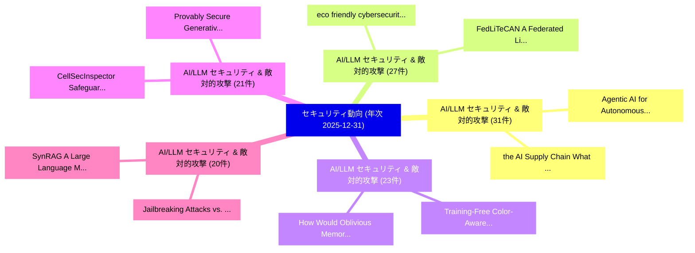

# 🌐 05_annual: 年次エグゼクティブサマリー報告書 (通期365日間: 2025-12-31)

**集計日時**: 2025-12-31 00:00:00 UTC  
**通期365日間の総論文数**: 7912 件  

---

## 💡 年次セキュリティ技術トレンド総括 (Annual Strategic Synthesis)

本日の収集論文（計 7912 件）において、以下の重点セキュリティ領域で活発な研究動向が確認されました：
- **AI/LLM セキュリティ & 敵対的攻撃** (31 件): 注目論文として 「the AI Supply Chain: What Can ...」、「Agentic AI for Autonomous Defe...」 等が発表され、実務防御および攻撃検証の進展が見られます。
- **AI/LLM セキュリティ & 敵対的攻撃** (27 件): 注目論文として 「eco friendly cybersecurity: ma...」、「FedLiTeCAN : A Federated Light...」 等が発表され、実務防御および攻撃検証の進展が見られます。
- **AI/LLM セキュリティ & 敵対的攻撃** (23 件): 注目論文として 「How Would Oblivious Memory Boo...」、「Training-Free Color-Aware Adve...」 等が発表され、実務防御および攻撃検証の進展が見られます。
- **AI/LLM セキュリティ & 敵対的攻撃** (21 件): 注目論文として 「CellSecInspector: Safeguarding...」、「Provably Secure Generative AI:...」 等が発表され、実務防御および攻撃検証の進展が見られます。
- **AI/LLM セキュリティ & 敵対的攻撃** (20 件): 注目論文として 「SynRAG: A Large Language Model...」、「Jailbreaking Attacks vs. Conte...」 等が発表され、実務防御および攻撃検証の進展が見られます。

### 🗺️ 年次セキュリティ脅威マインドマップ

---

## 📌 年次セキュリティ論文一覧 (日本語表形式)

| No | arXiv ID | 論文タイトル (日本語訳) | 重要キーワード | 構造化エグゼクティブ要約 (背景・提案・影響) | 脅威分類 | 詳細リンク |
|---|---|---|---|---|---|---|
| 1 | `2512.24531v1` | [Correctness of Extended RSA Public Key Cryptosystem（セキュリティ分析論文）](../../okf/papers/2025-12-31/2512.24531.md) | `Public Key Cryptosystem`, `Suranjan Gautam`, `Raw Meta` | 【提案】概要 (Overview & Key Finding) 本論文「Correctness of Extended RSA Public Key Cryptosystem（セキュ...。実証評価により経営層・セキュリティ管理者向け推奨アクション (E... | `executive-summary` | [arXiv](https://arxiv.org/abs/2512.24531v1) &#124; [OKF](../../okf/papers/2025-12-31/2512.24531.md) |
| 2 | `2512.24571v1` | [SynRAG: A Large Language Model Framework for Executable Query Generation in Heterogeneous SIEM System（セキュリティ分析論文）](../../okf/papers/2025-12-31/2512.24571.md) | `Executable Query Generation`, `Md Hasan Saju`, `Austin Page` | 【提案】概要 (Overview & Key Finding) 本論文「SynRAG: A Large Language Model Framework for Executable...。実証評価により経営層・セキュリティ管理者向け推奨アクション (E... | `cs.AI` | [arXiv](https://arxiv.org/abs/2512.24571v1) &#124; [OKF](../../okf/papers/2025-12-31/2512.24571.md) |
| 3 | `2512.24602v7` | [Secure Digital Semantic Communications: Fundamentals, Challenges, and Opportunities（セキュリティ分析論文）](../../okf/papers/2025-12-31/2512.24602.md) | `Secure Digital Semantic Communications`, `Weixuan Chen`, `Qianqian Yang` | 【提案】概要 (Overview & Key Finding) 本論文「Secure Digital Semantic Communications: Fundamentals, C...。実証評価により経営層・セキュリティ管理者向け推奨アクション (E... | `cybersecurity` | [arXiv](https://arxiv.org/abs/2512.24602v7) &#124; [OKF](../../okf/papers/2025-12-31/2512.24602.md) |
| 4 | `2512.24652v1` | [Practical Traceable Over-Threshold Multi-Party Private Set Intersection（セキュリティ分析論文）](../../okf/papers/2025-12-31/2512.24652.md) | `Party Private Set Intersection`, `Threshold Multi`, `Over-Threshold Multi` | 【提案】概要 (Overview & Key Finding) 本論文「Practical Traceable Over-Threshold Multi-Party Private ...。実証評価により経営層・セキュリティ管理者向け推奨アクション (E... | `cybersecurity` | [arXiv](https://arxiv.org/abs/2512.24652v1) &#124; [OKF](../../okf/papers/2025-12-31/2512.24652.md) |
| 5 | `2512.24682v3` | [CellSecInspector: Safeguarding Cellular Networks via Automated Security Analysis on Specifications（セキュリティ分析論文）](../../okf/papers/2025-12-31/2512.24682.md) | `Safeguarding Cellular Networks`, `Ke Xie`, `Xingyi Zhao` | 【提案】概要 (Overview & Key Finding) 本論文「CellSecInspector: Safeguarding Cellular Networks via Au...。実証評価により経営層・セキュリティ管理者向け推奨アクション (E... | `cybersecurity` | [arXiv](https://arxiv.org/abs/2512.24682v3) &#124; [OKF](../../okf/papers/2025-12-31/2512.24682.md) |
| 6 | `2512.24888v1` | [SoK: Web3 RegTech for Cryptocurrency VASP AML/CFT Compliance（セキュリティ分析論文）](../../okf/papers/2025-12-31/2512.24888.md) | `Jiaxin Wang`, `Ya Liu`, `Li Zhu` | 【提案】概要 (Overview & Key Finding) 本論文「SoK: Web3 RegTech for Cryptocurrency VASP AML/CFT Compl...。実証評価により経営層・セキュリティ管理者向け推奨アクション (E... | `executive-summary` | [arXiv](https://arxiv.org/abs/2512.24888v1) &#124; [OKF](../../okf/papers/2025-12-31/2512.24888.md) |
| 7 | `2512.24899v1` | [MTSP-LDP: A Framework for Multi-Task Streaming Data Publication under Local Differential Privacy（セキュリティ分析論文）](../../okf/papers/2025-12-31/2512.24899.md) | `Task Streaming Data Publication`, `Local Differential Privacy`, `Multi-Task Streaming` | 【提案】概要 (Overview & Key Finding) 本論文「MTSP-LDP: A Framework for Multi-Task Streaming Data Pub...。実証評価により経営層・セキュリティ管理者向け推奨アクション (E... | `cybersecurity` | [arXiv](https://arxiv.org/abs/2512.24899v1) &#124; [OKF](../../okf/papers/2025-12-31/2512.24899.md) |
| 8 | `2512.24925v1` | [Provably Secure Generative AI: Reliable Consensus Samplingに向けて](../../okf/papers/2025-12-31/2512.24925.md) | `Towards Provably Secure Generative`, `Reliable Consensus Sampling`, `Provably Secure Generative` | 【提案】概要 (Overview & Key Finding) 本論文「Provably Secure Generative AI: Reliable Consensus Sampl...。実証評価により経営層・セキュリティ管理者向け推奨アクション (E... | `cybersecurity` | [arXiv](https://arxiv.org/abs/2512.24925v1) &#124; [OKF](../../okf/papers/2025-12-31/2512.24925.md) |
| 9 | `2601.00042v2` | [Large Empirical Case Study: Go-Explore adapted for AI Red Team Testing（セキュリティ分析論文）](../../okf/papers/2025-12-31/2601.00042.md) | `Red Team Testing`, `Go-Explore adapted`, `Manish Bhatt` | 【提案】概要 (Overview & Key Finding) 本論文「Large Empirical Case Study: Go-Explore adapted for AI R...。実証評価により経営層・セキュリティ管理者向け推奨アクション (E... | `cs.AI` | [arXiv](https://arxiv.org/abs/2601.00042v2) &#124; [OKF](../../okf/papers/2025-12-31/2601.00042.md) |
| 10 | `2601.00065v3` | [When the Same Coefficients Reach Different Places: Asymmetric Realizability in Transplanting Tokenizers across 大規模言語モデル](../../okf/papers/2025-12-31/2601.00065.md) | `Asymmetric Realizability`, `Transplanting Tokenizers`, `Large Language Models` | 【提案】概要 (Overview & Key Finding) 本論文「When the Same Coefficients Reach Different Places: Asym...。実証評価により経営層・セキュリティ管理者向け推奨アクション (E... | `executive-summary` | [arXiv](https://arxiv.org/abs/2601.00065v3) &#124; [OKF](../../okf/papers/2025-12-31/2601.00065.md) |
| 11 | `2601.00893v1` | [eco friendly cybersecurity: machine learning based anomaly detection with carbon and energy metricsに向けて](../../okf/papers/2025-12-31/2601.00893.md) | `Md Zakir Hossain Zamil`, `Md Shafiqul Islam Mridul`, `Md Maruf Bin Reza` | 【提案】概要 (Overview & Key Finding) 本論文「eco friendly cybersecurity: machine learning based anom...。実証評価により経営層・セキュリティ管理者向け推奨アクション (E... | `executive-summary` | [arXiv](https://arxiv.org/abs/2601.00893v1) &#124; [OKF](../../okf/papers/2025-12-31/2601.00893.md) |
| 12 | `2601.00900v1` | [Noise-Aware and Dynamically Adaptive Federated Defense Framework for SAR Image Target Recognition（セキュリティ分析論文）](../../okf/papers/2025-12-31/2601.00900.md) | `Image Target Recognition`, `Yuchao Hou`, `Zixuan Zhang` | 【提案】概要 (Overview & Key Finding) 本論文「Noise-Aware and Dynamically Adaptive Federated Defense ...。実証評価により経営層・セキュリティ管理者向け推奨アクション (E... | `cs.CV` | [arXiv](https://arxiv.org/abs/2601.00900v1) &#124; [OKF](../../okf/papers/2025-12-31/2601.00900.md) |
| 13 | `2512.23948v1` | [DivQAT: Enhancing Robustness of Quantized Convolutional Neural Networks against Model Extraction Attacks（セキュリティ分析論文）](../../okf/papers/2025-12-30/2512.23948.md) | `Quantized Convolutional Neural Networks`, `Model Extraction Attacks`, `Enhancing Robustness` | 【提案】概要 (Overview & Key Finding) 本論文「DivQAT: Enhancing Robustness of Quantized Convolutional...。実証評価により経営層・セキュリティ管理者向け推奨アクション (E... | `executive-summary` | [arXiv](https://arxiv.org/abs/2512.23948v1) &#124; [OKF](../../okf/papers/2025-12-30/2512.23948.md) |
| 14 | `2512.23987v1` | [MeLeMaD: Adaptive マルウェア検出 via Chunk-wise Feature Selection and Meta-Learning](../../okf/papers/2025-12-30/2512.23987.md) | `Feature Selection`, `Chunk-wise Feature`, `Adaptive Malware Detection` | 【提案】概要 (Overview & Key Finding) 本論文「MeLeMaD: Adaptive マルウェア検出 via Chunk-wise Feature Select...。実証評価により経営層・セキュリティ管理者向け推奨アクション (E... | `cs.AI` | [arXiv](https://arxiv.org/abs/2512.23987v1) &#124; [OKF](../../okf/papers/2025-12-30/2512.23987.md) |
| 15 | `2512.23995v2` | [RepetitionCurse: Measuring and Understanding Router Imbalance in Mixture-of-Experts LLMs under DoS Stress（セキュリティ分析論文）](../../okf/papers/2025-12-30/2512.23995.md) | `Understanding Router Imbalance`, `Ruixuan Huang`, `Qingyue Wang` | 【提案】概要 (Overview & Key Finding) 本論文「RepetitionCurse: Measuring and Understanding Router Imb...。実証評価により経営層・セキュリティ管理者向け推奨アクション (E... | `executive-summary` | [arXiv](https://arxiv.org/abs/2512.23995v2) &#124; [OKF](../../okf/papers/2025-12-30/2512.23995.md) |
| 16 | `2512.24041v1` | [Exposed: Shedding Blacklight on Online Privacy（セキュリティ分析論文）](../../okf/papers/2025-12-30/2512.24041.md) | `Shedding Blacklight`, `Online Privacy`, `Lucas Shen` | 【提案】概要 (Overview & Key Finding) 本論文「Exposed: Shedding Blacklight on Online Privacy（セキュリティ分析...。実証評価により経営層・セキュリティ管理者向け推奨アクション (E... | `executive-summary` | [arXiv](https://arxiv.org/abs/2512.24041v1) &#124; [OKF](../../okf/papers/2025-12-30/2512.24041.md) |
| 17 | `2512.24044v1` | [Jailbreaking Attacks vs. Content Safety Filters: How Far Are We in the LLM Safety Arms Race?（セキュリティ分析論文）](../../okf/papers/2025-12-30/2512.24044.md) | `Content Safety Filters`, `Safety Arms Race`, `Jailbreaking Attacks` | 【提案】### (日本語題名: ジェイルブレイクing Attacks vs. Content Safety Filters: How Far Are We in the LLM S...。実証評価により経営層・セキュリティ管理者向け推奨アクション (E... | `cs.AI` | [arXiv](https://arxiv.org/abs/2512.24044v1) &#124; [OKF](../../okf/papers/2025-12-30/2512.24044.md) |
| 18 | `2512.24088v1` | [FedLiTeCAN : A Federated Lightweight Transformer for Fast and Robust CAN Bus Intrusion Detection（セキュリティ分析論文）](../../okf/papers/2025-12-30/2512.24088.md) | `Federated Lightweight Transformer`, `Bus Intrusion Detection`, `Pratik Narang` | 【提案】概要 (Overview & Key Finding) 本論文「FedLiTeCAN : A Federated Lightweight Transformer for Fa...。実証評価により経営層・セキュリティ管理者向け推奨アクション (E... | `cs.AI` | [arXiv](https://arxiv.org/abs/2512.24088v1) &#124; [OKF](../../okf/papers/2025-12-30/2512.24088.md) |
| 19 | `2512.24238v1` | [Spatial Discretization for Fine-Grain Zone Checks with STARKs（セキュリティ分析論文）](../../okf/papers/2025-12-30/2512.24238.md) | `Grain Zone Checks`, `Spatial Discretization`, `Fine-Grain Zone` | 【提案】概要 (Overview & Key Finding) 本論文「Spatial Discretization for Fine-Grain Zone Checks with ...。実証評価により経営層・セキュリティ管理者向け推奨アクション (E... | `cybersecurity` | [arXiv](https://arxiv.org/abs/2512.24238v1) &#124; [OKF](../../okf/papers/2025-12-30/2512.24238.md) |
| 20 | `2512.24255v1` | [How Would Oblivious Memory Boost Graph Analytics on Trusted Processors?（セキュリティ分析論文）](../../okf/papers/2025-12-30/2512.24255.md) | `Trusted Processors`, `Jiping Yu`, `Xiaowei Zhu` | 【提案】### (日本語題名: How Would Oblivious Memory Boost Graph Analytics on Trusted Processors?（セキュ...。実証評価により経営層・セキュリティ管理者向け推奨アクション (E... | `cybersecurity` | [arXiv](https://arxiv.org/abs/2512.24255v1) &#124; [OKF](../../okf/papers/2025-12-30/2512.24255.md) |
| 21 | `2512.24345v1` | [FedSecureFormer: A Fast, Federated and Secure Transformer Framework for Lightweight Intrusion Detection in Connected and 自動運転車両](../../okf/papers/2025-12-30/2512.24345.md) | `Lightweight Intrusion Detection`, `Autonomous Vehicles`, `Vishnu Hari` | 【提案】概要 (Overview & Key Finding) 本論文「FedSecureFormer: A Fast, Federated and Secure Transform...。実証評価により経営層・セキュリティ管理者向け推奨アクション (E... | `cs.AI` | [arXiv](https://arxiv.org/abs/2512.24345v1) &#124; [OKF](../../okf/papers/2025-12-30/2512.24345.md) |
| 22 | `2512.24391v1` | [FAST-IDS: A Fast Two-Stage Intrusion Detection System with Hybrid Compression for Real-Time Threat Detection in Connected and 自動運転車両](../../okf/papers/2025-12-30/2512.24391.md) | `Stage Intrusion Detection System`, `Time Threat Detection`, `Fast Two` | 【提案】概要 (Overview & Key Finding) 本論文「FAST-IDS: A Fast Two-Stage Intrusion Detection System w...。実証評価により経営層・セキュリティ管理者向け推奨アクション (E... | `cs.AI` | [arXiv](https://arxiv.org/abs/2512.24391v1) &#124; [OKF](../../okf/papers/2025-12-30/2512.24391.md) |
| 23 | `2512.24400v1` | [SourceBroken: A large-scale analysis on the (un)reliability of SourceRank in the PyPI ecosystem（セキュリティ分析論文）](../../okf/papers/2025-12-30/2512.24400.md) | `Serena Elisa Ponta`, `Biagio Montaruli`, `Luca Compagna` | 【提案】概要 (Overview & Key Finding) 本論文「SourceBroken: A large-scale analysis on the (un)reliabi...。実証評価により経営層・セキュリティ管理者向け推奨アクション (E... | `executive-summary` | [arXiv](https://arxiv.org/abs/2512.24400v1) &#124; [OKF](../../okf/papers/2025-12-30/2512.24400.md) |
| 24 | `2512.24415v1` | [Language Model Agents Under Attack: A Cross Model-Benchmark of Profit-Seeking Behaviors in Customer Service（セキュリティ分析論文）](../../okf/papers/2025-12-30/2512.24415.md) | `Cross Model`, `Seeking Behaviors`, `Customer Service` | 【提案】概要 (Overview & Key Finding) 本論文「Language Model Agents Under Attack: A Cross Model-Bench...。実証評価により経営層・セキュリティ管理者向け推奨アクション (E... | `executive-summary` | [arXiv](https://arxiv.org/abs/2512.24415v1) &#124; [OKF](../../okf/papers/2025-12-30/2512.24415.md) |
| 25 | `2512.24416v2` | [GateChain: A Blockchain Based Application for Country Entry-Exit Registry Management（セキュリティ分析論文）](../../okf/papers/2025-12-30/2512.24416.md) | `Blockchain Based Application`, `Exit Registry Management`, `Country Entry` | 【提案】概要 (Overview & Key Finding) 本論文「GateChain: A Blockchain Based Application for Country E...。実証評価により経営層・セキュリティ管理者向け推奨アクション (E... | `cybersecurity` | [arXiv](https://arxiv.org/abs/2512.24416v2) &#124; [OKF](../../okf/papers/2025-12-30/2512.24416.md) |
| 26 | `2512.24452v1` | [Privacy-Preserving Semantic Communications via Multi-Task Learning and Adversarial Perturbations（セキュリティ分析論文）](../../okf/papers/2025-12-30/2512.24452.md) | `Preserving Semantic Communications`, `Task Learning`, `Privacy-Preserving Semantic` | 【提案】概要 (Overview & Key Finding) 本論文「Privacy-Preserving Semantic Communications via Multi-Ta...。実証評価により経営層・セキュリティ管理者向け推奨アクション (E... | `cs.NI` | [arXiv](https://arxiv.org/abs/2512.24452v1) &#124; [OKF](../../okf/papers/2025-12-30/2512.24452.md) |
| 27 | `2512.24457v1` | [Document Data Matching for Blockchain-Supported Real Estate（セキュリティ分析論文）](../../okf/papers/2025-12-30/2512.24457.md) | `Document Data Matching`, `Supported Real Estate`, `Blockchain-Supported Real` | 【提案】概要 (Overview & Key Finding) 本論文「Document Data Matching for Blockchain-Supported Real Es...。実証評価により経営層・セキュリティ管理者向け推奨アクション (E... | `executive-summary` | [arXiv](https://arxiv.org/abs/2512.24457v1) &#124; [OKF](../../okf/papers/2025-12-30/2512.24457.md) |
| 28 | `2512.24499v1` | [Training-Free Color-Aware Adversarial Diffusion Sanitization for Diffusion Stegomalware Defense at Security Gateways（セキュリティ分析論文）](../../okf/papers/2025-12-30/2512.24499.md) | `Aware Adversarial Diffusion Sanitization`, `Diffusion Stegomalware Defense`, `Free Color` | 【提案】概要 (Overview & Key Finding) 本論文「Training-Free Color-Aware Adversarial Diffusion Sanitiz...。実証評価により経営層・セキュリティ管理者向け推奨アクション (E... | `cs.CV` | [arXiv](https://arxiv.org/abs/2512.24499v1) &#124; [OKF](../../okf/papers/2025-12-30/2512.24499.md) |
| 29 | `2601.00867v1` | [The Silicon Psyche: Anthropomorphic Vulnerabilities in 大規模言語モデル](../../okf/papers/2025-12-30/2601.00867.md) | `Anthropomorphic Vulnerabilities`, `Large Language Models`, `Giuseppe Canale` | 【提案】概要 (Overview & Key Finding) 本論文「The Silicon Psyche: Anthropomorphic Vulnerabilities in ...。実証評価により経営層・セキュリティ管理者向け推奨アクション (E... | `cs.AI` | [arXiv](https://arxiv.org/abs/2601.00867v1) &#124; [OKF](../../okf/papers/2025-12-30/2601.00867.md) |
| 30 | `2601.00870v1` | [The Quantum State Continuity Problem and Temporal Enforcement Against Fork Attacks（セキュリティ分析論文）](../../okf/papers/2025-12-30/2601.00870.md) | `Raw Meta`, `Executive Summary`, `Key Finding` | 【提案】概要 (Overview & Key Finding) 本論文「The 量子 State Continuity Problem and Temporal Enforcemen...。実証評価により経営層・セキュリティ管理者向け推奨アクション (E... | `executive-summary` | [arXiv](https://arxiv.org/abs/2601.00870v1) &#124; [OKF](../../okf/papers/2025-12-30/2601.00870.md) |
| 31 | `2601.00873v1` | [Quantum Machine Learning Approaches for Coordinated Stealth Attack Detection in Distributed Generation Systems（セキュリティ分析論文）](../../okf/papers/2025-12-30/2601.00873.md) | `Quantum Machine Learning Approaches`, `Coordinated Stealth Attack Detection`, `Distributed Generation Systems` | 【提案】概要 (Overview & Key Finding) 本論文「量子 Machine Learning Approaches for Coordinated Stealth ...。実証評価により経営層・セキュリティ管理者向け推奨アクション (E... | `executive-summary` | [arXiv](https://arxiv.org/abs/2601.00873v1) &#124; [OKF](../../okf/papers/2025-12-30/2601.00873.md) |
| 32 | `2601.14266v1` | [GCG Attack On A Diffusion LLM（セキュリティ分析論文）](../../okf/papers/2025-12-30/2601.14266.md) | `Ruben Neyroud`, `Sam Corley`, `Raw Meta` | 【提案】概要 (Overview & Key Finding) 本論文「GCG Attack On A Diffusion LLM（セキュリティ分析論文）」（原題: GCG Atta...。実証評価により経営層・セキュリティ管理者向け推奨アクション (E... | `executive-summary` | [arXiv](https://arxiv.org/abs/2601.14266v1) &#124; [OKF](../../okf/papers/2025-12-30/2601.14266.md) |
| 33 | `2512.23124v2` | [SecureBank: A Financially-Aware Zero Trust Architecture for High-Assurance Banking Systems（セキュリティ分析論文）](../../okf/papers/2025-12-29/2512.23124.md) | `Aware Zero Trust Architecture`, `Assurance Banking Systems`, `Financially-Aware Zero` | 【提案】概要 (Overview & Key Finding) 本論文「SecureBank: A Financially-Aware ゼロトラスト Architecture for...。実証評価により経営層・セキュリティ管理者向け推奨アクション (E... | `cybersecurity` | [arXiv](https://arxiv.org/abs/2512.23124v2) &#124; [OKF](../../okf/papers/2025-12-29/2512.23124.md) |
| 34 | `2512.23132v1` | [Multi-Agent Framework for Threat Mitigation and Resilience in AI-Based Systems（セキュリティ分析論文）](../../okf/papers/2025-12-29/2512.23132.md) | `Threat Mitigation`, `Based Systems`, `AI-Based Systems` | 【提案】概要 (Overview & Key Finding) 本論文「Multi-Agent Framework for 脅威 Mitigation and Resilience ...。実証評価により経営層・セキュリティ管理者向け推奨アクション (E... | `executive-summary` | [arXiv](https://arxiv.org/abs/2512.23132v1) &#124; [OKF](../../okf/papers/2025-12-29/2512.23132.md) |
| 35 | `2512.23171v3` | [Certifying the Right to Be Forgotten: Primal-Dual Optimization for Sample and Label Unlearning in Vertical 連合学習](../../okf/papers/2025-12-29/2512.23171.md) | `Dual Optimization`, `Label Unlearning`, `Primal-Dual Optimization` | 【提案】概要 (Overview & Key Finding) 本論文「Certifying the Right to Be Forgotten: Primal-Dual Optim...。実証評価により経営層・セキュリティ管理者向け推奨アクション (E... | `executive-summary` | [arXiv](https://arxiv.org/abs/2512.23171v3) &#124; [OKF](../../okf/papers/2025-12-29/2512.23171.md) |
| 36 | `2512.23173v1` | [EquaCode: A Multi-Strategy Jailbreak Approach for 大規模言語モデル via Equation Solving and Code Completion](../../okf/papers/2025-12-29/2512.23173.md) | `Equation Solving`, `Code Completion`, `Multi-Strategy Jailbreak` | 【提案】概要 (Overview & Key Finding) 本論文「EquaCode: A Multi-Strategy ジェイルブレイク Approach for 大規模言語モ...。実証評価により経営層・セキュリティ管理者向け推奨アクション (E... | `cs.AI` | [arXiv](https://arxiv.org/abs/2512.23173v1) &#124; [OKF](../../okf/papers/2025-12-29/2512.23173.md) |
| 37 | `2512.23216v1` | [Multiparty Authorization for Secure Data Storage in Cloud Environments using Improved Attribute-Based Encryption（セキュリティ分析論文）](../../okf/papers/2025-12-29/2512.23216.md) | `Secure Data Storage`, `Multiparty Authorization`, `Cloud Environments` | 【提案】概要 (Overview & Key Finding) 本論文「Multiparty Authorization for Secure Data Storage in Clo...。実証評価により経営層・セキュリティ管理者向け推奨アクション (E... | `cybersecurity` | [arXiv](https://arxiv.org/abs/2512.23216v1) &#124; [OKF](../../okf/papers/2025-12-29/2512.23216.md) |
| 38 | `2512.23307v1` | [RobustMask: Certified Robustness against Adversarial Neural Ranking Attack via Randomized Masking（セキュリティ分析論文）](../../okf/papers/2025-12-29/2512.23307.md) | `Adversarial Neural Ranking Attack`, `Certified Robustness`, `Randomized Masking` | 【提案】概要 (Overview & Key Finding) 本論文「RobustMask: Certified Robustness against Adversarial Ne...。実証評価により経営層・セキュリティ管理者向け推奨アクション (E... | `executive-summary` | [arXiv](https://arxiv.org/abs/2512.23307v1) &#124; [OKF](../../okf/papers/2025-12-29/2512.23307.md) |
| 39 | `2512.23385v2` | [the AI Supply Chain: What Can We Learn From Developer-Reported Security Issues and Solutions of AI Projects?のセキュリティ強化](../../okf/papers/2025-12-29/2512.23385.md) | `Reported Security Issues`, `Supply Chain`, `Developer-Reported Security` | 【提案】### (日本語題名: the AI Supply Chain: What Can We Learn From Developer-Reported Security Iss...。実証評価により経営層・セキュリティ管理者向け推奨アクション (E... | `cs.AI` | [arXiv](https://arxiv.org/abs/2512.23385v2) &#124; [OKF](../../okf/papers/2025-12-29/2512.23385.md) |
| 40 | `2512.23438v1` | [Fuzzilicon: A Post-Silicon Microcode-Guided x86 CPU Fuzzer（セキュリティ分析論文）](../../okf/papers/2025-12-29/2512.23438.md) | `Silicon Microcode`, `Post-Silicon Microcode`, `Johannes Lenzen` | 【提案】概要 (Overview & Key Finding) 本論文「Fuzzilicon: A Post-Silicon Microcode-Guided x86 CPU Fuz...。実証評価により経営層・セキュリティ管理者向け推奨アクション (E... | `cybersecurity` | [arXiv](https://arxiv.org/abs/2512.23438v1) &#124; [OKF](../../okf/papers/2025-12-29/2512.23438.md) |
| 41 | `2512.23439v4` | [Bitcoin-IPC: Scaling Bitcoin with a Network of Proof-of-Stake Subnets（セキュリティ分析論文）](../../okf/papers/2025-12-29/2512.23439.md) | `Scaling Bitcoin`, `Stake Subnets`, `Orestis Alpos` | 【提案】概要 (Overview & Key Finding) 本論文「Bitcoin-IPC: Scaling Bitcoin with a Network of Proof-of...。実証評価により経営層・セキュリティ管理者向け推奨アクション (E... | `executive-summary` | [arXiv](https://arxiv.org/abs/2512.23439v4) &#124; [OKF](../../okf/papers/2025-12-29/2512.23439.md) |
| 42 | `2512.23480v1` | [Agentic AI for Autonomous Defense in Software Supply Chain Security: Beyond Provenance to Vulnerability Mitigation（セキュリティ分析論文）](../../okf/papers/2025-12-29/2512.23480.md) | `Software Supply Chain Security`, `Autonomous Defense`, `Beyond Provenance` | 【提案】概要 (Overview & Key Finding) 本論文「Agentic AI for Autonomous Defense in Software Supply Ch...。実証評価により経営層・セキュリティ管理者向け推奨アクション (E... | `cs.AI` | [arXiv](https://arxiv.org/abs/2512.23480v1) &#124; [OKF](../../okf/papers/2025-12-29/2512.23480.md) |
| 43 | `2512.23535v1` | [A Privacy Protocol Using Ephemeral Intermediaries and a Rank-Deficient Matrix Power Function (RDMPF)（セキュリティ分析論文）](../../okf/papers/2025-12-29/2512.23535.md) | `Privacy Protocol Using Ephemeral Intermediaries`, `Deficient Matrix Power Function`, `Rank-Deficient Matrix` | 【提案】概要 (Overview & Key Finding) 本論文「A Privacy Protocol Using Ephemeral Intermediaries and a...。実証評価により経営層・セキュリティ管理者向け推奨アクション (E... | `cs.NI` | [arXiv](https://arxiv.org/abs/2512.23535v1) &#124; [OKF](../../okf/papers/2025-12-29/2512.23535.md) |
| 44 | `2512.23557v1` | [Toward Trustworthy Agentic AI: A Multimodal Framework for Preventing Prompt Injection Attacks（セキュリティ分析論文）](../../okf/papers/2025-12-29/2512.23557.md) | `Preventing Prompt Injection Attacks`, `Toward Trustworthy Agentic`, `Toqeer Ali Syed` | 【提案】概要 (Overview & Key Finding) 本論文「Toward Trustworthy Agentic AI: A Multimodal Framework f...。実証評価により経営層・セキュリティ管理者向け推奨アクション (E... | `cs.AI` | [arXiv](https://arxiv.org/abs/2512.23557v1) &#124; [OKF](../../okf/papers/2025-12-29/2512.23557.md) |
| 45 | `2512.23607v1` | [Research Directions in Quantum Computer サイバーセキュリティ](../../okf/papers/2025-12-29/2512.23607.md) | `Research Directions`, `Quantum Computer Cybersecurity`, `Quantum Computer` | 【提案】概要 (Overview & Key Finding) 本論文「Research Directions in 量子 Computer サイバーセキュリティ」（原題: Rese...。実証評価により経営層・セキュリティ管理者向け推奨アクション (E... | `executive-summary` | [arXiv](https://arxiv.org/abs/2512.23607v1) &#124; [OKF](../../okf/papers/2025-12-29/2512.23607.md) |
| 46 | `2512.23610v2` | [Enhanced Web Payload Classification Using WAMM: An AI-Based Framework for Dataset Refinement and Model Evaluation（セキュリティ分析論文）](../../okf/papers/2025-12-29/2512.23610.md) | `Enhanced Web Payload Classification Using`, `Dataset Refinement`, `Heba Osama` | 【提案】概要 (Overview & Key Finding) 本論文「Enhanced Web Payload Classification Using WAMM: An AI-B...。実証評価により経営層・セキュリティ管理者向け推奨アクション (E... | `cybersecurity` | [arXiv](https://arxiv.org/abs/2512.23610v2) &#124; [OKF](../../okf/papers/2025-12-29/2512.23610.md) |
| 47 | `2512.23774v1` | [Secure and Governed API Gateway Architectures for Multi-Cluster Cloud Environments（セキュリティ分析論文）](../../okf/papers/2025-12-29/2512.23774.md) | `Cluster Cloud Environments`, `Gateway Architectures`, `Multi-Cluster Cloud` | 【提案】概要 (Overview & Key Finding) 本論文「Secure and Governed API Gateway Architectures for Multi...。実証評価により経営層・セキュリティ管理者向け推奨アクション (E... | `cybersecurity` | [arXiv](https://arxiv.org/abs/2512.23774v1) &#124; [OKF](../../okf/papers/2025-12-29/2512.23774.md) |
| 48 | `2512.23778v1` | [SyncGait: Robust Long-Distance Authentication for Drone Delivery via Implicit Gait Behaviors（セキュリティ分析論文）](../../okf/papers/2025-12-29/2512.23778.md) | `Implicit Gait Behaviors`, `Robust Long`, `Distance Authentication` | 【提案】概要 (Overview & Key Finding) 本論文「SyncGait: Robust Long-Distance Authentication for Drone...。実証評価により経営層・セキュリティ管理者向け推奨アクション (E... | `cs.MM` | [arXiv](https://arxiv.org/abs/2512.23778v1) &#124; [OKF](../../okf/papers/2025-12-29/2512.23778.md) |
| 49 | `2512.23779v2` | [Prompt-Induced Over-Generation as Denial-of-Service: A Black-Box Attack-Side Benchmark（セキュリティ分析論文）](../../okf/papers/2025-12-29/2512.23779.md) | `Box Attack`, `Black-Box Attack`, `Side Benchmark` | 【提案】概要 (Overview & Key Finding) 本論文「Prompt-Induced Over-Generation as Denial-of-Service: A ...。実証評価により経営層・セキュリティ管理者向け推奨アクション (E... | `cs.AI` | [arXiv](https://arxiv.org/abs/2512.23779v2) &#124; [OKF](../../okf/papers/2025-12-29/2512.23779.md) |
| 50 | `2512.23785v1` | [Application-Specific Power Side-Channel Attacks and Countermeasures: A Survey（セキュリティ分析論文）](../../okf/papers/2025-12-29/2512.23785.md) | `Specific Power Side`, `Channel Attacks`, `Application-Specific Power` | 【提案】概要 (Overview & Key Finding) 本論文「Application-Specific Power サイドチャネル攻撃 Attacks and Counte...。実証評価により経営層・セキュリティ管理者向け推奨アクション (E... | `cybersecurity` | [arXiv](https://arxiv.org/abs/2512.23785v1) &#124; [OKF](../../okf/papers/2025-12-29/2512.23785.md) |
| 51 | `2512.23788v1` | [VBSF: A Visual-Based Spam Filtering Technique for Obfuscated Emails（セキュリティ分析論文）](../../okf/papers/2025-12-29/2512.23788.md) | `Based Spam Filtering Technique`, `Obfuscated Emails`, `Visual-Based Spam` | 【提案】概要 (Overview & Key Finding) 本論文「VBSF: A Visual-Based Spam Filtering Technique for Obfus...。実証評価により経営層・セキュリティ管理者向け推奨アクション (E... | `cybersecurity` | [arXiv](https://arxiv.org/abs/2512.23788v1) &#124; [OKF](../../okf/papers/2025-12-29/2512.23788.md) |
| 52 | `2512.23809v1` | [Zero-Trust Agentic 連合学習 for Secure IIoT Defense Systems](../../okf/papers/2025-12-29/2512.23809.md) | `Defense Systems`, `Zero-Trust Agentic`, `Trust Agentic Federated Learning` | 【提案】概要 (Overview & Key Finding) 本論文「ゼロトラスト Agentic 連合学習 for Secure IIoT Defense Systems」（原題...。実証評価により経営層・セキュリティ管理者向け推奨アクション (E... | `cs.AI` | [arXiv](https://arxiv.org/abs/2512.23809v1) &#124; [OKF](../../okf/papers/2025-12-29/2512.23809.md) |
| 53 | `2512.23849v2` | [Security Without Detection: Economic Denial as a Primitive for Edge and IoT Defense（セキュリティ分析論文）](../../okf/papers/2025-12-29/2512.23849.md) | `Security Without Detection`, `Economic Denial`, `Samaresh Kumar Singh` | 【提案】背景とセキュリティ上の課題 (Background & Problem) 本研究はサイバー脅威環境におけるセキュリティ構造・脆弱性の検証を目的としています。(主要検出項目: ...。実証評価により経営層・セキュリティ管理者向け推奨アクション (E... | `cs.AI` | [arXiv](https://arxiv.org/abs/2512.23849v2) &#124; [OKF](../../okf/papers/2025-12-29/2512.23849.md) |
| 54 | `2512.23881v1` | [Breaking Audio 大規模言語モデル by Attacking Only the Encoder: A Universal Targeted Latent-Space Audio Attack](../../okf/papers/2025-12-29/2512.23881.md) | `Universal Targeted Latent`, `Space Audio Attack`, `Latent-Space Audio` | 【提案】概要 (Overview & Key Finding) 本論文「Breaking Audio 大規模言語モデル by Attacking Only the Encoder: ...。実証評価により経営層・セキュリティ管理者向け推奨アクション (E... | `cs.AI` | [arXiv](https://arxiv.org/abs/2512.23881v1) &#124; [OKF](../../okf/papers/2025-12-29/2512.23881.md) |
| 55 | `2601.00848v1` | [Temporal Attack Pattern Detection in Multi-Agent AI Workflows: An Open Framework for Training Trace-Based Security Models（セキュリティ分析論文）](../../okf/papers/2025-12-29/2601.00848.md) | `Temporal Attack Pattern Detection`, `Based Security Models`, `Training Trace` | 【提案】概要 (Overview & Key Finding) 本論文「Temporal Attack Pattern Detection in Multi-Agent AI Wor...。実証評価により経営層・セキュリティ管理者向け推奨アクション (E... | `cs.AI` | [arXiv](https://arxiv.org/abs/2601.00848v1) &#124; [OKF](../../okf/papers/2025-12-29/2601.00848.md) |
| 56 | `2512.22759v1` | [Identifying social bots via heterogeneous motifs based on Naïve Bayes model（セキュリティ分析論文）](../../okf/papers/2025-12-28/2512.22759.md) | `Yijun Ran`, `Jingjing Xiao`, `Ke Xu` | 【提案】概要 (Overview & Key Finding) 本論文「Identifying social bots via heterogeneous motifs based ...。実証評価により経営層・セキュリティ管理者向け推奨アクション (E... | `cybersecurity` | [arXiv](https://arxiv.org/abs/2512.22759v1) &#124; [OKF](../../okf/papers/2025-12-28/2512.22759.md) |
| 57 | `2512.22765v1` | [A generalized motif-based Naïve Bayes model for sign prediction in complex networks（セキュリティ分析論文）](../../okf/papers/2025-12-28/2512.22765.md) | `Yijun Ran`, `Yuan Liu`, `Junjie Huang` | 【提案】概要 (Overview & Key Finding) 本論文「A generalized motif-based Naïve Bayes model for sign pr...。実証評価により経営層・セキュリティ管理者向け推奨アクション (E... | `cybersecurity` | [arXiv](https://arxiv.org/abs/2512.22765v1) &#124; [OKF](../../okf/papers/2025-12-28/2512.22765.md) |
| 58 | `2512.22789v1` | [Breaking the illusion: Automated Reasoning of GDPR Consent Violations（セキュリティ分析論文）](../../okf/papers/2025-12-28/2512.22789.md) | `Automated Reasoning`, `Consent Violations`, `Faysal Hossain Shezan` | 【提案】概要 (Overview & Key Finding) 本論文「Breaking the illusion: Automated Reasoning of GDPR Cons...。実証評価により経営層・セキュリティ管理者向け推奨アクション (E... | `cybersecurity` | [arXiv](https://arxiv.org/abs/2512.22789v1) &#124; [OKF](../../okf/papers/2025-12-28/2512.22789.md) |
| 59 | `2512.22860v1` | [Adaptive Trust Consensus for Blockchain IoT: Comparing RL, DRL, and MARL Against Naive, Collusive, Adaptive, Byzantine, and Sleeper Attacks（セキュリティ分析論文）](../../okf/papers/2025-12-28/2512.22860.md) | `Adaptive Trust Consensus`, `Sleeper Attacks`, `Soham Padia` | 【提案】概要 (Overview & Key Finding) 本論文「Adaptive Trust Consensus for Blockchain IoT: Comparing ...。実証評価により経営層・セキュリティ管理者向け推奨アクション (E... | `executive-summary` | [arXiv](https://arxiv.org/abs/2512.22860v1) &#124; [OKF](../../okf/papers/2025-12-28/2512.22860.md) |
| 60 | `2512.22883v1` | [Agentic AI for Cyber Resilience: A New Security Paradigm and Its System-Theoretic Foundations（セキュリティ分析論文）](../../okf/papers/2025-12-28/2512.22883.md) | `New Security Paradigm`, `Cyber Resilience`, `Theoretic Foundations` | 【提案】概要 (Overview & Key Finding) 本論文「Agentic AI for Cyber Resilience: A New Security Paradig...。実証評価により経営層・セキュリティ管理者向け推奨アクション (E... | `cs.AI` | [arXiv](https://arxiv.org/abs/2512.22883v1) &#124; [OKF](../../okf/papers/2025-12-28/2512.22883.md) |
| 61 | `2512.22894v2` | [DECEPTICON: How Dark Patterns Manipulate Web Agents（セキュリティ分析論文）](../../okf/papers/2025-12-28/2512.22894.md) | `Phil Cuvin`, `Hao Zhu`, `Diyi Yang` | 【提案】概要 (Overview & Key Finding) 本論文「DECEPTICON: How Dark Patterns Manipulate Web Agents（セキュ...。実証評価により経営層・セキュリティ管理者向け推奨アクション (E... | `cs.AI` | [arXiv](https://arxiv.org/abs/2512.22894v2) &#124; [OKF](../../okf/papers/2025-12-28/2512.22894.md) |
| 62 | `2512.23760v1` | [Audited Skill-Graph Self-Improvement for Agentic LLMs via Verifiable Rewards, Experience Synthesis, and Continual Memory（セキュリティ分析論文）](../../okf/papers/2025-12-28/2512.23760.md) | `Audited Skill`, `Graph Self`, `Skill-Graph Self` | 【提案】概要 (Overview & Key Finding) 本論文「Audited Skill-Graph Self-Improvement for Agentic LLMs v...。実証評価により経営層・セキュリティ管理者向け推奨アクション (E... | `cs.AI` | [arXiv](https://arxiv.org/abs/2512.23760v1) &#124; [OKF](../../okf/papers/2025-12-28/2512.23760.md) |
| 63 | `2601.11570v1` | [Privacy-Preserving Black-Box Optimization (PBBO): Theory and the Model-Based Algorithm DFOp（セキュリティ分析論文）](../../okf/papers/2025-12-28/2601.11570.md) | `Preserving Black`, `Box Optimization`, `Privacy-Preserving Black` | 【提案】概要 (Overview & Key Finding) 本論文「Privacy-Preserving Black-Box Optimization (PBBO): Theor...。実証評価により経営層・セキュリティ管理者向け推奨アクション (E... | `executive-summary` | [arXiv](https://arxiv.org/abs/2601.11570v1) &#124; [OKF](../../okf/papers/2025-12-28/2601.11570.md) |
| 64 | `2512.22501v3` | [NOWA: Null-space Optical Watermark for Invisible Capture Fingerprinting and Tamper Localization（セキュリティ分析論文）](../../okf/papers/2025-12-27/2512.22501.md) | `Invisible Capture Fingerprinting`, `Optical Watermark`, `Tamper Localization` | 【提案】概要 (Overview & Key Finding) 本論文「NOWA: Null-space Optical Watermark for Invisible Captur...。実証評価により経営層・セキュリティ管理者向け推奨アクション (E... | `executive-summary` | [arXiv](https://arxiv.org/abs/2512.22501v3) &#124; [OKF](../../okf/papers/2025-12-27/2512.22501.md) |
| 65 | `2512.22526v1` | [Verifiable Dropout: Turning Randomness into a Verifiable Claim（セキュリティ分析論文）](../../okf/papers/2025-12-27/2512.22526.md) | `Verifiable Dropout`, `Turning Randomness`, `Verifiable Claim` | 【提案】概要 (Overview & Key Finding) 本論文「Verifiable Dropout: Turning Randomness into a Verifiabl...。実証評価により経営層・セキュリティ管理者向け推奨アクション (E... | `cybersecurity` | [arXiv](https://arxiv.org/abs/2512.22526v1) &#124; [OKF](../../okf/papers/2025-12-27/2512.22526.md) |
| 66 | `2512.22616v1` | [Raven: Mining Defensive Patterns in Ethereum via Semantic Transaction Revert Invariants Categories（セキュリティ分析論文）](../../okf/papers/2025-12-27/2512.22616.md) | `Semantic Transaction Revert Invariants Categories`, `Mining Defensive Patterns`, `Mojtaba Eshghie` | 【提案】概要 (Overview & Key Finding) 本論文「Raven: Mining Defensive Patterns in Ethereum via Semant...。実証評価により経営層・セキュリティ管理者向け推奨アクション (E... | `cybersecurity` | [arXiv](https://arxiv.org/abs/2512.22616v1) &#124; [OKF](../../okf/papers/2025-12-27/2512.22616.md) |
| 67 | `2512.22669v1` | [SCyTAG: Scalable Cyber-Twin for Threat-Assessment Based on Attack Graphs（セキュリティ分析論文）](../../okf/papers/2025-12-27/2512.22669.md) | `Scalable Cyber`, `Assessment Based`, `Attack Graphs` | 【提案】概要 (Overview & Key Finding) 本論文「SCyTAG: Scalable Cyber-Twin for 脅威-Assessment Based on ...。実証評価により経営層・セキュリティ管理者向け推奨アクション (E... | `cybersecurity` | [arXiv](https://arxiv.org/abs/2512.22669v1) &#124; [OKF](../../okf/papers/2025-12-27/2512.22669.md) |
| 68 | `2512.22720v1` | [When RSA Fails: Exploiting Prime Selection Vulnerabilities in Public Key Cryptography（セキュリティ分析論文）](../../okf/papers/2025-12-27/2512.22720.md) | `Exploiting Prime Selection Vulnerabilities`, `Public Key Cryptography`, `Murtaza Nikzad` | 【提案】概要 (Overview & Key Finding) 本論文「When RSA Fails: Exploiting Prime Selection Vulnerabilit...。実証評価により経営層・セキュリティ管理者向け推奨アクション (E... | `cybersecurity` | [arXiv](https://arxiv.org/abs/2512.22720v1) &#124; [OKF](../../okf/papers/2025-12-27/2512.22720.md) |
| 69 | `2512.21813v1` | [Organizational Learning in Industry 4.0: Applying Crossan's 4I Framework with Double Loop Learning（セキュリティ分析論文）](../../okf/papers/2025-12-26/2512.21813.md) | `Double Loop Learning`, `Organizational Learning`, `Applying Crossan` | 【提案】概要 (Overview & Key Finding) 本論文「Organizational Learning in Industry 4.0: Applying Cross...。実証評価により経営層・セキュリティ管理者向け推奨アクション (E... | `cybersecurity` | [arXiv](https://arxiv.org/abs/2512.21813v1) &#124; [OKF](../../okf/papers/2025-12-26/2512.21813.md) |
| 70 | `2512.21827v1` | [Cross-Domain Internet of Drones: An RFF-PUF Allied Authenticated Key Exchange Protocol With Over-the-Air Enrollmentのセキュリティ強化](../../okf/papers/2025-12-26/2512.21827.md) | `Domain Internet`, `Cross-Domain Internet`, `RFF-PUF Allied` | 【提案】概要 (Overview & Key Finding) 本論文「Cross-Domain Internet of Drones: An RFF-PUF Allied Auth...。実証評価により経営層・セキュリティ管理者向け推奨アクション (E... | `cybersecurity` | [arXiv](https://arxiv.org/abs/2512.21827v1) &#124; [OKF](../../okf/papers/2025-12-26/2512.21827.md) |
| 71 | `2512.21871v1` | [Bridging the Copyright Gap: Do Large Vision-Language Models Recognize and Respect Copyrighted Content?（セキュリティ分析論文）](../../okf/papers/2025-12-26/2512.21871.md) | `Language Models Recognize`, `Respect Copyrighted Content`, `Copyright Gap` | 【提案】### (日本語題名: Bridging the Copyright Gap: Do Large Vision-Language Models Recognize and R...。実証評価により経営層・セキュリティ管理者向け推奨アクション (E... | `cs.AI` | [arXiv](https://arxiv.org/abs/2512.21871v1) &#124; [OKF](../../okf/papers/2025-12-26/2512.21871.md) |
| 72 | `2512.22046v2` | [Backdoor Attacks on Prompt-Driven Video Segmentation Foundation Models（セキュリティ分析論文）](../../okf/papers/2025-12-26/2512.22046.md) | `Driven Video Segmentation Foundation Models`, `Backdoor Attacks`, `Prompt-Driven Video` | 【提案】概要 (Overview & Key Finding) 本論文「Backdoor Attacks on Prompt-Driven Video Segmentation Fo...。実証評価により経営層・セキュリティ管理者向け推奨アクション (E... | `cs.CV` | [arXiv](https://arxiv.org/abs/2512.22046v2) &#124; [OKF](../../okf/papers/2025-12-26/2512.22046.md) |
| 73 | `2512.22060v1` | [Toward Secure and Compliant AI: Organizational Standards and Protocols for NLP Model Lifecycle Management（セキュリティ分析論文）](../../okf/papers/2025-12-26/2512.22060.md) | `Model Lifecycle Management`, `Toward Secure`, `Organizational Standards` | 【提案】概要 (Overview & Key Finding) 本論文「Toward Secure and Compliant AI: Organizational Standard...。実証評価により経営層・セキュリティ管理者向け推奨アクション (E... | `executive-summary` | [arXiv](https://arxiv.org/abs/2512.22060v1) &#124; [OKF](../../okf/papers/2025-12-26/2512.22060.md) |
| 74 | `2512.22076v1` | [ReSMT: An SMT-Based Tool for Reverse Engineering（セキュリティ分析論文）](../../okf/papers/2025-12-26/2512.22076.md) | `Based Tool`, `Reverse Engineering`, `SMT-Based Tool` | 【提案】概要 (Overview & Key Finding) 本論文「ReSMT: An SMT-Based Tool for Reverse Engineering（セキュリティ...。実証評価により経営層・セキュリティ管理者向け推奨アクション (E... | `cybersecurity` | [arXiv](https://arxiv.org/abs/2512.22076v1) &#124; [OKF](../../okf/papers/2025-12-26/2512.22076.md) |
| 75 | `2512.22090v1` | [Abstraction of Trusted Execution Environments as the Missing Layer for Broad Confidential Computing Adoption: A Systematization of Knowledge（セキュリティ分析論文）](../../okf/papers/2025-12-26/2512.22090.md) | `Broad Confidential Computing Adoption`, `Trusted Execution Environments`, `Missing Layer` | 【提案】概要 (Overview & Key Finding) 本論文「Abstraction of Trusted Execution Environments as the Mi...。実証評価により経営層・セキュリティ管理者向け推奨アクション (E... | `cybersecurity` | [arXiv](https://arxiv.org/abs/2512.22090v1) &#124; [OKF](../../okf/papers/2025-12-26/2512.22090.md) |
| 76 | `2512.22301v1` | [A Statistical Side-Channel Risk Model for Timing Variability in Lattice-Based Post-Quantum Cryptography（セキュリティ分析論文）](../../okf/papers/2025-12-26/2512.22301.md) | `Channel Risk Model`, `Statistical Side`, `Timing Variability` | 【提案】概要 (Overview & Key Finding) 本論文「A Statistical サイドチャネル攻撃 Risk Model for Timing Variabili...。実証評価により経営層・セキュリティ管理者向け推奨アクション (E... | `cybersecurity` | [arXiv](https://arxiv.org/abs/2512.22301v1) &#124; [OKF](../../okf/papers/2025-12-26/2512.22301.md) |
| 77 | `2512.22306v1` | [Beyond Single Bugs: Large Language Models for Multi-Vulnerability Detectionのベンチマーク評価](../../okf/papers/2025-12-26/2512.22306.md) | `Beyond Single Bugs`, `Benchmarking Large Language Models`, `Large Language Models` | 【提案】概要 (Overview & Key Finding) 本論文「Beyond Single Bugs: Large Language Models for Multi-脆弱性...。実証評価により経営層・セキュリティ管理者向け推奨アクション (E... | `cs.AI` | [arXiv](https://arxiv.org/abs/2512.22306v1) &#124; [OKF](../../okf/papers/2025-12-26/2512.22306.md) |
| 78 | `2512.22307v1` | [LLA: Enhancing Security and Privacy for Generative Models with Logic-Locked Accelerators（セキュリティ分析論文）](../../okf/papers/2025-12-26/2512.22307.md) | `Enhancing Security`, `Generative Models`, `Locked Accelerators` | 【提案】概要 (Overview & Key Finding) 本論文「LLA: Enhancing Security and Privacy for Generative Mode...。実証評価により経営層・セキュリティ管理者向け推奨アクション (E... | `cs.AI` | [arXiv](https://arxiv.org/abs/2512.22307v1) &#124; [OKF](../../okf/papers/2025-12-26/2512.22307.md) |
| 79 | `2512.21499v1` | [Weighted Fourier Factorizations: Optimal Gaussian Noise for Differentially Private Marginal and Product Queries（セキュリティ分析論文）](../../okf/papers/2025-12-25/2512.21499.md) | `Weighted Fourier Factorizations`, `Optimal Gaussian Noise`, `Differentially Private Marginal` | 【提案】概要 (Overview & Key Finding) 本論文「Weighted Fourier Factorizations: Optimal Gaussian Noise...。実証評価により経営層・セキュリティ管理者向け推奨アクション (E... | `cs.DB` | [arXiv](https://arxiv.org/abs/2512.21499v1) &#124; [OKF](../../okf/papers/2025-12-25/2512.21499.md) |
| 80 | `2512.21524v1` | [GoldenFuzz: Generative Golden Reference Hardware Fuzzing（セキュリティ分析論文）](../../okf/papers/2025-12-25/2512.21524.md) | `Generative Golden Reference Hardware Fuzzing`, `Lichao Wu`, `Mohamadreza Rostami` | 【提案】概要 (Overview & Key Finding) 本論文「GoldenFuzz: Generative Golden Reference Hardware Fuzzin...。実証評価により経営層・セキュリティ管理者向け推奨アクション (E... | `cybersecurity` | [arXiv](https://arxiv.org/abs/2512.21524v1) &#124; [OKF](../../okf/papers/2025-12-25/2512.21524.md) |
| 81 | `2512.21525v1` | [Enhancing Distributed Authorization With Lagrange Interpolation And Attribute-Based Encryption（セキュリティ分析論文）](../../okf/papers/2025-12-25/2512.21525.md) | `Based Encryption`, `Attribute-Based Encryption`, `Keshav Sinha` | 【提案】概要 (Overview & Key Finding) 本論文「Enhancing Distributed Authorization With Lagrange Inter...。実証評価により経営層・セキュリティ管理者向け推奨アクション (E... | `cybersecurity` | [arXiv](https://arxiv.org/abs/2512.21525v1) &#124; [OKF](../../okf/papers/2025-12-25/2512.21525.md) |
| 82 | `2512.21561v2` | [A Quantitative Method for Evaluating Security Boundaries in Quantum Key Distribution Combined with Block Ciphers（セキュリティ分析論文）](../../okf/papers/2025-12-25/2512.21561.md) | `Quantum Key Distribution Combined`, `Evaluating Security Boundaries`, `Block Ciphers` | 【提案】概要 (Overview & Key Finding) 本論文「A Quantitative Method for Evaluating Security Boundarie...。実証評価により経営層・セキュリティ管理者向け推奨アクション (E... | `cybersecurity` | [arXiv](https://arxiv.org/abs/2512.21561v2) &#124; [OKF](../../okf/papers/2025-12-25/2512.21561.md) |
| 83 | `2512.21574v1` | [When the Base Station Flies: Rethinking Security for UAV-Based 6G Networks（セキュリティ分析論文）](../../okf/papers/2025-12-25/2512.21574.md) | `Base Station Flies`, `Rethinking Security`, `UAV-Based 6G` | 【提案】概要 (Overview & Key Finding) 本論文「When the Base Station Flies: Rethinking Security for UA...。実証評価により経営層・セキュリティ管理者向け推奨アクション (E... | `executive-summary` | [arXiv](https://arxiv.org/abs/2512.21574v1) &#124; [OKF](../../okf/papers/2025-12-25/2512.21574.md) |
| 84 | `2512.21663v1` | [Verifiable Passkey: The Decentralized Authentication Standard（セキュリティ分析論文）](../../okf/papers/2025-12-25/2512.21663.md) | `Verifiable Passkey`, `Sibi Chakkaravarthy Sethuraman`, `Aditya Mitra` | 【提案】概要 (Overview & Key Finding) 本論文「Verifiable Passkey: The Decentralized Authentication St...。実証評価により経営層・セキュリティ管理者向け推奨アクション (E... | `cs.ET` | [arXiv](https://arxiv.org/abs/2512.21663v1) &#124; [OKF](../../okf/papers/2025-12-25/2512.21663.md) |
| 85 | `2512.21681v1` | [Exploring the Security Threats of Retriever Backdoors in Retrieval-Augmented Code Generation（セキュリティ分析論文）](../../okf/papers/2025-12-25/2512.21681.md) | `Augmented Code Generation`, `Security Threats`, `Retriever Backdoors` | 【提案】概要 (Overview & Key Finding) 本論文「Exploring the Security Threats of Retriever Backdoors i...。実証評価により経営層・セキュリティ管理者向け推奨アクション (E... | `executive-summary` | [arXiv](https://arxiv.org/abs/2512.21681v1) &#124; [OKF](../../okf/papers/2025-12-25/2512.21681.md) |
| 86 | `2512.21698v1` | [Raster Domain Text Steganography: A Unified Framework for Multimodal Secure Embedding（セキュリティ分析論文）](../../okf/papers/2025-12-25/2512.21698.md) | `Raster Domain Text Steganography`, `Multimodal Secure Embedding`, `Uday Kiran Kandala` | 【提案】概要 (Overview & Key Finding) 本論文「Raster Domain Text Steganography: A Unified Framework f...。実証評価により経営層・セキュリティ管理者向け推奨アクション (E... | `cs.MM` | [arXiv](https://arxiv.org/abs/2512.21698v1) &#124; [OKF](../../okf/papers/2025-12-25/2512.21698.md) |
| 87 | `2512.21737v1` | [Machine Learning Power Side-Channel Attack on SNOW-V（セキュリティ分析論文）](../../okf/papers/2025-12-25/2512.21737.md) | `Machine Learning Power Side`, `Channel Attack`, `Side-Channel Attack` | 【提案】概要 (Overview & Key Finding) 本論文「Machine Learning Power サイドチャネル攻撃 on SNOW-V（セキュリティ分析論文）」...。実証評価により経営層・セキュリティ管理者向け推奨アクション (E... | `cybersecurity` | [arXiv](https://arxiv.org/abs/2512.21737v1) &#124; [OKF](../../okf/papers/2025-12-25/2512.21737.md) |
| 88 | `2512.21762v1` | [Assessing the Effectiveness of Membership Inference on Generative Music（セキュリティ分析論文）](../../okf/papers/2025-12-25/2512.21762.md) | `Membership Inference`, `Generative Music`, `Kurtis Chow` | 【提案】概要 (Overview & Key Finding) 本論文「Assessing the Effectiveness of Membership Inference on ...。実証評価により経営層・セキュリティ管理者向け推奨アクション (E... | `executive-summary` | [arXiv](https://arxiv.org/abs/2512.21762v1) &#124; [OKF](../../okf/papers/2025-12-25/2512.21762.md) |
| 89 | `2512.22293v1` | [Learning from Negative Examples: Why Warning-Framed Training Data Teaches What It Warns Against（セキュリティ分析論文）](../../okf/papers/2025-12-25/2512.22293.md) | `Negative Examples`, `Warning-Framed Training`, `Ochir Enkhbayar` | 【提案】概要 (Overview & Key Finding) 本論文「Learning from Negative Examples: Why Warning-Framed Tra...。実証評価により経営層・セキュリティ管理者向け推奨アクション (E... | `executive-summary` | [arXiv](https://arxiv.org/abs/2512.22293v1) &#124; [OKF](../../okf/papers/2025-12-25/2512.22293.md) |
| 90 | `2601.19912v1` | [LLM Vulnerability to GPU Soft Errors: An Instruction-Level Fault Injection Studyの分析](../../okf/papers/2025-12-25/2601.19912.md) | `Soft Errors`, `Instruction-Level Fault`, `Level Fault Injection` | 【提案】概要 (Overview & Key Finding) 本論文「LLM 脆弱性 to GPU Soft Errors: An Instruction-Level フォールト注...。実証評価により経営層・セキュリティ管理者向け推奨アクション (E... | `cs.AI` | [arXiv](https://arxiv.org/abs/2601.19912v1) &#124; [OKF](../../okf/papers/2025-12-25/2601.19912.md) |
| 91 | `2512.20860v1` | [pokiSEC: A Multi-Architecture, Containerized Ephemeral Malware Detonation Sandbox（セキュリティ分析論文）](../../okf/papers/2025-12-24/2512.20860.md) | `Containerized Ephemeral Malware Detonation Sandbox`, `Naveen Kumar Chaudhary`, `Alejandro Avina` | 【提案】概要 (Overview & Key Finding) 本論文「pokiSEC: A Multi-Architecture, Containerized Ephemeral ...。実証評価により経営層・セキュリティ管理者向け推奨アクション (E... | `executive-summary` | [arXiv](https://arxiv.org/abs/2512.20860v1) &#124; [OKF](../../okf/papers/2025-12-24/2512.20860.md) |
| 92 | `2512.20872v1` | [Better Call Graphs: A New Dataset of Function Call Graphs for Malware Classification（セキュリティ分析論文）](../../okf/papers/2025-12-24/2512.20872.md) | `Better Call Graphs`, `Function Call Graphs`, `New Dataset` | 【提案】概要 (Overview & Key Finding) 本論文「Better Call Graphs: A New Dataset of Function Call Grap...。実証評価により経営層・セキュリティ管理者向け推奨アクション (E... | `executive-summary` | [arXiv](https://arxiv.org/abs/2512.20872v1) &#124; [OKF](../../okf/papers/2025-12-24/2512.20872.md) |
| 93 | `2512.20964v1` | [Neutralization of IMU-Based GPS Spoofing Detection using external IMU sensor and feedback methodology（セキュリティ分析論文）](../../okf/papers/2025-12-24/2512.20964.md) | `Spoofing Detection`, `IMU-Based GPS`, `Ji Hyuk Jung` | 【提案】概要 (Overview & Key Finding) 本論文「Neutralization of IMU-Based GPS Spoofing Detection usin...。実証評価により経営層・セキュリティ管理者向け推奨アクション (E... | `cybersecurity` | [arXiv](https://arxiv.org/abs/2512.20964v1) &#124; [OKF](../../okf/papers/2025-12-24/2512.20964.md) |
| 94 | `2512.20986v1` | [AegisAgent: An Autonomous Defense Agent Against Prompt Injection Attacks in LLM-HARs（セキュリティ分析論文）](../../okf/papers/2025-12-24/2512.20986.md) | `Yihan Wang`, `Huanqi Yang`, `Shantanu Pal` | 【提案】概要 (Overview & Key Finding) 本論文「AegisAgent: An Autonomous Defense Agent Against プロンプトイン...。実証評価により経営層・セキュリティ管理者向け推奨アクション (E... | `cybersecurity` | [arXiv](https://arxiv.org/abs/2512.20986v1) &#124; [OKF](../../okf/papers/2025-12-24/2512.20986.md) |
| 95 | `2512.21008v2` | [GateBreaker: Gate-Guided Attacks on Mixture-of-Expert LLMs（セキュリティ分析論文）](../../okf/papers/2025-12-24/2512.21008.md) | `Guided Attacks`, `Gate-Guided Attacks`, `Lichao Wu` | 【提案】概要 (Overview & Key Finding) 本論文「GateBreaker: Gate-Guided Attacks on Mixture-of-Expert L...。実証評価により経営層・セキュリティ管理者向け推奨アクション (E... | `cybersecurity` | [arXiv](https://arxiv.org/abs/2512.21008v2) &#124; [OKF](../../okf/papers/2025-12-24/2512.21008.md) |
| 96 | `2512.21047v1` | [Device-Independent Anonymous Communication in Quantum Networks（セキュリティ分析論文）](../../okf/papers/2025-12-24/2512.21047.md) | `Independent Anonymous Communication`, `Quantum Networks`, `Device-Independent Anonymous` | 【提案】概要 (Overview & Key Finding) 本論文「Device-Independent Anonymous Communication in 量子 Networ...。実証評価により経営層・セキュリティ管理者向け推奨アクション (E... | `executive-summary` | [arXiv](https://arxiv.org/abs/2512.21047v1) &#124; [OKF](../../okf/papers/2025-12-24/2512.21047.md) |
| 97 | `2512.21048v1` | [zkFL-Health: Blockchain-Enabled Zero-Knowledge 連合学習 for Medical AI Privacy](../../okf/papers/2025-12-24/2512.21048.md) | `Enabled Zero`, `Blockchain-Enabled Zero`, `Knowledge Federated Learning` | 【提案】概要 (Overview & Key Finding) 本論文「zkFL-Health: Blockchain-Enabled Zero-Knowledge 連合学習 for...。実証評価により経営層・セキュリティ管理者向け推奨アクション (E... | `executive-summary` | [arXiv](https://arxiv.org/abs/2512.21048v1) &#124; [OKF](../../okf/papers/2025-12-24/2512.21048.md) |
| 98 | `2512.21110v3` | [Beyond Context: 大規模言語モデル' Failure to Grasp Users' Intent](../../okf/papers/2025-12-24/2512.21110.md) | `Beyond Context`, `Grasp Users`, `Large Language Models` | 【提案】概要 (Overview & Key Finding) 本論文「Beyond Context: 大規模言語モデル' Failure to Grasp Users' Inten...。実証評価によりHussain, Salahuddin Salah... | `cs.AI` | [arXiv](https://arxiv.org/abs/2512.21110v3) &#124; [OKF](../../okf/papers/2025-12-24/2512.21110.md) |
| 99 | `2512.21132v2` | [AutoBaxBuilder: Bootstrapping Code Security Benchmarking（セキュリティ分析論文）](../../okf/papers/2025-12-24/2512.21132.md) | `Bootstrapping Code Security Benchmarking`, `Mark Vero`, `Maximilian Baader` | 【提案】概要 (Overview & Key Finding) 本論文「AutoBaxBuilder: Bootstrapping Code Security Benchmarkin...。実証評価により経営層・セキュリティ管理者向け推奨アクション (E... | `cs.PL` | [arXiv](https://arxiv.org/abs/2512.21132v2) &#124; [OKF](../../okf/papers/2025-12-24/2512.21132.md) |
| 100 | `2512.21236v1` | [Casting a SPELL: Sentence Pairing Exploration for LLM Limitation-breaking（セキュリティ分析論文）](../../okf/papers/2025-12-24/2512.21236.md) | `Sentence Pairing Exploration`, `Yifan Huang`, `Xiaojun Jia` | 【提案】概要 (Overview & Key Finding) 本論文「Casting a SPELL: Sentence Pairing Exploration for LLM L...。実証評価により経営層・セキュリティ管理者向け推奨アクション (E... | `cs.AI` | [arXiv](https://arxiv.org/abs/2512.21236v1) &#124; [OKF](../../okf/papers/2025-12-24/2512.21236.md) |
| 101 | `2512.21238v1` | [Assessing the Software Security Comprehension of 大規模言語モデル](../../okf/papers/2025-12-24/2512.21238.md) | `Software Security Comprehension`, `Large Language Models`, `Mohammed Latif Siddiq` | 【提案】概要 (Overview & Key Finding) 本論文「Assessing the Software Security Comprehension of 大規模言語モ...。実証評価により経営層・セキュリティ管理者向け推奨アクション (E... | `executive-summary` | [arXiv](https://arxiv.org/abs/2512.21238v1) &#124; [OKF](../../okf/papers/2025-12-24/2512.21238.md) |
| 102 | `2512.21241v1` | [Improving the Convergence Rate of Ray Search Optimization for Query-Efficient Hard-Label Attacks（セキュリティ分析論文）](../../okf/papers/2025-12-24/2512.21241.md) | `Ray Search Optimization`, `Convergence Rate`, `Efficient Hard` | 【提案】概要 (Overview & Key Finding) 本論文「Improving the Convergence Rate of Ray Search Optimizati...。実証評価により経営層・セキュリティ管理者向け推奨アクション (E... | `cs.AI` | [arXiv](https://arxiv.org/abs/2512.21241v1) &#124; [OKF](../../okf/papers/2025-12-24/2512.21241.md) |
| 103 | `2512.21248v2` | [Industrial Ouroboros: Deep Lateral Movement via Living Off the Plant（セキュリティ分析論文）](../../okf/papers/2025-12-24/2512.21248.md) | `Deep Lateral Movement`, `Industrial Ouroboros`, `Richard Derbyshire` | 【提案】概要 (Overview & Key Finding) 本論文「Industrial Ouroboros: Deep Lateral Movement via Living ...。実証評価により経営層・セキュリティ管理者向け推奨アクション (E... | `cybersecurity` | [arXiv](https://arxiv.org/abs/2512.21248v2) &#124; [OKF](../../okf/papers/2025-12-24/2512.21248.md) |
| 104 | `2512.21250v1` | [CoTDeceptor:Adversarial Code Obfuscation Against CoT-Enhanced LLM Code Agents（セキュリティ分析論文）](../../okf/papers/2025-12-24/2512.21250.md) | `Code Agents`, `CoT-Enhanced LLM`, `Haoyang Li` | 【提案】概要 (Overview & Key Finding) 本論文「CoTDeceptor:Adversarial Code Obfuscation Against CoT-En...。実証評価により経営層・セキュリティ管理者向け推奨アクション (E... | `executive-summary` | [arXiv](https://arxiv.org/abs/2512.21250v1) &#124; [OKF](../../okf/papers/2025-12-24/2512.21250.md) |
| 105 | `2512.21251v2` | [Uncertainty in security: managing cyber senescence（セキュリティ分析論文）](../../okf/papers/2025-12-24/2512.21251.md) | `Martijn Dekker`, `Raw Meta`, `Executive Summary` | 【提案】概要 (Overview & Key Finding) 本論文「Uncertainty in security: managing cyber senescence（セキュリ...。実証評価により経営層・セキュリティ管理者向け推奨アクション (E... | `cybersecurity` | [arXiv](https://arxiv.org/abs/2512.21251v2) &#124; [OKF](../../okf/papers/2025-12-24/2512.21251.md) |
| 106 | `2512.21304v2` | [A Note on Publicly Verifiable Quantum Money with Low Quantum Computational Resources（セキュリティ分析論文）](../../okf/papers/2025-12-24/2512.21304.md) | `Publicly Verifiable Quantum Money`, `Low Quantum Computational Resources`, `Fabrizio Genovese` | 【提案】概要 (Overview & Key Finding) 本論文「A Note on Publicly Verifiable 量子 Money with Low 量子 Comp...。実証評価により経営層・セキュリティ管理者向け推奨アクション (E... | `executive-summary` | [arXiv](https://arxiv.org/abs/2512.21304v2) &#124; [OKF](../../okf/papers/2025-12-24/2512.21304.md) |
| 107 | `2512.21371v1` | [The Imitation Game: Using 大規模言語モデル as Chatbots to Combat Chat-Based Cybercrimes](../../okf/papers/2025-12-24/2512.21371.md) | `Combat Chat`, `Based Cybercrimes`, `Chat-Based Cybercrimes` | 【提案】概要 (Overview & Key Finding) 本論文「The Imitation Game: Using 大規模言語モデル as Chatbots to Comba...。実証評価により経営層・セキュリティ管理者向け推奨アクション (E... | `cybersecurity` | [arXiv](https://arxiv.org/abs/2512.21371v1) &#124; [OKF](../../okf/papers/2025-12-24/2512.21371.md) |
| 108 | `2512.21374v1` | [Security Risks Introduced by Weak Authentication in Smart Home IoT Systems（セキュリティ分析論文）](../../okf/papers/2025-12-24/2512.21374.md) | `Security Risks Introduced`, `Weak Authentication`, `Smart Home` | 【提案】概要 (Overview & Key Finding) 本論文「Security Risks Introduced by Weak Authentication in Sma...。実証評価により経営層・セキュリティ管理者向け推奨アクション (E... | `cybersecurity` | [arXiv](https://arxiv.org/abs/2512.21374v1) &#124; [OKF](../../okf/papers/2025-12-24/2512.21374.md) |
| 109 | `2512.21377v1` | [A Systematic Review of Technical Defenses Against Software-Based Cheating in Online Multiplayer Games（セキュリティ分析論文）](../../okf/papers/2025-12-24/2512.21377.md) | `Online Multiplayer Games`, `Systematic Review`, `Based Cheating` | 【提案】概要 (Overview & Key Finding) 本論文「A Systematic Review of Technical Defenses Against Softw...。実証評価により経営層・セキュリティ管理者向け推奨アクション (E... | `cybersecurity` | [arXiv](https://arxiv.org/abs/2512.21377v1) &#124; [OKF](../../okf/papers/2025-12-24/2512.21377.md) |
| 110 | `2512.21404v1` | [LLM-Driven Feature-Level Android Malware Detectorsに対する敵対的攻撃](../../okf/papers/2025-12-24/2512.21404.md) | `Driven Feature`, `LLM-Driven Feature`, `Level Adversarial Attacks` | 【提案】概要 (Overview & Key Finding) 本論文「LLM-Driven Feature-Level Android マルウェア Detectorsに対する敵対的...。実証評価により経営層・セキュリティ管理者向け推奨アクション (E... | `cs.AI` | [arXiv](https://arxiv.org/abs/2512.21404v1) &#124; [OKF](../../okf/papers/2025-12-24/2512.21404.md) |
| 111 | `2512.19945v2` | [Multi-LLM Energy Reasoning for Binary-Free Zero-Day IoT Detection（セキュリティ分析論文）](../../okf/papers/2025-12-23/2512.19945.md) | `Energy Reasoning`, `Free Zero`, `Multi-LLM Energy` | 【提案】概要 (Overview & Key Finding) 本論文「Multi-LLM Energy Reasoning for Binary-Free Zero-Day IoT...。実証評価により経営層・セキュリティ管理者向け推奨アクション (E... | `cybersecurity` | [arXiv](https://arxiv.org/abs/2512.19945v2) &#124; [OKF](../../okf/papers/2025-12-23/2512.19945.md) |
| 112 | `2512.19951v2` | [Efficient Mod Approximation and Its Applications to CKKS Ciphertexts（セキュリティ分析論文）](../../okf/papers/2025-12-23/2512.19951.md) | `Efficient Mod Approximation`, `Yufei Zhou`, `Raw Meta` | 【提案】概要 (Overview & Key Finding) 本論文「Efficient Mod Approximation and Its Applications to CKK...。実証評価により経営層・セキュリティ管理者向け推奨アクション (E... | `cybersecurity` | [arXiv](https://arxiv.org/abs/2512.19951v2) &#124; [OKF](../../okf/papers/2025-12-23/2512.19951.md) |
| 113 | `2512.19968v3` | [Fast Deterministically Safe Proof-of-Work Consensus（セキュリティ分析論文）](../../okf/papers/2025-12-23/2512.19968.md) | `Fast Deterministically Safe Proof`, `Ali Farahbakhsh`, `Giuliano Losa` | 【提案】概要 (Overview & Key Finding) 本論文「Fast Deterministically Safe Proof-of-Work Consensus（セキュ...。実証評価により経営層・セキュリティ管理者向け推奨アクション (E... | `cybersecurity` | [arXiv](https://arxiv.org/abs/2512.19968v3) &#124; [OKF](../../okf/papers/2025-12-23/2512.19968.md) |
| 114 | `2512.19997v1` | [BacAlarm: Mining and Simulating Composite API Traffic to Prevent Broken Access Control Violations（セキュリティ分析論文）](../../okf/papers/2025-12-23/2512.19997.md) | `Prevent Broken Access Control Violations`, `Simulating Composite`, `Yanjing Yang` | 【提案】概要 (Overview & Key Finding) 本論文「BacAlarm: Mining and Simulating Composite API Traffic t...。実証評価により経営層・セキュリティ管理者向け推奨アクション (E... | `executive-summary` | [arXiv](https://arxiv.org/abs/2512.19997v1) &#124; [OKF](../../okf/papers/2025-12-23/2512.19997.md) |
| 115 | `2512.20004v1` | [IoT-based Android マルウェア検出 Using Graph Neural Network With Adversarial Defense](../../okf/papers/2025-12-23/2512.20004.md) | `IoT-based Android`, `Seibu Mary Jacob`, `Rahul Yumlembam` | 【提案】概要 (Overview & Key Finding) 本論文「IoT-based Android マルウェア検出 Using Graph Neural Network Wi...。実証評価により経営層・セキュリティ管理者向け推奨アクション (E... | `cs.AI` | [arXiv](https://arxiv.org/abs/2512.20004v1) &#124; [OKF](../../okf/papers/2025-12-23/2512.20004.md) |
| 116 | `2512.20062v1` | [On the Effectiveness of Instruction-Tuning Local LLMs for Identifying Software Vulnerabilities（セキュリティ分析論文）](../../okf/papers/2025-12-23/2512.20062.md) | `Identifying Software Vulnerabilities`, `Tuning Local`, `Instruction-Tuning Local` | 【提案】概要 (Overview & Key Finding) 本論文「On the Effectiveness of Instruction-Tuning Local LLMs f...。実証評価により経営層・セキュリティ管理者向け推奨アクション (E... | `cs.AI` | [arXiv](https://arxiv.org/abs/2512.20062v1) &#124; [OKF](../../okf/papers/2025-12-23/2512.20062.md) |
| 117 | `2512.20077v2` | [Fault Attacks on ML-based Quantum Control and Error Correction（セキュリティ分析論文）](../../okf/papers/2025-12-23/2512.20077.md) | `Fault Attacks`, `Quantum Control`, `Error Correction` | 【提案】概要 (Overview & Key Finding) 本論文「Fault Attacks on ML-based 量子 Control and Error Correcti...。実証評価により経営層・セキュリティ管理者向け推奨アクション (E... | `executive-summary` | [arXiv](https://arxiv.org/abs/2512.20077v2) &#124; [OKF](../../okf/papers/2025-12-23/2512.20077.md) |
| 118 | `2512.20168v1` | [Odysseus: Jailbreaking Commercial Multimodal LLM-integrated Systems via Dual Steganography（セキュリティ分析論文）](../../okf/papers/2025-12-23/2512.20168.md) | `Jailbreaking Commercial Multimodal`, `Dual Steganography`, `LLM-integrated Systems` | 【提案】概要 (Overview & Key Finding) 本論文「Odysseus: ジェイルブレイクing Commercial Multimodal LLM-integra...。実証評価により経営層・セキュリティ管理者向け推奨アクション (E... | `cs.AI` | [arXiv](https://arxiv.org/abs/2512.20168v1) &#124; [OKF](../../okf/papers/2025-12-23/2512.20168.md) |
| 119 | `2512.20176v1` | [Optimistic TEE-Rollups: A Hybrid Architecture for Scalable and Verifiable Generative AI Inference on Blockchain（セキュリティ分析論文）](../../okf/papers/2025-12-23/2512.20176.md) | `Hybrid Architecture`, `Verifiable Generative`, `Aaron Chan` | 【提案】概要 (Overview & Key Finding) 本論文「Optimistic TEE-Rollups: A Hybrid Architecture for Scala...。実証評価により経営層・セキュリティ管理者向け推奨アクション (E... | `cybersecurity` | [arXiv](https://arxiv.org/abs/2512.20176v1) &#124; [OKF](../../okf/papers/2025-12-23/2512.20176.md) |
| 120 | `2512.20234v1` | [Achieving Flexible and Secure Authentication with Strong Privacy in Decentralized Networks（セキュリティ分析論文）](../../okf/papers/2025-12-23/2512.20234.md) | `Achieving Flexible`, `Secure Authentication`, `Strong Privacy` | 【提案】概要 (Overview & Key Finding) 本論文「Achieving Flexible and Secure Authentication with Stron...。実証評価により経営層・セキュリティ管理者向け推奨アクション (E... | `cybersecurity` | [arXiv](https://arxiv.org/abs/2512.20234v1) &#124; [OKF](../../okf/papers/2025-12-23/2512.20234.md) |
| 121 | `2512.20243v1` | [Post-Quantum Cryptography in the 5G Core（セキュリティ分析論文）](../../okf/papers/2025-12-23/2512.20243.md) | `Quantum Cryptography`, `Post-Quantum Cryptography`, `Sandesh Manganahalli Jayaprakash` | 【提案】概要 (Overview & Key Finding) 本論文「ポスト量子暗号 in the 5G Core（セキュリティ分析論文）」（原題: ポスト量子暗号 in the ...。実証評価により経営層・セキュリティ管理者向け推奨アクション (E... | `cs.NI` | [arXiv](https://arxiv.org/abs/2512.20243v1) &#124; [OKF](../../okf/papers/2025-12-23/2512.20243.md) |
| 122 | `2512.20303v1` | [From the Two-Capacitor Paradox to Electromagnetic Side-Channel Mitigation in Digital Circuits（セキュリティ分析論文）](../../okf/papers/2025-12-23/2512.20303.md) | `Capacitor Paradox`, `Electromagnetic Side`, `Channel Mitigation` | 【提案】概要 (Overview & Key Finding) 本論文「From the Two-Capacitor Paradox to Electromagnetic サイドチャ...。実証評価により経営層・セキュリティ管理者向け推奨アクション (E... | `cybersecurity` | [arXiv](https://arxiv.org/abs/2512.20303v1) &#124; [OKF](../../okf/papers/2025-12-23/2512.20303.md) |
| 123 | `2512.20323v3` | [Differentially Private Feature Release for Wireless Sensing: Adaptive Privacy Budget Allocation on CSI Spectrograms（セキュリティ分析論文）](../../okf/papers/2025-12-23/2512.20323.md) | `Differentially Private Feature Release`, `Adaptive Privacy Budget Allocation`, `Wireless Sensing` | 【提案】概要 (Overview & Key Finding) 本論文「Differentially Private Feature Release for Wireless Sen...。実証評価により経営層・セキュリティ管理者向け推奨アクション (E... | `cybersecurity` | [arXiv](https://arxiv.org/abs/2512.20323v3) &#124; [OKF](../../okf/papers/2025-12-23/2512.20323.md) |
| 124 | `2512.20396v1` | [Symmaries: Automatic Inference of Formal Security Summaries for Java Programs（セキュリティ分析論文）](../../okf/papers/2025-12-23/2512.20396.md) | `Formal Security Summaries`, `Automatic Inference`, `Java Programs` | 【提案】概要 (Overview & Key Finding) 本論文「Symmaries: Automatic Inference of Formal Security Summa...。実証評価により経営層・セキュリティ管理者向け推奨アクション (E... | `cs.PL` | [arXiv](https://arxiv.org/abs/2512.20396v1) &#124; [OKF](../../okf/papers/2025-12-23/2512.20396.md) |
| 125 | `2512.20402v1` | [iblock: Accurate and Scalable Bitcoin Simulations with OMNeT++（セキュリティ分析論文）](../../okf/papers/2025-12-23/2512.20402.md) | `Scalable Bitcoin Simulations`, `Pericle Perazzo`, `Giovanni Nardini` | 【提案】概要 (Overview & Key Finding) 本論文「iblock: Accurate and Scalable Bitcoin Simulations with ...。実証評価により経営層・セキュリティ管理者向け推奨アクション (E... | `executive-summary` | [arXiv](https://arxiv.org/abs/2512.20402v1) &#124; [OKF](../../okf/papers/2025-12-23/2512.20402.md) |
| 126 | `2512.20405v3` | [ChatGPT: Excellent Paper! Accept It. Editor: Imposter Found! Review Rejected（セキュリティ分析論文）](../../okf/papers/2025-12-23/2512.20405.md) | `Imposter Found`, `Review Rejected`, `Sanjiv Kumar Sarkar` | 【提案】Accept It.。実証評価により経営層・セキュリティ管理者向け推奨アクション (Executive Recommendations) - 組織のセキュリティ設計およびリスク評価基準への影響確認 - 技術チー...。 | `cybersecurity` | [arXiv](https://arxiv.org/abs/2512.20405v3) &#124; [OKF](../../okf/papers/2025-12-23/2512.20405.md) |
| 127 | `2512.20423v1` | [Evasion-Resilient DNS-over-HTTPS Data Exfiltration: A Practical Evaluation and Toolkitの検出](../../okf/papers/2025-12-23/2512.20423.md) | `Data Exfiltration`, `Resilient Detection`, `Evasion-Resilient Detection` | 【提案】概要 (Overview & Key Finding) 本論文「Evasion-Resilient DNS-over-HTTPS Data Exfiltration: A P...。実証評価により経営層・セキュリティ管理者向け推奨アクション (E... | `cs.NI` | [arXiv](https://arxiv.org/abs/2512.20423v1) &#124; [OKF](../../okf/papers/2025-12-23/2512.20423.md) |
| 128 | `2512.20535v1` | [ARBITER: AI-Driven Filtering for Role-Based Access Control（セキュリティ分析論文）](../../okf/papers/2025-12-23/2512.20535.md) | `Based Access Control`, `Driven Filtering`, `AI-Driven Filtering` | 【提案】概要 (Overview & Key Finding) 本論文「ARBITER: AI-Driven Filtering for Role-Based アクセス制御（セキュリ...。実証評価により経営層・セキュリティ管理者向け推奨アクション (E... | `cybersecurity` | [arXiv](https://arxiv.org/abs/2512.20535v1) &#124; [OKF](../../okf/papers/2025-12-23/2512.20535.md) |
| 129 | `2512.20583v1` | [Making Sense of Private Advertising: A Principled Approach to a Complex Ecosystem（セキュリティ分析論文）](../../okf/papers/2025-12-23/2512.20583.md) | `Making Sense`, `Private Advertising`, `Complex Ecosystem` | 【提案】概要 (Overview & Key Finding) 本論文「Making Sense of Private Advertising: A Principled Appro...。実証評価により経営層・セキュリティ管理者向け推奨アクション (E... | `cybersecurity` | [arXiv](https://arxiv.org/abs/2512.20583v1) &#124; [OKF](../../okf/papers/2025-12-23/2512.20583.md) |
| 130 | `2512.20705v2` | [Anota: Identifying Business Logic Vulnerabilities via Annotation-Based Sanitization（セキュリティ分析論文）](../../okf/papers/2025-12-23/2512.20705.md) | `Identifying Business Logic Vulnerabilities`, `Based Sanitization`, `Annotation-Based Sanitization` | 【提案】概要 (Overview & Key Finding) 本論文「Anota: Identifying Business Logic Vulnerabilities via A...。実証評価により経営層・セキュリティ管理者向け推奨アクション (E... | `cybersecurity` | [arXiv](https://arxiv.org/abs/2512.20705v2) &#124; [OKF](../../okf/papers/2025-12-23/2512.20705.md) |
| 131 | `2512.20712v4` | [Real-World RF-Based Drone Detectorsに対する敵対的攻撃](../../okf/papers/2025-12-23/2512.20712.md) | `World Adversarial Attacks`, `Based Drone Detectors`, `Based Drone` | 【提案】概要 (Overview & Key Finding) 本論文「Real-World RF-Based Drone Detectorsに対する敵対的攻撃」（原題: Real-...。実証評価により経営層・セキュリティ管理者向け推奨アクション (E... | `executive-summary` | [arXiv](https://arxiv.org/abs/2512.20712v4) &#124; [OKF](../../okf/papers/2025-12-23/2512.20712.md) |
| 132 | `2512.20715v2` | [SoK: Speedy Secure Finality（セキュリティ分析論文）](../../okf/papers/2025-12-23/2512.20715.md) | `Speedy Secure Finality`, `Yash Saraswat`, `Abhimanyu Nag` | 【提案】概要 (Overview & Key Finding) 本論文「SoK: Speedy Secure Finality（セキュリティ分析論文）」（原題: SoK: Speed...。実証評価により経営層・セキュリティ管理者向け推奨アクション (E... | `executive-summary` | [arXiv](https://arxiv.org/abs/2512.20715v2) &#124; [OKF](../../okf/papers/2025-12-23/2512.20715.md) |
| 133 | `2512.20733v1` | [a Security Plane for 6G Ecosystemsに向けて](../../okf/papers/2025-12-23/2512.20733.md) | `Security Plane`, `Xavi Masip`, `Admela Jukan` | 【提案】概要 (Overview & Key Finding) 本論文「a Security Plane for 6G Ecosystemsに向けて」（原題: Towards a S...。実証評価により経営層・セキュリティ管理者向け推奨アクション (E... | `cs.NI` | [arXiv](https://arxiv.org/abs/2512.20733v1) &#124; [OKF](../../okf/papers/2025-12-23/2512.20733.md) |
| 134 | `2512.20775v3` | [Sark: Oblivious Integrity Without Global State（セキュリティ分析論文）](../../okf/papers/2025-12-23/2512.20775.md) | `Oblivious Integrity Without Global State`, `Alex Lynham`, `David Alesch` | 【提案】背景とセキュリティ上の課題 (Background & Problem) 本研究はサイバー脅威環境におけるセキュリティ構造・脆弱性の検証を目的としています。(主要検出項目: ...。実証評価により経営層・セキュリティ管理者向け推奨アクション (E... | `executive-summary` | [arXiv](https://arxiv.org/abs/2512.20775v3) &#124; [OKF](../../okf/papers/2025-12-23/2512.20775.md) |
| 135 | `2512.21358v1` | [Composition Theorems for f-Differential Privacy（セキュリティ分析論文）](../../okf/papers/2025-12-23/2512.21358.md) | `Composition Theorems`, `Differential Privacy`, `f-Differential Privacy` | 【提案】概要 (Overview & Key Finding) 本論文「Composition Theorems for f-差分プライバシー（セキュリティ分析論文）」（原題: Co...。実証評価により経営層・セキュリティ管理者向け推奨アクション (E... | `executive-summary` | [arXiv](https://arxiv.org/abs/2512.21358v1) &#124; [OKF](../../okf/papers/2025-12-23/2512.21358.md) |
| 136 | `2512.21362v1` | [Power Side-Channel the CVA6 RISC-V Core at the RTL Level Using VeriSideの分析](../../okf/papers/2025-12-23/2512.21362.md) | `Power Side`, `Level Using`, `RISC-V Core` | 【提案】概要 (Overview & Key Finding) 本論文「Power サイドチャネル攻撃 the CVA6 RISC-V Core at the RTL Level U...。実証評価により経営層・セキュリティ管理者向け推奨アクション (E... | `executive-summary` | [arXiv](https://arxiv.org/abs/2512.21362v1) &#124; [OKF](../../okf/papers/2025-12-23/2512.21362.md) |
| 137 | `2512.21367v1` | [Satellite サイバーセキュリティ Across Orbital Altitudes: Analyzing Ground-Based Threats to LEO, MEO, and GEO](../../okf/papers/2025-12-23/2512.21367.md) | `Analyzing Ground`, `Based Threats`, `Ground-Based Threats` | 【提案】概要 (Overview & Key Finding) 本論文「Satellite サイバーセキュリティ Across Orbital Altitudes: Analyzin...。実証評価により経営層・セキュリティ管理者向け推奨アクション (E... | `cybersecurity` | [arXiv](https://arxiv.org/abs/2512.21367v1) &#124; [OKF](../../okf/papers/2025-12-23/2512.21367.md) |
| 138 | `2512.21368v1` | [Key Length-Oriented Classification of Lightweight Cryptographic Algorithms for IoT Security（セキュリティ分析論文）](../../okf/papers/2025-12-23/2512.21368.md) | `Lightweight Cryptographic Algorithms`, `Key Length`, `Oriented Classification` | 【提案】概要 (Overview & Key Finding) 本論文「Key Length-Oriented Classification of Lightweight Crypt...。実証評価により経営層・セキュリティ管理者向け推奨アクション (E... | `cybersecurity` | [arXiv](https://arxiv.org/abs/2512.21368v1) &#124; [OKF](../../okf/papers/2025-12-23/2512.21368.md) |
| 139 | `2512.22223v1` | [ReGAIN: Retrieval-Grounded AI Framework for Network Traffic Analysis（セキュリティ分析論文）](../../okf/papers/2025-12-23/2512.22223.md) | `Retrieval-Grounded AI`, `Shaghayegh Shajarian`, `Kennedy Marsh` | 【提案】概要 (Overview & Key Finding) 本論文「ReGAIN: Retrieval-Grounded AI Framework for Network Tra...。実証評価により経営層・セキュリティ管理者向け推奨アクション (E... | `cs.NI` | [arXiv](https://arxiv.org/abs/2512.22223v1) &#124; [OKF](../../okf/papers/2025-12-23/2512.22223.md) |
| 140 | `2512.22233v1` | [SemCovert: Secure and Covert Video Transmission via Deep Semantic-Level Hiding（セキュリティ分析論文）](../../okf/papers/2025-12-23/2512.22233.md) | `Covert Video Transmission`, `Deep Semantic`, `Level Hiding` | 【提案】概要 (Overview & Key Finding) 本論文「SemCovert: Secure and Covert Video Transmission via Dee...。実証評価により経営層・セキュリティ管理者向け推奨アクション (E... | `cs.MM` | [arXiv](https://arxiv.org/abs/2512.22233v1) &#124; [OKF](../../okf/papers/2025-12-23/2512.22233.md) |
| 141 | `2512.22244v1` | [Failure Safety Controllers in Autonomous Vehicles Under Object-Based LiDAR Attacksの分析](../../okf/papers/2025-12-23/2512.22244.md) | `Object-Based LiDAR`, `Failure Safety Controllers`, `Safety Controllers` | 【提案】概要 (Overview & Key Finding) 本論文「Failure Safety Controllers in Autonomous Vehicles Under...。実証評価により経営層・セキュリティ管理者向け推奨アクション (E... | `executive-summary` | [arXiv](https://arxiv.org/abs/2512.22244v1) &#124; [OKF](../../okf/papers/2025-12-23/2512.22244.md) |
| 142 | `2512.18932v1` | [DPSR: Differentially Private Sparse Reconstruction via Multi-Stage Denoising for Recommender Systems（セキュリティ分析論文）](../../okf/papers/2025-12-22/2512.18932.md) | `Differentially Private Sparse Reconstruction`, `Stage Denoising`, `Recommender Systems` | 【提案】概要 (Overview & Key Finding) 本論文「DPSR: Differentially Private Sparse Reconstruction via ...。実証評価により経営層・セキュリティ管理者向け推奨アクション (E... | `executive-summary` | [arXiv](https://arxiv.org/abs/2512.18932v1) &#124; [OKF](../../okf/papers/2025-12-22/2512.18932.md) |
| 143 | `2512.19005v1` | [Quantum-Resistant Cryptographic Models for Next-Gen サイバーセキュリティ](../../okf/papers/2025-12-22/2512.19005.md) | `Resistant Cryptographic Models`, `Quantum-Resistant Cryptographic`, `Gen Cybersecurity` | 【提案】概要 (Overview & Key Finding) 本論文「量子-Resistant Cryptographic Models for Next-Gen サイバーセキュリ...。実証評価により経営層・セキュリティ管理者向け推奨アクション (E... | `cybersecurity` | [arXiv](https://arxiv.org/abs/2512.19005v1) &#124; [OKF](../../okf/papers/2025-12-22/2512.19005.md) |
| 144 | `2512.19011v3` | [Do You Really Need a GPU to Guard Your LLM? CPU-Class Classifiers and Multi-Stage Pipelines for Safety Enforcement at Scale（セキュリティ分析論文）](../../okf/papers/2025-12-22/2512.19011.md) | `Class Classifiers`, `Stage Pipelines`, `Safety Enforcement` | 【提案】CPU-Class Classifiers and Multi-Stage Pipelines for Safety Enforcement at Scale ### (日本...。実証評価により経営層・セキュリティ管理者向け推奨アクション (E... | `cs.AI` | [arXiv](https://arxiv.org/abs/2512.19011v3) &#124; [OKF](../../okf/papers/2025-12-22/2512.19011.md) |
| 145 | `2512.19016v2` | [DREAM: Dynamic Red-teaming across Environments for AI Models（セキュリティ分析論文）](../../okf/papers/2025-12-22/2512.19016.md) | `Dynamic Red`, `Red-teaming across`, `Liming Lu` | 【提案】概要 (Overview & Key Finding) 本論文「DREAM: Dynamic Red-teaming across Environments for AI M...。実証評価により経営層・セキュリティ管理者向け推奨アクション (E... | `cybersecurity` | [arXiv](https://arxiv.org/abs/2512.19016v2) &#124; [OKF](../../okf/papers/2025-12-22/2512.19016.md) |
| 146 | `2512.19025v2` | [The Erasure Illusion: Stress-Testing the Generalization of LLM Forgetting Evaluation（セキュリティ分析論文）](../../okf/papers/2025-12-22/2512.19025.md) | `Hengrui Jia`, `Taoran Li`, `Jonas Guan` | 【提案】概要 (Overview & Key Finding) 本論文「The Erasure Illusion: Stress-Testing the Generalization...。実証評価により経営層・セキュリティ管理者向け推奨アクション (E... | `cs.AI` | [arXiv](https://arxiv.org/abs/2512.19025v2) &#124; [OKF](../../okf/papers/2025-12-22/2512.19025.md) |
| 147 | `2512.19037v1` | [Elevating Intrusion Detection and Security Fortification in Intelligent Networks through Cutting-Edge Machine Learning Paradigms（セキュリティ分析論文）](../../okf/papers/2025-12-22/2512.19037.md) | `Edge Machine Learning Paradigms`, `Elevating Intrusion Detection`, `Security Fortification` | 【提案】概要 (Overview & Key Finding) 本論文「Elevating Intrusion Detection and Security Fortificatio...。実証評価により経営層・セキュリティ管理者向け推奨アクション (E... | `executive-summary` | [arXiv](https://arxiv.org/abs/2512.19037v1) &#124; [OKF](../../okf/papers/2025-12-22/2512.19037.md) |
| 148 | `2512.19124v1` | [ShadowBlock: Efficient Dynamic Anonymous Blocklisting and Its Cross-chain Application（セキュリティ分析論文）](../../okf/papers/2025-12-22/2512.19124.md) | `Efficient Dynamic Anonymous Blocklisting`, `Cross-chain Application`, `Efficient Dynamic Anonymous` | 【提案】概要 (Overview & Key Finding) 本論文「ShadowBlock: Efficient Dynamic Anonymous Blocklisting a...。実証評価により経営層・セキュリティ管理者向け推奨アクション (E... | `cybersecurity` | [arXiv](https://arxiv.org/abs/2512.19124v1) &#124; [OKF](../../okf/papers/2025-12-22/2512.19124.md) |
| 149 | `2512.19203v2` | [Evaluating MCC for Low-Frequency Cyberattack Detection in Imbalanced Intrusion Detection Data（セキュリティ分析論文）](../../okf/papers/2025-12-22/2512.19203.md) | `Imbalanced Intrusion Detection Data`, `Frequency Cyberattack Detection`, `Low-Frequency Cyberattack` | 【提案】概要 (Overview & Key Finding) 本論文「Evaluating MCC for Low-Frequency Cyberattack Detection ...。実証評価により経営層・セキュリティ管理者向け推奨アクション (E... | `cybersecurity` | [arXiv](https://arxiv.org/abs/2512.19203v2) &#124; [OKF](../../okf/papers/2025-12-22/2512.19203.md) |
| 150 | `2512.19286v2` | [GShield: Mitigating Poisoning Attacks in 連合学習](../../okf/papers/2025-12-22/2512.19286.md) | `Mitigating Poisoning Attacks`, `Federated Learning`, `Serena Nicolazzo` | 【提案】概要 (Overview & Key Finding) 本論文「GShield: Mitigating Poisoning Attacks in 連合学習」（原題: GShi...。実証評価によりA - **公開日時**: `2025-12-22... | `executive-summary` | [arXiv](https://arxiv.org/abs/2512.19286v2) &#124; [OKF](../../okf/papers/2025-12-22/2512.19286.md) |
| 151 | `2512.19297v1` | [Causal-Guided Detoxify Backdoor Attack of Open-Weight LoRA Models（セキュリティ分析論文）](../../okf/papers/2025-12-22/2512.19297.md) | `Guided Detoxify Backdoor Attack`, `Causal-Guided Detoxify`, `Open-Weight LoRA` | 【提案】概要 (Overview & Key Finding) 本論文「Causal-Guided Detoxify Backdoor Attack of Open-Weight L...。実証評価により経営層・セキュリティ管理者向け推奨アクション (E... | `cs.AI` | [arXiv](https://arxiv.org/abs/2512.19297v1) &#124; [OKF](../../okf/papers/2025-12-22/2512.19297.md) |
| 152 | `2512.19314v1` | [Protecting Quantum Circuits Through Compiler-Resistant Obfuscation（セキュリティ分析論文）](../../okf/papers/2025-12-22/2512.19314.md) | `Resistant Obfuscation`, `Compiler-Resistant Obfuscation`, `Pradyun Parayil` | 【提案】概要 (Overview & Key Finding) 本論文「Protecting 量子 Circuits Through Compiler-Resistant Obfus...。実証評価により経営層・セキュリティ管理者向け推奨アクション (E... | `executive-summary` | [arXiv](https://arxiv.org/abs/2512.19314v1) &#124; [OKF](../../okf/papers/2025-12-22/2512.19314.md) |
| 153 | `2512.19414v1` | [From Retrieval to Reasoning: A Framework for Cyber Threat Intelligence NER with Explicit and Adaptive Instructions（セキュリティ分析論文）](../../okf/papers/2025-12-22/2512.19414.md) | `Cyber Threat Intelligence`, `Adaptive Instructions`, `Jiaren Peng` | 【提案】概要 (Overview & Key Finding) 本論文「From Retrieval to Reasoning: A Framework for Cyber 脅威 I...。実証評価により経営層・セキュリティ管理者向け推奨アクション (E... | `executive-summary` | [arXiv](https://arxiv.org/abs/2512.19414v1) &#124; [OKF](../../okf/papers/2025-12-22/2512.19414.md) |
| 154 | `2512.19935v1` | [Conditional Adversarial Fragility in Financial Machine Learning under Macroeconomic Stress（セキュリティ分析論文）](../../okf/papers/2025-12-22/2512.19935.md) | `Conditional Adversarial Fragility`, `Financial Machine Learning`, `Macroeconomic Stress` | 【提案】概要 (Overview & Key Finding) 本論文「Conditional Adversarial Fragility in Financial Machine ...。実証評価により経営層・セキュリティ管理者向け推奨アクション (E... | `cs.AI` | [arXiv](https://arxiv.org/abs/2512.19935v1) &#124; [OKF](../../okf/papers/2025-12-22/2512.19935.md) |
| 155 | `2512.20686v2` | [Sequential Apportionment from Stationary Divisor Methods（セキュリティ分析論文）](../../okf/papers/2025-12-22/2512.20686.md) | `Stationary Divisor Methods`, `Sequential Apportionment`, `Brittany Ohlinger` | 【提案】概要 (Overview & Key Finding) 本論文「Sequential Apportionment from Stationary Divisor Method...。実証評価によりJones, Brittany Ohlinger,... | `math.GM` | [arXiv](https://arxiv.org/abs/2512.20686v2) &#124; [OKF](../../okf/papers/2025-12-22/2512.20686.md) |
| 156 | `2512.21354v1` | [Reflection-Driven Control for Trustworthy Code Agents（セキュリティ分析論文）](../../okf/papers/2025-12-22/2512.21354.md) | `Trustworthy Code Agents`, `Driven Control`, `Reflection-Driven Control` | 【提案】概要 (Overview & Key Finding) 本論文「Reflection-Driven Control for Trustworthy Code Agents（セ...。実証評価により経営層・セキュリティ管理者向け推奨アクション (E... | `cs.AI` | [arXiv](https://arxiv.org/abs/2512.21354v1) &#124; [OKF](../../okf/papers/2025-12-22/2512.21354.md) |
| 157 | `2601.00816v1` | [MathLedger: A Verifiable Learning Substrate with Ledger-Attested Feedback（セキュリティ分析論文）](../../okf/papers/2025-12-22/2601.00816.md) | `Verifiable Learning Substrate`, `Attested Feedback`, `Ledger-Attested Feedback` | 【提案】概要 (Overview & Key Finding) 本論文「MathLedger: A Verifiable Learning Substrate with Ledger...。実証評価により経営層・セキュリティ管理者向け推奨アクション (E... | `cs.AI` | [arXiv](https://arxiv.org/abs/2601.00816v1) &#124; [OKF](../../okf/papers/2025-12-22/2601.00816.md) |
| 158 | `2512.18560v1` | [Proof of Authenticity of General IoT Information with Tamper-Evident Sensors and Blockchain（セキュリティ分析論文）](../../okf/papers/2025-12-21/2512.18560.md) | `Evident Sensors`, `Tamper-Evident Sensors`, `Kenji Saito` | 【提案】概要 (Overview & Key Finding) 本論文「Proof of Authenticity of General IoT Information with T...。実証評価により経営層・セキュリティ管理者向け推奨アクション (E... | `executive-summary` | [arXiv](https://arxiv.org/abs/2512.18560v1) &#124; [OKF](../../okf/papers/2025-12-21/2512.18560.md) |
| 159 | `2512.18589v1` | [DNA-HHE: Dual-mode Near-network Accelerator for Hybrid Homomorphic Encryption on the Edge（セキュリティ分析論文）](../../okf/papers/2025-12-21/2512.18589.md) | `Hybrid Homomorphic Encryption`, `Dual-mode Near`, `Yifan Zhao` | 【提案】概要 (Overview & Key Finding) 本論文「DNA-HHE: Dual-mode Near-network Accelerator for Hybrid ...。実証評価により経営層・セキュリティ管理者向け推奨アクション (E... | `executive-summary` | [arXiv](https://arxiv.org/abs/2512.18589v1) &#124; [OKF](../../okf/papers/2025-12-21/2512.18589.md) |
| 160 | `2512.18616v1` | [DASH: Deception-Augmented Shared Mental Model for a Human-Machine Teaming System（セキュリティ分析論文）](../../okf/papers/2025-12-21/2512.18616.md) | `Augmented Shared Mental Model`, `Machine Teaming System`, `Deception-Augmented Shared` | 【提案】概要 (Overview & Key Finding) 本論文「DASH: Deception-Augmented Shared Mental Model for a Hum...。実証評価により経営層・セキュリティ管理者向け推奨アクション (E... | `cs.AI` | [arXiv](https://arxiv.org/abs/2512.18616v1) &#124; [OKF](../../okf/papers/2025-12-21/2512.18616.md) |
| 161 | `2512.18632v2` | [Multi-user Pufferfish Privacy（セキュリティ分析論文）](../../okf/papers/2025-12-21/2512.18632.md) | `Pufferfish Privacy`, `Multi-user Pufferfish`, `Ni Ding` | 【提案】概要 (Overview & Key Finding) 本論文「Multi-user Pufferfish Privacy（セキュリティ分析論文）」（原題: Multi-us...。実証評価により経営層・セキュリティ管理者向け推奨アクション (E... | `cybersecurity` | [arXiv](https://arxiv.org/abs/2512.18632v2) &#124; [OKF](../../okf/papers/2025-12-21/2512.18632.md) |
| 162 | `2512.18646v1` | [Volley Revolver: A Novel Matrix-Encoding Method for Privacy-Preserving Deep Learning (Inference++)（セキュリティ分析論文）](../../okf/papers/2025-12-21/2512.18646.md) | `Preserving Deep Learning`, `Volley Revolver`, `Privacy-Preserving Deep` | 【提案】概要 (Overview & Key Finding) 本論文「Volley Revolver: A Novel Matrix-Encoding Method for Pri...。実証評価により経営層・セキュリティ管理者向け推奨アクション (E... | `cybersecurity` | [arXiv](https://arxiv.org/abs/2512.18646v1) &#124; [OKF](../../okf/papers/2025-12-21/2512.18646.md) |
| 163 | `2512.18714v3` | [An Evidence-Driven Threat Information Sharing Challenges for Industrial Control Systems and Future Directionsの分析](../../okf/papers/2025-12-21/2512.18714.md) | `Industrial Control Systems`, `Driven Threat Information Sharing Challenges`, `Threat Information Sharing Challenges` | 【提案】概要 (Overview & Key Finding) 本論文「An Evidence-Driven 脅威 Information Sharing Challenges fo...。実証評価により経営層・セキュリティ管理者向け推奨アクション (E... | `cybersecurity` | [arXiv](https://arxiv.org/abs/2512.18714v3) &#124; [OKF](../../okf/papers/2025-12-21/2512.18714.md) |
| 164 | `2512.18733v1` | [Explainable and Fine-Grained Safeguarding of LLM Multi-Agent Systems via Bi-Level Graph Anomaly Detection（セキュリティ分析論文）](../../okf/papers/2025-12-21/2512.18733.md) | `Level Graph Anomaly Detection`, `Grained Safeguarding`, `Agent Systems` | 【提案】概要 (Overview & Key Finding) 本論文「Explainable and Fine-Grained Safeguarding of LLM Multi-...。実証評価により経営層・セキュリティ管理者向け推奨アクション (E... | `cs.AI` | [arXiv](https://arxiv.org/abs/2512.18733v1) &#124; [OKF](../../okf/papers/2025-12-21/2512.18733.md) |
| 165 | `2512.18751v1` | [ISADM: An Integrated STRIDE, ATT&CK, and D3FEND Model for Threat Modeling Against Real-world Adversaries（セキュリティ分析論文）](../../okf/papers/2025-12-21/2512.18751.md) | `Real-world Adversaries`, `Khondokar Fida Hasan`, `Hasibul Hossain Shajeeb` | 【提案】概要 (Overview & Key Finding) 本論文「ISADM: An Integrated STRIDE, ATT&CK, and D3FEND Model f...。実証評価により経営層・セキュリティ管理者向け推奨アクション (E... | `cybersecurity` | [arXiv](https://arxiv.org/abs/2512.18751v1) &#124; [OKF](../../okf/papers/2025-12-21/2512.18751.md) |
| 166 | `2512.18791v1` | [Smark: A Watermark for Text-to-Speech Diffusion Models via Discrete Wavelet Transform（セキュリティ分析論文）](../../okf/papers/2025-12-21/2512.18791.md) | `Speech Diffusion Models`, `Discrete Wavelet Transform`, `Discrete Wavelet Tra` | 【提案】概要 (Overview & Key Finding) 本論文「Smark: A Watermark for Text-to-Speech Diffusion Models ...。実証評価により経営層・セキュリティ管理者向け推奨アクション (E... | `cs.AI` | [arXiv](https://arxiv.org/abs/2512.18791v1) &#124; [OKF](../../okf/papers/2025-12-21/2512.18791.md) |
| 167 | `2512.20677v6` | [Learning-Based Automated Adversarial Red-Teaming for Robustness Evaluation of 大規模言語モデル](../../okf/papers/2025-12-21/2512.20677.md) | `Based Automated Adversarial Red`, `Learning-Based Automated`, `Large Language Models` | 【提案】概要 (Overview & Key Finding) 本論文「Learning-Based Automated Adversarial Red-Teaming for Ro...。実証評価により# Learning-Based Automate... | `executive-summary` | [arXiv](https://arxiv.org/abs/2512.20677v6) &#124; [OKF](../../okf/papers/2025-12-21/2512.20677.md) |
| 168 | `2512.18174v1` | [Conscious Data Contribution via Community-Driven Chain-of-Thought Distillation（セキュリティ分析論文）](../../okf/papers/2025-12-20/2512.18174.md) | `Conscious Data Contribution`, `Driven Chain`, `Community-Driven Chain` | 【提案】概要 (Overview & Key Finding) 本論文「Conscious Data Contribution via Community-Driven Chain-...。実証評価により経営層・セキュリティ管理者向け推奨アクション (E... | `executive-summary` | [arXiv](https://arxiv.org/abs/2512.18174v1) &#124; [OKF](../../okf/papers/2025-12-20/2512.18174.md) |
| 169 | `2512.18199v1` | [PROVEX: Enhancing SOC Analyst Trust with Explainable Provenance-Based IDS（セキュリティ分析論文）](../../okf/papers/2025-12-20/2512.18199.md) | `Analyst Trust`, `Explainable Provenance`, `Provenance-Based IDS` | 【提案】概要 (Overview & Key Finding) 本論文「PROVEX: Enhancing SOC Analyst Trust with Explainable Pr...。実証評価により経営層・セキュリティ管理者向け推奨アクション (E... | `cs.AI` | [arXiv](https://arxiv.org/abs/2512.18199v1) &#124; [OKF](../../okf/papers/2025-12-20/2512.18199.md) |
| 170 | `2512.18207v1` | [FedWiLoc: 連合学習 for Privacy-Preserving WiFi Indoor Localization](../../okf/papers/2025-12-20/2512.18207.md) | `Indoor Localization`, `Privacy-Preserving WiFi`, `Federated Learning` | 【提案】概要 (Overview & Key Finding) 本論文「FedWiLoc: 連合学習 for Privacy-Preserving WiFi Indoor Local...。実証評価により経営層・セキュリティ管理者向け推奨アクション (E... | `executive-summary` | [arXiv](https://arxiv.org/abs/2512.18207v1) &#124; [OKF](../../okf/papers/2025-12-20/2512.18207.md) |
| 171 | `2512.18244v1` | [Breaking Minds, Breaking Systems: Jailbreaking 大規模言語モデル via Human-like Psychological Manipulation](../../okf/papers/2025-12-20/2512.18244.md) | `Breaking Minds`, `Breaking Systems`, `Psychological Manipulation` | 【提案】概要 (Overview & Key Finding) 本論文「Breaking Minds, Breaking Systems: ジェイルブレイクing 大規模言語モデル ...。実証評価により経営層・セキュリティ管理者向け推奨アクション (E... | `cs.AI` | [arXiv](https://arxiv.org/abs/2512.18244v1) &#124; [OKF](../../okf/papers/2025-12-20/2512.18244.md) |
| 172 | `2512.18264v1` | [Who Can See Through You? Adversarial Shielding Against VLM-Based Attribute Inference Attacks（セキュリティ分析論文）](../../okf/papers/2025-12-20/2512.18264.md) | `Based Attribute Inference Attacks`, `VLM-Based Attribute`, `Yucheng Fan` | 【提案】Adversarial Shielding Against VLM-Based Attribute Inference Attacks ### (日本語題名: Who Can...。実証評価により経営層・セキュリティ管理者向け推奨アクション (E... | `cs.AI` | [arXiv](https://arxiv.org/abs/2512.18264v1) &#124; [OKF](../../okf/papers/2025-12-20/2512.18264.md) |
| 173 | `2512.18303v2` | [MORPHEUS: A Multidimensional Framework for Modeling, Measuring, and Mitigating Human Factors in サイバーセキュリティ](../../okf/papers/2025-12-20/2512.18303.md) | `Mitigating Human Factors`, `Giuseppe Desolda`, `Francesco Greco` | 【提案】概要 (Overview & Key Finding) 本論文「MORPHEUS: A Multidimensional Framework for Modeling, Me...。実証評価により経営層・セキュリティ管理者向け推奨アクション (E... | `executive-summary` | [arXiv](https://arxiv.org/abs/2512.18303v2) &#124; [OKF](../../okf/papers/2025-12-20/2512.18303.md) |
| 174 | `2512.18305v2` | [Cyber Risk Scoring with QUBO: A Quantum and Hybrid Benchmark Study（セキュリティ分析論文）](../../okf/papers/2025-12-20/2512.18305.md) | `Cyber Risk Scoring`, `Remo Marini`, `Riccardo Arpe` | 【提案】概要 (Overview & Key Finding) 本論文「Cyber Risk Scoring with QUBO: A 量子 and Hybrid Benchmark...。実証評価により経営層・セキュリティ管理者向け推奨アクション (E... | `executive-summary` | [arXiv](https://arxiv.org/abs/2512.18305v2) &#124; [OKF](../../okf/papers/2025-12-20/2512.18305.md) |
| 175 | `2512.18345v2` | [Theodosian: A Deep Dive into Memory-Hierarchy-Centric FHE Acceleration（セキュリティ分析論文）](../../okf/papers/2025-12-20/2512.18345.md) | `Deep Dive`, `Jung Ho Ahn`, `Wonseok Choi` | 【提案】概要 (Overview & Key Finding) 本論文「Theodosian: A Deep Dive into Memory-Hierarchy-Centric F...。実証評価により経営層・セキュリティ管理者向け推奨アクション (E... | `executive-summary` | [arXiv](https://arxiv.org/abs/2512.18345v2) &#124; [OKF](../../okf/papers/2025-12-20/2512.18345.md) |
| 176 | `2512.18432v1` | [連合学習 Based Decentralized Adaptive Intelligent Transmission Protocol for Privacy Preserving 6G Networks](../../okf/papers/2025-12-20/2512.18432.md) | `Based Decentralized Adaptive Intelligent Transmission Protocol`, `Privacy Preserving`, `Federated Learning Based Decentralized Adaptive Intelligent Transmission Protocol` | 【提案】概要 (Overview & Key Finding) 本論文「連合学習 Based Decentralized Adaptive Intelligent Transmiss...。実証評価により経営層・セキュリティ管理者向け推奨アクション (E... | `cs.AI` | [arXiv](https://arxiv.org/abs/2512.18432v1) &#124; [OKF](../../okf/papers/2025-12-20/2512.18432.md) |
| 177 | `2512.18456v1` | [SoK: Understanding (New) Security Issues Across AI4Code Use Cases（セキュリティ分析論文）](../../okf/papers/2025-12-20/2512.18456.md) | `Security Issues Across`, `Use Cases`, `Qilong Wu` | 【提案】概要 (Overview & Key Finding) 本論文「SoK: Understanding (New) Security Issues Across AI4Code...。実証評価により経営層・セキュリティ管理者向け推奨アクション (E... | `cs.AI` | [arXiv](https://arxiv.org/abs/2512.18456v1) &#124; [OKF](../../okf/papers/2025-12-20/2512.18456.md) |
| 178 | `2512.18483v1` | [Insider Threat Detection Using GCN and Bi-LSTM with Explicit and Implicit Graph Representations（セキュリティ分析論文）](../../okf/papers/2025-12-20/2512.18483.md) | `Insider Threat Detection Using`, `Implicit Graph Representations`, `Seibu Mary Jacob` | 【提案】概要 (Overview & Key Finding) 本論文「Insider 脅威 Detection Using GCN and Bi-LSTM with Explici...。実証評価により経営層・セキュリティ管理者向け推奨アクション (E... | `cs.AI` | [arXiv](https://arxiv.org/abs/2512.18483v1) &#124; [OKF](../../okf/papers/2025-12-20/2512.18483.md) |
| 179 | `2512.18488v1` | [QLink: Quantum-Safe Bridge Architecture for Blockchain Interoperability（セキュリティ分析論文）](../../okf/papers/2025-12-20/2512.18488.md) | `Safe Bridge Architecture`, `Blockchain Interoperability`, `Quantum-Safe Bridge` | 【提案】概要 (Overview & Key Finding) 本論文「QLink: 量子-Safe Bridge Architecture for Blockchain Inter...。実証評価により経営層・セキュリティ管理者向け推奨アクション (E... | `cybersecurity` | [arXiv](https://arxiv.org/abs/2512.18488v1) &#124; [OKF](../../okf/papers/2025-12-20/2512.18488.md) |
| 180 | `2512.18493v1` | [Cyber Threat Detection Enabled by Quantum Computing（セキュリティ分析論文）](../../okf/papers/2025-12-20/2512.18493.md) | `Cyber Threat Detection Enabled`, `Quantum Computing`, `Zisheng Chen` | 【提案】概要 (Overview & Key Finding) 本論文「Cyber 脅威 Detection Enabled by 量子 Computing（セキュリティ分析論文）」...。実証評価により経営層・セキュリティ管理者向け推奨アクション (E... | `executive-summary` | [arXiv](https://arxiv.org/abs/2512.18493v1) &#124; [OKF](../../okf/papers/2025-12-20/2512.18493.md) |
| 181 | `2512.18495v1` | [Enhancing Decision-Making in Windows PE Malware Classification During Dataset Shifts with Uncertainty Estimation（セキュリティ分析論文）](../../okf/papers/2025-12-20/2512.18495.md) | `Enhancing Decision`, `Uncertainty Estimation`, `Seibu Mary Jacob` | 【提案】概要 (Overview & Key Finding) 本論文「Enhancing Decision-Making in Windows PE マルウェア Classific...。実証評価により経営層・セキュリティ管理者向け推奨アクション (E... | `cs.AI` | [arXiv](https://arxiv.org/abs/2512.18495v1) &#124; [OKF](../../okf/papers/2025-12-20/2512.18495.md) |
| 182 | `2512.18517v1` | [Exploring Runtime Evolution in Android: A Cross-Version Analysis and Its Implications for Memory Forensics（セキュリティ分析論文）](../../okf/papers/2025-12-20/2512.18517.md) | `Exploring Runtime Evolution`, `Memory Forensics`, `Babangida Bappah` | 【提案】概要 (Overview & Key Finding) 本論文「Exploring Runtime Evolution in Android: A Cross-Version...。実証評価により経営層・セキュリティ管理者向け推奨アクション (E... | `cybersecurity` | [arXiv](https://arxiv.org/abs/2512.18517v1) &#124; [OKF](../../okf/papers/2025-12-20/2512.18517.md) |
| 183 | `2512.18529v2` | [Protecting Human Activity Signatures in Compressed IEEE 802.11 CSI Feedback（セキュリティ分析論文）](../../okf/papers/2025-12-20/2512.18529.md) | `Protecting Human Activity Signatures`, `Mohamed Seif`, `Atsutse Kludze` | 【提案】概要 (Overview & Key Finding) 本論文「Protecting Human Activity Signatures in Compressed IEEE...。実証評価により経営層・セキュリティ管理者向け推奨アクション (E... | `cs.NI` | [arXiv](https://arxiv.org/abs/2512.18529v2) &#124; [OKF](../../okf/papers/2025-12-20/2512.18529.md) |
| 184 | `2512.18542v3` | [SecureCode: A Production-Grade Multi-Turn Dataset for Training Security-Aware Code Generation Models（セキュリティ分析論文）](../../okf/papers/2025-12-20/2512.18542.md) | `Aware Code Generation Models`, `Grade Multi`, `Turn Dataset` | 【提案】概要 (Overview & Key Finding) 本論文「SecureCode: A Production-Grade Multi-Turn Dataset for T...。実証評価により経営層・セキュリティ管理者向け推奨アクション (E... | `cs.AI` | [arXiv](https://arxiv.org/abs/2512.18542v3) &#124; [OKF](../../okf/papers/2025-12-20/2512.18542.md) |
| 185 | `2512.17146v1` | [Biosecurity-Aware AI: Agentic Risk Auditing of Soft Prompt Attacks on ESM-Based Variant Predictors（セキュリティ分析論文）](../../okf/papers/2025-12-19/2512.17146.md) | `Agentic Risk Auditing`, `Soft Prompt Attacks`, `Based Variant Predictors` | 【提案】概要 (Overview & Key Finding) 本論文「Biosecurity-Aware AI: Agentic Risk Auditing of Soft Pro...。実証評価により経営層・セキュリティ管理者向け推奨アクション (E... | `executive-summary` | [arXiv](https://arxiv.org/abs/2512.17146v1) &#124; [OKF](../../okf/papers/2025-12-19/2512.17146.md) |
| 186 | `2512.17251v1` | [AlignDP: Hybrid Differential Privacy with Rarity-Aware Protection for LLMs（セキュリティ分析論文）](../../okf/papers/2025-12-19/2512.17251.md) | `Hybrid Differential Privacy`, `Aware Protection`, `Rarity-Aware Protection` | 【提案】概要 (Overview & Key Finding) 本論文「AlignDP: Hybrid 差分プライバシー with Rarity-Aware Protection f...。実証評価により経営層・セキュリティ管理者向け推奨アクション (E... | `cs.AI` | [arXiv](https://arxiv.org/abs/2512.17251v1) &#124; [OKF](../../okf/papers/2025-12-19/2512.17251.md) |
| 187 | `2512.17254v1` | [Practical Framework for Privacy-Preserving and Byzantine-robust 連合学習](../../okf/papers/2025-12-19/2512.17254.md) | `Federated Learning`, `Byzantine-robust Federated`, `Baolei Zhang` | 【提案】概要 (Overview & Key Finding) 本論文「Practical Framework for Privacy-Preserving and Byzantin...。実証評価により経営層・セキュリティ管理者向け推奨アクション (E... | `executive-summary` | [arXiv](https://arxiv.org/abs/2512.17254v1) &#124; [OKF](../../okf/papers/2025-12-19/2512.17254.md) |
| 188 | `2512.17295v2` | [An Iconic Heavy Hitter Algorithm Made Private（セキュリティ分析論文）](../../okf/papers/2025-12-19/2512.17295.md) | `Rayne Holland`, `Raw Meta`, `Executive Summary` | 【提案】概要 (Overview & Key Finding) 本論文「An Iconic Heavy Hitter Algorithm Made Private（セキュリティ分析論...。実証評価により経営層・セキュリティ管理者向け推奨アクション (E... | `cybersecurity` | [arXiv](https://arxiv.org/abs/2512.17295v2) &#124; [OKF](../../okf/papers/2025-12-19/2512.17295.md) |
| 189 | `2512.17310v4` | [CryptLDPC-Based Pseudorandom Error-Correcting Codesの分析](../../okf/papers/2025-12-19/2512.17310.md) | `Based Pseudorandom Error`, `Correcting Codes`, `LDPC-Based Pseudorandom` | 【提案】概要 (Overview & Key Finding) 本論文「CryptLDPC-Based Pseudorandom Error-Correcting Codesの分析」...。実証評価により経営層・セキュリティ管理者向け推奨アクション (E... | `cybersecurity` | [arXiv](https://arxiv.org/abs/2512.17310v4) &#124; [OKF](../../okf/papers/2025-12-19/2512.17310.md) |
| 190 | `2512.17363v3` | [What You Trust Is Insecure: Demystifying How Developers (Mis)Use Trusted Execution Environments in Practice（セキュリティ分析論文）](../../okf/papers/2025-12-19/2512.17363.md) | `Use Trusted Execution Environments`, `Yuqing Niu`, `Jieke Shi` | 【提案】概要 (Overview & Key Finding) 本論文「What You Trust Is Insecure: Demystifying How Developers...。実証評価により経営層・セキュリティ管理者向け推奨アクション (E... | `executive-summary` | [arXiv](https://arxiv.org/abs/2512.17363v3) &#124; [OKF](../../okf/papers/2025-12-19/2512.17363.md) |
| 191 | `2512.17375v2` | [AdvJudge-Zero: Binary Decision Flips in LLM-as-a-Judge via Adversarial Control Tokens（セキュリティ分析論文）](../../okf/papers/2025-12-19/2512.17375.md) | `Binary Decision Flips`, `Adversarial Control Tokens`, `a-Judge via` | 【提案】概要 (Overview & Key Finding) 本論文「AdvJudge-Zero: Binary Decision Flips in LLM-as-a-Judge ...。実証評価により経営層・セキュリティ管理者向け推奨アクション (E... | `executive-summary` | [arXiv](https://arxiv.org/abs/2512.17375v2) &#124; [OKF](../../okf/papers/2025-12-19/2512.17375.md) |
| 192 | `2512.17398v1` | [DeepShare: Sharing ReLU Across Channels and Layers for Efficient Private Inference（セキュリティ分析論文）](../../okf/papers/2025-12-19/2512.17398.md) | `Efficient Private Inference`, `Across Channels`, `Yonathan Bornfeld` | 【提案】概要 (Overview & Key Finding) 本論文「DeepShare: Sharing ReLU Across Channels and Layers for ...。実証評価により経営層・セキュリティ管理者向け推奨アクション (E... | `executive-summary` | [arXiv](https://arxiv.org/abs/2512.17398v1) &#124; [OKF](../../okf/papers/2025-12-19/2512.17398.md) |
| 193 | `2512.17411v1` | [Detection and Sensitive and Illegal Content on the Ethereum Blockchain Using Machine Learning Techniquesの分析](../../okf/papers/2025-12-19/2512.17411.md) | `Illegal Content`, `Ethereum Blockchain Using Machine Learning`, `Ethereum Blockchain Using Machine Learning Techniques` | 【提案】概要 (Overview & Key Finding) 本論文「Detection and Sensitive and Illegal Content on the Ethe...。実証評価により経営層・セキュリティ管理者向け推奨アクション (E... | `cs.AI` | [arXiv](https://arxiv.org/abs/2512.17411v1) &#124; [OKF](../../okf/papers/2025-12-19/2512.17411.md) |
| 194 | `2512.17519v1` | [Key-Conditioned Orthonormal Transform Gating (K-OTG): Multi-Key Access Control with Hidden-State Scrambling for LoRA-Tuned Models（セキュリティ分析論文）](../../okf/papers/2025-12-19/2512.17519.md) | `Conditioned Orthonormal Transform Gating`, `Key Access Control`, `State Scrambling` | 【提案】概要 (Overview & Key Finding) 本論文「Key-Conditioned Orthonormal Transform Gating (K-OTG): M...。実証評価により経営層・セキュリティ管理者向け推奨アクション (E... | `cs.AI` | [arXiv](https://arxiv.org/abs/2512.17519v1) &#124; [OKF](../../okf/papers/2025-12-19/2512.17519.md) |
| 195 | `2512.17527v1` | [SafeBench-Seq: A Homology-Clustered, CPU-Only Baseline for Protein Hazard Screening with Physicochemical/Composition Features and Cluster-Aware Confidence Intervals（セキュリティ分析論文）](../../okf/papers/2025-12-19/2512.17527.md) | `Protein Hazard Screening`, `Aware Confidence Intervals`, `Composition Features` | 【提案】概要 (Overview & Key Finding) 本論文「SafeBench-Seq: A Homology-Clustered, CPU-Only Baseline ...。実証評価により経営層・セキュリティ管理者向け推奨アクション (E... | `cs.AI` | [arXiv](https://arxiv.org/abs/2512.17527v1) &#124; [OKF](../../okf/papers/2025-12-19/2512.17527.md) |
| 196 | `2512.17538v1` | [Binding Agent ID: Unleashing the Power of AI Agents with accountability and credibility（セキュリティ分析論文）](../../okf/papers/2025-12-19/2512.17538.md) | `Binding Agent`, `Zibin Lin`, `Shengli Zhang` | 【提案】概要 (Overview & Key Finding) 本論文「Binding Agent ID: Unleashing the Power of AI Agents wit...。実証評価により経営層・セキュリティ管理者向け推奨アクション (E... | `cs.NI` | [arXiv](https://arxiv.org/abs/2512.17538v1) &#124; [OKF](../../okf/papers/2025-12-19/2512.17538.md) |
| 197 | `2512.17594v1` | [MAD-OOD: A Deep Learning Cluster-Driven Framework for an Out-of-Distribution マルウェア検出 and Classification](../../okf/papers/2025-12-19/2512.17594.md) | `Deep Learning Cluster`, `Distribution Malware Detection`, `Tosin Ige` | 【提案】概要 (Overview & Key Finding) 本論文「MAD-OOD: A Deep Learning Cluster-Driven Framework for a...。実証評価により経営層・セキュリティ管理者向け推奨アクション (E... | `cs.AI` | [arXiv](https://arxiv.org/abs/2512.17594v1) &#124; [OKF](../../okf/papers/2025-12-19/2512.17594.md) |
| 198 | `2512.17602v1` | [Sandwiched and Silent: Behavioral Adaptation and Private Channel Exploitation in Ethereum MEV（セキュリティ分析論文）](../../okf/papers/2025-12-19/2512.17602.md) | `Private Channel Exploitation`, `Behavioral Adaptation`, `Davide Mancino` | 【提案】概要 (Overview & Key Finding) 本論文「Sandwiched and Silent: Behavioral Adaptation and Privat...。実証評価により経営層・セキュリティ管理者向け推奨アクション (E... | `cs.CE` | [arXiv](https://arxiv.org/abs/2512.17602v1) &#124; [OKF](../../okf/papers/2025-12-19/2512.17602.md) |
| 199 | `2512.17613v2` | [A Post-Quantum Secure End-to-End Verifiable E-Voting Protocol Based on Multivariate Polynomials（セキュリティ分析論文）](../../okf/papers/2025-12-19/2512.17613.md) | `Quantum Secure End`, `Voting Protocol Based`, `End Verifiable` | 【提案】概要 (Overview & Key Finding) 本論文「A Post-量子 Secure End-to-End Verifiable E-Voting Protoco...。実証評価により経営層・セキュリティ管理者向け推奨アクション (E... | `cybersecurity` | [arXiv](https://arxiv.org/abs/2512.17613v2) &#124; [OKF](../../okf/papers/2025-12-19/2512.17613.md) |
| 200 | `2512.17667v1` | [STAR: Semantic-Traffic Alignment and Retrieval for Zero-Shot HTTPS Website Fingerprinting（セキュリティ分析論文）](../../okf/papers/2025-12-19/2512.17667.md) | `Traffic Alignment`, `Semantic-Traffic Alignment`, `Zero-Shot HTTPS` | 【提案】概要 (Overview & Key Finding) 本論文「STAR: Semantic-Traffic Alignment and Retrieval for Zero...。実証評価により経営層・セキュリティ管理者向け推奨アクション (E... | `cs.NI` | [arXiv](https://arxiv.org/abs/2512.17667v1) &#124; [OKF](../../okf/papers/2025-12-19/2512.17667.md) |
| 201 | `2512.17710v1` | [A Practical Solution to Systematically Monitor Inconsistencies in SBOM-based Vulnerability Scanners（セキュリティ分析論文）](../../okf/papers/2025-12-19/2512.17710.md) | `Systematically Monitor Inconsistencies`, `Practical Solution`, `Vulnerability Scanners` | 【提案】概要 (Overview & Key Finding) 本論文「A Practical Solution to Systematically Monitor Inconsis...。実証評価により経営層・セキュリティ管理者向け推奨アクション (E... | `executive-summary` | [arXiv](https://arxiv.org/abs/2512.17710v1) &#124; [OKF](../../okf/papers/2025-12-19/2512.17710.md) |
| 202 | `2512.17722v1` | [Digital and Web Forensics Model Cards, V1（セキュリティ分析論文）](../../okf/papers/2025-12-19/2512.17722.md) | `Web Forensics Model Cards`, `Paola Di Maio`, `Raw Meta` | 【提案】概要 (Overview & Key Finding) 本論文「Digital and Web Forensics Model Cards, V1（セキュリティ分析論文）」（...。実証評価により経営層・セキュリティ管理者向け推奨アクション (E... | `cs.AI` | [arXiv](https://arxiv.org/abs/2512.17722v1) &#124; [OKF](../../okf/papers/2025-12-19/2512.17722.md) |
| 203 | `2512.17748v2` | [Methods and Tools for Secure Quantum Clouds with a specific Case Study on Homomorphic Encryption（セキュリティ分析論文）](../../okf/papers/2025-12-19/2512.17748.md) | `Secure Quantum Clouds`, `Homomorphic Encryption`, `Aurelia Kusumastuti` | 【提案】概要 (Overview & Key Finding) 本論文「Methods and Tools for Secure 量子 Clouds with a specific ...。実証評価により経営層・セキュリティ管理者向け推奨アクション (E... | `executive-summary` | [arXiv](https://arxiv.org/abs/2512.17748v2) &#124; [OKF](../../okf/papers/2025-12-19/2512.17748.md) |
| 204 | `2512.17902v1` | [Adversarial Robustness of Vision in Open Foundation Models（セキュリティ分析論文）](../../okf/papers/2025-12-19/2512.17902.md) | `Open Foundation Models`, `Adversarial Robustness`, `Jonathon Fox` | 【提案】概要 (Overview & Key Finding) 本論文「Adversarial Robustness of Vision in Open Foundation Mod...。実証評価により経営層・セキュリティ管理者向け推奨アクション (E... | `cs.AI` | [arXiv](https://arxiv.org/abs/2512.17902v1) &#124; [OKF](../../okf/papers/2025-12-19/2512.17902.md) |
| 205 | `2512.18025v1` | [Scalable Multiterminal Key Agreement via Error-Correcting Codes（セキュリティ分析論文）](../../okf/papers/2025-12-19/2512.18025.md) | `Scalable Multiterminal Key Agreement`, `Correcting Codes`, `Error-Correcting Codes` | 【提案】概要 (Overview & Key Finding) 本論文「Scalable Multiterminal Key Agreement via Error-Correcti...。実証評価によりVarshney - **公開日時**: `202... | `executive-summary` | [arXiv](https://arxiv.org/abs/2512.18025v1) &#124; [OKF](../../okf/papers/2025-12-19/2512.18025.md) |
| 206 | `2512.18035v1` | [Benchmarking Privacy Vulnerabilities in Selective Forgetting with Large Language Modelsに向けて](../../okf/papers/2025-12-19/2512.18035.md) | `Selective Forgetting`, `Towards Benchmarking Privacy Vulnerabilities`, `Benchmarking Privacy Vulnerabilities` | 【提案】概要 (Overview & Key Finding) 本論文「Benchmarking Privacy Vulnerabilities in Selective Forge...。実証評価により経営層・セキュリティ管理者向け推奨アクション (E... | `executive-summary` | [arXiv](https://arxiv.org/abs/2512.18035v1) &#124; [OKF](../../okf/papers/2025-12-19/2512.18035.md) |
| 207 | `2512.18043v1` | [Agentic AI Systems -- A Multilayer Security Frameworkのセキュリティ強化](../../okf/papers/2025-12-19/2512.18043.md) | `Securing Agentic`, `Multilayer Security`, `Sunil Arora` | 【提案】概要 (Overview & Key Finding) 本論文「Agentic AI Systems -- A Multilayer Security Frameworkのセ...。実証評価により経営層・セキュリティ管理者向け推奨アクション (E... | `cs.AI` | [arXiv](https://arxiv.org/abs/2512.18043v1) &#124; [OKF](../../okf/papers/2025-12-19/2512.18043.md) |
| 208 | `2512.18102v1` | [From Coverage to Causes: Data-Centric Fuzzing for JavaScript Engines（セキュリティ分析論文）](../../okf/papers/2025-12-19/2512.18102.md) | `Centric Fuzzing`, `Data-Centric Fuzzing`, `Kishan Kumar Ganguly` | 【提案】概要 (Overview & Key Finding) 本論文「From Coverage to Causes: Data-Centric Fuzzing for JavaS...。実証評価により経営層・セキュリティ管理者向け推奨アクション (E... | `executive-summary` | [arXiv](https://arxiv.org/abs/2512.18102v1) &#124; [OKF](../../okf/papers/2025-12-19/2512.18102.md) |
| 209 | `2512.18132v1` | [PermuteV: A Performant Side-channel-Resistant RISC-V Core Edge AI Inferenceのセキュリティ強化](../../okf/papers/2025-12-19/2512.18132.md) | `Performant Side`, `RISC-V Core`, `Core Securing Edge` | 【提案】概要 (Overview & Key Finding) 本論文「PermuteV: A Performant サイドチャネル攻撃-Resistant RISC-V Core ...。実証評価により経営層・セキュリティ管理者向け推奨アクション (E... | `executive-summary` | [arXiv](https://arxiv.org/abs/2512.18132v1) &#124; [OKF](../../okf/papers/2025-12-19/2512.18132.md) |
| 210 | `2512.18133v1` | [Grad: Guided Relation Diffusion Generation for Graph Augmentation in Graph Fraud Detection（セキュリティ分析論文）](../../okf/papers/2025-12-19/2512.18133.md) | `Guided Relation Diffusion Generation`, `Graph Fraud Detection`, `Graph Augmentation` | 【提案】概要 (Overview & Key Finding) 本論文「Grad: Guided Relation Diffusion Generation for Graph Au...。実証評価により経営層・セキュリティ管理者向け推奨アクション (E... | `cs.AI` | [arXiv](https://arxiv.org/abs/2512.18133v1) &#124; [OKF](../../okf/papers/2025-12-19/2512.18133.md) |
| 211 | `2512.22179v3` | [Latent Sculpting for Zero-Shot Generalization: A Manifold Learning Approach to Out-of-Distribution Anomaly Detection（セキュリティ分析論文）](../../okf/papers/2025-12-19/2512.22179.md) | `Distribution Anomaly Detection`, `Latent Sculpting`, `Shot Generalization` | 【提案】概要 (Overview & Key Finding) 本論文「Latent Sculpting for Zero-Shot Generalization: A Manifo...。実証評価により経営層・セキュリティ管理者向け推奨アクション (E... | `executive-summary` | [arXiv](https://arxiv.org/abs/2512.22179v3) &#124; [OKF](../../okf/papers/2025-12-19/2512.22179.md) |
| 212 | `2601.04215v1` | [Social Engineering Attacks: A Systemisation of Knowledge on People Against Humans（セキュリティ分析論文）](../../okf/papers/2025-12-19/2601.04215.md) | `Social Engineering Attacks`, `Scott Thomson`, `Michael Bewong` | 【提案】概要 (Overview & Key Finding) 本論文「Social Engineering Attacks: A Systemisation of Knowledg...。実証評価により経営層・セキュリティ管理者向け推奨アクション (E... | `executive-summary` | [arXiv](https://arxiv.org/abs/2601.04215v1) &#124; [OKF](../../okf/papers/2025-12-19/2601.04215.md) |
| 213 | `2512.16059v2` | [ContextLeak: Auditing Leakage in Private In-Context Learning Methods（セキュリティ分析論文）](../../okf/papers/2025-12-18/2512.16059.md) | `Context Learning Methods`, `Auditing Leakage`, `In-Context Learning` | 【提案】概要 (Overview & Key Finding) 本論文「ContextLeak: Auditing Leakage in Private In-Context Lea...。実証評価により経営層・セキュリティ管理者向け推奨アクション (E... | `executive-summary` | [arXiv](https://arxiv.org/abs/2512.16059v2) &#124; [OKF](../../okf/papers/2025-12-18/2512.16059.md) |
| 214 | `2512.16080v1` | [Design of a Decentralized Fixed-Income Lending Automated Market Maker Protocol Supporting Arbitrary Maturities（セキュリティ分析論文）](../../okf/papers/2025-12-18/2512.16080.md) | `Income Lending Automated Market Maker Protocol Supporting Arbitrary Maturities`, `Decentralized Fixed`, `Fixed-Income Lending` | 【提案】概要 (Overview & Key Finding) 本論文「Design of a Decentralized Fixed-Income Lending Automate...。実証評価により経営層・セキュリティ管理者向け推奨アクション (E... | `q-fin.TR` | [arXiv](https://arxiv.org/abs/2512.16080v1) &#124; [OKF](../../okf/papers/2025-12-18/2512.16080.md) |
| 215 | `2512.16123v1` | [Autoencoder-based Denoising Defense against Object Detectionに対する敵対的攻撃](../../okf/papers/2025-12-18/2512.16123.md) | `Denoising Defense`, `Autoencoder-based Denoising`, `Adversarial Attacks` | 【提案】概要 (Overview & Key Finding) 本論文「Autoencoder-based Denoising Defense against Object Dete...。実証評価により経営層・セキュリティ管理者向け推奨アクション (E... | `cs.AI` | [arXiv](https://arxiv.org/abs/2512.16123v1) &#124; [OKF](../../okf/papers/2025-12-18/2512.16123.md) |
| 216 | `2512.16182v2` | [DualGuard: Dual-stream Large Language Model Watermarking Defense against Paraphrase and Spoofing Attack（セキュリティ分析論文）](../../okf/papers/2025-12-18/2512.16182.md) | `Large Language Model Watermarking Defense`, `Dual-stream Large`, `Spoofing Attack` | 【提案】概要 (Overview & Key Finding) 本論文「DualGuard: Dual-stream Large Language Model Watermarkin...。実証評価により経営層・セキュリティ管理者向け推奨アクション (E... | `executive-summary` | [arXiv](https://arxiv.org/abs/2512.16182v2) &#124; [OKF](../../okf/papers/2025-12-18/2512.16182.md) |
| 217 | `2512.16280v3` | [Love, Lies, and Language Models: Investigating AI's Role in Romance-Baiting Scams（セキュリティ分析論文）](../../okf/papers/2025-12-18/2512.16280.md) | `Language Models`, `Baiting Scams`, `Romance-Baiting Scams` | 【提案】概要 (Overview & Key Finding) 本論文「Love, Lies, and Language Models: Investigating AI's Rol...。実証評価により経営層・セキュリティ管理者向け推奨アクション (E... | `cs.AI` | [arXiv](https://arxiv.org/abs/2512.16280v3) &#124; [OKF](../../okf/papers/2025-12-18/2512.16280.md) |
| 218 | `2512.16284v2` | [Empirical Evaluation of Structured Synthetic Data Privacy Metrics: Novel experimental framework（セキュリティ分析論文）](../../okf/papers/2025-12-18/2512.16284.md) | `Structured Synthetic Data Privacy Metrics`, `Andrea Filippo Ferraris`, `Plasencia Palacios` | 【提案】概要 (Overview & Key Finding) 本論文「Empirical Evaluation of Structured Synthetic Data Priva...。実証評価により# Empirical Evaluation of... | `cybersecurity` | [arXiv](https://arxiv.org/abs/2512.16284v2) &#124; [OKF](../../okf/papers/2025-12-18/2512.16284.md) |
| 219 | `2512.16292v2` | [In-Context Probing for Membership Inference in Fine-Tuned Language Models（セキュリティ分析論文）](../../okf/papers/2025-12-18/2512.16292.md) | `Tuned Language Models`, `Context Probing`, `Membership Inference` | 【提案】概要 (Overview & Key Finding) 本論文「In-Context Probing for Membership Inference in Fine-Tun...。実証評価により経営層・セキュリティ管理者向け推奨アクション (E... | `executive-summary` | [arXiv](https://arxiv.org/abs/2512.16292v2) &#124; [OKF](../../okf/papers/2025-12-18/2512.16292.md) |
| 220 | `2512.16307v1` | [Beyond the Benchmark: Innovative Defenses Against Prompt Injection Attacks（セキュリティ分析論文）](../../okf/papers/2025-12-18/2512.16307.md) | `Mohammad Rafid Hamid`, `Tahsin Zaman Jilan`, `Safwan Shaheer` | 【提案】概要 (Overview & Key Finding) 本論文「Beyond the Benchmark: Innovative Defenses Against プロンプト...。実証評価により経営層・セキュリティ管理者向け推奨アクション (E... | `cs.AI` | [arXiv](https://arxiv.org/abs/2512.16307v1) &#124; [OKF](../../okf/papers/2025-12-18/2512.16307.md) |
| 221 | `2512.16310v3` | [Agent Tools Orchestration Leaks More: Dataset, Benchmark, and Mitigation（セキュリティ分析論文）](../../okf/papers/2025-12-18/2512.16310.md) | `Yuxuan Qiao`, `Dongqin Liu`, `Hongchang Yang` | 【提案】概要 (Overview & Key Finding) 本論文「Agent Tools Orchestration Leaks More: Dataset, Benchmar...。実証評価により経営層・セキュリティ管理者向け推奨アクション (E... | `cs.AI` | [arXiv](https://arxiv.org/abs/2512.16310v3) &#124; [OKF](../../okf/papers/2025-12-18/2512.16310.md) |
| 222 | `2512.16369v1` | [A first look at common RPKI publication practices（セキュリティ分析論文）](../../okf/papers/2025-12-18/2512.16369.md) | `Lisa Bruder`, `Caspar Schutijser`, `Ralph Koning` | 【提案】概要 (Overview & Key Finding) 本論文「A first look at common RPKI publication practices（セキュリテ...。実証評価により経営層・セキュリティ管理者向け推奨アクション (E... | `cybersecurity` | [arXiv](https://arxiv.org/abs/2512.16369v1) &#124; [OKF](../../okf/papers/2025-12-18/2512.16369.md) |
| 223 | `2512.16394v1` | [SoK: Reviewing Two Decades of Security, Privacy, Accessibility, and Usability Studies on Internet of Things for Older Adults（セキュリティ分析論文）](../../okf/papers/2025-12-18/2512.16394.md) | `Reviewing Two Decades`, `Usability Studies`, `Older Adults` | 【提案】概要 (Overview & Key Finding) 本論文「SoK: Reviewing Two Decades of Security, Privacy, Access...。実証評価により経営層・セキュリティ管理者向け推奨アクション (E... | `executive-summary` | [arXiv](https://arxiv.org/abs/2512.16394v1) &#124; [OKF](../../okf/papers/2025-12-18/2512.16394.md) |
| 224 | `2512.16419v1` | [大規模言語モデル as a (Bad) Security Norm in the Context of Regulation and Compliance](../../okf/papers/2025-12-18/2512.16419.md) | `Security Norm`, `Large Language Models`, `Kaspar Rosager Ludvigsen` | 【提案】概要 (Overview & Key Finding) 本論文「大規模言語モデル as a (Bad) Security Norm in the Context of Reg...。実証評価により経営層・セキュリティ管理者向け推奨アクション (E... | `executive-summary` | [arXiv](https://arxiv.org/abs/2512.16419v1) &#124; [OKF](../../okf/papers/2025-12-18/2512.16419.md) |
| 225 | `2512.16439v1` | [From Essence to Defense: Adaptive Semantic-aware Watermarking for Embedding-as-a-Service Copyright Protection（セキュリティ分析論文）](../../okf/papers/2025-12-18/2512.16439.md) | `Service Copyright Protection`, `Adaptive Semantic`, `Semantic-aware Watermarking` | 【提案】概要 (Overview & Key Finding) 本論文「From Essence to Defense: Adaptive Semantic-aware Waterm...。実証評価により経営層・セキュリティ管理者向け推奨アクション (E... | `executive-summary` | [arXiv](https://arxiv.org/abs/2512.16439v1) &#124; [OKF](../../okf/papers/2025-12-18/2512.16439.md) |
| 226 | `2512.16538v1` | [A Systematic Study of Code Obfuscation Against LLM-based 脆弱性検出](../../okf/papers/2025-12-18/2512.16538.md) | `Vulnerability Detection`, `LLM-based Vulnerability`, `Xiao Li` | 【提案】概要 (Overview & Key Finding) 本論文「A Systematic Study of Code Obfuscation Against LLM-base...。実証評価により経営層・セキュリティ管理者向け推奨アクション (E... | `executive-summary` | [arXiv](https://arxiv.org/abs/2512.16538v1) &#124; [OKF](../../okf/papers/2025-12-18/2512.16538.md) |
| 227 | `2512.16650v1` | [Prefix Probing: Lightweight Harmful Content Detection for 大規模言語モデル](../../okf/papers/2025-12-18/2512.16650.md) | `Lightweight Harmful Content Detection`, `Prefix Probing`, `Large Language Models` | 【提案】概要 (Overview & Key Finding) 本論文「Prefix Probing: Lightweight Harmful Content Detection f...。実証評価により経営層・セキュリティ管理者向け推奨アクション (E... | `cs.AI` | [arXiv](https://arxiv.org/abs/2512.16650v1) &#124; [OKF](../../okf/papers/2025-12-18/2512.16650.md) |
| 228 | `2512.16658v2` | [Protecting Deep Neural Network Intellectual Property with Chaos-Based White-Box Watermarking（セキュリティ分析論文）](../../okf/papers/2025-12-18/2512.16658.md) | `Protecting Deep Neural Network Intellectual Property`, `Based White`, `Box Watermarking` | 【提案】概要 (Overview & Key Finding) 本論文「Protecting Deep Neural Network Intellectual Property wi...。実証評価により経営層・セキュリティ管理者向け推奨アクション (E... | `cs.AI` | [arXiv](https://arxiv.org/abs/2512.16658v2) &#124; [OKF](../../okf/papers/2025-12-18/2512.16658.md) |
| 229 | `2512.16683v2` | [Efficient Bitcoin Meta-Protocol Transaction and Data Discovery Through nLockTime Field Repurposing（セキュリティ分析論文）](../../okf/papers/2025-12-18/2512.16683.md) | `Efficient Bitcoin Meta`, `Protocol Transaction`, `Meta-Protocol Transaction` | 【提案】概要 (Overview & Key Finding) 本論文「Efficient Bitcoin Meta-Protocol Transaction and Data Di...。実証評価により経営層・セキュリティ管理者向け推奨アクション (E... | `executive-summary` | [arXiv](https://arxiv.org/abs/2512.16683v2) &#124; [OKF](../../okf/papers/2025-12-18/2512.16683.md) |
| 230 | `2512.16717v1` | [Phishing Detection System: An Ensemble Approach Using Character-Level CNN and Feature Engineering（セキュリティ分析論文）](../../okf/papers/2025-12-18/2512.16717.md) | `Phishing Detection System`, `Feature Engineering`, `Character-Level CNN` | 【提案】概要 (Overview & Key Finding) 本論文「Phishing Detection System: An Ensemble Approach Using C...。実証評価により経営層・セキュリティ管理者向け推奨アクション (E... | `executive-summary` | [arXiv](https://arxiv.org/abs/2512.16717v1) &#124; [OKF](../../okf/papers/2025-12-18/2512.16717.md) |
| 231 | `2512.16719v1` | [Channel State Information Preprocessing for CSI-based Physical-Layer Authentication Using Reconciliation（セキュリティ分析論文）](../../okf/papers/2025-12-18/2512.16719.md) | `Channel State Information Preprocessing`, `Layer Authentication Using Reconciliation`, `CSI-based Physical` | 【提案】概要 (Overview & Key Finding) 本論文「Channel State Information Preprocessing for CSI-based P...。実証評価により経営層・セキュリティ管理者向け推奨アクション (E... | `executive-summary` | [arXiv](https://arxiv.org/abs/2512.16719v1) &#124; [OKF](../../okf/papers/2025-12-18/2512.16719.md) |
| 232 | `2512.16778v1` | [Non-Linear Strong Data-Processing for Quantum Hockey-Stick Divergences（セキュリティ分析論文）](../../okf/papers/2025-12-18/2512.16778.md) | `Linear Strong Data`, `Quantum Hockey`, `Stick Divergences` | 【提案】概要 (Overview & Key Finding) 本論文「Non-Linear Strong Data-Processing for 量子 Hockey-Stick D...。実証評価により経営層・セキュリティ管理者向け推奨アクション (E... | `executive-summary` | [arXiv](https://arxiv.org/abs/2512.16778v1) &#124; [OKF](../../okf/papers/2025-12-18/2512.16778.md) |
| 233 | `2512.16851v1` | [PrivateXR: Defending Privacy Attacks in Extended Reality Through Explainable AI-Guided Differential Privacy（セキュリティ分析論文）](../../okf/papers/2025-12-18/2512.16851.md) | `Defending Privacy Attacks`, `Guided Differential Privacy`, `AI-Guided Differential` | 【提案】概要 (Overview & Key Finding) 本論文「PrivateXR: Defending Privacy Attacks in Extended Realit...。実証評価により経営層・セキュリティ管理者向け推奨アクション (E... | `cs.AI` | [arXiv](https://arxiv.org/abs/2512.16851v1) &#124; [OKF](../../okf/papers/2025-12-18/2512.16851.md) |
| 234 | `2512.16874v1` | [Pixel Seal: Adversarial-only training for invisible image and video watermarking（セキュリティ分析論文）](../../okf/papers/2025-12-18/2512.16874.md) | `Pixel Seal`, `Adversarial-only training`, `Pierre Fernandez` | 【提案】概要 (Overview & Key Finding) 本論文「Pixel Seal: Adversarial-only training for invisible ima...。実証評価により経営層・セキュリティ管理者向け推奨アクション (E... | `cs.AI` | [arXiv](https://arxiv.org/abs/2512.16874v1) &#124; [OKF](../../okf/papers/2025-12-18/2512.16874.md) |
| 235 | `2512.16904v2` | [How Good is Post-Hoc Watermarking With Language Model Rephrasing?（セキュリティ分析論文）](../../okf/papers/2025-12-18/2512.16904.md) | `Post-Hoc Watermarking`, `Pierre Fernandez`, `Tom Sander` | 【提案】### (日本語題名: How Good is Post-Hoc Watermarking With Language Model Rephrasing?（セキュリティ分析論...。実証評価により経営層・セキュリティ管理者向け推奨アクション (E... | `executive-summary` | [arXiv](https://arxiv.org/abs/2512.16904v2) &#124; [OKF](../../okf/papers/2025-12-18/2512.16904.md) |
| 236 | `2512.16957v1` | [CAPIO: Safe Kernel-Bypass of Commodity Devices using Capabilities（セキュリティ分析論文）](../../okf/papers/2025-12-18/2512.16957.md) | `Safe Kernel`, `Commodity Devices`, `Friedrich Doku` | 【提案】概要 (Overview & Key Finding) 本論文「CAPIO: Safe Kernel-Bypass of Commodity Devices using Ca...。実証評価により経営層・セキュリティ管理者向け推奨アクション (E... | `cybersecurity` | [arXiv](https://arxiv.org/abs/2512.16957v1) &#124; [OKF](../../okf/papers/2025-12-18/2512.16957.md) |
| 237 | `2512.16962v1` | [MemoryGraft: Persistent Compromise of LLMエージェント via Poisoned Experience Retrieval](../../okf/papers/2025-12-18/2512.16962.md) | `Poisoned Experience Retrieval`, `Persistent Compromise`, `Saksham Sahai Srivastava` | 【提案】概要 (Overview & Key Finding) 本論文「MemoryGraft: Persistent Compromise of LLMエージェント via Poi...。実証評価により経営層・セキュリティ管理者向け推奨アクション (E... | `cs.AI` | [arXiv](https://arxiv.org/abs/2512.16962v1) &#124; [OKF](../../okf/papers/2025-12-18/2512.16962.md) |
| 238 | `2512.16965v1` | [AutoDFBench 1.0: A Framework for Digital Forensic Tool Testing and Generated Code Evaluationのベンチマーク評価](../../okf/papers/2025-12-18/2512.16965.md) | `Digital Forensic Tool Testing`, `Generated Code`, `Akila Wickramasekara` | 【提案】概要 (Overview & Key Finding) 本論文「AutoDFBench 1.0: A Framework for Digital Forensic Tool ...。実証評価により経営層・セキュリティ管理者向け推奨アクション (E... | `executive-summary` | [arXiv](https://arxiv.org/abs/2512.16965v1) &#124; [OKF](../../okf/papers/2025-12-18/2512.16965.md) |
| 239 | `2512.17029v1` | [Adversarial VR: An Open-Source Testbed for Evaluating Adversarial Robustness of VR Cybersickness Detection and Mitigation（セキュリティ分析論文）](../../okf/papers/2025-12-18/2512.17029.md) | `Evaluating Adversarial Robustness`, `Source Testbed`, `Cybersickness Detection` | 【提案】概要 (Overview & Key Finding) 本論文「Adversarial VR: An Open-Source Testbed for Evaluating A...。実証評価により経営層・セキュリティ管理者向け推奨アクション (E... | `cs.AI` | [arXiv](https://arxiv.org/abs/2512.17029v1) &#124; [OKF](../../okf/papers/2025-12-18/2512.17029.md) |
| 240 | `2512.17045v2` | [Sedna: Sharding transactions in multiple concurrent proposer blockchains（セキュリティ分析論文）](../../okf/papers/2025-12-18/2512.17045.md) | `Alejandro Ranchal`, `Benjamin Marsh`, `Lefteris Kokoris` | 【提案】概要 (Overview & Key Finding) 本論文「Sedna: Sharding transactions in multiple concurrent pro...。実証評価により経営層・セキュリティ管理者向け推奨アクション (E... | `executive-summary` | [arXiv](https://arxiv.org/abs/2512.17045v2) &#124; [OKF](../../okf/papers/2025-12-18/2512.17045.md) |
| 241 | `2512.22174v2` | [BitFlipScope: Scalable Fault Localization and Recovery for Bit-Flip Corruptions in LLMs（セキュリティ分析論文）](../../okf/papers/2025-12-18/2512.22174.md) | `Scalable Fault Localization`, `Flip Corruptions`, `Bit-Flip Corruptions` | 【提案】概要 (Overview & Key Finding) 本論文「BitFlipScope: Scalable Fault Localization and Recovery ...。実証評価により経営層・セキュリティ管理者向け推奨アクション (E... | `cs.AI` | [arXiv](https://arxiv.org/abs/2512.22174v2) &#124; [OKF](../../okf/papers/2025-12-18/2512.22174.md) |
| 242 | `2601.03265v1` | [Jailbreak-Zero: A Path to Pareto Optimal Red Teaming for 大規模言語モデル](../../okf/papers/2025-12-18/2601.03265.md) | `Pareto Optimal Red Teaming`, `Large Language Models`, `Kai Hu` | 【提案】概要 (Overview & Key Finding) 本論文「ジェイルブレイク-Zero: A Path to Pareto Optimal Red Teaming for...。実証評価により経営層・セキュリティ管理者向け推奨アクション (E... | `executive-summary` | [arXiv](https://arxiv.org/abs/2601.03265v1) &#124; [OKF](../../okf/papers/2025-12-18/2601.03265.md) |
| 243 | `2601.06050v1` | [Nigeria's Digital Sovereignty: Cybersecurity Legislation, Policies, and Strategiesの分析](../../okf/papers/2025-12-18/2601.06050.md) | `Digital Sovereignty`, `Cybersecurity Legislation`, `Polra Victor Falade` | 【提案】概要 (Overview & Key Finding) 本論文「Nigeria's Digital Sovereignty: Cybersecurity Legislatio...。実証評価により経営層・セキュリティ管理者向け推奨アクション (E... | `executive-summary` | [arXiv](https://arxiv.org/abs/2601.06050v1) &#124; [OKF](../../okf/papers/2025-12-18/2601.06050.md) |
| 244 | `2512.15003v1` | [SeBERTis: A Framework for Producing Classifiers of Security-Related Issue Reports（セキュリティ分析論文）](../../okf/papers/2025-12-17/2512.15003.md) | `Related Issue Reports`, `Producing Classifiers`, `Security-Related Issue` | 【提案】概要 (Overview & Key Finding) 本論文「SeBERTis: A Framework for Producing Classifiers of Secu...。実証評価により経営層・セキュリティ管理者向け推奨アクション (E... | `executive-summary` | [arXiv](https://arxiv.org/abs/2512.15003v1) &#124; [OKF](../../okf/papers/2025-12-17/2512.15003.md) |
| 245 | `2512.15030v1` | [ScamSweeper: Detecting Illegal Accounts in Web3 Scams via Transactions Analysis（セキュリティ分析論文）](../../okf/papers/2025-12-17/2512.15030.md) | `Detecting Illegal Accounts`, `Web3 Scams`, `Xiaoqi Li` | 【提案】概要 (Overview & Key Finding) 本論文「ScamSweeper: Detecting Illegal Accounts in Web3 Scams v...。実証評価により経営層・セキュリティ管理者向け推奨アクション (E... | `cybersecurity` | [arXiv](https://arxiv.org/abs/2512.15030v1) &#124; [OKF](../../okf/papers/2025-12-17/2512.15030.md) |
| 246 | `2512.15037v1` | [RELIC-GNN: Efficient State Registers Identification with Graph Neural Network for Reverse Engineering（セキュリティ分析論文）](../../okf/papers/2025-12-17/2512.15037.md) | `Efficient State Registers Identification`, `Graph Neural Network`, `Reverse Engineering` | 【提案】概要 (Overview & Key Finding) 本論文「RELIC-GNN: Efficient State Registers Identification wit...。実証評価により経営層・セキュリティ管理者向け推奨アクション (E... | `cybersecurity` | [arXiv](https://arxiv.org/abs/2512.15037v1) &#124; [OKF](../../okf/papers/2025-12-17/2512.15037.md) |
| 247 | `2512.15039v1` | [APT-ClaritySet: A Large-Scale, High-Fidelity Labeled Dataset for APT Malware with Alias Normalization and Graph-Based Deduplication（セキュリティ分析論文）](../../okf/papers/2025-12-17/2512.15039.md) | `Fidelity Labeled Dataset`, `Alias Normalization`, `Based Deduplication` | 【提案】概要 (Overview & Key Finding) 本論文「APT-ClaritySet: A Large-Scale, High-Fidelity Labeled Da...。実証評価により経営層・セキュリティ管理者向け推奨アクション (E... | `executive-summary` | [arXiv](https://arxiv.org/abs/2512.15039v1) &#124; [OKF](../../okf/papers/2025-12-17/2512.15039.md) |
| 248 | `2512.15081v1` | [Quantifying Return on Security Controls in LLM Systems（セキュリティ分析論文）](../../okf/papers/2025-12-17/2512.15081.md) | `Quantifying Return`, `Security Controls`, `Richard Helder Moulton` | 【提案】概要 (Overview & Key Finding) 本論文「Quantifying Return on Security Controls in LLM Systems（...。実証評価によりHastings - **公開日時**: `202... | `cs.AI` | [arXiv](https://arxiv.org/abs/2512.15081v1) &#124; [OKF](../../okf/papers/2025-12-17/2512.15081.md) |
| 249 | `2512.15143v1` | [An Efficient Gradient-Based Inference Attack for 連合学習](../../okf/papers/2025-12-17/2512.15143.md) | `Based Inference Attack`, `Gradient-Based Inference`, `Federated Learning` | 【提案】概要 (Overview & Key Finding) 本論文「An Efficient Gradient-Based Inference Attack for 連合学習」（...。実証評価により経営層・セキュリティ管理者向け推奨アクション (E... | `executive-summary` | [arXiv](https://arxiv.org/abs/2512.15143v1) &#124; [OKF](../../okf/papers/2025-12-17/2512.15143.md) |
| 250 | `2512.15144v3` | [MCPZoo: A Large-Scale Dataset of Runnable Model Context Protocol Servers for AI Agent（セキュリティ分析論文）](../../okf/papers/2025-12-17/2512.15144.md) | `Runnable Model Context Protocol Servers`, `Scale Dataset`, `Large-Scale Dataset` | 【提案】概要 (Overview & Key Finding) 本論文「MCPZoo: A Large-Scale Dataset of Runnable Model Context...。実証評価により経営層・セキュリティ管理者向け推奨アクション (E... | `cybersecurity` | [arXiv](https://arxiv.org/abs/2512.15144v3) &#124; [OKF](../../okf/papers/2025-12-17/2512.15144.md) |
| 251 | `2512.15150v1` | [Policy-Value Guided MDP-MCTS Framework for Cyber Kill-Chain Inference（セキュリティ分析論文）](../../okf/papers/2025-12-17/2512.15150.md) | `Value Guided`, `Cyber Kill`, `Chain Inference` | 【提案】概要 (Overview & Key Finding) 本論文「Policy-Value Guided MDP-MCTS Framework for Cyber Kill-C...。実証評価により経営層・セキュリティ管理者向け推奨アクション (E... | `cybersecurity` | [arXiv](https://arxiv.org/abs/2512.15150v1) &#124; [OKF](../../okf/papers/2025-12-17/2512.15150.md) |
| 252 | `2512.15179v2` | [No More Hidden Pitfalls? Exposing Smart Contract Bad Practices with LLM-Powered Hybrid Analysis（セキュリティ分析論文）](../../okf/papers/2025-12-17/2512.15179.md) | `Exposing Smart Contract Bad Practices`, `LLM-Powered Hybrid`, `Xiaoqi Li` | 【提案】Exposing スマートコントラクト Bad Practices with LLM-Powered Hybrid Analysis ### (日本語題名: No More ...。実証評価により経営層・セキュリティ管理者向け推奨アクション (E... | `cybersecurity` | [arXiv](https://arxiv.org/abs/2512.15179v2) &#124; [OKF](../../okf/papers/2025-12-17/2512.15179.md) |
| 253 | `2512.15275v1` | [Bounty Hunter: Autonomous, Comprehensive Emulation of Multi-Faceted Adversaries（セキュリティ分析論文）](../../okf/papers/2025-12-17/2512.15275.md) | `Bounty Hunter`, `Comprehensive Emulation`, `Faceted Adversaries` | 【提案】概要 (Overview & Key Finding) 本論文「Bounty Hunter: Autonomous, Comprehensive Emulation of M...。実証評価により経営層・セキュリティ管理者向け推奨アクション (E... | `cybersecurity` | [arXiv](https://arxiv.org/abs/2512.15275v1) &#124; [OKF](../../okf/papers/2025-12-17/2512.15275.md) |
| 254 | `2512.15286v1` | [Quantum Machine Learning for サイバーセキュリティ: A Taxonomy and Future Directions](../../okf/papers/2025-12-17/2512.15286.md) | `Quantum Machine Learning`, `Future Directions`, `Sri Harshita Manuri` | 【提案】概要 (Overview & Key Finding) 本論文「量子 Machine Learning for サイバーセキュリティ: A Taxonomy and Futu...。実証評価により経営層・セキュリティ管理者向け推奨アクション (E... | `cs.AI` | [arXiv](https://arxiv.org/abs/2512.15286v1) &#124; [OKF](../../okf/papers/2025-12-17/2512.15286.md) |
| 255 | `2512.15330v3` | [Practical Challenges in Executing Shor's Algorithm on Existing Quantum Platforms（セキュリティ分析論文）](../../okf/papers/2025-12-17/2512.15330.md) | `Existing Quantum Platforms`, `Practical Challenges`, `Executing Shor` | 【提案】概要 (Overview & Key Finding) 本論文「Practical Challenges in Executing Shor's Algorithm on E...。実証評価により経営層・セキュリティ管理者向け推奨アクション (E... | `cs.ET` | [arXiv](https://arxiv.org/abs/2512.15330v3) &#124; [OKF](../../okf/papers/2025-12-17/2512.15330.md) |
| 256 | `2512.15335v1` | [Bits for Privacy: Evaluating Post-Training Quantization via Membership Inference（セキュリティ分析論文）](../../okf/papers/2025-12-17/2512.15335.md) | `Evaluating Post`, `Training Quantization`, `Post-Training Quantization` | 【提案】概要 (Overview & Key Finding) 本論文「Bits for Privacy: Evaluating Post-Training Quantization...。実証評価により経営層・セキュリティ管理者向け推奨アクション (E... | `executive-summary` | [arXiv](https://arxiv.org/abs/2512.15335v1) &#124; [OKF](../../okf/papers/2025-12-17/2512.15335.md) |
| 257 | `2512.15379v1` | [Remotely Detectable Robot Policy Watermarking（セキュリティ分析論文）](../../okf/papers/2025-12-17/2512.15379.md) | `Remotely Detectable Robot Policy Watermarking`, `Michael Amir`, `Manon Flageat` | 【提案】概要 (Overview & Key Finding) 本論文「Remotely Detectable Robot Policy Watermarking（セキュリティ分析論...。実証評価により経営層・セキュリティ管理者向け推奨アクション (E... | `executive-summary` | [arXiv](https://arxiv.org/abs/2512.15379v1) &#124; [OKF](../../okf/papers/2025-12-17/2512.15379.md) |
| 258 | `2512.15387v2` | [Talking to the Airgap: Exploiting Radio-Less Embedded Devices as Radio Receivers（セキュリティ分析論文）](../../okf/papers/2025-12-17/2512.15387.md) | `Less Embedded Devices`, `Exploiting Radio`, `Radio Receivers` | 【提案】概要 (Overview & Key Finding) 本論文「Talking to the Airgap: Exploiting Radio-Less Embedded D...。実証評価により経営層・セキュリティ管理者向け推奨アクション (E... | `cybersecurity` | [arXiv](https://arxiv.org/abs/2512.15387v2) &#124; [OKF](../../okf/papers/2025-12-17/2512.15387.md) |
| 259 | `2512.15414v1` | [Packed マルウェア検出 Using Grayscale Binary-to-Image Representations](../../okf/papers/2025-12-17/2512.15414.md) | `Image Representations`, `Packed Malware Detection Using Grayscale Binary`, `Using Grayscale Binary` | 【提案】概要 (Overview & Key Finding) 本論文「Packed マルウェア検出 Using Grayscale Binary-to-Image Represen...。実証評価により経営層・セキュリティ管理者向け推奨アクション (E... | `cybersecurity` | [arXiv](https://arxiv.org/abs/2512.15414v1) &#124; [OKF](../../okf/papers/2025-12-17/2512.15414.md) |
| 260 | `2512.15447v2` | [Insecure Ingredients? Exploring Dependency Update Patterns of Bundled JavaScript Packages on the Web（セキュリティ分析論文）](../../okf/papers/2025-12-17/2512.15447.md) | `Exploring Dependency Update Patterns`, `Insecure Ingredients`, `Ben Swierzy` | 【提案】Exploring Dependency Update Patterns of Bundled JavaScript Packages on the Web ### (日本語...。実証評価により経営層・セキュリティ管理者向け推奨アクション (E... | `executive-summary` | [arXiv](https://arxiv.org/abs/2512.15447v2) &#124; [OKF](../../okf/papers/2025-12-17/2512.15447.md) |
| 261 | `2512.15468v2` | [How Do Semantically Equivalent Code Transformations Impact Membership Inference on LLMs for Code?（セキュリティ分析論文）](../../okf/papers/2025-12-17/2512.15468.md) | `Md Nazmul Haque`, `Hua Yang`, `Alejandro Velasco` | 【提案】### (日本語題名: How Do Semantically Equivalent Code Transformations Impact Membership Infer...。実証評価により経営層・セキュリティ管理者向け推奨アクション (E... | `cs.AI` | [arXiv](https://arxiv.org/abs/2512.15468v2) &#124; [OKF](../../okf/papers/2025-12-17/2512.15468.md) |
| 262 | `2512.15503v3` | [Attention in Motion: Secure Platooning via Transformer-based Misbehavior Detection（セキュリティ分析論文）](../../okf/papers/2025-12-17/2512.15503.md) | `Secure Platooning`, `Misbehavior Detection`, `Transformer-based Misbehavior` | 【提案】概要 (Overview & Key Finding) 本論文「Attention in Motion: Secure Platooning via Transformer-...。実証評価により経営層・セキュリティ管理者向け推奨アクション (E... | `cs.NI` | [arXiv](https://arxiv.org/abs/2512.15503v3) &#124; [OKF](../../okf/papers/2025-12-17/2512.15503.md) |
| 263 | `2512.15510v1` | [Time will Tell: Large-scale De-anonymization of Hidden I2P Services via Live Behavior Alignment (Extended Version)（セキュリティ分析論文）](../../okf/papers/2025-12-17/2512.15510.md) | `Live Behavior Alignment`, `Extended Version`, `Large-scale De` | 【提案】概要 (Overview & Key Finding) 本論文「Time will Tell: Large-scale De-anonymization of Hidden ...。実証評価により経営層・セキュリティ管理者向け推奨アクション (E... | `cybersecurity` | [arXiv](https://arxiv.org/abs/2512.15510v1) &#124; [OKF](../../okf/papers/2025-12-17/2512.15510.md) |
| 264 | `2512.15515v1` | [FAME: FPGA Acceleration of Secure Matrix Multiplication with Homomorphic Encryption（セキュリティ分析論文）](../../okf/papers/2025-12-17/2512.15515.md) | `Secure Matrix Multiplication`, `Homomorphic Encryption`, `Zhihan Xu` | 【提案】概要 (Overview & Key Finding) 本論文「FAME: FPGA Acceleration of Secure Matrix Multiplication...。実証評価により経営層・セキュリティ管理者向け推奨アクション (E... | `executive-summary` | [arXiv](https://arxiv.org/abs/2512.15515v1) &#124; [OKF](../../okf/papers/2025-12-17/2512.15515.md) |
| 265 | `2512.15648v1` | [Distributed HDMM: Scalable, Distributed, Accurate, and Differentially Private Query Workloads without a Trusted Curator（セキュリティ分析論文）](../../okf/papers/2025-12-17/2512.15648.md) | `Differentially Private Query Workloads`, `Trusted Curator`, `Ratang Sedimo` | 【提案】背景とセキュリティ上の課題 (Background & Problem) 本研究はサイバー脅威環境におけるセキュリティ構造・脆弱性の検証を目的としています。(主要検出項目: ...。実証評価により経営層・セキュリティ管理者向け推奨アクション (E... | `cybersecurity` | [arXiv](https://arxiv.org/abs/2512.15648v1) &#124; [OKF](../../okf/papers/2025-12-17/2512.15648.md) |
| 266 | `2512.15688v1` | [BashArena: A Control Setting for Highly Privileged AI Agents（セキュリティ分析論文）](../../okf/papers/2025-12-17/2512.15688.md) | `Control Setting`, `Highly Privileged`, `Adam Kaufman` | 【提案】概要 (Overview & Key Finding) 本論文「BashArena: A Control Setting for Highly Privileged AI A...。実証評価により経営層・セキュリティ管理者向け推奨アクション (E... | `cs.AI` | [arXiv](https://arxiv.org/abs/2512.15688v1) &#124; [OKF](../../okf/papers/2025-12-17/2512.15688.md) |
| 267 | `2512.15815v1` | [Implementing a Scalable, Redeployable and Multitiered Repository for FAIR and Secure Scientific Data Sharing: The BIG-MAP Archive（セキュリティ分析論文）](../../okf/papers/2025-12-17/2512.15815.md) | `Secure Scientific Data Sharing`, `Multitiered Repository`, `BIG-MAP Archive` | 【提案】概要 (Overview & Key Finding) 本論文「Implementing a Scalable, Redeployable and Multitiered R...。実証評価により経営層・セキュリティ管理者向け推奨アクション (E... | `cs.DB` | [arXiv](https://arxiv.org/abs/2512.15815v1) &#124; [OKF](../../okf/papers/2025-12-17/2512.15815.md) |
| 268 | `2512.15818v1` | [Unveiling the Attribute Misbinding Threat in Identity-Preserving Models（セキュリティ分析論文）](../../okf/papers/2025-12-17/2512.15818.md) | `Attribute Misbinding Threat`, `Preserving Models`, `Identity-Preserving Models` | 【提案】概要 (Overview & Key Finding) 本論文「Unveiling the Attribute Misbinding 脅威 in Identity-Prese...。実証評価により経営層・セキュリティ管理者向け推奨アクション (E... | `cybersecurity` | [arXiv](https://arxiv.org/abs/2512.15818v1) &#124; [OKF](../../okf/papers/2025-12-17/2512.15818.md) |
| 269 | `2512.15823v2` | [Secure AI-Driven Super-Resolution for Real-Time Mixed Reality Applications（セキュリティ分析論文）](../../okf/papers/2025-12-17/2512.15823.md) | `Time Mixed Reality Applications`, `Driven Super`, `AI-Driven Super` | 【提案】概要 (Overview & Key Finding) 本論文「Secure AI-Driven Super-Resolution for Real-Time Mixed R...。実証評価により経営層・セキュリティ管理者向け推奨アクション (E... | `cs.MM` | [arXiv](https://arxiv.org/abs/2512.15823v2) &#124; [OKF](../../okf/papers/2025-12-17/2512.15823.md) |
| 270 | `2512.15892v1` | [VET Your Agent: Host-Independent Autonomy via Verifiable Execution Tracesに向けて](../../okf/papers/2025-12-17/2512.15892.md) | `Independent Autonomy`, `Host-Independent Autonomy`, `Verifiable Execution Traces` | 【提案】概要 (Overview & Key Finding) 本論文「VET Your Agent: Host-Independent Autonomy via Verifiabl...。実証評価により経営層・セキュリティ管理者向け推奨アクション (E... | `cs.AI` | [arXiv](https://arxiv.org/abs/2512.15892v1) &#124; [OKF](../../okf/papers/2025-12-17/2512.15892.md) |
| 271 | `2512.15915v1` | [Private Virtual Tree Networks for Secure Multi-Tenant Environments Based on the VIRGO Overlay Network（セキュリティ分析論文）](../../okf/papers/2025-12-17/2512.15915.md) | `Private Virtual Tree Networks`, `Tenant Environments Based`, `Secure Multi` | 【提案】概要 (Overview & Key Finding) 本論文「Private Virtual Tree Networks for Secure Multi-Tenant E...。実証評価により経営層・セキュリティ管理者向け推奨アクション (E... | `executive-summary` | [arXiv](https://arxiv.org/abs/2512.15915v1) &#124; [OKF](../../okf/papers/2025-12-17/2512.15915.md) |
| 272 | `2512.15919v1` | [Analysing Multidisciplinary Approaches to Fight Large-Scale Digital Influence Operations（セキュリティ分析論文）](../../okf/papers/2025-12-17/2512.15919.md) | `Analysing Multidisciplinary Approaches`, `Scale Digital Influence Operations`, `Fight Large` | 【提案】概要 (Overview & Key Finding) 本論文「Analysing Multidisciplinary Approaches to Fight Large-S...。実証評価により経営層・セキュリティ管理者向け推奨アクション (E... | `executive-summary` | [arXiv](https://arxiv.org/abs/2512.15919v1) &#124; [OKF](../../okf/papers/2025-12-17/2512.15919.md) |
| 273 | `2512.15966v2` | [Charge It to My Neighbor: A Relay Attack on ISO 15118 Plug and Charge Payment（セキュリティ分析論文）](../../okf/papers/2025-12-17/2512.15966.md) | `Relay Attack`, `Charge Payment`, `Vishwa Vasu` | 【提案】概要 (Overview & Key Finding) 本論文「Charge It to My Neighbor: A Relay Attack on ISO 15118 P...。実証評価により経営層・セキュリティ管理者向け推奨アクション (E... | `cybersecurity` | [arXiv](https://arxiv.org/abs/2512.15966v2) &#124; [OKF](../../okf/papers/2025-12-17/2512.15966.md) |
| 274 | `2512.15990v1` | [Random coding for long-range continuous-variable QKD（セキュリティ分析論文）](../../okf/papers/2025-12-17/2512.15990.md) | `long-range continuous`, `Arpan Akash Ray`, `Boris Skoric` | 【提案】概要 (Overview & Key Finding) 本論文「Random coding for long-range continuous-variable QKD（セキ...。実証評価により経営層・セキュリティ管理者向け推奨アクション (E... | `executive-summary` | [arXiv](https://arxiv.org/abs/2512.15990v1) &#124; [OKF](../../okf/papers/2025-12-17/2512.15990.md) |
| 275 | `2512.19730v1` | [ArcGen: Generalizing Neural Backdoor Detection Across Diverse Architectures（セキュリティ分析論文）](../../okf/papers/2025-12-17/2512.19730.md) | `Generalizing Neural Backdoor Detection Across Diverse Architectures`, `Zhonghao Yang`, `Cheng Luo` | 【提案】概要 (Overview & Key Finding) 本論文「ArcGen: Generalizing Neural Backdoor Detection Across D...。実証評価により経営層・セキュリティ管理者向け推奨アクション (E... | `executive-summary` | [arXiv](https://arxiv.org/abs/2512.19730v1) &#124; [OKF](../../okf/papers/2025-12-17/2512.19730.md) |
| 276 | `2512.22167v1` | [IANEC: Digital Forensic Investigation of Contemporary Writers' Archives（セキュリティ分析論文）](../../okf/papers/2025-12-17/2512.22167.md) | `Digital Forensic Investigation`, `Contemporary Writers`, `Emmanuel Giguet` | 【提案】概要 (Overview & Key Finding) 本論文「IANEC: Digital Forensic Investigation of Contemporary W...。実証評価により経営層・セキュリティ管理者向け推奨アクション (E... | `cs.DL` | [arXiv](https://arxiv.org/abs/2512.22167v1) &#124; [OKF](../../okf/papers/2025-12-17/2512.22167.md) |
| 277 | `2601.06048v1` | [Reliability and Admissibility of AI-Generated Forensic Evidence in Criminal Trials（セキュリティ分析論文）](../../okf/papers/2025-12-17/2601.06048.md) | `Generated Forensic Evidence`, `Criminal Trials`, `AI-Generated Forensic` | 【提案】概要 (Overview & Key Finding) 本論文「Reliability and Admissibility of AI-Generated Forensic ...。実証評価により経営層・セキュリティ管理者向け推奨アクション (E... | `cs.AI` | [arXiv](https://arxiv.org/abs/2601.06048v1) &#124; [OKF](../../okf/papers/2025-12-17/2601.06048.md) |
| 278 | `2512.14045v1` | [A Deep Dive into Function Inlining and its Security Implications for ML-based Binary Analysis（セキュリティ分析論文）](../../okf/papers/2025-12-16/2512.14045.md) | `Deep Dive`, `Function Inlining`, `Security Implications` | 【提案】概要 (Overview & Key Finding) 本論文「A Deep Dive into Function Inlining and its Security Imp...。実証評価により経営層・セキュリティ管理者向け推奨アクション (E... | `cs.PL` | [arXiv](https://arxiv.org/abs/2512.14045v1) &#124; [OKF](../../okf/papers/2025-12-16/2512.14045.md) |
| 279 | `2512.14070v1` | [From Obfuscated to Obvious: A Comprehensive JavaScript Deobfuscation Tool for Security Analysis（セキュリティ分析論文）](../../okf/papers/2025-12-16/2512.14070.md) | `Deobfuscation Tool`, `Dongchao Zhou`, `Lingyun Ying` | 【提案】概要 (Overview & Key Finding) 本論文「From Obfuscated to Obvious: A Comprehensive JavaScript ...。実証評価により経営層・セキュリティ管理者向け推奨アクション (E... | `executive-summary` | [arXiv](https://arxiv.org/abs/2512.14070v1) &#124; [OKF](../../okf/papers/2025-12-16/2512.14070.md) |
| 280 | `2512.14130v1` | [UIXPOSE: Mobile マルウェア検出 via Intention-Behaviour Discrepancy Analysis](../../okf/papers/2025-12-16/2512.14130.md) | `Intention-Behaviour Discrepancy`, `Mobile Malware Detection`, `Amirmohammad Pasdar` | 【提案】概要 (Overview & Key Finding) 本論文「UIXPOSE: Mobile マルウェア検出 via Intention-Behaviour Discrep...。実証評価により経営層・セキュリティ管理者向け推奨アクション (E... | `cs.AI` | [arXiv](https://arxiv.org/abs/2512.14130v1) &#124; [OKF](../../okf/papers/2025-12-16/2512.14130.md) |
| 281 | `2512.14139v1` | [HAL -- An Open-Source Framework for Gate-Level Netlist Analysis（セキュリティ分析論文）](../../okf/papers/2025-12-16/2512.14139.md) | `Gate-Level Netlist`, `Julian Speith`, `Marc Fyrbiak` | 【提案】概要 (Overview & Key Finding) 本論文「HAL -- An Open-Source Framework for Gate-Level Netlist ...。実証評価により経営層・セキュリティ管理者向け推奨アクション (E... | `cybersecurity` | [arXiv](https://arxiv.org/abs/2512.14139v1) &#124; [OKF](../../okf/papers/2025-12-16/2512.14139.md) |
| 282 | `2512.14158v1` | [CIS-BA: Continuous Interaction Space Based Backdoor Attack for Object Detection in the Real-World（セキュリティ分析論文）](../../okf/papers/2025-12-16/2512.14158.md) | `Continuous Interaction Space Based Backdoor Attack`, `Object Detection`, `Shuxin Zhao` | 【提案】概要 (Overview & Key Finding) 本論文「CIS-BA: Continuous Interaction Space Based Backdoor Att...。実証評価により経営層・セキュリティ管理者向け推奨アクション (E... | `cs.CV` | [arXiv](https://arxiv.org/abs/2512.14158v1) &#124; [OKF](../../okf/papers/2025-12-16/2512.14158.md) |
| 283 | `2512.14166v2` | [IntentMiner: Intent Inversion Attack via Tool Call Analysis in the Model Context Protocol（セキュリティ分析論文）](../../okf/papers/2025-12-16/2512.14166.md) | `Intent Inversion Attack`, `Model Context Protocol`, `Yunhao Yao` | 【提案】概要 (Overview & Key Finding) 本論文「IntentMiner: Intent Inversion Attack via Tool Call Anal...。実証評価により経営層・セキュリティ管理者向け推奨アクション (E... | `cs.AI` | [arXiv](https://arxiv.org/abs/2512.14166v2) &#124; [OKF](../../okf/papers/2025-12-16/2512.14166.md) |
| 284 | `2512.14233v1` | [PentestEval: LLM-based Penetration Testing with Modular and Stage-Level Designのベンチマーク評価](../../okf/papers/2025-12-16/2512.14233.md) | `Penetration Testing`, `LLM-based Penetration`, `Level Design` | 【提案】概要 (Overview & Key Finding) 本論文「PentestEval: LLM-based Penetration Testing with Modular...。実証評価により経営層・セキュリティ管理者向け推奨アクション (E... | `cs.AI` | [arXiv](https://arxiv.org/abs/2512.14233v1) &#124; [OKF](../../okf/papers/2025-12-16/2512.14233.md) |
| 285 | `2512.14242v1` | [LegionITS: A Federated Intrusion-Tolerant System Architecture（セキュリティ分析論文）](../../okf/papers/2025-12-16/2512.14242.md) | `Tolerant System Architecture`, `Federated Intrusion`, `Intrusion-Tolerant System` | 【提案】概要 (Overview & Key Finding) 本論文「LegionITS: A Federated Intrusion-Tolerant System Archit...。実証評価によりCorreia, Rolando Mart。 | `executive-summary` | [arXiv](https://arxiv.org/abs/2512.14242v1) &#124; [OKF](../../okf/papers/2025-12-16/2512.14242.md) |
| 286 | `2512.14330v1` | [Criminal Liability in AI-Enabled 自動運転車両: A Comparative Study](../../okf/papers/2025-12-16/2512.14330.md) | `Criminal Liability`, `Enabled Autonomous Vehicles`, `AI-Enabled Autonomous` | 【提案】概要 (Overview & Key Finding) 本論文「Criminal Liability in AI-Enabled 自動運転車両: A Comparative ...。実証評価により経営層・セキュリティ管理者向け推奨アクション (E... | `cs.AI` | [arXiv](https://arxiv.org/abs/2512.14330v1) &#124; [OKF](../../okf/papers/2025-12-16/2512.14330.md) |
| 287 | `2512.14376v1` | [Lost in the Pages: WebAssembly Code Recovery through SEV-SNP's Exposed Address Space（セキュリティ分析論文）](../../okf/papers/2025-12-16/2512.14376.md) | `Exposed Address Space`, `Code Recovery`, `Markus Berthilsson` | 【提案】概要 (Overview & Key Finding) 本論文「Lost in the Pages: WebAssembly Code Recovery through SE...。実証評価により経営層・セキュリティ管理者向け推奨アクション (E... | `cybersecurity` | [arXiv](https://arxiv.org/abs/2512.14376v1) &#124; [OKF](../../okf/papers/2025-12-16/2512.14376.md) |
| 288 | `2512.14422v1` | [Hybrid Ensemble Method for Detecting Cyber-Attacks in Water Distribution Systems Using the BATADAL Dataset（セキュリティ分析論文）](../../okf/papers/2025-12-16/2512.14422.md) | `Water Distribution Systems Using`, `Detecting Cyber`, `Waqas Ahmed` | 【提案】概要 (Overview & Key Finding) 本論文「Hybrid Ensemble Method for Detecting Cyber-Attacks in W...。実証評価により経営層・セキュリティ管理者向け推奨アクション (E... | `executive-summary` | [arXiv](https://arxiv.org/abs/2512.14422v1) &#124; [OKF](../../okf/papers/2025-12-16/2512.14422.md) |
| 289 | `2512.14439v1` | [VICTOR: Dataset Copyright Auditing in Video Recognition Systems（セキュリティ分析論文）](../../okf/papers/2025-12-16/2512.14439.md) | `Dataset Copyright Auditing`, `Video Recognition Systems`, `Quan Yuan` | 【提案】概要 (Overview & Key Finding) 本論文「VICTOR: Dataset Copyright Auditing in Video Recognition...。実証評価により経営層・セキュリティ管理者向け推奨アクション (E... | `cs.CV` | [arXiv](https://arxiv.org/abs/2512.14439v1) &#124; [OKF](../../okf/papers/2025-12-16/2512.14439.md) |
| 290 | `2512.14448v1` | [Reasoning-Style Poisoning of LLMエージェント via Stealthy Style Transfer: Process-Level Attacks and Runtime Monitoring in RSV Space](../../okf/papers/2025-12-16/2512.14448.md) | `Stealthy Style Transfer`, `Style Poisoning`, `Reasoning-Style Poisoning` | 【提案】概要 (Overview & Key Finding) 本論文「Reasoning-Style Poisoning of LLMエージェント via Stealthy Sty...。実証評価により経営層・セキュリティ管理者向け推奨アクション (E... | `cs.AI` | [arXiv](https://arxiv.org/abs/2512.14448v1) &#124; [OKF](../../okf/papers/2025-12-16/2512.14448.md) |
| 291 | `2512.14453v1` | [Aligning Security Compliance and DevOps: A Longitudinal Study（セキュリティ分析論文）](../../okf/papers/2025-12-16/2512.14453.md) | `Aligning Security Compliance`, `Florian Angermeir`, `Daniel Mendez` | 【提案】概要 (Overview & Key Finding) 本論文「Aligning Security Compliance and DevOps: A Longitudinal...。実証評価により経営層・セキュリティ管理者向け推奨アクション (E... | `executive-summary` | [arXiv](https://arxiv.org/abs/2512.14453v1) &#124; [OKF](../../okf/papers/2025-12-16/2512.14453.md) |
| 292 | `2512.14557v1` | [PrivATE: Differentially Private Average Treatment Effect Estimation for Observational Data（セキュリティ分析論文）](../../okf/papers/2025-12-16/2512.14557.md) | `Differentially Private Average Treatment Effect Estimation`, `Observational Data`, `Quan Yuan` | 【提案】概要 (Overview & Key Finding) 本論文「PrivATE: Differentially Private Average Treatment Effec...。実証評価により経営層・セキュリティ管理者向け推奨アクション (E... | `cybersecurity` | [arXiv](https://arxiv.org/abs/2512.14557v1) &#124; [OKF](../../okf/papers/2025-12-16/2512.14557.md) |
| 293 | `2512.14582v1` | [Exploiting Reset Operations in Cloud-based Quantum Computers to Run Quantum Circuits for Free（セキュリティ分析論文）](../../okf/papers/2025-12-16/2512.14582.md) | `Exploiting Reset Operations`, `Run Quantum Circuits`, `Quantum Computers` | 【提案】概要 (Overview & Key Finding) 本論文「Exploiting Reset Operations in Cloud-based 量子 Computers...。実証評価により経営層・セキュリティ管理者向け推奨アクション (E... | `executive-summary` | [arXiv](https://arxiv.org/abs/2512.14582v1) &#124; [OKF](../../okf/papers/2025-12-16/2512.14582.md) |
| 294 | `2512.14600v1` | [PerProb: Indirectly Evaluating Memorization in 大規模言語モデル](../../okf/papers/2025-12-16/2512.14600.md) | `Indirectly Evaluating Memorization`, `Large Language Models`, `Yihan Liao` | 【提案】概要 (Overview & Key Finding) 本論文「PerProb: Indirectly Evaluating Memorization in 大規模言語モデル...。実証評価により経営層・セキュリティ管理者向け推奨アクション (E... | `cybersecurity` | [arXiv](https://arxiv.org/abs/2512.14600v1) &#124; [OKF](../../okf/papers/2025-12-16/2512.14600.md) |
| 295 | `2512.14767v1` | [Privacy-Preserving Feature Valuation in Vertical 連合学習 Using Shapley-CMI and PSI Permutation](../../okf/papers/2025-12-16/2512.14767.md) | `Preserving Feature Valuation`, `Privacy-Preserving Feature`, `Vertical Federated Learning Using Shapley` | 【提案】概要 (Overview & Key Finding) 本論文「Privacy-Preserving Feature Valuation in Vertical 連合学習 U...。実証評価により経営層・セキュリティ管理者向け推奨アクション (E... | `cs.AI` | [arXiv](https://arxiv.org/abs/2512.14767v1) &#124; [OKF](../../okf/papers/2025-12-16/2512.14767.md) |
| 296 | `2512.14778v1` | [サイバーセキュリティ skills in new graduates: a Philippine perspective](../../okf/papers/2025-12-16/2512.14778.md) | `John Paul`, `Raw Meta`, `Executive Summary` | 【提案】概要 (Overview & Key Finding) 本論文「サイバーセキュリティ skills in new graduates: a Philippine perspe...。実証評価によりCanlas - **公開日時**: `2025-... | `executive-summary` | [arXiv](https://arxiv.org/abs/2512.14778v1) &#124; [OKF](../../okf/papers/2025-12-16/2512.14778.md) |
| 297 | `2512.14846v1` | [MALCDF: A Distributed Multi-Agent LLM Framework for Real-Time Cyber（セキュリティ分析論文）](../../okf/papers/2025-12-16/2512.14846.md) | `Distributed Multi`, `Time Cyber`, `Multi-Agent LLM` | 【提案】概要 (Overview & Key Finding) 本論文「MALCDF: A Distributed Multi-Agent LLM Framework for Rea...。実証評価により経営層・セキュリティ管理者向け推奨アクション (E... | `cs.AI` | [arXiv](https://arxiv.org/abs/2512.14846v1) &#124; [OKF](../../okf/papers/2025-12-16/2512.14846.md) |
| 298 | `2512.14860v1` | [Penetration Testing of Agentic AI: A Comparative Security Analysis Across Models and Frameworks（セキュリティ分析論文）](../../okf/papers/2025-12-16/2512.14860.md) | `Penetration Testing`, `Raw Meta`, `Executive Summary` | 【提案】概要 (Overview & Key Finding) 本論文「Penetration Testing of Agentic AI: A Comparative Securi...。実証評価により経営層・セキュリティ管理者向け推奨アクション (E... | `cs.AI` | [arXiv](https://arxiv.org/abs/2512.14860v1) &#124; [OKF](../../okf/papers/2025-12-16/2512.14860.md) |
| 299 | `2512.14935v1` | [Cloud Security Leveraging AI: A Fusion-Based AISOC for Malware and Log Behaviour Detection（セキュリティ分析論文）](../../okf/papers/2025-12-16/2512.14935.md) | `Cloud Security Leveraging`, `Log Behaviour Detection`, `Fusion-Based AISOC` | 【提案】概要 (Overview & Key Finding) 本論文「Cloud Security Leveraging AI: A Fusion-Based AISOC for ...。実証評価により経営層・セキュリティ管理者向け推奨アクション (E... | `executive-summary` | [arXiv](https://arxiv.org/abs/2512.14935v1) &#124; [OKF](../../okf/papers/2025-12-16/2512.14935.md) |
| 300 | `2512.14958v1` | [Intrusion Detection in Internet of Vehicles Using Machine Learning（セキュリティ分析論文）](../../okf/papers/2025-12-16/2512.14958.md) | `Vehicles Using Machine Learning`, `Intrusion Detection`, `Hop Le` | 【提案】概要 (Overview & Key Finding) 本論文「Intrusion Detection in Internet of Vehicles Using Machi...。実証評価により経営層・セキュリティ管理者向け推奨アクション (E... | `executive-summary` | [arXiv](https://arxiv.org/abs/2512.14958v1) &#124; [OKF](../../okf/papers/2025-12-16/2512.14958.md) |
| 301 | `2512.15641v2` | [ComMark: Covert and Robust Black-Box Model Watermarking with Compressed Samples（セキュリティ分析論文）](../../okf/papers/2025-12-16/2512.15641.md) | `Box Model Watermarking`, `Robust Black`, `Compressed Samples` | 【提案】概要 (Overview & Key Finding) 本論文「ComMark: Covert and Robust Black-Box Model Watermarking...。実証評価により経営層・セキュリティ管理者向け推奨アクション (E... | `cybersecurity` | [arXiv](https://arxiv.org/abs/2512.15641v2) &#124; [OKF](../../okf/papers/2025-12-16/2512.15641.md) |
| 302 | `2512.15794v1` | [Data Protection and Corporate Reputation Management in the Digital Era（セキュリティ分析論文）](../../okf/papers/2025-12-16/2512.15794.md) | `Corporate Reputation Management`, `Data Protection`, `Digital Era` | 【提案】概要 (Overview & Key Finding) 本論文「Data Protection and Corporate Reputation Management in ...。実証評価により経営層・セキュリティ管理者向け推奨アクション (E... | `executive-summary` | [arXiv](https://arxiv.org/abs/2512.15794v1) &#124; [OKF](../../okf/papers/2025-12-16/2512.15794.md) |
| 303 | `2512.15799v1` | [Cybercrime and Computer Forensics in Epoch of Artificial Intelligence in India（セキュリティ分析論文）](../../okf/papers/2025-12-16/2512.15799.md) | `Computer Forensics`, `Artificial Intelligence`, `Sahibpreet Singh` | 【提案】概要 (Overview & Key Finding) 本論文「Cybercrime and Computer Forensics in Epoch of Artificia...。実証評価により経営層・セキュリティ管理者向け推奨アクション (E... | `cs.AI` | [arXiv](https://arxiv.org/abs/2512.15799v1) &#124; [OKF](../../okf/papers/2025-12-16/2512.15799.md) |
| 304 | `2512.15803v1` | [An empirical zero-day vulnerabilities disclosed by the zero day initiativeの分析](../../okf/papers/2025-12-16/2512.15803.md) | `zero-day vulnerabilities`, `Apurva Shet`, `Izzat Alsmadi` | 【提案】概要 (Overview & Key Finding) 本論文「An empirical zero-day vulnerabilities disclosed by the ...。実証評価により経営層・セキュリティ管理者向け推奨アクション (E... | `executive-summary` | [arXiv](https://arxiv.org/abs/2512.15803v1) &#124; [OKF](../../okf/papers/2025-12-16/2512.15803.md) |
| 305 | `2512.20649v1` | [AIAuditTrack: A Framework for AI Security system（セキュリティ分析論文）](../../okf/papers/2025-12-16/2512.20649.md) | `Zixun Luo`, `Yuhang Fan`, `Yufei Li` | 【提案】概要 (Overview & Key Finding) 本論文「AIAuditTrack: A Framework for AI Security system（セキュリティ...。実証評価により経営層・セキュリティ管理者向け推奨アクション (E... | `cs.AI` | [arXiv](https://arxiv.org/abs/2512.20649v1) &#124; [OKF](../../okf/papers/2025-12-16/2512.20649.md) |
| 306 | `2512.12904v1` | [OptHQC: Optimize HQC for High-Performance Post-Quantum Cryptography（セキュリティ分析論文）](../../okf/papers/2025-12-15/2512.12904.md) | `Performance Post`, `Quantum Cryptography`, `High-Performance Post` | 【提案】概要 (Overview & Key Finding) 本論文「OptHQC: Optimize HQC for High-Performance ポスト量子暗号（セキュリテ...。実証評価により経営層・セキュリティ管理者向け推奨アクション (E... | `cybersecurity` | [arXiv](https://arxiv.org/abs/2512.12904v1) &#124; [OKF](../../okf/papers/2025-12-15/2512.12904.md) |
| 307 | `2512.12914v1` | [CTIGuardian: A Few-Shot Framework for Mitigating Privacy Leakage in Fine-Tuned LLMs（セキュリティ分析論文）](../../okf/papers/2025-12-15/2512.12914.md) | `Mitigating Privacy Leakage`, `Fine-Tuned LLMs`, `Shashie Dilhara Batan Arachchige` | 【提案】概要 (Overview & Key Finding) 本論文「CTIGuardian: A Few-Shot Framework for Mitigating Privac...。実証評価により経営層・セキュリティ管理者向け推奨アクション (E... | `cs.AI` | [arXiv](https://arxiv.org/abs/2512.12914v1) &#124; [OKF](../../okf/papers/2025-12-15/2512.12914.md) |
| 308 | `2512.12917v1` | [Efficient Quantum-resistant Delegable Data Analysis Scheme with Revocation and Keyword Search in Mobile Cloud Computing（セキュリティ分析論文）](../../okf/papers/2025-12-15/2512.12917.md) | `Mobile Cloud Computing`, `Efficient Quantum`, `Keyword Search` | 【提案】概要 (Overview & Key Finding) 本論文「Efficient 量子-resistant Delegable Data Analysis Scheme w...。実証評価により経営層・セキュリティ管理者向け推奨アクション (E... | `cybersecurity` | [arXiv](https://arxiv.org/abs/2512.12917v1) &#124; [OKF](../../okf/papers/2025-12-15/2512.12917.md) |
| 309 | `2512.12921v1` | [Cisco Integrated AI Security and Safety Framework Report（セキュリティ分析論文）](../../okf/papers/2025-12-15/2512.12921.md) | `Cisco Integrated`, `Amy Chang`, `Tiffany Saade` | 【提案】概要 (Overview & Key Finding) 本論文「Cisco Integrated AI Security and Safety Framework Repor...。実証評価により経営層・セキュリティ管理者向け推奨アクション (E... | `cs.AI` | [arXiv](https://arxiv.org/abs/2512.12921v1) &#124; [OKF](../../okf/papers/2025-12-15/2512.12921.md) |
| 310 | `2512.12989v2` | [Quantigence: A Multi-Agent Framework for Post-Quantum Security Analysis on Commodity Hardware（セキュリティ分析論文）](../../okf/papers/2025-12-15/2512.12989.md) | `Post-Quantum Security`, `Commodity Hardware`, `Abdulmalik Alquwayfili` | 【提案】概要 (Overview & Key Finding) 本論文「Quantigence: A Multi-Agent Framework for Post-量子 Securi...。実証評価により経営層・セキュリティ管理者向け推奨アクション (E... | `executive-summary` | [arXiv](https://arxiv.org/abs/2512.12989v2) &#124; [OKF](../../okf/papers/2025-12-15/2512.12989.md) |
| 311 | `2512.13039v2` | [Bi-Erasing: A Bidirectional Framework for Concept Removal in Diffusion Models（セキュリティ分析論文）](../../okf/papers/2025-12-15/2512.13039.md) | `Concept Removal`, `Diffusion Models`, `Hao Chen` | 【提案】概要 (Overview & Key Finding) 本論文「Bi-Erasing: A Bidirectional Framework for Concept Remov...。実証評価により経営層・セキュリティ管理者向け推奨アクション (E... | `cs.CV` | [arXiv](https://arxiv.org/abs/2512.13039v2) &#124; [OKF](../../okf/papers/2025-12-15/2512.13039.md) |
| 312 | `2512.13119v1` | [Less Is More: Sparse and Cooperative Perturbation for Point Cloud Attacks（セキュリティ分析論文）](../../okf/papers/2025-12-15/2512.13119.md) | `Point Cloud Attacks`, `Cooperative Perturbation`, `Keke Tang` | 【提案】概要 (Overview & Key Finding) 本論文「Less Is More: Sparse and Cooperative Perturbation for P...。実証評価により経営層・セキュリティ管理者向け推奨アクション (E... | `cybersecurity` | [arXiv](https://arxiv.org/abs/2512.13119v1) &#124; [OKF](../../okf/papers/2025-12-15/2512.13119.md) |
| 313 | `2512.13199v1` | [Investigation of a Bit-Sequence Reconciliation Protocol Based on Neural TPM Networks in Secure Quantum Communications（セキュリティ分析論文）](../../okf/papers/2025-12-15/2512.13199.md) | `Sequence Reconciliation Protocol Based`, `Secure Quantum Communications`, `Bit-Sequence Reconciliation` | 【提案】概要 (Overview & Key Finding) 本論文「Investigation of a Bit-Sequence Reconciliation Protocol...。実証評価により経営層・セキュリティ管理者向け推奨アクション (E... | `executive-summary` | [arXiv](https://arxiv.org/abs/2512.13199v1) &#124; [OKF](../../okf/papers/2025-12-15/2512.13199.md) |
| 314 | `2512.13207v2` | [Evaluating Federated Learning for Temperature Forecastingに対する敵対的攻撃](../../okf/papers/2025-12-15/2512.13207.md) | `Evaluating Adversarial Attacks`, `Evaluating Federated Learning`, `Federated Learning` | 【提案】概要 (Overview & Key Finding) 本論文「Evaluating Federated Learning for Temperature Forecasti...。実証評価により経営層・セキュリティ管理者向け推奨アクション (E... | `executive-summary` | [arXiv](https://arxiv.org/abs/2512.13207v2) &#124; [OKF](../../okf/papers/2025-12-15/2512.13207.md) |
| 315 | `2512.13213v1` | [Secure Decentralized Applications and Consensus Protocols in Blockchains (on Selfish Mining, Undercutting Attacks, DAG-Based Blockchains, E-Voting, Cryptocurrency Wallets, Secure-Logging, and CBDC)に向けて](../../okf/papers/2025-12-15/2512.13213.md) | `Consensus Protocols`, `Selfish Mining`, `Undercutting Attacks` | 【提案】概要 (Overview & Key Finding) 本論文「Secure Decentralized Applications and Consensus Protoco...。実証評価により提案アプローチ・技術革新 (Technical I... | `executive-summary` | [arXiv](https://arxiv.org/abs/2512.13213v1) &#124; [OKF](../../okf/papers/2025-12-15/2512.13213.md) |
| 316 | `2512.13325v2` | [Security and Detectability Unicode Text Watermarking Methods against Large Language Modelsの分析](../../okf/papers/2025-12-15/2512.13325.md) | `Detectability Unicode Text Watermarking Methods`, `Unicode Text Watermarking Methods`, `Large Language` | 【提案】概要 (Overview & Key Finding) 本論文「Security and Detectability Unicode Text Watermarking Me...。実証評価により経営層・セキュリティ管理者向け推奨アクション (E... | `cs.AI` | [arXiv](https://arxiv.org/abs/2512.13325v2) &#124; [OKF](../../okf/papers/2025-12-15/2512.13325.md) |
| 317 | `2512.13333v2` | [Quantum Disruption: An SOK of How Post-Quantum Attackers Reshape Blockchain Security and Performance（セキュリティ分析論文）](../../okf/papers/2025-12-15/2512.13333.md) | `Quantum Attackers Reshape Blockchain Security`, `Quantum Disruption`, `Post-Quantum Attackers` | 【提案】概要 (Overview & Key Finding) 本論文「量子 Disruption: An SOK of How Post-量子 Attackers Reshape ...。実証評価により経営層・セキュリティ管理者向け推奨アクション (E... | `cybersecurity` | [arXiv](https://arxiv.org/abs/2512.13333v2) &#124; [OKF](../../okf/papers/2025-12-15/2512.13333.md) |
| 318 | `2512.13352v3` | [On the Effectiveness of Membership Inference in Targeted Data Extraction from 大規模言語モデル](../../okf/papers/2025-12-15/2512.13352.md) | `Targeted Data Extraction`, `Membership Inference`, `Large Language Models` | 【提案】概要 (Overview & Key Finding) 本論文「On the Effectiveness of Membership Inference in Targete...。実証評価により経営層・セキュリティ管理者向け推奨アクション (E... | `executive-summary` | [arXiv](https://arxiv.org/abs/2512.13352v3) &#124; [OKF](../../okf/papers/2025-12-15/2512.13352.md) |
| 319 | `2512.13361v1` | [Automated User Identification from Facial Thermograms with Siamese Networks（セキュリティ分析論文）](../../okf/papers/2025-12-15/2512.13361.md) | `Automated User Identification`, `Facial Thermograms`, `Siamese Networks` | 【提案】概要 (Overview & Key Finding) 本論文「Automated User Identification from Facial Thermograms w...。実証評価により経営層・セキュリティ管理者向け推奨アクション (E... | `cs.CV` | [arXiv](https://arxiv.org/abs/2512.13361v1) &#124; [OKF](../../okf/papers/2025-12-15/2512.13361.md) |
| 320 | `2512.13430v2` | [Weak Enforcement and Low Compliance in PCI DSS: A Comparative Security Study（セキュリティ分析論文）](../../okf/papers/2025-12-15/2512.13430.md) | `Weak Enforcement`, `Low Compliance`, `Soonwon Park` | 【提案】概要 (Overview & Key Finding) 本論文「Weak Enforcement and Low Compliance in PCI DSS: A Compa...。実証評価により経営層・セキュリティ管理者向け推奨アクション (E... | `executive-summary` | [arXiv](https://arxiv.org/abs/2512.13430v2) &#124; [OKF](../../okf/papers/2025-12-15/2512.13430.md) |
| 321 | `2512.13501v1` | [Behavior-Aware and Generalizable Defense Against Black-Box Adversarial Attacks for ML-Based IDS（セキュリティ分析論文）](../../okf/papers/2025-12-15/2512.13501.md) | `Box Adversarial Attacks`, `Black-Box Adversarial`, `ML-Based IDS` | 【提案】概要 (Overview & Key Finding) 本論文「Behavior-Aware and Generalizable Defense Against Black-...。実証評価により経営層・セキュリティ管理者向け推奨アクション (E... | `cs.AI` | [arXiv](https://arxiv.org/abs/2512.13501v1) &#124; [OKF](../../okf/papers/2025-12-15/2512.13501.md) |
| 322 | `2512.13613v1` | [QoeSiGN: Qualified Collaborative eSignaturesに向けて](../../okf/papers/2025-12-15/2512.13613.md) | `Towards Qualified Collaborative`, `Qualified Collaborative`, `Stephan Krenn` | 【提案】概要 (Overview & Key Finding) 本論文「QoeSiGN: Qualified Collaborative eSignaturesに向けて」（原題: Q...。実証評価によりKoch, Stephan Krenn, Alex... | `cybersecurity` | [arXiv](https://arxiv.org/abs/2512.13613v1) &#124; [OKF](../../okf/papers/2025-12-15/2512.13613.md) |
| 323 | `2512.13628v3` | [Certified-Everlasting Quantum NIZK Proofs（セキュリティ分析論文）](../../okf/papers/2025-12-15/2512.13628.md) | `Everlasting Quantum`, `Certified-Everlasting Quantum`, `Nikhil Pappu` | 【提案】概要 (Overview & Key Finding) 本論文「Certified-Everlasting 量子 NIZK Proofs（セキュリティ分析論文）」（原題: C...。実証評価により経営層・セキュリティ管理者向け推奨アクション (E... | `executive-summary` | [arXiv](https://arxiv.org/abs/2512.13628v3) &#124; [OKF](../../okf/papers/2025-12-15/2512.13628.md) |
| 324 | `2512.13666v2` | [SEDULity: A Proof-of-Learning Framework for Distributed and Secure Blockchains with Efficient Useful Work（セキュリティ分析論文）](../../okf/papers/2025-12-15/2512.13666.md) | `Secure Blockchains`, `Weihang Cao`, `Mustafa Doger` | 【提案】概要 (Overview & Key Finding) 本論文「SEDULity: A Proof-of-Learning Framework for Distributed...。実証評価により経営層・セキュリティ管理者向け推奨アクション (E... | `executive-summary` | [arXiv](https://arxiv.org/abs/2512.13666v2) &#124; [OKF](../../okf/papers/2025-12-15/2512.13666.md) |
| 325 | `2512.13767v1` | [Stability-Drift Early Warning for Cyber-Physical Systems Under Degradation Attacks（セキュリティ分析論文）](../../okf/papers/2025-12-15/2512.13767.md) | `Drift Early Warning`, `Stability-Drift Early`, `Cyber-Physical Systems` | 【提案】概要 (Overview & Key Finding) 本論文「Stability-Drift Early Warning for Cyber-Physical System...。実証評価により経営層・セキュリティ管理者向け推奨アクション (E... | `cybersecurity` | [arXiv](https://arxiv.org/abs/2512.13767v1) &#124; [OKF](../../okf/papers/2025-12-15/2512.13767.md) |
| 326 | `2512.14759v1` | [Quantum Resource Low-Round Keccak/SHA-3 Preimage Attack: From Classical 2^57.8 to Quantum 2^28.9 using Qiskit Modelingの分析](../../okf/papers/2025-12-15/2512.14759.md) | `Round Keccak`, `Preimage Attack`, `Low-Round Keccak` | 【提案】概要 (Overview & Key Finding) 本論文「量子 Resource Low-Round Keccak/SHA-3 Preimage Attack: Fro...。実証評価により経営層・セキュリティ管理者向け推奨アクション (E... | `executive-summary` | [arXiv](https://arxiv.org/abs/2512.14759v1) &#124; [OKF](../../okf/papers/2025-12-15/2512.14759.md) |
| 327 | `2512.15790v1` | [Bilevel Optimization for Covert Memory Tampering in Heterogeneous Multi-Agent Architectures (XAMT)（セキュリティ分析論文）](../../okf/papers/2025-12-15/2512.15790.md) | `Covert Memory Tampering`, `Bilevel Optimization`, `Heterogeneous Multi` | 【提案】概要 (Overview & Key Finding) 本論文「Bilevel Optimization for Covert Memory Tampering in Het...。実証評価により経営層・セキュリティ管理者向け推奨アクション (E... | `cybersecurity` | [arXiv](https://arxiv.org/abs/2512.15790v1) &#124; [OKF](../../okf/papers/2025-12-15/2512.15790.md) |
| 328 | `2512.19711v1` | [PHANTOM: PHysical ANamorphic Threats Obstructing Connected Vehicle Mobility（セキュリティ分析論文）](../../okf/papers/2025-12-15/2512.19711.md) | `Threats Obstructing Connected Vehicle Mobility`, `Md Nahid Hasan Shuvo`, `Moinul Hossain` | 【提案】概要 (Overview & Key Finding) 本論文「PHANTOM: PHysical ANamorphic Threats Obstructing Connec...。実証評価により経営層・セキュリティ管理者向け推奨アクション (E... | `cs.AI` | [arXiv](https://arxiv.org/abs/2512.19711v1) &#124; [OKF](../../okf/papers/2025-12-15/2512.19711.md) |
| 329 | `2512.22154v1` | [Practical challenges of control monitoring in frontier AI deployments（セキュリティ分析論文）](../../okf/papers/2025-12-15/2512.22154.md) | `David Lindner`, `Charlie Griffin`, `Tomek Korbak` | 【提案】概要 (Overview & Key Finding) 本論文「Practical challenges of control monitoring in frontier ...。実証評価により経営層・セキュリティ管理者向け推奨アクション (E... | `cs.AI` | [arXiv](https://arxiv.org/abs/2512.22154v1) &#124; [OKF](../../okf/papers/2025-12-15/2512.22154.md) |
| 330 | `2512.12559v1` | [Unveiling Malicious Logic: a Statement-Level Taxonomy and Dataset for Securing Python Packagesに向けて](../../okf/papers/2025-12-14/2512.12559.md) | `Unveiling Malicious Logic`, `Level Taxonomy`, `Statement-Level Taxonomy` | 【提案】概要 (Overview & Key Finding) 本論文「Unveiling Malicious Logic: a Statement-Level Taxonomy a...。実証評価により経営層・セキュリティ管理者向け推奨アクション (E... | `cybersecurity` | [arXiv](https://arxiv.org/abs/2512.12559v1) &#124; [OKF](../../okf/papers/2025-12-14/2512.12559.md) |
| 331 | `2512.12568v1` | [Intelligent Adaptive Federated Byzantine Agreement for Robust Blockchain Consensus（セキュリティ分析論文）](../../okf/papers/2025-12-14/2512.12568.md) | `Intelligent Adaptive Federated Byzantine Agreement`, `Robust Blockchain Consensus`, `Erdhi Widyarto Nugroho` | 【提案】概要 (Overview & Key Finding) 本論文「Intelligent Adaptive Federated Byzantine Agreement for ...。実証評価により経営層・セキュリティ管理者向け推奨アクション (E... | `cybersecurity` | [arXiv](https://arxiv.org/abs/2512.12568v1) &#124; [OKF](../../okf/papers/2025-12-14/2512.12568.md) |
| 332 | `2512.12580v2` | [Cryptographic transformations over polyadic rings（セキュリティ分析論文）](../../okf/papers/2025-12-14/2512.12580.md) | `Steven Duplij`, `Qiang Guo`, `Na Fu` | 【提案】概要 (Overview & Key Finding) 本論文「Cryptographic transformations over polyadic rings（セキュリテ...。実証評価により経営層・セキュリティ管理者向け推奨アクション (E... | `math-ph` | [arXiv](https://arxiv.org/abs/2512.12580v2) &#124; [OKF](../../okf/papers/2025-12-14/2512.12580.md) |
| 333 | `2512.12583v1` | [Detecting Prompt Injection Attacks Against Application Using Classifiers（セキュリティ分析論文）](../../okf/papers/2025-12-14/2512.12583.md) | `Mohammad Rafid Hamid`, `Abrar Faiaz Khan`, `Safwan Shaheer` | 【提案】概要 (Overview & Key Finding) 本論文「Detecting プロンプトインジェクション Attacks Against Application Usi...。実証評価により経営層・セキュリティ管理者向け推奨アクション (E... | `cs.AI` | [arXiv](https://arxiv.org/abs/2512.12583v1) &#124; [OKF](../../okf/papers/2025-12-14/2512.12583.md) |
| 334 | `2512.12593v1` | [SHERLOCK: A Deep Learning Approach To Detect Software Vulnerabilities（セキュリティ分析論文）](../../okf/papers/2025-12-14/2512.12593.md) | `Saadh Jawwadh`, `Guhanathan Poravi`, `Raw Meta` | 【提案】概要 (Overview & Key Finding) 本論文「SHERLOCK: A Deep Learning Approach To Detect Software V...。実証評価により経営層・セキュリティ管理者向け推奨アクション (E... | `executive-summary` | [arXiv](https://arxiv.org/abs/2512.12593v1) &#124; [OKF](../../okf/papers/2025-12-14/2512.12593.md) |
| 335 | `2512.12594v2` | [ceLLMate: Sandboxing Browser AI Agents（セキュリティ分析論文）](../../okf/papers/2025-12-14/2512.12594.md) | `Sandboxing Browser`, `Luoxi Meng`, `Henry Feng` | 【提案】概要 (Overview & Key Finding) 本論文「ceLLMate: Sandboxing Browser AI Agents（セキュリティ分析論文）」（原題:...。実証評価により経営層・セキュリティ管理者向け推奨アクション (E... | `executive-summary` | [arXiv](https://arxiv.org/abs/2512.12594v2) &#124; [OKF](../../okf/papers/2025-12-14/2512.12594.md) |
| 336 | `2512.12729v1` | [RunPBA -- Runtime attestation for microcontrollers with PACBTI（セキュリティ分析論文）](../../okf/papers/2025-12-14/2512.12729.md) | `Raw Meta`, `Executive Summary`, `Key Finding` | 【提案】概要 (Overview & Key Finding) 本論文「RunPBA -- Runtime attestation for microcontrollers with...。実証評価によりResende, Luís Antunes - *... | `cybersecurity` | [arXiv](https://arxiv.org/abs/2512.12729v1) &#124; [OKF](../../okf/papers/2025-12-14/2512.12729.md) |
| 337 | `2512.12827v1` | [GradID: Adversarial Detection via Intrinsic Dimensionality of Gradients（セキュリティ分析論文）](../../okf/papers/2025-12-14/2512.12827.md) | `Adversarial Detection`, `Intrinsic Dimensionality`, `Mohammad Mahdi Razmjoo` | 【提案】概要 (Overview & Key Finding) 本論文「GradID: Adversarial Detection via Intrinsic Dimensional...。実証評価により経営層・セキュリティ管理者向け推奨アクション (E... | `cs.CV` | [arXiv](https://arxiv.org/abs/2512.12827v1) &#124; [OKF](../../okf/papers/2025-12-14/2512.12827.md) |
| 338 | `2512.12829v2` | [a Systematic Taxonomy of Attacks against Space Infrastructuresに向けて](../../okf/papers/2025-12-14/2512.12829.md) | `Systematic Taxonomy`, `Space Infrastructures`, `Jose Luis Castanon Remy` | 【提案】概要 (Overview & Key Finding) 本論文「a Systematic Taxonomy of Attacks against Space Infrastr...。実証評価により経営層・セキュリティ管理者向け推奨アクション (E... | `cybersecurity` | [arXiv](https://arxiv.org/abs/2512.12829v2) &#124; [OKF](../../okf/papers/2025-12-14/2512.12829.md) |
| 339 | `2512.12837v1` | [Algorithmic Criminal Liability in Greenwashing: Comparing India, United States, and European Union（セキュリティ分析論文）](../../okf/papers/2025-12-14/2512.12837.md) | `Algorithmic Criminal Liability`, `Comparing India`, `United States` | 【提案】概要 (Overview & Key Finding) 本論文「Algorithmic Criminal Liability in Greenwashing: Compari...。実証評価により経営層・セキュリティ管理者向け推奨アクション (E... | `cs.AI` | [arXiv](https://arxiv.org/abs/2512.12837v1) &#124; [OKF](../../okf/papers/2025-12-14/2512.12837.md) |
| 340 | `2512.14751v3` | [One Leak Away: How Pretrained Model Exposure Amplifies Jailbreak Risks in Finetuned LLMs（セキュリティ分析論文）](../../okf/papers/2025-12-14/2512.14751.md) | `One Leak Away`, `Yixin Tan`, `Zhe Yu` | 【提案】概要 (Overview & Key Finding) 本論文「One Leak Away: How Pretrained Model Exposure Amplifies ...。実証評価により経営層・セキュリティ管理者向け推奨アクション (E... | `cs.AI` | [arXiv](https://arxiv.org/abs/2512.14751v3) &#124; [OKF](../../okf/papers/2025-12-14/2512.14751.md) |
| 341 | `2512.14753v1` | [CODE ACROSTIC: Robust Watermarking for Code Generation（セキュリティ分析論文）](../../okf/papers/2025-12-14/2512.14753.md) | `Robust Watermarking`, `Code Generation`, `Li Lin` | 【提案】概要 (Overview & Key Finding) 本論文「CODE ACROSTIC: Robust Watermarking for Code Generation（...。実証評価により経営層・セキュリティ管理者向け推奨アクション (E... | `cs.AI` | [arXiv](https://arxiv.org/abs/2512.14753v1) &#124; [OKF](../../okf/papers/2025-12-14/2512.14753.md) |
| 342 | `2512.15777v1` | [Variable Record Table: A Unified Hardware-Assisted Framework for Runtime Security（セキュリティ分析論文）](../../okf/papers/2025-12-14/2512.15777.md) | `Variable Record Table`, `Unified Hardware`, `Runtime Security` | 【提案】概要 (Overview & Key Finding) 本論文「Variable Record Table: A Unified Hardware-Assisted Fram...。実証評価により経営層・セキュリティ管理者向け推奨アクション (E... | `cybersecurity` | [arXiv](https://arxiv.org/abs/2512.15777v1) &#124; [OKF](../../okf/papers/2025-12-14/2512.15777.md) |
| 343 | `2512.15778v2` | [COBRA: Catastrophic Bit-flip Reliability State-Space Modelsの分析](../../okf/papers/2025-12-14/2512.15778.md) | `Catastrophic Bit`, `Bit-flip Reliability`, `Space Models` | 【提案】概要 (Overview & Key Finding) 本論文「COBRA: Catastrophic Bit-flip Reliability State-Space Mo...。実証評価により経営層・セキュリティ管理者向け推奨アクション (E... | `executive-summary` | [arXiv](https://arxiv.org/abs/2512.15778v2) &#124; [OKF](../../okf/papers/2025-12-14/2512.15778.md) |
| 344 | `2512.15779v1` | [Hyperparameter Tuning-Based Optimized Performance Machine Learning Algorithms for Network Intrusion Detectionの分析](../../okf/papers/2025-12-14/2512.15779.md) | `Hyperparameter Tuning`, `Tuning-Based Optimized`, `Based Optimized Performance Machine Learning Algorithms` | 【提案】概要 (Overview & Key Finding) 本論文「Hyperparameter Tuning-Based Optimized Performance Machi...。実証評価により経営層・セキュリティ管理者向け推奨アクション (E... | `cs.NI` | [arXiv](https://arxiv.org/abs/2512.15779v1) &#124; [OKF](../../okf/papers/2025-12-14/2512.15779.md) |
| 345 | `2512.15780v1` | [Adversarial Robustness in Financial Machine Learning: Defenses, Economic Impact, and Governance Evidence（セキュリティ分析論文）](../../okf/papers/2025-12-14/2512.15780.md) | `Financial Machine Learning`, `Adversarial Robustness`, `Economic Impact` | 【提案】概要 (Overview & Key Finding) 本論文「Adversarial Robustness in Financial Machine Learning: D...。実証評価により経営層・セキュリティ管理者向け推奨アクション (E... | `cs.AI` | [arXiv](https://arxiv.org/abs/2512.15780v1) &#124; [OKF](../../okf/papers/2025-12-14/2512.15780.md) |
| 346 | `2512.15781v1` | [Detecting Malicious Entra OAuth Apps with LLM-Based Permission Risk Scoring（セキュリティ分析論文）](../../okf/papers/2025-12-14/2512.15781.md) | `Based Permission Risk Scoring`, `Detecting Malicious Entra`, `LLM-Based Permission` | 【提案】概要 (Overview & Key Finding) 本論文「Detecting Malicious Entra OAuth Apps with LLM-Based Per...。実証評価により経営層・セキュリティ管理者向け推奨アクション (E... | `cybersecurity` | [arXiv](https://arxiv.org/abs/2512.15781v1) &#124; [OKF](../../okf/papers/2025-12-14/2512.15781.md) |
| 347 | `2512.15782v1` | [Auto-Tuning Safety Guardrails for Black-Box 大規模言語モデル](../../okf/papers/2025-12-14/2512.15782.md) | `Tuning Safety Guardrails`, `Auto-Tuning Safety`, `Box Large Language Models` | 【提案】概要 (Overview & Key Finding) 本論文「Auto-Tuning Safety Guardrails for Black-Box 大規模言語モデル」（原...。実証評価により経営層・セキュリティ管理者向け推奨アクション (E... | `executive-summary` | [arXiv](https://arxiv.org/abs/2512.15782v1) &#124; [OKF](../../okf/papers/2025-12-14/2512.15782.md) |
| 348 | `2602.22218v1` | [サイバーセキュリティ Data Extraction from Common Crawl](../../okf/papers/2025-12-14/2602.22218.md) | `Common Crawl`, `Cybersecurity Data Extraction`, `Data Extraction` | 【提案】概要 (Overview & Key Finding) 本論文「サイバーセキュリティ Data Extraction from Common Crawl」（原題: Cyber...。実証評価により経営層・セキュリティ管理者向け推奨アクション (E... | `executive-summary` | [arXiv](https://arxiv.org/abs/2602.22218v1) &#124; [OKF](../../okf/papers/2025-12-14/2602.22218.md) |
| 349 | `2512.12112v2` | [BRIDG-ICS: AI-Grounded Knowledge Graphs for Intelligent Threat Analytics in Industry~5.0 Cyber-Physical Systems（セキュリティ分析論文）](../../okf/papers/2025-12-13/2512.12112.md) | `Grounded Knowledge Graphs`, `Intelligent Threat Analytics`, `Physical Systems` | 【提案】概要 (Overview & Key Finding) 本論文「BRIDG-ICS: AI-Grounded Knowledge Graphs for Intelligent...。実証評価により経営層・セキュリティ管理者向け推奨アクション (E... | `cybersecurity` | [arXiv](https://arxiv.org/abs/2512.12112v2) &#124; [OKF](../../okf/papers/2025-12-13/2512.12112.md) |
| 350 | `2512.12154v1` | [Keep the Lights On, Keep the Lengths in Check: Plug-In Adversarial Detection for Time-Series LLMs in Energy Forecasting（セキュリティ分析論文）](../../okf/papers/2025-12-13/2512.12154.md) | `Energy Forecasting`, `Plug-In Adversarial`, `Time-Series LLMs` | 【提案】概要 (Overview & Key Finding) 本論文「Keep the Lights On, Keep the Lengths in Check: Plug-In ...。実証評価により経営層・セキュリティ管理者向け推奨アクション (E... | `executive-summary` | [arXiv](https://arxiv.org/abs/2512.12154v1) &#124; [OKF](../../okf/papers/2025-12-13/2512.12154.md) |
| 351 | `2512.12174v1` | [EIP-7702 Phishing Attack（セキュリティ分析論文）](../../okf/papers/2025-12-13/2512.12174.md) | `Phishing Attack`, `EIP-7702 Phishing`, `Minfeng Qi` | 【提案】概要 (Overview & Key Finding) 本論文「EIP-7702 Phishing Attack（セキュリティ分析論文）」（原題: EIP-7702 Phis...。実証評価により経営層・セキュリティ管理者向け推奨アクション (E... | `cybersecurity` | [arXiv](https://arxiv.org/abs/2512.12174v1) &#124; [OKF](../../okf/papers/2025-12-13/2512.12174.md) |
| 352 | `2512.12224v1` | [Cluster-guided LLM-Based Anonymization of Software Analytics Data: Studying Privacy-Utility Trade-offs in JIT Defect Prediction（セキュリティ分析論文）](../../okf/papers/2025-12-13/2512.12224.md) | `Software Analytics Data`, `Based Anonymization`, `Studying Privacy` | 【提案】概要 (Overview & Key Finding) 本論文「Cluster-guided LLM-Based Anonymization of Software Anal...。実証評価により経営層・セキュリティ管理者向け推奨アクション (E... | `executive-summary` | [arXiv](https://arxiv.org/abs/2512.12224v1) &#124; [OKF](../../okf/papers/2025-12-13/2512.12224.md) |
| 353 | `2512.12313v3` | [Taint-Based Code Slicing for LLMs-based Malicious NPM Package Detection（セキュリティ分析論文）](../../okf/papers/2025-12-13/2512.12313.md) | `Based Code Slicing`, `Taint-Based Code`, `LLMs-based Malicious` | 【提案】概要 (Overview & Key Finding) 本論文「Taint-Based Code Slicing for LLMs-based Malicious NPM P...。実証評価により経営層・セキュリティ管理者向け推奨アクション (E... | `cybersecurity` | [arXiv](https://arxiv.org/abs/2512.12313v3) &#124; [OKF](../../okf/papers/2025-12-13/2512.12313.md) |
| 354 | `2512.12324v3` | [UniMark: Artificial Intelligence Generated Content Identification Toolkit（セキュリティ分析論文）](../../okf/papers/2025-12-13/2512.12324.md) | `Artificial Intelligence Generated Content Identification Toolkit`, `Meilin Li`, `Yi Yu` | 【提案】概要 (Overview & Key Finding) 本論文「UniMark: Artificial Intelligence Generated Content Iden...。実証評価により経営層・セキュリティ管理者向け推奨アクション (E... | `cs.AI` | [arXiv](https://arxiv.org/abs/2512.12324v3) &#124; [OKF](../../okf/papers/2025-12-13/2512.12324.md) |
| 355 | `2512.12332v1` | [Dynamic Homophily with Imperfect Recall: Modeling Resilience in Adversarial Networks（セキュリティ分析論文）](../../okf/papers/2025-12-13/2512.12332.md) | `Dynamic Homophily`, `Imperfect Recall`, `Modeling Resilience` | 【提案】概要 (Overview & Key Finding) 本論文「Dynamic Homophily with Imperfect Recall: Modeling Resil...。実証評価により経営層・セキュリティ管理者向け推奨アクション (E... | `cs.AI` | [arXiv](https://arxiv.org/abs/2512.12332v1) &#124; [OKF](../../okf/papers/2025-12-13/2512.12332.md) |
| 356 | `2512.12483v3` | [Mage: Cracking Elliptic Curve Cryptography with Cross-Axis Transformers（セキュリティ分析論文）](../../okf/papers/2025-12-13/2512.12483.md) | `Cracking Elliptic Curve Cryptography`, `Axis Transformers`, `Cross-Axis Transformers` | 【提案】概要 (Overview & Key Finding) 本論文「Mage: Cracking Elliptic Curve 暗号技術 with Cross-Axis Tran...。実証評価により経営層・セキュリティ管理者向け推奨アクション (E... | `cs.AI` | [arXiv](https://arxiv.org/abs/2512.12483v3) &#124; [OKF](../../okf/papers/2025-12-13/2512.12483.md) |
| 357 | `2512.14748v1` | [Modeling the Interdependent Coupling of Safety and Security for Connected and Automated Vehicles: A Copula-Based Integrated Risk Analysis Approach（セキュリティ分析論文）](../../okf/papers/2025-12-13/2512.14748.md) | `Interdependent Coupling`, `Automated Vehicles`, `Copula-Based Integrated` | 【提案】概要 (Overview & Key Finding) 本論文「Modeling the Interdependent Coupling of Safety and Secu...。実証評価により経営層・セキュリティ管理者向け推奨アクション (E... | `cybersecurity` | [arXiv](https://arxiv.org/abs/2512.14748v1) &#124; [OKF](../../okf/papers/2025-12-13/2512.14748.md) |
| 358 | `2512.11269v1` | [A Scalable Multi-GPU Framework for Encrypted Large-Model Inference（セキュリティ分析論文）](../../okf/papers/2025-12-12/2512.11269.md) | `Scalable Multi`, `Encrypted Large`, `Model Inference` | 【提案】概要 (Overview & Key Finding) 本論文「A Scalable Multi-GPU Framework for Encrypted Large-Mode...。実証評価によりSullivan, Wenti。 | `cs.AI` | [arXiv](https://arxiv.org/abs/2512.11269v1) &#124; [OKF](../../okf/papers/2025-12-12/2512.11269.md) |
| 359 | `2512.11272v1` | [Vision-Based Learning for Cyberattack Detection in Blockchain Smart Contracts and Transactions（セキュリティ分析論文）](../../okf/papers/2025-12-12/2512.11272.md) | `Blockchain Smart Contracts`, `Based Learning`, `Vision-Based Learning` | 【提案】概要 (Overview & Key Finding) 本論文「Vision-Based Learning for Cyberattack Detection in Bloc...。実証評価により経営層・セキュリティ管理者向け推奨アクション (E... | `cybersecurity` | [arXiv](https://arxiv.org/abs/2512.11272v1) &#124; [OKF](../../okf/papers/2025-12-12/2512.11272.md) |
| 360 | `2512.11286v2` | [A Survey of OAM-Encoded High-Dimensional Quantum Key Distribution: Foundations, Experiments, and Recent Trends（セキュリティ分析論文）](../../okf/papers/2025-12-12/2512.11286.md) | `Dimensional Quantum Key Distribution`, `Encoded High`, `OAM-Encoded High` | 【提案】概要 (Overview & Key Finding) 本論文「A Survey of OAM-Encoded High-Dimensional 量子鍵配送: Foundat...。実証評価により経営層・セキュリティ管理者向け推奨アクション (E... | `executive-summary` | [arXiv](https://arxiv.org/abs/2512.11286v2) &#124; [OKF](../../okf/papers/2025-12-12/2512.11286.md) |
| 361 | `2512.11316v1` | [Visualisation for the CIS benchmark scanning results（セキュリティ分析論文）](../../okf/papers/2025-12-12/2512.11316.md) | `Zhenshuo Zhao`, `Maria Spichkova`, `Duttkumari Champavat` | 【提案】概要 (Overview & Key Finding) 本論文「Visualisation for the CIS benchmark scanning results（セキ...。実証評価によりZulkefli, Pradhuman Khand。 | `executive-summary` | [arXiv](https://arxiv.org/abs/2512.11316v1) &#124; [OKF](../../okf/papers/2025-12-12/2512.11316.md) |
| 362 | `2512.11431v1` | [Proving DNSSEC Correctness: A Formal Approach to Secure Domain Name Resolution（セキュリティ分析論文）](../../okf/papers/2025-12-12/2512.11431.md) | `Secure Domain Name Resolution`, `Qifan Zhang`, `Zilin Shen` | 【提案】概要 (Overview & Key Finding) 本論文「Proving DNSSEC Correctness: A Formal Approach to Secure...。実証評価により経営層・セキュリティ管理者向け推奨アクション (E... | `cs.NI` | [arXiv](https://arxiv.org/abs/2512.11431v1) &#124; [OKF](../../okf/papers/2025-12-12/2512.11431.md) |
| 363 | `2512.11482v1` | [Privacy-Preserving Code Generation: Differentially Private Code Language Modelsに向けて](../../okf/papers/2025-12-12/2512.11482.md) | `Preserving Code Generation`, `Privacy-Preserving Code`, `Differentially Private Code Language Models` | 【提案】概要 (Overview & Key Finding) 本論文「Privacy-Preserving Code Generation: Differentially Priv...。実証評価により経営層・セキュリティ管理者向け推奨アクション (E... | `cs.AI` | [arXiv](https://arxiv.org/abs/2512.11482v1) &#124; [OKF](../../okf/papers/2025-12-12/2512.11482.md) |
| 364 | `2512.11484v1` | [Capacitive Touchscreens at Risk: Recovering Handwritten Trajectory on Smartphone via Electromagnetic Emanations（セキュリティ分析論文）](../../okf/papers/2025-12-12/2512.11484.md) | `Recovering Handwritten Trajectory`, `Capacitive Touchscreens`, `Electromagnetic Emanations` | 【提案】概要 (Overview & Key Finding) 本論文「Capacitive Touchscreens at Risk: Recovering Handwritten...。実証評価により経営層・セキュリティ管理者向け推奨アクション (E... | `cs.AI` | [arXiv](https://arxiv.org/abs/2512.11484v1) &#124; [OKF](../../okf/papers/2025-12-12/2512.11484.md) |
| 365 | `2512.11602v1` | [Granite: Granular Runtime Enforcement for GitHub Actions Permissions（セキュリティ分析論文）](../../okf/papers/2025-12-12/2512.11602.md) | `Granular Runtime Enforcement`, `Actions Permissions`, `Mojtaba Moazen` | 【提案】概要 (Overview & Key Finding) 本論文「Granite: Granular Runtime Enforcement for GitHub Action...。実証評価によりM Ahmadian, M。 | `cybersecurity` | [arXiv](https://arxiv.org/abs/2512.11602v1) &#124; [OKF](../../okf/papers/2025-12-12/2512.11602.md) |
| 366 | `2512.11690v1` | [Leveraging FPGAs for Homomorphic Matrix-Vector Multiplication in Oblivious Message Retrieval（セキュリティ分析論文）](../../okf/papers/2025-12-12/2512.11690.md) | `Oblivious Message Retrieval`, `Homomorphic Matrix`, `Vector Multiplication` | 【提案】概要 (Overview & Key Finding) 本論文「Leveraging FPGAs for Homomorphic Matrix-Vector Multipli...。実証評価により経営層・セキュリティ管理者向け推奨アクション (E... | `executive-summary` | [arXiv](https://arxiv.org/abs/2512.11690v1) &#124; [OKF](../../okf/papers/2025-12-12/2512.11690.md) |
| 367 | `2512.11699v1` | [SoK: Demystifying the multiverse of MPC protocols（セキュリティ分析論文）](../../okf/papers/2025-12-12/2512.11699.md) | `Roberta De Viti`, `Vaastav Anand`, `Pierfrancesco Ingo` | 【提案】概要 (Overview & Key Finding) 本論文「SoK: Demystifying the multiverse of MPC protocols（セキュリテ...。実証評価により経営層・セキュリティ管理者向け推奨アクション (E... | `cybersecurity` | [arXiv](https://arxiv.org/abs/2512.11699v1) &#124; [OKF](../../okf/papers/2025-12-12/2512.11699.md) |
| 368 | `2512.11775v2` | [Hypergraph based Multi-Party Payment Channel（セキュリティ分析論文）](../../okf/papers/2025-12-12/2512.11775.md) | `Party Payment Channel`, `Multi-Party Payment`, `Ayush Nainwal` | 【提案】概要 (Overview & Key Finding) 本論文「Hypergraph based Multi-Party Payment Channel（セキュリティ分析論文...。実証評価により経営層・セキュリティ管理者向け推奨アクション (E... | `cs.NI` | [arXiv](https://arxiv.org/abs/2512.11775v2) &#124; [OKF](../../okf/papers/2025-12-12/2512.11775.md) |
| 369 | `2512.11783v1` | [Super Suffixes: Bypassing Text Generation Alignment and Guard Models Simultaneously（セキュリティ分析論文）](../../okf/papers/2025-12-12/2512.11783.md) | `Bypassing Text Generation Alignment`, `Guard Models Simultaneously`, `Super Suffixes` | 【提案】概要 (Overview & Key Finding) 本論文「Super Suffixes: Bypassing Text Generation Alignment and...。実証評価により経営層・セキュリティ管理者向け推奨アクション (E... | `cs.AI` | [arXiv](https://arxiv.org/abs/2512.11783v1) &#124; [OKF](../../okf/papers/2025-12-12/2512.11783.md) |
| 370 | `2512.12002v1` | [Adversarial Attacks Against Deep Learning-Based Radio Frequency Fingerprint Identification（セキュリティ分析論文）](../../okf/papers/2025-12-12/2512.12002.md) | `Based Radio Frequency Fingerprint Identification`, `Learning-Based Radio`, `Jie Ma` | 【提案】概要 (Overview & Key Finding) 本論文「敵対的攻撃s Against Deep Learning-Based Radio Frequency Fing...。実証評価により経営層・セキュリティ管理者向け推奨アクション (E... | `executive-summary` | [arXiv](https://arxiv.org/abs/2512.12002v1) &#124; [OKF](../../okf/papers/2025-12-12/2512.12002.md) |
| 371 | `2512.12006v2` | [MVP-ORAM: a Wait-free Concurrent ORAM for Confidential BFT Storage（セキュリティ分析論文）](../../okf/papers/2025-12-12/2512.12006.md) | `Wait-free Concurrent`, `Robin Vassantlal`, `Hasan Heydari` | 【提案】概要 (Overview & Key Finding) 本論文「MVP-ORAM: a Wait-free Concurrent ORAM for Confidential ...。実証評価により経営層・セキュリティ管理者向け推奨アクション (E... | `executive-summary` | [arXiv](https://arxiv.org/abs/2512.12006v2) &#124; [OKF](../../okf/papers/2025-12-12/2512.12006.md) |
| 372 | `2512.12024v2` | [Model checking of hyperproperties for high-level relational models（セキュリティ分析論文）](../../okf/papers/2025-12-12/2512.12024.md) | `high-level relational`, `Nuno Macedo`, `Hugo Pacheco` | 【提案】概要 (Overview & Key Finding) 本論文「Model checking of hyperproperties for high-level relati...。実証評価により経営層・セキュリティ管理者向け推奨アクション (E... | `executive-summary` | [arXiv](https://arxiv.org/abs/2512.12024v2) &#124; [OKF](../../okf/papers/2025-12-12/2512.12024.md) |
| 373 | `2512.12061v2` | [Scalable IP Mimicry: End-to-End Deceptive IP Blending to Overcome Rectification and Scale Limitations of IP Camouflage（セキュリティ分析論文）](../../okf/papers/2025-12-12/2512.12061.md) | `End Deceptive`, `Overcome Rectification`, `Scale Limitations` | 【提案】概要 (Overview & Key Finding) 本論文「Scalable IP Mimicry: End-to-End Deceptive IP Blending t...。実証評価により経営層・セキュリティ管理者向け推奨アクション (E... | `cybersecurity` | [arXiv](https://arxiv.org/abs/2512.12061v2) &#124; [OKF](../../okf/papers/2025-12-12/2512.12061.md) |
| 374 | `2512.12069v3` | [Rethinking Jailbreak Large Vision Language Models with Representational Contrastive Scoringの検出](../../okf/papers/2025-12-12/2512.12069.md) | `Rethinking Jailbreak Large Vision Language Models`, `Large Vision Language Models`, `Representational Contrastive` | 【提案】概要 (Overview & Key Finding) 本論文「Rethinking ジェイルブレイク Large Vision Language Models with R...。実証評価により経営層・セキュリティ管理者向け推奨アクション (E... | `cs.AI` | [arXiv](https://arxiv.org/abs/2512.12069v3) &#124; [OKF](../../okf/papers/2025-12-12/2512.12069.md) |
| 375 | `2512.12070v1` | [Channel-Robust and Receiver-Independent Radio Frequency Fingerprint Identificationに向けて](../../okf/papers/2025-12-12/2512.12070.md) | `Receiver-Independent Radio`, `Independent Radio Frequency Fingerprint Identification`, `Independent Radio Frequency Fingerprint` | 【提案】概要 (Overview & Key Finding) 本論文「Channel-Robust and Receiver-Independent Radio Frequency...。実証評価により経営層・セキュリティ管理者向け推奨アクション (E... | `cybersecurity` | [arXiv](https://arxiv.org/abs/2512.12070v1) &#124; [OKF](../../okf/papers/2025-12-12/2512.12070.md) |
| 376 | `2512.12078v3` | [The Procedural Semantics Gap in Structured CTI: A Measurement-Driven STIX Analysis for APT Emulation（セキュリティ分析論文）](../../okf/papers/2025-12-12/2512.12078.md) | `Measurement-Driven STIX`, `Lopes Roth Ferraz`, `Sidnei Barbieri` | 【提案】概要 (Overview & Key Finding) 本論文「The Procedural Semantics Gap in Structured CTI: A Measu...。実証評価により経営層・セキュリティ管理者向け推奨アクション (E... | `cybersecurity` | [arXiv](https://arxiv.org/abs/2512.12078v3) &#124; [OKF](../../okf/papers/2025-12-12/2512.12078.md) |
| 377 | `2512.12086v2` | [CLOAK: Contrastive Guidance for Latent Diffusion-Based Data Obfuscation（セキュリティ分析論文）](../../okf/papers/2025-12-12/2512.12086.md) | `Based Data Obfuscation`, `Contrastive Guidance`, `Latent Diffusion` | 【提案】概要 (Overview & Key Finding) 本論文「CLOAK: Contrastive Guidance for Latent Diffusion-Based ...。実証評価により経営層・セキュリティ管理者向け推奨アクション (E... | `executive-summary` | [arXiv](https://arxiv.org/abs/2512.12086v2) &#124; [OKF](../../okf/papers/2025-12-12/2512.12086.md) |
| 378 | `2512.12090v2` | [SPDMark: Selective Parameter Displacement for Robust Video Watermarking（セキュリティ分析論文）](../../okf/papers/2025-12-12/2512.12090.md) | `Selective Parameter Displacement`, `Robust Video Watermarking`, `Samar Fares` | 【提案】概要 (Overview & Key Finding) 本論文「SPDMark: Selective Parameter Displacement for Robust Vi...。実証評価により経営層・セキュリティ管理者向け推奨アクション (E... | `cs.CV` | [arXiv](https://arxiv.org/abs/2512.12090v2) &#124; [OKF](../../okf/papers/2025-12-12/2512.12090.md) |
| 379 | `2512.12095v3` | [Verification of Lightning Network Channel Balances with Trusted Execution Environments (TEE)（セキュリティ分析論文）](../../okf/papers/2025-12-12/2512.12095.md) | `Lightning Network Channel Balances`, `Trusted Execution Environments`, `Trusted Execution Enviro` | 【提案】概要 (Overview & Key Finding) 本論文「Verification of Lightning Network Channel Balances with...。実証評価により経営層・セキュリティ管理者向け推奨アクション (E... | `cybersecurity` | [arXiv](https://arxiv.org/abs/2512.12095v3) &#124; [OKF](../../okf/papers/2025-12-12/2512.12095.md) |
| 380 | `2512.14741v1` | [Persistent Backdoor Attacks under Continual Fine-Tuning of LLMs（セキュリティ分析論文）](../../okf/papers/2025-12-12/2512.14741.md) | `Persistent Backdoor Attacks`, `Continual Fine`, `Jing Cui` | 【提案】概要 (Overview & Key Finding) 本論文「Persistent Backdoor Attacks under Continual Fine-Tuning...。実証評価により経営層・セキュリティ管理者向け推奨アクション (E... | `cs.AI` | [arXiv](https://arxiv.org/abs/2512.14741v1) &#124; [OKF](../../okf/papers/2025-12-12/2512.14741.md) |
| 381 | `2512.14742v1` | [Quantum-Augmented AI/ML for O-RAN: Hierarchical Threat Detection with Synergistic Intelligence and Interpretability (Technical Report)（セキュリティ分析論文）](../../okf/papers/2025-12-12/2512.14742.md) | `Hierarchical Threat Detection`, `Synergistic Intelligence`, `Technical Report` | 【提案】概要 (Overview & Key Finding) 本論文「量子-Augmented AI/ML for O-RAN: Hierarchical 脅威 Detection...。実証評価により経営層・セキュリティ管理者向け推奨アクション (E... | `cs.AI` | [arXiv](https://arxiv.org/abs/2512.14742v1) &#124; [OKF](../../okf/papers/2025-12-12/2512.14742.md) |
| 382 | `2512.14745v1` | [Factor(U,T): Controlling Untrusted AI by Monitoring their Plans（セキュリティ分析論文）](../../okf/papers/2025-12-12/2512.14745.md) | `Controlling Untrusted`, `Edward Lue Chee Lip`, `Anthony Channg` | 【提案】概要 (Overview & Key Finding) 本論文「Factor(U,T): Controlling Untrusted AI by Monitoring the...。実証評価により経営層・セキュリティ管理者向け推奨アクション (E... | `cs.AI` | [arXiv](https://arxiv.org/abs/2512.14745v1) &#124; [OKF](../../okf/papers/2025-12-12/2512.14745.md) |
| 383 | `2512.14746v1` | [BLINDSPOT: Enabling Bystander-Controlled Privacy Signaling for Camera-Enabled Devices（セキュリティ分析論文）](../../okf/papers/2025-12-12/2512.14746.md) | `Controlled Privacy Signaling`, `Enabling Bystander`, `Enabled Devices` | 【提案】概要 (Overview & Key Finding) 本論文「BLINDSPOT: Enabling Bystander-Controlled Privacy Signal...。実証評価により経営層・セキュリティ管理者向け推奨アクション (E... | `cs.ET` | [arXiv](https://arxiv.org/abs/2512.14746v1) &#124; [OKF](../../okf/papers/2025-12-12/2512.14746.md) |
| 384 | `2512.15754v1` | [A Survey on Reconfigurable Intelligent Surfaces in Practical Systems: Security and Privacy Perspectives（セキュリティ分析論文）](../../okf/papers/2025-12-12/2512.15754.md) | `Reconfigurable Intelligent Surfaces`, `Practical Systems`, `Privacy Perspectives` | 【提案】概要 (Overview & Key Finding) 本論文「A Survey on Reconfigurable Intelligent Surfaces in Prac...。実証評価により経営層・セキュリティ管理者向け推奨アクション (E... | `cs.NI` | [arXiv](https://arxiv.org/abs/2512.15754v1) &#124; [OKF](../../okf/papers/2025-12-12/2512.15754.md) |
| 385 | `2512.15768v1` | [PHANTOM: Progressive High-fidelity Adversarial Network for Threat Object Modeling（セキュリティ分析論文）](../../okf/papers/2025-12-12/2512.15768.md) | `Threat Object Modeling`, `Progressive High`, `Adversarial Network` | 【提案】概要 (Overview & Key Finding) 本論文「PHANTOM: Progressive High-fidelity Adversarial Network ...。実証評価により経営層・セキュリティ管理者向け推奨アクション (E... | `cs.AI` | [arXiv](https://arxiv.org/abs/2512.15768v1) &#124; [OKF](../../okf/papers/2025-12-12/2512.15768.md) |
| 386 | `2512.15769v2` | [Data-Chain Backdoor: Do You Trust Diffusion Models as Generative Data Supplier?（セキュリティ分析論文）](../../okf/papers/2025-12-12/2512.15769.md) | `Generative Data Supplier`, `Chain Backdoor`, `Data-Chain Backdoor` | 【提案】### (日本語題名: Data-Chain Backdoor: Do You Trust Diffusion Models as Generative Data Suppl...。実証評価により経営層・セキュリティ管理者向け推奨アクション (E... | `cs.AI` | [arXiv](https://arxiv.org/abs/2512.15769v2) &#124; [OKF](../../okf/papers/2025-12-12/2512.15769.md) |
| 387 | `2512.10185v1` | [Watermarks for Language Models via Probabilistic Automata（セキュリティ分析論文）](../../okf/papers/2025-12-11/2512.10185.md) | `Language Models`, `Probabilistic Automata`, `Yangkun Wang` | 【提案】概要 (Overview & Key Finding) 本論文「Watermarks for Language Models via Probabilistic Automa...。実証評価により経営層・セキュリティ管理者向け推奨アクション (E... | `executive-summary` | [arXiv](https://arxiv.org/abs/2512.10185v1) &#124; [OKF](../../okf/papers/2025-12-11/2512.10185.md) |
| 388 | `2512.10203v1` | [On Sybil Proofness in Competitive Combinatorial Exchanges（セキュリティ分析論文）](../../okf/papers/2025-12-11/2512.10203.md) | `Competitive Combinatorial Exchanges`, `Abhimanyu Nag`, `Raw Meta` | 【提案】概要 (Overview & Key Finding) 本論文「On Sybil Proofness in Competitive Combinatorial Exchang...。実証評価により経営層・セキュリティ管理者向け推奨アクション (E... | `econ.TH` | [arXiv](https://arxiv.org/abs/2512.10203v1) &#124; [OKF](../../okf/papers/2025-12-11/2512.10203.md) |
| 389 | `2512.10280v1` | [Graph Neural Network Based Adaptive Threat Detection for Cloud Identity and Access Management Logs（セキュリティ分析論文）](../../okf/papers/2025-12-11/2512.10280.md) | `Graph Neural Network Based Adaptive Threat Detection`, `Access Management Logs`, `Cloud Identity` | 【提案】概要 (Overview & Key Finding) 本論文「Graph Neural Network Based Adaptive 脅威 Detection for Cl...。実証評価により経営層・セキュリティ管理者向け推奨アクション (E... | `cs.AI` | [arXiv](https://arxiv.org/abs/2512.10280v1) &#124; [OKF](../../okf/papers/2025-12-11/2512.10280.md) |
| 390 | `2512.10296v1` | [FLARE: A Wireless Side-Channel Fingerprinting Attack on 連合学習](../../okf/papers/2025-12-11/2512.10296.md) | `Channel Fingerprinting Attack`, `Wireless Side`, `Side-Channel Fingerprinting` | 【提案】概要 (Overview & Key Finding) 本論文「FLARE: A Wireless サイドチャネル攻撃 Fingerprinting Attack on 連合...。実証評価により経営層・セキュリティ管理者向け推奨アクション (E... | `cs.AI` | [arXiv](https://arxiv.org/abs/2512.10296v1) &#124; [OKF](../../okf/papers/2025-12-11/2512.10296.md) |
| 391 | `2512.10361v3` | [Bit of a Close Talker: A Practical Guide to Serverless Cloud Co-Location Attacks（セキュリティ分析論文）](../../okf/papers/2025-12-11/2512.10361.md) | `Serverless Cloud Co`, `Close Talker`, `Practical Guide` | 【提案】概要 (Overview & Key Finding) 本論文「Bit of a Close Talker: A Practical Guide to Serverless ...。実証評価により経営層・セキュリティ管理者向け推奨アクション (E... | `executive-summary` | [arXiv](https://arxiv.org/abs/2512.10361v3) &#124; [OKF](../../okf/papers/2025-12-11/2512.10361.md) |
| 392 | `2512.10372v1` | [D2M: A Decentralized, Privacy-Preserving, Incentive-Compatible Data Marketplace for Collaborative Learning（セキュリティ分析論文）](../../okf/papers/2025-12-11/2512.10372.md) | `Compatible Data Marketplace`, `Collaborative Learning`, `Incentive-Compatible Data` | 【提案】概要 (Overview & Key Finding) 本論文「D2M: A Decentralized, Privacy-Preserving, Incentive-Com...。実証評価により経営層・セキュリティ管理者向け推奨アクション (E... | `cs.AI` | [arXiv](https://arxiv.org/abs/2512.10372v1) &#124; [OKF](../../okf/papers/2025-12-11/2512.10372.md) |
| 393 | `2512.10426v3` | [Differential Privacy for Secure Machine Learning in Healthcare IoT-Cloud Systems（セキュリティ分析論文）](../../okf/papers/2025-12-11/2512.10426.md) | `Secure Machine Learning`, `Differential Privacy`, `Cloud Systems` | 【提案】概要 (Overview & Key Finding) 本論文「差分プライバシー for Secure Machine Learning in Healthcare IoT-...。実証評価により経営層・セキュリティ管理者向け推奨アクション (E... | `executive-summary` | [arXiv](https://arxiv.org/abs/2512.10426v3) &#124; [OKF](../../okf/papers/2025-12-11/2512.10426.md) |
| 394 | `2512.10449v3` | [When Reject Turns into Accept: Quantifying the Vulnerability of LLM-Based Scientific Reviewers to Indirect Prompt Injection（セキュリティ分析論文）](../../okf/papers/2025-12-11/2512.10449.md) | `Based Scientific Reviewers`, `Indirect Prompt Injection`, `LLM-Based Scientific` | 【提案】概要 (Overview & Key Finding) 本論文「When Reject Turns into Accept: Quantifying the 脆弱性 of L...。実証評価により経営層・セキュリティ管理者向け推奨アクション (E... | `cs.AI` | [arXiv](https://arxiv.org/abs/2512.10449v3) &#124; [OKF](../../okf/papers/2025-12-11/2512.10449.md) |
| 395 | `2512.10470v1` | [Stealth and Evasion in Rogue AP Attacks: An Modern Detection and Bypass Techniquesの分析](../../okf/papers/2025-12-11/2512.10470.md) | `Modern Detection`, `Bypass Techniques`, `Kaleb Bacztub` | 【提案】概要 (Overview & Key Finding) 本論文「Stealth and Evasion in Rogue AP Attacks: An Modern Dete...。実証評価により経営層・セキュリティ管理者向け推奨アクション (E... | `cybersecurity` | [arXiv](https://arxiv.org/abs/2512.10470v1) &#124; [OKF](../../okf/papers/2025-12-11/2512.10470.md) |
| 396 | `2512.10485v3` | [From Lab to Reality: A Practical Evaluation of Deep Learning Models and LLMs for 脆弱性検出](../../okf/papers/2025-12-11/2512.10485.md) | `Deep Learning Models`, `Vulnerability Detection`, `Chaomeng Lu` | 【提案】概要 (Overview & Key Finding) 本論文「From Lab to Reality: A Practical Evaluation of Deep Lea...。実証評価により経営層・セキュリティ管理者向け推奨アクション (E... | `AI/ML Security` | [arXiv](https://arxiv.org/abs/2512.10485v3) &#124; [OKF](../../okf/papers/2025-12-11/2512.10485.md) |
| 397 | `2512.10487v1` | [LLM-Assisted AHP for Explainable Cyber Range Evaluation（セキュリティ分析論文）](../../okf/papers/2025-12-11/2512.10487.md) | `LLM-Assisted AHP`, `Vyron Kampourakis`, `Georgios Kavallieratos` | 【提案】概要 (Overview & Key Finding) 本論文「LLM-Assisted AHP for Explainable Cyber Range Evaluation...。実証評価により経営層・セキュリティ管理者向け推奨アクション (E... | `cybersecurity` | [arXiv](https://arxiv.org/abs/2512.10487v1) &#124; [OKF](../../okf/papers/2025-12-11/2512.10487.md) |
| 398 | `2512.10600v1` | [Authority Backdoor: A Certifiable Backdoor Mechanism for Authoring DNNs（セキュリティ分析論文）](../../okf/papers/2025-12-11/2512.10600.md) | `Certifiable Backdoor Mechanism`, `Authority Backdoor`, `Han Yang` | 【提案】概要 (Overview & Key Finding) 本論文「Authority Backdoor: A Certifiable Backdoor Mechanism fo...。実証評価により経営層・セキュリティ管理者向け推奨アクション (E... | `executive-summary` | [arXiv](https://arxiv.org/abs/2512.10600v1) &#124; [OKF](../../okf/papers/2025-12-11/2512.10600.md) |
| 399 | `2512.10636v1` | [Objectives and Design Principles in Offline Payments with Central Bank Digital Currency (CBDC)（セキュリティ分析論文）](../../okf/papers/2025-12-11/2512.10636.md) | `Central Bank Digital Currency`, `Design Principles`, `Offline Payments` | 【提案】概要 (Overview & Key Finding) 本論文「Objectives and Design Principles in Offline Payments wi...。実証評価により経営層・セキュリティ管理者向け推奨アクション (E... | `cybersecurity` | [arXiv](https://arxiv.org/abs/2512.10636v1) &#124; [OKF](../../okf/papers/2025-12-11/2512.10636.md) |
| 400 | `2512.10637v2` | [Adaptive Intrusion Detection System Leveraging Dynamic Neural Models with Adversarial Learning for 5G/6G Networks（セキュリティ分析論文）](../../okf/papers/2025-12-11/2512.10637.md) | `Adaptive Intrusion Detection System Leveraging Dynamic Neural Models`, `Adversarial Learning`, `Tarunpreet Bhatia` | 【提案】概要 (Overview & Key Finding) 本論文「Adaptive Intrusion Detection System Leveraging Dynamic ...。実証評価により経営層・セキュリティ管理者向け推奨アクション (E... | `executive-summary` | [arXiv](https://arxiv.org/abs/2512.10637v2) &#124; [OKF](../../okf/papers/2025-12-11/2512.10637.md) |
| 401 | `2512.10652v3` | [TriDF: Evaluating Perception, Detection, and Hallucination for Interpretable DeepFake Detection（セキュリティ分析論文）](../../okf/papers/2025-12-11/2512.10652.md) | `Evaluating Perception`, `Yu Jiang`, `Yang Huang` | 【提案】概要 (Overview & Key Finding) 本論文「TriDF: Evaluating Perception, Detection, and Hallucinat...。実証評価により経営層・セキュリティ管理者向け推奨アクション (E... | `cs.CV` | [arXiv](https://arxiv.org/abs/2512.10652v3) &#124; [OKF](../../okf/papers/2025-12-11/2512.10652.md) |
| 402 | `2512.10653v1` | [Virtual camera detection: Catching video injection attacks in remote biometric systems（セキュリティ分析論文）](../../okf/papers/2025-12-11/2512.10653.md) | `Daniyar Kurmankhojayev`, `Andrei Shadrikov`, `Dmitrii Gordin` | 【提案】概要 (Overview & Key Finding) 本論文「Virtual camera detection: Catching video injection atta...。実証評価により経営層・セキュリティ管理者向け推奨アクション (E... | `executive-summary` | [arXiv](https://arxiv.org/abs/2512.10653v1) &#124; [OKF](../../okf/papers/2025-12-11/2512.10653.md) |
| 403 | `2512.10667v1` | [A Proof of Success and Reward Distribution Protocol for Multi-bridge Architecture in Cross-chain Communication（セキュリティ分析論文）](../../okf/papers/2025-12-11/2512.10667.md) | `Reward Distribution Protocol`, `Multi-bridge Architecture`, `Cross-chain Communication` | 【提案】概要 (Overview & Key Finding) 本論文「A Proof of Success and Reward Distribution Protocol for...。実証評価により経営層・セキュリティ管理者向け推奨アクション (E... | `cs.ET` | [arXiv](https://arxiv.org/abs/2512.10667v1) &#124; [OKF](../../okf/papers/2025-12-11/2512.10667.md) |
| 404 | `2512.10732v1` | [TriHaRd: Higher Resilience for TEE Trusted Time（セキュリティ分析論文）](../../okf/papers/2025-12-11/2512.10732.md) | `Higher Resilience`, `Trusted Time`, `Sonia Ben Mokhtar` | 【提案】概要 (Overview & Key Finding) 本論文「TriHaRd: Higher Resilience for TEE Trusted Time（セキュリティ分...。実証評価により経営層・セキュリティ管理者向け推奨アクション (E... | `executive-summary` | [arXiv](https://arxiv.org/abs/2512.10732v1) &#124; [OKF](../../okf/papers/2025-12-11/2512.10732.md) |
| 405 | `2512.11004v1` | [Enhancing the Practical Reliability of Shor's Quantum Algorithm via Generalized Period Decomposition: Theory and Large-Scale Empirical Validation（セキュリティ分析論文）](../../okf/papers/2025-12-11/2512.11004.md) | `Generalized Period Decomposition`, `Scale Empirical Validation`, `Practical Reliability` | 【提案】概要 (Overview & Key Finding) 本論文「Enhancing the Practical Reliability of Shor's 量子 Algori...。実証評価により経営層・セキュリティ管理者向け推奨アクション (E... | `executive-summary` | [arXiv](https://arxiv.org/abs/2512.11004v1) &#124; [OKF](../../okf/papers/2025-12-11/2512.11004.md) |
| 406 | `2512.11087v1` | [Clip-and-Verify: Linear Constraint-Driven Domain Clipping for Accelerating Neural Network Verification（セキュリティ分析論文）](../../okf/papers/2025-12-11/2512.11087.md) | `Accelerating Neural Network Verification`, `Driven Domain Clipping`, `Linear Constraint` | 【提案】概要 (Overview & Key Finding) 本論文「Clip-and-Verify: Linear Constraint-Driven Domain Clippi...。実証評価により経営層・セキュリティ管理者向け推奨アクション (E... | `cs.AI` | [arXiv](https://arxiv.org/abs/2512.11087v1) &#124; [OKF](../../okf/papers/2025-12-11/2512.11087.md) |
| 407 | `2512.11107v1` | [Digital Coherent-State QRNG Using System-Jitter Entropy via Random Permutation（セキュリティ分析論文）](../../okf/papers/2025-12-11/2512.11107.md) | `Digital Coherent`, `Using System`, `Jitter Entropy` | 【提案】概要 (Overview & Key Finding) 本論文「Digital Coherent-State QRNG Using System-Jitter Entropy...。実証評価により経営層・セキュリティ管理者向け推奨アクション (E... | `executive-summary` | [arXiv](https://arxiv.org/abs/2512.11107v1) &#124; [OKF](../../okf/papers/2025-12-11/2512.11107.md) |
| 408 | `2512.11112v1` | [An LLVM-Based Optimization Pipeline for SPDZ（セキュリティ分析論文）](../../okf/papers/2025-12-11/2512.11112.md) | `Based Optimization Pipeline`, `LLVM-Based Optimization`, `Tianye Dai` | 【提案】概要 (Overview & Key Finding) 本論文「An LLVM-Based Optimization Pipeline for SPDZ（セキュリティ分析論文...。実証評価により経営層・セキュリティ管理者向け推奨アクション (E... | `executive-summary` | [arXiv](https://arxiv.org/abs/2512.11112v1) &#124; [OKF](../../okf/papers/2025-12-11/2512.11112.md) |
| 409 | `2512.11122v1` | [サイバーセキュリティ policy adoption in South Africa: Does public trust matter?](../../okf/papers/2025-12-11/2512.11122.md) | `South Africa`, `Mbali Nkosi`, `Mike Nkongolo` | 【提案】### (日本語題名: サイバーセキュリティ policy adoption in South Africa: Does public trust matter?)  > [...。実証評価により経営層・セキュリティ管理者向け推奨アクション (E... | `executive-summary` | [arXiv](https://arxiv.org/abs/2512.11122v1) &#124; [OKF](../../okf/papers/2025-12-11/2512.11122.md) |
| 410 | `2512.11135v1` | [Network and Compiler Optimizations for Efficient Linear Algebra Kernels in Private Transformer Inference（セキュリティ分析論文）](../../okf/papers/2025-12-11/2512.11135.md) | `Efficient Linear Algebra Kernels`, `Private Transformer Inference`, `Compiler Optimizations` | 【提案】概要 (Overview & Key Finding) 本論文「Network and Compiler Optimizations for Efficient Linear...。実証評価により経営層・セキュリティ管理者向け推奨アクション (E... | `cybersecurity` | [arXiv](https://arxiv.org/abs/2512.11135v1) &#124; [OKF](../../okf/papers/2025-12-11/2512.11135.md) |
| 411 | `2512.11143v1` | [Automated Penetration Testing with LLMエージェント and Classical Planning](../../okf/papers/2025-12-11/2512.11143.md) | `Automated Penetration Testing`, `Classical Planning`, `Lingzhi Wang` | 【提案】概要 (Overview & Key Finding) 本論文「Automated Penetration Testing with LLMエージェント and Classi...。実証評価により経営層・セキュリティ管理者向け推奨アクション (E... | `cybersecurity` | [arXiv](https://arxiv.org/abs/2512.11143v1) &#124; [OKF](../../okf/papers/2025-12-11/2512.11143.md) |
| 412 | `2512.11147v1` | [MiniScope: A Least Privilege Framework for Authorizing Tool Calling Agents（セキュリティ分析論文）](../../okf/papers/2025-12-11/2512.11147.md) | `Authorizing Tool Calling Agents`, `Authorizing Tool Calling Ag`, `Raluca Ada Popa` | 【提案】概要 (Overview & Key Finding) 本論文「MiniScope: A Least Privilege Framework for Authorizing ...。実証評価により経営層・セキュリティ管理者向け推奨アクション (E... | `cs.AI` | [arXiv](https://arxiv.org/abs/2512.11147v1) &#124; [OKF](../../okf/papers/2025-12-11/2512.11147.md) |
| 413 | `2512.14737v1` | [Zero-Knowledge Audit for Internet of Agents: Privacy-Preserving Communication Verification with Model Context Protocol（セキュリティ分析論文）](../../okf/papers/2025-12-11/2512.14737.md) | `Preserving Communication Verification`, `Model Context Protocol`, `Knowledge Audit` | 【提案】概要 (Overview & Key Finding) 本論文「Zero-Knowledge Audit for Internet of Agents: Privacy-Pr...。実証評価により経営層・セキュリティ管理者向け推奨アクション (E... | `cs.AI` | [arXiv](https://arxiv.org/abs/2512.14737v1) &#124; [OKF](../../okf/papers/2025-12-11/2512.14737.md) |
| 414 | `2512.09233v1` | [the Security Design, Engineering, and Implementation of the SecureDNA Systemの分析](../../okf/papers/2025-12-10/2512.09233.md) | `Security Design`, `Romanik Romano`, `Edward Zieglar` | 【提案】概要 (Overview & Key Finding) 本論文「the Security Design, Engineering, and Implementation of...。実証評価により経営層・セキュリティ管理者向け推奨アクション (E... | `cybersecurity` | [arXiv](https://arxiv.org/abs/2512.09233v1) &#124; [OKF](../../okf/papers/2025-12-10/2512.09233.md) |
| 415 | `2512.09264v1` | [FBA$^2$D: Frequency-based Black-box Attack for AI-generated Image Detection（セキュリティ分析論文）](../../okf/papers/2025-12-10/2512.09264.md) | `Image Detection`, `Frequency-based Black`, `AI-generated Image` | 【提案】概要 (Overview & Key Finding) 本論文「FBA$^2$D: Frequency-based Black-box Attack for AI-gener...。実証評価により経営層・セキュリティ管理者向け推奨アクション (E... | `cs.AI` | [arXiv](https://arxiv.org/abs/2512.09264v1) &#124; [OKF](../../okf/papers/2025-12-10/2512.09264.md) |
| 416 | `2512.09300v1` | [ZeroOS: A Universal Modular Library OS for zkVMs（セキュリティ分析論文）](../../okf/papers/2025-12-10/2512.09300.md) | `Universal Modular Library`, `Guangxian Zou`, `Isaac Zhang` | 【提案】概要 (Overview & Key Finding) 本論文「ZeroOS: A Universal Modular Library OS for zkVMs（セキュリティ...。実証評価によりWong, Saeid Yazdinejad, D... | `executive-summary` | [arXiv](https://arxiv.org/abs/2512.09300v1) &#124; [OKF](../../okf/papers/2025-12-10/2512.09300.md) |
| 417 | `2512.09309v1` | [A Distributed Framework for Privacy-Enhanced Vision Transformers on the Edge（セキュリティ分析論文）](../../okf/papers/2025-12-10/2512.09309.md) | `Enhanced Vision Transformers`, `Privacy-Enhanced Vision`, `Zihao Ding` | 【提案】概要 (Overview & Key Finding) 本論文「A Distributed Framework for Privacy-Enhanced Vision Tra...。実証評価により経営層・セキュリティ管理者向け推奨アクション (E... | `cs.CV` | [arXiv](https://arxiv.org/abs/2512.09309v1) &#124; [OKF](../../okf/papers/2025-12-10/2512.09309.md) |
| 418 | `2512.09311v1` | [Transformer-Driven Multimodal Fusion for Explainable Suspiciousness Estimation in Visual Surveillance（セキュリティ分析論文）](../../okf/papers/2025-12-10/2512.09311.md) | `Driven Multimodal Fusion`, `Explainable Suspiciousness Estimation`, `Visual Surveillance` | 【提案】概要 (Overview & Key Finding) 本論文「Transformer-Driven Multimodal Fusion for Explainable Su...。実証評価により経営層・セキュリティ管理者向け推奨アクション (E... | `cs.CV` | [arXiv](https://arxiv.org/abs/2512.09311v1) &#124; [OKF](../../okf/papers/2025-12-10/2512.09311.md) |
| 419 | `2512.09321v3` | [ObliInjection: Order-Oblivious Prompt Injection Attack to LLMエージェント with Multi-source Data](../../okf/papers/2025-12-10/2512.09321.md) | `Oblivious Prompt Injection Attack`, `Order-Oblivious Prompt`, `Multi-source Data` | 【提案】概要 (Overview & Key Finding) 本論文「ObliInjection: Order-Oblivious プロンプトインジェクション Attack to ...。実証評価により経営層・セキュリティ管理者向け推奨アクション (E... | `cybersecurity` | [arXiv](https://arxiv.org/abs/2512.09321v3) &#124; [OKF](../../okf/papers/2025-12-10/2512.09321.md) |
| 420 | `2512.09385v2` | [BugSweeper: Function-Level Smart Contract Vulnerabilities Using Graph Neural Networksの検出](../../okf/papers/2025-12-10/2512.09385.md) | `Level Smart Contract Vulnerabilities Using Graph Neural`, `Smart Contract Vulnerabilities Using Graph Neural Networks`, `Level Detection` | 【提案】概要 (Overview & Key Finding) 本論文「BugSweeper: Function-Level スマートコントラクト Vulnerabilities U...。実証評価により経営層・セキュリティ管理者向け推奨アクション (E... | `cs.AI` | [arXiv](https://arxiv.org/abs/2512.09385v2) &#124; [OKF](../../okf/papers/2025-12-10/2512.09385.md) |
| 421 | `2512.09409v1` | [Proof of Trusted Execution: A Consensus Paradigm for Deterministic Blockchain Finality（セキュリティ分析論文）](../../okf/papers/2025-12-10/2512.09409.md) | `Deterministic Blockchain Finality`, `Trusted Execution`, `Consensus Paradigm` | 【提案】概要 (Overview & Key Finding) 本論文「Proof of Trusted Execution: A Consensus Paradigm for De...。実証評価により経営層・セキュリティ管理者向け推奨アクション (E... | `cybersecurity` | [arXiv](https://arxiv.org/abs/2512.09409v1) &#124; [OKF](../../okf/papers/2025-12-10/2512.09409.md) |
| 422 | `2512.09442v1` | [Reference Recommendation based Membership Inference Attack against Hybrid-based Recommender Systems（セキュリティ分析論文）](../../okf/papers/2025-12-10/2512.09442.md) | `Membership Inference Attack`, `Reference Recommendation`, `Hybrid-based Recommender` | 【提案】概要 (Overview & Key Finding) 本論文「Reference Recommendation based Membership Inference Att...。実証評価により経営層・セキュリティ管理者向け推奨アクション (E... | `cybersecurity` | [arXiv](https://arxiv.org/abs/2512.09442v1) &#124; [OKF](../../okf/papers/2025-12-10/2512.09442.md) |
| 423 | `2512.09485v1` | [Advancing LLM-Based Security Automation with Customized Group Relative Policy Optimization for Zero-Touch Networks（セキュリティ分析論文）](../../okf/papers/2025-12-10/2512.09485.md) | `Customized Group Relative Policy Optimization`, `Based Security Automation`, `Touch Networks` | 【提案】概要 (Overview & Key Finding) 本論文「Advancing LLM-Based Security Automation with Customized...。実証評価により経営層・セキュリティ管理者向け推奨アクション (E... | `cs.AI` | [arXiv](https://arxiv.org/abs/2512.09485v1) &#124; [OKF](../../okf/papers/2025-12-10/2512.09485.md) |
| 424 | `2512.09539v1` | [Comparative Hash-based Malware Clustering via K-Meansの分析](../../okf/papers/2025-12-10/2512.09539.md) | `Malware Clustering`, `Hash-based Malware`, `Comparative Hash` | 【提案】概要 (Overview & Key Finding) 本論文「Comparative Hash-based マルウェア Clustering via K-Meansの分析」...。実証評価により経営層・セキュリティ管理者向け推奨アクション (E... | `executive-summary` | [arXiv](https://arxiv.org/abs/2512.09539v1) &#124; [OKF](../../okf/papers/2025-12-10/2512.09539.md) |
| 425 | `2512.09549v2` | [Chasing Shadows: Pitfalls in LLM Security Research（セキュリティ分析論文）](../../okf/papers/2025-12-10/2512.09549.md) | `Chasing Shadows`, `Security Research`, `Jonathan Evertz` | 【提案】概要 (Overview & Key Finding) 本論文「Chasing Shadows: Pitfalls in LLM Security Research（セキュリ...。実証評価により経営層・セキュリティ管理者向け推奨アクション (E... | `cybersecurity` | [arXiv](https://arxiv.org/abs/2512.09549v2) &#124; [OKF](../../okf/papers/2025-12-10/2512.09549.md) |
| 426 | `2512.09699v2` | [Device Independent Quantum Secret Sharing Using Multiparty Pseudo-telepathy Game（セキュリティ分析論文）](../../okf/papers/2025-12-10/2512.09699.md) | `Device Independent Quantum Secret Sharing Using Multiparty Pseudo`, `Pseudo-telepathy Game`, `Santanu Majhi` | 【提案】概要 (Overview & Key Finding) 本論文「Device Independent 量子 Secret Sharing Using Multiparty P...。実証評価により経営層・セキュリティ管理者向け推奨アクション (E... | `executive-summary` | [arXiv](https://arxiv.org/abs/2512.09699v2) &#124; [OKF](../../okf/papers/2025-12-10/2512.09699.md) |
| 427 | `2512.09742v1` | [Weird Generalization and Inductive Backdoors: New Ways to Corrupt LLMs（セキュリティ分析論文）](../../okf/papers/2025-12-10/2512.09742.md) | `Weird Generalization`, `Inductive Backdoors`, `New Ways` | 【提案】概要 (Overview & Key Finding) 本論文「Weird Generalization and Inductive Backdoors: New Ways ...。実証評価により経営層・セキュリティ管理者向け推奨アクション (E... | `cs.AI` | [arXiv](https://arxiv.org/abs/2512.09742v1) &#124; [OKF](../../okf/papers/2025-12-10/2512.09742.md) |
| 428 | `2512.09769v3` | [Defining Cost Function of Steganography with 大規模言語モデル](../../okf/papers/2025-12-10/2512.09769.md) | `Defining Cost Function`, `Large Language Models`, `Hanzhou Wu` | 【提案】概要 (Overview & Key Finding) 本論文「Defining Cost Function of Steganography with 大規模言語モデル」（...。実証評価により経営層・セキュリティ管理者向け推奨アクション (E... | `cybersecurity` | [arXiv](https://arxiv.org/abs/2512.09769v3) &#124; [OKF](../../okf/papers/2025-12-10/2512.09769.md) |
| 429 | `2512.09862v1` | [True Random Number Generators on IQM Spark（セキュリティ分析論文）](../../okf/papers/2025-12-10/2512.09862.md) | `True Random Number Generators`, `Andrzej Gnatowski`, `Raw Meta` | 【提案】概要 (Overview & Key Finding) 本論文「True Random Number Generators on IQM Spark（セキュリティ分析論文）」...。実証評価により経営層・セキュリティ管理者向け推奨アクション (E... | `executive-summary` | [arXiv](https://arxiv.org/abs/2512.09862v1) &#124; [OKF](../../okf/papers/2025-12-10/2512.09862.md) |
| 430 | `2512.09872v1` | [FlipLLM: Efficient Bit-Flip Attacks on Multimodal LLMs using Reinforcement Learning（セキュリティ分析論文）](../../okf/papers/2025-12-10/2512.09872.md) | `Efficient Bit`, `Flip Attacks`, `Reinforcement Learning` | 【提案】概要 (Overview & Key Finding) 本論文「FlipLLM: Efficient Bit-Flip Attacks on Multimodal LLMs ...。実証評価により経営層・セキュリティ管理者向け推奨アクション (E... | `cs.AI` | [arXiv](https://arxiv.org/abs/2512.09872v1) &#124; [OKF](../../okf/papers/2025-12-10/2512.09872.md) |
| 431 | `2512.09882v2` | [Comparing AI Agents to サイバーセキュリティ Professionals in Real-World Penetration Testing](../../okf/papers/2025-12-10/2512.09882.md) | `World Penetration Testing`, `Real-World Penetration`, `Cybersecurity Professionals` | 【提案】概要 (Overview & Key Finding) 本論文「Comparing AI Agents to サイバーセキュリティ Professionals in Real...。実証評価により経営層・セキュリティ管理者向け推奨アクション (E... | `cs.AI` | [arXiv](https://arxiv.org/abs/2512.09882v2) &#124; [OKF](../../okf/papers/2025-12-10/2512.09882.md) |
| 432 | `2512.09883v1` | [ByteShield: Adversarially Robust End-to-End マルウェア検出 through Byte Masking](../../okf/papers/2025-12-10/2512.09883.md) | `Adversarially Robust End`, `Byte Masking`, `End Malware Detection` | 【提案】概要 (Overview & Key Finding) 本論文「ByteShield: Adversarially Robust End-to-End マルウェア検出 thr...。実証評価により経営層・セキュリティ管理者向け推奨アクション (E... | `cybersecurity` | [arXiv](https://arxiv.org/abs/2512.09883v1) &#124; [OKF](../../okf/papers/2025-12-10/2512.09883.md) |
| 433 | `2512.10020v1` | [A Comparative zk-SNARKs and zk-STARKs: Theory and Practiceの分析](../../okf/papers/2025-12-10/2512.10020.md) | `Ayush Nainwal`, `Atharva Kamble`, `Nitin Awathare` | 【提案】概要 (Overview & Key Finding) 本論文「A Comparative zk-SNARKs and zk-STARKs: Theory and Pract...。実証評価により経営層・セキュリティ管理者向け推奨アクション (E... | `executive-summary` | [arXiv](https://arxiv.org/abs/2512.10020v1) &#124; [OKF](../../okf/papers/2025-12-10/2512.10020.md) |
| 434 | `2512.10029v1` | [Malicious GenAI Chrome Extensions: Unpacking Data Exfiltration and Malicious Behaviours（セキュリティ分析論文）](../../okf/papers/2025-12-10/2512.10029.md) | `Unpacking Data Exfiltration`, `Chrome Extensions`, `Malicious Behaviours` | 【提案】概要 (Overview & Key Finding) 本論文「Malicious GenAI Chrome Extensions: Unpacking Data Exfil...。実証評価により経営層・セキュリティ管理者向け推奨アクション (E... | `cybersecurity` | [arXiv](https://arxiv.org/abs/2512.10029v1) &#124; [OKF](../../okf/papers/2025-12-10/2512.10029.md) |
| 435 | `2512.10088v1` | [Evaluation of Risk and Resilience of the MBTA Green Rapid Transit System（セキュリティ分析論文）](../../okf/papers/2025-12-10/2512.10088.md) | `Green Rapid Transit System`, `Anil Kumar Gorthi`, `Raw Meta` | 【提案】概要 (Overview & Key Finding) 本論文「Evaluation of Risk and Resilience of the MBTA Green Rap...。実証評価により経営層・セキュリティ管理者向け推奨アクション (E... | `cybersecurity` | [arXiv](https://arxiv.org/abs/2512.10088v1) &#124; [OKF](../../okf/papers/2025-12-10/2512.10088.md) |
| 436 | `2512.10104v2` | [Phishing Email Detection Using 大規模言語モデル](../../okf/papers/2025-12-10/2512.10104.md) | `Phishing Email Detection Using Large Language Models`, `Phishing Email Detection Using`, `Najmul Hasan` | 【提案】概要 (Overview & Key Finding) 本論文「Phishing Email Detection Using 大規模言語モデル」（原題: Phishing E...。実証評価により経営層・セキュリティ管理者向け推奨アクション (E... | `cs.AI` | [arXiv](https://arxiv.org/abs/2512.10104v2) &#124; [OKF](../../okf/papers/2025-12-10/2512.10104.md) |
| 437 | `2512.10135v1` | [Lightweight Security for Private Networks: Real-World Evaluation of WireGuard（セキュリティ分析論文）](../../okf/papers/2025-12-10/2512.10135.md) | `Lightweight Security`, `Private Networks`, `Hubert Djuitcheu` | 【提案】概要 (Overview & Key Finding) 本論文「Lightweight Security for Private Networks: Real-World E...。実証評価により経営層・セキュリティ管理者向け推奨アクション (E... | `cs.NI` | [arXiv](https://arxiv.org/abs/2512.10135v1) &#124; [OKF](../../okf/papers/2025-12-10/2512.10135.md) |
| 438 | `2512.10998v1` | [SCOUT: A Defense Against Data Poisoning Attacks in Fine-Tuned Language Models（セキュリティ分析論文）](../../okf/papers/2025-12-10/2512.10998.md) | `Tuned Language Models`, `Fine-Tuned Language`, `Mohamed Afane` | 【提案】概要 (Overview & Key Finding) 本論文「SCOUT: A Defense Against Data Poisoning Attacks in Fine...。実証評価により経営層・セキュリティ管理者向け推奨アクション (E... | `executive-summary` | [arXiv](https://arxiv.org/abs/2512.10998v1) &#124; [OKF](../../okf/papers/2025-12-10/2512.10998.md) |
| 439 | `2512.20641v2` | [Topological and Temporal Stability the Lightning Networkの分析](../../okf/papers/2025-12-10/2512.20641.md) | `Lightning Network`, `Temporal Stability`, `Danila Valko` | 【提案】概要 (Overview & Key Finding) 本論文「Topological and Temporal Stability the Lightning Networ...。実証評価により経営層・セキュリティ管理者向け推奨アクション (E... | `executive-summary` | [arXiv](https://arxiv.org/abs/2512.20641v2) &#124; [OKF](../../okf/papers/2025-12-10/2512.20641.md) |
| 440 | `2512.08169v1` | [Information-Dense Reasoning for Efficient and Auditable Security Alert Triage（セキュリティ分析論文）](../../okf/papers/2025-12-09/2512.08169.md) | `Auditable Security Alert Triage`, `Dense Reasoning`, `Information-Dense Reasoning` | 【提案】概要 (Overview & Key Finding) 本論文「Information-Dense Reasoning for Efficient and Auditable...。実証評価により経営層・セキュリティ管理者向け推奨アクション (E... | `cs.AI` | [arXiv](https://arxiv.org/abs/2512.08169v1) &#124; [OKF](../../okf/papers/2025-12-09/2512.08169.md) |
| 441 | `2512.08172v1` | [Security Integer Learning with Errors with Rejection Samplingの分析](../../okf/papers/2025-12-09/2512.08172.md) | `Security Integer Learning`, `Integer Learning`, `Rejection Sampling` | 【提案】概要 (Overview & Key Finding) 本論文「Security Integer Learning with Errors with Rejection Sa...。実証評価により経営層・セキュリティ管理者向け推奨アクション (E... | `executive-summary` | [arXiv](https://arxiv.org/abs/2512.08172v1) &#124; [OKF](../../okf/papers/2025-12-09/2512.08172.md) |
| 442 | `2512.08185v1` | [A Practical Framework for Evaluating Medical AI Security: Reproducible Assessment of Jailbreaking and Privacy Vulnerabilities Across Clinical Specialties（セキュリティ分析論文）](../../okf/papers/2025-12-09/2512.08185.md) | `Privacy Vulnerabilities Across Clinical Specialties`, `Evaluating Medical`, `Reproducible Assessment` | 【提案】概要 (Overview & Key Finding) 本論文「A Practical Framework for Evaluating Medical AI Securit...。実証評価により経営層・セキュリティ管理者向け推奨アクション (E... | `cs.AI` | [arXiv](https://arxiv.org/abs/2512.08185v1) &#124; [OKF](../../okf/papers/2025-12-09/2512.08185.md) |
| 443 | `2512.08204v1` | [Evaluating Vulnerabilities of Connected Vehicles Under Cyber Attacks by Attack-Defense Tree（セキュリティ分析論文）](../../okf/papers/2025-12-09/2512.08204.md) | `Evaluating Vulnerabilities`, `Defense Tree`, `Attack-Defense Tree` | 【提案】概要 (Overview & Key Finding) 本論文「Evaluating Vulnerabilities of Connected Vehicles Under ...。実証評価により経営層・セキュリティ管理者向け推奨アクション (E... | `cs.NI` | [arXiv](https://arxiv.org/abs/2512.08204v1) &#124; [OKF](../../okf/papers/2025-12-09/2512.08204.md) |
| 444 | `2512.08289v3` | [MIRAGE: Misleading Retrieval-Augmented Generation via Black-box and Query-agnostic Poisoning Attacks（セキュリティ分析論文）](../../okf/papers/2025-12-09/2512.08289.md) | `Misleading Retrieval`, `Augmented Generation`, `Poisoning Attacks` | 【提案】概要 (Overview & Key Finding) 本論文「MIRAGE: Misleading Retrieval-Augmented Generation via B...。実証評価により経営層・セキュリティ管理者向け推奨アクション (E... | `cybersecurity` | [arXiv](https://arxiv.org/abs/2512.08289v3) &#124; [OKF](../../okf/papers/2025-12-09/2512.08289.md) |
| 445 | `2512.08290v2` | [Systematization of Knowledge: Security and Safety in the Model Context Protocol Ecosystem（セキュリティ分析論文）](../../okf/papers/2025-12-09/2512.08290.md) | `Model Context Protocol Ecosystem`, `Shiva Gaire`, `Srijan Gyawali` | 【提案】概要 (Overview & Key Finding) 本論文「Systematization of Knowledge: Security and Safety in th...。実証評価により経営層・セキュリティ管理者向け推奨アクション (E... | `cs.AI` | [arXiv](https://arxiv.org/abs/2512.08290v2) &#124; [OKF](../../okf/papers/2025-12-09/2512.08290.md) |
| 446 | `2512.08291v1` | [Exposing and Defending Membership Leakage in Vulnerability Prediction Models（セキュリティ分析論文）](../../okf/papers/2025-12-09/2512.08291.md) | `Defending Membership Leakage`, `Vulnerability Prediction Models`, `Yihan Liao` | 【提案】概要 (Overview & Key Finding) 本論文「Exposing and Defending Membership Leakage in 脆弱性 Predic...。実証評価により経営層・セキュリティ管理者向け推奨アクション (E... | `executive-summary` | [arXiv](https://arxiv.org/abs/2512.08291v1) &#124; [OKF](../../okf/papers/2025-12-09/2512.08291.md) |
| 447 | `2512.08299v1` | [Secure Audio Embedding in Images using Nature-Inspired Optimization（セキュリティ分析論文）](../../okf/papers/2025-12-09/2512.08299.md) | `Secure Audio Embedding`, `Inspired Optimization`, `Nature-Inspired Optimization` | 【提案】概要 (Overview & Key Finding) 本論文「Secure Audio Embedding in Images using Nature-Inspired ...。実証評価により経営層・セキュリティ管理者向け推奨アクション (E... | `cybersecurity` | [arXiv](https://arxiv.org/abs/2512.08299v1) &#124; [OKF](../../okf/papers/2025-12-09/2512.08299.md) |
| 448 | `2512.08310v1` | [Privacy-Preserving Identifier Checking in 5G（セキュリティ分析論文）](../../okf/papers/2025-12-09/2512.08310.md) | `Preserving Identifier Checking`, `Privacy-Preserving Identifier`, `Maryam Zarezadeh` | 【提案】概要 (Overview & Key Finding) 本論文「Privacy-Preserving Identifier Checking in 5G（セキュリティ分析論文...。実証評価によりGräfenstein, Stefan Köpse... | `cybersecurity` | [arXiv](https://arxiv.org/abs/2512.08310v1) &#124; [OKF](../../okf/papers/2025-12-09/2512.08310.md) |
| 449 | `2512.08320v1` | [Developing a Strong CPS Defender: An Evolutionary Approach（セキュリティ分析論文）](../../okf/papers/2025-12-09/2512.08320.md) | `Qingyuan Hu`, `Jun Sun`, `Yuqi Chen` | 【提案】概要 (Overview & Key Finding) 本論文「Developing a Strong CPS Defender: An Evolutionary Appro...。実証評価によりPoskitt, Jun Sun, Yuqi Ch... | `cybersecurity` | [arXiv](https://arxiv.org/abs/2512.08320v1) &#124; [OKF](../../okf/papers/2025-12-09/2512.08320.md) |
| 450 | `2512.08326v1` | [Argus: A Multi-Agent Sensitive Information Leakage Detection Framework Based on Hierarchical Reference Relationships（セキュリティ分析論文）](../../okf/papers/2025-12-09/2512.08326.md) | `Hierarchical Reference Relationships`, `Multi-Agent Sensitive`, `Bin Wang` | 【提案】概要 (Overview & Key Finding) 本論文「Argus: A Multi-Agent Sensitive Information Leakage Dete...。実証評価により経営層・セキュリティ管理者向け推奨アクション (E... | `cs.AI` | [arXiv](https://arxiv.org/abs/2512.08326v1) &#124; [OKF](../../okf/papers/2025-12-09/2512.08326.md) |
| 451 | `2512.08372v3` | [USCSA: Evolution-Aware Security Analysis for Proxy-Based Upgradeable Smart Contracts（セキュリティ分析論文）](../../okf/papers/2025-12-09/2512.08372.md) | `Based Upgradeable Smart Contracts`, `Evolution-Aware Security`, `Proxy-Based Upgradeable` | 【提案】概要 (Overview & Key Finding) 本論文「USCSA: Evolution-Aware Security Analysis for Proxy-Base...。実証評価により経営層・セキュリティ管理者向け推奨アクション (E... | `cybersecurity` | [arXiv](https://arxiv.org/abs/2512.08372v3) &#124; [OKF](../../okf/papers/2025-12-09/2512.08372.md) |
| 452 | `2512.08417v3` | [Attention is All You Need to Defend Against Indirect Prompt Injection Attacks in LLMs（セキュリティ分析論文）](../../okf/papers/2025-12-09/2512.08417.md) | `Yinan Zhong`, `Qianhao Miao`, `Yanjiao Chen` | 【提案】概要 (Overview & Key Finding) 本論文「Attention is All You Need to Defend Against Indirect プロ...。実証評価により経営層・セキュリティ管理者向け推奨アクション (E... | `cybersecurity` | [arXiv](https://arxiv.org/abs/2512.08417v3) &#124; [OKF](../../okf/papers/2025-12-09/2512.08417.md) |
| 453 | `2512.08493v2` | [LLM-based Vulnerable Code Augmentation: Generate or Refactor?（セキュリティ分析論文）](../../okf/papers/2025-12-09/2512.08493.md) | `Vulnerable Code Augmentation`, `LLM-based Vulnerable`, `Dyna Soumhane Ouchebara` | 【提案】### (日本語題名: LLM-based Vulnerable Code Augmentation: Generate or Refactor?（セキュリティ分析論文）) ...。実証評価により経営層・セキュリティ管理者向け推奨アクション (E... | `cs.AI` | [arXiv](https://arxiv.org/abs/2512.08493v2) &#124; [OKF](../../okf/papers/2025-12-09/2512.08493.md) |
| 454 | `2512.08558v1` | [Labeled Delegated PSI and its Applications in the Public Sector（セキュリティ分析論文）](../../okf/papers/2025-12-09/2512.08558.md) | `Labeled Delegated`, `Public Sector`, `Bart De Decker` | 【提案】概要 (Overview & Key Finding) 本論文「Labeled Delegated PSI and its Applications in the Publi...。実証評価により経営層・セキュリティ管理者向け推奨アクション (E... | `cybersecurity` | [arXiv](https://arxiv.org/abs/2512.08558v1) &#124; [OKF](../../okf/papers/2025-12-09/2512.08558.md) |
| 455 | `2512.08575v1` | [Integrating Public Input and Technical Expertise for Effective サイバーセキュリティ Policy Formulation](../../okf/papers/2025-12-09/2512.08575.md) | `Integrating Public Input`, `Technical Expertise`, `Effective Cybersecurity Policy Formulation` | 【提案】概要 (Overview & Key Finding) 本論文「Integrating Public Input and Technical Expertise for Ef...。実証評価により経営層・セキュリティ管理者向け推奨アクション (E... | `executive-summary` | [arXiv](https://arxiv.org/abs/2512.08575v1) &#124; [OKF](../../okf/papers/2025-12-09/2512.08575.md) |
| 456 | `2512.08623v1` | [An Efficient Secret Communication Scheme for the Bosonic Wiretap Channel（セキュリティ分析論文）](../../okf/papers/2025-12-09/2512.08623.md) | `Bosonic Wiretap Channel`, `Ligong Wang`, `Raw Meta` | 【提案】概要 (Overview & Key Finding) 本論文「An Efficient Secret Communication Scheme for the Bosoni...。実証評価により経営層・セキュリティ管理者向け推奨アクション (E... | `executive-summary` | [arXiv](https://arxiv.org/abs/2512.08623v1) &#124; [OKF](../../okf/papers/2025-12-09/2512.08623.md) |
| 457 | `2512.08782v1` | [An Explainable AI Model for the Detecting Malicious Smart Contracts Based on EVM Opcode Based Features（セキュリティ分析論文）](../../okf/papers/2025-12-09/2512.08782.md) | `Detecting Malicious Smart Contracts Based`, `Opcode Based Features`, `Roopak Surendran` | 【提案】概要 (Overview & Key Finding) 本論文「An Explainable AI Model for the Detecting Malicious スマー...。実証評価により経営層・セキュリティ管理者向け推奨アクション (E... | `cybersecurity` | [arXiv](https://arxiv.org/abs/2512.08782v1) &#124; [OKF](../../okf/papers/2025-12-09/2512.08782.md) |
| 458 | `2512.08802v1` | [Democratizing ML for Enterprise Security: A Self-Sustained Attack Detection Framework（セキュリティ分析論文）](../../okf/papers/2025-12-09/2512.08802.md) | `Enterprise Security`, `Self-Sustained Attack`, `Sadegh Momeni` | 【提案】概要 (Overview & Key Finding) 本論文「Democratizing ML for Enterprise Security: A Self-Sustai...。実証評価により経営層・セキュリティ管理者向け推奨アクション (E... | `cs.AI` | [arXiv](https://arxiv.org/abs/2512.08802v1) &#124; [OKF](../../okf/papers/2025-12-09/2512.08802.md) |
| 459 | `2512.08809v3` | [PrivTune: Efficient and Privacy-Preserving Fine-Tuning of 大規模言語モデル via Device-Cloud Collaboration](../../okf/papers/2025-12-09/2512.08809.md) | `Preserving Fine`, `Privacy-Preserving Fine`, `Cloud Collaboration` | 【提案】概要 (Overview & Key Finding) 本論文「PrivTune: Efficient and Privacy-Preserving Fine-Tuning ...。実証評価により経営層・セキュリティ管理者向け推奨アクション (E... | `cs.AI` | [arXiv](https://arxiv.org/abs/2512.08809v3) &#124; [OKF](../../okf/papers/2025-12-09/2512.08809.md) |
| 460 | `2512.08856v3` | [Can the GPC standard eliminate consent banners in the EU?（セキュリティ分析論文）](../../okf/papers/2025-12-09/2512.08856.md) | `Frederik Zuiderveen Borgesius`, `Cristiana Teixeira Santos`, `Sebastian Zimmeck` | 【提案】### (日本語題名: Can the GPC standard eliminate consent banners in the EU?（セキュリティ分析論文）)  > [...。実証評価によりPandit, Frederik Zuiderve... | `executive-summary` | [arXiv](https://arxiv.org/abs/2512.08856v3) &#124; [OKF](../../okf/papers/2025-12-09/2512.08856.md) |
| 461 | `2512.08858v1` | [NecoFuzz: Effective Fuzzing of Nested Virtualization via Fuzz-Harness Virtual Machines（セキュリティ分析論文）](../../okf/papers/2025-12-09/2512.08858.md) | `Harness Virtual Machines`, `Effective Fuzzing`, `Nested Virtualization` | 【提案】概要 (Overview & Key Finding) 本論文「NecoFuzz: Effective Fuzzing of Nested Virtualization vi...。実証評価により経営層・セキュリティ管理者向け推奨アクション (E... | `executive-summary` | [arXiv](https://arxiv.org/abs/2512.08858v1) &#124; [OKF](../../okf/papers/2025-12-09/2512.08858.md) |
| 462 | `2512.08862v1` | [Secure and Privacy-Preserving 連合学習 for Next-Generation Underground Mine Safety](../../okf/papers/2025-12-09/2512.08862.md) | `Generation Underground Mine Safety`, `Next-Generation Underground`, `Preserving Federated Learning` | 【提案】概要 (Overview & Key Finding) 本論文「Secure and Privacy-Preserving 連合学習 for Next-Generation ...。実証評価により経営層・セキュリティ管理者向け推奨アクション (E... | `executive-summary` | [arXiv](https://arxiv.org/abs/2512.08862v1) &#124; [OKF](../../okf/papers/2025-12-09/2512.08862.md) |
| 463 | `2512.08869v1` | [Differentially Private Synthetic Data Generation Using Context-Aware GANs（セキュリティ分析論文）](../../okf/papers/2025-12-09/2512.08869.md) | `Differentially Private Synthetic Data Generation Using Context`, `Context-Aware GANs`, `Anantaa Kotal` | 【提案】概要 (Overview & Key Finding) 本論文「Differentially Private Synthetic Data Generation Using ...。実証評価により経営層・セキュリティ管理者向け推奨アクション (E... | `cs.AI` | [arXiv](https://arxiv.org/abs/2512.08869v1) &#124; [OKF](../../okf/papers/2025-12-09/2512.08869.md) |
| 464 | `2512.08882v1` | [Decentralized Trust for Space AI: Blockchain-Based 連合学習 Across Multi-Vendor LEO Satellite Networks](../../okf/papers/2025-12-09/2512.08882.md) | `Decentralized Trust`, `Satellite Networks`, `Multi-Vendor LEO` | 【提案】概要 (Overview & Key Finding) 本論文「Decentralized Trust for Space AI: Blockchain-Based 連合学習...。実証評価により経営層・セキュリティ管理者向け推奨アクション (E... | `executive-summary` | [arXiv](https://arxiv.org/abs/2512.08882v1) &#124; [OKF](../../okf/papers/2025-12-09/2512.08882.md) |
| 465 | `2512.08918v2` | [Improved Pseudorandom Codes from Permuted Puzzles（セキュリティ分析論文）](../../okf/papers/2025-12-09/2512.08918.md) | `Improved Pseudorandom Codes`, `Permuted Puzzles`, `Miranda Christ` | 【提案】概要 (Overview & Key Finding) 本論文「Improved Pseudorandom Codes from Permuted Puzzles（セキュリテ...。実証評価により経営層・セキュリティ管理者向け推奨アクション (E... | `cybersecurity` | [arXiv](https://arxiv.org/abs/2512.08918v2) &#124; [OKF](../../okf/papers/2025-12-09/2512.08918.md) |
| 466 | `2512.09006v1` | [Llama-based source code 脆弱性検出: Prompt engineering vs Fine tuning](../../okf/papers/2025-12-09/2512.09006.md) | `Llama-based source`, `Dyna Soumhane Ouchebara`, `Raw Meta` | 【提案】概要 (Overview & Key Finding) 本論文「Llama-based source code 脆弱性検出: Prompt engineering vs Fi...。実証評価により経営層・セキュリティ管理者向け推奨アクション (E... | `cs.AI` | [arXiv](https://arxiv.org/abs/2512.09006v1) &#124; [OKF](../../okf/papers/2025-12-09/2512.09006.md) |
| 467 | `2512.09049v1` | [EMMap: A Systematic Framework for Spatial EMFI Mapping and Fault Classification on Microcontrollers（セキュリティ分析論文）](../../okf/papers/2025-12-09/2512.09049.md) | `Fault Classification`, `Gandham Sai Santhosh`, `Siddhartha Sanjay Naik` | 【提案】概要 (Overview & Key Finding) 本論文「EMMap: A Systematic Framework for Spatial EMFI Mapping ...。実証評価により経営層・セキュリティ管理者向け推奨アクション (E... | `cybersecurity` | [arXiv](https://arxiv.org/abs/2512.09049v1) &#124; [OKF](../../okf/papers/2025-12-09/2512.09049.md) |
| 468 | `2512.09150v1` | [Exposing Vulnerabilities in Counterfeit Prevention Systems Utilizing Physically Unclonable Surface Features（セキュリティ分析論文）](../../okf/papers/2025-12-09/2512.09150.md) | `Counterfeit Prevention Systems Utilizing Physically Unclonable Surface Features`, `Exposing Vulnerabilities`, `Counterfeit Prevention Systems` | 【提案】概要 (Overview & Key Finding) 本論文「Exposing Vulnerabilities in Counterfeit Prevention Syst...。実証評価により経営層・セキュリティ管理者向け推奨アクション (E... | `executive-summary` | [arXiv](https://arxiv.org/abs/2512.09150v1) &#124; [OKF](../../okf/papers/2025-12-09/2512.09150.md) |
| 469 | `2512.09953v2` | [ZK-APEX: Zero-Knowledge Approximate Personalized Unlearning with Executable Proofs（セキュリティ分析論文）](../../okf/papers/2025-12-09/2512.09953.md) | `Knowledge Approximate Personalized Unlearning`, `Zero-Knowledge Approximate`, `Executable Proofs` | 【提案】概要 (Overview & Key Finding) 本論文「ZK-APEX: Zero-Knowledge Approximate Personalized Unlear...。実証評価により経営層・セキュリティ管理者向け推奨アクション (E... | `cs.AI` | [arXiv](https://arxiv.org/abs/2512.09953v2) &#124; [OKF](../../okf/papers/2025-12-09/2512.09953.md) |
| 470 | `2512.09954v1` | [Cross-Layer Isochronous Diffusion Protocol (CIDP): A Rigorous Information-Theoretic and Control-Theoretic Framework for Sovereign Tactical Anonymity（セキュリティ分析論文）](../../okf/papers/2025-12-09/2512.09954.md) | `Layer Isochronous Diffusion Protocol`, `Sovereign Tactical Anonymity`, `Rigorous Information` | 【提案】概要 (Overview & Key Finding) 本論文「Cross-Layer Isochronous Diffusion Protocol (CIDP): A Ri...。実証評価により経営層・セキュリティ管理者向け推奨アクション (E... | `cybersecurity` | [arXiv](https://arxiv.org/abs/2512.09954v1) &#124; [OKF](../../okf/papers/2025-12-09/2512.09954.md) |
| 471 | `2512.09957v2` | [CloudFix: Automated Policy Repair for Cloud Access Control Policies Using 大規模言語モデル](../../okf/papers/2025-12-09/2512.09957.md) | `Automated Policy Repair`, `Cloud Access Control Policies Using Large Language Models`, `Cloud Access Control Policies Using` | 【提案】概要 (Overview & Key Finding) 本論文「CloudFix: Automated Policy Repair for Cloud アクセス制御 Poli...。実証評価により経営層・セキュリティ管理者向け推奨アクション (E... | `executive-summary` | [arXiv](https://arxiv.org/abs/2512.09957v2) &#124; [OKF](../../okf/papers/2025-12-09/2512.09957.md) |
| 472 | `2512.09958v1` | [When Quantum 連合学習 Meets Blockchain in 6G Networks](../../okf/papers/2025-12-09/2512.09958.md) | `Meets Blockchain`, `Md Bokhtiar Al Zami`, `Tuy Tan Nguyen` | 【提案】概要 (Overview & Key Finding) 本論文「When 量子 連合学習 Meets Blockchain in 6G Networks」（原題: When ...。実証評価によりNguyen, Md Bokhtiar Al Za... | `executive-summary` | [arXiv](https://arxiv.org/abs/2512.09958v1) &#124; [OKF](../../okf/papers/2025-12-09/2512.09958.md) |
| 473 | `2512.09959v1` | [TRUCE: TRUsted Compliance Enforcement Service for Secure Health Data Exchange（セキュリティ分析論文）](../../okf/papers/2025-12-09/2512.09959.md) | `Secure Health Data Exchange`, `Compliance Enforcement Service`, `Karuna Pande Joshi` | 【提案】概要 (Overview & Key Finding) 本論文「TRUCE: TRUsted Compliance Enforcement Service for Secur...。実証評価により経営層・セキュリティ管理者向け推奨アクション (E... | `cybersecurity` | [arXiv](https://arxiv.org/abs/2512.09959v1) &#124; [OKF](../../okf/papers/2025-12-09/2512.09959.md) |
| 474 | `2512.07086v1` | [ThinkTrap: Denial-of-Service Attacks against Black-box LLM Services via Infinite Thinking（セキュリティ分析論文）](../../okf/papers/2025-12-08/2512.07086.md) | `Service Attacks`, `Infinite Thinking`, `Black-box LLM` | 【提案】概要 (Overview & Key Finding) 本論文「ThinkTrap: Denial-of-Service Attacks against Black-box ...。実証評価により経営層・セキュリティ管理者向け推奨アクション (E... | `cs.AI` | [arXiv](https://arxiv.org/abs/2512.07086v1) &#124; [OKF](../../okf/papers/2025-12-08/2512.07086.md) |
| 475 | `2512.07228v1` | [Robust Protective Perturbation against DeepFake Face Swappingに向けて](../../okf/papers/2025-12-08/2512.07228.md) | `Towards Robust Protective Perturbation`, `Robust Protective Perturbation`, `Face Swapping` | 【提案】概要 (Overview & Key Finding) 本論文「Robust Protective Perturbation against DeepFake Face Sw...。実証評価により経営層・セキュリティ管理者向け推奨アクション (E... | `cs.AI` | [arXiv](https://arxiv.org/abs/2512.07228v1) &#124; [OKF](../../okf/papers/2025-12-08/2512.07228.md) |
| 476 | `2512.07247v1` | [AdLift: Lifting Adversarial Perturbations to Safeguard 3D Gaussian Splatting Assets Against Instruction-Driven Editing（セキュリティ分析論文）](../../okf/papers/2025-12-08/2512.07247.md) | `Lifting Adversarial Perturbations`, `Driven Editing`, `Instruction-Driven Editing` | 【提案】概要 (Overview & Key Finding) 本論文「AdLift: Lifting Adversarial Perturbations to Safeguard ...。実証評価により経営層・セキュリティ管理者向け推奨アクション (E... | `cs.CV` | [arXiv](https://arxiv.org/abs/2512.07247v1) &#124; [OKF](../../okf/papers/2025-12-08/2512.07247.md) |
| 477 | `2512.07292v2` | [Breaking ECDSA with Electromagnetic Side-Channel Attacks: Challenges and Practicality on Modern Smartphones（セキュリティ分析論文）](../../okf/papers/2025-12-08/2512.07292.md) | `Electromagnetic Side`, `Channel Attacks`, `Modern Smartphones` | 【提案】概要 (Overview & Key Finding) 本論文「Breaking ECDSA with Electromagnetic サイドチャネル攻撃 Attacks: ...。実証評価により経営層・セキュリティ管理者向け推奨アクション (E... | `cybersecurity` | [arXiv](https://arxiv.org/abs/2512.07292v2) &#124; [OKF](../../okf/papers/2025-12-08/2512.07292.md) |
| 478 | `2512.07342v2` | [PrivORL: Differentially Private Synthetic Dataset for Offline Reinforcement Learning（セキュリティ分析論文）](../../okf/papers/2025-12-08/2512.07342.md) | `Differentially Private Synthetic Dataset`, `Offline Reinforcement Learning`, `Offline Reinforcement Learni` | 【提案】概要 (Overview & Key Finding) 本論文「PrivORL: Differentially Private Synthetic Dataset for O...。実証評価により経営層・セキュリティ管理者向け推奨アクション (E... | `executive-summary` | [arXiv](https://arxiv.org/abs/2512.07342v2) &#124; [OKF](../../okf/papers/2025-12-08/2512.07342.md) |
| 479 | `2512.07368v1` | [Challenges in Developing Secure Software -- Results of an Interview Study in the German Software Industry（セキュリティ分析論文）](../../okf/papers/2025-12-08/2512.07368.md) | `Developing Secure Software`, `German Software Industry`, `Timo Langstrof` | 【提案】概要 (Overview & Key Finding) 本論文「Challenges in Developing Secure Software -- Results of ...。実証評価により経営層・セキュリティ管理者向け推奨アクション (E... | `executive-summary` | [arXiv](https://arxiv.org/abs/2512.07368v1) &#124; [OKF](../../okf/papers/2025-12-08/2512.07368.md) |
| 480 | `2512.07495v1` | [Amulet: Fast TEE-Shielded Inference for On-Device Model Protection（セキュリティ分析論文）](../../okf/papers/2025-12-08/2512.07495.md) | `Device Model Protection`, `Shielded Inference`, `TEE-Shielded Inference` | 【提案】概要 (Overview & Key Finding) 本論文「Amulet: Fast TEE-Shielded Inference for On-Device Model...。実証評価により経営層・セキュリティ管理者向け推奨アクション (E... | `cybersecurity` | [arXiv](https://arxiv.org/abs/2512.07495v1) &#124; [OKF](../../okf/papers/2025-12-08/2512.07495.md) |
| 481 | `2512.07520v1` | [aLEAKator: HDL Mixed-Domain Simulation for Masked Hardware \& Software Formal Verification（セキュリティ分析論文）](../../okf/papers/2025-12-08/2512.07520.md) | `Software Formal Verification`, `Domain Simulation`, `Masked Hardware` | 【提案】概要 (Overview & Key Finding) 本論文「aLEAKator: HDL Mixed-Domain Simulation for Masked Hardw...。実証評価により経営層・セキュリティ管理者向け推奨アクション (E... | `executive-summary` | [arXiv](https://arxiv.org/abs/2512.07520v1) &#124; [OKF](../../okf/papers/2025-12-08/2512.07520.md) |
| 482 | `2512.07533v1` | [VulnLLM-R: Specialized Reasoning LLM with Agent Scaffold for 脆弱性検出](../../okf/papers/2025-12-08/2512.07533.md) | `Specialized Reasoning`, `Agent Scaffold`, `Vulnerability Detection` | 【提案】概要 (Overview & Key Finding) 本論文「VulnLLM-R: Specialized Reasoning LLM with Agent Scaffol...。実証評価により経営層・セキュリティ管理者向け推奨アクション (E... | `cs.AI` | [arXiv](https://arxiv.org/abs/2512.07533v1) &#124; [OKF](../../okf/papers/2025-12-08/2512.07533.md) |
| 483 | `2512.07574v1` | [Precise Liver Tumor Segmentation in CT Using a Hybrid Deep Learning-Radiomics Framework（セキュリティ分析論文）](../../okf/papers/2025-12-08/2512.07574.md) | `Precise Liver Tumor Segmentation`, `Hybrid Deep Learning`, `Xuecheng Li` | 【提案】概要 (Overview & Key Finding) 本論文「Precise Liver Tumor Segmentation in CT Using a Hybrid D...。実証評価により経営層・セキュリティ管理者向け推奨アクション (E... | `cs.CV` | [arXiv](https://arxiv.org/abs/2512.07574v1) &#124; [OKF](../../okf/papers/2025-12-08/2512.07574.md) |
| 484 | `2512.07725v1` | [Privacy Practices of Browser Agents（セキュリティ分析論文）](../../okf/papers/2025-12-08/2512.07725.md) | `Privacy Practices`, `Browser Agents`, `Ali Shahin Shamsabadi` | 【提案】概要 (Overview & Key Finding) 本論文「Privacy Practices of Browser Agents（セキュリティ分析論文）」（原題: Pr...。実証評価により経営層・セキュリティ管理者向け推奨アクション (E... | `cybersecurity` | [arXiv](https://arxiv.org/abs/2512.07725v1) &#124; [OKF](../../okf/papers/2025-12-08/2512.07725.md) |
| 485 | `2512.07814v2` | [Understanding Privacy Risks in Code Models Through Training Dynamics: A Causal Approach（セキュリティ分析論文）](../../okf/papers/2025-12-08/2512.07814.md) | `Understanding Privacy Risks`, `Understanding Privacy Ri`, `Hua Yang` | 【提案】概要 (Overview & Key Finding) 本論文「Understanding Privacy Risks in Code Models Through Trai...。実証評価により経営層・セキュリティ管理者向け推奨アクション (E... | `cs.AI` | [arXiv](https://arxiv.org/abs/2512.07814v2) &#124; [OKF](../../okf/papers/2025-12-08/2512.07814.md) |
| 486 | `2512.07827v1` | [An Adaptive Multi-Layered Honeynet Architecture for Threat Behavior Analysis via Deep Learning（セキュリティ分析論文）](../../okf/papers/2025-12-08/2512.07827.md) | `Layered Honeynet Architecture`, `Multi-Layered Honeynet`, `Deep Learning` | 【提案】概要 (Overview & Key Finding) 本論文「An Adaptive Multi-Layered Honeynet Architecture for 脅威 ...。実証評価により経営層・セキュリティ管理者向け推奨アクション (E... | `executive-summary` | [arXiv](https://arxiv.org/abs/2512.07827v1) &#124; [OKF](../../okf/papers/2025-12-08/2512.07827.md) |
| 487 | `2512.07909v1` | [Agentic Artificial Intelligence for Ethical サイバーセキュリティ in Uganda: A Reinforcement Learning Framework for Threat Detection in Resource-Constrained Environments](../../okf/papers/2025-12-08/2512.07909.md) | `Agentic Artificial Intelligence`, `Threat Detection`, `Constrained Environments` | 【提案】概要 (Overview & Key Finding) 本論文「Agentic Artificial Intelligence for Ethical サイバーセキュリティ ...。実証評価により経営層・セキュリティ管理者向け推奨アクション (E... | `executive-summary` | [arXiv](https://arxiv.org/abs/2512.07909v1) &#124; [OKF](../../okf/papers/2025-12-08/2512.07909.md) |
| 488 | `2512.08067v1` | [CapsuleFS A Multi-credential DataCapsule Filesystem（セキュリティ分析論文）](../../okf/papers/2025-12-08/2512.08067.md) | `Multi-credential DataCapsule`, `Qingyang Hu`, `Yucheng Huang` | 【提案】概要 (Overview & Key Finding) 本論文「CapsuleFS A Multi-credential DataCapsule Filesystem（セキュ...。実証評価により経営層・セキュリティ管理者向け推奨アクション (E... | `executive-summary` | [arXiv](https://arxiv.org/abs/2512.08067v1) &#124; [OKF](../../okf/papers/2025-12-08/2512.08067.md) |
| 489 | `2512.08104v3` | [AgentCrypt: Advancing Privacy and (Secure) Computation in AI Agent Collaboration（セキュリティ分析論文）](../../okf/papers/2025-12-08/2512.08104.md) | `Advancing Privacy`, `Agent Collaboration`, `Udari Madhushani Sehwag` | 【提案】概要 (Overview & Key Finding) 本論文「AgentCrypt: Advancing Privacy and (Secure) Computation ...。実証評価により経営層・セキュリティ管理者向け推奨アクション (E... | `cybersecurity` | [arXiv](https://arxiv.org/abs/2512.08104v3) &#124; [OKF](../../okf/papers/2025-12-08/2512.08104.md) |
| 490 | `2512.08107v1` | [Detecting Ambiguity Aversion in Cyberattack Behavior to Inform Cognitive Defense Strategies（セキュリティ分析論文）](../../okf/papers/2025-12-08/2512.08107.md) | `Detecting Ambiguity Aversion`, `Inform Cognitive Defense Strategies`, `Cyberattack Behavior` | 【提案】概要 (Overview & Key Finding) 本論文「Detecting Ambiguity Aversion in Cyberattack Behavior to...。実証評価により経営層・セキュリティ管理者向け推奨アクション (E... | `executive-summary` | [arXiv](https://arxiv.org/abs/2512.08107v1) &#124; [OKF](../../okf/papers/2025-12-08/2512.08107.md) |
| 491 | `2512.06659v1` | [The Evolution of Agentic AI in サイバーセキュリティ: From Single LLM Reasoners to Multi-Agent Systems and Autonomous Pipelines](../../okf/papers/2025-12-07/2512.06659.md) | `Agent Systems`, `Autonomous Pipelines`, `Multi-Agent Systems` | 【提案】概要 (Overview & Key Finding) 本論文「The Evolution of Agentic AI in サイバーセキュリティ: From Single ...。実証評価により経営層・セキュリティ管理者向け推奨アクション (E... | `cybersecurity` | [arXiv](https://arxiv.org/abs/2512.06659v1) &#124; [OKF](../../okf/papers/2025-12-07/2512.06659.md) |
| 492 | `2512.06660v2` | [Small Language Models for Security Query Generation in SOC Workflowsに向けて](../../okf/papers/2025-12-07/2512.06660.md) | `Security Query Generation`, `Towards Small Language Models`, `Small Language Models` | 【提案】概要 (Overview & Key Finding) 本論文「Small Language Models for Security Query Generation in ...。実証評価により経営層・セキュリティ管理者向け推奨アクション (E... | `cs.AI` | [arXiv](https://arxiv.org/abs/2512.06660v2) &#124; [OKF](../../okf/papers/2025-12-07/2512.06660.md) |
| 493 | `2512.06713v3` | [Look Twice before You Leap: A Rational Framework for Localized Adversarial Anonymization（セキュリティ分析論文）](../../okf/papers/2025-12-07/2512.06713.md) | `Localized Adversarial Anonymization`, `Look Twice`, `Donghang Duan` | 【提案】概要 (Overview & Key Finding) 本論文「Look Twice before You Leap: A Rational Framework for Lo...。実証評価により経営層・セキュリティ管理者向け推奨アクション (E... | `executive-summary` | [arXiv](https://arxiv.org/abs/2512.06713v3) &#124; [OKF](../../okf/papers/2025-12-07/2512.06713.md) |
| 494 | `2512.06716v3` | [SIEVE: Selective Integrity Verification and Escalation for Defending LLMエージェント against Indirect Prompt Injection](../../okf/papers/2025-12-07/2512.06716.md) | `Selective Integrity Verification`, `Indirect Prompt Injection`, `Zhibo Liang` | 【提案】概要 (Overview & Key Finding) 本論文「SIEVE: Selective Integrity Verification and Escalation ...。実証評価により経営層・セキュリティ管理者向け推奨アクション (E... | `cs.AI` | [arXiv](https://arxiv.org/abs/2512.06716v3) &#124; [OKF](../../okf/papers/2025-12-07/2512.06716.md) |
| 495 | `2512.06747v1` | [PrivLLMSwarm: Privacy-Preserving LLM-Driven UAV Swarms for Secure IoT Surveillance（セキュリティ分析論文）](../../okf/papers/2025-12-07/2512.06747.md) | `Privacy-Preserving LLM`, `Jifar Wakuma Ayana`, `Huang Qiming` | 【提案】概要 (Overview & Key Finding) 本論文「PrivLLMSwarm: Privacy-Preserving LLM-Driven UAV Swarms ...。実証評価により経営層・セキュリティ管理者向け推奨アクション (E... | `cs.AI` | [arXiv](https://arxiv.org/abs/2512.06747v1) &#124; [OKF](../../okf/papers/2025-12-07/2512.06747.md) |
| 496 | `2512.06781v3` | [From Description to Score: Can LLMs Quantify Vulnerabilities?（セキュリティ分析論文）](../../okf/papers/2025-12-07/2512.06781.md) | `Quantify Vulnerabilities`, `Sima Jafarikhah`, `Daniel Thompson` | 【提案】### (日本語題名: From Description to Score: Can LLMs Quantify Vulnerabilities?（セキュリティ分析論文）) ...。実証評価により経営層・セキュリティ管理者向け推奨アクション (E... | `cs.PL` | [arXiv](https://arxiv.org/abs/2512.06781v3) &#124; [OKF](../../okf/papers/2025-12-07/2512.06781.md) |
| 497 | `2512.06846v2` | [CKG-LLM: LLM-Assisted Smart Contract Access Control Vulnerabilities Based on Knowledge Graphsの検出](../../okf/papers/2025-12-07/2512.06846.md) | `Assisted Smart Contract Access Control Vulnerabilities Based`, `Smart Contract Access Control Vulnerabilities Based`, `LLM-Assisted Smart` | 【提案】概要 (Overview & Key Finding) 本論文「CKG-LLM: LLM-Assisted スマートコントラクト アクセス制御 Vulnerabilities...。実証評価により経営層・セキュリティ管理者向け推奨アクション (E... | `cybersecurity` | [arXiv](https://arxiv.org/abs/2512.06846v2) &#124; [OKF](../../okf/papers/2025-12-07/2512.06846.md) |
| 498 | `2512.06899v2` | [Patronus: Identifying and Mitigating Transferable Backdoors in Pre-trained Language Models（セキュリティ分析論文）](../../okf/papers/2025-12-07/2512.06899.md) | `Mitigating Transferable Backdoors`, `Language Models`, `Pre-trained Language` | 【提案】概要 (Overview & Key Finding) 本論文「Patronus: Identifying and Mitigating Transferable Backd...。実証評価により経営層・セキュリティ管理者向け推奨アクション (E... | `cybersecurity` | [arXiv](https://arxiv.org/abs/2512.06899v2) &#124; [OKF](../../okf/papers/2025-12-07/2512.06899.md) |
| 499 | `2512.06906v2` | [MINES: Explainable Anomaly Detection through Web API Invariant Inference（セキュリティ分析論文）](../../okf/papers/2025-12-07/2512.06906.md) | `Explainable Anomaly Detection`, `Invariant Inference`, `Chun Fung Amos Kwok` | 【提案】概要 (Overview & Key Finding) 本論文「MINES: Explainable Anomaly Detection through Web API In...。実証評価により経営層・セキュリティ管理者向け推奨アクション (E... | `cs.DB` | [arXiv](https://arxiv.org/abs/2512.06906v2) &#124; [OKF](../../okf/papers/2025-12-07/2512.06906.md) |
| 500 | `2512.06914v2` | [SoK: Trust-Authorization Mismatch in LLM Agent Interactions（セキュリティ分析論文）](../../okf/papers/2025-12-07/2512.06914.md) | `Authorization Mismatch`, `Agent Interactions`, `Trust-Authorization Mismatch` | 【提案】概要 (Overview & Key Finding) 本論文「SoK: Trust-Authorization Mismatch in LLM Agent Interact...。実証評価により経営層・セキュリティ管理者向け推奨アクション (E... | `cs.AI` | [arXiv](https://arxiv.org/abs/2512.06914v2) &#124; [OKF](../../okf/papers/2025-12-07/2512.06914.md) |
| 501 | `2512.06925v1` | [Deep Reinforcement Learning for Phishing Detection with Transformer-Based Semantic Features（セキュリティ分析論文）](../../okf/papers/2025-12-07/2512.06925.md) | `Deep Reinforcement Learning`, `Based Semantic Features`, `Phishing Detection` | 【提案】概要 (Overview & Key Finding) 本論文「Deep Reinforcement Learning for Phishing Detection with...。実証評価により経営層・セキュリティ管理者向け推奨アクション (E... | `cs.AI` | [arXiv](https://arxiv.org/abs/2512.06925v1) &#124; [OKF](../../okf/papers/2025-12-07/2512.06925.md) |
| 502 | `2512.06971v1` | [Prediction with Expert Advice under Local Differential Privacy（セキュリティ分析論文）](../../okf/papers/2025-12-07/2512.06971.md) | `Local Differential Privacy`, `Expert Advice`, `Ben Jacobsen` | 【提案】概要 (Overview & Key Finding) 本論文「Prediction with Expert Advice under Local 差分プライバシー（セキュリ...。実証評価により経営層・セキュリティ管理者向け推奨アクション (E... | `executive-summary` | [arXiv](https://arxiv.org/abs/2512.06971v1) &#124; [OKF](../../okf/papers/2025-12-07/2512.06971.md) |
| 503 | `2512.07030v1` | [A Comprehensive Study of Supervised Machine Learning Models for Zero-Day Attack Detection: Analyzing Performance on Imbalanced Data（セキュリティ分析論文）](../../okf/papers/2025-12-07/2512.07030.md) | `Supervised Machine Learning Models`, `Day Attack Detection`, `Analyzing Performance` | 【提案】概要 (Overview & Key Finding) 本論文「A Comprehensive Study of Supervised Machine Learning Mo...。実証評価により経営層・セキュリティ管理者向け推奨アクション (E... | `cs.AI` | [arXiv](https://arxiv.org/abs/2512.07030v1) &#124; [OKF](../../okf/papers/2025-12-07/2512.07030.md) |
| 504 | `2512.07033v1` | [Managed TLS Under Migration: Authentication Authority Across CDN and Hosting Transitions（セキュリティ分析論文）](../../okf/papers/2025-12-07/2512.07033.md) | `Authentication Authority Across`, `Hosting Transitions`, `Daniyal Ganiuly` | 【提案】概要 (Overview & Key Finding) 本論文「Managed TLS Under Migration: Authentication Authority A...。実証評価により経営層・セキュリティ管理者向け推奨アクション (E... | `cs.NI` | [arXiv](https://arxiv.org/abs/2512.07033v1) &#124; [OKF](../../okf/papers/2025-12-07/2512.07033.md) |
| 505 | `2512.07038v1` | [Ideal Attribution and Faithful Watermarks for Language Models（セキュリティ分析論文）](../../okf/papers/2025-12-07/2512.07038.md) | `Ideal Attribution`, `Faithful Watermarks`, `Language Models` | 【提案】概要 (Overview & Key Finding) 本論文「Ideal Attribution and Faithful Watermarks for Language ...。実証評価により経営層・セキュリティ管理者向け推奨アクション (E... | `executive-summary` | [arXiv](https://arxiv.org/abs/2512.07038v1) &#124; [OKF](../../okf/papers/2025-12-07/2512.07038.md) |
| 506 | `2512.11878v3` | [A Technical Policy Blueprint for Trustworthy Decentralized AI（セキュリティ分析論文）](../../okf/papers/2025-12-07/2512.11878.md) | `Technical Policy Blueprint`, `Trustworthy Decentralized`, `Hasan Kassem` | 【提案】概要 (Overview & Key Finding) 本論文「A Technical Policy Blueprint for Trustworthy Decentrali...。実証評価により経営層・セキュリティ管理者向け推奨アクション (E... | `executive-summary` | [arXiv](https://arxiv.org/abs/2512.11878v3) &#124; [OKF](../../okf/papers/2025-12-07/2512.11878.md) |
| 507 | `2601.11550v1` | [Uniqueness ratio as a predictor of a privacy leakage（セキュリティ分析論文）](../../okf/papers/2025-12-07/2601.11550.md) | `Raw Meta`, `Executive Summary`, `Key Finding` | 【提案】概要 (Overview & Key Finding) 本論文「Uniqueness ratio as a predictor of a privacy leakage（セキ...。実証評価によりAlSalem AlKhashti - **公開日... | `cs.DB` | [arXiv](https://arxiv.org/abs/2601.11550v1) &#124; [OKF](../../okf/papers/2025-12-07/2601.11550.md) |
| 508 | `2512.06243v1` | [Quantization Blindspots: How Model Compression Breaks Backdoor Defenses（セキュリティ分析論文）](../../okf/papers/2025-12-06/2512.06243.md) | `Quantization Blindspots`, `Rohan Pandey`, `Eric Ye` | 【提案】概要 (Overview & Key Finding) 本論文「Quantization Blindspots: How Model Compression Breaks B...。実証評価により経営層・セキュリティ管理者向け推奨アクション (E... | `executive-summary` | [arXiv](https://arxiv.org/abs/2512.06243v1) &#124; [OKF](../../okf/papers/2025-12-06/2512.06243.md) |
| 509 | `2512.06253v5` | [Privacy Loss of Noise Perturbation via Concentration A Product Measureの分析](../../okf/papers/2025-12-06/2512.06253.md) | `Privacy Loss`, `Noise Perturbation`, `Product Measure` | 【提案】概要 (Overview & Key Finding) 本論文「Privacy Loss of Noise Perturbation via Concentration A ...。実証評価により経営層・セキュリティ管理者向け推奨アクション (E... | `cybersecurity` | [arXiv](https://arxiv.org/abs/2512.06253v5) &#124; [OKF](../../okf/papers/2025-12-06/2512.06253.md) |
| 510 | `2512.06304v1` | [Degrading Voice: A Comprehensive Overview of Robust Voice Conversion Through Input Manipulation（セキュリティ分析論文）](../../okf/papers/2025-12-06/2512.06304.md) | `Degrading Voice`, `Comprehensive Overview`, `Robust Voice Conve` | 【提案】概要 (Overview & Key Finding) 本論文「Degrading Voice: A Comprehensive Overview of Robust Voi...。実証評価により経営層・セキュリティ管理者向け推奨アクション (E... | `cs.AI` | [arXiv](https://arxiv.org/abs/2512.06304v1) &#124; [OKF](../../okf/papers/2025-12-06/2512.06304.md) |
| 511 | `2512.06364v4` | [JEEVHITAA -- An HCAI Ecosystem to Support Collective Care（セキュリティ分析論文）](../../okf/papers/2025-12-06/2512.06364.md) | `Support Collective Care`, `Shyama Sastha Krishnamoorthy Srinivasan`, `Harsh Pala` | 【提案】概要 (Overview & Key Finding) 本論文「JEEVHITAA -- An HCAI Ecosystem to Support Collective Ca...。実証評価により経営層・セキュリティ管理者向け推奨アクション (E... | `cs.AI` | [arXiv](https://arxiv.org/abs/2512.06364v4) &#124; [OKF](../../okf/papers/2025-12-06/2512.06364.md) |
| 512 | `2512.06387v1` | [Beyond Model Jailbreak: Systematic Dissection of the "Ten DeadlySins" in Embodied Intelligence（セキュリティ分析論文）](../../okf/papers/2025-12-06/2512.06387.md) | `Beyond Model Jailbreak`, `Systematic Dissection`, `Embodied Intelligence` | 【提案】概要 (Overview & Key Finding) 本論文「Beyond Model ジェイルブレイク: Systematic Dissection of the "Te...。実証評価により経営層・セキュリティ管理者向け推奨アクション (E... | `executive-summary` | [arXiv](https://arxiv.org/abs/2512.06387v1) &#124; [OKF](../../okf/papers/2025-12-06/2512.06387.md) |
| 513 | `2512.06390v1` | [Web Technologies Security in the AI Era: A Survey of CDN-Enhanced Defenses（セキュリティ分析論文）](../../okf/papers/2025-12-06/2512.06390.md) | `Web Technologies Security`, `Enhanced Defenses`, `CDN-Enhanced Defenses` | 【提案】概要 (Overview & Key Finding) 本論文「Web Technologies Security in the AI Era: A Survey of CD...。実証評価により経営層・セキュリティ管理者向け推奨アクション (E... | `cs.NI` | [arXiv](https://arxiv.org/abs/2512.06390v1) &#124; [OKF](../../okf/papers/2025-12-06/2512.06390.md) |
| 514 | `2512.06396v1` | [AgenticCyber: A GenAI-Powered Multi-Agent System for Multimodal Threat Detection and Adaptive Response in サイバーセキュリティ](../../okf/papers/2025-12-06/2512.06396.md) | `Multimodal Threat Detection`, `Powered Multi`, `Agent System` | 【提案】概要 (Overview & Key Finding) 本論文「AgenticCyber: A GenAI-Powered Multi-Agent System for Mu...。実証評価により経営層・セキュリティ管理者向け推奨アクション (E... | `cs.AI` | [arXiv](https://arxiv.org/abs/2512.06396v1) &#124; [OKF](../../okf/papers/2025-12-06/2512.06396.md) |
| 515 | `2512.06411v1` | [KyFrog: A High-Security LWE-Based KEM Inspired by ML-KEM（セキュリティ分析論文）](../../okf/papers/2025-12-06/2512.06411.md) | `High-Security LWE`, `Victor Duarte Melo`, `Raw Meta` | 【提案】概要 (Overview & Key Finding) 本論文「KyFrog: A High-Security LWE-Based KEM Inspired by ML-KE...。実証評価によりBuchanan - **公開日時**: `202... | `executive-summary` | [arXiv](https://arxiv.org/abs/2512.06411v1) &#124; [OKF](../../okf/papers/2025-12-06/2512.06411.md) |
| 516 | `2512.06467v1` | [Formalisation of Security for 連合学習 with DP and Attacker Advantage in IIIf for Satellite Swarms -- Extended Version](../../okf/papers/2025-12-06/2512.06467.md) | `Attacker Advantage`, `Satellite Swarms`, `Extended Version` | 【提案】概要 (Overview & Key Finding) 本論文「Formalisation of Security for 連合学習 with DP and Attacker...。実証評価により経営層・セキュリティ管理者向け推奨アクション (E... | `cs.LO` | [arXiv](https://arxiv.org/abs/2512.06467v1) &#124; [OKF](../../okf/papers/2025-12-06/2512.06467.md) |
| 517 | `2512.06500v1` | [PDRIMA: A Policy-Driven Runtime Integrity Measurement and Attestation Approach for ARM TrustZone-based TEE（セキュリティ分析論文）](../../okf/papers/2025-12-06/2512.06500.md) | `Driven Runtime Integrity Measurement`, `Policy-Driven Runtime`, `TrustZone-based TEE` | 【提案】概要 (Overview & Key Finding) 本論文「PDRIMA: A Policy-Driven Runtime Integrity Measurement a...。実証評価により経営層・セキュリティ管理者向け推奨アクション (E... | `cybersecurity` | [arXiv](https://arxiv.org/abs/2512.06500v1) &#124; [OKF](../../okf/papers/2025-12-06/2512.06500.md) |
| 518 | `2512.06555v1` | [BEACON: A Unified Behavioral-Tactical Framework for Explainable Cybercrime Analysis with 大規模言語モデル](../../okf/papers/2025-12-06/2512.06555.md) | `Unified Behavioral`, `Large Language Models`, `Sandeep Kumar Shukla` | 【提案】概要 (Overview & Key Finding) 本論文「BEACON: A Unified Behavioral-Tactical Framework for Exp...。実証評価により経営層・セキュリティ管理者向け推奨アクション (E... | `cs.AI` | [arXiv](https://arxiv.org/abs/2512.06555v1) &#124; [OKF](../../okf/papers/2025-12-06/2512.06555.md) |
| 519 | `2512.06556v2` | [Semantic Attacks on Tool-Augmented LLMs: the Model Context Protocol Against Descriptor-Level Manipulationのセキュリティ強化](../../okf/papers/2025-12-06/2512.06556.md) | `Semantic Attacks`, `Tool-Augmented LLMs`, `Level Manipulation` | 【提案】概要 (Overview & Key Finding) 本論文「Semantic Attacks on Tool-Augmented LLMs: the Model Cont...。実証評価により経営層・セキュリティ管理者向け推奨アクション (E... | `cs.AI` | [arXiv](https://arxiv.org/abs/2512.06556v2) &#124; [OKF](../../okf/papers/2025-12-06/2512.06556.md) |
| 520 | `2512.06557v1` | [Characterizing Large-Scale Adversarial Activities Through Large-Scale Honey-Nets（セキュリティ分析論文）](../../okf/papers/2025-12-06/2512.06557.md) | `Characterizing Large`, `Scale Honey`, `Large-Scale Adversarial` | 【提案】概要 (Overview & Key Finding) 本論文「Characterizing Large-Scale Adversarial Activities Throu...。実証評価により経営層・セキュリティ管理者向け推奨アクション (E... | `executive-summary` | [arXiv](https://arxiv.org/abs/2512.06557v1) &#124; [OKF](../../okf/papers/2025-12-06/2512.06557.md) |
| 521 | `2512.06589v1` | [OmniSafeBench-MM: A Unified Benchmark and Toolbox for Multimodal Jailbreak Attack-Defense Evaluation（セキュリティ分析論文）](../../okf/papers/2025-12-06/2512.06589.md) | `Multimodal Jailbreak Attack`, `Unified Benchmark`, `Xiaojun Jia` | 【提案】概要 (Overview & Key Finding) 本論文「OmniSafeBench-MM: A Unified Benchmark and Toolbox for M...。実証評価により経営層・セキュリティ管理者向け推奨アクション (E... | `cs.CV` | [arXiv](https://arxiv.org/abs/2512.06589v1) &#124; [OKF](../../okf/papers/2025-12-06/2512.06589.md) |
| 522 | `2512.10766v2` | [Metaphor-based Jailbreak Attacks on Text-to-Image Models（セキュリティ分析論文）](../../okf/papers/2025-12-06/2512.10766.md) | `Jailbreak Attacks`, `Image Models`, `Metaphor-based Jailbreak` | 【提案】概要 (Overview & Key Finding) 本論文「Metaphor-based ジェイルブレイク Attacks on Text-to-Image Models...。実証評価により経営層・セキュリティ管理者向け推奨アクション (E... | `cs.AI` | [arXiv](https://arxiv.org/abs/2512.10766v2) &#124; [OKF](../../okf/papers/2025-12-06/2512.10766.md) |
| 523 | `2512.13709v1` | [Smart Surveillance: Identifying IoT Device Behaviours using ML-Powered Traffic Analysis（セキュリティ分析論文）](../../okf/papers/2025-12-06/2512.13709.md) | `Smart Surveillance`, `Device Behaviours`, `ML-Powered Traffic` | 【提案】概要 (Overview & Key Finding) 本論文「Smart Surveillance: Identifying IoT Device Behaviours u...。実証評価により経営層・セキュリティ管理者向け推奨アクション (E... | `executive-summary` | [arXiv](https://arxiv.org/abs/2512.13709v1) &#124; [OKF](../../okf/papers/2025-12-06/2512.13709.md) |
| 524 | `2512.05374v1` | [Please Don't Kill My Vibe: Empowering Agents with Data Flow Control（セキュリティ分析論文）](../../okf/papers/2025-12-05/2512.05374.md) | `Data Flow Control`, `Please Don`, `Empowering Agents` | 【提案】概要 (Overview & Key Finding) 本論文「Please Don't Kill My Vibe: Empowering Agents with Data ...。実証評価により経営層・セキュリティ管理者向け推奨アクション (E... | `cs.DB` | [arXiv](https://arxiv.org/abs/2512.05374v1) &#124; [OKF](../../okf/papers/2025-12-05/2512.05374.md) |
| 525 | `2512.05459v3` | [PrivCode: When Code Generation Meets Differential Privacy（セキュリティ分析論文）](../../okf/papers/2025-12-05/2512.05459.md) | `Terry Yue Zhuo`, `Zheng Liu`, `Chen Gong` | 【提案】概要 (Overview & Key Finding) 本論文「PrivCode: When Code Generation Meets 差分プライバシー（セキュリティ分析論...。実証評価により経営層・セキュリティ管理者向け推奨アクション (E... | `cybersecurity` | [arXiv](https://arxiv.org/abs/2512.05459v3) &#124; [OKF](../../okf/papers/2025-12-05/2512.05459.md) |
| 526 | `2512.05485v2` | [TeleAI-Safety: A comprehensive LLM jailbreaking benchmark attacks, defenses, and evaluationsに向けて](../../okf/papers/2025-12-05/2512.05485.md) | `Xiuyuan Chen`, `Jian Zhao`, `Yuan Xun` | 【提案】概要 (Overview & Key Finding) 本論文「TeleAI-Safety: A comprehensive LLM ジェイルブレイクing benchmar...。実証評価により経営層・セキュリティ管理者向け推奨アクション (E... | `cybersecurity` | [arXiv](https://arxiv.org/abs/2512.05485v2) &#124; [OKF](../../okf/papers/2025-12-05/2512.05485.md) |
| 527 | `2512.05518v2` | [Matching Ranks Over Probability Yields Truly Deep Safety Alignment（セキュリティ分析論文）](../../okf/papers/2025-12-05/2512.05518.md) | `Jason Vega`, `Gagandeep Singh`, `Raw Meta` | 【提案】概要 (Overview & Key Finding) 本論文「Matching Ranks Over Probability Yields Truly Deep Safet...。実証評価により経営層・セキュリティ管理者向け推奨アクション (E... | `cs.AI` | [arXiv](https://arxiv.org/abs/2512.05518v2) &#124; [OKF](../../okf/papers/2025-12-05/2512.05518.md) |
| 528 | `2512.05707v2` | [Evaluating Concept Filtering Defenses against Child Sexual Abuse Material Generation by Text-to-Image Models（セキュリティ分析論文）](../../okf/papers/2025-12-05/2512.05707.md) | `Child Sexual Abuse Material Generation`, `Evaluating Concept Filtering Defenses`, `Image Models` | 【提案】概要 (Overview & Key Finding) 本論文「Evaluating Concept Filtering Defenses against Child Sex...。実証評価により経営層・セキュリティ管理者向け推奨アクション (E... | `cybersecurity` | [arXiv](https://arxiv.org/abs/2512.05707v2) &#124; [OKF](../../okf/papers/2025-12-05/2512.05707.md) |
| 529 | `2512.05745v1` | [ARGUS: Defending Against Multimodal Indirect Prompt Injection via Steering Instruction-Following Behavior（セキュリティ分析論文）](../../okf/papers/2025-12-05/2512.05745.md) | `Steering Instruction`, `Following Behavior`, `Instruction-Following Behavior` | 【提案】概要 (Overview & Key Finding) 本論文「ARGUS: Defending Against Multimodal Indirect プロンプトインジェク...。実証評価により経営層・セキュリティ管理者向け推奨アクション (E... | `cs.MM` | [arXiv](https://arxiv.org/abs/2512.05745v1) &#124; [OKF](../../okf/papers/2025-12-05/2512.05745.md) |
| 530 | `2512.05951v2` | [Trusted AI Agents in the Cloud（セキュリティ分析論文）](../../okf/papers/2025-12-05/2512.05951.md) | `Teofil Bodea`, `Masanori Misono`, `Julian Pritzi` | 【提案】概要 (Overview & Key Finding) 本論文「Trusted AI Agents in the Cloud（セキュリティ分析論文）」（原題: Trusted...。実証評価により経営層・セキュリティ管理者向け推奨アクション (E... | `cs.AI` | [arXiv](https://arxiv.org/abs/2512.05951v2) &#124; [OKF](../../okf/papers/2025-12-05/2512.05951.md) |
| 531 | `2512.06048v1` | [The Road of Adaptive AI for Precision in サイバーセキュリティ](../../okf/papers/2025-12-05/2512.06048.md) | `Sahil Garg`, `Raw Meta`, `Executive Summary` | 【提案】概要 (Overview & Key Finding) 本論文「The Road of Adaptive AI for Precision in サイバーセキュリティ」（原題...。実証評価により経営層・セキュリティ管理者向け推奨アクション (E... | `cs.AI` | [arXiv](https://arxiv.org/abs/2512.06048v1) &#124; [OKF](../../okf/papers/2025-12-05/2512.06048.md) |
| 532 | `2512.06123v1` | [Toward Patch Robustness Certification and Detection for Deep Learning Systems Beyond Consistent Samples（セキュリティ分析論文）](../../okf/papers/2025-12-05/2512.06123.md) | `Deep Learning Systems Beyond Consistent Samples`, `Toward Patch Robustness Certification`, `Qilin Zhou` | 【提案】概要 (Overview & Key Finding) 本論文「Toward Patch Robustness Certification and Detection for...。実証評価により経営層・セキュリティ管理者向け推奨アクション (E... | `cs.AI` | [arXiv](https://arxiv.org/abs/2512.06123v1) &#124; [OKF](../../okf/papers/2025-12-05/2512.06123.md) |
| 533 | `2512.06155v1` | [Sift or Get Off the PoC: Applying Information Retrieval to Vulnerability Research with SiftRank（セキュリティ分析論文）](../../okf/papers/2025-12-05/2512.06155.md) | `Applying Information Retrieval`, `Vulnerability Research`, `Caleb Gross` | 【提案】概要 (Overview & Key Finding) 本論文「Sift or Get Off the PoC: Applying Information Retrieval...。実証評価により経営層・セキュリティ管理者向け推奨アクション (E... | `executive-summary` | [arXiv](https://arxiv.org/abs/2512.06155v1) &#124; [OKF](../../okf/papers/2025-12-05/2512.06155.md) |
| 534 | `2512.06172v1` | [DEFEND: Poisoned Model Detection and Malicious Client Exclusion Mechanism for Secure 連合学習-based Road Condition Classification](../../okf/papers/2025-12-05/2512.06172.md) | `Malicious Client Exclusion Mechanism`, `Poisoned Model Detection`, `Road Condition Classification` | 【提案】概要 (Overview & Key Finding) 本論文「DEFEND: Poisoned Model Detection and Malicious Client E...。実証評価により経営層・セキュリティ管理者向け推奨アクション (E... | `cs.AI` | [arXiv](https://arxiv.org/abs/2512.06172v1) &#124; [OKF](../../okf/papers/2025-12-05/2512.06172.md) |
| 535 | `2512.09941v1` | [Fourier Sparsity of Delta Functions and Matching Vector PIRs（セキュリティ分析論文）](../../okf/papers/2025-12-05/2512.09941.md) | `Fourier Sparsity`, `Delta Functions`, `Matching Vector` | 【提案】概要 (Overview & Key Finding) 本論文「Fourier Sparsity of Delta Functions and Matching Vector...。実証評価により経営層・セキュリティ管理者向け推奨アクション (E... | `math.CO` | [arXiv](https://arxiv.org/abs/2512.09941v1) &#124; [OKF](../../okf/papers/2025-12-05/2512.09941.md) |
| 536 | `2512.13703v1` | [Safe2Harm: Semantic Isomorphism Attacks for Jailbreaking 大規模言語モデル](../../okf/papers/2025-12-05/2512.13703.md) | `Semantic Isomorphism Attacks`, `Jailbreaking Large Language Models`, `Fan Yang` | 【提案】概要 (Overview & Key Finding) 本論文「Safe2Harm: Semantic Isomorphism Attacks for ジェイルブレイクing...。実証評価により経営層・セキュリティ管理者向け推奨アクション (E... | `cs.AI` | [arXiv](https://arxiv.org/abs/2512.13703v1) &#124; [OKF](../../okf/papers/2025-12-05/2512.13703.md) |
| 537 | `2512.04368v1` | [AutoGuard: A Self-Healing Proactive Security Layer for DevSecOps Pipelines Using Reinforcement Learning（セキュリティ分析論文）](../../okf/papers/2025-12-04/2512.04368.md) | `Healing Proactive Security Layer`, `Pipelines Using Reinforcement Learning`, `Self-Healing Proactive` | 【提案】概要 (Overview & Key Finding) 本論文「AutoGuard: A Self-Healing Proactive Security Layer for ...。実証評価により経営層・セキュリティ管理者向け推奨アクション (E... | `cs.AI` | [arXiv](https://arxiv.org/abs/2512.04368v1) &#124; [OKF](../../okf/papers/2025-12-04/2512.04368.md) |
| 538 | `2512.04429v1` | [Combined Quantum and Post-Quantum Security Performance Under Finite Keys（セキュリティ分析論文）](../../okf/papers/2025-12-04/2512.04429.md) | `Combined Quantum`, `Post-Quantum Security`, `Ravi Singh Adhikari` | 【提案】概要 (Overview & Key Finding) 本論文「Combined 量子 and Post-量子 Security Performance Under Fini...。実証評価により経営層・セキュリティ管理者向け推奨アクション (E... | `executive-summary` | [arXiv](https://arxiv.org/abs/2512.04429v1) &#124; [OKF](../../okf/papers/2025-12-04/2512.04429.md) |
| 539 | `2512.04436v2` | [ReFuzz: Reusing Tests for Processor Fuzzing with Contextual Bandits（セキュリティ分析論文）](../../okf/papers/2025-12-04/2512.04436.md) | `Reusing Tests`, `Processor Fuzzing`, `Contextual Bandits` | 【提案】概要 (Overview & Key Finding) 本論文「ReFuzz: Reusing Tests for Processor Fuzzing with Contex...。実証評価により経営層・セキュリティ管理者向け推奨アクション (E... | `cybersecurity` | [arXiv](https://arxiv.org/abs/2512.04436v2) &#124; [OKF](../../okf/papers/2025-12-04/2512.04436.md) |
| 540 | `2512.04580v2` | [CryptoTensors: A Light-Weight Large Language Model File Format for Highly-Secure Model Distribution（セキュリティ分析論文）](../../okf/papers/2025-12-04/2512.04580.md) | `Weight Large Language Model File Format`, `Secure Model Distribution`, `Light-Weight Large` | 【提案】概要 (Overview & Key Finding) 本論文「CryptoTensors: A Light-Weight Large Language Model File...。実証評価により経営層・セキュリティ管理者向け推奨アクション (E... | `cs.AI` | [arXiv](https://arxiv.org/abs/2512.04580v2) &#124; [OKF](../../okf/papers/2025-12-04/2512.04580.md) |
| 541 | `2512.04590v2` | [Exploiting ftrace's function_graph Tracer Features for Machine Learning: A Case Study on Encryption Detection（セキュリティ分析論文）](../../okf/papers/2025-12-04/2512.04590.md) | `Tracer Features`, `Machine Learning`, `Encryption Detection` | 【提案】概要 (Overview & Key Finding) 本論文「Exploiting ftrace's function_graph Tracer Features for ...。実証評価により経営層・セキュリティ管理者向け推奨アクション (E... | `executive-summary` | [arXiv](https://arxiv.org/abs/2512.04590v2) &#124; [OKF](../../okf/papers/2025-12-04/2512.04590.md) |
| 542 | `2512.04611v2` | [PBFuzz: Agentic Directed Fuzzing for PoV Generation（セキュリティ分析論文）](../../okf/papers/2025-12-04/2512.04611.md) | `Agentic Directed Fuzzing`, `Haochen Zeng`, `Andrew Bao` | 【提案】概要 (Overview & Key Finding) 本論文「PBFuzz: Agentic Directed Fuzzing for PoV Generation（セキュ...。実証評価により経営層・セキュリティ管理者向け推奨アクション (E... | `executive-summary` | [arXiv](https://arxiv.org/abs/2512.04611v2) &#124; [OKF](../../okf/papers/2025-12-04/2512.04611.md) |
| 543 | `2512.04668v4` | [Topology Matters: Measuring Memory Leakage in Multi-Agent LLMs（セキュリティ分析論文）](../../okf/papers/2025-12-04/2512.04668.md) | `Measuring Memory Leakage`, `Topology Matters`, `Multi-Agent LLMs` | 【提案】概要 (Overview & Key Finding) 本論文「Topology Matters: Measuring Memory Leakage in Multi-Age...。実証評価により経営層・セキュリティ管理者向け推奨アクション (E... | `cs.AI` | [arXiv](https://arxiv.org/abs/2512.04668v4) &#124; [OKF](../../okf/papers/2025-12-04/2512.04668.md) |
| 544 | `2512.04675v1` | [CryptGleeok-128の分析](../../okf/papers/2025-12-04/2512.04675.md) | `Siwei Chen`, `Peipei Xie`, `Shengyuan Xu` | 【提案】概要 (Overview & Key Finding) 本論文「CryptGleeok-128の分析」（原題: Cryptanalysis of Gleeok-128 / a...。実証評価により経営層・セキュリティ管理者向け推奨アクション (E... | `cybersecurity` | [arXiv](https://arxiv.org/abs/2512.04675v1) &#124; [OKF](../../okf/papers/2025-12-04/2512.04675.md) |
| 545 | `2512.04785v1` | [ASTRIDE: A Security Threat Modeling Platform for Agentic-AI Applications（セキュリティ分析論文）](../../okf/papers/2025-12-04/2512.04785.md) | `Security Threat Modeling Platform`, `Agentic-AI Applications`, `Ng Wee Keong` | 【提案】概要 (Overview & Key Finding) 本論文「ASTRIDE: A Security 脅威 Modeling Platform for Agentic-AI...。実証評価により経営層・セキュリティ管理者向け推奨アクション (E... | `cs.AI` | [arXiv](https://arxiv.org/abs/2512.04785v1) &#124; [OKF](../../okf/papers/2025-12-04/2512.04785.md) |
| 546 | `2512.04841v1` | [SoK: a Comprehensive Causality Analysis Framework for Large Language Model Security（セキュリティ分析論文）](../../okf/papers/2025-12-04/2512.04841.md) | `Large Language Model Security`, `Wei Zhao`, `Zhe Li` | 【提案】概要 (Overview & Key Finding) 本論文「SoK: a Comprehensive Causality Analysis Framework for L...。実証評価により経営層・セキュリティ管理者向け推奨アクション (E... | `cs.AI` | [arXiv](https://arxiv.org/abs/2512.04841v1) &#124; [OKF](../../okf/papers/2025-12-04/2512.04841.md) |
| 547 | `2512.04855v1` | [A Novel Trust-Based DDoS Cyberattack Detection Model for Smart Business Environments（セキュリティ分析論文）](../../okf/papers/2025-12-04/2512.04855.md) | `Cyberattack Detection Model`, `Smart Business Environments`, `Trust-Based DDoS` | 【提案】概要 (Overview & Key Finding) 本論文「A Novel Trust-Based DDoS Cyberattack Detection Model fo...。実証評価により経営層・セキュリティ管理者向け推奨アクション (E... | `cybersecurity` | [arXiv](https://arxiv.org/abs/2512.04855v1) &#124; [OKF](../../okf/papers/2025-12-04/2512.04855.md) |
| 548 | `2512.04908v1` | [Logic-Driven サイバーセキュリティ: A Novel Framework for System Log Anomaly Detection using Answer Set Programming](../../okf/papers/2025-12-04/2512.04908.md) | `System Log Anomaly Detection`, `Answer Set Programming`, `Driven Cybersecurity` | 【提案】概要 (Overview & Key Finding) 本論文「Logic-Driven サイバーセキュリティ: A Novel Framework for System L...。実証評価により経営層・セキュリティ管理者向け推奨アクション (E... | `cs.LO` | [arXiv](https://arxiv.org/abs/2512.04908v1) &#124; [OKF](../../okf/papers/2025-12-04/2512.04908.md) |
| 549 | `2512.04950v1` | [Opacity problems in multi-energy timed automata（セキュリティ分析論文）](../../okf/papers/2025-12-04/2512.04950.md) | `multi-energy timed`, `Lydia Bakiri`, `Raw Meta` | 【提案】概要 (Overview & Key Finding) 本論文「Opacity problems in multi-energy timed automata（セキュリティ分...。実証評価により経営層・セキュリティ管理者向け推奨アクション (E... | `cybersecurity` | [arXiv](https://arxiv.org/abs/2512.04950v1) &#124; [OKF](../../okf/papers/2025-12-04/2512.04950.md) |
| 550 | `2512.05065v3` | [Personalizing Agent Privacy Decisions via Logical Entailment（セキュリティ分析論文）](../../okf/papers/2025-12-04/2512.05065.md) | `Personalizing Agent Privacy Decisions`, `Logical Entailment`, `James Flemings` | 【提案】概要 (Overview & Key Finding) 本論文「Personalizing Agent Privacy Decisions via Logical Entai...。実証評価により経営層・セキュリティ管理者向け推奨アクション (E... | `cybersecurity` | [arXiv](https://arxiv.org/abs/2512.05065v3) &#124; [OKF](../../okf/papers/2025-12-04/2512.05065.md) |
| 551 | `2512.05069v2` | [Hybrid Quantum-Classical Autoencoders for Unsupervised Network Intrusion Detection（セキュリティ分析論文）](../../okf/papers/2025-12-04/2512.05069.md) | `Unsupervised Network Intrusion Detection`, `Hybrid Quantum`, `Classical Autoencoders` | 【提案】概要 (Overview & Key Finding) 本論文「Hybrid 量子-Classical Autoencoders for Unsupervised Netwo...。実証評価により経営層・セキュリティ管理者向け推奨アクション (E... | `executive-summary` | [arXiv](https://arxiv.org/abs/2512.05069v2) &#124; [OKF](../../okf/papers/2025-12-04/2512.05069.md) |
| 552 | `2512.05288v1` | [Beyond Detection: A Comprehensive Benchmark and Study on Representation Learning for Fine-Grained Webshell Family Classification（セキュリティ分析論文）](../../okf/papers/2025-12-04/2512.05288.md) | `Grained Webshell Family Classification`, `Beyond Detection`, `Comprehensive Benchmark` | 【提案】概要 (Overview & Key Finding) 本論文「Beyond Detection: A Comprehensive Benchmark and Study o...。実証評価により経営層・セキュリティ管理者向け推奨アクション (E... | `cs.AI` | [arXiv](https://arxiv.org/abs/2512.05288v1) &#124; [OKF](../../okf/papers/2025-12-04/2512.05288.md) |
| 553 | `2512.05321v1` | [A Practical Honeypot-Based Threat Intelligence Framework for Cyber Defence in the Cloud（セキュリティ分析論文）](../../okf/papers/2025-12-04/2512.05321.md) | `Practical Honeypot`, `Cyber Defence`, `Honeypot-Based Threat` | 【提案】概要 (Overview & Key Finding) 本論文「A Practical Honeypot-Based 脅威 Intelligence Framework fo...。実証評価により経営層・セキュリティ管理者向け推奨アクション (E... | `cybersecurity` | [arXiv](https://arxiv.org/abs/2512.05321v1) &#124; [OKF](../../okf/papers/2025-12-04/2512.05321.md) |
| 554 | `2512.06033v2` | [Sell Data to AI Algorithms Without Revealing It: Secure Data Valuation and Sharing via Homomorphic Encryption（セキュリティ分析論文）](../../okf/papers/2025-12-04/2512.06033.md) | `Secure Data Valuation`, `Sell Data`, `Homomorphic Encryption` | 【提案】背景とセキュリティ上の課題 (Background & Problem) 本研究はサイバー脅威環境におけるセキュリティ構造・脆弱性の検証を目的としています。(主要検出項目: ...。実証評価により経営層・セキュリティ管理者向け推奨アクション (E... | `executive-summary` | [arXiv](https://arxiv.org/abs/2512.06033v2) &#124; [OKF](../../okf/papers/2025-12-04/2512.06033.md) |
| 555 | `2512.03351v1` | [Empirical assessment of the perception of graphical threat model acceptability（セキュリティ分析論文）](../../okf/papers/2025-12-03/2512.03351.md) | `Olga Gadyatskaya`, `Raw Meta`, `Executive Summary` | 【提案】概要 (Overview & Key Finding) 本論文「Empirical assessment of the perception of graphical 脅威 ...。実証評価により経営層・セキュリティ管理者向け推奨アクション (E... | `cybersecurity` | [arXiv](https://arxiv.org/abs/2512.03351v1) &#124; [OKF](../../okf/papers/2025-12-03/2512.03351.md) |
| 556 | `2512.03356v2` | [From static to adaptive: immune memory-based jailbreak detection for 大規模言語モデル](../../okf/papers/2025-12-03/2512.03356.md) | `memory-based jailbreak`, `Jun Leng`, `Yu Liu` | 【提案】概要 (Overview & Key Finding) 本論文「From static to adaptive: immune memory-based ジェイルブレイク d...。実証評価により経営層・セキュリティ管理者向け推奨アクション (E... | `cybersecurity` | [arXiv](https://arxiv.org/abs/2512.03356v2) &#124; [OKF](../../okf/papers/2025-12-03/2512.03356.md) |
| 557 | `2512.03358v1` | [Scaling Trust in Quantum 連合学習: A Multi-Protocol Privacy Design](../../okf/papers/2025-12-03/2512.03358.md) | `Protocol Privacy Design`, `Scaling Trust`, `Multi-Protocol Privacy` | 【提案】概要 (Overview & Key Finding) 本論文「Scaling Trust in 量子 連合学習: A Multi-Protocol Privacy Desi...。実証評価により経営層・セキュリティ管理者向け推奨アクション (E... | `cybersecurity` | [arXiv](https://arxiv.org/abs/2512.03358v1) &#124; [OKF](../../okf/papers/2025-12-03/2512.03358.md) |
| 558 | `2512.03361v1` | [Rethinking Security in Semantic Communication: Latent Manipulation as a New Threat（セキュリティ分析論文）](../../okf/papers/2025-12-03/2512.03361.md) | `Rethinking Security`, `Semantic Communication`, `Latent Manipulation` | 【提案】概要 (Overview & Key Finding) 本論文「Rethinking Security in Semantic Communication: Latent M...。実証評価により経営層・セキュリティ管理者向け推奨アクション (E... | `executive-summary` | [arXiv](https://arxiv.org/abs/2512.03361v1) &#124; [OKF](../../okf/papers/2025-12-03/2512.03361.md) |
| 559 | `2512.03420v3` | [HarnessAgent: Scaling Automatic Fuzzing Harness Construction with Tool-Augmented LLM Pipelines（セキュリティ分析論文）](../../okf/papers/2025-12-03/2512.03420.md) | `Scaling Automatic Fuzzing Harness Construction`, `Tool-Augmented LLM`, `Kang Yang` | 【提案】概要 (Overview & Key Finding) 本論文「HarnessAgent: Scaling Automatic Fuzzing Harness Constru...。実証評価により経営層・セキュリティ管理者向け推奨アクション (E... | `executive-summary` | [arXiv](https://arxiv.org/abs/2512.03420v3) &#124; [OKF](../../okf/papers/2025-12-03/2512.03420.md) |
| 560 | `2512.03461v1` | [In-Situ Encryption of Single-Transistor Nonvolatile Memories without Density Loss（セキュリティ分析論文）](../../okf/papers/2025-12-03/2512.03461.md) | `Transistor Nonvolatile Memories`, `Situ Encryption`, `Density Loss` | 【提案】背景とセキュリティ上の課題 (Background & Problem) 本研究はサイバー脅威環境におけるセキュリティ構造・脆弱性の検証を目的としています。(主要検出項目: ...。実証評価により経営層・セキュリティ管理者向け推奨アクション (E... | `cs.ET` | [arXiv](https://arxiv.org/abs/2512.03461v1) &#124; [OKF](../../okf/papers/2025-12-03/2512.03461.md) |
| 561 | `2512.03465v6` | [Tuning for TraceTarnish: Techniques, Trends, and Testing Tangible Traits（セキュリティ分析論文）](../../okf/papers/2025-12-03/2512.03465.md) | `Testing Tangible Traits`, `Robert Dilworth`, `Raw Meta` | 【提案】概要 (Overview & Key Finding) 本論文「Tuning for TraceTarnish: Techniques, Trends, and Testin...。実証評価により経営層・セキュリティ管理者向け推奨アクション (E... | `executive-summary` | [arXiv](https://arxiv.org/abs/2512.03465v6) &#124; [OKF](../../okf/papers/2025-12-03/2512.03465.md) |
| 562 | `2512.03536v1` | [Mobility Induced Sensitivity of UAV based Nodes to Jamming in Private 5G Airfield Networks An Experimental Study（セキュリティ分析論文）](../../okf/papers/2025-12-03/2512.03536.md) | `Mobility Induced Sensitivity`, `Pavlo Mykytyn`, `Ronald Chitauro` | 【提案】概要 (Overview & Key Finding) 本論文「Mobility Induced Sensitivity of UAV based Nodes to Jamm...。実証評価により経営層・セキュリティ管理者向け推奨アクション (E... | `cs.NI` | [arXiv](https://arxiv.org/abs/2512.03536v1) &#124; [OKF](../../okf/papers/2025-12-03/2512.03536.md) |
| 563 | `2512.03551v1` | [A User Centric Group Authentication Scheme for Secure Communication（セキュリティ分析論文）](../../okf/papers/2025-12-03/2512.03551.md) | `User Centric Group Authentication Scheme`, `Secure Communication`, `Oylum Gerenli` | 【提案】概要 (Overview & Key Finding) 本論文「A User Centric Group Authentication Scheme for Secure C...。実証評価により経営層・セキュリティ管理者向け推奨アクション (E... | `cybersecurity` | [arXiv](https://arxiv.org/abs/2512.03551v1) &#124; [OKF](../../okf/papers/2025-12-03/2512.03551.md) |
| 564 | `2512.03564v1` | [Irreversible Machine Unlearning for Diffusion Modelsに向けて](../../okf/papers/2025-12-03/2512.03564.md) | `Towards Irreversible Machine Unlearning`, `Irreversible Machine Unlearning`, `Diffusion Models` | 【提案】概要 (Overview & Key Finding) 本論文「Irreversible Machine Unlearning for Diffusion Modelsに向け...。実証評価により経営層・セキュリティ管理者向け推奨アクション (E... | `executive-summary` | [arXiv](https://arxiv.org/abs/2512.03564v1) &#124; [OKF](../../okf/papers/2025-12-03/2512.03564.md) |
| 565 | `2512.03580v1` | [Dynamic Optical Test for Bot Identification (DOT-BI): A simple check to identify bots in surveys and online processes（セキュリティ分析論文）](../../okf/papers/2025-12-03/2512.03580.md) | `Dynamic Optical Test`, `Bot Identification`, `Malte Bleeker` | 【提案】概要 (Overview & Key Finding) 本論文「Dynamic Optical Test for Bot Identification (DOT-BI): A...。実証評価により経営層・セキュリティ管理者向け推奨アクション (E... | `cs.CV` | [arXiv](https://arxiv.org/abs/2512.03580v1) &#124; [OKF](../../okf/papers/2025-12-03/2512.03580.md) |
| 566 | `2512.03620v1` | [SELF: A Robust Singular Value and Eigenvalue Approach for LLM Fingerprinting（セキュリティ分析論文）](../../okf/papers/2025-12-03/2512.03620.md) | `Robust Singular Value`, `Hanxiu Zhang`, `Yue Zheng` | 【提案】概要 (Overview & Key Finding) 本論文「SELF: A Robust Singular Value and Eigenvalue Approach f...。実証評価により経営層・セキュリティ管理者向け推奨アクション (E... | `cs.AI` | [arXiv](https://arxiv.org/abs/2512.03620v1) &#124; [OKF](../../okf/papers/2025-12-03/2512.03620.md) |
| 567 | `2512.03641v1` | [A Descriptive Model for Modelling Attacker Decision-Making in Cyber-Deception（セキュリティ分析論文）](../../okf/papers/2025-12-03/2512.03641.md) | `Modelling Attacker Decision`, `Descriptive Model`, `Raw Meta` | 【提案】概要 (Overview & Key Finding) 本論文「A Descriptive Model for Modelling Attacker Decision-Mak...。実証評価によりGuidetti, N.。 | `cybersecurity` | [arXiv](https://arxiv.org/abs/2512.03641v1) &#124; [OKF](../../okf/papers/2025-12-03/2512.03641.md) |
| 568 | `2512.03669v1` | [Privacy-Preserving Range Queries with Secure Learned Spatial Index over Encrypted Dataに向けて](../../okf/papers/2025-12-03/2512.03669.md) | `Secure Learned Spatial Index`, `Preserving Range Queries`, `Privacy-Preserving Range` | 【提案】概要 (Overview & Key Finding) 本論文「Privacy-Preserving Range Queries with Secure Learned Sp...。実証評価により経営層・セキュリティ管理者向け推奨アクション (E... | `cs.DB` | [arXiv](https://arxiv.org/abs/2512.03669v1) &#124; [OKF](../../okf/papers/2025-12-03/2512.03669.md) |
| 569 | `2512.03720v1` | [Context-Aware Hierarchical Learning: A Two-Step Paradigm Safer LLMsに向けて](../../okf/papers/2025-12-03/2512.03720.md) | `Aware Hierarchical Learning`, `Context-Aware Hierarchical`, `Two-Step Paradigm` | 【提案】概要 (Overview & Key Finding) 本論文「Context-Aware Hierarchical Learning: A Two-Step Paradig...。実証評価により経営層・セキュリティ管理者向け推奨アクション (E... | `cs.AI` | [arXiv](https://arxiv.org/abs/2512.03720v1) &#124; [OKF](../../okf/papers/2025-12-03/2512.03720.md) |
| 570 | `2512.03765v1` | [The Treasury Proof Ledger: A Cryptographic Framework for Accountable Bitcoin Treasuries（セキュリティ分析論文）](../../okf/papers/2025-12-03/2512.03765.md) | `Accountable Bitcoin Treasuries`, `Carlos Puente`, `Raw Meta` | 【提案】概要 (Overview & Key Finding) 本論文「The Treasury Proof Ledger: A Cryptographic Framework fo...。実証評価により経営層・セキュリティ管理者向け推奨アクション (E... | `cybersecurity` | [arXiv](https://arxiv.org/abs/2512.03765v1) &#124; [OKF](../../okf/papers/2025-12-03/2512.03765.md) |
| 571 | `2512.03771v2` | [In-Context Representation Hijacking（セキュリティ分析論文）](../../okf/papers/2025-12-03/2512.03771.md) | `Context Representation Hijacking`, `In-Context Representation`, `Itay Yona` | 【提案】概要 (Overview & Key Finding) 本論文「In-Context Representation Hijacking（セキュリティ分析論文）」（原題: In...。実証評価により経営層・セキュリティ管理者向け推奨アクション (E... | `cs.AI` | [arXiv](https://arxiv.org/abs/2512.03771v2) &#124; [OKF](../../okf/papers/2025-12-03/2512.03771.md) |
| 572 | `2512.03775v1` | ["MCP Does Not Stand for Misuse Cryptography Protocol": Uncovering Cryptographic Misuse in Model Context Protocol at Scale（セキュリティ分析論文）](../../okf/papers/2025-12-03/2512.03775.md) | `Misuse Cryptography Protocol`, `Uncovering Cryptographic Misuse`, `Model Context Protocol` | 【提案】背景とセキュリティ上の課題 (Background & Problem) 本研究はサイバー脅威環境におけるセキュリティ構造・脆弱性の検証を目的としています。(主要検出項目: ...。実証評価により経営層・セキュリティ管理者向け推奨アクション (E... | `cybersecurity` | [arXiv](https://arxiv.org/abs/2512.03775v1) &#124; [OKF](../../okf/papers/2025-12-03/2512.03775.md) |
| 573 | `2512.03791v1` | [CCN: Decentralized Cross-Chain Channel Networks Supporting Secure and Privacy-Preserving Multi-Hop Interactions（セキュリティ分析論文）](../../okf/papers/2025-12-03/2512.03791.md) | `Chain Channel Networks Supporting Secure`, `Decentralized Cross`, `Preserving Multi` | 【提案】概要 (Overview & Key Finding) 本論文「CCN: Decentralized Cross-Chain Channel Networks Support...。実証評価により経営層・セキュリティ管理者向け推奨アクション (E... | `cybersecurity` | [arXiv](https://arxiv.org/abs/2512.03791v1) &#124; [OKF](../../okf/papers/2025-12-03/2512.03791.md) |
| 574 | `2512.03792v1` | [Unfolding Challenges in and Regulating Unmanned Air Vehiclesのセキュリティ強化](../../okf/papers/2025-12-03/2512.03792.md) | `Unfolding Challenges`, `Regulating Unmanned Air Vehicles`, `Regulating Unmanned Air` | 【提案】概要 (Overview & Key Finding) 本論文「Unfolding Challenges in and Regulating Unmanned Air Veh...。実証評価により経営層・セキュリティ管理者向け推奨アクション (E... | `cybersecurity` | [arXiv](https://arxiv.org/abs/2512.03792v1) &#124; [OKF](../../okf/papers/2025-12-03/2512.03792.md) |
| 575 | `2512.03816v2` | [Log Probability Tracking of LLM APIs（セキュリティ分析論文）](../../okf/papers/2025-12-03/2512.03816.md) | `Log Probability Tracking`, `Erwan Le Merrer`, `Gilles Tredan` | 【提案】概要 (Overview & Key Finding) 本論文「Log Probability Tracking of LLM APIs（セキュリティ分析論文）」（原題: L...。実証評価により経営層・セキュリティ管理者向け推奨アクション (E... | `executive-summary` | [arXiv](https://arxiv.org/abs/2512.03816v2) &#124; [OKF](../../okf/papers/2025-12-03/2512.03816.md) |
| 576 | `2512.03868v1` | [A Comprehensive Study on the Impact of Vulnerable Dependencies on Open-Source Software（セキュリティ分析論文）](../../okf/papers/2025-12-03/2512.03868.md) | `Vulnerable Dependencies`, `Source Software`, `Open-Source Software` | 【提案】概要 (Overview & Key Finding) 本論文「A Comprehensive Study on the Impact of Vulnerable Depen...。実証評価により経営層・セキュリティ管理者向け推奨アクション (E... | `executive-summary` | [arXiv](https://arxiv.org/abs/2512.03868v1) &#124; [OKF](../../okf/papers/2025-12-03/2512.03868.md) |
| 577 | `2512.04008v2` | [Efficient Public Verification of Private ML via Regularization（セキュリティ分析論文）](../../okf/papers/2025-12-03/2512.04008.md) | `Efficient Public Verification`, `Ruha Bell`, `Anvith Thudi` | 【提案】概要 (Overview & Key Finding) 本論文「Efficient Public Verification of Private ML via Regular...。実証評価により経営層・セキュリティ管理者向け推奨アクション (E... | `executive-summary` | [arXiv](https://arxiv.org/abs/2512.04008v2) &#124; [OKF](../../okf/papers/2025-12-03/2512.04008.md) |
| 578 | `2512.04044v1` | [MarkTune: Improving the Quality-Detectability Trade-off in Open-Weight LLM Watermarking（セキュリティ分析論文）](../../okf/papers/2025-12-03/2512.04044.md) | `Detectability Trade`, `Quality-Detectability Trade`, `Open-Weight LLM` | 【提案】概要 (Overview & Key Finding) 本論文「MarkTune: Improving the Quality-Detectability Trade-off...。実証評価により経営層・セキュリティ管理者向け推奨アクション (E... | `cs.AI` | [arXiv](https://arxiv.org/abs/2512.04044v1) &#124; [OKF](../../okf/papers/2025-12-03/2512.04044.md) |
| 579 | `2512.04129v2` | [Don't Trust Your Upstream: Exploiting LLM Multi-Agent System via Topology-Guided Adversarial Propagation（セキュリティ分析論文）](../../okf/papers/2025-12-03/2512.04129.md) | `Guided Adversarial Propagation`, `Agent System`, `Multi-Agent System` | 【提案】概要 (Overview & Key Finding) 本論文「Don't Trust Your Upstream: Exploiting LLM Multi-Agent S...。実証評価により経営層・セキュリティ管理者向け推奨アクション (E... | `cybersecurity` | [arXiv](https://arxiv.org/abs/2512.04129v2) &#124; [OKF](../../okf/papers/2025-12-03/2512.04129.md) |
| 580 | `2512.04237v1` | [Primitive Vector Cipher(PVC): A Hybrid Encryption Scheme based on the Vector Computational Diffie-Hellman (V-CDH) Problem（セキュリティ分析論文）](../../okf/papers/2025-12-03/2512.04237.md) | `Primitive Vector Cipher`, `Hybrid Encryption Scheme`, `Vector Computational Diffie` | 【提案】概要 (Overview & Key Finding) 本論文「Primitive Vector Cipher(PVC): A Hybrid Encryption Schem...。実証評価により経営層・セキュリティ管理者向け推奨アクション (E... | `cybersecurity` | [arXiv](https://arxiv.org/abs/2512.04237v1) &#124; [OKF](../../okf/papers/2025-12-03/2512.04237.md) |
| 581 | `2512.04254v1` | [Hey GPT-OSS, Looks Like You Got It -- Now Walk Me Through It! An Assessment of the Reasoning Language Models Chain of Thought Mechanism for Digital Forensics（セキュリティ分析論文）](../../okf/papers/2025-12-03/2512.04254.md) | `Reasoning Language Models Chain`, `Thought Mechanism`, `Digital Forensics` | 【提案】An Assessment of the Reasoning Language Models Chain of Thought Mechanism for Digital F...。実証評価により経営層・セキュリティ管理者向け推奨アクション (E... | `cs.AI` | [arXiv](https://arxiv.org/abs/2512.04254v1) &#124; [OKF](../../okf/papers/2025-12-03/2512.04254.md) |
| 582 | `2512.04259v2` | [WildCode Revisited: A Comprehensive Empirical Study on the Security of LLM-Generated Code（セキュリティ分析論文）](../../okf/papers/2025-12-03/2512.04259.md) | `Generated Code`, `LLM-Generated Code`, `Wilfried Patrick Konan` | 【提案】概要 (Overview & Key Finding) 本論文「WildCode Revisited: A Comprehensive Empirical Study on ...。実証評価により経営層・セキュリティ管理者向け推奨アクション (E... | `executive-summary` | [arXiv](https://arxiv.org/abs/2512.04259v2) &#124; [OKF](../../okf/papers/2025-12-03/2512.04259.md) |
| 583 | `2512.04260v2` | [Breaking Isolation: A New Perspective on Hypervisor Exploitation via Cross-Domain Attacks（セキュリティ分析論文）](../../okf/papers/2025-12-03/2512.04260.md) | `Breaking Isolation`, `New Perspective`, `Hypervisor Exploitation` | 【提案】概要 (Overview & Key Finding) 本論文「Breaking Isolation: A New Perspective on Hypervisor Exp...。実証評価により経営層・セキュリティ管理者向け推奨アクション (E... | `cybersecurity` | [arXiv](https://arxiv.org/abs/2512.04260v2) &#124; [OKF](../../okf/papers/2025-12-03/2512.04260.md) |
| 584 | `2512.04338v1` | [One Detector Fits All: Robust and Adaptive Malicious Packages from PyPI to Enterprisesの検出](../../okf/papers/2025-12-03/2512.04338.md) | `Adaptive Malicious Packages`, `Adaptive Detection`, `Malicious Packages` | 【提案】概要 (Overview & Key Finding) 本論文「One Detector Fits All: Robust and Adaptive Malicious Pa...。実証評価により経営層・セキュリティ管理者向け推奨アクション (E... | `executive-summary` | [arXiv](https://arxiv.org/abs/2512.04338v1) &#124; [OKF](../../okf/papers/2025-12-03/2512.04338.md) |
| 585 | `2512.09938v1` | [Blockchain-Anchored Audit Trail Model for Transparent Inter-Operator Settlement（セキュリティ分析論文）](../../okf/papers/2025-12-03/2512.09938.md) | `Anchored Audit Trail Model`, `Transparent Inter`, `Operator Settlement` | 【提案】概要 (Overview & Key Finding) 本論文「Blockchain-Anchored Audit Trail Model for Transparent I...。実証評価により経営層・セキュリティ管理者向け推奨アクション (E... | `executive-summary` | [arXiv](https://arxiv.org/abs/2512.09938v1) &#124; [OKF](../../okf/papers/2025-12-03/2512.09938.md) |
| 586 | `2512.02301v1` | [Quantum Vanguard: Server Optimized Privacy Fortified Federated Intelligence for Future Vehicles（セキュリティ分析論文）](../../okf/papers/2025-12-02/2512.02301.md) | `Server Optimized Privacy Fortified Federated Intelligence`, `Quantum Vanguard`, `Future Vehicles` | 【提案】概要 (Overview & Key Finding) 本論文「量子 Vanguard: Server Optimized Privacy Fortified Federat...。実証評価により経営層・セキュリティ管理者向け推奨アクション (E... | `cybersecurity` | [arXiv](https://arxiv.org/abs/2512.02301v1) &#124; [OKF](../../okf/papers/2025-12-02/2512.02301.md) |
| 587 | `2512.02306v1` | [OmniGuard: Unified Omni-Modal Guardrails with Deliberate Reasoning（セキュリティ分析論文）](../../okf/papers/2025-12-02/2512.02306.md) | `Unified Omni`, `Modal Guardrails`, `Deliberate Reasoning` | 【提案】概要 (Overview & Key Finding) 本論文「OmniGuard: Unified Omni-Modal Guardrails with Deliberat...。実証評価により経営層・セキュリティ管理者向け推奨アクション (E... | `cs.AI` | [arXiv](https://arxiv.org/abs/2512.02306v1) &#124; [OKF](../../okf/papers/2025-12-02/2512.02306.md) |
| 588 | `2512.02318v4` | [COGNITION: From Evaluation to Defense against Multimodal LLM CAPTCHA Solvers（セキュリティ分析論文）](../../okf/papers/2025-12-02/2512.02318.md) | `Junyu Wang`, `Changjia Zhu`, `Yuanbo Zhou` | 【提案】概要 (Overview & Key Finding) 本論文「COGNITION: From Evaluation to Defense against Multimoda...。実証評価により経営層・セキュリティ管理者向け推奨アクション (E... | `cs.AI` | [arXiv](https://arxiv.org/abs/2512.02318v4) &#124; [OKF](../../okf/papers/2025-12-02/2512.02318.md) |
| 589 | `2512.02321v1` | [LeechHijack: Covert Computational Resource Exploitation in Intelligent Agent Systems（セキュリティ分析論文）](../../okf/papers/2025-12-02/2512.02321.md) | `Covert Computational Resource Exploitation`, `Intelligent Agent Systems`, `Yuanhe Zhang` | 【提案】概要 (Overview & Key Finding) 本論文「LeechHijack: Covert Computational Resource Exploitation...。実証評価により経営層・セキュリティ管理者向け推奨アクション (E... | `executive-summary` | [arXiv](https://arxiv.org/abs/2512.02321v1) &#124; [OKF](../../okf/papers/2025-12-02/2512.02321.md) |
| 590 | `2512.02399v2` | [AtomGraph: Tackling Atomicity Violation in Smart Contracts using Multimodal GCNs（セキュリティ分析論文）](../../okf/papers/2025-12-02/2512.02399.md) | `Tackling Atomicity Violation`, `Smart Contracts`, `Xiaoqi Li` | 【提案】概要 (Overview & Key Finding) 本論文「AtomGraph: Tackling Atomicity Violation in スマートコントラクトs ...。実証評価により経営層・セキュリティ管理者向け推奨アクション (E... | `cybersecurity` | [arXiv](https://arxiv.org/abs/2512.02399v2) &#124; [OKF](../../okf/papers/2025-12-02/2512.02399.md) |
| 591 | `2512.02410v1` | [Decentralized Multi-Agent System with Trust-Aware Communication（セキュリティ分析論文）](../../okf/papers/2025-12-02/2512.02410.md) | `Decentralized Multi`, `Agent System`, `Aware Communication` | 【提案】概要 (Overview & Key Finding) 本論文「Decentralized Multi-Agent System with Trust-Aware Commu...。実証評価により経営層・セキュリティ管理者向け推奨アクション (E... | `executive-summary` | [arXiv](https://arxiv.org/abs/2512.02410v1) &#124; [OKF](../../okf/papers/2025-12-02/2512.02410.md) |
| 592 | `2512.02414v1` | [Characterizing Cyber Attacks against Space Infrastructures with Missing Data: Framework and Case Study（セキュリティ分析論文）](../../okf/papers/2025-12-02/2512.02414.md) | `Characterizing Cyber Attacks`, `Space Infrastructures`, `Missing Data` | 【提案】概要 (Overview & Key Finding) 本論文「Characterizing Cyber Attacks against Space Infrastructu...。実証評価により経営層・セキュリティ管理者向け推奨アクション (E... | `cybersecurity` | [arXiv](https://arxiv.org/abs/2512.02414v1) &#124; [OKF](../../okf/papers/2025-12-02/2512.02414.md) |
| 593 | `2512.02418v3` | [Leveraging 大規模言語モデル to Bridge Cross-Domain Transparency in Stablecoins](../../okf/papers/2025-12-02/2512.02418.md) | `Bridge Cross`, `Domain Transparency`, `Cross-Domain Transparency` | 【提案】概要 (Overview & Key Finding) 本論文「Leveraging 大規模言語モデル to Bridge Cross-Domain Transparency...。実証評価により経営層・セキュリティ管理者向け推奨アクション (E... | `executive-summary` | [arXiv](https://arxiv.org/abs/2512.02418v3) &#124; [OKF](../../okf/papers/2025-12-02/2512.02418.md) |
| 594 | `2512.02534v1` | [Crowdsourcing Cryptocurrency Laundering via Multi-Task Collaborationの検出](../../okf/papers/2025-12-02/2512.02534.md) | `Crowdsourcing Cryptocurrency Laundering`, `Task Collaboration`, `Multi-Task Collaboration` | 【提案】概要 (Overview & Key Finding) 本論文「Crowdsourcing Cryptocurrency Laundering via Multi-Task ...。実証評価により経営層・セキュリティ管理者向け推奨アクション (E... | `cybersecurity` | [arXiv](https://arxiv.org/abs/2512.02534v1) &#124; [OKF](../../okf/papers/2025-12-02/2512.02534.md) |
| 595 | `2512.02598v1` | [Equilibrium SAT based PQC: New aegis against quantum computing（セキュリティ分析論文）](../../okf/papers/2025-12-02/2512.02598.md) | `Bae Cho`, `Raw Meta`, `Executive Summary` | 【提案】概要 (Overview & Key Finding) 本論文「Equilibrium SAT based PQC: New aegis against 量子 computi...。実証評価により経営層・セキュリティ管理者向け推奨アクション (E... | `cybersecurity` | [arXiv](https://arxiv.org/abs/2512.02598v1) &#124; [OKF](../../okf/papers/2025-12-02/2512.02598.md) |
| 596 | `2512.02600v1` | [S3C2 SICP Summit 2025-06: Vulnerability Response Summit（セキュリティ分析論文）](../../okf/papers/2025-12-02/2512.02600.md) | `Vulnerability Response Summit`, `Anna Lena Rotthaler`, `Juraj Somorovsky` | 【提案】概要 (Overview & Key Finding) 本論文「S3C2 SICP Summit 2025-06: 脆弱性 Response Summit（セキュリティ分析論...。実証評価により経営層・セキュリティ管理者向け推奨アクション (E... | `cybersecurity` | [arXiv](https://arxiv.org/abs/2512.02600v1) &#124; [OKF](../../okf/papers/2025-12-02/2512.02600.md) |
| 597 | `2512.02603v1` | [Semigroup action based on skew polynomial evaluation with applications to Cryptography（セキュリティ分析論文）](../../okf/papers/2025-12-02/2512.02603.md) | `Juan Antonio`, `Raw Meta`, `Executive Summary` | 【提案】概要 (Overview & Key Finding) 本論文「Semigroup action based on skew polynomial evaluation wi...。実証評価により経営層・セキュリティ管理者向け推奨アクション (E... | `executive-summary` | [arXiv](https://arxiv.org/abs/2512.02603v1) &#124; [OKF](../../okf/papers/2025-12-02/2512.02603.md) |
| 598 | `2512.02625v1` | [CryptoQA: A Large-scale Question-answering Dataset for AI-assisted Cryptography（セキュリティ分析論文）](../../okf/papers/2025-12-02/2512.02625.md) | `Large-scale Question`, `AI-assisted Cryptography`, `Mayar Elfares` | 【提案】概要 (Overview & Key Finding) 本論文「CryptoQA: A Large-scale Question-answering Dataset for ...。実証評価により経営層・セキュリティ管理者向け推奨アクション (E... | `cs.AI` | [arXiv](https://arxiv.org/abs/2512.02625v1) &#124; [OKF](../../okf/papers/2025-12-02/2512.02625.md) |
| 599 | `2512.02654v1` | [サイバーセキュリティ AI: The World's Top AI Agent for Security Capture-the-Flag (CTF)](../../okf/papers/2025-12-02/2512.02654.md) | `Security Capture`, `Luis Javier Navarrete`, `Francesco Balassone` | 【提案】概要 (Overview & Key Finding) 本論文「サイバーセキュリティ AI: The World's Top AI Agent for Security Ca...。実証評価により経営層・セキュリティ管理者向け推奨アクション (E... | `cybersecurity` | [arXiv](https://arxiv.org/abs/2512.02654v1) &#124; [OKF](../../okf/papers/2025-12-02/2512.02654.md) |
| 600 | `2512.02822v2` | [Decryption Through Polynomial Ambiguity: Noise-Enhanced High-Memory Convolutional Codes for Post-Quantum Cryptography（セキュリティ分析論文）](../../okf/papers/2025-12-02/2512.02822.md) | `Memory Convolutional Codes`, `Enhanced High`, `Noise-Enhanced High` | 【提案】概要 (Overview & Key Finding) 本論文「Decryption Through Polynomial Ambiguity: Noise-Enhanced...。実証評価により経営層・セキュリティ管理者向け推奨アクション (E... | `cybersecurity` | [arXiv](https://arxiv.org/abs/2512.02822v2) &#124; [OKF](../../okf/papers/2025-12-02/2512.02822.md) |
| 601 | `2512.02918v3` | [Belobog: Move Language Fuzzing Framework For Real-World Smart Contracts（セキュリティ分析論文）](../../okf/papers/2025-12-02/2512.02918.md) | `World Smart Contracts`, `Real-World Smart`, `Ziqiao Kong` | 【提案】概要 (Overview & Key Finding) 本論文「Belobog: Move Language Fuzzing Framework For Real-World...。実証評価により経営層・セキュリティ管理者向け推奨アクション (E... | `cs.PL` | [arXiv](https://arxiv.org/abs/2512.02918v3) &#124; [OKF](../../okf/papers/2025-12-02/2512.02918.md) |
| 602 | `2512.02973v1` | [Contextual Image Attack: How Visual Context Exposes Multimodal Safety Vulnerabilities（セキュリティ分析論文）](../../okf/papers/2025-12-02/2512.02973.md) | `Contextual Image Attack`, `Yuan Xiong`, `Ziqi Miao` | 【提案】概要 (Overview & Key Finding) 本論文「Contextual Image Attack: How Visual Context Exposes Mul...。実証評価により経営層・セキュリティ管理者向け推奨アクション (E... | `cs.CV` | [arXiv](https://arxiv.org/abs/2512.02973v1) &#124; [OKF](../../okf/papers/2025-12-02/2512.02973.md) |
| 603 | `2512.03121v2` | [Lost in Modality: Evaluating the Effectiveness of Text-Based Membership Inference Attacks on Large Multimodal Models（セキュリティ分析論文）](../../okf/papers/2025-12-02/2512.03121.md) | `Based Membership Inference Attacks`, `Large Multimodal Models`, `Text-Based Membership` | 【提案】概要 (Overview & Key Finding) 本論文「Lost in Modality: Evaluating the Effectiveness of Text-...。実証評価により# Lost in Modality: Evalu... | `cs.AI` | [arXiv](https://arxiv.org/abs/2512.03121v2) &#124; [OKF](../../okf/papers/2025-12-02/2512.03121.md) |
| 604 | `2512.03207v2` | [Technical Report: The Need for a (Research) Sandstorm through the Privacy Sandbox（セキュリティ分析論文）](../../okf/papers/2025-12-02/2512.03207.md) | `Technical Report`, `Privacy Sandbox`, `Yohan Beugin` | 【提案】概要 (Overview & Key Finding) 本論文「Technical Report: The Need for a (Research) Sandstorm t...。実証評価により経営層・セキュリティ管理者向け推奨アクション (E... | `cybersecurity` | [arXiv](https://arxiv.org/abs/2512.03207v2) &#124; [OKF](../../okf/papers/2025-12-02/2512.03207.md) |
| 605 | `2512.03238v2` | [How to DP-fy Your Data: A Practical Guide to Generating Synthetic Data With Differential Privacy（セキュリティ分析論文）](../../okf/papers/2025-12-02/2512.03238.md) | `Practical Guide`, `Natalia Ponomareva`, `Zheng Xu` | 【提案】概要 (Overview & Key Finding) 本論文「How to DP-fy Your Data: A Practical Guide to Generating...。実証評価により経営層・セキュリティ管理者向け推奨アクション (E... | `cs.AI` | [arXiv](https://arxiv.org/abs/2512.03238v2) &#124; [OKF](../../okf/papers/2025-12-02/2512.03238.md) |
| 606 | `2512.03310v3` | [Randomized Masked Finetuning: An Efficient Way to Mitigate Memorization of PIIs in LLMs（セキュリティ分析論文）](../../okf/papers/2025-12-02/2512.03310.md) | `Randomized Masked Finetuning`, `Mitigate Memorization`, `Kunj Joshi` | 【提案】概要 (Overview & Key Finding) 本論文「Randomized Masked Finetuning: An Efficient Way to Mitig...。実証評価により経営層・セキュリティ管理者向け推奨アクション (E... | `executive-summary` | [arXiv](https://arxiv.org/abs/2512.03310v3) &#124; [OKF](../../okf/papers/2025-12-02/2512.03310.md) |
| 607 | `2512.04120v2` | [Contextual Sensitive Data Detectionに向けて](../../okf/papers/2025-12-02/2512.04120.md) | `Towards Contextual Sensitive Data Detection`, `Contextual Sensitive Data`, `Liang Telkamp` | 【提案】概要 (Overview & Key Finding) 本論文「Contextual Sensitive Data Detectionに向けて」（原題: Towards Co...。実証評価により経営層・セキュリティ管理者向け推奨アクション (E... | `cs.DB` | [arXiv](https://arxiv.org/abs/2512.04120v2) &#124; [OKF](../../okf/papers/2025-12-02/2512.04120.md) |
| 608 | `2512.01164v1` | [Reverse Engineering and Control-Aware Security the ArduPilot UAV Frameworkの分析](../../okf/papers/2025-12-01/2512.01164.md) | `Reverse Engineering`, `Control-Aware Security`, `Aware Security` | 【提案】概要 (Overview & Key Finding) 本論文「Reverse Engineering and Control-Aware Security the Ardu...。実証評価により経営層・セキュリティ管理者向け推奨アクション (E... | `executive-summary` | [arXiv](https://arxiv.org/abs/2512.01164v1) &#124; [OKF](../../okf/papers/2025-12-01/2512.01164.md) |
| 609 | `2512.01185v1` | [DefenSee: Dissecting Threat from Sight and Text -- A Multi-View Defensive Pipeline for Multi-modal Jailbreaks（セキュリティ分析論文）](../../okf/papers/2025-12-01/2512.01185.md) | `View Defensive Pipeline`, `Dissecting Threat`, `Multi-View Defensive` | 【提案】概要 (Overview & Key Finding) 本論文「DefenSee: Dissecting 脅威 from Sight and Text -- A Multi-...。実証評価により経営層・セキュリティ管理者向け推奨アクション (E... | `cybersecurity` | [arXiv](https://arxiv.org/abs/2512.01185v1) &#124; [OKF](../../okf/papers/2025-12-01/2512.01185.md) |
| 610 | `2512.01233v1` | [CTF Archive: Capture, Curate, Learn Forever（セキュリティ分析論文）](../../okf/papers/2025-12-01/2512.01233.md) | `Learn Forever`, `Pratham Gupta`, `Aditya Gabani` | 【提案】概要 (Overview & Key Finding) 本論文「CTF Archive: Capture, Curate, Learn Forever（セキュリティ分析論文）...。実証評価により経営層・セキュリティ管理者向け推奨アクション (E... | `cybersecurity` | [arXiv](https://arxiv.org/abs/2512.01233v1) &#124; [OKF](../../okf/papers/2025-12-01/2512.01233.md) |
| 611 | `2512.01247v1` | [and Understanding Safety Risks in AI Character Platformsのベンチマーク評価](../../okf/papers/2025-12-01/2512.01247.md) | `Understanding Safety Risks`, `Character Platforms`, `Yiluo Wei` | 【提案】概要 (Overview & Key Finding) 本論文「and Understanding Safety Risks in AI Character Platform...。実証評価により経営層・セキュリティ管理者向け推奨アクション (E... | `executive-summary` | [arXiv](https://arxiv.org/abs/2512.01247v1) &#124; [OKF](../../okf/papers/2025-12-01/2512.01247.md) |
| 612 | `2512.01255v1` | [大規模言語モデル Cannot Reliably Detect Vulnerabilities in JavaScript: The First Systematic Benchmark and Evaluation](../../okf/papers/2025-12-01/2512.01255.md) | `Qingyuan Fei`, `Xin Liu`, `Song Li` | 【提案】背景とセキュリティ上の課題 (Background & Problem) 本研究はサイバー脅威環境におけるセキュリティ構造・脆弱性の検証を目的としています。(主要検出項目: ...。実証評価により経営層・セキュリティ管理者向け推奨アクション (E... | `executive-summary` | [arXiv](https://arxiv.org/abs/2512.01255v1) &#124; [OKF](../../okf/papers/2025-12-01/2512.01255.md) |
| 613 | `2512.01295v2` | [Systems Security Foundations for Agentic Computing（セキュリティ分析論文）](../../okf/papers/2025-12-01/2512.01295.md) | `Systems Security Foundations`, `Agentic Computing`, `Mihai Christodorescu` | 【提案】概要 (Overview & Key Finding) 本論文「Systems Security Foundations for Agentic Computing（セキュリ...。実証評価により経営層・セキュリティ管理者向け推奨アクション (E... | `cybersecurity` | [arXiv](https://arxiv.org/abs/2512.01295v2) &#124; [OKF](../../okf/papers/2025-12-01/2512.01295.md) |
| 614 | `2512.01326v1` | [Large Language Models (LLMs) from Prompt Injection Attacksのセキュリティ強化](../../okf/papers/2025-12-01/2512.01326.md) | `Securing Large Language Models`, `Prompt Injection Attacks`, `Large Language Models` | 【提案】概要 (Overview & Key Finding) 本論文「Large Language Models (LLMs) from プロンプトインジェクション Attacks...。実証評価により経営層・セキュリティ管理者向け推奨アクション (E... | `executive-summary` | [arXiv](https://arxiv.org/abs/2512.01326v1) &#124; [OKF](../../okf/papers/2025-12-01/2512.01326.md) |
| 615 | `2512.01335v1` | [EmoRAG: Evaluating RAG Robustness to Symbolic Perturbations（セキュリティ分析論文）](../../okf/papers/2025-12-01/2512.01335.md) | `Symbolic Perturbations`, `Xinyun Zhou`, `Xinfeng Li` | 【提案】概要 (Overview & Key Finding) 本論文「EmoRAG: Evaluating RAG Robustness to Symbolic Perturbat...。実証評価により# EmoRAG: Evaluating RAG ... | `cs.AI` | [arXiv](https://arxiv.org/abs/2512.01335v1) &#124; [OKF](../../okf/papers/2025-12-01/2512.01335.md) |
| 616 | `2512.01353v3` | [The Trojan Knowledge: Bypassing Commercial LLM Guardrails via Harmless Prompt Weaving and Adaptive Tree Search（セキュリティ分析論文）](../../okf/papers/2025-12-01/2512.01353.md) | `Harmless Prompt Weaving`, `Adaptive Tree Search`, `Bypassing Commercial` | 【提案】概要 (Overview & Key Finding) 本論文「The Trojan Knowledge: Bypassing Commercial LLM Guardrai...。実証評価により経営層・セキュリティ管理者向け推奨アクション (E... | `cybersecurity` | [arXiv](https://arxiv.org/abs/2512.01353v3) &#124; [OKF](../../okf/papers/2025-12-01/2512.01353.md) |
| 617 | `2512.01391v1` | [INFERMAL: Inferential maliciously registered domainsの分析](../../okf/papers/2025-12-01/2512.01391.md) | `Yevheniya Nosyk`, `Sourena Maroofi`, `Jan Bayer` | 【提案】概要 (Overview & Key Finding) 本論文「INFERMAL: Inferential maliciously registered domainsの分析...。実証評価により経営層・セキュリティ管理者向け推奨アクション (E... | `cs.NI` | [arXiv](https://arxiv.org/abs/2512.01391v1) &#124; [OKF](../../okf/papers/2025-12-01/2512.01391.md) |
| 618 | `2512.01396v1` | [BackportBench: A Multilingual Benchmark for Automated Backporting of Patches（セキュリティ分析論文）](../../okf/papers/2025-12-01/2512.01396.md) | `Multilingual Benchmark`, `Automated Backporting`, `Zhiqing Zhong` | 【提案】概要 (Overview & Key Finding) 本論文「BackportBench: A Multilingual Benchmark for Automated B...。実証評価により経営層・セキュリティ管理者向け推奨アクション (E... | `executive-summary` | [arXiv](https://arxiv.org/abs/2512.01396v1) &#124; [OKF](../../okf/papers/2025-12-01/2512.01396.md) |
| 619 | `2512.01437v5` | [Inside Qubic's Selfish Mining Campaign on Monero: Evidence, Tactics, and Limits（セキュリティ分析論文）](../../okf/papers/2025-12-01/2512.01437.md) | `Selfish Mining Campaign`, `Inside Qubic`, `Suhyeon Lee` | 【提案】概要 (Overview & Key Finding) 本論文「Inside Qubic's Selfish Mining Campaign on Monero: Evide...。実証評価により経営層・セキュリティ管理者向け推奨アクション (E... | `cybersecurity` | [arXiv](https://arxiv.org/abs/2512.01437v5) &#124; [OKF](../../okf/papers/2025-12-01/2512.01437.md) |
| 620 | `2512.01574v1` | [IVE: An Accelerator for Single-Server Private Information Retrieval Using Versatile Processing Elements（セキュリティ分析論文）](../../okf/papers/2025-12-01/2512.01574.md) | `Server Private Information Retrieval Using Versatile Processing Elements`, `Single-Server Private`, `Jung Ho Ahn` | 【提案】概要 (Overview & Key Finding) 本論文「IVE: An Accelerator for Single-Server Private Informati...。実証評価により経営層・セキュリティ管理者向け推奨アクション (E... | `executive-summary` | [arXiv](https://arxiv.org/abs/2512.01574v1) &#124; [OKF](../../okf/papers/2025-12-01/2512.01574.md) |
| 621 | `2512.01577v1` | [Beyond the Hype: A Large-Scale Empirical On-Chain Transactions in NFT Scamsの分析](../../okf/papers/2025-12-01/2512.01577.md) | `Chain Transactions`, `Large-Scale Empirical`, `On-Chain Transactions` | 【提案】概要 (Overview & Key Finding) 本論文「Beyond the Hype: A Large-Scale Empirical On-Chain Trans...。実証評価により経営層・セキュリティ管理者向け推奨アクション (E... | `cybersecurity` | [arXiv](https://arxiv.org/abs/2512.01577v1) &#124; [OKF](../../okf/papers/2025-12-01/2512.01577.md) |
| 622 | `2512.01594v5` | [CAEC: Confidential, Attestable, and Efficient Inter-CVM Communication with Arm CCA（セキュリティ分析論文）](../../okf/papers/2025-12-01/2512.01594.md) | `Efficient Inter`, `Inter-CVM Communication`, `Amir Al Sadi` | 【提案】概要 (Overview & Key Finding) 本論文「CAEC: Confidential, Attestable, and Efficient Inter-CVM...。実証評価により経営層・セキュリティ管理者向け推奨アクション (E... | `executive-summary` | [arXiv](https://arxiv.org/abs/2512.01594v5) &#124; [OKF](../../okf/papers/2025-12-01/2512.01594.md) |
| 623 | `2512.01595v1` | [WhiteLie: A Robust System for Spoofing User Data in Android Platforms（セキュリティ分析論文）](../../okf/papers/2025-12-01/2512.01595.md) | `Spoofing User Data`, `Robust System`, `Android Platforms` | 【提案】概要 (Overview & Key Finding) 本論文「WhiteLie: A Robust System for Spoofing User Data in And...。実証評価により経営層・セキュリティ管理者向け推奨アクション (E... | `cybersecurity` | [arXiv](https://arxiv.org/abs/2512.01595v1) &#124; [OKF](../../okf/papers/2025-12-01/2512.01595.md) |
| 624 | `2512.01596v2` | [a Multi-Layer Defence Framework for Securing Near-Real-Time Operations in Open RANに向けて](../../okf/papers/2025-12-01/2512.01596.md) | `Securing Near`, `Time Operations`, `Multi-Layer Defence` | 【提案】概要 (Overview & Key Finding) 本論文「a Multi-Layer Defence Framework for Securing Near-Real-...。実証評価により経営層・セキュリティ管理者向け推奨アクション (E... | `cs.NI` | [arXiv](https://arxiv.org/abs/2512.01596v2) &#124; [OKF](../../okf/papers/2025-12-01/2512.01596.md) |
| 625 | `2512.01604v1` | [On the Context-Hiding Property of Shamir-Based Homomorphic Secret Sharing（セキュリティ分析論文）](../../okf/papers/2025-12-01/2512.01604.md) | `Based Homomorphic Secret Sharing`, `Hiding Property`, `Context-Hiding Property` | 【提案】概要 (Overview & Key Finding) 本論文「On the Context-Hiding Property of Shamir-Based Homomorp...。実証評価により経営層・セキュリティ管理者向け推奨アクション (E... | `cybersecurity` | [arXiv](https://arxiv.org/abs/2512.01604v1) &#124; [OKF](../../okf/papers/2025-12-01/2512.01604.md) |
| 626 | `2512.01651v1` | [Rethinking Cybersecurity Ontology Classification and Evaluation: a Credibility-Centered Frameworkに向けて](../../okf/papers/2025-12-01/2512.01651.md) | `Rethinking Cybersecurity Ontology Classification`, `Antoine Leblanc`, `Jacques Robin` | 【提案】概要 (Overview & Key Finding) 本論文「Rethinking Cybersecurity Ontology Classification and Ev...。実証評価により経営層・セキュリティ管理者向け推奨アクション (E... | `cybersecurity` | [arXiv](https://arxiv.org/abs/2512.01651v1) &#124; [OKF](../../okf/papers/2025-12-01/2512.01651.md) |
| 627 | `2512.01666v1` | [Demystifying Feature Engineering in Malware API Call Sequencesの分析](../../okf/papers/2025-12-01/2512.01666.md) | `Demystifying Feature Engineering`, `Call Sequences`, `Tianheng Qu` | 【提案】概要 (Overview & Key Finding) 本論文「Demystifying Feature Engineering in マルウェア API Call Sequ...。実証評価により経営層・セキュリティ管理者向け推奨アクション (E... | `cybersecurity` | [arXiv](https://arxiv.org/abs/2512.01666v1) &#124; [OKF](../../okf/papers/2025-12-01/2512.01666.md) |
| 628 | `2512.01727v1` | [AI-Driven サイバーセキュリティ Testbed for Nuclear Infrastructure: Comprehensive Evaluation Using METL Operational Data](../../okf/papers/2025-12-01/2512.01727.md) | `Nuclear Infrastructure`, `Operational Data`, `Driven Cybersecurity Testbed` | 【提案】概要 (Overview & Key Finding) 本論文「AI-Driven サイバーセキュリティ Testbed for Nuclear Infrastructure...。実証評価により経営層・セキュリティ管理者向け推奨アクション (E... | `cybersecurity` | [arXiv](https://arxiv.org/abs/2512.01727v1) &#124; [OKF](../../okf/papers/2025-12-01/2512.01727.md) |
| 629 | `2512.01832v1` | [A Privacy-Preserving Information-Sharing Protocol for Federated Authentication（セキュリティ分析論文）](../../okf/papers/2025-12-01/2512.01832.md) | `Preserving Information`, `Sharing Protocol`, `Federated Authentication` | 【提案】概要 (Overview & Key Finding) 本論文「A Privacy-Preserving Information-Sharing Protocol for F...。実証評価により経営層・セキュリティ管理者向け推奨アクション (E... | `cybersecurity` | [arXiv](https://arxiv.org/abs/2512.01832v1) &#124; [OKF](../../okf/papers/2025-12-01/2512.01832.md) |
| 630 | `2512.01845v1` | [JPEGs Just Got Snipped: Croppable Signatures Against Deepfake Images（セキュリティ分析論文）](../../okf/papers/2025-12-01/2512.01845.md) | `Pericle Perazzo`, `Massimiliano Mattei`, `Giuseppe Anastasi` | 【提案】概要 (Overview & Key Finding) 本論文「JPEGs Just Got Snipped: Croppable Signatures Against De...。実証評価により経営層・セキュリティ管理者向け推奨アクション (E... | `cybersecurity` | [arXiv](https://arxiv.org/abs/2512.01845v1) &#124; [OKF](../../okf/papers/2025-12-01/2512.01845.md) |
| 631 | `2512.01891v1` | [Behind the Curtain: How Shared Hosting Providers Respond to Vulnerability Notifications（セキュリティ分析論文）](../../okf/papers/2025-12-01/2512.01891.md) | `Vulnerability Notifications`, `Giada Stivala`, `Rafael Mrowczynski` | 【提案】概要 (Overview & Key Finding) 本論文「Behind the Curtain: How Shared Hosting Providers Respon...。実証評価により経営層・セキュリティ管理者向け推奨アクション (E... | `cybersecurity` | [arXiv](https://arxiv.org/abs/2512.01891v1) &#124; [OKF](../../okf/papers/2025-12-01/2512.01891.md) |
| 632 | `2512.01893v1` | [Improving Phishing Resilience with AI-Generated Training: Evidence on Prompting, Personalization, and Duration（セキュリティ分析論文）](../../okf/papers/2025-12-01/2512.01893.md) | `Improving Phishing Resilience`, `Generated Training`, `AI-Generated Training` | 【提案】概要 (Overview & Key Finding) 本論文「Improving Phishing Resilience with AI-Generated Trainin...。実証評価により経営層・セキュリティ管理者向け推奨アクション (E... | `cybersecurity` | [arXiv](https://arxiv.org/abs/2512.01893v1) &#124; [OKF](../../okf/papers/2025-12-01/2512.01893.md) |
| 633 | `2512.01974v1` | [The Equivalence of Fast Algorithms for Convolution, Parallel FIR Filters, Polynomial Modular Multiplication, and Pointwise Multiplication in DFT/NTT Domain（セキュリティ分析論文）](../../okf/papers/2025-12-01/2512.01974.md) | `Polynomial Modular Multiplication`, `Fast Algorithms`, `Pointwise Multiplication` | 【提案】概要 (Overview & Key Finding) 本論文「The Equivalence of Fast Algorithms for Convolution, Par...。実証評価により経営層・セキュリティ管理者向け推奨アクション (E... | `executive-summary` | [arXiv](https://arxiv.org/abs/2512.01974v1) &#124; [OKF](../../okf/papers/2025-12-01/2512.01974.md) |
| 634 | `2512.02082v1` | [Deterministic Random Bit Generators Based on Ascon for Embedded Systems（セキュリティ分析論文）](../../okf/papers/2025-12-01/2512.02082.md) | `Deterministic Random Bit Generators Based`, `Embedded Systems`, `Raw Meta` | 【提案】概要 (Overview & Key Finding) 本論文「Deterministic Random Bit Generators Based on Ascon for ...。実証評価によりChen - **公。 | `cybersecurity` | [arXiv](https://arxiv.org/abs/2512.02082v1) &#124; [OKF](../../okf/papers/2025-12-01/2512.02082.md) |
| 635 | `2512.02087v1` | [A survey about Hidden Subgroup Problem from a mathematical and cryptographic perspective（セキュリティ分析論文）](../../okf/papers/2025-12-01/2512.02087.md) | `Hidden Subgroup Problem`, `Simone Dutto`, `Pietro Mercuri` | 【提案】概要 (Overview & Key Finding) 本論文「A survey about Hidden Subgroup Problem from a mathemati...。実証評価により経営層・セキュリティ管理者向け推奨アクション (E... | `cybersecurity` | [arXiv](https://arxiv.org/abs/2512.02087v1) &#124; [OKF](../../okf/papers/2025-12-01/2512.02087.md) |
| 636 | `2512.02157v1` | [Factor(T,U): Factored Cognition Strengthens Monitoring of Untrusted AI（セキュリティ分析論文）](../../okf/papers/2025-12-01/2512.02157.md) | `Factored Cognition Strengthens Monitoring`, `Aaron Sandoval`, `Cody Rushing` | 【提案】概要 (Overview & Key Finding) 本論文「Factor(T,U): Factored Cognition Strengthens Monitoring ...。実証評価により経営層・セキュリティ管理者向け推奨アクション (E... | `executive-summary` | [arXiv](https://arxiv.org/abs/2512.02157v1) &#124; [OKF](../../okf/papers/2025-12-01/2512.02157.md) |
| 637 | `2512.02243v1` | [PhishSnap: Image-Based Phishing Detection Using Perceptual Hashing（セキュリティ分析論文）](../../okf/papers/2025-12-01/2512.02243.md) | `Based Phishing Detection Using Perceptual Hashing`, `Image-Based Phishing`, `Md Abdul Ahad Minhaz` | 【提案】概要 (Overview & Key Finding) 本論文「PhishSnap: Image-Based Phishing Detection Using Percept...。実証評価により経営層・セキュリティ管理者向け推奨アクション (E... | `cs.CV` | [arXiv](https://arxiv.org/abs/2512.02243v1) &#124; [OKF](../../okf/papers/2025-12-01/2512.02243.md) |
| 638 | `2512.02259v1` | [CVE Breadcrumbs: Tracking Vulnerabilities Through Versioned Apache Libraries（セキュリティ分析論文）](../../okf/papers/2025-12-01/2512.02259.md) | `Derek Garcia`, `Briana Lee`, `Ibrahim Matar` | 【提案】概要 (Overview & Key Finding) 本論文「CVE Breadcrumbs: Tracking Vulnerabilities Through Versi...。実証評価により経営層・セキュリティ管理者向け推奨アクション (E... | `executive-summary` | [arXiv](https://arxiv.org/abs/2512.02259v1) &#124; [OKF](../../okf/papers/2025-12-01/2512.02259.md) |
| 639 | `2512.02270v1` | [Property-Guided Cyber-Physical Reduction and Surrogation for Safety Analysis in Robotic Vehicles（セキュリティ分析論文）](../../okf/papers/2025-12-01/2512.02270.md) | `Guided Cyber`, `Property-Guided Cyber`, `Physical Reduction` | 【提案】概要 (Overview & Key Finding) 本論文「Property-Guided Cyber-Physical Reduction and Surrogatio...。実証評価により経営層・セキュリティ管理者向け推奨アクション (E... | `executive-summary` | [arXiv](https://arxiv.org/abs/2512.02270v1) &#124; [OKF](../../okf/papers/2025-12-01/2512.02270.md) |
| 640 | `2512.02276v1` | [Adversarial Robustness of Traffic Classification under Resource Constraints: Input Structure Matters（セキュリティ分析論文）](../../okf/papers/2025-12-01/2512.02276.md) | `Input Structure Matters`, `Adversarial Robustness`, `Traffic Classification` | 【提案】概要 (Overview & Key Finding) 本論文「Adversarial Robustness of Traffic Classification under ...。実証評価により経営層・セキュリティ管理者向け推奨アクション (E... | `cs.NI` | [arXiv](https://arxiv.org/abs/2512.02276v1) &#124; [OKF](../../okf/papers/2025-12-01/2512.02276.md) |
| 641 | `2512.02287v1` | [HOT Protocol（セキュリティ分析論文）](../../okf/papers/2025-12-01/2512.02287.md) | `Peter Volnov`, `Georgii Kuksa`, `Andrey Zhevlakov` | 【提案】概要 (Overview & Key Finding) 本論文「HOT Protocol（セキュリティ分析論文）」（原題: HOT Protocol / arXiv: 251...。実証評価により経営層・セキュリティ管理者向け推奨アクション (E... | `cybersecurity` | [arXiv](https://arxiv.org/abs/2512.02287v1) &#124; [OKF](../../okf/papers/2025-12-01/2512.02287.md) |
| 642 | `2512.03097v1` | [Many-to-One Adversarial Consensus: Exposing Multi-Agent Collusion Risks in AI-Based Healthcare（セキュリティ分析論文）](../../okf/papers/2025-12-01/2512.03097.md) | `One Adversarial Consensus`, `Agent Collusion Risks`, `Exposing Multi` | 【提案】概要 (Overview & Key Finding) 本論文「Many-to-One Adversarial Consensus: Exposing Multi-Agent...。実証評価により経営層・セキュリティ管理者向け推奨アクション (E... | `executive-summary` | [arXiv](https://arxiv.org/abs/2512.03097v1) &#124; [OKF](../../okf/papers/2025-12-01/2512.03097.md) |
| 643 | `2512.03100v1` | [Ensemble Privacy Defense for Knowledge-Intensive LLMs against Membership Inference Attacks（セキュリティ分析論文）](../../okf/papers/2025-12-01/2512.03100.md) | `Ensemble Privacy Defense`, `Membership Inference Attacks`, `Knowledge-Intensive LLMs` | 【提案】概要 (Overview & Key Finding) 本論文「Ensemble Privacy Defense for Knowledge-Intensive LLMs a...。実証評価により経営層・セキュリティ管理者向け推奨アクション (E... | `cs.AI` | [arXiv](https://arxiv.org/abs/2512.03100v1) &#124; [OKF](../../okf/papers/2025-12-01/2512.03100.md) |
| 644 | `2601.00798v1` | [Aplicacion de analitica de datos para la deteccion de anomalias y fortalecimiento de la seguridad en la red WiFi del campus universitario de la Universidad Nacional del Altiplano（セキュリティ分析論文）](../../okf/papers/2025-12-01/2601.00798.md) | `Universidad Nacional`, `Adiv Brander Cari Quispe`, `del` | 【提案】概要 (Overview & Key Finding) 本論文「Aplicacion de analitica de datos para la deteccion de a...。実証評価により経営層・セキュリティ管理者向け推奨アクション (Ex。 | `cybersecurity` | [arXiv](https://arxiv.org/abs/2601.00798v1) &#124; [OKF](../../okf/papers/2025-12-01/2601.00798.md) |
| 645 | `2512.00699v1` | [DyLoC: A Dual-Layer Architecture for Secure and Trainable Quantum Machine Learning Under Polynomial-DLA constraint（セキュリティ分析論文）](../../okf/papers/2025-11-30/2512.00699.md) | `Layer Architecture`, `Dual-Layer Architecture`, `Polynomial-DLA constraint` | 【提案】概要 (Overview & Key Finding) 本論文「DyLoC: A Dual-Layer Architecture for Secure and Trainab...。実証評価により経営層・セキュリティ管理者向け推奨アクション (E... | `executive-summary` | [arXiv](https://arxiv.org/abs/2512.00699v1) &#124; [OKF](../../okf/papers/2025-11-30/2512.00699.md) |
| 646 | `2512.00713v2` | [Concept-Guided Backdoor Attack on Vision Language Models（セキュリティ分析論文）](../../okf/papers/2025-11-30/2512.00713.md) | `Guided Backdoor Attack`, `Vision Language Models`, `Concept-Guided Backdoor` | 【提案】概要 (Overview & Key Finding) 本論文「Concept-Guided Backdoor Attack on Vision Language Model...。実証評価により経営層・セキュリティ管理者向け推奨アクション (E... | `cs.AI` | [arXiv](https://arxiv.org/abs/2512.00713v2) &#124; [OKF](../../okf/papers/2025-11-30/2512.00713.md) |
| 647 | `2512.00734v1` | [Infinitely divisible privacy and beyond I: resolution of the $s^2=2k$ conjecture（セキュリティ分析論文）](../../okf/papers/2025-11-30/2512.00734.md) | `Aaradhya Pandey`, `Arian Maleki`, `Sanjeev Kulkarni` | 【提案】概要 (Overview & Key Finding) 本論文「Infinitely divisible privacy and beyond I: resolution o...。実証評価により経営層・セキュリティ管理者向け推奨アクション (E... | `math.PR` | [arXiv](https://arxiv.org/abs/2512.00734v1) &#124; [OKF](../../okf/papers/2025-11-30/2512.00734.md) |
| 648 | `2512.00741v1` | [MASCOT: Analyzing Malware Evolution Through A Well-Curated Source Code Dataset（セキュリティ分析論文）](../../okf/papers/2025-11-30/2512.00741.md) | `Curated Source Code Dataset`, `Well-Curated Source`, `Analyzing Malware Evolution Thro` | 【提案】概要 (Overview & Key Finding) 本論文「MASCOT: Analyzing マルウェア Evolution Through A Well-Curate...。実証評価により経営層・セキュリティ管理者向け推奨アクション (E... | `cs.AI` | [arXiv](https://arxiv.org/abs/2512.00741v1) &#124; [OKF](../../okf/papers/2025-11-30/2512.00741.md) |
| 649 | `2512.00804v3` | [Epistemic Bias Injection: Manipulating LLM Opinion via Selective Context Retrieval（セキュリティ分析論文）](../../okf/papers/2025-11-30/2512.00804.md) | `Epistemic Bias Injection`, `Selective Context Retrieval`, `Hao Wu` | 【提案】概要 (Overview & Key Finding) 本論文「Epistemic Bias Injection: Manipulating LLM Opinion via ...。実証評価により経営層・セキュリティ管理者向け推奨アクション (E... | `cs.DB` | [arXiv](https://arxiv.org/abs/2512.00804v3) &#124; [OKF](../../okf/papers/2025-11-30/2512.00804.md) |
| 650 | `2512.00833v2` | [Logic Encryption: This Time for Real（セキュリティ分析論文）](../../okf/papers/2025-11-30/2512.00833.md) | `Logic Encryption`, `Rupesh Raj Karn`, `Lakshmi Likhitha Mankali` | 【提案】概要 (Overview & Key Finding) 本論文「Logic Encryption: This Time for Real（セキュリティ分析論文）」（原題: L...。実証評価により経営層・セキュリティ管理者向け推奨アクション (E... | `executive-summary` | [arXiv](https://arxiv.org/abs/2512.00833v2) &#124; [OKF](../../okf/papers/2025-11-30/2512.00833.md) |
| 651 | `2512.00857v1` | [Hesperus is Phosphorus: Mapping Threat Actor Naming Taxonomies at Scale（セキュリティ分析論文）](../../okf/papers/2025-11-30/2512.00857.md) | `Mapping Threat Actor Naming Taxonomies`, `Gonzalo Roa`, `Manuel Suarez` | 【提案】概要 (Overview & Key Finding) 本論文「Hesperus is Phosphorus: Mapping 脅威 Actor Naming Taxonom...。実証評価により経営層・セキュリティ管理者向け推奨アクション (E... | `cybersecurity` | [arXiv](https://arxiv.org/abs/2512.00857v1) &#124; [OKF](../../okf/papers/2025-11-30/2512.00857.md) |
| 652 | `2512.00966v1` | [Instruction-Following Intent AnalysisによるIndirect Prompt Injectionの軽減](../../okf/papers/2025-11-30/2512.00966.md) | `Instruction-Following Intent`, `Mitigating Indirect Prompt Injection`, `Following Intent` | 【提案】概要 (Overview & Key Finding) 本論文「Instruction-Following Intent AnalysisによるIndirect プロンプトイ...。実証評価により経営層・セキュリティ管理者向け推奨アクション (E... | `executive-summary` | [arXiv](https://arxiv.org/abs/2512.00966v1) &#124; [OKF](../../okf/papers/2025-11-30/2512.00966.md) |
| 653 | `2512.01115v3` | [Sliced Rényi Pufferfish Privacy: Directional Additive Noise Mechanism and Private Learning with Gradient Clipping（セキュリティ分析論文）](../../okf/papers/2025-11-30/2512.01115.md) | `Directional Additive Noise Mechanism`, `Pufferfish Privacy`, `Private Learning` | 【提案】概要 (Overview & Key Finding) 本論文「Sliced Rényi Pufferfish Privacy: Directional Additive N...。実証評価により経営層・セキュリティ管理者向け推奨アクション (E... | `cybersecurity` | [arXiv](https://arxiv.org/abs/2512.01115v3) &#124; [OKF](../../okf/papers/2025-11-30/2512.01115.md) |
| 654 | `2512.03462v1` | [A Hybrid Deep Learning and Anomaly Detection Framework for Real-Time Malicious URL Classification（セキュリティ分析論文）](../../okf/papers/2025-11-30/2512.03462.md) | `Hybrid Deep Learning`, `Time Malicious`, `Real-Time Malicious` | 【提案】概要 (Overview & Key Finding) 本論文「A Hybrid Deep Learning and Anomaly Detection Framework ...。実証評価により経営層・セキュリティ管理者向け推奨アクション (E... | `executive-summary` | [arXiv](https://arxiv.org/abs/2512.03462v1) &#124; [OKF](../../okf/papers/2025-11-30/2512.03462.md) |
| 655 | `2512.00272v2` | [WARP: Weight Teleportation for Attack-Resilient Unlearning Protocols（セキュリティ分析論文）](../../okf/papers/2025-11-29/2512.00272.md) | `Resilient Unlearning Protocols`, `Weight Teleportation`, `Attack-Resilient Unlearning` | 【提案】概要 (Overview & Key Finding) 本論文「WARP: Weight Teleportation for Attack-Resilient Unlearn...。実証評価により経営層・セキュリティ管理者向け推奨アクション (E... | `cs.AI` | [arXiv](https://arxiv.org/abs/2512.00272v2) &#124; [OKF](../../okf/papers/2025-11-29/2512.00272.md) |
| 656 | `2512.00377v2` | [Measuring Memecoin Fragility（セキュリティ分析論文）](../../okf/papers/2025-11-29/2512.00377.md) | `Measuring Memecoin Fragility`, `Tsz Hon Yuen`, `Yuexin Xiang` | 【提案】概要 (Overview & Key Finding) 本論文「Measuring Memecoin Fragility（セキュリティ分析論文）」（原題: Measuring...。実証評価により経営層・セキュリティ管理者向け推奨アクション (E... | `executive-summary` | [arXiv](https://arxiv.org/abs/2512.00377v2) &#124; [OKF](../../okf/papers/2025-11-29/2512.00377.md) |
| 657 | `2512.00412v4` | [Red Teaming Large Reasoning Models（セキュリティ分析論文）](../../okf/papers/2025-11-29/2512.00412.md) | `Red Teaming Large Reasoning Models`, `Jiawei Chen`, `Yang Yang` | 【提案】概要 (Overview & Key Finding) 本論文「Red Teaming Large Reasoning Models（セキュリティ分析論文）」（原題: Red...。実証評価により経営層・セキュリティ管理者向け推奨アクション (E... | `cs.AI` | [arXiv](https://arxiv.org/abs/2512.00412v4) &#124; [OKF](../../okf/papers/2025-11-29/2512.00412.md) |
| 658 | `2512.00414v1` | [BEACON: Automatic Container Policy Generation using Environment-aware Dynamic Analysis（セキュリティ分析論文）](../../okf/papers/2025-11-29/2512.00414.md) | `Automatic Container Policy Generation`, `Environment-aware Dynamic`, `Automatic Container Pol` | 【提案】概要 (Overview & Key Finding) 本論文「BEACON: Automatic Container Policy Generation using Env...。実証評価により経営層・セキュリティ管理者向け推奨アクション (E... | `cybersecurity` | [arXiv](https://arxiv.org/abs/2512.00414v1) &#124; [OKF](../../okf/papers/2025-11-29/2512.00414.md) |
| 659 | `2512.00434v1` | [Privacy-Preserving Generative Modeling and Clinical Validation of Longitudinal Health Records for Chronic Disease（セキュリティ分析論文）](../../okf/papers/2025-11-29/2512.00434.md) | `Preserving Generative Modeling`, `Longitudinal Health Records`, `Clinical Validation` | 【提案】概要 (Overview & Key Finding) 本論文「Privacy-Preserving Generative Modeling and Clinical Val...。実証評価により経営層・セキュリティ管理者向け推奨アクション (E... | `executive-summary` | [arXiv](https://arxiv.org/abs/2512.00434v1) &#124; [OKF](../../okf/papers/2025-11-29/2512.00434.md) |
| 660 | `2512.00436v1` | [RECTor: Robust and Efficient Correlation Attack on Tor（セキュリティ分析論文）](../../okf/papers/2025-11-29/2512.00436.md) | `Efficient Correlation Attack`, `Dinil Mon Divakaran`, `Binghui Wu` | 【提案】概要 (Overview & Key Finding) 本論文「RECTor: Robust and Efficient Correlation Attack on Tor（...。実証評価により経営層・セキュリティ管理者向け推奨アクション (E... | `cs.NI` | [arXiv](https://arxiv.org/abs/2512.00436v1) &#124; [OKF](../../okf/papers/2025-11-29/2512.00436.md) |
| 661 | `2512.00480v1` | [A Unified Framework for Constructing Information-Theoretic Private Information Retrieval（セキュリティ分析論文）](../../okf/papers/2025-11-29/2512.00480.md) | `Theoretic Private Information Retrieval`, `Constructing Information`, `Information-Theoretic Private` | 【提案】概要 (Overview & Key Finding) 本論文「A Unified Framework for Constructing Information-Theore...。実証評価により経営層・セキュリティ管理者向け推奨アクション (E... | `executive-summary` | [arXiv](https://arxiv.org/abs/2512.00480v1) &#124; [OKF](../../okf/papers/2025-11-29/2512.00480.md) |
| 662 | `2512.00591v1` | [TrojanLoC: LLM-based Framework for RTL Trojan Localization（セキュリティ分析論文）](../../okf/papers/2025-11-29/2512.00591.md) | `Trojan Localization`, `Raghu Vamshi Hemadri`, `Weihua Xiao` | 【提案】概要 (Overview & Key Finding) 本論文「TrojanLoC: LLM-based Framework for RTL Trojan Localizat...。実証評価により経営層・セキュリティ管理者向け推奨アクション (E... | `cybersecurity` | [arXiv](https://arxiv.org/abs/2512.00591v1) &#124; [OKF](../../okf/papers/2025-11-29/2512.00591.md) |
| 663 | `2512.00595v1` | [IslandRun: Privacy-Aware Multi-Objective Orchestration for Distributed AI Inference（セキュリティ分析論文）](../../okf/papers/2025-11-29/2512.00595.md) | `Aware Multi`, `Objective Orchestration`, `Privacy-Aware Multi` | 【提案】概要 (Overview & Key Finding) 本論文「IslandRun: Privacy-Aware Multi-Objective Orchestration ...。実証評価により経営層・セキュリティ管理者向け推奨アクション (E... | `cs.AI` | [arXiv](https://arxiv.org/abs/2512.00595v1) &#124; [OKF](../../okf/papers/2025-11-29/2512.00595.md) |
| 664 | `2512.00635v1` | [Extended Abstract: Synthesizable Low-overhead Circuit-level Countermeasures and Pro-Active Detection Techniques for Power and EM SCA（セキュリティ分析論文）](../../okf/papers/2025-11-29/2512.00635.md) | `Active Detection Techniques`, `Extended Abstract`, `Synthesizable Low` | 【提案】概要 (Overview & Key Finding) 本論文「Extended Abstract: Synthesizable Low-overhead Circuit-l...。実証評価により経営層・セキュリティ管理者向け推奨アクション (E... | `cybersecurity` | [arXiv](https://arxiv.org/abs/2512.00635v1) &#124; [OKF](../../okf/papers/2025-11-29/2512.00635.md) |
| 665 | `2512.00645v1` | [Blockchain-based vs. SQL Database Systems for Digital Twin Evidence Management: A Comparative Forensic Analysis（セキュリティ分析論文）](../../okf/papers/2025-11-29/2512.00645.md) | `Digital Twin Evidence Management`, `Database Systems`, `Blockchain-based vs` | 【提案】概要 (Overview & Key Finding) 本論文「Blockchain-based vs. SQL Database Systems for Digital T...。実証評価により経営層・セキュリティ管理者向け推奨アクション (E... | `cs.DB` | [arXiv](https://arxiv.org/abs/2512.00645v1) &#124; [OKF](../../okf/papers/2025-11-29/2512.00645.md) |
| 666 | `2512.02062v1` | [Superpixel Attack: Enhancing Black-box Adversarial Attack with Image-driven Division Areas（セキュリティ分析論文）](../../okf/papers/2025-11-29/2512.02062.md) | `Superpixel Attack`, `Enhancing Black`, `Adversarial Attack` | 【提案】概要 (Overview & Key Finding) 本論文「Superpixel Attack: Enhancing Black-box 敵対的攻撃 with Image...。実証評価により経営層・セキュリティ管理者向け推奨アクション (E... | `cs.AI` | [arXiv](https://arxiv.org/abs/2512.02062v1) &#124; [OKF](../../okf/papers/2025-11-29/2512.02062.md) |
| 667 | `2512.02069v1` | [Large Language Model based Smart Contract Auditing with LLMBugScanner（セキュリティ分析論文）](../../okf/papers/2025-11-29/2512.02069.md) | `Large Language Model`, `Smart Contract Auditing`, `Yining Yuan` | 【提案】概要 (Overview & Key Finding) 本論文「Large Language Model based スマートコントラクト Auditing with LLM...。実証評価により経営層・セキュリティ管理者向け推奨アクション (E... | `cs.AI` | [arXiv](https://arxiv.org/abs/2512.02069v1) &#124; [OKF](../../okf/papers/2025-11-29/2512.02069.md) |
| 668 | `2512.03088v2` | [How DeFi Protocols Choose Oracle Providers: Evidence on Sourcing, Dependence, and Switching Costs（セキュリティ分析論文）](../../okf/papers/2025-11-29/2512.03088.md) | `Protocols Choose Oracle Providers`, `Switching Costs`, `Protocols Choose Oracle Provi` | 【提案】概要 (Overview & Key Finding) 本論文「How DeFi Protocols Choose Oracle Providers: Evidence on...。実証評価により経営層・セキュリティ管理者向け推奨アクション (E... | `executive-summary` | [arXiv](https://arxiv.org/abs/2512.03088v2) &#124; [OKF](../../okf/papers/2025-11-29/2512.03088.md) |
| 669 | `2512.03089v1` | [Password-Activated Shutdown Protocols for Misaligned Frontier Agents（セキュリティ分析論文）](../../okf/papers/2025-11-29/2512.03089.md) | `Activated Shutdown Protocols`, `Misaligned Frontier Agents`, `Password-Activated Shutdown` | 【提案】概要 (Overview & Key Finding) 本論文「Password-Activated Shutdown Protocols for Misaligned Fr...。実証評価により経営層・セキュリティ管理者向け推奨アクション (E... | `cs.AI` | [arXiv](https://arxiv.org/abs/2512.03089v1) &#124; [OKF](../../okf/papers/2025-11-29/2512.03089.md) |
| 670 | `2512.22128v1` | [Pruning Graphs by Adversarial Robustness Evaluation to Strengthen GNN Defenses（セキュリティ分析論文）](../../okf/papers/2025-11-29/2512.22128.md) | `Pruning Graphs`, `Yongyu Wang`, `Raw Meta` | 【提案】概要 (Overview & Key Finding) 本論文「Pruning Graphs by Adversarial Robustness Evaluation to ...。実証評価により# Pruning Graphs by Adver... | `executive-summary` | [arXiv](https://arxiv.org/abs/2512.22128v1) &#124; [OKF](../../okf/papers/2025-11-29/2512.22128.md) |
| 671 | `2511.22859v1` | [TokCom-UEP: Semantic Importance-Matched Unequal Error Protection for Resilient Image Transmission（セキュリティ分析論文）](../../okf/papers/2025-11-28/2511.22859.md) | `Matched Unequal Error Protection`, `Resilient Image Transmission`, `Semantic Importance` | 【提案】概要 (Overview & Key Finding) 本論文「TokCom-UEP: Semantic Importance-Matched Unequal Error P...。実証評価により経営層・セキュリティ管理者向け推奨アクション (E... | `executive-summary` | [arXiv](https://arxiv.org/abs/2511.22859v1) &#124; [OKF](../../okf/papers/2025-11-28/2511.22859.md) |
| 672 | `2511.22924v2` | [MAS-Shield: A Defense Framework for Secure and Efficient LLM MAS（セキュリティ分析論文）](../../okf/papers/2025-11-28/2511.22924.md) | `Kaixiang Wang`, `Zhaojiacheng Zhou`, `Bunyod Suvonov` | 【提案】概要 (Overview & Key Finding) 本論文「MAS-Shield: A Defense Framework for Secure and Efficien...。実証評価により経営層・セキュリティ管理者向け推奨アクション (E... | `cs.AI` | [arXiv](https://arxiv.org/abs/2511.22924v2) &#124; [OKF](../../okf/papers/2025-11-28/2511.22924.md) |
| 673 | `2511.23026v1` | [A Game-Theoretic Approach for Adversarial Information Fusion in Distributed Sensor Networks（セキュリティ分析論文）](../../okf/papers/2025-11-28/2511.23026.md) | `Adversarial Information Fusion`, `Distributed Sensor Networks`, `Kassem Kallas` | 【提案】概要 (Overview & Key Finding) 本論文「A Game-Theoretic Approach for Adversarial Information F...。実証評価により経営層・セキュリティ管理者向け推奨アクション (E... | `executive-summary` | [arXiv](https://arxiv.org/abs/2511.23026v1) &#124; [OKF](../../okf/papers/2025-11-28/2511.23026.md) |
| 674 | `2511.23183v1` | [Identification of Malicious Posts on the Dark Web Using Supervised Machine Learning（セキュリティ分析論文）](../../okf/papers/2025-11-28/2511.23183.md) | `Dark Web Using Supervised Machine Learning`, `Malicious Posts`, `Gustavo Di Giovanni Bernardo` | 【提案】概要 (Overview & Key Finding) 本論文「Identification of Malicious Posts on the Dark Web Using...。実証評価により経営層・セキュリティ管理者向け推奨アクション (E... | `cs.AI` | [arXiv](https://arxiv.org/abs/2511.23183v1) &#124; [OKF](../../okf/papers/2025-11-28/2511.23183.md) |
| 675 | `2511.23198v2` | [Clustering Malware at Scale: A First Full-Benchmark Study（セキュリティ分析論文）](../../okf/papers/2025-11-28/2511.23198.md) | `Clustering Malware`, `First Full`, `Martin Mocko` | 【提案】概要 (Overview & Key Finding) 本論文「Clustering マルウェア at Scale: A First Full-Benchmark Study...。実証評価により経営層・セキュリティ管理者向け推奨アクション (E... | `executive-summary` | [arXiv](https://arxiv.org/abs/2511.23198v2) &#124; [OKF](../../okf/papers/2025-11-28/2511.23198.md) |
| 676 | `2511.23200v2` | [From Coordinates to Context: An LLM-Bootstrapped Semantic Encoding Framework for Privacy-Preserving Mobile Sensing Stress Recognition（セキュリティ分析論文）](../../okf/papers/2025-11-28/2511.23200.md) | `Preserving Mobile Sensing Stress Recognition`, `LLM-Bootstrapped Semantic`, `Privacy-Preserving Mobile` | 【提案】概要 (Overview & Key Finding) 本論文「From Coordinates to Context: An LLM-Bootstrapped Semant...。実証評価により経営層・セキュリティ管理者向け推奨アクション (E... | `executive-summary` | [arXiv](https://arxiv.org/abs/2511.23200v2) &#124; [OKF](../../okf/papers/2025-11-28/2511.23200.md) |
| 677 | `2511.23252v1` | [One-Shot Secure Aggregation: A Hybrid Cryptographic Protocol for Private 連合学習 in IoT](../../okf/papers/2025-11-28/2511.23252.md) | `Shot Secure Aggregation`, `Hybrid Cryptographic Protocol`, `One-Shot Secure` | 【提案】概要 (Overview & Key Finding) 本論文「One-Shot Secure Aggregation: A Hybrid Cryptographic Pro...。実証評価により経営層・セキュリティ管理者向け推奨アクション (E... | `cs.AI` | [arXiv](https://arxiv.org/abs/2511.23252v1) &#124; [OKF](../../okf/papers/2025-11-28/2511.23252.md) |
| 678 | `2511.23278v2` | [RetryGuard: Preventing Self-Inflicted and Attack-Driven Retry Storms in Cloud Applications（セキュリティ分析論文）](../../okf/papers/2025-11-28/2511.23278.md) | `Driven Retry Storms`, `Preventing Self`, `Cloud Applications` | 【提案】概要 (Overview & Key Finding) 本論文「RetryGuard: Preventing Self-Inflicted and Attack-Driven...。実証評価により経営層・セキュリティ管理者向け推奨アクション (E... | `Cryptography` | [arXiv](https://arxiv.org/abs/2511.23278v2) &#124; [OKF](../../okf/papers/2025-11-28/2511.23278.md) |
| 679 | `2511.23393v2` | [FedSGT: Exact Federated Unlearning via Sequential Group-based Training（セキュリティ分析論文）](../../okf/papers/2025-11-28/2511.23393.md) | `Exact Federated Unlearning`, `Sequential Group`, `Group-based Training` | 【提案】概要 (Overview & Key Finding) 本論文「FedSGT: Exact Federated Unlearning via Sequential Group...。実証評価により経営層・セキュリティ管理者向け推奨アクション (E... | `cybersecurity` | [arXiv](https://arxiv.org/abs/2511.23393v2) &#124; [OKF](../../okf/papers/2025-11-28/2511.23393.md) |
| 680 | `2511.23406v1` | [Quantum Private Distributed Matrix Multiplication With Degree Tables（セキュリティ分析論文）](../../okf/papers/2025-11-28/2511.23406.md) | `Mohamed Nomeir`, `Alptug Aytekin`, `Lei Hu` | 【提案】概要 (Overview & Key Finding) 本論文「量子 Private Distributed Matrix Multiplication With Degre...。実証評価により経営層・セキュリティ管理者向け推奨アクション (E... | `cs.NI` | [arXiv](https://arxiv.org/abs/2511.23406v1) &#124; [OKF](../../okf/papers/2025-11-28/2511.23406.md) |
| 681 | `2511.23408v1` | [Evaluating LLMs for One-Shot Patching of Real and Artificial Vulnerabilities（セキュリティ分析論文）](../../okf/papers/2025-11-28/2511.23408.md) | `Shot Patching`, `Artificial Vulnerabilities`, `One-Shot Patching` | 【提案】概要 (Overview & Key Finding) 本論文「Evaluating LLMs for One-Shot Patching of Real and Artif...。実証評価により経営層・セキュリティ管理者向け推奨アクション (E... | `cs.AI` | [arXiv](https://arxiv.org/abs/2511.23408v1) &#124; [OKF](../../okf/papers/2025-11-28/2511.23408.md) |
| 682 | `2512.00136v1` | [An Empirical Study on the Security Vulnerabilities of GPTs（セキュリティ分析論文）](../../okf/papers/2025-11-28/2512.00136.md) | `Security Vulnerabilities`, `Tong Wu`, `Weibin Wu` | 【提案】概要 (Overview & Key Finding) 本論文「An Empirical Study on the Security Vulnerabilities of G...。実証評価により経営層・セキュリティ管理者向け推奨アクション (E... | `executive-summary` | [arXiv](https://arxiv.org/abs/2512.00136v1) &#124; [OKF](../../okf/papers/2025-11-28/2512.00136.md) |
| 683 | `2512.00142v1` | [DeFi TrustBoost: Blockchain and AI for Trustworthy Decentralized Financial Decisions（セキュリティ分析論文）](../../okf/papers/2025-11-28/2512.00142.md) | `Trustworthy Decentralized Financial Decisions`, `Trustworthy Decentralized Financial Decisi`, `Swati Sachan` | 【提案】概要 (Overview & Key Finding) 本論文「DeFi TrustBoost: Blockchain and AI for Trustworthy Dece...。実証評価により経営層・セキュリティ管理者向け推奨アクション (E... | `cs.AI` | [arXiv](https://arxiv.org/abs/2512.00142v1) &#124; [OKF](../../okf/papers/2025-11-28/2512.00142.md) |
| 684 | `2512.00218v2` | [Reasoning Under Pressure: How do Training Incentives Influence Chain-of-Thought Monitorability?（セキュリティ分析論文）](../../okf/papers/2025-11-28/2512.00218.md) | `Training Incentives Influence Chain`, `Thought Monitorability`, `Francis Rhys Ward` | 【提案】### (日本語題名: Reasoning Under Pressure: How do Training Incentives Influence Chain-of-Tho...。実証評価により経営層・セキュリティ管理者向け推奨アクション (E... | `cs.AI` | [arXiv](https://arxiv.org/abs/2512.00218v2) &#124; [OKF](../../okf/papers/2025-11-28/2512.00218.md) |
| 685 | `2512.00251v1` | [SD-CGAN: Conditional Sinkhorn Divergence GAN for DDoS Anomaly Detection in IoT Networks（セキュリティ分析論文）](../../okf/papers/2025-11-28/2512.00251.md) | `Conditional Sinkhorn Divergence`, `Anomaly Detection`, `Henry Onyeka` | 【提案】概要 (Overview & Key Finding) 本論文「SD-CGAN: Conditional Sinkhorn Divergence GAN for DDoS A...。実証評価により経営層・セキュリティ管理者向け推奨アクション (E... | `executive-summary` | [arXiv](https://arxiv.org/abs/2512.00251v1) &#124; [OKF](../../okf/papers/2025-11-28/2512.00251.md) |
| 686 | `2512.03079v1` | [Watermarks for Embeddings-as-a-Service 大規模言語モデル](../../okf/papers/2025-11-28/2512.03079.md) | `Service Large Language Models`, `a-Service Large`, `Anudeex Shetty` | 【提案】概要 (Overview & Key Finding) 本論文「Watermarks for Embeddings-as-a-Service 大規模言語モデル」（原題: Wa...。実証評価により経営層・セキュリティ管理者向け推奨アクション (E... | `executive-summary` | [arXiv](https://arxiv.org/abs/2512.03079v1) &#124; [OKF](../../okf/papers/2025-11-28/2512.03079.md) |
| 687 | `2512.04106v1` | [Retrieval-Augmented Few-Shot Prompting Versus Fine-Tuning for Code 脆弱性検出](../../okf/papers/2025-11-28/2512.04106.md) | `Shot Prompting Versus Fine`, `Code Vulnerability Detection`, `Fouad Trad` | 【提案】概要 (Overview & Key Finding) 本論文「Retrieval-Augmented Few-Shot Prompting Versus Fine-Tuni...。実証評価により経営層・セキュリティ管理者向け推奨アクション (E... | `cs.AI` | [arXiv](https://arxiv.org/abs/2512.04106v1) &#124; [OKF](../../okf/papers/2025-11-28/2512.04106.md) |
| 688 | `2512.09934v1` | [IoTEdu: Access Control, Detection, and Automatic Incident Response in Academic IoT Networks（セキュリティ分析論文）](../../okf/papers/2025-11-28/2512.09934.md) | `Automatic Incident Response`, `Access Control`, `Joner Assolin` | 【提案】概要 (Overview & Key Finding) 本論文「IoTEdu: アクセス制御, Detection, and Automatic Incident Respo...。実証評価により経営層・セキュリティ管理者向け推奨アクション (E... | `cs.NI` | [arXiv](https://arxiv.org/abs/2512.09934v1) &#124; [OKF](../../okf/papers/2025-11-28/2512.09934.md) |
| 689 | `2511.21990v1` | [A Safety and Security Framework for Real-World Agentic Systems（セキュリティ分析論文）](../../okf/papers/2025-11-27/2511.21990.md) | `World Agentic Systems`, `Real-World Agentic`, `Shaona Ghosh` | 【提案】概要 (Overview & Key Finding) 本論文「A Safety and Security Framework for Real-World Agentic ...。実証評価により経営層・セキュリティ管理者向け推奨アクション (E... | `cs.AI` | [arXiv](https://arxiv.org/abs/2511.21990v1) &#124; [OKF](../../okf/papers/2025-11-27/2511.21990.md) |
| 690 | `2511.21999v1` | [GECKO: Digital Assets Through(out) the Physical World (Extended Technical Report)のセキュリティ強化](../../okf/papers/2025-11-27/2511.21999.md) | `Extended Technical Report`, `Physical World`, `Nico Hauser` | 【提案】概要 (Overview & Key Finding) 本論文「GECKO: Digital Assets Through(out) the Physical World (...。実証評価により経営層・セキュリティ管理者向け推奨アクション (E... | `cybersecurity` | [arXiv](https://arxiv.org/abs/2511.21999v1) &#124; [OKF](../../okf/papers/2025-11-27/2511.21999.md) |
| 691 | `2511.22017v1` | [POLARIS: Cross-Domain Access Control via Verifiable Identity and Policy-Based Authorization（セキュリティ分析論文）](../../okf/papers/2025-11-27/2511.22017.md) | `Domain Access Control`, `Verifiable Identity`, `Based Authorization` | 【提案】概要 (Overview & Key Finding) 本論文「POLARIS: Cross-Domain アクセス制御 via Verifiable Identity an...。実証評価により経営層・セキュリティ管理者向け推奨アクション (E... | `cybersecurity` | [arXiv](https://arxiv.org/abs/2511.22017v1) &#124; [OKF](../../okf/papers/2025-11-27/2511.22017.md) |
| 692 | `2511.22044v1` | [Distillability of LLM Security Logic: Predicting Attack Success Rate of Outline Filling Attack via Ranking Regression（セキュリティ分析論文）](../../okf/papers/2025-11-27/2511.22044.md) | `Predicting Attack Success Rate`, `Outline Filling Attack`, `Security Logic` | 【提案】概要 (Overview & Key Finding) 本論文「Distillability of LLM Security Logic: Predicting Attack...。実証評価により経営層・セキュリティ管理者向け推奨アクション (E... | `cs.AI` | [arXiv](https://arxiv.org/abs/2511.22044v1) &#124; [OKF](../../okf/papers/2025-11-27/2511.22044.md) |
| 693 | `2511.22047v1` | [Evaluating the Robustness of Large Language Model Safety Guardrails Against Adversarial Attacks（セキュリティ分析論文）](../../okf/papers/2025-11-27/2511.22047.md) | `Raw Meta`, `Executive Summary`, `Key Finding` | 【提案】概要 (Overview & Key Finding) 本論文「Evaluating the Robustness of Large Language Model Safet...。実証評価により経営層・セキュリティ管理者向け推奨アクション (E... | `cybersecurity` | [arXiv](https://arxiv.org/abs/2511.22047v1) &#124; [OKF](../../okf/papers/2025-11-27/2511.22047.md) |
| 694 | `2511.22095v1` | [Binary-30K: A Heterogeneous Dataset for Deep Learning in Binary Analysis and マルウェア検出](../../okf/papers/2025-11-27/2511.22095.md) | `Heterogeneous Dataset`, `Deep Learning`, `Malware Detection` | 【提案】概要 (Overview & Key Finding) 本論文「Binary-30K: A Heterogeneous Dataset for Deep Learning i...。実証評価により経営層・セキュリティ管理者向け推奨アクション (E... | `cs.AI` | [arXiv](https://arxiv.org/abs/2511.22095v1) &#124; [OKF](../../okf/papers/2025-11-27/2511.22095.md) |
| 695 | `2511.22117v1` | [Privacy-preserving formal concept analysis: A homomorphic encryption-based concept construction（セキュリティ分析論文）](../../okf/papers/2025-11-27/2511.22117.md) | `Privacy-preserving formal`, `encryption-based concept`, `Qiangqiang Chen` | 【提案】概要 (Overview & Key Finding) 本論文「Privacy-preserving formal concept analysis: A 準同型暗号-bas...。実証評価により経営層・セキュリティ管理者向け推奨アクション (E... | `executive-summary` | [arXiv](https://arxiv.org/abs/2511.22117v1) &#124; [OKF](../../okf/papers/2025-11-27/2511.22117.md) |
| 696 | `2511.22147v1` | [RemedyGS: Defend 3D Gaussian Splatting against Computation Cost Attacks（セキュリティ分析論文）](../../okf/papers/2025-11-27/2511.22147.md) | `Computation Cost Attacks`, `Gaussian Splatting`, `Yanping Li` | 【提案】概要 (Overview & Key Finding) 本論文「RemedyGS: Defend 3D Gaussian Splatting against Computat...。実証評価により経営層・セキュリティ管理者向け推奨アクション (E... | `cs.AI` | [arXiv](https://arxiv.org/abs/2511.22147v1) &#124; [OKF](../../okf/papers/2025-11-27/2511.22147.md) |
| 697 | `2511.22180v2` | [Personalized 3D Spatiotemporal Trajectory Privacy Protection with Differential and Distortion Geo-Perturbation（セキュリティ分析論文）](../../okf/papers/2025-11-27/2511.22180.md) | `Spatiotemporal Trajectory Privacy Protection`, `Distortion Geo`, `Minghui Min` | 【提案】概要 (Overview & Key Finding) 本論文「Personalized 3D Spatiotemporal Trajectory Privacy Prote...。実証評価により経営層・セキュリティ管理者向け推奨アクション (E... | `cybersecurity` | [arXiv](https://arxiv.org/abs/2511.22180v2) &#124; [OKF](../../okf/papers/2025-11-27/2511.22180.md) |
| 698 | `2511.22189v1` | [Department-Specific Security Awareness Campaigns: A Cross-Organizational Study of HR and Accounting（セキュリティ分析論文）](../../okf/papers/2025-11-27/2511.22189.md) | `Specific Security Awareness Campaigns`, `Department-Specific Security`, `Matthias Pfister` | 【提案】概要 (Overview & Key Finding) 本論文「Department-Specific Security Awareness Campaigns: A Cro...。実証評価により経営層・セキュリティ管理者向け推奨アクション (E... | `cybersecurity` | [arXiv](https://arxiv.org/abs/2511.22189v1) &#124; [OKF](../../okf/papers/2025-11-27/2511.22189.md) |
| 699 | `2511.22215v1` | [Real-PGDN: A Two-level Classification Method for Full-Process Recognition of Newly Registered Pornographic and Gambling Domain Names（セキュリティ分析論文）](../../okf/papers/2025-11-27/2511.22215.md) | `Newly Registered Pornographic`, `Gambling Domain Names`, `Process Recognition` | 【提案】概要 (Overview & Key Finding) 本論文「Real-PGDN: A Two-level Classification Method for Full-P...。実証評価により経営層・セキュリティ管理者向け推奨アクション (E... | `executive-summary` | [arXiv](https://arxiv.org/abs/2511.22215v1) &#124; [OKF](../../okf/papers/2025-11-27/2511.22215.md) |
| 700 | `2511.22259v2` | [Silence Speaks Volumes: A New Paradigm for Covert Communication via History Timing Patterns（セキュリティ分析論文）](../../okf/papers/2025-11-27/2511.22259.md) | `Silence Speaks Volumes`, `History Timing Patterns`, `New Paradigm` | 【提案】概要 (Overview & Key Finding) 本論文「Silence Speaks Volumes: A New Paradigm for Covert Commu...。実証評価により経営層・セキュリティ管理者向け推奨アクション (E... | `cs.NI` | [arXiv](https://arxiv.org/abs/2511.22259v2) &#124; [OKF](../../okf/papers/2025-11-27/2511.22259.md) |
| 701 | `2511.22317v1` | [Enhancing the Security of Rollup Sequencers using Decentrally Attested TEEs（セキュリティ分析論文）](../../okf/papers/2025-11-27/2511.22317.md) | `Rollup Sequencers`, `Decentrally Attested`, `Giovanni Maria Cristiano` | 【提案】概要 (Overview & Key Finding) 本論文「Enhancing the Security of Rollup Sequencers using Decen...。実証評価により経営層・セキュリティ管理者向け推奨アクション (E... | `cybersecurity` | [arXiv](https://arxiv.org/abs/2511.22317v1) &#124; [OKF](../../okf/papers/2025-11-27/2511.22317.md) |
| 702 | `2511.22340v1` | [Keyless Entry: Breaking and Entering eMMC RPMB with EMFI（セキュリティ分析論文）](../../okf/papers/2025-11-27/2511.22340.md) | `Keyless Entry`, `Aya Fukami`, `Richard Buurke` | 【提案】概要 (Overview & Key Finding) 本論文「Keyless Entry: Breaking and Entering eMMC RPMB with EMF...。実証評価により経営層・セキュリティ管理者向け推奨アクション (E... | `cybersecurity` | [arXiv](https://arxiv.org/abs/2511.22340v1) &#124; [OKF](../../okf/papers/2025-11-27/2511.22340.md) |
| 703 | `2511.22359v1` | [UniBOM -- A Unified SBOM Analysis and Visualisation Tool for IoT Systems and Beyond（セキュリティ分析論文）](../../okf/papers/2025-11-27/2511.22359.md) | `Visualisation Tool`, `Vadim Safronov`, `Ionut Bostan` | 【提案】概要 (Overview & Key Finding) 本論文「UniBOM -- A Unified SBOM Analysis and Visualisation Too...。実証評価により経営層・セキュリティ管理者向け推奨アクション (E... | `executive-summary` | [arXiv](https://arxiv.org/abs/2511.22359v1) &#124; [OKF](../../okf/papers/2025-11-27/2511.22359.md) |
| 704 | `2511.22415v1` | [Exposing Vulnerabilities in RL: A Novel Stealthy Backdoor Attack through Reward Poisoning（セキュリティ分析論文）](../../okf/papers/2025-11-27/2511.22415.md) | `Exposing Vulnerabilities`, `Reward Poisoning`, `Bokang Zhang` | 【提案】概要 (Overview & Key Finding) 本論文「Exposing Vulnerabilities in RL: A Novel Stealthy Backdo...。実証評価により経営層・セキュリティ管理者向け推奨アクション (E... | `cybersecurity` | [arXiv](https://arxiv.org/abs/2511.22415v1) &#124; [OKF](../../okf/papers/2025-11-27/2511.22415.md) |
| 705 | `2511.22416v2` | [QuLore: An Adaptive Security Framework to Extend Quantum-Safe Communications to Real-World Networks（セキュリティ分析論文）](../../okf/papers/2025-11-27/2511.22416.md) | `Extend Quantum`, `Safe Communications`, `World Networks` | 【提案】概要 (Overview & Key Finding) 本論文「QuLore: An Adaptive Security Framework to Extend 量子-Saf...。実証評価により経営層・セキュリティ管理者向け推奨アクション (E... | `cybersecurity` | [arXiv](https://arxiv.org/abs/2511.22416v2) &#124; [OKF](../../okf/papers/2025-11-27/2511.22416.md) |
| 706 | `2511.22434v1` | [FastFHE: Packing-Scalable and Depthwise-Separable CNN Inference Over FHE（セキュリティ分析論文）](../../okf/papers/2025-11-27/2511.22434.md) | `Depthwise-Separable CNN`, `Wenbo Song`, `Xinxin Fan` | 【提案】概要 (Overview & Key Finding) 本論文「FastFHE: Packing-Scalable and Depthwise-Separable CNN I...。実証評価により経営層・セキュリティ管理者向け推奨アクション (E... | `cs.AI` | [arXiv](https://arxiv.org/abs/2511.22434v1) &#124; [OKF](../../okf/papers/2025-11-27/2511.22434.md) |
| 707 | `2511.22441v1` | [GEO-Detective: Unveiling Location Privacy Risks in Images with LLMエージェント](../../okf/papers/2025-11-27/2511.22441.md) | `Unveiling Location Privacy Risks`, `Xinyu Zhang`, `Yixin Wu` | 【提案】概要 (Overview & Key Finding) 本論文「GEO-Detective: Unveiling Location Privacy Risks in Imag...。実証評価により経営層・セキュリティ管理者向け推奨アクション (E... | `cs.AI` | [arXiv](https://arxiv.org/abs/2511.22441v1) &#124; [OKF](../../okf/papers/2025-11-27/2511.22441.md) |
| 708 | `2511.22681v2` | [CacheTrap: Unveiling a Stealthier Gray-Box Trojan against LLMs（セキュリティ分析論文）](../../okf/papers/2025-11-27/2511.22681.md) | `Stealthier Gray`, `Box Trojan`, `Gray-Box Trojan` | 【提案】概要 (Overview & Key Finding) 本論文「CacheTrap: Unveiling a Stealthier Gray-Box Trojan again...。実証評価によりAlmalky, Gamana Aragon。 | `cybersecurity` | [arXiv](https://arxiv.org/abs/2511.22681v2) &#124; [OKF](../../okf/papers/2025-11-27/2511.22681.md) |
| 709 | `2511.22700v2` | [Invisible Hands: Gray-Box Bit Flip Attack for Steering LLMs Without Knowledge of Gradients, Data, and Weights（セキュリティ分析論文）](../../okf/papers/2025-11-27/2511.22700.md) | `Box Bit Flip Attack`, `Invisible Hands`, `Without Knowledge` | 【提案】背景とセキュリティ上の課題 (Background & Problem) 本研究はサイバー脅威環境におけるセキュリティ構造・脆弱性の検証を目的としています。(主要検出項目: ...。実証評価により経営層・セキュリティ管理者向け推奨アクション (E... | `cybersecurity` | [arXiv](https://arxiv.org/abs/2511.22700v2) &#124; [OKF](../../okf/papers/2025-11-27/2511.22700.md) |
| 710 | `2511.22788v1` | [PRISM: Privacy-Aware Routing for Adaptive Cloud-Edge LLM Inference via Semantic Sketch Collaboration（セキュリティ分析論文）](../../okf/papers/2025-11-27/2511.22788.md) | `Semantic Sketch Collaboration`, `Aware Routing`, `Adaptive Cloud` | 【提案】概要 (Overview & Key Finding) 本論文「PRISM: Privacy-Aware Routing for Adaptive Cloud-Edge LL...。実証評価により経営層・セキュリティ管理者向け推奨アクション (E... | `executive-summary` | [arXiv](https://arxiv.org/abs/2511.22788v1) &#124; [OKF](../../okf/papers/2025-11-27/2511.22788.md) |
| 711 | `2511.22791v1` | [An Efficient Privacy-preserving Intrusion Detection Scheme for UAV Swarm Networks（セキュリティ分析論文）](../../okf/papers/2025-11-27/2511.22791.md) | `Intrusion Detection Scheme`, `Swarm Networks`, `Privacy-preserving Intrusion` | 【提案】概要 (Overview & Key Finding) 本論文「An Efficient Privacy-preserving Intrusion Detection Sch...。実証評価により経営層・セキュリティ管理者向け推奨アクション (E... | `executive-summary` | [arXiv](https://arxiv.org/abs/2511.22791v1) &#124; [OKF](../../okf/papers/2025-11-27/2511.22791.md) |
| 712 | `2512.00098v1` | [Guarding Against Malicious Biased Threats (GAMBiT): Experimental Design of Cognitive Sensors and Triggers with Behavioral Impact Analysis（セキュリティ分析論文）](../../okf/papers/2025-11-27/2512.00098.md) | `Cognitive Sensors`, `Brandon Beltz`, `Yu Chen` | 【提案】概要 (Overview & Key Finding) 本論文「Guarding Against Malicious Biased Threats (GAMBiT): Exp...。実証評価により経営層・セキュリティ管理者向け推奨アクション (E... | `executive-summary` | [arXiv](https://arxiv.org/abs/2512.00098v1) &#124; [OKF](../../okf/papers/2025-11-27/2512.00098.md) |
| 713 | `2512.00110v2` | [Post-Quantum-Resilient Audit Evidence for Long-Lived Regulated Systems: Security Models, Migration Patterns, and Case Study（セキュリティ分析論文）](../../okf/papers/2025-11-27/2512.00110.md) | `Resilient Audit Evidence`, `Lived Regulated Systems`, `Security Models` | 【提案】概要 (Overview & Key Finding) 本論文「Post-量子-Resilient Audit Evidence for Long-Lived Regulat...。実証評価により経営層・セキュリティ管理者向け推奨アクション (E... | `executive-summary` | [arXiv](https://arxiv.org/abs/2512.00110v2) &#124; [OKF](../../okf/papers/2025-11-27/2512.00110.md) |
| 714 | `2512.00119v1` | [NetDeTox: Adversarial and Efficient Evasion of Hardware-Security GNNs via RL-LLM Orchestration（セキュリティ分析論文）](../../okf/papers/2025-11-27/2512.00119.md) | `Efficient Evasion`, `Hardware-Security GNNs`, `RL-LLM Orchestration` | 【提案】概要 (Overview & Key Finding) 本論文「NetDeTox: Adversarial and Efficient Evasion of Hardware...。実証評価により経営層・セキュリティ管理者向け推奨アクション (E... | `cs.AI` | [arXiv](https://arxiv.org/abs/2512.00119v1) &#124; [OKF](../../okf/papers/2025-11-27/2512.00119.md) |
| 715 | `2511.20944v4` | [Semantic Superiority vs. Forensic Efficiency: A Comparative Deep Learning and Psycholinguistics for Business Email Compromise Detectionの分析](../../okf/papers/2025-11-26/2511.20944.md) | `Semantic Superiority`, `Forensic Efficiency`, `Business Email Compromise Detection` | 【提案】概要 (Overview & Key Finding) 本論文「Semantic Superiority vs. Forensic Efficiency: A Compara...。実証評価により経営層・セキュリティ管理者向け推奨アクション (E... | `executive-summary` | [arXiv](https://arxiv.org/abs/2511.20944v4) &#124; [OKF](../../okf/papers/2025-11-26/2511.20944.md) |
| 716 | `2511.20983v1` | [Privacy-Preserving Federated Vision Transformer Learning Leveraging Lightweight Homomorphic Encryption in Medical AI（セキュリティ分析論文）](../../okf/papers/2025-11-26/2511.20983.md) | `Preserving Federated Vision Transformer Learning Leveraging Lightweight Homomorphic Encryption`, `Privacy-Preserving Federated`, `Al Amin` | 【提案】概要 (Overview & Key Finding) 本論文「Privacy-Preserving Federated Vision Transformer Learnin...。実証評価により経営層・セキュリティ管理者向け推奨アクション (E... | `cs.CV` | [arXiv](https://arxiv.org/abs/2511.20983v1) &#124; [OKF](../../okf/papers/2025-11-26/2511.20983.md) |
| 717 | `2511.20992v2` | [Dataset Poisoning Attacks on Behavioral Cloning Policies（セキュリティ分析論文）](../../okf/papers/2025-11-26/2511.20992.md) | `Dataset Poisoning Attacks`, `Behavioral Cloning Policies`, `Akansha Kalra` | 【提案】概要 (Overview & Key Finding) 本論文「Dataset Poisoning Attacks on Behavioral Cloning Policie...。実証評価により経営層・セキュリティ管理者向け推奨アクション (E... | `executive-summary` | [arXiv](https://arxiv.org/abs/2511.20992v2) &#124; [OKF](../../okf/papers/2025-11-26/2511.20992.md) |
| 718 | `2511.20994v1` | [GuardTrace-VL: Detecting Unsafe Multimodel Reasoning via Iterative Safety Supervision（セキュリティ分析論文）](../../okf/papers/2025-11-26/2511.20994.md) | `Detecting Unsafe Multimodel Reasoning`, `Iterative Safety Supervision`, `Yuxiao Xiang` | 【提案】概要 (Overview & Key Finding) 本論文「GuardTrace-VL: Detecting Unsafe Multimodel Reasoning vi...。実証評価により経営層・セキュリティ管理者向け推奨アクション (E... | `cs.AI` | [arXiv](https://arxiv.org/abs/2511.20994v1) &#124; [OKF](../../okf/papers/2025-11-26/2511.20994.md) |
| 719 | `2511.21020v1` | [Road Network-Aware Personalized Trajectory Protection with Differential Privacy under Spatiotemporal Correlations（セキュリティ分析論文）](../../okf/papers/2025-11-26/2511.21020.md) | `Aware Personalized Trajectory Protection`, `Road Network`, `Differential Privacy` | 【提案】概要 (Overview & Key Finding) 本論文「Road Network-Aware Personalized Trajectory Protection w...。実証評価により経営層・セキュリティ管理者向け推奨アクション (E... | `cybersecurity` | [arXiv](https://arxiv.org/abs/2511.21020v1) &#124; [OKF](../../okf/papers/2025-11-26/2511.21020.md) |
| 720 | `2511.21180v1` | [CAHS-Attack: CLIP-Aware Heuristic Search Attack Method for Stable Diffusion（セキュリティ分析論文）](../../okf/papers/2025-11-26/2511.21180.md) | `Stable Diffusion`, `CLIP-Aware Heuristic`, `Shuhan Xia` | 【提案】概要 (Overview & Key Finding) 本論文「CAHS-Attack: CLIP-Aware Heuristic Search Attack Method ...。実証評価により経営層・セキュリティ管理者向け推奨アクション (E... | `cs.AI` | [arXiv](https://arxiv.org/abs/2511.21180v1) &#124; [OKF](../../okf/papers/2025-11-26/2511.21180.md) |
| 721 | `2511.21216v1` | [AuthenLoRA: Entangling Stylization with Imperceptible Watermarks for Copyright-Secure LoRA Adapters（セキュリティ分析論文）](../../okf/papers/2025-11-26/2511.21216.md) | `Entangling Stylization`, `Imperceptible Watermarks`, `Copyright-Secure LoRA` | 【提案】概要 (Overview & Key Finding) 本論文「AuthenLoRA: Entangling Stylization with Imperceptible W...。実証評価により経営層・セキュリティ管理者向け推奨アクション (E... | `cybersecurity` | [arXiv](https://arxiv.org/abs/2511.21216v1) &#124; [OKF](../../okf/papers/2025-11-26/2511.21216.md) |
| 722 | `2511.21227v2` | [Data Exfiltration by Compression Attack: Definition and Evaluation on Medical Image Data（セキュリティ分析論文）](../../okf/papers/2025-11-26/2511.21227.md) | `Medical Image Data`, `Data Exfiltration`, `Compression Attack` | 【提案】概要 (Overview & Key Finding) 本論文「Data Exfiltration by Compression Attack: Definition and...。実証評価により経営層・セキュリティ管理者向け推奨アクション (E... | `cybersecurity` | [arXiv](https://arxiv.org/abs/2511.21227v2) &#124; [OKF](../../okf/papers/2025-11-26/2511.21227.md) |
| 723 | `2511.21291v1` | [Illuminating the Black Box: Real-Time Monitoring of Backdoor Unlearning in CNNs via Explainable AI（セキュリティ分析論文）](../../okf/papers/2025-11-26/2511.21291.md) | `Black Box`, `Time Monitoring`, `Real-Time Monitoring` | 【提案】概要 (Overview & Key Finding) 本論文「Illuminating the Black Box: Real-Time Monitoring of Bac...。実証評価により経営層・セキュリティ管理者向け推奨アクション (E... | `cybersecurity` | [arXiv](https://arxiv.org/abs/2511.21291v1) &#124; [OKF](../../okf/papers/2025-11-26/2511.21291.md) |
| 724 | `2511.21301v1` | [Empirical Assessment of the Code Comprehension Effort Needed to Attack Programs Protected with Obfuscation（セキュリティ分析論文）](../../okf/papers/2025-11-26/2511.21301.md) | `Code Comprehension Effort Needed`, `Attack Programs Protected`, `Empirical Assessment` | 【提案】概要 (Overview & Key Finding) 本論文「Empirical Assessment of the Code Comprehension Effort N...。実証評価により経営層・セキュリティ管理者向け推奨アクション (E... | `cybersecurity` | [arXiv](https://arxiv.org/abs/2511.21301v1) &#124; [OKF](../../okf/papers/2025-11-26/2511.21301.md) |
| 725 | `2511.21448v5` | [The Phish, The Spam, and The Valid: Generating Feature-Rich Emails for LLMsのベンチマーク評価](../../okf/papers/2025-11-26/2511.21448.md) | `Generating Feature`, `Rich Emails`, `Feature-Rich Emails` | 【提案】概要 (Overview & Key Finding) 本論文「The Phish, The Spam, and The Valid: Generating Feature-...。実証評価により経営層・セキュリティ管理者向け推奨アクション (E... | `cs.DB` | [arXiv](https://arxiv.org/abs/2511.21448v5) &#124; [OKF](../../okf/papers/2025-11-26/2511.21448.md) |
| 726 | `2511.21552v1` | [MAD-DAG: Protecting Blockchain Consensus from MEV（セキュリティ分析論文）](../../okf/papers/2025-11-26/2511.21552.md) | `Protecting Blockchain Consensus`, `Roi Bar`, `Aviv Tamar` | 【提案】概要 (Overview & Key Finding) 本論文「MAD-DAG: Protecting Blockchain Consensus from MEV（セキュリテ...。実証評価により経営層・セキュリティ管理者向け推奨アクション (E... | `executive-summary` | [arXiv](https://arxiv.org/abs/2511.21552v1) &#124; [OKF](../../okf/papers/2025-11-26/2511.21552.md) |
| 727 | `2511.21600v2` | [Robust Spectral Watermark for Synthetic Tabular Data（セキュリティ分析論文）](../../okf/papers/2025-11-26/2511.21600.md) | `Robust Spectral Watermark`, `Synthetic Tabular Data`, `Yizhou Zhao` | 【提案】概要 (Overview & Key Finding) 本論文「Robust Spectral Watermark for Synthetic Tabular Data（セキ...。実証評価により経営層・セキュリティ管理者向け推奨アクション (E... | `executive-summary` | [arXiv](https://arxiv.org/abs/2511.21600v2) &#124; [OKF](../../okf/papers/2025-11-26/2511.21600.md) |
| 728 | `2511.21795v1` | [Advanced Data Collection Techniques in Cloud Security: A Multi-Modal Deep Learning Autoencoder Approach（セキュリティ分析論文）](../../okf/papers/2025-11-26/2511.21795.md) | `Advanced Data Collection Techniques`, `Cloud Security`, `Multi-Modal Deep` | 【提案】概要 (Overview & Key Finding) 本論文「Advanced Data Collection Techniques in Cloud Security: ...。実証評価により経営層・セキュリティ管理者向け推奨アクション (E... | `cybersecurity` | [arXiv](https://arxiv.org/abs/2511.21795v1) &#124; [OKF](../../okf/papers/2025-11-26/2511.21795.md) |
| 729 | `2511.21803v1` | [Cross-Layer Wireless Misbehavior Using 5G RAN Telemetry and Operational Metadataの検出](../../okf/papers/2025-11-26/2511.21803.md) | `Layer Wireless Misbehavior Using`, `Wireless Misbehavior Using`, `Layer Detection` | 【提案】概要 (Overview & Key Finding) 本論文「Cross-Layer Wireless Misbehavior Using 5G RAN Telemetry...。実証評価により経営層・セキュリティ管理者向け推奨アクション (E... | `cybersecurity` | [arXiv](https://arxiv.org/abs/2511.21803v1) &#124; [OKF](../../okf/papers/2025-11-26/2511.21803.md) |
| 730 | `2511.21804v2` | [Beyond Membership: Limitations of Add/Remove Adjacency in Differential Privacy（セキュリティ分析論文）](../../okf/papers/2025-11-26/2511.21804.md) | `Beyond Membership`, `Remove Adjacency`, `Differential Privacy` | 【提案】概要 (Overview & Key Finding) 本論文「Beyond Membership: Limitations of Add/Remove Adjacency ...。実証評価により経営層・セキュリティ管理者向け推奨アクション (E... | `executive-summary` | [arXiv](https://arxiv.org/abs/2511.21804v2) &#124; [OKF](../../okf/papers/2025-11-26/2511.21804.md) |
| 731 | `2511.21842v1` | [Unsupervised Anomaly Detection for Smart IoT Devices: Performance and Resource Comparison（セキュリティ分析論文）](../../okf/papers/2025-11-26/2511.21842.md) | `Unsupervised Anomaly Detection`, `Resource Comparison`, `Sad Abdullah Sami` | 【提案】概要 (Overview & Key Finding) 本論文「Unsupervised Anomaly Detection for Smart IoT Devices: P...。実証評価により経営層・セキュリティ管理者向け推奨アクション (E... | `executive-summary` | [arXiv](https://arxiv.org/abs/2511.21842v1) &#124; [OKF](../../okf/papers/2025-11-26/2511.21842.md) |
| 732 | `2511.21901v1` | [Standardized Threat Taxonomy for AI Security, Governance, and Regulatory Compliance（セキュリティ分析論文）](../../okf/papers/2025-11-26/2511.21901.md) | `Standardized Threat Taxonomy`, `Regulatory Compliance`, `Hernan Huwyler` | 【提案】概要 (Overview & Key Finding) 本論文「Standardized 脅威 Taxonomy for AI Security, Governance, a...。実証評価により経営層・セキュリティ管理者向け推奨アクション (E... | `cs.AI` | [arXiv](https://arxiv.org/abs/2511.21901v1) &#124; [OKF](../../okf/papers/2025-11-26/2511.21901.md) |
| 733 | `2512.00094v1` | [HMARK: Radioactive Multi-Bit Semantic-Latent Watermarking for Diffusion Models（セキュリティ分析論文）](../../okf/papers/2025-11-26/2512.00094.md) | `Radioactive Multi`, `Bit Semantic`, `Latent Watermarking` | 【提案】概要 (Overview & Key Finding) 本論文「HMARK: Radioactive Multi-Bit Semantic-Latent Watermarki...。実証評価により経営層・セキュリティ管理者向け推奨アクション (E... | `cs.CV` | [arXiv](https://arxiv.org/abs/2512.00094v1) &#124; [OKF](../../okf/papers/2025-11-26/2512.00094.md) |
| 734 | `2512.02046v2` | [Global AI Governance Overview: Understanding Regulatory Requirements Across Global Jurisdictions（セキュリティ分析論文）](../../okf/papers/2025-11-26/2512.02046.md) | `Understanding Regulatory Requirements Across Global Jurisdictions`, `Governance Overview`, `Mariia Kyrychenko` | 【提案】概要 (Overview & Key Finding) 本論文「Global AI Governance Overview: Understanding Regulatory...。実証評価により経営層・セキュリティ管理者向け推奨アクション (E... | `executive-summary` | [arXiv](https://arxiv.org/abs/2512.02046v2) &#124; [OKF](../../okf/papers/2025-11-26/2512.02046.md) |
| 735 | `2512.02047v2` | [Copyright in AI Pre-Training Data Filtering: Regulatory Landscape and Mitigation Strategies（セキュリティ分析論文）](../../okf/papers/2025-11-26/2512.02047.md) | `Training Data Filtering`, `Pre-Training Data`, `Regulatory Landscape` | 【提案】概要 (Overview & Key Finding) 本論文「Copyright in AI Pre-Training Data Filtering: Regulatory...。実証評価により経営層・セキュリティ管理者向け推奨アクション (E... | `executive-summary` | [arXiv](https://arxiv.org/abs/2512.02047v2) &#124; [OKF](../../okf/papers/2025-11-26/2512.02047.md) |
| 736 | `2512.07866v1` | [Command & Control (C2) Traffic Detection Via Algorithm Generated Domain (Dga) Classification Using Deep Learning And Natural Language Processing（セキュリティ分析論文）](../../okf/papers/2025-11-26/2512.07866.md) | `Traffic Detection Via Algorithm Generated Domain`, `Maria Milena Araujo Felix`, `Raw Meta` | 【提案】概要 (Overview & Key Finding) 本論文「Command & Control (C2) Traffic Detection Via Algorithm ...。実証評価により経営層・セキュリティ管理者向け推奨アクション (E... | `cs.AI` | [arXiv](https://arxiv.org/abs/2512.07866v1) &#124; [OKF](../../okf/papers/2025-11-26/2512.07866.md) |
| 737 | `2511.19874v1` | [Cross-LLM Generalization of Behavioral Backdoor Detection in AI Agent Supply Chains（セキュリティ分析論文）](../../okf/papers/2025-11-25/2511.19874.md) | `Behavioral Backdoor Detection`, `Agent Supply Chains`, `Cross-LLM Generalization` | 【提案】概要 (Overview & Key Finding) 本論文「Cross-LLM Generalization of Behavioral Backdoor Detecti...。実証評価により経営層・セキュリティ管理者向け推奨アクション (E... | `cs.AI` | [arXiv](https://arxiv.org/abs/2511.19874v1) &#124; [OKF](../../okf/papers/2025-11-25/2511.19874.md) |
| 738 | `2511.19886v1` | [Frequency Bias Matters: Diving into Robust and Generalized Deep Image Forgery Detection（セキュリティ分析論文）](../../okf/papers/2025-11-25/2511.19886.md) | `Generalized Deep Image Forgery Detection`, `Frequency Bias Matters`, `Chi Liu` | 【提案】概要 (Overview & Key Finding) 本論文「Frequency Bias Matters: Diving into Robust and Generali...。実証評価により経営層・セキュリティ管理者向け推奨アクション (E... | `cs.CV` | [arXiv](https://arxiv.org/abs/2511.19886v1) &#124; [OKF](../../okf/papers/2025-11-25/2511.19886.md) |
| 739 | `2511.19902v1` | [Zero-Knowledge Proof Based Verifiable Inference of Models（セキュリティ分析論文）](../../okf/papers/2025-11-25/2511.19902.md) | `Knowledge Proof Based Verifiable Inference`, `Zero-Knowledge Proof`, `Yunxiao Wang` | 【提案】概要 (Overview & Key Finding) 本論文「ゼロ知識証明 Based Verifiable Inference of Models（セキュリティ分析論文）...。実証評価により経営層・セキュリティ管理者向け推奨アクション (E... | `cs.AI` | [arXiv](https://arxiv.org/abs/2511.19902v1) &#124; [OKF](../../okf/papers/2025-11-25/2511.19902.md) |
| 740 | `2511.20002v3` | [Semantic Router: On the Feasibility of Hijacking MLLMs via a Single Adversarial Perturbation（セキュリティ分析論文）](../../okf/papers/2025-11-25/2511.20002.md) | `Single Adversarial Perturbation`, `Semantic Router`, `Single Adversarial Pertur` | 【提案】概要 (Overview & Key Finding) 本論文「Semantic Router: On the Feasibility of Hijacking MLLMs ...。実証評価により経営層・セキュリティ管理者向け推奨アクション (E... | `cs.AI` | [arXiv](https://arxiv.org/abs/2511.20002v3) &#124; [OKF](../../okf/papers/2025-11-25/2511.20002.md) |
| 741 | `2511.20229v1` | [Improving the Identification of Real-world Malware's DNS Covert Channels Using Locality Sensitive Hashing（セキュリティ分析論文）](../../okf/papers/2025-11-25/2511.20229.md) | `Covert Channels Using Locality Sensitive Hashing`, `Real-world Malware`, `Pascal Ruffing` | 【提案】概要 (Overview & Key Finding) 本論文「Improving the Identification of Real-world マルウェア's DNS ...。実証評価により経営層・セキュリティ管理者向け推奨アクション (E... | `cs.NI` | [arXiv](https://arxiv.org/abs/2511.20229v1) &#124; [OKF](../../okf/papers/2025-11-25/2511.20229.md) |
| 742 | `2511.20252v1` | [Hey there! You are using WhatsApp: Enumerating Three Billion Accounts for Security and Privacy（セキュリティ分析論文）](../../okf/papers/2025-11-25/2511.20252.md) | `Enumerating Three Billion Accounts`, `Johanna Ullrich`, `Aljosha Judmayer` | 【提案】You are using WhatsApp: Enumerating Three Billion Accounts for Security and Privacy ###...。実証評価により経営層・セキュリティ管理者向け推奨アクション (E... | `executive-summary` | [arXiv](https://arxiv.org/abs/2511.20252v1) &#124; [OKF](../../okf/papers/2025-11-25/2511.20252.md) |
| 743 | `2511.20284v2` | [Can LLMs Make (Personalized) Access Control Decisions?（セキュリティ分析論文）](../../okf/papers/2025-11-25/2511.20284.md) | `Access Control Decisions`, `Lara Magdalena Lazier`, `Friederike Groschupp` | 【提案】### (日本語題名: Can LLMs Make (Personalized) アクセス制御 Decisions?（セキュリティ分析論文）)  > [!NOTE] > **...。実証評価により経営層・セキュリティ管理者向け推奨アクション (E... | `cs.AI` | [arXiv](https://arxiv.org/abs/2511.20284v2) &#124; [OKF](../../okf/papers/2025-11-25/2511.20284.md) |
| 744 | `2511.20290v2` | [APT-CGLP: Advanced Persistent Threat Hunting via Contrastive Graph-Language Pre-Training（セキュリティ分析論文）](../../okf/papers/2025-11-25/2511.20290.md) | `Advanced Persistent Threat Hunting`, `Contrastive Graph`, `Language Pre` | 【提案】概要 (Overview & Key Finding) 本論文「APT-CGLP: Advanced Persistent 脅威 Hunting via Contrastiv...。実証評価により経営層・セキュリティ管理者向け推奨アクション (E... | `cybersecurity` | [arXiv](https://arxiv.org/abs/2511.20290v2) &#124; [OKF](../../okf/papers/2025-11-25/2511.20290.md) |
| 745 | `2511.20313v2` | [A Reality Check on SBOM-based Vulnerability Management: An Empirical Study and A Path Forward（セキュリティ分析論文）](../../okf/papers/2025-11-25/2511.20313.md) | `Reality Check`, `SBOM-based Vulnerability`, `Vulnerability Management` | 【提案】概要 (Overview & Key Finding) 本論文「A Reality Check on SBOM-based 脆弱性 Management: An Empiri...。実証評価により経営層・セキュリティ管理者向け推奨アクション (E... | `cybersecurity` | [arXiv](https://arxiv.org/abs/2511.20313v2) &#124; [OKF](../../okf/papers/2025-11-25/2511.20313.md) |
| 746 | `2511.20480v1` | [Ranking-Enhanced Anomaly Detection Using Active Learning-Assisted Attention Adversarial Dual AutoEncoders（セキュリティ分析論文）](../../okf/papers/2025-11-25/2511.20480.md) | `Enhanced Anomaly Detection Using Active Learning`, `Assisted Attention Adversarial Dual`, `Ranking-Enhanced Anomaly` | 【提案】概要 (Overview & Key Finding) 本論文「Ranking-Enhanced Anomaly Detection Using Active Learnin...。実証評価により経営層・セキュリティ管理者向け推奨アクション (E... | `cs.AI` | [arXiv](https://arxiv.org/abs/2511.20480v1) &#124; [OKF](../../okf/papers/2025-11-25/2511.20480.md) |
| 747 | `2511.20500v1` | [From One Attack Domain to Another: Contrastive Transfer Learning with Siamese Networks for APT Detection（セキュリティ分析論文）](../../okf/papers/2025-11-25/2511.20500.md) | `Contrastive Transfer Learning`, `Siamese Networks`, `Sidahmed Benabderrahmane` | 【提案】概要 (Overview & Key Finding) 本論文「From One Attack Domain to Another: Contrastive Transfer...。実証評価により経営層・セキュリティ管理者向け推奨アクション (E... | `cs.AI` | [arXiv](https://arxiv.org/abs/2511.20500v1) &#124; [OKF](../../okf/papers/2025-11-25/2511.20500.md) |
| 748 | `2511.20505v2` | [ACE-GF: A Generative Framework for Atomic Cryptographic Entities（セキュリティ分析論文）](../../okf/papers/2025-11-25/2511.20505.md) | `Atomic Cryptographic Entities`, `Jian Sheng Wang`, `Raw Meta` | 【提案】概要 (Overview & Key Finding) 本論文「ACE-GF: A Generative Framework for Atomic Cryptographic...。実証評価により経営層・セキュリティ管理者向け推奨アクション (E... | `cybersecurity` | [arXiv](https://arxiv.org/abs/2511.20505v2) &#124; [OKF](../../okf/papers/2025-11-25/2511.20505.md) |
| 749 | `2511.20533v1` | [Engel p-adic Isogeny-based Cryptography over Laurent Series: Foundations, Security, and an ESP32 Implementation（セキュリティ分析論文）](../../okf/papers/2025-11-25/2511.20533.md) | `Laurent Series`, `p-adic Isogeny`, `Ilias Cherkaoui` | 【提案】概要 (Overview & Key Finding) 本論文「Engel p-adic Isogeny-based 暗号技術 over Laurent Series: Fo...。実証評価により経営層・セキュリティ管理者向け推奨アクション (E... | `executive-summary` | [arXiv](https://arxiv.org/abs/2511.20533v1) &#124; [OKF](../../okf/papers/2025-11-25/2511.20533.md) |
| 750 | `2511.20555v2` | [PILOT: Command-line Interface Fuzzing via Path-Guided, Iterative Large Language Model Prompting（セキュリティ分析論文）](../../okf/papers/2025-11-25/2511.20555.md) | `Iterative Large Language Model Prompting`, `Command-line Interface`, `Interface Fuzzing` | 【提案】概要 (Overview & Key Finding) 本論文「PILOT: Command-line Interface Fuzzing via Path-Guided, ...。実証評価により経営層・セキュリティ管理者向け推奨アクション (E... | `cybersecurity` | [arXiv](https://arxiv.org/abs/2511.20555v2) &#124; [OKF](../../okf/papers/2025-11-25/2511.20555.md) |
| 751 | `2511.20597v2` | [BrowseSafe: Understanding and Preventing Prompt Injection Within AI Browser Agents（セキュリティ分析論文）](../../okf/papers/2025-11-25/2511.20597.md) | `Preventing Prompt Injection Within`, `Browser Agents`, `Kaiyuan Zhang` | 【提案】概要 (Overview & Key Finding) 本論文「BrowseSafe: Understanding and Preventing プロンプトインジェクション ...。実証評価により経営層・セキュリティ管理者向け推奨アクション (E... | `cs.AI` | [arXiv](https://arxiv.org/abs/2511.20597v2) &#124; [OKF](../../okf/papers/2025-11-25/2511.20597.md) |
| 752 | `2511.20602v1` | [Quantum Key Distribution: Bridging Theoretical Security Proofs, Practical Attacks, and Error Correction for Quantum-Augmented Networks（セキュリティ分析論文）](../../okf/papers/2025-11-25/2511.20602.md) | `Bridging Theoretical Security Proofs`, `Quantum Key Distribution`, `Practical Attacks` | 【提案】概要 (Overview & Key Finding) 本論文「量子鍵配送: Bridging Theoretical Security Proofs, Practical ...。実証評価により経営層・セキュリティ管理者向け推奨アクション (E... | `executive-summary` | [arXiv](https://arxiv.org/abs/2511.20602v1) &#124; [OKF](../../okf/papers/2025-11-25/2511.20602.md) |
| 753 | `2511.20630v3` | [Quantum-Resistant Authentication Scheme for RFID Systems Using Lattice-Based Cryptography（セキュリティ分析論文）](../../okf/papers/2025-11-25/2511.20630.md) | `Resistant Authentication Scheme`, `Systems Using Lattice`, `Quantum-Resistant Authentication` | 【提案】概要 (Overview & Key Finding) 本論文「量子-Resistant Authentication Scheme for RFID Systems Usi...。実証評価により経営層・セキュリティ管理者向け推奨アクション (E... | `cybersecurity` | [arXiv](https://arxiv.org/abs/2511.20630v3) &#124; [OKF](../../okf/papers/2025-11-25/2511.20630.md) |
| 754 | `2511.20744v1` | [Scoping Electronic Communication Privacy Rules: Data, Services and Values（セキュリティ分析論文）](../../okf/papers/2025-11-25/2511.20744.md) | `Scoping Electronic Communication Privacy Rules`, `Frederik Zuiderveen Borgesius`, `Raw Meta` | 【提案】概要 (Overview & Key Finding) 本論文「Scoping Electronic Communication Privacy Rules: Data, S...。実証評価により経営層・セキュリティ管理者向け推奨アクション (E... | `executive-summary` | [arXiv](https://arxiv.org/abs/2511.20744v1) &#124; [OKF](../../okf/papers/2025-11-25/2511.20744.md) |
| 755 | `2511.20799v1` | [Memories Retrieved from Many Paths: A Multi-Prefix Framework for Robust Training Data Leakage in Large Language Modelsの検出](../../okf/papers/2025-11-25/2511.20799.md) | `Memories Retrieved`, `Many Paths`, `Robust Training Data Leakage` | 【提案】概要 (Overview & Key Finding) 本論文「Memories Retrieved from Many Paths: A Multi-Prefix Fram...。実証評価により経営層・セキュリティ管理者向け推奨アクション (E... | `cs.AI` | [arXiv](https://arxiv.org/abs/2511.20799v1) &#124; [OKF](../../okf/papers/2025-11-25/2511.20799.md) |
| 756 | `2511.20801v1` | [A Research and Development Portfolio of GNN Centric マルウェア検出, Explainability, and Dataset Curation](../../okf/papers/2025-11-25/2511.20801.md) | `Development Portfolio`, `Dataset Curation`, `Centric Malware Detection` | 【提案】概要 (Overview & Key Finding) 本論文「A Research and Development Portfolio of GNN Centric マルウ...。実証評価により経営層・セキュリティ管理者向け推奨アクション (E... | `cybersecurity` | [arXiv](https://arxiv.org/abs/2511.20801v1) &#124; [OKF](../../okf/papers/2025-11-25/2511.20801.md) |
| 757 | `2511.20832v1` | [Private Data Imputation（セキュリティ分析論文）](../../okf/papers/2025-11-25/2511.20832.md) | `Private Data Imputation`, `Abdelkarim Kati`, `Florian Kerschbaum` | 【提案】概要 (Overview & Key Finding) 本論文「Private Data Imputation（セキュリティ分析論文）」（原題: Private Data I...。実証評価により経営層・セキュリティ管理者向け推奨アクション (E... | `cybersecurity` | [arXiv](https://arxiv.org/abs/2511.20832v1) &#124; [OKF](../../okf/papers/2025-11-25/2511.20832.md) |
| 758 | `2511.20878v2` | [Supporting Students in Navigating LLM-Generated Insecure Code（セキュリティ分析論文）](../../okf/papers/2025-11-25/2511.20878.md) | `Generated Insecure Code`, `Supporting Students`, `LLM-Generated Insecure` | 【提案】概要 (Overview & Key Finding) 本論文「Supporting Students in Navigating LLM-Generated Insecur...。実証評価により経営層・セキュリティ管理者向け推奨アクション (E... | `cybersecurity` | [arXiv](https://arxiv.org/abs/2511.20878v2) &#124; [OKF](../../okf/papers/2025-11-25/2511.20878.md) |
| 759 | `2511.20902v1` | [A Taxonomy of Pix Fraud in Brazil: Attack Methodologies, AI-Driven Amplification, and Defensive Strategies（セキュリティ分析論文）](../../okf/papers/2025-11-25/2511.20902.md) | `Pix Fraud`, `Attack Methodologies`, `Driven Amplification` | 【提案】概要 (Overview & Key Finding) 本論文「A Taxonomy of Pix Fraud in Brazil: Attack Methodologies...。実証評価により経営層・セキュリティ管理者向け推奨アクション (E... | `cs.AI` | [arXiv](https://arxiv.org/abs/2511.20902v1) &#124; [OKF](../../okf/papers/2025-11-25/2511.20902.md) |
| 760 | `2511.20920v1` | [the Model Context Protocol (MCP): Risks, Controls, and Governanceのセキュリティ強化](../../okf/papers/2025-11-25/2511.20920.md) | `Model Context Protocol`, `Herman Errico`, `Jiquan Ngiam` | 【提案】概要 (Overview & Key Finding) 本論文「the Model Context Protocol (MCP): Risks, Controls, and ...。実証評価により経営層・セキュリティ管理者向け推奨アクション (E... | `cybersecurity` | [arXiv](https://arxiv.org/abs/2511.20920v1) &#124; [OKF](../../okf/papers/2025-11-25/2511.20920.md) |
| 761 | `2511.20922v3` | [Readout-Side Bypass for Residual Hybrid Quantum-Classical Models（セキュリティ分析論文）](../../okf/papers/2025-11-25/2511.20922.md) | `Residual Hybrid Quantum`, `Side Bypass`, `Classical Models` | 【提案】概要 (Overview & Key Finding) 本論文「Readout-Side Bypass for Residual Hybrid 量子-Classical Mo...。実証評価により経営層・セキュリティ管理者向け推奨アクション (E... | `executive-summary` | [arXiv](https://arxiv.org/abs/2511.20922v3) &#124; [OKF](../../okf/papers/2025-11-25/2511.20922.md) |
| 762 | `2511.21764v1` | [Adaptive Polymorphic Malware: Leveraging Mutation Engines and YARA Rules for Enhanced Securityの検出](../../okf/papers/2025-11-25/2511.21764.md) | `Leveraging Mutation Engines`, `Adaptive Polymorphic Malware`, `Adaptive Detection` | 【提案】概要 (Overview & Key Finding) 本論文「Adaptive Polymorphic マルウェア: Leveraging Mutation Engines...。実証評価により経営層・セキュリティ管理者向け推奨アクション (E... | `cybersecurity` | [arXiv](https://arxiv.org/abs/2511.21764v1) &#124; [OKF](../../okf/papers/2025-11-25/2511.21764.md) |
| 763 | `2511.21768v1` | [Categorical Framework for Quantum-Resistant Zero-Trust AI Security（セキュリティ分析論文）](../../okf/papers/2025-11-25/2511.21768.md) | `Resistant Zero`, `Quantum-Resistant Zero`, `Raw Meta` | 【提案】概要 (Overview & Key Finding) 本論文「Categorical Framework for 量子-Resistant ゼロトラスト AI Securi...。実証評価によりClarke, J.。 | `executive-summary` | [arXiv](https://arxiv.org/abs/2511.21768v1) &#124; [OKF](../../okf/papers/2025-11-25/2511.21768.md) |
| 764 | `2511.18748v1` | [Evaluation of Real-Time Mitigation Techniques for Cyber Security in IEC 61850 / IEC 62351 Substations（セキュリティ分析論文）](../../okf/papers/2025-11-24/2511.18748.md) | `Time Mitigation Techniques`, `Cyber Security`, `Real-Time Mitigation` | 【提案】概要 (Overview & Key Finding) 本論文「Evaluation of Real-Time Mitigation Techniques for Cyber...。実証評価により# Evaluation of Real-Time... | `executive-summary` | [arXiv](https://arxiv.org/abs/2511.18748v1) &#124; [OKF](../../okf/papers/2025-11-24/2511.18748.md) |
| 765 | `2511.18772v2` | [Re-Key-Free, Risky-Free: Adaptable Model Usage Control（セキュリティ分析論文）](../../okf/papers/2025-11-24/2511.18772.md) | `Adaptable Model Usage Control`, `Zihan Wang`, `Zhongkui Ma` | 【提案】概要 (Overview & Key Finding) 本論文「Re-Key-Free, Risky-Free: Adaptable Model Usage Control（...。実証評価により経営層・セキュリティ管理者向け推奨アクション (E... | `cs.AI` | [arXiv](https://arxiv.org/abs/2511.18772v2) &#124; [OKF](../../okf/papers/2025-11-24/2511.18772.md) |
| 766 | `2511.18790v3` | [RoguePrompt: Dual-Layer Ciphering for Self-Reconstruction to Circumvent LLM Moderation（セキュリティ分析論文）](../../okf/papers/2025-11-24/2511.18790.md) | `Layer Ciphering`, `Dual-Layer Ciphering`, `Benyamin Tafreshian` | 【提案】概要 (Overview & Key Finding) 本論文「RoguePrompt: Dual-Layer Ciphering for Self-Reconstructi...。実証評価により経営層・セキュリティ管理者向け推奨アクション (E... | `cybersecurity` | [arXiv](https://arxiv.org/abs/2511.18790v3) &#124; [OKF](../../okf/papers/2025-11-24/2511.18790.md) |
| 767 | `2511.18933v1` | [Defending 大規模言語モデル Against Jailbreak Exploits with Responsible AI Considerations](../../okf/papers/2025-11-24/2511.18933.md) | `Hosea David Yu Fei Ng`, `Glenn Jun Jie Ng`, `Ryan Wong` | 【提案】概要 (Overview & Key Finding) 本論文「Defending 大規模言語モデル Against ジェイルブレイク Exploits with Respo...。実証評価により経営層・セキュリティ管理者向け推奨アクション (E... | `cs.AI` | [arXiv](https://arxiv.org/abs/2511.18933v1) &#124; [OKF](../../okf/papers/2025-11-24/2511.18933.md) |
| 768 | `2511.18966v1` | [LLM-CSEC: Empirical Evaluation of Security in C/C++ Code Generated by 大規模言語モデル](../../okf/papers/2025-11-24/2511.18966.md) | `Code Generated`, `Large Language Models`, `Muhammad Usman Shahid` | 【提案】概要 (Overview & Key Finding) 本論文「LLM-CSEC: Empirical Evaluation of Security in C/C++ Cod...。実証評価により経営層・セキュリティ管理者向け推奨アクション (E... | `cs.AI` | [arXiv](https://arxiv.org/abs/2511.18966v1) &#124; [OKF](../../okf/papers/2025-11-24/2511.18966.md) |
| 769 | `2511.19009v2` | [Understanding and Representation InterventionによるOver-refusal for Large Language Modelsの軽減](../../okf/papers/2025-11-24/2511.19009.md) | `Large Language`, `Large Language Models`, `Representation Intervention` | 【提案】概要 (Overview & Key Finding) 本論文「Understanding and Representation InterventionによるOver-re...。実証評価により経営層・セキュリティ管理者向け推奨アクション (E... | `AI/ML Security` | [arXiv](https://arxiv.org/abs/2511.19009v2) &#124; [OKF](../../okf/papers/2025-11-24/2511.19009.md) |
| 770 | `2511.19015v1` | [A General Framework for Per-record Differential Privacy（セキュリティ分析論文）](../../okf/papers/2025-11-24/2511.19015.md) | `Differential Privacy`, `Per-record Differential`, `Xinghe Chen` | 【提案】概要 (Overview & Key Finding) 本論文「A General Framework for Per-record 差分プライバシー（セキュリティ分析論文）...。実証評価により経営層・セキュリティ管理者向け推奨アクション (E... | `cs.DB` | [arXiv](https://arxiv.org/abs/2511.19015v1) &#124; [OKF](../../okf/papers/2025-11-24/2511.19015.md) |
| 771 | `2511.19171v2` | [Can LLMs Threaten Human Survival? Potential Existential Threats from LLMs via Prefix Completionのベンチマーク評価](../../okf/papers/2025-11-24/2511.19171.md) | `Threaten Human Survival`, `Potential Existential Threats`, `Benchmarking Potential Existential Threats` | 【提案】Benchmarking Potential Existential Threats from LLMs via Prefix Completion ### (日本語題名: ...。実証評価により経営層・セキュリティ管理者向け推奨アクション (E... | `cybersecurity` | [arXiv](https://arxiv.org/abs/2511.19171v2) &#124; [OKF](../../okf/papers/2025-11-24/2511.19171.md) |
| 772 | `2511.19218v2` | [Adversarial Attack-Defense Co-Evolution for LLM Safety Alignment via Tree-Group Dual-Aware Search and Optimization（セキュリティ分析論文）](../../okf/papers/2025-11-24/2511.19218.md) | `Adversarial Attack`, `Defense Co`, `Safety Alignment` | 【提案】概要 (Overview & Key Finding) 本論文「敵対的攻撃-Defense Co-Evolution for LLM Safety Alignment via...。実証評価により経営層・セキュリティ管理者向け推奨アクション (E... | `cs.AI` | [arXiv](https://arxiv.org/abs/2511.19218v2) &#124; [OKF](../../okf/papers/2025-11-24/2511.19218.md) |
| 773 | `2511.19248v1` | [FedPoisonTTP: A Threat Model and Poisoning Attack for Federated Test-Time Personalization（セキュリティ分析論文）](../../okf/papers/2025-11-24/2511.19248.md) | `Threat Model`, `Poisoning Attack`, `Federated Test` | 【提案】概要 (Overview & Key Finding) 本論文「FedPoisonTTP: A 脅威 Model and Poisoning Attack for Feder...。実証評価により経営層・セキュリティ管理者向け推奨アクション (E... | `cs.CV` | [arXiv](https://arxiv.org/abs/2511.19248v1) &#124; [OKF](../../okf/papers/2025-11-24/2511.19248.md) |
| 774 | `2511.19257v1` | [Medusa: Cross-Modal Transferable Multimodal Medical Retrieval-Augmented Generationに対する敵対的攻撃](../../okf/papers/2025-11-24/2511.19257.md) | `Cross-Modal Transferable`, `Modal Transferable Multimodal Medical Retrieval`, `Modal Transferable Adversarial Attacks` | 【提案】概要 (Overview & Key Finding) 本論文「Medusa: Cross-Modal Transferable Multimodal Medical Ret...。実証評価により経営層・セキュリティ管理者向け推奨アクション (E... | `cs.AI` | [arXiv](https://arxiv.org/abs/2511.19257v1) &#124; [OKF](../../okf/papers/2025-11-24/2511.19257.md) |
| 775 | `2511.19331v1` | [Evolution of サイバーセキュリティ Subdisciplines: A Science of Science Study](../../okf/papers/2025-11-24/2511.19331.md) | `Cybersecurity Subdisciplines`, `Yao Chen`, `Jeff Yan` | 【提案】概要 (Overview & Key Finding) 本論文「Evolution of サイバーセキュリティ Subdisciplines: A Science of Sc...。実証評価により経営層・セキュリティ管理者向け推奨アクション (E... | `cybersecurity` | [arXiv](https://arxiv.org/abs/2511.19331v1) &#124; [OKF](../../okf/papers/2025-11-24/2511.19331.md) |
| 776 | `2511.19523v1` | [EAGER: Edge-Aligned LLM Defense for Robust, Efficient, and Accurate サイバーセキュリティ Question Answering](../../okf/papers/2025-11-24/2511.19523.md) | `Edge-Aligned LLM`, `Accurate Cybersecurity Question Answering`, `Question Answering` | 【提案】概要 (Overview & Key Finding) 本論文「EAGER: Edge-Aligned LLM Defense for Robust, Efficient, ...。実証評価により経営層・セキュリティ管理者向け推奨アクション (E... | `cybersecurity` | [arXiv](https://arxiv.org/abs/2511.19523v1) &#124; [OKF](../../okf/papers/2025-11-24/2511.19523.md) |
| 777 | `2511.19536v1` | [AttackPilot: Autonomous Inference Attacks Against ML Services With LLM-Based Agents（セキュリティ分析論文）](../../okf/papers/2025-11-24/2511.19536.md) | `Based Agents`, `LLM-Based Agents`, `Yixin Wu` | 【提案】概要 (Overview & Key Finding) 本論文「AttackPilot: Autonomous Inference Attacks Against ML Se...。実証評価により経営層・セキュリティ管理者向け推奨アクション (E... | `cs.AI` | [arXiv](https://arxiv.org/abs/2511.19536v1) &#124; [OKF](../../okf/papers/2025-11-24/2511.19536.md) |
| 778 | `2511.19558v2` | [SPQR: A Multi-Dimensional Benchmark for Safety Alignment under Benign Model Adaptation（セキュリティ分析論文）](../../okf/papers/2025-11-24/2511.19558.md) | `Benign Model Adaptation`, `Dimensional Benchmark`, `Safety Alignment` | 【提案】概要 (Overview & Key Finding) 本論文「SPQR: A Multi-Dimensional Benchmark for Safety Alignmen...。実証評価により経営層・セキュリティ管理者向け推奨アクション (E... | `cs.AI` | [arXiv](https://arxiv.org/abs/2511.19558v2) &#124; [OKF](../../okf/papers/2025-11-24/2511.19558.md) |
| 779 | `2511.19644v1` | [IRSDA: An Agent-Orchestrated Framework for Enterprise Intrusion Response（セキュリティ分析論文）](../../okf/papers/2025-11-24/2511.19644.md) | `Enterprise Intrusion Response`, `Damodar Panigrahi`, `Raj Patel` | 【提案】概要 (Overview & Key Finding) 本論文「IRSDA: An Agent-Orchestrated Framework for Enterprise I...。実証評価により経営層・セキュリティ管理者向け推奨アクション (E... | `cs.AI` | [arXiv](https://arxiv.org/abs/2511.19644v1) &#124; [OKF](../../okf/papers/2025-11-24/2511.19644.md) |
| 780 | `2511.19649v1` | [Synthetic Data: AI's New Weapon Against Android Malware（セキュリティ分析論文）](../../okf/papers/2025-11-24/2511.19649.md) | `Synthetic Data`, `Angelo Gaspar Diniz Nogueira`, `Kayua Oleques Paim` | 【提案】概要 (Overview & Key Finding) 本論文「Synthetic Data: AI's New Weapon Against Android マルウェア（セ...。実証評価により経営層・セキュリティ管理者向け推奨アクション (E... | `cs.AI` | [arXiv](https://arxiv.org/abs/2511.19649v1) &#124; [OKF](../../okf/papers/2025-11-24/2511.19649.md) |
| 781 | `2511.19654v1` | [Accuracy and Efficiency Trade-Offs in LLM-Based マルウェア検出 and Explanation: A Comparative Study of Parameter Tuning vs. Full Fine-Tuning](../../okf/papers/2025-11-24/2511.19654.md) | `Efficiency Trade`, `Parameter Tuning`, `Full Fine` | 【提案】概要 (Overview & Key Finding) 本論文「Accuracy and Efficiency Trade-Offs in LLM-Based マルウェア検出...。実証評価により経営層・セキュリティ管理者向け推奨アクション (E... | `cs.AI` | [arXiv](https://arxiv.org/abs/2511.19654v1) &#124; [OKF](../../okf/papers/2025-11-24/2511.19654.md) |
| 782 | `2511.19670v1` | [BASICS: Binary Analysis and Stack Integrity Checker System for Buffer Overflow Mitigation（セキュリティ分析論文）](../../okf/papers/2025-11-24/2511.19670.md) | `Stack Integrity Checker System`, `Buffer Overflow Mitigation`, `Luis Ferreirinha` | 【提案】概要 (Overview & Key Finding) 本論文「BASICS: Binary Analysis and Stack Integrity Checker Sys...。実証評価により経営層・セキュリティ管理者向け推奨アクション (E... | `cybersecurity` | [arXiv](https://arxiv.org/abs/2511.19670v1) &#124; [OKF](../../okf/papers/2025-11-24/2511.19670.md) |
| 783 | `2511.19711v2` | [CrypTorch: PyTorch-based Auto-tuning Compiler for Machine Learning with Multi-party Computation（セキュリティ分析論文）](../../okf/papers/2025-11-24/2511.19711.md) | `Machine Learning`, `PyTorch-based Auto`, `Multi-party Computation` | 【提案】概要 (Overview & Key Finding) 本論文「CrypTorch: PyTorch-based Auto-tuning Compiler for Machi...。実証評価により経営層・セキュリティ管理者向け推奨アクション (E... | `cs.PL` | [arXiv](https://arxiv.org/abs/2511.19711v2) &#124; [OKF](../../okf/papers/2025-11-24/2511.19711.md) |
| 784 | `2511.19727v1` | [Prompt Fencing: A Cryptographic Approach to Establishing Security Boundaries in Large Language Model Prompts（セキュリティ分析論文）](../../okf/papers/2025-11-24/2511.19727.md) | `Large Language Model Prompts`, `Establishing Security Boundaries`, `Prompt Fencing` | 【提案】概要 (Overview & Key Finding) 本論文「Prompt Fencing: A Cryptographic Approach to Establishin...。実証評価により経営層・セキュリティ管理者向け推奨アクション (E... | `cs.AI` | [arXiv](https://arxiv.org/abs/2511.19727v1) &#124; [OKF](../../okf/papers/2025-11-24/2511.19727.md) |
| 785 | `2511.20709v2` | [DualGauge: Automated Joint Security-Functionality of Specification-Only Code Generation by LLMs and Coding Agentsのベンチマーク評価](../../okf/papers/2025-11-24/2511.20709.md) | `Automated Joint Security`, `Specification-Only Code`, `Functionality Benchmarking` | 【提案】概要 (Overview & Key Finding) 本論文「DualGauge: Automated Joint Security-Functionality of Sp...。実証評価により経営層・セキュリティ管理者向け推奨アクション (E... | `cs.AI` | [arXiv](https://arxiv.org/abs/2511.20709v2) &#124; [OKF](../../okf/papers/2025-11-24/2511.20709.md) |
| 786 | `2511.20710v2` | [Are Neuro-Inspired Multi-Modal Vision-Language Models Resilient to Membership Inference Privacy Leakage?（セキュリティ分析論文）](../../okf/papers/2025-11-24/2511.20710.md) | `Language Models Resilient`, `Membership Inference Privacy Leakage`, `Inspired Multi` | 【提案】### (日本語題名: Are Neuro-Inspired Multi-Modal Vision-Language Models Resilient to Membersh...。実証評価により経営層・セキュリティ管理者向け推奨アクション (E... | `cs.AI` | [arXiv](https://arxiv.org/abs/2511.20710v2) &#124; [OKF](../../okf/papers/2025-11-24/2511.20710.md) |
| 787 | `2511.21757v1` | [Medical Malice: A Dataset for Context-Aware Safety in Healthcare LLMs（セキュリティ分析論文）](../../okf/papers/2025-11-24/2511.21757.md) | `Medical Malice`, `Aware Safety`, `Context-Aware Safety` | 【提案】概要 (Overview & Key Finding) 本論文「Medical Malice: A Dataset for Context-Aware Safety in H...。実証評価により経営層・セキュリティ管理者向け推奨アクション (E... | `cs.AI` | [arXiv](https://arxiv.org/abs/2511.21757v1) &#124; [OKF](../../okf/papers/2025-11-24/2511.21757.md) |
| 788 | `2511.21758v1` | [A Longitudinal Measurement of プライバシーポリシー Evolution for Large Language Models](../../okf/papers/2025-11-24/2511.21758.md) | `Large Language Models`, `Longitudinal Measurement`, `Privacy Policy Evolution` | 【提案】概要 (Overview & Key Finding) 本論文「A Longitudinal Measurement of プライバシーポリシー Evolution for ...。実証評価により経営層・セキュリティ管理者向け推奨アクション (E... | `cs.AI` | [arXiv](https://arxiv.org/abs/2511.21758v1) &#124; [OKF](../../okf/papers/2025-11-24/2511.21758.md) |
| 789 | `2511.18226v2` | [Utilizing Circulant Structure to Optimize the Implementations of Linear Layers（セキュリティ分析論文）](../../okf/papers/2025-11-23/2511.18226.md) | `Utilizing Circulant Structure`, `Linear Layers`, `Buji Xu` | 【提案】概要 (Overview & Key Finding) 本論文「Utilizing Circulant Structure to Optimize the Implement...。実証評価により経営層・セキュリティ管理者向け推奨アクション (E... | `executive-summary` | [arXiv](https://arxiv.org/abs/2511.18226v2) &#124; [OKF](../../okf/papers/2025-11-23/2511.18226.md) |
| 790 | `2511.18230v1` | [Think Fast: Real-Time IoT Intrusion Reasoning Using IDS and LLMs at the Edge Gateway（セキュリティ分析論文）](../../okf/papers/2025-11-23/2511.18230.md) | `Intrusion Reasoning Using`, `Think Fast`, `Edge Gateway` | 【提案】概要 (Overview & Key Finding) 本論文「Think Fast: Real-Time IoT Intrusion Reasoning Using IDS...。実証評価により経営層・セキュリティ管理者向け推奨アクション (E... | `cybersecurity` | [arXiv](https://arxiv.org/abs/2511.18230v1) &#124; [OKF](../../okf/papers/2025-11-23/2511.18230.md) |
| 791 | `2511.18235v3` | [EcoDefender: Energy-Efficient Hybrid Anomaly Detection for IoT Edge Gateways（セキュリティ分析論文）](../../okf/papers/2025-11-23/2511.18235.md) | `Efficient Hybrid Anomaly Detection`, `Edge Gateways`, `Energy-Efficient Hybrid` | 【提案】概要 (Overview & Key Finding) 本論文「EcoDefender: Energy-Efficient Hybrid Anomaly Detection ...。実証評価により経営層・セキュリティ管理者向け推奨アクション (E... | `cybersecurity` | [arXiv](https://arxiv.org/abs/2511.18235v3) &#124; [OKF](../../okf/papers/2025-11-23/2511.18235.md) |
| 792 | `2511.18240v5` | [Green Deep Reinforcement Learning for IoT Edge Intrusion Detection（セキュリティ分析論文）](../../okf/papers/2025-11-23/2511.18240.md) | `Green Deep Reinforcement Learning`, `Edge Intrusion Detection`, `Saeid Jamshidi` | 【提案】概要 (Overview & Key Finding) 本論文「Green Deep Reinforcement Learning for IoT Edge Intrusio...。実証評価により経営層・セキュリティ管理者向け推奨アクション (E... | `cybersecurity` | [arXiv](https://arxiv.org/abs/2511.18240v5) &#124; [OKF](../../okf/papers/2025-11-23/2511.18240.md) |
| 793 | `2511.18272v1` | [Vision Token Masking Alone Cannot Prevent PHI Leakage in Medical Document OCR: A Systematic Evaluation（セキュリティ分析論文）](../../okf/papers/2025-11-23/2511.18272.md) | `Medical Document`, `Vision Token Masking Al`, `Raw Meta` | 【提案】背景とセキュリティ上の課題 (Background & Problem) 本研究はサイバー脅威環境におけるセキュリティ構造・脆弱性の検証を目的としています。(主要検出項目: ...。実証評価により概要 (Overview & Key Findin... | `cs.CV` | [arXiv](https://arxiv.org/abs/2511.18272v1) &#124; [OKF](../../okf/papers/2025-11-23/2511.18272.md) |
| 794 | `2511.18379v1` | [On Addressing Isolation in Blockchain-Based Self-Sovereign Identity（セキュリティ分析論文）](../../okf/papers/2025-11-23/2511.18379.md) | `Based Self`, `Sovereign Identity`, `Blockchain-Based Self` | 【提案】概要 (Overview & Key Finding) 本論文「On Addressing Isolation in Blockchain-Based Self-Sovere...。実証評価により経営層・セキュリティ管理者向け推奨アクション (E... | `cybersecurity` | [arXiv](https://arxiv.org/abs/2511.18379v1) &#124; [OKF](../../okf/papers/2025-11-23/2511.18379.md) |
| 795 | `2511.18412v2` | [ioPUF+: A PUF Based on I/O Pull-Up/Down Resistors for Secret Key Generation in IoT Nodes（セキュリティ分析論文）](../../okf/papers/2025-11-23/2511.18412.md) | `Secret Key Generation`, `Dilli Babu Porlapothula`, `Ananya Lakshmi Ravi` | 【提案】概要 (Overview & Key Finding) 本論文「ioPUF+: A PUF Based on I/O Pull-Up/Down Resistors for S...。実証評価により経営層・セキュリティ管理者向け推奨アクション (E... | `executive-summary` | [arXiv](https://arxiv.org/abs/2511.18412v2) &#124; [OKF](../../okf/papers/2025-11-23/2511.18412.md) |
| 796 | `2511.18438v1` | [LLMs as Firmware Experts: A Runtime-Grown Tree-of-Agents Framework（セキュリティ分析論文）](../../okf/papers/2025-11-23/2511.18438.md) | `Firmware Experts`, `Grown Tree`, `Runtime-Grown Tree` | 【提案】概要 (Overview & Key Finding) 本論文「LLMs as Firmware Experts: A Runtime-Grown Tree-of-Agent...。実証評価により経営層・セキュリティ管理者向け推奨アクション (E... | `executive-summary` | [arXiv](https://arxiv.org/abs/2511.18438v1) &#124; [OKF](../../okf/papers/2025-11-23/2511.18438.md) |
| 797 | `2511.18467v1` | [Shadows in the Code: Exploring the Risks and Defenses of LLM-based Multi-Agent Software Development Systems（セキュリティ分析論文）](../../okf/papers/2025-11-23/2511.18467.md) | `Agent Software Development Systems`, `LLM-based Multi`, `Xiaoqing Wang` | 【提案】概要 (Overview & Key Finding) 本論文「Shadows in the Code: Exploring the Risks and Defenses o...。実証評価により経営層・セキュリティ管理者向け推奨アクション (E... | `cs.AI` | [arXiv](https://arxiv.org/abs/2511.18467v1) &#124; [OKF](../../okf/papers/2025-11-23/2511.18467.md) |
| 798 | `2511.18498v1` | [DEXO: A Secure and Fair Exchange Mechanism for Decentralized IoT Data Markets（セキュリティ分析論文）](../../okf/papers/2025-11-23/2511.18498.md) | `Fair Exchange Mechanism`, `Data Markets`, `Yue Li` | 【提案】概要 (Overview & Key Finding) 本論文「DEXO: A Secure and Fair Exchange Mechanism for Decentra...。実証評価により経営層・セキュリティ管理者向け推奨アクション (E... | `cybersecurity` | [arXiv](https://arxiv.org/abs/2511.18498v1) &#124; [OKF](../../okf/papers/2025-11-23/2511.18498.md) |
| 799 | `2511.18531v2` | [LockForge: Automating Paper-to-Code for Logic Locking with Multi-Agent Reasoning LLMs（セキュリティ分析論文）](../../okf/papers/2025-11-23/2511.18531.md) | `Logic Locking`, `Agent Reasoning`, `Multi-Agent Reasoning` | 【提案】概要 (Overview & Key Finding) 本論文「LockForge: Automating Paper-to-Code for Logic Locking w...。実証評価により経営層・セキュリティ管理者向け推奨アクション (E... | `cs.PL` | [arXiv](https://arxiv.org/abs/2511.18531v2) &#124; [OKF](../../okf/papers/2025-11-23/2511.18531.md) |
| 800 | `2511.18568v2` | [Zero-Trust Strategies for O-RAN Cellular Networks: Principles, Challenges and Research Directions（セキュリティ分析論文）](../../okf/papers/2025-11-23/2511.18568.md) | `Trust Strategies`, `Cellular Networks`, `Research Directions` | 【提案】概要 (Overview & Key Finding) 本論文「ゼロトラスト Strategies for O-RAN Cellular Networks: Principl...。実証評価により経営層・セキュリティ管理者向け推奨アクション (E... | `cybersecurity` | [arXiv](https://arxiv.org/abs/2511.18568v2) &#124; [OKF](../../okf/papers/2025-11-23/2511.18568.md) |
| 801 | `2511.18581v2` | [TASO: Jailbreak LLMs via Alternative Template and Suffix Optimization（セキュリティ分析論文）](../../okf/papers/2025-11-23/2511.18581.md) | `Alternative Template`, `Suffix Optimization`, `Yanting Wang` | 【提案】概要 (Overview & Key Finding) 本論文「TASO: ジェイルブレイク LLMs via Alternative Template and Suffix...。実証評価により経営層・セキュリティ管理者向け推奨アクション (E... | `cybersecurity` | [arXiv](https://arxiv.org/abs/2511.18581v2) &#124; [OKF](../../okf/papers/2025-11-23/2511.18581.md) |
| 802 | `2511.18608v1` | [From Reviewers' Lens: Understanding Bug Bounty Report Invalid Reasons with LLMs（セキュリティ分析論文）](../../okf/papers/2025-11-23/2511.18608.md) | `Understanding Bug Bounty Report Invalid Reasons`, `Ali Abdullah Ahmad`, `Jiangrui Zheng` | 【提案】概要 (Overview & Key Finding) 本論文「From Reviewers' Lens: Understanding Bug Bounty Report I...。実証評価により経営層・セキュリティ管理者向け推奨アクション (E... | `executive-summary` | [arXiv](https://arxiv.org/abs/2511.18608v1) &#124; [OKF](../../okf/papers/2025-11-23/2511.18608.md) |
| 803 | `2511.18653v1` | [FHE-Agent: Automating CKKS Configuration for Practical Encrypted Inference via an LLM-Guided Agentic Framework（セキュリティ分析論文）](../../okf/papers/2025-11-23/2511.18653.md) | `Practical Encrypted Inference`, `LLM-Guided Agentic`, `Nuo Xu` | 【提案】概要 (Overview & Key Finding) 本論文「FHE-Agent: Automating CKKS Configuration for Practical ...。実証評価により経営層・セキュリティ管理者向け推奨アクション (E... | `cs.AI` | [arXiv](https://arxiv.org/abs/2511.18653v1) &#124; [OKF](../../okf/papers/2025-11-23/2511.18653.md) |
| 804 | `2511.19498v2` | [Hierarchical Dual-Strategy Unlearning for Biomedical and Healthcare Intelligence Using Imperfect and Privacy-Sensitive Medical Data（セキュリティ分析論文）](../../okf/papers/2025-11-23/2511.19498.md) | `Healthcare Intelligence Using Imperfect`, `Sensitive Medical Data`, `Hierarchical Dual` | 【提案】概要 (Overview & Key Finding) 本論文「Hierarchical Dual-Strategy Unlearning for Biomedical an...。実証評価により経営層・セキュリティ管理者向け推奨アクション (E... | `cs.AI` | [arXiv](https://arxiv.org/abs/2511.19498v2) &#124; [OKF](../../okf/papers/2025-11-23/2511.19498.md) |
| 805 | `2511.19499v1` | [Beyond Binary Classification: A Semi-supervised Approach to Generalized AI-generated Image Detection（セキュリティ分析論文）](../../okf/papers/2025-11-23/2511.19499.md) | `Beyond Binary Classification`, `Image Detection`, `AI-generated Image` | 【提案】概要 (Overview & Key Finding) 本論文「Beyond Binary Classification: A Semi-supervised Approac...。実証評価により経営層・セキュリティ管理者向け推奨アクション (E... | `cs.AI` | [arXiv](https://arxiv.org/abs/2511.19499v1) &#124; [OKF](../../okf/papers/2025-11-23/2511.19499.md) |
| 806 | `2511.17874v2` | [Beyond Jailbreak: Unveiling Risks in LLM Applications Arising from Blurred Capability Boundaries（セキュリティ分析論文）](../../okf/papers/2025-11-22/2511.17874.md) | `Blurred Capability Boundaries`, `Beyond Jailbreak`, `Unveiling Risks` | 【提案】概要 (Overview & Key Finding) 本論文「Beyond ジェイルブレイク: Unveiling Risks in LLM Applications Ar...。実証評価により経営層・セキュリティ管理者向け推奨アクション (E... | `cybersecurity` | [arXiv](https://arxiv.org/abs/2511.17874v2) &#124; [OKF](../../okf/papers/2025-11-22/2511.17874.md) |
| 807 | `2511.17959v1` | [Automating Data Access Permissions in AI Agentsに向けて](../../okf/papers/2025-11-22/2511.17959.md) | `Towards Automating Data Access Permissions`, `Automating Data Access Permissions`, `Yuhao Wu` | 【提案】概要 (Overview & Key Finding) 本論文「Automating Data Access Permissions in AI Agentsに向けて」（原題...。実証評価により経営層・セキュリティ管理者向け推奨アクション (E... | `cs.AI` | [arXiv](https://arxiv.org/abs/2511.17959v1) &#124; [OKF](../../okf/papers/2025-11-22/2511.17959.md) |
| 808 | `2511.17968v1` | [Uncertainty-Aware 連合学習 for Cyber-Resilient Microgrid Energy Management](../../okf/papers/2025-11-22/2511.17968.md) | `Resilient Microgrid Energy Management`, `Cyber-Resilient Microgrid`, `Aware Federated Learning` | 【提案】概要 (Overview & Key Finding) 本論文「Uncertainty-Aware 連合学習 for Cyber-Resilient Microgrid En...。実証評価により経営層・セキュリティ管理者向け推奨アクション (E... | `executive-summary` | [arXiv](https://arxiv.org/abs/2511.17968v1) &#124; [OKF](../../okf/papers/2025-11-22/2511.17968.md) |
| 809 | `2511.17978v1` | [Federated Anomaly Detection and Mitigation for EV Charging Forecasting Under Cyberattacks（セキュリティ分析論文）](../../okf/papers/2025-11-22/2511.17978.md) | `Federated Anomaly Detection`, `Oluleke Babayomi`, `Seong Kim` | 【提案】概要 (Overview & Key Finding) 本論文「Federated Anomaly Detection and Mitigation for EV Charg...。実証評価により経営層・セキュリティ管理者向け推奨アクション (E... | `executive-summary` | [arXiv](https://arxiv.org/abs/2511.17978v1) &#124; [OKF](../../okf/papers/2025-11-22/2511.17978.md) |
| 810 | `2511.17982v1` | [Effective, Stealthy, and Persistent Backdoor Attacks Targeting Graph Foundation Modelsに向けて](../../okf/papers/2025-11-22/2511.17982.md) | `Persistent Backdoor Attacks Targeting Graph Foundation`, `Persistent Backdoor Attacks Targeting Graph Foundation Models`, `Towards Effective` | 【提案】概要 (Overview & Key Finding) 本論文「Effective, Stealthy, and Persistent Backdoor Attacks Ta...。実証評価により経営層・セキュリティ管理者向け推奨アクション (E... | `cs.AI` | [arXiv](https://arxiv.org/abs/2511.17982v1) &#124; [OKF](../../okf/papers/2025-11-22/2511.17982.md) |
| 811 | `2511.17989v1` | [Privacy Auditing of Multi-domain Graph Pre-trained Model under Membership Inference Attacks（セキュリティ分析論文）](../../okf/papers/2025-11-22/2511.17989.md) | `Membership Inference Attacks`, `Privacy Auditing`, `Graph Pre` | 【提案】概要 (Overview & Key Finding) 本論文「Privacy Auditing of Multi-domain Graph Pre-trained Mode...。実証評価により経営層・セキュリティ管理者向け推奨アクション (E... | `cs.AI` | [arXiv](https://arxiv.org/abs/2511.17989v1) &#124; [OKF](../../okf/papers/2025-11-22/2511.17989.md) |
| 812 | `2511.18025v1` | [Correlated-Sequence Differential Privacy（セキュリティ分析論文）](../../okf/papers/2025-11-22/2511.18025.md) | `Sequence Differential Privacy`, `Correlated-Sequence Differential`, `Yifan Luo` | 【提案】概要 (Overview & Key Finding) 本論文「Correlated-Sequence 差分プライバシー（セキュリティ分析論文）」（原題: Correlate...。実証評価により経営層・セキュリティ管理者向け推奨アクション (E... | `executive-summary` | [arXiv](https://arxiv.org/abs/2511.18025v1) &#124; [OKF](../../okf/papers/2025-11-22/2511.18025.md) |
| 813 | `2511.18045v1` | [SCI-IoT: A Quantitative Framework for Trust Scoring and Certification of IoT Devices（セキュリティ分析論文）](../../okf/papers/2025-11-22/2511.18045.md) | `Trust Scoring`, `Chinmay Prawah Pant`, `Shreyansh Swami` | 【提案】概要 (Overview & Key Finding) 本論文「SCI-IoT: A Quantitative Framework for Trust Scoring and...。実証評価により経営層・セキュリティ管理者向け推奨アクション (E... | `cybersecurity` | [arXiv](https://arxiv.org/abs/2511.18045v1) &#124; [OKF](../../okf/papers/2025-11-22/2511.18045.md) |
| 814 | `2511.18098v1` | [Harnessing the Power of LLMs for ABAC Policy Miningに向けて](../../okf/papers/2025-11-22/2511.18098.md) | `Towards Harnessing`, `Policy Mining`, `Shamik Sural` | 【提案】概要 (Overview & Key Finding) 本論文「Harnessing the Power of LLMs for ABAC Policy Miningに向けて...。実証評価により経営層・セキュリティ管理者向け推奨アクション (E... | `executive-summary` | [arXiv](https://arxiv.org/abs/2511.18098v1) &#124; [OKF](../../okf/papers/2025-11-22/2511.18098.md) |
| 815 | `2511.18114v1` | [ASTRA: Agentic Steerability and Risk Assessment Framework（セキュリティ分析論文）](../../okf/papers/2025-11-22/2511.18114.md) | `Agentic Steerability`, `Itay Hazan`, `Yael Mathov` | 【提案】概要 (Overview & Key Finding) 本論文「ASTRA: Agentic Steerability and Risk Assessment Framewo...。実証評価により経営層・セキュリティ管理者向け推奨アクション (E... | `cybersecurity` | [arXiv](https://arxiv.org/abs/2511.18114v1) &#124; [OKF](../../okf/papers/2025-11-22/2511.18114.md) |
| 816 | `2511.18138v1` | [Vulnerability-Aware Robust Multimodal Adversarial Training（セキュリティ分析論文）](../../okf/papers/2025-11-22/2511.18138.md) | `Aware Robust Multimodal Adversarial Training`, `Vulnerability-Aware Robust`, `Junrui Zhang` | 【提案】概要 (Overview & Key Finding) 本論文「脆弱性-Aware Robust Multimodal Adversarial Training（セキュリティ...。実証評価により経営層・セキュリティ管理者向け推奨アクション (E... | `executive-summary` | [arXiv](https://arxiv.org/abs/2511.18138v1) &#124; [OKF](../../okf/papers/2025-11-22/2511.18138.md) |
| 817 | `2511.18155v1` | [eBPF-PATROL: Protective Agent for Threat Recognition and Overreach Limitation using eBPF in Containerized and Virtualized Environments（セキュリティ分析論文）](../../okf/papers/2025-11-22/2511.18155.md) | `Protective Agent`, `Threat Recognition`, `Overreach Limitation` | 【提案】概要 (Overview & Key Finding) 本論文「eBPF-PATROL: Protective Agent for 脅威 Recognition and Ov...。実証評価により経営層・セキュリティ管理者向け推奨アクション (E... | `executive-summary` | [arXiv](https://arxiv.org/abs/2511.18155v1) &#124; [OKF](../../okf/papers/2025-11-22/2511.18155.md) |
| 818 | `2511.18223v1` | [A Novel and Practical Universal Adversarial Perturbations against Deep Reinforcement Learning based Intrusion Detection Systems（セキュリティ分析論文）](../../okf/papers/2025-11-22/2511.18223.md) | `Practical Universal Adversarial Perturbations`, `Deep Reinforcement Learning`, `Intrusion Detection Systems` | 【提案】概要 (Overview & Key Finding) 本論文「A Novel and Practical Universal Adversarial Perturbatio...。実証評価により経営層・セキュリティ管理者向け推奨アクション (E... | `cs.AI` | [arXiv](https://arxiv.org/abs/2511.18223v1) &#124; [OKF](../../okf/papers/2025-11-22/2511.18223.md) |
| 819 | `2511.16940v3` | [MultiPriv: Individual-Level Privacy Reasoning in Vision-Language Modelsのベンチマーク評価](../../okf/papers/2025-11-21/2511.16940.md) | `Level Privacy Reasoning`, `Individual-Level Privacy`, `Benchmarking Individual` | 【提案】概要 (Overview & Key Finding) 本論文「MultiPriv: Individual-Level Privacy Reasoning in Vision...。実証評価により経営層・セキュリティ管理者向け推奨アクション (E... | `cs.CV` | [arXiv](https://arxiv.org/abs/2511.16940v3) &#124; [OKF](../../okf/papers/2025-11-21/2511.16940.md) |
| 820 | `2511.17070v2` | [TICAL: Trusted and Integrity-protected Compilation of AppLications（セキュリティ分析論文）](../../okf/papers/2025-11-21/2511.17070.md) | `Integrity-protected Compilation`, `Nikson Kanti Paul`, `Robert Krahn` | 【提案】概要 (Overview & Key Finding) 本論文「TICAL: Trusted and Integrity-protected Compilation of A...。実証評価により経営層・セキュリティ管理者向け推奨アクション (E... | `cybersecurity` | [arXiv](https://arxiv.org/abs/2511.17070v2) &#124; [OKF](../../okf/papers/2025-11-21/2511.17070.md) |
| 821 | `2511.17113v3` | [AutoGraphAD: Unsupervised network anomaly detection using Variational Graph Autoencoders（セキュリティ分析論文）](../../okf/papers/2025-11-21/2511.17113.md) | `Variational Graph Autoencoders`, `Georgios Anyfantis`, `Pere Barlet` | 【提案】概要 (Overview & Key Finding) 本論文「AutoGraphAD: Unsupervised network anomaly detection usi...。実証評価により経営層・セキュリティ管理者向け推奨アクション (E... | `cs.AI` | [arXiv](https://arxiv.org/abs/2511.17113v3) &#124; [OKF](../../okf/papers/2025-11-21/2511.17113.md) |
| 822 | `2511.17118v2` | [Constant-Size Cryptographic Evidence Structures for Regulated AI Workflows（セキュリティ分析論文）](../../okf/papers/2025-11-21/2511.17118.md) | `Size Cryptographic Evidence Structures`, `Constant-Size Cryptographic`, `Leo Kao` | 【提案】概要 (Overview & Key Finding) 本論文「Constant-Size Cryptographic Evidence Structures for Reg...。実証評価により経営層・セキュリティ管理者向け推奨アクション (E... | `cybersecurity` | [arXiv](https://arxiv.org/abs/2511.17118v2) &#124; [OKF](../../okf/papers/2025-11-21/2511.17118.md) |
| 823 | `2511.17167v2` | [Differentially private testing for relevant dependencies in high dimensions（セキュリティ分析論文）](../../okf/papers/2025-11-21/2511.17167.md) | `Patrick Bastian`, `Holger Dette`, `Martin Dunsche` | 【提案】概要 (Overview & Key Finding) 本論文「Differentially private testing for relevant dependencie...。実証評価により経営層・セキュリティ管理者向け推奨アクション (E... | `stat.ME` | [arXiv](https://arxiv.org/abs/2511.17167v2) &#124; [OKF](../../okf/papers/2025-11-21/2511.17167.md) |
| 824 | `2511.17194v1` | [Steering in the Shadows: Causal Amplification for Activation Space Attacks in 大規模言語モデル](../../okf/papers/2025-11-21/2511.17194.md) | `Activation Space Attacks`, `Causal Amplification`, `Large Language Models` | 【提案】概要 (Overview & Key Finding) 本論文「Steering in the Shadows: Causal Amplification for Activ...。実証評価により経営層・セキュリティ管理者向け推奨アクション (E... | `cybersecurity` | [arXiv](https://arxiv.org/abs/2511.17194v1) &#124; [OKF](../../okf/papers/2025-11-21/2511.17194.md) |
| 825 | `2511.17260v3` | [Persistent BitTorrent Trackers（セキュリティ分析論文）](../../okf/papers/2025-11-21/2511.17260.md) | `Xavier Wicht`, `Zhengwei Tong`, `Shunfan Zhou` | 【提案】概要 (Overview & Key Finding) 本論文「Persistent BitTorrent Trackers（セキュリティ分析論文）」（原題: Persist...。実証評価により経営層・セキュリティ管理者向け推奨アクション (E... | `cybersecurity` | [arXiv](https://arxiv.org/abs/2511.17260v3) &#124; [OKF](../../okf/papers/2025-11-21/2511.17260.md) |
| 826 | `2511.17283v2` | [ThreadFuzzer: Fuzzing Framework for Thread Protocol（セキュリティ分析論文）](../../okf/papers/2025-11-21/2511.17283.md) | `Thread Protocol`, `Jakob Heirwegh`, `Bart Preneel` | 【提案】概要 (Overview & Key Finding) 本論文「ThreadFuzzer: Fuzzing Framework for Thread Protocol（セキュ...。実証評価により経営層・セキュリティ管理者向け推奨アクション (E... | `cybersecurity` | [arXiv](https://arxiv.org/abs/2511.17283v2) &#124; [OKF](../../okf/papers/2025-11-21/2511.17283.md) |
| 827 | `2511.17464v1` | [A Patient-Centric Blockchain Framework for Secure Electronic Health Record Management: Decoupling Data Storage from Access Control（セキュリティ分析論文）](../../okf/papers/2025-11-21/2511.17464.md) | `Secure Electronic Health Record Management`, `Decoupling Data Storage`, `Access Control` | 【提案】概要 (Overview & Key Finding) 本論文「A Patient-Centric Blockchain Framework for Secure Elect...。実証評価により経営層・セキュリティ管理者向け推奨アクション (E... | `executive-summary` | [arXiv](https://arxiv.org/abs/2511.17464v1) &#124; [OKF](../../okf/papers/2025-11-21/2511.17464.md) |
| 828 | `2511.17666v1` | [Evaluating Adversarial Vulnerabilities in Modern 大規模言語モデル](../../okf/papers/2025-11-21/2511.17666.md) | `Evaluating Adversarial Vulnerabilities`, `Modern Large Language Models`, `Tom Perel` | 【提案】概要 (Overview & Key Finding) 本論文「Evaluating Adversarial Vulnerabilities in Modern 大規模言語モ...。実証評価により経営層・セキュリティ管理者向け推奨アクション (E... | `cs.AI` | [arXiv](https://arxiv.org/abs/2511.17666v1) &#124; [OKF](../../okf/papers/2025-11-21/2511.17666.md) |
| 829 | `2511.17671v1` | [MURMUR: Using cross-user chatter to break collaborative language agents in groups（セキュリティ分析論文）](../../okf/papers/2025-11-21/2511.17671.md) | `cross-user chatter`, `Atharv Singh Patlan`, `Peiyao Sheng` | 【提案】概要 (Overview & Key Finding) 本論文「MURMUR: Using cross-user chatter to break collaborative...。実証評価により経営層・セキュリティ管理者向け推奨アクション (E... | `cs.AI` | [arXiv](https://arxiv.org/abs/2511.17671v1) &#124; [OKF](../../okf/papers/2025-11-21/2511.17671.md) |
| 830 | `2511.17692v1` | [QDNA-ID Quantum Device Native Authentication（セキュリティ分析論文）](../../okf/papers/2025-11-21/2511.17692.md) | `Quantum Device Native Authentication`, `QDNA-ID Quantum`, `Raw Meta` | 【提案】概要 (Overview & Key Finding) 本論文「QDNA-ID 量子 Device Native Authentication（セキュリティ分析論文）」（原題...。実証評価によりNeamah - **公開日時**: `2025-... | `executive-summary` | [arXiv](https://arxiv.org/abs/2511.17692v1) &#124; [OKF](../../okf/papers/2025-11-21/2511.17692.md) |
| 831 | `2511.17726v1` | [Pre-cache: A Microarchitectural Solution to prevent Meltdown and Spectre（セキュリティ分析論文）](../../okf/papers/2025-11-21/2511.17726.md) | `Microarchitectural Solution`, `Subhash Sethumurugan`, `Hari Cherupalli` | 【提案】概要 (Overview & Key Finding) 本論文「Pre-cache: A Microarchitectural Solution to prevent Mel...。実証評価により経営層・セキュリティ管理者向け推奨アクション (E... | `executive-summary` | [arXiv](https://arxiv.org/abs/2511.17726v1) &#124; [OKF](../../okf/papers/2025-11-21/2511.17726.md) |
| 832 | `2511.17748v1` | [The Dark Side of Flexibility: How Aggregated Cyberattacks Threaten the Power Grid（セキュリティ分析論文）](../../okf/papers/2025-11-21/2511.17748.md) | `Power Grid`, `Zeeshan Afzal`, `Mikael Asplund` | 【提案】概要 (Overview & Key Finding) 本論文「The Dark Side of Flexibility: How Aggregated Cyberattac...。実証評価により経営層・セキュリティ管理者向け推奨アクション (E... | `cybersecurity` | [arXiv](https://arxiv.org/abs/2511.17748v1) &#124; [OKF](../../okf/papers/2025-11-21/2511.17748.md) |
| 833 | `2511.17761v1` | [StealthCup: Realistic, Multi-Stage, Evasion-Focused CTF for IDSのベンチマーク評価](../../okf/papers/2025-11-21/2511.17761.md) | `Evasion-Focused CTF`, `Manuel Kern`, `Dominik Steffan` | 【提案】概要 (Overview & Key Finding) 本論文「StealthCup: Realistic, Multi-Stage, Evasion-Focused CTF...。実証評価により経営層・セキュリティ管理者向け推奨アクション (E... | `cybersecurity` | [arXiv](https://arxiv.org/abs/2511.17761v1) &#124; [OKF](../../okf/papers/2025-11-21/2511.17761.md) |
| 834 | `2511.17773v3` | [Optimized Memory Tagging on AmpereOne Processors（セキュリティ分析論文）](../../okf/papers/2025-11-21/2511.17773.md) | `Optimized Memory Tagging`, `Ramya Jayaram Masti`, `Shivnandan Kaushik` | 【提案】概要 (Overview & Key Finding) 本論文「Optimized Memory Tagging on AmpereOne Processors（セキュリティ...。実証評価により経営層・セキュリティ管理者向け推奨アクション (E... | `executive-summary` | [arXiv](https://arxiv.org/abs/2511.17773v3) &#124; [OKF](../../okf/papers/2025-11-21/2511.17773.md) |
| 835 | `2511.17799v1` | [Characteristics, Root Causes, and Incomplete Security Bug Fixes in the Linux Kernelの検出](../../okf/papers/2025-11-21/2511.17799.md) | `Incomplete Security Bug Fixes`, `Root Causes`, `Linux Kernel` | 【提案】概要 (Overview & Key Finding) 本論文「Characteristics, Root Causes, and Incomplete Security B...。実証評価により経営層・セキュリティ管理者向け推奨アクション (E... | `cybersecurity` | [arXiv](https://arxiv.org/abs/2511.17799v1) &#124; [OKF](../../okf/papers/2025-11-21/2511.17799.md) |
| 836 | `2511.17842v1` | [Homomorphic Encryption-based Vaults for Anonymous Balances on VM-enabled Blockchains（セキュリティ分析論文）](../../okf/papers/2025-11-21/2511.17842.md) | `Homomorphic Encryption`, `Anonymous Balances`, `Encryption-based Vaults` | 【提案】概要 (Overview & Key Finding) 本論文「準同型暗号-based Vaults for Anonymous Balances on VM-enabled...。実証評価により経営層・セキュリティ管理者向け推奨アクション (E... | `cybersecurity` | [arXiv](https://arxiv.org/abs/2511.17842v1) &#124; [OKF](../../okf/papers/2025-11-21/2511.17842.md) |
| 837 | `2511.19464v1` | [Temperature in SLMs: Impact on Incident Categorization in On-Premises Environments（セキュリティ分析論文）](../../okf/papers/2025-11-21/2511.19464.md) | `Incident Categorization`, `Premises Environments`, `On-Premises Environments` | 【提案】概要 (Overview & Key Finding) 本論文「Temperature in SLMs: Impact on Incident Categorization ...。実証評価により経営層・セキュリティ管理者向け推奨アクション (E... | `cs.AI` | [arXiv](https://arxiv.org/abs/2511.19464v1) &#124; [OKF](../../okf/papers/2025-11-21/2511.19464.md) |
| 838 | `2512.20622v1` | [How Feasible are Passive Network Attacks on 5G Networks and Beyond? A Survey（セキュリティ分析論文）](../../okf/papers/2025-11-21/2512.20622.md) | `Passive Network Attacks`, `Atmane Ayoub Mansour Bahar`, `Romaric Duvignau` | 【提案】A Survey ### (日本語題名: How Feasible are Passive Network Attacks on 5G Networks and Beyond?。実証評価により経営層・セキュリティ管理者向け推奨アクション (Exe... | `cs.NI` | [arXiv](https://arxiv.org/abs/2512.20622v1) &#124; [OKF](../../okf/papers/2025-11-21/2512.20622.md) |
| 839 | `2511.15936v2` | [Lifefin: Escaping Mempool Explosions in DAG-based BFT（セキュリティ分析論文）](../../okf/papers/2025-11-20/2511.15936.md) | `Escaping Mempool Explosions`, `DAG-based BFT`, `Jianting Zhang` | 【提案】概要 (Overview & Key Finding) 本論文「Lifefin: Escaping Mempool Explosions in DAG-based BFT（セ...。実証評価により経営層・セキュリティ管理者向け推奨アクション (E... | `cybersecurity` | [arXiv](https://arxiv.org/abs/2511.15936v2) &#124; [OKF](../../okf/papers/2025-11-20/2511.15936.md) |
| 840 | `2511.15945v1` | [Representations of Cyclic Diagram Monoids（セキュリティ分析論文）](../../okf/papers/2025-11-20/2511.15945.md) | `Cyclic Diagram Monoids`, `Jason Liu`, `Raw Meta` | 【提案】概要 (Overview & Key Finding) 本論文「Representations of Cyclic Diagram Monoids（セキュリティ分析論文）」（...。実証評価により経営層・セキュリティ管理者向け推奨アクション (E... | `executive-summary` | [arXiv](https://arxiv.org/abs/2511.15945v1) &#124; [OKF](../../okf/papers/2025-11-20/2511.15945.md) |
| 841 | `2511.15990v1` | [Digital Agriculture Sandbox for Collaborative Research（セキュリティ分析論文）](../../okf/papers/2025-11-20/2511.15990.md) | `Digital Agriculture Sandbox`, `Collaborative Research`, `Osama Zafar` | 【提案】概要 (Overview & Key Finding) 本論文「Digital Agriculture Sandbox for Collaborative Research（...。実証評価により経営層・セキュリティ管理者向け推奨アクション (E... | `executive-summary` | [arXiv](https://arxiv.org/abs/2511.15990v1) &#124; [OKF](../../okf/papers/2025-11-20/2511.15990.md) |
| 842 | `2511.15998v2` | [Hiding in the AI Traffic: Abusing MCP for LLM-Powered Agentic Red Teaming（セキュリティ分析論文）](../../okf/papers/2025-11-20/2511.15998.md) | `Powered Agentic Red Teaming`, `LLM-Powered Agentic`, `Anna Baron Garcia` | 【提案】概要 (Overview & Key Finding) 本論文「Hiding in the AI Traffic: Abusing MCP for LLM-Powered A...。実証評価により経営層・セキュリティ管理者向け推奨アクション (E... | `cs.AI` | [arXiv](https://arxiv.org/abs/2511.15998v2) &#124; [OKF](../../okf/papers/2025-11-20/2511.15998.md) |
| 843 | `2511.16009v1` | [Nonadaptive One-Way to Hiding Implies Adaptive Quantum Reprogramming（セキュリティ分析論文）](../../okf/papers/2025-11-20/2511.16009.md) | `Hiding Implies Adaptive Quantum Reprogramming`, `Nonadaptive One`, `Joseph Jaeger` | 【提案】概要 (Overview & Key Finding) 本論文「Nonadaptive One-Way to Hiding Implies Adaptive 量子 Repro...。実証評価により経営層・セキュリティ管理者向け推奨アクション (E... | `executive-summary` | [arXiv](https://arxiv.org/abs/2511.16009v1) &#124; [OKF](../../okf/papers/2025-11-20/2511.16009.md) |
| 844 | `2511.16034v1` | [A Quantum-Secure and Blockchain-Integrated E-Voting Framework with Identity Validation（セキュリティ分析論文）](../../okf/papers/2025-11-20/2511.16034.md) | `Identity Validation`, `Blockchain-Integrated E`, `Ashwin Poudel` | 【提案】概要 (Overview & Key Finding) 本論文「A 量子-Secure and Blockchain-Integrated E-Voting Framewor...。実証評価により経営層・セキュリティ管理者向け推奨アクション (E... | `cybersecurity` | [arXiv](https://arxiv.org/abs/2511.16034v1) &#124; [OKF](../../okf/papers/2025-11-20/2511.16034.md) |
| 845 | `2511.16088v3` | [Future-Back Threat Modeling: A Foresight-Driven Security Framework（セキュリティ分析論文）](../../okf/papers/2025-11-20/2511.16088.md) | `Back Threat Modeling`, `Future-Back Threat`, `Foresight-Driven Security` | 【提案】概要 (Overview & Key Finding) 本論文「Future-Back 脅威 Modeling: A Foresight-Driven Security Fr...。実証評価により経営層・セキュリティ管理者向け推奨アクション (E... | `Cryptography` | [arXiv](https://arxiv.org/abs/2511.16088v3) &#124; [OKF](../../okf/papers/2025-11-20/2511.16088.md) |
| 846 | `2511.16110v1` | [Multi-Faceted Attack: Exposing Cross-Model Vulnerabilities in Defense-Equipped Vision-Language Models（セキュリティ分析論文）](../../okf/papers/2025-11-20/2511.16110.md) | `Faceted Attack`, `Exposing Cross`, `Model Vulnerabilities` | 【提案】概要 (Overview & Key Finding) 本論文「Multi-Faceted Attack: Exposing Cross-Model Vulnerabilit...。実証評価により経営層・セキュリティ管理者向け推奨アクション (E... | `cybersecurity` | [arXiv](https://arxiv.org/abs/2511.16110v1) &#124; [OKF](../../okf/papers/2025-11-20/2511.16110.md) |
| 847 | `2511.16192v1` | [ART: A Graph-based Framework for Investigating Illicit Activity in Monero via Address-Ring-Transaction Structures（セキュリティ分析論文）](../../okf/papers/2025-11-20/2511.16192.md) | `Investigating Illicit Activity`, `Transaction Structures`, `Andrea Venturi` | 【提案】概要 (Overview & Key Finding) 本論文「ART: A Graph-based Framework for Investigating Illicit ...。実証評価により経営層・セキュリティ管理者向け推奨アクション (E... | `cs.ET` | [arXiv](https://arxiv.org/abs/2511.16192v1) &#124; [OKF](../../okf/papers/2025-11-20/2511.16192.md) |
| 848 | `2511.16209v2` | [PSM: Prompt Sensitivity Minimization via LLM-Guided Black-Box Optimization（セキュリティ分析論文）](../../okf/papers/2025-11-20/2511.16209.md) | `Prompt Sensitivity Minimization`, `Guided Black`, `Box Optimization` | 【提案】概要 (Overview & Key Finding) 本論文「PSM: Prompt Sensitivity Minimization via LLM-Guided Bla...。実証評価により経営層・セキュリティ管理者向け推奨アクション (E... | `executive-summary` | [arXiv](https://arxiv.org/abs/2511.16209v2) &#124; [OKF](../../okf/papers/2025-11-20/2511.16209.md) |
| 849 | `2511.16229v1` | [Q-MLLM: Vector Quantization for Robust Multimodal Large Language Model Security（セキュリティ分析論文）](../../okf/papers/2025-11-20/2511.16229.md) | `Robust Multimodal Large Language Model Security`, `Vector Quantization`, `Wei Zhao` | 【提案】概要 (Overview & Key Finding) 本論文「Q-MLLM: Vector Quantization for Robust Multimodal Large...。実証評価により経営層・セキュリティ管理者向け推奨アクション (E... | `cs.AI` | [arXiv](https://arxiv.org/abs/2511.16229v1) &#124; [OKF](../../okf/papers/2025-11-20/2511.16229.md) |
| 850 | `2511.16278v1` | ["To Survive, I Must Defect": Jailbreaking LLMs via the Game-Theory Scenarios（セキュリティ分析論文）](../../okf/papers/2025-11-20/2511.16278.md) | `Must Defect`, `Theory Scenarios`, `Game-Theory Scenarios` | 【提案】概要 (Overview & Key Finding) 本論文「"To Survive, I Must Defect": ジェイルブレイクing LLMs via the G...。実証評価により経営層・セキュリティ管理者向け推奨アクション (E... | `cs.AI` | [arXiv](https://arxiv.org/abs/2511.16278v1) &#124; [OKF](../../okf/papers/2025-11-20/2511.16278.md) |
| 851 | `2511.16316v2` | [Multi-Domain Security for 6G ISAC: Challenges and Opportunities in Transportation（セキュリティ分析論文）](../../okf/papers/2025-11-20/2511.16316.md) | `Domain Security`, `Multi-Domain Security`, `Musa Furkan Keskin` | 【提案】概要 (Overview & Key Finding) 本論文「Multi-Domain Security for 6G ISAC: Challenges and Oppor...。実証評価により経営層・セキュリティ管理者向け推奨アクション (E... | `cybersecurity` | [arXiv](https://arxiv.org/abs/2511.16316v2) &#124; [OKF](../../okf/papers/2025-11-20/2511.16316.md) |
| 852 | `2511.16347v1` | [The Shawshank Redemption of Embodied AI: Understanding and Indirect Environmental Jailbreaksのベンチマーク評価](../../okf/papers/2025-11-20/2511.16347.md) | `Benchmarking Indirect Environmental Jailbreaks`, `Indirect Environmental`, `Chunyang Li` | 【提案】概要 (Overview & Key Finding) 本論文「The Shawshank Redemption of Embodied AI: Understanding ...。実証評価により経営層・セキュリティ管理者向け推奨アクション (E... | `executive-summary` | [arXiv](https://arxiv.org/abs/2511.16347v1) &#124; [OKF](../../okf/papers/2025-11-20/2511.16347.md) |
| 853 | `2511.16377v2` | [Optimal Fairness under Local Differential Privacy（セキュリティ分析論文）](../../okf/papers/2025-11-20/2511.16377.md) | `Local Differential Privacy`, `Optimal Fairness`, `Hrad Ghoukasian` | 【提案】概要 (Overview & Key Finding) 本論文「Optimal Fairness under Local 差分プライバシー（セキュリティ分析論文）」（原題: ...。実証評価により経営層・セキュリティ管理者向け推奨アクション (E... | `executive-summary` | [arXiv](https://arxiv.org/abs/2511.16377v2) &#124; [OKF](../../okf/papers/2025-11-20/2511.16377.md) |
| 854 | `2511.16468v1` | [Optimizing Quantum Key Distribution Network Performance using Graph Neural Networks（セキュリティ分析論文）](../../okf/papers/2025-11-20/2511.16468.md) | `Optimizing Quantum Key Distribution Network Performance`, `Graph Neural Networks`, `Akshit Pramod Anchan` | 【提案】概要 (Overview & Key Finding) 本論文「Optimizing 量子鍵配送 Network Performance using Graph Neural...。実証評価により経営層・セキュリティ管理者向け推奨アクション (E... | `cs.NI` | [arXiv](https://arxiv.org/abs/2511.16468v1) &#124; [OKF](../../okf/papers/2025-11-20/2511.16468.md) |
| 855 | `2511.16560v1` | [Auditable Ledger Snapshot for Non-Repudiable Cross-Blockchain Communication（セキュリティ分析論文）](../../okf/papers/2025-11-20/2511.16560.md) | `Auditable Ledger Snapshot`, `Repudiable Cross`, `Blockchain Communication` | 【提案】概要 (Overview & Key Finding) 本論文「Auditable Ledger Snapshot for Non-Repudiable Cross-Bloc...。実証評価により経営層・セキュリティ管理者向け推奨アクション (E... | `executive-summary` | [arXiv](https://arxiv.org/abs/2511.16560v1) &#124; [OKF](../../okf/papers/2025-11-20/2511.16560.md) |
| 856 | `2511.16604v1` | [Systematically Deconstructing APVD Steganography and its Payload with a Unified Deep Learning Paradigm（セキュリティ分析論文）](../../okf/papers/2025-11-20/2511.16604.md) | `Unified Deep Learning Paradigm`, `Systematically Deconstructing`, `Kabbo Jit Deb` | 【提案】概要 (Overview & Key Finding) 本論文「Systematically Deconstructing APVD Steganography and it...。実証評価により経営層・セキュリティ管理者向け推奨アクション (E... | `cybersecurity` | [arXiv](https://arxiv.org/abs/2511.16604v1) &#124; [OKF](../../okf/papers/2025-11-20/2511.16604.md) |
| 857 | `2511.16709v1` | [AutoBackdoor: Automating Backdoor Attacks via LLMエージェント](../../okf/papers/2025-11-20/2511.16709.md) | `Automating Backdoor Attacks`, `Nay Myat Min`, `Yige Li` | 【提案】概要 (Overview & Key Finding) 本論文「AutoBackdoor: Automating Backdoor Attacks via LLMエージェント...。実証評価により経営層・セキュリティ管理者向け推奨アクション (E... | `cs.AI` | [arXiv](https://arxiv.org/abs/2511.16709v1) &#124; [OKF](../../okf/papers/2025-11-20/2511.16709.md) |
| 858 | `2511.16716v1` | [Password Strength Analysis Through Social Network Data Exposure: A Combined Approach Relying on Data Reconstruction and Generative Models（セキュリティ分析論文）](../../okf/papers/2025-11-20/2511.16716.md) | `Data Reconstruction`, `Generative Models`, `Maurizio Atzori` | 【提案】概要 (Overview & Key Finding) 本論文「Password Strength Analysis Through Social Network Data ...。実証評価により経営層・セキュリティ管理者向け推奨アクション (E... | `cs.AI` | [arXiv](https://arxiv.org/abs/2511.16716v1) &#124; [OKF](../../okf/papers/2025-11-20/2511.16716.md) |
| 859 | `2511.16765v2` | [RampoNN: A Reachability-Guided System Falsification for Efficient Cyber-Kinetic 脆弱性検出](../../okf/papers/2025-11-20/2511.16765.md) | `Guided System Falsification`, `Efficient Cyber`, `Reachability-Guided System` | 【提案】概要 (Overview & Key Finding) 本論文「RampoNN: A Reachability-Guided System Falsification for...。実証評価により経営層・セキュリティ管理者向け推奨アクション (E... | `executive-summary` | [arXiv](https://arxiv.org/abs/2511.16765v2) &#124; [OKF](../../okf/papers/2025-11-20/2511.16765.md) |
| 860 | `2511.16792v1` | [Membership Inference Attacks Beyond Overfitting（セキュリティ分析論文）](../../okf/papers/2025-11-20/2511.16792.md) | `Membership Inference Attacks Beyond Overfitting`, `Mona Khalil`, `Alberto Blanco` | 【提案】概要 (Overview & Key Finding) 本論文「Membership Inference Attacks Beyond Overfitting（セキュリティ分...。実証評価により経営層・セキュリティ管理者向け推奨アクション (E... | `executive-summary` | [arXiv](https://arxiv.org/abs/2511.16792v1) &#124; [OKF](../../okf/papers/2025-11-20/2511.16792.md) |
| 861 | `2511.16822v1` | [A Robust 連合学習 Approach for Combating Attacks Against IoT Systems Under non-IID Challenges](../../okf/papers/2025-11-20/2511.16822.md) | `non-IID Challenges`, `Zubair Md Fadlullah`, `Eyad Gad` | 【提案】概要 (Overview & Key Finding) 本論文「A Robust 連合学習 Approach for Combating Attacks Against Io...。実証評価により経営層・セキュリティ管理者向け推奨アクション (E... | `cs.AI` | [arXiv](https://arxiv.org/abs/2511.16822v1) &#124; [OKF](../../okf/papers/2025-11-20/2511.16822.md) |
| 862 | `2511.14989v4` | [SoK: Critical Evaluation of Quantum Machine Learning for Adversarial Robustness（セキュリティ分析論文）](../../okf/papers/2025-11-19/2511.14989.md) | `Quantum Machine Learning`, `Adversarial Robustness`, `Md Mahmudul Alam Imon` | 【提案】概要 (Overview & Key Finding) 本論文「SoK: Critical Evaluation of 量子 Machine Learning for Adv...。実証評価により# SoK: Critical Evaluatio... | `cybersecurity` | [arXiv](https://arxiv.org/abs/2511.14989v4) &#124; [OKF](../../okf/papers/2025-11-19/2511.14989.md) |
| 863 | `2511.15031v1` | [GeoShield: Byzantine Fault Detection and Recovery for Geo-Distributed Real-Time Cyber-Physical Systems（セキュリティ分析論文）](../../okf/papers/2025-11-19/2511.15031.md) | `Byzantine Fault Detection`, `Distributed Real`, `Time Cyber` | 【提案】概要 (Overview & Key Finding) 本論文「GeoShield: Byzantine Fault Detection and Recovery for G...。実証評価により経営層・セキュリティ管理者向け推奨アクション (E... | `executive-summary` | [arXiv](https://arxiv.org/abs/2511.15031v1) &#124; [OKF](../../okf/papers/2025-11-19/2511.15031.md) |
| 864 | `2511.15033v1` | [Classifying Benign And Malicious Packages Using Machine Learningに向けて](../../okf/papers/2025-11-19/2511.15033.md) | `Cong Nguyen`, `Thanh Nguyen`, `Giau Ung` | 【提案】概要 (Overview & Key Finding) 本論文「Classifying Benign And Malicious Packages Using Machine...。実証評価により経営層・セキュリティ管理者向け推奨アクション (E... | `cybersecurity` | [arXiv](https://arxiv.org/abs/2511.15033v1) &#124; [OKF](../../okf/papers/2025-11-19/2511.15033.md) |
| 865 | `2511.15051v1` | [Mutual Information Bounds in the Shuffle Model（セキュリティ分析論文）](../../okf/papers/2025-11-19/2511.15051.md) | `Mutual Information Bounds`, `Shuffle Model`, `Pengcheng Su` | 【提案】概要 (Overview & Key Finding) 本論文「Mutual Information Bounds in the Shuffle Model（セキュリティ分析...。実証評価により経営層・セキュリティ管理者向け推奨アクション (E... | `executive-summary` | [arXiv](https://arxiv.org/abs/2511.15051v1) &#124; [OKF](../../okf/papers/2025-11-19/2511.15051.md) |
| 866 | `2511.15071v1` | [Practical Zero-Knowledge Proof for PSPACEに向けて](../../okf/papers/2025-11-19/2511.15071.md) | `Knowledge Proof`, `Zero-Knowledge Proof`, `Towards Practical Zero` | 【提案】概要 (Overview & Key Finding) 本論文「Practical ゼロ知識証明 for PSPACEに向けて」（原題: Towards Practical ...。実証評価によりMeel, Ning Luo - **公開日時**... | `cs.LO` | [arXiv](https://arxiv.org/abs/2511.15071v1) &#124; [OKF](../../okf/papers/2025-11-19/2511.15071.md) |
| 867 | `2511.15097v2` | [MAIF: Enforcing AI Trust and Provenance with an Artifact-Centric Agentic Paradigm（セキュリティ分析論文）](../../okf/papers/2025-11-19/2511.15097.md) | `Centric Agentic Paradigm`, `Artifact-Centric Agentic`, `Vineeth Sai Narajala` | 【提案】概要 (Overview & Key Finding) 本論文「MAIF: Enforcing AI Trust and Provenance with an Artifac...。実証評価により経営層・セキュリティ管理者向け推奨アクション (E... | `cs.AI` | [arXiv](https://arxiv.org/abs/2511.15097v2) &#124; [OKF](../../okf/papers/2025-11-19/2511.15097.md) |
| 868 | `2511.15165v2` | [Can MLLMs Detect Phishing? A Comprehensive Security Benchmark Suite Focusing on Dynamic Threats and Multimodal Evaluation in Academic Environments（セキュリティ分析論文）](../../okf/papers/2025-11-19/2511.15165.md) | `Comprehensive Security Benchmark Suite Focusing`, `Detect Phishing`, `Dynamic Threats` | 【提案】A Comprehensive Security Benchmark Suite Focusing on Dynamic Threats and Multimodal Eva...。実証評価により経営層・セキュリティ管理者向け推奨アクション (E... | `cs.AI` | [arXiv](https://arxiv.org/abs/2511.15165v2) &#124; [OKF](../../okf/papers/2025-11-19/2511.15165.md) |
| 869 | `2511.15203v1` | [Taxonomy, Evaluation and Exploitation of IPI-Centric LLM Agent Defense Frameworks（セキュリティ分析論文）](../../okf/papers/2025-11-19/2511.15203.md) | `Agent Defense Frameworks`, `IPI-Centric LLM`, `Zimo Ji` | 【提案】概要 (Overview & Key Finding) 本論文「Taxonomy, Evaluation and Exploitation of IPI-Centric LL...。実証評価により経営層・セキュリティ管理者向け推奨アクション (E... | `cs.AI` | [arXiv](https://arxiv.org/abs/2511.15203v1) &#124; [OKF](../../okf/papers/2025-11-19/2511.15203.md) |
| 870 | `2511.15206v1` | [Trustworthy GenAI over 6G: Integrated Applications and Security Frameworks（セキュリティ分析論文）](../../okf/papers/2025-11-19/2511.15206.md) | `Integrated Applications`, `Security Frameworks`, `Bui Duc Son` | 【提案】概要 (Overview & Key Finding) 本論文「Trustworthy GenAI over 6G: Integrated Applications and ...。実証評価により経営層・セキュリティ管理者向け推奨アクション (E... | `executive-summary` | [arXiv](https://arxiv.org/abs/2511.15206v1) &#124; [OKF](../../okf/papers/2025-11-19/2511.15206.md) |
| 871 | `2511.15272v1` | [QADR: A Scalable, Quantum-Resistant Protocol for Anonymous Data Reporting（セキュリティ分析論文）](../../okf/papers/2025-11-19/2511.15272.md) | `Anonymous Data Reporting`, `Resistant Protocol`, `Quantum-Resistant Protocol` | 【提案】概要 (Overview & Key Finding) 本論文「QADR: A Scalable, 量子-Resistant Protocol for Anonymous D...。実証評価により経営層・セキュリティ管理者向け推奨アクション (E... | `cs.NI` | [arXiv](https://arxiv.org/abs/2511.15272v1) &#124; [OKF](../../okf/papers/2025-11-19/2511.15272.md) |
| 872 | `2511.15278v1` | [Privacy-Preserving IoT in Connected Aircraft Cabin（セキュリティ分析論文）](../../okf/papers/2025-11-19/2511.15278.md) | `Connected Aircraft Cabin`, `Privacy-Preserving IoT`, `Nilesh Vyas` | 【提案】概要 (Overview & Key Finding) 本論文「Privacy-Preserving IoT in Connected Aircraft Cabin（セキュリ...。実証評価により経営層・セキュリティ管理者向け推奨アクション (E... | `cs.NI` | [arXiv](https://arxiv.org/abs/2511.15278v1) &#124; [OKF](../../okf/papers/2025-11-19/2511.15278.md) |
| 873 | `2511.15361v2` | [BlueBottle: Fast and Robust Blockchains through Subsystem Specialization（セキュリティ分析論文）](../../okf/papers/2025-11-19/2511.15361.md) | `Robust Blockchains`, `Subsystem Specialization`, `Preston Vander Vos` | 【提案】概要 (Overview & Key Finding) 本論文「BlueBottle: Fast and Robust Blockchains through Subsyst...。実証評価により経営層・セキュリティ管理者向け推奨アクション (E... | `executive-summary` | [arXiv](https://arxiv.org/abs/2511.15361v2) &#124; [OKF](../../okf/papers/2025-11-19/2511.15361.md) |
| 874 | `2511.15421v1` | [When Can You Trust Bitcoin? Value-Dependent Block Confirmation to Determine Transaction Finalit（セキュリティ分析論文）](../../okf/papers/2025-11-19/2511.15421.md) | `Dependent Block Confirmation`, `Determine Transaction Finalit`, `Value-Dependent Block` | 【提案】Value-Dependent Block Confirmation to Determine Transaction Finalit ### (日本語題名: When Ca...。実証評価により経営層・セキュリティ管理者向け推奨アクション (E... | `executive-summary` | [arXiv](https://arxiv.org/abs/2511.15421v1) &#124; [OKF](../../okf/papers/2025-11-19/2511.15421.md) |
| 875 | `2511.15434v1` | [Small Language Models for Phishing Website Detection: Cost, Performance, and Privacy Trade-Offs（セキュリティ分析論文）](../../okf/papers/2025-11-19/2511.15434.md) | `Small Language Models`, `Phishing Website Detection`, `Privacy Trade` | 【提案】概要 (Overview & Key Finding) 本論文「Small Language Models for Phishing Website Detection: C...。実証評価により経営層・セキュリティ管理者向け推奨アクション (E... | `cs.AI` | [arXiv](https://arxiv.org/abs/2511.15434v1) &#124; [OKF](../../okf/papers/2025-11-19/2511.15434.md) |
| 876 | `2511.15463v1` | [How To Cook The Fragmented Rug Pull?（セキュリティ分析論文）](../../okf/papers/2025-11-19/2511.15463.md) | `Minh Trung Tran`, `Nasrin Sohrabi`, `Zahir Tari` | 【提案】### (日本語題名: How To Cook The Fragmented Rug Pull?（セキュリティ分析論文）)  > [!NOTE] > **OKF Metada...。実証評価により経営層・セキュリティ管理者向け推奨アクション (E... | `cs.CE` | [arXiv](https://arxiv.org/abs/2511.15463v1) &#124; [OKF](../../okf/papers/2025-11-19/2511.15463.md) |
| 877 | `2511.15465v1` | [Overview of Routing Approaches in Quantum Key Distribution Networks（セキュリティ分析論文）](../../okf/papers/2025-11-19/2511.15465.md) | `Quantum Key Distribution Networks`, `Routing Approaches`, `Armando Nolasco Pinto` | 【提案】概要 (Overview & Key Finding) 本論文「Overview of Routing Approaches in 量子鍵配送 Networks（セキュリティ...。実証評価により経営層・セキュリティ管理者向け推奨アクション (E... | `cs.ET` | [arXiv](https://arxiv.org/abs/2511.15465v1) &#124; [OKF](../../okf/papers/2025-11-19/2511.15465.md) |
| 878 | `2511.15479v1` | [a Formal Verification of Secure Vehicle Software Updatesに向けて](../../okf/papers/2025-11-19/2511.15479.md) | `Formal Verification`, `Secure Vehicle Software Updates`, `Secure Vehicle Software` | 【提案】概要 (Overview & Key Finding) 本論文「a Formal Verification of Secure Vehicle Software Update...。実証評価により経営層・セキュリティ管理者向け推奨アクション (E... | `cs.LO` | [arXiv](https://arxiv.org/abs/2511.15479v1) &#124; [OKF](../../okf/papers/2025-11-19/2511.15479.md) |
| 879 | `2511.15517v2` | [Beluga: Block Synchronization for BFT Consensus Protocols（セキュリティ分析論文）](../../okf/papers/2025-11-19/2511.15517.md) | `Block Synchronization`, `Consensus Protocols`, `Tasos Kichidis` | 【提案】概要 (Overview & Key Finding) 本論文「Beluga: Block Synchronization for BFT Consensus Protoco...。実証評価により経営層・セキュリティ管理者向け推奨アクション (E... | `executive-summary` | [arXiv](https://arxiv.org/abs/2511.15517v2) &#124; [OKF](../../okf/papers/2025-11-19/2511.15517.md) |
| 880 | `2511.15556v1` | [Event-based Data Format Standard (EVT+)（セキュリティ分析論文）](../../okf/papers/2025-11-19/2511.15556.md) | `Data Format Standard`, `Event-based Data`, `Mohammad Imran Vakil` | 【提案】概要 (Overview & Key Finding) 本論文「Event-based Data Format Standard (EVT+)（セキュリティ分析論文）」（原題...。実証評価によりDang, Ian Pardee, Paul Co... | `executive-summary` | [arXiv](https://arxiv.org/abs/2511.15556v1) &#124; [OKF](../../okf/papers/2025-11-19/2511.15556.md) |
| 881 | `2511.15571v1` | [Transferable Dual-Domain Feature Importance Attack against AI-Generated Image Detector（セキュリティ分析論文）](../../okf/papers/2025-11-19/2511.15571.md) | `Domain Feature Importance Attack`, `Generated Image Detector`, `Transferable Dual` | 【提案】概要 (Overview & Key Finding) 本論文「Transferable Dual-Domain Feature Importance Attack agai...。実証評価により経営層・セキュリティ管理者向け推奨アクション (E... | `cs.CV` | [arXiv](https://arxiv.org/abs/2511.15571v1) &#124; [OKF](../../okf/papers/2025-11-19/2511.15571.md) |
| 882 | `2511.15759v1` | [AI Agents Against Prompt Injection Attacksのセキュリティ強化](../../okf/papers/2025-11-19/2511.15759.md) | `Badrinath Ramakrishnan`, `Akshaya Balaji`, `Raw Meta` | 【提案】概要 (Overview & Key Finding) 本論文「AI Agents Against プロンプトインジェクション Attacksのセキュリティ強化」（原題: S...。実証評価により経営層・セキュリティ管理者向け推奨アクション (E... | `cs.AI` | [arXiv](https://arxiv.org/abs/2511.15759v1) &#124; [OKF](../../okf/papers/2025-11-19/2511.15759.md) |
| 883 | `2511.15763v1` | [Identifying the Supply Chain of AI for Trustworthiness and Risk Management in Critical Applications（セキュリティ分析論文）](../../okf/papers/2025-11-19/2511.15763.md) | `Supply Chain`, `Risk Management`, `Critical Applications` | 【提案】概要 (Overview & Key Finding) 本論文「Identifying the Supply Chain of AI for Trustworthiness ...。実証評価により経営層・セキュリティ管理者向け推奨アクション (E... | `cs.AI` | [arXiv](https://arxiv.org/abs/2511.15763v1) &#124; [OKF](../../okf/papers/2025-11-19/2511.15763.md) |
| 884 | `2511.15837v1` | [Scalable Privilege Analysis for Multi-Cloud Big Data Platforms: A Hypergraph Approach（セキュリティ分析論文）](../../okf/papers/2025-11-19/2511.15837.md) | `Cloud Big Data Platforms`, `Multi-Cloud Big`, `Sai Sitharaman` | 【提案】概要 (Overview & Key Finding) 本論文「Scalable Privilege Analysis for Multi-Cloud Big Data Pl...。実証評価により経営層・セキュリティ管理者向け推奨アクション (E... | `cybersecurity` | [arXiv](https://arxiv.org/abs/2511.15837v1) &#124; [OKF](../../okf/papers/2025-11-19/2511.15837.md) |
| 885 | `2511.14003v1` | [Certified but Fooled! Breaking Certified Defences with Ghost Certificates（セキュリティ分析論文）](../../okf/papers/2025-11-18/2511.14003.md) | `Breaking Certified Defences`, `Ghost Certificates`, `Quoc Viet Vo` | 【提案】Breaking Certified Defences with Ghost Certificates ### (日本語題名: Certified but Fooled!。実証評価によりHaq, Paul Montag。 | `cs.CV` | [arXiv](https://arxiv.org/abs/2511.14003v1) &#124; [OKF](../../okf/papers/2025-11-18/2511.14003.md) |
| 886 | `2511.14005v1` | [Privis: Content-Aware Secure Volumetric Video Deliveryに向けて](../../okf/papers/2025-11-18/2511.14005.md) | `Content-Aware Secure`, `Aware Secure Volumetric Video Delivery`, `Aware Secure Volumetric Video` | 【提案】概要 (Overview & Key Finding) 本論文「Privis: Content-Aware Secure Volumetric Video Deliveryに...。実証評価により経営層・セキュリティ管理者向け推奨アクション (E... | `cs.MM` | [arXiv](https://arxiv.org/abs/2511.14005v1) &#124; [OKF](../../okf/papers/2025-11-18/2511.14005.md) |
| 887 | `2511.14032v3` | [GeoGuard: UWB Timing-Encoded Key Reconstruction for Location-Dependent, Geographically Bounded Decryption（セキュリティ分析論文）](../../okf/papers/2025-11-18/2511.14032.md) | `Encoded Key Reconstruction`, `Geographically Bounded Decryption`, `Timing-Encoded Key` | 【提案】概要 (Overview & Key Finding) 本論文「GeoGuard: UWB Timing-Encoded Key Reconstruction for Loc...。実証評価により経営層・セキュリティ管理者向け推奨アクション (E... | `cybersecurity` | [arXiv](https://arxiv.org/abs/2511.14032v3) &#124; [OKF](../../okf/papers/2025-11-18/2511.14032.md) |
| 888 | `2511.14045v2` | [Auditing Data Membership in Reinforcement Learning With Verifiable Rewards（セキュリティ分析論文）](../../okf/papers/2025-11-18/2511.14045.md) | `Auditing Data Membership`, `Yule Liu`, `Heyi Zhang` | 【提案】概要 (Overview & Key Finding) 本論文「Auditing Data Membership in Reinforcement Learning With...。実証評価により経営層・セキュリティ管理者向け推奨アクション (E... | `cs.AI` | [arXiv](https://arxiv.org/abs/2511.14045v2) &#124; [OKF](../../okf/papers/2025-11-18/2511.14045.md) |
| 889 | `2511.14061v2` | [Hardness of Range Avoidance and Proof Complexity Generators from Demi-Bits（セキュリティ分析論文）](../../okf/papers/2025-11-18/2511.14061.md) | `Proof Complexity Generators`, `Range Avoidance`, `Hanlin Ren` | 【提案】概要 (Overview & Key Finding) 本論文「Hardness of Range Avoidance and Proof Complexity Genera...。実証評価により経営層・セキュリティ管理者向け推奨アクション (E... | `executive-summary` | [arXiv](https://arxiv.org/abs/2511.14061v2) &#124; [OKF](../../okf/papers/2025-11-18/2511.14061.md) |
| 890 | `2511.14074v1` | [Dynamic Black-box Backdoor Attacks on IoT Sensory Data（セキュリティ分析論文）](../../okf/papers/2025-11-18/2511.14074.md) | `Dynamic Black`, `Backdoor Attacks`, `Sensory Data` | 【提案】概要 (Overview & Key Finding) 本論文「Dynamic Black-box Backdoor Attacks on IoT Sensory Data（...。実証評価により経営層・セキュリティ管理者向け推奨アクション (E... | `executive-summary` | [arXiv](https://arxiv.org/abs/2511.14074v1) &#124; [OKF](../../okf/papers/2025-11-18/2511.14074.md) |
| 891 | `2511.14084v3` | [Observational Auditing of Label Privacy（セキュリティ分析論文）](../../okf/papers/2025-11-18/2511.14084.md) | `Observational Auditing`, `Label Privacy`, `Iden Kalemaj` | 【提案】概要 (Overview & Key Finding) 本論文「Observational Auditing of Label Privacy（セキュリティ分析論文）」（原題...。実証評価により経営層・セキュリティ管理者向け推奨アクション (E... | `executive-summary` | [arXiv](https://arxiv.org/abs/2511.14084v3) &#124; [OKF](../../okf/papers/2025-11-18/2511.14084.md) |
| 892 | `2511.14088v2` | [Resolving Availability and Run-time Integrity Conflicts in Real-Time Embedded Systems（セキュリティ分析論文）](../../okf/papers/2025-11-18/2511.14088.md) | `Time Embedded Systems`, `Resolving Availability`, `Integrity Conflicts` | 【提案】概要 (Overview & Key Finding) 本論文「Resolving Availability and Run-time Integrity Conflicts...。実証評価により経営層・セキュリティ管理者向け推奨アクション (E... | `cybersecurity` | [arXiv](https://arxiv.org/abs/2511.14088v2) &#124; [OKF](../../okf/papers/2025-11-18/2511.14088.md) |
| 893 | `2511.14129v1` | [MalRAG: A Retrieval-Augmented LLM Framework for Open-set Malicious Traffic Identification（セキュリティ分析論文）](../../okf/papers/2025-11-18/2511.14129.md) | `Malicious Traffic Identification`, `Retrieval-Augmented LLM`, `Open-set Malicious` | 【提案】概要 (Overview & Key Finding) 本論文「MalRAG: A Retrieval-Augmented LLM Framework for Open-se...。実証評価により経営層・セキュリティ管理者向け推奨アクション (E... | `executive-summary` | [arXiv](https://arxiv.org/abs/2511.14129v1) &#124; [OKF](../../okf/papers/2025-11-18/2511.14129.md) |
| 894 | `2511.14132v1` | [A Fuzzy Logic-Based Cryptographic Framework For Real-Time Dynamic Key Generation For Enhanced Data Encryption（セキュリティ分析論文）](../../okf/papers/2025-11-18/2511.14132.md) | `Fuzzy Logic`, `Logic-Based Cryptographic`, `Real-Time Dynamic` | 【提案】概要 (Overview & Key Finding) 本論文「A Fuzzy Logic-Based Cryptographic Framework For Real-Ti...。実証評価により経営層・セキュリティ管理者向け推奨アクション (E... | `cybersecurity` | [arXiv](https://arxiv.org/abs/2511.14132v1) &#124; [OKF](../../okf/papers/2025-11-18/2511.14132.md) |
| 895 | `2511.14140v1` | [Beyond Fixed and Dynamic Prompts: Embedded Jailbreak Templates for Advancing LLM Security（セキュリティ分析論文）](../../okf/papers/2025-11-18/2511.14140.md) | `Embedded Jailbreak Templates`, `Beyond Fixed`, `Dynamic Prompts` | 【提案】概要 (Overview & Key Finding) 本論文「Beyond Fixed and Dynamic Prompts: Embedded ジェイルブレイク Tem...。実証評価により経営層・セキュリティ管理者向け推奨アクション (E... | `cybersecurity` | [arXiv](https://arxiv.org/abs/2511.14140v1) &#124; [OKF](../../okf/papers/2025-11-18/2511.14140.md) |
| 896 | `2511.14195v2` | [N-GLARE: An Non-Generative Latent Representation-Efficient LLM Safety Evaluator（セキュリティ分析論文）](../../okf/papers/2025-11-18/2511.14195.md) | `Generative Latent Representation`, `Non-Generative Latent`, `Representation-Efficient LLM` | 【提案】概要 (Overview & Key Finding) 本論文「N-GLARE: An Non-Generative Latent Representation-Effici...。実証評価により経営層・セキュリティ管理者向け推奨アクション (E... | `executive-summary` | [arXiv](https://arxiv.org/abs/2511.14195v2) &#124; [OKF](../../okf/papers/2025-11-18/2511.14195.md) |
| 897 | `2511.14301v3` | [SteganoBackdoor: Stealthy and Data-Efficient Backdoor Attacks on Language Models（セキュリティ分析論文）](../../okf/papers/2025-11-18/2511.14301.md) | `Efficient Backdoor Attacks`, `Language Models`, `Data-Efficient Backdoor` | 【提案】概要 (Overview & Key Finding) 本論文「SteganoBackdoor: Stealthy and Data-Efficient Backdoor A...。実証評価により経営層・セキュリティ管理者向け推奨アクション (E... | `executive-summary` | [arXiv](https://arxiv.org/abs/2511.14301v3) &#124; [OKF](../../okf/papers/2025-11-18/2511.14301.md) |
| 898 | `2511.14406v2` | [Watch Out for the Lifespan: Evaluating Backdoor Attacks Against Federated Model Adaptation（セキュリティ分析論文）](../../okf/papers/2025-11-18/2511.14406.md) | `Bastien Vuillod`, `Alain Moellic`, `Max Dutertre` | 【提案】概要 (Overview & Key Finding) 本論文「Watch Out for the Lifespan: Evaluating Backdoor Attacks...。実証評価により経営層・セキュリティ管理者向け推奨アクション (E... | `executive-summary` | [arXiv](https://arxiv.org/abs/2511.14406v2) &#124; [OKF](../../okf/papers/2025-11-18/2511.14406.md) |
| 899 | `2511.14422v1` | [Sigil: Server-Enforced Watermarking in U-Shaped Split 連合学習 via Gradient Injection](../../okf/papers/2025-11-18/2511.14422.md) | `Enforced Watermarking`, `Server-Enforced Watermarking`, `U-Shaped Split` | 【提案】概要 (Overview & Key Finding) 本論文「Sigil: Server-Enforced Watermarking in U-Shaped Split 連...。実証評価により経営層・セキュリティ管理者向け推奨アクション (E... | `cs.AI` | [arXiv](https://arxiv.org/abs/2511.14422v1) &#124; [OKF](../../okf/papers/2025-11-18/2511.14422.md) |
| 900 | `2511.14524v2` | [Compression with Privacy-Preserving Random Access（セキュリティ分析論文）](../../okf/papers/2025-11-18/2511.14524.md) | `Preserving Random Access`, `Privacy-Preserving Random`, `Venkat Chandar` | 【提案】概要 (Overview & Key Finding) 本論文「Compression with Privacy-Preserving Random Access（セキュリテ...。実証評価により経営層・セキュリティ管理者向け推奨アクション (E... | `executive-summary` | [arXiv](https://arxiv.org/abs/2511.14524v2) &#124; [OKF](../../okf/papers/2025-11-18/2511.14524.md) |
| 901 | `2511.14554v2` | [ForensicFlow: A Tri-Modal Adaptive Network for Robust Deepfake Detection（セキュリティ分析論文）](../../okf/papers/2025-11-18/2511.14554.md) | `Modal Adaptive Network`, `Robust Deepfake Detection`, `Tri-Modal Adaptive` | 【提案】概要 (Overview & Key Finding) 本論文「ForensicFlow: A Tri-Modal Adaptive Network for Robust D...。実証評価により経営層・セキュリティ管理者向け推奨アクション (E... | `cs.CV` | [arXiv](https://arxiv.org/abs/2511.14554v2) &#124; [OKF](../../okf/papers/2025-11-18/2511.14554.md) |
| 902 | `2511.14611v1` | [SecureSign: Bridging Security and UX in Mobile Web3 through Emulated EIP-6963 Sandboxing（セキュリティ分析論文）](../../okf/papers/2025-11-18/2511.14611.md) | `Bridging Security`, `Mobile Web3`, `EIP-6963 Sandboxing` | 【提案】概要 (Overview & Key Finding) 本論文「SecureSign: Bridging Security and UX in Mobile Web3 thr...。実証評価により経営層・セキュリティ管理者向け推奨アクション (E... | `executive-summary` | [arXiv](https://arxiv.org/abs/2511.14611v1) &#124; [OKF](../../okf/papers/2025-11-18/2511.14611.md) |
| 903 | `2511.14715v3` | [FLARE: Adaptive Multi-Dimensional Reputation for Robust Client Reliability in 連合学習](../../okf/papers/2025-11-18/2511.14715.md) | `Robust Client Reliability`, `Adaptive Multi`, `Dimensional Reputation` | 【提案】概要 (Overview & Key Finding) 本論文「FLARE: Adaptive Multi-Dimensional Reputation for Robust...。実証評価により経営層・セキュリティ管理者向け推奨アクション (E... | `cs.AI` | [arXiv](https://arxiv.org/abs/2511.14715v3) &#124; [OKF](../../okf/papers/2025-11-18/2511.14715.md) |
| 904 | `2511.14717v1` | [A Unified Compositional View of Attack Tree Metrics（セキュリティ分析論文）](../../okf/papers/2025-11-18/2511.14717.md) | `Unified Compositional View`, `Attack Tree Metrics`, `Benedikt Peterseim` | 【提案】概要 (Overview & Key Finding) 本論文「A Unified Compositional View of Attack Tree Metrics（セキュ...。実証評価により経営層・セキュリティ管理者向け推奨アクション (E... | `cybersecurity` | [arXiv](https://arxiv.org/abs/2511.14717v1) &#124; [OKF](../../okf/papers/2025-11-18/2511.14717.md) |
| 905 | `2511.14876v1` | [Attacking Autonomous Driving Agents with Adversarial Machine Learning: A Holistic Evaluation with the CARLA Leaderboard（セキュリティ分析論文）](../../okf/papers/2025-11-18/2511.14876.md) | `Attacking Autonomous Driving Agents`, `Adversarial Machine Learning`, `Henry Wong` | 【提案】概要 (Overview & Key Finding) 本論文「Attacking Autonomous Driving Agents with Adversarial Ma...。実証評価により経営層・セキュリティ管理者向け推奨アクション (E... | `cs.CV` | [arXiv](https://arxiv.org/abs/2511.14876v1) &#124; [OKF](../../okf/papers/2025-11-18/2511.14876.md) |
| 906 | `2511.14908v1` | [On-Premise SLMs vs. Commercial LLMs: Prompt Engineering and Incident Classification in SOCs and CSIRTs（セキュリティ分析論文）](../../okf/papers/2025-11-18/2511.14908.md) | `On-Premise SLMs`, `Prompt Engineering`, `Incident Classification` | 【提案】概要 (Overview & Key Finding) 本論文「On-Premise SLMs vs. Commercial LLMs: Prompt Engineering...。実証評価により経営層・セキュリティ管理者向け推奨アクション (E... | `cs.AI` | [arXiv](https://arxiv.org/abs/2511.14908v1) &#124; [OKF](../../okf/papers/2025-11-18/2511.14908.md) |
| 907 | `2511.14937v1` | [CIMemories: A Compositional Benchmark for Contextual Integrity of Persistent Memory in LLMs（セキュリティ分析論文）](../../okf/papers/2025-11-18/2511.14937.md) | `Compositional Benchmark`, `Contextual Integrity`, `Persistent Memory` | 【提案】概要 (Overview & Key Finding) 本論文「CIMemories: A Compositional Benchmark for Contextual In...。実証評価により経営層・セキュリティ管理者向け推奨アクション (E... | `cybersecurity` | [arXiv](https://arxiv.org/abs/2511.14937v1) &#124; [OKF](../../okf/papers/2025-11-18/2511.14937.md) |
| 908 | `2511.14963v1` | [LFreeDA: Label-Free Drift Adaptation for Windows マルウェア検出](../../okf/papers/2025-11-18/2511.14963.md) | `Free Drift Adaptation`, `Label-Free Drift`, `Windows Malware Detection` | 【提案】概要 (Overview & Key Finding) 本論文「LFreeDA: Label-Free Drift Adaptation for Windows マルウェア検...。実証評価により経営層・セキュリティ管理者向け推奨アクション (E... | `cybersecurity` | [arXiv](https://arxiv.org/abs/2511.14963v1) &#124; [OKF](../../okf/papers/2025-11-18/2511.14963.md) |
| 909 | `2511.15744v1` | [AnonLFI 2.0: Extensible Architecture for PII Pseudonymization in CSIRTs with OCR and Technical Recognizers（セキュリティ分析論文）](../../okf/papers/2025-11-18/2511.15744.md) | `Extensible Architecture`, `Technical Recognizers`, `Cristhian Kapelinski` | 【提案】概要 (Overview & Key Finding) 本論文「AnonLFI 2.0: Extensible Architecture for PII Pseudonymi...。実証評価により経営層・セキュリティ管理者向け推奨アクション (E... | `cybersecurity` | [arXiv](https://arxiv.org/abs/2511.15744v1) &#124; [OKF](../../okf/papers/2025-11-18/2511.15744.md) |
| 910 | `2511.15745v1` | [Structured Extraction of Vulnerabilities in OpenVAS and Tenable WAS Reports Using LLMs（セキュリティ分析論文）](../../okf/papers/2025-11-18/2511.15745.md) | `Structured Extraction`, `Reports Using`, `Beatriz Machado` | 【提案】概要 (Overview & Key Finding) 本論文「Structured Extraction of Vulnerabilities in OpenVAS and...。実証評価により経営層・セキュリティ管理者向け推奨アクション (E... | `cybersecurity` | [arXiv](https://arxiv.org/abs/2511.15745v1) &#124; [OKF](../../okf/papers/2025-11-18/2511.15745.md) |
| 911 | `2511.12936v1` | [Privacy-Preserving 連合学習 from Partial Decryption Verifiable Threshold Multi-Client Functional Encryption](../../okf/papers/2025-11-17/2511.12936.md) | `Partial Decryption Verifiable Threshold Multi`, `Client Functional Encryption`, `Multi-Client Functional` | 【提案】概要 (Overview & Key Finding) 本論文「Privacy-Preserving 連合学習 from Partial Decryption Verifia...。実証評価により経営層・セキュリティ管理者向け推奨アクション (E... | `cs.AI` | [arXiv](https://arxiv.org/abs/2511.12936v1) &#124; [OKF](../../okf/papers/2025-11-17/2511.12936.md) |
| 912 | `2511.12956v1` | [T2I-Based Physical-World Appearance Attack against Traffic Sign Recognition Systems in Autonomous Driving（セキュリティ分析論文）](../../okf/papers/2025-11-17/2511.12956.md) | `Traffic Sign Recognition Systems`, `World Appearance Attack`, `Based Physical` | 【提案】概要 (Overview & Key Finding) 本論文「T2I-Based Physical-World Appearance Attack against Traf...。実証評価により経営層・セキュリティ管理者向け推奨アクション (E... | `cs.CV` | [arXiv](https://arxiv.org/abs/2511.12956v1) &#124; [OKF](../../okf/papers/2025-11-17/2511.12956.md) |
| 913 | `2511.12971v1` | [Esim: EVM Bytecode Similarity Detection Based on Stable-Semantic Graph（セキュリティ分析論文）](../../okf/papers/2025-11-17/2511.12971.md) | `Bytecode Similarity Detection Based`, `Semantic Graph`, `Stable-Semantic Graph` | 【提案】概要 (Overview & Key Finding) 本論文「Esim: EVM Bytecode Similarity Detection Based on Stable...。実証評価により経営層・セキュリティ管理者向け推奨アクション (E... | `cs.AI` | [arXiv](https://arxiv.org/abs/2511.12971v1) &#124; [OKF](../../okf/papers/2025-11-17/2511.12971.md) |
| 914 | `2511.12981v1` | [The Grain Family of Stream Ciphers: an Abstraction, Strengthening of Components and New Concrete Instantiations（セキュリティ分析論文）](../../okf/papers/2025-11-17/2511.12981.md) | `New Concrete Instantiations`, `Stream Ciphers`, `Palash Sarkar` | 【提案】概要 (Overview & Key Finding) 本論文「The Grain Family of Stream Ciphers: an Abstraction, Str...。実証評価により経営層・セキュリティ管理者向け推奨アクション (E... | `cybersecurity` | [arXiv](https://arxiv.org/abs/2511.12981v1) &#124; [OKF](../../okf/papers/2025-11-17/2511.12981.md) |
| 915 | `2511.12982v1` | [SafeGRPO: Self-Rewarded Multimodal Safety Alignment via Rule-Governed Policy Optimization（セキュリティ分析論文）](../../okf/papers/2025-11-17/2511.12982.md) | `Rewarded Multimodal Safety Alignment`, `Governed Policy Optimization`, `Self-Rewarded Multimodal` | 【提案】概要 (Overview & Key Finding) 本論文「SafeGRPO: Self-Rewarded Multimodal Safety Alignment via...。実証評価により経営層・セキュリティ管理者向け推奨アクション (E... | `cs.CV` | [arXiv](https://arxiv.org/abs/2511.12982v1) &#124; [OKF](../../okf/papers/2025-11-17/2511.12982.md) |
| 916 | `2511.12993v3` | [SmartPoC: Generating Executable and Validated PoCs for Smart Contract Bug Reports（セキュリティ分析論文）](../../okf/papers/2025-11-17/2511.12993.md) | `Smart Contract Bug Reports`, `Generating Executable`, `Longfei Chen` | 【提案】概要 (Overview & Key Finding) 本論文「SmartPoC: Generating Executable and Validated PoCs for ...。実証評価により経営層・セキュリティ管理者向け推奨アクション (E... | `executive-summary` | [arXiv](https://arxiv.org/abs/2511.12993v3) &#124; [OKF](../../okf/papers/2025-11-17/2511.12993.md) |
| 917 | `2511.13127v3` | [SPARK: Jailbreaking T2V Models by Synergistically Prompting Auditory and Recontextualized Knowledge（セキュリティ分析論文）](../../okf/papers/2025-11-17/2511.13127.md) | `Synergistically Prompting Auditory`, `Recontextualized Knowledge`, `Zonghao Ying` | 【提案】概要 (Overview & Key Finding) 本論文「SPARK: ジェイルブレイクing T2V Models by Synergistically Prompt...。実証評価により経営層・セキュリティ管理者向け推奨アクション (E... | `cs.CV` | [arXiv](https://arxiv.org/abs/2511.13127v3) &#124; [OKF](../../okf/papers/2025-11-17/2511.13127.md) |
| 918 | `2511.13143v1` | [SoK: The Last Line of Defense: On Backdoor Defense Evaluation（セキュリティ分析論文）](../../okf/papers/2025-11-17/2511.13143.md) | `Gorka Abad`, `Stefanos Koffas`, `Behrad Tajalli` | 【提案】概要 (Overview & Key Finding) 本論文「SoK: The Last Line of Defense: On Backdoor Defense Eval...。実証評価により経営層・セキュリティ管理者向け推奨アクション (E... | `cs.AI` | [arXiv](https://arxiv.org/abs/2511.13143v1) &#124; [OKF](../../okf/papers/2025-11-17/2511.13143.md) |
| 919 | `2511.13246v1` | [A Secure Semantic Communication System Based on Knowledge Graph（セキュリティ分析論文）](../../okf/papers/2025-11-17/2511.13246.md) | `Secure Semantic Communication System Based`, `Knowledge Graph`, `Qin Guo` | 【提案】概要 (Overview & Key Finding) 本論文「A Secure Semantic Communication System Based on Knowled...。実証評価により経営層・セキュリティ管理者向け推奨アクション (E... | `cs.NI` | [arXiv](https://arxiv.org/abs/2511.13246v1) &#124; [OKF](../../okf/papers/2025-11-17/2511.13246.md) |
| 920 | `2511.13248v1` | [DualTAP: A Dual-Task Adversarial Protector for Mobile MLLMエージェント](../../okf/papers/2025-11-17/2511.13248.md) | `Task Adversarial Protector`, `Dual-Task Adversarial`, `Wei Yang Bryan Lim` | 【提案】概要 (Overview & Key Finding) 本論文「DualTAP: A Dual-Task Adversarial Protector for Mobile M...。実証評価により経営層・セキュリティ管理者向け推奨アクション (E... | `cybersecurity` | [arXiv](https://arxiv.org/abs/2511.13248v1) &#124; [OKF](../../okf/papers/2025-11-17/2511.13248.md) |
| 921 | `2511.13319v1` | [Whistledown: Combining User-Level Privacy with Conversational Coherence in LLMs（セキュリティ分析論文）](../../okf/papers/2025-11-17/2511.13319.md) | `Combining User`, `Level Privacy`, `Conversational Coherence` | 【提案】概要 (Overview & Key Finding) 本論文「Whistledown: Combining User-Level Privacy with Conversa...。実証評価により経営層・セキュリティ管理者向け推奨アクション (E... | `cs.AI` | [arXiv](https://arxiv.org/abs/2511.13319v1) &#124; [OKF](../../okf/papers/2025-11-17/2511.13319.md) |
| 922 | `2511.13329v1` | [RegionMarker: A Region-Triggered Semantic Watermarking Framework for Embedding-as-a-Service Copyright Protection（セキュリティ分析論文）](../../okf/papers/2025-11-17/2511.13329.md) | `Service Copyright Protection`, `Region-Triggered Semantic`, `a-Service Copyright` | 【提案】概要 (Overview & Key Finding) 本論文「RegionMarker: A Region-Triggered Semantic Watermarking ...。実証評価により経営層・セキュリティ管理者向け推奨アクション (E... | `executive-summary` | [arXiv](https://arxiv.org/abs/2511.13329v1) &#124; [OKF](../../okf/papers/2025-11-17/2511.13329.md) |
| 923 | `2511.13333v1` | [AutoMalDesc: Large-Scale Script Analysis for Cyber Threat Research（セキュリティ分析論文）](../../okf/papers/2025-11-17/2511.13333.md) | `Cyber Threat Research`, `Large-Scale Script`, `Alexandra Daniela Damir` | 【提案】概要 (Overview & Key Finding) 本論文「AutoMalDesc: Large-Scale Script Analysis for Cyber 脅威 R...。実証評価により経営層・セキュリティ管理者向け推奨アクション (E... | `cs.AI` | [arXiv](https://arxiv.org/abs/2511.13333v1) &#124; [OKF](../../okf/papers/2025-11-17/2511.13333.md) |
| 924 | `2511.13356v1` | [Enhancing All-to-X Backdoor Attacks with Optimized Target Class Mapping（セキュリティ分析論文）](../../okf/papers/2025-11-17/2511.13356.md) | `Optimized Target Class Mapping`, `Backdoor Attacks`, `Lei Wang` | 【提案】概要 (Overview & Key Finding) 本論文「Enhancing All-to-X Backdoor Attacks with Optimized Targ...。実証評価により経営層・セキュリティ管理者向け推奨アクション (E... | `cs.AI` | [arXiv](https://arxiv.org/abs/2511.13356v1) &#124; [OKF](../../okf/papers/2025-11-17/2511.13356.md) |
| 925 | `2511.13365v2` | [InfoDecom: Decomposing Information for Defending Against Privacy Leakage in Split Inference（セキュリティ分析論文）](../../okf/papers/2025-11-17/2511.13365.md) | `Decomposing Information`, `Split Inference`, `Ruijun Deng` | 【提案】概要 (Overview & Key Finding) 本論文「InfoDecom: Decomposing Information for Defending Agains...。実証評価により経営層・セキュリティ管理者向け推奨アクション (E... | `cs.AI` | [arXiv](https://arxiv.org/abs/2511.13365v2) &#124; [OKF](../../okf/papers/2025-11-17/2511.13365.md) |
| 926 | `2511.13502v3` | [SnapAudit: Active Auditing of Differentially Private In-Context Learning via Snapshot-Based Simulation（セキュリティ分析論文）](../../okf/papers/2025-11-17/2511.13502.md) | `Active Auditing`, `Context Learning`, `Based Simulation` | 【提案】概要 (Overview & Key Finding) 本論文「SnapAudit: Active Auditing of Differentially Private In...。実証評価により経営層・セキュリティ管理者向け推奨アクション (E... | `cybersecurity` | [arXiv](https://arxiv.org/abs/2511.13502v3) &#124; [OKF](../../okf/papers/2025-11-17/2511.13502.md) |
| 927 | `2511.13517v1` | [Interpretable Ransomware Detection Using Hybrid Large Language Models: A Comparative BERT, RoBERTa, and DeBERTa Through LIME and SHAPの分析](../../okf/papers/2025-11-17/2511.13517.md) | `Interpretable Ransomware Detection Using Hybrid Large Language Models`, `Mike Nkongolo Wa Nkongolo`, `Elodie Mutombo Ngoie` | 【提案】概要 (Overview & Key Finding) 本論文「Interpretable ランサムウェア Detection Using Hybrid Large Lang...。実証評価により経営層・セキュリティ管理者向け推奨アクション (E... | `cybersecurity` | [arXiv](https://arxiv.org/abs/2511.13517v1) &#124; [OKF](../../okf/papers/2025-11-17/2511.13517.md) |
| 928 | `2511.13548v1` | [ForgeDAN: An Evolutionary Framework for Jailbreaking Aligned 大規模言語モデル](../../okf/papers/2025-11-17/2511.13548.md) | `Jailbreaking Aligned Large Language Models`, `Jailbreaking Aligned`, `Jailbreaking Aligned Large` | 【提案】概要 (Overview & Key Finding) 本論文「ForgeDAN: An Evolutionary Framework for ジェイルブレイクing Ali...。実証評価により経営層・セキュリティ管理者向け推奨アクション (E... | `cs.AI` | [arXiv](https://arxiv.org/abs/2511.13548v1) &#124; [OKF](../../okf/papers/2025-11-17/2511.13548.md) |
| 929 | `2511.13576v1` | [Exploring the Effectiveness of Google Play Store's Privacy Transparency Channels（セキュリティ分析論文）](../../okf/papers/2025-11-17/2511.13576.md) | `Google Play Store`, `Privacy Transparency Channels`, `Anhao Xiang` | 【提案】概要 (Overview & Key Finding) 本論文「Exploring the Effectiveness of Google Play Store's Priv...。実証評価により経営層・セキュリティ管理者向け推奨アクション (E... | `executive-summary` | [arXiv](https://arxiv.org/abs/2511.13576v1) &#124; [OKF](../../okf/papers/2025-11-17/2511.13576.md) |
| 930 | `2511.13598v1` | [Robust Client-Server Watermarking for Split 連合学習](../../okf/papers/2025-11-17/2511.13598.md) | `Robust Client`, `Server Watermarking`, `Client-Server Watermarking` | 【提案】概要 (Overview & Key Finding) 本論文「Robust Client-Server Watermarking for Split 連合学習」（原題: R...。実証評価により経営層・セキュリティ管理者向け推奨アクション (E... | `cs.AI` | [arXiv](https://arxiv.org/abs/2511.13598v1) &#124; [OKF](../../okf/papers/2025-11-17/2511.13598.md) |
| 931 | `2511.13641v2` | [It's a Feature, Not a Bug: Secure and Auditable State Rollback for Confidential Cloud Applications（セキュリティ分析論文）](../../okf/papers/2025-11-17/2511.13641.md) | `Auditable State Rollback`, `Confidential Cloud Applications`, `Quinn Burke` | 【提案】背景とセキュリティ上の課題 (Background & Problem) 本研究はサイバー脅威環境におけるセキュリティ構造・脆弱性の検証を目的としています。(主要検出項目: ...。実証評価により経営層・セキュリティ管理者向け推奨アクション (E... | `cybersecurity` | [arXiv](https://arxiv.org/abs/2511.13641v2) &#124; [OKF](../../okf/papers/2025-11-17/2511.13641.md) |
| 932 | `2511.13654v2` | [Tuning for Two Adversaries: Enhancing the Robustness Against Transfer and Query-Based Attacks using Hyperparameter Tuning（セキュリティ分析論文）](../../okf/papers/2025-11-17/2511.13654.md) | `Two Adversaries`, `Based Attacks`, `Hyperparameter Tuning` | 【提案】概要 (Overview & Key Finding) 本論文「Tuning for Two Adversaries: Enhancing the Robustness Ag...。実証評価により経営層・セキュリティ管理者向け推奨アクション (E... | `cs.CV` | [arXiv](https://arxiv.org/abs/2511.13654v2) &#124; [OKF](../../okf/papers/2025-11-17/2511.13654.md) |
| 933 | `2511.13717v1` | [TZ-LLM: Protecting On-Device 大規模言語モデル with Arm TrustZone](../../okf/papers/2025-11-17/2511.13717.md) | `Device Large Language Models`, `On-Device Large`, `Xunjie Wang` | 【提案】概要 (Overview & Key Finding) 本論文「TZ-LLM: Protecting On-Device 大規模言語モデル with Arm TrustZon...。実証評価により経営層・セキュリティ管理者向け推奨アクション (E... | `cybersecurity` | [arXiv](https://arxiv.org/abs/2511.13717v1) &#124; [OKF](../../okf/papers/2025-11-17/2511.13717.md) |
| 934 | `2511.13808v1` | [Zipf-Gramming: Scaling Byte N-Grams Up to Production Sized Malware Corpora（セキュリティ分析論文）](../../okf/papers/2025-11-17/2511.13808.md) | `Production Sized Malware Corpora`, `Scaling Byte`, `Edward Raff` | 【提案】概要 (Overview & Key Finding) 本論文「Zipf-Gramming: Scaling Byte N-Grams Up to Production Si...。実証評価により経営層・セキュリティ管理者向け推奨アクション (E... | `executive-summary` | [arXiv](https://arxiv.org/abs/2511.13808v1) &#124; [OKF](../../okf/papers/2025-11-17/2511.13808.md) |
| 935 | `2511.13893v1` | [Beyond One-Size-Fits-All: Neural Networks for Differentially Private Tabular Data Synthesis（セキュリティ分析論文）](../../okf/papers/2025-11-17/2511.13893.md) | `Differentially Private Tabular Data Synthesis`, `Beyond One`, `Neural Networks` | 【提案】概要 (Overview & Key Finding) 本論文「Beyond One-Size-Fits-All: Neural Networks for Different...。実証評価により経営層・セキュリティ管理者向け推奨アクション (E... | `executive-summary` | [arXiv](https://arxiv.org/abs/2511.13893v1) &#124; [OKF](../../okf/papers/2025-11-17/2511.13893.md) |
| 936 | `2511.13939v1` | [The Battle of Metasurfaces: Understanding Security in Smart Radio Environments（セキュリティ分析論文）](../../okf/papers/2025-11-17/2511.13939.md) | `Smart Radio Environments`, `Understanding Security`, `Paul Staat` | 【提案】概要 (Overview & Key Finding) 本論文「The Battle of Metasurfaces: Understanding Security in S...。実証評価により経営層・セキュリティ管理者向け推奨アクション (E... | `cybersecurity` | [arXiv](https://arxiv.org/abs/2511.13939v1) &#124; [OKF](../../okf/papers/2025-11-17/2511.13939.md) |
| 937 | `2511.13999v2` | [On the Gradient Complexity of Private Optimization with Private Oracles（セキュリティ分析論文）](../../okf/papers/2025-11-17/2511.13999.md) | `Gradient Complexity`, `Private Optimization`, `Private Oracles` | 【提案】概要 (Overview & Key Finding) 本論文「On the Gradient Complexity of Private Optimization with...。実証評価により経営層・セキュリティ管理者向け推奨アクション (E... | `executive-summary` | [arXiv](https://arxiv.org/abs/2511.13999v2) &#124; [OKF](../../okf/papers/2025-11-17/2511.13999.md) |
| 938 | `2511.15730v2` | [A Detailed Comparative Blockchain Consensus Mechanismsの分析](../../okf/papers/2025-11-17/2511.15730.md) | `Detailed Comparative Blockchain Consensus`, `Blockchain Consensus Mechanisms`, `Kaeli Andrews` | 【提案】概要 (Overview & Key Finding) 本論文「A Detailed Comparative Blockchain Consensus Mechanismsの...。実証評価によりNgo, Md Amiruzzaman - **公... | `cs.CE` | [arXiv](https://arxiv.org/abs/2511.15730v2) &#124; [OKF](../../okf/papers/2025-11-17/2511.15730.md) |
| 939 | `2511.12414v1` | [The 'Sure' Trap: Multi-Scale Poisoning Stealthy Compliance-Only Backdoors in Fine-Tuned Large Language Modelsの分析](../../okf/papers/2025-11-16/2511.12414.md) | `Multi-Scale Poisoning`, `Compliance-Only Backdoors`, `Fine-Tuned Large` | 【提案】概要 (Overview & Key Finding) 本論文「The 'Sure' Trap: Multi-Scale Poisoning Stealthy Complia...。実証評価により経営層・セキュリティ管理者向け推奨アクション (E... | `executive-summary` | [arXiv](https://arxiv.org/abs/2511.12414v1) &#124; [OKF](../../okf/papers/2025-11-16/2511.12414.md) |
| 940 | `2511.12423v1` | [GRAPHTEXTACK: A Realistic Black-Box Node Injection Attack on LLM-Enhanced GNNs（セキュリティ分析論文）](../../okf/papers/2025-11-16/2511.12423.md) | `Box Node Injection Attack`, `Realistic Black`, `Black-Box Node` | 【提案】概要 (Overview & Key Finding) 本論文「GRAPHTEXTACK: A Realistic Black-Box Node Injection Atta...。実証評価により経営層・セキュリティ管理者向け推奨アクション (E... | `executive-summary` | [arXiv](https://arxiv.org/abs/2511.12423v1) &#124; [OKF](../../okf/papers/2025-11-16/2511.12423.md) |
| 941 | `2511.12448v1` | [SeedAIchemy: LLM-Driven Seed Corpus Generation for Fuzzing（セキュリティ分析論文）](../../okf/papers/2025-11-16/2511.12448.md) | `Driven Seed Corpus Generation`, `LLM-Driven Seed`, `Aidan Wen` | 【提案】概要 (Overview & Key Finding) 本論文「SeedAIchemy: LLM-Driven Seed Corpus Generation for Fuzz...。実証評価によりAlzahrani, Jingzhi Jiang,... | `cs.AI` | [arXiv](https://arxiv.org/abs/2511.12448v1) &#124; [OKF](../../okf/papers/2025-11-16/2511.12448.md) |
| 942 | `2511.12497v1` | [SGuard-v1: Safety Guardrail for 大規模言語モデル](../../okf/papers/2025-11-16/2511.12497.md) | `Safety Guardrail`, `Large Language Models`, `Jaewoong Yun` | 【提案】概要 (Overview & Key Finding) 本論文「SGuard-v1: Safety Guardrail for 大規模言語モデル」（原題: SGuard-v1...。実証評価により経営層・セキュリティ管理者向け推奨アクション (E... | `cs.AI` | [arXiv](https://arxiv.org/abs/2511.12497v1) &#124; [OKF](../../okf/papers/2025-11-16/2511.12497.md) |
| 943 | `2511.12565v2` | [A Content-Preserving Secure Linguistic Steganography（セキュリティ分析論文）](../../okf/papers/2025-11-16/2511.12565.md) | `Preserving Secure Linguistic Steganography`, `Content-Preserving Secure`, `Lingyun Xiang` | 【提案】概要 (Overview & Key Finding) 本論文「A Content-Preserving Secure Linguistic Steganography（セキ...。実証評価により経営層・セキュリティ管理者向け推奨アクション (E... | `executive-summary` | [arXiv](https://arxiv.org/abs/2511.12565v2) &#124; [OKF](../../okf/papers/2025-11-16/2511.12565.md) |
| 944 | `2511.12626v3` | [Prrr: Personal Random Rewards for Blockchain Reporting（セキュリティ分析論文）](../../okf/papers/2025-11-16/2511.12626.md) | `Personal Random Rewards`, `Blockchain Reporting`, `Hongyin Chen` | 【提案】概要 (Overview & Key Finding) 本論文「Prrr: Personal Random Rewards for Blockchain Reporting（...。実証評価により経営層・セキュリティ管理者向け推奨アクション (E... | `executive-summary` | [arXiv](https://arxiv.org/abs/2511.12626v3) &#124; [OKF](../../okf/papers/2025-11-16/2511.12626.md) |
| 945 | `2511.12643v1` | [Adaptive Dual-Layer Web Application Firewall (ADL-WAF) Leveraging Machine Learning for Enhanced Anomaly and Threat Detection（セキュリティ分析論文）](../../okf/papers/2025-11-16/2511.12643.md) | `Layer Web Application Firewall`, `Leveraging Machine Learning`, `Adaptive Dual` | 【提案】概要 (Overview & Key Finding) 本論文「Adaptive Dual-Layer Web Application Firewall (ADL-WAF) ...。実証評価により経営層・セキュリティ管理者向け推奨アクション (E... | `cs.NI` | [arXiv](https://arxiv.org/abs/2511.12643v1) &#124; [OKF](../../okf/papers/2025-11-16/2511.12643.md) |
| 946 | `2511.12648v1` | [Scalable Hierarchical AI-Blockchain Framework for Real-Time Anomaly Detection in Large-Scale Autonomous Vehicle Networks（セキュリティ分析論文）](../../okf/papers/2025-11-16/2511.12648.md) | `Scale Autonomous Vehicle Networks`, `Time Anomaly Detection`, `Scalable Hierarchical` | 【提案】概要 (Overview & Key Finding) 本論文「Scalable Hierarchical AI-Blockchain Framework for Real-...。実証評価により経営層・セキュリティ管理者向け推奨アクション (E... | `cs.AI` | [arXiv](https://arxiv.org/abs/2511.12648v1) &#124; [OKF](../../okf/papers/2025-11-16/2511.12648.md) |
| 947 | `2511.12652v1` | [On Counts and Densities of Homogeneous Bent Functions: An Evolutionary Approach（セキュリティ分析論文）](../../okf/papers/2025-11-16/2511.12652.md) | `Homogeneous Bent Functions`, `Homogeneous Bent Fun`, `Claude Carlet` | 【提案】概要 (Overview & Key Finding) 本論文「On Counts and Densities of Homogeneous Bent Functions: ...。実証評価により経営層・セキュリティ管理者向け推奨アクション (E... | `executive-summary` | [arXiv](https://arxiv.org/abs/2511.12652v1) &#124; [OKF](../../okf/papers/2025-11-16/2511.12652.md) |
| 948 | `2511.12663v1` | [FLClear: Visually Verifiable Multi-Client Watermarking for 連合学習](../../okf/papers/2025-11-16/2511.12663.md) | `Visually Verifiable Multi`, `Client Watermarking`, `Multi-Client Watermarking` | 【提案】概要 (Overview & Key Finding) 本論文「FLClear: Visually Verifiable Multi-Client Watermarking ...。実証評価により経営層・セキュリティ管理者向け推奨アクション (E... | `cs.AI` | [arXiv](https://arxiv.org/abs/2511.12663v1) &#124; [OKF](../../okf/papers/2025-11-16/2511.12663.md) |
| 949 | `2511.12668v1` | [AI Bill of Materials and Beyond: Systematizing Security Assurance through the AI Risk Scanning (AIRS) Framework（セキュリティ分析論文）](../../okf/papers/2025-11-16/2511.12668.md) | `Systematizing Security Assurance`, `Risk Scanning`, `Catherine Chen Kieffer` | 【提案】概要 (Overview & Key Finding) 本論文「AI Bill of Materials and Beyond: Systematizing Security...。実証評価により経営層・セキュリティ管理者向け推奨アクション (E... | `cs.AI` | [arXiv](https://arxiv.org/abs/2511.12668v1) &#124; [OKF](../../okf/papers/2025-11-16/2511.12668.md) |
| 950 | `2511.12704v1` | [Offensive tool determination strategy R.I.D.D.L.E. + (C)（セキュリティ分析論文）](../../okf/papers/2025-11-16/2511.12704.md) | `Herman Errico`, `Raw Meta`, `Executive Summary` | 【提案】+ (C) ### (日本語題名: Offensive tool determination strategy R.I.D.D.L.E. + (C)（セキュリティ分析論文）)...。実証評価により経営層・セキュリティ管理者向け推奨アクション (E... | `cybersecurity` | [arXiv](https://arxiv.org/abs/2511.12704v1) &#124; [OKF](../../okf/papers/2025-11-16/2511.12704.md) |
| 951 | `2511.12710v2` | [Evolve the Method, Not the Prompts: Evolutionary Synthesis of Jailbreak Attacks on LLMs（セキュリティ分析論文）](../../okf/papers/2025-11-16/2511.12710.md) | `Evolutionary Synthesis`, `Jailbreak Attacks`, `Yunhao Chen` | 【提案】背景とセキュリティ上の課題 (Background & Problem) 本研究はサイバー脅威環境におけるセキュリティ構造・脆弱性の検証を目的としています。(主要検出項目: ...。実証評価により経営層・セキュリティ管理者向け推奨アクション (E... | `executive-summary` | [arXiv](https://arxiv.org/abs/2511.12710v2) &#124; [OKF](../../okf/papers/2025-11-16/2511.12710.md) |
| 952 | `2511.12739v1` | [ProxyPrints: From Database Breach to Spoof, A Plug-and-Play Defense for Biometric Systems（セキュリティ分析論文）](../../okf/papers/2025-11-16/2511.12739.md) | `Play Defense`, `Biometric Systems`, `Yaniv Hacmon` | 【提案】概要 (Overview & Key Finding) 本論文「ProxyPrints: From Database Breach to Spoof, A Plug-and-...。実証評価により経営層・セキュリティ管理者向け推奨アクション (E... | `cybersecurity` | [arXiv](https://arxiv.org/abs/2511.12739v1) &#124; [OKF](../../okf/papers/2025-11-16/2511.12739.md) |
| 953 | `2511.12743v1` | [An Evaluation Framework for Network IDS/IPS Datasets: Leveraging MITRE ATT&CK and Industry Relevance Metrics（セキュリティ分析論文）](../../okf/papers/2025-11-16/2511.12743.md) | `Industry Relevance Metrics`, `Adrita Rahman Tori`, `Khondokar Fida Hasan` | 【提案】概要 (Overview & Key Finding) 本論文「An Evaluation Framework for Network IDS/IPS Datasets: L...。実証評価により経営層・セキュリティ管理者向け推奨アクション (E... | `executive-summary` | [arXiv](https://arxiv.org/abs/2511.12743v1) &#124; [OKF](../../okf/papers/2025-11-16/2511.12743.md) |
| 954 | `2511.12752v1` | [Whose Narrative is it Anyway? A KV Cache Manipulation Attack（セキュリティ分析論文）](../../okf/papers/2025-11-16/2511.12752.md) | `Cache Manipulation Attack`, `Whose Narrative`, `Arun Baalaaji Sankar Ananthan` | 【提案】A KV Cache Manipulation Attack ### (日本語題名: Whose Narrative is it Anyway?。実証評価により経営層・セキュリティ管理者向け推奨アクション (Executive Recommend... | `cs.AI` | [arXiv](https://arxiv.org/abs/2511.12752v1) &#124; [OKF](../../okf/papers/2025-11-16/2511.12752.md) |
| 955 | `2511.12766v1` | [サイバーセキュリティ of High-Altitude Platform Stations: Threat Taxonomy, Attacks and Defenses with Standards Mapping - DDoS Attack Use Case](../../okf/papers/2025-11-16/2511.12766.md) | `Altitude Platform Stations`, `Attack Use Case`, `Threat Taxonomy` | 【提案】概要 (Overview & Key Finding) 本論文「サイバーセキュリティ of High-Altitude Platform Stations: 脅威 Taxon...。実証評価により経営層・セキュリティ管理者向け推奨アクション (E... | `cs.NI` | [arXiv](https://arxiv.org/abs/2511.12766v1) &#124; [OKF](../../okf/papers/2025-11-16/2511.12766.md) |
| 956 | `2511.12782v1` | [LLM Reinforcement in Context（セキュリティ分析論文）](../../okf/papers/2025-11-16/2511.12782.md) | `Thomas Rivasseau`, `Raw Meta`, `Executive Summary` | 【提案】概要 (Overview & Key Finding) 本論文「LLM Reinforcement in Context（セキュリティ分析論文）」（原題: LLM Reinf...。実証評価により経営層・セキュリティ管理者向け推奨アクション (E... | `executive-summary` | [arXiv](https://arxiv.org/abs/2511.12782v1) &#124; [OKF](../../okf/papers/2025-11-16/2511.12782.md) |
| 957 | `2511.12827v1` | [Efficient Adversarial Malware Defense via Trust-Based Raw Override and Confidence-Adaptive Bit-Depth Reduction（セキュリティ分析論文）](../../okf/papers/2025-11-16/2511.12827.md) | `Efficient Adversarial Malware Defense`, `Based Raw Override`, `Trust-Based Raw` | 【提案】概要 (Overview & Key Finding) 本論文「Efficient Adversarial マルウェア Defense via Trust-Based Raw...。実証評価により経営層・セキュリティ管理者向け推奨アクション (E... | `executive-summary` | [arXiv](https://arxiv.org/abs/2511.12827v1) &#124; [OKF](../../okf/papers/2025-11-16/2511.12827.md) |
| 958 | `2511.12830v1` | [Telekommunikationsüberwachung am Scheideweg: Zur Regulierbarkeit des Zugriffes auf verschlüsselte Kommunikation（セキュリティ分析論文）](../../okf/papers/2025-11-16/2511.12830.md) | `Zur Regulierbarkeit`, `Joanna Klauser`, `Bruno Albert` | 【提案】概要 (Overview & Key Finding) 本論文「Telekommunikationsüberwachung am Scheideweg: Zur Reguli...。実証評価により経営層・セキュリティ管理者向け推奨アクション (E... | `executive-summary` | [arXiv](https://arxiv.org/abs/2511.12830v1) &#124; [OKF](../../okf/papers/2025-11-16/2511.12830.md) |
| 959 | `2511.13781v1` | [Human-Centered Threat Modeling in Practice: Lessons, Challenges, and Paths Forward（セキュリティ分析論文）](../../okf/papers/2025-11-16/2511.13781.md) | `Centered Threat Modeling`, `Paths Forward`, `Human-Centered Threat` | 【提案】概要 (Overview & Key Finding) 本論文「Human-Centered 脅威 Modeling in Practice: Lessons, Challe...。実証評価により経営層・セキュリティ管理者向け推奨アクション (E... | `executive-summary` | [arXiv](https://arxiv.org/abs/2511.13781v1) &#124; [OKF](../../okf/papers/2025-11-16/2511.13781.md) |
| 960 | `2511.13788v2` | [Scaling Patterns in Adversarial Alignment: Evidence from Multi-LLM Jailbreak Experiments（セキュリティ分析論文）](../../okf/papers/2025-11-16/2511.13788.md) | `Scaling Patterns`, `Adversarial Alignment`, `Jailbreak Experiments` | 【提案】概要 (Overview & Key Finding) 本論文「Scaling Patterns in Adversarial Alignment: Evidence fro...。実証評価により経営層・セキュリティ管理者向け推奨アクション (E... | `cs.AI` | [arXiv](https://arxiv.org/abs/2511.13788v2) &#124; [OKF](../../okf/papers/2025-11-16/2511.13788.md) |
| 961 | `2511.13789v1` | [Uncovering and Aligning Anomalous Attention Heads to Defend Against NLP Backdoor Attacks（セキュリティ分析論文）](../../okf/papers/2025-11-16/2511.13789.md) | `Aligning Anomalous Attention Heads`, `Backdoor Attacks`, `Haotian Jin` | 【提案】概要 (Overview & Key Finding) 本論文「Uncovering and Aligning Anomalous Attention Heads to De...。実証評価により経営層・セキュリティ管理者向け推奨アクション (E... | `cs.AI` | [arXiv](https://arxiv.org/abs/2511.13789v1) &#124; [OKF](../../okf/papers/2025-11-16/2511.13789.md) |
| 962 | `2511.11979v3` | [CITADEL: A Semi-Supervised Active Learning Framework for マルウェア検出 Under Continuous Distribution Drift](../../okf/papers/2025-11-15/2511.11979.md) | `Semi-Supervised Active`, `Md Ahsanul Haque`, `Md Mahmuduzzaman Kamol` | 【提案】概要 (Overview & Key Finding) 本論文「CITADEL: A Semi-Supervised Active Learning Framework fo...。実証評価により経営層・セキュリティ管理者向け推奨アクション (E... | `cybersecurity` | [arXiv](https://arxiv.org/abs/2511.11979v3) &#124; [OKF](../../okf/papers/2025-11-15/2511.11979.md) |
| 963 | `2511.12043v1` | [BudgetLeak: Membership Inference Attacks on RAG Systems via the Generation Budget Side Channel（セキュリティ分析論文）](../../okf/papers/2025-11-15/2511.12043.md) | `Generation Budget Side Channel`, `Membership Inference Attacks`, `Hao Li` | 【提案】概要 (Overview & Key Finding) 本論文「BudgetLeak: Membership Inference Attacks on RAG Systems...。実証評価により経営層・セキュリティ管理者向け推奨アクション (E... | `cybersecurity` | [arXiv](https://arxiv.org/abs/2511.12043v1) &#124; [OKF](../../okf/papers/2025-11-15/2511.12043.md) |
| 964 | `2511.12046v2` | [BackWeak: Backdooring Knowledge Distillation Simply with Weak Triggers and Fine-tuning（セキュリティ分析論文）](../../okf/papers/2025-11-15/2511.12046.md) | `Backdooring Knowledge Distillation Simply`, `Weak Triggers`, `Shanmin Wang` | 【提案】概要 (Overview & Key Finding) 本論文「BackWeak: Backdooring Knowledge Distillation Simply wit...。実証評価により経営層・セキュリティ管理者向け推奨アクション (E... | `cs.AI` | [arXiv](https://arxiv.org/abs/2511.12046v2) &#124; [OKF](../../okf/papers/2025-11-15/2511.12046.md) |
| 965 | `2511.12048v1` | [DeiTFake: Deepfake Detection Model using DeiT Multi-Stage Training（セキュリティ分析論文）](../../okf/papers/2025-11-15/2511.12048.md) | `Deepfake Detection Model`, `Stage Training`, `Multi-Stage Training` | 【提案】概要 (Overview & Key Finding) 本論文「DeiTFake: Deepfake Detection Model using DeiT Multi-Sta...。実証評価により経営層・セキュリティ管理者向け推奨アクション (E... | `cs.CV` | [arXiv](https://arxiv.org/abs/2511.12048v1) &#124; [OKF](../../okf/papers/2025-11-15/2511.12048.md) |
| 966 | `2511.12052v1` | [Exploring AI in Steganography and Steganalysis: Trends, Clusters, and Sustainable Development Potential（セキュリティ分析論文）](../../okf/papers/2025-11-15/2511.12052.md) | `Sustainable Development Potential`, `Aditya Kumar Sahu`, `Chandan Kumar` | 【提案】概要 (Overview & Key Finding) 本論文「Exploring AI in Steganography and Steganalysis: Trends,...。実証評価により経営層・セキュリティ管理者向け推奨アクション (E... | `cs.AI` | [arXiv](https://arxiv.org/abs/2511.12052v1) &#124; [OKF](../../okf/papers/2025-11-15/2511.12052.md) |
| 967 | `2511.12085v3` | [A Robust and Explainable Transformer-Based Framework for Phishing Email Detection（セキュリティ分析論文）](../../okf/papers/2025-11-15/2511.12085.md) | `Phishing Email Detection`, `Explainable Transformer`, `Raw Meta` | 【提案】概要 (Overview & Key Finding) 本論文「A Robust and Explainable Transformer-Based Framework fo...。実証評価により経営層・セキュリティ管理者向け推奨アクション (E... | `cs.AI` | [arXiv](https://arxiv.org/abs/2511.12085v3) &#124; [OKF](../../okf/papers/2025-11-15/2511.12085.md) |
| 968 | `2511.12149v1` | [AttackVLA: Adversarial and Backdoor Attacks on Vision-Language-Action Modelsのベンチマーク評価](../../okf/papers/2025-11-15/2511.12149.md) | `Backdoor Attacks`, `Benchmarking Adversarial`, `Action Models` | 【提案】概要 (Overview & Key Finding) 本論文「AttackVLA: Adversarial and Backdoor Attacks on Vision-L...。実証評価により経営層・セキュリティ管理者向け推奨アクション (E... | `cs.AI` | [arXiv](https://arxiv.org/abs/2511.12149v1) &#124; [OKF](../../okf/papers/2025-11-15/2511.12149.md) |
| 969 | `2511.12164v1` | [Multi-Agent Collaborative Fuzzing with Continuous Reflection for Smart Contracts 脆弱性検出](../../okf/papers/2025-11-15/2511.12164.md) | `Agent Collaborative Fuzzing`, `Continuous Reflection`, `Multi-Agent Collaborative` | 【提案】概要 (Overview & Key Finding) 本論文「Multi-Agent Collaborative Fuzzing with Continuous Refle...。実証評価により経営層・セキュリティ管理者向け推奨アクション (E... | `executive-summary` | [arXiv](https://arxiv.org/abs/2511.12164v1) &#124; [OKF](../../okf/papers/2025-11-15/2511.12164.md) |
| 970 | `2511.12224v1` | [RulePilot: An LLM-Powered Agent for Security Rule Generation（セキュリティ分析論文）](../../okf/papers/2025-11-15/2511.12224.md) | `Security Rule Generation`, `Powered Agent`, `LLM-Powered Agent` | 【提案】概要 (Overview & Key Finding) 本論文「RulePilot: An LLM-Powered Agent for Security Rule Gener...。実証評価により経営層・セキュリティ管理者向け推奨アクション (E... | `cybersecurity` | [arXiv](https://arxiv.org/abs/2511.12224v1) &#124; [OKF](../../okf/papers/2025-11-15/2511.12224.md) |
| 971 | `2511.12225v1` | [eFPE: Design, Implementation, and Evaluation of a Lightweight Format-Preserving Encryption Algorithm for Embedded Systems（セキュリティ分析論文）](../../okf/papers/2025-11-15/2511.12225.md) | `Preserving Encryption Algorithm`, `Lightweight Format`, `Embedded Systems` | 【提案】概要 (Overview & Key Finding) 本論文「eFPE: Design, Implementation, and Evaluation of a Light...。実証評価により経営層・セキュリティ管理者向け推奨アクション (E... | `executive-summary` | [arXiv](https://arxiv.org/abs/2511.12225v1) &#124; [OKF](../../okf/papers/2025-11-15/2511.12225.md) |
| 972 | `2511.12265v2` | [Stabilizing Multi-Attack Adversarial Training via Bandit Optimization（セキュリティ分析論文）](../../okf/papers/2025-11-15/2511.12265.md) | `Attack Adversarial Training`, `Stabilizing Multi`, `Bandit Optimization` | 【提案】概要 (Overview & Key Finding) 本論文「Stabilizing Multi-Attack Adversarial Training via Bandi...。実証評価により経営層・セキュリティ管理者向け推奨アクション (E... | `cs.AI` | [arXiv](https://arxiv.org/abs/2511.12265v2) &#124; [OKF](../../okf/papers/2025-11-15/2511.12265.md) |
| 973 | `2511.12274v1` | [Software Supply Chain Security of Web3（セキュリティ分析論文）](../../okf/papers/2025-11-15/2511.12274.md) | `Software Supply Chain Security`, `Martin Monperrus`, `Raw Meta` | 【提案】概要 (Overview & Key Finding) 本論文「Software Supply Chain Security of Web3（セキュリティ分析論文）」（原題:...。実証評価により経営層・セキュリティ管理者向け推奨アクション (E... | `executive-summary` | [arXiv](https://arxiv.org/abs/2511.12274v1) &#124; [OKF](../../okf/papers/2025-11-15/2511.12274.md) |
| 974 | `2511.12295v1` | [Privacy-Preserving Prompt Injection Detection for LLMs Using 連合学習 and Embedding-Based NLP Classification](../../okf/papers/2025-11-15/2511.12295.md) | `Preserving Prompt Injection Detection`, `Privacy-Preserving Prompt`, `Embedding-Based NLP` | 【提案】概要 (Overview & Key Finding) 本論文「Privacy-Preserving プロンプトインジェクション Detection for LLMs Usi...。実証評価により経営層・セキュリティ管理者向け推奨アクション (E... | `cybersecurity` | [arXiv](https://arxiv.org/abs/2511.12295v1) &#124; [OKF](../../okf/papers/2025-11-15/2511.12295.md) |
| 975 | `2511.12313v2` | [An Improved Quantum Anonymous Notification Protocol for Quantum-Augmented Networks（セキュリティ分析論文）](../../okf/papers/2025-11-15/2511.12313.md) | `Augmented Networks`, `Quantum-Augmented Networks`, `Nitin Jha` | 【提案】概要 (Overview & Key Finding) 本論文「An Improved 量子 Anonymous Notification Protocol for 量子-A...。実証評価により経営層・セキュリティ管理者向け推奨アクション (E... | `executive-summary` | [arXiv](https://arxiv.org/abs/2511.12313v2) &#124; [OKF](../../okf/papers/2025-11-15/2511.12313.md) |
| 976 | `2511.12325v2` | [Dyadic-Chaotic Lifting S-Boxes for Enhanced Physical-Layer Security within 6G Networks（セキュリティ分析論文）](../../okf/papers/2025-11-15/2511.12325.md) | `Chaotic Lifting`, `Enhanced Physical`, `Layer Security` | 【提案】概要 (Overview & Key Finding) 本論文「Dyadic-Chaotic Lifting S-Boxes for Enhanced Physical-La...。実証評価により経営層・セキュリティ管理者向け推奨アクション (E... | `executive-summary` | [arXiv](https://arxiv.org/abs/2511.12325v2) &#124; [OKF](../../okf/papers/2025-11-15/2511.12325.md) |
| 977 | `2511.12377v1` | [On the Security and Privacy of AI-based Mobile Health Chatbots（セキュリティ分析論文）](../../okf/papers/2025-11-15/2511.12377.md) | `Mobile Health Chatbots`, `AI-based Mobile`, `Leonardo Horn Iwaya` | 【提案】概要 (Overview & Key Finding) 本論文「On the Security and Privacy of AI-based Mobile Health C...。実証評価により経営層・セキュリティ管理者向け推奨アクション (E... | `executive-summary` | [arXiv](https://arxiv.org/abs/2511.12377v1) &#124; [OKF](../../okf/papers/2025-11-15/2511.12377.md) |
| 978 | `2511.12385v1` | [GenSIaC: Toward Security-Aware Infrastructure-as-Code Generation with Large Language Models（セキュリティ分析論文）](../../okf/papers/2025-11-15/2511.12385.md) | `Large Language Models`, `Toward Security`, `Aware Infrastructure` | 【提案】概要 (Overview & Key Finding) 本論文「GenSIaC: Toward Security-Aware Infrastructure-as-Code G...。実証評価により経営層・セキュリティ管理者向け推奨アクション (E... | `executive-summary` | [arXiv](https://arxiv.org/abs/2511.12385v1) &#124; [OKF](../../okf/papers/2025-11-15/2511.12385.md) |
| 979 | `2511.13771v1` | [ExplainableGuard: Interpretable Adversarial Defense for 大規模言語モデル Using Chain-of-Thought Reasoning](../../okf/papers/2025-11-15/2511.13771.md) | `Interpretable Adversarial Defense`, `Thought Reasoning`, `Large Language Models Using Chain` | 【提案】概要 (Overview & Key Finding) 本論文「ExplainableGuard: Interpretable Adversarial Defense for...。実証評価により経営層・セキュリティ管理者向け推奨アクション (E... | `cs.AI` | [arXiv](https://arxiv.org/abs/2511.13771v1) &#124; [OKF](../../okf/papers/2025-11-15/2511.13771.md) |
| 980 | `2511.13777v1` | [Hashpower allocation in Pay-per-Share blockchain mining pools（セキュリティ分析論文）](../../okf/papers/2025-11-15/2511.13777.md) | `Olivier Goffard`, `Hansjoerg Albrecher`, `Pierre Fouque` | 【提案】概要 (Overview & Key Finding) 本論文「Hashpower allocation in Pay-per-Share blockchain mining...。実証評価により経営層・セキュリティ管理者向け推奨アクション (E... | `math.PR` | [arXiv](https://arxiv.org/abs/2511.13777v1) &#124; [OKF](../../okf/papers/2025-11-15/2511.13777.md) |
| 981 | `2511.10863v1` | [Armadillo: Robust Single-Server Secure Aggregation for 連合学習 with Input Validation](../../okf/papers/2025-11-14/2511.10863.md) | `Server Secure Aggregation`, `Robust Single`, `Input Validation` | 【提案】概要 (Overview & Key Finding) 本論文「Armadillo: Robust Single-Server Secure Aggregation for ...。実証評価により経営層・セキュリティ管理者向け推奨アクション (E... | `cybersecurity` | [arXiv](https://arxiv.org/abs/2511.10863v1) &#124; [OKF](../../okf/papers/2025-11-14/2511.10863.md) |
| 982 | `2511.10913v1` | [Synthetic Voices, Real Threats: Evaluating Large Text-to-Speech Models in Generating Harmful Audio（セキュリティ分析論文）](../../okf/papers/2025-11-14/2511.10913.md) | `Evaluating Large Text`, `Generating Harmful Audio`, `Synthetic Voices` | 【提案】概要 (Overview & Key Finding) 本論文「Synthetic Voices, Real Threats: Evaluating Large Text-t...。実証評価により経営層・セキュリティ管理者向け推奨アクション (E... | `cs.AI` | [arXiv](https://arxiv.org/abs/2511.10913v1) &#124; [OKF](../../okf/papers/2025-11-14/2511.10913.md) |
| 983 | `2511.10933v1` | [On the Information-Theoretic Fragility of Robust Watermarking under Diffusion Editing（セキュリティ分析論文）](../../okf/papers/2025-11-14/2511.10933.md) | `Theoretic Fragility`, `Robust Watermarking`, `Information-Theoretic Fragility` | 【提案】概要 (Overview & Key Finding) 本論文「On the Information-Theoretic Fragility of Robust Waterm...。実証評価により経営層・セキュリティ管理者向け推奨アクション (E... | `cybersecurity` | [arXiv](https://arxiv.org/abs/2511.10933v1) &#124; [OKF](../../okf/papers/2025-11-14/2511.10933.md) |
| 984 | `2511.10936v2` | [GraphToxin: Reconstructing Full Unlearned Graphs from Graph Unlearning（セキュリティ分析論文）](../../okf/papers/2025-11-14/2511.10936.md) | `Reconstructing Full Unlearned Graphs`, `Graph Unlearning`, `Ying Song` | 【提案】概要 (Overview & Key Finding) 本論文「GraphToxin: Reconstructing Full Unlearned Graphs from G...。実証評価により経営層・セキュリティ管理者向け推奨アクション (E... | `cs.AI` | [arXiv](https://arxiv.org/abs/2511.10936v2) &#124; [OKF](../../okf/papers/2025-11-14/2511.10936.md) |
| 985 | `2511.10992v2` | [Synopticon: Consensus-Based Cheating Detection System for Competitive Games（セキュリティ分析論文）](../../okf/papers/2025-11-14/2511.10992.md) | `Based Cheating Detection System`, `Competitive Games`, `Consensus-Based Cheating` | 【提案】概要 (Overview & Key Finding) 本論文「Synopticon: Consensus-Based Cheating Detection System f...。実証評価により経営層・セキュリティ管理者向け推奨アクション (E... | `executive-summary` | [arXiv](https://arxiv.org/abs/2511.10992v2) &#124; [OKF](../../okf/papers/2025-11-14/2511.10992.md) |
| 986 | `2511.11018v1` | [Automata-Based Steering of 大規模言語モデル for Diverse Structured Generation](../../okf/papers/2025-11-14/2511.11018.md) | `Diverse Structured Generation`, `Based Steering`, `Automata-Based Steering` | 【提案】概要 (Overview & Key Finding) 本論文「Automata-Based Steering of 大規模言語モデル for Diverse Structu...。実証評価により経営層・セキュリティ管理者向け推奨アクション (E... | `cs.AI` | [arXiv](https://arxiv.org/abs/2511.11018v1) &#124; [OKF](../../okf/papers/2025-11-14/2511.11018.md) |
| 987 | `2511.11019v1` | [PATCHEVAL: A New Benchmark for Evaluating LLMs on Patching Real-World Vulnerabilities（セキュリティ分析論文）](../../okf/papers/2025-11-14/2511.11019.md) | `New Benchmark`, `Patching Real`, `World Vulnerabilities` | 【提案】概要 (Overview & Key Finding) 本論文「PATCHEVAL: A New Benchmark for Evaluating LLMs on Patch...。実証評価により経営層・セキュリティ管理者向け推奨アクション (E... | `executive-summary` | [arXiv](https://arxiv.org/abs/2511.11019v1) &#124; [OKF](../../okf/papers/2025-11-14/2511.11019.md) |
| 988 | `2511.11020v1` | [Data Poisoning Vulnerabilities Across Healthcare AI Architectures: A Security Threat Analysis（セキュリティ分析論文）](../../okf/papers/2025-11-14/2511.11020.md) | `Data Poisoning Vulnerabilities Across Healthcare`, `Farhad Abtahi`, `Fernando Seoane` | 【提案】概要 (Overview & Key Finding) 本論文「Data Poisoning Vulnerabilities Across Healthcare AI Arc...。実証評価により経営層・セキュリティ管理者向け推奨アクション (E... | `cs.AI` | [arXiv](https://arxiv.org/abs/2511.11020v1) &#124; [OKF](../../okf/papers/2025-11-14/2511.11020.md) |
| 989 | `2511.11028v1` | [SALT-V: Lightweight Authentication for 5G V2X Broadcasting（セキュリティ分析論文）](../../okf/papers/2025-11-14/2511.11028.md) | `Lightweight Authentication`, `Liu Cao`, `Weizheng Wang` | 【提案】概要 (Overview & Key Finding) 本論文「SALT-V: Lightweight Authentication for 5G V2X Broadcast...。実証評価により経営層・セキュリティ管理者向け推奨アクション (E... | `cybersecurity` | [arXiv](https://arxiv.org/abs/2511.11028v1) &#124; [OKF](../../okf/papers/2025-11-14/2511.11028.md) |
| 990 | `2511.11171v1` | [Finding Software Supply Chain Attack Paths with Logical Attack Graphs（セキュリティ分析論文）](../../okf/papers/2025-11-14/2511.11171.md) | `Finding Software Supply Chain Attack Paths`, `Logical Attack Graphs`, `Thomas Robert` | 【提案】概要 (Overview & Key Finding) 本論文「Finding Software サプライチェーン攻撃 Paths with Logical Attack G...。実証評価により経営層・セキュリティ管理者向け推奨アクション (E... | `cybersecurity` | [arXiv](https://arxiv.org/abs/2511.11171v1) &#124; [OKF](../../okf/papers/2025-11-14/2511.11171.md) |
| 991 | `2511.11235v1` | [Neural Network-Powered Finger-Drawn Biometric Authentication（セキュリティ分析論文）](../../okf/papers/2025-11-14/2511.11235.md) | `Drawn Biometric Authentication`, `Neural Network`, `Powered Finger` | 【提案】概要 (Overview & Key Finding) 本論文「Neural Network-Powered Finger-Drawn Biometric Authentic...。実証評価により経営層・セキュリティ管理者向け推奨アクション (E... | `executive-summary` | [arXiv](https://arxiv.org/abs/2511.11235v1) &#124; [OKF](../../okf/papers/2025-11-14/2511.11235.md) |
| 992 | `2511.11249v1` | [Bridging Local and Federated Data Normalization in 連合学習: A Privacy-Preserving Approach](../../okf/papers/2025-11-14/2511.11249.md) | `Federated Data Normalization`, `Bridging Local`, `Federated Learning` | 【提案】概要 (Overview & Key Finding) 本論文「Bridging Local and Federated Data Normalization in 連合学習...。実証評価により経営層・セキュリティ管理者向け推奨アクション (E... | `cybersecurity` | [arXiv](https://arxiv.org/abs/2511.11249v1) &#124; [OKF](../../okf/papers/2025-11-14/2511.11249.md) |
| 993 | `2511.11250v1` | [Prompt Engineering vs. Fine-Tuning for LLM-Based 脆弱性検出 in Solana and Algorand Smart Contracts](../../okf/papers/2025-11-14/2511.11250.md) | `Algorand Smart Contracts`, `Prompt Engineering`, `Based Vulnerability Detection` | 【提案】概要 (Overview & Key Finding) 本論文「Prompt Engineering vs. Fine-Tuning for LLM-Based 脆弱性検出 ...。実証評価により経営層・セキュリティ管理者向け推奨アクション (E... | `cybersecurity` | [arXiv](https://arxiv.org/abs/2511.11250v1) &#124; [OKF](../../okf/papers/2025-11-14/2511.11250.md) |
| 994 | `2511.11265v1` | [SQuaD: The Software Quality Dataset（セキュリティ分析論文）](../../okf/papers/2025-11-14/2511.11265.md) | `Mikel Robredo`, `Matteo Esposito`, `Davide Taibi` | 【提案】概要 (Overview & Key Finding) 本論文「SQuaD: The Software Quality Dataset（セキュリティ分析論文）」（原題: SQ...。実証評価により経営層・セキュリティ管理者向け推奨アクション (E... | `cs.AI` | [arXiv](https://arxiv.org/abs/2511.11265v1) &#124; [OKF](../../okf/papers/2025-11-14/2511.11265.md) |
| 995 | `2511.11292v2` | [KEM-IND-CCA-Preserving Compilation of Jasmin's ML-KEM（セキュリティ分析論文）](../../okf/papers/2025-11-14/2511.11292.md) | `Preserving Compilation`, `CCA-Preserving Compilation`, `Santiago Arranz` | 【提案】概要 (Overview & Key Finding) 本論文「KEM-IND-CCA-Preserving Compilation of Jasmin's ML-KEM（セ...。実証評価により経営層・セキュリティ管理者向け推奨アクション (E... | `Cryptography` | [arXiv](https://arxiv.org/abs/2511.11292v2) &#124; [OKF](../../okf/papers/2025-11-14/2511.11292.md) |
| 996 | `2511.11319v1` | [Improved Differentially Private Algorithms for Rank Aggregation（セキュリティ分析論文）](../../okf/papers/2025-11-14/2511.11319.md) | `Improved Differentially Private Algorithms`, `Rank Aggregation`, `Quentin Hillebrand` | 【提案】概要 (Overview & Key Finding) 本論文「Improved Differentially Private Algorithms for Rank Agg...。実証評価により経営層・セキュリティ管理者向け推奨アクション (E... | `executive-summary` | [arXiv](https://arxiv.org/abs/2511.11319v1) &#124; [OKF](../../okf/papers/2025-11-14/2511.11319.md) |
| 997 | `2511.11347v2` | [Privacy Challenges and Solutions in Retrieval-Augmented Generation-Enhanced LLMs for Healthcare Chatbots: A Review of Applications, Risks, and Future Directions（セキュリティ分析論文）](../../okf/papers/2025-11-14/2511.11347.md) | `Privacy Challenges`, `Augmented Generation`, `Healthcare Chatbots` | 【提案】概要 (Overview & Key Finding) 本論文「Privacy Challenges and Solutions in Retrieval-Augmented...。実証評価により経営層・セキュリティ管理者向け推奨アクション (E... | `cs.AI` | [arXiv](https://arxiv.org/abs/2511.11347v2) &#124; [OKF](../../okf/papers/2025-11-14/2511.11347.md) |
| 998 | `2511.11356v1` | [SEAL: Subspace-Anchored Watermarks for LLM Ownership（セキュリティ分析論文）](../../okf/papers/2025-11-14/2511.11356.md) | `Anchored Watermarks`, `Subspace-Anchored Watermarks`, `Yanbo Dai` | 【提案】概要 (Overview & Key Finding) 本論文「SEAL: Subspace-Anchored Watermarks for LLM Ownership（セキ...。実証評価により経営層・セキュリティ管理者向け推奨アクション (E... | `cybersecurity` | [arXiv](https://arxiv.org/abs/2511.11356v1) &#124; [OKF](../../okf/papers/2025-11-14/2511.11356.md) |
| 999 | `2511.11366v1` | [Grid-STIX: A STIX 2.1-Compliant Cyber-Physical Security Ontology for Power Grid（セキュリティ分析論文）](../../okf/papers/2025-11-14/2511.11366.md) | `Physical Security Ontology`, `Compliant Cyber`, `Power Grid` | 【提案】概要 (Overview & Key Finding) 本論文「Grid-STIX: A STIX 2.1-Compliant Cyber-Physical Security...。実証評価により経営層・セキュリティ管理者向け推奨アクション (E... | `cybersecurity` | [arXiv](https://arxiv.org/abs/2511.11366v1) &#124; [OKF](../../okf/papers/2025-11-14/2511.11366.md) |
| 1000 | `2511.11381v2` | [SoK: Security Evaluation of Wi-Fi CSI Biometrics: Attacks, Metrics, and Open Challenges（セキュリティ分析論文）](../../okf/papers/2025-11-14/2511.11381.md) | `Open Challenges`, `Wi-Fi CSI`, `Gustavo Cavalcanti Morais` | 【提案】概要 (Overview & Key Finding) 本論文「SoK: Security Evaluation of Wi-Fi CSI Biometrics: Attac...。実証評価により経営層・セキュリティ管理者向け推奨アクション (E... | `cs.NI` | [arXiv](https://arxiv.org/abs/2511.11381v2) &#124; [OKF](../../okf/papers/2025-11-14/2511.11381.md) |
| 1001 | `2511.11385v4` | [Automated Side-Channel Cryptographic Protocol Implementationsの分析](../../okf/papers/2025-11-14/2511.11385.md) | `Automated Side`, `Cryptographic Protocol Implementations`, `Channel Cryptographic Protocol` | 【提案】概要 (Overview & Key Finding) 本論文「Automated サイドチャネル攻撃 Cryptographic Protocol Implementati...。実証評価により経営層・セキュリティ管理者向け推奨アクション (E... | `cybersecurity` | [arXiv](https://arxiv.org/abs/2511.11385v4) &#124; [OKF](../../okf/papers/2025-11-14/2511.11385.md) |
| 1002 | `2511.11411v1` | [SCRUTINEER: Detecting Logic-Level Usage Violations of Reusable Components in Smart Contracts（セキュリティ分析論文）](../../okf/papers/2025-11-14/2511.11411.md) | `Level Usage Violations`, `Detecting Logic`, `Reusable Components` | 【提案】概要 (Overview & Key Finding) 本論文「SCRUTINEER: Detecting Logic-Level Usage Violations of R...。実証評価により経営層・セキュリティ管理者向け推奨アクション (E... | `executive-summary` | [arXiv](https://arxiv.org/abs/2511.11411v1) &#124; [OKF](../../okf/papers/2025-11-14/2511.11411.md) |
| 1003 | `2511.11464v1` | [Adaptive Intrusion Detection for Evolving RPL IoT Attacks Using Incremental Learning（セキュリティ分析論文）](../../okf/papers/2025-11-14/2511.11464.md) | `Attacks Using Incremental Learning`, `Adaptive Intrusion Detection`, `Sule Gunduz Oguducu` | 【提案】概要 (Overview & Key Finding) 本論文「Adaptive Intrusion Detection for Evolving RPL IoT Attac...。実証評価により経営層・セキュリティ管理者向け推奨アクション (E... | `executive-summary` | [arXiv](https://arxiv.org/abs/2511.11464v1) &#124; [OKF](../../okf/papers/2025-11-14/2511.11464.md) |
| 1004 | `2511.11538v2` | [Incentive Attacks in BTC: Short-Term Revenue Changes and Long-Term Efficiencies（セキュリティ分析論文）](../../okf/papers/2025-11-14/2511.11538.md) | `Term Revenue Changes`, `Incentive Attacks`, `Term Efficiencies` | 【提案】概要 (Overview & Key Finding) 本論文「Incentive Attacks in BTC: Short-Term Revenue Changes an...。実証評価により経営層・セキュリティ管理者向け推奨アクション (E... | `math.PR` | [arXiv](https://arxiv.org/abs/2511.11538v2) &#124; [OKF](../../okf/papers/2025-11-14/2511.11538.md) |
| 1005 | `2511.11549v1` | [HetDAPAC: Leveraging Attribute Heterogeneity in Distributed Attribute-Based Private Access Control（セキュリティ分析論文）](../../okf/papers/2025-11-14/2511.11549.md) | `Based Private Access Control`, `Leveraging Attribute Heterogeneity`, `Distributed Attribute` | 【提案】概要 (Overview & Key Finding) 本論文「HetDAPAC: Leveraging Attribute Heterogeneity in Distrib...。実証評価により経営層・セキュリティ管理者向け推奨アクション (E... | `cs.DB` | [arXiv](https://arxiv.org/abs/2511.11549v1) &#124; [OKF](../../okf/papers/2025-11-14/2511.11549.md) |
| 1006 | `2511.11569v2` | [Private Frequency Estimation Via Residue Number Systems（セキュリティ分析論文）](../../okf/papers/2025-11-14/2511.11569.md) | `Private Frequency Estimation Via Residue Number Systems`, `Raw Meta`, `Executive Summary` | 【提案】概要 (Overview & Key Finding) 本論文「Private Frequency Estimation Via Residue Number Systems...。実証評価によりArcolezi - **公開日時**: `202... | `cs.AI` | [arXiv](https://arxiv.org/abs/2511.11569v2) &#124; [OKF](../../okf/papers/2025-11-14/2511.11569.md) |
| 1007 | `2511.11784v2` | [NegBLEURT Forest: Leveraging Inconsistencies for Detecting Jailbreak Attacks（セキュリティ分析論文）](../../okf/papers/2025-11-14/2511.11784.md) | `Detecting Jailbreak Attacks`, `Leveraging Inconsistencies`, `Lama Sleem` | 【提案】概要 (Overview & Key Finding) 本論文「NegBLEURT Forest: Leveraging Inconsistencies for Detect...。実証評価により経営層・セキュリティ管理者向け推奨アクション (E... | `cs.AI` | [arXiv](https://arxiv.org/abs/2511.11784v2) &#124; [OKF](../../okf/papers/2025-11-14/2511.11784.md) |
| 1008 | `2511.11836v1` | [Generative AI in Healthcare: A Zero-Trust Architecture Powered by Confidential Computing on Google Cloudのセキュリティ強化](../../okf/papers/2025-11-14/2511.11836.md) | `Trust Architecture Powered`, `Confidential Computing`, `Zero-Trust Architecture` | 【提案】概要 (Overview & Key Finding) 本論文「Generative AI in Healthcare: A ゼロトラスト Architecture Powe...。実証評価により経営層・セキュリティ管理者向け推奨アクション (E... | `cs.AI` | [arXiv](https://arxiv.org/abs/2511.11836v1) &#124; [OKF](../../okf/papers/2025-11-14/2511.11836.md) |
| 1009 | `2511.11842v1` | [On the Trade-Off Between Transparency and Security in Adversarial Machine Learning（セキュリティ分析論文）](../../okf/papers/2025-11-14/2511.11842.md) | `Adversarial Machine Learning`, `Adversarial Machine Lear`, `Lucas Fenaux` | 【提案】概要 (Overview & Key Finding) 本論文「On the Trade-Off Between Transparency and Security in A...。実証評価により経営層・セキュリティ管理者向け推奨アクション (E... | `executive-summary` | [arXiv](https://arxiv.org/abs/2511.11842v1) &#124; [OKF](../../okf/papers/2025-11-14/2511.11842.md) |
| 1010 | `2511.11851v3` | [Defending Unauthorized Model Merging via Dual-Stage Weight Protection（セキュリティ分析論文）](../../okf/papers/2025-11-14/2511.11851.md) | `Defending Unauthorized Model Merging`, `Stage Weight Protection`, `Dual-Stage Weight` | 【提案】概要 (Overview & Key Finding) 本論文「Defending Unauthorized Model Merging via Dual-Stage Wei...。実証評価により経営層・セキュリティ管理者向け推奨アクション (E... | `cs.CV` | [arXiv](https://arxiv.org/abs/2511.11851v3) &#124; [OKF](../../okf/papers/2025-11-14/2511.11851.md) |
| 1011 | `2511.11896v3` | [VULPO: Context-Aware 脆弱性検出 via On-Policy LLM Optimization](../../okf/papers/2025-11-14/2511.11896.md) | `On-Policy LLM`, `Aware Vulnerability Detection`, `Context-Aware Vulnerability` | 【提案】概要 (Overview & Key Finding) 本論文「VULPO: Context-Aware 脆弱性検出 via On-Policy LLM Optimizati...。実証評価により経営層・セキュリティ管理者向け推奨アクション (E... | `cs.AI` | [arXiv](https://arxiv.org/abs/2511.11896v3) &#124; [OKF](../../okf/papers/2025-11-14/2511.11896.md) |
| 1012 | `2511.11912v1` | [A Systematic Study of Model Extraction Attacks on Graph Foundation Models（セキュリティ分析論文）](../../okf/papers/2025-11-14/2511.11912.md) | `Model Extraction Attacks`, `Graph Foundation Models`, `Haoyan Xu` | 【提案】概要 (Overview & Key Finding) 本論文「A Systematic Study of Model Extraction Attacks on Graph...。実証評価により経営層・セキュリティ管理者向け推奨アクション (E... | `executive-summary` | [arXiv](https://arxiv.org/abs/2511.11912v1) &#124; [OKF](../../okf/papers/2025-11-14/2511.11912.md) |
| 1013 | `2511.11914v3` | [Forgetting-MarI: LLM Unlearning via Marginal Information Regularization（セキュリティ分析論文）](../../okf/papers/2025-11-14/2511.11914.md) | `Marginal Information Regularization`, `Shizhou Xu`, `Yuan Ni` | 【提案】概要 (Overview & Key Finding) 本論文「Forgetting-MarI: LLM Unlearning via Marginal Informatio...。実証評価により経営層・セキュリティ管理者向け推奨アクション (E... | `cs.AI` | [arXiv](https://arxiv.org/abs/2511.11914v3) &#124; [OKF](../../okf/papers/2025-11-14/2511.11914.md) |
| 1014 | `2511.13753v1` | [Robustness of LLM-enabled vehicle trajectory prediction under data security threats（セキュリティ分析論文）](../../okf/papers/2025-11-14/2511.13753.md) | `LLM-enabled vehicle`, `Feilong Wang`, `Fuqiang Liu` | 【提案】概要 (Overview & Key Finding) 本論文「Robustness of LLM-enabled vehicle trajectory prediction...。実証評価により経営層・セキュリティ管理者向け推奨アクション (E... | `cs.AI` | [arXiv](https://arxiv.org/abs/2511.13753v1) &#124; [OKF](../../okf/papers/2025-11-14/2511.13753.md) |
| 1015 | `2511.17573v1` | [Binary BPE: A Family of Cross-Platform Tokenizers for Binary Analysis（セキュリティ分析論文）](../../okf/papers/2025-11-14/2511.17573.md) | `Platform Tokenizers`, `Cross-Platform Tokenizers`, `Raw Meta` | 【提案】概要 (Overview & Key Finding) 本論文「Binary BPE: A Family of Cross-Platform Tokenizers for B...。実証評価によりBommarito - **公開日時**: `20... | `cs.AI` | [arXiv](https://arxiv.org/abs/2511.17573v1) &#124; [OKF](../../okf/papers/2025-11-14/2511.17573.md) |
| 1016 | `2511.09846v1` | [Real-Time Lightweight Gaze Privacy-Preservation Techniques Validated via Offline Gaze-Based Interaction Simulation（セキュリティ分析論文）](../../okf/papers/2025-11-13/2511.09846.md) | `Time Lightweight Gaze Privacy`, `Preservation Techniques Validated`, `Based Interaction Simulation` | 【提案】概要 (Overview & Key Finding) 本論文「Real-Time Lightweight Gaze Privacy-Preservation Techniq...。実証評価により経営層・セキュリティ管理者向け推奨アクション (E... | `executive-summary` | [arXiv](https://arxiv.org/abs/2511.09846v1) &#124; [OKF](../../okf/papers/2025-11-13/2511.09846.md) |
| 1017 | `2511.09876v1` | [DP-GENG : Differentially Private Dataset Distillation Guided by DP-Generated Data（セキュリティ分析論文）](../../okf/papers/2025-11-13/2511.09876.md) | `Differentially Private Dataset Distillation Guided`, `Generated Data`, `DP-Generated Data` | 【提案】概要 (Overview & Key Finding) 本論文「DP-GENG : Differentially Private Dataset Distillation G...。実証評価により経営層・セキュリティ管理者向け推奨アクション (E... | `cybersecurity` | [arXiv](https://arxiv.org/abs/2511.09876v1) &#124; [OKF](../../okf/papers/2025-11-13/2511.09876.md) |
| 1018 | `2511.09879v1` | [Taught by the Flawed: How Dataset Insecurity Breeds Vulnerable AI Code（セキュリティ分析論文）](../../okf/papers/2025-11-13/2511.09879.md) | `Catherine Xia`, `Raw Meta`, `Executive Summary` | 【提案】概要 (Overview & Key Finding) 本論文「Taught by the Flawed: How Dataset Insecurity Breeds Vul...。実証評価により経営層・セキュリティ管理者向け推奨アクション (E... | `cs.AI` | [arXiv](https://arxiv.org/abs/2511.09879v1) &#124; [OKF](../../okf/papers/2025-11-13/2511.09879.md) |
| 1019 | `2511.09880v1` | [EnchTable: Unified Safety Alignment Transfer in Fine-tuned 大規模言語モデル](../../okf/papers/2025-11-13/2511.09880.md) | `Unified Safety Alignment Transfer`, `Large Language Models`, `Fine-tuned Large` | 【提案】概要 (Overview & Key Finding) 本論文「EnchTable: Unified Safety Alignment Transfer in Fine-tu...。実証評価により経営層・セキュリティ管理者向け推奨アクション (E... | `executive-summary` | [arXiv](https://arxiv.org/abs/2511.09880v1) &#124; [OKF](../../okf/papers/2025-11-13/2511.09880.md) |
| 1020 | `2511.09957v2` | [Pack-A-Mal: A Malware Analysis Framework for Open-Source Packages（セキュリティ分析論文）](../../okf/papers/2025-11-13/2511.09957.md) | `Source Packages`, `Open-Source Packages`, `Ly Vu` | 【提案】概要 (Overview & Key Finding) 本論文「Pack-A-Mal: A マルウェア Analysis Framework for Open-Source ...。実証評価により経営層・セキュリティ管理者向け推奨アクション (E... | `cybersecurity` | [arXiv](https://arxiv.org/abs/2511.09957v2) &#124; [OKF](../../okf/papers/2025-11-13/2511.09957.md) |
| 1021 | `2511.10050v1` | [Trapped by Their Own Light: Deployable and Stealth Retroreflective Patch Attacks on Traffic Sign Recognition Systems（セキュリティ分析論文）](../../okf/papers/2025-11-13/2511.10050.md) | `Stealth Retroreflective Patch Attacks`, `Traffic Sign Recognition Systems`, `Qi Alfred Chen` | 【提案】概要 (Overview & Key Finding) 本論文「Trapped by Their Own Light: Deployable and Stealth Retr...。実証評価により経営層・セキュリティ管理者向け推奨アクション (E... | `cs.CV` | [arXiv](https://arxiv.org/abs/2511.10050v1) &#124; [OKF](../../okf/papers/2025-11-13/2511.10050.md) |
| 1022 | `2511.10111v3` | [An the Security, Usability, and Automation Capabilities of Password Update Processes on Top-Ranked Websitesの分析](../../okf/papers/2025-11-13/2511.10111.md) | `Password Update Processes`, `Automation Capabilities`, `Ranked Websites` | 【提案】概要 (Overview & Key Finding) 本論文「An the Security, Usability, and Automation Capabilities...。実証評価により経営層・セキュリティ管理者向け推奨アクション (E... | `cybersecurity` | [arXiv](https://arxiv.org/abs/2511.10111v3) &#124; [OKF](../../okf/papers/2025-11-13/2511.10111.md) |
| 1023 | `2511.10248v1` | [Pk-IOTA: Blockchain empowered Programmable Data Plane to secure OPC UA communications in Industry 4.0（セキュリティ分析論文）](../../okf/papers/2025-11-13/2511.10248.md) | `Programmable Data Plane`, `Rinieri Lorenzo`, `Gori Giacomo` | 【提案】概要 (Overview & Key Finding) 本論文「Pk-IOTA: Blockchain empowered Programmable Data Plane t...。実証評価により経営層・セキュリティ管理者向け推奨アクション (E... | `cs.NI` | [arXiv](https://arxiv.org/abs/2511.10248v1) &#124; [OKF](../../okf/papers/2025-11-13/2511.10248.md) |
| 1024 | `2511.10265v1` | [Enhanced Anonymous Credentials for E-Voting Systems（セキュリティ分析論文）](../../okf/papers/2025-11-13/2511.10265.md) | `Enhanced Anonymous Credentials`, `Voting Systems`, `E-Voting Systems` | 【提案】概要 (Overview & Key Finding) 本論文「Enhanced Anonymous Credentials for E-Voting Systems（セキュ...。実証評価により経営層・セキュリティ管理者向け推奨アクション (E... | `cybersecurity` | [arXiv](https://arxiv.org/abs/2511.10265v1) &#124; [OKF](../../okf/papers/2025-11-13/2511.10265.md) |
| 1025 | `2511.10423v2` | [Enhanced Privacy Leakage from Noise-Perturbed Gradients via Gradient-Guided Conditional Diffusion Models（セキュリティ分析論文）](../../okf/papers/2025-11-13/2511.10423.md) | `Enhanced Privacy Leakage`, `Guided Conditional Diffusion Models`, `Perturbed Gradients` | 【提案】概要 (Overview & Key Finding) 本論文「Enhanced Privacy Leakage from Noise-Perturbed Gradients...。実証評価により経営層・セキュリティ管理者向け推奨アクション (E... | `cybersecurity` | [arXiv](https://arxiv.org/abs/2511.10423v2) &#124; [OKF](../../okf/papers/2025-11-13/2511.10423.md) |
| 1026 | `2511.10502v1` | [On the Detectability of Active Gradient Inversion Attacks in 連合学習](../../okf/papers/2025-11-13/2511.10502.md) | `Active Gradient Inversion Attacks`, `Federated Learning`, `Vincenzo Carletti` | 【提案】概要 (Overview & Key Finding) 本論文「On the Detectability of Active Gradient Inversion Attac...。実証評価により経営層・セキュリティ管理者向け推奨アクション (E... | `cs.AI` | [arXiv](https://arxiv.org/abs/2511.10502v1) &#124; [OKF](../../okf/papers/2025-11-13/2511.10502.md) |
| 1027 | `2511.10516v1` | [How Worrying Are Privacy Attacks Against Machine Learning?（セキュリティ分析論文）](../../okf/papers/2025-11-13/2511.10516.md) | `Josep Domingo`, `Raw Meta`, `Executive Summary` | 【提案】### (日本語題名: How Worrying Are Privacy Attacks Against Machine Learning?（セキュリティ分析論文）)  > ...。実証評価により経営層・セキュリティ管理者向け推奨アクション (E... | `cybersecurity` | [arXiv](https://arxiv.org/abs/2511.10516v1) &#124; [OKF](../../okf/papers/2025-11-13/2511.10516.md) |
| 1028 | `2511.10554v1` | [GraphFaaS: Serverless GNN Inference for Burst-Resilient, Real-Time Intrusion Detection（セキュリティ分析論文）](../../okf/papers/2025-11-13/2511.10554.md) | `Time Intrusion Detection`, `Real-Time Intrusion`, `Lingzhi Wang` | 【提案】概要 (Overview & Key Finding) 本論文「GraphFaaS: Serverless GNN Inference for Burst-Resilient...。実証評価により経営層・セキュリティ管理者向け推奨アクション (E... | `cybersecurity` | [arXiv](https://arxiv.org/abs/2511.10554v1) &#124; [OKF](../../okf/papers/2025-11-13/2511.10554.md) |
| 1029 | `2511.10565v1` | [zkStruDul: Programming zkSNARKs with Structural Duality（セキュリティ分析論文）](../../okf/papers/2025-11-13/2511.10565.md) | `Structural Duality`, `Rahul Krishnan`, `Ashley Samuelson` | 【提案】概要 (Overview & Key Finding) 本論文「zkStruDul: Programming zkSNARKs with Structural Duality...。実証評価により経営層・セキュリティ管理者向け推奨アクション (E... | `cs.PL` | [arXiv](https://arxiv.org/abs/2511.10565v1) &#124; [OKF](../../okf/papers/2025-11-13/2511.10565.md) |
| 1030 | `2511.10712v2` | [Do Not Merge My Model! Safeguarding Open-Source LLMs Against Unauthorized Model Merging（セキュリティ分析論文）](../../okf/papers/2025-11-13/2511.10712.md) | `Safeguarding Open`, `Open-Source LLMs`, `Qinfeng Li` | 【提案】Safeguarding Open-Source LLMs Against Unauthorized Model Merging（セキュリティ分析論文）)  > [!NOTE...。実証評価により経営層・セキュリティ管理者向け推奨アクション (E... | `cs.AI` | [arXiv](https://arxiv.org/abs/2511.10712v2) &#124; [OKF](../../okf/papers/2025-11-13/2511.10712.md) |
| 1031 | `2511.10714v1` | [BadThink: Triggered Overthinking Attacks on Chain-of-Thought Reasoning in 大規模言語モデル](../../okf/papers/2025-11-13/2511.10714.md) | `Triggered Overthinking Attacks`, `Thought Reasoning`, `Large Language Models` | 【提案】概要 (Overview & Key Finding) 本論文「BadThink: Triggered Overthinking Attacks on Chain-of-Th...。実証評価により経営層・セキュリティ管理者向け推奨アクション (E... | `cs.AI` | [arXiv](https://arxiv.org/abs/2511.10714v1) &#124; [OKF](../../okf/papers/2025-11-13/2511.10714.md) |
| 1032 | `2511.10720v1` | [PISanitizer: Preventing Prompt Injection to Long-Context LLMs via Prompt Sanitization（セキュリティ分析論文）](../../okf/papers/2025-11-13/2511.10720.md) | `Preventing Prompt Injection`, `Prompt Sanitization`, `Long-Context LLMs` | 【提案】概要 (Overview & Key Finding) 本論文「PISanitizer: Preventing プロンプトインジェクション to Long-Context L...。実証評価により経営層・セキュリティ管理者向け推奨アクション (E... | `cs.AI` | [arXiv](https://arxiv.org/abs/2511.10720v1) &#124; [OKF](../../okf/papers/2025-11-13/2511.10720.md) |
| 1033 | `2511.10828v1` | [AFLGopher: Accelerating Directed Fuzzing via Feasibility-Aware Guidance（セキュリティ分析論文）](../../okf/papers/2025-11-13/2511.10828.md) | `Accelerating Directed Fuzzing`, `Aware Guidance`, `Feasibility-Aware Guidance` | 【提案】概要 (Overview & Key Finding) 本論文「AFLGopher: Accelerating Directed Fuzzing via Feasibilit...。実証評価により経営層・セキュリティ管理者向け推奨アクション (E... | `executive-summary` | [arXiv](https://arxiv.org/abs/2511.10828v1) &#124; [OKF](../../okf/papers/2025-11-13/2511.10828.md) |
| 1034 | `2511.10847v1` | [A New Quantum Secure Time Transfer System（セキュリティ分析論文）](../../okf/papers/2025-11-13/2511.10847.md) | `New Quantum Secure Time Transfer System`, `Ravi Singh Adhikari`, `Aman Gupta` | 【提案】概要 (Overview & Key Finding) 本論文「A New 量子 Secure Time Transfer System（セキュリティ分析論文）」（原題: A...。実証評価により経営層・セキュリティ管理者向け推奨アクション (E... | `executive-summary` | [arXiv](https://arxiv.org/abs/2511.10847v1) &#124; [OKF](../../okf/papers/2025-11-13/2511.10847.md) |
| 1035 | `2511.11759v1` | [Can AI Models be Jailbroken to Phish Elderly Victims? An End-to-End Evaluation（セキュリティ分析論文）](../../okf/papers/2025-11-13/2511.11759.md) | `Phish Elderly Victims`, `Fred Heiding`, `Simon Lermen` | 【提案】An End-to-End Evaluation ### (日本語題名: Can AI Models be Jailbroken to Phish Elderly Victims?。実証評価により経営層・セキュリティ管理者向け推奨アクション (E... | `cs.AI` | [arXiv](https://arxiv.org/abs/2511.11759v1) &#124; [OKF](../../okf/papers/2025-11-13/2511.11759.md) |
| 1036 | `2511.08902v1` | [Channel-Robust RFF for Low-Latency 5G Device Identification in SIMO Scenarios（セキュリティ分析論文）](../../okf/papers/2025-11-12/2511.08902.md) | `Device Identification`, `Channel-Robust RFF`, `Low-Latency 5G` | 【提案】概要 (Overview & Key Finding) 本論文「Channel-Robust RFF for Low-Latency 5G Device Identifica...。実証評価により経営層・セキュリティ管理者向け推奨アクション (E... | `cybersecurity` | [arXiv](https://arxiv.org/abs/2511.08902v1) &#124; [OKF](../../okf/papers/2025-11-12/2511.08902.md) |
| 1037 | `2511.08905v3` | [iSeal: Encrypted Fingerprinting for Reliable LLM Ownership Verification（セキュリティ分析論文）](../../okf/papers/2025-11-12/2511.08905.md) | `Encrypted Fingerprinting`, `Ownership Verification`, `Mingyu Derek Ma` | 【提案】概要 (Overview & Key Finding) 本論文「iSeal: Encrypted Fingerprinting for Reliable LLM Owners...。実証評価により経営層・セキュリティ管理者向け推奨アクション (E... | `cs.AI` | [arXiv](https://arxiv.org/abs/2511.08905v3) &#124; [OKF](../../okf/papers/2025-11-12/2511.08905.md) |
| 1038 | `2511.08944v1` | [Robust Backdoor Removal by Reconstructing Trigger-Activated Changes in Latent Representation（セキュリティ分析論文）](../../okf/papers/2025-11-12/2511.08944.md) | `Robust Backdoor Removal`, `Reconstructing Trigger`, `Activated Changes` | 【提案】概要 (Overview & Key Finding) 本論文「Robust Backdoor Removal by Reconstructing Trigger-Activ...。実証評価により経営層・セキュリティ管理者向け推奨アクション (E... | `executive-summary` | [arXiv](https://arxiv.org/abs/2511.08944v1) &#124; [OKF](../../okf/papers/2025-11-12/2511.08944.md) |
| 1039 | `2511.08985v1` | [DeepTracer: Tracing Stolen Model via Deep Coupled Watermarks（セキュリティ分析論文）](../../okf/papers/2025-11-12/2511.08985.md) | `Tracing Stolen Model`, `Deep Coupled Watermarks`, `Yunfei Yang` | 【提案】概要 (Overview & Key Finding) 本論文「DeepTracer: Tracing Stolen Model via Deep Coupled Water...。実証評価により経営層・セキュリティ管理者向け推奨アクション (E... | `executive-summary` | [arXiv](https://arxiv.org/abs/2511.08985v1) &#124; [OKF](../../okf/papers/2025-11-12/2511.08985.md) |
| 1040 | `2511.09043v1` | [MedHE: Communication-Efficient Privacy-Preserving 連合学習 with Adaptive Gradient Sparsification for Healthcare](../../okf/papers/2025-11-12/2511.09043.md) | `Adaptive Gradient Sparsification`, `Efficient Privacy`, `Communication-Efficient Privacy` | 【提案】概要 (Overview & Key Finding) 本論文「MedHE: Communication-Efficient Privacy-Preserving 連合学習 ...。実証評価により経営層・セキュリティ管理者向け推奨アクション (E... | `cs.AI` | [arXiv](https://arxiv.org/abs/2511.09043v1) &#124; [OKF](../../okf/papers/2025-11-12/2511.09043.md) |
| 1041 | `2511.09051v1` | [Attack-Centric by Design: A Program-Structure Taxonomy of Smart Contract Vulnerabilities（セキュリティ分析論文）](../../okf/papers/2025-11-12/2511.09051.md) | `Smart Contract Vulnerabilities`, `Structure Taxonomy`, `Program-Structure Taxonomy` | 【提案】概要 (Overview & Key Finding) 本論文「Attack-Centric by Design: A Program-Structure Taxonomy ...。実証評価により経営層・セキュリティ管理者向け推奨アクション (E... | `executive-summary` | [arXiv](https://arxiv.org/abs/2511.09051v1) &#124; [OKF](../../okf/papers/2025-11-12/2511.09051.md) |
| 1042 | `2511.09068v1` | [Toward an Intrusion Detection System for a Virtualization Framework in Edge Computing（セキュリティ分析論文）](../../okf/papers/2025-11-12/2511.09068.md) | `Intrusion Detection System`, `Edge Computing`, `Willian Tessaro Lunardi` | 【提案】概要 (Overview & Key Finding) 本論文「Toward an Intrusion Detection System for a Virtualizati...。実証評価により経営層・セキュリティ管理者向け推奨アクション (E... | `cybersecurity` | [arXiv](https://arxiv.org/abs/2511.09068v1) &#124; [OKF](../../okf/papers/2025-11-12/2511.09068.md) |
| 1043 | `2511.09088v1` | [Improving Sustainability of Adversarial Examples in Class-Incremental Learning（セキュリティ分析論文）](../../okf/papers/2025-11-12/2511.09088.md) | `Improving Sustainability`, `Adversarial Examples`, `Incremental Learning` | 【提案】概要 (Overview & Key Finding) 本論文「Improving Sustainability of Adversarial Examples in Cla...。実証評価により経営層・セキュリティ管理者向け推奨アクション (E... | `cs.AI` | [arXiv](https://arxiv.org/abs/2511.09088v1) &#124; [OKF](../../okf/papers/2025-11-12/2511.09088.md) |
| 1044 | `2511.09114v2` | [a Generalisable Cyber Defence Agent for Real-World Computer Networksに向けて](../../okf/papers/2025-11-12/2511.09114.md) | `Generalisable Cyber Defence Agent`, `Real-World Computer`, `World Computer Networks` | 【提案】概要 (Overview & Key Finding) 本論文「a Generalisable Cyber Defence Agent for Real-World Comp...。実証評価により経営層・セキュリティ管理者向け推奨アクション (E... | `executive-summary` | [arXiv](https://arxiv.org/abs/2511.09114v2) &#124; [OKF](../../okf/papers/2025-11-12/2511.09114.md) |
| 1045 | `2511.09120v1` | [Differentially Private Rankings via Outranking Methods and Performance Data Aggregation（セキュリティ分析論文）](../../okf/papers/2025-11-12/2511.09120.md) | `Differentially Private Rankings`, `Performance Data Aggregation`, `Outranking Methods` | 【提案】概要 (Overview & Key Finding) 本論文「Differentially Private Rankings via Outranking Methods ...。実証評価により経営層・セキュリティ管理者向け推奨アクション (E... | `cs.AI` | [arXiv](https://arxiv.org/abs/2511.09120v1) &#124; [OKF](../../okf/papers/2025-11-12/2511.09120.md) |
| 1046 | `2511.09134v1` | [One Signature, Multiple Payments: Demystifying and Detecting Signature Replay Vulnerabilities in Smart Contracts（セキュリティ分析論文）](../../okf/papers/2025-11-12/2511.09134.md) | `Detecting Signature Replay Vulnerabilities`, `One Signature`, `Multiple Payments` | 【提案】概要 (Overview & Key Finding) 本論文「One Signature, Multiple Payments: Demystifying and Dete...。実証評価により経営層・セキュリティ管理者向け推奨アクション (E... | `executive-summary` | [arXiv](https://arxiv.org/abs/2511.09134v1) &#124; [OKF](../../okf/papers/2025-11-12/2511.09134.md) |
| 1047 | `2511.09252v1` | [Unveiling Hidden Threats: Using Fractal Triggers to Boost Stealthiness of Distributed Backdoor Attacks in 連合学習](../../okf/papers/2025-11-12/2511.09252.md) | `Unveiling Hidden Threats`, `Using Fractal Triggers`, `Distributed Backdoor Attacks` | 【提案】概要 (Overview & Key Finding) 本論文「Unveiling Hidden Threats: Using Fractal Triggers to Boo...。実証評価により経営層・セキュリティ管理者向け推奨アクション (E... | `cs.AI` | [arXiv](https://arxiv.org/abs/2511.09252v1) &#124; [OKF](../../okf/papers/2025-11-12/2511.09252.md) |
| 1048 | `2511.09263v1` | [Slaying the Dragon: The Quest for Democracy in Decentralized Autonomous Organizations (DAOs)（セキュリティ分析論文）](../../okf/papers/2025-11-12/2511.09263.md) | `Decentralized Autonomous Organizations`, `Stefano Balietti`, `Pietro Saggese` | 【提案】概要 (Overview & Key Finding) 本論文「Slaying the Dragon: The Quest for Democracy in Decentra...。実証評価により経営層・セキュリティ管理者向け推奨アクション (E... | `executive-summary` | [arXiv](https://arxiv.org/abs/2511.09263v1) &#124; [OKF](../../okf/papers/2025-11-12/2511.09263.md) |
| 1049 | `2511.09266v1` | [SecTracer: A Framework for Uncovering the Root Causes of Network Intrusions via Security Provenance（セキュリティ分析論文）](../../okf/papers/2025-11-12/2511.09266.md) | `Root Causes`, `Network Intrusions`, `Security Provenance` | 【提案】概要 (Overview & Key Finding) 本論文「SecTracer: A Framework for Uncovering the Root Causes o...。実証評価により経営層・セキュリティ管理者向け推奨アクション (E... | `cybersecurity` | [arXiv](https://arxiv.org/abs/2511.09266v1) &#124; [OKF](../../okf/papers/2025-11-12/2511.09266.md) |
| 1050 | `2511.09316v1` | [AdaptDel: Adaptable Deletion Rate Randomized Smoothing for Certified Robustness（セキュリティ分析論文）](../../okf/papers/2025-11-12/2511.09316.md) | `Adaptable Deletion Rate Randomized Smoothing`, `Certified Robustness`, `Zhuoqun Huang` | 【提案】概要 (Overview & Key Finding) 本論文「AdaptDel: Adaptable Deletion Rate Randomized Smoothing ...。実証評価により経営層・セキュリティ管理者向け推奨アクション (E... | `executive-summary` | [arXiv](https://arxiv.org/abs/2511.09316v1) &#124; [OKF](../../okf/papers/2025-11-12/2511.09316.md) |
| 1051 | `2511.09351v1` | [Quantum Meet-in-the-Middle Attacks on Key-Length Extension Constructions（セキュリティ分析論文）](../../okf/papers/2025-11-12/2511.09351.md) | `Length Extension Constructions`, `Quantum Meet`, `Middle Attacks` | 【提案】概要 (Overview & Key Finding) 本論文「量子 Meet-in-the-Middle Attacks on Key-Length Extension C...。実証評価により経営層・セキュリティ管理者向け推奨アクション (E... | `executive-summary` | [arXiv](https://arxiv.org/abs/2511.09351v1) &#124; [OKF](../../okf/papers/2025-11-12/2511.09351.md) |
| 1052 | `2511.09492v2` | [Enhancing Password Security Through a High-Accuracy Scoring Framework Using Random Forests（セキュリティ分析論文）](../../okf/papers/2025-11-12/2511.09492.md) | `High-Accuracy Scoring`, `Muhammed El Mustaqeem Mazelan`, `Enhancing Password Security Thro` | 【提案】概要 (Overview & Key Finding) 本論文「Enhancing Password Security Through a High-Accuracy Sco...。実証評価により経営層・セキュリティ管理者向け推奨アクション (E... | `cs.AI` | [arXiv](https://arxiv.org/abs/2511.09492v2) &#124; [OKF](../../okf/papers/2025-11-12/2511.09492.md) |
| 1053 | `2511.09552v1` | [Intelligent Carrier Allocation: A Cross-Modal Reasoning Framework for Adaptive Multimodal Steganography（セキュリティ分析論文）](../../okf/papers/2025-11-12/2511.09552.md) | `Intelligent Carrier Allocation`, `Adaptive Multimodal Steganography`, `Cross-Modal Reasoning` | 【提案】概要 (Overview & Key Finding) 本論文「Intelligent Carrier Allocation: A Cross-Modal Reasoning...。実証評価により経営層・セキュリティ管理者向け推奨アクション (E... | `cs.MM` | [arXiv](https://arxiv.org/abs/2511.09552v1) &#124; [OKF](../../okf/papers/2025-11-12/2511.09552.md) |
| 1054 | `2511.09582v2` | [Revisit to the Bai-Galbraith signature scheme（セキュリティ分析論文）](../../okf/papers/2025-11-12/2511.09582.md) | `Bai-Galbraith signature`, `Banhirup Sengupta`, `Peenal Gupta` | 【提案】概要 (Overview & Key Finding) 本論文「Revisit to the Bai-Galbraith signature scheme（セキュリティ分析論...。実証評価により経営層・セキュリティ管理者向け推奨アクション (E... | `executive-summary` | [arXiv](https://arxiv.org/abs/2511.09582v2) &#124; [OKF](../../okf/papers/2025-11-12/2511.09582.md) |
| 1055 | `2511.09603v1` | [An explainable Recursive Feature Elimination to detect Advanced Persistent Threats using Random Forest classifier（セキュリティ分析論文）](../../okf/papers/2025-11-12/2511.09603.md) | `Recursive Feature Elimination`, `Advanced Persistent Threats`, `Random Forest` | 【提案】概要 (Overview & Key Finding) 本論文「An explainable Recursive Feature Elimination to detect ...。実証評価により経営層・セキュリティ管理者向け推奨アクション (E... | `cs.AI` | [arXiv](https://arxiv.org/abs/2511.09603v1) &#124; [OKF](../../okf/papers/2025-11-12/2511.09603.md) |
| 1056 | `2511.09606v2` | [How Can We Effectively Use LLMs for Phishing Detection?: Evaluating the Effectiveness of Large Language Model-based Phishing Detection Models（セキュリティ分析論文）](../../okf/papers/2025-11-12/2511.09606.md) | `Large Language Model`, `Phishing Detection Models`, `Phishing Detection` | 【提案】概要 (Overview & Key Finding) 本論文「How Can We Effectively Use LLMs for Phishing Detection?...。実証評価により経営層・セキュリティ管理者向け推奨アクション (E... | `cybersecurity` | [arXiv](https://arxiv.org/abs/2511.09606v2) &#124; [OKF](../../okf/papers/2025-11-12/2511.09606.md) |
| 1057 | `2511.09610v1` | [Slice-Aware Spoofing Detection in 5G Networks Using Lightweight Machine Learning（セキュリティ分析論文）](../../okf/papers/2025-11-12/2511.09610.md) | `Networks Using Lightweight Machine Learning`, `Aware Spoofing Detection`, `Slice-Aware Spoofing` | 【提案】概要 (Overview & Key Finding) 本論文「Slice-Aware Spoofing Detection in 5G Networks Using Lig...。実証評価により経営層・セキュリティ管理者向け推奨アクション (E... | `cs.NI` | [arXiv](https://arxiv.org/abs/2511.09610v1) &#124; [OKF](../../okf/papers/2025-11-12/2511.09610.md) |
| 1058 | `2511.09688v1` | [History-Aware Trajectory k-Anonymization Using an FPGA-Based Hardware Accelerator for Real-Time Location Services（セキュリティ分析論文）](../../okf/papers/2025-11-12/2511.09688.md) | `Based Hardware Accelerator`, `Time Location Services`, `Aware Trajectory` | 【提案】概要 (Overview & Key Finding) 本論文「History-Aware Trajectory k-Anonymization Using an FPGA-...。実証評価により経営層・セキュリティ管理者向け推奨アクション (E... | `executive-summary` | [arXiv](https://arxiv.org/abs/2511.09688v1) &#124; [OKF](../../okf/papers/2025-11-12/2511.09688.md) |
| 1059 | `2511.09696v2` | [Cooperative Local Differential Privacy: Time Series Data in Distributed Environmentsのセキュリティ強化](../../okf/papers/2025-11-12/2511.09696.md) | `Cooperative Local Differential Privacy`, `Time Series Data`, `Securing Time Series Data` | 【提案】概要 (Overview & Key Finding) 本論文「Cooperative Local 差分プライバシー: Time Series Data in Distrib...。実証評価により経営層・セキュリティ管理者向け推奨アクション (E... | `cybersecurity` | [arXiv](https://arxiv.org/abs/2511.09696v2) &#124; [OKF](../../okf/papers/2025-11-12/2511.09696.md) |
| 1060 | `2511.09775v2` | [Privacy-Preserving Explainable AIoT Application via SHAP Entropy Regularization（セキュリティ分析論文）](../../okf/papers/2025-11-12/2511.09775.md) | `Preserving Explainable`, `Privacy-Preserving Explainable`, `Entropy Regularization` | 【提案】概要 (Overview & Key Finding) 本論文「Privacy-Preserving Explainable AIoT Application via SHA...。実証評価により経営層・セキュリティ管理者向け推奨アクション (E... | `cs.NI` | [arXiv](https://arxiv.org/abs/2511.09775v2) &#124; [OKF](../../okf/papers/2025-11-12/2511.09775.md) |
| 1061 | `2511.10698v1` | [Transferable Hypergraph Attack via Injecting Nodes into Pivotal Hyperedges（セキュリティ分析論文）](../../okf/papers/2025-11-12/2511.10698.md) | `Transferable Hypergraph Attack`, `Injecting Nodes`, `Pivotal Hyperedges` | 【提案】概要 (Overview & Key Finding) 本論文「Transferable Hypergraph Attack via Injecting Nodes into...。実証評価により経営層・セキュリティ管理者向け推奨アクション (E... | `cybersecurity` | [arXiv](https://arxiv.org/abs/2511.10698v1) &#124; [OKF](../../okf/papers/2025-11-12/2511.10698.md) |
| 1062 | `2511.11693v1` | [Value-Aligned Prompt Moderation via Zero-Shot Agentic Rewriting for Safe Image Generation（セキュリティ分析論文）](../../okf/papers/2025-11-12/2511.11693.md) | `Aligned Prompt Moderation`, `Shot Agentic Rewriting`, `Safe Image Generation` | 【提案】概要 (Overview & Key Finding) 本論文「Value-Aligned Prompt Moderation via Zero-Shot Agentic R...。実証評価により経営層・セキュリティ管理者向け推奨アクション (E... | `cs.AI` | [arXiv](https://arxiv.org/abs/2511.11693v1) &#124; [OKF](../../okf/papers/2025-11-12/2511.11693.md) |
| 1063 | `2511.11714v1` | [連合学習 for Pediatric Pneumonia Detection: Enabling Collaborative Diagnosis Without Sharing Patient Data](../../okf/papers/2025-11-12/2511.11714.md) | `Enabling Collaborative Diagnosis Without Sharing Patient Data`, `Pediatric Pneumonia Detection`, `Federated Learning` | 【提案】背景とセキュリティ上の課題 (Background & Problem) 本研究はサイバー脅威環境におけるセキュリティ構造・脆弱性の検証を目的としています。(主要検出項目: ...。実証評価により経営層・セキュリティ管理者向け推奨アクション (E... | `executive-summary` | [arXiv](https://arxiv.org/abs/2511.11714v1) &#124; [OKF](../../okf/papers/2025-11-12/2511.11714.md) |
| 1064 | `2511.07741v1` | [Provable Repair of Deep Neural Network Defects by Preimage Synthesis and Property Refinement（セキュリティ分析論文）](../../okf/papers/2025-11-11/2511.07741.md) | `Deep Neural Network Defects`, `Provable Repair`, `Preimage Synthesis` | 【提案】概要 (Overview & Key Finding) 本論文「Provable Repair of Deep Neural Network Defects by Preim...。実証評価により経営層・セキュリティ管理者向け推奨アクション (E... | `executive-summary` | [arXiv](https://arxiv.org/abs/2511.07741v1) &#124; [OKF](../../okf/papers/2025-11-11/2511.07741.md) |
| 1065 | `2511.07759v2` | [HiLoMix: Robust High- and Low-Frequency Graph Learning Framework for Mixing Address Association（セキュリティ分析論文）](../../okf/papers/2025-11-11/2511.07759.md) | `Mixing Address Association`, `Robust High`, `Low-Frequency Graph` | 【提案】概要 (Overview & Key Finding) 本論文「HiLoMix: Robust High- and Low-Frequency Graph Learning ...。実証評価により経営層・セキュリティ管理者向け推奨アクション (E... | `executive-summary` | [arXiv](https://arxiv.org/abs/2511.07759v2) &#124; [OKF](../../okf/papers/2025-11-11/2511.07759.md) |
| 1066 | `2511.07772v2` | [SALT: Steering Activations Leakage-free Thinking in Chain of Thoughtに向けて](../../okf/papers/2025-11-11/2511.07772.md) | `Leakage-free Thinking`, `Steering Activations Leakage`, `Steering Activations` | 【提案】概要 (Overview & Key Finding) 本論文「SALT: Steering Activations Leakage-free Thinking in Cha...。実証評価により経営層・セキュリティ管理者向け推奨アクション (E... | `cs.AI` | [arXiv](https://arxiv.org/abs/2511.07772v2) &#124; [OKF](../../okf/papers/2025-11-11/2511.07772.md) |
| 1067 | `2511.07793v1` | [HybridGuard: Enhancing Minority-Class Intrusion Detection in Dew-Enabled Edge-of-Things Networks（セキュリティ分析論文）](../../okf/papers/2025-11-11/2511.07793.md) | `Class Intrusion Detection`, `Enhancing Minority`, `Enabled Edge` | 【提案】概要 (Overview & Key Finding) 本論文「HybridGuard: Enhancing Minority-Class Intrusion Detecti...。実証評価により経営層・セキュリティ管理者向け推奨アクション (E... | `cs.AI` | [arXiv](https://arxiv.org/abs/2511.07793v1) &#124; [OKF](../../okf/papers/2025-11-11/2511.07793.md) |
| 1068 | `2511.07807v1` | [PRISM: Privacy-preserving Inference System with Homomorphic Encryption and Modular Activation（セキュリティ分析論文）](../../okf/papers/2025-11-11/2511.07807.md) | `Inference System`, `Homomorphic Encryption`, `Modular Activation` | 【提案】概要 (Overview & Key Finding) 本論文「PRISM: Privacy-preserving Inference System with 準同型暗号 a...。実証評価により経営層・セキュリティ管理者向け推奨アクション (E... | `cs.AI` | [arXiv](https://arxiv.org/abs/2511.07807v1) &#124; [OKF](../../okf/papers/2025-11-11/2511.07807.md) |
| 1069 | `2511.07818v1` | [Blockchain-Integrated Privacy-Preserving Medical Insurance Claim Processing Using Homomorphic Encryption（セキュリティ分析論文）](../../okf/papers/2025-11-11/2511.07818.md) | `Preserving Medical Insurance Claim Processing Using Homomorphic Encryption`, `Integrated Privacy`, `Blockchain-Integrated Privacy` | 【提案】概要 (Overview & Key Finding) 本論文「Blockchain-Integrated Privacy-Preserving Medical Insura...。実証評価により経営層・セキュリティ管理者向け推奨アクション (E... | `cybersecurity` | [arXiv](https://arxiv.org/abs/2511.07818v1) &#124; [OKF](../../okf/papers/2025-11-11/2511.07818.md) |
| 1070 | `2511.07841v1` | [CAHICHA: Computer Automated Hardware Interaction test to tell Computer and Humans Apart（セキュリティ分析論文）](../../okf/papers/2025-11-11/2511.07841.md) | `Computer Automated Hardware Interaction`, `Humans Apart`, `Sibi Chakkaravarthy Sethuraman` | 【提案】概要 (Overview & Key Finding) 本論文「CAHICHA: Computer Automated Hardware Interaction test t...。実証評価により経営層・セキュリティ管理者向け推奨アクション (E... | `cybersecurity` | [arXiv](https://arxiv.org/abs/2511.07841v1) &#124; [OKF](../../okf/papers/2025-11-11/2511.07841.md) |
| 1071 | `2511.07876v1` | [LoopLLM: Transferable Energy-Latency Attacks in LLMs via Repetitive Generation（セキュリティ分析論文）](../../okf/papers/2025-11-11/2511.07876.md) | `Transferable Energy`, `Latency Attacks`, `Energy-Latency Attacks` | 【提案】概要 (Overview & Key Finding) 本論文「LoopLLM: Transferable Energy-Latency Attacks in LLMs vi...。実証評価により経営層・セキュリティ管理者向け推奨アクション (E... | `cs.AI` | [arXiv](https://arxiv.org/abs/2511.07876v1) &#124; [OKF](../../okf/papers/2025-11-11/2511.07876.md) |
| 1072 | `2511.07947v2` | [Class-feature Watermark: A Resilient Black-box Watermark Against Model Extraction Attacks（セキュリティ分析論文）](../../okf/papers/2025-11-11/2511.07947.md) | `Resilient Black`, `Class-feature Watermark`, `Black-box Watermark` | 【提案】概要 (Overview & Key Finding) 本論文「Class-feature Watermark: A Resilient Black-box Watermar...。実証評価により経営層・セキュリティ管理者向け推奨アクション (E... | `cs.CV` | [arXiv](https://arxiv.org/abs/2511.07947v2) &#124; [OKF](../../okf/papers/2025-11-11/2511.07947.md) |
| 1073 | `2511.07997v1` | [PrAda-GAN: A Private Adaptive Generative Adversarial Network with Bayes Network Structure（セキュリティ分析論文）](../../okf/papers/2025-11-11/2511.07997.md) | `Private Adaptive Generative Adversarial Network`, `Bayes Network Structure`, `Ke Jia` | 【提案】概要 (Overview & Key Finding) 本論文「PrAda-GAN: A Private Adaptive Generative Adversarial Ne...。実証評価により経営層・セキュリティ管理者向け推奨アクション (E... | `stat.ME` | [arXiv](https://arxiv.org/abs/2511.07997v1) &#124; [OKF](../../okf/papers/2025-11-11/2511.07997.md) |
| 1074 | `2511.08059v2` | ["I need to learn better searching tactics for プライバシーポリシー laws." Investigating Software Developers' Behavior When Using Sources on Privacy Issues](../../okf/papers/2025-11-11/2511.08059.md) | `Investigating Software Developers`, `Privacy Issues`, `Stefan Albert Horstmann` | 【提案】概要 (Overview & Key Finding) 本論文「"I need to learn better searching tactics for プライバシーポリシ...。実証評価により経営層・セキュリティ管理者向け推奨アクション (E... | `executive-summary` | [arXiv](https://arxiv.org/abs/2511.08059v2) &#124; [OKF](../../okf/papers/2025-11-11/2511.08059.md) |
| 1075 | `2511.08060v1` | [From LLMs to Agents: A Comparative Evaluation of LLMs and LLM-based Agents in Security Patch Detection（セキュリティ分析論文）](../../okf/papers/2025-11-11/2511.08060.md) | `Security Patch Detection`, `LLM-based Agents`, `Junxiao Han` | 【提案】概要 (Overview & Key Finding) 本論文「From LLMs to Agents: A Comparative Evaluation of LLMs a...。実証評価により経営層・セキュリティ管理者向け推奨アクション (E... | `executive-summary` | [arXiv](https://arxiv.org/abs/2511.08060v1) &#124; [OKF](../../okf/papers/2025-11-11/2511.08060.md) |
| 1076 | `2511.08207v1` | [FedPoP: 連合学習 Meets Proof of Participation](../../okf/papers/2025-11-11/2511.08207.md) | `Federated Learning Meets Proof`, `Meets Proof`, `Seoyeon Hwang` | 【提案】概要 (Overview & Key Finding) 本論文「FedPoP: 連合学習 Meets Proof of Participation」（原題: FedPoP: ...。実証評価により経営層・セキュリティ管理者向け推奨アクション (E... | `cs.AI` | [arXiv](https://arxiv.org/abs/2511.08207v1) &#124; [OKF](../../okf/papers/2025-11-11/2511.08207.md) |
| 1077 | `2511.08282v1` | [SRE-Llama -- Fine-Tuned Meta's Llama LLM, 連合学習, Blockchain and NFT Enabled Site Reliability Engineering(SRE) Platform for Communication and Networking Software Services](../../okf/papers/2025-11-11/2511.08282.md) | `Enabled Site Reliability Engineering`, `Networking Software Services`, `Tuned Meta` | 【提案】概要 (Overview & Key Finding) 本論文「SRE-Llama -- Fine-Tuned Meta's Llama LLM, 連合学習, Blockch...。実証評価により経営層・セキュリティ管理者向け推奨アクション (E... | `cs.NI` | [arXiv](https://arxiv.org/abs/2511.08282v1) &#124; [OKF](../../okf/papers/2025-11-11/2511.08282.md) |
| 1078 | `2511.08295v1` | [Publish Your Threat Models! The benefits far outweigh the dangers（セキュリティ分析論文）](../../okf/papers/2025-11-11/2511.08295.md) | `Loren Kohnfelder`, `Adam Shostack`, `Raw Meta` | 【提案】The benefits far outweigh the dangers ### (日本語題名: Publish Your 脅威 Models!。実証評価により経営層・セキュリティ管理者向け推奨アクション (Executive Recommen... | `executive-summary` | [arXiv](https://arxiv.org/abs/2511.08295v1) &#124; [OKF](../../okf/papers/2025-11-11/2511.08295.md) |
| 1079 | `2511.08296v2` | [Plaintext Structure Vulnerability: Robust Cipher Identification via a Distributional Randomness Fingerprint Feature Extractor（セキュリティ分析論文）](../../okf/papers/2025-11-11/2511.08296.md) | `Distributional Randomness Fingerprint Feature Extractor`, `Plaintext Structure Vulnerability`, `Robust Cipher Identification` | 【提案】概要 (Overview & Key Finding) 本論文「Plaintext Structure 脆弱性: Robust Cipher Identification v...。実証評価により経営層・セキュリティ管理者向け推奨アクション (E... | `cybersecurity` | [arXiv](https://arxiv.org/abs/2511.08296v2) &#124; [OKF](../../okf/papers/2025-11-11/2511.08296.md) |
| 1080 | `2511.08345v1` | [Revisiting Network Traffic Analysis: Compatible network flows for ML models（セキュリティ分析論文）](../../okf/papers/2025-11-11/2511.08345.md) | `Daniela Pinto`, `Eva Maia`, `Ivone Amorim` | 【提案】概要 (Overview & Key Finding) 本論文「Revisiting Network Traffic Analysis: Compatible network...。実証評価により経営層・セキュリティ管理者向け推奨アクション (E... | `cs.NI` | [arXiv](https://arxiv.org/abs/2511.08345v1) &#124; [OKF](../../okf/papers/2025-11-11/2511.08345.md) |
| 1081 | `2511.08352v1` | [Endpoint Security Agent: A Comprehensive Approach to Real-time System Monitoring and Threat Detection（セキュリティ分析論文）](../../okf/papers/2025-11-11/2511.08352.md) | `Endpoint Security Agent`, `System Monitoring`, `Real-time System` | 【提案】概要 (Overview & Key Finding) 本論文「Endpoint Security Agent: A Comprehensive Approach to Re...。実証評価により経営層・セキュリティ管理者向け推奨アクション (E... | `cybersecurity` | [arXiv](https://arxiv.org/abs/2511.08352v1) &#124; [OKF](../../okf/papers/2025-11-11/2511.08352.md) |
| 1082 | `2511.08367v1` | [Why does weak-OOD help? A Further Step Understanding Jailbreaking VLMsに向けて](../../okf/papers/2025-11-11/2511.08367.md) | `weak-OOD help`, `Yuxuan Zhou`, `Yuzhao Peng` | 【提案】A Further Step Towards Understanding ジェイルブレイクing VLMs ### (日本語題名: Why does weak-OOD help?。実証評価により経営層・セキュリティ管理者向け推奨アクション (Ex... | `cybersecurity` | [arXiv](https://arxiv.org/abs/2511.08367v1) &#124; [OKF](../../okf/papers/2025-11-11/2511.08367.md) |
| 1083 | `2511.08403v1` | [Blockly2Hooks: Smart Contracts for Everyone with the XRP Ledger and Google Blockly（セキュリティ分析論文）](../../okf/papers/2025-11-11/2511.08403.md) | `Smart Contracts`, `Google Blockly`, `Lucian Trestioreanu` | 【提案】概要 (Overview & Key Finding) 本論文「Blockly2Hooks: スマートコントラクトs for Everyone with the XRP Le...。実証評価により経営層・セキュリティ管理者向け推奨アクション (E... | `cs.PL` | [arXiv](https://arxiv.org/abs/2511.08403v1) &#124; [OKF](../../okf/papers/2025-11-11/2511.08403.md) |
| 1084 | `2511.08443v2` | [Coverage-Guided Pre-Silicon Fuzzing of Open-Source Processors based on Leakage Contracts（セキュリティ分析論文）](../../okf/papers/2025-11-11/2511.08443.md) | `Guided Pre`, `Silicon Fuzzing`, `Source Processors` | 【提案】概要 (Overview & Key Finding) 本論文「Coverage-Guided Pre-Silicon Fuzzing of Open-Source Proc...。実証評価により経営層・セキュリティ管理者向け推奨アクション (E... | `cybersecurity` | [arXiv](https://arxiv.org/abs/2511.08443v2) &#124; [OKF](../../okf/papers/2025-11-11/2511.08443.md) |
| 1085 | `2511.08462v4` | [QLCoder: A Query Synthesizer For Static Security Vulnerabilitiesの分析](../../okf/papers/2025-11-11/2511.08462.md) | `Security Vulnerabilities`, `Claire Wang`, `Ziyang Li` | 【提案】概要 (Overview & Key Finding) 本論文「QLCoder: A Query Synthesizer For Static Security Vulner...。実証評価により経営層・セキュリティ管理者向け推奨アクション (E... | `cs.PL` | [arXiv](https://arxiv.org/abs/2511.08462v4) &#124; [OKF](../../okf/papers/2025-11-11/2511.08462.md) |
| 1086 | `2511.08491v1` | [Toward Autonomous and Efficient サイバーセキュリティ: A Multi-Objective AutoML-based Intrusion Detection System](../../okf/papers/2025-11-11/2511.08491.md) | `Intrusion Detection System`, `Toward Autonomous`, `Multi-Objective AutoML` | 【提案】概要 (Overview & Key Finding) 本論文「Toward Autonomous and Efficient サイバーセキュリティ: A Multi-Obj...。実証評価により経営層・セキュリティ管理者向け推奨アクション (E... | `cs.NI` | [arXiv](https://arxiv.org/abs/2511.08491v1) &#124; [OKF](../../okf/papers/2025-11-11/2511.08491.md) |
| 1087 | `2511.08660v1` | [Binary and Multiclass Cyberattack Classification on GeNIS Dataset（セキュリティ分析論文）](../../okf/papers/2025-11-11/2511.08660.md) | `Multiclass Cyberattack Classification`, `Miguel Silva`, `Daniela Pinto` | 【提案】概要 (Overview & Key Finding) 本論文「Binary and Multiclass Cyberattack Classification on GeN...。実証評価により経営層・セキュリティ管理者向け推奨アクション (E... | `cs.AI` | [arXiv](https://arxiv.org/abs/2511.08660v1) &#124; [OKF](../../okf/papers/2025-11-11/2511.08660.md) |
| 1088 | `2511.08702v1` | [FAIRPLAI: A Human-in-the-Loop Approach to Fair and Private Machine Learning（セキュリティ分析論文）](../../okf/papers/2025-11-11/2511.08702.md) | `Private Machine Learning`, `David Sanchez`, `Holly Lopez` | 【提案】概要 (Overview & Key Finding) 本論文「FAIRPLAI: A Human-in-the-Loop Approach to Fair and Priv...。実証評価により経営層・セキュリティ管理者向け推奨アクション (E... | `cs.AI` | [arXiv](https://arxiv.org/abs/2511.08702v1) &#124; [OKF](../../okf/papers/2025-11-11/2511.08702.md) |
| 1089 | `2511.08703v1` | [Automated Hardware Trojan Insertion in Industrial-Scale Designs（セキュリティ分析論文）](../../okf/papers/2025-11-11/2511.08703.md) | `Automated Hardware Trojan Insertion`, `Scale Designs`, `Industrial-Scale Designs` | 【提案】概要 (Overview & Key Finding) 本論文「Automated Hardware Trojan Insertion in Industrial-Scale...。実証評価により経営層・セキュリティ管理者向け推奨アクション (E... | `executive-summary` | [arXiv](https://arxiv.org/abs/2511.08703v1) &#124; [OKF](../../okf/papers/2025-11-11/2511.08703.md) |
| 1090 | `2511.08841v1` | [Enhancing DPSGD via Per-Sample Momentum and Low-Pass Filtering（セキュリティ分析論文）](../../okf/papers/2025-11-11/2511.08841.md) | `Sample Momentum`, `Pass Filtering`, `Per-Sample Momentum` | 【提案】概要 (Overview & Key Finding) 本論文「Enhancing DPSGD via Per-Sample Momentum and Low-Pass Fi...。実証評価により経営層・セキュリティ管理者向け推奨アクション (E... | `cs.AI` | [arXiv](https://arxiv.org/abs/2511.08841v1) &#124; [OKF](../../okf/papers/2025-11-11/2511.08841.md) |
| 1091 | `2511.08842v1` | [3D Guard-Layer: An Integrated Agentic AI Safety System for Edge Artificial Intelligence（セキュリティ分析論文）](../../okf/papers/2025-11-11/2511.08842.md) | `Edge Artificial Intelligence`, `Safety System`, `Eren Kurshan` | 【提案】概要 (Overview & Key Finding) 本論文「3D Guard-Layer: An Integrated Agentic AI Safety System ...。実証評価により経営層・セキュリティ管理者向け推奨アクション (E... | `cs.AI` | [arXiv](https://arxiv.org/abs/2511.08842v1) &#124; [OKF](../../okf/papers/2025-11-11/2511.08842.md) |
| 1092 | `2511.06659v1` | [Secure Low-altitude Maritime Communications via Intelligent Jamming（セキュリティ分析論文）](../../okf/papers/2025-11-10/2511.06659.md) | `Secure Low`, `Maritime Communications`, `Intelligent Jamming` | 【提案】概要 (Overview & Key Finding) 本論文「Secure Low-altitude Maritime Communications via Intelli...。実証評価により経営層・セキュリティ管理者向け推奨アクション (E... | `cybersecurity` | [arXiv](https://arxiv.org/abs/2511.06659v1) &#124; [OKF](../../okf/papers/2025-11-10/2511.06659.md) |
| 1093 | `2511.06661v1` | [PhaseSeed: Precise Call Graph Construction for Split-Phase Applications using Dynamic Seeding（セキュリティ分析論文）](../../okf/papers/2025-11-10/2511.06661.md) | `Precise Call Graph Construction`, `Phase Applications`, `Dynamic Seeding` | 【提案】概要 (Overview & Key Finding) 本論文「PhaseSeed: Precise Call Graph Construction for Split-Ph...。実証評価により経営層・セキュリティ管理者向け推奨アクション (E... | `executive-summary` | [arXiv](https://arxiv.org/abs/2511.06661v1) &#124; [OKF](../../okf/papers/2025-11-10/2511.06661.md) |
| 1094 | `2511.06742v1` | [Adversarial Node Placement in Decentralized 連合学習: Maximum Spanning-Centrality Strategy and Performance Analysis](../../okf/papers/2025-11-10/2511.06742.md) | `Adversarial Node Placement`, `Maximum Spanning`, `Centrality Strategy` | 【提案】概要 (Overview & Key Finding) 本論文「Adversarial Node Placement in Decentralized 連合学習: Maxim...。実証評価により経営層・セキュリティ管理者向け推奨アクション (E... | `cybersecurity` | [arXiv](https://arxiv.org/abs/2511.06742v1) &#124; [OKF](../../okf/papers/2025-11-10/2511.06742.md) |
| 1095 | `2511.06852v4` | [Differentiated Directional Intervention A Framework for Evading LLM Safety Alignment（セキュリティ分析論文）](../../okf/papers/2025-11-10/2511.06852.md) | `Differentiated Directional Intervention`, `Safety Alignment`, `Peng Zhang` | 【提案】概要 (Overview & Key Finding) 本論文「Differentiated Directional Intervention A Framework for...。実証評価により経営層・セキュリティ管理者向け推奨アクション (E... | `cs.AI` | [arXiv](https://arxiv.org/abs/2511.06852v4) &#124; [OKF](../../okf/papers/2025-11-10/2511.06852.md) |
| 1096 | `2511.06862v1` | [Generalized Security-Preserving Refinement for Concurrent Systems（セキュリティ分析論文）](../../okf/papers/2025-11-10/2511.06862.md) | `Generalized Security`, `Preserving Refinement`, `Concurrent Systems` | 【提案】概要 (Overview & Key Finding) 本論文「Generalized Security-Preserving Refinement for Concurre...。実証評価により経営層・セキュリティ管理者向け推奨アクション (E... | `cs.LO` | [arXiv](https://arxiv.org/abs/2511.06862v1) &#124; [OKF](../../okf/papers/2025-11-10/2511.06862.md) |
| 1097 | `2511.06871v1` | [Nearly-Optimal Private Selection via Gaussian Mechanism（セキュリティ分析論文）](../../okf/papers/2025-11-10/2511.06871.md) | `Optimal Private Selection`, `Gaussian Mechanism`, `Nearly-Optimal Private` | 【提案】概要 (Overview & Key Finding) 本論文「Nearly-Optimal Private Selection via Gaussian Mechanism...。実証評価により経営層・セキュリティ管理者向け推奨アクション (E... | `executive-summary` | [arXiv](https://arxiv.org/abs/2511.06871v1) &#124; [OKF](../../okf/papers/2025-11-10/2511.06871.md) |
| 1098 | `2511.06942v3` | [HLPD: Aligning LLMs to Human Language Preference for Machine-Revised Text Detection（セキュリティ分析論文）](../../okf/papers/2025-11-10/2511.06942.md) | `Human Language Preference`, `Revised Text Detection`, `Machine-Revised Text` | 【提案】概要 (Overview & Key Finding) 本論文「HLPD: Aligning LLMs to Human Language Preference for Ma...。実証評価により経営層・セキュリティ管理者向け推奨アクション (E... | `executive-summary` | [arXiv](https://arxiv.org/abs/2511.06942v3) &#124; [OKF](../../okf/papers/2025-11-10/2511.06942.md) |
| 1099 | `2511.07033v1` | [Uncovering Pretraining Code in LLMs: A Syntax-Aware Attribution Approach（セキュリティ分析論文）](../../okf/papers/2025-11-10/2511.07033.md) | `Uncovering Pretraining Code`, `Syntax-Aware Attribution`, `Yuanheng Li` | 【提案】概要 (Overview & Key Finding) 本論文「Uncovering Pretraining Code in LLMs: A Syntax-Aware Att...。実証評価により経営層・セキュリティ管理者向け推奨アクション (E... | `cybersecurity` | [arXiv](https://arxiv.org/abs/2511.07033v1) &#124; [OKF](../../okf/papers/2025-11-10/2511.07033.md) |
| 1100 | `2511.07040v2` | [3D-ANC: Adaptive Neural Collapse for Robust 3D Point Cloud Recognition（セキュリティ分析論文）](../../okf/papers/2025-11-10/2511.07040.md) | `Adaptive Neural Collapse`, `Point Cloud Recognition`, `Yuanmin Huang` | 【提案】概要 (Overview & Key Finding) 本論文「3D-ANC: Adaptive Neural Collapse for Robust 3D Point Cl...。実証評価により経営層・セキュリティ管理者向け推奨アクション (E... | `cs.CV` | [arXiv](https://arxiv.org/abs/2511.07040v2) &#124; [OKF](../../okf/papers/2025-11-10/2511.07040.md) |
| 1101 | `2511.07049v1` | [From Pretrain to Pain: Adversarial Vulnerability of Video Foundation Models Without Task Knowledge（セキュリティ分析論文）](../../okf/papers/2025-11-10/2511.07049.md) | `Video Foundation Models Without Task Knowledge`, `Adversarial Vulnerability`, `Boon Poh Ng` | 【提案】背景とセキュリティ上の課題 (Background & Problem) 本研究はサイバー脅威環境におけるセキュリティ構造・脆弱性の検証を目的としています。(主要検出項目: ...。実証評価により経営層・セキュリティ管理者向け推奨アクション (E... | `cs.CV` | [arXiv](https://arxiv.org/abs/2511.07049v1) &#124; [OKF](../../okf/papers/2025-11-10/2511.07049.md) |
| 1102 | `2511.07051v1` | [Improving Deepfake Detection with Reinforcement Learning-Based Adaptive Data Augmentation（セキュリティ分析論文）](../../okf/papers/2025-11-10/2511.07051.md) | `Based Adaptive Data Augmentation`, `Improving Deepfake Detection`, `Reinforcement Learning` | 【提案】概要 (Overview & Key Finding) 本論文「Improving Deepfake Detection with Reinforcement Learnin...。実証評価により経営層・セキュリティ管理者向け推奨アクション (E... | `cs.CV` | [arXiv](https://arxiv.org/abs/2511.07051v1) &#124; [OKF](../../okf/papers/2025-11-10/2511.07051.md) |
| 1103 | `2511.07099v1` | [E2E-VGuard: Adversarial Prevention for Production LLM-based End-To-End Speech Synthesis（セキュリティ分析論文）](../../okf/papers/2025-11-10/2511.07099.md) | `End Speech Synthesis`, `Adversarial Prevention`, `LLM-based End` | 【提案】概要 (Overview & Key Finding) 本論文「E2E-VGuard: Adversarial Prevention for Production LLM-b...。実証評価により経営層・セキュリティ管理者向け推奨アクション (E... | `cs.AI` | [arXiv](https://arxiv.org/abs/2511.07099v1) &#124; [OKF](../../okf/papers/2025-11-10/2511.07099.md) |
| 1104 | `2511.07123v2` | [Harnessing Sparsification in 連合学習: A Secure, Efficient, and Differentially Private Realization](../../okf/papers/2025-11-10/2511.07123.md) | `Differentially Private Realization`, `Harnessing Sparsification`, `Federated Learning` | 【提案】概要 (Overview & Key Finding) 本論文「Harnessing Sparsification in 連合学習: A Secure, Efficient,...。実証評価により経営層・セキュリティ管理者向け推奨アクション (E... | `cybersecurity` | [arXiv](https://arxiv.org/abs/2511.07123v2) &#124; [OKF](../../okf/papers/2025-11-10/2511.07123.md) |
| 1105 | `2511.07170v2` | [On Stealing Graph Neural Network Models（セキュリティ分析論文）](../../okf/papers/2025-11-10/2511.07170.md) | `Marcin Podhajski`, `Franziska Boenisch`, `Adam Dziedzic` | 【提案】概要 (Overview & Key Finding) 本論文「On Stealing Graph Neural Network Models（セキュリティ分析論文）」（原題...。実証評価によりMichalak - **公開日時**: `202... | `executive-summary` | [arXiv](https://arxiv.org/abs/2511.07170v2) &#124; [OKF](../../okf/papers/2025-11-10/2511.07170.md) |
| 1106 | `2511.07192v1` | [LiteUpdate: A Lightweight Framework for Updating AI-Generated Image Detectors（セキュリティ分析論文）](../../okf/papers/2025-11-10/2511.07192.md) | `Generated Image Detectors`, `AI-Generated Image`, `Jiajie Lu` | 【提案】概要 (Overview & Key Finding) 本論文「LiteUpdate: A Lightweight Framework for Updating AI-Gen...。実証評価により経営層・セキュリティ管理者向け推奨アクション (E... | `cs.CV` | [arXiv](https://arxiv.org/abs/2511.07192v1) &#124; [OKF](../../okf/papers/2025-11-10/2511.07192.md) |
| 1107 | `2511.07210v3` | [Breaking the Stealth-Potency Trade-off in Clean-Image Backdoors with Generative Trigger Optimization（セキュリティ分析論文）](../../okf/papers/2025-11-10/2511.07210.md) | `Generative Trigger Optimization`, `Potency Trade`, `Image Backdoors` | 【提案】概要 (Overview & Key Finding) 本論文「Breaking the Stealth-Potency Trade-off in Clean-Image B...。実証評価により経営層・セキュリティ管理者向け推奨アクション (E... | `cs.CV` | [arXiv](https://arxiv.org/abs/2511.07210v3) &#124; [OKF](../../okf/papers/2025-11-10/2511.07210.md) |
| 1108 | `2511.07242v4` | [Privacy on the Fly: A Predictive Adversarial Transformation Network for Mobile Sensor Data（セキュリティ分析論文）](../../okf/papers/2025-11-10/2511.07242.md) | `Predictive Adversarial Transformation Network`, `Mobile Sensor Data`, `Mobile Sensor Dat` | 【提案】概要 (Overview & Key Finding) 本論文「Privacy on the Fly: A Predictive Adversarial Transforma...。実証評価により経営層・セキュリティ管理者向け推奨アクション (E... | `cybersecurity` | [arXiv](https://arxiv.org/abs/2511.07242v4) &#124; [OKF](../../okf/papers/2025-11-10/2511.07242.md) |
| 1109 | `2511.07315v1` | [JPRO: Automated Multimodal Jailbreaking via Multi-Agent Collaboration Framework（セキュリティ分析論文）](../../okf/papers/2025-11-10/2511.07315.md) | `Automated Multimodal Jailbreaking`, `Multi-Agent Collaboration`, `Yuxuan Zhou` | 【提案】概要 (Overview & Key Finding) 本論文「JPRO: Automated Multimodal ジェイルブレイクing via Multi-Agent ...。実証評価により経営層・セキュリティ管理者向け推奨アクション (E... | `cybersecurity` | [arXiv](https://arxiv.org/abs/2511.07315v1) &#124; [OKF](../../okf/papers/2025-11-10/2511.07315.md) |
| 1110 | `2511.07503v3` | [Biologically-Informed Hybrid Membership Inference Attacks on Generative Genomic Models（セキュリティ分析論文）](../../okf/papers/2025-11-10/2511.07503.md) | `Informed Hybrid Membership Inference Attacks`, `Generative Genomic Models`, `Biologically-Informed Hybrid` | 【提案】概要 (Overview & Key Finding) 本論文「Biologically-Informed Hybrid Membership Inference Attac...。実証評価により経営層・セキュリティ管理者向け推奨アクション (E... | `cs.AI` | [arXiv](https://arxiv.org/abs/2511.07503v3) &#124; [OKF](../../okf/papers/2025-11-10/2511.07503.md) |
| 1111 | `2511.07505v1` | [FedRW: Efficient Privacy-Preserving Data Reweighting for Enhancing 連合学習 of Language Models](../../okf/papers/2025-11-10/2511.07505.md) | `Preserving Data Reweighting`, `Efficient Privacy`, `Privacy-Preserving Data` | 【提案】概要 (Overview & Key Finding) 本論文「FedRW: Efficient Privacy-Preserving Data Reweighting fo...。実証評価により経営層・セキュリティ管理者向け推奨アクション (E... | `cs.AI` | [arXiv](https://arxiv.org/abs/2511.07505v1) &#124; [OKF](../../okf/papers/2025-11-10/2511.07505.md) |
| 1112 | `2511.07548v1` | [LSEG: A Lightweight and Secure Key Exchange Protocol for Smart Grid Communication（セキュリティ分析論文）](../../okf/papers/2025-11-10/2511.07548.md) | `Secure Key Exchange Protocol`, `Smart Grid Communication`, `Muhammad Asfand Hafeez` | 【提案】概要 (Overview & Key Finding) 本論文「LSEG: A Lightweight and Secure Key Exchange Protocol fo...。実証評価により経営層・セキュリティ管理者向け推奨アクション (E... | `cybersecurity` | [arXiv](https://arxiv.org/abs/2511.07548v1) &#124; [OKF](../../okf/papers/2025-11-10/2511.07548.md) |
| 1113 | `2511.07577v1` | [A Decentralized Retrieval Augmented Generation System with Source Reliabilities Secured on Blockchain（セキュリティ分析論文）](../../okf/papers/2025-11-10/2511.07577.md) | `Decentralized Retrieval Augmented Generation System`, `Source Reliabilities Secured`, `Yining Lu` | 【提案】概要 (Overview & Key Finding) 本論文「A Decentralized Retrieval Augmented Generation System w...。実証評価により経営層・セキュリティ管理者向け推奨アクション (E... | `executive-summary` | [arXiv](https://arxiv.org/abs/2511.07577v1) &#124; [OKF](../../okf/papers/2025-11-10/2511.07577.md) |
| 1114 | `2511.07637v1` | [Private-RAG: Answering Multiple Queries with LLMs while Keeping Your Data Private（セキュリティ分析論文）](../../okf/papers/2025-11-10/2511.07637.md) | `Answering Multiple Queries`, `Ruihan Wu`, `Erchi Wang` | 【提案】概要 (Overview & Key Finding) 本論文「Private-RAG: Answering Multiple Queries with LLMs while...。実証評価により経営層・セキュリティ管理者向け推奨アクション (E... | `cs.AI` | [arXiv](https://arxiv.org/abs/2511.07637v1) &#124; [OKF](../../okf/papers/2025-11-10/2511.07637.md) |
| 1115 | `2511.07645v2` | [A Self-Improving Architecture for Dynamic Safety in 大規模言語モデル](../../okf/papers/2025-11-10/2511.07645.md) | `Improving Architecture`, `Dynamic Safety`, `Self-Improving Architecture` | 【提案】概要 (Overview & Key Finding) 本論文「A Self-Improving Architecture for Dynamic Safety in 大規模...。実証評価により経営層・セキュリティ管理者向け推奨アクション (E... | `cs.AI` | [arXiv](https://arxiv.org/abs/2511.07645v2) &#124; [OKF](../../okf/papers/2025-11-10/2511.07645.md) |
| 1116 | `2511.08637v3` | [How Do Data Owners Say No? A Case Study of Data Consent Mechanisms in Web-Scraped Vision-Language AI Training Datasets（セキュリティ分析論文）](../../okf/papers/2025-11-10/2511.08637.md) | `Data Consent Mechanisms`, `Scraped Vision`, `Training Datasets` | 【提案】A Case Study of Data Consent Mechanisms in Web-Scraped Vision-Language AI Training Data...。実証評価により経営層・セキュリティ管理者向け推奨アクション (E... | `cs.AI` | [arXiv](https://arxiv.org/abs/2511.08637v3) &#124; [OKF](../../okf/papers/2025-11-10/2511.08637.md) |
| 1117 | `2511.08641v1` | [QOC DAO -- Stepwise Development an AI Driven Decentralized Autonomous Organizationに向けて](../../okf/papers/2025-11-10/2511.08641.md) | `Driven Decentralized Autonomous Organization`, `Stepwise Development Towards`, `Driven Decentralized Autonomous` | 【提案】概要 (Overview & Key Finding) 本論文「QOC DAO -- Stepwise Development an AI Driven Decentrali...。実証評価により経営層・セキュリティ管理者向け推奨アクション (E... | `executive-summary` | [arXiv](https://arxiv.org/abs/2511.08641v1) &#124; [OKF](../../okf/papers/2025-11-10/2511.08641.md) |
| 1118 | `2601.06033v2` | [How Generative AI Empowers Attackers and Defenders Across the Trust & Safety Landscape（セキュリティ分析論文）](../../okf/papers/2025-11-10/2601.06033.md) | `Empowers Attackers`, `Defenders Across`, `Safety Landscape` | 【提案】概要 (Overview & Key Finding) 本論文「How Generative AI Empowers Attackers and Defenders Acro...。実証評価により経営層・セキュリティ管理者向け推奨アクション (E... | `executive-summary` | [arXiv](https://arxiv.org/abs/2601.06033v2) &#124; [OKF](../../okf/papers/2025-11-10/2601.06033.md) |
| 1119 | `2511.06192v1` | [SoK: Systematizing a Decade of Architectural RowHammer Defenses Through the Lens of Streaming Algorithms（セキュリティ分析論文）](../../okf/papers/2025-11-09/2511.06192.md) | `Streaming Algorithms`, `Michael Jaemin Kim`, `Nam Sung Kim` | 【提案】概要 (Overview & Key Finding) 本論文「SoK: Systematizing a Decade of Architectural RowHammer ...。実証評価により経営層・セキュリティ管理者向け推奨アクション (E... | `executive-summary` | [arXiv](https://arxiv.org/abs/2511.06192v1) &#124; [OKF](../../okf/papers/2025-11-09/2511.06192.md) |
| 1120 | `2511.06197v1` | [Enhancing Adversarial Robustness of IoT Intrusion Detection via SHAP-Based Attribution Fingerprinting（セキュリティ分析論文）](../../okf/papers/2025-11-09/2511.06197.md) | `Enhancing Adversarial Robustness`, `Based Attribution Fingerprinting`, `Intrusion Detection` | 【提案】概要 (Overview & Key Finding) 本論文「Enhancing Adversarial Robustness of IoT Intrusion Detec...。実証評価により経営層・セキュリティ管理者向け推奨アクション (E... | `cs.NI` | [arXiv](https://arxiv.org/abs/2511.06197v1) &#124; [OKF](../../okf/papers/2025-11-09/2511.06197.md) |
| 1121 | `2511.06212v1` | [RAG-targeted Adversarial Attack on LLM-based Threat Detection and Mitigation Framework（セキュリティ分析論文）](../../okf/papers/2025-11-09/2511.06212.md) | `Adversarial Attack`, `Threat Detection`, `RAG-targeted Adversarial` | 【提案】概要 (Overview & Key Finding) 本論文「RAG-targeted 敵対的攻撃 on LLM-based 脅威 Detection and Mitiga...。実証評価により経営層・セキュリティ管理者向け推奨アクション (E... | `cs.AI` | [arXiv](https://arxiv.org/abs/2511.06212v1) &#124; [OKF](../../okf/papers/2025-11-09/2511.06212.md) |
| 1122 | `2511.06220v2` | [HYDRA: A Hybrid Heuristic-Guided Deep Representation Architecture for Predicting Latent Zero-Day Vulnerabilities in Patched Functions（セキュリティ分析論文）](../../okf/papers/2025-11-09/2511.06220.md) | `Guided Deep Representation Architecture`, `Predicting Latent Zero`, `Hybrid Heuristic` | 【提案】概要 (Overview & Key Finding) 本論文「HYDRA: A Hybrid Heuristic-Guided Deep Representation Ar...。実証評価により経営層・セキュリティ管理者向け推奨アクション (E... | `executive-summary` | [arXiv](https://arxiv.org/abs/2511.06220v2) &#124; [OKF](../../okf/papers/2025-11-09/2511.06220.md) |
| 1123 | `2511.06305v2` | [Setting $\varepsilon$ is not the Issue in Differential Privacy（セキュリティ分析論文）](../../okf/papers/2025-11-09/2511.06305.md) | `Differential Privacy`, `Edwige Cyffers`, `Raw Meta` | 【提案】背景とセキュリティ上の課題 (Background & Problem) 本研究はサイバー脅威環境におけるセキュリティ構造・脆弱性の検証を目的としています。(主要検出項目: ...。実証評価により経営層・セキュリティ管理者向け推奨アクション (E... | `executive-summary` | [arXiv](https://arxiv.org/abs/2511.06305v2) &#124; [OKF](../../okf/papers/2025-11-09/2511.06305.md) |
| 1124 | `2511.06336v1` | [Enhancing Deep Learning-Based Rotational-XOR Attacks on Lightweight Block Ciphers Simon32/64 and Simeck32/64（セキュリティ分析論文）](../../okf/papers/2025-11-09/2511.06336.md) | `Enhancing Deep Learning`, `Lightweight Block Ciphers Simon32`, `Based Rotational` | 【提案】概要 (Overview & Key Finding) 本論文「Enhancing Deep Learning-Based Rotational-XOR Attacks on...。実証評価により経営層・セキュリティ管理者向け推奨アクション (E... | `cybersecurity` | [arXiv](https://arxiv.org/abs/2511.06336v1) &#124; [OKF](../../okf/papers/2025-11-09/2511.06336.md) |
| 1125 | `2511.06390v3` | [Ghost in the Transformer: Detecting Model Reuse with Invariant Spectral Signatures（セキュリティ分析論文）](../../okf/papers/2025-11-09/2511.06390.md) | `Detecting Model Reuse`, `Invariant Spectral Signatures`, `Suqing Wang` | 【提案】概要 (Overview & Key Finding) 本論文「Ghost in the Transformer: Detecting Model Reuse with In...。実証評価により経営層・セキュリティ管理者向け推奨アクション (E... | `cs.AI` | [arXiv](https://arxiv.org/abs/2511.06390v3) &#124; [OKF](../../okf/papers/2025-11-09/2511.06390.md) |
| 1126 | `2511.06394v2` | [A Visual Perception-Based Tunable Framework and Evaluation Benchmark for H.265/HEVC ROI Encryption（セキュリティ分析論文）](../../okf/papers/2025-11-09/2511.06394.md) | `Visual Perception`, `Perception-Based Tunable`, `Xiang Zhang` | 【提案】概要 (Overview & Key Finding) 本論文「A Visual Perception-Based Tunable Framework and Evaluat...。実証評価により経営層・セキュリティ管理者向け推奨アクション (E... | `cs.MM` | [arXiv](https://arxiv.org/abs/2511.06394v2) &#124; [OKF](../../okf/papers/2025-11-09/2511.06394.md) |
| 1127 | `2511.06396v3` | [Efficient LLM Safety Evaluation through Multi-Agent Debate（セキュリティ分析論文）](../../okf/papers/2025-11-09/2511.06396.md) | `Agent Debate`, `Multi-Agent Debate`, `Dachuan Lin` | 【提案】概要 (Overview & Key Finding) 本論文「Efficient LLM Safety Evaluation through Multi-Agent Deb...。実証評価により経営層・セキュリティ管理者向け推奨アクション (E... | `cs.AI` | [arXiv](https://arxiv.org/abs/2511.06396v3) &#124; [OKF](../../okf/papers/2025-11-09/2511.06396.md) |
| 1128 | `2511.06429v1` | [Inside LockBit: Technical, Behavioral, and Financial Anatomy of a Ransomware Empire（セキュリティ分析論文）](../../okf/papers/2025-11-09/2511.06429.md) | `Financial Anatomy`, `Ransomware Empire`, `Constantinos Patsakis` | 【提案】概要 (Overview & Key Finding) 本論文「Inside LockBit: Technical, Behavioral, and Financial An...。実証評価により経営層・セキュリティ管理者向け推奨アクション (E... | `cybersecurity` | [arXiv](https://arxiv.org/abs/2511.06429v1) &#124; [OKF](../../okf/papers/2025-11-09/2511.06429.md) |
| 1129 | `2511.06512v1` | [EASE: Practical and Efficient Safety Alignment for Small Language Models（セキュリティ分析論文）](../../okf/papers/2025-11-09/2511.06512.md) | `Efficient Safety Alignment`, `Small Language Models`, `Haonan Shi` | 【提案】概要 (Overview & Key Finding) 本論文「EASE: Practical and Efficient Safety Alignment for Smal...。実証評価により経営層・セキュリティ管理者向け推奨アクション (E... | `executive-summary` | [arXiv](https://arxiv.org/abs/2511.06512v1) &#124; [OKF](../../okf/papers/2025-11-09/2511.06512.md) |
| 1130 | `2511.06540v1` | [CYPRESS: Transferring Secrets in the Shadow of Visible Packets（セキュリティ分析論文）](../../okf/papers/2025-11-09/2511.06540.md) | `Transferring Secrets`, `Visible Packets`, `Sirus Shahini` | 【提案】概要 (Overview & Key Finding) 本論文「CYPRESS: Transferring Secrets in the Shadow of Visible ...。実証評価により経営層・セキュリティ管理者向け推奨アクション (E... | `cs.NI` | [arXiv](https://arxiv.org/abs/2511.06540v1) &#124; [OKF](../../okf/papers/2025-11-09/2511.06540.md) |
| 1131 | `2511.06573v1` | [SteganoSNN: SNN-Based Audio-in-Image Steganography with Encryption（セキュリティ分析論文）](../../okf/papers/2025-11-09/2511.06573.md) | `Based Audio`, `Image Steganography`, `SNN-Based Audio` | 【提案】概要 (Overview & Key Finding) 本論文「SteganoSNN: SNN-Based Audio-in-Image Steganography with...。実証評価により経営層・セキュリティ管理者向け推奨アクション (E... | `cs.AI` | [arXiv](https://arxiv.org/abs/2511.06573v1) &#124; [OKF](../../okf/papers/2025-11-09/2511.06573.md) |
| 1132 | `2511.07480v1` | [KG-DF: A Black-box Defense Framework against Jailbreak Attacks Based on Knowledge Graphs（セキュリティ分析論文）](../../okf/papers/2025-11-09/2511.07480.md) | `Jailbreak Attacks Based`, `Black-box Defense`, `Knowledge Graphs` | 【提案】概要 (Overview & Key Finding) 本論文「KG-DF: A Black-box Defense Framework against ジェイルブレイク A...。実証評価により経営層・セキュリティ管理者向け推奨アクション (E... | `cs.AI` | [arXiv](https://arxiv.org/abs/2511.07480v1) &#124; [OKF](../../okf/papers/2025-11-09/2511.07480.md) |
| 1133 | `2511.05796v1` | [UAV Communications by Fusing Cross-Layer Fingerprintsのセキュリティ強化](../../okf/papers/2025-11-08/2511.05796.md) | `Fusing Cross`, `Layer Fingerprints`, `Cross-Layer Fingerprints` | 【提案】概要 (Overview & Key Finding) 本論文「UAV Communications by Fusing Cross-Layer Fingerprintsのセ...。実証評価により経営層・セキュリティ管理者向け推奨アクション (E... | `cybersecurity` | [arXiv](https://arxiv.org/abs/2511.05796v1) &#124; [OKF](../../okf/papers/2025-11-08/2511.05796.md) |
| 1134 | `2511.05797v1` | [When AI Meets the Web: Prompt Injection Risks in Third-Party AI Chatbot Plugins（セキュリティ分析論文）](../../okf/papers/2025-11-08/2511.05797.md) | `Prompt Injection Risks`, `Chatbot Plugins`, `Third-Party AI` | 【提案】概要 (Overview & Key Finding) 本論文「When AI Meets the Web: プロンプトインジェクション Risks in Third-Par...。実証評価により経営層・セキュリティ管理者向け推奨アクション (E... | `cs.AI` | [arXiv](https://arxiv.org/abs/2511.05797v1) &#124; [OKF](../../okf/papers/2025-11-08/2511.05797.md) |
| 1135 | `2511.05845v1` | [IndirectAD: Practical Data Poisoning Attacks against Recommender Systems for Item Promotion（セキュリティ分析論文）](../../okf/papers/2025-11-08/2511.05845.md) | `Practical Data Poisoning Attacks`, `Recommender Systems`, `Item Promotion` | 【提案】概要 (Overview & Key Finding) 本論文「IndirectAD: Practical Data Poisoning Attacks against Re...。実証評価により経営層・セキュリティ管理者向け推奨アクション (E... | `cybersecurity` | [arXiv](https://arxiv.org/abs/2511.05845v1) &#124; [OKF](../../okf/papers/2025-11-08/2511.05845.md) |
| 1136 | `2511.05865v3` | [CGCE: Classifier-Guided Concept Erasure in Generative Models（セキュリティ分析論文）](../../okf/papers/2025-11-08/2511.05865.md) | `Guided Concept Erasure`, `Generative Models`, `Classifier-Guided Concept` | 【提案】概要 (Overview & Key Finding) 本論文「CGCE: Classifier-Guided Concept Erasure in Generative M...。実証評価によりPatel - **公開日時**: `2025-1... | `cs.AI` | [arXiv](https://arxiv.org/abs/2511.05865v3) &#124; [OKF](../../okf/papers/2025-11-08/2511.05865.md) |
| 1137 | `2511.05867v3` | [Can LLM Infer Risk Information From MCP Server System Logs?（セキュリティ分析論文）](../../okf/papers/2025-11-08/2511.05867.md) | `Server System Logs`, `Jiayi Fu`, `Yuansen Zhang` | 【提案】### (日本語題名: Can LLM Infer Risk Information From MCP Server System Logs?（セキュリティ分析論文）)  >...。実証評価により経営層・セキュリティ管理者向け推奨アクション (E... | `executive-summary` | [arXiv](https://arxiv.org/abs/2511.05867v3) &#124; [OKF](../../okf/papers/2025-11-08/2511.05867.md) |
| 1138 | `2511.05919v3` | [Injecting Falsehoods: Adversarial Man-in-the-Middle Attacks Undermining Factual Recall in LLMs（セキュリティ分析論文）](../../okf/papers/2025-11-08/2511.05919.md) | `Middle Attacks Undermining Factual Recall`, `Injecting Falsehoods`, `Adversarial Man` | 【提案】概要 (Overview & Key Finding) 本論文「Injecting Falsehoods: Adversarial 中間者攻撃 Attacks Undermi...。実証評価により経営層・セキュリティ管理者向け推奨アクション (E... | `cs.AI` | [arXiv](https://arxiv.org/abs/2511.05919v3) &#124; [OKF](../../okf/papers/2025-11-08/2511.05919.md) |
| 1139 | `2511.06028v1` | [Cryptographic Binding Should Not Be Optional: A Formal-Methods FIDO UAF Channel Bindingの分析](../../okf/papers/2025-11-08/2511.06028.md) | `Formal-Methods FIDO`, `Channel Binding`, `Enis Golaszewski` | 【提案】背景とセキュリティ上の課題 (Background & Problem) 本研究はサイバー脅威環境におけるセキュリティ構造・脆弱性の検証を目的としています。(主要検出項目: ...。実証評価により経営層・セキュリティ管理者向け推奨アクション (E... | `cybersecurity` | [arXiv](https://arxiv.org/abs/2511.06028v1) &#124; [OKF](../../okf/papers/2025-11-08/2511.06028.md) |
| 1140 | `2511.06056v1` | [Identity Card Presentation Attack Detection: A Systematic Review（セキュリティ分析論文）](../../okf/papers/2025-11-08/2511.06056.md) | `Identity Card Presentation Attack Detection`, `Systematic Review`, `Christoph Busch` | 【提案】概要 (Overview & Key Finding) 本論文「Identity Card Presentation Attack Detection: A Systemat...。実証評価によりSoto, Christoph Bus。 | `cs.CV` | [arXiv](https://arxiv.org/abs/2511.06056v1) &#124; [OKF](../../okf/papers/2025-11-08/2511.06056.md) |
| 1141 | `2511.06064v1` | [A Privacy-Preserving 連合学習 Method with Homomorphic Encryption in Omics Data](../../okf/papers/2025-11-08/2511.06064.md) | `Homomorphic Encryption`, `Omics Data`, `Privacy-Preserving Federated` | 【提案】概要 (Overview & Key Finding) 本論文「A Privacy-Preserving 連合学習 Method with 準同型暗号 in Omics Da...。実証評価により経営層・セキュリティ管理者向け推奨アクション (E... | `cs.AI` | [arXiv](https://arxiv.org/abs/2511.06064v1) &#124; [OKF](../../okf/papers/2025-11-08/2511.06064.md) |
| 1142 | `2511.06072v1` | [CatBack: Universal Backdoor Attacks on Tabular Data via Categorical Encoding（セキュリティ分析論文）](../../okf/papers/2025-11-08/2511.06072.md) | `Universal Backdoor Attacks`, `Tabular Data`, `Categorical Encoding` | 【提案】概要 (Overview & Key Finding) 本論文「CatBack: Universal Backdoor Attacks on Tabular Data via...。実証評価により経営層・セキュリティ管理者向け推奨アクション (E... | `executive-summary` | [arXiv](https://arxiv.org/abs/2511.06072v1) &#124; [OKF](../../okf/papers/2025-11-08/2511.06072.md) |
| 1143 | `2511.06104v1` | [PraxiMLP: A Threshold-based Framework for Efficient Three-Party MLP with Practical Security（セキュリティ分析論文）](../../okf/papers/2025-11-08/2511.06104.md) | `Efficient Three`, `Practical Security`, `Three-Party MLP` | 【提案】概要 (Overview & Key Finding) 本論文「PraxiMLP: A Threshold-based Framework for Efficient Thr...。実証評価により経営層・セキュリティ管理者向け推奨アクション (E... | `cybersecurity` | [arXiv](https://arxiv.org/abs/2511.06104v1) &#124; [OKF](../../okf/papers/2025-11-08/2511.06104.md) |
| 1144 | `2511.06130v1` | [Reliablocks: Developing Reliability Scores for Optimistic Rollups（セキュリティ分析論文）](../../okf/papers/2025-11-08/2511.06130.md) | `Developing Reliability Scores`, `Optimistic Rollups`, `Souradeep Das` | 【提案】概要 (Overview & Key Finding) 本論文「Reliablocks: Developing Reliability Scores for Optimist...。実証評価により経営層・セキュリティ管理者向け推奨アクション (E... | `executive-summary` | [arXiv](https://arxiv.org/abs/2511.06130v1) &#124; [OKF](../../okf/papers/2025-11-08/2511.06130.md) |
| 1145 | `2511.15712v1` | [Secure Autonomous Agent Payments: Verifying Authenticity and Intent in a Trustless Environment（セキュリティ分析論文）](../../okf/papers/2025-11-08/2511.15712.md) | `Secure Autonomous Agent Payments`, `Verifying Authenticity`, `Trustless Environment` | 【提案】概要 (Overview & Key Finding) 本論文「Secure Autonomous Agent Payments: Verifying Authenticit...。実証評価により経営層・セキュリティ管理者向け推奨アクション (E... | `cs.AI` | [arXiv](https://arxiv.org/abs/2511.15712v1) &#124; [OKF](../../okf/papers/2025-11-08/2511.15712.md) |
| 1146 | `2511.04925v1` | [Zero Trust Security Model Implementation in Microservices Architectures Using Identity Federation（セキュリティ分析論文）](../../okf/papers/2025-11-07/2511.04925.md) | `Zero Trust Security Model Implementation`, `Microservices Architectures Using Identity Federation`, `Microservices Architectures Using Identity Federat` | 【提案】概要 (Overview & Key Finding) 本論文「ゼロトラスト Security Model Implementation in Microservices A...。実証評価により経営層・セキュリティ管理者向け推奨アクション (E... | `cybersecurity` | [arXiv](https://arxiv.org/abs/2511.04925v1) &#124; [OKF](../../okf/papers/2025-11-07/2511.04925.md) |
| 1147 | `2511.04946v1` | [The Future of Fully Homomorphic Encryption System: from a Storage I/O Perspective（セキュリティ分析論文）](../../okf/papers/2025-11-07/2511.04946.md) | `Fully Homomorphic Encryption System`, `Lei Chen`, `Erci Xu` | 【提案】概要 (Overview & Key Finding) 本論文「The Future of Fully 準同型暗号 System: from a Storage I/O Pe...。実証評価により経営層・セキュリティ管理者向け推奨アクション (E... | `executive-summary` | [arXiv](https://arxiv.org/abs/2511.04946v1) &#124; [OKF](../../okf/papers/2025-11-07/2511.04946.md) |
| 1148 | `2511.05097v2` | [Did You Forkget It? Detecting One-Day Vulnerabilities in Open-source ForksWith Global History Analysis（セキュリティ分析論文）](../../okf/papers/2025-11-07/2511.05097.md) | `Detecting One`, `Day Vulnerabilities`, `One-Day Vulnerabilities` | 【提案】Detecting One-Day Vulnerabilities in Open-source ForksWith Global History Analysis ### ...。実証評価により経営層・セキュリティ管理者向け推奨アクション (E... | `executive-summary` | [arXiv](https://arxiv.org/abs/2511.05097v2) &#124; [OKF](../../okf/papers/2025-11-07/2511.05097.md) |
| 1149 | `2511.05100v1` | [TRICK: Time and Range Integrity ChecK using Low Earth Orbiting Satellite for GNSSのセキュリティ強化](../../okf/papers/2025-11-07/2511.05100.md) | `Low Earth Orbiting Satellite`, `Range Integrity`, `Arslan Mumtaz` | 【提案】概要 (Overview & Key Finding) 本論文「TRICK: Time and Range Integrity ChecK using Low Earth O...。実証評価により経営層・セキュリティ管理者向け推奨アクション (E... | `cybersecurity` | [arXiv](https://arxiv.org/abs/2511.05100v1) &#124; [OKF](../../okf/papers/2025-11-07/2511.05100.md) |
| 1150 | `2511.05102v1` | [Quantifying the Risk of Transferred Black Box Attacks（セキュリティ分析論文）](../../okf/papers/2025-11-07/2511.05102.md) | `Transferred Black Box Attacks`, `Disesdi Susanna Cox`, `Niklas Bunzel` | 【提案】概要 (Overview & Key Finding) 本論文「Quantifying the Risk of Transferred Black Box Attacks（セ...。実証評価により経営層・セキュリティ管理者向け推奨アクション (E... | `cs.CV` | [arXiv](https://arxiv.org/abs/2511.05102v1) &#124; [OKF](../../okf/papers/2025-11-07/2511.05102.md) |
| 1151 | `2511.05110v2` | [PhantomFetch: Obfuscating Loads against Prefetcher Side-Channel Attacks（セキュリティ分析論文）](../../okf/papers/2025-11-07/2511.05110.md) | `Obfuscating Loads`, `Prefetcher Side`, `Channel Attacks` | 【提案】概要 (Overview & Key Finding) 本論文「PhantomFetch: Obfuscating Loads against Prefetcher サイドチ...。実証評価により経営層・セキュリティ管理者向け推奨アクション (E... | `executive-summary` | [arXiv](https://arxiv.org/abs/2511.05110v2) &#124; [OKF](../../okf/papers/2025-11-07/2511.05110.md) |
| 1152 | `2511.05111v1` | [Confidentiality in a Card-Based Protocol Under Repeated Biased Shuffles（セキュリティ分析論文）](../../okf/papers/2025-11-07/2511.05111.md) | `Card-Based Protocol`, `Ahmet Cetinkaya`, `Raw Meta` | 【提案】概要 (Overview & Key Finding) 本論文「Confidentiality in a Card-Based Protocol Under Repeated...。実証評価により経営層・セキュリティ管理者向け推奨アクション (E... | `math.PR` | [arXiv](https://arxiv.org/abs/2511.05111v1) &#124; [OKF](../../okf/papers/2025-11-07/2511.05111.md) |
| 1153 | `2511.05119v1` | [サイバーセキュリティ AI in OT: Insights from an AI Top-10 Ranker in the Dragos OT CTF 2025](../../okf/papers/2025-11-07/2511.05119.md) | `Top-10 Ranker`, `Luis Javier Navarrete`, `Francesco Balassone` | 【提案】概要 (Overview & Key Finding) 本論文「サイバーセキュリティ AI in OT: Insights from an AI Top-10 Ranker ...。実証評価により経営層・セキュリティ管理者向け推奨アクション (E... | `cybersecurity` | [arXiv](https://arxiv.org/abs/2511.05119v1) &#124; [OKF](../../okf/papers/2025-11-07/2511.05119.md) |
| 1154 | `2511.05133v1` | [A Secured Intent-Based Networking (sIBN) with Data-Driven Time-Aware Intrusion Detection（セキュリティ分析論文）](../../okf/papers/2025-11-07/2511.05133.md) | `Aware Intrusion Detection`, `Secured Intent`, `Based Networking` | 【提案】概要 (Overview & Key Finding) 本論文「A Secured Intent-Based Networking (sIBN) with Data-Driv...。実証評価により経営層・セキュリティ管理者向け推奨アクション (E... | `cs.NI` | [arXiv](https://arxiv.org/abs/2511.05133v1) &#124; [OKF](../../okf/papers/2025-11-07/2511.05133.md) |
| 1155 | `2511.05156v1` | [SmartSecChain-SDN: A Blockchain-Integrated Intelligent Framework for Secure and Efficient Software-Defined Networks（セキュリティ分析論文）](../../okf/papers/2025-11-07/2511.05156.md) | `Efficient Software`, `Defined Networks`, `Blockchain-Integrated Intelligent` | 【提案】概要 (Overview & Key Finding) 本論文「SmartSecChain-SDN: A Blockchain-Integrated Intelligent ...。実証評価により経営層・セキュリティ管理者向け推奨アクション (E... | `cs.NI` | [arXiv](https://arxiv.org/abs/2511.05156v1) &#124; [OKF](../../okf/papers/2025-11-07/2511.05156.md) |
| 1156 | `2511.05185v1` | [Procedimiento de auditoría de ciberseguridad para sistemas autónomos: metodología, amenazas y mitigaciones（セキュリティ分析論文）](../../okf/papers/2025-11-07/2511.05185.md) | `Laura Inyesto`, `Francisco Javier`, `Manuel Guerrero` | 【提案】概要 (Overview & Key Finding) 本論文「Procedimiento de auditoría de ciberseguridad para siste...。実証評価により経営層・セキュリティ管理者向け推奨アクション (E... | `executive-summary` | [arXiv](https://arxiv.org/abs/2511.05185v1) &#124; [OKF](../../okf/papers/2025-11-07/2511.05185.md) |
| 1157 | `2511.05193v1` | [BLADE: Behavior-Level Anomaly Detection Using Network Traffic in Web Services（セキュリティ分析論文）](../../okf/papers/2025-11-07/2511.05193.md) | `Level Anomaly Detection Using Network Traffic`, `Web Services`, `Behavior-Level Anomaly` | 【提案】概要 (Overview & Key Finding) 本論文「BLADE: Behavior-Level Anomaly Detection Using Network T...。実証評価により経営層・セキュリティ管理者向け推奨アクション (E... | `cybersecurity` | [arXiv](https://arxiv.org/abs/2511.05193v1) &#124; [OKF](../../okf/papers/2025-11-07/2511.05193.md) |
| 1158 | `2511.05196v1` | [Optimization of Information Reconciliation for Decoy-State Quantum Key Distribution over a Satellite Downlink Channel（セキュリティ分析論文）](../../okf/papers/2025-11-07/2511.05196.md) | `State Quantum Key Distribution`, `Satellite Downlink Channel`, `Information Reconciliation` | 【提案】概要 (Overview & Key Finding) 本論文「Optimization of Information Reconciliation for Decoy-St...。実証評価により経営層・セキュリティ管理者向け推奨アクション (E... | `executive-summary` | [arXiv](https://arxiv.org/abs/2511.05196v1) &#124; [OKF](../../okf/papers/2025-11-07/2511.05196.md) |
| 1159 | `2511.05319v2` | [$\mathbf{S^2LM}$: Semantic Steganography via Large Language Modelsに向けて](../../okf/papers/2025-11-07/2511.05319.md) | `Towards Semantic Steganography`, `Large Language Models`, `Semantic Steganography` | 【提案】概要 (Overview & Key Finding) 本論文「$\mathbf{S^2LM}$: Semantic Steganography via Large Lang...。実証評価により経営層・セキュリティ管理者向け推奨アクション (E... | `cs.CV` | [arXiv](https://arxiv.org/abs/2511.05319v2) &#124; [OKF](../../okf/papers/2025-11-07/2511.05319.md) |
| 1160 | `2511.05359v1` | [ConVerse: Contextual Safety in Agent-to-Agent Conversationsのベンチマーク評価](../../okf/papers/2025-11-07/2511.05359.md) | `Benchmarking Contextual Safety`, `Agent Conversations`, `Contextual Safety` | 【提案】概要 (Overview & Key Finding) 本論文「ConVerse: Contextual Safety in Agent-to-Agent Conversat...。実証評価により経営層・セキュリティ管理者向け推奨アクション (E... | `executive-summary` | [arXiv](https://arxiv.org/abs/2511.05359v1) &#124; [OKF](../../okf/papers/2025-11-07/2511.05359.md) |
| 1161 | `2511.05714v1` | [Preserving security in a world with powerful AI Considerations for the future Defense Architecture（セキュリティ分析論文）](../../okf/papers/2025-11-07/2511.05714.md) | `Defense Architecture`, `Nicholas Generous`, `Brian Cook` | 【提案】概要 (Overview & Key Finding) 本論文「Preserving security in a world with powerful AI Conside...。実証評価により経営層・セキュリティ管理者向け推奨アクション (E... | `executive-summary` | [arXiv](https://arxiv.org/abs/2511.05714v1) &#124; [OKF](../../okf/papers/2025-11-07/2511.05714.md) |
| 1162 | `2511.11625v2` | [MedFedPure: A Medical Federated Framework with MAE-based Detection and Diffusion Purification for Inference-Time Attacks（セキュリティ分析論文）](../../okf/papers/2025-11-07/2511.11625.md) | `Diffusion Purification`, `Time Attacks`, `MAE-based Detection` | 【提案】概要 (Overview & Key Finding) 本論文「MedFedPure: A Medical Federated Framework with MAE-base...。実証評価により経営層・セキュリティ管理者向け推奨アクション (E... | `cs.AI` | [arXiv](https://arxiv.org/abs/2511.11625v2) &#124; [OKF](../../okf/papers/2025-11-07/2511.11625.md) |
| 1163 | `2511.03971v1` | [Design and Covert Man-in-the-Middle Cyberattacks on Water Treatment Plantsの検出](../../okf/papers/2025-11-06/2511.03971.md) | `Covert Man`, `Middle Cyberattacks`, `the-Middle Cyberattacks` | 【提案】概要 (Overview & Key Finding) 本論文「Design and Covert 中間者攻撃 Cyberattacks on Water Treatment...。実証評価により経営層・セキュリティ管理者向け推奨アクション (E... | `executive-summary` | [arXiv](https://arxiv.org/abs/2511.03971v1) &#124; [OKF](../../okf/papers/2025-11-06/2511.03971.md) |
| 1164 | `2511.03995v1` | [Hybrid Fuzzing with LLM-Guided Input Mutation and Semantic Feedback（セキュリティ分析論文）](../../okf/papers/2025-11-06/2511.03995.md) | `Guided Input Mutation`, `Hybrid Fuzzing`, `Semantic Feedback` | 【提案】概要 (Overview & Key Finding) 本論文「Hybrid Fuzzing with LLM-Guided Input Mutation and Seman...。実証評価により経営層・セキュリティ管理者向け推奨アクション (E... | `cs.AI` | [arXiv](https://arxiv.org/abs/2511.03995v1) &#124; [OKF](../../okf/papers/2025-11-06/2511.03995.md) |
| 1165 | `2511.04014v2` | [VulInstruct: Teaching LLMs Root-Cause Reasoning for 脆弱性検出 via Security Specifications](../../okf/papers/2025-11-06/2511.04014.md) | `Cause Reasoning`, `Root-Cause Reasoning`, `Security Specifications` | 【提案】概要 (Overview & Key Finding) 本論文「VulInstruct: Teaching LLMs Root-Cause Reasoning for 脆弱性...。実証評価により経営層・セキュリティ管理者向け推奨アクション (E... | `executive-summary` | [arXiv](https://arxiv.org/abs/2511.04014v2) &#124; [OKF](../../okf/papers/2025-11-06/2511.04014.md) |
| 1166 | `2511.04021v2` | [OTS-PC: OTS-based Payment Channels for the Lightning Network（セキュリティ分析論文）](../../okf/papers/2025-11-06/2511.04021.md) | `Payment Channels`, `Lightning Network`, `OTS-based Payment` | 【提案】概要 (Overview & Key Finding) 本論文「OTS-PC: OTS-based Payment Channels for the Lightning Ne...。実証評価により経営層・セキュリティ管理者向け推奨アクション (E... | `cs.NI` | [arXiv](https://arxiv.org/abs/2511.04021v2) &#124; [OKF](../../okf/papers/2025-11-06/2511.04021.md) |
| 1167 | `2511.04023v1` | [LLM-Driven Adaptive Source-Sink Identification and False Positive Mitigation for Static Analysis（セキュリティ分析論文）](../../okf/papers/2025-11-06/2511.04023.md) | `Driven Adaptive Source`, `False Positive Mitigation`, `Sink Identification` | 【提案】概要 (Overview & Key Finding) 本論文「LLM-Driven Adaptive Source-Sink Identification and Fals...。実証評価により経営層・セキュリティ管理者向け推奨アクション (E... | `executive-summary` | [arXiv](https://arxiv.org/abs/2511.04023v1) &#124; [OKF](../../okf/papers/2025-11-06/2511.04023.md) |
| 1168 | `2511.04114v1` | [Automated and Explainable Denial of Service Analysis for AI-Driven Intrusion Detection Systems（セキュリティ分析論文）](../../okf/papers/2025-11-06/2511.04114.md) | `Driven Intrusion Detection Systems`, `Explainable Denial`, `AI-Driven Intrusion` | 【提案】概要 (Overview & Key Finding) 本論文「Automated and Explainable サービス運用妨害 Analysis for AI-Driv...。実証評価により経営層・セキュリティ管理者向け推奨アクション (E... | `cs.AI` | [arXiv](https://arxiv.org/abs/2511.04114v1) &#124; [OKF](../../okf/papers/2025-11-06/2511.04114.md) |
| 1169 | `2511.04135v3` | [List Decoding of Reed-Solomon Codes and Folded Reed-Solomon Codes Over Galois Ring（セキュリティ分析論文）](../../okf/papers/2025-11-06/2511.04135.md) | `Reed-Solomon Codes`, `List Decoding`, `Solomon Codes` | 【提案】概要 (Overview & Key Finding) 本論文「List Decoding of Reed-Solomon Codes and Folded Reed-Sol...。実証評価により経営層・セキュリティ管理者向け推奨アクション (E... | `executive-summary` | [arXiv](https://arxiv.org/abs/2511.04135v3) &#124; [OKF](../../okf/papers/2025-11-06/2511.04135.md) |
| 1170 | `2511.04188v4` | [Quantum Key Distribution via Charge Teleportation（セキュリティ分析論文）](../../okf/papers/2025-11-06/2511.04188.md) | `Quantum Key Distribution`, `Charge Teleportation`, `Amir Yona` | 【提案】概要 (Overview & Key Finding) 本論文「量子鍵配送 via Charge Teleportation（セキュリティ分析論文）」（原題: 量子鍵配送 v...。実証評価により経営層・セキュリティ管理者向け推奨アクション (E... | `executive-summary` | [arXiv](https://arxiv.org/abs/2511.04188v4) &#124; [OKF](../../okf/papers/2025-11-06/2511.04188.md) |
| 1171 | `2511.04215v1` | [Black-Box Guardrail Reverse-engineering Attack（セキュリティ分析論文）](../../okf/papers/2025-11-06/2511.04215.md) | `Box Guardrail Reverse`, `Black-Box Guardrail`, `Reverse-engineering Attack` | 【提案】概要 (Overview & Key Finding) 本論文「Black-Box Guardrail Reverse-engineering Attack（セキュリティ分析...。実証評価により経営層・セキュリティ管理者向け推奨アクション (E... | `executive-summary` | [arXiv](https://arxiv.org/abs/2511.04215v1) &#124; [OKF](../../okf/papers/2025-11-06/2511.04215.md) |
| 1172 | `2511.04250v2` | [Communication Complexity of Distributed Unitary Synthesis（セキュリティ分析論文）](../../okf/papers/2025-11-06/2511.04250.md) | `Distributed Unitary Synthesis`, `Communication Complexity`, `Longcheng Li` | 【提案】概要 (Overview & Key Finding) 本論文「Communication Complexity of Distributed Unitary Synthes...。実証評価により経営層・セキュリティ管理者向け推奨アクション (E... | `executive-summary` | [arXiv](https://arxiv.org/abs/2511.04250v2) &#124; [OKF](../../okf/papers/2025-11-06/2511.04250.md) |
| 1173 | `2511.04261v1` | [A Parallel Region-Adaptive Differential Privacy Framework for Image Pixelization（セキュリティ分析論文）](../../okf/papers/2025-11-06/2511.04261.md) | `Parallel Region`, `Image Pixelization`, `Region-Adaptive Differential` | 【提案】概要 (Overview & Key Finding) 本論文「A Parallel Region-Adaptive 差分プライバシー Framework for Image...。実証評価により経営層・セキュリティ管理者向け推奨アクション (E... | `cybersecurity` | [arXiv](https://arxiv.org/abs/2511.04261v1) &#124; [OKF](../../okf/papers/2025-11-06/2511.04261.md) |
| 1174 | `2511.04332v1` | [Differentially Private In-Context Learning with Nearest Neighbor Search（セキュリティ分析論文）](../../okf/papers/2025-11-06/2511.04332.md) | `Nearest Neighbor Search`, `Context Learning`, `In-Context Learning` | 【提案】概要 (Overview & Key Finding) 本論文「Differentially Private In-Context Learning with Nearest...。実証評価により経営層・セキュリティ管理者向け推奨アクション (E... | `cs.AI` | [arXiv](https://arxiv.org/abs/2511.04332v1) &#124; [OKF](../../okf/papers/2025-11-06/2511.04332.md) |
| 1175 | `2511.04399v2` | [Tight a One-Shot Quantum Secret Sharing Schemeの分析](../../okf/papers/2025-11-06/2511.04399.md) | `One-Shot Quantum`, `Shot Quantum Secret Sharing Scheme`, `Shot Quantum Secret Sharing` | 【提案】概要 (Overview & Key Finding) 本論文「Tight a One-Shot 量子 Secret Sharing Schemeの分析」（原題: Tight...。実証評価により経営層・セキュリティ管理者向け推奨アクション (E... | `executive-summary` | [arXiv](https://arxiv.org/abs/2511.04399v2) &#124; [OKF](../../okf/papers/2025-11-06/2511.04399.md) |
| 1176 | `2511.04409v1` | [Data Certification Strategies for Blockchain-based Traceability Systems（セキュリティ分析論文）](../../okf/papers/2025-11-06/2511.04409.md) | `Data Certification Strategies`, `Traceability Systems`, `Blockchain-based Traceability` | 【提案】概要 (Overview & Key Finding) 本論文「Data Certification Strategies for Blockchain-based Trac...。実証評価により経営層・セキュリティ管理者向け推奨アクション (E... | `cybersecurity` | [arXiv](https://arxiv.org/abs/2511.04409v1) &#124; [OKF](../../okf/papers/2025-11-06/2511.04409.md) |
| 1177 | `2511.04440v1` | [Adversarially Robust and Interpretable Magecart マルウェア検出](../../okf/papers/2025-11-06/2511.04440.md) | `Adversarially Robust`, `Interpretable Magecart Malware Detection`, `Interpretable Magecart` | 【提案】概要 (Overview & Key Finding) 本論文「Adversarially Robust and Interpretable Magecart マルウェア検出...。実証評価により経営層・セキュリティ管理者向け推奨アクション (E... | `cybersecurity` | [arXiv](https://arxiv.org/abs/2511.04440v1) &#124; [OKF](../../okf/papers/2025-11-06/2511.04440.md) |
| 1178 | `2511.04472v3` | [Evading and crashing anti-malware solutions via data collection overloading during analysis serialization（セキュリティ分析論文）](../../okf/papers/2025-11-06/2511.04472.md) | `anti-malware solutions`, `Evgenios Gkritsis`, `Constantinos Patsakis` | 【提案】概要 (Overview & Key Finding) 本論文「Evading and crashing anti-マルウェア solutions via data coll...。実証評価により経営層・セキュリティ管理者向け推奨アクション (E... | `cybersecurity` | [arXiv](https://arxiv.org/abs/2511.04472v3) &#124; [OKF](../../okf/papers/2025-11-06/2511.04472.md) |
| 1179 | `2511.04508v1` | [大規模言語モデル for Cyber Security](../../okf/papers/2025-11-06/2511.04508.md) | `Cyber Security`, `Large Language Models`, `Aswani Kumar Cherukuri` | 【提案】概要 (Overview & Key Finding) 本論文「大規模言語モデル for Cyber Security」（原題: Large Language Models ...。実証評価により経営層・セキュリティ管理者向け推奨アクション (E... | `cybersecurity` | [arXiv](https://arxiv.org/abs/2511.04508v1) &#124; [OKF](../../okf/papers/2025-11-06/2511.04508.md) |
| 1180 | `2511.04550v1` | [Confidential Computing for Cloud Security: Exploring Hardware based Encryption Using Trusted Execution Environments（セキュリティ分析論文）](../../okf/papers/2025-11-06/2511.04550.md) | `Encryption Using Trusted Execution Environments`, `Confidential Computing`, `Cloud Security` | 【提案】概要 (Overview & Key Finding) 本論文「Confidential Computing for Cloud Security: Exploring Ha...。実証評価により経営層・セキュリティ管理者向け推奨アクション (E... | `executive-summary` | [arXiv](https://arxiv.org/abs/2511.04550v1) &#124; [OKF](../../okf/papers/2025-11-06/2511.04550.md) |
| 1181 | `2511.04633v2` | [Unclonable Cryptography in Linear Quantum Memory（セキュリティ分析論文）](../../okf/papers/2025-11-06/2511.04633.md) | `Linear Quantum Memory`, `Unclonable Cryptography`, `Omri Shmueli` | 【提案】概要 (Overview & Key Finding) 本論文「Unclonable 暗号技術 in Linear 量子 Memory（セキュリティ分析論文）」（原題: Un...。実証評価により経営層・セキュリティ管理者向け推奨アクション (E... | `executive-summary` | [arXiv](https://arxiv.org/abs/2511.04633v2) &#124; [OKF](../../okf/papers/2025-11-06/2511.04633.md) |
| 1182 | `2511.04716v1` | [P-MIA: A Profiled-Based Membership Inference Attack on Cognitive Diagnosis Models（セキュリティ分析論文）](../../okf/papers/2025-11-06/2511.04716.md) | `Based Membership Inference Attack`, `Cognitive Diagnosis Models`, `Profiled-Based Membership` | 【提案】概要 (Overview & Key Finding) 本論文「P-MIA: A Profiled-Based Membership Inference Attack on ...。実証評価により経営層・セキュリティ管理者向け推奨アクション (E... | `cs.AI` | [arXiv](https://arxiv.org/abs/2511.04716v1) &#124; [OKF](../../okf/papers/2025-11-06/2511.04716.md) |
| 1183 | `2511.04728v1` | [Trustworthiness Calibration Framework for Phishing Email Detection Using 大規模言語モデル](../../okf/papers/2025-11-06/2511.04728.md) | `Phishing Email Detection Using Large Language Models`, `Phishing Email Detection Using`, `Daniyal Ganiuly` | 【提案】概要 (Overview & Key Finding) 本論文「Trustworthiness Calibration Framework for Phishing Emai...。実証評価により経営層・セキュリティ管理者向け推奨アクション (E... | `cs.AI` | [arXiv](https://arxiv.org/abs/2511.04728v1) &#124; [OKF](../../okf/papers/2025-11-06/2511.04728.md) |
| 1184 | `2511.04842v1` | [Security Evaluation of Quantum Circuit Split Compilation under an Oracle-Guided Attack（セキュリティ分析論文）](../../okf/papers/2025-11-06/2511.04842.md) | `Quantum Circuit Split Compilation`, `Guided Attack`, `Oracle-Guided Attack` | 【提案】概要 (Overview & Key Finding) 本論文「Security Evaluation of 量子 Circuit Split Compilation und...。実証評価により経営層・セキュリティ管理者向け推奨アクション (E... | `executive-summary` | [arXiv](https://arxiv.org/abs/2511.04842v1) &#124; [OKF](../../okf/papers/2025-11-06/2511.04842.md) |
| 1185 | `2511.04860v2` | [GPT-5 at CTFs: Case Studies From Top-Tier サイバーセキュリティ Events](../../okf/papers/2025-11-06/2511.04860.md) | `Tier Cybersecurity Events`, `Top-Tier Cybersecurity`, `Artem Petrov` | 【提案】概要 (Overview & Key Finding) 本論文「GPT-5 at CTFs: Case Studies From Top-Tier サイバーセキュリティ Ev...。実証評価により経営層・セキュリティ管理者向け推奨アクション (E... | `cybersecurity` | [arXiv](https://arxiv.org/abs/2511.04860v2) &#124; [OKF](../../okf/papers/2025-11-06/2511.04860.md) |
| 1186 | `2511.04882v1` | [Bit-Flipping Attack Exploration and Countermeasure in 5G Network（セキュリティ分析論文）](../../okf/papers/2025-11-06/2511.04882.md) | `Flipping Attack Exploration`, `Bit-Flipping Attack`, `Joon Kim` | 【提案】概要 (Overview & Key Finding) 本論文「Bit-Flipping Attack Exploration and Countermeasure in 5...。実証評価により経営層・セキュリティ管理者向け推奨アクション (E... | `cs.NI` | [arXiv](https://arxiv.org/abs/2511.04882v1) &#124; [OKF](../../okf/papers/2025-11-06/2511.04882.md) |
| 1187 | `2511.03213v1` | [Bayesian Advantage of Re-Identification Attack in the Shuffle Model（セキュリティ分析論文）](../../okf/papers/2025-11-05/2511.03213.md) | `Bayesian Advantage`, `Identification Attack`, `Shuffle Model` | 【提案】概要 (Overview & Key Finding) 本論文「Bayesian Advantage of Re-Identification Attack in the S...。実証評価により経営層・セキュリティ管理者向け推奨アクション (E... | `cybersecurity` | [arXiv](https://arxiv.org/abs/2511.03213v1) &#124; [OKF](../../okf/papers/2025-11-05/2511.03213.md) |
| 1188 | `2511.03229v1` | [Smartphone User Fingerprinting on Wireless Traffic（セキュリティ分析論文）](../../okf/papers/2025-11-05/2511.03229.md) | `Smartphone User Fingerprinting`, `Wireless Traffic`, `Yong Huang` | 【提案】概要 (Overview & Key Finding) 本論文「Smartphone User Fingerprinting on Wireless Traffic（セキュリ...。実証評価により経営層・セキュリティ管理者向け推奨アクション (E... | `cybersecurity` | [arXiv](https://arxiv.org/abs/2511.03229v1) &#124; [OKF](../../okf/papers/2025-11-05/2511.03229.md) |
| 1189 | `2511.03247v1` | [Death by a Thousand Prompts: Open Model Vulnerability Analysis（セキュリティ分析論文）](../../okf/papers/2025-11-05/2511.03247.md) | `Thousand Prompts`, `Harish Santhanalakshmi Ganesan`, `Amy Chang` | 【提案】概要 (Overview & Key Finding) 本論文「Death by a Thousand Prompts: Open Model 脆弱性 Analysis（セキ...。実証評価により経営層・セキュリティ管理者向け推奨アクション (E... | `executive-summary` | [arXiv](https://arxiv.org/abs/2511.03247v1) &#124; [OKF](../../okf/papers/2025-11-05/2511.03247.md) |
| 1190 | `2511.03248v2` | [Auditing M-LLMs for Privacy Risks: A Synthetic Benchmark and Evaluation Framework（セキュリティ分析論文）](../../okf/papers/2025-11-05/2511.03248.md) | `Privacy Risks`, `Synthetic Benchmark`, `Junhao Li` | 【提案】概要 (Overview & Key Finding) 本論文「Auditing M-LLMs for Privacy Risks: A Synthetic Benchmar...。実証評価により経営層・セキュリティ管理者向け推奨アクション (E... | `cybersecurity` | [arXiv](https://arxiv.org/abs/2511.03248v2) &#124; [OKF](../../okf/papers/2025-11-05/2511.03248.md) |
| 1191 | `2511.03271v1` | [Let the Bees Find the Weak Spots: A Path Planning Perspective on Multi-Turn Jailbreak Attacks against LLMs（セキュリティ分析論文）](../../okf/papers/2025-11-05/2511.03271.md) | `Path Planning Perspective`, `Turn Jailbreak Attacks`, `Bees Find` | 【提案】概要 (Overview & Key Finding) 本論文「Let the Bees Find the Weak Spots: A Path Planning Persp...。実証評価により経営層・セキュリティ管理者向け推奨アクション (E... | `executive-summary` | [arXiv](https://arxiv.org/abs/2511.03271v1) &#124; [OKF](../../okf/papers/2025-11-05/2511.03271.md) |
| 1192 | `2511.03319v1` | [Two thousand years of the oracle problem. Insights from Ancient Delphi on the future of blockchain oracles（セキュリティ分析論文）](../../okf/papers/2025-11-05/2511.03319.md) | `Ancient Delphi`, `Giulio Caldarelli`, `Massimiliano Ornaghi` | 【提案】Insights from Ancient Delphi on the future of blockchain oracles ### (日本語題名: Two thousa...。実証評価により経営層・セキュリティ管理者向け推奨アクション (E... | `executive-summary` | [arXiv](https://arxiv.org/abs/2511.03319v1) &#124; [OKF](../../okf/papers/2025-11-05/2511.03319.md) |
| 1193 | `2511.03341v1` | [LaMoS: Enabling Efficient Large Number Modular Multiplication through SRAM-based CiM Acceleration（セキュリティ分析論文）](../../okf/papers/2025-11-05/2511.03341.md) | `Enabling Efficient Large Number Modular Multiplication`, `SRAM-based CiM`, `Haomin Li` | 【提案】概要 (Overview & Key Finding) 本論文「LaMoS: Enabling Efficient Large Number Modular Multipli...。実証評価により経営層・セキュリティ管理者向け推奨アクション (E... | `executive-summary` | [arXiv](https://arxiv.org/abs/2511.03341v1) &#124; [OKF](../../okf/papers/2025-11-05/2511.03341.md) |
| 1194 | `2511.03486v2` | [Federated Anonymous Blocklisting across Service Providers and its Application to Group Messaging（セキュリティ分析論文）](../../okf/papers/2025-11-05/2511.03486.md) | `Federated Anonymous Blocklisting`, `Service Providers`, `Group Messaging` | 【提案】概要 (Overview & Key Finding) 本論文「Federated Anonymous Blocklisting across Service Provide...。実証評価により経営層・セキュリティ管理者向け推奨アクション (E... | `cybersecurity` | [arXiv](https://arxiv.org/abs/2511.03486v2) &#124; [OKF](../../okf/papers/2025-11-05/2511.03486.md) |
| 1195 | `2511.03538v1` | [Security and Privacy Management of IoT Using Quantum Computing（セキュリティ分析論文）](../../okf/papers/2025-11-05/2511.03538.md) | `Using Quantum Computing`, `Privacy Management`, `Jaydip Sen` | 【提案】概要 (Overview & Key Finding) 本論文「Security and Privacy Management of IoT Using 量子 Computi...。実証評価により経営層・セキュリティ管理者向け推奨アクション (E... | `cybersecurity` | [arXiv](https://arxiv.org/abs/2511.03538v1) &#124; [OKF](../../okf/papers/2025-11-05/2511.03538.md) |
| 1196 | `2511.03622v1` | [Multi-robot searching with limited sensing range for static and mobile intruders（セキュリティ分析論文）](../../okf/papers/2025-11-05/2511.03622.md) | `Multi-robot searching`, `Swadhin Agrawal`, `Sujoy Bhore` | 【提案】概要 (Overview & Key Finding) 本論文「Multi-robot searching with limited sensing range for st...。実証評価により経営層・セキュリティ管理者向け推奨アクション (E... | `executive-summary` | [arXiv](https://arxiv.org/abs/2511.03622v1) &#124; [OKF](../../okf/papers/2025-11-05/2511.03622.md) |
| 1197 | `2511.03641v1` | [Watermarking 大規模言語モデル in Europe: Interpreting the AI Act in Light of Technology](../../okf/papers/2025-11-05/2511.03641.md) | `Watermarking Large Language Models`, `Thomas Souverain`, `Raw Meta` | 【提案】概要 (Overview & Key Finding) 本論文「Watermarking 大規模言語モデル in Europe: Interpreting the AI Ac...。実証評価により経営層・セキュリティ管理者向け推奨アクション (E... | `cs.AI` | [arXiv](https://arxiv.org/abs/2511.03641v1) &#124; [OKF](../../okf/papers/2025-11-05/2511.03641.md) |
| 1198 | `2511.03675v1` | [Whisper Leak: a side-channel attack on 大規模言語モデル](../../okf/papers/2025-11-05/2511.03675.md) | `Whisper Leak`, `side-channel attack`, `Large Language Models` | 【提案】概要 (Overview & Key Finding) 本論文「Whisper Leak: a サイドチャネル攻撃 on 大規模言語モデル」（原題: Whisper Leak...。実証評価により経営層・セキュリティ管理者向け推奨アクション (E... | `cs.AI` | [arXiv](https://arxiv.org/abs/2511.03675v1) &#124; [OKF](../../okf/papers/2025-11-05/2511.03675.md) |
| 1199 | `2511.03799v1` | [Temporal Analysis Framework for Intrusion Detection Systems: A Novel Taxonomy for Time-Aware サイバーセキュリティ](../../okf/papers/2025-11-05/2511.03799.md) | `Intrusion Detection Systems`, `Aware Cybersecurity`, `Time-Aware Cybersecurity` | 【提案】概要 (Overview & Key Finding) 本論文「Temporal Analysis Framework for Intrusion Detection Sys...。実証評価により経営層・セキュリティ管理者向け推奨アクション (E... | `cybersecurity` | [arXiv](https://arxiv.org/abs/2511.03799v1) &#124; [OKF](../../okf/papers/2025-11-05/2511.03799.md) |
| 1200 | `2511.03816v1` | [Just in Plain Sight: Unveiling CSAM Distribution Campaigns on the Clear Web（セキュリティ分析論文）](../../okf/papers/2025-11-05/2511.03816.md) | `Plain Sight`, `Distribution Campaigns`, `Clear Web` | 【提案】概要 (Overview & Key Finding) 本論文「Just in Plain Sight: Unveiling CSAM Distribution Campai...。実証評価により経営層・セキュリティ管理者向け推奨アクション (E... | `executive-summary` | [arXiv](https://arxiv.org/abs/2511.03816v1) &#124; [OKF](../../okf/papers/2025-11-05/2511.03816.md) |
| 1201 | `2511.03825v1` | [How Different Tokenization Algorithms Impact LLMs and Transformer Models for Binary Code Analysis（セキュリティ分析論文）](../../okf/papers/2025-11-05/2511.03825.md) | `Transformer Models`, `Raisul Arefin Nahid`, `Ahmed Mostafa` | 【提案】概要 (Overview & Key Finding) 本論文「How Different Tokenization Algorithms Impact LLMs and T...。実証評価により経営層・セキュリティ管理者向け推奨アクション (E... | `cs.AI` | [arXiv](https://arxiv.org/abs/2511.03825v1) &#124; [OKF](../../okf/papers/2025-11-05/2511.03825.md) |
| 1202 | `2511.03841v1` | [Security Agentic AI Communication Protocols: A Comparative Evaluationの分析](../../okf/papers/2025-11-05/2511.03841.md) | `Communication Protocols`, `Security Agentic`, `Yedidel Louck` | 【提案】概要 (Overview & Key Finding) 本論文「Security Agentic AI Communication Protocols: A Comparat...。実証評価により経営層・セキュリティ管理者向け推奨アクション (E... | `cybersecurity` | [arXiv](https://arxiv.org/abs/2511.03841v1) &#124; [OKF](../../okf/papers/2025-11-05/2511.03841.md) |
| 1203 | `2511.03898v1` | [Secure Code Generation at Scale with Reflexion（セキュリティ分析論文）](../../okf/papers/2025-11-05/2511.03898.md) | `Secure Code Generation`, `Arup Datta`, `Ahmed Aljohani` | 【提案】概要 (Overview & Key Finding) 本論文「Secure Code Generation at Scale with Reflexion（セキュリティ分析...。実証評価により経営層・セキュリティ管理者向け推奨アクション (E... | `cs.CE` | [arXiv](https://arxiv.org/abs/2511.03898v1) &#124; [OKF](../../okf/papers/2025-11-05/2511.03898.md) |
| 1204 | `2511.04707v2` | [Jailbreaking in the Haystack（セキュリティ分析論文）](../../okf/papers/2025-11-05/2511.04707.md) | `Rishi Rajesh Shah`, `Chen Henry Wu`, `Shashwat Saxena` | 【提案】概要 (Overview & Key Finding) 本論文「ジェイルブレイクing in the Haystack（セキュリティ分析論文）」（原題: ジェイルブレイクin...。実証評価により経営層・セキュリティ管理者向け推奨アクション (E... | `AI/ML Security` | [arXiv](https://arxiv.org/abs/2511.04707v2) &#124; [OKF](../../okf/papers/2025-11-05/2511.04707.md) |
| 1205 | `2511.04711v2` | [SWAP: Copyright Auditing of Soft Prompts via Sequential Watermarkingに向けて](../../okf/papers/2025-11-05/2511.04711.md) | `Soft Prompts`, `Towards Copyright Auditing`, `Sequential Watermarking` | 【提案】概要 (Overview & Key Finding) 本論文「SWAP: Copyright Auditing of Soft Prompts via Sequential...。実証評価により経営層・セキュリティ管理者向け推奨アクション (E... | `cs.AI` | [arXiv](https://arxiv.org/abs/2511.04711v2) &#124; [OKF](../../okf/papers/2025-11-05/2511.04711.md) |
| 1206 | `2511.05598v1` | [Diffusion-Based Image Editing: An Unforeseen Adversary to Robust Invisible Watermarks（セキュリティ分析論文）](../../okf/papers/2025-11-05/2511.05598.md) | `Based Image Editing`, `Robust Invisible Watermarks`, `Diffusion-Based Image` | 【提案】概要 (Overview & Key Finding) 本論文「Diffusion-Based Image Editing: An Unforeseen Adversary ...。実証評価により経営層・セキュリティ管理者向け推奨アクション (E... | `executive-summary` | [arXiv](https://arxiv.org/abs/2511.05598v1) &#124; [OKF](../../okf/papers/2025-11-05/2511.05598.md) |
| 1207 | `2511.02176v1` | [FLAME: Flexible and Lightweight Biometric Authentication Scheme in Malicious Environments（セキュリティ分析論文）](../../okf/papers/2025-11-04/2511.02176.md) | `Lightweight Biometric Authentication Scheme`, `Malicious Environments`, `Leo Yu Zhang` | 【提案】概要 (Overview & Key Finding) 本論文「FLAME: Flexible and Lightweight Biometric Authenticatio...。実証評価により経営層・セキュリティ管理者向け推奨アクション (E... | `cybersecurity` | [arXiv](https://arxiv.org/abs/2511.02176v1) &#124; [OKF](../../okf/papers/2025-11-04/2511.02176.md) |
| 1208 | `2511.02185v1` | [PrivGNN: High-Performance Secure Inference for Cryptographic Graph Neural Networks（セキュリティ分析論文）](../../okf/papers/2025-11-04/2511.02185.md) | `Cryptographic Graph Neural Networks`, `Performance Secure Inference`, `High-Performance Secure` | 【提案】概要 (Overview & Key Finding) 本論文「PrivGNN: High-Performance Secure Inference for Cryptogr...。実証評価により経営層・セキュリティ管理者向け推奨アクション (E... | `executive-summary` | [arXiv](https://arxiv.org/abs/2511.02185v1) &#124; [OKF](../../okf/papers/2025-11-04/2511.02185.md) |
| 1209 | `2511.02356v2` | [ASTRA: An Automated Framework for Strategy Discovery, Retrieval, and Evolution for Jailbreaking LLMs（セキュリティ分析論文）](../../okf/papers/2025-11-04/2511.02356.md) | `Strategy Discovery`, `Xu Liu`, `Yan Chen` | 【提案】概要 (Overview & Key Finding) 本論文「ASTRA: An Automated Framework for Strategy Discovery, R...。実証評価により経営層・セキュリティ管理者向け推奨アクション (E... | `executive-summary` | [arXiv](https://arxiv.org/abs/2511.02356v2) &#124; [OKF](../../okf/papers/2025-11-04/2511.02356.md) |
| 1210 | `2511.02365v1` | [Enhancing NTRUEncrypt Security Using Markov Chain Monte Carlo Methods: Theory and Practice（セキュリティ分析論文）](../../okf/papers/2025-11-04/2511.02365.md) | `Security Using Markov Chain Monte Carlo Methods`, `Security Using Markov Ch`, `Edouard Filardo` | 【提案】概要 (Overview & Key Finding) 本論文「Enhancing NTRUEncrypt Security Using Markov Chain Monte...。実証評価により経営層・セキュリティ管理者向け推奨アクション (E... | `executive-summary` | [arXiv](https://arxiv.org/abs/2511.02365v1) &#124; [OKF](../../okf/papers/2025-11-04/2511.02365.md) |
| 1211 | `2511.02376v3` | [AutoAdv: Automated Adversarial Prompting for Multi-Turn Jailbreaking of 大規模言語モデル](../../okf/papers/2025-11-04/2511.02376.md) | `Automated Adversarial Prompting`, `Turn Jailbreaking`, `Multi-Turn Jailbreaking` | 【提案】概要 (Overview & Key Finding) 本論文「AutoAdv: Automated Adversarial Prompting for Multi-Turn...。実証評価により経営層・セキュリティ管理者向け推奨アクション (E... | `cs.AI` | [arXiv](https://arxiv.org/abs/2511.02376v3) &#124; [OKF](../../okf/papers/2025-11-04/2511.02376.md) |
| 1212 | `2511.02600v1` | [On The Dangers of Poisoned LLMs In Security Automation（セキュリティ分析論文）](../../okf/papers/2025-11-04/2511.02600.md) | `Patrick Karlsen`, `Even Eilertsen`, `Raw Meta` | 【提案】概要 (Overview & Key Finding) 本論文「On The Dangers of Poisoned LLMs In Security Automation（...。実証評価により経営層・セキュリティ管理者向け推奨アクション (E... | `cs.AI` | [arXiv](https://arxiv.org/abs/2511.02600v1) &#124; [OKF](../../okf/papers/2025-11-04/2511.02600.md) |
| 1213 | `2511.02620v3` | [Verifying LLM Inference to Detect Model Weight Exfiltration（セキュリティ分析論文）](../../okf/papers/2025-11-04/2511.02620.md) | `Detect Model Weight Exfiltration`, `Roy Rinberg`, `Adam Karvonen` | 【提案】概要 (Overview & Key Finding) 本論文「Verifying LLM Inference to Detect Model Weight Exfiltra...。実証評価により経営層・セキュリティ管理者向け推奨アクション (E... | `executive-summary` | [arXiv](https://arxiv.org/abs/2511.02620v3) &#124; [OKF](../../okf/papers/2025-11-04/2511.02620.md) |
| 1214 | `2511.02656v1` | [Bringing Private Reads to Hyperledger Fabric via Private Information Retrieval（セキュリティ分析論文）](../../okf/papers/2025-11-04/2511.02656.md) | `Bringing Private Reads`, `Private Information Retrieval`, `Hyperledger Fabric` | 【提案】概要 (Overview & Key Finding) 本論文「Bringing Private Reads to Hyperledger Fabric via Privat...。実証評価により経営層・セキュリティ管理者向け推奨アクション (E... | `cybersecurity` | [arXiv](https://arxiv.org/abs/2511.02656v1) &#124; [OKF](../../okf/papers/2025-11-04/2511.02656.md) |
| 1215 | `2511.02780v3` | [PoCo: Agentic Proof-of-Concept Exploit Generation for Smart Contracts（セキュリティ分析論文）](../../okf/papers/2025-11-04/2511.02780.md) | `Concept Exploit Generation`, `Agentic Proof`, `Smart Contracts` | 【提案】概要 (Overview & Key Finding) 本論文「PoCo: Agentic Proof-of-Concept エクスプロイト Generation for ス...。実証評価により経営層・セキュリティ管理者向け推奨アクション (E... | `cs.AI` | [arXiv](https://arxiv.org/abs/2511.02780v3) &#124; [OKF](../../okf/papers/2025-11-04/2511.02780.md) |
| 1216 | `2511.02894v3` | [Adaptive and Robust Data Poisoning Detection and Sanitization in Wearable IoT Systems using 大規模言語モデル](../../okf/papers/2025-11-04/2511.02894.md) | `Robust Data Poisoning Detection`, `Large Language Models`, `Ning Yang` | 【提案】概要 (Overview & Key Finding) 本論文「Adaptive and Robust Data Poisoning Detection and Saniti...。実証評価により経営層・セキュリティ管理者向け推奨アクション (E... | `executive-summary` | [arXiv](https://arxiv.org/abs/2511.02894v3) &#124; [OKF](../../okf/papers/2025-11-04/2511.02894.md) |
| 1217 | `2511.02898v2` | [Proportionate サイバーセキュリティ for Micro-SMEs: A Governance Design Model under NIS2](../../okf/papers/2025-11-04/2511.02898.md) | `Governance Design Model`, `Proportionate Cybersecurity`, `Roberto Garrone` | 【提案】概要 (Overview & Key Finding) 本論文「Proportionate サイバーセキュリティ for Micro-SMEs: A Governance D...。実証評価により経営層・セキュリティ管理者向け推奨アクション (E... | `executive-summary` | [arXiv](https://arxiv.org/abs/2511.02898v2) &#124; [OKF](../../okf/papers/2025-11-04/2511.02898.md) |
| 1218 | `2511.02924v2` | [Lightweight Session-Key Rekeying Framework for Secure IoT-Edge Communication（セキュリティ分析論文）](../../okf/papers/2025-11-04/2511.02924.md) | `Lightweight Session`, `Edge Communication`, `Session-Key Rekeying` | 【提案】概要 (Overview & Key Finding) 本論文「Lightweight Session-Key Rekeying Framework for Secure I...。実証評価により経営層・セキュリティ管理者向け推奨アクション (E... | `cybersecurity` | [arXiv](https://arxiv.org/abs/2511.02924v2) &#124; [OKF](../../okf/papers/2025-11-04/2511.02924.md) |
| 1219 | `2511.02993v2` | [PrivyWave: Privacy-Aware Wireless Sensing of Heartbeat（セキュリティ分析論文）](../../okf/papers/2025-11-04/2511.02993.md) | `Aware Wireless Sensing`, `Privacy-Aware Wireless`, `Yixuan Gao` | 【提案】概要 (Overview & Key Finding) 本論文「PrivyWave: Privacy-Aware Wireless Sensing of Heartbeat（...。実証評価により経営層・セキュリティ管理者向け推奨アクション (E... | `executive-summary` | [arXiv](https://arxiv.org/abs/2511.02993v2) &#124; [OKF](../../okf/papers/2025-11-04/2511.02993.md) |
| 1220 | `2511.03020v1` | [Exploratory Cyberattack Patterns on E-Commerce Platforms Using Statistical Methodsの分析](../../okf/papers/2025-11-04/2511.03020.md) | `E-Commerce Platforms`, `Commerce Platforms Using Statistical Methods`, `Commerce Platforms Using Statistical` | 【提案】概要 (Overview & Key Finding) 本論文「Exploratory Cyberattack Patterns on E-Commerce Platform...。実証評価により経営層・セキュリティ管理者向け推奨アクション (E... | `cs.AI` | [arXiv](https://arxiv.org/abs/2511.03020v1) &#124; [OKF](../../okf/papers/2025-11-04/2511.03020.md) |
| 1221 | `2511.05572v1` | [AgriTrust: a Federated Semantic Governance Framework for Trusted Agricultural Data Sharing（セキュリティ分析論文）](../../okf/papers/2025-11-04/2511.05572.md) | `Trusted Agricultural Data Sharing`, `Ivan Bergier`, `Raw Meta` | 【提案】概要 (Overview & Key Finding) 本論文「AgriTrust: a Federated Semantic Governance Framework fo...。実証評価により経営層・セキュリティ管理者向け推奨アクション (E... | `cs.CE` | [arXiv](https://arxiv.org/abs/2511.05572v1) &#124; [OKF](../../okf/papers/2025-11-04/2511.05572.md) |
| 1222 | `2511.01124v1` | [Verification and Attack Synthesis for Network Protocols（セキュリティ分析論文）](../../okf/papers/2025-11-03/2511.01124.md) | `Attack Synthesis`, `Network Protocols`, `Raw Meta` | 【提案】概要 (Overview & Key Finding) 本論文「Verification and Attack Synthesis for Network Protocols...。実証評価により経営層・セキュリティ管理者向け推奨アクション (E... | `executive-summary` | [arXiv](https://arxiv.org/abs/2511.01124v1) &#124; [OKF](../../okf/papers/2025-11-03/2511.01124.md) |
| 1223 | `2511.01144v2` | [AthenaBench: A Dynamic Benchmark for Evaluating LLMs in Cyber Threat Intelligence（セキュリティ分析論文）](../../okf/papers/2025-11-03/2511.01144.md) | `Cyber Threat Intelligence`, `Dynamic Benchmark`, `Md Tanvirul Alam` | 【提案】概要 (Overview & Key Finding) 本論文「AthenaBench: A Dynamic Benchmark for Evaluating LLMs in...。実証評価により経営層・セキュリティ管理者向け推奨アクション (E... | `cs.AI` | [arXiv](https://arxiv.org/abs/2511.01144v2) &#124; [OKF](../../okf/papers/2025-11-03/2511.01144.md) |
| 1224 | `2511.01180v1` | [A Large Scale Study of AI-based Binary Function Similarity Detection Techniques for Security Researchers and Practitioners（セキュリティ分析論文）](../../okf/papers/2025-11-03/2511.01180.md) | `Binary Function Similarity Detection Techniques`, `Security Researchers`, `AI-based Binary` | 【提案】概要 (Overview & Key Finding) 本論文「A Large Scale Study of AI-based Binary Function Similar...。実証評価により経営層・セキュリティ管理者向け推奨アクション (E... | `executive-summary` | [arXiv](https://arxiv.org/abs/2511.01180v1) &#124; [OKF](../../okf/papers/2025-11-03/2511.01180.md) |
| 1225 | `2511.01197v3` | [CryptoMoE: Privacy-Preserving and Scalable Mixture of Experts Inference via Balanced Expert Routing（セキュリティ分析論文）](../../okf/papers/2025-11-03/2511.01197.md) | `Balanced Expert Routing`, `Scalable Mixture`, `Experts Inference` | 【提案】概要 (Overview & Key Finding) 本論文「CryptoMoE: Privacy-Preserving and Scalable Mixture of E...。実証評価により経営層・セキュリティ管理者向け推奨アクション (E... | `cybersecurity` | [arXiv](https://arxiv.org/abs/2511.01197v3) &#124; [OKF](../../okf/papers/2025-11-03/2511.01197.md) |
| 1226 | `2511.01268v1` | [Rescuing the Unpoisoned: Efficient Defense against Knowledge Corruption Attacks on RAG Systems（セキュリティ分析論文）](../../okf/papers/2025-11-03/2511.01268.md) | `Knowledge Corruption Attacks`, `Efficient Defense`, `Minseok Kim` | 【提案】概要 (Overview & Key Finding) 本論文「Rescuing the Unpoisoned: Efficient Defense against Know...。実証評価により経営層・セキュリティ管理者向け推奨アクション (E... | `cs.AI` | [arXiv](https://arxiv.org/abs/2511.01268v1) &#124; [OKF](../../okf/papers/2025-11-03/2511.01268.md) |
| 1227 | `2511.01287v1` | ["Give a Positive Review Only": An Early Investigation Into In-Paper Prompt Injection Attacks and Defenses for AI Reviewers（セキュリティ分析論文）](../../okf/papers/2025-11-03/2511.01287.md) | `In-Paper Prompt`, `Qin Zhou`, `Zhexin Zhang` | 【提案】概要 (Overview & Key Finding) 本論文「"Give a Positive Review Only": An Early Investigation I...。実証評価により経営層・セキュリティ管理者向け推奨アクション (E... | `executive-summary` | [arXiv](https://arxiv.org/abs/2511.01287v1) &#124; [OKF](../../okf/papers/2025-11-03/2511.01287.md) |
| 1228 | `2511.01303v2` | [Differentially Private Nonparametric Confidence Intervals Under Minimal Distributional Assumptions（セキュリティ分析論文）](../../okf/papers/2025-11-03/2511.01303.md) | `Tomer Shoham`, `Moshe Shenfeld`, `Noa Velner` | 【提案】概要 (Overview & Key Finding) 本論文「Differentially Private Nonparametric Confidence Interva...。実証評価により経営層・セキュリティ管理者向け推奨アクション (E... | `executive-summary` | [arXiv](https://arxiv.org/abs/2511.01303v2) &#124; [OKF](../../okf/papers/2025-11-03/2511.01303.md) |
| 1229 | `2511.01391v1` | [Beyond Static Thresholds: Adaptive RRC Signaling Storm Detection with Extreme Value Theory（セキュリティ分析論文）](../../okf/papers/2025-11-03/2511.01391.md) | `Beyond Static Thresholds`, `Signaling Storm Detection`, `Extreme Value Theory` | 【提案】概要 (Overview & Key Finding) 本論文「Beyond Static Thresholds: Adaptive RRC Signaling Storm ...。実証評価により経営層・セキュリティ管理者向け推奨アクション (E... | `cs.NI` | [arXiv](https://arxiv.org/abs/2511.01391v1) &#124; [OKF](../../okf/papers/2025-11-03/2511.01391.md) |
| 1230 | `2511.01393v1` | [ConneX: Automatically Resolving Transaction Opacity of Cross-Chain Bridges for Security Analysis（セキュリティ分析論文）](../../okf/papers/2025-11-03/2511.01393.md) | `Automatically Resolving Transaction Opacity`, `Chain Bridges`, `Cross-Chain Bridges` | 【提案】概要 (Overview & Key Finding) 本論文「ConneX: Automatically Resolving Transaction Opacity of ...。実証評価により経営層・セキュリティ管理者向け推奨アクション (E... | `cybersecurity` | [arXiv](https://arxiv.org/abs/2511.01393v1) &#124; [OKF](../../okf/papers/2025-11-03/2511.01393.md) |
| 1231 | `2511.01451v1` | [Security-Aware Joint Sensing, Communication, and Computing Optimization in Low Altitude Wireless Networks（セキュリティ分析論文）](../../okf/papers/2025-11-03/2511.01451.md) | `Low Altitude Wireless Networks`, `Aware Joint Sensing`, `Computing Optimization` | 【提案】概要 (Overview & Key Finding) 本論文「Security-Aware Joint Sensing, Communication, and Comput...。実証評価により経営層・セキュリティ管理者向け推奨アクション (E... | `cybersecurity` | [arXiv](https://arxiv.org/abs/2511.01451v1) &#124; [OKF](../../okf/papers/2025-11-03/2511.01451.md) |
| 1232 | `2511.01583v1` | [Federated Cyber Defense: Privacy-Preserving Ransomware Detection Across Distributed Systems（セキュリティ分析論文）](../../okf/papers/2025-11-03/2511.01583.md) | `Preserving Ransomware Detection Across Distributed Systems`, `Federated Cyber Defense`, `Privacy-Preserving Ransomware` | 【提案】概要 (Overview & Key Finding) 本論文「Federated Cyber Defense: Privacy-Preserving ランサムウェア Det...。実証評価により経営層・セキュリティ管理者向け推奨アクション (E... | `cs.AI` | [arXiv](https://arxiv.org/abs/2511.01583v1) &#124; [OKF](../../okf/papers/2025-11-03/2511.01583.md) |
| 1233 | `2511.01598v1` | [Evaluation of compliance with democratic and technical standards of i-voting in elections to academic senates in Czech higher education（セキュリティ分析論文）](../../okf/papers/2025-11-03/2511.01598.md) | `Tomas Martinek`, `Michal Maly`, `Raw Meta` | 【提案】概要 (Overview & Key Finding) 本論文「Evaluation of compliance with democratic and technical ...。実証評価により経営層・セキュリティ管理者向け推奨アクション (E... | `executive-summary` | [arXiv](https://arxiv.org/abs/2511.01598v1) &#124; [OKF](../../okf/papers/2025-11-03/2511.01598.md) |
| 1234 | `2511.01634v2` | [Prompt Injection as an Emerging Threat: Evaluating the Resilience of 大規模言語モデル](../../okf/papers/2025-11-03/2511.01634.md) | `Prompt Injection`, `Emerging Threat`, `Large Language Models` | 【提案】概要 (Overview & Key Finding) 本論文「プロンプトインジェクション as an Emerging 脅威: Evaluating the Resilie...。実証評価により経営層・セキュリティ管理者向け推奨アクション (E... | `cs.AI` | [arXiv](https://arxiv.org/abs/2511.01634v2) &#124; [OKF](../../okf/papers/2025-11-03/2511.01634.md) |
| 1235 | `2511.01654v1` | [Panther: A Cost-Effective Privacy-Preserving Framework for GNN Training and Inference Services in Cloud Environments（セキュリティ分析論文）](../../okf/papers/2025-11-03/2511.01654.md) | `Effective Privacy`, `Inference Services`, `Cloud Environments` | 【提案】概要 (Overview & Key Finding) 本論文「Panther: A Cost-Effective Privacy-Preserving Framework ...。実証評価により経営層・セキュリティ管理者向け推奨アクション (E... | `executive-summary` | [arXiv](https://arxiv.org/abs/2511.01654v1) &#124; [OKF](../../okf/papers/2025-11-03/2511.01654.md) |
| 1236 | `2511.01746v1` | [Scam Shield: Multi-Model Voting and Fine-Tuned LLMs Against Adversarial Attacks（セキュリティ分析論文）](../../okf/papers/2025-11-03/2511.01746.md) | `Scam Shield`, `Model Voting`, `Multi-Model Voting` | 【提案】概要 (Overview & Key Finding) 本論文「Scam Shield: Multi-Model Voting and Fine-Tuned LLMs Aga...。実証評価により経営層・セキュリティ管理者向け推奨アクション (E... | `cs.AI` | [arXiv](https://arxiv.org/abs/2511.01746v1) &#124; [OKF](../../okf/papers/2025-11-03/2511.01746.md) |
| 1237 | `2511.01754v3` | [Access Hoare Logic（セキュリティ分析論文）](../../okf/papers/2025-11-03/2511.01754.md) | `Access Hoare Logic`, `Arnold Beckmann`, `Anton Setzer` | 【提案】概要 (Overview & Key Finding) 本論文「Access Hoare Logic（セキュリティ分析論文）」（原題: Access Hoare Logic ...。実証評価により経営層・セキュリティ管理者向け推奨アクション (E... | `cs.LO` | [arXiv](https://arxiv.org/abs/2511.01754v3) &#124; [OKF](../../okf/papers/2025-11-03/2511.01754.md) |
| 1238 | `2511.01941v1` | [Detecting Vulnerabilities from Issue Reports for Internet-of-Things（セキュリティ分析論文）](../../okf/papers/2025-11-03/2511.01941.md) | `Detecting Vulnerabilities`, `Issue Reports`, `Sogol Masoumzadeh` | 【提案】概要 (Overview & Key Finding) 本論文「Detecting Vulnerabilities from Issue Reports for Intern...。実証評価により経営層・セキュリティ管理者向け推奨アクション (E... | `cs.AI` | [arXiv](https://arxiv.org/abs/2511.01941v1) &#124; [OKF](../../okf/papers/2025-11-03/2511.01941.md) |
| 1239 | `2511.01952v1` | [Black-Box Membership Inference Attack for LVLMs via Prior Knowledge-Calibrated Memory Probing（セキュリティ分析論文）](../../okf/papers/2025-11-03/2511.01952.md) | `Box Membership Inference Attack`, `Calibrated Memory Probing`, `Black-Box Membership` | 【提案】概要 (Overview & Key Finding) 本論文「Black-Box Membership Inference Attack for LVLMs via Pri...。実証評価により経営層・セキュリティ管理者向け推奨アクション (E... | `cs.AI` | [arXiv](https://arxiv.org/abs/2511.01952v1) &#124; [OKF](../../okf/papers/2025-11-03/2511.01952.md) |
| 1240 | `2511.02042v1` | [Quantum-Enhanced Generative Models for Rare Event Prediction（セキュリティ分析論文）](../../okf/papers/2025-11-03/2511.02042.md) | `Enhanced Generative Models`, `Rare Event Prediction`, `Quantum-Enhanced Generative` | 【提案】概要 (Overview & Key Finding) 本論文「量子-Enhanced Generative Models for Rare Event Prediction...。実証評価によりSalman - **公開日時**: `2025-... | `cs.AI` | [arXiv](https://arxiv.org/abs/2511.02042v1) &#124; [OKF](../../okf/papers/2025-11-03/2511.02042.md) |
| 1241 | `2511.02055v1` | [Private Map-Secure Reduce: Infrastructure for Efficient AI Data Markets（セキュリティ分析論文）](../../okf/papers/2025-11-03/2511.02055.md) | `Private Map`, `Secure Reduce`, `Data Markets` | 【提案】概要 (Overview & Key Finding) 本論文「Private Map-Secure Reduce: Infrastructure for Efficient...。実証評価により経営層・セキュリティ管理者向け推奨アクション (E... | `cybersecurity` | [arXiv](https://arxiv.org/abs/2511.02055v1) &#124; [OKF](../../okf/papers/2025-11-03/2511.02055.md) |
| 1242 | `2511.02083v2` | [Watermarking Discrete Diffusion Language Models（セキュリティ分析論文）](../../okf/papers/2025-11-03/2511.02083.md) | `Watermarking Discrete Diffusion Language Models`, `Avi Bagchi`, `Akhil Bhimaraju` | 【提案】概要 (Overview & Key Finding) 本論文「Watermarking Discrete Diffusion Language Models（セキュリティ分...。実証評価によりVarshney - **公開日時**: `202... | `cs.AI` | [arXiv](https://arxiv.org/abs/2511.02083v2) &#124; [OKF](../../okf/papers/2025-11-03/2511.02083.md) |
| 1243 | `2511.02116v2` | [The SDSC Satellite Reverse Proxy Service for Launching Secure Jupyter Notebooks on High-Performance Computing Systems（セキュリティ分析論文）](../../okf/papers/2025-11-03/2511.02116.md) | `Satellite Reverse Proxy Service`, `Launching Secure Jupyter Notebooks`, `Performance Computing Systems` | 【提案】概要 (Overview & Key Finding) 本論文「The SDSC Satellite Reverse Proxy Service for Launching ...。実証評価により経営層・セキュリティ管理者向け推奨アクション (E... | `cybersecurity` | [arXiv](https://arxiv.org/abs/2511.02116v2) &#124; [OKF](../../okf/papers/2025-11-03/2511.02116.md) |
| 1244 | `2511.02866v1` | [LM-Fix: Lightweight Bit-Flip Detection and Rapid Recovery Framework for Language Models（セキュリティ分析論文）](../../okf/papers/2025-11-03/2511.02866.md) | `Lightweight Bit`, `Flip Detection`, `Language Models` | 【提案】概要 (Overview & Key Finding) 本論文「LM-Fix: Lightweight Bit-Flip Detection and Rapid Recove...。実証評価により経営層・セキュリティ管理者向け推奨アクション (E... | `cs.AI` | [arXiv](https://arxiv.org/abs/2511.02866v1) &#124; [OKF](../../okf/papers/2025-11-03/2511.02866.md) |
| 1245 | `2511.02868v1` | [Proof-of-Spiking-Neurons(PoSN): Neuromorphic Consensus for Next-Generation Blockchains（セキュリティ分析論文）](../../okf/papers/2025-11-03/2511.02868.md) | `Neuromorphic Consensus`, `Generation Blockchains`, `Next-Generation Blockchains` | 【提案】概要 (Overview & Key Finding) 本論文「Proof-of-Spiking-Neurons(PoSN): Neuromorphic Consensus ...。実証評価により経営層・セキュリティ管理者向け推奨アクション (E... | `cs.AI` | [arXiv](https://arxiv.org/abs/2511.02868v1) &#124; [OKF](../../okf/papers/2025-11-03/2511.02868.md) |
| 1246 | `2511.07441v5` | [AudAgent: Automated Auditing of プライバシーポリシー Compliance in AI Agents](../../okf/papers/2025-11-03/2511.07441.md) | `Automated Auditing`, `Privacy Policy Compliance`, `Ye Zheng` | 【提案】概要 (Overview & Key Finding) 本論文「AudAgent: Automated Auditing of プライバシーポリシー Compliance i...。実証評価により経営層・セキュリティ管理者向け推奨アクション (E... | `cs.AI` | [arXiv](https://arxiv.org/abs/2511.07441v5) &#124; [OKF](../../okf/papers/2025-11-03/2511.07441.md) |
| 1247 | `2511.00828v1` | [Ultra-Low Latency: Binarized Neural Network Architectures for In-Vehicle Network Intrusion Detectionに向けて](../../okf/papers/2025-11-02/2511.00828.md) | `Binarized Neural Network Architectures`, `Low Latency`, `Ultra-Low Latency` | 【提案】概要 (Overview & Key Finding) 本論文「Ultra-Low Latency: Binarized Neural Network Architectur...。実証評価により経営層・セキュリティ管理者向け推奨アクション (E... | `cs.AI` | [arXiv](https://arxiv.org/abs/2511.00828v1) &#124; [OKF](../../okf/papers/2025-11-02/2511.00828.md) |
| 1248 | `2511.00894v1` | [Android マルウェア検出: A Machine Leaning Approach](../../okf/papers/2025-11-02/2511.00894.md) | `Android Malware Detection`, `Hasan Abdulla`, `Raw Meta` | 【提案】概要 (Overview & Key Finding) 本論文「Android マルウェア検出: A Machine Leaning Approach」（原題: Androi...。実証評価により経営層・セキュリティ管理者向け推奨アクション (E... | `cs.AI` | [arXiv](https://arxiv.org/abs/2511.00894v1) &#124; [OKF](../../okf/papers/2025-11-02/2511.00894.md) |
| 1249 | `2511.00930v1` | [Leakage-abuse Attack Against Substring-SSE with Partially Known Dataset（セキュリティ分析論文）](../../okf/papers/2025-11-02/2511.00930.md) | `Partially Known Dataset`, `Leakage-abuse Attack`, `Xijie Ba` | 【提案】概要 (Overview & Key Finding) 本論文「Leakage-abuse Attack Against Substring-SSE with Partial...。実証評価により経営層・セキュリティ管理者向け推奨アクション (E... | `cybersecurity` | [arXiv](https://arxiv.org/abs/2511.00930v1) &#124; [OKF](../../okf/papers/2025-11-02/2511.00930.md) |
| 1250 | `2511.00973v1` | [Keys in the Weights: Transformer Authentication Using Model-Bound Latent Representations（セキュリティ分析論文）](../../okf/papers/2025-11-02/2511.00973.md) | `Transformer Authentication Using Model`, `Bound Latent Representations`, `Model-Bound Latent` | 【提案】概要 (Overview & Key Finding) 本論文「Keys in the Weights: Transformer Authentication Using M...。実証評価により経営層・セキュリティ管理者向け推奨アクション (E... | `cs.AI` | [arXiv](https://arxiv.org/abs/2511.00973v1) &#124; [OKF](../../okf/papers/2025-11-02/2511.00973.md) |
| 1251 | `2511.01023v1` | [Seed-Induced Uniqueness in Transformer Models: Subspace Alignment Governs Subliminal Transfer（セキュリティ分析論文）](../../okf/papers/2025-11-02/2511.01023.md) | `Subspace Alignment Governs Subliminal Transfer`, `Induced Uniqueness`, `Transformer Models` | 【提案】概要 (Overview & Key Finding) 本論文「Seed-Induced Uniqueness in Transformer Models: Subspace...。実証評価により経営層・セキュリティ管理者向け推奨アクション (E... | `cs.AI` | [arXiv](https://arxiv.org/abs/2511.01023v1) &#124; [OKF](../../okf/papers/2025-11-02/2511.01023.md) |
| 1252 | `2511.00336v1` | [Split Learning-Enabled Framework for Secure and Light-weight Internet of Medical Things Systems（セキュリティ分析論文）](../../okf/papers/2025-11-01/2511.00336.md) | `Medical Things Systems`, `Split Learning`, `Light-weight Internet` | 【提案】概要 (Overview & Key Finding) 本論文「Split Learning-Enabled Framework for Secure and Light-w...。実証評価により経営層・セキュリティ管理者向け推奨アクション (E... | `executive-summary` | [arXiv](https://arxiv.org/abs/2511.00336v1) &#124; [OKF](../../okf/papers/2025-11-01/2511.00336.md) |
| 1253 | `2511.00342v1` | [MH-1M: A 1.34 Million-Sample Comprehensive Multi-Feature Android Malware Dataset for Machine Learning, Deep Learning, 大規模言語モデル, and Threat Intelligence Research](../../okf/papers/2025-11-01/2511.00342.md) | `Feature Android Malware Dataset`, `Sample Comprehensive Multi`, `Threat Intelligence Research` | 【提案】概要 (Overview & Key Finding) 本論文「MH-1M: A 1.34 Million-Sample Comprehensive Multi-Featur...。実証評価により経営層・セキュリティ管理者向け推奨アクション (E... | `cs.AI` | [arXiv](https://arxiv.org/abs/2511.00342v1) &#124; [OKF](../../okf/papers/2025-11-01/2511.00342.md) |
| 1254 | `2511.00346v1` | [Exploiting Latent Space Discontinuities for Building Universal LLM Jailbreaks and Data Extraction Attacks（セキュリティ分析論文）](../../okf/papers/2025-11-01/2511.00346.md) | `Exploiting Latent Space Discontinuities`, `Data Extraction Attacks`, `Building Universal` | 【提案】概要 (Overview & Key Finding) 本論文「Exploiting Latent Space Discontinuities for Building Un...。実証評価により経営層・セキュリティ管理者向け推奨アクション (E... | `cs.AI` | [arXiv](https://arxiv.org/abs/2511.00346v1) &#124; [OKF](../../okf/papers/2025-11-01/2511.00346.md) |
| 1255 | `2511.00348v1` | [Ultralow-power standoff acoustic leak detection（セキュリティ分析論文）](../../okf/papers/2025-11-01/2511.00348.md) | `Ultralow-power standoff`, `Raw Meta`, `Executive Summary` | 【提案】概要 (Overview & Key Finding) 本論文「Ultralow-power standoff acoustic leak detection（セキュリティ分...。実証評価によりHasselbeck - **公開日時**: `2... | `executive-summary` | [arXiv](https://arxiv.org/abs/2511.00348v1) &#124; [OKF](../../okf/papers/2025-11-01/2511.00348.md) |
| 1256 | `2511.00360v1` | [Mind the Gap: Missing Cyber Threat Coverage in NIDS Datasets for the Energy Sector（セキュリティ分析論文）](../../okf/papers/2025-11-01/2511.00360.md) | `Missing Cyber Threat Coverage`, `Energy Sector`, `Adrita Rahman Tory` | 【提案】概要 (Overview & Key Finding) 本論文「Mind the Gap: Missing Cyber 脅威 Coverage in NIDS Dataset...。実証評価により経営層・セキュリティ管理者向け推奨アクション (E... | `cs.AI` | [arXiv](https://arxiv.org/abs/2511.00360v1) &#124; [OKF](../../okf/papers/2025-11-01/2511.00360.md) |
| 1257 | `2511.00361v1` | [MalDataGen: A Modular Framework for Synthetic Tabular Data Generation in マルウェア検出](../../okf/papers/2025-11-01/2511.00361.md) | `Synthetic Tabular Data Generation`, `Malware Detection`, `Angelo Gaspar Diniz Nogueira` | 【提案】概要 (Overview & Key Finding) 本論文「MalDataGen: A Modular Framework for Synthetic Tabular D...。実証評価により経営層・セキュリティ管理者向け推奨アクション (E... | `cs.AI` | [arXiv](https://arxiv.org/abs/2511.00361v1) &#124; [OKF](../../okf/papers/2025-11-01/2511.00361.md) |
| 1258 | `2511.00363v1` | [Fast Networks for High-Performance Distributed Trust（セキュリティ分析論文）](../../okf/papers/2025-11-01/2511.00363.md) | `Performance Distributed Trust`, `Fast Networks`, `High-Performance Distributed` | 【提案】概要 (Overview & Key Finding) 本論文「Fast Networks for High-Performance Distributed Trust（セキ...。実証評価により経営層・セキュリティ管理者向け推奨アクション (E... | `cs.NI` | [arXiv](https://arxiv.org/abs/2511.00363v1) &#124; [OKF](../../okf/papers/2025-11-01/2511.00363.md) |
| 1259 | `2511.00408v1` | [Penetrating the Hostile: Detecting DeFi Protocol Exploits through Cross-Contract Analysis（セキュリティ分析論文）](../../okf/papers/2025-11-01/2511.00408.md) | `Protocol Exploits`, `Xiaoqi Li`, `Wenkai Li` | 【提案】概要 (Overview & Key Finding) 本論文「Penetrating the Hostile: Detecting DeFi Protocol Exploi...。実証評価により経営層・セキュリティ管理者向け推奨アクション (E... | `cybersecurity` | [arXiv](https://arxiv.org/abs/2511.00408v1) &#124; [OKF](../../okf/papers/2025-11-01/2511.00408.md) |
| 1260 | `2511.00415v1` | [Zero-Knowledge Extensions on Solana: A Theory of ZK Architecture（セキュリティ分析論文）](../../okf/papers/2025-11-01/2511.00415.md) | `Knowledge Extensions`, `Zero-Knowledge Extensions`, `Jotaro Yano` | 【提案】概要 (Overview & Key Finding) 本論文「Zero-Knowledge Extensions on Solana: A Theory of ZK Arc...。実証評価により経営層・セキュリティ管理者向け推奨アクション (E... | `cybersecurity` | [arXiv](https://arxiv.org/abs/2511.00415v1) &#124; [OKF](../../okf/papers/2025-11-01/2511.00415.md) |
| 1261 | `2511.00446v1` | [ToxicTextCLIP: Text-Based Poisoning and Backdoor Attacks on CLIP Pre-training（セキュリティ分析論文）](../../okf/papers/2025-11-01/2511.00446.md) | `Based Poisoning`, `Backdoor Attacks`, `Text-Based Poisoning` | 【提案】概要 (Overview & Key Finding) 本論文「ToxicTextCLIP: Text-Based Poisoning and Backdoor Attack...。実証評価により経営層・セキュリティ管理者向け推奨アクション (E... | `cs.CV` | [arXiv](https://arxiv.org/abs/2511.00446v1) &#124; [OKF](../../okf/papers/2025-11-01/2511.00446.md) |
| 1262 | `2511.00447v2` | [DRIP: Defending Prompt Injection via Token-wise Representation Editing and Residual Instruction Fusion（セキュリティ分析論文）](../../okf/papers/2025-11-01/2511.00447.md) | `Defending Prompt Injection`, `Residual Instruction Fusion`, `Representation Editing` | 【提案】概要 (Overview & Key Finding) 本論文「DRIP: Defending プロンプトインジェクション via Token-wise Representa...。実証評価により経営層・セキュリティ管理者向け推奨アクション (E... | `cs.AI` | [arXiv](https://arxiv.org/abs/2511.00447v2) &#124; [OKF](../../okf/papers/2025-11-01/2511.00447.md) |
| 1263 | `2511.00460v1` | [Proactive DDoS Detection and Mitigation in Decentralized Software-Defined Networking via Port-Level Monitoring and Zero-Training 大規模言語モデル](../../okf/papers/2025-11-01/2511.00460.md) | `Decentralized Software`, `Defined Networking`, `Level Monitoring` | 【提案】概要 (Overview & Key Finding) 本論文「Proactive DDoS Detection and Mitigation in Decentralize...。実証評価により経営層・セキュリティ管理者向け推奨アクション (E... | `cs.AI` | [arXiv](https://arxiv.org/abs/2511.00460v1) &#124; [OKF](../../okf/papers/2025-11-01/2511.00460.md) |
| 1264 | `2511.00481v1` | [An Efficient Anomaly Detection Framework for Wireless Sensor Networks Using Markov Process（セキュリティ分析論文）](../../okf/papers/2025-11-01/2511.00481.md) | `Wireless Sensor Networks Using Markov Process`, `Sudhanshu Kumar Jha`, `Omar Faruq Osama` | 【提案】概要 (Overview & Key Finding) 本論文「An Efficient Anomaly Detection Framework for Wireless S...。実証評価により経営層・セキュリティ管理者向け推奨アクション (E... | `cybersecurity` | [arXiv](https://arxiv.org/abs/2511.00481v1) &#124; [OKF](../../okf/papers/2025-11-01/2511.00481.md) |
| 1265 | `2511.00509v1` | [Reimagining Safety Alignment with An Image（セキュリティ分析論文）](../../okf/papers/2025-11-01/2511.00509.md) | `Reimagining Safety Alignment`, `Yifan Xia`, `Guorui Chen` | 【提案】概要 (Overview & Key Finding) 本論文「Reimagining Safety Alignment with An Image（セキュリティ分析論文）」...。実証評価により経営層・セキュリティ管理者向け推奨アクション (E... | `cs.AI` | [arXiv](https://arxiv.org/abs/2511.00509v1) &#124; [OKF](../../okf/papers/2025-11-01/2511.00509.md) |
| 1266 | `2511.00664v1` | [ShadowLogic: Backdoors in Any Whitebox LLM（セキュリティ分析論文）](../../okf/papers/2025-11-01/2511.00664.md) | `Kasimir Schulz`, `Amelia Kawasaki`, `Leo Ring` | 【提案】概要 (Overview & Key Finding) 本論文「ShadowLogic: Backdoors in Any Whitebox LLM（セキュリティ分析論文）」...。実証評価により経営層・セキュリティ管理者向け推奨アクション (E... | `cs.AI` | [arXiv](https://arxiv.org/abs/2511.00664v1) &#124; [OKF](../../okf/papers/2025-11-01/2511.00664.md) |
| 1267 | `2511.00737v1` | [EP-HDC: Hyperdimensional Computing with Encrypted Parameters for High-Throughput Privacy-Preserving Inference（セキュリティ分析論文）](../../okf/papers/2025-11-01/2511.00737.md) | `Hyperdimensional Computing`, `Encrypted Parameters`, `Throughput Privacy` | 【提案】概要 (Overview & Key Finding) 本論文「EP-HDC: Hyperdimensional Computing with Encrypted Param...。実証評価により経営層・セキュリティ管理者向け推奨アクション (E... | `cs.AI` | [arXiv](https://arxiv.org/abs/2511.00737v1) &#124; [OKF](../../okf/papers/2025-11-01/2511.00737.md) |
| 1268 | `2510.27070v2` | [Descriptor-Based Object-Aware Memory Systems: A Comprehensive Review（セキュリティ分析論文）](../../okf/papers/2025-10-31/2510.27070.md) | `Aware Memory Systems`, `Based Object`, `Comprehensive Review` | 【提案】概要 (Overview & Key Finding) 本論文「Descriptor-Based Object-Aware Memory Systems: A Compreh...。実証評価により経営層・セキュリティ管理者向け推奨アクション (E... | `executive-summary` | [arXiv](https://arxiv.org/abs/2510.27070v2) &#124; [OKF](../../okf/papers/2025-10-31/2510.27070.md) |
| 1269 | `2510.27080v1` | [Adapting 大規模言語モデル to Emerging Cybersecurity using Retrieval Augmented Generation](../../okf/papers/2025-10-31/2510.27080.md) | `Retrieval Augmented Generation`, `Emerging Cybersecurity`, `Adapting Large Language Models` | 【提案】概要 (Overview & Key Finding) 本論文「Adapting 大規模言語モデル to Emerging Cybersecurity using Retri...。実証評価により経営層・セキュリティ管理者向け推奨アクション (E... | `cs.AI` | [arXiv](https://arxiv.org/abs/2510.27080v1) &#124; [OKF](../../okf/papers/2025-10-31/2510.27080.md) |
| 1270 | `2510.27127v1` | [Lightweight CNN Model Hashing with Higher-Order Statistics and Chaotic Mapping for Piracy Detection and Tamper Localization（セキュリティ分析論文）](../../okf/papers/2025-10-31/2510.27127.md) | `Model Hashing`, `Order Statistics`, `Chaotic Mapping` | 【提案】概要 (Overview & Key Finding) 本論文「Lightweight CNN Model Hashing with Higher-Order Statist...。実証評価により経営層・セキュリティ管理者向け推奨アクション (E... | `cybersecurity` | [arXiv](https://arxiv.org/abs/2510.27127v1) &#124; [OKF](../../okf/papers/2025-10-31/2510.27127.md) |
| 1271 | `2510.27140v3` | [Measuring the Security of Mobile LLMエージェント under Adversarial Prompts from Untrusted Third-Party Channels](../../okf/papers/2025-10-31/2510.27140.md) | `Adversarial Prompts`, `Untrusted Third`, `Party Channels` | 【提案】概要 (Overview & Key Finding) 本論文「Measuring the Security of Mobile LLMエージェント under Advers...。実証評価により経営層・セキュリティ管理者向け推奨アクション (E... | `cybersecurity` | [arXiv](https://arxiv.org/abs/2510.27140v3) &#124; [OKF](../../okf/papers/2025-10-31/2510.27140.md) |
| 1272 | `2510.27179v1` | [SilhouetteTell: Practical Video Identification Leveraging Blurred Recordings of Video Subtitles（セキュリティ分析論文）](../../okf/papers/2025-10-31/2510.27179.md) | `Practical Video Identification Leveraging Blurred Recordings`, `Video Subtitles`, `Practical Video Identification` | 【提案】概要 (Overview & Key Finding) 本論文「SilhouetteTell: Practical Video Identification Leveragi...。実証評価により経営層・セキュリティ管理者向け推奨アクション (E... | `cs.CV` | [arXiv](https://arxiv.org/abs/2510.27179v1) &#124; [OKF](../../okf/papers/2025-10-31/2510.27179.md) |
| 1273 | `2510.27275v2` | [Prevalence of Security and Privacy Risk-Inducing Usage of AI-based Conversational Agents（セキュリティ分析論文）](../../okf/papers/2025-10-31/2510.27275.md) | `Privacy Risk`, `Inducing Usage`, `Conversational Agents` | 【提案】概要 (Overview & Key Finding) 本論文「Prevalence of Security and Privacy Risk-Inducing Usage ...。実証評価により経営層・セキュリティ管理者向け推奨アクション (E... | `cybersecurity` | [arXiv](https://arxiv.org/abs/2510.27275v2) &#124; [OKF](../../okf/papers/2025-10-31/2510.27275.md) |
| 1274 | `2510.27285v4` | [Rethinking Robust Adversarial Concept Erasure in Diffusion Models（セキュリティ分析論文）](../../okf/papers/2025-10-31/2510.27285.md) | `Rethinking Robust Adversarial Concept Erasure`, `Diffusion Models`, `Qinghong Yin` | 【提案】概要 (Overview & Key Finding) 本論文「Rethinking Robust Adversarial Concept Erasure in Diffus...。実証評価により経営層・セキュリティ管理者向け推奨アクション (E... | `cs.CV` | [arXiv](https://arxiv.org/abs/2510.27285v4) &#124; [OKF](../../okf/papers/2025-10-31/2510.27285.md) |
| 1275 | `2510.27298v1` | [Sustaining Cyber Awareness: The Long-Term Impact of Continuous Phishing Training and Emotional Triggers（セキュリティ分析論文）](../../okf/papers/2025-10-31/2510.27298.md) | `Sustaining Cyber Awareness`, `Continuous Phishing Training`, `Term Impact` | 【提案】概要 (Overview & Key Finding) 本論文「Sustaining Cyber Awareness: The Long-Term Impact of Con...。実証評価により経営層・セキュリティ管理者向け推奨アクション (E... | `executive-summary` | [arXiv](https://arxiv.org/abs/2510.27298v1) &#124; [OKF](../../okf/papers/2025-10-31/2510.27298.md) |
| 1276 | `2510.27304v1` | [Binary Anomaly Detection in Streaming IoT Traffic under Concept Drift（セキュリティ分析論文）](../../okf/papers/2025-10-31/2510.27304.md) | `Binary Anomaly Detection`, `Concept Drift`, `Rodrigo Matos Carnier` | 【提案】概要 (Overview & Key Finding) 本論文「Binary Anomaly Detection in Streaming IoT Traffic under...。実証評価により経営層・セキュリティ管理者向け推奨アクション (E... | `executive-summary` | [arXiv](https://arxiv.org/abs/2510.27304v1) &#124; [OKF](../../okf/papers/2025-10-31/2510.27304.md) |
| 1277 | `2510.27346v1` | [Coordinated Position Falsification Attacks and Countermeasures for Location-Based Services（セキュリティ分析論文）](../../okf/papers/2025-10-31/2510.27346.md) | `Coordinated Position Falsification Attacks`, `Based Services`, `Location-Based Services` | 【提案】概要 (Overview & Key Finding) 本論文「Coordinated Position Falsification Attacks and Counterm...。実証評価により経営層・セキュリティ管理者向け推奨アクション (E... | `cybersecurity` | [arXiv](https://arxiv.org/abs/2510.27346v1) &#124; [OKF](../../okf/papers/2025-10-31/2510.27346.md) |
| 1278 | `2510.27485v2` | [Sockeye: a language for analyzing hardware documentation（セキュリティ分析論文）](../../okf/papers/2025-10-31/2510.27485.md) | `Ben Fiedler`, `Samuel Gruetter`, `Timothy Roscoe` | 【提案】概要 (Overview & Key Finding) 本論文「Sockeye: a language for analyzing hardware documentatio...。実証評価により経営層・セキュリティ管理者向け推奨アクション (E... | `cs.PL` | [arXiv](https://arxiv.org/abs/2510.27485v2) &#124; [OKF](../../okf/papers/2025-10-31/2510.27485.md) |
| 1279 | `2510.27554v1` | [Sybil-Resistant Service Discovery for Agent Economies（セキュリティ分析論文）](../../okf/papers/2025-10-31/2510.27554.md) | `Resistant Service Discovery`, `Agent Economies`, `Sybil-Resistant Service` | 【提案】概要 (Overview & Key Finding) 本論文「Sybil-Resistant Service Discovery for Agent Economies（セ...。実証評価により経営層・セキュリティ管理者向け推奨アクション (E... | `cs.AI` | [arXiv](https://arxiv.org/abs/2510.27554v1) &#124; [OKF](../../okf/papers/2025-10-31/2510.27554.md) |
| 1280 | `2510.27629v4` | [Best Practices for Biorisk Evaluations on Open-Weight Bio-Foundation Models（セキュリティ分析論文）](../../okf/papers/2025-10-31/2510.27629.md) | `Best Practices`, `Biorisk Evaluations`, `Weight Bio` | 【提案】概要 (Overview & Key Finding) 本論文「Best Practices for Biorisk Evaluations on Open-Weight B...。実証評価により経営層・セキュリティ管理者向け推奨アクション (E... | `cs.AI` | [arXiv](https://arxiv.org/abs/2510.27629v4) &#124; [OKF](../../okf/papers/2025-10-31/2510.27629.md) |
| 1281 | `2510.27675v2` | [On the Difficulty of Selecting Few-Shot Examples for Effective LLM-based 脆弱性検出](../../okf/papers/2025-10-31/2510.27675.md) | `Shot Examples`, `Few-Shot Examples`, `Vulnerability Detection` | 【提案】概要 (Overview & Key Finding) 本論文「On the Difficulty of Selecting Few-Shot Examples for Ef...。実証評価により経営層・セキュリティ管理者向け推奨アクション (E... | `executive-summary` | [arXiv](https://arxiv.org/abs/2510.27675v2) &#124; [OKF](../../okf/papers/2025-10-31/2510.27675.md) |
| 1282 | `2511.00118v1` | [Real-time and Zero-footprint Bag of Synthetic Syllables Algorithm for E-mail Spam Detection Using Subject Line and Short Text Fields（セキュリティ分析論文）](../../okf/papers/2025-10-31/2511.00118.md) | `Spam Detection Using Subject Line`, `Synthetic Syllables Algorithm`, `Short Text Fields` | 【提案】概要 (Overview & Key Finding) 本論文「Real-time and Zero-footprint Bag of Synthetic Syllables...。実証評価により経営層・セキュリティ管理者向け推奨アクション (E... | `executive-summary` | [arXiv](https://arxiv.org/abs/2511.00118v1) &#124; [OKF](../../okf/papers/2025-10-31/2511.00118.md) |
| 1283 | `2511.00140v1` | [Supply Chain Exploitation of Secure ROS 2 Systems: A Proof-of-Concept on Autonomous Platform Compromise via Keystore Exfiltration（セキュリティ分析論文）](../../okf/papers/2025-10-31/2511.00140.md) | `Supply Chain Exploitation`, `Autonomous Platform Compromise`, `Keystore Exfiltration` | 【提案】概要 (Overview & Key Finding) 本論文「Supply Chain Exploitation of Secure ROS 2 Systems: A Pr...。実証評価により経営層・セキュリティ管理者向け推奨アクション (E... | `executive-summary` | [arXiv](https://arxiv.org/abs/2511.00140v1) &#124; [OKF](../../okf/papers/2025-10-31/2511.00140.md) |
| 1284 | `2511.00181v2` | [From Evidence to Verdict: An Agent-Based Forensic Framework for AI-Generated Image Detection（セキュリティ分析論文）](../../okf/papers/2025-10-31/2511.00181.md) | `Generated Image Detection`, `Agent-Based Forensic`, `AI-Generated Image` | 【提案】概要 (Overview & Key Finding) 本論文「From Evidence to Verdict: An Agent-Based Forensic Frame...。実証評価により経営層・セキュリティ管理者向け推奨アクション (E... | `cs.CV` | [arXiv](https://arxiv.org/abs/2511.00181v2) &#124; [OKF](../../okf/papers/2025-10-31/2511.00181.md) |
| 1285 | `2511.00237v1` | [Identifying Linux Kernel Instability Due to Poor RCU Synchronization（セキュリティ分析論文）](../../okf/papers/2025-10-31/2511.00237.md) | `Identifying Linux Kernel Instability Due`, `Colin Flanagan`, `Raw Meta` | 【提案】概要 (Overview & Key Finding) 本論文「Identifying Linux Kernel Instability Due to Poor RCU Sy...。実証評価により経営層・セキュリティ管理者向け推奨アクション (E... | `cybersecurity` | [arXiv](https://arxiv.org/abs/2511.00237v1) &#124; [OKF](../../okf/papers/2025-10-31/2511.00237.md) |
| 1286 | `2511.00249v1` | [Application of Blockchain Frameworks for Decentralized Identity and Access Management of IoT Devices（セキュリティ分析論文）](../../okf/papers/2025-10-31/2511.00249.md) | `Blockchain Frameworks`, `Decentralized Identity`, `Access Management` | 【提案】概要 (Overview & Key Finding) 本論文「Application of Blockchain Frameworks for Decentralized ...。実証評価により経営層・セキュリティ管理者向け推奨アクション (E... | `cybersecurity` | [arXiv](https://arxiv.org/abs/2511.00249v1) &#124; [OKF](../../okf/papers/2025-10-31/2511.00249.md) |
| 1287 | `2511.00263v1` | [COOL Is Optimal in Error-Free Asynchronous Byzantine Agreement（セキュリティ分析論文）](../../okf/papers/2025-10-31/2511.00263.md) | `Free Asynchronous Byzantine Agreement`, `Error-Free Asynchronous`, `Jinyuan Chen` | 【提案】概要 (Overview & Key Finding) 本論文「COOL Is Optimal in Error-Free Asynchronous Byzantine Ag...。実証評価により経営層・セキュリティ管理者向け推奨アクション (E... | `executive-summary` | [arXiv](https://arxiv.org/abs/2511.00263v1) &#124; [OKF](../../okf/papers/2025-10-31/2511.00263.md) |
| 1288 | `2511.00265v1` | [AgentBnB: A Browser-Based サイバーセキュリティ Tabletop Exercise with Large Language Model Support and Retrieval-Aligned Scaffolding](../../okf/papers/2025-10-31/2511.00265.md) | `Large Language Model Support`, `Aligned Scaffolding`, `Retrieval-Aligned Scaffolding` | 【提案】概要 (Overview & Key Finding) 本論文「AgentBnB: A Browser-Based サイバーセキュリティ Tabletop Exercise ...。実証評価により経営層・セキュリティ管理者向け推奨アクション (E... | `executive-summary` | [arXiv](https://arxiv.org/abs/2511.00265v1) &#124; [OKF](../../okf/papers/2025-10-31/2511.00265.md) |
| 1289 | `2511.01910v2` | [Security Audit of intel ICE Driver for e810 Network Interface Card（セキュリティ分析論文）](../../okf/papers/2025-10-31/2511.01910.md) | `Network Interface Card`, `Security Audit`, `Raw Meta` | 【提案】概要 (Overview & Key Finding) 本論文「Security Audit of intel ICE Driver for e810 Network Int...。実証評価により経営層・セキュリティ管理者向け推奨アクション (E... | `cybersecurity` | [arXiv](https://arxiv.org/abs/2511.01910v2) &#124; [OKF](../../okf/papers/2025-10-31/2511.01910.md) |
| 1290 | `2510.26037v1` | [SIRAJ: Diverse and Efficient Red-Teaming for LLMエージェント via Distilled Structured Reasoning](../../okf/papers/2025-10-30/2510.26037.md) | `Distilled Structured Reasoning`, `Efficient Red`, `Kaiwen Zhou` | 【提案】概要 (Overview & Key Finding) 本論文「SIRAJ: Diverse and Efficient Red-Teaming for LLMエージェント ...。実証評価により経営層・セキュリティ管理者向け推奨アクション (E... | `cs.AI` | [arXiv](https://arxiv.org/abs/2510.26037v1) &#124; [OKF](../../okf/papers/2025-10-30/2510.26037.md) |
| 1291 | `2510.26096v1` | [ALMGuard: Safety Shortcuts and Where to Find Them as Guardrails for Audio-Language Models（セキュリティ分析論文）](../../okf/papers/2025-10-30/2510.26096.md) | `Safety Shortcuts`, `Language Models`, `Audio-Language Models` | 【提案】概要 (Overview & Key Finding) 本論文「ALMGuard: Safety Shortcuts and Where to Find Them as Gu...。実証評価により経営層・セキュリティ管理者向け推奨アクション (E... | `executive-summary` | [arXiv](https://arxiv.org/abs/2510.26096v1) &#124; [OKF](../../okf/papers/2025-10-30/2510.26096.md) |
| 1292 | `2510.26102v1` | [PEEL: A Poisoning-Exposing Encoding Theoretical Framework for Local Differential Privacy（セキュリティ分析論文）](../../okf/papers/2025-10-30/2510.26102.md) | `Local Differential Privacy`, `Poisoning-Exposing Encoding`, `Lisha Shuai` | 【提案】概要 (Overview & Key Finding) 本論文「PEEL: A Poisoning-Exposing Encoding Theoretical Framewo...。実証評価により経営層・セキュリティ管理者向け推奨アクション (E... | `cybersecurity` | [arXiv](https://arxiv.org/abs/2510.26102v1) &#124; [OKF](../../okf/papers/2025-10-30/2510.26102.md) |
| 1293 | `2510.26103v1` | [Security Vulnerabilities in AI-Generated Code: A Large-Scale Public GitHub Repositoriesの分析](../../okf/papers/2025-10-30/2510.26103.md) | `Security Vulnerabilities`, `Generated Code`, `AI-Generated Code` | 【提案】概要 (Overview & Key Finding) 本論文「Security Vulnerabilities in AI-Generated Code: A Large-...。実証評価により経営層・セキュリティ管理者向け推奨アクション (E... | `cybersecurity` | [arXiv](https://arxiv.org/abs/2510.26103v1) &#124; [OKF](../../okf/papers/2025-10-30/2510.26103.md) |
| 1294 | `2510.26105v1` | [Security Risk of Misalignment between Text and Image in Multi-modal Model（セキュリティ分析論文）](../../okf/papers/2025-10-30/2510.26105.md) | `Security Risk`, `Multi-modal Model`, `Xiaosen Wang` | 【提案】概要 (Overview & Key Finding) 本論文「Security Risk of Misalignment between Text and Image in...。実証評価により経営層・セキュリティ管理者向け推奨アクション (E... | `cs.AI` | [arXiv](https://arxiv.org/abs/2510.26105v1) &#124; [OKF](../../okf/papers/2025-10-30/2510.26105.md) |
| 1295 | `2510.26179v1` | [Confidential FRIT via Homomorphic Encryption（セキュリティ分析論文）](../../okf/papers/2025-10-30/2510.26179.md) | `Homomorphic Encryption`, `Haruki Hoshino`, `Jungjin Park` | 【提案】概要 (Overview & Key Finding) 本論文「Confidential FRIT via 準同型暗号（セキュリティ分析論文）」（原題: Confidenti...。実証評価により経営層・セキュリティ管理者向け推奨アクション (E... | `executive-summary` | [arXiv](https://arxiv.org/abs/2510.26179v1) &#124; [OKF](../../okf/papers/2025-10-30/2510.26179.md) |
| 1296 | `2510.26210v1` | [Who Moved My Transaction? Uncovering Post-Transaction Auditability Vulnerabilities in Modern Super Apps（セキュリティ分析論文）](../../okf/papers/2025-10-30/2510.26210.md) | `Transaction Auditability Vulnerabilities`, `Modern Super Apps`, `Uncovering Post` | 【提案】Uncovering Post-Transaction Auditability Vulnerabilities in Modern Super Apps ### (日本語題...。実証評価により経営層・セキュリティ管理者向け推奨アクション (E... | `cybersecurity` | [arXiv](https://arxiv.org/abs/2510.26210v1) &#124; [OKF](../../okf/papers/2025-10-30/2510.26210.md) |
| 1297 | `2510.26212v1` | [Who Grants the Agent Power? Defending Against Instruction Injection via Task-Centric Access Control（セキュリティ分析論文）](../../okf/papers/2025-10-30/2510.26212.md) | `Centric Access Control`, `Agent Power`, `Task-Centric Access` | 【提案】Defending Against Instruction Injection via Task-Centric アクセス制御 ### (日本語題名: Who Grants ...。実証評価により経営層・セキュリティ管理者向け推奨アクション (E... | `cybersecurity` | [arXiv](https://arxiv.org/abs/2510.26212v1) &#124; [OKF](../../okf/papers/2025-10-30/2510.26212.md) |
| 1298 | `2510.26274v1` | [PVMark: Enabling Public Verifiability for LLM Watermarking Schemes（セキュリティ分析論文）](../../okf/papers/2025-10-30/2510.26274.md) | `Enabling Public Verifiability`, `Watermarking Schemes`, `Haohua Duan` | 【提案】概要 (Overview & Key Finding) 本論文「PVMark: Enabling Public Verifiability for LLM Watermark...。実証評価により経営層・セキュリティ管理者向け推奨アクション (E... | `executive-summary` | [arXiv](https://arxiv.org/abs/2510.26274v1) &#124; [OKF](../../okf/papers/2025-10-30/2510.26274.md) |
| 1299 | `2510.26307v3` | [A Survey of Heterogeneous Graph Neural Networks for サイバーセキュリティ Anomaly Detection](../../okf/papers/2025-10-30/2510.26307.md) | `Heterogeneous Graph Neural Networks`, `Cybersecurity Anomaly Detection`, `Anomaly Detection` | 【提案】概要 (Overview & Key Finding) 本論文「A Survey of Heterogeneous Graph Neural Networks for サイバ...。実証評価により経営層・セキュリティ管理者向け推奨アクション (E... | `executive-summary` | [arXiv](https://arxiv.org/abs/2510.26307v3) &#124; [OKF](../../okf/papers/2025-10-30/2510.26307.md) |
| 1300 | `2510.26420v1` | [SSCL-BW: Sample-Specific Clean-Label Backdoor Watermarking for Dataset Ownership Verification（セキュリティ分析論文）](../../okf/papers/2025-10-30/2510.26420.md) | `Label Backdoor Watermarking`, `Dataset Ownership Verification`, `Specific Clean` | 【提案】概要 (Overview & Key Finding) 本論文「SSCL-BW: Sample-Specific Clean-Label Backdoor Watermark...。実証評価により経営層・セキュリティ管理者向け推奨アクション (E... | `cs.AI` | [arXiv](https://arxiv.org/abs/2510.26420v1) &#124; [OKF](../../okf/papers/2025-10-30/2510.26420.md) |
| 1301 | `2510.26499v1` | [CyberNER: A Harmonized STIX Corpus for サイバーセキュリティ Named Entity Recognition](../../okf/papers/2025-10-30/2510.26499.md) | `Cybersecurity Named Entity Recognition`, `Named Entity Recognition`, `Yasir Ech` | 【提案】概要 (Overview & Key Finding) 本論文「CyberNER: A Harmonized STIX Corpus for サイバーセキュリティ Named...。実証評価により経営層・セキュリティ管理者向け推奨アクション (E... | `cybersecurity` | [arXiv](https://arxiv.org/abs/2510.26499v1) &#124; [OKF](../../okf/papers/2025-10-30/2510.26499.md) |
| 1302 | `2510.26523v1` | [Interdependent Privacy in Smart Homes: Hunting for Bystanders in Privacy Policies（セキュリティ分析論文）](../../okf/papers/2025-10-30/2510.26523.md) | `Interdependent Privacy`, `Smart Homes`, `Privacy Policies` | 【提案】概要 (Overview & Key Finding) 本論文「Interdependent Privacy in Smart Homes: Hunting for Byst...。実証評価により経営層・セキュリティ管理者向け推奨アクション (E... | `cybersecurity` | [arXiv](https://arxiv.org/abs/2510.26523v1) &#124; [OKF](../../okf/papers/2025-10-30/2510.26523.md) |
| 1303 | `2510.26555v3` | [A Comprehensive Evaluation and Practice of System Penetration Testing（セキュリティ分析論文）](../../okf/papers/2025-10-30/2510.26555.md) | `System Penetration Testing`, `Chunyi Zhang`, `Jin Zeng` | 【提案】概要 (Overview & Key Finding) 本論文「A Comprehensive Evaluation and Practice of System Penet...。実証評価により経営層・セキュリティ管理者向け推奨アクション (E... | `cybersecurity` | [arXiv](https://arxiv.org/abs/2510.26555v3) &#124; [OKF](../../okf/papers/2025-10-30/2510.26555.md) |
| 1304 | `2510.26610v3` | [A DRL-Empowered Multi-Level Jamming Approach for Secure Semantic Communication（セキュリティ分析論文）](../../okf/papers/2025-10-30/2510.26610.md) | `Secure Semantic Communication`, `Empowered Multi`, `DRL-Empowered Multi` | 【提案】概要 (Overview & Key Finding) 本論文「A DRL-Empowered Multi-Level Jamming Approach for Secure...。実証評価により経営層・セキュリティ管理者向け推奨アクション (E... | `cybersecurity` | [arXiv](https://arxiv.org/abs/2510.26610v3) &#124; [OKF](../../okf/papers/2025-10-30/2510.26610.md) |
| 1305 | `2510.26620v1` | [Toward Automated Security Risk Detection in Large Software Using Call Graph Analysis（セキュリティ分析論文）](../../okf/papers/2025-10-30/2510.26620.md) | `Toward Automated Security Risk Detection`, `Lotfi Ben Othmane`, `Nicholas Pecka` | 【提案】概要 (Overview & Key Finding) 本論文「Toward Automated Security Risk Detection in Large Softw...。実証評価により経営層・セキュリティ管理者向け推奨アクション (E... | `executive-summary` | [arXiv](https://arxiv.org/abs/2510.26620v1) &#124; [OKF](../../okf/papers/2025-10-30/2510.26620.md) |
| 1306 | `2510.26792v2` | [Learning Pseudorandom Numbers with Transformers: Permuted Congruential Generators, Curricula, and Interpretability（セキュリティ分析論文）](../../okf/papers/2025-10-30/2510.26792.md) | `Learning Pseudorandom Numbers`, `Permuted Congruential Generators`, `Tao Tao` | 【提案】概要 (Overview & Key Finding) 本論文「Learning Pseudorandom Numbers with Transformers: Permut...。実証評価により経営層・セキュリティ管理者向け推奨アクション (E... | `executive-summary` | [arXiv](https://arxiv.org/abs/2510.26792v2) &#124; [OKF](../../okf/papers/2025-10-30/2510.26792.md) |
| 1307 | `2510.26847v1` | [Broken-Token: Filtering Obfuscated Prompts by Counting Characters-Per-Token（セキュリティ分析論文）](../../okf/papers/2025-10-30/2510.26847.md) | `Filtering Obfuscated Prompts`, `Counting Characters`, `Shaked Zychlinski` | 【提案】概要 (Overview & Key Finding) 本論文「Broken-Token: Filtering Obfuscated Prompts by Counting ...。実証評価により経営層・セキュリティ管理者向け推奨アクション (E... | `cs.AI` | [arXiv](https://arxiv.org/abs/2510.26847v1) &#124; [OKF](../../okf/papers/2025-10-30/2510.26847.md) |
| 1308 | `2510.26941v1` | [LLM-based Multi-class Attack Analysis and Mitigation Framework in IoT/IIoT Networks（セキュリティ分析論文）](../../okf/papers/2025-10-30/2510.26941.md) | `LLM-based Multi`, `Seif Ikbarieh`, `Maanak Gupta` | 【提案】概要 (Overview & Key Finding) 本論文「LLM-based Multi-class Attack Analysis and Mitigation Fr...。実証評価により経営層・セキュリティ管理者向け推奨アクション (E... | `cs.AI` | [arXiv](https://arxiv.org/abs/2510.26941v1) &#124; [OKF](../../okf/papers/2025-10-30/2510.26941.md) |
| 1309 | `2510.27190v1` | [Unvalidated Trust: Cross-Stage Vulnerabilities in Large Language Model Architectures（セキュリティ分析論文）](../../okf/papers/2025-10-30/2510.27190.md) | `Large Language Model Architectures`, `Unvalidated Trust`, `Stage Vulnerabilities` | 【提案】概要 (Overview & Key Finding) 本論文「Unvalidated Trust: Cross-Stage Vulnerabilities in Large...。実証評価により経営層・セキュリティ管理者向け推奨アクション (E... | `cs.AI` | [arXiv](https://arxiv.org/abs/2510.27190v1) &#124; [OKF](../../okf/papers/2025-10-30/2510.27190.md) |
| 1310 | `2511.00111v1` | [A Comparative Study of Hybrid Post-Quantum Cryptographic X.509 Certificate Schemes（セキュリティ分析論文）](../../okf/papers/2025-10-30/2511.00111.md) | `Hybrid Post`, `Quantum Cryptographic`, `Certificate Schemes` | 【提案】概要 (Overview & Key Finding) 本論文「A Comparative Study of Hybrid Post-量子 Cryptographic X.5...。実証評価により経営層・セキュリティ管理者向け推奨アクション (E... | `cybersecurity` | [arXiv](https://arxiv.org/abs/2511.00111v1) &#124; [OKF](../../okf/papers/2025-10-30/2511.00111.md) |
| 1311 | `2510.25189v1` | [AgentCyTE: Leveraging Agentic AI to Generate サイバーセキュリティ Training & Experimentation Scenarios](../../okf/papers/2025-10-29/2510.25189.md) | `Leveraging Agentic`, `Experimentation Scenarios`, `Generate Cybersecurity Training` | 【提案】概要 (Overview & Key Finding) 本論文「AgentCyTE: Leveraging Agentic AI to Generate サイバーセキュリティ...。実証評価により経営層・セキュリティ管理者向け推奨アクション (E... | `cybersecurity` | [arXiv](https://arxiv.org/abs/2510.25189v1) &#124; [OKF](../../okf/papers/2025-10-29/2510.25189.md) |
| 1312 | `2510.25352v1` | [Is Protective DNS Blocking the Wild West?（セキュリティ分析論文）](../../okf/papers/2025-10-29/2510.25352.md) | `Wild West`, `David Plonka`, `Branden Palacio` | 【提案】### (日本語題名: Is Protective DNS Blocking the Wild West?（セキュリティ分析論文）)  > [!NOTE] > **OKF M...。実証評価により経営層・セキュリティ管理者向け推奨アクション (E... | `cs.NI` | [arXiv](https://arxiv.org/abs/2510.25352v1) &#124; [OKF](../../okf/papers/2025-10-29/2510.25352.md) |
| 1313 | `2510.25375v1` | [From ECU to VSOC: UDS Security Monitoring Strategies（セキュリティ分析論文）](../../okf/papers/2025-10-29/2510.25375.md) | `Security Monitoring Strategies`, `Ali Recai Yekta`, `Michael Peter Schneider` | 【提案】概要 (Overview & Key Finding) 本論文「From ECU to VSOC: UDS Security Monitoring Strategies（セキ...。実証評価により経営層・セキュリティ管理者向け推奨アクション (E... | `cybersecurity` | [arXiv](https://arxiv.org/abs/2510.25375v1) &#124; [OKF](../../okf/papers/2025-10-29/2510.25375.md) |
| 1314 | `2510.25470v1` | [An In-Depth Cyber Attacks in Secured Platformsの分析](../../okf/papers/2025-10-29/2510.25470.md) | `Depth Cyber Attacks`, `Cyber Attacks`, `Secured Platforms` | 【提案】概要 (Overview & Key Finding) 本論文「An In-Depth Cyber Attacks in Secured Platformsの分析」（原題: ...。実証評価により経営層・セキュリティ管理者向け推奨アクション (E... | `cs.AI` | [arXiv](https://arxiv.org/abs/2510.25470v1) &#124; [OKF](../../okf/papers/2025-10-29/2510.25470.md) |
| 1315 | `2510.25472v1` | [NetEcho: From Real-World Streaming Side-Channels to Full LLM Conversation Recovery（セキュリティ分析論文）](../../okf/papers/2025-10-29/2510.25472.md) | `World Streaming Side`, `Conversation Recovery`, `Real-World Streaming` | 【提案】概要 (Overview & Key Finding) 本論文「NetEcho: From Real-World Streaming サイドチャネル攻撃s to Full L...。実証評価により経営層・セキュリティ管理者向け推奨アクション (E... | `cybersecurity` | [arXiv](https://arxiv.org/abs/2510.25472v1) &#124; [OKF](../../okf/papers/2025-10-29/2510.25472.md) |
| 1316 | `2510.25477v1` | [A Study on Privacy-Preserving Scholarship Evaluation Based on Decentralized Identity and Zero-Knowledge Proofs（セキュリティ分析論文）](../../okf/papers/2025-10-29/2510.25477.md) | `Privacy-Preserving Scholarship`, `Decentralized Identity`, `Knowledge Proofs` | 【提案】概要 (Overview & Key Finding) 本論文「A Study on Privacy-Preserving Scholarship Evaluation Ba...。実証評価により経営層・セキュリティ管理者向け推奨アクション (E... | `cybersecurity` | [arXiv](https://arxiv.org/abs/2510.25477v1) &#124; [OKF](../../okf/papers/2025-10-29/2510.25477.md) |
| 1317 | `2510.25670v1` | [Spectral Perturbation Bounds for Low-Rank Approximation with Applications to Privacy（セキュリティ分析論文）](../../okf/papers/2025-10-29/2510.25670.md) | `Spectral Perturbation Bounds`, `Rank Approximation`, `Low-Rank Approximation` | 【提案】概要 (Overview & Key Finding) 本論文「Spectral Perturbation Bounds for Low-Rank Approximation...。実証評価により経営層・セキュリティ管理者向け推奨アクション (E... | `math.SP` | [arXiv](https://arxiv.org/abs/2510.25670v1) &#124; [OKF](../../okf/papers/2025-10-29/2510.25670.md) |
| 1318 | `2510.25677v3` | [ZK-SenseLM: Verifiable Large-Model Wireless Sensing with Selective Abstention and Zero-Knowledge Attestation（セキュリティ分析論文）](../../okf/papers/2025-10-29/2510.25677.md) | `Model Wireless Sensing`, `Verifiable Large`, `Selective Abstention` | 【提案】概要 (Overview & Key Finding) 本論文「ZK-SenseLM: Verifiable Large-Model Wireless Sensing wit...。実証評価により経営層・セキュリティ管理者向け推奨アクション (E... | `executive-summary` | [arXiv](https://arxiv.org/abs/2510.25677v3) &#124; [OKF](../../okf/papers/2025-10-29/2510.25677.md) |
| 1319 | `2510.25687v4` | [Model Inversion meets Cryptographic Fuzzy Extractors（セキュリティ分析論文）](../../okf/papers/2025-10-29/2510.25687.md) | `Cryptographic Fuzzy Extractors`, `Model Inversion`, `Mallika Prabhakar` | 【提案】概要 (Overview & Key Finding) 本論文「モデル反転攻撃 meets Cryptographic Fuzzy Extractors（セキュリティ分析論文...。実証評価により経営層・セキュリティ管理者向け推奨アクション (E... | `executive-summary` | [arXiv](https://arxiv.org/abs/2510.25687v4) &#124; [OKF](../../okf/papers/2025-10-29/2510.25687.md) |
| 1320 | `2510.25736v1` | [Effect of Full Common Randomness Replication in Symmetric PIR on Graph-Based Replicated Systems（セキュリティ分析論文）](../../okf/papers/2025-10-29/2510.25736.md) | `Full Common Randomness Replication`, `Based Replicated Systems`, `Graph-Based Replicated` | 【提案】概要 (Overview & Key Finding) 本論文「Effect of Full Common Randomness Replication in Symmetr...。実証評価により経営層・セキュリティ管理者向け推奨アクション (E... | `executive-summary` | [arXiv](https://arxiv.org/abs/2510.25736v1) &#124; [OKF](../../okf/papers/2025-10-29/2510.25736.md) |
| 1321 | `2510.25746v1` | [Exact zCDP Characterizations for Fundamental Differentially Private Mechanisms（セキュリティ分析論文）](../../okf/papers/2025-10-29/2510.25746.md) | `Fundamental Differentially Private Mechanisms`, `Charlie Harrison`, `Pasin Manurangsi` | 【提案】概要 (Overview & Key Finding) 本論文「Exact zCDP Characterizations for Fundamental Differenti...。実証評価により経営層・セキュリティ管理者向け推奨アクション (E... | `executive-summary` | [arXiv](https://arxiv.org/abs/2510.25746v1) &#124; [OKF](../../okf/papers/2025-10-29/2510.25746.md) |
| 1322 | `2510.25802v1` | [Attention Augmented GNN RNN-Attention Models for Advanced サイバーセキュリティ Intrusion Detection](../../okf/papers/2025-10-29/2510.25802.md) | `Attention Augmented`, `Attention Models`, `RNN-Attention Models` | 【提案】概要 (Overview & Key Finding) 本論文「Attention Augmented GNN RNN-Attention Models for Advanc...。実証評価により経営層・セキュリティ管理者向け推奨アクション (E... | `executive-summary` | [arXiv](https://arxiv.org/abs/2510.25802v1) &#124; [OKF](../../okf/papers/2025-10-29/2510.25802.md) |
| 1323 | `2510.25806v2` | [APThreatHunter: An automated planning-based threat hunting framework（セキュリティ分析論文）](../../okf/papers/2025-10-29/2510.25806.md) | `planning-based threat`, `Ahmed Shafee`, `Joan Espasa` | 【提案】概要 (Overview & Key Finding) 本論文「APThreatHunter: An automated planning-based 脅威 hunting ...。実証評価によりAbdelwahed, Ahmed Shafee,。 | `cybersecurity` | [arXiv](https://arxiv.org/abs/2510.25806v2) &#124; [OKF](../../okf/papers/2025-10-29/2510.25806.md) |
| 1324 | `2510.25810v2` | [Adversarial Pre-Padding: Generating Evasive Network Traffic Against Transformer-Based Classifiers（セキュリティ分析論文）](../../okf/papers/2025-10-29/2510.25810.md) | `Adversarial Pre`, `Based Classifiers`, `Transformer-Based Classifiers` | 【提案】概要 (Overview & Key Finding) 本論文「Adversarial Pre-Padding: Generating Evasive Network Tra...。実証評価により経営層・セキュリティ管理者向け推奨アクション (E... | `cs.NI` | [arXiv](https://arxiv.org/abs/2510.25810v2) &#124; [OKF](../../okf/papers/2025-10-29/2510.25810.md) |
| 1325 | `2510.25819v1` | [Identity Management for Agentic AI: The new frontier of authorization, authentication, and security for an AI agent world（セキュリティ分析論文）](../../okf/papers/2025-10-29/2510.25819.md) | `Identity Management`, `Abhishek Maligehalli Shivalingaiah`, `Tobin South` | 【提案】概要 (Overview & Key Finding) 本論文「Identity Management for Agentic AI: The new frontier of...。実証評価により経営層・セキュリティ管理者向け推奨アクション (E... | `cs.NI` | [arXiv](https://arxiv.org/abs/2510.25819v1) &#124; [OKF](../../okf/papers/2025-10-29/2510.25819.md) |
| 1326 | `2510.25856v2` | [A Critical Roadmap to Driver Authentication via CAN Bus: Dataset Review, Introduction of the Kidmose CANid Dataset (KCID), and Proof of Concept（セキュリティ分析論文）](../../okf/papers/2025-10-29/2510.25856.md) | `Critical Roadmap`, `Driver Authentication`, `Dataset Review` | 【提案】概要 (Overview & Key Finding) 本論文「A Critical Roadmap to Driver Authentication via CAN Bus...。実証評価により経営層・セキュリティ管理者向け推奨アクション (E... | `cybersecurity` | [arXiv](https://arxiv.org/abs/2510.25856v2) &#124; [OKF](../../okf/papers/2025-10-29/2510.25856.md) |
| 1327 | `2510.25863v2` | [AAGATE: A NIST AI RMF-Aligned Governance Platform for Agentic AI（セキュリティ分析論文）](../../okf/papers/2025-10-29/2510.25863.md) | `Aligned Governance Platform`, `RMF-Aligned Governance`, `Muhammad Aziz Ul Haq` | 【提案】概要 (Overview & Key Finding) 本論文「AAGATE: A NIST AI RMF-Aligned Governance Platform for A...。実証評価により経営層・セキュリティ管理者向け推奨アクション (E... | `cs.AI` | [arXiv](https://arxiv.org/abs/2510.25863v2) &#124; [OKF](../../okf/papers/2025-10-29/2510.25863.md) |
| 1328 | `2510.25878v1` | [Foundations of Fiat-Denominated Loans Collateralized by Cryptocurrencies（セキュリティ分析論文）](../../okf/papers/2025-10-29/2510.25878.md) | `Denominated Loans Collateralized`, `Fiat-Denominated Loans`, `Michelle Yeo` | 【提案】概要 (Overview & Key Finding) 本論文「Foundations of Fiat-Denominated Loans Collateralized by...。実証評価により経営層・セキュリティ管理者向け推奨アクション (E... | `executive-summary` | [arXiv](https://arxiv.org/abs/2510.25878v1) &#124; [OKF](../../okf/papers/2025-10-29/2510.25878.md) |
| 1329 | `2510.25932v2` | [FakeZero: Real-Time, Privacy-Preserving Misinformation Detection for Facebook and X（セキュリティ分析論文）](../../okf/papers/2025-10-29/2510.25932.md) | `Preserving Misinformation Detection`, `Privacy-Preserving Misinformation`, `Soufiane Essahli` | 【提案】概要 (Overview & Key Finding) 本論文「FakeZero: Real-Time, Privacy-Preserving Misinformation ...。実証評価により経営層・セキュリティ管理者向け推奨アクション (E... | `executive-summary` | [arXiv](https://arxiv.org/abs/2510.25932v2) &#124; [OKF](../../okf/papers/2025-10-29/2510.25932.md) |
| 1330 | `2510.25934v1` | [Robust GNN Watermarking via Implicit Perception of Topological Invariants（セキュリティ分析論文）](../../okf/papers/2025-10-29/2510.25934.md) | `Implicit Perception`, `Topological Invariants`, `Jipeng Li` | 【提案】概要 (Overview & Key Finding) 本論文「Robust GNN Watermarking via Implicit Perception of Topo...。実証評価により経営層・セキュリティ管理者向け推奨アクション (E... | `executive-summary` | [arXiv](https://arxiv.org/abs/2510.25934v1) &#124; [OKF](../../okf/papers/2025-10-29/2510.25934.md) |
| 1331 | `2510.25939v4` | [SoK: Honeypots & LLMs, More Than the Sum of Their Parts?（セキュリティ分析論文）](../../okf/papers/2025-10-29/2510.25939.md) | `Ted Henriksson`, `Raw Meta`, `Executive Summary` | 【提案】### (日本語題名: SoK: Honeypots & LLMs, More Than the Sum of Their Parts?（セキュリティ分析論文）)  > [!...。実証評価によりMitchell, Mauricio Muñoz,... | `cybersecurity` | [arXiv](https://arxiv.org/abs/2510.25939v4) &#124; [OKF](../../okf/papers/2025-10-29/2510.25939.md) |
| 1332 | `2510.25960v1` | [WaveVerif: Acoustic Side-Channel based Verification of Robotic Workflows（セキュリティ分析論文）](../../okf/papers/2025-10-29/2510.25960.md) | `Acoustic Side`, `Robotic Workflows`, `Side-Channel based` | 【提案】概要 (Overview & Key Finding) 本論文「WaveVerif: Acoustic サイドチャネル攻撃 based Verification of Rob...。実証評価により経営層・セキュリティ管理者向け推奨アクション (E... | `cs.AI` | [arXiv](https://arxiv.org/abs/2510.25960v1) &#124; [OKF](../../okf/papers/2025-10-29/2510.25960.md) |
| 1333 | `2510.26003v1` | [Message Recovery Attack in NTRU via Knapsack（セキュリティ分析論文）](../../okf/papers/2025-10-29/2510.26003.md) | `Message Recovery Attack`, `Eirini Poimenidou`, `Raw Meta` | 【提案】概要 (Overview & Key Finding) 本論文「Message Recovery Attack in NTRU via Knapsack（セキュリティ分析論文...。実証評価によりDraziotis - **公開日時**: `20... | `cybersecurity` | [arXiv](https://arxiv.org/abs/2510.26003v1) &#124; [OKF](../../okf/papers/2025-10-29/2510.26003.md) |
| 1334 | `2510.26829v3` | [Layer of Truth: Probing Belief Shifts under Continual Pre-Training Poisoning（セキュリティ分析論文）](../../okf/papers/2025-10-29/2510.26829.md) | `Probing Belief Shifts`, `Continual Pre`, `Training Poisoning` | 【提案】概要 (Overview & Key Finding) 本論文「Layer of Truth: Probing Belief Shifts under Continual P...。実証評価により経営層・セキュリティ管理者向け推奨アクション (E... | `executive-summary` | [arXiv](https://arxiv.org/abs/2510.26829v3) &#124; [OKF](../../okf/papers/2025-10-29/2510.26829.md) |
| 1335 | `2510.26830v1` | [SmoothGuard: Defending Multimodal 大規模言語モデル with Noise Perturbation and Clustering Aggregation](../../okf/papers/2025-10-29/2510.26830.md) | `Noise Perturbation`, `Clustering Aggregation`, `Defending Multimodal Large Language Models` | 【提案】概要 (Overview & Key Finding) 本論文「SmoothGuard: Defending Multimodal 大規模言語モデル with Noise P...。実証評価により経営層・セキュリティ管理者向け推奨アクション (E... | `executive-summary` | [arXiv](https://arxiv.org/abs/2510.26830v1) &#124; [OKF](../../okf/papers/2025-10-29/2510.26830.md) |
| 1336 | `2510.26833v1` | [VISAT: Adversarial and Distribution Shift Robustness in Traffic Sign Recognition with Visual Attributesのベンチマーク評価](../../okf/papers/2025-10-29/2510.26833.md) | `Distribution Shift Robustness`, `Traffic Sign Recognition`, `Benchmarking Adversarial` | 【提案】概要 (Overview & Key Finding) 本論文「VISAT: Adversarial and Distribution Shift Robustness in...。実証評価により経営層・セキュリティ管理者向け推奨アクション (E... | `cs.AI` | [arXiv](https://arxiv.org/abs/2510.26833v1) &#124; [OKF](../../okf/papers/2025-10-29/2510.26833.md) |
| 1337 | `2511.01898v1` | [FedSelect-ME: A Secure Multi-Edge 連合学習 Framework with Adaptive Client Scoring](../../okf/papers/2025-10-29/2511.01898.md) | `Adaptive Client Scoring`, `Secure Multi`, `Multi-Edge Federated` | 【提案】概要 (Overview & Key Finding) 本論文「FedSelect-ME: A Secure Multi-Edge 連合学習 Framework with A...。実証評価により経営層・セキュリティ管理者向け推奨アクション (E... | `cs.NI` | [arXiv](https://arxiv.org/abs/2511.01898v1) &#124; [OKF](../../okf/papers/2025-10-29/2511.01898.md) |
| 1338 | `2510.23960v1` | [SafeVision: Efficient Image Guardrail with Robust Policy Adherence and Explainability（セキュリティ分析論文）](../../okf/papers/2025-10-28/2510.23960.md) | `Efficient Image Guardrail`, `Robust Policy Adherence`, `Peiyang Xu` | 【提案】概要 (Overview & Key Finding) 本論文「SafeVision: Efficient Image Guardrail with Robust Polic...。実証評価により経営層・セキュリティ管理者向け推奨アクション (E... | `cs.AI` | [arXiv](https://arxiv.org/abs/2510.23960v1) &#124; [OKF](../../okf/papers/2025-10-28/2510.23960.md) |
| 1339 | `2510.24031v1` | [LLMLogAnalyzer: A Clustering-Based Log Analysis Chatbot using 大規模言語モデル](../../okf/papers/2025-10-28/2510.24031.md) | `Clustering-Based Log`, `Large Language Models`, `Peng Cai` | 【提案】概要 (Overview & Key Finding) 本論文「LLMLogAnalyzer: A Clustering-Based Log Analysis Chatbot...。実証評価により経営層・セキュリティ管理者向け推奨アクション (E... | `cs.AI` | [arXiv](https://arxiv.org/abs/2510.24031v1) &#124; [OKF](../../okf/papers/2025-10-28/2510.24031.md) |
| 1340 | `2510.24072v1` | [Covert Surveillance in Smart Devices: A SCOUR Framework Youth Privacy Implicationsの分析](../../okf/papers/2025-10-28/2510.24072.md) | `Covert Surveillance`, `Smart Devices`, `Youth Privacy Implications` | 【提案】概要 (Overview & Key Finding) 本論文「Covert Surveillance in Smart Devices: A SCOUR Framework...。実証評価により経営層・セキュリティ管理者向け推奨アクション (E... | `cs.AI` | [arXiv](https://arxiv.org/abs/2510.24072v1) &#124; [OKF](../../okf/papers/2025-10-28/2510.24072.md) |
| 1341 | `2510.24101v1` | [Traceable Signatures from Lattices（セキュリティ分析論文）](../../okf/papers/2025-10-28/2510.24101.md) | `Traceable Signatures`, `Nam Tran`, `Khoa Nguyen` | 【提案】概要 (Overview & Key Finding) 本論文「Traceable Signatures from Lattices（セキュリティ分析論文）」（原題: Tra...。実証評価により経営層・セキュリティ管理者向け推奨アクション (E... | `cybersecurity` | [arXiv](https://arxiv.org/abs/2510.24101v1) &#124; [OKF](../../okf/papers/2025-10-28/2510.24101.md) |
| 1342 | `2510.24141v1` | [Demystifying Cookie Sharing Risks in WebView-based Mobile App-in-app Ecosystems（セキュリティ分析論文）](../../okf/papers/2025-10-28/2510.24141.md) | `Demystifying Cookie Sharing Risks`, `Mobile App`, `WebView-based Mobile` | 【提案】概要 (Overview & Key Finding) 本論文「Demystifying Cookie Sharing Risks in WebView-based Mobi...。実証評価により経営層・セキュリティ管理者向け推奨アクション (E... | `cybersecurity` | [arXiv](https://arxiv.org/abs/2510.24141v1) &#124; [OKF](../../okf/papers/2025-10-28/2510.24141.md) |
| 1343 | `2510.24200v1` | [SPEAR++: Scaling Gradient Inversion via Sparsely-Used Dictionary Learning（セキュリティ分析論文）](../../okf/papers/2025-10-28/2510.24200.md) | `Scaling Gradient Inversion`, `Used Dictionary Learning`, `Sparsely-Used Dictionary` | 【提案】概要 (Overview & Key Finding) 本論文「SPEAR++: Scaling Gradient Inversion via Sparsely-Used D...。実証評価により経営層・セキュリティ管理者向け推奨アクション (E... | `executive-summary` | [arXiv](https://arxiv.org/abs/2510.24200v1) &#124; [OKF](../../okf/papers/2025-10-28/2510.24200.md) |
| 1344 | `2510.24317v1` | [サイバーセキュリティ AI Benchmark (CAIBench): A Meta-Benchmark for Evaluating サイバーセキュリティ AI Agents](../../okf/papers/2025-10-28/2510.24317.md) | `Evaluating Cybersecurity`, `Luis Javier Navarrete`, `Francesco Balassone` | 【提案】概要 (Overview & Key Finding) 本論文「サイバーセキュリティ AI Benchmark (CAIBench): A Meta-Benchmark fo...。実証評価により経営層・セキュリティ管理者向け推奨アクション (E... | `cybersecurity` | [arXiv](https://arxiv.org/abs/2510.24317v1) &#124; [OKF](../../okf/papers/2025-10-28/2510.24317.md) |
| 1345 | `2510.24393v1` | [Your Microphone Array Retains Your Identity: A Robust Voice Liveness Detection System for Smart Speakers（セキュリティ分析論文）](../../okf/papers/2025-10-28/2510.24393.md) | `Robust Voice Liveness Detection System`, `Smart Speakers`, `Yan Meng` | 【提案】概要 (Overview & Key Finding) 本論文「Your Microphone Array Retains Your Identity: A Robust V...。実証評価により経営層・セキュリティ管理者向け推奨アクション (E... | `executive-summary` | [arXiv](https://arxiv.org/abs/2510.24393v1) &#124; [OKF](../../okf/papers/2025-10-28/2510.24393.md) |
| 1346 | `2510.24408v1` | [Uncovering Gaps Between RFC Updates and TCP/IP Implementations: LLM-Facilitated Differential Checks on Intermediate Representations（セキュリティ分析論文）](../../okf/papers/2025-10-28/2510.24408.md) | `Facilitated Differential Checks`, `Intermediate Representations`, `LLM-Facilitated Differential` | 【提案】概要 (Overview & Key Finding) 本論文「Uncovering Gaps Between RFC Updates and TCP/IP Implemen...。実証評価により経営層・セキュリティ管理者向け推奨アクション (E... | `cs.NI` | [arXiv](https://arxiv.org/abs/2510.24408v1) &#124; [OKF](../../okf/papers/2025-10-28/2510.24408.md) |
| 1347 | `2510.24422v1` | [Attack on a PUF-based Secure Binary Neural Network（セキュリティ分析論文）](../../okf/papers/2025-10-28/2510.24422.md) | `Secure Binary Neural Network`, `PUF-based Secure`, `Bijeet Basak` | 【提案】概要 (Overview & Key Finding) 本論文「Attack on a PUF-based Secure Binary Neural Network（セキュリ...。実証評価により経営層・セキュリティ管理者向け推奨アクション (E... | `executive-summary` | [arXiv](https://arxiv.org/abs/2510.24422v1) &#124; [OKF](../../okf/papers/2025-10-28/2510.24422.md) |
| 1348 | `2510.24498v1` | [Design and Optimization of Cloud Native Homomorphic Encryption Workflows for Privacy-Preserving ML Inference（セキュリティ分析論文）](../../okf/papers/2025-10-28/2510.24498.md) | `Cloud Native Homomorphic Encryption Workflows`, `Privacy-Preserving ML`, `Tejaswini Bollikonda` | 【提案】概要 (Overview & Key Finding) 本論文「Design and Optimization of Cloud Native 準同型暗号 Workflows...。実証評価により経営層・セキュリティ管理者向け推奨アクション (E... | `cs.AI` | [arXiv](https://arxiv.org/abs/2510.24498v1) &#124; [OKF](../../okf/papers/2025-10-28/2510.24498.md) |
| 1349 | `2510.24534v1` | [Quantum-Resistant Networks Using Post-Quantum Cryptography（セキュリティ分析論文）](../../okf/papers/2025-10-28/2510.24534.md) | `Resistant Networks Using Post`, `Quantum Cryptography`, `Quantum-Resistant Networks` | 【提案】概要 (Overview & Key Finding) 本論文「量子-Resistant Networks Using ポスト量子暗号（セキュリティ分析論文）」（原題: 量子...。実証評価により経営層・セキュリティ管理者向け推奨アクション (E... | `cs.AI` | [arXiv](https://arxiv.org/abs/2510.24534v1) &#124; [OKF](../../okf/papers/2025-10-28/2510.24534.md) |
| 1350 | `2510.24598v2` | [A Novel XAI-Enhanced Quantum Adversarial Networks for Velocity Dispersion Modeling in MaNGA Galaxies（セキュリティ分析論文）](../../okf/papers/2025-10-28/2510.24598.md) | `Enhanced Quantum Adversarial Networks`, `Velocity Dispersion Modeling`, `XAI-Enhanced Quantum` | 【提案】概要 (Overview & Key Finding) 本論文「A Novel XAI-Enhanced 量子 Adversarial Networks for Veloci...。実証評価により経営層・セキュリティ管理者向け推奨アクション (E... | `executive-summary` | [arXiv](https://arxiv.org/abs/2510.24598v2) &#124; [OKF](../../okf/papers/2025-10-28/2510.24598.md) |
| 1351 | `2510.24807v1` | [Learning to Attack: Uncovering Privacy Risks in Sequential Data Releases（セキュリティ分析論文）](../../okf/papers/2025-10-28/2510.24807.md) | `Uncovering Privacy Risks`, `Sequential Data Releases`, `Ziyao Cui` | 【提案】概要 (Overview & Key Finding) 本論文「Learning to Attack: Uncovering Privacy Risks in Sequent...。実証評価により経営層・セキュリティ管理者向け推奨アクション (E... | `executive-summary` | [arXiv](https://arxiv.org/abs/2510.24807v1) &#124; [OKF](../../okf/papers/2025-10-28/2510.24807.md) |
| 1352 | `2510.24920v1` | [S3C2 Summit 2025-03: Industry Secure Supply Chain Summit（セキュリティ分析論文）](../../okf/papers/2025-10-28/2510.24920.md) | `Industry Secure Supply Chain Summit`, `Elizabeth Lin`, `Jonah Ghebremichael` | 【提案】概要 (Overview & Key Finding) 本論文「S3C2 Summit 2025-03: Industry Secure Supply Chain Summi...。実証評価により経営層・セキュリティ管理者向け推奨アクション (E... | `cybersecurity` | [arXiv](https://arxiv.org/abs/2510.24920v1) &#124; [OKF](../../okf/papers/2025-10-28/2510.24920.md) |
| 1353 | `2510.24976v1` | [Hammering the Diagnosis: Rowhammer-Induced Stealthy Trojan Attacks on ViT-Based Medical Imaging（セキュリティ分析論文）](../../okf/papers/2025-10-28/2510.24976.md) | `Induced Stealthy Trojan Attacks`, `Based Medical Imaging`, `Rowhammer-Induced Stealthy` | 【提案】概要 (Overview & Key Finding) 本論文「Hammering the Diagnosis: RowHammer-Induced Stealthy Tro...。実証評価により経営層・セキュリティ管理者向け推奨アクション (E... | `cs.AI` | [arXiv](https://arxiv.org/abs/2510.24976v1) &#124; [OKF](../../okf/papers/2025-10-28/2510.24976.md) |
| 1354 | `2510.24985v1` | [FaRAccel: FPGA-Accelerated Defense Architecture for Efficient Bit-Flip Attack Resilience in Transformer Models（セキュリティ分析論文）](../../okf/papers/2025-10-28/2510.24985.md) | `Accelerated Defense Architecture`, `Flip Attack Resilience`, `Efficient Bit` | 【提案】概要 (Overview & Key Finding) 本論文「FaRAccel: FPGA-Accelerated Defense Architecture for Eff...。実証評価により経営層・セキュリティ管理者向け推奨アクション (E... | `cs.AI` | [arXiv](https://arxiv.org/abs/2510.24985v1) &#124; [OKF](../../okf/papers/2025-10-28/2510.24985.md) |
| 1355 | `2510.24999v1` | [SLIP-SEC: Formalizing Secure Protocols for Model IP Protection（セキュリティ分析論文）](../../okf/papers/2025-10-28/2510.24999.md) | `Formalizing Secure Protocols`, `Racchit Jain`, `Satya Lokam` | 【提案】概要 (Overview & Key Finding) 本論文「SLIP-SEC: Formalizing Secure Protocols for Model IP Pro...。実証評価により経営層・セキュリティ管理者向け推奨アクション (E... | `cybersecurity` | [arXiv](https://arxiv.org/abs/2510.24999v1) &#124; [OKF](../../okf/papers/2025-10-28/2510.24999.md) |
| 1356 | `2510.25025v2` | [Secure Retrieval-Augmented Generation against Poisoning Attacks（セキュリティ分析論文）](../../okf/papers/2025-10-28/2510.25025.md) | `Secure Retrieval`, `Augmented Generation`, `Poisoning Attacks` | 【提案】概要 (Overview & Key Finding) 本論文「Secure Retrieval-Augmented Generation against Poisoning...。実証評価により経営層・セキュリティ管理者向け推奨アクション (E... | `executive-summary` | [arXiv](https://arxiv.org/abs/2510.25025v2) &#124; [OKF](../../okf/papers/2025-10-28/2510.25025.md) |
| 1357 | `2510.22944v2` | [Is Your Prompt Poisoning Code? Defect Induction Rates and Security Mitigation Strategies（セキュリティ分析論文）](../../okf/papers/2025-10-27/2510.22944.md) | `Defect Induction Rates`, `Security Mitigation Strategies`, `Bin Wang` | 【提案】Defect Induction Rates and Security Mitigation Strategies ### (日本語題名: Is Your Prompt Po...。実証評価により経営層・セキュリティ管理者向け推奨アクション (E... | `cs.AI` | [arXiv](https://arxiv.org/abs/2510.22944v2) &#124; [OKF](../../okf/papers/2025-10-27/2510.22944.md) |
| 1358 | `2510.22945v1` | [QuantumShield: Multilayer Fortification for Quantum 連合学習](../../okf/papers/2025-10-27/2510.22945.md) | `Multilayer Fortification`, `Quantum Federated Learning`, `Shiva Raj Pokhrel` | 【提案】概要 (Overview & Key Finding) 本論文「量子Shield: Multilayer Fortification for 量子 連合学習」（原題: 量子S...。実証評価により経営層・セキュリティ管理者向け推奨アクション (E... | `cybersecurity` | [arXiv](https://arxiv.org/abs/2510.22945v1) &#124; [OKF](../../okf/papers/2025-10-27/2510.22945.md) |
| 1359 | `2510.22963v4` | [When Compression Becomes an Attack Surface: Black-Box Attacks on Prompt-Compressed LLMエージェント](../../okf/papers/2025-10-27/2510.22963.md) | `Attack Surface`, `Box Attacks`, `Black-Box Attacks` | 【提案】概要 (Overview & Key Finding) 本論文「When Compression Becomes an Attack Surface: Black-Box A...。実証評価により経営層・セキュリティ管理者向け推奨アクション (E... | `cs.AI` | [arXiv](https://arxiv.org/abs/2510.22963v4) &#124; [OKF](../../okf/papers/2025-10-27/2510.22963.md) |
| 1360 | `2510.22971v1` | [Advancing Honeywords for Real-World Authentication Security（セキュリティ分析論文）](../../okf/papers/2025-10-27/2510.22971.md) | `World Authentication Security`, `Advancing Honeywords`, `Real-World Authentication` | 【提案】概要 (Overview & Key Finding) 本論文「Advancing Honeywords for Real-World Authentication Secu...。実証評価により経営層・セキュリティ管理者向け推奨アクション (E... | `cybersecurity` | [arXiv](https://arxiv.org/abs/2510.22971v1) &#124; [OKF](../../okf/papers/2025-10-27/2510.22971.md) |
| 1361 | `2510.23024v1` | [A Multi-Store Privacy Measurement of Virtual Reality App Ecosystem（セキュリティ分析論文）](../../okf/papers/2025-10-27/2510.23024.md) | `Virtual Reality App Ecosystem`, `Store Privacy Measurement`, `Multi-Store Privacy` | 【提案】概要 (Overview & Key Finding) 本論文「A Multi-Store Privacy Measurement of Virtual Reality Ap...。実証評価により経営層・セキュリティ管理者向け推奨アクション (E... | `executive-summary` | [arXiv](https://arxiv.org/abs/2510.23024v1) &#124; [OKF](../../okf/papers/2025-10-27/2510.23024.md) |
| 1362 | `2510.23034v1` | [Efficient and Encrypted Inference using Binarized Neural Networks within In-Memory Computing Architectures（セキュリティ分析論文）](../../okf/papers/2025-10-27/2510.23034.md) | `Binarized Neural Networks`, `Memory Computing Architectures`, `Encrypted Inference` | 【提案】概要 (Overview & Key Finding) 本論文「Efficient and Encrypted Inference using Binarized Neura...。実証評価により経営層・セキュリティ管理者向け推奨アクション (E... | `cs.AI` | [arXiv](https://arxiv.org/abs/2510.23034v1) &#124; [OKF](../../okf/papers/2025-10-27/2510.23034.md) |
| 1363 | `2510.23035v1` | [A high-capacity linguistic steganography based on entropy-driven rank-token mapping（セキュリティ分析論文）](../../okf/papers/2025-10-27/2510.23035.md) | `high-capacity linguistic`, `entropy-driven rank`, `Jun Jiang` | 【提案】概要 (Overview & Key Finding) 本論文「A high-capacity linguistic steganography based on entro...。実証評価により経営層・セキュリティ管理者向け推奨アクション (E... | `cs.AI` | [arXiv](https://arxiv.org/abs/2510.23035v1) &#124; [OKF](../../okf/papers/2025-10-27/2510.23035.md) |
| 1364 | `2510.23036v1` | [KAPG: Adaptive Password Guessing via Knowledge-Augmented Generation（セキュリティ分析論文）](../../okf/papers/2025-10-27/2510.23036.md) | `Adaptive Password Guessing`, `Augmented Generation`, `Knowledge-Augmented Generation` | 【提案】概要 (Overview & Key Finding) 本論文「KAPG: Adaptive Password Guessing via Knowledge-Augmente...。実証評価により経営層・セキュリティ管理者向け推奨アクション (E... | `cybersecurity` | [arXiv](https://arxiv.org/abs/2510.23036v1) &#124; [OKF](../../okf/papers/2025-10-27/2510.23036.md) |
| 1365 | `2510.23060v4` | [zkSTAR: A zero knowledge system for time series attack detection enforcing regulatory compliance in critical infrastructure networks（セキュリティ分析論文）](../../okf/papers/2025-10-27/2510.23060.md) | `Abhiram Reddy Alugula`, `Paritosh Ramanan`, `Sathwik Yamana` | 【提案】概要 (Overview & Key Finding) 本論文「zkSTAR: A zero knowledge system for time series attack ...。実証評価により経営層・セキュリティ管理者向け推奨アクション (E... | `executive-summary` | [arXiv](https://arxiv.org/abs/2510.23060v4) &#124; [OKF](../../okf/papers/2025-10-27/2510.23060.md) |
| 1366 | `2510.23074v2` | [Fast-MIA: Efficient and Scalable Membership Inference for LLMs（セキュリティ分析論文）](../../okf/papers/2025-10-27/2510.23074.md) | `Scalable Membership Inference`, `Hiromu Takahashi`, `Shotaro Ishihara` | 【提案】概要 (Overview & Key Finding) 本論文「Fast-MIA: Efficient and Scalable Membership Inference f...。実証評価により経営層・セキュリティ管理者向け推奨アクション (E... | `executive-summary` | [arXiv](https://arxiv.org/abs/2510.23074v2) &#124; [OKF](../../okf/papers/2025-10-27/2510.23074.md) |
| 1367 | `2510.23101v2` | [Beyond Imprecise Distance Metrics: Trace-Guided Directed Greybox Fuzzing via LLM-Predicted Call Stacks（セキュリティ分析論文）](../../okf/papers/2025-10-27/2510.23101.md) | `Beyond Imprecise Distance Metrics`, `Guided Directed Greybox Fuzzing`, `Predicted Call Stacks` | 【提案】概要 (Overview & Key Finding) 本論文「Beyond Imprecise Distance Metrics: Trace-Guided Directe...。実証評価により経営層・セキュリティ管理者向け推奨アクション (E... | `cs.PL` | [arXiv](https://arxiv.org/abs/2510.23101v2) &#124; [OKF](../../okf/papers/2025-10-27/2510.23101.md) |
| 1368 | `2510.23172v3` | [Optimizing Optimism: Up to 3.5x Faster zkVM Validity Proofs via Sparse Derivation（セキュリティ分析論文）](../../okf/papers/2025-10-27/2510.23172.md) | `Optimizing Optimism`, `Validity Proofs`, `Sparse Derivation` | 【提案】概要 (Overview & Key Finding) 本論文「Optimizing Optimism: Up to 3.5x Faster zkVM Validity Pr...。実証評価により経営層・セキュリティ管理者向け推奨アクション (E... | `cybersecurity` | [arXiv](https://arxiv.org/abs/2510.23172v3) &#124; [OKF](../../okf/papers/2025-10-27/2510.23172.md) |
| 1369 | `2510.23274v2` | [Privacy-Preserving Semantic Communication over Wiretap Channels with Learnable Differential Privacy（セキュリティ分析論文）](../../okf/papers/2025-10-27/2510.23274.md) | `Preserving Semantic Communication`, `Learnable Differential Privacy`, `Wiretap Channels` | 【提案】概要 (Overview & Key Finding) 本論文「Privacy-Preserving Semantic Communication over Wiretap ...。実証評価により経営層・セキュリティ管理者向け推奨アクション (E... | `executive-summary` | [arXiv](https://arxiv.org/abs/2510.23274v2) &#124; [OKF](../../okf/papers/2025-10-27/2510.23274.md) |
| 1370 | `2510.23313v2` | [Network Intrusion Detection: Evolution from Conventional Approaches to LLM Collaboration and Emerging Risks（セキュリティ分析論文）](../../okf/papers/2025-10-27/2510.23313.md) | `Network Intrusion Detection`, `Conventional Approaches`, `Emerging Risks` | 【提案】概要 (Overview & Key Finding) 本論文「Network Intrusion Detection: Evolution from Conventiona...。実証評価により経営層・セキュリティ管理者向け推奨アクション (E... | `cybersecurity` | [arXiv](https://arxiv.org/abs/2510.23313v2) &#124; [OKF](../../okf/papers/2025-10-27/2510.23313.md) |
| 1371 | `2510.23389v2` | [Floating-Point Neural Network Verification at the Software Level（セキュリティ分析論文）](../../okf/papers/2025-10-27/2510.23389.md) | `Point Neural Network Verification`, `Software Level`, `Floating-Point Neural` | 【提案】概要 (Overview & Key Finding) 本論文「Floating-Point Neural Network Verification at the Softw...。実証評価により経営層・セキュリティ管理者向け推奨アクション (E... | `executive-summary` | [arXiv](https://arxiv.org/abs/2510.23389v2) &#124; [OKF](../../okf/papers/2025-10-27/2510.23389.md) |
| 1372 | `2510.23443v1` | [A Neuro-Symbolic Multi-Agent Approach to Legal-サイバーセキュリティ Knowledge Integration](../../okf/papers/2025-10-27/2510.23443.md) | `Symbolic Multi`, `Neuro-Symbolic Multi`, `Knowledge Integration` | 【提案】概要 (Overview & Key Finding) 本論文「A Neuro-Symbolic Multi-Agent Approach to Legal-サイバーセキュリ...。実証評価により経営層・セキュリティ管理者向け推奨アクション (E... | `cs.AI` | [arXiv](https://arxiv.org/abs/2510.23443v1) &#124; [OKF](../../okf/papers/2025-10-27/2510.23443.md) |
| 1373 | `2510.23457v3` | [Future-Proofing Authentication Against Insecure Bootstrapping for 5G Networks: Feasibility, Resiliency, and Accountability（セキュリティ分析論文）](../../okf/papers/2025-10-27/2510.23457.md) | `Future-Proofing Authentication`, `Mirza Masfiqur Rahman`, `Saleh Darzi` | 【提案】概要 (Overview & Key Finding) 本論文「Future-Proofing Authentication Against Insecure Bootstr...。実証評価により経営層・セキュリティ管理者向け推奨アクション (E... | `cybersecurity` | [arXiv](https://arxiv.org/abs/2510.23457v3) &#124; [OKF](../../okf/papers/2025-10-27/2510.23457.md) |
| 1374 | `2510.23462v2` | [SQOUT: A Risk-Based Threat Analysis Framework for Quantum Communication Systems（セキュリティ分析論文）](../../okf/papers/2025-10-27/2510.23462.md) | `Quantum Communication Systems`, `Risk-Based Threat`, `Michal Krelina` | 【提案】概要 (Overview & Key Finding) 本論文「SQOUT: A Risk-Based 脅威 Analysis Framework for 量子 Commun...。実証評価により経営層・セキュリティ管理者向け推奨アクション (E... | `executive-summary` | [arXiv](https://arxiv.org/abs/2510.23462v2) &#124; [OKF](../../okf/papers/2025-10-27/2510.23462.md) |
| 1375 | `2510.23463v3` | [Differential Privacy as a Perk: 連合学習 over Multiple-Access Fading Channels with a Multi-Antenna Base Station](../../okf/papers/2025-10-27/2510.23463.md) | `Access Fading Channels`, `Antenna Base Station`, `Differential Privacy` | 【提案】概要 (Overview & Key Finding) 本論文「差分プライバシー as a Perk: 連合学習 over Multiple-Access Fading Ch...。実証評価により経営層・セキュリティ管理者向け推奨アクション (E... | `executive-summary` | [arXiv](https://arxiv.org/abs/2510.23463v3) &#124; [OKF](../../okf/papers/2025-10-27/2510.23463.md) |
| 1376 | `2510.23483v2` | [a Functionally Complete and Parameterizable TFHE Processorに向けて](../../okf/papers/2025-10-27/2510.23483.md) | `Functionally Complete`, `Valentin Reyes`, `Gabriel Ott` | 【提案】概要 (Overview & Key Finding) 本論文「a Functionally Complete and Parameterizable TFHE Proces...。実証評価により経営層・セキュリティ管理者向け推奨アクション (E... | `cybersecurity` | [arXiv](https://arxiv.org/abs/2510.23483v2) &#124; [OKF](../../okf/papers/2025-10-27/2510.23483.md) |
| 1377 | `2510.23673v1` | [MCPGuard : Automatically Detecting Vulnerabilities in MCP Servers（セキュリティ分析論文）](../../okf/papers/2025-10-27/2510.23673.md) | `Automatically Detecting Vulnerabilities`, `Bin Wang`, `Zexin Liu` | 【提案】概要 (Overview & Key Finding) 本論文「MCPGuard : Automatically Detecting Vulnerabilities in M...。実証評価により経営層・セキュリティ管理者向け推奨アクション (E... | `cs.AI` | [arXiv](https://arxiv.org/abs/2510.23673v1) &#124; [OKF](../../okf/papers/2025-10-27/2510.23673.md) |
| 1378 | `2510.23674v1` | [RefleXGen:The unexamined code is not worth using（セキュリティ分析論文）](../../okf/papers/2025-10-27/2510.23674.md) | `Bin Wang`, `Hui Li`, `Ao Yang` | 【提案】背景とセキュリティ上の課題 (Background & Problem) 本研究はサイバー脅威環境におけるセキュリティ構造・脆弱性の検証を目的としています。(主要検出項目: ...。実証評価により経営層・セキュリティ管理者向け推奨アクション (E... | `cs.AI` | [arXiv](https://arxiv.org/abs/2510.23674v1) &#124; [OKF](../../okf/papers/2025-10-27/2510.23674.md) |
| 1379 | `2510.23675v3` | [QueryIPI: Query-agnostic Indirect Prompt Injection on Coding Agents（セキュリティ分析論文）](../../okf/papers/2025-10-27/2510.23675.md) | `Indirect Prompt Injection`, `Query-agnostic Indirect`, `Coding Agents` | 【提案】概要 (Overview & Key Finding) 本論文「QueryIPI: Query-agnostic Indirect プロンプトインジェクション on Codi...。実証評価により経営層・セキュリティ管理者向け推奨アクション (E... | `cs.AI` | [arXiv](https://arxiv.org/abs/2510.23675v3) &#124; [OKF](../../okf/papers/2025-10-27/2510.23675.md) |
| 1380 | `2510.23847v2` | [EthVault: A Secure and Resource-Conscious FPGA-Based Ethereum Cold Wallet（セキュリティ分析論文）](../../okf/papers/2025-10-27/2510.23847.md) | `Based Ethereum Cold Wallet`, `Resource-Conscious FPGA`, `Joel Poncha Lemayian` | 【提案】概要 (Overview & Key Finding) 本論文「EthVault: A Secure and Resource-Conscious FPGA-Based Et...。実証評価により経営層・セキュリティ管理者向け推奨アクション (E... | `executive-summary` | [arXiv](https://arxiv.org/abs/2510.23847v2) &#124; [OKF](../../okf/papers/2025-10-27/2510.23847.md) |
| 1381 | `2510.23891v1` | [PRO: Enabling Precise and Robust Text Watermark for Open-Source LLMs（セキュリティ分析論文）](../../okf/papers/2025-10-27/2510.23891.md) | `Robust Text Watermark`, `Enabling Precise`, `Open-Source LLMs` | 【提案】概要 (Overview & Key Finding) 本論文「PRO: Enabling Precise and Robust Text Watermark for Ope...。実証評価により経営層・セキュリティ管理者向け推奨アクション (E... | `cs.AI` | [arXiv](https://arxiv.org/abs/2510.23891v1) &#124; [OKF](../../okf/papers/2025-10-27/2510.23891.md) |
| 1382 | `2510.23927v1` | [Victim as a Service: Designing a System for Engaging with Interactive Scammers（セキュリティ分析論文）](../../okf/papers/2025-10-27/2510.23927.md) | `Interactive Scammers`, `Daniel Spokoyny`, `Nikolai Vogler` | 【提案】概要 (Overview & Key Finding) 本論文「Victim as a Service: Designing a System for Engaging wi...。実証評価により経営層・セキュリティ管理者向け推奨アクション (E... | `cybersecurity` | [arXiv](https://arxiv.org/abs/2510.23927v1) &#124; [OKF](../../okf/papers/2025-10-27/2510.23927.md) |
| 1383 | `2510.23931v1` | [Differential Privacy: Gradient Leakage Attacks in 連合学習 Environments](../../okf/papers/2025-10-27/2510.23931.md) | `Gradient Leakage Attacks`, `Differential Privacy`, `Federated Learning Environments` | 【提案】概要 (Overview & Key Finding) 本論文「差分プライバシー: Gradient Leakage Attacks in 連合学習 Environments...。実証評価により経営層・セキュリティ管理者向け推奨アクション (E... | `executive-summary` | [arXiv](https://arxiv.org/abs/2510.23931v1) &#124; [OKF](../../okf/papers/2025-10-27/2510.23931.md) |
| 1384 | `2510.23938v1` | [Scalable GPU-Based Integrity Verification for Large Machine Learning Models（セキュリティ分析論文）](../../okf/papers/2025-10-27/2510.23938.md) | `Large Machine Learning Models`, `Based Integrity Verification`, `GPU-Based Integrity` | 【提案】概要 (Overview & Key Finding) 本論文「Scalable GPU-Based Integrity Verification for Large Mac...。実証評価により経営層・セキュリティ管理者向け推奨アクション (E... | `cs.AI` | [arXiv](https://arxiv.org/abs/2510.23938v1) &#124; [OKF](../../okf/papers/2025-10-27/2510.23938.md) |
| 1385 | `2510.24789v1` | [Cross-Lingual Summarization as a Black-Box Watermark Removal Attack（セキュリティ分析論文）](../../okf/papers/2025-10-27/2510.24789.md) | `Box Watermark Removal Attack`, `Lingual Summarization`, `Cross-Lingual Summarization` | 【提案】概要 (Overview & Key Finding) 本論文「Cross-Lingual Summarization as a Black-Box Watermark Re...。実証評価により経営層・セキュリティ管理者向け推奨アクション (E... | `executive-summary` | [arXiv](https://arxiv.org/abs/2510.24789v1) &#124; [OKF](../../okf/papers/2025-10-27/2510.24789.md) |
| 1386 | `2510.22536v1` | [ZK Coprocessor Bridge: Replay-Safe Private Execution from Solana to Aztec via Wormhole（セキュリティ分析論文）](../../okf/papers/2025-10-26/2510.22536.md) | `Safe Private Execution`, `Coprocessor Bridge`, `Replay-Safe Private` | 【提案】概要 (Overview & Key Finding) 本論文「ZK Coprocessor Bridge: Replay-Safe Private Execution fr...。実証評価により経営層・セキュリティ管理者向け推奨アクション (E... | `cybersecurity` | [arXiv](https://arxiv.org/abs/2510.22536v1) &#124; [OKF](../../okf/papers/2025-10-26/2510.22536.md) |
| 1387 | `2510.22555v3` | [Cross-Paradigm Graph Backdoor Attacks with Promptable Subgraph Triggers（セキュリティ分析論文）](../../okf/papers/2025-10-26/2510.22555.md) | `Paradigm Graph Backdoor Attacks`, `Promptable Subgraph Triggers`, `Cross-Paradigm Graph` | 【提案】概要 (Overview & Key Finding) 本論文「Cross-Paradigm Graph Backdoor Attacks with Promptable S...。実証評価により経営層・セキュリティ管理者向け推奨アクション (E... | `executive-summary` | [arXiv](https://arxiv.org/abs/2510.22555v3) &#124; [OKF](../../okf/papers/2025-10-26/2510.22555.md) |
| 1388 | `2510.22561v1` | [Blockchain Signatures to Ensure Information Integrity and Non-Repudiation in the Digital Era: A comprehensive study（セキュリティ分析論文）](../../okf/papers/2025-10-26/2510.22561.md) | `Ensure Information Integrity`, `Blockchain Signatures`, `Digital Era` | 【提案】概要 (Overview & Key Finding) 本論文「Blockchain Signatures to Ensure Information Integrity a...。実証評価により経営層・セキュリティ管理者向け推奨アクション (E... | `cs.AI` | [arXiv](https://arxiv.org/abs/2510.22561v1) &#124; [OKF](../../okf/papers/2025-10-26/2510.22561.md) |
| 1389 | `2510.22566v1` | [FAARM: Firmware Attestation and Authentication Framework for Mali GPUs（セキュリティ分析論文）](../../okf/papers/2025-10-26/2510.22566.md) | `Firmware Attestation`, `Mehedi Hasan`, `Raw Meta` | 【提案】概要 (Overview & Key Finding) 本論文「FAARM: Firmware Attestation and Authentication Framewor...。実証評価によりMehedi Hasan -。 | `cybersecurity` | [arXiv](https://arxiv.org/abs/2510.22566v1) &#124; [OKF](../../okf/papers/2025-10-26/2510.22566.md) |
| 1390 | `2510.22620v2` | [Breaking Agent Backbones: Evaluating the Security of Backbone LLMs in AI Agents（セキュリティ分析論文）](../../okf/papers/2025-10-26/2510.22620.md) | `Breaking Agent Backbones`, `Julia Bazinska`, `Max Mathys` | 【提案】概要 (Overview & Key Finding) 本論文「Breaking Agent Backbones: Evaluating the Security of Ba...。実証評価により経営層・セキュリティ管理者向け推奨アクション (E... | `cs.AI` | [arXiv](https://arxiv.org/abs/2510.22620v2) &#124; [OKF](../../okf/papers/2025-10-26/2510.22620.md) |
| 1391 | `2510.22622v1` | [DeepfakeBench-MM: A Comprehensive Benchmark for Multimodal Deepfake Detection（セキュリティ分析論文）](../../okf/papers/2025-10-26/2510.22622.md) | `Multimodal Deepfake Detection`, `Comprehensive Benchmark`, `Soumyya Kanti Datta` | 【提案】概要 (Overview & Key Finding) 本論文「DeepfakeBench-MM: A Comprehensive Benchmark for Multimo...。実証評価により経営層・セキュリティ管理者向け推奨アクション (E... | `cs.MM` | [arXiv](https://arxiv.org/abs/2510.22622v1) &#124; [OKF](../../okf/papers/2025-10-26/2510.22622.md) |
| 1392 | `2510.22628v2` | [Sentra-Guard: A Real-Time Multilingual Defense Against Adversarial LLM Prompts（セキュリティ分析論文）](../../okf/papers/2025-10-26/2510.22628.md) | `Real-Time Multilingual`, `Sk Tanzir Mehedi`, `Mehedi Hasan` | 【提案】概要 (Overview & Key Finding) 本論文「Sentra-Guard: A Real-Time Multilingual Defense Against ...。実証評価により経営層・セキュリティ管理者向け推奨アクション (E... | `cs.AI` | [arXiv](https://arxiv.org/abs/2510.22628v2) &#124; [OKF](../../okf/papers/2025-10-26/2510.22628.md) |
| 1393 | `2510.22661v1` | [RejSCore: Rejection Sampling Core for Multivariate-based Public key Cryptography（セキュリティ分析論文）](../../okf/papers/2025-10-26/2510.22661.md) | `Rejection Sampling Core`, `Multivariate-based Public`, `Zain Ul Abideen` | 【提案】概要 (Overview & Key Finding) 本論文「RejSCore: Rejection Sampling Core for Multivariate-base...。実証評価により経営層・セキュリティ管理者向け推奨アクション (E... | `executive-summary` | [arXiv](https://arxiv.org/abs/2510.22661v1) &#124; [OKF](../../okf/papers/2025-10-26/2510.22661.md) |
| 1394 | `2510.22726v2` | [SpoofTrackBench: Interpretable AI for Spoof-Aware UAV Tracking and Benchmarking（セキュリティ分析論文）](../../okf/papers/2025-10-26/2510.22726.md) | `Spoof-Aware UAV`, `Van Le`, `Tan Le` | 【提案】概要 (Overview & Key Finding) 本論文「SpoofTrackBench: Interpretable AI for Spoof-Aware UAV T...。実証評価により経営層・セキュリティ管理者向け推奨アクション (E... | `cybersecurity` | [arXiv](https://arxiv.org/abs/2510.22726v2) &#124; [OKF](../../okf/papers/2025-10-26/2510.22726.md) |
| 1395 | `2510.22100v1` | [Lightweight and Breach-Resilient Authenticated Encryption Framework for Internet of Things（セキュリティ分析論文）](../../okf/papers/2025-10-25/2510.22100.md) | `Breach-Resilient Authenticated`, `Raw Meta`, `Executive Summary` | 【提案】概要 (Overview & Key Finding) 本論文「Lightweight and Breach-Resilient Authenticated Encrypti...。実証評価により経営層・セキュリティ管理者向け推奨アクション (E... | `cybersecurity` | [arXiv](https://arxiv.org/abs/2510.22100v1) &#124; [OKF](../../okf/papers/2025-10-25/2510.22100.md) |
| 1396 | `2510.22133v1` | [HandPass: A Wi-Fi CSI Palm Authentication Approach for Access Control（セキュリティ分析論文）](../../okf/papers/2025-10-25/2510.22133.md) | `Access Control`, `Wi-Fi CSI`, `Eduardo Fabricio Gomes Trindade` | 【提案】概要 (Overview & Key Finding) 本論文「HandPass: A Wi-Fi CSI Palm Authentication Approach for ...。実証評価により経営層・セキュリティ管理者向け推奨アクション (E... | `cs.NI` | [arXiv](https://arxiv.org/abs/2510.22133v1) &#124; [OKF](../../okf/papers/2025-10-25/2510.22133.md) |
| 1397 | `2510.22149v3` | [Power to the Clients: 連合学習 in a Dictatorship Setting](../../okf/papers/2025-10-25/2510.22149.md) | `Dictatorship Setting`, `Federated Learning`, `Mohammad Mohammadi Amiri` | 【提案】概要 (Overview & Key Finding) 本論文「Power to the Clients: 連合学習 in a Dictatorship Setting」（原...。実証評価により経営層・セキュリティ管理者向け推奨アクション (E... | `cs.AI` | [arXiv](https://arxiv.org/abs/2510.22149v3) &#124; [OKF](../../okf/papers/2025-10-25/2510.22149.md) |
| 1398 | `2510.22191v1` | [TPPR: APT Tactic / Technique Pattern Guided Attack Path Reasoning for Attack Investigation（セキュリティ分析論文）](../../okf/papers/2025-10-25/2510.22191.md) | `Technique Pattern Guided Attack Path Reasoning`, `Attack Investigation`, `Qi Sheng` | 【提案】概要 (Overview & Key Finding) 本論文「TPPR: APT Tactic / Technique Pattern Guided Attack Path...。実証評価により経営層・セキュリティ管理者向け推奨アクション (E... | `cybersecurity` | [arXiv](https://arxiv.org/abs/2510.22191v1) &#124; [OKF](../../okf/papers/2025-10-25/2510.22191.md) |
| 1399 | `2510.22274v1` | [SecureLearn -- An Attack-agnostic Defense for Multiclass Machine Learning Against Data Poisoning Attacks（セキュリティ分析論文）](../../okf/papers/2025-10-25/2510.22274.md) | `Attack-agnostic Defense`, `Mohamed Ben Farah`, `Multiclass Machine Le` | 【提案】概要 (Overview & Key Finding) 本論文「SecureLearn -- An Attack-agnostic Defense for Multiclas...。実証評価により経営層・セキュリティ管理者向け推奨アクション (E... | `executive-summary` | [arXiv](https://arxiv.org/abs/2510.22274v1) &#124; [OKF](../../okf/papers/2025-10-25/2510.22274.md) |
| 1400 | `2510.22283v1` | [Adapting Noise-Driven PUF and AI for Secure WBG ICS: A Proof-of-Concept Study（セキュリティ分析論文）](../../okf/papers/2025-10-25/2510.22283.md) | `Adapting Noise`, `Noise-Driven PUF`, `Christiana Chamon` | 【提案】概要 (Overview & Key Finding) 本論文「Adapting Noise-Driven PUF and AI for Secure WBG ICS: A ...。実証評価により経営層・セキュリティ管理者向け推奨アクション (E... | `executive-summary` | [arXiv](https://arxiv.org/abs/2510.22283v1) &#124; [OKF](../../okf/papers/2025-10-25/2510.22283.md) |
| 1401 | `2510.22300v2` | [T2I-RiskyPrompt: A Benchmark for Safety Evaluation, Attack, and Defense on Text-to-Image Model（セキュリティ分析論文）](../../okf/papers/2025-10-25/2510.22300.md) | `Image Model`, `Chenyu Zhang`, `Tairen Zhang` | 【提案】概要 (Overview & Key Finding) 本論文「T2I-RiskyPrompt: A Benchmark for Safety Evaluation, Att...。実証評価により経営層・セキュリティ管理者向け推奨アクション (E... | `cs.AI` | [arXiv](https://arxiv.org/abs/2510.22300v2) &#124; [OKF](../../okf/papers/2025-10-25/2510.22300.md) |
| 1402 | `2510.22387v1` | [Privacy-Aware Federated nnU-Net for ECG Page Digitization（セキュリティ分析論文）](../../okf/papers/2025-10-25/2510.22387.md) | `Aware Federated`, `Page Digitization`, `Privacy-Aware Federated` | 【提案】概要 (Overview & Key Finding) 本論文「Privacy-Aware Federated nnU-Net for ECG Page Digitizati...。実証評価により経営層・セキュリティ管理者向け推奨アクション (E... | `cs.CV` | [arXiv](https://arxiv.org/abs/2510.22387v1) &#124; [OKF](../../okf/papers/2025-10-25/2510.22387.md) |
| 1403 | `2510.22396v1` | [PortGPT: Automated Backporting Using Large Language Modelsに向けて](../../okf/papers/2025-10-25/2510.22396.md) | `Towards Automated Backporting Using Large Language Models`, `Automated Backporting Using Large Language`, `Zhaoyang Li` | 【提案】概要 (Overview & Key Finding) 本論文「PortGPT: Automated Backporting Using Large Language Mod...。実証評価により経営層・セキュリティ管理者向け推奨アクション (E... | `cybersecurity` | [arXiv](https://arxiv.org/abs/2510.22396v1) &#124; [OKF](../../okf/papers/2025-10-25/2510.22396.md) |
| 1404 | `2510.22400v2` | [ProGQL: A Provenance Graph Query System for Cyber Attack Investigation（セキュリティ分析論文）](../../okf/papers/2025-10-25/2510.22400.md) | `Provenance Graph Query System`, `Cyber Attack Investigation`, `Fei Shao` | 【提案】概要 (Overview & Key Finding) 本論文「ProGQL: A Provenance Graph Query System for Cyber Attac...。実証評価により経営層・セキュリティ管理者向け推奨アクション (E... | `cs.DB` | [arXiv](https://arxiv.org/abs/2510.22400v2) &#124; [OKF](../../okf/papers/2025-10-25/2510.22400.md) |
| 1405 | `2510.21057v2` | [Soft Instruction De-escalation Defense（セキュリティ分析論文）](../../okf/papers/2025-10-24/2510.21057.md) | `Soft Instruction De`, `De-escalation Defense`, `Nils Philipp Walter` | 【提案】概要 (Overview & Key Finding) 本論文「Soft Instruction De-escalation Defense（セキュリティ分析論文）」（原題:...。実証評価により経営層・セキュリティ管理者向け推奨アクション (E... | `executive-summary` | [arXiv](https://arxiv.org/abs/2510.21057v2) &#124; [OKF](../../okf/papers/2025-10-24/2510.21057.md) |
| 1406 | `2510.21086v1` | [DictPFL: Efficient and Private 連合学習 on Encrypted Gradients](../../okf/papers/2025-10-24/2510.21086.md) | `Encrypted Gradients`, `Private Federated Learning`, `Jiaqi Xue` | 【提案】概要 (Overview & Key Finding) 本論文「DictPFL: Efficient and Private 連合学習 on Encrypted Gradie...。実証評価により経営層・セキュリティ管理者向け推奨アクション (E... | `executive-summary` | [arXiv](https://arxiv.org/abs/2510.21086v1) &#124; [OKF](../../okf/papers/2025-10-24/2510.21086.md) |
| 1407 | `2510.21124v1` | [QAE-BAC: Achieving Quantifiable Anonymity and Efficiency in Blockchain-Based Access Control with Attribute（セキュリティ分析論文）](../../okf/papers/2025-10-24/2510.21124.md) | `Achieving Quantifiable Anonymity`, `Based Access Control`, `Blockchain-Based Access` | 【提案】概要 (Overview & Key Finding) 本論文「QAE-BAC: Achieving Quantifiable Anonymity and Efficienc...。実証評価により経営層・セキュリティ管理者向け推奨アクション (E... | `cybersecurity` | [arXiv](https://arxiv.org/abs/2510.21124v1) &#124; [OKF](../../okf/papers/2025-10-24/2510.21124.md) |
| 1408 | `2510.21133v1` | [Quantifying CBRN Risk in Frontier Models（セキュリティ分析論文）](../../okf/papers/2025-10-24/2510.21133.md) | `Frontier Models`, `Nitin Aravind Birur`, `Divyanshu Kumar` | 【提案】概要 (Overview & Key Finding) 本論文「Quantifying CBRN Risk in Frontier Models（セキュリティ分析論文）」（原...。実証評価により経営層・セキュリティ管理者向け推奨アクション (E... | `cs.AI` | [arXiv](https://arxiv.org/abs/2510.21133v1) &#124; [OKF](../../okf/papers/2025-10-24/2510.21133.md) |
| 1409 | `2510.21189v1` | [Adjacent Words, Divergent Intents: Jailbreaking 大規模言語モデル via Task Concurrency](../../okf/papers/2025-10-24/2510.21189.md) | `Adjacent Words`, `Divergent Intents`, `Task Concurrency` | 【提案】概要 (Overview & Key Finding) 本論文「Adjacent Words, Divergent Intents: ジェイルブレイクing 大規模言語モデル...。実証評価により経営層・セキュリティ管理者向け推奨アクション (E... | `cybersecurity` | [arXiv](https://arxiv.org/abs/2510.21189v1) &#124; [OKF](../../okf/papers/2025-10-24/2510.21189.md) |
| 1410 | `2510.21190v2` | [The Trojan Example: Jailbreaking LLMs through Template Filling and Unsafety Reasoning（セキュリティ分析論文）](../../okf/papers/2025-10-24/2510.21190.md) | `Template Filling`, `Unsafety Reasoning`, `Kwok Yan Lam` | 【提案】概要 (Overview & Key Finding) 本論文「The Trojan Example: ジェイルブレイクing LLMs through Template F...。実証評価により経営層・セキュリティ管理者向け推奨アクション (E... | `cybersecurity` | [arXiv](https://arxiv.org/abs/2510.21190v2) &#124; [OKF](../../okf/papers/2025-10-24/2510.21190.md) |
| 1411 | `2510.21214v1` | [Enhanced MLLM Black-Box Jailbreaking Attacks and Defenses（セキュリティ分析論文）](../../okf/papers/2025-10-24/2510.21214.md) | `Box Jailbreaking Attacks`, `Black-Box Jailbreaking`, `Kar Wai Fok` | 【提案】概要 (Overview & Key Finding) 本論文「Enhanced MLLM Black-Box ジェイルブレイクing Attacks and Defense...。実証評価によりThing - **公開日時**: `2025-1... | `cybersecurity` | [arXiv](https://arxiv.org/abs/2510.21214v1) &#124; [OKF](../../okf/papers/2025-10-24/2510.21214.md) |
| 1412 | `2510.21236v3` | [AgentBound: Execution Boundaries of AI Agentsのセキュリティ強化](../../okf/papers/2025-10-24/2510.21236.md) | `Securing Execution Boundaries`, `Execution Boundaries`, `Luca Di Grazia` | 【提案】概要 (Overview & Key Finding) 本論文「AgentBound: Execution Boundaries of AI Agentsのセキュリティ強化」...。実証評価により経営層・セキュリティ管理者向け推奨アクション (E... | `cs.AI` | [arXiv](https://arxiv.org/abs/2510.21236v3) &#124; [OKF](../../okf/papers/2025-10-24/2510.21236.md) |
| 1413 | `2510.21246v2` | [What's Next, Cloud? A Forensic Framework for Analyzing Self-Hosted Cloud Storage Solutions（セキュリティ分析論文）](../../okf/papers/2025-10-24/2510.21246.md) | `Hosted Cloud Storage Solutions`, `Analyzing Self`, `Self-Hosted Cloud` | 【提案】A Forensic Framework for Analyzing Self-Hosted Cloud Storage Solutions ### (日本語題名: What...。実証評価により経営層・セキュリティ管理者向け推奨アクション (E... | `cybersecurity` | [arXiv](https://arxiv.org/abs/2510.21246v2) &#124; [OKF](../../okf/papers/2025-10-24/2510.21246.md) |
| 1414 | `2510.21272v2` | [LLM-Powered Price Manipulation in DeFiの検出](../../okf/papers/2025-10-24/2510.21272.md) | `Powered Price Manipulation`, `Powered Detection`, `Price Manipulation` | 【提案】概要 (Overview & Key Finding) 本論文「LLM-Powered Price Manipulation in DeFiの検出」（原題: LLM-Powe...。実証評価により経営層・セキュリティ管理者向け推奨アクション (E... | `executive-summary` | [arXiv](https://arxiv.org/abs/2510.21272v2) &#124; [OKF](../../okf/papers/2025-10-24/2510.21272.md) |
| 1415 | `2510.21353v1` | [The Qey: Implementation and performance study of post quantum cryptography in FIDO2（セキュリティ分析論文）](../../okf/papers/2025-10-24/2510.21353.md) | `Sibi Chakkaravarthy Sethuraman`, `Aditya Mitra`, `Raw Meta` | 【提案】概要 (Overview & Key Finding) 本論文「The Qey: Implementation and performance study of post 量...。実証評価により経営層・セキュリティ管理者向け推奨アクション (E... | `cs.ET` | [arXiv](https://arxiv.org/abs/2510.21353v1) &#124; [OKF](../../okf/papers/2025-10-24/2510.21353.md) |
| 1416 | `2510.21401v1` | [FLAMES: Fine-tuning LLMs to Synthesize Invariants for Smart Contract Security（セキュリティ分析論文）](../../okf/papers/2025-10-24/2510.21401.md) | `Smart Contract Security`, `Synthesize Invariants`, `Fine-tuning LLMs` | 【提案】概要 (Overview & Key Finding) 本論文「FLAMES: Fine-tuning LLMs to Synthesize Invariants for ス...。実証評価により経営層・セキュリティ管理者向け推奨アクション (E... | `executive-summary` | [arXiv](https://arxiv.org/abs/2510.21401v1) &#124; [OKF](../../okf/papers/2025-10-24/2510.21401.md) |
| 1417 | `2510.21452v1` | [Socio-Technical Topology-Aware Adaptive Threat Detection in Software Supply Chainsに向けて](../../okf/papers/2025-10-24/2510.21452.md) | `Aware Adaptive Threat Detection`, `Technical Topology`, `Socio-Technical Topology` | 【提案】概要 (Overview & Key Finding) 本論文「Socio-Technical Topology-Aware Adaptive 脅威 Detection in...。実証評価により経営層・セキュリティ管理者向け推奨アクション (E... | `executive-summary` | [arXiv](https://arxiv.org/abs/2510.21452v1) &#124; [OKF](../../okf/papers/2025-10-24/2510.21452.md) |
| 1418 | `2510.21459v1` | [SBASH: a Framework for Designing and Evaluating RAG vs. Prompt-Tuned LLM Honeypots（セキュリティ分析論文）](../../okf/papers/2025-10-24/2510.21459.md) | `Prompt-Tuned LLM`, `Adetayo Adebimpe`, `Helmut Neukirchen` | 【提案】概要 (Overview & Key Finding) 本論文「SBASH: a Framework for Designing and Evaluating RAG vs....。実証評価により経営層・セキュリティ管理者向け推奨アクション (E... | `executive-summary` | [arXiv](https://arxiv.org/abs/2510.21459v1) &#124; [OKF](../../okf/papers/2025-10-24/2510.21459.md) |
| 1419 | `2510.21483v1` | [Introducing GRAFHEN: Group-based Fully Homomorphic Encryption without Noise（セキュリティ分析論文）](../../okf/papers/2025-10-24/2510.21483.md) | `Fully Homomorphic Encryption`, `Group-based Fully`, `Auguste Hoang Duc` | 【提案】背景とセキュリティ上の課題 (Background & Problem) 本研究はサイバー脅威環境におけるセキュリティ構造・脆弱性の検証を目的としています。(主要検出項目: ...。実証評価により経営層・セキュリティ管理者向け推奨アクション (E... | `executive-summary` | [arXiv](https://arxiv.org/abs/2510.21483v1) &#124; [OKF](../../okf/papers/2025-10-24/2510.21483.md) |
| 1420 | `2510.21508v1` | [Actionable サイバーセキュリティ Notifications for Smart Homes: A User Study on the Role of Length and Complexity](../../okf/papers/2025-10-24/2510.21508.md) | `Smart Homes`, `Actionable Cybersecurity Notifications`, `Erik Buchmann` | 【提案】概要 (Overview & Key Finding) 本論文「Actionable サイバーセキュリティ Notifications for Smart Homes: A ...。実証評価により経営層・セキュリティ管理者向け推奨アクション (E... | `executive-summary` | [arXiv](https://arxiv.org/abs/2510.21508v1) &#124; [OKF](../../okf/papers/2025-10-24/2510.21508.md) |
| 1421 | `2510.21601v1` | [PTMF: A Privacy Threat Modeling Framework for IoT with Expert-Driven Threat Propagation Analysis（セキュリティ分析論文）](../../okf/papers/2025-10-24/2510.21601.md) | `Expert-Driven Threat`, `Emmanuel Dare Alalade`, `Ashraf Matrawy` | 【提案】概要 (Overview & Key Finding) 本論文「PTMF: A Privacy 脅威 Modeling Framework for IoT with Expe...。実証評価により経営層・セキュリティ管理者向け推奨アクション (E... | `cybersecurity` | [arXiv](https://arxiv.org/abs/2510.21601v1) &#124; [OKF](../../okf/papers/2025-10-24/2510.21601.md) |
| 1422 | `2510.21684v1` | [Toward provably private analytics and insights into GenAI use（セキュリティ分析論文）](../../okf/papers/2025-10-24/2510.21684.md) | `Timon Van Overveldt`, `Albert Cheu`, `Artem Lagzdin` | 【提案】概要 (Overview & Key Finding) 本論文「Toward provably private analytics and insights into Gen...。実証評価により経営層・セキュリティ管理者向け推奨アクション (E... | `cybersecurity` | [arXiv](https://arxiv.org/abs/2510.21684v1) &#124; [OKF](../../okf/papers/2025-10-24/2510.21684.md) |
| 1423 | `2510.21946v1` | [$δ$-STEAL: LLM Stealing Attack with Local Differential Privacy（セキュリティ分析論文）](../../okf/papers/2025-10-24/2510.21946.md) | `Local Differential Privacy`, `Stealing Attack`, `Kieu Dang` | 【提案】概要 (Overview & Key Finding) 本論文「$δ$-STEAL: LLM Stealing Attack with Local 差分プライバシー（セキュリ...。実証評価により経営層・セキュリティ管理者向け推奨アクション (E... | `cybersecurity` | [arXiv](https://arxiv.org/abs/2510.21946v1) &#124; [OKF](../../okf/papers/2025-10-24/2510.21946.md) |
| 1424 | `2510.21957v1` | [Low-Latency and Adaptive Ransomware Detection Using Contrastive Learningに向けて](../../okf/papers/2025-10-24/2510.21957.md) | `Adaptive Ransomware Detection Using Contrastive Learning`, `Adaptive Ransomware Detection Using Contrastive`, `Towards Low` | 【提案】概要 (Overview & Key Finding) 本論文「Low-Latency and Adaptive ランサムウェア Detection Using Contra...。実証評価により経営層・セキュリティ管理者向け推奨アクション (E... | `cs.AI` | [arXiv](https://arxiv.org/abs/2510.21957v1) &#124; [OKF](../../okf/papers/2025-10-24/2510.21957.md) |
| 1425 | `2510.22007v1` | [Optimal Detection for Language Watermarks with Pseudorandom Collision（セキュリティ分析論文）](../../okf/papers/2025-10-24/2510.22007.md) | `Optimal Detection`, `Language Watermarks`, `Pseudorandom Collision` | 【提案】概要 (Overview & Key Finding) 本論文「Optimal Detection for Language Watermarks with Pseudora...。実証評価によりSu, Garrett G.。 | `executive-summary` | [arXiv](https://arxiv.org/abs/2510.22007v1) &#124; [OKF](../../okf/papers/2025-10-24/2510.22007.md) |
| 1426 | `2510.22024v3` | [Security LTE Connectivity in Connected Cars: A Case Study of Teslaの分析](../../okf/papers/2025-10-24/2510.22024.md) | `Connected Cars`, `Evangelos Bitsikas`, `Jason Veara` | 【提案】概要 (Overview & Key Finding) 本論文「Security LTE Connectivity in Connected Cars: A Case Stu...。実証評価により経営層・セキュリティ管理者向け推奨アクション (E... | `cybersecurity` | [arXiv](https://arxiv.org/abs/2510.22024v3) &#124; [OKF](../../okf/papers/2025-10-24/2510.22024.md) |
| 1427 | `2510.22062v1` | [Differentially Private High-dimensional Variable Selection via Integer Programming（セキュリティ分析論文）](../../okf/papers/2025-10-24/2510.22062.md) | `Differentially Private High`, `Variable Selection`, `Integer Programming` | 【提案】概要 (Overview & Key Finding) 本論文「Differentially Private High-dimensional Variable Select...。実証評価により経営層・セキュリティ管理者向け推奨アクション (E... | `executive-summary` | [arXiv](https://arxiv.org/abs/2510.22062v1) &#124; [OKF](../../okf/papers/2025-10-24/2510.22062.md) |
| 1428 | `2510.22085v1` | [Jailbreak Mimicry: Automated Discovery of Narrative-Based Jailbreaks for 大規模言語モデル](../../okf/papers/2025-10-24/2510.22085.md) | `Jailbreak Mimicry`, `Automated Discovery`, `Based Jailbreaks` | 【提案】概要 (Overview & Key Finding) 本論文「ジェイルブレイク Mimicry: Automated Discovery of Narrative-Base...。実証評価により経営層・セキュリティ管理者向け推奨アクション (E... | `cs.AI` | [arXiv](https://arxiv.org/abs/2510.22085v1) &#124; [OKF](../../okf/papers/2025-10-24/2510.22085.md) |
| 1429 | `2510.23643v1` | [SAND: A Self-supervised and Adaptive NAS-Driven Framework for Hardware Trojan Detection（セキュリティ分析論文）](../../okf/papers/2025-10-24/2510.23643.md) | `Hardware Trojan Detection`, `Zhixin Pan`, `Ziyu Shu` | 【提案】概要 (Overview & Key Finding) 本論文「SAND: A Self-supervised and Adaptive NAS-Driven Framewo...。実証評価により経営層・セキュリティ管理者向け推奨アクション (E... | `cs.AI` | [arXiv](https://arxiv.org/abs/2510.23643v1) &#124; [OKF](../../okf/papers/2025-10-24/2510.23643.md) |
| 1430 | `2510.20129v2` | [SAID: Safety-Aware Intent Defense via Prefix Probing for 大規模言語モデル](../../okf/papers/2025-10-23/2510.20129.md) | `Aware Intent Defense`, `Prefix Probing`, `Safety-Aware Intent` | 【提案】概要 (Overview & Key Finding) 本論文「SAID: Safety-Aware Intent Defense via Prefix Probing fo...。実証評価により経営層・セキュリティ管理者向け推奨アクション (E... | `cs.AI` | [arXiv](https://arxiv.org/abs/2510.20129v2) &#124; [OKF](../../okf/papers/2025-10-23/2510.20129.md) |
| 1431 | `2510.20131v3` | [Separating Pseudorandom Generators from Logarithmic Pseudorandom States（セキュリティ分析論文）](../../okf/papers/2025-10-23/2510.20131.md) | `Separating Pseudorandom Generators`, `Logarithmic Pseudorandom States`, `Mohammed Barhoush` | 【提案】概要 (Overview & Key Finding) 本論文「Separating Pseudorandom Generators from Logarithmic Pse...。実証評価により経営層・セキュリティ管理者向け推奨アクション (E... | `cybersecurity` | [arXiv](https://arxiv.org/abs/2510.20131v3) &#124; [OKF](../../okf/papers/2025-10-23/2510.20131.md) |
| 1432 | `2510.20223v1` | [Beyond Text: Multimodal Jailbreaking of Vision-Language and Audio Models through Perceptually Simple Transformations（セキュリティ分析論文）](../../okf/papers/2025-10-23/2510.20223.md) | `Perceptually Simple Transformations`, `Beyond Text`, `Multimodal Jailbreaking` | 【提案】概要 (Overview & Key Finding) 本論文「Beyond Text: Multimodal ジェイルブレイクing of Vision-Language ...。実証評価により経営層・セキュリティ管理者向け推奨アクション (E... | `cs.MM` | [arXiv](https://arxiv.org/abs/2510.20223v1) &#124; [OKF](../../okf/papers/2025-10-23/2510.20223.md) |
| 1433 | `2510.20243v1` | [HHEML: Hybrid Homomorphic Encryption for Privacy-Preserving Machine Learning on Edge（セキュリティ分析論文）](../../okf/papers/2025-10-23/2510.20243.md) | `Hybrid Homomorphic Encryption`, `Preserving Machine Learning`, `Privacy-Preserving Machine` | 【提案】概要 (Overview & Key Finding) 本論文「HHEML: Hybrid 準同型暗号 for Privacy-Preserving Machine Lear...。実証評価により経営層・セキュリティ管理者向け推奨アクション (E... | `executive-summary` | [arXiv](https://arxiv.org/abs/2510.20243v1) &#124; [OKF](../../okf/papers/2025-10-23/2510.20243.md) |
| 1434 | `2510.20269v1` | [In-DRAM True Random Number Generation Using Simultaneous Multiple-Row Activation: An Experimental Study of Real DRAM Chips（セキュリティ分析論文）](../../okf/papers/2025-10-23/2510.20269.md) | `True Random Number Generation Using Simultaneous Multiple`, `Row Activation`, `In-DRAM True` | 【提案】概要 (Overview & Key Finding) 本論文「In-DRAM True Random Number Generation Using Simultaneou...。実証評価により経営層・セキュリティ管理者向け推奨アクション (E... | `executive-summary` | [arXiv](https://arxiv.org/abs/2510.20269v1) &#124; [OKF](../../okf/papers/2025-10-23/2510.20269.md) |
| 1435 | `2510.20300v1` | [Privacy Protection of Automotive Location Data Based on Format-Preserving Encryption of Geographical Coordinates（セキュリティ分析論文）](../../okf/papers/2025-10-23/2510.20300.md) | `Automotive Location Data Based`, `Privacy Protection`, `Preserving Encryption` | 【提案】概要 (Overview & Key Finding) 本論文「Privacy Protection of Automotive Location Data Based on...。実証評価により経営層・セキュリティ管理者向け推奨アクション (E... | `cybersecurity` | [arXiv](https://arxiv.org/abs/2510.20300v1) &#124; [OKF](../../okf/papers/2025-10-23/2510.20300.md) |
| 1436 | `2510.20314v1` | [Enhancing Security in Deep Reinforcement Learning: A Comprehensive Survey on Adversarial Attacks and Defenses（セキュリティ分析論文）](../../okf/papers/2025-10-23/2510.20314.md) | `Deep Reinforcement Learning`, `Enhancing Security`, `Comprehensive Survey` | 【提案】概要 (Overview & Key Finding) 本論文「Enhancing Security in Deep Reinforcement Learning: A Co...。実証評価により経営層・セキュリティ管理者向け推奨アクション (E... | `cs.AI` | [arXiv](https://arxiv.org/abs/2510.20314v1) &#124; [OKF](../../okf/papers/2025-10-23/2510.20314.md) |
| 1437 | `2510.20333v3` | [GhostEI-Bench: Do Mobile Agents Resilience to Environmental Injection in Dynamic On-Device Environments?（セキュリティ分析論文）](../../okf/papers/2025-10-23/2510.20333.md) | `Environmental Injection`, `Device Environments`, `On-Device Environments` | 【提案】### (日本語題名: GhostEI-Bench: Do Mobile Agents Resilience to Environmental Injection in Dy...。実証評価により経営層・セキュリティ管理者向け推奨アクション (E... | `cs.AI` | [arXiv](https://arxiv.org/abs/2510.20333v3) &#124; [OKF](../../okf/papers/2025-10-23/2510.20333.md) |
| 1438 | `2510.20340v4` | [Classport: Designing Runtime Dependency Introspection for Java（セキュリティ分析論文）](../../okf/papers/2025-10-23/2510.20340.md) | `Designing Runtime Dependency Introspection`, `Serena Cofano`, `Daniel Williams` | 【提案】概要 (Overview & Key Finding) 本論文「Classport: Designing Runtime Dependency Introspection f...。実証評価により経営層・セキュリティ管理者向け推奨アクション (E... | `executive-summary` | [arXiv](https://arxiv.org/abs/2510.20340v4) &#124; [OKF](../../okf/papers/2025-10-23/2510.20340.md) |
| 1439 | `2510.20367v1` | [NeuPerm: Disrupting Malware Hidden in Neural Network Parameters by Leveraging Permutation Symmetry（セキュリティ分析論文）](../../okf/papers/2025-10-23/2510.20367.md) | `Disrupting Malware Hidden`, `Neural Network Parameters`, `Leveraging Permutation Symmetry` | 【提案】概要 (Overview & Key Finding) 本論文「NeuPerm: Disrupting マルウェア Hidden in Neural Network Para...。実証評価により経営層・セキュリティ管理者向け推奨アクション (E... | `cybersecurity` | [arXiv](https://arxiv.org/abs/2510.20367v1) &#124; [OKF](../../okf/papers/2025-10-23/2510.20367.md) |
| 1440 | `2510.20419v1` | [MAC Aggregation over Lossy Channels in DTLS 1.3（セキュリティ分析論文）](../../okf/papers/2025-10-23/2510.20419.md) | `Lossy Channels`, `Eric Wagner`, `David Heye` | 【提案】概要 (Overview & Key Finding) 本論文「MAC Aggregation over Lossy Channels in DTLS 1.3（セキュリティ分...。実証評価により経営層・セキュリティ管理者向け推奨アクション (E... | `cs.NI` | [arXiv](https://arxiv.org/abs/2510.20419v1) &#124; [OKF](../../okf/papers/2025-10-23/2510.20419.md) |
| 1441 | `2510.20468v1` | [Transferable Black-Box One-Shot Forging of Watermarks via Image Preference Models（セキュリティ分析論文）](../../okf/papers/2025-10-23/2510.20468.md) | `Image Preference Models`, `Transferable Black`, `Box One` | 【提案】概要 (Overview & Key Finding) 本論文「Transferable Black-Box One-Shot Forging of Watermarks v...。実証評価により経営層・セキュリティ管理者向け推奨アクション (E... | `cs.AI` | [arXiv](https://arxiv.org/abs/2510.20468v1) &#124; [OKF](../../okf/papers/2025-10-23/2510.20468.md) |
| 1442 | `2510.20494v1` | [On the サイバーセキュリティ of LoRaWAN-based system: a Smart-Lighting case study](../../okf/papers/2025-10-23/2510.20494.md) | `LoRaWAN-based system`, `Smart-Lighting case`, `Florian Hofer` | 【提案】概要 (Overview & Key Finding) 本論文「On the サイバーセキュリティ of LoRaWAN-based system: a Smart-Ligh...。実証評価により経営層・セキュリティ管理者向け推奨アクション (E... | `cs.NI` | [arXiv](https://arxiv.org/abs/2510.20494v1) &#124; [OKF](../../okf/papers/2025-10-23/2510.20494.md) |
| 1443 | `2510.20518v2` | [Adversary-Aware Private Inference over Wireless Channels（セキュリティ分析論文）](../../okf/papers/2025-10-23/2510.20518.md) | `Aware Private Inference`, `Wireless Channels`, `Adversary-Aware Private` | 【提案】概要 (Overview & Key Finding) 本論文「Adversary-Aware Private Inference over Wireless Channel...。実証評価によりVincent Poor - **公開日時**: ... | `executive-summary` | [arXiv](https://arxiv.org/abs/2510.20518v2) &#124; [OKF](../../okf/papers/2025-10-23/2510.20518.md) |
| 1444 | `2510.20566v1` | [AdaDoS: Adaptive DoS Attack via Deep Adversarial Reinforcement Learning in SDN（セキュリティ分析論文）](../../okf/papers/2025-10-23/2510.20566.md) | `Deep Adversarial Reinforcement Learning`, `Muhammad Ejaz Ahmed`, `Wei Shao` | 【提案】概要 (Overview & Key Finding) 本論文「AdaDoS: Adaptive DoS Attack via Deep Adversarial Reinfo...。実証評価により経営層・セキュリティ管理者向け推奨アクション (E... | `cs.AI` | [arXiv](https://arxiv.org/abs/2510.20566v1) &#124; [OKF](../../okf/papers/2025-10-23/2510.20566.md) |
| 1445 | `2510.20612v1` | [Black Box Absorption: LLMs Undermining Innovative Ideas（セキュリティ分析論文）](../../okf/papers/2025-10-23/2510.20612.md) | `Black Box Absorption`, `Undermining Innovative Ideas`, `Wenjun Cao` | 【提案】概要 (Overview & Key Finding) 本論文「Black Box Absorption: LLMs Undermining Innovative Ideas...。実証評価により経営層・セキュリティ管理者向け推奨アクション (E... | `cs.AI` | [arXiv](https://arxiv.org/abs/2510.20612v1) &#124; [OKF](../../okf/papers/2025-10-23/2510.20612.md) |
| 1446 | `2510.20645v1` | [Decentralized Exchange that Mitigate a Bribery Attack（セキュリティ分析論文）](../../okf/papers/2025-10-23/2510.20645.md) | `Decentralized Exchange`, `Bribery Attack`, `Nitin Awathare` | 【提案】概要 (Overview & Key Finding) 本論文「Decentralized Exchange that Mitigate a Bribery Attack（セ...。実証評価により経営層・セキュリティ管理者向け推奨アクション (E... | `cs.CE` | [arXiv](https://arxiv.org/abs/2510.20645v1) &#124; [OKF](../../okf/papers/2025-10-23/2510.20645.md) |
| 1447 | `2510.20657v1` | [Risk Psychology & Cyber-Attack Tactics（セキュリティ分析論文）](../../okf/papers/2025-10-23/2510.20657.md) | `Risk Psychology`, `Attack Tactics`, `Cyber-Attack Tactics` | 【提案】概要 (Overview & Key Finding) 本論文「Risk Psychology & Cyber-Attack Tactics（セキュリティ分析論文）」（原題:...。実証評価により経営層・セキュリティ管理者向け推奨アクション (E... | `executive-summary` | [arXiv](https://arxiv.org/abs/2510.20657v1) &#124; [OKF](../../okf/papers/2025-10-23/2510.20657.md) |
| 1448 | `2510.20688v1` | [SafeFFI: Efficient Sanitization at the Boundary Between Safe and Unsafe Code in Rust and Mixed-Language Applications（セキュリティ分析論文）](../../okf/papers/2025-10-23/2510.20688.md) | `Efficient Sanitization`, `Unsafe Code`, `Language Applications` | 【提案】概要 (Overview & Key Finding) 本論文「SafeFFI: Efficient Sanitization at the Boundary Between...。実証評価により経営層・セキュリティ管理者向け推奨アクション (E... | `cs.PL` | [arXiv](https://arxiv.org/abs/2510.20688v1) &#124; [OKF](../../okf/papers/2025-10-23/2510.20688.md) |
| 1449 | `2510.20739v2` | [Learning to Triage Vulnerability Reports from Program Analysis: An Empirical Study in Node.js（セキュリティ分析論文）](../../okf/papers/2025-10-23/2510.20739.md) | `Triage Vulnerability Reports`, `Ronghao Ni`, `Chien Hsu` | 【提案】概要 (Overview & Key Finding) 本論文「Learning to Triage 脆弱性 Reports from Program Analysis: A...。実証評価により経営層・セキュリティ管理者向け推奨アクション (E... | `executive-summary` | [arXiv](https://arxiv.org/abs/2510.20739v2) &#124; [OKF](../../okf/papers/2025-10-23/2510.20739.md) |
| 1450 | `2510.20768v2` | [RAGRank: Using PageRank to Counter Poisoning in CTI LLM Pipelines（セキュリティ分析論文）](../../okf/papers/2025-10-23/2510.20768.md) | `Counter Poisoning`, `Austin Jia`, `Avaneesh Ramesh` | 【提案】概要 (Overview & Key Finding) 本論文「RAGRank: Using PageRank to Counter Poisoning in CTI LLM...。実証評価により経営層・セキュリティ管理者向け推奨アクション (E... | `cs.AI` | [arXiv](https://arxiv.org/abs/2510.20768v2) &#124; [OKF](../../okf/papers/2025-10-23/2510.20768.md) |
| 1451 | `2510.20883v1` | [Kernel Learning with Adversarial Features: Numerical Efficiency and Adaptive Regularization（セキュリティ分析論文）](../../okf/papers/2025-10-23/2510.20883.md) | `Kernel Learning`, `Adversarial Features`, `Numerical Efficiency` | 【提案】概要 (Overview & Key Finding) 本論文「Kernel Learning with Adversarial Features: Numerical Ef...。実証評価により経営層・セキュリティ管理者向け推奨アクション (E... | `executive-summary` | [arXiv](https://arxiv.org/abs/2510.20883v1) &#124; [OKF](../../okf/papers/2025-10-23/2510.20883.md) |
| 1452 | `2510.20922v1` | [A new measure for dynamic leakage based on quantitative information flow（セキュリティ分析論文）](../../okf/papers/2025-10-23/2510.20922.md) | `Natasha Fernandes`, `Raw Meta`, `Executive Summary` | 【提案】概要 (Overview & Key Finding) 本論文「A new measure for dynamic leakage based on quantitative...。実証評価により経営層・セキュリティ管理者向け推奨アクション (E... | `executive-summary` | [arXiv](https://arxiv.org/abs/2510.20922v1) &#124; [OKF](../../okf/papers/2025-10-23/2510.20922.md) |
| 1453 | `2510.20930v1` | [Security Logs to ATT&CK Insights: Leveraging LLMs for High-Level Threat Understanding and Cognitive Trait Inference（セキュリティ分析論文）](../../okf/papers/2025-10-23/2510.20930.md) | `Level Threat Understanding`, `Cognitive Trait Inference`, `Security Logs` | 【提案】概要 (Overview & Key Finding) 本論文「Security Logs to ATT&CK Insights: Leveraging LLMs for H...。実証評価により経営層・セキュリティ管理者向け推奨アクション (E... | `cs.AI` | [arXiv](https://arxiv.org/abs/2510.20930v1) &#124; [OKF](../../okf/papers/2025-10-23/2510.20930.md) |
| 1454 | `2510.20932v1` | [An Experimental Study of Trojan Vulnerabilities in UAV Autonomous Landing（セキュリティ分析論文）](../../okf/papers/2025-10-23/2510.20932.md) | `Trojan Vulnerabilities`, `Autonomous Landing`, `Mahmoud Nabil Mahmoud` | 【提案】概要 (Overview & Key Finding) 本論文「An Experimental Study of Trojan Vulnerabilities in UAV ...。実証評価により経営層・セキュリティ管理者向け推奨アクション (E... | `cs.AI` | [arXiv](https://arxiv.org/abs/2510.20932v1) &#124; [OKF](../../okf/papers/2025-10-23/2510.20932.md) |
| 1455 | `2510.20956v2` | [Self-Jailbreaking: Language Models Can Reason Themselves Out of Safety Alignment After Benign Reasoning Training（セキュリティ分析論文）](../../okf/papers/2025-10-23/2510.20956.md) | `Xin Yong`, `Raw Meta`, `Executive Summary` | 【提案】概要 (Overview & Key Finding) 本論文「Self-ジェイルブレイクing: Language Models Can Reason Themselves...。実証評価により経営層・セキュリティ管理者向け推奨アクション (E... | `executive-summary` | [arXiv](https://arxiv.org/abs/2510.20956v2) &#124; [OKF](../../okf/papers/2025-10-23/2510.20956.md) |
| 1456 | `2510.20975v1` | [REx86: A Local Large Language Model for Assisting in x86 Assembly Reverse Engineering（セキュリティ分析論文）](../../okf/papers/2025-10-23/2510.20975.md) | `Local Large Language Model`, `Assembly Reverse Engineering`, `Darrin Lea` | 【提案】概要 (Overview & Key Finding) 本論文「REx86: A Local Large Language Model for Assisting in x8...。実証評価により経営層・セキュリティ管理者向け推奨アクション (E... | `cs.AI` | [arXiv](https://arxiv.org/abs/2510.20975v1) &#124; [OKF](../../okf/papers/2025-10-23/2510.20975.md) |
| 1457 | `2510.21004v2` | [Can Current Detectors Catch Face-to-Voice Deepfake Attacks?（セキュリティ分析論文）](../../okf/papers/2025-10-23/2510.21004.md) | `Can Current Detectors Catch Face`, `Voice Deepfake Attacks`, `Nguyen Linh Bao Nguyen` | 【提案】### (日本語題名: Can Current Detectors Catch Face-to-Voice Deepfake Attacks?（セキュリティ分析論文）)  >...。実証評価により経営層・セキュリティ管理者向け推奨アクション (E... | `cs.MM` | [arXiv](https://arxiv.org/abs/2510.21004v2) &#124; [OKF](../../okf/papers/2025-10-23/2510.21004.md) |
| 1458 | `2510.21024v1` | [JSTprove: Pioneering Verifiable AI for a Trustless Future（セキュリティ分析論文）](../../okf/papers/2025-10-23/2510.21024.md) | `Pioneering Verifiable`, `Trustless Future`, `Jonathan Gold` | 【提案】概要 (Overview & Key Finding) 本論文「JSTprove: Pioneering Verifiable AI for a Trustless Futu...。実証評価により経営層・セキュリティ管理者向け推奨アクション (E... | `cs.AI` | [arXiv](https://arxiv.org/abs/2510.21024v1) &#124; [OKF](../../okf/papers/2025-10-23/2510.21024.md) |
| 1459 | `2510.21053v1` | [A Reinforcement Learning Framework for Robust and Secure LLM Watermarking（セキュリティ分析論文）](../../okf/papers/2025-10-23/2510.21053.md) | `Yujian Liu`, `Yepeng Liu`, `Yuheng Bu` | 【提案】概要 (Overview & Key Finding) 本論文「A Reinforcement Learning Framework for Robust and Secur...。実証評価により経営層・セキュリティ管理者向け推奨アクション (E... | `cybersecurity` | [arXiv](https://arxiv.org/abs/2510.21053v1) &#124; [OKF](../../okf/papers/2025-10-23/2510.21053.md) |
| 1460 | `2510.21858v1` | [Privacy-preserving Decision-focused Learning for Multi-energy Systems（セキュリティ分析論文）](../../okf/papers/2025-10-23/2510.21858.md) | `Privacy-preserving Decision`, `Multi-energy Systems`, `Yangze Zhou` | 【提案】概要 (Overview & Key Finding) 本論文「Privacy-preserving Decision-focused Learning for Multi-...。実証評価により経営層・セキュリティ管理者向け推奨アクション (E... | `cs.AI` | [arXiv](https://arxiv.org/abs/2510.21858v1) &#124; [OKF](../../okf/papers/2025-10-23/2510.21858.md) |
| 1461 | `2510.23622v1` | [Adversarially-Aware Architecture Design for Robust Medical AI Systems（セキュリティ分析論文）](../../okf/papers/2025-10-23/2510.23622.md) | `Aware Architecture Design`, `Robust Medical`, `Adversarially-Aware Architecture` | 【提案】概要 (Overview & Key Finding) 本論文「Adversarially-Aware Architecture Design for Robust Medi...。実証評価により経営層・セキュリティ管理者向け推奨アクション (E... | `executive-summary` | [arXiv](https://arxiv.org/abs/2510.23622v1) &#124; [OKF](../../okf/papers/2025-10-23/2510.23622.md) |
| 1462 | `2510.19145v4` | [HAMLOCK: HArdware-Model LOgically Combined attacK（セキュリティ分析論文）](../../okf/papers/2025-10-22/2510.19145.md) | `HArdware-Model LOgically`, `Sanskar Amgain`, `Daniel Lobo` | 【提案】概要 (Overview & Key Finding) 本論文「HAMLOCK: HArdware-Model LOgically Combined attacK（セキュリテ...。実証評価により経営層・セキュリティ管理者向け推奨アクション (E... | `executive-summary` | [arXiv](https://arxiv.org/abs/2510.19145v4) &#124; [OKF](../../okf/papers/2025-10-22/2510.19145.md) |
| 1463 | `2510.19169v2` | [OpenGuardrails: A Configurable, Unified, and Scalable Guardrails Platform for 大規模言語モデル](../../okf/papers/2025-10-22/2510.19169.md) | `Scalable Guardrails Platform`, `Large Language Models`, `Thomas Wang` | 【提案】概要 (Overview & Key Finding) 本論文「OpenGuardrails: A Configurable, Unified, and Scalable G...。実証評価により経営層・セキュリティ管理者向け推奨アクション (E... | `executive-summary` | [arXiv](https://arxiv.org/abs/2510.19169v2) &#124; [OKF](../../okf/papers/2025-10-22/2510.19169.md) |
| 1464 | `2510.19207v2` | [Defending Against Prompt Injection with DataFilter（セキュリティ分析論文）](../../okf/papers/2025-10-22/2510.19207.md) | `Yizhu Wang`, `Sizhe Chen`, `Raghad Alkhudair` | 【提案】概要 (Overview & Key Finding) 本論文「Defending Against プロンプトインジェクション with DataFilter（セキュリティ分...。実証評価により経営層・セキュリティ管理者向け推奨アクション (E... | `cybersecurity` | [arXiv](https://arxiv.org/abs/2510.19207v2) &#124; [OKF](../../okf/papers/2025-10-22/2510.19207.md) |
| 1465 | `2510.19264v1` | [LAPRAD: LLM-Assisted PRotocol Attack Discovery（セキュリティ分析論文）](../../okf/papers/2025-10-22/2510.19264.md) | `Attack Discovery`, `LLM-Assisted PRotocol`, `Can Aygun` | 【提案】概要 (Overview & Key Finding) 本論文「LAPRAD: LLM-Assisted PRotocol Attack Discovery（セキュリティ分析...。実証評価によりCan Aygun, Yehuda Afek, A... | `cs.NI` | [arXiv](https://arxiv.org/abs/2510.19264v1) &#124; [OKF](../../okf/papers/2025-10-22/2510.19264.md) |
| 1466 | `2510.19281v2` | [Bitwise Operators Intuitiveness through Performance Metricsの実証研究](../../okf/papers/2025-10-22/2510.19281.md) | `Bitwise Operators Intuitiveness`, `Performance Metrics`, `Shubham Joshi` | 【提案】概要 (Overview & Key Finding) 本論文「Bitwise Operators Intuitiveness through Performance Met...。実証評価により経営層・セキュリティ管理者向け推奨アクション (E... | `cs.PL` | [arXiv](https://arxiv.org/abs/2510.19281v2) &#124; [OKF](../../okf/papers/2025-10-22/2510.19281.md) |
| 1467 | `2510.19295v1` | [Reliability and Resilience of AI-Driven Critical Network Infrastructure under Cyber-Physical Threats（セキュリティ分析論文）](../../okf/papers/2025-10-22/2510.19295.md) | `Driven Critical Network Infrastructure`, `Physical Threats`, `AI-Driven Critical` | 【提案】概要 (Overview & Key Finding) 本論文「Reliability and Resilience of AI-Driven Critical Networ...。実証評価により経営層・セキュリティ管理者向け推奨アクション (E... | `cybersecurity` | [arXiv](https://arxiv.org/abs/2510.19295v1) &#124; [OKF](../../okf/papers/2025-10-22/2510.19295.md) |
| 1468 | `2510.19300v1` | [An Adaptive Intelligent Thermal-Aware Routing Protocol for Wireless Body Area Networks（セキュリティ分析論文）](../../okf/papers/2025-10-22/2510.19300.md) | `Wireless Body Area Networks`, `Aware Routing Protocol`, `Thermal-Aware Routing` | 【提案】概要 (Overview & Key Finding) 本論文「An Adaptive Intelligent Thermal-Aware Routing Protocol ...。実証評価により経営層・セキュリティ管理者向け推奨アクション (E... | `cybersecurity` | [arXiv](https://arxiv.org/abs/2510.19300v1) &#124; [OKF](../../okf/papers/2025-10-22/2510.19300.md) |
| 1469 | `2510.19303v1` | [Collaborative penetration testing suite for emerging generative AI algorithms（セキュリティ分析論文）](../../okf/papers/2025-10-22/2510.19303.md) | `Petar Radanliev`, `Raw Meta`, `Executive Summary` | 【提案】概要 (Overview & Key Finding) 本論文「Collaborative penetration testing suite for emerging ge...。実証評価により経営層・セキュリティ管理者向け推奨アクション (E... | `cs.AI` | [arXiv](https://arxiv.org/abs/2510.19303v1) &#124; [OKF](../../okf/papers/2025-10-22/2510.19303.md) |
| 1470 | `2510.19324v1` | [Authorization of Knowledge-base Agents in an Intent-based Management Function（セキュリティ分析論文）](../../okf/papers/2025-10-22/2510.19324.md) | `Management Function`, `Knowledge-base Agents`, `Intent-based Management` | 【提案】概要 (Overview & Key Finding) 本論文「Authorization of Knowledge-base Agents in an Intent-bas...。実証評価により経営層・セキュリティ管理者向け推奨アクション (E... | `cybersecurity` | [arXiv](https://arxiv.org/abs/2510.19324v1) &#124; [OKF](../../okf/papers/2025-10-22/2510.19324.md) |
| 1471 | `2510.19352v1` | [ConvXformer: Differentially Private Hybrid ConvNeXt-Transformer for Inertial Navigation（セキュリティ分析論文）](../../okf/papers/2025-10-22/2510.19352.md) | `Differentially Private Hybrid`, `Inertial Navigation`, `Muneeb Ul Hassan` | 【提案】概要 (Overview & Key Finding) 本論文「ConvXformer: Differentially Private Hybrid ConvNeXt-Tra...。実証評価により経営層・セキュリティ管理者向け推奨アクション (E... | `executive-summary` | [arXiv](https://arxiv.org/abs/2510.19352v1) &#124; [OKF](../../okf/papers/2025-10-22/2510.19352.md) |
| 1472 | `2510.19390v1` | [A Probabilistic Computing Approach to the Closest Vector Problem for Lattice-Based Factoring（セキュリティ分析論文）](../../okf/papers/2025-10-22/2510.19390.md) | `Closest Vector Problem`, `Based Factoring`, `Lattice-Based Factoring` | 【提案】概要 (Overview & Key Finding) 本論文「A Probabilistic Computing Approach to the Closest Vecto...。実証評価により経営層・セキュリティ管理者向け推奨アクション (E... | `cs.ET` | [arXiv](https://arxiv.org/abs/2510.19390v1) &#124; [OKF](../../okf/papers/2025-10-22/2510.19390.md) |
| 1473 | `2510.19393v1` | [Bytecode-centric Known-to-be-vulnerable Dependencies in Java Projectsの検出](../../okf/papers/2025-10-22/2510.19393.md) | `Java Projects`, `Bytecode-centric Detection`, `be-vulnerable Dependencies` | 【提案】概要 (Overview & Key Finding) 本論文「Bytecode-centric Known-to-be-vulnerable Dependencies in...。実証評価により経営層・セキュリティ管理者向け推奨アクション (E... | `executive-summary` | [arXiv](https://arxiv.org/abs/2510.19393v1) &#124; [OKF](../../okf/papers/2025-10-22/2510.19393.md) |
| 1474 | `2510.19418v2` | [From See to Shield: ML-Assisted Fine-Grained Access Control for Visual Data（セキュリティ分析論文）](../../okf/papers/2025-10-22/2510.19418.md) | `Grained Access Control`, `Assisted Fine`, `Visual Data` | 【提案】概要 (Overview & Key Finding) 本論文「From See to Shield: ML-Assisted Fine-Grained アクセス制御 for...。実証評価により経営層・セキュリティ管理者向け推奨アクション (E... | `cs.CV` | [arXiv](https://arxiv.org/abs/2510.19418v2) &#124; [OKF](../../okf/papers/2025-10-22/2510.19418.md) |
| 1475 | `2510.19420v2` | [Multi-Agent Systems Against Corruptions via Node Contribution Backpropagationのセキュリティ強化](../../okf/papers/2025-10-22/2510.19420.md) | `Multi-Agent Systems`, `Securing Multi`, `Node Contribution` | 【提案】概要 (Overview & Key Finding) 本論文「Multi-Agent Systems Against Corruptions via Node Contri...。実証評価により経営層・セキュリティ管理者向け推奨アクション (E... | `cs.AI` | [arXiv](https://arxiv.org/abs/2510.19420v2) &#124; [OKF](../../okf/papers/2025-10-22/2510.19420.md) |
| 1476 | `2510.19440v1` | [Transmitter Identification via Volterra Series Based Radio Frequency Fingerprint（セキュリティ分析論文）](../../okf/papers/2025-10-22/2510.19440.md) | `Volterra Series Based Radio Frequency Fingerprint`, `Transmitter Identification`, `Rundong Jiang` | 【提案】概要 (Overview & Key Finding) 本論文「Transmitter Identification via Volterra Series Based Ra...。実証評価により経営層・セキュリティ管理者向け推奨アクション (E... | `cybersecurity` | [arXiv](https://arxiv.org/abs/2510.19440v1) &#124; [OKF](../../okf/papers/2025-10-22/2510.19440.md) |
| 1477 | `2510.19462v2` | [AegisMCP: Online Graph Intrusion Detection for Tool-Augmented LLMs on Edge Devices（セキュリティ分析論文）](../../okf/papers/2025-10-22/2510.19462.md) | `Online Graph Intrusion Detection`, `Edge Devices`, `Tool-Augmented LLMs` | 【提案】概要 (Overview & Key Finding) 本論文「AegisMCP: Online Graph Intrusion Detection for Tool-Aug...。実証評価により経営層・セキュリティ管理者向け推奨アクション (E... | `cybersecurity` | [arXiv](https://arxiv.org/abs/2510.19462v2) &#124; [OKF](../../okf/papers/2025-10-22/2510.19462.md) |
| 1478 | `2510.19491v1` | [Cross-Chain Sealed-Bid Auctions Using Confidential Compute Blockchains（セキュリティ分析論文）](../../okf/papers/2025-10-22/2510.19491.md) | `Bid Auctions Using Confidential Compute Blockchains`, `Chain Sealed`, `Cross-Chain Sealed` | 【提案】概要 (Overview & Key Finding) 本論文「Cross-Chain Sealed-Bid Auctions Using Confidential Comp...。実証評価により経営層・セキュリティ管理者向け推奨アクション (E... | `cybersecurity` | [arXiv](https://arxiv.org/abs/2510.19491v1) &#124; [OKF](../../okf/papers/2025-10-22/2510.19491.md) |
| 1479 | `2510.19537v3` | [Privacy-Preserving Spiking Neural Networks: A Deep Dive into Encryption Parameter Optimisation（セキュリティ分析論文）](../../okf/papers/2025-10-22/2510.19537.md) | `Preserving Spiking Neural Networks`, `Encryption Parameter Optimisation`, `Deep Dive` | 【提案】概要 (Overview & Key Finding) 本論文「Privacy-Preserving Spiking Neural Networks: A Deep Dive...。実証評価により経営層・セキュリティ管理者向け推奨アクション (E... | `cybersecurity` | [arXiv](https://arxiv.org/abs/2510.19537v3) &#124; [OKF](../../okf/papers/2025-10-22/2510.19537.md) |
| 1480 | `2510.19574v1` | [Can You Trust What You See? Alpha Channel No-Box Attacks on Video Object Detection（セキュリティ分析論文）](../../okf/papers/2025-10-22/2510.19574.md) | `Video Object Detection`, `Box Attacks`, `No-Box Attacks` | 【提案】Alpha Channel No-Box Attacks on Video Object Detection ### (日本語題名: Can You Trust What Y...。実証評価により経営層・セキュリティ管理者向け推奨アクション (E... | `cs.CV` | [arXiv](https://arxiv.org/abs/2510.19574v1) &#124; [OKF](../../okf/papers/2025-10-22/2510.19574.md) |
| 1481 | `2510.19615v1` | [FidelityGPT: Correcting Decompilation Distortions with Retrieval Augmented Generation（セキュリティ分析論文）](../../okf/papers/2025-10-22/2510.19615.md) | `Correcting Decompilation Distortions`, `Retrieval Augmented Generation`, `Zhiping Zhou` | 【提案】概要 (Overview & Key Finding) 本論文「FidelityGPT: Correcting Decompilation Distortions with ...。実証評価により経営層・セキュリティ管理者向け推奨アクション (E... | `executive-summary` | [arXiv](https://arxiv.org/abs/2510.19615v1) &#124; [OKF](../../okf/papers/2025-10-22/2510.19615.md) |
| 1482 | `2510.19676v1` | [CircuitGuard: Mitigating LLM Memorization in RTL Code Generation Against IP Leakage（セキュリティ分析論文）](../../okf/papers/2025-10-22/2510.19676.md) | `Nowfel Mashnoor`, `Mohammad Akyash`, `Hadi Kamali` | 【提案】概要 (Overview & Key Finding) 本論文「CircuitGuard: Mitigating LLM Memorization in RTL Code G...。実証評価により経営層・セキュリティ管理者向け推奨アクション (E... | `cybersecurity` | [arXiv](https://arxiv.org/abs/2510.19676v1) &#124; [OKF](../../okf/papers/2025-10-22/2510.19676.md) |
| 1483 | `2510.19708v1` | [Unfair Mistakes on Social Media: How Demographic Characteristics influence Authorship Attribution（セキュリティ分析論文）](../../okf/papers/2025-10-22/2510.19708.md) | `Unfair Mistakes`, `Social Media`, `Authorship Attribution` | 【提案】概要 (Overview & Key Finding) 本論文「Unfair Mistakes on Social Media: How Demographic Charac...。実証評価により経営層・セキュリティ管理者向け推奨アクション (E... | `executive-summary` | [arXiv](https://arxiv.org/abs/2510.19708v1) &#124; [OKF](../../okf/papers/2025-10-22/2510.19708.md) |
| 1484 | `2510.19761v1` | [Exploring the Effect of DNN Depth on Adversarial Attacks in Network Intrusion Detection Systems（セキュリティ分析論文）](../../okf/papers/2025-10-22/2510.19761.md) | `Network Intrusion Detection Systems`, `Adversarial Attacks`, `Ashraf Matrawy` | 【提案】概要 (Overview & Key Finding) 本論文「Exploring the Effect of DNN Depth on 敵対的攻撃s in Network ...。実証評価により経営層・セキュリティ管理者向け推奨アクション (E... | `executive-summary` | [arXiv](https://arxiv.org/abs/2510.19761v1) &#124; [OKF](../../okf/papers/2025-10-22/2510.19761.md) |
| 1485 | `2510.19772v2` | [Under Pressure: Security Analysis and Process Impacts of a Commercial Smart Air Compressor（セキュリティ分析論文）](../../okf/papers/2025-10-22/2510.19772.md) | `Commercial Smart Air Compressor`, `Process Impacts`, `Commercial Smart Air Compre` | 【提案】概要 (Overview & Key Finding) 本論文「Under Pressure: Security Analysis and Process Impacts o...。実証評価により経営層・セキュリティ管理者向け推奨アクション (E... | `cybersecurity` | [arXiv](https://arxiv.org/abs/2510.19772v2) &#124; [OKF](../../okf/papers/2025-10-22/2510.19772.md) |
| 1486 | `2510.19773v1` | [The Tail Tells All: Estimating Model-Level Membership Inference Vulnerability Without Reference Models（セキュリティ分析論文）](../../okf/papers/2025-10-22/2510.19773.md) | `Level Membership Inference Vulnerability Without Reference Models`, `Estimating Model`, `Model-Level Membership` | 【提案】背景とセキュリティ上の課題 (Background & Problem) 本研究はサイバー脅威環境におけるセキュリティ構造・脆弱性の検証を目的としています。(主要検出項目: ...。実証評価により経営層・セキュリティ管理者向け推奨アクション (E... | `executive-summary` | [arXiv](https://arxiv.org/abs/2510.19773v1) &#124; [OKF](../../okf/papers/2025-10-22/2510.19773.md) |
| 1487 | `2510.19877v1` | [Policy-Governed RAG - Research Design Study（セキュリティ分析論文）](../../okf/papers/2025-10-22/2510.19877.md) | `Policy-Governed RAG`, `Marie Le Ray`, `Raw Meta` | 【提案】概要 (Overview & Key Finding) 本論文「Policy-Governed RAG - Research Design Study（セキュリティ分析論文）...。実証評価により経営層・セキュリティ管理者向け推奨アクション (E... | `executive-summary` | [arXiv](https://arxiv.org/abs/2510.19877v1) &#124; [OKF](../../okf/papers/2025-10-22/2510.19877.md) |
| 1488 | `2510.19883v1` | [A Proactive Insider Threat Management Framework Using Explainable Machine Learning（セキュリティ分析論文）](../../okf/papers/2025-10-22/2510.19883.md) | `Mike Wa Nkongolo`, `Selma Shikonde`, `Raw Meta` | 【提案】概要 (Overview & Key Finding) 本論文「A Proactive Insider 脅威 Management Framework Using Expla...。実証評価により経営層・セキュリティ管理者向け推奨アクション (E... | `executive-summary` | [arXiv](https://arxiv.org/abs/2510.19883v1) &#124; [OKF](../../okf/papers/2025-10-22/2510.19883.md) |
| 1489 | `2510.19885v1` | [Analysis and Comparison of Known and Randomly Generated S-boxes for Block Ciphers（セキュリティ分析論文）](../../okf/papers/2025-10-22/2510.19885.md) | `Randomly Generated`, `Block Ciphers`, `James Kim` | 【提案】概要 (Overview & Key Finding) 本論文「Analysis and Comparison of Known and Randomly Generated...。実証評価により経営層・セキュリティ管理者向け推奨アクション (E... | `executive-summary` | [arXiv](https://arxiv.org/abs/2510.19885v1) &#124; [OKF](../../okf/papers/2025-10-22/2510.19885.md) |
| 1490 | `2510.19890v1` | [Deep Sequence-to-Sequence Models for GNSS Spoofing Detection（セキュリティ分析論文）](../../okf/papers/2025-10-22/2510.19890.md) | `Deep Sequence`, `Sequence Models`, `Spoofing Detection` | 【提案】概要 (Overview & Key Finding) 本論文「Deep Sequence-to-Sequence Models for GNSS Spoofing Dete...。実証評価により経営層・セキュリティ管理者向け推奨アクション (E... | `executive-summary` | [arXiv](https://arxiv.org/abs/2510.19890v1) &#124; [OKF](../../okf/papers/2025-10-22/2510.19890.md) |
| 1491 | `2510.19934v1` | [$f$-Differential PrivacyによるPrivacy-Utility Trade-off in Decentralized Federated Learningの軽減](../../okf/papers/2025-10-22/2510.19934.md) | `Utility Trade`, `Decentralized Federated`, `Decentralized Federated Learning` | 【提案】概要 (Overview & Key Finding) 本論文「$f$-差分プライバシーによるPrivacy-Utility Trade-off in Decentraliz...。実証評価により経営層・セキュリティ管理者向け推奨アクション (E... | `stat.ME` | [arXiv](https://arxiv.org/abs/2510.19934v1) &#124; [OKF](../../okf/papers/2025-10-22/2510.19934.md) |
| 1492 | `2510.19938v1` | [Designing a Secure and Resilient Distributed Smartphone Participant Data Collection System（セキュリティ分析論文）](../../okf/papers/2025-10-22/2510.19938.md) | `Resilient Distributed Smartphone Participant Data Collection System`, `Long Yin Lee`, `Foad Namjoo` | 【提案】概要 (Overview & Key Finding) 本論文「Designing a Secure and Resilient Distributed Smartphone...。実証評価により経営層・セキュリティ管理者向け推奨アクション (E... | `executive-summary` | [arXiv](https://arxiv.org/abs/2510.19938v1) &#124; [OKF](../../okf/papers/2025-10-22/2510.19938.md) |
| 1493 | `2510.19968v1` | [Q-RAN: Quantum-Resilient O-RAN Architecture（セキュリティ分析論文）](../../okf/papers/2025-10-22/2510.19968.md) | `Quantum-Resilient O`, `Vipin Rathi`, `Lakshya Chopra` | 【提案】概要 (Overview & Key Finding) 本論文「Q-RAN: 量子-Resilient O-RAN Architecture（セキュリティ分析論文）」（原題:...。実証評価により経営層・セキュリティ管理者向け推奨アクション (E... | `cs.NI` | [arXiv](https://arxiv.org/abs/2510.19968v1) &#124; [OKF](../../okf/papers/2025-10-22/2510.19968.md) |
| 1494 | `2510.19977v1` | [Strong Certified Defense with Universal Asymmetric Randomizationに向けて](../../okf/papers/2025-10-22/2510.19977.md) | `Towards Strong Certified Defense`, `Universal Asymmetric Randomization`, `Strong Certified Defense` | 【提案】概要 (Overview & Key Finding) 本論文「Strong Certified Defense with Universal Asymmetric Rand...。実証評価により経営層・セキュリティ管理者向け推奨アクション (E... | `executive-summary` | [arXiv](https://arxiv.org/abs/2510.19977v1) &#124; [OKF](../../okf/papers/2025-10-22/2510.19977.md) |
| 1495 | `2510.19979v1` | [SecureInfer: Heterogeneous TEE-GPU Architecture for Privacy-Critical Tensors for Large Language Model Deployment（セキュリティ分析論文）](../../okf/papers/2025-10-22/2510.19979.md) | `Large Language Model Deployment`, `TEE-GPU Architecture`, `Critical Tensors` | 【提案】概要 (Overview & Key Finding) 本論文「SecureInfer: Heterogeneous TEE-GPU Architecture for Pri...。実証評価により経営層・セキュリティ管理者向け推奨アクション (E... | `executive-summary` | [arXiv](https://arxiv.org/abs/2510.19979v1) &#124; [OKF](../../okf/papers/2025-10-22/2510.19979.md) |
| 1496 | `2510.19982v1` | [QORE : Quantum Secure 5G/B5G Core（セキュリティ分析論文）](../../okf/papers/2025-10-22/2510.19982.md) | `Quantum Secure`, `Vipin Rathi`, `Lakshya Chopra` | 【提案】概要 (Overview & Key Finding) 本論文「QORE : 量子 Secure 5G/B5G Core（セキュリティ分析論文）」（原題: QORE : 量子...。実証評価により経営層・セキュリティ管理者向け推奨アクション (E... | `cs.NI` | [arXiv](https://arxiv.org/abs/2510.19982v1) &#124; [OKF](../../okf/papers/2025-10-22/2510.19982.md) |
| 1497 | `2510.20007v1` | [zk-Agreements: A Privacy-Preserving Way to Establish Deterministic Trust in Confidential Agreements（セキュリティ分析論文）](../../okf/papers/2025-10-22/2510.20007.md) | `Establish Deterministic Trust`, `Preserving Way`, `Confidential Agreements` | 【提案】概要 (Overview & Key Finding) 本論文「zk-Agreements: A Privacy-Preserving Way to Establish De...。実証評価により経営層・セキュリティ管理者向け推奨アクション (E... | `cybersecurity` | [arXiv](https://arxiv.org/abs/2510.20007v1) &#124; [OKF](../../okf/papers/2025-10-22/2510.20007.md) |
| 1498 | `2510.20019v1` | [Machine Learning-Based Localization Accuracy of RFID Sensor Networks via RSSI Decision Trees and CAD Modeling for Defense Applications（セキュリティ分析論文）](../../okf/papers/2025-10-22/2510.20019.md) | `Based Localization Accuracy`, `Machine Learning`, `Sensor Networks` | 【提案】概要 (Overview & Key Finding) 本論文「Machine Learning-Based Localization Accuracy of RFID Se...。実証評価により経営層・セキュリティ管理者向け推奨アクション (E... | `executive-summary` | [arXiv](https://arxiv.org/abs/2510.20019v1) &#124; [OKF](../../okf/papers/2025-10-22/2510.20019.md) |
| 1499 | `2510.20056v1` | [Ultra-Fast Wireless Power Hacking（セキュリティ分析論文）](../../okf/papers/2025-10-22/2510.20056.md) | `Fast Wireless Power Hacking`, `Ultra-Fast Wireless`, `Hui Wang` | 【提案】概要 (Overview & Key Finding) 本論文「Ultra-Fast Wireless Power Hacking（セキュリティ分析論文）」（原題: Ultr...。実証評価によりGoetz - **公開日時**: `2025-1... | `executive-summary` | [arXiv](https://arxiv.org/abs/2510.20056v1) &#124; [OKF](../../okf/papers/2025-10-22/2510.20056.md) |
| 1500 | `2510.20061v1` | [Ask What Your Country Can Do For You: a Public Red Teaming Modelに向けて](../../okf/papers/2025-10-22/2510.20061.md) | `Public Red Teaming Model`, `Public Red Teaming`, `Public Red Team` | 【提案】概要 (Overview & Key Finding) 本論文「Ask What Your Country Can Do For You: a Public Red Team...。実証評価によりMatthew Kennedy, Cigdem P... | `cs.AI` | [arXiv](https://arxiv.org/abs/2510.20061v1) &#124; [OKF](../../okf/papers/2025-10-22/2510.20061.md) |
| 1501 | `2510.20075v6` | [LLMs can hide text in other text of the same length（セキュリティ分析論文）](../../okf/papers/2025-10-22/2510.20075.md) | `Antonio Norelli`, `Michael Bronstein`, `Raw Meta` | 【提案】概要 (Overview & Key Finding) 本論文「LLMs can hide text in other text of the same length（セキュ...。実証評価により経営層・セキュリティ管理者向け推奨アクション (E... | `cs.AI` | [arXiv](https://arxiv.org/abs/2510.20075v6) &#124; [OKF](../../okf/papers/2025-10-22/2510.20075.md) |
| 1502 | `2510.20080v1` | [Who Coordinates U.S. Cyber Defense? A Co-Authorship Network Joint Cybersecurity Advisories (2024--2025)の分析](../../okf/papers/2025-10-22/2510.20080.md) | `Cyber Defense`, `Co-Authorship Network`, `Authorship Network Joint Cybersecurity Advisories` | 【提案】Cyber Defense?。実証評価により経営層・セキュリティ管理者向け推奨アクション (Executive Recommendations) - 組織のセキュリティ設計およびリスク評価基準への影響確認 - 技術チー...。 | `executive-summary` | [arXiv](https://arxiv.org/abs/2510.20080v1) &#124; [OKF](../../okf/papers/2025-10-22/2510.20080.md) |
| 1503 | `2510.20852v1` | [FedMicro-IDA: A 連合学習 and Microservices-based Framework for IoT Data Analytics](../../okf/papers/2025-10-22/2510.20852.md) | `Data Analytics`, `Federated Learning`, `Safa Ben Atitallah` | 【提案】概要 (Overview & Key Finding) 本論文「FedMicro-IDA: A 連合学習 and Microservices-based Framework ...。実証評価により経営層・セキュリティ管理者向け推奨アクション (E... | `cybersecurity` | [arXiv](https://arxiv.org/abs/2510.20852v1) &#124; [OKF](../../okf/papers/2025-10-22/2510.20852.md) |
| 1504 | `2510.20856v1` | [FPT-Noise: Dynamic Scene-Aware Counterattack for Test-Time Adversarial Defense in Vision-Language Models（セキュリティ分析論文）](../../okf/papers/2025-10-22/2510.20856.md) | `Time Adversarial Defense`, `Dynamic Scene`, `Aware Counterattack` | 【提案】概要 (Overview & Key Finding) 本論文「FPT-Noise: Dynamic Scene-Aware Counterattack for Test-T...。実証評価により経営層・セキュリティ管理者向け推奨アクション (E... | `cybersecurity` | [arXiv](https://arxiv.org/abs/2510.20856v1) &#124; [OKF](../../okf/papers/2025-10-22/2510.20856.md) |
| 1505 | `2510.20858v1` | [Everyone Needs AIR: An Agnostic Incident Reporting Framework for サイバーセキュリティ in Operational Technology](../../okf/papers/2025-10-22/2510.20858.md) | `Everyone Needs`, `Operational Technology`, `Nubio Vidal` | 【提案】概要 (Overview & Key Finding) 本論文「Everyone Needs AIR: An Agnostic Incident Reporting Fram...。実証評価により経営層・セキュリティ管理者向け推奨アクション (E... | `cybersecurity` | [arXiv](https://arxiv.org/abs/2510.20858v1) &#124; [OKF](../../okf/papers/2025-10-22/2510.20858.md) |
| 1506 | `2510.21837v1` | [Quantum Autoencoders for Anomaly Detection in サイバーセキュリティ](../../okf/papers/2025-10-22/2510.21837.md) | `Quantum Autoencoders`, `Anomaly Detection`, `Swee Liang Wong` | 【提案】概要 (Overview & Key Finding) 本論文「量子 Autoencoders for Anomaly Detection in サイバーセキュリティ」（原題...。実証評価により経営層・セキュリティ管理者向け推奨アクション (E... | `cs.ET` | [arXiv](https://arxiv.org/abs/2510.21837v1) &#124; [OKF](../../okf/papers/2025-10-22/2510.21837.md) |
| 1507 | `2510.21842v2` | [Modal Aphasia: Can Unified Multimodal Models Describe Images From Memory?（セキュリティ分析論文）](../../okf/papers/2025-10-22/2510.21842.md) | `Modal Aphasia`, `Michael Aerni`, `Joshua Swanson` | 【提案】### (日本語題名: Modal Aphasia: Can Unified Multimodal Models Describe Images From Memory?（セ...。実証評価により経営層・セキュリティ管理者向け推奨アクション (E... | `cs.CV` | [arXiv](https://arxiv.org/abs/2510.21842v2) &#124; [OKF](../../okf/papers/2025-10-22/2510.21842.md) |
| 1508 | `2510.18192v1` | [TaintSentinel: Path-Level Randomness 脆弱性検出 for Ethereum Smart Contracts](../../okf/papers/2025-10-21/2510.18192.md) | `Ethereum Smart Contracts`, `Path-Level Randomness`, `Level Randomness Vulnerability Detection` | 【提案】概要 (Overview & Key Finding) 本論文「TaintSentinel: Path-Level Randomness 脆弱性検出 for Ethereum...。実証評価により経営層・セキュリティ管理者向け推奨アクション (E... | `cybersecurity` | [arXiv](https://arxiv.org/abs/2510.18192v1) &#124; [OKF](../../okf/papers/2025-10-21/2510.18192.md) |
| 1509 | `2510.18204v2` | [RESCUE: Retrieval Augmented Secure Code Generation（セキュリティ分析論文）](../../okf/papers/2025-10-21/2510.18204.md) | `Retrieval Augmented Secure Code Generation`, `Jiahao Shi`, `Tianyi Zhang` | 【提案】概要 (Overview & Key Finding) 本論文「RESCUE: Retrieval Augmented Secure Code Generation（セキュリ...。実証評価により経営層・セキュリティ管理者向け推奨アクション (E... | `executive-summary` | [arXiv](https://arxiv.org/abs/2510.18204v2) &#124; [OKF](../../okf/papers/2025-10-21/2510.18204.md) |
| 1510 | `2510.18232v2` | [ACTG-ARL: Differentially Private Conditional Text Generation with RL-Boosted Control（セキュリティ分析論文）](../../okf/papers/2025-10-21/2510.18232.md) | `Differentially Private Conditional Text Generation`, `Boosted Control`, `RL-Boosted Control` | 【提案】概要 (Overview & Key Finding) 本論文「ACTG-ARL: Differentially Private Conditional Text Gener...。実証評価により経営層・セキュリティ管理者向け推奨アクション (E... | `executive-summary` | [arXiv](https://arxiv.org/abs/2510.18232v2) &#124; [OKF](../../okf/papers/2025-10-21/2510.18232.md) |
| 1511 | `2510.18324v1` | [CryptoGuard: Lightweight Hybrid Detection and Response to Host-based Cryptojackers in Linux Cloud Environments（セキュリティ分析論文）](../../okf/papers/2025-10-21/2510.18324.md) | `Lightweight Hybrid Detection`, `Linux Cloud Environments`, `Host-based Cryptojackers` | 【提案】概要 (Overview & Key Finding) 本論文「CryptoGuard: Lightweight Hybrid Detection and Response ...。実証評価により経営層・セキュリティ管理者向け推奨アクション (E... | `cybersecurity` | [arXiv](https://arxiv.org/abs/2510.18324v1) &#124; [OKF](../../okf/papers/2025-10-21/2510.18324.md) |
| 1512 | `2510.18333v2` | [Position: LLM Watermarking Should Align Stakeholders' Incentives for Practical Adoption（セキュリティ分析論文）](../../okf/papers/2025-10-21/2510.18333.md) | `Practical Adoption`, `Yepeng Liu`, `Xuandong Zhao` | 【提案】概要 (Overview & Key Finding) 本論文「Position: LLM Watermarking Should Align Stakeholders' I...。実証評価により経営層・セキュリティ管理者向け推奨アクション (E... | `executive-summary` | [arXiv](https://arxiv.org/abs/2510.18333v2) &#124; [OKF](../../okf/papers/2025-10-21/2510.18333.md) |
| 1513 | `2510.18379v1` | [Uniformity Testing under User-Level Local Privacy（セキュリティ分析論文）](../../okf/papers/2025-10-21/2510.18379.md) | `Level Local Privacy`, `Uniformity Testing`, `User-Level Local` | 【提案】概要 (Overview & Key Finding) 本論文「Uniformity Testing under User-Level Local Privacy（セキュリテ...。実証評価によりCanonne, Abigail Gentle, ... | `cs.DM` | [arXiv](https://arxiv.org/abs/2510.18379v1) &#124; [OKF](../../okf/papers/2025-10-21/2510.18379.md) |
| 1514 | `2510.18394v1` | [Censorship Chokepoints: New Battlegrounds for Regional Surveillance, Censorship and Influence on the Internet（セキュリティ分析論文）](../../okf/papers/2025-10-21/2510.18394.md) | `Censorship Chokepoints`, `New Battlegrounds`, `Regional Surveillance` | 【提案】概要 (Overview & Key Finding) 本論文「Censorship Chokepoints: New Battlegrounds for Regional ...。実証評価により経営層・セキュリティ管理者向け推奨アクション (E... | `cs.NI` | [arXiv](https://arxiv.org/abs/2510.18394v1) &#124; [OKF](../../okf/papers/2025-10-21/2510.18394.md) |
| 1515 | `2510.18438v2` | [DeepTx: Real-Time Transaction Risk Analysis via Multi-Modal Features and LLM Reasoning（セキュリティ分析論文）](../../okf/papers/2025-10-21/2510.18438.md) | `Modal Features`, `Real-Time Transaction`, `Multi-Modal Features` | 【提案】概要 (Overview & Key Finding) 本論文「DeepTx: Real-Time Transaction Risk Analysis via Multi-M...。実証評価により経営層・セキュリティ管理者向け推奨アクション (E... | `cybersecurity` | [arXiv](https://arxiv.org/abs/2510.18438v2) &#124; [OKF](../../okf/papers/2025-10-21/2510.18438.md) |
| 1516 | `2510.18448v1` | [Real-World Usability of Vulnerability Proof-of-Concepts: A Comprehensive Study（セキュリティ分析論文）](../../okf/papers/2025-10-21/2510.18448.md) | `World Usability`, `Vulnerability Proof`, `Real-World Usability` | 【提案】概要 (Overview & Key Finding) 本論文「Real-World Usability of 脆弱性 Proof-of-Concepts: A Compre...。実証評価により経営層・セキュリティ管理者向け推奨アクション (E... | `executive-summary` | [arXiv](https://arxiv.org/abs/2510.18448v1) &#124; [OKF](../../okf/papers/2025-10-21/2510.18448.md) |
| 1517 | `2510.18465v1` | [PP3D: An In-Browser Vision-Based Defense Against Web Behavior Manipulation Attacks（セキュリティ分析論文）](../../okf/papers/2025-10-21/2510.18465.md) | `Browser Vision`, `In-Browser Vision`, `Spencer King` | 【提案】概要 (Overview & Key Finding) 本論文「PP3D: An In-Browser Vision-Based Defense Against Web Be...。実証評価により経営層・セキュリティ管理者向け推奨アクション (E... | `cybersecurity` | [arXiv](https://arxiv.org/abs/2510.18465v1) &#124; [OKF](../../okf/papers/2025-10-21/2510.18465.md) |
| 1518 | `2510.18477v2` | [LAFA: Agentic LLM-Driven Federated Analytics over Decentralized Data Sources（セキュリティ分析論文）](../../okf/papers/2025-10-21/2510.18477.md) | `Driven Federated Analytics`, `Decentralized Data Sources`, `LLM-Driven Federated` | 【提案】概要 (Overview & Key Finding) 本論文「LAFA: Agentic LLM-Driven Federated Analytics over Decen...。実証評価により経営層・セキュリティ管理者向け推奨アクション (E... | `cs.AI` | [arXiv](https://arxiv.org/abs/2510.18477v2) &#124; [OKF](../../okf/papers/2025-10-21/2510.18477.md) |
| 1519 | `2510.18484v1` | [The Attribution Story of WhisperGate: An Academic Perspective（セキュリティ分析論文）](../../okf/papers/2025-10-21/2510.18484.md) | `Oleksandr Adamov`, `Anders Carlsson`, `Raw Meta` | 【提案】概要 (Overview & Key Finding) 本論文「The Attribution Story of WhisperGate: An Academic Persp...。実証評価により経営層・セキュリティ管理者向け推奨アクション (E... | `cybersecurity` | [arXiv](https://arxiv.org/abs/2510.18484v1) &#124; [OKF](../../okf/papers/2025-10-21/2510.18484.md) |
| 1520 | `2510.18493v1` | [One Size Fits All? A Modular Adaptive Sanitization Kit (MASK) for Customizable Privacy-Preserving Phone Scam Detection（セキュリティ分析論文）](../../okf/papers/2025-10-21/2510.18493.md) | `Modular Adaptive Sanitization Kit`, `Preserving Phone Scam Detection`, `Customizable Privacy` | 【提案】A Modular Adaptive Sanitization Kit (MASK) for Customizable Privacy-Preserving Phone Sc...。実証評価により経営層・セキュリティ管理者向け推奨アクション (E... | `cs.AI` | [arXiv](https://arxiv.org/abs/2510.18493v1) &#124; [OKF](../../okf/papers/2025-10-21/2510.18493.md) |
| 1521 | `2510.18506v1` | [A Degree Bound for the c-Boomerang Uniformity（セキュリティ分析論文）](../../okf/papers/2025-10-21/2510.18506.md) | `Degree Bound`, `Boomerang Uniformity`, `c-Boomerang Uniformity` | 【提案】概要 (Overview & Key Finding) 本論文「A Degree Bound for the c-Boomerang Uniformity（セキュリティ分析論...。実証評価により経営層・セキュリティ管理者向け推奨アクション (E... | `math.AG` | [arXiv](https://arxiv.org/abs/2510.18506v1) &#124; [OKF](../../okf/papers/2025-10-21/2510.18506.md) |
| 1522 | `2510.18508v1` | [Prompting the Priorities: A First Look at Evaluating LLMs for Vulnerability Triage and Prioritization（セキュリティ分析論文）](../../okf/papers/2025-10-21/2510.18508.md) | `First Look`, `Vulnerability Triage`, `Osama Al Haddad` | 【提案】概要 (Overview & Key Finding) 本論文「Prompting the Priorities: A First Look at Evaluating LL...。実証評価により経営層・セキュリティ管理者向け推奨アクション (E... | `cybersecurity` | [arXiv](https://arxiv.org/abs/2510.18508v1) &#124; [OKF](../../okf/papers/2025-10-21/2510.18508.md) |
| 1523 | `2510.18541v1` | [Pay Attention to the Triggers: Constructing Backdoors That Survive Distillation（セキュリティ分析論文）](../../okf/papers/2025-10-21/2510.18541.md) | `Pay Attention`, `Giovanni De Muri`, `Mark Vero` | 【提案】概要 (Overview & Key Finding) 本論文「Pay Attention to the Triggers: Constructing Backdoors T...。実証評価により経営層・セキュリティ管理者向け推奨アクション (E... | `cs.AI` | [arXiv](https://arxiv.org/abs/2510.18541v1) &#124; [OKF](../../okf/papers/2025-10-21/2510.18541.md) |
| 1524 | `2510.18553v1` | [Deep Q-Learning Assisted Bandwidth Reservation for Multi-Operator Time-Sensitive Vehicular Networking（セキュリティ分析論文）](../../okf/papers/2025-10-21/2510.18553.md) | `Learning Assisted Bandwidth Reservation`, `Sensitive Vehicular Networking`, `Q-Learning Assisted` | 【提案】概要 (Overview & Key Finding) 本論文「Deep Q-Learning Assisted Bandwidth Reservation for Mult...。実証評価により経営層・セキュリティ管理者向け推奨アクション (E... | `cybersecurity` | [arXiv](https://arxiv.org/abs/2510.18553v1) &#124; [OKF](../../okf/papers/2025-10-21/2510.18553.md) |
| 1525 | `2510.18563v1` | [The Trust Paradox in LLM-Based Multi-Agent Systems: When Collaboration Becomes a Security Vulnerability（セキュリティ分析論文）](../../okf/papers/2025-10-21/2510.18563.md) | `Based Multi`, `LLM-Based Multi`, `Agent Systems` | 【提案】概要 (Overview & Key Finding) 本論文「The Trust Paradox in LLM-Based Multi-Agent Systems: Whe...。実証評価により経営層・セキュリティ管理者向け推奨アクション (E... | `cybersecurity` | [arXiv](https://arxiv.org/abs/2510.18563v1) &#124; [OKF](../../okf/papers/2025-10-21/2510.18563.md) |
| 1526 | `2510.18568v3` | [Privacy-Preserving Healthcare Data in IoT: A Synergistic Approach with Deep Learning and Blockchain（セキュリティ分析論文）](../../okf/papers/2025-10-21/2510.18568.md) | `Preserving Healthcare Data`, `Deep Learning`, `Privacy-Preserving Healthcare` | 【提案】概要 (Overview & Key Finding) 本論文「Privacy-Preserving Healthcare Data in IoT: A Synergisti...。実証評価により経営層・セキュリティ管理者向け推奨アクション (E... | `cybersecurity` | [arXiv](https://arxiv.org/abs/2510.18568v3) &#124; [OKF](../../okf/papers/2025-10-21/2510.18568.md) |
| 1527 | `2510.18572v2` | [Forward to Hell? On the Potentials of Misusing Transparent DNS Forwarders in Reflective Amplification Attacks（セキュリティ分析論文）](../../okf/papers/2025-10-21/2510.18572.md) | `Reflective Amplification Attacks`, `Misusing Transparent`, `Maynard Koch` | 【提案】On the Potentials of Misusing Transparent DNS Forwarders in Reflective Amplification At...。実証評価により経営層・セキュリティ管理者向け推奨アクション (E... | `cs.NI` | [arXiv](https://arxiv.org/abs/2510.18572v2) &#124; [OKF](../../okf/papers/2025-10-21/2510.18572.md) |
| 1528 | `2510.18585v1` | [CLASP: Cost-Optimized LLM-based Agentic System for Phishing Detection（セキュリティ分析論文）](../../okf/papers/2025-10-21/2510.18585.md) | `Agentic System`, `Phishing Detection`, `Cost-Optimized LLM` | 【提案】概要 (Overview & Key Finding) 本論文「CLASP: Cost-Optimized LLM-based Agentic System for Phis...。実証評価により経営層・セキュリティ管理者向け推奨アクション (E... | `cybersecurity` | [arXiv](https://arxiv.org/abs/2510.18585v1) &#124; [OKF](../../okf/papers/2025-10-21/2510.18585.md) |
| 1529 | `2510.18601v1` | [Evaluating 大規模言語モデル in detecting Secrets in Android Apps](../../okf/papers/2025-10-21/2510.18601.md) | `Android Apps`, `Evaluating Large Language Models`, `Marco Alecci` | 【提案】概要 (Overview & Key Finding) 本論文「Evaluating 大規模言語モデル in detecting Secrets in Android App...。実証評価によりBissyandé, Jacques Klein ... | `executive-summary` | [arXiv](https://arxiv.org/abs/2510.18601v1) &#124; [OKF](../../okf/papers/2025-10-21/2510.18601.md) |
| 1530 | `2510.18612v1` | [DRsam: Fault-Based Microarchitectural Side-Channel Attacks in RISC-V Using Statistical Preprocessing and Association Rule Miningの検出](../../okf/papers/2025-10-21/2510.18612.md) | `Based Microarchitectural Side`, `Using Statistical Preprocessing`, `Channel Attacks` | 【提案】概要 (Overview & Key Finding) 本論文「DRsam: Fault-Based Microarchitectural サイドチャネル攻撃 Attacks...。実証評価により経営層・セキュリティ管理者向け推奨アクション (E... | `executive-summary` | [arXiv](https://arxiv.org/abs/2510.18612v1) &#124; [OKF](../../okf/papers/2025-10-21/2510.18612.md) |
| 1531 | `2510.18614v1` | [Qatsi: Stateless Secret Generation via Hierarchical Memory-Hard Key Derivation（セキュリティ分析論文）](../../okf/papers/2025-10-21/2510.18614.md) | `Stateless Secret Generation`, `Hard Key Derivation`, `Hierarchical Memory` | 【提案】概要 (Overview & Key Finding) 本論文「Qatsi: Stateless Secret Generation via Hierarchical Mem...。実証評価により経営層・セキュリティ管理者向け推奨アクション (E... | `cybersecurity` | [arXiv](https://arxiv.org/abs/2510.18614v1) &#124; [OKF](../../okf/papers/2025-10-21/2510.18614.md) |
| 1532 | `2510.18645v1` | [Quantifying Security for Networked Control Systems: A Review（セキュリティ分析論文）](../../okf/papers/2025-10-21/2510.18645.md) | `Networked Control Systems`, `Quantifying Security`, `Anh Tung Nguyen` | 【提案】概要 (Overview & Key Finding) 本論文「Quantifying Security for Networked Control Systems: A R...。実証評価によりTeixeira, Henrik Sandberg... | `executive-summary` | [arXiv](https://arxiv.org/abs/2510.18645v1) &#124; [OKF](../../okf/papers/2025-10-21/2510.18645.md) |
| 1533 | `2510.18654v1` | [Differentially Private E-Values（セキュリティ分析論文）](../../okf/papers/2025-10-21/2510.18654.md) | `Differentially Private`, `Daniel Csillag`, `Diego Mesquita` | 【提案】概要 (Overview & Key Finding) 本論文「Differentially Private E-Values（セキュリティ分析論文）」（原題: Differ...。実証評価により経営層・セキュリティ管理者向け推奨アクション (E... | `stat.ME` | [arXiv](https://arxiv.org/abs/2510.18654v1) &#124; [OKF](../../okf/papers/2025-10-21/2510.18654.md) |
| 1534 | `2510.18674v1` | [Exploring Membership Inference Vulnerabilities in Clinical 大規模言語モデル](../../okf/papers/2025-10-21/2510.18674.md) | `Exploring Membership Inference Vulnerabilities`, `Clinical Large Language Models`, `Alexander Nemecek` | 【提案】概要 (Overview & Key Finding) 本論文「Exploring Membership Inference Vulnerabilities in Clini...。実証評価により経営層・セキュリティ管理者向け推奨アクション (E... | `cs.AI` | [arXiv](https://arxiv.org/abs/2510.18674v1) &#124; [OKF](../../okf/papers/2025-10-21/2510.18674.md) |
| 1535 | `2510.18715v1` | [International Students and Scams: At Risk Abroad（セキュリティ分析論文）](../../okf/papers/2025-10-21/2510.18715.md) | `International Students`, `Katherine Zhang`, `Arjun Arunasalam` | 【提案】概要 (Overview & Key Finding) 本論文「International Students and Scams: At Risk Abroad（セキュリティ...。実証評価によりBerkay Celik - **公開日時**: ... | `cybersecurity` | [arXiv](https://arxiv.org/abs/2510.18715v1) &#124; [OKF](../../okf/papers/2025-10-21/2510.18715.md) |
| 1536 | `2510.18728v1` | [HarmNet: A Framework for Adaptive Multi-Turn Jailbreak Attacks on 大規模言語モデル](../../okf/papers/2025-10-21/2510.18728.md) | `Turn Jailbreak Attacks`, `Adaptive Multi`, `Multi-Turn Jailbreak` | 【提案】概要 (Overview & Key Finding) 本論文「HarmNet: A Framework for Adaptive Multi-Turn ジェイルブレイク A...。実証評価により経営層・セキュリティ管理者向け推奨アクション (E... | `cs.AI` | [arXiv](https://arxiv.org/abs/2510.18728v1) &#124; [OKF](../../okf/papers/2025-10-21/2510.18728.md) |
| 1537 | `2510.18756v2` | [Hazel: Secure and Efficient Disaggregated Storage（セキュリティ分析論文）](../../okf/papers/2025-10-21/2510.18756.md) | `Efficient Disaggregated Storage`, `Marcin Chrapek`, `Meni Orenbach` | 【提案】概要 (Overview & Key Finding) 本論文「Hazel: Secure and Efficient Disaggregated Storage（セキュリテ...。実証評価により経営層・セキュリティ管理者向け推奨アクション (E... | `cs.NI` | [arXiv](https://arxiv.org/abs/2510.18756v2) &#124; [OKF](../../okf/papers/2025-10-21/2510.18756.md) |
| 1538 | `2510.18990v1` | [The Black Tuesday Attack: how to crash the stock market with adversarial examples to financial forecasting models（セキュリティ分析論文）](../../okf/papers/2025-10-21/2510.18990.md) | `Thomas Hofweber`, `Jefrey Bergl`, `Ian Reyes` | 【提案】概要 (Overview & Key Finding) 本論文「The Black Tuesday Attack: how to crash the stock market...。実証評価により経営層・セキュリティ管理者向け推奨アクション (E... | `cs.CE` | [arXiv](https://arxiv.org/abs/2510.18990v1) &#124; [OKF](../../okf/papers/2025-10-21/2510.18990.md) |
| 1539 | `2510.19026v3` | [Fusion of Machine Learning and Blockchain-based Privacy-Preserving Approach for Health Care Data in the Internet of Things（セキュリティ分析論文）](../../okf/papers/2025-10-21/2510.19026.md) | `Health Care Data`, `Machine Learning`, `Blockchain-based Privacy` | 【提案】概要 (Overview & Key Finding) 本論文「Fusion of Machine Learning and Blockchain-based Privacy...。実証評価により経営層・セキュリティ管理者向け推奨アクション (E... | `cybersecurity` | [arXiv](https://arxiv.org/abs/2510.19026v3) &#124; [OKF](../../okf/papers/2025-10-21/2510.19026.md) |
| 1540 | `2510.19075v1` | [Efficiently Batching Unambiguous Interactive Proofs（セキュリティ分析論文）](../../okf/papers/2025-10-21/2510.19075.md) | `Efficiently Batching Unambiguous Interactive Proofs`, `Yael Tauman Kalai`, `Bonnie Berger` | 【提案】概要 (Overview & Key Finding) 本論文「Efficiently Batching Unambiguous Interactive Proofs（セキュ...。実証評価によりHong, Yael Tauman Kalai -... | `executive-summary` | [arXiv](https://arxiv.org/abs/2510.19075v1) &#124; [OKF](../../okf/papers/2025-10-21/2510.19075.md) |
| 1541 | `2510.19121v1` | [IoT Communications via Anomaly Traffic Detection: Synergy of Genetic Algorithm and Ensemble Methodのセキュリティ強化](../../okf/papers/2025-10-21/2510.19121.md) | `Anomaly Traffic Detection`, `Genetic Algorithm`, `Behnam Seyedi` | 【提案】概要 (Overview & Key Finding) 本論文「IoT Communications via Anomaly Traffic Detection: Syner...。実証評価により経営層・セキュリティ管理者向け推奨アクション (E... | `cybersecurity` | [arXiv](https://arxiv.org/abs/2510.19121v1) &#124; [OKF](../../okf/papers/2025-10-21/2510.19121.md) |
| 1542 | `2510.19851v1` | [Can Reasoning Models Obfuscate Reasoning? Stress-Testing Chain-of-Thought Monitorability（セキュリティ分析論文）](../../okf/papers/2025-10-21/2510.19851.md) | `Can Reasoning Models Obfuscate Reasoning`, `Testing Chain`, `Thought Monitorability` | 【提案】Stress-Testing Chain-of-Thought Monitorability ### (日本語題名: Can Reasoning Models Obfusca...。実証評価により経営層・セキュリティ管理者向け推奨アクション (E... | `cs.AI` | [arXiv](https://arxiv.org/abs/2510.19851v1) &#124; [OKF](../../okf/papers/2025-10-21/2510.19851.md) |
| 1543 | `2510.19856v1` | [Model Context Contracts - MCP-Enabled Framework to Integrate LLMs With Blockchain Smart Contracts（セキュリティ分析論文）](../../okf/papers/2025-10-21/2510.19856.md) | `Model Context Contracts`, `Ng Wee Keong`, `Kasun De Zoysa` | 【提案】概要 (Overview & Key Finding) 本論文「Model Context Contracts - MCP-Enabled Framework to Inte...。実証評価により経営層・セキュリティ管理者向け推奨アクション (E... | `cybersecurity` | [arXiv](https://arxiv.org/abs/2510.19856v1) &#124; [OKF](../../okf/papers/2025-10-21/2510.19856.md) |
| 1544 | `2510.19859v1` | [Cyberattack Detection in Critical Infrastructure and Supply Chains（セキュリティ分析論文）](../../okf/papers/2025-10-21/2510.19859.md) | `Cyberattack Detection`, `Critical Infrastructure`, `Supply Chains` | 【提案】概要 (Overview & Key Finding) 本論文「Cyberattack Detection in Critical Infrastructure and Su...。実証評価により経営層・セキュリティ管理者向け推奨アクション (E... | `cybersecurity` | [arXiv](https://arxiv.org/abs/2510.19859v1) &#124; [OKF](../../okf/papers/2025-10-21/2510.19859.md) |
| 1545 | `2510.23619v1` | [Short Ticketing Detection Framework Analysis Report（セキュリティ分析論文）](../../okf/papers/2025-10-21/2510.23619.md) | `Yuyang Miao`, `Huijun Xing`, `Raw Meta` | 【提案】概要 (Overview & Key Finding) 本論文「Short Ticketing Detection Framework Analysis Report（セキュ...。実証評価によりConstantinides - **公開日時**... | `cs.AI` | [arXiv](https://arxiv.org/abs/2510.23619v1) &#124; [OKF](../../okf/papers/2025-10-21/2510.23619.md) |
| 1546 | `2510.17087v1` | [Quantum Key Distribution for Virtual Power Plant Communication: A Lightweight Key-Aware Scheduler with Provable Stability（セキュリティ分析論文）](../../okf/papers/2025-10-20/2510.17087.md) | `Quantum Key Distribution`, `Virtual Power Plant Communication`, `Lightweight Key` | 【提案】概要 (Overview & Key Finding) 本論文「量子鍵配送 for Virtual Power Plant Communication: A Lightwei...。実証評価により経営層・セキュリティ管理者向け推奨アクション (E... | `executive-summary` | [arXiv](https://arxiv.org/abs/2510.17087v1) &#124; [OKF](../../okf/papers/2025-10-20/2510.17087.md) |
| 1547 | `2510.17098v2` | [Can Transformer Memory Be Corrupted? Investigating Cache-Side Vulnerabilities in 大規模言語モデル](../../okf/papers/2025-10-20/2510.17098.md) | `Investigating Cache`, `Side Vulnerabilities`, `Cache-Side Vulnerabilities` | 【提案】Investigating Cache-Side Vulnerabilities in Large Language Models ### (日本語題名: Can Trans...。実証評価により経営層・セキュリティ管理者向け推奨アクション (E... | `cs.AI` | [arXiv](https://arxiv.org/abs/2510.17098v2) &#124; [OKF](../../okf/papers/2025-10-20/2510.17098.md) |
| 1548 | `2510.17175v1` | [QRïS: A Preemptive Novel Method for Quishing Detection Through Structural Features of QR（セキュリティ分析論文）](../../okf/papers/2025-10-20/2510.17175.md) | `Muhammad Wahid Akram`, `Muneeb Ul Hassan`, `Quishing Detection Thr` | 【提案】概要 (Overview & Key Finding) 本論文「QRïS: A Preemptive Novel Method for Quishing Detection ...。実証評価により経営層・セキュリティ管理者向け推奨アクション (E... | `executive-summary` | [arXiv](https://arxiv.org/abs/2510.17175v1) &#124; [OKF](../../okf/papers/2025-10-20/2510.17175.md) |
| 1549 | `2510.17220v1` | [Exploiting the Potential of Linearity in Automatic Differentiation and Computational Cryptography（セキュリティ分析論文）](../../okf/papers/2025-10-20/2510.17220.md) | `Automatic Differentiation`, `Computational Cryptography`, `Giulia Giusti` | 【提案】概要 (Overview & Key Finding) 本論文「Exploiting the Potential of Linearity in Automatic Diff...。実証評価により経営層・セキュリティ管理者向け推奨アクション (E... | `cs.PL` | [arXiv](https://arxiv.org/abs/2510.17220v1) &#124; [OKF](../../okf/papers/2025-10-20/2510.17220.md) |
| 1550 | `2510.17276v2` | [Breaking and Fixing Defenses Against Control-Flow Hijacking in Multi-Agent Systems（セキュリティ分析論文）](../../okf/papers/2025-10-20/2510.17276.md) | `Flow Hijacking`, `Control-Flow Hijacking`, `Agent Systems` | 【提案】概要 (Overview & Key Finding) 本論文「Breaking and Fixing Defenses Against Control-Flow Hijac...。実証評価により経営層・セキュリティ管理者向け推奨アクション (E... | `executive-summary` | [arXiv](https://arxiv.org/abs/2510.17276v2) &#124; [OKF](../../okf/papers/2025-10-20/2510.17276.md) |
| 1551 | `2510.17277v2` | [PolyJailbreak: Cross-Modal Jailbreaking Attacks on Black-Box Multimodal LLMs（セキュリティ分析論文）](../../okf/papers/2025-10-20/2510.17277.md) | `Modal Jailbreaking Attacks`, `Box Multimodal`, `Cross-Modal Jailbreaking` | 【提案】概要 (Overview & Key Finding) 本論文「Polyジェイルブレイク: Cross-Modal ジェイルブレイクing Attacks on Black-...。実証評価により経営層・セキュリティ管理者向け推奨アクション (E... | `cybersecurity` | [arXiv](https://arxiv.org/abs/2510.17277v2) &#124; [OKF](../../okf/papers/2025-10-20/2510.17277.md) |
| 1552 | `2510.17284v1` | [Input-Output Mappings in Coinjoin Transactions with Arbitrary Valuesの分析](../../okf/papers/2025-10-20/2510.17284.md) | `Output Mappings`, `Coinjoin Transactions`, `Input-Output Mappings` | 【提案】概要 (Overview & Key Finding) 本論文「Input-Output Mappings in Coinjoin Transactions with Arb...。実証評価により経営層・セキュリティ管理者向け推奨アクション (E... | `cybersecurity` | [arXiv](https://arxiv.org/abs/2510.17284v1) &#124; [OKF](../../okf/papers/2025-10-20/2510.17284.md) |
| 1553 | `2510.17294v1` | [A polynomial-based QCQP solver for encrypted optimization（セキュリティ分析論文）](../../okf/papers/2025-10-20/2510.17294.md) | `polynomial-based QCQP`, `Sebastian Schlor`, `Andrea Iannelli` | 【提案】概要 (Overview & Key Finding) 本論文「A polynomial-based QCQP solver for encrypted optimizati...。実証評価により経営層・セキュリティ管理者向け推奨アクション (E... | `executive-summary` | [arXiv](https://arxiv.org/abs/2510.17294v1) &#124; [OKF](../../okf/papers/2025-10-20/2510.17294.md) |
| 1554 | `2510.17308v1` | [Single-Shuffle Full-Open Card-Based Protocols for Any Function（セキュリティ分析論文）](../../okf/papers/2025-10-20/2510.17308.md) | `Shuffle Full`, `Open Card`, `Based Protocols` | 【提案】概要 (Overview & Key Finding) 本論文「Single-Shuffle Full-Open Card-Based Protocols for Any F...。実証評価により経営層・セキュリティ管理者向け推奨アクション (E... | `cybersecurity` | [arXiv](https://arxiv.org/abs/2510.17308v1) &#124; [OKF](../../okf/papers/2025-10-20/2510.17308.md) |
| 1555 | `2510.17311v1` | [The Hidden Dangers of Public Serverless Repositories: An Empirical Security Assessment（セキュリティ分析論文）](../../okf/papers/2025-10-20/2510.17311.md) | `Public Serverless Repositories`, `Roberto Di Pietro`, `Public Serverless Reposit` | 【提案】概要 (Overview & Key Finding) 本論文「The Hidden Dangers of Public Serverless Repositories: A...。実証評価により経営層・セキュリティ管理者向け推奨アクション (E... | `cybersecurity` | [arXiv](https://arxiv.org/abs/2510.17311v1) &#124; [OKF](../../okf/papers/2025-10-20/2510.17311.md) |
| 1556 | `2510.17333v1` | [Comparison and performance dynamic encrypted control approachesの分析](../../okf/papers/2025-10-20/2510.17333.md) | `Sebastian Schlor`, `Raw Meta`, `Executive Summary` | 【提案】概要 (Overview & Key Finding) 本論文「Comparison and performance dynamic encrypted control ap...。実証評価により経営層・セキュリティ管理者向け推奨アクション (E... | `executive-summary` | [arXiv](https://arxiv.org/abs/2510.17333v1) &#124; [OKF](../../okf/papers/2025-10-20/2510.17333.md) |
| 1557 | `2510.17403v1` | [Process Automation Architecture Using RFID for Transparent Voting Systems（セキュリティ分析論文）](../../okf/papers/2025-10-20/2510.17403.md) | `Process Automation Architecture Using`, `Transparent Voting Systems`, `Raw Meta` | 【提案】概要 (Overview & Key Finding) 本論文「Process Automation Architecture Using RFID for Transpar...。実証評価によりOkafor, Onyekachi M.。 | `executive-summary` | [arXiv](https://arxiv.org/abs/2510.17403v1) &#124; [OKF](../../okf/papers/2025-10-20/2510.17403.md) |
| 1558 | `2510.17521v1` | [サイバーセキュリティ AI: Evaluating Agentic サイバーセキュリティ in Attack/Defense CTFs](../../okf/papers/2025-10-20/2510.17521.md) | `Evaluating Agentic Cybersecurity`, `Evaluating Agentic`, `Simon Pietro Romano` | 【提案】概要 (Overview & Key Finding) 本論文「サイバーセキュリティ AI: Evaluating Agentic サイバーセキュリティ in Attack/...。実証評価により経営層・セキュリティ管理者向け推奨アクション (E... | `cybersecurity` | [arXiv](https://arxiv.org/abs/2510.17521v1) &#124; [OKF](../../okf/papers/2025-10-20/2510.17521.md) |
| 1559 | `2510.17552v2` | [Dynamic Switched Quantum Key Distribution Network with PUF-based authentication（セキュリティ分析論文）](../../okf/papers/2025-10-20/2510.17552.md) | `Dynamic Switched Quantum Key Distribution Network`, `PUF-based authentication`, `Evgenia Niovi Sassalou` | 【提案】概要 (Overview & Key Finding) 本論文「Dynamic Switched 量子鍵配送 Network with PUF-based authentic...。実証評価により経営層・セキュリティ管理者向け推奨アクション (E... | `cybersecurity` | [arXiv](https://arxiv.org/abs/2510.17552v2) &#124; [OKF](../../okf/papers/2025-10-20/2510.17552.md) |
| 1560 | `2510.17621v2` | [GUIDE: Enhancing Gradient Inversion Attacks in 連合学習 with Denoising Models](../../okf/papers/2025-10-20/2510.17621.md) | `Enhancing Gradient Inversion Attacks`, `Denoising Models`, `Federated Learning` | 【提案】概要 (Overview & Key Finding) 本論文「GUIDE: Enhancing Gradient Inversion Attacks in 連合学習 wit...。実証評価により経営層・セキュリティ管理者向け推奨アクション (E... | `cs.AI` | [arXiv](https://arxiv.org/abs/2510.17621v2) &#124; [OKF](../../okf/papers/2025-10-20/2510.17621.md) |
| 1561 | `2510.17633v3` | [SARSteer: Safeguarding Large Audio-Language Models via Safe-Ablated Refusal Steering（セキュリティ分析論文）](../../okf/papers/2025-10-20/2510.17633.md) | `Safeguarding Large Audio`, `Ablated Refusal Steering`, `Language Models` | 【提案】概要 (Overview & Key Finding) 本論文「SARSteer: Safeguarding Large Audio-Language Models via ...。実証評価により経営層・セキュリティ管理者向け推奨アクション (E... | `executive-summary` | [arXiv](https://arxiv.org/abs/2510.17633v3) &#124; [OKF](../../okf/papers/2025-10-20/2510.17633.md) |
| 1562 | `2510.17687v2` | [CrossGuard: Safeguarding MLLMs against Joint-Modal Implicit Malicious Attacks（セキュリティ分析論文）](../../okf/papers/2025-10-20/2510.17687.md) | `Modal Implicit Malicious Attacks`, `Joint-Modal Implicit`, `Xu Zhang` | 【提案】概要 (Overview & Key Finding) 本論文「CrossGuard: Safeguarding MLLMs against Joint-Modal Impl...。実証評価により経営層・セキュリティ管理者向け推奨アクション (E... | `cs.AI` | [arXiv](https://arxiv.org/abs/2510.17687v2) &#124; [OKF](../../okf/papers/2025-10-20/2510.17687.md) |
| 1563 | `2510.17759v2` | [VERA-V: Variational Inference Framework for Jailbreaking Vision-Language Models（セキュリティ分析論文）](../../okf/papers/2025-10-20/2510.17759.md) | `Jailbreaking Vision`, `Language Models`, `Vision-Language Models` | 【提案】概要 (Overview & Key Finding) 本論文「VERA-V: Variational Inference Framework for ジェイルブレイクing...。実証評価により経営層・セキュリティ管理者向け推奨アクション (E... | `cs.CV` | [arXiv](https://arxiv.org/abs/2510.17759v2) &#124; [OKF](../../okf/papers/2025-10-20/2510.17759.md) |
| 1564 | `2510.17917v2` | [Not Every Time and Frequency Need to Be Forgotten in Diffusion Unlearning（セキュリティ分析論文）](../../okf/papers/2025-10-20/2510.17917.md) | `Frequency Need`, `Diffusion Unlearning`, `Jinseong Park` | 【提案】背景とセキュリティ上の課題 (Background & Problem) 本研究はサイバー脅威環境におけるセキュリティ構造・脆弱性の検証を目的としています。(主要検出項目: ...。実証評価により経営層・セキュリティ管理者向け推奨アクション (E... | `cs.AI` | [arXiv](https://arxiv.org/abs/2510.17917v2) &#124; [OKF](../../okf/papers/2025-10-20/2510.17917.md) |
| 1565 | `2510.17919v1` | [ParaVul: A Parallel Large Language Model and Retrieval-Augmented Framework for Smart Contract 脆弱性検出](../../okf/papers/2025-10-20/2510.17919.md) | `Parallel Large Language Model`, `Smart Contract Vulnerability Detection`, `Smart Contract` | 【提案】概要 (Overview & Key Finding) 本論文「ParaVul: A Parallel Large Language Model and Retrieval-...。実証評価により経営層・セキュリティ管理者向け推奨アクション (E... | `cs.AI` | [arXiv](https://arxiv.org/abs/2510.17919v1) &#124; [OKF](../../okf/papers/2025-10-20/2510.17919.md) |
| 1566 | `2510.17947v3` | [PLAGUE: Plug-and-play framework for Lifelong Adaptive Generation of Multi-turn Exploits（セキュリティ分析論文）](../../okf/papers/2025-10-20/2510.17947.md) | `Lifelong Adaptive Generation`, `Multi-turn Exploits`, `Neeladri Bhuiya` | 【提案】概要 (Overview & Key Finding) 本論文「PLAGUE: Plug-and-play framework for Lifelong Adaptive G...。実証評価により経営層・セキュリティ管理者向け推奨アクション (E... | `cs.AI` | [arXiv](https://arxiv.org/abs/2510.17947v3) &#124; [OKF](../../okf/papers/2025-10-20/2510.17947.md) |
| 1567 | `2510.18003v2` | [BadScientist: Can a Research Agent Write Convincing but Unsound Papers that Fool LLM Reviewers?（セキュリティ分析論文）](../../okf/papers/2025-10-20/2510.18003.md) | `Research Agent Write Convincing`, `Unsound Papers`, `Fengqing Jiang` | 【提案】### (日本語題名: BadScientist: Can a Research Agent Write Convincing but Unsound Papers that...。実証評価により経営層・セキュリティ管理者向け推奨アクション (E... | `cs.AI` | [arXiv](https://arxiv.org/abs/2510.18003v2) &#124; [OKF](../../okf/papers/2025-10-20/2510.18003.md) |
| 1568 | `2510.18084v1` | [RL-Driven Security-Aware Resource Allocation Framework for UAV-Assisted O-RAN（セキュリティ分析論文）](../../okf/papers/2025-10-20/2510.18084.md) | `Driven Security`, `RL-Driven Security`, `UAV-Assisted O` | 【提案】概要 (Overview & Key Finding) 本論文「RL-Driven Security-Aware Resource Allocation Framework ...。実証評価により経営層・セキュリティ管理者向け推奨アクション (E... | `cs.AI` | [arXiv](https://arxiv.org/abs/2510.18084v1) &#124; [OKF](../../okf/papers/2025-10-20/2510.18084.md) |
| 1569 | `2510.18109v4` | [PrivaDE: Privacy-preserving Data Evaluation for Blockchain-based Data Marketplaces（セキュリティ分析論文）](../../okf/papers/2025-10-20/2510.18109.md) | `Data Marketplaces`, `Privacy-preserving Data`, `Blockchain-based Data` | 【提案】概要 (Overview & Key Finding) 本論文「PrivaDE: Privacy-preserving Data Evaluation for Blockch...。実証評価により経営層・セキュリティ管理者向け推奨アクション (E... | `executive-summary` | [arXiv](https://arxiv.org/abs/2510.18109v4) &#124; [OKF](../../okf/papers/2025-10-20/2510.18109.md) |
| 1570 | `2510.18113v1` | [Investigating the Impact of Dark Patterns on LLM-Based Web Agents（セキュリティ分析論文）](../../okf/papers/2025-10-20/2510.18113.md) | `Based Web Agents`, `Dark Patterns`, `LLM-Based Web` | 【提案】概要 (Overview & Key Finding) 本論文「Investigating the Impact of Dark Patterns on LLM-Based ...。実証評価により経営層・セキュリティ管理者向け推奨アクション (E... | `cybersecurity` | [arXiv](https://arxiv.org/abs/2510.18113v1) &#124; [OKF](../../okf/papers/2025-10-20/2510.18113.md) |
| 1571 | `2510.18160v1` | [Black-Box Evasion Attacks on Data-Driven Open RAN Apps: Tailored Design and Experimental Evaluation（セキュリティ分析論文）](../../okf/papers/2025-10-20/2510.18160.md) | `Box Evasion Attacks`, `Black-Box Evasion`, `Driven Open` | 【提案】概要 (Overview & Key Finding) 本論文「Black-Box Evasion Attacks on Data-Driven Open RAN Apps:...。実証評価により# Black-Box Evasion Attac... | `cs.NI` | [arXiv](https://arxiv.org/abs/2510.18160v1) &#124; [OKF](../../okf/papers/2025-10-20/2510.18160.md) |
| 1572 | `2510.19844v1` | [CourtGuard: A Local, Multiagent Prompt Injection Classifier（セキュリティ分析論文）](../../okf/papers/2025-10-20/2510.19844.md) | `Multiagent Prompt Injection Classifier`, `Isaac Wu`, `Michael Maslowski` | 【提案】概要 (Overview & Key Finding) 本論文「CourtGuard: A Local, Multiagent プロンプトインジェクション Classifie...。実証評価により経営層・セキュリティ管理者向け推奨アクション (E... | `cs.AI` | [arXiv](https://arxiv.org/abs/2510.19844v1) &#124; [OKF](../../okf/papers/2025-10-20/2510.19844.md) |
| 1573 | `2510.16694v1` | [CLIP: Client-Side Invariant Pruning for Mitigating Stragglers in Secure 連合学習](../../okf/papers/2025-10-19/2510.16694.md) | `Side Invariant Pruning`, `Mitigating Stragglers`, `Client-Side Invariant` | 【提案】概要 (Overview & Key Finding) 本論文「CLIP: Client-Side Invariant Pruning for Mitigating Stra...。実証評価により経営層・セキュリティ管理者向け推奨アクション (E... | `executive-summary` | [arXiv](https://arxiv.org/abs/2510.16694v1) &#124; [OKF](../../okf/papers/2025-10-19/2510.16694.md) |
| 1574 | `2510.16706v1` | [Rotation, Scale, and Translation Resilient Black-box Fingerprinting for Intellectual Property Protection of EaaS Models（セキュリティ分析論文）](../../okf/papers/2025-10-19/2510.16706.md) | `Translation Resilient Black`, `Intellectual Property Protection`, `Black-box Fingerprinting` | 【提案】概要 (Overview & Key Finding) 本論文「Rotation, Scale, and Translation Resilient Black-box Fi...。実証評価により経営層・セキュリティ管理者向け推奨アクション (E... | `cybersecurity` | [arXiv](https://arxiv.org/abs/2510.16706v1) &#124; [OKF](../../okf/papers/2025-10-19/2510.16706.md) |
| 1575 | `2510.16716v1` | [DistilLock: Safeguarding LLMs from Unauthorized Knowledge Distillation on the Edge（セキュリティ分析論文）](../../okf/papers/2025-10-19/2510.16716.md) | `Unauthorized Knowledge Distillation`, `Asmita Mohanty`, `Gezheng Kang` | 【提案】概要 (Overview & Key Finding) 本論文「DistilLock: Safeguarding LLMs from Unauthorized Knowled...。実証評価により経営層・セキュリティ管理者向け推奨アクション (E... | `executive-summary` | [arXiv](https://arxiv.org/abs/2510.16716v1) &#124; [OKF](../../okf/papers/2025-10-19/2510.16716.md) |
| 1576 | `2510.16744v1` | [Crypta Privacy-Preserving Ride-Hailing Service from NSS 2022の分析](../../okf/papers/2025-10-19/2510.16744.md) | `Preserving Ride`, `Hailing Service`, `Privacy-Preserving Ride` | 【提案】概要 (Overview & Key Finding) 本論文「Crypta Privacy-Preserving Ride-Hailing Service from NSS...。実証評価により経営層・セキュリティ管理者向け推奨アクション (E... | `cybersecurity` | [arXiv](https://arxiv.org/abs/2510.16744v1) &#124; [OKF](../../okf/papers/2025-10-19/2510.16744.md) |
| 1577 | `2510.16794v1` | [Black-box Optimization of LLM Outputs by Asking for Directions（セキュリティ分析論文）](../../okf/papers/2025-10-19/2510.16794.md) | `Black-box Optimization`, `Jie Zhang`, `Meng Ding` | 【提案】概要 (Overview & Key Finding) 本論文「Black-box Optimization of LLM Outputs by Asking for Dir...。実証評価により経営層・セキュリティ管理者向け推奨アクション (E... | `executive-summary` | [arXiv](https://arxiv.org/abs/2510.16794v1) &#124; [OKF](../../okf/papers/2025-10-19/2510.16794.md) |
| 1578 | `2510.16823v2` | [When AI Takes the Wheel: Security Framework-Constrained Program Generationの分析](../../okf/papers/2025-10-19/2510.16823.md) | `Framework-Constrained Program`, `Constrained Program Generation`, `Constrained Program` | 【提案】概要 (Overview & Key Finding) 本論文「When AI Takes the Wheel: Security Framework-Constrained...。実証評価により経営層・セキュリティ管理者向け推奨アクション (E... | `executive-summary` | [arXiv](https://arxiv.org/abs/2510.16823v2) &#124; [OKF](../../okf/papers/2025-10-19/2510.16823.md) |
| 1579 | `2510.16830v3` | [Verifiable Fine-Tuning for LLMs: Zero-Knowledge Training Proofs Bound to Data Provenance and Policy（セキュリティ分析論文）](../../okf/papers/2025-10-19/2510.16830.md) | `Knowledge Training Proofs Bound`, `Verifiable Fine`, `Zero-Knowledge Training` | 【提案】概要 (Overview & Key Finding) 本論文「Verifiable Fine-Tuning for LLMs: Zero-Knowledge Trainin...。実証評価により経営層・セキュリティ管理者向け推奨アクション (E... | `executive-summary` | [arXiv](https://arxiv.org/abs/2510.16830v3) &#124; [OKF](../../okf/papers/2025-10-19/2510.16830.md) |
| 1580 | `2510.16835v1` | [ThreatIntel-Andro: Expert-Verified for Robust Android Malware Researchのベンチマーク評価](../../okf/papers/2025-10-19/2510.16835.md) | `Robust Android Malware`, `Robust Android Malware Research`, `Verified Benchmarking` | 【提案】概要 (Overview & Key Finding) 本論文「ThreatIntel-Andro: Expert-Verified for Robust Android マ...。実証評価により経営層・セキュリティ管理者向け推奨アクション (E... | `cybersecurity` | [arXiv](https://arxiv.org/abs/2510.16835v1) &#124; [OKF](../../okf/papers/2025-10-19/2510.16835.md) |
| 1581 | `2510.16871v1` | [Addendum: Systematic Evaluation of Randomized Cache Designs against Cache Occupancy（セキュリティ分析論文）](../../okf/papers/2025-10-19/2510.16871.md) | `Randomized Cache Designs`, `Cache Occupancy`, `Anirban Chakraborty` | 【提案】概要 (Overview & Key Finding) 本論文「Addendum: Systematic Evaluation of Randomized Cache Des...。実証評価により経営層・セキュリティ管理者向け推奨アクション (E... | `cybersecurity` | [arXiv](https://arxiv.org/abs/2510.16871v1) &#124; [OKF](../../okf/papers/2025-10-19/2510.16871.md) |
| 1582 | `2510.16873v3` | [On the Credibility of Deniable Communication in Court（セキュリティ分析論文）](../../okf/papers/2025-10-19/2510.16873.md) | `Deniable Communication`, `Jacob Leiken`, `Sunoo Park` | 【提案】概要 (Overview & Key Finding) 本論文「On the Credibility of Deniable Communication in Court（セ...。実証評価により経営層・セキュリティ管理者向け推奨アクション (E... | `cybersecurity` | [arXiv](https://arxiv.org/abs/2510.16873v3) &#124; [OKF](../../okf/papers/2025-10-19/2510.16873.md) |
| 1583 | `2510.16923v3` | [UNDREAM: Bridging Differentiable Rendering and Photorealistic Simulation for End-to-end Adversarial Attacks（セキュリティ分析論文）](../../okf/papers/2025-10-19/2510.16923.md) | `Bridging Differentiable Rendering`, `Photorealistic Simulation`, `Adversarial Attacks` | 【提案】概要 (Overview & Key Finding) 本論文「UNDREAM: Bridging Differentiable Rendering and Photorea...。実証評価により経営層・セキュリティ管理者向け推奨アクション (E... | `cs.AI` | [arXiv](https://arxiv.org/abs/2510.16923v3) &#124; [OKF](../../okf/papers/2025-10-19/2510.16923.md) |
| 1584 | `2510.16959v2` | [Efficient derandomization of differentially private counting queries（セキュリティ分析論文）](../../okf/papers/2025-10-19/2510.16959.md) | `Surendra Ghentiyala`, `Raw Meta`, `Executive Summary` | 【提案】概要 (Overview & Key Finding) 本論文「Efficient derandomization of differentially private cou...。実証評価により経営層・セキュリティ管理者向け推奨アクション (E... | `executive-summary` | [arXiv](https://arxiv.org/abs/2510.16959v2) &#124; [OKF](../../okf/papers/2025-10-19/2510.16959.md) |
| 1585 | `2510.16991v1` | [Deterministic Hardness of Approximation of Unique-SVP and GapSVP in $\ell_p$ norms for $p>2$（セキュリティ分析論文）](../../okf/papers/2025-10-19/2510.16991.md) | `Deterministic Hardness`, `Yahli Hecht`, `Muli Safra` | 【提案】概要 (Overview & Key Finding) 本論文「Deterministic Hardness of Approximation of Unique-SVP a...。実証評価により経営層・セキュリティ管理者向け推奨アクション (E... | `executive-summary` | [arXiv](https://arxiv.org/abs/2510.16991v1) &#124; [OKF](../../okf/papers/2025-10-19/2510.16991.md) |
| 1586 | `2510.17000v1` | [Bits Leaked per Query: Information-Theoretic Bounds on Adversarial Attacks against LLMs（セキュリティ分析論文）](../../okf/papers/2025-10-19/2510.17000.md) | `Bits Leaked`, `Theoretic Bounds`, `Adversarial Attacks` | 【提案】概要 (Overview & Key Finding) 本論文「Bits Leaked per Query: Information-Theoretic Bounds on ...。実証評価により経営層・セキュリティ管理者向け推奨アクション (E... | `executive-summary` | [arXiv](https://arxiv.org/abs/2510.17000v1) &#124; [OKF](../../okf/papers/2025-10-19/2510.17000.md) |
| 1587 | `2510.17033v1` | [Watermark Robustness and Radioactivity May Be at Odds in 連合学習](../../okf/papers/2025-10-19/2510.17033.md) | `Watermark Robustness`, `Federated Learning`, `Leixu Huang` | 【提案】概要 (Overview & Key Finding) 本論文「Watermark Robustness and Radioactivity May Be at Odds i...。実証評価により経営層・セキュリティ管理者向け推奨アクション (E... | `cybersecurity` | [arXiv](https://arxiv.org/abs/2510.17033v1) &#124; [OKF](../../okf/papers/2025-10-19/2510.17033.md) |
| 1588 | `2510.17904v2` | [BreakFun: Jailbreaking LLMs via Schema Exploitation（セキュリティ分析論文）](../../okf/papers/2025-10-19/2510.17904.md) | `Schema Exploitation`, `Amirkia Rafiei Oskooei`, `Raw Meta` | 【提案】概要 (Overview & Key Finding) 本論文「BreakFun: ジェイルブレイクing LLMs via Schema Exploitation（セキュリ...。実証評価によりAktas - **公開日時**: `2025-1... | `cs.AI` | [arXiv](https://arxiv.org/abs/2510.17904v2) &#124; [OKF](../../okf/papers/2025-10-19/2510.17904.md) |
| 1589 | `2510.16331v1` | [Efficient and Privacy-Preserving Binary Dot Product via Multi-Party Computation（セキュリティ分析論文）](../../okf/papers/2025-10-18/2510.16331.md) | `Preserving Binary Dot Product`, `Privacy-Preserving Binary`, `Party Computation` | 【提案】概要 (Overview & Key Finding) 本論文「Efficient and Privacy-Preserving Binary Dot Product via...。実証評価により経営層・セキュリティ管理者向け推奨アクション (E... | `executive-summary` | [arXiv](https://arxiv.org/abs/2510.16331v1) &#124; [OKF](../../okf/papers/2025-10-18/2510.16331.md) |
| 1590 | `2510.16367v1` | [EditMark: Watermarking 大規模言語モデル based on Model Editing](../../okf/papers/2025-10-18/2510.16367.md) | `Model Editing`, `Watermarking Large Language Models`, `Shuai Li` | 【提案】概要 (Overview & Key Finding) 本論文「EditMark: Watermarking 大規模言語モデル based on Model Editing」...。実証評価により経営層・セキュリティ管理者向け推奨アクション (E... | `cybersecurity` | [arXiv](https://arxiv.org/abs/2510.16367v1) &#124; [OKF](../../okf/papers/2025-10-18/2510.16367.md) |
| 1591 | `2510.16440v1` | [Colliding with Adversaries at ECML-PKDD 2025 Adversarial Attack Competition 1st Prize Solution（セキュリティ分析論文）](../../okf/papers/2025-10-18/2510.16440.md) | `Adversarial Attack Competition`, `Prize Solution`, `ECML-PKDD 2025` | 【提案】概要 (Overview & Key Finding) 本論文「Colliding with Adversaries at ECML-PKDD 2025 敵対的攻撃 Comp...。実証評価により経営層・セキュリティ管理者向け推奨アクション (E... | `executive-summary` | [arXiv](https://arxiv.org/abs/2510.16440v1) &#124; [OKF](../../okf/papers/2025-10-18/2510.16440.md) |
| 1592 | `2510.16461v1` | [Heimdallr: Fingerprinting SD-WAN Control-Plane Architecture via Encrypted Control Traffic（セキュリティ分析論文）](../../okf/papers/2025-10-18/2510.16461.md) | `Encrypted Control Traffic`, `Plane Architecture`, `SD-WAN Control` | 【提案】概要 (Overview & Key Finding) 本論文「Heimdallr: Fingerprinting SD-WAN Control-Plane Architec...。実証評価により経営層・セキュリティ管理者向け推奨アクション (E... | `cs.NI` | [arXiv](https://arxiv.org/abs/2510.16461v1) &#124; [OKF](../../okf/papers/2025-10-18/2510.16461.md) |
| 1593 | `2510.16544v1` | [$ρ$Hammer: Reviving RowHammer Attacks on New Architectures via Prefetching（セキュリティ分析論文）](../../okf/papers/2025-10-18/2510.16544.md) | `New Architectures`, `Weijie Chen`, `Shan Tang` | 【提案】概要 (Overview & Key Finding) 本論文「$ρ$Hammer: Reviving RowHammer Attacks on New Architectu...。実証評価により経営層・セキュリティ管理者向け推奨アクション (E... | `cybersecurity` | [arXiv](https://arxiv.org/abs/2510.16544v1) &#124; [OKF](../../okf/papers/2025-10-18/2510.16544.md) |
| 1594 | `2510.16558v2` | [A First Look at the Security Issues in the Model Context Protocol Ecosystem（セキュリティ分析論文）](../../okf/papers/2025-10-18/2510.16558.md) | `Model Context Protocol Ecosystem`, `First Look`, `Security Issues` | 【提案】概要 (Overview & Key Finding) 本論文「A First Look at the Security Issues in the Model Contex...。実証評価により経営層・セキュリティ管理者向け推奨アクション (E... | `cs.AI` | [arXiv](https://arxiv.org/abs/2510.16558v2) &#124; [OKF](../../okf/papers/2025-10-18/2510.16558.md) |
| 1595 | `2510.16581v1` | [Patronus: Safeguarding Text-to-Image Models against White-Box Adversaries（セキュリティ分析論文）](../../okf/papers/2025-10-18/2510.16581.md) | `Safeguarding Text`, `Image Models`, `Box Adversaries` | 【提案】概要 (Overview & Key Finding) 本論文「Patronus: Safeguarding Text-to-Image Models against Whi...。実証評価により経営層・セキュリティ管理者向け推奨アクション (E... | `cs.CV` | [arXiv](https://arxiv.org/abs/2510.16581v1) &#124; [OKF](../../okf/papers/2025-10-18/2510.16581.md) |
| 1596 | `2510.16593v1` | [DESTinE Block: Private Blockchain Based Data Storage Framework for Power System（セキュリティ分析論文）](../../okf/papers/2025-10-18/2510.16593.md) | `Power System`, `Khandaker Akramul Haque`, `Raw Meta` | 【提案】概要 (Overview & Key Finding) 本論文「DESTinE Block: Private Blockchain Based Data Storage Fr...。実証評価により経営層・セキュリティ管理者向け推奨アクション (E... | `cybersecurity` | [arXiv](https://arxiv.org/abs/2510.16593v1) &#124; [OKF](../../okf/papers/2025-10-18/2510.16593.md) |
| 1597 | `2510.16610v1` | [Structuring Security: A Survey of サイバーセキュリティ Ontologies, Semantic Log Processing, and LLMs Application](../../okf/papers/2025-10-18/2510.16610.md) | `Semantic Log Processing`, `Structuring Security`, `Cybersecurity Ontologies` | 【提案】概要 (Overview & Key Finding) 本論文「Structuring Security: A Survey of サイバーセキュリティ Ontologies...。実証評価により経営層・セキュリティ管理者向け推奨アクション (E... | `cybersecurity` | [arXiv](https://arxiv.org/abs/2510.16610v1) &#124; [OKF](../../okf/papers/2025-10-18/2510.16610.md) |
| 1598 | `2510.16620v4` | [Feedback Lunch: Learned Feedback Codes for Secure Communications（セキュリティ分析論文）](../../okf/papers/2025-10-18/2510.16620.md) | `Learned Feedback Codes`, `Feedback Lunch`, `Secure Communications` | 【提案】概要 (Overview & Key Finding) 本論文「Feedback Lunch: Learned Feedback Codes for Secure Commu...。実証評価により経営層・セキュリティ管理者向け推奨アクション (E... | `cs.AI` | [arXiv](https://arxiv.org/abs/2510.16620v4) &#124; [OKF](../../okf/papers/2025-10-18/2510.16620.md) |
| 1599 | `2510.16637v1` | [A Versatile Framework for Designing Group-Sparse Adversarial Attacks（セキュリティ分析論文）](../../okf/papers/2025-10-18/2510.16637.md) | `Sparse Adversarial Attacks`, `Designing Group`, `Group-Sparse Adversarial` | 【提案】概要 (Overview & Key Finding) 本論文「A Versatile Framework for Designing Group-Sparse 敵対的攻撃s...。実証評価により経営層・セキュリティ管理者向け推奨アクション (E... | `executive-summary` | [arXiv](https://arxiv.org/abs/2510.16637v1) &#124; [OKF](../../okf/papers/2025-10-18/2510.16637.md) |
| 1600 | `2510.17883v2` | [From Flows to Words: Can Zero-/Few-Shot LLMs Detect Network Intrusions? A Grammar-Constrained, Calibrated Evaluation on UNSW-NB15（セキュリティ分析論文）](../../okf/papers/2025-10-18/2510.17883.md) | `Detect Network Intrusions`, `Can Zero`, `Few-Shot LLMs` | 【提案】A Grammar-Constrained, Calibrated Evaluation on UNSW-NB15 ### (日本語題名: From Flows to Wor...。実証評価により経営層・セキュリティ管理者向け推奨アクション (E... | `cs.AI` | [arXiv](https://arxiv.org/abs/2510.17883v2) &#124; [OKF](../../okf/papers/2025-10-18/2510.17883.md) |
| 1601 | `2510.17884v3` | [When Intelligence Fails: An Empirical Study on Why LLMs Struggle with Password Cracking（セキュリティ分析論文）](../../okf/papers/2025-10-18/2510.17884.md) | `Password Cracking`, `Syed Imad Ali Shah`, `Mohammad Abdul Rehman` | 【提案】概要 (Overview & Key Finding) 本論文「When Intelligence Fails: An Empirical Study on Why LLMs...。実証評価により経営層・セキュリティ管理者向け推奨アクション (E... | `cs.AI` | [arXiv](https://arxiv.org/abs/2510.17884v3) &#124; [OKF](../../okf/papers/2025-10-18/2510.17884.md) |
| 1602 | `2510.21783v2` | [Noise Aggregation Analysis Driven by Small-Noise Injection: Efficient Membership Inference for Diffusion Models（セキュリティ分析論文）](../../okf/papers/2025-10-18/2510.21783.md) | `Efficient Membership Inference`, `Noise Injection`, `Diffusion Models` | 【提案】概要 (Overview & Key Finding) 本論文「Noise Aggregation Analysis Driven by Small-Noise Inject...。実証評価により経営層・セキュリティ管理者向け推奨アクション (E... | `cs.AI` | [arXiv](https://arxiv.org/abs/2510.21783v2) &#124; [OKF](../../okf/papers/2025-10-18/2510.21783.md) |
| 1603 | `2510.15303v4` | [DSSmoothing: Toward Certified Dataset Ownership Verification for Pre-trained Language Models via Dual-Space Smoothing（セキュリティ分析論文）](../../okf/papers/2025-10-17/2510.15303.md) | `Toward Certified Dataset Ownership Verification`, `Language Models`, `Space Smoothing` | 【提案】概要 (Overview & Key Finding) 本論文「DSSmoothing: Toward Certified Dataset Ownership Verific...。実証評価により経営層・セキュリティ管理者向け推奨アクション (E... | `cs.AI` | [arXiv](https://arxiv.org/abs/2510.15303v4) &#124; [OKF](../../okf/papers/2025-10-17/2510.15303.md) |
| 1604 | `2510.15367v1` | [Flexible Threshold Multi-client Functional Encryption for Inner Product in 連合学習](../../okf/papers/2025-10-17/2510.15367.md) | `Flexible Threshold Multi`, `Functional Encryption`, `Inner Product` | 【提案】概要 (Overview & Key Finding) 本論文「Flexible Threshold Multi-client Functional Encryption f...。実証評価により経営層・セキュリティ管理者向け推奨アクション (E... | `cybersecurity` | [arXiv](https://arxiv.org/abs/2510.15367v1) &#124; [OKF](../../okf/papers/2025-10-17/2510.15367.md) |
| 1605 | `2510.15380v1` | [Bilinear Compressive Security（セキュリティ分析論文）](../../okf/papers/2025-10-17/2510.15380.md) | `Bilinear Compressive Security`, `Axel Flinth`, `Hubert Orlicki` | 【提案】概要 (Overview & Key Finding) 本論文「Bilinear Compressive Security（セキュリティ分析論文）」（原題: Bilinear...。実証評価により経営層・セキュリティ管理者向け推奨アクション (E... | `executive-summary` | [arXiv](https://arxiv.org/abs/2510.15380v1) &#124; [OKF](../../okf/papers/2025-10-17/2510.15380.md) |
| 1606 | `2510.15413v1` | [FHE-SQL: Fully Homomorphic Encrypted SQL Database（セキュリティ分析論文）](../../okf/papers/2025-10-17/2510.15413.md) | `Fully Homomorphic Encrypted`, `Yu Tseng`, `Chu Hsu` | 【提案】概要 (Overview & Key Finding) 本論文「FHE-SQL: Fully Homomorphic Encrypted SQL Database（セキュリテ...。実証評価により経営層・セキュリティ管理者向け推奨アクション (E... | `cs.DB` | [arXiv](https://arxiv.org/abs/2510.15413v1) &#124; [OKF](../../okf/papers/2025-10-17/2510.15413.md) |
| 1607 | `2510.15476v3` | [SoK: Systematizing LLM Prompt Security: Taxonomies, Datasets, and Unified Evaluation of Attacks and Defenses（セキュリティ分析論文）](../../okf/papers/2025-10-17/2510.15476.md) | `Prompt Security`, `Hanbin Hong`, `Shuang Wu` | 【提案】概要 (Overview & Key Finding) 本論文「SoK: Systematizing LLM Prompt Security: Taxonomies, Dat...。実証評価により経営層・セキュリティ管理者向け推奨アクション (E... | `cs.AI` | [arXiv](https://arxiv.org/abs/2510.15476v3) &#124; [OKF](../../okf/papers/2025-10-17/2510.15476.md) |
| 1608 | `2510.15499v2` | [HarmRLVR: Weaponizing Verifiable Rewards for Harmful LLM Alignment（セキュリティ分析論文）](../../okf/papers/2025-10-17/2510.15499.md) | `Weaponizing Verifiable Rewards`, `Yuexiao Liu`, `Lijun Li` | 【提案】概要 (Overview & Key Finding) 本論文「HarmRLVR: Weaponizing Verifiable Rewards for Harmful LL...。実証評価により経営層・セキュリティ管理者向け推奨アクション (E... | `cybersecurity` | [arXiv](https://arxiv.org/abs/2510.15499v2) &#124; [OKF](../../okf/papers/2025-10-17/2510.15499.md) |
| 1609 | `2510.15515v1` | [High Memory Masked Convolutional Codes for PQC（セキュリティ分析論文）](../../okf/papers/2025-10-17/2510.15515.md) | `High Memory Masked Convolutional Codes`, `Meir Ariel`, `Raw Meta` | 【提案】概要 (Overview & Key Finding) 本論文「High Memory Masked Convolutional Codes for PQC（セキュリティ分析...。実証評価により経営層・セキュリティ管理者向け推奨アクション (E... | `cybersecurity` | [arXiv](https://arxiv.org/abs/2510.15515v1) &#124; [OKF](../../okf/papers/2025-10-17/2510.15515.md) |
| 1610 | `2510.15567v2` | [MalCVE: マルウェア検出 and CVE Association Using Large Language Models](../../okf/papers/2025-10-17/2510.15567.md) | `Association Using Large Language Models`, `Malware Detection`, `Eduard Andrei Cristea` | 【提案】概要 (Overview & Key Finding) 本論文「MalCVE: マルウェア検出 and CVE Association Using Large Languag...。実証評価により経営層・セキュリティ管理者向け推奨アクション (E... | `executive-summary` | [arXiv](https://arxiv.org/abs/2510.15567v2) &#124; [OKF](../../okf/papers/2025-10-17/2510.15567.md) |
| 1611 | `2510.15612v4` | [SoK: Market Microstructure for Decentralized Prediction Markets (DePMs)（セキュリティ分析論文）](../../okf/papers/2025-10-17/2510.15612.md) | `Decentralized Prediction Markets`, `Market Microstructure`, `Nahid Rahman` | 【提案】概要 (Overview & Key Finding) 本論文「SoK: Market Microstructure for Decentralized Prediction...。実証評価により経営層・セキュリティ管理者向け推奨アクション (E... | `cs.CE` | [arXiv](https://arxiv.org/abs/2510.15612v4) &#124; [OKF](../../okf/papers/2025-10-17/2510.15612.md) |
| 1612 | `2510.15690v1` | [MirrorFuzz: Leveraging LLM and Shared Bugs for Deep Learning Framework APIs Fuzzing（セキュリティ分析論文）](../../okf/papers/2025-10-17/2510.15690.md) | `Shared Bugs`, `Shiwen Ou`, `Yuwei Li` | 【提案】概要 (Overview & Key Finding) 本論文「MirrorFuzz: Leveraging LLM and Shared Bugs for Deep Lea...。実証評価により経営層・セキュリティ管理者向け推奨アクション (E... | `executive-summary` | [arXiv](https://arxiv.org/abs/2510.15690v1) &#124; [OKF](../../okf/papers/2025-10-17/2510.15690.md) |
| 1613 | `2510.15747v4` | [GLP: A Grassroots, Multiagent, Concurrent, Logic Programming Language for AI (Full Version)（セキュリティ分析論文）](../../okf/papers/2025-10-17/2510.15747.md) | `Logic Programming Language`, `Full Version`, `Ehud Shapiro` | 【提案】概要 (Overview & Key Finding) 本論文「GLP: A Grassroots, Multiagent, Concurrent, Logic Progra...。実証評価により経営層・セキュリティ管理者向け推奨アクション (E... | `cs.PL` | [arXiv](https://arxiv.org/abs/2510.15747v4) &#124; [OKF](../../okf/papers/2025-10-17/2510.15747.md) |
| 1614 | `2510.15798v1` | [Ambusher: Exploring the Security of Distributed SDN Controllers Through Protocol State Fuzzing（セキュリティ分析論文）](../../okf/papers/2025-10-17/2510.15798.md) | `Jinwoo Kim`, `Minjae Seo`, `Eduard Marin` | 【提案】概要 (Overview & Key Finding) 本論文「Ambusher: Exploring the Security of Distributed SDN Con...。実証評価により経営層・セキュリティ管理者向け推奨アクション (E... | `cs.NI` | [arXiv](https://arxiv.org/abs/2510.15798v1) &#124; [OKF](../../okf/papers/2025-10-17/2510.15798.md) |
| 1615 | `2510.15801v1` | [Proactive Defense Against Cyber Cognitive Attacksに向けて](../../okf/papers/2025-10-17/2510.15801.md) | `Bonnie Rushing`, `Rufus Umeokolo`, `Shouhuai Xu` | 【提案】概要 (Overview & Key Finding) 本論文「Proactive Defense Against Cyber Cognitive Attacksに向けて」（...。実証評価により経営層・セキュリティ管理者向け推奨アクション (E... | `executive-summary` | [arXiv](https://arxiv.org/abs/2510.15801v1) &#124; [OKF](../../okf/papers/2025-10-17/2510.15801.md) |
| 1616 | `2510.16067v1` | [A Multi-Cloud Framework for Zero-Trust Workload Authentication（セキュリティ分析論文）](../../okf/papers/2025-10-17/2510.16067.md) | `Trust Workload Authentication`, `Zero-Trust Workload`, `Saurabh Deochake` | 【提案】概要 (Overview & Key Finding) 本論文「A Multi-Cloud Framework for ゼロトラスト Workload Authenticat...。実証評価により経営層・セキュリティ管理者向け推奨アクション (E... | `cs.NI` | [arXiv](https://arxiv.org/abs/2510.16067v1) &#124; [OKF](../../okf/papers/2025-10-17/2510.16067.md) |
| 1617 | `2510.16078v1` | [ISO/IEC-Compliant Match-on-Card Face Verification with Short Binary Templates（セキュリティ分析論文）](../../okf/papers/2025-10-17/2510.16078.md) | `Card Face Verification`, `Short Binary Templates`, `Compliant Match` | 【提案】概要 (Overview & Key Finding) 本論文「ISO/IEC-Compliant Match-on-Card Face Verification with ...。実証評価により経営層・セキュリティ管理者向け推奨アクション (E... | `cs.AI` | [arXiv](https://arxiv.org/abs/2510.16078v1) &#124; [OKF](../../okf/papers/2025-10-17/2510.16078.md) |
| 1618 | `2510.16083v1` | [PassREfinder-FL: Privacy-Preserving Credential Stuffing Risk Prediction via Graph-Based 連合学習 for Representing Password Reuse between Websites](../../okf/papers/2025-10-17/2510.16083.md) | `Preserving Credential Stuffing Risk Prediction`, `Representing Password Reuse`, `Privacy-Preserving Credential` | 【提案】概要 (Overview & Key Finding) 本論文「PassREfinder-FL: Privacy-Preserving Credential Stuffing...。実証評価により経営層・セキュリティ管理者向け推奨アクション (E... | `cs.AI` | [arXiv](https://arxiv.org/abs/2510.16083v1) &#124; [OKF](../../okf/papers/2025-10-17/2510.16083.md) |
| 1619 | `2510.16087v1` | [a Blockchain-Based CI/CD Framework to Enhance Security in Cloud Environmentsに向けて](../../okf/papers/2025-10-17/2510.16087.md) | `Enhance Security`, `Blockchain-Based CI`, `Cloud Environments` | 【提案】概要 (Overview & Key Finding) 本論文「a Blockchain-Based CI/CD Framework to Enhance Security ...。実証評価により経営層・セキュリティ管理者向け推奨アクション (E... | `executive-summary` | [arXiv](https://arxiv.org/abs/2510.16087v1) &#124; [OKF](../../okf/papers/2025-10-17/2510.16087.md) |
| 1620 | `2510.16122v1` | [The Hidden Cost of Modeling P(X): Vulnerability to Membership Inference Attacks in Generative Text Classifiers（セキュリティ分析論文）](../../okf/papers/2025-10-17/2510.16122.md) | `Membership Inference Attacks`, `Generative Text Classifiers`, `Siva Rajesh Kasa` | 【提案】概要 (Overview & Key Finding) 本論文「The Hidden Cost of Modeling P(X): 脆弱性 to Membership Inf...。実証評価により経営層・セキュリティ管理者向け推奨アクション (E... | `executive-summary` | [arXiv](https://arxiv.org/abs/2510.16122v1) &#124; [OKF](../../okf/papers/2025-10-17/2510.16122.md) |
| 1621 | `2510.16128v1` | [Prompt injections as a tool for preserving identity in GAI image descriptions（セキュリティ分析論文）](../../okf/papers/2025-10-17/2510.16128.md) | `Kate Glazko`, `Jennifer Mankoff`, `Raw Meta` | 【提案】概要 (Overview & Key Finding) 本論文「プロンプトインジェクションs as a tool for preserving identity in GAI...。実証評価により経営層・セキュリティ管理者向け推奨アクション (E... | `executive-summary` | [arXiv](https://arxiv.org/abs/2510.16128v1) &#124; [OKF](../../okf/papers/2025-10-17/2510.16128.md) |
| 1622 | `2510.16168v1` | [WebRTC Metadata and IP Leakage in Modern Browsers: A Cross-Platform Measurement Study（セキュリティ分析論文）](../../okf/papers/2025-10-17/2510.16168.md) | `Modern Browsers`, `Cross-Platform Measurement`, `Ahmed Fouad Kadhim Koysha` | 【提案】概要 (Overview & Key Finding) 本論文「WebRTC Metadata and IP Leakage in Modern Browsers: A Cr...。実証評価により経営層・セキュリティ管理者向け推奨アクション (E... | `cybersecurity` | [arXiv](https://arxiv.org/abs/2510.16168v1) &#124; [OKF](../../okf/papers/2025-10-17/2510.16168.md) |
| 1623 | `2510.16219v3` | [SentinelNet: Safeguarding Multi-Agent Collaboration Through Credit-Based Dynamic Threat Detection（セキュリティ分析論文）](../../okf/papers/2025-10-17/2510.16219.md) | `Based Dynamic Threat Detection`, `Safeguarding Multi`, `Multi-Agent Collaboration` | 【提案】概要 (Overview & Key Finding) 本論文「SentinelNet: Safeguarding Multi-Agent Collaboration Thr...。実証評価により経営層・セキュリティ管理者向け推奨アクション (E... | `cs.AI` | [arXiv](https://arxiv.org/abs/2510.16219v3) &#124; [OKF](../../okf/papers/2025-10-17/2510.16219.md) |
| 1624 | `2510.16229v1` | [C/N0 Analysis-Based GPS Spoofing Detection with Variable Antenna Orientations（セキュリティ分析論文）](../../okf/papers/2025-10-17/2510.16229.md) | `Variable Antenna Orientations`, `Spoofing Detection`, `Analysis-Based GPS` | 【提案】概要 (Overview & Key Finding) 本論文「C/N0 Analysis-Based GPS Spoofing Detection with Variabl...。実証評価により経営層・セキュリティ管理者向け推奨アクション (E... | `cybersecurity` | [arXiv](https://arxiv.org/abs/2510.16229v1) &#124; [OKF](../../okf/papers/2025-10-17/2510.16229.md) |
| 1625 | `2510.16251v1` | [LibIHT: A Hardware-Based Approach to Efficient and Evasion-Resistant Dynamic Binary Analysis（セキュリティ分析論文）](../../okf/papers/2025-10-17/2510.16251.md) | `Evasion-Resistant Dynamic`, `Charles Noirot Ferrand`, `Changyu Zhao` | 【提案】概要 (Overview & Key Finding) 本論文「LibIHT: A Hardware-Based Approach to Efficient and Evas...。実証評価により経営層・セキュリティ管理者向け推奨アクション (E... | `cybersecurity` | [arXiv](https://arxiv.org/abs/2510.16251v1) &#124; [OKF](../../okf/papers/2025-10-17/2510.16251.md) |
| 1626 | `2510.16255v1` | [Detecting Adversarial Fine-tuning with Auditing Agents（セキュリティ分析論文）](../../okf/papers/2025-10-17/2510.16255.md) | `Detecting Adversarial Fine`, `Auditing Agents`, `Sarah Egler` | 【提案】概要 (Overview & Key Finding) 本論文「Detecting Adversarial Fine-tuning with Auditing Agents（...。実証評価により経営層・セキュリティ管理者向け推奨アクション (E... | `cs.AI` | [arXiv](https://arxiv.org/abs/2510.16255v1) &#124; [OKF](../../okf/papers/2025-10-17/2510.16255.md) |
| 1627 | `2510.14171v1` | [Power Grid サイバーセキュリティ: Policy Analysis White Paper](../../okf/papers/2025-10-16/2510.14171.md) | `Power Grid Cybersecurity`, `Power Grid`, `Jack Vanlyssel` | 【提案】概要 (Overview & Key Finding) 本論文「Power Grid サイバーセキュリティ: Policy Analysis White Paper」（原題:...。実証評価により経営層・セキュリティ管理者向け推奨アクション (E... | `cybersecurity` | [arXiv](https://arxiv.org/abs/2510.14171v1) &#124; [OKF](../../okf/papers/2025-10-16/2510.14171.md) |
| 1628 | `2510.14185v1` | [U.S. Critical Infrastructure: Lessons from Stuxnet and the Ukraine Power Grid Attacksのセキュリティ強化](../../okf/papers/2025-10-16/2510.14185.md) | `Critical Infrastructure`, `Ukraine Power Grid Attacks`, `Ukraine Power Grid` | 【提案】Critical Infrastructure: Lessons from Stuxnet and the Ukraine Power Grid Attacks ### (日...。実証評価により経営層・セキュリティ管理者向け推奨アクション (E... | `cybersecurity` | [arXiv](https://arxiv.org/abs/2510.14185v1) &#124; [OKF](../../okf/papers/2025-10-16/2510.14185.md) |
| 1629 | `2510.14198v1` | [Infrastructure Patterns in Toll Scam Domains: A Comprehensive Cybercriminal Registration and Hosting Strategiesの分析](../../okf/papers/2025-10-16/2510.14198.md) | `Toll Scam Domains`, `Infrastructure Patterns`, `Comprehensive Cybercriminal Registration` | 【提案】概要 (Overview & Key Finding) 本論文「Infrastructure Patterns in Toll Scam Domains: A Compreh...。実証評価により経営層・セキュリティ管理者向け推奨アクション (E... | `cybersecurity` | [arXiv](https://arxiv.org/abs/2510.14198v1) &#124; [OKF](../../okf/papers/2025-10-16/2510.14198.md) |
| 1630 | `2510.14218v1` | [An Information Asymmetry Game for Trigger-based DNN Model Watermarking（セキュリティ分析論文）](../../okf/papers/2025-10-16/2510.14218.md) | `Model Watermarking`, `Trigger-based DNN`, `Chaoyue Huang` | 【提案】概要 (Overview & Key Finding) 本論文「An Information Asymmetry Game for Trigger-based DNN Mod...。実証評価により経営層・セキュリティ管理者向け推奨アクション (E... | `cybersecurity` | [arXiv](https://arxiv.org/abs/2510.14218v1) &#124; [OKF](../../okf/papers/2025-10-16/2510.14218.md) |
| 1631 | `2510.14233v1` | [RHINO: Guided Reasoning for Mapping Network Logs to Adversarial Tactics and Techniques with 大規模言語モデル](../../okf/papers/2025-10-16/2510.14233.md) | `Mapping Network Logs`, `Guided Reasoning`, `Adversarial Tactics` | 【提案】概要 (Overview & Key Finding) 本論文「RHINO: Guided Reasoning for Mapping Network Logs to Adv...。実証評価により経営層・セキュリティ管理者向け推奨アクション (E... | `cybersecurity` | [arXiv](https://arxiv.org/abs/2510.14233v1) &#124; [OKF](../../okf/papers/2025-10-16/2510.14233.md) |
| 1632 | `2510.14283v1` | [Beyond a Single Perspective: a Realistic Evaluation of Website Fingerprinting Attacksに向けて](../../okf/papers/2025-10-16/2510.14283.md) | `Single Perspective`, `Website Fingerprinting`, `Website Fingerprinting Attacks` | 【提案】概要 (Overview & Key Finding) 本論文「Beyond a Single Perspective: a Realistic Evaluation of ...。実証評価により経営層・セキュリティ管理者向け推奨アクション (E... | `cs.AI` | [arXiv](https://arxiv.org/abs/2510.14283v1) &#124; [OKF](../../okf/papers/2025-10-16/2510.14283.md) |
| 1633 | `2510.14312v1` | [Terrarium: Revisiting the Blackboard for Multi-Agent Safety, Privacy, and Security Studies（セキュリティ分析論文）](../../okf/papers/2025-10-16/2510.14312.md) | `Agent Safety`, `Multi-Agent Safety`, `Security Studies` | 【提案】概要 (Overview & Key Finding) 本論文「Terrarium: Revisiting the Blackboard for Multi-Agent Sa...。実証評価により経営層・セキュリティ管理者向け推奨アクション (E... | `cs.AI` | [arXiv](https://arxiv.org/abs/2510.14312v1) &#124; [OKF](../../okf/papers/2025-10-16/2510.14312.md) |
| 1634 | `2510.14344v1` | [BinCtx: Multi-Modal Representation Learning for Robust Android App Behavior Detection（セキュリティ分析論文）](../../okf/papers/2025-10-16/2510.14344.md) | `Robust Android App Behavior Detection`, `Modal Representation Learning`, `Multi-Modal Representation` | 【提案】概要 (Overview & Key Finding) 本論文「BinCtx: Multi-Modal Representation Learning for Robust ...。実証評価により経営層・セキュリティ管理者向け推奨アクション (E... | `cs.AI` | [arXiv](https://arxiv.org/abs/2510.14344v1) &#124; [OKF](../../okf/papers/2025-10-16/2510.14344.md) |
| 1635 | `2510.14381v2` | [Are My Optimized Prompts Compromised? Exploring Vulnerabilities of LLM-based Optimizers（セキュリティ分析論文）](../../okf/papers/2025-10-16/2510.14381.md) | `Exploring Vulnerabilities`, `LLM-based Optimizers`, `Andrew Zhao` | 【提案】Exploring Vulnerabilities of LLM-based Optimizers ### (日本語題名: Are My Optimized Prompts ...。実証評価により経営層・セキュリティ管理者向け推奨アクション (E... | `cs.AI` | [arXiv](https://arxiv.org/abs/2510.14381v2) &#124; [OKF](../../okf/papers/2025-10-16/2510.14381.md) |
| 1636 | `2510.14384v2` | [Match & Mend: Minimally Invasive Local Reassembly for Patching N-day Vulnerabilities in ARM Binaries（セキュリティ分析論文）](../../okf/papers/2025-10-16/2510.14384.md) | `Minimally Invasive Local Reassembly`, `N-day Vulnerabilities`, `Merlin Sievers` | 【提案】概要 (Overview & Key Finding) 本論文「Match & Mend: Minimally Invasive Local Reassembly for P...。実証評価により経営層・セキュリティ管理者向け推奨アクション (E... | `executive-summary` | [arXiv](https://arxiv.org/abs/2510.14384v2) &#124; [OKF](../../okf/papers/2025-10-16/2510.14384.md) |
| 1637 | `2510.14470v1` | [Stealthy Dual-Trigger Backdoors: Attacking Prompt Tuning in LM-Empowered Graph Foundation Models（セキュリティ分析論文）](../../okf/papers/2025-10-16/2510.14470.md) | `Attacking Prompt Tuning`, `Empowered Graph Foundation Models`, `Stealthy Dual` | 【提案】概要 (Overview & Key Finding) 本論文「Stealthy Dual-Trigger Backdoors: Attacking Prompt Tunin...。実証評価により経営層・セキュリティ管理者向け推奨アクション (E... | `cs.AI` | [arXiv](https://arxiv.org/abs/2510.14470v1) &#124; [OKF](../../okf/papers/2025-10-16/2510.14470.md) |
| 1638 | `2510.14480v1` | [Certifying optimal MEV strategies with Lean（セキュリティ分析論文）](../../okf/papers/2025-10-16/2510.14480.md) | `Massimo Bartoletti`, `Riccardo Marchesin`, `Roberto Zunino` | 【提案】概要 (Overview & Key Finding) 本論文「Certifying optimal MEV strategies with Lean（セキュリティ分析論文）...。実証評価により経営層・セキュリティ管理者向け推奨アクション (E... | `executive-summary` | [arXiv](https://arxiv.org/abs/2510.14480v1) &#124; [OKF](../../okf/papers/2025-10-16/2510.14480.md) |
| 1639 | `2510.14522v3` | [Lexo: Eliminating Stealthy Supply-Chain Attacks via LLM-Assisted Program Regeneration（セキュリティ分析論文）](../../okf/papers/2025-10-16/2510.14522.md) | `Eliminating Stealthy Supply`, `Assisted Program Regeneration`, `Chain Attacks` | 【提案】概要 (Overview & Key Finding) 本論文「Lexo: Eliminating Stealthy Supply-Chain Attacks via LLM...。実証評価により経営層・セキュリティ管理者向け推奨アクション (E... | `cybersecurity` | [arXiv](https://arxiv.org/abs/2510.14522v3) &#124; [OKF](../../okf/papers/2025-10-16/2510.14522.md) |
| 1640 | `2510.14589v2` | [Symbolic verification of Apple's Find My location-tracking protocol（セキュリティ分析論文）](../../okf/papers/2025-10-16/2510.14589.md) | `location-tracking protocol`, `Vaishnavi Sundararajan`, `Raw Meta` | 【提案】概要 (Overview & Key Finding) 本論文「Symbolic verification of Apple's Find My location-track...。実証評価により経営層・セキュリティ管理者向け推奨アクション (E... | `cybersecurity` | [arXiv](https://arxiv.org/abs/2510.14589v2) &#124; [OKF](../../okf/papers/2025-10-16/2510.14589.md) |
| 1641 | `2510.14638v1` | [Improving Cybercrime Detection and Digital Forensics Investigations with Artificial Intelligence（セキュリティ分析論文）](../../okf/papers/2025-10-16/2510.14638.md) | `Improving Cybercrime Detection`, `Digital Forensics Investigations`, `Artificial Intelligence` | 【提案】概要 (Overview & Key Finding) 本論文「Improving Cybercrime Detection and Digital Forensics In...。実証評価により経営層・セキュリティ管理者向け推奨アクション (E... | `cybersecurity` | [arXiv](https://arxiv.org/abs/2510.14638v1) &#124; [OKF](../../okf/papers/2025-10-16/2510.14638.md) |
| 1642 | `2510.14670v1` | [TITAN: Graph-Executable Reasoning for Cyber Threat Intelligence（セキュリティ分析論文）](../../okf/papers/2025-10-16/2510.14670.md) | `Cyber Threat Intelligence`, `Executable Reasoning`, `Graph-Executable Reasoning` | 【提案】概要 (Overview & Key Finding) 本論文「TITAN: Graph-Executable Reasoning for Cyber 脅威 Intellig...。実証評価により経営層・セキュリティ管理者向け推奨アクション (E... | `cs.AI` | [arXiv](https://arxiv.org/abs/2510.14670v1) &#124; [OKF](../../okf/papers/2025-10-16/2510.14670.md) |
| 1643 | `2510.14675v1` | [AEX-NStep: Probabilistic Interrupt Counting Attacks on Intel SGX（セキュリティ分析論文）](../../okf/papers/2025-10-16/2510.14675.md) | `Probabilistic Interrupt Counting Attacks`, `Nicolas Dutly`, `Friederike Groschupp` | 【提案】概要 (Overview & Key Finding) 本論文「AEX-NStep: Probabilistic Interrupt Counting Attacks on ...。実証評価により経営層・セキュリティ管理者向け推奨アクション (E... | `cybersecurity` | [arXiv](https://arxiv.org/abs/2510.14675v1) &#124; [OKF](../../okf/papers/2025-10-16/2510.14675.md) |
| 1644 | `2510.14693v1` | [FibRace: a large-scale benchmark of client-side proving on mobile devices（セキュリティ分析論文）](../../okf/papers/2025-10-16/2510.14693.md) | `large-scale benchmark`, `client-side proving`, `Simon Malatrait` | 【提案】概要 (Overview & Key Finding) 本論文「FibRace: a large-scale benchmark of client-side proving...。実証評価により経営層・セキュリティ管理者向け推奨アクション (E... | `cybersecurity` | [arXiv](https://arxiv.org/abs/2510.14693v1) &#124; [OKF](../../okf/papers/2025-10-16/2510.14693.md) |
| 1645 | `2510.14700v1` | [LLMエージェント for Automated Web Vulnerability Reproduction: Are We There Yet?](../../okf/papers/2025-10-16/2510.14700.md) | `Automated Web Vulnerability Reproduction`, `Bin Liu`, `Yanjie Zhao` | 【提案】### (日本語題名: LLMエージェント for Automated Web 脆弱性 Reproduction: Are We There Yet?)  > [!NOTE]...。実証評価により経営層・セキュリティ管理者向け推奨アクション (E... | `executive-summary` | [arXiv](https://arxiv.org/abs/2510.14700v1) &#124; [OKF](../../okf/papers/2025-10-16/2510.14700.md) |
| 1646 | `2510.14708v1` | [SLIE: A Secure and Lightweight Cryptosystem for Data Sharing in IoT Healthcare Services（セキュリティ分析論文）](../../okf/papers/2025-10-16/2510.14708.md) | `Lightweight Cryptosystem`, `Data Sharing`, `Healthcare Services` | 【提案】概要 (Overview & Key Finding) 本論文「SLIE: A Secure and Lightweight Cryptosystem for Data Sh...。実証評価により経営層・セキュリティ管理者向け推奨アクション (E... | `cybersecurity` | [arXiv](https://arxiv.org/abs/2510.14708v1) &#124; [OKF](../../okf/papers/2025-10-16/2510.14708.md) |
| 1647 | `2510.14750v2` | [ColumnDisturb: Understanding Column-based Read Disturbance in Real DRAM Chips and Implications for Future Systems（セキュリティ分析論文）](../../okf/papers/2025-10-16/2510.14750.md) | `Understanding Column`, `Read Disturbance`, `Future Systems` | 【提案】概要 (Overview & Key Finding) 本論文「ColumnDisturb: Understanding Column-based Read Disturba...。実証評価により経営層・セキュリティ管理者向け推奨アクション (E... | `executive-summary` | [arXiv](https://arxiv.org/abs/2510.14750v2) &#124; [OKF](../../okf/papers/2025-10-16/2510.14750.md) |
| 1648 | `2510.14844v1` | [Provable Unlearning with Gradient Ascent on Two-Layer ReLU Neural Networks（セキュリティ分析論文）](../../okf/papers/2025-10-16/2510.14844.md) | `Provable Unlearning`, `Gradient Ascent`, `Neural Networks` | 【提案】概要 (Overview & Key Finding) 本論文「Provable Unlearning with Gradient Ascent on Two-Layer R...。実証評価により経営層・セキュリティ管理者向け推奨アクション (E... | `executive-summary` | [arXiv](https://arxiv.org/abs/2510.14844v1) &#124; [OKF](../../okf/papers/2025-10-16/2510.14844.md) |
| 1649 | `2510.14894v2` | [Secure Sparse Matrix Multiplications and their Applications to Privacy-Preserving Machine Learning（セキュリティ分析論文）](../../okf/papers/2025-10-16/2510.14894.md) | `Secure Sparse Matrix Multiplications`, `Preserving Machine Learning`, `Privacy-Preserving Machine` | 【提案】概要 (Overview & Key Finding) 本論文「Secure Sparse Matrix Multiplications and their Applicat...。実証評価により経営層・セキュリティ管理者向け推奨アクション (E... | `executive-summary` | [arXiv](https://arxiv.org/abs/2510.14894v2) &#124; [OKF](../../okf/papers/2025-10-16/2510.14894.md) |
| 1650 | `2510.14900v1` | [Mapping Smarter, Not Harder: A Test-Time Reinforcement Learning Agent That Improves Without Labels or Model Updates（セキュリティ分析論文）](../../okf/papers/2025-10-16/2510.14900.md) | `Mapping Smarter`, `Model Updates`, `Test-Time Reinforcement` | 【提案】背景とセキュリティ上の課題 (Background & Problem) 本研究はサイバー脅威環境におけるセキュリティ構造・脆弱性の検証を目的としています。(主要検出項目: ...。実証評価により経営層・セキュリティ管理者向け推奨アクション (E... | `cs.AI` | [arXiv](https://arxiv.org/abs/2510.14900v1) &#124; [OKF](../../okf/papers/2025-10-16/2510.14900.md) |
| 1651 | `2510.14906v1` | [A Hard-Label Black-Box Evasion Attack against ML-based Malicious Traffic Detection Systems（セキュリティ分析論文）](../../okf/papers/2025-10-16/2510.14906.md) | `Malicious Traffic Detection Systems`, `Box Evasion Attack`, `Label Black` | 【提案】概要 (Overview & Key Finding) 本論文「A Hard-Label Black-Box Evasion Attack against ML-based ...。実証評価により経営層・セキュリティ管理者向け推奨アクション (E... | `cybersecurity` | [arXiv](https://arxiv.org/abs/2510.14906v1) &#124; [OKF](../../okf/papers/2025-10-16/2510.14906.md) |
| 1652 | `2510.15017v1` | [Active Honeypot Guardrail System: Probing and Confirming Multi-Turn LLM Jailbreaks（セキュリティ分析論文）](../../okf/papers/2025-10-16/2510.15017.md) | `Active Honeypot Guardrail System`, `Confirming Multi`, `Multi-Turn LLM` | 【提案】概要 (Overview & Key Finding) 本論文「Active Honeypot Guardrail System: Probing and Confirmin...。実証評価により経営層・セキュリティ管理者向け推奨アクション (E... | `cs.AI` | [arXiv](https://arxiv.org/abs/2510.15017v1) &#124; [OKF](../../okf/papers/2025-10-16/2510.15017.md) |
| 1653 | `2510.15063v3` | [Physical Layer Deception as a Stackelberg Game: Strategy Regimes, Equilibrium, and Robust Design（セキュリティ分析論文）](../../okf/papers/2025-10-16/2510.15063.md) | `Physical Layer Deception`, `Stackelberg Game`, `Strategy Regimes` | 【提案】概要 (Overview & Key Finding) 本論文「Physical Layer Deception as a Stackelberg Game: Strateg...。実証評価により経営層・セキュリティ管理者向け推奨アクション (E... | `executive-summary` | [arXiv](https://arxiv.org/abs/2510.15063v3) &#124; [OKF](../../okf/papers/2025-10-16/2510.15063.md) |
| 1654 | `2510.15068v1` | [Sequential Comics for Jailbreaking Multimodal 大規模言語モデル via Structured Visual Storytelling](../../okf/papers/2025-10-16/2510.15068.md) | `Structured Visual Storytelling`, `Sequential Comics`, `Jailbreaking Multimodal Large Language Models` | 【提案】概要 (Overview & Key Finding) 本論文「Sequential Comics for ジェイルブレイクing Multimodal 大規模言語モデル v...。実証評価により経営層・セキュリティ管理者向け推奨アクション (E... | `cs.AI` | [arXiv](https://arxiv.org/abs/2510.15068v1) &#124; [OKF](../../okf/papers/2025-10-16/2510.15068.md) |
| 1655 | `2510.15083v3` | [SMOTE and Mirrors: Exposing Privacy Leakage from Synthetic Minority Oversampling（セキュリティ分析論文）](../../okf/papers/2025-10-16/2510.15083.md) | `Exposing Privacy Leakage`, `Synthetic Minority Oversampling`, `Emiliano De Cristofaro` | 【提案】概要 (Overview & Key Finding) 本論文「SMOTE and Mirrors: Exposing Privacy Leakage from Synthe...。実証評価により経営層・セキュリティ管理者向け推奨アクション (E... | `cybersecurity` | [arXiv](https://arxiv.org/abs/2510.15083v3) &#124; [OKF](../../okf/papers/2025-10-16/2510.15083.md) |
| 1656 | `2510.15106v1` | [PoTS: Proof-of-Training-Steps for Backdoor Detection in 大規模言語モデル](../../okf/papers/2025-10-16/2510.15106.md) | `Backdoor Detection`, `Large Language Models`, `Sara Tucci Piergiovanni` | 【提案】概要 (Overview & Key Finding) 本論文「PoTS: Proof-of-Training-Steps for Backdoor Detection in...。実証評価により経営層・セキュリティ管理者向け推奨アクション (E... | `executive-summary` | [arXiv](https://arxiv.org/abs/2510.15106v1) &#124; [OKF](../../okf/papers/2025-10-16/2510.15106.md) |
| 1657 | `2510.15108v1` | [Partitioning $\mathbb{Z}_{sp}$ in finite fields and groups of trees and cycles（セキュリティ分析論文）](../../okf/papers/2025-10-16/2510.15108.md) | `Nikolaos Verykios`, `Christos Gogos`, `Raw Meta` | 【提案】概要 (Overview & Key Finding) 本論文「Partitioning $\mathbb{Z}_{sp}$ in finite fields and gro...。実証評価により経営層・セキュリティ管理者向け推奨アクション (E... | `executive-summary` | [arXiv](https://arxiv.org/abs/2510.15108v1) &#124; [OKF](../../okf/papers/2025-10-16/2510.15108.md) |
| 1658 | `2510.15112v2` | [AndroByte: LLM-Driven Privacy Analysis through Bytecode Summarization and Dynamic Dataflow Call Graph Generation（セキュリティ分析論文）](../../okf/papers/2025-10-16/2510.15112.md) | `Dynamic Dataflow Call Graph Generation`, `LLM-Driven Privacy`, `Bytecode Summarization` | 【提案】概要 (Overview & Key Finding) 本論文「AndroByte: LLM-Driven Privacy Analysis through Bytecode...。実証評価により経営層・セキュリティ管理者向け推奨アクション (E... | `cybersecurity` | [arXiv](https://arxiv.org/abs/2510.15112v2) &#124; [OKF](../../okf/papers/2025-10-16/2510.15112.md) |
| 1659 | `2510.15133v3` | [Intermittent File Encryption in Ransomware: Measurement, Modeling, and Detection（セキュリティ分析論文）](../../okf/papers/2025-10-16/2510.15133.md) | `Intermittent File Encryption`, `Ynes Ineza`, `Gerald Jackson` | 【提案】概要 (Overview & Key Finding) 本論文「Intermittent File Encryption in ランサムウェア: Measurement, M...。実証評価により経営層・セキュリティ管理者向け推奨アクション (E... | `AI/ML Security` | [arXiv](https://arxiv.org/abs/2510.15133v3) &#124; [OKF](../../okf/papers/2025-10-16/2510.15133.md) |
| 1660 | `2510.15173v3` | [Beyond the Voice: Inertial Sensing of Mouth Motion for High Security Speech Verification（セキュリティ分析論文）](../../okf/papers/2025-10-16/2510.15173.md) | `High Security Speech Verification`, `Inertial Sensing`, `Mouth Motion` | 【提案】概要 (Overview & Key Finding) 本論文「Beyond the Voice: Inertial Sensing of Mouth Motion for ...。実証評価により経営層・セキュリティ管理者向け推奨アクション (E... | `Cryptography` | [arXiv](https://arxiv.org/abs/2510.15173v3) &#124; [OKF](../../okf/papers/2025-10-16/2510.15173.md) |
| 1661 | `2510.15180v1` | [Game mechanics for cyber-harm awareness in the metaverse（セキュリティ分析論文）](../../okf/papers/2025-10-16/2510.15180.md) | `cyber-harm awareness`, `Jeb Webb`, `Robin Doss` | 【提案】概要 (Overview & Key Finding) 本論文「Game mechanics for cyber-harm awareness in the metavers...。実証評価により経営層・セキュリティ管理者向け推奨アクション (E... | `cs.MM` | [arXiv](https://arxiv.org/abs/2510.15180v1) &#124; [OKF](../../okf/papers/2025-10-16/2510.15180.md) |
| 1662 | `2510.15186v1` | [MAGPIE: A benchmark for Multi-AGent contextual PrIvacy Evaluation（セキュリティ分析論文）](../../okf/papers/2025-10-16/2510.15186.md) | `Multi-AGent contextual`, `Jayanth Naga Sai Pasupulati`, `William Yang Wang` | 【提案】概要 (Overview & Key Finding) 本論文「MAGPIE: A benchmark for Multi-AGent contextual PrIvacy ...。実証評価により経営層・セキュリティ管理者向け推奨アクション (E... | `executive-summary` | [arXiv](https://arxiv.org/abs/2510.15186v1) &#124; [OKF](../../okf/papers/2025-10-16/2510.15186.md) |
| 1663 | `2510.15188v2` | [OCR-APT: Reconstructing APT Stories from Audit Logs using Subgraph Anomaly Detection and LLMs（セキュリティ分析論文）](../../okf/papers/2025-10-16/2510.15188.md) | `Subgraph Anomaly Detection`, `Audit Logs`, `Ahmed Aly` | 【提案】概要 (Overview & Key Finding) 本論文「OCR-APT: Reconstructing APT Stories from Audit Logs usi...。実証評価により経営層・セキュリティ管理者向け推奨アクション (E... | `executive-summary` | [arXiv](https://arxiv.org/abs/2510.15188v2) &#124; [OKF](../../okf/papers/2025-10-16/2510.15188.md) |
| 1664 | `2510.16035v1` | [RoBCtrl: Attacking GNN-Based Social Bot Detectors via Reinforced Manipulation of Bots Control Interaction（セキュリティ分析論文）](../../okf/papers/2025-10-16/2510.16035.md) | `Based Social Bot Detectors`, `Bots Control Interaction`, `Reinforced Manipulation` | 【提案】概要 (Overview & Key Finding) 本論文「RoBCtrl: Attacking GNN-Based Social Bot Detectors via R...。実証評価により経営層・セキュリティ管理者向け推奨アクション (E... | `cs.AI` | [arXiv](https://arxiv.org/abs/2510.16035v1) &#124; [OKF](../../okf/papers/2025-10-16/2510.16035.md) |
| 1665 | `2510.16037v1` | [Membership Inference over Diffusion-models-based Synthetic Tabular Data（セキュリティ分析論文）](../../okf/papers/2025-10-16/2510.16037.md) | `Synthetic Tabular Data`, `Membership Inference`, `Peini Cheng` | 【提案】概要 (Overview & Key Finding) 本論文「Membership Inference over Diffusion-models-based Synthe...。実証評価により経営層・セキュリティ管理者向け推奨アクション (E... | `cs.AI` | [arXiv](https://arxiv.org/abs/2510.16037v1) &#124; [OKF](../../okf/papers/2025-10-16/2510.16037.md) |
| 1666 | `2510.16044v1` | [A Novel GPT-Based Framework for Anomaly Detection in System Logs（セキュリティ分析論文）](../../okf/papers/2025-10-16/2510.16044.md) | `Anomaly Detection`, `System Logs`, `Zeng Zhang` | 【提案】概要 (Overview & Key Finding) 本論文「A Novel GPT-Based Framework for Anomaly Detection in Sy...。実証評価により経営層・セキュリティ管理者向け推奨アクション (E... | `executive-summary` | [arXiv](https://arxiv.org/abs/2510.16044v1) &#124; [OKF](../../okf/papers/2025-10-16/2510.16044.md) |
| 1667 | `2510.16054v2` | [Privacy-R1: Privacy-Aware Multi-LLM Agent Collaboration via Reinforcement Learning（セキュリティ分析論文）](../../okf/papers/2025-10-16/2510.16054.md) | `Aware Multi`, `Privacy-Aware Multi`, `Agent Collaboration` | 【提案】概要 (Overview & Key Finding) 本論文「Privacy-R1: Privacy-Aware Multi-LLM Agent Collaboration...。実証評価により経営層・セキュリティ管理者向け推奨アクション (E... | `executive-summary` | [arXiv](https://arxiv.org/abs/2510.16054v2) &#124; [OKF](../../okf/papers/2025-10-16/2510.16054.md) |
| 1668 | `2510.13058v1` | [From misinformation to climate crisis: Navigating vulnerabilities in the cyber-physical-social systems（セキュリティ分析論文）](../../okf/papers/2025-10-15/2510.13058.md) | `Tooba Aamir`, `Marthie Grobler`, `Giovanni Russello` | 【提案】概要 (Overview & Key Finding) 本論文「From misinformation to climate crisis: Navigating vulne...。実証評価により経営層・セキュリティ管理者向け推奨アクション (E... | `executive-summary` | [arXiv](https://arxiv.org/abs/2510.13058v1) &#124; [OKF](../../okf/papers/2025-10-15/2510.13058.md) |
| 1669 | `2510.13102v1` | [From base cases to backdoors: Unnatural Crypto-API Misuseの実証研究](../../okf/papers/2025-10-15/2510.13102.md) | `Unnatural Crypto`, `Crypto-API Misuse`, `Victor Olaiya` | 【提案】概要 (Overview & Key Finding) 本論文「From base cases to backdoors: Unnatural Crypto-API Misu...。実証評価により経営層・セキュリティ管理者向け推奨アクション (E... | `cybersecurity` | [arXiv](https://arxiv.org/abs/2510.13102v1) &#124; [OKF](../../okf/papers/2025-10-15/2510.13102.md) |
| 1670 | `2510.13111v1` | [ShuffleV: A Microarchitectural Defense Strategy against Electromagnetic Side-Channel Attacks in Microprocessors（セキュリティ分析論文）](../../okf/papers/2025-10-15/2510.13111.md) | `Microarchitectural Defense Strategy`, `Electromagnetic Side`, `Channel Attacks` | 【提案】概要 (Overview & Key Finding) 本論文「ShuffleV: A Microarchitectural Defense Strategy against...。実証評価により経営層・セキュリティ管理者向け推奨アクション (E... | `executive-summary` | [arXiv](https://arxiv.org/abs/2510.13111v1) &#124; [OKF](../../okf/papers/2025-10-15/2510.13111.md) |
| 1671 | `2510.13136v1` | [Privacy-Aware Framework of Robust マルウェア検出 in Indoor Robots: Hybrid Quantum Computing and Deep Neural Networks](../../okf/papers/2025-10-15/2510.13136.md) | `Hybrid Quantum Computing`, `Deep Neural Networks`, `Indoor Robots` | 【提案】概要 (Overview & Key Finding) 本論文「Privacy-Aware Framework of Robust マルウェア検出 in Indoor Rob...。実証評価により経営層・セキュリティ管理者向け推奨アクション (E... | `cybersecurity` | [arXiv](https://arxiv.org/abs/2510.13136v1) &#124; [OKF](../../okf/papers/2025-10-15/2510.13136.md) |
| 1672 | `2510.13162v1` | [Searching for a Farang: Collective Security among Women in Pattaya, Thailand（セキュリティ分析論文）](../../okf/papers/2025-10-15/2510.13162.md) | `Collective Security`, `Rikke Bjerg Jensen`, `Taylor Robinson` | 【提案】概要 (Overview & Key Finding) 本論文「Searching for a Farang: Collective Security among Women...。実証評価により経営層・セキュリティ管理者向け推奨アクション (E... | `executive-summary` | [arXiv](https://arxiv.org/abs/2510.13162v1) &#124; [OKF](../../okf/papers/2025-10-15/2510.13162.md) |
| 1673 | `2510.13257v1` | [GRIDAI: Generating and Repairing Intrusion Detection Rules via Collaboration among Multiple LLM-based Agents（セキュリティ分析論文）](../../okf/papers/2025-10-15/2510.13257.md) | `Repairing Intrusion Detection Rules`, `LLM-based Agents`, `Jiarui Li` | 【提案】概要 (Overview & Key Finding) 本論文「GRIDAI: Generating and Repairing Intrusion Detection Ru...。実証評価により経営層・セキュリティ管理者向け推奨アクション (E... | `cybersecurity` | [arXiv](https://arxiv.org/abs/2510.13257v1) &#124; [OKF](../../okf/papers/2025-10-15/2510.13257.md) |
| 1674 | `2510.13318v1` | [Fast Authenticated and Interoperable Multimedia Healthcare Data over Hybrid-Storage Blockchains（セキュリティ分析論文）](../../okf/papers/2025-10-15/2510.13318.md) | `Interoperable Multimedia Healthcare Data`, `Fast Authenticated`, `Storage Blockchains` | 【提案】概要 (Overview & Key Finding) 本論文「Fast Authenticated and Interoperable Multimedia Healthc...。実証評価により経営層・セキュリティ管理者向け推奨アクション (E... | `cybersecurity` | [arXiv](https://arxiv.org/abs/2510.13318v1) &#124; [OKF](../../okf/papers/2025-10-15/2510.13318.md) |
| 1675 | `2510.13322v1` | [Injection, Attack and Erasure: Revocable Backdoor Attacks via Machine Unlearning（セキュリティ分析論文）](../../okf/papers/2025-10-15/2510.13322.md) | `Revocable Backdoor Attacks`, `Machine Unlearning`, `Baogang Song` | 【提案】概要 (Overview & Key Finding) 本論文「Injection, Attack and Erasure: Revocable Backdoor Attac...。実証評価により経営層・セキュリティ管理者向け推奨アクション (E... | `cs.AI` | [arXiv](https://arxiv.org/abs/2510.13322v1) &#124; [OKF](../../okf/papers/2025-10-15/2510.13322.md) |
| 1676 | `2510.13361v1` | [Generalist++: A Meta-learning Framework for Mitigating Trade-off in Adversarial Training（セキュリティ分析論文）](../../okf/papers/2025-10-15/2510.13361.md) | `Mitigating Trade`, `Adversarial Training`, `Yisen Wang` | 【提案】概要 (Overview & Key Finding) 本論文「Generalist++: A Meta-learning Framework for Mitigating ...。実証評価により経営層・セキュリティ管理者向け推奨アクション (E... | `cs.AI` | [arXiv](https://arxiv.org/abs/2510.13361v1) &#124; [OKF](../../okf/papers/2025-10-15/2510.13361.md) |
| 1677 | `2510.13370v2` | [Trusted Service Monitoring: Verifiable Service Level Agreementsに向けて](../../okf/papers/2025-10-15/2510.13370.md) | `Towards Trusted Service Monitoring`, `Verifiable Service Level Agreements`, `Trusted Service Monitoring` | 【提案】概要 (Overview & Key Finding) 本論文「Trusted Service Monitoring: Verifiable Service Level Ag...。実証評価により経営層・セキュリティ管理者向け推奨アクション (E... | `cs.NI` | [arXiv](https://arxiv.org/abs/2510.13370v2) &#124; [OKF](../../okf/papers/2025-10-15/2510.13370.md) |
| 1678 | `2510.13451v1` | [Toward Efficient Inference Attacks: Shadow Model Sharing via Mixture-of-Experts（セキュリティ分析論文）](../../okf/papers/2025-10-15/2510.13451.md) | `Toward Efficient Inference Attacks`, `Shadow Model Sharing`, `Li Bai` | 【提案】概要 (Overview & Key Finding) 本論文「Toward Efficient Inference Attacks: Shadow Model Sharin...。実証評価により経営層・セキュリティ管理者向け推奨アクション (E... | `cybersecurity` | [arXiv](https://arxiv.org/abs/2510.13451v1) &#124; [OKF](../../okf/papers/2025-10-15/2510.13451.md) |
| 1679 | `2510.13462v1` | [Who Speaks for the Trigger? Dynamic Expert Routing in Backdoored Mixture-of-Experts Transformers（セキュリティ分析論文）](../../okf/papers/2025-10-15/2510.13462.md) | `Dynamic Expert Routing`, `Backdoored Mixture`, `Experts Transformers` | 【提案】Dynamic Expert Routing in Backdoored Mixture-of-Experts Transformers ### (日本語題名: Who Sp...。実証評価により経営層・セキュリティ管理者向け推奨アクション (E... | `cybersecurity` | [arXiv](https://arxiv.org/abs/2510.13462v1) &#124; [OKF](../../okf/papers/2025-10-15/2510.13462.md) |
| 1680 | `2510.13538v1` | [How Blind and Low-Vision Users Manage Their Passwords（セキュリティ分析論文）](../../okf/papers/2025-10-15/2510.13538.md) | `Low-Vision Users`, `Alexander Ponticello`, `Filipo Sharevski` | 【提案】概要 (Overview & Key Finding) 本論文「How Blind and Low-Vision Users Manage Their Passwords（セ...。実証評価により経営層・セキュリティ管理者向け推奨アクション (E... | `cybersecurity` | [arXiv](https://arxiv.org/abs/2510.13538v1) &#124; [OKF](../../okf/papers/2025-10-15/2510.13538.md) |
| 1681 | `2510.13543v1` | [In-Browser LLM-Guided Fuzzing for Real-Time Prompt Injection Testing in Agentic AI Browsers（セキュリティ分析論文）](../../okf/papers/2025-10-15/2510.13543.md) | `Time Prompt Injection Testing`, `Guided Fuzzing`, `In-Browser LLM` | 【提案】概要 (Overview & Key Finding) 本論文「In-Browser LLM-Guided Fuzzing for Real-Time プロンプトインジェクシ...。実証評価により経営層・セキュリティ管理者向け推奨アクション (E... | `cs.AI` | [arXiv](https://arxiv.org/abs/2510.13543v1) &#124; [OKF](../../okf/papers/2025-10-15/2510.13543.md) |
| 1682 | `2510.13661v2` | [Local Information-Theoretic Security via Euclidean Geometry（セキュリティ分析論文）](../../okf/papers/2025-10-15/2510.13661.md) | `Local Information`, `Theoretic Security`, `Euclidean Geometry` | 【提案】概要 (Overview & Key Finding) 本論文「Local Information-Theoretic Security via Euclidean Geom...。実証評価によりAthanasakos, Nicholas Kal... | `executive-summary` | [arXiv](https://arxiv.org/abs/2510.13661v2) &#124; [OKF](../../okf/papers/2025-10-15/2510.13661.md) |
| 1683 | `2510.13793v2` | [NoisePrints: Distortion-Free Watermarks for Authorship in Private Diffusion Models（セキュリティ分析論文）](../../okf/papers/2025-10-15/2510.13793.md) | `Private Diffusion Models`, `Free Watermarks`, `Distortion-Free Watermarks` | 【提案】概要 (Overview & Key Finding) 本論文「NoisePrints: Distortion-Free Watermarks for Authorship ...。実証評価により経営層・セキュリティ管理者向け推奨アクション (E... | `cs.CV` | [arXiv](https://arxiv.org/abs/2510.13793v2) &#124; [OKF](../../okf/papers/2025-10-15/2510.13793.md) |
| 1684 | `2510.13925v1` | [An LLM-Powered AI Agent Framework for Holistic IoT Traffic Interpretation（セキュリティ分析論文）](../../okf/papers/2025-10-15/2510.13925.md) | `Traffic Interpretation`, `LLM-Powered AI`, `Daniel Adu Worae` | 【提案】概要 (Overview & Key Finding) 本論文「An LLM-Powered AI Agent Framework for Holistic IoT Traf...。実証評価により経営層・セキュリティ管理者向け推奨アクション (E... | `cs.NI` | [arXiv](https://arxiv.org/abs/2510.13925v1) &#124; [OKF](../../okf/papers/2025-10-15/2510.13925.md) |
| 1685 | `2510.14005v3` | [PIShield: Detecting Prompt Injection Attacks via Intrinsic LLM Features（セキュリティ分析論文）](../../okf/papers/2025-10-15/2510.14005.md) | `Detecting Prompt Injection Attacks`, `Wei Zou`, `Yupei Liu` | 【提案】概要 (Overview & Key Finding) 本論文「PIShield: Detecting プロンプトインジェクション Attacks via Intrinsic...。実証評価により経営層・セキュリティ管理者向け推奨アクション (E... | `executive-summary` | [arXiv](https://arxiv.org/abs/2510.14005v3) &#124; [OKF](../../okf/papers/2025-10-15/2510.14005.md) |
| 1686 | `2510.14043v1` | [Cyber-Resilient System Identification for Power Grid through Bayesian Integration（セキュリティ分析論文）](../../okf/papers/2025-10-15/2510.14043.md) | `Resilient System Identification`, `Cyber-Resilient System`, `Power Grid` | 【提案】概要 (Overview & Key Finding) 本論文「Cyber-Resilient System Identification for Power Grid th...。実証評価により経営層・セキュリティ管理者向け推奨アクション (E... | `cs.AI` | [arXiv](https://arxiv.org/abs/2510.14043v1) &#124; [OKF](../../okf/papers/2025-10-15/2510.14043.md) |
| 1687 | `2510.14066v1` | [Quantitative UAV Intrusion Mitigation for Border Security in 5G with LEO Backhaul Impairmentsの分析](../../okf/papers/2025-10-15/2510.14066.md) | `Intrusion Mitigation`, `Border Security`, `Backhaul Impairments` | 【提案】概要 (Overview & Key Finding) 本論文「Quantitative UAV Intrusion Mitigation for Border Securi...。実証評価により経営層・セキュリティ管理者向け推奨アクション (E... | `cybersecurity` | [arXiv](https://arxiv.org/abs/2510.14066v1) &#124; [OKF](../../okf/papers/2025-10-15/2510.14066.md) |
| 1688 | `2510.14086v2` | [Every Language Model Has a Forgery-Resistant Signature（セキュリティ分析論文）](../../okf/papers/2025-10-15/2510.14086.md) | `Resistant Signature`, `Forgery-Resistant Signature`, `Matthew Finlayson` | 【提案】概要 (Overview & Key Finding) 本論文「Every Language Model Has a Forgery-Resistant Signature（...。実証評価により経営層・セキュリティ管理者向け推奨アクション (E... | `cs.AI` | [arXiv](https://arxiv.org/abs/2510.14086v2) &#124; [OKF](../../okf/papers/2025-10-15/2510.14086.md) |
| 1689 | `2510.14113v2` | [Toward サイバーセキュリティ-Expert Small Language Models](../../okf/papers/2025-10-15/2510.14113.md) | `Expert Small Language Models`, `Toward Cybersecurity`, `Cybersecurity-Expert Small` | 【提案】概要 (Overview & Key Finding) 本論文「Toward サイバーセキュリティ-Expert Small Language Models」（原題: Tow...。実証評価により経営層・セキュリティ管理者向け推奨アクション (E... | `cs.AI` | [arXiv](https://arxiv.org/abs/2510.14113v2) &#124; [OKF](../../okf/papers/2025-10-15/2510.14113.md) |
| 1690 | `2510.14133v2` | [Formalizing the Safety, Security, and Functional Properties of Agentic AI Systems（セキュリティ分析論文）](../../okf/papers/2025-10-15/2510.14133.md) | `Functional Properties`, `Edoardo Allegrini`, `Ananth Shreekumar` | 【提案】概要 (Overview & Key Finding) 本論文「Formalizing the Safety, Security, and Functional Proper...。実証評価により経営層・セキュリティ管理者向け推奨アクション (E... | `cs.AI` | [arXiv](https://arxiv.org/abs/2510.14133v2) &#124; [OKF](../../okf/papers/2025-10-15/2510.14133.md) |
| 1691 | `2510.15001v2` | [VaultGemma: A Differentially Private Gemma Model（セキュリティ分析論文）](../../okf/papers/2025-10-15/2510.15001.md) | `Differentially Private Gemma Model`, `Borja De Balle Pigem`, `Amer Sinha` | 【提案】概要 (Overview & Key Finding) 本論文「VaultGemma: A Differentially Private Gemma Model（セキュリティ...。実証評価によりChoquette-Choo, Yangsibo ... | `cs.AI` | [arXiv](https://arxiv.org/abs/2510.15001v2) &#124; [OKF](../../okf/papers/2025-10-15/2510.15001.md) |
| 1692 | `2510.16024v1` | [On-Chain Decentralized Learning and Cost-Effective Inference for DeFi Attack Mitigation（セキュリティ分析論文）](../../okf/papers/2025-10-15/2510.16024.md) | `Chain Decentralized Learning`, `On-Chain Decentralized`, `Effective Inference` | 【提案】概要 (Overview & Key Finding) 本論文「On-Chain Decentralized Learning and Cost-Effective Infe...。実証評価により# On-Chain Decentralized ... | `cs.AI` | [arXiv](https://arxiv.org/abs/2510.16024v1) &#124; [OKF](../../okf/papers/2025-10-15/2510.16024.md) |
| 1693 | `2510.16025v1` | [Resource Estimation of CGGI and CKKS scheme workloads on FracTLcore Computing Fabric（セキュリティ分析論文）](../../okf/papers/2025-10-15/2510.16025.md) | `Resource Estimation`, `Computing Fabric`, `Satya Keerti Chand Kudupudi` | 【提案】概要 (Overview & Key Finding) 本論文「Resource Estimation of CGGI and CKKS scheme workloads o...。実証評価により経営層・セキュリティ管理者向け推奨アクション (E... | `cybersecurity` | [arXiv](https://arxiv.org/abs/2510.16025v1) &#124; [OKF](../../okf/papers/2025-10-15/2510.16025.md) |
| 1694 | `2510.16028v4` | [TAO: Tolerance-Aware Optimistic Verification for Floating-Point Neural Networks（セキュリティ分析論文）](../../okf/papers/2025-10-15/2510.16028.md) | `Aware Optimistic Verification`, `Point Neural Networks`, `Tolerance-Aware Optimistic` | 【提案】概要 (Overview & Key Finding) 本論文「TAO: Tolerance-Aware Optimistic Verification for Floati...。実証評価により経営層・セキュリティ管理者向け推奨アクション (E... | `cs.AI` | [arXiv](https://arxiv.org/abs/2510.16028v4) &#124; [OKF](../../okf/papers/2025-10-15/2510.16028.md) |
| 1695 | `2510.17854v1` | [Provenance of AI-Generated Images: A Vector Similarity and Blockchain-based Approach（セキュリティ分析論文）](../../okf/papers/2025-10-15/2510.17854.md) | `Generated Images`, `Vector Similarity`, `AI-Generated Images` | 【提案】概要 (Overview & Key Finding) 本論文「Provenance of AI-Generated Images: A Vector Similarity ...。実証評価により経営層・セキュリティ管理者向け推奨アクション (E... | `cs.CV` | [arXiv](https://arxiv.org/abs/2510.17854v1) &#124; [OKF](../../okf/papers/2025-10-15/2510.17854.md) |
| 1696 | `2510.17862v1` | [When "Correct" Is Not Safe: Can We Trust Functionally Correct Patches Generated by Code Agents?（セキュリティ分析論文）](../../okf/papers/2025-10-15/2510.17862.md) | `Code Agents`, `Yibo Peng`, `James Song` | 【提案】/ arXiv: 2510.17862v1）は、cs.CR 分野における最新セキュリティ研究成果を取り扱っています。  **概要**: 本研究はサイバー脅威環境におけるセキュ...。実証評価により経営層・セキュリティ管理者向け推奨アクション (E... | `executive-summary` | [arXiv](https://arxiv.org/abs/2510.17862v1) &#124; [OKF](../../okf/papers/2025-10-15/2510.17862.md) |
| 1697 | `2510.12031v1` | [Security and Privacy Assessment of U.S. and Non-U.S. Android E-Commerce Applications（セキュリティ分析論文）](../../okf/papers/2025-10-14/2510.12031.md) | `Privacy Assessment`, `Commerce Applications`, `E-Commerce Applications` | 【提案】and Non-U.S.。実証評価により経営層・セキュリティ管理者向け推奨アクション (Executive Recommendations) - 組織のセキュリティ設計およびリスク評価基準への影響確認 - 技術チー...。 | `cybersecurity` | [arXiv](https://arxiv.org/abs/2510.12031v1) &#124; [OKF](../../okf/papers/2025-10-14/2510.12031.md) |
| 1698 | `2510.12045v1` | [Over-Threshold Multiparty Private Set Intersection for Collaborative Network Intrusion Detection（セキュリティ分析論文）](../../okf/papers/2025-10-14/2510.12045.md) | `Threshold Multiparty Private Set Intersection`, `Collaborative Network Intrusion Detection`, `Over-Threshold Multiparty` | 【提案】概要 (Overview & Key Finding) 本論文「Over-Threshold Multiparty Private Set Intersection for ...。実証評価により経営層・セキュリティ管理者向け推奨アクション (E... | `cs.NI` | [arXiv](https://arxiv.org/abs/2510.12045v1) &#124; [OKF](../../okf/papers/2025-10-14/2510.12045.md) |
| 1699 | `2510.12062v1` | [Adding All Flavors: A Hybrid Random Number Generator for dApps and Web3（セキュリティ分析論文）](../../okf/papers/2025-10-14/2510.12062.md) | `Hybrid Random Number Generator`, `Ranjith Chodavarapu`, `Rabimba Karanjai` | 【提案】概要 (Overview & Key Finding) 本論文「Adding All Flavors: A Hybrid Random Number Generator fo...。実証評価により経営層・セキュリティ管理者向け推奨アクション (E... | `cybersecurity` | [arXiv](https://arxiv.org/abs/2510.12062v1) &#124; [OKF](../../okf/papers/2025-10-14/2510.12062.md) |
| 1700 | `2510.12084v1` | [Elevating Medical Image Security: A Cryptographic Framework Integrating Hyperchaotic Map and GRU（セキュリティ分析論文）](../../okf/papers/2025-10-14/2510.12084.md) | `Elevating Medical Image Security`, `Weixuan Li`, `Guang Yu` | 【提案】概要 (Overview & Key Finding) 本論文「Elevating Medical Image Security: A Cryptographic Frame...。実証評価により経営層・セキュリティ管理者向け推奨アクション (E... | `cybersecurity` | [arXiv](https://arxiv.org/abs/2510.12084v1) &#124; [OKF](../../okf/papers/2025-10-14/2510.12084.md) |
| 1701 | `2510.12117v3` | [Locket: Robust Feature-Locking Technique for Language Models（セキュリティ分析論文）](../../okf/papers/2025-10-14/2510.12117.md) | `Robust Feature`, `Locking Technique`, `Language Models` | 【提案】概要 (Overview & Key Finding) 本論文「Locket: Robust Feature-Locking Technique for Language M...。実証評価によりAsokan - **公開日時**: `2025-... | `executive-summary` | [arXiv](https://arxiv.org/abs/2510.12117v3) &#124; [OKF](../../okf/papers/2025-10-14/2510.12117.md) |
| 1702 | `2510.12143v1` | [Fairness-Constrained Optimization Attack in 連合学習](../../okf/papers/2025-10-14/2510.12143.md) | `Constrained Optimization Attack`, `Fairness-Constrained Optimization`, `Federated Learning` | 【提案】概要 (Overview & Key Finding) 本論文「Fairness-Constrained Optimization Attack in 連合学習」（原題: F...。実証評価により経営層・セキュリティ管理者向け推奨アクション (E... | `executive-summary` | [arXiv](https://arxiv.org/abs/2510.12143v1) &#124; [OKF](../../okf/papers/2025-10-14/2510.12143.md) |
| 1703 | `2510.12153v2` | [VeilAudit: Breaking the Deadlock Between Privacy and Accountability Across Blockchains（セキュリティ分析論文）](../../okf/papers/2025-10-14/2510.12153.md) | `Accountability Across Blockchains`, `Minhao Qiao`, `Hai Dong` | 【提案】概要 (Overview & Key Finding) 本論文「VeilAudit: Breaking the Deadlock Between Privacy and Ac...。実証評価により経営層・セキュリティ管理者向け推奨アクション (E... | `cybersecurity` | [arXiv](https://arxiv.org/abs/2510.12153v2) &#124; [OKF](../../okf/papers/2025-10-14/2510.12153.md) |
| 1704 | `2510.12172v2` | [Leaking Queries On Secure Stream Processing Systems（セキュリティ分析論文）](../../okf/papers/2025-10-14/2510.12172.md) | `Tien Tuan Anh Dinh`, `Hung Pham`, `Viet Vo` | 【提案】概要 (Overview & Key Finding) 本論文「Leaking Queries On Secure Stream Processing Systems（セキュ...。実証評価により経営層・セキュリティ管理者向け推奨アクション (E... | `cybersecurity` | [arXiv](https://arxiv.org/abs/2510.12172v2) &#124; [OKF](../../okf/papers/2025-10-14/2510.12172.md) |
| 1705 | `2510.12200v1` | [HackWorld: Evaluating Computer-Use Agents on Exploiting Web Application Vulnerabilities（セキュリティ分析論文）](../../okf/papers/2025-10-14/2510.12200.md) | `Exploiting Web Application Vulnerabilities`, `Evaluating Computer`, `Use Agents` | 【提案】概要 (Overview & Key Finding) 本論文「HackWorld: Evaluating Computer-Use Agents on Exploiting...。実証評価により経営層・セキュリティ管理者向け推奨アクション (E... | `executive-summary` | [arXiv](https://arxiv.org/abs/2510.12200v1) &#124; [OKF](../../okf/papers/2025-10-14/2510.12200.md) |
| 1706 | `2510.12252v2` | [PromptLocate: Localizing Prompt Injection Attacks（セキュリティ分析論文）](../../okf/papers/2025-10-14/2510.12252.md) | `Localizing Prompt Injection Attacks`, `Yuqi Jia`, `Yupei Liu` | 【提案】概要 (Overview & Key Finding) 本論文「PromptLocate: Localizing プロンプトインジェクション Attacks（セキュリティ分析...。実証評価により経営層・セキュリティ管理者向け推奨アクション (E... | `cs.AI` | [arXiv](https://arxiv.org/abs/2510.12252v2) &#124; [OKF](../../okf/papers/2025-10-14/2510.12252.md) |
| 1707 | `2510.12310v1` | [DeepTrust: Multi-Step Classification through Dissimilar Adversarial Representations for Robust Android マルウェア検出](../../okf/papers/2025-10-14/2510.12310.md) | `Dissimilar Adversarial Representations`, `Step Classification`, `Multi-Step Classification` | 【提案】概要 (Overview & Key Finding) 本論文「DeepTrust: Multi-Step Classification through Dissimilar...。実証評価により経営層・セキュリティ管理者向け推奨アクション (E... | `executive-summary` | [arXiv](https://arxiv.org/abs/2510.12310v1) &#124; [OKF](../../okf/papers/2025-10-14/2510.12310.md) |
| 1708 | `2510.12343v1` | [Traveling Salesman-Based Token Ordering Improves Stability in Homomorphically Encrypted Language Models（セキュリティ分析論文）](../../okf/papers/2025-10-14/2510.12343.md) | `Based Token Ordering Improves Stability`, `Homomorphically Encrypted Language Models`, `Traveling Salesman` | 【提案】概要 (Overview & Key Finding) 本論文「Traveling Salesman-Based Token Ordering Improves Stabil...。実証評価により経営層・セキュリティ管理者向け推奨アクション (E... | `executive-summary` | [arXiv](https://arxiv.org/abs/2510.12343v1) &#124; [OKF](../../okf/papers/2025-10-14/2510.12343.md) |
| 1709 | `2510.12395v1` | [IP-Augmented Multi-Modal Malicious URL Detection Via Token-Contrastive Representation Enhancement and Multi-Granularity Fusion（セキュリティ分析論文）](../../okf/papers/2025-10-14/2510.12395.md) | `Detection Via Token`, `Contrastive Representation Enhancement`, `Augmented Multi` | 【提案】概要 (Overview & Key Finding) 本論文「IP-Augmented Multi-Modal Malicious URL Detection Via To...。実証評価により経営層・セキュリティ管理者向け推奨アクション (E... | `cybersecurity` | [arXiv](https://arxiv.org/abs/2510.12395v1) &#124; [OKF](../../okf/papers/2025-10-14/2510.12395.md) |
| 1710 | `2510.12414v2` | [Targeted Pooled Latent-Space Steganalysis Applied to Generative Steganography, with a Fix（セキュリティ分析論文）](../../okf/papers/2025-10-14/2510.12414.md) | `Targeted Pooled Latent`, `Space Steganalysis Applied`, `Generative Steganography` | 【提案】概要 (Overview & Key Finding) 本論文「Targeted Pooled Latent-Space Steganalysis Applied to Ge...。実証評価により経営層・セキュリティ管理者向け推奨アクション (E... | `executive-summary` | [arXiv](https://arxiv.org/abs/2510.12414v2) &#124; [OKF](../../okf/papers/2025-10-14/2510.12414.md) |
| 1711 | `2510.12440v2` | [Formal Models and Convergence Analysis for Context-Aware Security Verification（セキュリティ分析論文）](../../okf/papers/2025-10-14/2510.12440.md) | `Aware Security Verification`, `Formal Models`, `Context-Aware Security` | 【提案】概要 (Overview & Key Finding) 本論文「Formal Models and Convergence Analysis for Context-Awar...。実証評価により経営層・セキュリティ管理者向け推奨アクション (E... | `executive-summary` | [arXiv](https://arxiv.org/abs/2510.12440v2) &#124; [OKF](../../okf/papers/2025-10-14/2510.12440.md) |
| 1712 | `2510.12455v2` | [Attack-Specialized Deep Learning with Ensemble Fusion for Network Anomaly Detection（セキュリティ分析論文）](../../okf/papers/2025-10-14/2510.12455.md) | `Specialized Deep Learning`, `Network Anomaly Detection`, `Ensemble Fusion` | 【提案】概要 (Overview & Key Finding) 本論文「Attack-Specialized Deep Learning with Ensemble Fusion f...。実証評価により経営層・セキュリティ管理者向け推奨アクション (E... | `cybersecurity` | [arXiv](https://arxiv.org/abs/2510.12455v2) &#124; [OKF](../../okf/papers/2025-10-14/2510.12455.md) |
| 1713 | `2510.12462v3` | [Evaluating and Mitigating LLM-as-a-judge Bias in Communication Systems（セキュリティ分析論文）](../../okf/papers/2025-10-14/2510.12462.md) | `Communication Systems`, `a-judge Bias`, `Jiaxin Gao` | 【提案】概要 (Overview & Key Finding) 本論文「Evaluating and Mitigating LLM-as-a-judge Bias in Commun...。実証評価により# Evaluating and Mitigati... | `cs.AI` | [arXiv](https://arxiv.org/abs/2510.12462v3) &#124; [OKF](../../okf/papers/2025-10-14/2510.12462.md) |
| 1714 | `2510.12469v2` | [Proof of Cloud: Data Center Execution Assurance for Confidential VMs（セキュリティ分析論文）](../../okf/papers/2025-10-14/2510.12469.md) | `Data Center Execution Assurance`, `Filip Rezabek`, `Moe Mahhouk` | 【提案】概要 (Overview & Key Finding) 本論文「Proof of Cloud: Data Center Execution Assurance for Con...。実証評価により経営層・セキュリティ管理者向け推奨アクション (E... | `executive-summary` | [arXiv](https://arxiv.org/abs/2510.12469v2) &#124; [OKF](../../okf/papers/2025-10-14/2510.12469.md) |
| 1715 | `2510.12626v1` | [Multi-Copy Security in Unclonable Cryptography（セキュリティ分析論文）](../../okf/papers/2025-10-14/2510.12626.md) | `Copy Security`, `Unclonable Cryptography`, `Multi-Copy Security` | 【提案】概要 (Overview & Key Finding) 本論文「Multi-Copy Security in Unclonable 暗号技術（セキュリティ分析論文）」（原題:...。実証評価により経営層・セキュリティ管理者向け推奨アクション (E... | `executive-summary` | [arXiv](https://arxiv.org/abs/2510.12626v1) &#124; [OKF](../../okf/papers/2025-10-14/2510.12626.md) |
| 1716 | `2510.12629v1` | [Noisy Neighbor: Exploiting RDMA for Resource Exhaustion Attacks in Containerized Clouds（セキュリティ分析論文）](../../okf/papers/2025-10-14/2510.12629.md) | `Resource Exhaustion Attacks`, `Noisy Neighbor`, `Containerized Clouds` | 【提案】概要 (Overview & Key Finding) 本論文「Noisy Neighbor: Exploiting RDMA for Resource Exhaustion...。実証評価により経営層・セキュリティ管理者向け推奨アクション (E... | `cs.NI` | [arXiv](https://arxiv.org/abs/2510.12629v1) &#124; [OKF](../../okf/papers/2025-10-14/2510.12629.md) |
| 1717 | `2510.12652v1` | [PromoGuardian: Detecting Promotion Abuse Fraud with Multi-Relation Fused Graph Neural Networks（セキュリティ分析論文）](../../okf/papers/2025-10-14/2510.12652.md) | `Detecting Promotion Abuse Fraud`, `Relation Fused Graph Neural Networks`, `Multi-Relation Fused` | 【提案】概要 (Overview & Key Finding) 本論文「PromoGuardian: Detecting Promotion Abuse Fraud with Mul...。実証評価により経営層・セキュリティ管理者向け推奨アクション (E... | `cybersecurity` | [arXiv](https://arxiv.org/abs/2510.12652v1) &#124; [OKF](../../okf/papers/2025-10-14/2510.12652.md) |
| 1718 | `2510.12665v1` | [Hash chaining degrades security at Facebook（セキュリティ分析論文）](../../okf/papers/2025-10-14/2510.12665.md) | `Thomas Rivasseau`, `Raw Meta`, `Executive Summary` | 【提案】概要 (Overview & Key Finding) 本論文「Hash chaining degrades security at Facebook（セキュリティ分析論文）...。実証評価により経営層・セキュリティ管理者向け推奨アクション (E... | `cybersecurity` | [arXiv](https://arxiv.org/abs/2510.12665v1) &#124; [OKF](../../okf/papers/2025-10-14/2510.12665.md) |
| 1719 | `2510.12908v1` | [Local Differential Privacy for 連合学習 with Fixed Memory Usage and Per-Client Privacy](../../okf/papers/2025-10-14/2510.12908.md) | `Local Differential Privacy`, `Fixed Memory Usage`, `Client Privacy` | 【提案】概要 (Overview & Key Finding) 本論文「Local 差分プライバシー for 連合学習 with Fixed Memory Usage and Per...。実証評価により経営層・セキュリティ管理者向け推奨アクション (E... | `cybersecurity` | [arXiv](https://arxiv.org/abs/2510.12908v1) &#124; [OKF](../../okf/papers/2025-10-14/2510.12908.md) |
| 1720 | `2510.15994v2` | [MCP Security Bench (MSB): Attacks Against Model Context Protocol in LLM Agentsのベンチマーク評価](../../okf/papers/2025-10-14/2510.15994.md) | `Security Bench`, `Dongsen Zhang`, `Zekun Li` | 【提案】概要 (Overview & Key Finding) 本論文「MCP Security Bench (MSB): Attacks Against Model Context...。実証評価により経営層・セキュリティ管理者向け推奨アクション (E... | `cs.AI` | [arXiv](https://arxiv.org/abs/2510.15994v2) &#124; [OKF](../../okf/papers/2025-10-14/2510.15994.md) |
| 1721 | `2510.16005v1` | [Breaking Guardrails, Facing Walls: Insights on Adversarial AI for Defenders & Researchers（セキュリティ分析論文）](../../okf/papers/2025-10-14/2510.16005.md) | `Breaking Guardrails`, `Facing Walls`, `Giacomo Bertollo` | 【提案】概要 (Overview & Key Finding) 本論文「Breaking Guardrails, Facing Walls: Insights on Adversar...。実証評価により経営層・セキュリティ管理者向け推奨アクション (E... | `cs.AI` | [arXiv](https://arxiv.org/abs/2510.16005v1) &#124; [OKF](../../okf/papers/2025-10-14/2510.16005.md) |
| 1722 | `2510.10899v2` | [A Simple and Efficient One-Shot Signature Scheme（セキュリティ分析論文）](../../okf/papers/2025-10-13/2510.10899.md) | `Shot Signature Scheme`, `Efficient One`, `One-Shot Signature` | 【提案】概要 (Overview & Key Finding) 本論文「A Simple and Efficient One-Shot Signature Scheme（セキュリティ...。実証評価により経営層・セキュリティ管理者向け推奨アクション (E... | `executive-summary` | [arXiv](https://arxiv.org/abs/2510.10899v2) &#124; [OKF](../../okf/papers/2025-10-13/2510.10899.md) |
| 1723 | `2510.10901v1` | [A Symmetric-Key Cryptosystem Based on the Burnside Ring of a Compact Lie Group（セキュリティ分析論文）](../../okf/papers/2025-10-13/2510.10901.md) | `Key Cryptosystem Based`, `Compact Lie Group`, `Burnside Ring` | 【提案】概要 (Overview & Key Finding) 本論文「A Symmetric-Key Cryptosystem Based on the Burnside Ring...。実証評価により経営層・セキュリティ管理者向け推奨アクション (E... | `executive-summary` | [arXiv](https://arxiv.org/abs/2510.10901v1) &#124; [OKF](../../okf/papers/2025-10-13/2510.10901.md) |
| 1724 | `2510.10932v4` | [DropVLA: An Action-Level Backdoor Attack on Vision-Language-Action Models（セキュリティ分析論文）](../../okf/papers/2025-10-13/2510.10932.md) | `Level Backdoor Attack`, `Action Models`, `Action-Level Backdoor` | 【提案】概要 (Overview & Key Finding) 本論文「DropVLA: An Action-Level Backdoor Attack on Vision-Lang...。実証評価により経営層・セキュリティ管理者向け推奨アクション (E... | `cs.AI` | [arXiv](https://arxiv.org/abs/2510.10932v4) &#124; [OKF](../../okf/papers/2025-10-13/2510.10932.md) |
| 1725 | `2510.10937v1` | [Neutral Agent-based Adversarial Policy Learning against Deep Reinforcement Learning in Multi-party Open Systems（セキュリティ分析論文）](../../okf/papers/2025-10-13/2510.10937.md) | `Adversarial Policy Learning`, `Deep Reinforcement Learning`, `Neutral Agent` | 【提案】概要 (Overview & Key Finding) 本論文「Neutral Agent-based Adversarial Policy Learning against...。実証評価により経営層・セキュリティ管理者向け推奨アクション (E... | `executive-summary` | [arXiv](https://arxiv.org/abs/2510.10937v1) &#124; [OKF](../../okf/papers/2025-10-13/2510.10937.md) |
| 1726 | `2510.10987v3` | [DITTO: A Spoofing Attack Framework on Watermarked LLMs via Knowledge Distillation（セキュリティ分析論文）](../../okf/papers/2025-10-13/2510.10987.md) | `Knowledge Distillation`, `Shinwoo Park`, `Suyeon Woo` | 【提案】概要 (Overview & Key Finding) 本論文「DITTO: A Spoofing Attack Framework on Watermarked LLMs ...。実証評価により経営層・セキュリティ管理者向け推奨アクション (E... | `cs.AI` | [arXiv](https://arxiv.org/abs/2510.10987v3) &#124; [OKF](../../okf/papers/2025-10-13/2510.10987.md) |
| 1727 | `2510.10990v1` | [Secret-Protected Evolution for Differentially Private Synthetic Text Generation（セキュリティ分析論文）](../../okf/papers/2025-10-13/2510.10990.md) | `Differentially Private Synthetic Text Generation`, `Protected Evolution`, `Secret-Protected Evolution` | 【提案】概要 (Overview & Key Finding) 本論文「Secret-Protected Evolution for Differentially Private S...。実証評価により経営層・セキュリティ管理者向け推奨アクション (E... | `executive-summary` | [arXiv](https://arxiv.org/abs/2510.10990v1) &#124; [OKF](../../okf/papers/2025-10-13/2510.10990.md) |
| 1728 | `2510.11065v1` | [Stabilizing the Staking Rate, Dynamically Distributed Inflation and Delay Induced Oscillations（セキュリティ分析論文）](../../okf/papers/2025-10-13/2510.11065.md) | `Dynamically Distributed Inflation`, `Delay Induced Oscillations`, `Staking Rate` | 【提案】概要 (Overview & Key Finding) 本論文「Stabilizing the Staking Rate, Dynamically Distributed I...。実証評価により経営層・セキュリティ管理者向け推奨アクション (E... | `math.DS` | [arXiv](https://arxiv.org/abs/2510.11065v1) &#124; [OKF](../../okf/papers/2025-10-13/2510.11065.md) |
| 1729 | `2510.11108v2` | [A Vision for Access Control in LLM-based Agent Systems（セキュリティ分析論文）](../../okf/papers/2025-10-13/2510.11108.md) | `Access Control`, `Agent Systems`, `LLM-based Agent` | 【提案】概要 (Overview & Key Finding) 本論文「A Vision for アクセス制御 in LLM-based Agent Systems（セキュリティ分析...。実証評価により経営層・セキュリティ管理者向け推奨アクション (E... | `cs.AI` | [arXiv](https://arxiv.org/abs/2510.11108v2) &#124; [OKF](../../okf/papers/2025-10-13/2510.11108.md) |
| 1730 | `2510.11116v1` | [N-output Mechanism: Estimating Statistical Information from Numerical Data under Local Differential Privacy（セキュリティ分析論文）](../../okf/papers/2025-10-13/2510.11116.md) | `Estimating Statistical Information`, `Local Differential Privacy`, `Numerical Data` | 【提案】概要 (Overview & Key Finding) 本論文「N-output Mechanism: Estimating Statistical Information ...。実証評価により経営層・セキュリティ管理者向け推奨アクション (E... | `cybersecurity` | [arXiv](https://arxiv.org/abs/2510.11116v1) &#124; [OKF](../../okf/papers/2025-10-13/2510.11116.md) |
| 1731 | `2510.11137v3` | [CoSPED: Consistent Soft Prompt Targeted Data Extraction and Defense（セキュリティ分析論文）](../../okf/papers/2025-10-13/2510.11137.md) | `Consistent Soft Prompt Targeted Data Extraction`, `Kar Wai Fok`, `Zhuochen Yang` | 【提案】概要 (Overview & Key Finding) 本論文「CoSPED: Consistent Soft Prompt Targeted Data Extraction...。実証評価により経営層・セキュリティ管理者向け推奨アクション (E... | `cybersecurity` | [arXiv](https://arxiv.org/abs/2510.11137v3) &#124; [OKF](../../okf/papers/2025-10-13/2510.11137.md) |
| 1732 | `2510.11151v1` | [TypePilot: Leveraging the Scala Type System for Secure LLM-generated Code（セキュリティ分析論文）](../../okf/papers/2025-10-13/2510.11151.md) | `Scala Type System`, `LLM-generated Code`, `Alexander Sternfeld` | 【提案】概要 (Overview & Key Finding) 本論文「TypePilot: Leveraging the Scala Type System for Secure ...。実証評価により経営層・セキュリティ管理者向け推奨アクション (E... | `executive-summary` | [arXiv](https://arxiv.org/abs/2510.11151v1) &#124; [OKF](../../okf/papers/2025-10-13/2510.11151.md) |
| 1733 | `2510.11195v2` | [RAG-Pull: Turning Retrieval into a Code-Injection Channel via Invisible Unicode Perturbations（セキュリティ分析論文）](../../okf/papers/2025-10-13/2510.11195.md) | `Invisible Unicode Perturbations`, `Turning Retrieval`, `Injection Channel` | 【提案】概要 (Overview & Key Finding) 本論文「RAG-Pull: Turning Retrieval into a Code-Injection Chann...。実証評価により経営層・セキュリティ管理者向け推奨アクション (E... | `cs.AI` | [arXiv](https://arxiv.org/abs/2510.11195v2) &#124; [OKF](../../okf/papers/2025-10-13/2510.11195.md) |
| 1734 | `2510.11202v1` | [Evaluating Line-level Localization Ability of Learning-based Code 脆弱性検出 Models](../../okf/papers/2025-10-13/2510.11202.md) | `Evaluating Line`, `Localization Ability`, `Line-level Localization` | 【提案】概要 (Overview & Key Finding) 本論文「Evaluating Line-level Localization Ability of Learning-...。実証評価により経営層・セキュリティ管理者向け推奨アクション (E... | `executive-summary` | [arXiv](https://arxiv.org/abs/2510.11202v1) &#124; [OKF](../../okf/papers/2025-10-13/2510.11202.md) |
| 1735 | `2510.11203v1` | [TraceAegis: LLM-Based Agents via Hierarchical and Behavioral Anomaly Detectionのセキュリティ強化](../../okf/papers/2025-10-13/2510.11203.md) | `Based Agents`, `LLM-Based Agents`, `Behavioral Anomaly` | 【提案】概要 (Overview & Key Finding) 本論文「TraceAegis: LLM-Based Agents via Hierarchical and Behav...。実証評価により経営層・セキュリティ管理者向け推奨アクション (E... | `cybersecurity` | [arXiv](https://arxiv.org/abs/2510.11203v1) &#124; [OKF](../../okf/papers/2025-10-13/2510.11203.md) |
| 1736 | `2510.11224v2` | [TCitH- and VOLEitH-based Signatures from Restricted Decoding（セキュリティ分析論文）](../../okf/papers/2025-10-13/2510.11224.md) | `Restricted Decoding`, `VOLEitH-based Signatures`, `Sebastian Bitzer` | 【提案】概要 (Overview & Key Finding) 本論文「TCitH- and VOLEitH-based Signatures from Restricted Dec...。実証評価により経営層・セキュリティ管理者向け推奨アクション (E... | `executive-summary` | [arXiv](https://arxiv.org/abs/2510.11224v2) &#124; [OKF](../../okf/papers/2025-10-13/2510.11224.md) |
| 1737 | `2510.11246v1` | [Collaborative Shadows: Distributed Backdoor Attacks in LLM-Based Multi-Agent Systems（セキュリティ分析論文）](../../okf/papers/2025-10-13/2510.11246.md) | `Distributed Backdoor Attacks`, `Collaborative Shadows`, `Based Multi` | 【提案】概要 (Overview & Key Finding) 本論文「Collaborative Shadows: Distributed Backdoor Attacks in ...。実証評価により経営層・セキュリティ管理者向け推奨アクション (E... | `cybersecurity` | [arXiv](https://arxiv.org/abs/2510.11246v1) &#124; [OKF](../../okf/papers/2025-10-13/2510.11246.md) |
| 1738 | `2510.11251v2` | [CLASP: Training-Free LLM-Assisted Source Code Watermarking via Semantic-Preserving Transformations（セキュリティ分析論文）](../../okf/papers/2025-10-13/2510.11251.md) | `Assisted Source Code Watermarking`, `Training-Free LLM`, `Preserving Transformations` | 【提案】概要 (Overview & Key Finding) 本論文「CLASP: Training-Free LLM-Assisted Source Code Watermark...。実証評価により経営層・セキュリティ管理者向け推奨アクション (E... | `cs.AI` | [arXiv](https://arxiv.org/abs/2510.11251v2) &#124; [OKF](../../okf/papers/2025-10-13/2510.11251.md) |
| 1739 | `2510.11299v2` | [How to Get Actual Privacy and Utility from Privacy Models: the k-Anonymity and Differential Privacy Families（セキュリティ分析論文）](../../okf/papers/2025-10-13/2510.11299.md) | `Get Actual Privacy`, `Differential Privacy Families`, `Privacy Models` | 【提案】概要 (Overview & Key Finding) 本論文「How to Get Actual Privacy and Utility from Privacy Mode...。実証評価により経営層・セキュリティ管理者向け推奨アクション (E... | `cs.DB` | [arXiv](https://arxiv.org/abs/2510.11299v2) &#124; [OKF](../../okf/papers/2025-10-13/2510.11299.md) |
| 1740 | `2510.11301v1` | [TDADL-IE: A Deep Learning-Driven Cryptographic Architecture for Medical Image Security（セキュリティ分析論文）](../../okf/papers/2025-10-13/2510.11301.md) | `Driven Cryptographic Architecture`, `Medical Image Security`, `Deep Learning` | 【提案】概要 (Overview & Key Finding) 本論文「TDADL-IE: A Deep Learning-Driven Cryptographic Architec...。実証評価により経営層・セキュリティ管理者向け推奨アクション (E... | `cybersecurity` | [arXiv](https://arxiv.org/abs/2510.11301v1) &#124; [OKF](../../okf/papers/2025-10-13/2510.11301.md) |
| 1741 | `2510.11343v2` | [TBRD: TESLA Authenticated UAS Broadcast Remote ID（セキュリティ分析論文）](../../okf/papers/2025-10-13/2510.11343.md) | `Broadcast Remote`, `Jason Veara`, `Manav Jain` | 【提案】概要 (Overview & Key Finding) 本論文「TBRD: TESLA Authenticated UAS Broadcast Remote ID（セキュリテ...。実証評価により経営層・セキュリティ管理者向け推奨アクション (E... | `cybersecurity` | [arXiv](https://arxiv.org/abs/2510.11343v2) &#124; [OKF](../../okf/papers/2025-10-13/2510.11343.md) |
| 1742 | `2510.11398v1` | [Living Off the LLM: How LLMs Will Change Adversary Tactics（セキュリティ分析論文）](../../okf/papers/2025-10-13/2510.11398.md) | `Will Change Adversary Tactics`, `Sean Oesch`, `Jack Hutchins` | 【提案】概要 (Overview & Key Finding) 本論文「Living Off the LLM: How LLMs Will Change Adversary Tact...。実証評価により経営層・セキュリティ管理者向け推奨アクション (E... | `cs.AI` | [arXiv](https://arxiv.org/abs/2510.11398v1) &#124; [OKF](../../okf/papers/2025-10-13/2510.11398.md) |
| 1743 | `2510.11414v1` | [Uncertainty-Aware, Risk-Adaptive Access Control for Agentic Systems using an LLM-Judged TBAC Model（セキュリティ分析論文）](../../okf/papers/2025-10-13/2510.11414.md) | `Adaptive Access Control`, `Agentic Systems`, `Risk-Adaptive Access` | 【提案】概要 (Overview & Key Finding) 本論文「Uncertainty-Aware, Risk-Adaptive アクセス制御 for Agentic Sys...。実証評価により経営層・セキュリティ管理者向け推奨アクション (E... | `cybersecurity` | [arXiv](https://arxiv.org/abs/2510.11414v1) &#124; [OKF](../../okf/papers/2025-10-13/2510.11414.md) |
| 1744 | `2510.11570v2` | [Bag of Tricks for Subverting Reasoning-based Safety Guardrails（セキュリティ分析論文）](../../okf/papers/2025-10-13/2510.11570.md) | `Subverting Reasoning`, `Safety Guardrails`, `Reasoning-based Safety` | 【提案】概要 (Overview & Key Finding) 本論文「Bag of Tricks for Subverting Reasoning-based Safety Gua...。実証評価により経営層・セキュリティ管理者向け推奨アクション (E... | `executive-summary` | [arXiv](https://arxiv.org/abs/2510.11570v2) &#124; [OKF](../../okf/papers/2025-10-13/2510.11570.md) |
| 1745 | `2510.11584v1` | [LLMAtKGE: 大規模言語モデル as Explainable Attackers against Knowledge Graph Embeddings](../../okf/papers/2025-10-13/2510.11584.md) | `Knowledge Graph Embeddings`, `Explainable Attackers`, `Large Language Models` | 【提案】概要 (Overview & Key Finding) 本論文「LLMAtKGE: 大規模言語モデル as Explainable Attackers against Kno...。実証評価により経営層・セキュリティ管理者向け推奨アクション (E... | `executive-summary` | [arXiv](https://arxiv.org/abs/2510.11584v1) &#124; [OKF](../../okf/papers/2025-10-13/2510.11584.md) |
| 1746 | `2510.11640v1` | [Continual Release of Densest Subgraphs: Privacy Amplification & Sublinear Space via Subsampling（セキュリティ分析論文）](../../okf/papers/2025-10-13/2510.11640.md) | `Continual Release`, `Densest Subgraphs`, `Privacy Amplification` | 【提案】概要 (Overview & Key Finding) 本論文「Continual Release of Densest Subgraphs: Privacy Amplifi...。実証評価により経営層・セキュリティ管理者向け推奨アクション (E... | `executive-summary` | [arXiv](https://arxiv.org/abs/2510.11640v1) &#124; [OKF](../../okf/papers/2025-10-13/2510.11640.md) |
| 1747 | `2510.11688v1` | [PACEbench: A Framework for Evaluating Practical AI Cyber-Exploitation Capabilities（セキュリティ分析論文）](../../okf/papers/2025-10-13/2510.11688.md) | `Evaluating Practical`, `Exploitation Capabilities`, `Cyber-Exploitation Capabilities` | 【提案】概要 (Overview & Key Finding) 本論文「PACEbench: A Framework for Evaluating Practical AI Cybe...。実証評価により経営層・セキュリティ管理者向け推奨アクション (E... | `cs.AI` | [arXiv](https://arxiv.org/abs/2510.11688v1) &#124; [OKF](../../okf/papers/2025-10-13/2510.11688.md) |
| 1748 | `2510.11804v4` | [A Comprehensive Survey of Website Fingerprinting Attacks and Defenses in Tor: Advances and Open Challenges（セキュリティ分析論文）](../../okf/papers/2025-10-13/2510.11804.md) | `Website Fingerprinting Attacks`, `Comprehensive Survey`, `Open Challenges` | 【提案】概要 (Overview & Key Finding) 本論文「A Comprehensive Survey of Website Fingerprinting Attack...。実証評価により経営層・セキュリティ管理者向け推奨アクション (E... | `cybersecurity` | [arXiv](https://arxiv.org/abs/2510.11804v4) &#124; [OKF](../../okf/papers/2025-10-13/2510.11804.md) |
| 1749 | `2510.11823v1` | [BlackIce: A Containerized Red Teaming Toolkit for AI Security Testing（セキュリティ分析論文）](../../okf/papers/2025-10-13/2510.11823.md) | `Containerized Red Teaming Toolkit`, `Security Testing`, `Caelin Kaplan` | 【提案】概要 (Overview & Key Finding) 本論文「BlackIce: A Containerized Red Teaming Toolkit for AI Se...。実証評価により経営層・セキュリティ管理者向け推奨アクション (E... | `cs.AI` | [arXiv](https://arxiv.org/abs/2510.11823v1) &#124; [OKF](../../okf/papers/2025-10-13/2510.11823.md) |
| 1750 | `2510.11837v1` | [Countermind: A Multi-Layered Security Architecture for 大規模言語モデル](../../okf/papers/2025-10-13/2510.11837.md) | `Layered Security Architecture`, `Multi-Layered Security`, `Large Language Models` | 【提案】概要 (Overview & Key Finding) 本論文「Countermind: A Multi-Layered Security Architecture for ...。実証評価により経営層・セキュリティ管理者向け推奨アクション (E... | `cs.AI` | [arXiv](https://arxiv.org/abs/2510.11837v1) &#124; [OKF](../../okf/papers/2025-10-13/2510.11837.md) |
| 1751 | `2510.11851v2` | [Deep Research Brings Deeper Harm（セキュリティ分析論文）](../../okf/papers/2025-10-13/2510.11851.md) | `Deep Research Brings Deeper Harm`, `Shuo Chen`, `Zonggen Li` | 【提案】概要 (Overview & Key Finding) 本論文「Deep Research Brings Deeper Harm（セキュリティ分析論文）」（原題: Deep ...。実証評価により経営層・セキュリティ管理者向け推奨アクション (E... | `executive-summary` | [arXiv](https://arxiv.org/abs/2510.11851v2) &#124; [OKF](../../okf/papers/2025-10-13/2510.11851.md) |
| 1752 | `2510.11895v1` | [High-Probability Bounds For Heterogeneous Local Differential Privacy（セキュリティ分析論文）](../../okf/papers/2025-10-13/2510.11895.md) | `High-Probability Bounds`, `Maryam Aliakbarpour`, `Alireza Fallah` | 【提案】概要 (Overview & Key Finding) 本論文「High-Probability Bounds For Heterogeneous Local 差分プライバシ...。実証評価により経営層・セキュリティ管理者向け推奨アクション (E... | `executive-summary` | [arXiv](https://arxiv.org/abs/2510.11895v1) &#124; [OKF](../../okf/papers/2025-10-13/2510.11895.md) |
| 1753 | `2510.11898v1` | [Lightweight CNN-Based Wi-Fi Intrusion Detection Using 2D Traffic Representations（セキュリティ分析論文）](../../okf/papers/2025-10-13/2510.11898.md) | `Fi Intrusion Detection Using`, `Based Wi`, `Traffic Representations` | 【提案】概要 (Overview & Key Finding) 本論文「Lightweight CNN-Based Wi-Fi Intrusion Detection Using 2...。実証評価により経営層・セキュリティ管理者向け推奨アクション (E... | `cybersecurity` | [arXiv](https://arxiv.org/abs/2510.11898v1) &#124; [OKF](../../okf/papers/2025-10-13/2510.11898.md) |
| 1754 | `2510.11915v1` | [Robust ML-based Conventional, LLM-Generated, and Adversarial Phishing Emails Using Advanced Text Preprocessingの検出](../../okf/papers/2025-10-13/2510.11915.md) | `Adversarial Phishing Emails Using Advanced Text Preprocessing`, `Adversarial Phishing Emails Using Advanced Text`, `ML-based Detection` | 【提案】概要 (Overview & Key Finding) 本論文「Robust ML-based Conventional, LLM-Generated, and Advers...。実証評価により経営層・セキュリティ管理者向け推奨アクション (E... | `cybersecurity` | [arXiv](https://arxiv.org/abs/2510.11915v1) &#124; [OKF](../../okf/papers/2025-10-13/2510.11915.md) |
| 1755 | `2510.11974v2` | [CTIConnect: A Benchmark for Retrieval-Augmented LLMs over Heterogeneous Cyber Threat Intelligence（セキュリティ分析論文）](../../okf/papers/2025-10-13/2510.11974.md) | `Heterogeneous Cyber Threat Intelligence`, `Retrieval-Augmented LLMs`, `Yutong Cheng` | 【提案】概要 (Overview & Key Finding) 本論文「CTIConnect: A Benchmark for Retrieval-Augmented LLMs ov...。実証評価により経営層・セキュリティ管理者向け推奨アクション (E... | `cs.AI` | [arXiv](https://arxiv.org/abs/2510.11974v2) &#124; [OKF](../../okf/papers/2025-10-13/2510.11974.md) |
| 1756 | `2510.15975v2` | [Generative AI for Biosciences: Emerging Threats and Roadmap to Biosecurity（セキュリティ分析論文）](../../okf/papers/2025-10-13/2510.15975.md) | `Emerging Threats`, `Amrit Singh Bedi`, `Alex John London` | 【提案】概要 (Overview & Key Finding) 本論文「Generative AI for Biosciences: Emerging Threats and Roa...。実証評価により経営層・セキュリティ管理者向け推奨アクション (E... | `executive-summary` | [arXiv](https://arxiv.org/abs/2510.15975v2) &#124; [OKF](../../okf/papers/2025-10-13/2510.15975.md) |
| 1757 | `2510.15976v1` | [Learning to Watermark: A Selective Watermarking Framework for 大規模言語モデル via Multi-Objective Optimization](../../okf/papers/2025-10-13/2510.15976.md) | `Objective Optimization`, `Multi-Objective Optimization`, `Large Language Models` | 【提案】概要 (Overview & Key Finding) 本論文「Learning to Watermark: A Selective Watermarking Framewo...。実証評価により経営層・セキュリティ管理者向け推奨アクション (E... | `cs.AI` | [arXiv](https://arxiv.org/abs/2510.15976v1) &#124; [OKF](../../okf/papers/2025-10-13/2510.15976.md) |
| 1758 | `2510.15989v1` | [Meta-Guardian: An Early Evaluation of an On-device Application to Mitigate Psychography Data Leakage in Immersive Technologies（セキュリティ分析論文）](../../okf/papers/2025-10-13/2510.15989.md) | `Mitigate Psychography Data Leakage`, `Immersive Technologies`, `On-device Application` | 【提案】概要 (Overview & Key Finding) 本論文「Meta-Guardian: An Early Evaluation of an On-device Appl...。実証評価により経営層・セキュリティ管理者向け推奨アクション (E... | `cs.ET` | [arXiv](https://arxiv.org/abs/2510.15989v1) &#124; [OKF](../../okf/papers/2025-10-13/2510.15989.md) |
| 1759 | `2510.10407v2` | [PrediQL: Automated Testing of GraphQL APIs with LLMs（セキュリティ分析論文）](../../okf/papers/2025-10-12/2510.10407.md) | `Automated Testing`, `Shaolun Liu`, `Sina Marefat` | 【提案】概要 (Overview & Key Finding) 本論文「PrediQL: Automated Testing of GraphQL APIs with LLMs（セキ...。実証評価により経営層・セキュリティ管理者向け推奨アクション (E... | `executive-summary` | [arXiv](https://arxiv.org/abs/2510.10407v2) &#124; [OKF](../../okf/papers/2025-10-12/2510.10407.md) |
| 1760 | `2510.10436v2` | [Post-Quantum Cryptography and Quantum-Safe Security: A Comprehensive Survey（セキュリティ分析論文）](../../okf/papers/2025-10-12/2510.10436.md) | `Quantum Cryptography`, `Safe Security`, `Comprehensive Survey` | 【提案】概要 (Overview & Key Finding) 本論文「ポスト量子暗号 and 量子-Safe Security: A Comprehensive Survey（セキ...。実証評価により経営層・セキュリティ管理者向け推奨アクション (E... | `cybersecurity` | [arXiv](https://arxiv.org/abs/2510.10436v2) &#124; [OKF](../../okf/papers/2025-10-12/2510.10436.md) |
| 1761 | `2510.10486v2` | [MEASER: Malware embedding attacks on open-source LLMs（セキュリティ分析論文）](../../okf/papers/2025-10-12/2510.10486.md) | `open-source LLMs`, `Ming Tan`, `Wei Li` | 【提案】概要 (Overview & Key Finding) 本論文「MEASER: マルウェア embedding attacks on open-source LLMs（セキュ...。実証評価により経営層・セキュリティ管理者向け推奨アクション (E... | `cs.AI` | [arXiv](https://arxiv.org/abs/2510.10486v2) &#124; [OKF](../../okf/papers/2025-10-12/2510.10486.md) |
| 1762 | `2510.10493v2` | [The Hidden DNA of LLM-Generated JavaScript: Structural Patterns Enable High-Accuracy Authorship Attribution（セキュリティ分析論文）](../../okf/papers/2025-10-12/2510.10493.md) | `Structural Patterns Enable High`, `Accuracy Authorship Attribution`, `LLM-Generated JavaScript` | 【提案】概要 (Overview & Key Finding) 本論文「The Hidden DNA of LLM-Generated JavaScript: Structural ...。実証評価により経営層・セキュリティ管理者向け推奨アクション (E... | `executive-summary` | [arXiv](https://arxiv.org/abs/2510.10493v2) &#124; [OKF](../../okf/papers/2025-10-12/2510.10493.md) |
| 1763 | `2510.10540v2` | [Predicting Module-Lattice Reduction（セキュリティ分析論文）](../../okf/papers/2025-10-12/2510.10540.md) | `Predicting Module`, `Lattice Reduction`, `Module-Lattice Reduction` | 【提案】概要 (Overview & Key Finding) 本論文「Predicting Module-Lattice Reduction（セキュリティ分析論文）」（原題: Pr...。実証評価により経営層・セキュリティ管理者向け推奨アクション (E... | `cybersecurity` | [arXiv](https://arxiv.org/abs/2510.10540v2) &#124; [OKF](../../okf/papers/2025-10-12/2510.10540.md) |
| 1764 | `2510.10574v1` | [Man-in-the-Middle Proof-of-Concept via Krontiris' Ephemeral Diffie-Hellman Over COSE (EDHOC) in C（セキュリティ分析論文）](../../okf/papers/2025-10-12/2510.10574.md) | `Middle Proof`, `the-Middle Proof`, `of-Concept via` | 【提案】概要 (Overview & Key Finding) 本論文「中間者攻撃 Proof-of-Concept via Krontiris' Ephemeral Diffie-...。実証評価により経営層・セキュリティ管理者向け推奨アクション (E... | `cybersecurity` | [arXiv](https://arxiv.org/abs/2510.10574v1) &#124; [OKF](../../okf/papers/2025-10-12/2510.10574.md) |
| 1765 | `2510.10625v3` | [ImpMIA: Leveraging Implicit Bias for Membership Inference Attack（セキュリティ分析論文）](../../okf/papers/2025-10-12/2510.10625.md) | `Leveraging Implicit Bias`, `Membership Inference Attack`, `Yuval Golbari` | 【提案】概要 (Overview & Key Finding) 本論文「ImpMIA: Leveraging Implicit Bias for Membership Inferen...。実証評価により経営層・セキュリティ管理者向け推奨アクション (E... | `cs.CV` | [arXiv](https://arxiv.org/abs/2510.10625v3) &#124; [OKF](../../okf/papers/2025-10-12/2510.10625.md) |
| 1766 | `2510.10761v1` | [Toxic Ink on Immutable Paper: Content Moderation for Ethereum Input Data Messages (IDMs)（セキュリティ分析論文）](../../okf/papers/2025-10-12/2510.10761.md) | `Ethereum Input Data Messages`, `Toxic Ink`, `Content Moderation` | 【提案】概要 (Overview & Key Finding) 本論文「Toxic Ink on Immutable Paper: Content Moderation for Et...。実証評価により経営層・セキュリティ管理者向け推奨アクション (E... | `cybersecurity` | [arXiv](https://arxiv.org/abs/2510.10761v1) &#124; [OKF](../../okf/papers/2025-10-12/2510.10761.md) |
| 1767 | `2510.10766v1` | [GPS Spoofing Attack Detection in 自動運転車両 Using Adaptive DBSCAN](../../okf/papers/2025-10-12/2510.10766.md) | `Spoofing Attack Detection`, `Autonomous Vehicles Using Adaptive`, `Using Adaptive` | 【提案】概要 (Overview & Key Finding) 本論文「GPS Spoofing Attack Detection in 自動運転車両 Using Adaptive ...。実証評価により経営層・セキュリティ管理者向け推奨アクション (E... | `cs.AI` | [arXiv](https://arxiv.org/abs/2510.10766v1) &#124; [OKF](../../okf/papers/2025-10-12/2510.10766.md) |
| 1768 | `2510.15965v1` | [One Token Embedding Is Enough to Deadlock Your Large Reasoning Model（セキュリティ分析論文）](../../okf/papers/2025-10-12/2510.15965.md) | `Mohan Zhang`, `Yihua Zhang`, `Jinghan Jia` | 【提案】概要 (Overview & Key Finding) 本論文「One Token Embedding Is Enough to Deadlock Your Large Re...。実証評価により経営層・セキュリティ管理者向け推奨アクション (E... | `cs.AI` | [arXiv](https://arxiv.org/abs/2510.15965v1) &#124; [OKF](../../okf/papers/2025-10-12/2510.15965.md) |
| 1769 | `2510.15971v1` | [A Graph-Attentive LSTM Model for Malicious URL Detection（セキュリティ分析論文）](../../okf/papers/2025-10-12/2510.15971.md) | `Graph-Attentive LSTM`, `Kazi Abdullah Al Arafat`, `Ifthekhar Hossain` | 【提案】概要 (Overview & Key Finding) 本論文「A Graph-Attentive LSTM Model for Malicious URL Detectio...。実証評価によりIfthekhar Hossain, Kazi A... | `cs.AI` | [arXiv](https://arxiv.org/abs/2510.15971v1) &#124; [OKF](../../okf/papers/2025-10-12/2510.15971.md) |
| 1770 | `2510.15973v1` | [Safeguarding Efficacy in 大規模言語モデル: Evaluating Resistance to Human-Written and Algorithmic Adversarial Prompts](../../okf/papers/2025-10-12/2510.15973.md) | `Algorithmic Adversarial Prompts`, `Safeguarding Efficacy`, `Evaluating Resistance` | 【提案】概要 (Overview & Key Finding) 本論文「Safeguarding Efficacy in 大規模言語モデル: Evaluating Resistanc...。実証評価により経営層・セキュリティ管理者向け推奨アクション (E... | `cs.AI` | [arXiv](https://arxiv.org/abs/2510.15973v1) &#124; [OKF](../../okf/papers/2025-10-12/2510.15973.md) |
| 1771 | `2510.17848v2` | [RISKTAGGER: Evidence-Guided LLM Agent for Post-Incident Forensic Money Laundering in Web3の分析](../../okf/papers/2025-10-12/2510.17848.md) | `Evidence-Guided LLM`, `Post-Incident Forensic`, `Incident Forensic Money Laundering` | 【提案】概要 (Overview & Key Finding) 本論文「RISKTAGGER: Evidence-Guided LLM Agent for Post-Incident...。実証評価により経営層・セキュリティ管理者向け推奨アクション (E... | `executive-summary` | [arXiv](https://arxiv.org/abs/2510.17848v2) &#124; [OKF](../../okf/papers/2025-10-12/2510.17848.md) |
| 1772 | `2510.09940v1` | [Bluetooth Fingerprint Identification Under Domain Shift Through Transient Phase Derivative（セキュリティ分析論文）](../../okf/papers/2025-10-11/2510.09940.md) | `Bluetooth Fingerprint Ide`, `Haytham Albousayri`, `Bechir Hamdaoui` | 【提案】概要 (Overview & Key Finding) 本論文「Bluetooth Fingerprint Identification Under Domain Shift...。実証評価により経営層・セキュリティ管理者向け推奨アクション (E... | `executive-summary` | [arXiv](https://arxiv.org/abs/2510.09940v1) &#124; [OKF](../../okf/papers/2025-10-11/2510.09940.md) |
| 1773 | `2510.09952v1` | [HTTP Request Synchronization Defeats Discrepancy Attacks（セキュリティ分析論文）](../../okf/papers/2025-10-11/2510.09952.md) | `Request Synchronization Defeats Discrepancy Attacks`, `Cem Topcuoglu`, `Kaan Onarlioglu` | 【提案】概要 (Overview & Key Finding) 本論文「HTTP Request Synchronization Defeats Discrepancy Attack...。実証評価により経営層・セキュリティ管理者向け推奨アクション (E... | `cybersecurity` | [arXiv](https://arxiv.org/abs/2510.09952v1) &#124; [OKF](../../okf/papers/2025-10-11/2510.09952.md) |
| 1774 | `2510.09984v1` | [Learning Joint Embeddings of Function and Process Call Graphs for マルウェア検出](../../okf/papers/2025-10-11/2510.09984.md) | `Learning Joint Embeddings`, `Process Call Graphs`, `Malware Detection` | 【提案】概要 (Overview & Key Finding) 本論文「Learning Joint Embeddings of Function and Process Call ...。実証評価により経営層・セキュリティ管理者向け推奨アクション (E... | `executive-summary` | [arXiv](https://arxiv.org/abs/2510.09984v1) &#124; [OKF](../../okf/papers/2025-10-11/2510.09984.md) |
| 1775 | `2510.09985v1` | [Prismo: A Decision Support System for Privacy-Preserving ML Framework Selection（セキュリティ分析論文）](../../okf/papers/2025-10-11/2510.09985.md) | `Decision Support System`, `Privacy-Preserving ML`, `Nges Brian Njungle` | 【提案】概要 (Overview & Key Finding) 本論文「Prismo: A Decision Support System for Privacy-Preservin...。実証評価により経営層・セキュリティ管理者向け推奨アクション (E... | `cybersecurity` | [arXiv](https://arxiv.org/abs/2510.09985v1) &#124; [OKF](../../okf/papers/2025-10-11/2510.09985.md) |
| 1776 | `2510.10073v2` | [SecureWebArena: A Holistic Security Evaluation Benchmark for LVLM-based Web Agents（セキュリティ分析論文）](../../okf/papers/2025-10-11/2510.10073.md) | `Web Agents`, `LVLM-based Web`, `Holistic Security Evalua` | 【提案】概要 (Overview & Key Finding) 本論文「SecureWebArena: A Holistic Security Evaluation Benchmar...。実証評価により経営層・セキュリティ管理者向け推奨アクション (E... | `cs.CV` | [arXiv](https://arxiv.org/abs/2510.10073v2) &#124; [OKF](../../okf/papers/2025-10-11/2510.10073.md) |
| 1777 | `2510.10085v1` | [Pharmacist: Safety Alignment Data Curation for 大規模言語モデル against Harmful Fine-tuning](../../okf/papers/2025-10-11/2510.10085.md) | `Safety Alignment Data Curation`, `Harmful Fine`, `Large Language Models` | 【提案】概要 (Overview & Key Finding) 本論文「Pharmacist: Safety Alignment Data Curation for 大規模言語モデル...。実証評価により経営層・セキュリティ管理者向け推奨アクション (E... | `cs.AI` | [arXiv](https://arxiv.org/abs/2510.10085v1) &#124; [OKF](../../okf/papers/2025-10-11/2510.10085.md) |
| 1778 | `2510.10111v3` | [Training-Free In-Context Forensic Chain for Image Manipulation Detection and Localization（セキュリティ分析論文）](../../okf/papers/2025-10-11/2510.10111.md) | `Context Forensic Chain`, `Image Manipulation Detection`, `Rui Chen` | 【提案】概要 (Overview & Key Finding) 本論文「Training-Free In-Context Forensic Chain for Image Manip...。実証評価により経営層・セキュリティ管理者向け推奨アクション (E... | `cs.AI` | [arXiv](https://arxiv.org/abs/2510.10111v3) &#124; [OKF](../../okf/papers/2025-10-11/2510.10111.md) |
| 1779 | `2510.10140v2` | [Downstream Weather Forecasting Models: Application to Tropical Cyclone Trajectory Predictionに対する敵対的攻撃](../../okf/papers/2025-10-11/2510.10140.md) | `Downstream Weather Forecasting Models`, `Tropical Cyclone Trajectory Prediction`, `Tropical Cyclone Trajectory` | 【提案】概要 (Overview & Key Finding) 本論文「Downstream Weather Forecasting Models: Application to T...。実証評価により経営層・セキュリティ管理者向け推奨アクション (E... | `executive-summary` | [arXiv](https://arxiv.org/abs/2510.10140v2) &#124; [OKF](../../okf/papers/2025-10-11/2510.10140.md) |
| 1780 | `2510.10246v2` | [System Password Security: Attack and Defense Mechanisms（セキュリティ分析論文）](../../okf/papers/2025-10-11/2510.10246.md) | `System Password Security`, `Defense Mechanisms`, `Chaofang Shi` | 【提案】概要 (Overview & Key Finding) 本論文「System Password Security: Attack and Defense Mechanisms...。実証評価により経営層・セキュリティ管理者向け推奨アクション (E... | `cybersecurity` | [arXiv](https://arxiv.org/abs/2510.10246v2) &#124; [OKF](../../okf/papers/2025-10-11/2510.10246.md) |
| 1781 | `2510.10271v2` | [MetaBreak: Jailbreaking Online LLM Services via Special Token Manipulation（セキュリティ分析論文）](../../okf/papers/2025-10-11/2510.10271.md) | `Special Token Manipulation`, `Jailbreaking Online`, `Wentian Zhu` | 【提案】概要 (Overview & Key Finding) 本論文「MetaBreak: ジェイルブレイクing Online LLM Services via Special ...。実証評価により経営層・セキュリティ管理者向け推奨アクション (E... | `cs.AI` | [arXiv](https://arxiv.org/abs/2510.10271v2) &#124; [OKF](../../okf/papers/2025-10-11/2510.10271.md) |
| 1782 | `2510.10281v1` | [ArtPerception: ASCII Art-based Jailbreak on LLMs with Recognition Pre-test（セキュリティ分析論文）](../../okf/papers/2025-10-11/2510.10281.md) | `Recognition Pre`, `Art-based Jailbreak`, `Yan Yang` | 【提案】概要 (Overview & Key Finding) 本論文「ArtPerception: ASCII Art-based ジェイルブレイク on LLMs with Re...。実証評価により経営層・セキュリティ管理者向け推奨アクション (E... | `cs.AI` | [arXiv](https://arxiv.org/abs/2510.10281v1) &#124; [OKF](../../okf/papers/2025-10-11/2510.10281.md) |
| 1783 | `2510.10316v1` | [An information theorist's tour of differential privacy（セキュリティ分析論文）](../../okf/papers/2025-10-11/2510.10316.md) | `Oliver Kosut`, `Lalitha Sankar`, `Raw Meta` | 【提案】概要 (Overview & Key Finding) 本論文「An information theorist's tour of 差分プライバシー（セキュリティ分析論文）」...。実証評価によりCalmon, Oliver Kosut, Lal... | `executive-summary` | [arXiv](https://arxiv.org/abs/2510.10316v1) &#124; [OKF](../../okf/papers/2025-10-11/2510.10316.md) |
| 1784 | `2510.10321v1` | [Bridging Semantics & Structure for Software 脆弱性検出 using Hybrid Network Models](../../okf/papers/2025-10-11/2510.10321.md) | `Hybrid Network Models`, `Bridging Semantics`, `Software Vulnerability Detection` | 【提案】概要 (Overview & Key Finding) 本論文「Bridging Semantics & Structure for Software 脆弱性検出 using...。実証評価により経営層・セキュリティ管理者向け推奨アクション (E... | `cs.AI` | [arXiv](https://arxiv.org/abs/2510.10321v1) &#124; [OKF](../../okf/papers/2025-10-11/2510.10321.md) |
| 1785 | `2510.12828v2` | [SimKey: A Semantically Aware Key Module for Watermarking Language Models（セキュリティ分析論文）](../../okf/papers/2025-10-11/2510.12828.md) | `Semantically Aware Key Module`, `Watermarking Language Models`, `Shingo Kodama` | 【提案】概要 (Overview & Key Finding) 本論文「SimKey: A Semantically Aware Key Module for Watermarkin...。実証評価により経営層・セキュリティ管理者向け推奨アクション (E... | `executive-summary` | [arXiv](https://arxiv.org/abs/2510.12828v2) &#124; [OKF](../../okf/papers/2025-10-11/2510.12828.md) |
| 1786 | `2510.13842v2` | [ADMIT: Few-shot Knowledge Poisoning Attacks on RAG-based Fact Checking（セキュリティ分析論文）](../../okf/papers/2025-10-11/2510.13842.md) | `Knowledge Poisoning Attacks`, `Fact Checking`, `Few-shot Knowledge` | 【提案】概要 (Overview & Key Finding) 本論文「ADMIT: Few-shot Knowledge Poisoning Attacks on RAG-base...。実証評価により経営層・セキュリティ管理者向け推奨アクション (E... | `cs.AI` | [arXiv](https://arxiv.org/abs/2510.13842v2) &#124; [OKF](../../okf/papers/2025-10-11/2510.13842.md) |
| 1787 | `2511.11584v1` | [Output Supervision Can Obfuscate the Chain of Thought（セキュリティ分析論文）](../../okf/papers/2025-10-11/2511.11584.md) | `Output Supervision Can Obfuscate`, `Alexander Matt Turner`, `Jacob Drori` | 【提案】概要 (Overview & Key Finding) 本論文「Output Supervision Can Obfuscate the Chain of Thought（セ...。実証評価により経営層・セキュリティ管理者向け推奨アクション (E... | `cs.AI` | [arXiv](https://arxiv.org/abs/2511.11584v1) &#124; [OKF](../../okf/papers/2025-10-11/2511.11584.md) |
| 1788 | `2510.08918v2` | [Psyzkaller: Learning from Historical and On-the-Fly Execution Data for Smarter Seed Generation in OS kernel Fuzzing（セキュリティ分析論文）](../../okf/papers/2025-10-10/2510.08918.md) | `Fly Execution Data`, `Smarter Seed Generation`, `Boyu Liu` | 【提案】概要 (Overview & Key Finding) 本論文「Psyzkaller: Learning from Historical and On-the-Fly Exe...。実証評価により経営層・セキュリティ管理者向け推奨アクション (E... | `cybersecurity` | [arXiv](https://arxiv.org/abs/2510.08918v2) &#124; [OKF](../../okf/papers/2025-10-10/2510.08918.md) |
| 1789 | `2510.09006v1` | [Future G Network's New Reality: Opportunities and Security Challenges（セキュリティ分析論文）](../../okf/papers/2025-10-10/2510.09006.md) | `New Reality`, `Security Challenges`, `Chandra Thapa` | 【提案】概要 (Overview & Key Finding) 本論文「Future G Network's New Reality: Opportunities and Secur...。実証評価により経営層・セキュリティ管理者向け推奨アクション (E... | `cybersecurity` | [arXiv](https://arxiv.org/abs/2510.09006v1) &#124; [OKF](../../okf/papers/2025-10-10/2510.09006.md) |
| 1790 | `2510.09023v1` | [The Attacker Moves Second: Stronger Adaptive Attacks Bypass Defenses Against Llm Jailbreaks and Prompt Injections（セキュリティ分析論文）](../../okf/papers/2025-10-10/2510.09023.md) | `Prompt Injections`, `Kai Yuanqing Xiao`, `Milad Nasr` | 【提案】概要 (Overview & Key Finding) 本論文「The Attacker Moves Second: Stronger Adaptive Attacks By...。実証評価により経営層・セキュリティ管理者向け推奨アクション (E... | `executive-summary` | [arXiv](https://arxiv.org/abs/2510.09023v1) &#124; [OKF](../../okf/papers/2025-10-10/2510.09023.md) |
| 1791 | `2510.09093v2` | [Exploiting Web Search Tools of AI Agents for Data Exfiltration（セキュリティ分析論文）](../../okf/papers/2025-10-10/2510.09093.md) | `Exploiting Web Search Tools`, `Data Exfiltration`, `Dennis Rall` | 【提案】概要 (Overview & Key Finding) 本論文「Exploiting Web Search Tools of AI Agents for Data Exfil...。実証評価により経営層・セキュリティ管理者向け推奨アクション (E... | `executive-summary` | [arXiv](https://arxiv.org/abs/2510.09093v2) &#124; [OKF](../../okf/papers/2025-10-10/2510.09093.md) |
| 1792 | `2510.09210v1` | [Provable Watermarking for Data Poisoning Attacks（セキュリティ分析論文）](../../okf/papers/2025-10-10/2510.09210.md) | `Data Poisoning Attacks`, `Provable Watermarking`, `Yifan Zhu` | 【提案】概要 (Overview & Key Finding) 本論文「Provable Watermarking for Data Poisoning Attacks（セキュリティ...。実証評価により経営層・セキュリティ管理者向け推奨アクション (E... | `executive-summary` | [arXiv](https://arxiv.org/abs/2510.09210v1) &#124; [OKF](../../okf/papers/2025-10-10/2510.09210.md) |
| 1793 | `2510.09260v2` | [GREAT: Generalizable Backdoor Attacks in RLHF via Emotion-Aware Trigger Synthesis（セキュリティ分析論文）](../../okf/papers/2025-10-10/2510.09260.md) | `Generalizable Backdoor Attacks`, `Aware Trigger Synthesis`, `Emotion-Aware Trigger` | 【提案】概要 (Overview & Key Finding) 本論文「GREAT: Generalizable Backdoor Attacks in RLHF via Emoti...。実証評価により経営層・セキュリティ管理者向け推奨アクション (E... | `executive-summary` | [arXiv](https://arxiv.org/abs/2510.09260v2) &#124; [OKF](../../okf/papers/2025-10-10/2510.09260.md) |
| 1794 | `2510.09263v1` | [SynthID-Image: Image watermarking at internet scale（セキュリティ分析論文）](../../okf/papers/2025-10-10/2510.09263.md) | `Sven Gowal`, `Rudy Bunel`, `Florian Stimberg` | 【提案】概要 (Overview & Key Finding) 本論文「SynthID-Image: Image watermarking at internet scale（セキュ...。実証評価により経営層・セキュリティ管理者向け推奨アクション (E... | `cs.AI` | [arXiv](https://arxiv.org/abs/2510.09263v1) &#124; [OKF](../../okf/papers/2025-10-10/2510.09263.md) |
| 1795 | `2510.09269v1` | [Goal-oriented Backdoor Attack against Vision-Language-Action Models via Physical Objects（セキュリティ分析論文）](../../okf/papers/2025-10-10/2510.09269.md) | `Backdoor Attack`, `Action Models`, `Physical Objects` | 【提案】概要 (Overview & Key Finding) 本論文「Goal-oriented Backdoor Attack against Vision-Language-A...。実証評価により経営層・セキュリティ管理者向け推奨アクション (E... | `cs.CV` | [arXiv](https://arxiv.org/abs/2510.09269v1) &#124; [OKF](../../okf/papers/2025-10-10/2510.09269.md) |
| 1796 | `2510.09271v1` | [Assessing the Impact of Post-Quantum Digital Signature Algorithms on Blockchains（セキュリティ分析論文）](../../okf/papers/2025-10-10/2510.09271.md) | `Quantum Digital Signature Algorithms`, `Post-Quantum Digital`, `Roben Castagna Lunardi` | 【提案】概要 (Overview & Key Finding) 本論文「Assessing the Impact of Post-量子 Digital Signature Algor...。実証評価により経営層・セキュリティ管理者向け推奨アクション (E... | `cs.ET` | [arXiv](https://arxiv.org/abs/2510.09271v1) &#124; [OKF](../../okf/papers/2025-10-10/2510.09271.md) |
| 1797 | `2510.09272v1` | [Modern iOS Security Features -- A Deep Dive into SPTM, TXM, and Exclaves（セキュリティ分析論文）](../../okf/papers/2025-10-10/2510.09272.md) | `Security Features`, `Deep Dive`, `Moritz Steffin` | 【提案】概要 (Overview & Key Finding) 本論文「Modern iOS Security Features -- A Deep Dive into SPTM, ...。実証評価により経営層・セキュリティ管理者向け推奨アクション (E... | `cybersecurity` | [arXiv](https://arxiv.org/abs/2510.09272v1) &#124; [OKF](../../okf/papers/2025-10-10/2510.09272.md) |
| 1798 | `2510.09307v1` | [Target speaker anonymization in multi-speaker recordings（セキュリティ分析論文）](../../okf/papers/2025-10-10/2510.09307.md) | `multi-speaker recordings`, `Natalia Tomashenko`, `Junichi Yamagishi` | 【提案】概要 (Overview & Key Finding) 本論文「Target speaker anonymization in multi-speaker recording...。実証評価により経営層・セキュリティ管理者向け推奨アクション (E... | `executive-summary` | [arXiv](https://arxiv.org/abs/2510.09307v1) &#124; [OKF](../../okf/papers/2025-10-10/2510.09307.md) |
| 1799 | `2510.09433v3` | [Clustering Deposit and Withdrawal Activity in Tornado Cash: A Cross-Chain Analysis（セキュリティ分析論文）](../../okf/papers/2025-10-10/2510.09433.md) | `Clustering Deposit`, `Withdrawal Activity`, `Tornado Cash` | 【提案】概要 (Overview & Key Finding) 本論文「Clustering Deposit and Withdrawal Activity in Tornado C...。実証評価により経営層・セキュリティ管理者向け推奨アクション (E... | `cs.ET` | [arXiv](https://arxiv.org/abs/2510.09433v3) &#124; [OKF](../../okf/papers/2025-10-10/2510.09433.md) |
| 1800 | `2510.09443v3` | [The Impact of Sanctions on decentralised Privacy Tools: A Case Study of Tornado Cash（セキュリティ分析論文）](../../okf/papers/2025-10-10/2510.09443.md) | `Privacy Tools`, `Tornado Cash`, `Raffaele Cristodaro` | 【提案】概要 (Overview & Key Finding) 本論文「The Impact of Sanctions on decentralised Privacy Tools:...。実証評価により経営層・セキュリティ管理者向け推奨アクション (E... | `executive-summary` | [arXiv](https://arxiv.org/abs/2510.09443v3) &#124; [OKF](../../okf/papers/2025-10-10/2510.09443.md) |
| 1801 | `2510.09462v2` | [Adaptive Attacks on Trusted Monitors Subvert AI Control Protocols（セキュリティ分析論文）](../../okf/papers/2025-10-10/2510.09462.md) | `Trusted Monitors Subvert`, `Adaptive Attacks`, `Control Protocols` | 【提案】概要 (Overview & Key Finding) 本論文「Adaptive Attacks on Trusted Monitors Subvert AI Control...。実証評価により経営層・セキュリティ管理者向け推奨アクション (E... | `cs.AI` | [arXiv](https://arxiv.org/abs/2510.09462v2) &#124; [OKF](../../okf/papers/2025-10-10/2510.09462.md) |
| 1802 | `2510.09485v1` | [Locally Optimal Private Sampling: Beyond the Global Minimax（セキュリティ分析論文）](../../okf/papers/2025-10-10/2510.09485.md) | `Locally Optimal Private Sampling`, `Global Minimax`, `Hrad Ghoukasian` | 【提案】概要 (Overview & Key Finding) 本論文「Locally Optimal Private Sampling: Beyond the Global Min...。実証評価により経営層・セキュリティ管理者向け推奨アクション (E... | `executive-summary` | [arXiv](https://arxiv.org/abs/2510.09485v1) &#124; [OKF](../../okf/papers/2025-10-10/2510.09485.md) |
| 1803 | `2510.09494v1` | [The Data Enclave Advantage: A New Paradigm for Least-Privileged Data Access in a Zero-Trust World（セキュリティ分析論文）](../../okf/papers/2025-10-10/2510.09494.md) | `Privileged Data Access`, `New Paradigm`, `Trust World` | 【提案】概要 (Overview & Key Finding) 本論文「The Data Enclave Advantage: A New Paradigm for Least-Pr...。実証評価により経営層・セキュリティ管理者向け推奨アクション (E... | `cs.DB` | [arXiv](https://arxiv.org/abs/2510.09494v1) &#124; [OKF](../../okf/papers/2025-10-10/2510.09494.md) |
| 1804 | `2510.09706v1` | [A Demonstration of Self-Adaptive Jamming Attack Detection in AI/ML Integrated O-RAN（セキュリティ分析論文）](../../okf/papers/2025-10-10/2510.09706.md) | `Adaptive Jamming Attack Detection`, `Self-Adaptive Jamming`, `Md Habibur Rahman` | 【提案】概要 (Overview & Key Finding) 本論文「A Demonstration of Self-Adaptive Jamming Attack Detecti...。実証評価により経営層・セキュリティ管理者向け推奨アクション (E... | `cs.AI` | [arXiv](https://arxiv.org/abs/2510.09706v1) &#124; [OKF](../../okf/papers/2025-10-10/2510.09706.md) |
| 1805 | `2510.09715v1` | [A Scalable, Privacy-Preserving Decentralized Identity and Verifiable Data Sharing Framework based on Zero-Knowledge Proofs（セキュリティ分析論文）](../../okf/papers/2025-10-10/2510.09715.md) | `Preserving Decentralized Identity`, `Privacy-Preserving Decentralized`, `Knowledge Proofs` | 【提案】概要 (Overview & Key Finding) 本論文「A Scalable, Privacy-Preserving Decentralized Identity a...。実証評価により経営層・セキュリティ管理者向け推奨アクション (E... | `cs.NI` | [arXiv](https://arxiv.org/abs/2510.09715v1) &#124; [OKF](../../okf/papers/2025-10-10/2510.09715.md) |
| 1806 | `2510.09729v2` | [SNARKChain: Proof-of-Useful-Work Blockchain Consensus with General-Purpose SNARK Marketplace（セキュリティ分析論文）](../../okf/papers/2025-10-10/2510.09729.md) | `Useful-Work Blockchain`, `General-Purpose SNARK`, `Samuel Oleksak` | 【提案】概要 (Overview & Key Finding) 本論文「SNARKChain: Proof-of-Useful-Work Blockchain Consensus w...。実証評価により経営層・セキュリティ管理者向け推奨アクション (E... | `cybersecurity` | [arXiv](https://arxiv.org/abs/2510.09729v2) &#124; [OKF](../../okf/papers/2025-10-10/2510.09729.md) |
| 1807 | `2510.09773v1` | [Secret-Key Agreement Through Hidden Markov Modeling of Wavelet Scattering Embeddings（セキュリティ分析論文）](../../okf/papers/2025-10-10/2510.09773.md) | `Wavelet Scattering Embeddings`, `Secret-Key Agreement`, `Mehran Mozaffari Kermani` | 【提案】概要 (Overview & Key Finding) 本論文「Secret-Key Agreement Through Hidden Markov Modeling of ...。実証評価により経営層・セキュリティ管理者向け推奨アクション (E... | `executive-summary` | [arXiv](https://arxiv.org/abs/2510.09773v1) &#124; [OKF](../../okf/papers/2025-10-10/2510.09773.md) |
| 1808 | `2510.09775v3` | [A Generic Machine Learning Framework for Radio Frequency Fingerprinting（セキュリティ分析論文）](../../okf/papers/2025-10-10/2510.09775.md) | `Radio Frequency Fingerprinting`, `Alex Hiles`, `Raw Meta` | 【提案】概要 (Overview & Key Finding) 本論文「A Generic Machine Learning Framework for Radio Frequenc...。実証評価によりAhmad - **公開日時**: `2025-1... | `executive-summary` | [arXiv](https://arxiv.org/abs/2510.09775v3) &#124; [OKF](../../okf/papers/2025-10-10/2510.09775.md) |
| 1809 | `2510.09836v1` | [Exploration of Incremental Synthetic Non-Morphed Images for Single Morphing Attack Detection（セキュリティ分析論文）](../../okf/papers/2025-10-10/2510.09836.md) | `Single Morphing Attack Detection`, `Incremental Synthetic Non`, `Morphed Images` | 【提案】概要 (Overview & Key Finding) 本論文「Exploration of Incremental Synthetic Non-Morphed Images...。実証評価により経営層・セキュリティ管理者向け推奨アクション (E... | `cs.CV` | [arXiv](https://arxiv.org/abs/2510.09836v1) &#124; [OKF](../../okf/papers/2025-10-10/2510.09836.md) |
| 1810 | `2510.09840v1` | [Farewell to Westphalia: Crypto Sovereignty and Post-Nation-State Governaance（セキュリティ分析論文）](../../okf/papers/2025-10-10/2510.09840.md) | `Crypto Sovereignty`, `State Governaance`, `Jarrad Hope` | 【提案】概要 (Overview & Key Finding) 本論文「Farewell to Westphalia: Crypto Sovereignty and Post-Nat...。実証評価により経営層・セキュリティ管理者向け推奨アクション (E... | `executive-summary` | [arXiv](https://arxiv.org/abs/2510.09840v1) &#124; [OKF](../../okf/papers/2025-10-10/2510.09840.md) |
| 1811 | `2510.12821v1` | [ARTeX: Anonymity Real-world-assets Token eXchange（セキュリティ分析論文）](../../okf/papers/2025-10-10/2510.12821.md) | `Anonymity Real`, `Jaeseong Lee`, `Junghee Lee` | 【提案】概要 (Overview & Key Finding) 本論文「ARTeX: Anonymity Real-world-assets Token eXchange（セキュリテ...。実証評価により経営層・セキュリティ管理者向け推奨アクション (E... | `cybersecurity` | [arXiv](https://arxiv.org/abs/2510.12821v1) &#124; [OKF](../../okf/papers/2025-10-10/2510.12821.md) |
| 1812 | `2510.15946v3` | [Fall into a Pit, Gain in a Wit: Cognitive-Guided Harmful Meme Detection via Misjudgment Risk Pattern Retrieval（セキュリティ分析論文）](../../okf/papers/2025-10-10/2510.15946.md) | `Guided Harmful Meme Detection`, `Misjudgment Risk Pattern Retrieval`, `Cognitive-Guided Harmful` | 【提案】概要 (Overview & Key Finding) 本論文「Fall into a Pit, Gain in a Wit: Cognitive-Guided Harmfu...。実証評価により経営層・セキュリティ管理者向け推奨アクション (E... | `cs.AI` | [arXiv](https://arxiv.org/abs/2510.15946v3) &#124; [OKF](../../okf/papers/2025-10-10/2510.15946.md) |
| 1813 | `2510.15948v1` | [VisuoAlign: Safety Alignment of LVLMs with Multimodal Tree Search（セキュリティ分析論文）](../../okf/papers/2025-10-10/2510.15948.md) | `Multimodal Tree Search`, `Safety Alignment`, `Guangze Zhao` | 【提案】概要 (Overview & Key Finding) 本論文「VisuoAlign: Safety Alignment of LVLMs with Multimodal T...。実証評価により経営層・セキュリティ管理者向け推奨アクション (E... | `cs.AI` | [arXiv](https://arxiv.org/abs/2510.15948v1) &#124; [OKF](../../okf/papers/2025-10-10/2510.15948.md) |
| 1814 | `2510.15953v1` | [Hierarchical Multi-Modal Threat Intelligence Fusion Without Aligned Data: A Practical Framework for Real-World Security Operations（セキュリティ分析論文）](../../okf/papers/2025-10-10/2510.15953.md) | `Modal Threat Intelligence Fusion Without Aligned Data`, `World Security Operations`, `Hierarchical Multi` | 【提案】背景とセキュリティ上の課題 (Background & Problem) 本研究はサイバー脅威環境におけるセキュリティ構造・脆弱性の検証を目的としています。(主要検出項目: ...。実証評価により経営層・セキュリティ管理者向け推奨アクション (E... | `cybersecurity` | [arXiv](https://arxiv.org/abs/2510.15953v1) &#124; [OKF](../../okf/papers/2025-10-10/2510.15953.md) |
| 1815 | `2510.07697v1` | [Rethinking Reasoning: A Survey on Reasoning-based Backdoors in LLMs（セキュリティ分析論文）](../../okf/papers/2025-10-09/2510.07697.md) | `Rethinking Reasoning`, `Reasoning-based Backdoors`, `Anh Tuan Luu` | 【提案】概要 (Overview & Key Finding) 本論文「Rethinking Reasoning: A Survey on Reasoning-based Backd...。実証評価により経営層・セキュリティ管理者向け推奨アクション (E... | `cs.AI` | [arXiv](https://arxiv.org/abs/2510.07697v1) &#124; [OKF](../../okf/papers/2025-10-09/2510.07697.md) |
| 1816 | `2510.07806v3` | [Ancora: Accurate Intrusion Recovery for Web Applications（セキュリティ分析論文）](../../okf/papers/2025-10-09/2510.07806.md) | `Accurate Intrusion Recovery`, `Web Applications`, `Yihao Peng` | 【提案】概要 (Overview & Key Finding) 本論文「Ancora: Accurate Intrusion Recovery for Web Application...。実証評価により経営層・セキュリティ管理者向け推奨アクション (E... | `cybersecurity` | [arXiv](https://arxiv.org/abs/2510.07806v3) &#124; [OKF](../../okf/papers/2025-10-09/2510.07806.md) |
| 1817 | `2510.07809v4` | [Invisible to Humans, Triggered by Agents: Stealthy Jailbreak Attacks on Mobile Vision-Language Agents（セキュリティ分析論文）](../../okf/papers/2025-10-09/2510.07809.md) | `Stealthy Jailbreak Attacks`, `Mobile Vision`, `Language Agents` | 【提案】概要 (Overview & Key Finding) 本論文「Invisible to Humans, Triggered by Agents: Stealthy ジェイル...。実証評価により経営層・セキュリティ管理者向け推奨アクション (E... | `cs.AI` | [arXiv](https://arxiv.org/abs/2510.07809v4) &#124; [OKF](../../okf/papers/2025-10-09/2510.07809.md) |
| 1818 | `2510.07835v1` | [MetaDefense: Defending Finetuning-based Jailbreak Attack Before and During Generation（セキュリティ分析論文）](../../okf/papers/2025-10-09/2510.07835.md) | `Defending Finetuning`, `Finetuning-based Jailbreak`, `Sinno Jialin Pan` | 【提案】概要 (Overview & Key Finding) 本論文「MetaDefense: Defending Finetuning-based ジェイルブレイク Attack...。実証評価により経営層・セキュリティ管理者向け推奨アクション (E... | `cs.AI` | [arXiv](https://arxiv.org/abs/2510.07835v1) &#124; [OKF](../../okf/papers/2025-10-09/2510.07835.md) |
| 1819 | `2510.07901v1` | [Decentralised Blockchain Management Through Digital Twins（セキュリティ分析論文）](../../okf/papers/2025-10-09/2510.07901.md) | `Georgios Diamantopoulos`, `Nikos Tziritas`, `Rami Bahsoon` | 【提案】概要 (Overview & Key Finding) 本論文「Decentralised Blockchain Management Through Digital Twi...。実証評価により経営層・セキュリティ管理者向け推奨アクション (E... | `executive-summary` | [arXiv](https://arxiv.org/abs/2510.07901v1) &#124; [OKF](../../okf/papers/2025-10-09/2510.07901.md) |
| 1820 | `2510.07968v2` | [From Defender to Devil? Unintended Risk Interactions Induced by LLM Defenses（セキュリティ分析論文）](../../okf/papers/2025-10-09/2510.07968.md) | `Unintended Risk Interactions Induced`, `Xiangtao Meng`, `Tianshuo Cong` | 【提案】Unintended Risk Interactions Induced by LLM Defenses ### (日本語題名: From Defender to Devil?。実証評価により経営層・セキュリティ管理者向け推奨アクション (Exe... | `cybersecurity` | [arXiv](https://arxiv.org/abs/2510.07968v2) &#124; [OKF](../../okf/papers/2025-10-09/2510.07968.md) |
| 1821 | `2510.07985v3` | [Fewer Weights, More Problems: A Practical Attack on LLM Pruning（セキュリティ分析論文）](../../okf/papers/2025-10-09/2510.07985.md) | `Fewer Weights`, `Practical Attack`, `Kazuki Egashira` | 【提案】概要 (Overview & Key Finding) 本論文「Fewer Weights, More Problems: A Practical Attack on LLM...。実証評価により経営層・セキュリティ管理者向け推奨アクション (E... | `cs.AI` | [arXiv](https://arxiv.org/abs/2510.07985v3) &#124; [OKF](../../okf/papers/2025-10-09/2510.07985.md) |
| 1822 | `2510.08013v1` | [Composition Law of Conjugate Observables in Random Permutation Sorting Systems（セキュリティ分析論文）](../../okf/papers/2025-10-09/2510.08013.md) | `Random Permutation Sorting Systems`, `Composition Law`, `Conjugate Observables` | 【提案】概要 (Overview & Key Finding) 本論文「Composition Law of Conjugate Observables in Random Perm...。実証評価によりKuang - **公開日時*。 | `physics.data-an` | [arXiv](https://arxiv.org/abs/2510.08013v1) &#124; [OKF](../../okf/papers/2025-10-09/2510.08013.md) |
| 1823 | `2510.08016v1` | [Backdoor Vectors: a Task Arithmetic View on Backdoor Attacks and Defenses（セキュリティ分析論文）](../../okf/papers/2025-10-09/2510.08016.md) | `Task Arithmetic View`, `Backdoor Vectors`, `Backdoor Attacks` | 【提案】概要 (Overview & Key Finding) 本論文「Backdoor Vectors: a Task Arithmetic View on Backdoor At...。実証評価により経営層・セキュリティ管理者向け推奨アクション (E... | `cs.AI` | [arXiv](https://arxiv.org/abs/2510.08016v1) &#124; [OKF](../../okf/papers/2025-10-09/2510.08016.md) |
| 1824 | `2510.08079v2` | [A Unified Approach to Quantum Key Leasing with a Classical Lessor（セキュリティ分析論文）](../../okf/papers/2025-10-09/2510.08079.md) | `Quantum Key Leasing`, `Classical Lessor`, `Fuyuki Kitagawa` | 【提案】概要 (Overview & Key Finding) 本論文「A Unified Approach to 量子 Key Leasing with a Classical L...。実証評価により経営層・セキュリティ管理者向け推奨アクション (E... | `executive-summary` | [arXiv](https://arxiv.org/abs/2510.08079v2) &#124; [OKF](../../okf/papers/2025-10-09/2510.08079.md) |
| 1825 | `2510.08084v1` | [A Novel Ensemble Learning Approach for Enhanced IoT Attack Detection: Redefining Security Paradigms in Connected Systems（セキュリティ分析論文）](../../okf/papers/2025-10-09/2510.08084.md) | `Redefining Security Paradigms`, `Attack Detection`, `Connected Systems` | 【提案】概要 (Overview & Key Finding) 本論文「A Novel Ensemble Learning Approach for Enhanced IoT Att...。実証評価により経営層・セキュリティ管理者向け推奨アクション (E... | `cs.AI` | [arXiv](https://arxiv.org/abs/2510.08084v1) &#124; [OKF](../../okf/papers/2025-10-09/2510.08084.md) |
| 1826 | `2510.08101v3` | [LLM-Assisted Web Measurements（セキュリティ分析論文）](../../okf/papers/2025-10-09/2510.08101.md) | `Assisted Web Measurements`, `LLM-Assisted Web`, `Simone Bozzolan` | 【提案】概要 (Overview & Key Finding) 本論文「LLM-Assisted Web Measurements（セキュリティ分析論文）」（原題: LLM-Assi...。実証評価により経営層・セキュリティ管理者向け推奨アクション (E... | `cybersecurity` | [arXiv](https://arxiv.org/abs/2510.08101v3) &#124; [OKF](../../okf/papers/2025-10-09/2510.08101.md) |
| 1827 | `2510.08211v2` | [LLMs Deceive Unintentionally: Emergent Misalignment in Dishonesty from Misaligned Samples to Biased Human-AI Interactions（セキュリティ分析論文）](../../okf/papers/2025-10-09/2510.08211.md) | `Deceive Unintentionally`, `Emergent Misalignment`, `Misaligned Samples` | 【提案】概要 (Overview & Key Finding) 本論文「LLMs Deceive Unintentionally: Emergent Misalignment in ...。実証評価により経営層・セキュリティ管理者向け推奨アクション (E... | `cs.AI` | [arXiv](https://arxiv.org/abs/2510.08211v2) &#124; [OKF](../../okf/papers/2025-10-09/2510.08211.md) |
| 1828 | `2510.08225v1` | [TracE2E: Easily Deployable Middleware for Decentralized Data Traceability（セキュリティ分析論文）](../../okf/papers/2025-10-09/2510.08225.md) | `Easily Deployable Middleware`, `Decentralized Data Traceability`, `Elisavet Kozyri` | 【提案】概要 (Overview & Key Finding) 本論文「TracE2E: Easily Deployable Middleware for Decentralized...。実証評価により経営層・セキュリティ管理者向け推奨アクション (E... | `cybersecurity` | [arXiv](https://arxiv.org/abs/2510.08225v1) &#124; [OKF](../../okf/papers/2025-10-09/2510.08225.md) |
| 1829 | `2510.08272v2` | [Systematic Assessment of Cache Timing Vulnerabilities on RISC-V Processors（セキュリティ分析論文）](../../okf/papers/2025-10-09/2510.08272.md) | `Cache Timing Vulnerabilities`, `Systematic Assessment`, `RISC-V Processors` | 【提案】概要 (Overview & Key Finding) 本論文「Systematic Assessment of Cache Timing Vulnerabilities o...。実証評価により経営層・セキュリティ管理者向け推奨アクション (E... | `cybersecurity` | [arXiv](https://arxiv.org/abs/2510.08272v2) &#124; [OKF](../../okf/papers/2025-10-09/2510.08272.md) |
| 1830 | `2510.08333v1` | [New Machine Learning Approaches for Intrusion Detection in ADS-B（セキュリティ分析論文）](../../okf/papers/2025-10-09/2510.08333.md) | `New Machine Learning Approaches`, `Intrusion Detection`, `Simon Marrocco` | 【提案】概要 (Overview & Key Finding) 本論文「New Machine Learning Approaches for Intrusion Detection...。実証評価により経営層・セキュリティ管理者向け推奨アクション (E... | `executive-summary` | [arXiv](https://arxiv.org/abs/2510.08333v1) &#124; [OKF](../../okf/papers/2025-10-09/2510.08333.md) |
| 1831 | `2510.08343v1` | [A Haskell to FHE Transpiler（セキュリティ分析論文）](../../okf/papers/2025-10-09/2510.08343.md) | `Mohd Kashif`, `Raw Meta`, `Executive Summary` | 【提案】概要 (Overview & Key Finding) 本論文「A Haskell to FHE Transpiler（セキュリティ分析論文）」（原題: A Haskell ...。実証評価により経営層・セキュリティ管理者向け推奨アクション (E... | `cybersecurity` | [arXiv](https://arxiv.org/abs/2510.08343v1) &#124; [OKF](../../okf/papers/2025-10-09/2510.08343.md) |
| 1832 | `2510.08355v1` | [ExPrESSO: Zero-Knowledge backed Extensive Privacy Preserving Single Sign-on（セキュリティ分析論文）](../../okf/papers/2025-10-09/2510.08355.md) | `Extensive Privacy Preserving Single Sign`, `Zero-Knowledge backed`, `Sanjeet Raj Pandey` | 【提案】概要 (Overview & Key Finding) 本論文「ExPrESSO: Zero-Knowledge backed Extensive Privacy Prese...。実証評価により経営層・セキュリティ管理者向け推奨アクション (E... | `cybersecurity` | [arXiv](https://arxiv.org/abs/2510.08355v1) &#124; [OKF](../../okf/papers/2025-10-09/2510.08355.md) |
| 1833 | `2510.08432v3` | [Parallel Spooky Pebbling Makes Regev Factoring More Practical（セキュリティ分析論文）](../../okf/papers/2025-10-09/2510.08432.md) | `Katherine Van Kirk`, `Seyoon Ragavan`, `Raw Meta` | 【提案】概要 (Overview & Key Finding) 本論文「Parallel Spooky Pebbling Makes Regev Factoring More Pra...。実証評価によりKahanamoku-Meyer, Seyoon ... | `executive-summary` | [arXiv](https://arxiv.org/abs/2510.08432v3) &#124; [OKF](../../okf/papers/2025-10-09/2510.08432.md) |
| 1834 | `2510.08473v3` | [An Improved Quantum Algorithm for 3-Tuple Lattice Sieving（セキュリティ分析論文）](../../okf/papers/2025-10-09/2510.08473.md) | `Tuple Lattice Sieving`, `3-Tuple Lattice`, `Amin Shiraz Gilani` | 【提案】概要 (Overview & Key Finding) 本論文「An Improved 量子 Algorithm for 3-Tuple Lattice Sieving（セキ...。実証評価により経営層・セキュリティ管理者向け推奨アクション (E... | `executive-summary` | [arXiv](https://arxiv.org/abs/2510.08473v3) &#124; [OKF](../../okf/papers/2025-10-09/2510.08473.md) |
| 1835 | `2510.08479v2` | [Rethinking Provenance Completeness with a Learning-Based Linux Scheduler（セキュリティ分析論文）](../../okf/papers/2025-10-09/2510.08479.md) | `Rethinking Provenance Completeness`, `Based Linux Scheduler`, `Learning-Based Linux` | 【提案】概要 (Overview & Key Finding) 本論文「Rethinking Provenance Completeness with a Learning-Base...。実証評価により経営層・セキュリティ管理者向け推奨アクション (E... | `executive-summary` | [arXiv](https://arxiv.org/abs/2510.08479v2) &#124; [OKF](../../okf/papers/2025-10-09/2510.08479.md) |
| 1836 | `2510.08495v2` | [Compiling Any $\mathsf{MIP}^{*}$ into a (Succinct) Classical Interactive Argument（セキュリティ分析論文）](../../okf/papers/2025-10-09/2510.08495.md) | `Classical Interactive Argument`, `Yael Tauman Kalai`, `Andrew Huang` | 【提案】概要 (Overview & Key Finding) 本論文「Compiling Any $\mathsf{MIP}^{*}$ into a (Succinct) Clas...。実証評価により経営層・セキュリティ管理者向け推奨アクション (E... | `executive-summary` | [arXiv](https://arxiv.org/abs/2510.08495v2) &#124; [OKF](../../okf/papers/2025-10-09/2510.08495.md) |
| 1837 | `2510.08496v1` | [AI-Driven Post-Quantum Cryptography for Cyber-Resilient V2X Communication in Transportation Cyber-Physical Systems（セキュリティ分析論文）](../../okf/papers/2025-10-09/2510.08496.md) | `Driven Post`, `AI-Driven Post`, `Quantum Cryptography` | 【提案】概要 (Overview & Key Finding) 本論文「AI-Driven ポスト量子暗号 for Cyber-Resilient V2X Communication...。実証評価により経営層・セキュリティ管理者向け推奨アクション (E... | `cybersecurity` | [arXiv](https://arxiv.org/abs/2510.08496v1) &#124; [OKF](../../okf/papers/2025-10-09/2510.08496.md) |
| 1838 | `2510.08700v1` | [Are Voters Willing to Collectively Secure Elections? Unraveling a Practical Blockchain Voting System（セキュリティ分析論文）](../../okf/papers/2025-10-09/2510.08700.md) | `Practical Blockchain Voting System`, `Collectively Secure Elections`, `Matthew Alain Camus` | 【提案】Unraveling a Practical Blockchain Voting System ### (日本語題名: Are Voters Willing to Colle...。実証評価により経営層・セキュリティ管理者向け推奨アクション (E... | `executive-summary` | [arXiv](https://arxiv.org/abs/2510.08700v1) &#124; [OKF](../../okf/papers/2025-10-09/2510.08700.md) |
| 1839 | `2510.08725v2` | [Post-Quantum Security of Block Cipher Constructions（セキュリティ分析論文）](../../okf/papers/2025-10-09/2510.08725.md) | `Block Cipher Constructions`, `Quantum Security`, `Post-Quantum Security` | 【提案】概要 (Overview & Key Finding) 本論文「Post-量子 Security of Block Cipher Constructions（セキュリティ分析...。実証評価により経営層・セキュリティ管理者向け推奨アクション (E... | `cybersecurity` | [arXiv](https://arxiv.org/abs/2510.08725v2) &#124; [OKF](../../okf/papers/2025-10-09/2510.08725.md) |
| 1840 | `2510.08797v2` | [TAPAS: Datasets for Learning the Learning with Errors Problem（セキュリティ分析論文）](../../okf/papers/2025-10-09/2510.08797.md) | `Errors Problem`, `Eshika Saxena`, `Alberto Alfarano` | 【提案】概要 (Overview & Key Finding) 本論文「TAPAS: Datasets for Learning the Learning with Errors P...。実証評価により経営層・セキュリティ管理者向け推奨アクション (E... | `executive-summary` | [arXiv](https://arxiv.org/abs/2510.08797v2) &#124; [OKF](../../okf/papers/2025-10-09/2510.08797.md) |
| 1841 | `2510.08813v1` | [The Model's Language Matters: A Comparative Privacy LLMsの分析](../../okf/papers/2025-10-09/2510.08813.md) | `Language Matters`, `Comparative Privacy`, `Antoine Boutet` | 【提案】概要 (Overview & Key Finding) 本論文「The Model's Language Matters: A Comparative Privacy LLM...。実証評価によりMishra, Antoine Boutet, L... | `executive-summary` | [arXiv](https://arxiv.org/abs/2510.08813v1) &#124; [OKF](../../okf/papers/2025-10-09/2510.08813.md) |
| 1842 | `2510.08829v1` | [CommandSans: AI Agents with Surgical Precision Prompt Sanitizationのセキュリティ強化](../../okf/papers/2025-10-09/2510.08829.md) | `Surgical Precision Prompt Sanitization`, `Surgical Precision Prompt`, `Debeshee Das` | 【提案】概要 (Overview & Key Finding) 本論文「CommandSans: AI Agents with Surgical Precision Prompt S...。実証評価により経営層・セキュリティ管理者向け推奨アクション (E... | `cs.AI` | [arXiv](https://arxiv.org/abs/2510.08829v1) &#124; [OKF](../../okf/papers/2025-10-09/2510.08829.md) |
| 1843 | `2510.08859v2` | [Pattern Enhanced Multi-Turn Jailbreaking: Exploiting Structural Vulnerabilities in 大規模言語モデル](../../okf/papers/2025-10-09/2510.08859.md) | `Pattern Enhanced Multi`, `Exploiting Structural Vulnerabilities`, `Turn Jailbreaking` | 【提案】概要 (Overview & Key Finding) 本論文「Pattern Enhanced Multi-Turn ジェイルブレイクing: Exploiting Str...。実証評価により経営層・セキュリティ管理者向け推奨アクション (E... | `cs.AI` | [arXiv](https://arxiv.org/abs/2510.08859v2) &#124; [OKF](../../okf/papers/2025-10-09/2510.08859.md) |
| 1844 | `2510.09689v3` | [When Search Goes Wrong: Red-Teaming Web-Augmented 大規模言語モデル](../../okf/papers/2025-10-09/2510.09689.md) | `Teaming Web`, `Red-Teaming Web`, `Augmented Large Language Models` | 【提案】概要 (Overview & Key Finding) 本論文「When Search Goes Wrong: Red-Teaming Web-Augmented 大規模言語...。実証評価により経営層・セキュリティ管理者向け推奨アクション (E... | `cs.AI` | [arXiv](https://arxiv.org/abs/2510.09689v3) &#124; [OKF](../../okf/papers/2025-10-09/2510.09689.md) |
| 1845 | `2510.09690v1` | [A Semantic Model for Audit of Cloud Engines based on ISO/IEC TR 3445:2022（セキュリティ分析論文）](../../okf/papers/2025-10-09/2510.09690.md) | `Semantic Model`, `Cloud Engines`, `Morteza Sargolzaei Javan` | 【提案】概要 (Overview & Key Finding) 本論文「A Semantic Model for Audit of Cloud Engines based on IS...。実証評価により経営層・セキュリティ管理者向け推奨アクション (E... | `executive-summary` | [arXiv](https://arxiv.org/abs/2510.09690v1) &#124; [OKF](../../okf/papers/2025-10-09/2510.09690.md) |
| 1846 | `2510.09699v1` | [VisualDAN: Exposing Vulnerabilities in VLMs with Visual-Driven DAN Commands（セキュリティ分析論文）](../../okf/papers/2025-10-09/2510.09699.md) | `Exposing Vulnerabilities`, `Visual-Driven DAN`, `Aofan Liu` | 【提案】概要 (Overview & Key Finding) 本論文「VisualDAN: Exposing Vulnerabilities in VLMs with Visual...。実証評価により経営層・セキュリティ管理者向け推奨アクション (E... | `cs.AI` | [arXiv](https://arxiv.org/abs/2510.09699v1) &#124; [OKF](../../okf/papers/2025-10-09/2510.09699.md) |
| 1847 | `2510.09700v1` | [A Comprehensive Survey on Smart Home IoT Fingerprinting: From Detection to Prevention and Practical Deployment（セキュリティ分析論文）](../../okf/papers/2025-10-09/2510.09700.md) | `Comprehensive Survey`, `Smart Home`, `Practical Deployment` | 【提案】概要 (Overview & Key Finding) 本論文「A Comprehensive Survey on Smart Home IoT Fingerprinting...。実証評価により経営層・セキュリティ管理者向け推奨アクション (E... | `cybersecurity` | [arXiv](https://arxiv.org/abs/2510.09700v1) &#124; [OKF](../../okf/papers/2025-10-09/2510.09700.md) |
| 1848 | `2510.14993v1` | [A Light Weight Cryptographic Solution for 6LoWPAN Protocol Stack（セキュリティ分析論文）](../../okf/papers/2025-10-09/2510.14993.md) | `Light Weight Cryptographic Solution`, `Protocol Stack`, `Sushil Khairnar` | 【提案】概要 (Overview & Key Finding) 本論文「A Light Weight Cryptographic Solution for 6LoWPAN Proto...。実証評価により経営層・セキュリティ管理者向け推奨アクション (E... | `cybersecurity` | [arXiv](https://arxiv.org/abs/2510.14993v1) &#124; [OKF](../../okf/papers/2025-10-09/2510.14993.md) |
| 1849 | `2510.06530v1` | [From Description to Detection: LLM based Extendable O-RAN Compliant Blind DoS Detection in 5G and Beyond（セキュリティ分析論文）](../../okf/papers/2025-10-08/2510.06530.md) | `Compliant Blind`, `O-RAN Compliant`, `Ngoc Duy Pham` | 【提案】概要 (Overview & Key Finding) 本論文「From Description to Detection: LLM based Extendable O-R...。実証評価により経営層・セキュリティ管理者向け推奨アクション (E... | `cs.NI` | [arXiv](https://arxiv.org/abs/2510.06530v1) &#124; [OKF](../../okf/papers/2025-10-08/2510.06530.md) |
| 1850 | `2510.06535v2` | [SpyChain: Multi-Vector Supply Chain Attacks on Small Satellite Systems（セキュリティ分析論文）](../../okf/papers/2025-10-08/2510.06535.md) | `Vector Supply Chain Attacks`, `Small Satellite Systems`, `Multi-Vector Supply` | 【提案】概要 (Overview & Key Finding) 本論文「SpyChain: Multi-Vector Supply Chain Attacks on Small Sa...。実証評価により経営層・セキュリティ管理者向け推奨アクション (E... | `cybersecurity` | [arXiv](https://arxiv.org/abs/2510.06535v2) &#124; [OKF](../../okf/papers/2025-10-08/2510.06535.md) |
| 1851 | `2510.06544v2` | [Fake Voice Detection in the Fake Voice Generation Arms Raceのベンチマーク評価](../../okf/papers/2025-10-08/2510.06544.md) | `Fake Voice Generation Arms Race`, `Benchmarking Fake Voice Detection`, `Fake Voice Generation Arms` | 【提案】概要 (Overview & Key Finding) 本論文「Fake Voice Detection in the Fake Voice Generation Arms ...。実証評価により経営層・セキュリティ管理者向け推奨アクション (E... | `executive-summary` | [arXiv](https://arxiv.org/abs/2510.06544v2) &#124; [OKF](../../okf/papers/2025-10-08/2510.06544.md) |
| 1852 | `2510.06565v1` | [Auto-Stega: An Agent-Driven System for Lifelong Strategy Evolution in LLM-Based Text Steganography（セキュリティ分析論文）](../../okf/papers/2025-10-08/2510.06565.md) | `Lifelong Strategy Evolution`, `Based Text Steganography`, `Driven System` | 【提案】概要 (Overview & Key Finding) 本論文「Auto-Stega: An Agent-Driven System for Lifelong Strateg...。実証評価により経営層・セキュリティ管理者向け推奨アクション (E... | `cybersecurity` | [arXiv](https://arxiv.org/abs/2510.06565v1) &#124; [OKF](../../okf/papers/2025-10-08/2510.06565.md) |
| 1853 | `2510.06605v2` | [Reading Between the Lines: Reliable Black-box LLM Fingerprinting via Zeroth-order Gradient Estimationに向けて](../../okf/papers/2025-10-08/2510.06605.md) | `Black-box LLM`, `Zeroth-order Gradient`, `Reliable Black` | 【提案】概要 (Overview & Key Finding) 本論文「Reading Between the Lines: Reliable Black-box LLM Finge...。実証評価により経営層・セキュリティ管理者向け推奨アクション (E... | `cs.AI` | [arXiv](https://arxiv.org/abs/2510.06605v2) &#124; [OKF](../../okf/papers/2025-10-08/2510.06605.md) |
| 1854 | `2510.06607v2` | [Code Agent can be an End-to-end System Hacker: Real-world Threats of Computer-use Agentのベンチマーク評価](../../okf/papers/2025-10-08/2510.06607.md) | `Code Agent`, `System Hacker`, `Real-world Threats` | 【提案】概要 (Overview & Key Finding) 本論文「Code Agent can be an End-to-end System Hacker: Real-wor...。実証評価により経営層・セキュリティ管理者向け推奨アクション (E... | `cybersecurity` | [arXiv](https://arxiv.org/abs/2510.06607v2) &#124; [OKF](../../okf/papers/2025-10-08/2510.06607.md) |
| 1855 | `2510.06629v1` | [Unsupervised Backdoor Detection and Mitigation for Spiking Neural Networks（セキュリティ分析論文）](../../okf/papers/2025-10-08/2510.06629.md) | `Unsupervised Backdoor Detection`, `Spiking Neural Networks`, `Jiachen Li` | 【提案】概要 (Overview & Key Finding) 本論文「Unsupervised Backdoor Detection and Mitigation for Spik...。実証評価により経営層・セキュリティ管理者向け推奨アクション (E... | `cs.CV` | [arXiv](https://arxiv.org/abs/2510.06629v1) &#124; [OKF](../../okf/papers/2025-10-08/2510.06629.md) |
| 1856 | `2510.06645v1` | [Distilling Lightweight Language Models for C/C++ Vulnerabilities（セキュリティ分析論文）](../../okf/papers/2025-10-08/2510.06645.md) | `Distilling Lightweight Language Models`, `Zhiyuan Wei`, `Xiaoxuan Yang` | 【提案】概要 (Overview & Key Finding) 本論文「Distilling Lightweight Language Models for C/C++ Vulner...。実証評価により経営層・セキュリティ管理者向け推奨アクション (E... | `cs.AI` | [arXiv](https://arxiv.org/abs/2510.06645v1) &#124; [OKF](../../okf/papers/2025-10-08/2510.06645.md) |
| 1857 | `2510.06692v2` | [Is the Hard-Label Cryptanalytic Model Extraction Really Polynomial?（セキュリティ分析論文）](../../okf/papers/2025-10-08/2510.06692.md) | `Label Cryptanalytic Model Extraction Really Polynomial`, `Hard-Label Cryptanalytic`, `Akira Ito` | 【提案】### (日本語題名: Is the Hard-Label Cryptanalytic Model Extraction Really Polynomial?（セキュリティ分...。実証評価により経営層・セキュリティ管理者向け推奨アクション (E... | `executive-summary` | [arXiv](https://arxiv.org/abs/2510.06692v2) &#124; [OKF](../../okf/papers/2025-10-08/2510.06692.md) |
| 1858 | `2510.06707v1` | [Representation Gap of the Motzkin Monoid（セキュリティ分析論文）](../../okf/papers/2025-10-08/2510.06707.md) | `Representation Gap`, `Motzkin Monoid`, `Katharina Arms` | 【提案】概要 (Overview & Key Finding) 本論文「Representation Gap of the Motzkin Monoid（セキュリティ分析論文）」（原...。実証評価により経営層・セキュリティ管理者向け推奨アクション (E... | `executive-summary` | [arXiv](https://arxiv.org/abs/2510.06707v1) &#124; [OKF](../../okf/papers/2025-10-08/2510.06707.md) |
| 1859 | `2510.06719v2` | [Differentially Private Synthetic Text Generation for Retrieval-Augmented Generation (RAG)（セキュリティ分析論文）](../../okf/papers/2025-10-08/2510.06719.md) | `Differentially Private Synthetic Text Generation`, `Augmented Generation`, `Retrieval-Augmented Generation` | 【提案】概要 (Overview & Key Finding) 本論文「Differentially Private Synthetic Text Generation for Re...。実証評価により経営層・セキュリティ管理者向け推奨アクション (E... | `executive-summary` | [arXiv](https://arxiv.org/abs/2510.06719v2) &#124; [OKF](../../okf/papers/2025-10-08/2510.06719.md) |
| 1860 | `2510.06784v2` | [Bionetta: Efficient Client-Side Zero-Knowledge Machine Learning Proving（セキュリティ分析論文）](../../okf/papers/2025-10-08/2510.06784.md) | `Knowledge Machine Learning Proving`, `Efficient Client`, `Side Zero` | 【提案】概要 (Overview & Key Finding) 本論文「Bionetta: Efficient Client-Side Zero-Knowledge Machine ...。実証評価により経営層・セキュリティ管理者向け推奨アクション (E... | `cs.CV` | [arXiv](https://arxiv.org/abs/2510.06784v2) &#124; [OKF](../../okf/papers/2025-10-08/2510.06784.md) |
| 1861 | `2510.06823v2` | [Exposing Citation Vulnerabilities in Generative Engines（セキュリティ分析論文）](../../okf/papers/2025-10-08/2510.06823.md) | `Exposing Citation Vulnerabilities`, `Generative Engines`, `Riku Mochizuki` | 【提案】概要 (Overview & Key Finding) 本論文「Exposing Citation Vulnerabilities in Generative Engines...。実証評価により経営層・セキュリティ管理者向け推奨アクション (E... | `executive-summary` | [arXiv](https://arxiv.org/abs/2510.06823v2) &#124; [OKF](../../okf/papers/2025-10-08/2510.06823.md) |
| 1862 | `2510.06868v2` | [Multi-hop Deep Joint Source-Channel Coding with Deep Hash Distillation for Semantically Aligned Image Recovery（セキュリティ分析論文）](../../okf/papers/2025-10-08/2510.06868.md) | `Deep Joint Source`, `Semantically Aligned Image Recovery`, `Deep Hash Distillation` | 【提案】概要 (Overview & Key Finding) 本論文「Multi-hop Deep Joint Source-Channel Coding with Deep Ha...。実証評価により経営層・セキュリティ管理者向け推奨アクション (E... | `cs.AI` | [arXiv](https://arxiv.org/abs/2510.06868v2) &#124; [OKF](../../okf/papers/2025-10-08/2510.06868.md) |
| 1863 | `2510.06923v1` | [The Knowledge Complexity of Quantum Problems（セキュリティ分析論文）](../../okf/papers/2025-10-08/2510.06923.md) | `Quantum Problems`, `Giulio Malavolta`, `Raw Meta` | 【提案】概要 (Overview & Key Finding) 本論文「The Knowledge Complexity of 量子 Problems（セキュリティ分析論文）」（原題...。実証評価により経営層・セキュリティ管理者向け推奨アクション (E... | `executive-summary` | [arXiv](https://arxiv.org/abs/2510.06923v1) &#124; [OKF](../../okf/papers/2025-10-08/2510.06923.md) |
| 1864 | `2510.06951v1` | [I Can't Patch My OT Systems! A Look at CISA's KEVC Workarounds & Mitigations for OT（セキュリティ分析論文）](../../okf/papers/2025-10-08/2510.06951.md) | `Philip Huff`, `Nishka Gandu`, `Raw Meta` | 【提案】A Look at CISA's KEVC Workarounds & Mitigations for OT（セキュリティ分析論文）)  > [!NOTE] > **OKF ...。実証評価により経営層・セキュリティ管理者向け推奨アクション (E... | `cybersecurity` | [arXiv](https://arxiv.org/abs/2510.06951v1) &#124; [OKF](../../okf/papers/2025-10-08/2510.06951.md) |
| 1865 | `2510.06975v1` | [VelLMes: A high-interaction AI-based deception framework（セキュリティ分析論文）](../../okf/papers/2025-10-08/2510.06975.md) | `high-interaction AI`, `Veronica Valeros`, `Carlos Catania` | 【提案】概要 (Overview & Key Finding) 本論文「VelLMes: A high-interaction AI-based deception framewor...。実証評価により経営層・セキュリティ管理者向け推奨アクション (E... | `cs.AI` | [arXiv](https://arxiv.org/abs/2510.06975v1) &#124; [OKF](../../okf/papers/2025-10-08/2510.06975.md) |
| 1866 | `2510.06994v1` | [RedTWIZ: Diverse LLM Red Teaming via Adaptive Attack Planning（セキュリティ分析論文）](../../okf/papers/2025-10-08/2510.06994.md) | `Adaptive Attack Planning`, `Red Teaming`, `Artur Horal` | 【提案】概要 (Overview & Key Finding) 本論文「RedTWIZ: Diverse LLM Red Teaming via Adaptive Attack Pl...。実証評価により経営層・セキュリティ管理者向け推奨アクション (E... | `executive-summary` | [arXiv](https://arxiv.org/abs/2510.06994v1) &#124; [OKF](../../okf/papers/2025-10-08/2510.06994.md) |
| 1867 | `2510.07080v1` | [Pseudo-MDPs: A Novel Framework for Efficiently Optimizing Last Revealer Seed Manipulations in Blockchains（セキュリティ分析論文）](../../okf/papers/2025-10-08/2510.07080.md) | `Efficiently Optimizing Last Revealer Seed Manipulations`, `Maxime Reynouard`, `Raw Meta` | 【提案】概要 (Overview & Key Finding) 本論文「Pseudo-MDPs: A Novel Framework for Efficiently Optimizi...。実証評価により経営層・セキュリティ管理者向け推奨アクション (E... | `executive-summary` | [arXiv](https://arxiv.org/abs/2510.07080v1) &#124; [OKF](../../okf/papers/2025-10-08/2510.07080.md) |
| 1868 | `2510.07109v1` | [GNN-enhanced Traffic Anomaly Detection for Next-Generation SDN-Enabled Consumer Electronics（セキュリティ分析論文）](../../okf/papers/2025-10-08/2510.07109.md) | `Traffic Anomaly Detection`, `Enabled Consumer Electronics`, `GNN-enhanced Traffic` | 【提案】概要 (Overview & Key Finding) 本論文「GNN-enhanced Traffic Anomaly Detection for Next-Generat...。実証評価により経営層・セキュリティ管理者向け推奨アクション (E... | `cs.NI` | [arXiv](https://arxiv.org/abs/2510.07109v1) &#124; [OKF](../../okf/papers/2025-10-08/2510.07109.md) |
| 1869 | `2510.07136v2` | [Differentially Private Spectral Graph Clustering: Balancing Privacy, Accuracy, and Efficiency（セキュリティ分析論文）](../../okf/papers/2025-10-08/2510.07136.md) | `Differentially Private Spectral Graph Clustering`, `Balancing Privacy`, `Antti Koskela` | 【提案】概要 (Overview & Key Finding) 本論文「Differentially Private Spectral Graph Clustering: Balan...。実証評価により経営層・セキュリティ管理者向け推奨アクション (E... | `executive-summary` | [arXiv](https://arxiv.org/abs/2510.07136v2) &#124; [OKF](../../okf/papers/2025-10-08/2510.07136.md) |
| 1870 | `2510.07171v1` | [A multi-layered embedded intrusion detection framework for programmable logic controllers（セキュリティ分析論文）](../../okf/papers/2025-10-08/2510.07171.md) | `multi-layered embedded`, `Rishabh Das`, `Aaron Werth` | 【提案】概要 (Overview & Key Finding) 本論文「A multi-layered embedded intrusion detection framework ...。実証評価により経営層・セキュリティ管理者向け推奨アクション (E... | `cybersecurity` | [arXiv](https://arxiv.org/abs/2510.07171v1) &#124; [OKF](../../okf/papers/2025-10-08/2510.07171.md) |
| 1871 | `2510.07176v1` | [Exposing LLM User Privacy via Traffic Fingerprint Analysis: A Study of Privacy Risks in LLM Agent Interactions（セキュリティ分析論文）](../../okf/papers/2025-10-08/2510.07176.md) | `User Privacy`, `Privacy Risks`, `Agent Interactions` | 【提案】概要 (Overview & Key Finding) 本論文「Exposing LLM User Privacy via Traffic Fingerprint Analy...。実証評価により経営層・セキュリティ管理者向け推奨アクション (E... | `cybersecurity` | [arXiv](https://arxiv.org/abs/2510.07176v1) &#124; [OKF](../../okf/papers/2025-10-08/2510.07176.md) |
| 1872 | `2510.07193v1` | [Covert Quantum Learning: Privately and Verifiably Learning from Quantum Data（セキュリティ分析論文）](../../okf/papers/2025-10-08/2510.07193.md) | `Covert Quantum Learning`, `Verifiably Learning`, `Quantum Data` | 【提案】概要 (Overview & Key Finding) 本論文「Covert 量子 Learning: Privately and Verifiably Learning f...。実証評価により経営層・セキュリティ管理者向け推奨アクション (E... | `executive-summary` | [arXiv](https://arxiv.org/abs/2510.07193v1) &#124; [OKF](../../okf/papers/2025-10-08/2510.07193.md) |
| 1873 | `2510.07219v2` | [Approximate Gaussian Mapping for Generative Image Steganography（セキュリティ分析論文）](../../okf/papers/2025-10-08/2510.07219.md) | `Approximate Gaussian Mapping`, `Generative Image Steganography`, `Yuhua Xu` | 【提案】概要 (Overview & Key Finding) 本論文「Approximate Gaussian Mapping for Generative Image Stega...。実証評価により経営層・セキュリティ管理者向け推奨アクション (E... | `cybersecurity` | [arXiv](https://arxiv.org/abs/2510.07219v2) &#124; [OKF](../../okf/papers/2025-10-08/2510.07219.md) |
| 1874 | `2510.07304v1` | [Cocoon: A System Architecture for Differentially Private Training with Correlated Noises（セキュリティ分析論文）](../../okf/papers/2025-10-08/2510.07304.md) | `Differentially Private Training`, `System Architecture`, `Correlated Noises` | 【提案】概要 (Overview & Key Finding) 本論文「Cocoon: A System Architecture for Differentially Privat...。実証評価により経営層・セキュリティ管理者向け推奨アクション (E... | `cs.AI` | [arXiv](https://arxiv.org/abs/2510.07304v1) &#124; [OKF](../../okf/papers/2025-10-08/2510.07304.md) |
| 1875 | `2510.07452v2` | [PATCH: Mitigating PII Leakage in Language Models with Privacy-Aware Targeted Circuit PatcHing（セキュリティ分析論文）](../../okf/papers/2025-10-08/2510.07452.md) | `Aware Targeted Circuit`, `Language Models`, `Privacy-Aware Targeted` | 【提案】概要 (Overview & Key Finding) 本論文「PATCH: Mitigating PII Leakage in Language Models with P...。実証評価により経営層・セキュリティ管理者向け推奨アクション (E... | `executive-summary` | [arXiv](https://arxiv.org/abs/2510.07452v2) &#124; [OKF](../../okf/papers/2025-10-08/2510.07452.md) |
| 1876 | `2510.07457v1` | [Comparison of Fully Homomorphic Encryption and Garbled Circuit Techniques in Privacy-Preserving Machine Learning Inference（セキュリティ分析論文）](../../okf/papers/2025-10-08/2510.07457.md) | `Preserving Machine Learning Inference`, `Fully Homomorphic Encryption`, `Garbled Circuit Techniques` | 【提案】概要 (Overview & Key Finding) 本論文「Comparison of Fully 準同型暗号 and Garbled Circuit Technique...。実証評価により経営層・セキュリティ管理者向け推奨アクション (E... | `executive-summary` | [arXiv](https://arxiv.org/abs/2510.07457v1) &#124; [OKF](../../okf/papers/2025-10-08/2510.07457.md) |
| 1877 | `2510.07462v2` | [A Secure Authentication-Driven Protected Data Collection Protocol in Internet of Things（セキュリティ分析論文）](../../okf/papers/2025-10-08/2510.07462.md) | `Driven Protected Data Collection Protocol`, `Secure Authentication`, `Authentication-Driven Protected` | 【提案】概要 (Overview & Key Finding) 本論文「A Secure Authentication-Driven Protected Data Collectio...。実証評価により経営層・セキュリティ管理者向け推奨アクション (E... | `cybersecurity` | [arXiv](https://arxiv.org/abs/2510.07462v2) &#124; [OKF](../../okf/papers/2025-10-08/2510.07462.md) |
| 1878 | `2510.07479v1` | [MIRANDA: short signatures from a leakage-free full-domain-hash scheme（セキュリティ分析論文）](../../okf/papers/2025-10-08/2510.07479.md) | `leakage-free full`, `domain-hash scheme`, `Alain Couvreur` | 【提案】概要 (Overview & Key Finding) 本論文「MIRANDA: short signatures from a leakage-free full-doma...。実証評価により経営層・セキュリティ管理者向け推奨アクション (E... | `executive-summary` | [arXiv](https://arxiv.org/abs/2510.07479v1) &#124; [OKF](../../okf/papers/2025-10-08/2510.07479.md) |
| 1879 | `2510.07515v3` | [No exponential quantum speedup for $\mathrm{SIS}^\infty$ anymore（セキュリティ分析論文）](../../okf/papers/2025-10-08/2510.07515.md) | `Robin Kothari`, `Kewen Wu`, `Raw Meta` | 【提案】概要 (Overview & Key Finding) 本論文「No exponential 量子 speedup for $\mathrm{SIS}^\infty$ any...。実証評価により経営層・セキュリティ管理者向け推奨アクション (E... | `cs.CC` | [arXiv](https://arxiv.org/abs/2510.07515v3) &#124; [OKF](../../okf/papers/2025-10-08/2510.07515.md) |
| 1880 | `2510.07533v2` | [EMPalm: Exfiltrating Palm Biometric Data via Electromagnetic Side-Channel（セキュリティ分析論文）](../../okf/papers/2025-10-08/2510.07533.md) | `Exfiltrating Palm Biometric Data`, `Electromagnetic Side`, `Haowen Xu` | 【提案】概要 (Overview & Key Finding) 本論文「EMPalm: Exfiltrating Palm Biometric Data via Electromag...。実証評価により経営層・セキュリティ管理者向け推奨アクション (E... | `cybersecurity` | [arXiv](https://arxiv.org/abs/2510.07533v2) &#124; [OKF](../../okf/papers/2025-10-08/2510.07533.md) |
| 1881 | `2510.07584v1` | [A Minrank-based Encryption Scheme à la Alekhnovich-Regev（セキュリティ分析論文）](../../okf/papers/2025-10-08/2510.07584.md) | `Encryption Scheme`, `Minrank-based Encryption`, `Thomas Debris` | 【提案】概要 (Overview & Key Finding) 本論文「A Minrank-based Encryption Scheme à la Alekhnovich-Rege...。実証評価により経営層・セキュリティ管理者向け推奨アクション (E... | `cybersecurity` | [arXiv](https://arxiv.org/abs/2510.07584v1) &#124; [OKF](../../okf/papers/2025-10-08/2510.07584.md) |
| 1882 | `2510.09672v1` | [Pingmark: A Textual Protocol for Universal Spatial Mentions（セキュリティ分析論文）](../../okf/papers/2025-10-08/2510.09672.md) | `Universal Spatial Mentions`, `Textual Protocol`, `Kalin Dimitrov` | 【提案】概要 (Overview & Key Finding) 本論文「Pingmark: A Textual Protocol for Universal Spatial Ment...。実証評価により経営層・セキュリティ管理者向け推奨アクション (E... | `cs.NI` | [arXiv](https://arxiv.org/abs/2510.09672v1) &#124; [OKF](../../okf/papers/2025-10-08/2510.09672.md) |
| 1883 | `2510.09673v1` | [サイバーセキュリティ Competence for Organisations in Inner Scandinavia](../../okf/papers/2025-10-08/2510.09673.md) | `Inner Scandinavia`, `Cybersecurity Competence`, `Ala Sarah Alaqra` | 【提案】概要 (Overview & Key Finding) 本論文「サイバーセキュリティ Competence for Organisations in Inner Scandi...。実証評価によりMartucci, Lejla Islami, A... | `executive-summary` | [arXiv](https://arxiv.org/abs/2510.09673v1) &#124; [OKF](../../okf/papers/2025-10-08/2510.09673.md) |
| 1884 | `2510.09675v1` | [Advancing Security in Software-Defined Vehicles: A Comprehensive Survey and Taxonomy（セキュリティ分析論文）](../../okf/papers/2025-10-08/2510.09675.md) | `Advancing Security`, `Defined Vehicles`, `Comprehensive Survey` | 【提案】概要 (Overview & Key Finding) 本論文「Advancing Security in Software-Defined Vehicles: A Comp...。実証評価により経営層・セキュリティ管理者向け推奨アクション (E... | `cybersecurity` | [arXiv](https://arxiv.org/abs/2510.09675v1) &#124; [OKF](../../okf/papers/2025-10-08/2510.09675.md) |
| 1885 | `2510.09682v1` | [Fortifying LLM-Based Code Generation with Graph-Based Reasoning on Secure Coding Practices（セキュリティ分析論文）](../../okf/papers/2025-10-08/2510.09682.md) | `Based Code Generation`, `Secure Coding Practices`, `LLM-Based Code` | 【提案】概要 (Overview & Key Finding) 本論文「Fortifying LLM-Based Code Generation with Graph-Based R...。実証評価により経営層・セキュリティ管理者向け推奨アクション (E... | `cs.AI` | [arXiv](https://arxiv.org/abs/2510.09682v1) &#124; [OKF](../../okf/papers/2025-10-08/2510.09682.md) |
| 1886 | `2510.13825v1` | [A2AS: Agentic AI Runtime Security and Self-Defense（セキュリティ分析論文）](../../okf/papers/2025-10-08/2510.13825.md) | `Runtime Security`, `Vineeth Sai Narajala`, `Emmanuel Guilherme Junior` | 【提案】概要 (Overview & Key Finding) 本論文「A2AS: Agentic AI Runtime Security and Self-Defense（セキュリ...。実証評価により経営層・セキュリティ管理者向け推奨アクション (E... | `cs.AI` | [arXiv](https://arxiv.org/abs/2510.13825v1) &#124; [OKF](../../okf/papers/2025-10-08/2510.13825.md) |
| 1887 | `2510.05581v1` | [Power Mechanism: Private Tabular Representation Release for Model Agnostic Consumption（セキュリティ分析論文）](../../okf/papers/2025-10-07/2510.05581.md) | `Private Tabular Representation Release`, `Model Agnostic Consumption`, `Power Mechanism` | 【提案】概要 (Overview & Key Finding) 本論文「Power Mechanism: Private Tabular Representation Release...。実証評価により経営層・セキュリティ管理者向け推奨アクション (E... | `executive-summary` | [arXiv](https://arxiv.org/abs/2510.05581v1) &#124; [OKF](../../okf/papers/2025-10-07/2510.05581.md) |
| 1888 | `2510.05605v1` | [AutoPentester: An LLM Agent-based Framework for Automated Pentesting（セキュリティ分析論文）](../../okf/papers/2025-10-07/2510.05605.md) | `Automated Pentesting`, `Yasod Ginige`, `Akila Niroshan` | 【提案】概要 (Overview & Key Finding) 本論文「AutoPentester: An LLM Agent-based Framework for Automat...。実証評価により経営層・セキュリティ管理者向け推奨アクション (E... | `cs.AI` | [arXiv](https://arxiv.org/abs/2510.05605v1) &#124; [OKF](../../okf/papers/2025-10-07/2510.05605.md) |
| 1889 | `2510.05633v1` | [Beyond Spectral Peaks: Interpreting the Cues Behind Synthetic Image Detection（セキュリティ分析論文）](../../okf/papers/2025-10-07/2510.05633.md) | `Cues Behind Synthetic Image Detection`, `Beyond Spectral Peaks`, `Sara Mandelli` | 【提案】概要 (Overview & Key Finding) 本論文「Beyond Spectral Peaks: Interpreting the Cues Behind Syn...。実証評価により経営層・セキュリティ管理者向け推奨アクション (E... | `cs.AI` | [arXiv](https://arxiv.org/abs/2510.05633v1) &#124; [OKF](../../okf/papers/2025-10-07/2510.05633.md) |
| 1890 | `2510.05699v4` | [Membership Inference Attacks on Tokenizers of 大規模言語モデル](../../okf/papers/2025-10-07/2510.05699.md) | `Membership Inference Attacks`, `Large Language Models`, `Meng Tong` | 【提案】概要 (Overview & Key Finding) 本論文「Membership Inference Attacks on Tokenizers of 大規模言語モデル」...。実証評価により経営層・セキュリティ管理者向け推奨アクション (E... | `cs.AI` | [arXiv](https://arxiv.org/abs/2510.05699v4) &#124; [OKF](../../okf/papers/2025-10-07/2510.05699.md) |
| 1891 | `2510.05709v2` | [Correcting Prompt Dependence in LLM Benchmarks: A Bayesian Hierarchical Model with Embedding-Space Clustering（セキュリティ分析論文）](../../okf/papers/2025-10-07/2510.05709.md) | `Correcting Prompt Dependence`, `Bayesian Hierarchical Model`, `Space Clustering` | 【提案】概要 (Overview & Key Finding) 本論文「Correcting Prompt Dependence in LLM Benchmarks: A Bayes...。実証評価により経営層・セキュリティ管理者向け推奨アクション (E... | `cs.AI` | [arXiv](https://arxiv.org/abs/2510.05709v2) &#124; [OKF](../../okf/papers/2025-10-07/2510.05709.md) |
| 1892 | `2510.05753v2` | [Empirical Comparison of Membership Inference Attacks in Deep Transfer Learning（セキュリティ分析論文）](../../okf/papers/2025-10-07/2510.05753.md) | `Membership Inference Attacks`, `Deep Transfer Learning`, `Empirical Comparison` | 【提案】概要 (Overview & Key Finding) 本論文「Empirical Comparison of Membership Inference Attacks in...。実証評価により経営層・セキュリティ管理者向け推奨アクション (E... | `executive-summary` | [arXiv](https://arxiv.org/abs/2510.05753v2) &#124; [OKF](../../okf/papers/2025-10-07/2510.05753.md) |
| 1893 | `2510.05766v2` | [New Insights into Involutory and Orthogonal MDS Matrices（セキュリティ分析論文）](../../okf/papers/2025-10-07/2510.05766.md) | `New Insights`, `Yogesh Kumar`, `Susanta Samanta` | 【提案】概要 (Overview & Key Finding) 本論文「New Insights into Involutory and Orthogonal MDS Matrice...。実証評価により経営層・セキュリティ管理者向け推奨アクション (E... | `cybersecurity` | [arXiv](https://arxiv.org/abs/2510.05766v2) &#124; [OKF](../../okf/papers/2025-10-07/2510.05766.md) |
| 1894 | `2510.05771v1` | [Evidence of Cognitive Biases in Capture-the-Flag サイバーセキュリティ Competitions](../../okf/papers/2025-10-07/2510.05771.md) | `Cognitive Biases`, `Flag Cybersecurity Competitions`, `Carolina Carreira` | 【提案】概要 (Overview & Key Finding) 本論文「Evidence of Cognitive Biases in Capture-the-Flag サイバーセキ...。実証評価により経営層・セキュリティ管理者向け推奨アクション (E... | `executive-summary` | [arXiv](https://arxiv.org/abs/2510.05771v1) &#124; [OKF](../../okf/papers/2025-10-07/2510.05771.md) |
| 1895 | `2510.05777v1` | [DP-SNP-TIHMM: Differentially Private, Time-Inhomogeneous Hidden Markov Models for Synthesizing Genome-Wide Association Datasets（セキュリティ分析論文）](../../okf/papers/2025-10-07/2510.05777.md) | `Inhomogeneous Hidden Markov Models`, `Wide Association Datasets`, `Differentially Private` | 【提案】概要 (Overview & Key Finding) 本論文「DP-SNP-TIHMM: Differentially Private, Time-Inhomogeneou...。実証評価により経営層・セキュリティ管理者向け推奨アクション (E... | `q-bio.GN` | [arXiv](https://arxiv.org/abs/2510.05777v1) &#124; [OKF](../../okf/papers/2025-10-07/2510.05777.md) |
| 1896 | `2510.05798v1` | [SBOMproof: Beyond Alleged SBOM Compliance for Supply Chain Security of Container Images（セキュリティ分析論文）](../../okf/papers/2025-10-07/2510.05798.md) | `Supply Chain Security`, `Beyond Alleged`, `Container Images` | 【提案】概要 (Overview & Key Finding) 本論文「SBOMproof: Beyond Alleged SBOM Compliance for Supply Ch...。実証評価により経営層・セキュリティ管理者向け推奨アクション (E... | `executive-summary` | [arXiv](https://arxiv.org/abs/2510.05798v1) &#124; [OKF](../../okf/papers/2025-10-07/2510.05798.md) |
| 1897 | `2510.05803v1` | [The Five Safes as a Privacy Context（セキュリティ分析論文）](../../okf/papers/2025-10-07/2510.05803.md) | `Privacy Context`, `James Bailie`, `Ruobin Gong` | 【提案】概要 (Overview & Key Finding) 本論文「The Five Safes as a Privacy Context（セキュリティ分析論文）」（原題: Th...。実証評価により経営層・セキュリティ管理者向け推奨アクション (E... | `executive-summary` | [arXiv](https://arxiv.org/abs/2510.05803v1) &#124; [OKF](../../okf/papers/2025-10-07/2510.05803.md) |
| 1898 | `2510.05807v1` | [Privacy-Preserving On-chain Permissioning for KYC-Compliant Decentralized Applications（セキュリティ分析論文）](../../okf/papers/2025-10-07/2510.05807.md) | `Compliant Decentralized Applications`, `KYC-Compliant Decentralized`, `Fabian Piper` | 【提案】概要 (Overview & Key Finding) 本論文「Privacy-Preserving On-chain Permissioning for KYC-Compl...。実証評価により経営層・セキュリティ管理者向け推奨アクション (E... | `cybersecurity` | [arXiv](https://arxiv.org/abs/2510.05807v1) &#124; [OKF](../../okf/papers/2025-10-07/2510.05807.md) |
| 1899 | `2510.05824v1` | [Enhancing Automotive Security with a Hybrid Approach Universal Intrusion Detection Systemに向けて](../../okf/papers/2025-10-07/2510.05824.md) | `Enhancing Automotive Security`, `Universal Intrusion Detection System`, `Md Rezanur Islam` | 【提案】概要 (Overview & Key Finding) 本論文「Enhancing Automotive Security with a Hybrid Approach Un...。実証評価により経営層・セキュリティ管理者向け推奨アクション (E... | `cybersecurity` | [arXiv](https://arxiv.org/abs/2510.05824v1) &#124; [OKF](../../okf/papers/2025-10-07/2510.05824.md) |
| 1900 | `2510.05830v2` | [Fairness in Token Delegation: Mitigating Voting Power Concentration in DAOs（セキュリティ分析論文）](../../okf/papers/2025-10-07/2510.05830.md) | `Mitigating Voting Power Concentration`, `Token Delegation`, `Johnnatan Messias` | 【提案】概要 (Overview & Key Finding) 本論文「Fairness in Token Delegation: Mitigating Voting Power C...。実証評価により経営層・セキュリティ管理者向け推奨アクション (E... | `cybersecurity` | [arXiv](https://arxiv.org/abs/2510.05830v2) &#124; [OKF](../../okf/papers/2025-10-07/2510.05830.md) |
| 1901 | `2510.05848v1` | [Classification of small binary bibraces via bilinear maps（セキュリティ分析論文）](../../okf/papers/2025-10-07/2510.05848.md) | `Roberto Civino`, `Valerio Fedele`, `Raw Meta` | 【提案】概要 (Overview & Key Finding) 本論文「Classification of small binary bibraces via bilinear ma...。実証評価により経営層・セキュリティ管理者向け推奨アクション (E... | `executive-summary` | [arXiv](https://arxiv.org/abs/2510.05848v1) &#124; [OKF](../../okf/papers/2025-10-07/2510.05848.md) |
| 1902 | `2510.05900v1` | [PhishSSL: Self-Supervised Contrastive Learning for Phishing Website Detection（セキュリティ分析論文）](../../okf/papers/2025-10-07/2510.05900.md) | `Supervised Contrastive Learning`, `Phishing Website Detection`, `Self-Supervised Contrastive` | 【提案】概要 (Overview & Key Finding) 本論文「PhishSSL: Self-Supervised Contrastive Learning for Phis...。実証評価により経営層・セキュリティ管理者向け推奨アクション (E... | `cybersecurity` | [arXiv](https://arxiv.org/abs/2510.05900v1) &#124; [OKF](../../okf/papers/2025-10-07/2510.05900.md) |
| 1903 | `2510.05936v1` | [AdProv: A Method for Provenance of Process Adaptations（セキュリティ分析論文）](../../okf/papers/2025-10-07/2510.05936.md) | `Process Adaptations`, `Ludwig Stage`, `Mirela Riveni` | 【提案】概要 (Overview & Key Finding) 本論文「AdProv: A Method for Provenance of Process Adaptations（...。実証評価により経営層・セキュリティ管理者向け推奨アクション (E... | `executive-summary` | [arXiv](https://arxiv.org/abs/2510.05936v1) &#124; [OKF](../../okf/papers/2025-10-07/2510.05936.md) |
| 1904 | `2510.05946v1` | [N-Parties Private Structure and Parameter Learning for Sum-Product Networks（セキュリティ分析論文）](../../okf/papers/2025-10-07/2510.05946.md) | `Parties Private Structure`, `Parameter Learning`, `N-Parties Private` | 【提案】概要 (Overview & Key Finding) 本論文「N-Parties Private Structure and Parameter Learning for ...。実証評価により経営層・セキュリティ管理者向け推奨アクション (E... | `executive-summary` | [arXiv](https://arxiv.org/abs/2510.05946v1) &#124; [OKF](../../okf/papers/2025-10-07/2510.05946.md) |
| 1905 | `2510.06015v2` | ["Your Doctor is Spying on You": An Data Practices in Mobile Healthcare Applicationsの分析](../../okf/papers/2025-10-07/2510.06015.md) | `Mobile Healthcare Applications`, `Data Practices`, `Mobile Healthcare` | 【提案】概要 (Overview & Key Finding) 本論文「"Your Doctor is Spying on You": An Data Practices in Mo...。実証評価により経営層・セキュリティ管理者向け推奨アクション (E... | `executive-summary` | [arXiv](https://arxiv.org/abs/2510.06015v2) &#124; [OKF](../../okf/papers/2025-10-07/2510.06015.md) |
| 1906 | `2510.06023v1` | [Optimal Good-Case Latency for Sleepy Consensus（セキュリティ分析論文）](../../okf/papers/2025-10-07/2510.06023.md) | `Optimal Good`, `Case Latency`, `Sleepy Consensus` | 【提案】概要 (Overview & Key Finding) 本論文「Optimal Good-Case Latency for Sleepy Consensus（セキュリティ分析...。実証評価により経営層・セキュリティ管理者向け推奨アクション (E... | `executive-summary` | [arXiv](https://arxiv.org/abs/2510.06023v1) &#124; [OKF](../../okf/papers/2025-10-07/2510.06023.md) |
| 1907 | `2510.06036v1` | [Refusal Falls off a Cliff: How Safety Alignment Fails in Reasoning?（セキュリティ分析論文）](../../okf/papers/2025-10-07/2510.06036.md) | `Refusal Falls`, `Chak Tou Leong`, `Qingyu Yin` | 【提案】### (日本語題名: Refusal Falls off a Cliff: How Safety Alignment Fails in Reasoning?（セキュリティ分...。実証評価により経営層・セキュリティ管理者向け推奨アクション (E... | `cs.AI` | [arXiv](https://arxiv.org/abs/2510.06036v1) &#124; [OKF](../../okf/papers/2025-10-07/2510.06036.md) |
| 1908 | `2510.06097v2` | [On the Quantum Equivalence between $S&#124;LWE
angle$ and $ISIS$（セキュリティ分析論文）](../../okf/papers/2025-10-07/2510.06097.md) | `Quantum Equivalence`, `Paul Hermouet`, `Raw Meta` | 【提案】概要 (Overview & Key Finding) 本論文「On the 量子 Equivalence between $S&#124;LWE\rangle$ and $ISIS$...。実証評価により経営層・セキュリティ管理者向け推奨アクション (E... | `executive-summary` | [arXiv](https://arxiv.org/abs/2510.06097v2) &#124; [OKF](../../okf/papers/2025-10-07/2510.06097.md) |
| 1909 | `2510.06212v2` | [Anonymous Quantum Tokens with Classical Verification（セキュリティ分析論文）](../../okf/papers/2025-10-07/2510.06212.md) | `Anonymous Quantum Tokens`, `Classical Verification`, `Dmytro Gavinsky` | 【提案】概要 (Overview & Key Finding) 本論文「Anonymous 量子 Tokens with Classical Verification（セキュリティ分...。実証評価によりMcClean - **公開日時**: `。 | `executive-summary` | [arXiv](https://arxiv.org/abs/2510.06212v2) &#124; [OKF](../../okf/papers/2025-10-07/2510.06212.md) |
| 1910 | `2510.06343v2` | [Leveraging 大規模言語モデル for Cybersecurity Risk Assessment -- A Case from Forestry Cyber-Physical Systems](../../okf/papers/2025-10-07/2510.06343.md) | `Cybersecurity Risk Assessment`, `Forestry Cyber`, `Physical Systems` | 【提案】概要 (Overview & Key Finding) 本論文「Leveraging 大規模言語モデル for Cybersecurity Risk Assessment -...。実証評価により経営層・セキュリティ管理者向け推奨アクション (E... | `cs.AI` | [arXiv](https://arxiv.org/abs/2510.06343v2) &#124; [OKF](../../okf/papers/2025-10-07/2510.06343.md) |
| 1911 | `2510.06420v2` | [Automated Repeatable Adversary Threat Emulation with Effects Language (EL)（セキュリティ分析論文）](../../okf/papers/2025-10-07/2510.06420.md) | `Automated Repeatable Adversary Threat Emulation`, `Effects Language`, `Raw Meta` | 【提案】概要 (Overview & Key Finding) 本論文「Automated Repeatable Adversary 脅威 Emulation with Effect...。実証評価によりDamodaran, Paul。 | `cs.PL` | [arXiv](https://arxiv.org/abs/2510.06420v2) &#124; [OKF](../../okf/papers/2025-10-07/2510.06420.md) |
| 1912 | `2510.06421v1` | [Breaking Precision Time: OS Vulnerability Exploits Against IEEE 1588（セキュリティ分析論文）](../../okf/papers/2025-10-07/2510.06421.md) | `Breaking Precision Time`, `Muhammad Abdullah Soomro`, `Fatima Muhammad Anwar` | 【提案】概要 (Overview & Key Finding) 本論文「Breaking Precision Time: OS 脆弱性 Exploits Against IEEE 1...。実証評価により経営層・セキュリティ管理者向け推奨アクション (E... | `cybersecurity` | [arXiv](https://arxiv.org/abs/2510.06421v1) &#124; [OKF](../../okf/papers/2025-10-07/2510.06421.md) |
| 1913 | `2510.06432v1` | [Proofs of No Intrusion（セキュリティ分析論文）](../../okf/papers/2025-10-07/2510.06432.md) | `Vipul Goyal`, `Justin Raizes`, `Raw Meta` | 【提案】概要 (Overview & Key Finding) 本論文「Proofs of No Intrusion（セキュリティ分析論文）」（原題: Proofs of No In...。実証評価により経営層・セキュリティ管理者向け推奨アクション (E... | `cybersecurity` | [arXiv](https://arxiv.org/abs/2510.06432v1) &#124; [OKF](../../okf/papers/2025-10-07/2510.06432.md) |
| 1914 | `2510.06445v3` | [A Survey on Agentic Security: Applications, Threats and Defenses（セキュリティ分析論文）](../../okf/papers/2025-10-07/2510.06445.md) | `Agentic Security`, `Md Nafiu Rahman`, `Md Rizwan Parvez` | 【提案】概要 (Overview & Key Finding) 本論文「A Survey on Agentic Security: Applications, Threats and...。実証評価により経営層・セキュリティ管理者向け推奨アクション (E... | `cs.AI` | [arXiv](https://arxiv.org/abs/2510.06445v3) &#124; [OKF](../../okf/papers/2025-10-07/2510.06445.md) |
| 1915 | `2510.06468v1` | [BATTLE for Bitcoin: Capital-Efficient Optimistic Bridges with Large Committees（セキュリティ分析論文）](../../okf/papers/2025-10-07/2510.06468.md) | `Efficient Optimistic Bridges`, `Large Committees`, `Capital-Efficient Optimistic` | 【提案】概要 (Overview & Key Finding) 本論文「BATTLE for Bitcoin: Capital-Efficient Optimistic Bridge...。実証評価により経営層・セキュリティ管理者向け推奨アクション (E... | `cybersecurity` | [arXiv](https://arxiv.org/abs/2510.06468v1) &#124; [OKF](../../okf/papers/2025-10-07/2510.06468.md) |
| 1916 | `2510.06525v1` | [Text-to-Image Models Leave Identifiable Signatures: Implications for Leaderboard Security（セキュリティ分析論文）](../../okf/papers/2025-10-07/2510.06525.md) | `Image Models Leave Identifiable Signatures`, `Leaderboard Security`, `Ali Naseh` | 【提案】概要 (Overview & Key Finding) 本論文「Text-to-Image Models Leave Identifiable Signatures: Imp...。実証評価により経営層・セキュリティ管理者向け推奨アクション (E... | `executive-summary` | [arXiv](https://arxiv.org/abs/2510.06525v1) &#124; [OKF](../../okf/papers/2025-10-07/2510.06525.md) |
| 1917 | `2510.07334v1` | [What is Quantum Computer Security?（セキュリティ分析論文）](../../okf/papers/2025-10-07/2510.07334.md) | `Quantum Computer Security`, `Sanjay Deshpande`, `Jakub Szefer` | 【提案】### (日本語題名: What is 量子 Computer Security?（セキュリティ分析論文）)  > [!NOTE] > **OKF Metadata**: T...。実証評価により経営層・セキュリティ管理者向け推奨アクション (E... | `executive-summary` | [arXiv](https://arxiv.org/abs/2510.07334v1) &#124; [OKF](../../okf/papers/2025-10-07/2510.07334.md) |
| 1918 | `2510.08605v1` | [Toward a Safer Web: Multilingual Multi-Agent LLMs for Mitigating Adversarial Misinformation Attacks（セキュリティ分析論文）](../../okf/papers/2025-10-07/2510.08605.md) | `Mitigating Adversarial Misinformation Attacks`, `Safer Web`, `Multilingual Multi` | 【提案】概要 (Overview & Key Finding) 本論文「Toward a Safer Web: Multilingual Multi-Agent LLMs for M...。実証評価により経営層・セキュリティ管理者向け推奨アクション (E... | `cs.AI` | [arXiv](https://arxiv.org/abs/2510.08605v1) &#124; [OKF](../../okf/papers/2025-10-07/2510.08605.md) |
| 1919 | `2510.08609v3` | [Which Is Better For Reducing Outdated and Vulnerable Dependencies: Pinning or Floating?（セキュリティ分析論文）](../../okf/papers/2025-10-07/2510.08609.md) | `Vulnerable Dependencies`, `Imranur Rahman`, `Jill Marley` | 【提案】### (日本語題名: Which Is Better For Reducing Outdated and Vulnerable Dependencies: Pinning ...。実証評価により経営層・セキュリティ管理者向け推奨アクション (E... | `cs.PL` | [arXiv](https://arxiv.org/abs/2510.08609v3) &#124; [OKF](../../okf/papers/2025-10-07/2510.08609.md) |
| 1920 | `2510.09655v2` | [Data Provenance Auditing of Fine-Tuned 大規模言語モデル with a Text-Preserving Technique](../../okf/papers/2025-10-07/2510.09655.md) | `Data Provenance Auditing`, `Preserving Technique`, `Text-Preserving Technique` | 【提案】概要 (Overview & Key Finding) 本論文「Data Provenance Auditing of Fine-Tuned 大規模言語モデル with a ...。実証評価により経営層・セキュリティ管理者向け推奨アクション (E... | `cs.AI` | [arXiv](https://arxiv.org/abs/2510.09655v2) &#124; [OKF](../../okf/papers/2025-10-07/2510.09655.md) |
| 1921 | `2510.09656v1` | [Signing Right Away（セキュリティ分析論文）](../../okf/papers/2025-10-07/2510.09656.md) | `Signing Right Away`, `Yejun Jang`, `Raw Meta` | 【提案】概要 (Overview & Key Finding) 本論文「Signing Right Away（セキュリティ分析論文）」（原題: Signing Right Away ...。実証評価により経営層・セキュリティ管理者向け推奨アクション (E... | `cybersecurity` | [arXiv](https://arxiv.org/abs/2510.09656v1) &#124; [OKF](../../okf/papers/2025-10-07/2510.09656.md) |
| 1922 | `2510.09661v1` | [Core Mondrian: Basic Mondrian beyond k-anonymity（セキュリティ分析論文）](../../okf/papers/2025-10-07/2510.09661.md) | `Core Mondrian`, `Basic Mondrian`, `Demma Rosa Rodriguez` | 【提案】概要 (Overview & Key Finding) 本論文「Core Mondrian: Basic Mondrian beyond k-anonymity（セキュリティ...。実証評価により経営層・セキュリティ管理者向け推奨アクション (E... | `cybersecurity` | [arXiv](https://arxiv.org/abs/2510.09661v1) &#124; [OKF](../../okf/papers/2025-10-07/2510.09661.md) |
| 1923 | `2510.09663v1` | [Adversarial-Resilient RF Fingerprinting: A CNN-GAN Framework for Rogue Transmitter Detection（セキュリティ分析論文）](../../okf/papers/2025-10-07/2510.09663.md) | `Rogue Transmitter Detection`, `Adversarial-Resilient RF`, `Laxima Niure Kandel` | 【提案】概要 (Overview & Key Finding) 本論文「Adversarial-Resilient RF Fingerprinting: A CNN-GAN Fram...。実証評価により経営層・セキュリティ管理者向け推奨アクション (E... | `cs.AI` | [arXiv](https://arxiv.org/abs/2510.09663v1) &#124; [OKF](../../okf/papers/2025-10-07/2510.09663.md) |
| 1924 | `2510.12811v2` | [Applying Graph Analysis for Unsupervised Fast Malware Fingerprinting（セキュリティ分析論文）](../../okf/papers/2025-10-07/2510.12811.md) | `Unsupervised Fast Malware Fingerprinting`, `Billah Karbab`, `Mourad Debbabi` | 【提案】概要 (Overview & Key Finding) 本論文「Applying Graph Analysis for Unsupervised Fast マルウェア Fin...。実証評価により経営層・セキュリティ管理者向け推奨アクション (E... | `executive-summary` | [arXiv](https://arxiv.org/abs/2510.12811v2) &#124; [OKF](../../okf/papers/2025-10-07/2510.12811.md) |
| 1925 | `2510.12812v2` | [We Can Hide More Bits: The Unused Watermarking Capacity in Theory and in Practice（セキュリティ分析論文）](../../okf/papers/2025-10-07/2510.12812.md) | `Aleksandar Petrov`, `Pierre Fernandez`, `Hady Elsahar` | 【提案】概要 (Overview & Key Finding) 本論文「We Can Hide More Bits: The Unused Watermarking Capacity...。実証評価により経営層・セキュリティ管理者向け推奨アクション (E... | `executive-summary` | [arXiv](https://arxiv.org/abs/2510.12812v2) &#124; [OKF](../../okf/papers/2025-10-07/2510.12812.md) |
| 1926 | `2510.14991v1` | [The Role of 連合学習 in Improving Financial Security: A Survey](../../okf/papers/2025-10-07/2510.14991.md) | `Improving Financial Security`, `Federated Learning`, `Cade Houston Kennedy` | 【提案】概要 (Overview & Key Finding) 本論文「The Role of 連合学習 in Improving Financial Security: A Sur...。実証評価により経営層・セキュリティ管理者向け推奨アクション (E... | `cs.AI` | [arXiv](https://arxiv.org/abs/2510.14991v1) &#124; [OKF](../../okf/papers/2025-10-07/2510.14991.md) |
| 1927 | `2510.04448v1` | [Quantum Cryptography and Hardness of Non-Collapsing Measurements（セキュリティ分析論文）](../../okf/papers/2025-10-06/2510.04448.md) | `Quantum Cryptography`, `Collapsing Measurements`, `Non-Collapsing Measurements` | 【提案】概要 (Overview & Key Finding) 本論文「量子 暗号技術 and Hardness of Non-Collapsing Measurements（セキュ...。実証評価により経営層・セキュリティ管理者向け推奨アクション (E... | `cs.CC` | [arXiv](https://arxiv.org/abs/2510.04448v1) &#124; [OKF](../../okf/papers/2025-10-06/2510.04448.md) |
| 1928 | `2510.04465v3` | [Autonomy Reshapes How Personalization Affects Privacy Concerns and Trust in LLMエージェント](../../okf/papers/2025-10-06/2510.04465.md) | `Yi Evie Zhang`, `Zhiping Zhang`, `Freda Shi` | 【提案】概要 (Overview & Key Finding) 本論文「Autonomy Reshapes How Personalization Affects Privacy C...。実証評価により経営層・セキュリティ管理者向け推奨アクション (E... | `cs.AI` | [arXiv](https://arxiv.org/abs/2510.04465v3) &#124; [OKF](../../okf/papers/2025-10-06/2510.04465.md) |
| 1929 | `2510.04503v2` | [P2P: A Poison-to-Poison Remedy for Reliable Backdoor Defense in LLMs（セキュリティ分析論文）](../../okf/papers/2025-10-06/2510.04503.md) | `Reliable Backdoor Defense`, `Poison Remedy`, `Anh Tuan Luu` | 【提案】概要 (Overview & Key Finding) 本論文「P2P: A Poison-to-Poison Remedy for Reliable Backdoor De...。実証評価により経営層・セキュリティ管理者向け推奨アクション (E... | `cs.AI` | [arXiv](https://arxiv.org/abs/2510.04503v2) &#124; [OKF](../../okf/papers/2025-10-06/2510.04503.md) |
| 1930 | `2510.04528v1` | [Unified Threat Detection and Mitigation Framework (UTDMF): Combating Prompt Injection, Deception, and Bias in Enterprise-Scale Transformers（セキュリティ分析論文）](../../okf/papers/2025-10-06/2510.04528.md) | `Unified Threat Detection`, `Combating Prompt Injection`, `Scale Transformers` | 【提案】概要 (Overview & Key Finding) 本論文「Unified 脅威 Detection and Mitigation Framework (UTDMF): ...。実証評価により経営層・セキュリティ管理者向け推奨アクション (E... | `cs.AI` | [arXiv](https://arxiv.org/abs/2510.04528v1) &#124; [OKF](../../okf/papers/2025-10-06/2510.04528.md) |
| 1931 | `2510.04529v2` | [Computational Certified Deletion Property of Magic Square Game and its Application to Classical Secure Key Leasing（セキュリティ分析論文）](../../okf/papers/2025-10-06/2510.04529.md) | `Computational Certified Deletion Property`, `Magic Square Game`, `Classical Secure Key Leasing` | 【提案】概要 (Overview & Key Finding) 本論文「Computational Certified Deletion Property of Magic Squa...。実証評価により経営層・セキュリティ管理者向け推奨アクション (E... | `executive-summary` | [arXiv](https://arxiv.org/abs/2510.04529v2) &#124; [OKF](../../okf/papers/2025-10-06/2510.04529.md) |
| 1932 | `2510.04619v1` | [PoS-CoPOR: Proof-of-Stake Consensus Protocol with Native Onion Routing Providing Scalability and DoS-Resistance（セキュリティ分析論文）](../../okf/papers/2025-10-06/2510.04619.md) | `Native Onion Routing Providing Scalability`, `Stake Consensus Protocol`, `Ivan Homoliak` | 【提案】概要 (Overview & Key Finding) 本論文「PoS-CoPOR: Proof-of-Stake Consensus Protocol with Nativ...。実証評価により経営層・セキュリティ管理者向け推奨アクション (E... | `cs.NI` | [arXiv](https://arxiv.org/abs/2510.04619v1) &#124; [OKF](../../okf/papers/2025-10-06/2510.04619.md) |
| 1933 | `2510.04640v1` | [Backing the Wrong Horse: How Bit-Level Netlist Augmentation can Counter Power Side Channel Attacks（セキュリティ分析論文）](../../okf/papers/2025-10-06/2510.04640.md) | `Counter Power Side Channel Attacks`, `Level Netlist Augmentation`, `Wrong Horse` | 【提案】概要 (Overview & Key Finding) 本論文「Backing the Wrong Horse: How Bit-Level Netlist Augmenta...。実証評価により経営層・セキュリティ管理者向け推奨アクション (E... | `cybersecurity` | [arXiv](https://arxiv.org/abs/2510.04640v1) &#124; [OKF](../../okf/papers/2025-10-06/2510.04640.md) |
| 1934 | `2510.04652v1` | [Modeling and Managing Temporal Obligations in GUCON Using SPARQL-star and RDF-star（セキュリティ分析論文）](../../okf/papers/2025-10-06/2510.04652.md) | `Managing Temporal Obligations`, `Ines Akaichi`, `Giorgos Flouris` | 【提案】概要 (Overview & Key Finding) 本論文「Modeling and Managing Temporal Obligations in GUCON Usi...。実証評価により経営層・セキュリティ管理者向け推奨アクション (E... | `executive-summary` | [arXiv](https://arxiv.org/abs/2510.04652v1) &#124; [OKF](../../okf/papers/2025-10-06/2510.04652.md) |
| 1935 | `2510.04754v1` | [Collusion-Resistant Quantum Secure Key Leasing Beyond Decryption（セキュリティ分析論文）](../../okf/papers/2025-10-06/2510.04754.md) | `Resistant Quantum Secure Key Leasing Beyond Decryption`, `Collusion-Resistant Quantum`, `Fuyuki Kitagawa` | 【提案】概要 (Overview & Key Finding) 本論文「Collusion-Resistant 量子 Secure Key Leasing Beyond Decryp...。実証評価により経営層・セキュリティ管理者向け推奨アクション (E... | `executive-summary` | [arXiv](https://arxiv.org/abs/2510.04754v1) &#124; [OKF](../../okf/papers/2025-10-06/2510.04754.md) |
| 1936 | `2510.04882v1` | [Enhancing TreePIR for a Single-Server Setting via Resampling（セキュリティ分析論文）](../../okf/papers/2025-10-06/2510.04882.md) | `Server Setting`, `Single-Server Setting`, `Elian Morel` | 【提案】概要 (Overview & Key Finding) 本論文「Enhancing TreePIR for a Single-Server Setting via Resam...。実証評価により経営層・セキュリティ管理者向け推奨アクション (E... | `cybersecurity` | [arXiv](https://arxiv.org/abs/2510.04882v1) &#124; [OKF](../../okf/papers/2025-10-06/2510.04882.md) |
| 1937 | `2510.04885v1` | [RL Is a Hammer and LLMs Are Nails: A Simple Reinforcement Learning Recipe for Strong Prompt Injection（セキュリティ分析論文）](../../okf/papers/2025-10-06/2510.04885.md) | `Simple Reinforcement Learning Recipe`, `Strong Prompt Injection`, `Yuxin Wen` | 【提案】概要 (Overview & Key Finding) 本論文「RL Is a Hammer and LLMs Are Nails: A Simple Reinforceme...。実証評価により経営層・セキュリティ管理者向け推奨アクション (E... | `executive-summary` | [arXiv](https://arxiv.org/abs/2510.04885v1) &#124; [OKF](../../okf/papers/2025-10-06/2510.04885.md) |
| 1938 | `2510.04979v1` | [Federated Computation of ROC and PR Curves（セキュリティ分析論文）](../../okf/papers/2025-10-06/2510.04979.md) | `Federated Computation`, `Xuefeng Xu`, `Graham Cormode` | 【提案】概要 (Overview & Key Finding) 本論文「Federated Computation of ROC and PR Curves（セキュリティ分析論文）」...。実証評価により経営層・セキュリティ管理者向け推奨アクション (E... | `executive-summary` | [arXiv](https://arxiv.org/abs/2510.04979v1) &#124; [OKF](../../okf/papers/2025-10-06/2510.04979.md) |
| 1939 | `2510.04984v1` | [What your brain activity says about you: A review of neuropsychiatric disorders identified in resting-state and sleep EEG data（セキュリティ分析論文）](../../okf/papers/2025-10-06/2510.04984.md) | `arxiv`, `data`, `2510` | 【提案】概要 (Overview & Key Finding) 本論文「What your brain activity says about you: A review of ne...。実証評価により経営層・セキュリティ管理者向け推奨アクション (E... | `q-bio.NC` | [arXiv](https://arxiv.org/abs/2510.04984v1) &#124; [OKF](../../okf/papers/2025-10-06/2510.04984.md) |
| 1940 | `2510.04987v1` | [NatGVD: Natural Adversarial Example Attack Graph-based Vulnerability Detectionに向けて](../../okf/papers/2025-10-06/2510.04987.md) | `Graph-based Vulnerability`, `Natural Adversarial Example Attack Graph`, `Natural Adversarial Example Attack` | 【提案】概要 (Overview & Key Finding) 本論文「NatGVD: Natural 敵対的サンプル Attack Graph-based 脆弱性 Detectio...。実証評価により経営層・セキュリティ管理者向け推奨アクション (E... | `cybersecurity` | [arXiv](https://arxiv.org/abs/2510.04987v1) &#124; [OKF](../../okf/papers/2025-10-06/2510.04987.md) |
| 1941 | `2510.04992v3` | [Less is More: On Copy Complexity in Quantum Cryptography（セキュリティ分析論文）](../../okf/papers/2025-10-06/2510.04992.md) | `Quantum Cryptography`, `Prabhanjan Ananth`, `Eli Goldin` | 【提案】概要 (Overview & Key Finding) 本論文「Less is More: On Copy Complexity in 量子 暗号技術（セキュリティ分析論文）...。実証評価により経営層・セキュリティ管理者向け推奨アクション (E... | `executive-summary` | [arXiv](https://arxiv.org/abs/2510.04992v3) &#124; [OKF](../../okf/papers/2025-10-06/2510.04992.md) |
| 1942 | `2510.05025v1` | [Imperceptible Jailbreaking against 大規模言語モデル](../../okf/papers/2025-10-06/2510.05025.md) | `Imperceptible Jailbreaking`, `Large Language Models`, `Kuofeng Gao` | 【提案】概要 (Overview & Key Finding) 本論文「Imperceptible ジェイルブレイクing against 大規模言語モデル」（原題: Imperce...。実証評価により経営層・セキュリティ管理者向け推奨アクション (E... | `cs.AI` | [arXiv](https://arxiv.org/abs/2510.05025v1) &#124; [OKF](../../okf/papers/2025-10-06/2510.05025.md) |
| 1943 | `2510.05028v3` | [Cryptographic Conditions for Efficient Testing of Distributions and Quantum States（セキュリティ分析論文）](../../okf/papers/2025-10-06/2510.05028.md) | `Cryptographic Conditions`, `Efficient Testing`, `Quantum States` | 【提案】概要 (Overview & Key Finding) 本論文「Cryptographic Conditions for Efficient Testing of Distr...。実証評価により経営層・セキュリティ管理者向け推奨アクション (E... | `cs.CC` | [arXiv](https://arxiv.org/abs/2510.05028v3) &#124; [OKF](../../okf/papers/2025-10-06/2510.05028.md) |
| 1944 | `2510.05052v2` | [Proactive defense against LLM Jailbreak（セキュリティ分析論文）](../../okf/papers/2025-10-06/2510.05052.md) | `Weiliang Zhao`, `Jinjun Peng`, `Daniel Ben` | 【提案】概要 (Overview & Key Finding) 本論文「Proactive defense against LLM ジェイルブレイク（セキュリティ分析論文）」（原題:...。実証評価により経営層・セキュリティ管理者向け推奨アクション (E... | `executive-summary` | [arXiv](https://arxiv.org/abs/2510.05052v2) &#124; [OKF](../../okf/papers/2025-10-06/2510.05052.md) |
| 1945 | `2510.05068v1` | [Multi-Agent Distributed Optimization With Feasible Set Privacy（セキュリティ分析論文）](../../okf/papers/2025-10-06/2510.05068.md) | `Multi-Agent Distributed`, `Shreya Meel`, `Sennur Ulukus` | 【提案】概要 (Overview & Key Finding) 本論文「Multi-Agent Distributed Optimization With Feasible Set ...。実証評価により経営層・セキュリティ管理者向け推奨アクション (E... | `cs.NI` | [arXiv](https://arxiv.org/abs/2510.05068v1) &#124; [OKF](../../okf/papers/2025-10-06/2510.05068.md) |
| 1946 | `2510.05192v2` | [From surveillance to signalling: escalation channels as environmental controls for agentic AI（セキュリティ分析論文）](../../okf/papers/2025-10-06/2510.05192.md) | `Francesca Gomez`, `Raw Meta`, `Executive Summary` | 【提案】概要 (Overview & Key Finding) 本論文「From surveillance to signalling: escalation channels as...。実証評価により経営層・セキュリティ管理者向け推奨アクション (E... | `cs.AI` | [arXiv](https://arxiv.org/abs/2510.05192v2) &#124; [OKF](../../okf/papers/2025-10-06/2510.05192.md) |
| 1947 | `2510.05203v1` | [Randomness from causally independent processes（セキュリティ分析論文）](../../okf/papers/2025-10-06/2510.05203.md) | `Martin Sandfuchs`, `Carla Ferradini`, `Renato Renner` | 【提案】概要 (Overview & Key Finding) 本論文「Randomness from causally independent processes（セキュリティ分析...。実証評価により経営層・セキュリティ管理者向け推奨アクション (E... | `executive-summary` | [arXiv](https://arxiv.org/abs/2510.05203v1) &#124; [OKF](../../okf/papers/2025-10-06/2510.05203.md) |
| 1948 | `2510.05244v2` | [Indirect Prompt Injections: Are Firewalls All You Need, or Stronger Benchmarks?（セキュリティ分析論文）](../../okf/papers/2025-10-06/2510.05244.md) | `Indirect Prompt Injections`, `Stronger Benchmarks`, `Krishnamurthy Dj Dvijotham` | 【提案】### (日本語題名: Indirect プロンプトインジェクションs: Are Firewalls All You Need, or Stronger Benchmarks...。実証評価により経営層・セキュリティ管理者向け推奨アクション (E... | `cybersecurity` | [arXiv](https://arxiv.org/abs/2510.05244v2) &#124; [OKF](../../okf/papers/2025-10-06/2510.05244.md) |
| 1949 | `2510.05288v1` | [DP-Adam-AC: Privacy-preserving Fine-Tuning of Localizable Language Models Using Adam Optimization with Adaptive Clipping（セキュリティ分析論文）](../../okf/papers/2025-10-06/2510.05288.md) | `Localizable Language Models Using Adam Optimization`, `Privacy-preserving Fine`, `Adaptive Clipping` | 【提案】概要 (Overview & Key Finding) 本論文「DP-Adam-AC: Privacy-preserving Fine-Tuning of Localizab...。実証評価により経営層・セキュリティ管理者向け推奨アクション (E... | `cs.AI` | [arXiv](https://arxiv.org/abs/2510.05288v1) &#124; [OKF](../../okf/papers/2025-10-06/2510.05288.md) |
| 1950 | `2510.05376v2` | [Constraint-Level Design of zkEVMs: Architectures, Trade-offs, and Evolution（セキュリティ分析論文）](../../okf/papers/2025-10-06/2510.05376.md) | `Level Design`, `Constraint-Level Design`, `Yahya Hassanzadeh` | 【提案】概要 (Overview & Key Finding) 本論文「Constraint-Level Design of zkEVMs: Architectures, Trade...。実証評価により経営層・セキュリティ管理者向け推奨アクション (E... | `cs.PL` | [arXiv](https://arxiv.org/abs/2510.05376v2) &#124; [OKF](../../okf/papers/2025-10-06/2510.05376.md) |
| 1951 | `2510.05379v2` | [AutoDAN-Reasoning: Enhancing Strategies Exploration based Jailbreak Attacks with Test-Time Scaling（セキュリティ分析論文）](../../okf/papers/2025-10-06/2510.05379.md) | `Enhancing Strategies Exploration`, `Jailbreak Attacks`, `Time Scaling` | 【提案】概要 (Overview & Key Finding) 本論文「AutoDAN-Reasoning: Enhancing Strategies Exploration bas...。実証評価により経営層・セキュリティ管理者向け推奨アクション (E... | `cs.AI` | [arXiv](https://arxiv.org/abs/2510.05379v2) &#124; [OKF](../../okf/papers/2025-10-06/2510.05379.md) |
| 1952 | `2510.05393v3` | [On Limits on the Provable Consequences of Quantum Pseudorandomness（セキュリティ分析論文）](../../okf/papers/2025-10-06/2510.05393.md) | `Provable Consequences`, `Quantum Pseudorandomness`, `Samuel Bouaziz` | 【提案】概要 (Overview & Key Finding) 本論文「On Limits on the Provable Consequences of 量子 Pseudorand...。実証評価により経営層・セキュリティ管理者向け推奨アクション (E... | `executive-summary` | [arXiv](https://arxiv.org/abs/2510.05393v3) &#124; [OKF](../../okf/papers/2025-10-06/2510.05393.md) |
| 1953 | `2510.05419v1` | [A Brief Note on Cryptographic Pseudonyms for Anonymous Credentials（セキュリティ分析論文）](../../okf/papers/2025-10-06/2510.05419.md) | `Brief Note`, `Cryptographic Pseudonyms`, `Anonymous Credentials` | 【提案】概要 (Overview & Key Finding) 本論文「A Brief Note on Cryptographic Pseudonyms for Anonymous ...。実証評価により経営層・セキュリティ管理者向け推奨アクション (E... | `executive-summary` | [arXiv](https://arxiv.org/abs/2510.05419v1) &#124; [OKF](../../okf/papers/2025-10-06/2510.05419.md) |
| 1954 | `2510.05440v2` | [Refereed Learning（セキュリティ分析論文）](../../okf/papers/2025-10-06/2510.05440.md) | `Refereed Learning`, `Ran Canetti`, `Ephraim Linder` | 【提案】概要 (Overview & Key Finding) 本論文「Refereed Learning（セキュリティ分析論文）」（原題: Refereed Learning / ...。実証評価により経営層・セキュリティ管理者向け推奨アクション (E... | `executive-summary` | [arXiv](https://arxiv.org/abs/2510.05440v2) &#124; [OKF](../../okf/papers/2025-10-06/2510.05440.md) |
| 1955 | `2510.09650v1` | [Learning サイバーセキュリティ vs. Ethical Hacking: A Comparative Pathway for Aspiring Students](../../okf/papers/2025-10-06/2510.09650.md) | `Ethical Hacking`, `Comparative Pathway`, `Aspiring Students` | 【提案】概要 (Overview & Key Finding) 本論文「Learning サイバーセキュリティ vs. Ethical Hacking: A Comparative ...。実証評価により経営層・セキュリティ管理者向け推奨アクション (E... | `executive-summary` | [arXiv](https://arxiv.org/abs/2510.09650v1) &#124; [OKF](../../okf/papers/2025-10-06/2510.09650.md) |
| 1956 | `2510.03992v2` | [Quantitative Certification of Agentic Tool Selection（セキュリティ分析論文）](../../okf/papers/2025-10-05/2510.03992.md) | `Agentic Tool Selection`, `Quantitative Certification`, `Jehyeok Yeon` | 【提案】概要 (Overview & Key Finding) 本論文「Quantitative Certification of Agentic Tool Selection（セキ...。実証評価により経営層・セキュリティ管理者向け推奨アクション (E... | `cs.AI` | [arXiv](https://arxiv.org/abs/2510.03992v2) &#124; [OKF](../../okf/papers/2025-10-05/2510.03992.md) |
| 1957 | `2510.03995v1` | [PrivSpike: Employing Homomorphic Encryption for Private Inference of Deep Spiking Neural Networks（セキュリティ分析論文）](../../okf/papers/2025-10-05/2510.03995.md) | `Deep Spiking Neural Networks`, `Employing Homomorphic Encryption`, `Private Inference` | 【提案】概要 (Overview & Key Finding) 本論文「PrivSpike: Employing 準同型暗号 for Private Inference of Dee...。実証評価により経営層・セキュリティ管理者向け推奨アクション (E... | `cs.AI` | [arXiv](https://arxiv.org/abs/2510.03995v1) &#124; [OKF](../../okf/papers/2025-10-05/2510.03995.md) |
| 1958 | `2510.03996v1` | [FHEON: A Configurable Framework for Developing Privacy-Preserving Neural Networks Using Homomorphic Encryption（セキュリティ分析論文）](../../okf/papers/2025-10-05/2510.03996.md) | `Preserving Neural Networks Using Homomorphic Encryption`, `Developing Privacy`, `Privacy-Preserving Neural` | 【提案】概要 (Overview & Key Finding) 本論文「FHEON: A Configurable Framework for Developing Privacy-...。実証評価により経営層・セキュリティ管理者向け推奨アクション (E... | `cybersecurity` | [arXiv](https://arxiv.org/abs/2510.03996v1) &#124; [OKF](../../okf/papers/2025-10-05/2510.03996.md) |
| 1959 | `2510.04027v1` | [Multi-Class Support Vector Machine with Differential Privacy（セキュリティ分析論文）](../../okf/papers/2025-10-05/2510.04027.md) | `Class Support Vector Machine`, `Differential Privacy`, `Multi-Class Support` | 【提案】概要 (Overview & Key Finding) 本論文「Multi-Class Support Vector Machine with 差分プライバシー（セキュリティ...。実証評価により経営層・セキュリティ管理者向け推奨アクション (E... | `executive-summary` | [arXiv](https://arxiv.org/abs/2510.04027v1) &#124; [OKF](../../okf/papers/2025-10-05/2510.04027.md) |
| 1960 | `2510.04056v2` | [QuiLL: An LLM-Based Vulnerability Assessment Framework for the Wild（セキュリティ分析論文）](../../okf/papers/2025-10-05/2510.04056.md) | `LLM-Based Vulnerability`, `Syed Taha Ali`, `Rijha Safdar` | 【提案】概要 (Overview & Key Finding) 本論文「QuiLL: An LLM-Based 脆弱性 Assessment Framework for the Wi...。実証評価により経営層・セキュリティ管理者向け推奨アクション (E... | `cybersecurity` | [arXiv](https://arxiv.org/abs/2510.04056v2) &#124; [OKF](../../okf/papers/2025-10-05/2510.04056.md) |
| 1961 | `2510.04085v1` | [Gluing Random Unitaries with Inverses and Applications to Strong Pseudorandom Unitaries（セキュリティ分析論文）](../../okf/papers/2025-10-05/2510.04085.md) | `Gluing Random Unitaries`, `Strong Pseudorandom Unitaries`, `Prabhanjan Ananth` | 【提案】概要 (Overview & Key Finding) 本論文「Gluing Random Unitaries with Inverses and Applications ...。実証評価により経営層・セキュリティ管理者向け推奨アクション (E... | `executive-summary` | [arXiv](https://arxiv.org/abs/2510.04085v1) &#124; [OKF](../../okf/papers/2025-10-05/2510.04085.md) |
| 1962 | `2510.04118v1` | [Cyber Warfare During Operation Sindoor: Malware Campaign Analysis and Detection Framework（セキュリティ分析論文）](../../okf/papers/2025-10-05/2510.04118.md) | `Manjesh Kumar Hanawal`, `Prakhar Paliwal`, `Atul Kabra` | 【提案】概要 (Overview & Key Finding) 本論文「Cyber Warfare During Operation Sindoor: マルウェア Campaign ...。実証評価により経営層・セキュリティ管理者向け推奨アクション (E... | `cybersecurity` | [arXiv](https://arxiv.org/abs/2510.04118v1) &#124; [OKF](../../okf/papers/2025-10-05/2510.04118.md) |
| 1963 | `2510.04153v1` | [ObCLIP: Oblivious CLoud-Device Hybrid Image Generation with Privacy Preservation（セキュリティ分析論文）](../../okf/papers/2025-10-05/2510.04153.md) | `Device Hybrid Image Generation`, `Privacy Preservation`, `CLoud-Device Hybrid` | 【提案】概要 (Overview & Key Finding) 本論文「ObCLIP: Oblivious CLoud-Device Hybrid Image Generation ...。実証評価により経営層・セキュリティ管理者向け推奨アクション (E... | `executive-summary` | [arXiv](https://arxiv.org/abs/2510.04153v1) &#124; [OKF](../../okf/papers/2025-10-05/2510.04153.md) |
| 1964 | `2510.04159v1` | [Proofs of quantum memory（セキュリティ分析論文）](../../okf/papers/2025-10-05/2510.04159.md) | `Minki Hhan`, `Tomoyuki Morimae`, `Yasuaki Okinaka` | 【提案】概要 (Overview & Key Finding) 本論文「Proofs of 量子 memory（セキュリティ分析論文）」（原題: Proofs of 量子 memor...。実証評価により経営層・セキュリティ管理者向け推奨アクション (E... | `cs.CC` | [arXiv](https://arxiv.org/abs/2510.04159v1) &#124; [OKF](../../okf/papers/2025-10-05/2510.04159.md) |
| 1965 | `2510.04257v1` | [AgentTypo: Adaptive Typographic Prompt Injection Attacks against Black-box Multimodal Agents（セキュリティ分析論文）](../../okf/papers/2025-10-05/2510.04257.md) | `Adaptive Typographic Prompt Injection Attacks`, `Multimodal Agents`, `Black-box Multimodal` | 【提案】概要 (Overview & Key Finding) 本論文「AgentTypo: Adaptive Typographic プロンプトインジェクション Attacks a...。実証評価により経営層・セキュリティ管理者向け推奨アクション (E... | `cs.AI` | [arXiv](https://arxiv.org/abs/2510.04257v1) &#124; [OKF](../../okf/papers/2025-10-05/2510.04257.md) |
| 1966 | `2510.04261v1` | [VortexPIA: Indirect Prompt Injection Attack against LLMs for Efficient Extraction of User Privacy（セキュリティ分析論文）](../../okf/papers/2025-10-05/2510.04261.md) | `Indirect Prompt Injection Attack`, `Efficient Extraction`, `User Privacy` | 【提案】概要 (Overview & Key Finding) 本論文「VortexPIA: Indirect プロンプトインジェクション Attack against LLMs f...。実証評価により経営層・セキュリティ管理者向け推奨アクション (E... | `cybersecurity` | [arXiv](https://arxiv.org/abs/2510.04261v1) &#124; [OKF](../../okf/papers/2025-10-05/2510.04261.md) |
| 1967 | `2510.04397v1` | [MulVuln: Enhancing Pre-trained LMs with Shared and Language-Specific Knowledge for Multilingual 脆弱性検出](../../okf/papers/2025-10-05/2510.04397.md) | `Enhancing Pre`, `Pre-trained LMs`, `Specific Knowledge` | 【提案】概要 (Overview & Key Finding) 本論文「MulVuln: Enhancing Pre-trained LMs with Shared and Lang...。実証評価により経営層・セキュリティ管理者向け推奨アクション (E... | `cs.AI` | [arXiv](https://arxiv.org/abs/2510.04397v1) &#124; [OKF](../../okf/papers/2025-10-05/2510.04397.md) |
| 1968 | `2510.04398v3` | [SECA: Semantically Equivalent and Coherent Attacks for Eliciting LLM Hallucinations（セキュリティ分析論文）](../../okf/papers/2025-10-05/2510.04398.md) | `Semantically Equivalent`, `Coherent Attacks`, `Kwan Ho Ryan Chan` | 【提案】概要 (Overview & Key Finding) 本論文「SECA: Semantically Equivalent and Coherent Attacks for ...。実証評価により経営層・セキュリティ管理者向け推奨アクション (E... | `cs.AI` | [arXiv](https://arxiv.org/abs/2510.04398v3) &#124; [OKF](../../okf/papers/2025-10-05/2510.04398.md) |
| 1969 | `2510.05169v1` | [From Poisoned to Aware: Fostering Backdoor Self-Awareness in LLMs（セキュリティ分析論文）](../../okf/papers/2025-10-05/2510.05169.md) | `Fostering Backdoor Self`, `Guangyu Shen`, `Siyuan Cheng` | 【提案】概要 (Overview & Key Finding) 本論文「From Poisoned to Aware: Fostering Backdoor Self-Awarene...。実証評価により経営層・セキュリティ管理者向け推奨アクション (E... | `cs.AI` | [arXiv](https://arxiv.org/abs/2510.05169v1) &#124; [OKF](../../okf/papers/2025-10-05/2510.05169.md) |
| 1970 | `2510.05173v3` | [SafeGuider: Robust and Practical Content Safety Control for Text-to-Image Models（セキュリティ分析論文）](../../okf/papers/2025-10-05/2510.05173.md) | `Practical Content Safety Control`, `Image Models`, `Peigui Qi` | 【提案】概要 (Overview & Key Finding) 本論文「SafeGuider: Robust and Practical Content Safety Control...。実証評価により経営層・セキュリティ管理者向け推奨アクション (E... | `cs.AI` | [arXiv](https://arxiv.org/abs/2510.05173v3) &#124; [OKF](../../okf/papers/2025-10-05/2510.05173.md) |
| 1971 | `2510.05179v2` | [Agentic Misalignment: How LLMs Could Be Insider Threats（セキュリティ分析論文）](../../okf/papers/2025-10-05/2510.05179.md) | `Agentic Misalignment`, `Aengus Lynch`, `Benjamin Wright` | 【提案】概要 (Overview & Key Finding) 本論文「Agentic Misalignment: How LLMs Could Be Insider Threats...。実証評価によりRitchie, Soren Mindermann... | `cs.AI` | [arXiv](https://arxiv.org/abs/2510.05179v2) &#124; [OKF](../../okf/papers/2025-10-05/2510.05179.md) |
| 1972 | `2510.05180v2` | [OptiFLIDS: Optimized 連合学習 for Energy-Efficient Intrusion Detection in IoT](../../okf/papers/2025-10-05/2510.05180.md) | `Efficient Intrusion Detection`, `Energy-Efficient Intrusion`, `Optimized Federated Learning` | 【提案】概要 (Overview & Key Finding) 本論文「OptiFLIDS: Optimized 連合学習 for Energy-Efficient Intrusio...。実証評価により経営層・セキュリティ管理者向け推奨アクション (E... | `cs.AI` | [arXiv](https://arxiv.org/abs/2510.05180v2) &#124; [OKF](../../okf/papers/2025-10-05/2510.05180.md) |
| 1973 | `2510.05181v2` | [Auditing Pay-Per-Token in 大規模言語モデル](../../okf/papers/2025-10-05/2510.05181.md) | `Auditing Pay`, `Large Language Models`, `Ander Artola Velasco` | 【提案】概要 (Overview & Key Finding) 本論文「Auditing Pay-Per-Token in 大規模言語モデル」（原題: Auditing Pay-Pe...。実証評価により経営層・セキュリティ管理者向け推奨アクション (E... | `cs.AI` | [arXiv](https://arxiv.org/abs/2510.05181v2) &#124; [OKF](../../okf/papers/2025-10-05/2510.05181.md) |
| 1974 | `2510.09647v1` | [Rounding-Guided Backdoor Injection in Deep Learning Model Quantization（セキュリティ分析論文）](../../okf/papers/2025-10-05/2510.09647.md) | `Deep Learning Model Quantization`, `Guided Backdoor Injection`, `Rounding-Guided Backdoor` | 【提案】概要 (Overview & Key Finding) 本論文「Rounding-Guided Backdoor Injection in Deep Learning Mod...。実証評価により経営層・セキュリティ管理者向け推奨アクション (E... | `cs.AI` | [arXiv](https://arxiv.org/abs/2510.09647v1) &#124; [OKF](../../okf/papers/2025-10-05/2510.09647.md) |
| 1975 | `2510.03610v1` | [PentestMCP: A Toolkit for Agentic Penetration Testing（セキュリティ分析論文）](../../okf/papers/2025-10-04/2510.03610.md) | `Agentic Penetration Testing`, `Zachary Ezetta`, `Raw Meta` | 【提案】概要 (Overview & Key Finding) 本論文「PentestMCP: A Toolkit for Agentic Penetration Testing（セ...。実証評価により経営層・セキュリティ管理者向け推奨アクション (E... | `cs.AI` | [arXiv](https://arxiv.org/abs/2510.03610v1) &#124; [OKF](../../okf/papers/2025-10-04/2510.03610.md) |
| 1976 | `2510.03612v1` | [Cross-Modal Content Optimization for Steering Web Agent Preferences（セキュリティ分析論文）](../../okf/papers/2025-10-04/2510.03612.md) | `Steering Web Agent Preferences`, `Modal Content Optimization`, `Cross-Modal Content` | 【提案】概要 (Overview & Key Finding) 本論文「Cross-Modal Content Optimization for Steering Web Agent...。実証評価により経営層・セキュリティ管理者向け推奨アクション (E... | `cs.AI` | [arXiv](https://arxiv.org/abs/2510.03612v1) &#124; [OKF](../../okf/papers/2025-10-04/2510.03612.md) |
| 1977 | `2510.03623v1` | [Explainable but Vulnerable: XAI Explanation in Cybersecurity Applicationsに対する敵対的攻撃](../../okf/papers/2025-10-04/2510.03623.md) | `Adversarial Attacks`, `Cybersecurity Applications`, `Maraz Mia` | 【提案】概要 (Overview & Key Finding) 本論文「Explainable but Vulnerable: XAI Explanation in Cybersec...。実証評価により経営層・セキュリティ管理者向け推奨アクション (E... | `cs.AI` | [arXiv](https://arxiv.org/abs/2510.03623v1) &#124; [OKF](../../okf/papers/2025-10-04/2510.03623.md) |
| 1978 | `2510.03625v2` | [On the Limits of Consensus under Dynamic Availability and Reconfiguration（セキュリティ分析論文）](../../okf/papers/2025-10-04/2510.03625.md) | `Dynamic Availability`, `Javier Nieto`, `Joachim Neu` | 【提案】概要 (Overview & Key Finding) 本論文「On the Limits of Consensus under Dynamic Availability a...。実証評価により経営層・セキュリティ管理者向け推奨アクション (E... | `executive-summary` | [arXiv](https://arxiv.org/abs/2510.03625v2) &#124; [OKF](../../okf/papers/2025-10-04/2510.03625.md) |
| 1979 | `2510.03631v2` | [QPADL: Post-Quantum Private Spectrum Access with Verified Location and DoS Resilience（セキュリティ分析論文）](../../okf/papers/2025-10-04/2510.03631.md) | `Quantum Private Spectrum Access`, `Post-Quantum Private`, `Verified Location` | 【提案】概要 (Overview & Key Finding) 本論文「QPADL: Post-量子 Private Spectrum Access with Verified Lo...。実証評価により経営層・セキュリティ管理者向け推奨アクション (E... | `cybersecurity` | [arXiv](https://arxiv.org/abs/2510.03631v2) &#124; [OKF](../../okf/papers/2025-10-04/2510.03631.md) |
| 1980 | `2510.03636v1` | [From Theory to Practice: Evaluating Data Poisoning Attacks and Defenses in In-Context Learning on Social Media Health Discourse（セキュリティ分析論文）](../../okf/papers/2025-10-04/2510.03636.md) | `Evaluating Data Poisoning Attacks`, `Social Media Health Discourse`, `Context Learning` | 【提案】概要 (Overview & Key Finding) 本論文「From Theory to Practice: Evaluating Data Poisoning Atta...。実証評価により経営層・セキュリティ管理者向け推奨アクション (E... | `executive-summary` | [arXiv](https://arxiv.org/abs/2510.03636v1) &#124; [OKF](../../okf/papers/2025-10-04/2510.03636.md) |
| 1981 | `2510.03697v1` | [A Time-Bound Signature Scheme for Blockchains（セキュリティ分析論文）](../../okf/papers/2025-10-04/2510.03697.md) | `Bound Signature Scheme`, `Time-Bound Signature`, `Benjamin Marsh` | 【提案】概要 (Overview & Key Finding) 本論文「A Time-Bound Signature Scheme for Blockchains（セキュリティ分析論...。実証評価により経営層・セキュリティ管理者向け推奨アクション (E... | `cybersecurity` | [arXiv](https://arxiv.org/abs/2510.03697v1) &#124; [OKF](../../okf/papers/2025-10-04/2510.03697.md) |
| 1982 | `2510.03705v1` | [Backdoor-Powered Prompt Injection Attacks Nullify Defense Methods（セキュリティ分析論文）](../../okf/papers/2025-10-04/2510.03705.md) | `Powered Prompt Injection Attacks Nullify Defense Methods`, `Backdoor-Powered Prompt`, `Yulin Chen` | 【提案】概要 (Overview & Key Finding) 本論文「Backdoor-Powered プロンプトインジェクション Attacks Nullify Defense ...。実証評価により経営層・セキュリティ管理者向け推奨アクション (E... | `cybersecurity` | [arXiv](https://arxiv.org/abs/2510.03705v1) &#124; [OKF](../../okf/papers/2025-10-04/2510.03705.md) |
| 1983 | `2510.03720v1` | [Shrinking the Kernel Attack Surface Through Static and Dynamic Syscall Limitation（セキュリティ分析論文）](../../okf/papers/2025-10-04/2510.03720.md) | `Dynamic Syscall Limitation`, `Dongyang Zhan`, `Zhaofeng Yu` | 【提案】概要 (Overview & Key Finding) 本論文「Shrinking the Kernel Attack Surface Through Static and ...。実証評価により経営層・セキュリティ管理者向け推奨アクション (E... | `cybersecurity` | [arXiv](https://arxiv.org/abs/2510.03720v1) &#124; [OKF](../../okf/papers/2025-10-04/2510.03720.md) |
| 1984 | `2510.03737v1` | [Operating Systems Through Fine-grained Kernel Access Limitation for IoT Systemsのセキュリティ強化](../../okf/papers/2025-10-04/2510.03737.md) | `Kernel Access Limitation`, `Fine-grained Kernel`, `Dongyang Zhan` | 【提案】概要 (Overview & Key Finding) 本論文「Operating Systems Through Fine-grained Kernel Access Li...。実証評価により経営層・セキュリティ管理者向け推奨アクション (E... | `cybersecurity` | [arXiv](https://arxiv.org/abs/2510.03737v1) &#124; [OKF](../../okf/papers/2025-10-04/2510.03737.md) |
| 1985 | `2510.03752v1` | [Public-Key Encryption from the MinRank Problem（セキュリティ分析論文）](../../okf/papers/2025-10-04/2510.03752.md) | `Key Encryption`, `Public-Key Encryption`, `Prashant Nalini Vasudevan` | 【提案】概要 (Overview & Key Finding) 本論文「Public-Key Encryption from the MinRank Problem（セキュリティ分析...。実証評価により経営層・セキュリティ管理者向け推奨アクション (E... | `cybersecurity` | [arXiv](https://arxiv.org/abs/2510.03752v1) &#124; [OKF](../../okf/papers/2025-10-04/2510.03752.md) |
| 1986 | `2510.03761v2` | [You Have Been LaTeXpOsEd: A Systematic Information Leakage in Preprint Archives Using Large Language Modelsの分析](../../okf/papers/2025-10-04/2510.03761.md) | `Preprint Archives Using Large Language Models`, `Preprint Archives Using Large Language`, `Systematic Information Leakage` | 【提案】概要 (Overview & Key Finding) 本論文「You Have Been LaTeXpOsEd: A Systematic Information Leak...。実証評価により経営層・セキュリティ管理者向け推奨アクション (E... | `cs.AI` | [arXiv](https://arxiv.org/abs/2510.03761v2) &#124; [OKF](../../okf/papers/2025-10-04/2510.03761.md) |
| 1987 | `2510.03770v3` | [Complex Domain Approach for Reversible Data Hiding and Homomorphic Encryption: General Framework and Application to Dispersed Data（セキュリティ分析論文）](../../okf/papers/2025-10-04/2510.03770.md) | `Reversible Data Hiding`, `Homomorphic Encryption`, `Dispersed Data` | 【提案】概要 (Overview & Key Finding) 本論文「Complex Domain Approach for Reversible Data Hiding and ...。実証評価により経営層・セキュリティ管理者向け推奨アクション (E... | `cybersecurity` | [arXiv](https://arxiv.org/abs/2510.03770v3) &#124; [OKF](../../okf/papers/2025-10-04/2510.03770.md) |
| 1988 | `2510.03819v3` | [Security Ponzi Schemes in Ethereum Smart Contractsの分析](../../okf/papers/2025-10-04/2510.03819.md) | `Ethereum Smart Contracts`, `Security Ponzi Schemes`, `Ponzi Schemes` | 【提案】概要 (Overview & Key Finding) 本論文「Security Ponzi Schemes in Ethereum スマートコントラクトsの分析」（原題: ...。実証評価により経営層・セキュリティ管理者向け推奨アクション (E... | `cybersecurity` | [arXiv](https://arxiv.org/abs/2510.03819v3) &#124; [OKF](../../okf/papers/2025-10-04/2510.03819.md) |
| 1989 | `2510.03831v2` | [Detecting Malicious Pilot Contamination in Multiuser Massive MIMO Using Decision Trees（セキュリティ分析論文）](../../okf/papers/2025-10-04/2510.03831.md) | `Detecting Malicious Pilot Contamination`, `Using Decision Trees`, `Multiuser Massive` | 【提案】概要 (Overview & Key Finding) 本論文「Detecting Malicious Pilot Contamination in Multiuser Ma...。実証評価により経営層・セキュリティ管理者向け推奨アクション (E... | `executive-summary` | [arXiv](https://arxiv.org/abs/2510.03831v2) &#124; [OKF](../../okf/papers/2025-10-04/2510.03831.md) |
| 1990 | `2510.03863v1` | [Spatial CAPTCHA: Generatively Spatial Reasoning for Human-Machine Differentiationのベンチマーク評価](../../okf/papers/2025-10-04/2510.03863.md) | `Generatively Benchmarking Spatial Reasoning`, `Generatively Spatial Reasoning`, `Machine Differentiation` | 【提案】概要 (Overview & Key Finding) 本論文「Spatial CAPTCHA: Generatively Spatial Reasoning for Hum...。実証評価により経営層・セキュリティ管理者向け推奨アクション (E... | `cs.AI` | [arXiv](https://arxiv.org/abs/2510.03863v1) &#124; [OKF](../../okf/papers/2025-10-04/2510.03863.md) |
| 1991 | `2510.03969v3` | [How Catastrophic is Your LLM? Certifying Risk in Conversation（セキュリティ分析論文）](../../okf/papers/2025-10-04/2510.03969.md) | `Certifying Risk`, `Chengxiao Wang`, `Isha Chaudhary` | 【提案】Certifying Risk in Conversation ### (日本語題名: How Catastrophic is Your LLM?。実証評価により経営層・セキュリティ管理者向け推奨アクション (Executive Recommen... | `cs.AI` | [arXiv](https://arxiv.org/abs/2510.03969v3) &#124; [OKF](../../okf/papers/2025-10-04/2510.03969.md) |
| 1992 | `2510.03973v1` | [Strategic Communication Protocols for Interstellar Objects Using a Threat-Communication Viability Index and the Information-Communication Paradox（セキュリティ分析論文）](../../okf/papers/2025-10-04/2510.03973.md) | `Strategic Communication Protocols`, `Interstellar Objects Using`, `Communication Viability Index` | 【提案】概要 (Overview & Key Finding) 本論文「Strategic Communication Protocols for Interstellar Obje...。実証評価により経営層・セキュリティ管理者向け推奨アクション (E... | `executive-summary` | [arXiv](https://arxiv.org/abs/2510.03973v1) &#124; [OKF](../../okf/papers/2025-10-04/2510.03973.md) |
| 1993 | `2510.05163v1` | [Deep Learning-Based Multi-Factor Authentication: A Survey of Biometric and Smart Card Integration Approaches（セキュリティ分析論文）](../../okf/papers/2025-10-04/2510.05163.md) | `Smart Card Integration Approaches`, `Deep Learning`, `Based Multi` | 【提案】概要 (Overview & Key Finding) 本論文「Deep Learning-Based Multi-Factor Authentication: A Surv...。実証評価により経営層・セキュリティ管理者向け推奨アクション (E... | `cs.AI` | [arXiv](https://arxiv.org/abs/2510.05163v1) &#124; [OKF](../../okf/papers/2025-10-04/2510.05163.md) |
| 1994 | `2510.05165v1` | [Domain-Adapted Granger Causality for Real-Time Cross-Slice Attack Attribution in 6G Networks（セキュリティ分析論文）](../../okf/papers/2025-10-04/2510.05165.md) | `Adapted Granger Causality`, `Slice Attack Attribution`, `Time Cross` | 【提案】概要 (Overview & Key Finding) 本論文「Domain-Adapted Granger Causality for Real-Time Cross-Sl...。実証評価により経営層・セキュリティ管理者向け推奨アクション (E... | `cs.AI` | [arXiv](https://arxiv.org/abs/2510.05165v1) &#124; [OKF](../../okf/papers/2025-10-04/2510.05165.md) |
| 1995 | `2510.09645v1` | [AdaptAuth: Multi-Layered Behavioral and Credential Analysis for a Secure and Adaptive Authentication Framework for Password Security（セキュリティ分析論文）](../../okf/papers/2025-10-04/2510.09645.md) | `Layered Behavioral`, `Password Security`, `Multi-Layered Behavioral` | 【提案】概要 (Overview & Key Finding) 本論文「AdaptAuth: Multi-Layered Behavioral and Credential Anal...。実証評価により経営層・セキュリティ管理者向け推奨アクション (E... | `executive-summary` | [arXiv](https://arxiv.org/abs/2510.09645v1) &#124; [OKF](../../okf/papers/2025-10-04/2510.09645.md) |
| 1996 | `2510.02643v2` | [Using Preformed Resistive Random Access Memory to Create a Strong Physically Unclonable Function（セキュリティ分析論文）](../../okf/papers/2025-10-03/2510.02643.md) | `Using Preformed Resistive Random Access Memory`, `Strong Physically Unclonable Function`, `Jack Garrard` | 【提案】概要 (Overview & Key Finding) 本論文「Using Preformed Resistive Random Access Memory to Creat...。実証評価により経営層・セキュリティ管理者向け推奨アクション (E... | `cybersecurity` | [arXiv](https://arxiv.org/abs/2510.02643v2) &#124; [OKF](../../okf/papers/2025-10-03/2510.02643.md) |
| 1997 | `2510.02694v1` | [MALF: A Multi-Agent LLM Framework for Intelligent Fuzzing of Industrial Control Protocols（セキュリティ分析論文）](../../okf/papers/2025-10-03/2510.02694.md) | `Industrial Control Protocols`, `Intelligent Fuzzing`, `Multi-Agent LLM` | 【提案】概要 (Overview & Key Finding) 本論文「MALF: A Multi-Agent LLM Framework for Intelligent Fuzzi...。実証評価により経営層・セキュリティ管理者向け推奨アクション (E... | `cybersecurity` | [arXiv](https://arxiv.org/abs/2510.02694v1) &#124; [OKF](../../okf/papers/2025-10-03/2510.02694.md) |
| 1998 | `2510.02707v1` | [A Statistical Method for Attack-Agnostic Adversarial Attack Detection with Compressive Sensing Comparison（セキュリティ分析論文）](../../okf/papers/2025-10-03/2510.02707.md) | `Agnostic Adversarial Attack Detection`, `Compressive Sensing Comparison`, `Attack-Agnostic Adversarial` | 【提案】概要 (Overview & Key Finding) 本論文「A Statistical Method for Attack-Agnostic 敵対的攻撃 Detectio...。実証評価により経営層・セキュリティ管理者向け推奨アクション (E... | `cs.CV` | [arXiv](https://arxiv.org/abs/2510.02707v1) &#124; [OKF](../../okf/papers/2025-10-03/2510.02707.md) |
| 1999 | `2510.02711v1` | [A Novel Unified Lightweight Temporal-Spatial Transformer Approach for Intrusion Detection in Drone Networks（セキュリティ分析論文）](../../okf/papers/2025-10-03/2510.02711.md) | `Intrusion Detection`, `Drone Networks`, `Temporal-Spatial Transformer` | 【提案】概要 (Overview & Key Finding) 本論文「A Novel Unified Lightweight Temporal-Spatial Transforme...。実証評価により経営層・セキュリティ管理者向け推奨アクション (E... | `cs.AI` | [arXiv](https://arxiv.org/abs/2510.02711v1) &#124; [OKF](../../okf/papers/2025-10-03/2510.02711.md) |
| 2000 | `2510.02717v1` | [CST-AFNet: A dual attention-based deep learning framework for intrusion detection in IoT networks（セキュリティ分析論文）](../../okf/papers/2025-10-03/2510.02717.md) | `attention-based deep`, `Muntasir Hasan Kanchan`, `Muhammad Masud Tarek` | 【提案】概要 (Overview & Key Finding) 本論文「CST-AFNet: A dual attention-based deep learning framewo...。実証評価により経営層・セキュリティ管理者向け推奨アクション (E... | `cs.AI` | [arXiv](https://arxiv.org/abs/2510.02717v1) &#124; [OKF](../../okf/papers/2025-10-03/2510.02717.md) |
| 2001 | `2510.02773v1` | [Automated Repair of OpenID Connect Programs (Extended Version)（セキュリティ分析論文）](../../okf/papers/2025-10-03/2510.02773.md) | `Automated Repair`, `Connect Programs`, `Extended Version` | 【提案】概要 (Overview & Key Finding) 本論文「Automated Repair of OpenID Connect Programs (Extended V...。実証評価により経営層・セキュリティ管理者向け推奨アクション (E... | `executive-summary` | [arXiv](https://arxiv.org/abs/2510.02773v1) &#124; [OKF](../../okf/papers/2025-10-03/2510.02773.md) |
| 2002 | `2510.02833v4` | [Attack via Overfitting: 10-shot Benign Fine-tuning to Jailbreak LLMs（セキュリティ分析論文）](../../okf/papers/2025-10-03/2510.02833.md) | `Benign Fine`, `10-shot Benign`, `Zhixin Xie` | 【提案】概要 (Overview & Key Finding) 本論文「Attack via Overfitting: 10-shot Benign Fine-tuning to ジ...。実証評価により経営層・セキュリティ管理者向け推奨アクション (E... | `cybersecurity` | [arXiv](https://arxiv.org/abs/2510.02833v4) &#124; [OKF](../../okf/papers/2025-10-03/2510.02833.md) |
| 2003 | `2510.02902v1` | [DMark: Order-Agnostic Watermarking for Diffusion 大規模言語モデル](../../okf/papers/2025-10-03/2510.02902.md) | `Agnostic Watermarking`, `Order-Agnostic Watermarking`, `Diffusion Large Language Models` | 【提案】概要 (Overview & Key Finding) 本論文「DMark: Order-Agnostic Watermarking for Diffusion 大規模言語モ...。実証評価により経営層・セキュリティ管理者向け推奨アクション (E... | `cs.AI` | [arXiv](https://arxiv.org/abs/2510.02902v1) &#124; [OKF](../../okf/papers/2025-10-03/2510.02902.md) |
| 2004 | `2510.02915v1` | [WavInWav: Time-domain Speech Hiding via Invertible Neural Network（セキュリティ分析論文）](../../okf/papers/2025-10-03/2510.02915.md) | `Invertible Neural Network`, `Speech Hiding`, `Time-domain Speech` | 【提案】概要 (Overview & Key Finding) 本論文「WavInWav: Time-domain Speech Hiding via Invertible Neur...。実証評価により経営層・セキュリティ管理者向け推奨アクション (E... | `cs.AI` | [arXiv](https://arxiv.org/abs/2510.02915v1) &#124; [OKF](../../okf/papers/2025-10-03/2510.02915.md) |
| 2005 | `2510.02944v2` | [Improved Search-to-Decision Reduction for Random Local Functions（セキュリティ分析論文）](../../okf/papers/2025-10-03/2510.02944.md) | `Random Local Functions`, `Improved Search`, `Decision Reduction` | 【提案】概要 (Overview & Key Finding) 本論文「Improved Search-to-Decision Reduction for Random Local ...。実証評価により経営層・セキュリティ管理者向け推奨アクション (E... | `cybersecurity` | [arXiv](https://arxiv.org/abs/2510.02944v2) &#124; [OKF](../../okf/papers/2025-10-03/2510.02944.md) |
| 2006 | `2510.02947v3` | [SoK: Preconfirmations（セキュリティ分析論文）](../../okf/papers/2025-10-03/2510.02947.md) | `Panagiota Stouka`, `Demetris Kyriacou`, `Lin Oshitani` | 【提案】概要 (Overview & Key Finding) 本論文「SoK: Preconfirmations（セキュリティ分析論文）」（原題: SoK: Preconfirma...。実証評価により経営層・セキュリティ管理者向け推奨アクション (E... | `cs.NI` | [arXiv](https://arxiv.org/abs/2510.02947v3) &#124; [OKF](../../okf/papers/2025-10-03/2510.02947.md) |
| 2007 | `2510.02960v1` | [SoK: Kicking CAN Down the Road. Systematizing CAN Security Knowledge（セキュリティ分析論文）](../../okf/papers/2025-10-03/2510.02960.md) | `Security Knowledge`, `Khaled Serag`, `Zhaozhou Tang` | 【提案】Systematizing CAN Security Knowledge ### (日本語題名: SoK: Kicking CAN Down the Road. System...。実証評価により経営層・セキュリティ管理者向け推奨アクション (E... | `cybersecurity` | [arXiv](https://arxiv.org/abs/2510.02960v1) &#124; [OKF](../../okf/papers/2025-10-03/2510.02960.md) |
| 2008 | `2510.02964v2` | [External Data Extraction Attacks against Retrieval-Augmented 大規模言語モデル](../../okf/papers/2025-10-03/2510.02964.md) | `External Data Extraction Attacks`, `Augmented Large Language Models`, `Retrieval-Augmented Large` | 【提案】概要 (Overview & Key Finding) 本論文「External Data Extraction Attacks against Retrieval-Augm...。実証評価により経営層・セキュリティ管理者向け推奨アクション (E... | `cybersecurity` | [arXiv](https://arxiv.org/abs/2510.02964v2) &#124; [OKF](../../okf/papers/2025-10-03/2510.02964.md) |
| 2009 | `2510.02999v5` | [NonTextual Target Attack（セキュリティ分析論文）](../../okf/papers/2025-10-03/2510.02999.md) | `Target Attack`, `Xinzhe Huang`, `Wenjing Hu` | 【提案】概要 (Overview & Key Finding) 本論文「NonTextual Target Attack（セキュリティ分析論文）」（原題: NonTextual Ta...。実証評価により経営層・セキュリティ管理者向け推奨アクション (E... | `cs.AI` | [arXiv](https://arxiv.org/abs/2510.02999v5) &#124; [OKF](../../okf/papers/2025-10-03/2510.02999.md) |
| 2010 | `2510.03035v1` | [Protecting Persona Biometric Data: The Case of Facial Privacy（セキュリティ分析論文）](../../okf/papers/2025-10-03/2510.03035.md) | `Protecting Persona Biometric Data`, `Facial Privacy`, `Lambert Hogenhout` | 【提案】概要 (Overview & Key Finding) 本論文「Protecting Persona Biometric Data: The Case of Facial P...。実証評価により経営層・セキュリティ管理者向け推奨アクション (E... | `executive-summary` | [arXiv](https://arxiv.org/abs/2510.03035v1) &#124; [OKF](../../okf/papers/2025-10-03/2510.03035.md) |
| 2011 | `2510.03218v1` | [Cheat-Penalised Quantum Weak Coin-Flipping（セキュリティ分析論文）](../../okf/papers/2025-10-03/2510.03218.md) | `Penalised Quantum Weak Coin`, `Cheat-Penalised Quantum`, `Atul Singh Arora` | 【提案】概要 (Overview & Key Finding) 本論文「Cheat-Penalised 量子 Weak Coin-Flipping（セキュリティ分析論文）」（原題: ...。実証評価によりMorales, Jamie Sikora - *... | `executive-summary` | [arXiv](https://arxiv.org/abs/2510.03218v1) &#124; [OKF](../../okf/papers/2025-10-03/2510.03218.md) |
| 2012 | `2510.03219v1` | [TPM-Based Continuous Remote Attestation and Integrity Verification for 5G VNFs on Kubernetes（セキュリティ分析論文）](../../okf/papers/2025-10-03/2510.03219.md) | `Based Continuous Remote Attestation`, `Integrity Verification`, `TPM-Based Continuous` | 【提案】概要 (Overview & Key Finding) 本論文「TPM-Based Continuous Remote Attestation and Integrity V...。実証評価により経営層・セキュリティ管理者向け推奨アクション (E... | `cybersecurity` | [arXiv](https://arxiv.org/abs/2510.03219v1) &#124; [OKF](../../okf/papers/2025-10-03/2510.03219.md) |
| 2013 | `2510.03405v1` | [LegalSim: Multi-Agent Simulation of Legal Systems for Discovering Procedural Exploits（セキュリティ分析論文）](../../okf/papers/2025-10-03/2510.03405.md) | `Discovering Procedural Exploits`, `Agent Simulation`, `Legal Systems` | 【提案】概要 (Overview & Key Finding) 本論文「LegalSim: Multi-Agent Simulation of Legal Systems for D...。実証評価により経営層・セキュリティ管理者向け推奨アクション (E... | `cs.AI` | [arXiv](https://arxiv.org/abs/2510.03405v1) &#124; [OKF](../../okf/papers/2025-10-03/2510.03405.md) |
| 2014 | `2510.03407v1` | [Security Analysis and Threat Modeling of Research Management Applications [Extended Version]（セキュリティ分析論文）](../../okf/papers/2025-10-03/2510.03407.md) | `Research Management Applications`, `Threat Modeling`, `Extended Version` | 【提案】概要 (Overview & Key Finding) 本論文「Security Analysis and 脅威 Modeling of Research Managemen...。実証評価により経営層・セキュリティ管理者向け推奨アクション (E... | `cybersecurity` | [arXiv](https://arxiv.org/abs/2510.03407v1) &#124; [OKF](../../okf/papers/2025-10-03/2510.03407.md) |
| 2015 | `2510.03417v2` | [NEXUS: Network Exploration for eXploiting Unsafe Sequences in Multi-Turn LLM Jailbreaks（セキュリティ分析論文）](../../okf/papers/2025-10-03/2510.03417.md) | `Network Exploration`, `Unsafe Sequences`, `Multi-Turn LLM` | 【提案】概要 (Overview & Key Finding) 本論文「NEXUS: Network Exploration for eXploiting Unsafe Sequen...。実証評価により経営層・セキュリティ管理者向け推奨アクション (E... | `cs.AI` | [arXiv](https://arxiv.org/abs/2510.03417v2) &#124; [OKF](../../okf/papers/2025-10-03/2510.03417.md) |
| 2016 | `2510.03461v1` | [Repairing Leaks in Resource Wrappers（セキュリティ分析論文）](../../okf/papers/2025-10-03/2510.03461.md) | `Repairing Leaks`, `Resource Wrappers`, `Sanjay Malakar` | 【提案】概要 (Overview & Key Finding) 本論文「Repairing Leaks in Resource Wrappers（セキュリティ分析論文）」（原題: R...。実証評価によりErnst, Martin Kellogg, Ma... | `executive-summary` | [arXiv](https://arxiv.org/abs/2510.03461v1) &#124; [OKF](../../okf/papers/2025-10-03/2510.03461.md) |
| 2017 | `2510.03489v1` | [A Quantum-Secure Voting Framework Using QKD, Dual-Key Symmetric Encryption, and Verifiable Receipts（セキュリティ分析論文）](../../okf/papers/2025-10-03/2510.03489.md) | `Key Symmetric Encryption`, `Verifiable Receipts`, `Quantum-Secure Voting` | 【提案】概要 (Overview & Key Finding) 本論文「A 量子-Secure Voting Framework Using QKD, Dual-Key Symmet...。実証評価により経営層・セキュリティ管理者向け推奨アクション (E... | `executive-summary` | [arXiv](https://arxiv.org/abs/2510.03489v1) &#124; [OKF](../../okf/papers/2025-10-03/2510.03489.md) |
| 2018 | `2510.03513v1` | [A Lightweight 連合学習 Approach for Privacy-Preserving Botnet Detection in IoT](../../okf/papers/2025-10-03/2510.03513.md) | `Preserving Botnet Detection`, `Privacy-Preserving Botnet`, `Naima Kaabouch` | 【提案】概要 (Overview & Key Finding) 本論文「A Lightweight 連合学習 Approach for Privacy-Preserving Botn...。実証評価によりMahmoud, Na。 | `executive-summary` | [arXiv](https://arxiv.org/abs/2510.03513v1) &#124; [OKF](../../okf/papers/2025-10-03/2510.03513.md) |
| 2019 | `2510.03542v2` | [A Multi-Layer Electronic and Cyber Interference Model for AI-Driven Cruise Missiles: The Case of Khuzestan Province（セキュリティ分析論文）](../../okf/papers/2025-10-03/2510.03542.md) | `Cyber Interference Model`, `Driven Cruise Missiles`, `Layer Electronic` | 【提案】概要 (Overview & Key Finding) 本論文「A Multi-Layer Electronic and Cyber Interference Model f...。実証評価により経営層・セキュリティ管理者向け推奨アクション (E... | `cybersecurity` | [arXiv](https://arxiv.org/abs/2510.03542v2) &#124; [OKF](../../okf/papers/2025-10-03/2510.03542.md) |
| 2020 | `2510.03559v3` | [PrivacyMotiv: Vulnerability-Centered Persona Journeys for Empathic Privacy Reviews in UX Design（セキュリティ分析論文）](../../okf/papers/2025-10-03/2510.03559.md) | `Centered Persona Journeys`, `Empathic Privacy Reviews`, `Vulnerability-Centered Persona` | 【提案】概要 (Overview & Key Finding) 本論文「PrivacyMotiv: 脆弱性-Centered Persona Journeys for Empathi...。実証評価により経営層・セキュリティ管理者向け推奨アクション (E... | `executive-summary` | [arXiv](https://arxiv.org/abs/2510.03559v3) &#124; [OKF](../../okf/papers/2025-10-03/2510.03559.md) |
| 2021 | `2510.03565v4` | [CryptOracle: A Modular Framework to Characterize Fully Homomorphic Encryption（セキュリティ分析論文）](../../okf/papers/2025-10-03/2510.03565.md) | `Characterize Fully Homomorphic Encryption`, `Joshua San Miguel`, `Cory Brynds` | 【提案】概要 (Overview & Key Finding) 本論文「CryptOracle: A Modular Framework to Characterize Fully ...。実証評価により経営層・セキュリティ管理者向け推奨アクション (E... | `cybersecurity` | [arXiv](https://arxiv.org/abs/2510.03565v4) &#124; [OKF](../../okf/papers/2025-10-03/2510.03565.md) |
| 2022 | `2510.03567v3` | [Machine Unlearning Meets Adversarial Robustness via Constrained Interventions on LLMs（セキュリティ分析論文）](../../okf/papers/2025-10-03/2510.03567.md) | `Machine Unlearning Meets Adversarial Robustness`, `Constrained Interventions`, `Fatmazohra Rezkellah` | 【提案】概要 (Overview & Key Finding) 本論文「Machine Unlearning Meets Adversarial Robustness via Con...。実証評価により経営層・セキュリティ管理者向け推奨アクション (E... | `executive-summary` | [arXiv](https://arxiv.org/abs/2510.03567v3) &#124; [OKF](../../okf/papers/2025-10-03/2510.03567.md) |
| 2023 | `2510.05156v1` | [VeriGuard: Enhancing LLM Agent Safety via Verified Code Generation（セキュリティ分析論文）](../../okf/papers/2025-10-03/2510.05156.md) | `Verified Code Generation`, `Agent Safety`, `Krishnamurthy Dj Dvijotham` | 【提案】概要 (Overview & Key Finding) 本論文「VeriGuard: Enhancing LLM Agent Safety via Verified Code...。実証評価により経営層・セキュリティ管理者向け推奨アクション (E... | `cs.AI` | [arXiv](https://arxiv.org/abs/2510.05156v1) &#124; [OKF](../../okf/papers/2025-10-03/2510.05156.md) |
| 2024 | `2510.05157v1` | [Adversarial Reinforcement Learning for Offensive and Defensive Agents in a Simulated Zero-Sum Network Environment（セキュリティ分析論文）](../../okf/papers/2025-10-03/2510.05157.md) | `Adversarial Reinforcement Learning`, `Sum Network Environment`, `Defensive Agents` | 【提案】概要 (Overview & Key Finding) 本論文「Adversarial Reinforcement Learning for Offensive and De...。実証評価により経営層・セキュリティ管理者向け推奨アクション (E... | `cs.AI` | [arXiv](https://arxiv.org/abs/2510.05157v1) &#124; [OKF](../../okf/papers/2025-10-03/2510.05157.md) |
| 2025 | `2510.05159v5` | [Malice in Agentland: Down the Rabbit Hole of Backdoors in the AI Supply Chain（セキュリティ分析論文）](../../okf/papers/2025-10-03/2510.05159.md) | `Rabbit Hole`, `Supply Chain`, `Chandra Kiran Reddy Evuru` | 【提案】概要 (Overview & Key Finding) 本論文「Malice in Agentland: Down the Rabbit Hole of Backdoors ...。実証評価により経営層・セキュリティ管理者向け推奨アクション (E... | `cs.AI` | [arXiv](https://arxiv.org/abs/2510.05159v5) &#124; [OKF](../../okf/papers/2025-10-03/2510.05159.md) |
| 2026 | `2510.01529v4` | [Bypassing Prompt Guards in Production with Controlled-Release Prompting（セキュリティ分析論文）](../../okf/papers/2025-10-02/2510.01529.md) | `Bypassing Prompt Guards`, `Release Prompting`, `Controlled-Release Prompting` | 【提案】概要 (Overview & Key Finding) 本論文「Bypassing Prompt Guards in Production with Controlled-R...。実証評価により経営層・セキュリティ管理者向け推奨アクション (E... | `executive-summary` | [arXiv](https://arxiv.org/abs/2510.01529v4) &#124; [OKF](../../okf/papers/2025-10-02/2510.01529.md) |
| 2027 | `2510.01552v1` | [POLAR: Automating Cyber Threat Prioritization through LLM-Powered Assessment（セキュリティ分析論文）](../../okf/papers/2025-10-02/2510.01552.md) | `Automating Cyber Threat Prioritization`, `Powered Assessment`, `LLM-Powered Assessment` | 【提案】概要 (Overview & Key Finding) 本論文「POLAR: Automating Cyber 脅威 Prioritization through LLM-P...。実証評価により経営層・セキュリティ管理者向け推奨アクション (E... | `cs.AI` | [arXiv](https://arxiv.org/abs/2510.01552v1) &#124; [OKF](../../okf/papers/2025-10-02/2510.01552.md) |
| 2028 | `2510.01645v1` | [Position: Privacy Is Not Just Memorization!（セキュリティ分析論文）](../../okf/papers/2025-10-02/2510.01645.md) | `Niloofar Mireshghallah`, `Tianshi Li`, `Raw Meta` | 【提案】/ arXiv: 2510.01645v1）は、cs.CR 分野における最新セキュリティ研究成果を取り扱っています。  **概要**: 本研究はサイバー脅威環境におけるセキュ...。実証評価により経営層・セキュリティ管理者向け推奨アクション (E... | `cs.AI` | [arXiv](https://arxiv.org/abs/2510.01645v1) &#124; [OKF](../../okf/papers/2025-10-02/2510.01645.md) |
| 2029 | `2510.01670v1` | [Just Do It!? Computer-Use Agents Exhibit Blind Goal-Directedness（セキュリティ分析論文）](../../okf/papers/2025-10-02/2510.01670.md) | `Use Agents Exhibit Blind Goal`, `Computer-Use Agents`, `Erfan Shayegani` | 【提案】Computer-Use Agents Exhibit Blind Goal-Directedness ### (日本語題名: Just Do It!?。実証評価により経営層・セキュリティ管理者向け推奨アクション (Executive Recom... | `cs.AI` | [arXiv](https://arxiv.org/abs/2510.01670v1) &#124; [OKF](../../okf/papers/2025-10-02/2510.01670.md) |
| 2030 | `2510.01676v1` | [Evaluating the Robustness of a Production マルウェア検出 System to Transferable Adversarial Attacks](../../okf/papers/2025-10-02/2510.01676.md) | `Transferable Adversarial Attacks`, `Production Malware Detection System`, `Milad Nasr` | 【提案】概要 (Overview & Key Finding) 本論文「Evaluating the Robustness of a Production マルウェア検出 Syste...。実証評価により経営層・セキュリティ管理者向け推奨アクション (E... | `executive-summary` | [arXiv](https://arxiv.org/abs/2510.01676v1) &#124; [OKF](../../okf/papers/2025-10-02/2510.01676.md) |
| 2031 | `2510.01699v1` | [Imperceptible Adversarial Defense: A Gradient-Driven Shield against Facial Manipulationsに向けて](../../okf/papers/2025-10-02/2510.01699.md) | `Driven Shield`, `Gradient-Driven Shield`, `Towards Imperceptible Adversarial Defense` | 【提案】概要 (Overview & Key Finding) 本論文「Imperceptible Adversarial Defense: A Gradient-Driven Sh...。実証評価により経営層・セキュリティ管理者向け推奨アクション (E... | `cybersecurity` | [arXiv](https://arxiv.org/abs/2510.01699v1) &#124; [OKF](../../okf/papers/2025-10-02/2510.01699.md) |
| 2032 | `2510.01720v3` | [Constructions of Efficiently Implementable Boolean Functions with Provable Nonlinearity/Resiliency/Algebraic Immunity Trade-Offs（セキュリティ分析論文）](../../okf/papers/2025-10-02/2510.01720.md) | `Efficiently Implementable Boolean Functions`, `Algebraic Immunity Trade`, `Provable Nonlinearity` | 【提案】概要 (Overview & Key Finding) 本論文「Constructions of Efficiently Implementable Boolean Func...。実証評価により経営層・セキュリティ管理者向け推奨アクション (E... | `cybersecurity` | [arXiv](https://arxiv.org/abs/2510.01720v3) &#124; [OKF](../../okf/papers/2025-10-02/2510.01720.md) |
| 2033 | `2510.01780v1` | [Secure Multi-Modal Data Fusion in Federated Digital Health Systems via MCP（セキュリティ分析論文）](../../okf/papers/2025-10-02/2510.01780.md) | `Federated Digital Health Systems`, `Modal Data Fusion`, `Secure Multi` | 【提案】概要 (Overview & Key Finding) 本論文「Secure Multi-Modal Data Fusion in Federated Digital Hea...。実証評価により経営層・セキュリティ管理者向け推奨アクション (E... | `cs.AI` | [arXiv](https://arxiv.org/abs/2510.01780v1) &#124; [OKF](../../okf/papers/2025-10-02/2510.01780.md) |
| 2034 | `2510.01967v1` | [ZK-WAGON: Imperceptible Watermark for Image Generation Models using ZK-SNARKs（セキュリティ分析論文）](../../okf/papers/2025-10-02/2510.01967.md) | `Image Generation Models`, `Imperceptible Watermark`, `Aadarsh Anantha Ramakrishnan` | 【提案】概要 (Overview & Key Finding) 本論文「ZK-WAGON: Imperceptible Watermark for Image Generation ...。実証評価により経営層・セキュリティ管理者向け推奨アクション (E... | `cs.AI` | [arXiv](https://arxiv.org/abs/2510.01967v1) &#124; [OKF](../../okf/papers/2025-10-02/2510.01967.md) |
| 2035 | `2510.02158v1` | [Mirage Fools the Ear, Mute Hides the Truth: Precise Targeted Polyphonic Sound Event Detection Systemsに対する敵対的攻撃](../../okf/papers/2025-10-02/2510.02158.md) | `Mirage Fools`, `Mute Hides`, `Precise Targeted Polyphonic Sound Event Detection` | 【提案】概要 (Overview & Key Finding) 本論文「Mirage Fools the Ear, Mute Hides the Truth: Precise Tar...。実証評価により経営層・セキュリティ管理者向け推奨アクション (E... | `executive-summary` | [arXiv](https://arxiv.org/abs/2510.02158v1) &#124; [OKF](../../okf/papers/2025-10-02/2510.02158.md) |
| 2036 | `2510.02162v1` | [NoMod: A Non-modular Attack on Module Learning With Errors（セキュリティ分析論文）](../../okf/papers/2025-10-02/2510.02162.md) | `Non-modular Attack`, `Cristian Bassotto`, `Ermes Franch` | 【提案】概要 (Overview & Key Finding) 本論文「NoMod: A Non-modular Attack on Module Learning With Err...。実証評価により経営層・セキュリティ管理者向け推奨アクション (E... | `executive-summary` | [arXiv](https://arxiv.org/abs/2510.02162v1) &#124; [OKF](../../okf/papers/2025-10-02/2510.02162.md) |
| 2037 | `2510.02169v1` | [TAIBOM: Bringing Trustworthiness to AI-Enabled Systems（セキュリティ分析論文）](../../okf/papers/2025-10-02/2510.02169.md) | `Bringing Trustworthiness`, `Enabled Systems`, `AI-Enabled Systems` | 【提案】概要 (Overview & Key Finding) 本論文「TAIBOM: Bringing Trustworthiness to AI-Enabled Systems（...。実証評価により経営層・セキュリティ管理者向け推奨アクション (E... | `executive-summary` | [arXiv](https://arxiv.org/abs/2510.02169v1) &#124; [OKF](../../okf/papers/2025-10-02/2510.02169.md) |
| 2038 | `2510.02185v1` | [FalseCrashReducer: Mitigating False Positive Crashes in OSS-Fuzz-Gen Using Agentic AI（セキュリティ分析論文）](../../okf/papers/2025-10-02/2510.02185.md) | `Mitigating False Positive Crashes`, `Gen Using Agentic`, `Ricardo Andres Calvo Mendez` | 【提案】概要 (Overview & Key Finding) 本論文「FalseCrashReducer: Mitigating False Positive Crashes in...。実証評価により経営層・セキュリティ管理者向け推奨アクション (E... | `executive-summary` | [arXiv](https://arxiv.org/abs/2510.02185v1) &#124; [OKF](../../okf/papers/2025-10-02/2510.02185.md) |
| 2039 | `2510.02194v1` | [UpSafe$^\circ$C: Upcycling for Controllable Safety in 大規模言語モデル](../../okf/papers/2025-10-02/2510.02194.md) | `Controllable Safety`, `Large Language Models`, `Yuhao Sun` | 【提案】概要 (Overview & Key Finding) 本論文「UpSafe$^\circ$C: Upcycling for Controllable Safety in 大...。実証評価により経営層・セキュリティ管理者向け推奨アクション (E... | `cs.AI` | [arXiv](https://arxiv.org/abs/2510.02194v1) &#124; [OKF](../../okf/papers/2025-10-02/2510.02194.md) |
| 2040 | `2510.02196v2` | [Authentication Security of PRF GNSS Ranging（セキュリティ分析論文）](../../okf/papers/2025-10-02/2510.02196.md) | `Authentication Security`, `Jason Anderson`, `Raw Meta` | 【提案】概要 (Overview & Key Finding) 本論文「Authentication Security of PRF GNSS Ranging（セキュリティ分析論文）...。実証評価により経営層・セキュリティ管理者向け推奨アクション (E... | `executive-summary` | [arXiv](https://arxiv.org/abs/2510.02196v2) &#124; [OKF](../../okf/papers/2025-10-02/2510.02196.md) |
| 2041 | `2510.02251v1` | [Reproducible Builds for Quantum Computing（セキュリティ分析論文）](../../okf/papers/2025-10-02/2510.02251.md) | `Reproducible Builds`, `Quantum Computing`, `Raw Meta` | 【提案】概要 (Overview & Key Finding) 本論文「Reproducible Builds for 量子 Computing（セキュリティ分析論文）」（原題: R...。実証評価により経営層・セキュリティ管理者向け推奨アクション (E... | `executive-summary` | [arXiv](https://arxiv.org/abs/2510.02251v1) &#124; [OKF](../../okf/papers/2025-10-02/2510.02251.md) |
| 2042 | `2510.02280v2` | [An efficient quantum algorithm for computing $S$-units and its applications（セキュリティ分析論文）](../../okf/papers/2025-10-02/2510.02280.md) | `Francois Biasse`, `Fang Song`, `Raw Meta` | 【提案】概要 (Overview & Key Finding) 本論文「An efficient 量子 algorithm for computing $S$-units and i...。実証評価により経営層・セキュリティ管理者向け推奨アクション (E... | `executive-summary` | [arXiv](https://arxiv.org/abs/2510.02280v2) &#124; [OKF](../../okf/papers/2025-10-02/2510.02280.md) |
| 2043 | `2510.02422v4` | [Dynamic Jailbreaking Attack（セキュリティ分析論文）](../../okf/papers/2025-10-02/2510.02422.md) | `Dynamic Jailbreaking Attack`, `Kedong Xiu`, `Yunhan Yang` | 【提案】概要 (Overview & Key Finding) 本論文「Dynamic ジェイルブレイクing Attack（セキュリティ分析論文）」（原題: Dynamic ジェイ...。実証評価により経営層・セキュリティ管理者向け推奨アクション (E... | `cs.AI` | [arXiv](https://arxiv.org/abs/2510.02422v4) &#124; [OKF](../../okf/papers/2025-10-02/2510.02422.md) |
| 2044 | `2510.02424v1` | [Adaptive Deception Framework with Behavioral Analysis for Enhanced サイバーセキュリティ Defense](../../okf/papers/2025-10-02/2510.02424.md) | `Enhanced Cybersecurity Defense`, `Basil Abdullah`, `Raw Meta` | 【提案】概要 (Overview & Key Finding) 本論文「Adaptive Deception Framework with Behavioral Analysis f...。実証評価により経営層・セキュリティ管理者向け推奨アクション (E... | `executive-summary` | [arXiv](https://arxiv.org/abs/2510.02424v1) &#124; [OKF](../../okf/papers/2025-10-02/2510.02424.md) |
| 2045 | `2510.02475v1` | [Rigorous Evaluation of Microarchitectural Side-Channels with Statistical Model Checking（セキュリティ分析論文）](../../okf/papers/2025-10-02/2510.02475.md) | `Statistical Model Checking`, `Microarchitectural Side`, `Weihang Li` | 【提案】概要 (Overview & Key Finding) 本論文「Rigorous Evaluation of Microarchitectural サイドチャネル攻撃s wi...。実証評価により経営層・セキュリティ管理者向け推奨アクション (E... | `executive-summary` | [arXiv](https://arxiv.org/abs/2510.02475v1) &#124; [OKF](../../okf/papers/2025-10-02/2510.02475.md) |
| 2046 | `2510.02487v1` | [Interplay between Security, Privacy and Trust in 6G-enabled Intelligent Transportation Systems（セキュリティ分析論文）](../../okf/papers/2025-10-02/2510.02487.md) | `Intelligent Transportation Systems`, `6G-enabled Intelligent`, `Ahmed Danladi Abdullahi` | 【提案】概要 (Overview & Key Finding) 本論文「Interplay between Security, Privacy and Trust in 6G-ena...。実証評価により経営層・セキュリティ管理者向け推奨アクション (E... | `cs.NI` | [arXiv](https://arxiv.org/abs/2510.02487v1) &#124; [OKF](../../okf/papers/2025-10-02/2510.02487.md) |
| 2047 | `2510.02503v1` | [A Bilevel Optimization Framework for Adversarial Control of Gas Pipeline Operations（セキュリティ分析論文）](../../okf/papers/2025-10-02/2510.02503.md) | `Gas Pipeline Operations`, `Adversarial Control`, `Tejaswini Sanjay Katale` | 【提案】概要 (Overview & Key Finding) 本論文「A Bilevel Optimization Framework for Adversarial Contro...。実証評価により経営層・セキュリティ管理者向け推奨アクション (E... | `executive-summary` | [arXiv](https://arxiv.org/abs/2510.02503v1) &#124; [OKF](../../okf/papers/2025-10-02/2510.02503.md) |
| 2048 | `2510.02519v1` | [TLoRa: Implementing TLS Over LoRa for Secure HTTP Communication in IoT（セキュリティ分析論文）](../../okf/papers/2025-10-02/2510.02519.md) | `Atonu Ghosh`, `Akhilesh Mohanasundaram`, `Sudip Misra` | 【提案】概要 (Overview & Key Finding) 本論文「TLoRa: Implementing TLS Over LoRa for Secure HTTP Commu...。実証評価により経営層・セキュリティ管理者向け推奨アクション (E... | `cs.NI` | [arXiv](https://arxiv.org/abs/2510.02519v1) &#124; [OKF](../../okf/papers/2025-10-02/2510.02519.md) |
| 2049 | `2510.02554v1` | [ToolTweak: An Attack on Tool Selection in LLM-based Agents（セキュリティ分析論文）](../../okf/papers/2025-10-02/2510.02554.md) | `Tool Selection`, `LLM-based Agents`, `Jonathan Sneh` | 【提案】概要 (Overview & Key Finding) 本論文「ToolTweak: An Attack on Tool Selection in LLM-based Age...。実証評価により経営層・セキュリティ管理者向け推奨アクション (E... | `cs.AI` | [arXiv](https://arxiv.org/abs/2510.02554v1) &#124; [OKF](../../okf/papers/2025-10-02/2510.02554.md) |
| 2050 | `2510.02563v1` | [Who's Wearing? Ear Canal Biometric Key Extraction for User Authentication on Wireless Earbuds（セキュリティ分析論文）](../../okf/papers/2025-10-02/2510.02563.md) | `Ear Canal Biometric Key Extraction`, `User Authentication`, `Wireless Earbuds` | 【提案】Ear Canal Biometric Key Extraction for User Authentication on Wireless Earbuds ### (日本語...。実証評価により経営層・セキュリティ管理者向け推奨アクション (E... | `executive-summary` | [arXiv](https://arxiv.org/abs/2510.02563v1) &#124; [OKF](../../okf/papers/2025-10-02/2510.02563.md) |
| 2051 | `2510.00451v1` | [A Call to Action for a Secure-by-Design Generative AI Paradigm（セキュリティ分析論文）](../../okf/papers/2025-10-01/2510.00451.md) | `Design Generative`, `Ivan Roberto Kawaminami Garcia`, `Dalal Alharthi` | 【提案】概要 (Overview & Key Finding) 本論文「A Call to Action for a Secure-by-Design Generative AI P...。実証評価により経営層・セキュリティ管理者向け推奨アクション (E... | `cs.AI` | [arXiv](https://arxiv.org/abs/2510.00451v1) &#124; [OKF](../../okf/papers/2025-10-01/2510.00451.md) |
| 2052 | `2510.00452v1` | [Cloud Investigation Automation Framework (CIAF): An AI-Driven Approach to Cloud Forensics（セキュリティ分析論文）](../../okf/papers/2025-10-01/2510.00452.md) | `Cloud Forensics`, `Ivan Roberto Kawaminami Garcia`, `Dalal Alharthi` | 【提案】概要 (Overview & Key Finding) 本論文「Cloud Investigation Automation Framework (CIAF): An AI-...。実証評価により経営層・セキュリティ管理者向け推奨アクション (E... | `cs.AI` | [arXiv](https://arxiv.org/abs/2510.00452v1) &#124; [OKF](../../okf/papers/2025-10-01/2510.00452.md) |
| 2053 | `2510.00490v1` | [Has the Two-Decade-Old Prophecy Come True? Artificial Bad Intelligence Triggered by Merely a Single-Bit Flip in 大規模言語モデル](../../okf/papers/2025-10-01/2510.00490.md) | `Old Prophecy Come True`, `Artificial Bad Intelligence Triggered`, `Bit Flip` | 【提案】Artificial Bad Intelligence Triggered by Merely a Single-Bit Flip in Large Language Mod...。実証評価により経営層・セキュリティ管理者向け推奨アクション (E... | `cybersecurity` | [arXiv](https://arxiv.org/abs/2510.00490v1) &#124; [OKF](../../okf/papers/2025-10-01/2510.00490.md) |
| 2054 | `2510.00517v2` | [Understanding Sensitivity of Differential Attention through the Lens of Adversarial Robustness（セキュリティ分析論文）](../../okf/papers/2025-10-01/2510.00517.md) | `Understanding Sensitivity`, `Differential Attention`, `Adversarial Robustness` | 【提案】概要 (Overview & Key Finding) 本論文「Understanding Sensitivity of Differential Attention thr...。実証評価により経営層・セキュリティ管理者向け推奨アクション (E... | `executive-summary` | [arXiv](https://arxiv.org/abs/2510.00517v2) &#124; [OKF](../../okf/papers/2025-10-01/2510.00517.md) |
| 2055 | `2510.00529v1` | [Memory-Augmented Log Analysis with Phi-4-mini: Enhancing Threat Detection in Structured Security Logs（セキュリティ分析論文）](../../okf/papers/2025-10-01/2510.00529.md) | `Enhancing Threat Detection`, `Structured Security Logs`, `Memory-Augmented Log` | 【提案】概要 (Overview & Key Finding) 本論文「Memory-Augmented Log Analysis with Phi-4-mini: Enhancin...。実証評価により経営層・セキュリティ管理者向け推奨アクション (E... | `cybersecurity` | [arXiv](https://arxiv.org/abs/2510.00529v1) &#124; [OKF](../../okf/papers/2025-10-01/2510.00529.md) |
| 2056 | `2510.00532v2` | [LSPFuzz: Hunting Bugs in Language Servers（セキュリティ分析論文）](../../okf/papers/2025-10-01/2510.00532.md) | `Hunting Bugs`, `Language Servers`, `Hengcheng Zhu` | 【提案】概要 (Overview & Key Finding) 本論文「LSPFuzz: Hunting Bugs in Language Servers（セキュリティ分析論文）」（...。実証評価により経営層・セキュリティ管理者向け推奨アクション (E... | `executive-summary` | [arXiv](https://arxiv.org/abs/2510.00532v2) &#124; [OKF](../../okf/papers/2025-10-01/2510.00532.md) |
| 2057 | `2510.00554v1` | [Sentry: Authenticating Machine Learning Artifacts on the Fly（セキュリティ分析論文）](../../okf/papers/2025-10-01/2510.00554.md) | `Authenticating Machine Learning Artifacts`, `Andrew Gan`, `Zahra Ghodsi` | 【提案】概要 (Overview & Key Finding) 本論文「Sentry: Authenticating Machine Learning Artifacts on th...。実証評価により経営層・セキュリティ管理者向け推奨アクション (E... | `cybersecurity` | [arXiv](https://arxiv.org/abs/2510.00554v1) &#124; [OKF](../../okf/papers/2025-10-01/2510.00554.md) |
| 2058 | `2510.00572v2` | [IntrusionX: A Hybrid Convolutional-LSTM Deep Learning Framework with Squirrel Search Optimization for Network Intrusion Detection（セキュリティ分析論文）](../../okf/papers/2025-10-01/2510.00572.md) | `Squirrel Search Optimization`, `Network Intrusion Detection`, `Hybrid Convolutional` | 【提案】概要 (Overview & Key Finding) 本論文「IntrusionX: A Hybrid Convolutional-LSTM Deep Learning F...。実証評価により経営層・セキュリティ管理者向け推奨アクション (E... | `executive-summary` | [arXiv](https://arxiv.org/abs/2510.00572v2) &#124; [OKF](../../okf/papers/2025-10-01/2510.00572.md) |
| 2059 | `2510.00586v3` | [Eyes-on-Me: Scalable RAG Poisoning through Transferable Attention-Steering Attractors（セキュリティ分析論文）](../../okf/papers/2025-10-01/2510.00586.md) | `Transferable Attention`, `Steering Attractors`, `Attention-Steering Attractors` | 【提案】概要 (Overview & Key Finding) 本論文「Eyes-on-Me: Scalable RAG Poisoning through Transferable...。実証評価により経営層・セキュリティ管理者向け推奨アクション (E... | `executive-summary` | [arXiv](https://arxiv.org/abs/2510.00586v3) &#124; [OKF](../../okf/papers/2025-10-01/2510.00586.md) |
| 2060 | `2510.00730v2` | [Maven-Lockfile: High Integrity Rebuild of Past Java Releases（セキュリティ分析論文）](../../okf/papers/2025-10-01/2510.00730.md) | `High Integrity Rebuild`, `Past Java Releases`, `Larissa Schmid` | 【提案】概要 (Overview & Key Finding) 本論文「Maven-Lockfile: High Integrity Rebuild of Past Java Rel...。実証評価により経営層・セキュリティ管理者向け推奨アクション (E... | `executive-summary` | [arXiv](https://arxiv.org/abs/2510.00730v2) &#124; [OKF](../../okf/papers/2025-10-01/2510.00730.md) |
| 2061 | `2510.00763v1` | [A Monoid Ring Approach to Color Visual Cryptography（セキュリティ分析論文）](../../okf/papers/2025-10-01/2510.00763.md) | `Color Visual Cryptography`, `Maximilian Reif`, `Raw Meta` | 【提案】概要 (Overview & Key Finding) 本論文「A Monoid Ring Approach to Color Visual 暗号技術（セキュリティ分析論文）...。実証評価により経営層・セキュリティ管理者向け推奨アクション (E... | `cybersecurity` | [arXiv](https://arxiv.org/abs/2510.00763v1) &#124; [OKF](../../okf/papers/2025-10-01/2510.00763.md) |
| 2062 | `2510.00791v1` | [Computational Monogamy of Entanglement and Non-Interactive Quantum Key Distribution（セキュリティ分析論文）](../../okf/papers/2025-10-01/2510.00791.md) | `Interactive Quantum Key Distribution`, `Computational Monogamy`, `Non-Interactive Quantum` | 【提案】概要 (Overview & Key Finding) 本論文「Computational Monogamy of Entanglement and Non-Interact...。実証評価により経営層・セキュリティ管理者向け推奨アクション (E... | `math-ph` | [arXiv](https://arxiv.org/abs/2510.00791v1) &#124; [OKF](../../okf/papers/2025-10-01/2510.00791.md) |
| 2063 | `2510.00799v1` | [Fast, Secure, and High-Capacity Image Watermarking with Autoencoded Text Vectors（セキュリティ分析論文）](../../okf/papers/2025-10-01/2510.00799.md) | `Capacity Image Watermarking`, `Autoencoded Text Vectors`, `High-Capacity Image` | 【提案】概要 (Overview & Key Finding) 本論文「Fast, Secure, and High-Capacity Image Watermarking with...。実証評価により経営層・セキュリティ管理者向け推奨アクション (E... | `cs.AI` | [arXiv](https://arxiv.org/abs/2510.00799v1) &#124; [OKF](../../okf/papers/2025-10-01/2510.00799.md) |
| 2064 | `2510.00976v1` | [Adaptive Federated Few-Shot Rare-Disease Diagnosis with Energy-Aware Secure Aggregation（セキュリティ分析論文）](../../okf/papers/2025-10-01/2510.00976.md) | `Aware Secure Aggregation`, `Shot Rare`, `Disease Diagnosis` | 【提案】概要 (Overview & Key Finding) 本論文「Adaptive Federated Few-Shot Rare-Disease Diagnosis with...。実証評価により経営層・セキュリティ管理者向け推奨アクション (E... | `cs.AI` | [arXiv](https://arxiv.org/abs/2510.00976v1) &#124; [OKF](../../okf/papers/2025-10-01/2510.00976.md) |
| 2065 | `2510.01002v2` | [Semantics-Aligned, Curriculum-Driven, and Reasoning-Enhanced Vulnerability Repair Framework（セキュリティ分析論文）](../../okf/papers/2025-10-01/2510.01002.md) | `Reasoning-Enhanced Vulnerability`, `Eng Lieh Ouh`, `Lwin Khin Shar` | 【提案】概要 (Overview & Key Finding) 本論文「Semantics-Aligned, Curriculum-Driven, and Reasoning-Enh...。実証評価により経営層・セキュリティ管理者向け推奨アクション (E... | `executive-summary` | [arXiv](https://arxiv.org/abs/2510.01002v2) &#124; [OKF](../../okf/papers/2025-10-01/2510.01002.md) |
| 2066 | `2510.01082v2` | [HVAC-EAR: Eavesdropping Human Speech Using HVAC Systems（セキュリティ分析論文）](../../okf/papers/2025-10-01/2510.01082.md) | `Eavesdropping Human Speech Using`, `Tarikul Islam Tamiti`, `Biraj Joshi` | 【提案】概要 (Overview & Key Finding) 本論文「HVAC-EAR: Eavesdropping Human Speech Using HVAC Systems...。実証評価により経営層・セキュリティ管理者向け推奨アクション (E... | `executive-summary` | [arXiv](https://arxiv.org/abs/2510.01082v2) &#124; [OKF](../../okf/papers/2025-10-01/2510.01082.md) |
| 2067 | `2510.01097v2` | [Universally Composable Termination Tendermintの分析](../../okf/papers/2025-10-01/2510.01097.md) | `Universally Composable Termination`, `Zhixin Dong`, `Xian Xu` | 【提案】概要 (Overview & Key Finding) 本論文「Universally Composable Termination Tendermintの分析」（原題: U...。実証評価により経営層・セキュリティ管理者向け推奨アクション (E... | `cybersecurity` | [arXiv](https://arxiv.org/abs/2510.01097v2) &#124; [OKF](../../okf/papers/2025-10-01/2510.01097.md) |
| 2068 | `2510.01157v4` | [Where Do Backdoors Live? A Component-Level Backdoor Propagation in Speech Language Modelsの分析](../../okf/papers/2025-10-01/2510.01157.md) | `Level Backdoor Propagation`, `Component-Level Backdoor`, `Speech Language Models` | 【提案】A Component-Level Analysis of Backdoor Propagation in Speech Language Models ### (日本語題名...。実証評価により経営層・セキュリティ管理者向け推奨アクション (E... | `executive-summary` | [arXiv](https://arxiv.org/abs/2510.01157v4) &#124; [OKF](../../okf/papers/2025-10-01/2510.01157.md) |
| 2069 | `2510.01173v1` | [EditTrack: Detecting and Attributing AI-assisted Image Editing（セキュリティ分析論文）](../../okf/papers/2025-10-01/2510.01173.md) | `Image Editing`, `AI-assisted Image`, `Neil Zhenqiang Gong` | 【提案】概要 (Overview & Key Finding) 本論文「EditTrack: Detecting and Attributing AI-assisted Image ...。実証評価により経営層・セキュリティ管理者向け推奨アクション (E... | `cs.AI` | [arXiv](https://arxiv.org/abs/2510.01173v1) &#124; [OKF](../../okf/papers/2025-10-01/2510.01173.md) |
| 2070 | `2510.01342v2` | [Fine-Tuning Jailbreaks under Highly Constrained Black-Box Settings: A Three-Pronged Approach（セキュリティ分析論文）](../../okf/papers/2025-10-01/2510.01342.md) | `Highly Constrained Black`, `Tuning Jailbreaks`, `Box Settings` | 【提案】概要 (Overview & Key Finding) 本論文「Fine-Tuning ジェイルブレイクs under Highly Constrained Black-Bo...。実証評価により経営層・セキュリティ管理者向け推奨アクション (E... | `cybersecurity` | [arXiv](https://arxiv.org/abs/2510.01342v2) &#124; [OKF](../../okf/papers/2025-10-01/2510.01342.md) |
| 2071 | `2510.01350v1` | [Integrated Security Mechanisms for Weight Protection in Memristive Crossbar Arrays（セキュリティ分析論文）](../../okf/papers/2025-10-01/2510.01350.md) | `Integrated Security Mechanisms`, `Memristive Crossbar Arrays`, `Weight Protection` | 【提案】概要 (Overview & Key Finding) 本論文「Integrated Security Mechanisms for Weight Protection in...。実証評価により経営層・セキュリティ管理者向け推奨アクション (E... | `cs.ET` | [arXiv](https://arxiv.org/abs/2510.01350v1) &#124; [OKF](../../okf/papers/2025-10-01/2510.01350.md) |
| 2072 | `2510.01354v1` | [WAInjectBench: Prompt Injection Detections for Web Agentsのベンチマーク評価](../../okf/papers/2025-10-01/2510.01354.md) | `Benchmarking Prompt Injection Detections`, `Prompt Injection Detections`, `Web Agents` | 【提案】概要 (Overview & Key Finding) 本論文「WAInjectBench: プロンプトインジェクション Detections for Web Agentsの...。実証評価により経営層・セキュリティ管理者向け推奨アクション (E... | `cs.AI` | [arXiv](https://arxiv.org/abs/2510.01354v1) &#124; [OKF](../../okf/papers/2025-10-01/2510.01354.md) |
| 2073 | `2510.01359v2` | [Breaking the Code: Security Assessment of AI Code Agents Through Systematic Jailbreaking Attacks（セキュリティ分析論文）](../../okf/papers/2025-10-01/2510.01359.md) | `Security Assessment`, `Sanjay Krishna Gouda`, `Shoumik Saha` | 【提案】概要 (Overview & Key Finding) 本論文「Breaking the Code: Security Assessment of AI Code Agent...。実証評価により経営層・セキュリティ管理者向け推奨アクション (E... | `cs.AI` | [arXiv](https://arxiv.org/abs/2510.01359v2) &#124; [OKF](../../okf/papers/2025-10-01/2510.01359.md) |
| 2074 | `2510.01393v1` | [E-FuzzEdge: Optimizing Embedded Device Security with Scalable In-Place Fuzzing（セキュリティ分析論文）](../../okf/papers/2025-10-01/2510.01393.md) | `Optimizing Embedded Device Security`, `Place Fuzzing`, `In-Place Fuzzing` | 【提案】概要 (Overview & Key Finding) 本論文「E-FuzzEdge: Optimizing Embedded Device Security with Sc...。実証評価により経営層・セキュリティ管理者向け推奨アクション (E... | `cybersecurity` | [arXiv](https://arxiv.org/abs/2510.01393v1) &#124; [OKF](../../okf/papers/2025-10-01/2510.01393.md) |
| 2075 | `2510.01445v1` | [IoT Devices in Smart Cities: A Review of Proposed Solutionsのセキュリティ強化](../../okf/papers/2025-10-01/2510.01445.md) | `Smart Cities`, `Raw Meta`, `Executive Summary` | 【提案】概要 (Overview & Key Finding) 本論文「IoT Devices in Smart Cities: A Review of Proposed Solut...。実証評価によりBetancur-López - **公開日時**... | `cybersecurity` | [arXiv](https://arxiv.org/abs/2510.01445v1) &#124; [OKF](../../okf/papers/2025-10-01/2510.01445.md) |
| 2076 | `2510.02395v1` | [PolyLink: A Blockchain Based Decentralized Edge AI Platform for LLM Inference（セキュリティ分析論文）](../../okf/papers/2025-10-01/2510.02395.md) | `Blockchain Based Decentralized Edge`, `Hongbo Liu`, `Jiannong Cao` | 【提案】概要 (Overview & Key Finding) 本論文「PolyLink: A Blockchain Based Decentralized Edge AI Plat...。実証評価により経営層・セキュリティ管理者向け推奨アクション (E... | `executive-summary` | [arXiv](https://arxiv.org/abs/2510.02395v1) &#124; [OKF](../../okf/papers/2025-10-01/2510.02395.md) |
| 2077 | `2510.03319v1` | [SVDefense: Effective Defense against Gradient Inversion Attacks via Singular Value Decomposition（セキュリティ分析論文）](../../okf/papers/2025-10-01/2510.03319.md) | `Gradient Inversion Attacks`, `Singular Value Decomposition`, `Effective Defense` | 【提案】概要 (Overview & Key Finding) 本論文「SVDefense: Effective Defense against Gradient Inversion...。実証評価により経営層・セキュリティ管理者向け推奨アクション (E... | `executive-summary` | [arXiv](https://arxiv.org/abs/2510.03319v1) &#124; [OKF](../../okf/papers/2025-10-01/2510.03319.md) |
| 2078 | `2510.03320v1` | [Attack logics, not outputs: efficient robustification of deep neural networks by falsifying concept-based propertiesに向けて](../../okf/papers/2025-10-01/2510.03320.md) | `concept-based properties`, `Raik Dankworth`, `Gesina Schwalbe` | 【提案】背景とセキュリティ上の課題 (Background & Problem) 本研究はサイバー脅威環境におけるセキュリティ構造・脆弱性の検証を目的としています。(主要検出項目: ...。実証評価により経営層・セキュリティ管理者向け推奨アクション (E... | `executive-summary` | [arXiv](https://arxiv.org/abs/2510.03320v1) &#124; [OKF](../../okf/papers/2025-10-01/2510.03320.md) |
| 2079 | `2511.02841v2` | [AI Agents with Decentralized Identifiers and Verifiable Credentials（セキュリティ分析論文）](../../okf/papers/2025-10-01/2511.02841.md) | `Decentralized Identifiers`, `Verifiable Credentials`, `Sandro Rodriguez Garzon` | 【提案】概要 (Overview & Key Finding) 本論文「AI Agents with Decentralized Identifiers and Verifiable...。実証評価により経営層・セキュリティ管理者向け推奨アクション (E... | `executive-summary` | [arXiv](https://arxiv.org/abs/2511.02841v2) &#124; [OKF](../../okf/papers/2025-10-01/2511.02841.md) |
| 2080 | `2509.25624v3` | [STAC: When Innocent Tools Form Dangerous Chains for LLMエージェント](../../okf/papers/2025-09-30/2509.25624.md) | `Jing Li`, `Chao Shang`, `Devang Kulshreshtha` | 【提案】概要 (Overview & Key Finding) 本論文「STAC: When Innocent Tools Form Dangerous Chains for LLM...。実証評価により経営層・セキュリティ管理者向け推奨アクション (E... | `cs.AI` | [arXiv](https://arxiv.org/abs/2509.25624v3) &#124; [OKF](../../okf/papers/2025-09-30/2509.25624.md) |
| 2081 | `2509.25926v2` | [Preventing Prompt Injection with Type-Directed Privilege Separation（セキュリティ分析論文）](../../okf/papers/2025-09-30/2509.25926.md) | `Preventing Prompt Injection`, `Directed Privilege Separation`, `Type-Directed Privilege` | 【提案】概要 (Overview & Key Finding) 本論文「Preventing プロンプトインジェクション with Type-Directed Privilege S...。実証評価により経営層・セキュリティ管理者向け推奨アクション (E... | `executive-summary` | [arXiv](https://arxiv.org/abs/2509.25926v2) &#124; [OKF](../../okf/papers/2025-09-30/2509.25926.md) |
| 2082 | `2509.25927v1` | [The Impact of Scaling Training Data on Adversarial Robustness（セキュリティ分析論文）](../../okf/papers/2025-09-30/2509.25927.md) | `Scaling Training Data`, `Adversarial Robustness`, `Marco Zimmerli` | 【提案】概要 (Overview & Key Finding) 本論文「The Impact of Scaling Training Data on Adversarial Robu...。実証評価により経営層・セキュリティ管理者向け推奨アクション (E... | `cs.AI` | [arXiv](https://arxiv.org/abs/2509.25927v1) &#124; [OKF](../../okf/papers/2025-09-30/2509.25927.md) |
| 2083 | `2509.26032v2` | [Stealthy Yet Effective: Distribution-Preserving Backdoor Attacks on Graph Classification（セキュリティ分析論文）](../../okf/papers/2025-09-30/2509.26032.md) | `Stealthy Yet Effective`, `Preserving Backdoor Attacks`, `Graph Classification` | 【提案】概要 (Overview & Key Finding) 本論文「Stealthy Yet Effective: Distribution-Preserving Backdoo...。実証評価により経営層・セキュリティ管理者向け推奨アクション (E... | `executive-summary` | [arXiv](https://arxiv.org/abs/2509.26032v2) &#124; [OKF](../../okf/papers/2025-09-30/2509.26032.md) |
| 2084 | `2509.26310v1` | [Strong random unitaries and fast scrambling（セキュリティ分析論文）](../../okf/papers/2025-09-30/2509.26310.md) | `Thomas Schuster`, `Fermi Ma`, `Alex Lombardi` | 【提案】概要 (Overview & Key Finding) 本論文「Strong random unitaries and fast scrambling（セキュリティ分析論文）...。実証評価により経営層・セキュリティ管理者向け推奨アクション (E... | `hep-th` | [arXiv](https://arxiv.org/abs/2509.26310v1) &#124; [OKF](../../okf/papers/2025-09-30/2509.26310.md) |
| 2085 | `2509.26350v1` | [SoK: Systematic adversarial threats against deep learning approaches for autonomous anomaly detection systems in SDN-IoT networksの分析](../../okf/papers/2025-09-30/2509.26350.md) | `SDN-IoT networks`, `Tharindu Lakshan Yasarathna`, `Raw Meta` | 【提案】概要 (Overview & Key Finding) 本論文「SoK: Systematic adversarial threats against deep learni...。実証評価により経営層・セキュリティ管理者向け推奨アクション (E... | `cs.AI` | [arXiv](https://arxiv.org/abs/2509.26350v1) &#124; [OKF](../../okf/papers/2025-09-30/2509.26350.md) |
| 2086 | `2509.26393v2` | [Exact Bias of Linear TRNG Correctors -- Spectral Approach（セキュリティ分析論文）](../../okf/papers/2025-09-30/2509.26393.md) | `Exact Bias`, `Maciej Skorski`, `Javier Soto` | 【提案】概要 (Overview & Key Finding) 本論文「Exact Bias of Linear TRNG Correctors -- Spectral Approa...。実証評価により経営層・セキュリティ管理者向け推奨アクション (E... | `executive-summary` | [arXiv](https://arxiv.org/abs/2509.26393v2) &#124; [OKF](../../okf/papers/2025-09-30/2509.26393.md) |
| 2087 | `2509.26404v2` | [SeedPrints: Fingerprints Can Even Tell Which Seed Your Large Language Model Was Trained From（セキュリティ分析論文）](../../okf/papers/2025-09-30/2509.26404.md) | `Yao Tong`, `Haonan Wang`, `Siquan Li` | 【提案】概要 (Overview & Key Finding) 本論文「SeedPrints: Fingerprints Can Even Tell Which Seed Your ...。実証評価により経営層・セキュリティ管理者向け推奨アクション (E... | `cs.AI` | [arXiv](https://arxiv.org/abs/2509.26404v2) &#124; [OKF](../../okf/papers/2025-09-30/2509.26404.md) |
| 2088 | `2509.26509v1` | [Logic Solver Guided Directed Fuzzing for Hardware Designs（セキュリティ分析論文）](../../okf/papers/2025-09-30/2509.26509.md) | `Logic Solver Guided Directed Fuzzing`, `Hardware Designs`, `Raghul Saravanan` | 【提案】概要 (Overview & Key Finding) 本論文「Logic Solver Guided Directed Fuzzing for Hardware Desig...。実証評価により経営層・セキュリティ管理者向け推奨アクション (E... | `cybersecurity` | [arXiv](https://arxiv.org/abs/2509.26509v1) &#124; [OKF](../../okf/papers/2025-09-30/2509.26509.md) |
| 2089 | `2509.26530v1` | [Explainable and Resilient ML-Based Physical-Layer Attack Detectors（セキュリティ分析論文）](../../okf/papers/2025-09-30/2509.26530.md) | `Layer Attack Detectors`, `Based Physical`, `ML-Based Physical` | 【提案】概要 (Overview & Key Finding) 本論文「Explainable and Resilient ML-Based Physical-Layer Attac...。実証評価により経営層・セキュリティ管理者向け推奨アクション (E... | `executive-summary` | [arXiv](https://arxiv.org/abs/2509.26530v1) &#124; [OKF](../../okf/papers/2025-09-30/2509.26530.md) |
| 2090 | `2509.26562v1` | [DeepProv: Behavioral Characterization and Repair of Neural Networks via Inference Provenance Graph Analysis（セキュリティ分析論文）](../../okf/papers/2025-09-30/2509.26562.md) | `Behavioral Characterization`, `Neural Networks`, `Firas Ben Hmida` | 【提案】概要 (Overview & Key Finding) 本論文「DeepProv: Behavioral Characterization and Repair of Neu...。実証評価により経営層・セキュリティ管理者向け推奨アクション (E... | `executive-summary` | [arXiv](https://arxiv.org/abs/2509.26562v1) &#124; [OKF](../../okf/papers/2025-09-30/2509.26562.md) |
| 2091 | `2509.26598v1` | [Are Robust LLM Fingerprints Adversarially Robust?（セキュリティ分析論文）](../../okf/papers/2025-09-30/2509.26598.md) | `Fingerprints Adversarially Robust`, `Anshul Nasery`, `Edoardo Contente` | 【提案】### (日本語題名: Are Robust LLM Fingerprints Adversarially Robust?（セキュリティ分析論文）)  > [!NOTE] >...。実証評価により経営層・セキュリティ管理者向け推奨アクション (E... | `cs.AI` | [arXiv](https://arxiv.org/abs/2509.26598v1) &#124; [OKF](../../okf/papers/2025-09-30/2509.26598.md) |
| 2092 | `2509.26640v1` | [SPATA: Systematic Pattern Analysis for Detailed and Transparent Data Cards（セキュリティ分析論文）](../../okf/papers/2025-09-30/2509.26640.md) | `Transparent Data Cards`, `Eva Maia`, `Carlos Soares` | 【提案】概要 (Overview & Key Finding) 本論文「SPATA: Systematic Pattern Analysis for Detailed and Tra...。実証評価により経営層・セキュリティ管理者向け推奨アクション (E... | `executive-summary` | [arXiv](https://arxiv.org/abs/2509.26640v1) &#124; [OKF](../../okf/papers/2025-09-30/2509.26640.md) |
| 2093 | `2510.00076v1` | [Private Learning of Littlestone Classes, Revisited（セキュリティ分析論文）](../../okf/papers/2025-09-30/2510.00076.md) | `Private Learning`, `Littlestone Classes`, `Xin Lyu` | 【提案】概要 (Overview & Key Finding) 本論文「Private Learning of Littlestone Classes, Revisited（セキュリ...。実証評価により経営層・セキュリティ管理者向け推奨アクション (E... | `executive-summary` | [arXiv](https://arxiv.org/abs/2510.00076v1) &#124; [OKF](../../okf/papers/2025-09-30/2510.00076.md) |
| 2094 | `2510.00125v1` | [Direct Token Optimization: A Self-contained Approach to Large Language Model Unlearning（セキュリティ分析論文）](../../okf/papers/2025-09-30/2510.00125.md) | `Large Language Model Unlearning`, `Direct Token Optimization`, `Ruixuan Liu` | 【提案】概要 (Overview & Key Finding) 本論文「Direct Token Optimization: A Self-contained Approach to...。実証評価により経営層・セキュリティ管理者向け推奨アクション (E... | `cs.AI` | [arXiv](https://arxiv.org/abs/2510.00125v1) &#124; [OKF](../../okf/papers/2025-09-30/2510.00125.md) |
| 2095 | `2510.00151v1` | [Stealing AI Model Weights Through Covert Communication Channels（セキュリティ分析論文）](../../okf/papers/2025-09-30/2510.00151.md) | `Alan Rodrigo Diaz`, `Valentin Barbaza`, `Hassan Aboushady` | 【提案】概要 (Overview & Key Finding) 本論文「Stealing AI Model Weights Through Covert Communication ...。実証評価により経営層・セキュリティ管理者向け推奨アクション (E... | `cs.AI` | [arXiv](https://arxiv.org/abs/2510.00151v1) &#124; [OKF](../../okf/papers/2025-09-30/2510.00151.md) |
| 2096 | `2510.00164v2` | [Calyx: Privacy-Preserving Multi-Token Optimistic-Rollup Protocol（セキュリティ分析論文）](../../okf/papers/2025-09-30/2510.00164.md) | `Preserving Multi`, `Token Optimistic`, `Rollup Protocol` | 【提案】概要 (Overview & Key Finding) 本論文「Calyx: Privacy-Preserving Multi-Token Optimistic-Rollup...。実証評価により経営層・セキュリティ管理者向け推奨アクション (E... | `cybersecurity` | [arXiv](https://arxiv.org/abs/2510.00164v2) &#124; [OKF](../../okf/papers/2025-09-30/2510.00164.md) |
| 2097 | `2510.00167v2` | [Drones that Think on their Feet: Sudden Landing Decisions with Embodied AI（セキュリティ分析論文）](../../okf/papers/2025-09-30/2510.00167.md) | `Sudden Landing Decisions`, `Diego Ortiz Barbosa`, `Mohit Agrawal` | 【提案】概要 (Overview & Key Finding) 本論文「Drones that Think on their Feet: Sudden Landing Decisio...。実証評価により経営層・セキュリティ管理者向け推奨アクション (E... | `cs.AI` | [arXiv](https://arxiv.org/abs/2510.00167v2) &#124; [OKF](../../okf/papers/2025-09-30/2510.00167.md) |
| 2098 | `2510.00181v2` | [CHAI: Command Hijacking against embodied AI（セキュリティ分析論文）](../../okf/papers/2025-09-30/2510.00181.md) | `Command Hijacking`, `Luis Burbano`, `Diego Ortiz` | 【提案】概要 (Overview & Key Finding) 本論文「CHAI: Command Hijacking against embodied AI（セキュリティ分析論文）...。実証評価により経営層・セキュリティ管理者向け推奨アクション (E... | `cs.AI` | [arXiv](https://arxiv.org/abs/2510.00181v2) &#124; [OKF](../../okf/papers/2025-09-30/2510.00181.md) |
| 2099 | `2510.00240v2` | [SecureBERT 2.0: Advanced Language Model for サイバーセキュリティ Intelligence](../../okf/papers/2025-09-30/2510.00240.md) | `Advanced Language Model`, `Cybersecurity Intelligence`, `Ehsan Aghaei` | 【提案】概要 (Overview & Key Finding) 本論文「SecureBERT 2.0: Advanced Language Model for サイバーセキュリティ ...。実証評価により経営層・セキュリティ管理者向け推奨アクション (E... | `cs.AI` | [arXiv](https://arxiv.org/abs/2510.00240v2) &#124; [OKF](../../okf/papers/2025-09-30/2510.00240.md) |
| 2100 | `2510.00293v2` | [MOLM: Mixture of LoRA Markers（セキュリティ分析論文）](../../okf/papers/2025-09-30/2510.00293.md) | `Samar Fares`, `Nurbek Tastan`, `Noor Hussein` | 【提案】概要 (Overview & Key Finding) 本論文「MOLM: Mixture of LoRA Markers（セキュリティ分析論文）」（原題: MOLM: Mi...。実証評価により経営層・セキュリティ管理者向け推奨アクション (E... | `cs.CV` | [arXiv](https://arxiv.org/abs/2510.00293v2) &#124; [OKF](../../okf/papers/2025-09-30/2510.00293.md) |
| 2101 | `2510.00317v1` | [MAVUL: Multi-Agent 脆弱性検出 via Contextual Reasoning and Interactive Refinement](../../okf/papers/2025-09-30/2510.00317.md) | `Contextual Reasoning`, `Interactive Refinement`, `Agent Vulnerability Detection` | 【提案】概要 (Overview & Key Finding) 本論文「MAVUL: Multi-Agent 脆弱性検出 via Contextual Reasoning and I...。実証評価により経営層・セキュリティ管理者向け推奨アクション (E... | `cs.AI` | [arXiv](https://arxiv.org/abs/2510.00317v1) &#124; [OKF](../../okf/papers/2025-09-30/2510.00317.md) |
| 2102 | `2510.00322v3` | [Privately Estimating Black-Box Statistics（セキュリティ分析論文）](../../okf/papers/2025-09-30/2510.00322.md) | `Privately Estimating Black`, `Box Statistics`, `Black-Box Statistics` | 【提案】概要 (Overview & Key Finding) 本論文「Privately Estimating Black-Box Statistics（セキュリティ分析論文）」（...。実証評価によりSteinke, Thomas Steinke -... | `executive-summary` | [arXiv](https://arxiv.org/abs/2510.00322v3) &#124; [OKF](../../okf/papers/2025-09-30/2510.00322.md) |
| 2103 | `2510.00350v1` | [Security and Privacy Tile's Location Tracking Protocolの分析](../../okf/papers/2025-09-30/2510.00350.md) | `Location Tracking Protocol`, `Privacy Tile`, `Location Tracking` | 【提案】概要 (Overview & Key Finding) 本論文「Security and Privacy Tile's Location Tracking Protocolの...。実証評価により経営層・セキュリティ管理者向け推奨アクション (E... | `cybersecurity` | [arXiv](https://arxiv.org/abs/2510.00350v1) &#124; [OKF](../../okf/papers/2025-09-30/2510.00350.md) |
| 2104 | `2510.02376v1` | [Scaling Homomorphic Applications in Deployment（セキュリティ分析論文）](../../okf/papers/2025-09-30/2510.02376.md) | `Scaling Homomorphic Applications`, `Ryan Marinelli`, `Angelica Chowdhury` | 【提案】概要 (Overview & Key Finding) 本論文「Scaling Homomorphic Applications in Deployment（セキュリティ分析...。実証評価により経営層・セキュリティ管理者向け推奨アクション (E... | `cs.AI` | [arXiv](https://arxiv.org/abs/2510.02376v1) &#124; [OKF](../../okf/papers/2025-09-30/2510.02376.md) |
| 2105 | `2510.02378v1` | [Apply Bayes Theorem to Optimize IVR Authentication Process（セキュリティ分析論文）](../../okf/papers/2025-09-30/2510.02378.md) | `Apply Bayes Theorem`, `Authentication Process`, `Jingrong Xie` | 【提案】概要 (Overview & Key Finding) 本論文「Apply Bayes Theorem to Optimize IVR Authentication Proc...。実証評価により経営層・セキュリティ管理者向け推奨アクション (E... | `executive-summary` | [arXiv](https://arxiv.org/abs/2510.02378v1) &#124; [OKF](../../okf/papers/2025-09-30/2510.02378.md) |
| 2106 | `2510.02379v1` | [Hybrid Schemes of NIST Post-Quantum Cryptography Standard Algorithms and Quantum Key Distribution for Key Exchange and Digital Signature（セキュリティ分析論文）](../../okf/papers/2025-09-30/2510.02379.md) | `Quantum Cryptography Standard Algorithms`, `Quantum Key Distribution`, `Hybrid Schemes` | 【提案】概要 (Overview & Key Finding) 本論文「Hybrid Schemes of NIST ポスト量子暗号 Standard Algorithms and ...。実証評価により経営層・セキュリティ管理者向け推奨アクション (E... | `executive-summary` | [arXiv](https://arxiv.org/abs/2510.02379v1) &#124; [OKF](../../okf/papers/2025-09-30/2510.02379.md) |
| 2107 | `2510.02383v1` | [Selmer-Inspired Elliptic Curve Generation（セキュリティ分析論文）](../../okf/papers/2025-09-30/2510.02383.md) | `Inspired Elliptic Curve Generation`, `Selmer-Inspired Elliptic`, `Awnon Bhowmik` | 【提案】概要 (Overview & Key Finding) 本論文「Selmer-Inspired Elliptic Curve Generation（セキュリティ分析論文）」（...。実証評価により経営層・セキュリティ管理者向け推奨アクション (E... | `executive-summary` | [arXiv](https://arxiv.org/abs/2510.02383v1) &#124; [OKF](../../okf/papers/2025-09-30/2510.02383.md) |
| 2108 | `2510.02384v2` | [Secure and Robust Watermarking for AI-generated Images: A Comprehensive Survey（セキュリティ分析論文）](../../okf/papers/2025-09-30/2510.02384.md) | `Robust Watermarking`, `Comprehensive Survey`, `AI-generated Images` | 【提案】概要 (Overview & Key Finding) 本論文「Secure and Robust Watermarking for AI-generated Images:...。実証評価により経営層・セキュリティ管理者向け推奨アクション (E... | `cs.CV` | [arXiv](https://arxiv.org/abs/2510.02384v2) &#124; [OKF](../../okf/papers/2025-09-30/2510.02384.md) |
| 2109 | `2510.02386v2` | [On The Fragility of Benchmark Contamination Detection in Reasoning Models（セキュリティ分析論文）](../../okf/papers/2025-09-30/2510.02386.md) | `Benchmark Contamination Detection`, `Reasoning Models`, `Han Wang` | 【提案】概要 (Overview & Key Finding) 本論文「On The Fragility of Benchmark Contamination Detection i...。実証評価により経営層・セキュリティ管理者向け推奨アクション (E... | `cs.AI` | [arXiv](https://arxiv.org/abs/2510.02386v2) &#124; [OKF](../../okf/papers/2025-09-30/2510.02386.md) |
| 2110 | `2510.02389v3` | [From Trace to Line: LLM Agent for Real-World OSS Vulnerability Localization（セキュリティ分析論文）](../../okf/papers/2025-09-30/2510.02389.md) | `Vulnerability Localization`, `Real-World OSS`, `Haoran Xi` | 【提案】概要 (Overview & Key Finding) 本論文「From Trace to Line: LLM Agent for Real-World OSS 脆弱性 Lo...。実証評価により経営層・セキュリティ管理者向け推奨アクション (E... | `executive-summary` | [arXiv](https://arxiv.org/abs/2510.02389v3) &#124; [OKF](../../okf/papers/2025-09-30/2510.02389.md) |
| 2111 | `2510.02391v1` | [LLM-Generated Samples for Android マルウェア検出](../../okf/papers/2025-09-30/2510.02391.md) | `Generated Samples`, `LLM-Generated Samples`, `Android Malware Detection` | 【提案】概要 (Overview & Key Finding) 本論文「LLM-Generated Samples for Android マルウェア検出」（原題: LLM-Gene...。実証評価により経営層・セキュリティ管理者向け推奨アクション (E... | `executive-summary` | [arXiv](https://arxiv.org/abs/2510.02391v1) &#124; [OKF](../../okf/papers/2025-09-30/2510.02391.md) |
| 2112 | `2509.24153v1` | [DNS in the Time of Curiosity: A Tale of Collaborative User Privacy Protection（セキュリティ分析論文）](../../okf/papers/2025-09-29/2509.24153.md) | `Collaborative User Privacy Protection`, `Hongyu Jin`, `Panos Papadimitratos` | 【提案】概要 (Overview & Key Finding) 本論文「DNS in the Time of Curiosity: A Tale of Collaborative U...。実証評価により経営層・セキュリティ管理者向け推奨アクション (E... | `cybersecurity` | [arXiv](https://arxiv.org/abs/2509.24153v1) &#124; [OKF](../../okf/papers/2025-09-29/2509.24153.md) |
| 2113 | `2509.24173v1` | [Fundamental Limit of Discrete Distribution Estimation under Utility-Optimized Local Differential Privacy（セキュリティ分析論文）](../../okf/papers/2025-09-29/2509.24173.md) | `Discrete Distribution Estimation`, `Optimized Local Differential Privacy`, `Fundamental Limit` | 【提案】概要 (Overview & Key Finding) 本論文「Fundamental Limit of Discrete Distribution Estimation u...。実証評価により経営層・セキュリティ管理者向け推奨アクション (E... | `executive-summary` | [arXiv](https://arxiv.org/abs/2509.24173v1) &#124; [OKF](../../okf/papers/2025-09-29/2509.24173.md) |
| 2114 | `2509.24174v2` | [LLUAD: Low-Latency User-Anonymized DNS（セキュリティ分析論文）](../../okf/papers/2025-09-29/2509.24174.md) | `Latency User`, `Low-Latency User`, `Hongyu Jin` | 【提案】概要 (Overview & Key Finding) 本論文「LLUAD: Low-Latency User-Anonymized DNS（セキュリティ分析論文）」（原題:...。実証評価により経営層・セキュリティ管理者向け推奨アクション (E... | `cybersecurity` | [arXiv](https://arxiv.org/abs/2509.24174v2) &#124; [OKF](../../okf/papers/2025-09-29/2509.24174.md) |
| 2115 | `2509.24240v1` | [Takedown: How It's Done in Modern Coding Agent Exploits（セキュリティ分析論文）](../../okf/papers/2025-09-29/2509.24240.md) | `Modern Coding Agent Exploits`, `Eunkyu Lee`, `Donghyeon Kim` | 【提案】概要 (Overview & Key Finding) 本論文「Takedown: How It's Done in Modern Coding Agent Exploits...。実証評価により経営層・セキュリティ管理者向け推奨アクション (E... | `cybersecurity` | [arXiv](https://arxiv.org/abs/2509.24240v1) &#124; [OKF](../../okf/papers/2025-09-29/2509.24240.md) |
| 2116 | `2509.24257v4` | [VeriLLM: A Lightweight Framework for Publicly Verifiable Decentralized Inference（セキュリティ分析論文）](../../okf/papers/2025-09-29/2509.24257.md) | `Publicly Verifiable Decentralized Inference`, `Ke Wang`, `Zishuo Zhao` | 【提案】概要 (Overview & Key Finding) 本論文「VeriLLM: A Lightweight Framework for Publicly Verifiabl...。実証評価により経営層・セキュリティ管理者向け推奨アクション (E... | `executive-summary` | [arXiv](https://arxiv.org/abs/2509.24257v4) &#124; [OKF](../../okf/papers/2025-09-29/2509.24257.md) |
| 2117 | `2509.24272v1` | [When MCP Servers Attack: Taxonomy, Feasibility, and Mitigation（セキュリティ分析論文）](../../okf/papers/2025-09-29/2509.24272.md) | `Servers Attack`, `Weibo Zhao`, `Jiahao Liu` | 【提案】概要 (Overview & Key Finding) 本論文「When MCP Servers Attack: Taxonomy, Feasibility, and Mit...。実証評価により経営層・セキュリティ管理者向け推奨アクション (E... | `executive-summary` | [arXiv](https://arxiv.org/abs/2509.24272v1) &#124; [OKF](../../okf/papers/2025-09-29/2509.24272.md) |
| 2118 | `2509.24368v2` | [Watermarking Diffusion Language Models（セキュリティ分析論文）](../../okf/papers/2025-09-29/2509.24368.md) | `Watermarking Diffusion Language Models`, `Thibaud Gloaguen`, `Robin Staab` | 【提案】概要 (Overview & Key Finding) 本論文「Watermarking Diffusion Language Models（セキュリティ分析論文）」（原題:...。実証評価により経営層・セキュリティ管理者向け推奨アクション (E... | `cs.AI` | [arXiv](https://arxiv.org/abs/2509.24368v2) &#124; [OKF](../../okf/papers/2025-09-29/2509.24368.md) |
| 2119 | `2509.24408v2` | [FuncPoison: Poisoning Function Library to Hijack Multi-agent Autonomous Driving Systems（セキュリティ分析論文）](../../okf/papers/2025-09-29/2509.24408.md) | `Poisoning Function Library`, `Autonomous Driving Systems`, `Hijack Multi` | 【提案】概要 (Overview & Key Finding) 本論文「FuncPoison: Poisoning Function Library to Hijack Multi-...。実証評価により経営層・セキュリティ管理者向け推奨アクション (E... | `executive-summary` | [arXiv](https://arxiv.org/abs/2509.24408v2) &#124; [OKF](../../okf/papers/2025-09-29/2509.24408.md) |
| 2120 | `2509.24418v1` | [GSPR: Aligning LLM Safeguards as Generalizable Safety Policy Reasoners（セキュリティ分析論文）](../../okf/papers/2025-09-29/2509.24418.md) | `Generalizable Safety Policy Reasoners`, `Generalizable Safety Policy Reas`, `Haoran Li` | 【提案】概要 (Overview & Key Finding) 本論文「GSPR: Aligning LLM Safeguards as Generalizable Safety P...。実証評価により経営層・セキュリティ管理者向け推奨アクション (E... | `cybersecurity` | [arXiv](https://arxiv.org/abs/2509.24418v1) &#124; [OKF](../../okf/papers/2025-09-29/2509.24418.md) |
| 2121 | `2509.24432v1` | [Pseudorandom Unitaries in the Haar Random Oracle Model（セキュリティ分析論文）](../../okf/papers/2025-09-29/2509.24432.md) | `Haar Random Oracle Model`, `Pseudorandom Unitaries`, `Prabhanjan Ananth` | 【提案】概要 (Overview & Key Finding) 本論文「Pseudorandom Unitaries in the Haar Random Oracle Model（...。実証評価により経営層・セキュリティ管理者向け推奨アクション (E... | `executive-summary` | [arXiv](https://arxiv.org/abs/2509.24432v1) &#124; [OKF](../../okf/papers/2025-09-29/2509.24432.md) |
| 2122 | `2509.24440v3` | [Evaluating Relayed and Switched Quantum Key Distribution (QKD) Network Architectures（セキュリティ分析論文）](../../okf/papers/2025-09-29/2509.24440.md) | `Switched Quantum Key Distribution`, `Evaluating Relayed`, `Network Architectures` | 【提案】概要 (Overview & Key Finding) 本論文「Evaluating Relayed and Switched 量子鍵配送 (QKD) Network Arc...。実証評価により経営層・セキュリティ管理者向け推奨アクション (E... | `cybersecurity` | [arXiv](https://arxiv.org/abs/2509.24440v3) &#124; [OKF](../../okf/papers/2025-09-29/2509.24440.md) |
| 2123 | `2509.24444v3` | [BugMagnifier: TON Transaction Simulator for Revealing Smart Contract Vulnerabilities（セキュリティ分析論文）](../../okf/papers/2025-09-29/2509.24444.md) | `Revealing Smart Contract Vulnerabilities`, `Transaction Simulator`, `Yury Yanovich` | 【提案】概要 (Overview & Key Finding) 本論文「BugMagnifier: TON Transaction Simulator for Revealing ス...。実証評価により経営層・セキュリティ管理者向け推奨アクション (E... | `executive-summary` | [arXiv](https://arxiv.org/abs/2509.24444v3) &#124; [OKF](../../okf/papers/2025-09-29/2509.24444.md) |
| 2124 | `2509.24484v1` | [On the Limitations of Pseudorandom Unitaries（セキュリティ分析論文）](../../okf/papers/2025-09-29/2509.24484.md) | `Pseudorandom Unitaries`, `Prabhanjan Ananth`, `Aditya Gulati` | 【提案】概要 (Overview & Key Finding) 本論文「On the Limitations of Pseudorandom Unitaries（セキュリティ分析論文...。実証評価により経営層・セキュリティ管理者向け推奨アクション (E... | `executive-summary` | [arXiv](https://arxiv.org/abs/2509.24484v1) &#124; [OKF](../../okf/papers/2025-09-29/2509.24484.md) |
| 2125 | `2509.24488v1` | [Sanitize Your Responses: Mitigating Privacy Leakage in 大規模言語モデル](../../okf/papers/2025-09-29/2509.24488.md) | `Mitigating Privacy Leakage`, `Large Language Models`, `Wenjie Fu` | 【提案】概要 (Overview & Key Finding) 本論文「Sanitize Your Responses: Mitigating Privacy Leakage in ...。実証評価により経営層・セキュリティ管理者向け推奨アクション (E... | `executive-summary` | [arXiv](https://arxiv.org/abs/2509.24488v1) &#124; [OKF](../../okf/papers/2025-09-29/2509.24488.md) |
| 2126 | `2509.24515v1` | [Agentic Specification Generator for Move Programs（セキュリティ分析論文）](../../okf/papers/2025-09-29/2509.24515.md) | `Agentic Specification Generator`, `Move Programs`, `Fu Fu` | 【提案】概要 (Overview & Key Finding) 本論文「Agentic Specification Generator for Move Programs（セキュリテ...。実証評価により経営層・セキュリティ管理者向け推奨アクション (E... | `cs.PL` | [arXiv](https://arxiv.org/abs/2509.24515v1) &#124; [OKF](../../okf/papers/2025-09-29/2509.24515.md) |
| 2127 | `2509.24623v2` | [Mapping Quantum Threats: An Engineering Inventory of Cryptographic Dependencies（セキュリティ分析論文）](../../okf/papers/2025-09-29/2509.24623.md) | `Mapping Quantum Threats`, `Cryptographic Dependencies`, `Carlos Benitez` | 【提案】概要 (Overview & Key Finding) 本論文「Mapping 量子 Threats: An Engineering Inventory of Cryptog...。実証評価により経営層・セキュリティ管理者向け推奨アクション (E... | `cybersecurity` | [arXiv](https://arxiv.org/abs/2509.24623v2) &#124; [OKF](../../okf/papers/2025-09-29/2509.24623.md) |
| 2128 | `2509.24624v1` | [PRIVMARK: Private 大規模言語モデル Watermarking with MPC](../../okf/papers/2025-09-29/2509.24624.md) | `Private Large Language Models Watermarking`, `Thomas Fargues`, `Ye Dong` | 【提案】概要 (Overview & Key Finding) 本論文「PRIVMARK: Private 大規模言語モデル Watermarking with MPC」（原題: P...。実証評価により経営層・セキュリティ管理者向け推奨アクション (E... | `cybersecurity` | [arXiv](https://arxiv.org/abs/2509.24624v1) &#124; [OKF](../../okf/papers/2025-09-29/2509.24624.md) |
| 2129 | `2509.24698v1` | [LISA Technical Report: An Agentic Framework for Smart Contract Auditing（セキュリティ分析論文）](../../okf/papers/2025-09-29/2509.24698.md) | `Smart Contract Auditing`, `Technical Report`, `Izaiah Sun` | 【提案】概要 (Overview & Key Finding) 本論文「LISA Technical Report: An Agentic Framework for スマートコント...。実証評価により経営層・セキュリティ管理者向け推奨アクション (E... | `cybersecurity` | [arXiv](https://arxiv.org/abs/2509.24698v1) &#124; [OKF](../../okf/papers/2025-09-29/2509.24698.md) |
| 2130 | `2509.24807v1` | [Active Authentication via Korean Keystrokes Under Varying LLM Assistance and Cognitive Contexts（セキュリティ分析論文）](../../okf/papers/2025-09-29/2509.24807.md) | `Active Authentication`, `Cognitive Contexts`, `Dong Hyun Roh` | 【提案】概要 (Overview & Key Finding) 本論文「Active Authentication via Korean Keystrokes Under Varyi...。実証評価により経営層・セキュリティ管理者向け推奨アクション (E... | `cybersecurity` | [arXiv](https://arxiv.org/abs/2509.24807v1) &#124; [OKF](../../okf/papers/2025-09-29/2509.24807.md) |
| 2131 | `2509.24823v1` | [Of-SemWat: High-payload text embedding for semantic watermarking of AI-generated images with arbitrary size（セキュリティ分析論文）](../../okf/papers/2025-09-29/2509.24823.md) | `High-payload text`, `AI-generated images`, `Benedetta Tondi` | 【提案】概要 (Overview & Key Finding) 本論文「Of-SemWat: High-payload text embedding for semantic wat...。実証評価により経営層・セキュリティ管理者向け推奨アクション (E... | `cs.AI` | [arXiv](https://arxiv.org/abs/2509.24823v1) &#124; [OKF](../../okf/papers/2025-09-29/2509.24823.md) |
| 2132 | `2509.24955v1` | [Secret Leader Election in Ethereum PoS: An Empirical Security Whisk and Homomorphic Sortition under DoS on the Leader and Censorship Attacksの分析](../../okf/papers/2025-09-29/2509.24955.md) | `Secret Leader Election`, `Homomorphic Sortition`, `Censorship Attacks` | 【提案】概要 (Overview & Key Finding) 本論文「Secret Leader Election in Ethereum PoS: An Empirical Se...。実証評価により経営層・セキュリティ管理者向け推奨アクション (E... | `cybersecurity` | [arXiv](https://arxiv.org/abs/2509.24955v1) &#124; [OKF](../../okf/papers/2025-09-29/2509.24955.md) |
| 2133 | `2509.24967v4` | [SecInfer: Preventing Prompt Injection via Inference-time Scaling（セキュリティ分析論文）](../../okf/papers/2025-09-29/2509.24967.md) | `Preventing Prompt Injection`, `Inference-time Scaling`, `Neil Zhenqiang Gong` | 【提案】概要 (Overview & Key Finding) 本論文「SecInfer: Preventing プロンプトインジェクション via Inference-time S...。実証評価により経営層・セキュリティ管理者向け推奨アクション (E... | `cs.AI` | [arXiv](https://arxiv.org/abs/2509.24967v4) &#124; [OKF](../../okf/papers/2025-09-29/2509.24967.md) |
| 2134 | `2509.25072v1` | [Optimizing Privacy-Preserving Primitives to Support LLM-Scale Applications（セキュリティ分析論文）](../../okf/papers/2025-09-29/2509.25072.md) | `Optimizing Privacy`, `Preserving Primitives`, `Scale Applications` | 【提案】概要 (Overview & Key Finding) 本論文「Optimizing Privacy-Preserving Primitives to Support LLM...。実証評価により経営層・セキュリティ管理者向け推奨アクション (E... | `cs.AI` | [arXiv](https://arxiv.org/abs/2509.25072v1) &#124; [OKF](../../okf/papers/2025-09-29/2509.25072.md) |
| 2135 | `2509.25113v1` | [Two-Dimensional XOR-Based Secret Sharing for Layered Multipath Communication（セキュリティ分析論文）](../../okf/papers/2025-09-29/2509.25113.md) | `Based Secret Sharing`, `Layered Multipath Communication`, `Two-Dimensional XOR` | 【提案】概要 (Overview & Key Finding) 本論文「Two-Dimensional XOR-Based Secret Sharing for Layered Mu...。実証評価により経営層・セキュリティ管理者向け推奨アクション (E... | `cybersecurity` | [arXiv](https://arxiv.org/abs/2509.25113v1) &#124; [OKF](../../okf/papers/2025-09-29/2509.25113.md) |
| 2136 | `2509.25145v2` | [Quantitative quantum soundness for all multipartite compiled nonlocal games（セキュリティ分析論文）](../../okf/papers/2025-09-29/2509.25145.md) | `Matilde Baroni`, `Igor Klep`, `Dominik Leichtle` | 【提案】概要 (Overview & Key Finding) 本論文「Quantitative 量子 soundness for all multipartite compiled...。実証評価により経営層・セキュリティ管理者向け推奨アクション (E... | `math-ph` | [arXiv](https://arxiv.org/abs/2509.25145v2) &#124; [OKF](../../okf/papers/2025-09-29/2509.25145.md) |
| 2137 | `2509.25394v1` | [Fast Energy-Theft Attack on Frequency-Varying Wireless Power without Additional Sensors（セキュリティ分析論文）](../../okf/papers/2025-09-29/2509.25394.md) | `Varying Wireless Power`, `Fast Energy`, `Theft Attack` | 【提案】背景とセキュリティ上の課題 (Background & Problem) 本研究はサイバー脅威環境におけるセキュリティ構造・脆弱性の検証を目的としています。(主要検出項目: ...。実証評価により経営層・セキュリティ管理者向け推奨アクション (E... | `executive-summary` | [arXiv](https://arxiv.org/abs/2509.25394v1) &#124; [OKF](../../okf/papers/2025-09-29/2509.25394.md) |
| 2138 | `2509.25408v1` | [Optimal Threshold Signatures in Bitcoin（セキュリティ分析論文）](../../okf/papers/2025-09-29/2509.25408.md) | `Optimal Threshold Signatures`, `Korok Ray`, `Sindura Saraswathi` | 【提案】概要 (Overview & Key Finding) 本論文「Optimal Threshold Signatures in Bitcoin（セキュリティ分析論文）」（原題...。実証評価により経営層・セキュリティ管理者向け推奨アクション (E... | `econ.TH` | [arXiv](https://arxiv.org/abs/2509.25408v1) &#124; [OKF](../../okf/papers/2025-09-29/2509.25408.md) |
| 2139 | `2509.25410v1` | [Characterizing Event-themed Malicious Web Campaigns: A Case Study on War-themed Websites（セキュリティ分析論文）](../../okf/papers/2025-09-29/2509.25410.md) | `Malicious Web Campaigns`, `Characterizing Event`, `Event-themed Malicious` | 【提案】概要 (Overview & Key Finding) 本論文「Characterizing Event-themed Malicious Web Campaigns: A ...。実証評価により経営層・セキュリティ管理者向け推奨アクション (E... | `executive-summary` | [arXiv](https://arxiv.org/abs/2509.25410v1) &#124; [OKF](../../okf/papers/2025-09-29/2509.25410.md) |
| 2140 | `2509.25430v3` | [Finding Phones Fast: Low-Latency and Scalable Monitoring of Cellular Communications in Sensitive Areas（セキュリティ分析論文）](../../okf/papers/2025-09-29/2509.25430.md) | `Finding Phones Fast`, `Scalable Monitoring`, `Cellular Communications` | 【提案】概要 (Overview & Key Finding) 本論文「Finding Phones Fast: Low-Latency and Scalable Monitorin...。実証評価により経営層・セキュリティ管理者向け推奨アクション (E... | `cybersecurity` | [arXiv](https://arxiv.org/abs/2509.25430v3) &#124; [OKF](../../okf/papers/2025-09-29/2509.25430.md) |
| 2141 | `2509.25448v3` | [Fingerprinting LLMs via Prompt Injection（セキュリティ分析論文）](../../okf/papers/2025-09-29/2509.25448.md) | `Prompt Injection`, `Yuepeng Hu`, `Zhengyuan Jiang` | 【提案】概要 (Overview & Key Finding) 本論文「Fingerprinting LLMs via プロンプトインジェクション（セキュリティ分析論文）」（原題: ...。実証評価により経営層・セキュリティ管理者向け推奨アクション (E... | `executive-summary` | [arXiv](https://arxiv.org/abs/2509.25448v3) &#124; [OKF](../../okf/papers/2025-09-29/2509.25448.md) |
| 2142 | `2509.25462v1` | [Managing Differentiated Secure Connectivity using Intents（セキュリティ分析論文）](../../okf/papers/2025-09-29/2509.25462.md) | `Managing Differentiated Secure Connectivity`, `Loay Abdelrazek`, `Filippo Rebecchi` | 【提案】概要 (Overview & Key Finding) 本論文「Managing Differentiated Secure Connectivity using Inten...。実証評価により経営層・セキュリティ管理者向け推奨アクション (E... | `cybersecurity` | [arXiv](https://arxiv.org/abs/2509.25462v1) &#124; [OKF](../../okf/papers/2025-09-29/2509.25462.md) |
| 2143 | `2509.25469v1` | [Balancing Compliance and Privacy in Offline CBDC Transactions Using a Secure Element-based System（セキュリティ分析論文）](../../okf/papers/2025-09-29/2509.25469.md) | `Balancing Compliance`, `Transactions Using`, `Secure Element` | 【提案】概要 (Overview & Key Finding) 本論文「Balancing Compliance and Privacy in Offline CBDC Transa...。実証評価により経営層・セキュリティ管理者向け推奨アクション (E... | `cybersecurity` | [arXiv](https://arxiv.org/abs/2509.25469v1) &#124; [OKF](../../okf/papers/2025-09-29/2509.25469.md) |
| 2144 | `2509.25476v1` | [Environmental Rate Manipulation Attacks on Power Grid Security（セキュリティ分析論文）](../../okf/papers/2025-09-29/2509.25476.md) | `Environmental Rate Manipulation Attacks`, `Power Grid Security`, `Mohammad Abdullah Al Faruque` | 【提案】概要 (Overview & Key Finding) 本論文「Environmental Rate Manipulation Attacks on Power Grid S...。実証評価により経営層・セキュリティ管理者向け推奨アクション (E... | `executive-summary` | [arXiv](https://arxiv.org/abs/2509.25476v1) &#124; [OKF](../../okf/papers/2025-09-29/2509.25476.md) |
| 2145 | `2509.25514v2` | [AGNOMIN -- Architecture Agnostic Multi-Label Function Name Prediction（セキュリティ分析論文）](../../okf/papers/2025-09-29/2509.25514.md) | `Label Function Name Prediction`, `Architecture Agnostic Multi`, `Multi-Label Function` | 【提案】概要 (Overview & Key Finding) 本論文「AGNOMIN -- Architecture Agnostic Multi-Label Function N...。実証評価により経営層・セキュリティ管理者向け推奨アクション (E... | `executive-summary` | [arXiv](https://arxiv.org/abs/2509.25514v2) &#124; [OKF](../../okf/papers/2025-09-29/2509.25514.md) |
| 2146 | `2509.25525v1` | [Defeating Cerberus: Concept-Guided Privacy-Leakage Mitigation in Multimodal Language Models（セキュリティ分析論文）](../../okf/papers/2025-09-29/2509.25525.md) | `Multimodal Language Models`, `Defeating Cerberus`, `Guided Privacy` | 【提案】概要 (Overview & Key Finding) 本論文「Defeating Cerberus: Concept-Guided Privacy-Leakage Miti...。実証評価により経営層・セキュリティ管理者向け推奨アクション (E... | `executive-summary` | [arXiv](https://arxiv.org/abs/2509.25525v1) &#124; [OKF](../../okf/papers/2025-09-29/2509.25525.md) |
| 2147 | `2509.25566v2` | [a Zero Trust Decentralized Identity Management System for Secure Autonomous Vehiclesに向けて](../../okf/papers/2025-09-29/2509.25566.md) | `Zero Trust Decentralized Identity Management System`, `Secure Autonomous`, `Secure Autonomous Vehicles` | 【提案】概要 (Overview & Key Finding) 本論文「a ゼロトラスト Decentralized Identity Management System for S...。実証評価により経営層・セキュリティ管理者向け推奨アクション (E... | `cybersecurity` | [arXiv](https://arxiv.org/abs/2509.25566v2) &#124; [OKF](../../okf/papers/2025-09-29/2509.25566.md) |
| 2148 | `2510.02365v1` | [Bootstrapping as a Morphism: An Arithmetic Geometry Approach to Asymptotically Faster Homomorphic Encryption（セキュリティ分析論文）](../../okf/papers/2025-09-29/2510.02365.md) | `Asymptotically Faster Homomorphic Encryption`, `Asymptotically Faster Homomorphic En`, `Dongfang Zhao` | 【提案】概要 (Overview & Key Finding) 本論文「Bootstrapping as a Morphism: An Arithmetic Geometry App...。実証評価により経営層・セキュリティ管理者向け推奨アクション (E... | `math.AG` | [arXiv](https://arxiv.org/abs/2510.02365v1) &#124; [OKF](../../okf/papers/2025-09-29/2510.02365.md) |
| 2149 | `2510.02371v2` | [Federated Spatiotemporal Graph Learning for Passive Attack Detection in Smart Grids（セキュリティ分析論文）](../../okf/papers/2025-09-29/2510.02371.md) | `Federated Spatiotemporal Graph Learning`, `Passive Attack Detection`, `Smart Grids` | 【提案】概要 (Overview & Key Finding) 本論文「Federated Spatiotemporal Graph Learning for Passive Att...。実証評価により経営層・セキュリティ管理者向け推奨アクション (E... | `cs.AI` | [arXiv](https://arxiv.org/abs/2510.02371v2) &#124; [OKF](../../okf/papers/2025-09-29/2510.02371.md) |
| 2150 | `2510.02373v1` | [A-MemGuard: A Proactive Defense Framework for LLM-Based Agent Memory（セキュリティ分析論文）](../../okf/papers/2025-09-29/2510.02373.md) | `Based Agent Memory`, `LLM-Based Agent`, `Qianshan Wei` | 【提案】概要 (Overview & Key Finding) 本論文「A-MemGuard: A Proactive Defense Framework for LLM-Based...。実証評価により経営層・セキュリティ管理者向け推奨アクション (E... | `cs.AI` | [arXiv](https://arxiv.org/abs/2510.02373v1) &#124; [OKF](../../okf/papers/2025-09-29/2510.02373.md) |
| 2151 | `2510.02374v1` | [A Hybrid CAPTCHA Combining Generative AI with Keystroke Dynamics for Enhanced Bot Detection（セキュリティ分析論文）](../../okf/papers/2025-09-29/2510.02374.md) | `Enhanced Bot Detection`, `Combining Generative`, `Keystroke Dynamics` | 【提案】概要 (Overview & Key Finding) 本論文「A Hybrid CAPTCHA Combining Generative AI with Keystroke...。実証評価により経営層・セキュリティ管理者向け推奨アクション (E... | `cs.AI` | [arXiv](https://arxiv.org/abs/2510.02374v1) &#124; [OKF](../../okf/papers/2025-09-29/2510.02374.md) |
| 2152 | `2510.09633v1` | [Hound: Relation-First Knowledge Graphs for Complex-System Reasoning in Security Audits（セキュリティ分析論文）](../../okf/papers/2025-09-29/2510.09633.md) | `First Knowledge Graphs`, `System Reasoning`, `Security Audits` | 【提案】概要 (Overview & Key Finding) 本論文「Hound: Relation-First Knowledge Graphs for Complex-Syst...。実証評価により経営層・セキュリティ管理者向け推奨アクション (E... | `cs.PL` | [arXiv](https://arxiv.org/abs/2510.09633v1) &#124; [OKF](../../okf/papers/2025-09-29/2510.09633.md) |
| 2153 | `2510.09635v1` | [A Method for Quantifying Human Risk and a Blueprint for LLM Integration（セキュリティ分析論文）](../../okf/papers/2025-09-29/2510.09635.md) | `Quantifying Human Risk`, `Giuseppe Canale`, `Raw Meta` | 【提案】概要 (Overview & Key Finding) 本論文「A Method for Quantifying Human Risk and a Blueprint for...。実証評価により経営層・セキュリティ管理者向け推奨アクション (E... | `cybersecurity` | [arXiv](https://arxiv.org/abs/2510.09635v1) &#124; [OKF](../../okf/papers/2025-09-29/2510.09635.md) |
| 2154 | `2510.13824v1` | [Multi-Layer Secret Sharing for Cross-Layer Attack Defense in 5G Networks: a COTS UE Demonstration（セキュリティ分析論文）](../../okf/papers/2025-09-29/2510.13824.md) | `Layer Secret Sharing`, `Layer Attack Defense`, `Multi-Layer Secret` | 【提案】概要 (Overview & Key Finding) 本論文「Multi-Layer Secret Sharing for Cross-Layer Attack Defen...。実証評価により経営層・セキュリティ管理者向け推奨アクション (E... | `cs.NI` | [arXiv](https://arxiv.org/abs/2510.13824v1) &#124; [OKF](../../okf/papers/2025-09-29/2510.13824.md) |
| 2155 | `2509.23558v1` | [Formalization Driven LLM Prompt Jailbreaking via Reinforcement Learning（セキュリティ分析論文）](../../okf/papers/2025-09-28/2509.23558.md) | `Formalization Driven`, `Prompt Jailbreaking`, `Reinforcement Learning` | 【提案】概要 (Overview & Key Finding) 本論文「Formalization Driven LLM Prompt ジェイルブレイクing via Reinfor...。実証評価により経営層・セキュリティ管理者向け推奨アクション (E... | `cs.AI` | [arXiv](https://arxiv.org/abs/2509.23558v1) &#124; [OKF](../../okf/papers/2025-09-28/2509.23558.md) |
| 2156 | `2509.23571v3` | [LLM-Assisted Blue Teaming via Standardized Threat Huntingのベンチマーク評価](../../okf/papers/2025-09-28/2509.23571.md) | `Assisted Blue Teaming`, `LLM-Assisted Blue`, `Standardized Threat Hunting` | 【提案】概要 (Overview & Key Finding) 本論文「LLM-Assisted Blue Teaming via Standardized 脅威 Huntingのベ...。実証評価により経営層・セキュリティ管理者向け推奨アクション (E... | `cs.AI` | [arXiv](https://arxiv.org/abs/2509.23571v3) &#124; [OKF](../../okf/papers/2025-09-28/2509.23571.md) |
| 2157 | `2509.23573v5` | [Uncovering Vulnerabilities of LLM-Assisted Cyber Threat Intelligence（セキュリティ分析論文）](../../okf/papers/2025-09-28/2509.23573.md) | `Assisted Cyber Threat Intelligence`, `Uncovering Vulnerabilities`, `LLM-Assisted Cyber` | 【提案】概要 (Overview & Key Finding) 本論文「Uncovering Vulnerabilities of LLM-Assisted Cyber 脅威 Int...。実証評価により経営層・セキュリティ管理者向け推奨アクション (E... | `cs.AI` | [arXiv](https://arxiv.org/abs/2509.23573v5) &#124; [OKF](../../okf/papers/2025-09-28/2509.23573.md) |
| 2158 | `2509.23594v1` | [StolenLoRA: Exploring LoRA Extraction Attacks via Synthetic Data（セキュリティ分析論文）](../../okf/papers/2025-09-28/2509.23594.md) | `Extraction Attacks`, `Synthetic Data`, `Yixu Wang` | 【提案】概要 (Overview & Key Finding) 本論文「StolenLoRA: Exploring LoRA Extraction Attacks via Synth...。実証評価により経営層・セキュリティ管理者向け推奨アクション (E... | `cs.CV` | [arXiv](https://arxiv.org/abs/2509.23594v1) &#124; [OKF](../../okf/papers/2025-09-28/2509.23594.md) |
| 2159 | `2509.23621v1` | [AutoML in サイバーセキュリティ: An Empirical Study](../../okf/papers/2025-09-28/2509.23621.md) | `Sherif Saad`, `Kevin Shi`, `Mohammed Mamun` | 【提案】概要 (Overview & Key Finding) 本論文「AutoML in サイバーセキュリティ: An Empirical Study」（原題: AutoML in...。実証評価により経営層・セキュリティ管理者向け推奨アクション (E... | `cybersecurity` | [arXiv](https://arxiv.org/abs/2509.23621v1) &#124; [OKF](../../okf/papers/2025-09-28/2509.23621.md) |
| 2160 | `2509.23680v1` | [A First Look at Privacy Risks of Android Task-executable Voice Assistant Applications（セキュリティ分析論文）](../../okf/papers/2025-09-28/2509.23680.md) | `Voice Assistant Applications`, `First Look`, `Privacy Risks` | 【提案】概要 (Overview & Key Finding) 本論文「A First Look at Privacy Risks of Android Task-executabl...。実証評価により経営層・セキュリティ管理者向け推奨アクション (E... | `executive-summary` | [arXiv](https://arxiv.org/abs/2509.23680v1) &#124; [OKF](../../okf/papers/2025-09-28/2509.23680.md) |
| 2161 | `2509.23694v6` | [SafeSearch: Automated Red-Teaming of LLM-Based Search Agents（セキュリティ分析論文）](../../okf/papers/2025-09-28/2509.23694.md) | `Based Search Agents`, `Automated Red`, `LLM-Based Search` | 【提案】概要 (Overview & Key Finding) 本論文「SafeSearch: Automated Red-Teaming of LLM-Based Search A...。実証評価により経営層・セキュリティ管理者向け推奨アクション (E... | `cs.AI` | [arXiv](https://arxiv.org/abs/2509.23694v6) &#124; [OKF](../../okf/papers/2025-09-28/2509.23694.md) |
| 2162 | `2509.23789v1` | [Visual CoT Makes VLMs Smarter but More Fragile（セキュリティ分析論文）](../../okf/papers/2025-09-28/2509.23789.md) | `Chunxue Xu`, `Yiwei Wang`, `Yujun Cai` | 【提案】概要 (Overview & Key Finding) 本論文「Visual CoT Makes VLMs Smarter but More Fragile（セキュリティ分析...。実証評価により経営層・セキュリティ管理者向け推奨アクション (E... | `executive-summary` | [arXiv](https://arxiv.org/abs/2509.23789v1) &#124; [OKF](../../okf/papers/2025-09-28/2509.23789.md) |
| 2163 | `2509.23834v3` | [GPM: The Gaussian Pancake Mechanism for Planting Undetectable Backdoors in Differential Privacy（セキュリティ分析論文）](../../okf/papers/2025-09-28/2509.23834.md) | `Planting Undetectable Backdoors`, `Differential Privacy`, `Haochen Sun` | 【提案】概要 (Overview & Key Finding) 本論文「GPM: The Gaussian Pancake Mechanism for Planting Undete...。実証評価により経営層・セキュリティ管理者向け推奨アクション (E... | `cs.DB` | [arXiv](https://arxiv.org/abs/2509.23834v3) &#124; [OKF](../../okf/papers/2025-09-28/2509.23834.md) |
| 2164 | `2509.23871v1` | [Taught Well Learned Ill: Distillation-conditional Backdoor Attackに向けて](../../okf/papers/2025-09-28/2509.23871.md) | `Taught Well Learned Ill`, `Distillation-conditional Backdoor`, `Towards Distillation` | 【提案】概要 (Overview & Key Finding) 本論文「Taught Well Learned Ill: Distillation-conditional Backd...。実証評価により経営層・セキュリティ管理者向け推奨アクション (E... | `cs.AI` | [arXiv](https://arxiv.org/abs/2509.23871v1) &#124; [OKF](../../okf/papers/2025-09-28/2509.23871.md) |
| 2165 | `2509.23882v2` | [Quant Fever, Reasoning Blackholes, Schrodinger's Compliance, and More: Probing GPT-OSS-20B（セキュリティ分析論文）](../../okf/papers/2025-09-28/2509.23882.md) | `Quant Fever`, `Reasoning Blackholes`, `Shuyi Lin` | 【提案】概要 (Overview & Key Finding) 本論文「Quant Fever, Reasoning Blackholes, Schrodinger's Compli...。実証評価により経営層・セキュリティ管理者向け推奨アクション (E... | `cs.AI` | [arXiv](https://arxiv.org/abs/2509.23882v2) &#124; [OKF](../../okf/papers/2025-09-28/2509.23882.md) |
| 2166 | `2509.23893v1` | [Dynamic Orthogonal Continual Fine-tuning for Mitigating Catastrophic Forgettings（セキュリティ分析論文）](../../okf/papers/2025-09-28/2509.23893.md) | `Dynamic Orthogonal Continual Fine`, `Mitigating Catastrophic Forgettings`, `Zhixin Zhang` | 【提案】概要 (Overview & Key Finding) 本論文「Dynamic Orthogonal Continual Fine-tuning for Mitigating...。実証評価により経営層・セキュリティ管理者向け推奨アクション (E... | `cs.AI` | [arXiv](https://arxiv.org/abs/2509.23893v1) &#124; [OKF](../../okf/papers/2025-09-28/2509.23893.md) |
| 2167 | `2509.23970v1` | [Binary Diff Summarization using 大規模言語モデル](../../okf/papers/2025-09-28/2509.23970.md) | `Binary Diff Summarization`, `Large Language Models`, `Venkata Sai Charan Putrevu` | 【提案】概要 (Overview & Key Finding) 本論文「Binary Diff Summarization using 大規模言語モデル」（原題: Binary Di...。実証評価により経営層・セキュリティ管理者向け推奨アクション (E... | `cybersecurity` | [arXiv](https://arxiv.org/abs/2509.23970v1) &#124; [OKF](../../okf/papers/2025-09-28/2509.23970.md) |
| 2168 | `2509.23984v1` | [Multiple Concurrent Proposers: Why and How（セキュリティ分析論文）](../../okf/papers/2025-09-28/2509.23984.md) | `Multiple Concurrent Proposers`, `Pranav Garimidi`, `Joachim Neu` | 【提案】概要 (Overview & Key Finding) 本論文「Multiple Concurrent Proposers: Why and How（セキュリティ分析論文）」...。実証評価により経営層・セキュリティ管理者向け推奨アクション (E... | `executive-summary` | [arXiv](https://arxiv.org/abs/2509.23984v1) &#124; [OKF](../../okf/papers/2025-09-28/2509.23984.md) |
| 2169 | `2509.24032v2` | [SandCell: Sandboxing Rust Beyond Unsafe Code（セキュリティ分析論文）](../../okf/papers/2025-09-28/2509.24032.md) | `Sandboxing Rust Beyond Unsafe Code`, `Jialun Zhang`, `Merve Gulmez` | 【提案】概要 (Overview & Key Finding) 本論文「SandCell: Sandboxing Rust Beyond Unsafe Code（セキュリティ分析論文...。実証評価により経営層・セキュリティ管理者向け推奨アクション (E... | `executive-summary` | [arXiv](https://arxiv.org/abs/2509.24032v2) &#124; [OKF](../../okf/papers/2025-09-28/2509.24032.md) |
| 2170 | `2509.24037v2` | [Automated Vulnerability Validation and Verification: A Large Language Model Approach（セキュリティ分析論文）](../../okf/papers/2025-09-28/2509.24037.md) | `Automated Vulnerability Validation`, `Alireza Lotfi`, `Charalampos Katsis` | 【提案】概要 (Overview & Key Finding) 本論文「Automated 脆弱性 Validation and Verification: A Large Lang...。実証評価により経営層・セキュリティ管理者向け推奨アクション (E... | `cybersecurity` | [arXiv](https://arxiv.org/abs/2509.24037v2) &#124; [OKF](../../okf/papers/2025-09-28/2509.24037.md) |
| 2171 | `2509.24043v1` | [An Ensemble Framework for Unbiased Language Model Watermarking（セキュリティ分析論文）](../../okf/papers/2025-09-28/2509.24043.md) | `Unbiased Language Model Watermarking`, `Yihan Wu`, `Ruibo Chen` | 【提案】概要 (Overview & Key Finding) 本論文「An Ensemble Framework for Unbiased Language Model Water...。実証評価により経営層・セキュリティ管理者向け推奨アクション (E... | `cybersecurity` | [arXiv](https://arxiv.org/abs/2509.24043v1) &#124; [OKF](../../okf/papers/2025-09-28/2509.24043.md) |
| 2172 | `2509.24048v1` | [Analyzing and Evaluating Unbiased Language Model Watermark（セキュリティ分析論文）](../../okf/papers/2025-09-28/2509.24048.md) | `Evaluating Unbiased Language Model Watermark`, `Yihan Wu`, `Xuehao Cui` | 【提案】概要 (Overview & Key Finding) 本論文「Analyzing and Evaluating Unbiased Language Model Waterm...。実証評価により経営層・セキュリティ管理者向け推奨アクション (E... | `cybersecurity` | [arXiv](https://arxiv.org/abs/2509.24048v1) &#124; [OKF](../../okf/papers/2025-09-28/2509.24048.md) |
| 2173 | `2510.02357v1` | [Privacy in the Age of AI: A Taxonomy of Data Risks（セキュリティ分析論文）](../../okf/papers/2025-09-28/2510.02357.md) | `Data Risks`, `Grace Billiris`, `Asif Gill` | 【提案】概要 (Overview & Key Finding) 本論文「Privacy in the Age of AI: A Taxonomy of Data Risks（セキュリ...。実証評価により経営層・セキュリティ管理者向け推奨アクション (E... | `cs.AI` | [arXiv](https://arxiv.org/abs/2510.02357v1) &#124; [OKF](../../okf/papers/2025-09-28/2510.02357.md) |
| 2174 | `2510.03285v1` | [WAREX: Web Agent Reliability Evaluation on Existing Benchmarks（セキュリティ分析論文）](../../okf/papers/2025-09-28/2510.03285.md) | `Existing Benchmarks`, `Su Kara`, `Fazle Faisal` | 【提案】概要 (Overview & Key Finding) 本論文「WAREX: Web Agent Reliability Evaluation on Existing Ben...。実証評価により経営層・セキュリティ管理者向け推奨アクション (E... | `cs.AI` | [arXiv](https://arxiv.org/abs/2510.03285v1) &#124; [OKF](../../okf/papers/2025-09-28/2510.03285.md) |
| 2175 | `2509.23019v5` | [LLM Watermark Evasion via Bias Inversion（セキュリティ分析論文）](../../okf/papers/2025-09-27/2509.23019.md) | `Watermark Evasion`, `Bias Inversion`, `Jeongyeon Hwang` | 【提案】概要 (Overview & Key Finding) 本論文「LLM Watermark Evasion via Bias Inversion（セキュリティ分析論文）」（原...。実証評価により経営層・セキュリティ管理者向け推奨アクション (E... | `cs.AI` | [arXiv](https://arxiv.org/abs/2509.23019v5) &#124; [OKF](../../okf/papers/2025-09-27/2509.23019.md) |
| 2176 | `2509.23041v2` | [Virus Infection Attack on LLMs: Your Poisoning Can Spread "VIA" Synthetic Data（セキュリティ分析論文）](../../okf/papers/2025-09-27/2509.23041.md) | `Virus Infection Attack`, `Synthetic Data`, `Zi Liang` | 【提案】概要 (Overview & Key Finding) 本論文「Virus Infection Attack on LLMs: Your Poisoning Can Spre...。実証評価により経営層・セキュリティ管理者向け推奨アクション (E... | `cs.AI` | [arXiv](https://arxiv.org/abs/2509.23041v2) &#124; [OKF](../../okf/papers/2025-09-27/2509.23041.md) |
| 2177 | `2509.23091v1` | [FedBit: Accelerating Privacy-Preserving 連合学習 via Bit-Interleaved Packing and Cross-Layer Co-Design](../../okf/papers/2025-09-27/2509.23091.md) | `Accelerating Privacy`, `Interleaved Packing`, `Layer Co` | 【提案】概要 (Overview & Key Finding) 本論文「FedBit: Accelerating Privacy-Preserving 連合学習 via Bit-In...。実証評価により経営層・セキュリティ管理者向け推奨アクション (E... | `executive-summary` | [arXiv](https://arxiv.org/abs/2509.23091v1) &#124; [OKF](../../okf/papers/2025-09-27/2509.23091.md) |
| 2178 | `2509.23101v1` | [Quantum-Ready Blockchain Fraud Detection via Ensemble Graph Neural Networksに向けて](../../okf/papers/2025-09-27/2509.23101.md) | `Ready Blockchain Fraud Detection`, `Quantum-Ready Blockchain`, `Ensemble Graph Neural Networks` | 【提案】概要 (Overview & Key Finding) 本論文「量子-Ready Blockchain Fraud Detection via Ensemble Graph ...。実証評価によりHaider, Tay。 | `cs.AI` | [arXiv](https://arxiv.org/abs/2509.23101v1) &#124; [OKF](../../okf/papers/2025-09-27/2509.23101.md) |
| 2179 | `2509.23179v1` | [A Near-Cache Architectural Framework for Cryptographic Computing（セキュリティ分析論文）](../../okf/papers/2025-09-27/2509.23179.md) | `Cryptographic Computing`, `Near-Cache Architectural`, `Jingyao Zhang` | 【提案】概要 (Overview & Key Finding) 本論文「A Near-Cache Architectural Framework for Cryptographic ...。実証評価により経営層・セキュリティ管理者向け推奨アクション (E... | `executive-summary` | [arXiv](https://arxiv.org/abs/2509.23179v1) &#124; [OKF](../../okf/papers/2025-09-27/2509.23179.md) |
| 2180 | `2509.23305v1` | [ICS-SimLab: A Containerized Approach for Simulating Industrial Control Systems for Cyber Security Research（セキュリティ分析論文）](../../okf/papers/2025-09-27/2509.23305.md) | `Simulating Industrial Control Systems`, `Cyber Security Research`, `Jaxson Brown` | 【提案】概要 (Overview & Key Finding) 本論文「ICS-SimLab: A Containerized Approach for Simulating Ind...。実証評価により経営層・セキュリティ管理者向け推奨アクション (E... | `cybersecurity` | [arXiv](https://arxiv.org/abs/2509.23305v1) &#124; [OKF](../../okf/papers/2025-09-27/2509.23305.md) |
| 2181 | `2509.23418v2` | [Beyond Metadata: Multimodal, Policy-Aware YouTube Scam Videosの検出](../../okf/papers/2025-09-27/2509.23418.md) | `Beyond Metadata`, `Aware Detection`, `Scam Videos` | 【提案】概要 (Overview & Key Finding) 本論文「Beyond Metadata: Multimodal, Policy-Aware YouTube Scam ...。実証評価によりB., Anupam Das - **公開日時**... | `cybersecurity` | [arXiv](https://arxiv.org/abs/2509.23418v2) &#124; [OKF](../../okf/papers/2025-09-27/2509.23418.md) |
| 2182 | `2509.23427v1` | [StarveSpam: Mitigating Spam with Local Reputation in Permissionless Blockchains（セキュリティ分析論文）](../../okf/papers/2025-09-27/2509.23427.md) | `Mitigating Spam`, `Local Reputation`, `Permissionless Blockchains` | 【提案】概要 (Overview & Key Finding) 本論文「StarveSpam: Mitigating Spam with Local Reputation in Pe...。実証評価により経営層・セキュリティ管理者向け推奨アクション (E... | `cs.NI` | [arXiv](https://arxiv.org/abs/2509.23427v1) &#124; [OKF](../../okf/papers/2025-09-27/2509.23427.md) |
| 2183 | `2509.23449v2` | [Beyond Embeddings: Interpretable Feature Extraction for Binary Code Similarity（セキュリティ分析論文）](../../okf/papers/2025-09-27/2509.23449.md) | `Interpretable Feature Extraction`, `Binary Code Similarity`, `Beyond Embeddings` | 【提案】概要 (Overview & Key Finding) 本論文「Beyond Embeddings: Interpretable Feature Extraction for...。実証評価により経営層・セキュリティ管理者向け推奨アクション (E... | `cs.AI` | [arXiv](https://arxiv.org/abs/2509.23449v2) &#124; [OKF](../../okf/papers/2025-09-27/2509.23449.md) |
| 2184 | `2509.23459v2` | [MaskSQL: Safeguarding Privacy for LLM-Based Text-to-SQL via Abstraction（セキュリティ分析論文）](../../okf/papers/2025-09-27/2509.23459.md) | `Safeguarding Privacy`, `Based Text`, `LLM-Based Text` | 【提案】概要 (Overview & Key Finding) 本論文「MaskSQL: Safeguarding Privacy for LLM-Based Text-to-SQL...。実証評価により経営層・セキュリティ管理者向け推奨アクション (E... | `executive-summary` | [arXiv](https://arxiv.org/abs/2509.23459v2) &#124; [OKF](../../okf/papers/2025-09-27/2509.23459.md) |
| 2185 | `2509.23519v2` | [ReliabilityRAG: Effective and Provably Robust Defense for RAG-based Web-Search（セキュリティ分析論文）](../../okf/papers/2025-09-27/2509.23519.md) | `Provably Robust Defense`, `RAG-based Web`, `Zeyu Shen` | 【提案】概要 (Overview & Key Finding) 本論文「ReliabilityRAG: Effective and Provably Robust Defense f...。実証評価により# ReliabilityRAG: Effecti... | `cs.AI` | [arXiv](https://arxiv.org/abs/2509.23519v2) &#124; [OKF](../../okf/papers/2025-09-27/2509.23519.md) |
| 2186 | `2510.02342v1` | [CATMark: A Context-Aware Thresholding Framework for Robust Cross-Task Watermarking in 大規模言語モデル](../../okf/papers/2025-09-27/2510.02342.md) | `Robust Cross`, `Task Watermarking`, `Context-Aware Thresholding` | 【提案】概要 (Overview & Key Finding) 本論文「CATMark: A Context-Aware Thresholding Framework for Rob...。実証評価により経営層・セキュリティ管理者向け推奨アクション (E... | `cs.AI` | [arXiv](https://arxiv.org/abs/2510.02342v1) &#124; [OKF](../../okf/papers/2025-09-27/2510.02342.md) |
| 2187 | `2510.02349v1` | [An Investigation into the Performance of Non-Contrastive Self-Supervised Learning Methods for Network Intrusion Detection（セキュリティ分析論文）](../../okf/papers/2025-09-27/2510.02349.md) | `Supervised Learning Methods`, `Network Intrusion Detection`, `Contrastive Self` | 【提案】概要 (Overview & Key Finding) 本論文「An Investigation into the Performance of Non-Contrastiv...。実証評価により経営層・セキュリティ管理者向け推奨アクション (E... | `cs.AI` | [arXiv](https://arxiv.org/abs/2510.02349v1) &#124; [OKF](../../okf/papers/2025-09-27/2510.02349.md) |
| 2188 | `2510.02356v3` | [Measuring Physical-World Privacy Awareness of 大規模言語モデル: An Evaluation Benchmark](../../okf/papers/2025-09-27/2510.02356.md) | `World Privacy Awareness`, `Measuring Physical`, `Physical-World Privacy` | 【提案】概要 (Overview & Key Finding) 本論文「Measuring Physical-World Privacy Awareness of 大規模言語モデル:...。実証評価により経営層・セキュリティ管理者向け推奨アクション (E... | `cs.AI` | [arXiv](https://arxiv.org/abs/2510.02356v3) &#124; [OKF](../../okf/papers/2025-09-27/2510.02356.md) |
| 2189 | `2510.13822v1` | [Noisy Networks, Nosy Neighbors: Inferring Privacy Invasive Information from Encrypted Wireless Traffic（セキュリティ分析論文）](../../okf/papers/2025-09-27/2510.13822.md) | `Inferring Privacy Invasive Information`, `Encrypted Wireless Traffic`, `Noisy Networks` | 【提案】概要 (Overview & Key Finding) 本論文「Noisy Networks, Nosy Neighbors: Inferring Privacy Invas...。実証評価により経営層・セキュリティ管理者向け推奨アクション (E... | `cs.NI` | [arXiv](https://arxiv.org/abs/2510.13822v1) &#124; [OKF](../../okf/papers/2025-09-27/2510.13822.md) |
| 2190 | `2509.21712v1` | [Not My Agent, Not My Boundary? Elicitation of Personal Privacy Boundaries in AI-Delegated Information Sharing（セキュリティ分析論文）](../../okf/papers/2025-09-26/2509.21712.md) | `Personal Privacy Boundaries`, `Delegated Information Sharing`, `AI-Delegated Information` | 【提案】Elicitation of Personal Privacy Boundaries in AI-Delegated Information Sharing（セキュリティ分析...。実証評価により経営層・セキュリティ管理者向け推奨アクション (E... | `cs.AI` | [arXiv](https://arxiv.org/abs/2509.21712v1) &#124; [OKF](../../okf/papers/2025-09-26/2509.21712.md) |
| 2191 | `2509.21761v2` | [Backdoor Attribution: Elucidating and Controlling Backdoor in Language Models（セキュリティ分析論文）](../../okf/papers/2025-09-26/2509.21761.md) | `Backdoor Attribution`, `Controlling Backdoor`, `Language Models` | 【提案】概要 (Overview & Key Finding) 本論文「Backdoor Attribution: Elucidating and Controlling Backd...。実証評価により経営層・セキュリティ管理者向け推奨アクション (E... | `cs.AI` | [arXiv](https://arxiv.org/abs/2509.21761v2) &#124; [OKF](../../okf/papers/2025-09-26/2509.21761.md) |
| 2192 | `2509.21768v1` | [PSRT: Accelerating LRM-based Guard Models via Prefilled Safe Reasoning Traces（セキュリティ分析論文）](../../okf/papers/2025-09-26/2509.21768.md) | `Prefilled Safe Reasoning Traces`, `Guard Models`, `LRM-based Guard` | 【提案】概要 (Overview & Key Finding) 本論文「PSRT: Accelerating LRM-based Guard Models via Prefilled...。実証評価により経営層・セキュリティ管理者向け推奨アクション (E... | `cybersecurity` | [arXiv](https://arxiv.org/abs/2509.21768v1) &#124; [OKF](../../okf/papers/2025-09-26/2509.21768.md) |
| 2193 | `2509.21772v3` | [PhishLumos: An Adaptive Multi-Agent System for Proactive Phishing Campaign Mitigation（セキュリティ分析論文）](../../okf/papers/2025-09-26/2509.21772.md) | `Proactive Phishing Campaign Mitigation`, `Agent System`, `Multi-Agent System` | 【提案】概要 (Overview & Key Finding) 本論文「PhishLumos: An Adaptive Multi-Agent System for Proactiv...。実証評価により経営層・セキュリティ管理者向け推奨アクション (E... | `cybersecurity` | [arXiv](https://arxiv.org/abs/2509.21772v3) &#124; [OKF](../../okf/papers/2025-09-26/2509.21772.md) |
| 2194 | `2509.21786v3` | [Lattice-Based Dynamic $k$-Times Anonymous Authentication with Attribute-Based Credentials（セキュリティ分析論文）](../../okf/papers/2025-09-26/2509.21786.md) | `Times Anonymous Authentication`, `Based Dynamic`, `Lattice-Based Dynamic` | 【提案】概要 (Overview & Key Finding) 本論文「Lattice-Based Dynamic $k$-Times Anonymous Authenticatio...。実証評価により経営層・セキュリティ管理者向け推奨アクション (E... | `cybersecurity` | [arXiv](https://arxiv.org/abs/2509.21786v3) &#124; [OKF](../../okf/papers/2025-09-26/2509.21786.md) |
| 2195 | `2509.21821v1` | [SoK: Potentials and Challenges of 大規模言語モデル for Reverse Engineering](../../okf/papers/2025-09-26/2509.21821.md) | `Reverse Engineering`, `Large Language Models`, `Xinyu Hu` | 【提案】概要 (Overview & Key Finding) 本論文「SoK: Potentials and Challenges of 大規模言語モデル for Reverse ...。実証評価により経営層・セキュリティ管理者向け推奨アクション (E... | `cybersecurity` | [arXiv](https://arxiv.org/abs/2509.21821v1) &#124; [OKF](../../okf/papers/2025-09-26/2509.21821.md) |
| 2196 | `2509.21831v1` | [The Dark Art of Financial Disguise in Web3: Money Laundering Schemes and Countermeasures（セキュリティ分析論文）](../../okf/papers/2025-09-26/2509.21831.md) | `Money Laundering Schemes`, `Financial Disguise`, `Money Laundering Schem` | 【提案】概要 (Overview & Key Finding) 本論文「The Dark Art of Financial Disguise in Web3: Money Laund...。実証評価により経営層・セキュリティ管理者向け推奨アクション (E... | `executive-summary` | [arXiv](https://arxiv.org/abs/2509.21831v1) &#124; [OKF](../../okf/papers/2025-09-26/2509.21831.md) |
| 2197 | `2509.21843v1` | [SBFA: Single Sneaky Bit Flip Attack to Break 大規模言語モデル](../../okf/papers/2025-09-26/2509.21843.md) | `Single Sneaky Bit Flip Attack`, `Break Large Language Models`, `Jingkai Guo` | 【提案】概要 (Overview & Key Finding) 本論文「SBFA: Single Sneaky Bit Flip Attack to Break 大規模言語モデル」（...。実証評価により経営層・セキュリティ管理者向け推奨アクション (E... | `executive-summary` | [arXiv](https://arxiv.org/abs/2509.21843v1) &#124; [OKF](../../okf/papers/2025-09-26/2509.21843.md) |
| 2198 | `2509.21884v1` | [You Can't Steal Nothing: System VectorsによるPrompt Leakages in LLMsの軽減](../../okf/papers/2025-09-26/2509.21884.md) | `Steal Nothing`, `Mitigating Prompt Leakages`, `System Vectors` | 【提案】背景とセキュリティ上の課題 (Background & Problem) 本研究はサイバー脅威環境におけるセキュリティ構造・脆弱性の検証を目的としています。(主要検出項目: ...。実証評価により経営層・セキュリティ管理者向け推奨アクション (E... | `cs.AI` | [arXiv](https://arxiv.org/abs/2509.21884v1) &#124; [OKF](../../okf/papers/2025-09-26/2509.21884.md) |
| 2199 | `2509.22022v1` | [Eliminating Exponential Key Growth in PRG-Based Distributed Point Functions（セキュリティ分析論文）](../../okf/papers/2025-09-26/2509.22022.md) | `Eliminating Exponential Key Growth`, `Based Distributed Point Functions`, `PRG-Based Distributed` | 【提案】概要 (Overview & Key Finding) 本論文「Eliminating Exponential Key Growth in PRG-Based Distrib...。実証評価により経営層・セキュリティ管理者向け推奨アクション (E... | `cybersecurity` | [arXiv](https://arxiv.org/abs/2509.22022v1) &#124; [OKF](../../okf/papers/2025-09-26/2509.22022.md) |
| 2200 | `2509.22027v3` | [NanoTag: Systems Support for Efficient Byte-Granular Overflow Detection on ARM MTE（セキュリティ分析論文）](../../okf/papers/2025-09-26/2509.22027.md) | `Granular Overflow Detection`, `Systems Support`, `Efficient Byte` | 【提案】概要 (Overview & Key Finding) 本論文「NanoTag: Systems Support for Efficient Byte-Granular Ov...。実証評価により経営層・セキュリティ管理者向け推奨アクション (E... | `cybersecurity` | [arXiv](https://arxiv.org/abs/2509.22027v3) &#124; [OKF](../../okf/papers/2025-09-26/2509.22027.md) |
| 2201 | `2509.22040v2` | ["Your AI, My Shell": Demystifying Prompt Injection Attacks on Agentic AI Coding Editors（セキュリティ分析論文）](../../okf/papers/2025-09-26/2509.22040.md) | `Demystifying Prompt Injection Attacks`, `Coding Editors`, `Yue Liu` | 【提案】概要 (Overview & Key Finding) 本論文「"Your AI, My Shell": Demystifying プロンプトインジェクション Attacks...。実証評価により経営層・セキュリティ管理者向け推奨アクション (E... | `executive-summary` | [arXiv](https://arxiv.org/abs/2509.22040v2) &#124; [OKF](../../okf/papers/2025-09-26/2509.22040.md) |
| 2202 | `2509.22060v2` | [Decoding Deception: Understanding Automatic Speech Recognition Vulnerabilities in Evasion and Poisoning Attacks（セキュリティ分析論文）](../../okf/papers/2025-09-26/2509.22060.md) | `Understanding Automatic Speech Recognition Vulnerabilities`, `Decoding Deception`, `Poisoning Attacks` | 【提案】概要 (Overview & Key Finding) 本論文「Decoding Deception: Understanding Automatic Speech Reco...。実証評価により経営層・セキュリティ管理者向け推奨アクション (E... | `cs.AI` | [arXiv](https://arxiv.org/abs/2509.22060v2) &#124; [OKF](../../okf/papers/2025-09-26/2509.22060.md) |
| 2203 | `2509.22082v3` | [Trajectory-Aware Information Matching for Multi-Step Gradient Inversion in 連合学習](../../okf/papers/2025-09-26/2509.22082.md) | `Aware Information Matching`, `Step Gradient Inversion`, `Trajectory-Aware Information` | 【提案】概要 (Overview & Key Finding) 本論文「Trajectory-Aware Information Matching for Multi-Step Gr...。実証評価により経営層・セキュリティ管理者向け推奨アクション (E... | `executive-summary` | [arXiv](https://arxiv.org/abs/2509.22082v3) &#124; [OKF](../../okf/papers/2025-09-26/2509.22082.md) |
| 2204 | `2509.22097v5` | [SecureVibeBench: Secure Vibe Coding of AI Agents via Reconstructing Vulnerability-Introducing Scenariosのベンチマーク評価](../../okf/papers/2025-09-26/2509.22097.md) | `Reconstructing Vulnerability`, `Benchmarking Secure Vibe Coding`, `Secure Vibe Coding` | 【提案】概要 (Overview & Key Finding) 本論文「SecureVibeBench: Secure Vibe Coding of AI Agents via Re...。実証評価により経営層・セキュリティ管理者向け推奨アクション (E... | `cs.AI` | [arXiv](https://arxiv.org/abs/2509.22097v5) &#124; [OKF](../../okf/papers/2025-09-26/2509.22097.md) |
| 2205 | `2509.22126v2` | [Guidance Watermarking for Diffusion Models（セキュリティ分析論文）](../../okf/papers/2025-09-26/2509.22126.md) | `Guidance Watermarking`, `Diffusion Models`, `Enoal Gesny` | 【提案】概要 (Overview & Key Finding) 本論文「Guidance Watermarking for Diffusion Models（セキュリティ分析論文）」...。実証評価により経営層・セキュリティ管理者向け推奨アクション (E... | `cs.CV` | [arXiv](https://arxiv.org/abs/2509.22126v2) &#124; [OKF](../../okf/papers/2025-09-26/2509.22126.md) |
| 2206 | `2509.22143v2` | [The Express Lane to Spam and Centralization: An Empirical Arbitrum's Timeboostの分析](../../okf/papers/2025-09-26/2509.22143.md) | `Christof Ferreira Torres`, `Johnnatan Messias`, `Raw Meta` | 【提案】概要 (Overview & Key Finding) 本論文「The Express Lane to Spam and Centralization: An Empiric...。実証評価により経営層・セキュリティ管理者向け推奨アクション (E... | `cybersecurity` | [arXiv](https://arxiv.org/abs/2509.22143v2) &#124; [OKF](../../okf/papers/2025-09-26/2509.22143.md) |
| 2207 | `2509.22154v1` | [Collusion-Driven Impersonation Attack on Channel-Resistant RF Fingerprinting（セキュリティ分析論文）](../../okf/papers/2025-09-26/2509.22154.md) | `Driven Impersonation Attack`, `Collusion-Driven Impersonation`, `Channel-Resistant RF` | 【提案】概要 (Overview & Key Finding) 本論文「Collusion-Driven Impersonation Attack on Channel-Resist...。実証評価により経営層・セキュリティ管理者向け推奨アクション (E... | `cybersecurity` | [arXiv](https://arxiv.org/abs/2509.22154v1) &#124; [OKF](../../okf/papers/2025-09-26/2509.22154.md) |
| 2208 | `2509.22213v2` | [Accuracy-First Rényi Differential Privacy and Post-Processing Immunity（セキュリティ分析論文）](../../okf/papers/2025-09-26/2509.22213.md) | `Differential Privacy`, `Processing Immunity`, `Post-Processing Immunity` | 【提案】概要 (Overview & Key Finding) 本論文「Accuracy-First Rényi 差分プライバシー and Post-Processing Immun...。実証評価により経営層・セキュリティ管理者向け推奨アクション (E... | `cybersecurity` | [arXiv](https://arxiv.org/abs/2509.22213v2) &#124; [OKF](../../okf/papers/2025-09-26/2509.22213.md) |
| 2209 | `2509.22215v2` | [Learn, Check, Test -- Security Testing Using Automata Learning and Model Checking（セキュリティ分析論文）](../../okf/papers/2025-09-26/2509.22215.md) | `Security Testing Using Automata Learning`, `Model Checking`, `Stefan Marksteiner` | 【提案】概要 (Overview & Key Finding) 本論文「Learn, Check, Test -- Security Testing Using Automata L...。実証評価により経営層・セキュリティ管理者向け推奨アクション (E... | `executive-summary` | [arXiv](https://arxiv.org/abs/2509.22215v2) &#124; [OKF](../../okf/papers/2025-09-26/2509.22215.md) |
| 2210 | `2509.22256v4` | [Secure and Efficient Access Control for Computer-Use Agents via Context Space（セキュリティ分析論文）](../../okf/papers/2025-09-26/2509.22256.md) | `Efficient Access Control`, `Use Agents`, `Context Space` | 【提案】概要 (Overview & Key Finding) 本論文「Secure and Efficient アクセス制御 for Computer-Use Agents via...。実証評価により経営層・セキュリティ管理者向け推奨アクション (E... | `cs.AI` | [arXiv](https://arxiv.org/abs/2509.22256v4) &#124; [OKF](../../okf/papers/2025-09-26/2509.22256.md) |
| 2211 | `2509.22280v1` | [A Global Cyber Threats to the Energy Sector: "Currents of Conflict" from a Geopolitical Perspectiveの分析](../../okf/papers/2025-09-26/2509.22280.md) | `Energy Sector`, `Global Cyber Threats`, `Cyber Threats` | 【提案】概要 (Overview & Key Finding) 本論文「A Global Cyber Threats to the Energy Sector: "Currents ...。実証評価により経営層・セキュリティ管理者向け推奨アクション (E... | `cs.AI` | [arXiv](https://arxiv.org/abs/2509.22280v1) &#124; [OKF](../../okf/papers/2025-09-26/2509.22280.md) |
| 2212 | `2509.22290v2` | [New Quantum Internet Applications via Verifiable One-Time Programs（セキュリティ分析論文）](../../okf/papers/2025-09-26/2509.22290.md) | `New Quantum Internet Applications`, `Verifiable One`, `Time Programs` | 【提案】概要 (Overview & Key Finding) 本論文「New 量子 Internet Applications via Verifiable One-Time Pr...。実証評価により経営層・セキュリティ管理者向け推奨アクション (E... | `executive-summary` | [arXiv](https://arxiv.org/abs/2509.22290v2) &#124; [OKF](../../okf/papers/2025-09-26/2509.22290.md) |
| 2213 | `2509.22428v1` | [Privacy Mechanism Design based on Empirical Distributions（セキュリティ分析論文）](../../okf/papers/2025-09-26/2509.22428.md) | `Privacy Mechanism Design`, `Empirical Distributions`, `Leonhard Grosse` | 【提案】概要 (Overview & Key Finding) 本論文「Privacy Mechanism Design based on Empirical Distributio...。実証評価によりOechtering - **公開日時*。 | `executive-summary` | [arXiv](https://arxiv.org/abs/2509.22428v1) &#124; [OKF](../../okf/papers/2025-09-26/2509.22428.md) |
| 2214 | `2509.22486v1` | [Your RAG is Unfair: Exposing Fairness Vulnerabilities in Retrieval-Augmented Generation via Backdoor Attacks（セキュリティ分析論文）](../../okf/papers/2025-09-26/2509.22486.md) | `Exposing Fairness Vulnerabilities`, `Augmented Generation`, `Backdoor Attacks` | 【提案】概要 (Overview & Key Finding) 本論文「Your RAG is Unfair: Exposing Fairness Vulnerabilities i...。実証評価により経営層・セキュリティ管理者向け推奨アクション (E... | `executive-summary` | [arXiv](https://arxiv.org/abs/2509.22486v1) &#124; [OKF](../../okf/papers/2025-09-26/2509.22486.md) |
| 2215 | `2509.22568v2` | [Bridging Technical Capability and User Accessibility: Off-grid Civilian Emergency Communication（セキュリティ分析論文）](../../okf/papers/2025-09-26/2509.22568.md) | `Bridging Technical Capability`, `Civilian Emergency Communication`, `User Accessibility` | 【提案】概要 (Overview & Key Finding) 本論文「Bridging Technical Capability and User Accessibility: O...。実証評価により経営層・セキュリティ管理者向け推奨アクション (E... | `cs.NI` | [arXiv](https://arxiv.org/abs/2509.22568v2) &#124; [OKF](../../okf/papers/2025-09-26/2509.22568.md) |
| 2216 | `2509.22620v1` | [Voting-Bloc Entropy: A New Metric for DAO Decentralization（セキュリティ分析論文）](../../okf/papers/2025-09-26/2509.22620.md) | `Bloc Entropy`, `New Metric`, `Voting-Bloc Entropy` | 【提案】概要 (Overview & Key Finding) 本論文「Voting-Bloc Entropy: A New Metric for DAO Decentralizat...。実証評価により経営層・セキュリティ管理者向け推奨アクション (E... | `executive-summary` | [arXiv](https://arxiv.org/abs/2509.22620v1) &#124; [OKF](../../okf/papers/2025-09-26/2509.22620.md) |
| 2217 | `2509.22745v2` | [Defending MoE LLMs against Harmful Fine-Tuning via Safety Routing Alignment（セキュリティ分析論文）](../../okf/papers/2025-09-26/2509.22745.md) | `Safety Routing Alignment`, `Harmful Fine`, `Fine-Tuning via` | 【提案】概要 (Overview & Key Finding) 本論文「Defending MoE LLMs against Harmful Fine-Tuning via Safe...。実証評価により経営層・セキュリティ管理者向け推奨アクション (E... | `cs.AI` | [arXiv](https://arxiv.org/abs/2509.22745v2) &#124; [OKF](../../okf/papers/2025-09-26/2509.22745.md) |
| 2218 | `2509.22757v1` | [Red Teaming Quantum-Resistant Cryptographic Standards: A Penetration Testing Framework Integrating AI and Quantum Security（セキュリティ分析論文）](../../okf/papers/2025-09-26/2509.22757.md) | `Red Teaming Quantum`, `Resistant Cryptographic Standards`, `Quantum Security` | 【提案】概要 (Overview & Key Finding) 本論文「Red Teaming 量子-Resistant Cryptographic Standards: A Pen...。実証評価により経営層・セキュリティ管理者向け推奨アクション (E... | `cs.NI` | [arXiv](https://arxiv.org/abs/2509.22757v1) &#124; [OKF](../../okf/papers/2025-09-26/2509.22757.md) |
| 2219 | `2509.22762v1` | [TRUSTCHECKPOINTS: Time Betrays Malware for Unconditional Software Root of Trust（セキュリティ分析論文）](../../okf/papers/2025-09-26/2509.22762.md) | `Time Betrays Malware`, `Unconditional Software Root`, `Friedrich Doku` | 【提案】概要 (Overview & Key Finding) 本論文「TRUSTCHECKPOINTS: Time Betrays マルウェア for Unconditional ...。実証評価により経営層・セキュリティ管理者向け推奨アクション (E... | `cybersecurity` | [arXiv](https://arxiv.org/abs/2509.22762v1) &#124; [OKF](../../okf/papers/2025-09-26/2509.22762.md) |
| 2220 | `2509.22796v1` | [What Do They Fix? LLM-Aided Categorization of Security Patches for Critical Memory Bugs（セキュリティ分析論文）](../../okf/papers/2025-09-26/2509.22796.md) | `Critical Memory Bugs`, `Aided Categorization`, `Security Patches` | 【提案】LLM-Aided Categorization of Security Patches for Critical Memory Bugs ### (日本語題名: What ...。実証評価により経営層・セキュリティ管理者向け推奨アクション (E... | `executive-summary` | [arXiv](https://arxiv.org/abs/2509.22796v1) &#124; [OKF](../../okf/papers/2025-09-26/2509.22796.md) |
| 2221 | `2509.22814v1` | [Model Context Protocol for Vision Systems: Audit, Security, and Protocol Extensions（セキュリティ分析論文）](../../okf/papers/2025-09-26/2509.22814.md) | `Model Context Protocol`, `Vision Systems`, `Protocol Extensions` | 【提案】概要 (Overview & Key Finding) 本論文「Model Context Protocol for Vision Systems: Audit, Secur...。実証評価により経営層・セキュリティ管理者向け推奨アクション (E... | `cybersecurity` | [arXiv](https://arxiv.org/abs/2509.22814v1) &#124; [OKF](../../okf/papers/2025-09-26/2509.22814.md) |
| 2222 | `2509.22857v2` | [PAPER: Privacy-Preserving Convolutional Neural Networks using Low-Degree Polynomial Approximations and Structural Optimizations on Leveled FHE（セキュリティ分析論文）](../../okf/papers/2025-09-26/2509.22857.md) | `Preserving Convolutional Neural Networks`, `Degree Polynomial Approximations`, `Structural Optimizations` | 【提案】概要 (Overview & Key Finding) 本論文「PAPER: Privacy-Preserving Convolutional Neural Networks...。実証評価により経営層・セキュリティ管理者向け推奨アクション (E... | `cybersecurity` | [arXiv](https://arxiv.org/abs/2509.22857v2) &#124; [OKF](../../okf/papers/2025-09-26/2509.22857.md) |
| 2223 | `2509.22873v2` | [AntiFLipper: A Secure and Efficient Defense Against Label-Flipping Attacks in 連合学習](../../okf/papers/2025-09-26/2509.22873.md) | `Flipping Attacks`, `Label-Flipping Attacks`, `Federated Learning` | 【提案】概要 (Overview & Key Finding) 本論文「AntiFLipper: A Secure and Efficient Defense Against Lab...。実証評価により経営層・セキュリティ管理者向け推奨アクション (E... | `cybersecurity` | [arXiv](https://arxiv.org/abs/2509.22873v2) &#124; [OKF](../../okf/papers/2025-09-26/2509.22873.md) |
| 2224 | `2509.22900v1` | [Context-aware Mobile Privacy Notice: Implementation of A Deployable Contextual Privacy Policies Generatorに向けて](../../okf/papers/2025-09-26/2509.22900.md) | `Mobile Privacy Notice`, `Context-aware Mobile`, `Deployable Contextual Privacy Policies Generator` | 【提案】概要 (Overview & Key Finding) 本論文「Context-aware Mobile Privacy Notice: Implementation of ...。実証評価により経営層・セキュリティ管理者向け推奨アクション (E... | `executive-summary` | [arXiv](https://arxiv.org/abs/2509.22900v1) &#124; [OKF](../../okf/papers/2025-09-26/2509.22900.md) |
| 2225 | `2509.22965v2` | [Blockchain-Based Secure Online Voting Platform Ensuring Voter Anonymity, Integrity, and End-to-End Verifiability（セキュリティ分析論文）](../../okf/papers/2025-09-26/2509.22965.md) | `Based Secure Online Voting Platform Ensuring Voter Anonymity`, `Blockchain-Based Secure`, `End Verifiability` | 【提案】概要 (Overview & Key Finding) 本論文「Blockchain-Based Secure Online Voting Platform Ensuring...。実証評価により経営層・セキュリティ管理者向け推奨アクション (E... | `cybersecurity` | [arXiv](https://arxiv.org/abs/2509.22965v2) &#124; [OKF](../../okf/papers/2025-09-26/2509.22965.md) |
| 2226 | `2509.22986v1` | [CryptoSRAM: Enabling High-Throughput Cryptography on MCUs via In-SRAM Computing（セキュリティ分析論文）](../../okf/papers/2025-09-26/2509.22986.md) | `Enabling High`, `Throughput Cryptography`, `High-Throughput Cryptography` | 【提案】概要 (Overview & Key Finding) 本論文「CryptoSRAM: Enabling High-Throughput 暗号技術 on MCUs via I...。実証評価により経営層・セキュリティ管理者向け推奨アクション (E... | `executive-summary` | [arXiv](https://arxiv.org/abs/2509.22986v1) &#124; [OKF](../../okf/papers/2025-09-26/2509.22986.md) |
| 2227 | `2510.02332v1` | [A High-Capacity and Secure Disambiguation Algorithm for Neural Linguistic Steganography（セキュリティ分析論文）](../../okf/papers/2025-09-26/2510.02332.md) | `Secure Disambiguation Algorithm`, `Neural Linguistic Steganography`, `Yapei Feng` | 【提案】概要 (Overview & Key Finding) 本論文「A High-Capacity and Secure Disambiguation Algorithm for...。実証評価により経営層・セキュリティ管理者向け推奨アクション (E... | `cs.AI` | [arXiv](https://arxiv.org/abs/2510.02332v1) &#124; [OKF](../../okf/papers/2025-09-26/2510.02332.md) |
| 2228 | `2510.03254v1` | [Adversarial training with restricted data manipulation（セキュリティ分析論文）](../../okf/papers/2025-09-26/2510.03254.md) | `Phan Tu Vuong`, `David Benfield`, `Stefano Coniglio` | 【提案】概要 (Overview & Key Finding) 本論文「Adversarial training with restricted data manipulation（...。実証評価により経営層・セキュリティ管理者向け推奨アクション (E... | `executive-summary` | [arXiv](https://arxiv.org/abs/2510.03254v1) &#124; [OKF](../../okf/papers/2025-09-26/2510.03254.md) |
| 2229 | `2510.09629v1` | [Smart Medical IoT Security Vulnerabilities: Real-Time MITM Attack Analysis, Lightweight Encryption Implementation, and Practitioner Perceptions in Underdeveloped Nigerian Healthcare Systems（セキュリティ分析論文）](../../okf/papers/2025-09-26/2510.09629.md) | `Underdeveloped Nigerian Healthcare Systems`, `Lightweight Encryption Implementation`, `Smart Medical` | 【提案】概要 (Overview & Key Finding) 本論文「Smart Medical IoT Security Vulnerabilities: Real-Time M...。実証評価によりセキュリティ影響と実験結果 (Results & ... | `cybersecurity` | [arXiv](https://arxiv.org/abs/2510.09629v1) &#124; [OKF](../../okf/papers/2025-09-26/2510.09629.md) |
| 2230 | `2511.13725v4` | [Can We Stop Malicious AI? KILLBENCH: A Benchmark for External AI Kill Switch Feasibility（セキュリティ分析論文）](../../okf/papers/2025-09-26/2511.13725.md) | `Kill Switch Feasibility`, `Sechan Lee`, `Hyounghun Kim` | 【提案】KILLBENCH: A Benchmark for External AI Kill Switch Feasibility ### (日本語題名: Can We Stop ...。実証評価により経営層・セキュリティ管理者向け推奨アクション (E... | `cs.AI` | [arXiv](https://arxiv.org/abs/2511.13725v4) &#124; [OKF](../../okf/papers/2025-09-26/2511.13725.md) |
| 2231 | `2509.20639v2` | [A Framework for Rapidly Developing and Deploying Protection Against Large Language Model Attacks（セキュリティ分析論文）](../../okf/papers/2025-09-25/2509.20639.md) | `Rapidly Developing`, `Adam Swanda`, `Amy Chang` | 【提案】概要 (Overview & Key Finding) 本論文「A Framework for Rapidly Developing and Deploying Protec...。実証評価により経営層・セキュリティ管理者向け推奨アクション (E... | `cs.AI` | [arXiv](https://arxiv.org/abs/2509.20639v2) &#124; [OKF](../../okf/papers/2025-09-25/2509.20639.md) |
| 2232 | `2509.20680v1` | [Can 連合学習 Safeguard Private Data in LLM Training? Vulnerabilities, Attacks, and Defense Evaluation](../../okf/papers/2025-09-25/2509.20680.md) | `Can Federated Learning Safeguard Private Data`, `Safeguard Private Data`, `Wenkai Guo` | 【提案】Vulnerabilities, Attacks, and Defense Evaluation ### (日本語題名: Can 連合学習 Safeguard Private...。実証評価により経営層・セキュリティ管理者向け推奨アクション (E... | `executive-summary` | [arXiv](https://arxiv.org/abs/2509.20680v1) &#124; [OKF](../../okf/papers/2025-09-25/2509.20680.md) |
| 2233 | `2509.20686v1` | [Reliability Fully Homomorphic Encryption Systems Under Memory Faultsの分析](../../okf/papers/2025-09-25/2509.20686.md) | `Rian Adam Rajagede`, `Yan Solihin`, `Raw Meta` | 【提案】概要 (Overview & Key Finding) 本論文「Reliability Fully 準同型暗号 Systems Under Memory Faultsの分析」...。実証評価により経営層・セキュリティ管理者向け推奨アクション (E... | `executive-summary` | [arXiv](https://arxiv.org/abs/2509.20686v1) &#124; [OKF](../../okf/papers/2025-09-25/2509.20686.md) |
| 2234 | `2509.20697v1` | [Average-Case Complexity of Quantum Stabilizer Decoding（セキュリティ分析論文）](../../okf/papers/2025-09-25/2509.20697.md) | `Quantum Stabilizer Decoding`, `Case Complexity`, `Average-Case Complexity` | 【提案】概要 (Overview & Key Finding) 本論文「Average-Case Complexity of 量子 Stabilizer Decoding（セキュリテ...。実証評価によりLu, Alexander Poremba, Ak... | `cs.CC` | [arXiv](https://arxiv.org/abs/2509.20697v1) &#124; [OKF](../../okf/papers/2025-09-25/2509.20697.md) |
| 2235 | `2509.20714v2` | [Cryptographic Backdoor for Neural Networks: Boon and Bane（セキュリティ分析論文）](../../okf/papers/2025-09-25/2509.20714.md) | `Cryptographic Backdoor`, `Neural Networks`, `Anh Tu Ngo` | 【提案】概要 (Overview & Key Finding) 本論文「Cryptographic Backdoor for Neural Networks: Boon and Ba...。実証評価により経営層・セキュリティ管理者向け推奨アクション (E... | `executive-summary` | [arXiv](https://arxiv.org/abs/2509.20714v2) &#124; [OKF](../../okf/papers/2025-09-25/2509.20714.md) |
| 2236 | `2509.20767v1` | [ExpIDS: A Drift-adaptable Network Intrusion Detection System With Improved Explainability（セキュリティ分析論文）](../../okf/papers/2025-09-25/2509.20767.md) | `Drift-adaptable Network`, `Kar Wai Fok`, `Ayush Kumar` | 【提案】概要 (Overview & Key Finding) 本論文「ExpIDS: A Drift-adaptable Network Intrusion Detection S...。実証評価により経営層・セキュリティ管理者向け推奨アクション (E... | `cybersecurity` | [arXiv](https://arxiv.org/abs/2509.20767v1) &#124; [OKF](../../okf/papers/2025-09-25/2509.20767.md) |
| 2237 | `2509.20796v1` | [Fast Revocable Attribute-Based Encryption with Data Integrity for Internet of Things（セキュリティ分析論文）](../../okf/papers/2025-09-25/2509.20796.md) | `Fast Revocable Attribute`, `Based Encryption`, `Attribute-Based Encryption` | 【提案】概要 (Overview & Key Finding) 本論文「Fast Revocable Attribute-Based Encryption with Data Int...。実証評価により経営層・セキュリティ管理者向け推奨アクション (E... | `cybersecurity` | [arXiv](https://arxiv.org/abs/2509.20796v1) &#124; [OKF](../../okf/papers/2025-09-25/2509.20796.md) |
| 2238 | `2509.20808v2` | [Intelligent Graybox Fuzzing via ATPG-Guided Seed Generation and Submodule Analysis（セキュリティ分析論文）](../../okf/papers/2025-09-25/2509.20808.md) | `Intelligent Graybox Fuzzing`, `Guided Seed Generation`, `ATPG-Guided Seed` | 【提案】概要 (Overview & Key Finding) 本論文「Intelligent Graybox Fuzzing via ATPG-Guided Seed Genera...。実証評価により経営層・セキュリティ管理者向け推奨アクション (E... | `cybersecurity` | [arXiv](https://arxiv.org/abs/2509.20808v2) &#124; [OKF](../../okf/papers/2025-09-25/2509.20808.md) |
| 2239 | `2509.20835v2` | [Security-aware Semantic-driven ISAC via Paired Adversarial Residual Networks（セキュリティ分析論文）](../../okf/papers/2025-09-25/2509.20835.md) | `Paired Adversarial Residual Networks`, `Security-aware Semantic`, `Yu Liu` | 【提案】概要 (Overview & Key Finding) 本論文「Security-aware Semantic-driven ISAC via Paired Adversar...。実証評価により経営層・セキュリティ管理者向け推奨アクション (E... | `cs.AI` | [arXiv](https://arxiv.org/abs/2509.20835v2) &#124; [OKF](../../okf/papers/2025-09-25/2509.20835.md) |
| 2240 | `2509.20861v1` | [FlowXpert: Context-Aware Flow Embedding for Enhanced Traffic Detection in IoT Network（セキュリティ分析論文）](../../okf/papers/2025-09-25/2509.20861.md) | `Aware Flow Embedding`, `Enhanced Traffic Detection`, `Context-Aware Flow` | 【提案】概要 (Overview & Key Finding) 本論文「FlowXpert: Context-Aware Flow Embedding for Enhanced Tr...。実証評価により経営層・セキュリティ管理者向け推奨アクション (E... | `cybersecurity` | [arXiv](https://arxiv.org/abs/2509.20861v1) &#124; [OKF](../../okf/papers/2025-09-25/2509.20861.md) |
| 2241 | `2509.20880v1` | [A Generalized $χ_n$-Function（セキュリティ分析論文）](../../okf/papers/2025-09-25/2509.20880.md) | `Cheng Lyu`, `Mu Yuan`, `Dabin Zheng` | 【提案】概要 (Overview & Key Finding) 本論文「A Generalized $χ_n$-Function（セキュリティ分析論文）」（原題: A General...。実証評価により経営層・セキュリティ管理者向け推奨アクション (E... | `executive-summary` | [arXiv](https://arxiv.org/abs/2509.20880v1) &#124; [OKF](../../okf/papers/2025-09-25/2509.20880.md) |
| 2242 | `2509.20924v2` | [RLCracker: Evaluating the Worst-Case Vulnerability of LLM Watermarks with Adaptive RL Attacks（セキュリティ分析論文）](../../okf/papers/2025-09-25/2509.20924.md) | `Case Vulnerability`, `Worst-Case Vulnerability`, `Hanbo Huang` | 【提案】概要 (Overview & Key Finding) 本論文「RLCracker: Evaluating the Worst-Case 脆弱性 of LLM Waterma...。実証評価により経営層・セキュリティ管理者向け推奨アクション (E... | `cybersecurity` | [arXiv](https://arxiv.org/abs/2509.20924v2) &#124; [OKF](../../okf/papers/2025-09-25/2509.20924.md) |
| 2243 | `2509.20943v1` | [CTI Dataset Construction from Telegram（セキュリティ分析論文）](../../okf/papers/2025-09-25/2509.20943.md) | `Dataset Construction`, `Serena Nicolazzo`, `Antonino Nocera` | 【提案】概要 (Overview & Key Finding) 本論文「CTI Dataset Construction from Telegram（セキュリティ分析論文）」（原題:...。実証評価によりA., Karthika R - **公開日時**... | `cs.ET` | [arXiv](https://arxiv.org/abs/2509.20943v1) &#124; [OKF](../../okf/papers/2025-09-25/2509.20943.md) |
| 2244 | `2509.20972v1` | [Dual-Path Phishing Detection: Integrating Transformer-Based NLP with Structural URL Analysis（セキュリティ分析論文）](../../okf/papers/2025-09-25/2509.20972.md) | `Path Phishing Detection`, `Integrating Transformer`, `Dual-Path Phishing` | 【提案】概要 (Overview & Key Finding) 本論文「Dual-Path Phishing Detection: Integrating Transformer-B...。実証評価により経営層・セキュリティ管理者向け推奨アクション (E... | `cs.AI` | [arXiv](https://arxiv.org/abs/2509.20972v1) &#124; [OKF](../../okf/papers/2025-09-25/2509.20972.md) |
| 2245 | `2509.21011v1` | [Automatic Red Teaming LLM-based Agents with Model Context Protocol Tools（セキュリティ分析論文）](../../okf/papers/2025-09-25/2509.21011.md) | `Model Context Protocol Tools`, `Automatic Red Teaming`, `LLM-based Agents` | 【提案】概要 (Overview & Key Finding) 本論文「Automatic Red Teaming LLM-based Agents with Model Conte...。実証評価により経営層・セキュリティ管理者向け推奨アクション (E... | `cs.AI` | [arXiv](https://arxiv.org/abs/2509.21011v1) &#124; [OKF](../../okf/papers/2025-09-25/2509.21011.md) |
| 2246 | `2509.21057v2` | [PMark: Robust and Distortion-free Semantic-level Watermarking with Channel Constraintsに向けて](../../okf/papers/2025-09-25/2509.21057.md) | `Distortion-free Semantic`, `Towards Robust`, `Channel Constraints` | 【提案】概要 (Overview & Key Finding) 本論文「PMark: Robust and Distortion-free Semantic-level Waterm...。実証評価により経営層・セキュリティ管理者向け推奨アクション (E... | `executive-summary` | [arXiv](https://arxiv.org/abs/2509.21057v2) &#124; [OKF](../../okf/papers/2025-09-25/2509.21057.md) |
| 2247 | `2509.21129v1` | [EvoMail: Self-Evolving Cognitive Agents for Adaptive Spam and Phishing Email Defense（セキュリティ分析論文）](../../okf/papers/2025-09-25/2509.21129.md) | `Evolving Cognitive Agents`, `Phishing Email Defense`, `Adaptive Spam` | 【提案】概要 (Overview & Key Finding) 本論文「EvoMail: Self-Evolving Cognitive Agents for Adaptive Sp...。実証評価により経営層・セキュリティ管理者向け推奨アクション (E... | `executive-summary` | [arXiv](https://arxiv.org/abs/2509.21129v1) &#124; [OKF](../../okf/papers/2025-09-25/2509.21129.md) |
| 2248 | `2509.21147v1` | [Emerging Paradigms for Federated Learning Systemsのセキュリティ強化](../../okf/papers/2025-09-25/2509.21147.md) | `Emerging Paradigms`, `Securing Federated Learning Systems`, `Federated Learning` | 【提案】概要 (Overview & Key Finding) 本論文「Emerging Paradigms for Federated Learning Systemsのセキュリテ...。実証評価により経営層・セキュリティ管理者向け推奨アクション (E... | `cs.ET` | [arXiv](https://arxiv.org/abs/2509.21147v1) &#124; [OKF](../../okf/papers/2025-09-25/2509.21147.md) |
| 2249 | `2509.21475v3` | [Geographical Centralization Resilience in Ethereum's Block-Building Paradigms（セキュリティ分析論文）](../../okf/papers/2025-09-25/2509.21475.md) | `Geographical Centralization Resilience`, `Building Paradigms`, `Block-Building Paradigms` | 【提案】概要 (Overview & Key Finding) 本論文「Geographical Centralization Resilience in Ethereum's Bl...。実証評価により経営層・セキュリティ管理者向け推奨アクション (E... | `cs.CE` | [arXiv](https://arxiv.org/abs/2509.21475v3) &#124; [OKF](../../okf/papers/2025-09-25/2509.21475.md) |
| 2250 | `2509.21497v1` | [Functional Encryption in Secure Neural Network Training: Data Leakage and Practical Mitigations（セキュリティ分析論文）](../../okf/papers/2025-09-25/2509.21497.md) | `Secure Neural Network Training`, `Functional Encryption`, `Data Leakage` | 【提案】概要 (Overview & Key Finding) 本論文「Functional Encryption in Secure Neural Network Training...。実証評価により経営層・セキュリティ管理者向け推奨アクション (E... | `executive-summary` | [arXiv](https://arxiv.org/abs/2509.21497v1) &#124; [OKF](../../okf/papers/2025-09-25/2509.21497.md) |
| 2251 | `2509.21586v2` | [From Indexing to Coding: A New Paradigm for Data Availability Sampling（セキュリティ分析論文）](../../okf/papers/2025-09-25/2509.21586.md) | `Data Availability Sampling`, `New Paradigm`, `Vipindev Adat Vasudevan` | 【提案】概要 (Overview & Key Finding) 本論文「From Indexing to Coding: A New Paradigm for Data Availa...。実証評価により経営層・セキュリティ管理者向け推奨アクション (E... | `cybersecurity` | [arXiv](https://arxiv.org/abs/2509.21586v2) &#124; [OKF](../../okf/papers/2025-09-25/2509.21586.md) |
| 2252 | `2509.21590v2` | [It's not Easy: Applying Supervised Machine Learning to Detect Malicious Extensions in the Chrome Web Store（セキュリティ分析論文）](../../okf/papers/2025-09-25/2509.21590.md) | `Applying Supervised Machine Learning`, `Detect Malicious Extensions`, `Chrome Web Store` | 【提案】背景とセキュリティ上の課題 (Background & Problem) 本研究はサイバー脅威環境におけるセキュリティ構造・脆弱性の検証を目的としています。(主要検出項目: ...。実証評価により経営層・セキュリティ管理者向け推奨アクション (E... | `cybersecurity` | [arXiv](https://arxiv.org/abs/2509.21590v2) &#124; [OKF](../../okf/papers/2025-09-25/2509.21590.md) |
| 2253 | `2509.21601v1` | [World's First Authenticated Satellite Pseudorange from Orbit（セキュリティ分析論文）](../../okf/papers/2025-09-25/2509.21601.md) | `First Authenticated Satellite Pseudorange`, `Jason Anderson`, `Raw Meta` | 【提案】概要 (Overview & Key Finding) 本論文「World's First Authenticated Satellite Pseudorange from ...。実証評価により経営層・セキュリティ管理者向け推奨アクション (E... | `executive-summary` | [arXiv](https://arxiv.org/abs/2509.21601v1) &#124; [OKF](../../okf/papers/2025-09-25/2509.21601.md) |
| 2254 | `2509.21634v2` | [MobiLLM: An Agentic AI Framework for Closed-Loop Threat Mitigation in 6G Open RANs（セキュリティ分析論文）](../../okf/papers/2025-09-25/2509.21634.md) | `Loop Threat Mitigation`, `Closed-Loop Threat`, `Prakhar Sharma` | 【提案】概要 (Overview & Key Finding) 本論文「MobiLLM: An Agentic AI Framework for Closed-Loop 脅威 Mit...。実証評価により経営層・セキュリティ管理者向け推奨アクション (E... | `cs.NI` | [arXiv](https://arxiv.org/abs/2509.21634v2) &#124; [OKF](../../okf/papers/2025-09-25/2509.21634.md) |
| 2255 | `2509.22723v1` | [Responsible Diffusion: A Comprehensive Survey on Safety, Ethics, and Trust in Diffusion Models（セキュリティ分析論文）](../../okf/papers/2025-09-25/2509.22723.md) | `Responsible Diffusion`, `Comprehensive Survey`, `Diffusion Models` | 【提案】概要 (Overview & Key Finding) 本論文「Responsible Diffusion: A Comprehensive Survey on Safety...。実証評価により経営層・セキュリティ管理者向け推奨アクション (E... | `cs.CV` | [arXiv](https://arxiv.org/abs/2509.22723v1) &#124; [OKF](../../okf/papers/2025-09-25/2509.22723.md) |
| 2256 | `2509.22732v1` | [Bidirectional Intention Inference Enhances LLMs' Defense Against Multi-Turn Jailbreak Attacks（セキュリティ分析論文）](../../okf/papers/2025-09-25/2509.22732.md) | `Bidirectional Intention Inference Enhances`, `Turn Jailbreak Attacks`, `Multi-Turn Jailbreak` | 【提案】概要 (Overview & Key Finding) 本論文「Bidirectional Intention Inference Enhances LLMs' Defens...。実証評価により経営層・セキュリティ管理者向け推奨アクション (E... | `cs.AI` | [arXiv](https://arxiv.org/abs/2509.22732v1) &#124; [OKF](../../okf/papers/2025-09-25/2509.22732.md) |
| 2257 | `2509.25241v1` | [Fine-tuning of 大規模言語モデル for Domain-Specific Cybersecurity Knowledge](../../okf/papers/2025-09-25/2509.25241.md) | `Specific Cybersecurity Knowledge`, `Domain-Specific Cybersecurity`, `Large Language Models` | 【提案】概要 (Overview & Key Finding) 本論文「Fine-tuning of 大規模言語モデル for Domain-Specific Cybersecuri...。実証評価により経営層・セキュリティ管理者向け推奨アクション (E... | `executive-summary` | [arXiv](https://arxiv.org/abs/2509.25241v1) &#124; [OKF](../../okf/papers/2025-09-25/2509.25241.md) |
| 2258 | `2510.01259v1` | [In AI Sweet Harmony: Sociopragmatic Guardrail Bypasses and Evaluation-Awareness in OpenAI gpt-oss-20b（セキュリティ分析論文）](../../okf/papers/2025-09-25/2510.01259.md) | `Sociopragmatic Guardrail Bypasses`, `Sweet Harmony`, `Nils Durner` | 【提案】概要 (Overview & Key Finding) 本論文「In AI Sweet Harmony: Sociopragmatic Guardrail Bypasses ...。実証評価により経営層・セキュリティ管理者向け推奨アクション (E... | `cs.AI` | [arXiv](https://arxiv.org/abs/2510.01259v1) &#124; [OKF](../../okf/papers/2025-09-25/2510.01259.md) |
| 2259 | `2510.01261v1` | [Adaptive 連合学習 Defences via Trust-Aware Deep Q-Networks](../../okf/papers/2025-09-25/2510.01261.md) | `Aware Deep`, `Trust-Aware Deep`, `Adaptive Federated Learning Defences` | 【提案】概要 (Overview & Key Finding) 本論文「Adaptive 連合学習 Defences via Trust-Aware Deep Q-Networks」...。実証評価により経営層・セキュリティ管理者向け推奨アクション (E... | `executive-summary` | [arXiv](https://arxiv.org/abs/2510.01261v1) &#124; [OKF](../../okf/papers/2025-09-25/2510.01261.md) |
| 2260 | `2510.02325v1` | [Agentic-AI Healthcare: Multilingual, Privacy-First Framework with MCP Agents（セキュリティ分析論文）](../../okf/papers/2025-09-25/2510.02325.md) | `Agentic-AI Healthcare`, `Raw Meta`, `Executive Summary` | 【提案】概要 (Overview & Key Finding) 本論文「Agentic-AI Healthcare: Multilingual, Privacy-First Fram...。実証評価によりShehab - **公開日時**:。 | `cs.AI` | [arXiv](https://arxiv.org/abs/2510.02325v1) &#124; [OKF](../../okf/papers/2025-09-25/2510.02325.md) |
| 2261 | `2509.19650v1` | [SoK: A Systematic Review of Malware Ontologies and Taxonomies and Implications for the Quantum Era（セキュリティ分析論文）](../../okf/papers/2025-09-24/2509.19650.md) | `Systematic Review`, `Malware Ontologies`, `Quantum Era` | 【提案】概要 (Overview & Key Finding) 本論文「SoK: A Systematic Review of マルウェア Ontologies and Taxono...。実証評価により経営層・セキュリティ管理者向け推奨アクション (E... | `executive-summary` | [arXiv](https://arxiv.org/abs/2509.19650v1) &#124; [OKF](../../okf/papers/2025-09-24/2509.19650.md) |
| 2262 | `2509.19677v1` | [Unmasking Fake Careers: Detecting Machine-Generated Career Trajectories via Multi-layer Heterogeneous Graphs（セキュリティ分析論文）](../../okf/papers/2025-09-24/2509.19677.md) | `Unmasking Fake Careers`, `Generated Career Trajectories`, `Detecting Machine` | 【提案】概要 (Overview & Key Finding) 本論文「Unmasking Fake Careers: Detecting Machine-Generated Car...。実証評価により経営層・セキュリティ管理者向け推奨アクション (E... | `cybersecurity` | [arXiv](https://arxiv.org/abs/2509.19677v1) &#124; [OKF](../../okf/papers/2025-09-24/2509.19677.md) |
| 2263 | `2509.19775v1` | [bi-GRPO: Bidirectional Optimization for Jailbreak Backdoor Injection on LLMs（セキュリティ分析論文）](../../okf/papers/2025-09-24/2509.19775.md) | `Jailbreak Backdoor Injection`, `Bidirectional Optimization`, `Wence Ji` | 【提案】概要 (Overview & Key Finding) 本論文「bi-GRPO: Bidirectional Optimization for ジェイルブレイク Backdo...。実証評価により経営層・セキュリティ管理者向け推奨アクション (E... | `cs.AI` | [arXiv](https://arxiv.org/abs/2509.19775v1) &#124; [OKF](../../okf/papers/2025-09-24/2509.19775.md) |
| 2264 | `2509.19921v2` | [On the Fragility of Contribution Score Computation in 連合学習](../../okf/papers/2025-09-24/2509.19921.md) | `Contribution Score Computation`, `Federated Learning`, `Balazs Pejo` | 【提案】概要 (Overview & Key Finding) 本論文「On the Fragility of Contribution Score Computation in 連...。実証評価により経営層・セキュリティ管理者向け推奨アクション (E... | `executive-summary` | [arXiv](https://arxiv.org/abs/2509.19921v2) &#124; [OKF](../../okf/papers/2025-09-24/2509.19921.md) |
| 2265 | `2509.19947v2` | [A Set of Generalized Components to Achieve Effective Poison-only Clean-label Backdoor Attacks with Collaborative Sample Selection and Triggers（セキュリティ分析論文）](../../okf/papers/2025-09-24/2509.19947.md) | `Achieve Effective Poison`, `Collaborative Sample Selection`, `Generalized Components` | 【提案】概要 (Overview & Key Finding) 本論文「A Set of Generalized Components to Achieve Effective Po...。実証評価により経営層・セキュリティ管理者向け推奨アクション (E... | `cs.AI` | [arXiv](https://arxiv.org/abs/2509.19947v2) &#124; [OKF](../../okf/papers/2025-09-24/2509.19947.md) |
| 2266 | `2509.19959v1` | [OpenGL GPU-Based Rowhammer Attack (Work in Progress)（セキュリティ分析論文）](../../okf/papers/2025-09-24/2509.19959.md) | `Based Rowhammer Attack`, `GPU-Based Rowhammer`, `Antoine Plin` | 【提案】概要 (Overview & Key Finding) 本論文「OpenGL GPU-Based RowHammer Attack (Work in Progress)（セキ...。実証評価により経営層・セキュリティ管理者向け推奨アクション (E... | `executive-summary` | [arXiv](https://arxiv.org/abs/2509.19959v1) &#124; [OKF](../../okf/papers/2025-09-24/2509.19959.md) |
| 2267 | `2509.20008v2` | [Learning Robust Penetration Testing Policies under Partial Observability: A systematic evaluation（セキュリティ分析論文）](../../okf/papers/2025-09-24/2509.20008.md) | `Learning Robust Penetration Testing Policies`, `Partial Observability`, `Learning Robust Pe` | 【提案】概要 (Overview & Key Finding) 本論文「Learning Robust Penetration Testing Policies under Part...。実証評価により# Learning Robust Penetra... | `executive-summary` | [arXiv](https://arxiv.org/abs/2509.20008v2) &#124; [OKF](../../okf/papers/2025-09-24/2509.20008.md) |
| 2268 | `2509.20024v1` | [Generative Adversarial Networks Applied for Privacy Preservation in Biometric-Based Authentication and Identification（セキュリティ分析論文）](../../okf/papers/2025-09-24/2509.20024.md) | `Generative Adversarial Networks Applied`, `Privacy Preservation`, `Based Authentication` | 【提案】概要 (Overview & Key Finding) 本論文「Generative Adversarial Networks Applied for Privacy Pre...。実証評価により経営層・セキュリティ管理者向け推奨アクション (E... | `cs.AI` | [arXiv](https://arxiv.org/abs/2509.20024v1) &#124; [OKF](../../okf/papers/2025-09-24/2509.20024.md) |
| 2269 | `2509.20166v2` | [CyberSOCEval: LLMs Capabilities for Malware Analysis and Threat Intelligence Reasoningのベンチマーク評価](../../okf/papers/2025-09-24/2509.20166.md) | `Threat Intelligence Reasoning`, `Threat Intelligence`, `Lauren Deason` | 【提案】概要 (Overview & Key Finding) 本論文「CyberSOCEval: LLMs Capabilities for マルウェア Analysis and ...。実証評価により経営層・セキュリティ管理者向け推奨アクション (E... | `cs.AI` | [arXiv](https://arxiv.org/abs/2509.20166v2) &#124; [OKF](../../okf/papers/2025-09-24/2509.20166.md) |
| 2270 | `2509.20190v1` | [STAF: Leveraging LLMs for Automated Attack Tree-Based Security Test Generation（セキュリティ分析論文）](../../okf/papers/2025-09-24/2509.20190.md) | `Based Security Test Generation`, `Automated Attack Tree`, `Tree-Based Security` | 【提案】概要 (Overview & Key Finding) 本論文「STAF: Leveraging LLMs for Automated Attack Tree-Based S...。実証評価により経営層・セキュリティ管理者向け推奨アクション (E... | `cs.AI` | [arXiv](https://arxiv.org/abs/2509.20190v1) &#124; [OKF](../../okf/papers/2025-09-24/2509.20190.md) |
| 2271 | `2509.20262v2` | [Are Neural Networks Collision Resistant?（セキュリティ分析論文）](../../okf/papers/2025-09-24/2509.20262.md) | `Marco Benedetti`, `Andrej Bogdanov`, `Gianmarco Perrupato` | 【提案】### (日本語題名: Are Neural Networks Collision Resistant?（セキュリティ分析論文）)  > [!NOTE] > **OKF Me...。実証評価によりSchwartzbach, Riccardo Ze... | `math.PR` | [arXiv](https://arxiv.org/abs/2509.20262v2) &#124; [OKF](../../okf/papers/2025-09-24/2509.20262.md) |
| 2272 | `2509.20277v1` | [Investigating Security Implications of Automatically Generated Code on the Software Supply Chain（セキュリティ分析論文）](../../okf/papers/2025-09-24/2509.20277.md) | `Investigating Security Implications`, `Automatically Generated Code`, `Software Supply Chain` | 【提案】概要 (Overview & Key Finding) 本論文「Investigating Security Implications of Automatically Ge...。実証評価により経営層・セキュリティ管理者向け推奨アクション (E... | `cs.AI` | [arXiv](https://arxiv.org/abs/2509.20277v1) &#124; [OKF](../../okf/papers/2025-09-24/2509.20277.md) |
| 2273 | `2509.20283v1` | [Monitoring Violations of Differential Privacy over Time（セキュリティ分析論文）](../../okf/papers/2025-09-24/2509.20283.md) | `Monitoring Violations`, `Differential Privacy`, `Tim Kutta` | 【提案】概要 (Overview & Key Finding) 本論文「Monitoring Violations of 差分プライバシー over Time（セキュリティ分析論文）...。実証評価により経営層・セキュリティ管理者向け推奨アクション (E... | `stat.ME` | [arXiv](https://arxiv.org/abs/2509.20283v1) &#124; [OKF](../../okf/papers/2025-09-24/2509.20283.md) |
| 2274 | `2509.20324v2` | [RAG Security and Privacy: Formalizing the Threat Model and Attack Surface（セキュリティ分析論文）](../../okf/papers/2025-09-24/2509.20324.md) | `Threat Model`, `Attack Surface`, `Atousa Arzanipour` | 【提案】概要 (Overview & Key Finding) 本論文「RAG Security and Privacy: Formalizing the 脅威 Model and ...。実証評価により経営層・セキュリティ管理者向け推奨アクション (E... | `cs.AI` | [arXiv](https://arxiv.org/abs/2509.20324v2) &#124; [OKF](../../okf/papers/2025-09-24/2509.20324.md) |
| 2275 | `2509.20356v1` | [chainScale: Secure Functionality-oriented Scalability for Decentralized Resource Markets（セキュリティ分析論文）](../../okf/papers/2025-09-24/2509.20356.md) | `Decentralized Resource Markets`, `Secure Functionality`, `Functionality-oriented Scalability` | 【提案】概要 (Overview & Key Finding) 本論文「chainScale: Secure Functionality-oriented Scalability f...。実証評価により経営層・セキュリティ管理者向け推奨アクション (E... | `cybersecurity` | [arXiv](https://arxiv.org/abs/2509.20356v1) &#124; [OKF](../../okf/papers/2025-09-24/2509.20356.md) |
| 2276 | `2509.20362v2` | [FlyTrap: Physical Distance-Pulling Attack Camera-based Autonomous Target Tracking Systemsに向けて](../../okf/papers/2025-09-24/2509.20362.md) | `Physical Distance`, `Distance-Pulling Attack`, `Camera-based Autonomous` | 【提案】概要 (Overview & Key Finding) 本論文「FlyTrap: Physical Distance-Pulling Attack Camera-based ...。実証評価により経営層・セキュリティ管理者向け推奨アクション (E... | `cybersecurity` | [arXiv](https://arxiv.org/abs/2509.20362v2) &#124; [OKF](../../okf/papers/2025-09-24/2509.20362.md) |
| 2277 | `2509.20411v2` | [Adversarial Defense in サイバーセキュリティ: A Systematic Review of GANs for Threat Detection and Mitigation](../../okf/papers/2025-09-24/2509.20411.md) | `Adversarial Defense`, `Systematic Review`, `Threat Detection` | 【提案】概要 (Overview & Key Finding) 本論文「Adversarial Defense in サイバーセキュリティ: A Systematic Review ...。実証評価により経営層・セキュリティ管理者向け推奨アクション (E... | `cs.AI` | [arXiv](https://arxiv.org/abs/2509.20411v2) &#124; [OKF](../../okf/papers/2025-09-24/2509.20411.md) |
| 2278 | `2509.20418v1` | [A Taxonomy of Data Risks in AI and Quantum Computing (QAI) - A Systematic Review（セキュリティ分析論文）](../../okf/papers/2025-09-24/2509.20418.md) | `Data Risks`, `Quantum Computing`, `Systematic Review` | 【提案】概要 (Overview & Key Finding) 本論文「A Taxonomy of Data Risks in AI and 量子 Computing (QAI) -...。実証評価により経営層・セキュリティ管理者向け推奨アクション (E... | `cs.ET` | [arXiv](https://arxiv.org/abs/2509.20418v1) &#124; [OKF](../../okf/papers/2025-09-24/2509.20418.md) |
| 2279 | `2509.20454v1` | [Bridging Privacy and Utility: Synthesizing anonymized EEG with constraining utility functions（セキュリティ分析論文）](../../okf/papers/2025-09-24/2509.20454.md) | `Bridging Privacy`, `Kay Fuhrmeister`, `Arne Pelzer` | 【提案】概要 (Overview & Key Finding) 本論文「Bridging Privacy and Utility: Synthesizing anonymized E...。実証評価により経営層・セキュリティ管理者向け推奨アクション (E... | `executive-summary` | [arXiv](https://arxiv.org/abs/2509.20454v1) &#124; [OKF](../../okf/papers/2025-09-24/2509.20454.md) |
| 2280 | `2509.20460v2` | [Differential Privacy of Network Parameters from a System Identification Perspective（セキュリティ分析論文）](../../okf/papers/2025-09-24/2509.20460.md) | `System Identification Perspective`, `Differential Privacy`, `Network Parameters` | 【提案】概要 (Overview & Key Finding) 本論文「差分プライバシー of Network Parameters from a System Identifica...。実証評価により経営層・セキュリティ管理者向け推奨アクション (E... | `executive-summary` | [arXiv](https://arxiv.org/abs/2509.20460v2) &#124; [OKF](../../okf/papers/2025-09-24/2509.20460.md) |
| 2281 | `2509.20472v2` | [Computational relative entropy（セキュリティ分析論文）](../../okf/papers/2025-09-24/2509.20472.md) | `Johannes Jakob Meyer`, `Asad Raza`, `Jacopo Rizzo` | 【提案】概要 (Overview & Key Finding) 本論文「Computational relative entropy（セキュリティ分析論文）」（原題: Computa...。実証評価により経営層・セキュリティ管理者向け推奨アクション (E... | `cs.CC` | [arXiv](https://arxiv.org/abs/2509.20472v2) &#124; [OKF](../../okf/papers/2025-09-24/2509.20472.md) |
| 2282 | `2509.20476v1` | [Advancing Practical Homomorphic Encryption for 連合学習: Theoretical Guarantees and Efficiency Optimizations](../../okf/papers/2025-09-24/2509.20476.md) | `Advancing Practical Homomorphic Encryption`, `Theoretical Guarantees`, `Efficiency Optimizations` | 【提案】概要 (Overview & Key Finding) 本論文「Advancing Practical 準同型暗号 for 連合学習: Theoretical Guarant...。実証評価により経営層・セキュリティ管理者向け推奨アクション (E... | `cybersecurity` | [arXiv](https://arxiv.org/abs/2509.20476v1) &#124; [OKF](../../okf/papers/2025-09-24/2509.20476.md) |
| 2283 | `2509.20537v1` | [Innovative Deep Learning Architecture for Enhanced Altered Fingerprint Recognition（セキュリティ分析論文）](../../okf/papers/2025-09-24/2509.20537.md) | `Innovative Deep Learning Architecture`, `Enhanced Altered Fingerprint Recognition`, `Dana Rasul Hamad` | 【提案】概要 (Overview & Key Finding) 本論文「Innovative Deep Learning Architecture for Enhanced Alte...。実証評価により経営層・セキュリティ管理者向け推奨アクション (E... | `cs.CV` | [arXiv](https://arxiv.org/abs/2509.20537v1) &#124; [OKF](../../okf/papers/2025-09-24/2509.20537.md) |
| 2284 | `2509.20589v1` | [Every Character Counts: From Vulnerability to Defense in Phishing Detection（セキュリティ分析論文）](../../okf/papers/2025-09-24/2509.20589.md) | `Every Character Counts`, `Phishing Detection`, `Radu Tudor Ionescu` | 【提案】概要 (Overview & Key Finding) 本論文「Every Character Counts: From 脆弱性 to Defense in Phishing...。実証評価により経営層・セキュリティ管理者向け推奨アクション (E... | `cs.AI` | [arXiv](https://arxiv.org/abs/2509.20589v1) &#124; [OKF](../../okf/papers/2025-09-24/2509.20589.md) |
| 2285 | `2509.20592v1` | [Beyond SSO: Mobile Money Authentication for Inclusive e-Government in Sub-Saharan Africa（セキュリティ分析論文）](../../okf/papers/2025-09-24/2509.20592.md) | `Mobile Money Authentication`, `Saharan Africa`, `Sub-Saharan Africa` | 【提案】概要 (Overview & Key Finding) 本論文「Beyond SSO: Mobile Money Authentication for Inclusive e...。実証評価により経営層・セキュリティ管理者向け推奨アクション (E... | `executive-summary` | [arXiv](https://arxiv.org/abs/2509.20592v1) &#124; [OKF](../../okf/papers/2025-09-24/2509.20592.md) |
| 2286 | `2509.21389v2` | [Adapting Federated & Quantum Machine Learning for Network Intrusion Detection: A Surveyに向けて](../../okf/papers/2025-09-24/2509.21389.md) | `Quantum Machine Learning`, `Network Intrusion Detection`, `Towards Adapting Federated` | 【提案】概要 (Overview & Key Finding) 本論文「Adapting Federated & 量子 Machine Learning for Network In...。実証評価により経営層・セキュリティ管理者向け推奨アクション (E... | `cs.AI` | [arXiv](https://arxiv.org/abs/2509.21389v2) &#124; [OKF](../../okf/papers/2025-09-24/2509.21389.md) |
| 2287 | `2509.21392v1` | [Dynamic Dual-level Defense Routing for Continual Adversarial Training（セキュリティ分析論文）](../../okf/papers/2025-09-24/2509.21392.md) | `Continual Adversarial Training`, `Dynamic Dual`, `Defense Routing` | 【提案】概要 (Overview & Key Finding) 本論文「Dynamic Dual-level Defense Routing for Continual Advers...。実証評価により経営層・セキュリティ管理者向け推奨アクション (E... | `cybersecurity` | [arXiv](https://arxiv.org/abs/2509.21392v1) &#124; [OKF](../../okf/papers/2025-09-24/2509.21392.md) |
| 2288 | `2509.21400v1` | [SafeSteer: Adaptive Subspace Steering for Efficient Jailbreak Defense in Vision-Language Models（セキュリティ分析論文）](../../okf/papers/2025-09-24/2509.21400.md) | `Adaptive Subspace Steering`, `Efficient Jailbreak Defense`, `Language Models` | 【提案】概要 (Overview & Key Finding) 本論文「SafeSteer: Adaptive Subspace Steering for Efficient ジェイ...。実証評価により経営層・セキュリティ管理者向け推奨アクション (E... | `cybersecurity` | [arXiv](https://arxiv.org/abs/2509.21400v1) &#124; [OKF](../../okf/papers/2025-09-24/2509.21400.md) |
| 2289 | `2509.18520v1` | [Coherence-driven inference for サイバーセキュリティ](../../okf/papers/2025-09-23/2509.18520.md) | `Coherence-driven inference`, `Steve Huntsman`, `Raw Meta` | 【提案】概要 (Overview & Key Finding) 本論文「Coherence-driven inference for サイバーセキュリティ」（原題: Coherenc...。実証評価により経営層・セキュリティ管理者向け推奨アクション (E... | `cs.AI` | [arXiv](https://arxiv.org/abs/2509.18520v1) &#124; [OKF](../../okf/papers/2025-09-23/2509.18520.md) |
| 2290 | `2509.18572v1` | [Examining I2P Resilience: Effect of Centrality-based Attack（セキュリティ分析論文）](../../okf/papers/2025-09-23/2509.18572.md) | `Centrality-based Attack`, `Jacques Bou Abdo`, `Kemi Akanbi` | 【提案】概要 (Overview & Key Finding) 本論文「Examining I2P Resilience: Effect of Centrality-based At...。実証評価により経営層・セキュリティ管理者向け推奨アクション (E... | `cybersecurity` | [arXiv](https://arxiv.org/abs/2509.18572v1) &#124; [OKF](../../okf/papers/2025-09-23/2509.18572.md) |
| 2291 | `2509.18578v1` | [MER-Inspector: Assessing model extraction risks from an attack-agnostic perspective（セキュリティ分析論文）](../../okf/papers/2025-09-23/2509.18578.md) | `attack-agnostic perspective`, `Xinwei Zhang`, `Haibo Hu` | 【提案】概要 (Overview & Key Finding) 本論文「MER-Inspector: Assessing model extraction risks from an...。実証評価により経営層・セキュリティ管理者向け推奨アクション (E... | `cybersecurity` | [arXiv](https://arxiv.org/abs/2509.18578v1) &#124; [OKF](../../okf/papers/2025-09-23/2509.18578.md) |
| 2292 | `2509.18586v1` | [Compressed Permutation Oracles（セキュリティ分析論文）](../../okf/papers/2025-09-23/2509.18586.md) | `Compressed Permutation Oracles`, `Joseph Carolan`, `Raw Meta` | 【提案】概要 (Overview & Key Finding) 本論文「Compressed Permutation Oracles（セキュリティ分析論文）」（原題: Compres...。実証評価により経営層・セキュリティ管理者向け推奨アクション (E... | `executive-summary` | [arXiv](https://arxiv.org/abs/2509.18586v1) &#124; [OKF](../../okf/papers/2025-09-23/2509.18586.md) |
| 2293 | `2509.18696v1` | [FlowCrypt: Flow-Based Lightweight Encryption with Near-Lossless Recovery for Cloud Photo Privacy（セキュリティ分析論文）](../../okf/papers/2025-09-23/2509.18696.md) | `Based Lightweight Encryption`, `Cloud Photo Privacy`, `Flow-Based Lightweight` | 【提案】概要 (Overview & Key Finding) 本論文「FlowCrypt: Flow-Based Lightweight Encryption with Near-...。実証評価により経営層・セキュリティ管理者向け推奨アクション (E... | `cybersecurity` | [arXiv](https://arxiv.org/abs/2509.18696v1) &#124; [OKF](../../okf/papers/2025-09-23/2509.18696.md) |
| 2294 | `2509.18761v1` | [Security smells in infrastructure as code: a taxonomy update beyond the seven sins（セキュリティ分析論文）](../../okf/papers/2025-09-23/2509.18761.md) | `Aicha War`, `Jordan Samhi`, `Jacques Klein` | 【提案】概要 (Overview & Key Finding) 本論文「Security smells in infrastructure as code: a taxonomy u...。実証評価により経営層・セキュリティ管理者向け推奨アクション (E... | `cs.AI` | [arXiv](https://arxiv.org/abs/2509.18761v1) &#124; [OKF](../../okf/papers/2025-09-23/2509.18761.md) |
| 2295 | `2509.18790v1` | [security smells in IaC scripts through semantics-aware code and language processingの検出](../../okf/papers/2025-09-23/2509.18790.md) | `semantics-aware code`, `Aicha War`, `Jordan Samhi` | 【提案】概要 (Overview & Key Finding) 本論文「security smells in IaC scripts through semantics-aware ...。実証評価により経営層・セキュリティ管理者向け推奨アクション (E... | `cs.AI` | [arXiv](https://arxiv.org/abs/2509.18790v1) &#124; [OKF](../../okf/papers/2025-09-23/2509.18790.md) |
| 2296 | `2509.18800v1` | [Security Evaluation of Android apps in budget African Mobile Devices（セキュリティ分析論文）](../../okf/papers/2025-09-23/2509.18800.md) | `African Mobile Devices`, `Abdoul Kader Kabore`, `Alioune Diallo` | 【提案】概要 (Overview & Key Finding) 本論文「Security Evaluation of Android apps in budget African M...。実証評価により経営層・セキュリティ管理者向け推奨アクション (E... | `executive-summary` | [arXiv](https://arxiv.org/abs/2509.18800v1) &#124; [OKF](../../okf/papers/2025-09-23/2509.18800.md) |
| 2297 | `2509.18871v2` | [Uncovering Privacy Vulnerabilities through Analytical Gradient Inversion Attacks（セキュリティ分析論文）](../../okf/papers/2025-09-23/2509.18871.md) | `Analytical Gradient Inversion Attacks`, `Uncovering Privacy Vulnerabilities`, `Tamer Ahmed Eltaras` | 【提案】概要 (Overview & Key Finding) 本論文「Uncovering Privacy Vulnerabilities through Analytical G...。実証評価により経営層・セキュリティ管理者向け推奨アクション (E... | `cybersecurity` | [arXiv](https://arxiv.org/abs/2509.18871v2) &#124; [OKF](../../okf/papers/2025-09-23/2509.18871.md) |
| 2298 | `2509.18874v3` | [When Ads Become Profiles: Uncovering the Invisible Risk of Web Advertising at Scale with LLMs（セキュリティ分析論文）](../../okf/papers/2025-09-23/2509.18874.md) | `Invisible Risk`, `Web Advertising`, `Baiyu Chen` | 【提案】概要 (Overview & Key Finding) 本論文「When Ads Become Profiles: Uncovering the Invisible Risk...。実証評価により経営層・セキュリティ管理者向け推奨アクション (E... | `cs.AI` | [arXiv](https://arxiv.org/abs/2509.18874v3) &#124; [OKF](../../okf/papers/2025-09-23/2509.18874.md) |
| 2299 | `2509.18886v1` | [Confidential LLM Inference: Performance and Cost Across CPU and GPU TEEs（セキュリティ分析論文）](../../okf/papers/2025-09-23/2509.18886.md) | `Cost Across`, `Marcin Chrapek`, `Marcin Copik` | 【提案】概要 (Overview & Key Finding) 本論文「Confidential LLM Inference: Performance and Cost Across...。実証評価により経営層・セキュリティ管理者向け推奨アクション (E... | `executive-summary` | [arXiv](https://arxiv.org/abs/2509.18886v1) &#124; [OKF](../../okf/papers/2025-09-23/2509.18886.md) |
| 2300 | `2509.18909v1` | [Obelix: Mitigating Side-Channels Through Dynamic Obfuscation（セキュリティ分析論文）](../../okf/papers/2025-09-23/2509.18909.md) | `Mitigating Side`, `Jan Wichelmann`, `Anja Rabich` | 【提案】概要 (Overview & Key Finding) 本論文「Obelix: Mitigating サイドチャネル攻撃s Through Dynamic Obfuscati...。実証評価により経営層・セキュリティ管理者向け推奨アクション (E... | `cybersecurity` | [arXiv](https://arxiv.org/abs/2509.18909v1) &#124; [OKF](../../okf/papers/2025-09-23/2509.18909.md) |
| 2301 | `2509.18934v2` | [Revealing Adversarial Smart Contracts through Semantic Interpretation and Uncertainty Estimation（セキュリティ分析論文）](../../okf/papers/2025-09-23/2509.18934.md) | `Revealing Adversarial Smart Contracts`, `Semantic Interpretation`, `Uncertainty Estimation` | 【提案】概要 (Overview & Key Finding) 本論文「Revealing Adversarial スマートコントラクトs through Semantic Inte...。実証評価により経営層・セキュリティ管理者向け推奨アクション (E... | `cybersecurity` | [arXiv](https://arxiv.org/abs/2509.18934v2) &#124; [OKF](../../okf/papers/2025-09-23/2509.18934.md) |
| 2302 | `2509.19101v1` | [Trigger Where It Hurts: Unveiling Hidden Backdoors through Sensitivity with Sensitron（セキュリティ分析論文）](../../okf/papers/2025-09-23/2509.19101.md) | `Unveiling Hidden Backdoors`, `Gejian Zhao`, `Hanzhou Wu` | 【提案】概要 (Overview & Key Finding) 本論文「Trigger Where It Hurts: Unveiling Hidden Backdoors thro...。実証評価により経営層・セキュリティ管理者向け推奨アクション (E... | `cybersecurity` | [arXiv](https://arxiv.org/abs/2509.19101v1) &#124; [OKF](../../okf/papers/2025-09-23/2509.19101.md) |
| 2303 | `2509.19117v1` | [LLM-based Vulnerability Discovery through the Lens of Code Metrics（セキュリティ分析論文）](../../okf/papers/2025-09-23/2509.19117.md) | `Vulnerability Discovery`, `Code Metrics`, `LLM-based Vulnerability` | 【提案】概要 (Overview & Key Finding) 本論文「LLM-based 脆弱性 Discovery through the Lens of Code Metric...。実証評価により経営層・セキュリティ管理者向け推奨アクション (E... | `executive-summary` | [arXiv](https://arxiv.org/abs/2509.19117v1) &#124; [OKF](../../okf/papers/2025-09-23/2509.19117.md) |
| 2304 | `2509.19153v2` | [LLMs as verification oracles for Solidity（セキュリティ分析論文）](../../okf/papers/2025-09-23/2509.19153.md) | `Massimo Bartoletti`, `Enrico Lipparini`, `Livio Pompianu` | 【提案】概要 (Overview & Key Finding) 本論文「LLMs as verification oracles for Solidity（セキュリティ分析論文）」（...。実証評価により経営層・セキュリティ管理者向け推奨アクション (E... | `cs.AI` | [arXiv](https://arxiv.org/abs/2509.19153v2) &#124; [OKF](../../okf/papers/2025-09-23/2509.19153.md) |
| 2305 | `2509.19396v1` | [OmniFed: A Modular Framework for Configurable 連合学習 from Edge to HPC](../../okf/papers/2025-09-23/2509.19396.md) | `Configurable Federated Learning`, `Sahil Tyagi`, `Andrei Cozma` | 【提案】概要 (Overview & Key Finding) 本論文「OmniFed: A Modular Framework for Configurable 連合学習 from...。実証評価により経営層・セキュリティ管理者向け推奨アクション (E... | `cs.AI` | [arXiv](https://arxiv.org/abs/2509.19396v1) &#124; [OKF](../../okf/papers/2025-09-23/2509.19396.md) |
| 2306 | `2509.19485v1` | [Identifying and Addressing User-level Security Concerns in Smart Homes Using "Smaller" LLMs（セキュリティ分析論文）](../../okf/papers/2025-09-23/2509.19485.md) | `Smart Homes Using`, `Addressing User`, `Security Concerns` | 【提案】概要 (Overview & Key Finding) 本論文「Identifying and Addressing User-level Security Concerns...。実証評価により経営層・セキュリティ管理者向け推奨アクション (E... | `cs.AI` | [arXiv](https://arxiv.org/abs/2509.19485v1) &#124; [OKF](../../okf/papers/2025-09-23/2509.19485.md) |
| 2307 | `2509.19533v1` | [Semantic-Aware Fuzzing: An Empirical Framework for LLM-Guided, Reasoning-Driven Input Mutation（セキュリティ分析論文）](../../okf/papers/2025-09-23/2509.19533.md) | `Driven Input Mutation`, `Aware Fuzzing`, `Semantic-Aware Fuzzing` | 【提案】概要 (Overview & Key Finding) 本論文「Semantic-Aware Fuzzing: An Empirical Framework for LLM-...。実証評価により経営層・セキュリティ管理者向け推奨アクション (E... | `cs.AI` | [arXiv](https://arxiv.org/abs/2509.19533v1) &#124; [OKF](../../okf/papers/2025-09-23/2509.19533.md) |
| 2308 | `2509.19539v1` | [A Survey of Recent Advancements in Secure Peer-to-Peer Networks（セキュリティ分析論文）](../../okf/papers/2025-09-23/2509.19539.md) | `Recent Advancements`, `Secure Peer`, `Peer Networks` | 【提案】概要 (Overview & Key Finding) 本論文「A Survey of Recent Advancements in Secure Peer-to-Peer ...。実証評価により経営層・セキュリティ管理者向け推奨アクション (E... | `executive-summary` | [arXiv](https://arxiv.org/abs/2509.19539v1) &#124; [OKF](../../okf/papers/2025-09-23/2509.19539.md) |
| 2309 | `2509.19568v1` | [Knock-Knock: Black-Box, Platform-Agnostic DRAM Address-Mapping Reverse Engineering（セキュリティ分析論文）](../../okf/papers/2025-09-23/2509.19568.md) | `Mapping Reverse Engineering`, `Platform-Agnostic DRAM`, `Address-Mapping Reverse` | 【提案】概要 (Overview & Key Finding) 本論文「Knock-Knock: Black-Box, Platform-Agnostic DRAM Address-...。実証評価により経営層・セキュリティ管理者向け推奨アクション (E... | `cybersecurity` | [arXiv](https://arxiv.org/abs/2509.19568v1) &#124; [OKF](../../okf/papers/2025-09-23/2509.19568.md) |
| 2310 | `2509.20391v1` | [A Comparative Ensemble-Based Machine Learning Approaches with Explainable AI for Multi-Class Intrusion Detection in Drone Networksの分析](../../okf/papers/2025-09-23/2509.20391.md) | `Based Machine Learning Approaches`, `Class Intrusion Detection`, `Ensemble-Based Machine` | 【提案】概要 (Overview & Key Finding) 本論文「A Comparative Ensemble-Based Machine Learning Approache...。実証評価により経営層・セキュリティ管理者向け推奨アクション (E... | `executive-summary` | [arXiv](https://arxiv.org/abs/2509.20391v1) &#124; [OKF](../../okf/papers/2025-09-23/2509.20391.md) |
| 2311 | `2509.20394v1` | [Blueprints of Trust: AI System Cards for End to End Transparency and Governance（セキュリティ分析論文）](../../okf/papers/2025-09-23/2509.20394.md) | `System Cards`, `End Transparency`, `Florencio Cano Gabarda` | 【提案】概要 (Overview & Key Finding) 本論文「Blueprints of Trust: AI System Cards for End to End Tra...。実証評価により経営層・セキュリティ管理者向け推奨アクション (E... | `cs.AI` | [arXiv](https://arxiv.org/abs/2509.20394v1) &#124; [OKF](../../okf/papers/2025-09-23/2509.20394.md) |
| 2312 | `2509.20395v1` | [Centralized vs. Decentralized Security for Space AI Systems? A New Look（セキュリティ分析論文）](../../okf/papers/2025-09-23/2509.20395.md) | `Decentralized Security`, `New Look`, `Marc Antoine Lacoste` | 【提案】A New Look ### (日本語題名: Centralized vs. Decentralized Security for Space AI Systems?。実証評価により経営層・セキュリティ管理者向け推奨アクション (Executiv... | `cs.AI` | [arXiv](https://arxiv.org/abs/2509.20395v1) &#124; [OKF](../../okf/papers/2025-09-23/2509.20395.md) |
| 2313 | `2509.20398v1` | [Exploiting Page Faults for Covert Communication（セキュリティ分析論文）](../../okf/papers/2025-09-23/2509.20398.md) | `Exploiting Page Faults`, `Covert Communication`, `Sathvik Swaminathan` | 【提案】概要 (Overview & Key Finding) 本論文「Exploiting Page Faults for Covert Communication（セキュリティ分...。実証評価により経営層・セキュリティ管理者向け推奨アクション (E... | `executive-summary` | [arXiv](https://arxiv.org/abs/2509.20398v1) &#124; [OKF](../../okf/papers/2025-09-23/2509.20398.md) |
| 2314 | `2509.20399v2` | [Defending against Stegomalware in Deep Neural Networks with Permutation Symmetry（セキュリティ分析論文）](../../okf/papers/2025-09-23/2509.20399.md) | `Deep Neural Networks`, `Permutation Symmetry`, `Birk Torpmann` | 【提案】概要 (Overview & Key Finding) 本論文「Defending against Stegoマルウェア in Deep Neural Networks wi...。実証評価により経営層・セキュリティ管理者向け推奨アクション (E... | `cs.AI` | [arXiv](https://arxiv.org/abs/2509.20399v2) &#124; [OKF](../../okf/papers/2025-09-23/2509.20399.md) |
| 2315 | `2509.20405v1` | [Why Speech Deepfake Detectors Won't Generalize: The Limits of Detection in an Open World（セキュリティ分析論文）](../../okf/papers/2025-09-23/2509.20405.md) | `Open World`, `Visar Berisha`, `Prad Kadambi` | 【提案】概要 (Overview & Key Finding) 本論文「Why Speech Deepfake Detectors Won't Generalize: The Lim...。実証評価により経営層・セキュリティ管理者向け推奨アクション (E... | `executive-summary` | [arXiv](https://arxiv.org/abs/2509.20405v1) &#124; [OKF](../../okf/papers/2025-09-23/2509.20405.md) |
| 2316 | `2510.09624v1` | [A Survey of Transaction Tracing Techniques for Blockchain Systems（セキュリティ分析論文）](../../okf/papers/2025-09-23/2510.09624.md) | `Transaction Tracing Techniques`, `Blockchain Systems`, `Ayush Kumar` | 【提案】概要 (Overview & Key Finding) 本論文「A Survey of Transaction Tracing Techniques for Blockcha...。実証評価によりThing - **公開日時**: `2025-0... | `cybersecurity` | [arXiv](https://arxiv.org/abs/2510.09624v1) &#124; [OKF](../../okf/papers/2025-09-23/2510.09624.md) |
| 2317 | `2509.17302v5` | [TextCrafter: Optimization-Calibrated Noise for Defending Against Text Embedding Inversion（セキュリティ分析論文）](../../okf/papers/2025-09-22/2509.17302.md) | `Calibrated Noise`, `Optimization-Calibrated Noise`, `Duoxun Tang` | 【提案】概要 (Overview & Key Finding) 本論文「TextCrafter: Optimization-Calibrated Noise for Defendin...。実証評価により経営層・セキュリティ管理者向け推奨アクション (E... | `cybersecurity` | [arXiv](https://arxiv.org/abs/2509.17302v5) &#124; [OKF](../../okf/papers/2025-09-22/2509.17302.md) |
| 2318 | `2509.17371v2` | [SilentStriker:Toward Stealthy Bit-Flip Attacks on 大規模言語モデル](../../okf/papers/2025-09-22/2509.17371.md) | `Toward Stealthy Bit`, `Flip Attacks`, `Bit-Flip Attacks` | 【提案】概要 (Overview & Key Finding) 本論文「SilentStriker:Toward Stealthy Bit-Flip Attacks on 大規模言語...。実証評価により経営層・セキュリティ管理者向け推奨アクション (E... | `executive-summary` | [arXiv](https://arxiv.org/abs/2509.17371v2) &#124; [OKF](../../okf/papers/2025-09-22/2509.17371.md) |
| 2319 | `2509.17409v1` | [A Lightweight Authentication and Key Agreement Protocol Design for FANET（セキュリティ分析論文）](../../okf/papers/2025-09-22/2509.17409.md) | `Key Agreement Protocol Design`, `Lightweight Authentication`, `Yao Wu` | 【提案】概要 (Overview & Key Finding) 本論文「A Lightweight Authentication and Key Agreement Protocol...。実証評価により経営層・セキュリティ管理者向け推奨アクション (E... | `cybersecurity` | [arXiv](https://arxiv.org/abs/2509.17409v1) &#124; [OKF](../../okf/papers/2025-09-22/2509.17409.md) |
| 2320 | `2509.17416v1` | [DINVMark: A Deep Invertible Network for Video Watermarking（セキュリティ分析論文）](../../okf/papers/2025-09-22/2509.17416.md) | `Deep Invertible Network`, `Video Watermarking`, `Jianbin Ji` | 【提案】概要 (Overview & Key Finding) 本論文「DINVMark: A Deep Invertible Network for Video Watermark...。実証評価により経営層・セキュリティ管理者向け推奨アクション (E... | `cybersecurity` | [arXiv](https://arxiv.org/abs/2509.17416v1) &#124; [OKF](../../okf/papers/2025-09-22/2509.17416.md) |
| 2321 | `2509.17488v1` | [Privacy in Action: Realistic Privacy Mitigation and Evaluation for LLM-Powered Agentsに向けて](../../okf/papers/2025-09-22/2509.17488.md) | `Realistic Privacy Mitigation`, `Towards Realistic Privacy Mitigation`, `Powered Agents` | 【提案】概要 (Overview & Key Finding) 本論文「Privacy in Action: Realistic Privacy Mitigation and Eva...。実証評価により# Privacy in Action: Towa... | `cs.AI` | [arXiv](https://arxiv.org/abs/2509.17488v1) &#124; [OKF](../../okf/papers/2025-09-22/2509.17488.md) |
| 2322 | `2509.17508v1` | [Community Covert Communication - Dynamic Mass Covert Communication Through Social Media（セキュリティ分析論文）](../../okf/papers/2025-09-22/2509.17508.md) | `Community Covert Communication`, `Eric Filiol`, `Raw Meta` | 【提案】概要 (Overview & Key Finding) 本論文「Community Covert Communication - Dynamic Mass Covert Co...。実証評価により経営層・セキュリティ管理者向け推奨アクション (E... | `executive-summary` | [arXiv](https://arxiv.org/abs/2509.17508v1) &#124; [OKF](../../okf/papers/2025-09-22/2509.17508.md) |
| 2323 | `2509.17581v1` | [PRNU-Bench: A Novel Benchmark and Model for PRNU-Based Camera Identification（セキュリティ分析論文）](../../okf/papers/2025-09-22/2509.17581.md) | `Based Camera Identification`, `PRNU-Based Camera`, `Florinel Alin Croitoru` | 【提案】概要 (Overview & Key Finding) 本論文「PRNU-Bench: A Novel Benchmark and Model for PRNU-Based ...。実証評価により経営層・セキュリティ管理者向け推奨アクション (E... | `cs.CV` | [arXiv](https://arxiv.org/abs/2509.17581v1) &#124; [OKF](../../okf/papers/2025-09-22/2509.17581.md) |
| 2324 | `2509.17595v3` | [Impossibility Results of Card-Based Protocols via Mathematical Optimization（セキュリティ分析論文）](../../okf/papers/2025-09-22/2509.17595.md) | `Based Protocols`, `Mathematical Optimization`, `Card-Based Protocols` | 【提案】概要 (Overview & Key Finding) 本論文「Impossibility Results of Card-Based Protocols via Mathe...。実証評価により経営層・セキュリティ管理者向け推奨アクション (E... | `executive-summary` | [arXiv](https://arxiv.org/abs/2509.17595v3) &#124; [OKF](../../okf/papers/2025-09-22/2509.17595.md) |
| 2325 | `2509.17709v1` | [Ordered Multi-Signatures with Public-Key Aggregation from SXDH Assumption（セキュリティ分析論文）](../../okf/papers/2025-09-22/2509.17709.md) | `Ordered Multi`, `Key Aggregation`, `Public-Key Aggregation` | 【提案】概要 (Overview & Key Finding) 本論文「Ordered Multi-Signatures with Public-Key Aggregation fr...。実証評価により経営層・セキュリティ管理者向け推奨アクション (E... | `cybersecurity` | [arXiv](https://arxiv.org/abs/2509.17709v1) &#124; [OKF](../../okf/papers/2025-09-22/2509.17709.md) |
| 2326 | `2509.17722v1` | [Public Key Encryption with Equality Test from Tag-Based Encryption（セキュリティ分析論文）](../../okf/papers/2025-09-22/2509.17722.md) | `Public Key Encryption`, `Equality Test`, `Based Encryption` | 【提案】概要 (Overview & Key Finding) 本論文「Public Key Encryption with Equality Test from Tag-Based...。実証評価により経営層・セキュリティ管理者向け推奨アクション (E... | `cybersecurity` | [arXiv](https://arxiv.org/abs/2509.17722v1) &#124; [OKF](../../okf/papers/2025-09-22/2509.17722.md) |
| 2327 | `2509.17778v1` | [Quickest Change Detection in Continuous-Time in Presence of a Covert Adversary（セキュリティ分析論文）](../../okf/papers/2025-09-22/2509.17778.md) | `Quickest Change Detection`, `Covert Adversary`, `Amir Reza Ramtin` | 【提案】概要 (Overview & Key Finding) 本論文「Quickest Change Detection in Continuous-Time in Presenc...。実証評価により経営層・セキュリティ管理者向け推奨アクション (E... | `executive-summary` | [arXiv](https://arxiv.org/abs/2509.17778v1) &#124; [OKF](../../okf/papers/2025-09-22/2509.17778.md) |
| 2328 | `2509.17832v1` | [AEAS: Actionable Exploit Assessment System（セキュリティ分析論文）](../../okf/papers/2025-09-22/2509.17832.md) | `Actionable Exploit Assessment System`, `Xiangmin Shen`, `Wenyuan Cheng` | 【提案】概要 (Overview & Key Finding) 本論文「AEAS: Actionable エクスプロイト Assessment System（セキュリティ分析論文）」...。実証評価により経営層・セキュリティ管理者向け推奨アクション (E... | `cybersecurity` | [arXiv](https://arxiv.org/abs/2509.17832v1) &#124; [OKF](../../okf/papers/2025-09-22/2509.17832.md) |
| 2329 | `2509.17836v1` | [Federated Learning in the Wild: A Comparative Study for サイバーセキュリティ under Non-IID and Unbalanced Settings](../../okf/papers/2025-09-22/2509.17836.md) | `Federated Learning`, `Unbalanced Settings`, `Roberto Doriguzzi` | 【提案】概要 (Overview & Key Finding) 本論文「Federated Learning in the Wild: A Comparative Study for...。実証評価により経営層・セキュリティ管理者向け推奨アクション (E... | `cybersecurity` | [arXiv](https://arxiv.org/abs/2509.17836v1) &#124; [OKF](../../okf/papers/2025-09-22/2509.17836.md) |
| 2330 | `2509.17871v2` | [B-Privacy: Defining and Enforcing Privacy in Weighted Voting（セキュリティ分析論文）](../../okf/papers/2025-09-22/2509.17871.md) | `Enforcing Privacy`, `Weighted Voting`, `Samuel Breckenridge` | 【提案】概要 (Overview & Key Finding) 本論文「B-Privacy: Defining and Enforcing Privacy in Weighted V...。実証評価により経営層・セキュリティ管理者向け推奨アクション (E... | `cybersecurity` | [arXiv](https://arxiv.org/abs/2509.17871v2) &#124; [OKF](../../okf/papers/2025-09-22/2509.17871.md) |
| 2331 | `2509.17962v1` | [What if we could hot swap our Biometrics?（セキュリティ分析論文）](../../okf/papers/2025-09-22/2509.17962.md) | `Jon Crowcroft`, `Anil Madhavapeddy`, `Chris Hicks` | 【提案】### (日本語題名: What if we could hot swap our Biometrics?（セキュリティ分析論文）)  > [!NOTE] > **OKF M...。実証評価により経営層・セキュリティ管理者向け推奨アクション (E... | `cybersecurity` | [arXiv](https://arxiv.org/abs/2509.17962v1) &#124; [OKF](../../okf/papers/2025-09-22/2509.17962.md) |
| 2332 | `2509.17969v1` | [The Reverse File System: open cost-effective secure WORM storage devices for loggingに向けて](../../okf/papers/2025-09-22/2509.17969.md) | `cost-effective secure`, `Gorka Guardiola`, `Enrique Soriano` | 【提案】概要 (Overview & Key Finding) 本論文「The Reverse File System: open cost-effective secure WOR...。実証評価により経営層・セキュリティ管理者向け推奨アクション (E... | `cybersecurity` | [arXiv](https://arxiv.org/abs/2509.17969v1) &#124; [OKF](../../okf/papers/2025-09-22/2509.17969.md) |
| 2333 | `2509.18014v1` | [Synth-MIA: A Testbed for Auditing Privacy Leakage in Tabular Data Synthesis（セキュリティ分析論文）](../../okf/papers/2025-09-22/2509.18014.md) | `Auditing Privacy Leakage`, `Tabular Data Synthesis`, `Joshua Ward` | 【提案】概要 (Overview & Key Finding) 本論文「Synth-MIA: A Testbed for Auditing Privacy Leakage in Ta...。実証評価により経営層・セキュリティ管理者向け推奨アクション (E... | `executive-summary` | [arXiv](https://arxiv.org/abs/2509.18014v1) &#124; [OKF](../../okf/papers/2025-09-22/2509.18014.md) |
| 2334 | `2509.18039v1` | [STAFF: Stateful Taint-Assisted Full-system Firmware Fuzzing（セキュリティ分析論文）](../../okf/papers/2025-09-22/2509.18039.md) | `Stateful Taint`, `Assisted Full`, `Firmware Fuzzing` | 【提案】概要 (Overview & Key Finding) 本論文「STAFF: Stateful Taint-Assisted Full-system Firmware Fuz...。実証評価により経営層・セキュリティ管理者向け推奨アクション (E... | `cybersecurity` | [arXiv](https://arxiv.org/abs/2509.18039v1) &#124; [OKF](../../okf/papers/2025-09-22/2509.18039.md) |
| 2335 | `2509.18044v1` | [Hybrid Reputation Aggregation: A Robust Defense Mechanism for Adversarial 連合学習 in 5G and Edge Network Environments](../../okf/papers/2025-09-22/2509.18044.md) | `Hybrid Reputation Aggregation`, `Robust Defense Mechanism`, `Edge Network Environments` | 【提案】概要 (Overview & Key Finding) 本論文「Hybrid Reputation Aggregation: A Robust Defense Mechani...。実証評価により経営層・セキュリティ管理者向け推奨アクション (E... | `cs.AI` | [arXiv](https://arxiv.org/abs/2509.18044v1) &#124; [OKF](../../okf/papers/2025-09-22/2509.18044.md) |
| 2336 | `2509.18058v2` | [Strategic Dishonesty Can Undermine AI Safety Evaluations of Frontier LLMs（セキュリティ分析論文）](../../okf/papers/2025-09-22/2509.18058.md) | `Strategic Dishonesty Can Undermine`, `Safety Evaluations`, `Alexander Panfilov` | 【提案】概要 (Overview & Key Finding) 本論文「Strategic Dishonesty Can Undermine AI Safety Evaluation...。実証評価により経営層・セキュリティ管理者向け推奨アクション (E... | `cs.AI` | [arXiv](https://arxiv.org/abs/2509.18058v2) &#124; [OKF](../../okf/papers/2025-09-22/2509.18058.md) |
| 2337 | `2509.18338v1` | [On Sybil-proofness in Restaking Networks（セキュリティ分析論文）](../../okf/papers/2025-09-22/2509.18338.md) | `Restaking Networks`, `Tarun Chitra`, `Paolo Penna` | 【提案】概要 (Overview & Key Finding) 本論文「On Sybil-proofness in Restaking Networks（セキュリティ分析論文）」（原...。実証評価により経営層・セキュリティ管理者向け推奨アクション (E... | `executive-summary` | [arXiv](https://arxiv.org/abs/2509.18338v1) &#124; [OKF](../../okf/papers/2025-09-22/2509.18338.md) |
| 2338 | `2509.18341v1` | [SoK: A Beginner-Friendly Introduction to Fault Injection Attacks（セキュリティ分析論文）](../../okf/papers/2025-09-22/2509.18341.md) | `Fault Injection Attacks`, `Friendly Introduction`, `Beginner-Friendly Introduction` | 【提案】概要 (Overview & Key Finding) 本論文「SoK: A Beginner-Friendly Introduction to フォールト注入攻撃 Atta...。実証評価により経営層・セキュリティ管理者向け推奨アクション (E... | `cybersecurity` | [arXiv](https://arxiv.org/abs/2509.18341v1) &#124; [OKF](../../okf/papers/2025-09-22/2509.18341.md) |
| 2339 | `2509.18366v1` | [Turning Hearsay into Discovery: Industrial 3D Printer Side Channel Information Translated to Stealing the Object Design（セキュリティ分析論文）](../../okf/papers/2025-09-22/2509.18366.md) | `Printer Side Channel Information Translated`, `Turning Hearsay`, `Object Design` | 【提案】概要 (Overview & Key Finding) 本論文「Turning Hearsay into Discovery: Industrial 3D Printer S...。実証評価により経営層・セキュリティ管理者向け推奨アクション (E... | `cybersecurity` | [arXiv](https://arxiv.org/abs/2509.18366v1) &#124; [OKF](../../okf/papers/2025-09-22/2509.18366.md) |
| 2340 | `2509.18413v2` | [VoxGuard: Evaluating User and Attribute Privacy in Speech via Membership Inference Attacks（セキュリティ分析論文）](../../okf/papers/2025-09-22/2509.18413.md) | `Membership Inference Attacks`, `Evaluating User`, `Attribute Privacy` | 【提案】概要 (Overview & Key Finding) 本論文「VoxGuard: Evaluating User and Attribute Privacy in Spee...。実証評価により経営層・セキュリティ管理者向け推奨アクション (E... | `executive-summary` | [arXiv](https://arxiv.org/abs/2509.18413v2) &#124; [OKF](../../okf/papers/2025-09-22/2509.18413.md) |
| 2341 | `2509.18415v1` | [Context Lineage Assurance for Non-Human Identities in Critical Multi-Agent Systems（セキュリティ分析論文）](../../okf/papers/2025-09-22/2509.18415.md) | `Context Lineage Assurance`, `Human Identities`, `Critical Multi` | 【提案】概要 (Overview & Key Finding) 本論文「Context Lineage Assurance for Non-Human Identities in C...。実証評価により経営層・セキュリティ管理者向け推奨アクション (E... | `cs.AI` | [arXiv](https://arxiv.org/abs/2509.18415v1) &#124; [OKF](../../okf/papers/2025-09-22/2509.18415.md) |
| 2342 | `2509.20388v1` | [Can You Trust Your Copilot? A Privacy Scorecard for AI Coding Assistants（セキュリティ分析論文）](../../okf/papers/2025-09-22/2509.20388.md) | `Privacy Scorecard`, `Coding Assistants`, `Raw Meta` | 【提案】A Privacy Scorecard for AI Coding Assistants ### (日本語題名: Can You Trust Your Copilot?。実証評価により経営層・セキュリティ管理者向け推奨アクション (Executi... | `cs.AI` | [arXiv](https://arxiv.org/abs/2509.20388v1) &#124; [OKF](../../okf/papers/2025-09-22/2509.20388.md) |
| 2343 | `2509.21367v1` | [Design and Implementation of a Secure RAG-Enhanced AI Chatbot for Smart Tourism Customer Service: Defending Against Prompt Injection Attacks -- A Case Study of Hsinchu, Taiwan（セキュリティ分析論文）](../../okf/papers/2025-09-22/2509.21367.md) | `Smart Tourism Customer Service`, `RAG-Enhanced AI`, `Kai Shih` | 【提案】概要 (Overview & Key Finding) 本論文「Design and Implementation of a Secure RAG-Enhanced AI C...。実証評価により経営層・セキュリティ管理者向け推奨アクション。 | `cs.AI` | [arXiv](https://arxiv.org/abs/2509.21367v1) &#124; [OKF](../../okf/papers/2025-09-22/2509.21367.md) |
| 2344 | `2510.01223v2` | [Jailbreaking LLMs via Semantically Relevant Nested Scenarios with Targeted Toxic Knowledge（セキュリティ分析論文）](../../okf/papers/2025-09-22/2510.01223.md) | `Semantically Relevant Nested Scenarios`, `Targeted Toxic Knowledge`, `Ning Xu` | 【提案】概要 (Overview & Key Finding) 本論文「ジェイルブレイクing LLMs via Semantically Relevant Nested Scena...。実証評価により経営層・セキュリティ管理者向け推奨アクション (E... | `executive-summary` | [arXiv](https://arxiv.org/abs/2510.01223v2) &#124; [OKF](../../okf/papers/2025-09-22/2510.01223.md) |
| 2345 | `2510.02319v1` | [Modeling the Attack: Detecting AI-Generated Text by Quantifying Adversarial Perturbations（セキュリティ分析論文）](../../okf/papers/2025-09-22/2510.02319.md) | `Quantifying Adversarial Perturbations`, `Generated Text`, `AI-Generated Text` | 【提案】概要 (Overview & Key Finding) 本論文「Modeling the Attack: Detecting AI-Generated Text by Qua...。実証評価により経営層・セキュリティ管理者向け推奨アクション (E... | `cs.AI` | [arXiv](https://arxiv.org/abs/2510.02319v1) &#124; [OKF](../../okf/papers/2025-09-22/2510.02319.md) |
| 2346 | `2509.16861v1` | [AdaptiveGuard: Adaptive Runtime Safety for LLM-Powered Softwareに向けて](../../okf/papers/2025-09-21/2509.16861.md) | `Towards Adaptive Runtime Safety`, `Adaptive Runtime Safety`, `Powered Software` | 【提案】概要 (Overview & Key Finding) 本論文「AdaptiveGuard: Adaptive Runtime Safety for LLM-Powered ...。実証評価により経営層・セキュリティ管理者向け推奨アクション (E... | `cs.AI` | [arXiv](https://arxiv.org/abs/2509.16861v1) &#124; [OKF](../../okf/papers/2025-09-21/2509.16861.md) |
| 2347 | `2509.16870v1` | [DecipherGuard: Understanding and Deciphering Jailbreak Prompts for a Safer Deployment of Intelligent Software Systems（セキュリティ分析論文）](../../okf/papers/2025-09-21/2509.16870.md) | `Deciphering Jailbreak Prompts`, `Intelligent Software Systems`, `Safer Deployment` | 【提案】概要 (Overview & Key Finding) 本論文「DecipherGuard: Understanding and Deciphering ジェイルブレイク P...。実証評価により経営層・セキュリティ管理者向け推奨アクション (E... | `executive-summary` | [arXiv](https://arxiv.org/abs/2509.16870v1) &#124; [OKF](../../okf/papers/2025-09-21/2509.16870.md) |
| 2348 | `2509.16899v1` | [Security Vulnerabilities in Software Supply Chain for 自動運転車両](../../okf/papers/2025-09-21/2509.16899.md) | `Software Supply Chain`, `Security Vulnerabilities`, `Autonomous Vehicles` | 【提案】概要 (Overview & Key Finding) 本論文「Security Vulnerabilities in Software Supply Chain for 自...。実証評価により経営層・セキュリティ管理者向け推奨アクション (E... | `cybersecurity` | [arXiv](https://arxiv.org/abs/2509.16899v1) &#124; [OKF](../../okf/papers/2025-09-21/2509.16899.md) |
| 2349 | `2509.16915v1` | [Differential Privacy for Euclidean Jordan Algebra with Applications to Private Symmetric Cone Programming（セキュリティ分析論文）](../../okf/papers/2025-09-21/2509.16915.md) | `Euclidean Jordan Algebra`, `Private Symmetric Cone Programming`, `Differential Privacy` | 【提案】概要 (Overview & Key Finding) 本論文「差分プライバシー for Euclidean Jordan Algebra with Applications...。実証評価により経営層・セキュリティ管理者向け推奨アクション (E... | `executive-summary` | [arXiv](https://arxiv.org/abs/2509.16915v1) &#124; [OKF](../../okf/papers/2025-09-21/2509.16915.md) |
| 2350 | `2509.16950v2` | [Temporal Logic-Based Multi-Vehicle Backdoor Attacks against Offline RL Agents in End-to-end Autonomous Driving（セキュリティ分析論文）](../../okf/papers/2025-09-21/2509.16950.md) | `Vehicle Backdoor Attacks`, `Temporal Logic`, `Based Multi` | 【提案】概要 (Overview & Key Finding) 本論文「Temporal Logic-Based Multi-Vehicle Backdoor Attacks aga...。実証評価により経営層・セキュリティ管理者向け推奨アクション (E... | `cybersecurity` | [arXiv](https://arxiv.org/abs/2509.16950v2) &#124; [OKF](../../okf/papers/2025-09-21/2509.16950.md) |
| 2351 | `2509.16985v1` | [Static Security Vulnerability Scanning of Proprietary and Open-Source Software: An Adaptable Process with Variants and Results（セキュリティ分析論文）](../../okf/papers/2025-09-21/2509.16985.md) | `Static Security Vulnerability Scanning`, `Source Software`, `Open-Source Software` | 【提案】概要 (Overview & Key Finding) 本論文「Static Security 脆弱性 Scanning of Proprietary and Open-So...。実証評価により経営層・セキュリティ管理者向け推奨アクション (E... | `executive-summary` | [arXiv](https://arxiv.org/abs/2509.16985v1) &#124; [OKF](../../okf/papers/2025-09-21/2509.16985.md) |
| 2352 | `2509.16987v1` | [In Numeris Veritas: An Empirical Measurement of Wi-Fi Integration in Industry（セキュリティ分析論文）](../../okf/papers/2025-09-21/2509.16987.md) | `Fi Integration`, `Wi-Fi Integration`, `Vyron Kampourakis` | 【提案】概要 (Overview & Key Finding) 本論文「In Numeris Veritas: An Empirical Measurement of Wi-Fi I...。実証評価により経営層・セキュリティ管理者向け推奨アクション (E... | `cybersecurity` | [arXiv](https://arxiv.org/abs/2509.16987v1) &#124; [OKF](../../okf/papers/2025-09-21/2509.16987.md) |
| 2353 | `2509.17048v1` | [Electronic Reporting Using SM2-Based Ring Signcryption（セキュリティ分析論文）](../../okf/papers/2025-09-21/2509.17048.md) | `Electronic Reporting Using`, `Based Ring Signcryption`, `SM2-Based Ring` | 【提案】概要 (Overview & Key Finding) 本論文「Electronic Reporting Using SM2-Based Ring Signcryption（...。実証評価により経営層・セキュリティ管理者向け推奨アクション (E... | `cybersecurity` | [arXiv](https://arxiv.org/abs/2509.17048v1) &#124; [OKF](../../okf/papers/2025-09-21/2509.17048.md) |
| 2354 | `2509.17070v1` | [Localizing Malicious Outputs from CodeLLM（セキュリティ分析論文）](../../okf/papers/2025-09-21/2509.17070.md) | `Localizing Malicious Outputs`, `Sai Sathiesh Rajan`, `Mayukh Borana` | 【提案】概要 (Overview & Key Finding) 本論文「Localizing Malicious Outputs from CodeLLM（セキュリティ分析論文）」（...。実証評価により経営層・セキュリティ管理者向け推奨アクション (E... | `executive-summary` | [arXiv](https://arxiv.org/abs/2509.17070v1) &#124; [OKF](../../okf/papers/2025-09-21/2509.17070.md) |
| 2355 | `2509.17126v1` | [Unaligned Incentives: Pricing Attacks Against Blockchain Rollups（セキュリティ分析論文）](../../okf/papers/2025-09-21/2509.17126.md) | `Unaligned Incentives`, `Stefanos Chaliasos`, `Conner Swann` | 【提案】概要 (Overview & Key Finding) 本論文「Unaligned Incentives: Pricing Attacks Against Blockchai...。実証評価により経営層・セキュリティ管理者向け推奨アクション (E... | `cybersecurity` | [arXiv](https://arxiv.org/abs/2509.17126v1) &#124; [OKF](../../okf/papers/2025-09-21/2509.17126.md) |
| 2356 | `2509.17185v2` | [Bribers, Bribers on The Chain, Is Resisting All in Vain? Trustless Consensus Manipulation Through Bribing Contracts（セキュリティ分析論文）](../../okf/papers/2025-09-21/2509.17185.md) | `Kamilla Kara`, `Raw Meta`, `Executive Summary` | 【提案】Trustless Consensus Manipulation Through Bribing Contracts ### (日本語題名: Bribers, Bribers...。実証評価により経営層・セキュリティ管理者向け推奨アクション (E... | `cybersecurity` | [arXiv](https://arxiv.org/abs/2509.17185v2) &#124; [OKF](../../okf/papers/2025-09-21/2509.17185.md) |
| 2357 | `2509.17253v2` | [Seeing is Deceiving: Mirror-Based LiDAR Spoofing for Autonomous Vehicle Deception（セキュリティ分析論文）](../../okf/papers/2025-09-21/2509.17253.md) | `Autonomous Vehicle Deception`, `Mirror-Based LiDAR`, `Girija Bangalore Mohan` | 【提案】概要 (Overview & Key Finding) 本論文「Seeing is Deceiving: Mirror-Based LiDAR Spoofing for Au...。実証評価により経営層・セキュリティ管理者向け推奨アクション (E... | `cybersecurity` | [arXiv](https://arxiv.org/abs/2509.17253v2) &#124; [OKF](../../okf/papers/2025-09-21/2509.17253.md) |
| 2358 | `2509.17263v1` | [Bridging サイバーセキュリティ Practice and Law: a Hands-on, Scenario-Based Curriculum Using the NICE Framework to Foster Skill Development](../../okf/papers/2025-09-21/2509.17263.md) | `Based Curriculum Using`, `Foster Skill Development`, `Scenario-Based Curriculum` | 【提案】概要 (Overview & Key Finding) 本論文「Bridging サイバーセキュリティ Practice and Law: a Hands-on, Scena...。実証評価により経営層・セキュリティ管理者向け推奨アクション (E... | `cybersecurity` | [arXiv](https://arxiv.org/abs/2509.17263v1) &#124; [OKF](../../okf/papers/2025-09-21/2509.17263.md) |
| 2359 | `2509.17266v1` | [Privacy-Preserving State Estimation with Crowd Sensors: An Information-Theoretic Respective（セキュリティ分析論文）](../../okf/papers/2025-09-21/2509.17266.md) | `Preserving State Estimation`, `Crowd Sensors`, `Privacy-Preserving State` | 【提案】概要 (Overview & Key Finding) 本論文「Privacy-Preserving State Estimation with Crowd Sensors:...。実証評価により経営層・セキュリティ管理者向け推奨アクション (E... | `executive-summary` | [arXiv](https://arxiv.org/abs/2509.17266v1) &#124; [OKF](../../okf/papers/2025-09-21/2509.17266.md) |
| 2360 | `2509.20382v1` | [Lightweight MobileNetV1+GRU for ECG Biometric Authentication: Federated and Adversarial Evaluation（セキュリティ分析論文）](../../okf/papers/2025-09-21/2509.20382.md) | `Biometric Authentication`, `Dilli Hang Rai`, `Sabin Kafley` | 【提案】概要 (Overview & Key Finding) 本論文「Lightweight MobileNetV1+GRU for ECG Biometric Authentic...。実証評価により経営層・セキュリティ管理者向け推奨アクション (E... | `cs.AI` | [arXiv](https://arxiv.org/abs/2509.20382v1) &#124; [OKF](../../okf/papers/2025-09-21/2509.20382.md) |
| 2361 | `2509.20383v1` | [MARS: A Malignity-Aware Backdoor Defense in 連合学習](../../okf/papers/2025-09-21/2509.20383.md) | `Aware Backdoor Defense`, `Malignity-Aware Backdoor`, `Federated Learning` | 【提案】概要 (Overview & Key Finding) 本論文「MARS: A Malignity-Aware Backdoor Defense in 連合学習」（原題: M...。実証評価により経営層・セキュリティ管理者向け推奨アクション (E... | `cs.AI` | [arXiv](https://arxiv.org/abs/2509.20383v1) &#124; [OKF](../../okf/papers/2025-09-21/2509.20383.md) |
| 2362 | `2509.20384v1` | [R1-Fuzz: Specializing Language Models for Textual Fuzzing via Reinforcement Learning（セキュリティ分析論文）](../../okf/papers/2025-09-21/2509.20384.md) | `Specializing Language Models`, `Textual Fuzzing`, `Reinforcement Learning` | 【提案】概要 (Overview & Key Finding) 本論文「R1-Fuzz: Specializing Language Models for Textual Fuzzi...。実証評価により経営層・セキュリティ管理者向け推奨アクション (E... | `cs.PL` | [arXiv](https://arxiv.org/abs/2509.20384v1) &#124; [OKF](../../okf/papers/2025-09-21/2509.20384.md) |
| 2363 | `2509.16489v1` | [End-to-End Co-Simulation Testbed for サイバーセキュリティ Research and Development in Intelligent Transportation Systems](../../okf/papers/2025-09-20/2509.16489.md) | `Intelligent Transportation Systems`, `End Co`, `Simulation Testbed` | 【提案】概要 (Overview & Key Finding) 本論文「End-to-End Co-Simulation Testbed for サイバーセキュリティ Researc...。実証評価により経営層・セキュリティ管理者向け推奨アクション (E... | `cybersecurity` | [arXiv](https://arxiv.org/abs/2509.16489v1) &#124; [OKF](../../okf/papers/2025-09-20/2509.16489.md) |
| 2364 | `2509.16546v1` | [Train to Defend: First Defense Against Cryptanalytic Neural Network Parameter Extraction Attacks（セキュリティ分析論文）](../../okf/papers/2025-09-20/2509.16546.md) | `Ashley Kurian`, `Aydin Aysu`, `Raw Meta` | 【提案】概要 (Overview & Key Finding) 本論文「Train to Defend: First Defense Against Cryptanalytic Ne...。実証評価により経営層・セキュリティ管理者向け推奨アクション (E... | `cs.AI` | [arXiv](https://arxiv.org/abs/2509.16546v1) &#124; [OKF](../../okf/papers/2025-09-20/2509.16546.md) |
| 2365 | `2509.16558v1` | [MoPE: A Mixture of Password Experts for Improving Password Guessing（セキュリティ分析論文）](../../okf/papers/2025-09-20/2509.16558.md) | `Improving Password Guessing`, `Password Experts`, `Mingjian Duan` | 【提案】概要 (Overview & Key Finding) 本論文「MoPE: A Mixture of Password Experts for Improving Passw...。実証評価により経営層・セキュリティ管理者向け推奨アクション (E... | `cybersecurity` | [arXiv](https://arxiv.org/abs/2509.16558v1) &#124; [OKF](../../okf/papers/2025-09-20/2509.16558.md) |
| 2366 | `2509.16581v1` | [Cost-Effective ZK-Rollups: Modeling and Optimization of Proving Infrastructureに向けて](../../okf/papers/2025-09-20/2509.16581.md) | `Cost-Effective ZK`, `Towards Cost`, `Proving Infrastructure` | 【提案】概要 (Overview & Key Finding) 本論文「Cost-Effective ZK-Rollups: Modeling and Optimization of...。実証評価により経営層・セキュリティ管理者向け推奨アクション (E... | `cs.CE` | [arXiv](https://arxiv.org/abs/2509.16581v1) &#124; [OKF](../../okf/papers/2025-09-20/2509.16581.md) |
| 2367 | `2509.16593v1` | [Reproducing a Security Risk Assessment Using Computer Aided Design（セキュリティ分析論文）](../../okf/papers/2025-09-20/2509.16593.md) | `Security Risk Assessment Using Computer Aided Design`, `Avi Shaked`, `Raw Meta` | 【提案】概要 (Overview & Key Finding) 本論文「Reproducing a Security Risk Assessment Using Computer A...。実証評価により経営層・セキュリティ管理者向け推奨アクション (E... | `executive-summary` | [arXiv](https://arxiv.org/abs/2509.16593v1) &#124; [OKF](../../okf/papers/2025-09-20/2509.16593.md) |
| 2368 | `2509.16620v1` | [Delving into Cryptanalytic Extraction of PReLU Neural Networks（セキュリティ分析論文）](../../okf/papers/2025-09-20/2509.16620.md) | `Cryptanalytic Extraction`, `Neural Networks`, `Yi Chen` | 【提案】概要 (Overview & Key Finding) 本論文「Delving into Cryptanalytic Extraction of PReLU Neural N...。実証評価により経営層・セキュリティ管理者向け推奨アクション (E... | `cybersecurity` | [arXiv](https://arxiv.org/abs/2509.16620v1) &#124; [OKF](../../okf/papers/2025-09-20/2509.16620.md) |
| 2369 | `2509.16625v6` | [Self-Supervised Learning of Graph Representations for Network Intrusion Detection（セキュリティ分析論文）](../../okf/papers/2025-09-20/2509.16625.md) | `Network Intrusion Detection`, `Supervised Learning`, `Graph Representations` | 【提案】概要 (Overview & Key Finding) 本論文「Self-Supervised Learning of Graph Representations for N...。実証評価により経営層・セキュリティ管理者向け推奨アクション (E... | `AI/ML Security` | [arXiv](https://arxiv.org/abs/2509.16625v6) &#124; [OKF](../../okf/papers/2025-09-20/2509.16625.md) |
| 2370 | `2509.16655v1` | [Incentives and Outcomes in Bug Bounties（セキュリティ分析論文）](../../okf/papers/2025-09-20/2509.16655.md) | `Bug Bounties`, `Serena Wang`, `Martino Banchio` | 【提案】概要 (Overview & Key Finding) 本論文「Incentives and Outcomes in Bug Bounties（セキュリティ分析論文）」（原題...。実証評価によりPreston McAfee, Eduardo' ... | `executive-summary` | [arXiv](https://arxiv.org/abs/2509.16655v1) &#124; [OKF](../../okf/papers/2025-09-20/2509.16655.md) |
| 2371 | `2509.16671v1` | ["Digital Camouflage": The LLVM Challenge in LLM-Based マルウェア検出](../../okf/papers/2025-09-20/2509.16671.md) | `Digital Camouflage`, `Based Malware Detection`, `LLM-Based Malware` | 【提案】概要 (Overview & Key Finding) 本論文「"Digital Camouflage": The LLVM Challenge in LLM-Based マ...。実証評価により経営層・セキュリティ管理者向け推奨アクション (E... | `cybersecurity` | [arXiv](https://arxiv.org/abs/2509.16671v1) &#124; [OKF](../../okf/papers/2025-09-20/2509.16671.md) |
| 2372 | `2509.16682v1` | [Design and Development of an Intelligent LLM-based LDAP Honeypot（セキュリティ分析論文）](../../okf/papers/2025-09-20/2509.16682.md) | `LLM-based LDAP`, `Florina Almenares`, `Raw Meta` | 【提案】概要 (Overview & Key Finding) 本論文「Design and Development of an Intelligent LLM-based LDAP...。実証評価により経営層・セキュリティ管理者向け推奨アクション (E... | `cs.AI` | [arXiv](https://arxiv.org/abs/2509.16682v1) &#124; [OKF](../../okf/papers/2025-09-20/2509.16682.md) |
| 2373 | `2509.16736v1` | [Transparent and Incentive-Compatible Collaboration in Decentralized LLM Multi-Agent Systems: A Blockchain-Driven Approachに向けて](../../okf/papers/2025-09-20/2509.16736.md) | `Compatible Collaboration`, `Agent Systems`, `Incentive-Compatible Collaboration` | 【提案】概要 (Overview & Key Finding) 本論文「Transparent and Incentive-Compatible Collaboration in D...。実証評価により経営層・セキュリティ管理者向け推奨アクション (E... | `executive-summary` | [arXiv](https://arxiv.org/abs/2509.16736v1) &#124; [OKF](../../okf/papers/2025-09-20/2509.16736.md) |
| 2374 | `2509.16749v1` | [Evaluating LLM Generated Detection Rules in サイバーセキュリティ](../../okf/papers/2025-09-20/2509.16749.md) | `Generated Detection Rules`, `Anna Bertiger`, `Bobby Filar` | 【提案】概要 (Overview & Key Finding) 本論文「Evaluating LLM Generated Detection Rules in サイバーセキュリティ」...。実証評価により経営層・セキュリティ管理者向け推奨アクション (E... | `cs.AI` | [arXiv](https://arxiv.org/abs/2509.16749v1) &#124; [OKF](../../okf/papers/2025-09-20/2509.16749.md) |
| 2375 | `2509.15499v1` | [Adversarially Robust Assembly Language Model for Packed Executables Detection（セキュリティ分析論文）](../../okf/papers/2025-09-19/2509.15499.md) | `Adversarially Robust Assembly Language Model`, `Packed Executables Detection`, `Shijia Li` | 【提案】概要 (Overview & Key Finding) 本論文「Adversarially Robust Assembly Language Model for Packed...。実証評価により経営層・セキュリティ管理者向け推奨アクション (E... | `cybersecurity` | [arXiv](https://arxiv.org/abs/2509.15499v1) &#124; [OKF](../../okf/papers/2025-09-19/2509.15499.md) |
| 2376 | `2509.15547v1` | [Fluid Antenna System-assisted Physical Layer Secret Key Generation（セキュリティ分析論文）](../../okf/papers/2025-09-19/2509.15547.md) | `Physical Layer Secret Key Generation`, `Fluid Antenna System`, `System-assisted Physical` | 【提案】概要 (Overview & Key Finding) 本論文「Fluid Antenna System-assisted Physical Layer Secret Key...。実証評価により経営層・セキュリティ管理者向け推奨アクション (E... | `executive-summary` | [arXiv](https://arxiv.org/abs/2509.15547v1) &#124; [OKF](../../okf/papers/2025-09-19/2509.15547.md) |
| 2377 | `2509.15555v1` | [Hybrid Deep Learning-連合学習 Powered Intrusion Detection System for IoT/5G Advanced Edge Computing Network](../../okf/papers/2025-09-19/2509.15555.md) | `Hybrid Deep Learning`, `Advanced Edge Computing Network`, `Powered Intrusion Detection System` | 【提案】概要 (Overview & Key Finding) 本論文「Hybrid Deep Learning-連合学習 Powered Intrusion Detection S...。実証評価により経営層・セキュリティ管理者向け推奨アクション (E... | `cs.NI` | [arXiv](https://arxiv.org/abs/2509.15555v1) &#124; [OKF](../../okf/papers/2025-09-19/2509.15555.md) |
| 2378 | `2509.15572v1` | [Cuckoo Attack: Stealthy and Persistent Attacks Against AI-IDE（セキュリティ分析論文）](../../okf/papers/2025-09-19/2509.15572.md) | `Cuckoo Attack`, `Xinpeng Liu`, `Junming Liu` | 【提案】概要 (Overview & Key Finding) 本論文「Cuckoo Attack: Stealthy and Persistent Attacks Against ...。実証評価により経営層・セキュリティ管理者向け推奨アクション (E... | `cybersecurity` | [arXiv](https://arxiv.org/abs/2509.15572v1) &#124; [OKF](../../okf/papers/2025-09-19/2509.15572.md) |
| 2379 | `2509.15653v4` | [Future-Proofing Cloud Security Against Quantum Attacks: Risk, Transition, and Mitigation Strategies（セキュリティ分析論文）](../../okf/papers/2025-09-19/2509.15653.md) | `Mitigation Strategies`, `Future-Proofing Cloud`, `Arash Habibi Lashkari` | 【提案】概要 (Overview & Key Finding) 本論文「Future-Proofing Cloud Security Against 量子 Attacks: Risk...。実証評価により経営層・セキュリティ管理者向け推奨アクション (E... | `cybersecurity` | [arXiv](https://arxiv.org/abs/2509.15653v4) &#124; [OKF](../../okf/papers/2025-09-19/2509.15653.md) |
| 2380 | `2509.15694v1` | [Inference Attacks on Encrypted Online Voting via Traffic Analysis（セキュリティ分析論文）](../../okf/papers/2025-09-19/2509.15694.md) | `Encrypted Online Voting`, `Inference Attacks`, `Anastasiia Belousova` | 【提案】概要 (Overview & Key Finding) 本論文「Inference Attacks on Encrypted Online Voting via Traffi...。実証評価により経営層・セキュリティ管理者向け推奨アクション (E... | `cybersecurity` | [arXiv](https://arxiv.org/abs/2509.15694v1) &#124; [OKF](../../okf/papers/2025-09-19/2509.15694.md) |
| 2381 | `2509.15725v1` | [Flying Drones to Locate Cyber-Attackers in LoRaWAN Metropolitan Networks（セキュリティ分析論文）](../../okf/papers/2025-09-19/2509.15725.md) | `Flying Drones`, `Locate Cyber`, `Metropolitan Networks` | 【提案】概要 (Overview & Key Finding) 本論文「Flying Drones to Locate Cyber-Attackers in LoRaWAN Metr...。実証評価により経営層・セキュリティ管理者向け推奨アクション (E... | `cs.NI` | [arXiv](https://arxiv.org/abs/2509.15725v1) &#124; [OKF](../../okf/papers/2025-09-19/2509.15725.md) |
| 2382 | `2509.15754v2` | [Hornet Node and the Hornet DSL: A Minimal, Executable Specification for Bitcoin Consensus（セキュリティ分析論文）](../../okf/papers/2025-09-19/2509.15754.md) | `Hornet Node`, `Executable Specification`, `Bitcoin Consensus` | 【提案】概要 (Overview & Key Finding) 本論文「Hornet Node and the Hornet DSL: A Minimal, Executable S...。実証評価により経営層・セキュリティ管理者向け推奨アクション (E... | `cs.PL` | [arXiv](https://arxiv.org/abs/2509.15754v2) &#124; [OKF](../../okf/papers/2025-09-19/2509.15754.md) |
| 2383 | `2509.15756v1` | [An Adversarial Robust Behavior Sequence Anomaly Detection Approach Based on Critical Behavior Unit Learning（セキュリティ分析論文）](../../okf/papers/2025-09-19/2509.15756.md) | `Critical Behavior Unit Learning`, `Dongyang Zhan`, `Kai Tan` | 【提案】概要 (Overview & Key Finding) 本論文「An Adversarial Robust Behavior Sequence Anomaly Detecti...。実証評価により経営層・セキュリティ管理者向け推奨アクション (E... | `executive-summary` | [arXiv](https://arxiv.org/abs/2509.15756v1) &#124; [OKF](../../okf/papers/2025-09-19/2509.15756.md) |
| 2384 | `2509.15847v3` | [Angelfish: Leader, DAG, or Anywhere in Between（セキュリティ分析論文）](../../okf/papers/2025-09-19/2509.15847.md) | `Qianyu Yu`, `Giuliano Losa`, `Nibesh Shrestha` | 【提案】概要 (Overview & Key Finding) 本論文「Angelfish: Leader, DAG, or Anywhere in Between（セキュリティ分析...。実証評価により経営層・セキュリティ管理者向け推奨アクション (E... | `executive-summary` | [arXiv](https://arxiv.org/abs/2509.15847v3) &#124; [OKF](../../okf/papers/2025-09-19/2509.15847.md) |
| 2385 | `2509.16030v1` | [A High-performance Real-time Container File Monitoring Approach Based on Virtual Machine Introspection（セキュリティ分析論文）](../../okf/papers/2025-09-19/2509.16030.md) | `Virtual Machine Introspection`, `High-performance Real`, `Container File Monitori` | 【提案】概要 (Overview & Key Finding) 本論文「A High-performance Real-time Container File Monitoring ...。実証評価により経営層・セキュリティ管理者向け推奨アクション (E... | `executive-summary` | [arXiv](https://arxiv.org/abs/2509.16030v1) &#124; [OKF](../../okf/papers/2025-09-19/2509.16030.md) |
| 2386 | `2509.16038v2` | [ConCap: Practical Network Traffic Generation for (ML- and) Flow-based Intrusion Detection Systems（セキュリティ分析論文）](../../okf/papers/2025-09-19/2509.16038.md) | `Practical Network Traffic Generation`, `Intrusion Detection Systems`, `Flow-based Intrusion` | 【提案】概要 (Overview & Key Finding) 本論文「ConCap: Practical Network Traffic Generation for (ML- a...。実証評価により経営層・セキュリティ管理者向け推奨アクション (E... | `cs.NI` | [arXiv](https://arxiv.org/abs/2509.16038v2) &#124; [OKF](../../okf/papers/2025-09-19/2509.16038.md) |
| 2387 | `2509.16052v3` | [How Exclusive are Ethereum Transactions? Evidence from non-winning blocks（セキュリティ分析論文）](../../okf/papers/2025-09-19/2509.16052.md) | `Ethereum Transactions`, `non-winning blocks`, `Vabuk Pahari` | 【提案】Evidence from non-winning blocks ### (日本語題名: How Exclusive are Ethereum Transactions?。実証評価により経営層・セキュリティ管理者向け推奨アクション (Execut... | `executive-summary` | [arXiv](https://arxiv.org/abs/2509.16052v3) &#124; [OKF](../../okf/papers/2025-09-19/2509.16052.md) |
| 2388 | `2509.16151v1` | [Automated Cyber Defense with Generalizable Graph-based Reinforcement Learning Agents（セキュリティ分析論文）](../../okf/papers/2025-09-19/2509.16151.md) | `Automated Cyber Defense`, `Reinforcement Learning Agents`, `Generalizable Graph` | 【提案】概要 (Overview & Key Finding) 本論文「Automated Cyber Defense with Generalizable Graph-based ...。実証評価により経営層・セキュリティ管理者向け推奨アクション (E... | `executive-summary` | [arXiv](https://arxiv.org/abs/2509.16151v1) &#124; [OKF](../../okf/papers/2025-09-19/2509.16151.md) |
| 2389 | `2509.16157v2` | [Strategic Just-In-Time Liquidity Provision in Concentrated Liquidity Market Makersの分析](../../okf/papers/2025-09-19/2509.16157.md) | `Time Liquidity Provision`, `Concentrated Liquidity Market`, `Concentrated Liquidity Market Makers` | 【提案】概要 (Overview & Key Finding) 本論文「Strategic Just-In-Time Liquidity Provision in Concentra...。実証評価により経営層・セキュリティ管理者向け推奨アクション (E... | `executive-summary` | [arXiv](https://arxiv.org/abs/2509.16157v2) &#124; [OKF](../../okf/papers/2025-09-19/2509.16157.md) |
| 2390 | `2509.16292v1` | [Decoding TRON: A Comprehensive Framework for Large-Scale Blockchain Data Extraction and Exploration（セキュリティ分析論文）](../../okf/papers/2025-09-19/2509.16292.md) | `Scale Blockchain Data Extraction`, `Large-Scale Blockchain`, `Jiaxin Wang` | 【提案】概要 (Overview & Key Finding) 本論文「Decoding TRON: A Comprehensive Framework for Large-Scal...。実証評価により経営層・セキュリティ管理者向け推奨アクション (E... | `executive-summary` | [arXiv](https://arxiv.org/abs/2509.16292v1) &#124; [OKF](../../okf/papers/2025-09-19/2509.16292.md) |
| 2391 | `2509.16340v1` | [To Unpack or Not to Unpack: Living with Packers to Enable Dynamic Android Appsの分析](../../okf/papers/2025-09-19/2509.16340.md) | `Enable Dynamic Android`, `Android Apps`, `Mohammad Hossein Asghari` | 【提案】背景とセキュリティ上の課題 (Background & Problem) 本研究はサイバー脅威環境におけるセキュリティ構造・脆弱性の検証を目的としています。(主要検出項目: ...。実証評価により経営層・セキュリティ管理者向け推奨アクション (E... | `executive-summary` | [arXiv](https://arxiv.org/abs/2509.16340v1) &#124; [OKF](../../okf/papers/2025-09-19/2509.16340.md) |
| 2392 | `2509.16352v1` | [Secure Confidential Business Information When Sharing Machine Learning Models（セキュリティ分析論文）](../../okf/papers/2025-09-19/2509.16352.md) | `Yunfan Yang`, `Jiarong Xu`, `Hongzhe Zhang` | 【提案】概要 (Overview & Key Finding) 本論文「Secure Confidential Business Information When Sharing M...。実証評価により経営層・セキュリティ管理者向け推奨アクション (E... | `cs.AI` | [arXiv](https://arxiv.org/abs/2509.16352v1) &#124; [OKF](../../okf/papers/2025-09-19/2509.16352.md) |
| 2393 | `2509.16389v1` | [LiteRSan: Lightweight Memory Safety Via Rust-specific Program Analysis and Selective Instrumentation（セキュリティ分析論文）](../../okf/papers/2025-09-19/2509.16389.md) | `Lightweight Memory Safety Via Rust`, `Selective Instrumentation`, `Rust-specific Program` | 【提案】概要 (Overview & Key Finding) 本論文「LiteRSan: Lightweight メモリ安全性 Via Rust-specific Program ...。実証評価により経営層・セキュリティ管理者向け推奨アクション (E... | `cybersecurity` | [arXiv](https://arxiv.org/abs/2509.16389v1) &#124; [OKF](../../okf/papers/2025-09-19/2509.16389.md) |
| 2394 | `2509.16390v2` | [B5GRoam: A Zero Trust Framework for Secure and Efficient On-Chain B5G Roaming（セキュリティ分析論文）](../../okf/papers/2025-09-19/2509.16390.md) | `On-Chain B5G`, `Ahmed Mounsf Rafik Bendada`, `Mohamed Abdessamed Rezazi` | 【提案】概要 (Overview & Key Finding) 本論文「B5GRoam: A ゼロトラスト Framework for Secure and Efficient On...。実証評価により経営層・セキュリティ管理者向け推奨アクション (E... | `cs.NI` | [arXiv](https://arxiv.org/abs/2509.16390v2) &#124; [OKF](../../okf/papers/2025-09-19/2509.16390.md) |
| 2395 | `2509.16418v1` | [LenslessMic: Audio Encryption and Authentication via Lensless Computational Imaging（セキュリティ分析論文）](../../okf/papers/2025-09-19/2509.16418.md) | `Lensless Computational Imaging`, `Audio Encryption`, `Petr Grinberg` | 【提案】概要 (Overview & Key Finding) 本論文「LenslessMic: Audio Encryption and Authentication via Le...。実証評価により経営層・セキュリティ管理者向け推奨アクション (E... | `cs.AI` | [arXiv](https://arxiv.org/abs/2509.16418v1) &#124; [OKF](../../okf/papers/2025-09-19/2509.16418.md) |
| 2396 | `2509.25205v1` | [Polynomial Contrastive Learning for Privacy-Preserving Representation Learning on Graphs（セキュリティ分析論文）](../../okf/papers/2025-09-19/2509.25205.md) | `Polynomial Contrastive Learning`, `Preserving Representation Learning`, `Privacy-Preserving Representation` | 【提案】概要 (Overview & Key Finding) 本論文「Polynomial Contrastive Learning for Privacy-Preserving ...。実証評価により経営層・セキュリティ管理者向け推奨アクション (E... | `executive-summary` | [arXiv](https://arxiv.org/abs/2509.25205v1) &#124; [OKF](../../okf/papers/2025-09-19/2509.25205.md) |
| 2397 | `2510.01216v2` | [Odontoceti: Ultra-Fast DAG Consensus with Two Round Commitment（セキュリティ分析論文）](../../okf/papers/2025-09-19/2510.01216.md) | `Two Round Commitment`, `Ultra-Fast DAG`, `Preston Vander Vos` | 【提案】概要 (Overview & Key Finding) 本論文「Odontoceti: Ultra-Fast DAG Consensus with Two Round Com...。実証評価により経営層・セキュリティ管理者向け推奨アクション (E... | `executive-summary` | [arXiv](https://arxiv.org/abs/2510.01216v2) &#124; [OKF](../../okf/papers/2025-09-19/2510.01216.md) |
| 2398 | `2509.14519v1` | [BEACON: Behavioral Malware Classification with Large Language Model Embeddings and Deep Learning（セキュリティ分析論文）](../../okf/papers/2025-09-18/2509.14519.md) | `Large Language Model Embeddings`, `Behavioral Malware Classification`, `Deep Learning` | 【提案】概要 (Overview & Key Finding) 本論文「BEACON: Behavioral マルウェア Classification with Large Lang...。実証評価により経営層・セキュリティ管理者向け推奨アクション (E... | `cs.AI` | [arXiv](https://arxiv.org/abs/2509.14519v1) &#124; [OKF](../../okf/papers/2025-09-18/2509.14519.md) |
| 2399 | `2509.14558v2` | [LLM Jailbreak Detection for (Almost) Free!（セキュリティ分析論文）](../../okf/papers/2025-09-18/2509.14558.md) | `Jailbreak Detection`, `Guorui Chen`, `Yifan Xia` | 【提案】### (日本語題名: LLM ジェイルブレイク Detection for (Almost) Free!（セキュリティ分析論文）)  > [!NOTE] > **OKF M...。実証評価により経営層・セキュリティ管理者向け推奨アクション (E... | `cs.AI` | [arXiv](https://arxiv.org/abs/2509.14558v2) &#124; [OKF](../../okf/papers/2025-09-18/2509.14558.md) |
| 2400 | `2509.14583v1` | [What Gets Measured Gets Managed: Mitigating Supply Chain Attacks with a Link Integrity Management System（セキュリティ分析論文）](../../okf/papers/2025-09-18/2509.14583.md) | `Mitigating Supply Chain Attacks`, `Link Integrity Management System`, `Link Integrity Management Syste` | 【提案】概要 (Overview & Key Finding) 本論文「What Gets Measured Gets Managed: Mitigating Supply Chai...。実証評価により経営層・セキュリティ管理者向け推奨アクション (E... | `cybersecurity` | [arXiv](https://arxiv.org/abs/2509.14583v1) &#124; [OKF](../../okf/papers/2025-09-18/2509.14583.md) |
| 2401 | `2509.14589v1` | [ATLANTIS: AI-driven Threat Localization, Analysis, and Triage Intelligence System（セキュリティ分析論文）](../../okf/papers/2025-09-18/2509.14589.md) | `Triage Intelligence System`, `Threat Localization`, `AI-driven Threat` | 【提案】概要 (Overview & Key Finding) 本論文「ATLANTIS: AI-driven 脅威 Localization, Analysis, and Tria...。実証評価により経営層・セキュリティ管理者向け推奨アクション (E... | `cs.AI` | [arXiv](https://arxiv.org/abs/2509.14589v1) &#124; [OKF](../../okf/papers/2025-09-18/2509.14589.md) |
| 2402 | `2509.14604v1` | [Threats and Security Strategies for IoMT Infusion Pumps（セキュリティ分析論文）](../../okf/papers/2025-09-18/2509.14604.md) | `Security Strategies`, `Infusion Pumps`, `Ramazan Yener` | 【提案】概要 (Overview & Key Finding) 本論文「Threats and Security Strategies for IoMT Infusion Pumps...。実証評価により経営層・セキュリティ管理者向け推奨アクション (E... | `cs.ET` | [arXiv](https://arxiv.org/abs/2509.14604v1) &#124; [OKF](../../okf/papers/2025-09-18/2509.14604.md) |
| 2403 | `2509.14608v1` | [Enterprise AI Must Enforce Participant-Aware Access Control（セキュリティ分析論文）](../../okf/papers/2025-09-18/2509.14608.md) | `Must Enforce Participant`, `Aware Access Control`, `Participant-Aware Access` | 【提案】概要 (Overview & Key Finding) 本論文「Enterprise AI Must Enforce Participant-Aware アクセス制御（セキュ...。実証評価により経営層・セキュリティ管理者向け推奨アクション (E... | `cs.AI` | [arXiv](https://arxiv.org/abs/2509.14608v1) &#124; [OKF](../../okf/papers/2025-09-18/2509.14608.md) |
| 2404 | `2509.14622v3` | [Adversarial Distilled Retrieval-Augmented Guarding Model for Online Malicious Intent Detection（セキュリティ分析論文）](../../okf/papers/2025-09-18/2509.14622.md) | `Online Malicious Intent Detection`, `Adversarial Distilled Retrieval`, `Augmented Guarding Model` | 【提案】概要 (Overview & Key Finding) 本論文「Adversarial Distilled Retrieval-Augmented Guarding Mode...。実証評価により経営層・セキュリティ管理者向け推奨アクション (E... | `cs.AI` | [arXiv](https://arxiv.org/abs/2509.14622v3) &#124; [OKF](../../okf/papers/2025-09-18/2509.14622.md) |
| 2405 | `2509.14657v3` | [Threat Modeling for Enhancing Security of IoT Audio Classification Devices under a Secure Protocols Framework（セキュリティ分析論文）](../../okf/papers/2025-09-18/2509.14657.md) | `Audio Classification Devices`, `Threat Modeling`, `Enhancing Security` | 【提案】概要 (Overview & Key Finding) 本論文「脅威 Modeling for Enhancing Security of IoT Audio Classif...。実証評価により経営層・セキュリティ管理者向け推奨アクション (E... | `cs.AI` | [arXiv](https://arxiv.org/abs/2509.14657v3) &#124; [OKF](../../okf/papers/2025-09-18/2509.14657.md) |
| 2406 | `2509.14706v2` | [Security Web Applications Based on Gruyereの分析](../../okf/papers/2025-09-18/2509.14706.md) | `Security Web Applications Based`, `Web Applications Based`, `Yonghao Ni` | 【提案】概要 (Overview & Key Finding) 本論文「Security Web Applications Based on Gruyereの分析」（原題: Secu...。実証評価により経営層・セキュリティ管理者向け推奨アクション (E... | `cybersecurity` | [arXiv](https://arxiv.org/abs/2509.14706v2) &#124; [OKF](../../okf/papers/2025-09-18/2509.14706.md) |
| 2407 | `2509.14754v2` | [Variables Ordering Optimization in Boolean Characteristic Set Method Using Simulated Annealing and Machine Learning-based Time Prediction（セキュリティ分析論文）](../../okf/papers/2025-09-18/2509.14754.md) | `Variables Ordering Optimization`, `Machine Learning`, `Time Prediction` | 【提案】概要 (Overview & Key Finding) 本論文「Variables Ordering Optimization in Boolean Characterist...。実証評価により経営層・セキュリティ管理者向け推奨アクション (E... | `cybersecurity` | [arXiv](https://arxiv.org/abs/2509.14754v2) &#124; [OKF](../../okf/papers/2025-09-18/2509.14754.md) |
| 2408 | `2509.14789v3` | [Acoustic Simulation Framework for Multi-channel Replay Speech Detection（セキュリティ分析論文）](../../okf/papers/2025-09-18/2509.14789.md) | `Replay Speech Detection`, `Multi-channel Replay`, `Michael Neri` | 【提案】概要 (Overview & Key Finding) 本論文「Acoustic Simulation Framework for Multi-channel Replay ...。実証評価により経営層・セキュリティ管理者向け推奨アクション (E... | `executive-summary` | [arXiv](https://arxiv.org/abs/2509.14789v3) &#124; [OKF](../../okf/papers/2025-09-18/2509.14789.md) |
| 2409 | `2509.14987v1` | [Blockchain-Enabled Explainable AI for Trusted Healthcare Systems（セキュリティ分析論文）](../../okf/papers/2025-09-18/2509.14987.md) | `Trusted Healthcare Systems`, `Enabled Explainable`, `Blockchain-Enabled Explainable` | 【提案】概要 (Overview & Key Finding) 本論文「Blockchain-Enabled Explainable AI for Trusted Healthcar...。実証評価により経営層・セキュリティ管理者向け推奨アクション (E... | `cs.AI` | [arXiv](https://arxiv.org/abs/2509.14987v1) &#124; [OKF](../../okf/papers/2025-09-18/2509.14987.md) |
| 2410 | `2509.15047v1` | [Distributed Batch Matrix Multiplication: Trade-Offs in Download Rate, Randomness, and Privacy（セキュリティ分析論文）](../../okf/papers/2025-09-18/2509.15047.md) | `Distributed Batch Matrix Multiplication`, `Download Rate`, `Amirhosein Morteza` | 【提案】概要 (Overview & Key Finding) 本論文「Distributed Batch Matrix Multiplication: Trade-Offs in ...。実証評価により経営層・セキュリティ管理者向け推奨アクション (E... | `executive-summary` | [arXiv](https://arxiv.org/abs/2509.15047v1) &#124; [OKF](../../okf/papers/2025-09-18/2509.15047.md) |
| 2411 | `2509.15170v2` | [Watermarking and Anomaly Detection in Machine Learning Models for LORA RF Fingerprinting（セキュリティ分析論文）](../../okf/papers/2025-09-18/2509.15170.md) | `Machine Learning Models`, `Anomaly Detection`, `Aarushi Mahajan` | 【提案】概要 (Overview & Key Finding) 本論文「Watermarking and Anomaly Detection in Machine Learning ...。実証評価により経営層・セキュリティ管理者向け推奨アクション (E... | `cs.AI` | [arXiv](https://arxiv.org/abs/2509.15170v2) &#124; [OKF](../../okf/papers/2025-09-18/2509.15170.md) |
| 2412 | `2509.15195v1` | [Orion: Fuzzing Workflow Automation（セキュリティ分析論文）](../../okf/papers/2025-09-18/2509.15195.md) | `Fuzzing Workflow Automation`, `Max Bazalii`, `Marius Fleischer` | 【提案】概要 (Overview & Key Finding) 本論文「Orion: Fuzzing Workflow Automation（セキュリティ分析論文）」（原題: Ori...。実証評価により経営層・セキュリティ管理者向け推奨アクション (E... | `cs.AI` | [arXiv](https://arxiv.org/abs/2509.15195v1) &#124; [OKF](../../okf/papers/2025-09-18/2509.15195.md) |
| 2413 | `2509.15202v1` | [Beyond Surface Alignment: Rebuilding LLMs Safety Mechanism via Probabilistically Ablating Refusal Direction（セキュリティ分析論文）](../../okf/papers/2025-09-18/2509.15202.md) | `Beyond Surface Alignment`, `Probabilistically Ablating Refusal Direction`, `Safety Mechanism` | 【提案】概要 (Overview & Key Finding) 本論文「Beyond Surface Alignment: Rebuilding LLMs Safety Mechan...。実証評価により経営層・セキュリティ管理者向け推奨アクション (E... | `cybersecurity` | [arXiv](https://arxiv.org/abs/2509.15202v1) &#124; [OKF](../../okf/papers/2025-09-18/2509.15202.md) |
| 2414 | `2509.15213v2` | [Evil Vizier: Vulnerabilities of LLM-Integrated XR Systems（セキュリティ分析論文）](../../okf/papers/2025-09-18/2509.15213.md) | `Evil Vizier`, `LLM-Integrated XR`, `Yicheng Zhang` | 【提案】概要 (Overview & Key Finding) 本論文「Evil Vizier: Vulnerabilities of LLM-Integrated XR Syste...。実証評価により経営層・セキュリティ管理者向け推奨アクション (E... | `cybersecurity` | [arXiv](https://arxiv.org/abs/2509.15213v2) &#124; [OKF](../../okf/papers/2025-09-18/2509.15213.md) |
| 2415 | `2509.15278v3` | [Assessing metadata privacy in neuroimaging（セキュリティ分析論文）](../../okf/papers/2025-09-18/2509.15278.md) | `Anita Sue Jwa`, `David Rodriguez Gonzalez`, `Judith Sainz Pardo` | 【提案】概要 (Overview & Key Finding) 本論文「Assessing metadata privacy in neuroimaging（セキュリティ分析論文）」...。実証評価によりPoldrack, Cyril R.。 | `executive-summary` | [arXiv](https://arxiv.org/abs/2509.15278v3) &#124; [OKF](../../okf/papers/2025-09-18/2509.15278.md) |
| 2416 | `2509.15433v3` | [LLM-Driven SAST-Genius: A Hybrid Static Analysis Framework for Comprehensive and Actionable Security（セキュリティ分析論文）](../../okf/papers/2025-09-18/2509.15433.md) | `LLM-Driven SAST`, `Actionable Security`, `Vaibhav Agrawal` | 【提案】概要 (Overview & Key Finding) 本論文「LLM-Driven SAST-Genius: A Hybrid Static Analysis Framew...。実証評価により経営層・セキュリティ管理者向け推奨アクション (E... | `cybersecurity` | [arXiv](https://arxiv.org/abs/2509.15433v3) &#124; [OKF](../../okf/papers/2025-09-18/2509.15433.md) |
| 2417 | `2509.15437v2` | [Impact of Phonetics on Speaker Identity in Adversarial Voice Attack（セキュリティ分析論文）](../../okf/papers/2025-09-18/2509.15437.md) | `Adversarial Voice Attack`, `Speaker Identity`, `Daniyal Kabir Dar` | 【提案】概要 (Overview & Key Finding) 本論文「Impact of Phonetics on Speaker Identity in Adversarial ...。実証評価により経営層・セキュリティ管理者向け推奨アクション (E... | `cs.AI` | [arXiv](https://arxiv.org/abs/2509.15437v2) &#124; [OKF](../../okf/papers/2025-09-18/2509.15437.md) |
| 2418 | `2509.16274v1` | [Reconnecting Citizens to Politics via Blockchain - Starting the Debate（セキュリティ分析論文）](../../okf/papers/2025-09-18/2509.16274.md) | `Reconnecting Citizens`, `Raw Meta`, `Executive Summary` | 【提案】概要 (Overview & Key Finding) 本論文「Reconnecting Citizens to Politics via Blockchain - Star...。実証評価により経営層・セキュリティ管理者向け推奨アクション (E... | `executive-summary` | [arXiv](https://arxiv.org/abs/2509.16274v1) &#124; [OKF](../../okf/papers/2025-09-18/2509.16274.md) |
| 2419 | `2509.16275v1` | [SecureFixAgent: A Hybrid LLM Agent for Automated Python Static Vulnerability Repair（セキュリティ分析論文）](../../okf/papers/2025-09-18/2509.16275.md) | `Automated Python Static Vulnerability Repair`, `Jugal Gajjar`, `Kamalasankari Subramaniakuppusamy` | 【提案】概要 (Overview & Key Finding) 本論文「SecureFixAgent: A Hybrid LLM Agent for Automated Python...。実証評価により経営層・セキュリティ管理者向け推奨アクション (E... | `cs.AI` | [arXiv](https://arxiv.org/abs/2509.16275v1) &#124; [OKF](../../okf/papers/2025-09-18/2509.16275.md) |
| 2420 | `2510.09620v1` | [Toward a Unified Security Framework for AI Agents: Trust, Risk, and Liability（セキュリティ分析論文）](../../okf/papers/2025-09-18/2510.09620.md) | `Jiayun Mo`, `Xin Kang`, `Tieyan Li` | 【提案】概要 (Overview & Key Finding) 本論文「Toward a Unified Security Framework for AI Agents: Trus...。実証評価により経営層・セキュリティ管理者向け推奨アクション (E... | `cs.AI` | [arXiv](https://arxiv.org/abs/2510.09620v1) &#124; [OKF](../../okf/papers/2025-09-18/2510.09620.md) |
| 2421 | `2510.09621v2` | [Technologies and Security Challenges in Metaverse（セキュリティ分析論文）](../../okf/papers/2025-09-18/2510.09621.md) | `Security Challenges`, `Krishno Dey`, `Diogo Barradas` | 【提案】概要 (Overview & Key Finding) 本論文「Technologies and Security Challenges in Metaverse（セキュリテ...。実証評価により経営層・セキュリティ管理者向け推奨アクション (E... | `executive-summary` | [arXiv](https://arxiv.org/abs/2510.09621v2) &#124; [OKF](../../okf/papers/2025-09-18/2510.09621.md) |
| 2422 | `2509.13625v4` | [Privacy Preserving In-Context-Learning Framework for 大規模言語モデル](../../okf/papers/2025-09-17/2509.13625.md) | `Large Language Models`, `Bishnu Bhusal`, `Manoj Acharya` | 【提案】概要 (Overview & Key Finding) 本論文「Privacy Preserving In-Context-Learning Framework for 大規...。実証評価により経営層・セキュリティ管理者向け推奨アクション (E... | `executive-summary` | [arXiv](https://arxiv.org/abs/2509.13625v4) &#124; [OKF](../../okf/papers/2025-09-17/2509.13625.md) |
| 2423 | `2509.13627v1` | [Secure, Scalable and Privacy Aware Data Strategy in Cloud（セキュリティ分析論文）](../../okf/papers/2025-09-17/2509.13627.md) | `Privacy Aware Data Strategy`, `Vijay Kumar Butte`, `Sujata Butte` | 【提案】概要 (Overview & Key Finding) 本論文「Secure, Scalable and Privacy Aware Data Strategy in Clo...。実証評価により経営層・セキュリティ管理者向け推奨アクション (E... | `cs.AI` | [arXiv](https://arxiv.org/abs/2509.13627v1) &#124; [OKF](../../okf/papers/2025-09-17/2509.13627.md) |
| 2424 | `2509.13634v1` | [Secure UAV-assisted 連合学習: A Digital Twin-Driven Approach with Zero-Knowledge Proofs](../../okf/papers/2025-09-17/2509.13634.md) | `Digital Twin`, `Knowledge Proofs`, `Zero-Knowledge Proofs` | 【提案】概要 (Overview & Key Finding) 本論文「Secure UAV-assisted 連合学習: A Digital Twin-Driven Approac...。実証評価により経営層・セキュリティ管理者向け推奨アクション (E... | `executive-summary` | [arXiv](https://arxiv.org/abs/2509.13634v1) &#124; [OKF](../../okf/papers/2025-09-17/2509.13634.md) |
| 2425 | `2509.13684v1` | [Publicly Verifiable Private Information Retrieval Protocols Based on Function Secret Sharing（セキュリティ分析論文）](../../okf/papers/2025-09-17/2509.13684.md) | `Publicly Verifiable Private Information Retrieval Protocols Based`, `Function Secret Sharing`, `Publicly Verifiable Priv` | 【提案】概要 (Overview & Key Finding) 本論文「Publicly Verifiable Private Information Retrieval Proto...。実証評価により経営層・セキュリティ管理者向け推奨アクション (E... | `cybersecurity` | [arXiv](https://arxiv.org/abs/2509.13684v1) &#124; [OKF](../../okf/papers/2025-09-17/2509.13684.md) |
| 2426 | `2509.13740v1` | [Protocol-Aware Firmware Rehosting for Effective Fuzzing of Embedded Network Stacks（セキュリティ分析論文）](../../okf/papers/2025-09-17/2509.13740.md) | `Aware Firmware Rehosting`, `Embedded Network Stacks`, `Effective Fuzzing` | 【提案】概要 (Overview & Key Finding) 本論文「Protocol-Aware Firmware Rehosting for Effective Fuzzing...。実証評価により経営層・セキュリティ管理者向け推奨アクション (E... | `cybersecurity` | [arXiv](https://arxiv.org/abs/2509.13740v1) &#124; [OKF](../../okf/papers/2025-09-17/2509.13740.md) |
| 2427 | `2509.13755v1` | [Scrub It Out! Erasing Sensitive Memorization in Code Language Models via Machine Unlearning（セキュリティ分析論文）](../../okf/papers/2025-09-17/2509.13755.md) | `Erasing Sensitive Memorization`, `Code Language Models`, `Machine Unlearning` | 【提案】Erasing Sensitive Memorization in Code Language Models via Machine Unlearning ### (日本語題...。実証評価により経営層・セキュリティ管理者向け推奨アクション (E... | `cs.AI` | [arXiv](https://arxiv.org/abs/2509.13755v1) &#124; [OKF](../../okf/papers/2025-09-17/2509.13755.md) |
| 2428 | `2509.13772v2` | [Who Taught the Lie? Responsibility Attribution for Poisoned Knowledge in Retrieval-Augmented Generation（セキュリティ分析論文）](../../okf/papers/2025-09-17/2509.13772.md) | `Responsibility Attribution`, `Poisoned Knowledge`, `Augmented Generation` | 【提案】Responsibility Attribution for Poisoned Knowledge in Retrieval-Augmented Generation ###...。実証評価により経営層・セキュリティ管理者向け推奨アクション (E... | `executive-summary` | [arXiv](https://arxiv.org/abs/2509.13772v2) &#124; [OKF](../../okf/papers/2025-09-17/2509.13772.md) |
| 2429 | `2509.13788v2` | [Homomorphic encryption schemes based on coding theory and polynomials（セキュリティ分析論文）](../../okf/papers/2025-09-17/2509.13788.md) | `Giovanni Giuseppe Grimaldi`, `Raw Meta`, `Executive Summary` | 【提案】概要 (Overview & Key Finding) 本論文「準同型暗号 schemes based on coding theory and polynomials（セキ...。実証評価により経営層・セキュリティ管理者向け推奨アクション (E... | `cybersecurity` | [arXiv](https://arxiv.org/abs/2509.13788v2) &#124; [OKF](../../okf/papers/2025-09-17/2509.13788.md) |
| 2430 | `2509.13797v1` | [A Survey and Evaluation Framework for Secure DNS Resolution（セキュリティ分析論文）](../../okf/papers/2025-09-17/2509.13797.md) | `Ali Sadeghi Jahromi`, `Raw Meta`, `Executive Summary` | 【提案】概要 (Overview & Key Finding) 本論文「A Survey and Evaluation Framework for Secure DNS Resolu...。実証評価によりvan Oorschot - **公開。 | `cs.NI` | [arXiv](https://arxiv.org/abs/2509.13797v1) &#124; [OKF](../../okf/papers/2025-09-17/2509.13797.md) |
| 2431 | `2509.13987v1` | [Differential Privacy in 連合学習: Mitigating Inference Attacks with Randomized Response](../../okf/papers/2025-09-17/2509.13987.md) | `Mitigating Inference Attacks`, `Differential Privacy`, `Randomized Response` | 【提案】概要 (Overview & Key Finding) 本論文「差分プライバシー in 連合学習: Mitigating Inference Attacks with Ran...。実証評価により経営層・セキュリティ管理者向け推奨アクション (E... | `cs.AI` | [arXiv](https://arxiv.org/abs/2509.13987v1) &#124; [OKF](../../okf/papers/2025-09-17/2509.13987.md) |
| 2432 | `2509.14035v1` | [Piquant$\varepsilon$: Private Quantile Estimation in the Two-Server Model（セキュリティ分析論文）](../../okf/papers/2025-09-17/2509.14035.md) | `Private Quantile Estimation`, `Server Model`, `Two-Server Model` | 【提案】概要 (Overview & Key Finding) 本論文「Piquant$\varepsilon$: Private Quantile Estimation in th...。実証評価により経営層・セキュリティ管理者向け推奨アクション (E... | `cybersecurity` | [arXiv](https://arxiv.org/abs/2509.14035v1) &#124; [OKF](../../okf/papers/2025-09-17/2509.14035.md) |
| 2433 | `2509.14096v1` | [The サイバーセキュリティ of a Humanoid Robot](../../okf/papers/2025-09-17/2509.14096.md) | `Humanoid Robot`, `Raw Meta`, `Executive Summary` | 【提案】概要 (Overview & Key Finding) 本論文「The サイバーセキュリティ of a Humanoid Robot」（原題: The Cybersecuri...。実証評価により経営層・セキュリティ管理者向け推奨アクション (E... | `cybersecurity` | [arXiv](https://arxiv.org/abs/2509.14096v1) &#124; [OKF](../../okf/papers/2025-09-17/2509.14096.md) |
| 2434 | `2509.14139v3` | [サイバーセキュリティ AI: Humanoid Robots as Attack Vectors](../../okf/papers/2025-09-17/2509.14139.md) | `Humanoid Robots`, `Attack Vectors`, `Andreas Makris` | 【提案】概要 (Overview & Key Finding) 本論文「サイバーセキュリティ AI: Humanoid Robots as Attack Vectors」（原題: C...。実証評価により経営層・セキュリティ管理者向け推奨アクション (E... | `cybersecurity` | [arXiv](https://arxiv.org/abs/2509.14139v3) &#124; [OKF](../../okf/papers/2025-09-17/2509.14139.md) |
| 2435 | `2509.14297v2` | [A Simple and Efficient Jailbreak Method Exploiting LLMs' Helpfulness（セキュリティ分析論文）](../../okf/papers/2025-09-17/2509.14297.md) | `Xuan Luo`, `Yue Wang`, `Geng Tu` | 【提案】概要 (Overview & Key Finding) 本論文「A Simple and Efficient ジェイルブレイク Method Exploiting LLMs'...。実証評価により経営層・セキュリティ管理者向け推奨アクション (E... | `executive-summary` | [arXiv](https://arxiv.org/abs/2509.14297v2) &#124; [OKF](../../okf/papers/2025-09-17/2509.14297.md) |
| 2436 | `2509.14334v1` | [Normalized Square Root: Sharper Matrix Factorization Bounds for Differentially Private Continual Counting（セキュリティ分析論文）](../../okf/papers/2025-09-17/2509.14334.md) | `Sharper Matrix Factorization Bounds`, `Normalized Square Root`, `Differentially Private Continual Counting` | 【提案】概要 (Overview & Key Finding) 本論文「Normalized Square Root: Sharper Matrix Factorization Bo...。実証評価により経営層・セキュリティ管理者向け推奨アクション (E... | `executive-summary` | [arXiv](https://arxiv.org/abs/2509.14334v1) &#124; [OKF](../../okf/papers/2025-09-17/2509.14334.md) |
| 2437 | `2509.14335v2` | [Is "Knowing It's Malicious Enough?" Evaluating LLMs for Fine-Grained Malware Behavior Auditing（セキュリティ分析論文）](../../okf/papers/2025-09-17/2509.14335.md) | `Grained Malware Behavior Auditing`, `Malicious Enough`, `Fine-Grained Malware` | 【提案】概要 (Overview & Key Finding) 本論文「Is "Knowing It's Malicious Enough?" Evaluating LLMs for...。実証評価により経営層・セキュリティ管理者向け推奨アクション (E... | `cs.AI` | [arXiv](https://arxiv.org/abs/2509.14335v2) &#124; [OKF](../../okf/papers/2025-09-17/2509.14335.md) |
| 2438 | `2509.22684v1` | [ZKProphet: Understanding Performance of Zero-Knowledge Proofs on GPUs（セキュリティ分析論文）](../../okf/papers/2025-09-17/2509.22684.md) | `Understanding Performance`, `Knowledge Proofs`, `Zero-Knowledge Proofs` | 【提案】概要 (Overview & Key Finding) 本論文「ZKProphet: Understanding Performance of Zero-Knowledge ...。実証評価により経営層・セキュリティ管理者向け推奨アクション (E... | `executive-summary` | [arXiv](https://arxiv.org/abs/2509.22684v1) &#124; [OKF](../../okf/papers/2025-09-17/2509.22684.md) |
| 2439 | `2510.09617v1` | [ChipmunkRing: A Practical Post-Quantum Ring Signature Scheme for Blockchain Applications（セキュリティ分析論文）](../../okf/papers/2025-09-17/2510.09617.md) | `Quantum Ring Signature Scheme`, `Practical Post`, `Blockchain Applications` | 【提案】概要 (Overview & Key Finding) 本論文「ChipmunkRing: A Practical Post-量子 Ring Signature Scheme...。実証評価により経営層・セキュリティ管理者向け推奨アクション (E... | `cybersecurity` | [arXiv](https://arxiv.org/abs/2510.09617v1) &#124; [OKF](../../okf/papers/2025-09-17/2510.09617.md) |
| 2440 | `2510.09618v1` | [A Systematic Review on Crimes facilitated by Consumer Internet of Things Devices（セキュリティ分析論文）](../../okf/papers/2025-09-17/2510.09618.md) | `Systematic Review`, `Consumer Internet`, `Things Devices` | 【提案】概要 (Overview & Key Finding) 本論文「A Systematic Review on Crimes facilitated by Consumer I...。実証評価により経営層・セキュリティ管理者向け推奨アクション (E... | `cybersecurity` | [arXiv](https://arxiv.org/abs/2510.09618v1) &#124; [OKF](../../okf/papers/2025-09-17/2510.09618.md) |
| 2441 | `2510.09619v1` | [Risk-Calibrated Bayesian Streaming Intrusion Detection with SRE-Aligned Decisions（セキュリティ分析論文）](../../okf/papers/2025-09-17/2510.09619.md) | `Calibrated Bayesian Streaming Intrusion Detection`, `Aligned Decisions`, `Risk-Calibrated Bayesian` | 【提案】概要 (Overview & Key Finding) 本論文「Risk-Calibrated Bayesian Streaming Intrusion Detection ...。実証評価により経営層・セキュリティ管理者向け推奨アクション (E... | `executive-summary` | [arXiv](https://arxiv.org/abs/2510.09619v1) &#124; [OKF](../../okf/papers/2025-09-17/2510.09619.md) |
| 2442 | `2509.12535v1` | [Exploiting Timing Side-Channels in Quantum Circuits Simulation Via ML-Based Methods（セキュリティ分析論文）](../../okf/papers/2025-09-16/2509.12535.md) | `Quantum Circuits Simulation Via`, `Exploiting Timing Side`, `Based Methods` | 【提案】概要 (Overview & Key Finding) 本論文「Exploiting Timing サイドチャネル攻撃s in 量子 Circuits Simulation ...。実証評価により経営層・セキュリティ管理者向け推奨アクション (E... | `cybersecurity` | [arXiv](https://arxiv.org/abs/2509.12535v1) &#124; [OKF](../../okf/papers/2025-09-16/2509.12535.md) |
| 2443 | `2509.12574v2` | [Yet Another Watermark for 大規模言語モデル](../../okf/papers/2025-09-16/2509.12574.md) | `Yet Another Watermark`, `Large Language Models`, `Siyuan Bao` | 【提案】概要 (Overview & Key Finding) 本論文「Yet Another Watermark for 大規模言語モデル」（原題: Yet Another Wat...。実証評価により経営層・セキュリティ管理者向け推奨アクション (E... | `executive-summary` | [arXiv](https://arxiv.org/abs/2509.12574v2) &#124; [OKF](../../okf/papers/2025-09-16/2509.12574.md) |
| 2444 | `2509.12582v1` | [Secure and Efficient Out-of-band Call Metadata Transmission（セキュリティ分析論文）](../../okf/papers/2025-09-16/2509.12582.md) | `Call Metadata Transmission`, `David Adei`, `Varun Madathil` | 【提案】概要 (Overview & Key Finding) 本論文「Secure and Efficient Out-of-band Call Metadata Transmis...。実証評価により経営層・セキュリティ管理者向け推奨アクション (E... | `cs.NI` | [arXiv](https://arxiv.org/abs/2509.12582v1) &#124; [OKF](../../okf/papers/2025-09-16/2509.12582.md) |
| 2445 | `2509.12649v1` | [A Systematic Evaluation of Parameter-Efficient Fine-Tuning Methods for the Security of Code LLMs（セキュリティ分析論文）](../../okf/papers/2025-09-16/2509.12649.md) | `Efficient Fine`, `Tuning Methods`, `Parameter-Efficient Fine` | 【提案】概要 (Overview & Key Finding) 本論文「A Systematic Evaluation of Parameter-Efficient Fine-Tun...。実証評価により経営層・セキュリティ管理者向け推奨アクション (E... | `cs.AI` | [arXiv](https://arxiv.org/abs/2509.12649v1) &#124; [OKF](../../okf/papers/2025-09-16/2509.12649.md) |
| 2446 | `2509.12676v1` | [A Scalable Architecture for Efficient Multi-bit Fully Homomorphic Encryption（セキュリティ分析論文）](../../okf/papers/2025-09-16/2509.12676.md) | `Fully Homomorphic Encryption`, `Scalable Architecture`, `Efficient Multi` | 【提案】概要 (Overview & Key Finding) 本論文「A Scalable Architecture for Efficient Multi-bit Fully 準...。実証評価により経営層・セキュリティ管理者向け推奨アクション (E... | `executive-summary` | [arXiv](https://arxiv.org/abs/2509.12676v1) &#124; [OKF](../../okf/papers/2025-09-16/2509.12676.md) |
| 2447 | `2509.12877v1` | [Hardened CTIDH: Dummy-Free and Deterministic CTIDH（セキュリティ分析論文）](../../okf/papers/2025-09-16/2509.12877.md) | `Gustavo Banegas`, `Andreas Hellenbrand`, `Matheus Saldanha` | 【提案】概要 (Overview & Key Finding) 本論文「Hardened CTIDH: Dummy-Free and Deterministic CTIDH（セキュリ...。実証評価により経営層・セキュリティ管理者向け推奨アクション (E... | `cybersecurity` | [arXiv](https://arxiv.org/abs/2509.12877v1) &#124; [OKF](../../okf/papers/2025-09-16/2509.12877.md) |
| 2448 | `2509.12879v1` | [A Fault Analysis on SNOVA（セキュリティ分析論文）](../../okf/papers/2025-09-16/2509.12879.md) | `Gustavo Banegas`, `Ricardo Villanueva`, `Raw Meta` | 【提案】概要 (Overview & Key Finding) 本論文「A Fault Analysis on SNOVA（セキュリティ分析論文）」（原題: A Fault Anal...。実証評価により経営層・セキュリティ管理者向け推奨アクション (E... | `cybersecurity` | [arXiv](https://arxiv.org/abs/2509.12879v1) &#124; [OKF](../../okf/papers/2025-09-16/2509.12879.md) |
| 2449 | `2509.12899v2` | [EByFTVeS: Efficient Byzantine Fault Tolerant-based Verifiable Secret-sharing in Distributed Privacy-preserving Machine Learning（セキュリティ分析論文）](../../okf/papers/2025-09-16/2509.12899.md) | `Efficient Byzantine Fault Tolerant`, `Verifiable Secret`, `Distributed Privacy` | 【提案】概要 (Overview & Key Finding) 本論文「EByFTVeS: Efficient Byzantine Fault Tolerant-based Veri...。実証評価により経営層・セキュリティ管理者向け推奨アクション (E... | `cybersecurity` | [arXiv](https://arxiv.org/abs/2509.12899v2) &#124; [OKF](../../okf/papers/2025-09-16/2509.12899.md) |
| 2450 | `2509.12923v2` | [A Graph-Based Approach to Alert Contextualisation in Security Operations Centres（セキュリティ分析論文）](../../okf/papers/2025-09-16/2509.12923.md) | `Security Operations Centres`, `Alert Contextualisation`, `Magnus Wiik Eckhoff` | 【提案】概要 (Overview & Key Finding) 本論文「A Graph-Based Approach to Alert Contextualisation in Se...。実証評価により経営層・セキュリティ管理者向け推奨アクション (E... | `cs.AI` | [arXiv](https://arxiv.org/abs/2509.12923v2) &#124; [OKF](../../okf/papers/2025-09-16/2509.12923.md) |
| 2451 | `2509.12937v1` | [Jailbreaking 大規模言語モデル Through Content Concretization](../../okf/papers/2025-09-16/2509.12937.md) | `Ahmed Hussain`, `Panos Papadimitratos`, `Raw Meta` | 【提案】概要 (Overview & Key Finding) 本論文「ジェイルブレイクing 大規模言語モデル Through Content Concretization」（原題...。実証評価により経営層・セキュリティ管理者向け推奨アクション (E... | `cs.AI` | [arXiv](https://arxiv.org/abs/2509.12937v1) &#124; [OKF](../../okf/papers/2025-09-16/2509.12937.md) |
| 2452 | `2509.12939v2` | [Sy-FAR: Symmetry-based Fair Adversarial Robustness（セキュリティ分析論文）](../../okf/papers/2025-09-16/2509.12939.md) | `Fair Adversarial Robustness`, `Symmetry-based Fair`, `Haneen Najjar` | 【提案】概要 (Overview & Key Finding) 本論文「Sy-FAR: Symmetry-based Fair Adversarial Robustness（セキュリ...。実証評価により経営層・セキュリティ管理者向け推奨アクション (E... | `cs.AI` | [arXiv](https://arxiv.org/abs/2509.12939v2) &#124; [OKF](../../okf/papers/2025-09-16/2509.12939.md) |
| 2453 | `2509.12957v3` | [xRWA: A Cross-Chain Framework for Interoperability of Real-World Assets（セキュリティ分析論文）](../../okf/papers/2025-09-16/2509.12957.md) | `World Assets`, `Real-World Assets`, `Yihao Guo` | 【提案】概要 (Overview & Key Finding) 本論文「xRWA: A Cross-Chain Framework for Interoperability of R...。実証評価により経営層・セキュリティ管理者向け推奨アクション (E... | `cybersecurity` | [arXiv](https://arxiv.org/abs/2509.12957v3) &#124; [OKF](../../okf/papers/2025-09-16/2509.12957.md) |
| 2454 | `2509.12979v1` | [Universal share based quantum multi secret image sharing scheme（セキュリティ分析論文）](../../okf/papers/2025-09-16/2509.12979.md) | `Raw Meta`, `Executive Summary`, `Key Finding` | 【提案】概要 (Overview & Key Finding) 本論文「Universal share based 量子 multi secret image sharing sch...。実証評価によりMeghrajani, Laxmi S.。 | `cybersecurity` | [arXiv](https://arxiv.org/abs/2509.12979v1) &#124; [OKF](../../okf/papers/2025-09-16/2509.12979.md) |
| 2455 | `2509.13021v2` | [xOffense: An Autonomous Multi-Agent Framework for Penetration Testing with Domain-Adapted 大規模言語モデル](../../okf/papers/2025-09-16/2509.13021.md) | `Penetration Testing`, `Adapted Large Language Models`, `Domain-Adapted Large` | 【提案】概要 (Overview & Key Finding) 本論文「xOffense: An Autonomous Multi-Agent Framework for Penet...。実証評価により経営層・セキュリティ管理者向け推奨アクション (E... | `cs.AI` | [arXiv](https://arxiv.org/abs/2509.13021v2) &#124; [OKF](../../okf/papers/2025-09-16/2509.13021.md) |
| 2456 | `2509.13035v1` | [Bridging Threat Models and Detections: Formal Verification via CADP（セキュリティ分析論文）](../../okf/papers/2025-09-16/2509.13035.md) | `Bridging Threat Models`, `Formal Verification`, `Bogdan Prelipcean` | 【提案】概要 (Overview & Key Finding) 本論文「Bridging 脅威 Models and Detections: Formal Verification ...。実証評価により経営層・セキュリティ管理者向け推奨アクション (E... | `cybersecurity` | [arXiv](https://arxiv.org/abs/2509.13035v1) &#124; [OKF](../../okf/papers/2025-09-16/2509.13035.md) |
| 2457 | `2509.13046v2` | [MIA-EPT: Membership Inference Attack via Error Prediction for Tabular Data（セキュリティ分析論文）](../../okf/papers/2025-09-16/2509.13046.md) | `Membership Inference Attack`, `Error Prediction`, `Tabular Data` | 【提案】概要 (Overview & Key Finding) 本論文「MIA-EPT: Membership Inference Attack via Error Predicti...。実証評価により経営層・セキュリティ管理者向け推奨アクション (E... | `cs.AI` | [arXiv](https://arxiv.org/abs/2509.13046v2) &#124; [OKF](../../okf/papers/2025-09-16/2509.13046.md) |
| 2458 | `2509.13048v2` | [SLasH-DSA: Breaking SLH-DSA Using an Extensible End-To-End Rowhammer Framework（セキュリティ分析論文）](../../okf/papers/2025-09-16/2509.13048.md) | `Extensible End`, `SLH-DSA Using`, `Jeremy Boy` | 【提案】概要 (Overview & Key Finding) 本論文「SLasH-DSA: Breaking SLH-DSA Using an Extensible End-To-...。実証評価により経営層・セキュリティ管理者向け推奨アクション (E... | `cybersecurity` | [arXiv](https://arxiv.org/abs/2509.13048v2) &#124; [OKF](../../okf/papers/2025-09-16/2509.13048.md) |
| 2459 | `2509.13072v1` | [Digital Sovereignty Control Framework for Military AI-based Cyber Security（セキュリティ分析論文）](../../okf/papers/2025-09-16/2509.13072.md) | `Cyber Security`, `AI-based Cyber`, `Clara Maathuis` | 【提案】概要 (Overview & Key Finding) 本論文「Digital Sovereignty Control Framework for Military AI-b...。実証評価により経営層・セキュリティ管理者向け推奨アクション (E... | `cybersecurity` | [arXiv](https://arxiv.org/abs/2509.13072v1) &#124; [OKF](../../okf/papers/2025-09-16/2509.13072.md) |
| 2460 | `2509.13117v1` | [Vulnerability Patching Across Software Products and Software Components: A Case Study of Red Hat's Product Portfolio（セキュリティ分析論文）](../../okf/papers/2025-09-16/2509.13117.md) | `Vulnerability Patching Across Software Products`, `Software Components`, `Red Hat` | 【提案】概要 (Overview & Key Finding) 本論文「脆弱性 Patching Across Software Products and Software Comp...。実証評価により経営層・セキュリティ管理者向け推奨アクション (E... | `executive-summary` | [arXiv](https://arxiv.org/abs/2509.13117v1) &#124; [OKF](../../okf/papers/2025-09-16/2509.13117.md) |
| 2461 | `2509.13186v2` | [Characterizing Phishing Pages by JavaScript Capabilities（セキュリティ分析論文）](../../okf/papers/2025-09-16/2509.13186.md) | `Characterizing Phishing Pages`, `Aleksandr Nahapetyan`, `Kanv Khare` | 【提案】概要 (Overview & Key Finding) 本論文「Characterizing Phishing Pages by JavaScript Capabilitie...。実証評価により経営層・セキュリティ管理者向け推奨アクション (E... | `cybersecurity` | [arXiv](https://arxiv.org/abs/2509.13186v2) &#124; [OKF](../../okf/papers/2025-09-16/2509.13186.md) |
| 2462 | `2509.13217v3` | [Trustworthy and Confidential SBOM Exchange（セキュリティ分析論文）](../../okf/papers/2025-09-16/2509.13217.md) | `Eman Abu Ishgair`, `Chinenye Okafor`, `Santiago Torres` | 【提案】概要 (Overview & Key Finding) 本論文「Trustworthy and Confidential SBOM Exchange（セキュリティ分析論文）」...。実証評価によりMelara, Santiago Torres-A... | `cybersecurity` | [arXiv](https://arxiv.org/abs/2509.13217v3) &#124; [OKF](../../okf/papers/2025-09-16/2509.13217.md) |
| 2463 | `2509.13219v1` | [On the Out-of-Distribution Backdoor Attack for 連合学習](../../okf/papers/2025-09-16/2509.13219.md) | `Distribution Backdoor Attack`, `Federated Learning`, `Jiahao Xu` | 【提案】概要 (Overview & Key Finding) 本論文「On the Out-of-Distribution Backdoor Attack for 連合学習」（原題...。実証評価により経営層・セキュリティ管理者向け推奨アクション (E... | `executive-summary` | [arXiv](https://arxiv.org/abs/2509.13219v1) &#124; [OKF](../../okf/papers/2025-09-16/2509.13219.md) |
| 2464 | `2509.13405v1` | [Defining Security in Quantum Key Distribution（セキュリティ分析論文）](../../okf/papers/2025-09-16/2509.13405.md) | `Quantum Key Distribution`, `Defining Security`, `Carla Ferradini` | 【提案】概要 (Overview & Key Finding) 本論文「Defining Security in 量子鍵配送（セキュリティ分析論文）」（原題: Defining Se...。実証評価により経営層・セキュリティ管理者向け推奨アクション (E... | `executive-summary` | [arXiv](https://arxiv.org/abs/2509.13405v1) &#124; [OKF](../../okf/papers/2025-09-16/2509.13405.md) |
| 2465 | `2509.13464v1` | [LIGHT-HIDS: A Lightweight and Effective Machine Learning-Based Framework for Robust Host Intrusion Detection（セキュリティ分析論文）](../../okf/papers/2025-09-16/2509.13464.md) | `Effective Machine Learning`, `Robust Host Intrusion Detection`, `Onat Gungor` | 【提案】概要 (Overview & Key Finding) 本論文「LIGHT-HIDS: A Lightweight and Effective Machine Learnin...。実証評価により# LIGHT-HIDS: A Lightweig... | `cybersecurity` | [arXiv](https://arxiv.org/abs/2509.13464v1) &#124; [OKF](../../okf/papers/2025-09-16/2509.13464.md) |
| 2466 | `2509.13509v2` | [Practitioners' Perspectives on a Differential Privacy Deployment Registry（セキュリティ分析論文）](../../okf/papers/2025-09-16/2509.13509.md) | `Differential Privacy Deployment Registry`, `Priyanka Nanayakkara`, `Elena Ghazi` | 【提案】概要 (Overview & Key Finding) 本論文「Practitioners' Perspectives on a 差分プライバシー Deployment Re...。実証評価により経営層・セキュリティ管理者向け推奨アクション (E... | `executive-summary` | [arXiv](https://arxiv.org/abs/2509.13509v2) &#124; [OKF](../../okf/papers/2025-09-16/2509.13509.md) |
| 2467 | `2509.13514v1` | [AQUA-LLM: Evaluating Accuracy, Quantization, and Adversarial Robustness Trade-offs in LLMs for サイバーセキュリティ Question Answering](../../okf/papers/2025-09-16/2509.13514.md) | `Adversarial Robustness Trade`, `Evaluating Accuracy`, `Cybersecurity Question Answering` | 【提案】概要 (Overview & Key Finding) 本論文「AQUA-LLM: Evaluating Accuracy, Quantization, and Advers...。実証評価により# AQUA-LLM: Evaluating Ac... | `cybersecurity` | [arXiv](https://arxiv.org/abs/2509.13514v1) &#124; [OKF](../../okf/papers/2025-09-16/2509.13514.md) |
| 2468 | `2509.13561v2` | [GuardianPWA: Enhancing Security Throughout the Progressive Web App Installation Lifecycle（セキュリティ分析論文）](../../okf/papers/2025-09-16/2509.13561.md) | `Progressive Web App Installation Lifecycle`, `Enhancing Security Throughout`, `Mengxiao Wang` | 【提案】概要 (Overview & Key Finding) 本論文「GuardianPWA: Enhancing Security Throughout the Progress...。実証評価により経営層・セキュリティ管理者向け推奨アクション (E... | `cybersecurity` | [arXiv](https://arxiv.org/abs/2509.13561v2) &#124; [OKF](../../okf/papers/2025-09-16/2509.13561.md) |
| 2469 | `2509.13563v1` | [Demystifying Progressive Web Application Permission Systems（セキュリティ分析論文）](../../okf/papers/2025-09-16/2509.13563.md) | `Demystifying Progressive Web Application Permission Systems`, `Mengxiao Wang`, `Guofei Gu` | 【提案】概要 (Overview & Key Finding) 本論文「Demystifying Progressive Web Application Permission Sys...。実証評価により経営層・セキュリティ管理者向け推奨アクション (E... | `cybersecurity` | [arXiv](https://arxiv.org/abs/2509.13563v1) &#124; [OKF](../../okf/papers/2025-09-16/2509.13563.md) |
| 2470 | `2509.13581v2` | [Invisible Ears at Your Fingertips: Acoustic Eavesdropping via Mouse Sensors（セキュリティ分析論文）](../../okf/papers/2025-09-16/2509.13581.md) | `Invisible Ears`, `Acoustic Eavesdropping`, `Mouse Sensors` | 【提案】概要 (Overview & Key Finding) 本論文「Invisible Ears at Your Fingertips: Acoustic Eavesdroppi...。実証評価により経営層・セキュリティ管理者向け推奨アクション (E... | `executive-summary` | [arXiv](https://arxiv.org/abs/2509.13581v2) &#124; [OKF](../../okf/papers/2025-09-16/2509.13581.md) |
| 2471 | `2509.13597v1` | [Agentic JWT: A Secure Delegation Protocol for Autonomous AI Agents（セキュリティ分析論文）](../../okf/papers/2025-09-16/2509.13597.md) | `Secure Delegation Protocol`, `Abhishek Goswami`, `Raw Meta` | 【提案】概要 (Overview & Key Finding) 本論文「Agentic JWT: A Secure Delegation Protocol for Autonomou...。実証評価により経営層・セキュリティ管理者向け推奨アクション (E... | `cs.AI` | [arXiv](https://arxiv.org/abs/2509.13597v1) &#124; [OKF](../../okf/papers/2025-09-16/2509.13597.md) |
| 2472 | `2509.14275v3` | [FedMentor: Domain-Aware Differential Privacy for Heterogeneous Federated LLMs in Mental Health（セキュリティ分析論文）](../../okf/papers/2025-09-16/2509.14275.md) | `Aware Differential Privacy`, `Heterogeneous Federated`, `Mental Health` | 【提案】概要 (Overview & Key Finding) 本論文「FedMentor: Domain-Aware 差分プライバシー for Heterogeneous Fede...。実証評価により経営層・セキュリティ管理者向け推奨アクション (E... | `cs.AI` | [arXiv](https://arxiv.org/abs/2509.14275v3) &#124; [OKF](../../okf/papers/2025-09-16/2509.14275.md) |
| 2473 | `2509.14278v2` | [Beyond Data Privacy: New Privacy Risks for 大規模言語モデル](../../okf/papers/2025-09-16/2509.14278.md) | `Beyond Data Privacy`, `New Privacy Risks`, `Large Language Models` | 【提案】概要 (Overview & Key Finding) 本論文「Beyond Data Privacy: New Privacy Risks for 大規模言語モデル」（原題...。実証評価により経営層・セキュリティ管理者向け推奨アクション (E... | `cs.AI` | [arXiv](https://arxiv.org/abs/2509.14278v2) &#124; [OKF](../../okf/papers/2025-09-16/2509.14278.md) |
| 2474 | `2509.14282v2` | [Resisting Quantum Key Distribution Attacks Using Quantum Machine Learning（セキュリティ分析論文）](../../okf/papers/2025-09-16/2509.14282.md) | `Resisting Quantum Key Distribution Attacks Using Quantum Machine Learning`, `Ali Al`, `Noureldin Mohamed` | 【提案】概要 (Overview & Key Finding) 本論文「Resisting 量子鍵配送 Attacks Using 量子 Machine Learning（セキュリテ...。実証評価により経営層・セキュリティ管理者向け推奨アクション (E... | `executive-summary` | [arXiv](https://arxiv.org/abs/2509.14282v2) &#124; [OKF](../../okf/papers/2025-09-16/2509.14282.md) |
| 2475 | `2509.14284v1` | [The Sum Leaks More Than Its Parts: Compositional Privacy Risks and Mitigations in Multi-Agent Collaboration（セキュリティ分析論文）](../../okf/papers/2025-09-16/2509.14284.md) | `Compositional Privacy Risks`, `Agent Collaboration`, `Multi-Agent Collaboration` | 【提案】概要 (Overview & Key Finding) 本論文「The Sum Leaks More Than Its Parts: Compositional Privac...。実証評価により経営層・セキュリティ管理者向け推奨アクション (E... | `cs.AI` | [arXiv](https://arxiv.org/abs/2509.14284v1) &#124; [OKF](../../okf/papers/2025-09-16/2509.14284.md) |
| 2476 | `2509.14285v4` | [A Multi-Agent LLM Defense Pipeline Against Prompt Injection Attacks（セキュリティ分析論文）](../../okf/papers/2025-09-16/2509.14285.md) | `Multi-Agent LLM`, `Ruksat Khan Shayoni`, `Mohd Ruhul Ameen` | 【提案】概要 (Overview & Key Finding) 本論文「A Multi-Agent LLM Defense Pipeline Against プロンプトインジェクショ...。実証評価により経営層・セキュリティ管理者向け推奨アクション (E... | `executive-summary` | [arXiv](https://arxiv.org/abs/2509.14285v4) &#124; [OKF](../../okf/papers/2025-09-16/2509.14285.md) |
| 2477 | `2510.09616v2` | [Causal Digital Twins for Cyber-Physical Security: A Framework for Robust Anomaly Detection in Industrial Control Systems（セキュリティ分析論文）](../../okf/papers/2025-09-16/2510.09616.md) | `Causal Digital Twins`, `Robust Anomaly Detection`, `Industrial Control Systems` | 【提案】概要 (Overview & Key Finding) 本論文「Causal Digital Twins for Cyber-Physical Security: A Fra...。実証評価により経営層・セキュリティ管理者向け推奨アクション (E... | `cs.AI` | [arXiv](https://arxiv.org/abs/2510.09616v2) &#124; [OKF](../../okf/papers/2025-09-16/2510.09616.md) |
| 2478 | `2510.12802v1` | [The Beautiful Deception: How 256 Bits Pretend to be Infinity（セキュリティ分析論文）](../../okf/papers/2025-09-16/2510.12802.md) | `Bits Pretend`, `Alexander Towell`, `Raw Meta` | 【提案】概要 (Overview & Key Finding) 本論文「The Beautiful Deception: How 256 Bits Pretend to be Inf...。実証評価により経営層・セキュリティ管理者向け推奨アクション (E... | `cybersecurity` | [arXiv](https://arxiv.org/abs/2510.12802v1) &#124; [OKF](../../okf/papers/2025-09-16/2510.12802.md) |
| 2479 | `2509.11555v1` | [Dstack: A Zero Trust Framework for Confidential Containers（セキュリティ分析論文）](../../okf/papers/2025-09-15/2509.11555.md) | `Confidential Containers`, `Shunfan Zhou`, `Kevin Wang` | 【提案】概要 (Overview & Key Finding) 本論文「Dstack: A ゼロトラスト Framework for Confidential Containers（...。実証評価により経営層・セキュリティ管理者向け推奨アクション (E... | `cs.AI` | [arXiv](https://arxiv.org/abs/2509.11555v1) &#124; [OKF](../../okf/papers/2025-09-15/2509.11555.md) |
| 2480 | `2509.11559v1` | [ILA: Correctness via Type Checking for Fully Homomorphic Encryption（セキュリティ分析論文）](../../okf/papers/2025-09-15/2509.11559.md) | `Fully Homomorphic Encryption`, `Type Checking`, `Tarakaram Gollamudi` | 【提案】概要 (Overview & Key Finding) 本論文「ILA: Correctness via Type Checking for Fully 準同型暗号（セキュリ...。実証評価により経営層・セキュリティ管理者向け推奨アクション (E... | `cs.PL` | [arXiv](https://arxiv.org/abs/2509.11559v1) &#124; [OKF](../../okf/papers/2025-09-15/2509.11559.md) |
| 2481 | `2509.11595v1` | [AMLNet: A Knowledge-Based Multi-Agent Framework to Generate and Detect Realistic Money Laundering Transactions（セキュリティ分析論文）](../../okf/papers/2025-09-15/2509.11595.md) | `Detect Realistic Money Laundering Transactions`, `Based Multi`, `Knowledge-Based Multi` | 【提案】概要 (Overview & Key Finding) 本論文「AMLNet: A Knowledge-Based Multi-Agent Framework to Gene...。実証評価により経営層・セキュリティ管理者向け推奨アクション (E... | `cs.CE` | [arXiv](https://arxiv.org/abs/2509.11595v1) &#124; [OKF](../../okf/papers/2025-09-15/2509.11595.md) |
| 2482 | `2509.11615v1` | [Cyber Threat Hunting: Non-Parametric Mining of Attack Patterns from Cyber Threat Intelligence for Precise Threats Attribution（セキュリティ分析論文）](../../okf/papers/2025-09-15/2509.11615.md) | `Cyber Threat Hunting`, `Cyber Threat Intelligence`, `Precise Threats Attribution` | 【提案】概要 (Overview & Key Finding) 本論文「Cyber 脅威 Hunting: Non-Parametric Mining of Attack Patte...。実証評価により経営層・セキュリティ管理者向け推奨アクション (E... | `cybersecurity` | [arXiv](https://arxiv.org/abs/2509.11615v1) &#124; [OKF](../../okf/papers/2025-09-15/2509.11615.md) |
| 2483 | `2509.11625v2` | [Inducing Uncertainty on Open-Weight Models for Test-Time Privacy in Image Recognition（セキュリティ分析論文）](../../okf/papers/2025-09-15/2509.11625.md) | `Inducing Uncertainty`, `Weight Models`, `Time Privacy` | 【提案】概要 (Overview & Key Finding) 本論文「Inducing Uncertainty on Open-Weight Models for Test-Tim...。実証評価により経営層・セキュリティ管理者向け推奨アクション (E... | `cs.AI` | [arXiv](https://arxiv.org/abs/2509.11625v2) &#124; [OKF](../../okf/papers/2025-09-15/2509.11625.md) |
| 2484 | `2509.11668v1` | [Cyber Attack Mitigation Framework for Denial of Service (DoS) Attacks in Fog Computing（セキュリティ分析論文）](../../okf/papers/2025-09-15/2509.11668.md) | `Fog Computing`, `Fizza Khurshid`, `Umara Noor` | 【提案】概要 (Overview & Key Finding) 本論文「Cyber Attack Mitigation Framework for サービス運用妨害 (DoS) At...。実証評価により経営層・セキュリティ管理者向け推奨アクション (E... | `cybersecurity` | [arXiv](https://arxiv.org/abs/2509.11668v1) &#124; [OKF](../../okf/papers/2025-09-15/2509.11668.md) |
| 2485 | `2509.11683v1` | [An Unsupervised Learning Approach For A Reliable Profiling Of Cyber Threat Actors Reported Globally Based On Complete Contextual Information Of Cyber Attacks（セキュリティ分析論文）](../../okf/papers/2025-09-15/2509.11683.md) | `Sawera Shahid`, `Umara Noor`, `Zahid Rashid` | 【提案】概要 (Overview & Key Finding) 本論文「An Unsupervised Learning Approach For A Reliable Profil...。実証評価により経営層・セキュリティ管理者向け推奨アクション (E... | `cybersecurity` | [arXiv](https://arxiv.org/abs/2509.11683v1) &#124; [OKF](../../okf/papers/2025-09-15/2509.11683.md) |
| 2486 | `2509.11695v1` | [Time-Based State-Management of Hash-Based Signature CAs for VPN-Authentication（セキュリティ分析論文）](../../okf/papers/2025-09-15/2509.11695.md) | `Based State`, `Based Signature`, `Time-Based State` | 【提案】概要 (Overview & Key Finding) 本論文「Time-Based State-Management of Hash-Based Signature CAs...。実証評価により経営層・セキュリティ管理者向け推奨アクション (E... | `cybersecurity` | [arXiv](https://arxiv.org/abs/2509.11695v1) &#124; [OKF](../../okf/papers/2025-09-15/2509.11695.md) |
| 2487 | `2509.11712v1` | [A Holistic Approach to E-Commerce Innovation: Redefining Security and User Experience（セキュリティ分析論文）](../../okf/papers/2025-09-15/2509.11712.md) | `Commerce Innovation`, `Redefining Security`, `User Experience` | 【提案】概要 (Overview & Key Finding) 本論文「A Holistic Approach to E-Commerce Innovation: Redefinin...。実証評価により経営層・セキュリティ管理者向け推奨アクション (E... | `executive-summary` | [arXiv](https://arxiv.org/abs/2509.11712v1) &#124; [OKF](../../okf/papers/2025-09-15/2509.11712.md) |
| 2488 | `2509.11745v3` | [Removal Attack and Defense on AI-generated Content Latent-based Watermarking（セキュリティ分析論文）](../../okf/papers/2025-09-15/2509.11745.md) | `Removal Attack`, `Content Latent`, `AI-generated Content` | 【提案】概要 (Overview & Key Finding) 本論文「Removal Attack and Defense on AI-generated Content Late...。実証評価により経営層・セキュリティ管理者向け推奨アクション (E... | `cybersecurity` | [arXiv](https://arxiv.org/abs/2509.11745v3) &#124; [OKF](../../okf/papers/2025-09-15/2509.11745.md) |
| 2489 | `2509.11761v1` | [On Spatial-Provenance Recovery in Wireless Networks with Relaxed-Privacy Constraints（セキュリティ分析論文）](../../okf/papers/2025-09-15/2509.11761.md) | `Provenance Recovery`, `Wireless Networks`, `Privacy Constraints` | 【提案】概要 (Overview & Key Finding) 本論文「On Spatial-Provenance Recovery in Wireless Networks wit...。実証評価により経営層・セキュリティ管理者向け推奨アクション (E... | `executive-summary` | [arXiv](https://arxiv.org/abs/2509.11761v1) &#124; [OKF](../../okf/papers/2025-09-15/2509.11761.md) |
| 2490 | `2509.11786v1` | [Anomaly Detection in Industrial Control Systems Based on Cross-Domain Representation Learning（セキュリティ分析論文）](../../okf/papers/2025-09-15/2509.11786.md) | `Industrial Control Systems Based`, `Domain Representation Learning`, `Anomaly Detection` | 【提案】概要 (Overview & Key Finding) 本論文「Anomaly Detection in Industrial Control Systems Based o...。実証評価により経営層・セキュリティ管理者向け推奨アクション (E... | `cybersecurity` | [arXiv](https://arxiv.org/abs/2509.11786v1) &#124; [OKF](../../okf/papers/2025-09-15/2509.11786.md) |
| 2491 | `2509.11833v1` | [Off-Path TCP Exploits: PMTUD Breaks TCP Connection Isolation in IP Address Sharing Scenarios（セキュリティ分析論文）](../../okf/papers/2025-09-15/2509.11833.md) | `Address Sharing Scenarios`, `Off-Path TCP`, `Connection Isolation` | 【提案】概要 (Overview & Key Finding) 本論文「Off-Path TCP Exploits: PMTUD Breaks TCP Connection Isol...。実証評価により経営層・セキュリティ管理者向け推奨アクション (E... | `cybersecurity` | [arXiv](https://arxiv.org/abs/2509.11833v1) &#124; [OKF](../../okf/papers/2025-09-15/2509.11833.md) |
| 2492 | `2509.11836v1` | [A Practical Adversarial Attack against Sequence-based Deep Learning Malware Classifiers（セキュリティ分析論文）](../../okf/papers/2025-09-15/2509.11836.md) | `Deep Learning Malware Classifiers`, `Practical Adversarial Attack`, `Sequence-based Deep` | 【提案】概要 (Overview & Key Finding) 本論文「A Practical 敵対的攻撃 against Sequence-based Deep Learning ...。実証評価により経営層・セキュリティ管理者向け推奨アクション (E... | `executive-summary` | [arXiv](https://arxiv.org/abs/2509.11836v1) &#124; [OKF](../../okf/papers/2025-09-15/2509.11836.md) |
| 2493 | `2509.11864v3` | [NeuroStrike: Neuron-Level Attacks on Aligned LLMs（セキュリティ分析論文）](../../okf/papers/2025-09-15/2509.11864.md) | `Level Attacks`, `Neuron-Level Attacks`, `Lichao Wu` | 【提案】概要 (Overview & Key Finding) 本論文「NeuroStrike: Neuron-Level Attacks on Aligned LLMs（セキュリテ...。実証評価により経営層・セキュリティ管理者向け推奨アクション (E... | `cybersecurity` | [arXiv](https://arxiv.org/abs/2509.11864v3) &#124; [OKF](../../okf/papers/2025-09-15/2509.11864.md) |
| 2494 | `2509.11870v1` | [Efficient Byzantine-Robust Privacy-Preserving 連合学習 via Dimension Compression](../../okf/papers/2025-09-15/2509.11870.md) | `Efficient Byzantine`, `Robust Privacy`, `Dimension Compression` | 【提案】概要 (Overview & Key Finding) 本論文「Efficient Byzantine-Robust Privacy-Preserving 連合学習 via ...。実証評価により経営層・セキュリティ管理者向け推奨アクション (E... | `cybersecurity` | [arXiv](https://arxiv.org/abs/2509.11870v1) &#124; [OKF](../../okf/papers/2025-09-15/2509.11870.md) |
| 2495 | `2509.11934v1` | [zkToken: Empowering Holders to Limit Revocation Checks for Verifiable Credentials（セキュリティ分析論文）](../../okf/papers/2025-09-15/2509.11934.md) | `Limit Revocation Checks`, `Empowering Holders`, `Verifiable Credentials` | 【提案】概要 (Overview & Key Finding) 本論文「zkToken: Empowering Holders to Limit Revocation Checks ...。実証評価により経営層・セキュリティ管理者向け推奨アクション (E... | `cybersecurity` | [arXiv](https://arxiv.org/abs/2509.11934v1) &#124; [OKF](../../okf/papers/2025-09-15/2509.11934.md) |
| 2496 | `2509.11971v1` | [Time-Constrained Intelligent Adversaries for Automation Vulnerability Testing: A Multi-Robot Patrol Case Study（セキュリティ分析論文）](../../okf/papers/2025-09-15/2509.11971.md) | `Constrained Intelligent Adversaries`, `Automation Vulnerability Testing`, `Time-Constrained Intelligent` | 【提案】概要 (Overview & Key Finding) 本論文「Time-Constrained Intelligent Adversaries for Automation...。実証評価により経営層・セキュリティ管理者向け推奨アクション (E... | `cs.AI` | [arXiv](https://arxiv.org/abs/2509.11971v1) &#124; [OKF](../../okf/papers/2025-09-15/2509.11971.md) |
| 2497 | `2509.11974v3` | [Poison to Detect: Targeted Overfitting in Federated Learningの検出](../../okf/papers/2025-09-15/2509.11974.md) | `Targeted Overfitting`, `Federated Learning`, `Soumia Zohra El Mestari` | 【提案】概要 (Overview & Key Finding) 本論文「Poison to Detect: Targeted Overfitting in Federated Lea...。実証評価により経営層・セキュリティ管理者向け推奨アクション (E... | `cs.AI` | [arXiv](https://arxiv.org/abs/2509.11974v3) &#124; [OKF](../../okf/papers/2025-09-15/2509.11974.md) |
| 2498 | `2509.12181v1` | [LOKI: Proactively Discovering Online Scam Websites by Mining Toxic Search Queries（セキュリティ分析論文）](../../okf/papers/2025-09-15/2509.12181.md) | `Proactively Discovering Online Scam Websites`, `Mining Toxic Search Queries`, `Pujan Paudel` | 【提案】概要 (Overview & Key Finding) 本論文「LOKI: Proactively Discovering Online Scam Websites by M...。実証評価により経営層・セキュリティ管理者向け推奨アクション (E... | `cybersecurity` | [arXiv](https://arxiv.org/abs/2509.12181v1) &#124; [OKF](../../okf/papers/2025-09-15/2509.12181.md) |
| 2499 | `2509.12290v3` | [Secure human oversight of AI: Threat modeling in a socio-technical context（セキュリティ分析論文）](../../okf/papers/2025-09-15/2509.12290.md) | `socio-technical context`, `Veronika Lazar`, `Carola Plesch` | 【提案】概要 (Overview & Key Finding) 本論文「Secure human oversight of AI: 脅威 modeling in a socio-te...。実証評価により経営層・セキュリティ管理者向け推奨アクション (E... | `executive-summary` | [arXiv](https://arxiv.org/abs/2509.12290v3) &#124; [OKF](../../okf/papers/2025-09-15/2509.12290.md) |
| 2500 | `2509.12291v1` | [Collaborative P4-SDN DDoS Detection and Mitigation with Early-Exit Neural Networks（セキュリティ分析論文）](../../okf/papers/2025-09-15/2509.12291.md) | `Exit Neural Networks`, `Collaborative P4`, `P4-SDN DDoS` | 【提案】概要 (Overview & Key Finding) 本論文「Collaborative P4-SDN DDoS Detection and Mitigation with...。実証評価により経営層・セキュリティ管理者向け推奨アクション (E... | `cybersecurity` | [arXiv](https://arxiv.org/abs/2509.12291v1) &#124; [OKF](../../okf/papers/2025-09-15/2509.12291.md) |
| 2501 | `2509.12341v8` | [Exact Coset Sampling for Quantum Lattice Algorithms（セキュリティ分析論文）](../../okf/papers/2025-09-15/2509.12341.md) | `Exact Coset Sampling`, `Quantum Lattice Algorithms`, `Yifan Zhang` | 【提案】概要 (Overview & Key Finding) 本論文「Exact Coset Sampling for 量子 Lattice Algorithms（セキュリティ分析...。実証評価により経営層・セキュリティ管理者向け推奨アクション (E... | `executive-summary` | [arXiv](https://arxiv.org/abs/2509.12341v8) &#124; [OKF](../../okf/papers/2025-09-15/2509.12341.md) |
| 2502 | `2509.12386v2` | [Amulet: a Python Library for Assessing Interactions Among ML Defenses and Risks（セキュリティ分析論文）](../../okf/papers/2025-09-15/2509.12386.md) | `Assessing Interactions Among`, `Python Library`, `Asim Waheed` | 【提案】概要 (Overview & Key Finding) 本論文「Amulet: a Python Library for Assessing Interactions Amo...。実証評価により経営層・セキュリティ管理者向け推奨アクション (E... | `cs.AI` | [arXiv](https://arxiv.org/abs/2509.12386v2) &#124; [OKF](../../okf/papers/2025-09-15/2509.12386.md) |
| 2503 | `2509.12462v1` | [Redefining Website Fingerprinting Attacks With Multiagent LLMs（セキュリティ分析論文）](../../okf/papers/2025-09-15/2509.12462.md) | `Dheekshith Dev Manohar Mekala`, `Chuxu Song`, `Hao Wang` | 【提案】概要 (Overview & Key Finding) 本論文「Redefining Website Fingerprinting Attacks With Multiage...。実証評価により経営層・セキュリティ管理者向け推奨アクション (E... | `cybersecurity` | [arXiv](https://arxiv.org/abs/2509.12462v1) &#124; [OKF](../../okf/papers/2025-09-15/2509.12462.md) |
| 2504 | `2509.12478v1` | [QKD Oracles for Authenticated Key Exchange（セキュリティ分析論文）](../../okf/papers/2025-09-15/2509.12478.md) | `Authenticated Key Exchange`, `Daan Planken`, `Christian Schaffner` | 【提案】概要 (Overview & Key Finding) 本論文「QKD Oracles for Authenticated Key Exchange（セキュリティ分析論文）」...。実証評価によりVerschoor - **公開日時**: `20... | `executive-summary` | [arXiv](https://arxiv.org/abs/2509.12478v1) &#124; [OKF](../../okf/papers/2025-09-15/2509.12478.md) |
| 2505 | `2509.12494v1` | [Closing the Performance Gap for Cryptographic Kernels Between CPUs and Specialized Hardwareに向けて](../../okf/papers/2025-09-15/2509.12494.md) | `Performance Gap`, `Towards Closing`, `Specialized Hardware` | 【提案】概要 (Overview & Key Finding) 本論文「Closing the Performance Gap for Cryptographic Kernels B...。実証評価により経営層・セキュリティ管理者向け推奨アクション (E... | `executive-summary` | [arXiv](https://arxiv.org/abs/2509.12494v1) &#124; [OKF](../../okf/papers/2025-09-15/2509.12494.md) |
| 2506 | `2509.14271v1` | [Early Approaches to Adversarial Fine-Tuning for Prompt Injection Defense: A 2022 Study of GPT-3 and Contemporary Models（セキュリティ分析論文）](../../okf/papers/2025-09-15/2509.14271.md) | `Prompt Injection Defense`, `Early Approaches`, `Adversarial Fine` | 【提案】概要 (Overview & Key Finding) 本論文「Early Approaches to Adversarial Fine-Tuning for プロンプトイン...。実証評価により経営層・セキュリティ管理者向け推奨アクション (E... | `executive-summary` | [arXiv](https://arxiv.org/abs/2509.14271v1) &#124; [OKF](../../okf/papers/2025-09-15/2509.14271.md) |
| 2507 | `2509.11035v1` | [Free-MAD: Consensus-Free Multi-Agent Debate（セキュリティ分析論文）](../../okf/papers/2025-09-14/2509.11035.md) | `Free Multi`, `Agent Debate`, `Consensus-Free Multi` | 【提案】概要 (Overview & Key Finding) 本論文「Free-MAD: Consensus-Free Multi-Agent Debate（セキュリティ分析論文）...。実証評価により経営層・セキュリティ管理者向け推奨アクション (E... | `cs.AI` | [arXiv](https://arxiv.org/abs/2509.11035v1) &#124; [OKF](../../okf/papers/2025-09-14/2509.11035.md) |
| 2508 | `2509.11080v3` | [Membership Inference Attacks on Recommender System: A Survey（セキュリティ分析論文）](../../okf/papers/2025-09-14/2509.11080.md) | `Membership Inference Attacks`, `Recommender System`, `Xintong Chen` | 【提案】概要 (Overview & Key Finding) 本論文「Membership Inference Attacks on Recommender System: A S...。実証評価により経営層・セキュリティ管理者向け推奨アクション (E... | `cs.AI` | [arXiv](https://arxiv.org/abs/2509.11080v3) &#124; [OKF](../../okf/papers/2025-09-14/2509.11080.md) |
| 2509 | `2509.11120v4` | [SoK: How Sensor Attacks Disrupt 自動運転車両: An End-to-end Analysis, Challenges, and Missed Threats](../../okf/papers/2025-09-14/2509.11120.md) | `Missed Threats`, `Qingzhao Zhang`, `Shaocheng Luo` | 【提案】概要 (Overview & Key Finding) 本論文「SoK: How Sensor Attacks Disrupt 自動運転車両: An End-to-end A...。実証評価により経営層・セキュリティ管理者向け推奨アクション (E... | `cybersecurity` | [arXiv](https://arxiv.org/abs/2509.11120v4) &#124; [OKF](../../okf/papers/2025-09-14/2509.11120.md) |
| 2510 | `2509.11123v2` | [ODoQ: Oblivious DNS-over-QUIC（セキュリティ分析論文）](../../okf/papers/2025-09-14/2509.11123.md) | `Aditya Kulkarni`, `Tamal Das`, `Vivek Balachandran` | 【提案】概要 (Overview & Key Finding) 本論文「ODoQ: Oblivious DNS-over-QUIC（セキュリティ分析論文）」（原題: ODoQ: Ob...。実証評価により経営層・セキュリティ管理者向け推奨アクション (E... | `cybersecurity` | [arXiv](https://arxiv.org/abs/2509.11123v2) &#124; [OKF](../../okf/papers/2025-09-14/2509.11123.md) |
| 2511 | `2509.11157v2` | [UDFS: Lightweight Representation-Driven Open World Robust Encrypted Traffic Classification（セキュリティ分析論文）](../../okf/papers/2025-09-14/2509.11157.md) | `Driven Open World Robust Encrypted Traffic Classification`, `Lightweight Representation`, `Representation-Driven Open` | 【提案】概要 (Overview & Key Finding) 本論文「UDFS: Lightweight Representation-Driven Open World Robu...。実証評価により経営層・セキュリティ管理者向け推奨アクション (E... | `cs.NI` | [arXiv](https://arxiv.org/abs/2509.11157v2) &#124; [OKF](../../okf/papers/2025-09-14/2509.11157.md) |
| 2512 | `2509.11158v2` | [Cryptanalysis and design for a family of plaintext-non-delayed chaotic ciphers（セキュリティ分析論文）](../../okf/papers/2025-09-14/2509.11158.md) | `Qianxue Wang`, `Simin Yu`, `Raw Meta` | 【提案】概要 (Overview & Key Finding) 本論文「Cryptanalysis and design for a family of plaintext-non-...。実証評価により経営層・セキュリティ管理者向け推奨アクション (E... | `cybersecurity` | [arXiv](https://arxiv.org/abs/2509.11158v2) &#124; [OKF](../../okf/papers/2025-09-14/2509.11158.md) |
| 2513 | `2509.11173v3` | [Your Compiler is Backdooring Your Model: Understanding and Exploiting Compilation Inconsistency Vulnerabilities in Deep Learning Compilers（セキュリティ分析論文）](../../okf/papers/2025-09-14/2509.11173.md) | `Exploiting Compilation Inconsistency Vulnerabilities`, `Deep Learning Compilers`, `Simin Chen` | 【提案】概要 (Overview & Key Finding) 本論文「Your Compiler is Backdooring Your Model: Understanding ...。実証評価により経営層・セキュリティ管理者向け推奨アクション (E... | `cs.AI` | [arXiv](https://arxiv.org/abs/2509.11173v3) &#124; [OKF](../../okf/papers/2025-09-14/2509.11173.md) |
| 2514 | `2509.11187v1` | [DMLDroid: Deep Multimodal Fusion Framework for Android マルウェア検出 with Resilience to Code Obfuscation and Adversarial Perturbations](../../okf/papers/2025-09-14/2509.11187.md) | `Code Obfuscation`, `Adversarial Perturbations`, `Android Malware Detection` | 【提案】概要 (Overview & Key Finding) 本論文「DMLDroid: Deep Multimodal Fusion Framework for Android ...。実証評価により経営層・セキュリティ管理者向け推奨アクション (E... | `cybersecurity` | [arXiv](https://arxiv.org/abs/2509.11187v1) &#124; [OKF](../../okf/papers/2025-09-14/2509.11187.md) |
| 2515 | `2509.11237v1` | [Implementation of Learning with Errors in Non-Commuting Multiplicative Groups（セキュリティ分析論文）](../../okf/papers/2025-09-14/2509.11237.md) | `Commuting Multiplicative Groups`, `Non-Commuting Multiplicative`, `Lina Dindiene` | 【提案】概要 (Overview & Key Finding) 本論文「Implementation of Learning with Errors in Non-Commuting...。実証評価により経営層・セキュリティ管理者向け推奨アクション (E... | `cybersecurity` | [arXiv](https://arxiv.org/abs/2509.11237v1) &#124; [OKF](../../okf/papers/2025-09-14/2509.11237.md) |
| 2516 | `2509.11242v1` | [Exploring and Exploiting the Resource Isolation Attack Surface of WebAssembly Containers（セキュリティ分析論文）](../../okf/papers/2025-09-14/2509.11242.md) | `Resource Isolation Attack Surface`, `Zhaofeng Yu`, `Dongyang Zhan` | 【提案】概要 (Overview & Key Finding) 本論文「Exploring and Exploiting the Resource Isolation Attack ...。実証評価により経営層・セキュリティ管理者向け推奨アクション (E... | `cybersecurity` | [arXiv](https://arxiv.org/abs/2509.11242v1) &#124; [OKF](../../okf/papers/2025-09-14/2509.11242.md) |
| 2517 | `2509.11249v1` | [Make Identity Unextractable yet Perceptible: Synthesis-Based Privacy Protection for Subject Faces in Photos（セキュリティ分析論文）](../../okf/papers/2025-09-14/2509.11249.md) | `Make Identity Unextractable`, `Based Privacy Protection`, `Subject Faces` | 【提案】概要 (Overview & Key Finding) 本論文「Make Identity Unextractable yet Perceptible: Synthesis-...。実証評価により経営層・セキュリティ管理者向け推奨アクション (E... | `cybersecurity` | [arXiv](https://arxiv.org/abs/2509.11249v1) &#124; [OKF](../../okf/papers/2025-09-14/2509.11249.md) |
| 2518 | `2509.11250v2` | [Environmental Injection Attacks against GUI Agents in Realistic Dynamic Environments（セキュリティ分析論文）](../../okf/papers/2025-09-14/2509.11250.md) | `Environmental Injection Attacks`, `Realistic Dynamic Environments`, `Yitong Zhang` | 【提案】概要 (Overview & Key Finding) 本論文「Environmental Injection Attacks against GUI Agents in R...。実証評価により経営層・セキュリティ管理者向け推奨アクション (E... | `cs.CV` | [arXiv](https://arxiv.org/abs/2509.11250v2) &#124; [OKF](../../okf/papers/2025-09-14/2509.11250.md) |
| 2519 | `2509.11398v1` | [From Firewalls to Frontiers: AI Red-Teaming is a Domain-Specific Evolution of Cyber Red-Teaming（セキュリティ分析論文）](../../okf/papers/2025-09-14/2509.11398.md) | `Specific Evolution`, `Cyber Red`, `Domain-Specific Evolution` | 【提案】概要 (Overview & Key Finding) 本論文「From Firewalls to Frontiers: AI Red-Teaming is a Domain...。実証評価により経営層・セキュリティ管理者向け推奨アクション (E... | `cs.AI` | [arXiv](https://arxiv.org/abs/2509.11398v1) &#124; [OKF](../../okf/papers/2025-09-14/2509.11398.md) |
| 2520 | `2509.11407v1` | [Pulse-to-Circuit Characterization of Stealthy Crosstalk Attack on Multi-Tenant Superconducting Quantum Hardware（セキュリティ分析論文）](../../okf/papers/2025-09-14/2509.11407.md) | `Stealthy Crosstalk Attack`, `Tenant Superconducting Quantum Hardware`, `Circuit Characterization` | 【提案】概要 (Overview & Key Finding) 本論文「Pulse-to-Circuit Characterization of Stealthy Crosstalk...。実証評価により経営層・セキュリティ管理者向け推奨アクション (E... | `executive-summary` | [arXiv](https://arxiv.org/abs/2509.11407v1) &#124; [OKF](../../okf/papers/2025-09-14/2509.11407.md) |
| 2521 | `2509.11440v2` | [Thunderhammer: Rowhammer Bitflips via PCIe and Thunderbolt (USB-C)（セキュリティ分析論文）](../../okf/papers/2025-09-14/2509.11440.md) | `Rowhammer Bitflips`, `Robert Dumitru`, `Junpeng Wan` | 【提案】概要 (Overview & Key Finding) 本論文「Thunderhammer: RowHammer Bitflips via PCIe and Thunderb...。実証評価により経営層・セキュリティ管理者向け推奨アクション (E... | `cybersecurity` | [arXiv](https://arxiv.org/abs/2509.11440v2) &#124; [OKF](../../okf/papers/2025-09-14/2509.11440.md) |
| 2522 | `2509.11451v1` | [MAUI: Reconstructing Private Client Data in Federated Transfer Learning（セキュリティ分析論文）](../../okf/papers/2025-09-14/2509.11451.md) | `Reconstructing Private Client Data`, `Federated Transfer Learning`, `Ahaan Dabholkar` | 【提案】概要 (Overview & Key Finding) 本論文「MAUI: Reconstructing Private Client Data in Federated T...。実証評価によりBerkay Celik, Saurab。 | `cybersecurity` | [arXiv](https://arxiv.org/abs/2509.11451v1) &#124; [OKF](../../okf/papers/2025-09-14/2509.11451.md) |
| 2523 | `2509.10766v2` | [MetaSeal: Defending Against Image Attribution Forgery Through Content-Dependent Cryptographic Watermarks（セキュリティ分析論文）](../../okf/papers/2025-09-13/2509.10766.md) | `Dependent Cryptographic Watermarks`, `Content-Dependent Cryptographic`, `Ramana Rao Kompella` | 【提案】概要 (Overview & Key Finding) 本論文「MetaSeal: Defending Against Image Attribution Forgery T...。実証評価により経営層・セキュリティ管理者向け推奨アクション (E... | `cs.AI` | [arXiv](https://arxiv.org/abs/2509.10766v2) &#124; [OKF](../../okf/papers/2025-09-13/2509.10766.md) |
| 2524 | `2509.10793v2` | [ORQ: Complex Analytics on Private Data with Strong Security Guarantees（セキュリティ分析論文）](../../okf/papers/2025-09-13/2509.10793.md) | `Strong Security Guarantees`, `Complex Analytics`, `Private Data` | 【提案】概要 (Overview & Key Finding) 本論文「ORQ: Complex Analytics on Private Data with Strong Secu...。実証評価により経営層・セキュリティ管理者向け推奨アクション (E... | `cs.DB` | [arXiv](https://arxiv.org/abs/2509.10793v2) &#124; [OKF](../../okf/papers/2025-09-13/2509.10793.md) |
| 2525 | `2509.10814v1` | [Automatic Generation of a Cryptography Misuse Taxonomy Using 大規模言語モデル](../../okf/papers/2025-09-13/2509.10814.md) | `Automatic Generation`, `Cryptography Misuse Taxonomy Using Large Language Models`, `Cryptography Misuse Taxonomy Using` | 【提案】概要 (Overview & Key Finding) 本論文「Automatic Generation of a 暗号技術 Misuse Taxonomy Using 大規...。実証評価により経営層・セキュリティ管理者向け推奨アクション (E... | `cybersecurity` | [arXiv](https://arxiv.org/abs/2509.10814v1) &#124; [OKF](../../okf/papers/2025-09-13/2509.10814.md) |
| 2526 | `2509.10819v1` | [Arguzz: Testing zkVMs for Soundness and Completeness Bugs（セキュリティ分析論文）](../../okf/papers/2025-09-13/2509.10819.md) | `Completeness Bugs`, `Christoph Hochrainer`, `Maria Christakis` | 【提案】概要 (Overview & Key Finding) 本論文「Arguzz: Testing zkVMs for Soundness and Completeness Bu...。実証評価により経営層・セキュリティ管理者向け推奨アクション (E... | `cs.PL` | [arXiv](https://arxiv.org/abs/2509.10819v1) &#124; [OKF](../../okf/papers/2025-09-13/2509.10819.md) |
| 2527 | `2509.10823v2` | [From Paradigm Shift to Audit Rift: Empirical Analysis and Validation of Security Audit Methodologies for Asynchronous Smart Contract Systems（セキュリティ分析論文）](../../okf/papers/2025-09-13/2509.10823.md) | `Asynchronous Smart Contract Systems`, `Security Audit Methodologies`, `Audit Rift` | 【提案】概要 (Overview & Key Finding) 本論文「From Paradigm Shift to Audit Rift: Empirical Analysis a...。実証評価により経営層・セキュリティ管理者向け推奨アクション (E... | `executive-summary` | [arXiv](https://arxiv.org/abs/2509.10823v2) &#124; [OKF](../../okf/papers/2025-09-13/2509.10823.md) |
| 2528 | `2509.10838v1` | [A Comparison of Selected Image Transformation Techniques for Malware Classification（セキュリティ分析論文）](../../okf/papers/2025-09-13/2509.10838.md) | `Selected Image Transformation Techniques`, `Malware Classification`, `Rishit Agrawal` | 【提案】概要 (Overview & Key Finding) 本論文「A Comparison of Selected Image Transformation Technique...。実証評価により経営層・セキュリティ管理者向け推奨アクション (E... | `executive-summary` | [arXiv](https://arxiv.org/abs/2509.10838v1) &#124; [OKF](../../okf/papers/2025-09-13/2509.10838.md) |
| 2529 | `2509.10858v2` | [大規模言語モデル for Security Operations Centers: A Comprehensive Survey](../../okf/papers/2025-09-13/2509.10858.md) | `Security Operations Centers`, `Comprehensive Survey`, `Large Language Models` | 【提案】概要 (Overview & Key Finding) 本論文「大規模言語モデル for Security Operations Centers: A Comprehensi...。実証評価により経営層・セキュリティ管理者向け推奨アクション (E... | `cs.AI` | [arXiv](https://arxiv.org/abs/2509.10858v2) &#124; [OKF](../../okf/papers/2025-09-13/2509.10858.md) |
| 2530 | `2509.10895v1` | [Finding SSH Strict Key Exchange Violations by State Learning（セキュリティ分析論文）](../../okf/papers/2025-09-13/2509.10895.md) | `Strict Key Exchange Violations`, `State Learning`, `Marcel Maehren` | 【提案】概要 (Overview & Key Finding) 本論文「Finding SSH Strict Key Exchange Violations by State Lea...。実証評価により経営層・セキュリティ管理者向け推奨アクション (E... | `cybersecurity` | [arXiv](https://arxiv.org/abs/2509.10895v1) &#124; [OKF](../../okf/papers/2025-09-13/2509.10895.md) |
| 2531 | `2509.10920v1` | [TPSQLi: Test Prioritization for SQL Injection 脆弱性検出 in Web Applications](../../okf/papers/2025-09-13/2509.10920.md) | `Test Prioritization`, `Web Applications`, `Injection Vulnerability Detection` | 【提案】概要 (Overview & Key Finding) 本論文「TPSQLi: Test Prioritization for SQL Injection 脆弱性検出 in ...。実証評価により経営層・セキュリティ管理者向け推奨アクション (E... | `executive-summary` | [arXiv](https://arxiv.org/abs/2509.10920v1) &#124; [OKF](../../okf/papers/2025-09-13/2509.10920.md) |
| 2532 | `2509.10948v1` | [ViSTR-GP: Online Cyberattack Detection via Vision-to-State Tensor Regression and Gaussian Processes in Automated Robotic Operations（セキュリティ分析論文）](../../okf/papers/2025-09-13/2509.10948.md) | `Online Cyberattack Detection`, `State Tensor Regression`, `Automated Robotic Operations` | 【提案】概要 (Overview & Key Finding) 本論文「ViSTR-GP: Online Cyberattack Detection via Vision-to-St...。実証評価により経営層・セキュリティ管理者向け推奨アクション (E... | `cs.AI` | [arXiv](https://arxiv.org/abs/2509.10948v1) &#124; [OKF](../../okf/papers/2025-09-13/2509.10948.md) |
| 2533 | `2509.11006v1` | [A Range-Based Sharding (RBS) Protocol for Scalable Enterprise Blockchain（セキュリティ分析論文）](../../okf/papers/2025-09-13/2509.11006.md) | `Scalable Enterprise Blockchain`, `Based Sharding`, `Range-Based Sharding` | 【提案】概要 (Overview & Key Finding) 本論文「A Range-Based Sharding (RBS) Protocol for Scalable Ente...。実証評価によりDias de Assuncao, Kaiwen ... | `executive-summary` | [arXiv](https://arxiv.org/abs/2509.11006v1) &#124; [OKF](../../okf/papers/2025-09-13/2509.11006.md) |
| 2534 | `2510.09615v1` | [A Biosecurity Agent for Lifecycle LLM Biosecurity Alignment（セキュリティ分析論文）](../../okf/papers/2025-09-13/2510.09615.md) | `Biosecurity Agent`, `Biosecurity Alignment`, `Meiyin Meng` | 【提案】概要 (Overview & Key Finding) 本論文「A Biosecurity Agent for Lifecycle LLM Biosecurity Align...。実証評価により経営層・セキュリティ管理者向け推奨アクション (E... | `cybersecurity` | [arXiv](https://arxiv.org/abs/2510.09615v1) &#124; [OKF](../../okf/papers/2025-09-13/2510.09615.md) |
| 2535 | `2509.09912v1` | [When Your Reviewer is an LLM: Biases, Divergence, and Prompt Injection Risks in Peer Review（セキュリティ分析論文）](../../okf/papers/2025-09-12/2509.09912.md) | `Prompt Injection Risks`, `Peer Review`, `Changjia Zhu` | 【提案】概要 (Overview & Key Finding) 本論文「When Your Reviewer is an LLM: Biases, Divergence, and プ...。実証評価により経営層・セキュリティ管理者向け推奨アクション (E... | `executive-summary` | [arXiv](https://arxiv.org/abs/2509.09912v1) &#124; [OKF](../../okf/papers/2025-09-12/2509.09912.md) |
| 2536 | `2509.09942v2` | [Secure and Explainable Smart Contract Generation with Security-Aware Group Relative Policy Optimizationに向けて](../../okf/papers/2025-09-12/2509.09942.md) | `Explainable Smart Contract Generation`, `Security-Aware Group`, `Aware Group Relative Policy Optimization` | 【提案】概要 (Overview & Key Finding) 本論文「Secure and Explainable スマートコントラクト Generation with Secur...。実証評価により経営層・セキュリティ管理者向け推奨アクション (E... | `cs.AI` | [arXiv](https://arxiv.org/abs/2509.09942v2) &#124; [OKF](../../okf/papers/2025-09-12/2509.09942.md) |
| 2537 | `2509.09950v1` | [Byte by Byte: Unmasking Browser Fingerprinting at the Function Level Using V8 Bytecode Transformers（セキュリティ分析論文）](../../okf/papers/2025-09-12/2509.09950.md) | `Function Level Using V8 Bytecode Transformers`, `Unmasking Browser Fingerprinting`, `Pouneh Nikkhah Bahrami` | 【提案】概要 (Overview & Key Finding) 本論文「Byte by Byte: Unmasking Browser Fingerprinting at the F...。実証評価により経営層・セキュリティ管理者向け推奨アクション (E... | `cybersecurity` | [arXiv](https://arxiv.org/abs/2509.09950v1) &#124; [OKF](../../okf/papers/2025-09-12/2509.09950.md) |
| 2538 | `2509.09970v1` | [LLM-Generated Embedded Firmware through AI Agent-Driven Validation and Patchingのセキュリティ強化](../../okf/papers/2025-09-12/2509.09970.md) | `Generated Embedded Firmware`, `Driven Validation`, `LLM-Generated Embedded` | 【提案】概要 (Overview & Key Finding) 本論文「LLM-Generated Embedded Firmware through AI Agent-Driven...。実証評価により経営層・セキュリティ管理者向け推奨アクション (E... | `cs.AI` | [arXiv](https://arxiv.org/abs/2509.09970v1) &#124; [OKF](../../okf/papers/2025-09-12/2509.09970.md) |
| 2539 | `2509.09989v1` | [rCamInspector: Building Reliability and Trust on IoT (Spy) Camera Detection using XAI（セキュリティ分析論文）](../../okf/papers/2025-09-12/2509.09989.md) | `Building Reliability`, `Camera Detection`, `Putrevu Venkata Sai Charan` | 【提案】概要 (Overview & Key Finding) 本論文「rCamInspector: Building Reliability and Trust on IoT (S...。実証評価により経営層・セキュリティ管理者向け推奨アクション (E... | `cybersecurity` | [arXiv](https://arxiv.org/abs/2509.09989v1) &#124; [OKF](../../okf/papers/2025-09-12/2509.09989.md) |
| 2540 | `2509.10165v2` | [Why Data Anonymization Has Not Taken Off（セキュリティ分析論文）](../../okf/papers/2025-09-12/2509.10165.md) | `James Bailie`, `Dawn Iacobucci`, `Raw Meta` | 【提案】背景とセキュリティ上の課題 (Background & Problem) 本研究はサイバー脅威環境におけるセキュリティ構造・脆弱性の検証を目的としています。(主要検出項目: ...。実証評価によりSchneider, James Bailie, ... | `executive-summary` | [arXiv](https://arxiv.org/abs/2509.10165v2) &#124; [OKF](../../okf/papers/2025-09-12/2509.10165.md) |
| 2541 | `2509.10174v2` | [Statistical Quantum Mechanics of the Random Permutation Sorting System (RPSS): A Self-Stabilizing True Uniform RNG（セキュリティ分析論文）](../../okf/papers/2025-09-12/2509.10174.md) | `Random Permutation Sorting System`, `Statistical Quantum Mechanics`, `Stabilizing True Uniform` | 【提案】概要 (Overview & Key Finding) 本論文「Statistical 量子 Mechanics of the Random Permutation Sort...。実証評価により経営層・セキュリティ管理者向け推奨アクション (E... | `executive-summary` | [arXiv](https://arxiv.org/abs/2509.10174v2) &#124; [OKF](../../okf/papers/2025-09-12/2509.10174.md) |
| 2542 | `2509.10206v2` | [Feature Attribution in 5G Intrusion Detection: A Statistical vs. Logic-Based Comparison（セキュリティ分析論文）](../../okf/papers/2025-09-12/2509.10206.md) | `Feature Attribution`, `Intrusion Detection`, `Based Comparison` | 【提案】概要 (Overview & Key Finding) 本論文「Feature Attribution in 5G Intrusion Detection: A Statis...。実証評価により経営層・セキュリティ管理者向け推奨アクション (E... | `executive-summary` | [arXiv](https://arxiv.org/abs/2509.10206v2) &#124; [OKF](../../okf/papers/2025-09-12/2509.10206.md) |
| 2543 | `2509.10213v1` | [Dynamic Vulnerability Patching for Heterogeneous Embedded Systems Using Stack Frame Reconstruction（セキュリティ分析論文）](../../okf/papers/2025-09-12/2509.10213.md) | `Heterogeneous Embedded Systems Using Stack Frame Reconstruction`, `Dynamic Vulnerability Patching`, `Heterogeneous Embedded Systems Using` | 【提案】概要 (Overview & Key Finding) 本論文「Dynamic 脆弱性 Patching for Heterogeneous Embedded Systems...。実証評価により経営層・セキュリティ管理者向け推奨アクション (E... | `cybersecurity` | [arXiv](https://arxiv.org/abs/2509.10213v1) &#124; [OKF](../../okf/papers/2025-09-12/2509.10213.md) |
| 2544 | `2509.10224v1` | [Empirical Evaluation of Memory-Erasure Protocols（セキュリティ分析論文）](../../okf/papers/2025-09-12/2509.10224.md) | `Erasure Protocols`, `Memory-Erasure Protocols`, `Reynaldo Gil` | 【提案】概要 (Overview & Key Finding) 本論文「Empirical Evaluation of Memory-Erasure Protocols（セキュリティ...。実証評価により経営層・セキュリティ管理者向け推奨アクション (E... | `cybersecurity` | [arXiv](https://arxiv.org/abs/2509.10224v1) &#124; [OKF](../../okf/papers/2025-09-12/2509.10224.md) |
| 2545 | `2509.10252v3` | [Bridging Source Code and Bytecode for Smart Contract 脆弱性検出 via Dual-Perspective Cross-Modal Distillation](../../okf/papers/2025-09-12/2509.10252.md) | `Bridging Source Code`, `Perspective Cross`, `Modal Distillation` | 【提案】概要 (Overview & Key Finding) 本論文「Bridging Source Code and Bytecode for スマートコントラクト 脆弱性検出 ...。実証評価により経営層・セキュリティ管理者向け推奨アクション (E... | `cybersecurity` | [arXiv](https://arxiv.org/abs/2509.10252v3) &#124; [OKF](../../okf/papers/2025-09-12/2509.10252.md) |
| 2546 | `2509.10287v1` | [URL2Graph++: Unified Semantic-Structural-Character Learning for Malicious URL Detection（セキュリティ分析論文）](../../okf/papers/2025-09-12/2509.10287.md) | `Unified Semantic`, `Character Learning`, `Ye Tian` | 【提案】概要 (Overview & Key Finding) 本論文「URL2Graph++: Unified Semantic-Structural-Character Lear...。実証評価により経営層・セキュリティ管理者向け推奨アクション (E... | `cybersecurity` | [arXiv](https://arxiv.org/abs/2509.10287v1) &#124; [OKF](../../okf/papers/2025-09-12/2509.10287.md) |
| 2547 | `2509.10313v1` | [Innovating Augmented Reality Security: Recent E2E Encryption Approaches（セキュリティ分析論文）](../../okf/papers/2025-09-12/2509.10313.md) | `Innovating Augmented Reality Security`, `Encryption Approaches`, `Mohamed Amine Ferrag` | 【提案】概要 (Overview & Key Finding) 本論文「Innovating Augmented Reality Security: Recent E2E Encry...。実証評価により経営層・セキュリティ管理者向け推奨アクション (E... | `cybersecurity` | [arXiv](https://arxiv.org/abs/2509.10313v1) &#124; [OKF](../../okf/papers/2025-09-12/2509.10313.md) |
| 2548 | `2509.10320v1` | [Automated Testing of Broken Authentication Vulnerabilities in Web APIs with AuthREST（セキュリティ分析論文）](../../okf/papers/2025-09-12/2509.10320.md) | `Broken Authentication Vulnerabilities`, `Automated Testing`, `Davide Corradini` | 【提案】概要 (Overview & Key Finding) 本論文「Automated Testing of Broken Authentication Vulnerabilit...。実証評価により経営層・セキュリティ管理者向け推奨アクション (E... | `executive-summary` | [arXiv](https://arxiv.org/abs/2509.10320v1) &#124; [OKF](../../okf/papers/2025-09-12/2509.10320.md) |
| 2549 | `2509.10413v2` | [Bitcoin Cross-Chain Bridge: A Taxonomy and Its Promise in Artificial Intelligence of Things（セキュリティ分析論文）](../../okf/papers/2025-09-12/2509.10413.md) | `Bitcoin Cross`, `Chain Bridge`, `Cross-Chain Bridge` | 【提案】概要 (Overview & Key Finding) 本論文「Bitcoin Cross-Chain Bridge: A Taxonomy and Its Promise ...。実証評価により経営層・セキュリティ管理者向け推奨アクション (E... | `executive-summary` | [arXiv](https://arxiv.org/abs/2509.10413v2) &#124; [OKF](../../okf/papers/2025-09-12/2509.10413.md) |
| 2550 | `2509.10594v2` | [SME-TEAM: Leveraging Trust and Ethics for Secure and Responsible Use of AI and LLMs in SMEs（セキュリティ分析論文）](../../okf/papers/2025-09-12/2509.10594.md) | `Leveraging Trust`, `Responsible Use`, `Helge Janicke` | 【提案】概要 (Overview & Key Finding) 本論文「SME-TEAM: Leveraging Trust and Ethics for Secure and Re...。実証評価により経営層・セキュリティ管理者向け推奨アクション (E... | `cs.AI` | [arXiv](https://arxiv.org/abs/2509.10594v2) &#124; [OKF](../../okf/papers/2025-09-12/2509.10594.md) |
| 2551 | `2509.10635v1` | [Accurate and Private Diagnosis of Rare Genetic Syndromes from Facial Images with Federated Deep Learning（セキュリティ分析論文）](../../okf/papers/2025-09-12/2509.10635.md) | `Rare Genetic Syndromes`, `Federated Deep Learning`, `Private Diagnosis` | 【提案】概要 (Overview & Key Finding) 本論文「Accurate and Private Diagnosis of Rare Genetic Syndrome...。実証評価により経営層・セキュリティ管理者向け推奨アクション (E... | `cs.CV` | [arXiv](https://arxiv.org/abs/2509.10635v1) &#124; [OKF](../../okf/papers/2025-09-12/2509.10635.md) |
| 2552 | `2509.10655v2` | [Safety and Security Large Language Models: Benchmarking Risk Profile and Harm Potentialの分析](../../okf/papers/2025-09-12/2509.10655.md) | `Benchmarking Risk Profile`, `Security Large Language Models`, `Large Language Models` | 【提案】概要 (Overview & Key Finding) 本論文「Safety and Security Large Language Models: Benchmarking...。実証評価により経営層・セキュリティ管理者向け推奨アクション (E... | `executive-summary` | [arXiv](https://arxiv.org/abs/2509.10655v2) &#124; [OKF](../../okf/papers/2025-09-12/2509.10655.md) |
| 2553 | `2509.10682v1` | [LLM in the Middle: A Systematic Review of Threats and Mitigations to Real-World LLM-based Systems（セキュリティ分析論文）](../../okf/papers/2025-09-12/2509.10682.md) | `Systematic Review`, `Real-World LLM`, `Vitor Hugo Galhardo Moia` | 【提案】概要 (Overview & Key Finding) 本論文「LLM in the Middle: A Systematic Review of Threats and M...。実証評価により経営層・セキュリティ管理者向け推奨アクション (E... | `cs.ET` | [arXiv](https://arxiv.org/abs/2509.10682v1) &#124; [OKF](../../okf/papers/2025-09-12/2509.10682.md) |
| 2554 | `2509.10691v3` | [Privacy-Preserving Decentralized 連合学習 via Explainable Adaptive Differential Privacy](../../okf/papers/2025-09-12/2509.10691.md) | `Explainable Adaptive Differential Privacy`, `Privacy-Preserving Decentralized`, `Preserving Decentralized Federated Learning` | 【提案】概要 (Overview & Key Finding) 本論文「Privacy-Preserving Decentralized 連合学習 via Explainable A...。実証評価により経営層・セキュリティ管理者向け推奨アクション (E... | `Network Security` | [arXiv](https://arxiv.org/abs/2509.10691v3) &#124; [OKF](../../okf/papers/2025-09-12/2509.10691.md) |
| 2555 | `2509.10703v1` | [Side-channel Inference of User Activities in AR/VR Using GPU Profiling（セキュリティ分析論文）](../../okf/papers/2025-09-12/2509.10703.md) | `User Activities`, `Side-channel Inference`, `Reham Mohamed Aburas` | 【提案】概要 (Overview & Key Finding) 本論文「サイドチャネル攻撃 Inference of User Activities in AR/VR Using G...。実証評価により経営層・セキュリティ管理者向け推奨アクション (E... | `executive-summary` | [arXiv](https://arxiv.org/abs/2509.10703v1) &#124; [OKF](../../okf/papers/2025-09-12/2509.10703.md) |
| 2556 | `2509.10709v1` | [Feature-Centric Approaches to Android Malware Analysis: A Survey（セキュリティ分析論文）](../../okf/papers/2025-09-12/2509.10709.md) | `Centric Approaches`, `Feature-Centric Approaches`, `Shama Maganur` | 【提案】概要 (Overview & Key Finding) 本論文「Feature-Centric Approaches to Android マルウェア Analysis: A...。実証評価により経営層・セキュリティ管理者向け推奨アクション (E... | `cybersecurity` | [arXiv](https://arxiv.org/abs/2509.10709v1) &#124; [OKF](../../okf/papers/2025-09-12/2509.10709.md) |
| 2557 | `2509.10727v1` | [Security theory for data flow and access control: From partial orders to lattices and back, a half-century trip（セキュリティ分析論文）](../../okf/papers/2025-09-12/2509.10727.md) | `half-century trip`, `Luigi Logrippo`, `Raw Meta` | 【提案】概要 (Overview & Key Finding) 本論文「Security theory for data flow and アクセス制御: From partial ...。実証評価により経営層・セキュリティ管理者向け推奨アクション (E... | `cybersecurity` | [arXiv](https://arxiv.org/abs/2509.10727v1) &#124; [OKF](../../okf/papers/2025-09-12/2509.10727.md) |
| 2558 | `2509.10755v2` | [Five Minutes of DDoS Brings down Tor: DDoS Attacks on the Tor Directory Protocol and Mitigations（セキュリティ分析論文）](../../okf/papers/2025-09-12/2509.10755.md) | `Tor Directory Protocol`, `Five Minutes`, `Zhongtang Luo` | 【提案】概要 (Overview & Key Finding) 本論文「Five Minutes of DDoS Brings down Tor: DDoS Attacks on t...。実証評価により経営層・セキュリティ管理者向け推奨アクション (E... | `cybersecurity` | [arXiv](https://arxiv.org/abs/2509.10755v2) &#124; [OKF](../../okf/papers/2025-09-12/2509.10755.md) |
| 2559 | `2509.09081v1` | [Fingerprinting Deep Packet Inspection Devices by Their Ambiguities（セキュリティ分析論文）](../../okf/papers/2025-09-11/2509.09081.md) | `Fingerprinting Deep Packet Inspection Devices`, `Ram Sundara Raman`, `Diwen Xue` | 【提案】概要 (Overview & Key Finding) 本論文「Fingerprinting Deep Packet Inspection Devices by Their ...。実証評価により経営層・セキュリティ管理者向け推奨アクション (E... | `cs.NI` | [arXiv](https://arxiv.org/abs/2509.09081v1) &#124; [OKF](../../okf/papers/2025-09-11/2509.09081.md) |
| 2560 | `2509.09089v1` | [Beyond Tag Collision: Cluster-based Memory Management for Tag-based Sanitizers（セキュリティ分析論文）](../../okf/papers/2025-09-11/2509.09089.md) | `Beyond Tag Collision`, `Memory Management`, `Cluster-based Memory` | 【提案】概要 (Overview & Key Finding) 本論文「Beyond Tag Collision: Cluster-based Memory Management f...。実証評価により経営層・セキュリティ管理者向け推奨アクション (E... | `cybersecurity` | [arXiv](https://arxiv.org/abs/2509.09089v1) &#124; [OKF](../../okf/papers/2025-09-11/2509.09089.md) |
| 2561 | `2509.09091v1` | [Confidential and Efficient LLM Inference with Dual Privacy Protectionに向けて](../../okf/papers/2025-09-11/2509.09091.md) | `Dual Privacy Protection`, `Towards Confidential`, `Dual Privacy` | 【提案】概要 (Overview & Key Finding) 本論文「Confidential and Efficient LLM Inference with Dual Priv...。実証評価により経営層・セキュリティ管理者向け推奨アクション (E... | `cs.AI` | [arXiv](https://arxiv.org/abs/2509.09091v1) &#124; [OKF](../../okf/papers/2025-09-11/2509.09091.md) |
| 2562 | `2509.09097v1` | [DP-FedLoRA: Privacy-Enhanced Federated Fine-Tuning for On-Device 大規模言語モデル](../../okf/papers/2025-09-11/2509.09097.md) | `Enhanced Federated Fine`, `Privacy-Enhanced Federated`, `Device Large Language Models` | 【提案】概要 (Overview & Key Finding) 本論文「DP-FedLoRA: Privacy-Enhanced Federated Fine-Tuning for ...。実証評価により経営層・セキュリティ管理者向け推奨アクション (E... | `cs.AI` | [arXiv](https://arxiv.org/abs/2509.09097v1) &#124; [OKF](../../okf/papers/2025-09-11/2509.09097.md) |
| 2563 | `2509.09103v1` | [AgriSentinel: Privacy-Enhanced Embedded-LLM Crop Disease Alerting System（セキュリティ分析論文）](../../okf/papers/2025-09-11/2509.09103.md) | `Crop Disease Alerting System`, `Enhanced Embedded`, `Privacy-Enhanced Embedded` | 【提案】概要 (Overview & Key Finding) 本論文「AgriSentinel: Privacy-Enhanced Embedded-LLM Crop Diseas...。実証評価により経営層・セキュリティ管理者向け推奨アクション (E... | `cybersecurity` | [arXiv](https://arxiv.org/abs/2509.09103v1) &#124; [OKF](../../okf/papers/2025-09-11/2509.09103.md) |
| 2564 | `2509.09107v1` | [CryptGNN: Enabling Secure Inference for Graph Neural Networks（セキュリティ分析論文）](../../okf/papers/2025-09-11/2509.09107.md) | `Enabling Secure Inference`, `Graph Neural Networks`, `Pritam Sen` | 【提案】概要 (Overview & Key Finding) 本論文「CryptGNN: Enabling Secure Inference for Graph Neural Ne...。実証評価により経営層・セキュリティ管理者向け推奨アクション (E... | `executive-summary` | [arXiv](https://arxiv.org/abs/2509.09107v1) &#124; [OKF](../../okf/papers/2025-09-11/2509.09107.md) |
| 2565 | `2509.09112v2` | [Character-Level Perturbations Disrupt LLM Watermarks（セキュリティ分析論文）](../../okf/papers/2025-09-11/2509.09112.md) | `Level Perturbations Disrupt`, `Character-Level Perturbations`, `Asif Qumer Gill` | 【提案】概要 (Overview & Key Finding) 本論文「Character-Level Perturbations Disrupt LLM Watermarks（セキ...。実証評価により経営層・セキュリティ管理者向け推奨アクション (E... | `cs.AI` | [arXiv](https://arxiv.org/abs/2509.09112v2) &#124; [OKF](../../okf/papers/2025-09-11/2509.09112.md) |
| 2566 | `2509.09158v1` | [IoTFuzzSentry: A Protocol Guided Mutation Based Fuzzer for Automatic Vulnerability Testing in Commercial IoT Devices（セキュリティ分析論文）](../../okf/papers/2025-09-11/2509.09158.md) | `Protocol Guided Mutation Based Fuzzer`, `Automatic Vulnerability Testing`, `Protocol Guided Mutation Base` | 【提案】概要 (Overview & Key Finding) 本論文「IoTFuzzSentry: A Protocol Guided Mutation Based Fuzzer ...。実証評価により経営層・セキュリティ管理者向け推奨アクション (E... | `cybersecurity` | [arXiv](https://arxiv.org/abs/2509.09158v1) &#124; [OKF](../../okf/papers/2025-09-11/2509.09158.md) |
| 2567 | `2509.09185v1` | [Enhancing Cyber Threat Hunting -- A Visual Approach with the Forensic Visualization Toolkit（セキュリティ分析論文）](../../okf/papers/2025-09-11/2509.09185.md) | `Enhancing Cyber Threat Hunting`, `Forensic Visualization Toolkit`, `Enhancing Cyber Threat` | 【提案】概要 (Overview & Key Finding) 本論文「Enhancing Cyber 脅威 Hunting -- A Visual Approach with th...。実証評価により経営層・セキュリティ管理者向け推奨アクション (E... | `cybersecurity` | [arXiv](https://arxiv.org/abs/2509.09185v1) &#124; [OKF](../../okf/papers/2025-09-11/2509.09185.md) |
| 2568 | `2509.09207v2` | [Shell or Nothing: Real-World Benchmarks and Memory-Activated Agents for Automated Penetration Testing（セキュリティ分析論文）](../../okf/papers/2025-09-11/2509.09207.md) | `Automated Penetration Testing`, `World Benchmarks`, `Activated Agents` | 【提案】概要 (Overview & Key Finding) 本論文「Shell or Nothing: Real-World Benchmarks and Memory-Acti...。実証評価により経営層・セキュリティ管理者向け推奨アクション (E... | `cybersecurity` | [arXiv](https://arxiv.org/abs/2509.09207v2) &#124; [OKF](../../okf/papers/2025-09-11/2509.09207.md) |
| 2569 | `2509.09215v2` | [Enabling Regulatory Multi-Agent Collaboration: Architecture, Challenges, and Solutions（セキュリティ分析論文）](../../okf/papers/2025-09-11/2509.09215.md) | `Enabling Regulatory Multi`, `Agent Collaboration`, `Multi-Agent Collaboration` | 【提案】概要 (Overview & Key Finding) 本論文「Enabling Regulatory Multi-Agent Collaboration: Architec...。実証評価により経営層・セキュリティ管理者向け推奨アクション (E... | `cs.AI` | [arXiv](https://arxiv.org/abs/2509.09215v2) &#124; [OKF](../../okf/papers/2025-09-11/2509.09215.md) |
| 2570 | `2509.09222v1` | [A Cyber-Twin Based Honeypot for Gathering Threat Intelligence（セキュリティ分析論文）](../../okf/papers/2025-09-11/2509.09222.md) | `Twin Based Honeypot`, `Gathering Threat Intelligence`, `Cyber-Twin Based` | 【提案】概要 (Overview & Key Finding) 本論文「A Cyber-Twin Based Honeypot for Gathering 脅威 Intelligen...。実証評価によりMathur, Jianying Zhou。 | `cs.NI` | [arXiv](https://arxiv.org/abs/2509.09222v1) &#124; [OKF](../../okf/papers/2025-09-11/2509.09222.md) |
| 2571 | `2509.09291v1` | [What You Code Is What We Prove: Translating BLE App Logic into Formal Models with LLMs for 脆弱性検出](../../okf/papers/2025-09-11/2509.09291.md) | `App Logic`, `Formal Models`, `Vulnerability Detection` | 【提案】概要 (Overview & Key Finding) 本論文「What You Code Is What We Prove: Translating BLE App Log...。実証評価により経営層・セキュリティ管理者向け推奨アクション (E... | `cs.NI` | [arXiv](https://arxiv.org/abs/2509.09291v1) &#124; [OKF](../../okf/papers/2025-09-11/2509.09291.md) |
| 2572 | `2509.09322v1` | [ORCA: Unveiling Obscure Containers In The Wild（セキュリティ分析論文）](../../okf/papers/2025-09-11/2509.09322.md) | `Jacopo Bufalino`, `Agathe Blaise`, `Stefano Secci` | 【提案】概要 (Overview & Key Finding) 本論文「ORCA: Unveiling Obscure Containers In The Wild（セキュリティ分析...。実証評価により経営層・セキュリティ管理者向け推奨アクション (E... | `executive-summary` | [arXiv](https://arxiv.org/abs/2509.09322v1) &#124; [OKF](../../okf/papers/2025-09-11/2509.09322.md) |
| 2573 | `2509.09331v1` | [On the Security of SSH Client Signatures（セキュリティ分析論文）](../../okf/papers/2025-09-11/2509.09331.md) | `Client Signatures`, `Marcus Brinkmann`, `Maximilian Radoy` | 【提案】概要 (Overview & Key Finding) 本論文「On the Security of SSH Client Signatures（セキュリティ分析論文）」（原...。実証評価により経営層・セキュリティ管理者向け推奨アクション (E... | `cybersecurity` | [arXiv](https://arxiv.org/abs/2509.09331v1) &#124; [OKF](../../okf/papers/2025-09-11/2509.09331.md) |
| 2574 | `2509.09351v1` | [[Extended] Ethics in Computer Security Research: A Data-Driven Assessment of the Past, the Present, and the Possible Future（セキュリティ分析論文）](../../okf/papers/2025-09-11/2509.09351.md) | `Computer Security Research`, `Driven Assessment`, `Possible Future` | 【提案】概要 (Overview & Key Finding) 本論文「[Extended] Ethics in Computer Security Research: A Data...。実証評価により経営層・セキュリティ管理者向け推奨アクション (E... | `cybersecurity` | [arXiv](https://arxiv.org/abs/2509.09351v1) &#124; [OKF](../../okf/papers/2025-09-11/2509.09351.md) |
| 2575 | `2509.09424v1` | [ENSI: Efficient Non-Interactive Secure Inference for 大規模言語モデル](../../okf/papers/2025-09-11/2509.09424.md) | `Interactive Secure Inference`, `Efficient Non`, `Non-Interactive Secure` | 【提案】概要 (Overview & Key Finding) 本論文「ENSI: Efficient Non-Interactive Secure Inference for 大規...。実証評価により経営層・セキュリティ管理者向け推奨アクション (E... | `cs.AI` | [arXiv](https://arxiv.org/abs/2509.09424v1) &#124; [OKF](../../okf/papers/2025-09-11/2509.09424.md) |
| 2576 | `2509.09488v1` | [Prompt Pirates Need a Map: Stealing Seeds helps Stealing Prompts（セキュリティ分析論文）](../../okf/papers/2025-09-11/2509.09488.md) | `Prompt Pirates Need`, `Stealing Seeds`, `Stealing Prompts` | 【提案】概要 (Overview & Key Finding) 本論文「Prompt Pirates Need a Map: Stealing Seeds helps Stealin...。実証評価により経営層・セキュリティ管理者向け推奨アクション (E... | `cs.AI` | [arXiv](https://arxiv.org/abs/2509.09488v1) &#124; [OKF](../../okf/papers/2025-09-11/2509.09488.md) |
| 2577 | `2509.09564v1` | [What Does Normal Even Mean? Evaluating Benign Traffic in Intrusion Detection Datasets（セキュリティ分析論文）](../../okf/papers/2025-09-11/2509.09564.md) | `Evaluating Benign Traffic`, `Intrusion Detection Datasets`, `Meghan Wilkinson` | 【提案】Evaluating Benign Traffic in Intrusion Detection Datasets ### (日本語題名: What Does Normal ...。実証評価により経営層・セキュリティ管理者向け推奨アクション (E... | `executive-summary` | [arXiv](https://arxiv.org/abs/2509.09564v1) &#124; [OKF](../../okf/papers/2025-09-11/2509.09564.md) |
| 2578 | `2509.09592v1` | [Bridging the Gap in Phishing Detection: A Comprehensive Phishing Dataset Collector（セキュリティ分析論文）](../../okf/papers/2025-09-11/2509.09592.md) | `Comprehensive Phishing Dataset Collector`, `Phishing Detection`, `Shahil Manishbhai Patel` | 【提案】概要 (Overview & Key Finding) 本論文「Bridging the Gap in Phishing Detection: A Comprehensive...。実証評価により経営層・セキュリティ管理者向け推奨アクション (E... | `cybersecurity` | [arXiv](https://arxiv.org/abs/2509.09592v1) &#124; [OKF](../../okf/papers/2025-09-11/2509.09592.md) |
| 2579 | `2509.09630v1` | [I Know Who Clones Your Code: Interpretable Smart Contract Similarity Detection（セキュリティ分析論文）](../../okf/papers/2025-09-11/2509.09630.md) | `Interpretable Smart Contract Similarity Detection`, `Interpretable Smart Cont`, `Zhenguang Liu` | 【提案】概要 (Overview & Key Finding) 本論文「I Know Who Clones Your Code: Interpretable スマートコントラクト S...。実証評価により経営層・セキュリティ管理者向け推奨アクション (E... | `executive-summary` | [arXiv](https://arxiv.org/abs/2509.09630v1) &#124; [OKF](../../okf/papers/2025-09-11/2509.09630.md) |
| 2580 | `2509.09638v1` | [CryptoGuard: An AI-Based Cryptojacking Detection Dashboard Prototype（セキュリティ分析論文）](../../okf/papers/2025-09-11/2509.09638.md) | `Based Cryptojacking Detection Dashboard Prototype`, `AI-Based Cryptojacking`, `Amitabh Chakravorty` | 【提案】概要 (Overview & Key Finding) 本論文「CryptoGuard: An AI-Based Cryptojacking Detection Dashbo...。実証評価により経営層・セキュリティ管理者向け推奨アクション (E... | `executive-summary` | [arXiv](https://arxiv.org/abs/2509.09638v1) &#124; [OKF](../../okf/papers/2025-09-11/2509.09638.md) |
| 2581 | `2509.09787v1` | [ZORRO: Zero-Knowledge Robustness and Privacy for Split Learning (Full Version)（セキュリティ分析論文）](../../okf/papers/2025-09-11/2509.09787.md) | `Knowledge Robustness`, `Split Learning`, `Full Version` | 【提案】概要 (Overview & Key Finding) 本論文「ZORRO: Zero-Knowledge Robustness and Privacy for Split ...。実証評価により経営層・セキュリティ管理者向け推奨アクション (E... | `cs.AI` | [arXiv](https://arxiv.org/abs/2509.09787v1) &#124; [OKF](../../okf/papers/2025-09-11/2509.09787.md) |
| 2582 | `2509.09868v1` | [Ordered Consensus with Equal Opportunity（セキュリティ分析論文）](../../okf/papers/2025-09-11/2509.09868.md) | `Ordered Consensus`, `Equal Opportunity`, `Yunhao Zhang` | 【提案】概要 (Overview & Key Finding) 本論文「Ordered Consensus with Equal Opportunity（セキュリティ分析論文）」（原...。実証評価により経営層・セキュリティ管理者向け推奨アクション (E... | `executive-summary` | [arXiv](https://arxiv.org/abs/2509.09868v1) &#124; [OKF](../../okf/papers/2025-09-11/2509.09868.md) |
| 2583 | `2509.09896v1` | [Improved Quantum Lifting by Coherent Measure-and-Reprogram（セキュリティ分析論文）](../../okf/papers/2025-09-11/2509.09896.md) | `Improved Quantum Lifting`, `Coherent Measure`, `Alexandru Cojocaru` | 【提案】概要 (Overview & Key Finding) 本論文「Improved 量子 Lifting by Coherent Measure-and-Reprogram（セ...。実証評価により経営層・セキュリティ管理者向け推奨アクション (E... | `cs.CC` | [arXiv](https://arxiv.org/abs/2509.09896v1) &#124; [OKF](../../okf/papers/2025-09-11/2509.09896.md) |
| 2584 | `2509.09898v1` | [DBOS Network Sensing: A Web Services Approach to Collaborative Awareness（セキュリティ分析論文）](../../okf/papers/2025-09-11/2509.09898.md) | `Network Sensing`, `Collaborative Awareness`, `Sophia Lockton` | 【提案】概要 (Overview & Key Finding) 本論文「DBOS Network Sensing: A Web Services Approach to Collab...。実証評価により経営層・セキュリティ管理者向け推奨アクション (E... | `cs.NI` | [arXiv](https://arxiv.org/abs/2509.09898v1) &#124; [OKF](../../okf/papers/2025-09-11/2509.09898.md) |
| 2585 | `2509.09900v1` | [NISQ Security and Complexity via Simple Classical Reasoning（セキュリティ分析論文）](../../okf/papers/2025-09-11/2509.09900.md) | `Simple Classical Reasoning`, `Alexandru Cojocaru`, `Juan Garay` | 【提案】概要 (Overview & Key Finding) 本論文「NISQ Security and Complexity via Simple Classical Reaso...。実証評価により経営層・セキュリティ管理者向け推奨アクション (E... | `cs.CC` | [arXiv](https://arxiv.org/abs/2509.09900v1) &#124; [OKF](../../okf/papers/2025-09-11/2509.09900.md) |
| 2586 | `2509.10568v1` | [SG-ML: Smart Grid Cyber Range Modelling Language（セキュリティ分析論文）](../../okf/papers/2025-09-11/2509.10568.md) | `Smart Grid Cyber Range Modelling Language`, `Daisuke Mashima`, `Raw Meta` | 【提案】概要 (Overview & Key Finding) 本論文「SG-ML: Smart Grid Cyber Range Modelling Language（セキュリティ...。実証評価によりHussain, Daisuke Mashima ... | `executive-summary` | [arXiv](https://arxiv.org/abs/2509.10568v1) &#124; [OKF](../../okf/papers/2025-09-11/2509.10568.md) |
| 2587 | `2509.10569v2` | [MarkDiffusion: An Open-Source Toolkit for Generative Watermarking of Latent Diffusion Models（セキュリティ分析論文）](../../okf/papers/2025-09-11/2509.10569.md) | `Latent Diffusion Models`, `Source Toolkit`, `Generative Watermarking` | 【提案】概要 (Overview & Key Finding) 本論文「MarkDiffusion: An Open-Source Toolkit for Generative Wa...。実証評価により経営層・セキュリティ管理者向け推奨アクション (E... | `cs.AI` | [arXiv](https://arxiv.org/abs/2509.10569v2) &#124; [OKF](../../okf/papers/2025-09-11/2509.10569.md) |
| 2588 | `2509.10573v4` | [Directionality of the Voynich Script（セキュリティ分析論文）](../../okf/papers/2025-09-11/2509.10573.md) | `Voynich Script`, `Christophe Parisel`, `Raw Meta` | 【提案】概要 (Overview & Key Finding) 本論文「Directionality of the Voynich Script（セキュリティ分析論文）」（原題: D...。実証評価により経営層・セキュリティ管理者向け推奨アクション (E... | `cybersecurity` | [arXiv](https://arxiv.org/abs/2509.10573v4) &#124; [OKF](../../okf/papers/2025-09-11/2509.10573.md) |
| 2589 | `2509.10577v3` | [The Coding Limits of Robust Watermarking for Generative Models（セキュリティ分析論文）](../../okf/papers/2025-09-11/2509.10577.md) | `Robust Watermarking`, `Generative Models`, `Yevin Nikhel Goonatilake` | 【提案】概要 (Overview & Key Finding) 本論文「The Coding Limits of Robust Watermarking for Generative...。実証評価により経営層・セキュリティ管理者向け推奨アクション (E... | `cs.AI` | [arXiv](https://arxiv.org/abs/2509.10577v3) &#124; [OKF](../../okf/papers/2025-09-11/2509.10577.md) |
| 2590 | `2509.10581v1` | [Multi-channel secure communication framework for wireless IoT (MCSC-WoT): enhancing security in Internet of Things（セキュリティ分析論文）](../../okf/papers/2025-09-11/2509.10581.md) | `Multi-channel secure`, `Prokash Barman`, `Ratul Chowdhury` | 【提案】概要 (Overview & Key Finding) 本論文「Multi-channel secure communication framework for wirele...。実証評価により経営層・セキュリティ管理者向け推奨アクション (E... | `cybersecurity` | [arXiv](https://arxiv.org/abs/2509.10581v1) &#124; [OKF](../../okf/papers/2025-09-11/2509.10581.md) |
| 2591 | `2509.08200v1` | [Accelerating AI Development with Cyber Arenas（セキュリティ分析論文）](../../okf/papers/2025-09-10/2509.08200.md) | `Cyber Arenas`, `William Cashman`, `Chasen Milner` | 【提案】概要 (Overview & Key Finding) 本論文「Accelerating AI Development with Cyber Arenas（セキュリティ分析論...。実証評価により経営層・セキュリティ管理者向け推奨アクション (E... | `cs.AI` | [arXiv](https://arxiv.org/abs/2509.08200v1) &#124; [OKF](../../okf/papers/2025-09-10/2509.08200.md) |
| 2592 | `2509.08204v1` | [Unlocking Reproducibility: Automating re-Build Process for Open-Source Software（セキュリティ分析論文）](../../okf/papers/2025-09-10/2509.08204.md) | `Unlocking Reproducibility`, `Build Process`, `Source Software` | 【提案】概要 (Overview & Key Finding) 本論文「Unlocking Reproducibility: Automating re-Build Process ...。実証評価により経営層・セキュリティ管理者向け推奨アクション (E... | `executive-summary` | [arXiv](https://arxiv.org/abs/2509.08204v1) &#124; [OKF](../../okf/papers/2025-09-10/2509.08204.md) |
| 2593 | `2509.08248v4` | [EFPIX: An Encrypted Flood Protocol for Metadata-Resistant Communication（セキュリティ分析論文）](../../okf/papers/2025-09-10/2509.08248.md) | `Resistant Communication`, `Metadata-Resistant Communication`, `Arin Upadhyay` | 【提案】概要 (Overview & Key Finding) 本論文「EFPIX: An Encrypted Flood Protocol for Metadata-Resista...。実証評価により経営層・セキュリティ管理者向け推奨アクション (E... | `cs.NI` | [arXiv](https://arxiv.org/abs/2509.08248v4) &#124; [OKF](../../okf/papers/2025-09-10/2509.08248.md) |
| 2594 | `2509.08364v2` | [Overcoming DNSSEC Islands of Security: A TLS and IP-Based Certificate Solution（セキュリティ分析論文）](../../okf/papers/2025-09-10/2509.08364.md) | `Based Certificate Solution`, `IP-Based Certificate`, `Aduma Rishith` | 【提案】概要 (Overview & Key Finding) 本論文「Overcoming DNSSEC Islands of Security: A TLS and IP-Bas...。実証評価により経営層・セキュリティ管理者向け推奨アクション (E... | `cybersecurity` | [arXiv](https://arxiv.org/abs/2509.08364v2) &#124; [OKF](../../okf/papers/2025-09-10/2509.08364.md) |
| 2595 | `2509.08375v1` | [Phish-Blitz: Advancing Phishing Detection with Comprehensive Webpage Resource Collection and Visual Integrity Preservation（セキュリティ分析論文）](../../okf/papers/2025-09-10/2509.08375.md) | `Comprehensive Webpage Resource Collection`, `Advancing Phishing Detection`, `Visual Integrity Preservation` | 【提案】概要 (Overview & Key Finding) 本論文「Phish-Blitz: Advancing Phishing Detection with Comprehe...。実証評価により経営層・セキュリティ管理者向け推奨アクション (E... | `cybersecurity` | [arXiv](https://arxiv.org/abs/2509.08375v1) &#124; [OKF](../../okf/papers/2025-09-10/2509.08375.md) |
| 2596 | `2509.08383v2` | [Efficient Decoding Methods for Language Models on Encrypted Data（セキュリティ分析論文）](../../okf/papers/2025-09-10/2509.08383.md) | `Efficient Decoding Methods`, `Language Models`, `Encrypted Data` | 【提案】概要 (Overview & Key Finding) 本論文「Efficient Decoding Methods for Language Models on Encry...。実証評価により経営層・セキュリティ管理者向け推奨アクション (E... | `cs.AI` | [arXiv](https://arxiv.org/abs/2509.08383v2) &#124; [OKF](../../okf/papers/2025-09-10/2509.08383.md) |
| 2597 | `2509.08399v1` | [MIoT-Driven Comparison of Open Blockchain Platforms（セキュリティ分析論文）](../../okf/papers/2025-09-10/2509.08399.md) | `Open Blockchain Platforms`, `Driven Comparison`, `MIoT-Driven Comparison` | 【提案】概要 (Overview & Key Finding) 本論文「MIoT-Driven Comparison of Open Blockchain Platforms（セキュ...。実証評価により経営層・セキュリティ管理者向け推奨アクション (E... | `cybersecurity` | [arXiv](https://arxiv.org/abs/2509.08399v1) &#124; [OKF](../../okf/papers/2025-09-10/2509.08399.md) |
| 2598 | `2509.08402v1` | [Leveraging Blockchain and Proxy Re-Encryption to secure Medical IoT Records（セキュリティ分析論文）](../../okf/papers/2025-09-10/2509.08402.md) | `Leveraging Blockchain`, `Proxy Re`, `Essamad Jabri` | 【提案】概要 (Overview & Key Finding) 本論文「Leveraging Blockchain and Proxy Re-Encryption to secure...。実証評価により経営層・セキュリティ管理者向け推奨アクション (E... | `cybersecurity` | [arXiv](https://arxiv.org/abs/2509.08402v1) &#124; [OKF](../../okf/papers/2025-09-10/2509.08402.md) |
| 2599 | `2509.08424v1` | [Phishing Webpage Detection: Unveiling the Threat Landscape and Investigating Detection Techniques（セキュリティ分析論文）](../../okf/papers/2025-09-10/2509.08424.md) | `Phishing Webpage Detection`, `Investigating Detection Techniques`, `Threat Landscape` | 【提案】概要 (Overview & Key Finding) 本論文「Phishing Webpage Detection: Unveiling the 脅威 Landscape ...。実証評価により経営層・セキュリティ管理者向け推奨アクション (E... | `cybersecurity` | [arXiv](https://arxiv.org/abs/2509.08424v1) &#124; [OKF](../../okf/papers/2025-09-10/2509.08424.md) |
| 2600 | `2509.08449v1` | [DSFL: A Dual-Server Byzantine-Resilient 連合学習 Framework via Group-Based Secure Aggregation](../../okf/papers/2025-09-10/2509.08449.md) | `Based Secure Aggregation`, `Server Byzantine`, `Dual-Server Byzantine` | 【提案】概要 (Overview & Key Finding) 本論文「DSFL: A Dual-Server Byzantine-Resilient 連合学習 Framework ...。実証評価により経営層・セキュリティ管理者向け推奨アクション (E... | `cs.AI` | [arXiv](https://arxiv.org/abs/2509.08449v1) &#124; [OKF](../../okf/papers/2025-09-10/2509.08449.md) |
| 2601 | `2509.08463v1` | [Adversarial Attacks Against Automated Fact-Checking: A Survey（セキュリティ分析論文）](../../okf/papers/2025-09-10/2509.08463.md) | `Fanzhen Liu`, `Alsharif Abuadbba`, `Kristen Moore` | 【提案】概要 (Overview & Key Finding) 本論文「敵対的攻撃s Against Automated Fact-Checking: A Survey（セキュリティ...。実証評価により経営層・セキュリティ管理者向け推奨アクション (E... | `cs.AI` | [arXiv](https://arxiv.org/abs/2509.08463v1) &#124; [OKF](../../okf/papers/2025-09-10/2509.08463.md) |
| 2602 | `2509.08485v1` | [Flow-Based Detection and Identification of Zero-Day IoT Cameras（セキュリティ分析論文）](../../okf/papers/2025-09-10/2509.08485.md) | `Based Detection`, `Flow-Based Detection`, `Zero-Day IoT` | 【提案】概要 (Overview & Key Finding) 本論文「Flow-Based Detection and Identification of Zero-Day IoT...。実証評価により経営層・セキュリティ管理者向け推奨アクション (E... | `cybersecurity` | [arXiv](https://arxiv.org/abs/2509.08485v1) &#124; [OKF](../../okf/papers/2025-09-10/2509.08485.md) |
| 2603 | `2509.08493v1` | [Send to which account? Evaluation of an LLM-based Scambaiting System（セキュリティ分析論文）](../../okf/papers/2025-09-10/2509.08493.md) | `Scambaiting System`, `LLM-based Scambaiting`, `Hossein Siadati` | 【提案】Evaluation of an LLM-based Scambaiting System ### (日本語題名: Send to which account?。実証評価により経営層・セキュリティ管理者向け推奨アクション (Executive R... | `cs.AI` | [arXiv](https://arxiv.org/abs/2509.08493v1) &#124; [OKF](../../okf/papers/2025-09-10/2509.08493.md) |
| 2604 | `2509.08524v1` | [AutoStub: Genetic Programming-Based Stub Creation for Symbolic Execution（セキュリティ分析論文）](../../okf/papers/2025-09-10/2509.08524.md) | `Based Stub Creation`, `Genetic Programming`, `Symbolic Execution` | 【提案】概要 (Overview & Key Finding) 本論文「AutoStub: Genetic Programming-Based Stub Creation for S...。実証評価により経営層・セキュリティ管理者向け推奨アクション (E... | `cs.AI` | [arXiv](https://arxiv.org/abs/2509.08524v1) &#124; [OKF](../../okf/papers/2025-09-10/2509.08524.md) |
| 2605 | `2509.08646v1` | [Architecting Resilient LLMエージェント: A Guide to Secure Plan-then-Execute Implementations](../../okf/papers/2025-09-10/2509.08646.md) | `Architecting Resilient`, `Secure Plan`, `Execute Implementations` | 【提案】概要 (Overview & Key Finding) 本論文「Architecting Resilient LLMエージェント: A Guide to Secure Pla...。実証評価により経営層・セキュリティ管理者向け推奨アクション (E... | `cs.AI` | [arXiv](https://arxiv.org/abs/2509.08646v1) &#124; [OKF](../../okf/papers/2025-09-10/2509.08646.md) |
| 2606 | `2509.08704v1` | [Tight Privacy Audit in One Run（セキュリティ分析論文）](../../okf/papers/2025-09-10/2509.08704.md) | `Tight Privacy Audit`, `One Run`, `Zihang Xiang` | 【提案】概要 (Overview & Key Finding) 本論文「Tight Privacy Audit in One Run（セキュリティ分析論文）」（原題: Tight P...。実証評価により経営層・セキュリティ管理者向け推奨アクション (E... | `cybersecurity` | [arXiv](https://arxiv.org/abs/2509.08704v1) &#124; [OKF](../../okf/papers/2025-09-10/2509.08704.md) |
| 2607 | `2509.08709v2` | [Private Federated Learning in a Malicious Setting: A Scalable TEE-Based Approach with Client Auditingのセキュリティ強化](../../okf/papers/2025-09-10/2509.08709.md) | `Malicious Setting`, `Private Federated Learning`, `Securing Private Federated Learning` | 【提案】概要 (Overview & Key Finding) 本論文「Private Federated Learning in a Malicious Setting: A Sc...。実証評価により経営層・セキュリティ管理者向け推奨アクション (E... | `executive-summary` | [arXiv](https://arxiv.org/abs/2509.08709v2) &#124; [OKF](../../okf/papers/2025-09-10/2509.08709.md) |
| 2608 | `2509.08720v1` | [PAnDA: Rethinking Metric Differential Privacy Optimization at Scale with Anchor-Based Approximation（セキュリティ分析論文）](../../okf/papers/2025-09-10/2509.08720.md) | `Rethinking Metric Differential Privacy Optimization`, `Based Approximation`, `Anchor-Based Approximation` | 【提案】概要 (Overview & Key Finding) 本論文「PAnDA: Rethinking Metric 差分プライバシー Optimization at Scale...。実証評価により経営層・セキュリティ管理者向け推奨アクション (E... | `cybersecurity` | [arXiv](https://arxiv.org/abs/2509.08720v1) &#124; [OKF](../../okf/papers/2025-09-10/2509.08720.md) |
| 2609 | `2509.08722v1` | [SilentLedger: Privacy-Preserving Auditing for Blockchains with Complete Non-Interactivity（セキュリティ分析論文）](../../okf/papers/2025-09-10/2509.08722.md) | `Preserving Auditing`, `Complete Non`, `Privacy-Preserving Auditing` | 【提案】概要 (Overview & Key Finding) 本論文「SilentLedger: Privacy-Preserving Auditing for Blockchai...。実証評価により経営層・セキュリティ管理者向け推奨アクション (E... | `cybersecurity` | [arXiv](https://arxiv.org/abs/2509.08722v1) &#124; [OKF](../../okf/papers/2025-09-10/2509.08722.md) |
| 2610 | `2509.08727v1` | [Cryptographic Software via Typed Assembly Language (Extended Version)のセキュリティ強化](../../okf/papers/2025-09-10/2509.08727.md) | `Typed Assembly Language`, `Extended Version`, `Securing Cryptographic Software` | 【提案】概要 (Overview & Key Finding) 本論文「Cryptographic Software via Typed Assembly Language (Ext...。実証評価により経営層・セキュリティ管理者向け推奨アクション (E... | `cs.PL` | [arXiv](https://arxiv.org/abs/2509.08727v1) &#124; [OKF](../../okf/papers/2025-09-10/2509.08727.md) |
| 2611 | `2509.08740v1` | [Membrane: A Cryptographic Access Control System for Data Lakes（セキュリティ分析論文）](../../okf/papers/2025-09-10/2509.08740.md) | `Cryptographic Access Control System`, `Data Lakes`, `Raluca Ada Popa` | 【提案】概要 (Overview & Key Finding) 本論文「Membrane: A Cryptographic アクセス制御 System for Data Lakes（...。実証評価によりCuller, Raluca Ada Popa。 | `cs.DB` | [arXiv](https://arxiv.org/abs/2509.08740v1) &#124; [OKF](../../okf/papers/2025-09-10/2509.08740.md) |
| 2612 | `2509.08758v1` | [Wanilla: Sound Noninterference Analysis for WebAssembly（セキュリティ分析論文）](../../okf/papers/2025-09-10/2509.08758.md) | `Jeppe Fredsgaard Blaabjerg`, `Markus Scherer`, `Matteo Maffei` | 【提案】概要 (Overview & Key Finding) 本論文「Wanilla: Sound Noninterference Analysis for WebAssembly...。実証評価により経営層・セキュリティ管理者向け推奨アクション (E... | `cybersecurity` | [arXiv](https://arxiv.org/abs/2509.08758v1) &#124; [OKF](../../okf/papers/2025-09-10/2509.08758.md) |
| 2613 | `2509.08804v1` | [Approximate Algorithms for Verifying Differential Privacy with Gaussian Distributions（セキュリティ分析論文）](../../okf/papers/2025-09-10/2509.08804.md) | `Verifying Differential Privacy`, `Approximate Algorithms`, `Gaussian Distributions` | 【提案】概要 (Overview & Key Finding) 本論文「Approximate Algorithms for Verifying 差分プライバシー with Gaus...。実証評価により経営層・セキュリティ管理者向け推奨アクション (E... | `cs.PL` | [arXiv](https://arxiv.org/abs/2509.08804v1) &#124; [OKF](../../okf/papers/2025-09-10/2509.08804.md) |
| 2614 | `2509.08943v1` | [Quantum Error Correction in Adversarial Regimes（セキュリティ分析論文）](../../okf/papers/2025-09-10/2509.08943.md) | `Quantum Error Correction`, `Adversarial Regimes`, `Dax Enshan Koh` | 【提案】概要 (Overview & Key Finding) 本論文「量子 Error Correction in Adversarial Regimes（セキュリティ分析論文）」...。実証評価により経営層・セキュリティ管理者向け推奨アクション (E... | `executive-summary` | [arXiv](https://arxiv.org/abs/2509.08943v1) &#124; [OKF](../../okf/papers/2025-09-10/2509.08943.md) |
| 2615 | `2509.08992v1` | [Cross-Service Token: Finding Attacks in 5G Core Networks（セキュリティ分析論文）](../../okf/papers/2025-09-10/2509.08992.md) | `Service Token`, `Finding Attacks`, `Core Networks` | 【提案】概要 (Overview & Key Finding) 本論文「Cross-Service Token: Finding Attacks in 5G Core Network...。実証評価により経営層・セキュリティ管理者向け推奨アクション (E... | `cybersecurity` | [arXiv](https://arxiv.org/abs/2509.08992v1) &#124; [OKF](../../okf/papers/2025-09-10/2509.08992.md) |
| 2616 | `2509.08995v1` | [When FinTech Meets Privacy: Financial LLMs with Differential Private Fine-Tuningのセキュリティ強化](../../okf/papers/2025-09-10/2509.08995.md) | `Differential Private Fine`, `Meets Privacy`, `Securing Financial` | 【提案】概要 (Overview & Key Finding) 本論文「When FinTech Meets Privacy: Financial LLMs with Differe...。実証評価により経営層・セキュリティ管理者向け推奨アクション (E... | `cybersecurity` | [arXiv](https://arxiv.org/abs/2509.08995v1) &#124; [OKF](../../okf/papers/2025-09-10/2509.08995.md) |
| 2617 | `2509.10561v1` | [AVEC: Bootstrapping Privacy for Local LLMs（セキュリティ分析論文）](../../okf/papers/2025-09-10/2509.10561.md) | `Bootstrapping Privacy`, `Madhava Gaikwad`, `Raw Meta` | 【提案】概要 (Overview & Key Finding) 本論文「AVEC: Bootstrapping Privacy for Local LLMs（セキュリティ分析論文）」...。実証評価により経営層・セキュリティ管理者向け推奨アクション (E... | `cs.AI` | [arXiv](https://arxiv.org/abs/2509.10561v1) &#124; [OKF](../../okf/papers/2025-09-10/2509.10561.md) |
| 2618 | `2509.10563v1` | [Enhancing IoMT Security with Explainable Machine Learning: A Case Study on the CICIOMT2024 Dataset（セキュリティ分析論文）](../../okf/papers/2025-09-10/2509.10563.md) | `Explainable Machine Learning`, `Mohammed Yacoubi`, `Omar Moussaoui` | 【提案】概要 (Overview & Key Finding) 本論文「Enhancing IoMT Security with Explainable Machine Learni...。実証評価により経営層・セキュリティ管理者向け推奨アクション (E... | `cybersecurity` | [arXiv](https://arxiv.org/abs/2509.10563v1) &#124; [OKF](../../okf/papers/2025-09-10/2509.10563.md) |
| 2619 | `2510.09613v1` | [Automating the RMF: Lessons from the FedRAMP 20x Pilot（セキュリティ分析論文）](../../okf/papers/2025-09-10/2510.09613.md) | `Isaac Henry Teuscher`, `Raw Meta`, `Executive Summary` | 【提案】概要 (Overview & Key Finding) 本論文「Automating the RMF: Lessons from the FedRAMP 20x Pilot（...。実証評価により経営層・セキュリティ管理者向け推奨アクション (E... | `cybersecurity` | [arXiv](https://arxiv.org/abs/2510.09613v1) &#124; [OKF](../../okf/papers/2025-09-10/2510.09613.md) |
| 2620 | `2509.07315v1` | [SafeToolBench: Pioneering a Prospective Benchmark to Evaluating Tool Utilization Safety in LLMs（セキュリティ分析論文）](../../okf/papers/2025-09-09/2509.07315.md) | `Evaluating Tool Utilization Safety`, `Prospective Benchmark`, `Hongfei Xia` | 【提案】概要 (Overview & Key Finding) 本論文「SafeToolBench: Pioneering a Prospective Benchmark to Ev...。実証評価により経営層・セキュリティ管理者向け推奨アクション (E... | `executive-summary` | [arXiv](https://arxiv.org/abs/2509.07315v1) &#124; [OKF](../../okf/papers/2025-09-09/2509.07315.md) |
| 2621 | `2509.07323v1` | [When Fine-Tuning is Not Enough: Lessons from HSAD on Hybrid and Adversarial Audio Spoof Detection（セキュリティ分析論文）](../../okf/papers/2025-09-09/2509.07323.md) | `Adversarial Audio Spoof Detection`, `Bin Hu`, `Kunyang Huang` | 【提案】背景とセキュリティ上の課題 (Background & Problem) 本研究はサイバー脅威環境におけるセキュリティ構造・脆弱性の検証を目的としています。(主要検出項目: ...。実証評価により経営層・セキュリティ管理者向け推奨アクション (E... | `executive-summary` | [arXiv](https://arxiv.org/abs/2509.07323v1) &#124; [OKF](../../okf/papers/2025-09-09/2509.07323.md) |
| 2622 | `2509.07457v2` | [A Decade-long Landscape of Advanced Persistent Threats: Longitudinal Analysis and Global Trends（セキュリティ分析論文）](../../okf/papers/2025-09-09/2509.07457.md) | `Advanced Persistent Threats`, `Global Trends`, `Decade-long Landscape` | 【提案】概要 (Overview & Key Finding) 本論文「A Decade-long Landscape of Advanced Persistent Threats:...。実証評価により経営層・セキュリティ管理者向け推奨アクション (E... | `cybersecurity` | [arXiv](https://arxiv.org/abs/2509.07457v2) &#124; [OKF](../../okf/papers/2025-09-09/2509.07457.md) |
| 2623 | `2509.07465v1` | [Biometric Bound Credentials for Age Verification（セキュリティ分析論文）](../../okf/papers/2025-09-09/2509.07465.md) | `Biometric Bound Credentials`, `Age Verification`, `Norman Poh` | 【提案】概要 (Overview & Key Finding) 本論文「Biometric Bound Credentials for Age Verification（セキュリティ...。実証評価により経営層・セキュリティ管理者向け推奨アクション (E... | `cybersecurity` | [arXiv](https://arxiv.org/abs/2509.07465v1) &#124; [OKF](../../okf/papers/2025-09-09/2509.07465.md) |
| 2624 | `2509.07504v1` | [Backdoor Attacks and Defenses in Computer Vision Domain: A Survey（セキュリティ分析論文）](../../okf/papers/2025-09-09/2509.07504.md) | `Computer Vision Domain`, `Backdoor Attacks`, `Bilal Hussain Abbasi` | 【提案】概要 (Overview & Key Finding) 本論文「Backdoor Attacks and Defenses in Computer Vision Domain...。実証評価により経営層・セキュリティ管理者向け推奨アクション (E... | `cybersecurity` | [arXiv](https://arxiv.org/abs/2509.07504v1) &#124; [OKF](../../okf/papers/2025-09-09/2509.07504.md) |
| 2625 | `2509.07505v1` | [Extension of Spatial k-Anonymity: New Metrics for Assessing the Anonymity of Geomasked Data Considering Realistic Attack Scenarios（セキュリティ分析論文）](../../okf/papers/2025-09-09/2509.07505.md) | `Geomasked Data Considering Realistic Attack Scenarios`, `New Metrics`, `Simon Cremer` | 【提案】概要 (Overview & Key Finding) 本論文「Extension of Spatial k-Anonymity: New Metrics for Asses...。実証評価により経営層・セキュリティ管理者向け推奨アクション (E... | `cybersecurity` | [arXiv](https://arxiv.org/abs/2509.07505v1) &#124; [OKF](../../okf/papers/2025-09-09/2509.07505.md) |
| 2626 | `2509.07540v1` | [PatchSeeker: Mapping NVD Records to their Vulnerability-fixing Commits with LLM Generated Commits and Embeddings（セキュリティ分析論文）](../../okf/papers/2025-09-09/2509.07540.md) | `Generated Commits`, `Vulnerability-fixing Commits`, `Huu Hung Nguyen` | 【提案】概要 (Overview & Key Finding) 本論文「PatchSeeker: Mapping NVD Records to their 脆弱性-fixing Co...。実証評価により経営層・セキュリティ管理者向け推奨アクション (E... | `executive-summary` | [arXiv](https://arxiv.org/abs/2509.07540v1) &#124; [OKF](../../okf/papers/2025-09-09/2509.07540.md) |
| 2627 | `2509.07606v1` | [Enhanced cast-128 with adaptive s-box optimization via neural networks for image protection（セキュリティ分析論文）](../../okf/papers/2025-09-09/2509.07606.md) | `s-box optimization`, `Fadhil Abbas Fadhil`, `Maryam Mahdi Alhusseini` | 【提案】概要 (Overview & Key Finding) 本論文「Enhanced cast-128 with adaptive s-box optimization via ...。実証評価により経営層・セキュリティ管理者向け推奨アクション (E... | `cybersecurity` | [arXiv](https://arxiv.org/abs/2509.07606v1) &#124; [OKF](../../okf/papers/2025-09-09/2509.07606.md) |
| 2628 | `2509.07615v1` | [FlexEmu: Flexible MCU Peripheral Emulation (Extended Version)に向けて](../../okf/papers/2025-09-09/2509.07615.md) | `Peripheral Emulation`, `Extended Version`, `Towards Flexible` | 【提案】概要 (Overview & Key Finding) 本論文「FlexEmu: Flexible MCU Peripheral Emulation (Extended Ve...。実証評価により経営層・セキュリティ管理者向け推奨アクション (E... | `cybersecurity` | [arXiv](https://arxiv.org/abs/2509.07615v1) &#124; [OKF](../../okf/papers/2025-09-09/2509.07615.md) |
| 2629 | `2509.07637v1` | [Embedded Off-Switches for AI Compute（セキュリティ分析論文）](../../okf/papers/2025-09-09/2509.07637.md) | `James Petrie`, `Raw Meta`, `Executive Summary` | 【提案】概要 (Overview & Key Finding) 本論文「Embedded Off-Switches for AI Compute（セキュリティ分析論文）」（原題: E...。実証評価により経営層・セキュリティ管理者向け推奨アクション (E... | `cybersecurity` | [arXiv](https://arxiv.org/abs/2509.07637v1) &#124; [OKF](../../okf/papers/2025-09-09/2509.07637.md) |
| 2630 | `2509.07649v1` | [Leveraging Digital Twin-as-a-Service Continuous and Automated Cybersecurity Certificationに向けて](../../okf/papers/2025-09-09/2509.07649.md) | `Leveraging Digital Twin`, `Service Towards Continuous`, `Automated Cybersecurity Certification` | 【提案】概要 (Overview & Key Finding) 本論文「Leveraging Digital Twin-as-a-Service Continuous and Aut...。実証評価により経営層・セキュリティ管理者向け推奨アクション (E... | `executive-summary` | [arXiv](https://arxiv.org/abs/2509.07649v1) &#124; [OKF](../../okf/papers/2025-09-09/2509.07649.md) |
| 2631 | `2509.07755v2` | [Factuality Beyond Coherence: Evaluating LLM Watermarking Methods for Medical Texts（セキュリティ分析論文）](../../okf/papers/2025-09-09/2509.07755.md) | `Factuality Beyond Coherence`, `Watermarking Methods`, `Medical Texts` | 【提案】概要 (Overview & Key Finding) 本論文「Factuality Beyond Coherence: Evaluating LLM Watermarkin...。実証評価により経営層・セキュリティ管理者向け推奨アクション (E... | `executive-summary` | [arXiv](https://arxiv.org/abs/2509.07755v2) &#124; [OKF](../../okf/papers/2025-09-09/2509.07755.md) |
| 2632 | `2509.07757v2` | [Empirical Security Software-based Fault Isolation through Controlled Fault Injectionの分析](../../okf/papers/2025-09-09/2509.07757.md) | `Fault Isolation`, `Software-based Fault`, `Empirical Security Software` | 【提案】概要 (Overview & Key Finding) 本論文「Empirical Security Software-based Fault Isolation throu...。実証評価により経営層・セキュリティ管理者向け推奨アクション (E... | `cybersecurity` | [arXiv](https://arxiv.org/abs/2509.07757v2) &#124; [OKF](../../okf/papers/2025-09-09/2509.07757.md) |
| 2633 | `2509.07764v1` | [AgentSentinel: An End-to-End and Real-Time Security Defense Framework for Computer-Use Agents（セキュリティ分析論文）](../../okf/papers/2025-09-09/2509.07764.md) | `Use Agents`, `Real-Time Security`, `Computer-Use Agents` | 【提案】概要 (Overview & Key Finding) 本論文「AgentSentinel: An End-to-End and Real-Time Security Def...。実証評価により経営層・セキュリティ管理者向け推奨アクション (E... | `cybersecurity` | [arXiv](https://arxiv.org/abs/2509.07764v1) &#124; [OKF](../../okf/papers/2025-09-09/2509.07764.md) |
| 2634 | `2509.07804v1` | [Inner-product Functional Encryption with Fine-grained Revocation for Flexible EHR Sharing（セキュリティ分析論文）](../../okf/papers/2025-09-09/2509.07804.md) | `Functional Encryption`, `Inner-product Functional`, `Fine-grained Revocation` | 【提案】概要 (Overview & Key Finding) 本論文「Inner-product Functional Encryption with Fine-grained R...。実証評価により経営層・セキュリティ管理者向け推奨アクション (E... | `cybersecurity` | [arXiv](https://arxiv.org/abs/2509.07804v1) &#124; [OKF](../../okf/papers/2025-09-09/2509.07804.md) |
| 2635 | `2509.07924v1` | [A Non-Monotonic Relationship: An Empirical Hybrid Quantum Classifiers for Unseen Ransomware Detectionの分析](../../okf/papers/2025-09-09/2509.07924.md) | `Monotonic Relationship`, `Non-Monotonic Relationship`, `Hybrid Quantum Classifiers` | 【提案】概要 (Overview & Key Finding) 本論文「A Non-Monotonic Relationship: An Empirical Hybrid 量子 Cl...。実証評価により経営層・セキュリティ管理者向け推奨アクション (E... | `executive-summary` | [arXiv](https://arxiv.org/abs/2509.07924v1) &#124; [OKF](../../okf/papers/2025-09-09/2509.07924.md) |
| 2636 | `2509.07939v2` | [Guided Reasoning in LLM-Driven Penetration Testing Using Structured Attack Trees（セキュリティ分析論文）](../../okf/papers/2025-09-09/2509.07939.md) | `Driven Penetration Testing Using Structured Attack Trees`, `Guided Reasoning`, `LLM-Driven Penetration` | 【提案】概要 (Overview & Key Finding) 本論文「Guided Reasoning in LLM-Driven Penetration Testing Usin...。実証評価により経営層・セキュリティ管理者向け推奨アクション (E... | `executive-summary` | [arXiv](https://arxiv.org/abs/2509.07939v2) &#124; [OKF](../../okf/papers/2025-09-09/2509.07939.md) |
| 2637 | `2509.07941v1` | [ImportSnare: Directed "Code Manual" Hijacking in Retrieval-Augmented Code Generation（セキュリティ分析論文）](../../okf/papers/2025-09-09/2509.07941.md) | `Augmented Code Generation`, `Code Manual`, `Retrieval-Augmented Code` | 【提案】概要 (Overview & Key Finding) 本論文「ImportSnare: Directed "Code Manual" Hijacking in Retrie...。実証評価により経営層・セキュリティ管理者向け推奨アクション (E... | `cs.AI` | [arXiv](https://arxiv.org/abs/2509.07941v1) &#124; [OKF](../../okf/papers/2025-09-09/2509.07941.md) |
| 2638 | `2509.08083v1` | [Establishing a Baseline of Software Supply Chain Security Task Adoption by Software Organizations（セキュリティ分析論文）](../../okf/papers/2025-09-09/2509.08083.md) | `Software Supply Chain Security Task Adoption`, `Software Organizations`, `Software Supply Ch` | 【提案】概要 (Overview & Key Finding) 本論文「Establishing a Baseline of Software Supply Chain Securi...。実証評価により経営層・セキュリティ管理者向け推奨アクション (E... | `cybersecurity` | [arXiv](https://arxiv.org/abs/2509.08083v1) &#124; [OKF](../../okf/papers/2025-09-09/2509.08083.md) |
| 2639 | `2509.08089v2` | [Hammer and Anvil: Toward a Theory of Backdoors in 連合学習](../../okf/papers/2025-09-09/2509.08089.md) | `Federated Learning`, `Lucas Fenaux`, `Zheng Wang` | 【提案】概要 (Overview & Key Finding) 本論文「Hammer and Anvil: Toward a Theory of Backdoors in 連合学習」...。実証評価により経営層・セキュリティ管理者向け推奨アクション (E... | `executive-summary` | [arXiv](https://arxiv.org/abs/2509.08089v2) &#124; [OKF](../../okf/papers/2025-09-09/2509.08089.md) |
| 2640 | `2509.08091v1` | [SAGE: Sample-Aware Guarding Engine for Robust Intrusion Detection Against Adversarial Attacks（セキュリティ分析論文）](../../okf/papers/2025-09-09/2509.08091.md) | `Aware Guarding Engine`, `Sample-Aware Guarding`, `Aware Guarding Engi` | 【提案】概要 (Overview & Key Finding) 本論文「SAGE: Sample-Aware Guarding Engine for Robust Intrusion...。実証評価により経営層・セキュリティ管理者向け推奨アクション (E... | `cybersecurity` | [arXiv](https://arxiv.org/abs/2509.08091v1) &#124; [OKF](../../okf/papers/2025-09-09/2509.08091.md) |
| 2641 | `2509.10550v2` | [Auditable Early Stopping for Agentic Routing: Ledger-Verified Run-Wise Certificates under Local DP（セキュリティ分析論文）](../../okf/papers/2025-09-09/2509.10550.md) | `Auditable Early Stopping`, `Agentic Routing`, `Verified Run` | 【提案】概要 (Overview & Key Finding) 本論文「Auditable Early Stopping for Agentic Routing: Ledger-Ve...。実証評価により経営層・セキュリティ管理者向け推奨アクション (E... | `executive-summary` | [arXiv](https://arxiv.org/abs/2509.10550v2) &#124; [OKF](../../okf/papers/2025-09-09/2509.10550.md) |
| 2642 | `2509.10551v1` | [A Hybrid Encryption Framework Combining Classical, Post-Quantum, and QKD Methods（セキュリティ分析論文）](../../okf/papers/2025-09-09/2509.10551.md) | `Amal Raj`, `Vivek Balachandran`, `Raw Meta` | 【提案】概要 (Overview & Key Finding) 本論文「A Hybrid Encryption Framework Combining Classical, Post...。実証評価により経営層・セキュリティ管理者向け推奨アクション (E... | `executive-summary` | [arXiv](https://arxiv.org/abs/2509.10551v1) &#124; [OKF](../../okf/papers/2025-09-09/2509.10551.md) |
| 2643 | `2509.06264v1` | [PLRV-O: Advancing Differentially Private Deep Learning via Privacy Loss Random Variable Optimization（セキュリティ分析論文）](../../okf/papers/2025-09-08/2509.06264.md) | `Advancing Differentially Private Deep Learning`, `Privacy Loss Random Variable Optimization`, `Qin Yang` | 【提案】概要 (Overview & Key Finding) 本論文「PLRV-O: Advancing Differentially Private Deep Learning ...。実証評価により経営層・セキュリティ管理者向け推奨アクション (E... | `executive-summary` | [arXiv](https://arxiv.org/abs/2509.06264v1) &#124; [OKF](../../okf/papers/2025-09-08/2509.06264.md) |
| 2644 | `2509.06318v1` | [Schrodinger's Toolbox: Exploring the Quantum Rowhammer Attack（セキュリティ分析論文）](../../okf/papers/2025-09-08/2509.06318.md) | `Quantum Rowhammer Attack`, `Devon Campbell`, `Raw Meta` | 【提案】概要 (Overview & Key Finding) 本論文「Schrodinger's Toolbox: Exploring the 量子 RowHammer Attac...。実証評価により経営層・セキュリティ管理者向け推奨アクション (E... | `executive-summary` | [arXiv](https://arxiv.org/abs/2509.06318v1) &#124; [OKF](../../okf/papers/2025-09-08/2509.06318.md) |
| 2645 | `2509.06326v2` | [AttestLLM: Efficient Attestation Framework for Billion-scale On-device LLMs（セキュリティ分析論文）](../../okf/papers/2025-09-08/2509.06326.md) | `Ruisi Zhang`, `Yifei Zhao`, `Neusha Javidnia` | 【提案】概要 (Overview & Key Finding) 本論文「AttestLLM: Efficient Attestation Framework for Billion-...。実証評価により経営層・セキュリティ管理者向け推奨アクション (E... | `cs.AI` | [arXiv](https://arxiv.org/abs/2509.06326v2) &#124; [OKF](../../okf/papers/2025-09-08/2509.06326.md) |
| 2646 | `2509.06336v2` | [Multi-View Slot Attention Using Paraphrased Texts for Face Anti-Spoofing（セキュリティ分析論文）](../../okf/papers/2025-09-08/2509.06336.md) | `View Slot Attention Using Paraphrased Texts`, `Face Anti`, `Multi-View Slot` | 【提案】概要 (Overview & Key Finding) 本論文「Multi-View Slot Attention Using Paraphrased Texts for F...。実証評価により経営層・セキュリティ管理者向け推奨アクション (E... | `cs.AI` | [arXiv](https://arxiv.org/abs/2509.06336v2) &#124; [OKF](../../okf/papers/2025-09-08/2509.06336.md) |
| 2647 | `2509.06338v1` | [Embedding Poisoning: Bypassing Safety Alignment via Embedding Semantic Shift（セキュリティ分析論文）](../../okf/papers/2025-09-08/2509.06338.md) | `Bypassing Safety Alignment`, `Embedding Semantic Shift`, `Embedding Poisoning` | 【提案】概要 (Overview & Key Finding) 本論文「Embedding Poisoning: Bypassing Safety Alignment via Emb...。実証評価により経営層・セキュリティ管理者向け推奨アクション (E... | `executive-summary` | [arXiv](https://arxiv.org/abs/2509.06338v1) &#124; [OKF](../../okf/papers/2025-09-08/2509.06338.md) |
| 2648 | `2509.06350v2` | [Mask-GCG: Are All Tokens in Adversarial Suffixes Necessary for Jailbreak Attacks?（セキュリティ分析論文）](../../okf/papers/2025-09-08/2509.06350.md) | `Adversarial Suffixes Necessary`, `Jailbreak Attacks`, `Junjie Mu` | 【提案】### (日本語題名: Mask-GCG: Are All Tokens in Adversarial Suffixes Necessary for ジェイルブレイク Att...。実証評価により経営層・セキュリティ管理者向け推奨アクション (E... | `cs.AI` | [arXiv](https://arxiv.org/abs/2509.06350v2) &#124; [OKF](../../okf/papers/2025-09-08/2509.06350.md) |
| 2649 | `2509.06368v1` | [From Perception to Protection: A Developer-Centered Study of Security and Privacy Threats in Extended Reality (XR)（セキュリティ分析論文）](../../okf/papers/2025-09-08/2509.06368.md) | `Privacy Threats`, `Extended Reality`, `Kunlin Cai` | 【提案】概要 (Overview & Key Finding) 本論文「From Perception to Protection: A Developer-Centered Stu...。実証評価により経営層・セキュリティ管理者向け推奨アクション (E... | `executive-summary` | [arXiv](https://arxiv.org/abs/2509.06368v1) &#124; [OKF](../../okf/papers/2025-09-08/2509.06368.md) |
| 2650 | `2509.06402v2` | [NeuroDeX: Unlocking Diverse Support in Decompiling Deep Neural Network Executables（セキュリティ分析論文）](../../okf/papers/2025-09-08/2509.06402.md) | `Decompiling Deep Neural Network Executables`, `Unlocking Diverse Support`, `Unlocking Diverse Sup` | 【提案】概要 (Overview & Key Finding) 本論文「NeuroDeX: Unlocking Diverse Support in Decompiling Deep...。実証評価により経営層・セキュリティ管理者向け推奨アクション (E... | `executive-summary` | [arXiv](https://arxiv.org/abs/2509.06402v2) &#124; [OKF](../../okf/papers/2025-09-08/2509.06402.md) |
| 2651 | `2509.06504v2` | [When Code Crosses Borders: A Security-Centric Study of LLM-based Code Translation（セキュリティ分析論文）](../../okf/papers/2025-09-08/2509.06504.md) | `LLM-based Code`, `Code Translation`, `Hailong Chang` | 【提案】概要 (Overview & Key Finding) 本論文「When Code Crosses Borders: A Security-Centric Study of ...。実証評価により経営層・セキュリティ管理者向け推奨アクション (E... | `cybersecurity` | [arXiv](https://arxiv.org/abs/2509.06504v2) &#124; [OKF](../../okf/papers/2025-09-08/2509.06504.md) |
| 2652 | `2509.06509v1` | [Synthesis of Sound and Precise Leakage Contracts for Open-Source RISC-V Processors（セキュリティ分析論文）](../../okf/papers/2025-09-08/2509.06509.md) | `Precise Leakage Contracts`, `Open-Source RISC`, `Zilong Wang` | 【提案】概要 (Overview & Key Finding) 本論文「Synthesis of Sound and Precise Leakage Contracts for Op...。実証評価により経営層・セキュリティ管理者向け推奨アクション (E... | `cybersecurity` | [arXiv](https://arxiv.org/abs/2509.06509v1) &#124; [OKF](../../okf/papers/2025-09-08/2509.06509.md) |
| 2653 | `2509.06548v2` | [Signal-Based Malware Classification Using 1D CNNs（セキュリティ分析論文）](../../okf/papers/2025-09-08/2509.06548.md) | `Based Malware Classification Using`, `Signal-Based Malware`, `Jack Wilkie` | 【提案】概要 (Overview & Key Finding) 本論文「Signal-Based マルウェア Classification Using 1D CNNs（セキュリティ分...。実証評価により経営層・セキュリティ管理者向け推奨アクション (E... | `cs.AI` | [arXiv](https://arxiv.org/abs/2509.06548v2) &#124; [OKF](../../okf/papers/2025-09-08/2509.06548.md) |
| 2654 | `2509.06549v1` | [Super-Quadratic Quantum Speed-ups and Guessing Many Likely Keys（セキュリティ分析論文）](../../okf/papers/2025-09-08/2509.06549.md) | `Guessing Many Likely Keys`, `Quadratic Quantum Speed`, `Super-Quadratic Quantum` | 【提案】概要 (Overview & Key Finding) 本論文「Super-Quadratic 量子 Speed-ups and Guessing Many Likely K...。実証評価により経営層・セキュリティ管理者向け推奨アクション (E... | `executive-summary` | [arXiv](https://arxiv.org/abs/2509.06549v1) &#124; [OKF](../../okf/papers/2025-09-08/2509.06549.md) |
| 2655 | `2509.06550v1` | [Contrastive Self-Supervised Network Intrusion Detection using Augmented Negative Pairs（セキュリティ分析論文）](../../okf/papers/2025-09-08/2509.06550.md) | `Supervised Network Intrusion Detection`, `Augmented Negative Pairs`, `Contrastive Self` | 【提案】概要 (Overview & Key Finding) 本論文「Contrastive Self-Supervised Network Intrusion Detection...。実証評価により経営層・セキュリティ管理者向け推奨アクション (E... | `cs.NI` | [arXiv](https://arxiv.org/abs/2509.06550v1) &#124; [OKF](../../okf/papers/2025-09-08/2509.06550.md) |
| 2656 | `2509.06562v1` | [Marginal sets in semigroups and semirings（セキュリティ分析論文）](../../okf/papers/2025-09-08/2509.06562.md) | `Raw Meta`, `Executive Summary`, `Key Finding` | 【提案】概要 (Overview & Key Finding) 本論文「Marginal sets in semigroups and semirings（セキュリティ分析論文）」（...。実証評価によりPerumal - **公開日時**: `2025... | `cybersecurity` | [arXiv](https://arxiv.org/abs/2509.06562v1) &#124; [OKF](../../okf/papers/2025-09-08/2509.06562.md) |
| 2657 | `2509.06571v1` | [A Simple Data Exfiltration Game（セキュリティ分析論文）](../../okf/papers/2025-09-08/2509.06571.md) | `Simple Data Exfiltration Game`, `Tristan Caulfield`, `Raw Meta` | 【提案】概要 (Overview & Key Finding) 本論文「A Simple Data Exfiltration Game（セキュリティ分析論文）」（原題: A Simp...。実証評価により経営層・セキュリティ管理者向け推奨アクション (E... | `cybersecurity` | [arXiv](https://arxiv.org/abs/2509.06571v1) &#124; [OKF](../../okf/papers/2025-09-08/2509.06571.md) |
| 2658 | `2509.06572v5` | [Parasites in the Toolchain: A Large-Scale Attacks on the MCP Ecosystemの分析](../../okf/papers/2025-09-08/2509.06572.md) | `Scale Attacks`, `Large-Scale Attacks`, `Shuli Zhao` | 【提案】概要 (Overview & Key Finding) 本論文「Parasites in the Toolchain: A Large-Scale Attacks on th...。実証評価により経営層・セキュリティ管理者向け推奨アクション (E... | `cybersecurity` | [arXiv](https://arxiv.org/abs/2509.06572v5) &#124; [OKF](../../okf/papers/2025-09-08/2509.06572.md) |
| 2659 | `2509.06595v1` | [LLMs in サイバーセキュリティ: Friend or Foe in the Human Decision Loop?](../../okf/papers/2025-09-08/2509.06595.md) | `Human Decision Loop`, `Irdin Pekaric`, `Philipp Zech` | 【提案】### (日本語題名: LLMs in サイバーセキュリティ: Friend or Foe in the Human Decision Loop?)  > [!NOTE] >...。実証評価により経営層・セキュリティ管理者向け推奨アクション (E... | `cybersecurity` | [arXiv](https://arxiv.org/abs/2509.06595v1) &#124; [OKF](../../okf/papers/2025-09-08/2509.06595.md) |
| 2660 | `2509.06614v2` | [A Secure Sequencer and Data Availability Committee for Rollups (Extended Version)（セキュリティ分析論文）](../../okf/papers/2025-09-08/2509.06614.md) | `Data Availability Committee`, `Secure Sequencer`, `Extended Version` | 【提案】概要 (Overview & Key Finding) 本論文「A Secure Sequencer and Data Availability Committee for ...。実証評価により経営層・セキュリティ管理者向け推奨アクション (E... | `cybersecurity` | [arXiv](https://arxiv.org/abs/2509.06614v2) &#124; [OKF](../../okf/papers/2025-09-08/2509.06614.md) |
| 2661 | `2509.06626v1` | [Network-level Censorship Attacks in the InterPlanetary File System（セキュリティ分析論文）](../../okf/papers/2025-09-08/2509.06626.md) | `Censorship Attacks`, `File System`, `Network-level Censorship` | 【提案】概要 (Overview & Key Finding) 本論文「Network-level Censorship Attacks in the InterPlanetary ...。実証評価により経営層・セキュリティ管理者向け推奨アクション (E... | `cs.NI` | [arXiv](https://arxiv.org/abs/2509.06626v1) &#124; [OKF](../../okf/papers/2025-09-08/2509.06626.md) |
| 2662 | `2509.06703v3` | [On the (In)Security of Loading Machine Learning Models（セキュリティ分析論文）](../../okf/papers/2025-09-08/2509.06703.md) | `Loading Machine Learning Models`, `Marco Di Gennaro`, `Gabriele Digregorio` | 【提案】概要 (Overview & Key Finding) 本論文「On the (In)Security of Loading Machine Learning Models（...。実証評価により経営層・セキュリティ管理者向け推奨アクション (E... | `executive-summary` | [arXiv](https://arxiv.org/abs/2509.06703v3) &#124; [OKF](../../okf/papers/2025-09-08/2509.06703.md) |
| 2663 | `2509.06754v3` | [Image Encryption Scheme Based on Hyper-Chaotic Map and Self-Adaptive Diffusion（セキュリティ分析論文）](../../okf/papers/2025-09-08/2509.06754.md) | `Image Encryption Scheme Based`, `Chaotic Map`, `Adaptive Diffusion` | 【提案】概要 (Overview & Key Finding) 本論文「Image Encryption Scheme Based on Hyper-Chaotic Map and ...。実証評価により経営層・セキュリティ管理者向け推奨アクション (E... | `cybersecurity` | [arXiv](https://arxiv.org/abs/2509.06754v3) &#124; [OKF](../../okf/papers/2025-09-08/2509.06754.md) |
| 2664 | `2509.06796v3` | [Imitative Membership Inference Attack（セキュリティ分析論文）](../../okf/papers/2025-09-08/2509.06796.md) | `Imitative Membership Inference Attack`, `Yuntao Du`, `Yuetian Chen` | 【提案】概要 (Overview & Key Finding) 本論文「Imitative Membership Inference Attack（セキュリティ分析論文）」（原題: ...。実証評価により経営層・セキュリティ管理者向け推奨アクション (E... | `executive-summary` | [arXiv](https://arxiv.org/abs/2509.06796v3) &#124; [OKF](../../okf/papers/2025-09-08/2509.06796.md) |
| 2665 | `2509.06838v1` | [EPT Benchmark: Evaluation of Persian Trustworthiness in 大規模言語モデル](../../okf/papers/2025-09-08/2509.06838.md) | `Persian Trustworthiness`, `Large Language Models`, `Mohammad Reza Mirbagheri` | 【提案】概要 (Overview & Key Finding) 本論文「EPT Benchmark: Evaluation of Persian Trustworthiness in...。実証評価により経営層・セキュリティ管理者向け推奨アクション (E... | `executive-summary` | [arXiv](https://arxiv.org/abs/2509.06838v1) &#124; [OKF](../../okf/papers/2025-09-08/2509.06838.md) |
| 2666 | `2509.06902v1` | [Proof-Carrying Numbers (PCN): A Protocol for Trustworthy Numeric Answers from LLMs via Claim Verification（セキュリティ分析論文）](../../okf/papers/2025-09-08/2509.06902.md) | `Trustworthy Numeric Answers`, `Carrying Numbers`, `Proof-Carrying Numbers` | 【提案】概要 (Overview & Key Finding) 本論文「Proof-Carrying Numbers (PCN): A Protocol for Trustworth...。実証評価により経営層・セキュリティ管理者向け推奨アクション (E... | `cs.DB` | [arXiv](https://arxiv.org/abs/2509.06902v1) &#124; [OKF](../../okf/papers/2025-09-08/2509.06902.md) |
| 2667 | `2509.06920v2` | [An Ethically Grounded LLM-Based Approach to Insider Threat Synthesis and Detection（セキュリティ分析論文）](../../okf/papers/2025-09-08/2509.06920.md) | `Insider Threat Synthesis`, `Haywood Gelman`, `David Kenley` | 【提案】概要 (Overview & Key Finding) 本論文「An Ethically Grounded LLM-Based Approach to Insider 脅威 ...。実証評価により経営層・セキュリティ管理者向け推奨アクション (E... | `cs.AI` | [arXiv](https://arxiv.org/abs/2509.06920v2) &#124; [OKF](../../okf/papers/2025-09-08/2509.06920.md) |
| 2668 | `2509.06921v2` | [Neuro-Symbolic AI for サイバーセキュリティ: State of the Art, Challenges, and Opportunities](../../okf/papers/2025-09-08/2509.06921.md) | `Neuro-Symbolic AI`, `Safayat Bin Hakim`, `Houbing Herbert Song` | 【提案】概要 (Overview & Key Finding) 本論文「Neuro-Symbolic AI for サイバーセキュリティ: State of the Art, Cha...。実証評価により経営層・セキュリティ管理者向け推奨アクション (E... | `cs.AI` | [arXiv](https://arxiv.org/abs/2509.06921v2) &#124; [OKF](../../okf/papers/2025-09-08/2509.06921.md) |
| 2669 | `2509.07053v2` | [The Signalgate Case is Waiving a Red Flag to All Organizational and Behavioral サイバーセキュリティ Leaders, Practitioners, and Researchers: Are We Receiving the Signal Amidst the Noise?](../../okf/papers/2025-09-08/2509.07053.md) | `Red Flag`, `Signal Amidst`, `Behavioral Cybersecurity Leaders` | 【提案】### (日本語題名: The Signalgate Case is Waiving a Red Flag to All Organizational and Behavio...。実証評価により経営層・セキュリティ管理者向け推奨アクション (E... | `executive-summary` | [arXiv](https://arxiv.org/abs/2509.07053v2) &#124; [OKF](../../okf/papers/2025-09-08/2509.07053.md) |
| 2670 | `2509.07055v2` | [Sequentially Auditing Differential Privacy（セキュリティ分析論文）](../../okf/papers/2025-09-08/2509.07055.md) | `Sequentially Auditing Differential Privacy`, `Mateo Dulce`, `Aaditya Ramdas` | 【提案】概要 (Overview & Key Finding) 本論文「Sequentially Auditing 差分プライバシー（セキュリティ分析論文）」（原題: Sequent...。実証評価により経営層・セキュリティ管理者向け推奨アクション (E... | `stat.ME` | [arXiv](https://arxiv.org/abs/2509.07055v2) &#124; [OKF](../../okf/papers/2025-09-08/2509.07055.md) |
| 2671 | `2509.07131v1` | [SoK: Security and Privacy of AI Agents for Blockchain（セキュリティ分析論文）](../../okf/papers/2025-09-08/2509.07131.md) | `Carlo Mazzocca`, `Kai Otsuki`, `Rebecca Montanari` | 【提案】概要 (Overview & Key Finding) 本論文「SoK: Security and Privacy of AI Agents for Blockchain（セ...。実証評価により経営層・セキュリティ管理者向け推奨アクション (E... | `cs.AI` | [arXiv](https://arxiv.org/abs/2509.07131v1) &#124; [OKF](../../okf/papers/2025-09-08/2509.07131.md) |
| 2672 | `2509.07225v1` | [All You Need Is A Fuzzing Brain: An LLM-Powered System for Automated 脆弱性検出 and Patching](../../okf/papers/2025-09-08/2509.07225.md) | `Fuzzing Brain`, `Powered System`, `LLM-Powered System` | 【提案】概要 (Overview & Key Finding) 本論文「All You Need Is A Fuzzing Brain: An LLM-Powered System ...。実証評価により経営層・セキュリティ管理者向け推奨アクション (E... | `cybersecurity` | [arXiv](https://arxiv.org/abs/2509.07225v1) &#124; [OKF](../../okf/papers/2025-09-08/2509.07225.md) |
| 2673 | `2509.07276v1` | [Quantum Advantage via Solving Multivariate Polynomials（セキュリティ分析論文）](../../okf/papers/2025-09-08/2509.07276.md) | `Solving Multivariate Polynomials`, `Quantum Advantage`, `Pierre Briaud` | 【提案】概要 (Overview & Key Finding) 本論文「量子 Advantage via Solving Multivariate Polynomials（セキュリテ...。実証評価により経営層・セキュリティ管理者向け推奨アクション (E... | `executive-summary` | [arXiv](https://arxiv.org/abs/2509.07276v1) &#124; [OKF](../../okf/papers/2025-09-08/2509.07276.md) |
| 2674 | `2509.07282v2` | [ALICE: An Interpretable Neural Architecture for Generalization in Substitution Ciphers（セキュリティ分析論文）](../../okf/papers/2025-09-08/2509.07282.md) | `Substitution Ciphers`, `Jeff Shen`, `Raw Meta` | 【提案】概要 (Overview & Key Finding) 本論文「ALICE: An Interpretable Neural Architecture for General...。実証評価により経営層・セキュリティ管理者向け推奨アクション (E... | `cs.AI` | [arXiv](https://arxiv.org/abs/2509.07282v2) &#124; [OKF](../../okf/papers/2025-09-08/2509.07282.md) |
| 2675 | `2509.07287v1` | [Paladin: Defending LLM-enabled Phishing Emails with a New Trigger-Tag Paradigm（セキュリティ分析論文）](../../okf/papers/2025-09-08/2509.07287.md) | `Phishing Emails`, `New Trigger`, `Tag Paradigm` | 【提案】概要 (Overview & Key Finding) 本論文「Paladin: Defending LLM-enabled Phishing Emails with a N...。実証評価により経営層・セキュリティ管理者向け推奨アクション (E... | `cs.AI` | [arXiv](https://arxiv.org/abs/2509.07287v1) &#124; [OKF](../../okf/papers/2025-09-08/2509.07287.md) |
| 2676 | `2509.07290v1` | [zkUnlearner: A Zero-Knowledge Framework for Verifiable Unlearning with Multi-Granularity and Forgery-Resistance（セキュリティ分析論文）](../../okf/papers/2025-09-08/2509.07290.md) | `Verifiable Unlearning`, `Nan Wang`, `Nan Wu` | 【提案】概要 (Overview & Key Finding) 本論文「zkUnlearner: A Zero-Knowledge Framework for Verifiable ...。実証評価により経営層・セキュリティ管理者向け推奨アクション (E... | `cs.AI` | [arXiv](https://arxiv.org/abs/2509.07290v1) &#124; [OKF](../../okf/papers/2025-09-08/2509.07290.md) |
| 2677 | `2509.12233v1` | [Trustworthy Agentic IoEV: AI Agents for Explainable Cyberthreat Mitigation and State Analyticsに向けて](../../okf/papers/2025-09-08/2509.12233.md) | `Explainable Cyberthreat Mitigation`, `Trustworthy Agentic`, `Towards Trustworthy Agentic` | 【提案】概要 (Overview & Key Finding) 本論文「Trustworthy Agentic IoEV: AI Agents for Explainable Cyb...。実証評価により経営層・セキュリティ管理者向け推奨アクション (E... | `cs.NI` | [arXiv](https://arxiv.org/abs/2509.12233v1) &#124; [OKF](../../okf/papers/2025-09-08/2509.12233.md) |
| 2678 | `2509.05883v1` | [Multimodal Prompt Injection Attacks: Risks and Defenses for Modern LLMs（セキュリティ分析論文）](../../okf/papers/2025-09-07/2509.05883.md) | `Multimodal Prompt Injection Attacks`, `Andrew Yeo`, `Daeseon Choi` | 【提案】概要 (Overview & Key Finding) 本論文「Multimodal プロンプトインジェクション Attacks: Risks and Defenses fo...。実証評価により経営層・セキュリティ管理者向け推奨アクション (E... | `cs.AI` | [arXiv](https://arxiv.org/abs/2509.05883v1) &#124; [OKF](../../okf/papers/2025-09-07/2509.05883.md) |
| 2679 | `2509.05884v1` | [Introduction to Number Theoretic Transform（セキュリティ分析論文）](../../okf/papers/2025-09-07/2509.05884.md) | `Number Theoretic Transform`, `Banhirup Sengupta`, `Peenal Gupta` | 【提案】概要 (Overview & Key Finding) 本論文「Introduction to Number Theoretic Transform（セキュリティ分析論文）」...。実証評価により経営層・セキュリティ管理者向け推奨アクション (E... | `executive-summary` | [arXiv](https://arxiv.org/abs/2509.05884v1) &#124; [OKF](../../okf/papers/2025-09-07/2509.05884.md) |
| 2680 | `2509.05891v1` | [MemTraceDB: Reconstructing MySQL User Activity Using ActiviTimeTrace Algorithm（セキュリティ分析論文）](../../okf/papers/2025-09-07/2509.05891.md) | `User Activity Using`, `Raw Meta`, `Executive Summary` | 【提案】概要 (Overview & Key Finding) 本論文「MemTraceDB: Reconstructing MySQL User Activity Using Ac...。実証評価により経営層・セキュリティ管理者向け推奨アクション (E... | `cs.DB` | [arXiv](https://arxiv.org/abs/2509.05891v1) &#124; [OKF](../../okf/papers/2025-09-07/2509.05891.md) |
| 2681 | `2509.05893v1` | [Wrangling Entropy: Next-Generation Multi-Factor Key Derivation, Credential Hashing, and Credential Generation Functions（セキュリティ分析論文）](../../okf/papers/2025-09-07/2509.05893.md) | `Factor Key Derivation`, `Credential Generation Functions`, `Wrangling Entropy` | 【提案】概要 (Overview & Key Finding) 本論文「Wrangling Entropy: Next-Generation Multi-Factor Key Der...。実証評価により経営層・セキュリティ管理者向け推奨アクション (E... | `cybersecurity` | [arXiv](https://arxiv.org/abs/2509.05893v1) &#124; [OKF](../../okf/papers/2025-09-07/2509.05893.md) |
| 2682 | `2509.05921v1` | [Dataset Ownership in the Era of 大規模言語モデル](../../okf/papers/2025-09-07/2509.05921.md) | `Dataset Ownership`, `Large Language Models`, `Kun Li` | 【提案】概要 (Overview & Key Finding) 本論文「Dataset Ownership in the Era of 大規模言語モデル」（原題: Dataset O...。実証評価により経営層・セキュリティ管理者向け推奨アクション (E... | `cybersecurity` | [arXiv](https://arxiv.org/abs/2509.05921v1) &#124; [OKF](../../okf/papers/2025-09-07/2509.05921.md) |
| 2683 | `2509.06026v1` | [DCMI: A Differential Calibration Membership Inference Attack Against Retrieval-Augmented Generation（セキュリティ分析論文）](../../okf/papers/2025-09-07/2509.06026.md) | `Augmented Generation`, `Retrieval-Augmented Generation`, `Xinyu Gao` | 【提案】概要 (Overview & Key Finding) 本論文「DCMI: A Differential Calibration Membership Inference A...。実証評価により経営層・セキュリティ管理者向け推奨アクション (E... | `cs.AI` | [arXiv](https://arxiv.org/abs/2509.06026v1) &#124; [OKF](../../okf/papers/2025-09-07/2509.06026.md) |
| 2684 | `2509.06052v1` | [Empirical Study of Code 大規模言語モデル for Binary Security Patch Detection](../../okf/papers/2025-09-07/2509.06052.md) | `Binary Security Patch Detection`, `Code Large Language Models`, `Qingyuan Li` | 【提案】概要 (Overview & Key Finding) 本論文「Empirical Study of Code 大規模言語モデル for Binary Security Pa...。実証評価により経営層・セキュリティ管理者向け推奨アクション (E... | `cs.AI` | [arXiv](https://arxiv.org/abs/2509.06052v1) &#124; [OKF](../../okf/papers/2025-09-07/2509.06052.md) |
| 2685 | `2509.06071v1` | [Asymmetry Vulnerability and Physical Attacks on Online Map Construction for Autonomous Driving（セキュリティ分析論文）](../../okf/papers/2025-09-07/2509.06071.md) | `Online Map Construction`, `Asymmetry Vulnerability`, `Physical Attacks` | 【提案】概要 (Overview & Key Finding) 本論文「Asymmetry 脆弱性 and Physical Attacks on Online Map Constr...。実証評価により経営層・セキュリティ管理者向け推奨アクション (E... | `cybersecurity` | [arXiv](https://arxiv.org/abs/2509.06071v1) &#124; [OKF](../../okf/papers/2025-09-07/2509.06071.md) |
| 2686 | `2509.06112v1` | [Reliable Service Provisioning for Dynamic UAV Clusters in Low-Altitude Economy Networksに向けて](../../okf/papers/2025-09-07/2509.06112.md) | `Low-Altitude Economy`, `Reliable Service Provisioning`, `Towards Reliable Service Provisioning` | 【提案】概要 (Overview & Key Finding) 本論文「Reliable Service Provisioning for Dynamic UAV Clusters ...。実証評価により経営層・セキュリティ管理者向け推奨アクション (E... | `cybersecurity` | [arXiv](https://arxiv.org/abs/2509.06112v1) &#124; [OKF](../../okf/papers/2025-09-07/2509.06112.md) |
| 2687 | `2509.06127v1` | [CSI-IBBS: Identity-Based Blind Signature using CSIDH（セキュリティ分析論文）](../../okf/papers/2025-09-07/2509.06127.md) | `Based Blind Signature`, `Identity-Based Blind`, `Rohit Raj Sharma` | 【提案】概要 (Overview & Key Finding) 本論文「CSI-IBBS: Identity-Based Blind Signature using CSIDH（セキ...。実証評価により経営層・セキュリティ管理者向け推奨アクション (E... | `cybersecurity` | [arXiv](https://arxiv.org/abs/2509.06127v1) &#124; [OKF](../../okf/papers/2025-09-07/2509.06127.md) |
| 2688 | `2509.06133v1` | [VehiclePassport: A GAIA-X-Aligned, Blockchain-Anchored Privacy-Preserving, Zero-Knowledge Digital Passport for Smart Vehicles（セキュリティ分析論文）](../../okf/papers/2025-09-07/2509.06133.md) | `Knowledge Digital Passport`, `Anchored Privacy`, `Smart Vehicles` | 【提案】概要 (Overview & Key Finding) 本論文「VehiclePassport: A GAIA-X-Aligned, Blockchain-Anchored ...。実証評価により経営層・セキュリティ管理者向け推奨アクション (E... | `executive-summary` | [arXiv](https://arxiv.org/abs/2509.06133v1) &#124; [OKF](../../okf/papers/2025-09-07/2509.06133.md) |
| 2689 | `2509.06136v2` | ["Abuse Risks are Often Inherent to Product Features": Exploring AI Vendors' Bug Bounty and Responsible Disclosure Policies（セキュリティ分析論文）](../../okf/papers/2025-09-07/2509.06136.md) | `Responsible Disclosure Policies`, `Abuse Risks`, `Often Inherent` | 【提案】概要 (Overview & Key Finding) 本論文「"Abuse Risks are Often Inherent to Product Features": E...。実証評価により経営層・セキュリティ管理者向け推奨アクション (E... | `cybersecurity` | [arXiv](https://arxiv.org/abs/2509.06136v2) &#124; [OKF](../../okf/papers/2025-09-07/2509.06136.md) |
| 2690 | `2509.06202v1` | [Lightweight Intrusion Detection System Using a Hybrid CNN and ConvNeXt-Tiny Model for Internet of Things Networks（セキュリティ分析論文）](../../okf/papers/2025-09-07/2509.06202.md) | `Lightweight Intrusion Detection System Using`, `Tiny Model`, `Things Networks` | 【提案】概要 (Overview & Key Finding) 本論文「Lightweight Intrusion Detection System Using a Hybrid C...。実証評価により経営層・セキュリティ管理者向け推奨アクション (E... | `cybersecurity` | [arXiv](https://arxiv.org/abs/2509.06202v1) &#124; [OKF](../../okf/papers/2025-09-07/2509.06202.md) |
| 2691 | `2509.07016v1` | [Random Forest Stratified K-Fold Cross Validation on SYN DoS Attack SD-IoV（セキュリティ分析論文）](../../okf/papers/2025-09-07/2509.07016.md) | `Random Forest Stratified`, `Fold Cross Validation`, `K-Fold Cross` | 【提案】概要 (Overview & Key Finding) 本論文「Random Forest Stratified K-Fold Cross Validation on SYN...。実証評価により経営層・セキュリティ管理者向け推奨アクション (E... | `cs.AI` | [arXiv](https://arxiv.org/abs/2509.07016v1) &#124; [OKF](../../okf/papers/2025-09-07/2509.07016.md) |
| 2692 | `2509.10543v1` | [Robust DDoS-Attack Classification with 3D CNNs Against Adversarial Methods（セキュリティ分析論文）](../../okf/papers/2025-09-07/2509.10543.md) | `Attack Classification`, `DDoS-Attack Classification`, `Landon Bragg` | 【提案】概要 (Overview & Key Finding) 本論文「Robust DDoS-Attack Classification with 3D CNNs Against ...。実証評価により経営層・セキュリティ管理者向け推奨アクション (E... | `cs.AI` | [arXiv](https://arxiv.org/abs/2509.10543v1) &#124; [OKF](../../okf/papers/2025-09-07/2509.10543.md) |
| 2693 | `2509.10545v2` | [Decentralized Identity Management on Ripple: A Conceptual Framework for High-Speed, Low-Cost Identity Transactions in Attestation-Based Attribute-Based Identity（セキュリティ分析論文）](../../okf/papers/2025-09-07/2509.10545.md) | `Decentralized Identity Management`, `Cost Identity Transactions`, `Based Attribute` | 【提案】概要 (Overview & Key Finding) 本論文「Decentralized Identity Management on Ripple: A Conceptu...。実証評価により経営層・セキュリティ管理者向け推奨アクション (E... | `executive-summary` | [arXiv](https://arxiv.org/abs/2509.10545v2) &#124; [OKF](../../okf/papers/2025-09-07/2509.10545.md) |
| 2694 | `2509.05552v1` | [Secure and Efficient $L^p$-Norm Computation for Two-Party Learning Applications（セキュリティ分析論文）](../../okf/papers/2025-09-06/2509.05552.md) | `Party Learning Applications`, `Norm Computation`, `Two-Party Learning` | 【提案】概要 (Overview & Key Finding) 本論文「Secure and Efficient $L^p$-Norm Computation for Two-Par...。実証評価により経営層・セキュリティ管理者向け推奨アクション (E... | `cybersecurity` | [arXiv](https://arxiv.org/abs/2509.05552v1) &#124; [OKF](../../okf/papers/2025-09-06/2509.05552.md) |
| 2695 | `2509.05608v2` | [BinaryShield: Cross-Service Threat Intelligence in LLM Services using Privacy-Preserving Fingerprints（セキュリティ分析論文）](../../okf/papers/2025-09-06/2509.05608.md) | `Service Threat Intelligence`, `Cross-Service Threat`, `Preserving Fingerprints` | 【提案】概要 (Overview & Key Finding) 本論文「BinaryShield: Cross-Service 脅威 Intelligence in LLM Serv...。実証評価により経営層・セキュリティ管理者向け推奨アクション (E... | `cs.AI` | [arXiv](https://arxiv.org/abs/2509.05608v2) &#124; [OKF](../../okf/papers/2025-09-06/2509.05608.md) |
| 2696 | `2509.05643v1` | [FuzzBox: Blending Fuzzing into Emulation for Binary-Only Embedded Targets（セキュリティ分析論文）](../../okf/papers/2025-09-06/2509.05643.md) | `Blending Fuzzing`, `Binary-Only Embedded`, `Carmine Cesarano` | 【提案】概要 (Overview & Key Finding) 本論文「FuzzBox: Blending Fuzzing into Emulation for Binary-Onl...。実証評価により経営層・セキュリティ管理者向け推奨アクション (E... | `executive-summary` | [arXiv](https://arxiv.org/abs/2509.05643v1) &#124; [OKF](../../okf/papers/2025-09-06/2509.05643.md) |
| 2697 | `2509.05671v1` | [GraMFedDHAR: Graph Based Multimodal Differentially Private Federated HAR（セキュリティ分析論文）](../../okf/papers/2025-09-06/2509.05671.md) | `Graph Based Multimodal Differentially Private Federated`, `Labani Halder`, `Tanmay Sen` | 【提案】概要 (Overview & Key Finding) 本論文「GraMFedDHAR: Graph Based Multimodal Differentially Priv...。実証評価により経営層・セキュリティ管理者向け推奨アクション (E... | `cs.AI` | [arXiv](https://arxiv.org/abs/2509.05671v1) &#124; [OKF](../../okf/papers/2025-09-06/2509.05671.md) |
| 2698 | `2509.05681v1` | [SEASONED: Semantic-Enhanced Self-Counterfactual Explainable Adversarial Exploiter Contractsの検出](../../okf/papers/2025-09-06/2509.05681.md) | `Enhanced Self`, `Semantic-Enhanced Self`, `Counterfactual Explainable Adversarial Exploiter` | 【提案】概要 (Overview & Key Finding) 本論文「SEASONED: Semantic-Enhanced Self-Counterfactual Explain...。実証評価により経営層・セキュリティ管理者向け推奨アクション (E... | `cs.AI` | [arXiv](https://arxiv.org/abs/2509.05681v1) &#124; [OKF](../../okf/papers/2025-09-06/2509.05681.md) |
| 2699 | `2509.05698v1` | [KnowHow: Automatically Applying High-Level CTI Knowledge for Interpretable and Accurate Provenance Analysis（セキュリティ分析論文）](../../okf/papers/2025-09-06/2509.05698.md) | `Automatically Applying High`, `High-Level CTI`, `Yuhan Meng` | 【提案】概要 (Overview & Key Finding) 本論文「KnowHow: Automatically Applying High-Level CTI Knowledg...。実証評価により経営層・セキュリティ管理者向け推奨アクション (E... | `cybersecurity` | [arXiv](https://arxiv.org/abs/2509.05698v1) &#124; [OKF](../../okf/papers/2025-09-06/2509.05698.md) |
| 2700 | `2509.05708v4` | [Larger Scale Offers Better Security in the Nakamoto-style Blockchain（セキュリティ分析論文）](../../okf/papers/2025-09-06/2509.05708.md) | `Larger Scale Offers Better Security`, `Nakamoto-style Blockchain`, `Junjie Hu` | 【提案】概要 (Overview & Key Finding) 本論文「Larger Scale Offers Better Security in the Nakamoto-sty...。実証評価により経営層・セキュリティ管理者向け推奨アクション (E... | `cybersecurity` | [arXiv](https://arxiv.org/abs/2509.05708v4) &#124; [OKF](../../okf/papers/2025-09-06/2509.05708.md) |
| 2701 | `2509.05739v1` | [Reasoning Introduces New Poisoning Attacks Yet Makes Them More Complicated（セキュリティ分析論文）](../../okf/papers/2025-09-06/2509.05739.md) | `Reasoning Introduces New Poisoning Attacks Yet Makes`, `Hanna Foerster`, `Ilia Shumailov` | 【提案】概要 (Overview & Key Finding) 本論文「Reasoning Introduces New Poisoning Attacks Yet Makes Th...。実証評価により経営層・セキュリティ管理者向け推奨アクション (E... | `cs.AI` | [arXiv](https://arxiv.org/abs/2509.05739v1) &#124; [OKF](../../okf/papers/2025-09-06/2509.05739.md) |
| 2702 | `2509.05753v2` | [Tell-Tale Watermarks for Explanatory Reasoning in Synthetic Media Forensics（セキュリティ分析論文）](../../okf/papers/2025-09-06/2509.05753.md) | `Synthetic Media Forensics`, `Tale Watermarks`, `Explanatory Reasoning` | 【提案】概要 (Overview & Key Finding) 本論文「Tell-Tale Watermarks for Explanatory Reasoning in Synth...。実証評価により経営層・セキュリティ管理者向け推奨アクション (E... | `cs.AI` | [arXiv](https://arxiv.org/abs/2509.05753v2) &#124; [OKF](../../okf/papers/2025-09-06/2509.05753.md) |
| 2703 | `2509.05755v6` | [Red-Teaming Coding Agents from a Tool-Invocation Perspective: An Empirical Security Assessment（セキュリティ分析論文）](../../okf/papers/2025-09-06/2509.05755.md) | `Teaming Coding Agents`, `Invocation Perspective`, `Red-Teaming Coding` | 【提案】概要 (Overview & Key Finding) 本論文「Red-Teaming Coding Agents from a Tool-Invocation Perspe...。実証評価により経営層・セキュリティ管理者向け推奨アクション (E... | `cs.AI` | [arXiv](https://arxiv.org/abs/2509.05755v6) &#124; [OKF](../../okf/papers/2025-09-06/2509.05755.md) |
| 2704 | `2509.05797v1` | [Secure and Trustful Cross-domain Communication with Decentralized Identifiers in 5G and Beyond（セキュリティ分析論文）](../../okf/papers/2025-09-06/2509.05797.md) | `Trustful Cross`, `Decentralized Identifiers`, `Cross-domain Communication` | 【提案】概要 (Overview & Key Finding) 本論文「Secure and Trustful Cross-domain Communication with Dec...。実証評価により経営層・セキュリティ管理者向け推奨アクション (E... | `cybersecurity` | [arXiv](https://arxiv.org/abs/2509.05797v1) &#124; [OKF](../../okf/papers/2025-09-06/2509.05797.md) |
| 2705 | `2509.05831v3` | [Decoding Latent Attack Surfaces in LLMs: Prompt Injection via HTML in Web Summarization（セキュリティ分析論文）](../../okf/papers/2025-09-06/2509.05831.md) | `Decoding Latent Attack Surfaces`, `Prompt Injection`, `Web Summarization` | 【提案】概要 (Overview & Key Finding) 本論文「Decoding Latent Attack Surfaces in LLMs: プロンプトインジェクション ...。実証評価により経営層・セキュリティ管理者向け推奨アクション (E... | `cs.AI` | [arXiv](https://arxiv.org/abs/2509.05831v3) &#124; [OKF](../../okf/papers/2025-09-06/2509.05831.md) |
| 2706 | `2509.05835v2` | [Yours or Mine? Overwriting Attacks Against Neural Audio Watermarking（セキュリティ分析論文）](../../okf/papers/2025-09-06/2509.05835.md) | `Lingfeng Yao`, `Chenpei Huang`, `Shengyao Wang` | 【提案】Overwriting Attacks Against Neural Audio Watermarking ### (日本語題名: Yours or Mine?。実証評価により経営層・セキュリティ管理者向け推奨アクション (Executive R... | `executive-summary` | [arXiv](https://arxiv.org/abs/2509.05835v2) &#124; [OKF](../../okf/papers/2025-09-06/2509.05835.md) |
| 2707 | `2509.10540v1` | [EchoLeak: The First Real-World Zero-Click Prompt Injection Exploit in a Production LLM System（セキュリティ分析論文）](../../okf/papers/2025-09-06/2509.10540.md) | `Click Prompt Injection Exploit`, `World Zero`, `Real-World Zero` | 【提案】概要 (Overview & Key Finding) 本論文「EchoLeak: The First Real-World Zero-Click プロンプトインジェクション...。実証評価により経営層・セキュリティ管理者向け推奨アクション (E... | `cs.AI` | [arXiv](https://arxiv.org/abs/2509.10540v1) &#124; [OKF](../../okf/papers/2025-09-06/2509.10540.md) |
| 2708 | `2510.02317v1` | [Hybrid Horizons: Policy for Post-Quantum Security（セキュリティ分析論文）](../../okf/papers/2025-09-06/2510.02317.md) | `Hybrid Horizons`, `Quantum Security`, `Post-Quantum Security` | 【提案】概要 (Overview & Key Finding) 本論文「Hybrid Horizons: Policy for Post-量子 Security（セキュリティ分析論文...。実証評価により経営層・セキュリティ管理者向け推奨アクション (E... | `cybersecurity` | [arXiv](https://arxiv.org/abs/2510.02317v1) &#124; [OKF](../../okf/papers/2025-09-06/2510.02317.md) |
| 2709 | `2509.04792v1` | [Where Have All the Firewalls Gone? Security Consequences of Residential IPv6 Transition（セキュリティ分析論文）](../../okf/papers/2025-09-05/2509.04792.md) | `Firewalls Gone`, `Security Consequences`, `Erik Rye` | 【提案】Security Consequences of Residential IPv6 Transition ### (日本語題名: Where Have All the Fir...。実証評価により経営層・セキュリティ管理者向け推奨アクション (E... | `cs.NI` | [arXiv](https://arxiv.org/abs/2509.04792v1) &#124; [OKF](../../okf/papers/2025-09-05/2509.04792.md) |
| 2710 | `2509.04925v1` | [A transformer-BiGRU-based framework with data augmentation and confident learning for network intrusion detection（セキュリティ分析論文）](../../okf/papers/2025-09-05/2509.04925.md) | `Jiale Zhang`, `Fei Li`, `Kewei Li` | 【提案】概要 (Overview & Key Finding) 本論文「A transformer-BiGRU-based framework with data augmentat...。実証評価により経営層・セキュリティ管理者向け推奨アクション (E... | `executive-summary` | [arXiv](https://arxiv.org/abs/2509.04925v1) &#124; [OKF](../../okf/papers/2025-09-05/2509.04925.md) |
| 2711 | `2509.04941v1` | [Cryptographic Application of Elliptic Curve with High Rank（セキュリティ分析論文）](../../okf/papers/2025-09-05/2509.04941.md) | `Cryptographic Application`, `Elliptic Curve`, `High Rank` | 【提案】概要 (Overview & Key Finding) 本論文「Cryptographic Application of Elliptic Curve with High R...。実証評価により経営層・セキュリティ管理者向け推奨アクション (E... | `cybersecurity` | [arXiv](https://arxiv.org/abs/2509.04941v1) &#124; [OKF](../../okf/papers/2025-09-05/2509.04941.md) |
| 2712 | `2509.04967v1` | [FuzzRDUCC: Fuzzing with Reconstructed Def-Use Chain Coverage（セキュリティ分析論文）](../../okf/papers/2025-09-05/2509.04967.md) | `Use Chain Coverage`, `Reconstructed Def`, `Def-Use Chain` | 【提案】概要 (Overview & Key Finding) 本論文「FuzzRDUCC: Fuzzing with Reconstructed Def-Use Chain Cov...。実証評価により経営層・セキュリティ管理者向け推奨アクション (E... | `executive-summary` | [arXiv](https://arxiv.org/abs/2509.04967v1) &#124; [OKF](../../okf/papers/2025-09-05/2509.04967.md) |
| 2713 | `2509.04999v1` | [Adversarial Augmentation and Active Sampling for Robust Cyber Anomaly Detection（セキュリティ分析論文）](../../okf/papers/2025-09-05/2509.04999.md) | `Robust Cyber Anomaly Detection`, `Adversarial Augmentation`, `Active Sampling` | 【提案】概要 (Overview & Key Finding) 本論文「Adversarial Augmentation and Active Sampling for Robust...。実証評価により経営層・セキュリティ管理者向け推奨アクション (E... | `cs.AI` | [arXiv](https://arxiv.org/abs/2509.04999v1) &#124; [OKF](../../okf/papers/2025-09-05/2509.04999.md) |
| 2714 | `2509.05104v2` | [From Protest to Power Plant: Interpreting the Role of Escalatory Hacktivism in Cyber Conflict（セキュリティ分析論文）](../../okf/papers/2025-09-05/2509.05104.md) | `Power Plant`, `Escalatory Hacktivism`, `Cyber Conflict` | 【提案】概要 (Overview & Key Finding) 本論文「From Protest to Power Plant: Interpreting the Role of E...。実証評価により経営層・セキュリティ管理者向け推奨アクション (E... | `executive-summary` | [arXiv](https://arxiv.org/abs/2509.05104v2) &#124; [OKF](../../okf/papers/2025-09-05/2509.05104.md) |
| 2715 | `2509.05149v3` | [Odoo-based Subcontract Inter-site Access Control Mechanism for Construction Projects（セキュリティ分析論文）](../../okf/papers/2025-09-05/2509.05149.md) | `Access Control Mechanism`, `Subcontract Inter`, `Odoo-based Subcontract` | 【提案】概要 (Overview & Key Finding) 本論文「Odoo-based Subcontract Inter-site アクセス制御 Mechanism for ...。実証評価により経営層・セキュリティ管理者向け推奨アクション (E... | `cybersecurity` | [arXiv](https://arxiv.org/abs/2509.05149v3) &#124; [OKF](../../okf/papers/2025-09-05/2509.05149.md) |
| 2716 | `2509.05150v1` | [Reinforcing Secure Live Migration through Verifiable State Management（セキュリティ分析論文）](../../okf/papers/2025-09-05/2509.05150.md) | `Reinforcing Secure Live Migration`, `Verifiable State Management`, `Stefanos Vasileaidis` | 【提案】概要 (Overview & Key Finding) 本論文「Reinforcing Secure Live Migration through Verifiable St...。実証評価により経営層・セキュリティ管理者向け推奨アクション (E... | `cybersecurity` | [arXiv](https://arxiv.org/abs/2509.05150v1) &#124; [OKF](../../okf/papers/2025-09-05/2509.05150.md) |
| 2717 | `2509.05161v1` | [Jamming Smarter, Not Harder: Exploiting O-RAN Y1 RAN Analytics for Efficient Interference（セキュリティ分析論文）](../../okf/papers/2025-09-05/2509.05161.md) | `Jamming Smarter`, `O-RAN Y1`, `Efficient Interference` | 【提案】背景とセキュリティ上の課題 (Background & Problem) 本研究はサイバー脅威環境におけるセキュリティ構造・脆弱性の検証を目的としています。(主要検出項目: ...。実証評価により経営層・セキュリティ管理者向け推奨アクション (E... | `cybersecurity` | [arXiv](https://arxiv.org/abs/2509.05161v1) &#124; [OKF](../../okf/papers/2025-09-05/2509.05161.md) |
| 2718 | `2509.05162v2` | [Verifiability and Privacy in 連合学習 through Context-Hiding Multi-Key Homomorphic Authenticators](../../okf/papers/2025-09-05/2509.05162.md) | `Key Homomorphic Authenticators`, `Hiding Multi`, `Context-Hiding Multi` | 【提案】概要 (Overview & Key Finding) 本論文「Verifiability and Privacy in 連合学習 through Context-Hidin...。実証評価により経営層・セキュリティ管理者向け推奨アクション (E... | `cybersecurity` | [arXiv](https://arxiv.org/abs/2509.05162v2) &#124; [OKF](../../okf/papers/2025-09-05/2509.05162.md) |
| 2719 | `2509.05192v2` | [On Hyperparameters and Backdoor-Resistance in Horizontal 連合学習](../../okf/papers/2025-09-05/2509.05192.md) | `Horizontal Federated Learning`, `Simon Lachnit`, `Ghassan Karame` | 【提案】概要 (Overview & Key Finding) 本論文「On Hyperparameters and Backdoor-Resistance in Horizonta...。実証評価により経営層・セキュリティ管理者向け推奨アクション (E... | `cybersecurity` | [arXiv](https://arxiv.org/abs/2509.05192v2) &#124; [OKF](../../okf/papers/2025-09-05/2509.05192.md) |
| 2720 | `2509.05259v1` | [A Kolmogorov-Arnold Network for Interpretable Cyberattack Detection in AGC Systems（セキュリティ分析論文）](../../okf/papers/2025-09-05/2509.05259.md) | `Interpretable Cyberattack Detection`, `Arnold Network`, `Kolmogorov-Arnold Network` | 【提案】概要 (Overview & Key Finding) 本論文「A Kolmogorov-Arnold Network for Interpretable Cyberatta...。実証評価により経営層・セキュリティ管理者向け推奨アクション (E... | `executive-summary` | [arXiv](https://arxiv.org/abs/2509.05259v1) &#124; [OKF](../../okf/papers/2025-09-05/2509.05259.md) |
| 2721 | `2509.05265v1` | [On Evaluating the Poisoning Robustness of 連合学習 under Local Differential Privacy](../../okf/papers/2025-09-05/2509.05265.md) | `Local Differential Privacy`, `Poisoning Robustness`, `Federated Learning` | 【提案】概要 (Overview & Key Finding) 本論文「On Evaluating the Poisoning Robustness of 連合学習 under Lo...。実証評価により経営層・セキュリティ管理者向け推奨アクション (E... | `executive-summary` | [arXiv](https://arxiv.org/abs/2509.05265v1) &#124; [OKF](../../okf/papers/2025-09-05/2509.05265.md) |
| 2722 | `2509.05382v1` | [User Privacy and Large Language Models: An Frontier Developers' Privacy Policiesの分析](../../okf/papers/2025-09-05/2509.05382.md) | `Large Language Models`, `User Privacy`, `Frontier Developers` | 【提案】概要 (Overview & Key Finding) 本論文「User Privacy and Large Language Models: An Frontier Dev...。実証評価により経営層・セキュリティ管理者向け推奨アクション (E... | `cs.AI` | [arXiv](https://arxiv.org/abs/2509.05382v1) &#124; [OKF](../../okf/papers/2025-09-05/2509.05382.md) |
| 2723 | `2509.05429v3` | [Safeguarding Graph Neural Networks against Topology Inference Attacks（セキュリティ分析論文）](../../okf/papers/2025-09-05/2509.05429.md) | `Safeguarding Graph Neural Networks`, `Topology Inference Attacks`, `Wendy Hui Wang` | 【提案】概要 (Overview & Key Finding) 本論文「Safeguarding Graph Neural Networks against Topology Inf...。実証評価により経営層・セキュリティ管理者向け推奨アクション (E... | `executive-summary` | [arXiv](https://arxiv.org/abs/2509.05429v3) &#124; [OKF](../../okf/papers/2025-09-05/2509.05429.md) |
| 2724 | `2509.05471v1` | [Behind the Mask: Camouflaged Jailbreaks in Large Language Modelsのベンチマーク評価](../../okf/papers/2025-09-05/2509.05471.md) | `Benchmarking Camouflaged Jailbreaks`, `Large Language Models`, `Camouflaged Jailbreaks` | 【提案】概要 (Overview & Key Finding) 本論文「Behind the Mask: Camouflaged ジェイルブレイクs in Large Languag...。実証評価により経営層・セキュリティ管理者向け推奨アクション (E... | `cs.AI` | [arXiv](https://arxiv.org/abs/2509.05471v1) &#124; [OKF](../../okf/papers/2025-09-05/2509.05471.md) |
| 2725 | `2509.05496v1` | [What is サイバーセキュリティ in Space?](../../okf/papers/2025-09-05/2509.05496.md) | `Jacques Bou Abdo`, `Charbel Mattar`, `Abdallah Makhoul` | 【提案】### (日本語題名: What is サイバーセキュリティ in Space?)  > [!NOTE] > **OKF Metadata**: Type = `securi...。実証評価により経営層・セキュリティ管理者向け推奨アクション (E... | `cybersecurity` | [arXiv](https://arxiv.org/abs/2509.05496v1) &#124; [OKF](../../okf/papers/2025-09-05/2509.05496.md) |
| 2726 | `2509.05498v1` | [Bi-Level Game-Theoretic Planning of Cyber Deception for Cognitive Arbitrage（セキュリティ分析論文）](../../okf/papers/2025-09-05/2509.05498.md) | `Level Game`, `Theoretic Planning`, `Cyber Deception` | 【提案】概要 (Overview & Key Finding) 本論文「Bi-Level Game-Theoretic Planning of Cyber Deception for...。実証評価により経営層・セキュリティ管理者向け推奨アクション (E... | `executive-summary` | [arXiv](https://arxiv.org/abs/2509.05498v1) &#124; [OKF](../../okf/papers/2025-09-05/2509.05498.md) |
| 2727 | `2509.09706v1` | [Differential Robustness in Transformer Language Models: Empirical Evaluation Under Adversarial Text Attacks（セキュリティ分析論文）](../../okf/papers/2025-09-05/2509.09706.md) | `Transformer Language Models`, `Differential Robustness`, `Taniya Gidatkar` | 【提案】概要 (Overview & Key Finding) 本論文「Differential Robustness in Transformer Language Models:...。実証評価により経営層・セキュリティ管理者向け推奨アクション (E... | `cs.AI` | [arXiv](https://arxiv.org/abs/2509.09706v1) &#124; [OKF](../../okf/papers/2025-09-05/2509.09706.md) |
| 2728 | `2509.12223v1` | [Ratio1 -- AI meta-OS（セキュリティ分析論文）](../../okf/papers/2025-09-05/2509.12223.md) | `Alessandro De Franceschi`, `Andrei Damian`, `Petrica Butusina` | 【提案】概要 (Overview & Key Finding) 本論文「Ratio1 -- AI meta-OS（セキュリティ分析論文）」（原題: Ratio1 -- AI meta...。実証評価により経営層・セキュリティ管理者向け推奨アクション (E... | `cs.AI` | [arXiv](https://arxiv.org/abs/2509.12223v1) &#124; [OKF](../../okf/papers/2025-09-05/2509.12223.md) |
| 2729 | `2509.03806v1` | [Peekaboo, I See Your Queries: Passive Attacks Against DSSE Via Intermittent Observations（セキュリティ分析論文）](../../okf/papers/2025-09-04/2509.03806.md) | `Via Intermittent Observations`, `Hao Nie`, `Wei Wang` | 【提案】概要 (Overview & Key Finding) 本論文「Peekaboo, I See Your Queries: Passive Attacks Against D...。実証評価により経営層・セキュリティ管理者向け推奨アクション (E... | `cybersecurity` | [arXiv](https://arxiv.org/abs/2509.03806v1) &#124; [OKF](../../okf/papers/2025-09-04/2509.03806.md) |
| 2730 | `2509.03807v2` | [BIDO: An Out-Of-Distribution Resistant Image-based Malware Detector（セキュリティ分析論文）](../../okf/papers/2025-09-04/2509.03807.md) | `Distribution Resistant Image`, `Malware Detector`, `Image-based Malware` | 【提案】概要 (Overview & Key Finding) 本論文「BIDO: An Out-Of-Distribution Resistant Image-based マルウェ...。実証評価により経営層・セキュリティ管理者向け推奨アクション (E... | `executive-summary` | [arXiv](https://arxiv.org/abs/2509.03807v2) &#124; [OKF](../../okf/papers/2025-09-04/2509.03807.md) |
| 2731 | `2509.03821v2` | [Rethinking Tamper-Evident Logging: A High-Performance, Co-Designed Auditing System（セキュリティ分析論文）](../../okf/papers/2025-09-04/2509.03821.md) | `Designed Auditing System`, `Rethinking Tamper`, `Evident Logging` | 【提案】概要 (Overview & Key Finding) 本論文「Rethinking Tamper-Evident Logging: A High-Performance, ...。実証評価により経営層・セキュリティ管理者向け推奨アクション (E... | `cybersecurity` | [arXiv](https://arxiv.org/abs/2509.03821v2) &#124; [OKF](../../okf/papers/2025-09-04/2509.03821.md) |
| 2732 | `2509.03860v1` | [KGBERT4Eth: A Feature-Complete Transformer Powered by Knowledge Graph for Multi-Task Ethereum Fraud Detection（セキュリティ分析論文）](../../okf/papers/2025-09-04/2509.03860.md) | `Task Ethereum Fraud Detection`, `Complete Transformer Powered`, `Knowledge Graph` | 【提案】概要 (Overview & Key Finding) 本論文「KGBERT4Eth: A Feature-Complete Transformer Powered by K...。実証評価により経営層・セキュリティ管理者向け推奨アクション (E... | `cybersecurity` | [arXiv](https://arxiv.org/abs/2509.03860v1) &#124; [OKF](../../okf/papers/2025-09-04/2509.03860.md) |
| 2733 | `2509.03871v1` | [A Comprehensive Survey on Trustworthiness in Reasoning with 大規模言語モデル](../../okf/papers/2025-09-04/2509.03871.md) | `Comprehensive Survey`, `Large Language Models`, `Yanbo Wang` | 【提案】概要 (Overview & Key Finding) 本論文「A Comprehensive Survey on Trustworthiness in Reasoning ...。実証評価により経営層・セキュリティ管理者向け推奨アクション (E... | `cs.AI` | [arXiv](https://arxiv.org/abs/2509.03871v1) &#124; [OKF](../../okf/papers/2025-09-04/2509.03871.md) |
| 2734 | `2509.03879v1` | [ShieldMMU: Detecting and Defending against Controlled-Channel Attacks in Shielding Memory System（セキュリティ分析論文）](../../okf/papers/2025-09-04/2509.03879.md) | `Shielding Memory System`, `Channel Attacks`, `Controlled-Channel Attacks` | 【提案】概要 (Overview & Key Finding) 本論文「ShieldMMU: Detecting and Defending against Controlled-C...。実証評価により経営層・セキュリティ管理者向け推奨アクション (E... | `executive-summary` | [arXiv](https://arxiv.org/abs/2509.03879v1) &#124; [OKF](../../okf/papers/2025-09-04/2509.03879.md) |
| 2735 | `2509.03900v2` | [The Auth Shim: A Lightweight Architectural Pattern for Integrating Enterprise SSO with Standalone Open-Source Applications（セキュリティ分析論文）](../../okf/papers/2025-09-04/2509.03900.md) | `Lightweight Architectural Pattern`, `Integrating Enterprise`, `Standalone Open` | 【提案】概要 (Overview & Key Finding) 本論文「The Auth Shim: A Lightweight Architectural Pattern for ...。実証評価により経営層・セキュリティ管理者向け推奨アクション (E... | `executive-summary` | [arXiv](https://arxiv.org/abs/2509.03900v2) &#124; [OKF](../../okf/papers/2025-09-04/2509.03900.md) |
| 2736 | `2509.03939v1` | [LMAE4Eth: Generalizable and Robust Ethereum Fraud Detection by Exploring Transaction Semantics and Masked Graph Embedding（セキュリティ分析論文）](../../okf/papers/2025-09-04/2509.03939.md) | `Robust Ethereum Fraud Detection`, `Exploring Transaction Semantics`, `Masked Graph Embedding` | 【提案】概要 (Overview & Key Finding) 本論文「LMAE4Eth: Generalizable and Robust Ethereum Fraud Detec...。実証評価により経営層・セキュリティ管理者向け推奨アクション (E... | `executive-summary` | [arXiv](https://arxiv.org/abs/2509.03939v1) &#124; [OKF](../../okf/papers/2025-09-04/2509.03939.md) |
| 2737 | `2509.03985v2` | [NeuroBreak: Unveil Internal Jailbreak Mechanisms in 大規模言語モデル](../../okf/papers/2025-09-04/2509.03985.md) | `Unveil Internal Jailbreak Mechanisms`, `Large Language Models`, `Chuhan Zhang` | 【提案】概要 (Overview & Key Finding) 本論文「NeuroBreak: Unveil Internal ジェイルブレイク Mechanisms in 大規模言...。実証評価により経営層・セキュリティ管理者向け推奨アクション (E... | `cs.AI` | [arXiv](https://arxiv.org/abs/2509.03985v2) &#124; [OKF](../../okf/papers/2025-09-04/2509.03985.md) |
| 2738 | `2509.04010v1` | [Systematic Timing Leakage NIST PQDSS Candidates: Tooling and Lessons Learnedの分析](../../okf/papers/2025-09-04/2509.04010.md) | `Systematic Timing Leakage`, `Lessons Learned`, `Mahmudul Faisal Al Ameen` | 【提案】概要 (Overview & Key Finding) 本論文「Systematic Timing Leakage NIST PQDSS Candidates: Toolin...。実証評価により経営層・セキュリティ管理者向け推奨アクション (E... | `cybersecurity` | [arXiv](https://arxiv.org/abs/2509.04010v1) &#124; [OKF](../../okf/papers/2025-09-04/2509.04010.md) |
| 2739 | `2509.04070v1` | [Error Detection Schemes for Barrett Reduction of CT-BU on FPGA in Post Quantum Cryptography（セキュリティ分析論文）](../../okf/papers/2025-09-04/2509.04070.md) | `Error Detection Schemes`, `Post Quantum Cryptography`, `Barrett Reduction` | 【提案】概要 (Overview & Key Finding) 本論文「Error Detection Schemes for Barrett Reduction of CT-BU ...。実証評価により経営層・セキュリティ管理者向け推奨アクション (E... | `executive-summary` | [arXiv](https://arxiv.org/abs/2509.04070v1) &#124; [OKF](../../okf/papers/2025-09-04/2509.04070.md) |
| 2740 | `2509.04080v1` | [ICSLure: A Very High Interaction Honeynet for PLC-based Industrial Control Systems（セキュリティ分析論文）](../../okf/papers/2025-09-04/2509.04080.md) | `Industrial Control Systems`, `PLC-based Industrial`, `Francesco Aurelio Pironti` | 【提案】概要 (Overview & Key Finding) 本論文「ICSLure: A Very High Interaction Honeynet for PLC-based...。実証評価により経営層・セキュリティ管理者向け推奨アクション (E... | `cybersecurity` | [arXiv](https://arxiv.org/abs/2509.04080v1) &#124; [OKF](../../okf/papers/2025-09-04/2509.04080.md) |
| 2741 | `2509.04091v2` | [Revisiting Third-Party Library Detection: A Ground Truth Dataset and Its Implications Across Security Tasks（セキュリティ分析論文）](../../okf/papers/2025-09-04/2509.04091.md) | `Party Library Detection`, `Ground Truth Dataset`, `Revisiting Third` | 【提案】概要 (Overview & Key Finding) 本論文「Revisiting Third-Party Library Detection: A Ground Trut...。実証評価により経営層・セキュリティ管理者向け推奨アクション (E... | `cybersecurity` | [arXiv](https://arxiv.org/abs/2509.04091v2) &#124; [OKF](../../okf/papers/2025-09-04/2509.04091.md) |
| 2742 | `2509.04097v3` | [ECCFROG522PP: An Enhanced 522-bit Weierstrass Elliptic Curve（セキュリティ分析論文）](../../okf/papers/2025-09-04/2509.04097.md) | `Weierstrass Elliptic Curve`, `522-bit Weierstrass`, `Duarte Melo` | 【提案】概要 (Overview & Key Finding) 本論文「ECCFROG522PP: An Enhanced 522-bit Weierstrass Elliptic ...。実証評価によりBuchanan - **公開日時**: `202... | `cybersecurity` | [arXiv](https://arxiv.org/abs/2509.04097v3) &#124; [OKF](../../okf/papers/2025-09-04/2509.04097.md) |
| 2743 | `2509.04191v1` | [KubeGuard: LLM-Assisted Kubernetes Hardening via Configuration Files and Runtime Logs Analysis（セキュリティ分析論文）](../../okf/papers/2025-09-04/2509.04191.md) | `Assisted Kubernetes Hardening`, `Configuration Files`, `LLM-Assisted Kubernetes` | 【提案】概要 (Overview & Key Finding) 本論文「KubeGuard: LLM-Assisted Kubernetes Hardening via Config...。実証評価により経営層・セキュリティ管理者向け推奨アクション (E... | `executive-summary` | [arXiv](https://arxiv.org/abs/2509.04191v1) &#124; [OKF](../../okf/papers/2025-09-04/2509.04191.md) |
| 2744 | `2509.04214v1` | [An Automated, Scalable Machine Learning Model Inversion Assessment Pipeline（セキュリティ分析論文）](../../okf/papers/2025-09-04/2509.04214.md) | `Scalable Machine Learning Model Inversion Assessment Pipeline`, `Tyler Shumaker`, `Jessica Carpenter` | 【提案】概要 (Overview & Key Finding) 本論文「An Automated, Scalable Machine Learning モデル反転攻撃 Assessm...。実証評価により経営層・セキュリティ管理者向け推奨アクション (E... | `cybersecurity` | [arXiv](https://arxiv.org/abs/2509.04214v1) &#124; [OKF](../../okf/papers/2025-09-04/2509.04214.md) |
| 2745 | `2509.04260v1` | [Vulnerabilities in Python Packages and Their Detectionの実証研究](../../okf/papers/2025-09-04/2509.04260.md) | `Python Packages`, `Terry Yue Zhuo`, `Haowei Quan` | 【提案】概要 (Overview & Key Finding) 本論文「Vulnerabilities in Python Packages and Their Detectionの...。実証評価により経営層・セキュリティ管理者向け推奨アクション (E... | `cs.AI` | [arXiv](https://arxiv.org/abs/2509.04260v1) &#124; [OKF](../../okf/papers/2025-09-04/2509.04260.md) |
| 2746 | `2509.04403v2` | [Self-adaptive Dataset Construction for Real-World Multimodal Safety Scenarios（セキュリティ分析論文）](../../okf/papers/2025-09-04/2509.04403.md) | `World Multimodal Safety Scenarios`, `Dataset Construction`, `Self-adaptive Dataset` | 【提案】概要 (Overview & Key Finding) 本論文「Self-adaptive Dataset Construction for Real-World Multi...。実証評価により経営層・セキュリティ管理者向け推奨アクション (E... | `cs.CV` | [arXiv](https://arxiv.org/abs/2509.04403v2) &#124; [OKF](../../okf/papers/2025-09-04/2509.04403.md) |
| 2747 | `2509.04615v1` | [Breaking to Build: A Threat Model of Prompt-Based Attacks for LLMsのセキュリティ強化](../../okf/papers/2025-09-04/2509.04615.md) | `Threat Model`, `Based Attacks`, `Prompt-Based Attacks` | 【提案】概要 (Overview & Key Finding) 本論文「Breaking to Build: A 脅威 Model of Prompt-Based Attacks f...。実証評価により経営層・セキュリティ管理者向け推奨アクション (E... | `executive-summary` | [arXiv](https://arxiv.org/abs/2509.04615v1) &#124; [OKF](../../okf/papers/2025-09-04/2509.04615.md) |
| 2748 | `2509.04710v1` | [Network-Aware Differential Privacy（セキュリティ分析論文）](../../okf/papers/2025-09-04/2509.04710.md) | `Aware Differential Privacy`, `Network-Aware Differential`, `Zhou Li` | 【提案】概要 (Overview & Key Finding) 本論文「Network-Aware 差分プライバシー（セキュリティ分析論文）」（原題: Network-Aware 差...。実証評価により経営層・セキュリティ管理者向け推奨アクション (E... | `cybersecurity` | [arXiv](https://arxiv.org/abs/2509.04710v1) &#124; [OKF](../../okf/papers/2025-09-04/2509.04710.md) |
| 2749 | `2509.05362v4` | [AI-in-the-Loop: Privacy Preserving Real-Time Scam Detection and Conversational Scambaiting by Leveraging LLMs and 連合学習](../../okf/papers/2025-09-04/2509.05362.md) | `Privacy Preserving Real`, `Time Scam Detection`, `Conversational Scambaiting` | 【提案】概要 (Overview & Key Finding) 本論文「AI-in-the-Loop: Privacy Preserving Real-Time Scam Detec...。実証評価により経営層・セキュリティ管理者向け推奨アクション (E... | `cs.AI` | [arXiv](https://arxiv.org/abs/2509.05362v4) &#124; [OKF](../../okf/papers/2025-09-04/2509.05362.md) |
| 2750 | `2509.05366v1` | [A Framework for Detection and Classification of Attacks on Surveillance Cameras under IoT Networks（セキュリティ分析論文）](../../okf/papers/2025-09-04/2509.05366.md) | `Surveillance Cameras`, `Umair Amjid`, `Umar Khan` | 【提案】概要 (Overview & Key Finding) 本論文「A Framework for Detection and Classification of Attacks...。実証評価により経営層・セキュリティ管理者向け推奨アクション (E... | `cs.NI` | [arXiv](https://arxiv.org/abs/2509.05366v1) &#124; [OKF](../../okf/papers/2025-09-04/2509.05366.md) |
| 2751 | `2509.05367v5` | [Between a Rock and a Hard Place: The Tension Between Ethical Reasoning and Safety Alignment in LLMs（セキュリティ分析論文）](../../okf/papers/2025-09-04/2509.05367.md) | `Hard Place`, `Safety Alignment`, `Shei Pern Chua` | 【提案】概要 (Overview & Key Finding) 本論文「Between a Rock and a Hard Place: The Tension Between Et...。実証評価により経営層・セキュリティ管理者向け推奨アクション (E... | `cs.AI` | [arXiv](https://arxiv.org/abs/2509.05367v5) &#124; [OKF](../../okf/papers/2025-09-04/2509.05367.md) |
| 2752 | `2509.05370v1` | [Quantum AI Algorithm Development for Enhanced Cybersecurity: A Hybrid Approach to マルウェア検出](../../okf/papers/2025-09-04/2509.05370.md) | `Algorithm Development`, `Enhanced Cybersecurity`, `Malware Detection` | 【提案】概要 (Overview & Key Finding) 本論文「量子 AI Algorithm Development for Enhanced Cybersecurity:...。実証評価により経営層・セキュリティ管理者向け推奨アクション (E... | `cs.ET` | [arXiv](https://arxiv.org/abs/2509.05370v1) &#124; [OKF](../../okf/papers/2025-09-04/2509.05370.md) |
| 2753 | `2509.05376v1` | [Privacy Preservation and Identity Tracing Prevention in AI-Driven Eye Tracking for Interactive Learning Environments（セキュリティ分析論文）](../../okf/papers/2025-09-04/2509.05376.md) | `Identity Tracing Prevention`, `Driven Eye Tracking`, `Interactive Learning Environments` | 【提案】概要 (Overview & Key Finding) 本論文「Privacy Preservation and Identity Tracing Prevention in...。実証評価により経営層・セキュリティ管理者向け推奨アクション (E... | `cs.AI` | [arXiv](https://arxiv.org/abs/2509.05376v1) &#124; [OKF](../../okf/papers/2025-09-04/2509.05376.md) |
| 2754 | `2509.05377v1` | [Enhancing Gradient Variance and Differential Privacy in Quantum 連合学習](../../okf/papers/2025-09-04/2509.05377.md) | `Enhancing Gradient Variance`, `Differential Privacy`, `Quantum Federated Learning` | 【提案】概要 (Overview & Key Finding) 本論文「Enhancing Gradient Variance and 差分プライバシー in 量子 連合学習」（原題...。実証評価により経営層・セキュリティ管理者向け推奨アクション (E... | `executive-summary` | [arXiv](https://arxiv.org/abs/2509.05377v1) &#124; [OKF](../../okf/papers/2025-09-04/2509.05377.md) |
| 2755 | `2509.05379v1` | [ThreatGPT: An Agentic AI Framework for Enhancing Public Safety through Threat Modeling（セキュリティ分析論文）](../../okf/papers/2025-09-04/2509.05379.md) | `Enhancing Public Safety`, `Threat Modeling`, `Sharif Noor Zisad` | 【提案】概要 (Overview & Key Finding) 本論文「ThreatGPT: An Agentic AI Framework for Enhancing Public...。実証評価により経営層・セキュリティ管理者向け推奨アクション (E... | `cs.AI` | [arXiv](https://arxiv.org/abs/2509.05379v1) &#124; [OKF](../../okf/papers/2025-09-04/2509.05379.md) |
| 2756 | `2509.05380v1` | [Cumplimiento del Reglamento (UE) 2024/1689 en robótica y sistemas autónomos: una revisión sistemática de la literatura（セキュリティ分析論文）](../../okf/papers/2025-09-04/2509.05380.md) | `Yoana Pita Lorenzo`, `Raw Meta`, `Executive Summary` | 【提案】概要 (Overview & Key Finding) 本論文「Cumplimiento del Reglamento (UE) 2024/1689 en robótica ...。実証評価により経営層・セキュリティ管理者向け推奨アクション (E... | `cs.AI` | [arXiv](https://arxiv.org/abs/2509.05380v1) &#124; [OKF](../../okf/papers/2025-09-04/2509.05380.md) |
| 2757 | `2509.12221v1` | [MEUV: Achieving Fine-Grained Capability Activation in 大規模言語モデル via Mutually Exclusive Unlock Vectors](../../okf/papers/2025-09-04/2509.12221.md) | `Grained Capability Activation`, `Mutually Exclusive Unlock Vectors`, `Achieving Fine` | 【提案】概要 (Overview & Key Finding) 本論文「MEUV: Achieving Fine-Grained Capability Activation in 大...。実証評価により経営層・セキュリティ管理者向け推奨アクション (E... | `cs.AI` | [arXiv](https://arxiv.org/abs/2509.12221v1) &#124; [OKF](../../okf/papers/2025-09-04/2509.12221.md) |
| 2758 | `2509.02998v1` | [Integrating Generative AI into サイバーセキュリティ Education: A Study of OCR and Multimodal LLM-assisted Instruction](../../okf/papers/2025-09-03/2509.02998.md) | `Integrating Generative`, `LLM-assisted Instruction`, `Cybersecurity Education` | 【提案】概要 (Overview & Key Finding) 本論文「Integrating Generative AI into サイバーセキュリティ Education: A ...。実証評価により経営層・セキュリティ管理者向け推奨アクション (E... | `executive-summary` | [arXiv](https://arxiv.org/abs/2509.02998v1) &#124; [OKF](../../okf/papers/2025-09-03/2509.02998.md) |
| 2759 | `2509.03000v1` | [Closing the Visibility Gap: A Monitoring Framework for Verifiable Open RAN Operations（セキュリティ分析論文）](../../okf/papers/2025-09-03/2509.03000.md) | `Visibility Gap`, `Verifiable Open`, `Md Mohaimin Al Barat` | 【提案】概要 (Overview & Key Finding) 本論文「Closing the Visibility Gap: A Monitoring Framework for ...。実証評価により経営層・セキュリティ管理者向け推奨アクション (E... | `cs.NI` | [arXiv](https://arxiv.org/abs/2509.03000v1) &#124; [OKF](../../okf/papers/2025-09-03/2509.03000.md) |
| 2760 | `2509.03024v1` | [Efficient Privacy-Preserving Recommendation on Sparse Data using Fully Homomorphic Encryption（セキュリティ分析論文）](../../okf/papers/2025-09-03/2509.03024.md) | `Fully Homomorphic Encryption`, `Efficient Privacy`, `Preserving Recommendation` | 【提案】概要 (Overview & Key Finding) 本論文「Efficient Privacy-Preserving Recommendation on Sparse D...。実証評価により経営層・セキュリティ管理者向け推奨アクション (E... | `cs.AI` | [arXiv](https://arxiv.org/abs/2509.03024v1) &#124; [OKF](../../okf/papers/2025-09-03/2509.03024.md) |
| 2761 | `2509.03037v1` | [TraceLLM: Security Diagnosis Through Traces and Smart Contracts in Ethereum（セキュリティ分析論文）](../../okf/papers/2025-09-03/2509.03037.md) | `Smart Contracts`, `Shuzheng Wang`, `Yue Huang` | 【提案】概要 (Overview & Key Finding) 本論文「TraceLLM: Security Diagnosis Through Traces and スマートコント...。実証評価により経営層・セキュリティ管理者向け推奨アクション (E... | `cs.ET` | [arXiv](https://arxiv.org/abs/2509.03037v1) &#124; [OKF](../../okf/papers/2025-09-03/2509.03037.md) |
| 2762 | `2509.03058v1` | [EverTracer: Hunting Stolen 大規模言語モデル via Stealthy and Robust Probabilistic Fingerprint](../../okf/papers/2025-09-03/2509.03058.md) | `Robust Probabilistic Fingerprint`, `Hunting Stolen Large Language Models`, `Hunting Stolen` | 【提案】概要 (Overview & Key Finding) 本論文「EverTracer: Hunting Stolen 大規模言語モデル via Stealthy and Ro...。実証評価により経営層・セキュリティ管理者向け推奨アクション (E... | `cybersecurity` | [arXiv](https://arxiv.org/abs/2509.03058v1) &#124; [OKF](../../okf/papers/2025-09-03/2509.03058.md) |
| 2763 | `2509.03098v1` | [Compressed verification for post-quantum signatures with long-term public keys（セキュリティ分析論文）](../../okf/papers/2025-09-03/2509.03098.md) | `post-quantum signatures`, `long-term public`, `Gustavo Banegas` | 【提案】概要 (Overview & Key Finding) 本論文「Compressed verification for post-量子 signatures with lon...。実証評価により経営層・セキュリティ管理者向け推奨アクション (E... | `cybersecurity` | [arXiv](https://arxiv.org/abs/2509.03098v1) &#124; [OKF](../../okf/papers/2025-09-03/2509.03098.md) |
| 2764 | `2509.03117v3` | [PromptCOS: Content-only System Prompt Copyright Auditing for LLMsに向けて](../../okf/papers/2025-09-03/2509.03117.md) | `System Prompt Copyright Auditing`, `Content-only System`, `Towards Content` | 【提案】概要 (Overview & Key Finding) 本論文「PromptCOS: Content-only System Prompt Copyright Auditin...。実証評価により経営層・セキュリティ管理者向け推奨アクション (E... | `cybersecurity` | [arXiv](https://arxiv.org/abs/2509.03117v3) &#124; [OKF](../../okf/papers/2025-09-03/2509.03117.md) |
| 2765 | `2509.03123v2` | [Kangaroo: A Private and Amortized Inference Framework over WAN for Large-Scale Decision Tree Evaluation（セキュリティ分析論文）](../../okf/papers/2025-09-03/2509.03123.md) | `Large-Scale Decision`, `Wei Xu`, `Hui Zhu` | 【提案】概要 (Overview & Key Finding) 本論文「Kangaroo: A Private and Amortized Inference Framework o...。実証評価により経営層・セキュリティ管理者向け推奨アクション (E... | `cybersecurity` | [arXiv](https://arxiv.org/abs/2509.03123v2) &#124; [OKF](../../okf/papers/2025-09-03/2509.03123.md) |
| 2766 | `2509.03294v3` | [A Comprehensive Guide to Differential Privacy: From Theory to User Expectations（セキュリティ分析論文）](../../okf/papers/2025-09-03/2509.03294.md) | `Comprehensive Guide`, `Differential Privacy`, `User Expectations` | 【提案】概要 (Overview & Key Finding) 本論文「A Comprehensive Guide to 差分プライバシー: From Theory to User ...。実証評価により経営層・セキュリティ管理者向け推奨アクション (E... | `cs.AI` | [arXiv](https://arxiv.org/abs/2509.03294v3) &#124; [OKF](../../okf/papers/2025-09-03/2509.03294.md) |
| 2767 | `2509.03306v2` | [Evaluating Security Properties in the Execution of Quantum Circuits（セキュリティ分析論文）](../../okf/papers/2025-09-03/2509.03306.md) | `Evaluating Security Properties`, `Quantum Circuits`, `Paolo Bernardi` | 【提案】概要 (Overview & Key Finding) 本論文「Evaluating Security Properties in the Execution of 量子 C...。実証評価により経営層・セキュリティ管理者向け推奨アクション (E... | `executive-summary` | [arXiv](https://arxiv.org/abs/2509.03306v2) &#124; [OKF](../../okf/papers/2025-09-03/2509.03306.md) |
| 2768 | `2509.03331v1` | [VulnRepairEval: An Exploit-Based Evaluation Framework for Assessing Large Language Model Vulnerability Repair Capabilities（セキュリティ分析論文）](../../okf/papers/2025-09-03/2509.03331.md) | `Assessing Large Language Model Vulnerability Repair Capabilities`, `Weizhe Wang`, `Wei Ma` | 【提案】概要 (Overview & Key Finding) 本論文「VulnRepairEval: An エクスプロイト-Based Evaluation Framework f...。実証評価により経営層・セキュリティ管理者向け推奨アクション (E... | `executive-summary` | [arXiv](https://arxiv.org/abs/2509.03331v1) &#124; [OKF](../../okf/papers/2025-09-03/2509.03331.md) |
| 2769 | `2509.03350v1` | [Exposing Privacy Risks in Anonymizing Clinical Data: Combinatorial Refinement Attacks on k-Anonymity Without Auxiliary Information（セキュリティ分析論文）](../../okf/papers/2025-09-03/2509.03350.md) | `Anonymity Without Auxiliary Information`, `Exposing Privacy Risks`, `Anonymizing Clinical Data` | 【提案】背景とセキュリティ上の課題 (Background & Problem) 本研究はサイバー脅威環境におけるセキュリティ構造・脆弱性の検証を目的としています。(主要検出項目: ...。実証評価により経営層・セキュリティ管理者向け推奨アクション (E... | `cybersecurity` | [arXiv](https://arxiv.org/abs/2509.03350v1) &#124; [OKF](../../okf/papers/2025-09-03/2509.03350.md) |
| 2770 | `2509.03427v1` | [連合学習: An approach with Hybrid Homomorphic Encryption](../../okf/papers/2025-09-03/2509.03427.md) | `Hybrid Homomorphic Encryption`, `Federated Learning`, `Pedro Correia` | 【提案】概要 (Overview & Key Finding) 本論文「連合学習: An approach with Hybrid 準同型暗号」（原題: Federated Lear...。実証評価により経営層・セキュリティ管理者向け推奨アクション (E... | `cybersecurity` | [arXiv](https://arxiv.org/abs/2509.03427v1) &#124; [OKF](../../okf/papers/2025-09-03/2509.03427.md) |
| 2771 | `2509.03442v2` | [Feature-Oriented IoT Malware Analysis: Extraction, Classification, and Future Directions（セキュリティ分析論文）](../../okf/papers/2025-09-03/2509.03442.md) | `Future Directions`, `Feature-Oriented IoT`, `Zhuoyun Qian` | 【提案】概要 (Overview & Key Finding) 本論文「Feature-Oriented IoT マルウェア Analysis: Extraction, Classi...。実証評価により経営層・セキュリティ管理者向け推奨アクション (E... | `cybersecurity` | [arXiv](https://arxiv.org/abs/2509.03442v2) &#124; [OKF](../../okf/papers/2025-09-03/2509.03442.md) |
| 2772 | `2509.03487v2` | [SafeProtein: Red-Teaming Framework and Benchmark for Protein Foundation Models（セキュリティ分析論文）](../../okf/papers/2025-09-03/2509.03487.md) | `Protein Foundation Models`, `Jigang Fan`, `Zhenghong Zhou` | 【提案】概要 (Overview & Key Finding) 本論文「SafeProtein: Red-Teaming Framework and Benchmark for Pr...。実証評価により経営層・セキュリティ管理者向け推奨アクション (E... | `cs.AI` | [arXiv](https://arxiv.org/abs/2509.03487v2) &#124; [OKF](../../okf/papers/2025-09-03/2509.03487.md) |
| 2773 | `2509.03711v1` | [Reactive Bottom-Up Testing（セキュリティ分析論文）](../../okf/papers/2025-09-03/2509.03711.md) | `Reactive Bottom`, `Bottom-Up Testing`, `Siddharth Muralee` | 【提案】概要 (Overview & Key Finding) 本論文「Reactive Bottom-Up Testing（セキュリティ分析論文）」（原題: Reactive Bo...。実証評価によりDavis, Antonio Bianchi, A... | `executive-summary` | [arXiv](https://arxiv.org/abs/2509.03711v1) &#124; [OKF](../../okf/papers/2025-09-03/2509.03711.md) |
| 2774 | `2509.03744v1` | [A Quantum Genetic Algorithm-Enhanced Self-Supervised Intrusion Detection System for Wireless Sensor Networks in the Internet of Things（セキュリティ分析論文）](../../okf/papers/2025-09-03/2509.03744.md) | `Supervised Intrusion Detection System`, `Quantum Genetic Algorithm`, `Wireless Sensor Networks` | 【提案】概要 (Overview & Key Finding) 本論文「A 量子 Genetic Algorithm-Enhanced Self-Supervised Intrusi...。実証評価により経営層・セキュリティ管理者向け推奨アクション (E... | `cybersecurity` | [arXiv](https://arxiv.org/abs/2509.03744v1) &#124; [OKF](../../okf/papers/2025-09-03/2509.03744.md) |
| 2775 | `2509.08746v1` | [Stealth by Conformity: Evading Robust Aggregation through Adaptive Poisoning（セキュリティ分析論文）](../../okf/papers/2025-09-03/2509.08746.md) | `Evading Robust Aggregation`, `Adaptive Poisoning`, `Jesus Martinez` | 【提案】概要 (Overview & Key Finding) 本論文「Stealth by Conformity: Evading Robust Aggregation throu...。実証評価により経営層・セキュリティ管理者向け推奨アクション (E... | `cybersecurity` | [arXiv](https://arxiv.org/abs/2509.08746v1) &#124; [OKF](../../okf/papers/2025-09-03/2509.08746.md) |
| 2776 | `2509.08747v2` | [Silent Until Sparse: Backdoor Attacks on Semi-Structured Sparsity（セキュリティ分析論文）](../../okf/papers/2025-09-03/2509.08747.md) | `Backdoor Attacks`, `Structured Sparsity`, `Semi-Structured Sparsity` | 【提案】概要 (Overview & Key Finding) 本論文「Silent Until Sparse: Backdoor Attacks on Semi-Structure...。実証評価により経営層・セキュリティ管理者向け推奨アクション (E... | `cybersecurity` | [arXiv](https://arxiv.org/abs/2509.08747v2) &#124; [OKF](../../okf/papers/2025-09-03/2509.08747.md) |
| 2777 | `2509.08748v2` | [Prototype-Guided Robust Learning against Backdoor Attacks（セキュリティ分析論文）](../../okf/papers/2025-09-03/2509.08748.md) | `Guided Robust Learning`, `Backdoor Attacks`, `Prototype-Guided Robust` | 【提案】概要 (Overview & Key Finding) 本論文「Prototype-Guided Robust Learning against Backdoor Attac...。実証評価により経営層・セキュリティ管理者向け推奨アクション (E... | `cybersecurity` | [arXiv](https://arxiv.org/abs/2509.08748v2) &#124; [OKF](../../okf/papers/2025-09-03/2509.08748.md) |
| 2778 | `2509.19304v1` | [Raspberry Pi Pico as a Radio Transmitter（セキュリティ分析論文）](../../okf/papers/2025-09-03/2509.19304.md) | `Raspberry Pi Pico`, `Radio Transmitter`, `Raw Meta` | 【提案】概要 (Overview & Key Finding) 本論文「Raspberry Pi Pico as a Radio Transmitter（セキュリティ分析論文）」（原...。実証評価によりAndrecut - **公開日時**: `202... | `executive-summary` | [arXiv](https://arxiv.org/abs/2509.19304v1) &#124; [OKF](../../okf/papers/2025-09-03/2509.19304.md) |
| 2779 | `2509.22664v1` | [Security Issues on the OpenPLC project and corresponding solutions（セキュリティ分析論文）](../../okf/papers/2025-09-03/2509.22664.md) | `Security Issues`, `Chaerin Kim`, `Raw Meta` | 【提案】概要 (Overview & Key Finding) 本論文「Security Issues on the OpenPLC project and correspondin...。実証評価により経営層・セキュリティ管理者向け推奨アクション (E... | `cybersecurity` | [arXiv](https://arxiv.org/abs/2509.22664v1) &#124; [OKF](../../okf/papers/2025-09-03/2509.22664.md) |
| 2780 | `2509.01945v1` | [Quantum Statistical Witness Indistinguishability（セキュリティ分析論文）](../../okf/papers/2025-09-02/2509.01945.md) | `Quantum Statistical Witness Indistinguishability`, `Shafik Nassar`, `Ronak Ramachandran` | 【提案】概要 (Overview & Key Finding) 本論文「量子 Statistical Witness Indistinguishability（セキュリティ分析論文）...。実証評価により経営層・セキュリティ管理者向け推奨アクション (E... | `cs.CC` | [arXiv](https://arxiv.org/abs/2509.01945v1) &#124; [OKF](../../okf/papers/2025-09-02/2509.01945.md) |
| 2781 | `2509.02004v1` | [Augmented Shuffle Differential Privacy Protocols for Large-Domain Categorical and Key-Value Data（セキュリティ分析論文）](../../okf/papers/2025-09-02/2509.02004.md) | `Augmented Shuffle Differential Privacy Protocols`, `Domain Categorical`, `Value Data` | 【提案】概要 (Overview & Key Finding) 本論文「Augmented Shuffle 差分プライバシー Protocols for Large-Domain C...。実証評価により経営層・セキュリティ管理者向け推奨アクション (E... | `cybersecurity` | [arXiv](https://arxiv.org/abs/2509.02004v1) &#124; [OKF](../../okf/papers/2025-09-02/2509.02004.md) |
| 2782 | `2509.02028v3` | [See No Evil: Adversarial Attacks Against Linguistic-Visual Association in Referring Multi-Object Tracking Systems（セキュリティ分析論文）](../../okf/papers/2025-09-02/2509.02028.md) | `Object Tracking Systems`, `Visual Association`, `Referring Multi` | 【提案】概要 (Overview & Key Finding) 本論文「See No Evil: 敵対的攻撃s Against Linguistic-Visual Associati...。実証評価により経営層・セキュリティ管理者向け推奨アクション (E... | `cs.CV` | [arXiv](https://arxiv.org/abs/2509.02028v3) &#124; [OKF](../../okf/papers/2025-09-02/2509.02028.md) |
| 2783 | `2509.02042v1` | [Targeted Physical Evasion Attacks in the Near-Infrared Domain（セキュリティ分析論文）](../../okf/papers/2025-09-02/2509.02042.md) | `Targeted Physical Evasion Attacks`, `Infrared Domain`, `Near-Infrared Domain` | 【提案】概要 (Overview & Key Finding) 本論文「Targeted Physical Evasion Attacks in the Near-Infrared ...。実証評価により経営層・セキュリティ管理者向け推奨アクション (E... | `cybersecurity` | [arXiv](https://arxiv.org/abs/2509.02042v1) &#124; [OKF](../../okf/papers/2025-09-02/2509.02042.md) |
| 2784 | `2509.02048v1` | [Privacy-Utility Trade-off in Data Publication: A Bilevel Optimization Framework with Curvature-Guided Perturbation（セキュリティ分析論文）](../../okf/papers/2025-09-02/2509.02048.md) | `Utility Trade`, `Privacy-Utility Trade`, `Data Publication` | 【提案】概要 (Overview & Key Finding) 本論文「Privacy-Utility Trade-off in Data Publication: A Bileve...。実証評価により経営層・セキュリティ管理者向け推奨アクション (E... | `cs.AI` | [arXiv](https://arxiv.org/abs/2509.02048v1) &#124; [OKF](../../okf/papers/2025-09-02/2509.02048.md) |
| 2785 | `2509.02076v1` | [Forecasting Future DDoS Attacks Using Long Short Term Memory (LSTM) Model（セキュリティ分析論文）](../../okf/papers/2025-09-02/2509.02076.md) | `Attacks Using Long Short Term Memory`, `Forecasting Future`, `Kong Mun Yeen` | 【提案】概要 (Overview & Key Finding) 本論文「Forecasting Future DDoS Attacks Using Long Short Term M...。実証評価により経営層・セキュリティ管理者向け推奨アクション (E... | `cs.AI` | [arXiv](https://arxiv.org/abs/2509.02076v1) &#124; [OKF](../../okf/papers/2025-09-02/2509.02076.md) |
| 2786 | `2509.02077v2` | [From Attack Descriptions to Vulnerabilities: A Sentence Transformer-Based Approach（セキュリティ分析論文）](../../okf/papers/2025-09-02/2509.02077.md) | `Sentence Transformer`, `Refat Othman`, `Diaeddin Rimawi` | 【提案】概要 (Overview & Key Finding) 本論文「From Attack Descriptions to Vulnerabilities: A Sentence...。実証評価により経営層・セキュリティ管理者向け推奨アクション (E... | `executive-summary` | [arXiv](https://arxiv.org/abs/2509.02077v2) &#124; [OKF](../../okf/papers/2025-09-02/2509.02077.md) |
| 2787 | `2509.02083v2` | [Performance common browser extensions for cryptojacking detectionの分析](../../okf/papers/2025-09-02/2509.02083.md) | `Dmitry Tanana`, `Raw Meta`, `Executive Summary` | 【提案】概要 (Overview & Key Finding) 本論文「Performance common browser extensions for cryptojacking...。実証評価により経営層・セキュリティ管理者向け推奨アクション (E... | `cybersecurity` | [arXiv](https://arxiv.org/abs/2509.02083v2) &#124; [OKF](../../okf/papers/2025-09-02/2509.02083.md) |
| 2788 | `2509.02113v2` | [HiGraph: A Large-Scale Hierarchical Graph Dataset for Malware Analysis（セキュリティ分析論文）](../../okf/papers/2025-09-02/2509.02113.md) | `Scale Hierarchical Graph Dataset`, `Large-Scale Hierarchical`, `Han Chen` | 【提案】概要 (Overview & Key Finding) 本論文「HiGraph: A Large-Scale Hierarchical Graph Dataset for マ...。実証評価により経営層・セキュリティ管理者向け推奨アクション (E... | `cs.AI` | [arXiv](https://arxiv.org/abs/2509.02113v2) &#124; [OKF](../../okf/papers/2025-09-02/2509.02113.md) |
| 2789 | `2509.02189v1` | [A Gentle Introduction to Blind signatures: From RSA to Lattice-based Cryptography（セキュリティ分析論文）](../../okf/papers/2025-09-02/2509.02189.md) | `Gentle Introduction`, `Lattice-based Cryptography`, `Aditya Bhardwaj` | 【提案】概要 (Overview & Key Finding) 本論文「A Gentle Introduction to Blind signatures: From RSA to ...。実証評価により経営層・セキュリティ管理者向け推奨アクション (E... | `cybersecurity` | [arXiv](https://arxiv.org/abs/2509.02189v1) &#124; [OKF](../../okf/papers/2025-09-02/2509.02189.md) |
| 2790 | `2509.02289v2` | [Passwords and FIDO2 Are Meant To Be Secret: A Practical Secure Authentication Channel for Web Browsers（セキュリティ分析論文）](../../okf/papers/2025-09-02/2509.02289.md) | `Practical Secure Authentication Channel`, `Web Browsers`, `Practical Secure Authentication` | 【提案】概要 (Overview & Key Finding) 本論文「Passwords and FIDO2 Are Meant To Be Secret: A Practical...。実証評価により経営層・セキュリティ管理者向け推奨アクション (E... | `cybersecurity` | [arXiv](https://arxiv.org/abs/2509.02289v2) &#124; [OKF](../../okf/papers/2025-09-02/2509.02289.md) |
| 2791 | `2509.02372v3` | [Scam2Prompt: A Scalable Framework for Auditing Malicious Scam Endpoints in Production LLMs（セキュリティ分析論文）](../../okf/papers/2025-09-02/2509.02372.md) | `Auditing Malicious Scam Endpoints`, `Zhiyang Chen`, `Tara Saba` | 【提案】概要 (Overview & Key Finding) 本論文「Scam2Prompt: A Scalable Framework for Auditing Maliciou...。実証評価により経営層・セキュリティ管理者向け推奨アクション (E... | `cs.AI` | [arXiv](https://arxiv.org/abs/2509.02372v3) &#124; [OKF](../../okf/papers/2025-09-02/2509.02372.md) |
| 2792 | `2509.02387v1` | [Real-time ML-based Defense Against Malicious Payload in Reconfigurable Embedded Systems（セキュリティ分析論文）](../../okf/papers/2025-09-02/2509.02387.md) | `Reconfigurable Embedded Systems`, `Real-time ML`, `Rye Stahle` | 【提案】概要 (Overview & Key Finding) 本論文「Real-time ML-based Defense Against Malicious Payload in...。実証評価により経営層・セキュリティ管理者向け推奨アクション (E... | `cs.AI` | [arXiv](https://arxiv.org/abs/2509.02387v1) &#124; [OKF](../../okf/papers/2025-09-02/2509.02387.md) |
| 2793 | `2509.02411v1` | [A Survey: Privacy and Security in Mobile Large Language Modelsに向けて](../../okf/papers/2025-09-02/2509.02411.md) | `Mobile Large Language Models`, `Mobile Large Language`, `Towards Privacy` | 【提案】概要 (Overview & Key Finding) 本論文「A Survey: Privacy and Security in Mobile Large Language...。実証評価により経営層・セキュリティ管理者向け推奨アクション (E... | `cs.AI` | [arXiv](https://arxiv.org/abs/2509.02411v1) &#124; [OKF](../../okf/papers/2025-09-02/2509.02411.md) |
| 2794 | `2509.02412v1` | [APEX: Automatic Event Sequence Generation for Android Applications（セキュリティ分析論文）](../../okf/papers/2025-09-02/2509.02412.md) | `Automatic Event Sequence Generation`, `Android Applications`, `Wenhao Chen` | 【提案】概要 (Overview & Key Finding) 本論文「APEX: Automatic Event Sequence Generation for Android A...。実証評価により経営層・セキュリティ管理者向け推奨アクション (E... | `cybersecurity` | [arXiv](https://arxiv.org/abs/2509.02412v1) &#124; [OKF](../../okf/papers/2025-09-02/2509.02412.md) |
| 2795 | `2509.02413v3` | [A Secure, Confidential, and Verifiable Decision Support System（セキュリティ分析論文）](../../okf/papers/2025-09-02/2509.02413.md) | `Verifiable Decision Support System`, `Eugenio Nerio Nemmi`, `Claudio Di Ciccio` | 【提案】概要 (Overview & Key Finding) 本論文「A Secure, Confidential, and Verifiable Decision Support...。実証評価により経営層・セキュリティ管理者向け推奨アクション (E... | `cybersecurity` | [arXiv](https://arxiv.org/abs/2509.02413v3) &#124; [OKF](../../okf/papers/2025-09-02/2509.02413.md) |
| 2796 | `2509.02824v2` | [GPS Spoofing Attacks on Automated Frequency Coordination System in Wi-Fi 6E and Beyond（セキュリティ分析論文）](../../okf/papers/2025-09-02/2509.02824.md) | `Automated Frequency Coordination System`, `Spoofing Attacks`, `Wi-Fi 6E` | 【提案】概要 (Overview & Key Finding) 本論文「GPS Spoofing Attacks on Automated Frequency Coordinatio...。実証評価により経営層・セキュリティ管理者向け推奨アクション (E... | `cs.NI` | [arXiv](https://arxiv.org/abs/2509.02824v2) &#124; [OKF](../../okf/papers/2025-09-02/2509.02824.md) |
| 2797 | `2509.02856v1` | [Managing Correlations in Data and Privacy Demand（セキュリティ分析論文）](../../okf/papers/2025-09-02/2509.02856.md) | `Managing Correlations`, `Privacy Demand`, `Syomantak Chaudhuri` | 【提案】概要 (Overview & Key Finding) 本論文「Managing Correlations in Data and Privacy Demand（セキュリティ...。実証評価によりCourtade - **公開日時**: `202... | `executive-summary` | [arXiv](https://arxiv.org/abs/2509.02856v1) &#124; [OKF](../../okf/papers/2025-09-02/2509.02856.md) |
| 2798 | `2509.02899v1` | [Safe Sharing of Fast Kernel-Bypass I/O Among Nontrusting Applications（セキュリティ分析論文）](../../okf/papers/2025-09-02/2509.02899.md) | `Among Nontrusting Applications`, `Safe Sharing`, `Fast Kernel` | 【提案】概要 (Overview & Key Finding) 本論文「Safe Sharing of Fast Kernel-Bypass I/O Among Nontrustin...。実証評価によりScott, John Criswell - **... | `executive-summary` | [arXiv](https://arxiv.org/abs/2509.02899v1) &#124; [OKF](../../okf/papers/2025-09-02/2509.02899.md) |
| 2799 | `2509.03545v1` | [A software security review on Uganda's Mobile Money Services: Dr. Jim Spire's tweets sentiment analysis（セキュリティ分析論文）](../../okf/papers/2025-09-02/2509.03545.md) | `Mobile Money Services`, `Jim Spire`, `Nsengiyumva Wilberforce` | 【提案】Jim Spire's tweets sentiment analysis ### (日本語題名: A software security review on Uganda'...。実証評価により経営層・セキュリティ管理者向け推奨アクション (E... | `cs.AI` | [arXiv](https://arxiv.org/abs/2509.03545v1) &#124; [OKF](../../okf/papers/2025-09-02/2509.03545.md) |
| 2800 | `2509.05350v1` | [Ensembling Membership Inference Attacks Against Tabular Generative Models（セキュリティ分析論文）](../../okf/papers/2025-09-02/2509.05350.md) | `Joshua Ward`, `Yuxuan Yang`, `Hua Wang` | 【提案】概要 (Overview & Key Finding) 本論文「Ensembling Membership Inference Attacks Against Tabular...。実証評価により経営層・セキュリティ管理者向け推奨アクション (E... | `executive-summary` | [arXiv](https://arxiv.org/abs/2509.05350v1) &#124; [OKF](../../okf/papers/2025-09-02/2509.05350.md) |
| 2801 | `2509.08841v1` | [Die Verarbeitung medizinischer Forschungsdaten ohne datenschutzrechtliche Einwilligung: Der Korridor zwischen Anonymisierung und der Forschungsausnahme in Österreich（セキュリティ分析論文）](../../okf/papers/2025-09-02/2509.08841.md) | `Die Verarbeitung`, `Der Korridor`, `Saskia Kaltenbrunner` | 【提案】概要 (Overview & Key Finding) 本論文「Die Verarbeitung medizinischer Forschungsdaten ohne dat...。実証評価により経営層・セキュリティ管理者向け推奨アクション (E... | `executive-summary` | [arXiv](https://arxiv.org/abs/2509.08841v1) &#124; [OKF](../../okf/papers/2025-09-02/2509.08841.md) |
| 2802 | `2509.10511v1` | [LogGuardQ: A Cognitive-Enhanced Reinforcement Learning Framework for サイバーセキュリティ Anomaly Detection in Security Logs](../../okf/papers/2025-09-02/2509.10511.md) | `Cognitive-Enhanced Reinforcement`, `Security Logs`, `Cybersecurity Anomaly Detection` | 【提案】概要 (Overview & Key Finding) 本論文「LogGuardQ: A Cognitive-Enhanced Reinforcement Learning ...。実証評価により経営層・セキュリティ管理者向け推奨アクション (E... | `cs.AI` | [arXiv](https://arxiv.org/abs/2509.10511v1) &#124; [OKF](../../okf/papers/2025-09-02/2509.10511.md) |
| 2803 | `2509.22663v1` | [Security Friction Quotient for Zero Trust Identity Policy with Empirical Validation（セキュリティ分析論文）](../../okf/papers/2025-09-02/2509.22663.md) | `Zero Trust Identity Policy`, `Security Friction Quotient`, `Empirical Validation` | 【提案】概要 (Overview & Key Finding) 本論文「Security Friction Quotient for ゼロトラスト Identity Policy w...。実証評価により経営層・セキュリティ管理者向け推奨アクション (E... | `executive-summary` | [arXiv](https://arxiv.org/abs/2509.22663v1) &#124; [OKF](../../okf/papers/2025-09-02/2509.22663.md) |
| 2804 | `2509.01046v2` | [Lightening the Load: A Cluster-Based Framework for A Lower-Overhead, Provable Website Fingerprinting Defense（セキュリティ分析論文）](../../okf/papers/2025-09-01/2509.01046.md) | `Provable Website Fingerprinting Defense`, `Provable Website Fingerprinting Defens`, `Khashayar Khajavi` | 【提案】概要 (Overview & Key Finding) 本論文「Lightening the Load: A Cluster-Based Framework for A Lo...。実証評価により経営層・セキュリティ管理者向け推奨アクション (E... | `cybersecurity` | [arXiv](https://arxiv.org/abs/2509.01046v2) &#124; [OKF](../../okf/papers/2025-09-01/2509.01046.md) |
| 2805 | `2509.01178v1` | [Efficient and High-Accuracy Secure Two-Party Protocols for a Class of Functions with Real-number Inputs（セキュリティ分析論文）](../../okf/papers/2025-09-01/2509.01178.md) | `Accuracy Secure Two`, `High-Accuracy Secure`, `Party Protocols` | 【提案】概要 (Overview & Key Finding) 本論文「Efficient and High-Accuracy Secure Two-Party Protocols ...。実証評価により経営層・セキュリティ管理者向け推奨アクション (E... | `cybersecurity` | [arXiv](https://arxiv.org/abs/2509.01178v1) &#124; [OKF](../../okf/papers/2025-09-01/2509.01178.md) |
| 2806 | `2509.01211v2` | [Web Fraud Attacks Against LLM-Driven Multi-Agent Systems（セキュリティ分析論文）](../../okf/papers/2025-09-01/2509.01211.md) | `Driven Multi`, `Agent Systems`, `LLM-Driven Multi` | 【提案】概要 (Overview & Key Finding) 本論文「Web Fraud Attacks Against LLM-Driven Multi-Agent System...。実証評価により経営層・セキュリティ管理者向け推奨アクション (E... | `cs.AI` | [arXiv](https://arxiv.org/abs/2509.01211v2) &#124; [OKF](../../okf/papers/2025-09-01/2509.01211.md) |
| 2807 | `2509.01253v1` | [Practical and Private Hybrid ML Inference with Fully Homomorphic Encryption（セキュリティ分析論文）](../../okf/papers/2025-09-01/2509.01253.md) | `Fully Homomorphic Encryption`, `Private Hybrid`, `Fully Homomorphic Enc` | 【提案】概要 (Overview & Key Finding) 本論文「Practical and Private Hybrid ML Inference with Fully 準同...。実証評価により経営層・セキュリティ管理者向け推奨アクション (E... | `executive-summary` | [arXiv](https://arxiv.org/abs/2509.01253v1) &#124; [OKF](../../okf/papers/2025-09-01/2509.01253.md) |
| 2808 | `2509.01271v1` | [An Automated Attack Investigation Approach Leveraging Threat-Knowledge-Augmented 大規模言語モデル](../../okf/papers/2025-09-01/2509.01271.md) | `Augmented Large Language Models`, `Rujie Dai`, `Peizhuo Lv` | 【提案】概要 (Overview & Key Finding) 本論文「An Automated Attack Investigation Approach Leveraging 脅...。実証評価により経営層・セキュリティ管理者向け推奨アクション (E... | `cybersecurity` | [arXiv](https://arxiv.org/abs/2509.01271v1) &#124; [OKF](../../okf/papers/2025-09-01/2509.01271.md) |
| 2809 | `2509.01375v1` | [Anomaly detection in network flows using unsupervised online machine learning（セキュリティ分析論文）](../../okf/papers/2025-09-01/2509.01375.md) | `Alberto Miguel`, `Manuel Guerrero`, `Raw Meta` | 【提案】概要 (Overview & Key Finding) 本論文「Anomaly detection in network flows using unsupervised o...。実証評価により経営層・セキュリティ管理者向け推奨アクション (E... | `cs.AI` | [arXiv](https://arxiv.org/abs/2509.01375v1) &#124; [OKF](../../okf/papers/2025-09-01/2509.01375.md) |
| 2810 | `2509.01434v2` | [LiFeChain: Lightweight Blockchain for Secure and Efficient Federated Lifelong Learning in IoT（セキュリティ分析論文）](../../okf/papers/2025-09-01/2509.01434.md) | `Efficient Federated Lifelong Learning`, `Lightweight Blockchain`, `Handi Chen` | 【提案】概要 (Overview & Key Finding) 本論文「LiFeChain: Lightweight Blockchain for Secure and Effici...。実証評価により経営層・セキュリティ管理者向け推奨アクション (E... | `executive-summary` | [arXiv](https://arxiv.org/abs/2509.01434v2) &#124; [OKF](../../okf/papers/2025-09-01/2509.01434.md) |
| 2811 | `2509.01463v1` | [LLMHoney: A Real-Time SSH Honeypot with Large Language Model-Driven Dynamic Response Generation（セキュリティ分析論文）](../../okf/papers/2025-09-01/2509.01463.md) | `Driven Dynamic Response Generation`, `Large Language Model`, `Real-Time SSH` | 【提案】概要 (Overview & Key Finding) 本論文「LLMHoney: A Real-Time SSH Honeypot with Large Language ...。実証評価により経営層・セキュリティ管理者向け推奨アクション (E... | `cybersecurity` | [arXiv](https://arxiv.org/abs/2509.01463v1) &#124; [OKF](../../okf/papers/2025-09-01/2509.01463.md) |
| 2812 | `2509.01470v1` | [Privacy-preserving authentication for military 5G networks（セキュリティ分析論文）](../../okf/papers/2025-09-01/2509.01470.md) | `Privacy-preserving authentication`, `Raw Meta`, `Executive Summary` | 【提案】概要 (Overview & Key Finding) 本論文「Privacy-preserving authentication for military 5G netwo...。実証評価によりValenti - **公開日時**: `2025... | `cybersecurity` | [arXiv](https://arxiv.org/abs/2509.01470v1) &#124; [OKF](../../okf/papers/2025-09-01/2509.01470.md) |
| 2813 | `2509.01509v1` | [Insight-LLM: LLM-enhanced Multi-view Fusion in Insider Threat Detection（セキュリティ分析論文）](../../okf/papers/2025-09-01/2509.01509.md) | `Insider Threat Detection`, `LLM-enhanced Multi`, `Chengyu Song` | 【提案】概要 (Overview & Key Finding) 本論文「Insight-LLM: LLM-enhanced Multi-view Fusion in Insider ...。実証評価により経営層・セキュリティ管理者向け推奨アクション (E... | `cybersecurity` | [arXiv](https://arxiv.org/abs/2509.01509v1) &#124; [OKF](../../okf/papers/2025-09-01/2509.01509.md) |
| 2814 | `2509.01592v1` | [Radiation Detection Systems with an Efficient TinyML-Based IDS for Edge Devicesのセキュリティ強化](../../okf/papers/2025-09-01/2509.01592.md) | `TinyML-Based IDS`, `Securing Radiation Detection Systems`, `Radiation Detection Systems` | 【提案】概要 (Overview & Key Finding) 本論文「Radiation Detection Systems with an Efficient TinyML-Ba...。実証評価により経営層・セキュリティ管理者向け推奨アクション (E... | `cs.AI` | [arXiv](https://arxiv.org/abs/2509.01592v1) &#124; [OKF](../../okf/papers/2025-09-01/2509.01592.md) |
| 2815 | `2509.01597v2` | [Statistics-Friendly Confidentiality Protection for Establishment Data, with Applications to the QCEW（セキュリティ分析論文）](../../okf/papers/2025-09-01/2509.01597.md) | `Friendly Confidentiality Protection`, `Establishment Data`, `Statistics-Friendly Confidentiality` | 【提案】概要 (Overview & Key Finding) 本論文「Statistics-Friendly Confidentiality Protection for Esta...。実証評価により経営層・セキュリティ管理者向け推奨アクション (E... | `executive-summary` | [arXiv](https://arxiv.org/abs/2509.01597v2) &#124; [OKF](../../okf/papers/2025-09-01/2509.01597.md) |
| 2816 | `2509.01599v1` | [An Efficient Intrusion Detection System for Safeguarding Radiation Detection Systems（セキュリティ分析論文）](../../okf/papers/2025-09-01/2509.01599.md) | `Safeguarding Radiation Detection Systems`, `Khalil El Khatib`, `Mehmet Yavuz Yagci` | 【提案】概要 (Overview & Key Finding) 本論文「An Efficient Intrusion Detection System for Safeguardin...。実証評価により経営層・セキュリティ管理者向け推奨アクション (E... | `cs.AI` | [arXiv](https://arxiv.org/abs/2509.01599v1) &#124; [OKF](../../okf/papers/2025-09-01/2509.01599.md) |
| 2817 | `2509.01619v1` | [Throttling Web Agents Using Reasoning Gates（セキュリティ分析論文）](../../okf/papers/2025-09-01/2509.01619.md) | `Throttling Web Agents Using Reasoning Gates`, `Abhinav Kumar`, `Jaechul Roh` | 【提案】概要 (Overview & Key Finding) 本論文「Throttling Web Agents Using Reasoning Gates（セキュリティ分析論文）...。実証評価により経営層・セキュリティ管理者向け推奨アクション (E... | `cs.AI` | [arXiv](https://arxiv.org/abs/2509.01619v1) &#124; [OKF](../../okf/papers/2025-09-01/2509.01619.md) |
| 2818 | `2509.01701v3` | [AmphiKey: A Dual-Mode Secure Authenticated Key Encapsulation Protocol for Smart Grid（セキュリティ分析論文）](../../okf/papers/2025-09-01/2509.01701.md) | `Mode Secure Authenticated Key Encapsulation Protocol`, `Smart Grid`, `Dual-Mode Secure` | 【提案】概要 (Overview & Key Finding) 本論文「AmphiKey: A Dual-Mode Secure Authenticated Key Encapsul...。実証評価により経営層・セキュリティ管理者向け推奨アクション (E... | `cybersecurity` | [arXiv](https://arxiv.org/abs/2509.01701v3) &#124; [OKF](../../okf/papers/2025-09-01/2509.01701.md) |
| 2819 | `2509.01717v1` | [Designing a Layered Framework to Secure Data via Improved Multi Stage Lightweight Cryptography in IoT Cloud Systems（セキュリティ分析論文）](../../okf/papers/2025-09-01/2509.01717.md) | `Improved Multi Stage Lightweight Cryptography`, `Secure Data`, `Cloud Systems` | 【提案】概要 (Overview & Key Finding) 本論文「Designing a Layered Framework to Secure Data via Improv...。実証評価により経営層・セキュリティ管理者向け推奨アクション (E... | `executive-summary` | [arXiv](https://arxiv.org/abs/2509.01717v1) &#124; [OKF](../../okf/papers/2025-09-01/2509.01717.md) |
| 2820 | `2509.01724v1` | [An intrusion detection system in internet of things using grasshopper optimization algorithm and machine learning algorithms（セキュリティ分析論文）](../../okf/papers/2025-09-01/2509.01724.md) | `Shiva Sattarpour`, `Ali Barati`, `Hamid Barati` | 【提案】概要 (Overview & Key Finding) 本論文「An intrusion detection system in internet of things usi...。実証評価により経営層・セキュリティ管理者向け推奨アクション (E... | `executive-summary` | [arXiv](https://arxiv.org/abs/2509.01724v1) &#124; [OKF](../../okf/papers/2025-09-01/2509.01724.md) |
| 2821 | `2509.01731v1` | [Are Enterprises Ready for Quantum-Safe サイバーセキュリティ?](../../okf/papers/2025-09-01/2509.01731.md) | `Safe Cybersecurity`, `Quantum-Safe Cybersecurity`, `Tran Duc Le` | 【提案】### (日本語題名: Are Enterprises Ready for 量子-Safe サイバーセキュリティ?)  > [!NOTE] > **OKF Metadata*...。実証評価により経営層・セキュリティ管理者向け推奨アクション (E... | `cybersecurity` | [arXiv](https://arxiv.org/abs/2509.01731v1) &#124; [OKF](../../okf/papers/2025-09-01/2509.01731.md) |
| 2822 | `2509.01742v2` | [BOLT: Bandwidth-Optimized Lightning-Fast Oblivious Map powered by Secure HBM Accelerators（セキュリティ分析論文）](../../okf/papers/2025-09-01/2509.01742.md) | `Fast Oblivious Map`, `Optimized Lightning`, `Bandwidth-Optimized Lightning` | 【提案】概要 (Overview & Key Finding) 本論文「BOLT: Bandwidth-Optimized Lightning-Fast Oblivious Map ...。実証評価により経営層・セキュリティ管理者向け推奨アクション (E... | `executive-summary` | [arXiv](https://arxiv.org/abs/2509.01742v2) &#124; [OKF](../../okf/papers/2025-09-01/2509.01742.md) |
| 2823 | `2509.01791v2` | [E-PhishGen: Unlocking Novel Research in Phishing Email Detection（セキュリティ分析論文）](../../okf/papers/2025-09-01/2509.01791.md) | `Phishing Email Detection`, `Luca Pajola`, `Eugenio Caripoti` | 【提案】概要 (Overview & Key Finding) 本論文「E-PhishGen: Unlocking Novel Research in Phishing Email ...。実証評価により経営層・セキュリティ管理者向け推奨アクション (E... | `cs.AI` | [arXiv](https://arxiv.org/abs/2509.01791v2) &#124; [OKF](../../okf/papers/2025-09-01/2509.01791.md) |
| 2824 | `2509.01835v2` | [From CVE Entries to Verifiable Exploits: An Automated Multi-Agent Framework for Reproducing CVEs（セキュリティ分析論文）](../../okf/papers/2025-09-01/2509.01835.md) | `Verifiable Exploits`, `Saad Ullah`, `Praneeth Balasubramanian` | 【提案】概要 (Overview & Key Finding) 本論文「From CVE Entries to Verifiable Exploits: An Automated M...。実証評価により経営層・セキュリティ管理者向け推奨アクション (E... | `cybersecurity` | [arXiv](https://arxiv.org/abs/2509.01835v2) &#124; [OKF](../../okf/papers/2025-09-01/2509.01835.md) |
| 2825 | `2509.08838v1` | [Adtech and Real-Time Bidding under European Data Protection Law（セキュリティ分析論文）](../../okf/papers/2025-09-01/2509.08838.md) | `European Data Protection Law`, `Time Bidding`, `Real-Time Bidding` | 【提案】概要 (Overview & Key Finding) 本論文「Adtech and Real-Time Bidding under European Data Protec...。実証評価により経営層・セキュリティ管理者向け推奨アクション (E... | `executive-summary` | [arXiv](https://arxiv.org/abs/2509.08838v1) &#124; [OKF](../../okf/papers/2025-09-01/2509.08838.md) |
| 2826 | `2509.21325v1` | [PIR-RAG: A System for Private Information Retrieval in Retrieval-Augmented Generation（セキュリティ分析論文）](../../okf/papers/2025-09-01/2509.21325.md) | `Private Information Retrieval`, `Augmented Generation`, `Retrieval-Augmented Generation` | 【提案】概要 (Overview & Key Finding) 本論文「PIR-RAG: A System for Private Information Retrieval in ...。実証評価により経営層・セキュリティ管理者向け推奨アクション (E... | `cs.AI` | [arXiv](https://arxiv.org/abs/2509.21325v1) &#124; [OKF](../../okf/papers/2025-09-01/2509.21325.md) |
| 2827 | `2509.22662v1` | [GPS Spoofing Attacks and Pilot Responses Using a Flight Simulator Environment（セキュリティ分析論文）](../../okf/papers/2025-09-01/2509.22662.md) | `Pilot Responses Using`, `Flight Simulator Environment`, `Spoofing Attacks` | 【提案】概要 (Overview & Key Finding) 本論文「GPS Spoofing Attacks and Pilot Responses Using a Flight...。実証評価により経営層・セキュリティ管理者向け推奨アクション (E... | `cybersecurity` | [arXiv](https://arxiv.org/abs/2509.22662v1) &#124; [OKF](../../okf/papers/2025-09-01/2509.22662.md) |
| 2828 | `2509.00641v1` | [AMCR: A Framework for Assessing and Mitigating Copyright Risks in Generative Models（セキュリティ分析論文）](../../okf/papers/2025-08-31/2509.00641.md) | `Mitigating Copyright Risks`, `Generative Models`, `Zhipeng Yin` | 【提案】概要 (Overview & Key Finding) 本論文「AMCR: A Framework for Assessing and Mitigating Copyrigh...。実証評価により経営層・セキュリティ管理者向け推奨アクション (E... | `cs.CV` | [arXiv](https://arxiv.org/abs/2509.00641v1) &#124; [OKF](../../okf/papers/2025-08-31/2509.00641.md) |
| 2829 | `2509.00647v1` | [LLM-HyPZ: Hardware Vulnerability Discovery using an LLM-Assisted Hybrid Platform for Zero-Shot Knowledge Extraction and Refinement（セキュリティ分析論文）](../../okf/papers/2025-08-31/2509.00647.md) | `Hardware Vulnerability Discovery`, `Assisted Hybrid Platform`, `Shot Knowledge Extraction` | 【提案】概要 (Overview & Key Finding) 本論文「LLM-HyPZ: Hardware 脆弱性 Discovery using an LLM-Assisted ...。実証評価により経営層・セキュリティ管理者向け推奨アクション (E... | `cs.AI` | [arXiv](https://arxiv.org/abs/2509.00647v1) &#124; [OKF](../../okf/papers/2025-08-31/2509.00647.md) |
| 2830 | `2509.00662v2` | [Virtual Reality, Real Problems: A Longitudinal Security VR Firmwareの分析](../../okf/papers/2025-08-31/2509.00662.md) | `Virtual Reality`, `Real Problems`, `Longitudinal Security` | 【提案】概要 (Overview & Key Finding) 本論文「Virtual Reality, Real Problems: A Longitudinal Security...。実証評価により経営層・セキュリティ管理者向け推奨アクション (E... | `cybersecurity` | [arXiv](https://arxiv.org/abs/2509.00662v2) &#124; [OKF](../../okf/papers/2025-08-31/2509.00662.md) |
| 2831 | `2509.00706v1` | [X-PRINT:Platform-Agnostic and Scalable Fine-Grained Encrypted Traffic Fingerprinting（セキュリティ分析論文）](../../okf/papers/2025-08-31/2509.00706.md) | `Grained Encrypted Traffic Fingerprinting`, `Scalable Fine`, `Fine-Grained Encrypted` | 【提案】概要 (Overview & Key Finding) 本論文「X-PRINT:Platform-Agnostic and Scalable Fine-Grained Enc...。実証評価により経営層・セキュリティ管理者向け推奨アクション (E... | `cybersecurity` | [arXiv](https://arxiv.org/abs/2509.00706v1) &#124; [OKF](../../okf/papers/2025-08-31/2509.00706.md) |
| 2832 | `2509.00770v2` | [Bayesian and Multi-Objective Decision Support for Real-Time Incident Mitigation in Critical Infrastructure（セキュリティ分析論文）](../../okf/papers/2025-08-31/2509.00770.md) | `Objective Decision Support`, `Time Incident Mitigation`, `Multi-Objective Decision` | 【提案】概要 (Overview & Key Finding) 本論文「Bayesian and Multi-Objective Decision Support for Real-...。実証評価により経営層・セキュリティ管理者向け推奨アクション (E... | `cybersecurity` | [arXiv](https://arxiv.org/abs/2509.00770v2) &#124; [OKF](../../okf/papers/2025-08-31/2509.00770.md) |
| 2833 | `2509.00781v1` | [Secure and Scalable Face Retrieval via Cancelable Product Quantization（セキュリティ分析論文）](../../okf/papers/2025-08-31/2509.00781.md) | `Scalable Face Retrieval`, `Cancelable Product Quantization`, `Haomiao Tang` | 【提案】概要 (Overview & Key Finding) 本論文「Secure and Scalable Face Retrieval via Cancelable Produ...。実証評価により経営層・セキュリティ管理者向け推奨アクション (E... | `cs.CV` | [arXiv](https://arxiv.org/abs/2509.00781v1) &#124; [OKF](../../okf/papers/2025-08-31/2509.00781.md) |
| 2834 | `2509.00811v1` | [MAESTROCUT: Dynamic, Noise-Adaptive, and Secure Quantum Circuit Cutting on Near-Term Hardware（セキュリティ分析論文）](../../okf/papers/2025-08-31/2509.00811.md) | `Secure Quantum Circuit Cutting`, `Term Hardware`, `Near-Term Hardware` | 【提案】概要 (Overview & Key Finding) 本論文「MAESTROCUT: Dynamic, Noise-Adaptive, and Secure 量子 Circ...。実証評価により経営層・セキュリティ管理者向け推奨アクション (E... | `cybersecurity` | [arXiv](https://arxiv.org/abs/2509.00811v1) &#124; [OKF](../../okf/papers/2025-08-31/2509.00811.md) |
| 2835 | `2509.00812v1` | [Adaptive t Design Dummy-Gate Obfuscation for Cryogenic Scale Enforcement（セキュリティ分析論文）](../../okf/papers/2025-08-31/2509.00812.md) | `Cryogenic Scale Enforcement`, `Design Dummy`, `Gate Obfuscation` | 【提案】概要 (Overview & Key Finding) 本論文「Adaptive t Design Dummy-Gate Obfuscation for Cryogenic ...。実証評価により経営層・セキュリティ管理者向け推奨アクション (E... | `cybersecurity` | [arXiv](https://arxiv.org/abs/2509.00812v1) &#124; [OKF](../../okf/papers/2025-08-31/2509.00812.md) |
| 2836 | `2509.00820v1` | [Unlocking the Effectiveness of LoRA-FP for Seamless Transfer Implantation of Fingerprints in Downstream Models（セキュリティ分析論文）](../../okf/papers/2025-08-31/2509.00820.md) | `Seamless Transfer Implantation`, `Downstream Models`, `Zhenhua Xu` | 【提案】概要 (Overview & Key Finding) 本論文「Unlocking the Effectiveness of LoRA-FP for Seamless Tra...。実証評価により経営層・セキュリティ管理者向け推奨アクション (E... | `cybersecurity` | [arXiv](https://arxiv.org/abs/2509.00820v1) &#124; [OKF](../../okf/papers/2025-08-31/2509.00820.md) |
| 2837 | `2509.00882v5` | [VULSOLVER: 脆弱性検出 via LLM-Driven Constraint Solving](../../okf/papers/2025-08-31/2509.00882.md) | `Driven Constraint Solving`, `LLM-Driven Constraint`, `Vulnerability Detection` | 【提案】概要 (Overview & Key Finding) 本論文「VULSOLVER: 脆弱性検出 via LLM-Driven Constraint Solving」（原題:...。実証評価により経営層・セキュリティ管理者向け推奨アクション (E... | `cybersecurity` | [arXiv](https://arxiv.org/abs/2509.00882v5) &#124; [OKF](../../okf/papers/2025-08-31/2509.00882.md) |
| 2838 | `2509.00896v2` | [AI-Enhanced Intelligent NIDS Framework: Leveraging Metaheuristic Optimization for Robust Attack Detection and Prevention（セキュリティ分析論文）](../../okf/papers/2025-08-31/2509.00896.md) | `Leveraging Metaheuristic Optimization`, `Robust Attack Detection`, `Enhanced Intelligent` | 【提案】概要 (Overview & Key Finding) 本論文「AI-Enhanced Intelligent NIDS Framework: Leveraging Meta...。実証評価により経営層・セキュリティ管理者向け推奨アクション (E... | `executive-summary` | [arXiv](https://arxiv.org/abs/2509.00896v2) &#124; [OKF](../../okf/papers/2025-08-31/2509.00896.md) |
| 2839 | `2509.00918v1` | [PREE: Harmless and Adaptive Fingerprint Editing in Large Language Models via Knowledge Prefix Enhancementに向けて](../../okf/papers/2025-08-31/2509.00918.md) | `Adaptive Fingerprint Editing`, `Large Language Models`, `Knowledge Prefix Enhancement` | 【提案】概要 (Overview & Key Finding) 本論文「PREE: Harmless and Adaptive Fingerprint Editing in Larg...。実証評価により経営層・セキュリティ管理者向け推奨アクション (E... | `cybersecurity` | [arXiv](https://arxiv.org/abs/2509.00918v1) &#124; [OKF](../../okf/papers/2025-08-31/2509.00918.md) |
| 2840 | `2509.00973v1` | [Clone What You Can't Steal: Black-Box LLM Replication via Logit Leakage and Distillation（セキュリティ分析論文）](../../okf/papers/2025-08-31/2509.00973.md) | `Logit Leakage`, `Black-Box LLM`, `Shafika Showkat Moni` | 【提案】背景とセキュリティ上の課題 (Background & Problem) 本研究はサイバー脅威環境におけるセキュリティ構造・脆弱性の検証を目的としています。(主要検出項目: ...。実証評価により経営層・セキュリティ管理者向け推奨アクション (E... | `cs.AI` | [arXiv](https://arxiv.org/abs/2509.00973v1) &#124; [OKF](../../okf/papers/2025-08-31/2509.00973.md) |
| 2841 | `2509.05331v1` | [ForensicsData: A Digital Forensics Dataset for 大規模言語モデル](../../okf/papers/2025-08-31/2509.05331.md) | `Digital Forensics Dataset`, `Large Language Models`, `Youssef Chakir` | 【提案】概要 (Overview & Key Finding) 本論文「ForensicsData: A Digital Forensics Dataset for 大規模言語モデル...。実証評価により経営層・セキュリティ管理者向け推奨アクション (E... | `cs.AI` | [arXiv](https://arxiv.org/abs/2509.05331v1) &#124; [OKF](../../okf/papers/2025-08-31/2509.05331.md) |
| 2842 | `2509.05332v1` | [Integrated Simulation Framework for Autonomous Vehiclesに対する敵対的攻撃](../../okf/papers/2025-08-31/2509.05332.md) | `Adversarial Attacks`, `Autonomous Vehicles`, `Christos Anagnostopoulos` | 【提案】概要 (Overview & Key Finding) 本論文「Integrated Simulation Framework for Autonomous Vehicles...。実証評価により経営層・セキュリティ管理者向け推奨アクション (E... | `cs.AI` | [arXiv](https://arxiv.org/abs/2509.05332v1) &#124; [OKF](../../okf/papers/2025-08-31/2509.05332.md) |
| 2843 | `2509.10492v2` | [Investigation Of The Distinguishability Of Giraud-Verneuil Atomic Blocks（セキュリティ分析論文）](../../okf/papers/2025-08-31/2509.10492.md) | `Verneuil Atomic Blocks`, `Giraud-Verneuil Atomic`, `Philip Laryea Doku` | 【提案】概要 (Overview & Key Finding) 本論文「Investigation Of The Distinguishability Of Giraud-Verne...。実証評価により経営層・セキュリティ管理者向け推奨アクション (E... | `cybersecurity` | [arXiv](https://arxiv.org/abs/2509.10492v2) &#124; [OKF](../../okf/papers/2025-08-31/2509.10492.md) |
| 2844 | `2509.00300v2` | [ShadowScope: GPU Monitoring and Validation via Composable Side Channel Signals（セキュリティ分析論文）](../../okf/papers/2025-08-30/2509.00300.md) | `Composable Side Channel Signals`, `Yu David Liu`, `Ghadeer Almusaddar` | 【提案】概要 (Overview & Key Finding) 本論文「ShadowScope: GPU Monitoring and Validation via Composab...。実証評価により経営層・セキュリティ管理者向け推奨アクション (E... | `cybersecurity` | [arXiv](https://arxiv.org/abs/2509.00300v2) &#124; [OKF](../../okf/papers/2025-08-30/2509.00300.md) |
| 2845 | `2509.00332v1` | [CryptoFace: End-to-End Encrypted Face Recognition（セキュリティ分析論文）](../../okf/papers/2025-08-30/2509.00332.md) | `End Encrypted Face Recognition`, `Vishnu Naresh Boddeti`, `Wei Ao` | 【提案】概要 (Overview & Key Finding) 本論文「CryptoFace: End-to-End Encrypted Face Recognition（セキュリテ...。実証評価により経営層・セキュリティ管理者向け推奨アクション (E... | `cs.CV` | [arXiv](https://arxiv.org/abs/2509.00332v1) &#124; [OKF](../../okf/papers/2025-08-30/2509.00332.md) |
| 2846 | `2509.00391v1` | [The Resurgence of GCG Large Language Modelsに対する敵対的攻撃](../../okf/papers/2025-08-30/2509.00391.md) | `Large Language Models`, `Adversarial Attacks`, `Large Language` | 【提案】概要 (Overview & Key Finding) 本論文「The Resurgence of GCG Large Language Modelsに対する敵対的攻撃」（原...。実証評価により経営層・セキュリティ管理者向け推奨アクション (E... | `cs.AI` | [arXiv](https://arxiv.org/abs/2509.00391v1) &#124; [OKF](../../okf/papers/2025-08-30/2509.00391.md) |
| 2847 | `2509.00437v1` | [A Hybrid AI-based and Rule-based Approach to DICOM De-identification: A Solution for the MIDI-B Challenge（セキュリティ分析論文）](../../okf/papers/2025-08-30/2509.00437.md) | `MIDI-B Challenge`, `Hamideh Haghiri`, `Rajesh Baidya` | 【提案】概要 (Overview & Key Finding) 本論文「A Hybrid AI-based and Rule-based Approach to DICOM De-i...。実証評価により経営層・セキュリティ管理者向け推奨アクション (E... | `cybersecurity` | [arXiv](https://arxiv.org/abs/2509.00437v1) &#124; [OKF](../../okf/papers/2025-08-30/2509.00437.md) |
| 2848 | `2509.00476v1` | [Cross-Domain マルウェア検出 via Probability-Level Fusion of Lightweight Gradient Boosting Models](../../okf/papers/2025-08-30/2509.00476.md) | `Lightweight Gradient Boosting Models`, `Level Fusion`, `Probability-Level Fusion` | 【提案】概要 (Overview & Key Finding) 本論文「Cross-Domain マルウェア検出 via Probability-Level Fusion of Li...。実証評価により経営層・セキュリティ管理者向け推奨アクション (E... | `cs.AI` | [arXiv](https://arxiv.org/abs/2509.00476v1) &#124; [OKF](../../okf/papers/2025-08-30/2509.00476.md) |
| 2849 | `2509.00540v1` | [FedThief: Harming Others to Benefit Oneself in Self-Centered 連合学習](../../okf/papers/2025-08-30/2509.00540.md) | `Harming Others`, `Benefit Oneself`, `Centered Federated Learning` | 【提案】概要 (Overview & Key Finding) 本論文「FedThief: Harming Others to Benefit Oneself in Self-Cen...。実証評価により経営層・セキュリティ管理者向け推奨アクション (E... | `executive-summary` | [arXiv](https://arxiv.org/abs/2509.00540v1) &#124; [OKF](../../okf/papers/2025-08-30/2509.00540.md) |
| 2850 | `2509.00561v1` | [FreeTalk:A plug-and-play and black-box defense against speech synthesis attacks（セキュリティ分析論文）](../../okf/papers/2025-08-30/2509.00561.md) | `black-box defense`, `Yuwen Pu`, `Zhou Feng` | 【提案】概要 (Overview & Key Finding) 本論文「FreeTalk:A plug-and-play and black-box defense against ...。実証評価により経営層・セキュリティ管理者向け推奨アクション (E... | `cybersecurity` | [arXiv](https://arxiv.org/abs/2509.00561v1) &#124; [OKF](../../okf/papers/2025-08-30/2509.00561.md) |
| 2851 | `2509.00615v1` | [Federated Survival Analysis with Node-Level Differential Privacy: Private Kaplan-Meier Curves（セキュリティ分析論文）](../../okf/papers/2025-08-30/2509.00615.md) | `Level Differential Privacy`, `Private Kaplan`, `Meier Curves` | 【提案】概要 (Overview & Key Finding) 本論文「Federated Survival Analysis with Node-Level 差分プライバシー: P...。実証評価により経営層・セキュリティ管理者向け推奨アクション (E... | `cs.AI` | [arXiv](https://arxiv.org/abs/2509.00615v1) &#124; [OKF](../../okf/papers/2025-08-30/2509.00615.md) |
| 2852 | `2509.00634v1` | [Enabling Trustworthy 連合学習 via Remote Attestation for Mitigating Byzantine Threats](../../okf/papers/2025-08-30/2509.00634.md) | `Mitigating Byzantine Threats`, `Remote Attestation`, `Enabling Trustworthy Federated Learning` | 【提案】概要 (Overview & Key Finding) 本論文「Enabling Trustworthy 連合学習 via Remote Attestation for Mi...。実証評価により経営層・セキュリティ管理者向け推奨アクション (E... | `cs.AI` | [arXiv](https://arxiv.org/abs/2509.00634v1) &#124; [OKF](../../okf/papers/2025-08-30/2509.00634.md) |
| 2853 | `2509.05318v1` | [Backdoor Samples Detection Based on Perturbation Discrepancy Consistency in Pre-trained Language Models（セキュリティ分析論文）](../../okf/papers/2025-08-30/2509.05318.md) | `Backdoor Samples Detection Based`, `Perturbation Discrepancy Consistency`, `Language Models` | 【提案】概要 (Overview & Key Finding) 本論文「Backdoor Samples Detection Based on Perturbation Discre...。実証評価により経営層・セキュリティ管理者向け推奨アクション (E... | `cs.AI` | [arXiv](https://arxiv.org/abs/2509.05318v1) &#124; [OKF](../../okf/papers/2025-08-30/2509.05318.md) |
| 2854 | `2509.05320v1` | [Privacy-Preserving Offloading for 大規模言語モデル in 6G Vehicular Networks](../../okf/papers/2025-08-30/2509.05320.md) | `Preserving Offloading`, `Vehicular Networks`, `Privacy-Preserving Offloading` | 【提案】概要 (Overview & Key Finding) 本論文「Privacy-Preserving Offloading for 大規模言語モデル in 6G Vehicu...。実証評価により経営層・セキュリティ管理者向け推奨アクション (E... | `executive-summary` | [arXiv](https://arxiv.org/abs/2509.05320v1) &#124; [OKF](../../okf/papers/2025-08-30/2509.05320.md) |
| 2855 | `2509.05326v2` | [Zero-Knowledge Proofs in Sublinear Space（セキュリティ分析論文）](../../okf/papers/2025-08-30/2509.05326.md) | `Knowledge Proofs`, `Sublinear Space`, `Zero-Knowledge Proofs` | 【提案】概要 (Overview & Key Finding) 本論文「Zero-Knowledge Proofs in Sublinear Space（セキュリティ分析論文）」（原...。実証評価により経営層・セキュリティ管理者向け推奨アクション (E... | `cs.AI` | [arXiv](https://arxiv.org/abs/2509.05326v2) &#124; [OKF](../../okf/papers/2025-08-30/2509.05326.md) |
| 2856 | `2509.10488v1` | [Turning CVEs into Educational Labs:Insights and Challenges（セキュリティ分析論文）](../../okf/papers/2025-08-30/2509.10488.md) | `Educational Labs`, `Trueye Tafese`, `Raw Meta` | 【提案】概要 (Overview & Key Finding) 本論文「Turning CVEs into Educational Labs:Insights and Challen...。実証評価により経営層・セキュリティ管理者向け推奨アクション (E... | `cybersecurity` | [arXiv](https://arxiv.org/abs/2509.10488v1) &#124; [OKF](../../okf/papers/2025-08-30/2509.10488.md) |
| 2857 | `2508.21302v3` | [Locus: Agentic Predicate Synthesis for Directed Fuzzing（セキュリティ分析論文）](../../okf/papers/2025-08-29/2508.21302.md) | `Agentic Predicate Synthesis`, `Directed Fuzzing`, `Jie Zhu` | 【提案】概要 (Overview & Key Finding) 本論文「Locus: Agentic Predicate Synthesis for Directed Fuzzing...。実証評価により経営層・セキュリティ管理者向け推奨アクション (E... | `cs.AI` | [arXiv](https://arxiv.org/abs/2508.21302v3) &#124; [OKF](../../okf/papers/2025-08-29/2508.21302.md) |
| 2858 | `2508.21323v2` | [LLM-driven Provenance Forensics for Threat Investigation and Detection（セキュリティ分析論文）](../../okf/papers/2025-08-29/2508.21323.md) | `Provenance Forensics`, `Threat Investigation`, `LLM-driven Provenance` | 【提案】概要 (Overview & Key Finding) 本論文「LLM-driven Provenance Forensics for 脅威 Investigation an...。実証評価により経営層・セキュリティ管理者向け推奨アクション (E... | `cybersecurity` | [arXiv](https://arxiv.org/abs/2508.21323v2) &#124; [OKF](../../okf/papers/2025-08-29/2508.21323.md) |
| 2859 | `2508.21386v1` | [Risks and Compliance with the EU's Core Cyber Security Legislation（セキュリティ分析論文）](../../okf/papers/2025-08-29/2508.21386.md) | `Core Cyber Security Legislation`, `Jukka Ruohonen`, `Raw Meta` | 【提案】概要 (Overview & Key Finding) 本論文「Risks and Compliance with the EU's Core Cyber Security ...。実証評価により経営層・セキュリティ管理者向け推奨アクション (E... | `executive-summary` | [arXiv](https://arxiv.org/abs/2508.21386v1) &#124; [OKF](../../okf/papers/2025-08-29/2508.21386.md) |
| 2860 | `2508.21393v3` | [VeriLoRA: Fine-Tuning 大規模言語モデル with Verifiable Security via Zero-Knowledge Proofs](../../okf/papers/2025-08-29/2508.21393.md) | `Verifiable Security`, `Knowledge Proofs`, `Zero-Knowledge Proofs` | 【提案】概要 (Overview & Key Finding) 本論文「VeriLoRA: Fine-Tuning 大規模言語モデル with Verifiable Security...。実証評価により経営層・セキュリティ管理者向け推奨アクション (E... | `cs.AI` | [arXiv](https://arxiv.org/abs/2508.21393v3) &#124; [OKF](../../okf/papers/2025-08-29/2508.21393.md) |
| 2861 | `2508.21417v1` | [Vulnerable Package Dependencies in LLM Repositoriesの実証研究](../../okf/papers/2025-08-29/2508.21417.md) | `Vulnerable Package Dependencies`, `Shuhan Liu`, `Xing Hu` | 【提案】概要 (Overview & Key Finding) 本論文「Vulnerable Package Dependencies in LLM Repositoriesの実証研...。実証評価により経営層・セキュリティ管理者向け推奨アクション (E... | `executive-summary` | [arXiv](https://arxiv.org/abs/2508.21417v1) &#124; [OKF](../../okf/papers/2025-08-29/2508.21417.md) |
| 2862 | `2508.21432v3` | [RepoMark: A Data-Usage Auditing Framework for Code 大規模言語モデル](../../okf/papers/2025-08-29/2508.21432.md) | `Data-Usage Auditing`, `Code Large Language Models`, `Wenjie Qu` | 【提案】概要 (Overview & Key Finding) 本論文「RepoMark: A Data-Usage Auditing Framework for Code 大規模言...。実証評価によりWang, Jinyuan Jia, Jiahen... | `executive-summary` | [arXiv](https://arxiv.org/abs/2508.21432v3) &#124; [OKF](../../okf/papers/2025-08-29/2508.21432.md) |
| 2863 | `2508.21440v1` | [Time Tells All: Deanonymization of Blockchain RPC Users with Zero Transaction Fee (Extended Version)（セキュリティ分析論文）](../../okf/papers/2025-08-29/2508.21440.md) | `Zero Transaction Fee`, `Extended Version`, `Shan Wang` | 【提案】概要 (Overview & Key Finding) 本論文「Time Tells All: Deanonymization of Blockchain RPC Users...。実証評価により経営層・セキュリティ管理者向け推奨アクション (E... | `cybersecurity` | [arXiv](https://arxiv.org/abs/2508.21440v1) &#124; [OKF](../../okf/papers/2025-08-29/2508.21440.md) |
| 2864 | `2508.21457v3` | [SoK: Exposing the Generation and Detection Gaps in LLM-Generated Phishing（セキュリティ分析論文）](../../okf/papers/2025-08-29/2508.21457.md) | `Detection Gaps`, `Generated Phishing`, `LLM-Generated Phishing` | 【提案】概要 (Overview & Key Finding) 本論文「SoK: Exposing the Generation and Detection Gaps in LLM-...。実証評価により経営層・セキュリティ管理者向け推奨アクション (E... | `cybersecurity` | [arXiv](https://arxiv.org/abs/2508.21457v3) &#124; [OKF](../../okf/papers/2025-08-29/2508.21457.md) |
| 2865 | `2508.21480v1` | [a Decentralized IoT Onboarding for Smart Homes Using Consortium Blockchainに向けて](../../okf/papers/2025-08-29/2508.21480.md) | `Smart Homes Using Consortium Blockchain`, `Smart Homes Using Consortium`, `Narges Dadkhah` | 【提案】概要 (Overview & Key Finding) 本論文「a Decentralized IoT Onboarding for Smart Homes Using Co...。実証評価により経営層・セキュリティ管理者向け推奨アクション (E... | `cs.NI` | [arXiv](https://arxiv.org/abs/2508.21480v1) &#124; [OKF](../../okf/papers/2025-08-29/2508.21480.md) |
| 2866 | `2508.21558v1` | [Generalized Encrypted Traffic Classification Using Inter-Flow Signals（セキュリティ分析論文）](../../okf/papers/2025-08-29/2508.21558.md) | `Generalized Encrypted Traffic Classification Using Inter`, `Flow Signals`, `Inter-Flow Signals` | 【提案】概要 (Overview & Key Finding) 本論文「Generalized Encrypted Traffic Classification Using Inte...。実証評価により経営層・セキュリティ管理者向け推奨アクション (E... | `cs.NI` | [arXiv](https://arxiv.org/abs/2508.21558v1) &#124; [OKF](../../okf/papers/2025-08-29/2508.21558.md) |
| 2867 | `2508.21579v1` | [Agentic Discovery and Validation of Android App Vulnerabilities（セキュリティ分析論文）](../../okf/papers/2025-08-29/2508.21579.md) | `Android App Vulnerabilities`, `Agentic Discovery`, `Ziyue Wang` | 【提案】概要 (Overview & Key Finding) 本論文「Agentic Discovery and Validation of Android App Vulnera...。実証評価により経営層・セキュリティ管理者向け推奨アクション (E... | `cybersecurity` | [arXiv](https://arxiv.org/abs/2508.21579v1) &#124; [OKF](../../okf/papers/2025-08-29/2508.21579.md) |
| 2868 | `2508.21602v3` | [Condense to Conduct and Conduct to Condense（セキュリティ分析論文）](../../okf/papers/2025-08-29/2508.21602.md) | `Tomasz Kazana`, `Raw Meta`, `Executive Summary` | 【提案】概要 (Overview & Key Finding) 本論文「Condense to Conduct and Conduct to Condense（セキュリティ分析論文）...。実証評価により経営層・セキュリティ管理者向け推奨アクション (E... | `executive-summary` | [arXiv](https://arxiv.org/abs/2508.21602v3) &#124; [OKF](../../okf/papers/2025-08-29/2508.21602.md) |
| 2869 | `2508.21606v1` | [Hybrid Cryptographic Monitoring System for Side-Channel Attack Detection on PYNQ SoCs（セキュリティ分析論文）](../../okf/papers/2025-08-29/2508.21606.md) | `Hybrid Cryptographic Monitoring System`, `Channel Attack Detection`, `Side-Channel Attack` | 【提案】概要 (Overview & Key Finding) 本論文「Hybrid Cryptographic Monitoring System for サイドチャネル攻撃 De...。実証評価により経営層・セキュリティ管理者向け推奨アクション (E... | `cybersecurity` | [arXiv](https://arxiv.org/abs/2508.21606v1) &#124; [OKF](../../okf/papers/2025-08-29/2508.21606.md) |
| 2870 | `2508.21636v1` | [Detecting Stealthy Data Poisoning Attacks in AI Code Generators（セキュリティ分析論文）](../../okf/papers/2025-08-29/2508.21636.md) | `Detecting Stealthy Data Poisoning Attacks`, `Code Generators`, `Cristina Improta` | 【提案】概要 (Overview & Key Finding) 本論文「Detecting Stealthy Data Poisoning Attacks in AI Code Ge...。実証評価により経営層・セキュリティ管理者向け推奨アクション (E... | `executive-summary` | [arXiv](https://arxiv.org/abs/2508.21636v1) &#124; [OKF](../../okf/papers/2025-08-29/2508.21636.md) |
| 2871 | `2508.21653v1` | [Analogy between Learning With Error Problem and Ill-Posed Inverse Problems（セキュリティ分析論文）](../../okf/papers/2025-08-29/2508.21653.md) | `Posed Inverse Problems`, `Ill-Posed Inverse`, `Gaurav Mittal` | 【提案】概要 (Overview & Key Finding) 本論文「Analogy between Learning With Error Problem and Ill-Pos...。実証評価により経営層・セキュリティ管理者向け推奨アクション (E... | `executive-summary` | [arXiv](https://arxiv.org/abs/2508.21653v1) &#124; [OKF](../../okf/papers/2025-08-29/2508.21653.md) |
| 2872 | `2508.21654v1` | [I Stolenly Swear That I Am Up to (No) Good: Design and Evaluation of Model Stealing Attacks（セキュリティ分析論文）](../../okf/papers/2025-08-29/2508.21654.md) | `Model Stealing Attacks`, `Daryna Oliynyk`, `Rudolf Mayer` | 【提案】概要 (Overview & Key Finding) 本論文「I Stolenly Swear That I Am Up to (No) Good: Design and ...。実証評価により経営層・セキュリティ管理者向け推奨アクション (E... | `executive-summary` | [arXiv](https://arxiv.org/abs/2508.21654v1) &#124; [OKF](../../okf/papers/2025-08-29/2508.21654.md) |
| 2873 | `2508.21669v2` | [サイバーセキュリティ AI: Hacking the AI Hackers via Prompt Injection](../../okf/papers/2025-08-29/2508.21669.md) | `Prompt Injection`, `Per Mannermaa Rynning`, `Raw Meta` | 【提案】概要 (Overview & Key Finding) 本論文「サイバーセキュリティ AI: Hacking the AI Hackers via プロンプトインジェクション...。実証評価により経営層・セキュリティ管理者向け推奨アクション (E... | `cybersecurity` | [arXiv](https://arxiv.org/abs/2508.21669v2) &#124; [OKF](../../okf/papers/2025-08-29/2508.21669.md) |
| 2874 | `2508.21715v1` | [Entropy-Based Non-Invasive Reliability Monitoring of Convolutional Neural Networks（セキュリティ分析論文）](../../okf/papers/2025-08-29/2508.21715.md) | `Invasive Reliability Monitoring`, `Convolutional Neural Networks`, `Based Non` | 【提案】概要 (Overview & Key Finding) 本論文「Entropy-Based Non-Invasive Reliability Monitoring of Co...。実証評価により経営層・セキュリティ管理者向け推奨アクション (E... | `cs.AI` | [arXiv](https://arxiv.org/abs/2508.21715v1) &#124; [OKF](../../okf/papers/2025-08-29/2508.21715.md) |
| 2875 | `2508.21727v1` | [OptMark: Robust Multi-bit Diffusion Watermarking via Inference Time Optimization（セキュリティ分析論文）](../../okf/papers/2025-08-29/2508.21727.md) | `Inference Time Optimization`, `Robust Multi`, `Diffusion Watermarking` | 【提案】概要 (Overview & Key Finding) 本論文「OptMark: Robust Multi-bit Diffusion Watermarking via In...。実証評価により経営層・セキュリティ管理者向け推奨アクション (E... | `cs.AI` | [arXiv](https://arxiv.org/abs/2508.21727v1) &#124; [OKF](../../okf/papers/2025-08-29/2508.21727.md) |
| 2876 | `2508.21797v2` | [DynaMark: A Reinforcement Learning Framework for Dynamic Watermarking in Industrial Machine Tool Controllers（セキュリティ分析論文）](../../okf/papers/2025-08-29/2508.21797.md) | `Industrial Machine Tool Controllers`, `Dynamic Watermarking`, `Navid Aftabi` | 【提案】概要 (Overview & Key Finding) 本論文「DynaMark: A Reinforcement Learning Framework for Dynami...。実証評価により経営層・セキュリティ管理者向け推奨アクション (E... | `cs.AI` | [arXiv](https://arxiv.org/abs/2508.21797v2) &#124; [OKF](../../okf/papers/2025-08-29/2508.21797.md) |
| 2877 | `2509.00124v1` | [A Whole New World: Creating a Parallel-Poisoned Web Only AI-Agents Can See（セキュリティ分析論文）](../../okf/papers/2025-08-29/2509.00124.md) | `Whole New World`, `Agents Can See`, `Parallel-Poisoned Web` | 【提案】概要 (Overview & Key Finding) 本論文「A Whole New World: Creating a Parallel-Poisoned Web Onl...。実証評価により経営層・セキュリティ管理者向け推奨アクション (E... | `cs.AI` | [arXiv](https://arxiv.org/abs/2509.00124v1) &#124; [OKF](../../okf/papers/2025-08-29/2509.00124.md) |
| 2878 | `2509.00266v2` | [CISAF: A Framework for Estimating the Security Posture of Academic and Research Cyberinfrastructure（セキュリティ分析論文）](../../okf/papers/2025-08-29/2509.00266.md) | `Security Posture`, `Research Cyberinfrastructure`, `Qishen Liang` | 【提案】概要 (Overview & Key Finding) 本論文「CISAF: A Framework for Estimating the Security Posture ...。実証評価により経営層・セキュリティ管理者向け推奨アクション (E... | `cybersecurity` | [arXiv](https://arxiv.org/abs/2509.00266v2) &#124; [OKF](../../okf/papers/2025-08-29/2509.00266.md) |
| 2879 | `2509.10482v2` | [AegisShield: Democratizing Cyber Threat Modeling with Generative AI（セキュリティ分析論文）](../../okf/papers/2025-08-29/2509.10482.md) | `Democratizing Cyber Threat Modeling`, `Matthew Grofsky`, `Raw Meta` | 【提案】概要 (Overview & Key Finding) 本論文「AegisShield: Democratizing Cyber 脅威 Modeling with Gener...。実証評価により経営層・セキュリティ管理者向け推奨アクション (E... | `cs.AI` | [arXiv](https://arxiv.org/abs/2509.10482v2) &#124; [OKF](../../okf/papers/2025-08-29/2509.10482.md) |
| 2880 | `2508.20411v1` | [Governable AI: Provable Safety Under Extreme Threat Models（セキュリティ分析論文）](../../okf/papers/2025-08-28/2508.20411.md) | `Donglin Wang`, `Weiyun Liang`, `Chunyuan Chen` | 【提案】概要 (Overview & Key Finding) 本論文「Governable AI: Provable Safety Under Extreme 脅威 Models（...。実証評価により経営層・セキュリティ管理者向け推奨アクション (E... | `cs.AI` | [arXiv](https://arxiv.org/abs/2508.20411v1) &#124; [OKF](../../okf/papers/2025-08-28/2508.20411.md) |
| 2881 | `2508.20412v3` | [MindGuard: Intrinsic Decision Inspection for LLM Agents Against Metadata Poisoningのセキュリティ強化](../../okf/papers/2025-08-28/2508.20412.md) | `Intrinsic Decision Inspection`, `Zhiqiang Wang`, `Haohua Du` | 【提案】概要 (Overview & Key Finding) 本論文「MindGuard: Intrinsic Decision Inspection for LLM Agents...。実証評価により経営層・セキュリティ管理者向け推奨アクション (E... | `cybersecurity` | [arXiv](https://arxiv.org/abs/2508.20412v3) &#124; [OKF](../../okf/papers/2025-08-28/2508.20412.md) |
| 2882 | `2508.20414v1` | [連合学習 for Large Models in Medical Imaging: A Comprehensive Review](../../okf/papers/2025-08-28/2508.20414.md) | `Large Models`, `Medical Imaging`, `Comprehensive Review` | 【提案】概要 (Overview & Key Finding) 本論文「連合学習 for Large Models in Medical Imaging: A Comprehensi...。実証評価により経営層・セキュリティ管理者向け推奨アクション (E... | `cs.CV` | [arXiv](https://arxiv.org/abs/2508.20414v1) &#124; [OKF](../../okf/papers/2025-08-28/2508.20414.md) |
| 2883 | `2508.20424v4` | [Attacks on Approximate Caches in Text-to-Image Diffusion Models（セキュリティ分析論文）](../../okf/papers/2025-08-28/2508.20424.md) | `Image Diffusion Models`, `Approximate Caches`, `Desen Sun` | 【提案】概要 (Overview & Key Finding) 本論文「Attacks on Approximate Caches in Text-to-Image Diffusio...。実証評価により経営層・セキュリティ管理者向け推奨アクション (E... | `cybersecurity` | [arXiv](https://arxiv.org/abs/2508.20424v4) &#124; [OKF](../../okf/papers/2025-08-28/2508.20424.md) |
| 2884 | `2508.20444v1` | [Ransomware 3.0: Self-Composing and LLM-Orchestrated（セキュリティ分析論文）](../../okf/papers/2025-08-28/2508.20444.md) | `Md Raz`, `Meet Udeshi`, `Sai Charan` | 【提案】概要 (Overview & Key Finding) 本論文「ランサムウェア 3.0: Self-Composing and LLM-Orchestrated（セキュリティ...。実証評価によりSai Charan, Prashanth Kri... | `cybersecurity` | [arXiv](https://arxiv.org/abs/2508.20444v1) &#124; [OKF](../../okf/papers/2025-08-28/2508.20444.md) |
| 2885 | `2508.20452v1` | [Evaluating Differentially Private Generation of Domain-Specific Text（セキュリティ分析論文）](../../okf/papers/2025-08-28/2508.20452.md) | `Evaluating Differentially Private Generation`, `Specific Text`, `Domain-Specific Text` | 【提案】概要 (Overview & Key Finding) 本論文「Evaluating Differentially Private Generation of Domain-...。実証評価により経営層・セキュリティ管理者向け推奨アクション (E... | `cs.AI` | [arXiv](https://arxiv.org/abs/2508.20452v1) &#124; [OKF](../../okf/papers/2025-08-28/2508.20452.md) |
| 2886 | `2508.20504v1` | [Enhancing Resilience for IoE: A Perspective of Networking-Level Safeguard（セキュリティ分析論文）](../../okf/papers/2025-08-28/2508.20504.md) | `Enhancing Resilience`, `Level Safeguard`, `Networking-Level Safeguard` | 【提案】概要 (Overview & Key Finding) 本論文「Enhancing Resilience for IoE: A Perspective of Networki...。実証評価により経営層・セキュリティ管理者向け推奨アクション (E... | `cs.NI` | [arXiv](https://arxiv.org/abs/2508.20504v1) &#124; [OKF](../../okf/papers/2025-08-28/2508.20504.md) |
| 2887 | `2508.20517v1` | [BridgeShield: Enhancing Security for Cross-chain Bridge Applications via Heterogeneous Graph Mining（セキュリティ分析論文）](../../okf/papers/2025-08-28/2508.20517.md) | `Heterogeneous Graph Mining`, `Enhancing Security`, `Bridge Applications` | 【提案】概要 (Overview & Key Finding) 本論文「BridgeShield: Enhancing Security for Cross-chain Bridge...。実証評価により経営層・セキュリティ管理者向け推奨アクション (E... | `cs.AI` | [arXiv](https://arxiv.org/abs/2508.20517v1) &#124; [OKF](../../okf/papers/2025-08-28/2508.20517.md) |
| 2888 | `2508.20578v1` | [Human-AI Collaborative Bot Detection in MMORPGs（セキュリティ分析論文）](../../okf/papers/2025-08-28/2508.20578.md) | `Collaborative Bot Detection`, `Human-AI Collaborative`, `Jaeman Son` | 【提案】概要 (Overview & Key Finding) 本論文「Human-AI Collaborative Bot Detection in MMORPGs（セキュリティ分...。実証評価により経営層・セキュリティ管理者向け推奨アクション (E... | `cs.AI` | [arXiv](https://arxiv.org/abs/2508.20578v1) &#124; [OKF](../../okf/papers/2025-08-28/2508.20578.md) |
| 2889 | `2508.20591v1` | [Bitcoin as an Interplanetary Monetary Standard with Proof-of-Transit Timestamping（セキュリティ分析論文）](../../okf/papers/2025-08-28/2508.20591.md) | `Interplanetary Monetary Standard`, `Transit Timestamping`, `Carlos Puente` | 【提案】概要 (Overview & Key Finding) 本論文「Bitcoin as an Interplanetary Monetary Standard with Pro...。実証評価により経営層・セキュリティ管理者向け推奨アクション (E... | `cybersecurity` | [arXiv](https://arxiv.org/abs/2508.20591v1) &#124; [OKF](../../okf/papers/2025-08-28/2508.20591.md) |
| 2890 | `2508.20613v1` | [Revisiting the Privacy Risks of Split Inference: A GAN-Based Data Reconstruction Attack via Progressive Feature Optimization（セキュリティ分析論文）](../../okf/papers/2025-08-28/2508.20613.md) | `Based Data Reconstruction Attack`, `Progressive Feature Optimization`, `Privacy Risks` | 【提案】概要 (Overview & Key Finding) 本論文「Revisiting the Privacy Risks of Split Inference: A GAN-...。実証評価により経営層・セキュリティ管理者向け推奨アクション (E... | `cs.CV` | [arXiv](https://arxiv.org/abs/2508.20613v1) &#124; [OKF](../../okf/papers/2025-08-28/2508.20613.md) |
| 2891 | `2508.20643v2` | [CyberSleuth: Autonomous Blue-Team LLM Agent for Web Attack Forensics（セキュリティ分析論文）](../../okf/papers/2025-08-28/2508.20643.md) | `Web Attack Forensics`, `Autonomous Blue`, `Blue-Team LLM` | 【提案】概要 (Overview & Key Finding) 本論文「CyberSleuth: Autonomous Blue-Team LLM Agent for Web Att...。実証評価により経営層・セキュリティ管理者向け推奨アクション (E... | `cybersecurity` | [arXiv](https://arxiv.org/abs/2508.20643v2) &#124; [OKF](../../okf/papers/2025-08-28/2508.20643.md) |
| 2892 | `2508.20653v1` | [Microarchitecture Design and of Custom SHA-3 Instruction for RISC-Vのベンチマーク評価](../../okf/papers/2025-08-28/2508.20653.md) | `Microarchitecture Design`, `SHA-3 Instruction`, `Alperen Bolat` | 【提案】概要 (Overview & Key Finding) 本論文「Microarchitecture Design and of Custom SHA-3 Instructio...。実証評価により経営層・セキュリティ管理者向け推奨アクション (E... | `cs.NI` | [arXiv](https://arxiv.org/abs/2508.20653v1) &#124; [OKF](../../okf/papers/2025-08-28/2508.20653.md) |
| 2893 | `2508.20816v1` | [Multi-Agent Penetration Testing AI for the Web（セキュリティ分析論文）](../../okf/papers/2025-08-28/2508.20816.md) | `Agent Penetration Testing`, `Multi-Agent Penetration`, `Isaac David` | 【提案】概要 (Overview & Key Finding) 本論文「Multi-Agent Penetration Testing AI for the Web（セキュリティ分析...。実証評価により経営層・セキュリティ管理者向け推奨アクション (E... | `cs.AI` | [arXiv](https://arxiv.org/abs/2508.20816v1) &#124; [OKF](../../okf/papers/2025-08-28/2508.20816.md) |
| 2894 | `2508.20848v1` | [JADES: A Universal Framework for Jailbreak Assessment via Decompositional Scoring（セキュリティ分析論文）](../../okf/papers/2025-08-28/2508.20848.md) | `Jailbreak Assessment`, `Decompositional Scoring`, `Junjie Chu` | 【提案】概要 (Overview & Key Finding) 本論文「JADES: A Universal Framework for ジェイルブレイク Assessment vi...。実証評価により経営層・セキュリティ管理者向け推奨アクション (E... | `cs.AI` | [arXiv](https://arxiv.org/abs/2508.20848v1) &#124; [OKF](../../okf/papers/2025-08-28/2508.20848.md) |
| 2895 | `2508.20863v3` | [Misleading 大規模言語モデル used (or misused) in Scientific Peer-Reviewing via Hidden Prompt-Injection Attacks](../../okf/papers/2025-08-28/2508.20863.md) | `Scientific Peer`, `Hidden Prompt`, `Injection Attacks` | 【提案】概要 (Overview & Key Finding) 本論文「Misleading 大規模言語モデル used (or misused) in Scientific Pee...。実証評価により経営層・セキュリティ管理者向け推奨アクション (E... | `cybersecurity` | [arXiv](https://arxiv.org/abs/2508.20863v3) &#124; [OKF](../../okf/papers/2025-08-28/2508.20863.md) |
| 2896 | `2508.20866v6` | [AVIATOR: AI-Agentic Vulnerability Injection Workflow for High-Fidelity, Large-Scale Code Security Datasetに向けて](../../okf/papers/2025-08-28/2508.20866.md) | `Agentic Vulnerability Injection Workflow`, `AI-Agentic Vulnerability`, `Large-Scale Code` | 【提案】概要 (Overview & Key Finding) 本論文「AVIATOR: AI-Agentic 脆弱性 Injection Workflow for High-Fid...。実証評価により経営層・セキュリティ管理者向け推奨アクション (E... | `cs.AI` | [arXiv](https://arxiv.org/abs/2508.20866v6) &#124; [OKF](../../okf/papers/2025-08-28/2508.20866.md) |
| 2897 | `2508.20890v2` | [PromptSleuth: Detecting Prompt Injection via Semantic Intent Invariance（セキュリティ分析論文）](../../okf/papers/2025-08-28/2508.20890.md) | `Detecting Prompt Injection`, `Semantic Intent Invariance`, `Mengxiao Wang` | 【提案】概要 (Overview & Key Finding) 本論文「PromptSleuth: Detecting プロンプトインジェクション via Semantic Inte...。実証評価により経営層・セキュリティ管理者向け推奨アクション (E... | `cybersecurity` | [arXiv](https://arxiv.org/abs/2508.20890v2) &#124; [OKF](../../okf/papers/2025-08-28/2508.20890.md) |
| 2898 | `2508.20962v2` | [Characterizing Trust Boundary Vulnerabilities in TEE Containers: An Empirical Study（セキュリティ分析論文）](../../okf/papers/2025-08-28/2508.20962.md) | `Characterizing Trust Boundary Vulnerabilities`, `Weijie Liu`, `Hongbo Chen` | 【提案】概要 (Overview & Key Finding) 本論文「Characterizing Trust Boundary Vulnerabilities in TEE Co...。実証評価により経営層・セキュリティ管理者向け推奨アクション (E... | `executive-summary` | [arXiv](https://arxiv.org/abs/2508.20962v2) &#124; [OKF](../../okf/papers/2025-08-28/2508.20962.md) |
| 2899 | `2508.20963v1` | [Guarding Against Malicious Biased Threats (GAMBiT) Experiments: Revealing Cognitive Bias in Human-Subjects Red-Team Cyber Range Operations（セキュリティ分析論文）](../../okf/papers/2025-08-28/2508.20963.md) | `Team Cyber Range Operations`, `Revealing Cognitive Bias`, `Subjects Red` | 【提案】概要 (Overview & Key Finding) 本論文「Guarding Against Malicious Biased Threats (GAMBiT) Expe...。実証評価により経営層・セキュリティ管理者向け推奨アクション (E... | `executive-summary` | [arXiv](https://arxiv.org/abs/2508.20963v1) &#124; [OKF](../../okf/papers/2025-08-28/2508.20963.md) |
| 2900 | `2508.21005v2` | [Measuring Ransomware Lateral Movement Susceptibility via Privilege-Weighted Adjacency Matrix Exponentiation（セキュリティ分析論文）](../../okf/papers/2025-08-28/2508.21005.md) | `Measuring Ransomware Lateral Movement Susceptibility`, `Weighted Adjacency Matrix Exponentiation`, `Privilege-Weighted Adjacency` | 【提案】概要 (Overview & Key Finding) 本論文「Measuring ランサムウェア Lateral Movement Susceptibility via P...。実証評価により経営層・セキュリティ管理者向け推奨アクション (E... | `cs.DM` | [arXiv](https://arxiv.org/abs/2508.21005v2) &#124; [OKF](../../okf/papers/2025-08-28/2508.21005.md) |
| 2901 | `2508.21099v3` | [Beyond the Safety Tax: External Safety RectificationによるUnsafe Text-to-Image Generationの軽減](../../okf/papers/2025-08-28/2508.21099.md) | `Safety Tax`, `External Safety`, `Mitigating Unsafe Text` | 【提案】概要 (Overview & Key Finding) 本論文「Beyond the Safety Tax: External Safety Rectificationによる...。実証評価により経営層・セキュリティ管理者向け推奨アクション (E... | `cs.AI` | [arXiv](https://arxiv.org/abs/2508.21099v3) &#124; [OKF](../../okf/papers/2025-08-28/2508.21099.md) |
| 2902 | `2508.21219v2` | [To WASM or Not to WASM: Evaluation of Browser Fingerprinting Defenses Under WASM based Obfuscation（セキュリティ分析論文）](../../okf/papers/2025-08-28/2508.21219.md) | `Mahsin Bin Akram`, `Nazmus Sakib`, `Joseph Spracklen` | 【提案】背景とセキュリティ上の課題 (Background & Problem) 本研究はサイバー脅威環境におけるセキュリティ構造・脆弱性の検証を目的としています。(主要検出項目: ...。実証評価により経営層・セキュリティ管理者向け推奨アクション (E... | `cs.ET` | [arXiv](https://arxiv.org/abs/2508.21219v2) &#124; [OKF](../../okf/papers/2025-08-28/2508.21219.md) |
| 2903 | `2508.21265v1` | [SCE-NTT: A Hardware Accelerator for Number Theoretic Transform Using Superconductor Electronics（セキュリティ分析論文）](../../okf/papers/2025-08-28/2508.21265.md) | `Number Theoretic Transform Using Superconductor Electronics`, `Hardware Accelerator`, `Sasan Razmkhah` | 【提案】概要 (Overview & Key Finding) 本論文「SCE-NTT: A Hardware Accelerator for Number Theoretic Tr...。実証評価により経営層・セキュリティ管理者向け推奨アクション (E... | `cs.ET` | [arXiv](https://arxiv.org/abs/2508.21265v1) &#124; [OKF](../../okf/papers/2025-08-28/2508.21265.md) |
| 2904 | `2509.00104v4` | [Enhanced Rényi Entropy-Based Post-Quantum Key Agreement with Provable Security and Information-Theoretic Guarantees（セキュリティ分析論文）](../../okf/papers/2025-08-28/2509.00104.md) | `Quantum Key Agreement`, `Based Post`, `Entropy-Based Post` | 【提案】概要 (Overview & Key Finding) 本論文「Enhanced Rényi Entropy-Based Post-量子 Key Agreement with...。実証評価により経営層・セキュリティ管理者向け推奨アクション (E... | `executive-summary` | [arXiv](https://arxiv.org/abs/2509.00104v4) &#124; [OKF](../../okf/papers/2025-08-28/2509.00104.md) |
| 2905 | `2509.03367v1` | [Tuning Block Size for Workload Optimization in Consortium Blockchain Networks（セキュリティ分析論文）](../../okf/papers/2025-08-28/2509.03367.md) | `Tuning Block Size`, `Consortium Blockchain Networks`, `Workload Optimization` | 【提案】概要 (Overview & Key Finding) 本論文「Tuning Block Size for Workload Optimization in Consorti...。実証評価により経営層・セキュリティ管理者向け推奨アクション (E... | `cybersecurity` | [arXiv](https://arxiv.org/abs/2509.03367v1) &#124; [OKF](../../okf/papers/2025-08-28/2509.03367.md) |
| 2906 | `2509.05311v2` | [Large Language Model Integration with Reinforcement Learning to Augment Decision-Making in Autonomous Cyber Operations（セキュリティ分析論文）](../../okf/papers/2025-08-28/2509.05311.md) | `Large Language Model Integration`, `Autonomous Cyber Operations`, `Reinforcement Learning` | 【提案】概要 (Overview & Key Finding) 本論文「Large Language Model Integration with Reinforcement Lea...。実証評価により経営層・セキュリティ管理者向け推奨アクション (E... | `cs.AI` | [arXiv](https://arxiv.org/abs/2509.05311v2) &#124; [OKF](../../okf/papers/2025-08-28/2509.05311.md) |
| 2907 | `2508.19488v1` | [PoolFlip: A Multi-Agent Reinforcement Learning Security Environment for Cyber Defense（セキュリティ分析論文）](../../okf/papers/2025-08-27/2508.19488.md) | `Agent Reinforcement Learning Security Environment`, `Cyber Defense`, `Multi-Agent Reinforcement` | 【提案】概要 (Overview & Key Finding) 本論文「PoolFlip: A Multi-Agent Reinforcement Learning Security...。実証評価により経営層・セキュリティ管理者向け推奨アクション (E... | `cs.AI` | [arXiv](https://arxiv.org/abs/2508.19488v1) &#124; [OKF](../../okf/papers/2025-08-27/2508.19488.md) |
| 2908 | `2508.19493v2` | [Mind the Third Eye! Privacy Awareness in MLLM-powered Smartphone Agentsのベンチマーク評価](../../okf/papers/2025-08-27/2508.19493.md) | `Third Eye`, `MLLM-powered Smartphone`, `Benchmarking Privacy Awareness` | 【提案】Benchmarking Privacy Awareness in MLLM-powered Smartphone Agents ### (日本語題名: Mind the T...。実証評価により経営層・セキュリティ管理者向け推奨アクション (E... | `cs.CV` | [arXiv](https://arxiv.org/abs/2508.19493v2) &#124; [OKF](../../okf/papers/2025-08-27/2508.19493.md) |
| 2909 | `2508.19500v1` | [Servant, Stalker, Predator: How An Honest, Helpful, And Harmless (3H) Agent Unlocks Adversarial Skills（セキュリティ分析論文）](../../okf/papers/2025-08-27/2508.19500.md) | `Agent Unlocks Adversarial Skills`, `David Noever`, `Raw Meta` | 【提案】概要 (Overview & Key Finding) 本論文「Servant, Stalker, Predator: How An Honest, Helpful, And...。実証評価により経営層・セキュリティ管理者向け推奨アクション (E... | `cs.AI` | [arXiv](https://arxiv.org/abs/2508.19500v1) &#124; [OKF](../../okf/papers/2025-08-27/2508.19500.md) |
| 2910 | `2508.19525v2` | [Breaking the Layer Barrier: Remodeling Private Transformer Inference with Hybrid CKKS and MPC（セキュリティ分析論文）](../../okf/papers/2025-08-27/2508.19525.md) | `Remodeling Private Transformer Inference`, `Layer Barrier`, `Tianshi Xu` | 【提案】概要 (Overview & Key Finding) 本論文「Breaking the Layer Barrier: Remodeling Private Transfor...。実証評価により経営層・セキュリティ管理者向け推奨アクション (E... | `cybersecurity` | [arXiv](https://arxiv.org/abs/2508.19525v2) &#124; [OKF](../../okf/papers/2025-08-27/2508.19525.md) |
| 2911 | `2508.19620v1` | [A Scenario-Oriented Survey of Federated Recommender Systems: Techniques, Challenges, and Future Directions（セキュリティ分析論文）](../../okf/papers/2025-08-27/2508.19620.md) | `Federated Recommender Systems`, `Oriented Survey`, `Scenario-Oriented Survey` | 【提案】概要 (Overview & Key Finding) 本論文「A Scenario-Oriented Survey of Federated Recommender Sys...。実証評価により経営層・セキュリティ管理者向け推奨アクション (E... | `cs.AI` | [arXiv](https://arxiv.org/abs/2508.19620v1) &#124; [OKF](../../okf/papers/2025-08-27/2508.19620.md) |
| 2912 | `2508.19641v1` | [Intellectual Property in Graph-Based Machine Learning as a Service: Attacks and Defenses（セキュリティ分析論文）](../../okf/papers/2025-08-27/2508.19641.md) | `Based Machine Learning`, `Intellectual Property`, `Graph-Based Machine` | 【提案】概要 (Overview & Key Finding) 本論文「Intellectual Property in Graph-Based Machine Learning a...。実証評価により経営層・セキュリティ管理者向け推奨アクション (E... | `cs.AI` | [arXiv](https://arxiv.org/abs/2508.19641v1) &#124; [OKF](../../okf/papers/2025-08-27/2508.19641.md) |
| 2913 | `2508.19697v1` | [Safety Alignment Should Be Made More Than Just A Few Attention Heads（セキュリティ分析論文）](../../okf/papers/2025-08-27/2508.19697.md) | `Chao Huang`, `Zefeng Zhang`, `Juewei Yue` | 【提案】概要 (Overview & Key Finding) 本論文「Safety Alignment Should Be Made More Than Just A Few At...。実証評価により経営層・セキュリティ管理者向け推奨アクション (E... | `cs.AI` | [arXiv](https://arxiv.org/abs/2508.19697v1) &#124; [OKF](../../okf/papers/2025-08-27/2508.19697.md) |
| 2914 | `2508.19714v1` | [Addressing Deepfake Issue in Selfie banking through camera based authentication（セキュリティ分析論文）](../../okf/papers/2025-08-27/2508.19714.md) | `Addressing Deepfake Issue`, `Subhrojyoti Mukherjee`, `Manoranjan Mohanty` | 【提案】概要 (Overview & Key Finding) 本論文「Addressing Deepfake Issue in Selfie banking through cam...。実証評価により経営層・セキュリティ管理者向け推奨アクション (E... | `cs.CV` | [arXiv](https://arxiv.org/abs/2508.19714v1) &#124; [OKF](../../okf/papers/2025-08-27/2508.19714.md) |
| 2915 | `2508.19774v1` | [The Art of Hide and Seek: Making Pickle-Based Model Supply Chain Poisoning Stealthy Again（セキュリティ分析論文）](../../okf/papers/2025-08-27/2508.19774.md) | `Making Pickle`, `Pickle-Based Model`, `Tong Liu` | 【提案】概要 (Overview & Key Finding) 本論文「The Art of Hide and Seek: Making Pickle-Based Model Sup...。実証評価により経営層・セキュリティ管理者向け推奨アクション (E... | `cybersecurity` | [arXiv](https://arxiv.org/abs/2508.19774v1) &#124; [OKF](../../okf/papers/2025-08-27/2508.19774.md) |
| 2916 | `2508.19819v2` | [Practical Feasibility of Gradient Inversion Attacks in 連合学習](../../okf/papers/2025-08-27/2508.19819.md) | `Gradient Inversion Attacks`, `Practical Feasibility`, `Federated Learning` | 【提案】概要 (Overview & Key Finding) 本論文「Practical Feasibility of Gradient Inversion Attacks in ...。実証評価により経営層・セキュリティ管理者向け推奨アクション (E... | `cs.AI` | [arXiv](https://arxiv.org/abs/2508.19819v2) &#124; [OKF](../../okf/papers/2025-08-27/2508.19819.md) |
| 2917 | `2508.19825v1` | [Every Keystroke You Make: A Tech-Law Measurement and Event Listeners for Wiretappingの分析](../../okf/papers/2025-08-27/2508.19825.md) | `Law Measurement`, `Tech-Law Measurement`, `Event Listeners` | 【提案】概要 (Overview & Key Finding) 本論文「Every Keystroke You Make: A Tech-Law Measurement and Ev...。実証評価により経営層・セキュリティ管理者向け推奨アクション (E... | `cybersecurity` | [arXiv](https://arxiv.org/abs/2508.19825v1) &#124; [OKF](../../okf/papers/2025-08-27/2508.19825.md) |
| 2918 | `2508.19843v3` | [SoK: Large Language Model Copyright Auditing via Fingerprinting（セキュリティ分析論文）](../../okf/papers/2025-08-27/2508.19843.md) | `Large Language Model Copyright Auditing`, `Shuo Shao`, `Yiming Li` | 【提案】概要 (Overview & Key Finding) 本論文「SoK: Large Language Model Copyright Auditing via Finger...。実証評価により経営層・セキュリティ管理者向け推奨アクション (E... | `cs.AI` | [arXiv](https://arxiv.org/abs/2508.19843v3) &#124; [OKF](../../okf/papers/2025-08-27/2508.19843.md) |
| 2919 | `2508.20051v1` | [SCAMPER -- Synchrophasor Covert chAnnel for Malicious and Protective ERrands（セキュリティ分析論文）](../../okf/papers/2025-08-27/2508.20051.md) | `Synchrophasor Covert`, `Prashanth Krishnamurthy`, `Ramesh Karri` | 【提案】概要 (Overview & Key Finding) 本論文「SCAMPER -- Synchrophasor Covert chAnnel for Malicious a...。実証評価により経営層・セキュリティ管理者向け推奨アクション (E... | `cybersecurity` | [arXiv](https://arxiv.org/abs/2508.20051v1) &#124; [OKF](../../okf/papers/2025-08-27/2508.20051.md) |
| 2920 | `2508.20083v2` | [DisarmRAG: Stealthy Retriever-Centric Poisoning to Disable Self-Correction in Retrieval-Augmented Generation (Extended Version)（セキュリティ分析論文）](../../okf/papers/2025-08-27/2508.20083.md) | `Stealthy Retriever`, `Centric Poisoning`, `Disable Self` | 【提案】概要 (Overview & Key Finding) 本論文「DisarmRAG: Stealthy Retriever-Centric Poisoning to Disa...。実証評価により経営層・セキュリティ管理者向け推奨アクション (E... | `executive-summary` | [arXiv](https://arxiv.org/abs/2508.20083v2) &#124; [OKF](../../okf/papers/2025-08-27/2508.20083.md) |
| 2921 | `2508.20086v4` | [Detecting Malicious Intents in Smart Contracts with Pre-trained Programming Language Models（セキュリティ分析論文）](../../okf/papers/2025-08-27/2508.20086.md) | `Detecting Malicious Intents`, `Programming Language Models`, `Smart Contracts` | 【提案】概要 (Overview & Key Finding) 本論文「Detecting Malicious Intents in スマートコントラクトs with Pre-tra...。実証評価により経営層・セキュリティ管理者向け推奨アクション (E... | `executive-summary` | [arXiv](https://arxiv.org/abs/2508.20086v4) &#124; [OKF](../../okf/papers/2025-08-27/2508.20086.md) |
| 2922 | `2508.20186v1` | [AI Propaganda factories with language models（セキュリティ分析論文）](../../okf/papers/2025-08-27/2508.20186.md) | `Lukasz Olejnik`, `Raw Meta`, `Executive Summary` | 【提案】概要 (Overview & Key Finding) 本論文「AI Propaganda factories with language models（セキュリティ分析論文...。実証評価により経営層・セキュリティ管理者向け推奨アクション (E... | `cs.AI` | [arXiv](https://arxiv.org/abs/2508.20186v1) &#124; [OKF](../../okf/papers/2025-08-27/2508.20186.md) |
| 2923 | `2508.20212v2` | [FlowMalTrans: Unsupervised Binary Code Translation for マルウェア検出 Using Flow-Adapter Architecture](../../okf/papers/2025-08-27/2508.20212.md) | `Unsupervised Binary Code Translation`, `Adapter Architecture`, `Flow-Adapter Architecture` | 【提案】概要 (Overview & Key Finding) 本論文「FlowMalTrans: Unsupervised Binary Code Translation for ...。実証評価により経営層・セキュリティ管理者向け推奨アクション (E... | `executive-summary` | [arXiv](https://arxiv.org/abs/2508.20212v2) &#124; [OKF](../../okf/papers/2025-08-27/2508.20212.md) |
| 2924 | `2508.20228v2` | [Robustness Assessment and Enhancement of Text Watermarking for Google's SynthID（セキュリティ分析論文）](../../okf/papers/2025-08-27/2508.20228.md) | `Robustness Assessment`, `Text Watermarking`, `Xia Han` | 【提案】概要 (Overview & Key Finding) 本論文「Robustness Assessment and Enhancement of Text Watermark...。実証評価により経営層・セキュリティ管理者向け推奨アクション (E... | `executive-summary` | [arXiv](https://arxiv.org/abs/2508.20228v2) &#124; [OKF](../../okf/papers/2025-08-27/2508.20228.md) |
| 2925 | `2508.20282v3` | [Network-Level Prompt and Trait Leakage in Local Research Agents（セキュリティ分析論文）](../../okf/papers/2025-08-27/2508.20282.md) | `Local Research Agents`, `Level Prompt`, `Trait Leakage` | 【提案】概要 (Overview & Key Finding) 本論文「Network-Level Prompt and Trait Leakage in Local Researc...。実証評価により経営層・セキュリティ管理者向け推奨アクション (E... | `cs.AI` | [arXiv](https://arxiv.org/abs/2508.20282v3) &#124; [OKF](../../okf/papers/2025-08-27/2508.20282.md) |
| 2926 | `2508.20307v1` | [Surveying the Operational サイバーセキュリティ and Supply Chain Threat Landscape when Developing and Deploying AI Systems](../../okf/papers/2025-08-27/2508.20307.md) | `Supply Chain Threat Landscape`, `Operational Cybersecurity`, `Joe Ingram` | 【提案】概要 (Overview & Key Finding) 本論文「Surveying the Operational サイバーセキュリティ and Supply Chain 脅...。実証評価により経営層・セキュリティ管理者向け推奨アクション (E... | `cs.AI` | [arXiv](https://arxiv.org/abs/2508.20307v1) &#124; [OKF](../../okf/papers/2025-08-27/2508.20307.md) |
| 2927 | `2509.00085v1` | [Private, Verifiable, and Auditable AI Systems（セキュリティ分析論文）](../../okf/papers/2025-08-27/2509.00085.md) | `Tobin South`, `Raw Meta`, `Executive Summary` | 【提案】概要 (Overview & Key Finding) 本論文「Private, Verifiable, and Auditable AI Systems（セキュリティ分析論...。実証評価により経営層・セキュリティ管理者向け推奨アクション (E... | `cs.AI` | [arXiv](https://arxiv.org/abs/2509.00085v1) &#124; [OKF](../../okf/papers/2025-08-27/2509.00085.md) |
| 2928 | `2509.00088v2` | [AEGIS : Automated Co-Evolutionary Framework for Guarding Prompt Injections Schema（セキュリティ分析論文）](../../okf/papers/2025-08-27/2509.00088.md) | `Guarding Prompt Injections Schema`, `Automated Co`, `Chun Liu` | 【提案】概要 (Overview & Key Finding) 本論文「AEGIS : Automated Co-Evolutionary Framework for Guardin...。実証評価により経営層・セキュリティ管理者向け推奨アクション (E... | `cs.AI` | [arXiv](https://arxiv.org/abs/2509.00088v2) &#124; [OKF](../../okf/papers/2025-08-27/2509.00088.md) |
| 2929 | `2508.18649v2` | [PRISM: Robust VLM Alignment with Principled Reasoning for Integrated Safety in Multimodality（セキュリティ分析論文）](../../okf/papers/2025-08-26/2508.18649.md) | `Principled Reasoning`, `Integrated Safety`, `Nanxi Li` | 【提案】概要 (Overview & Key Finding) 本論文「PRISM: Robust VLM Alignment with Principled Reasoning f...。実証評価により経営層・セキュリティ管理者向け推奨アクション (E... | `cs.AI` | [arXiv](https://arxiv.org/abs/2508.18649v2) &#124; [OKF](../../okf/papers/2025-08-26/2508.18649.md) |
| 2930 | `2508.18652v1` | [UniC-RAG: Universal Knowledge Corruption Attacks to Retrieval-Augmented Generation（セキュリティ分析論文）](../../okf/papers/2025-08-26/2508.18652.md) | `Universal Knowledge Corruption Attacks`, `Augmented Generation`, `Retrieval-Augmented Generation` | 【提案】概要 (Overview & Key Finding) 本論文「UniC-RAG: Universal Knowledge Corruption Attacks to Ret...。実証評価により経営層・セキュリティ管理者向け推奨アクション (E... | `executive-summary` | [arXiv](https://arxiv.org/abs/2508.18652v1) &#124; [OKF](../../okf/papers/2025-08-26/2508.18652.md) |
| 2931 | `2508.18665v6` | [Membership Inference Attacks on In-Context Examples in LLM-based Recommender Systems（セキュリティ分析論文）](../../okf/papers/2025-08-26/2508.18665.md) | `Membership Inference Attacks`, `Context Examples`, `Recommender Systems` | 【提案】概要 (Overview & Key Finding) 本論文「Membership Inference Attacks on In-Context Examples in ...。実証評価により経営層・セキュリティ管理者向け推奨アクション (E... | `cs.AI` | [arXiv](https://arxiv.org/abs/2508.18665v6) &#124; [OKF](../../okf/papers/2025-08-26/2508.18665.md) |
| 2932 | `2508.18684v2` | [FALCON: Transforming Cyber Threat Intelligence into Deployable IDS Rules with Self-Reflection（セキュリティ分析論文）](../../okf/papers/2025-08-26/2508.18684.md) | `Transforming Cyber Threat Intelligence`, `Md Rayhanur Rahman`, `Shaswata Mitra` | 【提案】概要 (Overview & Key Finding) 本論文「FALCON: Transforming Cyber 脅威 Intelligence into Deploya...。実証評価により経営層・セキュリティ管理者向け推奨アクション (E... | `cs.AI` | [arXiv](https://arxiv.org/abs/2508.18684v2) &#124; [OKF](../../okf/papers/2025-08-26/2508.18684.md) |
| 2933 | `2508.18750v2` | [Immutable Digital Recognition via Blockchain（セキュリティ分析論文）](../../okf/papers/2025-08-26/2508.18750.md) | `Immutable Digital Recognition`, `Zeng Zhang`, `Xiaoqi Li` | 【提案】概要 (Overview & Key Finding) 本論文「Immutable Digital Recognition via Blockchain（セキュリティ分析論文...。実証評価により経営層・セキュリティ管理者向け推奨アクション (E... | `cybersecurity` | [arXiv](https://arxiv.org/abs/2508.18750v2) &#124; [OKF](../../okf/papers/2025-08-26/2508.18750.md) |
| 2934 | `2508.18805v1` | [Hidden Tail: Adversarial Image Causing Stealthy Resource Consumption in Vision-Language Models（セキュリティ分析論文）](../../okf/papers/2025-08-26/2508.18805.md) | `Adversarial Image Causing Stealthy Resource Consumption`, `Hidden Tail`, `Language Models` | 【提案】概要 (Overview & Key Finding) 本論文「Hidden Tail: Adversarial Image Causing Stealthy Resourc...。実証評価により経営層・セキュリティ管理者向け推奨アクション (E... | `cs.CV` | [arXiv](https://arxiv.org/abs/2508.18805v1) &#124; [OKF](../../okf/papers/2025-08-26/2508.18805.md) |
| 2935 | `2508.18811v2` | [Quantum computing on encrypted data with arbitrary rotation gates（セキュリティ分析論文）](../../okf/papers/2025-08-26/2508.18811.md) | `Manoj Kumar Mishra`, `Mohit Joshi`, `Raw Meta` | 【提案】概要 (Overview & Key Finding) 本論文「量子 computing on encrypted data with arbitrary rotation ...。実証評価によりKarthikeyan - **公開日時**。 | `executive-summary` | [arXiv](https://arxiv.org/abs/2508.18811v2) &#124; [OKF](../../okf/papers/2025-08-26/2508.18811.md) |
| 2936 | `2508.18832v1` | [A Tight Context-aware Privacy Bound for Histogram Publication（セキュリティ分析論文）](../../okf/papers/2025-08-26/2508.18832.md) | `Tight Context`, `Privacy Bound`, `Histogram Publication` | 【提案】概要 (Overview & Key Finding) 本論文「A Tight Context-aware Privacy Bound for Histogram Publi...。実証評価により経営層・セキュリティ管理者向け推奨アクション (E... | `executive-summary` | [arXiv](https://arxiv.org/abs/2508.18832v1) &#124; [OKF](../../okf/papers/2025-08-26/2508.18832.md) |
| 2937 | `2508.18839v2` | [DRMD: Deep Reinforcement Learning for マルウェア検出 under Concept Drift](../../okf/papers/2025-08-26/2508.18839.md) | `Deep Reinforcement Learning`, `Concept Drift`, `Malware Detection` | 【提案】概要 (Overview & Key Finding) 本論文「DRMD: Deep Reinforcement Learning for マルウェア検出 under Con...。実証評価により経営層・セキュリティ管理者向け推奨アクション (E... | `executive-summary` | [arXiv](https://arxiv.org/abs/2508.18839v2) &#124; [OKF](../../okf/papers/2025-08-26/2508.18839.md) |
| 2938 | `2508.18933v1` | [VISION: Robust and Interpretable Code 脆弱性検出 Leveraging Counterfactual Augmentation](../../okf/papers/2025-08-26/2508.18933.md) | `Interpretable Code Vulnerability Detection Leveraging Counterfactual Augmentation`, `Leveraging Counterfactual Augmentation`, `Interpretable Code` | 【提案】概要 (Overview & Key Finding) 本論文「VISION: Robust and Interpretable Code 脆弱性検出 Leveraging ...。実証評価により経営層・セキュリティ管理者向け推奨アクション (E... | `cs.AI` | [arXiv](https://arxiv.org/abs/2508.18933v1) &#124; [OKF](../../okf/papers/2025-08-26/2508.18933.md) |
| 2939 | `2508.18942v1` | [EnerSwap: Large-Scale, Privacy-First Automated Market Maker for V2G Energy Trading（セキュリティ分析論文）](../../okf/papers/2025-08-26/2508.18942.md) | `First Automated Market Maker`, `Energy Trading`, `Privacy-First Automated` | 【提案】概要 (Overview & Key Finding) 本論文「EnerSwap: Large-Scale, Privacy-First Automated Market M...。実証評価により経営層・セキュリティ管理者向け推奨アクション (E... | `cybersecurity` | [arXiv](https://arxiv.org/abs/2508.18942v1) &#124; [OKF](../../okf/papers/2025-08-26/2508.18942.md) |
| 2940 | `2508.18947v2` | [LLMs in the SOC: Human-AI Collaboration in Security Operations Centresの実証研究](../../okf/papers/2025-08-26/2508.18947.md) | `Human-AI Collaboration`, `Security Operations`, `Security Operations Centres` | 【提案】概要 (Overview & Key Finding) 本論文「LLMs in the SOC: Human-AI Collaboration in Security Ope...。実証評価により経営層・セキュリティ管理者向け推奨アクション (E... | `cybersecurity` | [arXiv](https://arxiv.org/abs/2508.18947v2) &#124; [OKF](../../okf/papers/2025-08-26/2508.18947.md) |
| 2941 | `2508.18976v1` | [The Double-edged Sword of LLM-based Data Reconstruction: Understanding and Mitigating Contextual Vulnerability in Word-level Differential Privacy Text Sanitization（セキュリティ分析論文）](../../okf/papers/2025-08-26/2508.18976.md) | `Differential Privacy Text Sanitization`, `Mitigating Contextual Vulnerability`, `Data Reconstruction` | 【提案】概要 (Overview & Key Finding) 本論文「The Double-edged Sword of LLM-based Data Reconstruction...。実証評価により経営層・セキュリティ管理者向け推奨アクション (E... | `executive-summary` | [arXiv](https://arxiv.org/abs/2508.18976v1) &#124; [OKF](../../okf/papers/2025-08-26/2508.18976.md) |
| 2942 | `2508.19010v1` | [mmKey: Channel-Aware Beam Shaping for Reliable Key Generation in mmWave Wireless Networks（セキュリティ分析論文）](../../okf/papers/2025-08-26/2508.19010.md) | `Aware Beam Shaping`, `Reliable Key Generation`, `Channel-Aware Beam` | 【提案】概要 (Overview & Key Finding) 本論文「mmKey: Channel-Aware Beam Shaping for Reliable Key Gene...。実証評価により経営層・セキュリティ管理者向け推奨アクション (E... | `executive-summary` | [arXiv](https://arxiv.org/abs/2508.19010v1) &#124; [OKF](../../okf/papers/2025-08-26/2508.19010.md) |
| 2943 | `2508.19072v1` | [Attackers Strike Back? Not Anymore -- An Ensemble of RL Defenders Awakens for APT Detection（セキュリティ分析論文）](../../okf/papers/2025-08-26/2508.19072.md) | `Attackers Strike Back`, `Defenders Awakens`, `Sidahmed Benabderrahmane` | 【提案】概要 (Overview & Key Finding) 本論文「Attackers Strike Back?。実証評価により経営層・セキュリティ管理者向け推奨アクション (Executive Recommendations) - 組織のセキュリテ... | `cs.AI` | [arXiv](https://arxiv.org/abs/2508.19072v1) &#124; [OKF](../../okf/papers/2025-08-26/2508.19072.md) |
| 2944 | `2508.19115v1` | [SecureV2X: An Efficient and Privacy-Preserving System for Vehicle-to-Everything (V2X) Applications（セキュリティ分析論文）](../../okf/papers/2025-08-26/2508.19115.md) | `Preserving System`, `Privacy-Preserving System`, `Joshua Lee` | 【提案】概要 (Overview & Key Finding) 本論文「SecureV2X: An Efficient and Privacy-Preserving System f...。実証評価により経営層・セキュリティ管理者向け推奨アクション (E... | `cs.AI` | [arXiv](https://arxiv.org/abs/2508.19115v1) &#124; [OKF](../../okf/papers/2025-08-26/2508.19115.md) |
| 2945 | `2508.19219v1` | [An Efficient Lightweight Blockchain for Decentralized IoT（セキュリティ分析論文）](../../okf/papers/2025-08-26/2508.19219.md) | `Faezeh Dehghan Tarzjani`, `Mostafa Salehi`, `Raw Meta` | 【提案】概要 (Overview & Key Finding) 本論文「An Efficient Lightweight Blockchain for Decentralized I...。実証評価により経営層・セキュリティ管理者向け推奨アクション (E... | `executive-summary` | [arXiv](https://arxiv.org/abs/2508.19219v1) &#124; [OKF](../../okf/papers/2025-08-26/2508.19219.md) |
| 2946 | `2508.19309v1` | [Leveraging 3D Technologies for Hardware Security: Opportunities and Challenges（セキュリティ分析論文）](../../okf/papers/2025-08-26/2508.19309.md) | `Hardware Security`, `Peng Gu`, `Shuangchen Li` | 【提案】概要 (Overview & Key Finding) 本論文「Leveraging 3D Technologies for Hardware Security: Oppor...。実証評価により経営層・セキュリティ管理者向け推奨アクション (E... | `cs.ET` | [arXiv](https://arxiv.org/abs/2508.19309v1) &#124; [OKF](../../okf/papers/2025-08-26/2508.19309.md) |
| 2947 | `2508.19321v1` | [An Investigation on Group Query Hallucination Attacks（セキュリティ分析論文）](../../okf/papers/2025-08-26/2508.19321.md) | `Group Query Hallucination Attacks`, `Kehao Miao`, `Xiaolong Jin` | 【提案】概要 (Overview & Key Finding) 本論文「An Investigation on Group Query Hallucination Attacks（セ...。実証評価により経営層・セキュリティ管理者向け推奨アクション (E... | `cs.AI` | [arXiv](https://arxiv.org/abs/2508.19321v1) &#124; [OKF](../../okf/papers/2025-08-26/2508.19321.md) |
| 2948 | `2508.19323v1` | [A Technical Review on Comparison and Estimation of Steganographic Tools（セキュリティ分析論文）](../../okf/papers/2025-08-26/2508.19323.md) | `Technical Review`, `Steganographic Tools`, `Raw Meta` | 【提案】概要 (Overview & Key Finding) 本論文「A Technical Review on Comparison and Estimation of Steg...。実証評価によりBhatt, Rakesh R.。 | `cs.CV` | [arXiv](https://arxiv.org/abs/2508.19323v1) &#124; [OKF](../../okf/papers/2025-08-26/2508.19323.md) |
| 2949 | `2508.19324v1` | [Deep Data Hiding for ICAO-Compliant Face Images: A Survey（セキュリティ分析論文）](../../okf/papers/2025-08-26/2508.19324.md) | `Deep Data Hiding`, `Compliant Face Images`, `ICAO-Compliant Face` | 【提案】概要 (Overview & Key Finding) 本論文「Deep Data Hiding for ICAO-Compliant Face Images: A Surv...。実証評価により経営層・セキュリティ管理者向け推奨アクション (E... | `cs.AI` | [arXiv](https://arxiv.org/abs/2508.19324v1) &#124; [OKF](../../okf/papers/2025-08-26/2508.19324.md) |
| 2950 | `2508.19368v1` | [Just Dork and Crawl: Measuring Illegal Online Gambling Defacement in Indonesian Websites（セキュリティ分析論文）](../../okf/papers/2025-08-26/2508.19368.md) | `Measuring Illegal Online Gambling Defacement`, `Indonesian Websites`, `Measuring Illegal Online Gambling` | 【提案】概要 (Overview & Key Finding) 本論文「Just Dork and Crawl: Measuring Illegal Online Gambling ...。実証評価により経営層・セキュリティ管理者向け推奨アクション (E... | `cybersecurity` | [arXiv](https://arxiv.org/abs/2508.19368v1) &#124; [OKF](../../okf/papers/2025-08-26/2508.19368.md) |
| 2951 | `2508.19381v1` | [Quantum Machine Learning for Malicious Code Analysisに向けて](../../okf/papers/2025-08-26/2508.19381.md) | `Towards Quantum Machine Learning`, `Quantum Machine Learning`, `Malicious Code` | 【提案】概要 (Overview & Key Finding) 本論文「量子 Machine Learning for Malicious Code Analysisに向けて」（原題...。実証評価により経営層・セキュリティ管理者向け推奨アクション (E... | `executive-summary` | [arXiv](https://arxiv.org/abs/2508.19381v1) &#124; [OKF](../../okf/papers/2025-08-26/2508.19381.md) |
| 2952 | `2508.19395v1` | [A NIS2 pan-European registry for identifying and classifying essential and important entities（セキュリティ分析論文）](../../okf/papers/2025-08-26/2508.19395.md) | `pan-European registry`, `Fabian Aude Steen`, `Daniel Assani Shabani` | 【提案】概要 (Overview & Key Finding) 本論文「A NIS2 pan-European registry for identifying and classi...。実証評価により経営層・セキュリティ管理者向け推奨アクション (E... | `cybersecurity` | [arXiv](https://arxiv.org/abs/2508.19395v1) &#124; [OKF](../../okf/papers/2025-08-26/2508.19395.md) |
| 2953 | `2508.19430v2` | [Formal Verification of Physical Layer Security Protocols for Next-Generation Communication Networks (extended version)（セキュリティ分析論文）](../../okf/papers/2025-08-26/2508.19430.md) | `Physical Layer Security Protocols`, `Generation Communication Networks`, `Formal Verification` | 【提案】概要 (Overview & Key Finding) 本論文「Formal Verification of Physical Layer Security Protocol...。実証評価により経営層・セキュリティ管理者向け推奨アクション (E... | `cs.LO` | [arXiv](https://arxiv.org/abs/2508.19430v2) &#124; [OKF](../../okf/papers/2025-08-26/2508.19430.md) |
| 2954 | `2508.19450v1` | [CITADEL: Continual Anomaly Detection for Enhanced Learning in IoT Intrusion Detection（セキュリティ分析論文）](../../okf/papers/2025-08-26/2508.19450.md) | `Continual Anomaly Detection`, `Enhanced Learning`, `Intrusion Detection` | 【提案】概要 (Overview & Key Finding) 本論文「CITADEL: Continual Anomaly Detection for Enhanced Learn...。実証評価により経営層・セキュリティ管理者向け推奨アクション (E... | `cybersecurity` | [arXiv](https://arxiv.org/abs/2508.19450v1) &#124; [OKF](../../okf/papers/2025-08-26/2508.19450.md) |
| 2955 | `2508.19456v1` | [ReLATE+: Unified Framework for Adversarial Attack Detection, Classification, and Resilient Model Selection in Time-Series Classification（セキュリティ分析論文）](../../okf/papers/2025-08-26/2508.19456.md) | `Adversarial Attack Detection`, `Resilient Model Selection`, `Series Classification` | 【提案】概要 (Overview & Key Finding) 本論文「ReLATE+: Unified Framework for 敵対的攻撃 Detection, Classif...。実証評価により経営層・セキュリティ管理者向け推奨アクション (E... | `cybersecurity` | [arXiv](https://arxiv.org/abs/2508.19456v1) &#124; [OKF](../../okf/papers/2025-08-26/2508.19456.md) |
| 2956 | `2508.19458v1` | [The Sample Complexity of Membership Inference and Privacy Auditing（セキュリティ分析論文）](../../okf/papers/2025-08-26/2508.19458.md) | `Membership Inference`, `Privacy Auditing`, `Mahdi Haghifam` | 【提案】概要 (Overview & Key Finding) 本論文「The Sample Complexity of Membership Inference and Priva...。実証評価により経営層・セキュリティ管理者向け推奨アクション (E... | `executive-summary` | [arXiv](https://arxiv.org/abs/2508.19458v1) &#124; [OKF](../../okf/papers/2025-08-26/2508.19458.md) |
| 2957 | `2508.19461v1` | [Reliable Weak-to-Strong Monitoring of LLMエージェント](../../okf/papers/2025-08-26/2508.19461.md) | `Reliable Weak`, `Strong Monitoring`, `Chen Bo Calvin Zhang` | 【提案】概要 (Overview & Key Finding) 本論文「Reliable Weak-to-Strong Monitoring of LLMエージェント」（原題: Re...。実証評価によりKnight, Zifan Wang - **公開... | `cs.AI` | [arXiv](https://arxiv.org/abs/2508.19461v1) &#124; [OKF](../../okf/papers/2025-08-26/2508.19461.md) |
| 2958 | `2508.19465v1` | [Addressing Weak Authentication like RFID, NFC in EVs and EVCs using AI-powered Adaptive Authentication（セキュリティ分析論文）](../../okf/papers/2025-08-26/2508.19465.md) | `Addressing Weak Authentication`, `Adaptive Authentication`, `AI-powered Adaptive` | 【提案】概要 (Overview & Key Finding) 本論文「Addressing Weak Authentication like RFID, NFC in EVs an...。実証評価により経営層・セキュリティ管理者向け推奨アクション (E... | `cs.AI` | [arXiv](https://arxiv.org/abs/2508.19465v1) &#124; [OKF](../../okf/papers/2025-08-26/2508.19465.md) |
| 2959 | `2508.19472v1` | [SIExVulTS: Sensitive Information Exposure 脆弱性検出 System using Transformer Models and Static Analysis](../../okf/papers/2025-08-26/2508.19472.md) | `Transformer Models`, `Sensitive Information Exposure Vulnerability Detection System`, `Sensitive Information Exposure` | 【提案】概要 (Overview & Key Finding) 本論文「SIExVulTS: Sensitive Information Exposure 脆弱性検出 System ...。実証評価により経営層・セキュリティ管理者向け推奨アクション (E... | `cs.AI` | [arXiv](https://arxiv.org/abs/2508.19472v1) &#124; [OKF](../../okf/papers/2025-08-26/2508.19472.md) |
| 2960 | `2509.00081v2` | [Enabling Transparent Cyber Threat Intelligence Combining 大規模言語モデル and Domain Ontologies](../../okf/papers/2025-08-26/2509.00081.md) | `Enabling Transparent Cyber Threat Intelligence Combining`, `Domain Ontologies`, `Enabling Transparent Cyber Threat Intelligence Combining Large Language Models` | 【提案】概要 (Overview & Key Finding) 本論文「Enabling Transparent Cyber 脅威 Intelligence Combining 大規...。実証評価により経営層・セキュリティ管理者向け推奨アクション (E... | `cs.AI` | [arXiv](https://arxiv.org/abs/2509.00081v2) &#124; [OKF](../../okf/papers/2025-08-26/2509.00081.md) |
| 2961 | `2508.17660v1` | [ClearMask: Noise-Free and Naturalness-Preserving Protection Against Voice Deepfake Attacks（セキュリティ分析論文）](../../okf/papers/2025-08-25/2508.17660.md) | `Naturalness-Preserving Protection`, `Yuanda Wang`, `Bocheng Chen` | 【提案】概要 (Overview & Key Finding) 本論文「ClearMask: Noise-Free and Naturalness-Preserving Protec...。実証評価により経営層・セキュリティ管理者向け推奨アクション (E... | `executive-summary` | [arXiv](https://arxiv.org/abs/2508.17660v1) &#124; [OKF](../../okf/papers/2025-08-25/2508.17660.md) |
| 2962 | `2508.17674v2` | [Attacking LLMs and AI Agents: Advertisement Embedding Attacks Against 大規模言語モデル](../../okf/papers/2025-08-25/2508.17674.md) | `Qiming Guo`, `Jinwen Tang`, `Xingran Huang` | 【提案】概要 (Overview & Key Finding) 本論文「Attacking LLMs and AI Agents: Advertisement Embedding A...。実証評価により経営層・セキュリティ管理者向け推奨アクション (E... | `cs.AI` | [arXiv](https://arxiv.org/abs/2508.17674v2) &#124; [OKF](../../okf/papers/2025-08-25/2508.17674.md) |
| 2963 | `2508.17809v1` | [TLGLock: A New Approach in Logic Locking Using Key-Driven Charge Recycling in Threshold Logic Gates（セキュリティ分析論文）](../../okf/papers/2025-08-25/2508.17809.md) | `Logic Locking Using Key`, `Driven Charge Recycling`, `Threshold Logic Gates` | 【提案】概要 (Overview & Key Finding) 本論文「TLGLock: A New Approach in Logic Locking Using Key-Driv...。実証評価により経営層・セキュリティ管理者向け推奨アクション (E... | `cs.ET` | [arXiv](https://arxiv.org/abs/2508.17809v1) &#124; [OKF](../../okf/papers/2025-08-25/2508.17809.md) |
| 2964 | `2508.17853v1` | [Software Unclonable Functions for IoT Devices Identification and Security（セキュリティ分析論文）](../../okf/papers/2025-08-25/2508.17853.md) | `Software Unclonable Functions`, `Devices Identification`, `Saeed Alshehhi` | 【提案】概要 (Overview & Key Finding) 本論文「Software Unclonable Functions for IoT Devices Identific...。実証評価により経営層・セキュリティ管理者向け推奨アクション (E... | `cybersecurity` | [arXiv](https://arxiv.org/abs/2508.17853v1) &#124; [OKF](../../okf/papers/2025-08-25/2508.17853.md) |
| 2965 | `2508.17856v1` | [MalLoc: Toward Fine-grained Android Malicious Payload Localization via LLMs（セキュリティ分析論文）](../../okf/papers/2025-08-25/2508.17856.md) | `Android Malicious Payload Localization`, `Toward Fine`, `Fine-grained Android` | 【提案】概要 (Overview & Key Finding) 本論文「MalLoc: Toward Fine-grained Android Malicious Payload L...。実証評価により経営層・セキュリティ管理者向け推奨アクション (E... | `executive-summary` | [arXiv](https://arxiv.org/abs/2508.17856v1) &#124; [OKF](../../okf/papers/2025-08-25/2508.17856.md) |
| 2966 | `2508.17884v2` | [PhantomLint: Principled Hidden LLM Prompts in Structured Documentsの検出](../../okf/papers/2025-08-25/2508.17884.md) | `Principled Detection`, `Structured Documents`, `Principled Hidden` | 【提案】概要 (Overview & Key Finding) 本論文「PhantomLint: Principled Hidden LLM Prompts in Structure...。実証評価により経営層・セキュリティ管理者向け推奨アクション (E... | `cybersecurity` | [arXiv](https://arxiv.org/abs/2508.17884v2) &#124; [OKF](../../okf/papers/2025-08-25/2508.17884.md) |
| 2967 | `2508.17913v1` | [PRZK-Bind: A Physically Rooted Zero-Knowledge Authentication Protocol for Secure Digital Twin Binding in Smart Cities（セキュリティ分析論文）](../../okf/papers/2025-08-25/2508.17913.md) | `Secure Digital Twin Binding`, `Physically Rooted Zero`, `Knowledge Authentication Protocol` | 【提案】概要 (Overview & Key Finding) 本論文「PRZK-Bind: A Physically Rooted Zero-Knowledge Authentic...。実証評価により経営層・セキュリティ管理者向け推奨アクション (E... | `cs.NI` | [arXiv](https://arxiv.org/abs/2508.17913v1) &#124; [OKF](../../okf/papers/2025-08-25/2508.17913.md) |
| 2968 | `2508.17964v3` | [MoveScanner: Security Risks of Move Smart Contractsの分析](../../okf/papers/2025-08-25/2508.17964.md) | `Security Risks`, `Move Smart Contracts`, `Move Smart` | 【提案】概要 (Overview & Key Finding) 本論文「MoveScanner: Security Risks of Move スマートコントラクトsの分析」（原題:...。実証評価により経営層・セキュリティ管理者向け推奨アクション (E... | `cybersecurity` | [arXiv](https://arxiv.org/abs/2508.17964v3) &#124; [OKF](../../okf/papers/2025-08-25/2508.17964.md) |
| 2969 | `2508.18109v1` | [Aligning Core Aspects: Improving Vulnerability Proof-of-Concepts via Cross-Source Insights（セキュリティ分析論文）](../../okf/papers/2025-08-25/2508.18109.md) | `Aligning Core Aspects`, `Improving Vulnerability Proof`, `Source Insights` | 【提案】概要 (Overview & Key Finding) 本論文「Aligning Core Aspects: Improving 脆弱性 Proof-of-Concepts ...。実証評価により経営層・セキュリティ管理者向け推奨アクション (E... | `cybersecurity` | [arXiv](https://arxiv.org/abs/2508.18109v1) &#124; [OKF](../../okf/papers/2025-08-25/2508.18109.md) |
| 2970 | `2508.18148v1` | [Learning from Few Samples: A Novel Approach for High-Quality Malcode Generation（セキュリティ分析論文）](../../okf/papers/2025-08-25/2508.18148.md) | `Quality Malcode Generation`, `High-Quality Malcode`, `Haijian Ma` | 【提案】概要 (Overview & Key Finding) 本論文「Learning from Few Samples: A Novel Approach for High-Qu...。実証評価により経営層・セキュリティ管理者向け推奨アクション (E... | `cs.AI` | [arXiv](https://arxiv.org/abs/2508.18148v1) &#124; [OKF](../../okf/papers/2025-08-25/2508.18148.md) |
| 2971 | `2508.18155v2` | [$AutoGuardX$: A Comprehensive サイバーセキュリティ Framework for Connected Vehicles](../../okf/papers/2025-08-25/2508.18155.md) | `Connected Vehicles`, `Muhammad Ali Nadeem`, `Bishwo Prakash Pokharel` | 【提案】概要 (Overview & Key Finding) 本論文「$AutoGuardX$: A Comprehensive サイバーセキュリティ Framework for ...。実証評価により経営層・セキュリティ管理者向け推奨アクション (E... | `cs.ET` | [arXiv](https://arxiv.org/abs/2508.18155v2) &#124; [OKF](../../okf/papers/2025-08-25/2508.18155.md) |
| 2972 | `2508.18370v2` | [Training Language Model Agents to Find Vulnerabilities with CTF-Dojo（セキュリティ分析論文）](../../okf/papers/2025-08-25/2508.18370.md) | `Training Language Model Agents`, `Find Vulnerabilities`, `Terry Yue Zhuo` | 【提案】概要 (Overview & Key Finding) 本論文「Training Language Model Agents to Find Vulnerabilities ...。実証評価により経営層・セキュリティ管理者向け推奨アクション (E... | `executive-summary` | [arXiv](https://arxiv.org/abs/2508.18370v2) &#124; [OKF](../../okf/papers/2025-08-25/2508.18370.md) |
| 2973 | `2508.18415v1` | [Face and Fingerprint Templates in Humanitarian Biometric Systemsのセキュリティ強化](../../okf/papers/2025-08-25/2508.18415.md) | `Fingerprint Templates`, `Humanitarian Biometric Systems`, `Securing Face` | 【提案】概要 (Overview & Key Finding) 本論文「Face and Fingerprint Templates in Humanitarian Biometri...。実証評価により経営層・セキュリティ管理者向け推奨アクション (E... | `cs.CV` | [arXiv](https://arxiv.org/abs/2508.18415v1) &#124; [OKF](../../okf/papers/2025-08-25/2508.18415.md) |
| 2974 | `2508.18439v2` | [A Systematic Approach to Predict the Impact of サイバーセキュリティ Vulnerabilities Using LLMs](../../okf/papers/2025-08-25/2508.18439.md) | `Cybersecurity Vulnerabilities Using`, `Vulnerabilities Using`, `Pierre Lison` | 【提案】概要 (Overview & Key Finding) 本論文「A Systematic Approach to Predict the Impact of サイバーセキュリ...。実証評価により経営層・セキュリティ管理者向け推奨アクション (E... | `cs.AI` | [arXiv](https://arxiv.org/abs/2508.18439v2) &#124; [OKF](../../okf/papers/2025-08-25/2508.18439.md) |
| 2975 | `2508.18453v3` | [Privacy-Preserving 連合学習 Framework for Risk-Based Adaptive Authentication](../../okf/papers/2025-08-25/2508.18453.md) | `Based Adaptive Authentication`, `Risk-Based Adaptive`, `Privacy-Preserving Federated` | 【提案】概要 (Overview & Key Finding) 本論文「Privacy-Preserving 連合学習 Framework for Risk-Based Adapti...。実証評価により経営層・セキュリティ管理者向け推奨アクション (E... | `cybersecurity` | [arXiv](https://arxiv.org/abs/2508.18453v3) &#124; [OKF](../../okf/papers/2025-08-25/2508.18453.md) |
| 2976 | `2508.18485v1` | [An 8- and 12-bit block AES cipher（セキュリティ分析論文）](../../okf/papers/2025-08-25/2508.18485.md) | `12-bit block`, `Raw Meta`, `Executive Summary` | 【提案】概要 (Overview & Key Finding) 本論文「An 8- and 12-bit block AES cipher（セキュリティ分析論文）」（原題: An 8...。実証評価によりBreuer - **公開日時**: `2025-... | `executive-summary` | [arXiv](https://arxiv.org/abs/2508.18485v1) &#124; [OKF](../../okf/papers/2025-08-25/2508.18485.md) |
| 2977 | `2508.18488v1` | [Collaborative Intelligence: Topic Modelling of Large Language Model use in Live サイバーセキュリティ Operations](../../okf/papers/2025-08-25/2508.18488.md) | `Large Language Model`, `Collaborative Intelligence`, `Topic Modelling` | 【提案】概要 (Overview & Key Finding) 本論文「Collaborative Intelligence: Topic Modelling of Large La...。実証評価により経営層・セキュリティ管理者向け推奨アクション (E... | `cs.AI` | [arXiv](https://arxiv.org/abs/2508.18488v1) &#124; [OKF](../../okf/papers/2025-08-25/2508.18488.md) |
| 2978 | `2508.19286v1` | [RL-Finetuned LLMs for Privacy-Preserving Synthetic Rewriting（セキュリティ分析論文）](../../okf/papers/2025-08-25/2508.19286.md) | `Preserving Synthetic Rewriting`, `RL-Finetuned LLMs`, `Privacy-Preserving Synthetic` | 【提案】概要 (Overview & Key Finding) 本論文「RL-Finetuned LLMs for Privacy-Preserving Synthetic Rewr...。実証評価により経営層・セキュリティ管理者向け推奨アクション (E... | `cs.AI` | [arXiv](https://arxiv.org/abs/2508.19286v1) &#124; [OKF](../../okf/papers/2025-08-25/2508.19286.md) |
| 2979 | `2508.19287v1` | [Prompt-in-Content Attacks: Exploiting Uploaded Inputs to Hijack LLM Behavior（セキュリティ分析論文）](../../okf/papers/2025-08-25/2508.19287.md) | `Exploiting Uploaded Inputs`, `Content Attacks`, `Zhuotao Lian` | 【提案】概要 (Overview & Key Finding) 本論文「Prompt-in-Content Attacks: Exploiting Uploaded Inputs t...。実証評価により経営層・セキュリティ管理者向け推奨アクション (E... | `cs.AI` | [arXiv](https://arxiv.org/abs/2508.19287v1) &#124; [OKF](../../okf/papers/2025-08-25/2508.19287.md) |
| 2980 | `2508.19288v1` | [Tricking LLM-Based NPCs into Spilling Secrets（セキュリティ分析論文）](../../okf/papers/2025-08-25/2508.19288.md) | `Spilling Secrets`, `LLM-Based NPCs`, `Kyohei Shiomi` | 【提案】概要 (Overview & Key Finding) 本論文「Tricking LLM-Based NPCs into Spilling Secrets（セキュリティ分析論...。実証評価により経営層・セキュリティ管理者向け推奨アクション (E... | `cs.AI` | [arXiv](https://arxiv.org/abs/2508.19288v1) &#124; [OKF](../../okf/papers/2025-08-25/2508.19288.md) |
| 2981 | `2508.19292v1` | [Stand on The Shoulders of Giants: Building JailExpert from Previous Attack Experience（セキュリティ分析論文）](../../okf/papers/2025-08-25/2508.19292.md) | `Previous Attack Experience`, `Xi Wang`, `Songlei Jian` | 【提案】概要 (Overview & Key Finding) 本論文「Stand on The Shoulders of Giants: Building JailExpert f...。実証評価により経営層・セキュリティ管理者向け推奨アクション (E... | `cs.AI` | [arXiv](https://arxiv.org/abs/2508.19292v1) &#124; [OKF](../../okf/papers/2025-08-25/2508.19292.md) |
| 2982 | `2509.00059v1` | [Cryptographic Challenges: Masking Sensitive Data in Cyber Crimes through ASCII Art（セキュリティ分析論文）](../../okf/papers/2025-08-25/2509.00059.md) | `Masking Sensitive Data`, `Cryptographic Challenges`, `Cyber Crimes` | 【提案】概要 (Overview & Key Finding) 本論文「Cryptographic Challenges: Masking Sensitive Data in Cyb...。実証評価により経営層・セキュリティ管理者向け推奨アクション (E... | `cybersecurity` | [arXiv](https://arxiv.org/abs/2509.00059v1) &#124; [OKF](../../okf/papers/2025-08-25/2509.00059.md) |
| 2983 | `2509.02578v1` | [Secure Password Generator Based on Secure Pseudo-Random Number Generator（セキュリティ分析論文）](../../okf/papers/2025-08-25/2509.02578.md) | `Secure Password Generator Based`, `Random Number Generator`, `Secure Pseudo` | 【提案】概要 (Overview & Key Finding) 本論文「Secure Password Generator Based on Secure Pseudo-Random...。実証評価により経営層・セキュリティ管理者向け推奨アクション (E... | `executive-summary` | [arXiv](https://arxiv.org/abs/2509.02578v1) &#124; [OKF](../../okf/papers/2025-08-25/2509.02578.md) |
| 2984 | `2508.17215v2` | [How to make Medical AI Systems safer? Simulating Vulnerabilities, and Threats in Multimodal Medical RAG System（セキュリティ分析論文）](../../okf/papers/2025-08-24/2508.17215.md) | `Simulating Vulnerabilities`, `Multimodal Medical`, `Kaiwen Zuo` | 【提案】Simulating Vulnerabilities, and Threats in Multimodal Medical RAG System ### (日本語題名: Ho...。実証評価により経営層・セキュリティ管理者向け推奨アクション (E... | `cs.AI` | [arXiv](https://arxiv.org/abs/2508.17215v2) &#124; [OKF](../../okf/papers/2025-08-24/2508.17215.md) |
| 2985 | `2508.17222v1` | [Exposing Privacy Risks in Graph Retrieval-Augmented Generation（セキュリティ分析論文）](../../okf/papers/2025-08-24/2508.17222.md) | `Exposing Privacy Risks`, `Graph Retrieval`, `Augmented Generation` | 【提案】概要 (Overview & Key Finding) 本論文「Exposing Privacy Risks in Graph Retrieval-Augmented Gen...。実証評価により経営層・セキュリティ管理者向け推奨アクション (E... | `cs.AI` | [arXiv](https://arxiv.org/abs/2508.17222v1) &#124; [OKF](../../okf/papers/2025-08-24/2508.17222.md) |
| 2986 | `2508.17296v2` | [Literature Review of the Effect of Quantum Computing on Cryptocurrencies using Blockchain Technology（セキュリティ分析論文）](../../okf/papers/2025-08-24/2508.17296.md) | `Literature Review`, `Quantum Computing`, `Blockchain Technology` | 【提案】概要 (Overview & Key Finding) 本論文「Literature Review of the Effect of 量子 Computing on Cryp...。実証評価により経営層・セキュリティ管理者向け推奨アクション (E... | `cybersecurity` | [arXiv](https://arxiv.org/abs/2508.17296v2) &#124; [OKF](../../okf/papers/2025-08-24/2508.17296.md) |
| 2987 | `2508.17304v3` | [An Efficient Recommendation Filtering-based Trust Model for Internet of Thingsのセキュリティ強化](../../okf/papers/2025-08-24/2508.17304.md) | `Trust Model`, `Filtering-based Trust`, `Securing Internet` | 【提案】概要 (Overview & Key Finding) 本論文「An Efficient Recommendation Filtering-based Trust Model...。実証評価により経営層・セキュリティ管理者向け推奨アクション (E... | `cybersecurity` | [arXiv](https://arxiv.org/abs/2508.17304v3) &#124; [OKF](../../okf/papers/2025-08-24/2508.17304.md) |
| 2988 | `2508.17329v3` | [Risk Assessment and Security Large Language Modelsの分析](../../okf/papers/2025-08-24/2508.17329.md) | `Risk Assessment`, `Large Language Models`, `Security Large Language` | 【提案】概要 (Overview & Key Finding) 本論文「Risk Assessment and Security Large Language Modelsの分析」（...。実証評価により経営層・セキュリティ管理者向け推奨アクション (E... | `cybersecurity` | [arXiv](https://arxiv.org/abs/2508.17329v3) &#124; [OKF](../../okf/papers/2025-08-24/2508.17329.md) |
| 2989 | `2508.17341v3` | [MetaFed: Advancing Privacy, Performance, and Sustainability in Federated Metaverse Systems（セキュリティ分析論文）](../../okf/papers/2025-08-24/2508.17341.md) | `Federated Metaverse Systems`, `Advancing Privacy`, `Muhammet Anil Yagiz` | 【提案】概要 (Overview & Key Finding) 本論文「MetaFed: Advancing Privacy, Performance, and Sustainabi...。実証評価により経営層・セキュリティ管理者向け推奨アクション (E... | `cs.ET` | [arXiv](https://arxiv.org/abs/2508.17341v3) &#124; [OKF](../../okf/papers/2025-08-24/2508.17341.md) |
| 2990 | `2508.17361v2` | [Trust Me, I Know This Function: Hijacking LLM Static Analysis using Bias（セキュリティ分析論文）](../../okf/papers/2025-08-24/2508.17361.md) | `Shir Bernstein`, `David Beste`, `Daniel Ayzenshteyn` | 【提案】概要 (Overview & Key Finding) 本論文「Trust Me, I Know This Function: Hijacking LLM Static An...。実証評価により経営層・セキュリティ管理者向け推奨アクション (E... | `executive-summary` | [arXiv](https://arxiv.org/abs/2508.17361v2) &#124; [OKF](../../okf/papers/2025-08-24/2508.17361.md) |
| 2991 | `2508.17405v1` | [FRAME : Comprehensive Risk Assessment Framework for Adversarial Machine Learning Threats（セキュリティ分析論文）](../../okf/papers/2025-08-24/2508.17405.md) | `Adversarial Machine Learning Threats`, `Avishag Shapira`, `Simon Shigol` | 【提案】概要 (Overview & Key Finding) 本論文「FRAME : Comprehensive Risk Assessment Framework for Adv...。実証評価により経営層・セキュリティ管理者向け推奨アクション (E... | `executive-summary` | [arXiv](https://arxiv.org/abs/2508.17405v1) &#124; [OKF](../../okf/papers/2025-08-24/2508.17405.md) |
| 2992 | `2508.17414v1` | [Cyber Security Educational Games for Children: A Systematic Literature Review（セキュリティ分析論文）](../../okf/papers/2025-08-24/2508.17414.md) | `Cyber Security Educational Games`, `Systematic Literature Review`, `Temesgen Kitaw Damenu` | 【提案】概要 (Overview & Key Finding) 本論文「Cyber Security Educational Games for Children: A System...。実証評価により経営層・セキュリティ管理者向け推奨アクション (E... | `executive-summary` | [arXiv](https://arxiv.org/abs/2508.17414v1) &#124; [OKF](../../okf/papers/2025-08-24/2508.17414.md) |
| 2993 | `2508.17481v2` | [SoK: サイバーセキュリティ Assessment of Humanoid Ecosystem](../../okf/papers/2025-08-24/2508.17481.md) | `Humanoid Ecosystem`, `Cybersecurity Assessment`, `Priyanka Prakash Surve` | 【提案】概要 (Overview & Key Finding) 本論文「SoK: サイバーセキュリティ Assessment of Humanoid Ecosystem」（原題: S...。実証評価により経営層・セキュリティ管理者向け推奨アクション (E... | `executive-summary` | [arXiv](https://arxiv.org/abs/2508.17481v2) &#124; [OKF](../../okf/papers/2025-08-24/2508.17481.md) |
| 2994 | `2508.18318v1` | [ZTFed-MAS2S: A Zero-Trust 連合学習 Framework with Verifiable Privacy and Trust-Aware Aggregation for Wind Power Data Imputation](../../okf/papers/2025-08-24/2508.18318.md) | `Wind Power Data Imputation`, `Verifiable Privacy`, `Aware Aggregation` | 【提案】概要 (Overview & Key Finding) 本論文「ZTFed-MAS2S: A ゼロトラスト 連合学習 Framework with Verifiable Pr...。実証評価により経営層・セキュリティ管理者向け推奨アクション (E... | `executive-summary` | [arXiv](https://arxiv.org/abs/2508.18318v1) &#124; [OKF](../../okf/papers/2025-08-24/2508.18318.md) |
| 2995 | `2508.19281v1` | [CORTEX: Composite Overlay for Risk Tiering and Exposure in Operational AI Systems（セキュリティ分析論文）](../../okf/papers/2025-08-24/2508.19281.md) | `Composite Overlay`, `Risk Tiering`, `Kin Choong Yow` | 【提案】概要 (Overview & Key Finding) 本論文「CORTEX: Composite Overlay for Risk Tiering and Exposure...。実証評価により経営層・セキュリティ管理者向け推奨アクション (E... | `cs.AI` | [arXiv](https://arxiv.org/abs/2508.19281v1) &#124; [OKF](../../okf/papers/2025-08-24/2508.19281.md) |
| 2996 | `2508.19283v1` | [Rethinking Denial-of-Service: A Conditional Taxonomy Unifying Availability and Sustainability Threats（セキュリティ分析論文）](../../okf/papers/2025-08-24/2508.19283.md) | `Conditional Taxonomy Unifying Availability`, `Rethinking Denial`, `Sustainability Threats` | 【提案】概要 (Overview & Key Finding) 本論文「Rethinking Denial-of-Service: A Conditional Taxonomy Un...。実証評価により経営層・セキュリティ管理者向け推奨アクション (E... | `cybersecurity` | [arXiv](https://arxiv.org/abs/2508.19283v1) &#124; [OKF](../../okf/papers/2025-08-24/2508.19283.md) |
| 2997 | `2508.19284v1` | [A Comprehensive Review of Denial of Wallet Attacks in Serverless Architectures（セキュリティ分析論文）](../../okf/papers/2025-08-24/2508.19284.md) | `Comprehensive Review`, `Wallet Attacks`, `Serverless Architectures` | 【提案】概要 (Overview & Key Finding) 本論文「A Comprehensive Review of Denial of Wallet Attacks in S...。実証評価により経営層・セキュリティ管理者向け推奨アクション (E... | `cybersecurity` | [arXiv](https://arxiv.org/abs/2508.19284v1) &#124; [OKF](../../okf/papers/2025-08-24/2508.19284.md) |
| 2998 | `2509.00043v1` | [Keystroke Detection by Exploiting Unintended RF Emission from Repaired USB Keyboards（セキュリティ分析論文）](../../okf/papers/2025-08-24/2509.00043.md) | `Keystroke Detection`, `Exploiting Unintended`, `Md Faizul Bari` | 【提案】概要 (Overview & Key Finding) 本論文「Keystroke Detection by Exploiting Unintended RF Emissio...。実証評価により経営層・セキュリティ管理者向け推奨アクション (E... | `cybersecurity` | [arXiv](https://arxiv.org/abs/2509.00043v1) &#124; [OKF](../../okf/papers/2025-08-24/2509.00043.md) |
| 2999 | `2508.16847v1` | [Cyber Orbits of Large Scale Network Traffic（セキュリティ分析論文）](../../okf/papers/2025-08-23/2508.16847.md) | `Large Scale Network Traffic`, `Cyber Orbits`, `Jeremy Kepner` | 【提案】概要 (Overview & Key Finding) 本論文「Cyber Orbits of Large Scale Network Traffic（セキュリティ分析論文）...。実証評価により経営層・セキュリティ管理者向け推奨アクション (E... | `cs.NI` | [arXiv](https://arxiv.org/abs/2508.16847v1) &#124; [OKF](../../okf/papers/2025-08-23/2508.16847.md) |
| 3000 | `2508.16868v1` | [Targeted Wearout Attacks in Microprocessor Cores（セキュリティ分析論文）](../../okf/papers/2025-08-23/2508.16868.md) | `Targeted Wearout Attacks`, `Microprocessor Cores`, `Joshua Mashburn` | 【提案】概要 (Overview & Key Finding) 本論文「Targeted Wearout Attacks in Microprocessor Cores（セキュリティ...。実証評価によりGratz - **公開日時**: `2025-0... | `executive-summary` | [arXiv](https://arxiv.org/abs/2508.16868v1) &#124; [OKF](../../okf/papers/2025-08-23/2508.16868.md) |
| 3001 | `2508.16941v2` | [Investigating red packet fraud in Android applications: Insights from user reviews（セキュリティ分析論文）](../../okf/papers/2025-08-23/2508.16941.md) | `Yu Cheng`, `Xiaofang Qi`, `Yanhui Li` | 【提案】概要 (Overview & Key Finding) 本論文「Investigating red packet fraud in Android applications:...。実証評価により経営層・セキュリティ管理者向け推奨アクション (E... | `cybersecurity` | [arXiv](https://arxiv.org/abs/2508.16941v2) &#124; [OKF](../../okf/papers/2025-08-23/2508.16941.md) |
| 3002 | `2508.16975v1` | [Combating Digitally Altered Images: Deepfake Detection（セキュリティ分析論文）](../../okf/papers/2025-08-23/2508.16975.md) | `Combating Digitally Altered Images`, `Deepfake Detection`, `Saksham Kumar` | 【提案】概要 (Overview & Key Finding) 本論文「Combating Digitally Altered Images: Deepfake Detection（...。実証評価により経営層・セキュリティ管理者向け推奨アクション (E... | `cs.AI` | [arXiv](https://arxiv.org/abs/2508.16975v1) &#124; [OKF](../../okf/papers/2025-08-23/2508.16975.md) |
| 3003 | `2508.16991v1` | [Principled Analysis and Mitigation of Space Cyber Risksに向けて](../../okf/papers/2025-08-23/2508.16991.md) | `Space Cyber Risks`, `Space Cyber`, `Ekzhin Ear` | 【提案】概要 (Overview & Key Finding) 本論文「Principled Analysis and Mitigation of Space Cyber Risks...。実証評価により経営層・セキュリティ管理者向け推奨アクション (E... | `cybersecurity` | [arXiv](https://arxiv.org/abs/2508.16991v1) &#124; [OKF](../../okf/papers/2025-08-23/2508.16991.md) |
| 3004 | `2508.17043v1` | [ZAPS: A Zero-Knowledge Proof Protocol for Secure UAV Authentication with Flight Path Privacy（セキュリティ分析論文）](../../okf/papers/2025-08-23/2508.17043.md) | `Knowledge Proof Protocol`, `Flight Path Privacy`, `Zero-Knowledge Proof` | 【提案】概要 (Overview & Key Finding) 本論文「ZAPS: A ゼロ知識証明 Protocol for Secure UAV Authentication w...。実証評価により経営層・セキュリティ管理者向け推奨アクション (E... | `cybersecurity` | [arXiv](https://arxiv.org/abs/2508.17043v1) &#124; [OKF](../../okf/papers/2025-08-23/2508.17043.md) |
| 3005 | `2508.17057v1` | [GRAID: Synthetic Data Generation with Geometric Constraints and Multi-Agentic Reflection for Harmful Content Detection（セキュリティ分析論文）](../../okf/papers/2025-08-23/2508.17057.md) | `Synthetic Data Generation`, `Harmful Content Detection`, `Geometric Constraints` | 【提案】概要 (Overview & Key Finding) 本論文「GRAID: Synthetic Data Generation with Geometric Constra...。実証評価により経営層・セキュリティ管理者向け推奨アクション (E... | `executive-summary` | [arXiv](https://arxiv.org/abs/2508.17057v1) &#124; [OKF](../../okf/papers/2025-08-23/2508.17057.md) |
| 3006 | `2508.17071v1` | [Post-Quantum Blockchain: Challenges and Opportunities（セキュリティ分析論文）](../../okf/papers/2025-08-23/2508.17071.md) | `Quantum Blockchain`, `Post-Quantum Blockchain`, `Sufyan Al` | 【提案】概要 (Overview & Key Finding) 本論文「Post-量子 Blockchain: Challenges and Opportunities（セキュリティ...。実証評価により経営層・セキュリティ管理者向け推奨アクション (E... | `cybersecurity` | [arXiv](https://arxiv.org/abs/2508.17071v1) &#124; [OKF](../../okf/papers/2025-08-23/2508.17071.md) |
| 3007 | `2508.17121v2` | [SyncGuard: Robust Audio Watermarking Capable of Countering Desynchronization Attacks（セキュリティ分析論文）](../../okf/papers/2025-08-23/2508.17121.md) | `Robust Audio Watermarking Capable`, `Countering Desynchronization Attacks`, `Robust Audio Watermarking Capa` | 【提案】概要 (Overview & Key Finding) 本論文「SyncGuard: Robust Audio Watermarking Capable of Counter...。実証評価により経営層・セキュリティ管理者向け推奨アクション (E... | `cs.MM` | [arXiv](https://arxiv.org/abs/2508.17121v2) &#124; [OKF](../../okf/papers/2025-08-23/2508.17121.md) |
| 3008 | `2508.17135v1` | [Rao Differential Privacy（セキュリティ分析論文）](../../okf/papers/2025-08-23/2508.17135.md) | `Rao Differential Privacy`, `Carlos Soto`, `Raw Meta` | 【提案】概要 (Overview & Key Finding) 本論文「Rao 差分プライバシー（セキュリティ分析論文）」（原題: Rao 差分プライバシー / arXiv: 250...。実証評価により経営層・セキュリティ管理者向け推奨アクション (E... | `executive-summary` | [arXiv](https://arxiv.org/abs/2508.17135v1) &#124; [OKF](../../okf/papers/2025-08-23/2508.17135.md) |
| 3009 | `2508.17155v1` | [Mind the Gap: Time-of-Check to Time-of-Use Vulnerabilities in LLM-Enabled Agents（セキュリティ分析論文）](../../okf/papers/2025-08-23/2508.17155.md) | `Use Vulnerabilities`, `Enabled Agents`, `LLM-Enabled Agents` | 【提案】概要 (Overview & Key Finding) 本論文「Mind the Gap: Time-of-Check to Time-of-Use Vulnerabilit...。実証評価により経営層・セキュリティ管理者向け推奨アクション (E... | `cs.AI` | [arXiv](https://arxiv.org/abs/2508.17155v1) &#124; [OKF](../../okf/papers/2025-08-23/2508.17155.md) |
| 3010 | `2508.19277v1` | [POT: Inducing Overthinking in LLMs via Black-Box Iterative Optimization（セキュリティ分析論文）](../../okf/papers/2025-08-23/2508.19277.md) | `Box Iterative Optimization`, `Inducing Overthinking`, `Black-Box Iterative` | 【提案】概要 (Overview & Key Finding) 本論文「POT: Inducing Overthinking in LLMs via Black-Box Iterat...。実証評価により経営層・セキュリティ管理者向け推奨アクション (E... | `cs.AI` | [arXiv](https://arxiv.org/abs/2508.19277v1) &#124; [OKF](../../okf/papers/2025-08-23/2508.19277.md) |
| 3011 | `2508.19278v2` | [Production-Worthy Simulation for Autonomous Cyber Operationsに向けて](../../okf/papers/2025-08-23/2508.19278.md) | `Worthy Simulation`, `Production-Worthy Simulation`, `Autonomous Cyber Operations` | 【提案】概要 (Overview & Key Finding) 本論文「Production-Worthy Simulation for Autonomous Cyber Opera...。実証評価により経営層・セキュリティ管理者向け推奨アクション (E... | `cs.AI` | [arXiv](https://arxiv.org/abs/2508.19278v2) &#124; [OKF](../../okf/papers/2025-08-23/2508.19278.md) |
| 3012 | `2508.16078v1` | [A Survey of Post-Quantum Cryptography Support in Cryptographic Libraries（セキュリティ分析論文）](../../okf/papers/2025-08-22/2508.16078.md) | `Quantum Cryptography Support`, `Cryptographic Libraries`, `Post-Quantum Cryptography` | 【提案】概要 (Overview & Key Finding) 本論文「A Survey of ポスト量子暗号 Support in Cryptographic Libraries（...。実証評価により経営層・セキュリティ管理者向け推奨アクション (E... | `cs.NI` | [arXiv](https://arxiv.org/abs/2508.16078v1) &#124; [OKF](../../okf/papers/2025-08-22/2508.16078.md) |
| 3013 | `2508.16133v1` | [SoK: Understanding the Fundamentals and Implications of Sensor Out-of-band Vulnerabilities（セキュリティ分析論文）](../../okf/papers/2025-08-22/2508.16133.md) | `Shilin Xiao`, `Wenjun Zhu`, `Yan Jiang` | 【提案】概要 (Overview & Key Finding) 本論文「SoK: Understanding the Fundamentals and Implications of...。実証評価により経営層・セキュリティ管理者向け推奨アクション (E... | `cybersecurity` | [arXiv](https://arxiv.org/abs/2508.16133v1) &#124; [OKF](../../okf/papers/2025-08-22/2508.16133.md) |
| 3014 | `2508.16150v4` | [Evaluating the Defense Potential of Machine Unlearning against Membership Inference Attacks（セキュリティ分析論文）](../../okf/papers/2025-08-22/2508.16150.md) | `Membership Inference Attacks`, `Defense Potential`, `Machine Unlearning` | 【提案】概要 (Overview & Key Finding) 本論文「Evaluating the Defense Potential of Machine Unlearning ...。実証評価により経営層・セキュリティ管理者向け推奨アクション (E... | `cybersecurity` | [arXiv](https://arxiv.org/abs/2508.16150v4) &#124; [OKF](../../okf/papers/2025-08-22/2508.16150.md) |
| 3015 | `2508.16189v1` | [A Relay-Chain-Powered Ciphertext-Policy Attribute-Based Encryption in Intelligent Transportation Systems（セキュリティ分析論文）](../../okf/papers/2025-08-22/2508.16189.md) | `Intelligent Transportation Systems`, `Powered Ciphertext`, `Policy Attribute` | 【提案】概要 (Overview & Key Finding) 本論文「A Relay-Chain-Powered Ciphertext-Policy Attribute-Based...。実証評価により経営層・セキュリティ管理者向け推奨アクション (E... | `cs.AI` | [arXiv](https://arxiv.org/abs/2508.16189v1) &#124; [OKF](../../okf/papers/2025-08-22/2508.16189.md) |
| 3016 | `2508.16202v2` | [How to Beat Nakamoto in the Race（セキュリティ分析論文）](../../okf/papers/2025-08-22/2508.16202.md) | `Beat Nakamoto`, `Jie Cao`, `Dongning Guo` | 【提案】概要 (Overview & Key Finding) 本論文「How to Beat Nakamoto in the Race（セキュリティ分析論文）」（原題: How t...。実証評価により経営層・セキュリティ管理者向け推奨アクション (E... | `cybersecurity` | [arXiv](https://arxiv.org/abs/2508.16202v2) &#124; [OKF](../../okf/papers/2025-08-22/2508.16202.md) |
| 3017 | `2508.16347v2` | [Confusion is the Final Barrier: Rethinking Jailbreak Evaluation and Investigating the Real Misuse Threat of LLMs（セキュリティ分析論文）](../../okf/papers/2025-08-22/2508.16347.md) | `Real Misuse Threat`, `Final Barrier`, `Yu Yan` | 【提案】概要 (Overview & Key Finding) 本論文「Confusion is the Final Barrier: Rethinking ジェイルブレイク Eva...。実証評価により経営層・セキュリティ管理者向け推奨アクション (E... | `cs.AI` | [arXiv](https://arxiv.org/abs/2508.16347v2) &#124; [OKF](../../okf/papers/2025-08-22/2508.16347.md) |
| 3018 | `2508.16405v2` | [Reconfigurable Physical Unclonable Function based on SOT-MRAM Chips（セキュリティ分析論文）](../../okf/papers/2025-08-22/2508.16405.md) | `Reconfigurable Physical Unclonable Function`, `SOT-MRAM Chips`, `Min Wang` | 【提案】概要 (Overview & Key Finding) 本論文「Reconfigurable Physical Unclonable Function based on SO...。実証評価により経営層・セキュリティ管理者向け推奨アクション (E... | `executive-summary` | [arXiv](https://arxiv.org/abs/2508.16405v2) &#124; [OKF](../../okf/papers/2025-08-22/2508.16405.md) |
| 3019 | `2508.16406v3` | [Retrieval-Augmented Defense: Adaptive and Controllable Jailbreak Prevention for 大規模言語モデル](../../okf/papers/2025-08-22/2508.16406.md) | `Controllable Jailbreak Prevention`, `Augmented Defense`, `Retrieval-Augmented Defense` | 【提案】概要 (Overview & Key Finding) 本論文「Retrieval-Augmented Defense: Adaptive and Controllable ...。実証評価により経営層・セキュリティ管理者向け推奨アクション (E... | `executive-summary` | [arXiv](https://arxiv.org/abs/2508.16406v3) &#124; [OKF](../../okf/papers/2025-08-22/2508.16406.md) |
| 3020 | `2508.16738v2` | [zkPHIRE: A Programmable Accelerator for ZKPs over HIgh-degRee, Expressive Gates（セキュリティ分析論文）](../../okf/papers/2025-08-22/2508.16738.md) | `Programmable Accelerator`, `Expressive Gates`, `Alhad Daftardar` | 【提案】概要 (Overview & Key Finding) 本論文「zkPHIRE: A Programmable Accelerator for ZKPs over HIgh-...。実証評価により経営層・セキュリティ管理者向け推奨アクション (E... | `executive-summary` | [arXiv](https://arxiv.org/abs/2508.16738v2) &#124; [OKF](../../okf/papers/2025-08-22/2508.16738.md) |
| 3021 | `2508.16761v1` | [Heterogeneous Network (HetNet) Communications for Wildfire Management: Mitigating the Effects of Adversarial and Environmental Threatsのセキュリティ強化](../../okf/papers/2025-08-22/2508.16761.md) | `Wildfire Management`, `Securing Heterogeneous Network`, `Environmental Threats` | 【提案】概要 (Overview & Key Finding) 本論文「Heterogeneous Network (HetNet) Communications for Wildf...。実証評価により経営層・セキュリティ管理者向け推奨アクション (E... | `cybersecurity` | [arXiv](https://arxiv.org/abs/2508.16761v1) &#124; [OKF](../../okf/papers/2025-08-22/2508.16761.md) |
| 3022 | `2508.16765v1` | [Guarding Your Conversations: Privacy Gatekeepers for Secure Interactions with Cloud-Based AI Models（セキュリティ分析論文）](../../okf/papers/2025-08-22/2508.16765.md) | `Privacy Gatekeepers`, `Secure Interactions`, `Cloud-Based AI` | 【提案】概要 (Overview & Key Finding) 本論文「Guarding Your Conversations: Privacy Gatekeepers for Se...。実証評価により経営層・セキュリティ管理者向け推奨アクション (E... | `cs.AI` | [arXiv](https://arxiv.org/abs/2508.16765v1) &#124; [OKF](../../okf/papers/2025-08-22/2508.16765.md) |
| 3023 | `2508.16843v4` | [A Survey of Threats Against Voice Authentication and Anti-Spoofing Systems（セキュリティ分析論文）](../../okf/papers/2025-08-22/2508.16843.md) | `Spoofing Systems`, `Anti-Spoofing Systems`, `Hridoy Sankar Dutta` | 【提案】概要 (Overview & Key Finding) 本論文「A Survey of Threats Against Voice Authentication and An...。実証評価により経営層・セキュリティ管理者向け推奨アクション (E... | `cs.AI` | [arXiv](https://arxiv.org/abs/2508.16843v4) &#124; [OKF](../../okf/papers/2025-08-22/2508.16843.md) |
| 3024 | `2508.19267v1` | [The Aegis Protocol: A Foundational Security Framework for Autonomous AI Agents（セキュリティ分析論文）](../../okf/papers/2025-08-22/2508.19267.md) | `Sai Teja Reddy Adapala`, `Yashwanth Reddy Alugubelly`, `Raw Meta` | 【提案】概要 (Overview & Key Finding) 本論文「The Aegis Protocol: A Foundational Security Framework f...。実証評価により経営層・セキュリティ管理者向け推奨アクション (E... | `cs.AI` | [arXiv](https://arxiv.org/abs/2508.19267v1) &#124; [OKF](../../okf/papers/2025-08-22/2508.19267.md) |
| 3025 | `2508.19273v1` | [MixGAN: A Hybrid Semi-Supervised and Generative Approach for DDoS Detection in Cloud-Integrated IoT Networks（セキュリティ分析論文）](../../okf/papers/2025-08-22/2508.19273.md) | `Hybrid Semi`, `Cloud-Integrated IoT`, `Tongxi Wu` | 【提案】概要 (Overview & Key Finding) 本論文「MixGAN: A Hybrid Semi-Supervised and Generative Approac...。実証評価により経営層・セキュリティ管理者向け推奨アクション (E... | `cs.AI` | [arXiv](https://arxiv.org/abs/2508.19273v1) &#124; [OKF](../../okf/papers/2025-08-22/2508.19273.md) |
| 3026 | `2509.05306v1` | [Log Analysis with AI Agents: Cowrie Case Studyに向けて](../../okf/papers/2025-08-22/2509.05306.md) | `Cowrie Case`, `Enis Karaarslan`, `Efe Emir` | 【提案】概要 (Overview & Key Finding) 本論文「Log Analysis with AI Agents: Cowrie Case Studyに向けて」（原題:...。実証評価により経営層・セキュリティ管理者向け推奨アクション (E... | `cs.AI` | [arXiv](https://arxiv.org/abs/2509.05306v1) &#124; [OKF](../../okf/papers/2025-08-22/2509.05306.md) |
| 3027 | `2508.15141v1` | [Reliable and Generalizable Differentially Private Machine Learning (Extended Version)に向けて](../../okf/papers/2025-08-21/2508.15141.md) | `Generalizable Differentially Private Machine Learning`, `Extended Version`, `Towards Reliable` | 【提案】概要 (Overview & Key Finding) 本論文「Reliable and Generalizable Differentially Private Machi...。実証評価により経営層・セキュリティ管理者向け推奨アクション (E... | `executive-summary` | [arXiv](https://arxiv.org/abs/2508.15141v1) &#124; [OKF](../../okf/papers/2025-08-21/2508.15141.md) |
| 3028 | `2508.15172v1` | [Conditional Cube Attack on Round-Reduced ASCON（セキュリティ分析論文）](../../okf/papers/2025-08-21/2508.15172.md) | `Conditional Cube Attack`, `Round-Reduced ASCON`, `Zheng Li` | 【提案】概要 (Overview & Key Finding) 本論文「Conditional Cube Attack on Round-Reduced ASCON（セキュリティ分析...。実証評価により経営層・セキュリティ管理者向け推奨アクション (E... | `cybersecurity` | [arXiv](https://arxiv.org/abs/2508.15172v1) &#124; [OKF](../../okf/papers/2025-08-21/2508.15172.md) |
| 3029 | `2508.15183v1` | [Private Hyperparameter Tuning with Ex-Post Guarantee（セキュリティ分析論文）](../../okf/papers/2025-08-21/2508.15183.md) | `Private Hyperparameter Tuning`, `Post Guarantee`, `Ex-Post Guarantee` | 【提案】概要 (Overview & Key Finding) 本論文「Private Hyperparameter Tuning with Ex-Post Guarantee（セキ...。実証評価により経営層・セキュリティ管理者向け推奨アクション (E... | `executive-summary` | [arXiv](https://arxiv.org/abs/2508.15183v1) &#124; [OKF](../../okf/papers/2025-08-21/2508.15183.md) |
| 3030 | `2508.15252v2` | [Retrieval-Augmented Review Generation for Poisoning Recommender Systems（セキュリティ分析論文）](../../okf/papers/2025-08-21/2508.15252.md) | `Augmented Review Generation`, `Poisoning Recommender Systems`, `Retrieval-Augmented Review` | 【提案】概要 (Overview & Key Finding) 本論文「Retrieval-Augmented Review Generation for Poisoning Rec...。実証評価により経営層・セキュリティ管理者向け推奨アクション (E... | `executive-summary` | [arXiv](https://arxiv.org/abs/2508.15252v2) &#124; [OKF](../../okf/papers/2025-08-21/2508.15252.md) |
| 3031 | `2508.15306v1` | [Connected and Exposed: サイバーセキュリティ Risks, Regulatory Gaps, and Public Perception in Internet-Connected Vehicles](../../okf/papers/2025-08-21/2508.15306.md) | `Regulatory Gaps`, `Public Perception`, `Connected Vehicles` | 【提案】概要 (Overview & Key Finding) 本論文「Connected and Exposed: サイバーセキュリティ Risks, Regulatory Gap...。実証評価により経営層・セキュリティ管理者向け推奨アクション (E... | `cybersecurity` | [arXiv](https://arxiv.org/abs/2508.15306v1) &#124; [OKF](../../okf/papers/2025-08-21/2508.15306.md) |
| 3032 | `2508.15310v1` | [IPIGuard: A Novel Tool Dependency Graph-Based Defense Against Indirect Prompt Injection in LLMエージェント](../../okf/papers/2025-08-21/2508.15310.md) | `Graph-Based Defense`, `Jinghuai Zhang`, `Tianyu Du` | 【提案】概要 (Overview & Key Finding) 本論文「IPIGuard: A Novel Tool Dependency Graph-Based Defense A...。実証評価により経営層・セキュリティ管理者向け推奨アクション (E... | `cs.AI` | [arXiv](https://arxiv.org/abs/2508.15310v1) &#124; [OKF](../../okf/papers/2025-08-21/2508.15310.md) |
| 3033 | `2508.15314v2` | [VideoEraser: Concept Erasure in Text-to-Video Diffusion Models（セキュリティ分析論文）](../../okf/papers/2025-08-21/2508.15314.md) | `Video Diffusion Models`, `Concept Erasure`, `Naen Xu` | 【提案】概要 (Overview & Key Finding) 本論文「VideoEraser: Concept Erasure in Text-to-Video Diffusion...。実証評価により経営層・セキュリティ管理者向け推奨アクション (E... | `cs.AI` | [arXiv](https://arxiv.org/abs/2508.15314v2) &#124; [OKF](../../okf/papers/2025-08-21/2508.15314.md) |
| 3034 | `2508.15386v1` | [A Practical Guideline and Taxonomy to LLVM's Control Flow Integrity（セキュリティ分析論文）](../../okf/papers/2025-08-21/2508.15386.md) | `Control Flow Integrity`, `Practical Guideline`, `Sabine Houy` | 【提案】概要 (Overview & Key Finding) 本論文「A Practical Guideline and Taxonomy to LLVM's Control Fl...。実証評価により経営層・セキュリティ管理者向け推奨アクション (E... | `executive-summary` | [arXiv](https://arxiv.org/abs/2508.15386v1) &#124; [OKF](../../okf/papers/2025-08-21/2508.15386.md) |
| 3035 | `2508.15541v1` | [BadFU: Backdoor 連合学習 through Adversarial Machine Unlearning](../../okf/papers/2025-08-21/2508.15541.md) | `Adversarial Machine Unlearning`, `Backdoor Federated Learning`, `Bingguang Lu` | 【提案】概要 (Overview & Key Finding) 本論文「BadFU: Backdoor 連合学習 through Adversarial Machine Unlear...。実証評価により経営層・セキュリティ管理者向け推奨アクション (E... | `executive-summary` | [arXiv](https://arxiv.org/abs/2508.15541v1) &#124; [OKF](../../okf/papers/2025-08-21/2508.15541.md) |
| 3036 | `2508.15606v1` | [Scalable and Interpretable Mobile App Risk Analysis via Large Language Modelsに向けて](../../okf/papers/2025-08-21/2508.15606.md) | `Large Language Models`, `Towards Scalable`, `Large Language` | 【提案】概要 (Overview & Key Finding) 本論文「Scalable and Interpretable Mobile App Risk Analysis via...。実証評価により経営層・セキュリティ管理者向け推奨アクション (E... | `cybersecurity` | [arXiv](https://arxiv.org/abs/2508.15606v1) &#124; [OKF](../../okf/papers/2025-08-21/2508.15606.md) |
| 3037 | `2508.15898v1` | [Automated Formal Verification of a Software Fault Isolation System（セキュリティ分析論文）](../../okf/papers/2025-08-21/2508.15898.md) | `Software Fault Isolation System`, `Automated Formal Verification`, `Matthew Sotoudeh` | 【提案】概要 (Overview & Key Finding) 本論文「Automated Formal Verification of a Software Fault Isola...。実証評価により経営層・セキュリティ管理者向け推奨アクション (E... | `cs.PL` | [arXiv](https://arxiv.org/abs/2508.15898v1) &#124; [OKF](../../okf/papers/2025-08-21/2508.15898.md) |
| 3038 | `2508.15917v1` | [Evolving k-Threshold Visual Cryptography Schemes（セキュリティ分析論文）](../../okf/papers/2025-08-21/2508.15917.md) | `Threshold Visual Cryptography Schemes`, `k-Threshold Visual`, `Xiaoli Zhuo` | 【提案】概要 (Overview & Key Finding) 本論文「Evolving k-Threshold Visual 暗号技術 Schemes（セキュリティ分析論文）」（原...。実証評価により経営層・セキュリティ管理者向け推奨アクション (E... | `cybersecurity` | [arXiv](https://arxiv.org/abs/2508.15917v1) &#124; [OKF](../../okf/papers/2025-08-21/2508.15917.md) |
| 3039 | `2508.15934v1` | [Strategic Sample Selection for Improved Clean-Label Backdoor Attacks in Text Classification（セキュリティ分析論文）](../../okf/papers/2025-08-21/2508.15934.md) | `Strategic Sample Selection`, `Label Backdoor Attacks`, `Improved Clean` | 【提案】概要 (Overview & Key Finding) 本論文「Strategic Sample Selection for Improved Clean-Label Bac...。実証評価により経営層・セキュリティ管理者向け推奨アクション (E... | `cs.AI` | [arXiv](https://arxiv.org/abs/2508.15934v1) &#124; [OKF](../../okf/papers/2025-08-21/2508.15934.md) |
| 3040 | `2508.15987v2` | [PickleBall: Secure Deserialization of Pickle-based Machine Learning Models (Extended Report)（セキュリティ分析論文）](../../okf/papers/2025-08-21/2508.15987.md) | `Machine Learning Models`, `Secure Deserialization`, `Extended Report` | 【提案】概要 (Overview & Key Finding) 本論文「PickleBall: Secure Deserialization of Pickle-based Mach...。実証評価により経営層・セキュリティ管理者向け推奨アクション (E... | `executive-summary` | [arXiv](https://arxiv.org/abs/2508.15987v2) &#124; [OKF](../../okf/papers/2025-08-21/2508.15987.md) |
| 3041 | `2508.14385v1` | [Online Incident Response Planning under Model Misspecification through Bayesian Learning and Belief Quantization（セキュリティ分析論文）](../../okf/papers/2025-08-20/2508.14385.md) | `Online Incident Response Planning`, `Model Misspecification`, `Bayesian Learning` | 【提案】概要 (Overview & Key Finding) 本論文「Online Incident Response Planning under Model Misspecif...。実証評価により経営層・セキュリティ管理者向け推奨アクション (E... | `cs.AI` | [arXiv](https://arxiv.org/abs/2508.14385v1) &#124; [OKF](../../okf/papers/2025-08-20/2508.14385.md) |
| 3042 | `2508.14402v1` | [Precision over Noise: Tailoring S3 Public Access Detection to Reduce False Positives in Cloud Security Platforms（セキュリティ分析論文）](../../okf/papers/2025-08-20/2508.14402.md) | `Tailoring S3 Public Access Detection`, `Reduce False Positives`, `Cloud Security Platforms` | 【提案】概要 (Overview & Key Finding) 本論文「Precision over Noise: Tailoring S3 Public Access Detect...。実証評価により経営層・セキュリティ管理者向け推奨アクション (E... | `cybersecurity` | [arXiv](https://arxiv.org/abs/2508.14402v1) &#124; [OKF](../../okf/papers/2025-08-20/2508.14402.md) |
| 3043 | `2508.14519v1` | [Markov Chain-based Model of Blockchain Radio Access Networks（セキュリティ分析論文）](../../okf/papers/2025-08-20/2508.14519.md) | `Blockchain Radio Access Networks`, `Markov Chain`, `Chain-based Model` | 【提案】概要 (Overview & Key Finding) 本論文「Markov Chain-based Model of Blockchain Radio Access Net...。実証評価によりBoulogeorgos, Hongwu Li。 | `executive-summary` | [arXiv](https://arxiv.org/abs/2508.14519v1) &#124; [OKF](../../okf/papers/2025-08-20/2508.14519.md) |
| 3044 | `2508.14524v1` | [Boosting Payment Channel Network Liquidity with Topology Optimization and Transaction Selection（セキュリティ分析論文）](../../okf/papers/2025-08-20/2508.14524.md) | `Boosting Payment Channel Network Liquidity`, `Topology Optimization`, `Transaction Selection` | 【提案】概要 (Overview & Key Finding) 本論文「Boosting Payment Channel Network Liquidity with Topolog...。実証評価により経営層・セキュリティ管理者向け推奨アクション (E... | `executive-summary` | [arXiv](https://arxiv.org/abs/2508.14524v1) &#124; [OKF](../../okf/papers/2025-08-20/2508.14524.md) |
| 3045 | `2508.14526v1` | [CoFacS -- Simulating a Complete Factory to Study the Security of Interconnected Production（セキュリティ分析論文）](../../okf/papers/2025-08-20/2508.14526.md) | `Complete Factory`, `Interconnected Production`, `Stefan Lenz` | 【提案】概要 (Overview & Key Finding) 本論文「CoFacS -- Simulating a Complete Factory to Study the Se...。実証評価により経営層・セキュリティ管理者向け推奨アクション (E... | `cs.NI` | [arXiv](https://arxiv.org/abs/2508.14526v1) &#124; [OKF](../../okf/papers/2025-08-20/2508.14526.md) |
| 3046 | `2508.14530v1` | [DOPA: Stealthy and Generalizable Backdoor Attacks from a Single Client under Challenging Federated Constraints（セキュリティ分析論文）](../../okf/papers/2025-08-20/2508.14530.md) | `Generalizable Backdoor Attacks`, `Challenging Federated Constraints`, `Single Client` | 【提案】概要 (Overview & Key Finding) 本論文「DOPA: Stealthy and Generalizable Backdoor Attacks from ...。実証評価により経営層・セキュリティ管理者向け推奨アクション (E... | `cybersecurity` | [arXiv](https://arxiv.org/abs/2508.14530v1) &#124; [OKF](../../okf/papers/2025-08-20/2508.14530.md) |
| 3047 | `2508.14568v1` | [Leuvenshtein: Efficient FHE-based Edit Distance Computation with Single Bootstrap per Cell（セキュリティ分析論文）](../../okf/papers/2025-08-20/2508.14568.md) | `Edit Distance Computation`, `Single Bootstrap`, `FHE-based Edit` | 【提案】概要 (Overview & Key Finding) 本論文「Leuvenshtein: Efficient FHE-based Edit Distance Computa...。実証評価により経営層・セキュリティ管理者向け推奨アクション (E... | `cybersecurity` | [arXiv](https://arxiv.org/abs/2508.14568v1) &#124; [OKF](../../okf/papers/2025-08-20/2508.14568.md) |
| 3048 | `2508.14699v1` | [Foe for Fraud: Transferable Adversarial Attacks in Credit Card Fraud Detection（セキュリティ分析論文）](../../okf/papers/2025-08-20/2508.14699.md) | `Credit Card Fraud Detection`, `Transferable Adversarial Attacks`, `Jan Lum Fok` | 【提案】概要 (Overview & Key Finding) 本論文「Foe for Fraud: Transferable 敵対的攻撃s in Credit Card Fraud...。実証評価により経営層・セキュリティ管理者向け推奨アクション (E... | `cs.AI` | [arXiv](https://arxiv.org/abs/2508.14699v1) &#124; [OKF](../../okf/papers/2025-08-20/2508.14699.md) |
| 3049 | `2508.14703v1` | [A Lightweight Incentive-Based Privacy-Preserving Smart Metering Protocol for Value-Added Services（セキュリティ分析論文）](../../okf/papers/2025-08-20/2508.14703.md) | `Preserving Smart Metering Protocol`, `Lightweight Incentive`, `Based Privacy` | 【提案】概要 (Overview & Key Finding) 本論文「A Lightweight Incentive-Based Privacy-Preserving Smart ...。実証評価により経営層・セキュリティ管理者向け推奨アクション (E... | `cybersecurity` | [arXiv](https://arxiv.org/abs/2508.14703v1) &#124; [OKF](../../okf/papers/2025-08-20/2508.14703.md) |
| 3050 | `2508.14744v1` | [A Collusion-Resistance Privacy-Preserving Smart Metering Protocol for Operational Utility（セキュリティ分析論文）](../../okf/papers/2025-08-20/2508.14744.md) | `Preserving Smart Metering Protocol`, `Resistance Privacy`, `Operational Utility` | 【提案】概要 (Overview & Key Finding) 本論文「A Collusion-Resistance Privacy-Preserving Smart Meterin...。実証評価により経営層・セキュリティ管理者向け推奨アクション (E... | `cybersecurity` | [arXiv](https://arxiv.org/abs/2508.14744v1) &#124; [OKF](../../okf/papers/2025-08-20/2508.14744.md) |
| 3051 | `2508.14796v1` | [A Guide to Stakeholder Analysis for サイバーセキュリティ Researchers](../../okf/papers/2025-08-20/2508.14796.md) | `Cybersecurity Researchers`, `Sophie Chen`, `Huiyun Peng` | 【提案】概要 (Overview & Key Finding) 本論文「A Guide to Stakeholder Analysis for サイバーセキュリティ Research...。実証評価により経営層・セキュリティ管理者向け推奨アクション (E... | `executive-summary` | [arXiv](https://arxiv.org/abs/2508.14796v1) &#124; [OKF](../../okf/papers/2025-08-20/2508.14796.md) |
| 3052 | `2508.14815v1` | [A Lightweight Privacy-Preserving Smart Metering Billing Protocol with Dynamic Tariff Policy Adjustment（セキュリティ分析論文）](../../okf/papers/2025-08-20/2508.14815.md) | `Preserving Smart Metering Billing Protocol`, `Dynamic Tariff Policy Adjustment`, `Lightweight Privacy` | 【提案】概要 (Overview & Key Finding) 本論文「A Lightweight Privacy-Preserving Smart Metering Billing...。実証評価により経営層・セキュリティ管理者向け推奨アクション (E... | `cybersecurity` | [arXiv](https://arxiv.org/abs/2508.14815v1) &#124; [OKF](../../okf/papers/2025-08-20/2508.14815.md) |
| 3053 | `2508.15031v2` | [A Systematic Survey of Model Extraction Attacks and Defenses: State-of-the-Art and Perspectives（セキュリティ分析論文）](../../okf/papers/2025-08-20/2508.15031.md) | `Model Extraction Attacks`, `Systematic Survey`, `Neil Zhenqiang Gong` | 【提案】背景とセキュリティ上の課題 (Background & Problem) 本研究はサイバー脅威環境におけるセキュリティ構造・脆弱性の検証を目的としています。(主要検出項目: ...。実証評価により経営層・セキュリティ管理者向け推奨アクション (E... | `cs.AI` | [arXiv](https://arxiv.org/abs/2508.15031v2) &#124; [OKF](../../okf/papers/2025-08-20/2508.15031.md) |
| 3054 | `2508.15036v1` | [MoEcho: Exploiting Side-Channel Attacks to Compromise User Privacy in Mixture-of-Experts LLMs（セキュリティ分析論文）](../../okf/papers/2025-08-20/2508.15036.md) | `Compromise User Privacy`, `Exploiting Side`, `Channel Attacks` | 【提案】概要 (Overview & Key Finding) 本論文「MoEcho: Exploiting サイドチャネル攻撃 Attacks to Compromise User...。実証評価により経営層・セキュリティ管理者向け推奨アクション (E... | `cs.AI` | [arXiv](https://arxiv.org/abs/2508.15036v1) &#124; [OKF](../../okf/papers/2025-08-20/2508.15036.md) |
| 3055 | `2508.15042v1` | [When Machine Learning Meets Vulnerability Discovery: Challenges and Lessons Learned（セキュリティ分析論文）](../../okf/papers/2025-08-20/2508.15042.md) | `Lessons Learned`, `Sima Arasteh`, `Christophe Hauser` | 【提案】概要 (Overview & Key Finding) 本論文「When Machine Learning Meets 脆弱性 Discovery: Challenges a...。実証評価により経営層・セキュリティ管理者向け推奨アクション (E... | `cybersecurity` | [arXiv](https://arxiv.org/abs/2508.15042v1) &#124; [OKF](../../okf/papers/2025-08-20/2508.15042.md) |
| 3056 | `2508.15089v1` | [Tighter Privacy Analysis for Truncated Poisson Sampling（セキュリティ分析論文）](../../okf/papers/2025-08-20/2508.15089.md) | `Truncated Poisson Sampling`, `Arun Ganesh`, `Raw Meta` | 【提案】概要 (Overview & Key Finding) 本論文「Tighter Privacy Analysis for Truncated Poisson Sampling...。実証評価により経営層・セキュリティ管理者向け推奨アクション (E... | `cybersecurity` | [arXiv](https://arxiv.org/abs/2508.15089v1) &#124; [OKF](../../okf/papers/2025-08-20/2508.15089.md) |
| 3057 | `2508.15100v2` | [Shift Detection and Adaptation for Network Intrusion Detection（セキュリティ分析論文）](../../okf/papers/2025-08-20/2508.15100.md) | `Network Intrusion Detection`, `Shift Detection`, `Ehssan Mousavipour` | 【提案】概要 (Overview & Key Finding) 本論文「Shift Detection and Adaptation for Network Intrusion De...。実証評価により経営層・セキュリティ管理者向け推奨アクション (E... | `executive-summary` | [arXiv](https://arxiv.org/abs/2508.15100v2) &#124; [OKF](../../okf/papers/2025-08-20/2508.15100.md) |
| 3058 | `2508.15848v1` | [Self-Disguise Attack: Induce the LLM to disguise itself for AIGT detection evasion（セキュリティ分析論文）](../../okf/papers/2025-08-20/2508.15848.md) | `Disguise Attack`, `Self-Disguise Attack`, `Yinghan Zhou` | 【提案】概要 (Overview & Key Finding) 本論文「Self-Disguise Attack: Induce the LLM to disguise itself...。実証評価により経営層・セキュリティ管理者向け推奨アクション (E... | `executive-summary` | [arXiv](https://arxiv.org/abs/2508.15848v1) &#124; [OKF](../../okf/papers/2025-08-20/2508.15848.md) |
| 3059 | `2508.15850v1` | [Linkage Attacks Expose Identity Risks in Public ECG Data Sharing（セキュリティ分析論文）](../../okf/papers/2025-08-20/2508.15850.md) | `Linkage Attacks Expose Identity Risks`, `Data Sharing`, `Sanaz Rahimi Mousavi` | 【提案】概要 (Overview & Key Finding) 本論文「Linkage Attacks Expose Identity Risks in Public ECG Dat...。実証評価により経営層・セキュリティ管理者向け推奨アクション (E... | `executive-summary` | [arXiv](https://arxiv.org/abs/2508.15850v1) &#124; [OKF](../../okf/papers/2025-08-20/2508.15850.md) |
| 3060 | `2508.15865v1` | [Swarms: Cross-Domain Adaptation for ROS2-based CPS Anomaly Detectionのセキュリティ強化](../../okf/papers/2025-08-20/2508.15865.md) | `Domain Adaptation`, `Cross-Domain Adaptation`, `ROS2-based CPS` | 【提案】概要 (Overview & Key Finding) 本論文「Swarms: Cross-Domain Adaptation for ROS2-based CPS Anom...。実証評価により経営層・セキュリティ管理者向け推奨アクション (E... | `cs.AI` | [arXiv](https://arxiv.org/abs/2508.15865v1) &#124; [OKF](../../okf/papers/2025-08-20/2508.15865.md) |
| 3061 | `2508.16662v1` | [Bridging the Mobile Trust Gap: A Zero Trust Framework for Consumer-Facing Applications（セキュリティ分析論文）](../../okf/papers/2025-08-20/2508.16662.md) | `Mobile Trust Gap`, `Facing Applications`, `Consumer-Facing Applications` | 【提案】概要 (Overview & Key Finding) 本論文「Bridging the Mobile Trust Gap: A ゼロトラスト Framework for C...。実証評価により経営層・セキュリティ管理者向け推奨アクション (E... | `cs.NI` | [arXiv](https://arxiv.org/abs/2508.16662v1) &#124; [OKF](../../okf/papers/2025-08-20/2508.16662.md) |
| 3062 | `2508.13425v1` | [When Secure Aggregation Falls Short: Achieving Long-Term Privacy in Asynchronous 連合学習 for LEO Satellite Networks](../../okf/papers/2025-08-19/2508.13425.md) | `Achieving Long`, `Term Privacy`, `Long-Term Privacy` | 【提案】概要 (Overview & Key Finding) 本論文「When Secure Aggregation Falls Short: Achieving Long-Ter...。実証評価により経営層・セキュリティ管理者向け推奨アクション (E... | `cybersecurity` | [arXiv](https://arxiv.org/abs/2508.13425v1) &#124; [OKF](../../okf/papers/2025-08-19/2508.13425.md) |
| 3063 | `2508.13453v1` | [Beneath the Mask: Can Contribution Data Unveil Malicious Personas in Open-Source Projects?（セキュリティ分析論文）](../../okf/papers/2025-08-19/2508.13453.md) | `Can Contribution Data Unveil Malicious Personas`, `Source Projects`, `Open-Source Projects` | 【提案】### (日本語題名: Beneath the Mask: Can Contribution Data Unveil Malicious Personas in Open-S...。実証評価により経営層・セキュリティ管理者向け推奨アクション (E... | `cybersecurity` | [arXiv](https://arxiv.org/abs/2508.13453v1) &#124; [OKF](../../okf/papers/2025-08-19/2508.13453.md) |
| 3064 | `2508.13520v1` | [Optimizing Scalar Selection in Elliptic Curve Cryptography Using Differential Evolution for Enhanced Security（セキュリティ分析論文）](../../okf/papers/2025-08-19/2508.13520.md) | `Elliptic Curve Cryptography Using Differential Evolution`, `Optimizing Scalar Selection`, `Enhanced Security` | 【提案】概要 (Overview & Key Finding) 本論文「Optimizing Scalar Selection in Elliptic Curve 暗号技術 Usin...。実証評価により経営層・セキュリティ管理者向け推奨アクション (E... | `executive-summary` | [arXiv](https://arxiv.org/abs/2508.13520v1) &#124; [OKF](../../okf/papers/2025-08-19/2508.13520.md) |
| 3065 | `2508.13522v1` | [DDoS Attacks in Cloud Computing: Detection and Prevention（セキュリティ分析論文）](../../okf/papers/2025-08-19/2508.13522.md) | `Cloud Computing`, `Zain Ahmad`, `Musab Ahmad` | 【提案】概要 (Overview & Key Finding) 本論文「DDoS Attacks in Cloud Computing: Detection and Preventi...。実証評価により経営層・セキュリティ管理者向け推奨アクション (E... | `cs.AI` | [arXiv](https://arxiv.org/abs/2508.13522v1) &#124; [OKF](../../okf/papers/2025-08-19/2508.13522.md) |
| 3066 | `2508.13588v2` | [CAI Fluency: A Framework for サイバーセキュリティ AI Fluency](../../okf/papers/2025-08-19/2508.13588.md) | `Luis Javier Navarrete`, `Jasmin Wachter`, `Veas Chavez` | 【提案】概要 (Overview & Key Finding) 本論文「CAI Fluency: A Framework for サイバーセキュリティ AI Fluency」（原題:...。実証評価によりVeas Chavez, Cathrin Scha... | `cybersecurity` | [arXiv](https://arxiv.org/abs/2508.13588v2) &#124; [OKF](../../okf/papers/2025-08-19/2508.13588.md) |
| 3067 | `2508.13644v1` | [Conflicting Scores, Confusing Signals: Vulnerability Scoring Systemsの実証研究](../../okf/papers/2025-08-19/2508.13644.md) | `Conflicting Scores`, `Confusing Signals`, `Vulnerability Scoring Systems` | 【提案】概要 (Overview & Key Finding) 本論文「Conflicting Scores, Confusing Signals: 脆弱性 Scoring Syst...。実証評価により経営層・セキュリティ管理者向け推奨アクション (E... | `executive-summary` | [arXiv](https://arxiv.org/abs/2508.13644v1) &#124; [OKF](../../okf/papers/2025-08-19/2508.13644.md) |
| 3068 | `2508.13690v1` | [Know Me by My Pulse: Toward Practical Continuous Authentication on Wearable Devices via Wrist-Worn PPG（セキュリティ分析論文）](../../okf/papers/2025-08-19/2508.13690.md) | `Toward Practical Continuous Authentication`, `Wearable Devices`, `Wrist-Worn PPG` | 【提案】概要 (Overview & Key Finding) 本論文「Know Me by My Pulse: Toward Practical Continuous Authen...。実証評価により経営層・セキュリティ管理者向け推奨アクション (E... | `executive-summary` | [arXiv](https://arxiv.org/abs/2508.13690v1) &#124; [OKF](../../okf/papers/2025-08-19/2508.13690.md) |
| 3069 | `2508.13710v1` | [Optimizing Region of Interest Selection for Effective Embedding in Video Steganography Based on Genetic Algorithms（セキュリティ分析論文）](../../okf/papers/2025-08-19/2508.13710.md) | `Video Steganography Based`, `Optimizing Region`, `Interest Selection` | 【提案】概要 (Overview & Key Finding) 本論文「Optimizing Region of Interest Selection for Effective E...。実証評価により経営層・セキュリティ管理者向け推奨アクション (E... | `cs.MM` | [arXiv](https://arxiv.org/abs/2508.13710v1) &#124; [OKF](../../okf/papers/2025-08-19/2508.13710.md) |
| 3070 | `2508.13730v1` | [On the Security and Privacy of 連合学習: A Survey with Attacks, Defenses, Frameworks, Applications, and Future Directions](../../okf/papers/2025-08-19/2508.13730.md) | `Future Directions`, `Federated Learning`, `Yelizaveta Falkouskaya` | 【提案】概要 (Overview & Key Finding) 本論文「On the Security and Privacy of 連合学習: A Survey with Atta...。実証評価により経営層・セキュリティ管理者向け推奨アクション (E... | `cs.AI` | [arXiv](https://arxiv.org/abs/2508.13730v1) &#124; [OKF](../../okf/papers/2025-08-19/2508.13730.md) |
| 3071 | `2508.13750v2` | [NodeShield: Runtime Enforcement of Security-Enhanced SBOMs for Node.js（セキュリティ分析論文）](../../okf/papers/2025-08-19/2508.13750.md) | `Runtime Enforcement`, `Security-Enhanced SBOMs`, `Eric Cornelissen` | 【提案】概要 (Overview & Key Finding) 本論文「NodeShield: Runtime Enforcement of Security-Enhanced SB...。実証評価により経営層・セキュリティ管理者向け推奨アクション (E... | `cybersecurity` | [arXiv](https://arxiv.org/abs/2508.13750v2) &#124; [OKF](../../okf/papers/2025-08-19/2508.13750.md) |
| 3072 | `2508.13965v1` | [Red Teaming Methodology for Design Obfuscation（セキュリティ分析論文）](../../okf/papers/2025-08-19/2508.13965.md) | `Red Teaming Methodology`, `Design Obfuscation`, `Yuntao Liu` | 【提案】概要 (Overview & Key Finding) 本論文「Red Teaming Methodology for Design Obfuscation（セキュリティ分析...。実証評価により経営層・セキュリティ管理者向け推奨アクション (E... | `cybersecurity` | [arXiv](https://arxiv.org/abs/2508.13965v1) &#124; [OKF](../../okf/papers/2025-08-19/2508.13965.md) |
| 3073 | `2508.14128v1` | [CCFC: Core & Core-Full-Core Dual-Track Defense for LLM Jailbreak Protection（セキュリティ分析論文）](../../okf/papers/2025-08-19/2508.14128.md) | `Core Dual`, `Track Defense`, `Jailbreak Protection` | 【提案】概要 (Overview & Key Finding) 本論文「CCFC: Core & Core-Full-Core Dual-Track Defense for LLM ...。実証評価により経営層・セキュリティ管理者向け推奨アクション (E... | `cs.AI` | [arXiv](https://arxiv.org/abs/2508.14128v1) &#124; [OKF](../../okf/papers/2025-08-19/2508.14128.md) |
| 3074 | `2508.14190v1` | [Two Birds with One Stone: Multi-Task Detection and Attribution of LLM-Generated Text（セキュリティ分析論文）](../../okf/papers/2025-08-19/2508.14190.md) | `Two Birds`, `One Stone`, `Task Detection` | 【提案】概要 (Overview & Key Finding) 本論文「Two Birds with One Stone: Multi-Task Detection and Attr...。実証評価により経営層・セキュリティ管理者向け推奨アクション (E... | `executive-summary` | [arXiv](https://arxiv.org/abs/2508.14190v1) &#124; [OKF](../../okf/papers/2025-08-19/2508.14190.md) |
| 3075 | `2508.14230v1` | [A Taxonomy and Methodology for Proof-of-Location Systems（セキュリティ分析論文）](../../okf/papers/2025-08-19/2508.14230.md) | `Location Systems`, `Eduardo Brito`, `Fernando Castillo` | 【提案】概要 (Overview & Key Finding) 本論文「A Taxonomy and Methodology for Proof-of-Location System...。実証評価により経営層・セキュリティ管理者向け推奨アクション (E... | `cybersecurity` | [arXiv](https://arxiv.org/abs/2508.14230v1) &#124; [OKF](../../okf/papers/2025-08-19/2508.14230.md) |
| 3076 | `2508.14261v1` | [SaMOSA: Sandbox for Malware Orchestration and Side-Channel Analysis（セキュリティ分析論文）](../../okf/papers/2025-08-19/2508.14261.md) | `Malware Orchestration`, `Venkata Sai Charan Putrevu`, `Meet Udeshi` | 【提案】概要 (Overview & Key Finding) 本論文「SaMOSA: Sandbox for マルウェア Orchestration and サイドチャネル攻撃 A...。実証評価により経営層・セキュリティ管理者向け推奨アクション (E... | `cybersecurity` | [arXiv](https://arxiv.org/abs/2508.14261v1) &#124; [OKF](../../okf/papers/2025-08-19/2508.14261.md) |
| 3077 | `2508.14284v1` | [Differentially Private aggregate hints in mev-share（セキュリティ分析論文）](../../okf/papers/2025-08-19/2508.14284.md) | `Differentially Private`, `Jonathan Passerat`, `Sarisht Wadhwa` | 【提案】概要 (Overview & Key Finding) 本論文「Differentially Private aggregate hints in mev-share（セキュ...。実証評価により経営層・セキュリティ管理者向け推奨アクション (E... | `cybersecurity` | [arXiv](https://arxiv.org/abs/2508.14284v1) &#124; [OKF](../../okf/papers/2025-08-19/2508.14284.md) |
| 3078 | `2508.14300v1` | [MultiFuzz: A Dense Retrieval-based Multi-Agent System for Network Protocol Fuzzing（セキュリティ分析論文）](../../okf/papers/2025-08-19/2508.14300.md) | `Network Protocol Fuzzing`, `Dense Retrieval`, `Retrieval-based Multi` | 【提案】概要 (Overview & Key Finding) 本論文「MultiFuzz: A Dense Retrieval-based Multi-Agent System f...。実証評価により経営層・セキュリティ管理者向け推奨アクション (E... | `cs.NI` | [arXiv](https://arxiv.org/abs/2508.14300v1) &#124; [OKF](../../okf/papers/2025-08-19/2508.14300.md) |
| 3079 | `2508.14925v1` | [MCPTox: A Benchmark for Tool Poisoning Attack on Real-World MCP Servers（セキュリティ分析論文）](../../okf/papers/2025-08-19/2508.14925.md) | `Tool Poisoning Attack`, `Real-World MCP`, `Zhiqiang Wang` | 【提案】概要 (Overview & Key Finding) 本論文「MCPTox: A Benchmark for Tool Poisoning Attack on Real-W...。実証評価により経営層・セキュリティ管理者向け推奨アクション (E... | `executive-summary` | [arXiv](https://arxiv.org/abs/2508.14925v1) &#124; [OKF](../../okf/papers/2025-08-19/2508.14925.md) |
| 3080 | `2508.15839v1` | [CIA+TA Risk Assessment for AI Reasoning Vulnerabilities（セキュリティ分析論文）](../../okf/papers/2025-08-19/2508.15839.md) | `Risk Assessment`, `Reasoning Vulnerabilities`, `Yuksel Aydin` | 【提案】概要 (Overview & Key Finding) 本論文「CIA+TA Risk Assessment for AI Reasoning Vulnerabilities...。実証評価により経営層・セキュリティ管理者向け推奨アクション (E... | `cs.AI` | [arXiv](https://arxiv.org/abs/2508.15839v1) &#124; [OKF](../../okf/papers/2025-08-19/2508.15839.md) |
| 3081 | `2508.15840v7` | [Unveiling Unicode's Unseen Underpinnings in Undermining Authorship Attribution（セキュリティ分析論文）](../../okf/papers/2025-08-19/2508.15840.md) | `Undermining Authorship Attribution`, `Unveiling Unicode`, `Unseen Underpinnings` | 【提案】概要 (Overview & Key Finding) 本論文「Unveiling Unicode's Unseen Underpinnings in Undermining...。実証評価により経営層・セキュリティ管理者向け推奨アクション (E... | `executive-summary` | [arXiv](https://arxiv.org/abs/2508.15840v7) &#124; [OKF](../../okf/papers/2025-08-19/2508.15840.md) |
| 3082 | `2508.15844v1` | [Ransomware Negotiation: Dynamics and Privacy-Preserving Mechanism Design（セキュリティ分析論文）](../../okf/papers/2025-08-19/2508.15844.md) | `Preserving Mechanism Design`, `Ransomware Negotiation`, `Privacy-Preserving Mechanism` | 【提案】概要 (Overview & Key Finding) 本論文「ランサムウェア Negotiation: Dynamics and Privacy-Preserving Me...。実証評価により経営層・セキュリティ管理者向け推奨アクション (E... | `executive-summary` | [arXiv](https://arxiv.org/abs/2508.15844v1) &#124; [OKF](../../okf/papers/2025-08-19/2508.15844.md) |
| 3083 | `2508.18230v1` | [KillChainGraph: ML Framework for Predicting and Mapping ATT&CK Techniques（セキュリティ分析論文）](../../okf/papers/2025-08-19/2508.18230.md) | `Chitraksh Singh`, `Monisha Dhanraj`, `Ken Huang` | 【提案】概要 (Overview & Key Finding) 本論文「KillChainGraph: ML Framework for Predicting and Mapping...。実証評価により経営層・セキュリティ管理者向け推奨アクション (E... | `cs.AI` | [arXiv](https://arxiv.org/abs/2508.18230v1) &#124; [OKF](../../okf/papers/2025-08-19/2508.18230.md) |
| 3084 | `2508.12538v2` | [MCPXKIT: The Unified Toolkit for Analyzing Model Context Protocol Security（セキュリティ分析論文）](../../okf/papers/2025-08-18/2508.12538.md) | `Analyzing Model Context Protocol Security`, `Analyzing Model Contex`, `Yongjian Guo` | 【提案】概要 (Overview & Key Finding) 本論文「MCPXKIT: The Unified Toolkit for Analyzing Model Contex...。実証評価により経営層・セキュリティ管理者向け推奨アクション (E... | `cs.AI` | [arXiv](https://arxiv.org/abs/2508.12538v2) &#124; [OKF](../../okf/papers/2025-08-18/2508.12538.md) |
| 3085 | `2508.12539v1` | [The Hidden Cost of Correlation: Rethinking Privacy Leakage in Local Differential Privacy（セキュリティ分析論文）](../../okf/papers/2025-08-18/2508.12539.md) | `Rethinking Privacy Leakage`, `Local Differential Privacy`, `Sandaru Jayawardana` | 【提案】概要 (Overview & Key Finding) 本論文「The Hidden Cost of Correlation: Rethinking Privacy Leak...。実証評価により経営層・セキュリティ管理者向け推奨アクション (E... | `executive-summary` | [arXiv](https://arxiv.org/abs/2508.12539v1) &#124; [OKF](../../okf/papers/2025-08-18/2508.12539.md) |
| 3086 | `2508.12553v2` | [DEFENDCLI: {Command-Line} Driven Attack Provenance Examination（セキュリティ分析論文）](../../okf/papers/2025-08-18/2508.12553.md) | `Driven Attack Provenance Examination`, `Peilun Wu`, `Nan Sun` | 【提案】概要 (Overview & Key Finding) 本論文「DEFENDCLI: {Command-Line} Driven Attack Provenance Exam...。実証評価により経営層・セキュリティ管理者向け推奨アクション (E... | `cybersecurity` | [arXiv](https://arxiv.org/abs/2508.12553v2) &#124; [OKF](../../okf/papers/2025-08-18/2508.12553.md) |
| 3087 | `2508.12560v1` | [Data-driven Trust Bootstrapping for Mobile Edge Computing-based Industrial IoT Services（セキュリティ分析論文）](../../okf/papers/2025-08-18/2508.12560.md) | `Mobile Edge Computing`, `Trust Bootstrapping`, `Data-driven Trust` | 【提案】概要 (Overview & Key Finding) 本論文「Data-driven Trust Bootstrapping for Mobile Edge Computi...。実証評価により経営層・セキュリティ管理者向け推奨アクション (E... | `executive-summary` | [arXiv](https://arxiv.org/abs/2508.12560v1) &#124; [OKF](../../okf/papers/2025-08-18/2508.12560.md) |
| 3088 | `2508.12571v1` | [Cyber Risks to Next-Gen Brain-Computer Interfaces: Analysis and Recommendations（セキュリティ分析論文）](../../okf/papers/2025-08-18/2508.12571.md) | `Cyber Risks`, `Gen Brain`, `Computer Interfaces` | 【提案】概要 (Overview & Key Finding) 本論文「Cyber Risks to Next-Gen Brain-Computer Interfaces: Anal...。実証評価により経営層・セキュリティ管理者向け推奨アクション (E... | `cs.ET` | [arXiv](https://arxiv.org/abs/2508.12571v1) &#124; [OKF](../../okf/papers/2025-08-18/2508.12571.md) |
| 3089 | `2508.12584v1` | [Reducing False Positives with Active Behavioral Analysis for Cloud Security（セキュリティ分析論文）](../../okf/papers/2025-08-18/2508.12584.md) | `Reducing False Positives`, `Cloud Security`, `Raw Meta` | 【提案】概要 (Overview & Key Finding) 本論文「Reducing False Positives with Active Behavioral Analysi...。実証評価により経営層・セキュリティ管理者向け推奨アクション (E... | `cybersecurity` | [arXiv](https://arxiv.org/abs/2508.12584v1) &#124; [OKF](../../okf/papers/2025-08-18/2508.12584.md) |
| 3090 | `2508.12597v2` | [UAV Individual Identification via Distilled RF Fingerprints-Based LLM in ISAC Networks（セキュリティ分析論文）](../../okf/papers/2025-08-18/2508.12597.md) | `Individual Identification`, `Fingerprints-Based LLM`, `Haolin Zheng` | 【提案】概要 (Overview & Key Finding) 本論文「UAV Individual Identification via Distilled RF Fingerpr...。実証評価により経営層・セキュリティ管理者向け推奨アクション (E... | `cybersecurity` | [arXiv](https://arxiv.org/abs/2508.12597v2) &#124; [OKF](../../okf/papers/2025-08-18/2508.12597.md) |
| 3091 | `2508.12622v1` | [Consiglieres in the Shadow: Understanding the Use of Uncensored 大規模言語モデル in Cybercrimes](../../okf/papers/2025-08-18/2508.12622.md) | `Uncensored Large Language Models`, `Zilong Lin`, `Zichuan Li` | 【提案】概要 (Overview & Key Finding) 本論文「Consiglieres in the Shadow: Understanding the Use of Un...。実証評価により経営層・セキュリティ管理者向け推奨アクション (E... | `cybersecurity` | [arXiv](https://arxiv.org/abs/2508.12622v1) &#124; [OKF](../../okf/papers/2025-08-18/2508.12622.md) |
| 3092 | `2508.12641v1` | [MPOCryptoML: Multi-Pattern based Off-Chain Crypto Money Laundering Detection（セキュリティ分析論文）](../../okf/papers/2025-08-18/2508.12641.md) | `Chain Crypto Money Laundering Detection`, `Multi-Pattern based`, `Off-Chain Crypto` | 【提案】概要 (Overview & Key Finding) 本論文「MPOCryptoML: Multi-Pattern based Off-Chain Crypto Money...。実証評価により経営層・セキュリティ管理者向け推奨アクション (E... | `cybersecurity` | [arXiv](https://arxiv.org/abs/2508.12641v1) &#124; [OKF](../../okf/papers/2025-08-18/2508.12641.md) |
| 3093 | `2508.12730v3` | [Unlearning Comparator: A Visual Analytics System for Comparative Evaluation of Machine Unlearning Methods（セキュリティ分析論文）](../../okf/papers/2025-08-18/2508.12730.md) | `Visual Analytics System`, `Machine Unlearning Methods`, `Unlearning Comparator` | 【提案】概要 (Overview & Key Finding) 本論文「Unlearning Comparator: A Visual Analytics System for Co...。実証評価により経営層・セキュリティ管理者向け推奨アクション (E... | `executive-summary` | [arXiv](https://arxiv.org/abs/2508.12730v3) &#124; [OKF](../../okf/papers/2025-08-18/2508.12730.md) |
| 3094 | `2508.12832v2` | [Efficient and Verifiable Privacy-Preserving Convolutional Computation for CNN Inference with Untrusted Clouds（セキュリティ分析論文）](../../okf/papers/2025-08-18/2508.12832.md) | `Preserving Convolutional Computation`, `Verifiable Privacy`, `Untrusted Clouds` | 【提案】概要 (Overview & Key Finding) 本論文「Efficient and Verifiable Privacy-Preserving Convolution...。実証評価により経営層・セキュリティ管理者向け推奨アクション (E... | `executive-summary` | [arXiv](https://arxiv.org/abs/2508.12832v2) &#124; [OKF](../../okf/papers/2025-08-18/2508.12832.md) |
| 3095 | `2508.12859v1` | [The covering radius of Butson Hadamard codes for the homogeneous metric（セキュリティ分析論文）](../../okf/papers/2025-08-18/2508.12859.md) | `Butson Hadamard`, `Xingxing Xu`, `Minjia Shi` | 【提案】概要 (Overview & Key Finding) 本論文「The covering radius of Butson Hadamard codes for the ho...。実証評価により経営層・セキュリティ管理者向け推奨アクション (E... | `cybersecurity` | [arXiv](https://arxiv.org/abs/2508.12859v1) &#124; [OKF](../../okf/papers/2025-08-18/2508.12859.md) |
| 3096 | `2508.12870v1` | [Supporting Socially Constrained Private Communications with SecureWhispers（セキュリティ分析論文）](../../okf/papers/2025-08-18/2508.12870.md) | `Supporting Socially Constrained Private Communications`, `Kieron Ivy Turk`, `Vinod Khandkar` | 【提案】概要 (Overview & Key Finding) 本論文「Supporting Socially Constrained Private Communications ...。実証評価により経営層・セキュリティ管理者向け推奨アクション (E... | `cybersecurity` | [arXiv](https://arxiv.org/abs/2508.12870v1) &#124; [OKF](../../okf/papers/2025-08-18/2508.12870.md) |
| 3097 | `2508.12897v2` | [RAJ-PGA: Reasoning-Activated Jailbreak and Principle-Guided Alignment Framework for Large Reasoning Models（セキュリティ分析論文）](../../okf/papers/2025-08-18/2508.12897.md) | `Large Reasoning Models`, `Activated Jailbreak`, `Reasoning-Activated Jailbreak` | 【提案】概要 (Overview & Key Finding) 本論文「RAJ-PGA: Reasoning-Activated ジェイルブレイク and Principle-Gui...。実証評価により経営層・セキュリティ管理者向け推奨アクション (E... | `cs.AI` | [arXiv](https://arxiv.org/abs/2508.12897v2) &#124; [OKF](../../okf/papers/2025-08-18/2508.12897.md) |
| 3098 | `2508.12910v2` | [SecFSM: Knowledge Graph-Guided Verilog Code Generation for Secure Finite State Machines in Systems-on-Chip（セキュリティ分析論文）](../../okf/papers/2025-08-18/2508.12910.md) | `Guided Verilog Code Generation`, `Secure Finite State Machines`, `Knowledge Graph` | 【提案】概要 (Overview & Key Finding) 本論文「SecFSM: Knowledge Graph-Guided Verilog Code Generation ...。実証評価により経営層・セキュリティ管理者向け推奨アクション (E... | `cs.AI` | [arXiv](https://arxiv.org/abs/2508.12910v2) &#124; [OKF](../../okf/papers/2025-08-18/2508.12910.md) |
| 3099 | `2508.12953v1` | [Prescriptive Zero Trust- Assessing the impact of zero trust on cyber attack prevention（セキュリティ分析論文）](../../okf/papers/2025-08-18/2508.12953.md) | `Prescriptive Zero Trust`, `Samuel Aiello`, `Raw Meta` | 【提案】概要 (Overview & Key Finding) 本論文「Prescriptive ゼロトラスト- Assessing the impact of ゼロトラスト on ...。実証評価により経営層・セキュリティ管理者向け推奨アクション (E... | `cybersecurity` | [arXiv](https://arxiv.org/abs/2508.12953v1) &#124; [OKF](../../okf/papers/2025-08-18/2508.12953.md) |
| 3100 | `2508.13030v1` | [The Application of Transformer-Based Models for Predicting Consequences of Cyber Attacks（セキュリティ分析論文）](../../okf/papers/2025-08-18/2508.13030.md) | `Based Models`, `Predicting Consequences`, `Transformer-Based Models` | 【提案】概要 (Overview & Key Finding) 本論文「The Application of Transformer-Based Models for Predict...。実証評価により経営層・セキュリティ管理者向け推奨アクション (E... | `cs.AI` | [arXiv](https://arxiv.org/abs/2508.13030v1) &#124; [OKF](../../okf/papers/2025-08-18/2508.13030.md) |
| 3101 | `2508.13033v1` | [AuthenTree: A Scalable MPC-Based Distributed Trust Architecture for Chiplet-based Heterogeneous Systems（セキュリティ分析論文）](../../okf/papers/2025-08-18/2508.13033.md) | `Based Distributed Trust Architecture`, `Heterogeneous Systems`, `MPC-Based Distributed` | 【提案】概要 (Overview & Key Finding) 本論文「AuthenTree: A Scalable MPC-Based Distributed Trust Arch...。実証評価により経営層・セキュリティ管理者向け推奨アクション (E... | `cybersecurity` | [arXiv](https://arxiv.org/abs/2508.13033v1) &#124; [OKF](../../okf/papers/2025-08-18/2508.13033.md) |
| 3102 | `2508.13048v1` | [MAJIC: Markovian Adaptive Jailbreaking via Iterative Composition of Diverse Innovative Strategies（セキュリティ分析論文）](../../okf/papers/2025-08-18/2508.13048.md) | `Markovian Adaptive Jailbreaking`, `Diverse Innovative Strategies`, `Iterative Composition` | 【提案】概要 (Overview & Key Finding) 本論文「MAJIC: Markovian Adaptive ジェイルブレイクing via Iterative Com...。実証評価により経営層・セキュリティ管理者向け推奨アクション (E... | `cybersecurity` | [arXiv](https://arxiv.org/abs/2508.13048v1) &#124; [OKF](../../okf/papers/2025-08-18/2508.13048.md) |
| 3103 | `2508.13092v3` | [VerilogLAVD: LLM-Aided Rule Generation for 脆弱性検出 in Verilog](../../okf/papers/2025-08-18/2508.13092.md) | `Aided Rule Generation`, `LLM-Aided Rule`, `Vulnerability Detection` | 【提案】概要 (Overview & Key Finding) 本論文「VerilogLAVD: LLM-Aided Rule Generation for 脆弱性検出 in Ver...。実証評価により経営層・セキュリティ管理者向け推奨アクション (E... | `cs.AI` | [arXiv](https://arxiv.org/abs/2508.13092v3) &#124; [OKF](../../okf/papers/2025-08-18/2508.13092.md) |
| 3104 | `2508.13118v2` | [AutoBnB-RAG: Enhancing Multi-Agent Incident Response with Retrieval-Augmented Generation（セキュリティ分析論文）](../../okf/papers/2025-08-18/2508.13118.md) | `Agent Incident Response`, `Enhancing Multi`, `Augmented Generation` | 【提案】概要 (Overview & Key Finding) 本論文「AutoBnB-RAG: Enhancing Multi-Agent Incident Response wi...。実証評価により経営層・セキュリティ管理者向け推奨アクション (E... | `executive-summary` | [arXiv](https://arxiv.org/abs/2508.13118v2) &#124; [OKF](../../okf/papers/2025-08-18/2508.13118.md) |
| 3105 | `2508.13240v1` | [Quantifying Loss Aversion in Cyber Adversaries via LLM Analysis（セキュリティ分析論文）](../../okf/papers/2025-08-18/2508.13240.md) | `Quantifying Loss Aversion`, `Cyber Adversaries`, `Soham Hans` | 【提案】概要 (Overview & Key Finding) 本論文「Quantifying Loss Aversion in Cyber Adversaries via LLM ...。実証評価により経営層・セキュリティ管理者向け推奨アクション (E... | `cs.AI` | [arXiv](https://arxiv.org/abs/2508.13240v1) &#124; [OKF](../../okf/papers/2025-08-18/2508.13240.md) |
| 3106 | `2508.13246v3` | [Involuntary Jailbreak: On Self-Prompting Attacks（セキュリティ分析論文）](../../okf/papers/2025-08-18/2508.13246.md) | `Involuntary Jailbreak`, `Prompting Attacks`, `Self-Prompting Attacks` | 【提案】概要 (Overview & Key Finding) 本論文「Involuntary ジェイルブレイク: On Self-Prompting Attacks（セキュリティ分...。実証評価により経営層・セキュリティ管理者向け推奨アクション (E... | `cs.AI` | [arXiv](https://arxiv.org/abs/2508.13246v3) &#124; [OKF](../../okf/papers/2025-08-18/2508.13246.md) |
| 3107 | `2508.13357v2` | [Silentflow: Leveraging Trusted Execution for Resource-Limited MPC via Hardware-Algorithm Co-design（セキュリティ分析論文）](../../okf/papers/2025-08-18/2508.13357.md) | `Leveraging Trusted Execution`, `Algorithm Co`, `Resource-Limited MPC` | 【提案】概要 (Overview & Key Finding) 本論文「Silentflow: Leveraging Trusted Execution for Resource-L...。実証評価により経営層・セキュリティ管理者向け推奨アクション (E... | `cybersecurity` | [arXiv](https://arxiv.org/abs/2508.13357v2) &#124; [OKF](../../okf/papers/2025-08-18/2508.13357.md) |
| 3108 | `2508.13364v1` | [A Risk Manager for Intrusion Tolerant Systems: Enhancing HAL 9000 with New Scoring and Data Sources（セキュリティ分析論文）](../../okf/papers/2025-08-18/2508.13364.md) | `Intrusion Tolerant Systems`, `Risk Manager`, `New Scoring` | 【提案】概要 (Overview & Key Finding) 本論文「A Risk Manager for Intrusion Tolerant Systems: Enhancin...。実証評価により経営層・セキュリティ管理者向け推奨アクション (E... | `executive-summary` | [arXiv](https://arxiv.org/abs/2508.13364v1) &#124; [OKF](../../okf/papers/2025-08-18/2508.13364.md) |
| 3109 | `2508.12187v1` | [AUTOVR: Automated UI Exploration for Detecting Sensitive Data Flow Exposures in Virtual Reality Apps（セキュリティ分析論文）](../../okf/papers/2025-08-17/2508.12187.md) | `Detecting Sensitive Data Flow Exposures`, `Virtual Reality Apps`, `Chaoshun Zuo` | 【提案】概要 (Overview & Key Finding) 本論文「AUTOVR: Automated UI Exploration for Detecting Sensitiv...。実証評価により経営層・セキュリティ管理者向け推奨アクション (E... | `executive-summary` | [arXiv](https://arxiv.org/abs/2508.12187v1) &#124; [OKF](../../okf/papers/2025-08-17/2508.12187.md) |
| 3110 | `2508.12220v2` | [Unlearning at Scale: State-Exact Trace-Preserving Deletion in Billion-Parameter Language Models（セキュリティ分析論文）](../../okf/papers/2025-08-17/2508.12220.md) | `Parameter Language Models`, `Exact Trace`, `Preserving Deletion` | 【提案】概要 (Overview & Key Finding) 本論文「Unlearning at Scale: State-Exact Trace-Preserving Delet...。実証評価により経営層・セキュリティ管理者向け推奨アクション (E... | `cs.AI` | [arXiv](https://arxiv.org/abs/2508.12220v2) &#124; [OKF](../../okf/papers/2025-08-17/2508.12220.md) |
| 3111 | `2508.12259v3` | [Fortifying the Agentic Web: A Unified Zero-Trust Architecture Against Logic-layer Threats（セキュリティ分析論文）](../../okf/papers/2025-08-17/2508.12259.md) | `Agentic Web`, `Unified Zero`, `Zero-Trust Architecture` | 【提案】概要 (Overview & Key Finding) 本論文「Fortifying the Agentic Web: A Unified ゼロトラスト Architectu...。実証評価により経営層・セキュリティ管理者向け推奨アクション (E... | `cs.ET` | [arXiv](https://arxiv.org/abs/2508.12259v3) &#124; [OKF](../../okf/papers/2025-08-17/2508.12259.md) |
| 3112 | `2508.12264v2` | [CryptPEFT: Efficient and Private Neural Network Inference via Parameter-Efficient Fine-Tuning（セキュリティ分析論文）](../../okf/papers/2025-08-17/2508.12264.md) | `Private Neural Network Inference`, `Efficient Fine`, `Parameter-Efficient Fine` | 【提案】概要 (Overview & Key Finding) 本論文「CryptPEFT: Efficient and Private Neural Network Inferen...。実証評価により経営層・セキュリティ管理者向け推奨アクション (E... | `cybersecurity` | [arXiv](https://arxiv.org/abs/2508.12264v2) &#124; [OKF](../../okf/papers/2025-08-17/2508.12264.md) |
| 3113 | `2508.12304v1` | [Adjustable AprilTags For Identity Secured Tasks（セキュリティ分析論文）](../../okf/papers/2025-08-17/2508.12304.md) | `Hao Li`, `Raw Meta`, `Executive Summary` | 【提案】概要 (Overview & Key Finding) 本論文「Adjustable AprilTags For Identity Secured Tasks（セキュリティ分...。実証評価により経営層・セキュリティ管理者向け推奨アクション (E... | `executive-summary` | [arXiv](https://arxiv.org/abs/2508.12304v1) &#124; [OKF](../../okf/papers/2025-08-17/2508.12304.md) |
| 3114 | `2508.12384v1` | [ViT-EnsembleAttack: Augmenting Ensemble Models for Stronger Adversarial Transferability in Vision Transformers（セキュリティ分析論文）](../../okf/papers/2025-08-17/2508.12384.md) | `Augmenting Ensemble Models`, `Stronger Adversarial Transferability`, `Vision Transformers` | 【提案】概要 (Overview & Key Finding) 本論文「ViT-EnsembleAttack: Augmenting Ensemble Models for Stro...。実証評価により経営層・セキュリティ管理者向け推奨アクション (E... | `cs.CV` | [arXiv](https://arxiv.org/abs/2508.12384v1) &#124; [OKF](../../okf/papers/2025-08-17/2508.12384.md) |
| 3115 | `2508.12398v2` | [Where to Start Alignment? Diffusion Large Language Model May Demand a Distinct Position（セキュリティ分析論文）](../../okf/papers/2025-08-17/2508.12398.md) | `Diffusion Large Language Model May Demand`, `Start Alignment`, `Distinct Position` | 【提案】Diffusion Large Language Model May Demand a Distinct Position ### (日本語題名: Where to Star...。実証評価により経営層・セキュリティ管理者向け推奨アクション (E... | `cs.AI` | [arXiv](https://arxiv.org/abs/2508.12398v2) &#124; [OKF](../../okf/papers/2025-08-17/2508.12398.md) |
| 3116 | `2508.12412v2` | [LumiMAS: A Comprehensive Framework for Real-Time Monitoring and Enhanced Observability in Multi-Agent Systems（セキュリティ分析論文）](../../okf/papers/2025-08-17/2508.12412.md) | `Time Monitoring`, `Enhanced Observability`, `Agent Systems` | 【提案】概要 (Overview & Key Finding) 本論文「LumiMAS: A Comprehensive Framework for Real-Time Monito...。実証評価により経営層・セキュリティ管理者向け推奨アクション (E... | `cs.AI` | [arXiv](https://arxiv.org/abs/2508.12412v2) &#124; [OKF](../../okf/papers/2025-08-17/2508.12412.md) |
| 3117 | `2508.12470v1` | [A Robust Cross-Domain IDS using BiGRU-LSTM-Attention for Medical and Industrial IoT Security（セキュリティ分析論文）](../../okf/papers/2025-08-17/2508.12470.md) | `Robust Cross`, `Cross-Domain IDS`, `Ahmed Cherif Mazari` | 【提案】概要 (Overview & Key Finding) 本論文「A Robust Cross-Domain IDS using BiGRU-LSTM-Attention fo...。実証評価により経営層・セキュリティ管理者向け推奨アクション (E... | `cs.AI` | [arXiv](https://arxiv.org/abs/2508.12470v1) &#124; [OKF](../../okf/papers/2025-08-17/2508.12470.md) |
| 3118 | `2508.12496v2` | [ChamaleoNet: Programmable Passive Probe for Enhanced Visibility on Erroneous Traffic（セキュリティ分析論文）](../../okf/papers/2025-08-17/2508.12496.md) | `Programmable Passive Probe`, `Enhanced Visibility`, `Erroneous Traffic` | 【提案】概要 (Overview & Key Finding) 本論文「ChamaleoNet: Programmable Passive Probe for Enhanced Vi...。実証評価により経営層・セキュリティ管理者向け推奨アクション (E... | `cs.NI` | [arXiv](https://arxiv.org/abs/2508.12496v2) &#124; [OKF](../../okf/papers/2025-08-17/2508.12496.md) |
| 3119 | `2508.13220v3` | [MCPSecBench: A Systematic Security Benchmark and Playground for Testing Model Context Protocols（セキュリティ分析論文）](../../okf/papers/2025-08-17/2508.13220.md) | `Systematic Security Benchmark`, `Testing Model Context Protocols`, `Testing Model Context` | 【提案】概要 (Overview & Key Finding) 本論文「MCPSecBench: A Systematic Security Benchmark and Playgr...。実証評価により経営層・セキュリティ管理者向け推奨アクション (E... | `cs.AI` | [arXiv](https://arxiv.org/abs/2508.13220v3) &#124; [OKF](../../okf/papers/2025-08-17/2508.13220.md) |
| 3120 | `2508.16637v1` | [Passive Hack-Back Strategies for Cyber Attribution: Covert Vectors in Denied Environment（セキュリティ分析論文）](../../okf/papers/2025-08-17/2508.16637.md) | `Passive Hack`, `Back Strategies`, `Cyber Attribution` | 【提案】概要 (Overview & Key Finding) 本論文「Passive Hack-Back Strategies for Cyber Attribution: Cov...。実証評価により経営層・セキュリティ管理者向け推奨アクション (E... | `cybersecurity` | [arXiv](https://arxiv.org/abs/2508.16637v1) &#124; [OKF](../../okf/papers/2025-08-17/2508.16637.md) |
| 3121 | `2508.11907v1` | [Deciphering the Interplay between Attack and Protection Complexity in Privacy-Preserving 連合学習](../../okf/papers/2025-08-16/2508.11907.md) | `Protection Complexity`, `Preserving Federated Learning`, `Privacy-Preserving Federated` | 【提案】概要 (Overview & Key Finding) 本論文「Deciphering the Interplay between Attack and Protection...。実証評価により経営層・セキュリティ管理者向け推奨アクション (E... | `cs.AI` | [arXiv](https://arxiv.org/abs/2508.11907v1) &#124; [OKF](../../okf/papers/2025-08-16/2508.11907.md) |
| 3122 | `2508.11913v1` | [WebGeoInfer: A Structure-Free and Multi-Stage Framework for Geolocation Inference of Devices Exposing Information（セキュリティ分析論文）](../../okf/papers/2025-08-16/2508.11913.md) | `Devices Exposing Information`, `Geolocation Inference`, `Huipeng Yang` | 【提案】概要 (Overview & Key Finding) 本論文「WebGeoInfer: A Structure-Free and Multi-Stage Framework...。実証評価により経営層・セキュリティ管理者向け推奨アクション (E... | `cybersecurity` | [arXiv](https://arxiv.org/abs/2508.11913v1) &#124; [OKF](../../okf/papers/2025-08-16/2508.11913.md) |
| 3123 | `2508.11925v3` | [Optimizing Token Choice for Code Watermarking: An RL Approach（セキュリティ分析論文）](../../okf/papers/2025-08-16/2508.11925.md) | `Optimizing Token Choice`, `Code Watermarking`, `Zhimeng Guo` | 【提案】概要 (Overview & Key Finding) 本論文「Optimizing Token Choice for Code Watermarking: An RL Ap...。実証評価により経営層・セキュリティ管理者向け推奨アクション (E... | `executive-summary` | [arXiv](https://arxiv.org/abs/2508.11925v3) &#124; [OKF](../../okf/papers/2025-08-16/2508.11925.md) |
| 3124 | `2508.11928v1` | [The Passwordless Authentication with Passkey Technology from an Implementation Perspective（セキュリティ分析論文）](../../okf/papers/2025-08-16/2508.11928.md) | `Passkey Technology`, `Implementation Perspective`, `Rashid Hussain Khokhar` | 【提案】概要 (Overview & Key Finding) 本論文「The Passwordless Authentication with Passkey Technology...。実証評価により経営層・セキュリティ管理者向け推奨アクション (E... | `cybersecurity` | [arXiv](https://arxiv.org/abs/2508.11928v1) &#124; [OKF](../../okf/papers/2025-08-16/2508.11928.md) |
| 3125 | `2508.11939v1` | [Design and Implementation of a Controlled Ransomware Framework for Educational Purposes Using Flutter Cryptographic APIs on Desktop PCs and Android Devices（セキュリティ分析論文）](../../okf/papers/2025-08-16/2508.11939.md) | `Educational Purposes Using Flutter Cryptographic`, `Android Devices`, `Mohammed Akram Taher Khan` | 【提案】概要 (Overview & Key Finding) 本論文「Design and Implementation of a Controlled ランサムウェア Frame...。実証評価により経営層・セキュリティ管理者向け推奨アクション (E... | `cybersecurity` | [arXiv](https://arxiv.org/abs/2508.11939v1) &#124; [OKF](../../okf/papers/2025-08-16/2508.11939.md) |
| 3126 | `2508.12035v2` | [ToxiEval-ZKP: A Structure-Private Verification Framework for Molecular Toxicity Repair Tasks（セキュリティ分析論文）](../../okf/papers/2025-08-16/2508.12035.md) | `Molecular Toxicity Repair Tasks`, `Structure-Private Verification`, `Fei Lin` | 【提案】概要 (Overview & Key Finding) 本論文「ToxiEval-ZKP: A Structure-Private Verification Framewor...。実証評価により経営層・セキュリティ管理者向け推奨アクション (E... | `cybersecurity` | [arXiv](https://arxiv.org/abs/2508.12035v2) &#124; [OKF](../../okf/papers/2025-08-16/2508.12035.md) |
| 3127 | `2508.12072v2` | [Mitigating Jailbreaks with Intent-Aware LLMs（セキュリティ分析論文）](../../okf/papers/2025-08-16/2508.12072.md) | `Mitigating Jailbreaks`, `Intent-Aware LLMs`, `Wei Jie Yeo` | 【提案】概要 (Overview & Key Finding) 本論文「Mitigating ジェイルブレイクs with Intent-Aware LLMs（セキュリティ分析論文）...。実証評価により経営層・セキュリティ管理者向け推奨アクション (E... | `executive-summary` | [arXiv](https://arxiv.org/abs/2508.12072v2) &#124; [OKF](../../okf/papers/2025-08-16/2508.12072.md) |
| 3128 | `2508.12093v3` | [PP-STAT: An Efficient Privacy-Preserving Statistical Analysis Framework using Homomorphic Encryption（セキュリティ分析論文）](../../okf/papers/2025-08-16/2508.12093.md) | `Homomorphic Encryption`, `Privacy-Preserving Statistical`, `Hyunmin Choi` | 【提案】概要 (Overview & Key Finding) 本論文「PP-STAT: An Efficient Privacy-Preserving Statistical An...。実証評価により経営層・セキュリティ管理者向け推奨アクション (E... | `cybersecurity` | [arXiv](https://arxiv.org/abs/2508.12093v3) &#124; [OKF](../../okf/papers/2025-08-16/2508.12093.md) |
| 3129 | `2508.12107v1` | [Ethereum Crypto Wallets under Address Poisoning: How Usable and Secure Are They?（セキュリティ分析論文）](../../okf/papers/2025-08-16/2508.12107.md) | `Ethereum Crypto Wallets`, `Address Poisoning`, `Shixuan Guan` | 【提案】### (日本語題名: Ethereum Crypto Wallets under Address Poisoning: How Usable and Secure Are ...。実証評価により経営層・セキュリティ管理者向け推奨アクション (E... | `cybersecurity` | [arXiv](https://arxiv.org/abs/2508.12107v1) &#124; [OKF](../../okf/papers/2025-08-16/2508.12107.md) |
| 3130 | `2508.12132v1` | [TriQDef: Disrupting Semantic and Gradient Alignment to Prevent Adversarial Patch Transferability in Quantized Neural Networks（セキュリティ分析論文）](../../okf/papers/2025-08-16/2508.12132.md) | `Prevent Adversarial Patch Transferability`, `Quantized Neural Networks`, `Disrupting Semantic` | 【提案】概要 (Overview & Key Finding) 本論文「TriQDef: Disrupting Semantic and Gradient Alignment to ...。実証評価により経営層・セキュリティ管理者向け推奨アクション (E... | `cs.CV` | [arXiv](https://arxiv.org/abs/2508.12132v1) &#124; [OKF](../../okf/papers/2025-08-16/2508.12132.md) |
| 3131 | `2508.12138v1` | [Substituting Proof of Work in Blockchain with Training-Verified Collaborative Model Computation（セキュリティ分析論文）](../../okf/papers/2025-08-16/2508.12138.md) | `Verified Collaborative Model Computation`, `Substituting Proof`, `Training-Verified Collaborative` | 【提案】概要 (Overview & Key Finding) 本論文「Substituting Proof of Work in Blockchain with Training-...。実証評価により経営層・セキュリティ管理者向け推奨アクション (E... | `cs.AI` | [arXiv](https://arxiv.org/abs/2508.12138v1) &#124; [OKF](../../okf/papers/2025-08-16/2508.12138.md) |
| 3132 | `2508.12161v1` | [Attack Graph Generation on HPC Clusters（セキュリティ分析論文）](../../okf/papers/2025-08-16/2508.12161.md) | `Attack Graph Generation`, `Ming Li`, `John Hale` | 【提案】概要 (Overview & Key Finding) 本論文「Attack Graph Generation on HPC Clusters（セキュリティ分析論文）」（原題...。実証評価により経営層・セキュリティ管理者向け推奨アクション (E... | `executive-summary` | [arXiv](https://arxiv.org/abs/2508.12161v1) &#124; [OKF](../../okf/papers/2025-08-16/2508.12161.md) |
| 3133 | `2508.12175v1` | [Invitation Is All You Need! Promptware Attacks Against LLM-Powered Assistants in Production Are Practical and Dangerous（セキュリティ分析論文）](../../okf/papers/2025-08-16/2508.12175.md) | `Powered Assistants`, `LLM-Powered Assistants`, `Ben Nassi` | 【提案】Promptware Attacks Against LLM-Powered Assistants in Production Are Practical and Dange...。実証評価により経営層・セキュリティ管理者向け推奨アクション (E... | `cybersecurity` | [arXiv](https://arxiv.org/abs/2508.12175v1) &#124; [OKF](../../okf/papers/2025-08-16/2508.12175.md) |
| 3134 | `2508.12181v1` | [CAN Networks Security in Smart Grids Communication Technologies（セキュリティ分析論文）](../../okf/papers/2025-08-16/2508.12181.md) | `Smart Grids Communication Technologies`, `Networks Security`, `Raw Meta` | 【提案】概要 (Overview & Key Finding) 本論文「CAN Networks Security in Smart Grids Communication Tech...。実証評価によりAbdelfattah, Shady A.。 | `cybersecurity` | [arXiv](https://arxiv.org/abs/2508.12181v1) &#124; [OKF](../../okf/papers/2025-08-16/2508.12181.md) |
| 3135 | `2508.13214v1` | [Too Easily Fooled? Prompt Injection Breaks LLMs on Frustratingly Simple Multiple-Choice Questions（セキュリティ分析論文）](../../okf/papers/2025-08-16/2508.13214.md) | `Prompt Injection Breaks`, `Frustratingly Simple Multiple`, `Choice Questions` | 【提案】プロンプトインジェクション Breaks LLMs on Frustratingly Simple Multiple-Choice Questions ### (日本語題名:...。実証評価により経営層・セキュリティ管理者向け推奨アクション (E... | `cs.AI` | [arXiv](https://arxiv.org/abs/2508.13214v1) &#124; [OKF](../../okf/papers/2025-08-16/2508.13214.md) |
| 3136 | `2509.00018v1` | [A Fluid Antenna Enabled Physical Layer Key Generation for Next-G Wireless Networks（セキュリティ分析論文）](../../okf/papers/2025-08-16/2509.00018.md) | `Fluid Antenna Enabled Physical Layer Key Generation`, `Wireless Networks`, `Next-G Wireless` | 【提案】概要 (Overview & Key Finding) 本論文「A Fluid Antenna Enabled Physical Layer Key Generation f...。実証評価により経営層・セキュリティ管理者向け推奨アクション (E... | `cs.AI` | [arXiv](https://arxiv.org/abs/2509.00018v1) &#124; [OKF](../../okf/papers/2025-08-16/2509.00018.md) |
| 3137 | `2508.11325v2` | [Salty Seagull: A VSAT Honeynet to Follow the Bread Crumb of Attacks in Ship Networks（セキュリティ分析論文）](../../okf/papers/2025-08-15/2508.11325.md) | `Salty Seagull`, `Bread Crumb`, `Ship Networks` | 【提案】概要 (Overview & Key Finding) 本論文「Salty Seagull: A VSAT Honeynet to Follow the Bread Crum...。実証評価により経営層・セキュリティ管理者向け推奨アクション (E... | `cybersecurity` | [arXiv](https://arxiv.org/abs/2508.11325v2) &#124; [OKF](../../okf/papers/2025-08-15/2508.11325.md) |
| 3138 | `2508.11341v1` | [Semantically Guided Adversarial Testing of Vision Models Using Language Models（セキュリティ分析論文）](../../okf/papers/2025-08-15/2508.11341.md) | `Vision Models Using Language Models`, `Semantically Guided Adversarial Testing`, `Katarzyna Filus` | 【提案】概要 (Overview & Key Finding) 本論文「Semantically Guided Adversarial Testing of Vision Model...。実証評価により経営層・セキュリティ管理者向け推奨アクション (E... | `cs.CV` | [arXiv](https://arxiv.org/abs/2508.11341v1) &#124; [OKF](../../okf/papers/2025-08-15/2508.11341.md) |
| 3139 | `2508.11395v1` | [Banking 2.0: The Stablecoin Banking Revolution -- How Digital Assets Are Reshaping Global Finance（セキュリティ分析論文）](../../okf/papers/2025-08-15/2508.11395.md) | `Rhea Pritham Marpu`, `Raw Meta`, `Executive Summary` | 【提案】概要 (Overview & Key Finding) 本論文「Banking 2.0: The Stablecoin Banking Revolution -- How D...。実証評価により経営層・セキュリティ管理者向け推奨アクション (E... | `cs.ET` | [arXiv](https://arxiv.org/abs/2508.11395v1) &#124; [OKF](../../okf/papers/2025-08-15/2508.11395.md) |
| 3140 | `2508.11472v1` | [RMSL: Weakly-Supervised Insider Threat Detection with Robust Multi-sphere Learning（セキュリティ分析論文）](../../okf/papers/2025-08-15/2508.11472.md) | `Supervised Insider Threat Detection`, `Robust Multi`, `Weakly-Supervised Insider` | 【提案】概要 (Overview & Key Finding) 本論文「RMSL: Weakly-Supervised Insider 脅威 Detection with Robus...。実証評価により経営層・セキュリティ管理者向け推奨アクション (E... | `cs.AI` | [arXiv](https://arxiv.org/abs/2508.11472v1) &#124; [OKF](../../okf/papers/2025-08-15/2508.11472.md) |
| 3141 | `2508.11495v1` | [KV-Auditor: Auditing Local Differential Privacy for Correlated Key-Value Estimation（セキュリティ分析論文）](../../okf/papers/2025-08-15/2508.11495.md) | `Auditing Local Differential Privacy`, `Correlated Key`, `Value Estimation` | 【提案】概要 (Overview & Key Finding) 本論文「KV-Auditor: Auditing Local 差分プライバシー for Correlated Key-...。実証評価により経営層・セキュリティ管理者向け推奨アクション (E... | `cybersecurity` | [arXiv](https://arxiv.org/abs/2508.11495v1) &#124; [OKF](../../okf/papers/2025-08-15/2508.11495.md) |
| 3142 | `2508.11548v2` | [Copyright Protection for 大規模言語モデル: A Survey of Methods, Challenges, and Trends](../../okf/papers/2025-08-15/2508.11548.md) | `Copyright Protection`, `Large Language Models`, `Zhenhua Xu` | 【提案】概要 (Overview & Key Finding) 本論文「Copyright Protection for 大規模言語モデル: A Survey of Methods,...。実証評価により経営層・セキュリティ管理者向け推奨アクション (E... | `cybersecurity` | [arXiv](https://arxiv.org/abs/2508.11548v2) &#124; [OKF](../../okf/papers/2025-08-15/2508.11548.md) |
| 3143 | `2508.11563v2` | [How Query Distribution Knowledge Breaks Multidimensional Encrypted Range Queries, With Guarantees（セキュリティ分析論文）](../../okf/papers/2025-08-15/2508.11563.md) | `Daniel Blackley`, `Nathaniel Moyer`, `Charalampos Papamanthou` | 【提案】概要 (Overview & Key Finding) 本論文「How Query Distribution Knowledge Breaks Multidimensiona...。実証評価により経営層・セキュリティ管理者向け推奨アクション (E... | `cybersecurity` | [arXiv](https://arxiv.org/abs/2508.11563v2) &#124; [OKF](../../okf/papers/2025-08-15/2508.11563.md) |
| 3144 | `2508.11575v1` | [Activate Me!: Designing Efficient Activation Functions for Privacy-Preserving Machine Learning with Fully Homomorphic Encryption（セキュリティ分析論文）](../../okf/papers/2025-08-15/2508.11575.md) | `Designing Efficient Activation Functions`, `Preserving Machine Learning`, `Fully Homomorphic Encryption` | 【提案】概要 (Overview & Key Finding) 本論文「Activate Me!: Designing Efficient Activation Functions ...。実証評価により経営層・セキュリティ管理者向け推奨アクション (E... | `cybersecurity` | [arXiv](https://arxiv.org/abs/2508.11575v1) &#124; [OKF](../../okf/papers/2025-08-15/2508.11575.md) |
| 3145 | `2508.11599v1` | [CryptoScope: Utilizing Large Language Models for Automated Cryptographic Logic 脆弱性検出](../../okf/papers/2025-08-15/2508.11599.md) | `Utilizing Large Language Models`, `Automated Cryptographic Logic`, `Automated Cryptographic Logic Vulnerability Detection` | 【提案】概要 (Overview & Key Finding) 本論文「CryptoScope: Utilizing Large Language Models for Automa...。実証評価により経営層・セキュリティ管理者向け推奨アクション (E... | `cs.AI` | [arXiv](https://arxiv.org/abs/2508.11599v1) &#124; [OKF](../../okf/papers/2025-08-15/2508.11599.md) |
| 3146 | `2508.11742v2` | [Cross-Flow Correlations Survive Synthesis: Measuring Source-Level Privacy Leakage in Synthetic Network Traces（セキュリティ分析論文）](../../okf/papers/2025-08-15/2508.11742.md) | `Flow Correlations Survive Synthesis`, `Level Privacy Leakage`, `Synthetic Network Traces` | 【提案】概要 (Overview & Key Finding) 本論文「Cross-Flow Correlations Survive Synthesis: Measuring So...。実証評価により経営層・セキュリティ管理者向け推奨アクション (E... | `cs.NI` | [arXiv](https://arxiv.org/abs/2508.11742v2) &#124; [OKF](../../okf/papers/2025-08-15/2508.11742.md) |
| 3147 | `2508.11797v1` | [AegisBlock: A Privacy-Preserving Medical Research Framework using Blockchain（セキュリティ分析論文）](../../okf/papers/2025-08-15/2508.11797.md) | `Privacy-Preserving Medical`, `Omar Rios Cruz`, `Calkin Garg` | 【提案】概要 (Overview & Key Finding) 本論文「AegisBlock: A Privacy-Preserving Medical Research Frame...。実証評価により経営層・セキュリティ管理者向け推奨アクション (E... | `cs.DB` | [arXiv](https://arxiv.org/abs/2508.11797v1) &#124; [OKF](../../okf/papers/2025-08-15/2508.11797.md) |
| 3148 | `2508.11812v1` | [Sideways: Thwarting Lateral Movement by Implementing Active Directory Tieringのセキュリティ強化](../../okf/papers/2025-08-15/2508.11812.md) | `Thwarting Lateral Movement`, `Implementing Active Directory Tiering`, `Implementing Active Directory` | 【提案】概要 (Overview & Key Finding) 本論文「Sideways: Thwarting Lateral Movement by Implementing Ac...。実証評価により経営層・セキュリティ管理者向け推奨アクション (E... | `cs.NI` | [arXiv](https://arxiv.org/abs/2508.11812v1) &#124; [OKF](../../okf/papers/2025-08-15/2508.11812.md) |
| 3149 | `2508.11817v1` | [Machine Learning-Based AES Key Recovery via Side-Channel Analysis on the ASCAD Dataset（セキュリティ分析論文）](../../okf/papers/2025-08-15/2508.11817.md) | `Machine Learning`, `Key Recovery`, `Learning-Based AES` | 【提案】概要 (Overview & Key Finding) 本論文「Machine Learning-Based AES Key Recovery via サイドチャネル攻撃 A...。実証評価により経営層・セキュリティ管理者向け推奨アクション (E... | `cybersecurity` | [arXiv](https://arxiv.org/abs/2508.11817v1) &#124; [OKF](../../okf/papers/2025-08-15/2508.11817.md) |
| 3150 | `2508.11824v1` | [Rethinking Autonomy: Preventing Failures in AI-Driven Software Engineering（セキュリティ分析論文）](../../okf/papers/2025-08-15/2508.11824.md) | `Driven Software Engineering`, `Rethinking Autonomy`, `Preventing Failures` | 【提案】概要 (Overview & Key Finding) 本論文「Rethinking Autonomy: Preventing Failures in AI-Driven S...。実証評価により経営層・セキュリティ管理者向け推奨アクション (E... | `cs.AI` | [arXiv](https://arxiv.org/abs/2508.11824v1) &#124; [OKF](../../okf/papers/2025-08-15/2508.11824.md) |
| 3151 | `2508.10327v2` | [BERTector: An Intrusion Detection Framework Constructed via Joint-dataset Learning Based on Language Model（セキュリティ分析論文）](../../okf/papers/2025-08-14/2508.10327.md) | `Learning Based`, `Language Model`, `Joint-dataset Learning` | 【提案】概要 (Overview & Key Finding) 本論文「BERTector: An Intrusion Detection Framework Constructed...。実証評価により経営層・セキュリティ管理者向け推奨アクション (E... | `cs.CR` | [arXiv](https://arxiv.org/abs/2508.10327v2) &#124; [OKF](../../okf/papers/2025-08-14/2508.10327.md) |
| 3152 | `2508.10390v3` | [Jailbreaking Commercial Black-Box LLMs with Explicitly Harmful Prompts（セキュリティ分析論文）](../../okf/papers/2025-08-14/2508.10390.md) | `Jailbreaking Commercial Black`, `Explicitly Harmful Prompts`, `Black-Box LLMs` | 【提案】概要 (Overview & Key Finding) 本論文「ジェイルブレイクing Commercial Black-Box LLMs with Explicitly H...。実証評価により経営層・セキュリティ管理者向け推奨アクション (E... | `cs.CR` | [arXiv](https://arxiv.org/abs/2508.10390v3) &#124; [OKF](../../okf/papers/2025-08-14/2508.10390.md) |
| 3153 | `2508.10429v1` | [MM-Food-100K: A 100,000-Sample Multimodal Food Intelligence Dataset with Verifiable Provenance（セキュリティ分析論文）](../../okf/papers/2025-08-14/2508.10429.md) | `Sample Multimodal Food Intelligence Dataset`, `Verifiable Provenance`, `000-Sample Multimodal` | 【提案】概要 (Overview & Key Finding) 本論文「MM-Food-100K: A 100,000-Sample Multimodal Food Intellig...。実証評価により経営層・セキュリティ管理者向け推奨アクション (E... | `cs.CR` | [arXiv](https://arxiv.org/abs/2508.10429v1) &#124; [OKF](../../okf/papers/2025-08-14/2508.10429.md) |
| 3154 | `2508.10431v3` | [Yet Another Mirage of Breaking MIRAGE: Debunking Occupancy-based Side-Channel Attacks on Fully Associative Randomized Caches（セキュリティ分析論文）](../../okf/papers/2025-08-14/2508.10431.md) | `Yet Another Mirage`, `Fully Associative Randomized Caches`, `Debunking Occupancy` | 【提案】概要 (Overview & Key Finding) 本論文「Yet Another Mirage of Breaking MIRAGE: Debunking Occupa...。実証評価により経営層・セキュリティ管理者向け推奨アクション (E... | `cs.CR` | [arXiv](https://arxiv.org/abs/2508.10431v3) &#124; [OKF](../../okf/papers/2025-08-14/2508.10431.md) |
| 3155 | `2508.10493v1` | [AlDBaran: Blazingly Fast State Commitments for Blockchainsに向けて](../../okf/papers/2025-08-14/2508.10493.md) | `Towards Blazingly Fast State Commitments`, `Blazingly Fast State Commitments`, `Bernhard Kauer` | 【提案】概要 (Overview & Key Finding) 本論文「AlDBaran: Blazingly Fast State Commitments for Blockcha...。実証評価により経営層・セキュリティ管理者向け推奨アクション (E... | `cs.CR` | [arXiv](https://arxiv.org/abs/2508.10493v1) &#124; [OKF](../../okf/papers/2025-08-14/2508.10493.md) |
| 3156 | `2508.10510v1` | [Codes on any Cayley Graph have an Interactive Oracle Proof of Proximity（セキュリティ分析論文）](../../okf/papers/2025-08-14/2508.10510.md) | `Interactive Oracle Proof`, `Cayley Graph`, `Hugo Delavenne` | 【提案】概要 (Overview & Key Finding) 本論文「Codes on any Cayley Graph have an Interactive Oracle Pr...。実証評価により経営層・セキュリティ管理者向け推奨アクション (E... | `cs.CR` | [arXiv](https://arxiv.org/abs/2508.10510v1) &#124; [OKF](../../okf/papers/2025-08-14/2508.10510.md) |
| 3157 | `2508.10606v1` | [Bistochastically private release of longitudinal data（セキュリティ分析論文）](../../okf/papers/2025-08-14/2508.10606.md) | `Nicolas Ruiz`, `Raw Meta`, `Executive Summary` | 【提案】概要 (Overview & Key Finding) 本論文「Bistochastically private release of longitudinal data（セ...。実証評価により経営層・セキュリティ管理者向け推奨アクション (E... | `cs.CR` | [arXiv](https://arxiv.org/abs/2508.10606v1) &#124; [OKF](../../okf/papers/2025-08-14/2508.10606.md) |
| 3158 | `2508.10636v1` | [A Transformer-Based Approach for DDoS Attack Detection in IoT Networks（セキュリティ分析論文）](../../okf/papers/2025-08-14/2508.10636.md) | `Attack Detection`, `Payal Santosh Kate`, `Sandipan Dey` | 【提案】概要 (Overview & Key Finding) 本論文「A Transformer-Based Approach for DDoS Attack Detection ...。実証評価により経営層・セキュリティ管理者向け推奨アクション (E... | `cs.CR` | [arXiv](https://arxiv.org/abs/2508.10636v1) &#124; [OKF](../../okf/papers/2025-08-14/2508.10636.md) |
| 3159 | `2508.10639v1` | [MirGuard: a Robust Provenance-based Intrusion Detection System Against Graph Manipulation Attacksに向けて](../../okf/papers/2025-08-14/2508.10639.md) | `Robust Provenance`, `Provenance-based Intrusion`, `Anyuan Sang` | 【提案】概要 (Overview & Key Finding) 本論文「MirGuard: a Robust Provenance-based Intrusion Detection...。実証評価により経営層・セキュリティ管理者向け推奨アクション (E... | `cs.CR` | [arXiv](https://arxiv.org/abs/2508.10639v1) &#124; [OKF](../../okf/papers/2025-08-14/2508.10639.md) |
| 3160 | `2508.10652v1` | [A Novel Study on Intelligent Methods and Explainable AI for Dynamic Malware Analysis（セキュリティ分析論文）](../../okf/papers/2025-08-14/2508.10652.md) | `Intelligent Methods`, `Richa Dasila`, `Vatsala Upadhyay` | 【提案】概要 (Overview & Key Finding) 本論文「A Novel Study on Intelligent Methods and Explainable AI...。実証評価により経営層・セキュリティ管理者向け推奨アクション (E... | `cs.CR` | [arXiv](https://arxiv.org/abs/2508.10652v1) &#124; [OKF](../../okf/papers/2025-08-14/2508.10652.md) |
| 3161 | `2508.10677v1` | [Advancing Autonomous Incident Response: Leveraging LLMs and Cyber Threat Intelligence（セキュリティ分析論文）](../../okf/papers/2025-08-14/2508.10677.md) | `Advancing Autonomous Incident Response`, `Cyber Threat Intelligence`, `Abdelaziz Amara Korba` | 【提案】概要 (Overview & Key Finding) 本論文「Advancing Autonomous Incident Response: Leveraging LLMs...。実証評価により経営層・セキュリティ管理者向け推奨アクション (E... | `cs.CR` | [arXiv](https://arxiv.org/abs/2508.10677v1) &#124; [OKF](../../okf/papers/2025-08-14/2508.10677.md) |
| 3162 | `2508.10836v2` | [SoK: Data Minimization in Machine Learning（セキュリティ分析論文）](../../okf/papers/2025-08-14/2508.10836.md) | `Data Minimization`, `Machine Learning`, `Robin Staab` | 【提案】概要 (Overview & Key Finding) 本論文「SoK: Data Minimization in Machine Learning（セキュリティ分析論文）」...。実証評価により経営層・セキュリティ管理者向け推奨アクション (E... | `cs.CR` | [arXiv](https://arxiv.org/abs/2508.10836v2) &#124; [OKF](../../okf/papers/2025-08-14/2508.10836.md) |
| 3163 | `2508.10879v1` | [An Iterative Algorithm for Differentially Private $k$-PCA with Adaptive Noise（セキュリティ分析論文）](../../okf/papers/2025-08-14/2508.10879.md) | `Differentially Private`, `Adaptive Noise`, `Amartya Sanyal` | 【提案】概要 (Overview & Key Finding) 本論文「An Iterative Algorithm for Differentially Private $k$-P...。実証評価により経営層・セキュリティ管理者向け推奨アクション (E... | `cs.CR` | [arXiv](https://arxiv.org/abs/2508.10879v1) &#124; [OKF](../../okf/papers/2025-08-14/2508.10879.md) |
| 3164 | `2508.10880v3` | [Searching for Privacy Risks in LLMエージェント via Simulation](../../okf/papers/2025-08-14/2508.10880.md) | `Privacy Risks`, `Yanzhe Zhang`, `Diyi Yang` | 【提案】概要 (Overview & Key Finding) 本論文「Searching for Privacy Risks in LLMエージェント via Simulation...。実証評価により経営層・セキュリティ管理者向け推奨アクション (E... | `cs.CR` | [arXiv](https://arxiv.org/abs/2508.10880v3) &#124; [OKF](../../okf/papers/2025-08-14/2508.10880.md) |
| 3165 | `2508.10991v4` | [MCP-Guard: A Multi-Stage Defense-in-Depth Framework for Model Context Protocol in Agentic AIのセキュリティ強化](../../okf/papers/2025-08-14/2508.10991.md) | `Stage Defense`, `Multi-Stage Defense`, `Securing Model Context Protocol` | 【提案】概要 (Overview & Key Finding) 本論文「MCP-Guard: A Multi-Stage Defense-in-Depth Framework for...。実証評価により経営層・セキュリティ管理者向け推奨アクション (E... | `cs.CR` | [arXiv](https://arxiv.org/abs/2508.10991v4) &#124; [OKF](../../okf/papers/2025-08-14/2508.10991.md) |
| 3166 | `2508.11053v1` | [SHLIME: Foiling adversarial attacks fooling SHAP and LIME（セキュリティ分析論文）](../../okf/papers/2025-08-14/2508.11053.md) | `Hugh Van Deventer`, `Sam Chauhan`, `Estelle Duguet` | 【提案】概要 (Overview & Key Finding) 本論文「SHLIME: Foiling 敵対的攻撃s fooling SHAP and LIME（セキュリティ分析論文...。実証評価により経営層・セキュリティ管理者向け推奨アクション (E... | `cs.CR` | [arXiv](https://arxiv.org/abs/2508.11053v1) &#124; [OKF](../../okf/papers/2025-08-14/2508.11053.md) |
| 3167 | `2508.11082v1` | [A Constant-Time Hardware Architecture for the CSIDH Key-Exchange Protocol（セキュリティ分析論文）](../../okf/papers/2025-08-14/2508.11082.md) | `Time Hardware Architecture`, `Exchange Protocol`, `Constant-Time Hardware` | 【提案】概要 (Overview & Key Finding) 本論文「A Constant-Time Hardware Architecture for the CSIDH Key...。実証評価により経営層・セキュリティ管理者向け推奨アクション (E... | `cs.CR` | [arXiv](https://arxiv.org/abs/2508.11082v1) &#124; [OKF](../../okf/papers/2025-08-14/2508.11082.md) |
| 3168 | `2508.11095v1` | [HEIR: A Universal Compiler for Homomorphic Encryption（セキュリティ分析論文）](../../okf/papers/2025-08-14/2508.11095.md) | `Universal Compiler`, `Homomorphic Encryption`, `Meron Zerihun Demissie` | 【提案】概要 (Overview & Key Finding) 本論文「HEIR: A Universal Compiler for 準同型暗号（セキュリティ分析論文）」（原題: H...。実証評価により経営層・セキュリティ管理者向け推奨アクション (E... | `cs.CR` | [arXiv](https://arxiv.org/abs/2508.11095v1) &#124; [OKF](../../okf/papers/2025-08-14/2508.11095.md) |
| 3169 | `2508.11710v1` | [Code 脆弱性検出 Across Different Programming Languages with AI Models](../../okf/papers/2025-08-14/2508.11710.md) | `Code Vulnerability Detection Across Different Programming Languages`, `Across Different Programming Languages`, `Hael Abdulhakim Ali Humran` | 【提案】概要 (Overview & Key Finding) 本論文「Code 脆弱性検出 Across Different Programming Languages with ...。実証評価により経営層・セキュリティ管理者向け推奨アクション (E... | `cs.CR` | [arXiv](https://arxiv.org/abs/2508.11710v1) &#124; [OKF](../../okf/papers/2025-08-14/2508.11710.md) |
| 3170 | `2508.11711v2` | [Enhancing GraphQL Security by Detecting Malicious Queries Using 大規模言語モデル, Sentence Transformers, and Convolutional Neural Networks](../../okf/papers/2025-08-14/2508.11711.md) | `Convolutional Neural Networks`, `Sentence Transformers`, `Detecting Malicious Queries Using Large Language Models` | 【提案】概要 (Overview & Key Finding) 本論文「Enhancing GraphQL Security by Detecting Malicious Queri...。実証評価により経営層・セキュリティ管理者向け推奨アクション (E... | `cs.CR` | [arXiv](https://arxiv.org/abs/2508.11711v2) &#124; [OKF](../../okf/papers/2025-08-14/2508.11711.md) |
| 3171 | `2508.11716v2` | [Privacy-Aware Fake Identity Documents: Methodology, Benchmark, and Improved Algorithms (FakeIDet2)の検出](../../okf/papers/2025-08-14/2508.11716.md) | `Improved Algorithms`, `Aware Fake Identity Documents`, `Privacy-Aware Fake` | 【提案】概要 (Overview & Key Finding) 本論文「Privacy-Aware Fake Identity Documents: Methodology, Ben...。実証評価により経営層・セキュリティ管理者向け推奨アクション (E... | `cs.CR` | [arXiv](https://arxiv.org/abs/2508.11716v2) &#124; [OKF](../../okf/papers/2025-08-14/2508.11716.md) |
| 3172 | `2508.15808v1` | [Uplifted Attackers, Human Defenders: The Cyber Offense-Defense Balance for Trailing-Edge Organizations（セキュリティ分析論文）](../../okf/papers/2025-08-14/2508.15808.md) | `Uplifted Attackers`, `Human Defenders`, `Defense Balance` | 【提案】概要 (Overview & Key Finding) 本論文「Uplifted Attackers, Human Defenders: The Cyber Offense-...。実証評価により経営層・セキュリティ管理者向け推奨アクション (E... | `cs.CR` | [arXiv](https://arxiv.org/abs/2508.15808v1) &#124; [OKF](../../okf/papers/2025-08-14/2508.15808.md) |
| 3173 | `2508.16619v1` | [nodeWSNsec: A hybrid metaheuristic approach for reliable security and node deployment in WSNs（セキュリティ分析論文）](../../okf/papers/2025-08-14/2508.16619.md) | `Sudhanshu Kumar Jha`, `Mir Mehedi Rahman`, `Md Masud Rana` | 【提案】概要 (Overview & Key Finding) 本論文「nodeWSNsec: A hybrid metaheuristic approach for reliabl...。実証評価により経営層・セキュリティ管理者向け推奨アクション (E... | `cs.CR` | [arXiv](https://arxiv.org/abs/2508.16619v1) &#124; [OKF](../../okf/papers/2025-08-14/2508.16619.md) |
| 3174 | `2508.16625v2` | [Data and Context Matter: Generalizing AI-based Software Vulnerability Detectionに向けて](../../okf/papers/2025-08-14/2508.16625.md) | `Context Matter`, `AI-based Software`, `Software Vulnerability` | 【提案】概要 (Overview & Key Finding) 本論文「Data and Context Matter: Generalizing AI-based Software...。実証評価により経営層・セキュリティ管理者向け推奨アクション (E... | `cs.CR` | [arXiv](https://arxiv.org/abs/2508.16625v2) &#124; [OKF](../../okf/papers/2025-08-14/2508.16625.md) |
| 3175 | `2508.09399v2` | [Integrating Feature Attention and Temporal Modeling for Collaborative Financial Risk Assessment（セキュリティ分析論文）](../../okf/papers/2025-08-13/2508.09399.md) | `Collaborative Financial Risk Assessment`, `Integrating Feature Attention`, `Temporal Modeling` | 【提案】概要 (Overview & Key Finding) 本論文「Integrating Feature Attention and Temporal Modeling for...。実証評価により経営層・セキュリティ管理者向け推奨アクション (E... | `cs.CR` | [arXiv](https://arxiv.org/abs/2508.09399v2) &#124; [OKF](../../okf/papers/2025-08-13/2508.09399.md) |
| 3176 | `2508.09422v1` | [A Classical Quadratic Speedup for Planted $k$XOR（セキュリティ分析論文）](../../okf/papers/2025-08-13/2508.09422.md) | `Classical Quadratic Speedup`, `Meghal Gupta`, `Raw Meta` | 【提案】概要 (Overview & Key Finding) 本論文「A Classical Quadratic Speedup for Planted $k$XOR（セキュリティ...。実証評価によりSinger - **公開日時**: `2025-... | `cs.CR` | [arXiv](https://arxiv.org/abs/2508.09422v1) &#124; [OKF](../../okf/papers/2025-08-13/2508.09422.md) |
| 3177 | `2508.09426v2` | [Security ChatGPT: Threats and Privacy Risksの分析](../../okf/papers/2025-08-13/2508.09426.md) | `Privacy Risks`, `Yushan Xiang`, `Zhongwen Li` | 【提案】概要 (Overview & Key Finding) 本論文「Security ChatGPT: Threats and Privacy Risksの分析」（原題: Sec...。実証評価により経営層・セキュリティ管理者向け推奨アクション (E... | `cs.CR` | [arXiv](https://arxiv.org/abs/2508.09426v2) &#124; [OKF](../../okf/papers/2025-08-13/2508.09426.md) |
| 3178 | `2508.09442v4` | [Shadow in the Cache: Unveiling and Mitigating Privacy Risks of KV-cache in LLM Inference（セキュリティ分析論文）](../../okf/papers/2025-08-13/2508.09442.md) | `Mitigating Privacy Risks`, `Zhifan Luo`, `Shuo Shao` | 【提案】概要 (Overview & Key Finding) 本論文「Shadow in the Cache: Unveiling and Mitigating Privacy R...。実証評価により経営層・セキュリティ管理者向け推奨アクション (E... | `cs.CR` | [arXiv](https://arxiv.org/abs/2508.09442v4) &#124; [OKF](../../okf/papers/2025-08-13/2508.09442.md) |
| 3179 | `2508.09456v5` | [IAG: Input-aware Backdoor Attack on VLM-based Visual Grounding（セキュリティ分析論文）](../../okf/papers/2025-08-13/2508.09456.md) | `Backdoor Attack`, `Visual Grounding`, `Input-aware Backdoor` | 【提案】概要 (Overview & Key Finding) 本論文「IAG: Input-aware Backdoor Attack on VLM-based Visual Gr...。実証評価により経営層・セキュリティ管理者向け推奨アクション (E... | `cs.CR` | [arXiv](https://arxiv.org/abs/2508.09456v5) &#124; [OKF](../../okf/papers/2025-08-13/2508.09456.md) |
| 3180 | `2508.09477v1` | [CLIP-Flow: A Universal Discriminator for AI-Generated Images Inspired by Anomaly Detection（セキュリティ分析論文）](../../okf/papers/2025-08-13/2508.09477.md) | `Generated Images Inspired`, `Universal Discriminator`, `Anomaly Detection` | 【提案】概要 (Overview & Key Finding) 本論文「CLIP-Flow: A Universal Discriminator for AI-Generated I...。実証評価により経営層・セキュリティ管理者向け推奨アクション (E... | `cs.CR` | [arXiv](https://arxiv.org/abs/2508.09477v1) &#124; [OKF](../../okf/papers/2025-08-13/2508.09477.md) |
| 3181 | `2508.09504v1` | [Causal Graph Profiling via Structural Divergence for Robust Anomaly Detection in Cyber-Physical Systems（セキュリティ分析論文）](../../okf/papers/2025-08-13/2508.09504.md) | `Causal Graph Profiling`, `Robust Anomaly Detection`, `Structural Divergence` | 【提案】概要 (Overview & Key Finding) 本論文「Causal Graph Profiling via Structural Divergence for Ro...。実証評価により経営層・セキュリティ管理者向け推奨アクション (E... | `cs.CR` | [arXiv](https://arxiv.org/abs/2508.09504v1) &#124; [OKF](../../okf/papers/2025-08-13/2508.09504.md) |
| 3182 | `2508.09652v1` | [Demystifying the Role of Rule-based Detection in AI Systems for Windows マルウェア検出](../../okf/papers/2025-08-13/2508.09652.md) | `Rule-based Detection`, `Windows Malware Detection`, `Ivan Tesfai Ogbu` | 【提案】概要 (Overview & Key Finding) 本論文「Demystifying the Role of Rule-based Detection in AI Sys...。実証評価により経営層・セキュリティ管理者向け推奨アクション (E... | `cs.CR` | [arXiv](https://arxiv.org/abs/2508.09652v1) &#124; [OKF](../../okf/papers/2025-08-13/2508.09652.md) |
| 3183 | `2508.09665v1` | [Social-Sensor Identity Cloning Detection Using Weakly Supervised Deep Forest and Cryptographic Authentication（セキュリティ分析論文）](../../okf/papers/2025-08-13/2508.09665.md) | `Sensor Identity Cloning Detection Using Weakly Supervised Deep Forest`, `Social-Sensor Identity`, `Cryptographic Authentication` | 【提案】概要 (Overview & Key Finding) 本論文「Social-Sensor Identity Cloning Detection Using Weakly S...。実証評価により経営層・セキュリティ管理者向け推奨アクション (E... | `cs.CR` | [arXiv](https://arxiv.org/abs/2508.09665v1) &#124; [OKF](../../okf/papers/2025-08-13/2508.09665.md) |
| 3184 | `2508.09673v2` | [Succinct Oblivious Tensor Evaluation and Applications: Adaptively-Secure Laconic Function Evaluation and Trapdoor Hashing for All Circuits（セキュリティ分析論文）](../../okf/papers/2025-08-13/2508.09673.md) | `Trapdoor Hashing`, `Adaptively-Secure Laconic`, `Damiano Abram` | 【提案】概要 (Overview & Key Finding) 本論文「Succinct Oblivious Tensor Evaluation and Applications: ...。実証評価により経営層・セキュリティ管理者向け推奨アクション (E... | `cs.CR` | [arXiv](https://arxiv.org/abs/2508.09673v2) &#124; [OKF](../../okf/papers/2025-08-13/2508.09673.md) |
| 3185 | `2508.09735v2` | [Route Planning and Online Routing for Quantum Key Distribution Networks（セキュリティ分析論文）](../../okf/papers/2025-08-13/2508.09735.md) | `Quantum Key Distribution Networks`, `Route Planning`, `Online Routing` | 【提案】概要 (Overview & Key Finding) 本論文「Route Planning and Online Routing for 量子鍵配送 Networks（セキ...。実証評価により経営層・セキュリティ管理者向け推奨アクション (E... | `cs.CR` | [arXiv](https://arxiv.org/abs/2508.09735v2) &#124; [OKF](../../okf/papers/2025-08-13/2508.09735.md) |
| 3186 | `2508.09783v1` | [Perfect message authentication codes are robust to small deviations from uniform key distributions（セキュリティ分析論文）](../../okf/papers/2025-08-13/2508.09783.md) | `Boris Ryabko`, `Raw Meta`, `Executive Summary` | 【提案】概要 (Overview & Key Finding) 本論文「Perfect message authentication codes are robust to smal...。実証評価により経営層・セキュリティ管理者向け推奨アクション (E... | `cs.CR` | [arXiv](https://arxiv.org/abs/2508.09783v1) &#124; [OKF](../../okf/papers/2025-08-13/2508.09783.md) |
| 3187 | `2508.09801v3` | [Explainable Attention-Guided Stacked Graph Neural Networks for マルウェア検出](../../okf/papers/2025-08-13/2508.09801.md) | `Guided Stacked Graph Neural Networks`, `Explainable Attention`, `Attention-Guided Stacked` | 【提案】概要 (Overview & Key Finding) 本論文「Explainable Attention-Guided Stacked Graph Neural Netwo...。実証評価により経営層・セキュリティ管理者向け推奨アクション (E... | `cs.CR` | [arXiv](https://arxiv.org/abs/2508.09801v3) &#124; [OKF](../../okf/papers/2025-08-13/2508.09801.md) |
| 3188 | `2508.09815v1` | [Extending the OWASP Multi-Agentic System Threat Modeling Guide: Insights from Multi-Agent Security Research（セキュリティ分析論文）](../../okf/papers/2025-08-13/2508.09815.md) | `Agentic System Threat Modeling Guide`, `Agent Security Research`, `Multi-Agentic System` | 【提案】概要 (Overview & Key Finding) 本論文「Extending the OWASP Multi-Agentic System 脅威 Modeling Gu...。実証評価により経営層・セキュリティ管理者向け推奨アクション (E... | `cs.CR` | [arXiv](https://arxiv.org/abs/2508.09815v1) &#124; [OKF](../../okf/papers/2025-08-13/2508.09815.md) |
| 3189 | `2508.09980v1` | [On the Consistency and Performance of the Iterative Bayesian Update（セキュリティ分析論文）](../../okf/papers/2025-08-13/2508.09980.md) | `Iterative Bayesian Update`, `Catuscia Palamidessi`, `Raw Meta` | 【提案】概要 (Overview & Key Finding) 本論文「On the Consistency and Performance of the Iterative Bay...。実証評価により経営層・セキュリティ管理者向け推奨アクション (E... | `cs.CR` | [arXiv](https://arxiv.org/abs/2508.09980v1) &#124; [OKF](../../okf/papers/2025-08-13/2508.09980.md) |
| 3190 | `2508.10065v1` | [Invisible Watermarks, Visible Gains: Steering Machine Unlearning with Bi-Level Watermarking Design（セキュリティ分析論文）](../../okf/papers/2025-08-13/2508.10065.md) | `Steering Machine Unlearning`, `Level Watermarking Design`, `Invisible Watermarks` | 【提案】概要 (Overview & Key Finding) 本論文「Invisible Watermarks, Visible Gains: Steering Machine U...。実証評価により経営層・セキュリティ管理者向け推奨アクション (E... | `cs.CR` | [arXiv](https://arxiv.org/abs/2508.10065v1) &#124; [OKF](../../okf/papers/2025-08-13/2508.10065.md) |
| 3191 | `2508.10185v1` | [An Architecture for Distributed Digital Identities in the Physical World（セキュリティ分析論文）](../../okf/papers/2025-08-13/2508.10185.md) | `Distributed Digital Identities`, `Physical World`, `Michael Roland` | 【提案】概要 (Overview & Key Finding) 本論文「An Architecture for Distributed Digital Identities in t...。実証評価により経営層・セキュリティ管理者向け推奨アクション (E... | `cs.CR` | [arXiv](https://arxiv.org/abs/2508.10185v1) &#124; [OKF](../../okf/papers/2025-08-13/2508.10185.md) |
| 3192 | `2508.10187v1` | [Incorporating Taxonomies of Cyber Incidents Into Detection Networks for Improved Detection Performance（セキュリティ分析論文）](../../okf/papers/2025-08-13/2508.10187.md) | `Improved Detection Performance`, `Incorporating Taxonomies`, `Ryan Warnick` | 【提案】概要 (Overview & Key Finding) 本論文「Incorporating Taxonomies of Cyber Incidents Into Detect...。実証評価により経営層・セキュリティ管理者向け推奨アクション (E... | `cs.CR` | [arXiv](https://arxiv.org/abs/2508.10187v1) &#124; [OKF](../../okf/papers/2025-08-13/2508.10187.md) |
| 3193 | `2508.10212v1` | [Detecting Untargeted Attacks and Mitigating Unreliable Updates in 連合学習 for Underground Mining Operations](../../okf/papers/2025-08-13/2508.10212.md) | `Detecting Untargeted Attacks`, `Mitigating Unreliable Updates`, `Underground Mining Operations` | 【提案】概要 (Overview & Key Finding) 本論文「Detecting Untargeted Attacks and Mitigating Unreliable ...。実証評価により経営層・セキュリティ管理者向け推奨アクション (E... | `cs.CR` | [arXiv](https://arxiv.org/abs/2508.10212v1) &#124; [OKF](../../okf/papers/2025-08-13/2508.10212.md) |
| 3194 | `2508.08583v1` | [AI Security Map: Holistic Organization of AI Security Technologies and Impacts on Stakeholders（セキュリティ分析論文）](../../okf/papers/2025-08-12/2508.08583.md) | `Security Map`, `Holistic Organization`, `Security Technologies` | 【提案】概要 (Overview & Key Finding) 本論文「AI Security Map: Holistic Organization of AI Security T...。実証評価により経営層・セキュリティ管理者向け推奨アクション (E... | `cs.CR` | [arXiv](https://arxiv.org/abs/2508.08583v1) &#124; [OKF](../../okf/papers/2025-08-12/2508.08583.md) |
| 3195 | `2508.08593v1` | [Generative AI for Critical Infrastructure in Smart Grids: A Unified Framework for Synthetic Data Generation and Anomaly Detection（セキュリティ分析論文）](../../okf/papers/2025-08-12/2508.08593.md) | `Synthetic Data Generation`, `Critical Infrastructure`, `Smart Grids` | 【提案】概要 (Overview & Key Finding) 本論文「Generative AI for Critical Infrastructure in Smart Grid...。実証評価により経営層・セキュリティ管理者向け推奨アクション (E... | `cs.CR` | [arXiv](https://arxiv.org/abs/2508.08593v1) &#124; [OKF](../../okf/papers/2025-08-12/2508.08593.md) |
| 3196 | `2508.08655v1` | [Hypervisor-based Double Extortion Ransomware Detection Method Using Kitsune Network Features（セキュリティ分析論文）](../../okf/papers/2025-08-12/2508.08655.md) | `Hypervisor-based Double`, `Manabu Hirano`, `Ryotaro Kobayashi` | 【提案】概要 (Overview & Key Finding) 本論文「Hypervisor-based Double Extortion ランサムウェア Detection Met...。実証評価により経営層・セキュリティ管理者向け推奨アクション (E... | `cs.CR` | [arXiv](https://arxiv.org/abs/2508.08655v1) &#124; [OKF](../../okf/papers/2025-08-12/2508.08655.md) |
| 3197 | `2508.08656v1` | [Evasive Ransomware Attacks Using Low-level Behavioral Adversarial Examples（セキュリティ分析論文）](../../okf/papers/2025-08-12/2508.08656.md) | `Evasive Ransomware Attacks Using Low`, `Behavioral Adversarial Examples`, `Low-level Behavioral` | 【提案】概要 (Overview & Key Finding) 本論文「Evasive ランサムウェア Attacks Using Low-level Behavioral Adve...。実証評価により経営層・セキュリティ管理者向け推奨アクション (E... | `cs.CR` | [arXiv](https://arxiv.org/abs/2508.08656v1) &#124; [OKF](../../okf/papers/2025-08-12/2508.08656.md) |
| 3198 | `2508.08749v2` | [Approximate DBSCAN under Differential Privacy（セキュリティ分析論文）](../../okf/papers/2025-08-12/2508.08749.md) | `Differential Privacy`, `Yuan Qiu`, `Ke Yi` | 【提案】概要 (Overview & Key Finding) 本論文「Approximate DBSCAN under 差分プライバシー（セキュリティ分析論文）」（原題: Appr...。実証評価により経営層・セキュリティ管理者向け推奨アクション (E... | `cs.CR` | [arXiv](https://arxiv.org/abs/2508.08749v2) &#124; [OKF](../../okf/papers/2025-08-12/2508.08749.md) |
| 3199 | `2508.08789v5` | [Never compromise with vulnerabilities: a comprehensive survey on AI governance（セキュリティ分析論文）](../../okf/papers/2025-08-12/2508.08789.md) | `Joey Tianyi Zhou`, `Yuchu Jiang`, `Jian Zhao` | 【提案】背景とセキュリティ上の課題 (Background & Problem) 本研究はサイバー脅威環境におけるセキュリティ構造・脆弱性の検証を目的としています。(主要検出項目: ...。実証評価により経営層・セキュリティ管理者向け推奨アクション (E... | `cs.CR` | [arXiv](https://arxiv.org/abs/2508.08789v5) &#124; [OKF](../../okf/papers/2025-08-12/2508.08789.md) |
| 3200 | `2508.08832v1` | [Image selective encryption analysis using mutual information in CNN based embedding space（セキュリティ分析論文）](../../okf/papers/2025-08-12/2508.08832.md) | `Ikram Messadi`, `Giulia Cervia`, `Vincent Itier` | 【提案】概要 (Overview & Key Finding) 本論文「Image selective encryption analysis using mutual inform...。実証評価により経営層・セキュリティ管理者向け推奨アクション (E... | `cs.CR` | [arXiv](https://arxiv.org/abs/2508.08832v1) &#124; [OKF](../../okf/papers/2025-08-12/2508.08832.md) |
| 3201 | `2508.08836v1` | [EditMF: Drawing an Invisible Fingerprint for Your 大規模言語モデル](../../okf/papers/2025-08-12/2508.08836.md) | `Invisible Fingerprint`, `Jiaxuan Wu`, `Yinghan Zhou` | 【提案】概要 (Overview & Key Finding) 本論文「EditMF: Drawing an Invisible Fingerprint for Your 大規模言語...。実証評価により経営層・セキュリティ管理者向け推奨アクション (E... | `cs.CR` | [arXiv](https://arxiv.org/abs/2508.08836v1) &#124; [OKF](../../okf/papers/2025-08-12/2508.08836.md) |
| 3202 | `2508.08875v2` | [Oblivionis: A Lightweight Learning and Unlearning Framework for Federated 大規模言語モデル](../../okf/papers/2025-08-12/2508.08875.md) | `Lightweight Learning`, `Federated Large Language Models`, `Wei Yang Bryan Lim` | 【提案】概要 (Overview & Key Finding) 本論文「Oblivionis: A Lightweight Learning and Unlearning Frame...。実証評価により経営層・セキュリティ管理者向け推奨アクション (E... | `cs.CR` | [arXiv](https://arxiv.org/abs/2508.08875v2) &#124; [OKF](../../okf/papers/2025-08-12/2508.08875.md) |
| 3203 | `2508.08898v1` | [Redactable Blockchains: An Overview（セキュリティ分析論文）](../../okf/papers/2025-08-12/2508.08898.md) | `Redactable Blockchains`, `Federico Calandra`, `Marco Bernardo` | 【提案】概要 (Overview & Key Finding) 本論文「Redactable Blockchains: An Overview（セキュリティ分析論文）」（原題: Re...。実証評価により経営層・セキュリティ管理者向け推奨アクション (E... | `cs.CR` | [arXiv](https://arxiv.org/abs/2508.08898v1) &#124; [OKF](../../okf/papers/2025-08-12/2508.08898.md) |
| 3204 | `2508.08945v1` | [Load-Altering Attacks Against Power Grids: A Case Study Using the GB-36 Bus System Open Dataset（セキュリティ分析論文）](../../okf/papers/2025-08-12/2508.08945.md) | `Bus System Open Dataset`, `Load-Altering Attacks`, `GB-36 Bus` | 【提案】概要 (Overview & Key Finding) 本論文「Load-Altering Attacks Against Power Grids: A Case Study...。実証評価により経営層・セキュリティ管理者向け推奨アクション (E... | `cs.CR` | [arXiv](https://arxiv.org/abs/2508.08945v1) &#124; [OKF](../../okf/papers/2025-08-12/2508.08945.md) |
| 3205 | `2508.09021v1` | [Attacks and Defenses Against LLM Fingerprinting（セキュリティ分析論文）](../../okf/papers/2025-08-12/2508.09021.md) | `Kevin Kurian`, `Ethan Holland`, `Sean Oesch` | 【提案】概要 (Overview & Key Finding) 本論文「Attacks and Defenses Against LLM Fingerprinting（セキュリティ分...。実証評価により経営層・セキュリティ管理者向け推奨アクション (E... | `cs.CR` | [arXiv](https://arxiv.org/abs/2508.09021v1) &#124; [OKF](../../okf/papers/2025-08-12/2508.09021.md) |
| 3206 | `2508.09056v1` | [FetFIDS: A Feature Embedding Attention based Federated Network Intrusion Detection Algorithm（セキュリティ分析論文）](../../okf/papers/2025-08-12/2508.09056.md) | `Federated Network Intrusion Detection Algorithm`, `Feature Embedding Attention`, `Abu Shafin Mohammad Mahdee Jameel` | 【提案】概要 (Overview & Key Finding) 本論文「FetFIDS: A Feature Embedding Attention based Federated ...。実証評価により経営層・セキュリティ管理者向け推奨アクション (E... | `cs.CR` | [arXiv](https://arxiv.org/abs/2508.09056v1) &#124; [OKF](../../okf/papers/2025-08-12/2508.09056.md) |
| 3207 | `2508.09060v1` | [Developing a Transferable Federated Network Intrusion Detection System（セキュリティ分析論文）](../../okf/papers/2025-08-12/2508.09060.md) | `Transferable Federated Network Intrusion Detection System`, `Abu Shafin Mohammad Mahdee Jameel`, `Aly El Gamal` | 【提案】概要 (Overview & Key Finding) 本論文「Developing a Transferable Federated Network Intrusion D...。実証評価により経営層・セキュリティ管理者向け推奨アクション (E... | `cs.CR` | [arXiv](https://arxiv.org/abs/2508.09060v1) &#124; [OKF](../../okf/papers/2025-08-12/2508.09060.md) |
| 3208 | `2508.09288v2` | [Can AI Keep a Secret? Contextual Integrity Verification: A Provable Security Architecture for LLMs（セキュリティ分析論文）](../../okf/papers/2025-08-12/2508.09288.md) | `Contextual Integrity Verification`, `Provable Security Architecture`, `Aayush Gupta` | 【提案】Contextual Integrity Verification: A Provable Security Architecture for LLMs ### (日本語題名...。実証評価により経営層・セキュリティ管理者向け推奨アクション (E... | `cs.CR` | [arXiv](https://arxiv.org/abs/2508.09288v2) &#124; [OKF](../../okf/papers/2025-08-12/2508.09288.md) |
| 3209 | `2508.09299v2` | [Decentralized Weather Forecasting via Distributed Machine Learning and Blockchain-Based Model Validation（セキュリティ分析論文）](../../okf/papers/2025-08-12/2508.09299.md) | `Decentralized Weather Forecasting`, `Distributed Machine Learning`, `Based Model Validation` | 【提案】概要 (Overview & Key Finding) 本論文「Decentralized Weather Forecasting via Distributed Machi...。実証評価により経営層・セキュリティ管理者向け推奨アクション (E... | `cs.CR` | [arXiv](https://arxiv.org/abs/2508.09299v2) &#124; [OKF](../../okf/papers/2025-08-12/2508.09299.md) |
| 3210 | `2508.09320v3` | [Exact Verification of Graph Neural Networks with Incremental Constraint Solving（セキュリティ分析論文）](../../okf/papers/2025-08-12/2508.09320.md) | `Graph Neural Networks`, `Incremental Constraint Solving`, `Exact Verification` | 【提案】概要 (Overview & Key Finding) 本論文「Exact Verification of Graph Neural Networks with Increm...。実証評価により経営層・セキュリティ管理者向け推奨アクション (E... | `cs.CR` | [arXiv](https://arxiv.org/abs/2508.09320v3) &#124; [OKF](../../okf/papers/2025-08-12/2508.09320.md) |
| 3211 | `2508.09765v1` | [Enhance the machine learning algorithm performance in phishing detection with keyword features（セキュリティ分析論文）](../../okf/papers/2025-08-12/2508.09765.md) | `Zijiang Yang`, `Raw Meta`, `Executive Summary` | 【提案】概要 (Overview & Key Finding) 本論文「Enhance the machine learning algorithm performance in p...。実証評価により経営層・セキュリティ管理者向け推奨アクション (E... | `cs.CR` | [arXiv](https://arxiv.org/abs/2508.09765v1) &#124; [OKF](../../okf/papers/2025-08-12/2508.09765.md) |
| 3212 | `2508.10043v1` | [Agentic AI: Threat Modeling and Risk Analysis for Network Monitoring Agentic AI Systemのセキュリティ強化](../../okf/papers/2025-08-12/2508.10043.md) | `Network Monitoring Agentic`, `Threat Modeling`, `Securing Agentic` | 【提案】概要 (Overview & Key Finding) 本論文「Agentic AI: 脅威 Modeling and Risk Analysis for Network M...。実証評価により経営層・セキュリティ管理者向け推奨アクション (E... | `cs.CR` | [arXiv](https://arxiv.org/abs/2508.10043v1) &#124; [OKF](../../okf/papers/2025-08-12/2508.10043.md) |
| 3213 | `2508.10044v2` | [大規模言語モデル for Power System Security: A Novel Multi-Modal Approach for Anomaly Detection in Energy Management Systems](../../okf/papers/2025-08-12/2508.10044.md) | `Power System Security`, `Energy Management Systems`, `Anomaly Detection` | 【提案】概要 (Overview & Key Finding) 本論文「大規模言語モデル for Power System Security: A Novel Multi-Modal...。実証評価により経営層・セキュリティ管理者向け推奨アクション (E... | `cs.CR` | [arXiv](https://arxiv.org/abs/2508.10044v2) &#124; [OKF](../../okf/papers/2025-08-12/2508.10044.md) |
| 3214 | `2508.10052v1` | [NetMoniAI: An Agentic AI Framework for Network Security & Monitoring（セキュリティ分析論文）](../../okf/papers/2025-08-12/2508.10052.md) | `Network Security`, `Venkata Nikhil Thanikella`, `Nikhil Padmanabh Kottur` | 【提案】概要 (Overview & Key Finding) 本論文「NetMoniAI: An Agentic AI Framework for Network Security...。実証評価により経営層・セキュリティ管理者向け推奨アクション (E... | `cs.CR` | [arXiv](https://arxiv.org/abs/2508.10052v1) &#124; [OKF](../../okf/papers/2025-08-12/2508.10052.md) |
| 3215 | `2508.14070v2` | [Special-Character Open-Source Language Modelに対する敵対的攻撃](../../okf/papers/2025-08-12/2508.14070.md) | `Character Adversarial Attacks`, `Source Language Model`, `Character Open` | 【提案】概要 (Overview & Key Finding) 本論文「Special-Character Open-Source Language Modelに対する敵対的攻撃」（...。実証評価により経営層・セキュリティ管理者向け推奨アクション (E... | `cs.CR` | [arXiv](https://arxiv.org/abs/2508.14070v2) &#124; [OKF](../../okf/papers/2025-08-12/2508.14070.md) |
| 3216 | `2508.21075v1` | [A Stream Pipeline Framework for Digital Payment Programming based on Smart Contracts（セキュリティ分析論文）](../../okf/papers/2025-08-12/2508.21075.md) | `Digital Payment Programming`, `Smart Contracts`, `Zijia Meng` | 【提案】概要 (Overview & Key Finding) 本論文「A Stream Pipeline Framework for Digital Payment Program...。実証評価により経営層・セキュリティ管理者向け推奨アクション (E... | `cs.CR` | [arXiv](https://arxiv.org/abs/2508.21075v1) &#124; [OKF](../../okf/papers/2025-08-12/2508.21075.md) |
| 3217 | `2509.00006v1` | [Case Studies: Effective Approaches for Navigating Cross-Border Cloud Data Transfers Amid U.S. Government Privacy and Safety Concerns（セキュリティ分析論文）](../../okf/papers/2025-08-12/2509.00006.md) | `Border Cloud Data Transfers Amid`, `Case Studies`, `Effective Approaches` | 【提案】Government Privacy and Safety Concerns ### (日本語題名: Case Studies: Effective Approaches f...。実証評価により経営層・セキュリティ管理者向け推奨アクション (E... | `cs.CR` | [arXiv](https://arxiv.org/abs/2509.00006v1) &#124; [OKF](../../okf/papers/2025-08-12/2509.00006.md) |
| 3218 | `2508.07635v2` | [Obfuscated Quantum and Post-Quantum Cryptography（セキュリティ分析論文）](../../okf/papers/2025-08-11/2508.07635.md) | `Obfuscated Quantum`, `Quantum Cryptography`, `Post-Quantum Cryptography` | 【提案】概要 (Overview & Key Finding) 本論文「Obfuscated 量子 and ポスト量子暗号（セキュリティ分析論文）」（原題: Obfuscated 量...。実証評価により経営層・セキュリティ管理者向け推奨アクション (E... | `cs.CR` | [arXiv](https://arxiv.org/abs/2508.07635v2) &#124; [OKF](../../okf/papers/2025-08-11/2508.07635.md) |
| 3219 | `2508.07745v4` | [Chimera: Harnessing Multi-Agent LLMs for Automatic Insider Threat Simulation（セキュリティ分析論文）](../../okf/papers/2025-08-11/2508.07745.md) | `Automatic Insider Threat Simulation`, `Harnessing Multi`, `Multi-Agent LLMs` | 【提案】概要 (Overview & Key Finding) 本論文「Chimera: Harnessing Multi-Agent LLMs for Automatic Insi...。実証評価により経営層・セキュリティ管理者向け推奨アクション (E... | `cs.CR` | [arXiv](https://arxiv.org/abs/2508.07745v4) &#124; [OKF](../../okf/papers/2025-08-11/2508.07745.md) |
| 3220 | `2508.07840v1` | [A Comparative Lightweight Hash Functions Using AVR ATXMega128 and ChipWhispererの分析](../../okf/papers/2025-08-11/2508.07840.md) | `Comparative Lightweight Hash Functions Using`, `Lightweight Hash Functions Using`, `Mohsin Khan` | 【提案】概要 (Overview & Key Finding) 本論文「A Comparative Lightweight Hash Functions Using AVR ATXM...。実証評価により経営層・セキュリティ管理者向け推奨アクション (E... | `cs.CR` | [arXiv](https://arxiv.org/abs/2508.07840v1) &#124; [OKF](../../okf/papers/2025-08-11/2508.07840.md) |
| 3221 | `2508.07873v1` | [EFU: Enforcing Federated Unlearning via Functional Encryption（セキュリティ分析論文）](../../okf/papers/2025-08-11/2508.07873.md) | `Enforcing Federated Unlearning`, `Functional Encryption`, `Samaneh Mohammadi` | 【提案】概要 (Overview & Key Finding) 本論文「EFU: Enforcing Federated Unlearning via Functional Encr...。実証評価により経営層・セキュリティ管理者向け推奨アクション (E... | `cs.CR` | [arXiv](https://arxiv.org/abs/2508.07873v1) &#124; [OKF](../../okf/papers/2025-08-11/2508.07873.md) |
| 3222 | `2508.07944v1` | [SCDF: A Speaker Characteristics DeepFake Speech Dataset for Bias Analysis（セキュリティ分析論文）](../../okf/papers/2025-08-11/2508.07944.md) | `Speaker Characteristics`, `Speech Dataset`, `Karel Srna` | 【提案】概要 (Overview & Key Finding) 本論文「SCDF: A Speaker Characteristics DeepFake Speech Dataset...。実証評価により経営層・セキュリティ管理者向け推奨アクション (E... | `cs.CR` | [arXiv](https://arxiv.org/abs/2508.07944v1) &#124; [OKF](../../okf/papers/2025-08-11/2508.07944.md) |
| 3223 | `2508.08029v1` | [Robust Anomaly Detection in O-RAN: Leveraging LLMs against Data Manipulation Attacks（セキュリティ分析論文）](../../okf/papers/2025-08-11/2508.08029.md) | `Robust Anomaly Detection`, `Data Manipulation Attacks`, `Ngoc Duy Pham` | 【提案】概要 (Overview & Key Finding) 本論文「Robust Anomaly Detection in O-RAN: Leveraging LLMs agai...。実証評価により経営層・セキュリティ管理者向け推奨アクション (E... | `cs.CR` | [arXiv](https://arxiv.org/abs/2508.08029v1) &#124; [OKF](../../okf/papers/2025-08-11/2508.08029.md) |
| 3224 | `2508.08031v1` | [IPBA: Imperceptible Perturbation Backdoor Attack in Federated Self-Supervised Learning（セキュリティ分析論文）](../../okf/papers/2025-08-11/2508.08031.md) | `Imperceptible Perturbation Backdoor Attack`, `Federated Self`, `Supervised Learning` | 【提案】概要 (Overview & Key Finding) 本論文「IPBA: Imperceptible Perturbation Backdoor Attack in Fed...。実証評価により経営層・セキュリティ管理者向け推奨アクション (E... | `cs.CR` | [arXiv](https://arxiv.org/abs/2508.08031v1) &#124; [OKF](../../okf/papers/2025-08-11/2508.08031.md) |
| 3225 | `2508.08043v2` | [False Reality: Uncovering Sensor-induced Human-VR Interaction Vulnerability（セキュリティ分析論文）](../../okf/papers/2025-08-11/2508.08043.md) | `False Reality`, `Uncovering Sensor`, `Interaction Vulnerability` | 【提案】概要 (Overview & Key Finding) 本論文「False Reality: Uncovering Sensor-induced Human-VR Inter...。実証評価により経営層・セキュリティ管理者向け推奨アクション (E... | `cs.CR` | [arXiv](https://arxiv.org/abs/2508.08043v2) &#124; [OKF](../../okf/papers/2025-08-11/2508.08043.md) |
| 3226 | `2508.08068v1` | [Fully-Fluctuating Participation in Sleepy Consensus（セキュリティ分析論文）](../../okf/papers/2025-08-11/2508.08068.md) | `Fluctuating Participation`, `Sleepy Consensus`, `Fully-Fluctuating Participation` | 【提案】概要 (Overview & Key Finding) 本論文「Fully-Fluctuating Participation in Sleepy Consensus（セキュ...。実証評価により経営層・セキュリティ管理者向け推奨アクション (E... | `cs.CR` | [arXiv](https://arxiv.org/abs/2508.08068v1) &#124; [OKF](../../okf/papers/2025-08-11/2508.08068.md) |
| 3227 | `2508.08190v3` | [PRECISE: Private Regulatory Compliance for Cyberattack Detection on Critical Infrastructure Systems（セキュリティ分析論文）](../../okf/papers/2025-08-11/2508.08190.md) | `Private Regulatory Compliance`, `Critical Infrastructure Systems`, `Cyberattack Detection` | 【提案】概要 (Overview & Key Finding) 本論文「PRECISE: Private Regulatory Compliance for Cyberattack ...。実証評価により経営層・セキュリティ管理者向け推奨アクション (E... | `cs.CR` | [arXiv](https://arxiv.org/abs/2508.08190v3) &#124; [OKF](../../okf/papers/2025-08-11/2508.08190.md) |
| 3228 | `2508.08438v2` | [Selective KV-Cache Sharing to Mitigate Timing Side-Channels in LLM Inference（セキュリティ分析論文）](../../okf/papers/2025-08-11/2508.08438.md) | `Mitigate Timing Side`, `Cache Sharing`, `KV-Cache Sharing` | 【提案】概要 (Overview & Key Finding) 本論文「Selective KV-Cache Sharing to Mitigate Timing サイドチャネル攻撃...。実証評価により経営層・セキュリティ管理者向け推奨アクション (E... | `cs.CR` | [arXiv](https://arxiv.org/abs/2508.08438v2) &#124; [OKF](../../okf/papers/2025-08-11/2508.08438.md) |
| 3229 | `2508.08462v1` | [Designing with Deception: ML- and Covert Gate-Enhanced Camouflaging to Thwart IC Reverse Engineering（セキュリティ分析論文）](../../okf/papers/2025-08-11/2508.08462.md) | `Covert Gate`, `Enhanced Camouflaging`, `Reverse Engineering` | 【提案】概要 (Overview & Key Finding) 本論文「Designing with Deception: ML- and Covert Gate-Enhanced ...。実証評価により経営層・セキュリティ管理者向け推奨アクション (E... | `cs.CR` | [arXiv](https://arxiv.org/abs/2508.08462v1) &#124; [OKF](../../okf/papers/2025-08-11/2508.08462.md) |
| 3230 | `2508.09213v1` | [VeriPHY: Physical Layer Signal Authentication for Wireless Communication in 5G Environments（セキュリティ分析論文）](../../okf/papers/2025-08-11/2508.09213.md) | `Physical Layer Signal Authentication`, `Wireless Communication`, `Physical Layer Signal Authe` | 【提案】概要 (Overview & Key Finding) 本論文「VeriPHY: Physical Layer Signal Authentication for Wirel...。実証評価により経営層・セキュリティ管理者向け推奨アクション (E... | `cs.CR` | [arXiv](https://arxiv.org/abs/2508.09213v1) &#124; [OKF](../../okf/papers/2025-08-11/2508.09213.md) |
| 3231 | `2508.10041v1` | [Quantum Prime Factorization: A Novel Approach Based on Fermat Method（セキュリティ分析論文）](../../okf/papers/2025-08-11/2508.10041.md) | `Quantum Prime Factorization`, `Julien Mellaerts`, `Raw Meta` | 【提案】概要 (Overview & Key Finding) 本論文「量子 Prime Factorization: A Novel Approach Based on Ferma...。実証評価により経営層・セキュリティ管理者向け推奨アクション (E... | `cs.CR` | [arXiv](https://arxiv.org/abs/2508.10041v1) &#124; [OKF](../../okf/papers/2025-08-11/2508.10041.md) |
| 3232 | `2508.10042v1` | [FIDELIS: Blockchain-Enabled Protection Against Poisoning Attacks in 連合学習](../../okf/papers/2025-08-11/2508.10042.md) | `Blockchain-Enabled Protection`, `Federated Learning`, `Jane Carney` | 【提案】概要 (Overview & Key Finding) 本論文「FIDELIS: Blockchain-Enabled Protection Against Poisonin...。実証評価により経営層・セキュリティ管理者向け推奨アクション (E... | `cs.CR` | [arXiv](https://arxiv.org/abs/2508.10042v1) &#124; [OKF](../../okf/papers/2025-08-11/2508.10042.md) |
| 3233 | `2508.07139v1` | [A Real-Time, Self-Tuning Moderator Framework for Adversarial Prompt Detection（セキュリティ分析論文）](../../okf/papers/2025-08-10/2508.07139.md) | `Adversarial Prompt Detection`, `Self-Tuning Moderator`, `Ivan Zhang` | 【提案】概要 (Overview & Key Finding) 本論文「A Real-Time, Self-Tuning Moderator Framework for Advers...。実証評価により経営層・セキュリティ管理者向け推奨アクション (E... | `cs.CR` | [arXiv](https://arxiv.org/abs/2508.07139v1) &#124; [OKF](../../okf/papers/2025-08-10/2508.07139.md) |
| 3234 | `2508.07190v1` | [Understanding NFTs from EIP Standards（セキュリティ分析論文）](../../okf/papers/2025-08-10/2508.07190.md) | `Minfeng Qi`, `Qin Wang`, `Guangsheng Yu` | 【提案】概要 (Overview & Key Finding) 本論文「Understanding NFTs from EIP Standards（セキュリティ分析論文）」（原題: ...。実証評価により経営層・セキュリティ管理者向け推奨アクション (E... | `cs.CR` | [arXiv](https://arxiv.org/abs/2508.07190v1) &#124; [OKF](../../okf/papers/2025-08-10/2508.07190.md) |
| 3235 | `2508.07203v1` | [Civil Servants as Builders: Enabling Non-IT Staff to Develop Secure Python and R Tools（セキュリティ分析論文）](../../okf/papers/2025-08-10/2508.07203.md) | `Develop Secure Python`, `Civil Servants`, `Enabling Non` | 【提案】概要 (Overview & Key Finding) 本論文「Civil Servants as Builders: Enabling Non-IT Staff to De...。実証評価により経営層・セキュリティ管理者向け推奨アクション (E... | `cs.CR` | [arXiv](https://arxiv.org/abs/2508.07203v1) &#124; [OKF](../../okf/papers/2025-08-10/2508.07203.md) |
| 3236 | `2508.07263v1` | [Fading the Digital Ink: A Universal Black-Box Attack Framework for 3DGS Watermarking Systems（セキュリティ分析論文）](../../okf/papers/2025-08-10/2508.07263.md) | `Digital Ink`, `Universal Black`, `Watermarking Systems` | 【提案】概要 (Overview & Key Finding) 本論文「Fading the Digital Ink: A Universal Black-Box Attack Fr...。実証評価により経営層・セキュリティ管理者向け推奨アクション (E... | `cs.CR` | [arXiv](https://arxiv.org/abs/2508.07263v1) &#124; [OKF](../../okf/papers/2025-08-10/2508.07263.md) |
| 3237 | `2508.07289v1` | [Reversible Video Steganography Using Quick Response Codes and Modified ElGamal Cryptosystem（セキュリティ分析論文）](../../okf/papers/2025-08-10/2508.07289.md) | `Reversible Video Steganography Using Quick Response Codes`, `Raw Meta`, `Executive Summary` | 【提案】概要 (Overview & Key Finding) 本論文「Reversible Video Steganography Using Quick Response Cod...。実証評価により経営層・セキュリティ管理者向け推奨アクション (E... | `cs.CR` | [arXiv](https://arxiv.org/abs/2508.07289v1) &#124; [OKF](../../okf/papers/2025-08-10/2508.07289.md) |
| 3238 | `2508.07505v1` | [Enhancing Privacy in Decentralized Min-Max Optimization: A Differentially Private Approach（セキュリティ分析論文）](../../okf/papers/2025-08-10/2508.07505.md) | `Enhancing Privacy`, `Decentralized Min`, `Max Optimization` | 【提案】概要 (Overview & Key Finding) 本論文「Enhancing Privacy in Decentralized Min-Max Optimization...。実証評価により経営層・セキュリティ管理者向け推奨アクション (E... | `cs.CR` | [arXiv](https://arxiv.org/abs/2508.07505v1) &#124; [OKF](../../okf/papers/2025-08-10/2508.07505.md) |
| 3239 | `2508.07510v1` | [SRAM-based Physically Unclonable Function using Lightweight Hamming-Code Fuzzy Extractor for Energy Harvesting Beat Sensors（セキュリティ分析論文）](../../okf/papers/2025-08-10/2508.07510.md) | `Energy Harvesting Beat Sensors`, `Physically Unclonable Function`, `Code Fuzzy Extractor` | 【提案】概要 (Overview & Key Finding) 本論文「SRAM-based Physically Unclonable Function using Lightwe...。実証評価により経営層・セキュリティ管理者向け推奨アクション (E... | `cs.CR` | [arXiv](https://arxiv.org/abs/2508.07510v1) &#124; [OKF](../../okf/papers/2025-08-10/2508.07510.md) |
| 3240 | `2508.10038v1` | [Certifiably robust malware detectors by design（セキュリティ分析論文）](../../okf/papers/2025-08-10/2508.10038.md) | `Francois Gimenez`, `Sarath Sivaprasad`, `Mario Fritz` | 【提案】概要 (Overview & Key Finding) 本論文「Certifiably robust マルウェア detectors by design（セキュリティ分析論文...。実証評価により経営層・セキュリティ管理者向け推奨アクション (E... | `cs.CR` | [arXiv](https://arxiv.org/abs/2508.10038v1) &#124; [OKF](../../okf/papers/2025-08-10/2508.10038.md) |
| 3241 | `2508.10039v1` | [Multi-task Adversarial Attacks against Black-box Model with Few-shot Queries（セキュリティ分析論文）](../../okf/papers/2025-08-10/2508.10039.md) | `Adversarial Attacks`, `Multi-task Adversarial`, `Black-box Model` | 【提案】概要 (Overview & Key Finding) 本論文「Multi-task 敵対的攻撃s against Black-box Model with Few-shot...。実証評価により経営層・セキュリティ管理者向け推奨アクション (E... | `cs.CR` | [arXiv](https://arxiv.org/abs/2508.10039v1) &#124; [OKF](../../okf/papers/2025-08-10/2508.10039.md) |
| 3242 | `2508.06783v2` | [PROPS: Progressively Private Self-alignment of 大規模言語モデル](../../okf/papers/2025-08-09/2508.06783.md) | `Progressively Private Self`, `Large Language Models`, `Amrit Singh Bedi` | 【提案】概要 (Overview & Key Finding) 本論文「PROPS: Progressively Private Self-alignment of 大規模言語モデル...。実証評価により経営層・セキュリティ管理者向け推奨アクション (E... | `cs.CR` | [arXiv](https://arxiv.org/abs/2508.06783v2) &#124; [OKF](../../okf/papers/2025-08-09/2508.06783.md) |
| 3243 | `2508.06789v1` | [Label Inference Attacks against Federated Unlearning（セキュリティ分析論文）](../../okf/papers/2025-08-09/2508.06789.md) | `Label Inference Attacks`, `Federated Unlearning`, `Wei Wang` | 【提案】概要 (Overview & Key Finding) 本論文「Label Inference Attacks against Federated Unlearning（セキ...。実証評価により経営層・セキュリティ管理者向け推奨アクション (E... | `cs.CR` | [arXiv](https://arxiv.org/abs/2508.06789v1) &#124; [OKF](../../okf/papers/2025-08-09/2508.06789.md) |
| 3244 | `2508.06795v1` | [Practical Data-Dependent Memory-Hard Functions with Optimal Sustained Space Trade-offs in the Parallel Random Oracle Modelに向けて](../../okf/papers/2025-08-09/2508.06795.md) | `Optimal Sustained Space Trade`, `Dependent Memory`, `Data-Dependent Memory` | 【提案】概要 (Overview & Key Finding) 本論文「Practical Data-Dependent Memory-Hard Functions with Opt...。実証評価により経営層・セキュリティ管理者向け推奨アクション (E... | `cs.CR` | [arXiv](https://arxiv.org/abs/2508.06795v1) &#124; [OKF](../../okf/papers/2025-08-09/2508.06795.md) |
| 3245 | `2508.06827v2` | [Who's the Evil Twin? Differential Auditing for Undesired Behavior（セキュリティ分析論文）](../../okf/papers/2025-08-09/2508.06827.md) | `Evil Twin`, `Differential Auditing`, `Undesired Behavior` | 【提案】Differential Auditing for Undesired Behavior ### (日本語題名: Who's the Evil Twin?。実証評価により経営層・セキュリティ管理者向け推奨アクション (Executive Reco... | `cs.CR` | [arXiv](https://arxiv.org/abs/2508.06827v2) &#124; [OKF](../../okf/papers/2025-08-09/2508.06827.md) |
| 3246 | `2508.06837v2` | [Effective Prompt Stealing Attack against Text-to-Image Diffusion Modelsに向けて](../../okf/papers/2025-08-09/2508.06837.md) | `Towards Effective Prompt Stealing Attack`, `Effective Prompt Stealing Attack`, `Image Diffusion` | 【提案】概要 (Overview & Key Finding) 本論文「Effective Prompt Stealing Attack against Text-to-Image ...。実証評価により経営層・セキュリティ管理者向け推奨アクション (E... | `cs.CR` | [arXiv](https://arxiv.org/abs/2508.06837v2) &#124; [OKF](../../okf/papers/2025-08-09/2508.06837.md) |
| 3247 | `2508.06972v3` | [DSperse: A Framework for Targeted Verification in Zero-Knowledge Machine Learning（セキュリティ分析論文）](../../okf/papers/2025-08-09/2508.06972.md) | `Knowledge Machine Learning`, `Targeted Verification`, `Zero-Knowledge Machine` | 【提案】概要 (Overview & Key Finding) 本論文「DSperse: A Framework for Targeted Verification in Zero-...。実証評価により経営層・セキュリティ管理者向け推奨アクション (E... | `cs.CR` | [arXiv](https://arxiv.org/abs/2508.06972v3) &#124; [OKF](../../okf/papers/2025-08-09/2508.06972.md) |
| 3248 | `2508.07044v2` | [Balancing Privacy and Efficiency: Music Information Retrieval via Additive Homomorphic Encryption（セキュリティ分析論文）](../../okf/papers/2025-08-09/2508.07044.md) | `Music Information Retrieval`, `Additive Homomorphic Encryption`, `Balancing Privacy` | 【提案】概要 (Overview & Key Finding) 本論文「Balancing Privacy and Efficiency: Music Information Ret...。実証評価により経営層・セキュリティ管理者向け推奨アクション (E... | `cs.CR` | [arXiv](https://arxiv.org/abs/2508.07044v2) &#124; [OKF](../../okf/papers/2025-08-09/2508.07044.md) |
| 3249 | `2508.07053v1` | [SPARE: Progressive Web Applications Against Unauthorized Replicationsのセキュリティ強化](../../okf/papers/2025-08-09/2508.07053.md) | `Nur Imtiazul Haque`, `Khandakar Ashrafi Akbar`, `Sajib Talukder` | 【提案】概要 (Overview & Key Finding) 本論文「SPARE: Progressive Web Applications Against Unauthorize...。実証評価により経営層・セキュリティ管理者向け推奨アクション (E... | `cs.CR` | [arXiv](https://arxiv.org/abs/2508.07053v1) &#124; [OKF](../../okf/papers/2025-08-09/2508.07053.md) |
| 3250 | `2508.07094v2` | [ScamDetect: a Robust, Agnostic Framework to Uncover Threats in Smart Contractsに向けて](../../okf/papers/2025-08-09/2508.07094.md) | `Uncover Threats`, `Smart Contracts`, `Pasquale De Rosa` | 【提案】概要 (Overview & Key Finding) 本論文「ScamDetect: a Robust, Agnostic Framework to Uncover Thr...。実証評価により経営層・セキュリティ管理者向け推奨アクション (E... | `cs.CR` | [arXiv](https://arxiv.org/abs/2508.07094v2) &#124; [OKF](../../okf/papers/2025-08-09/2508.07094.md) |
| 3251 | `2508.10031v2` | [Context Misleads LLMs: The Role of Context Filtering in Maintaining Safe Alignment of LLMs（セキュリティ分析論文）](../../okf/papers/2025-08-09/2508.10031.md) | `Maintaining Safe Alignment`, `Context Misleads`, `Context Filtering` | 【提案】概要 (Overview & Key Finding) 本論文「Context Misleads LLMs: The Role of Context Filtering in...。実証評価により経営層・セキュリティ管理者向け推奨アクション (E... | `cs.CR` | [arXiv](https://arxiv.org/abs/2508.10031v2) &#124; [OKF](../../okf/papers/2025-08-09/2508.10031.md) |
| 3252 | `2508.10033v1` | [Cognitive サイバーセキュリティ for Artificial Intelligence: Guardrail Engineering with CCS-7](../../okf/papers/2025-08-09/2508.10033.md) | `Artificial Intelligence`, `Guardrail Engineering`, `Cognitive Cybersecurity` | 【提案】概要 (Overview & Key Finding) 本論文「Cognitive サイバーセキュリティ for Artificial Intelligence: Guard...。実証評価により経営層・セキュリティ管理者向け推奨アクション (E... | `cs.CR` | [arXiv](https://arxiv.org/abs/2508.10033v1) &#124; [OKF](../../okf/papers/2025-08-09/2508.10033.md) |
| 3253 | `2508.10035v1` | [Neural Network-Based Detection and Multi-Class Classification of FDI Attacks in Smart Grid Home Energy Systems（セキュリティ分析論文）](../../okf/papers/2025-08-09/2508.10035.md) | `Smart Grid Home Energy Systems`, `Neural Network`, `Based Detection` | 【提案】概要 (Overview & Key Finding) 本論文「Neural Network-Based Detection and Multi-Class Classifi...。実証評価により経営層・セキュリティ管理者向け推奨アクション (E... | `cs.CR` | [arXiv](https://arxiv.org/abs/2508.10035v1) &#124; [OKF](../../okf/papers/2025-08-09/2508.10035.md) |
| 3254 | `2509.00005v2` | [Per-sender neural network classifiers for email authorship validation（セキュリティ分析論文）](../../okf/papers/2025-08-09/2509.00005.md) | `Per-sender neural`, `Rohit Dube`, `Raw Meta` | 【提案】概要 (Overview & Key Finding) 本論文「Per-sender neural network classifiers for email authors...。実証評価により経営層・セキュリティ管理者向け推奨アクション (E... | `cs.CR` | [arXiv](https://arxiv.org/abs/2509.00005v2) &#124; [OKF](../../okf/papers/2025-08-09/2509.00005.md) |
| 3255 | `2508.06059v2` | [Fact2Fiction: Targeted Poisoning Attack to Agentic Fact-checking System（セキュリティ分析論文）](../../okf/papers/2025-08-08/2508.06059.md) | `Targeted Poisoning Attack`, `Agentic Fact`, `Fact-checking System` | 【提案】概要 (Overview & Key Finding) 本論文「Fact2Fiction: Targeted Poisoning Attack to Agentic Fact...。実証評価により経営層・セキュリティ管理者向け推奨アクション (E... | `cs.CR` | [arXiv](https://arxiv.org/abs/2508.06059v2) &#124; [OKF](../../okf/papers/2025-08-08/2508.06059.md) |
| 3256 | `2508.06071v2` | [A Game-Theoretic Foundation for Bitcoin's Price: A Security-Utility Equilibrium（セキュリティ分析論文）](../../okf/papers/2025-08-08/2508.06071.md) | `Theoretic Foundation`, `Utility Equilibrium`, `Game-Theoretic Foundation` | 【提案】概要 (Overview & Key Finding) 本論文「A Game-Theoretic Foundation for Bitcoin's Price: A Secu...。実証評価により経営層・セキュリティ管理者向け推奨アクション (E... | `cs.CR` | [arXiv](https://arxiv.org/abs/2508.06071v2) &#124; [OKF](../../okf/papers/2025-08-08/2508.06071.md) |
| 3257 | `2508.06073v1` | [ProvX: Generating Counterfactual-Driven Attack Explanations for Provenance-Based Detection（セキュリティ分析論文）](../../okf/papers/2025-08-08/2508.06073.md) | `Driven Attack Explanations`, `Generating Counterfactual`, `Based Detection` | 【提案】概要 (Overview & Key Finding) 本論文「ProvX: Generating Counterfactual-Driven Attack Explanat...。実証評価により経営層・セキュリティ管理者向け推奨アクション (E... | `cs.CR` | [arXiv](https://arxiv.org/abs/2508.06073v1) &#124; [OKF](../../okf/papers/2025-08-08/2508.06073.md) |
| 3258 | `2508.06087v1` | [Adaptive Backtracking for Privacy Protection in 大規模言語モデル](../../okf/papers/2025-08-08/2508.06087.md) | `Adaptive Backtracking`, `Privacy Protection`, `Large Language Models` | 【提案】概要 (Overview & Key Finding) 本論文「Adaptive Backtracking for Privacy Protection in 大規模言語モデ...。実証評価により経営層・セキュリティ管理者向け推奨アクション (E... | `cs.CR` | [arXiv](https://arxiv.org/abs/2508.06087v1) &#124; [OKF](../../okf/papers/2025-08-08/2508.06087.md) |
| 3259 | `2508.06106v1` | [Simulation in サイバーセキュリティ: Understanding Techniques, Applications, and Goals](../../okf/papers/2025-08-08/2508.06106.md) | `Understanding Techniques`, `Luca Serena`, `Stefano Ferretti` | 【提案】概要 (Overview & Key Finding) 本論文「Simulation in サイバーセキュリティ: Understanding Techniques, App...。実証評価により経営層・セキュリティ管理者向け推奨アクション (E... | `cs.CR` | [arXiv](https://arxiv.org/abs/2508.06106v1) &#124; [OKF](../../okf/papers/2025-08-08/2508.06106.md) |
| 3260 | `2508.06153v3` | [SLIP: Soft Label Mechanism and Key-Extraction-Guided CoT-based Defense Against Instruction Backdoor in APIs（セキュリティ分析論文）](../../okf/papers/2025-08-08/2508.06153.md) | `Soft Label Mechanism`, `CoT-based Defense`, `Zhengxian Wu` | 【提案】概要 (Overview & Key Finding) 本論文「SLIP: Soft Label Mechanism and Key-Extraction-Guided Co...。実証評価により経営層・セキュリティ管理者向け推奨アクション (E... | `cs.CR` | [arXiv](https://arxiv.org/abs/2508.06153v3) &#124; [OKF](../../okf/papers/2025-08-08/2508.06153.md) |
| 3261 | `2508.06244v2` | [Membership Inference Attack with Partial Features（セキュリティ分析論文）](../../okf/papers/2025-08-08/2508.06244.md) | `Membership Inference Attack`, `Partial Features`, `Xurun Wang` | 【提案】概要 (Overview & Key Finding) 本論文「Membership Inference Attack with Partial Features（セキュリテ...。実証評価により経営層・セキュリティ管理者向け推奨アクション (E... | `cs.CR` | [arXiv](https://arxiv.org/abs/2508.06244v2) &#124; [OKF](../../okf/papers/2025-08-08/2508.06244.md) |
| 3262 | `2508.06251v2` | [Synthetic Data Generation and Differential Privacy using Tensor Networks' Matrix Product States (MPS)（セキュリティ分析論文）](../../okf/papers/2025-08-08/2508.06251.md) | `Synthetic Data Generation`, `Matrix Product States`, `Differential Privacy` | 【提案】概要 (Overview & Key Finding) 本論文「Synthetic Data Generation and 差分プライバシー using Tensor Net...。実証評価により経営層・セキュリティ管理者向け推奨アクション (E... | `cs.CR` | [arXiv](https://arxiv.org/abs/2508.06251v2) &#124; [OKF](../../okf/papers/2025-08-08/2508.06251.md) |
| 3263 | `2508.06377v2` | [DP-SPRT: Differentially Private Sequential Probability Ratio Tests（セキュリティ分析論文）](../../okf/papers/2025-08-08/2508.06377.md) | `Differentially Private Sequential Probability Ratio Tests`, `Thomas Michel`, `Debabrota Basu` | 【提案】概要 (Overview & Key Finding) 本論文「DP-SPRT: Differentially Private Sequential Probability ...。実証評価により経営層・セキュリティ管理者向け推奨アクション (E... | `cs.CR` | [arXiv](https://arxiv.org/abs/2508.06377v2) &#124; [OKF](../../okf/papers/2025-08-08/2508.06377.md) |
| 3264 | `2508.06394v2` | [When AIOps Become "AI Oops": Subverting LLM-driven IT Operations via Telemetry Manipulation（セキュリティ分析論文）](../../okf/papers/2025-08-08/2508.06394.md) | `Telemetry Manipulation`, `Dario Pasquini`, `Giuseppe Ateniese` | 【提案】概要 (Overview & Key Finding) 本論文「When AIOps Become "AI Oops": Subverting LLM-driven IT O...。実証評価により経営層・セキュリティ管理者向け推奨アクション (E... | `cs.CR` | [arXiv](https://arxiv.org/abs/2508.06394v2) &#124; [OKF](../../okf/papers/2025-08-08/2508.06394.md) |
| 3265 | `2508.06457v2` | [ScamAgents: How AI Agents Can Simulate Human-Level Scam Calls（セキュリティ分析論文）](../../okf/papers/2025-08-08/2508.06457.md) | `Agents Can Simulate Human`, `Level Scam Calls`, `Human-Level Scam` | 【提案】概要 (Overview & Key Finding) 本論文「ScamAgents: How AI Agents Can Simulate Human-Level Scam...。実証評価により経営層・セキュリティ管理者向け推奨アクション (E... | `cs.CR` | [arXiv](https://arxiv.org/abs/2508.06457v2) &#124; [OKF](../../okf/papers/2025-08-08/2508.06457.md) |
| 3266 | `2508.06489v4` | [An Incentive-Compatible Semi-Parallel Proof-of-Work Protocol（セキュリティ分析論文）](../../okf/papers/2025-08-08/2508.06489.md) | `Compatible Semi`, `Parallel Proof`, `Incentive-Compatible Semi` | 【提案】概要 (Overview & Key Finding) 本論文「An Incentive-Compatible Semi-Parallel Proof-of-Work Pro...。実証評価により経営層・セキュリティ管理者向け推奨アクション (E... | `cs.CR` | [arXiv](https://arxiv.org/abs/2508.06489v4) &#124; [OKF](../../okf/papers/2025-08-08/2508.06489.md) |
| 3267 | `2508.06643v1` | [Symbolic Execution in Practice: A Survey of Applications in Vulnerability, Malware, Firmware, and Protocol Analysis（セキュリティ分析論文）](../../okf/papers/2025-08-08/2508.06643.md) | `Symbolic Execution`, `Joshua Bailey`, `Charles Nicholas` | 【提案】概要 (Overview & Key Finding) 本論文「Symbolic Execution in Practice: A Survey of Application...。実証評価により経営層・セキュリティ管理者向け推奨アクション (E... | `cs.CR` | [arXiv](https://arxiv.org/abs/2508.06643v1) &#124; [OKF](../../okf/papers/2025-08-08/2508.06643.md) |
| 3268 | `2508.06734v2` | [Quantifying the Generalization Gap: A New Benchmark for Out-of-Distribution Graph-Based Android Malware Classification（セキュリティ分析論文）](../../okf/papers/2025-08-08/2508.06734.md) | `Based Android Malware Classification`, `Generalization Gap`, `New Benchmark` | 【提案】概要 (Overview & Key Finding) 本論文「Quantifying the Generalization Gap: A New Benchmark for...。実証評価により経営層・セキュリティ管理者向け推奨アクション (E... | `cs.CR` | [arXiv](https://arxiv.org/abs/2508.06734v2) &#124; [OKF](../../okf/papers/2025-08-08/2508.06734.md) |
| 3269 | `2508.09201v4` | [Learning to Detect Unseen Jailbreak Attacks in Large Vision-Language Models（セキュリティ分析論文）](../../okf/papers/2025-08-08/2508.09201.md) | `Detect Unseen Jailbreak Attacks`, `Large Vision`, `Language Models` | 【提案】概要 (Overview & Key Finding) 本論文「Learning to Detect Unseen ジェイルブレイク Attacks in Large Vis...。実証評価により経営層・セキュリティ管理者向け推奨アクション (E... | `cs.CR` | [arXiv](https://arxiv.org/abs/2508.09201v4) &#124; [OKF](../../okf/papers/2025-08-08/2508.09201.md) |
| 3270 | `2508.10029v3` | [Latent Fusion Jailbreak: Blending Harmful and Harmless Representations to Elicit Unsafe LLM Outputs（セキュリティ分析論文）](../../okf/papers/2025-08-08/2508.10029.md) | `Latent Fusion Jailbreak`, `Blending Harmful`, `Harmless Representations` | 【提案】概要 (Overview & Key Finding) 本論文「Latent Fusion ジェイルブレイク: Blending Harmful and Harmless R...。実証評価により経営層・セキュリティ管理者向け推奨アクション (E... | `cs.CR` | [arXiv](https://arxiv.org/abs/2508.10029v3) &#124; [OKF](../../okf/papers/2025-08-08/2508.10029.md) |
| 3271 | `2508.05036v2` | [Q-DPTS: Quantum Differentially Private Time Series Forecasting via Variational Quantum Circuits（セキュリティ分析論文）](../../okf/papers/2025-08-07/2508.05036.md) | `Quantum Differentially Private Time Series Forecasting`, `Variational Quantum Circuits`, `Sheng Chen` | 【提案】概要 (Overview & Key Finding) 本論文「Q-DPTS: 量子 Differentially Private Time Series Forecasti...。実証評価により経営層・セキュリティ管理者向け推奨アクション (E... | `cs.CR` | [arXiv](https://arxiv.org/abs/2508.05036v2) &#124; [OKF](../../okf/papers/2025-08-07/2508.05036.md) |
| 3272 | `2508.05048v2` | [On the Classical Hardness of the Semidirect Discrete Logarithm Problem in Finite Groups（セキュリティ分析論文）](../../okf/papers/2025-08-07/2508.05048.md) | `Semidirect Discrete Logarithm Problem`, `Classical Hardness`, `Finite Groups` | 【提案】概要 (Overview & Key Finding) 本論文「On the Classical Hardness of the Semidirect Discrete Lo...。実証評価により経営層・セキュリティ管理者向け推奨アクション (E... | `cs.CR` | [arXiv](https://arxiv.org/abs/2508.05048v2) &#124; [OKF](../../okf/papers/2025-08-07/2508.05048.md) |
| 3273 | `2508.05087v1` | [JPS: Jailbreak Multimodal 大規模言語モデル with Collaborative Visual Perturbation and Textual Steering](../../okf/papers/2025-08-07/2508.05087.md) | `Collaborative Visual Perturbation`, `Textual Steering`, `Jailbreak Multimodal Large Language Models` | 【提案】概要 (Overview & Key Finding) 本論文「JPS: ジェイルブレイク Multimodal 大規模言語モデル with Collaborative Vi...。実証評価により経営層・セキュリティ管理者向け推奨アクション (E... | `cs.CR` | [arXiv](https://arxiv.org/abs/2508.05087v1) &#124; [OKF](../../okf/papers/2025-08-07/2508.05087.md) |
| 3274 | `2508.05110v1` | [Necessity of Block Designs for Optimal Locally Private Distribution Estimation（セキュリティ分析論文）](../../okf/papers/2025-08-07/2508.05110.md) | `Optimal Locally Private Distribution Estimation`, `Block Designs`, `Abigail Gentle` | 【提案】概要 (Overview & Key Finding) 本論文「Necessity of Block Designs for Optimal Locally Private ...。実証評価により経営層・セキュリティ管理者向け推奨アクション (E... | `cs.CR` | [arXiv](https://arxiv.org/abs/2508.05110v1) &#124; [OKF](../../okf/papers/2025-08-07/2508.05110.md) |
| 3275 | `2508.05188v1` | [Incident Response Planning Using a Lightweight Large Language Model with Reduced Hallucination（セキュリティ分析論文）](../../okf/papers/2025-08-07/2508.05188.md) | `Incident Response Planning Using`, `Lightweight Large Language Model`, `Reduced Hallucination` | 【提案】概要 (Overview & Key Finding) 本論文「Incident Response Planning Using a Lightweight Large La...。実証評価により経営層・セキュリティ管理者向け推奨アクション (E... | `cs.CR` | [arXiv](https://arxiv.org/abs/2508.05188v1) &#124; [OKF](../../okf/papers/2025-08-07/2508.05188.md) |
| 3276 | `2508.05276v2` | [An Overview of 7726 User Reports: Uncovering SMS Scams and Scammer Strategies（セキュリティ分析論文）](../../okf/papers/2025-08-07/2508.05276.md) | `User Reports`, `Scammer Strategies`, `Sharad Agarwal` | 【提案】概要 (Overview & Key Finding) 本論文「An Overview of 7726 User Reports: Uncovering SMS Scams ...。実証評価により経営層・セキュリティ管理者向け推奨アクション (E... | `cs.CR` | [arXiv](https://arxiv.org/abs/2508.05276v2) &#124; [OKF](../../okf/papers/2025-08-07/2508.05276.md) |
| 3277 | `2508.05334v2` | [ShikkhaChain: A Blockchain-Powered Academic Credential Verification System for Bangladesh（セキュリティ分析論文）](../../okf/papers/2025-08-07/2508.05334.md) | `Powered Academic Credential Verification System`, `Blockchain-Powered Academic`, `Ibrahim Khalil Shanto` | 【提案】概要 (Overview & Key Finding) 本論文「ShikkhaChain: A Blockchain-Powered Academic Credential ...。実証評価により経営層・セキュリティ管理者向け推奨アクション (E... | `cs.CR` | [arXiv](https://arxiv.org/abs/2508.05334v2) &#124; [OKF](../../okf/papers/2025-08-07/2508.05334.md) |
| 3278 | `2508.05355v1` | [Secure and practical Quantum Digital Signatures（セキュリティ分析論文）](../../okf/papers/2025-08-07/2508.05355.md) | `Quantum Digital Signatures`, `Federico Grasselli`, `Gaetano Russo` | 【提案】概要 (Overview & Key Finding) 本論文「Secure and practical 量子 Digital Signatures（セキュリティ分析論文）」...。実証評価により経営層・セキュリティ管理者向け推奨アクション (E... | `cs.CR` | [arXiv](https://arxiv.org/abs/2508.05355v1) &#124; [OKF](../../okf/papers/2025-08-07/2508.05355.md) |
| 3279 | `2508.05394v1` | [Grouped k-threshold random grid-based visual cryptography scheme（セキュリティ分析論文）](../../okf/papers/2025-08-07/2508.05394.md) | `k-threshold random`, `grid-based visual`, `Xiaoli Zhuo` | 【提案】概要 (Overview & Key Finding) 本論文「Grouped k-threshold random grid-based visual 暗号技術 schem...。実証評価により経営層・セキュリティ管理者向け推奨アクション (E... | `cs.CR` | [arXiv](https://arxiv.org/abs/2508.05394v1) &#124; [OKF](../../okf/papers/2025-08-07/2508.05394.md) |
| 3280 | `2508.05518v1` | [Local Distance Query with Differential Privacy（セキュリティ分析論文）](../../okf/papers/2025-08-07/2508.05518.md) | `Local Distance Query`, `Differential Privacy`, `Weihong Sheng` | 【提案】概要 (Overview & Key Finding) 本論文「Local Distance Query with 差分プライバシー（セキュリティ分析論文）」（原題: Loc...。実証評価により経営層・セキュリティ管理者向け推奨アクション (E... | `cs.CR` | [arXiv](https://arxiv.org/abs/2508.05518v1) &#124; [OKF](../../okf/papers/2025-08-07/2508.05518.md) |
| 3281 | `2508.05545v1` | [PRvL: Quantifying the Capabilities and Risks of 大規模言語モデル for PII Redaction](../../okf/papers/2025-08-07/2508.05545.md) | `Large Language Models`, `Leon Garza`, `Anantaa Kotal` | 【提案】概要 (Overview & Key Finding) 本論文「PRvL: Quantifying the Capabilities and Risks of 大規模言語モデ...。実証評価により経営層・セキュリティ管理者向け推奨アクション (E... | `cs.CR` | [arXiv](https://arxiv.org/abs/2508.05545v1) &#124; [OKF](../../okf/papers/2025-08-07/2508.05545.md) |
| 3282 | `2508.05591v1` | [Optimizing IoT Threat Detection with Kolmogorov-Arnold Networks (KANs)（セキュリティ分析論文）](../../okf/papers/2025-08-07/2508.05591.md) | `Threat Detection`, `Arnold Networks`, `Kolmogorov-Arnold Networks` | 【提案】概要 (Overview & Key Finding) 本論文「Optimizing IoT 脅威 Detection with Kolmogorov-Arnold Netw...。実証評価により経営層・セキュリティ管理者向け推奨アクション (E... | `cs.CR` | [arXiv](https://arxiv.org/abs/2508.05591v1) &#124; [OKF](../../okf/papers/2025-08-07/2508.05591.md) |
| 3283 | `2508.05600v2` | [Non-omniscient backdoor injection with one poison sample: Proving the one-poison hypothesis for linear regression, linear classification, and 2-layer ReLU neural networks（セキュリティ分析論文）](../../okf/papers/2025-08-07/2508.05600.md) | `Non-omniscient backdoor`, `one-poison hypothesis`, `2-layer ReLU` | 【提案】概要 (Overview & Key Finding) 本論文「Non-omniscient backdoor injection with one poison sampl...。実証評価により経営層・セキュリティ管理者向け推奨アクション (E... | `cs.CR` | [arXiv](https://arxiv.org/abs/2508.05600v2) &#124; [OKF](../../okf/papers/2025-08-07/2508.05600.md) |
| 3284 | `2508.05707v1` | [System Security Framework for 5G Advanced /6G IoT Integrated Terrestrial Network-Non-Terrestrial Network (TN-NTN) with AI-Enabled Cloud Security（セキュリティ分析論文）](../../okf/papers/2025-08-07/2508.05707.md) | `Integrated Terrestrial Network`, `Enabled Cloud Security`, `Terrestrial Network` | 【提案】概要 (Overview & Key Finding) 本論文「System Security Framework for 5G Advanced /6G IoT Integ...。実証評価により経営層・セキュリティ管理者向け推奨アクション (E... | `cs.CR` | [arXiv](https://arxiv.org/abs/2508.05707v1) &#124; [OKF](../../okf/papers/2025-08-07/2508.05707.md) |
| 3285 | `2508.05717v2` | [On Digital Twins in Defence: Overview and Applications（セキュリティ分析論文）](../../okf/papers/2025-08-07/2508.05717.md) | `Jose Luis Sanchez`, `Marco Giberna`, `Holger Voos` | 【提案】概要 (Overview & Key Finding) 本論文「On Digital Twins in Defence: Overview and Applications（...。実証評価により経営層・セキュリティ管理者向け推奨アクション (E... | `cs.CR` | [arXiv](https://arxiv.org/abs/2508.05717v2) &#124; [OKF](../../okf/papers/2025-08-07/2508.05717.md) |
| 3286 | `2508.05865v2` | [Secure and Scalable Blockchain Voting: A Comparative Framework and the Role of 大規模言語モデル](../../okf/papers/2025-08-07/2508.05865.md) | `Scalable Blockchain Voting`, `Large Language Models`, `Elvis Nnaemeka Chukwuani` | 【提案】概要 (Overview & Key Finding) 本論文「Secure and Scalable Blockchain Voting: A Comparative Fr...。実証評価により経営層・セキュリティ管理者向け推奨アクション (E... | `cs.CR` | [arXiv](https://arxiv.org/abs/2508.05865v2) &#124; [OKF](../../okf/papers/2025-08-07/2508.05865.md) |
| 3287 | `2508.06574v1` | [Semi-Supervised Supply Chain Fraud Detection with Unsupervised Pre-Filtering（セキュリティ分析論文）](../../okf/papers/2025-08-07/2508.06574.md) | `Supervised Supply Chain Fraud Detection`, `Unsupervised Pre`, `Semi-Supervised Supply` | 【提案】概要 (Overview & Key Finding) 本論文「Semi-Supervised Supply Chain Fraud Detection with Unsup...。実証評価により経営層・セキュリティ管理者向け推奨アクション (E... | `cs.CR` | [arXiv](https://arxiv.org/abs/2508.06574v1) &#124; [OKF](../../okf/papers/2025-08-07/2508.06574.md) |
| 3288 | `2508.10023v1` | [A Comparative Performance Evaluation of Kyber, sntrup761, and FrodoKEM for Post-Quantum Cryptography（セキュリティ分析論文）](../../okf/papers/2025-08-07/2508.10023.md) | `Quantum Cryptography`, `Post-Quantum Cryptography`, `Raw Meta` | 【提案】概要 (Overview & Key Finding) 本論文「A Comparative Performance Evaluation of Kyber, sntrup76...。実証評価により経営層・セキュリティ管理者向け推奨アクション (E... | `cs.CR` | [arXiv](https://arxiv.org/abs/2508.10023v1) &#124; [OKF](../../okf/papers/2025-08-07/2508.10023.md) |
| 3289 | `2508.03981v1` | [Reputation-based partition scheme for IoT security（セキュリティ分析論文）](../../okf/papers/2025-08-06/2508.03981.md) | `Reputation-based partition`, `Muhammad Zeeshan Haider`, `Zhikui Chen` | 【提案】概要 (Overview & Key Finding) 本論文「Reputation-based partition scheme for IoT security（セキュリ...。実証評価により経営層・セキュリティ管理者向け推奨アクション (E... | `cs.CR` | [arXiv](https://arxiv.org/abs/2508.03981v1) &#124; [OKF](../../okf/papers/2025-08-06/2508.03981.md) |
| 3290 | `2508.04000v1` | [Advanced DAG-Based Ranking (ADR) Protocol for Blockchain Scalability（セキュリティ分析論文）](../../okf/papers/2025-08-06/2508.04000.md) | `Based Ranking`, `Blockchain Scalability`, `DAG-Based Ranking` | 【提案】概要 (Overview & Key Finding) 本論文「Advanced DAG-Based Ranking (ADR) Protocol for Blockchai...。実証評価により経営層・セキュリティ管理者向け推奨アクション (E... | `cs.CR` | [arXiv](https://arxiv.org/abs/2508.04000v1) &#124; [OKF](../../okf/papers/2025-08-06/2508.04000.md) |
| 3291 | `2508.04024v1` | [Identity Theft in AI Conference Peer Review（セキュリティ分析論文）](../../okf/papers/2025-08-06/2508.04024.md) | `Conference Peer Review`, `Identity Theft`, `Melisa Bok` | 【提案】概要 (Overview & Key Finding) 本論文「Identity Theft in AI Conference Peer Review（セキュリティ分析論文）...。実証評価によりShah, Melisa Bok, Xukun L... | `cs.CR` | [arXiv](https://arxiv.org/abs/2508.04024v1) &#124; [OKF](../../okf/papers/2025-08-06/2508.04024.md) |
| 3292 | `2508.04094v2` | [Isolate Trigger: Detecting and Eliminating Adaptive Backdoor Attacks（セキュリティ分析論文）](../../okf/papers/2025-08-06/2508.04094.md) | `Eliminating Adaptive Backdoor Attacks`, `Isolate Trigger`, `Chengrui Sun` | 【提案】概要 (Overview & Key Finding) 本論文「Isolate Trigger: Detecting and Eliminating Adaptive Bac...。実証評価により経営層・セキュリティ管理者向け推奨アクション (E... | `cs.CR` | [arXiv](https://arxiv.org/abs/2508.04094v2) &#124; [OKF](../../okf/papers/2025-08-06/2508.04094.md) |
| 3293 | `2508.04100v1` | [SenseCrypt: Sensitivity-guided Selective Homomorphic Encryption for Joint 連合学習 in Cross-Device Scenarios](../../okf/papers/2025-08-06/2508.04100.md) | `Selective Homomorphic Encryption`, `Sensitivity-guided Selective`, `Device Scenarios` | 【提案】概要 (Overview & Key Finding) 本論文「SenseCrypt: Sensitivity-guided Selective 準同型暗号 for Join...。実証評価により経営層・セキュリティ管理者向け推奨アクション (E... | `cs.CR` | [arXiv](https://arxiv.org/abs/2508.04100v1) &#124; [OKF](../../okf/papers/2025-08-06/2508.04100.md) |
| 3294 | `2508.04155v1` | [Evaluating Selective Encryption Against Gradient Inversion Attacks（セキュリティ分析論文）](../../okf/papers/2025-08-06/2508.04155.md) | `Jiajun Gu`, `Yuhang Yao`, `Shuaiqi Wang` | 【提案】概要 (Overview & Key Finding) 本論文「Evaluating Selective Encryption Against Gradient Invers...。実証評価により経営層・セキュリティ管理者向け推奨アクション (E... | `cs.CR` | [arXiv](https://arxiv.org/abs/2508.04155v1) &#124; [OKF](../../okf/papers/2025-08-06/2508.04155.md) |
| 3295 | `2508.04178v1` | [Secure Development of a Hooking-Based Deception Framework Against Keylogging Techniques（セキュリティ分析論文）](../../okf/papers/2025-08-06/2508.04178.md) | `Secure Development`, `Hooking-Based Deception`, `Md Sajidul Islam Sajid` | 【提案】概要 (Overview & Key Finding) 本論文「Secure Development of a Hooking-Based Deception Framewo...。実証評価により経営層・セキュリティ管理者向け推奨アクション (E... | `cs.CR` | [arXiv](https://arxiv.org/abs/2508.04178v1) &#124; [OKF](../../okf/papers/2025-08-06/2508.04178.md) |
| 3296 | `2508.04189v2` | [BadTime: An Effective Backdoor Attack on Multivariate Long-Term Time Series Forecasting（セキュリティ分析論文）](../../okf/papers/2025-08-06/2508.04189.md) | `Term Time Series Forecasting`, `Multivariate Long`, `Long-Term Time` | 【提案】概要 (Overview & Key Finding) 本論文「BadTime: An Effective Backdoor Attack on Multivariate L...。実証評価により経営層・セキュリティ管理者向け推奨アクション (E... | `cs.CR` | [arXiv](https://arxiv.org/abs/2508.04189v2) &#124; [OKF](../../okf/papers/2025-08-06/2508.04189.md) |
| 3297 | `2508.04196v1` | [Eliciting and Analyzing Emergent Misalignment in State-of-the-Art 大規模言語モデル](../../okf/papers/2025-08-06/2508.04196.md) | `Analyzing Emergent Misalignment`, `Art Large Language Models`, `the-Art Large` | 【提案】背景とセキュリティ上の課題 (Background & Problem) 本研究はサイバー脅威環境におけるセキュリティ構造・脆弱性の検証を目的としています。(主要検出項目: ...。実証評価により経営層・セキュリティ管理者向け推奨アクション (E... | `cs.CR` | [arXiv](https://arxiv.org/abs/2508.04196v1) &#124; [OKF](../../okf/papers/2025-08-06/2508.04196.md) |
| 3298 | `2508.04208v1` | [DP-DocLDM: Differentially Private Document Image Generation using Latent Diffusion Models（セキュリティ分析論文）](../../okf/papers/2025-08-06/2508.04208.md) | `Differentially Private Document Image Generation`, `Latent Diffusion Models`, `Differentially Private Document Ima` | 【提案】概要 (Overview & Key Finding) 本論文「DP-DocLDM: Differentially Private Document Image Genera...。実証評価により経営層・セキュリティ管理者向け推奨アクション (E... | `cs.CR` | [arXiv](https://arxiv.org/abs/2508.04208v1) &#124; [OKF](../../okf/papers/2025-08-06/2508.04208.md) |
| 3299 | `2508.04265v1` | [SelectiveShield: Lightweight Hybrid Defense Against Gradient Leakage in 連合学習](../../okf/papers/2025-08-06/2508.04265.md) | `Federated Learning`, `Borui Li`, `Li Yan` | 【提案】概要 (Overview & Key Finding) 本論文「SelectiveShield: Lightweight Hybrid Defense Against Gra...。実証評価により経営層・セキュリティ管理者向け推奨アクション (E... | `cs.CR` | [arXiv](https://arxiv.org/abs/2508.04265v1) &#124; [OKF](../../okf/papers/2025-08-06/2508.04265.md) |
| 3300 | `2508.04281v4` | [Prompt Injection Vulnerability of Consensus Generating Applications in Digital Democracy（セキュリティ分析論文）](../../okf/papers/2025-08-06/2508.04281.md) | `Prompt Injection Vulnerability`, `Consensus Generating Applications`, `Digital Democracy` | 【提案】概要 (Overview & Key Finding) 本論文「プロンプトインジェクション 脆弱性 of Consensus Generating Applications ...。実証評価により経営層・セキュリティ管理者向け推奨アクション (E... | `cs.CR` | [arXiv](https://arxiv.org/abs/2508.04281v4) &#124; [OKF](../../okf/papers/2025-08-06/2508.04281.md) |
| 3301 | `2508.04285v2` | [Per-element Secure Aggregation against Data Reconstruction Attacks in 連合学習](../../okf/papers/2025-08-06/2508.04285.md) | `Data Reconstruction Attacks`, `Secure Aggregation`, `Per-element Secure` | 【提案】概要 (Overview & Key Finding) 本論文「Per-element Secure Aggregation against Data Reconstruct...。実証評価により経営層・セキュリティ管理者向け推奨アクション (E... | `cs.CR` | [arXiv](https://arxiv.org/abs/2508.04285v2) &#124; [OKF](../../okf/papers/2025-08-06/2508.04285.md) |
| 3302 | `2508.04340v2` | [Riemann-Roch bases for arbitrary elliptic curve divisors and their application in cryptography（セキュリティ分析論文）](../../okf/papers/2025-08-06/2508.04340.md) | `Riemann-Roch bases`, `Artyom Kuninets`, `Ekaterina Malygina` | 【提案】概要 (Overview & Key Finding) 本論文「Riemann-Roch bases for arbitrary elliptic curve divisor...。実証評価により経営層・セキュリティ管理者向け推奨アクション (E... | `cs.CR` | [arXiv](https://arxiv.org/abs/2508.04340v2) &#124; [OKF](../../okf/papers/2025-08-06/2508.04340.md) |
| 3303 | `2508.04542v2` | [Privacy Risk Predictions Based on Fundamental Understanding of Personal Data and an Evolving Threat Landscape（セキュリティ分析論文）](../../okf/papers/2025-08-06/2508.04542.md) | `Privacy Risk Predictions Based`, `Evolving Threat Landscape`, `Fundamental Understanding` | 【提案】概要 (Overview & Key Finding) 本論文「Privacy Risk Predictions Based on Fundamental Understan...。実証評価により経営層・セキュリティ管理者向け推奨アクション (E... | `cs.CR` | [arXiv](https://arxiv.org/abs/2508.04542v2) &#124; [OKF](../../okf/papers/2025-08-06/2508.04542.md) |
| 3304 | `2508.04561v1` | [Attack Pattern Mining to Discover Hidden Threats to Industrial Control Systems（セキュリティ分析論文）](../../okf/papers/2025-08-06/2508.04561.md) | `Attack Pattern Mining`, `Discover Hidden Threats`, `Industrial Control Systems` | 【提案】概要 (Overview & Key Finding) 本論文「Attack Pattern Mining to Discover Hidden Threats to Ind...。実証評価により経営層・セキュリティ管理者向け推奨アクション (E... | `cs.CR` | [arXiv](https://arxiv.org/abs/2508.04561v1) &#124; [OKF](../../okf/papers/2025-08-06/2508.04561.md) |
| 3305 | `2508.04583v3` | [Energy Consumption of TLS, Searchable Encryption and Fully Homomorphic Encryption（セキュリティ分析論文）](../../okf/papers/2025-08-06/2508.04583.md) | `Fully Homomorphic Encryption`, `Energy Consumption`, `Searchable Encryption` | 【提案】概要 (Overview & Key Finding) 本論文「Energy Consumption of TLS, Searchable Encryption and Fu...。実証評価により経営層・セキュリティ管理者向け推奨アクション (E... | `cs.CR` | [arXiv](https://arxiv.org/abs/2508.04583v3) &#124; [OKF](../../okf/papers/2025-08-06/2508.04583.md) |
| 3306 | `2508.04641v1` | [4-Swap: Achieving Grief-Free and Bribery-Safe Atomic Swaps Using Four Transactions（セキュリティ分析論文）](../../okf/papers/2025-08-06/2508.04641.md) | `Safe Atomic Swaps Using Four Transactions`, `Achieving Grief`, `Bribery-Safe Atomic` | 【提案】概要 (Overview & Key Finding) 本論文「4-Swap: Achieving Grief-Free and Bribery-Safe Atomic Sw...。実証評価により経営層・セキュリティ管理者向け推奨アクション (E... | `cs.CR` | [arXiv](https://arxiv.org/abs/2508.04641v1) &#124; [OKF](../../okf/papers/2025-08-06/2508.04641.md) |
| 3307 | `2508.04644v1` | [Millions of inequivalent quadratic APN functions in eight variables（セキュリティ分析論文）](../../okf/papers/2025-08-06/2508.04644.md) | `Christof Beierle`, `Philippe Langevin`, `Gregor Leander` | 【提案】概要 (Overview & Key Finding) 本論文「Millions of inequivalent quadratic APN functions in eig...。実証評価により経営層・セキュリティ管理者向け推奨アクション (E... | `cs.CR` | [arXiv](https://arxiv.org/abs/2508.04644v1) &#124; [OKF](../../okf/papers/2025-08-06/2508.04644.md) |
| 3308 | `2508.04669v3` | [サイバーセキュリティ of Quantum Key Distribution Implementations](../../okf/papers/2025-08-06/2508.04669.md) | `Quantum Key Distribution Implementations`, `Ittay Alfassi`, `Ran Gelles` | 【提案】概要 (Overview & Key Finding) 本論文「サイバーセキュリティ of 量子鍵配送 Implementations」（原題: Cybersecurity ...。実証評価により経営層・セキュリティ管理者向け推奨アクション (E... | `cs.CR` | [arXiv](https://arxiv.org/abs/2508.04669v3) &#124; [OKF](../../okf/papers/2025-08-06/2508.04669.md) |
| 3309 | `2508.04894v1` | [Adversarial Attacks and Defenses on Graph-aware 大規模言語モデル (LLMs)](../../okf/papers/2025-08-06/2508.04894.md) | `Adversarial Attacks`, `Large Language Models`, `Graph-aware Large` | 【提案】概要 (Overview & Key Finding) 本論文「敵対的攻撃s and Defenses on Graph-aware 大規模言語モデル (LLMs)」（原題:...。実証評価によりOlatunji, Franziska Boeni... | `cs.CR` | [arXiv](https://arxiv.org/abs/2508.04894v1) &#124; [OKF](../../okf/papers/2025-08-06/2508.04894.md) |
| 3310 | `2508.05689v1` | [Boosting Adversarial Transferability via Residual Perturbation Attack（セキュリティ分析論文）](../../okf/papers/2025-08-06/2508.05689.md) | `Boosting Adversarial Transferability`, `Residual Perturbation Attack`, `Jinjia Peng` | 【提案】概要 (Overview & Key Finding) 本論文「Boosting Adversarial Transferability via Residual Pertu...。実証評価により経営層・セキュリティ管理者向け推奨アクション (E... | `cs.CR` | [arXiv](https://arxiv.org/abs/2508.05689v1) &#124; [OKF](../../okf/papers/2025-08-06/2508.05689.md) |
| 3311 | `2508.05690v2` | [Leveraging 大規模言語モデル for SQL behavior-based database intrusion detection](../../okf/papers/2025-08-06/2508.05690.md) | `behavior-based database`, `Meital Shlezinger`, `Shay Akirav` | 【提案】概要 (Overview & Key Finding) 本論文「Leveraging 大規模言語モデル for SQL behavior-based database int...。実証評価により経営層・セキュリティ管理者向け推奨アクション (E... | `cs.CR` | [arXiv](https://arxiv.org/abs/2508.05690v2) &#124; [OKF](../../okf/papers/2025-08-06/2508.05690.md) |
| 3312 | `2508.05691v3` | [SPRINT: Robust Model Attribution of Generated Images via Secret Pixel Reconstruction（セキュリティ分析論文）](../../okf/papers/2025-08-06/2508.05691.md) | `Robust Model Attribution`, `Secret Pixel Reconstruction`, `Generated Images` | 【提案】概要 (Overview & Key Finding) 本論文「SPRINT: Robust Model Attribution of Generated Images vi...。実証評価により経営層・セキュリティ管理者向け推奨アクション (E... | `cs.CR` | [arXiv](https://arxiv.org/abs/2508.05691v3) &#124; [OKF](../../okf/papers/2025-08-06/2508.05691.md) |
| 3313 | `2508.05694v2` | [DMFI: A Dual-Modality Log Analysis Framework for Insider Threat Detection with LoRA-Tuned Language Models（セキュリティ分析論文）](../../okf/papers/2025-08-06/2508.05694.md) | `Insider Threat Detection`, `Tuned Language Models`, `Dual-Modality Log` | 【提案】概要 (Overview & Key Finding) 本論文「DMFI: A Dual-Modality Log Analysis Framework for Inside...。実証評価により経営層・セキュリティ管理者向け推奨アクション (E... | `cs.CR` | [arXiv](https://arxiv.org/abs/2508.05694v2) &#124; [OKF](../../okf/papers/2025-08-06/2508.05694.md) |
| 3314 | `2508.05695v1` | [MambaITD: An Efficient Cross-Modal Mamba Network for Insider Threat Detection（セキュリティ分析論文）](../../okf/papers/2025-08-06/2508.05695.md) | `Modal Mamba Network`, `Insider Threat Detection`, `Cross-Modal Mamba` | 【提案】概要 (Overview & Key Finding) 本論文「MambaITD: An Efficient Cross-Modal Mamba Network for In...。実証評価により経営層・セキュリティ管理者向け推奨アクション (E... | `cs.CR` | [arXiv](https://arxiv.org/abs/2508.05695v1) &#124; [OKF](../../okf/papers/2025-08-06/2508.05695.md) |
| 3315 | `2508.05696v1` | [Log2Sig: Frequency-Aware Insider Threat Detection via Multivariate Behavioral Signal Decomposition（セキュリティ分析論文）](../../okf/papers/2025-08-06/2508.05696.md) | `Aware Insider Threat Detection`, `Multivariate Behavioral Signal Decomposition`, `Frequency-Aware Insider` | 【提案】概要 (Overview & Key Finding) 本論文「Log2Sig: Frequency-Aware Insider 脅威 Detection via Multi...。実証評価により経営層・セキュリティ管理者向け推奨アクション (E... | `cs.CR` | [arXiv](https://arxiv.org/abs/2508.05696v1) &#124; [OKF](../../okf/papers/2025-08-06/2508.05696.md) |
| 3316 | `2508.10017v2` | [A Robust Pipeline for Differentially Private 連合学習 on Imbalanced Clinical Data using SMOTETomek and FedProx](../../okf/papers/2025-08-06/2508.10017.md) | `Imbalanced Clinical Data`, `Robust Pipeline`, `Differentially Private Federated Learning` | 【提案】概要 (Overview & Key Finding) 本論文「A Robust Pipeline for Differentially Private 連合学習 on Im...。実証評価により経営層・セキュリティ管理者向け推奨アクション (E... | `cs.CR` | [arXiv](https://arxiv.org/abs/2508.10017v2) &#124; [OKF](../../okf/papers/2025-08-06/2508.10017.md) |
| 3317 | `2508.19250v1` | [Tight Quantum-Security Bounds and Parameter Optimization for SPHINCS+ and NTRU（セキュリティ分析論文）](../../okf/papers/2025-08-06/2508.19250.md) | `Tight Quantum`, `Security Bounds`, `Parameter Optimization` | 【提案】概要 (Overview & Key Finding) 本論文「Tight 量子-Security Bounds and Parameter Optimization for...。実証評価により経営層・セキュリティ管理者向け推奨アクション (E... | `cs.CR` | [arXiv](https://arxiv.org/abs/2508.19250v1) &#124; [OKF](../../okf/papers/2025-08-06/2508.19250.md) |
| 3318 | `2508.03062v1` | [Lightweight Fault Detection Architecture for NTT on FPGA（セキュリティ分析論文）](../../okf/papers/2025-08-05/2508.03062.md) | `Lightweight Fault Detection Architecture`, `Rourab Paul`, `Paresh Baidya` | 【提案】概要 (Overview & Key Finding) 本論文「Lightweight Fault Detection Architecture for NTT on FPG...。実証評価により経営層・セキュリティ管理者向け推奨アクション (E... | `cs.CR` | [arXiv](https://arxiv.org/abs/2508.03062v1) &#124; [OKF](../../okf/papers/2025-08-05/2508.03062.md) |
| 3319 | `2508.03067v1` | [Untraceable DeepFakes via Traceable Fingerprint Elimination（セキュリティ分析論文）](../../okf/papers/2025-08-05/2508.03067.md) | `Traceable Fingerprint Elimination`, `Jiewei Lai`, `Lan Zhang` | 【提案】概要 (Overview & Key Finding) 本論文「Untraceable DeepFakes via Traceable Fingerprint Elimina...。実証評価により経営層・セキュリティ管理者向け推奨アクション (E... | `cs.CR` | [arXiv](https://arxiv.org/abs/2508.03067v1) &#124; [OKF](../../okf/papers/2025-08-05/2508.03067.md) |
| 3320 | `2508.03091v1` | [T2UE: Generating Unlearnable Examples from Text Descriptions（セキュリティ分析論文）](../../okf/papers/2025-08-05/2508.03091.md) | `Generating Unlearnable Examples`, `Text Descriptions`, `Xingjun Ma` | 【提案】概要 (Overview & Key Finding) 本論文「T2UE: Generating Unlearnable Examples from Text Descrip...。実証評価により経営層・セキュリティ管理者向け推奨アクション (E... | `cs.CR` | [arXiv](https://arxiv.org/abs/2508.03091v1) &#124; [OKF](../../okf/papers/2025-08-05/2508.03091.md) |
| 3321 | `2508.03097v1` | [VFLAIR-LLM: A Comprehensive Framework and Benchmark for Split Learning of LLMs（セキュリティ分析論文）](../../okf/papers/2025-08-05/2508.03097.md) | `Split Learning`, `Zixuan Gu`, `Qiufeng Fan` | 【提案】概要 (Overview & Key Finding) 本論文「VFLAIR-LLM: A Comprehensive Framework and Benchmark for...。実証評価により経営層・セキュリティ管理者向け推奨アクション (E... | `cs.CR` | [arXiv](https://arxiv.org/abs/2508.03097v1) &#124; [OKF](../../okf/papers/2025-08-05/2508.03097.md) |
| 3322 | `2508.03125v1` | [Attack the Messages, Not the Agents: A Multi-round Adaptive Stealthy Tampering Framework for LLM-MAS（セキュリティ分析論文）](../../okf/papers/2025-08-05/2508.03125.md) | `Multi-round Adaptive`, `Bingyu Yan`, `Ziyi Zhou` | 【提案】背景とセキュリティ上の課題 (Background & Problem) 本研究はサイバー脅威環境におけるセキュリティ構造・脆弱性の検証を目的としています。(主要検出項目: ...。実証評価により経営層・セキュリティ管理者向け推奨アクション (E... | `cs.CR` | [arXiv](https://arxiv.org/abs/2508.03125v1) &#124; [OKF](../../okf/papers/2025-08-05/2508.03125.md) |
| 3323 | `2508.03130v1` | [Protecting Small Organizations from AI Bots with Logrip: Hierarchical IP Hashing（セキュリティ分析論文）](../../okf/papers/2025-08-05/2508.03130.md) | `Protecting Small Organizations`, `Rama Carl Hoetzlein`, `Raw Meta` | 【提案】概要 (Overview & Key Finding) 本論文「Protecting Small Organizations from AI Bots with Logrip...。実証評価により経営層・セキュリティ管理者向け推奨アクション (E... | `cs.CR` | [arXiv](https://arxiv.org/abs/2508.03130v1) &#124; [OKF](../../okf/papers/2025-08-05/2508.03130.md) |
| 3324 | `2508.03151v2` | [WiFinger: Fingerprinting Noisy IoT Event Traffic Using Packet-level Sequence Matching（セキュリティ分析論文）](../../okf/papers/2025-08-05/2508.03151.md) | `Event Traffic Using Packet`, `Fingerprinting Noisy`, `Sequence Matching` | 【提案】概要 (Overview & Key Finding) 本論文「WiFinger: Fingerprinting Noisy IoT Event Traffic Using ...。実証評価により経営層・セキュリティ管理者向け推奨アクション (E... | `cs.CR` | [arXiv](https://arxiv.org/abs/2508.03151v2) &#124; [OKF](../../okf/papers/2025-08-05/2508.03151.md) |
| 3325 | `2508.03221v5` | [BadBlocks: Low-Cost and Stealthy Backdoor Attacks Tailored for Text-to-Image Diffusion Models（セキュリティ分析論文）](../../okf/papers/2025-08-05/2508.03221.md) | `Stealthy Backdoor Attacks Tailored`, `Image Diffusion Models`, `Jia Wu` | 【提案】概要 (Overview & Key Finding) 本論文「BadBlocks: Low-Cost and Stealthy Backdoor Attacks Tailo...。実証評価により経営層・セキュリティ管理者向け推奨アクション (E... | `cs.CR` | [arXiv](https://arxiv.org/abs/2508.03221v5) &#124; [OKF](../../okf/papers/2025-08-05/2508.03221.md) |
| 3326 | `2508.03307v1` | [BDFirewall: Effective and Expeditiously Black-Box Backdoor Defense in MLaaSに向けて](../../okf/papers/2025-08-05/2508.03307.md) | `Box Backdoor Defense`, `Expeditiously Black`, `Black-Box Backdoor` | 【提案】概要 (Overview & Key Finding) 本論文「BDFirewall: Effective and Expeditiously Black-Box Backd...。実証評価により経営層・セキュリティ管理者向け推奨アクション (E... | `cs.CR` | [arXiv](https://arxiv.org/abs/2508.03307v1) &#124; [OKF](../../okf/papers/2025-08-05/2508.03307.md) |
| 3327 | `2508.03321v1` | [Bidirectional TLS Handshake Caching for Constrained Industrial IoT Scenarios（セキュリティ分析論文）](../../okf/papers/2025-08-05/2508.03321.md) | `Handshake Caching`, `Constrained Industrial`, `Simon Mangel` | 【提案】概要 (Overview & Key Finding) 本論文「Bidirectional TLS Handshake Caching for Constrained Ind...。実証評価により経営層・セキュリティ管理者向け推奨アクション (E... | `cs.CR` | [arXiv](https://arxiv.org/abs/2508.03321v1) &#124; [OKF](../../okf/papers/2025-08-05/2508.03321.md) |
| 3328 | `2508.03342v1` | [From Legacy to Standard: LLM-Assisted Transformation of サイバーセキュリティ Playbooks into CACAO Format](../../okf/papers/2025-08-05/2508.03342.md) | `Assisted Transformation`, `LLM-Assisted Transformation`, `Cybersecurity Playbooks` | 【提案】概要 (Overview & Key Finding) 本論文「From Legacy to Standard: LLM-Assisted Transformation of...。実証評価により経営層・セキュリティ管理者向け推奨アクション (E... | `cs.CR` | [arXiv](https://arxiv.org/abs/2508.03342v1) &#124; [OKF](../../okf/papers/2025-08-05/2508.03342.md) |
| 3329 | `2508.03365v3` | [When Good Sounds Go Adversarial: Jailbreaking Audio-Language Models with Benign Inputs（セキュリティ分析論文）](../../okf/papers/2025-08-05/2508.03365.md) | `Jailbreaking Audio`, `Language Models`, `Benign Inputs` | 【提案】概要 (Overview & Key Finding) 本論文「When Good Sounds Go Adversarial: ジェイルブレイクing Audio-Lang...。実証評価により経営層・セキュリティ管理者向け推奨アクション (E... | `cs.CR` | [arXiv](https://arxiv.org/abs/2508.03365v3) &#124; [OKF](../../okf/papers/2025-08-05/2508.03365.md) |
| 3330 | `2508.03413v1` | [Smart Car Privacy: Survey of Attacks and Privacy Issues（セキュリティ分析論文）](../../okf/papers/2025-08-05/2508.03413.md) | `Smart Car Privacy`, `Privacy Issues`, `Akshay Madhav Deshmukh` | 【提案】概要 (Overview & Key Finding) 本論文「Smart Car Privacy: Survey of Attacks and Privacy Issues...。実証評価により経営層・セキュリティ管理者向け推奨アクション (E... | `cs.CR` | [arXiv](https://arxiv.org/abs/2508.03413v1) &#124; [OKF](../../okf/papers/2025-08-05/2508.03413.md) |
| 3331 | `2508.03474v1` | [Unravelling the Probabilistic Forest: Arbitrage in Prediction Markets（セキュリティ分析論文）](../../okf/papers/2025-08-05/2508.03474.md) | `Probabilistic Forest`, `Prediction Markets`, `Oriol Saguillo` | 【提案】概要 (Overview & Key Finding) 本論文「Unravelling the Probabilistic Forest: Arbitrage in Pred...。実証評価により経営層・セキュリティ管理者向け推奨アクション (E... | `cs.CR` | [arXiv](https://arxiv.org/abs/2508.03474v1) &#124; [OKF](../../okf/papers/2025-08-05/2508.03474.md) |
| 3332 | `2508.03517v1` | [Intrusion Detection in Heterogeneous Networks with Domain-Adaptive Multi-Modal Learning（セキュリティ分析論文）](../../okf/papers/2025-08-05/2508.03517.md) | `Intrusion Detection`, `Heterogeneous Networks`, `Adaptive Multi` | 【提案】概要 (Overview & Key Finding) 本論文「Intrusion Detection in Heterogeneous Networks with Doma...。実証評価により経営層・セキュリティ管理者向け推奨アクション (E... | `cs.CR` | [arXiv](https://arxiv.org/abs/2508.03517v1) &#124; [OKF](../../okf/papers/2025-08-05/2508.03517.md) |
| 3333 | `2508.03588v2` | [MalFlows: Context-aware Fusion of Heterogeneous Flow Semantics for Android マルウェア検出](../../okf/papers/2025-08-05/2508.03588.md) | `Heterogeneous Flow Semantics`, `Context-aware Fusion`, `Android Malware Detection` | 【提案】概要 (Overview & Key Finding) 本論文「MalFlows: Context-aware Fusion of Heterogeneous Flow Se...。実証評価により経営層・セキュリティ管理者向け推奨アクション (E... | `cs.CR` | [arXiv](https://arxiv.org/abs/2508.03588v2) &#124; [OKF](../../okf/papers/2025-08-05/2508.03588.md) |
| 3334 | `2508.03681v1` | [What If, But Privately: Private Counterfactual Retrieval（セキュリティ分析論文）](../../okf/papers/2025-08-05/2508.03681.md) | `Private Counterfactual Retrieval`, `Shreya Meel`, `Mohamed Nomeir` | 【提案】概要 (Overview & Key Finding) 本論文「What If, But Privately: Private Counterfactual Retrieva...。実証評価により経営層・セキュリティ管理者向け推奨アクション (E... | `cs.CR` | [arXiv](https://arxiv.org/abs/2508.03681v1) &#124; [OKF](../../okf/papers/2025-08-05/2508.03681.md) |
| 3335 | `2508.03793v3` | [AttnTrace: Contextual Attribution of Prompt Injection and Knowledge Corruption（セキュリティ分析論文）](../../okf/papers/2025-08-05/2508.03793.md) | `Contextual Attribution`, `Prompt Injection`, `Knowledge Corruption` | 【提案】概要 (Overview & Key Finding) 本論文「AttnTrace: Contextual Attribution of プロンプトインジェクション and ...。実証評価により経営層・セキュリティ管理者向け推奨アクション (E... | `cs.CR` | [arXiv](https://arxiv.org/abs/2508.03793v3) &#124; [OKF](../../okf/papers/2025-08-05/2508.03793.md) |
| 3336 | `2508.03829v2` | [Majority Bit-Aware Watermarking For 大規模言語モデル](../../okf/papers/2025-08-05/2508.03829.md) | `Majority Bit`, `Bit-Aware Watermarking`, `Jiahao Xu` | 【提案】概要 (Overview & Key Finding) 本論文「Majority Bit-Aware Watermarking For 大規模言語モデル」（原題: Major...。実証評価により経営層・セキュリティ管理者向け推奨アクション (E... | `cs.CR` | [arXiv](https://arxiv.org/abs/2508.03829v2) &#124; [OKF](../../okf/papers/2025-08-05/2508.03829.md) |
| 3337 | `2508.03856v1` | [Evaluating Software Supply Chain Security in Research Software（セキュリティ分析論文）](../../okf/papers/2025-08-05/2508.03856.md) | `Evaluating Software Supply Chain Security`, `Research Software`, `Richard Hegewald` | 【提案】概要 (Overview & Key Finding) 本論文「Evaluating Software Supply Chain Security in Research S...。実証評価により経営層・セキュリティ管理者向け推奨アクション (E... | `cs.CR` | [arXiv](https://arxiv.org/abs/2508.03856v1) &#124; [OKF](../../okf/papers/2025-08-05/2508.03856.md) |
| 3338 | `2508.03879v1` | [RX-INT: A Kernel Engine for Real-Time Detection and In-Memory Threatsの分析](../../okf/papers/2025-08-05/2508.03879.md) | `Kernel Engine`, `Time Detection`, `Real-Time Detection` | 【提案】概要 (Overview & Key Finding) 本論文「RX-INT: A Kernel Engine for Real-Time Detection and In-...。実証評価により経営層・セキュリティ管理者向け推奨アクション (E... | `cs.CR` | [arXiv](https://arxiv.org/abs/2508.03879v1) &#124; [OKF](../../okf/papers/2025-08-05/2508.03879.md) |
| 3339 | `2508.03882v2` | [Simulating Cyberattacks through a Breach Attack Simulation (BAS) Platform empowered by Security Chaos Engineering (SCE)（セキュリティ分析論文）](../../okf/papers/2025-08-05/2508.03882.md) | `Breach Attack Simulation`, `Security Chaos Engineering`, `Simulating Cyberattacks` | 【提案】概要 (Overview & Key Finding) 本論文「Simulating Cyberattacks through a Breach Attack Simulat...。実証評価により経営層・セキュリティ管理者向け推奨アクション (E... | `cs.CR` | [arXiv](https://arxiv.org/abs/2508.03882v2) &#124; [OKF](../../okf/papers/2025-08-05/2508.03882.md) |
| 3340 | `2508.03936v1` | [ASTRA: Autonomous Spatial-Temporal Red-teaming for AI Software Assistants（セキュリティ分析論文）](../../okf/papers/2025-08-05/2508.03936.md) | `Autonomous Spatial`, `Temporal Red`, `Spatial-Temporal Red` | 【提案】概要 (Overview & Key Finding) 本論文「ASTRA: Autonomous Spatial-Temporal Red-teaming for AI S...。実証評価により経営層・セキュリティ管理者向け推奨アクション (E... | `cs.CR` | [arXiv](https://arxiv.org/abs/2508.03936v1) &#124; [OKF](../../okf/papers/2025-08-05/2508.03936.md) |
| 3341 | `2508.03967v1` | [RAVID: Retrieval-Augmented Visual Detection: A Knowledge-Driven Approach for AI-Generated Image Identification（セキュリティ分析論文）](../../okf/papers/2025-08-05/2508.03967.md) | `Augmented Visual Detection`, `Generated Image Identification`, `Retrieval-Augmented Visual` | 【提案】概要 (Overview & Key Finding) 本論文「RAVID: Retrieval-Augmented Visual Detection: A Knowledg...。実証評価により経営層・セキュリティ管理者向け推奨アクション (E... | `cs.CR` | [arXiv](https://arxiv.org/abs/2508.03967v1) &#124; [OKF](../../okf/papers/2025-08-05/2508.03967.md) |
| 3342 | `2508.05674v2` | [Effective Offensive Security LLM Agents: Hyperparameter Tuning, LLM as a Judge, and a Lightweight CTF Benchmarkに向けて](../../okf/papers/2025-08-05/2508.05674.md) | `Hyperparameter Tuning`, `Towards Effective Offensive Security`, `Effective Offensive Security` | 【提案】概要 (Overview & Key Finding) 本論文「Effective Offensive Security LLM Agents: Hyperparameter...。実証評価により経営層・セキュリティ管理者向け推奨アクション (E... | `cs.CR` | [arXiv](https://arxiv.org/abs/2508.05674v2) &#124; [OKF](../../okf/papers/2025-08-05/2508.05674.md) |
| 3343 | `2508.05675v1` | [Principle-Guided Verilog Optimization: IP-Safe Knowledge Transfer via Local-Cloud Collaboration（セキュリティ分析論文）](../../okf/papers/2025-08-05/2508.05675.md) | `Guided Verilog Optimization`, `Safe Knowledge Transfer`, `Principle-Guided Verilog` | 【提案】概要 (Overview & Key Finding) 本論文「Principle-Guided Verilog Optimization: IP-Safe Knowledg...。実証評価により経営層・セキュリティ管理者向け推奨アクション (E... | `cs.CR` | [arXiv](https://arxiv.org/abs/2508.05675v1) &#124; [OKF](../../okf/papers/2025-08-05/2508.05675.md) |
| 3344 | `2508.05677v1` | [Reinforcement Learning-based Medical Questionnaire Systems: Input-level Perturbation Strategies and Medical Constraint Validationに対する敵対的攻撃](../../okf/papers/2025-08-05/2508.05677.md) | `Medical Questionnaire Systems`, `Reinforcement Learning`, `Perturbation Strategies` | 【提案】概要 (Overview & Key Finding) 本論文「Reinforcement Learning-based Medical Questionnaire Syst...。実証評価により経営層・セキュリティ管理者向け推奨アクション (E... | `cs.CR` | [arXiv](https://arxiv.org/abs/2508.05677v1) &#124; [OKF](../../okf/papers/2025-08-05/2508.05677.md) |
| 3345 | `2508.05681v1` | [Selection-Based Vulnerabilities: Clean-Label Backdoor Attacks in Active Learning（セキュリティ分析論文）](../../okf/papers/2025-08-05/2508.05681.md) | `Label Backdoor Attacks`, `Based Vulnerabilities`, `Selection-Based Vulnerabilities` | 【提案】概要 (Overview & Key Finding) 本論文「Selection-Based Vulnerabilities: Clean-Label Backdoor A...。実証評価により経営層・セキュリティ管理者向け推奨アクション (E... | `cs.CR` | [arXiv](https://arxiv.org/abs/2508.05681v1) &#124; [OKF](../../okf/papers/2025-08-05/2508.05681.md) |
| 3346 | `2508.05684v1` | [MM-FusionNet: Context-Aware Dynamic Fusion for Multi-modal Fake News Detection with Large Vision-Language Models（セキュリティ分析論文）](../../okf/papers/2025-08-05/2508.05684.md) | `Aware Dynamic Fusion`, `Fake News Detection`, `Context-Aware Dynamic` | 【提案】概要 (Overview & Key Finding) 本論文「MM-FusionNet: Context-Aware Dynamic Fusion for Multi-mo...。実証評価により経営層・セキュリティ管理者向け推奨アクション (E... | `cs.CR` | [arXiv](https://arxiv.org/abs/2508.05684v1) &#124; [OKF](../../okf/papers/2025-08-05/2508.05684.md) |
| 3347 | `2508.06325v1` | [Anti-Tamper Protection for Unauthorized Individual Image Generation（セキュリティ分析論文）](../../okf/papers/2025-08-05/2508.06325.md) | `Unauthorized Individual Image Generation`, `Tamper Protection`, `Anti-Tamper Protection` | 【提案】概要 (Overview & Key Finding) 本論文「Anti-Tamper Protection for Unauthorized Individual Imag...。実証評価により経営層・セキュリティ管理者向け推奨アクション (E... | `cs.CR` | [arXiv](https://arxiv.org/abs/2508.06325v1) &#124; [OKF](../../okf/papers/2025-08-05/2508.06325.md) |
| 3348 | `2508.01983v1` | [Generative AI-Empowered Secure Communications in Space-Air-Ground Integrated Networks: A Survey and Tutorial（セキュリティ分析論文）](../../okf/papers/2025-08-04/2508.01983.md) | `Empowered Secure Communications`, `Ground Integrated Networks`, `AI-Empowered Secure` | 【提案】概要 (Overview & Key Finding) 本論文「Generative AI-Empowered Secure Communications in Space-...。実証評価により経営層・セキュリティ管理者向け推奨アクション (E... | `cs.CR` | [arXiv](https://arxiv.org/abs/2508.01983v1) &#124; [OKF](../../okf/papers/2025-08-04/2508.01983.md) |
| 3349 | `2508.01995v1` | [GPU in the Blind Spot: Overlooked Security Risks in Transportation（セキュリティ分析論文）](../../okf/papers/2025-08-04/2508.01995.md) | `Overlooked Security Risks`, `Blind Spot`, `Noor Puspa` | 【提案】概要 (Overview & Key Finding) 本論文「GPU in the Blind Spot: Overlooked Security Risks in Tra...。実証評価により経営層・セキュリティ管理者向け推奨アクション (E... | `cs.CR` | [arXiv](https://arxiv.org/abs/2508.01995v1) &#124; [OKF](../../okf/papers/2025-08-04/2508.01995.md) |
| 3350 | `2508.01997v2` | [DIRF: A Framework for Digital Identity Protection and Clone Governance in Agentic AI Systems（セキュリティ分析論文）](../../okf/papers/2025-08-04/2508.01997.md) | `Digital Identity Protection`, `Clone Governance`, `Muhammad Aziz Ul Haq` | 【提案】概要 (Overview & Key Finding) 本論文「DIRF: A Framework for Digital Identity Protection and C...。実証評価により経営層・セキュリティ管理者向け推奨アクション (E... | `cs.CR` | [arXiv](https://arxiv.org/abs/2508.01997v2) &#124; [OKF](../../okf/papers/2025-08-04/2508.01997.md) |
| 3351 | `2508.02008v1` | [A Comprehensive Evolving Permission Usage in Android Apps: Trends, Threats, and Ecosystem Insightsの分析](../../okf/papers/2025-08-04/2508.02008.md) | `Android Apps`, `Comprehensive Evolving Permission Usage`, `Evolving Permission Usage` | 【提案】概要 (Overview & Key Finding) 本論文「A Comprehensive Evolving Permission Usage in Android Ap...。実証評価により経営層・セキュリティ管理者向け推奨アクション (E... | `cs.CR` | [arXiv](https://arxiv.org/abs/2508.02008v1) &#124; [OKF](../../okf/papers/2025-08-04/2508.02008.md) |
| 3352 | `2508.02035v1` | [PhishParrot: LLM-Driven Adaptive Crawling to Unveil Cloaked Phishing Sites（セキュリティ分析論文）](../../okf/papers/2025-08-04/2508.02035.md) | `Unveil Cloaked Phishing Sites`, `Driven Adaptive Crawling`, `LLM-Driven Adaptive` | 【提案】概要 (Overview & Key Finding) 本論文「PhishParrot: LLM-Driven Adaptive Crawling to Unveil Clo...。実証評価により経営層・セキュリティ管理者向け推奨アクション (E... | `cs.CR` | [arXiv](https://arxiv.org/abs/2508.02035v1) &#124; [OKF](../../okf/papers/2025-08-04/2508.02035.md) |
| 3353 | `2508.02092v3` | [FPEdit: Robust LLM Fingerprinting through Localized Parameter Editing（セキュリティ分析論文）](../../okf/papers/2025-08-04/2508.02092.md) | `Localized Parameter Editing`, `Shida Wang`, `Chaohu Liu` | 【提案】概要 (Overview & Key Finding) 本論文「FPEdit: Robust LLM Fingerprinting through Localized Par...。実証評価により経営層・セキュリティ管理者向け推奨アクション (E... | `cs.CR` | [arXiv](https://arxiv.org/abs/2508.02092v3) &#124; [OKF](../../okf/papers/2025-08-04/2508.02092.md) |
| 3354 | `2508.02115v4` | [Coward: Collision-based OOD Watermarking for Practical Proactive Federated Backdoor Detection（セキュリティ分析論文）](../../okf/papers/2025-08-04/2508.02115.md) | `Practical Proactive Federated Backdoor Detection`, `Collision-based OOD`, `Practical Proactive Federated Backd` | 【提案】概要 (Overview & Key Finding) 本論文「Coward: Collision-based OOD Watermarking for Practical ...。実証評価により経営層・セキュリティ管理者向け推奨アクション (E... | `cs.CR` | [arXiv](https://arxiv.org/abs/2508.02115v4) &#124; [OKF](../../okf/papers/2025-08-04/2508.02115.md) |
| 3355 | `2508.02116v2` | [SUAD: Solid-Channel Ultrasound Injection Attack and Defense to Voice Assistants（セキュリティ分析論文）](../../okf/papers/2025-08-04/2508.02116.md) | `Channel Ultrasound Injection Attack`, `Voice Assistants`, `Solid-Channel Ultrasound` | 【提案】概要 (Overview & Key Finding) 本論文「SUAD: Solid-Channel Ultrasound Injection Attack and Def...。実証評価により経営層・セキュリティ管理者向け推奨アクション (E... | `cs.CR` | [arXiv](https://arxiv.org/abs/2508.02116v2) &#124; [OKF](../../okf/papers/2025-08-04/2508.02116.md) |
| 3356 | `2508.02145v1` | [The Dark Side of Upgrades: Uncovering Security Risks in Smart Contract Upgrades（セキュリティ分析論文）](../../okf/papers/2025-08-04/2508.02145.md) | `Uncovering Security Risks`, `Smart Contract Upgrades`, `Dingding Wang` | 【提案】概要 (Overview & Key Finding) 本論文「The Dark Side of Upgrades: Uncovering Security Risks in...。実証評価により経営層・セキュリティ管理者向け推奨アクション (E... | `cs.CR` | [arXiv](https://arxiv.org/abs/2508.02145v1) &#124; [OKF](../../okf/papers/2025-08-04/2508.02145.md) |
| 3357 | `2508.02158v2` | [Robust Planted Subgraphs in Semi-Random Modelsの検出](../../okf/papers/2025-08-04/2508.02158.md) | `Robust Planted Subgraphs`, `Robust Detection`, `Planted Subgraphs` | 【提案】概要 (Overview & Key Finding) 本論文「Robust Planted Subgraphs in Semi-Random Modelsの検出」（原題: ...。実証評価により経営層・セキュリティ管理者向け推奨アクション (E... | `cs.CR` | [arXiv](https://arxiv.org/abs/2508.02158v2) &#124; [OKF](../../okf/papers/2025-08-04/2508.02158.md) |
| 3358 | `2508.02182v1` | [Near-Optimal Differentially Private Graph Algorithms via the Multidimensional AboveThreshold Mechanism（セキュリティ分析論文）](../../okf/papers/2025-08-04/2508.02182.md) | `Optimal Differentially Private Graph Algorithms`, `Near-Optimal Differentially`, `Optimal Differentially Priv` | 【提案】概要 (Overview & Key Finding) 本論文「Near-Optimal Differentially Private Graph Algorithms vi...。実証評価により経営層・セキュリティ管理者向け推奨アクション (E... | `cs.CR` | [arXiv](https://arxiv.org/abs/2508.02182v1) &#124; [OKF](../../okf/papers/2025-08-04/2508.02182.md) |
| 3359 | `2508.02188v3` | [Whispering Agents: An Event-driven Covert Communication Protocol For the Internet of Agents（セキュリティ分析論文）](../../okf/papers/2025-08-04/2508.02188.md) | `Whispering Agents`, `Event-driven Covert`, `Kaibo Huang` | 【提案】概要 (Overview & Key Finding) 本論文「Whispering Agents: An Event-driven Covert Communication...。実証評価により経営層・セキュリティ管理者向け推奨アクション (E... | `cs.CR` | [arXiv](https://arxiv.org/abs/2508.02188v3) &#124; [OKF](../../okf/papers/2025-08-04/2508.02188.md) |
| 3360 | `2508.02312v1` | [A Survey on Data Security in 大規模言語モデル](../../okf/papers/2025-08-04/2508.02312.md) | `Data Security`, `Large Language Models`, `Kang Chen` | 【提案】概要 (Overview & Key Finding) 本論文「A Survey on Data Security in 大規模言語モデル」（原題: A Survey on ...。実証評価により経営層・セキュリティ管理者向け推奨アクション (E... | `cs.CR` | [arXiv](https://arxiv.org/abs/2508.02312v1) &#124; [OKF](../../okf/papers/2025-08-04/2508.02312.md) |
| 3361 | `2508.02375v1` | [Publicly Accessible Operational Technology and Associated Risksの分析](../../okf/papers/2025-08-04/2508.02375.md) | `Publicly Accessible Operational Technology`, `Associated Risks`, `Matthew Rodda` | 【提案】概要 (Overview & Key Finding) 本論文「Publicly Accessible Operational Technology and Associat...。実証評価により経営層・セキュリティ管理者向け推奨アクション (E... | `cs.CR` | [arXiv](https://arxiv.org/abs/2508.02375v1) &#124; [OKF](../../okf/papers/2025-08-04/2508.02375.md) |
| 3362 | `2508.02403v1` | [SoK: Stablecoins for Digital Transformation -- Design, Metrics, and Application with Real World Asset Tokenization as a Case Study（セキュリティ分析論文）](../../okf/papers/2025-08-04/2508.02403.md) | `Real World Asset Tokenization`, `Digital Transformation`, `Luyao Zhang` | 【提案】概要 (Overview & Key Finding) 本論文「SoK: Stablecoins for Digital Transformation -- Design, ...。実証評価により経営層・セキュリティ管理者向け推奨アクション (E... | `cs.CR` | [arXiv](https://arxiv.org/abs/2508.02403v1) &#124; [OKF](../../okf/papers/2025-08-04/2508.02403.md) |
| 3363 | `2508.02438v1` | [SoftPUF: a Software-Based Blockchain Framework using PUF and Machine Learning（セキュリティ分析論文）](../../okf/papers/2025-08-04/2508.02438.md) | `Machine Learning`, `Software-Based Blockchain`, `Venkata Prasanth Yanambaka` | 【提案】概要 (Overview & Key Finding) 本論文「SoftPUF: a Software-Based Blockchain Framework using PU...。実証評価により経営層・セキュリティ管理者向け推奨アクション (E... | `cs.CR` | [arXiv](https://arxiv.org/abs/2508.02438v1) &#124; [OKF](../../okf/papers/2025-08-04/2508.02438.md) |
| 3364 | `2508.02454v1` | [Thwart Me If You Can: An Empirical Android Platform Armoring Against Stalkerwareの分析](../../okf/papers/2025-08-04/2508.02454.md) | `Malvika Jadhav`, `Wenxuan Bao`, `Vincent Bindschaedler` | 【提案】概要 (Overview & Key Finding) 本論文「Thwart Me If You Can: An Empirical Android Platform Arm...。実証評価により経営層・セキュリティ管理者向け推奨アクション (E... | `cs.CR` | [arXiv](https://arxiv.org/abs/2508.02454v1) &#124; [OKF](../../okf/papers/2025-08-04/2508.02454.md) |
| 3365 | `2508.02461v2` | [Experimental Evaluation of Post-Quantum Homomorphic Encryption for Privacy-Preserving I2I Communication in ITS（セキュリティ分析論文）](../../okf/papers/2025-08-04/2508.02461.md) | `Quantum Homomorphic Encryption`, `Post-Quantum Homomorphic`, `Privacy-Preserving I2I` | 【提案】概要 (Overview & Key Finding) 本論文「Experimental Evaluation of Post-量子 準同型暗号 for Privacy-Pr...。実証評価により経営層・セキュリティ管理者向け推奨アクション (E... | `cs.CR` | [arXiv](https://arxiv.org/abs/2508.02461v2) &#124; [OKF](../../okf/papers/2025-08-04/2508.02461.md) |
| 3366 | `2508.02476v1` | [PoseGuard: Pose-Guided Generation with Safety Guardrails（セキュリティ分析論文）](../../okf/papers/2025-08-04/2508.02476.md) | `Guided Generation`, `Safety Guardrails`, `Pose-Guided Generation` | 【提案】概要 (Overview & Key Finding) 本論文「PoseGuard: Pose-Guided Generation with Safety Guardrail...。実証評価により経営層・セキュリティ管理者向け推奨アクション (E... | `cs.CR` | [arXiv](https://arxiv.org/abs/2508.02476v1) &#124; [OKF](../../okf/papers/2025-08-04/2508.02476.md) |
| 3367 | `2508.02523v1` | [Transportation Cyber Incident Awareness through Generative AI-Based Incident Analysis and Retrieval-Augmented Question-Answering Systems（セキュリティ分析論文）](../../okf/papers/2025-08-04/2508.02523.md) | `Transportation Cyber Incident Awareness`, `Augmented Question`, `Answering Systems` | 【提案】概要 (Overview & Key Finding) 本論文「Transportation Cyber Incident Awareness through Generat...。実証評価により経営層・セキュリティ管理者向け推奨アクション (E... | `cs.CR` | [arXiv](https://arxiv.org/abs/2508.02523v1) &#124; [OKF](../../okf/papers/2025-08-04/2508.02523.md) |
| 3368 | `2508.02543v2` | [Nicknames for Group Signatures（セキュリティ分析論文）](../../okf/papers/2025-08-04/2508.02543.md) | `Group Signatures`, `Guillaume Quispe`, `Pierre Jouvelot` | 【提案】概要 (Overview & Key Finding) 本論文「Nicknames for Group Signatures（セキュリティ分析論文）」（原題: Nicknam...。実証評価により経営層・セキュリティ管理者向け推奨アクション (E... | `cs.CR` | [arXiv](https://arxiv.org/abs/2508.02543v2) &#124; [OKF](../../okf/papers/2025-08-04/2508.02543.md) |
| 3369 | `2508.02551v2` | [PrivAR: Client-Side Privacy Framework for Real-Time Location-Based Augmented Reality（セキュリティ分析論文）](../../okf/papers/2025-08-04/2508.02551.md) | `Based Augmented Reality`, `Time Location`, `Client-Side Privacy` | 【提案】概要 (Overview & Key Finding) 本論文「PrivAR: Client-Side Privacy Framework for Real-Time Loc...。実証評価により経営層・セキュリティ管理者向け推奨アクション (E... | `cs.CR` | [arXiv](https://arxiv.org/abs/2508.02551v2) &#124; [OKF](../../okf/papers/2025-08-04/2508.02551.md) |
| 3370 | `2508.02805v3` | [Real-World Evaluation of Protocol-Compliant Denial-of-Service Attacks on C-V2X-based Forward Collision Warning Systems（セキュリティ分析論文）](../../okf/papers/2025-08-04/2508.02805.md) | `Forward Collision Warning Systems`, `Compliant Denial`, `Service Attacks` | 【提案】概要 (Overview & Key Finding) 本論文「Real-World Evaluation of Protocol-Compliant Denial-of-S...。実証評価により経営層・セキュリティ管理者向け推奨アクション (E... | `cs.CR` | [arXiv](https://arxiv.org/abs/2508.02805v3) &#124; [OKF](../../okf/papers/2025-08-04/2508.02805.md) |
| 3371 | `2508.02881v3` | [Optimizing Preventive and Reactive Defense Resource Allocation with Uncertain Sensor Signals（セキュリティ分析論文）](../../okf/papers/2025-08-04/2508.02881.md) | `Reactive Defense Resource Allocation`, `Uncertain Sensor Signals`, `Optimizing Preventive` | 【提案】概要 (Overview & Key Finding) 本論文「Optimizing Preventive and Reactive Defense Resource All...。実証評価により経営層・セキュリティ管理者向け推奨アクション (E... | `cs.CR` | [arXiv](https://arxiv.org/abs/2508.02881v3) &#124; [OKF](../../okf/papers/2025-08-04/2508.02881.md) |
| 3372 | `2508.02921v1` | [PentestJudge: Judging Agent Behavior Against Operational Requirements（セキュリティ分析論文）](../../okf/papers/2025-08-04/2508.02921.md) | `Shane Caldwell`, `Max Harley`, `Michael Kouremetis` | 【提案】概要 (Overview & Key Finding) 本論文「PentestJudge: Judging Agent Behavior Against Operationa...。実証評価により経営層・セキュリティ管理者向け推奨アクション (E... | `cs.CR` | [arXiv](https://arxiv.org/abs/2508.02921v1) &#124; [OKF](../../okf/papers/2025-08-04/2508.02921.md) |
| 3373 | `2508.02942v1` | [LMDG: Advancing Lateral Movement Detection Through High-Fidelity Dataset Generation（セキュリティ分析論文）](../../okf/papers/2025-08-04/2508.02942.md) | `Fidelity Dataset Generation`, `High-Fidelity Dataset`, `Anas Mabrouk` | 【提案】概要 (Overview & Key Finding) 本論文「LMDG: Advancing Lateral Movement Detection Through High...。実証評価により経営層・セキュリティ管理者向け推奨アクション (E... | `cs.CR` | [arXiv](https://arxiv.org/abs/2508.02942v1) &#124; [OKF](../../okf/papers/2025-08-04/2508.02942.md) |
| 3374 | `2508.02943v3` | [Reliable Non-Leveled Homomorphic Encryption for Web Services（セキュリティ分析論文）](../../okf/papers/2025-08-04/2508.02943.md) | `Leveled Homomorphic Encryption`, `Reliable Non`, `Web Services` | 【提案】概要 (Overview & Key Finding) 本論文「Reliable Non-Leveled 準同型暗号 for Web Services（セキュリティ分析論文）...。実証評価により経営層・セキュリティ管理者向け推奨アクション (E... | `cs.CR` | [arXiv](https://arxiv.org/abs/2508.02943v3) &#124; [OKF](../../okf/papers/2025-08-04/2508.02943.md) |
| 3375 | `2508.02961v2` | [Defend LLMs Through Self-Consciousness（セキュリティ分析論文）](../../okf/papers/2025-08-04/2508.02961.md) | `Boshi Huang`, `Fabio Nonato`, `Raw Meta` | 【提案】概要 (Overview & Key Finding) 本論文「Defend LLMs Through Self-Consciousness（セキュリティ分析論文）」（原題:...。実証評価により経営層・セキュリティ管理者向け推奨アクション (E... | `cs.CR` | [arXiv](https://arxiv.org/abs/2508.02961v2) &#124; [OKF](../../okf/papers/2025-08-04/2508.02961.md) |
| 3376 | `2508.04039v1` | [Large Reasoning Models Are Autonomous Jailbreak Agents（セキュリティ分析論文）](../../okf/papers/2025-08-04/2508.04039.md) | `Thilo Hagendorff`, `Erik Derner`, `Nuria Oliver` | 【提案】概要 (Overview & Key Finding) 本論文「Large Reasoning Models Are Autonomous ジェイルブレイク Agents（セ...。実証評価により経営層・セキュリティ管理者向け推奨アクション (E... | `cs.CR` | [arXiv](https://arxiv.org/abs/2508.04039v1) &#124; [OKF](../../okf/papers/2025-08-04/2508.04039.md) |
| 3377 | `2508.05670v1` | [Can LLMs effectively provide game-theoretic-based scenarios for サイバーセキュリティ?](../../okf/papers/2025-08-04/2508.05670.md) | `Alessandro Di Stefano`, `Daniele Proverbio`, `Alessio Buscemi` | 【提案】### (日本語題名: Can LLMs effectively provide game-theoretic-based scenarios for サイバーセキュリティ?...。実証評価により経営層・セキュリティ管理者向け推奨アクション (E... | `cs.CR` | [arXiv](https://arxiv.org/abs/2508.05670v1) &#124; [OKF](../../okf/papers/2025-08-04/2508.05670.md) |
| 3378 | `2508.05671v1` | [DINA: A Dual Defense Framework Against Internal Noise and External Attacks in Natural Language Processing（セキュリティ分析論文）](../../okf/papers/2025-08-04/2508.05671.md) | `Natural Language Processing`, `External Attacks`, `Wei Chuang` | 【提案】概要 (Overview & Key Finding) 本論文「DINA: A Dual Defense Framework Against Internal Noise a...。実証評価により経営層・セキュリティ管理者向け推奨アクション (E... | `cs.CR` | [arXiv](https://arxiv.org/abs/2508.05671v1) &#124; [OKF](../../okf/papers/2025-08-04/2508.05671.md) |
| 3379 | `2508.15778v2` | [Stealthy and Effective Backdoor Attacks on Lane Detection: A Naturalistic Data Poisoning Approachに向けて](../../okf/papers/2025-08-04/2508.15778.md) | `Effective Backdoor Attacks`, `Lane Detection`, `Naturalistic Data Poisoning` | 【提案】概要 (Overview & Key Finding) 本論文「Stealthy and Effective Backdoor Attacks on Lane Detecti...。実証評価により経営層・セキュリティ管理者向け推奨アクション (E... | `cs.CR` | [arXiv](https://arxiv.org/abs/2508.15778v2) &#124; [OKF](../../okf/papers/2025-08-04/2508.15778.md) |
| 3380 | `2508.01530v1` | [DALEQ -- Explainable Equivalence for Java Bytecode（セキュリティ分析論文）](../../okf/papers/2025-08-03/2508.01530.md) | `Explainable Equivalence`, `Java Bytecode`, `Jens Dietrich` | 【提案】概要 (Overview & Key Finding) 本論文「DALEQ -- Explainable Equivalence for Java Bytecode（セキュリ...。実証評価により経営層・セキュリティ管理者向け推奨アクション (E... | `cs.CR` | [arXiv](https://arxiv.org/abs/2508.01530v1) &#124; [OKF](../../okf/papers/2025-08-03/2508.01530.md) |
| 3381 | `2508.01542v1` | [Leveraging Machine Learning for Botnet Attack Detection in Edge-Computing Assisted IoT Networks（セキュリティ分析論文）](../../okf/papers/2025-08-03/2508.01542.md) | `Leveraging Machine Learning`, `Botnet Attack Detection`, `Computing Assisted` | 【提案】概要 (Overview & Key Finding) 本論文「Leveraging Machine Learning for Botnet Attack Detection...。実証評価により経営層・セキュリティ管理者向け推奨アクション (E... | `cs.CR` | [arXiv](https://arxiv.org/abs/2508.01542v1) &#124; [OKF](../../okf/papers/2025-08-03/2508.01542.md) |
| 3382 | `2508.01554v1` | [Are All Prompt Components Value-Neutral? Understanding the Heterogeneous Adversarial Robustness of Dissected Prompt in 大規模言語モデル](../../okf/papers/2025-08-03/2508.01554.md) | `Heterogeneous Adversarial Robustness`, `Dissected Prompt`, `Large Language Models` | 【提案】Understanding the Heterogeneous Adversarial Robustness of Dissected Prompt in Large Lan...。実証評価により経営層・セキュリティ管理者向け推奨アクション (E... | `cs.CR` | [arXiv](https://arxiv.org/abs/2508.01554v1) &#124; [OKF](../../okf/papers/2025-08-03/2508.01554.md) |
| 3383 | `2508.01595v3` | [BeDKD: Backdoor Defense Based on Directional Mapping Module and Adversarial Knowledge Distillation（セキュリティ分析論文）](../../okf/papers/2025-08-03/2508.01595.md) | `Backdoor Defense Based`, `Directional Mapping Module`, `Adversarial Knowledge Distillation` | 【提案】概要 (Overview & Key Finding) 本論文「BeDKD: Backdoor Defense Based on Directional Mapping Mo...。実証評価により経営層・セキュリティ管理者向け推奨アクション (E... | `cs.CR` | [arXiv](https://arxiv.org/abs/2508.01595v3) &#124; [OKF](../../okf/papers/2025-08-03/2508.01595.md) |
| 3384 | `2508.01605v1` | [Practical, Generalizable and Robust Backdoor Attacks on Text-to-Image Diffusion Models（セキュリティ分析論文）](../../okf/papers/2025-08-03/2508.01605.md) | `Robust Backdoor Attacks`, `Image Diffusion Models`, `Haoran Dai` | 【提案】概要 (Overview & Key Finding) 本論文「Practical, Generalizable and Robust Backdoor Attacks on...。実証評価により経営層・セキュリティ管理者向け推奨アクション (E... | `cs.CR` | [arXiv](https://arxiv.org/abs/2508.01605v1) &#124; [OKF](../../okf/papers/2025-08-03/2508.01605.md) |
| 3385 | `2508.01620v3` | [IMU: Influence-guided Machine Unlearning（セキュリティ分析論文）](../../okf/papers/2025-08-03/2508.01620.md) | `Machine Unlearning`, `Influence-guided Machine`, `Xindi Fan` | 【提案】概要 (Overview & Key Finding) 本論文「IMU: Influence-guided Machine Unlearning（セキュリティ分析論文）」（原...。実証評価により経営層・セキュリティ管理者向け推奨アクション (E... | `cs.CR` | [arXiv](https://arxiv.org/abs/2508.01620v3) &#124; [OKF](../../okf/papers/2025-08-03/2508.01620.md) |
| 3386 | `2508.01636v1` | [Privacy-Preserving Inference for Quantized BERT Models（セキュリティ分析論文）](../../okf/papers/2025-08-03/2508.01636.md) | `Preserving Inference`, `Privacy-Preserving Inference`, `Tianpei Lu` | 【提案】概要 (Overview & Key Finding) 本論文「Privacy-Preserving Inference for Quantized BERT Models（...。実証評価により経営層・セキュリティ管理者向け推奨アクション (E... | `cs.CR` | [arXiv](https://arxiv.org/abs/2508.01636v1) &#124; [OKF](../../okf/papers/2025-08-03/2508.01636.md) |
| 3387 | `2508.01638v1` | [Semantic Encryption: Secure and Effective Interaction with Cloud-based 大規模言語モデル via Semantic Transformation](../../okf/papers/2025-08-03/2508.01638.md) | `Semantic Encryption`, `Effective Interaction`, `Semantic Transformation` | 【提案】概要 (Overview & Key Finding) 本論文「Semantic Encryption: Secure and Effective Interaction w...。実証評価により経営層・セキュリティ管理者向け推奨アクション (E... | `cs.CR` | [arXiv](https://arxiv.org/abs/2508.01638v1) &#124; [OKF](../../okf/papers/2025-08-03/2508.01638.md) |
| 3388 | `2508.01647v1` | [DUP: Detection-guided Unlearning for Backdoor Purification in Language Models（セキュリティ分析論文）](../../okf/papers/2025-08-03/2508.01647.md) | `Backdoor Purification`, `Detection-guided Unlearning`, `Language Models` | 【提案】概要 (Overview & Key Finding) 本論文「DUP: Detection-guided Unlearning for Backdoor Purificat...。実証評価により経営層・セキュリティ管理者向け推奨アクション (E... | `cs.CR` | [arXiv](https://arxiv.org/abs/2508.01647v1) &#124; [OKF](../../okf/papers/2025-08-03/2508.01647.md) |
| 3389 | `2508.01649v1` | [EXPTIME One Way Functions: Bloom Filters, Succinct Graphs, Cliques, & Self Maskingに向けて](../../okf/papers/2025-08-03/2508.01649.md) | `One Way Functions`, `Bloom Filters`, `Succinct Graphs` | 【提案】概要 (Overview & Key Finding) 本論文「EXPTIME One Way Functions: Bloom Filters, Succinct Grap...。実証評価により経営層・セキュリティ管理者向け推奨アクション (E... | `cs.CR` | [arXiv](https://arxiv.org/abs/2508.01649v1) &#124; [OKF](../../okf/papers/2025-08-03/2508.01649.md) |
| 3390 | `2508.01655v1` | [JSidentify-V2: Leveraging Dynamic Memory Fingerprinting for Mini-Game Plagiarism Detection（セキュリティ分析論文）](../../okf/papers/2025-08-03/2508.01655.md) | `Leveraging Dynamic Memory Fingerprinting`, `Game Plagiarism Detection`, `Mini-Game Plagiarism` | 【提案】概要 (Overview & Key Finding) 本論文「JSidentify-V2: Leveraging Dynamic Memory Fingerprinting...。実証評価により経営層・セキュリティ管理者向け推奨アクション (E... | `cs.CR` | [arXiv](https://arxiv.org/abs/2508.01655v1) &#124; [OKF](../../okf/papers/2025-08-03/2508.01655.md) |
| 3391 | `2508.01676v1` | [Adversarial Patch Selection and Locationのベンチマーク評価](../../okf/papers/2025-08-03/2508.01676.md) | `Benchmarking Adversarial Patch Selection`, `Adversarial Patch Selection`, `Shai Kimhi` | 【提案】概要 (Overview & Key Finding) 本論文「Adversarial Patch Selection and Locationのベンチマーク評価」（原題: ...。実証評価により経営層・セキュリティ管理者向け推奨アクション (E... | `cs.CR` | [arXiv](https://arxiv.org/abs/2508.01676v1) &#124; [OKF](../../okf/papers/2025-08-03/2508.01676.md) |
| 3392 | `2508.01685v1` | [Innovative tokenisation of structured data for LLM training（セキュリティ分析論文）](../../okf/papers/2025-08-03/2508.01685.md) | `Hani Ragab Hassen`, `Kayvan Karim`, `Hadj Batatia` | 【提案】概要 (Overview & Key Finding) 本論文「Innovative tokenisation of structured data for LLM trai...。実証評価によりHadj Batatia - **公開日時**: ... | `cs.CR` | [arXiv](https://arxiv.org/abs/2508.01685v1) &#124; [OKF](../../okf/papers/2025-08-03/2508.01685.md) |
| 3393 | `2508.01694v5` | [Performance and Storage CRYSTALS Kyber as a Post Quantum Replacement for RSA and ECCの分析](../../okf/papers/2025-08-03/2508.01694.md) | `Post Quantum Replacement`, `Nicolas Rodriguez`, `Fernando Rodriguez` | 【提案】概要 (Overview & Key Finding) 本論文「Performance and Storage CRYSTALS Kyber as a Post 量子 Rep...。実証評価により経営層・セキュリティ管理者向け推奨アクション (E... | `cs.CR` | [arXiv](https://arxiv.org/abs/2508.01694v5) &#124; [OKF](../../okf/papers/2025-08-03/2508.01694.md) |
| 3394 | `2508.01714v1` | [A Provably Secure Network Protocol for Private Communication with Analysis and Tracing Resistance（セキュリティ分析論文）](../../okf/papers/2025-08-03/2508.01714.md) | `Provably Secure Network Protocol`, `Private Communication`, `Tracing Resistance` | 【提案】概要 (Overview & Key Finding) 本論文「A Provably Secure Network Protocol for Private Communic...。実証評価により経営層・セキュリティ管理者向け推奨アクション (E... | `cs.CR` | [arXiv](https://arxiv.org/abs/2508.01714v1) &#124; [OKF](../../okf/papers/2025-08-03/2508.01714.md) |
| 3395 | `2508.01750v1` | [LLM-Assisted Model-Based Fuzzing of Protocol Implementations（セキュリティ分析論文）](../../okf/papers/2025-08-03/2508.01750.md) | `Assisted Model`, `Based Fuzzing`, `Protocol Implementations` | 【提案】概要 (Overview & Key Finding) 本論文「LLM-Assisted Model-Based Fuzzing of Protocol Implementa...。実証評価により経営層・セキュリティ管理者向け推奨アクション (E... | `cs.CR` | [arXiv](https://arxiv.org/abs/2508.01750v1) &#124; [OKF](../../okf/papers/2025-08-03/2508.01750.md) |
| 3396 | `2508.01768v1` | ["Energon": Unveiling Transformers from GPU Power and Thermal Side-Channels（セキュリティ分析論文）](../../okf/papers/2025-08-03/2508.01768.md) | `Unveiling Transformers`, `Thermal Side`, `Arunava Chaudhuri` | 【提案】概要 (Overview & Key Finding) 本論文「"Energon": Unveiling Transformers from GPU Power and Th...。実証評価により経営層・セキュリティ管理者向け推奨アクション (E... | `cs.CR` | [arXiv](https://arxiv.org/abs/2508.01768v1) &#124; [OKF](../../okf/papers/2025-08-03/2508.01768.md) |
| 3397 | `2508.01784v1` | [RouteMark: A Fingerprint for Intellectual Property Attribution in Routing-based Model Merging（セキュリティ分析論文）](../../okf/papers/2025-08-03/2508.01784.md) | `Intellectual Property Attribution`, `Model Merging`, `Routing-based Model` | 【提案】概要 (Overview & Key Finding) 本論文「RouteMark: A Fingerprint for Intellectual Property Attr...。実証評価により経営層・セキュリティ管理者向け推奨アクション (E... | `cs.CR` | [arXiv](https://arxiv.org/abs/2508.01784v1) &#124; [OKF](../../okf/papers/2025-08-03/2508.01784.md) |
| 3398 | `2508.01798v1` | [A Survey on Privacy-Preserving Computing in the Automotive Domain（セキュリティ分析論文）](../../okf/papers/2025-08-03/2508.01798.md) | `Preserving Computing`, `Automotive Domain`, `Privacy-Preserving Computing` | 【提案】概要 (Overview & Key Finding) 本論文「A Survey on Privacy-Preserving Computing in the Automot...。実証評価により経営層・セキュリティ管理者向け推奨アクション (E... | `cs.CR` | [arXiv](https://arxiv.org/abs/2508.01798v1) &#124; [OKF](../../okf/papers/2025-08-03/2508.01798.md) |
| 3399 | `2508.01845v1` | [Beyond Vulnerabilities: A Survey of Adversarial Attacks as Both Threats and Defenses in Computer Vision Systems（セキュリティ分析論文）](../../okf/papers/2025-08-03/2508.01845.md) | `Computer Vision Systems`, `Beyond Vulnerabilities`, `Adversarial Attacks` | 【提案】概要 (Overview & Key Finding) 本論文「Beyond Vulnerabilities: A Survey of 敵対的攻撃s as Both Thre...。実証評価により経営層・セキュリティ管理者向け推奨アクション (E... | `cs.CR` | [arXiv](https://arxiv.org/abs/2508.01845v1) &#124; [OKF](../../okf/papers/2025-08-03/2508.01845.md) |
| 3400 | `2508.01856v1` | [Efficient Byzantine Consensus MechanismBased on Reputation in IoT Blockchain（セキュリティ分析論文）](../../okf/papers/2025-08-03/2508.01856.md) | `Efficient Byzantine Consensus`, `Muhammad Zeeshan Haider`, `Xu Yuan` | 【提案】概要 (Overview & Key Finding) 本論文「Efficient Byzantine Consensus MechanismBased on Reputat...。実証評価により経営層・セキュリティ管理者向け推奨アクション (E... | `cs.CR` | [arXiv](https://arxiv.org/abs/2508.01856v1) &#124; [OKF](../../okf/papers/2025-08-03/2508.01856.md) |
| 3401 | `2508.01863v1` | [Hard-Earned Lessons in Access Control at Scale: Enforcing Identity and Policy Across Trust Boundaries with Reverse Proxies and mTLS（セキュリティ分析論文）](../../okf/papers/2025-08-03/2508.01863.md) | `Policy Across Trust Boundaries`, `Earned Lessons`, `Access Control` | 【提案】概要 (Overview & Key Finding) 本論文「Hard-Earned Lessons in アクセス制御 at Scale: Enforcing Ident...。実証評価により経営層・セキュリティ管理者向け推奨アクション (E... | `cs.CR` | [arXiv](https://arxiv.org/abs/2508.01863v1) &#124; [OKF](../../okf/papers/2025-08-03/2508.01863.md) |
| 3402 | `2508.01887v1` | [Complete Evasion, Zero Modification: PDF Attacks on AI Text Detection（セキュリティ分析論文）](../../okf/papers/2025-08-03/2508.01887.md) | `Complete Evasion`, `Zero Modification`, `Text Detection` | 【提案】概要 (Overview & Key Finding) 本論文「Complete Evasion, Zero Modification: PDF Attacks on AI ...。実証評価により経営層・セキュリティ管理者向け推奨アクション (E... | `cs.CR` | [arXiv](https://arxiv.org/abs/2508.01887v1) &#124; [OKF](../../okf/papers/2025-08-03/2508.01887.md) |
| 3403 | `2508.01888v2` | [Optimizing Day-Ahead Energy Trading with Proximal Policy Optimization and Blockchain（セキュリティ分析論文）](../../okf/papers/2025-08-03/2508.01888.md) | `Ahead Energy Trading`, `Proximal Policy Optimization`, `Optimizing Day` | 【提案】概要 (Overview & Key Finding) 本論文「Optimizing Day-Ahead Energy Trading with Proximal Polic...。実証評価により経営層・セキュリティ管理者向け推奨アクション (E... | `cs.CR` | [arXiv](https://arxiv.org/abs/2508.01888v2) &#124; [OKF](../../okf/papers/2025-08-03/2508.01888.md) |
| 3404 | `2508.01909v1` | [Analyzing The Mirai IoT Botnet and Its Recent Variants: Satori, Mukashi, Moobot, and Sonic（セキュリティ分析論文）](../../okf/papers/2025-08-03/2508.01909.md) | `Angela Famera`, `Ben Hilger`, `Suman Bhunia` | 【提案】概要 (Overview & Key Finding) 本論文「Analyzing The Mirai IoT Botnet and Its Recent Variants:...。実証評価により経営層・セキュリティ管理者向け推奨アクション (E... | `cs.CR` | [arXiv](https://arxiv.org/abs/2508.01909v1) &#124; [OKF](../../okf/papers/2025-08-03/2508.01909.md) |
| 3405 | `2508.01913v1` | [A Decentralized Framework for Ethical Authorship Validation in Academic Publishing: Leveraging Self-Sovereign Identity and Blockchain Technology（セキュリティ分析論文）](../../okf/papers/2025-08-03/2508.01913.md) | `Ethical Authorship Validation`, `Academic Publishing`, `Leveraging Self` | 【提案】概要 (Overview & Key Finding) 本論文「A Decentralized Framework for Ethical Authorship Valida...。実証評価により経営層・セキュリティ管理者向け推奨アクション (E... | `cs.CR` | [arXiv](https://arxiv.org/abs/2508.01913v1) &#124; [OKF](../../okf/papers/2025-08-03/2508.01913.md) |
| 3406 | `2508.11651v1` | [Tokenize Everything, But Can You Sell It? RWA Liquidity Challenges and the Road Ahead（セキュリティ分析論文）](../../okf/papers/2025-08-03/2508.11651.md) | `Tokenize Everything`, `Liquidity Challenges`, `Road Ahead` | 【提案】RWA Liquidity Challenges and the Road Ahead ### (日本語題名: Tokenize Everything, But Can Yo...。実証評価により経営層・セキュリティ管理者向け推奨アクション (E... | `cs.CR` | [arXiv](https://arxiv.org/abs/2508.11651v1) &#124; [OKF](../../okf/papers/2025-08-03/2508.11651.md) |
| 3407 | `2508.01144v1` | [Beyond Algorithmic Proofs: Implementation-Level Provable Securityに向けて](../../okf/papers/2025-08-02/2508.01144.md) | `Beyond Algorithmic Proofs`, `Implementation-Level Provable`, `Level Provable Security` | 【提案】概要 (Overview & Key Finding) 本論文「Beyond Algorithmic Proofs: Implementation-Level Provabl...。実証評価により経営層・セキュリティ管理者向け推奨アクション (E... | `cs.CR` | [arXiv](https://arxiv.org/abs/2508.01144v1) &#124; [OKF](../../okf/papers/2025-08-02/2508.01144.md) |
| 3408 | `2508.01207v1` | [Showcasing standards and approaches for cybersecurity, safety, and privacy issues in connected and 自動運転車両](../../okf/papers/2025-08-02/2508.01207.md) | `Raw Meta`, `Executive Summary`, `Key Finding` | 【提案】概要 (Overview & Key Finding) 本論文「Showcasing standards and approaches for cybersecurity, ...。実証評価により経営層・セキュリティ管理者向け推奨アクション (E... | `cs.CR` | [arXiv](https://arxiv.org/abs/2508.01207v1) &#124; [OKF](../../okf/papers/2025-08-02/2508.01207.md) |
| 3409 | `2508.01249v3` | [AgentArmor: Enforcing Program Analysis on Agent Runtime Trace to Defend Against Prompt Injection（セキュリティ分析論文）](../../okf/papers/2025-08-02/2508.01249.md) | `Agent Runtime Trace`, `Peiran Wang`, `Yang Liu` | 【提案】概要 (Overview & Key Finding) 本論文「AgentArmor: Enforcing Program Analysis on Agent Runtime...。実証評価により経営層・セキュリティ管理者向け推奨アクション (E... | `cs.CR` | [arXiv](https://arxiv.org/abs/2508.01249v3) &#124; [OKF](../../okf/papers/2025-08-02/2508.01249.md) |
| 3410 | `2508.01268v1` | [Win-k: Improved Membership Inference Attacks on Small Language Models（セキュリティ分析論文）](../../okf/papers/2025-08-02/2508.01268.md) | `Improved Membership Inference Attacks`, `Small Language Models`, `Hosein Madadi Tamar` | 【提案】概要 (Overview & Key Finding) 本論文「Win-k: Improved Membership Inference Attacks on Small L...。実証評価により経営層・セキュリティ管理者向け推奨アクション (E... | `cs.CR` | [arXiv](https://arxiv.org/abs/2508.01268v1) &#124; [OKF](../../okf/papers/2025-08-02/2508.01268.md) |
| 3411 | `2508.01276v1` | [Defending Against Beta Poisoning Attacks in Machine Learning Models（セキュリティ分析論文）](../../okf/papers/2025-08-02/2508.01276.md) | `Machine Learning Models`, `Nilufer Gulciftci`, `Emre Gursoy` | 【提案】概要 (Overview & Key Finding) 本論文「Defending Against Beta Poisoning Attacks in Machine Lea...。実証評価によりEmre Gursoy。 | `cs.CR` | [arXiv](https://arxiv.org/abs/2508.01276v1) &#124; [OKF](../../okf/papers/2025-08-02/2508.01276.md) |
| 3412 | `2508.01280v2` | [Blockchain security based on cryptography: a review（セキュリティ分析論文）](../../okf/papers/2025-08-02/2508.01280.md) | `Wenwen Zhou`, `Dongyang Lyu`, `Xiaoqi Li` | 【提案】概要 (Overview & Key Finding) 本論文「Blockchain security based on 暗号技術: a review（セキュリティ分析論文）...。実証評価により経営層・セキュリティ管理者向け推奨アクション (E... | `cs.CR` | [arXiv](https://arxiv.org/abs/2508.01280v2) &#124; [OKF](../../okf/papers/2025-08-02/2508.01280.md) |
| 3413 | `2508.01306v1` | [PUZZLED: Jailbreaking LLMs through Word-Based Puzzles（セキュリティ分析論文）](../../okf/papers/2025-08-02/2508.01306.md) | `Based Puzzles`, `Word-Based Puzzles`, `Yelim Ahn` | 【提案】概要 (Overview & Key Finding) 本論文「PUZZLED: ジェイルブレイクing LLMs through Word-Based Puzzles（セキ...。実証評価により経営層・セキュリティ管理者向け推奨アクション (E... | `cs.CR` | [arXiv](https://arxiv.org/abs/2508.01306v1) &#124; [OKF](../../okf/papers/2025-08-02/2508.01306.md) |
| 3414 | `2508.01332v3` | [BlockA2A: Secure and Verifiable Agent-to-Agent Interoperabilityに向けて](../../okf/papers/2025-08-02/2508.01332.md) | `Verifiable Agent`, `Towards Secure`, `Agent Interoperability` | 【提案】概要 (Overview & Key Finding) 本論文「BlockA2A: Secure and Verifiable Agent-to-Agent Interope...。実証評価により経営層・セキュリティ管理者向け推奨アクション (E... | `cs.CR` | [arXiv](https://arxiv.org/abs/2508.01332v3) &#124; [OKF](../../okf/papers/2025-08-02/2508.01332.md) |
| 3415 | `2508.01343v2` | [UEChecker: Detecting Unchecked External Call Vulnerabilities in DApps via Graph Analysis（セキュリティ分析論文）](../../okf/papers/2025-08-02/2508.01343.md) | `Detecting Unchecked External Call Vulnerabilities`, `Dechao Kong`, `Xiaoqi Li` | 【提案】概要 (Overview & Key Finding) 本論文「UEChecker: Detecting Unchecked External Call Vulnerabil...。実証評価により経営層・セキュリティ管理者向け推奨アクション (E... | `cs.CR` | [arXiv](https://arxiv.org/abs/2508.01343v2) &#124; [OKF](../../okf/papers/2025-08-02/2508.01343.md) |
| 3416 | `2508.01346v2` | [MultiCFV: Detecting Control Flow Vulnerabilities in Smart Contracts Leveraging Multimodal Deep Learning（セキュリティ分析論文）](../../okf/papers/2025-08-02/2508.01346.md) | `Smart Contracts Leveraging Multimodal Deep Learning`, `Detecting Control Flow Vulnerabilities`, `Hongli Peng` | 【提案】概要 (Overview & Key Finding) 本論文「MultiCFV: Detecting Control Flow Vulnerabilities in スマー...。実証評価により経営層・セキュリティ管理者向け推奨アクション (E... | `cs.CR` | [arXiv](https://arxiv.org/abs/2508.01346v2) &#124; [OKF](../../okf/papers/2025-08-02/2508.01346.md) |
| 3417 | `2508.01351v2` | [NATLM: Detecting Defects in NFT Smart Contracts Leveraging LLM（セキュリティ分析論文）](../../okf/papers/2025-08-02/2508.01351.md) | `Smart Contracts Leveraging`, `Detecting Defects`, `Yuanzheng Niu` | 【提案】概要 (Overview & Key Finding) 本論文「NATLM: Detecting Defects in NFT スマートコントラクトs Leveraging ...。実証評価により経営層・セキュリティ管理者向け推奨アクション (E... | `cs.CR` | [arXiv](https://arxiv.org/abs/2508.01351v2) &#124; [OKF](../../okf/papers/2025-08-02/2508.01351.md) |
| 3418 | `2508.01365v3` | [ConfGuard: A Simple and Effective Backdoor Detection for 大規模言語モデル](../../okf/papers/2025-08-02/2508.01365.md) | `Effective Backdoor Detection`, `Large Language Models`, `Zihan Wang` | 【提案】概要 (Overview & Key Finding) 本論文「ConfGuard: A Simple and Effective Backdoor Detection fo...。実証評価により経営層・セキュリティ管理者向け推奨アクション (E... | `cs.CR` | [arXiv](https://arxiv.org/abs/2508.01365v3) &#124; [OKF](../../okf/papers/2025-08-02/2508.01365.md) |
| 3419 | `2508.01371v3` | [Prompt to Pwn: Automated Exploit Generation for Smart Contracts（セキュリティ分析論文）](../../okf/papers/2025-08-02/2508.01371.md) | `Automated Exploit Generation`, `Smart Contracts`, `Qin Wang` | 【提案】概要 (Overview & Key Finding) 本論文「Prompt to Pwn: Automated エクスプロイト Generation for スマートコント...。実証評価により経営層・セキュリティ管理者向け推奨アクション (E... | `cs.CR` | [arXiv](https://arxiv.org/abs/2508.01371v3) &#124; [OKF](../../okf/papers/2025-08-02/2508.01371.md) |
| 3420 | `2508.01422v1` | [AI-Driven サイバーセキュリティ Threat Detection: Building Resilient Defense Systems Using Predictive Analytics](../../okf/papers/2025-08-02/2508.01422.md) | `Building Resilient Defense Systems Using Predictive Analytics`, `Driven Cybersecurity Threat Detection`, `Threat Detection` | 【提案】概要 (Overview & Key Finding) 本論文「AI-Driven サイバーセキュリティ 脅威 Detection: Building Resilient D...。実証評価により経営層・セキュリティ管理者向け推奨アクション (E... | `cs.CR` | [arXiv](https://arxiv.org/abs/2508.01422v1) &#124; [OKF](../../okf/papers/2025-08-02/2508.01422.md) |
| 3421 | `2508.01448v1` | [Nakamoto Consensus from Multiple Resources（セキュリティ分析論文）](../../okf/papers/2025-08-02/2508.01448.md) | `Nakamoto Consensus`, `Multiple Resources`, `Mirza Ahad Baig` | 【提案】概要 (Overview & Key Finding) 本論文「Nakamoto Consensus from Multiple Resources（セキュリティ分析論文）」...。実証評価によりGünther, Krzysztof Pietrz... | `cs.CR` | [arXiv](https://arxiv.org/abs/2508.01448v1) &#124; [OKF](../../okf/papers/2025-08-02/2508.01448.md) |
| 3422 | `2508.01451v1` | [Think Broad, Act Narrow: CWE Identification with Multi-Agent 大規模言語モデル](../../okf/papers/2025-08-02/2508.01451.md) | `Think Broad`, `Act Narrow`, `Agent Large Language Models` | 【提案】概要 (Overview & Key Finding) 本論文「Think Broad, Act Narrow: CWE Identification with Multi-...。実証評価により経営層・セキュリティ管理者向け推奨アクション (E... | `cs.CR` | [arXiv](https://arxiv.org/abs/2508.01451v1) &#124; [OKF](../../okf/papers/2025-08-02/2508.01451.md) |
| 3423 | `2508.01469v1` | [VWAttacker: A Systematic Security Testing Framework for Voice over WiFi User Equipments（セキュリティ分析論文）](../../okf/papers/2025-08-02/2508.01469.md) | `User Equipments`, `Kazi Samin Mubasshir`, `Mashroor Hasan Bhuiyan` | 【提案】概要 (Overview & Key Finding) 本論文「VWAttacker: A Systematic Security Testing Framework for...。実証評価により経営層・セキュリティ管理者向け推奨アクション (E... | `cs.CR` | [arXiv](https://arxiv.org/abs/2508.01469v1) &#124; [OKF](../../okf/papers/2025-08-02/2508.01469.md) |
| 3424 | `2508.01479v1` | [Reconstructing Trust Embeddings from Siamese Trust Scores: A Direct-Sum Approach with Fixed-Point Semantics（セキュリティ分析論文）](../../okf/papers/2025-08-02/2508.01479.md) | `Reconstructing Trust Embeddings`, `Siamese Trust Scores`, `Point Semantics` | 【提案】概要 (Overview & Key Finding) 本論文「Reconstructing Trust Embeddings from Siamese Trust Scor...。実証評価により経営層・セキュリティ管理者向け推奨アクション (E... | `cs.CR` | [arXiv](https://arxiv.org/abs/2508.01479v1) &#124; [OKF](../../okf/papers/2025-08-02/2508.01479.md) |
| 3425 | `2508.00293v3` | [ranDecepter: Real-time Identification and Deterrence of Ransomware Attacks（セキュリティ分析論文）](../../okf/papers/2025-08-01/2508.00293.md) | `Ransomware Attacks`, `Real-time Identification`, `Md Sajidul Islam Sajid` | 【提案】概要 (Overview & Key Finding) 本論文「ranDecepter: Real-time Identification and Deterrence of...。実証評価により経営層・セキュリティ管理者向け推奨アクション (E... | `cs.CR` | [arXiv](https://arxiv.org/abs/2508.00293v3) &#124; [OKF](../../okf/papers/2025-08-01/2508.00293.md) |
| 3426 | `2508.00351v1` | [CryptIsogeny-Based Quantum Money with Rational Pointsの分析](../../okf/papers/2025-08-01/2508.00351.md) | `Based Quantum Money`, `Rational Points`, `Isogeny-Based Quantum` | 【提案】概要 (Overview & Key Finding) 本論文「CryptIsogeny-Based 量子 Money with Rational Pointsの分析」（原題...。実証評価により経営層・セキュリティ管理者向け推奨アクション (E... | `cs.CR` | [arXiv](https://arxiv.org/abs/2508.00351v1) &#124; [OKF](../../okf/papers/2025-08-01/2508.00351.md) |
| 3427 | `2508.00368v1` | [Preliminary Investigation into Uncertainty-Aware Attack Stage Classification（セキュリティ分析論文）](../../okf/papers/2025-08-01/2508.00368.md) | `Aware Attack Stage Classification`, `Preliminary Investigation`, `Uncertainty-Aware Attack` | 【提案】概要 (Overview & Key Finding) 本論文「Preliminary Investigation into Uncertainty-Aware Attack...。実証評価により経営層・セキュリティ管理者向け推奨アクション (E... | `cs.CR` | [arXiv](https://arxiv.org/abs/2508.00368v1) &#124; [OKF](../../okf/papers/2025-08-01/2508.00368.md) |
| 3428 | `2508.00434v2` | [CIF: A Constrained Inversion Framework for Reliable Message Extraction in Diffusion-Based Generative Steganography（セキュリティ分析論文）](../../okf/papers/2025-08-01/2508.00434.md) | `Reliable Message Extraction`, `Based Generative Steganography`, `Diffusion-Based Generative` | 【提案】概要 (Overview & Key Finding) 本論文「CIF: A Constrained Inversion Framework for Reliable Mes...。実証評価により経営層・セキュリティ管理者向け推奨アクション (E... | `cs.CR` | [arXiv](https://arxiv.org/abs/2508.00434v2) &#124; [OKF](../../okf/papers/2025-08-01/2508.00434.md) |
| 3429 | `2508.00478v1` | [CyGATE: Game-Theoretic Cyber Attack-Defense Engine for Patch Strategy Optimization（セキュリティ分析論文）](../../okf/papers/2025-08-01/2508.00478.md) | `Theoretic Cyber Attack`, `Patch Strategy Optimization`, `Defense Engine` | 【提案】概要 (Overview & Key Finding) 本論文「CyGATE: Game-Theoretic Cyber Attack-Defense Engine for ...。実証評価により経営層・セキュリティ管理者向け推奨アクション (E... | `cs.CR` | [arXiv](https://arxiv.org/abs/2508.00478v1) &#124; [OKF](../../okf/papers/2025-08-01/2508.00478.md) |
| 3430 | `2508.00555v2` | [Activation-Guided Local Editing for Jailbreaking Attacks（セキュリティ分析論文）](../../okf/papers/2025-08-01/2508.00555.md) | `Guided Local Editing`, `Jailbreaking Attacks`, `Activation-Guided Local` | 【提案】概要 (Overview & Key Finding) 本論文「Activation-Guided Local Editing for ジェイルブレイクing Attacks...。実証評価により経営層・セキュリティ管理者向け推奨アクション (E... | `cs.CR` | [arXiv](https://arxiv.org/abs/2508.00555v2) &#124; [OKF](../../okf/papers/2025-08-01/2508.00555.md) |
| 3431 | `2508.00591v2` | [Wukong Framework for Not Safe For Work Detection in Text-to-Image systems（セキュリティ分析論文）](../../okf/papers/2025-08-01/2508.00591.md) | `Mingrui Liu`, `Sixiao Zhang`, `Cheng Long` | 【提案】背景とセキュリティ上の課題 (Background & Problem) 本研究はサイバー脅威環境におけるセキュリティ構造・脆弱性の検証を目的としています。(主要検出項目: ...。実証評価により経営層・セキュリティ管理者向け推奨アクション (E... | `cs.CR` | [arXiv](https://arxiv.org/abs/2508.00591v2) &#124; [OKF](../../okf/papers/2025-08-01/2508.00591.md) |
| 3432 | `2508.00596v4` | [Information-Theoretic Decentralized Secure Aggregation with Passive Collusion Resilience（セキュリティ分析論文）](../../okf/papers/2025-08-01/2508.00596.md) | `Theoretic Decentralized Secure Aggregation`, `Passive Collusion Resilience`, `Information-Theoretic Decentralized` | 【提案】概要 (Overview & Key Finding) 本論文「Information-Theoretic Decentralized Secure Aggregation ...。実証評価により経営層・セキュリティ管理者向け推奨アクション (E... | `cs.CR` | [arXiv](https://arxiv.org/abs/2508.00596v4) &#124; [OKF](../../okf/papers/2025-08-01/2508.00596.md) |
| 3433 | `2508.00602v1` | [LeakSealer: A Semisupervised Defense for LLMs Against Prompt Injection and Leakage Attacks（セキュリティ分析論文）](../../okf/papers/2025-08-01/2508.00602.md) | `Semisupervised Defense`, `Leakage Attacks`, `Francesco Panebianco` | 【提案】概要 (Overview & Key Finding) 本論文「LeakSealer: A Semisupervised Defense for LLMs Against プ...。実証評価により経営層・セキュリティ管理者向け推奨アクション (E... | `cs.CR` | [arXiv](https://arxiv.org/abs/2508.00602v1) &#124; [OKF](../../okf/papers/2025-08-01/2508.00602.md) |
| 3434 | `2508.00620v1` | [Backdoor Attacks on Deep Learning Face Detection（セキュリティ分析論文）](../../okf/papers/2025-08-01/2508.00620.md) | `Deep Learning Face Detection`, `Backdoor Attacks`, `Quentin Le Roux` | 【提案】概要 (Overview & Key Finding) 本論文「Backdoor Attacks on Deep Learning Face Detection（セキュリティ...。実証評価により経営層・セキュリティ管理者向け推奨アクション (E... | `cs.CR` | [arXiv](https://arxiv.org/abs/2508.00620v1) &#124; [OKF](../../okf/papers/2025-08-01/2508.00620.md) |
| 3435 | `2508.00636v1` | [FedGuard: A Diverse-Byzantine-Robust Mechanism for 連合学習 with Major Malicious Clients](../../okf/papers/2025-08-01/2508.00636.md) | `Major Malicious Clients`, `Robust Mechanism`, `Federated Learning` | 【提案】概要 (Overview & Key Finding) 本論文「FedGuard: A Diverse-Byzantine-Robust Mechanism for 連合学習...。実証評価により経営層・セキュリティ管理者向け推奨アクション (E... | `cs.CR` | [arXiv](https://arxiv.org/abs/2508.00636v1) &#124; [OKF](../../okf/papers/2025-08-01/2508.00636.md) |
| 3436 | `2508.00637v1` | [Cyber-Physical Co-Simulation of Load Frequency Control under Load-Altering Attacks（セキュリティ分析論文）](../../okf/papers/2025-08-01/2508.00637.md) | `Load Frequency Control`, `Physical Co`, `Altering Attacks` | 【提案】概要 (Overview & Key Finding) 本論文「Cyber-Physical Co-Simulation of Load Frequency Control ...。実証評価により経営層・セキュリティ管理者向け推奨アクション (E... | `cs.CR` | [arXiv](https://arxiv.org/abs/2508.00637v1) &#124; [OKF](../../okf/papers/2025-08-01/2508.00637.md) |
| 3437 | `2508.00649v2` | [Revisiting Adversarial Patch Defenses on Object Detectors: Unified Evaluation, Large-Scale Dataset, and New Insights（セキュリティ分析論文）](../../okf/papers/2025-08-01/2508.00649.md) | `Revisiting Adversarial Patch Defenses`, `Object Detectors`, `Scale Dataset` | 【提案】概要 (Overview & Key Finding) 本論文「Revisiting Adversarial Patch Defenses on Object Detecto...。実証評価により経営層・セキュリティ管理者向け推奨アクション (E... | `cs.CR` | [arXiv](https://arxiv.org/abs/2508.00649v2) &#124; [OKF](../../okf/papers/2025-08-01/2508.00649.md) |
| 3438 | `2508.00659v1` | [Demo: TOSense -- What Did You Just Agree to?（セキュリティ分析論文）](../../okf/papers/2025-08-01/2508.00659.md) | `Xinzhang Chen`, `Hassan Ali`, `Arash Shaghaghi` | 【提案】### (日本語題名: Demo: TOSense -- What Did You Just Agree to?（セキュリティ分析論文）)  > [!NOTE] > **OK...。実証評価によりKanhere, Sanjay Jha - **公... | `cs.CR` | [arXiv](https://arxiv.org/abs/2508.00659v1) &#124; [OKF](../../okf/papers/2025-08-01/2508.00659.md) |
| 3439 | `2508.00682v1` | [Unveiling Dynamic Binary Instrumentation Techniques（セキュリティ分析論文）](../../okf/papers/2025-08-01/2508.00682.md) | `Unveiling Dynamic Binary Instrumentation Techniques`, `Pablo Garcia Bringas`, `Oscar Llorente` | 【提案】概要 (Overview & Key Finding) 本論文「Unveiling Dynamic Binary Instrumentation Techniques（セキュ...。実証評価により経営層・セキュリティ管理者向け推奨アクション (E... | `cs.CR` | [arXiv](https://arxiv.org/abs/2508.00682v1) &#124; [OKF](../../okf/papers/2025-08-01/2508.00682.md) |
| 3440 | `2508.00748v2` | [Is It Really You? Exploring Biometric Verification Scenarios in Photorealistic Talking-Head Avatar Videos（セキュリティ分析論文）](../../okf/papers/2025-08-01/2508.00748.md) | `Exploring Biometric Verification Scenarios`, `Head Avatar Videos`, `Photorealistic Talking` | 【提案】Exploring Biometric Verification Scenarios in Photorealistic Talking-Head Avatar Videos...。実証評価により経営層・セキュリティ管理者向け推奨アクション (E... | `cs.CR` | [arXiv](https://arxiv.org/abs/2508.00748v2) &#124; [OKF](../../okf/papers/2025-08-01/2508.00748.md) |
| 3441 | `2508.00756v4` | [LeakyCLIP: Extracting Training Data from CLIP（セキュリティ分析論文）](../../okf/papers/2025-08-01/2508.00756.md) | `Extracting Training Data`, `Yunhao Chen`, `Shujie Wang` | 【提案】概要 (Overview & Key Finding) 本論文「LeakyCLIP: Extracting Training Data from CLIP（セキュリティ分析論...。実証評価により経営層・セキュリティ管理者向け推奨アクション (E... | `cs.CR` | [arXiv](https://arxiv.org/abs/2508.00756v4) &#124; [OKF](../../okf/papers/2025-08-01/2508.00756.md) |
| 3442 | `2508.01051v1` | [QPP-RNG: A Conceptual Quantum System for True Randomness（セキュリティ分析論文）](../../okf/papers/2025-08-01/2508.01051.md) | `Conceptual Quantum System`, `True Randomness`, `Randy Kuang` | 【提案】概要 (Overview & Key Finding) 本論文「QPP-RNG: A Conceptual 量子 System for True Randomness（セキュ...。実証評価により経営層・セキュリティ管理者向け推奨アクション (E... | `cs.CR` | [arXiv](https://arxiv.org/abs/2508.01051v1) &#124; [OKF](../../okf/papers/2025-08-01/2508.01051.md) |
| 3443 | `2508.01054v1` | [Autonomous Penetration Testing: Solving Capture-the-Flag Challenges with LLMs（セキュリティ分析論文）](../../okf/papers/2025-08-01/2508.01054.md) | `Autonomous Penetration Testing`, `Solving Capture`, `Flag Challenges` | 【提案】概要 (Overview & Key Finding) 本論文「Autonomous Penetration Testing: Solving Capture-the-Fla...。実証評価により経営層・セキュリティ管理者向け推奨アクション (E... | `cs.CR` | [arXiv](https://arxiv.org/abs/2508.01054v1) &#124; [OKF](../../okf/papers/2025-08-01/2508.01054.md) |
| 3444 | `2508.01059v1` | [Llama-3.1-FoundationAI-SecurityLLM-8B-Instruct Technical Report（セキュリティ分析論文）](../../okf/papers/2025-08-01/2508.01059.md) | `Instruct Technical Report`, `Sajana Weerawardhena`, `Paul Kassianik` | 【提案】概要 (Overview & Key Finding) 本論文「Llama-3.1-FoundationAI-SecurityLLM-8B-Instruct Technica...。実証評価により経営層・セキュリティ管理者向け推奨アクション (E... | `cs.CR` | [arXiv](https://arxiv.org/abs/2508.01059v1) &#124; [OKF](../../okf/papers/2025-08-01/2508.01059.md) |
| 3445 | `2508.01062v1` | [CP-FREEZER: Latency Attacks against Vehicular Cooperative Perception（セキュリティ分析論文）](../../okf/papers/2025-08-01/2508.01062.md) | `Vehicular Cooperative Perception`, `Latency Attacks`, `Chenyi Wang` | 【提案】概要 (Overview & Key Finding) 本論文「CP-FREEZER: Latency Attacks against Vehicular Cooperati...。実証評価により経営層・セキュリティ管理者向け推奨アクション (E... | `cs.CR` | [arXiv](https://arxiv.org/abs/2508.01062v1) &#124; [OKF](../../okf/papers/2025-08-01/2508.01062.md) |
| 3446 | `2508.01074v1` | [Evading Data Provenance in Deep Neural Networks（セキュリティ分析論文）](../../okf/papers/2025-08-01/2508.01074.md) | `Evading Data Provenance`, `Deep Neural Networks`, `Hongyu Zhu` | 【提案】概要 (Overview & Key Finding) 本論文「Evading Data Provenance in Deep Neural Networks（セキュリティ分...。実証評価により経営層・セキュリティ管理者向け推奨アクション (E... | `cs.CR` | [arXiv](https://arxiv.org/abs/2508.01074v1) &#124; [OKF](../../okf/papers/2025-08-01/2508.01074.md) |
| 3447 | `2508.01084v1` | [Provably Secure Retrieval-Augmented Generation（セキュリティ分析論文）](../../okf/papers/2025-08-01/2508.01084.md) | `Provably Secure Retrieval`, `Augmented Generation`, `Retrieval-Augmented Generation` | 【提案】概要 (Overview & Key Finding) 本論文「Provably Secure Retrieval-Augmented Generation（セキュリティ分析...。実証評価により経営層・セキュリティ管理者向け推奨アクション (E... | `cs.CR` | [arXiv](https://arxiv.org/abs/2508.01084v1) &#124; [OKF](../../okf/papers/2025-08-01/2508.01084.md) |
| 3448 | `2508.01085v1` | [An Unconditionally Secure Encryption Scheme for IoBT Networks（セキュリティ分析論文）](../../okf/papers/2025-08-01/2508.01085.md) | `Mohammad Moltafet`, `Zouheir Rezki`, `Raw Meta` | 【提案】概要 (Overview & Key Finding) 本論文「An Unconditionally Secure Encryption Scheme for IoBT Ne...。実証評価によりSadjadpour, Zouheir Rezki... | `cs.CR` | [arXiv](https://arxiv.org/abs/2508.01085v1) &#124; [OKF](../../okf/papers/2025-08-01/2508.01085.md) |
| 3449 | `2508.01107v2` | [Variational Autoencoder-Based Black-Box Adversarial Attack on Collaborative DNN Inference（セキュリティ分析論文）](../../okf/papers/2025-08-01/2508.01107.md) | `Box Adversarial Attack`, `Variational Autoencoder`, `Based Black` | 【提案】概要 (Overview & Key Finding) 本論文「Variational Autoencoder-Based Black-Box 敵対的攻撃 on Collab...。実証評価により経営層・セキュリティ管理者向け推奨アクション (E... | `cs.CR` | [arXiv](https://arxiv.org/abs/2508.01107v2) &#124; [OKF](../../okf/papers/2025-08-01/2508.01107.md) |
| 3450 | `2508.05663v6` | [Random Walk Learning and the Pac-Man Attack（セキュリティ分析論文）](../../okf/papers/2025-08-01/2508.05663.md) | `Random Walk Learning`, `Man Attack`, `Pac-Man Attack` | 【提案】概要 (Overview & Key Finding) 本論文「Random Walk Learning and the Pac-Man Attack（セキュリティ分析論文）...。実証評価により経営層・セキュリティ管理者向け推奨アクション (E... | `cs.CR` | [arXiv](https://arxiv.org/abs/2508.05663v6) &#124; [OKF](../../okf/papers/2025-08-01/2508.05663.md) |
| 3451 | `2507.23192v1` | [Quantum Key Distribution（セキュリティ分析論文）](../../okf/papers/2025-07-31/2507.23192.md) | `Quantum Key Distribution`, `Sebastian Kish`, `Josef Pieprzyk` | 【提案】概要 (Overview & Key Finding) 本論文「量子鍵配送（セキュリティ分析論文）」（原題: 量子鍵配送 / arXiv: 2507.23192v1）は、qu...。実証評価により経営層・セキュリティ管理者向け推奨アクション (E... | `cs.CR` | [arXiv](https://arxiv.org/abs/2507.23192v1) &#124; [OKF](../../okf/papers/2025-07-31/2507.23192.md) |
| 3452 | `2507.23229v2` | [Fine-Grained Privacy Extraction from Retrieval-Augmented Generation Systems via Knowledge Asymmetry Exploitation（セキュリティ分析論文）](../../okf/papers/2025-07-31/2507.23229.md) | `Grained Privacy Extraction`, `Augmented Generation Systems`, `Knowledge Asymmetry Exploitation` | 【提案】概要 (Overview & Key Finding) 本論文「Fine-Grained Privacy Extraction from Retrieval-Augmente...。実証評価により経営層・セキュリティ管理者向け推奨アクション (E... | `cs.CR` | [arXiv](https://arxiv.org/abs/2507.23229v2) &#124; [OKF](../../okf/papers/2025-07-31/2507.23229.md) |
| 3453 | `2507.23432v1` | [Scalable contribution bounding to achieve privacy（セキュリティ分析論文）](../../okf/papers/2025-07-31/2507.23432.md) | `Vincent Cohen`, `Alessandro Epasto`, `Jason Lee` | 【提案】概要 (Overview & Key Finding) 本論文「Scalable contribution bounding to achieve privacy（セキュリテ...。実証評価により経営層・セキュリティ管理者向け推奨アクション (E... | `cs.CR` | [arXiv](https://arxiv.org/abs/2507.23432v1) &#124; [OKF](../../okf/papers/2025-07-31/2507.23432.md) |
| 3454 | `2507.23453v2` | [Counterfactual Evaluation for Blind Attack Detection in LLM-based Evaluation Systems（セキュリティ分析論文）](../../okf/papers/2025-07-31/2507.23453.md) | `Blind Attack Detection`, `Lijia Liu`, `Takumi Kondo` | 【提案】概要 (Overview & Key Finding) 本論文「Counterfactual Evaluation for Blind Attack Detection in...。実証評価により経営層・セキュリティ管理者向け推奨アクション (E... | `cs.CR` | [arXiv](https://arxiv.org/abs/2507.23453v2) &#124; [OKF](../../okf/papers/2025-07-31/2507.23453.md) |
| 3455 | `2507.23608v1` | [Medical Image De-Identification Benchmark Challenge（セキュリティ分析論文）](../../okf/papers/2025-07-31/2507.23608.md) | `Medical Image De`, `Identification Benchmark Challenge`, `De-Identification Benchmark` | 【提案】概要 (Overview & Key Finding) 本論文「Medical Image De-Identification Benchmark Challenge（セキュ...。実証評価により経営層・セキュリティ管理者向け推奨アクション (E... | `cs.CR` | [arXiv](https://arxiv.org/abs/2507.23608v1) &#124; [OKF](../../okf/papers/2025-07-31/2507.23608.md) |
| 3456 | `2507.23611v1` | [LLM-Based Identification of Infostealer Infection Vectors from Screenshots: The Case of Aurora（セキュリティ分析論文）](../../okf/papers/2025-07-31/2507.23611.md) | `Infostealer Infection Vectors`, `Based Identification`, `LLM-Based Identification` | 【提案】概要 (Overview & Key Finding) 本論文「LLM-Based Identification of Infostealer Infection Vecto...。実証評価により経営層・セキュリティ管理者向け推奨アクション (E... | `cs.CR` | [arXiv](https://arxiv.org/abs/2507.23611v1) &#124; [OKF](../../okf/papers/2025-07-31/2507.23611.md) |
| 3457 | `2507.23641v2` | [Polynomial Lattices for the BIKE Cryptosystem（セキュリティ分析論文）](../../okf/papers/2025-07-31/2507.23641.md) | `Polynomial Lattices`, `Michael Schaller`, `Raw Meta` | 【提案】概要 (Overview & Key Finding) 本論文「Polynomial Lattices for the BIKE Cryptosystem（セキュリティ分析論...。実証評価により経営層・セキュリティ管理者向け推奨アクション (E... | `cs.CR` | [arXiv](https://arxiv.org/abs/2507.23641v2) &#124; [OKF](../../okf/papers/2025-07-31/2507.23641.md) |
| 3458 | `2508.00934v1` | [How サイバーセキュリティ Behaviors affect the Success of Darknet Drug Vendors: A Quantitative Analysis](../../okf/papers/2025-07-31/2508.00934.md) | `Darknet Drug Vendors`, `Syon Balakrishnan`, `Aaron Grinberg` | 【提案】概要 (Overview & Key Finding) 本論文「How サイバーセキュリティ Behaviors affect the Success of Darknet ...。実証評価により経営層・セキュリティ管理者向け推奨アクション (E... | `cs.CR` | [arXiv](https://arxiv.org/abs/2508.00934v1) &#124; [OKF](../../okf/papers/2025-07-31/2508.00934.md) |
| 3459 | `2508.00935v2` | [Measuring Harmfulness of Computer-Using Agents（セキュリティ分析論文）](../../okf/papers/2025-07-31/2508.00935.md) | `Measuring Harmfulness`, `Using Agents`, `Computer-Using Agents` | 【提案】概要 (Overview & Key Finding) 本論文「Measuring Harmfulness of Computer-Using Agents（セキュリティ分析...。実証評価により経営層・セキュリティ管理者向け推奨アクション (E... | `cs.CR` | [arXiv](https://arxiv.org/abs/2508.00935v2) &#124; [OKF](../../okf/papers/2025-07-31/2508.00935.md) |
| 3460 | `2508.00938v1` | [Trusted Routing for Blockchain-Empowered UAV Networks via Multi-Agent Deep Reinforcement Learning（セキュリティ分析論文）](../../okf/papers/2025-07-31/2508.00938.md) | `Agent Deep Reinforcement Learning`, `Trusted Routing`, `Blockchain-Empowered UAV` | 【提案】概要 (Overview & Key Finding) 本論文「Trusted Routing for Blockchain-Empowered UAV Networks v...。実証評価により経営層・セキュリティ管理者向け推奨アクション (E... | `cs.CR` | [arXiv](https://arxiv.org/abs/2508.00938v1) &#124; [OKF](../../okf/papers/2025-07-31/2508.00938.md) |
| 3461 | `2508.00943v2` | [LLMs Can Covertly Sandbag on Capability Evaluations Against Chain-of-Thought Monitoring（セキュリティ分析論文）](../../okf/papers/2025-07-31/2508.00943.md) | `Can Covertly Sandbag`, `Thought Monitoring`, `Chloe Li` | 【提案】概要 (Overview & Key Finding) 本論文「LLMs Can Covertly Sandbag on Capability Evaluations Aga...。実証評価により経営層・セキュリティ管理者向け推奨アクション (E... | `cs.CR` | [arXiv](https://arxiv.org/abs/2508.00943v2) &#124; [OKF](../../okf/papers/2025-07-31/2508.00943.md) |
| 3462 | `2508.15776v1` | [Implementing Zero Trust Architecture to Enhance Security and Resilience in the Pharmaceutical Supply Chain（セキュリティ分析論文）](../../okf/papers/2025-07-31/2508.15776.md) | `Implementing Zero Trust Architecture`, `Pharmaceutical Supply Chain`, `Enhance Security` | 【提案】概要 (Overview & Key Finding) 本論文「Implementing ゼロトラスト Architecture to Enhance Security an...。実証評価により経営層・セキュリティ管理者向け推奨アクション (E... | `cs.CR` | [arXiv](https://arxiv.org/abs/2508.15776v1) &#124; [OKF](../../okf/papers/2025-07-31/2508.15776.md) |
| 3463 | `2507.22304v1` | [Invisible Injections: Exploiting Vision-Language Models Through Steganographic Prompt Embedding（セキュリティ分析論文）](../../okf/papers/2025-07-30/2507.22304.md) | `Invisible Injections`, `Exploiting Vision`, `Vision-Language Models` | 【提案】概要 (Overview & Key Finding) 本論文「Invisible Injections: Exploiting Vision-Language Models...。実証評価により経営層・セキュリティ管理者向け推奨アクション (E... | `cs.CR` | [arXiv](https://arxiv.org/abs/2507.22304v1) &#124; [OKF](../../okf/papers/2025-07-30/2507.22304.md) |
| 3464 | `2507.22306v1` | [SleepWalk: Exploiting Context Switching and Residual Power for Physical Side-Channel Attacks（セキュリティ分析論文）](../../okf/papers/2025-07-30/2507.22306.md) | `Exploiting Context Switching`, `Residual Power`, `Physical Side` | 【提案】概要 (Overview & Key Finding) 本論文「SleepWalk: Exploiting Context Switching and Residual Po...。実証評価により経営層・セキュリティ管理者向け推奨アクション (E... | `cs.CR` | [arXiv](https://arxiv.org/abs/2507.22306v1) &#124; [OKF](../../okf/papers/2025-07-30/2507.22306.md) |
| 3465 | `2507.22309v1` | [Cycles Protocol: A Peer-to-Peer Electronic Clearing System（セキュリティ分析論文）](../../okf/papers/2025-07-30/2507.22309.md) | `Peer Electronic Clearing System`, `Cycles Protocol`, `Ethan Buchman` | 【提案】概要 (Overview & Key Finding) 本論文「Cycles Protocol: A Peer-to-Peer Electronic Clearing Sys...。実証評価により経営層・セキュリティ管理者向け推奨アクション (E... | `cs.CR` | [arXiv](https://arxiv.org/abs/2507.22309v1) &#124; [OKF](../../okf/papers/2025-07-30/2507.22309.md) |
| 3466 | `2507.22347v1` | [Fraud Detectors on Private Graph Dataのベンチマーク評価](../../okf/papers/2025-07-30/2507.22347.md) | `Benchmarking Fraud Detectors`, `Private Graph Data`, `Fraud Detectors` | 【提案】概要 (Overview & Key Finding) 本論文「Fraud Detectors on Private Graph Dataのベンチマーク評価」（原題: Ben...。実証評価により経営層・セキュリティ管理者向け推奨アクション (E... | `cs.CR` | [arXiv](https://arxiv.org/abs/2507.22347v1) &#124; [OKF](../../okf/papers/2025-07-30/2507.22347.md) |
| 3467 | `2507.22371v1` | [SAEL: Leveraging Large Language Models with Adaptive Mixture-of-Experts for Smart Contract 脆弱性検出](../../okf/papers/2025-07-30/2507.22371.md) | `Leveraging Large Language Models`, `Adaptive Mixture`, `Smart Contract Vulnerability Detection` | 【提案】概要 (Overview & Key Finding) 本論文「SAEL: Leveraging Large Language Models with Adaptive Mi...。実証評価により経営層・セキュリティ管理者向け推奨アクション (E... | `cs.CR` | [arXiv](https://arxiv.org/abs/2507.22371v1) &#124; [OKF](../../okf/papers/2025-07-30/2507.22371.md) |
| 3468 | `2507.22447v1` | [Breaking Obfuscation: Cluster-Aware Graph with LLM-Aided Recovery for Malicious JavaScript Detection（セキュリティ分析論文）](../../okf/papers/2025-07-30/2507.22447.md) | `Breaking Obfuscation`, `Aware Graph`, `Aided Recovery` | 【提案】概要 (Overview & Key Finding) 本論文「Breaking Obfuscation: Cluster-Aware Graph with LLM-Aide...。実証評価により経営層・セキュリティ管理者向け推奨アクション (E... | `cs.CR` | [arXiv](https://arxiv.org/abs/2507.22447v1) &#124; [OKF](../../okf/papers/2025-07-30/2507.22447.md) |
| 3469 | `2507.22535v6` | [Scalable, quantum-accessible, and adaptive pseudorandom quantum state and pseudorandom function-like quantum state generators（セキュリティ分析論文）](../../okf/papers/2025-07-30/2507.22535.md) | `function-like quantum`, `Rishabh Batra`, `Zhili Chen` | 【提案】概要 (Overview & Key Finding) 本論文「Scalable, 量子-accessible, and adaptive pseudorandom 量子 s...。実証評価により経営層・セキュリティ管理者向け推奨アクション (E... | `cs.CR` | [arXiv](https://arxiv.org/abs/2507.22535v6) &#124; [OKF](../../okf/papers/2025-07-30/2507.22535.md) |
| 3470 | `2507.22611v2` | [DoS Attacks and Defense Technologies in Blockchain Systems: A Hierarchical Analysis（セキュリティ分析論文）](../../okf/papers/2025-07-30/2507.22611.md) | `Defense Technologies`, `Blockchain Systems`, `Chunyi Zhang` | 【提案】概要 (Overview & Key Finding) 本論文「DoS Attacks and Defense Technologies in Blockchain Syst...。実証評価により経営層・セキュリティ管理者向け推奨アクション (E... | `cs.CR` | [arXiv](https://arxiv.org/abs/2507.22611v2) &#124; [OKF](../../okf/papers/2025-07-30/2507.22611.md) |
| 3471 | `2507.22617v1` | [Hate in Plain Sight: On the Risks of Moderating AI-Generated Hateful Illusions（セキュリティ分析論文）](../../okf/papers/2025-07-30/2507.22617.md) | `Generated Hateful Illusions`, `Plain Sight`, `AI-Generated Hateful` | 【提案】概要 (Overview & Key Finding) 本論文「Hate in Plain Sight: On the Risks of Moderating AI-Gene...。実証評価により経営層・セキュリティ管理者向け推奨アクション (E... | `cs.CR` | [arXiv](https://arxiv.org/abs/2507.22617v1) &#124; [OKF](../../okf/papers/2025-07-30/2507.22617.md) |
| 3472 | `2507.22674v1` | [CryptLC-MUME: A Lightweight Certificateless Multi-User Matchmaking Encryption for Mobile Devicesの分析](../../okf/papers/2025-07-30/2507.22674.md) | `Lightweight Certificateless Multi`, `User Matchmaking Encryption`, `Multi-User Matchmaking` | 【提案】概要 (Overview & Key Finding) 本論文「CryptLC-MUME: A Lightweight Certificateless Multi-User ...。実証評価により経営層・セキュリティ管理者向け推奨アクション (E... | `cs.CR` | [arXiv](https://arxiv.org/abs/2507.22674v1) &#124; [OKF](../../okf/papers/2025-07-30/2507.22674.md) |
| 3473 | `2507.22772v1` | [Empirical Evaluation of Concept Drift in ML-Based Android マルウェア検出](../../okf/papers/2025-07-30/2507.22772.md) | `Concept Drift`, `ML-Based Android`, `Based Android Malware Detection` | 【提案】概要 (Overview & Key Finding) 本論文「Empirical Evaluation of Concept Drift in ML-Based Andro...。実証評価により経営層・セキュリティ管理者向け推奨アクション (E... | `cs.CR` | [arXiv](https://arxiv.org/abs/2507.22772v1) &#124; [OKF](../../okf/papers/2025-07-30/2507.22772.md) |
| 3474 | `2507.23002v1` | [Noise-Coded Illumination for Forensic and Photometric Video Analysis（セキュリティ分析論文）](../../okf/papers/2025-07-30/2507.23002.md) | `Coded Illumination`, `Noise-Coded Illumination`, `Zekun Hao` | 【提案】概要 (Overview & Key Finding) 本論文「Noise-Coded Illumination for Forensic and Photometric V...。実証評価によりMichael, Zekun Hao, Serge... | `cs.CR` | [arXiv](https://arxiv.org/abs/2507.23002v1) &#124; [OKF](../../okf/papers/2025-07-30/2507.23002.md) |
| 3475 | `2508.02836v1` | [Agentic Privacy-Preserving Machine Learning（セキュリティ分析論文）](../../okf/papers/2025-07-30/2508.02836.md) | `Preserving Machine Learning`, `Agentic Privacy`, `Privacy-Preserving Machine` | 【提案】概要 (Overview & Key Finding) 本論文「Agentic Privacy-Preserving Machine Learning（セキュリティ分析論文）...。実証評価により経営層・セキュリティ管理者向け推奨アクション (E... | `cs.CR` | [arXiv](https://arxiv.org/abs/2508.02836v1) &#124; [OKF](../../okf/papers/2025-07-30/2508.02836.md) |
| 3476 | `2508.02840v2` | [Resource-Efficient Automatic Software Vulnerability Assessment via Knowledge Distillation and Particle Swarm Optimization（セキュリティ分析論文）](../../okf/papers/2025-07-30/2508.02840.md) | `Efficient Automatic Software Vulnerability Assessment`, `Particle Swarm Optimization`, `Knowledge Distillation` | 【提案】概要 (Overview & Key Finding) 本論文「Resource-Efficient Automatic Software 脆弱性 Assessment vi...。実証評価により経営層・セキュリティ管理者向け推奨アクション (E... | `cs.CR` | [arXiv](https://arxiv.org/abs/2508.02840v2) &#124; [OKF](../../okf/papers/2025-07-30/2508.02840.md) |
| 3477 | `2508.05658v2` | [Universally Unfiltered and Unseen:Input-Agnostic Multimodal Jailbreaks against Text-to-Image Model Safeguards（セキュリティ分析論文）](../../okf/papers/2025-07-30/2508.05658.md) | `Agnostic Multimodal Jailbreaks`, `Image Model Safeguards`, `Universally Unfiltered` | 【提案】概要 (Overview & Key Finding) 本論文「Universally Unfiltered and Unseen:Input-Agnostic Multim...。実証評価により経営層・セキュリティ管理者向け推奨アクション (E... | `cs.CR` | [arXiv](https://arxiv.org/abs/2508.05658v2) &#124; [OKF](../../okf/papers/2025-07-30/2508.05658.md) |
| 3478 | `2508.09994v2` | [Whisper Smarter, not Harder: Adversarial Attack on Partial Suppression（セキュリティ分析論文）](../../okf/papers/2025-07-30/2508.09994.md) | `Whisper Smarter`, `Adversarial Attack`, `Partial Suppression` | 【提案】背景とセキュリティ上の課題 (Background & Problem) 本研究はサイバー脅威環境におけるセキュリティ構造・脆弱性の検証を目的としています。(主要検出項目: ...。実証評価により経営層・セキュリティ管理者向け推奨アクション (E... | `cs.CR` | [arXiv](https://arxiv.org/abs/2508.09994v2) &#124; [OKF](../../okf/papers/2025-07-30/2508.09994.md) |
| 3479 | `2507.21398v1` | [Digital identity management system with blockchain:An implementation with Ethereum and Ganache（セキュリティ分析論文）](../../okf/papers/2025-07-29/2507.21398.md) | `Davi Lopes`, `Tais Mello`, `Reis Bezerra` | 【提案】概要 (Overview & Key Finding) 本論文「Digital identity management system with blockchain:An i...。実証評価により経営層・セキュリティ管理者向け推奨アクション (E... | `cs.CR` | [arXiv](https://arxiv.org/abs/2507.21398v1) &#124; [OKF](../../okf/papers/2025-07-29/2507.21398.md) |
| 3480 | `2507.21412v3` | [Cascading and Proxy Membership Inference Attacks（セキュリティ分析論文）](../../okf/papers/2025-07-29/2507.21412.md) | `Proxy Membership Inference Attacks`, `Yuntao Du`, `Jiacheng Li` | 【提案】概要 (Overview & Key Finding) 本論文「Cascading and Proxy Membership Inference Attacks（セキュリティ...。実証評価により経営層・セキュリティ管理者向け推奨アクション (E... | `cs.CR` | [arXiv](https://arxiv.org/abs/2507.21412v3) &#124; [OKF](../../okf/papers/2025-07-29/2507.21412.md) |
| 3481 | `2507.21483v2` | [NCCR: to Evaluate the Robustness of Neural Networks and Adversarial Examples（セキュリティ分析論文）](../../okf/papers/2025-07-29/2507.21483.md) | `Neural Networks`, `Adversarial Examples`, `Shi Pu` | 【提案】概要 (Overview & Key Finding) 本論文「NCCR: to Evaluate the Robustness of Neural Networks and...。実証評価により経営層・セキュリティ管理者向け推奨アクション (E... | `cs.CR` | [arXiv](https://arxiv.org/abs/2507.21483v2) &#124; [OKF](../../okf/papers/2025-07-29/2507.21483.md) |
| 3482 | `2507.21538v1` | [Can We End the Cat-and-Mouse Game? Simulating Self-Evolving Phishing Attacks with LLMs and Genetic Algorithms（セキュリティ分析論文）](../../okf/papers/2025-07-29/2507.21538.md) | `Evolving Phishing Attacks`, `Mouse Game`, `Simulating Self` | 【提案】Simulating Self-Evolving Phishing Attacks with LLMs and Genetic Algorithms ### (日本語題名: ...。実証評価により経営層・セキュリティ管理者向け推奨アクション (E... | `cs.CR` | [arXiv](https://arxiv.org/abs/2507.21538v1) &#124; [OKF](../../okf/papers/2025-07-29/2507.21538.md) |
| 3483 | `2507.21540v3` | [PRISM: Programmatic Reasoning with Image Sequence Manipulation for LVLM Jailbreaking（セキュリティ分析論文）](../../okf/papers/2025-07-29/2507.21540.md) | `Image Sequence Manipulation`, `Programmatic Reasoning`, `Image Sequence Manipu` | 【提案】概要 (Overview & Key Finding) 本論文「PRISM: Programmatic Reasoning with Image Sequence Manip...。実証評価により経営層・セキュリティ管理者向け推奨アクション (E... | `cs.CR` | [arXiv](https://arxiv.org/abs/2507.21540v3) &#124; [OKF](../../okf/papers/2025-07-29/2507.21540.md) |
| 3484 | `2507.21591v2` | [Hierarchical Graph Neural Network for Compressed Speech Steganalysis（セキュリティ分析論文）](../../okf/papers/2025-07-29/2507.21591.md) | `Hierarchical Graph Neural Network`, `Compressed Speech Steganalysis`, `Mohamed Chahine Ghanem` | 【提案】概要 (Overview & Key Finding) 本論文「Hierarchical Graph Neural Network for Compressed Speech...。実証評価により経営層・セキュリティ管理者向け推奨アクション (E... | `cs.CR` | [arXiv](https://arxiv.org/abs/2507.21591v2) &#124; [OKF](../../okf/papers/2025-07-29/2507.21591.md) |
| 3485 | `2507.21640v1` | [GUARD-CAN: Graph-Understanding and Recurrent Architecture for CAN Anomaly Detection（セキュリティ分析論文）](../../okf/papers/2025-07-29/2507.21640.md) | `Recurrent Architecture`, `Anomaly Detection`, `Hyeong Seon Kim` | 【提案】概要 (Overview & Key Finding) 本論文「GUARD-CAN: Graph-Understanding and Recurrent Architectu...。実証評価により経営層・セキュリティ管理者向け推奨アクション (E... | `cs.CR` | [arXiv](https://arxiv.org/abs/2507.21640v1) &#124; [OKF](../../okf/papers/2025-07-29/2507.21640.md) |
| 3486 | `2507.21731v1` | [Modelling Arbitrary Computations in the Symbolic Model using an Equational Theory for Bounded Binary Circuits（セキュリティ分析論文）](../../okf/papers/2025-07-29/2507.21731.md) | `Modelling Arbitrary Computations`, `Bounded Binary Circuits`, `Symbolic Model` | 【提案】概要 (Overview & Key Finding) 本論文「Modelling Arbitrary Computations in the Symbolic Model ...。実証評価により経営層・セキュリティ管理者向け推奨アクション (E... | `cs.CR` | [arXiv](https://arxiv.org/abs/2507.21731v1) &#124; [OKF](../../okf/papers/2025-07-29/2507.21731.md) |
| 3487 | `2507.21817v4` | [Out of Distribution, Out of Luck: How Well Can LLMs Trained on Vulnerability Datasets Detect Top 25 CWE Weaknesses?（セキュリティ分析論文）](../../okf/papers/2025-07-29/2507.21817.md) | `Vulnerability Datasets Detect Top`, `Ngoc Tan Bui`, `Huu Hung Nguyen` | 【提案】### (日本語題名: Out of Distribution, Out of Luck: How Well Can LLMs Trained on 脆弱性 Datasets...。実証評価により経営層・セキュリティ管理者向け推奨アクション (E... | `cs.CR` | [arXiv](https://arxiv.org/abs/2507.21817v4) &#124; [OKF](../../okf/papers/2025-07-29/2507.21817.md) |
| 3488 | `2507.21904v1` | [Privacy-Preserving Anonymization of System and Network Event Logs Using Salt-Based Hashing and Temporal Noise（セキュリティ分析論文）](../../okf/papers/2025-07-29/2507.21904.md) | `Network Event Logs Using Salt`, `Preserving Anonymization`, `Privacy-Preserving Anonymization` | 【提案】概要 (Overview & Key Finding) 本論文「Privacy-Preserving Anonymization of System and Network ...。実証評価により経営層・セキュリティ管理者向け推奨アクション (E... | `cs.CR` | [arXiv](https://arxiv.org/abs/2507.21904v1) &#124; [OKF](../../okf/papers/2025-07-29/2507.21904.md) |
| 3489 | `2507.21985v1` | [ZIUM: Zero-Shot Intent-Aware Adversarial Attack on Unlearned Models（セキュリティ分析論文）](../../okf/papers/2025-07-29/2507.21985.md) | `Aware Adversarial Attack`, `Shot Intent`, `Unlearned Models` | 【提案】概要 (Overview & Key Finding) 本論文「ZIUM: Zero-Shot Intent-Aware 敵対的攻撃 on Unlearned Models（...。実証評価により経営層・セキュリティ管理者向け推奨アクション (E... | `cs.CR` | [arXiv](https://arxiv.org/abs/2507.21985v1) &#124; [OKF](../../okf/papers/2025-07-29/2507.21985.md) |
| 3490 | `2507.22037v1` | [Secure Tug-of-War (SecTOW): Iterative Defense-Attack Training with Reinforcement Learning for Multimodal Model Security（セキュリティ分析論文）](../../okf/papers/2025-07-29/2507.22037.md) | `Multimodal Model Security`, `Secure Tug`, `Iterative Defense` | 【提案】概要 (Overview & Key Finding) 本論文「Secure Tug-of-War (SecTOW): Iterative Defense-Attack Tr...。実証評価により経営層・セキュリティ管理者向け推奨アクション (E... | `cs.CR` | [arXiv](https://arxiv.org/abs/2507.22037v1) &#124; [OKF](../../okf/papers/2025-07-29/2507.22037.md) |
| 3491 | `2507.22133v1` | [Prompt Optimization and Evaluation for LLM Automated Red Teaming（セキュリティ分析論文）](../../okf/papers/2025-07-29/2507.22133.md) | `Automated Red Teaming`, `Prompt Optimization`, `Michael Freenor` | 【提案】概要 (Overview & Key Finding) 本論文「Prompt Optimization and Evaluation for LLM Automated Re...。実証評価により経営層・セキュリティ管理者向け推奨アクション (E... | `cs.CR` | [arXiv](https://arxiv.org/abs/2507.22133v1) &#124; [OKF](../../okf/papers/2025-07-29/2507.22133.md) |
| 3492 | `2507.22140v2` | [Evaluation of Noise and Crosstalk in Neutral Atom Quantum Computers（セキュリティ分析論文）](../../okf/papers/2025-07-29/2507.22140.md) | `Neutral Atom Quantum Computers`, `Pranet Sharma`, `Yizhuo Tan` | 【提案】概要 (Overview & Key Finding) 本論文「Evaluation of Noise and Crosstalk in Neutral Atom 量子 Co...。実証評価により経営層・セキュリティ管理者向け推奨アクション (E... | `cs.CR` | [arXiv](https://arxiv.org/abs/2507.22140v2) &#124; [OKF](../../okf/papers/2025-07-29/2507.22140.md) |
| 3493 | `2507.22153v1` | [Privacy-preserving Photorealistic Self-avatars in Mixed Realityに向けて](../../okf/papers/2025-07-29/2507.22153.md) | `Photorealistic Self`, `Privacy-preserving Photorealistic`, `Towards Privacy` | 【提案】概要 (Overview & Key Finding) 本論文「Privacy-preserving Photorealistic Self-avatars in Mixed...。実証評価により経営層・セキュリティ管理者向け推奨アクション (E... | `cs.CR` | [arXiv](https://arxiv.org/abs/2507.22153v1) &#124; [OKF](../../okf/papers/2025-07-29/2507.22153.md) |
| 3494 | `2507.22160v1` | [Strategic Deflection: Defending LLMs from Logit Manipulation（セキュリティ分析論文）](../../okf/papers/2025-07-29/2507.22160.md) | `Strategic Deflection`, `Logit Manipulation`, `Amal El Fallah Seghrouchni` | 【提案】概要 (Overview & Key Finding) 本論文「Strategic Deflection: Defending LLMs from Logit Manipul...。実証評価により経営層・セキュリティ管理者向け推奨アクション (E... | `cs.CR` | [arXiv](https://arxiv.org/abs/2507.22160v1) &#124; [OKF](../../okf/papers/2025-07-29/2507.22160.md) |
| 3495 | `2507.22165v1` | [Programmable Data Planes for Network Security（セキュリティ分析論文）](../../okf/papers/2025-07-29/2507.22165.md) | `Programmable Data Planes`, `Network Security`, `Gursimran Singh` | 【提案】概要 (Overview & Key Finding) 本論文「Programmable Data Planes for Network Security（セキュリティ分析論...。実証評価によりAcharya, Minseok Kwon - *... | `cs.CR` | [arXiv](https://arxiv.org/abs/2507.22165v1) &#124; [OKF](../../okf/papers/2025-07-29/2507.22165.md) |
| 3496 | `2507.22177v1` | [POLARIS: Explainable Artificial Intelligence for Mitigating Power Side-Channel Leakage（セキュリティ分析論文）](../../okf/papers/2025-07-29/2507.22177.md) | `Explainable Artificial Intelligence`, `Mitigating Power Side`, `Channel Leakage` | 【提案】概要 (Overview & Key Finding) 本論文「POLARIS: Explainable Artificial Intelligence for Mitiga...。実証評価により経営層・セキュリティ管理者向け推奨アクション (E... | `cs.CR` | [arXiv](https://arxiv.org/abs/2507.22177v1) &#124; [OKF](../../okf/papers/2025-07-29/2507.22177.md) |
| 3497 | `2507.22226v2` | [Optimal Planning for Enhancing the Resilience of Modern Distribution Systems Against Cyberattacks（セキュリティ分析論文）](../../okf/papers/2025-07-29/2507.22226.md) | `Optimal Planning`, `Ahmad Mohammad Saber`, `Armita Khashayardoost` | 【提案】概要 (Overview & Key Finding) 本論文「Optimal Planning for Enhancing the Resilience of Modern...。実証評価により経営層・セキュリティ管理者向け推奨アクション (E... | `cs.CR` | [arXiv](https://arxiv.org/abs/2507.22226v2) &#124; [OKF](../../okf/papers/2025-07-29/2507.22226.md) |
| 3498 | `2507.22231v1` | [Understanding Concept Drift with Deprecated Permissions in Android マルウェア検出](../../okf/papers/2025-07-29/2507.22231.md) | `Understanding Concept Drift`, `Deprecated Permissions`, `Android Malware Detection` | 【提案】概要 (Overview & Key Finding) 本論文「Understanding Concept Drift with Deprecated Permissions...。実証評価により経営層・セキュリティ管理者向け推奨アクション (E... | `cs.CR` | [arXiv](https://arxiv.org/abs/2507.22231v1) &#124; [OKF](../../okf/papers/2025-07-29/2507.22231.md) |
| 3499 | `2507.22239v2` | [Large Language Model-Based Framework for Explainable Cyberattack Detection in Automatic Generation Control Systems（セキュリティ分析論文）](../../okf/papers/2025-07-29/2507.22239.md) | `Automatic Generation Control Systems`, `Large Language Model`, `Explainable Cyberattack Detection` | 【提案】概要 (Overview & Key Finding) 本論文「Large Language Model-Based Framework for Explainable Cy...。実証評価により経営層・セキュリティ管理者向け推奨アクション (E... | `cs.CR` | [arXiv](https://arxiv.org/abs/2507.22239v2) &#124; [OKF](../../okf/papers/2025-07-29/2507.22239.md) |
| 3500 | `2507.22265v1` | [Cell-Probe Lower Bounds via Semi-Random CSP Refutation: Simplified and the Odd-Locality Case（セキュリティ分析論文）](../../okf/papers/2025-07-29/2507.22265.md) | `Probe Lower Bounds`, `Cell-Probe Lower`, `Locality Case` | 【提案】概要 (Overview & Key Finding) 本論文「Cell-Probe Lower Bounds via Semi-Random CSP Refutation:...。実証評価により経営層・セキュリティ管理者向け推奨アクション (E... | `cs.CR` | [arXiv](https://arxiv.org/abs/2507.22265v1) &#124; [OKF](../../okf/papers/2025-07-29/2507.22265.md) |
| 3501 | `2508.00907v2` | [Prime Factorization Equation from a Tensor Network Perspective（セキュリティ分析論文）](../../okf/papers/2025-07-29/2508.00907.md) | `Prime Factorization Equation`, `Tensor Network Perspective`, `Alejandro Mata Ali` | 【提案】概要 (Overview & Key Finding) 本論文「Prime Factorization Equation from a Tensor Network Pers...。実証評価により経営層・セキュリティ管理者向け推奨アクション (E... | `cs.CR` | [arXiv](https://arxiv.org/abs/2508.00907v2) &#124; [OKF](../../okf/papers/2025-07-29/2508.00907.md) |
| 3502 | `2508.00910v2` | [Cyber-Zero: Training サイバーセキュリティ Agents without Runtime](../../okf/papers/2025-07-29/2508.00910.md) | `Training Cybersecurity Agents`, `Terry Yue Zhuo`, `Dingmin Wang` | 【提案】背景とセキュリティ上の課題 (Background & Problem) 本研究はサイバー脅威環境におけるセキュリティ構造・脆弱性の検証を目的としています。(主要検出項目: ...。実証評価により経営層・セキュリティ管理者向け推奨アクション (E... | `cs.CR` | [arXiv](https://arxiv.org/abs/2508.00910v2) &#124; [OKF](../../okf/papers/2025-07-29/2508.00910.md) |
| 3503 | `2508.00912v1` | [Predictive Auditing of Hidden Tokens in LLM APIs via Reasoning Length Estimation（セキュリティ分析論文）](../../okf/papers/2025-07-29/2508.00912.md) | `Reasoning Length Estimation`, `Predictive Auditing`, `Hidden Tokens` | 【提案】概要 (Overview & Key Finding) 本論文「Predictive Auditing of Hidden Tokens in LLM APIs via Re...。実証評価により経営層・セキュリティ管理者向け推奨アクション (E... | `cs.CR` | [arXiv](https://arxiv.org/abs/2508.00912v1) &#124; [OKF](../../okf/papers/2025-07-29/2508.00912.md) |
| 3504 | `2508.05655v1` | [Blockchain-Based Decentralized Domain Name System（セキュリティ分析論文）](../../okf/papers/2025-07-29/2508.05655.md) | `Based Decentralized Domain Name System`, `Blockchain-Based Decentralized`, `Guang Yang` | 【提案】概要 (Overview & Key Finding) 本論文「Blockchain-Based Decentralized Domain Name System（セキュリテ...。実証評価により経営層・セキュリティ管理者向け推奨アクション (E... | `cs.CR` | [arXiv](https://arxiv.org/abs/2508.05655v1) &#124; [OKF](../../okf/papers/2025-07-29/2508.05655.md) |
| 3505 | `2510.02184v1` | [Testing Stability and Robustness in Three Cryptographic Chaotic Systems（セキュリティ分析論文）](../../okf/papers/2025-07-29/2510.02184.md) | `Three Cryptographic Chaotic Systems`, `Testing Stability`, `Raw Meta` | 【提案】概要 (Overview & Key Finding) 本論文「Testing Stability and Robustness in Three Cryptographic...。実証評価によりAnagnostopoulos, K.。 | `cs.CR` | [arXiv](https://arxiv.org/abs/2510.02184v1) &#124; [OKF](../../okf/papers/2025-07-29/2510.02184.md) |
| 3506 | `2507.20502v1` | [VDGraph: A Graph-Theoretic Approach to Unlock Insights from SBOM and SCA Data（セキュリティ分析論文）](../../okf/papers/2025-07-28/2507.20502.md) | `Unlock Insights`, `David Sastre Medina`, `Howell Xia` | 【提案】概要 (Overview & Key Finding) 本論文「VDGraph: A Graph-Theoretic Approach to Unlock Insights ...。実証評価により経営層・セキュリティ管理者向け推奨アクション (E... | `cs.CR` | [arXiv](https://arxiv.org/abs/2507.20502v1) &#124; [OKF](../../okf/papers/2025-07-28/2507.20502.md) |
| 3507 | `2507.20554v1` | [MPC-EVM: Enabling MPC Execution by Smart Contracts In An Asynchronous Manner（セキュリティ分析論文）](../../okf/papers/2025-07-28/2507.20554.md) | `Yichen Zhou`, `Chenxing Li`, `Fan Long` | 【提案】概要 (Overview & Key Finding) 本論文「MPC-EVM: Enabling MPC Execution by スマートコントラクトs In An As...。実証評価により経営層・セキュリティ管理者向け推奨アクション (E... | `cs.CR` | [arXiv](https://arxiv.org/abs/2507.20554v1) &#124; [OKF](../../okf/papers/2025-07-28/2507.20554.md) |
| 3508 | `2507.20650v1` | [Hot-Swap MarkBoard: An Efficient Black-box Watermarking Approach for Large-scale Model Distribution（セキュリティ分析論文）](../../okf/papers/2025-07-28/2507.20650.md) | `Model Distribution`, `Hot-Swap MarkBoard`, `Black-box Watermarking` | 【提案】概要 (Overview & Key Finding) 本論文「Hot-Swap MarkBoard: An Efficient Black-box Watermarking...。実証評価により経営層・セキュリティ管理者向け推奨アクション (E... | `cs.CR` | [arXiv](https://arxiv.org/abs/2507.20650v1) &#124; [OKF](../../okf/papers/2025-07-28/2507.20650.md) |
| 3509 | `2507.20672v1` | [Program Analysis for High-Value Smart Contract Vulnerabilities: Techniques and Insights（セキュリティ分析論文）](../../okf/papers/2025-07-28/2507.20672.md) | `Value Smart Contract Vulnerabilities`, `High-Value Smart`, `Value Smart Contract Vulnerabil` | 【提案】概要 (Overview & Key Finding) 本論文「Program Analysis for High-Value スマートコントラクト Vulnerabilit...。実証評価により経営層・セキュリティ管理者向け推奨アクション (E... | `cs.CR` | [arXiv](https://arxiv.org/abs/2507.20672v1) &#124; [OKF](../../okf/papers/2025-07-28/2507.20672.md) |
| 3510 | `2507.20676v1` | [A Novel Post-Quantum Secure Digital Signature Scheme Based on Neural Network（セキュリティ分析論文）](../../okf/papers/2025-07-28/2507.20676.md) | `Quantum Secure Digital Signature Scheme Based`, `Neural Network`, `Post-Quantum Secure` | 【提案】概要 (Overview & Key Finding) 本論文「A Novel Post-量子 Secure Digital Signature Scheme Based o...。実証評価により経営層・セキュリティ管理者向け推奨アクション (E... | `cs.CR` | [arXiv](https://arxiv.org/abs/2507.20676v1) &#124; [OKF](../../okf/papers/2025-07-28/2507.20676.md) |
| 3511 | `2507.20688v2` | [Guard-GBDT: Efficient Privacy-Preserving Approximated GBDT Training on Vertical Dataset（セキュリティ分析論文）](../../okf/papers/2025-07-28/2507.20688.md) | `Efficient Privacy`, `Preserving Approximated`, `Vertical Dataset` | 【提案】概要 (Overview & Key Finding) 本論文「Guard-GBDT: Efficient Privacy-Preserving Approximated G...。実証評価により経営層・セキュリティ管理者向け推奨アクション (E... | `cs.CR` | [arXiv](https://arxiv.org/abs/2507.20688v2) &#124; [OKF](../../okf/papers/2025-07-28/2507.20688.md) |
| 3512 | `2507.20704v2` | [Text2VLM: Adapting Text-Only Datasets to Evaluate Alignment Training in Visual Language Models（セキュリティ分析論文）](../../okf/papers/2025-07-28/2507.20704.md) | `Visual Language Models`, `Adapting Text`, `Text-Only Datasets` | 【提案】概要 (Overview & Key Finding) 本論文「Text2VLM: Adapting Text-Only Datasets to Evaluate Align...。実証評価により経営層・セキュリティ管理者向け推奨アクション (E... | `cs.CR` | [arXiv](https://arxiv.org/abs/2507.20704v2) &#124; [OKF](../../okf/papers/2025-07-28/2507.20704.md) |
| 3513 | `2507.20806v1` | [Collusion Resistant DNS With Private Information Retrieval（セキュリティ分析論文）](../../okf/papers/2025-07-28/2507.20806.md) | `Collusion Resistant`, `Yunming Xiao`, `Peizhi Liu` | 【提案】概要 (Overview & Key Finding) 本論文「Collusion Resistant DNS With Private Information Retrie...。実証評価により経営層・セキュリティ管理者向け推奨アクション (E... | `cs.CR` | [arXiv](https://arxiv.org/abs/2507.20806v1) &#124; [OKF](../../okf/papers/2025-07-28/2507.20806.md) |
| 3514 | `2507.20851v1` | [An Open-source Implementation and Security Triad's TEE Trusted Time Protocolの分析](../../okf/papers/2025-07-28/2507.20851.md) | `Open-source Implementation`, `Trusted Time Protocol`, `Security Triad` | 【提案】概要 (Overview & Key Finding) 本論文「An Open-source Implementation and Security Triad's TEE ...。実証評価により経営層・セキュリティ管理者向け推奨アクション (E... | `cs.CR` | [arXiv](https://arxiv.org/abs/2507.20851v1) &#124; [OKF](../../okf/papers/2025-07-28/2507.20851.md) |
| 3515 | `2507.20873v1` | [Testbed and Software Architecture for Enhancing Security in Industrial Private 5G Networks（セキュリティ分析論文）](../../okf/papers/2025-07-28/2507.20873.md) | `Software Architecture`, `Enhancing Security`, `Industrial Private` | 【提案】概要 (Overview & Key Finding) 本論文「Testbed and Software Architecture for Enhancing Securit...。実証評価により経営層・セキュリティ管理者向け推奨アクション (E... | `cs.CR` | [arXiv](https://arxiv.org/abs/2507.20873v1) &#124; [OKF](../../okf/papers/2025-07-28/2507.20873.md) |
| 3516 | `2507.20891v4` | [Characterizing the Sensitivity to Individual Bit Flips in Client-Side Operations of the CKKS Scheme（セキュリティ分析論文）](../../okf/papers/2025-07-28/2507.20891.md) | `Individual Bit Flips`, `Side Operations`, `Client-Side Operations` | 【提案】概要 (Overview & Key Finding) 本論文「Characterizing the Sensitivity to Individual Bit Flips ...。実証評価により経営層・セキュリティ管理者向け推奨アクション (E... | `cs.CR` | [arXiv](https://arxiv.org/abs/2507.20891v4) &#124; [OKF](../../okf/papers/2025-07-28/2507.20891.md) |
| 3517 | `2507.20977v2` | [Repairing vulnerabilities without invisible hands. A differentiated replication study on LLMs（セキュリティ分析論文）](../../okf/papers/2025-07-28/2507.20977.md) | `Maria Camporese`, `Fabio Massacci`, `Raw Meta` | 【提案】A differentiated replication study on LLMs / arXiv: 2507.20977v2）は、cs.SE 分野における最新セキュリティ...。実証評価により経営層・セキュリティ管理者向け推奨アクション (E... | `cs.CR` | [arXiv](https://arxiv.org/abs/2507.20977v2) &#124; [OKF](../../okf/papers/2025-07-28/2507.20977.md) |
| 3518 | `2507.21038v2` | [Development and a secured VoIP system for surveillance activitiesの分析](../../okf/papers/2025-07-28/2507.21038.md) | `Matsive Ali`, `Raw Meta`, `Executive Summary` | 【提案】概要 (Overview & Key Finding) 本論文「Development and a secured VoIP system for surveillance ...。実証評価によりMatsive Ali - **公開日時**: `... | `cs.CR` | [arXiv](https://arxiv.org/abs/2507.21038v2) &#124; [OKF](../../okf/papers/2025-07-28/2507.21038.md) |
| 3519 | `2507.21195v1` | [MaXsive: High-Capacity and Robust Training-Free Generative Image Watermarking in Diffusion Models（セキュリティ分析論文）](../../okf/papers/2025-07-28/2507.21195.md) | `Free Generative Image Watermarking`, `Robust Training`, `Diffusion Models` | 【提案】概要 (Overview & Key Finding) 本論文「MaXsive: High-Capacity and Robust Training-Free Generat...。実証評価により経営層・セキュリティ管理者向け推奨アクション (E... | `cs.CR` | [arXiv](https://arxiv.org/abs/2507.21195v1) &#124; [OKF](../../okf/papers/2025-07-28/2507.21195.md) |
| 3520 | `2507.21258v2` | [Verification Cost Asymmetry in Cognitive Warfare: A Complexity-Theoretic Framework（セキュリティ分析論文）](../../okf/papers/2025-07-28/2507.21258.md) | `Verification Cost Asymmetry`, `Cognitive Warfare`, `Joshua Luberisse` | 【提案】概要 (Overview & Key Finding) 本論文「Verification Cost Asymmetry in Cognitive Warfare: A Com...。実証評価により経営層・セキュリティ管理者向け推奨アクション (E... | `cs.CR` | [arXiv](https://arxiv.org/abs/2507.21258v2) &#124; [OKF](../../okf/papers/2025-07-28/2507.21258.md) |
| 3521 | `2507.21325v1` | [On Post-Quantum Cryptography Authentication for Quantum Key Distribution（セキュリティ分析論文）](../../okf/papers/2025-07-28/2507.21325.md) | `Quantum Cryptography Authentication`, `Quantum Key Distribution`, `Post-Quantum Cryptography` | 【提案】概要 (Overview & Key Finding) 本論文「On ポスト量子暗号 Authentication for 量子鍵配送（セキュリティ分析論文）」（原題: On...。実証評価により経営層・セキュリティ管理者向け推奨アクション (E... | `cs.CR` | [arXiv](https://arxiv.org/abs/2507.21325v1) &#124; [OKF](../../okf/papers/2025-07-28/2507.21325.md) |
| 3522 | `2507.21387v1` | [Radio EMG-based Gesture Recognition Networksに対する敵対的攻撃](../../okf/papers/2025-07-28/2507.21387.md) | `EMG-based Gesture`, `Radio Adversarial Attacks`, `Gesture Recognition Networks` | 【提案】概要 (Overview & Key Finding) 本論文「Radio EMG-based Gesture Recognition Networksに対する敵対的攻撃」（...。実証評価により経営層・セキュリティ管理者向け推奨アクション (E... | `cs.CR` | [arXiv](https://arxiv.org/abs/2507.21387v1) &#124; [OKF](../../okf/papers/2025-07-28/2507.21387.md) |
| 3523 | `2507.22171v3` | [Enhancing Jailbreak Attacks on LLMs via Persona Prompts（セキュリティ分析論文）](../../okf/papers/2025-07-28/2507.22171.md) | `Enhancing Jailbreak Attacks`, `Persona Prompts`, `Zheng Zhang` | 【提案】概要 (Overview & Key Finding) 本論文「Enhancing ジェイルブレイク Attacks on LLMs via Persona Prompts（...。実証評価により経営層・セキュリティ管理者向け推奨アクション (E... | `cs.CR` | [arXiv](https://arxiv.org/abs/2507.22171v3) &#124; [OKF](../../okf/papers/2025-07-28/2507.22171.md) |
| 3524 | `2508.00897v1` | [Maximize margins for robust splicing detection（セキュリティ分析論文）](../../okf/papers/2025-07-28/2508.00897.md) | `Julien Simon`, `Rony Abecidan`, `Patrick Bas` | 【提案】概要 (Overview & Key Finding) 本論文「Maximize margins for robust splicing detection（セキュリティ分析...。実証評価により経営層・セキュリティ管理者向け推奨アクション (E... | `cs.CR` | [arXiv](https://arxiv.org/abs/2508.00897v1) &#124; [OKF](../../okf/papers/2025-07-28/2508.00897.md) |
| 3525 | `2507.20087v1` | [Product-Congruence Games: A Unified Impartial-Game Framework for RSA ($φ$-MuM) and AES (poly-MuM)（セキュリティ分析論文）](../../okf/papers/2025-07-27/2507.20087.md) | `Congruence Games`, `Unified Impartial`, `Product-Congruence Games` | 【提案】概要 (Overview & Key Finding) 本論文「Product-Congruence Games: A Unified Impartial-Game Fram...。実証評価により経営層・セキュリティ管理者向け推奨アクション (E... | `cs.CR` | [arXiv](https://arxiv.org/abs/2507.20087v1) &#124; [OKF](../../okf/papers/2025-07-27/2507.20087.md) |
| 3526 | `2507.20175v3` | [SoK: Root Cause of $1 Billion Loss in Smart Contract Real-World Attacks via a Systematic Literature Review of Vulnerabilities（セキュリティ分析論文）](../../okf/papers/2025-07-27/2507.20175.md) | `Smart Contract Real`, `Systematic Literature Review`, `Root Cause` | 【提案】概要 (Overview & Key Finding) 本論文「SoK: Root Cause of $1 Billion Loss in スマートコントラクト Real-W...。実証評価により経営層・セキュリティ管理者向け推奨アクション (E... | `cs.CR` | [arXiv](https://arxiv.org/abs/2507.20175v3) &#124; [OKF](../../okf/papers/2025-07-27/2507.20175.md) |
| 3527 | `2507.20361v1` | [Measuring and Explaining the Effects of Android App Transformations in Online マルウェア検出](../../okf/papers/2025-07-27/2507.20361.md) | `Android App Transformations`, `Online Malware Detection`, `Guozhu Meng` | 【提案】概要 (Overview & Key Finding) 本論文「Measuring and Explaining the Effects of Android App Tra...。実証評価により経営層・セキュリティ管理者向け推奨アクション (E... | `cs.CR` | [arXiv](https://arxiv.org/abs/2507.20361v1) &#124; [OKF](../../okf/papers/2025-07-27/2507.20361.md) |
| 3528 | `2507.20417v1` | [Two Views, One Truth: Spectral and Self-Supervised Features Fusion for Robust Speech Deepfake Detection（セキュリティ分析論文）](../../okf/papers/2025-07-27/2507.20417.md) | `Robust Speech Deepfake Detection`, `Supervised Features Fusion`, `Two Views` | 【提案】概要 (Overview & Key Finding) 本論文「Two Views, One Truth: Spectral and Self-Supervised Feat...。実証評価により経営層・セキュリティ管理者向け推奨アクション (E... | `cs.CR` | [arXiv](https://arxiv.org/abs/2507.20417v1) &#124; [OKF](../../okf/papers/2025-07-27/2507.20417.md) |
| 3529 | `2507.20434v1` | [Is Crunching Public Data the Right Approach to Detect BGP Hijacks?（セキュリティ分析論文）](../../okf/papers/2025-07-27/2507.20434.md) | `Alessandro Giaconia`, `Muoi Tran`, `Laurent Vanbever` | 【提案】### (日本語題名: Is Crunching Public Data the Right Approach to Detect BGP Hijacks?（セキュリティ分析...。実証評価により経営層・セキュリティ管理者向け推奨アクション (E... | `cs.CR` | [arXiv](https://arxiv.org/abs/2507.20434v1) &#124; [OKF](../../okf/papers/2025-07-27/2507.20434.md) |
| 3530 | `2507.21182v1` | [SDD: Self-Degraded Defense against Malicious Fine-tuning（セキュリティ分析論文）](../../okf/papers/2025-07-27/2507.21182.md) | `Degraded Defense`, `Malicious Fine`, `Self-Degraded Defense` | 【提案】概要 (Overview & Key Finding) 本論文「SDD: Self-Degraded Defense against Malicious Fine-tunin...。実証評価により経営層・セキュリティ管理者向け推奨アクション (E... | `cs.CR` | [arXiv](https://arxiv.org/abs/2507.21182v1) &#124; [OKF](../../okf/papers/2025-07-27/2507.21182.md) |
| 3531 | `2507.21193v1` | [Interpretable Anomaly-Based DDoS Detection in AI-RAN with XAI and LLMs（セキュリティ分析論文）](../../okf/papers/2025-07-27/2507.21193.md) | `Interpretable Anomaly`, `Anomaly-Based DDoS`, `Mahdi Boloursaz Mashhadi` | 【提案】概要 (Overview & Key Finding) 本論文「Interpretable Anomaly-Based DDoS Detection in AI-RAN wi...。実証評価により経営層・セキュリティ管理者向け推奨アクション (E... | `cs.CR` | [arXiv](https://arxiv.org/abs/2507.21193v1) &#124; [OKF](../../okf/papers/2025-07-27/2507.21193.md) |
| 3532 | `2507.19880v1` | [Trivial Trojans: How Minimal MCP Servers Enable Cross-Tool Exfiltration of Sensitive Data（セキュリティ分析論文）](../../okf/papers/2025-07-26/2507.19880.md) | `Servers Enable Cross`, `Trivial Trojans`, `Tool Exfiltration` | 【提案】概要 (Overview & Key Finding) 本論文「Trivial Trojans: How Minimal MCP Servers Enable Cross-T...。実証評価により経営層・セキュリティ管理者向け推奨アクション (E... | `cs.CR` | [arXiv](https://arxiv.org/abs/2507.19880v1) &#124; [OKF](../../okf/papers/2025-07-26/2507.19880.md) |
| 3533 | `2507.19905v1` | [ConSeg: Contextual Backdoor Attack Against Semantic Segmentation（セキュリティ分析論文）](../../okf/papers/2025-07-26/2507.19905.md) | `Bilal Hussain Abbasi`, `Zirui Gong`, `Yanjun Zhang` | 【提案】概要 (Overview & Key Finding) 本論文「ConSeg: Contextual Backdoor Attack Against Semantic Seg...。実証評価により経営層・セキュリティ管理者向け推奨アクション (E... | `cs.CR` | [arXiv](https://arxiv.org/abs/2507.19905v1) &#124; [OKF](../../okf/papers/2025-07-26/2507.19905.md) |
| 3534 | `2507.19976v1` | ["Blockchain-Enabled Zero Trust Framework for FinTech Ecosystems Against Insider Threats and Cyber Attacks"のセキュリティ強化](../../okf/papers/2025-07-26/2507.19976.md) | `Blockchain-Enabled Zero`, `Cyber Attacks`, `Avinash Singh` | 【提案】概要 (Overview & Key Finding) 本論文「"Blockchain-Enabled ゼロトラスト Framework for FinTech Ecosys...。実証評価により経営層・セキュリティ管理者向け推奨アクション (E... | `cs.CR` | [arXiv](https://arxiv.org/abs/2507.19976v1) &#124; [OKF](../../okf/papers/2025-07-26/2507.19976.md) |
| 3535 | `2507.20014v2` | [Policy-Driven AI in Dataspaces: Taxonomy, Explainability, and Pathways for Compliant Innovation（セキュリティ分析論文）](../../okf/papers/2025-07-26/2507.20014.md) | `Policy-Driven AI`, `Compliant Innovation`, `Satyam Kumar Navneet` | 【提案】概要 (Overview & Key Finding) 本論文「Policy-Driven AI in Dataspaces: Taxonomy, Explainabilit...。実証評価により経営層・セキュリティ管理者向け推奨アクション (E... | `cs.CR` | [arXiv](https://arxiv.org/abs/2507.20014v2) &#124; [OKF](../../okf/papers/2025-07-26/2507.20014.md) |
| 3536 | `2507.20074v2` | [Cryptographic Data Exchange for Nuclear Warheads（セキュリティ分析論文）](../../okf/papers/2025-07-26/2507.20074.md) | `Cryptographic Data Exchange`, `Nuclear Warheads`, `Neil Perry` | 【提案】概要 (Overview & Key Finding) 本論文「Cryptographic Data Exchange for Nuclear Warheads（セキュリティ...。実証評価により経営層・セキュリティ管理者向け推奨アクション (E... | `cs.CR` | [arXiv](https://arxiv.org/abs/2507.20074v2) &#124; [OKF](../../okf/papers/2025-07-26/2507.20074.md) |
| 3537 | `2507.21177v1` | [FedBAP: Backdoor Defense via Benign Adversarial Perturbation in 連合学習](../../okf/papers/2025-07-26/2507.21177.md) | `Benign Adversarial Perturbation`, `Backdoor Defense`, `Federated Learning` | 【提案】概要 (Overview & Key Finding) 本論文「FedBAP: Backdoor Defense via Benign Adversarial Perturb...。実証評価により経営層・セキュリティ管理者向け推奨アクション (E... | `cs.CR` | [arXiv](https://arxiv.org/abs/2507.21177v1) &#124; [OKF](../../okf/papers/2025-07-26/2507.21177.md) |
| 3538 | `2507.21178v3` | [SHoM: A Mental-Synthesis Trust Management Model for Mitigating Botnet-Driven DDoS Attacks in the Internet of Things（セキュリティ分析論文）](../../okf/papers/2025-07-26/2507.21178.md) | `Synthesis Trust Management Model`, `Mitigating Botnet`, `Mental-Synthesis Trust` | 【提案】概要 (Overview & Key Finding) 本論文「SHoM: A Mental-Synthesis Trust Management Model for Mit...。実証評価により経営層・セキュリティ管理者向け推奨アクション (E... | `cs.CR` | [arXiv](https://arxiv.org/abs/2507.21178v3) &#124; [OKF](../../okf/papers/2025-07-26/2507.21178.md) |
| 3539 | `2507.21181v1` | [Mitigation of Social Media Platforms Impact on the Users（セキュリティ分析論文）](../../okf/papers/2025-07-26/2507.21181.md) | `Social Media Platforms Impact`, `Smita Khapre`, `Sudhanshu Semwal` | 【提案】概要 (Overview & Key Finding) 本論文「Mitigation of Social Media Platforms Impact on the User...。実証評価により経営層・セキュリティ管理者向け推奨アクション (E... | `cs.CR` | [arXiv](https://arxiv.org/abs/2507.21181v1) &#124; [OKF](../../okf/papers/2025-07-26/2507.21181.md) |
| 3540 | `2507.18988v2` | [AEDR: Training-Free AI-Generated Image Attribution via Autoencoder Double-Reconstruction（セキュリティ分析論文）](../../okf/papers/2025-07-25/2507.18988.md) | `Generated Image Attribution`, `Autoencoder Double`, `Training-Free AI` | 【提案】概要 (Overview & Key Finding) 本論文「AEDR: Training-Free AI-Generated Image Attribution via ...。実証評価により経営層・セキュリティ管理者向け推奨アクション (E... | `cs.CR` | [arXiv](https://arxiv.org/abs/2507.18988v2) &#124; [OKF](../../okf/papers/2025-07-25/2507.18988.md) |
| 3541 | `2507.19032v1` | [How to Copy-Protect Malleable-Puncturable Cryptographic Functionalities Under Arbitrary Challenge Distributions（セキュリティ分析論文）](../../okf/papers/2025-07-25/2507.19032.md) | `Protect Malleable`, `Copy-Protect Malleable`, `Vipul Goyal` | 【提案】概要 (Overview & Key Finding) 本論文「How to Copy-Protect Malleable-Puncturable Cryptographic...。実証評価により経営層・セキュリティ管理者向け推奨アクション (E... | `cs.CR` | [arXiv](https://arxiv.org/abs/2507.19032v1) &#124; [OKF](../../okf/papers/2025-07-25/2507.19032.md) |
| 3542 | `2507.19055v1` | [Virtual local area network over HTTP for launching an insider attack（セキュリティ分析論文）](../../okf/papers/2025-07-25/2507.19055.md) | `Yuksel Arslan`, `Raw Meta`, `Executive Summary` | 【提案】概要 (Overview & Key Finding) 本論文「Virtual local area network over HTTP for launching an i...。実証評価により経営層・セキュリティ管理者向け推奨アクション (E... | `cs.CR` | [arXiv](https://arxiv.org/abs/2507.19055v1) &#124; [OKF](../../okf/papers/2025-07-25/2507.19055.md) |
| 3543 | `2507.19060v4` | [PurpCode: Reasoning for Safer Code Generation（セキュリティ分析論文）](../../okf/papers/2025-07-25/2507.19060.md) | `Safer Code Generation`, `Jiawei Liu`, `Nirav Diwan` | 【提案】概要 (Overview & Key Finding) 本論文「PurpCode: Reasoning for Safer Code Generation（セキュリティ分析論...。実証評価によりNguyen, Tianjiao Yu, Munt... | `cs.CR` | [arXiv](https://arxiv.org/abs/2507.19060v4) &#124; [OKF](../../okf/papers/2025-07-25/2507.19060.md) |
| 3544 | `2507.19185v1` | [PrompTrend: Continuous Community-Driven Vulnerability Discovery and Assessment for 大規模言語モデル](../../okf/papers/2025-07-25/2507.19185.md) | `Driven Vulnerability Discovery`, `Continuous Community`, `Community-Driven Vulnerability` | 【提案】概要 (Overview & Key Finding) 本論文「PrompTrend: Continuous Community-Driven 脆弱性 Discovery a...。実証評価により経営層・セキュリティ管理者向け推奨アクション (E... | `cs.CR` | [arXiv](https://arxiv.org/abs/2507.19185v1) &#124; [OKF](../../okf/papers/2025-07-25/2507.19185.md) |
| 3545 | `2507.19219v2` | [How Much Do Large Language Model Cheat on Evaluation? Overestimation under the One-Time-Pad-Based Frameworkのベンチマーク評価](../../okf/papers/2025-07-25/2507.19219.md) | `Benchmarking Overestimation`, `Zi Liang`, `Liantong Yu` | 【提案】Benchmarking Overestimation under the One-Time-Pad-Based Framework ### (日本語題名: How Much...。実証評価により経営層・セキュリティ管理者向け推奨アクション (E... | `cs.CR` | [arXiv](https://arxiv.org/abs/2507.19219v2) &#124; [OKF](../../okf/papers/2025-07-25/2507.19219.md) |
| 3546 | `2507.19295v1` | [On the Security of a Code-Based PIR Scheme（セキュリティ分析論文）](../../okf/papers/2025-07-25/2507.19295.md) | `Code-Based PIR`, `Svenja Lage`, `Hannes Bartz` | 【提案】概要 (Overview & Key Finding) 本論文「On the Security of a Code-Based PIR Scheme（セキュリティ分析論文）」...。実証評価により経営層・セキュリティ管理者向け推奨アクション (E... | `cs.CR` | [arXiv](https://arxiv.org/abs/2507.19295v1) &#124; [OKF](../../okf/papers/2025-07-25/2507.19295.md) |
| 3547 | `2507.19367v1` | [Empowering IoT Firmware Secure Update with Customization Rights（セキュリティ分析論文）](../../okf/papers/2025-07-25/2507.19367.md) | `Firmware Secure Update`, `Customization Rights`, `Weihao Chen` | 【提案】概要 (Overview & Key Finding) 本論文「Empowering IoT Firmware Secure Update with Customizatio...。実証評価によりHong, Yuqing Zhang,。 | `cs.CR` | [arXiv](https://arxiv.org/abs/2507.19367v1) &#124; [OKF](../../okf/papers/2025-07-25/2507.19367.md) |
| 3548 | `2507.19391v1` | [Transcript Franking for Encrypted Messaging（セキュリティ分析論文）](../../okf/papers/2025-07-25/2507.19391.md) | `Transcript Franking`, `Encrypted Messaging`, `Armin Namavari` | 【提案】概要 (Overview & Key Finding) 本論文「Transcript Franking for Encrypted Messaging（セキュリティ分析論文）...。実証評価により経営層・セキュリティ管理者向け推奨アクション (E... | `cs.CR` | [arXiv](https://arxiv.org/abs/2507.19391v1) &#124; [OKF](../../okf/papers/2025-07-25/2507.19391.md) |
| 3549 | `2507.19399v1` | [Running in CIRCLE? A Simple Benchmark for LLM Code Interpreter Security（セキュリティ分析論文）](../../okf/papers/2025-07-25/2507.19399.md) | `Code Interpreter Security`, `Simple Benchmark`, `Gabriel Chua` | 【提案】A Simple Benchmark for LLM Code Interpreter Security ### (日本語題名: Running in CIRCLE?。実証評価により経営層・セキュリティ管理者向け推奨アクション (Executiv... | `cs.CR` | [arXiv](https://arxiv.org/abs/2507.19399v1) &#124; [OKF](../../okf/papers/2025-07-25/2507.19399.md) |
| 3550 | `2507.19411v1` | [SILS: Strategic Influence on Liquidity Stability and Whale Detection in Concentrated-Liquidity DEXs（セキュリティ分析論文）](../../okf/papers/2025-07-25/2507.19411.md) | `Strategic Influence`, `Liquidity Stability`, `Whale Detection` | 【提案】概要 (Overview & Key Finding) 本論文「SILS: Strategic Influence on Liquidity Stability and Wh...。実証評価により経営層・セキュリティ管理者向け推奨アクション (E... | `cs.CR` | [arXiv](https://arxiv.org/abs/2507.19411v1) &#124; [OKF](../../okf/papers/2025-07-25/2507.19411.md) |
| 3551 | `2507.19598v1` | [MOCHA: Are Code Language Models Robust Against Multi-Turn Malicious Coding Prompts?（セキュリティ分析論文）](../../okf/papers/2025-07-25/2507.19598.md) | `Turn Malicious Coding Prompts`, `Multi-Turn Malicious`, `Muntasir Wahed` | 【提案】### (日本語題名: MOCHA: Are Code Language Models Robust Against Multi-Turn Malicious Coding ...。実証評価により経営層・セキュリティ管理者向け推奨アクション (E... | `cs.CR` | [arXiv](https://arxiv.org/abs/2507.19598v1) &#124; [OKF](../../okf/papers/2025-07-25/2507.19598.md) |
| 3552 | `2507.19609v1` | [the Internet of Medical Things (IoMT): Real-World Attack Taxonomy and Practical Security Measuresのセキュリティ強化](../../okf/papers/2025-07-25/2507.19609.md) | `World Attack Taxonomy`, `Medical Things`, `Real-World Attack` | 【提案】概要 (Overview & Key Finding) 本論文「the Internet of Medical Things (IoMT): Real-World Attac...。実証評価により経営層・セキュリティ管理者向け推奨アクション (E... | `cs.CR` | [arXiv](https://arxiv.org/abs/2507.19609v1) &#124; [OKF](../../okf/papers/2025-07-25/2507.19609.md) |
| 3553 | `2507.19695v1` | [Polar Coding and Linear Decoding（セキュリティ分析論文）](../../okf/papers/2025-07-25/2507.19695.md) | `Polar Coding`, `Linear Decoding`, `Raw Meta` | 【提案】概要 (Overview & Key Finding) 本論文「Polar Coding and Linear Decoding（セキュリティ分析論文）」（原題: Polar...。実証評価によりBarbosa - **公開日時**: `2025... | `cs.CR` | [arXiv](https://arxiv.org/abs/2507.19695v1) &#124; [OKF](../../okf/papers/2025-07-25/2507.19695.md) |
| 3554 | `2507.21163v1` | [Generating Adversarial Point Clouds Using Diffusion Model（セキュリティ分析論文）](../../okf/papers/2025-07-25/2507.21163.md) | `Generating Adversarial Point Clouds Using Diffusion Model`, `Ruiyang Zhao`, `Bingbing Zhu` | 【提案】概要 (Overview & Key Finding) 本論文「Generating Adversarial Point Clouds Using Diffusion Mod...。実証評価により経営層・セキュリティ管理者向け推奨アクション (E... | `cs.CR` | [arXiv](https://arxiv.org/abs/2507.21163v1) &#124; [OKF](../../okf/papers/2025-07-25/2507.21163.md) |
| 3555 | `2507.21170v2` | [OneShield -- the Next Generation of LLM Guardrails（セキュリティ分析論文）](../../okf/papers/2025-07-25/2507.21170.md) | `Next Generation`, `Anna Lisa Gentile`, `Shubhi Asthana` | 【提案】概要 (Overview & Key Finding) 本論文「OneShield -- the Next Generation of LLM Guardrails（セキュリ...。実証評価により経営層・セキュリティ管理者向け推奨アクション (E... | `cs.CR` | [arXiv](https://arxiv.org/abs/2507.21170v2) &#124; [OKF](../../okf/papers/2025-07-25/2507.21170.md) |
| 3556 | `2507.22077v1` | [From Cloud-Native to Trust-Native: A Protocol for Verifiable Multi-Agent Systems（セキュリティ分析論文）](../../okf/papers/2025-07-25/2507.22077.md) | `Verifiable Multi`, `Agent Systems`, `Multi-Agent Systems` | 【提案】概要 (Overview & Key Finding) 本論文「From Cloud-Native to Trust-Native: A Protocol for Verif...。実証評価により経営層・セキュリティ管理者向け推奨アクション (E... | `cs.CR` | [arXiv](https://arxiv.org/abs/2507.22077v1) &#124; [OKF](../../okf/papers/2025-07-25/2507.22077.md) |
| 3557 | `2507.18034v1` | [Removing Box-Free Watermarks for Image-to-Image Models via Query-Based Reverse Engineering（セキュリティ分析論文）](../../okf/papers/2025-07-24/2507.18034.md) | `Based Reverse Engineering`, `Removing Box`, `Free Watermarks` | 【提案】概要 (Overview & Key Finding) 本論文「Removing Box-Free Watermarks for Image-to-Image Models ...。実証評価により経営層・セキュリティ管理者向け推奨アクション (E... | `cs.CR` | [arXiv](https://arxiv.org/abs/2507.18034v1) &#124; [OKF](../../okf/papers/2025-07-24/2507.18034.md) |
| 3558 | `2507.18036v2` | [NWaaS: A Non-Intrusive and Privacy-Preserving Watermarking-as-a-Service System with Adaptive Resource Scheduling（セキュリティ分析論文）](../../okf/papers/2025-07-24/2507.18036.md) | `Adaptive Resource Scheduling`, `Preserving Watermarking`, `Service System` | 【提案】概要 (Overview & Key Finding) 本論文「NWaaS: A Non-Intrusive and Privacy-Preserving Watermark...。実証評価により経営層・セキュリティ管理者向け推奨アクション (E... | `cs.CR` | [arXiv](https://arxiv.org/abs/2507.18036v2) &#124; [OKF](../../okf/papers/2025-07-24/2507.18036.md) |
| 3559 | `2507.18037v2` | [Your ATs to Ts: MITRE ATT&CK Attack Technique to P-SSCRM Task Mapping（セキュリティ分析論文）](../../okf/papers/2025-07-24/2507.18037.md) | `Attack Technique`, `Task Mapping`, `P-SSCRM Task` | 【提案】概要 (Overview & Key Finding) 本論文「Your ATs to Ts: MITRE ATT&CK Attack Technique to P-SSCR...。実証評価により経営層・セキュリティ管理者向け推奨アクション (E... | `cs.CR` | [arXiv](https://arxiv.org/abs/2507.18037v2) &#124; [OKF](../../okf/papers/2025-07-24/2507.18037.md) |
| 3560 | `2507.18053v2` | [Resource Consumption Red-Teaming for Large Vision-Language Models（セキュリティ分析論文）](../../okf/papers/2025-07-24/2507.18053.md) | `Resource Consumption Red`, `Large Vision`, `Language Models` | 【提案】概要 (Overview & Key Finding) 本論文「Resource Consumption Red-Teaming for Large Vision-Langu...。実証評価により経営層・セキュリティ管理者向け推奨アクション (E... | `cs.CR` | [arXiv](https://arxiv.org/abs/2507.18053v2) &#124; [OKF](../../okf/papers/2025-07-24/2507.18053.md) |
| 3561 | `2507.18055v1` | [Privacy-Preserving Synthetic Review Generation with Diverse Writing Styles Using LLMs（セキュリティ分析論文）](../../okf/papers/2025-07-24/2507.18055.md) | `Preserving Synthetic Review Generation`, `Diverse Writing Styles Using`, `Privacy-Preserving Synthetic` | 【提案】概要 (Overview & Key Finding) 本論文「Privacy-Preserving Synthetic Review Generation with Div...。実証評価により経営層・セキュリティ管理者向け推奨アクション (E... | `cs.CR` | [arXiv](https://arxiv.org/abs/2507.18055v1) &#124; [OKF](../../okf/papers/2025-07-24/2507.18055.md) |
| 3562 | `2507.18072v1` | [C-AAE: Compressively Anonymizing Autoencoders for Privacy-Preserving Activity Recognition in Healthcare Sensor Streams（セキュリティ分析論文）](../../okf/papers/2025-07-24/2507.18072.md) | `Compressively Anonymizing Autoencoders`, `Preserving Activity Recognition`, `Healthcare Sensor Streams` | 【提案】概要 (Overview & Key Finding) 本論文「C-AAE: Compressively Anonymizing Autoencoders for Priva...。実証評価により経営層・セキュリティ管理者向け推奨アクション (E... | `cs.CR` | [arXiv](https://arxiv.org/abs/2507.18072v1) &#124; [OKF](../../okf/papers/2025-07-24/2507.18072.md) |
| 3563 | `2507.18075v1` | [PyPitfall: Dependency Chaos and Software Supply Chain Vulnerabilities in Python（セキュリティ分析論文）](../../okf/papers/2025-07-24/2507.18075.md) | `Software Supply Chain Vulnerabilities`, `Dependency Chaos`, `Jacob Mahon` | 【提案】概要 (Overview & Key Finding) 本論文「PyPitfall: Dependency Chaos and Software Supply Chain V...。実証評価により経営層・セキュリティ管理者向け推奨アクション (E... | `cs.CR` | [arXiv](https://arxiv.org/abs/2507.18075v1) &#124; [OKF](../../okf/papers/2025-07-24/2507.18075.md) |
| 3564 | `2507.18105v1` | [Understanding the Supply Chain and Risks of Large Language Model Applications（セキュリティ分析論文）](../../okf/papers/2025-07-24/2507.18105.md) | `Large Language Model Applications`, `Supply Chain`, `Large Language Model Applic` | 【提案】概要 (Overview & Key Finding) 本論文「Understanding the Supply Chain and Risks of Large Langu...。実証評価により経営層・セキュリティ管理者向け推奨アクション (E... | `cs.CR` | [arXiv](https://arxiv.org/abs/2507.18105v1) &#124; [OKF](../../okf/papers/2025-07-24/2507.18105.md) |
| 3565 | `2507.18157v1` | [An Improved ChaCha Algorithm Based on Quantum Random Number（セキュリティ分析論文）](../../okf/papers/2025-07-24/2507.18157.md) | `Quantum Random Number`, `Algorithm Based`, `Chao Liu` | 【提案】概要 (Overview & Key Finding) 本論文「An Improved ChaCha Algorithm Based on 量子 Random Number（...。実証評価により経営層・セキュリティ管理者向け推奨アクション (E... | `cs.CR` | [arXiv](https://arxiv.org/abs/2507.18157v1) &#124; [OKF](../../okf/papers/2025-07-24/2507.18157.md) |
| 3566 | `2507.18215v2` | [Information Security Based on LLM Approaches: A Review（セキュリティ分析論文）](../../okf/papers/2025-07-24/2507.18215.md) | `Information Security Based`, `Chang Gong`, `Zhongwen Li` | 【提案】概要 (Overview & Key Finding) 本論文「Information Security Based on LLM Approaches: A Review（...。実証評価により経営層・セキュリティ管理者向け推奨アクション (E... | `cs.CR` | [arXiv](https://arxiv.org/abs/2507.18215v2) &#124; [OKF](../../okf/papers/2025-07-24/2507.18215.md) |
| 3567 | `2507.18249v1` | [Auto-SGCR: Automated Generation of Smart Grid Cyber Range Using IEC 61850 Standard Models（セキュリティ分析論文）](../../okf/papers/2025-07-24/2507.18249.md) | `Smart Grid Cyber Range Using`, `Automated Generation`, `Standard Models` | 【提案】概要 (Overview & Key Finding) 本論文「Auto-SGCR: Automated Generation of Smart Grid Cyber Ran...。実証評価により経営層・セキュリティ管理者向け推奨アクション (E... | `cs.CR` | [arXiv](https://arxiv.org/abs/2507.18249v1) &#124; [OKF](../../okf/papers/2025-07-24/2507.18249.md) |
| 3568 | `2507.18253v1` | [Countering Privacy Nihilism（セキュリティ分析論文）](../../okf/papers/2025-07-24/2507.18253.md) | `Countering Privacy Nihilism`, `Severin Engelmann`, `Helen Nissenbaum` | 【提案】概要 (Overview & Key Finding) 本論文「Countering Privacy Nihilism（セキュリティ分析論文）」（原題: Countering...。実証評価により経営層・セキュリティ管理者向け推奨アクション (E... | `cs.CR` | [arXiv](https://arxiv.org/abs/2507.18253v1) &#124; [OKF](../../okf/papers/2025-07-24/2507.18253.md) |
| 3569 | `2507.18289v1` | [Scheduzz: Constraint-based Fuzz Driver Generation with Dual Scheduling（セキュリティ分析論文）](../../okf/papers/2025-07-24/2507.18289.md) | `Fuzz Driver Generation`, `Dual Scheduling`, `Constraint-based Fuzz` | 【提案】概要 (Overview & Key Finding) 本論文「Scheduzz: Constraint-based Fuzz Driver Generation with ...。実証評価により経営層・セキュリティ管理者向け推奨アクション (E... | `cs.CR` | [arXiv](https://arxiv.org/abs/2507.18289v1) &#124; [OKF](../../okf/papers/2025-07-24/2507.18289.md) |
| 3570 | `2507.18302v1` | [LoRA-Leak: Membership Inference Attacks Against LoRA Fine-tuned Language Models（セキュリティ分析論文）](../../okf/papers/2025-07-24/2507.18302.md) | `Language Models`, `Fine-tuned Language`, `Delong Ran` | 【提案】概要 (Overview & Key Finding) 本論文「LoRA-Leak: Membership Inference Attacks Against LoRA Fi...。実証評価により経営層・セキュリティ管理者向け推奨アクション (E... | `cs.CR` | [arXiv](https://arxiv.org/abs/2507.18302v1) &#124; [OKF](../../okf/papers/2025-07-24/2507.18302.md) |
| 3571 | `2507.18313v2` | [Regression-aware Continual Learning for Android マルウェア検出](../../okf/papers/2025-07-24/2507.18313.md) | `Continual Learning`, `Regression-aware Continual`, `Android Malware Detection` | 【提案】概要 (Overview & Key Finding) 本論文「Regression-aware Continual Learning for Android マルウェア検出...。実証評価により経営層・セキュリティ管理者向け推奨アクション (E... | `cs.CR` | [arXiv](https://arxiv.org/abs/2507.18313v2) &#124; [OKF](../../okf/papers/2025-07-24/2507.18313.md) |
| 3572 | `2507.18360v1` | [Conformidade com os Requisitos Legais de Privacidade de Dados: Um Estudo sobre Técnicas de Anonimização（セキュリティ分析論文）](../../okf/papers/2025-07-24/2507.18360.md) | `Requisitos Legais`, `Um Estudo`, `Luiz Fernando Nunes` | 【提案】概要 (Overview & Key Finding) 本論文「Conformidade com os Requisitos Legais de Privacidade de...。実証評価により経営層・セキュリティ管理者向け推奨アクション (E... | `cs.CR` | [arXiv](https://arxiv.org/abs/2507.18360v1) &#124; [OKF](../../okf/papers/2025-07-24/2507.18360.md) |
| 3573 | `2507.18365v4` | [RecPS: Privacy Risk Scoring for Recommender Systems（セキュリティ分析論文）](../../okf/papers/2025-07-24/2507.18365.md) | `Privacy Risk Scoring`, `Recommender Systems`, `Yuechun Gu` | 【提案】概要 (Overview & Key Finding) 本論文「RecPS: Privacy Risk Scoring for Recommender Systems（セキュ...。実証評価により経営層・セキュリティ管理者向け推奨アクション (E... | `cs.CR` | [arXiv](https://arxiv.org/abs/2507.18365v4) &#124; [OKF](../../okf/papers/2025-07-24/2507.18365.md) |
| 3574 | `2507.18478v1` | [Scout: Leveraging 大規模言語モデル for Rapid Digital Evidence Discovery](../../okf/papers/2025-07-24/2507.18478.md) | `Rapid Digital Evidence Discovery`, `Leveraging Large Language Models`, `Shariq Murtuza` | 【提案】概要 (Overview & Key Finding) 本論文「Scout: Leveraging 大規模言語モデル for Rapid Digital Evidence D...。実証評価により経営層・セキュリティ管理者向け推奨アクション (E... | `cs.CR` | [arXiv](https://arxiv.org/abs/2507.18478v1) &#124; [OKF](../../okf/papers/2025-07-24/2507.18478.md) |
| 3575 | `2507.18631v2` | [Layer-Aware Representation Filtering: Purifying Finetuning Data to Preserve LLM Safety Alignment（セキュリティ分析論文）](../../okf/papers/2025-07-24/2507.18631.md) | `Aware Representation Filtering`, `Purifying Finetuning Data`, `Layer-Aware Representation` | 【提案】概要 (Overview & Key Finding) 本論文「Layer-Aware Representation Filtering: Purifying Finetun...。実証評価により経営層・セキュリティ管理者向け推奨アクション (E... | `cs.CR` | [arXiv](https://arxiv.org/abs/2507.18631v2) &#124; [OKF](../../okf/papers/2025-07-24/2507.18631.md) |
| 3576 | `2507.18774v1` | [Bridging Cloud Convenience and Protocol Transparency: A Hybrid Architecture for Ethereum Node Operations on Amazon Managed Blockchain（セキュリティ分析論文）](../../okf/papers/2025-07-24/2507.18774.md) | `Bridging Cloud Convenience`, `Ethereum Node Operations`, `Amazon Managed Blockchain` | 【提案】概要 (Overview & Key Finding) 本論文「Bridging Cloud Convenience and Protocol Transparency: A...。実証評価により経営層・セキュリティ管理者向け推奨アクション (E... | `cs.CR` | [arXiv](https://arxiv.org/abs/2507.18774v1) &#124; [OKF](../../okf/papers/2025-07-24/2507.18774.md) |
| 3577 | `2507.18801v2` | [Resolving Indirect Calls in Binary Code via Cross-Reference Augmented Graph Neural Networks（セキュリティ分析論文）](../../okf/papers/2025-07-24/2507.18801.md) | `Reference Augmented Graph Neural Networks`, `Resolving Indirect Calls`, `Binary Code` | 【提案】概要 (Overview & Key Finding) 本論文「Resolving Indirect Calls in Binary Code via Cross-Refer...。実証評価により経営層・セキュリティ管理者向け推奨アクション (E... | `cs.CR` | [arXiv](https://arxiv.org/abs/2507.18801v2) &#124; [OKF](../../okf/papers/2025-07-24/2507.18801.md) |
| 3578 | `2507.21151v1` | [NIST Post-Quantum Cryptography Standard Algorithms Based on Quantum Random Number Generators（セキュリティ分析論文）](../../okf/papers/2025-07-24/2507.21151.md) | `Quantum Cryptography Standard Algorithms Based`, `Quantum Random Number Generators`, `Post-Quantum Cryptography` | 【提案】概要 (Overview & Key Finding) 本論文「NIST ポスト量子暗号 Standard Algorithms Based on 量子 Random Num...。実証評価により経営層・セキュリティ管理者向け推奨アクション (E... | `cs.CR` | [arXiv](https://arxiv.org/abs/2507.21151v1) &#124; [OKF](../../okf/papers/2025-07-24/2507.21151.md) |
| 3579 | `2507.21154v1` | [Assessment of Quantitative Cyber-Physical Reliability of SCADA Systems in Autonomous Vehicle to Grid (V2G) Capable Smart Grids（セキュリティ分析論文）](../../okf/papers/2025-07-24/2507.21154.md) | `Capable Smart Grids`, `Quantitative Cyber`, `Physical Reliability` | 【提案】概要 (Overview & Key Finding) 本論文「Assessment of Quantitative Cyber-Physical Reliability o...。実証評価により経営層・セキュリティ管理者向け推奨アクション (E... | `cs.CR` | [arXiv](https://arxiv.org/abs/2507.21154v1) &#124; [OKF](../../okf/papers/2025-07-24/2507.21154.md) |
| 3580 | `2507.21157v1` | [Unmasking Synthetic Realities in Generative AI: A Comprehensive Review of Adversarially Robust Deepfake Detection Systems（セキュリティ分析論文）](../../okf/papers/2025-07-24/2507.21157.md) | `Adversarially Robust Deepfake Detection Systems`, `Unmasking Synthetic Realities`, `Comprehensive Review` | 【提案】概要 (Overview & Key Finding) 本論文「Unmasking Synthetic Realities in Generative AI: A Compr...。実証評価により経営層・セキュリティ管理者向け推奨アクション (E... | `cs.CR` | [arXiv](https://arxiv.org/abs/2507.21157v1) &#124; [OKF](../../okf/papers/2025-07-24/2507.21157.md) |
| 3581 | `2508.02816v1` | [Thermal-Aware 3D Design for Side-Channel Information Leakage（セキュリティ分析論文）](../../okf/papers/2025-07-24/2508.02816.md) | `Channel Information Leakage`, `Thermal-Aware 3D`, `Side-Channel Information` | 【提案】概要 (Overview & Key Finding) 本論文「Thermal-Aware 3D Design for サイドチャネル攻撃 Information Leaka...。実証評価により経営層・セキュリティ管理者向け推奨アクション (E... | `cs.CR` | [arXiv](https://arxiv.org/abs/2508.02816v1) &#124; [OKF](../../okf/papers/2025-07-24/2508.02816.md) |
| 3582 | `2507.17180v1` | [A Privacy-Preserving Data Collection Method for Diversified Statistical Analysis（セキュリティ分析論文）](../../okf/papers/2025-07-23/2507.17180.md) | `Privacy-Preserving Data`, `Hao Jiang`, `Quan Zhou` | 【提案】概要 (Overview & Key Finding) 本論文「A Privacy-Preserving Data Collection Method for Diversi...。実証評価により経営層・セキュリティ管理者向け推奨アクション (E... | `cs.CR` | [arXiv](https://arxiv.org/abs/2507.17180v1) &#124; [OKF](../../okf/papers/2025-07-23/2507.17180.md) |
| 3583 | `2507.17188v4` | [LLM-Aided Joint Secrecy Precoding and Trajectory for RSMA-Based Heterogeneous UAV Networks（セキュリティ分析論文）](../../okf/papers/2025-07-23/2507.17188.md) | `Aided Joint Secrecy Precoding`, `LLM-Aided Joint`, `Based Heterogeneous` | 【提案】概要 (Overview & Key Finding) 本論文「LLM-Aided Joint Secrecy Precoding and Trajectory for RS...。実証評価により経営層・セキュリティ管理者向け推奨アクション (E... | `cs.CR` | [arXiv](https://arxiv.org/abs/2507.17188v4) &#124; [OKF](../../okf/papers/2025-07-23/2507.17188.md) |
| 3584 | `2507.17199v1` | [Threshold-Protected Searchable Sharing: Privacy Preserving Aggregated-ANN Search for Collaborative RAG（セキュリティ分析論文）](../../okf/papers/2025-07-23/2507.17199.md) | `Protected Searchable Sharing`, `Privacy Preserving Aggregated`, `Threshold-Protected Searchable` | 【提案】概要 (Overview & Key Finding) 本論文「Threshold-Protected Searchable Sharing: Privacy Preserv...。実証評価により経営層・セキュリティ管理者向け推奨アクション (E... | `cs.CR` | [arXiv](https://arxiv.org/abs/2507.17199v1) &#124; [OKF](../../okf/papers/2025-07-23/2507.17199.md) |
| 3585 | `2507.17259v1` | [Tab-MIA: A Benchmark Dataset for Membership Inference Attacks on Tabular Data in LLMs（セキュリティ分析論文）](../../okf/papers/2025-07-23/2507.17259.md) | `Membership Inference Attacks`, `Benchmark Dataset`, `Tabular Data` | 【提案】概要 (Overview & Key Finding) 本論文「Tab-MIA: A Benchmark Dataset for Membership Inference A...。実証評価により経営層・セキュリティ管理者向け推奨アクション (E... | `cs.CR` | [arXiv](https://arxiv.org/abs/2507.17259v1) &#124; [OKF](../../okf/papers/2025-07-23/2507.17259.md) |
| 3586 | `2507.17324v2` | [An Empirical Study on Virtual Reality Software Security Weaknesses（セキュリティ分析論文）](../../okf/papers/2025-07-23/2507.17324.md) | `Virtual Reality Software Security Weaknesses`, `Yifan Xu`, `Jinfu Chen` | 【提案】概要 (Overview & Key Finding) 本論文「An Empirical Study on Virtual Reality Software Security...。実証評価により経営層・セキュリティ管理者向け推奨アクション (E... | `cs.CR` | [arXiv](https://arxiv.org/abs/2507.17324v2) &#124; [OKF](../../okf/papers/2025-07-23/2507.17324.md) |
| 3587 | `2507.17385v2` | [A Zero-overhead Flow for Security Closure（セキュリティ分析論文）](../../okf/papers/2025-07-23/2507.17385.md) | `Security Closure`, `Zero-overhead Flow`, `Mohammad Eslami` | 【提案】概要 (Overview & Key Finding) 本論文「A Zero-overhead Flow for Security Closure（セキュリティ分析論文）」（...。実証評価により経営層・セキュリティ管理者向け推奨アクション (E... | `cs.CR` | [arXiv](https://arxiv.org/abs/2507.17385v2) &#124; [OKF](../../okf/papers/2025-07-23/2507.17385.md) |
| 3588 | `2507.17491v2` | [Active Attack Resilience in 5G: A New Take on Authentication and Key Agreement（セキュリティ分析論文）](../../okf/papers/2025-07-23/2507.17491.md) | `Active Attack Resilience`, `New Take`, `Key Agreement` | 【提案】概要 (Overview & Key Finding) 本論文「Active Attack Resilience in 5G: A New Take on Authentic...。実証評価により経営層・セキュリティ管理者向け推奨アクション (E... | `cs.CR` | [arXiv](https://arxiv.org/abs/2507.17491v2) &#124; [OKF](../../okf/papers/2025-07-23/2507.17491.md) |
| 3589 | `2507.17516v2` | [Frequency Estimation of Correlated Multi-attribute Data under Local Differential Privacy（セキュリティ分析論文）](../../okf/papers/2025-07-23/2507.17516.md) | `Local Differential Privacy`, `Frequency Estimation`, `Correlated Multi` | 【提案】概要 (Overview & Key Finding) 本論文「Frequency Estimation of Correlated Multi-attribute Data...。実証評価により経営層・セキュリティ管理者向け推奨アクション (E... | `cs.CR` | [arXiv](https://arxiv.org/abs/2507.17516v2) &#124; [OKF](../../okf/papers/2025-07-23/2507.17516.md) |
| 3590 | `2507.17518v1` | [Enabling Cyber Security Education through Digital Twins and Generative AI（セキュリティ分析論文）](../../okf/papers/2025-07-23/2507.17518.md) | `Enabling Cyber Security Education`, `Digital Twins`, `Vita Santa Barletta` | 【提案】概要 (Overview & Key Finding) 本論文「Enabling Cyber Security Education through Digital Twins...。実証評価により経営層・セキュリティ管理者向け推奨アクション (E... | `cs.CR` | [arXiv](https://arxiv.org/abs/2507.17518v1) &#124; [OKF](../../okf/papers/2025-07-23/2507.17518.md) |
| 3591 | `2507.17577v1` | [Boosting Ray Search Procedure of Hard-label Attacks with Transfer-based Priors（セキュリティ分析論文）](../../okf/papers/2025-07-23/2507.17577.md) | `Boosting Ray Search Procedure`, `Hard-label Attacks`, `Transfer-based Priors` | 【提案】概要 (Overview & Key Finding) 本論文「Boosting Ray Search Procedure of Hard-label Attacks wit...。実証評価により経営層・セキュリティ管理者向け推奨アクション (E... | `cs.CR` | [arXiv](https://arxiv.org/abs/2507.17577v1) &#124; [OKF](../../okf/papers/2025-07-23/2507.17577.md) |
| 3592 | `2507.17589v2` | [Encrypted-state quantum compilation scheme based on quantum circuit obfuscation for quantum cloud platforms（セキュリティ分析論文）](../../okf/papers/2025-07-23/2507.17589.md) | `Encrypted-state quantum`, `Chenyi Zhang`, `Tao Shang` | 【提案】概要 (Overview & Key Finding) 本論文「Encrypted-state 量子 compilation scheme based on 量子 circu...。実証評価により経営層・セキュリティ管理者向け推奨アクション (E... | `cs.CR` | [arXiv](https://arxiv.org/abs/2507.17589v2) &#124; [OKF](../../okf/papers/2025-07-23/2507.17589.md) |
| 3593 | `2507.17628v2` | [Assessing the ROI of Cyber Threat Intelligence: An Operational and Financial Evaluation Framework（セキュリティ分析論文）](../../okf/papers/2025-07-23/2507.17628.md) | `Cyber Threat Intelligence`, `Cyber Threat Intelligenc`, `Matteo Strada` | 【提案】概要 (Overview & Key Finding) 本論文「Assessing the ROI of Cyber 脅威 Intelligence: An Operatio...。実証評価により経営層・セキュリティ管理者向け推奨アクション (E... | `cs.CR` | [arXiv](https://arxiv.org/abs/2507.17628v2) &#124; [OKF](../../okf/papers/2025-07-23/2507.17628.md) |
| 3594 | `2507.17655v2` | [HSM and TPM Failures in Cloud: A Real-World Taxonomy and Emerging Defenses（セキュリティ分析論文）](../../okf/papers/2025-07-23/2507.17655.md) | `World Taxonomy`, `Emerging Defenses`, `Real-World Taxonomy` | 【提案】概要 (Overview & Key Finding) 本論文「HSM and TPM Failures in Cloud: A Real-World Taxonomy an...。実証評価により経営層・セキュリティ管理者向け推奨アクション (E... | `cs.CR` | [arXiv](https://arxiv.org/abs/2507.17655v2) &#124; [OKF](../../okf/papers/2025-07-23/2507.17655.md) |
| 3595 | `2507.17691v2` | [CASCADE: LLM-Powered JavaScript Deobfuscator at Google（セキュリティ分析論文）](../../okf/papers/2025-07-23/2507.17691.md) | `LLM-Powered JavaScript`, `Shan Jiang`, `Pranoy Kovuri` | 【提案】概要 (Overview & Key Finding) 本論文「CASCADE: LLM-Powered JavaScript Deobfuscator at Google（...。実証評価により経営層・セキュリティ管理者向け推奨アクション (E... | `cs.CR` | [arXiv](https://arxiv.org/abs/2507.17691v2) &#124; [OKF](../../okf/papers/2025-07-23/2507.17691.md) |
| 3596 | `2507.17712v1` | [Quantum Software Security Challenges within Shared Quantum Computing Environments（セキュリティ分析論文）](../../okf/papers/2025-07-23/2507.17712.md) | `Quantum Software Security Challenges`, `Shared Quantum Computing Environments`, `Samuel Ovaskainen` | 【提案】概要 (Overview & Key Finding) 本論文「量子 Software Security Challenges within Shared 量子 Comput...。実証評価により経営層・セキュリティ管理者向け推奨アクション (E... | `cs.CR` | [arXiv](https://arxiv.org/abs/2507.17712v1) &#124; [OKF](../../okf/papers/2025-07-23/2507.17712.md) |
| 3597 | `2507.17736v2` | [Symmetric Private Information Retrieval (SPIR) on Graph-Based Replicated Systems（セキュリティ分析論文）](../../okf/papers/2025-07-23/2507.17736.md) | `Symmetric Private Information Retrieval`, `Based Replicated Systems`, `Graph-Based Replicated` | 【提案】概要 (Overview & Key Finding) 本論文「Symmetric Private Information Retrieval (SPIR) on Graph...。実証評価により経営層・セキュリティ管理者向け推奨アクション (E... | `cs.CR` | [arXiv](https://arxiv.org/abs/2507.17736v2) &#124; [OKF](../../okf/papers/2025-07-23/2507.17736.md) |
| 3598 | `2507.17850v1` | [Performance Evaluation and Threat Mitigation in Large-scale 5G Core Deployment（セキュリティ分析論文）](../../okf/papers/2025-07-23/2507.17850.md) | `Threat Mitigation`, `Core Deployment`, `Large-scale 5G` | 【提案】概要 (Overview & Key Finding) 本論文「Performance Evaluation and 脅威 Mitigation in Large-scale...。実証評価により経営層・セキュリティ管理者向け推奨アクション (E... | `cs.CR` | [arXiv](https://arxiv.org/abs/2507.17850v1) &#124; [OKF](../../okf/papers/2025-07-23/2507.17850.md) |
| 3599 | `2507.17888v1` | [Learning to Locate: GNN-Powered Vulnerability Path Discovery in Open Source Code（セキュリティ分析論文）](../../okf/papers/2025-07-23/2507.17888.md) | `Powered Vulnerability Path Discovery`, `Open Source Code`, `GNN-Powered Vulnerability` | 【提案】概要 (Overview & Key Finding) 本論文「Learning to Locate: GNN-Powered 脆弱性 Path Discovery in O...。実証評価により経営層・セキュリティ管理者向け推奨アクション (E... | `cs.CR` | [arXiv](https://arxiv.org/abs/2507.17888v1) &#124; [OKF](../../okf/papers/2025-07-23/2507.17888.md) |
| 3600 | `2507.17895v1` | [Lower Bounds for Public-Private Learning under Distribution Shift（セキュリティ分析論文）](../../okf/papers/2025-07-23/2507.17895.md) | `Lower Bounds`, `Private Learning`, `Distribution Shift` | 【提案】概要 (Overview & Key Finding) 本論文「Lower Bounds for Public-Private Learning under Distribu...。実証評価により経営層・セキュリティ管理者向け推奨アクション (E... | `cs.CR` | [arXiv](https://arxiv.org/abs/2507.17895v1) &#124; [OKF](../../okf/papers/2025-07-23/2507.17895.md) |
| 3601 | `2507.17956v1` | [Formal Verification of the Safegcd Implementation（セキュリティ分析論文）](../../okf/papers/2025-07-23/2507.17956.md) | `Formal Verification`, `Safegcd Implementation`, `Andrew Poelstra` | 【提案】概要 (Overview & Key Finding) 本論文「Formal Verification of the Safegcd Implementation（セキュリテ...。実証評価により経営層・セキュリティ管理者向け推奨アクション (E... | `cs.CR` | [arXiv](https://arxiv.org/abs/2507.17956v1) &#124; [OKF](../../okf/papers/2025-07-23/2507.17956.md) |
| 3602 | `2507.17962v1` | [TimelyHLS: LLM-Based Timing-Aware and Architecture-Specific FPGA HLS Optimization（セキュリティ分析論文）](../../okf/papers/2025-07-23/2507.17962.md) | `Based Timing`, `LLM-Based Timing`, `Architecture-Specific FPGA` | 【提案】概要 (Overview & Key Finding) 本論文「TimelyHLS: LLM-Based Timing-Aware and Architecture-Spec...。実証評価により経営層・セキュリティ管理者向け推奨アクション (E... | `cs.CR` | [arXiv](https://arxiv.org/abs/2507.17962v1) &#124; [OKF](../../okf/papers/2025-07-23/2507.17962.md) |
| 3603 | `2507.17978v2` | [MeAJOR Corpus: A Multi-Source Dataset for Phishing Email Detection（セキュリティ分析論文）](../../okf/papers/2025-07-23/2507.17978.md) | `Phishing Email Detection`, `Source Dataset`, `Multi-Source Dataset` | 【提案】概要 (Overview & Key Finding) 本論文「MeAJOR Corpus: A Multi-Source Dataset for Phishing Emai...。実証評価により経営層・セキュリティ管理者向け推奨アクション (E... | `cs.CR` | [arXiv](https://arxiv.org/abs/2507.17978v2) &#124; [OKF](../../okf/papers/2025-07-23/2507.17978.md) |
| 3604 | `2507.18657v3` | [VGS-ATD: Robust Distributed Learning for Multi-Label Medical Image Classification Under Heterogeneous and Imbalanced Conditions（セキュリティ分析論文）](../../okf/papers/2025-07-23/2507.18657.md) | `Robust Distributed Learning`, `Imbalanced Conditions`, `Multi-Label Medical` | 【提案】概要 (Overview & Key Finding) 本論文「VGS-ATD: Robust Distributed Learning for Multi-Label Me...。実証評価により経営層・セキュリティ管理者向け推奨アクション (E... | `cs.CR` | [arXiv](https://arxiv.org/abs/2507.18657v3) &#124; [OKF](../../okf/papers/2025-07-23/2507.18657.md) |
| 3605 | `2507.21139v1` | [Learning-based Privacy-Preserving Graph Publishing Against Sensitive Link Inference Attacks（セキュリティ分析論文）](../../okf/papers/2025-07-23/2507.21139.md) | `Learning-based Privacy`, `Yucheng Wu`, `Yuncong Yang` | 【提案】概要 (Overview & Key Finding) 本論文「Learning-based Privacy-Preserving Graph Publishing Agai...。実証評価により経営層・セキュリティ管理者向け推奨アクション (E... | `cs.CR` | [arXiv](https://arxiv.org/abs/2507.21139v1) &#124; [OKF](../../okf/papers/2025-07-23/2507.21139.md) |
| 3606 | `2507.21142v1` | [Privacy Artifact ConnecTor (PACT): Embedding Enterprise Artifacts for Compliance AI Agents（セキュリティ分析論文）](../../okf/papers/2025-07-23/2507.21142.md) | `Embedding Enterprise Artifacts`, `Privacy Artifact`, `Chenhao Fang` | 【提案】概要 (Overview & Key Finding) 本論文「Privacy Artifact ConnecTor (PACT): Embedding Enterprise...。実証評価により経営層・セキュリティ管理者向け推奨アクション (E... | `cs.CR` | [arXiv](https://arxiv.org/abs/2507.21142v1) &#124; [OKF](../../okf/papers/2025-07-23/2507.21142.md) |
| 3607 | `2507.21145v1` | [Leveraging Trustworthy AI for Automotive Security in Multi-Domain Operations: a Responsive Human-AI Multi-Domain Task Force for Cyber Social Securityに向けて](../../okf/papers/2025-07-23/2507.21145.md) | `Domain Task Force`, `Leveraging Trustworthy`, `Automotive Security` | 【提案】概要 (Overview & Key Finding) 本論文「Leveraging Trustworthy AI for Automotive Security in Mu...。実証評価により経営層・セキュリティ管理者向け推奨アクション (E... | `cs.CR` | [arXiv](https://arxiv.org/abs/2507.21145v1) &#124; [OKF](../../okf/papers/2025-07-23/2507.21145.md) |
| 3608 | `2507.21146v1` | [Unifying Quantitative Security Benchmarking for Multi Agent Systemsに向けて](../../okf/papers/2025-07-23/2507.21146.md) | `Towards Unifying Quantitative Security Benchmarking`, `Unifying Quantitative Security Benchmarking`, `Multi Agent Systems` | 【提案】概要 (Overview & Key Finding) 本論文「Unifying Quantitative Security Benchmarking for Multi A...。実証評価により経営層・セキュリティ管理者向け推奨アクション (E... | `cs.CR` | [arXiv](https://arxiv.org/abs/2507.21146v1) &#124; [OKF](../../okf/papers/2025-07-23/2507.21146.md) |
| 3609 | `2507.21150v1` | [WaveVerify: A Novel Audio Watermarking Framework for Media Authentication and Combatting Deepfakes（セキュリティ分析論文）](../../okf/papers/2025-07-23/2507.21150.md) | `Media Authentication`, `Combatting Deepfakes`, `Aditya Pujari` | 【提案】概要 (Overview & Key Finding) 本論文「WaveVerify: A Novel Audio Watermarking Framework for Me...。実証評価により経営層・セキュリティ管理者向け推奨アクション (E... | `cs.CR` | [arXiv](https://arxiv.org/abs/2507.21150v1) &#124; [OKF](../../okf/papers/2025-07-23/2507.21150.md) |
| 3610 | `2508.03714v1` | ["Think First, Verify Always": Training Humans to Face AI Risks（セキュリティ分析論文）](../../okf/papers/2025-07-23/2508.03714.md) | `Think First`, `Verify Always`, `Training Humans` | 【提案】概要 (Overview & Key Finding) 本論文「"Think First, Verify Always": Training Humans to Face A...。実証評価により経営層・セキュリティ管理者向け推奨アクション (E... | `cs.CR` | [arXiv](https://arxiv.org/abs/2508.03714v1) &#124; [OKF](../../okf/papers/2025-07-23/2508.03714.md) |
| 3611 | `2507.16134v2` | [DP2Guard: A Lightweight and Byzantine-Robust Privacy-Preserving 連合学習 Scheme for Industrial IoT](../../okf/papers/2025-07-22/2507.16134.md) | `Robust Privacy`, `Byzantine-Robust Privacy`, `Preserving Federated Learning Scheme` | 【提案】概要 (Overview & Key Finding) 本論文「DP2Guard: A Lightweight and Byzantine-Robust Privacy-Pr...。実証評価により経営層・セキュリティ管理者向け推奨アクション (E... | `cs.CR` | [arXiv](https://arxiv.org/abs/2507.16134v2) &#124; [OKF](../../okf/papers/2025-07-22/2507.16134.md) |
| 3612 | `2507.16164v1` | [Attacking interpretable NLP systems（セキュリティ分析論文）](../../okf/papers/2025-07-22/2507.16164.md) | `Eldor Abdukhamidov`, `Tamer Abuhmed`, `Mohammed Abuhamad` | 【提案】概要 (Overview & Key Finding) 本論文「Attacking interpretable NLP systems（セキュリティ分析論文）」（原題: At...。実証評価によりSantos, Mohammed Abuhamad... | `cs.CR` | [arXiv](https://arxiv.org/abs/2507.16164v1) &#124; [OKF](../../okf/papers/2025-07-22/2507.16164.md) |
| 3613 | `2507.16181v2` | [Pulse-Level Simulation of Crosstalk Attacks on Superconducting Quantum Hardware（セキュリティ分析論文）](../../okf/papers/2025-07-22/2507.16181.md) | `Superconducting Quantum Hardware`, `Level Simulation`, `Crosstalk Attacks` | 【提案】概要 (Overview & Key Finding) 本論文「Pulse-Level Simulation of Crosstalk Attacks on Supercon...。実証評価により経営層・セキュリティ管理者向け推奨アクション (E... | `cs.CR` | [arXiv](https://arxiv.org/abs/2507.16181v2) &#124; [OKF](../../okf/papers/2025-07-22/2507.16181.md) |
| 3614 | `2507.16203v1` | [SVAgent: AI Agent for Hardware Security Verification Assertion（セキュリティ分析論文）](../../okf/papers/2025-07-22/2507.16203.md) | `Hardware Security Verification Assertion`, `Sujan Kumar Saha`, `Rui Guo` | 【提案】概要 (Overview & Key Finding) 本論文「SVAgent: AI Agent for Hardware Security Verification As...。実証評価により経営層・セキュリティ管理者向け推奨アクション (E... | `cs.CR` | [arXiv](https://arxiv.org/abs/2507.16203v1) &#124; [OKF](../../okf/papers/2025-07-22/2507.16203.md) |
| 3615 | `2507.16220v2` | [LENS-DF: Deepfake Detection and Temporal Localization for Long-Form Noisy Speech（セキュリティ分析論文）](../../okf/papers/2025-07-22/2507.16220.md) | `Form Noisy Speech`, `Deepfake Detection`, `Temporal Localization` | 【提案】概要 (Overview & Key Finding) 本論文「LENS-DF: Deepfake Detection and Temporal Localization f...。実証評価により経営層・セキュリティ管理者向け推奨アクション (E... | `cs.CR` | [arXiv](https://arxiv.org/abs/2507.16220v2) &#124; [OKF](../../okf/papers/2025-07-22/2507.16220.md) |
| 3616 | `2507.16226v1` | [Distilled Large Language Model in Confidential Computing Environment for System-on-Chip Design（セキュリティ分析論文）](../../okf/papers/2025-07-22/2507.16226.md) | `Distilled Large Language Model`, `Confidential Computing Environment`, `Chip Design` | 【提案】概要 (Overview & Key Finding) 本論文「Distilled Large Language Model in Confidential Computin...。実証評価により経営層・セキュリティ管理者向け推奨アクション (E... | `cs.CR` | [arXiv](https://arxiv.org/abs/2507.16226v1) &#124; [OKF](../../okf/papers/2025-07-22/2507.16226.md) |
| 3617 | `2507.16241v1` | [eX-NIDS: A Framework for Explainable Network Intrusion Detection Leveraging 大規模言語モデル](../../okf/papers/2025-07-22/2507.16241.md) | `Explainable Network Intrusion Detection Leveraging`, `Explainable Network Intrusion Detection Leveraging Large Language Models`, `Explainable Network Intrusion Detection Leveraging Large` | 【提案】概要 (Overview & Key Finding) 本論文「eX-NIDS: A Framework for Explainable Network Intrusion ...。実証評価により経営層・セキュリティ管理者向け推奨アクション (E... | `cs.CR` | [arXiv](https://arxiv.org/abs/2507.16241v1) &#124; [OKF](../../okf/papers/2025-07-22/2507.16241.md) |
| 3618 | `2507.16276v1` | [From Contracts to Code: Automating Smart Contract Generation with Multi-Level Finite State Machines（セキュリティ分析論文）](../../okf/papers/2025-07-22/2507.16276.md) | `Automating Smart Contract Generation`, `Level Finite State Machines`, `Multi-Level Finite` | 【提案】概要 (Overview & Key Finding) 本論文「From Contracts to Code: Automating スマートコントラクト Generatio...。実証評価により経営層・セキュリティ管理者向け推奨アクション (E... | `cs.CR` | [arXiv](https://arxiv.org/abs/2507.16276v1) &#124; [OKF](../../okf/papers/2025-07-22/2507.16276.md) |
| 3619 | `2507.16291v1` | [Talking Like a Phisher: LLM-Based Attacks on Voice Phishing Classifiers（セキュリティ分析論文）](../../okf/papers/2025-07-22/2507.16291.md) | `Voice Phishing Classifiers`, `Talking Like`, `Based Attacks` | 【提案】概要 (Overview & Key Finding) 本論文「Talking Like a Phisher: LLM-Based Attacks on Voice Phis...。実証評価により経営層・セキュリティ管理者向け推奨アクション (E... | `cs.CR` | [arXiv](https://arxiv.org/abs/2507.16291v1) &#124; [OKF](../../okf/papers/2025-07-22/2507.16291.md) |
| 3620 | `2507.16302v2` | [Resilient Safety-driven Unlearning for Diffusion Models against Downstream Fine-tuningに向けて](../../okf/papers/2025-07-22/2507.16302.md) | `Diffusion Models`, `Downstream Fine`, `Safety-driven Unlearning` | 【提案】概要 (Overview & Key Finding) 本論文「Resilient Safety-driven Unlearning for Diffusion Models...。実証評価により経営層・セキュリティ管理者向け推奨アクション (E... | `cs.CR` | [arXiv](https://arxiv.org/abs/2507.16302v2) &#124; [OKF](../../okf/papers/2025-07-22/2507.16302.md) |
| 3621 | `2507.16329v2` | [DREAM: Scalable Red Teaming for Text-to-Image Generative Systems via Distribution Modeling（セキュリティ分析論文）](../../okf/papers/2025-07-22/2507.16329.md) | `Scalable Red Teaming`, `Image Generative Systems`, `Distribution Modeling` | 【提案】概要 (Overview & Key Finding) 本論文「DREAM: Scalable Red Teaming for Text-to-Image Generativ...。実証評価により経営層・セキュリティ管理者向け推奨アクション (E... | `cs.CR` | [arXiv](https://arxiv.org/abs/2507.16329v2) &#124; [OKF](../../okf/papers/2025-07-22/2507.16329.md) |
| 3622 | `2507.16372v1` | [Depth Gives a False Sense of Privacy: LLM Internal States Inversion（セキュリティ分析論文）](../../okf/papers/2025-07-22/2507.16372.md) | `Internal States Inversion`, `Depth Gives`, `False Sense` | 【提案】概要 (Overview & Key Finding) 本論文「Depth Gives a False Sense of Privacy: LLM Internal Stat...。実証評価により経営層・セキュリティ管理者向け推奨アクション (E... | `cs.CR` | [arXiv](https://arxiv.org/abs/2507.16372v1) &#124; [OKF](../../okf/papers/2025-07-22/2507.16372.md) |
| 3623 | `2507.16540v1` | [Explainable 脆弱性検出 in C/C++ Using Edge-Aware Graph Attention Networks](../../okf/papers/2025-07-22/2507.16540.md) | `Aware Graph Attention Networks`, `Using Edge`, `Edge-Aware Graph` | 【提案】概要 (Overview & Key Finding) 本論文「Explainable 脆弱性検出 in C/C++ Using Edge-Aware Graph Atten...。実証評価により経営層・セキュリティ管理者向け推奨アクション (E... | `cs.CR` | [arXiv](https://arxiv.org/abs/2507.16540v1) &#124; [OKF](../../okf/papers/2025-07-22/2507.16540.md) |
| 3624 | `2507.16576v1` | [From Text to Actionable Intelligence: Automating STIX Entity and Relationship Extraction（セキュリティ分析論文）](../../okf/papers/2025-07-22/2507.16576.md) | `Actionable Intelligence`, `Relationship Extraction`, `Husrev Taha Sencar` | 【提案】概要 (Overview & Key Finding) 本論文「From Text to Actionable Intelligence: Automating STIX E...。実証評価により経営層・セキュリティ管理者向け推奨アクション (E... | `cs.CR` | [arXiv](https://arxiv.org/abs/2507.16576v1) &#124; [OKF](../../okf/papers/2025-07-22/2507.16576.md) |
| 3625 | `2507.16585v1` | [LLMxCPG: Context-Aware 脆弱性検出 Through Code Property Graph-Guided Large Language Models](../../okf/papers/2025-07-22/2507.16585.md) | `Guided Large Language Models`, `Graph-Guided Large`, `Context-Aware Vulnerability` | 【提案】概要 (Overview & Key Finding) 本論文「LLMxCPG: Context-Aware 脆弱性検出 Through Code Property Grap...。実証評価により経営層・セキュリティ管理者向け推奨アクション (E... | `cs.CR` | [arXiv](https://arxiv.org/abs/2507.16585v1) &#124; [OKF](../../okf/papers/2025-07-22/2507.16585.md) |
| 3626 | `2507.16773v1` | [When LLMs Copy to Think: Uncovering Copy-Guided Attacks in Reasoning LLMs（セキュリティ分析論文）](../../okf/papers/2025-07-22/2507.16773.md) | `Uncovering Copy`, `Guided Attacks`, `Copy-Guided Attacks` | 【提案】概要 (Overview & Key Finding) 本論文「When LLMs Copy to Think: Uncovering Copy-Guided Attacks...。実証評価により経営層・セキュリティ管理者向け推奨アクション (E... | `cs.CR` | [arXiv](https://arxiv.org/abs/2507.16773v1) &#124; [OKF](../../okf/papers/2025-07-22/2507.16773.md) |
| 3627 | `2507.16788v1` | [AUTOPSY: A Framework for Tackling Privacy Challenges in the Automotive Industry（セキュリティ分析論文）](../../okf/papers/2025-07-22/2507.16788.md) | `Tackling Privacy Challenges`, `Automotive Industry`, `Sebastian Pape` | 【提案】概要 (Overview & Key Finding) 本論文「AUTOPSY: A Framework for Tackling Privacy Challenges in...。実証評価により経営層・セキュリティ管理者向け推奨アクション (E... | `cs.CR` | [arXiv](https://arxiv.org/abs/2507.16788v1) &#124; [OKF](../../okf/papers/2025-07-22/2507.16788.md) |
| 3628 | `2507.16870v1` | [Building a robust OAuth token based API Security: A High level Overview（セキュリティ分析論文）](../../okf/papers/2025-07-22/2507.16870.md) | `Senthilkumar Gopal`, `Raw Meta`, `Executive Summary` | 【提案】概要 (Overview & Key Finding) 本論文「Building a robust OAuth token based API Security: A Hig...。実証評価により経営層・セキュリティ管理者向け推奨アクション (E... | `cs.CR` | [arXiv](https://arxiv.org/abs/2507.16870v1) &#124; [OKF](../../okf/papers/2025-07-22/2507.16870.md) |
| 3629 | `2507.16872v1` | [CompLeak: Deep Learning Model Compression Exacerbates Privacy Leakage（セキュリティ分析論文）](../../okf/papers/2025-07-22/2507.16872.md) | `Deep Learning Model Compression Exacerbates Privacy Leakage`, `Na Li`, `Yansong Gao` | 【提案】概要 (Overview & Key Finding) 本論文「CompLeak: Deep Learning Model Compression Exacerbates P...。実証評価により経営層・セキュリティ管理者向け推奨アクション (E... | `cs.CR` | [arXiv](https://arxiv.org/abs/2507.16872v1) &#124; [OKF](../../okf/papers/2025-07-22/2507.16872.md) |
| 3630 | `2507.16887v3` | [Revisiting Pre-trained Language Models for 脆弱性検出](../../okf/papers/2025-07-22/2507.16887.md) | `Revisiting Pre`, `Language Models`, `Pre-trained Language` | 【提案】概要 (Overview & Key Finding) 本論文「Revisiting Pre-trained Language Models for 脆弱性検出」（原題: R...。実証評価により経営層・セキュリティ管理者向け推奨アクション (E... | `cs.CR` | [arXiv](https://arxiv.org/abs/2507.16887v3) &#124; [OKF](../../okf/papers/2025-07-22/2507.16887.md) |
| 3631 | `2507.16952v2` | [Evaluating Ensemble and Deep Learning Models for Static マルウェア検出 with Dimensionality Reduction Using the EMBER Dataset](../../okf/papers/2025-07-22/2507.16952.md) | `Deep Learning Models`, `Dimensionality Reduction Using`, `Evaluating Ensemble` | 【提案】概要 (Overview & Key Finding) 本論文「Evaluating Ensemble and Deep Learning Models for Static...。実証評価により経営層・セキュリティ管理者向け推奨アクション (E... | `cs.CR` | [arXiv](https://arxiv.org/abs/2507.16952v2) &#124; [OKF](../../okf/papers/2025-07-22/2507.16952.md) |
| 3632 | `2507.16996v1` | [From Cracks to Crooks: YouTube as a Vector for Malware Distribution（セキュリティ分析論文）](../../okf/papers/2025-07-22/2507.16996.md) | `Malware Distribution`, `Iman Vakilinia`, `Raw Meta` | 【提案】概要 (Overview & Key Finding) 本論文「From Cracks to Crooks: YouTube as a Vector for マルウェア Di...。実証評価により経営層・セキュリティ管理者向け推奨アクション (E... | `cs.CR` | [arXiv](https://arxiv.org/abs/2507.16996v1) &#124; [OKF](../../okf/papers/2025-07-22/2507.16996.md) |
| 3633 | `2507.17006v2` | [Quantitative Quantum Soundness for Bipartite Compiled Bell Games via the Sequential NPA Hierarchy（セキュリティ分析論文）](../../okf/papers/2025-07-22/2507.17006.md) | `Bipartite Compiled Bell Games`, `Quantitative Quantum Soundness`, `Igor Klep` | 【提案】概要 (Overview & Key Finding) 本論文「Quantitative 量子 Soundness for Bipartite Compiled Bell G...。実証評価により経営層・セキュリティ管理者向け推奨アクション (E... | `cs.CR` | [arXiv](https://arxiv.org/abs/2507.17006v2) &#124; [OKF](../../okf/papers/2025-07-22/2507.17006.md) |
| 3634 | `2507.17007v1` | [The Postman: A Journey of Ethical Hacking in PosteID/SPID Borderland（セキュリティ分析論文）](../../okf/papers/2025-07-22/2507.17007.md) | `Ethical Hacking`, `Gabriele Costa`, `Raw Meta` | 【提案】概要 (Overview & Key Finding) 本論文「The Postman: A Journey of Ethical Hacking in PosteID/SP...。実証評価により経営層・セキュリティ管理者向け推奨アクション (E... | `cs.CR` | [arXiv](https://arxiv.org/abs/2507.17007v1) &#124; [OKF](../../okf/papers/2025-07-22/2507.17007.md) |
| 3635 | `2507.17010v1` | [Trustworthy AI: Secure Deepfake Detection using CNNs and Zero-Knowledge Proofsに向けて](../../okf/papers/2025-07-22/2507.17010.md) | `Secure Deepfake Detection`, `Towards Trustworthy`, `Knowledge Proofs` | 【提案】概要 (Overview & Key Finding) 本論文「Trustworthy AI: Secure Deepfake Detection using CNNs an...。実証評価により経営層・セキュリティ管理者向け推奨アクション (E... | `cs.CR` | [arXiv](https://arxiv.org/abs/2507.17010v1) &#124; [OKF](../../okf/papers/2025-07-22/2507.17010.md) |
| 3636 | `2507.17017v2` | [Optimal Pure Differentially Private Sparse Histograms in Deterministic Linear Time（セキュリティ分析論文）](../../okf/papers/2025-07-22/2507.17017.md) | `Optimal Pure Differentially Private Sparse Histograms`, `Deterministic Linear Time`, `Florian Kerschbaum` | 【提案】概要 (Overview & Key Finding) 本論文「Optimal Pure Differentially Private Sparse Histograms i...。実証評価により経営層・セキュリティ管理者向け推奨アクション (E... | `cs.CR` | [arXiv](https://arxiv.org/abs/2507.17017v2) &#124; [OKF](../../okf/papers/2025-07-22/2507.17017.md) |
| 3637 | `2507.17033v3` | [GATEBLEED: Exploiting On-Core Accelerator Power Gating for High Performance & Stealthy Attacks on AI（セキュリティ分析論文）](../../okf/papers/2025-07-22/2507.17033.md) | `Core Accelerator Power Gating`, `High Performance`, `Stealthy Attacks` | 【提案】概要 (Overview & Key Finding) 本論文「GATEBLEED: Exploiting On-Core Accelerator Power Gating ...。実証評価により経営層・セキュリティ管理者向け推奨アクション (E... | `cs.CR` | [arXiv](https://arxiv.org/abs/2507.17033v3) &#124; [OKF](../../okf/papers/2025-07-22/2507.17033.md) |
| 3638 | `2507.17064v1` | [SoK: the Final Frontier for Cybersecurity in Space-Based Infrastructureのセキュリティ強化](../../okf/papers/2025-07-22/2507.17064.md) | `Final Frontier`, `Based Infrastructure`, `Space-Based Infrastructure` | 【提案】概要 (Overview & Key Finding) 本論文「SoK: the Final Frontier for Cybersecurity in Space-Base...。実証評価により経営層・セキュリティ管理者向け推奨アクション (E... | `cs.CR` | [arXiv](https://arxiv.org/abs/2507.17064v1) &#124; [OKF](../../okf/papers/2025-07-22/2507.17064.md) |
| 3639 | `2507.17074v1` | [Post-Quantum Cryptography in User Equipment in 5G and Beyondの分析](../../okf/papers/2025-07-22/2507.17074.md) | `Quantum Cryptography`, `User Equipment`, `Post-Quantum Cryptography` | 【提案】概要 (Overview & Key Finding) 本論文「ポスト量子暗号 in User Equipment in 5G and Beyondの分析」（原題: Anal...。実証評価により経営層・セキュリティ管理者向け推奨アクション (E... | `cs.CR` | [arXiv](https://arxiv.org/abs/2507.17074v1) &#124; [OKF](../../okf/papers/2025-07-22/2507.17074.md) |
| 3640 | `2507.21133v1` | [Threat-Based Manipulation in Large Language Models: A Dual Perspective on Vulnerabilities and Performance Enhancement Opportunitiesの分析](../../okf/papers/2025-07-22/2507.21133.md) | `Large Language Models`, `Based Manipulation`, `Dual Perspective` | 【提案】概要 (Overview & Key Finding) 本論文「脅威-Based Manipulation in Large Language Models: A Dual ...。実証評価により経営層・セキュリティ管理者向け推奨アクション (E... | `cs.CR` | [arXiv](https://arxiv.org/abs/2507.21133v1) &#124; [OKF](../../okf/papers/2025-07-22/2507.21133.md) |
| 3641 | `2507.15163v4` | [Adaptive Network Security Policies via Belief Aggregation and Rollout（セキュリティ分析論文）](../../okf/papers/2025-07-21/2507.15163.md) | `Adaptive Network Security Policies`, `Belief Aggregation`, `Kim Hammar` | 【提案】概要 (Overview & Key Finding) 本論文「Adaptive Network Security Policies via Belief Aggregati...。実証評価によりLupu, Dimi。 | `cs.CR` | [arXiv](https://arxiv.org/abs/2507.15163v4) &#124; [OKF](../../okf/papers/2025-07-21/2507.15163.md) |
| 3642 | `2507.15214v1` | [Exploiting Context-dependent Duration Features for Voice Anonymization Attack Systems（セキュリティ分析論文）](../../okf/papers/2025-07-21/2507.15214.md) | `Voice Anonymization Attack Systems`, `Exploiting Context`, `Duration Features` | 【提案】概要 (Overview & Key Finding) 本論文「Exploiting Context-dependent Duration Features for Voic...。実証評価により経営層・セキュリティ管理者向け推奨アクション (E... | `cs.CR` | [arXiv](https://arxiv.org/abs/2507.15214v1) &#124; [OKF](../../okf/papers/2025-07-21/2507.15214.md) |
| 3643 | `2507.15219v1` | [PromptArmor: Simple yet Effective Prompt Injection Defenses（セキュリティ分析論文）](../../okf/papers/2025-07-21/2507.15219.md) | `Effective Prompt Injection Defenses`, `William Yang Wang`, `Tianneng Shi` | 【提案】概要 (Overview & Key Finding) 本論文「PromptArmor: Simple yet Effective プロンプトインジェクション Defense...。実証評価により経営層・セキュリティ管理者向け推奨アクション (E... | `cs.CR` | [arXiv](https://arxiv.org/abs/2507.15219v1) &#124; [OKF](../../okf/papers/2025-07-21/2507.15219.md) |
| 3644 | `2507.15377v1` | [The Matrix Subcode Equivalence problem and its application to signature with MPC-in-the-Head（セキュリティ分析論文）](../../okf/papers/2025-07-21/2507.15377.md) | `Magali Bardet`, `Charles Brion`, `Philippe Gaborit` | 【提案】概要 (Overview & Key Finding) 本論文「The Matrix Subcode Equivalence problem and its applicat...。実証評価により経営層・セキュリティ管理者向け推奨アクション (E... | `cs.CR` | [arXiv](https://arxiv.org/abs/2507.15377v1) &#124; [OKF](../../okf/papers/2025-07-21/2507.15377.md) |
| 3645 | `2507.15393v1` | [PiMRef: Detecting and Explaining Ever-evolving Spear Phishing Emails with Knowledge Base Invariants（セキュリティ分析論文）](../../okf/papers/2025-07-21/2507.15393.md) | `Spear Phishing Emails`, `Knowledge Base Invariants`, `Explaining Ever` | 【提案】概要 (Overview & Key Finding) 本論文「PiMRef: Detecting and Explaining Ever-evolving Spear Ph...。実証評価により経営層・セキュリティ管理者向け推奨アクション (E... | `cs.CR` | [arXiv](https://arxiv.org/abs/2507.15393v1) &#124; [OKF](../../okf/papers/2025-07-21/2507.15393.md) |
| 3646 | `2507.15419v1` | [PhishIntentionLLM: Uncovering Phishing Website Intentions through Multi-Agent Retrieval-Augmented Generation（セキュリティ分析論文）](../../okf/papers/2025-07-21/2507.15419.md) | `Uncovering Phishing Website Intentions`, `Agent Retrieval`, `Augmented Generation` | 【提案】概要 (Overview & Key Finding) 本論文「PhishIntentionLLM: Uncovering Phishing Website Intentio...。実証評価により経営層・セキュリティ管理者向け推奨アクション (E... | `cs.CR` | [arXiv](https://arxiv.org/abs/2507.15419v1) &#124; [OKF](../../okf/papers/2025-07-21/2507.15419.md) |
| 3647 | `2507.15449v1` | [Crypta multivariate CCZ schemeの分析](../../okf/papers/2025-07-21/2507.15449.md) | `Alessio Caminata`, `Elisa Gorla`, `Madison Mabe` | 【提案】概要 (Overview & Key Finding) 本論文「Crypta multivariate CCZ schemeの分析」（原題: Cryptanalysis of...。実証評価により経営層・セキュリティ管理者向け推奨アクション (E... | `cs.CR` | [arXiv](https://arxiv.org/abs/2507.15449v1) &#124; [OKF](../../okf/papers/2025-07-21/2507.15449.md) |
| 3648 | `2507.15613v1` | [Multi-Stage Prompt Inference Attacks on Enterprise LLM Systems（セキュリティ分析論文）](../../okf/papers/2025-07-21/2507.15613.md) | `Stage Prompt Inference Attacks`, `Multi-Stage Prompt`, `Andrii Balashov` | 【提案】概要 (Overview & Key Finding) 本論文「Multi-Stage Prompt Inference Attacks on Enterprise LLM ...。実証評価により経営層・セキュリティ管理者向け推奨アクション (E... | `cs.CR` | [arXiv](https://arxiv.org/abs/2507.15613v1) &#124; [OKF](../../okf/papers/2025-07-21/2507.15613.md) |
| 3649 | `2507.15660v1` | [Cyber security of Mega Events: A Case Study of the Digital Infrastructure for MahaKumbh 2025 -- A 45 days Mega Event of 600 Million Footfallsのセキュリティ強化](../../okf/papers/2025-07-21/2507.15660.md) | `Mega Events`, `Digital Infrastructure`, `Mega Event` | 【提案】概要 (Overview & Key Finding) 本論文「Cyber security of Mega Events: A Case Study of the Digi...。実証評価により経営層・セキュリティ管理者向け推奨アクション (E... | `cs.CR` | [arXiv](https://arxiv.org/abs/2507.15660v1) &#124; [OKF](../../okf/papers/2025-07-21/2507.15660.md) |
| 3650 | `2507.15818v1` | [The Capacity of Semantic Private Information Retrieval with Colluding Servers（セキュリティ分析論文）](../../okf/papers/2025-07-21/2507.15818.md) | `Semantic Private Information Retrieval`, `Colluding Servers`, `Mohamed Nomeir` | 【提案】概要 (Overview & Key Finding) 本論文「The Capacity of Semantic Private Information Retrieval ...。実証評価により経営層・セキュリティ管理者向け推奨アクション (E... | `cs.CR` | [arXiv](https://arxiv.org/abs/2507.15818v1) &#124; [OKF](../../okf/papers/2025-07-21/2507.15818.md) |
| 3651 | `2507.15836v1` | [Optimizing Canaries for Privacy Auditing with Metagradient Descent（セキュリティ分析論文）](../../okf/papers/2025-07-21/2507.15836.md) | `Optimizing Canaries`, `Privacy Auditing`, `Metagradient Descent` | 【提案】概要 (Overview & Key Finding) 本論文「Optimizing Canaries for Privacy Auditing with Metagradi...。実証評価により経営層・セキュリティ管理者向け推奨アクション (E... | `cs.CR` | [arXiv](https://arxiv.org/abs/2507.15836v1) &#124; [OKF](../../okf/papers/2025-07-21/2507.15836.md) |
| 3652 | `2507.15984v1` | [BACFuzz: Exposing the Silence on Broken Access Control Vulnerabilities in Web Applications（セキュリティ分析論文）](../../okf/papers/2025-07-21/2507.15984.md) | `Broken Access Control Vulnerabilities`, `Web Applications`, `Putu Arya Dharmaadi` | 【提案】概要 (Overview & Key Finding) 本論文「BACFuzz: Exposing the Silence on Broken アクセス制御 Vulnerab...。実証評価により経営層・セキュリティ管理者向け推奨アクション (E... | `cs.CR` | [arXiv](https://arxiv.org/abs/2507.15984v1) &#124; [OKF](../../okf/papers/2025-07-21/2507.15984.md) |
| 3653 | `2507.15997v1` | ["We Need a Standard": Toward an Expert-Informed Privacy Label for Differential Privacy（セキュリティ分析論文）](../../okf/papers/2025-07-21/2507.15997.md) | `Informed Privacy Label`, `Differential Privacy`, `Expert-Informed Privacy` | 【提案】概要 (Overview & Key Finding) 本論文「"We Need a Standard": Toward an Expert-Informed Privacy...。実証評価により経営層・セキュリティ管理者向け推奨アクション (E... | `cs.CR` | [arXiv](https://arxiv.org/abs/2507.15997v1) &#124; [OKF](../../okf/papers/2025-07-21/2507.15997.md) |
| 3654 | `2507.16040v1` | [Blocklisted Oblivious Pseudorandom Functions（セキュリティ分析論文）](../../okf/papers/2025-07-21/2507.16040.md) | `Blocklisted Oblivious Pseudorandom Functions`, `Xinyuan Zhang`, `Anrin Chakraborti` | 【提案】概要 (Overview & Key Finding) 本論文「Blocklisted Oblivious Pseudorandom Functions（セキュリティ分析論文...。実証評価により経営層・セキュリティ管理者向け推奨アクション (E... | `cs.CR` | [arXiv](https://arxiv.org/abs/2507.16040v1) &#124; [OKF](../../okf/papers/2025-07-21/2507.16040.md) |
| 3655 | `2507.16045v2` | [Chameleon Channels: Measuring YouTube Accounts Repurposed for Deception and Profit（セキュリティ分析論文）](../../okf/papers/2025-07-21/2507.16045.md) | `Chameleon Channels`, `Accounts Repurposed`, `Manoel Horta Ribeiro` | 【提案】概要 (Overview & Key Finding) 本論文「Chameleon Channels: Measuring YouTube Accounts Repurpos...。実証評価により経営層・セキュリティ管理者向け推奨アクション (E... | `cs.CR` | [arXiv](https://arxiv.org/abs/2507.16045v2) &#124; [OKF](../../okf/papers/2025-07-21/2507.16045.md) |
| 3656 | `2507.16060v1` | [MFAz: Historical Access Based Multi-Factor Authorization（セキュリティ分析論文）](../../okf/papers/2025-07-21/2507.16060.md) | `Historical Access Based Multi`, `Factor Authorization`, `Multi-Factor Authorization` | 【提案】概要 (Overview & Key Finding) 本論文「MFAz: Historical Access Based Multi-Factor Authorizatio...。実証評価により経営層・セキュリティ管理者向け推奨アクション (E... | `cs.CR` | [arXiv](https://arxiv.org/abs/2507.16060v1) &#124; [OKF](../../okf/papers/2025-07-21/2507.16060.md) |
| 3657 | `2507.16852v1` | [SynthCTI: LLM-Driven Synthetic CTI Generation to enhance MITRE Technique Mapping（セキュリティ分析論文）](../../okf/papers/2025-07-21/2507.16852.md) | `Driven Synthetic`, `Technique Mapping`, `LLM-Driven Synthetic` | 【提案】概要 (Overview & Key Finding) 本論文「SynthCTI: LLM-Driven Synthetic CTI Generation to enhanc...。実証評価により経営層・セキュリティ管理者向け推奨アクション (E... | `cs.CR` | [arXiv](https://arxiv.org/abs/2507.16852v1) &#124; [OKF](../../okf/papers/2025-07-21/2507.16852.md) |
| 3658 | `2507.21128v2` | [Security study based on the Chatgptplugin system: ldentifying Security Vulnerabilities（セキュリティ分析論文）](../../okf/papers/2025-07-21/2507.21128.md) | `Security Vulnerabilities`, `Ruomai Ren`, `Raw Meta` | 【提案】概要 (Overview & Key Finding) 本論文「Security study based on the Chatgptplugin system: ldent...。実証評価により経営層・セキュリティ管理者向け推奨アクション (E... | `cs.CR` | [arXiv](https://arxiv.org/abs/2507.21128v2) &#124; [OKF](../../okf/papers/2025-07-21/2507.21128.md) |
| 3659 | `2508.00874v1` | [Implementasi dan Pengujian Polimorfisme pada Malware Menggunakan Dasar Payload Metasploit Framework（セキュリティ分析論文）](../../okf/papers/2025-07-21/2508.00874.md) | `Pengujian Polimorfisme`, `Luqman Muhammad Zagi`, `Raw Meta` | 【提案】概要 (Overview & Key Finding) 本論文「Implementasi dan Pengujian Polimorfisme pada マルウェア Meng...。実証評価により経営層・セキュリティ管理者向け推奨アクション (E... | `cs.CR` | [arXiv](https://arxiv.org/abs/2508.00874v1) &#124; [OKF](../../okf/papers/2025-07-21/2508.00874.md) |
| 3660 | `2507.14796v1` | [Careful Whisper: Attestation for peer-to-peer Confidential Computing networks（セキュリティ分析論文）](../../okf/papers/2025-07-20/2507.14796.md) | `Careful Whisper`, `Confidential Computing`, `Gustavo Petri` | 【提案】概要 (Overview & Key Finding) 本論文「Careful Whisper: Attestation for peer-to-peer Confident...。実証評価により経営層・セキュリティ管理者向け推奨アクション (E... | `cs.CR` | [arXiv](https://arxiv.org/abs/2507.14796v1) &#124; [OKF](../../okf/papers/2025-07-20/2507.14796.md) |
| 3661 | `2507.14799v1` | [Manipulating LLM Web Agents with Indirect Prompt Injection Attack via HTML Accessibility Tree（セキュリティ分析論文）](../../okf/papers/2025-07-20/2507.14799.md) | `Indirect Prompt Injection Attack`, `Web Agents`, `Accessibility Tree` | 【提案】概要 (Overview & Key Finding) 本論文「Manipulating LLM Web Agents with Indirect プロンプトインジェクション...。実証評価により経営層・セキュリティ管理者向け推奨アクション (E... | `cs.CR` | [arXiv](https://arxiv.org/abs/2507.14799v1) &#124; [OKF](../../okf/papers/2025-07-20/2507.14799.md) |
| 3662 | `2507.14822v1` | [Quantum Skyshield: Quantum Key Distribution and Post-Quantum Authentication for Low-Altitude Wireless Networks in Adverse Skies（セキュリティ分析論文）](../../okf/papers/2025-07-20/2507.14822.md) | `Quantum Key Distribution`, `Altitude Wireless Networks`, `Quantum Skyshield` | 【提案】概要 (Overview & Key Finding) 本論文「量子 Skyshield: 量子鍵配送 and Post-量子 Authentication for Low-...。実証評価により経営層・セキュリティ管理者向け推奨アクション (E... | `cs.CR` | [arXiv](https://arxiv.org/abs/2507.14822v1) &#124; [OKF](../../okf/papers/2025-07-20/2507.14822.md) |
| 3663 | `2507.14839v5` | [Time Entangled Quantum Blockchain with Phase Encoding for Classical Data（セキュリティ分析論文）](../../okf/papers/2025-07-20/2507.14839.md) | `Time Entangled Quantum Blockchain`, `Phase Encoding`, `Classical Data` | 【提案】概要 (Overview & Key Finding) 本論文「Time Entangled 量子 Blockchain with Phase Encoding for Cl...。実証評価により経営層・セキュリティ管理者向け推奨アクション (E... | `cs.CR` | [arXiv](https://arxiv.org/abs/2507.14839v5) &#124; [OKF](../../okf/papers/2025-07-20/2507.14839.md) |
| 3664 | `2507.14853v2` | [A Privacy-Centric Approach: Scalable and Secure 連合学習 Enabled by Hybrid Homomorphic Encryption](../../okf/papers/2025-07-20/2507.14853.md) | `Hybrid Homomorphic Encryption`, `Secure Federated Learning Enabled`, `Khoa Nguyen` | 【提案】概要 (Overview & Key Finding) 本論文「A Privacy-Centric Approach: Scalable and Secure 連合学習 En...。実証評価により経営層・セキュリティ管理者向け推奨アクション (E... | `cs.CR` | [arXiv](https://arxiv.org/abs/2507.14853v2) &#124; [OKF](../../okf/papers/2025-07-20/2507.14853.md) |
| 3665 | `2507.14893v3` | [A Compact Post-quantum Strong Designated Verifier Signature Scheme from Isogenies（セキュリティ分析論文）](../../okf/papers/2025-07-20/2507.14893.md) | `Strong Designated Verifier Signature Scheme`, `Compact Post`, `Post-quantum Strong` | 【提案】概要 (Overview & Key Finding) 本論文「A Compact Post-量子 Strong Designated Verifier Signature ...。実証評価により経営層・セキュリティ管理者向け推奨アクション (E... | `cs.CR` | [arXiv](https://arxiv.org/abs/2507.14893v3) &#124; [OKF](../../okf/papers/2025-07-20/2507.14893.md) |
| 3666 | `2507.14985v1` | [Metaverse Security and Privacy Research: A Systematic Review（セキュリティ分析論文）](../../okf/papers/2025-07-20/2507.14985.md) | `Metaverse Security`, `Privacy Research`, `Systematic Review` | 【提案】概要 (Overview & Key Finding) 本論文「Metaverse Security and Privacy Research: A Systematic R...。実証評価により経営層・セキュリティ管理者向け推奨アクション (E... | `cs.CR` | [arXiv](https://arxiv.org/abs/2507.14985v1) &#124; [OKF](../../okf/papers/2025-07-20/2507.14985.md) |
| 3667 | `2507.14987v1` | [AlphaAlign: Incentivizing Safety Alignment with Extremely Simplified Reinforcement Learning（セキュリティ分析論文）](../../okf/papers/2025-07-20/2507.14987.md) | `Incentivizing Safety Alignment`, `Extremely Simplified Reinforcement Learning`, `Extremely Simplified Reinfor` | 【提案】概要 (Overview & Key Finding) 本論文「AlphaAlign: Incentivizing Safety Alignment with Extreme...。実証評価により経営層・セキュリティ管理者向け推奨アクション (E... | `cs.CR` | [arXiv](https://arxiv.org/abs/2507.14987v1) &#124; [OKF](../../okf/papers/2025-07-20/2507.14987.md) |
| 3668 | `2507.15058v1` | [LibLMFuzz: LLM-Augmented Fuzz Target Generation for Black-box Libraries（セキュリティ分析論文）](../../okf/papers/2025-07-20/2507.15058.md) | `Augmented Fuzz Target Generation`, `LLM-Augmented Fuzz`, `Black-box Libraries` | 【提案】概要 (Overview & Key Finding) 本論文「LibLMFuzz: LLM-Augmented Fuzz Target Generation for Bla...。実証評価によりHastings - **公開日。 | `cs.CR` | [arXiv](https://arxiv.org/abs/2507.15058v1) &#124; [OKF](../../okf/papers/2025-07-20/2507.15058.md) |
| 3669 | `2507.15101v1` | [Frame-level Temporal Difference Learning for Partial Deepfake Speech Detection（セキュリティ分析論文）](../../okf/papers/2025-07-20/2507.15101.md) | `Partial Deepfake Speech Detection`, `Temporal Difference Learning`, `Frame-level Temporal` | 【提案】概要 (Overview & Key Finding) 本論文「Frame-level Temporal Difference Learning for Partial De...。実証評価により経営層・セキュリティ管理者向け推奨アクション (E... | `cs.CR` | [arXiv](https://arxiv.org/abs/2507.15101v1) &#124; [OKF](../../okf/papers/2025-07-20/2507.15101.md) |
| 3670 | `2507.15112v4` | [Distributional Machine Unlearning via Selective Data Removal（セキュリティ分析論文）](../../okf/papers/2025-07-20/2507.15112.md) | `Distributional Machine Unlearning`, `Selective Data Removal`, `Youssef Allouah` | 【提案】概要 (Overview & Key Finding) 本論文「Distributional Machine Unlearning via Selective Data Re...。実証評価により経営層・セキュリティ管理者向け推奨アクション (E... | `cs.CR` | [arXiv](https://arxiv.org/abs/2507.15112v4) &#124; [OKF](../../okf/papers/2025-07-20/2507.15112.md) |
| 3671 | `2507.14519v1` | [Efficient Privacy-Preserving Machine Learning: A Systematic Review from Protocol, Model, and System Perspectivesに向けて](../../okf/papers/2025-07-19/2507.14519.md) | `Preserving Machine Learning`, `Systematic Review`, `Privacy-Preserving Machine` | 【提案】概要 (Overview & Key Finding) 本論文「Efficient Privacy-Preserving Machine Learning: A System...。実証評価により経営層・セキュリティ管理者向け推奨アクション (E... | `cs.CR` | [arXiv](https://arxiv.org/abs/2507.14519v1) &#124; [OKF](../../okf/papers/2025-07-19/2507.14519.md) |
| 3672 | `2507.14588v1` | [FORTA: Byzantine-Resilient FL Aggregation via DFT-Guided Krum（セキュリティ分析論文）](../../okf/papers/2025-07-19/2507.14588.md) | `Guided Krum`, `Byzantine-Resilient FL`, `DFT-Guided Krum` | 【提案】概要 (Overview & Key Finding) 本論文「FORTA: Byzantine-Resilient FL Aggregation via DFT-Guide...。実証評価によりHarshan - **公開日時**: `2025... | `cs.CR` | [arXiv](https://arxiv.org/abs/2507.14588v1) &#124; [OKF](../../okf/papers/2025-07-19/2507.14588.md) |
| 3673 | `2507.14600v2` | [A Hybrid Classical-Quantum Rainbow Table Attack on Human Passwords（セキュリティ分析論文）](../../okf/papers/2025-07-19/2507.14600.md) | `Quantum Rainbow Table Attack`, `Hybrid Classical`, `Human Passwords` | 【提案】概要 (Overview & Key Finding) 本論文「A Hybrid Classical-量子 Rainbow Table Attack on Human Pas...。実証評価によりKhajeian - **公開日時**: `202... | `cs.CR` | [arXiv](https://arxiv.org/abs/2507.14600v2) &#124; [OKF](../../okf/papers/2025-07-19/2507.14600.md) |
| 3674 | `2507.14625v2` | [VTarbel: Targeted Label Attack with Minimal Knowledge on Detector-enhanced Vertical 連合学習](../../okf/papers/2025-07-19/2507.14625.md) | `Targeted Label Attack`, `Minimal Knowledge`, `Detector-enhanced Vertical` | 【提案】概要 (Overview & Key Finding) 本論文「VTarbel: Targeted Label Attack with Minimal Knowledge o...。実証評価により経営層・セキュリティ管理者向け推奨アクション (E... | `cs.CR` | [arXiv](https://arxiv.org/abs/2507.14625v2) &#124; [OKF](../../okf/papers/2025-07-19/2507.14625.md) |
| 3675 | `2507.14629v2` | [VMask: Tunable Label Privacy Protection for Vertical 連合学習 via Layer Masking](../../okf/papers/2025-07-19/2507.14629.md) | `Tunable Label Privacy Protection`, `Layer Masking`, `Vertical Federated Learning` | 【提案】概要 (Overview & Key Finding) 本論文「VMask: Tunable Label Privacy Protection for Vertical 連合...。実証評価により経営層・セキュリティ管理者向け推奨アクション (E... | `cs.CR` | [arXiv](https://arxiv.org/abs/2507.14629v2) &#124; [OKF](../../okf/papers/2025-07-19/2507.14629.md) |
| 3676 | `2507.14658v1` | [Learning to Communicate in Multi-Agent Reinforcement Learning for Autonomous Cyber Defence（セキュリティ分析論文）](../../okf/papers/2025-07-19/2507.14658.md) | `Agent Reinforcement Learning`, `Autonomous Cyber Defence`, `Multi-Agent Reinforcement` | 【提案】概要 (Overview & Key Finding) 本論文「Learning to Communicate in Multi-Agent Reinforcement Le...。実証評価により経営層・セキュリティ管理者向け推奨アクション (E... | `cs.CR` | [arXiv](https://arxiv.org/abs/2507.14658v1) &#124; [OKF](../../okf/papers/2025-07-19/2507.14658.md) |
| 3677 | `2507.14739v1` | [CANDoSA: A Hardware Performance Counter-Based Intrusion Detection System for DoS Attacks on Automotive CAN bus（セキュリティ分析論文）](../../okf/papers/2025-07-19/2507.14739.md) | `Hardware Performance Counter`, `Based Intrusion Detection System`, `Counter-Based Intrusion` | 【提案】概要 (Overview & Key Finding) 本論文「CANDoSA: A Hardware Performance Counter-Based Intrusion...。実証評価により経営層・セキュリティ管理者向け推奨アクション (E... | `cs.CR` | [arXiv](https://arxiv.org/abs/2507.14739v1) &#124; [OKF](../../okf/papers/2025-07-19/2507.14739.md) |
| 3678 | `2507.14768v2` | [Hierarchical Secure Aggregation with Heterogeneous Security Constraints and Arbitrary User Collusion（セキュリティ分析論文）](../../okf/papers/2025-07-19/2507.14768.md) | `Hierarchical Secure Aggregation`, `Heterogeneous Security Constraints`, `Arbitrary User Collusion` | 【提案】概要 (Overview & Key Finding) 本論文「Hierarchical Secure Aggregation with Heterogeneous Secu...。実証評価により経営層・セキュリティ管理者向け推奨アクション (E... | `cs.CR` | [arXiv](https://arxiv.org/abs/2507.14768v2) &#124; [OKF](../../okf/papers/2025-07-19/2507.14768.md) |
| 3679 | `2507.16840v1` | [CASPER: Contrastive Approach for Smart Ponzi Scheme Detecter with More Negative Samples（セキュリティ分析論文）](../../okf/papers/2025-07-19/2507.16840.md) | `Smart Ponzi Scheme Detecter`, `Weijia Yang`, `Tian Lan` | 【提案】概要 (Overview & Key Finding) 本論文「CASPER: Contrastive Approach for Smart Ponzi Scheme Det...。実証評価により経営層・セキュリティ管理者向け推奨アクション (E... | `cs.CR` | [arXiv](https://arxiv.org/abs/2507.16840v1) &#124; [OKF](../../okf/papers/2025-07-19/2507.16840.md) |
| 3680 | `2507.13591v3` | [FuSeFL: Fully Secure and Scalable 連合学習](../../okf/papers/2025-07-18/2507.13591.md) | `Fully Secure`, `Scalable Federated Learning`, `Sahar Ghoflsaz Ghinani` | 【提案】概要 (Overview & Key Finding) 本論文「FuSeFL: Fully Secure and Scalable 連合学習」（原題: FuSeFL: Ful...。実証評価により経営層・セキュリティ管理者向け推奨アクション (E... | `cs.CR` | [arXiv](https://arxiv.org/abs/2507.13591v3) &#124; [OKF](../../okf/papers/2025-07-18/2507.13591.md) |
| 3681 | `2507.13598v1` | [GIFT: Gradient-aware Immunization of diffusion models against malicious Fine-Tuning with safe concepts retention（セキュリティ分析論文）](../../okf/papers/2025-07-18/2507.13598.md) | `Gradient-aware Immunization`, `Sarah Adel Bargal`, `Amro Abdalla` | 【提案】概要 (Overview & Key Finding) 本論文「GIFT: Gradient-aware Immunization of diffusion models a...。実証評価により経営層・セキュリティ管理者向け推奨アクション (E... | `cs.CR` | [arXiv](https://arxiv.org/abs/2507.13598v1) &#124; [OKF](../../okf/papers/2025-07-18/2507.13598.md) |
| 3682 | `2507.13629v1` | [大規模言語モデル in Cybersecurity: Applications, Vulnerabilities, and Defense Techniques](../../okf/papers/2025-07-18/2507.13629.md) | `Defense Techniques`, `Large Language Models`, `Mohammed Alkhanafseh` | 【提案】概要 (Overview & Key Finding) 本論文「大規模言語モデル in Cybersecurity: Applications, Vulnerabilitie...。実証評価により経営層・セキュリティ管理者向け推奨アクション (E... | `cs.CR` | [arXiv](https://arxiv.org/abs/2507.13629v1) &#124; [OKF](../../okf/papers/2025-07-18/2507.13629.md) |
| 3683 | `2507.13639v1` | [Differential Privacy in Kernelized Contextual Bandits via Random Projections（セキュリティ分析論文）](../../okf/papers/2025-07-18/2507.13639.md) | `Kernelized Contextual Bandits`, `Differential Privacy`, `Random Projections` | 【提案】概要 (Overview & Key Finding) 本論文「差分プライバシー in Kernelized Contextual Bandits via Random Pr...。実証評価により経営層・セキュリティ管理者向け推奨アクション (E... | `cs.CR` | [arXiv](https://arxiv.org/abs/2507.13639v1) &#124; [OKF](../../okf/papers/2025-07-18/2507.13639.md) |
| 3684 | `2507.13670v1` | [Fast computational deep thermalization（セキュリティ分析論文）](../../okf/papers/2025-07-18/2507.13670.md) | `Shantanav Chakraborty`, `Soonwon Choi`, `Soumik Ghosh` | 【提案】概要 (Overview & Key Finding) 本論文「Fast computational deep thermalization（セキュリティ分析論文）」（原題:...。実証評価により経営層・セキュリティ管理者向け推奨アクション (E... | `cs.CR` | [arXiv](https://arxiv.org/abs/2507.13670v1) &#124; [OKF](../../okf/papers/2025-07-18/2507.13670.md) |
| 3685 | `2507.13686v2` | [TopicAttack: An Indirect Prompt Injection Attack via Topic Transition（セキュリティ分析論文）](../../okf/papers/2025-07-18/2507.13686.md) | `Topic Transition`, `Yulin Chen`, `Haoran Li` | 【提案】概要 (Overview & Key Finding) 本論文「TopicAttack: An Indirect プロンプトインジェクション Attack via Topic...。実証評価により経営層・セキュリティ管理者向け推奨アクション (E... | `cs.CR` | [arXiv](https://arxiv.org/abs/2507.13686v2) &#124; [OKF](../../okf/papers/2025-07-18/2507.13686.md) |
| 3686 | `2507.13720v2` | [Quantum Blockchain Survey: Foundations, Trends, and Gaps（セキュリティ分析論文）](../../okf/papers/2025-07-18/2507.13720.md) | `Quantum Blockchain Survey`, `Niloy Deb Roy Mishu`, `Saurav Ghosh` | 【提案】概要 (Overview & Key Finding) 本論文「量子 Blockchain Survey: Foundations, Trends, and Gaps（セキュ...。実証評価により経営層・セキュリティ管理者向け推奨アクション (E... | `cs.CR` | [arXiv](https://arxiv.org/abs/2507.13720v2) &#124; [OKF](../../okf/papers/2025-07-18/2507.13720.md) |
| 3687 | `2507.13810v1` | [Quantum Shadows: The Dining Information Brokers（セキュリティ分析論文）](../../okf/papers/2025-07-18/2507.13810.md) | `Quantum Shadows`, `Theodore Andronikos`, `Constantinos Bitsakos` | 【提案】概要 (Overview & Key Finding) 本論文「量子 Shadows: The Dining Information Brokers（セキュリティ分析論文）」...。実証評価によりGoumas, Nectarios Koziris... | `cs.CR` | [arXiv](https://arxiv.org/abs/2507.13810v1) &#124; [OKF](../../okf/papers/2025-07-18/2507.13810.md) |
| 3688 | `2507.13883v1` | [Stablecoins: Fundamentals, Emerging Issues, and Open Challenges（セキュリティ分析論文）](../../okf/papers/2025-07-18/2507.13883.md) | `Emerging Issues`, `Open Challenges`, `Roberto Di Pietro` | 【提案】概要 (Overview & Key Finding) 本論文「Stablecoins: Fundamentals, Emerging Issues, and Open Ch...。実証評価により経営層・セキュリティ管理者向け推奨アクション (E... | `cs.CR` | [arXiv](https://arxiv.org/abs/2507.13883v1) &#124; [OKF](../../okf/papers/2025-07-18/2507.13883.md) |
| 3689 | `2507.13926v1` | [Developers Insight On Manifest v3 Privacy and Security Webextensions（セキュリティ分析論文）](../../okf/papers/2025-07-18/2507.13926.md) | `Security Webextensions`, `Giorgio Maone`, `Raw Meta` | 【提案】概要 (Overview & Key Finding) 本論文「Developers Insight On Manifest v3 Privacy and Security ...。実証評価により経営層・セキュリティ管理者向け推奨アクション (E... | `cs.CR` | [arXiv](https://arxiv.org/abs/2507.13926v1) &#124; [OKF](../../okf/papers/2025-07-18/2507.13926.md) |
| 3690 | `2507.13932v1` | [Chain Table: Protecting Table-Level Data Integrity by Digital Ledger Technology（セキュリティ分析論文）](../../okf/papers/2025-07-18/2507.13932.md) | `Level Data Integrity`, `Digital Ledger Technology`, `Chain Table` | 【提案】概要 (Overview & Key Finding) 本論文「Chain Table: Protecting Table-Level Data Integrity by D...。実証評価により経営層・セキュリティ管理者向け推奨アクション (E... | `cs.CR` | [arXiv](https://arxiv.org/abs/2507.13932v1) &#124; [OKF](../../okf/papers/2025-07-18/2507.13932.md) |
| 3691 | `2507.14007v1` | [The CryptoNeo Threat Modelling Framework (CNTMF): Neobanks and Fintech in Integrated Blockchain Ecosystemsのセキュリティ強化](../../okf/papers/2025-07-18/2507.14007.md) | `Integrated Blockchain`, `Integrated Blockchain Ecosystems`, `Securing Neobanks` | 【提案】概要 (Overview & Key Finding) 本論文「The CryptoNeo 脅威 Modelling Framework (CNTMF): Neobanks ...。実証評価により経営層・セキュリティ管理者向け推奨アクション (E... | `cs.CR` | [arXiv](https://arxiv.org/abs/2507.14007v1) &#124; [OKF](../../okf/papers/2025-07-18/2507.14007.md) |
| 3692 | `2507.14109v2` | [An Adversarial-Driven Experimental Study on Deep Learning for RF Fingerprinting（セキュリティ分析論文）](../../okf/papers/2025-07-18/2507.14109.md) | `Deep Learning`, `Xinyu Cao`, `Bimal Adhikari` | 【提案】概要 (Overview & Key Finding) 本論文「An Adversarial-Driven Experimental Study on Deep Learni...。実証評価により経営層・セキュリティ管理者向け推奨アクション (E... | `cs.CR` | [arXiv](https://arxiv.org/abs/2507.14109v2) &#124; [OKF](../../okf/papers/2025-07-18/2507.14109.md) |
| 3693 | `2507.14248v1` | [Breaking the Illusion of Security via Interpretation: Interpretable Vision Transformer Systems under Attack（セキュリティ分析論文）](../../okf/papers/2025-07-18/2507.14248.md) | `Interpretable Vision Transformer Systems`, `Eldor Abdukhamidov`, `Mohammed Abuhamad` | 【提案】概要 (Overview & Key Finding) 本論文「Breaking the Illusion of Security via Interpretation: I...。実証評価により経営層・セキュリティ管理者向け推奨アクション (E... | `cs.CR` | [arXiv](https://arxiv.org/abs/2507.14248v1) &#124; [OKF](../../okf/papers/2025-07-18/2507.14248.md) |
| 3694 | `2507.14263v1` | [Beyond DNS: Unlocking the Internet of AI Agents via the NANDA Index and Verified AgentFacts（セキュリティ分析論文）](../../okf/papers/2025-07-18/2507.14263.md) | `Jared James Grogan`, `Ramesh Raskar`, `Pradyumna Chari` | 【提案】概要 (Overview & Key Finding) 本論文「Beyond DNS: Unlocking the Internet of AI Agents via the...。実証評価により経営層・セキュリティ管理者向け推奨アクション (E... | `cs.CR` | [arXiv](https://arxiv.org/abs/2507.14263v1) &#124; [OKF](../../okf/papers/2025-07-18/2507.14263.md) |
| 3695 | `2507.14322v2` | [FedStrategist: A Meta-Learning Framework for Adaptive and Robust Aggregation in 連合学習](../../okf/papers/2025-07-18/2507.14322.md) | `Robust Aggregation`, `Federated Learning`, `Abu Raihan Mostofa Kamal` | 【提案】概要 (Overview & Key Finding) 本論文「FedStrategist: A Meta-Learning Framework for Adaptive a...。実証評価により経営層・セキュリティ管理者向け推奨アクション (E... | `cs.CR` | [arXiv](https://arxiv.org/abs/2507.14322v2) &#124; [OKF](../../okf/papers/2025-07-18/2507.14322.md) |
| 3696 | `2507.14324v1` | [Quantum-Safe Identity Verification using Relativistic Zero-Knowledge Proof Systems（セキュリティ分析論文）](../../okf/papers/2025-07-18/2507.14324.md) | `Safe Identity Verification`, `Knowledge Proof Systems`, `Quantum-Safe Identity` | 【提案】概要 (Overview & Key Finding) 本論文「量子-Safe Identity Verification using Relativistic ゼロ知識証明...。実証評価により経営層・セキュリティ管理者向け推奨アクション (E... | `cs.CR` | [arXiv](https://arxiv.org/abs/2507.14324v1) &#124; [OKF](../../okf/papers/2025-07-18/2507.14324.md) |
| 3697 | `2507.21122v1` | [Kintsugi: Decentralized E2EE Key Recovery（セキュリティ分析論文）](../../okf/papers/2025-07-18/2507.21122.md) | `Key Recovery`, `Emilie Ma`, `Martin Kleppmann` | 【提案】概要 (Overview & Key Finding) 本論文「Kintsugi: Decentralized E2EE Key Recovery（セキュリティ分析論文）」（...。実証評価により経営層・セキュリティ管理者向け推奨アクション (E... | `cs.CR` | [arXiv](https://arxiv.org/abs/2507.21122v1) &#124; [OKF](../../okf/papers/2025-07-18/2507.21122.md) |
| 3698 | `2507.12730v1` | [A Privacy-Preserving Semantic-Segmentation Method Using Domain-Adaptation Technique（セキュリティ分析論文）](../../okf/papers/2025-07-17/2507.12730.md) | `Preserving Semantic`, `Adaptation Technique`, `Privacy-Preserving Semantic` | 【提案】概要 (Overview & Key Finding) 本論文「A Privacy-Preserving Semantic-Segmentation Method Using...。実証評価により経営層・セキュリティ管理者向け推奨アクション (E... | `cs.CR` | [arXiv](https://arxiv.org/abs/2507.12730v1) &#124; [OKF](../../okf/papers/2025-07-17/2507.12730.md) |
| 3699 | `2507.12872v1` | [Manipulation Attacks by Misaligned AI: Risk Analysis and Safety Case Framework（セキュリティ分析論文）](../../okf/papers/2025-07-17/2507.12872.md) | `Manipulation Attacks`, `Edward James Young`, `Rishane Dassanayake` | 【提案】概要 (Overview & Key Finding) 本論文「Manipulation Attacks by Misaligned AI: Risk Analysis an...。実証評価により経営層・セキュリティ管理者向け推奨アクション (E... | `cs.CR` | [arXiv](https://arxiv.org/abs/2507.12872v1) &#124; [OKF](../../okf/papers/2025-07-17/2507.12872.md) |
| 3700 | `2507.12919v1` | [Architectural Backdoors in Deep Learning: A Survey of Vulnerabilities, Detection, and Defense（セキュリティ分析論文）](../../okf/papers/2025-07-17/2507.12919.md) | `Architectural Backdoors`, `Deep Learning`, `Victoria Childress` | 【提案】概要 (Overview & Key Finding) 本論文「Architectural Backdoors in Deep Learning: A Survey of V...。実証評価により経営層・セキュリティ管理者向け推奨アクション (E... | `cs.CR` | [arXiv](https://arxiv.org/abs/2507.12919v1) &#124; [OKF](../../okf/papers/2025-07-17/2507.12919.md) |
| 3701 | `2507.12937v1` | [Enterprise Security Incident Analysis and Countermeasures Based on the T-Mobile Data Breach（セキュリティ分析論文）](../../okf/papers/2025-07-17/2507.12937.md) | `Mobile Data Breach`, `Countermeasures Based`, `T-Mobile Data` | 【提案】概要 (Overview & Key Finding) 本論文「Enterprise Security Incident Analysis and Countermeasur...。実証評価により経営層・セキュリティ管理者向け推奨アクション (E... | `cs.CR` | [arXiv](https://arxiv.org/abs/2507.12937v1) &#124; [OKF](../../okf/papers/2025-07-17/2507.12937.md) |
| 3702 | `2507.13023v3` | [Measuring CEX-DEX Extracted Value and Searcher Profitability: The Darkest of the MEV Dark Forest（セキュリティ分析論文）](../../okf/papers/2025-07-17/2507.13023.md) | `Extracted Value`, `Searcher Profitability`, `Dark Forest` | 【提案】概要 (Overview & Key Finding) 本論文「Measuring CEX-DEX Extracted Value and Searcher Profitab...。実証評価により経営層・セキュリティ管理者向け推奨アクション (E... | `cs.CR` | [arXiv](https://arxiv.org/abs/2507.13023v3) &#124; [OKF](../../okf/papers/2025-07-17/2507.13023.md) |
| 3703 | `2507.13028v1` | [From Paranoia to Compliance: The Bumpy Road of System Hardening Practices on Stack Exchange（セキュリティ分析論文）](../../okf/papers/2025-07-17/2507.13028.md) | `System Hardening Practices`, `Stack Exchange`, `Niklas Busch` | 【提案】概要 (Overview & Key Finding) 本論文「From Paranoia to Compliance: The Bumpy Road of System H...。実証評価により経営層・セキュリティ管理者向け推奨アクション (E... | `cs.CR` | [arXiv](https://arxiv.org/abs/2507.13028v1) &#124; [OKF](../../okf/papers/2025-07-17/2507.13028.md) |
| 3704 | `2507.13038v1` | [MAD-Spear: A Conformity-Driven Prompt Injection Attack on Multi-Agent Debate Systems（セキュリティ分析論文）](../../okf/papers/2025-07-17/2507.13038.md) | `Driven Prompt Injection Attack`, `Agent Debate Systems`, `Conformity-Driven Prompt` | 【提案】概要 (Overview & Key Finding) 本論文「MAD-Spear: A Conformity-Driven プロンプトインジェクション Attack on ...。実証評価により経営層・セキュリティ管理者向け推奨アクション (E... | `cs.CR` | [arXiv](https://arxiv.org/abs/2507.13038v1) &#124; [OKF](../../okf/papers/2025-07-17/2507.13038.md) |
| 3705 | `2507.13042v1` | [Backscattering-Based Security in Wireless Power Transfer Applied to Battery-Free BLE Sensors（セキュリティ分析論文）](../../okf/papers/2025-07-17/2507.13042.md) | `Wireless Power Transfer Applied`, `Based Security`, `Backscattering-Based Security` | 【提案】概要 (Overview & Key Finding) 本論文「Backscattering-Based Security in Wireless Power Transfe...。実証評価により経営層・セキュリティ管理者向け推奨アクション (E... | `cs.CR` | [arXiv](https://arxiv.org/abs/2507.13042v1) &#124; [OKF](../../okf/papers/2025-07-17/2507.13042.md) |
| 3706 | `2507.13169v1` | [Prompt Injection 2.0: Hybrid AI Threats（セキュリティ分析論文）](../../okf/papers/2025-07-17/2507.13169.md) | `Prompt Injection`, `Jon Cefalu`, `Raw Meta` | 【提案】概要 (Overview & Key Finding) 本論文「プロンプトインジェクション 2.0: Hybrid AI Threats（セキュリティ分析論文）」（原題: プ...。実証評価により経営層・セキュリティ管理者向け推奨アクション (E... | `cs.CR` | [arXiv](https://arxiv.org/abs/2507.13169v1) &#124; [OKF](../../okf/papers/2025-07-17/2507.13169.md) |
| 3707 | `2507.13170v1` | [SHIELD: A Secure and Highly Enhanced Integrated Learning for Robust Deepfake Detection against Adversarial Attacks（セキュリティ分析論文）](../../okf/papers/2025-07-17/2507.13170.md) | `Highly Enhanced Integrated Learning`, `Robust Deepfake Detection`, `Adversarial Attacks` | 【提案】概要 (Overview & Key Finding) 本論文「SHIELD: A Secure and Highly Enhanced Integrated Learnin...。実証評価により経営層・セキュリティ管理者向け推奨アクション (E... | `cs.CR` | [arXiv](https://arxiv.org/abs/2507.13170v1) &#124; [OKF](../../okf/papers/2025-07-17/2507.13170.md) |
| 3708 | `2507.13313v2` | [A Crowdsensing Intrusion Detection Dataset For Decentralized 連合学習 Models](../../okf/papers/2025-07-17/2507.13313.md) | `Alberto Huertas Celdran`, `Chao Feng`, `Jing Han` | 【提案】概要 (Overview & Key Finding) 本論文「A Crowdsensing Intrusion Detection Dataset For Decentra...。実証評価により経営層・セキュリティ管理者向け推奨アクション (E... | `cs.CR` | [arXiv](https://arxiv.org/abs/2507.13313v2) &#124; [OKF](../../okf/papers/2025-07-17/2507.13313.md) |
| 3709 | `2507.13407v1` | [IConMark: Robust Interpretable Concept-Based Watermark For AI Images（セキュリティ分析論文）](../../okf/papers/2025-07-17/2507.13407.md) | `Robust Interpretable Concept`, `Concept-Based Watermark`, `Vinu Sankar Sadasivan` | 【提案】概要 (Overview & Key Finding) 本論文「IConMark: Robust Interpretable Concept-Based Watermark ...。実証評価により経営層・セキュリティ管理者向け推奨アクション (E... | `cs.CR` | [arXiv](https://arxiv.org/abs/2507.13407v1) &#124; [OKF](../../okf/papers/2025-07-17/2507.13407.md) |
| 3710 | `2507.13505v1` | [PHASE: Passive Human Activity Simulation Evaluation（セキュリティ分析論文）](../../okf/papers/2025-07-17/2507.13505.md) | `Steven Lamp`, `Anh Nguyen`, `Raw Meta` | 【提案】概要 (Overview & Key Finding) 本論文「PHASE: Passive Human Activity Simulation Evaluation（セキュ...。実証評価によりDavidson - **公開日時**: `202... | `cs.CR` | [arXiv](https://arxiv.org/abs/2507.13505v1) &#124; [OKF](../../okf/papers/2025-07-17/2507.13505.md) |
| 3711 | `2507.13508v3` | [Fake or Real: The Impostor Hunt in Texts for Space Operations（セキュリティ分析論文）](../../okf/papers/2025-07-17/2507.13508.md) | `Space Operations`, `Agata Kaczmarek`, `Krzysztof Kotowski` | 【提案】概要 (Overview & Key Finding) 本論文「Fake or Real: The Impostor Hunt in Texts for Space Oper...。実証評価により経営層・セキュリティ管理者向け推奨アクション (E... | `cs.CR` | [arXiv](https://arxiv.org/abs/2507.13508v3) &#124; [OKF](../../okf/papers/2025-07-17/2507.13508.md) |
| 3712 | `2507.14229v1` | [Using Modular Arithmetic Optimized Neural Networks To Crack Affine Cryptographic Schemes Efficiently（セキュリティ分析論文）](../../okf/papers/2025-07-17/2507.14229.md) | `Raw Meta`, `Executive Summary`, `Key Finding` | 【提案】概要 (Overview & Key Finding) 本論文「Using Modular Arithmetic Optimized Neural Networks To C...。実証評価により経営層・セキュリティ管理者向け推奨アクション (E... | `cs.CR` | [arXiv](https://arxiv.org/abs/2507.14229v1) &#124; [OKF](../../okf/papers/2025-07-17/2507.14229.md) |
| 3713 | `2507.11908v1` | [Unveiling Usability Challenges in Web Privacy Controls（セキュリティ分析論文）](../../okf/papers/2025-07-16/2507.11908.md) | `Unveiling Usability Challenges`, `Web Privacy Controls`, `Sunday Oyinlola Ogundoyin` | 【提案】概要 (Overview & Key Finding) 本論文「Unveiling Usability Challenges in Web Privacy Controls（...。実証評価により経営層・セキュリティ管理者向け推奨アクション (E... | `cs.CR` | [arXiv](https://arxiv.org/abs/2507.11908v1) &#124; [OKF](../../okf/papers/2025-07-16/2507.11908.md) |
| 3714 | `2507.11943v1` | [Effective Fine-Tuning of Vision Transformers with Low-Rank Adaptation for Privacy-Preserving Image Classification（セキュリティ分析論文）](../../okf/papers/2025-07-16/2507.11943.md) | `Preserving Image Classification`, `Effective Fine`, `Vision Transformers` | 【提案】概要 (Overview & Key Finding) 本論文「Effective Fine-Tuning of Vision Transformers with Low-R...。実証評価により経営層・セキュリティ管理者向け推奨アクション (E... | `cs.CR` | [arXiv](https://arxiv.org/abs/2507.11943v1) &#124; [OKF](../../okf/papers/2025-07-16/2507.11943.md) |
| 3715 | `2507.11970v2` | [Obfuscation of Unitary Quantum Programs（セキュリティ分析論文）](../../okf/papers/2025-07-16/2507.11970.md) | `Unitary Quantum Programs`, `Ying Huang`, `Cheng Tang` | 【提案】概要 (Overview & Key Finding) 本論文「Obfuscation of Unitary 量子 Programs（セキュリティ分析論文）」（原題: Obf...。実証評価により経営層・セキュリティ管理者向け推奨アクション (E... | `cs.CR` | [arXiv](https://arxiv.org/abs/2507.11970v2) &#124; [OKF](../../okf/papers/2025-07-16/2507.11970.md) |
| 3716 | `2507.12003v1` | [Expanding ML-Documentation Standards For Better Security（セキュリティ分析論文）](../../okf/papers/2025-07-16/2507.12003.md) | `ML-Documentation Standards`, `Cara Ellen Appel`, `Raw Meta` | 【提案】概要 (Overview & Key Finding) 本論文「Expanding ML-Documentation Standards For Better Securit...。実証評価により経営層・セキュリティ管理者向け推奨アクション (E... | `cs.CR` | [arXiv](https://arxiv.org/abs/2507.12003v1) &#124; [OKF](../../okf/papers/2025-07-16/2507.12003.md) |
| 3717 | `2507.12050v1` | [IDFace: Face Template Protection for Efficient and Secure Identification（セキュリティ分析論文）](../../okf/papers/2025-07-16/2507.12050.md) | `Face Template Protection`, `Secure Identification`, `Jae Hong Seo` | 【提案】概要 (Overview & Key Finding) 本論文「IDFace: Face Template Protection for Efficient and Secu...。実証評価により経営層・セキュリティ管理者向け推奨アクション (E... | `cs.CR` | [arXiv](https://arxiv.org/abs/2507.12050v1) &#124; [OKF](../../okf/papers/2025-07-16/2507.12050.md) |
| 3718 | `2507.12061v1` | [Toward an Intent-Based and Ontology-Driven Autonomic Security Response in Security Orchestration Automation and Response（セキュリティ分析論文）](../../okf/papers/2025-07-16/2507.12061.md) | `Driven Autonomic Security Response`, `Security Orchestration Automation`, `Ontology-Driven Autonomic` | 【提案】概要 (Overview & Key Finding) 本論文「Toward an Intent-Based and Ontology-Driven Autonomic Se...。実証評価により経営層・セキュリティ管理者向け推奨アクション (E... | `cs.CR` | [arXiv](https://arxiv.org/abs/2507.12061v1) &#124; [OKF](../../okf/papers/2025-07-16/2507.12061.md) |
| 3719 | `2507.12084v1` | [LLAMA: Multi-Feedback Smart Contract Fuzzing Framework with LLM-Guided Seed Generation（セキュリティ分析論文）](../../okf/papers/2025-07-16/2507.12084.md) | `Guided Seed Generation`, `Multi-Feedback Smart`, `LLM-Guided Seed` | 【提案】概要 (Overview & Key Finding) 本論文「LLAMA: Multi-Feedback スマートコントラクト Fuzzing Framework with...。実証評価により経営層・セキュリティ管理者向け推奨アクション (E... | `cs.CR` | [arXiv](https://arxiv.org/abs/2507.12084v1) &#124; [OKF](../../okf/papers/2025-07-16/2507.12084.md) |
| 3720 | `2507.12098v1` | [A Privacy-Preserving Framework for Advertising Personalization Incorporating 連合学習 and Differential Privacy](../../okf/papers/2025-07-16/2507.12098.md) | `Differential Privacy`, `Advertising Personalization Incorporating`, `Advertising Personalization Incorporating Federated Learning` | 【提案】概要 (Overview & Key Finding) 本論文「A Privacy-Preserving Framework for Advertising Personal...。実証評価により経営層・セキュリティ管理者向け推奨アクション (E... | `cs.CR` | [arXiv](https://arxiv.org/abs/2507.12098v1) &#124; [OKF](../../okf/papers/2025-07-16/2507.12098.md) |
| 3721 | `2507.12107v1` | [Non-Adaptive Adversarial Face Generation（セキュリティ分析論文）](../../okf/papers/2025-07-16/2507.12107.md) | `Adaptive Adversarial Face Generation`, `Non-Adaptive Adversarial`, `Jae Hong Seo` | 【提案】概要 (Overview & Key Finding) 本論文「Non-Adaptive Adversarial Face Generation（セキュリティ分析論文）」（原...。実証評価により経営層・セキュリティ管理者向け推奨アクション (E... | `cs.CR` | [arXiv](https://arxiv.org/abs/2507.12107v1) &#124; [OKF](../../okf/papers/2025-07-16/2507.12107.md) |
| 3722 | `2507.12185v2` | [Jailbreaking Generative AI: Multivector Phishing Threats and Transformer based Defenses（セキュリティ分析論文）](../../okf/papers/2025-07-16/2507.12185.md) | `Multivector Phishing Threats`, `Jailbreaking Generative`, `Rina Mishra` | 【提案】概要 (Overview & Key Finding) 本論文「ジェイルブレイクing Generative AI: Multivector Phishing Threats...。実証評価により経営層・セキュリティ管理者向け推奨アクション (E... | `cs.CR` | [arXiv](https://arxiv.org/abs/2507.12185v2) &#124; [OKF](../../okf/papers/2025-07-16/2507.12185.md) |
| 3723 | `2507.12314v3` | [Thought Purity: A Defense Framework For Chain-of-Thought Attack（セキュリティ分析論文）](../../okf/papers/2025-07-16/2507.12314.md) | `Thought Purity`, `Thought Attack`, `Zihao Xue` | 【提案】概要 (Overview & Key Finding) 本論文「Thought Purity: A Defense Framework For Chain-of-Though...。実証評価により経営層・セキュリティ管理者向け推奨アクション (E... | `cs.CR` | [arXiv](https://arxiv.org/abs/2507.12314v3) &#124; [OKF](../../okf/papers/2025-07-16/2507.12314.md) |
| 3724 | `2507.12345v1` | [Efficient Control Flow Attestation by Speculating on Control Flow Path Representations（セキュリティ分析論文）](../../okf/papers/2025-07-16/2507.12345.md) | `Efficient Control Flow Attestation`, `Control Flow Path Representations`, `Ivan De Oliveira Nunes` | 【提案】概要 (Overview & Key Finding) 本論文「Efficient Control Flow Attestation by Speculating on Co...。実証評価により経営層・セキュリティ管理者向け推奨アクション (E... | `cs.CR` | [arXiv](https://arxiv.org/abs/2507.12345v1) &#124; [OKF](../../okf/papers/2025-07-16/2507.12345.md) |
| 3725 | `2507.12364v2` | [Tyche: Composable Isolation as a Foundation to Manage Trust in the Cloud（セキュリティ分析論文）](../../okf/papers/2025-07-16/2507.12364.md) | `Composable Isolation`, `Manage Trust`, `Adrien Ghosn` | 【提案】概要 (Overview & Key Finding) 本論文「Tyche: Composable Isolation as a Foundation to Manage T...。実証評価により経営層・セキュリティ管理者向け推奨アクション (E... | `cs.CR` | [arXiv](https://arxiv.org/abs/2507.12364v2) &#124; [OKF](../../okf/papers/2025-07-16/2507.12364.md) |
| 3726 | `2507.12408v2` | [Bounding the asymptotic quantum value of all multipartite compiled non-local games（セキュリティ分析論文）](../../okf/papers/2025-07-16/2507.12408.md) | `non-local games`, `Matilde Baroni`, `Dominik Leichtle` | 【提案】概要 (Overview & Key Finding) 本論文「Bounding the asymptotic 量子 value of all multipartite co...。実証評価により経営層・セキュリティ管理者向け推奨アクション (E... | `cs.CR` | [arXiv](https://arxiv.org/abs/2507.12408v2) &#124; [OKF](../../okf/papers/2025-07-16/2507.12408.md) |
| 3727 | `2507.12418v2` | [High-Performance Pipelined NTT Accelerators with Homogeneous Digit-Serial Modulo Arithmetic（セキュリティ分析論文）](../../okf/papers/2025-07-16/2507.12418.md) | `Serial Modulo Arithmetic`, `Performance Pipelined`, `High-Performance Pipelined` | 【提案】概要 (Overview & Key Finding) 本論文「High-Performance Pipelined NTT Accelerators with Homoge...。実証評価により経営層・セキュリティ管理者向け推奨アクション (E... | `cs.CR` | [arXiv](https://arxiv.org/abs/2507.12418v2) &#124; [OKF](../../okf/papers/2025-07-16/2507.12418.md) |
| 3728 | `2507.12439v1` | [A Bayesian Incentive Mechanism for Poison-Resilient 連合学習](../../okf/papers/2025-07-16/2507.12439.md) | `Bayesian Incentive Mechanism`, `Resilient Federated Learning`, `Poison-Resilient Federated` | 【提案】概要 (Overview & Key Finding) 本論文「A Bayesian Incentive Mechanism for Poison-Resilient 連合学...。実証評価によりCrosby - *。 | `cs.CR` | [arXiv](https://arxiv.org/abs/2507.12439v1) &#124; [OKF](../../okf/papers/2025-07-16/2507.12439.md) |
| 3729 | `2507.12456v1` | [On One-Shot Signatures, Quantum vs Classical Binding, and Obfuscating Permutations（セキュリティ分析論文）](../../okf/papers/2025-07-16/2507.12456.md) | `Shot Signatures`, `Classical Binding`, `Obfuscating Permutations` | 【提案】概要 (Overview & Key Finding) 本論文「On One-Shot Signatures, 量子 vs Classical Binding, and Ob...。実証評価により経営層・セキュリティ管理者向け推奨アクション (E... | `cs.CR` | [arXiv](https://arxiv.org/abs/2507.12456v1) &#124; [OKF](../../okf/papers/2025-07-16/2507.12456.md) |
| 3730 | `2507.12568v1` | [Safeguarding 連合学習-based Road Condition Classification](../../okf/papers/2025-07-16/2507.12568.md) | `Road Condition Classification`, `Safeguarding Federated Learning`, `Learning-based Road` | 【提案】概要 (Overview & Key Finding) 本論文「Safeguarding 連合学習-based Road Condition Classification」（...。実証評価により経営層・セキュリティ管理者向け推奨アクション (E... | `cs.CR` | [arXiv](https://arxiv.org/abs/2507.12568v1) &#124; [OKF](../../okf/papers/2025-07-16/2507.12568.md) |
| 3731 | `2507.12652v2` | [連合学習 in Offline and Online EMG Decoding: A Privacy and Performance Perspective](../../okf/papers/2025-07-16/2507.12652.md) | `Performance Perspective`, `Federated Learning`, `Kai Malcolm` | 【提案】概要 (Overview & Key Finding) 本論文「連合学習 in Offline and Online EMG Decoding: A Privacy and ...。実証評価により経営層・セキュリティ管理者向け推奨アクション (E... | `cs.CR` | [arXiv](https://arxiv.org/abs/2507.12652v2) &#124; [OKF](../../okf/papers/2025-07-16/2507.12652.md) |
| 3732 | `2507.12670v1` | [On the Consideration of Vanity Address Generation via Identity-Based Signatures（セキュリティ分析論文）](../../okf/papers/2025-07-16/2507.12670.md) | `Vanity Address Generation`, `Based Signatures`, `Identity-Based Signatures` | 【提案】概要 (Overview & Key Finding) 本論文「On the Consideration of Vanity Address Generation via I...。実証評価により経営層・セキュリティ管理者向け推奨アクション (E... | `cs.CR` | [arXiv](https://arxiv.org/abs/2507.12670v1) &#124; [OKF](../../okf/papers/2025-07-16/2507.12670.md) |
| 3733 | `2507.14222v1` | [GPU-Accelerated Interpretable Generalization for Rapid Cyberattack Detection and Forensics（セキュリティ分析論文）](../../okf/papers/2025-07-16/2507.14222.md) | `Accelerated Interpretable Generalization`, `Rapid Cyberattack Detection`, `GPU-Accelerated Interpretable` | 【提案】概要 (Overview & Key Finding) 本論文「GPU-Accelerated Interpretable Generalization for Rapid ...。実証評価により経営層・セキュリティ管理者向け推奨アクション (E... | `cs.CR` | [arXiv](https://arxiv.org/abs/2507.14222v1) &#124; [OKF](../../okf/papers/2025-07-16/2507.14222.md) |
| 3734 | `2507.14223v1` | [Multi-Granular Discretization for Interpretable Generalization in Precise Cyberattack Identification（セキュリティ分析論文）](../../okf/papers/2025-07-16/2507.14223.md) | `Precise Cyberattack Identification`, `Granular Discretization`, `Interpretable Generalization` | 【提案】概要 (Overview & Key Finding) 本論文「Multi-Granular Discretization for Interpretable General...。実証評価により経営層・セキュリティ管理者向け推奨アクション (E... | `cs.CR` | [arXiv](https://arxiv.org/abs/2507.14223v1) &#124; [OKF](../../okf/papers/2025-07-16/2507.14223.md) |
| 3735 | `2507.10873v1` | [From Alerts to Intelligence: A Novel LLM-Aided Framework for Host-based Intrusion Detection（セキュリティ分析論文）](../../okf/papers/2025-07-15/2507.10873.md) | `Intrusion Detection`, `Host-based Intrusion`, `Danyu Sun` | 【提案】概要 (Overview & Key Finding) 本論文「From Alerts to Intelligence: A Novel LLM-Aided Framewor...。実証評価により経営層・セキュリティ管理者向け推奨アクション (E... | `cs.CR` | [arXiv](https://arxiv.org/abs/2507.10873v1) &#124; [OKF](../../okf/papers/2025-07-15/2507.10873.md) |
| 3736 | `2507.10898v1` | [MalCodeAI: Autonomous 脆弱性検出 and Remediation via Language Agnostic Code Reasoning](../../okf/papers/2025-07-15/2507.10898.md) | `Language Agnostic Code Reasoning`, `Autonomous Vulnerability Detection`, `Language Agnostic Code Reas` | 【提案】概要 (Overview & Key Finding) 本論文「MalCodeAI: Autonomous 脆弱性検出 and Remediation via Languag...。実証評価により経営層・セキュリティ管理者向け推奨アクション (E... | `cs.CR` | [arXiv](https://arxiv.org/abs/2507.10898v1) &#124; [OKF](../../okf/papers/2025-07-15/2507.10898.md) |
| 3737 | `2507.10927v2` | [VeriFuzzy: A Dynamic Verifiable Fuzzy Search Service for Encrypted Cloud Data（セキュリティ分析論文）](../../okf/papers/2025-07-15/2507.10927.md) | `Dynamic Verifiable Fuzzy Search Service`, `Encrypted Cloud Data`, `Encrypted Cloud Dat` | 【提案】概要 (Overview & Key Finding) 本論文「VeriFuzzy: A Dynamic Verifiable Fuzzy Search Service fo...。実証評価により経営層・セキュリティ管理者向け推奨アクション (E... | `cs.CR` | [arXiv](https://arxiv.org/abs/2507.10927v2) &#124; [OKF](../../okf/papers/2025-07-15/2507.10927.md) |
| 3738 | `2507.10971v1` | [Security Enclave Architecture for Heterogeneous Security Primitives for Supply-Chain Attacks（セキュリティ分析論文）](../../okf/papers/2025-07-15/2507.10971.md) | `Security Enclave Architecture`, `Heterogeneous Security Primitives`, `Chain Attacks` | 【提案】概要 (Overview & Key Finding) 本論文「Security Enclave Architecture for Heterogeneous Securit...。実証評価により経営層・セキュリティ管理者向け推奨アクション (E... | `cs.CR` | [arXiv](https://arxiv.org/abs/2507.10971v1) &#124; [OKF](../../okf/papers/2025-07-15/2507.10971.md) |
| 3739 | `2507.11112v2` | [Multi-Trigger Poisoning Amplifies Backdoor Vulnerabilities in LLMs（セキュリティ分析論文）](../../okf/papers/2025-07-15/2507.11112.md) | `Trigger Poisoning Amplifies Backdoor Vulnerabilities`, `Multi-Trigger Poisoning`, `Sanhanat Sivapiromrat` | 【提案】概要 (Overview & Key Finding) 本論文「Multi-Trigger Poisoning Amplifies Backdoor Vulnerabilit...。実証評価により経営層・セキュリティ管理者向け推奨アクション (E... | `cs.CR` | [arXiv](https://arxiv.org/abs/2507.11112v2) &#124; [OKF](../../okf/papers/2025-07-15/2507.11112.md) |
| 3740 | `2507.11137v2` | [Hashed Watermark as a Filter: Defeating Forging and Overwriting Attacks in Weight-based Neural Network Watermarking（セキュリティ分析論文）](../../okf/papers/2025-07-15/2507.11137.md) | `Neural Network Watermarking`, `Hashed Watermark`, `Defeating Forging` | 【提案】概要 (Overview & Key Finding) 本論文「Hashed Watermark as a Filter: Defeating Forging and Ove...。実証評価により経営層・セキュリティ管理者向け推奨アクション (E... | `cs.CR` | [arXiv](https://arxiv.org/abs/2507.11137v2) &#124; [OKF](../../okf/papers/2025-07-15/2507.11137.md) |
| 3741 | `2507.11138v1` | [FacialMotionID: Identifying Users of Mixed Reality Headsets using Abstract Facial Motion Representations（セキュリティ分析論文）](../../okf/papers/2025-07-15/2507.11138.md) | `Mixed Reality Headsets`, `Abstract Facial Motion Representations`, `Identifying Users` | 【提案】概要 (Overview & Key Finding) 本論文「FacialMotionID: Identifying Users of Mixed Reality Head...。実証評価により経営層・セキュリティ管理者向け推奨アクション (E... | `cs.CR` | [arXiv](https://arxiv.org/abs/2507.11138v1) &#124; [OKF](../../okf/papers/2025-07-15/2507.11138.md) |
| 3742 | `2507.11155v1` | [Bridging the Gap in Vision Language Models in Identifying Unsafe Concepts Across Modalities（セキュリティ分析論文）](../../okf/papers/2025-07-15/2507.11155.md) | `Identifying Unsafe Concepts Across Modalities`, `Vision Language Models`, `Yiting Qu` | 【提案】概要 (Overview & Key Finding) 本論文「Bridging the Gap in Vision Language Models in Identifyi...。実証評価により経営層・セキュリティ管理者向け推奨アクション (E... | `cs.CR` | [arXiv](https://arxiv.org/abs/2507.11155v1) &#124; [OKF](../../okf/papers/2025-07-15/2507.11155.md) |
| 3743 | `2507.11310v1` | [LRCTI: A Large Language Model-Based Framework for Multi-Step Evidence Retrieval and Reasoning in Cyber Threat Intelligence Credibility Verification（セキュリティ分析論文）](../../okf/papers/2025-07-15/2507.11310.md) | `Cyber Threat Intelligence Credibility Verification`, `Large Language Model`, `Step Evidence Retrieval` | 【提案】概要 (Overview & Key Finding) 本論文「LRCTI: A Large Language Model-Based Framework for Multi...。実証評価により経営層・セキュリティ管理者向け推奨アクション (E... | `cs.CR` | [arXiv](https://arxiv.org/abs/2507.11310v1) &#124; [OKF](../../okf/papers/2025-07-15/2507.11310.md) |
| 3744 | `2507.11324v2` | [A Review of Privacy Metrics for Privacy-Preserving Synthetic Data Generation（セキュリティ分析論文）](../../okf/papers/2025-07-15/2507.11324.md) | `Preserving Synthetic Data Generation`, `Privacy Metrics`, `Privacy-Preserving Synthetic` | 【提案】概要 (Overview & Key Finding) 本論文「A Review of Privacy Metrics for Privacy-Preserving Synt...。実証評価により経営層・セキュリティ管理者向け推奨アクション (E... | `cs.CR` | [arXiv](https://arxiv.org/abs/2507.11324v2) &#124; [OKF](../../okf/papers/2025-07-15/2507.11324.md) |
| 3745 | `2507.11630v2` | [Jailbreak-Tuning: Models Efficiently Learn Jailbreak Susceptibility（セキュリティ分析論文）](../../okf/papers/2025-07-15/2507.11630.md) | `Models Efficiently Learn Jailbreak Susceptibility`, `Brendan Murphy`, `Dillon Bowen` | 【提案】概要 (Overview & Key Finding) 本論文「ジェイルブレイク-Tuning: Models Efficiently Learn ジェイルブレイク Susc...。実証評価により経営層・セキュリティ管理者向け推奨アクション (E... | `cs.CR` | [arXiv](https://arxiv.org/abs/2507.11630v2) &#124; [OKF](../../okf/papers/2025-07-15/2507.11630.md) |
| 3746 | `2507.11721v2` | [Evasion Under Blockchain Sanctions（セキュリティ分析論文）](../../okf/papers/2025-07-15/2507.11721.md) | `Endong Liu`, `Mark Ryan`, `Liyi Zhou` | 【提案】概要 (Overview & Key Finding) 本論文「Evasion Under Blockchain Sanctions（セキュリティ分析論文）」（原題: Eva...。実証評価により経営層・セキュリティ管理者向け推奨アクション (E... | `cs.CR` | [arXiv](https://arxiv.org/abs/2507.11721v2) &#124; [OKF](../../okf/papers/2025-07-15/2507.11721.md) |
| 3747 | `2507.11763v1` | [Space サイバーセキュリティ Testbed: Fidelity Framework, Example Implementation, and Characterization](../../okf/papers/2025-07-15/2507.11763.md) | `Example Implementation`, `Space Cybersecurity Testbed`, `Jose Luis Castanon Remy` | 【提案】概要 (Overview & Key Finding) 本論文「Space サイバーセキュリティ Testbed: Fidelity Framework, Example I...。実証評価により経営層・セキュリティ管理者向け推奨アクション (E... | `cs.CR` | [arXiv](https://arxiv.org/abs/2507.11763v1) &#124; [OKF](../../okf/papers/2025-07-15/2507.11763.md) |
| 3748 | `2507.11772v1` | [How To Mitigate And Defend Against DDoS Attacks In IoT Devices（セキュリティ分析論文）](../../okf/papers/2025-07-15/2507.11772.md) | `Maria Pilar Bezanilla`, `Ifiyemi Leigha`, `Basak Comlekcioglu` | 【提案】概要 (Overview & Key Finding) 本論文「How To Mitigate And Defend Against DDoS Attacks In IoT ...。実証評価により経営層・セキュリティ管理者向け推奨アクション (E... | `cs.CR` | [arXiv](https://arxiv.org/abs/2507.11772v1) &#124; [OKF](../../okf/papers/2025-07-15/2507.11772.md) |
| 3749 | `2507.11775v1` | [Challenges in GenAI and Authentication: a scoping review（セキュリティ分析論文）](../../okf/papers/2025-07-15/2507.11775.md) | `Lais Machado Bezerra`, `Carlos Becker Westphall`, `Reis Bezerra` | 【提案】概要 (Overview & Key Finding) 本論文「Challenges in GenAI and Authentication: a scoping revie...。実証評価により経営層・セキュリティ管理者向け推奨アクション (E... | `cs.CR` | [arXiv](https://arxiv.org/abs/2507.11775v1) &#124; [OKF](../../okf/papers/2025-07-15/2507.11775.md) |
| 3750 | `2507.14207v1` | [Mitigating Trojanized Prompt Chains in Educational LLM Use Cases: Experimental Findings and Detection Tool Design（セキュリティ分析論文）](../../okf/papers/2025-07-15/2507.14207.md) | `Mitigating Trojanized Prompt Chains`, `Detection Tool Design`, `Use Cases` | 【提案】概要 (Overview & Key Finding) 本論文「Mitigating Trojanized Prompt Chains in Educational LLM ...。実証評価により# Mitigating Trojanized P... | `cs.CR` | [arXiv](https://arxiv.org/abs/2507.14207v1) &#124; [OKF](../../okf/papers/2025-07-15/2507.14207.md) |
| 3751 | `2507.14212v1` | [Secure Goal-Oriented Communication: Defending against Eavesdropping Timing Attacks（セキュリティ分析論文）](../../okf/papers/2025-07-15/2507.14212.md) | `Eavesdropping Timing Attacks`, `Secure Goal`, `Oriented Communication` | 【提案】概要 (Overview & Key Finding) 本論文「Secure Goal-Oriented Communication: Defending against E...。実証評価により経営層・セキュリティ管理者向け推奨アクション (E... | `cs.CR` | [arXiv](https://arxiv.org/abs/2507.14212v1) &#124; [OKF](../../okf/papers/2025-07-15/2507.14212.md) |
| 3752 | `2507.14213v1` | [Magneto-Ionic Hardware Security Primitives: Embedding Data Protection at the Material Level（セキュリティ分析論文）](../../okf/papers/2025-07-15/2507.14213.md) | `Ionic Hardware Security Primitives`, `Embedding Data Protection`, `Magneto-Ionic Hardware` | 【提案】概要 (Overview & Key Finding) 本論文「Magneto-Ionic Hardware Security Primitives: Embedding D...。実証評価により経営層・セキュリティ管理者向け推奨アクション (E... | `cs.CR` | [arXiv](https://arxiv.org/abs/2507.14213v1) &#124; [OKF](../../okf/papers/2025-07-15/2507.14213.md) |
| 3753 | `2507.14214v1` | [Let's Measure the Elephant in the Room: Facilitating Personalized Automated Privacy Policies at Scaleの分析](../../okf/papers/2025-07-15/2507.14214.md) | `Facilitating Personalized Automated Privacy Policies`, `Privacy Policies`, `Rui Zhao` | 【提案】概要 (Overview & Key Finding) 本論文「Let's Measure the Elephant in the Room: Facilitating Pe...。実証評価により経営層・セキュリティ管理者向け推奨アクション (E... | `cs.CR` | [arXiv](https://arxiv.org/abs/2507.14214v1) &#124; [OKF](../../okf/papers/2025-07-15/2507.14214.md) |
| 3754 | `2507.09857v1` | [AdvGrasp: Robotic Grasping from a Physical Perspectiveに対する敵対的攻撃](../../okf/papers/2025-07-14/2507.09857.md) | `Robotic Grasping`, `Adversarial Attacks`, `Physical Perspective` | 【提案】概要 (Overview & Key Finding) 本論文「AdvGrasp: Robotic Grasping from a Physical Perspectiveに...。実証評価により経営層・セキュリティ管理者向け推奨アクション (E... | `cs.CR` | [arXiv](https://arxiv.org/abs/2507.09857v1) &#124; [OKF](../../okf/papers/2025-07-14/2507.09857.md) |
| 3755 | `2507.09859v1` | [Endorsement-Driven Blockchain SSI Framework for Dynamic IoT Ecosystems（セキュリティ分析論文）](../../okf/papers/2025-07-14/2507.09859.md) | `Driven Blockchain`, `Endorsement-Driven Blockchain`, `Bagus Rakadyanto Oktavianto Putra` | 【提案】概要 (Overview & Key Finding) 本論文「Endorsement-Driven Blockchain SSI Framework for Dynamic...。実証評価により経営層・セキュリティ管理者向け推奨アクション (E... | `cs.CR` | [arXiv](https://arxiv.org/abs/2507.09859v1) &#124; [OKF](../../okf/papers/2025-07-14/2507.09859.md) |
| 3756 | `2507.09860v1` | [Secure and Efficient UAV-Based Face Detection via Homomorphic Encryption and Edge Computing（セキュリティ分析論文）](../../okf/papers/2025-07-14/2507.09860.md) | `Based Face Detection`, `Homomorphic Encryption`, `UAV-Based Face` | 【提案】概要 (Overview & Key Finding) 本論文「Secure and Efficient UAV-Based Face Detection via 準同型暗号...。実証評価により経営層・セキュリティ管理者向け推奨アクション (E... | `cs.CR` | [arXiv](https://arxiv.org/abs/2507.09860v1) &#124; [OKF](../../okf/papers/2025-07-14/2507.09860.md) |
| 3757 | `2507.09990v1` | [Differentially Private Federated Low Rank Adaptation Beyond Fixed-Matrix（セキュリティ分析論文）](../../okf/papers/2025-07-14/2507.09990.md) | `Differentially Private Federated Low Rank Adaptation Beyond Fixed`, `Ming Wen`, `Jiaqi Zhu` | 【提案】概要 (Overview & Key Finding) 本論文「Differentially Private Federated Low Rank Adaptation Be...。実証評価により経営層・セキュリティ管理者向け推奨アクション (E... | `cs.CR` | [arXiv](https://arxiv.org/abs/2507.09990v1) &#124; [OKF](../../okf/papers/2025-07-14/2507.09990.md) |
| 3758 | `2507.10016v2` | [The Man Behind the Sound: Demystifying Audio Private Attribute Profiling via Multimodal Large Language Model Agents（セキュリティ分析論文）](../../okf/papers/2025-07-14/2507.10016.md) | `Demystifying Audio Private Attribute Profiling`, `Multimodal Large Language Model Agents`, `Lixu Wang` | 【提案】概要 (Overview & Key Finding) 本論文「The Man Behind the Sound: Demystifying Audio Private At...。実証評価により経営層・セキュリティ管理者向け推奨アクション (E... | `cs.CR` | [arXiv](https://arxiv.org/abs/2507.10016v2) &#124; [OKF](../../okf/papers/2025-07-14/2507.10016.md) |
| 3759 | `2507.10103v1` | [Accelerating Automatic Program Repair with Dual Retrieval-Augmented Fine-Tuning and Patch Generation on 大規模言語モデル](../../okf/papers/2025-07-14/2507.10103.md) | `Accelerating Automatic Program Repair`, `Dual Retrieval`, `Augmented Fine` | 【提案】概要 (Overview & Key Finding) 本論文「Accelerating Automatic Program Repair with Dual Retriev...。実証評価により経営層・セキュリティ管理者向け推奨アクション (E... | `cs.CR` | [arXiv](https://arxiv.org/abs/2507.10103v1) &#124; [OKF](../../okf/papers/2025-07-14/2507.10103.md) |
| 3760 | `2507.10160v1` | [Domain Borders Are There to Be Crossed With Federated Few-Shot Adaptation（セキュリティ分析論文）](../../okf/papers/2025-07-14/2507.10160.md) | `Shot Adaptation`, `Few-Shot Adaptation`, `Christoph Raab` | 【提案】概要 (Overview & Key Finding) 本論文「Domain Borders Are There to Be Crossed With Federated F...。実証評価により経営層・セキュリティ管理者向け推奨アクション (E... | `cs.CR` | [arXiv](https://arxiv.org/abs/2507.10160v1) &#124; [OKF](../../okf/papers/2025-07-14/2507.10160.md) |
| 3761 | `2507.10162v1` | [HASSLE: A Self-Supervised Learning Enhanced Hijacking Attack on Vertical 連合学習](../../okf/papers/2025-07-14/2507.10162.md) | `Supervised Learning Enhanced Hijacking Attack`, `Self-Supervised Learning`, `Vertical Federated Learning` | 【提案】概要 (Overview & Key Finding) 本論文「HASSLE: A Self-Supervised Learning Enhanced Hijacking A...。実証評価により経営層・セキュリティ管理者向け推奨アクション (E... | `cs.CR` | [arXiv](https://arxiv.org/abs/2507.10162v1) &#124; [OKF](../../okf/papers/2025-07-14/2507.10162.md) |
| 3762 | `2507.10233v1` | [Secure and Efficient Quantum Signature Scheme Based on the Controlled Unitary Operations Encryption（セキュリティ分析論文）](../../okf/papers/2025-07-14/2507.10233.md) | `Efficient Quantum Signature Scheme Based`, `Controlled Unitary Operations Encryption`, `Ashok Kumar Das` | 【提案】概要 (Overview & Key Finding) 本論文「Secure and Efficient 量子 Signature Scheme Based on the C...。実証評価により経営層・セキュリティ管理者向け推奨アクション (E... | `cs.CR` | [arXiv](https://arxiv.org/abs/2507.10233v1) &#124; [OKF](../../okf/papers/2025-07-14/2507.10233.md) |
| 3763 | `2507.10267v1` | [DNS Tunneling: Threat Landscape and Improved Detection Solutions（セキュリティ分析論文）](../../okf/papers/2025-07-14/2507.10267.md) | `Improved Detection Solutions`, `Threat Landscape`, `Bilal Ihsan Tuncer` | 【提案】概要 (Overview & Key Finding) 本論文「DNS Tunneling: 脅威 Landscape and Improved Detection Solu...。実証評価により経営層・セキュリティ管理者向け推奨アクション (E... | `cs.CR` | [arXiv](https://arxiv.org/abs/2507.10267v1) &#124; [OKF](../../okf/papers/2025-07-14/2507.10267.md) |
| 3764 | `2507.10457v2` | [Logic layer Prompt Control Injection (LPCI): A Novel Security Vulnerability Class in Agentic Systems（セキュリティ分析論文）](../../okf/papers/2025-07-14/2507.10457.md) | `Prompt Control Injection`, `Agentic Systems`, `Muhammad Aziz Ul Haq` | 【提案】概要 (Overview & Key Finding) 本論文「Logic layer Prompt Control Injection (LPCI): A Novel Se...。実証評価により経営層・セキュリティ管理者向け推奨アクション (E... | `cs.CR` | [arXiv](https://arxiv.org/abs/2507.10457v2) &#124; [OKF](../../okf/papers/2025-07-14/2507.10457.md) |
| 3765 | `2507.10489v1` | [SynthGuard: Redefining Synthetic Data Generation with a Scalable and Privacy-Preserving Workflow Framework（セキュリティ分析論文）](../../okf/papers/2025-07-14/2507.10489.md) | `Redefining Synthetic Data Generation`, `Privacy-Preserving Workflow`, `Eduardo Brito` | 【提案】概要 (Overview & Key Finding) 本論文「SynthGuard: Redefining Synthetic Data Generation with a...。実証評価により経営層・セキュリティ管理者向け推奨アクション (E... | `cs.CR` | [arXiv](https://arxiv.org/abs/2507.10489v1) &#124; [OKF](../../okf/papers/2025-07-14/2507.10489.md) |
| 3766 | `2507.10491v1` | [BURN: Backdoor Unlearning via Adversarial Boundary Analysis（セキュリティ分析論文）](../../okf/papers/2025-07-14/2507.10491.md) | `Backdoor Unlearning`, `Yanghao Su`, `Jie Zhang` | 【提案】概要 (Overview & Key Finding) 本論文「BURN: Backdoor Unlearning via Adversarial Boundary Anal...。実証評価により経営層・セキュリティ管理者向け推奨アクション (E... | `cs.CR` | [arXiv](https://arxiv.org/abs/2507.10491v1) &#124; [OKF](../../okf/papers/2025-07-14/2507.10491.md) |
| 3767 | `2507.10494v1` | [Split Happens: Combating Advanced Threats with Split Learning and Function Secret Sharing（セキュリティ分析論文）](../../okf/papers/2025-07-14/2507.10494.md) | `Combating Advanced Threats`, `Function Secret Sharing`, `Split Happens` | 【提案】概要 (Overview & Key Finding) 本論文「Split Happens: Combating Advanced Threats with Split Le...。実証評価により経営層・セキュリティ管理者向け推奨アクション (E... | `cs.CR` | [arXiv](https://arxiv.org/abs/2507.10494v1) &#124; [OKF](../../okf/papers/2025-07-14/2507.10494.md) |
| 3768 | `2507.10621v1` | [Game Theory Meets LLM and Agentic AI: Reimagining サイバーセキュリティ for the Age of Intelligent Threats](../../okf/papers/2025-07-14/2507.10621.md) | `Game Theory Meets`, `Intelligent Threats`, `Reimagining Cybersecurity` | 【提案】概要 (Overview & Key Finding) 本論文「Game Theory Meets LLM and Agentic AI: Reimagining サイバーセ...。実証評価により経営層・セキュリティ管理者向け推奨アクション (E... | `cs.CR` | [arXiv](https://arxiv.org/abs/2507.10621v1) &#124; [OKF](../../okf/papers/2025-07-14/2507.10621.md) |
| 3769 | `2507.10622v1` | [Spectral Feature Extraction for Robust Network Intrusion Detection Using MFCCs（セキュリティ分析論文）](../../okf/papers/2025-07-14/2507.10622.md) | `Robust Network Intrusion Detection Using`, `Spectral Feature Extraction`, `Muhammad Nadeem` | 【提案】概要 (Overview & Key Finding) 本論文「Spectral Feature Extraction for Robust Network Intrusio...。実証評価により経営層・セキュリティ管理者向け推奨アクション (E... | `cs.CR` | [arXiv](https://arxiv.org/abs/2507.10622v1) &#124; [OKF](../../okf/papers/2025-07-14/2507.10622.md) |
| 3770 | `2507.10627v1` | [Crypto-Assisted Graph Degree Sequence Release under Local Differential Privacy（セキュリティ分析論文）](../../okf/papers/2025-07-14/2507.10627.md) | `Assisted Graph Degree Sequence Release`, `Local Differential Privacy`, `Crypto-Assisted Graph` | 【提案】概要 (Overview & Key Finding) 本論文「Crypto-Assisted Graph Degree Sequence Release under Loc...。実証評価により経営層・セキュリティ管理者向け推奨アクション (E... | `cs.CR` | [arXiv](https://arxiv.org/abs/2507.10627v1) &#124; [OKF](../../okf/papers/2025-07-14/2507.10627.md) |
| 3771 | `2507.10644v4` | [From Multi-Agent Systems and the Semantic Web to Agentic AI: A Unified Narrative of the Web of Agents（セキュリティ分析論文）](../../okf/papers/2025-07-14/2507.10644.md) | `Agent Systems`, `Multi-Agent Systems`, `Semantic Web` | 【提案】概要 (Overview & Key Finding) 本論文「From Multi-Agent Systems and the Semantic Web to Agenti...。実証評価により経営層・セキュリティ管理者向け推奨アクション (E... | `cs.CR` | [arXiv](https://arxiv.org/abs/2507.10644v4) &#124; [OKF](../../okf/papers/2025-07-14/2507.10644.md) |
| 3772 | `2507.10695v1` | [Exploring User Security and Privacy Attitudes and Concerns Toward the Use of General-Purpose LLM Chatbots for Mental Health（セキュリティ分析論文）](../../okf/papers/2025-07-14/2507.10695.md) | `Exploring User Security`, `Privacy Attitudes`, `Concerns Toward` | 【提案】概要 (Overview & Key Finding) 本論文「Exploring User Security and Privacy Attitudes and Conce...。実証評価により経営層・セキュリティ管理者向け推奨アクション (E... | `cs.CR` | [arXiv](https://arxiv.org/abs/2507.10695v1) &#124; [OKF](../../okf/papers/2025-07-14/2507.10695.md) |
| 3773 | `2507.10730v1` | [Access Control for Information-Theoretically Secure Key-Document Stores（セキュリティ分析論文）](../../okf/papers/2025-07-14/2507.10730.md) | `Theoretically Secure Key`, `Access Control`, `Document Stores` | 【提案】概要 (Overview & Key Finding) 本論文「アクセス制御 for Information-Theoretically Secure Key-Documen...。実証評価により経営層・セキュリティ管理者向け推奨アクション (E... | `cs.CR` | [arXiv](https://arxiv.org/abs/2507.10730v1) &#124; [OKF](../../okf/papers/2025-07-14/2507.10730.md) |
| 3774 | `2507.10733v2` | [3S-Attack: Spatial, Spectral and Semantic Invisible Backdoor Attack Against DNN Models（セキュリティ分析論文）](../../okf/papers/2025-07-14/2507.10733.md) | `Jianyao Yin`, `Luca Arnaboldi`, `Honglong Chen` | 【提案】概要 (Overview & Key Finding) 本論文「3S-Attack: Spatial, Spectral and Semantic Invisible Bac...。実証評価により経営層・セキュリティ管理者向け推奨アクション (E... | `cs.CR` | [arXiv](https://arxiv.org/abs/2507.10733v2) &#124; [OKF](../../okf/papers/2025-07-14/2507.10733.md) |
| 3775 | `2507.10746v3` | [Optimal Debiased Inference on Privatized Data via Indirect Estimation and Parametric Bootstrap（セキュリティ分析論文）](../../okf/papers/2025-07-14/2507.10746.md) | `Optimal Debiased Inference`, `Privatized Data`, `Indirect Estimation` | 【提案】概要 (Overview & Key Finding) 本論文「Optimal Debiased Inference on Privatized Data via Indir...。実証評価により経営層・セキュリティ管理者向け推奨アクション (E... | `cs.CR` | [arXiv](https://arxiv.org/abs/2507.10746v3) &#124; [OKF](../../okf/papers/2025-07-14/2507.10746.md) |
| 3776 | `2507.10786v2` | ["Is it always watching? Is it always listening?" Exploring Contextual Privacy and Security Concerns Toward Domestic Social Robots（セキュリティ分析論文）](../../okf/papers/2025-07-14/2507.10786.md) | `Security Concerns Toward Domestic Social Robots`, `Exploring Contextual Privacy`, `Henry Bell` | 【提案】Is it always listening?" Exploring Contextual Privacy and Security Concerns Toward Dome...。実証評価により経営層・セキュリティ管理者向け推奨アクション (E... | `cs.CR` | [arXiv](https://arxiv.org/abs/2507.10786v2) &#124; [OKF](../../okf/papers/2025-07-14/2507.10786.md) |
| 3777 | `2507.10808v4` | [Contrastive-KAN: A Semi-Supervised Intrusion Detection Framework for サイバーセキュリティ with scarce Labeled Data](../../okf/papers/2025-07-14/2507.10808.md) | `Labeled Data`, `Semi-Supervised Intrusion`, `Mohammad Alikhani` | 【提案】概要 (Overview & Key Finding) 本論文「Contrastive-KAN: A Semi-Supervised Intrusion Detection ...。実証評価により経営層・セキュリティ管理者向け推奨アクション (E... | `cs.CR` | [arXiv](https://arxiv.org/abs/2507.10808v4) &#124; [OKF](../../okf/papers/2025-07-14/2507.10808.md) |
| 3778 | `2507.10819v1` | [Reporte de vulnerabilidades en IIoT. Proyecto DEFENDER（セキュリティ分析論文）](../../okf/papers/2025-07-14/2507.10819.md) | `Pedro Almansa`, `Raw Meta`, `Executive Summary` | 【提案】Proyecto DEFENDER ### (日本語題名: Reporte de vulnerabilidades en IIoT. Proyecto DEFENDER（セキ...。実証評価により経営層・セキュリティ管理者向け推奨アクション (E... | `cs.CR` | [arXiv](https://arxiv.org/abs/2507.10819v1) &#124; [OKF](../../okf/papers/2025-07-14/2507.10819.md) |
| 3779 | `2507.10836v1` | [REAL-IoT: Characterizing GNN Intrusion Detection Robustness under Practical Adversarial Attack（セキュリティ分析論文）](../../okf/papers/2025-07-14/2507.10836.md) | `Intrusion Detection Robustness`, `Practical Adversarial Attack`, `Zhonghao Zhan` | 【提案】概要 (Overview & Key Finding) 本論文「REAL-IoT: Characterizing GNN Intrusion Detection Robust...。実証評価により経営層・セキュリティ管理者向け推奨アクション (E... | `cs.CR` | [arXiv](https://arxiv.org/abs/2507.10836v1) &#124; [OKF](../../okf/papers/2025-07-14/2507.10836.md) |
| 3780 | `2507.10845v2` | [BandFuzz: An ML-powered Collaborative Fuzzing Framework（セキュリティ分析論文）](../../okf/papers/2025-07-14/2507.10845.md) | `ML-powered Collaborative`, `Wenxuan Shi`, `Hongwei Li` | 【提案】概要 (Overview & Key Finding) 本論文「BandFuzz: An ML-powered Collaborative Fuzzing Framework...。実証評価により経営層・セキュリティ管理者向け推奨アクション (E... | `cs.CR` | [arXiv](https://arxiv.org/abs/2507.10845v2) &#124; [OKF](../../okf/papers/2025-07-14/2507.10845.md) |
| 3781 | `2507.10854v2` | [PhreshPhish: A Real-World, High-Quality, Large-Scale Phishing Website Dataset and Benchmark（セキュリティ分析論文）](../../okf/papers/2025-07-14/2507.10854.md) | `Scale Phishing Website Dataset`, `Large-Scale Phishing`, `Alireza Hadj Khodabakhshi` | 【提案】概要 (Overview & Key Finding) 本論文「PhreshPhish: A Real-World, High-Quality, Large-Scale Ph...。実証評価により経営層・セキュリティ管理者向け推奨アクション (E... | `cs.CR` | [arXiv](https://arxiv.org/abs/2507.10854v2) &#124; [OKF](../../okf/papers/2025-07-14/2507.10854.md) |
| 3782 | `2507.11500v3` | [ARMOR: Aligning Secure and Safe 大規模言語モデル via Meticulous Reasoning](../../okf/papers/2025-07-14/2507.11500.md) | `Aligning Secure`, `Meticulous Reasoning`, `Safe Large Language Models` | 【提案】概要 (Overview & Key Finding) 本論文「ARMOR: Aligning Secure and Safe 大規模言語モデル via Meticulous...。実証評価により経営層・セキュリティ管理者向け推奨アクション (E... | `cs.CR` | [arXiv](https://arxiv.org/abs/2507.11500v3) &#124; [OKF](../../okf/papers/2025-07-14/2507.11500.md) |
| 3783 | `2507.14197v1` | [DM-RSA: An Extension of RSA with Dual Modulus（セキュリティ分析論文）](../../okf/papers/2025-07-14/2507.14197.md) | `Dual Modulus`, `Rufine Marius Lalasoa`, `Andriamifidisoa Ramamonjy` | 【提案】概要 (Overview & Key Finding) 本論文「DM-RSA: An Extension of RSA with Dual Modulus（セキュリティ分析論...。実証評価により経営層・セキュリティ管理者向け推奨アクション (E... | `cs.CR` | [arXiv](https://arxiv.org/abs/2507.14197v1) &#124; [OKF](../../okf/papers/2025-07-14/2507.14197.md) |
| 3784 | `2507.14201v3` | [ExCyTIn-Bench: Evaluating LLMエージェント on Cyber Threat Investigation](../../okf/papers/2025-07-14/2507.14201.md) | `Cyber Threat Investigation`, `Yiran Wu`, `Mauricio Velazco` | 【提案】概要 (Overview & Key Finding) 本論文「ExCyTIn-Bench: Evaluating LLMエージェント on Cyber 脅威 Investi...。実証評価により経営層・セキュリティ管理者向け推奨アクション (E... | `cs.CR` | [arXiv](https://arxiv.org/abs/2507.14201v3) &#124; [OKF](../../okf/papers/2025-07-14/2507.14201.md) |
| 3785 | `2507.14202v1` | [PRM-Free Security Alignment of Large Models via Red Teaming and Adversarial Training（セキュリティ分析論文）](../../okf/papers/2025-07-14/2507.14202.md) | `Free Security Alignment`, `Large Models`, `Red Teaming` | 【提案】概要 (Overview & Key Finding) 本論文「PRM-Free Security Alignment of Large Models via Red Tea...。実証評価により経営層・セキュリティ管理者向け推奨アクション (E... | `cs.CR` | [arXiv](https://arxiv.org/abs/2507.14202v1) &#124; [OKF](../../okf/papers/2025-07-14/2507.14202.md) |
| 3786 | `2507.21113v1` | [Vulnerability Mitigation System (VMS): LLM Agent and Evaluation Framework for Autonomous Penetration Testing（セキュリティ分析論文）](../../okf/papers/2025-07-14/2507.21113.md) | `Vulnerability Mitigation System`, `Autonomous Penetration Testing`, `Farzana Abdulzada` | 【提案】概要 (Overview & Key Finding) 本論文「脆弱性 Mitigation System (VMS): LLM Agent and Evaluation F...。実証評価により# 脆弱性 Mitigation System (... | `cs.CR` | [arXiv](https://arxiv.org/abs/2507.21113v1) &#124; [OKF](../../okf/papers/2025-07-14/2507.21113.md) |
| 3787 | `2508.03696v1` | [PLA: Prompt Learning Attack against Text-to-Image Generative Models（セキュリティ分析論文）](../../okf/papers/2025-07-14/2508.03696.md) | `Prompt Learning Attack`, `Image Generative Models`, `Xinqi Lyu` | 【提案】概要 (Overview & Key Finding) 本論文「PLA: Prompt Learning Attack against Text-to-Image Gener...。実証評価により経営層・セキュリティ管理者向け推奨アクション (E... | `cs.CR` | [arXiv](https://arxiv.org/abs/2508.03696v1) &#124; [OKF](../../okf/papers/2025-07-14/2508.03696.md) |
| 3788 | `2507.09453v1` | [SmartphoneDemocracy: Privacy-Preserving E-Voting on Decentralized Infrastructure using Novel European Identity（セキュリティ分析論文）](../../okf/papers/2025-07-13/2507.09453.md) | `Decentralized Infrastructure`, `Privacy-Preserving E`, `Johan Pouwelse` | 【提案】概要 (Overview & Key Finding) 本論文「SmartphoneDemocracy: Privacy-Preserving E-Voting on Dec...。実証評価により経営層・セキュリティ管理者向け推奨アクション (E... | `cs.CR` | [arXiv](https://arxiv.org/abs/2507.09453v1) &#124; [OKF](../../okf/papers/2025-07-13/2507.09453.md) |
| 3789 | `2507.09508v1` | [A Mixture of Linear Corrections Generates Secure Code（セキュリティ分析論文）](../../okf/papers/2025-07-13/2507.09508.md) | `Linear Corrections Generates Secure Code`, `Weichen Yu`, `Ravi Mangal` | 【提案】概要 (Overview & Key Finding) 本論文「A Mixture of Linear Corrections Generates Secure Code（セ...。実証評価によりPasareanu - **公開日。 | `cs.CR` | [arXiv](https://arxiv.org/abs/2507.09508v1) &#124; [OKF](../../okf/papers/2025-07-13/2507.09508.md) |
| 3790 | `2507.09564v1` | [A Login Page Transparency and Visual Similarity Based Zero Day Phishing Defense Protocol（セキュリティ分析論文）](../../okf/papers/2025-07-13/2507.09564.md) | `Visual Similarity Based Zero Day Phishing Defense Protocol`, `Login Page Transparency`, `Gaurav Varshney` | 【提案】概要 (Overview & Key Finding) 本論文「A Login Page Transparency and Visual Similarity Based Z...。実証評価により経営層・セキュリティ管理者向け推奨アクション (E... | `cs.CR` | [arXiv](https://arxiv.org/abs/2507.09564v1) &#124; [OKF](../../okf/papers/2025-07-13/2507.09564.md) |
| 3791 | `2507.09579v1` | [PromptChain: A Decentralized Web3 Architecture for Managing AI Prompts as Digital Assets（セキュリティ分析論文）](../../okf/papers/2025-07-13/2507.09579.md) | `Decentralized Web3 Architecture`, `Digital Assets`, `Marc Bara` | 【提案】概要 (Overview & Key Finding) 本論文「PromptChain: A Decentralized Web3 Architecture for Mana...。実証評価により経営層・セキュリティ管理者向け推奨アクション (E... | `cs.CR` | [arXiv](https://arxiv.org/abs/2507.09579v1) &#124; [OKF](../../okf/papers/2025-07-13/2507.09579.md) |
| 3792 | `2507.09580v6` | [AICrypto: Evaluating Cryptography Capabilities of 大規模言語モデル](../../okf/papers/2025-07-13/2507.09580.md) | `Evaluating Cryptography Capabilities`, `Large Language Models`, `Yu Wang` | 【提案】概要 (Overview & Key Finding) 本論文「AICrypto: Evaluating 暗号技術 Capabilities of 大規模言語モデル」（原題:...。実証評価により経営層・セキュリティ管理者向け推奨アクション (E... | `cs.CR` | [arXiv](https://arxiv.org/abs/2507.09580v6) &#124; [OKF](../../okf/papers/2025-07-13/2507.09580.md) |
| 3793 | `2507.09607v4` | [Efficient and High-Accuracy Private CNN Inference with Helper-Assisted Malicious Security（セキュリティ分析論文）](../../okf/papers/2025-07-13/2507.09607.md) | `Assisted Malicious Security`, `Accuracy Private`, `High-Accuracy Private` | 【提案】概要 (Overview & Key Finding) 本論文「Efficient and High-Accuracy Private CNN Inference with ...。実証評価により経営層・セキュリティ管理者向け推奨アクション (E... | `cs.CR` | [arXiv](https://arxiv.org/abs/2507.09607v4) &#124; [OKF](../../okf/papers/2025-07-13/2507.09607.md) |
| 3794 | `2507.09624v1` | [CAN-Trace Attack: Exploit CAN Messages to Uncover Driving Trajectories（セキュリティ分析論文）](../../okf/papers/2025-07-13/2507.09624.md) | `Uncover Driving Trajectories`, `Trace Attack`, `CAN-Trace Attack` | 【提案】概要 (Overview & Key Finding) 本論文「CAN-Trace Attack: エクスプロイト CAN Messages to Uncover Drivi...。実証評価により経営層・セキュリティ管理者向け推奨アクション (E... | `cs.CR` | [arXiv](https://arxiv.org/abs/2507.09624v1) &#124; [OKF](../../okf/papers/2025-07-13/2507.09624.md) |
| 3795 | `2507.09699v1` | [Interpreting Differential Privacy in Terms of Disclosure Risk（セキュリティ分析論文）](../../okf/papers/2025-07-13/2507.09699.md) | `Interpreting Differential Privacy`, `Disclosure Risk`, `Zeki Kazan` | 【提案】概要 (Overview & Key Finding) 本論文「Interpreting 差分プライバシー in Terms of Disclosure Risk（セキュリテ...。実証評価により経営層・セキュリティ管理者向け推奨アクション (E... | `cs.CR` | [arXiv](https://arxiv.org/abs/2507.09699v1) &#124; [OKF](../../okf/papers/2025-07-13/2507.09699.md) |
| 3796 | `2507.09762v1` | [EventHunter: Dynamic Clustering and Ranking of Security Events from Hacker Forum Discussions（セキュリティ分析論文）](../../okf/papers/2025-07-13/2507.09762.md) | `Hacker Forum Discussions`, `Dynamic Clustering`, `Security Events` | 【提案】概要 (Overview & Key Finding) 本論文「EventHunter: Dynamic Clustering and Ranking of Security...。実証評価により経営層・セキュリティ管理者向け推奨アクション (E... | `cs.CR` | [arXiv](https://arxiv.org/abs/2507.09762v1) &#124; [OKF](../../okf/papers/2025-07-13/2507.09762.md) |
| 3797 | `2507.10610v3` | [LaSM: Layer-wise Scaling Mechanism for Defending Pop-up Attack on GUI Agents（セキュリティ分析論文）](../../okf/papers/2025-07-13/2507.10610.md) | `Scaling Mechanism`, `Defending Pop`, `Layer-wise Scaling` | 【提案】概要 (Overview & Key Finding) 本論文「LaSM: Layer-wise Scaling Mechanism for Defending Pop-up...。実証評価により経営層・セキュリティ管理者向け推奨アクション (E... | `cs.CR` | [arXiv](https://arxiv.org/abs/2507.10610v3) &#124; [OKF](../../okf/papers/2025-07-13/2507.10610.md) |
| 3798 | `2507.11499v1` | [Demo: Secure Edge Server for Network Slicing and Resource Allocation in Open RAN（セキュリティ分析論文）](../../okf/papers/2025-07-13/2507.11499.md) | `Secure Edge Server`, `Network Slicing`, `Resource Allocation` | 【提案】概要 (Overview & Key Finding) 本論文「Demo: Secure Edge Server for Network Slicing and Resour...。実証評価により経営層・セキュリティ管理者向け推奨アクション (E... | `cs.CR` | [arXiv](https://arxiv.org/abs/2507.11499v1) &#124; [OKF](../../okf/papers/2025-07-13/2507.11499.md) |
| 3799 | `2508.00851v1` | [eBPF-Based Real-Time DDoS Mitigation for IoT Edge Devices（セキュリティ分析論文）](../../okf/papers/2025-07-13/2508.00851.md) | `Based Real`, `Edge Devices`, `eBPF-Based Real` | 【提案】概要 (Overview & Key Finding) 本論文「eBPF-Based Real-Time DDoS Mitigation for IoT Edge Devic...。実証評価により経営層・セキュリティ管理者向け推奨アクション (E... | `cs.CR` | [arXiv](https://arxiv.org/abs/2508.00851v1) &#124; [OKF](../../okf/papers/2025-07-13/2508.00851.md) |
| 3800 | `2507.09133v1` | [CLIProv: A Contrastive Log-to-Intelligence Multimodal Approach for Threat Detection and Provenance Analysis（セキュリティ分析論文）](../../okf/papers/2025-07-12/2507.09133.md) | `Contrastive Log`, `Threat Detection`, `Jingwen Li` | 【提案】概要 (Overview & Key Finding) 本論文「CLIProv: A Contrastive Log-to-Intelligence Multimodal A...。実証評価により経営層・セキュリティ管理者向け推奨アクション (E... | `cs.CR` | [arXiv](https://arxiv.org/abs/2507.09133v1) &#124; [OKF](../../okf/papers/2025-07-12/2507.09133.md) |
| 3801 | `2507.09190v1` | [User-to-PC Authentication Through Confirmation on Mobile Devices: On Usability and Performance（セキュリティ分析論文）](../../okf/papers/2025-07-12/2507.09190.md) | `Mobile Devices`, `Rainhard Dieter Findling`, `Andreas Pramendorfer` | 【提案】概要 (Overview & Key Finding) 本論文「User-to-PC Authentication Through Confirmation on Mobil...。実証評価により経営層・セキュリティ管理者向け推奨アクション (E... | `cs.CR` | [arXiv](https://arxiv.org/abs/2507.09190v1) &#124; [OKF](../../okf/papers/2025-07-12/2507.09190.md) |
| 3802 | `2507.09231v1` | [Confidential Wrapped Ethereum（セキュリティ分析論文）](../../okf/papers/2025-07-12/2507.09231.md) | `Confidential Wrapped Ethereum`, `Artem Chystiakov`, `Mariia Zhvanko` | 【提案】概要 (Overview & Key Finding) 本論文「Confidential Wrapped Ethereum（セキュリティ分析論文）」（原題: Confiden...。実証評価により経営層・セキュリティ管理者向け推奨アクション (E... | `cs.CR` | [arXiv](https://arxiv.org/abs/2507.09231v1) &#124; [OKF](../../okf/papers/2025-07-12/2507.09231.md) |
| 3803 | `2507.09282v1` | [ClaritySpeech: Dementia Obfuscation in Speech（セキュリティ分析論文）](../../okf/papers/2025-07-12/2507.09282.md) | `Dementia Obfuscation`, `Dominika Woszczyk`, `Ranya Aloufi` | 【提案】概要 (Overview & Key Finding) 本論文「ClaritySpeech: Dementia Obfuscation in Speech（セキュリティ分析論...。実証評価により経営層・セキュリティ管理者向け推奨アクション (E... | `cs.CR` | [arXiv](https://arxiv.org/abs/2507.09282v1) &#124; [OKF](../../okf/papers/2025-07-12/2507.09282.md) |
| 3804 | `2507.09288v1` | [Hybrid Quantum Security for IPsec（セキュリティ分析論文）](../../okf/papers/2025-07-12/2507.09288.md) | `Hybrid Quantum Security`, `Florina Almenares Mendoza`, `Javier Blanco` | 【提案】概要 (Overview & Key Finding) 本論文「Hybrid 量子 Security for IPsec（セキュリティ分析論文）」（原題: Hybrid 量子...。実証評価により経営層・セキュリティ管理者向け推奨アクション (E... | `cs.CR` | [arXiv](https://arxiv.org/abs/2507.09288v1) &#124; [OKF](../../okf/papers/2025-07-12/2507.09288.md) |
| 3805 | `2507.09301v1` | [Implementing and Evaluating Post-Quantum DNSSEC in CoreDNS（セキュリティ分析論文）](../../okf/papers/2025-07-12/2507.09301.md) | `Evaluating Post`, `Post-Quantum DNSSEC`, `Julio Gento Suela` | 【提案】概要 (Overview & Key Finding) 本論文「Implementing and Evaluating Post-量子 DNSSEC in CoreDNS（セ...。実証評価により経営層・セキュリティ管理者向け推奨アクション (E... | `cs.CR` | [arXiv](https://arxiv.org/abs/2507.09301v1) &#124; [OKF](../../okf/papers/2025-07-12/2507.09301.md) |
| 3806 | `2507.09329v2` | [When Developer Aid Becomes Security Debt: A Systematic Insecure Behaviors in LLM Coding Agentsの分析](../../okf/papers/2025-07-12/2507.09329.md) | `Systematic Insecure Behaviors`, `Insecure Behaviors`, `Coding Agents` | 【提案】概要 (Overview & Key Finding) 本論文「When Developer Aid Becomes Security Debt: A Systematic ...。実証評価により経営層・セキュリティ管理者向け推奨アクション (E... | `cs.CR` | [arXiv](https://arxiv.org/abs/2507.09329v2) &#124; [OKF](../../okf/papers/2025-07-12/2507.09329.md) |
| 3807 | `2507.09354v1` | [Backscatter Device-aided Integrated Sensing and Communication: A Pareto Optimization Framework（セキュリティ分析論文）](../../okf/papers/2025-07-12/2507.09354.md) | `Backscatter Device`, `Integrated Sensing`, `Device-aided Integrated` | 【提案】概要 (Overview & Key Finding) 本論文「Backscatter Device-aided Integrated Sensing and Communi...。実証評価により経営層・セキュリティ管理者向け推奨アクション (E... | `cs.CR` | [arXiv](https://arxiv.org/abs/2507.09354v1) &#124; [OKF](../../okf/papers/2025-07-12/2507.09354.md) |
| 3808 | `2507.09407v1` | [LLM-Stackelberg Games: Conjectural Reasoning Equilibria and Their Applications to Spearphishing（セキュリティ分析論文）](../../okf/papers/2025-07-12/2507.09407.md) | `Conjectural Reasoning Equilibria`, `Stackelberg Games`, `LLM-Stackelberg Games` | 【提案】概要 (Overview & Key Finding) 本論文「LLM-Stackelberg Games: Conjectural Reasoning Equilibria...。実証評価により経営層・セキュリティ管理者向け推奨アクション (E... | `cs.CR` | [arXiv](https://arxiv.org/abs/2507.09407v1) &#124; [OKF](../../okf/papers/2025-07-12/2507.09407.md) |
| 3809 | `2507.09411v2` | [LLMalMorph: On The Feasibility of Generating Variant Malware using Large-Language-Models（セキュリティ分析論文）](../../okf/papers/2025-07-12/2507.09411.md) | `Generating Variant Malware`, `Md Ajwad Akil`, `Adrian Shuai Li` | 【提案】概要 (Overview & Key Finding) 本論文「LLMalMorph: On The Feasibility of Generating Variant マル...。実証評価により経営層・セキュリティ管理者向け推奨アクション (E... | `cs.CR` | [arXiv](https://arxiv.org/abs/2507.09411v2) &#124; [OKF](../../okf/papers/2025-07-12/2507.09411.md) |
| 3810 | `2507.08249v2` | [Giving AI Agents Access to Cryptocurrency and Smart Contracts Creates New Vectors of AI Harm（セキュリティ分析論文）](../../okf/papers/2025-07-11/2507.08249.md) | `Smart Contracts Creates New Vectors`, `Agents Access`, `Smart Contracts Creates` | 【提案】概要 (Overview & Key Finding) 本論文「Giving AI Agents Access to Cryptocurrency and スマートコントラク...。実証評価により経営層・セキュリティ管理者向け推奨アクション (E... | `cs.CR` | [arXiv](https://arxiv.org/abs/2507.08249v2) &#124; [OKF](../../okf/papers/2025-07-11/2507.08249.md) |
| 3811 | `2507.08270v1` | [Agent Safety Alignment via Reinforcement Learning（セキュリティ分析論文）](../../okf/papers/2025-07-11/2507.08270.md) | `Agent Safety Alignment`, `Reinforcement Learning`, `Zeyang Sha` | 【提案】概要 (Overview & Key Finding) 本論文「Agent Safety Alignment via Reinforcement Learning（セキュリテ...。実証評価により経営層・セキュリティ管理者向け推奨アクション (E... | `cs.CR` | [arXiv](https://arxiv.org/abs/2507.08270v1) &#124; [OKF](../../okf/papers/2025-07-11/2507.08270.md) |
| 3812 | `2507.08286v1` | [TruChain: A Multi-Layer Architecture for Trusted, Verifiable, and Immutable Open Banking Data（セキュリティ分析論文）](../../okf/papers/2025-07-11/2507.08286.md) | `Immutable Open Banking Data`, `Layer Architecture`, `Multi-Layer Architecture` | 【提案】概要 (Overview & Key Finding) 本論文「TruChain: A Multi-Layer Architecture for Trusted, Verif...。実証評価により経営層・セキュリティ管理者向け推奨アクション (E... | `cs.CR` | [arXiv](https://arxiv.org/abs/2507.08286v1) &#124; [OKF](../../okf/papers/2025-07-11/2507.08286.md) |
| 3813 | `2507.08288v1` | [Invariant-based Robust Weights Watermark for 大規模言語モデル](../../okf/papers/2025-07-11/2507.08288.md) | `Robust Weights Watermark`, `Invariant-based Robust`, `Large Language Models` | 【提案】概要 (Overview & Key Finding) 本論文「Invariant-based Robust Weights Watermark for 大規模言語モデル」（...。実証評価により経営層・セキュリティ管理者向け推奨アクション (E... | `cs.CR` | [arXiv](https://arxiv.org/abs/2507.08288v1) &#124; [OKF](../../okf/papers/2025-07-11/2507.08288.md) |
| 3814 | `2507.08312v1` | [Evaluating Post-Quantum Cryptographic Algorithms on Resource-Constrained Devices（セキュリティ分析論文）](../../okf/papers/2025-07-11/2507.08312.md) | `Quantum Cryptographic Algorithms`, `Evaluating Post`, `Constrained Devices` | 【提案】概要 (Overview & Key Finding) 本論文「Evaluating Post-量子 Cryptographic Algorithms on Resource...。実証評価により経営層・セキュリティ管理者向け推奨アクション (E... | `cs.CR` | [arXiv](https://arxiv.org/abs/2507.08312v1) &#124; [OKF](../../okf/papers/2025-07-11/2507.08312.md) |
| 3815 | `2507.08331v1` | [Qualcomm Trusted Application Emulation for Fuzzing Testing（セキュリティ分析論文）](../../okf/papers/2025-07-11/2507.08331.md) | `Qualcomm Trusted Application Emulation`, `Fuzzing Testing`, `En Chang` | 【提案】概要 (Overview & Key Finding) 本論文「Qualcomm Trusted Application Emulation for Fuzzing Test...。実証評価により経営層・セキュリティ管理者向け推奨アクション (E... | `cs.CR` | [arXiv](https://arxiv.org/abs/2507.08331v1) &#124; [OKF](../../okf/papers/2025-07-11/2507.08331.md) |
| 3816 | `2507.08540v5` | [White-Basilisk: A Hybrid Model for Code 脆弱性検出](../../okf/papers/2025-07-11/2507.08540.md) | `Hybrid Model`, `Code Vulnerability Detection`, `Ioannis Lamprou` | 【提案】概要 (Overview & Key Finding) 本論文「White-Basilisk: A Hybrid Model for Code 脆弱性検出」（原題: Whit...。実証評価により経営層・セキュリティ管理者向け推奨アクション (E... | `cs.CR` | [arXiv](https://arxiv.org/abs/2507.08540v5) &#124; [OKF](../../okf/papers/2025-07-11/2507.08540.md) |
| 3817 | `2507.08597v2` | [ADAPT: A Pseudo-labeling Approach to Combat Concept Drift in マルウェア検出](../../okf/papers/2025-07-11/2507.08597.md) | `Combat Concept Drift`, `Malware Detection`, `Md Tanvirul Alam` | 【提案】概要 (Overview & Key Finding) 本論文「ADAPT: A Pseudo-labeling Approach to Combat Concept Dri...。実証評価により経営層・セキュリティ管理者向け推奨アクション (E... | `cs.CR` | [arXiv](https://arxiv.org/abs/2507.08597v2) &#124; [OKF](../../okf/papers/2025-07-11/2507.08597.md) |
| 3818 | `2507.08623v1` | [Entangled Threats: A Unified Kill Chain Model for Quantum Machine Learning Security（セキュリティ分析論文）](../../okf/papers/2025-07-11/2507.08623.md) | `Unified Kill Chain Model`, `Quantum Machine Learning Security`, `Entangled Threats` | 【提案】概要 (Overview & Key Finding) 本論文「Entangled Threats: A Unified Kill Chain Model for 量子 Ma...。実証評価により経営層・セキュリティ管理者向け推奨アクション (E... | `cs.CR` | [arXiv](https://arxiv.org/abs/2507.08623v1) &#124; [OKF](../../okf/papers/2025-07-11/2507.08623.md) |
| 3819 | `2507.08904v1` | [CovertAuth: Joint Covert Communication and Authentication in MmWave Systems（セキュリティ分析論文）](../../okf/papers/2025-07-11/2507.08904.md) | `Joint Covert Communication`, `Yulin Teng`, `Keshuang Han` | 【提案】概要 (Overview & Key Finding) 本論文「CovertAuth: Joint Covert Communication and Authenticati...。実証評価により経営層・セキュリティ管理者向け推奨アクション (E... | `cs.CR` | [arXiv](https://arxiv.org/abs/2507.08904v1) &#124; [OKF](../../okf/papers/2025-07-11/2507.08904.md) |
| 3820 | `2507.08978v2` | [Characterizing Security and Privacy Teaching Standards for Schools in the United States（セキュリティ分析論文）](../../okf/papers/2025-07-11/2507.08978.md) | `Privacy Teaching Standards`, `Characterizing Security`, `United States` | 【提案】概要 (Overview & Key Finding) 本論文「Characterizing Security and Privacy Teaching Standards ...。実証評価により経営層・セキュリティ管理者向け推奨アクション (E... | `cs.CR` | [arXiv](https://arxiv.org/abs/2507.08978v2) &#124; [OKF](../../okf/papers/2025-07-11/2507.08978.md) |
| 3821 | `2507.08983v1` | [Exploiting Leaderboards for Large-Scale Distribution of Malicious Models（セキュリティ分析論文）](../../okf/papers/2025-07-11/2507.08983.md) | `Exploiting Leaderboards`, `Scale Distribution`, `Malicious Models` | 【提案】概要 (Overview & Key Finding) 本論文「Exploiting Leaderboards for Large-Scale Distribution of...。実証評価により経営層・セキュリティ管理者向け推奨アクション (E... | `cs.CR` | [arXiv](https://arxiv.org/abs/2507.08983v1) &#124; [OKF](../../okf/papers/2025-07-11/2507.08983.md) |
| 3822 | `2507.09022v1` | [SSH-Passkeys: Leveraging Web Authentication for Passwordless SSH（セキュリティ分析論文）](../../okf/papers/2025-07-11/2507.09022.md) | `Leveraging Web Authentication`, `Moe Kayali`, `Jonas Schmitt` | 【提案】概要 (Overview & Key Finding) 本論文「SSH-Passkeys: Leveraging Web Authentication for Passwor...。実証評価により経営層・セキュリティ管理者向け推奨アクション (E... | `cs.CR` | [arXiv](https://arxiv.org/abs/2507.09022v1) &#124; [OKF](../../okf/papers/2025-07-11/2507.09022.md) |
| 3823 | `2507.09067v2` | [Quantum-Resilient Privacy Ledger (QRPL): A Sovereign Digital Currency for the Post-Quantum Era（セキュリティ分析論文）](../../okf/papers/2025-07-11/2507.09067.md) | `Resilient Privacy Ledger`, `Sovereign Digital Currency`, `Quantum-Resilient Privacy` | 【提案】概要 (Overview & Key Finding) 本論文「量子-Resilient Privacy Ledger (QRPL): A Sovereign Digital...。実証評価により経営層・セキュリティ管理者向け推奨アクション (E... | `cs.CR` | [arXiv](https://arxiv.org/abs/2507.09067v2) &#124; [OKF](../../okf/papers/2025-07-11/2507.09067.md) |
| 3824 | `2507.09074v1` | [Favicon Trojans: Executable Steganography Via Ico Alpha Channel Exploitation（セキュリティ分析論文）](../../okf/papers/2025-07-11/2507.09074.md) | `Executable Steganography Via Ico Alpha Channel Exploitation`, `Favicon Trojans`, `David Noever` | 【提案】概要 (Overview & Key Finding) 本論文「Favicon Trojans: Executable Steganography Via Ico Alpha...。実証評価により経営層・セキュリティ管理者向け推奨アクション (E... | `cs.CR` | [arXiv](https://arxiv.org/abs/2507.09074v1) &#124; [OKF](../../okf/papers/2025-07-11/2507.09074.md) |
| 3825 | `2507.10578v4` | [When and Where do Data Poisons Attack Textual Inversion?（セキュリティ分析論文）](../../okf/papers/2025-07-11/2507.10578.md) | `Data Poisons Attack Textual Inversion`, `Jeremy Styborski`, `Mingzhi Lyu` | 【提案】### (日本語題名: When and Where do Data Poisons Attack Textual Inversion?（セキュリティ分析論文）)  > [!...。実証評価により経営層・セキュリティ管理者向け推奨アクション (E... | `cs.CR` | [arXiv](https://arxiv.org/abs/2507.10578v4) &#124; [OKF](../../okf/papers/2025-07-11/2507.10578.md) |
| 3826 | `2507.10591v1` | [MH-FSF: A Unified Framework for Overcoming and Reproducibility Limitations in Feature Selection Evaluationのベンチマーク評価](../../okf/papers/2025-07-11/2507.10591.md) | `Reproducibility Limitations`, `Overcoming Benchmarking`, `Feature Selection` | 【提案】概要 (Overview & Key Finding) 本論文「MH-FSF: A Unified Framework for Overcoming and Reproduc...。実証評価により経営層・セキュリティ管理者向け推奨アクション (E... | `cs.CR` | [arXiv](https://arxiv.org/abs/2507.10591v1) &#124; [OKF](../../okf/papers/2025-07-11/2507.10591.md) |
| 3827 | `2507.10592v1` | [Breaking a 5-Bit Elliptic Curve Key using a 133-Qubit Quantum Computer（セキュリティ分析論文）](../../okf/papers/2025-07-11/2507.10592.md) | `Bit Elliptic Curve Key`, `Qubit Quantum Computer`, `5-Bit Elliptic` | 【提案】概要 (Overview & Key Finding) 本論文「Breaking a 5-Bit Elliptic Curve Key using a 133-Qubit 量...。実証評価により経営層・セキュリティ管理者向け推奨アクション (E... | `cs.CR` | [arXiv](https://arxiv.org/abs/2507.10592v1) &#124; [OKF](../../okf/papers/2025-07-11/2507.10592.md) |
| 3828 | `2507.07401v1` | [Shuffling for Semantic Secrecy（セキュリティ分析論文）](../../okf/papers/2025-07-10/2507.07401.md) | `Semantic Secrecy`, `Hei Victor Cheng`, `Fupei Chen` | 【提案】概要 (Overview & Key Finding) 本論文「Shuffling for Semantic Secrecy（セキュリティ分析論文）」（原題: Shuffli...。実証評価により経営層・セキュリティ管理者向け推奨アクション (E... | `cs.CR` | [arXiv](https://arxiv.org/abs/2507.07401v1) &#124; [OKF](../../okf/papers/2025-07-10/2507.07401.md) |
| 3829 | `2507.07406v1` | [Phishing Detection in the Gen-AI Era: Quantized LLMs vs Classical Models（セキュリティ分析論文）](../../okf/papers/2025-07-10/2507.07406.md) | `Phishing Detection`, `Classical Models`, `Gen-AI Era` | 【提案】概要 (Overview & Key Finding) 本論文「Phishing Detection in the Gen-AI Era: Quantized LLMs vs...。実証評価により経営層・セキュリティ管理者向け推奨アクション (E... | `cs.CR` | [arXiv](https://arxiv.org/abs/2507.07406v1) &#124; [OKF](../../okf/papers/2025-07-10/2507.07406.md) |
| 3830 | `2507.07413v1` | [Hybrid LLM-Enhanced Intrusion Detection for Zero-Day Threats in IoT Networks（セキュリティ分析論文）](../../okf/papers/2025-07-10/2507.07413.md) | `Enhanced Intrusion Detection`, `Day Threats`, `LLM-Enhanced Intrusion` | 【提案】概要 (Overview & Key Finding) 本論文「Hybrid LLM-Enhanced Intrusion Detection for Zero-Day Th...。実証評価により経営層・セキュリティ管理者向け推奨アクション (E... | `cs.CR` | [arXiv](https://arxiv.org/abs/2507.07413v1) &#124; [OKF](../../okf/papers/2025-07-10/2507.07413.md) |
| 3831 | `2507.07416v1` | [Autonomous AI-based サイバーセキュリティ Framework for Critical Infrastructure: Real-Time Threat Mitigation](../../okf/papers/2025-07-10/2507.07416.md) | `Time Threat Mitigation`, `Critical Infrastructure`, `Real-Time Threat` | 【提案】概要 (Overview & Key Finding) 本論文「Autonomous AI-based サイバーセキュリティ Framework for Critical I...。実証評価により経営層・セキュリティ管理者向け推奨アクション (E... | `cs.CR` | [arXiv](https://arxiv.org/abs/2507.07416v1) &#124; [OKF](../../okf/papers/2025-07-10/2507.07416.md) |
| 3832 | `2507.07417v2` | [May I have your Attention? Breaking Fine-Tuning based Prompt Injection Defenses using Architecture-Aware Attacks（セキュリティ分析論文）](../../okf/papers/2025-07-10/2507.07417.md) | `Prompt Injection Defenses`, `Breaking Fine`, `Aware Attacks` | 【提案】Breaking Fine-Tuning based プロンプトインジェクション Defenses using Architecture-Aware Attacks ### ...。実証評価により経営層・セキュリティ管理者向け推奨アクション (E... | `cs.CR` | [arXiv](https://arxiv.org/abs/2507.07417v2) &#124; [OKF](../../okf/papers/2025-07-10/2507.07417.md) |
| 3833 | `2507.07483v1` | [Temporal Unlearnable Examples: Preventing Personal Video Data from Unauthorized Exploitation by Object Tracking（セキュリティ分析論文）](../../okf/papers/2025-07-10/2507.07483.md) | `Preventing Personal Video Data`, `Temporal Unlearnable Examples`, `Unauthorized Exploitation` | 【提案】概要 (Overview & Key Finding) 本論文「Temporal Unlearnable Examples: Preventing Personal Vide...。実証評価により経営層・セキュリティ管理者向け推奨アクション (E... | `cs.CR` | [arXiv](https://arxiv.org/abs/2507.07483v1) &#124; [OKF](../../okf/papers/2025-07-10/2507.07483.md) |
| 3834 | `2507.07732v1` | [RADAR: a Radio-based Analytics for Dynamic Association and Recognition of pseudonyms in VANETs（セキュリティ分析論文）](../../okf/papers/2025-07-10/2507.07732.md) | `Dynamic Association`, `Radio-based Analytics`, `Giovanni Gambigliani Zoccoli` | 【提案】概要 (Overview & Key Finding) 本論文「RADAR: a Radio-based Analytics for Dynamic Association ...。実証評価により経営層・セキュリティ管理者向け推奨アクション (E... | `cs.CR` | [arXiv](https://arxiv.org/abs/2507.07732v1) &#124; [OKF](../../okf/papers/2025-07-10/2507.07732.md) |
| 3835 | `2507.07735v1` | [GuardVal: Dynamic Large Language Model Jailbreak Evaluation for Comprehensive Safety Testing（セキュリティ分析論文）](../../okf/papers/2025-07-10/2507.07735.md) | `Comprehensive Safety Testing`, `Peiyan Zhang`, `Haibo Jin` | 【提案】概要 (Overview & Key Finding) 本論文「GuardVal: Dynamic Large Language Model ジェイルブレイク Evaluat...。実証評価により経営層・セキュリティ管理者向け推奨アクション (E... | `cs.CR` | [arXiv](https://arxiv.org/abs/2507.07735v1) &#124; [OKF](../../okf/papers/2025-07-10/2507.07735.md) |
| 3836 | `2507.07773v1` | [Rainbow Artifacts from Electromagnetic Signal Injection Attacks on Image Sensors（セキュリティ分析論文）](../../okf/papers/2025-07-10/2507.07773.md) | `Electromagnetic Signal Injection Attacks`, `Rainbow Artifacts`, `Image Sensors` | 【提案】概要 (Overview & Key Finding) 本論文「Rainbow Artifacts from Electromagnetic Signal Injection...。実証評価により経営層・セキュリティ管理者向け推奨アクション (E... | `cs.CR` | [arXiv](https://arxiv.org/abs/2507.07773v1) &#124; [OKF](../../okf/papers/2025-07-10/2507.07773.md) |
| 3837 | `2507.07871v4` | [Randomized Key SelectionによるWatermark Forgery in Generative Modelsの軽減](../../okf/papers/2025-07-10/2507.07871.md) | `Mitigating Watermark Forgery`, `Randomized Key Selection`, `Generative Models` | 【提案】概要 (Overview & Key Finding) 本論文「Randomized Key SelectionによるWatermark Forgery in Generat...。実証評価により経営層・セキュリティ管理者向け推奨アクション (E... | `cs.CR` | [arXiv](https://arxiv.org/abs/2507.07871v4) &#124; [OKF](../../okf/papers/2025-07-10/2507.07871.md) |
| 3838 | `2507.07901v3` | [The Trust Fabric: Decentralized Interoperability and Economic Coordination for the Agentic Web（セキュリティ分析論文）](../../okf/papers/2025-07-10/2507.07901.md) | `Decentralized Interoperability`, `Economic Coordination`, `Agentic Web` | 【提案】概要 (Overview & Key Finding) 本論文「The Trust Fabric: Decentralized Interoperability and Ec...。実証評価により経営層・セキュリティ管理者向け推奨アクション (E... | `cs.CR` | [arXiv](https://arxiv.org/abs/2507.07901v3) &#124; [OKF](../../okf/papers/2025-07-10/2507.07901.md) |
| 3839 | `2507.07916v2` | [Can 大規模言語モデル Automate Phishing Warning Explanations? A Controlled Experiment on Effectiveness and User Perception](../../okf/papers/2025-07-10/2507.07916.md) | `Can Large Language Models Automate Phishing Warning Explanations`, `User Perception`, `Automate Phishing Warning Explanations` | 【提案】A Controlled Experiment on Effectiveness and User Perception ### (日本語題名: Can 大規模言語モデル A...。実証評価によりA Controlled Experiment o... | `cs.CR` | [arXiv](https://arxiv.org/abs/2507.07916v2) &#124; [OKF](../../okf/papers/2025-07-10/2507.07916.md) |
| 3840 | `2507.07927v1` | [KeyDroid: A Large-Scale Secure Key Storage in Android Appsの分析](../../okf/papers/2025-07-10/2507.07927.md) | `Scale Secure Key Storage`, `Secure Key Storage`, `Android Apps` | 【提案】概要 (Overview & Key Finding) 本論文「KeyDroid: A Large-Scale Secure Key Storage in Android A...。実証評価によりBeresford - **公開日時**: `20... | `cs.CR` | [arXiv](https://arxiv.org/abs/2507.07927v1) &#124; [OKF](../../okf/papers/2025-07-10/2507.07927.md) |
| 3841 | `2507.07972v1` | [EinHops: Einsum Notation for Expressive Homomorphic Operations on RNS-CKKS Tensors（セキュリティ分析論文）](../../okf/papers/2025-07-10/2507.07972.md) | `Expressive Homomorphic Operations`, `Einsum Notation`, `RNS-CKKS Tensors` | 【提案】概要 (Overview & Key Finding) 本論文「EinHops: Einsum Notation for Expressive Homomorphic Ope...。実証評価により経営層・セキュリティ管理者向け推奨アクション (E... | `cs.CR` | [arXiv](https://arxiv.org/abs/2507.07972v1) &#124; [OKF](../../okf/papers/2025-07-10/2507.07972.md) |
| 3842 | `2507.07974v2` | [Defending Against Prompt Injection With a Few DefensiveTokens（セキュリティ分析論文）](../../okf/papers/2025-07-10/2507.07974.md) | `Sizhe Chen`, `Yizhu Wang`, `Nicholas Carlini` | 【提案】概要 (Overview & Key Finding) 本論文「Defending Against プロンプトインジェクション With a Few DefensiveTok...。実証評価により経営層・セキュリティ管理者向け推奨アクション (E... | `cs.CR` | [arXiv](https://arxiv.org/abs/2507.07974v2) &#124; [OKF](../../okf/papers/2025-07-10/2507.07974.md) |
| 3843 | `2507.08158v2` | [A Unified Framework for Adversary-Aware Differential Privacy Bounds（セキュリティ分析論文）](../../okf/papers/2025-07-10/2507.08158.md) | `Aware Differential Privacy Bounds`, `Adversary-Aware Differential`, `Meenatchi Sundaram Muthu Selva Annamalai` | 【提案】概要 (Overview & Key Finding) 本論文「A Unified Framework for Adversary-Aware 差分プライバシー Bounds...。実証評価により経営層・セキュリティ管理者向け推奨アクション (E... | `cs.CR` | [arXiv](https://arxiv.org/abs/2507.08158v2) &#124; [OKF](../../okf/papers/2025-07-10/2507.08158.md) |
| 3844 | `2507.08163v1` | [Adaptive Diffusion Denoised Smoothing : Certified Robustness via Randomized Smoothing with Differentially Private Guided Denoising Diffusion（セキュリティ分析論文）](../../okf/papers/2025-07-10/2507.08163.md) | `Differentially Private Guided Denoising Diffusion`, `Adaptive Diffusion Denoised Smoothing`, `Certified Robustness` | 【提案】概要 (Overview & Key Finding) 本論文「Adaptive Diffusion Denoised Smoothing : Certified Robus...。実証評価により経営層・セキュリティ管理者向け推奨アクション (E... | `cs.CR` | [arXiv](https://arxiv.org/abs/2507.08163v1) &#124; [OKF](../../okf/papers/2025-07-10/2507.08163.md) |
| 3845 | `2507.08166v1` | [GPUHammer: Rowhammer Attacks on GPU Memories are Practical（セキュリティ分析論文）](../../okf/papers/2025-07-10/2507.08166.md) | `Rowhammer Attacks`, `Joyce Qu`, `Gururaj Saileshwar` | 【提案】概要 (Overview & Key Finding) 本論文「GPUHammer: RowHammer Attacks on GPU Memories are Practi...。実証評価によりLin, Joyce Qu, Gururaj Sa... | `cs.CR` | [arXiv](https://arxiv.org/abs/2507.08166v1) &#124; [OKF](../../okf/papers/2025-07-10/2507.08166.md) |
| 3846 | `2507.08190v1` | [Supporting Intel(r) SGX on Multi-Package Platforms（セキュリティ分析論文）](../../okf/papers/2025-07-10/2507.08190.md) | `Supporting Intel`, `Package Platforms`, `Multi-Package Platforms` | 【提案】概要 (Overview & Key Finding) 本論文「Supporting Intel(r) SGX on Multi-Package Platforms（セキュリ...。実証評価により経営層・セキュリティ管理者向け推奨アクション (E... | `cs.CR` | [arXiv](https://arxiv.org/abs/2507.08190v1) &#124; [OKF](../../okf/papers/2025-07-10/2507.08190.md) |
| 3847 | `2507.08202v1` | [Quantum Properties Trojans (QuPTs) for Attacking Quantum Neural Networks（セキュリティ分析論文）](../../okf/papers/2025-07-10/2507.08202.md) | `Attacking Quantum Neural Networks`, `Quantum Properties Trojans`, `Sounak Bhowmik` | 【提案】概要 (Overview & Key Finding) 本論文「量子 Properties Trojans (QuPTs) for Attacking 量子 Neural N...。実証評価により経営層・セキュリティ管理者向け推奨アクション (E... | `cs.CR` | [arXiv](https://arxiv.org/abs/2507.08202v1) &#124; [OKF](../../okf/papers/2025-07-10/2507.08202.md) |
| 3848 | `2507.08878v1` | [Privacy-Preserving and Personalized Smart Homes via Tailored Small Language Modelsに向けて](../../okf/papers/2025-07-10/2507.08878.md) | `Personalized Smart Homes`, `Tailored Small Language Models`, `Tailored Small Language` | 【提案】概要 (Overview & Key Finding) 本論文「Privacy-Preserving and Personalized Smart Homes via Tai...。実証評価により経営層・セキュリティ管理者向け推奨アクション (E... | `cs.CR` | [arXiv](https://arxiv.org/abs/2507.08878v1) &#124; [OKF](../../okf/papers/2025-07-10/2507.08878.md) |
| 3849 | `2507.21111v1` | [A Formal Rebuttal of "The Blockchain Trilemma: A Formal Proof of the Inherent Trade-Offs Among Decentralization, Security, and Scalability"（セキュリティ分析論文）](../../okf/papers/2025-07-10/2507.21111.md) | `Offs Among Decentralization`, `Formal Rebuttal`, `Formal Proof` | 【提案】概要 (Overview & Key Finding) 本論文「A Formal Rebuttal of "The Blockchain Trilemma: A Formal...。実証評価により経営層・セキュリティ管理者向け推奨アクション (E... | `cs.CR` | [arXiv](https://arxiv.org/abs/2507.21111v1) &#124; [OKF](../../okf/papers/2025-07-10/2507.21111.md) |
| 3850 | `2507.06490v2` | [Vectorised Hashing Based on Bernstein-Rabin-Winograd Polynomials over Prime Order Fields（セキュリティ分析論文）](../../okf/papers/2025-07-09/2507.06490.md) | `Vectorised Hashing Based`, `Prime Order Fields`, `Winograd Polynomials` | 【提案】概要 (Overview & Key Finding) 本論文「Vectorised Hashing Based on Bernstein-Rabin-Winograd Po...。実証評価により経営層・セキュリティ管理者向け推奨アクション (E... | `cs.CR` | [arXiv](https://arxiv.org/abs/2507.06490v2) &#124; [OKF](../../okf/papers/2025-07-09/2507.06490.md) |
| 3851 | `2507.06497v1` | [TELSAFE: Security Gap Quantitative Risk Assessment Framework（セキュリティ分析論文）](../../okf/papers/2025-07-09/2507.06497.md) | `Sarah Ali Siddiqui`, `Chandra Thapa`, `Derui Wang` | 【提案】概要 (Overview & Key Finding) 本論文「TELSAFE: Security Gap Quantitative Risk Assessment Fram...。実証評価により経営層・セキュリティ管理者向け推奨アクション (E... | `cs.CR` | [arXiv](https://arxiv.org/abs/2507.06497v1) &#124; [OKF](../../okf/papers/2025-07-09/2507.06497.md) |
| 3852 | `2507.06500v2` | [A Survey on Artificial Noise for Physical Layer Security: Opportunities, Technologies, Guidelines, Advances, and Trends（セキュリティ分析論文）](../../okf/papers/2025-07-09/2507.06500.md) | `Physical Layer Security`, `Artificial Noise`, `Hong Niu` | 【提案】概要 (Overview & Key Finding) 本論文「A Survey on Artificial Noise for Physical Layer Securit...。実証評価により経営層・セキュリティ管理者向け推奨アクション (E... | `cs.CR` | [arXiv](https://arxiv.org/abs/2507.06500v2) &#124; [OKF](../../okf/papers/2025-07-09/2507.06500.md) |
| 3853 | `2507.06508v1` | [Subgraph Counting under Edge Local Differential Privacy Based on Noisy Adjacency Matrix（セキュリティ分析論文）](../../okf/papers/2025-07-09/2507.06508.md) | `Edge Local Differential Privacy Based`, `Noisy Adjacency Matrix`, `Subgraph Counting` | 【提案】概要 (Overview & Key Finding) 本論文「Subgraph Counting under Edge Local 差分プライバシー Based on No...。実証評価により経営層・セキュリティ管理者向け推奨アクション (E... | `cs.CR` | [arXiv](https://arxiv.org/abs/2507.06508v1) &#124; [OKF](../../okf/papers/2025-07-09/2507.06508.md) |
| 3854 | `2507.06706v1` | [Approximating Euler Totient Function using Linear Regression on RSA moduli（セキュリティ分析論文）](../../okf/papers/2025-07-09/2507.06706.md) | `Approximating Euler Totient Function`, `Linear Regression`, `Gilda Rech Bansimba` | 【提案】概要 (Overview & Key Finding) 本論文「Approximating Euler Totient Function using Linear Regre...。実証評価により経営層・セキュリティ管理者向け推奨アクション (E... | `cs.CR` | [arXiv](https://arxiv.org/abs/2507.06706v1) &#124; [OKF](../../okf/papers/2025-07-09/2507.06706.md) |
| 3855 | `2507.06723v1` | [PotentRegion4MalDetect: Advanced Features from Potential Malicious Regions for マルウェア検出](../../okf/papers/2025-07-09/2507.06723.md) | `Potential Malicious Regions`, `Advanced Features`, `Malware Detection` | 【提案】概要 (Overview & Key Finding) 本論文「PotentRegion4MalDetect: Advanced Features from Potentia...。実証評価により経営層・セキュリティ管理者向け推奨アクション (E... | `cs.CR` | [arXiv](https://arxiv.org/abs/2507.06723v1) &#124; [OKF](../../okf/papers/2025-07-09/2507.06723.md) |
| 3856 | `2507.06742v1` | [PenTest2.0: Autonomous Privilege Escalation Using GenAIに向けて](../../okf/papers/2025-07-09/2507.06742.md) | `Towards Autonomous Privilege Escalation Using`, `Autonomous Privilege Escalation Using`, `Raw Meta` | 【提案】概要 (Overview & Key Finding) 本論文「PenTest2.0: Autonomous 権限昇格 Using GenAIに向けて」（原題: PenTes...。実証評価によりMitchell - **公開日時**: `202... | `cs.CR` | [arXiv](https://arxiv.org/abs/2507.06742v1) &#124; [OKF](../../okf/papers/2025-07-09/2507.06742.md) |
| 3857 | `2507.06808v2` | [A Note on the Walsh Spectrum of Power Residue S-Boxes（セキュリティ分析論文）](../../okf/papers/2025-07-09/2507.06808.md) | `Walsh Spectrum`, `Power Residue`, `Matthias Johann Steiner` | 【提案】概要 (Overview & Key Finding) 本論文「A Note on the Walsh Spectrum of Power Residue S-Boxes（セ...。実証評価により経営層・セキュリティ管理者向け推奨アクション (E... | `cs.CR` | [arXiv](https://arxiv.org/abs/2507.06808v2) &#124; [OKF](../../okf/papers/2025-07-09/2507.06808.md) |
| 3858 | `2507.06850v6` | [The Dark Side of LLMs: Agent-based Attack Vectors for System-level Compromise（セキュリティ分析論文）](../../okf/papers/2025-07-09/2507.06850.md) | `Agent-based Attack`, `Attack Vectors`, `System-level Compromise` | 【提案】概要 (Overview & Key Finding) 本論文「The Dark Side of LLMs: Agent-based Attack Vectors for S...。実証評価により経営層・セキュリティ管理者向け推奨アクション (E... | `cs.CR` | [arXiv](https://arxiv.org/abs/2507.06850v6) &#124; [OKF](../../okf/papers/2025-07-09/2507.06850.md) |
| 3859 | `2507.06926v1` | [Are NFTs Ready to Keep Australian Artists Engaged?（セキュリティ分析論文）](../../okf/papers/2025-07-09/2507.06926.md) | `Keep Australian Artists Engaged`, `Ruiqiang Li`, `Brian Yecies` | 【提案】### (日本語題名: Are NFTs Ready to Keep Australian Artists Engaged?（セキュリティ分析論文）)  > [!NOTE] ...。実証評価により経営層・セキュリティ管理者向け推奨アクション (E... | `cs.CR` | [arXiv](https://arxiv.org/abs/2507.06926v1) &#124; [OKF](../../okf/papers/2025-07-09/2507.06926.md) |
| 3860 | `2507.06969v4` | [Unifying Re-Identification, Attribute Inference, and Data Reconstruction Risks in Differential Privacy（セキュリティ分析論文）](../../okf/papers/2025-07-09/2507.06969.md) | `Data Reconstruction Risks`, `Unifying Re`, `Attribute Inference` | 【提案】概要 (Overview & Key Finding) 本論文「Unifying Re-Identification, Attribute Inference, and Da...。実証評価により経営層・セキュリティ管理者向け推奨アクション (E... | `cs.CR` | [arXiv](https://arxiv.org/abs/2507.06969v4) &#124; [OKF](../../okf/papers/2025-07-09/2507.06969.md) |
| 3861 | `2507.06986v2` | [BarkBeetle: Stealing Decision Tree Models with Fault Injection（セキュリティ分析論文）](../../okf/papers/2025-07-09/2507.06986.md) | `Stealing Decision Tree Models`, `Fault Injection`, `Qifan Wang` | 【提案】概要 (Overview & Key Finding) 本論文「BarkBeetle: Stealing Decision Tree Models with フォールト注入攻...。実証評価により経営層・セキュリティ管理者向け推奨アクション (E... | `cs.CR` | [arXiv](https://arxiv.org/abs/2507.06986v2) &#124; [OKF](../../okf/papers/2025-07-09/2507.06986.md) |
| 3862 | `2507.07031v2` | [ZKTorch: Compiling ML Inference to Zero-Knowledge Proofs via Parallel Proof Accumulation（セキュリティ分析論文）](../../okf/papers/2025-07-09/2507.07031.md) | `Parallel Proof Accumulation`, `Knowledge Proofs`, `Zero-Knowledge Proofs` | 【提案】概要 (Overview & Key Finding) 本論文「ZKTorch: Compiling ML Inference to Zero-Knowledge Proof...。実証評価により経営層・セキュリティ管理者向け推奨アクション (E... | `cs.CR` | [arXiv](https://arxiv.org/abs/2507.07031v2) &#124; [OKF](../../okf/papers/2025-07-09/2507.07031.md) |
| 3863 | `2507.07055v1` | [Integer Factorization: Another perspective（セキュリティ分析論文）](../../okf/papers/2025-07-09/2507.07055.md) | `Integer Factorization`, `Gilda Rech Bansimba`, `Regis Freguin Babindamana` | 【提案】概要 (Overview & Key Finding) 本論文「Integer Factorization: Another perspective（セキュリティ分析論文）」...。実証評価により経営層・セキュリティ管理者向け推奨アクション (E... | `cs.CR` | [arXiv](https://arxiv.org/abs/2507.07055v1) &#124; [OKF](../../okf/papers/2025-07-09/2507.07055.md) |
| 3864 | `2507.07139v2` | [Image Can Bring Your Memory Back: A Novel Multi-Modal Guided Attack against Image Generation Model Unlearning（セキュリティ分析論文）](../../okf/papers/2025-07-09/2507.07139.md) | `Image Generation Model Unlearning`, `Modal Guided Attack`, `Multi-Modal Guided` | 【提案】概要 (Overview & Key Finding) 本論文「Image Can Bring Your Memory Back: A Novel Multi-Modal G...。実証評価により経営層・セキュリティ管理者向け推奨アクション (E... | `cs.CR` | [arXiv](https://arxiv.org/abs/2507.07139v2) &#124; [OKF](../../okf/papers/2025-07-09/2507.07139.md) |
| 3865 | `2507.07143v1` | [Understanding Malware Propagation Dynamics through Scientific Machine Learning（セキュリティ分析論文）](../../okf/papers/2025-07-09/2507.07143.md) | `Understanding Malware Propagation Dynamics`, `Scientific Machine Learning`, `Prathamesh Dinesh Joshi` | 【提案】概要 (Overview & Key Finding) 本論文「Understanding マルウェア Propagation Dynamics through Scient...。実証評価により経営層・セキュリティ管理者向け推奨アクション (E... | `cs.CR` | [arXiv](https://arxiv.org/abs/2507.07143v1) &#124; [OKF](../../okf/papers/2025-07-09/2507.07143.md) |
| 3866 | `2507.07210v1` | [WatchWitch: Interoperability, Privacy, and Autonomy for the Apple Watch（セキュリティ分析論文）](../../okf/papers/2025-07-09/2507.07210.md) | `Apple Watch`, `Nils Rollshausen`, `Alexander Heinrich` | 【提案】概要 (Overview & Key Finding) 本論文「WatchWitch: Interoperability, Privacy, and Autonomy for...。実証評価により経営層・セキュリティ管理者向け推奨アクション (E... | `cs.CR` | [arXiv](https://arxiv.org/abs/2507.07210v1) &#124; [OKF](../../okf/papers/2025-07-09/2507.07210.md) |
| 3867 | `2507.07244v1` | [Automated Attack Testflow Extraction from Cyber Threat Report using BERT for Contextual Analysis（セキュリティ分析論文）](../../okf/papers/2025-07-09/2507.07244.md) | `Automated Attack Testflow Extraction`, `Cyber Threat Report`, `Faissal Ahmadou` | 【提案】概要 (Overview & Key Finding) 本論文「Automated Attack Testflow Extraction from Cyber 脅威 Repo...。実証評価により経営層・セキュリティ管理者向け推奨アクション (E... | `cs.CR` | [arXiv](https://arxiv.org/abs/2507.07244v1) &#124; [OKF](../../okf/papers/2025-07-09/2507.07244.md) |
| 3868 | `2507.07246v1` | [Disa: Accurate Learning-based Static Disassembly with Attentions（セキュリティ分析論文）](../../okf/papers/2025-07-09/2507.07246.md) | `Accurate Learning`, `Static Disassembly`, `Learning-based Static` | 【提案】概要 (Overview & Key Finding) 本論文「Disa: Accurate Learning-based Static Disassembly with A...。実証評価により経営層・セキュリティ管理者向け推奨アクション (E... | `cs.CR` | [arXiv](https://arxiv.org/abs/2507.07246v1) &#124; [OKF](../../okf/papers/2025-07-09/2507.07246.md) |
| 3869 | `2507.07250v1` | [Semi-fragile watermarking of remote sensing images using DWT, vector quantization and automatic tiling（セキュリティ分析論文）](../../okf/papers/2025-07-09/2507.07250.md) | `Semi-fragile watermarking`, `Jordi Serra`, `Raw Meta` | 【提案】概要 (Overview & Key Finding) 本論文「Semi-fragile watermarking of remote sensing images usin...。実証評価により経営層・セキュリティ管理者向け推奨アクション (E... | `cs.CR` | [arXiv](https://arxiv.org/abs/2507.07250v1) &#124; [OKF](../../okf/papers/2025-07-09/2507.07250.md) |
| 3870 | `2507.07258v1` | [FedP3E: Privacy-Preserving Prototype Exchange for Non-IID IoT マルウェア検出 in Cross-Silo Federated Learning](../../okf/papers/2025-07-09/2507.07258.md) | `Preserving Prototype Exchange`, `Silo Federated Learning`, `Privacy-Preserving Prototype` | 【提案】概要 (Overview & Key Finding) 本論文「FedP3E: Privacy-Preserving Prototype Exchange for Non-I...。実証評価により経営層・セキュリティ管理者向け推奨アクション (E... | `cs.CR` | [arXiv](https://arxiv.org/abs/2507.07258v1) &#124; [OKF](../../okf/papers/2025-07-09/2507.07258.md) |
| 3871 | `2507.07316v1` | [AdeptHEQ-FL: Adaptive Homomorphic Encryption for 連合学習 of Hybrid Classical-Quantum Models with Dynamic Layer Sparing](../../okf/papers/2025-07-09/2507.07316.md) | `Adaptive Homomorphic Encryption`, `Dynamic Layer Sparing`, `Hybrid Classical` | 【提案】概要 (Overview & Key Finding) 本論文「AdeptHEQ-FL: Adaptive 準同型暗号 for 連合学習 of Hybrid Classica...。実証評価により経営層・セキュリティ管理者向け推奨アクション (E... | `cs.CR` | [arXiv](https://arxiv.org/abs/2507.07316v1) &#124; [OKF](../../okf/papers/2025-07-09/2507.07316.md) |
| 3872 | `2507.07341v1` | [On the Impossibility of Separating Intelligence from Judgment: The Computational Intractability of Filtering for AI Alignment（セキュリティ分析論文）](../../okf/papers/2025-07-09/2507.07341.md) | `Separating Intelligence`, `Sarah Ball`, `Greg Gluch` | 【提案】概要 (Overview & Key Finding) 本論文「On the Impossibility of Separating Intelligence from Ju...。実証評価により経営層・セキュリティ管理者向け推奨アクション (E... | `cs.CR` | [arXiv](https://arxiv.org/abs/2507.07341v1) &#124; [OKF](../../okf/papers/2025-07-09/2507.07341.md) |
| 3873 | `2507.08853v1` | [Clio-X: AWeb3 Solution for Privacy-Preserving AI Access to Digital Archives（セキュリティ分析論文）](../../okf/papers/2025-07-09/2507.08853.md) | `Digital Archives`, `Privacy-Preserving AI`, `Luis De La Torre Cubillo` | 【提案】概要 (Overview & Key Finding) 本論文「Clio-X: AWeb3 Solution for Privacy-Preserving AI Access...。実証評価によりLemieux, Ro。 | `cs.CR` | [arXiv](https://arxiv.org/abs/2507.08853v1) &#124; [OKF](../../okf/papers/2025-07-09/2507.08853.md) |
| 3874 | `2507.08862v1` | [RAG Safety: Exploring Knowledge Poisoning Attacks to Retrieval-Augmented Generation（セキュリティ分析論文）](../../okf/papers/2025-07-09/2507.08862.md) | `Exploring Knowledge Poisoning Attacks`, `Augmented Generation`, `Retrieval-Augmented Generation` | 【提案】概要 (Overview & Key Finding) 本論文「RAG Safety: Exploring Knowledge Poisoning Attacks to Re...。実証評価により経営層・セキュリティ管理者向け推奨アクション (E... | `cs.CR` | [arXiv](https://arxiv.org/abs/2507.08862v1) &#124; [OKF](../../okf/papers/2025-07-09/2507.08862.md) |
| 3875 | `2507.08864v1` | [Privacy-Utility-Fairness: A Balanced Approach to Vehicular-Traffic Management System（セキュリティ分析論文）](../../okf/papers/2025-07-09/2507.08864.md) | `Traffic Management System`, `Vehicular-Traffic Management`, `Poushali Sengupta` | 【提案】概要 (Overview & Key Finding) 本論文「Privacy-Utility-Fairness: A Balanced Approach to Vehicu...。実証評価により経営層・セキュリティ管理者向け推奨アクション (E... | `cs.CR` | [arXiv](https://arxiv.org/abs/2507.08864v1) &#124; [OKF](../../okf/papers/2025-07-09/2507.08864.md) |
| 3876 | `2507.05556v2` | [Per-Row Activation Counting on Real Hardware: Demystifying Performance Overheads（セキュリティ分析論文）](../../okf/papers/2025-07-08/2507.05556.md) | `Row Activation Counting`, `Demystifying Performance Overheads`, `Real Hardware` | 【提案】概要 (Overview & Key Finding) 本論文「Per-Row Activation Counting on Real Hardware: Demystify...。実証評価により経営層・セキュリティ管理者向け推奨アクション (E... | `cs.CR` | [arXiv](https://arxiv.org/abs/2507.05556v2) &#124; [OKF](../../okf/papers/2025-07-08/2507.05556.md) |
| 3877 | `2507.05558v4` | [AI Agent Smart Contract Exploit Generation（セキュリティ分析論文）](../../okf/papers/2025-07-08/2507.05558.md) | `Agent Smart Contract Exploit Generation`, `Arthur Gervais`, `Liyi Zhou` | 【提案】概要 (Overview & Key Finding) 本論文「AI Agent スマートコントラクト エクスプロイト Generation（セキュリティ分析論文）」（原題:...。実証評価により経営層・セキュリティ管理者向け推奨アクション (E... | `cs.CR` | [arXiv](https://arxiv.org/abs/2507.05558v4) &#124; [OKF](../../okf/papers/2025-07-08/2507.05558.md) |
| 3878 | `2507.05576v1` | [iThermTroj: Exploiting Intermittent Thermal Trojans in Multi-Processor System-on-Chips（セキュリティ分析論文）](../../okf/papers/2025-07-08/2507.05576.md) | `Exploiting Intermittent Thermal Trojans`, `Processor System`, `Multi-Processor System` | 【提案】概要 (Overview & Key Finding) 本論文「iThermTroj: Exploiting Intermittent Thermal Trojans in ...。実証評価により経営層・セキュリティ管理者向け推奨アクション (E... | `cs.CR` | [arXiv](https://arxiv.org/abs/2507.05576v1) &#124; [OKF](../../okf/papers/2025-07-08/2507.05576.md) |
| 3879 | `2507.05578v2` | [The Landscape of Memorization in LLMs: Mechanisms, Measurement, and Mitigation（セキュリティ分析論文）](../../okf/papers/2025-07-08/2507.05578.md) | `Alexander Xiong`, `Xuandong Zhao`, `Aneesh Pappu` | 【提案】概要 (Overview & Key Finding) 本論文「The Landscape of Memorization in LLMs: Mechanisms, Meas...。実証評価により経営層・セキュリティ管理者向け推奨アクション (E... | `cs.CR` | [arXiv](https://arxiv.org/abs/2507.05578v2) &#124; [OKF](../../okf/papers/2025-07-08/2507.05578.md) |
| 3880 | `2507.05622v3` | [DATABench: Evaluating Dataset Auditing in Deep Learning from an Adversarial Perspective（セキュリティ分析論文）](../../okf/papers/2025-07-08/2507.05622.md) | `Evaluating Dataset Auditing`, `Deep Learning`, `Adversarial Perspective` | 【提案】概要 (Overview & Key Finding) 本論文「DATABench: Evaluating Dataset Auditing in Deep Learning...。実証評価により経営層・セキュリティ管理者向け推奨アクション (E... | `cs.CR` | [arXiv](https://arxiv.org/abs/2507.05622v3) &#124; [OKF](../../okf/papers/2025-07-08/2507.05622.md) |
| 3881 | `2507.05630v3` | [How Not to Detect Prompt Injections with an LLM（セキュリティ分析論文）](../../okf/papers/2025-07-08/2507.05630.md) | `Detect Prompt Injections`, `Sarthak Choudhary`, `Divyam Anshumaan` | 【提案】背景とセキュリティ上の課題 (Background & Problem) 本研究はサイバー脅威環境におけるセキュリティ構造・脆弱性の検証を目的としています。(主要検出項目: ...。実証評価により経営層・セキュリティ管理者向け推奨アクション (E... | `cs.CR` | [arXiv](https://arxiv.org/abs/2507.05630v3) &#124; [OKF](../../okf/papers/2025-07-08/2507.05630.md) |
| 3882 | `2507.05649v2` | [DESIGN: Encrypted GNN Inference via Server-Side Input Graph Pruning（セキュリティ分析論文）](../../okf/papers/2025-07-08/2507.05649.md) | `Side Input Graph Pruning`, `Server-Side Input`, `Joseph Yousry Attalla` | 【提案】概要 (Overview & Key Finding) 本論文「DESIGN: Encrypted GNN Inference via Server-Side Input G...。実証評価により経営層・セキュリティ管理者向け推奨アクション (E... | `cs.CR` | [arXiv](https://arxiv.org/abs/2507.05649v2) &#124; [OKF](../../okf/papers/2025-07-08/2507.05649.md) |
| 3883 | `2507.05660v3` | [Optimus: A Robust Defense Framework for Mitigating Toxicity while Fine-Tuning Conversational AI（セキュリティ分析論文）](../../okf/papers/2025-07-08/2507.05660.md) | `Mitigating Toxicity`, `Tuning Conversational`, `Fine-Tuning Conversational` | 【提案】概要 (Overview & Key Finding) 本論文「Optimus: A Robust Defense Framework for Mitigating Toxi...。実証評価により# Optimus: A Robust Defen... | `cs.CR` | [arXiv](https://arxiv.org/abs/2507.05660v3) &#124; [OKF](../../okf/papers/2025-07-08/2507.05660.md) |
| 3884 | `2507.05683v2` | [Polyadic encryption（セキュリティ分析論文）](../../okf/papers/2025-07-08/2507.05683.md) | `Steven Duplij`, `Qiang Guo`, `Raw Meta` | 【提案】概要 (Overview & Key Finding) 本論文「Polyadic encryption（セキュリティ分析論文）」（原題: Polyadic encryptio...。実証評価により経営層・セキュリティ管理者向け推奨アクション (E... | `cs.CR` | [arXiv](https://arxiv.org/abs/2507.05683v2) &#124; [OKF](../../okf/papers/2025-07-08/2507.05683.md) |
| 3885 | `2507.05728v2` | [Asynchronous Event Error-Minimizing Noise for Safeguarding Event Dataset（セキュリティ分析論文）](../../okf/papers/2025-07-08/2507.05728.md) | `Asynchronous Event Error`, `Safeguarding Event Dataset`, `Minimizing Noise` | 【提案】概要 (Overview & Key Finding) 本論文「Asynchronous Event Error-Minimizing Noise for Safeguard...。実証評価により経営層・セキュリティ管理者向け推奨アクション (E... | `cs.CR` | [arXiv](https://arxiv.org/abs/2507.05728v2) &#124; [OKF](../../okf/papers/2025-07-08/2507.05728.md) |
| 3886 | `2507.05794v1` | [Automated Reasoning for Vulnerability Management by Design（セキュリティ分析論文）](../../okf/papers/2025-07-08/2507.05794.md) | `Automated Reasoning`, `Vulnerability Management`, `Avi Shaked` | 【提案】概要 (Overview & Key Finding) 本論文「Automated Reasoning for 脆弱性 Management by Design（セキュリティ...。実証評価により経営層・セキュリティ管理者向け推奨アクション (E... | `cs.CR` | [arXiv](https://arxiv.org/abs/2507.05794v1) &#124; [OKF](../../okf/papers/2025-07-08/2507.05794.md) |
| 3887 | `2507.05809v1` | [A Formal Refutation of the Blockchain Trilemma（セキュリティ分析論文）](../../okf/papers/2025-07-08/2507.05809.md) | `Formal Refutation`, `Blockchain Trilemma`, `Craig Wright` | 【提案】概要 (Overview & Key Finding) 本論文「A Formal Refutation of the Blockchain Trilemma（セキュリティ分析...。実証評価により経営層・セキュリティ管理者向け推奨アクション (E... | `cs.CR` | [arXiv](https://arxiv.org/abs/2507.05809v1) &#124; [OKF](../../okf/papers/2025-07-08/2507.05809.md) |
| 3888 | `2507.05872v1` | [LDP$^3$: An Extensible and Multi-Threaded Toolkit for Local Differential Privacy Protocols and Post-Processing Methods（セキュリティ分析論文）](../../okf/papers/2025-07-08/2507.05872.md) | `Local Differential Privacy Protocols`, `Threaded Toolkit`, `Processing Methods` | 【提案】概要 (Overview & Key Finding) 本論文「LDP$^3$: An Extensible and Multi-Threaded Toolkit for L...。実証評価により経営層・セキュリティ管理者向け推奨アクション (E... | `cs.CR` | [arXiv](https://arxiv.org/abs/2507.05872v1) &#124; [OKF](../../okf/papers/2025-07-08/2507.05872.md) |
| 3889 | `2507.05875v1` | [Post-Processing in Local Differential Privacy: An Extensive Evaluation and Benchmark Platform（セキュリティ分析論文）](../../okf/papers/2025-07-08/2507.05875.md) | `Local Differential Privacy`, `Benchmark Platform`, `Berkay Kemal Balioglu` | 【提案】概要 (Overview & Key Finding) 本論文「Post-Processing in Local 差分プライバシー: An Extensive Evaluat...。実証評価により経営層・セキュリティ管理者向け推奨アクション (E... | `cs.CR` | [arXiv](https://arxiv.org/abs/2507.05875v1) &#124; [OKF](../../okf/papers/2025-07-08/2507.05875.md) |
| 3890 | `2507.05972v3` | [Generalized and Unified Equivalences between Hardness and Pseudoentropy（セキュリティ分析論文）](../../okf/papers/2025-07-08/2507.05972.md) | `Unified Equivalences`, `Lunjia Hu`, `Salil Vadhan` | 【提案】概要 (Overview & Key Finding) 本論文「Generalized and Unified Equivalences between Hardness a...。実証評価により経営層・セキュリティ管理者向け推奨アクション (E... | `cs.CR` | [arXiv](https://arxiv.org/abs/2507.05972v3) &#124; [OKF](../../okf/papers/2025-07-08/2507.05972.md) |
| 3891 | `2507.06008v1` | [The Impact of Event Data Partitioning on Privacy-aware Process Discovery（セキュリティ分析論文）](../../okf/papers/2025-07-08/2507.06008.md) | `Event Data Partitioning`, `Process Discovery`, `Privacy-aware Process` | 【提案】概要 (Overview & Key Finding) 本論文「The Impact of Event Data Partitioning on Privacy-aware ...。実証評価によりFahrenkrog-Petersen, Xi。 | `cs.CR` | [arXiv](https://arxiv.org/abs/2507.06008v1) &#124; [OKF](../../okf/papers/2025-07-08/2507.06008.md) |
| 3892 | `2507.06039v1` | [Enter, Exit, Page Fault, Leak: Testing Isolation Boundaries for Microarchitectural Leaks（セキュリティ分析論文）](../../okf/papers/2025-07-08/2507.06039.md) | `Testing Isolation Boundaries`, `Page Fault`, `Microarchitectural Leaks` | 【提案】概要 (Overview & Key Finding) 本論文「Enter, Exit, Page Fault, Leak: Testing Isolation Bounda...。実証評価により経営層・セキュリティ管理者向け推奨アクション (E... | `cs.CR` | [arXiv](https://arxiv.org/abs/2507.06039v1) &#124; [OKF](../../okf/papers/2025-07-08/2507.06039.md) |
| 3893 | `2507.06043v2` | [CAVGAN: Unifying Jailbreak and Defense of LLMs via Generative their Internal Representationsに対する敵対的攻撃](../../okf/papers/2025-07-08/2507.06043.md) | `Unifying Jailbreak`, `Generative Adversarial Attacks`, `Internal Representations` | 【提案】概要 (Overview & Key Finding) 本論文「CAVGAN: Unifying ジェイルブレイク and Defense of LLMs via Gener...。実証評価により経営層・セキュリティ管理者向け推奨アクション (E... | `cs.CR` | [arXiv](https://arxiv.org/abs/2507.06043v2) &#124; [OKF](../../okf/papers/2025-07-08/2507.06043.md) |
| 3894 | `2507.06064v3` | [Wrapless: The trustless lending protocol on top of Bitcoin（セキュリティ分析論文）](../../okf/papers/2025-07-08/2507.06064.md) | `Oleksandr Kurbatov`, `Kyrylo Baibula`, `Yaroslava Chopa` | 【提案】概要 (Overview & Key Finding) 本論文「Wrapless: The trustless lending protocol on top of Bitc...。実証評価により経営層・セキュリティ管理者向け推奨アクション (E... | `cs.CR` | [arXiv](https://arxiv.org/abs/2507.06064v3) &#124; [OKF](../../okf/papers/2025-07-08/2507.06064.md) |
| 3895 | `2507.06092v4` | [Taming Data Challenges in ML-based Security Tasks Using Generative AI（セキュリティ分析論文）](../../okf/papers/2025-07-08/2507.06092.md) | `Security Tasks Using Generative`, `Taming Data Challenges`, `ML-based Security` | 【提案】概要 (Overview & Key Finding) 本論文「Taming Data Challenges in ML-based Security Tasks Using...。実証評価により経営層・セキュリティ管理者向け推奨アクション (E... | `cs.CR` | [arXiv](https://arxiv.org/abs/2507.06092v4) &#124; [OKF](../../okf/papers/2025-07-08/2507.06092.md) |
| 3896 | `2507.06112v1` | [Fun with flags: How Compilers Break and Fix Constant-Time Code（セキュリティ分析論文）](../../okf/papers/2025-07-08/2507.06112.md) | `Fix Constant`, `Time Code`, `Constant-Time Code` | 【提案】概要 (Overview & Key Finding) 本論文「Fun with flags: How Compilers Break and Fix Constant-Ti...。実証評価により経営層・セキュリティ管理者向け推奨アクション (E... | `cs.CR` | [arXiv](https://arxiv.org/abs/2507.06112v1) &#124; [OKF](../../okf/papers/2025-07-08/2507.06112.md) |
| 3897 | `2507.06156v3` | [Hedge Funds on a Swamp: Analyzing Patterns, Vulnerabilities, and Defense Measures in Blockchain Bridges（セキュリティ分析論文）](../../okf/papers/2025-07-08/2507.06156.md) | `Hedge Funds`, `Analyzing Patterns`, `Defense Measures` | 【提案】概要 (Overview & Key Finding) 本論文「Hedge Funds on a Swamp: Analyzing Patterns, Vulnerabili...。実証評価により経営層・セキュリティ管理者向け推奨アクション (E... | `cs.CR` | [arXiv](https://arxiv.org/abs/2507.06156v3) &#124; [OKF](../../okf/papers/2025-07-08/2507.06156.md) |
| 3898 | `2507.06274v2` | [Enhancing LLM Watermark Resilience Against Both Scrubbing and Spoofing Attacks（セキュリティ分析論文）](../../okf/papers/2025-07-08/2507.06274.md) | `Spoofing Attacks`, `Huanming Shen`, `Baizhou Huang` | 【提案】概要 (Overview & Key Finding) 本論文「Enhancing LLM Watermark Resilience Against Both Scrubbi...。実証評価により経営層・セキュリティ管理者向け推奨アクション (E... | `cs.CR` | [arXiv](https://arxiv.org/abs/2507.06274v2) &#124; [OKF](../../okf/papers/2025-07-08/2507.06274.md) |
| 3899 | `2507.06282v1` | [The bitter lesson of misuse detection（セキュリティ分析論文）](../../okf/papers/2025-07-08/2507.06282.md) | `Hadrien Mariaccia`, `Diego Dorn`, `Raw Meta` | 【提案】概要 (Overview & Key Finding) 本論文「The bitter lesson of misuse detection（セキュリティ分析論文）」（原題: ...。実証評価により経営層・セキュリティ管理者向け推奨アクション (E... | `cs.CR` | [arXiv](https://arxiv.org/abs/2507.06282v1) &#124; [OKF](../../okf/papers/2025-07-08/2507.06282.md) |
| 3900 | `2507.06323v1` | [Bridging AI and Software Security: A Comparative Vulnerability Assessment of LLM Agent Deployment Paradigms（セキュリティ分析論文）](../../okf/papers/2025-07-08/2507.06323.md) | `Comparative Vulnerability Assessment`, `Agent Deployment Paradigms`, `Software Security` | 【提案】概要 (Overview & Key Finding) 本論文「Bridging AI and Software Security: A Comparative 脆弱性 As...。実証評価により経営層・セキュリティ管理者向け推奨アクション (E... | `cs.CR` | [arXiv](https://arxiv.org/abs/2507.06323v1) &#124; [OKF](../../okf/papers/2025-07-08/2507.06323.md) |
| 3901 | `2507.06350v1` | [An Architecture for Privacy-Preserving Telemetry Scheme（セキュリティ分析論文）](../../okf/papers/2025-07-08/2507.06350.md) | `Preserving Telemetry Scheme`, `Privacy-Preserving Telemetry`, `Kenneth Odoh` | 【提案】概要 (Overview & Key Finding) 本論文「An Architecture for Privacy-Preserving Telemetry Scheme...。実証評価により経営層・セキュリティ管理者向け推奨アクション (E... | `cs.CR` | [arXiv](https://arxiv.org/abs/2507.06350v1) &#124; [OKF](../../okf/papers/2025-07-08/2507.06350.md) |
| 3902 | `2507.06402v2` | [Intelligent Tampering in Wireless Electrocardiogram Signals Using Hybrid Machine Learningの検出](../../okf/papers/2025-07-08/2507.06402.md) | `Intelligent Tampering`, `Wireless Electrocardiogram Signals Using Hybrid Machine`, `Wireless Electrocardiogram Signals Using Hybrid Machine Learning` | 【提案】概要 (Overview & Key Finding) 本論文「Intelligent Tampering in Wireless Electrocardiogram Sig...。実証評価により経営層・セキュリティ管理者向け推奨アクション (E... | `cs.CR` | [arXiv](https://arxiv.org/abs/2507.06402v2) &#124; [OKF](../../okf/papers/2025-07-08/2507.06402.md) |
| 3903 | `2507.06421v2` | [Never Trust the Manufacturer, Never Trust the Client: A Novel Method for Streaming STL Files for Secure Additive manufacturing（セキュリティ分析論文）](../../okf/papers/2025-07-08/2507.06421.md) | `Never Trust`, `Secure Additive`, `Seyed Ali Ghazi Asgar` | 【提案】背景とセキュリティ上の課題 (Background & Problem) 本研究はサイバー脅威環境におけるセキュリティ構造・脆弱性の検証を目的としています。(主要検出項目: ...。実証評価により経営層・セキュリティ管理者向け推奨アクション (E... | `cs.CR` | [arXiv](https://arxiv.org/abs/2507.06421v2) &#124; [OKF](../../okf/papers/2025-07-08/2507.06421.md) |
| 3904 | `2507.06423v1` | [Rugsafe: A multichain protocol for recovering from and defending against Rug Pulls（セキュリティ分析論文）](../../okf/papers/2025-07-08/2507.06423.md) | `Rug Pulls`, `Raw Meta`, `Executive Summary` | 【提案】概要 (Overview & Key Finding) 本論文「Rugsafe: A multichain protocol for recovering from and ...。実証評価により経営層・セキュリティ管理者向け推奨アクション (E... | `cs.CR` | [arXiv](https://arxiv.org/abs/2507.06423v1) &#124; [OKF](../../okf/papers/2025-07-08/2507.06423.md) |
| 3905 | `2507.06439v1` | [HEMA: A Hands-on Exploration Platform for MEMS Sensor Attacks（セキュリティ分析論文）](../../okf/papers/2025-07-08/2507.06439.md) | `Exploration Platform`, `Sensor Attacks`, `Hands-on Exploration` | 【提案】概要 (Overview & Key Finding) 本論文「HEMA: A Hands-on Exploration Platform for MEMS Sensor A...。実証評価により経営層・セキュリティ管理者向け推奨アクション (E... | `cs.CR` | [arXiv](https://arxiv.org/abs/2507.06439v1) &#124; [OKF](../../okf/papers/2025-07-08/2507.06439.md) |
| 3906 | `2507.08844v1` | [Immutability Does Not Guarantee Trust: A Formal and Logical Refutation（セキュリティ分析論文）](../../okf/papers/2025-07-08/2507.08844.md) | `Logical Refutation`, `Raw Meta`, `Executive Summary` | 【提案】背景とセキュリティ上の課題 (Background & Problem) 本研究はサイバー脅威環境におけるセキュリティ構造・脆弱性の検証を目的としています。(主要検出項目: ...。実証評価により経営層・セキュリティ管理者向け推奨アクション (E... | `cs.CR` | [arXiv](https://arxiv.org/abs/2507.08844v1) &#124; [OKF](../../okf/papers/2025-07-08/2507.08844.md) |
| 3907 | `2507.13367v1` | [A Novel APVD Steganography Technique Incorporating Pseudorandom Pixel Selection for Robust Image Security（セキュリティ分析論文）](../../okf/papers/2025-07-08/2507.13367.md) | `Steganography Technique Incorporating Pseudorandom Pixel Selection`, `Robust Image Security`, `Mehrab Hosain` | 【提案】概要 (Overview & Key Finding) 本論文「A Novel APVD Steganography Technique Incorporating Pseu...。実証評価により経営層・セキュリティ管理者向け推奨アクション (E... | `cs.CR` | [arXiv](https://arxiv.org/abs/2507.13367v1) &#124; [OKF](../../okf/papers/2025-07-08/2507.13367.md) |
| 3908 | `2507.04752v1` | [大規模言語モデル for Network Intrusion Detection Systems: Foundations, Implementations, and Future Directions](../../okf/papers/2025-07-07/2507.04752.md) | `Network Intrusion Detection Systems`, `Future Directions`, `Large Language Models` | 【提案】概要 (Overview & Key Finding) 本論文「大規模言語モデル for Network Intrusion Detection Systems: Found...。実証評価により経営層・セキュリティ管理者向け推奨アクション (E... | `cs.CR` | [arXiv](https://arxiv.org/abs/2507.04752v1) &#124; [OKF](../../okf/papers/2025-07-07/2507.04752.md) |
| 3909 | `2507.04771v2` | [Efficient Unlearning with Privacy Guarantees（セキュリティ分析論文）](../../okf/papers/2025-07-07/2507.04771.md) | `Efficient Unlearning`, `Privacy Guarantees`, `Josep Domingo` | 【提案】概要 (Overview & Key Finding) 本論文「Efficient Unlearning with Privacy Guarantees（セキュリティ分析論文...。実証評価により経営層・セキュリティ管理者向け推奨アクション (E... | `cs.CR` | [arXiv](https://arxiv.org/abs/2507.04771v2) &#124; [OKF](../../okf/papers/2025-07-07/2507.04771.md) |
| 3910 | `2507.04775v1` | [FIDESlib: A Fully-Fledged Open-Source FHE Library for Efficient CKKS on GPUs（セキュリティ分析論文）](../../okf/papers/2025-07-07/2507.04775.md) | `Fledged Open`, `Fully-Fledged Open`, `Aymane El Jerari` | 【提案】概要 (Overview & Key Finding) 本論文「FIDESlib: A Fully-Fledged Open-Source FHE Library for E...。実証評価により経営層・セキュリティ管理者向け推奨アクション (E... | `cs.CR` | [arXiv](https://arxiv.org/abs/2507.04775v1) &#124; [OKF](../../okf/papers/2025-07-07/2507.04775.md) |
| 3911 | `2507.04818v1` | [Enabling Security on the Edge: A CHERI Compartmentalized Network Stack（セキュリティ分析論文）](../../okf/papers/2025-07-07/2507.04818.md) | `Compartmentalized Network Stack`, `Enabling Security`, `Donato Ferraro` | 【提案】概要 (Overview & Key Finding) 本論文「Enabling Security on the Edge: A CHERI Compartmentalize...。実証評価により経営層・セキュリティ管理者向け推奨アクション (E... | `cs.CR` | [arXiv](https://arxiv.org/abs/2507.04818v1) &#124; [OKF](../../okf/papers/2025-07-07/2507.04818.md) |
| 3912 | `2507.04855v2` | [Hybrid Approach to Directed Fuzzing（セキュリティ分析論文）](../../okf/papers/2025-07-07/2507.04855.md) | `Directed Fuzzing`, `Darya Parygina`, `Timofey Mezhuev` | 【提案】概要 (Overview & Key Finding) 本論文「Hybrid Approach to Directed Fuzzing（セキュリティ分析論文）」（原題: Hy...。実証評価により経営層・セキュリティ管理者向け推奨アクション (E... | `cs.CR` | [arXiv](https://arxiv.org/abs/2507.04855v2) &#124; [OKF](../../okf/papers/2025-07-07/2507.04855.md) |
| 3913 | `2507.04883v1` | [Beyond Training-time Poisoning: Component-level and Post-training Backdoors in Deep Reinforcement Learning（セキュリティ分析論文）](../../okf/papers/2025-07-07/2507.04883.md) | `Deep Reinforcement Learning`, `Beyond Training`, `Training-time Poisoning` | 【提案】概要 (Overview & Key Finding) 本論文「Beyond Training-time Poisoning: Component-level and Pos...。実証評価により経営層・セキュリティ管理者向け推奨アクション (E... | `cs.CR` | [arXiv](https://arxiv.org/abs/2507.04883v1) &#124; [OKF](../../okf/papers/2025-07-07/2507.04883.md) |
| 3914 | `2507.04903v2` | [BackFed: An Efficient & Standardized Benchmark Suite for Backdoor Attacks in 連合学習](../../okf/papers/2025-07-07/2507.04903.md) | `Standardized Benchmark Suite`, `Backdoor Attacks`, `Federated Learning` | 【提案】概要 (Overview & Key Finding) 本論文「BackFed: An Efficient & Standardized Benchmark Suite fo...。実証評価により経営層・セキュリティ管理者向け推奨アクション (E... | `cs.CR` | [arXiv](https://arxiv.org/abs/2507.04903v2) &#124; [OKF](../../okf/papers/2025-07-07/2507.04903.md) |
| 3915 | `2507.04916v1` | [Cyclic Equalizability of Words and Its Application to Card-Based Cryptography（セキュリティ分析論文）](../../okf/papers/2025-07-07/2507.04916.md) | `Cyclic Equalizability`, `Based Cryptography`, `Card-Based Cryptography` | 【提案】概要 (Overview & Key Finding) 本論文「Cyclic Equalizability of Words and Its Application to C...。実証評価により経営層・セキュリティ管理者向け推奨アクション (E... | `cs.CR` | [arXiv](https://arxiv.org/abs/2507.04916v1) &#124; [OKF](../../okf/papers/2025-07-07/2507.04916.md) |
| 3916 | `2507.04931v1` | [LIFT: Automating Symbolic Execution Optimization with 大規模言語モデル for AI Networks](../../okf/papers/2025-07-07/2507.04931.md) | `Automating Symbolic Execution Optimization`, `Large Language Models`, `Ruoxi Wang` | 【提案】概要 (Overview & Key Finding) 本論文「LIFT: Automating Symbolic Execution Optimization with 大...。実証評価により経営層・セキュリティ管理者向け推奨アクション (E... | `cs.CR` | [arXiv](https://arxiv.org/abs/2507.04931v1) &#124; [OKF](../../okf/papers/2025-07-07/2507.04931.md) |
| 3917 | `2507.04956v1` | [Bullshark on Narwhal: Implementation-level Workflow Round-based DAG Consensus in Theory and Practiceの分析](../../okf/papers/2025-07-07/2507.04956.md) | `Implementation-level Workflow`, `Round-based DAG`, `Workflow Round` | 【提案】概要 (Overview & Key Finding) 本論文「Bullshark on Narwhal: Implementation-level Workflow Rou...。実証評価により経営層・セキュリティ管理者向け推奨アクション (E... | `cs.CR` | [arXiv](https://arxiv.org/abs/2507.04956v1) &#124; [OKF](../../okf/papers/2025-07-07/2507.04956.md) |
| 3918 | `2507.05068v2` | [ICAS: Detecting Training Data from Autoregressive Image Generative Models（セキュリティ分析論文）](../../okf/papers/2025-07-07/2507.05068.md) | `Autoregressive Image Generative Models`, `Detecting Training Data`, `Hongyao Yu` | 【提案】概要 (Overview & Key Finding) 本論文「ICAS: Detecting Training Data from Autoregressive Image...。実証評価により経営層・セキュリティ管理者向け推奨アクション (E... | `cs.CR` | [arXiv](https://arxiv.org/abs/2507.05068v2) &#124; [OKF](../../okf/papers/2025-07-07/2507.05068.md) |
| 3919 | `2507.05093v1` | [The Hidden Threat in Plain Text: Attacking RAG Data Loaders（セキュリティ分析論文）](../../okf/papers/2025-07-07/2507.05093.md) | `Plain Text`, `Data Loaders`, `Alberto Castagnaro` | 【提案】概要 (Overview & Key Finding) 本論文「The Hidden 脅威 in Plain Text: Attacking RAG Data Loaders...。実証評価により経営層・セキュリティ管理者向け推奨アクション (E... | `cs.CR` | [arXiv](https://arxiv.org/abs/2507.05093v1) &#124; [OKF](../../okf/papers/2025-07-07/2507.05093.md) |
| 3920 | `2507.05113v3` | [CLIP-Guided Backdoor Defense through Entropy-Based Poisoned Dataset Separation（セキュリティ分析論文）](../../okf/papers/2025-07-07/2507.05113.md) | `Based Poisoned Dataset Separation`, `Guided Backdoor Defense`, `CLIP-Guided Backdoor` | 【提案】概要 (Overview & Key Finding) 本論文「CLIP-Guided Backdoor Defense through Entropy-Based Pois...。実証評価により経営層・セキュリティ管理者向け推奨アクション (E... | `cs.CR` | [arXiv](https://arxiv.org/abs/2507.05113v3) &#124; [OKF](../../okf/papers/2025-07-07/2507.05113.md) |
| 3921 | `2507.05132v1` | [Extreme Learning Machine Based System for DDoS Attacks Detections on IoMT Devices（セキュリティ分析論文）](../../okf/papers/2025-07-07/2507.05132.md) | `Extreme Learning Machine Based System`, `Attacks Detections`, `Nelly Elsayed` | 【提案】概要 (Overview & Key Finding) 本論文「Extreme Learning Machine Based System for DDoS Attacks ...。実証評価により経営層・セキュリティ管理者向け推奨アクション (E... | `cs.CR` | [arXiv](https://arxiv.org/abs/2507.05132v1) &#124; [OKF](../../okf/papers/2025-07-07/2507.05132.md) |
| 3922 | `2507.05162v1` | [LAID: Lightweight AI-Generated Image Detection in Spatial and Spectral Domains（セキュリティ分析論文）](../../okf/papers/2025-07-07/2507.05162.md) | `Generated Image Detection`, `Spectral Domains`, `AI-Generated Image` | 【提案】概要 (Overview & Key Finding) 本論文「LAID: Lightweight AI-Generated Image Detection in Spati...。実証評価により経営層・セキュリティ管理者向け推奨アクション (E... | `cs.CR` | [arXiv](https://arxiv.org/abs/2507.05162v1) &#124; [OKF](../../okf/papers/2025-07-07/2507.05162.md) |
| 3923 | `2507.05213v2` | [Hunting in the Dark: Metrics for Early Stage Traffic Discovery（セキュリティ分析論文）](../../okf/papers/2025-07-07/2507.05213.md) | `Early Stage Traffic Discovery`, `Max Gao`, `Michael Collins` | 【提案】概要 (Overview & Key Finding) 本論文「Hunting in the Dark: Metrics for Early Stage Traffic Di...。実証評価により経営層・セキュリティ管理者向け推奨アクション (E... | `cs.CR` | [arXiv](https://arxiv.org/abs/2507.05213v2) &#124; [OKF](../../okf/papers/2025-07-07/2507.05213.md) |
| 3924 | `2507.05228v1` | [Cascade: Token-Sharded Private LLM Inference（セキュリティ分析論文）](../../okf/papers/2025-07-07/2507.05228.md) | `Sharded Private`, `Token-Sharded Private`, `Rahul Thomas` | 【提案】概要 (Overview & Key Finding) 本論文「Cascade: Token-Sharded Private LLM Inference（セキュリティ分析論文...。実証評価により経営層・セキュリティ管理者向け推奨アクション (E... | `cs.CR` | [arXiv](https://arxiv.org/abs/2507.05228v1) &#124; [OKF](../../okf/papers/2025-07-07/2507.05228.md) |
| 3925 | `2507.05415v2` | [Layered, Overlapping, and Inconsistent: A Large-Scale the Multiple Privacy Policies and Controls of U.S. Banksの分析](../../okf/papers/2025-07-07/2507.05415.md) | `Multiple Privacy Policies`, `Lu Xian`, `Van Tran` | 【提案】Banks ### (日本語題名: Layered, Overlapping, and Inconsistent: A Large-Scale the Multiple Pr...。実証評価により経営層・セキュリティ管理者向け推奨アクション (E... | `cs.CR` | [arXiv](https://arxiv.org/abs/2507.05415v2) &#124; [OKF](../../okf/papers/2025-07-07/2507.05415.md) |
| 3926 | `2507.05421v1` | [FrameShift: Learning to Resize Fuzzer Inputs Without Breaking Them（セキュリティ分析論文）](../../okf/papers/2025-07-07/2507.05421.md) | `Claire Le Goues`, `Harrison Green`, `Fraser Brown` | 【提案】背景とセキュリティ上の課題 (Background & Problem) 本研究はサイバー脅威環境におけるセキュリティ構造・脆弱性の検証を目的としています。(主要検出項目: ...。実証評価により経営層・セキュリティ管理者向け推奨アクション (E... | `cs.CR` | [arXiv](https://arxiv.org/abs/2507.05421v1) &#124; [OKF](../../okf/papers/2025-07-07/2507.05421.md) |
| 3927 | `2507.05445v1` | [A Systematization of Security Vulnerabilities in Computer Use Agents（セキュリティ分析論文）](../../okf/papers/2025-07-07/2507.05445.md) | `Computer Use Agents`, `Security Vulnerabilities`, `Daniel Jones` | 【提案】概要 (Overview & Key Finding) 本論文「A Systematization of Security Vulnerabilities in Comput...。実証評価により経営層・セキュリティ管理者向け推奨アクション (E... | `cs.CR` | [arXiv](https://arxiv.org/abs/2507.05445v1) &#124; [OKF](../../okf/papers/2025-07-07/2507.05445.md) |
| 3928 | `2507.05512v1` | [Disappearing Ink: Obfuscation Breaks N-gram Code Watermarks in Theory and Practice（セキュリティ分析論文）](../../okf/papers/2025-07-07/2507.05512.md) | `Disappearing Ink`, `Obfuscation Breaks`, `Code Watermarks` | 【提案】概要 (Overview & Key Finding) 本論文「Disappearing Ink: Obfuscation Breaks N-gram Code Waterm...。実証評価により経営層・セキュリティ管理者向け推奨アクション (E... | `cs.CR` | [arXiv](https://arxiv.org/abs/2507.05512v1) &#124; [OKF](../../okf/papers/2025-07-07/2507.05512.md) |
| 3929 | `2507.05523v2` | [Adaptive Variation-Resilient Random Number Generator for Embedded Encryption（セキュリティ分析論文）](../../okf/papers/2025-07-07/2507.05523.md) | `Resilient Random Number Generator`, `Adaptive Variation`, `Embedded Encryption` | 【提案】概要 (Overview & Key Finding) 本論文「Adaptive Variation-Resilient Random Number Generator fo...。実証評価により経営層・セキュリティ管理者向け推奨アクション (E... | `cs.CR` | [arXiv](https://arxiv.org/abs/2507.05523v2) &#124; [OKF](../../okf/papers/2025-07-07/2507.05523.md) |
| 3930 | `2507.05524v1` | [PROTEAN: Federated Intrusion Detection in Non-IID Environments through Prototype-Based Knowledge Sharing（セキュリティ分析論文）](../../okf/papers/2025-07-07/2507.05524.md) | `Federated Intrusion Detection`, `Based Knowledge Sharing`, `Non-IID Environments` | 【提案】概要 (Overview & Key Finding) 本論文「PROTEAN: Federated Intrusion Detection in Non-IID Envir...。実証評価により経営層・セキュリティ管理者向け推奨アクション (E... | `cs.CR` | [arXiv](https://arxiv.org/abs/2507.05524v1) &#124; [OKF](../../okf/papers/2025-07-07/2507.05524.md) |
| 3931 | `2507.05538v2` | [Red Teaming AI Red Teaming（セキュリティ分析論文）](../../okf/papers/2025-07-07/2507.05538.md) | `Red Teaming`, `Subhabrata Majumdar`, `Brian Pendleton` | 【提案】概要 (Overview & Key Finding) 本論文「Red Teaming AI Red Teaming（セキュリティ分析論文）」（原題: Red Teaming...。実証評価により経営層・セキュリティ管理者向け推奨アクション (E... | `cs.CR` | [arXiv](https://arxiv.org/abs/2507.05538v2) &#124; [OKF](../../okf/papers/2025-07-07/2507.05538.md) |
| 3932 | `2507.06256v1` | [Attacker's Noise Can Manipulate Your Audio-based LLM in the Real World（セキュリティ分析論文）](../../okf/papers/2025-07-07/2507.06256.md) | `Real World`, `Audio-based LLM`, `Vinu Sankar Sadasivan` | 【提案】概要 (Overview & Key Finding) 本論文「Attacker's Noise Can Manipulate Your Audio-based LLM in...。実証評価により経営層・セキュリティ管理者向け推奨アクション (E... | `cs.CR` | [arXiv](https://arxiv.org/abs/2507.06256v1) &#124; [OKF](../../okf/papers/2025-07-07/2507.06256.md) |
| 3933 | `2507.06258v2` | [Spattack: Subgroup Poisoning Attacks on Federated Recommender Systems（セキュリティ分析論文）](../../okf/papers/2025-07-07/2507.06258.md) | `Subgroup Poisoning Attacks`, `Federated Recommender Systems`, `Wei Yang Bryan Lim` | 【提案】概要 (Overview & Key Finding) 本論文「Spattack: Subgroup Poisoning Attacks on Federated Recom...。実証評価により経営層・セキュリティ管理者向け推奨アクション (E... | `cs.CR` | [arXiv](https://arxiv.org/abs/2507.06258v2) &#124; [OKF](../../okf/papers/2025-07-07/2507.06258.md) |
| 3934 | `2507.06260v1` | [Evaluating the Critical Risks of Amazon's Nova Premier under the Frontier Model Safety Framework（セキュリティ分析論文）](../../okf/papers/2025-07-07/2507.06260.md) | `Critical Risks`, `Nova Premier`, `Satyapriya Krishna` | 【提案】概要 (Overview & Key Finding) 本論文「Evaluating the Critical Risks of Amazon's Nova Premier ...。実証評価により経営層・セキュリティ管理者向け推奨アクション (E... | `cs.CR` | [arXiv](https://arxiv.org/abs/2507.06260v1) &#124; [OKF](../../okf/papers/2025-07-07/2507.06260.md) |
| 3935 | `2507.06262v1` | [Q-Detection: A Quantum-Classical Hybrid Poisoning Attack Detection Method（セキュリティ分析論文）](../../okf/papers/2025-07-07/2507.06262.md) | `Quantum-Classical Hybrid`, `Xiaokai Lin`, `Jiancai Chen` | 【提案】概要 (Overview & Key Finding) 本論文「Q-Detection: A 量子-Classical Hybrid Poisoning Attack Det...。実証評価により経営層・セキュリティ管理者向け推奨アクション (E... | `cs.CR` | [arXiv](https://arxiv.org/abs/2507.06262v1) &#124; [OKF](../../okf/papers/2025-07-07/2507.06262.md) |
| 3936 | `2507.04197v1` | [ML-Enhanced AES Anomaly Detection for Real-Time Embedded Security（セキュリティ分析論文）](../../okf/papers/2025-07-06/2507.04197.md) | `Time Embedded Security`, `Anomaly Detection`, `ML-Enhanced AES` | 【提案】概要 (Overview & Key Finding) 本論文「ML-Enhanced AES Anomaly Detection for Real-Time Embedde...。実証評価により経営層・セキュリティ管理者向け推奨アクション (E... | `cs.CR` | [arXiv](https://arxiv.org/abs/2507.04197v1) &#124; [OKF](../../okf/papers/2025-07-06/2507.04197.md) |
| 3937 | `2507.04214v2` | [Can 大規模言語モデル Automate the Refinement of Cellular Network Specifications?](../../okf/papers/2025-07-06/2507.04214.md) | `Cellular Network Specifications`, `Can Large Language Models Automate`, `Jianshuo Dong` | 【提案】### (日本語題名: Can 大規模言語モデル Automate the Refinement of Cellular Network Specifications?)  ...。実証評価により経営層・セキュリティ管理者向け推奨アクション (E... | `cs.CR` | [arXiv](https://arxiv.org/abs/2507.04214v2) &#124; [OKF](../../okf/papers/2025-07-06/2507.04214.md) |
| 3938 | `2507.04227v2` | [Mobile GUI Agents under Real-world Threats: Are We There Yet?（セキュリティ分析論文）](../../okf/papers/2025-07-06/2507.04227.md) | `Real-world Threats`, `Guohong Liu`, `Jialei Ye` | 【提案】### (日本語題名: Mobile GUI Agents under Real-world Threats: Are We There Yet?（セキュリティ分析論文）) ...。実証評価により経営層・セキュリティ管理者向け推奨アクション (E... | `cs.CR` | [arXiv](https://arxiv.org/abs/2507.04227v2) &#124; [OKF](../../okf/papers/2025-07-06/2507.04227.md) |
| 3939 | `2507.04275v1` | [VOLTRON: Detecting Unknown Malware Using Graph-Based Zero-Shot Learning（セキュリティ分析論文）](../../okf/papers/2025-07-06/2507.04275.md) | `Detecting Unknown Malware Using Graph`, `Based Zero`, `Shot Learning` | 【提案】概要 (Overview & Key Finding) 本論文「VOLTRON: Detecting Unknown マルウェア Using Graph-Based Zero...。実証評価によりTahir Akdeni。 | `cs.CR` | [arXiv](https://arxiv.org/abs/2507.04275v1) &#124; [OKF](../../okf/papers/2025-07-06/2507.04275.md) |
| 3940 | `2507.04357v2` | [Static Analysis for Detecting Transaction Conflicts in Ethereum Smart Contracts（セキュリティ分析論文）](../../okf/papers/2025-07-06/2507.04357.md) | `Detecting Transaction Conflicts`, `Ethereum Smart Contracts`, `Atefeh Zareh Chahoki` | 【提案】概要 (Overview & Key Finding) 本論文「Static Analysis for Detecting Transaction Conflicts in ...。実証評価により経営層・セキュリティ管理者向け推奨アクション (E... | `cs.CR` | [arXiv](https://arxiv.org/abs/2507.04357v2) &#124; [OKF](../../okf/papers/2025-07-06/2507.04357.md) |
| 3941 | `2507.04365v1` | [Attention Slipping: A Mechanistic Understanding of Jailbreak Attacks and Defenses in LLMs（セキュリティ分析論文）](../../okf/papers/2025-07-06/2507.04365.md) | `Attention Slipping`, `Mechanistic Understanding`, `Jailbreak Attacks` | 【提案】概要 (Overview & Key Finding) 本論文「Attention Slipping: A Mechanistic Understanding of ジェイル...。実証評価により経営層・セキュリティ管理者向け推奨アクション (E... | `cs.CR` | [arXiv](https://arxiv.org/abs/2507.04365v1) &#124; [OKF](../../okf/papers/2025-07-06/2507.04365.md) |
| 3942 | `2507.04372v1` | [Adaptive マルウェア検出 using Sequential Feature Selection: A Dueling Double Deep Q-Network (D3QN) Framework for Intelligent Classification](../../okf/papers/2025-07-06/2507.04372.md) | `Sequential Feature Selection`, `Dueling Double Deep`, `Intelligent Classification` | 【提案】概要 (Overview & Key Finding) 本論文「Adaptive マルウェア検出 using Sequential Feature Selection: A ...。実証評価により経営層・セキュリティ管理者向け推奨アクション (E... | `cs.CR` | [arXiv](https://arxiv.org/abs/2507.04372v1) &#124; [OKF](../../okf/papers/2025-07-06/2507.04372.md) |
| 3943 | `2507.04426v1` | [Enhancing Phishing Detection in Financial Systems through NLP（セキュリティ分析論文）](../../okf/papers/2025-07-06/2507.04426.md) | `Enhancing Phishing Detection`, `Financial Systems`, `Egemen Ali Caner` | 【提案】概要 (Overview & Key Finding) 本論文「Enhancing Phishing Detection in Financial Systems throu...。実証評価により経営層・セキュリティ管理者向け推奨アクション (E... | `cs.CR` | [arXiv](https://arxiv.org/abs/2507.04426v1) &#124; [OKF](../../okf/papers/2025-07-06/2507.04426.md) |
| 3944 | `2507.04457v1` | [UniAud: A Unified Auditing Framework for High Auditing Power and Utility with One Training Run（セキュリティ分析論文）](../../okf/papers/2025-07-06/2507.04457.md) | `High Auditing Power`, `One Training Run`, `Ruixuan Liu` | 【提案】概要 (Overview & Key Finding) 本論文「UniAud: A Unified Auditing Framework for High Auditing ...。実証評価により経営層・セキュリティ管理者向け推奨アクション (E... | `cs.CR` | [arXiv](https://arxiv.org/abs/2507.04457v1) &#124; [OKF](../../okf/papers/2025-07-06/2507.04457.md) |
| 3945 | `2507.04461v1` | [Arbiter PUF: Uniqueness and Reliability Analysis Using Hybrid CMOS-Stanford Memristor Model（セキュリティ分析論文）](../../okf/papers/2025-07-06/2507.04461.md) | `Stanford Memristor Model`, `CMOS-Stanford Memristor`, `Tanvir Rahman` | 【提案】概要 (Overview & Key Finding) 本論文「Arbiter PUF: Uniqueness and Reliability Analysis Using ...。実証評価により経営層・セキュリティ管理者向け推奨アクション (E... | `cs.CR` | [arXiv](https://arxiv.org/abs/2507.04461v1) &#124; [OKF](../../okf/papers/2025-07-06/2507.04461.md) |
| 3946 | `2507.04478v1` | [Model Inversion Attacks on Llama 3: Extracting PII from 大規模言語モデル](../../okf/papers/2025-07-06/2507.04478.md) | `Model Inversion Attacks`, `Large Language Models`, `Raw Meta` | 【提案】概要 (Overview & Key Finding) 本論文「モデル反転攻撃 Attacks on Llama 3: Extracting PII from 大規模言語モデ...。実証評価によりSivashanmugam - **公開日時**:。 | `cs.CR` | [arXiv](https://arxiv.org/abs/2507.04478v1) &#124; [OKF](../../okf/papers/2025-07-06/2507.04478.md) |
| 3947 | `2507.04495v1` | [README: Robust Error-Aware Digital Signature Framework via Deep Watermarking Model（セキュリティ分析論文）](../../okf/papers/2025-07-06/2507.04495.md) | `Deep Watermarking Model`, `Robust Error`, `Error-Aware Digital` | 【提案】概要 (Overview & Key Finding) 本論文「README: Robust Error-Aware Digital Signature Framework ...。実証評価により経営層・セキュリティ管理者向け推奨アクション (E... | `cs.CR` | [arXiv](https://arxiv.org/abs/2507.04495v1) &#124; [OKF](../../okf/papers/2025-07-06/2507.04495.md) |
| 3948 | `2507.04501v2` | [LINE: Public-key encryption（セキュリティ分析論文）](../../okf/papers/2025-07-06/2507.04501.md) | `Public-key encryption`, `Gennady Khalimov`, `Yevgen Kotukh` | 【提案】概要 (Overview & Key Finding) 本論文「LINE: Public-key encryption（セキュリティ分析論文）」（原題: LINE: Publ...。実証評価により経営層・セキュリティ管理者向け推奨アクション (E... | `cs.CR` | [arXiv](https://arxiv.org/abs/2507.04501v2) &#124; [OKF](../../okf/papers/2025-07-06/2507.04501.md) |
| 3949 | `2507.06253v1` | [Emergent misalignment as prompt sensitivity: A research note（セキュリティ分析論文）](../../okf/papers/2025-07-06/2507.06253.md) | `Tim Wyse`, `Twm Stone`, `Anna Soligo` | 【提案】概要 (Overview & Key Finding) 本論文「Emergent misalignment as prompt sensitivity: A research...。実証評価により経営層・セキュリティ管理者向け推奨アクション (E... | `cs.CR` | [arXiv](https://arxiv.org/abs/2507.06253v1) &#124; [OKF](../../okf/papers/2025-07-06/2507.06253.md) |
| 3950 | `2507.06254v1` | [Wallets as Universal Access Devices（セキュリティ分析論文）](../../okf/papers/2025-07-06/2507.06254.md) | `Universal Access Devices`, `Kim Peiter`, `Raw Meta` | 【提案】概要 (Overview & Key Finding) 本論文「Wallets as Universal Access Devices（セキュリティ分析論文）」（原題: Wa...。実証評価により経営層・セキュリティ管理者向け推奨アクション (E... | `cs.CR` | [arXiv](https://arxiv.org/abs/2507.06254v1) &#124; [OKF](../../okf/papers/2025-07-06/2507.06254.md) |
| 3951 | `2507.21101v1` | [SoK: A Systematic Review of Context- and Behavior-Aware Adaptive Authentication in Mobile Environments（セキュリティ分析論文）](../../okf/papers/2025-07-06/2507.21101.md) | `Aware Adaptive Authentication`, `Systematic Review`, `Mobile Environments` | 【提案】概要 (Overview & Key Finding) 本論文「SoK: A Systematic Review of Context- and Behavior-Aware...。実証評価により経営層・セキュリティ管理者向け推奨アクション (E... | `cs.CR` | [arXiv](https://arxiv.org/abs/2507.21101v1) &#124; [OKF](../../okf/papers/2025-07-06/2507.21101.md) |
| 3952 | `2507.03993v1` | [MalVol-25: A Diverse, Labelled and Detailed Volatile Memory Dataset for マルウェア検出 and Response Testing and Validation](../../okf/papers/2025-07-05/2507.03993.md) | `Detailed Volatile Memory Dataset`, `Response Testing`, `Malware Detection` | 【提案】概要 (Overview & Key Finding) 本論文「MalVol-25: A Diverse, Labelled and Detailed Volatile Me...。実証評価により経営層・セキュリティ管理者向け推奨アクション (E... | `cs.CR` | [arXiv](https://arxiv.org/abs/2507.03993v1) &#124; [OKF](../../okf/papers/2025-07-05/2507.03993.md) |
| 3953 | `2507.04015v1` | [Quantum protocols for Rabin oblivious transfer（セキュリティ分析論文）](../../okf/papers/2025-07-05/2507.04015.md) | `Erika Andersson`, `Akshay Bansal`, `Jamie Sikora` | 【提案】概要 (Overview & Key Finding) 本論文「量子 protocols for Rabin oblivious transfer（セキュリティ分析論文）」（...。実証評価によりPeat, Jamie Sikora, Jiawe... | `cs.CR` | [arXiv](https://arxiv.org/abs/2507.04015v1) &#124; [OKF](../../okf/papers/2025-07-05/2507.04015.md) |
| 3954 | `2507.04055v2` | [Rethinking and Exploring String-Based Malware Family Classification in the Era of LLMs and RAG（セキュリティ分析論文）](../../okf/papers/2025-07-05/2507.04055.md) | `Based Malware Family Classification`, `Exploring String`, `String-Based Malware` | 【提案】概要 (Overview & Key Finding) 本論文「Rethinking and Exploring String-Based マルウェア Family Clas...。実証評価により経営層・セキュリティ管理者向け推奨アクション (E... | `cs.CR` | [arXiv](https://arxiv.org/abs/2507.04055v2) &#124; [OKF](../../okf/papers/2025-07-05/2507.04055.md) |
| 3955 | `2507.04077v1` | [S-Leak: Leakage-Abuse Attack Against Efficient Conjunctive SSE via s-term Leakage（セキュリティ分析論文）](../../okf/papers/2025-07-05/2507.04077.md) | `Leakage-Abuse Attack`, `s-term Leakage`, `Yue Su` | 【提案】概要 (Overview & Key Finding) 本論文「S-Leak: Leakage-Abuse Attack Against Efficient Conjunct...。実証評価により経営層・セキュリティ管理者向け推奨アクション (E... | `cs.CR` | [arXiv](https://arxiv.org/abs/2507.04077v1) &#124; [OKF](../../okf/papers/2025-07-05/2507.04077.md) |
| 3956 | `2507.04104v1` | [Human-Centered Interactive Anonymization for Privacy-Preserving Machine Learning: A Case for Human-Guided k-Anonymity（セキュリティ分析論文）](../../okf/papers/2025-07-05/2507.04104.md) | `Centered Interactive Anonymization`, `Preserving Machine Learning`, `Human-Centered Interactive` | 【提案】概要 (Overview & Key Finding) 本論文「Human-Centered Interactive Anonymization for Privacy-Pr...。実証評価により経営層・セキュリティ管理者向け推奨アクション (E... | `cs.CR` | [arXiv](https://arxiv.org/abs/2507.04104v1) &#124; [OKF](../../okf/papers/2025-07-05/2507.04104.md) |
| 3957 | `2507.04106v2` | [Addressing The Devastating Effects Of Single-Task Data Poisoning In Exemplar-Free Continual Learning（セキュリティ分析論文）](../../okf/papers/2025-07-05/2507.04106.md) | `Free Continual Learning`, `Single-Task Data`, `Exemplar-Free Continual` | 【提案】概要 (Overview & Key Finding) 本論文「Addressing The Devastating Effects Of Single-Task Data ...。実証評価により経営層・セキュリティ管理者向け推奨アクション (E... | `cs.CR` | [arXiv](https://arxiv.org/abs/2507.04106v2) &#124; [OKF](../../okf/papers/2025-07-05/2507.04106.md) |
| 3958 | `2507.04119v1` | [When Data-Free Knowledge Distillation Meets Non-Transferable Teacher: Escaping Out-of-Distribution Trap is All You Need（セキュリティ分析論文）](../../okf/papers/2025-07-05/2507.04119.md) | `Free Knowledge Distillation Meets Non`, `Transferable Teacher`, `Distribution Trap` | 【提案】概要 (Overview & Key Finding) 本論文「When Data-Free Knowledge Distillation Meets Non-Transfe...。実証評価により経営層・セキュリティ管理者向け推奨アクション (E... | `cs.CR` | [arXiv](https://arxiv.org/abs/2507.04119v1) &#124; [OKF](../../okf/papers/2025-07-05/2507.04119.md) |
| 3959 | `2507.04126v1` | [BlowPrint: Blow-Based Multi-Factor Biometrics for Smartphone User Authentication（セキュリティ分析論文）](../../okf/papers/2025-07-05/2507.04126.md) | `Smartphone User Authentication`, `Based Multi`, `Factor Biometrics` | 【提案】概要 (Overview & Key Finding) 本論文「BlowPrint: Blow-Based Multi-Factor Biometrics for Smart...。実証評価により経営層・セキュリティ管理者向け推奨アクション (E... | `cs.CR` | [arXiv](https://arxiv.org/abs/2507.04126v1) &#124; [OKF](../../okf/papers/2025-07-05/2507.04126.md) |
| 3960 | `2507.04174v1` | [Cloud Digital Forensic Readiness: An Open Source Approach to Law Enforcement Request Management（セキュリティ分析論文）](../../okf/papers/2025-07-05/2507.04174.md) | `Cloud Digital Forensic Readiness`, `Law Enforcement Request Management`, `Abdellah Akilal` | 【提案】概要 (Overview & Key Finding) 本論文「Cloud Digital Forensic Readiness: An Open Source Approa...。実証評価により経営層・セキュリティ管理者向け推奨アクション (E... | `cs.CR` | [arXiv](https://arxiv.org/abs/2507.04174v1) &#124; [OKF](../../okf/papers/2025-07-05/2507.04174.md) |
| 3961 | `2507.06250v1` | [We Urgently Need Privilege Management in MCP: A Measurement of API Usage in MCP Ecosystems（セキュリティ分析論文）](../../okf/papers/2025-07-05/2507.06250.md) | `Zhihao Li`, `Kun Li`, `Boyang Ma` | 【提案】概要 (Overview & Key Finding) 本論文「We Urgently Need Privilege Management in MCP: A Measure...。実証評価により経営層・セキュリティ管理者向け推奨アクション (E... | `cs.CR` | [arXiv](https://arxiv.org/abs/2507.06250v1) &#124; [OKF](../../okf/papers/2025-07-05/2507.06250.md) |
| 3962 | `2507.06252v2` | [False Alarms, Real Damage: Adversarial Attacks Using LLM-based Models on Text-based Cyber Threat Intelligence Systems（セキュリティ分析論文）](../../okf/papers/2025-07-05/2507.06252.md) | `Cyber Threat Intelligence Systems`, `Adversarial Attacks Using`, `False Alarms` | 【提案】概要 (Overview & Key Finding) 本論文「False Alarms, Real Damage: 敵対的攻撃s Using LLM-based Model...。実証評価により経営層・セキュリティ管理者向け推奨アクション (E... | `cs.CR` | [arXiv](https://arxiv.org/abs/2507.06252v2) &#124; [OKF](../../okf/papers/2025-07-05/2507.06252.md) |
| 3963 | `2507.07056v2` | [LoRAShield: Data-Free Editing Alignment for Secure Personalized LoRA Sharing（セキュリティ分析論文）](../../okf/papers/2025-07-05/2507.07056.md) | `Free Editing Alignment`, `Data-Free Editing`, `Secure Personalized` | 【提案】概要 (Overview & Key Finding) 本論文「LoRAShield: Data-Free Editing Alignment for Secure Pers...。実証評価により経営層・セキュリティ管理者向け推奨アクション (E... | `cs.CR` | [arXiv](https://arxiv.org/abs/2507.07056v2) &#124; [OKF](../../okf/papers/2025-07-05/2507.07056.md) |
| 3964 | `2507.10562v1` | [SAMEP: A Secure Protocol for Persistent Context Sharing Across AI Agents（セキュリティ分析論文）](../../okf/papers/2025-07-05/2507.10562.md) | `Persistent Context Sharing Across`, `Secure Protocol`, `Hari Masoor` | 【提案】概要 (Overview & Key Finding) 本論文「SAMEP: A Secure Protocol for Persistent Context Sharing...。実証評価により経営層・セキュリティ管理者向け推奨アクション (E... | `cs.CR` | [arXiv](https://arxiv.org/abs/2507.10562v1) &#124; [OKF](../../okf/papers/2025-07-05/2507.10562.md) |
| 3965 | `2507.03236v2` | [On Jailbreaking Quantized Language Models Through Fault Injection Attacks（セキュリティ分析論文）](../../okf/papers/2025-07-04/2507.03236.md) | `Noureldin Zahran`, `Ahmad Tahmasivand`, `Ihsen Alouani` | 【提案】概要 (Overview & Key Finding) 本論文「On ジェイルブレイクing Quantized Language Models Through フォールト注...。実証評価により経営層・セキュリティ管理者向け推奨アクション (E... | `cs.CR` | [arXiv](https://arxiv.org/abs/2507.03236v2) &#124; [OKF](../../okf/papers/2025-07-04/2507.03236.md) |
| 3966 | `2507.03258v2` | [Novel Blockchain-based Protocols for Electronic Voting and Auctions（セキュリティ分析論文）](../../okf/papers/2025-07-04/2507.03258.md) | `Electronic Voting`, `Blockchain-based Protocols`, `Zhaorun Lin` | 【提案】概要 (Overview & Key Finding) 本論文「Novel Blockchain-based Protocols for Electronic Voting ...。実証評価により経営層・セキュリティ管理者向け推奨アクション (E... | `cs.CR` | [arXiv](https://arxiv.org/abs/2507.03258v2) &#124; [OKF](../../okf/papers/2025-07-04/2507.03258.md) |
| 3967 | `2507.03278v2` | [Transformer-based AI Execution via Unified TEEs and Crypto-protected Acceleratorsのセキュリティ強化](../../okf/papers/2025-07-04/2507.03278.md) | `Transformer-based AI`, `Securing Transformer`, `Crypto-protected Accelerators` | 【提案】概要 (Overview & Key Finding) 本論文「Transformer-based AI Execution via Unified TEEs and Cry...。実証評価により経営層・セキュリティ管理者向け推奨アクション (E... | `cs.CR` | [arXiv](https://arxiv.org/abs/2507.03278v2) &#124; [OKF](../../okf/papers/2025-07-04/2507.03278.md) |
| 3968 | `2507.03323v1` | [A Note on Single-Cut Full-Open Protocols（セキュリティ分析論文）](../../okf/papers/2025-07-04/2507.03323.md) | `Cut Full`, `Open Protocols`, `Single-Cut Full` | 【提案】概要 (Overview & Key Finding) 本論文「A Note on Single-Cut Full-Open Protocols（セキュリティ分析論文）」（原...。実証評価により経営層・セキュリティ管理者向け推奨アクション (E... | `cs.CR` | [arXiv](https://arxiv.org/abs/2507.03323v1) &#124; [OKF](../../okf/papers/2025-07-04/2507.03323.md) |
| 3969 | `2507.03344v1` | [Mixed Rust with Hardware Capabilitiesのセキュリティ強化](../../okf/papers/2025-07-04/2507.03344.md) | `Securing Mixed Rust`, `Hardware Capabilities`, `Mixed Rust` | 【提案】概要 (Overview & Key Finding) 本論文「Mixed Rust with Hardware Capabilitiesのセキュリティ強化」（原題: Sec...。実証評価によりCarlson, Prateek Saxena -... | `cs.CR` | [arXiv](https://arxiv.org/abs/2507.03344v1) &#124; [OKF](../../okf/papers/2025-07-04/2507.03344.md) |
| 3970 | `2507.03361v4` | [Scalable Differentially Private Sketches under Continual Observation（セキュリティ分析論文）](../../okf/papers/2025-07-04/2507.03361.md) | `Scalable Differentially Private Sketches`, `Continual Observation`, `Rayne Holland` | 【提案】概要 (Overview & Key Finding) 本論文「Scalable Differentially Private Sketches under Continua...。実証評価により経営層・セキュリティ管理者向け推奨アクション (E... | `cs.CR` | [arXiv](https://arxiv.org/abs/2507.03361v4) &#124; [OKF](../../okf/papers/2025-07-04/2507.03361.md) |
| 3971 | `2507.03387v3` | [Breaking the Bulkhead: Demystifying Cross-Namespace Reference Vulnerabilities in Kubernetes Operators（セキュリティ分析論文）](../../okf/papers/2025-07-04/2507.03387.md) | `Namespace Reference Vulnerabilities`, `Demystifying Cross`, `Cross-Namespace Reference` | 【提案】概要 (Overview & Key Finding) 本論文「Breaking the Bulkhead: Demystifying Cross-Namespace Ref...。実証評価により経営層・セキュリティ管理者向け推奨アクション (E... | `cs.CR` | [arXiv](https://arxiv.org/abs/2507.03387v3) &#124; [OKF](../../okf/papers/2025-07-04/2507.03387.md) |
| 3972 | `2507.03450v1` | [Evaluating the Evaluators: Trust in Adversarial Robustness Tests（セキュリティ分析論文）](../../okf/papers/2025-07-04/2507.03450.md) | `Adversarial Robustness Tests`, `Antonio Emanuele`, `Maura Pintor` | 【提案】概要 (Overview & Key Finding) 本論文「Evaluating the Evaluators: Trust in Adversarial Robustn...。実証評価により# Evaluating the Evaluato... | `cs.CR` | [arXiv](https://arxiv.org/abs/2507.03450v1) &#124; [OKF](../../okf/papers/2025-07-04/2507.03450.md) |
| 3973 | `2507.03607v1` | [VLAI: A RoBERTa-Based Model for Automated Vulnerability Severity Classification（セキュリティ分析論文）](../../okf/papers/2025-07-04/2507.03607.md) | `Automated Vulnerability Severity Classification`, `Based Model`, `RoBERTa-Based Model` | 【提案】概要 (Overview & Key Finding) 本論文「VLAI: A RoBERTa-Based Model for Automated 脆弱性 Severity ...。実証評価により経営層・セキュリティ管理者向け推奨アクション (E... | `cs.CR` | [arXiv](https://arxiv.org/abs/2507.03607v1) &#124; [OKF](../../okf/papers/2025-07-04/2507.03607.md) |
| 3974 | `2507.03619v3` | [Blackbox Dataset Inference for LLM（セキュリティ分析論文）](../../okf/papers/2025-07-04/2507.03619.md) | `Blackbox Dataset Inference`, `Wendy Hui Wang`, `Ruikai Zhou` | 【提案】概要 (Overview & Key Finding) 本論文「Blackbox Dataset Inference for LLM（セキュリティ分析論文）」（原題: Bla...。実証評価により経営層・セキュリティ管理者向け推奨アクション (E... | `cs.CR` | [arXiv](https://arxiv.org/abs/2507.03619v3) &#124; [OKF](../../okf/papers/2025-07-04/2507.03619.md) |
| 3975 | `2507.03635v1` | [A Novel Four-Stage Synchronized Chaotic Map: Design and Statistical Characterization（セキュリティ分析論文）](../../okf/papers/2025-07-04/2507.03635.md) | `Stage Synchronized Chaotic Map`, `Statistical Characterization`, `Four-Stage Synchronized` | 【提案】概要 (Overview & Key Finding) 本論文「A Novel Four-Stage Synchronized Chaotic Map: Design and...。実証評価により経営層・セキュリティ管理者向け推奨アクション (E... | `cs.CR` | [arXiv](https://arxiv.org/abs/2507.03635v1) &#124; [OKF](../../okf/papers/2025-07-04/2507.03635.md) |
| 3976 | `2507.03636v1` | [SecureT2I: No More Unauthorized Manipulation on AI Generated Images from Prompts（セキュリティ分析論文）](../../okf/papers/2025-07-04/2507.03636.md) | `Generated Images`, `Xiaodong Wu`, `Xiangman Li` | 【提案】概要 (Overview & Key Finding) 本論文「SecureT2I: No More Unauthorized Manipulation on AI Gene...。実証評価により経営層・セキュリティ管理者向け推奨アクション (E... | `cs.CR` | [arXiv](https://arxiv.org/abs/2507.03636v1) &#124; [OKF](../../okf/papers/2025-07-04/2507.03636.md) |
| 3977 | `2507.03646v1` | [When There Is No Decoder: Removing Watermarks from Stable Diffusion Models in a No-box Setting（セキュリティ分析論文）](../../okf/papers/2025-07-04/2507.03646.md) | `Stable Diffusion Models`, `Removing Watermarks`, `No-box Setting` | 【提案】概要 (Overview & Key Finding) 本論文「When There Is No Decoder: Removing Watermarks from Stab...。実証評価により経営層・セキュリティ管理者向け推奨アクション (E... | `cs.CR` | [arXiv](https://arxiv.org/abs/2507.03646v1) &#124; [OKF](../../okf/papers/2025-07-04/2507.03646.md) |
| 3978 | `2507.03694v1` | [Willchain: Decentralized, Privacy-Preserving, Self-Executing, Digital Wills（セキュリティ分析論文）](../../okf/papers/2025-07-04/2507.03694.md) | `Digital Wills`, `Raw Meta`, `Executive Summary` | 【提案】概要 (Overview & Key Finding) 本論文「Willchain: Decentralized, Privacy-Preserving, Self-Exec...。実証評価により経営層・セキュリティ管理者向け推奨アクション (E... | `cs.CR` | [arXiv](https://arxiv.org/abs/2507.03694v1) &#124; [OKF](../../okf/papers/2025-07-04/2507.03694.md) |
| 3979 | `2507.03773v1` | [RVISmith: Fuzzing Compilers for RVV Intrinsics（セキュリティ分析論文）](../../okf/papers/2025-07-04/2507.03773.md) | `Fuzzing Compilers`, `Cunjian Huang`, `Xianmiao Qu` | 【提案】概要 (Overview & Key Finding) 本論文「RVISmith: Fuzzing Compilers for RVV Intrinsics（セキュリティ分析...。実証評価により経営層・セキュリティ管理者向け推奨アクション (E... | `cs.CR` | [arXiv](https://arxiv.org/abs/2507.03773v1) &#124; [OKF](../../okf/papers/2025-07-04/2507.03773.md) |
| 3980 | `2508.00840v3` | [Enhanced Quantum Resistance for RSA via Constrained Rényi Entropy Optimization: A Theoretical Framework for Backward-Compatible Cryptographyに向けて](../../okf/papers/2025-07-04/2508.00840.md) | `Entropy Optimization`, `Towards Enhanced Quantum Resistance`, `Enhanced Quantum Resistance` | 【提案】概要 (Overview & Key Finding) 本論文「Enhanced 量子 Resistance for RSA via Constrained Rényi En...。実証評価により経営層・セキュリティ管理者向け推奨アクション (E... | `cs.CR` | [arXiv](https://arxiv.org/abs/2508.00840v3) &#124; [OKF](../../okf/papers/2025-07-04/2508.00840.md) |
| 3981 | `2507.02206v1` | [EIM-TRNG: Obfuscating Deep Neural Network Weights with Encoding-in-Memory True Random Number Generator via RowHammer（セキュリティ分析論文）](../../okf/papers/2025-07-03/2507.02206.md) | `Obfuscating Deep Neural Network Weights`, `Memory True Random Number Generator`, `Adnan Siraj Rakin` | 【提案】概要 (Overview & Key Finding) 本論文「EIM-TRNG: Obfuscating Deep Neural Network Weights with ...。実証評価により経営層・セキュリティ管理者向け推奨アクション (E... | `cs.CR` | [arXiv](https://arxiv.org/abs/2507.02206v1) &#124; [OKF](../../okf/papers/2025-07-03/2507.02206.md) |
| 3982 | `2507.02281v4` | [Linearly Homomorphic Ring Signature Scheme over Lattices（セキュリティ分析論文）](../../okf/papers/2025-07-03/2507.02281.md) | `Linearly Homomorphic Ring Signature Scheme`, `Heng Guo`, `Jia Li` | 【提案】概要 (Overview & Key Finding) 本論文「Linearly Homomorphic Ring Signature Scheme over Lattice...。実証評価により経営層・セキュリティ管理者向け推奨アクション (E... | `cs.CR` | [arXiv](https://arxiv.org/abs/2507.02281v4) &#124; [OKF](../../okf/papers/2025-07-03/2507.02281.md) |
| 3983 | `2507.02309v2` | [Rethinking Broken Object Level Authorization Attacks Under Zero Trust Principle（セキュリティ分析論文）](../../okf/papers/2025-07-03/2507.02309.md) | `Anbin Wu`, `Zhiyong Feng`, `Ruitao Feng` | 【提案】概要 (Overview & Key Finding) 本論文「Rethinking Broken Object Level Authorization Attacks Un...。実証評価により経営層・セキュリティ管理者向け推奨アクション (E... | `cs.CR` | [arXiv](https://arxiv.org/abs/2507.02309v2) &#124; [OKF](../../okf/papers/2025-07-03/2507.02309.md) |
| 3984 | `2507.02332v2` | [PII Jailbreaking in LLMs via Activation Steering Reveals Personal Information Leakage（セキュリティ分析論文）](../../okf/papers/2025-07-03/2507.02332.md) | `Activation Steering Reveals Personal Information Leakage`, `Activation Steering Reveals Personal Inform`, `Krishna Kanth Nakka` | 【提案】概要 (Overview & Key Finding) 本論文「PII ジェイルブレイクing in LLMs via Activation Steering Reveals...。実証評価により経営層・セキュリティ管理者向け推奨アクション (E... | `cs.CR` | [arXiv](https://arxiv.org/abs/2507.02332v2) &#124; [OKF](../../okf/papers/2025-07-03/2507.02332.md) |
| 3985 | `2507.02390v1` | [Evaluating Language Models For Threat Detection in IoT Security Logs（セキュリティ分析論文）](../../okf/papers/2025-07-03/2507.02390.md) | `Security Logs`, `Raw Meta`, `Executive Summary` | 【提案】概要 (Overview & Key Finding) 本論文「Evaluating Language Models For 脅威 Detection in IoT Secu...。実証評価によりTejero-Fernández, Al。 | `cs.CR` | [arXiv](https://arxiv.org/abs/2507.02390v1) &#124; [OKF](../../okf/papers/2025-07-03/2507.02390.md) |
| 3986 | `2507.02414v1` | [Privacy-preserving Preselection for Face Identification Based on Packing（セキュリティ分析論文）](../../okf/papers/2025-07-03/2507.02414.md) | `Face Identification Based`, `Privacy-preserving Preselection`, `Rundong Xin` | 【提案】概要 (Overview & Key Finding) 本論文「Privacy-preserving Preselection for Face Identification...。実証評価により経営層・セキュリティ管理者向け推奨アクション (E... | `cs.CR` | [arXiv](https://arxiv.org/abs/2507.02414v1) &#124; [OKF](../../okf/papers/2025-07-03/2507.02414.md) |
| 3987 | `2507.02424v2` | [CyberRAG: An Agentic RAG cyber attack classification and reporting tool（セキュリティ分析論文）](../../okf/papers/2025-07-03/2507.02424.md) | `Francesco Aurelio Pironti`, `Francesco Blefari`, `Cristian Cosentino` | 【提案】概要 (Overview & Key Finding) 本論文「CyberRAG: An Agentic RAG cyber attack classification an...。実証評価により経営層・セキュリティ管理者向け推奨アクション (E... | `cs.CR` | [arXiv](https://arxiv.org/abs/2507.02424v2) &#124; [OKF](../../okf/papers/2025-07-03/2507.02424.md) |
| 3988 | `2507.02478v2` | [StateFi: Effectively Identifying Wi-Fi Devices through State Transitions（セキュリティ分析論文）](../../okf/papers/2025-07-03/2507.02478.md) | `Effectively Identifying Wi`, `Fi Devices`, `State Transitions` | 【提案】概要 (Overview & Key Finding) 本論文「StateFi: Effectively Identifying Wi-Fi Devices through ...。実証評価によりMishra, Mathieu Cunche - ... | `cs.CR` | [arXiv](https://arxiv.org/abs/2507.02478v2) &#124; [OKF](../../okf/papers/2025-07-03/2507.02478.md) |
| 3989 | `2507.02489v1` | [A 10-bit S-box generated by Feistel construction from cellular automata（セキュリティ分析論文）](../../okf/papers/2025-07-03/2507.02489.md) | `10-bit S`, `Bruno Martin`, `Raw Meta` | 【提案】概要 (Overview & Key Finding) 本論文「A 10-bit S-box generated by Feistel construction from c...。実証評価により経営層・セキュリティ管理者向け推奨アクション (E... | `cs.CR` | [arXiv](https://arxiv.org/abs/2507.02489v1) &#124; [OKF](../../okf/papers/2025-07-03/2507.02489.md) |
| 3990 | `2507.02536v1` | [Real-Time Monitoring and Transparency in Pizza Production Using IoT and Blockchain（セキュリティ分析論文）](../../okf/papers/2025-07-03/2507.02536.md) | `Pizza Production Using`, `Time Monitoring`, `Real-Time Monitoring` | 【提案】概要 (Overview & Key Finding) 本論文「Real-Time Monitoring and Transparency in Pizza Producti...。実証評価により経営層・セキュリティ管理者向け推奨アクション (E... | `cs.CR` | [arXiv](https://arxiv.org/abs/2507.02536v1) &#124; [OKF](../../okf/papers/2025-07-03/2507.02536.md) |
| 3991 | `2507.02606v1` | [De-AntiFake: Rethinking the Protective Perturbations Against Voice Cloning Attacks（セキュリティ分析論文）](../../okf/papers/2025-07-03/2507.02606.md) | `Wei Fan`, `Kejiang Chen`, `Chang Liu` | 【提案】概要 (Overview & Key Finding) 本論文「De-AntiFake: Rethinking the Protective Perturbations Ag...。実証評価により経営層・セキュリティ管理者向け推奨アクション (E... | `cs.CR` | [arXiv](https://arxiv.org/abs/2507.02606v1) &#124; [OKF](../../okf/papers/2025-07-03/2507.02606.md) |
| 3992 | `2507.02607v2` | [Alleviating Attack Data Scarcity: SCANIA's Experience Enhancing In-Vehicle Cyber Security Measuresに向けて](../../okf/papers/2025-07-03/2507.02607.md) | `Alleviating Attack Data Scarcity`, `In-Vehicle Cyber`, `Vehicle Cyber Security Measures` | 【提案】概要 (Overview & Key Finding) 本論文「Alleviating Attack Data Scarcity: SCANIA's Experience E...。実証評価により経営層・セキュリティ管理者向け推奨アクション (E... | `cs.CR` | [arXiv](https://arxiv.org/abs/2507.02607v2) &#124; [OKF](../../okf/papers/2025-07-03/2507.02607.md) |
| 3993 | `2507.02622v1` | [Access Control Threatened by Quantum Entanglement（セキュリティ分析論文）](../../okf/papers/2025-07-03/2507.02622.md) | `Access Control Threatened`, `Quantum Entanglement`, `Zhicheng Zhang` | 【提案】概要 (Overview & Key Finding) 本論文「アクセス制御 Threatened by 量子 Entanglement（セキュリティ分析論文）」（原題: ア...。実証評価により経営層・セキュリティ管理者向け推奨アクション (E... | `cs.CR` | [arXiv](https://arxiv.org/abs/2507.02622v1) &#124; [OKF](../../okf/papers/2025-07-03/2507.02622.md) |
| 3994 | `2507.02635v1` | [SAT-BO: Verification Rule Learning and Optimization for FraudTransaction Detection（セキュリティ分析論文）](../../okf/papers/2025-07-03/2507.02635.md) | `Verification Rule Learning`, `Mao Luo`, `Zhi Wang` | 【提案】概要 (Overview & Key Finding) 本論文「SAT-BO: Verification Rule Learning and Optimization for...。実証評価により経営層・セキュリティ管理者向け推奨アクション (E... | `cs.CR` | [arXiv](https://arxiv.org/abs/2507.02635v1) &#124; [OKF](../../okf/papers/2025-07-03/2507.02635.md) |
| 3995 | `2507.02699v1` | [Control at Stake: Evaluating the Security Landscape of LLM-Driven Email Agents（セキュリティ分析論文）](../../okf/papers/2025-07-03/2507.02699.md) | `Driven Email Agents`, `Security Landscape`, `LLM-Driven Email` | 【提案】概要 (Overview & Key Finding) 本論文「Control at Stake: Evaluating the Security Landscape of ...。実証評価により経営層・セキュリティ管理者向け推奨アクション (E... | `cs.CR` | [arXiv](https://arxiv.org/abs/2507.02699v1) &#124; [OKF](../../okf/papers/2025-07-03/2507.02699.md) |
| 3996 | `2507.02727v3` | [Quantifying Classifier Utility under Local Differential Privacy（セキュリティ分析論文）](../../okf/papers/2025-07-03/2507.02727.md) | `Quantifying Classifier Utility`, `Local Differential Privacy`, `Ye Zheng` | 【提案】概要 (Overview & Key Finding) 本論文「Quantifying Classifier Utility under Local 差分プライバシー（セキュ...。実証評価により経営層・セキュリティ管理者向け推奨アクション (E... | `cs.CR` | [arXiv](https://arxiv.org/abs/2507.02727v3) &#124; [OKF](../../okf/papers/2025-07-03/2507.02727.md) |
| 3997 | `2507.02735v3` | [Meta SecAlign: A Secure Foundation LLM Against Prompt Injection Attacks（セキュリティ分析論文）](../../okf/papers/2025-07-03/2507.02735.md) | `Secure Foundation`, `Sizhe Chen`, `Arman Zharmagambetov` | 【提案】概要 (Overview & Key Finding) 本論文「Meta SecAlign: A Secure Foundation LLM Against プロンプトインジ...。実証評価により経営層・セキュリティ管理者向け推奨アクション (E... | `cs.CR` | [arXiv](https://arxiv.org/abs/2507.02735v3) &#124; [OKF](../../okf/papers/2025-07-03/2507.02735.md) |
| 3998 | `2507.02737v2` | [Early Signs of Steganographic Capabilities in Frontier LLMs（セキュリティ分析論文）](../../okf/papers/2025-07-03/2507.02737.md) | `Early Signs`, `Steganographic Capabilities`, `Artur Zolkowski` | 【提案】概要 (Overview & Key Finding) 本論文「Early Signs of Steganographic Capabilities in Frontier ...。実証評価によりZimmermann, David Lindner。 | `cs.CR` | [arXiv](https://arxiv.org/abs/2507.02737v2) &#124; [OKF](../../okf/papers/2025-07-03/2507.02737.md) |
| 3999 | `2507.02770v2` | [Blueprint, Bootstrap, and Bridge: A Security Look at NVIDIA GPU Confidential Computing（セキュリティ分析論文）](../../okf/papers/2025-07-03/2507.02770.md) | `Security Look`, `Confidential Computing`, `Julian James Stephen` | 【提案】概要 (Overview & Key Finding) 本論文「Blueprint, Bootstrap, and Bridge: A Security Look at NV...。実証評価により経営層・セキュリティ管理者向け推奨アクション (E... | `cs.CR` | [arXiv](https://arxiv.org/abs/2507.02770v2) &#124; [OKF](../../okf/papers/2025-07-03/2507.02770.md) |
| 4000 | `2507.02844v2` | [Visual Contextual Attack: Jailbreaking MLLMs with Image-Driven Context Injection（セキュリティ分析論文）](../../okf/papers/2025-07-03/2507.02844.md) | `Visual Contextual Attack`, `Driven Context Injection`, `Image-Driven Context` | 【提案】概要 (Overview & Key Finding) 本論文「Visual Contextual Attack: ジェイルブレイクing MLLMs with Image-...。実証評価により経営層・セキュリティ管理者向け推奨アクション (E... | `cs.CR` | [arXiv](https://arxiv.org/abs/2507.02844v2) &#124; [OKF](../../okf/papers/2025-07-03/2507.02844.md) |
| 4001 | `2507.02850v3` | [LLM Hypnosis: Exploiting User Feedback for Unauthorized Knowledge Injection to All Users（セキュリティ分析論文）](../../okf/papers/2025-07-03/2507.02850.md) | `Exploiting User Feedback`, `Unauthorized Knowledge Injection`, `Almog Hilel` | 【提案】概要 (Overview & Key Finding) 本論文「LLM Hypnosis: Exploiting User Feedback for Unauthorized...。実証評価により経営層・セキュリティ管理者向け推奨アクション (E... | `cs.CR` | [arXiv](https://arxiv.org/abs/2507.02850v3) &#124; [OKF](../../okf/papers/2025-07-03/2507.02850.md) |
| 4002 | `2507.03034v4` | [Rethinking Data Protection in the (Generative) Artificial Intelligence Era（セキュリティ分析論文）](../../okf/papers/2025-07-03/2507.03034.md) | `Rethinking Data Protection`, `Artificial Intelligence Era`, `Yiming Li` | 【提案】概要 (Overview & Key Finding) 本論文「Rethinking Data Protection in the (Generative) Artifici...。実証評価により経営層・セキュリティ管理者向け推奨アクション (E... | `cs.CR` | [arXiv](https://arxiv.org/abs/2507.03034v4) &#124; [OKF](../../okf/papers/2025-07-03/2507.03034.md) |
| 4003 | `2507.03051v1` | [Improving LLM Reasoning for 脆弱性検出 via Group Relative Policy Optimization](../../okf/papers/2025-07-03/2507.03051.md) | `Group Relative Policy Optimization`, `Vulnerability Detection`, `Marco Simoni` | 【提案】概要 (Overview & Key Finding) 本論文「Improving LLM Reasoning for 脆弱性検出 via Group Relative Po...。実証評価により経営層・セキュリティ管理者向け推奨アクション (E... | `cs.CR` | [arXiv](https://arxiv.org/abs/2507.03051v1) &#124; [OKF](../../okf/papers/2025-07-03/2507.03051.md) |
| 4004 | `2507.03064v1` | [LLM-Driven Auto Configuration for Transient IoT Device Collaboration（セキュリティ分析論文）](../../okf/papers/2025-07-03/2507.03064.md) | `Driven Auto Configuration`, `Device Collaboration`, `LLM-Driven Auto` | 【提案】概要 (Overview & Key Finding) 本論文「LLM-Driven Auto Configuration for Transient IoT Device ...。実証評価によりHanafy, Li Wu, David Irwi... | `cs.CR` | [arXiv](https://arxiv.org/abs/2507.03064v1) &#124; [OKF](../../okf/papers/2025-07-03/2507.03064.md) |
| 4005 | `2507.03136v1` | [Holographic Projection and Cyber Attack Surface: A Physical Analogy for Digital Security（セキュリティ分析論文）](../../okf/papers/2025-07-03/2507.03136.md) | `Cyber Attack Surface`, `Holographic Projection`, `Physical Analogy` | 【提案】概要 (Overview & Key Finding) 本論文「Holographic Projection and Cyber Attack Surface: A Phys...。実証評価により経営層・セキュリティ管理者向け推奨アクション (E... | `cs.CR` | [arXiv](https://arxiv.org/abs/2507.03136v1) &#124; [OKF](../../okf/papers/2025-07-03/2507.03136.md) |
| 4006 | `2507.01292v1` | [Hardness of Quantum Distribution Learning and Quantum Cryptography（セキュリティ分析論文）](../../okf/papers/2025-07-02/2507.01292.md) | `Quantum Distribution Learning`, `Quantum Cryptography`, `Taiga Hiroka` | 【提案】概要 (Overview & Key Finding) 本論文「Hardness of 量子 Distribution Learning and 量子 暗号技術（セキュリティ...。実証評価により経営層・セキュリティ管理者向け推奨アクション (E... | `cs.CR` | [arXiv](https://arxiv.org/abs/2507.01292v1) &#124; [OKF](../../okf/papers/2025-07-02/2507.01292.md) |
| 4007 | `2507.01321v1` | [ICLShield: Exploring and Mitigating In-Context Learning Backdoor Attacks（セキュリティ分析論文）](../../okf/papers/2025-07-02/2507.01321.md) | `Context Learning Backdoor Attacks`, `In-Context Learning`, `Zhiyao Ren` | 【提案】概要 (Overview & Key Finding) 本論文「ICLShield: Exploring and Mitigating In-Context Learning...。実証評価により経営層・セキュリティ管理者向け推奨アクション (E... | `cs.CR` | [arXiv](https://arxiv.org/abs/2507.01321v1) &#124; [OKF](../../okf/papers/2025-07-02/2507.01321.md) |
| 4008 | `2507.01423v1` | [A Compact 16-bit S-box over Tower Field $\F_{(((2^2)^2)^2)^2}$ with High Security（セキュリティ分析論文）](../../okf/papers/2025-07-02/2507.01423.md) | `Tower Field`, `High Security`, `16-bit S` | 【提案】概要 (Overview & Key Finding) 本論文「A Compact 16-bit S-box over Tower Field $\F_{(((2^2)^2)...。実証評価により経営層・セキュリティ管理者向け推奨アクション (E... | `cs.CR` | [arXiv](https://arxiv.org/abs/2507.01423v1) &#124; [OKF](../../okf/papers/2025-07-02/2507.01423.md) |
| 4009 | `2507.01453v1` | [Rational Censorship Attack: Breaking Blockchain with a Blackboard（セキュリティ分析論文）](../../okf/papers/2025-07-02/2507.01453.md) | `Rational Censorship Attack`, `Breaking Blockchain`, `Michelle Yeo` | 【提案】概要 (Overview & Key Finding) 本論文「Rational Censorship Attack: Breaking Blockchain with a ...。実証評価により経営層・セキュリティ管理者向け推奨アクション (E... | `cs.CR` | [arXiv](https://arxiv.org/abs/2507.01453v1) &#124; [OKF](../../okf/papers/2025-07-02/2507.01453.md) |
| 4010 | `2507.01465v2` | [Pruning the Tree: Rethinking RPKI Architecture From The Ground Up（セキュリティ分析論文）](../../okf/papers/2025-07-02/2507.01465.md) | `Haya Schulmann`, `Niklas Vogel`, `Raw Meta` | 【提案】概要 (Overview & Key Finding) 本論文「Pruning the Tree: Rethinking RPKI Architecture From The...。実証評価により経営層・セキュリティ管理者向け推奨アクション (E... | `cs.CR` | [arXiv](https://arxiv.org/abs/2507.01465v2) &#124; [OKF](../../okf/papers/2025-07-02/2507.01465.md) |
| 4011 | `2507.01487v2` | [How to Securely Shuffle? A survey about Secure Shufflers for privacy-preserving computations（セキュリティ分析論文）](../../okf/papers/2025-07-02/2507.01487.md) | `Securely Shuffle`, `Secure Shufflers`, `privacy-preserving computations` | 【提案】A survey about Secure Shufflers for privacy-preserving computations ### (日本語題名: How to ...。実証評価により経営層・セキュリティ管理者向け推奨アクション (E... | `cs.CR` | [arXiv](https://arxiv.org/abs/2507.01487v2) &#124; [OKF](../../okf/papers/2025-07-02/2507.01487.md) |
| 4012 | `2507.01513v2` | [SafePTR: Token-Level Jailbreak Defense in Multimodal LLMs via Prune-then-Restore Mechanism（セキュリティ分析論文）](../../okf/papers/2025-07-02/2507.01513.md) | `Level Jailbreak Defense`, `Restore Mechanism`, `Token-Level Jailbreak` | 【提案】概要 (Overview & Key Finding) 本論文「SafePTR: Token-Level ジェイルブレイク Defense in Multimodal LLM...。実証評価により経営層・セキュリティ管理者向け推奨アクション (E... | `cs.CR` | [arXiv](https://arxiv.org/abs/2507.01513v2) &#124; [OKF](../../okf/papers/2025-07-02/2507.01513.md) |
| 4013 | `2507.01536v1` | [サイバーセキュリティ Issues in Local Energy Markets](../../okf/papers/2025-07-02/2507.01536.md) | `Local Energy Markets`, `Cybersecurity Issues`, `Al Hussein Dabashi` | 【提案】概要 (Overview & Key Finding) 本論文「サイバーセキュリティ Issues in Local Energy Markets」（原題: Cybersec...。実証評価により経営層・セキュリティ管理者向け推奨アクション (E... | `cs.CR` | [arXiv](https://arxiv.org/abs/2507.01536v1) &#124; [OKF](../../okf/papers/2025-07-02/2507.01536.md) |
| 4014 | `2507.01571v1` | [On the Effect of Ruleset Tuning and Data Imbalance on Explainable Network Security Alert Classifications: a Case-Study on DeepCASE（セキュリティ分析論文）](../../okf/papers/2025-07-02/2507.01571.md) | `Explainable Network Security Alert Classifications`, `Ruleset Tuning`, `Data Imbalance` | 【提案】概要 (Overview & Key Finding) 本論文「On the Effect of Ruleset Tuning and Data Imbalance on E...。実証評価により経営層・セキュリティ管理者向け推奨アクション (E... | `cs.CR` | [arXiv](https://arxiv.org/abs/2507.01571v1) &#124; [OKF](../../okf/papers/2025-07-02/2507.01571.md) |
| 4015 | `2507.01581v1` | [A Privacy-Preserving Indoor Localization System based on Hierarchical 連合学習](../../okf/papers/2025-07-02/2507.01581.md) | `Preserving Indoor Localization System`, `Privacy-Preserving Indoor`, `Hierarchical Federated Learning` | 【提案】概要 (Overview & Key Finding) 本論文「A Privacy-Preserving Indoor Localization System based o...。実証評価により経営層・セキュリティ管理者向け推奨アクション (E... | `cs.CR` | [arXiv](https://arxiv.org/abs/2507.01581v1) &#124; [OKF](../../okf/papers/2025-07-02/2507.01581.md) |
| 4016 | `2507.01607v5` | [SoK: On the Survivability of Backdoor Attacks on Unconstrained Face Recognition Systems（セキュリティ分析論文）](../../okf/papers/2025-07-02/2507.01607.md) | `Unconstrained Face Recognition Systems`, `Backdoor Attacks`, `Quentin Le Roux` | 【提案】概要 (Overview & Key Finding) 本論文「SoK: On the Survivability of Backdoor Attacks on Uncons...。実証評価により経営層・セキュリティ管理者向け推奨アクション (E... | `cs.CR` | [arXiv](https://arxiv.org/abs/2507.01607v5) &#124; [OKF](../../okf/papers/2025-07-02/2507.01607.md) |
| 4017 | `2507.01615v1` | [EDGChain-E: A Decentralized Git-Based Framework for Versioning Encrypted Energy Data（セキュリティ分析論文）](../../okf/papers/2025-07-02/2507.01615.md) | `Versioning Encrypted Energy Data`, `Decentralized Git`, `Alper Alimoglu` | 【提案】概要 (Overview & Key Finding) 本論文「EDGChain-E: A Decentralized Git-Based Framework for Ver...。実証評価により経営層・セキュリティ管理者向け推奨アクション (E... | `cs.CR` | [arXiv](https://arxiv.org/abs/2507.01615v1) &#124; [OKF](../../okf/papers/2025-07-02/2507.01615.md) |
| 4018 | `2507.01635v1` | [EGNInfoLeaker: Unveiling the Risks of Public Key Reuse and User Identity Leakage in Blockchain（セキュリティ分析論文）](../../okf/papers/2025-07-02/2507.01635.md) | `Public Key Reuse`, `User Identity Leakage`, `Chenyu Li` | 【提案】概要 (Overview & Key Finding) 本論文「EGNInfoLeaker: Unveiling the Risks of Public Key Reuse ...。実証評価により経営層・セキュリティ管理者向け推奨アクション (E... | `cs.CR` | [arXiv](https://arxiv.org/abs/2507.01635v1) &#124; [OKF](../../okf/papers/2025-07-02/2507.01635.md) |
| 4019 | `2507.01694v2` | [Graph Representation-based Model Poisoning on Federated 大規模言語モデル](../../okf/papers/2025-07-02/2507.01694.md) | `Graph Representation`, `Model Poisoning`, `Representation-based Model` | 【提案】概要 (Overview & Key Finding) 本論文「Graph Representation-based モデル汚染 on Federated 大規模言語モデル」...。実証評価により経営層・セキュリティ管理者向け推奨アクション (E... | `cs.CR` | [arXiv](https://arxiv.org/abs/2507.01694v2) &#124; [OKF](../../okf/papers/2025-07-02/2507.01694.md) |
| 4020 | `2507.01710v1` | [Better Attribute Inference Vulnerability Measuresに向けて](../../okf/papers/2025-07-02/2507.01710.md) | `Towards Better Attribute Inference Vulnerability Measures`, `Better Attribute Inference Vulnerability`, `Paul Francis` | 【提案】概要 (Overview & Key Finding) 本論文「Better Attribute Inference 脆弱性 Measuresに向けて」（原題: Toward...。実証評価により経営層・セキュリティ管理者向け推奨アクション (E... | `cs.CR` | [arXiv](https://arxiv.org/abs/2507.01710v1) &#124; [OKF](../../okf/papers/2025-07-02/2507.01710.md) |
| 4021 | `2507.01752v4` | [Tuning without Peeking: Provable Generalization Bounds and Robust LLM Post-Training（セキュリティ分析論文）](../../okf/papers/2025-07-02/2507.01752.md) | `Provable Generalization Bounds`, `Ismail Labiad`, `Mathurin Videau` | 【提案】背景とセキュリティ上の課題 (Background & Problem) 本研究はサイバー脅威環境におけるセキュリティ構造・脆弱性の検証を目的としています。(主要検出項目: ...。実証評価により経営層・セキュリティ管理者向け推奨アクション (E... | `cs.CR` | [arXiv](https://arxiv.org/abs/2507.01752v4) &#124; [OKF](../../okf/papers/2025-07-02/2507.01752.md) |
| 4022 | `2507.01768v1` | [Signals and Symptoms: ICS Attack Dataset From Railway Cyber Range（セキュリティ分析論文）](../../okf/papers/2025-07-02/2507.01768.md) | `Choon Meng Seah`, `Anis Yusof`, `Yuancheng Liu` | 【提案】概要 (Overview & Key Finding) 本論文「Signals and Symptoms: ICS Attack Dataset From Railway C...。実証評価により経営層・セキュリティ管理者向け推奨アクション (E... | `cs.CR` | [arXiv](https://arxiv.org/abs/2507.01768v1) &#124; [OKF](../../okf/papers/2025-07-02/2507.01768.md) |
| 4023 | `2507.01808v1` | [Empowering Manufacturers with Privacy-Preserving AI Tools: A Case Study in Privacy-Preserving Machine Learning to Solve Real-World Problems（セキュリティ分析論文）](../../okf/papers/2025-07-02/2507.01808.md) | `Preserving Machine Learning`, `Empowering Manufacturers`, `Solve Real` | 【提案】概要 (Overview & Key Finding) 本論文「Empowering Manufacturers with Privacy-Preserving AI Too...。実証評価により経営層・セキュリティ管理者向け推奨アクション (E... | `cs.CR` | [arXiv](https://arxiv.org/abs/2507.01808v1) &#124; [OKF](../../okf/papers/2025-07-02/2507.01808.md) |
| 4024 | `2507.02057v1` | [MGC: A Compiler Framework Exploiting Compositional Blindness in Aligned LLMs for Malware Generation（セキュリティ分析論文）](../../okf/papers/2025-07-02/2507.02057.md) | `Malware Generation`, `Lu Yan`, `Zhuo Zhang` | 【提案】概要 (Overview & Key Finding) 本論文「MGC: A Compiler Framework Exploiting Compositional Blin...。実証評価により経営層・セキュリティ管理者向け推奨アクション (E... | `cs.CR` | [arXiv](https://arxiv.org/abs/2507.02057v1) &#124; [OKF](../../okf/papers/2025-07-02/2507.02057.md) |
| 4025 | `2507.02125v1` | [Can Artificial Intelligence solve the blockchain oracle problem? Unpacking the Challenges and Possibilities（セキュリティ分析論文）](../../okf/papers/2025-07-02/2507.02125.md) | `Can Artificial Intelligence`, `Giulio Caldarelli`, `Raw Meta` | 【提案】Unpacking the Challenges and Possibilities ### (日本語題名: Can Artificial Intelligence solv...。実証評価により経営層・セキュリティ管理者向け推奨アクション (E... | `cs.CR` | [arXiv](https://arxiv.org/abs/2507.02125v1) &#124; [OKF](../../okf/papers/2025-07-02/2507.02125.md) |
| 4026 | `2507.02177v1` | [ARMOUR US: Android Runtime Zero-permission Sensor Usage Monitoring from User Space（セキュリティ分析論文）](../../okf/papers/2025-07-02/2507.02177.md) | `Android Runtime Zero`, `Sensor Usage Monitoring`, `Zero-permission Sensor` | 【提案】概要 (Overview & Key Finding) 本論文「ARMOUR US: Android Runtime Zero-permission Sensor Usage...。実証評価により経営層・セキュリティ管理者向け推奨アクション (E... | `cs.CR` | [arXiv](https://arxiv.org/abs/2507.02177v1) &#124; [OKF](../../okf/papers/2025-07-02/2507.02177.md) |
| 4027 | `2507.02181v3` | [Extended c-differential distinguishers of full 9 and reduced-round Kuznyechik cipher（セキュリティ分析論文）](../../okf/papers/2025-07-02/2507.02181.md) | `c-differential distinguishers`, `reduced-round Kuznyechik`, `Pantelimon Stanica` | 【提案】概要 (Overview & Key Finding) 本論文「Extended c-differential distinguishers of full 9 and re...。実証評価により経営層・セキュリティ管理者向け推奨アクション (E... | `cs.CR` | [arXiv](https://arxiv.org/abs/2507.02181v3) &#124; [OKF](../../okf/papers/2025-07-02/2507.02181.md) |
| 4028 | `2507.03000v1` | [Deterministic Cryptographic Seed Generation via Cyclic Modular Inversion over $\mathbb{Z}/3^p\mathbb{Z}$（セキュリティ分析論文）](../../okf/papers/2025-07-02/2507.03000.md) | `Deterministic Cryptographic Seed Generation`, `Cyclic Modular Inversion`, `Raw Meta` | 【提案】概要 (Overview & Key Finding) 本論文「Deterministic Cryptographic Seed Generation via Cyclic ...。実証評価により経営層・セキュリティ管理者向け推奨アクション (E... | `cs.CR` | [arXiv](https://arxiv.org/abs/2507.03000v1) &#124; [OKF](../../okf/papers/2025-07-02/2507.03000.md) |
| 4029 | `2507.03007v1` | [Statistical Quality and Reproducibility of Pseudorandom Number Generators in Machine Learning technologies（セキュリティ分析論文）](../../okf/papers/2025-07-02/2507.03007.md) | `Pseudorandom Number Generators`, `Statistical Quality`, `Machine Learning` | 【提案】概要 (Overview & Key Finding) 本論文「Statistical Quality and Reproducibility of Pseudorandom...。実証評価により経営層・セキュリティ管理者向け推奨アクション (E... | `cs.CR` | [arXiv](https://arxiv.org/abs/2507.03007v1) &#124; [OKF](../../okf/papers/2025-07-02/2507.03007.md) |
| 4030 | `2507.03010v1` | [Subversion via Focal Points: Investigating Collusion in LLM Monitoring（セキュリティ分析論文）](../../okf/papers/2025-07-02/2507.03010.md) | `Focal Points`, `Investigating Collusion`, `Raw Meta` | 【提案】概要 (Overview & Key Finding) 本論文「Subversion via Focal Points: Investigating Collusion in...。実証評価により経営層・セキュリティ管理者向け推奨アクション (E... | `cs.CR` | [arXiv](https://arxiv.org/abs/2507.03010v1) &#124; [OKF](../../okf/papers/2025-07-02/2507.03010.md) |
| 4031 | `2507.03014v2` | [Intrinsic Fingerprint of LLMs: Continue Training is NOT All You Need to Steal A Model!（セキュリティ分析論文）](../../okf/papers/2025-07-02/2507.03014.md) | `Intrinsic Fingerprint`, `Continue Training`, `Minsoo Chun` | 【提案】/ arXiv: 2507.03014v2）は、cs.CR 分野における最新セキュリティ研究成果を取り扱っています。  **概要**: 本研究はサイバー脅威環境におけるセキュ...。実証評価により経営層・セキュリティ管理者向け推奨アクション (E... | `cs.CR` | [arXiv](https://arxiv.org/abs/2507.03014v2) &#124; [OKF](../../okf/papers/2025-07-02/2507.03014.md) |
| 4032 | `2507.03021v1` | [A Multi-Resolution Dynamic Game Framework for Cross-Echelon Decision-Making in Cyber Warfare（セキュリティ分析論文）](../../okf/papers/2025-07-02/2507.03021.md) | `Multi-Resolution Dynamic`, `Echelon Decision`, `Cyber Warfare` | 【提案】概要 (Overview & Key Finding) 本論文「A Multi-Resolution Dynamic Game Framework for Cross-Ech...。実証評価により経営層・セキュリティ管理者向け推奨アクション (E... | `cs.CR` | [arXiv](https://arxiv.org/abs/2507.03021v1) &#124; [OKF](../../okf/papers/2025-07-02/2507.03021.md) |
| 4033 | `2507.21097v1` | [Singularity Cipher: A Topology-Driven Cryptographic Scheme Based on Visual Paradox and Klein Bottle Illusions（セキュリティ分析論文）](../../okf/papers/2025-07-02/2507.21097.md) | `Driven Cryptographic Scheme Based`, `Klein Bottle Illusions`, `Singularity Cipher` | 【提案】概要 (Overview & Key Finding) 本論文「Singularity Cipher: A Topology-Driven Cryptographic Sch...。実証評価により経営層・セキュリティ管理者向け推奨アクション (E... | `cs.CR` | [arXiv](https://arxiv.org/abs/2507.21097v1) &#124; [OKF](../../okf/papers/2025-07-02/2507.21097.md) |
| 4034 | `2507.22066v1` | [CodableLLM: Automating Decompiled and Source Code Mapping for LLM Dataset Generation（セキュリティ分析論文）](../../okf/papers/2025-07-02/2507.22066.md) | `Source Code Mapping`, `Automating Decompiled`, `Dataset Generation` | 【提案】概要 (Overview & Key Finding) 本論文「CodableLLM: Automating Decompiled and Source Code Mappi...。実証評価により経営層・セキュリティ管理者向け推奨アクション (E... | `cs.CR` | [arXiv](https://arxiv.org/abs/2507.22066v1) &#124; [OKF](../../okf/papers/2025-07-02/2507.22066.md) |
| 4035 | `2507.00348v1` | [Addressing malware family concept drift with triplet autoencoder（セキュリティ分析論文）](../../okf/papers/2025-07-01/2507.00348.md) | `Numan Halit Guldemir`, `Oluwafemi Olukoya`, `Raw Meta` | 【提案】概要 (Overview & Key Finding) 本論文「Addressing マルウェア family concept drift with triplet auto...。実証評価により経営層・セキュリティ管理者向け推奨アクション (E... | `cs.CR` | [arXiv](https://arxiv.org/abs/2507.00348v1) &#124; [OKF](../../okf/papers/2025-07-01/2507.00348.md) |
| 4036 | `2507.00367v1` | [Presto: Hardware Acceleration of Ciphers for Hybrid Homomorphic Encryption（セキュリティ分析論文）](../../okf/papers/2025-07-01/2507.00367.md) | `Hybrid Homomorphic Encryption`, `Hardware Acceleration`, `Yeonsoo Jeon` | 【提案】概要 (Overview & Key Finding) 本論文「Presto: Hardware Acceleration of Ciphers for Hybrid 準同型...。実証評価により経営層・セキュリティ管理者向け推奨アクション (E... | `cs.CR` | [arXiv](https://arxiv.org/abs/2507.00367v1) &#124; [OKF](../../okf/papers/2025-07-01/2507.00367.md) |
| 4037 | `2507.00423v1` | [Find a Scapegoat: Poisoning Membership Inference Attack and Defense to 連合学習](../../okf/papers/2025-07-01/2507.00423.md) | `Poisoning Membership Inference Attack`, `Federated Learning`, `Wenjin Mo` | 【提案】概要 (Overview & Key Finding) 本論文「Find a Scapegoat: Poisoning Membership Inference Attack...。実証評価により経営層・セキュリティ管理者向け推奨アクション (E... | `cs.CR` | [arXiv](https://arxiv.org/abs/2507.00423v1) &#124; [OKF](../../okf/papers/2025-07-01/2507.00423.md) |
| 4038 | `2507.00522v3` | [Cyber Attacks Detection, Prevention, and Source Localization in Digital Substation Communication using Hybrid Statistical-Deep Learning（セキュリティ分析論文）](../../okf/papers/2025-07-01/2507.00522.md) | `Cyber Attacks Detection`, `Digital Substation Communication`, `Source Localization` | 【提案】概要 (Overview & Key Finding) 本論文「Cyber Attacks Detection, Prevention, and Source Localiz...。実証評価により経営層・セキュリティ管理者向け推奨アクション (E... | `cs.CR` | [arXiv](https://arxiv.org/abs/2507.00522v3) &#124; [OKF](../../okf/papers/2025-07-01/2507.00522.md) |
| 4039 | `2507.00577v1` | [BadViM: Backdoor Attack against Vision Mamba（セキュリティ分析論文）](../../okf/papers/2025-07-01/2507.00577.md) | `Backdoor Attack`, `Vision Mamba`, `Yinghao Wu` | 【提案】概要 (Overview & Key Finding) 本論文「BadViM: Backdoor Attack against Vision Mamba（セキュリティ分析論文...。実証評価により経営層・セキュリティ管理者向け推奨アクション (E... | `cs.CR` | [arXiv](https://arxiv.org/abs/2507.00577v1) &#124; [OKF](../../okf/papers/2025-07-01/2507.00577.md) |
| 4040 | `2507.00595v2` | [The Secrets Must Not Flow: Scaling Security Verification to Large Codebases (extended version)（セキュリティ分析論文）](../../okf/papers/2025-07-01/2507.00595.md) | `Scaling Security Verification`, `Large Codebases`, `Linard Arquint` | 【提案】背景とセキュリティ上の課題 (Background & Problem) 本研究はサイバー脅威環境におけるセキュリティ構造・脆弱性の検証を目的としています。(主要検出項目: ...。実証評価により経営層・セキュリティ管理者向け推奨アクション (E... | `cs.CR` | [arXiv](https://arxiv.org/abs/2507.00595v2) &#124; [OKF](../../okf/papers/2025-07-01/2507.00595.md) |
| 4041 | `2507.00596v2` | [Gaze3P: Gaze-Based Prediction of User-Perceived Privacy（セキュリティ分析論文）](../../okf/papers/2025-07-01/2507.00596.md) | `Based Prediction`, `Perceived Privacy`, `Gaze-Based Prediction` | 【提案】概要 (Overview & Key Finding) 本論文「Gaze3P: Gaze-Based Prediction of User-Perceived Privacy...。実証評価により経営層・セキュリティ管理者向け推奨アクション (E... | `cs.CR` | [arXiv](https://arxiv.org/abs/2507.00596v2) &#124; [OKF](../../okf/papers/2025-07-01/2507.00596.md) |
| 4042 | `2507.00637v3` | [Integrating Network and Attack Graphs for Service-Centric Impact Analysis（セキュリティ分析論文）](../../okf/papers/2025-07-01/2507.00637.md) | `Integrating Network`, `Attack Graphs`, `Service-Centric Impact` | 【提案】概要 (Overview & Key Finding) 本論文「Integrating Network and Attack Graphs for Service-Centr...。実証評価により経営層・セキュリティ管理者向け推奨アクション (E... | `cs.CR` | [arXiv](https://arxiv.org/abs/2507.00637v3) &#124; [OKF](../../okf/papers/2025-07-01/2507.00637.md) |
| 4043 | `2507.00690v1` | [Cage-Based Deformation for Transferable and Undefendable Point Cloud Attack（セキュリティ分析論文）](../../okf/papers/2025-07-01/2507.00690.md) | `Undefendable Point Cloud Attack`, `Based Deformation`, `Cage-Based Deformation` | 【提案】概要 (Overview & Key Finding) 本論文「Cage-Based Deformation for Transferable and Undefendabl...。実証評価により経営層・セキュリティ管理者向け推奨アクション (E... | `cs.CR` | [arXiv](https://arxiv.org/abs/2507.00690v1) &#124; [OKF](../../okf/papers/2025-07-01/2507.00690.md) |
| 4044 | `2507.00740v1` | [Safe Low Bandwidth SPV: A Formal Treatment of Simplified Payment Verification Protocols and Security Bounds（セキュリティ分析論文）](../../okf/papers/2025-07-01/2507.00740.md) | `Simplified Payment Verification Protocols`, `Safe Low Bandwidth`, `Formal Treatment` | 【提案】概要 (Overview & Key Finding) 本論文「Safe Low Bandwidth SPV: A Formal Treatment of Simplifie...。実証評価により経営層・セキュリティ管理者向け推奨アクション (E... | `cs.CR` | [arXiv](https://arxiv.org/abs/2507.00740v1) &#124; [OKF](../../okf/papers/2025-07-01/2507.00740.md) |
| 4045 | `2507.00827v1` | [A Technique for the PDF Tampering or Forgeryの検出](../../okf/papers/2025-07-01/2507.00827.md) | `Gabriel Grobler`, `Sheunesu Makura`, `Hein Venter` | 【提案】概要 (Overview & Key Finding) 本論文「A Technique for the PDF Tampering or Forgeryの検出」（原題: A ...。実証評価により経営層・セキュリティ管理者向け推奨アクション (E... | `cs.CR` | [arXiv](https://arxiv.org/abs/2507.00827v1) &#124; [OKF](../../okf/papers/2025-07-01/2507.00827.md) |
| 4046 | `2507.00829v1` | [On the Surprising Efficacy of LLMs for Penetration-Testing（セキュリティ分析論文）](../../okf/papers/2025-07-01/2507.00829.md) | `Surprising Efficacy`, `Andreas Happe`, `Raw Meta` | 【提案】概要 (Overview & Key Finding) 本論文「On the Surprising Efficacy of LLMs for Penetration-Test...。実証評価により経営層・セキュリティ管理者向け推奨アクション (E... | `cs.CR` | [arXiv](https://arxiv.org/abs/2507.00829v1) &#124; [OKF](../../okf/papers/2025-07-01/2507.00829.md) |
| 4047 | `2507.00841v1` | [SafeMobile: Chain-level Jailbreak Detection and Automated Evaluation for Multimodal Mobile Agents（セキュリティ分析論文）](../../okf/papers/2025-07-01/2507.00841.md) | `Multimodal Mobile Agents`, `Chain-level Jailbreak`, `Jailbreak Detection` | 【提案】概要 (Overview & Key Finding) 本論文「SafeMobile: Chain-level ジェイルブレイク Detection and Automate...。実証評価により経営層・セキュリティ管理者向け推奨アクション (E... | `cs.CR` | [arXiv](https://arxiv.org/abs/2507.00841v1) &#124; [OKF](../../okf/papers/2025-07-01/2507.00841.md) |
| 4048 | `2507.00847v2` | [Stealtooth: Breaking Bluetooth Security Abusing Silent Automatic Pairing（セキュリティ分析論文）](../../okf/papers/2025-07-01/2507.00847.md) | `Breaking Bluetooth Security Abusing Silent Automatic Pairing`, `Keiichiro Kimura`, `Hiroki Kuzuno` | 【提案】概要 (Overview & Key Finding) 本論文「Stealtooth: Breaking Bluetooth Security Abusing Silent ...。実証評価により経営層・セキュリティ管理者向け推奨アクション (E... | `cs.CR` | [arXiv](https://arxiv.org/abs/2507.00847v2) &#124; [OKF](../../okf/papers/2025-07-01/2507.00847.md) |
| 4049 | `2507.00907v1` | [The Age of Sensorial Zero Trust: Why We Can No Longer Trust Our Senses（セキュリティ分析論文）](../../okf/papers/2025-07-01/2507.00907.md) | `Sensorial Zero Trust`, `Fabio Correa Xavier`, `Raw Meta` | 【提案】背景とセキュリティ上の課題 (Background & Problem) 本研究はサイバー脅威環境におけるセキュリティ構造・脆弱性の検証を目的としています。(主要検出項目: ...。実証評価により経営層・セキュリティ管理者向け推奨アクション (E... | `cs.CR` | [arXiv](https://arxiv.org/abs/2507.00907v1) &#124; [OKF](../../okf/papers/2025-07-01/2507.00907.md) |
| 4050 | `2507.01118v1` | [Quasi-twisted codes: decoding and applications in code-based cryptography（セキュリティ分析論文）](../../okf/papers/2025-07-01/2507.01118.md) | `Quasi-twisted codes`, `code-based cryptography`, `Rutuja Kshirsagar` | 【提案】概要 (Overview & Key Finding) 本論文「Quasi-twisted codes: decoding and applications in code-...。実証評価により経営層・セキュリティ管理者向け推奨アクション (E... | `cs.CR` | [arXiv](https://arxiv.org/abs/2507.01118v1) &#124; [OKF](../../okf/papers/2025-07-01/2507.01118.md) |
| 4051 | `2507.01129v1` | [On Design Principles for Private Adaptive Optimizers（セキュリティ分析論文）](../../okf/papers/2025-07-01/2507.01129.md) | `Private Adaptive Optimizers`, `Arun Ganesh`, `Abhradeep Thakurta` | 【提案】概要 (Overview & Key Finding) 本論文「On Design Principles for Private Adaptive Optimizers（セキ...。実証評価により経営層・セキュリティ管理者向け推奨アクション (E... | `cs.CR` | [arXiv](https://arxiv.org/abs/2507.01129v1) &#124; [OKF](../../okf/papers/2025-07-01/2507.01129.md) |
| 4052 | `2507.01154v1` | [FlashDP: Private Training 大規模言語モデル with Efficient DP-SGD](../../okf/papers/2025-07-01/2507.01154.md) | `Private Training Large Language Models`, `Private Training`, `Liangyu Wang` | 【提案】概要 (Overview & Key Finding) 本論文「FlashDP: Private Training 大規模言語モデル with Efficient DP-SG...。実証評価によりKeyes, Di Wang - **公開日時**... | `cs.CR` | [arXiv](https://arxiv.org/abs/2507.01154v1) &#124; [OKF](../../okf/papers/2025-07-01/2507.01154.md) |
| 4053 | `2507.01208v1` | [Deep Learning-Based Intrusion Detection for Automotive Ethernet: Evaluating & Optimizing Fast Inference Techniques for Deployment on Low-Cost Platform（セキュリティ分析論文）](../../okf/papers/2025-07-01/2507.01208.md) | `Optimizing Fast Inference Techniques`, `Based Intrusion Detection`, `Deep Learning` | 【提案】概要 (Overview & Key Finding) 本論文「Deep Learning-Based Intrusion Detection for Automotive ...。実証評価により経営層・セキュリティ管理者向け推奨アクション (E... | `cs.CR` | [arXiv](https://arxiv.org/abs/2507.01208v1) &#124; [OKF](../../okf/papers/2025-07-01/2507.01208.md) |
| 4054 | `2507.01216v2` | [PAE MobiLLM: Privacy-Aware and Efficient LLM Fine-Tuning on the Mobile Device via Additive Side-Tuning（セキュリティ分析論文）](../../okf/papers/2025-07-01/2507.01216.md) | `Mobile Device`, `Additive Side`, `Xingke Yang` | 【提案】概要 (Overview & Key Finding) 本論文「PAE MobiLLM: Privacy-Aware and Efficient LLM Fine-Tunin...。実証評価により経営層・セキュリティ管理者向け推奨アクション (E... | `cs.CR` | [arXiv](https://arxiv.org/abs/2507.01216v2) &#124; [OKF](../../okf/papers/2025-07-01/2507.01216.md) |
| 4055 | `2507.02995v2` | [FreqCross: A Multi-Modal Frequency-Spatial Fusion Network for Robust Stable Diffusion 3.5 Generated Imagesの検出](../../okf/papers/2025-07-01/2507.02995.md) | `Spatial Fusion Network`, `Modal Frequency`, `Multi-Modal Frequency` | 【提案】概要 (Overview & Key Finding) 本論文「FreqCross: A Multi-Modal Frequency-Spatial Fusion Netwo...。実証評価により経営層・セキュリティ管理者向け推奨アクション (E... | `cs.CR` | [arXiv](https://arxiv.org/abs/2507.02995v2) &#124; [OKF](../../okf/papers/2025-07-01/2507.02995.md) |
| 4056 | `2507.21094v2` | [SkyEye: When Your Vision Reaches Beyond IAM Boundary Scope in AWS Cloud（セキュリティ分析論文）](../../okf/papers/2025-07-01/2507.21094.md) | `Boundary Scope`, `Minh Hoang Nguyen`, `Anh Minh Ho` | 【提案】概要 (Overview & Key Finding) 本論文「SkyEye: When Your Vision Reaches Beyond IAM Boundary Sc...。実証評価により経営層・セキュリティ管理者向け推奨アクション (E... | `cs.CR` | [arXiv](https://arxiv.org/abs/2507.21094v2) &#124; [OKF](../../okf/papers/2025-07-01/2507.21094.md) |
| 4057 | `2507.21096v1` | [HexaMorphHash HMH- Homomorphic Hashing for Secure and Efficient Cryptographic Operations in Data Integrity Verification（セキュリティ分析論文）](../../okf/papers/2025-07-01/2507.21096.md) | `Efficient Cryptographic Operations`, `Data Integrity Verification`, `Homomorphic Hashing` | 【提案】概要 (Overview & Key Finding) 本論文「HexaMorphHash HMH- Homomorphic Hashing for Secure and E...。実証評価により経営層・セキュリティ管理者向け推奨アクション (E... | `cs.CR` | [arXiv](https://arxiv.org/abs/2507.21096v1) &#124; [OKF](../../okf/papers/2025-07-01/2507.21096.md) |
| 4058 | `2506.23435v1` | [All Proof of Work But No Proof of Play（セキュリティ分析論文）](../../okf/papers/2025-06-30/2506.23435.md) | `Hayder Tirmazi`, `Raw Meta`, `Executive Summary` | 【提案】概要 (Overview & Key Finding) 本論文「All Proof of Work But No Proof of Play（セキュリティ分析論文）」（原題:...。実証評価により経営層・セキュリティ管理者向け推奨アクション (E... | `cs.CR` | [arXiv](https://arxiv.org/abs/2506.23435v1) &#124; [OKF](../../okf/papers/2025-06-30/2506.23435.md) |
| 4059 | `2506.23474v1` | [A Large-Scale Evolvable Dataset for Model Context Protocol Ecosystem and Security Analysis（セキュリティ分析論文）](../../okf/papers/2025-06-30/2506.23474.md) | `Model Context Protocol Ecosystem`, `Scale Evolvable Dataset`, `Large-Scale Evolvable` | 【提案】概要 (Overview & Key Finding) 本論文「A Large-Scale Evolvable Dataset for Model Context Proto...。実証評価により経営層・セキュリティ管理者向け推奨アクション (E... | `cs.CR` | [arXiv](https://arxiv.org/abs/2506.23474v1) &#124; [OKF](../../okf/papers/2025-06-30/2506.23474.md) |
| 4060 | `2506.23499v1` | [Unbounded knapsack problem and double partitions（セキュリティ分析論文）](../../okf/papers/2025-06-30/2506.23499.md) | `Raw Meta`, `Executive Summary`, `Key Finding` | 【提案】概要 (Overview & Key Finding) 本論文「Unbounded knapsack problem and double partitions（セキュリティ...。実証評価によりRubinstein - **公開日時**: `2... | `cs.CR` | [arXiv](https://arxiv.org/abs/2506.23499v1) &#124; [OKF](../../okf/papers/2025-06-30/2506.23499.md) |
| 4061 | `2506.23583v1` | [Detect \& Score: Privacy-Preserving Misbehaviour Detection and Contribution Evaluation in 連合学習](../../okf/papers/2025-06-30/2506.23583.md) | `Preserving Misbehaviour Detection`, `Privacy-Preserving Misbehaviour`, `Federated Learning` | 【提案】概要 (Overview & Key Finding) 本論文「Detect \& Score: Privacy-Preserving Misbehaviour Detect...。実証評価により経営層・セキュリティ管理者向け推奨アクション (E... | `cs.CR` | [arXiv](https://arxiv.org/abs/2506.23583v1) &#124; [OKF](../../okf/papers/2025-06-30/2506.23583.md) |
| 4062 | `2506.23592v1` | [サイバーセキュリティ AI: The Dangerous Gap Between Automation and Autonomy](../../okf/papers/2025-06-30/2506.23592.md) | `Raw Meta`, `Executive Summary`, `Key Finding` | 【提案】概要 (Overview & Key Finding) 本論文「サイバーセキュリティ AI: The Dangerous Gap Between Automation and...。実証評価により経営層・セキュリティ管理者向け推奨アクション (E... | `cs.CR` | [arXiv](https://arxiv.org/abs/2506.23592v1) &#124; [OKF](../../okf/papers/2025-06-30/2506.23592.md) |
| 4063 | `2506.23603v2` | [SoK: Semantic Privacy in 大規模言語モデル](../../okf/papers/2025-06-30/2506.23603.md) | `Semantic Privacy`, `Large Language Models`, `Ren Ping Liu` | 【提案】概要 (Overview & Key Finding) 本論文「SoK: Semantic Privacy in 大規模言語モデル」（原題: SoK: Semantic Pr...。実証評価により経営層・セキュリティ管理者向け推奨アクション (E... | `cs.CR` | [arXiv](https://arxiv.org/abs/2506.23603v2) &#124; [OKF](../../okf/papers/2025-06-30/2506.23603.md) |
| 4064 | `2506.23622v2` | [Privacy-Preserving 連合学習 Scheme with Mitigating Model Poisoning Attacks: Vulnerabilities and Countermeasures](../../okf/papers/2025-06-30/2506.23622.md) | `Mitigating Model Poisoning Attacks`, `Preserving Federated Learning Scheme`, `Privacy-Preserving Federated` | 【提案】概要 (Overview & Key Finding) 本論文「Privacy-Preserving 連合学習 Scheme with Mitigating モデル汚染 At...。実証評価により経営層・セキュリティ管理者向け推奨アクション (E... | `cs.CR` | [arXiv](https://arxiv.org/abs/2506.23622v2) &#124; [OKF](../../okf/papers/2025-06-30/2506.23622.md) |
| 4065 | `2506.23634v1` | [gMBA: Expression Semantic Guided Mixed Boolean-Arithmetic Deobfuscation Using Transformer Architectures（セキュリティ分析論文）](../../okf/papers/2025-06-30/2506.23634.md) | `Expression Semantic Guided Mixed Boolean`, `Arithmetic Deobfuscation Using Transformer Architectures`, `Boolean-Arithmetic Deobfuscation` | 【提案】概要 (Overview & Key Finding) 本論文「gMBA: Expression Semantic Guided Mixed Boolean-Arithmet...。実証評価により経営層・セキュリティ管理者向け推奨アクション (E... | `cs.CR` | [arXiv](https://arxiv.org/abs/2506.23634v1) &#124; [OKF](../../okf/papers/2025-06-30/2506.23634.md) |
| 4066 | `2506.23644v3` | [QLPro: Automated Code Vulnerability Discovery via LLM and Static Code Analysis Integration（セキュリティ分析論文）](../../okf/papers/2025-06-30/2506.23644.md) | `Automated Code Vulnerability Discovery`, `Junze Hu`, `Xiangyu Jin` | 【提案】概要 (Overview & Key Finding) 本論文「QLPro: Automated Code 脆弱性 Discovery via LLM and Static ...。実証評価により経営層・セキュリティ管理者向け推奨アクション (E... | `cs.CR` | [arXiv](https://arxiv.org/abs/2506.23644v3) &#124; [OKF](../../okf/papers/2025-06-30/2506.23644.md) |
| 4067 | `2506.23679v2` | [Learning Modular Exponentiation with Transformers（セキュリティ分析論文）](../../okf/papers/2025-06-30/2506.23679.md) | `Learning Modular Exponentiation`, `David Demitri Africa`, `Theo Simon Sorg` | 【提案】概要 (Overview & Key Finding) 本論文「Learning Modular Exponentiation with Transformers（セキュリテ...。実証評価によりKapoor, Theo Simon Sorg, ... | `cs.CR` | [arXiv](https://arxiv.org/abs/2506.23679v2) &#124; [OKF](../../okf/papers/2025-06-30/2506.23679.md) |
| 4068 | `2506.23682v1` | [Not quite a piece of CHERI-cake: Are new digital security by design architectures usable?（セキュリティ分析論文）](../../okf/papers/2025-06-30/2506.23682.md) | `Maysara Alhindi`, `Joseph Hallett`, `Raw Meta` | 【提案】/ arXiv: 2506.23682v1）は、cs.CR 分野における最新セキュリティ研究成果を取り扱っています。  **概要**: 本研究はサイバー脅威環境におけるセキュ...。実証評価により経営層・セキュリティ管理者向け推奨アクション (E... | `cs.CR` | [arXiv](https://arxiv.org/abs/2506.23682v1) &#124; [OKF](../../okf/papers/2025-06-30/2506.23682.md) |
| 4069 | `2506.23683v1` | [Threadbox: Sandboxing for Modular Security（セキュリティ分析論文）](../../okf/papers/2025-06-30/2506.23683.md) | `Modular Security`, `Maysara Alhindi`, `Joseph Hallett` | 【提案】概要 (Overview & Key Finding) 本論文「Threadbox: Sandboxing for Modular Security（セキュリティ分析論文）」...。実証評価により経営層・セキュリティ管理者向け推奨アクション (E... | `cs.CR` | [arXiv](https://arxiv.org/abs/2506.23683v1) &#124; [OKF](../../okf/papers/2025-06-30/2506.23683.md) |
| 4070 | `2506.23706v1` | [Attestable Audits: Verifiable AI Safety Benchmarks Using Trusted Execution Environments（セキュリティ分析論文）](../../okf/papers/2025-06-30/2506.23706.md) | `Safety Benchmarks Using Trusted Execution Environments`, `Attestable Audits`, `Christoph Schnabl` | 【提案】概要 (Overview & Key Finding) 本論文「Attestable Audits: Verifiable AI Safety Benchmarks Usin...。実証評価により経営層・セキュリティ管理者向け推奨アクション (E... | `cs.CR` | [arXiv](https://arxiv.org/abs/2506.23706v1) &#124; [OKF](../../okf/papers/2025-06-30/2506.23706.md) |
| 4071 | `2506.23814v2` | [Beyond the TESSERACT:Trustworthy Dataset Curation for Sound Evaluations of Android Malware Classifiers（セキュリティ分析論文）](../../okf/papers/2025-06-30/2506.23814.md) | `Trustworthy Dataset Curation`, `Android Malware Classifiers`, `Sound Evaluations` | 【提案】概要 (Overview & Key Finding) 本論文「Beyond the TESSERACT:Trustworthy Dataset Curation for S...。実証評価により経営層・セキュリティ管理者向け推奨アクション (E... | `cs.CR` | [arXiv](https://arxiv.org/abs/2506.23814v2) &#124; [OKF](../../okf/papers/2025-06-30/2506.23814.md) |
| 4072 | `2506.23841v1` | [An ontological lens on attack trees: Toward adequacy and interoperability（セキュリティ分析論文）](../../okf/papers/2025-06-30/2506.23841.md) | `Gal Engelberg`, `Mattia Fumagalli`, `Dan Klein` | 【提案】概要 (Overview & Key Finding) 本論文「An ontological lens on attack trees: Toward adequacy an...。実証評価により経営層・セキュリティ管理者向け推奨アクション (E... | `cs.CR` | [arXiv](https://arxiv.org/abs/2506.23841v1) &#124; [OKF](../../okf/papers/2025-06-30/2506.23841.md) |
| 4073 | `2506.23855v1` | [Differentially Private Synthetic Data Release for Topics API Outputs（セキュリティ分析論文）](../../okf/papers/2025-06-30/2506.23855.md) | `Differentially Private Synthetic Data Release`, `Andres Munoz Medina`, `Travis Dick` | 【提案】概要 (Overview & Key Finding) 本論文「Differentially Private Synthetic Data Release for Topic...。実証評価により経営層・セキュリティ管理者向け推奨アクション (E... | `cs.CR` | [arXiv](https://arxiv.org/abs/2506.23855v1) &#124; [OKF](../../okf/papers/2025-06-30/2506.23855.md) |
| 4074 | `2506.23866v3` | [Exploring Privacy and Security as Drivers for Environmental Sustainability in Cloud-Based Office Solutions（セキュリティ分析論文）](../../okf/papers/2025-06-30/2506.23866.md) | `Based Office Solutions`, `Exploring Privacy`, `Environmental Sustainability` | 【提案】概要 (Overview & Key Finding) 本論文「Exploring Privacy and Security as Drivers for Environme...。実証評価により経営層・セキュリティ管理者向け推奨アクション (E... | `cs.CR` | [arXiv](https://arxiv.org/abs/2506.23866v3) &#124; [OKF](../../okf/papers/2025-06-30/2506.23866.md) |
| 4075 | `2506.23909v1` | [RawMal-TF: Raw Malware Dataset Labeled by Type and Family（セキュリティ分析論文）](../../okf/papers/2025-06-30/2506.23909.md) | `Raw Malware Dataset Labeled`, `Mark Stamp`, `Raw Meta` | 【提案】概要 (Overview & Key Finding) 本論文「RawMal-TF: Raw マルウェア Dataset Labeled by Type and Family...。実証評価により経営層・セキュリティ管理者向け推奨アクション (E... | `cs.CR` | [arXiv](https://arxiv.org/abs/2506.23909v1) &#124; [OKF](../../okf/papers/2025-06-30/2506.23909.md) |
| 4076 | `2506.23949v1` | [AI Risk-Management Standards Profile for General-Purpose AI (GPAI) and Foundation Models（セキュリティ分析論文）](../../okf/papers/2025-06-30/2506.23949.md) | `Management Standards Profile`, `Risk-Management Standards`, `Foundation Models` | 【提案】概要 (Overview & Key Finding) 本論文「AI Risk-Management Standards Profile for General-Purpos...。実証評価により経営層・セキュリティ管理者向け推奨アクション (E... | `cs.CR` | [arXiv](https://arxiv.org/abs/2506.23949v1) &#124; [OKF](../../okf/papers/2025-06-30/2506.23949.md) |
| 4077 | `2506.23985v1` | [Lock Prediction for Zero-Downtime Database Encryption（セキュリティ分析論文）](../../okf/papers/2025-06-30/2506.23985.md) | `Downtime Database Encryption`, `Lock Prediction`, `Zero-Downtime Database` | 【提案】概要 (Overview & Key Finding) 本論文「Lock Prediction for Zero-Downtime Database Encryption（セ...。実証評価により経営層・セキュリティ管理者向け推奨アクション (E... | `cs.CR` | [arXiv](https://arxiv.org/abs/2506.23985v1) &#124; [OKF](../../okf/papers/2025-06-30/2506.23985.md) |
| 4078 | `2506.24033v1` | [Poisoning Attacks to Local Differential Privacy for Ranking Estimation（セキュリティ分析論文）](../../okf/papers/2025-06-30/2506.24033.md) | `Local Differential Privacy`, `Poisoning Attacks`, `Ranking Estimation` | 【提案】概要 (Overview & Key Finding) 本論文「Poisoning Attacks to Local 差分プライバシー for Ranking Estimat...。実証評価により経営層・セキュリティ管理者向け推奨アクション (E... | `cs.CR` | [arXiv](https://arxiv.org/abs/2506.24033v1) &#124; [OKF](../../okf/papers/2025-06-30/2506.24033.md) |
| 4079 | `2506.24056v2` | [Logit-Gap Steering: A Forward-Pass Diagnostic for Alignment Robustness（セキュリティ分析論文）](../../okf/papers/2025-06-30/2506.24056.md) | `Gap Steering`, `Pass Diagnostic`, `Alignment Robustness` | 【提案】概要 (Overview & Key Finding) 本論文「Logit-Gap Steering: A Forward-Pass Diagnostic for Align...。実証評価により経営層・セキュリティ管理者向け推奨アクション (E... | `cs.CR` | [arXiv](https://arxiv.org/abs/2506.24056v2) &#124; [OKF](../../okf/papers/2025-06-30/2506.24056.md) |
| 4080 | `2506.24072v1` | [Protocol insecurity with finitely many sessions and XOR（セキュリティ分析論文）](../../okf/papers/2025-06-30/2506.24072.md) | `Vaishnavi Sundararajan`, `Raw Meta`, `Executive Summary` | 【提案】概要 (Overview & Key Finding) 本論文「Protocol insecurity with finitely many sessions and XOR...。実証評価により経営層・セキュリティ管理者向け推奨アクション (E... | `cs.CR` | [arXiv](https://arxiv.org/abs/2506.24072v1) &#124; [OKF](../../okf/papers/2025-06-30/2506.24072.md) |
| 4081 | `2507.00095v1` | [Authentication of Continuous-Variable Quantum Messages（セキュリティ分析論文）](../../okf/papers/2025-06-30/2507.00095.md) | `Variable Quantum Messages`, `Continuous-Variable Quantum`, `Raw Meta` | 【提案】概要 (Overview & Key Finding) 本論文「Authentication of Continuous-Variable 量子 Messages（セキュリテ...。実証評価により経営層・セキュリティ管理者向け推奨アクション (E... | `cs.CR` | [arXiv](https://arxiv.org/abs/2507.00095v1) &#124; [OKF](../../okf/papers/2025-06-30/2507.00095.md) |
| 4082 | `2507.00096v1` | [AI-Governed Agent Architecture for Web-Trustworthy Tokenization of Alternative Assets（セキュリティ分析論文）](../../okf/papers/2025-06-30/2507.00096.md) | `Governed Agent Architecture`, `Trustworthy Tokenization`, `Alternative Assets` | 【提案】概要 (Overview & Key Finding) 本論文「AI-Governed Agent Architecture for Web-Trustworthy Toke...。実証評価により経営層・セキュリティ管理者向け推奨アクション (E... | `cs.CR` | [arXiv](https://arxiv.org/abs/2507.00096v1) &#124; [OKF](../../okf/papers/2025-06-30/2507.00096.md) |
| 4083 | `2507.00145v1` | [AI-Hybrid TRNG: Kernel-Based Deep Learning for Near-Uniform Entropy Harvesting from Physical Noise（セキュリティ分析論文）](../../okf/papers/2025-06-30/2507.00145.md) | `Based Deep Learning`, `Uniform Entropy Harvesting`, `AI-Hybrid TRNG` | 【提案】概要 (Overview & Key Finding) 本論文「AI-Hybrid TRNG: Kernel-Based Deep Learning for Near-Uni...。実証評価により経営層・セキュリティ管理者向け推奨アクション (E... | `cs.CR` | [arXiv](https://arxiv.org/abs/2507.00145v1) &#124; [OKF](../../okf/papers/2025-06-30/2507.00145.md) |
| 4084 | `2507.00189v1` | [Plug. Play. Persist. Inside a Ready-to-Go Havoc C2 Infrastructure（セキュリティ分析論文）](../../okf/papers/2025-06-30/2507.00189.md) | `Go Havoc C2 Infrastructure`, `Alessio Di Santo`, `Raw Meta` | 【提案】概要 (Overview & Key Finding) 本論文「Plug.。実証評価により経営層・セキュリティ管理者向け推奨アクション (Executive Recommendations) - 組織のセキュリティ設計およびリスク評価基準への影響... | `cs.CR` | [arXiv](https://arxiv.org/abs/2507.00189v1) &#124; [OKF](../../okf/papers/2025-06-30/2507.00189.md) |
| 4085 | `2507.00230v3` | [PPFL-RDSN: Privacy-Preserving 連合学習-based Residual Dense Spatial Networks for Encrypted Lossy Image Reconstruction](../../okf/papers/2025-06-30/2507.00230.md) | `Residual Dense Spatial Networks`, `Encrypted Lossy Image Reconstruction`, `Preserving Federated Learning` | 【提案】概要 (Overview & Key Finding) 本論文「PPFL-RDSN: Privacy-Preserving 連合学習-based Residual Dense...。実証評価により経営層・セキュリティ管理者向け推奨アクション (E... | `cs.CR` | [arXiv](https://arxiv.org/abs/2507.00230v3) &#124; [OKF](../../okf/papers/2025-06-30/2507.00230.md) |
| 4086 | `2507.00299v1` | [When Kids Mode Isn't For Kids: Investigating TikTok's "Under 13 Experience"（セキュリティ分析論文）](../../okf/papers/2025-06-30/2507.00299.md) | `Olivia Figueira`, `Pranathi Chamarthi`, `Tu Le` | 【提案】概要 (Overview & Key Finding) 本論文「When Kids Mode Isn't For Kids: Investigating TikTok's "...。実証評価により経営層・セキュリティ管理者向け推奨アクション (E... | `cs.CR` | [arXiv](https://arxiv.org/abs/2507.00299v1) &#124; [OKF](../../okf/papers/2025-06-30/2507.00299.md) |
| 4087 | `2507.02959v1` | [A Novel Active Learning Approach to Label One Million Unknown Malware Variants（セキュリティ分析論文）](../../okf/papers/2025-06-30/2507.02959.md) | `Label One Million Unknown Malware Variants`, `Ahmed Bensaoud`, `Jugal Kalita` | 【提案】概要 (Overview & Key Finding) 本論文「A Novel Active Learning Approach to Label One Million U...。実証評価により経営層・セキュリティ管理者向け推奨アクション (E... | `cs.CR` | [arXiv](https://arxiv.org/abs/2507.02959v1) &#124; [OKF](../../okf/papers/2025-06-30/2507.02959.md) |
| 4088 | `2507.02964v2` | [Less Data, More Security: Advancing サイバーセキュリティ LLMs Specialization via Resource-Efficient Domain-Adaptive Continuous Pre-training with Minimal Tokens](../../okf/papers/2025-06-30/2507.02964.md) | `Adaptive Continuous Pre`, `Less Data`, `Efficient Domain` | 【提案】概要 (Overview & Key Finding) 本論文「Less Data, More Security: Advancing サイバーセキュリティ LLMs Spe...。実証評価により経営層・セキュリティ管理者向け推奨アクション (E... | `cs.CR` | [arXiv](https://arxiv.org/abs/2507.02964v2) &#124; [OKF](../../okf/papers/2025-06-30/2507.02964.md) |
| 4089 | `2507.02966v2` | [PBa-LLM: Privacy- and Bias-aware NLP using Named-Entity Recognition (NER)（セキュリティ分析論文）](../../okf/papers/2025-06-30/2507.02966.md) | `Entity Recognition`, `Bias-aware NLP`, `Named-Entity Recognition` | 【提案】概要 (Overview & Key Finding) 本論文「PBa-LLM: Privacy- and Bias-aware NLP using Named-Entity...。実証評価により経営層・セキュリティ管理者向け推奨アクション (E... | `cs.CR` | [arXiv](https://arxiv.org/abs/2507.02966v2) &#124; [OKF](../../okf/papers/2025-06-30/2507.02966.md) |
| 4090 | `2507.02968v1` | [Unveiling プライバシーポリシー Complexity: An Exploratory Study Using Graph Mining, Machine Learning, and Natural Language Processing](../../okf/papers/2025-06-30/2507.02968.md) | `Natural Language Processing`, `Machine Learning`, `Unveiling Privacy Policy Complexity` | 【提案】概要 (Overview & Key Finding) 本論文「Unveiling プライバシーポリシー Complexity: An Exploratory Study U...。実証評価により経営層・セキュリティ管理者向け推奨アクション (E... | `cs.CR` | [arXiv](https://arxiv.org/abs/2507.02968v1) &#124; [OKF](../../okf/papers/2025-06-30/2507.02968.md) |
| 4091 | `2507.02969v1` | [Reinforcement Learning for Automated サイバーセキュリティ Penetration Testing](../../okf/papers/2025-06-30/2507.02969.md) | `Reinforcement Learning`, `Automated Cybersecurity Penetration Testing`, `Penetration Testing` | 【提案】概要 (Overview & Key Finding) 本論文「Reinforcement Learning for Automated サイバーセキュリティ Penetra...。実証評価によりÁlvarez-Aldana, Alicia Mo... | `cs.CR` | [arXiv](https://arxiv.org/abs/2507.02969v1) &#124; [OKF](../../okf/papers/2025-06-30/2507.02969.md) |
| 4092 | `2507.02971v1` | [Aim High, Stay Private: Differentially Private Synthetic Data Enables Public Release of Behavioral Health Information with High Utility（セキュリティ分析論文）](../../okf/papers/2025-06-30/2507.02971.md) | `Differentially Private Synthetic Data Enables Public Release`, `Behavioral Health Information`, `Aim High` | 【提案】概要 (Overview & Key Finding) 本論文「Aim High, Stay Private: Differentially Private Syntheti...。実証評価により経営層・セキュリティ管理者向け推奨アクション (E... | `cs.CR` | [arXiv](https://arxiv.org/abs/2507.02971v1) &#124; [OKF](../../okf/papers/2025-06-30/2507.02971.md) |
| 4093 | `2507.02974v3` | [InvisibleInk: High-Utility and Low-Cost Text Generation with Differential Privacy（セキュリティ分析論文）](../../okf/papers/2025-06-30/2507.02974.md) | `Cost Text Generation`, `Differential Privacy`, `Low-Cost Text` | 【提案】概要 (Overview & Key Finding) 本論文「InvisibleInk: High-Utility and Low-Cost Text Generation...。実証評価により経営層・セキュリティ管理者向け推奨アクション (E... | `cs.CR` | [arXiv](https://arxiv.org/abs/2507.02974v3) &#124; [OKF](../../okf/papers/2025-06-30/2507.02974.md) |
| 4094 | `2507.02976v3` | [How Safe Are AI-Generated Patches? A Large-scale Study on Security Risks in LLM and Agentic Automated Program Repair on SWE-bench（セキュリティ分析論文）](../../okf/papers/2025-06-30/2507.02976.md) | `Agentic Automated Program Repair`, `Generated Patches`, `Security Risks` | 【提案】A Large-scale Study on Security Risks in LLM and Agentic Automated Program Repair on SW...。実証評価により経営層・セキュリティ管理者向け推奨アクション (E... | `cs.CR` | [arXiv](https://arxiv.org/abs/2507.02976v3) &#124; [OKF](../../okf/papers/2025-06-30/2507.02976.md) |
| 4095 | `2507.22065v1` | [Fuzzing: Randomness? Reasoning! Efficient Directed Fuzzing via 大規模言語モデル](../../okf/papers/2025-06-30/2507.22065.md) | `Efficient Directed Fuzzing`, `Large Language Models`, `Xiaotao Feng` | 【提案】Reasoning!。実証評価により経営層・セキュリティ管理者向け推奨アクション (Executive Recommendations) - 組織のセキュリティ設計およびリスク評価基準への影響確認 - 技術チー...。 | `cs.CR` | [arXiv](https://arxiv.org/abs/2507.22065v1) &#124; [OKF](../../okf/papers/2025-06-30/2507.22065.md) |
| 4096 | `2506.23050v1` | [Equivalence Classes in AES -- Part 1（セキュリティ分析論文）](../../okf/papers/2025-06-29/2506.23050.md) | `Equivalence Classes`, `David Cornwell`, `Raw Meta` | 【提案】概要 (Overview & Key Finding) 本論文「Equivalence Classes in AES -- Part 1（セキュリティ分析論文）」（原題: E...。実証評価により経営層・セキュリティ管理者向け推奨アクション (E... | `cs.CR` | [arXiv](https://arxiv.org/abs/2506.23050v1) &#124; [OKF](../../okf/papers/2025-06-29/2506.23050.md) |
| 4097 | `2506.23066v2` | [CoreMark: Toward Robust and Universal Text Watermarking Technique（セキュリティ分析論文）](../../okf/papers/2025-06-29/2506.23066.md) | `Universal Text Watermarking Technique`, `Toward Robust`, `Jiale Meng` | 【提案】概要 (Overview & Key Finding) 本論文「CoreMark: Toward Robust and Universal Text Watermarking...。実証評価により経営層・セキュリティ管理者向け推奨アクション (E... | `cs.CR` | [arXiv](https://arxiv.org/abs/2506.23066v2) &#124; [OKF](../../okf/papers/2025-06-29/2506.23066.md) |
| 4098 | `2506.23074v1` | [Learning Counterfactually Decoupled Attention for Open-World Model Attribution（セキュリティ分析論文）](../../okf/papers/2025-06-29/2506.23074.md) | `Learning Counterfactually Decoupled Attention`, `World Model Attribution`, `Open-World Model` | 【提案】概要 (Overview & Key Finding) 本論文「Learning Counterfactually Decoupled Attention for Open-...。実証評価により経営層・セキュリティ管理者向け推奨アクション (E... | `cs.CR` | [arXiv](https://arxiv.org/abs/2506.23074v1) &#124; [OKF](../../okf/papers/2025-06-29/2506.23074.md) |
| 4099 | `2506.23145v1` | [Forget-MI: Machine Unlearning for Forgetting Multimodal Information in Healthcare Settings（セキュリティ分析論文）](../../okf/papers/2025-06-29/2506.23145.md) | `Forgetting Multimodal Information`, `Machine Unlearning`, `Healthcare Settings` | 【提案】概要 (Overview & Key Finding) 本論文「Forget-MI: Machine Unlearning for Forgetting Multimodal...。実証評価により経営層・セキュリティ管理者向け推奨アクション (E... | `cs.CR` | [arXiv](https://arxiv.org/abs/2506.23145v1) &#124; [OKF](../../okf/papers/2025-06-29/2506.23145.md) |
| 4100 | `2506.23183v5` | [A Practical and Secure Byzantine Robust Aggregator（セキュリティ分析論文）](../../okf/papers/2025-06-29/2506.23183.md) | `Secure Byzantine Robust Aggregator`, `De Zhang Lee`, `Aashish Kolluri` | 【提案】概要 (Overview & Key Finding) 本論文「A Practical and Secure Byzantine Robust Aggregator（セキュリ...。実証評価により経営層・セキュリティ管理者向け推奨アクション (E... | `cs.CR` | [arXiv](https://arxiv.org/abs/2506.23183v5) &#124; [OKF](../../okf/papers/2025-06-29/2506.23183.md) |
| 4101 | `2506.23260v2` | [From Prompt Injections to Protocol Exploits: Threats in LLM-Powered AI Agents Workflows（セキュリティ分析論文）](../../okf/papers/2025-06-29/2506.23260.md) | `Protocol Exploits`, `Agents Workflows`, `LLM-Powered AI` | 【提案】概要 (Overview & Key Finding) 本論文「From プロンプトインジェクションs to Protocol Exploits: Threats in LL...。実証評価により経営層・セキュリティ管理者向け推奨アクション (E... | `cs.CR` | [arXiv](https://arxiv.org/abs/2506.23260v2) &#124; [OKF](../../okf/papers/2025-06-29/2506.23260.md) |
| 4102 | `2506.23294v4` | [Threshold Signatures for Central Bank Digital Currencies（セキュリティ分析論文）](../../okf/papers/2025-06-29/2506.23294.md) | `Central Bank Digital Currencies`, `Threshold Signatures`, `Mostafa Abdelrahman` | 【提案】概要 (Overview & Key Finding) 本論文「Threshold Signatures for Central Bank Digital Currencie...。実証評価により経営層・セキュリティ管理者向け推奨アクション (E... | `cs.CR` | [arXiv](https://arxiv.org/abs/2506.23294v4) &#124; [OKF](../../okf/papers/2025-06-29/2506.23294.md) |
| 4103 | `2506.23296v1` | [AI Systems: A Guide to Known Attacks and Impactsのセキュリティ強化](../../okf/papers/2025-06-29/2506.23296.md) | `Known Attacks`, `Naoto Kiribuchi`, `Kengo Zenitani` | 【提案】概要 (Overview & Key Finding) 本論文「AI Systems: A Guide to Known Attacks and Impactsのセキュリティ...。実証評価により経営層・セキュリティ管理者向け推奨アクション (E... | `cs.CR` | [arXiv](https://arxiv.org/abs/2506.23296v1) &#124; [OKF](../../okf/papers/2025-06-29/2506.23296.md) |
| 4104 | `2506.23314v1` | [Interpretable by Design: MH-AutoML for Transparent and Efficient Android マルウェア検出 without Compromising Performance](../../okf/papers/2025-06-29/2506.23314.md) | `Compromising Performance`, `Efficient Android Malware Detection`, `Efficient Android` | 【提案】背景とセキュリティ上の課題 (Background & Problem) 本研究はサイバー脅威環境におけるセキュリティ構造・脆弱性の検証を目的としています。(主要検出項目: ...。実証評価により経営層・セキュリティ管理者向け推奨アクション (E... | `cs.CR` | [arXiv](https://arxiv.org/abs/2506.23314v1) &#124; [OKF](../../okf/papers/2025-06-29/2506.23314.md) |
| 4105 | `2506.23321v1` | [AISCliteracy: Assessing Artificial Intelligence and サイバーセキュリティ Literacy Levels and Learning Needs of Students](../../okf/papers/2025-06-29/2506.23321.md) | `Assessing Artificial Intelligence`, `Learning Needs`, `Literacy Levels` | 【提案】概要 (Overview & Key Finding) 本論文「AISCliteracy: Assessing Artificial Intelligence and サイバ...。実証評価により経営層・セキュリティ管理者向け推奨アクション (E... | `cs.CR` | [arXiv](https://arxiv.org/abs/2506.23321v1) &#124; [OKF](../../okf/papers/2025-06-29/2506.23321.md) |
| 4106 | `2507.02951v1` | [Bittensor Protocol: The Bitcoin in Decentralized Artificial Intelligence? A Critical and Empirical Analysis（セキュリティ分析論文）](../../okf/papers/2025-06-29/2507.02951.md) | `Decentralized Artificial Intelligence`, `Bittensor Protocol`, `Elizabeth Lui` | 【提案】A Critical and Empirical Analysis ### (日本語題名: Bittensor Protocol: The Bitcoin in Decent...。実証評価により経営層・セキュリティ管理者向け推奨アクション (E... | `cs.CR` | [arXiv](https://arxiv.org/abs/2507.02951v1) &#124; [OKF](../../okf/papers/2025-06-29/2507.02951.md) |
| 4107 | `2507.02956v1` | [A Representation Engineering Perspective on the Effectiveness of Multi-Turn Jailbreaks（セキュリティ分析論文）](../../okf/papers/2025-06-29/2507.02956.md) | `Representation Engineering Perspective`, `Turn Jailbreaks`, `Multi-Turn Jailbreaks` | 【提案】概要 (Overview & Key Finding) 本論文「A Representation Engineering Perspective on the Effecti...。実証評価により経営層・セキュリティ管理者向け推奨アクション (E... | `cs.CR` | [arXiv](https://arxiv.org/abs/2507.02956v1) &#124; [OKF](../../okf/papers/2025-06-29/2507.02956.md) |
| 4108 | `2506.22706v1` | [General Autonomous サイバーセキュリティ Defense: Learning Robust Policies for Dynamic Topologies and Diverse Attackers](../../okf/papers/2025-06-28/2506.22706.md) | `Learning Robust Policies`, `Dynamic Topologies`, `Diverse Attackers` | 【提案】概要 (Overview & Key Finding) 本論文「General Autonomous サイバーセキュリティ Defense: Learning Robust ...。実証評価により経営層・セキュリティ管理者向け推奨アクション (E... | `cs.CR` | [arXiv](https://arxiv.org/abs/2506.22706v1) &#124; [OKF](../../okf/papers/2025-06-28/2506.22706.md) |
| 4109 | `2506.22722v1` | [Kill Two Birds with One Stone! Trajectory enabled Unified Online Adversarial Examples and Backdoor Attacksの検出](../../okf/papers/2025-06-28/2506.22722.md) | `Kill Two Birds`, `One Stone`, `Unified Online Adversarial Examples` | 【提案】Trajectory enabled Unified Online Detection of Adversarial Examples and Backdoor Attack...。実証評価により経営層・セキュリティ管理者向け推奨アクション (E... | `cs.CR` | [arXiv](https://arxiv.org/abs/2506.22722v1) &#124; [OKF](../../okf/papers/2025-06-28/2506.22722.md) |
| 4110 | `2506.22727v3` | [Convergent Privacy Framework for Multi-layer GNNs through Contractive Message Passing（セキュリティ分析論文）](../../okf/papers/2025-06-28/2506.22727.md) | `Contractive Message Passing`, `Multi-layer GNNs`, `Yu Zheng` | 【提案】概要 (Overview & Key Finding) 本論文「Convergent Privacy Framework for Multi-layer GNNs throu...。実証評価により経営層・セキュリティ管理者向け推奨アクション (E... | `cs.CR` | [arXiv](https://arxiv.org/abs/2506.22727v3) &#124; [OKF](../../okf/papers/2025-06-28/2506.22727.md) |
| 4111 | `2506.22750v1` | [Enhancing Android マルウェア検出 with Retrieval-Augmented Generation](../../okf/papers/2025-06-28/2506.22750.md) | `Augmented Generation`, `Retrieval-Augmented Generation`, `Enhancing Android Malware Detection` | 【提案】概要 (Overview & Key Finding) 本論文「Enhancing Android マルウェア検出 with Retrieval-Augmented Gene...。実証評価によりArikkat, Rafidha。 | `cs.CR` | [arXiv](https://arxiv.org/abs/2506.22750v1) &#124; [OKF](../../okf/papers/2025-06-28/2506.22750.md) |
| 4112 | `2506.22787v1` | [What's Privacy Good for? Measuring Privacy as a Shield from Harms due to Personal Data Use（セキュリティ分析論文）](../../okf/papers/2025-06-28/2506.22787.md) | `Personal Data Use`, `Privacy Good`, `Measuring Privacy` | 【提案】Measuring Privacy as a Shield from Harms due to Personal Data Use ### (日本語題名: What's Pr...。実証評価により経営層・セキュリティ管理者向け推奨アクション (E... | `cs.CR` | [arXiv](https://arxiv.org/abs/2506.22787v1) &#124; [OKF](../../okf/papers/2025-06-28/2506.22787.md) |
| 4113 | `2506.22802v2` | [Riemannian-Geometric Fingerprints of Generative Models（セキュリティ分析論文）](../../okf/papers/2025-06-28/2506.22802.md) | `Geometric Fingerprints`, `Generative Models`, `Riemannian-Geometric Fingerprints` | 【提案】概要 (Overview & Key Finding) 本論文「Riemannian-Geometric Fingerprints of Generative Models（...。実証評価により経営層・セキュリティ管理者向け推奨アクション (E... | `cs.CR` | [arXiv](https://arxiv.org/abs/2506.22802v2) &#124; [OKF](../../okf/papers/2025-06-28/2506.22802.md) |
| 4114 | `2506.22890v3` | [CP-uniGuard: A Unified, Probability-Agnostic, and Adaptive Framework for Malicious Agent Detection and Defense in Multi-Agent Embodied Perception Systems（セキュリティ分析論文）](../../okf/papers/2025-06-28/2506.22890.md) | `Agent Embodied Perception Systems`, `Malicious Agent Detection`, `Multi-Agent Embodied` | 【提案】概要 (Overview & Key Finding) 本論文「CP-uniGuard: A Unified, Probability-Agnostic, and Adapt...。実証評価により経営層・セキュリティ管理者向け推奨アクション (E... | `cs.CR` | [arXiv](https://arxiv.org/abs/2506.22890v3) &#124; [OKF](../../okf/papers/2025-06-28/2506.22890.md) |
| 4115 | `2506.22938v1` | [Efficient サイバーセキュリティ Assessment Using SVM and Fuzzy Evidential Reasoning for Resilient Infrastructure](../../okf/papers/2025-06-28/2506.22938.md) | `Fuzzy Evidential Reasoning`, `Resilient Infrastructure`, `Efficient Cybersecurity Assessment Using` | 【提案】概要 (Overview & Key Finding) 本論文「Efficient サイバーセキュリティ Assessment Using SVM and Fuzzy Evi...。実証評価により経営層・セキュリティ管理者向け推奨アクション (E... | `cs.CR` | [arXiv](https://arxiv.org/abs/2506.22938v1) &#124; [OKF](../../okf/papers/2025-06-28/2506.22938.md) |
| 4116 | `2506.22949v1` | [A Study on Semi-Supervised DDoS Attacks under Class Imbalanceの検出](../../okf/papers/2025-06-28/2506.22949.md) | `Supervised Detection`, `Class Imbalance`, `Semi-Supervised Detection` | 【提案】概要 (Overview & Key Finding) 本論文「A Study on Semi-Supervised DDoS Attacks under Class Imb...。実証評価により経営層・セキュリティ管理者向け推奨アクション (E... | `cs.CR` | [arXiv](https://arxiv.org/abs/2506.22949v1) &#124; [OKF](../../okf/papers/2025-06-28/2506.22949.md) |
| 4117 | `2506.22961v2` | [MPC in the Quantum Head (or: Superposition-Secure (Quantum) Zero-Knowledge)（セキュリティ分析論文）](../../okf/papers/2025-06-28/2506.22961.md) | `Quantum Head`, `Andrea Coladangelo`, `Ruta Jawale` | 【提案】概要 (Overview & Key Finding) 本論文「MPC in the 量子 Head (or: Superposition-Secure (量子) Zero-...。実証評価により経営層・セキュリティ管理者向け推奨アクション (E... | `cs.CR` | [arXiv](https://arxiv.org/abs/2506.22961v2) &#124; [OKF](../../okf/papers/2025-06-28/2506.22961.md) |
| 4118 | `2506.21842v1` | [Adversarial Threats in Quantum Machine Learning: A Survey of Attacks and Defenses（セキュリティ分析論文）](../../okf/papers/2025-06-27/2506.21842.md) | `Quantum Machine Learning`, `Adversarial Threats`, `Archisman Ghosh` | 【提案】概要 (Overview & Key Finding) 本論文「Adversarial Threats in 量子 Machine Learning: A Survey of...。実証評価により経営層・セキュリティ管理者向け推奨アクション (E... | `cs.CR` | [arXiv](https://arxiv.org/abs/2506.21842v1) &#124; [OKF](../../okf/papers/2025-06-27/2506.21842.md) |
| 4119 | `2506.21874v1` | [On the Feasibility of Poisoning Text-to-Image AI Models via Adversarial Mislabeling（セキュリティ分析論文）](../../okf/papers/2025-06-27/2506.21874.md) | `Poisoning Text`, `Adversarial Mislabeling`, `Anna Yoo Jeong Ha` | 【提案】概要 (Overview & Key Finding) 本論文「On the Feasibility of Poisoning Text-to-Image AI Models...。実証評価により経営層・セキュリティ管理者向け推奨アクション (E... | `cs.CR` | [arXiv](https://arxiv.org/abs/2506.21874v1) &#124; [OKF](../../okf/papers/2025-06-27/2506.21874.md) |
| 4120 | `2506.21897v1` | [One Video to Steal Them All: 3D-Printing IP Theft through Optical Side-Channels（セキュリティ分析論文）](../../okf/papers/2025-06-27/2506.21897.md) | `One Video`, `Optical Side`, `3D-Printing IP` | 【提案】概要 (Overview & Key Finding) 本論文「One Video to Steal Them All: 3D-Printing IP Theft throu...。実証評価により経営層・セキュリティ管理者向け推奨アクション (E... | `cs.CR` | [arXiv](https://arxiv.org/abs/2506.21897v1) &#124; [OKF](../../okf/papers/2025-06-27/2506.21897.md) |
| 4121 | `2506.21914v2` | [Consumer Beware! Exploring Data Brokers' CCPA Compliance（セキュリティ分析論文）](../../okf/papers/2025-06-27/2506.21914.md) | `Exploring Data Brokers`, `Consumer Beware`, `Isita Bagayatkar` | 【提案】Exploring Data Brokers' CCPA Compliance ### (日本語題名: Consumer Beware!。実証評価により経営層・セキュリティ管理者向け推奨アクション (Executive Recommendatio... | `cs.CR` | [arXiv](https://arxiv.org/abs/2506.21914v2) &#124; [OKF](../../okf/papers/2025-06-27/2506.21914.md) |
| 4122 | `2506.21972v1` | [Advancing Jailbreak Strategies: A Hybrid Approach to Exploiting LLM Vulnerabilities and Bypassing Modern Defenses（セキュリティ分析論文）](../../okf/papers/2025-06-27/2506.21972.md) | `Advancing Jailbreak Strategies`, `Bypassing Modern Defenses`, `Mohamed Ahmed` | 【提案】概要 (Overview & Key Finding) 本論文「Advancing ジェイルブレイク Strategies: A Hybrid Approach to Exp...。実証評価により経営層・セキュリティ管理者向け推奨アクション (E... | `cs.CR` | [arXiv](https://arxiv.org/abs/2506.21972v1) &#124; [OKF](../../okf/papers/2025-06-27/2506.21972.md) |
| 4123 | `2506.21988v2` | [Unifying communication paradigms in measurement-based delegated quantum computing（セキュリティ分析論文）](../../okf/papers/2025-06-27/2506.21988.md) | `measurement-based delegated`, `Fabian Wiesner`, `Jens Eisert` | 【提案】概要 (Overview & Key Finding) 本論文「Unifying communication paradigms in measurement-based d...。実証評価により経営層・セキュリティ管理者向け推奨アクション (E... | `cs.CR` | [arXiv](https://arxiv.org/abs/2506.21988v2) &#124; [OKF](../../okf/papers/2025-06-27/2506.21988.md) |
| 4124 | `2506.22089v2` | [Pseudo-Equilibria, or: How to Stop Worrying About Crypto and Just Analyze the Game（セキュリティ分析論文）](../../okf/papers/2025-06-27/2506.22089.md) | `Alexandros Psomas`, `Athina Terzoglou`, `Yu Wei` | 【提案】概要 (Overview & Key Finding) 本論文「Pseudo-Equilibria, or: How to Stop Worrying About Crypt...。実証評価により経営層・セキュリティ管理者向け推奨アクション (E... | `cs.CR` | [arXiv](https://arxiv.org/abs/2506.22089v2) &#124; [OKF](../../okf/papers/2025-06-27/2506.22089.md) |
| 4125 | `2506.22180v1` | [Reliability Smart Contract Execution Architectures: A Comparative Simulation Studyの分析](../../okf/papers/2025-06-27/2506.22180.md) | `Reliability Smart Contract Execution Architectures`, `Smart Contract Execution Architectures`, `Comparative Simulation` | 【提案】概要 (Overview & Key Finding) 本論文「Reliability スマートコントラクト Execution Architectures: A Compa...。実証評価により経営層・セキュリティ管理者向け推奨アクション (E... | `cs.CR` | [arXiv](https://arxiv.org/abs/2506.22180v1) &#124; [OKF](../../okf/papers/2025-06-27/2506.22180.md) |
| 4126 | `2506.22311v2` | [WaLi: Can Pressure Sensors in HVAC Systems Capture Human Speech?（セキュリティ分析論文）](../../okf/papers/2025-06-27/2506.22311.md) | `Systems Capture Human Speech`, `Can Pressure Sensors`, `Tarikul Islam Tamiti` | 【提案】### (日本語題名: WaLi: Can Pressure Sensors in HVAC Systems Capture Human Speech?（セキュリティ分析論文...。実証評価により経営層・セキュリティ管理者向け推奨アクション (E... | `cs.CR` | [arXiv](https://arxiv.org/abs/2506.22311v2) &#124; [OKF](../../okf/papers/2025-06-27/2506.22311.md) |
| 4127 | `2506.22323v1` | [Under the Hood of BlotchyQuasar: DLL-Based RAT Campaigns Against Latin America（セキュリティ分析論文）](../../okf/papers/2025-06-27/2506.22323.md) | `DLL-Based RAT`, `Alessio Di Santo`, `Raw Meta` | 【提案】概要 (Overview & Key Finding) 本論文「Under the Hood of BlotchyQuasar: DLL-Based RAT Campaign...。実証評価により経営層・セキュリティ管理者向け推奨アクション (E... | `cs.CR` | [arXiv](https://arxiv.org/abs/2506.22323v1) &#124; [OKF](../../okf/papers/2025-06-27/2506.22323.md) |
| 4128 | `2506.22423v2` | [ARMOR: Robust Reinforcement Learning-based Control for UAVs under Physical Attacks（セキュリティ分析論文）](../../okf/papers/2025-06-27/2506.22423.md) | `Robust Reinforcement Learning`, `Learning-based Control`, `Physical Attacks` | 【提案】概要 (Overview & Key Finding) 本論文「ARMOR: Robust Reinforcement Learning-based Control for ...。実証評価により経営層・セキュリティ管理者向け推奨アクション (E... | `cs.CR` | [arXiv](https://arxiv.org/abs/2506.22423v2) &#124; [OKF](../../okf/papers/2025-06-27/2506.22423.md) |
| 4129 | `2506.22557v2` | [MetaCipher: A Time-Persistent and Universal Multi-Agent Framework for Cipher-Based Jailbreak Attacks for LLMs（セキュリティ分析論文）](../../okf/papers/2025-06-27/2506.22557.md) | `Based Jailbreak Attacks`, `Universal Multi`, `Cipher-Based Jailbreak` | 【提案】概要 (Overview & Key Finding) 本論文「MetaCipher: A Time-Persistent and Universal Multi-Agent...。実証評価により経営層・セキュリティ管理者向け推奨アクション (E... | `cs.CR` | [arXiv](https://arxiv.org/abs/2506.22557v2) &#124; [OKF](../../okf/papers/2025-06-27/2506.22557.md) |
| 4130 | `2506.22606v2` | [A User-Centric, Privacy-Preserving, and Verifiable Ecosystem for Personal Data Management and Utilization（セキュリティ分析論文）](../../okf/papers/2025-06-27/2506.22606.md) | `Personal Data Management`, `Verifiable Ecosystem`, `Osama Zafar` | 【提案】概要 (Overview & Key Finding) 本論文「A User-Centric, Privacy-Preserving, and Verifiable Ecos...。実証評価により経営層・セキュリティ管理者向け推奨アクション (E... | `cs.CR` | [arXiv](https://arxiv.org/abs/2506.22606v2) &#124; [OKF](../../okf/papers/2025-06-27/2506.22606.md) |
| 4131 | `2506.22639v1` | [Fingerprinting SDKs for Mobile Apps and Where to Find Them: Understanding the Market for Device Fingerprinting（セキュリティ分析論文）](../../okf/papers/2025-06-27/2506.22639.md) | `Mobile Apps`, `Device Fingerprinting`, `Mihai Christodorescu` | 【提案】概要 (Overview & Key Finding) 本論文「Fingerprinting SDKs for Mobile Apps and Where to Find T...。実証評価により経営層・セキュリティ管理者向け推奨アクション (E... | `cs.CR` | [arXiv](https://arxiv.org/abs/2506.22639v1) &#124; [OKF](../../okf/papers/2025-06-27/2506.22639.md) |
| 4132 | `2506.22666v3` | [VERA: Variational Inference Framework for Jailbreaking 大規模言語モデル](../../okf/papers/2025-06-27/2506.22666.md) | `Jailbreaking Large Language Models`, `Anamika Lochab`, `Lu Yan` | 【提案】概要 (Overview & Key Finding) 本論文「VERA: Variational Inference Framework for ジェイルブレイクing 大...。実証評価により経営層・セキュリティ管理者向け推奨アクション (E... | `cs.CR` | [arXiv](https://arxiv.org/abs/2506.22666v3) &#124; [OKF](../../okf/papers/2025-06-27/2506.22666.md) |
| 4133 | `2506.20915v2` | [ZKPROV: A Zero-Knowledge Approach to Dataset Provenance for 大規模言語モデル](../../okf/papers/2025-06-26/2506.20915.md) | `Dataset Provenance`, `Large Language Models`, `Mina Namazi` | 【提案】概要 (Overview & Key Finding) 本論文「ZKPROV: A Zero-Knowledge Approach to Dataset Provenance...。実証評価により経営層・セキュリティ管理者向け推奨アクション (E... | `cs.CR` | [arXiv](https://arxiv.org/abs/2506.20915v2) &#124; [OKF](../../okf/papers/2025-06-26/2506.20915.md) |
| 4134 | `2506.20926v2` | [Generalized and Stealthy Watermarking for Generative Code Modelsに向けて](../../okf/papers/2025-06-26/2506.20926.md) | `Stealthy Watermarking`, `Generative Code Models`, `Towards Generalized` | 【提案】概要 (Overview & Key Finding) 本論文「Generalized and Stealthy Watermarking for Generative Co...。実証評価により経営層・セキュリティ管理者向け推奨アクション (E... | `cs.CR` | [arXiv](https://arxiv.org/abs/2506.20926v2) &#124; [OKF](../../okf/papers/2025-06-26/2506.20926.md) |
| 4135 | `2506.20931v1` | [SPA: More Stealth and Persistent Backdoor Attacks in Federated Learningに向けて](../../okf/papers/2025-06-26/2506.20931.md) | `Persistent Backdoor Attacks`, `Federated Learning`, `Chengcheng Zhu` | 【提案】概要 (Overview & Key Finding) 本論文「SPA: More Stealth and Persistent Backdoor Attacks in Fe...。実証評価により経営層・セキュリティ管理者向け推奨アクション (E... | `cs.CR` | [arXiv](https://arxiv.org/abs/2506.20931v1) &#124; [OKF](../../okf/papers/2025-06-26/2506.20931.md) |
| 4136 | `2506.20944v1` | [E-FreeM2: Efficient Training-Free Multi-Scale and Cross-Modal News Verification via MLLMs（セキュリティ分析論文）](../../okf/papers/2025-06-26/2506.20944.md) | `Modal News Verification`, `Efficient Training`, `Free Multi` | 【提案】概要 (Overview & Key Finding) 本論文「E-FreeM2: Efficient Training-Free Multi-Scale and Cross...。実証評価により経営層・セキュリティ管理者向け推奨アクション (E... | `cs.CR` | [arXiv](https://arxiv.org/abs/2506.20944v1) &#124; [OKF](../../okf/papers/2025-06-26/2506.20944.md) |
| 4137 | `2506.20965v1` | [Rational Miner Behaviour, Protocol Stability, and Time Preference: An Austrian and Game-Theoretic Bitcoin's Incentive Environmentの分析](../../okf/papers/2025-06-26/2506.20965.md) | `Rational Miner Behaviour`, `Protocol Stability`, `Time Preference` | 【提案】概要 (Overview & Key Finding) 本論文「Rational Miner Behaviour, Protocol Stability, and Time ...。実証評価により経営層・セキュリティ管理者向け推奨アクション (E... | `cs.CR` | [arXiv](https://arxiv.org/abs/2506.20965v1) &#124; [OKF](../../okf/papers/2025-06-26/2506.20965.md) |
| 4138 | `2506.20981v1` | [PrivacyGo: Privacy-Preserving Ad Measurement with Multidimensional Intersection（セキュリティ分析論文）](../../okf/papers/2025-06-26/2506.20981.md) | `Preserving Ad Measurement`, `Multidimensional Intersection`, `Privacy-Preserving Ad` | 【提案】概要 (Overview & Key Finding) 本論文「PrivacyGo: Privacy-Preserving Ad Measurement with Multi...。実証評価により経営層・セキュリティ管理者向け推奨アクション (E... | `cs.CR` | [arXiv](https://arxiv.org/abs/2506.20981v1) &#124; [OKF](../../okf/papers/2025-06-26/2506.20981.md) |
| 4139 | `2506.21046v2` | [Boosting Generative Adversarial Transferability with Self-supervised Vision Transformer Features（セキュリティ分析論文）](../../okf/papers/2025-06-26/2506.21046.md) | `Boosting Generative Adversarial Transferability`, `Vision Transformer Features`, `Self-supervised Vision` | 【提案】概要 (Overview & Key Finding) 本論文「Boosting Generative Adversarial Transferability with Se...。実証評価により経営層・セキュリティ管理者向け推奨アクション (E... | `cs.CR` | [arXiv](https://arxiv.org/abs/2506.21046v2) &#124; [OKF](../../okf/papers/2025-06-26/2506.21046.md) |
| 4140 | `2506.21069v1` | [TEMPEST-LoRa: Cross-Technology Covert Communication（セキュリティ分析論文）](../../okf/papers/2025-06-26/2506.21069.md) | `Technology Covert Communication`, `Cross-Technology Covert`, `Xieyang Sun` | 【提案】概要 (Overview & Key Finding) 本論文「TEMPEST-LoRa: Cross-Technology Covert Communication（セキュ...。実証評価により経営層・セキュリティ管理者向け推奨アクション (E... | `cs.CR` | [arXiv](https://arxiv.org/abs/2506.21069v1) &#124; [OKF](../../okf/papers/2025-06-26/2506.21069.md) |
| 4141 | `2506.21106v1` | [PhishKey: A Novel Centroid-Based Approach for Enhanced Phishing Detection Using Adaptive HTML Component Extraction（セキュリティ分析論文）](../../okf/papers/2025-06-26/2506.21106.md) | `Enhanced Phishing Detection Using Adaptive`, `Component Extraction`, `Eduardo Fidalgo` | 【提案】概要 (Overview & Key Finding) 本論文「PhishKey: A Novel Centroid-Based Approach for Enhanced ...。実証評価により経営層・セキュリティ管理者向け推奨アクション (E... | `cs.CR` | [arXiv](https://arxiv.org/abs/2506.21106v1) &#124; [OKF](../../okf/papers/2025-06-26/2506.21106.md) |
| 4142 | `2506.21114v4` | [Polynomial Fingerprinting for Trees and Formulas（セキュリティ分析論文）](../../okf/papers/2025-06-26/2506.21114.md) | `Polynomial Fingerprinting`, `Mihai Prunescu`, `Raw Meta` | 【提案】概要 (Overview & Key Finding) 本論文「Polynomial Fingerprinting for Trees and Formulas（セキュリティ...。実証評価により経営層・セキュリティ管理者向け推奨アクション (E... | `cs.CR` | [arXiv](https://arxiv.org/abs/2506.21114v4) &#124; [OKF](../../okf/papers/2025-06-26/2506.21114.md) |
| 4143 | `2506.21134v1` | [Inside Job: Defending Kubernetes Clusters Against Network Misconfigurations（セキュリティ分析論文）](../../okf/papers/2025-06-26/2506.21134.md) | `Inside Job`, `Jose Luis Martin`, `Mario Di Francesco` | 【提案】概要 (Overview & Key Finding) 本論文「Inside Job: Defending Kubernetes Clusters Against Netwo...。実証評価により経営層・セキュリティ管理者向け推奨アクション (E... | `cs.CR` | [arXiv](https://arxiv.org/abs/2506.21134v1) &#124; [OKF](../../okf/papers/2025-06-26/2506.21134.md) |
| 4144 | `2506.21308v2` | [Balancing Privacy and Utility in Correlated Data: A Study of Bayesian Differential Privacy（セキュリティ分析論文）](../../okf/papers/2025-06-26/2506.21308.md) | `Bayesian Differential Privacy`, `Balancing Privacy`, `Correlated Data` | 【提案】概要 (Overview & Key Finding) 本論文「Balancing Privacy and Utility in Correlated Data: A Stu...。実証評価により経営層・セキュリティ管理者向け推奨アクション (E... | `cs.CR` | [arXiv](https://arxiv.org/abs/2506.21308v2) &#124; [OKF](../../okf/papers/2025-06-26/2506.21308.md) |
| 4145 | `2506.21425v1` | [IDGraphs: Intrusion Detection and Analysis Using Stream Compositing（セキュリティ分析論文）](../../okf/papers/2025-06-26/2506.21425.md) | `Intrusion Detection`, `Pin Ren`, `Yan Gao` | 【提案】概要 (Overview & Key Finding) 本論文「IDGraphs: Intrusion Detection and Analysis Using Stream...。実証評価により経営層・セキュリティ管理者向け推奨アクション (E... | `cs.CR` | [arXiv](https://arxiv.org/abs/2506.21425v1) &#124; [OKF](../../okf/papers/2025-06-26/2506.21425.md) |
| 4146 | `2506.21688v3` | [CyGym: A Simulation-Based Game-Theoretic Analysis Framework for サイバーセキュリティ](../../okf/papers/2025-06-26/2506.21688.md) | `Based Game`, `Simulation-Based Game`, `Michael Lanier` | 【提案】概要 (Overview & Key Finding) 本論文「CyGym: A Simulation-Based Game-Theoretic Analysis Frame...。実証評価により経営層・セキュリティ管理者向け推奨アクション (E... | `cs.CR` | [arXiv](https://arxiv.org/abs/2506.21688v3) &#124; [OKF](../../okf/papers/2025-06-26/2506.21688.md) |
| 4147 | `2506.22515v1` | [In-context learning for the classification of manipulation techniques in phishing emails（セキュリティ分析論文）](../../okf/papers/2025-06-26/2506.22515.md) | `In-context learning`, `Antony Dalmiere`, `Guillaume Auriol` | 【提案】概要 (Overview & Key Finding) 本論文「In-context learning for the classification of manipulat...。実証評価により経営層・セキュリティ管理者向け推奨アクション (E... | `cs.CR` | [arXiv](https://arxiv.org/abs/2506.22515v1) &#124; [OKF](../../okf/papers/2025-06-26/2506.22515.md) |
| 4148 | `2506.22521v1` | [A Survey on Model Extraction Attacks and Defenses for 大規模言語モデル](../../okf/papers/2025-06-26/2506.22521.md) | `Model Extraction Attacks`, `Large Language Models`, `Neil Zhenqiang Gong` | 【提案】概要 (Overview & Key Finding) 本論文「A Survey on Model Extraction Attacks and Defenses for 大...。実証評価により経営層・セキュリティ管理者向け推奨アクション (E... | `cs.CR` | [arXiv](https://arxiv.org/abs/2506.22521v1) &#124; [OKF](../../okf/papers/2025-06-26/2506.22521.md) |
| 4149 | `2507.21092v1` | [The Discovery, Disclosure, and Investigation of CVE-2024-25825（セキュリティ分析論文）](../../okf/papers/2025-06-26/2507.21092.md) | `Hunter Chasens`, `Raw Meta`, `Executive Summary` | 【提案】概要 (Overview & Key Finding) 本論文「The Discovery, Disclosure, and Investigation of CVE-202...。実証評価により経営層・セキュリティ管理者向け推奨アクション (E... | `cs.CR` | [arXiv](https://arxiv.org/abs/2507.21092v1) &#124; [OKF](../../okf/papers/2025-06-26/2507.21092.md) |
| 4150 | `2506.20082v1` | [Attack Smarter: Attention-Driven Fine-Grained Webpage Fingerprinting Attacks（セキュリティ分析論文）](../../okf/papers/2025-06-25/2506.20082.md) | `Grained Webpage Fingerprinting Attacks`, `Attack Smarter`, `Driven Fine` | 【提案】概要 (Overview & Key Finding) 本論文「Attack Smarter: Attention-Driven Fine-Grained Webpage F...。実証評価により経営層・セキュリティ管理者向け推奨アクション (E... | `cs.CR` | [arXiv](https://arxiv.org/abs/2506.20082v1) &#124; [OKF](../../okf/papers/2025-06-25/2506.20082.md) |
| 4151 | `2506.20101v2` | [Secure Multi-Key Homomorphic Encryption with Application to Privacy-Preserving 連合学習](../../okf/papers/2025-06-25/2506.20101.md) | `Key Homomorphic Encryption`, `Secure Multi`, `Multi-Key Homomorphic` | 【提案】概要 (Overview & Key Finding) 本論文「Secure Multi-Key 準同型暗号 with Application to Privacy-Pres...。実証評価により経営層・セキュリティ管理者向け推奨アクション (E... | `cs.CR` | [arXiv](https://arxiv.org/abs/2506.20101v2) &#124; [OKF](../../okf/papers/2025-06-25/2506.20101.md) |
| 4152 | `2506.20102v2` | [Autonomous Cyber Resilience via a Co-Evolutionary Arms Race within a Fortified Digital Twin Sandbox（セキュリティ分析論文）](../../okf/papers/2025-06-25/2506.20102.md) | `Fortified Digital Twin Sandbox`, `Autonomous Cyber Resilience`, `Evolutionary Arms Race` | 【提案】概要 (Overview & Key Finding) 本論文「Autonomous Cyber Resilience via a Co-Evolutionary Arms ...。実証評価により経営層・セキュリティ管理者向け推奨アクション (E... | `cs.CR` | [arXiv](https://arxiv.org/abs/2506.20102v2) &#124; [OKF](../../okf/papers/2025-06-25/2506.20102.md) |
| 4153 | `2506.20104v2` | [The Impact of the Russia-Ukraine Conflict on the Cloud Computing Risk Landscape（セキュリティ分析論文）](../../okf/papers/2025-06-25/2506.20104.md) | `Cloud Computing Risk Landscape`, `Ukraine Conflict`, `Russia-Ukraine Conflict` | 【提案】概要 (Overview & Key Finding) 本論文「The Impact of the Russia-Ukraine Conflict on the Cloud ...。実証評価により経営層・セキュリティ管理者向け推奨アクション (E... | `cs.CR` | [arXiv](https://arxiv.org/abs/2506.20104v2) &#124; [OKF](../../okf/papers/2025-06-25/2506.20104.md) |
| 4154 | `2506.20109v2` | [Evaluating Disassembly Errors With Only Binaries（セキュリティ分析論文）](../../okf/papers/2025-06-25/2506.20109.md) | `Lambang Akbar Wijayadi`, `Yuancheng Jiang`, `Zhenkai Liang` | 【提案】概要 (Overview & Key Finding) 本論文「Evaluating Disassembly Errors With Only Binaries（セキュリティ...。実証評価によりYap, Zhenkai Liang, Zhuoh... | `cs.CR` | [arXiv](https://arxiv.org/abs/2506.20109v2) &#124; [OKF](../../okf/papers/2025-06-25/2506.20109.md) |
| 4155 | `2506.20170v1` | [JsDeObsBench: Measuring and LLMs for JavaScript Deobfuscationのベンチマーク評価](../../okf/papers/2025-06-25/2506.20170.md) | `Guoqiang Chen`, `Xin Jin`, `Zhiqiang Lin` | 【提案】概要 (Overview & Key Finding) 本論文「JsDeObsBench: Measuring and LLMs for JavaScript Deobfus...。実証評価により経営層・セキュリティ管理者向け推奨アクション (E... | `cs.CR` | [arXiv](https://arxiv.org/abs/2506.20170v1) &#124; [OKF](../../okf/papers/2025-06-25/2506.20170.md) |
| 4156 | `2506.20187v2` | [Breaking the Boundaries of Long-Context LLM Inference: Adaptive KV Management on a Single Commodity GPU（セキュリティ分析論文）](../../okf/papers/2025-06-25/2506.20187.md) | `Long-Context LLM`, `Single Commodity`, `Li Li` | 【提案】概要 (Overview & Key Finding) 本論文「Breaking the Boundaries of Long-Context LLM Inference: ...。実証評価により経営層・セキュリティ管理者向け推奨アクション (E... | `cs.CR` | [arXiv](https://arxiv.org/abs/2506.20187v2) &#124; [OKF](../../okf/papers/2025-06-25/2506.20187.md) |
| 4157 | `2506.20228v1` | [Measuring Modern Phishing Tactics: A Quantitative Study of Body Obfuscation Prevalence, Co-occurrence, and Filter Impact（セキュリティ分析論文）](../../okf/papers/2025-06-25/2506.20228.md) | `Measuring Modern Phishing Tactics`, `Body Obfuscation Prevalence`, `Filter Impact` | 【提案】概要 (Overview & Key Finding) 本論文「Measuring Modern Phishing Tactics: A Quantitative Study...。実証評価により経営層・セキュリティ管理者向け推奨アクション (E... | `cs.CR` | [arXiv](https://arxiv.org/abs/2506.20228v1) &#124; [OKF](../../okf/papers/2025-06-25/2506.20228.md) |
| 4158 | `2506.20234v1` | [Communication-Efficient Publication of Sparse Vectors under Differential Privacy（セキュリティ分析論文）](../../okf/papers/2025-06-25/2506.20234.md) | `Efficient Publication`, `Sparse Vectors`, `Differential Privacy` | 【提案】概要 (Overview & Key Finding) 本論文「Communication-Efficient Publication of Sparse Vectors u...。実証評価により経営層・セキュリティ管理者向け推奨アクション (E... | `cs.CR` | [arXiv](https://arxiv.org/abs/2506.20234v1) &#124; [OKF](../../okf/papers/2025-06-25/2506.20234.md) |
| 4159 | `2506.20290v1` | [Don't Hash Me Like That: Exposing and Mitigating Hash-Induced Unfairness in Local Differential Privacy（セキュリティ分析論文）](../../okf/papers/2025-06-25/2506.20290.md) | `Local Differential Privacy`, `Mitigating Hash`, `Induced Unfairness` | 【提案】概要 (Overview & Key Finding) 本論文「Don't Hash Me Like That: Exposing and Mitigating Hash-I...。実証評価により経営層・セキュリティ管理者向け推奨アクション (E... | `cs.CR` | [arXiv](https://arxiv.org/abs/2506.20290v1) &#124; [OKF](../../okf/papers/2025-06-25/2506.20290.md) |
| 4160 | `2506.20413v2` | [Client Clustering Meets Knowledge Sharing: Enhancing Privacy and Robustness in Personalized Peer-to-Peer Learning（セキュリティ分析論文）](../../okf/papers/2025-06-25/2506.20413.md) | `Client Clustering Meets Knowledge Sharing`, `Enhancing Privacy`, `Personalized Peer` | 【提案】概要 (Overview & Key Finding) 本論文「Client Clustering Meets Knowledge Sharing: Enhancing Pr...。実証評価により経営層・セキュリティ管理者向け推奨アクション (E... | `cs.CR` | [arXiv](https://arxiv.org/abs/2506.20413v2) &#124; [OKF](../../okf/papers/2025-06-25/2506.20413.md) |
| 4161 | `2506.20415v1` | [SV-LLM: An Agentic Approach for SoC Security Verification using 大規模言語モデル](../../okf/papers/2025-06-25/2506.20415.md) | `Security Verification`, `Large Language Models`, `Hasan Al Shaikh` | 【提案】概要 (Overview & Key Finding) 本論文「SV-LLM: An Agentic Approach for SoC Security Verificati...。実証評価により経営層・セキュリティ管理者向け推奨アクション (E... | `cs.CR` | [arXiv](https://arxiv.org/abs/2506.20415v1) &#124; [OKF](../../okf/papers/2025-06-25/2506.20415.md) |
| 4162 | `2506.20444v2` | [Smart Cuts: Enhance Active Learning for 脆弱性検出 by Pruning Hard-to-Learn Data](../../okf/papers/2025-06-25/2506.20444.md) | `Enhance Active Learning`, `Smart Cuts`, `Pruning Hard` | 【提案】概要 (Overview & Key Finding) 本論文「Smart Cuts: Enhance Active Learning for 脆弱性検出 by Prunin...。実証評価により経営層・セキュリティ管理者向け推奨アクション (E... | `cs.CR` | [arXiv](https://arxiv.org/abs/2506.20444v2) &#124; [OKF](../../okf/papers/2025-06-25/2506.20444.md) |
| 4163 | `2506.20481v1` | [Counterfactual Influence as a Distributional Quantity（セキュリティ分析論文）](../../okf/papers/2025-06-25/2506.20481.md) | `Counterfactual Influence`, `Distributional Quantity`, `Matthieu Meeus` | 【提案】概要 (Overview & Key Finding) 本論文「Counterfactual Influence as a Distributional Quantity（セ...。実証評価により経営層・セキュリティ管理者向け推奨アクション (E... | `cs.CR` | [arXiv](https://arxiv.org/abs/2506.20481v1) &#124; [OKF](../../okf/papers/2025-06-25/2506.20481.md) |
| 4164 | `2506.20488v1` | [Generative AI for 脆弱性検出 in 6G Wireless Networks: Advances, Case Study, and Future Directions](../../okf/papers/2025-06-25/2506.20488.md) | `Wireless Networks`, `Future Directions`, `Vulnerability Detection` | 【提案】概要 (Overview & Key Finding) 本論文「Generative AI for 脆弱性検出 in 6G Wireless Networks: Advanc...。実証評価により経営層・セキュリティ管理者向け推奨アクション (E... | `cs.CR` | [arXiv](https://arxiv.org/abs/2506.20488v1) &#124; [OKF](../../okf/papers/2025-06-25/2506.20488.md) |
| 4165 | `2506.20576v1` | [Vulnerability Disclosure through Adaptive Black-Box NIDSに対する敵対的攻撃](../../okf/papers/2025-06-25/2506.20576.md) | `Vulnerability Disclosure`, `Adaptive Black`, `Box Adversarial Attacks` | 【提案】概要 (Overview & Key Finding) 本論文「脆弱性 Disclosure through Adaptive Black-Box NIDSに対する敵対的攻撃...。実証評価によりMancini - **公開日時**: `2025... | `cs.CR` | [arXiv](https://arxiv.org/abs/2506.20576v1) &#124; [OKF](../../okf/papers/2025-06-25/2506.20576.md) |
| 4166 | `2506.20585v1` | [On the Impact of Sybil-based Attacks on Mobile Crowdsensing for Transportation（セキュリティ分析論文）](../../okf/papers/2025-06-25/2506.20585.md) | `Mobile Crowdsensing`, `Sybil-based Attacks`, `Zahra Alimadadi` | 【提案】概要 (Overview & Key Finding) 本論文「On the Impact of Sybil-based Attacks on Mobile Crowdsen...。実証評価により経営層・セキュリティ管理者向け推奨アクション (E... | `cs.CR` | [arXiv](https://arxiv.org/abs/2506.20585v1) &#124; [OKF](../../okf/papers/2025-06-25/2506.20585.md) |
| 4167 | `2506.20651v1` | [Hear No Evil: Detecting Gradient Leakage by Malicious Servers in 連合学習](../../okf/papers/2025-06-25/2506.20651.md) | `Detecting Gradient Leakage`, `Malicious Servers`, `Federated Learning` | 【提案】概要 (Overview & Key Finding) 本論文「Hear No Evil: Detecting Gradient Leakage by Malicious S...。実証評価により経営層・セキュリティ管理者向け推奨アクション (E... | `cs.CR` | [arXiv](https://arxiv.org/abs/2506.20651v1) &#124; [OKF](../../okf/papers/2025-06-25/2506.20651.md) |
| 4168 | `2506.20770v2` | [Perry: A High-level Framework for Accelerating Cyber Deception Experimentation（セキュリティ分析論文）](../../okf/papers/2025-06-25/2506.20770.md) | `Accelerating Cyber Deception Experimentation`, `Brian Singer`, `Yusuf Saquib` | 【提案】概要 (Overview & Key Finding) 本論文「Perry: A High-level Framework for Accelerating Cyber De...。実証評価により経営層・セキュリティ管理者向け推奨アクション (E... | `cs.CR` | [arXiv](https://arxiv.org/abs/2506.20770v2) &#124; [OKF](../../okf/papers/2025-06-25/2506.20770.md) |
| 4169 | `2506.20800v1` | [SIMulator: SIM Tracing on a (Pico-)Budget（セキュリティ分析論文）](../../okf/papers/2025-06-25/2506.20800.md) | `Adrian Dabrowski`, `Raw Meta`, `Executive Summary` | 【提案】概要 (Overview & Key Finding) 本論文「SIMulator: SIM Tracing on a (Pico-)Budget（セキュリティ分析論文）」（...。実証評価によりFrenzel, Adrian Dabrowski... | `cs.CR` | [arXiv](https://arxiv.org/abs/2506.20800v1) &#124; [OKF](../../okf/papers/2025-06-25/2506.20800.md) |
| 4170 | `2506.20806v1` | [Poster: Enhancing GNN Robustness for Network Intrusion Detection via Agent-based Analysis（セキュリティ分析論文）](../../okf/papers/2025-06-25/2506.20806.md) | `Network Intrusion Detection`, `Network Intrusion Detecti`, `Zhonghao Zhan` | 【提案】概要 (Overview & Key Finding) 本論文「Poster: Enhancing GNN Robustness for Network Intrusion ...。実証評価により経営層・セキュリティ管理者向け推奨アクション (E... | `cs.CR` | [arXiv](https://arxiv.org/abs/2506.20806v1) &#124; [OKF](../../okf/papers/2025-06-25/2506.20806.md) |
| 4171 | `2506.20816v1` | [Universal and Efficient Adversarial Data through Nonuniform Impact on Network Layersの検出](../../okf/papers/2025-06-25/2506.20816.md) | `Nonuniform Impact`, `Efficient Adversarial Data`, `Efficient Detection` | 【提案】概要 (Overview & Key Finding) 本論文「Universal and Efficient Adversarial Data through Nonuni...。実証評価により経営層・セキュリティ管理者向け推奨アクション (E... | `cs.CR` | [arXiv](https://arxiv.org/abs/2506.20816v1) &#124; [OKF](../../okf/papers/2025-06-25/2506.20816.md) |
| 4172 | `2506.20828v3` | [Practical and Accurate Local Edge Differentially Private Graph Algorithms（セキュリティ分析論文）](../../okf/papers/2025-06-25/2506.20828.md) | `Accurate Local Edge Differentially Private Graph Algorithms`, `Pranay Mundra`, `Charalampos Papamanthou` | 【提案】概要 (Overview & Key Finding) 本論文「Practical and Accurate Local Edge Differentially Privat...。実証評価により経営層・セキュリティ管理者向け推奨アクション (E... | `cs.CR` | [arXiv](https://arxiv.org/abs/2506.20828v3) &#124; [OKF](../../okf/papers/2025-06-25/2506.20828.md) |
| 4173 | `2506.20856v1` | [Leaner Training, Lower Leakage: Revisiting Memorization in LLM Fine-Tuning with LoRA（セキュリティ分析論文）](../../okf/papers/2025-06-25/2506.20856.md) | `Leaner Training`, `Lower Leakage`, `Revisiting Memorization` | 【提案】概要 (Overview & Key Finding) 本論文「Leaner Training, Lower Leakage: Revisiting Memorization...。実証評価により経営層・セキュリティ管理者向け推奨アクション (E... | `cs.CR` | [arXiv](https://arxiv.org/abs/2506.20856v1) &#124; [OKF](../../okf/papers/2025-06-25/2506.20856.md) |
| 4174 | `2506.20872v1` | [Empowering Digital Agriculture: A Privacy-Preserving Framework for Data Sharing and Collaborative Research（セキュリティ分析論文）](../../okf/papers/2025-06-25/2506.20872.md) | `Empowering Digital Agriculture`, `Data Sharing`, `Collaborative Research` | 【提案】概要 (Overview & Key Finding) 本論文「Empowering Digital Agriculture: A Privacy-Preserving Fr...。実証評価により経営層・セキュリティ管理者向け推奨アクション (E... | `cs.CR` | [arXiv](https://arxiv.org/abs/2506.20872v1) &#124; [OKF](../../okf/papers/2025-06-25/2506.20872.md) |
| 4175 | `2506.22506v2` | [SABRE-FL: Selective and Accurate Backdoor Rejection for Federated Prompt Learning（セキュリティ分析論文）](../../okf/papers/2025-06-25/2506.22506.md) | `Accurate Backdoor Rejection`, `Federated Prompt Learning`, `Momin Ahmad Khan` | 【提案】概要 (Overview & Key Finding) 本論文「SABRE-FL: Selective and Accurate Backdoor Rejection for...。実証評価により経営層・セキュリティ管理者向け推奨アクション (E... | `cs.CR` | [arXiv](https://arxiv.org/abs/2506.22506v2) &#124; [OKF](../../okf/papers/2025-06-25/2506.22506.md) |
| 4176 | `2506.19220v1` | [Private Model Personalization Revisited（セキュリティ分析論文）](../../okf/papers/2025-06-24/2506.19220.md) | `Private Model Personalization Revisited`, `Conor Snedeker`, `Xinyu Zhou` | 【提案】概要 (Overview & Key Finding) 本論文「Private Model Personalization Revisited（セキュリティ分析論文）」（原題...。実証評価により経営層・セキュリティ管理者向け推奨アクション (E... | `cs.CR` | [arXiv](https://arxiv.org/abs/2506.19220v1) &#124; [OKF](../../okf/papers/2025-06-24/2506.19220.md) |
| 4177 | `2506.19260v2` | [Topology-Aware Differential Privacy in 連合学習](../../okf/papers/2025-06-24/2506.19260.md) | `Aware Differential Privacy`, `Topology-Aware Differential`, `Federated Learning` | 【提案】概要 (Overview & Key Finding) 本論文「Topology-Aware 差分プライバシー in 連合学習」（原題: Topology-Aware 差分プ...。実証評価によりSinnott, Rajkumar Buyya -... | `cs.CR` | [arXiv](https://arxiv.org/abs/2506.19260v2) &#124; [OKF](../../okf/papers/2025-06-24/2506.19260.md) |
| 4178 | `2506.19268v4` | [Health App Reviews for Privacy & Trust (HARPT): A Corpus for Analyzing Patient Privacy Concerns, Trust in Providers and Trust in Applications（セキュリティ分析論文）](../../okf/papers/2025-06-24/2506.19268.md) | `Analyzing Patient Privacy Concerns`, `Health App Reviews`, `Timoteo Kelly` | 【提案】概要 (Overview & Key Finding) 本論文「Health App Reviews for Privacy & Trust (HARPT): A Corpu...。実証評価により経営層・セキュリティ管理者向け推奨アクション (E... | `cs.CR` | [arXiv](https://arxiv.org/abs/2506.19268v4) &#124; [OKF](../../okf/papers/2025-06-24/2506.19268.md) |
| 4179 | `2506.19356v1` | [WebGuard++:Interpretable Malicious URL Detection via Bidirectional Fusion of HTML Subgraphs and Multi-Scale Convolutional BERT（セキュリティ分析論文）](../../okf/papers/2025-06-24/2506.19356.md) | `Interpretable Malicious`, `Bidirectional Fusion`, `Scale Convolutional` | 【提案】概要 (Overview & Key Finding) 本論文「WebGuard++:Interpretable Malicious URL Detection via Bi...。実証評価により経営層・セキュリティ管理者向け推奨アクション (E... | `cs.CR` | [arXiv](https://arxiv.org/abs/2506.19356v1) &#124; [OKF](../../okf/papers/2025-06-24/2506.19356.md) |
| 4180 | `2506.19360v2` | [SoK: Can Synthetic Images Replace Real Data? A Survey of Utility and Privacy of Synthetic Image Generation（セキュリティ分析論文）](../../okf/papers/2025-06-24/2506.19360.md) | `Can Synthetic Images Replace Real Data`, `Synthetic Image Generation`, `Yunsung Chung` | 【提案】A Survey of Utility and Privacy of Synthetic Image Generation ### (日本語題名: SoK: Can Synt...。実証評価により経営層・セキュリティ管理者向け推奨アクション (E... | `cs.CR` | [arXiv](https://arxiv.org/abs/2506.19360v2) &#124; [OKF](../../okf/papers/2025-06-24/2506.19360.md) |
| 4181 | `2506.19368v1` | [Yotta: A Large-Scale Trustless Data Trading Scheme for Blockchain System（セキュリティ分析論文）](../../okf/papers/2025-06-24/2506.19368.md) | `Scale Trustless Data Trading Scheme`, `Blockchain System`, `Large-Scale Trustless` | 【提案】概要 (Overview & Key Finding) 本論文「Yotta: A Large-Scale Trustless Data Trading Scheme for ...。実証評価により経営層・セキュリティ管理者向け推奨アクション (E... | `cs.CR` | [arXiv](https://arxiv.org/abs/2506.19368v1) &#124; [OKF](../../okf/papers/2025-06-24/2506.19368.md) |
| 4182 | `2506.19393v1` | [ZK-SERIES: Privacy-Preserving Authentication using Temporal Biometric Data（セキュリティ分析論文）](../../okf/papers/2025-06-24/2506.19393.md) | `Temporal Biometric Data`, `Preserving Authentication`, `Privacy-Preserving Authentication` | 【提案】概要 (Overview & Key Finding) 本論文「ZK-SERIES: Privacy-Preserving Authentication using Temp...。実証評価により経営層・セキュリティ管理者向け推奨アクション (E... | `cs.CR` | [arXiv](https://arxiv.org/abs/2506.19393v1) &#124; [OKF](../../okf/papers/2025-06-24/2506.19393.md) |
| 4183 | `2506.19409v1` | [An ETSI GS QKD compliant TLS implementation（セキュリティ分析論文）](../../okf/papers/2025-06-24/2506.19409.md) | `Bruno Martin`, `Olivier Alibart`, `Raw Meta` | 【提案】概要 (Overview & Key Finding) 本論文「An ETSI GS QKD compliant TLS implementation（セキュリティ分析論文）...。実証評価により経営層・セキュリティ管理者向け推奨アクション (E... | `cs.CR` | [arXiv](https://arxiv.org/abs/2506.19409v1) &#124; [OKF](../../okf/papers/2025-06-24/2506.19409.md) |
| 4184 | `2506.19453v1` | [FuncVul: An Effective Function Level 脆弱性検出 Model using LLM and Code Chunk](../../okf/papers/2025-06-24/2506.19453.md) | `Code Chunk`, `Muhammad Ejaz Ahmed`, `Sajal Halder` | 【提案】概要 (Overview & Key Finding) 本論文「FuncVul: An Effective Function Level 脆弱性検出 Model using ...。実証評価により経営層・セキュリティ管理者向け推奨アクション (E... | `cs.CR` | [arXiv](https://arxiv.org/abs/2506.19453v1) &#124; [OKF](../../okf/papers/2025-06-24/2506.19453.md) |
| 4185 | `2506.19464v1` | [Assessing Risk of Stealing Proprietary Models for Medical Imaging Tasks（セキュリティ分析論文）](../../okf/papers/2025-06-24/2506.19464.md) | `Stealing Proprietary Models`, `Medical Imaging Tasks`, `Assessing Risk` | 【提案】概要 (Overview & Key Finding) 本論文「Assessing Risk of Stealing Proprietary Models for Medic...。実証評価により経営層・セキュリティ管理者向け推奨アクション (E... | `cs.CR` | [arXiv](https://arxiv.org/abs/2506.19464v1) &#124; [OKF](../../okf/papers/2025-06-24/2506.19464.md) |
| 4186 | `2506.19480v1` | [PhishingHook: Catching Phishing Ethereum Smart Contracts leveraging EVM Opcodes（セキュリティ分析論文）](../../okf/papers/2025-06-24/2506.19480.md) | `Catching Phishing Ethereum Smart Contracts`, `Pasquale De Rosa`, `Simon Queyrut` | 【提案】概要 (Overview & Key Finding) 本論文「PhishingHook: Catching Phishing Ethereum スマートコントラクトs le...。実証評価により経営層・セキュリティ管理者向け推奨アクション (E... | `cs.CR` | [arXiv](https://arxiv.org/abs/2506.19480v1) &#124; [OKF](../../okf/papers/2025-06-24/2506.19480.md) |
| 4187 | `2506.19486v1` | [Recalling The Forgotten Class Memberships: Unlearned Models Can Be Noisy Labelers to Leak Privacy（セキュリティ分析論文）](../../okf/papers/2025-06-24/2506.19486.md) | `Leak Privacy`, `Zhihao Sui`, `Liang Hu` | 【提案】概要 (Overview & Key Finding) 本論文「Recalling The Forgotten Class Memberships: Unlearned Mo...。実証評価により経営層・セキュリティ管理者向け推奨アクション (E... | `cs.CR` | [arXiv](https://arxiv.org/abs/2506.19486v1) &#124; [OKF](../../okf/papers/2025-06-24/2506.19486.md) |
| 4188 | `2506.19533v1` | [Identifying Physically Realizable Triggers for Backdoored Face Recognition Networks（セキュリティ分析論文）](../../okf/papers/2025-06-24/2506.19533.md) | `Identifying Physically Realizable Triggers`, `Backdoored Face Recognition Networks`, `Ankita Raj` | 【提案】概要 (Overview & Key Finding) 本論文「Identifying Physically Realizable Triggers for Backdoor...。実証評価により経営層・セキュリティ管理者向け推奨アクション (E... | `cs.CR` | [arXiv](https://arxiv.org/abs/2506.19533v1) &#124; [OKF](../../okf/papers/2025-06-24/2506.19533.md) |
| 4189 | `2506.19542v1` | [From Worst-Case Hardness of $\mathsf{NP}$ to Quantum Cryptography via Quantum Indistinguishability Obfuscation（セキュリティ分析論文）](../../okf/papers/2025-06-24/2506.19542.md) | `Quantum Indistinguishability Obfuscation`, `Case Hardness`, `Worst-Case Hardness` | 【提案】概要 (Overview & Key Finding) 本論文「From Worst-Case Hardness of $\mathsf{NP}$ to 量子 暗号技術 vi...。実証評価により経営層・セキュリティ管理者向け推奨アクション (E... | `cs.CR` | [arXiv](https://arxiv.org/abs/2506.19542v1) &#124; [OKF](../../okf/papers/2025-06-24/2506.19542.md) |
| 4190 | `2506.19563v1` | [PrivacyXray: Detecting Privacy Breaches in LLMs through Semantic Consistency and Probability Certainty（セキュリティ分析論文）](../../okf/papers/2025-06-24/2506.19563.md) | `Detecting Privacy Breaches`, `Semantic Consistency`, `Probability Certainty` | 【提案】概要 (Overview & Key Finding) 本論文「PrivacyXray: Detecting Privacy Breaches in LLMs through...。実証評価により経営層・セキュリティ管理者向け推奨アクション (E... | `cs.CR` | [arXiv](https://arxiv.org/abs/2506.19563v1) &#124; [OKF](../../okf/papers/2025-06-24/2506.19563.md) |
| 4191 | `2506.19624v1` | [Decompiling Smart Contracts with a Large Language Model（セキュリティ分析論文）](../../okf/papers/2025-06-24/2506.19624.md) | `Decompiling Smart Contracts`, `Large Language Model`, `Isaac David` | 【提案】概要 (Overview & Key Finding) 本論文「Decompiling スマートコントラクトs with a Large Language Model（セキュ...。実証評価により経営層・セキュリティ管理者向け推奨アクション (E... | `cs.CR` | [arXiv](https://arxiv.org/abs/2506.19624v1) &#124; [OKF](../../okf/papers/2025-06-24/2506.19624.md) |
| 4192 | `2506.19635v1` | [On the efficacy of old features for the new botsの検出](../../okf/papers/2025-06-24/2506.19635.md) | `Rocco De Nicola`, `Marinella Petrocchi`, `Manuel Pratelli` | 【提案】概要 (Overview & Key Finding) 本論文「On the efficacy of old features for the new botsの検出」（原題...。実証評価により経営層・セキュリティ管理者向け推奨アクション (E... | `cs.CR` | [arXiv](https://arxiv.org/abs/2506.19635v1) &#124; [OKF](../../okf/papers/2025-06-24/2506.19635.md) |
| 4193 | `2506.19676v4` | [A Survey of LLM-Driven AI Agent Communication: Protocols, Security Risks, and Defense Countermeasures（セキュリティ分析論文）](../../okf/papers/2025-06-24/2506.19676.md) | `Agent Communication`, `Security Risks`, `Defense Countermeasures` | 【提案】概要 (Overview & Key Finding) 本論文「A Survey of LLM-Driven AI Agent Communication: Protocol...。実証評価により経営層・セキュリティ管理者向け推奨アクション (E... | `cs.CR` | [arXiv](https://arxiv.org/abs/2506.19676v4) &#124; [OKF](../../okf/papers/2025-06-24/2506.19676.md) |
| 4194 | `2506.19802v2` | [KnowML: Improving Generalization of ML-NIDS with Attack Knowledge Graphs（セキュリティ分析論文）](../../okf/papers/2025-06-24/2506.19802.md) | `Attack Knowledge Graphs`, `Improving Generalization`, `Xin Fan Guo` | 【提案】概要 (Overview & Key Finding) 本論文「KnowML: Improving Generalization of ML-NIDS with Attack...。実証評価により経営層・セキュリティ管理者向け推奨アクション (E... | `cs.CR` | [arXiv](https://arxiv.org/abs/2506.19802v2) &#124; [OKF](../../okf/papers/2025-06-24/2506.19802.md) |
| 4195 | `2506.19836v1` | [Machine Learning with Privacy for Protected Attributes（セキュリティ分析論文）](../../okf/papers/2025-06-24/2506.19836.md) | `Machine Learning`, `Protected Attributes`, `Saeed Mahloujifar` | 【提案】概要 (Overview & Key Finding) 本論文「Machine Learning with Privacy for Protected Attributes（...。実証評価によりEdward Suh, Kamalika Chau... | `cs.CR` | [arXiv](https://arxiv.org/abs/2506.19836v1) &#124; [OKF](../../okf/papers/2025-06-24/2506.19836.md) |
| 4196 | `2506.19886v2` | [Diffusion-aided Task-oriented Semantic Communications with Model Inversion Attack（セキュリティ分析論文）](../../okf/papers/2025-06-24/2506.19886.md) | `Model Inversion Attack`, `Semantic Communications`, `Diffusion-aided Task` | 【提案】概要 (Overview & Key Finding) 本論文「Diffusion-aided Task-oriented Semantic Communications w...。実証評価により経営層・セキュリティ管理者向け推奨アクション (E... | `cs.CR` | [arXiv](https://arxiv.org/abs/2506.19886v2) &#124; [OKF](../../okf/papers/2025-06-24/2506.19886.md) |
| 4197 | `2506.19889v1` | [Retrieval-Confused Generation is a Good Defender for Privacy Violation Attack of 大規模言語モデル](../../okf/papers/2025-06-24/2506.19889.md) | `Privacy Violation Attack`, `Confused Generation`, `Retrieval-Confused Generation` | 【提案】概要 (Overview & Key Finding) 本論文「Retrieval-Confused Generation is a Good Defender for Pr...。実証評価により経営層・セキュリティ管理者向け推奨アクション (E... | `cs.CR` | [arXiv](https://arxiv.org/abs/2506.19889v1) &#124; [OKF](../../okf/papers/2025-06-24/2506.19889.md) |
| 4198 | `2506.19892v1` | [RepuNet: A Reputation System for Mitigating Malicious Clients in DFL（セキュリティ分析論文）](../../okf/papers/2025-06-24/2506.19892.md) | `Mitigating Malicious Clients`, `Reputation System`, `Isaac Marroqui Penalva` | 【提案】概要 (Overview & Key Finding) 本論文「RepuNet: A Reputation System for Mitigating Malicious C...。実証評価により経営層・セキュリティ管理者向け推奨アクション (E... | `cs.CR` | [arXiv](https://arxiv.org/abs/2506.19892v1) &#124; [OKF](../../okf/papers/2025-06-24/2506.19892.md) |
| 4199 | `2506.19899v3` | [Anti-Phishing Training (Still) Does Not Work: A Large-Scale Reproduction of Phishing Training Inefficacy Grounded in the NIST Phish Scale（セキュリティ分析論文）](../../okf/papers/2025-06-24/2506.19899.md) | `Phishing Training Inefficacy Grounded`, `Phishing Training`, `Scale Reproduction` | 【提案】背景とセキュリティ上の課題 (Background & Problem) 本研究はサイバー脅威環境におけるセキュリティ構造・脆弱性の検証を目的としています。(主要検出項目: ...。実証評価により経営層・セキュリティ管理者向け推奨アクション (E... | `cs.CR` | [arXiv](https://arxiv.org/abs/2506.19899v3) &#124; [OKF](../../okf/papers/2025-06-24/2506.19899.md) |
| 4200 | `2506.19934v1` | [A Hybrid Intrusion Detection System with a New Approach to Protect the サイバーセキュリティ of Cloud Computing](../../okf/papers/2025-06-24/2506.19934.md) | `Hybrid Intrusion Detection System`, `Cloud Computing`, `Maryam Mahdi Al` | 【提案】概要 (Overview & Key Finding) 本論文「A Hybrid Intrusion Detection System with a New Approach...。実証評価により経営層・セキュリティ管理者向け推奨アクション (E... | `cs.CR` | [arXiv](https://arxiv.org/abs/2506.19934v1) &#124; [OKF](../../okf/papers/2025-06-24/2506.19934.md) |
| 4201 | `2506.19943v1` | [Quantum-Resistant Domain Name System: A Comprehensive System-Level Study（セキュリティ分析論文）](../../okf/papers/2025-06-24/2506.19943.md) | `Resistant Domain Name System`, `Comprehensive System`, `Quantum-Resistant Domain` | 【提案】概要 (Overview & Key Finding) 本論文「量子-Resistant Domain Name System: A Comprehensive System...。実証評価により経営層・セキュリティ管理者向け推奨アクション (E... | `cs.CR` | [arXiv](https://arxiv.org/abs/2506.19943v1) &#124; [OKF](../../okf/papers/2025-06-24/2506.19943.md) |
| 4202 | `2506.20000v1` | [Can One Safety Loop Guard Them All? Agentic Guard Rails for Federated Computing（セキュリティ分析論文）](../../okf/papers/2025-06-24/2506.20000.md) | `Agentic Guard Rails`, `Federated Computing`, `Narasimha Raghavan Veeraragavan` | 【提案】Agentic Guard Rails for Federated Computing ### (日本語題名: Can One Safety Loop Guard Them ...。実証評価により経営層・セキュリティ管理者向け推奨アクション (E... | `cs.CR` | [arXiv](https://arxiv.org/abs/2506.20000v1) &#124; [OKF](../../okf/papers/2025-06-24/2506.20000.md) |
| 4203 | `2506.20037v1` | [Verifiable Unlearning on Edge（セキュリティ分析論文）](../../okf/papers/2025-06-24/2506.20037.md) | `Verifiable Unlearning`, `Alex Davidson`, `Hamed Haddadi` | 【提案】概要 (Overview & Key Finding) 本論文「Verifiable Unlearning on Edge（セキュリティ分析論文）」（原題: Verifiab...。実証評価により経営層・セキュリティ管理者向け推奨アクション (E... | `cs.CR` | [arXiv](https://arxiv.org/abs/2506.20037v1) &#124; [OKF](../../okf/papers/2025-06-24/2506.20037.md) |
| 4204 | `2511.02836v1` | [Quantum-Classical Hybrid Encryption Framework Based on Simulated BB84 and AES-256: Design and Experimental Evaluation（セキュリティ分析論文）](../../okf/papers/2025-06-24/2511.02836.md) | `Quantum-Classical Hybrid`, `Raw Meta`, `Executive Summary` | 【提案】概要 (Overview & Key Finding) 本論文「量子-Classical Hybrid Encryption Framework Based on Simul...。実証評価により# 量子-Classical Hybrid Enc... | `cs.CR` | [arXiv](https://arxiv.org/abs/2511.02836v1) &#124; [OKF](../../okf/papers/2025-06-24/2511.02836.md) |
| 4205 | `2506.18245v1` | [Smart-LLaMA-DPO: Reinforced Large Language Model for Explainable Smart Contract 脆弱性検出](../../okf/papers/2025-06-23/2506.18245.md) | `Reinforced Large Language Model`, `Explainable Smart Contract Vulnerability Detection`, `Explainable Smart Contract` | 【提案】概要 (Overview & Key Finding) 本論文「Smart-LLaMA-DPO: Reinforced Large Language Model for Ex...。実証評価により経営層・セキュリティ管理者向け推奨アクション (E... | `cs.CR` | [arXiv](https://arxiv.org/abs/2506.18245v1) &#124; [OKF](../../okf/papers/2025-06-23/2506.18245.md) |
| 4206 | `2506.18462v1` | [Adaptive alert prioritisation in security operations centres via learning to defer with human feedback（セキュリティ分析論文）](../../okf/papers/2025-06-23/2506.18462.md) | `Mohan Baruwal Chhetri`, `Fatemeh Jalalvand`, `Surya Nepal` | 【提案】概要 (Overview & Key Finding) 本論文「Adaptive alert prioritisation in security operations ce...。実証評価により経営層・セキュリティ管理者向け推奨アクション (E... | `cs.CR` | [arXiv](https://arxiv.org/abs/2506.18462v1) &#124; [OKF](../../okf/papers/2025-06-23/2506.18462.md) |
| 4207 | `2506.18470v1` | [Automatic Selection of Protections to Mitigate Risks Against Software Applications（セキュリティ分析論文）](../../okf/papers/2025-06-23/2506.18470.md) | `Automatic Selection`, `Bjorn De Sutter`, `Daniele Canavese` | 【提案】概要 (Overview & Key Finding) 本論文「Automatic Selection of Protections to Mitigate Risks Ag...。実証評価により経営層・セキュリティ管理者向け推奨アクション (E... | `cs.CR` | [arXiv](https://arxiv.org/abs/2506.18470v1) &#124; [OKF](../../okf/papers/2025-06-23/2506.18470.md) |
| 4208 | `2506.18516v1` | [DUMB and DUMBer: Is Adversarial Training Worth It in the Real World?（セキュリティ分析論文）](../../okf/papers/2025-06-23/2506.18516.md) | `Real World`, `Francesco Marchiori`, `Marco Alecci` | 【提案】### (日本語題名: DUMB and DUMBer: Is Adversarial Training Worth It in the Real World?（セキュリティ...。実証評価により経営層・セキュリティ管理者向け推奨アクション (E... | `cs.CR` | [arXiv](https://arxiv.org/abs/2506.18516v1) &#124; [OKF](../../okf/papers/2025-06-23/2506.18516.md) |
| 4209 | `2506.18543v2` | [SoK: A Comprehensive Security Jailbreak Resilience in GPT and DeepSeek Modelsの分析](../../okf/papers/2025-06-23/2506.18543.md) | `Comprehensive Security Jailbreak Resilience`, `Jailbreak Resilience`, `Xiaodong Wu` | 【提案】概要 (Overview & Key Finding) 本論文「SoK: A Comprehensive Security ジェイルブレイク Resilience in GP...。実証評価により経営層・セキュリティ管理者向け推奨アクション (E... | `cs.CR` | [arXiv](https://arxiv.org/abs/2506.18543v2) &#124; [OKF](../../okf/papers/2025-06-23/2506.18543.md) |
| 4210 | `2506.18685v1` | [Understanding the Theoretical Guarantees of DPM（セキュリティ分析論文）](../../okf/papers/2025-06-23/2506.18685.md) | `Theoretical Guarantees`, `Esfandiar Mohammadi`, `Raw Meta` | 【提案】概要 (Overview & Key Finding) 本論文「Understanding the Theoretical Guarantees of DPM（セキュリティ分...。実証評価により経営層・セキュリティ管理者向け推奨アクション (E... | `cs.CR` | [arXiv](https://arxiv.org/abs/2506.18685v1) &#124; [OKF](../../okf/papers/2025-06-23/2506.18685.md) |
| 4211 | `2506.18715v1` | [Vulnerability Assessment Combining CVSS Temporal Metrics and Bayesian Networks（セキュリティ分析論文）](../../okf/papers/2025-06-23/2506.18715.md) | `Vulnerability Assessment Combining`, `Temporal Metrics`, `Bayesian Networks` | 【提案】概要 (Overview & Key Finding) 本論文「脆弱性 Assessment Combining CVSS Temporal Metrics and Baye...。実証評価により経営層・セキュリティ管理者向け推奨アクション (E... | `cs.CR` | [arXiv](https://arxiv.org/abs/2506.18715v1) &#124; [OKF](../../okf/papers/2025-06-23/2506.18715.md) |
| 4212 | `2506.18731v1` | [Deep CNN Face Matchers Inherently Support Revocable Biometric Templates（セキュリティ分析論文）](../../okf/papers/2025-06-23/2506.18731.md) | `Face Matchers Inherently Support Revocable Biometric Templates`, `Aman Bhatta`, `Raw Meta` | 【提案】概要 (Overview & Key Finding) 本論文「Deep CNN Face Matchers Inherently Support Revocable Bio...。実証評価によりKing, Kevin W.。 | `cs.CR` | [arXiv](https://arxiv.org/abs/2506.18731v1) &#124; [OKF](../../okf/papers/2025-06-23/2506.18731.md) |
| 4213 | `2506.18767v1` | [Physical Layer Challenge-Response Authentication between Ambient Backscatter Devices（セキュリティ分析論文）](../../okf/papers/2025-06-23/2506.18767.md) | `Physical Layer Challenge`, `Ambient Backscatter Devices`, `Response Authentication` | 【提案】概要 (Overview & Key Finding) 本論文「Physical Layer Challenge-Response Authentication betwee...。実証評価により経営層・セキュリティ管理者向け推奨アクション (E... | `cs.CR` | [arXiv](https://arxiv.org/abs/2506.18767v1) &#124; [OKF](../../okf/papers/2025-06-23/2506.18767.md) |
| 4214 | `2506.18780v1` | [Design high-confidence computers using trusted instructional set architecture and emulators（セキュリティ分析論文）](../../okf/papers/2025-06-23/2506.18780.md) | `high-confidence computers`, `Shuangbao Paul Wang`, `Raw Meta` | 【提案】概要 (Overview & Key Finding) 本論文「Design high-confidence computers using trusted instruct...。実証評価により経営層・セキュリティ管理者向け推奨アクション (E... | `cs.CR` | [arXiv](https://arxiv.org/abs/2506.18780v1) &#124; [OKF](../../okf/papers/2025-06-23/2506.18780.md) |
| 4215 | `2506.18795v1` | [FORGE: An LLM-driven Framework for Large-Scale Smart Contract Vulnerability Dataset Construction（セキュリティ分析論文）](../../okf/papers/2025-06-23/2506.18795.md) | `Scale Smart Contract Vulnerability Dataset Construction`, `Large-Scale Smart`, `Jiachi Chen` | 【提案】概要 (Overview & Key Finding) 本論文「FORGE: An LLM-driven Framework for Large-Scale スマートコントラ...。実証評価により経営層・セキュリティ管理者向け推奨アクション (E... | `cs.CR` | [arXiv](https://arxiv.org/abs/2506.18795v1) &#124; [OKF](../../okf/papers/2025-06-23/2506.18795.md) |
| 4216 | `2506.18848v1` | [Cellular Automata as Generators of Interleaving Sequences（セキュリティ分析論文）](../../okf/papers/2025-06-23/2506.18848.md) | `Cellular Automata`, `Interleaving Sequences`, `Raw Meta` | 【提案】概要 (Overview & Key Finding) 本論文「Cellular Automata as Generators of Interleaving Sequenc...。実証評価によりCardell - **公開日時**: `2025... | `cs.CR` | [arXiv](https://arxiv.org/abs/2506.18848v1) &#124; [OKF](../../okf/papers/2025-06-23/2506.18848.md) |
| 4217 | `2506.18870v1` | [Amplifying Machine Learning Attacks Through Strategic Compositions（セキュリティ分析論文）](../../okf/papers/2025-06-23/2506.18870.md) | `Yugeng Liu`, `Zheng Li`, `Hai Huang` | 【提案】概要 (Overview & Key Finding) 本論文「Amplifying Machine Learning Attacks Through Strategic C...。実証評価により経営層・セキュリティ管理者向け推奨アクション (E... | `cs.CR` | [arXiv](https://arxiv.org/abs/2506.18870v1) &#124; [OKF](../../okf/papers/2025-06-23/2506.18870.md) |
| 4218 | `2506.19109v1` | [Enhancing Security in LLM Applications: A Performance Evaluation of Early Detection Systems（セキュリティ分析論文）](../../okf/papers/2025-06-23/2506.19109.md) | `Early Detection Systems`, `Enhancing Security`, `Valerii Gakh` | 【提案】概要 (Overview & Key Finding) 本論文「Enhancing Security in LLM Applications: A Performance E...。実証評価により経営層・セキュリティ管理者向け推奨アクション (E... | `cs.CR` | [arXiv](https://arxiv.org/abs/2506.19109v1) &#124; [OKF](../../okf/papers/2025-06-23/2506.19109.md) |
| 4219 | `2506.19874v2` | [Provable (In)Secure Model Weight Release Schemesに向けて](../../okf/papers/2025-06-23/2506.19874.md) | `Secure Model Weight Release Schemes`, `Secure Model Weight Release`, `Towards Provable` | 【提案】概要 (Overview & Key Finding) 本論文「Provable (In)Secure Model Weight Release Schemesに向けて」（原...。実証評価により経営層・セキュリティ管理者向け推奨アクション (E... | `cs.CR` | [arXiv](https://arxiv.org/abs/2506.19874v2) &#124; [OKF](../../okf/papers/2025-06-23/2506.19874.md) |
| 4220 | `2506.19877v2` | [Robust Anomaly Detection in Network Traffic: Evaluating Machine Learning Models on CICIDS2017（セキュリティ分析論文）](../../okf/papers/2025-06-23/2506.19877.md) | `Evaluating Machine Learning Models`, `Robust Anomaly Detection`, `Network Traffic` | 【提案】概要 (Overview & Key Finding) 本論文「Robust Anomaly Detection in Network Traffic: Evaluating...。実証評価により# Robust Anomaly Detectio... | `cs.CR` | [arXiv](https://arxiv.org/abs/2506.19877v2) &#124; [OKF](../../okf/papers/2025-06-23/2506.19877.md) |
| 4221 | `2506.19881v3` | [Blameless Users in a Clean Room: Defining Copyright Protection for Generative Models（セキュリティ分析論文）](../../okf/papers/2025-06-23/2506.19881.md) | `Defining Copyright Protection`, `Blameless Users`, `Clean Room` | 【提案】概要 (Overview & Key Finding) 本論文「Blameless Users in a Clean Room: Defining Copyright Pro...。実証評価により経営層・セキュリティ管理者向け推奨アクション (E... | `cs.CR` | [arXiv](https://arxiv.org/abs/2506.19881v3) &#124; [OKF](../../okf/papers/2025-06-23/2506.19881.md) |
| 4222 | `2506.22482v1` | [Wireless Home Automation Using Social Networking Websites（セキュリティ分析論文）](../../okf/papers/2025-06-23/2506.22482.md) | `Wireless Home Automation Using Social Networking Websites`, `Divya Alok Gupta`, `Aditya Vighnesh Ramakanth` | 【提案】概要 (Overview & Key Finding) 本論文「Wireless Home Automation Using Social Networking Websit...。実証評価によりAditya Vighnesh Ramakanth... | `cs.CR` | [arXiv](https://arxiv.org/abs/2506.22482v1) &#124; [OKF](../../okf/papers/2025-06-23/2506.22482.md) |
| 4223 | `2507.06244v1` | [A Comparative Study and Implementation of Key Derivation Functions Standardized by NIST and IEEE（セキュリティ分析論文）](../../okf/papers/2025-06-23/2507.06244.md) | `Key Derivation Functions Standardized`, `Key Derivation Fun`, `Raw Meta` | 【提案】概要 (Overview & Key Finding) 本論文「A Comparative Study and Implementation of Key Derivatio...。実証評価により経営層・セキュリティ管理者向け推奨アクション (E... | `cs.CR` | [arXiv](https://arxiv.org/abs/2507.06244v1) &#124; [OKF](../../okf/papers/2025-06-23/2507.06244.md) |
| 4224 | `2507.21087v1` | [Intelligent ARP Spoofing Detection using Multi-layered Machine Learning (ML) Techniques for IoT Networks（セキュリティ分析論文）](../../okf/papers/2025-06-23/2507.21087.md) | `Spoofing Detection`, `Machine Learning`, `Multi-layered Machine` | 【提案】概要 (Overview & Key Finding) 本論文「Intelligent ARP Spoofing Detection using Multi-layered ...。実証評価により経営層・セキュリティ管理者向け推奨アクション (E... | `cs.CR` | [arXiv](https://arxiv.org/abs/2507.21087v1) &#124; [OKF](../../okf/papers/2025-06-23/2507.21087.md) |
| 4225 | `2506.17865v1` | [LASA: Enhancing SoC Security Verification with LLM-Aided Property Generation（セキュリティ分析論文）](../../okf/papers/2025-06-22/2506.17865.md) | `Aided Property Generation`, `Security Verification`, `LLM-Aided Property` | 【提案】概要 (Overview & Key Finding) 本論文「LASA: Enhancing SoC Security Verification with LLM-Aide...。実証評価により経営層・セキュリティ管理者向け推奨アクション (E... | `cs.CR` | [arXiv](https://arxiv.org/abs/2506.17865v1) &#124; [OKF](../../okf/papers/2025-06-22/2506.17865.md) |
| 4226 | `2506.17894v1` | [TROJAN-GUARD: Hardware Trojans Detection Using GNN in RTL Designs（セキュリティ分析論文）](../../okf/papers/2025-06-22/2506.17894.md) | `Hardware Trojans Detection Using`, `Kiran Thorat`, `Amit Hasan` | 【提案】概要 (Overview & Key Finding) 本論文「TROJAN-GUARD: Hardware Trojans Detection Using GNN in R...。実証評価により経営層・セキュリティ管理者向け推奨アクション (E... | `cs.CR` | [arXiv](https://arxiv.org/abs/2506.17894v1) &#124; [OKF](../../okf/papers/2025-06-22/2506.17894.md) |
| 4227 | `2506.17911v1` | [LiSec-RTF: Reinforcing RPL Resilience Against Routing Table Falsification Attack in 6LoWPAN（セキュリティ分析論文）](../../okf/papers/2025-06-22/2506.17911.md) | `Vinod Kumar Verma`, `Shefali Goel`, `Abhishek Verma` | 【提案】概要 (Overview & Key Finding) 本論文「LiSec-RTF: Reinforcing RPL Resilience Against Routing T...。実証評価により経営層・セキュリティ管理者向け推奨アクション (E... | `cs.CR` | [arXiv](https://arxiv.org/abs/2506.17911v1) &#124; [OKF](../../okf/papers/2025-06-22/2506.17911.md) |
| 4228 | `2506.17935v1` | [Cost-Effective Optimization and Implementation of the CRT-Paillier Decryption Algorithm for Enhanced Performance（セキュリティ分析論文）](../../okf/papers/2025-06-22/2506.17935.md) | `Paillier Decryption Algorithm`, `Effective Optimization`, `Enhanced Performance` | 【提案】概要 (Overview & Key Finding) 本論文「Cost-Effective Optimization and Implementation of the C...。実証評価により経営層・セキュリティ管理者向け推奨アクション (E... | `cs.CR` | [arXiv](https://arxiv.org/abs/2506.17935v1) &#124; [OKF](../../okf/papers/2025-06-22/2506.17935.md) |
| 4229 | `2506.17988v1` | [Secure User-friendly Blockchain Modular Wallet Design Using Android & OP-TEE（セキュリティ分析論文）](../../okf/papers/2025-06-22/2506.17988.md) | `Blockchain Modular Wallet Design Using Android`, `Secure User`, `User-friendly Blockchain` | 【提案】概要 (Overview & Key Finding) 本論文「Secure User-friendly Blockchain Modular Wallet Design U...。実証評価により経営層・セキュリティ管理者向け推奨アクション (E... | `cs.CR` | [arXiv](https://arxiv.org/abs/2506.17988v1) &#124; [OKF](../../okf/papers/2025-06-22/2506.17988.md) |
| 4230 | `2506.18020v3` | [Tight Stability Bounds for Robust Distributed Learning: Byzantine Failures Hurt Generalization More than Data Poisoning（セキュリティ分析論文）](../../okf/papers/2025-06-22/2506.18020.md) | `Tight Stability Bounds`, `Robust Distributed Learning`, `Data Poisoning` | 【提案】概要 (Overview & Key Finding) 本論文「Tight Stability Bounds for Robust Distributed Learning:...。実証評価により経営層・セキュリティ管理者向け推奨アクション (E... | `cs.CR` | [arXiv](https://arxiv.org/abs/2506.18020v3) &#124; [OKF](../../okf/papers/2025-06-22/2506.18020.md) |
| 4231 | `2506.18053v1` | [Mechanistic Interpretability in the Presence of Architectural Obfuscation（セキュリティ分析論文）](../../okf/papers/2025-06-22/2506.18053.md) | `Mechanistic Interpretability`, `Architectural Obfuscation`, `Marcos Florencio` | 【提案】概要 (Overview & Key Finding) 本論文「Mechanistic Interpretability in the Presence of Archite...。実証評価により経営層・セキュリティ管理者向け推奨アクション (E... | `cs.CR` | [arXiv](https://arxiv.org/abs/2506.18053v1) &#124; [OKF](../../okf/papers/2025-06-22/2506.18053.md) |
| 4232 | `2506.18087v1` | [Federated Learning-Based Data Collaboration Method for Enhancing Edge Cloud AI System Security Using 大規模言語モデル](../../okf/papers/2025-06-22/2506.18087.md) | `Enhancing Edge Cloud`, `Federated Learning`, `Learning-Based Data` | 【提案】概要 (Overview & Key Finding) 本論文「Federated Learning-Based Data Collaboration Method for ...。実証評価により経営層・セキュリティ管理者向け推奨アクション (E... | `cs.CR` | [arXiv](https://arxiv.org/abs/2506.18087v1) &#124; [OKF](../../okf/papers/2025-06-22/2506.18087.md) |
| 4233 | `2506.18100v1` | [Optimizing Resource Allocation and Energy Efficiency in Federated Fog Computing for IoT（セキュリティ分析論文）](../../okf/papers/2025-06-22/2506.18100.md) | `Optimizing Resource Allocation`, `Federated Fog Computing`, `Energy Efficiency` | 【提案】概要 (Overview & Key Finding) 本論文「Optimizing Resource Allocation and Energy Efficiency in...。実証評価により経営層・セキュリティ管理者向け推奨アクション (E... | `cs.CR` | [arXiv](https://arxiv.org/abs/2506.18100v1) &#124; [OKF](../../okf/papers/2025-06-22/2506.18100.md) |
| 4234 | `2506.18114v1` | [Dynamic Temporal Positional Encodings for Early Intrusion Detection in IoT（セキュリティ分析論文）](../../okf/papers/2025-06-22/2506.18114.md) | `Dynamic Temporal Positional Encodings`, `Early Intrusion Detection`, `Ioannis Panopoulos` | 【提案】概要 (Overview & Key Finding) 本論文「Dynamic Temporal Positional Encodings for Early Intrusi...。実証評価により経営層・セキュリティ管理者向け推奨アクション (E... | `cs.CR` | [arXiv](https://arxiv.org/abs/2506.18114v1) &#124; [OKF](../../okf/papers/2025-06-22/2506.18114.md) |
| 4235 | `2506.18150v4` | [HE-LRM: Encrypted Deep Learning Recommendation Models using Fully Homomorphic Encryption（セキュリティ分析論文）](../../okf/papers/2025-06-22/2506.18150.md) | `Encrypted Deep Learning Recommendation Models`, `Fully Homomorphic Encryption`, `Encrypted Deep Learning Recommendation` | 【提案】概要 (Overview & Key Finding) 本論文「HE-LRM: Encrypted Deep Learning Recommendation Models u...。実証評価により経営層・セキュリティ管理者向け推奨アクション (E... | `cs.CR` | [arXiv](https://arxiv.org/abs/2506.18150v4) &#124; [OKF](../../okf/papers/2025-06-22/2506.18150.md) |
| 4236 | `2506.18189v1` | [SoK: Current State of Ethereum's Enshrined Proposer Builder Separation（セキュリティ分析論文）](../../okf/papers/2025-06-22/2506.18189.md) | `Enshrined Proposer Builder Separation`, `Current State`, `Maxwell Koegler` | 【提案】概要 (Overview & Key Finding) 本論文「SoK: Current State of Ethereum's Enshrined Proposer Bui...。実証評価により経営層・セキュリティ管理者向け推奨アクション (E... | `cs.CR` | [arXiv](https://arxiv.org/abs/2506.18189v1) &#124; [OKF](../../okf/papers/2025-06-22/2506.18189.md) |
| 4237 | `2506.19871v1` | [An Attack Method for Medical Insurance Claim Fraud Detection based on Generative Adversarial Network（セキュリティ分析論文）](../../okf/papers/2025-06-22/2506.19871.md) | `Medical Insurance Claim Fraud Detection`, `Generative Adversarial Network`, `Yining Pang` | 【提案】概要 (Overview & Key Finding) 本論文「An Attack Method for Medical Insurance Claim Fraud Dete...。実証評価により経営層・セキュリティ管理者向け推奨アクション (E... | `cs.CR` | [arXiv](https://arxiv.org/abs/2506.19871v1) &#124; [OKF](../../okf/papers/2025-06-22/2506.19871.md) |
| 4238 | `2506.17570v2` | [VReaves: Eavesdropping on Virtual Reality App Identity and Activity via Electromagnetic Side Channels（セキュリティ分析論文）](../../okf/papers/2025-06-21/2506.17570.md) | `Virtual Reality App Identity`, `Electromagnetic Side Channels`, `Wei Sun` | 【提案】概要 (Overview & Key Finding) 本論文「VReaves: Eavesdropping on Virtual Reality App Identity ...。実証評価により経営層・セキュリティ管理者向け推奨アクション (E... | `cs.CR` | [arXiv](https://arxiv.org/abs/2506.17570v2) &#124; [OKF](../../okf/papers/2025-06-21/2506.17570.md) |
| 4239 | `2506.17621v1` | [Exploiting Efficiency Vulnerabilities in Dynamic Deep Learning Systems（セキュリティ分析論文）](../../okf/papers/2025-06-21/2506.17621.md) | `Dynamic Deep Learning Systems`, `Exploiting Efficiency Vulnerabilities`, `Ravishka Rathnasuriya` | 【提案】概要 (Overview & Key Finding) 本論文「Exploiting Efficiency Vulnerabilities in Dynamic Deep L...。実証評価により経営層・セキュリティ管理者向け推奨アクション (E... | `cs.CR` | [arXiv](https://arxiv.org/abs/2506.17621v1) &#124; [OKF](../../okf/papers/2025-06-21/2506.17621.md) |
| 4240 | `2506.17622v1` | [SoK: Stablecoin Designs, Risks, and the Stablecoin LEGO（セキュリティ分析論文）](../../okf/papers/2025-06-21/2506.17622.md) | `Stablecoin Designs`, `Shengchen Ling`, `Yuefeng Du` | 【提案】概要 (Overview & Key Finding) 本論文「SoK: Stablecoin Designs, Risks, and the Stablecoin LEGO...。実証評価により経営層・セキュリティ管理者向け推奨アクション (E... | `cs.CR` | [arXiv](https://arxiv.org/abs/2506.17622v1) &#124; [OKF](../../okf/papers/2025-06-21/2506.17622.md) |
| 4241 | `2506.17625v1` | [List-Decodable Byzantine Robust PIR: Lower Communication Complexity, Higher Byzantine Tolerance, Smaller List Size（セキュリティ分析論文）](../../okf/papers/2025-06-21/2506.17625.md) | `Decodable Byzantine Robust`, `Lower Communication Complexity`, `Higher Byzantine Tolerance` | 【提案】概要 (Overview & Key Finding) 本論文「List-Decodable Byzantine Robust PIR: Lower Communicatio...。実証評価により経営層・セキュリティ管理者向け推奨アクション (E... | `cs.CR` | [arXiv](https://arxiv.org/abs/2506.17625v1) &#124; [OKF](../../okf/papers/2025-06-21/2506.17625.md) |
| 4242 | `2506.17709v1` | [CEGA: A Cost-Effective Approach for Graph-Based Model Extraction and Acquisition（セキュリティ分析論文）](../../okf/papers/2025-06-21/2506.17709.md) | `Based Model Extraction`, `Graph-Based Model`, `Zebin Wang` | 【提案】概要 (Overview & Key Finding) 本論文「CEGA: A Cost-Effective Approach for Graph-Based Model E...。実証評価により経営層・セキュリティ管理者向け推奨アクション (E... | `cs.CR` | [arXiv](https://arxiv.org/abs/2506.17709v1) &#124; [OKF](../../okf/papers/2025-06-21/2506.17709.md) |
| 4243 | `2506.17767v1` | [A Locally Differential Private Coding-Assisted Succinct Histogram Protocol（セキュリティ分析論文）](../../okf/papers/2025-06-21/2506.17767.md) | `Locally Differential Private Coding`, `Assisted Succinct Histogram Protocol`, `Coding-Assisted Succinct` | 【提案】概要 (Overview & Key Finding) 本論文「A Locally Differential Private Coding-Assisted Succinct...。実証評価により経営層・セキュリティ管理者向け推奨アクション (E... | `cs.CR` | [arXiv](https://arxiv.org/abs/2506.17767v1) &#124; [OKF](../../okf/papers/2025-06-21/2506.17767.md) |
| 4244 | `2506.17795v1` | [A TRNG Implemented using a Soft-Data Based Sponge Function within a Unified Strong PUF Architecture（セキュリティ分析論文）](../../okf/papers/2025-06-21/2506.17795.md) | `Data Based Sponge Function`, `Unified Strong`, `Soft-Data Based` | 【提案】概要 (Overview & Key Finding) 本論文「A TRNG Implemented using a Soft-Data Based Sponge Funct...。実証評価により経営層・セキュリティ管理者向け推奨アクション (E... | `cs.CR` | [arXiv](https://arxiv.org/abs/2506.17795v1) &#124; [OKF](../../okf/papers/2025-06-21/2506.17795.md) |
| 4245 | `2506.17798v3` | [CognixShield: PoV-Guided Vulnerable API Usage Detection in Large Codebases via LLMs（セキュリティ分析論文）](../../okf/papers/2025-06-21/2506.17798.md) | `Guided Vulnerable`, `Usage Detection`, `Large Codebases` | 【提案】概要 (Overview & Key Finding) 本論文「CognixShield: PoV-Guided Vulnerable API Usage Detection...。実証評価により経営層・セキュリティ管理者向け推奨アクション (E... | `cs.CR` | [arXiv](https://arxiv.org/abs/2506.17798v3) &#124; [OKF](../../okf/papers/2025-06-21/2506.17798.md) |
| 4246 | `2506.17805v2` | [AdRo-FL: Informed and Secure Client Selection for 連合学習 in the Presence of Adversarial Aggregator](../../okf/papers/2025-06-21/2506.17805.md) | `Secure Client Selection`, `Adversarial Aggregator`, `Federated Learning` | 【提案】概要 (Overview & Key Finding) 本論文「AdRo-FL: Informed and Secure Client Selection for 連合学習 ...。実証評価により経営層・セキュリティ管理者向け推奨アクション (E... | `cs.CR` | [arXiv](https://arxiv.org/abs/2506.17805v2) &#124; [OKF](../../okf/papers/2025-06-21/2506.17805.md) |
| 4247 | `2506.17824v1` | [Quantum-Hybrid Support Vector Machines for Anomaly Detection in Industrial Control Systems（セキュリティ分析論文）](../../okf/papers/2025-06-21/2506.17824.md) | `Hybrid Support Vector Machines`, `Industrial Control Systems`, `Anomaly Detection` | 【提案】概要 (Overview & Key Finding) 本論文「量子-Hybrid Support Vector Machines for Anomaly Detection...。実証評価により経営層・セキュリティ管理者向け推奨アクション (E... | `cs.CR` | [arXiv](https://arxiv.org/abs/2506.17824v1) &#124; [OKF](../../okf/papers/2025-06-21/2506.17824.md) |
| 4248 | `2506.18932v1` | [AI Safety vs. AI Security: Demystifying the Distinction and Boundaries（セキュリティ分析論文）](../../okf/papers/2025-06-21/2506.18932.md) | `Zhiqiang Lin`, `Huan Sun`, `Ness Shroff` | 【提案】概要 (Overview & Key Finding) 本論文「AI Safety vs. AI Security: Demystifying the Distinction...。実証評価により経営層・セキュリティ管理者向け推奨アクション (E... | `cs.CR` | [arXiv](https://arxiv.org/abs/2506.18932v1) &#124; [OKF](../../okf/papers/2025-06-21/2506.18932.md) |
| 4249 | `2506.19870v1` | [Secure Energy Transactions Using Blockchain Leveraging AI for Fraud Detection and Energy Market Stability（セキュリティ分析論文）](../../okf/papers/2025-06-21/2506.19870.md) | `Secure Energy Transactions Using Blockchain Leveraging`, `Energy Market Stability`, `Fraud Detection` | 【提案】概要 (Overview & Key Finding) 本論文「Secure Energy Transactions Using Blockchain Leveraging ...。実証評価により経営層・セキュリティ管理者向け推奨アクション (E... | `cs.CR` | [arXiv](https://arxiv.org/abs/2506.19870v1) &#124; [OKF](../../okf/papers/2025-06-21/2506.19870.md) |
| 4250 | `2506.16661v1` | [Private Training & Data Generation by Clustering Embeddings（セキュリティ分析論文）](../../okf/papers/2025-06-20/2506.16661.md) | `Private Training`, `Data Generation`, `Clustering Embeddings` | 【提案】概要 (Overview & Key Finding) 本論文「Private Training & Data Generation by Clustering Embedd...。実証評価により経営層・セキュリティ管理者向け推奨アクション (E... | `cs.CR` | [arXiv](https://arxiv.org/abs/2506.16661v1) &#124; [OKF](../../okf/papers/2025-06-20/2506.16661.md) |
| 4251 | `2506.16666v3` | [The Hitchhiker's Guide to Efficient, End-to-End, and Tight DP Auditing（セキュリティ分析論文）](../../okf/papers/2025-06-20/2506.16666.md) | `Meenatchi Sundaram Muthu Selva Annamalai`, `Emiliano De Cristofaro`, `Borja Balle` | 【提案】概要 (Overview & Key Finding) 本論文「The Hitchhiker's Guide to Efficient, End-to-End, and Ti...。実証評価により経営層・セキュリティ管理者向け推奨アクション (E... | `cs.CR` | [arXiv](https://arxiv.org/abs/2506.16666v3) &#124; [OKF](../../okf/papers/2025-06-20/2506.16666.md) |
| 4252 | `2506.16699v1` | [Exploring Traffic Simulation and Cybersecurity Strategies Using 大規模言語モデル](../../okf/papers/2025-06-20/2506.16699.md) | `Exploring Traffic Simulation`, `Cybersecurity Strategies Using Large Language Models`, `Cybersecurity Strategies Using` | 【提案】概要 (Overview & Key Finding) 本論文「Exploring Traffic Simulation and Cybersecurity Strategi...。実証評価により経営層・セキュリティ管理者向け推奨アクション (E... | `cs.CR` | [arXiv](https://arxiv.org/abs/2506.16699v1) &#124; [OKF](../../okf/papers/2025-06-20/2506.16699.md) |
| 4253 | `2506.16812v1` | [Zero-Knowledge Proof-of-Location Protocols for Vehicle Subsidies and Taxation Compliance（セキュリティ分析論文）](../../okf/papers/2025-06-20/2506.16812.md) | `Knowledge Proof`, `Zero-Knowledge Proof`, `Location Protocols` | 【提案】概要 (Overview & Key Finding) 本論文「ゼロ知識証明-of-Location Protocols for Vehicle Subsidies and ...。実証評価により経営層・セキュリティ管理者向け推奨アクション (E... | `cs.CR` | [arXiv](https://arxiv.org/abs/2506.16812v1) &#124; [OKF](../../okf/papers/2025-06-20/2506.16812.md) |
| 4254 | `2506.16891v1` | [Tracker Installations Are Not Created Equal: Understanding Tracker Configuration of Form Data Collection（セキュリティ分析論文）](../../okf/papers/2025-06-20/2506.16891.md) | `Understanding Tracker Configuration`, `Form Data Collection`, `Athanasios Andreou` | 【提案】背景とセキュリティ上の課題 (Background & Problem) 本研究はサイバー脅威環境におけるセキュリティ構造・脆弱性の検証を目的としています。(主要検出項目: ...。実証評価により経営層・セキュリティ管理者向け推奨アクション (E... | `cs.CR` | [arXiv](https://arxiv.org/abs/2506.16891v1) &#124; [OKF](../../okf/papers/2025-06-20/2506.16891.md) |
| 4255 | `2506.16899v2` | [Effective Complementary Security Analysis using Large Language Modelsに向けて](../../okf/papers/2025-06-20/2506.16899.md) | `Large Language Models`, `Large Language`, `Jonas Wagner` | 【提案】概要 (Overview & Key Finding) 本論文「Effective Complementary Security Analysis using Large L...。実証評価により経営層・セキュリティ管理者向け推奨アクション (E... | `cs.CR` | [arXiv](https://arxiv.org/abs/2506.16899v2) &#124; [OKF](../../okf/papers/2025-06-20/2506.16899.md) |
| 4256 | `2506.16968v1` | [MM-AttacKG: A Multimodal Approach to Attack Graph Construction with 大規模言語モデル](../../okf/papers/2025-06-20/2506.16968.md) | `Attack Graph Construction`, `Large Language Models`, `Yongheng Zhang` | 【提案】概要 (Overview & Key Finding) 本論文「MM-AttacKG: A Multimodal Approach to Attack Graph Const...。実証評価により経営層・セキュリティ管理者向け推奨アクション (E... | `cs.CR` | [arXiv](https://arxiv.org/abs/2506.16968v1) &#124; [OKF](../../okf/papers/2025-06-20/2506.16968.md) |
| 4257 | `2506.16981v2` | [SmartGuard: Leveraging 大規模言語モデル for Network Attack Detection through Audit Log Analysis and Summarization](../../okf/papers/2025-06-20/2506.16981.md) | `Network Attack Detection`, `Leveraging Large Language Models`, `Hao Zhang` | 【提案】概要 (Overview & Key Finding) 本論文「SmartGuard: Leveraging 大規模言語モデル for Network Attack Dete...。実証評価により経営層・セキュリティ管理者向け推奨アクション (E... | `cs.CR` | [arXiv](https://arxiv.org/abs/2506.16981v2) &#124; [OKF](../../okf/papers/2025-06-20/2506.16981.md) |
| 4258 | `2506.17012v1` | [A Novel Approach to Differential Privacy with Alpha Divergence（セキュリティ分析論文）](../../okf/papers/2025-06-20/2506.17012.md) | `Differential Privacy`, `Alpha Divergence`, `Yifeng Liu` | 【提案】概要 (Overview & Key Finding) 本論文「A Novel Approach to 差分プライバシー with Alpha Divergence（セキュリ...。実証評価により経営層・セキュリティ管理者向け推奨アクション (E... | `cs.CR` | [arXiv](https://arxiv.org/abs/2506.17012v1) &#124; [OKF](../../okf/papers/2025-06-20/2506.17012.md) |
| 4259 | `2506.17047v2` | [Navigating the Deep: End-to-End Extraction on Deep Neural Networks（セキュリティ分析論文）](../../okf/papers/2025-06-20/2506.17047.md) | `Deep Neural Networks`, `End Extraction`, `Haolin Liu` | 【提案】概要 (Overview & Key Finding) 本論文「Navigating the Deep: End-to-End Extraction on Deep Neur...。実証評価により経営層・セキュリティ管理者向け推奨アクション (E... | `cs.CR` | [arXiv](https://arxiv.org/abs/2506.17047v2) &#124; [OKF](../../okf/papers/2025-06-20/2506.17047.md) |
| 4260 | `2506.17154v1` | [Global Microprocessor Correctness in the Presence of Transient Execution（セキュリティ分析論文）](../../okf/papers/2025-06-20/2506.17154.md) | `Global Microprocessor Correctness`, `Transient Execution`, `Konstantinos Athanasiou` | 【提案】概要 (Overview & Key Finding) 本論文「Global Microprocessor Correctness in the Presence of Tr...。実証評価によりWalter, Konstantinos Atha... | `cs.CR` | [arXiv](https://arxiv.org/abs/2506.17154v1) &#124; [OKF](../../okf/papers/2025-06-20/2506.17154.md) |
| 4261 | `2506.17162v2` | [Analyzing PDFs like Binaries: Adversarially Robust PDF Malware Analysis via Intermediate Representation and Language Model（セキュリティ分析論文）](../../okf/papers/2025-06-20/2506.17162.md) | `Adversarially Robust`, `Intermediate Representation`, `Language Model` | 【提案】概要 (Overview & Key Finding) 本論文「Analyzing PDFs like Binaries: Adversarially Robust PDF ...。実証評価により経営層・セキュリティ管理者向け推奨アクション (E... | `cs.CR` | [arXiv](https://arxiv.org/abs/2506.17162v2) &#124; [OKF](../../okf/papers/2025-06-20/2506.17162.md) |
| 4262 | `2506.17185v2` | [A Common Pool of Privacy Problems: Legal and Technical Lessons from a Large-Scale Web-Scraped Machine Learning Dataset（セキュリティ分析論文）](../../okf/papers/2025-06-20/2506.17185.md) | `Scraped Machine Learning Dataset`, `Common Pool`, `Privacy Problems` | 【提案】概要 (Overview & Key Finding) 本論文「A Common Pool of Privacy Problems: Legal and Technical ...。実証評価により経営層・セキュリティ管理者向け推奨アクション (E... | `cs.CR` | [arXiv](https://arxiv.org/abs/2506.17185v2) &#124; [OKF](../../okf/papers/2025-06-20/2506.17185.md) |
| 4263 | `2506.17350v1` | [CUBA: Controlled Untargeted Backdoor Attack against Deep Neural Networks（セキュリティ分析論文）](../../okf/papers/2025-06-20/2506.17350.md) | `Controlled Untargeted Backdoor Attack`, `Deep Neural Networks`, `Yinghao Wu` | 【提案】概要 (Overview & Key Finding) 本論文「CUBA: Controlled Untargeted Backdoor Attack against Dee...。実証評価により経営層・セキュリティ管理者向け推奨アクション (E... | `cs.CR` | [arXiv](https://arxiv.org/abs/2506.17350v1) &#124; [OKF](../../okf/papers/2025-06-20/2506.17350.md) |
| 4264 | `2506.17353v1` | [Differentiation-Based Extraction of Proprietary Data from Fine-Tuned LLMs（セキュリティ分析論文）](../../okf/papers/2025-06-20/2506.17353.md) | `Based Extraction`, `Proprietary Data`, `Differentiation-Based Extraction` | 【提案】概要 (Overview & Key Finding) 本論文「Differentiation-Based Extraction of Proprietary Data fr...。実証評価により経営層・セキュリティ管理者向け推奨アクション (E... | `cs.CR` | [arXiv](https://arxiv.org/abs/2506.17353v1) &#124; [OKF](../../okf/papers/2025-06-20/2506.17353.md) |
| 4265 | `2506.17368v2` | [SAFEx: Analyzing Vulnerabilities of MoE-Based LLMs via Stable Safety-critical Expert Identification（セキュリティ分析論文）](../../okf/papers/2025-06-20/2506.17368.md) | `Analyzing Vulnerabilities`, `Stable Safety`, `Expert Identification` | 【提案】概要 (Overview & Key Finding) 本論文「SAFEx: Analyzing Vulnerabilities of MoE-Based LLMs via ...。実証評価により経営層・セキュリティ管理者向け推奨アクション (E... | `cs.CR` | [arXiv](https://arxiv.org/abs/2506.17368v2) &#124; [OKF](../../okf/papers/2025-06-20/2506.17368.md) |
| 4266 | `2506.17371v1` | [Secret Sharing in 5G-MEC: Applicability for joint Security and Dependability（セキュリティ分析論文）](../../okf/papers/2025-06-20/2506.17371.md) | `Secret Sharing`, `Thilina Pathirana`, `Raw Meta` | 【提案】概要 (Overview & Key Finding) 本論文「Secret Sharing in 5G-MEC: Applicability for joint Secur...。実証評価により経営層・セキュリティ管理者向け推奨アクション (E... | `cs.CR` | [arXiv](https://arxiv.org/abs/2506.17371v1) &#124; [OKF](../../okf/papers/2025-06-20/2506.17371.md) |
| 4267 | `2506.17446v1` | [Open Sky, Open Threats: Replay Attacks in Space Launch and Re-entry Phases（セキュリティ分析論文）](../../okf/papers/2025-06-20/2506.17446.md) | `Open Sky`, `Open Threats`, `Replay Attacks` | 【提案】概要 (Overview & Key Finding) 本論文「Open Sky, Open Threats: Replay Attacks in Space Launch ...。実証評価により経営層・セキュリティ管理者向け推奨アクション (E... | `cs.CR` | [arXiv](https://arxiv.org/abs/2506.17446v1) &#124; [OKF](../../okf/papers/2025-06-20/2506.17446.md) |
| 4268 | `2506.17504v1` | [A Smart Contract-based Non-Transferable Signature Verification System using Nominative Signatures（セキュリティ分析論文）](../../okf/papers/2025-06-20/2506.17504.md) | `Transferable Signature Verification System`, `Smart Contract`, `Nominative Signatures` | 【提案】概要 (Overview & Key Finding) 本論文「A スマートコントラクト-based Non-Transferable Signature Verificat...。実証評価により経営層・セキュリティ管理者向け推奨アクション (E... | `cs.CR` | [arXiv](https://arxiv.org/abs/2506.17504v1) &#124; [OKF](../../okf/papers/2025-06-20/2506.17504.md) |
| 4269 | `2506.17512v2` | [Semantic-Aware Parsing for Security Logs（セキュリティ分析論文）](../../okf/papers/2025-06-20/2506.17512.md) | `Aware Parsing`, `Security Logs`, `Semantic-Aware Parsing` | 【提案】概要 (Overview & Key Finding) 本論文「Semantic-Aware Parsing for Security Logs（セキュリティ分析論文）」（原...。実証評価により経営層・セキュリティ管理者向け推奨アクション (E... | `cs.CR` | [arXiv](https://arxiv.org/abs/2506.17512v2) &#124; [OKF](../../okf/papers/2025-06-20/2506.17512.md) |
| 4270 | `2506.21609v1` | [From Thinking to Output: Chain-of-Thought and Text Generation Characteristics in Reasoning Language Models（セキュリティ分析論文）](../../okf/papers/2025-06-20/2506.21609.md) | `Text Generation Characteristics`, `Reasoning Language Models`, `Junhao Liu` | 【提案】概要 (Overview & Key Finding) 本論文「From Thinking to Output: Chain-of-Thought and Text Gene...。実証評価により経営層・セキュリティ管理者向け推奨アクション (E... | `cs.CR` | [arXiv](https://arxiv.org/abs/2506.21609v1) &#124; [OKF](../../okf/papers/2025-06-20/2506.21609.md) |
| 4271 | `2506.15975v1` | [Multi-use LLM Watermarking and the False Detection Problem（セキュリティ分析論文）](../../okf/papers/2025-06-19/2506.15975.md) | `False Detection Problem`, `Multi-use LLM`, `Zihao Fu` | 【提案】概要 (Overview & Key Finding) 本論文「Multi-use LLM Watermarking and the False Detection Prob...。実証評価により経営層・セキュリティ管理者向け推奨アクション (E... | `cs.CR` | [arXiv](https://arxiv.org/abs/2506.15975v1) &#124; [OKF](../../okf/papers/2025-06-19/2506.15975.md) |
| 4272 | `2506.16023v1` | [Efficient Blockchain-based Steganography via Backcalculating Generative Adversarial Network（セキュリティ分析論文）](../../okf/papers/2025-06-19/2506.16023.md) | `Backcalculating Generative Adversarial Network`, `Efficient Blockchain`, `Blockchain-based Steganography` | 【提案】概要 (Overview & Key Finding) 本論文「Efficient Blockchain-based Steganography via Backcalcul...。実証評価により経営層・セキュリティ管理者向け推奨アクション (E... | `cs.CR` | [arXiv](https://arxiv.org/abs/2506.16023v1) &#124; [OKF](../../okf/papers/2025-06-19/2506.16023.md) |
| 4273 | `2506.16078v1` | [Probing the Robustness of 大規模言語モデル Safety to Latent Perturbations](../../okf/papers/2025-06-19/2506.16078.md) | `Latent Perturbations`, `Large Language Models Safety`, `Tianle Gu` | 【提案】概要 (Overview & Key Finding) 本論文「Probing the Robustness of 大規模言語モデル Safety to Latent Per...。実証評価により経営層・セキュリティ管理者向け推奨アクション (E... | `cs.CR` | [arXiv](https://arxiv.org/abs/2506.16078v1) &#124; [OKF](../../okf/papers/2025-06-19/2506.16078.md) |
| 4274 | `2506.16150v4` | [PRISON: Unmasking the Criminal Potential of 大規模言語モデル](../../okf/papers/2025-06-19/2506.16150.md) | `Criminal Potential`, `Large Language Models`, `Xinyi Wu` | 【提案】概要 (Overview & Key Finding) 本論文「PRISON: Unmasking the Criminal Potential of 大規模言語モデル」（原...。実証評価により経営層・セキュリティ管理者向け推奨アクション (E... | `cs.CR` | [arXiv](https://arxiv.org/abs/2506.16150v4) &#124; [OKF](../../okf/papers/2025-06-19/2506.16150.md) |
| 4275 | `2506.16224v3` | [Malware Classification Leveraging NLP & Machine Learning for Enhanced Accuracy（セキュリティ分析論文）](../../okf/papers/2025-06-19/2506.16224.md) | `Malware Classification Leveraging`, `Machine Learning`, `Enhanced Accuracy` | 【提案】概要 (Overview & Key Finding) 本論文「マルウェア Classification Leveraging NLP & Machine Learning ...。実証評価により経営層・セキュリティ管理者向け推奨アクション (E... | `cs.CR` | [arXiv](https://arxiv.org/abs/2506.16224v3) &#124; [OKF](../../okf/papers/2025-06-19/2506.16224.md) |
| 4276 | `2506.16328v3` | [Sharpening Kubernetes Audit Logs with Context Awareness（セキュリティ分析論文）](../../okf/papers/2025-06-19/2506.16328.md) | `Sharpening Kubernetes Audit Logs`, `Context Awareness`, `Luis Augusto Dias Knob` | 【提案】概要 (Overview & Key Finding) 本論文「Sharpening Kubernetes Audit Logs with Context Awareness...。実証評価により経営層・セキュリティ管理者向け推奨アクション (E... | `cs.CR` | [arXiv](https://arxiv.org/abs/2506.16328v3) &#124; [OKF](../../okf/papers/2025-06-19/2506.16328.md) |
| 4277 | `2506.16347v1` | [Emission Impossible: privacy-preserving carbon emissions claims（セキュリティ分析論文）](../../okf/papers/2025-06-19/2506.16347.md) | `Emission Impossible`, `privacy-preserving carbon`, `Jessica Man` | 【提案】概要 (Overview & Key Finding) 本論文「Emission Impossible: privacy-preserving carbon emission...。実証評価により経営層・セキュリティ管理者向け推奨アクション (E... | `cs.CR` | [arXiv](https://arxiv.org/abs/2506.16347v1) &#124; [OKF](../../okf/papers/2025-06-19/2506.16347.md) |
| 4278 | `2506.16349v2` | [Watermarking Autoregressive Image Generation（セキュリティ分析論文）](../../okf/papers/2025-06-19/2506.16349.md) | `Watermarking Autoregressive Image Generation`, `Ismail Labiad`, `Martin Vechev` | 【提案】概要 (Overview & Key Finding) 本論文「Watermarking Autoregressive Image Generation（セキュリティ分析論文...。実証評価により経営層・セキュリティ管理者向け推奨アクション (E... | `cs.CR` | [arXiv](https://arxiv.org/abs/2506.16349v2) &#124; [OKF](../../okf/papers/2025-06-19/2506.16349.md) |
| 4279 | `2506.16400v1` | [Physical-Layer Signal Injection Attacks on EV Charging Ports: Bypassing Authentication via Electrical-Level Exploits（セキュリティ分析論文）](../../okf/papers/2025-06-19/2506.16400.md) | `Layer Signal Injection Attacks`, `Charging Ports`, `Bypassing Authentication` | 【提案】概要 (Overview & Key Finding) 本論文「Physical-Layer Signal Injection Attacks on EV Charging ...。実証評価により経営層・セキュリティ管理者向け推奨アクション (E... | `cs.CR` | [arXiv](https://arxiv.org/abs/2506.16400v1) &#124; [OKF](../../okf/papers/2025-06-19/2506.16400.md) |
| 4280 | `2506.16447v1` | [Probe before You Talk: Black-box Defense against Backdoor Unalignment for Large Language Modelsに向けて](../../okf/papers/2025-06-19/2506.16447.md) | `Backdoor Unalignment`, `Black-box Defense`, `Large Language Models` | 【提案】概要 (Overview & Key Finding) 本論文「Probe before You Talk: Black-box Defense against Backdo...。実証評価により経営層・セキュリティ管理者向け推奨アクション (E... | `cs.CR` | [arXiv](https://arxiv.org/abs/2506.16447v1) &#124; [OKF](../../okf/papers/2025-06-19/2506.16447.md) |
| 4281 | `2506.16458v1` | [SecureFed: A Two-Phase Framework for Detecting Malicious Clients in 連合学習](../../okf/papers/2025-06-19/2506.16458.md) | `Detecting Malicious Clients`, `Federated Learning`, `Likhitha Annapurna Kavuri` | 【提案】概要 (Overview & Key Finding) 本論文「SecureFed: A Two-Phase Framework for Detecting Maliciou...。実証評価により経営層・セキュリティ管理者向け推奨アクション (E... | `cs.CR` | [arXiv](https://arxiv.org/abs/2506.16458v1) &#124; [OKF](../../okf/papers/2025-06-19/2506.16458.md) |
| 4282 | `2506.16460v1` | [Black-Box Privacy Attacks on Shared Representations in Multitask Learning（セキュリティ分析論文）](../../okf/papers/2025-06-19/2506.16460.md) | `Box Privacy Attacks`, `Shared Representations`, `Multitask Learning` | 【提案】概要 (Overview & Key Finding) 本論文「Black-Box Privacy Attacks on Shared Representations in ...。実証評価により経営層・セキュリティ管理者向け推奨アクション (E... | `cs.CR` | [arXiv](https://arxiv.org/abs/2506.16460v1) &#124; [OKF](../../okf/papers/2025-06-19/2506.16460.md) |
| 4283 | `2506.16497v1` | [Spotting tell-tale visual artifacts in face swapping videos: strengths and pitfalls of CNN detectors（セキュリティ分析論文）](../../okf/papers/2025-06-19/2506.16497.md) | `tell-tale visual`, `Riccardo Ziglio`, `Cecilia Pasquini` | 【提案】概要 (Overview & Key Finding) 本論文「Spotting tell-tale visual artifacts in face swapping vi...。実証評価により経営層・セキュリティ管理者向け推奨アクション (E... | `cs.CR` | [arXiv](https://arxiv.org/abs/2506.16497v1) &#124; [OKF](../../okf/papers/2025-06-19/2506.16497.md) |
| 4284 | `2506.16545v2` | [SAFER-D: A Self-Adaptive Security Framework for Distributed Computing Architectures（セキュリティ分析論文）](../../okf/papers/2025-06-19/2506.16545.md) | `Distributed Computing Architectures`, `Self-Adaptive Security`, `Marco Stadler` | 【提案】概要 (Overview & Key Finding) 本論文「SAFER-D: A Self-Adaptive Security Framework for Distrib...。実証評価により経営層・セキュリティ管理者向け推奨アクション (E... | `cs.CR` | [arXiv](https://arxiv.org/abs/2506.16545v2) &#124; [OKF](../../okf/papers/2025-06-19/2506.16545.md) |
| 4285 | `2506.16615v1` | [Centre driven Controlled Evolution of Wireless Virtual Networks based on Broadcast Tokens（セキュリティ分析論文）](../../okf/papers/2025-06-19/2506.16615.md) | `Wireless Virtual Networks`, `Controlled Evolution`, `Broadcast Tokens` | 【提案】概要 (Overview & Key Finding) 本論文「Centre driven Controlled Evolution of Wireless Virtual ...。実証評価により経営層・セキュリティ管理者向け推奨アクション (E... | `cs.CR` | [arXiv](https://arxiv.org/abs/2506.16615v1) &#124; [OKF](../../okf/papers/2025-06-19/2506.16615.md) |
| 4286 | `2506.16626v1` | [Few-Shot Learning-Based Cyber Incident Detection with Augmented Context Intelligence（セキュリティ分析論文）](../../okf/papers/2025-06-19/2506.16626.md) | `Based Cyber Incident Detection`, `Augmented Context Intelligence`, `Shot Learning` | 【提案】概要 (Overview & Key Finding) 本論文「Few-Shot Learning-Based Cyber Incident Detection with A...。実証評価により経営層・セキュリティ管理者向け推奨アクション (E... | `cs.CR` | [arXiv](https://arxiv.org/abs/2506.16626v1) &#124; [OKF](../../okf/papers/2025-06-19/2506.16626.md) |
| 4287 | `2506.16649v1` | [Automated Energy Billing with Blockchain and the Prophet Forecasting Model: A Holistic Approach（セキュリティ分析論文）](../../okf/papers/2025-06-19/2506.16649.md) | `Automated Energy Billing`, `Prophet Forecasting Model`, `Ajesh Thangaraj Nadar` | 【提案】概要 (Overview & Key Finding) 本論文「Automated Energy Billing with Blockchain and the Prophe...。実証評価により経営層・セキュリティ管理者向け推奨アクション (E... | `cs.CR` | [arXiv](https://arxiv.org/abs/2506.16649v1) &#124; [OKF](../../okf/papers/2025-06-19/2506.16649.md) |
| 4288 | `2506.17329v1` | [On the Performance of Cyber-Biomedical Features for Intrusion Detection in Healthcare 5.0（セキュリティ分析論文）](../../okf/papers/2025-06-19/2506.17329.md) | `Biomedical Features`, `Intrusion Detection`, `Cyber-Biomedical Features` | 【提案】概要 (Overview & Key Finding) 本論文「On the Performance of Cyber-Biomedical Features for Int...。実証評価により経営層・セキュリティ管理者向け推奨アクション (E... | `cs.CR` | [arXiv](https://arxiv.org/abs/2506.17329v1) &#124; [OKF](../../okf/papers/2025-06-19/2506.17329.md) |
| 4289 | `2506.17336v3` | [PPMI: Privacy-Preserving LLM Interaction with Socratic Chain-of-Thought Reasoning and Homomorphically Encrypted Vector Databases（セキュリティ分析論文）](../../okf/papers/2025-06-19/2506.17336.md) | `Homomorphically Encrypted Vector Databases`, `Socratic Chain`, `Thought Reasoning` | 【提案】概要 (Overview & Key Finding) 本論文「PPMI: Privacy-Preserving LLM Interaction with Socratic ...。実証評価により経営層・セキュリティ管理者向け推奨アクション (E... | `cs.CR` | [arXiv](https://arxiv.org/abs/2506.17336v3) &#124; [OKF](../../okf/papers/2025-06-19/2506.17336.md) |
| 4290 | `2506.17349v1` | [AndroIDS : Android-based Intrusion Detection System using 連合学習](../../okf/papers/2025-06-19/2506.17349.md) | `Intrusion Detection System`, `Android-based Intrusion`, `Federated Learning` | 【提案】概要 (Overview & Key Finding) 本論文「AndroIDS : Android-based Intrusion Detection System usi...。実証評価により経営層・セキュリティ管理者向け推奨アクション (E... | `cs.CR` | [arXiv](https://arxiv.org/abs/2506.17349v1) &#124; [OKF](../../okf/papers/2025-06-19/2506.17349.md) |
| 4291 | `2507.21085v1` | [Applications Of Zero-Knowledge Proofs On Bitcoin（セキュリティ分析論文）](../../okf/papers/2025-06-19/2507.21085.md) | `Zero-Knowledge Proofs`, `Raw Meta`, `Executive Summary` | 【提案】概要 (Overview & Key Finding) 本論文「Applications Of Zero-Knowledge Proofs On Bitcoin（セキュリティ...。実証評価により経営層・セキュリティ管理者向け推奨アクション (E... | `cs.CR` | [arXiv](https://arxiv.org/abs/2507.21085v1) &#124; [OKF](../../okf/papers/2025-06-19/2507.21085.md) |
| 4292 | `2506.15028v1` | [Systems-Theoretic and Data-Driven Security Analysis in ML-enabled Medical Devices（セキュリティ分析論文）](../../okf/papers/2025-06-18/2506.15028.md) | `Data-Driven Security`, `Medical Devices`, `ML-enabled Medical` | 【提案】概要 (Overview & Key Finding) 本論文「Systems-Theoretic and Data-Driven Security Analysis in ...。実証評価により経営層・セキュリティ管理者向け推奨アクション (E... | `cs.CR` | [arXiv](https://arxiv.org/abs/2506.15028v1) &#124; [OKF](../../okf/papers/2025-06-18/2506.15028.md) |
| 4293 | `2506.15034v1` | [MECHA: Multithreaded and Efficient Cryptographic Hardware Access（セキュリティ分析論文）](../../okf/papers/2025-06-18/2506.15034.md) | `Efficient Cryptographic Hardware Access`, `Laksmono Agus Mahardika Ari`, `Pratama Derry` | 【提案】概要 (Overview & Key Finding) 本論文「MECHA: Multithreaded and Efficient Cryptographic Hardwa...。実証評価により経営層・セキュリティ管理者向け推奨アクション (E... | `cs.CR` | [arXiv](https://arxiv.org/abs/2506.15034v1) &#124; [OKF](../../okf/papers/2025-06-18/2506.15034.md) |
| 4294 | `2506.15070v1` | [Toward a Lightweight, Scalable, and Parallel Secure Encryption Engine（セキュリティ分析論文）](../../okf/papers/2025-06-18/2506.15070.md) | `Parallel Secure Encryption Engine`, `Rasha Karakchi`, `Rye Stahle` | 【提案】概要 (Overview & Key Finding) 本論文「Toward a Lightweight, Scalable, and Parallel Secure Enc...。実証評価により経営層・セキュリティ管理者向け推奨アクション (E... | `cs.CR` | [arXiv](https://arxiv.org/abs/2506.15070v1) &#124; [OKF](../../okf/papers/2025-06-18/2506.15070.md) |
| 4295 | `2506.15075v1` | [CWGAN-GP Augmented CAE for Jamming Detection in 5G-NR in Non-IID Datasets（セキュリティ分析論文）](../../okf/papers/2025-06-18/2506.15075.md) | `Jamming Detection`, `CWGAN-GP Augmented`, `Non-IID Datasets` | 【提案】概要 (Overview & Key Finding) 本論文「CWGAN-GP Augmented CAE for Jamming Detection in 5G-NR i...。実証評価により経営層・セキュリティ管理者向け推奨アクション (E... | `cs.CR` | [arXiv](https://arxiv.org/abs/2506.15075v1) &#124; [OKF](../../okf/papers/2025-06-18/2506.15075.md) |
| 4296 | `2506.15093v1` | [Flexible Hardware-Enabled Guarantees for AI Compute（セキュリティ分析論文）](../../okf/papers/2025-06-18/2506.15093.md) | `Flexible Hardware`, `Enabled Guarantees`, `Hardware-Enabled Guarantees` | 【提案】概要 (Overview & Key Finding) 本論文「Flexible Hardware-Enabled Guarantees for AI Compute（セキュ...。実証評価により経営層・セキュリティ管理者向け推奨アクション (E... | `cs.CR` | [arXiv](https://arxiv.org/abs/2506.15093v1) &#124; [OKF](../../okf/papers/2025-06-18/2506.15093.md) |
| 4297 | `2506.15100v1` | [International Security Applications of Flexible Hardware-Enabled Guarantees（セキュリティ分析論文）](../../okf/papers/2025-06-18/2506.15100.md) | `International Security Applications`, `Flexible Hardware`, `Enabled Guarantees` | 【提案】概要 (Overview & Key Finding) 本論文「International Security Applications of Flexible Hardwar...。実証評価により経営層・セキュリティ管理者向け推奨アクション (E... | `cs.CR` | [arXiv](https://arxiv.org/abs/2506.15100v1) &#124; [OKF](../../okf/papers/2025-06-18/2506.15100.md) |
| 4298 | `2506.15102v1` | [EVA-S2PMLP: Secure and Scalable Two-Party MLP via Spatial Transformation（セキュリティ分析論文）](../../okf/papers/2025-06-18/2506.15102.md) | `Scalable Two`, `Spatial Transformation`, `Two-Party MLP` | 【提案】概要 (Overview & Key Finding) 本論文「EVA-S2PMLP: Secure and Scalable Two-Party MLP via Spati...。実証評価により経営層・セキュリティ管理者向け推奨アクション (E... | `cs.CR` | [arXiv](https://arxiv.org/abs/2506.15102v1) &#124; [OKF](../../okf/papers/2025-06-18/2506.15102.md) |
| 4299 | `2506.15112v1` | [PDLRecover: Privacy-preserving Decentralized Model Recovery with Machine Unlearning（セキュリティ分析論文）](../../okf/papers/2025-06-18/2506.15112.md) | `Decentralized Model Recovery`, `Privacy-preserving Decentralized`, `Machine Unlearning` | 【提案】概要 (Overview & Key Finding) 本論文「PDLRecover: Privacy-preserving Decentralized Model Reco...。実証評価により経営層・セキュリティ管理者向け推奨アクション (E... | `cs.CR` | [arXiv](https://arxiv.org/abs/2506.15112v1) &#124; [OKF](../../okf/papers/2025-06-18/2506.15112.md) |
| 4300 | `2506.15117v1` | [CipherMind: The Longest Codebook in the World（セキュリティ分析論文）](../../okf/papers/2025-06-18/2506.15117.md) | `Ming Nie`, `Zhixiong Yang`, `Bingsheng Wei` | 【提案】概要 (Overview & Key Finding) 本論文「CipherMind: The Longest Codebook in the World（セキュリティ分析論...。実証評価により経営層・セキュリティ管理者向け推奨アクション (E... | `cs.CR` | [arXiv](https://arxiv.org/abs/2506.15117v1) &#124; [OKF](../../okf/papers/2025-06-18/2506.15117.md) |
| 4301 | `2506.15170v3` | [From LLMs to MLLMs to Agents: A Survey of Emerging Paradigms in Jailbreak Attacks and Defenses within LLM Ecosystem（セキュリティ分析論文）](../../okf/papers/2025-06-18/2506.15170.md) | `Emerging Paradigms`, `Jailbreak Attacks`, `Yanxu Mao` | 【提案】概要 (Overview & Key Finding) 本論文「From LLMs to MLLMs to Agents: A Survey of Emerging Para...。実証評価により経営層・セキュリティ管理者向け推奨アクション (E... | `cs.CR` | [arXiv](https://arxiv.org/abs/2506.15170v3) &#124; [OKF](../../okf/papers/2025-06-18/2506.15170.md) |
| 4302 | `2506.15212v2` | [LLM vs. SAST: A Technical Analysis on Detecting Coding Bugs of GPT4-Advanced Data Analysis（セキュリティ分析論文）](../../okf/papers/2025-06-18/2506.15212.md) | `Detecting Coding Bugs`, `GPT4-Advanced Data`, `Eldar Sultanow` | 【提案】概要 (Overview & Key Finding) 本論文「LLM vs. SAST: A Technical Analysis on Detecting Coding ...。実証評価により経営層・セキュリティ管理者向け推奨アクション (E... | `cs.CR` | [arXiv](https://arxiv.org/abs/2506.15212v2) &#124; [OKF](../../okf/papers/2025-06-18/2506.15212.md) |
| 4303 | `2506.15224v1` | [Facility Location Problem under Local Differential Privacy without Super-set Assumption（セキュリティ分析論文）](../../okf/papers/2025-06-18/2506.15224.md) | `Facility Location Problem`, `Local Differential Privacy`, `Super-set Assumption` | 【提案】背景とセキュリティ上の課題 (Background & Problem) 本研究はサイバー脅威環境におけるセキュリティ構造・脆弱性の検証を目的としています。(主要検出項目: ...。実証評価により経営層・セキュリティ管理者向け推奨アクション (E... | `cs.CR` | [arXiv](https://arxiv.org/abs/2506.15224v1) &#124; [OKF](../../okf/papers/2025-06-18/2506.15224.md) |
| 4304 | `2506.15253v1` | [RAS-Eval: A Comprehensive Benchmark for Security Evaluation of LLMエージェント in Real-World Environments](../../okf/papers/2025-06-18/2506.15253.md) | `Comprehensive Benchmark`, `World Environments`, `Real-World Environments` | 【提案】概要 (Overview & Key Finding) 本論文「RAS-Eval: A Comprehensive Benchmark for Security Evalua...。実証評価により経営層・セキュリティ管理者向け推奨アクション (E... | `cs.CR` | [arXiv](https://arxiv.org/abs/2506.15253v1) &#124; [OKF](../../okf/papers/2025-06-18/2506.15253.md) |
| 4305 | `2506.15295v1` | [A theory of Lending Protocols in DeFi（セキュリティ分析論文）](../../okf/papers/2025-06-18/2506.15295.md) | `Lending Protocols`, `Massimo Bartoletti`, `Enrico Lipparini` | 【提案】概要 (Overview & Key Finding) 本論文「A theory of Lending Protocols in DeFi（セキュリティ分析論文）」（原題: ...。実証評価により経営層・セキュリティ管理者向け推奨アクション (E... | `cs.CR` | [arXiv](https://arxiv.org/abs/2506.15295v1) &#124; [OKF](../../okf/papers/2025-06-18/2506.15295.md) |
| 4306 | `2506.15312v1` | [One-shot Face Sketch Synthesis in the Wild via Generative Diffusion Prior and Instruction Tuning（セキュリティ分析論文）](../../okf/papers/2025-06-18/2506.15312.md) | `Face Sketch Synthesis`, `Generative Diffusion Prior`, `One-shot Face` | 【提案】概要 (Overview & Key Finding) 本論文「One-shot Face Sketch Synthesis in the Wild via Generati...。実証評価により経営層・セキュリティ管理者向け推奨アクション (E... | `cs.CR` | [arXiv](https://arxiv.org/abs/2506.15312v1) &#124; [OKF](../../okf/papers/2025-06-18/2506.15312.md) |
| 4307 | `2506.15343v1` | [Offensive Robot サイバーセキュリティ](../../okf/papers/2025-06-18/2506.15343.md) | `Offensive Robot Cybersecurity`, `Offensive Robot`, `Raw Meta` | 【提案】概要 (Overview & Key Finding) 本論文「Offensive Robot サイバーセキュリティ」（原題: Offensive Robot Cyberse...。実証評価により経営層・セキュリティ管理者向け推奨アクション (E... | `cs.CR` | [arXiv](https://arxiv.org/abs/2506.15343v1) &#124; [OKF](../../okf/papers/2025-06-18/2506.15343.md) |
| 4308 | `2506.15349v1` | [Enhancing One-run Privacy Auditing with Quantile Regression-Based Membership Inference（セキュリティ分析論文）](../../okf/papers/2025-06-18/2506.15349.md) | `Based Membership Inference`, `Enhancing One`, `Privacy Auditing` | 【提案】概要 (Overview & Key Finding) 本論文「Enhancing One-run Privacy Auditing with Quantile Regres...。実証評価により経営層・セキュリティ管理者向け推奨アクション (E... | `cs.CR` | [arXiv](https://arxiv.org/abs/2506.15349v1) &#124; [OKF](../../okf/papers/2025-06-18/2506.15349.md) |
| 4309 | `2506.15388v1` | [Evaluation Pipeline for systematically searching for Anomaly Detection Systems（セキュリティ分析論文）](../../okf/papers/2025-06-18/2506.15388.md) | `Anomaly Detection Systems`, `Florian Rokohl`, `Alexander Lehnert` | 【提案】概要 (Overview & Key Finding) 本論文「Evaluation Pipeline for systematically searching for An...。実証評価により経営層・セキュリティ管理者向け推奨アクション (E... | `cs.CR` | [arXiv](https://arxiv.org/abs/2506.15388v1) &#124; [OKF](../../okf/papers/2025-06-18/2506.15388.md) |
| 4310 | `2506.15417v1` | [Detecting Hardware Trojans in Microprocessors via Hardware Error Correction Code-based Modules（セキュリティ分析論文）](../../okf/papers/2025-06-18/2506.15417.md) | `Hardware Error Correction Code`, `Detecting Hardware Trojans`, `Code-based Modules` | 【提案】概要 (Overview & Key Finding) 本論文「Detecting Hardware Trojans in Microprocessors via Hardw...。実証評価により経営層・セキュリティ管理者向け推奨アクション (E... | `cs.CR` | [arXiv](https://arxiv.org/abs/2506.15417v1) &#124; [OKF](../../okf/papers/2025-06-18/2506.15417.md) |
| 4311 | `2506.15432v1` | [Side-Channel Extraction of Dataflow AI Accelerator Hardware Parameters（セキュリティ分析論文）](../../okf/papers/2025-06-18/2506.15432.md) | `Accelerator Hardware Parameters`, `Channel Extraction`, `Side-Channel Extraction` | 【提案】概要 (Overview & Key Finding) 本論文「サイドチャネル攻撃 Extraction of Dataflow AI Accelerator Hardwar...。実証評価により経営層・セキュリティ管理者向け推奨アクション (E... | `cs.CR` | [arXiv](https://arxiv.org/abs/2506.15432v1) &#124; [OKF](../../okf/papers/2025-06-18/2506.15432.md) |
| 4312 | `2506.15547v1` | [An efficient construction of Raz's two-source randomness extractor with improved parameters（セキュリティ分析論文）](../../okf/papers/2025-06-18/2506.15547.md) | `two-source randomness`, `Cameron Foreman`, `Lewis Wooltorton` | 【提案】概要 (Overview & Key Finding) 本論文「An efficient construction of Raz's two-source randomnes...。実証評価により経営層・セキュリティ管理者向け推奨アクション (E... | `cs.CR` | [arXiv](https://arxiv.org/abs/2506.15547v1) &#124; [OKF](../../okf/papers/2025-06-18/2506.15547.md) |
| 4313 | `2506.15648v2` | [deepSURF: Detecting Memory Safety Vulnerabilities in Rust Through Fuzzing LLM-Augmented Harnesses（セキュリティ分析論文）](../../okf/papers/2025-06-18/2506.15648.md) | `Detecting Memory Safety Vulnerabilities`, `Augmented Harnesses`, `LLM-Augmented Harnesses` | 【提案】概要 (Overview & Key Finding) 本論文「deepSURF: Detecting メモリ安全性 Vulnerabilities in Rust Thro...。実証評価により経営層・セキュリティ管理者向け推奨アクション (E... | `cs.CR` | [arXiv](https://arxiv.org/abs/2506.15648v2) &#124; [OKF](../../okf/papers/2025-06-18/2506.15648.md) |
| 4314 | `2506.15656v2` | [PhishDebate: An LLM-Based Multi-Agent Framework for Phishing Website Detection（セキュリティ分析論文）](../../okf/papers/2025-06-18/2506.15656.md) | `Phishing Website Detection`, `Based Multi`, `LLM-Based Multi` | 【提案】概要 (Overview & Key Finding) 本論文「PhishDebate: An LLM-Based Multi-Agent Framework for Phi...。実証評価により経営層・セキュリティ管理者向け推奨アクション (E... | `cs.CR` | [arXiv](https://arxiv.org/abs/2506.15656v2) &#124; [OKF](../../okf/papers/2025-06-18/2506.15656.md) |
| 4315 | `2506.15674v2` | [Leaky Thoughts: Large Reasoning Models Are Not Private Thinkers（セキュリティ分析論文）](../../okf/papers/2025-06-18/2506.15674.md) | `Leaky Thoughts`, `Seong Joon Oh`, `Tommaso Green` | 【提案】背景とセキュリティ上の課題 (Background & Problem) 本研究はサイバー脅威環境におけるセキュリティ構造・脆弱性の検証を目的としています。(主要検出項目: ...。実証評価により経営層・セキュリティ管理者向け推奨アクション (E... | `cs.CR` | [arXiv](https://arxiv.org/abs/2506.15674v2) &#124; [OKF](../../okf/papers/2025-06-18/2506.15674.md) |
| 4316 | `2506.15790v3` | [ETrace:Event-Driven 脆弱性検出 in Smart Contracts via LLM-Based Trace Analysis](../../okf/papers/2025-06-18/2506.15790.md) | `Smart Contracts`, `LLM-Based Trace`, `Driven Vulnerability Detection` | 【提案】概要 (Overview & Key Finding) 本論文「ETrace:Event-Driven 脆弱性検出 in スマートコントラクトs via LLM-Based ...。実証評価により経営層・セキュリティ管理者向け推奨アクション (E... | `cs.CR` | [arXiv](https://arxiv.org/abs/2506.15790v3) &#124; [OKF](../../okf/papers/2025-06-18/2506.15790.md) |
| 4317 | `2506.15842v2` | [A Sea of Cyber Threats: Maritime サイバーセキュリティ from the Perspective of Mariners](../../okf/papers/2025-06-18/2506.15842.md) | `Cyber Threats`, `Maritime Cybersecurity`, `Miuyin Yong Wong` | 【提案】概要 (Overview & Key Finding) 本論文「A Sea of Cyber Threats: Maritime サイバーセキュリティ from the Pe...。実証評価により経営層・セキュリティ管理者向け推奨アクション (E... | `cs.CR` | [arXiv](https://arxiv.org/abs/2506.15842v2) &#124; [OKF](../../okf/papers/2025-06-18/2506.15842.md) |
| 4318 | `2506.15888v1` | [Bias Variation Compensation in Perimeter-Gated SPAD TRNGs（セキュリティ分析論文）](../../okf/papers/2025-06-18/2506.15888.md) | `Bias Variation Compensation`, `Perimeter-Gated SPAD`, `Md Sakibur Sajal` | 【提案】概要 (Overview & Key Finding) 本論文「Bias Variation Compensation in Perimeter-Gated SPAD TRN...。実証評価により経営層・セキュリティ管理者向け推奨アクション (E... | `cs.CR` | [arXiv](https://arxiv.org/abs/2506.15888v1) &#124; [OKF](../../okf/papers/2025-06-18/2506.15888.md) |
| 4319 | `2506.15918v1` | [Sudoku: Decomposing DRAM Address Mapping into Component Functions（セキュリティ分析論文）](../../okf/papers/2025-06-18/2506.15918.md) | `Address Mapping`, `Component Functions`, `Jung Ho Ahn` | 【提案】概要 (Overview & Key Finding) 本論文「Sudoku: Decomposing DRAM Address Mapping into Component...。実証評価により経営層・セキュリティ管理者向け推奨アクション (E... | `cs.CR` | [arXiv](https://arxiv.org/abs/2506.15918v1) &#124; [OKF](../../okf/papers/2025-06-18/2506.15918.md) |
| 4320 | `2506.15924v2` | [SNPeek: Side-Channel Analysis for Privacy Applications on Confidential VMs（セキュリティ分析論文）](../../okf/papers/2025-06-18/2506.15924.md) | `Privacy Applications`, `Ruiyi Zhang`, `Albert Cheu` | 【提案】概要 (Overview & Key Finding) 本論文「SNPeek: サイドチャネル攻撃 Analysis for Privacy Applications on ...。実証評価により経営層・セキュリティ管理者向け推奨アクション (E... | `cs.CR` | [arXiv](https://arxiv.org/abs/2506.15924v2) &#124; [OKF](../../okf/papers/2025-06-18/2506.15924.md) |
| 4321 | `2506.17308v1` | [A Nested Watermark for 大規模言語モデル](../../okf/papers/2025-06-18/2506.17308.md) | `Nested Watermark`, `Large Language Models`, `Koichi Nagatsuka` | 【提案】概要 (Overview & Key Finding) 本論文「A Nested Watermark for 大規模言語モデル」（原題: A Nested Watermark...。実証評価により経営層・セキュリティ管理者向け推奨アクション (E... | `cs.CR` | [arXiv](https://arxiv.org/abs/2506.17308v1) &#124; [OKF](../../okf/papers/2025-06-18/2506.17308.md) |
| 4322 | `2506.17309v1` | [Efficient マルウェア検出 with Optimized Learning on High-Dimensional Features](../../okf/papers/2025-06-18/2506.17309.md) | `Optimized Learning`, `Dimensional Features`, `High-Dimensional Features` | 【提案】概要 (Overview & Key Finding) 本論文「Efficient マルウェア検出 with Optimized Learning on High-Dimen...。実証評価により経営層・セキュリティ管理者向け推奨アクション (E... | `cs.CR` | [arXiv](https://arxiv.org/abs/2506.17309v1) &#124; [OKF](../../okf/papers/2025-06-18/2506.17309.md) |
| 4323 | `2506.17315v1` | [Tracking GPTs Third Party Service: Automation, Analysis, and Insights（セキュリティ分析論文）](../../okf/papers/2025-06-18/2506.17315.md) | `Third Party Service`, `Jin Song Dong`, `Chuan Yan` | 【提案】概要 (Overview & Key Finding) 本論文「Tracking GPTs Third Party Service: Automation, Analysis...。実証評価により経営層・セキュリティ管理者向け推奨アクション (E... | `cs.CR` | [arXiv](https://arxiv.org/abs/2506.17315v1) &#124; [OKF](../../okf/papers/2025-06-18/2506.17315.md) |
| 4324 | `2506.17317v1` | [Beyond the Scope: Security Testing of Permission Management in Team Workspace（セキュリティ分析論文）](../../okf/papers/2025-06-18/2506.17317.md) | `Security Testing`, `Permission Management`, `Team Workspace` | 【提案】概要 (Overview & Key Finding) 本論文「Beyond the Scope: Security Testing of Permission Manage...。実証評価により経営層・セキュリティ管理者向け推奨アクション (E... | `cs.CR` | [arXiv](https://arxiv.org/abs/2506.17317v1) &#124; [OKF](../../okf/papers/2025-06-18/2506.17317.md) |
| 4325 | `2506.17318v1` | [Context manipulation attacks : Web agents are susceptible to corrupted memory（セキュリティ分析論文）](../../okf/papers/2025-06-18/2506.17318.md) | `Atharv Singh Patlan`, `Ashwin Hebbar`, `Pramod Viswanath` | 【提案】概要 (Overview & Key Finding) 本論文「Context manipulation attacks : Web agents are susceptib...。実証評価により経営層・セキュリティ管理者向け推奨アクション (E... | `cs.CR` | [arXiv](https://arxiv.org/abs/2506.17318v1) &#124; [OKF](../../okf/papers/2025-06-18/2506.17318.md) |
| 4326 | `2506.19052v1` | [Trustworthy Artificial Intelligence for Cyber Threat Analysis（セキュリティ分析論文）](../../okf/papers/2025-06-18/2506.19052.md) | `Trustworthy Artificial Intelligence`, `Shuangbao Paul Wang`, `Paul Mullin` | 【提案】概要 (Overview & Key Finding) 本論文「Trustworthy Artificial Intelligence for Cyber 脅威 Analys...。実証評価により経営層・セキュリティ管理者向け推奨アクション (E... | `cs.CR` | [arXiv](https://arxiv.org/abs/2506.19052v1) &#124; [OKF](../../okf/papers/2025-06-18/2506.19052.md) |
| 4327 | `2506.19054v3` | [Poly-Guard: Massive Multi-Domain Safety Policy-Grounded Guardrail Dataset（セキュリティ分析論文）](../../okf/papers/2025-06-18/2506.19054.md) | `Domain Safety Policy`, `Grounded Guardrail Dataset`, `Massive Multi` | 【提案】概要 (Overview & Key Finding) 本論文「Poly-Guard: Massive Multi-Domain Safety Policy-Grounded...。実証評価により経営層・セキュリティ管理者向け推奨アクション (E... | `cs.CR` | [arXiv](https://arxiv.org/abs/2506.19054v3) &#124; [OKF](../../okf/papers/2025-06-18/2506.19054.md) |
| 4328 | `2506.14124v2` | [From Permissioned to Proof-of-Stake Consensus（セキュリティ分析論文）](../../okf/papers/2025-06-17/2506.14124.md) | `Stake Consensus`, `Ertem Nusret Tas`, `Jovan Komatovic` | 【提案】概要 (Overview & Key Finding) 本論文「From Permissioned to Proof-of-Stake Consensus（セキュリティ分析論...。実証評価により経営層・セキュリティ管理者向け推奨アクション (E... | `cs.CR` | [arXiv](https://arxiv.org/abs/2506.14124v2) &#124; [OKF](../../okf/papers/2025-06-17/2506.14124.md) |
| 4329 | `2506.14197v1` | [The Redundancy of Full Nodes in Bitcoin: A Network-Theoretic Demonstration of Miner-Centric Propagation Topologies（セキュリティ分析論文）](../../okf/papers/2025-06-17/2506.14197.md) | `Centric Propagation Topologies`, `Full Nodes`, `Theoretic Demonstration` | 【提案】概要 (Overview & Key Finding) 本論文「The Redundancy of Full Nodes in Bitcoin: A Network-Theo...。実証評価により経営層・セキュリティ管理者向け推奨アクション (E... | `cs.CR` | [arXiv](https://arxiv.org/abs/2506.14197v1) &#124; [OKF](../../okf/papers/2025-06-17/2506.14197.md) |
| 4330 | `2506.14323v2` | [Vulnerability Disclosure or Notification? Best Practices for Reaching Stakeholders at Scale（セキュリティ分析論文）](../../okf/papers/2025-06-17/2506.14323.md) | `Vulnerability Disclosure`, `Best Practices`, `Reaching Stakeholders` | 【提案】Best Practices for Reaching Stakeholders at Scale ### (日本語題名: 脆弱性 Disclosure or Notific...。実証評価により経営層・セキュリティ管理者向け推奨アクション (E... | `cs.CR` | [arXiv](https://arxiv.org/abs/2506.14323v2) &#124; [OKF](../../okf/papers/2025-06-17/2506.14323.md) |
| 4331 | `2506.14337v1` | [LLM-Powered Intent-Based Categorization of Phishing Emails（セキュリティ分析論文）](../../okf/papers/2025-06-17/2506.14337.md) | `Powered Intent`, `Based Categorization`, `Phishing Emails` | 【提案】概要 (Overview & Key Finding) 本論文「LLM-Powered Intent-Based Categorization of Phishing Ema...。実証評価により経営層・セキュリティ管理者向け推奨アクション (E... | `cs.CR` | [arXiv](https://arxiv.org/abs/2506.14337v1) &#124; [OKF](../../okf/papers/2025-06-17/2506.14337.md) |
| 4332 | `2506.14340v1` | [Quantum Enhanced Entropy Pool for Cryptographic Applications and Proofs（セキュリティ分析論文）](../../okf/papers/2025-06-17/2506.14340.md) | `Quantum Enhanced Entropy Pool`, `Cryptographic Applications`, `Buniechukwu Njoku` | 【提案】概要 (Overview & Key Finding) 本論文「量子 Enhanced Entropy Pool for Cryptographic Applications...。実証評価により経営層・セキュリティ管理者向け推奨アクション (E... | `cs.CR` | [arXiv](https://arxiv.org/abs/2506.14340v1) &#124; [OKF](../../okf/papers/2025-06-17/2506.14340.md) |
| 4333 | `2506.14374v1` | [Excessive Reasoning Attack on Reasoning LLMs（セキュリティ分析論文）](../../okf/papers/2025-06-17/2506.14374.md) | `Excessive Reasoning Attack`, `Wai Man Si`, `Mingjie Li` | 【提案】概要 (Overview & Key Finding) 本論文「Excessive Reasoning Attack on Reasoning LLMs（セキュリティ分析論文...。実証評価により経営層・セキュリティ管理者向け推奨アクション (E... | `cs.CR` | [arXiv](https://arxiv.org/abs/2506.14374v1) &#124; [OKF](../../okf/papers/2025-06-17/2506.14374.md) |
| 4334 | `2506.14393v1` | [Consensus Power Inequality: A Comparative Study of Blockchain Networks（セキュリティ分析論文）](../../okf/papers/2025-06-17/2506.14393.md) | `Consensus Power Inequality`, `Blockchain Networks`, `Kamil Tylinski` | 【提案】概要 (Overview & Key Finding) 本論文「Consensus Power Inequality: A Comparative Study of Bloc...。実証評価により経営層・セキュリティ管理者向け推奨アクション (E... | `cs.CR` | [arXiv](https://arxiv.org/abs/2506.14393v1) &#124; [OKF](../../okf/papers/2025-06-17/2506.14393.md) |
| 4335 | `2506.14466v1` | [MalGuard: Real-Time, Accurate, and Actionable Detection of Malicious Packages in PyPI Ecosystemに向けて](../../okf/papers/2025-06-17/2506.14466.md) | `Actionable Detection`, `Malicious Packages`, `Towards Real` | 【提案】概要 (Overview & Key Finding) 本論文「MalGuard: Real-Time, Accurate, and Actionable Detection...。実証評価により経営層・セキュリティ管理者向け推奨アクション (E... | `cs.CR` | [arXiv](https://arxiv.org/abs/2506.14466v1) &#124; [OKF](../../okf/papers/2025-06-17/2506.14466.md) |
| 4336 | `2506.14474v2` | [LexiMark: Robust Watermarking via Lexical Substitutions to Enhance Membership Verification of an LLM's Textual Training Data（セキュリティ分析論文）](../../okf/papers/2025-06-17/2506.14474.md) | `Enhance Membership Verification`, `Textual Training Data`, `Robust Watermarking` | 【提案】概要 (Overview & Key Finding) 本論文「LexiMark: Robust Watermarking via Lexical Substitutions...。実証評価により経営層・セキュリティ管理者向け推奨アクション (E... | `cs.CR` | [arXiv](https://arxiv.org/abs/2506.14474v2) &#124; [OKF](../../okf/papers/2025-06-17/2506.14474.md) |
| 4337 | `2506.14489v1` | [ReDASH: Fast and efficient Scaling in Arithmetic Garbled Circuits for Secure Outsourced Inference（セキュリティ分析論文）](../../okf/papers/2025-06-17/2506.14489.md) | `Arithmetic Garbled Circuits`, `Secure Outsourced Inference`, `Felix Maurer` | 【提案】概要 (Overview & Key Finding) 本論文「ReDASH: Fast and efficient Scaling in Arithmetic Garble...。実証評価により経営層・セキュリティ管理者向け推奨アクション (E... | `cs.CR` | [arXiv](https://arxiv.org/abs/2506.14489v1) &#124; [OKF](../../okf/papers/2025-06-17/2506.14489.md) |
| 4338 | `2506.14493v3` | [LingoLoop Attack: Trapping MLLMs via Linguistic Context and State Entrapment into Endless Loops（セキュリティ分析論文）](../../okf/papers/2025-06-17/2506.14493.md) | `Linguistic Context`, `State Entrapment`, `Endless Loops` | 【提案】概要 (Overview & Key Finding) 本論文「LingoLoop Attack: Trapping MLLMs via Linguistic Context...。実証評価により経営層・セキュリティ管理者向け推奨アクション (E... | `cs.CR` | [arXiv](https://arxiv.org/abs/2506.14493v3) &#124; [OKF](../../okf/papers/2025-06-17/2506.14493.md) |
| 4339 | `2506.14539v2` | [Doppelganger Method: Breaking Role Consistency in LLM Agent via Prompt-based Transferable Adversarial Attack（セキュリティ分析論文）](../../okf/papers/2025-06-17/2506.14539.md) | `Breaking Role Consistency`, `Transferable Adversarial Attack`, `Prompt-based Transferable` | 【提案】概要 (Overview & Key Finding) 本論文「Doppelganger Method: Breaking Role Consistency in LLM A...。実証評価により経営層・セキュリティ管理者向け推奨アクション (E... | `cs.CR` | [arXiv](https://arxiv.org/abs/2506.14539v2) &#124; [OKF](../../okf/papers/2025-06-17/2506.14539.md) |
| 4340 | `2506.14566v1` | [Anonymous Authentication using Attribute-based Encryption（セキュリティ分析論文）](../../okf/papers/2025-06-17/2506.14566.md) | `Anonymous Authentication`, `Attribute-based Encryption`, `Nouha Oualha` | 【提案】概要 (Overview & Key Finding) 本論文「Anonymous Authentication using Attribute-based Encrypti...。実証評価により経営層・セキュリティ管理者向け推奨アクション (E... | `cs.CR` | [arXiv](https://arxiv.org/abs/2506.14566v1) &#124; [OKF](../../okf/papers/2025-06-17/2506.14566.md) |
| 4341 | `2506.14576v1` | [SoK: Privacy-Enhancing Technologies in Artificial Intelligence（セキュリティ分析論文）](../../okf/papers/2025-06-17/2506.14576.md) | `Enhancing Technologies`, `Artificial Intelligence`, `Privacy-Enhancing Technologies` | 【提案】概要 (Overview & Key Finding) 本論文「SoK: Privacy-Enhancing Technologies in Artificial Intel...。実証評価により経営層・セキュリティ管理者向け推奨アクション (E... | `cs.CR` | [arXiv](https://arxiv.org/abs/2506.14576v1) &#124; [OKF](../../okf/papers/2025-06-17/2506.14576.md) |
| 4342 | `2506.14582v1` | [Busting the Paper Ballot: Voting Meets Adversarial Machine Learning（セキュリティ分析論文）](../../okf/papers/2025-06-17/2506.14582.md) | `Voting Meets Adversarial Machine Learning`, `Voting Meets Adversarial Machine Le`, `Kaleel Mahmood` | 【提案】概要 (Overview & Key Finding) 本論文「Busting the Paper Ballot: Voting Meets Adversarial Mach...。実証評価により経営層・セキュリティ管理者向け推奨アクション (E... | `cs.CR` | [arXiv](https://arxiv.org/abs/2506.14582v1) &#124; [OKF](../../okf/papers/2025-06-17/2506.14582.md) |
| 4343 | `2506.14682v1` | [AIRTBench: Measuring Autonomous AI Red Teaming Capabilities in Language Models（セキュリティ分析論文）](../../okf/papers/2025-06-17/2506.14682.md) | `Red Teaming Capabilities`, `Measuring Autonomous`, `Language Models` | 【提案】概要 (Overview & Key Finding) 本論文「AIRTBench: Measuring Autonomous AI Red Teaming Capabili...。実証評価により経営層・セキュリティ管理者向け推奨アクション (E... | `cs.CR` | [arXiv](https://arxiv.org/abs/2506.14682v1) &#124; [OKF](../../okf/papers/2025-06-17/2506.14682.md) |
| 4344 | `2506.14697v3` | [AGENTSAFE: the Safety of Embodied Agents on Hazardous Instructionsのベンチマーク評価](../../okf/papers/2025-06-17/2506.14697.md) | `Embodied Agents`, `Hazardous Instructions`, `Zonghao Ying` | 【提案】概要 (Overview & Key Finding) 本論文「AGENTSAFE: the Safety of Embodied Agents on Hazardous I...。実証評価により経営層・セキュリティ管理者向け推奨アクション (E... | `cs.CR` | [arXiv](https://arxiv.org/abs/2506.14697v3) &#124; [OKF](../../okf/papers/2025-06-17/2506.14697.md) |
| 4345 | `2506.14913v1` | [Winter Soldier: Backdooring Language Models at Pre-Training with Indirect Data Poisoning（セキュリティ分析論文）](../../okf/papers/2025-06-17/2506.14913.md) | `Backdooring Language Models`, `Indirect Data Poisoning`, `Winter Soldier` | 【提案】概要 (Overview & Key Finding) 本論文「Winter Soldier: Backdooring Language Models at Pre-Trai...。実証評価により経営層・セキュリティ管理者向け推奨アクション (E... | `cs.CR` | [arXiv](https://arxiv.org/abs/2506.14913v1) &#124; [OKF](../../okf/papers/2025-06-17/2506.14913.md) |
| 4346 | `2506.14933v2` | [Explain First, Trust Later: LLM-Augmented Explanations for Graph-Based Crypto Anomaly Detection（セキュリティ分析論文）](../../okf/papers/2025-06-17/2506.14933.md) | `Based Crypto Anomaly Detection`, `Explain First`, `Trust Later` | 【提案】概要 (Overview & Key Finding) 本論文「Explain First, Trust Later: LLM-Augmented Explanations ...。実証評価により経営層・セキュリティ管理者向け推奨アクション (E... | `cs.CR` | [arXiv](https://arxiv.org/abs/2506.14933v2) &#124; [OKF](../../okf/papers/2025-06-17/2506.14933.md) |
| 4347 | `2506.14937v1` | [Determinação Automática de Limiar de Detecção de Ataques em Redes de Computadores Utilizando Autoencoders（セキュリティ分析論文）](../../okf/papers/2025-06-17/2506.14937.md) | `Computadores Utilizando Autoencoders`, `Murilo Bellezoni Loiola`, `Pedro Ivo` | 【提案】概要 (Overview & Key Finding) 本論文「Determinação Automática de Limiar de Detecção de Ataque...。実証評価により経営層・セキュリティ管理者向け推奨アクション (E... | `cs.CR` | [arXiv](https://arxiv.org/abs/2506.14937v1) &#124; [OKF](../../okf/papers/2025-06-17/2506.14937.md) |
| 4348 | `2506.14944v3` | [Plaintext-Scale Fair Data Exchange（セキュリティ分析論文）](../../okf/papers/2025-06-17/2506.14944.md) | `Scale Fair Data Exchange`, `Plaintext-Scale Fair`, `Majid Khabbazian` | 【提案】概要 (Overview & Key Finding) 本論文「Plaintext-Scale Fair Data Exchange（セキュリティ分析論文）」（原題: Pla...。実証評価により経営層・セキュリティ管理者向け推奨アクション (E... | `cs.CR` | [arXiv](https://arxiv.org/abs/2506.14944v3) &#124; [OKF](../../okf/papers/2025-06-17/2506.14944.md) |
| 4349 | `2506.14964v1` | [Narrowing the Gap between TEEs Threat Model and Deployment Strategies（セキュリティ分析論文）](../../okf/papers/2025-06-17/2506.14964.md) | `Threat Model`, `Deployment Strategies`, `Filip Rezabek` | 【提案】概要 (Overview & Key Finding) 本論文「Narrowing the Gap between TEEs 脅威 Model and Deployment ...。実証評価により経営層・セキュリティ管理者向け推奨アクション (E... | `cs.CR` | [arXiv](https://arxiv.org/abs/2506.14964v1) &#124; [OKF](../../okf/papers/2025-06-17/2506.14964.md) |
| 4350 | `2506.15018v2` | [Private Continual Counting of Unbounded Streams（セキュリティ分析論文）](../../okf/papers/2025-06-17/2506.15018.md) | `Private Continual Counting`, `Unbounded Streams`, `Ben Jacobsen` | 【提案】概要 (Overview & Key Finding) 本論文「Private Continual Counting of Unbounded Streams（セキュリティ分...。実証評価により経営層・セキュリティ管理者向け推奨アクション (E... | `cs.CR` | [arXiv](https://arxiv.org/abs/2506.15018v2) &#124; [OKF](../../okf/papers/2025-06-17/2506.15018.md) |
| 4351 | `2506.15740v2` | [SHADE-Arena: Evaluating Sabotage and Monitoring in LLMエージェント](../../okf/papers/2025-06-17/2506.15740.md) | `Evaluating Sabotage`, `Chen Bo Calvin Zhang`, `Jonathan Kutasov` | 【提案】概要 (Overview & Key Finding) 本論文「SHADE-Arena: Evaluating Sabotage and Monitoring in LLMエ...。実証評価により経営層・セキュリティ管理者向け推奨アクション (E... | `cs.CR` | [arXiv](https://arxiv.org/abs/2506.15740v2) &#124; [OKF](../../okf/papers/2025-06-17/2506.15740.md) |
| 4352 | `2506.17299v2` | [Toward Principled LLM Safety Testing: Solving the Jailbreak Oracle Problem（セキュリティ分析論文）](../../okf/papers/2025-06-17/2506.17299.md) | `Jailbreak Oracle Problem`, `Toward Principled`, `Safety Testing` | 【提案】概要 (Overview & Key Finding) 本論文「Toward Principled LLM Safety Testing: Solving the ジェイルブ...。実証評価により経営層・セキュリティ管理者向け推奨アクション (E... | `cs.CR` | [arXiv](https://arxiv.org/abs/2506.17299v2) &#124; [OKF](../../okf/papers/2025-06-17/2506.17299.md) |
| 4353 | `2506.13009v1` | [Rectifying Privacy and Efficacy Measurements in Machine Unlearning: A New Inference Attack Perspective（セキュリティ分析論文）](../../okf/papers/2025-06-16/2506.13009.md) | `New Inference Attack Perspective`, `Rectifying Privacy`, `Efficacy Measurements` | 【提案】概要 (Overview & Key Finding) 本論文「Rectifying Privacy and Efficacy Measurements in Machine...。実証評価により経営層・セキュリティ管理者向け推奨アクション (E... | `cs.CR` | [arXiv](https://arxiv.org/abs/2506.13009v1) &#124; [OKF](../../okf/papers/2025-06-16/2506.13009.md) |
| 4354 | `2506.13024v2` | [Position: Certified Robustness Does Not (Yet) Imply Model Security（セキュリティ分析論文）](../../okf/papers/2025-06-16/2506.13024.md) | `Imply Model Security`, `Paul Montague`, `Raw Meta` | 【提案】背景とセキュリティ上の課題 (Background & Problem) 本研究はサイバー脅威環境におけるセキュリティ構造・脆弱性の検証を目的としています。(主要検出項目: ...。実証評価によりErfani, Benjami。 | `cs.CR` | [arXiv](https://arxiv.org/abs/2506.13024v2) &#124; [OKF](../../okf/papers/2025-06-16/2506.13024.md) |
| 4355 | `2506.13052v2` | [Buy it Now, Track Me Later: Attacking User Privacy via Wi-Fi AP Online Auctions（セキュリティ分析論文）](../../okf/papers/2025-06-16/2506.13052.md) | `Attacking User Privacy`, `Online Auctions`, `Wi-Fi AP` | 【提案】概要 (Overview & Key Finding) 本論文「Buy it Now, Track Me Later: Attacking User Privacy via ...。実証評価により経営層・セキュリティ管理者向け推奨アクション (E... | `cs.CR` | [arXiv](https://arxiv.org/abs/2506.13052v2) &#124; [OKF](../../okf/papers/2025-06-16/2506.13052.md) |
| 4356 | `2506.13090v1` | [Detecting Hard-Coded Credentials in Software Repositories via LLMs（セキュリティ分析論文）](../../okf/papers/2025-06-16/2506.13090.md) | `Detecting Hard`, `Coded Credentials`, `Software Repositories` | 【提案】概要 (Overview & Key Finding) 本論文「Detecting Hard-Coded Credentials in Software Repositori...。実証評価により経営層・セキュリティ管理者向け推奨アクション (E... | `cs.CR` | [arXiv](https://arxiv.org/abs/2506.13090v1) &#124; [OKF](../../okf/papers/2025-06-16/2506.13090.md) |
| 4357 | `2506.13160v1` | [CertDW: Certified Dataset Ownership Verification via Conformal Predictionに向けて](../../okf/papers/2025-06-16/2506.13160.md) | `Towards Certified Dataset Ownership Verification`, `Certified Dataset Ownership Verification`, `Conformal Prediction` | 【提案】概要 (Overview & Key Finding) 本論文「CertDW: Certified Dataset Ownership Verification via Co...。実証評価により経営層・セキュリティ管理者向け推奨アクション (E... | `cs.CR` | [arXiv](https://arxiv.org/abs/2506.13160v1) &#124; [OKF](../../okf/papers/2025-06-16/2506.13160.md) |
| 4358 | `2506.13161v1` | [Using LLMs for Security Advisory Investigations: How Far Are We?（セキュリティ分析論文）](../../okf/papers/2025-06-16/2506.13161.md) | `Security Advisory Investigations`, `Bayu Fedra Abdullah`, `Yusuf Sulistyo Nugroho` | 【提案】### (日本語題名: Using LLMs for Security Advisory Investigations: How Far Are We?（セキュリティ分析論文...。実証評価により経営層・セキュリティ管理者向け推奨アクション (E... | `cs.CR` | [arXiv](https://arxiv.org/abs/2506.13161v1) &#124; [OKF](../../okf/papers/2025-06-16/2506.13161.md) |
| 4359 | `2506.13170v1` | [Dual Protection Ring: User Profiling Via Differential Privacy and Service Dissemination Through Private Information Retrieval（セキュリティ分析論文）](../../okf/papers/2025-06-16/2506.13170.md) | `User Profiling Via Differential Privacy`, `Dual Protection Ring`, `Tariq Ahamed Ahangar` | 【提案】概要 (Overview & Key Finding) 本論文「Dual Protection Ring: User Profiling Via 差分プライバシー and S...。実証評価により経営層・セキュリティ管理者向け推奨アクション (E... | `cs.CR` | [arXiv](https://arxiv.org/abs/2506.13170v1) &#124; [OKF](../../okf/papers/2025-06-16/2506.13170.md) |
| 4360 | `2506.13205v6` | [Poison Once, Control Anywhere: Clean-Text Visual Backdoors in VLM-based Mobile Agents（セキュリティ分析論文）](../../okf/papers/2025-06-16/2506.13205.md) | `Text Visual Backdoors`, `Control Anywhere`, `Mobile Agents` | 【提案】概要 (Overview & Key Finding) 本論文「Poison Once, Control Anywhere: Clean-Text Visual Backdo...。実証評価により経営層・セキュリティ管理者向け推奨アクション (E... | `cs.CR` | [arXiv](https://arxiv.org/abs/2506.13205v6) &#124; [OKF](../../okf/papers/2025-06-16/2506.13205.md) |
| 4361 | `2506.13246v1` | [On Immutable Memory Systems for Artificial Agents: A Blockchain-Indexed Automata-Theoretic Framework Using ECDH-Keyed Merkle Chains（セキュリティ分析論文）](../../okf/papers/2025-06-16/2506.13246.md) | `Keyed Merkle Chains`, `Artificial Agents`, `Indexed Automata` | 【提案】概要 (Overview & Key Finding) 本論文「On Immutable Memory Systems for Artificial Agents: A Bl...。実証評価により経営層・セキュリティ管理者向け推奨アクション (E... | `cs.CR` | [arXiv](https://arxiv.org/abs/2506.13246v1) &#124; [OKF](../../okf/papers/2025-06-16/2506.13246.md) |
| 4362 | `2506.13261v1` | [Building Automotive Security on Internet Standards: An Integration of DNSSEC, DANE, and DANCE to Authenticate and Authorize In-Car Services（セキュリティ分析論文）](../../okf/papers/2025-06-16/2506.13261.md) | `Building Automotive Security`, `Internet Standards`, `Car Services` | 【提案】概要 (Overview & Key Finding) 本論文「Building Automotive Security on Internet Standards: An ...。実証評価により経営層・セキュリティ管理者向け推奨アクション (E... | `cs.CR` | [arXiv](https://arxiv.org/abs/2506.13261v1) &#124; [OKF](../../okf/papers/2025-06-16/2506.13261.md) |
| 4363 | `2506.13323v1` | [Tady: A Neural Disassembler without Structural Constraint Violations（セキュリティ分析論文）](../../okf/papers/2025-06-16/2506.13323.md) | `Structural Constraint Violations`, `Neural Disassembler`, `Siliang Qin` | 【提案】背景とセキュリティ上の課題 (Background & Problem) 本研究はサイバー脅威環境におけるセキュリティ構造・脆弱性の検証を目的としています。(主要検出項目: ...。実証評価により経営層・セキュリティ管理者向け推奨アクション (E... | `cs.CR` | [arXiv](https://arxiv.org/abs/2506.13323v1) &#124; [OKF](../../okf/papers/2025-06-16/2506.13323.md) |
| 4364 | `2506.13360v1` | [The Rich Get Richer in Bitcoin Mining Induced by Blockchain Forks（セキュリティ分析論文）](../../okf/papers/2025-06-16/2506.13360.md) | `Bitcoin Mining Induced`, `Blockchain Forks`, `Akira Sakurai` | 【提案】概要 (Overview & Key Finding) 本論文「The Rich Get Richer in Bitcoin Mining Induced by Blockc...。実証評価により経営層・セキュリティ管理者向け推奨アクション (E... | `cs.CR` | [arXiv](https://arxiv.org/abs/2506.13360v1) &#124; [OKF](../../okf/papers/2025-06-16/2506.13360.md) |
| 4365 | `2506.13418v1` | [New characterization of full weight spectrum one-orbit cyclic subspace codes（セキュリティ分析論文）](../../okf/papers/2025-06-16/2506.13418.md) | `one-orbit cyclic`, `Minjia Shi`, `Wenhao Song` | 【提案】概要 (Overview & Key Finding) 本論文「New characterization of full weight spectrum one-orbit ...。実証評価により経営層・セキュリティ管理者向け推奨アクション (E... | `cs.CR` | [arXiv](https://arxiv.org/abs/2506.13418v1) &#124; [OKF](../../okf/papers/2025-06-16/2506.13418.md) |
| 4366 | `2506.13434v1` | [From Promise to Peril: Rethinking サイバーセキュリティ Red and Blue Teaming in the Age of LLMs](../../okf/papers/2025-06-16/2506.13434.md) | `Blue Teaming`, `Rethinking Cybersecurity Red`, `Alsharif Abuadbba` | 【提案】概要 (Overview & Key Finding) 本論文「From Promise to Peril: Rethinking サイバーセキュリティ Red and Bl...。実証評価により経営層・セキュリティ管理者向け推奨アクション (E... | `cs.CR` | [arXiv](https://arxiv.org/abs/2506.13434v1) &#124; [OKF](../../okf/papers/2025-06-16/2506.13434.md) |
| 4367 | `2506.13494v1` | [Watermarking LLM-Generated Datasets in Downstream Tasks（セキュリティ分析論文）](../../okf/papers/2025-06-16/2506.13494.md) | `Generated Datasets`, `Downstream Tasks`, `LLM-Generated Datasets` | 【提案】概要 (Overview & Key Finding) 本論文「Watermarking LLM-Generated Datasets in Downstream Tasks...。実証評価により経営層・セキュリティ管理者向け推奨アクション (E... | `cs.CR` | [arXiv](https://arxiv.org/abs/2506.13494v1) &#124; [OKF](../../okf/papers/2025-06-16/2506.13494.md) |
| 4368 | `2506.13563v1` | [Unlearning-Enhanced Website Fingerprinting Attack: Against Backdoor Poisoning in Anonymous Networks（セキュリティ分析論文）](../../okf/papers/2025-06-16/2506.13563.md) | `Enhanced Website Fingerprinting Attack`, `Anonymous Networks`, `Unlearning-Enhanced Website` | 【提案】概要 (Overview & Key Finding) 本論文「Unlearning-Enhanced Website Fingerprinting Attack: Agai...。実証評価により経営層・セキュリティ管理者向け推奨アクション (E... | `cs.CR` | [arXiv](https://arxiv.org/abs/2506.13563v1) &#124; [OKF](../../okf/papers/2025-06-16/2506.13563.md) |
| 4369 | `2506.13590v1` | [Agent Capability Negotiation and Binding Protocol (ACNBP)（セキュリティ分析論文）](../../okf/papers/2025-06-16/2506.13590.md) | `Agent Capability Negotiation`, `Binding Protocol`, `Vineeth Sai Narajala` | 【提案】概要 (Overview & Key Finding) 本論文「Agent Capability Negotiation and Binding Protocol (ACNB...。実証評価により経営層・セキュリティ管理者向け推奨アクション (E... | `cs.CR` | [arXiv](https://arxiv.org/abs/2506.13590v1) &#124; [OKF](../../okf/papers/2025-06-16/2506.13590.md) |
| 4370 | `2506.13612v1` | [EBS-CFL: Efficient and Byzantine-robust Secure Clustered 連合学習](../../okf/papers/2025-06-16/2506.13612.md) | `Byzantine-robust Secure`, `Secure Clustered Federated Learning`, `Secure Clustered` | 【提案】概要 (Overview & Key Finding) 本論文「EBS-CFL: Efficient and Byzantine-robust Secure Clustere...。実証評価により経営層・セキュリティ管理者向け推奨アクション (E... | `cs.CR` | [arXiv](https://arxiv.org/abs/2506.13612v1) &#124; [OKF](../../okf/papers/2025-06-16/2506.13612.md) |
| 4371 | `2506.13726v1` | [Weakest Link in the Chain: Security Vulnerabilities in Advanced Reasoning Models（セキュリティ分析論文）](../../okf/papers/2025-06-16/2506.13726.md) | `Advanced Reasoning Models`, `Weakest Link`, `Security Vulnerabilities` | 【提案】概要 (Overview & Key Finding) 本論文「Weakest Link in the Chain: Security Vulnerabilities in ...。実証評価により経営層・セキュリティ管理者向け推奨アクション (E... | `cs.CR` | [arXiv](https://arxiv.org/abs/2506.13726v1) &#124; [OKF](../../okf/papers/2025-06-16/2506.13726.md) |
| 4372 | `2506.13737v2` | [ExtendAttack: Attacking Servers of LRMs via Extending Reasoning（セキュリティ分析論文）](../../okf/papers/2025-06-16/2506.13737.md) | `Attacking Servers`, `Extending Reasoning`, `Zhenhao Zhu` | 【提案】概要 (Overview & Key Finding) 本論文「ExtendAttack: Attacking Servers of LRMs via Extending R...。実証評価により経営層・セキュリティ管理者向け推奨アクション (E... | `cs.CR` | [arXiv](https://arxiv.org/abs/2506.13737v2) &#124; [OKF](../../okf/papers/2025-06-16/2506.13737.md) |
| 4373 | `2506.13746v1` | [Evaluating 大規模言語モデル for Phishing Detection, Self-Consistency, Faithfulness, and Explainability](../../okf/papers/2025-06-16/2506.13746.md) | `Phishing Detection`, `Evaluating Large Language Models`, `Shova Kuikel` | 【提案】概要 (Overview & Key Finding) 本論文「Evaluating 大規模言語モデル for Phishing Detection, Self-Consis...。実証評価により経営層・セキュリティ管理者向け推奨アクション (E... | `cs.CR` | [arXiv](https://arxiv.org/abs/2506.13746v1) &#124; [OKF](../../okf/papers/2025-06-16/2506.13746.md) |
| 4374 | `2506.13895v1` | [A Dual-Layer Image Encryption Framework Using Chaotic AES with Dynamic S-Boxes and Steganographic QR Codes（セキュリティ分析論文）](../../okf/papers/2025-06-16/2506.13895.md) | `Dual-Layer Image`, `Md Rishadul Bayesh`, `Dabbrata Das` | 【提案】概要 (Overview & Key Finding) 本論文「A Dual-Layer Image Encryption Framework Using Chaotic A...。実証評価により経営層・セキュリティ管理者向け推奨アクション (E... | `cs.CR` | [arXiv](https://arxiv.org/abs/2506.13895v1) &#124; [OKF](../../okf/papers/2025-06-16/2506.13895.md) |
| 4375 | `2506.13955v1` | [Bridging Unsupervised and Semi-Supervised Anomaly Detection: A Theoretically-Grounded and Practical Framework with Synthetic Anomalies（セキュリティ分析論文）](../../okf/papers/2025-06-16/2506.13955.md) | `Supervised Anomaly Detection`, `Bridging Unsupervised`, `Synthetic Anomalies` | 【提案】概要 (Overview & Key Finding) 本論文「Bridging Unsupervised and Semi-Supervised Anomaly Detec...。実証評価により経営層・セキュリティ管理者向け推奨アクション (E... | `cs.CR` | [arXiv](https://arxiv.org/abs/2506.13955v1) &#124; [OKF](../../okf/papers/2025-06-16/2506.13955.md) |
| 4376 | `2506.14057v1` | [SoK: Advances and Open Problems in Web Tracking（セキュリティ分析論文）](../../okf/papers/2025-06-16/2506.14057.md) | `Open Problems`, `Web Tracking`, `Yash Vekaria` | 【提案】概要 (Overview & Key Finding) 本論文「SoK: Advances and Open Problems in Web Tracking（セキュリティ分...。実証評価により経営層・セキュリティ管理者向け推奨アクション (E... | `cs.CR` | [arXiv](https://arxiv.org/abs/2506.14057v1) &#124; [OKF](../../okf/papers/2025-06-16/2506.14057.md) |
| 4377 | `2506.17292v2` | [Theoretically Unmasking Inference Attacks Against LDP-Protected Clients in Federated Vision Models（セキュリティ分析論文）](../../okf/papers/2025-06-16/2506.17292.md) | `Federated Vision Models`, `Protected Clients`, `LDP-Protected Clients` | 【提案】概要 (Overview & Key Finding) 本論文「Theoretically Unmasking Inference Attacks Against LDP-P...。実証評価により経営層・セキュリティ管理者向け推奨アクション (E... | `cs.CR` | [arXiv](https://arxiv.org/abs/2506.17292v2) &#124; [OKF](../../okf/papers/2025-06-16/2506.17292.md) |
| 4378 | `2506.12675v1` | [Watermarking Quantum Neural Networks Based on Sample Grouped and Paired Training（セキュリティ分析論文）](../../okf/papers/2025-06-15/2506.12675.md) | `Watermarking Quantum Neural Networks Based`, `Sample Grouped`, `Paired Training` | 【提案】概要 (Overview & Key Finding) 本論文「Watermarking 量子 Neural Networks Based on Sample Grouped...。実証評価により経営層・セキュリティ管理者向け推奨アクション (E... | `cs.CR` | [arXiv](https://arxiv.org/abs/2506.12675v1) &#124; [OKF](../../okf/papers/2025-06-15/2506.12675.md) |
| 4379 | `2506.12685v1` | [Alphabet Index Mapping: Jailbreaking LLMs through Semantic Dissimilarity（セキュリティ分析論文）](../../okf/papers/2025-06-15/2506.12685.md) | `Alphabet Index Mapping`, `Semantic Dissimilarity`, `Bilal Saleh Husain` | 【提案】概要 (Overview & Key Finding) 本論文「Alphabet Index Mapping: ジェイルブレイクing LLMs through Semant...。実証評価により経営層・セキュリティ管理者向け推奨アクション (E... | `cs.CR` | [arXiv](https://arxiv.org/abs/2506.12685v1) &#124; [OKF](../../okf/papers/2025-06-15/2506.12685.md) |
| 4380 | `2506.12699v2` | [SoK: The Privacy Paradox of 大規模言語モデル: Advancements, Privacy Risks, and Mitigation](../../okf/papers/2025-06-15/2506.12699.md) | `Privacy Risks`, `Large Language Models`, `Yashothara Shanmugarasa` | 【提案】概要 (Overview & Key Finding) 本論文「SoK: The Privacy Paradox of 大規模言語モデル: Advancements, Pri...。実証評価により経営層・セキュリティ管理者向け推奨アクション (E... | `cs.CR` | [arXiv](https://arxiv.org/abs/2506.12699v2) &#124; [OKF](../../okf/papers/2025-06-15/2506.12699.md) |
| 4381 | `2506.12707v1` | [SecurityLingua: Efficient Defense of LLM Jailbreak Attacks via Security-Aware Prompt Compression（セキュリティ分析論文）](../../okf/papers/2025-06-15/2506.12707.md) | `Aware Prompt Compression`, `Efficient Defense`, `Jailbreak Attacks` | 【提案】概要 (Overview & Key Finding) 本論文「SecurityLingua: Efficient Defense of LLM ジェイルブレイク Attac...。実証評価により経営層・セキュリティ管理者向け推奨アクション (E... | `cs.CR` | [arXiv](https://arxiv.org/abs/2506.12707v1) &#124; [OKF](../../okf/papers/2025-06-15/2506.12707.md) |
| 4382 | `2506.12761v1` | [Versatile and Fast Location-Based Private Information Retrieval with Fully Homomorphic Encryption over the Torus（セキュリティ分析論文）](../../okf/papers/2025-06-15/2506.12761.md) | `Based Private Information Retrieval`, `Fully Homomorphic Encryption`, `Fast Location` | 【提案】概要 (Overview & Key Finding) 本論文「Versatile and Fast Location-Based Private Information R...。実証評価により経営層・セキュリティ管理者向け推奨アクション (E... | `cs.CR` | [arXiv](https://arxiv.org/abs/2506.12761v1) &#124; [OKF](../../okf/papers/2025-06-15/2506.12761.md) |
| 4383 | `2506.12802v1` | [Bidirectional Biometric Authentication Using Transciphering and (T)FHE（セキュリティ分析論文）](../../okf/papers/2025-06-15/2506.12802.md) | `Bidirectional Biometric Authentication Using Transciphering`, `Joon Soo Yoo`, `Tae Min Ahn` | 【提案】概要 (Overview & Key Finding) 本論文「Bidirectional Biometric Authentication Using Transciphe...。実証評価により経営層・セキュリティ管理者向け推奨アクション (E... | `cs.CR` | [arXiv](https://arxiv.org/abs/2506.12802v1) &#124; [OKF](../../okf/papers/2025-06-15/2506.12802.md) |
| 4384 | `2506.12846v10` | [VFEFL: Privacy-Preserving 連合学習 against Malicious Clients via Verifiable Functional Encryption](../../okf/papers/2025-06-15/2506.12846.md) | `Verifiable Functional Encryption`, `Malicious Clients`, `Preserving Federated Learning` | 【提案】概要 (Overview & Key Finding) 本論文「VFEFL: Privacy-Preserving 連合学習 against Malicious Client...。実証評価により経営層・セキュリティ管理者向け推奨アクション (E... | `cs.CR` | [arXiv](https://arxiv.org/abs/2506.12846v10) &#124; [OKF](../../okf/papers/2025-06-15/2506.12846.md) |
| 4385 | `2506.12880v2` | [Universal Jailbreak Suffixes Are Strong Attention Hijackers（セキュリティ分析論文）](../../okf/papers/2025-06-15/2506.12880.md) | `Matan Ben`, `Mor Geva`, `Mahmood Sharif` | 【提案】概要 (Overview & Key Finding) 本論文「Universal ジェイルブレイク Suffixes Are Strong Attention Hijack...。実証評価により経営層・セキュリティ管理者向け推奨アクション (E... | `cs.CR` | [arXiv](https://arxiv.org/abs/2506.12880v2) &#124; [OKF](../../okf/papers/2025-06-15/2506.12880.md) |
| 4386 | `2506.12883v1` | [Cut Tracing with E-Graphs for Boolean FHE Circuit Synthesis（セキュリティ分析論文）](../../okf/papers/2025-06-15/2506.12883.md) | `Cut Tracing`, `Circuit Synthesis`, `Giovanni De Micheli` | 【提案】概要 (Overview & Key Finding) 本論文「Cut Tracing with E-Graphs for Boolean FHE Circuit Synth...。実証評価により経営層・セキュリティ管理者向け推奨アクション (E... | `cs.CR` | [arXiv](https://arxiv.org/abs/2506.12883v1) &#124; [OKF](../../okf/papers/2025-06-15/2506.12883.md) |
| 4387 | `2506.12900v1` | [Self-Stabilizing Replicated State Machine Coping with Byzantine and Recurring Transient Faults（セキュリティ分析論文）](../../okf/papers/2025-06-15/2506.12900.md) | `Stabilizing Replicated State Machine Coping`, `Recurring Transient Faults`, `Self-Stabilizing Replicated` | 【提案】概要 (Overview & Key Finding) 本論文「Self-Stabilizing Replicated State Machine Coping with B...。実証評価により経営層・セキュリティ管理者向け推奨アクション (E... | `cs.CR` | [arXiv](https://arxiv.org/abs/2506.12900v1) &#124; [OKF](../../okf/papers/2025-06-15/2506.12900.md) |
| 4388 | `2506.12947v1` | [PuDHammer: Experimental Read Disturbance Effects of Processing-using-DRAM in Real DRAM Chipsの分析](../../okf/papers/2025-06-15/2506.12947.md) | `Read Disturbance Effects`, `Ismail Emir Yuksel`, `Akash Sood` | 【提案】概要 (Overview & Key Finding) 本論文「PuDHammer: Experimental Read Disturbance Effects of Pro...。実証評価により経営層・セキュリティ管理者向け推奨アクション (E... | `cs.CR` | [arXiv](https://arxiv.org/abs/2506.12947v1) &#124; [OKF](../../okf/papers/2025-06-15/2506.12947.md) |
| 4389 | `2506.12994v2` | [Differentially Private Bilevel Optimization: Efficient Algorithms with Near-Optimal Rates（セキュリティ分析論文）](../../okf/papers/2025-06-15/2506.12994.md) | `Differentially Private Bilevel Optimization`, `Efficient Algorithms`, `Optimal Rates` | 【提案】概要 (Overview & Key Finding) 本論文「Differentially Private Bilevel Optimization: Efficient ...。実証評価により経営層・セキュリティ管理者向け推奨アクション (E... | `cs.CR` | [arXiv](https://arxiv.org/abs/2506.12994v2) &#124; [OKF](../../okf/papers/2025-06-15/2506.12994.md) |
| 4390 | `2506.12995v1` | [Open Source, Open Threats? Investigating Security Challenges in Open-Source Software（セキュリティ分析論文）](../../okf/papers/2025-06-15/2506.12995.md) | `Investigating Security Challenges`, `Open Source`, `Open Threats` | 【提案】Investigating Security Challenges in Open-Source Software ### (日本語題名: Open Source, Open...。実証評価により経営層・セキュリティ管理者向け推奨アクション (E... | `cs.CR` | [arXiv](https://arxiv.org/abs/2506.12995v1) &#124; [OKF](../../okf/papers/2025-06-15/2506.12995.md) |
| 4391 | `2506.15734v1` | [The Safety Reminder: A Soft Prompt to Reactivate Delayed Safety Awareness in Vision-Language Models（セキュリティ分析論文）](../../okf/papers/2025-06-15/2506.15734.md) | `Reactivate Delayed Safety Awareness`, `Soft Prompt`, `Language Models` | 【提案】概要 (Overview & Key Finding) 本論文「The Safety Reminder: A Soft Prompt to Reactivate Delaye...。実証評価により経営層・セキュリティ管理者向け推奨アクション (E... | `cs.CR` | [arXiv](https://arxiv.org/abs/2506.15734v1) &#124; [OKF](../../okf/papers/2025-06-15/2506.15734.md) |
| 4392 | `2506.12299v3` | [QGuard:Question-based Zero-shot Guard for Multi-modal LLM Safety（セキュリティ分析論文）](../../okf/papers/2025-06-14/2506.12299.md) | `Question-based Zero`, `Multi-modal LLM`, `Soo Yong Kim` | 【提案】概要 (Overview & Key Finding) 本論文「QGuard:Question-based Zero-shot Guard for Multi-modal L...。実証評価により経営層・セキュリティ管理者向け推奨アクション (E... | `cs.CR` | [arXiv](https://arxiv.org/abs/2506.12299v3) &#124; [OKF](../../okf/papers/2025-06-14/2506.12299.md) |
| 4393 | `2506.12328v1` | [Information-theoretic Estimation of the Risk of Privacy Leaks（セキュリティ分析論文）](../../okf/papers/2025-06-14/2506.12328.md) | `Privacy Leaks`, `Information-theoretic Estimation`, `Kenneth Odoh` | 【提案】概要 (Overview & Key Finding) 本論文「Information-theoretic Estimation of the Risk of Privacy...。実証評価により経営層・セキュリティ管理者向け推奨アクション (E... | `cs.CR` | [arXiv](https://arxiv.org/abs/2506.12328v1) &#124; [OKF](../../okf/papers/2025-06-14/2506.12328.md) |
| 4394 | `2506.12340v3` | [Image Corruption-Inspired Membership Inference Attacks against Large Vision-Language Models（セキュリティ分析論文）](../../okf/papers/2025-06-14/2506.12340.md) | `Inspired Membership Inference Attacks`, `Image Corruption`, `Large Vision` | 【提案】概要 (Overview & Key Finding) 本論文「Image Corruption-Inspired Membership Inference Attacks ...。実証評価により経営層・セキュリティ管理者向け推奨アクション (E... | `cs.CR` | [arXiv](https://arxiv.org/abs/2506.12340v3) &#124; [OKF](../../okf/papers/2025-06-14/2506.12340.md) |
| 4395 | `2506.12344v1` | [Restoring Gaussian Blurred Face Images for Deanonymization Attacks（セキュリティ分析論文）](../../okf/papers/2025-06-14/2506.12344.md) | `Restoring Gaussian Blurred Face Images`, `Deanonymization Attacks`, `Haoyu Zhai` | 【提案】概要 (Overview & Key Finding) 本論文「Restoring Gaussian Blurred Face Images for Deanonymizat...。実証評価により経営層・セキュリティ管理者向け推奨アクション (E... | `cs.CR` | [arXiv](https://arxiv.org/abs/2506.12344v1) &#124; [OKF](../../okf/papers/2025-06-14/2506.12344.md) |
| 4396 | `2506.12382v5` | [Exploring the Secondary Risks of 大規模言語モデル](../../okf/papers/2025-06-14/2506.12382.md) | `Secondary Risks`, `Large Language Models`, `Jiawei Chen` | 【提案】概要 (Overview & Key Finding) 本論文「Exploring the Secondary Risks of 大規模言語モデル」（原題: Explorin...。実証評価により経営層・セキュリティ管理者向け推奨アクション (E... | `cs.CR` | [arXiv](https://arxiv.org/abs/2506.12382v5) &#124; [OKF](../../okf/papers/2025-06-14/2506.12382.md) |
| 4397 | `2506.12411v1` | [InverTune: Removing Backdoors from Multimodal Contrastive Learning Models via Trigger Inversion and Activation Tuning（セキュリティ分析論文）](../../okf/papers/2025-06-14/2506.12411.md) | `Multimodal Contrastive Learning Models`, `Removing Backdoors`, `Trigger Inversion` | 【提案】概要 (Overview & Key Finding) 本論文「InverTune: Removing Backdoors from Multimodal Contrasti...。実証評価により経営層・セキュリティ管理者向け推奨アクション (E... | `cs.CR` | [arXiv](https://arxiv.org/abs/2506.12411v1) &#124; [OKF](../../okf/papers/2025-06-14/2506.12411.md) |
| 4398 | `2506.12430v2` | [Pushing the Limits of Safety: A Technical Report on the ATLAS Challenge 2025（セキュリティ分析論文）](../../okf/papers/2025-06-14/2506.12430.md) | `Technical Report`, `Yew Soon Ong`, `Zonghao Ying` | 【提案】概要 (Overview & Key Finding) 本論文「Pushing the Limits of Safety: A Technical Report on the...。実証評価により経営層・セキュリティ管理者向け推奨アクション (E... | `cs.CR` | [arXiv](https://arxiv.org/abs/2506.12430v2) &#124; [OKF](../../okf/papers/2025-06-14/2506.12430.md) |
| 4399 | `2506.12454v1` | [On the existence of consistent adversarial attacks in high-dimensional linear classification（セキュリティ分析論文）](../../okf/papers/2025-06-14/2506.12454.md) | `high-dimensional linear`, `Matteo Vilucchio`, `Bruno Loureiro` | 【提案】概要 (Overview & Key Finding) 本論文「On the existence of consistent 敵対的攻撃s in high-dimension...。実証評価により経営層・セキュリティ管理者向け推奨アクション (E... | `cs.CR` | [arXiv](https://arxiv.org/abs/2506.12454v1) &#124; [OKF](../../okf/papers/2025-06-14/2506.12454.md) |
| 4400 | `2506.12466v1` | [Safety and Security Testing of Cyberphysical Power Systems by Shape Validationに向けて](../../okf/papers/2025-06-14/2506.12466.md) | `Cyberphysical Power Systems`, `Security Testing`, `Towards Safety` | 【提案】概要 (Overview & Key Finding) 本論文「Safety and Security Testing of Cyberphysical Power Syst...。実証評価により経営層・セキュリティ管理者向け推奨アクション (E... | `cs.CR` | [arXiv](https://arxiv.org/abs/2506.12466v1) &#124; [OKF](../../okf/papers/2025-06-14/2506.12466.md) |
| 4401 | `2506.12519v2` | [Exploiting AI for Attacks: On the Interplay between Adversarial AI and Offensive AI（セキュリティ分析論文）](../../okf/papers/2025-06-14/2506.12519.md) | `Saskia Laura`, `Luca Pajola`, `Alberto Castagnaro` | 【提案】概要 (Overview & Key Finding) 本論文「Exploiting AI for Attacks: On the Interplay between Adv...。実証評価により経営層・セキュリティ管理者向け推奨アクション (E... | `cs.CR` | [arXiv](https://arxiv.org/abs/2506.12519v2) &#124; [OKF](../../okf/papers/2025-06-14/2506.12519.md) |
| 4402 | `2506.12522v1` | [When Forgetting Triggers Backdoors: A Clean Unlearning Attack（セキュリティ分析論文）](../../okf/papers/2025-06-14/2506.12522.md) | `Clean Unlearning Attack`, `Marco Arazzi`, `Antonino Nocera` | 【提案】概要 (Overview & Key Finding) 本論文「When Forgetting Triggers Backdoors: A Clean Unlearning ...。実証評価により経営層・セキュリティ管理者向け推奨アクション (E... | `cs.CR` | [arXiv](https://arxiv.org/abs/2506.12522v1) &#124; [OKF](../../okf/papers/2025-06-14/2506.12522.md) |
| 4403 | `2506.12523v2` | [Privacy-preserving and reward-based mechanisms of proof of engagement（セキュリティ分析論文）](../../okf/papers/2025-06-14/2506.12523.md) | `reward-based mechanisms`, `Matteo Marco Montanari`, `Alessandro Aldini` | 【提案】概要 (Overview & Key Finding) 本論文「Privacy-preserving and reward-based mechanisms of proof...。実証評価により経営層・セキュリティ管理者向け推奨アクション (E... | `cs.CR` | [arXiv](https://arxiv.org/abs/2506.12523v2) &#124; [OKF](../../okf/papers/2025-06-14/2506.12523.md) |
| 4404 | `2506.12551v2` | [MEraser: An Effective Fingerprint Erasure Approach for 大規模言語モデル](../../okf/papers/2025-06-14/2506.12551.md) | `Large Language Models`, `Jingxuan Zhang`, `Zhenhua Xu` | 【提案】概要 (Overview & Key Finding) 本論文「MEraser: An Effective Fingerprint Erasure Approach for ...。実証評価により経営層・セキュリティ管理者向け推奨アクション (E... | `cs.CR` | [arXiv](https://arxiv.org/abs/2506.12551v2) &#124; [OKF](../../okf/papers/2025-06-14/2506.12551.md) |
| 4405 | `2506.12553v2` | [Beyond Laplace and Gaussian: Exploring the Generalized Gaussian Mechanism for Private Machine Learning（セキュリティ分析論文）](../../okf/papers/2025-06-14/2506.12553.md) | `Generalized Gaussian Mechanism`, `Private Machine Learning`, `Beyond Laplace` | 【提案】概要 (Overview & Key Finding) 本論文「Beyond Laplace and Gaussian: Exploring the Generalized ...。実証評価により経営層・セキュリティ管理者向け推奨アクション (E... | `cs.CR` | [arXiv](https://arxiv.org/abs/2506.12553v2) &#124; [OKF](../../okf/papers/2025-06-14/2506.12553.md) |
| 4406 | `2506.12580v1` | [GNSS Spoofing Detection Based on Opportunistic Position Information（セキュリティ分析論文）](../../okf/papers/2025-06-14/2506.12580.md) | `Spoofing Detection Based`, `Opportunistic Position Information`, `Wenjie Liu` | 【提案】概要 (Overview & Key Finding) 本論文「GNSS Spoofing Detection Based on Opportunistic Position...。実証評価により経営層・セキュリティ管理者向け推奨アクション (E... | `cs.CR` | [arXiv](https://arxiv.org/abs/2506.12580v1) &#124; [OKF](../../okf/papers/2025-06-14/2506.12580.md) |
| 4407 | `2506.12595v1` | [Leakage-Resilient Extractors against Number-on-Forehead Protocols（セキュリティ分析論文）](../../okf/papers/2025-06-14/2506.12595.md) | `Resilient Extractors`, `Forehead Protocols`, `Leakage-Resilient Extractors` | 【提案】概要 (Overview & Key Finding) 本論文「Leakage-Resilient Extractors against Number-on-Forehead...。実証評価により経営層・セキュリティ管理者向け推奨アクション (E... | `cs.CR` | [arXiv](https://arxiv.org/abs/2506.12595v1) &#124; [OKF](../../okf/papers/2025-06-14/2506.12595.md) |
| 4408 | `2506.17279v1` | [Step-by-Step Reasoning Attack: Revealing 'Erased' Knowledge in 大規模言語モデル](../../okf/papers/2025-06-14/2506.17279.md) | `Step Reasoning Attack`, `Large Language Models`, `Dinil Mon Divakaran` | 【提案】概要 (Overview & Key Finding) 本論文「Step-by-Step Reasoning Attack: Revealing 'Erased' Knowl...。実証評価により経営層・セキュリティ管理者向け推奨アクション (E... | `cs.CR` | [arXiv](https://arxiv.org/abs/2506.17279v1) &#124; [OKF](../../okf/papers/2025-06-14/2506.17279.md) |
| 4409 | `2506.11413v1` | [Byzantine Outside, Curious Inside: Reconstructing Data Through Malicious Updates（セキュリティ分析論文）](../../okf/papers/2025-06-13/2506.11413.md) | `Byzantine Outside`, `Curious Inside`, `Kai Yue` | 【提案】概要 (Overview & Key Finding) 本論文「Byzantine Outside, Curious Inside: Reconstructing Data ...。実証評価により経営層・セキュリティ管理者向け推奨アクション (E... | `cs.CR` | [arXiv](https://arxiv.org/abs/2506.11413v1) &#124; [OKF](../../okf/papers/2025-06-13/2506.11413.md) |
| 4410 | `2506.11415v1` | [Bias Amplification in RAG: Poisoning Knowledge Retrieval to Steer LLMs（セキュリティ分析論文）](../../okf/papers/2025-06-13/2506.11415.md) | `Poisoning Knowledge Retrieval`, `Bias Amplification`, `Linlin Wang` | 【提案】概要 (Overview & Key Finding) 本論文「Bias Amplification in RAG: Poisoning Knowledge Retrieva...。実証評価により経営層・セキュリティ管理者向け推奨アクション (E... | `cs.CR` | [arXiv](https://arxiv.org/abs/2506.11415v1) &#124; [OKF](../../okf/papers/2025-06-13/2506.11415.md) |
| 4411 | `2506.11423v4` | [Bhatt Conjectures: On Necessary-But-Not-Sufficient Benchmark Tautology for Human Like Reasoning（セキュリティ分析論文）](../../okf/papers/2025-06-13/2506.11423.md) | `Sufficient Benchmark Tautology`, `Human Like Reasoning`, `Bhatt Conjectures` | 【提案】背景とセキュリティ上の課題 (Background & Problem) 本研究はサイバー脅威環境におけるセキュリティ構造・脆弱性の検証を目的としています。(主要検出項目: ...。実証評価により経営層・セキュリティ管理者向け推奨アクション (E... | `cs.CR` | [arXiv](https://arxiv.org/abs/2506.11423v4) &#124; [OKF](../../okf/papers/2025-06-13/2506.11423.md) |
| 4412 | `2506.11444v1` | [GaussMarker: Robust Dual-Domain Watermark for Diffusion Models（セキュリティ分析論文）](../../okf/papers/2025-06-13/2506.11444.md) | `Robust Dual`, `Domain Watermark`, `Diffusion Models` | 【提案】概要 (Overview & Key Finding) 本論文「GaussMarker: Robust Dual-Domain Watermark for Diffusion...。実証評価により経営層・セキュリティ管理者向け推奨アクション (E... | `cs.CR` | [arXiv](https://arxiv.org/abs/2506.11444v1) &#124; [OKF](../../okf/papers/2025-06-13/2506.11444.md) |
| 4413 | `2506.11458v1` | [Computational Attestations of Polynomial Integrity Verifiable Machine-Learningに向けて](../../okf/papers/2025-06-13/2506.11458.md) | `Computational Attestations`, `Polynomial Integrity Towards Verifiable Machine`, `Polynomial Integrity Verifiable Machine` | 【提案】概要 (Overview & Key Finding) 本論文「Computational Attestations of Polynomial Integrity Veri...。実証評価により経営層・セキュリティ管理者向け推奨アクション (E... | `cs.CR` | [arXiv](https://arxiv.org/abs/2506.11458v1) &#124; [OKF](../../okf/papers/2025-06-13/2506.11458.md) |
| 4414 | `2506.11486v2` | [On Differential and Boomerang Properties of a Class of Binomials over Finite Fields of Odd Characteristic（セキュリティ分析論文）](../../okf/papers/2025-06-13/2506.11486.md) | `Boomerang Properties`, `Finite Fields`, `Odd Characteristic` | 【提案】概要 (Overview & Key Finding) 本論文「On Differential and Boomerang Properties of a Class of ...。実証評価により経営層・セキュリティ管理者向け推奨アクション (E... | `cs.CR` | [arXiv](https://arxiv.org/abs/2506.11486v2) &#124; [OKF](../../okf/papers/2025-06-13/2506.11486.md) |
| 4415 | `2506.11521v1` | [Investigating Vulnerabilities and Defenses Against Audio-Visual Attacks: A Comprehensive Survey Emphasizing Multimodal Models（セキュリティ分析論文）](../../okf/papers/2025-06-13/2506.11521.md) | `Comprehensive Survey Emphasizing Multimodal Models`, `Investigating Vulnerabilities`, `Visual Attacks` | 【提案】概要 (Overview & Key Finding) 本論文「Investigating Vulnerabilities and Defenses Against Audi...。実証評価により経営層・セキュリティ管理者向け推奨アクション (E... | `cs.CR` | [arXiv](https://arxiv.org/abs/2506.11521v1) &#124; [OKF](../../okf/papers/2025-06-13/2506.11521.md) |
| 4416 | `2506.11586v1` | [SecONNds: Secure Outsourced Neural Network Inference on ImageNet（セキュリティ分析論文）](../../okf/papers/2025-06-13/2506.11586.md) | `Secure Outsourced Neural Network Inference`, `Shashank Balla`, `Raw Meta` | 【提案】概要 (Overview & Key Finding) 本論文「SecONNds: Secure Outsourced Neural Network Inference on...。実証評価により経営層・セキュリティ管理者向け推奨アクション (E... | `cs.CR` | [arXiv](https://arxiv.org/abs/2506.11586v1) &#124; [OKF](../../okf/papers/2025-06-13/2506.11586.md) |
| 4417 | `2506.11612v1` | [KEENHash: Hashing Programs into Function-Aware Embeddings for Large-Scale Binary Code Similarity Analysis（セキュリティ分析論文）](../../okf/papers/2025-06-13/2506.11612.md) | `Hashing Programs`, `Aware Embeddings`, `Function-Aware Embeddings` | 【提案】概要 (Overview & Key Finding) 本論文「KEENHash: Hashing Programs into Function-Aware Embeddin...。実証評価により経営層・セキュリティ管理者向け推奨アクション (E... | `cs.CR` | [arXiv](https://arxiv.org/abs/2506.11612v1) &#124; [OKF](../../okf/papers/2025-06-13/2506.11612.md) |
| 4418 | `2506.11635v1` | [FAA Framework: A Large Language Model-Based Approach for Credit Card Fraud Investigations（セキュリティ分析論文）](../../okf/papers/2025-06-13/2506.11635.md) | `Credit Card Fraud Investigations`, `Large Language Model`, `Shaun Shuster` | 【提案】概要 (Overview & Key Finding) 本論文「FAA Framework: A Large Language Model-Based Approach fo...。実証評価により経営層・セキュリティ管理者向け推奨アクション (E... | `cs.CR` | [arXiv](https://arxiv.org/abs/2506.11635v1) &#124; [OKF](../../okf/papers/2025-06-13/2506.11635.md) |
| 4419 | `2506.11669v1` | [DTHA: A Digital Twin-Assisted Handover Authentication Scheme for 5G and Beyond（セキュリティ分析論文）](../../okf/papers/2025-06-13/2506.11669.md) | `Assisted Handover Authentication Scheme`, `Digital Twin`, `Twin-Assisted Handover` | 【提案】概要 (Overview & Key Finding) 本論文「DTHA: A Digital Twin-Assisted Handover Authentication S...。実証評価により経営層・セキュリティ管理者向け推奨アクション (E... | `cs.CR` | [arXiv](https://arxiv.org/abs/2506.11669v1) &#124; [OKF](../../okf/papers/2025-06-13/2506.11669.md) |
| 4420 | `2506.11679v3` | [LLMs on support of privacy and security of mobile apps: state of the art and research directions（セキュリティ分析論文）](../../okf/papers/2025-06-13/2506.11679.md) | `Tran Thanh Lam Nguyen`, `Barbara Carminati`, `Elena Ferrari` | 【提案】概要 (Overview & Key Finding) 本論文「LLMs on support of privacy and security of mobile apps:...。実証評価により経営層・セキュリティ管理者向け推奨アクション (E... | `cs.CR` | [arXiv](https://arxiv.org/abs/2506.11679v3) &#124; [OKF](../../okf/papers/2025-06-13/2506.11679.md) |
| 4421 | `2506.11680v1` | [Malicious LLM-Based Conversational AI Makes Users Reveal Personal Information（セキュリティ分析論文）](../../okf/papers/2025-06-13/2506.11680.md) | `Makes Users Reveal Personal Information`, `Based Conversational`, `LLM-Based Conversational` | 【提案】概要 (Overview & Key Finding) 本論文「Malicious LLM-Based Conversational AI Makes Users Revea...。実証評価により経営層・セキュリティ管理者向け推奨アクション (E... | `cs.CR` | [arXiv](https://arxiv.org/abs/2506.11680v1) &#124; [OKF](../../okf/papers/2025-06-13/2506.11680.md) |
| 4422 | `2506.11687v2` | [Differential Privacy in Machine Learning: A Survey from Symbolic AI to LLMs（セキュリティ分析論文）](../../okf/papers/2025-06-13/2506.11687.md) | `Differential Privacy`, `Machine Learning`, `Francisco Aguilera` | 【提案】概要 (Overview & Key Finding) 本論文「差分プライバシー in Machine Learning: A Survey from Symbolic AI...。実証評価により経営層・セキュリティ管理者向け推奨アクション (E... | `cs.CR` | [arXiv](https://arxiv.org/abs/2506.11687v2) &#124; [OKF](../../okf/papers/2025-06-13/2506.11687.md) |
| 4423 | `2506.11701v1` | [PermRust: A Token-based Permission System for Rust（セキュリティ分析論文）](../../okf/papers/2025-06-13/2506.11701.md) | `Permission System`, `Token-based Permission`, `Lukas Gehring` | 【提案】概要 (Overview & Key Finding) 本論文「PermRust: A Token-based Permission System for Rust（セキュリ...。実証評価により経営層・セキュリティ管理者向け推奨アクション (E... | `cs.CR` | [arXiv](https://arxiv.org/abs/2506.11701v1) &#124; [OKF](../../okf/papers/2025-06-13/2506.11701.md) |
| 4424 | `2506.11791v2` | [SEC-bench: Automated of LLM Agents on Real-World Software Security Tasksのベンチマーク評価](../../okf/papers/2025-06-13/2506.11791.md) | `Real-World Software`, `World Software Security Tasks`, `World Software Security` | 【提案】概要 (Overview & Key Finding) 本論文「SEC-bench: Automated of LLM Agents on Real-World Softwa...。実証評価により経営層・セキュリティ管理者向け推奨アクション (E... | `cs.CR` | [arXiv](https://arxiv.org/abs/2506.11791v2) &#124; [OKF](../../okf/papers/2025-06-13/2506.11791.md) |
| 4425 | `2506.11939v1` | [Today's Cat Is Tomorrow's Dog: Accounting for Time-Based Changes in the Labels of ML 脆弱性検出 Approaches](../../okf/papers/2025-06-13/2506.11939.md) | `Based Changes`, `Time-Based Changes`, `Vulnerability Detection Approaches` | 【提案】概要 (Overview & Key Finding) 本論文「Today's Cat Is Tomorrow's Dog: Accounting for Time-Base...。実証評価により経営層・セキュリティ管理者向け推奨アクション (E... | `cs.CR` | [arXiv](https://arxiv.org/abs/2506.11939v1) &#124; [OKF](../../okf/papers/2025-06-13/2506.11939.md) |
| 4426 | `2506.11954v1` | [Technical Evaluation of a Disruptive Approach in Homomorphic AI（セキュリティ分析論文）](../../okf/papers/2025-06-13/2506.11954.md) | `Eric Filiol`, `Raw Meta`, `Executive Summary` | 【提案】概要 (Overview & Key Finding) 本論文「Technical Evaluation of a Disruptive Approach in Homomo...。実証評価により経営層・セキュリティ管理者向け推奨アクション (E... | `cs.CR` | [arXiv](https://arxiv.org/abs/2506.11954v1) &#124; [OKF](../../okf/papers/2025-06-13/2506.11954.md) |
| 4427 | `2506.11970v1` | [CnC-PRAC: Coalesce, not Cache, Per Row Activation Counts for an Efficient in-DRAM Rowhammer Mitigation（セキュリティ分析論文）](../../okf/papers/2025-06-13/2506.11970.md) | `Per Row Activation Counts`, `Rowhammer Mitigation`, `in-DRAM Rowhammer` | 【提案】背景とセキュリティ上の課題 (Background & Problem) 本研究はサイバー脅威環境におけるセキュリティ構造・脆弱性の検証を目的としています。(主要検出項目: ...。実証評価により経営層・セキュリティ管理者向け推奨アクション (E... | `cs.CR` | [arXiv](https://arxiv.org/abs/2506.11970v1) &#124; [OKF](../../okf/papers/2025-06-13/2506.11970.md) |
| 4428 | `2506.12104v3` | [DRIFT: Dynamic Rule-Based Defense with Injection Isolation for LLM Agentsのセキュリティ強化](../../okf/papers/2025-06-13/2506.12104.md) | `Dynamic Rule`, `Based Defense`, `Injection Isolation` | 【提案】概要 (Overview & Key Finding) 本論文「DRIFT: Dynamic Rule-Based Defense with Injection Isolat...。実証評価により経営層・セキュリティ管理者向け推奨アクション (E... | `cs.CR` | [arXiv](https://arxiv.org/abs/2506.12104v3) &#124; [OKF](../../okf/papers/2025-06-13/2506.12104.md) |
| 4429 | `2506.12108v3` | [A Lightweight IDS for Early APT Detection Using a Novel Feature Selection Method（セキュリティ分析論文）](../../okf/papers/2025-06-13/2506.12108.md) | `Detection Using`, `Bassam Noori Shaker`, `Mohammed Falih Hassan` | 【提案】概要 (Overview & Key Finding) 本論文「A Lightweight IDS for Early APT Detection Using a Novel...。実証評価により経営層・セキュリティ管理者向け推奨アクション (E... | `cs.CR` | [arXiv](https://arxiv.org/abs/2506.12108v3) &#124; [OKF](../../okf/papers/2025-06-13/2506.12108.md) |
| 4430 | `2506.12113v4` | [Semantic Preprocessing for LLM-based Malware Analysis（セキュリティ分析論文）](../../okf/papers/2025-06-13/2506.12113.md) | `Semantic Preprocessing`, `LLM-based Malware`, `Benjamin Marais` | 【提案】概要 (Overview & Key Finding) 本論文「Semantic Preprocessing for LLM-based マルウェア Analysis（セキュ...。実証評価により経営層・セキュリティ管理者向け推奨アクション (E... | `cs.CR` | [arXiv](https://arxiv.org/abs/2506.12113v4) &#124; [OKF](../../okf/papers/2025-06-13/2506.12113.md) |
| 4431 | `2506.12195v1` | [OSI Stack Redesign for Quantum Networks: Requirements, Technologies, Challenges, and Future Directions（セキュリティ分析論文）](../../okf/papers/2025-06-13/2506.12195.md) | `Stack Redesign`, `Quantum Networks`, `Future Directions` | 【提案】概要 (Overview & Key Finding) 本論文「OSI Stack Redesign for 量子 Networks: Requirements, Techn...。実証評価により経営層・セキュリティ管理者向け推奨アクション (E... | `cs.CR` | [arXiv](https://arxiv.org/abs/2506.12195v1) &#124; [OKF](../../okf/papers/2025-06-13/2506.12195.md) |
| 4432 | `2506.12202v1` | [A Fast, Reliable, and Secure Programming Language for LLMエージェント with Code Actions](../../okf/papers/2025-06-13/2506.12202.md) | `Secure Programming Language`, `Code Actions`, `Stephen Mell` | 【提案】概要 (Overview & Key Finding) 本論文「A Fast, Reliable, and Secure Programming Language for L...。実証評価により経営層・セキュリティ管理者向け推奨アクション (E... | `cs.CR` | [arXiv](https://arxiv.org/abs/2506.12202v1) &#124; [OKF](../../okf/papers/2025-06-13/2506.12202.md) |
| 4433 | `2506.12274v1` | [InfoFlood: Jailbreaking 大規模言語モデル with Information Overload](../../okf/papers/2025-06-13/2506.12274.md) | `Information Overload`, `Jailbreaking Large Language Models`, `Advait Yadav` | 【提案】概要 (Overview & Key Finding) 本論文「InfoFlood: ジェイルブレイクing 大規模言語モデル with Information Overlo...。実証評価により経営層・セキュリティ管理者向け推奨アクション (E... | `cs.CR` | [arXiv](https://arxiv.org/abs/2506.12274v1) &#124; [OKF](../../okf/papers/2025-06-13/2506.12274.md) |
| 4434 | `2506.21571v3` | [Understanding the Cognitive Habits of Large Reasoning Modelsに向けて](../../okf/papers/2025-06-13/2506.21571.md) | `Cognitive Habits`, `Large Reasoning Models`, `Towards Understanding` | 【提案】概要 (Overview & Key Finding) 本論文「Understanding the Cognitive Habits of Large Reasoning M...。実証評価により経営層・セキュリティ管理者向け推奨アクション (E... | `cs.CR` | [arXiv](https://arxiv.org/abs/2506.21571v3) &#124; [OKF](../../okf/papers/2025-06-13/2506.21571.md) |
| 4435 | `2507.00015v1` | [Vision Transformer with Adversarial Indicator Token against Adversarial Attacks in Radio Signal Classifications（セキュリティ分析論文）](../../okf/papers/2025-06-13/2507.00015.md) | `Adversarial Indicator Token`, `Radio Signal Classifications`, `Vision Transformer` | 【提案】概要 (Overview & Key Finding) 本論文「Vision Transformer with Adversarial Indicator Token aga...。実証評価により経営層・セキュリティ管理者向け推奨アクション (E... | `cs.CR` | [arXiv](https://arxiv.org/abs/2507.00015v1) &#124; [OKF](../../okf/papers/2025-06-13/2507.00015.md) |
| 4436 | `2506.10280v1` | [AI-Based Software 脆弱性検出: A Systematic Literature Review](../../okf/papers/2025-06-12/2506.10280.md) | `Systematic Literature Review`, `AI-Based Software`, `Based Software Vulnerability Detection` | 【提案】概要 (Overview & Key Finding) 本論文「AI-Based Software 脆弱性検出: A Systematic Literature Review...。実証評価により経営層・セキュリティ管理者向け推奨アクション (E... | `cs.CR` | [arXiv](https://arxiv.org/abs/2506.10280v1) &#124; [OKF](../../okf/papers/2025-06-12/2506.10280.md) |
| 4437 | `2506.10323v5` | [ELFuzz: Efficient Input Generation via LLM-driven Synthesis Over Fuzzer Space（セキュリティ分析論文）](../../okf/papers/2025-06-12/2506.10323.md) | `Efficient Input Generation`, `LLM-driven Synthesis`, `Chuyang Chen` | 【提案】概要 (Overview & Key Finding) 本論文「ELFuzz: Efficient Input Generation via LLM-driven Synth...。実証評価により経営層・セキュリティ管理者向け推奨アクション (E... | `cs.CR` | [arXiv](https://arxiv.org/abs/2506.10323v5) &#124; [OKF](../../okf/papers/2025-06-12/2506.10323.md) |
| 4438 | `2506.10327v1` | [A Comprehensive Survey of Unmanned Aerial Systems' Risks and Mitigation Strategies（セキュリティ分析論文）](../../okf/papers/2025-06-12/2506.10327.md) | `Unmanned Aerial Systems`, `Comprehensive Survey`, `Mitigation Strategies` | 【提案】概要 (Overview & Key Finding) 本論文「A Comprehensive Survey of Unmanned Aerial Systems' Risk...。実証評価により経営層・セキュリティ管理者向け推奨アクション (E... | `cs.CR` | [arXiv](https://arxiv.org/abs/2506.10327v1) &#124; [OKF](../../okf/papers/2025-06-12/2506.10327.md) |
| 4439 | `2506.10338v1` | [Adaptive Chosen-Ciphertext Security of Distributed Broadcast Encryption（セキュリティ分析論文）](../../okf/papers/2025-06-12/2506.10338.md) | `Distributed Broadcast Encryption`, `Adaptive Chosen`, `Ciphertext Security` | 【提案】概要 (Overview & Key Finding) 本論文「Adaptive Chosen-Ciphertext Security of Distributed Broa...。実証評価により経営層・セキュリティ管理者向け推奨アクション (E... | `cs.CR` | [arXiv](https://arxiv.org/abs/2506.10338v1) &#124; [OKF](../../okf/papers/2025-06-12/2506.10338.md) |
| 4440 | `2506.10364v4` | [Can We Infer Confidential Properties of Training Data from LLMs?（セキュリティ分析論文）](../../okf/papers/2025-06-12/2506.10364.md) | `Training Data`, `Pengrun Huang`, `Chhavi Yadav` | 【提案】### (日本語題名: Can We Infer Confidential Properties of Training Data from LLMs?（セキュリティ分析論文...。実証評価により経営層・セキュリティ管理者向け推奨アクション (E... | `cs.CR` | [arXiv](https://arxiv.org/abs/2506.10364v4) &#124; [OKF](../../okf/papers/2025-06-12/2506.10364.md) |
| 4441 | `2506.10399v1` | [FicGCN: Unveiling the Homomorphic Encryption Efficiency from Irregular Graph Convolutional Networks（セキュリティ分析論文）](../../okf/papers/2025-06-12/2506.10399.md) | `Irregular Graph Convolutional Networks`, `Homomorphic Encryption Efficiency`, `Zhaoxuan Kan` | 【提案】概要 (Overview & Key Finding) 本論文「FicGCN: Unveiling the 準同型暗号 Efficiency from Irregular G...。実証評価により経営層・セキュリティ管理者向け推奨アクション (E... | `cs.CR` | [arXiv](https://arxiv.org/abs/2506.10399v1) &#124; [OKF](../../okf/papers/2025-06-12/2506.10399.md) |
| 4442 | `2506.10424v1` | [SOFT: Selective Data Obfuscation for Protecting LLM Fine-tuning against Membership Inference Attacks（セキュリティ分析論文）](../../okf/papers/2025-06-12/2506.10424.md) | `Selective Data Obfuscation`, `Membership Inference Attacks`, `Kaiyuan Zhang` | 【提案】概要 (Overview & Key Finding) 本論文「SOFT: Selective Data Obfuscation for Protecting LLM Fin...。実証評価により経営層・セキュリティ管理者向け推奨アクション (E... | `cs.CR` | [arXiv](https://arxiv.org/abs/2506.10424v1) &#124; [OKF](../../okf/papers/2025-06-12/2506.10424.md) |
| 4443 | `2506.10467v4` | [Specification and Evaluation of Multi-Agent LLM Systems -- Prototype and サイバーセキュリティ Applications](../../okf/papers/2025-06-12/2506.10467.md) | `Multi-Agent LLM`, `Cybersecurity Applications`, `Raw Meta` | 【提案】概要 (Overview & Key Finding) 本論文「Specification and Evaluation of Multi-Agent LLM Systems...。実証評価により経営層・セキュリティ管理者向け推奨アクション (E... | `cs.CR` | [arXiv](https://arxiv.org/abs/2506.10467v4) &#124; [OKF](../../okf/papers/2025-06-12/2506.10467.md) |
| 4444 | `2506.10502v1` | [A Crack in the Bark: Leveraging Public Knowledge to Remove Tree-Ring Watermarks（セキュリティ分析論文）](../../okf/papers/2025-06-12/2506.10502.md) | `Leveraging Public Knowledge`, `Remove Tree`, `Ring Watermarks` | 【提案】概要 (Overview & Key Finding) 本論文「A Crack in the Bark: Leveraging Public Knowledge to Rem...。実証評価により経営層・セキュリティ管理者向け推奨アクション (E... | `cs.CR` | [arXiv](https://arxiv.org/abs/2506.10502v1) &#124; [OKF](../../okf/papers/2025-06-12/2506.10502.md) |
| 4445 | `2506.10597v2` | [SoK: Evaluating Jailbreak Guardrails for 大規模言語モデル](../../okf/papers/2025-06-12/2506.10597.md) | `Evaluating Jailbreak Guardrails`, `Large Language Models`, `Xunguang Wang` | 【提案】概要 (Overview & Key Finding) 本論文「SoK: Evaluating ジェイルブレイク Guardrails for 大規模言語モデル」（原題: S...。実証評価により経営層・セキュリティ管理者向け推奨アクション (E... | `cs.CR` | [arXiv](https://arxiv.org/abs/2506.10597v2) &#124; [OKF](../../okf/papers/2025-06-12/2506.10597.md) |
| 4446 | `2506.10620v1` | [Assessing the Resilience of Automotive Intrusion Detection Systems to Adversarial Manipulation（セキュリティ分析論文）](../../okf/papers/2025-06-12/2506.10620.md) | `Automotive Intrusion Detection Systems`, `Adversarial Manipulation`, `Stefano Longari` | 【提案】概要 (Overview & Key Finding) 本論文「Assessing the Resilience of Automotive Intrusion Detect...。実証評価により経営層・セキュリティ管理者向け推奨アクション (E... | `cs.CR` | [arXiv](https://arxiv.org/abs/2506.10620v1) &#124; [OKF](../../okf/papers/2025-06-12/2506.10620.md) |
| 4447 | `2506.10638v1` | [CyFence: Cyber-Physical Controllers via Trusted Execution Environmentのセキュリティ強化](../../okf/papers/2025-06-12/2506.10638.md) | `Physical Controllers`, `Cyber-Physical Controllers`, `Trusted Execution Environment` | 【提案】概要 (Overview & Key Finding) 本論文「CyFence: Cyber-Physical Controllers via Trusted Executi...。実証評価により経営層・セキュリティ管理者向け推奨アクション (E... | `cs.CR` | [arXiv](https://arxiv.org/abs/2506.10638v1) &#124; [OKF](../../okf/papers/2025-06-12/2506.10638.md) |
| 4448 | `2506.10645v2` | [Kitten or Panda? Measuring the Specificity of Threat Group Behaviors in Public CTI Knowledge Bases（セキュリティ分析論文）](../../okf/papers/2025-06-12/2506.10645.md) | `Threat Group Behaviors`, `Knowledge Bases`, `Aakanksha Saha` | 【提案】Measuring the Specificity of 脅威 Group Behaviors in Public CTI Knowledge Bases ### (日本語題...。実証評価により経営層・セキュリティ管理者向け推奨アクション (E... | `cs.CR` | [arXiv](https://arxiv.org/abs/2506.10645v2) &#124; [OKF](../../okf/papers/2025-06-12/2506.10645.md) |
| 4449 | `2506.10665v1` | [GOLIATH: A Decentralized Framework for Data Collection in Intelligent Transportation Systems（セキュリティ分析論文）](../../okf/papers/2025-06-12/2506.10665.md) | `Intelligent Transportation Systems`, `Data Collection`, `Davide Maffiola` | 【提案】概要 (Overview & Key Finding) 本論文「GOLIATH: A Decentralized Framework for Data Collection ...。実証評価により経営層・セキュリティ管理者向け推奨アクション (E... | `cs.CR` | [arXiv](https://arxiv.org/abs/2506.10665v1) &#124; [OKF](../../okf/papers/2025-06-12/2506.10665.md) |
| 4450 | `2506.10685v3` | [Defensive Adversarial CAPTCHA: A Semantics-Driven Framework for Natural Adversarial Example Generation（セキュリティ分析論文）](../../okf/papers/2025-06-12/2506.10685.md) | `Natural Adversarial Example Generation`, `Defensive Adversarial`, `Xia Du` | 【提案】概要 (Overview & Key Finding) 本論文「Defensive Adversarial CAPTCHA: A Semantics-Driven Frame...。実証評価により経営層・セキュリティ管理者向け推奨アクション (E... | `cs.CR` | [arXiv](https://arxiv.org/abs/2506.10685v3) &#124; [OKF](../../okf/papers/2025-06-12/2506.10685.md) |
| 4451 | `2506.10721v1` | [Commitment Schemes for Multi-Party Computation（セキュリティ分析論文）](../../okf/papers/2025-06-12/2506.10721.md) | `Commitment Schemes`, `Party Computation`, `Multi-Party Computation` | 【提案】概要 (Overview & Key Finding) 本論文「Commitment Schemes for Multi-Party Computation（セキュリティ分析...。実証評価によりOlimid - **公開日時**: `2025-... | `cs.CR` | [arXiv](https://arxiv.org/abs/2506.10721v1) &#124; [OKF](../../okf/papers/2025-06-12/2506.10721.md) |
| 4452 | `2506.10722v1` | [TED-LaST: Robust Backdoor Defense Against Adaptive Attacksに向けて](../../okf/papers/2025-06-12/2506.10722.md) | `Leo Yu Zhang`, `Xiaoxing Mo`, `Yuxuan Cheng` | 【提案】概要 (Overview & Key Finding) 本論文「TED-LaST: Robust Backdoor Defense Against Adaptive Atta...。実証評価により経営層・セキュリティ管理者向け推奨アクション (E... | `cs.CR` | [arXiv](https://arxiv.org/abs/2506.10722v1) &#124; [OKF](../../okf/papers/2025-06-12/2506.10722.md) |
| 4453 | `2506.10744v1` | [ObfusBFA: A Holistic Approach to Safeguarding DNNs from Different Types of Bit-Flip Attacks（セキュリティ分析論文）](../../okf/papers/2025-06-12/2506.10744.md) | `Different Types`, `Flip Attacks`, `Bit-Flip Attacks` | 【提案】概要 (Overview & Key Finding) 本論文「ObfusBFA: A Holistic Approach to Safeguarding DNNs from...。実証評価により経営層・セキュリティ管理者向け推奨アクション (E... | `cs.CR` | [arXiv](https://arxiv.org/abs/2506.10744v1) &#124; [OKF](../../okf/papers/2025-06-12/2506.10744.md) |
| 4454 | `2506.10755v3` | [Quantifying Azure RBAC Wildcard Overreach（セキュリティ分析論文）](../../okf/papers/2025-06-12/2506.10755.md) | `Quantifying Azure`, `Wildcard Overreach`, `Christophe Parisel` | 【提案】概要 (Overview & Key Finding) 本論文「Quantifying Azure RBAC Wildcard Overreach（セキュリティ分析論文）」（...。実証評価により経営層・セキュリティ管理者向け推奨アクション (E... | `cs.CR` | [arXiv](https://arxiv.org/abs/2506.10755v3) &#124; [OKF](../../okf/papers/2025-06-12/2506.10755.md) |
| 4455 | `2506.10776v2` | [ME: Trigger Element Combination Backdoor Attack on Copyright Infringement（セキュリティ分析論文）](../../okf/papers/2025-06-12/2506.10776.md) | `Trigger Element Combination Backdoor Attack`, `Copyright Infringement`, `Feiyu Yang` | 【提案】概要 (Overview & Key Finding) 本論文「ME: Trigger Element Combination Backdoor Attack on Copy...。実証評価により経営層・セキュリティ管理者向け推奨アクション (E... | `cs.CR` | [arXiv](https://arxiv.org/abs/2506.10776v2) &#124; [OKF](../../okf/papers/2025-06-12/2506.10776.md) |
| 4456 | `2506.10949v2` | [Monitoring Decomposition Attacks in LLMs with Lightweight Sequential Monitors（セキュリティ分析論文）](../../okf/papers/2025-06-12/2506.10949.md) | `Monitoring Decomposition Attacks`, `Lightweight Sequential Monitors`, `Lightweight Sequential Mon` | 【提案】概要 (Overview & Key Finding) 本論文「Monitoring Decomposition Attacks in LLMs with Lightweig...。実証評価により経営層・セキュリティ管理者向け推奨アクション (E... | `cs.CR` | [arXiv](https://arxiv.org/abs/2506.10949v2) &#124; [OKF](../../okf/papers/2025-06-12/2506.10949.md) |
| 4457 | `2506.10960v3` | [ChineseHarm-Bench: A Chinese Harmful Content Detection Benchmark（セキュリティ分析論文）](../../okf/papers/2025-06-12/2506.10960.md) | `Chinese Harmful Content Detection Benchmark`, `Chinese Harmful Conte`, `Kangwei Liu` | 【提案】概要 (Overview & Key Finding) 本論文「ChineseHarm-Bench: A Chinese Harmful Content Detection ...。実証評価により経営層・セキュリティ管理者向け推奨アクション (E... | `cs.CR` | [arXiv](https://arxiv.org/abs/2506.10960v3) &#124; [OKF](../../okf/papers/2025-06-12/2506.10960.md) |
| 4458 | `2506.11212v2` | [User Perceptions and Attitudes Toward Untraceability in Messaging Platforms（セキュリティ分析論文）](../../okf/papers/2025-06-12/2506.11212.md) | `Attitudes Toward Untraceability`, `User Perceptions`, `Messaging Platforms` | 【提案】概要 (Overview & Key Finding) 本論文「User Perceptions and Attitudes Toward Untraceability in...。実証評価によりGriggio, B。 | `cs.CR` | [arXiv](https://arxiv.org/abs/2506.11212v2) &#124; [OKF](../../okf/papers/2025-06-12/2506.11212.md) |
| 4459 | `2506.11325v2` | [Revealing the True Indicators: Understanding and Improving IoC Extraction From Threat Reports（セキュリティ分析論文）](../../okf/papers/2025-06-12/2506.11325.md) | `True Indicators`, `Sean Tyler Frankum`, `Evangelos Froudakis` | 【提案】概要 (Overview & Key Finding) 本論文「Revealing the True Indicators: Understanding and Improv...。実証評価により経営層・セキュリティ管理者向け推奨アクション (E... | `cs.CR` | [arXiv](https://arxiv.org/abs/2506.11325v2) &#124; [OKF](../../okf/papers/2025-06-12/2506.11325.md) |
| 4460 | `2506.12096v2` | [Quantum Computing and Cybersecurity in Accounting and Finance: Current and Future Challenges and the Opportunities for Accounting and Finance Systems in the Post-Quantum Worldのセキュリティ強化](../../okf/papers/2025-06-12/2506.12096.md) | `Quantum Computing`, `Future Challenges`, `Finance Systems` | 【提案】概要 (Overview & Key Finding) 本論文「量子 Computing and Cybersecurity in Accounting and Financ...。実証評価により経営層・セキュリティ。 | `cs.CR` | [arXiv](https://arxiv.org/abs/2506.12096v2) &#124; [OKF](../../okf/papers/2025-06-12/2506.12096.md) |
| 4461 | `2506.12097v1` | [UCD: Unlearning in LLMs via Contrastive Decoding（セキュリティ分析論文）](../../okf/papers/2025-06-12/2506.12097.md) | `Contrastive Decoding`, `Ayush Sekhari`, `Ashia Wilson` | 【提案】概要 (Overview & Key Finding) 本論文「UCD: Unlearning in LLMs via Contrastive Decoding（セキュリティ...。実証評価によりSuriyakumar, Ayush Sekhar... | `cs.CR` | [arXiv](https://arxiv.org/abs/2506.12097v1) &#124; [OKF](../../okf/papers/2025-06-12/2506.12097.md) |
| 4462 | `2506.12100v2` | [LLM Embedding-based Attribution (LEA): Quantifying Source Contributions to Generative Model's Response for Vulnerability Analysis（セキュリティ分析論文）](../../okf/papers/2025-06-12/2506.12100.md) | `Quantifying Source Contributions`, `Generative Model`, `Embedding-based Attribution` | 【提案】概要 (Overview & Key Finding) 本論文「LLM Embedding-based Attribution (LEA): Quantifying Sour...。実証評価により経営層・セキュリティ管理者向け推奨アクション (E... | `cs.CR` | [arXiv](https://arxiv.org/abs/2506.12100v2) &#124; [OKF](../../okf/papers/2025-06-12/2506.12100.md) |
| 4463 | `2506.22445v1` | [Hierarchical Adversarially-Resilient Multi-Agent Reinforcement Learning for Cyber-Physical Systems Security（セキュリティ分析論文）](../../okf/papers/2025-06-12/2506.22445.md) | `Agent Reinforcement Learning`, `Physical Systems Security`, `Hierarchical Adversarially` | 【提案】概要 (Overview & Key Finding) 本論文「Hierarchical Adversarially-Resilient Multi-Agent Reinfo...。実証評価により経営層・セキュリティ管理者向け推奨アクション (E... | `cs.CR` | [arXiv](https://arxiv.org/abs/2506.22445v1) &#124; [OKF](../../okf/papers/2025-06-12/2506.22445.md) |
| 4464 | `2507.06236v1` | [Single Block On（セキュリティ分析論文）](../../okf/papers/2025-06-12/2507.06236.md) | `Paritosh Ranjan`, `Surajit Majumder`, `Prodip Roy` | 【提案】概要 (Overview & Key Finding) 本論文「Single Block On（セキュリティ分析論文）」（原題: Single Block On / arXi...。実証評価により経営層・セキュリティ管理者向け推奨アクション (E... | `cs.CR` | [arXiv](https://arxiv.org/abs/2507.06236v1) &#124; [OKF](../../okf/papers/2025-06-12/2507.06236.md) |
| 4465 | `2506.09312v1` | [What is the Cost of Differential Privacy for Deep Learning-Based Trajectory Generation?（セキュリティ分析論文）](../../okf/papers/2025-06-11/2506.09312.md) | `Based Trajectory Generation`, `Differential Privacy`, `Deep Learning` | 【提案】### (日本語題名: What is the Cost of 差分プライバシー for Deep Learning-Based Trajectory Generation?...。実証評価により経営層・セキュリティ管理者向け推奨アクション (E... | `cs.CR` | [arXiv](https://arxiv.org/abs/2506.09312v1) &#124; [OKF](../../okf/papers/2025-06-11/2506.09312.md) |
| 4466 | `2506.09353v3` | [DAVSP: Safety Alignment for Large Vision-Language Models via Deep Aligned Visual Safety Prompt（セキュリティ分析論文）](../../okf/papers/2025-06-11/2506.09353.md) | `Deep Aligned Visual Safety Prompt`, `Safety Alignment`, `Large Vision` | 【提案】概要 (Overview & Key Finding) 本論文「DAVSP: Safety Alignment for Large Vision-Language Model...。実証評価により経営層・セキュリティ管理者向け推奨アクション (E... | `cs.CR` | [arXiv](https://arxiv.org/abs/2506.09353v3) &#124; [OKF](../../okf/papers/2025-06-11/2506.09353.md) |
| 4467 | `2506.09363v1` | [SAGE: Exploring the Boundaries of Unsafe Concept Domain with Semantic-Augment Erasing（セキュリティ分析論文）](../../okf/papers/2025-06-11/2506.09363.md) | `Unsafe Concept Domain`, `Augment Erasing`, `Semantic-Augment Erasing` | 【提案】概要 (Overview & Key Finding) 本論文「SAGE: Exploring the Boundaries of Unsafe Concept Domain...。実証評価により経営層・セキュリティ管理者向け推奨アクション (E... | `cs.CR` | [arXiv](https://arxiv.org/abs/2506.09363v1) &#124; [OKF](../../okf/papers/2025-06-11/2506.09363.md) |
| 4468 | `2506.09365v1` | [ContextBuddy: AI-Enhanced Contextual Insights for Security Alert Investigation (Applied to Intrusion Detection)（セキュリティ分析論文）](../../okf/papers/2025-06-11/2506.09365.md) | `Enhanced Contextual Insights`, `Security Alert Investigation`, `AI-Enhanced Contextual` | 【提案】概要 (Overview & Key Finding) 本論文「ContextBuddy: AI-Enhanced Contextual Insights for Secur...。実証評価により経営層・セキュリティ管理者向け推奨アクション (E... | `cs.CR` | [arXiv](https://arxiv.org/abs/2506.09365v1) &#124; [OKF](../../okf/papers/2025-06-11/2506.09365.md) |
| 4469 | `2506.09387v1` | [Epass: Efficient and Privacy-Preserving Asynchronous Payment on Blockchain（セキュリティ分析論文）](../../okf/papers/2025-06-11/2506.09387.md) | `Preserving Asynchronous Payment`, `Privacy-Preserving Asynchronous`, `Weijie Wang` | 【提案】概要 (Overview & Key Finding) 本論文「Epass: Efficient and Privacy-Preserving Asynchronous Pa...。実証評価により経営層・セキュリティ管理者向け推奨アクション (E... | `cs.CR` | [arXiv](https://arxiv.org/abs/2506.09387v1) &#124; [OKF](../../okf/papers/2025-06-11/2506.09387.md) |
| 4470 | `2506.09418v1` | [Open RAN: A Survey of Cryptographic Challenges and Emerging Solutions for 5Gのセキュリティ強化](../../okf/papers/2025-06-11/2506.09418.md) | `Cryptographic Challenges`, `Emerging Solutions`, `Securing Open` | 【提案】概要 (Overview & Key Finding) 本論文「Open RAN: A Survey of Cryptographic Challenges and Emer...。実証評価により経営層・セキュリティ管理者向け推奨アクション (E... | `cs.CR` | [arXiv](https://arxiv.org/abs/2506.09418v1) &#124; [OKF](../../okf/papers/2025-06-11/2506.09418.md) |
| 4471 | `2506.09443v3` | [LLMs Cannot Reliably Judge (Yet?): A Comprehensive Assessment on the Robustness of LLM-as-a-Judge（セキュリティ分析論文）](../../okf/papers/2025-06-11/2506.09443.md) | `Comprehensive Assessment`, `Songze Li`, `Chuokun Xu` | 【提案】背景とセキュリティ上の課題 (Background & Problem) 本研究はサイバー脅威環境におけるセキュリティ構造・脆弱性の検証を目的としています。(主要検出項目: ...。実証評価により経営層・セキュリティ管理者向け推奨アクション (E... | `cs.CR` | [arXiv](https://arxiv.org/abs/2506.09443v3) &#124; [OKF](../../okf/papers/2025-06-11/2506.09443.md) |
| 4472 | `2506.09452v1` | [Learning Obfuscations Of LLM Embedding Sequences: Stained Glass Transform（セキュリティ分析論文）](../../okf/papers/2025-06-11/2506.09452.md) | `Stained Glass Transform`, `Embedding Sequences`, `Jay Roberts` | 【提案】概要 (Overview & Key Finding) 本論文「Learning Obfuscations Of LLM Embedding Sequences: Stain...。実証評価により経営層・セキュリティ管理者向け推奨アクション (E... | `cs.CR` | [arXiv](https://arxiv.org/abs/2506.09452v1) &#124; [OKF](../../okf/papers/2025-06-11/2506.09452.md) |
| 4473 | `2506.09464v3` | [Efficient Hardware Implementation of Modular Multiplier over GF (2m) on FPGA（セキュリティ分析論文）](../../okf/papers/2025-06-11/2506.09464.md) | `Efficient Hardware Implementation`, `Modular Multiplier`, `Ruby Kumari` | 【提案】概要 (Overview & Key Finding) 本論文「Efficient Hardware Implementation of Modular Multiplier...。実証評価により経営層・セキュリティ管理者向け推奨アクション (E... | `cs.CR` | [arXiv](https://arxiv.org/abs/2506.09464v3) &#124; [OKF](../../okf/papers/2025-06-11/2506.09464.md) |
| 4474 | `2506.09474v3` | [Covert Entanglement Generation over Bosonic Channels（セキュリティ分析論文）](../../okf/papers/2025-06-11/2506.09474.md) | `Covert Entanglement Generation`, `Bosonic Channels`, `Ohad Kimelfeld` | 【提案】概要 (Overview & Key Finding) 本論文「Covert Entanglement Generation over Bosonic Channels（セキ...。実証評価によりEyre, Filip Rozpędek, Uzi... | `cs.CR` | [arXiv](https://arxiv.org/abs/2506.09474v3) &#124; [OKF](../../okf/papers/2025-06-11/2506.09474.md) |
| 4475 | `2506.09502v2` | [The Security Overview and 3GPP 5G MAC CEの分析](../../okf/papers/2025-06-11/2506.09502.md) | `Jin Cao`, `Yuanyuan Yang`, `Ruhui Ma` | 【提案】概要 (Overview & Key Finding) 本論文「The Security Overview and 3GPP 5G MAC CEの分析」（原題: The Se...。実証評価により経営層・セキュリティ管理者向け推奨アクション (E... | `cs.CR` | [arXiv](https://arxiv.org/abs/2506.09502v2) &#124; [OKF](../../okf/papers/2025-06-11/2506.09502.md) |
| 4476 | `2506.09525v1` | [Beyond Personalization: Federated Recommendation with Calibration via Low-rank Decomposition（セキュリティ分析論文）](../../okf/papers/2025-06-11/2506.09525.md) | `Beyond Personalization`, `Federated Recommendation`, `Low-rank Decomposition` | 【提案】概要 (Overview & Key Finding) 本論文「Beyond Personalization: Federated Recommendation with C...。実証評価により経営層・セキュリティ管理者向け推奨アクション (E... | `cs.CR` | [arXiv](https://arxiv.org/abs/2506.09525v1) &#124; [OKF](../../okf/papers/2025-06-11/2506.09525.md) |
| 4477 | `2506.09559v1` | [Identity and Access Management for the Computing Continuum（セキュリティ分析論文）](../../okf/papers/2025-06-11/2506.09559.md) | `Access Management`, `Computing Continuum`, `Chalima Dimitra Nassar Kyriakidou` | 【提案】概要 (Overview & Key Finding) 本論文「Identity and Access Management for the Computing Contin...。実証評価によりSiris, Niko。 | `cs.CR` | [arXiv](https://arxiv.org/abs/2506.09559v1) &#124; [OKF](../../okf/papers/2025-06-11/2506.09559.md) |
| 4478 | `2506.09562v3` | [TooBadRL: Trigger Optimization to Boost Effectiveness of Backdoor Attacks on Deep Reinforcement Learning（セキュリティ分析論文）](../../okf/papers/2025-06-11/2506.09562.md) | `Deep Reinforcement Learning`, `Trigger Optimization`, `Boost Effectiveness` | 【提案】概要 (Overview & Key Finding) 本論文「TooBadRL: Trigger Optimization to Boost Effectiveness o...。実証評価により経営層・セキュリティ管理者向け推奨アクション (E... | `cs.CR` | [arXiv](https://arxiv.org/abs/2506.09562v3) &#124; [OKF](../../okf/papers/2025-06-11/2506.09562.md) |
| 4479 | `2506.09569v1` | [The Rabin cryptosystem over number fields（セキュリティ分析論文）](../../okf/papers/2025-06-11/2506.09569.md) | `Alessandro Cobbe`, `Andreas Nickel`, `Akay Schuster` | 【提案】概要 (Overview & Key Finding) 本論文「The Rabin cryptosystem over number fields（セキュリティ分析論文）」（...。実証評価により経営層・セキュリティ管理者向け推奨アクション (E... | `cs.CR` | [arXiv](https://arxiv.org/abs/2506.09569v1) &#124; [OKF](../../okf/papers/2025-06-11/2506.09569.md) |
| 4480 | `2506.09580v1` | [The Everyday Security of Living with Conflict（セキュリティ分析論文）](../../okf/papers/2025-06-11/2506.09580.md) | `Rikke Bjerg Jensen`, `Reem Talhouk`, `Raw Meta` | 【提案】概要 (Overview & Key Finding) 本論文「The Everyday Security of Living with Conflict（セキュリティ分析論...。実証評価により経営層・セキュリティ管理者向け推奨アクション (E... | `cs.CR` | [arXiv](https://arxiv.org/abs/2506.09580v1) &#124; [OKF](../../okf/papers/2025-06-11/2506.09580.md) |
| 4481 | `2506.09600v3` | [Effective Red-Teaming of Policy-Adherent Agents（セキュリティ分析論文）](../../okf/papers/2025-06-11/2506.09600.md) | `Effective Red`, `Adherent Agents`, `Policy-Adherent Agents` | 【提案】概要 (Overview & Key Finding) 本論文「Effective Red-Teaming of Policy-Adherent Agents（セキュリティ分...。実証評価により経営層・セキュリティ管理者向け推奨アクション (E... | `cs.CR` | [arXiv](https://arxiv.org/abs/2506.09600v3) &#124; [OKF](../../okf/papers/2025-06-11/2506.09600.md) |
| 4482 | `2506.09662v1` | [Empirical Quantification of Spurious Correlations in マルウェア検出](../../okf/papers/2025-06-11/2506.09662.md) | `Empirical Quantification`, `Spurious Correlations`, `Malware Detection` | 【提案】概要 (Overview & Key Finding) 本論文「Empirical Quantification of Spurious Correlations in マル...。実証評価により経営層・セキュリティ管理者向け推奨アクション (E... | `cs.CR` | [arXiv](https://arxiv.org/abs/2506.09662v1) &#124; [OKF](../../okf/papers/2025-06-11/2506.09662.md) |
| 4483 | `2506.09689v1` | [BF-Max: an Efficient Bit Flipping Decoder with Predictable Decoding Failure Rate（セキュリティ分析論文）](../../okf/papers/2025-06-11/2506.09689.md) | `Efficient Bit Flipping Decoder`, `Predictable Decoding Failure Rate`, `Alessio Baldelli` | 【提案】概要 (Overview & Key Finding) 本論文「BF-Max: an Efficient Bit Flipping Decoder with Predicta...。実証評価により経営層・セキュリティ管理者向け推奨アクション (E... | `cs.CR` | [arXiv](https://arxiv.org/abs/2506.09689v1) &#124; [OKF](../../okf/papers/2025-06-11/2506.09689.md) |
| 4484 | `2506.09702v2` | [Mapping NVD Records to Their Vulnerability-fixing Commits: How Hard is It?（セキュリティ分析論文）](../../okf/papers/2025-06-11/2506.09702.md) | `Vulnerability-fixing Commits`, `Huu Hung Nguyen`, `Duc Manh Tran` | 【提案】### (日本語題名: Mapping NVD Records to Their 脆弱性-fixing Commits: How Hard is It?（セキュリティ分析論文...。実証評価により経営層・セキュリティ管理者向け推奨アクション (E... | `cs.CR` | [arXiv](https://arxiv.org/abs/2506.09702v2) &#124; [OKF](../../okf/papers/2025-06-11/2506.09702.md) |
| 4485 | `2506.09719v2` | [On the Virtues of Information Security in the UK Climate Movement（セキュリティ分析論文）](../../okf/papers/2025-06-11/2506.09719.md) | `Information Security`, `Climate Movement`, `Rikke Bjerg Jensen` | 【提案】概要 (Overview & Key Finding) 本論文「On the Virtues of Information Security in the UK Climat...。実証評価によりAlbrecht - **公開日時**: `2025-。 | `cs.CR` | [arXiv](https://arxiv.org/abs/2506.09719v2) &#124; [OKF](../../okf/papers/2025-06-11/2506.09719.md) |
| 4486 | `2506.09803v2` | [Devil's Hand: Data Poisoning Attacks to Locally Private Graph Learning Protocols（セキュリティ分析論文）](../../okf/papers/2025-06-11/2506.09803.md) | `Locally Private Graph Learning Protocols`, `Data Poisoning Attacks`, `Locally Private Graph Learning` | 【提案】概要 (Overview & Key Finding) 本論文「Devil's Hand: Data Poisoning Attacks to Locally Private...。実証評価により経営層・セキュリティ管理者向け推奨アクション (E... | `cs.CR` | [arXiv](https://arxiv.org/abs/2506.09803v2) &#124; [OKF](../../okf/papers/2025-06-11/2506.09803.md) |
| 4487 | `2506.09807v1` | [Physical Layer-Based Device Fingerprinting for Wireless Security: From Theory to Practice（セキュリティ分析論文）](../../okf/papers/2025-06-11/2506.09807.md) | `Based Device Fingerprinting`, `Physical Layer`, `Wireless Security` | 【提案】概要 (Overview & Key Finding) 本論文「Physical Layer-Based Device Fingerprinting for Wireless...。実証評価により経営層・セキュリティ管理者向け推奨アクション (E... | `cs.CR` | [arXiv](https://arxiv.org/abs/2506.09807v1) &#124; [OKF](../../okf/papers/2025-06-11/2506.09807.md) |
| 4488 | `2506.09825v1` | [On the Impossibility of a Perfect Hypervisor（セキュリティ分析論文）](../../okf/papers/2025-06-11/2506.09825.md) | `Perfect Hypervisor`, `Mordechai Guri`, `Raw Meta` | 【提案】概要 (Overview & Key Finding) 本論文「On the Impossibility of a Perfect Hypervisor（セキュリティ分析論文...。実証評価により経営層・セキュリティ管理者向け推奨アクション (E... | `cs.CR` | [arXiv](https://arxiv.org/abs/2506.09825v1) &#124; [OKF](../../okf/papers/2025-06-11/2506.09825.md) |
| 4489 | `2506.09950v4` | [Oracle-Based Multistep Strategy for Solving Polynomial Systems Over Finite Fields and Algebraic Cryptthe Aradi Cipherの分析](../../okf/papers/2025-06-11/2506.09950.md) | `Based Multistep Strategy`, `Oracle-Based Multistep`, `Algebraic Cryptthe Aradi` | 【提案】概要 (Overview & Key Finding) 本論文「Oracle-Based Multistep Strategy for Solving Polynomial ...。実証評価により経営層・セキュリティ管理者向け推奨アクション (E... | `cs.CR` | [arXiv](https://arxiv.org/abs/2506.09950v4) &#124; [OKF](../../okf/papers/2025-06-11/2506.09950.md) |
| 4490 | `2506.09956v1` | [LLMail-Inject: A Dataset from a Realistic Adaptive Prompt Injection Challenge（セキュリティ分析論文）](../../okf/papers/2025-06-11/2506.09956.md) | `Realistic Adaptive Prompt Injection Challenge`, `Tran Huu Bach`, `Sahar Abdelnabi` | 【提案】概要 (Overview & Key Finding) 本論文「LLMail-Inject: A Dataset from a Realistic Adaptive プロンプ...。実証評価により経営層・セキュリティ管理者向け推奨アクション (E... | `cs.CR` | [arXiv](https://arxiv.org/abs/2506.09956v1) &#124; [OKF](../../okf/papers/2025-06-11/2506.09956.md) |
| 4491 | `2506.10042v1` | [Multiverse Privacy Theory for Contextual Risks in Complex User-AI Interactions（セキュリティ分析論文）](../../okf/papers/2025-06-11/2506.10042.md) | `Multiverse Privacy Theory`, `Contextual Risks`, `Complex User` | 【提案】概要 (Overview & Key Finding) 本論文「Multiverse Privacy Theory for Contextual Risks in Compl...。実証評価により経営層・セキュリティ管理者向け推奨アクション (E... | `cs.CR` | [arXiv](https://arxiv.org/abs/2506.10042v1) &#124; [OKF](../../okf/papers/2025-06-11/2506.10042.md) |
| 4492 | `2506.10047v1` | [GenBreak: Red Teaming Text-to-Image Generators Using 大規模言語モデル](../../okf/papers/2025-06-11/2506.10047.md) | `Red Teaming Text`, `Image Generators Using Large Language Models`, `Image Generators Using` | 【提案】概要 (Overview & Key Finding) 本論文「GenBreak: Red Teaming Text-to-Image Generators Using 大規...。実証評価により経営層・セキュリティ管理者向け推奨アクション (E... | `cs.CR` | [arXiv](https://arxiv.org/abs/2506.10047v1) &#124; [OKF](../../okf/papers/2025-06-11/2506.10047.md) |
| 4493 | `2506.10104v1` | [Expert-in-the-Loop Systems with Cross-Domain and In-Domain Few-Shot Learning for Software 脆弱性検出](../../okf/papers/2025-06-11/2506.10104.md) | `Loop Systems`, `the-Loop Systems`, `Shot Learning` | 【提案】概要 (Overview & Key Finding) 本論文「Expert-in-the-Loop Systems with Cross-Domain and In-Dom...。実証評価により経営層・セキュリティ管理者向け推奨アクション (E... | `cs.CR` | [arXiv](https://arxiv.org/abs/2506.10104v1) &#124; [OKF](../../okf/papers/2025-06-11/2506.10104.md) |
| 4494 | `2506.10125v3` | [D-LiFT: Improving LLM-based Decompiler Backend via Code Quality-driven Fine-tuning（セキュリティ分析論文）](../../okf/papers/2025-06-11/2506.10125.md) | `LLM-based Decompiler`, `Decompiler Backend`, `Code Quality` | 【提案】概要 (Overview & Key Finding) 本論文「D-LiFT: Improving LLM-based Decompiler Backend via Code...。実証評価により経営層・セキュリティ管理者向け推奨アクション (E... | `cs.CR` | [arXiv](https://arxiv.org/abs/2506.10125v3) &#124; [OKF](../../okf/papers/2025-06-11/2506.10125.md) |
| 4495 | `2506.10147v1` | [Unconditionally Secure Wireless-Wired Ground-Satellite-Ground Communication Networks Utilizing Classical and Quantum Noise（セキュリティ分析論文）](../../okf/papers/2025-06-11/2506.10147.md) | `Ground Communication Networks Utilizing Classical`, `Unconditionally Secure Wireless`, `Wired Ground` | 【提案】概要 (Overview & Key Finding) 本論文「Unconditionally Secure Wireless-Wired Ground-Satellite-...。実証評価により経営層・セキュリティ管理者向け推奨アクション (E... | `cs.CR` | [arXiv](https://arxiv.org/abs/2506.10147v1) &#124; [OKF](../../okf/papers/2025-06-11/2506.10147.md) |
| 4496 | `2506.10171v3` | [Beyond Jailbreaking: Auditing Contextual Privacy in LLMエージェント](../../okf/papers/2025-06-11/2506.10171.md) | `Auditing Contextual Privacy`, `Beyond Jailbreaking`, `Saswat Das` | 【提案】概要 (Overview & Key Finding) 本論文「Beyond ジェイルブレイクing: Auditing Contextual Privacy in LLMエ...。実証評価により経営層・セキュリティ管理者向け推奨アクション (E... | `cs.CR` | [arXiv](https://arxiv.org/abs/2506.10171v3) &#124; [OKF](../../okf/papers/2025-06-11/2506.10171.md) |
| 4497 | `2506.10175v1` | [AURA: A Multi-Agent Intelligence Framework for Knowledge-Enhanced Cyber Threat Attribution（セキュリティ分析論文）](../../okf/papers/2025-06-11/2506.10175.md) | `Enhanced Cyber Threat Attribution`, `Multi-Agent Intelligence`, `Knowledge-Enhanced Cyber` | 【提案】概要 (Overview & Key Finding) 本論文「AURA: A Multi-Agent Intelligence Framework for Knowledg...。実証評価により経営層・セキュリティ管理者向け推奨アクション (E... | `cs.CR` | [arXiv](https://arxiv.org/abs/2506.10175v1) &#124; [OKF](../../okf/papers/2025-06-11/2506.10175.md) |
| 4498 | `2506.10194v2` | [Guardians of the Regime: Secret Police Formation in Autocracies（セキュリティ分析論文）](../../okf/papers/2025-06-11/2506.10194.md) | `Secret Police Formation`, `Marius Mehrl`, `Mila Pfander` | 【提案】概要 (Overview & Key Finding) 本論文「Guardians of the Regime: Secret Police Formation in Aut...。実証評価により経営層・セキュリティ管理者向け推奨アクション (E... | `cs.CR` | [arXiv](https://arxiv.org/abs/2506.10194v2) &#124; [OKF](../../okf/papers/2025-06-11/2506.10194.md) |
| 4499 | `2506.10236v2` | [Prompt Attacks Reveal Superficial Knowledge Removal in Unlearning Methods（セキュリティ分析論文）](../../okf/papers/2025-06-11/2506.10236.md) | `Prompt Attacks Reveal Superficial Knowledge Removal`, `Unlearning Methods`, `Yeonwoo Jang` | 【提案】概要 (Overview & Key Finding) 本論文「Prompt Attacks Reveal Superficial Knowledge Removal in ...。実証評価により経営層・セキュリティ管理者向け推奨アクション (E... | `cs.CR` | [arXiv](https://arxiv.org/abs/2506.10236v2) &#124; [OKF](../../okf/papers/2025-06-11/2506.10236.md) |
| 4500 | `2506.17269v1` | [Digital Privacy Everywhere（セキュリティ分析論文）](../../okf/papers/2025-06-11/2506.17269.md) | `Digital Privacy Everywhere`, `Paritosh Ranjan`, `Surajit Majumder` | 【提案】概要 (Overview & Key Finding) 本論文「Digital Privacy Everywhere（セキュリティ分析論文）」（原題: Digital Pri...。実証評価により経営層・セキュリティ管理者向け推奨アクション (E... | `cs.CR` | [arXiv](https://arxiv.org/abs/2506.17269v1) &#124; [OKF](../../okf/papers/2025-06-11/2506.17269.md) |
| 4501 | `2506.08312v2` | [Private Evolution Converges（セキュリティ分析論文）](../../okf/papers/2025-06-10/2506.08312.md) | `Private Evolution Converges`, `Giulia Fanti`, `Aaditya Ramdas` | 【提案】概要 (Overview & Key Finding) 本論文「Private Evolution Converges（セキュリティ分析論文）」（原題: Private Ev...。実証評価により経営層・セキュリティ管理者向け推奨アクション (E... | `cs.CR` | [arXiv](https://arxiv.org/abs/2506.08312v2) &#124; [OKF](../../okf/papers/2025-06-10/2506.08312.md) |
| 4502 | `2506.08320v2` | [How Good LLM-Generated Password Policies Are?（セキュリティ分析論文）](../../okf/papers/2025-06-10/2506.08320.md) | `LLM-Generated Password`, `Vivek Vaidya`, `Aditya Patwardhan` | 【提案】### (日本語題名: How Good LLM-Generated Password Policies Are?（セキュリティ分析論文）)  > [!NOTE] > **O...。実証評価により経営層・セキュリティ管理者向け推奨アクション (E... | `cs.CR` | [arXiv](https://arxiv.org/abs/2506.08320v2) &#124; [OKF](../../okf/papers/2025-06-10/2506.08320.md) |
| 4503 | `2506.08330v1` | [Distortion Search, A Web Search Privacy Heuristic（セキュリティ分析論文）](../../okf/papers/2025-06-10/2506.08330.md) | `Web Search Privacy Heuristic`, `Distortion Search`, `Kato Mivule` | 【提案】概要 (Overview & Key Finding) 本論文「Distortion Search, A Web Search Privacy Heuristic（セキュリテ...。実証評価により経営層・セキュリティ管理者向け推奨アクション (E... | `cs.CR` | [arXiv](https://arxiv.org/abs/2506.08330v1) &#124; [OKF](../../okf/papers/2025-06-10/2506.08330.md) |
| 4504 | `2506.08336v2` | [Your Agent Can Defend Itself against Backdoor Attacks（セキュリティ分析論文）](../../okf/papers/2025-06-10/2506.08336.md) | `Backdoor Attacks`, `Li Changjiang`, `Liang Jiacheng` | 【提案】概要 (Overview & Key Finding) 本論文「Your Agent Can Defend Itself against Backdoor Attacks（セ...。実証評価により経営層・セキュリティ管理者向け推奨アクション (E... | `cs.CR` | [arXiv](https://arxiv.org/abs/2506.08336v2) &#124; [OKF](../../okf/papers/2025-06-10/2506.08336.md) |
| 4505 | `2506.08347v3` | [Differentially Private Relational Learning with Entity-level Privacy Guarantees（セキュリティ分析論文）](../../okf/papers/2025-06-10/2506.08347.md) | `Differentially Private Relational Learning`, `Privacy Guarantees`, `Entity-level Privacy` | 【提案】概要 (Overview & Key Finding) 本論文「Differentially Private Relational Learning with Entity-...。実証評価により経営層・セキュリティ管理者向け推奨アクション (E... | `cs.CR` | [arXiv](https://arxiv.org/abs/2506.08347v3) &#124; [OKF](../../okf/papers/2025-06-10/2506.08347.md) |
| 4506 | `2506.08383v1` | [Network Threat Detection: Addressing Class Imbalanced Data with Deep Forest（セキュリティ分析論文）](../../okf/papers/2025-06-10/2506.08383.md) | `Addressing Class Imbalanced Data`, `Network Threat Detection`, `Deep Forest` | 【提案】概要 (Overview & Key Finding) 本論文「Network 脅威 Detection: Addressing Class Imbalanced Data ...。実証評価により経営層・セキュリティ管理者向け推奨アクション (E... | `cs.CR` | [arXiv](https://arxiv.org/abs/2506.08383v1) &#124; [OKF](../../okf/papers/2025-06-10/2506.08383.md) |
| 4507 | `2506.08435v1` | [Boosting Gradient Leakage Attacks: Data Reconstruction in Realistic FL Settings（セキュリティ分析論文）](../../okf/papers/2025-06-10/2506.08435.md) | `Boosting Gradient Leakage Attacks`, `Data Reconstruction`, `Mingyuan Fan` | 【提案】概要 (Overview & Key Finding) 本論文「Boosting Gradient Leakage Attacks: Data Reconstruction ...。実証評価により経営層・セキュリティ管理者向け推奨アクション (E... | `cs.CR` | [arXiv](https://arxiv.org/abs/2506.08435v1) &#124; [OKF](../../okf/papers/2025-06-10/2506.08435.md) |
| 4508 | `2506.08445v1` | [GPS Spoofing Attacks on AI-based Navigation Systems with Obstacle Avoidance in UAV（セキュリティ分析論文）](../../okf/papers/2025-06-10/2506.08445.md) | `Spoofing Attacks`, `Navigation Systems`, `Obstacle Avoidance` | 【提案】概要 (Overview & Key Finding) 本論文「GPS Spoofing Attacks on AI-based Navigation Systems wit...。実証評価により経営層・セキュリティ管理者向け推奨アクション (E... | `cs.CR` | [arXiv](https://arxiv.org/abs/2506.08445v1) &#124; [OKF](../../okf/papers/2025-06-10/2506.08445.md) |
| 4509 | `2506.08461v1` | [ABC-FHE : A Resource-Efficient Accelerator Enabling Bootstrappable Parameters for Client-Side Fully Homomorphic Encryption（セキュリティ分析論文）](../../okf/papers/2025-06-10/2506.08461.md) | `Efficient Accelerator Enabling Bootstrappable Parameters`, `Side Fully Homomorphic Encryption`, `Resource-Efficient Accelerator` | 【提案】概要 (Overview & Key Finding) 本論文「ABC-FHE : A Resource-Efficient Accelerator Enabling Boo...。実証評価により経営層・セキュリティ管理者向け推奨アクション (E... | `cs.CR` | [arXiv](https://arxiv.org/abs/2506.08461v1) &#124; [OKF](../../okf/papers/2025-06-10/2506.08461.md) |
| 4510 | `2506.08482v2` | [SwitchPatch: Physical Adversarial Attack Strategy with Switchable Adversarial Objectives（セキュリティ分析論文）](../../okf/papers/2025-06-10/2506.08482.md) | `Physical Adversarial Attack Strategy`, `Switchable Adversarial Objectives`, `Hanrui Jiang` | 【提案】概要 (Overview & Key Finding) 本論文「SwitchPatch: Physical 敵対的攻撃 Strategy with Switchable Ad...。実証評価により経営層・セキュリティ管理者向け推奨アクション (E... | `cs.CR` | [arXiv](https://arxiv.org/abs/2506.08482v2) &#124; [OKF](../../okf/papers/2025-06-10/2506.08482.md) |
| 4511 | `2506.08602v2` | [WGLE:Backdoor-free and Multi-bit Black-box Watermarking for Graph Neural Networks（セキュリティ分析論文）](../../okf/papers/2025-06-10/2506.08602.md) | `Graph Neural Networks`, `Multi-bit Black`, `Tingzhi Li` | 【提案】概要 (Overview & Key Finding) 本論文「WGLE:Backdoor-free and Multi-bit Black-box Watermarking...。実証評価により経営層・セキュリティ管理者向け推奨アクション (E... | `cs.CR` | [arXiv](https://arxiv.org/abs/2506.08602v2) &#124; [OKF](../../okf/papers/2025-06-10/2506.08602.md) |
| 4512 | `2506.08693v3` | [Recognition Without Mitigation: Ethical Frameworks in Autonomous Offensive-LLM Agent Research（セキュリティ分析論文）](../../okf/papers/2025-06-10/2506.08693.md) | `Recognition Without Mitigation`, `Ethical Frameworks`, `Autonomous Offensive` | 【提案】背景とセキュリティ上の課題 (Background & Problem) 本研究はサイバー脅威環境におけるセキュリティ構造・脆弱性の検証を目的としています。(主要検出項目: ...。実証評価により経営層・セキュリティ管理者向け推奨アクション (E... | `cs.CR` | [arXiv](https://arxiv.org/abs/2506.08693v3) &#124; [OKF](../../okf/papers/2025-06-10/2506.08693.md) |
| 4513 | `2506.08781v1` | [Lightweight and High-Throughput Secure Logging for Internet of Things and Cold Cloud Continuum（セキュリティ分析論文）](../../okf/papers/2025-06-10/2506.08781.md) | `Throughput Secure Logging`, `Cold Cloud Continuum`, `High-Throughput Secure` | 【提案】概要 (Overview & Key Finding) 本論文「Lightweight and High-Throughput Secure Logging for Inte...。実証評価により経営層・セキュリティ管理者向け推奨アクション (E... | `cs.CR` | [arXiv](https://arxiv.org/abs/2506.08781v1) &#124; [OKF](../../okf/papers/2025-06-10/2506.08781.md) |
| 4514 | `2506.08828v1` | [Lightweight Electronic Signatures and Reliable Access Control Included in Sensor Networks to Prevent Cyber Attacks from Modifying Patient Data（セキュリティ分析論文）](../../okf/papers/2025-06-10/2506.08828.md) | `Reliable Access Control Included`, `Lightweight Electronic Signatures`, `Prevent Cyber Attacks` | 【提案】概要 (Overview & Key Finding) 本論文「Lightweight Electronic Signatures and Reliable アクセス制御 I...。実証評価により経営層・セキュリティ管理者向け推奨アクション (E... | `cs.CR` | [arXiv](https://arxiv.org/abs/2506.08828v1) &#124; [OKF](../../okf/papers/2025-06-10/2506.08828.md) |
| 4515 | `2506.08837v3` | [Design Patterns for LLM Agents against Prompt Injectionsのセキュリティ強化](../../okf/papers/2025-06-10/2506.08837.md) | `Design Patterns`, `Prompt Injections`, `Luca Beurer` | 【提案】概要 (Overview & Key Finding) 本論文「Design Patterns for LLM Agents against プロンプトインジェクションsのセ...。実証評価により経営層・セキュリティ管理者向け推奨アクション (E... | `cs.CR` | [arXiv](https://arxiv.org/abs/2506.08837v3) &#124; [OKF](../../okf/papers/2025-06-10/2506.08837.md) |
| 4516 | `2506.08838v1` | [ZTaint-Havoc: From Havoc Mode to Zero-Execution Fuzzing-Driven Taint Inference（セキュリティ分析論文）](../../okf/papers/2025-06-10/2506.08838.md) | `Driven Taint Inference`, `Execution Fuzzing`, `Zero-Execution Fuzzing` | 【提案】概要 (Overview & Key Finding) 本論文「ZTaint-Havoc: From Havoc Mode to Zero-Execution Fuzzing...。実証評価により経営層・セキュリティ管理者向け推奨アクション (E... | `cs.CR` | [arXiv](https://arxiv.org/abs/2506.08838v1) &#124; [OKF](../../okf/papers/2025-06-10/2506.08838.md) |
| 4517 | `2506.08866v1` | [SmartAttack: Air-Gap Attack via Smartwatches（セキュリティ分析論文）](../../okf/papers/2025-06-10/2506.08866.md) | `Gap Attack`, `Air-Gap Attack`, `Mordechai Guri` | 【提案】概要 (Overview & Key Finding) 本論文「SmartAttack: Air-Gap Attack via Smartwatches（セキュリティ分析論文...。実証評価により経営層・セキュリティ管理者向け推奨アクション (E... | `cs.CR` | [arXiv](https://arxiv.org/abs/2506.08866v1) &#124; [OKF](../../okf/papers/2025-06-10/2506.08866.md) |
| 4518 | `2506.08918v1` | [Quantifying Mix Network Privacy Erosion with Generative Models（セキュリティ分析論文）](../../okf/papers/2025-06-10/2506.08918.md) | `Quantifying Mix Network Privacy Erosion`, `Generative Models`, `Vasilios Mavroudis` | 【提案】概要 (Overview & Key Finding) 本論文「Quantifying Mix Network Privacy Erosion with Generative...。実証評価により経営層・セキュリティ管理者向け推奨アクション (E... | `cs.CR` | [arXiv](https://arxiv.org/abs/2506.08918v1) &#124; [OKF](../../okf/papers/2025-06-10/2506.08918.md) |
| 4519 | `2506.08922v1` | [Striking Back At Cobalt: Using Network Traffic Metadata To Detect Cobalt Strike Masquerading Command and Control Channels（セキュリティ分析論文）](../../okf/papers/2025-06-10/2506.08922.md) | `Control Channels`, `Johan Mazel`, `Olivier Levillain` | 【提案】概要 (Overview & Key Finding) 本論文「Striking Back At Cobalt: Using Network Traffic Metadata...。実証評価により経営層・セキュリティ管理者向け推奨アクション (E... | `cs.CR` | [arXiv](https://arxiv.org/abs/2506.08922v1) &#124; [OKF](../../okf/papers/2025-06-10/2506.08922.md) |
| 4520 | `2506.08991v1` | [Do Concept Replacement Techniques Really Erase Unacceptable Concepts?（セキュリティ分析論文）](../../okf/papers/2025-06-10/2506.08991.md) | `Anudeep Das`, `Gurjot Singh`, `Prach Chantasantitam` | 【提案】### (日本語題名: Do Concept Replacement Techniques Really Erase Unacceptable Concepts?（セキュリテ...。実証評価により経営層・セキュリティ管理者向け推奨アクション (E... | `cs.CR` | [arXiv](https://arxiv.org/abs/2506.08991v1) &#124; [OKF](../../okf/papers/2025-06-10/2506.08991.md) |
| 4521 | `2506.08996v2` | [Navigating Cookie Consent Violations Across the Globe（セキュリティ分析論文）](../../okf/papers/2025-06-10/2506.08996.md) | `Navigating Cookie Consent Violations Across`, `Brian Tang`, `Duc Bui` | 【提案】概要 (Overview & Key Finding) 本論文「Navigating Cookie Consent Violations Across the Globe（セ...。実証評価によりShin - **公開日時**: `2025-06... | `cs.CR` | [arXiv](https://arxiv.org/abs/2506.08996v2) &#124; [OKF](../../okf/papers/2025-06-10/2506.08996.md) |
| 4522 | `2506.09148v1` | [Adversarial Text Generation with Dynamic Contextual Perturbation（セキュリティ分析論文）](../../okf/papers/2025-06-10/2506.09148.md) | `Adversarial Text Generation`, `Dynamic Contextual Perturbation`, `Hetvi Waghela` | 【提案】概要 (Overview & Key Finding) 本論文「Adversarial Text Generation with Dynamic Contextual Per...。実証評価により経営層・セキュリティ管理者向け推奨アクション (E... | `cs.CR` | [arXiv](https://arxiv.org/abs/2506.09148v1) &#124; [OKF](../../okf/papers/2025-06-10/2506.09148.md) |
| 4523 | `2506.09227v1` | [SoK: Machine Unlearning for 大規模言語モデル](../../okf/papers/2025-06-10/2506.09227.md) | `Machine Unlearning`, `Large Language Models`, `Jie Ren` | 【提案】概要 (Overview & Key Finding) 本論文「SoK: Machine Unlearning for 大規模言語モデル」（原題: SoK: Machine ...。実証評価によりAggarwal, Hui Liu - **公開日... | `cs.CR` | [arXiv](https://arxiv.org/abs/2506.09227v1) &#124; [OKF](../../okf/papers/2025-06-10/2506.09227.md) |
| 4524 | `2506.10028v1` | [Secure Data Access in Cloud Environments Using Quantum Cryptography（セキュリティ分析論文）](../../okf/papers/2025-06-10/2506.10028.md) | `Cloud Environments Using Quantum Cryptography`, `Secure Data Access`, `Vasavi Venkata Lakshmi` | 【提案】概要 (Overview & Key Finding) 本論文「Secure Data Access in Cloud Environments Using 量子 暗号技術（...。実証評価によりVasavi Venkata Lakshmi, Z... | `cs.CR` | [arXiv](https://arxiv.org/abs/2506.10028v1) &#124; [OKF](../../okf/papers/2025-06-10/2506.10028.md) |
| 4525 | `2506.10029v1` | [Evaluation empirique de la sécurisation et de l'alignement de ChatGPT et Gemini: analyse comparative des vulnérabilités par expérimentations de jailbreaks（セキュリティ分析論文）](../../okf/papers/2025-06-10/2506.10029.md) | `Raw Meta`, `arxiv`, `2506` | 【提案】概要 (Overview & Key Finding) 本論文「Evaluation empirique de la sécurisation et de l'alignem...。実証評価により経営層・セキュリティ管理者向け推奨アクション (E... | `cs.CR` | [arXiv](https://arxiv.org/abs/2506.10029v1) &#124; [OKF](../../okf/papers/2025-06-10/2506.10029.md) |
| 4526 | `2506.10030v2` | [Safeguarding Multimodal Knowledge Copyright in the RAG-as-a-Service Environment（セキュリティ分析論文）](../../okf/papers/2025-06-10/2506.10030.md) | `Safeguarding Multimodal Knowledge Copyright`, `Service Environment`, `a-Service Environment` | 【提案】概要 (Overview & Key Finding) 本論文「Safeguarding Multimodal Knowledge Copyright in the RAG-...。実証評価により経営層・セキュリティ管理者向け推奨アクション (E... | `cs.CR` | [arXiv](https://arxiv.org/abs/2506.10030v2) &#124; [OKF](../../okf/papers/2025-06-10/2506.10030.md) |
| 4527 | `2506.10039v1` | [Symbolic Generation and Modular Embedding of High-Quality abc-Triples（セキュリティ分析論文）](../../okf/papers/2025-06-10/2506.10039.md) | `Symbolic Generation`, `Modular Embedding`, `High-Quality abc` | 【提案】概要 (Overview & Key Finding) 本論文「Symbolic Generation and Modular Embedding of High-Quali...。実証評価によりIdowu - **公開日時**: `2025-0... | `cs.CR` | [arXiv](https://arxiv.org/abs/2506.10039v1) &#124; [OKF](../../okf/papers/2025-06-10/2506.10039.md) |
| 4528 | `2506.12088v2` | [Risks & Benefits of LLMs & GenAI for Platform Integrity, Healthcare Diagnostics, Financial Trust and Compliance, サイバーセキュリティ, Privacy & AI Safety: A Comprehensive Survey, Roadmap & Implementation Blueprint](../../okf/papers/2025-06-10/2506.12088.md) | `Platform Integrity`, `Healthcare Diagnostics`, `Financial Trust` | 【提案】概要 (Overview & Key Finding) 本論文「Risks & Benefits of LLMs & GenAI for Platform Integrity...。実証評価によりセキュリティ影響と実験結。 | `cs.CR` | [arXiv](https://arxiv.org/abs/2506.12088v2) &#124; [OKF](../../okf/papers/2025-06-10/2506.12088.md) |
| 4529 | `2506.17266v1` | [Generative AI Agentic Workflows: Risks, Mitigation, and a Proposed Firewall Architectureのセキュリティ強化](../../okf/papers/2025-06-10/2506.17266.md) | `Agentic Workflows`, `Securing Generative`, `Sunil Kumar Jang Bahadur` | 【提案】概要 (Overview & Key Finding) 本論文「Generative AI Agentic Workflows: Risks, Mitigation, and...。実証評価により経営層・セキュリティ管理者向け推奨アクション (E... | `cs.CR` | [arXiv](https://arxiv.org/abs/2506.17266v1) &#124; [OKF](../../okf/papers/2025-06-10/2506.17266.md) |
| 4530 | `2506.07330v1` | [JavelinGuard: Low-Cost Transformer Architectures for LLM Security（セキュリティ分析論文）](../../okf/papers/2025-06-09/2506.07330.md) | `Cost Transformer Architectures`, `Low-Cost Transformer`, `Yash Datta` | 【提案】概要 (Overview & Key Finding) 本論文「JavelinGuard: Low-Cost Transformer Architectures for LL...。実証評価により経営層・セキュリティ管理者向け推奨アクション (E... | `cs.CR` | [arXiv](https://arxiv.org/abs/2506.07330v1) &#124; [OKF](../../okf/papers/2025-06-09/2506.07330.md) |
| 4531 | `2506.07372v2` | [Enhanced Consistency Bi-directional GAN (CBiGAN) for Malware Anomaly Detection（セキュリティ分析論文）](../../okf/papers/2025-06-09/2506.07372.md) | `Enhanced Consistency Bi`, `Malware Anomaly Detection`, `Bi-directional GAN` | 【提案】概要 (Overview & Key Finding) 本論文「Enhanced Consistency Bi-directional GAN (CBiGAN) for マル...。実証評価により経営層・セキュリティ管理者向け推奨アクション (E... | `cs.CR` | [arXiv](https://arxiv.org/abs/2506.07372v2) &#124; [OKF](../../okf/papers/2025-06-09/2506.07372.md) |
| 4532 | `2506.07392v4` | [From Static to Adaptive Defense: Federated Multi-Agent Deep Reinforcement Learning-Driven Moving Target Defense Against DoS Attacks in UAV Swarm Networks（セキュリティ分析論文）](../../okf/papers/2025-06-09/2506.07392.md) | `Agent Deep Reinforcement Learning`, `Adaptive Defense`, `Federated Multi` | 【提案】概要 (Overview & Key Finding) 本論文「From Static to Adaptive Defense: Federated Multi-Agent ...。実証評価により経営層・セキュリティ管理者向け推奨アクション (E... | `cs.CR` | [arXiv](https://arxiv.org/abs/2506.07392v4) &#124; [OKF](../../okf/papers/2025-06-09/2506.07392.md) |
| 4533 | `2506.07402v1` | [Beyond Jailbreaks: Revealing Stealthier and Broader LLM Security Risks Stemming from Alignment Failures（セキュリティ分析論文）](../../okf/papers/2025-06-09/2506.07402.md) | `Security Risks Stemming`, `Beyond Jailbreaks`, `Revealing Stealthier` | 【提案】概要 (Overview & Key Finding) 本論文「Beyond ジェイルブレイクs: Revealing Stealthier and Broader LLM ...。実証評価により経営層・セキュリティ管理者向け推奨アクション (E... | `cs.CR` | [arXiv](https://arxiv.org/abs/2506.07402v1) &#124; [OKF](../../okf/papers/2025-06-09/2506.07402.md) |
| 4534 | `2506.07403v1` | [Enhancing Watermarking Quality for LLMs via Contextual Generation States Awareness（セキュリティ分析論文）](../../okf/papers/2025-06-09/2506.07403.md) | `Contextual Generation States Awareness`, `Enhancing Watermarking Quality`, `Peiru Yang` | 【提案】概要 (Overview & Key Finding) 本論文「Enhancing Watermarking Quality for LLMs via Contextual ...。実証評価により経営層・セキュリティ管理者向け推奨アクション (E... | `cs.CR` | [arXiv](https://arxiv.org/abs/2506.07403v1) &#124; [OKF](../../okf/papers/2025-06-09/2506.07403.md) |
| 4535 | `2506.07404v1` | [Pixel-Sensitive and Robust Steganography Based on Polar Codes（セキュリティ分析論文）](../../okf/papers/2025-06-09/2506.07404.md) | `Robust Steganography Based`, `Polar Codes`, `Yujun Ji` | 【提案】概要 (Overview & Key Finding) 本論文「Pixel-Sensitive and Robust Steganography Based on Polar...。実証評価により経営層・セキュリティ管理者向け推奨アクション (E... | `cs.CR` | [arXiv](https://arxiv.org/abs/2506.07404v1) &#124; [OKF](../../okf/papers/2025-06-09/2506.07404.md) |
| 4536 | `2506.07480v1` | [Explainable AI for Enhancing IDS Against Advanced Persistent Kill Chain（セキュリティ分析論文）](../../okf/papers/2025-06-09/2506.07480.md) | `Bassam Noori Shaker`, `Mohammed Falih Hassan`, `Bahaa Al` | 【提案】概要 (Overview & Key Finding) 本論文「Explainable AI for Enhancing IDS Against Advanced Persi...。実証評価により経営層・セキュリティ管理者向け推奨アクション (E... | `cs.CR` | [arXiv](https://arxiv.org/abs/2506.07480v1) &#124; [OKF](../../okf/papers/2025-06-09/2506.07480.md) |
| 4537 | `2506.07586v2` | [MalGEN: A Testbed for Modeling and Evaluating Malware Behaviors（セキュリティ分析論文）](../../okf/papers/2025-06-09/2506.07586.md) | `Evaluating Malware Behaviors`, `Sandeep Kumar Shukla`, `Bikash Saha` | 【提案】概要 (Overview & Key Finding) 本論文「MalGEN: A Testbed for Modeling and Evaluating マルウェア Beh...。実証評価により経営層・セキュリティ管理者向け推奨アクション (E... | `cs.CR` | [arXiv](https://arxiv.org/abs/2506.07586v2) &#124; [OKF](../../okf/papers/2025-06-09/2506.07586.md) |
| 4538 | `2506.07605v3` | [TimberStrike: Dataset Reconstruction Attack Revealing Privacy Leakage in Federated Tree-Based Systems（セキュリティ分析論文）](../../okf/papers/2025-06-09/2506.07605.md) | `Dataset Reconstruction Attack Revealing Privacy Leakage`, `Federated Tree`, `Based Systems` | 【提案】概要 (Overview & Key Finding) 本論文「TimberStrike: Dataset Reconstruction Attack Revealing P...。実証評価により経営層・セキュリティ管理者向け推奨アクション (E... | `cs.CR` | [arXiv](https://arxiv.org/abs/2506.07605v3) &#124; [OKF](../../okf/papers/2025-06-09/2506.07605.md) |
| 4539 | `2506.07640v1` | [Stark-Coleman Invariants and Quantum Lower Bounds: An Integrated Framework for Real Quadratic Fields（セキュリティ分析論文）](../../okf/papers/2025-06-09/2506.07640.md) | `Quantum Lower Bounds`, `Real Quadratic Fields`, `Coleman Invariants` | 【提案】概要 (Overview & Key Finding) 本論文「Stark-Coleman Invariants and 量子 Lower Bounds: An Integr...。実証評価により経営層・セキュリティ管理者向け推奨アクション (E... | `cs.CR` | [arXiv](https://arxiv.org/abs/2506.07640v1) &#124; [OKF](../../okf/papers/2025-06-09/2506.07640.md) |
| 4540 | `2506.07714v1` | [Profiling Electric Vehicles via Early Charging Voltage Patterns（セキュリティ分析論文）](../../okf/papers/2025-06-09/2506.07714.md) | `Early Charging Voltage Patterns`, `Profiling Electric Vehicles`, `Francesco Marchiori` | 【提案】概要 (Overview & Key Finding) 本論文「Profiling Electric Vehicles via Early Charging Voltage ...。実証評価により経営層・セキュリティ管理者向け推奨アクション (E... | `cs.CR` | [arXiv](https://arxiv.org/abs/2506.07714v1) &#124; [OKF](../../okf/papers/2025-06-09/2506.07714.md) |
| 4541 | `2506.07728v1` | ["I wasn't sure if this is indeed a security risk": Data-driven Understanding of Security Issue Reporting in GitHub Repositories of Open Source npm Packages（セキュリティ分析論文）](../../okf/papers/2025-06-09/2506.07728.md) | `Security Issue Reporting`, `Open Source`, `Data-driven Understanding` | 【提案】概要 (Overview & Key Finding) 本論文「"I wasn't sure if this is indeed a security risk": Data...。実証評価により経営層・セキュリティ管理者向け推奨アクション (E... | `cs.CR` | [arXiv](https://arxiv.org/abs/2506.07728v1) &#124; [OKF](../../okf/papers/2025-06-09/2506.07728.md) |
| 4542 | `2506.07795v1` | [LLM Unlearning Should Be Form-Independent（セキュリティ分析論文）](../../okf/papers/2025-06-09/2506.07795.md) | `Xiaotian Ye`, `Mengqi Zhang`, `Shu Wu` | 【提案】概要 (Overview & Key Finding) 本論文「LLM Unlearning Should Be Form-Independent（セキュリティ分析論文）」（...。実証評価により経営層・セキュリティ管理者向け推奨アクション (E... | `cs.CR` | [arXiv](https://arxiv.org/abs/2506.07795v1) &#124; [OKF](../../okf/papers/2025-06-09/2506.07795.md) |
| 4543 | `2506.07827v1` | [User-space library rootkits revisited: Are user-space detection mechanisms futile?（セキュリティ分析論文）](../../okf/papers/2025-06-09/2506.07827.md) | `User-space library`, `user-space detection`, `Enrique Soriano` | 【提案】### (日本語題名: User-space library rootkits revisited: Are user-space detection mechanisms ...。実証評価により経営層・セキュリティ管理者向け推奨アクション (E... | `cs.CR` | [arXiv](https://arxiv.org/abs/2506.07827v1) &#124; [OKF](../../okf/papers/2025-06-09/2506.07827.md) |
| 4544 | `2506.07836v1` | [Are Trees Really Green? A Detection Approach of IoT Malware Attacks（セキュリティ分析論文）](../../okf/papers/2025-06-09/2506.07836.md) | `Malware Attacks`, `Silvia Lucia Sanna`, `Diego Soi` | 【提案】A Detection Approach of IoT マルウェア Attacks ### (日本語題名: Are Trees Really Green?。実証評価により経営層・セキュリティ管理者向け推奨アクション (Executive Reco... | `cs.CR` | [arXiv](https://arxiv.org/abs/2506.07836v1) &#124; [OKF](../../okf/papers/2025-06-09/2506.07836.md) |
| 4545 | `2506.07868v1` | [Unbounded Differential Privacy Against Timing Attacksのセキュリティ強化](../../okf/papers/2025-06-09/2506.07868.md) | `Zachary Ratliff`, `Salil Vadhan`, `Raw Meta` | 【提案】概要 (Overview & Key Finding) 本論文「Unbounded 差分プライバシー Against Timing Attacksのセキュリティ強化」（原題:...。実証評価により経営層・セキュリティ管理者向け推奨アクション (E... | `cs.CR` | [arXiv](https://arxiv.org/abs/2506.07868v1) &#124; [OKF](../../okf/papers/2025-06-09/2506.07868.md) |
| 4546 | `2506.07882v1` | [Evaluating explainable AI for deep learning-based network intrusion detection system alert classification（セキュリティ分析論文）](../../okf/papers/2025-06-09/2506.07882.md) | `learning-based network`, `Rajesh Kalakoti`, `Risto Vaarandi` | 【提案】概要 (Overview & Key Finding) 本論文「Evaluating explainable AI for deep learning-based netwo...。実証評価により経営層・セキュリティ管理者向け推奨アクション (E... | `cs.CR` | [arXiv](https://arxiv.org/abs/2506.07882v1) &#124; [OKF](../../okf/papers/2025-06-09/2506.07882.md) |
| 4547 | `2506.07888v1` | [SoK: Data Reconstruction Attacks Against Machine Learning Models: Definition, Metrics, and Benchmark（セキュリティ分析論文）](../../okf/papers/2025-06-09/2506.07888.md) | `Rui Wen`, `Yiyong Liu`, `Michael Backes` | 【提案】概要 (Overview & Key Finding) 本論文「SoK: Data Reconstruction Attacks Against Machine Learni...。実証評価により経営層・セキュリティ管理者向け推奨アクション (E... | `cs.CR` | [arXiv](https://arxiv.org/abs/2506.07888v1) &#124; [OKF](../../okf/papers/2025-06-09/2506.07888.md) |
| 4548 | `2506.07894v1` | [Secure Distributed Learning for CAVs: Defending Against Gradient Leakage with Leveled Homomorphic Encryption（セキュリティ分析論文）](../../okf/papers/2025-06-09/2506.07894.md) | `Secure Distributed Learning`, `Leveled Homomorphic Encryption`, `Muhammad Ali Najjar` | 【提案】概要 (Overview & Key Finding) 本論文「Secure Distributed Learning for CAVs: Defending Against...。実証評価により経営層・セキュリティ管理者向け推奨アクション (E... | `cs.CR` | [arXiv](https://arxiv.org/abs/2506.07894v1) &#124; [OKF](../../okf/papers/2025-06-09/2506.07894.md) |
| 4549 | `2506.07948v1` | [TokenBreak: Bypassing Text Classification Models Through Token Manipulation（セキュリティ分析論文）](../../okf/papers/2025-06-09/2506.07948.md) | `Kasimir Schulz`, `Kenneth Yeung`, `Kieran Evans` | 【提案】概要 (Overview & Key Finding) 本論文「TokenBreak: Bypassing Text Classification Models Throug...。実証評価により経営層・セキュリティ管理者向け推奨アクション (E... | `cs.CR` | [arXiv](https://arxiv.org/abs/2506.07948v1) &#124; [OKF](../../okf/papers/2025-06-09/2506.07948.md) |
| 4550 | `2506.07957v1` | [Understanding the Error Sensitivity of Privacy-Aware Computing（セキュリティ分析論文）](../../okf/papers/2025-06-09/2506.07957.md) | `Error Sensitivity`, `Aware Computing`, `Privacy-Aware Computing` | 【提案】概要 (Overview & Key Finding) 本論文「Understanding the Error Sensitivity of Privacy-Aware Co...。実証評価により経営層・セキュリティ管理者向け推奨アクション (E... | `cs.CR` | [arXiv](https://arxiv.org/abs/2506.07957v1) &#124; [OKF](../../okf/papers/2025-06-09/2506.07957.md) |
| 4551 | `2506.07974v1` | [Exposing Hidden Backdoors in NFT Smart Contracts: A Static Security Rug Pull Patternsの分析](../../okf/papers/2025-06-09/2506.07974.md) | `Exposing Hidden Backdoors`, `Smart Contracts`, `Static Security Rug Pull` | 【提案】概要 (Overview & Key Finding) 本論文「Exposing Hidden Backdoors in NFT スマートコントラクトs: A Static ...。実証評価により経営層・セキュリティ管理者向け推奨アクション (E... | `cs.CR` | [arXiv](https://arxiv.org/abs/2506.07974v1) &#124; [OKF](../../okf/papers/2025-06-09/2506.07974.md) |
| 4552 | `2506.07988v1` | [Unraveling Ethereum's Mempool: The Impact of Fee Fairness, Transaction Prioritization, and Consensus Efficiency（セキュリティ分析論文）](../../okf/papers/2025-06-09/2506.07988.md) | `Unraveling Ethereum`, `Fee Fairness`, `Transaction Prioritization` | 【提案】概要 (Overview & Key Finding) 本論文「Unraveling Ethereum's Mempool: The Impact of Fee Fairne...。実証評価により経営層・セキュリティ管理者向け推奨アクション (E... | `cs.CR` | [arXiv](https://arxiv.org/abs/2506.07988v1) &#124; [OKF](../../okf/papers/2025-06-09/2506.07988.md) |
| 4553 | `2506.08055v1` | [A Systematic Literature Review on Continuous Integration and Deployment (CI/CD) for Secure Cloud Computing（セキュリティ分析論文）](../../okf/papers/2025-06-09/2506.08055.md) | `Systematic Literature Review`, `Secure Cloud Computing`, `Continuous Integration` | 【提案】概要 (Overview & Key Finding) 本論文「A Systematic Literature Review on Continuous Integratio...。実証評価により経営層・セキュリティ管理者向け推奨アクション (E... | `cs.CR` | [arXiv](https://arxiv.org/abs/2506.08055v1) &#124; [OKF](../../okf/papers/2025-06-09/2506.08055.md) |
| 4554 | `2506.08188v2` | [GradEscape: A Gradient-Based Evader Against AI-Generated Text Detectors（セキュリティ分析論文）](../../okf/papers/2025-06-09/2506.08188.md) | `Generated Text Detectors`, `Gradient-Based Evader`, `AI-Generated Text` | 【提案】概要 (Overview & Key Finding) 本論文「GradEscape: A Gradient-Based Evader Against AI-Generate...。実証評価により経営層・セキュリティ管理者向け推奨アクション (E... | `cs.CR` | [arXiv](https://arxiv.org/abs/2506.08188v2) &#124; [OKF](../../okf/papers/2025-06-09/2506.08188.md) |
| 4555 | `2506.08192v1` | [Interpreting Agent Behaviors in Reinforcement-Learning-Based Cyber-Battle Simulation Platforms（セキュリティ分析論文）](../../okf/papers/2025-06-09/2506.08192.md) | `Interpreting Agent Behaviors`, `Battle Simulation Platforms`, `Based Cyber` | 【提案】概要 (Overview & Key Finding) 本論文「Interpreting Agent Behaviors in Reinforcement-Learning-...。実証評価により経営層・セキュリティ管理者向け推奨アクション (E... | `cs.CR` | [arXiv](https://arxiv.org/abs/2506.08192v1) &#124; [OKF](../../okf/papers/2025-06-09/2506.08192.md) |
| 4556 | `2506.08201v1` | [Correlated Noise Mechanisms for Differentially Private Learning（セキュリティ分析論文）](../../okf/papers/2025-06-09/2506.08201.md) | `Correlated Noise Mechanisms`, `Differentially Private Learning`, `Differentially Private Learni` | 【提案】概要 (Overview & Key Finding) 本論文「Correlated Noise Mechanisms for Differentially Private ...。実証評価によりChoquette-Choo, Krishnamu... | `cs.CR` | [arXiv](https://arxiv.org/abs/2506.08201v1) &#124; [OKF](../../okf/papers/2025-06-09/2506.08201.md) |
| 4557 | `2506.08218v2` | [gh0stEdit: Exploiting Layer-Based Access Vulnerability Within Docker Container Images（セキュリティ分析論文）](../../okf/papers/2025-06-09/2506.08218.md) | `Based Access Vulnerability Within Docker Container Images`, `Exploiting Layer`, `Layer-Based Access` | 【提案】概要 (Overview & Key Finding) 本論文「gh0stEdit: Exploiting Layer-Based Access 脆弱性 Within Doc...。実証評価により経営層・セキュリティ管理者向け推奨アクション (E... | `cs.CR` | [arXiv](https://arxiv.org/abs/2506.08218v2) &#124; [OKF](../../okf/papers/2025-06-09/2506.08218.md) |
| 4558 | `2506.08252v1` | [PoSyn: Secure Power Side-Channel Aware Synthesis（セキュリティ分析論文）](../../okf/papers/2025-06-09/2506.08252.md) | `Secure Power Side`, `Channel Aware Synthesis`, `Side-Channel Aware` | 【提案】概要 (Overview & Key Finding) 本論文「PoSyn: Secure Power サイドチャネル攻撃 Aware Synthesis（セキュリティ分析論...。実証評価によりMiftah, Hyunmin Kim, Debj... | `cs.CR` | [arXiv](https://arxiv.org/abs/2506.08252v1) &#124; [OKF](../../okf/papers/2025-06-09/2506.08252.md) |
| 4559 | `2506.08255v4` | [SHIELD: Secure Hypernetworks for Incremental Expansion Learning Defense（セキュリティ分析論文）](../../okf/papers/2025-06-09/2506.08255.md) | `Incremental Expansion Learning Defense`, `Secure Hypernetworks`, `Patryk Krukowski` | 【提案】概要 (Overview & Key Finding) 本論文「SHIELD: Secure Hypernetworks for Incremental Expansion ...。実証評価により経営層・セキュリティ管理者向け推奨アクション (E... | `cs.CR` | [arXiv](https://arxiv.org/abs/2506.08255v4) &#124; [OKF](../../okf/papers/2025-06-09/2506.08255.md) |
| 4560 | `2506.10022v1` | [LLMs Caught in the Crossfire: Malware Requests and Jailbreak Challenges（セキュリティ分析論文）](../../okf/papers/2025-06-09/2506.10022.md) | `Malware Requests`, `Jailbreak Challenges`, `Haoyang Li` | 【提案】概要 (Overview & Key Finding) 本論文「LLMs Caught in the Crossfire: マルウェア Requests and ジェイルブレ...。実証評価により経営層・セキュリティ管理者向け推奨アクション (E... | `cs.CR` | [arXiv](https://arxiv.org/abs/2506.10022v1) &#124; [OKF](../../okf/papers/2025-06-09/2506.10022.md) |
| 4561 | `2506.10024v1` | [Private Memorization Editing: Turning Memorization into a Defense to Strengthen Data Privacy in 大規模言語モデル](../../okf/papers/2025-06-09/2506.10024.md) | `Private Memorization Editing`, `Strengthen Data Privacy`, `Turning Memorization` | 【提案】概要 (Overview & Key Finding) 本論文「Private Memorization Editing: Turning Memorization into...。実証評価により経営層・セキュリティ管理者向け推奨アクション (E... | `cs.CR` | [arXiv](https://arxiv.org/abs/2506.10024v1) &#124; [OKF](../../okf/papers/2025-06-09/2506.10024.md) |
| 4562 | `2506.10025v1` | [Mind the Gap: Revealing Security Barriers through Situational Awareness of Small and Medium Business Key Decision-Makers（セキュリティ分析論文）](../../okf/papers/2025-06-09/2506.10025.md) | `Medium Business Key Decision`, `Revealing Security Barriers`, `Situational Awareness` | 【提案】概要 (Overview & Key Finding) 本論文「Mind the Gap: Revealing Security Barriers through Situa...。実証評価により経営層・セキュリティ管理者向け推奨アクション (E... | `cs.CR` | [arXiv](https://arxiv.org/abs/2506.10025v1) &#124; [OKF](../../okf/papers/2025-06-09/2506.10025.md) |
| 4563 | `2506.06971v2` | [Chain-of-Code Collapse: Reasoning Failures in LLMs via Adversarial Prompting in Code Generation（セキュリティ分析論文）](../../okf/papers/2025-06-08/2506.06971.md) | `Code Collapse`, `Reasoning Failures`, `Adversarial Prompting` | 【提案】概要 (Overview & Key Finding) 本論文「Chain-of-Code Collapse: Reasoning Failures in LLMs via ...。実証評価により経営層・セキュリティ管理者向け推奨アクション (E... | `cs.CR` | [arXiv](https://arxiv.org/abs/2506.06971v2) &#124; [OKF](../../okf/papers/2025-06-08/2506.06971.md) |
| 4564 | `2506.06975v5` | [Auditing Black-Box LLM APIs with a Rank-Based Uniformity Test（セキュリティ分析論文）](../../okf/papers/2025-06-08/2506.06975.md) | `Based Uniformity Test`, `Auditing Black`, `Black-Box LLM` | 【提案】概要 (Overview & Key Finding) 本論文「Auditing Black-Box LLM APIs with a Rank-Based Uniformit...。実証評価により経営層・セキュリティ管理者向け推奨アクション (E... | `cs.CR` | [arXiv](https://arxiv.org/abs/2506.06975v5) &#124; [OKF](../../okf/papers/2025-06-08/2506.06975.md) |
| 4565 | `2506.06985v2` | [Certified Unlearning for Neural Networks（セキュリティ分析論文）](../../okf/papers/2025-06-08/2506.06985.md) | `Certified Unlearning`, `Neural Networks`, `Anastasia Koloskova` | 【提案】概要 (Overview & Key Finding) 本論文「Certified Unlearning for Neural Networks（セキュリティ分析論文）」（原...。実証評価により経営層・セキュリティ管理者向け推奨アクション (E... | `cs.CR` | [arXiv](https://arxiv.org/abs/2506.06985v2) &#124; [OKF](../../okf/papers/2025-06-08/2506.06985.md) |
| 4566 | `2506.07010v1` | [ModelForge: Using GenAI to Improve the Development of Security Protocols（セキュリティ分析論文）](../../okf/papers/2025-06-08/2506.07010.md) | `Security Protocols`, `Martin Duclos`, `Kaneesha Moore` | 【提案】概要 (Overview & Key Finding) 本論文「ModelForge: Using GenAI to Improve the Development of S...。実証評価により経営層・セキュリティ管理者向け推奨アクション (E... | `cs.CR` | [arXiv](https://arxiv.org/abs/2506.07010v1) &#124; [OKF](../../okf/papers/2025-06-08/2506.07010.md) |
| 4567 | `2506.07022v2` | [AlphaSteer: Learning Refusal Steering with Principled Null-Space Constraint（セキュリティ分析論文）](../../okf/papers/2025-06-08/2506.07022.md) | `Learning Refusal Steering`, `Principled Null`, `Space Constraint` | 【提案】概要 (Overview & Key Finding) 本論文「AlphaSteer: Learning Refusal Steering with Principled N...。実証評価により経営層・セキュリティ管理者向け推奨アクション (E... | `cs.CR` | [arXiv](https://arxiv.org/abs/2506.07022v2) &#124; [OKF](../../okf/papers/2025-06-08/2506.07022.md) |
| 4568 | `2506.07031v5` | [HauntAttack: When Attack Follows Reasoning as a Shadow（セキュリティ分析論文）](../../okf/papers/2025-06-08/2506.07031.md) | `Jingyuan Ma`, `Rui Li`, `Zheng Li` | 【提案】概要 (Overview & Key Finding) 本論文「HauntAttack: When Attack Follows Reasoning as a Shadow（...。実証評価により経営層・セキュリティ管理者向け推奨アクション (E... | `cs.CR` | [arXiv](https://arxiv.org/abs/2506.07031v5) &#124; [OKF](../../okf/papers/2025-06-08/2506.07031.md) |
| 4569 | `2506.07034v1` | [NanoZone: Scalable, Efficient, and Secure Memory Protection for Arm CCA（セキュリティ分析論文）](../../okf/papers/2025-06-08/2506.07034.md) | `Secure Memory Protection`, `Shiqi Liu`, `Yongpeng Gao` | 【提案】概要 (Overview & Key Finding) 本論文「NanoZone: Scalable, Efficient, and Secure Memory Protec...。実証評価により経営層・セキュリティ管理者向け推奨アクション (E... | `cs.CR` | [arXiv](https://arxiv.org/abs/2506.07034v1) &#124; [OKF](../../okf/papers/2025-06-08/2506.07034.md) |
| 4570 | `2506.07056v1` | [D2R: dual regularization loss with collaborative adversarial generation for model robustness（セキュリティ分析論文）](../../okf/papers/2025-06-08/2506.07056.md) | `Zhenyu Liu`, `Huizhi Liang`, `Rajiv Ranjan` | 【提案】概要 (Overview & Key Finding) 本論文「D2R: dual regularization loss with collaborative advers...。実証評価により経営層・セキュリティ管理者向け推奨アクション (E... | `cs.CR` | [arXiv](https://arxiv.org/abs/2506.07056v1) &#124; [OKF](../../okf/papers/2025-06-08/2506.07056.md) |
| 4571 | `2506.07077v1` | [Dual-Priv Pruning : Efficient Differential Private Fine-Tuning in Multimodal 大規模言語モデル](../../okf/papers/2025-06-08/2506.07077.md) | `Efficient Differential Private Fine`, `Priv Pruning`, `Dual-Priv Pruning` | 【提案】概要 (Overview & Key Finding) 本論文「Dual-Priv Pruning : Efficient Differential Private Fine...。実証評価により経営層・セキュリティ管理者向け推奨アクション (E... | `cs.CR` | [arXiv](https://arxiv.org/abs/2506.07077v1) &#124; [OKF](../../okf/papers/2025-06-08/2506.07077.md) |
| 4572 | `2506.07153v2` | [Mind the Web: The Security of Web Use Agents（セキュリティ分析論文）](../../okf/papers/2025-06-08/2506.07153.md) | `Web Use Agents`, `Parth Atulbhai Gandhi`, `Avishag Shapira` | 【提案】概要 (Overview & Key Finding) 本論文「Mind the Web: The Security of Web Use Agents（セキュリティ分析論文...。実証評価により経営層・セキュリティ管理者向け推奨アクション (E... | `cs.CR` | [arXiv](https://arxiv.org/abs/2506.07153v2) &#124; [OKF](../../okf/papers/2025-06-08/2506.07153.md) |
| 4573 | `2506.07190v1` | [A Simulation-based Evaluation Framework for Inter-VM RowHammer Mitigation Techniques（セキュリティ分析論文）](../../okf/papers/2025-06-08/2506.07190.md) | `Mitigation Techniques`, `Inter-VM RowHammer`, `Hidemasa Kawasaki` | 【提案】概要 (Overview & Key Finding) 本論文「A Simulation-based Evaluation Framework for Inter-VM Ro...。実証評価により# A Simulation-based Eval... | `cs.CR` | [arXiv](https://arxiv.org/abs/2506.07190v1) &#124; [OKF](../../okf/papers/2025-06-08/2506.07190.md) |
| 4574 | `2506.07200v1` | [Efficient RL-based Cache Vulnerability Exploration by Penalizing Useless Agent Actions（セキュリティ分析論文）](../../okf/papers/2025-06-08/2506.07200.md) | `Penalizing Useless Agent Actions`, `Cache Vulnerability Exploration`, `RL-based Cache` | 【提案】概要 (Overview & Key Finding) 本論文「Efficient RL-based Cache 脆弱性 Exploration by Penalizing ...。実証評価により経営層・セキュリティ管理者向け推奨アクション (E... | `cs.CR` | [arXiv](https://arxiv.org/abs/2506.07200v1) &#124; [OKF](../../okf/papers/2025-06-08/2506.07200.md) |
| 4575 | `2506.07214v1` | [Backdoor Attack on Vision Language Models with Stealthy Semantic Manipulation（セキュリティ分析論文）](../../okf/papers/2025-06-08/2506.07214.md) | `Vision Language Models`, `Stealthy Semantic Manipulation`, `Backdoor Attack` | 【提案】概要 (Overview & Key Finding) 本論文「Backdoor Attack on Vision Language Models with Stealthy...。実証評価により経営層・セキュリティ管理者向け推奨アクション (E... | `cs.CR` | [arXiv](https://arxiv.org/abs/2506.07214v1) &#124; [OKF](../../okf/papers/2025-06-08/2506.07214.md) |
| 4576 | `2506.07263v1` | [Exploiting Inaccurate Branch History in Side-Channel Attacks（セキュリティ分析論文）](../../okf/papers/2025-06-08/2506.07263.md) | `Exploiting Inaccurate Branch History`, `Channel Attacks`, `Side-Channel Attacks` | 【提案】概要 (Overview & Key Finding) 本論文「Exploiting Inaccurate Branch History in サイドチャネル攻撃 Attac...。実証評価により経営層・セキュリティ管理者向け推奨アクション (E... | `cs.CR` | [arXiv](https://arxiv.org/abs/2506.07263v1) &#124; [OKF](../../okf/papers/2025-06-08/2506.07263.md) |
| 4577 | `2506.07294v3` | [Generalized Source Tracing for Codec-Based Deepfake Speechに向けて](../../okf/papers/2025-06-08/2506.07294.md) | `Codec-Based Deepfake`, `Towards Generalized Source Tracing`, `Based Deepfake Speech` | 【提案】概要 (Overview & Key Finding) 本論文「Generalized Source Tracing for Codec-Based Deepfake Spe...。実証評価により経営層・セキュリティ管理者向け推奨アクション (E... | `cs.CR` | [arXiv](https://arxiv.org/abs/2506.07294v3) &#124; [OKF](../../okf/papers/2025-06-08/2506.07294.md) |
| 4578 | `2506.07313v1` | [SCGAgent: Recreating the Benefits of Reasoning Models for Secure Code Generation with Agentic Workflows（セキュリティ分析論文）](../../okf/papers/2025-06-08/2506.07313.md) | `Secure Code Generation`, `Reasoning Models`, `Agentic Workflows` | 【提案】概要 (Overview & Key Finding) 本論文「SCGAgent: Recreating the Benefits of Reasoning Models f...。実証評価により経営層・セキュリティ管理者向け推奨アクション (E... | `cs.CR` | [arXiv](https://arxiv.org/abs/2506.07313v1) &#124; [OKF](../../okf/papers/2025-06-08/2506.07313.md) |
| 4579 | `2506.06597v2` | [No TPU Left Behind: Retrofitting Side-Channel Protection into Edge TPUs（セキュリティ分析論文）](../../okf/papers/2025-06-07/2506.06597.md) | `Left Behind`, `Retrofitting Side`, `Channel Protection` | 【提案】概要 (Overview & Key Finding) 本論文「No TPU Left Behind: Retrofitting サイドチャネル攻撃 Protection i...。実証評価により経営層・セキュリティ管理者向け推奨アクション (E... | `cs.CR` | [arXiv](https://arxiv.org/abs/2506.06597v2) &#124; [OKF](../../okf/papers/2025-06-07/2506.06597.md) |
| 4580 | `2506.06604v1` | [Scoring the Unscorables: Cyber Risk Assessment Beyond Internet Scans（セキュリティ分析論文）](../../okf/papers/2025-06-07/2506.06604.md) | `Cyber Risk Assessment Beyond Internet Scans`, `Armin Sarabi`, `Manish Karir` | 【提案】概要 (Overview & Key Finding) 本論文「Scoring the Unscorables: Cyber Risk Assessment Beyond I...。実証評価により経営層・セキュリティ管理者向け推奨アクション (E... | `cs.CR` | [arXiv](https://arxiv.org/abs/2506.06604v1) &#124; [OKF](../../okf/papers/2025-06-07/2506.06604.md) |
| 4581 | `2506.06635v1` | [TrustConnect: An In-Vehicle Anomaly Detection Framework through Topology-Based Trust Rating（セキュリティ分析論文）](../../okf/papers/2025-06-07/2506.06635.md) | `Based Trust Rating`, `In-Vehicle Anomaly`, `Topology-Based Trust` | 【提案】概要 (Overview & Key Finding) 本論文「TrustConnect: An In-Vehicle Anomaly Detection Framework...。実証評価により経営層・セキュリティ管理者向け推奨アクション (E... | `cs.CR` | [arXiv](https://arxiv.org/abs/2506.06635v1) &#124; [OKF](../../okf/papers/2025-06-07/2506.06635.md) |
| 4582 | `2506.06691v1` | [An Efficient Digital Watermarking Technique for Small Scale devices（セキュリティ分析論文）](../../okf/papers/2025-06-07/2506.06691.md) | `Small Scale`, `Aparna Santra Biswas`, `Kaushik Talathi` | 【提案】概要 (Overview & Key Finding) 本論文「An Efficient Digital Watermarking Technique for Small S...。実証評価により経営層・セキュリティ管理者向け推奨アクション (E... | `cs.CR` | [arXiv](https://arxiv.org/abs/2506.06691v1) &#124; [OKF](../../okf/papers/2025-06-07/2506.06691.md) |
| 4583 | `2506.06694v6` | [Breaking Data Silos: Open and Scalable Mobility Foundation Models via Generative Continual Learningに向けて](../../okf/papers/2025-06-07/2506.06694.md) | `Scalable Mobility Foundation Models`, `Breaking Data Silos`, `Generative Continual` | 【提案】概要 (Overview & Key Finding) 本論文「Breaking Data Silos: Open and Scalable Mobility Foundat...。実証評価により経営層・セキュリティ管理者向け推奨アクション (E... | `cs.CR` | [arXiv](https://arxiv.org/abs/2506.06694v6) &#124; [OKF](../../okf/papers/2025-06-07/2506.06694.md) |
| 4584 | `2506.06730v1` | [Fuse and Federate: Enhancing EV Charging Station Security with Multimodal Fusion and 連合学習](../../okf/papers/2025-06-07/2506.06730.md) | `Charging Station Security`, `Multimodal Fusion`, `Federated Learning` | 【提案】概要 (Overview & Key Finding) 本論文「Fuse and Federate: Enhancing EV Charging Station Securi...。実証評価により経営層・セキュリティ管理者向け推奨アクション (E... | `cs.CR` | [arXiv](https://arxiv.org/abs/2506.06730v1) &#124; [OKF](../../okf/papers/2025-06-07/2506.06730.md) |
| 4585 | `2506.06735v1` | [Ai-Driven Vulnerability Analysis in Smart Contracts: Trends, Challenges and Future Directions（セキュリティ分析論文）](../../okf/papers/2025-06-07/2506.06735.md) | `Smart Contracts`, `Ai-Driven Vulnerability`, `Future Directions` | 【提案】概要 (Overview & Key Finding) 本論文「Ai-Driven 脆弱性 Analysis in スマートコントラクトs: Trends, Challeng...。実証評価により経営層・セキュリティ管理者向け推奨アクション (E... | `cs.CR` | [arXiv](https://arxiv.org/abs/2506.06735v1) &#124; [OKF](../../okf/papers/2025-06-07/2506.06735.md) |
| 4586 | `2506.06742v3` | [LADSG: Label-Anonymized Distillation and Similar Gradient Substitution for Label Privacy in Vertical 連合学習](../../okf/papers/2025-06-07/2506.06742.md) | `Similar Gradient Substitution`, `Anonymized Distillation`, `Label-Anonymized Distillation` | 【提案】概要 (Overview & Key Finding) 本論文「LADSG: Label-Anonymized Distillation and Similar Gradie...。実証評価により経営層・セキュリティ管理者向け推奨アクション (E... | `cs.CR` | [arXiv](https://arxiv.org/abs/2506.06742v3) &#124; [OKF](../../okf/papers/2025-06-07/2506.06742.md) |
| 4587 | `2506.06825v1` | [Identity Deepfake Threats to Biometric Authentication Systems: Public and Expert Perspectives（セキュリティ分析論文）](../../okf/papers/2025-06-07/2506.06825.md) | `Identity Deepfake Threats`, `Biometric Authentication Systems`, `Expert Perspectives` | 【提案】概要 (Overview & Key Finding) 本論文「Identity Deepfake Threats to Biometric Authentication S...。実証評価により経営層・セキュリティ管理者向け推奨アクション (E... | `cs.CR` | [arXiv](https://arxiv.org/abs/2506.06825v1) &#124; [OKF](../../okf/papers/2025-06-07/2506.06825.md) |
| 4588 | `2506.06861v1` | [Differentially Private Sparse Linear Regression with Heavy-tailed Responses（セキュリティ分析論文）](../../okf/papers/2025-06-07/2506.06861.md) | `Differentially Private Sparse Linear Regression`, `Heavy-tailed Responses`, `Xizhi Tian` | 【提案】概要 (Overview & Key Finding) 本論文「Differentially Private Sparse Linear Regression with He...。実証評価により経営層・セキュリティ管理者向け推奨アクション (E... | `cs.CR` | [arXiv](https://arxiv.org/abs/2506.06861v1) &#124; [OKF](../../okf/papers/2025-06-07/2506.06861.md) |
| 4589 | `2506.06891v3` | [Robust In-Context Reinforcement Learning Under Reward Poisoning Attacks（セキュリティ分析論文）](../../okf/papers/2025-06-07/2506.06891.md) | `In-Context Reinforcement`, `Paulius Sasnauskas`, `Raw Meta` | 【提案】概要 (Overview & Key Finding) 本論文「Robust In-Context Reinforcement Learning Under Reward P...。実証評価により経営層・セキュリティ管理者向け推奨アクション (E... | `cs.CR` | [arXiv](https://arxiv.org/abs/2506.06891v3) &#124; [OKF](../../okf/papers/2025-06-07/2506.06891.md) |
| 4590 | `2506.06916v1` | [ARGOS: Anomaly Recognition and Guarding through O-RAN Sensing（セキュリティ分析論文）](../../okf/papers/2025-06-07/2506.06916.md) | `Anomaly Recognition`, `O-RAN Sensing`, `Stavros Dimou` | 【提案】概要 (Overview & Key Finding) 本論文「ARGOS: Anomaly Recognition and Guarding through O-RAN S...。実証評価により経営層・セキュリティ管理者向け推奨アクション (E... | `cs.CR` | [arXiv](https://arxiv.org/abs/2506.06916v1) &#124; [OKF](../../okf/papers/2025-06-07/2506.06916.md) |
| 4591 | `2506.06933v1` | [Rewriting the Budget: A General Framework for Black-Box Attacks Under Cost Asymmetry（セキュリティ分析論文）](../../okf/papers/2025-06-07/2506.06933.md) | `Black-Box Attacks`, `Mahdi Salmani`, `Alireza Abdollahpoorrostam` | 【提案】概要 (Overview & Key Finding) 本論文「Rewriting the Budget: A General Framework for Black-Box...。実証評価により経営層・セキュリティ管理者向け推奨アクション (E... | `cs.CR` | [arXiv](https://arxiv.org/abs/2506.06933v1) &#124; [OKF](../../okf/papers/2025-06-07/2506.06933.md) |
| 4592 | `2506.10020v1` | [From Threat to Tool: Leveraging Refusal-Aware Injection Attacks for Safety Alignment（セキュリティ分析論文）](../../okf/papers/2025-06-07/2506.10020.md) | `Aware Injection Attacks`, `Leveraging Refusal`, `Refusal-Aware Injection` | 【提案】概要 (Overview & Key Finding) 本論文「From 脅威 to Tool: Leveraging Refusal-Aware Injection Att...。実証評価により経営層・セキュリティ管理者向け推奨アクション (E... | `cs.CR` | [arXiv](https://arxiv.org/abs/2506.10020v1) &#124; [OKF](../../okf/papers/2025-06-07/2506.10020.md) |
| 4593 | `2506.17245v1` | [Detecting and Mitigating SQL Injection Vulnerabilities in Web Applications（セキュリティ分析論文）](../../okf/papers/2025-06-07/2506.17245.md) | `Injection Vulnerabilities`, `Web Applications`, `Sagar Neupane` | 【提案】概要 (Overview & Key Finding) 本論文「Detecting and Mitigating SQL Injection Vulnerabilities ...。実証評価により経営層・セキュリティ管理者向け推奨アクション (E... | `cs.CR` | [arXiv](https://arxiv.org/abs/2506.17245v1) &#124; [OKF](../../okf/papers/2025-06-07/2506.17245.md) |
| 4594 | `2506.05640v2` | [FedShield-LLM: A Secure and Scalable Federated Fine-Tuned Large Language Model（セキュリティ分析論文）](../../okf/papers/2025-06-06/2506.05640.md) | `Tuned Large Language Model`, `Scalable Federated Fine`, `Fine-Tuned Large` | 【提案】概要 (Overview & Key Finding) 本論文「FedShield-LLM: A Secure and Scalable Federated Fine-Tun...。実証評価により経営層・セキュリティ管理者向け推奨アクション (E... | `cs.CR` | [arXiv](https://arxiv.org/abs/2506.05640v2) &#124; [OKF](../../okf/papers/2025-06-06/2506.05640.md) |
| 4595 | `2506.05683v4` | [Multi-Modal Multi-Task Federated Foundation Models for Next-Generation Extended Reality Systems: Privacy-Preserving Distributed Intelligence in AR/VR/MRに向けて](../../okf/papers/2025-06-06/2506.05683.md) | `Task Federated Foundation Models`, `Generation Extended Reality Systems`, `Preserving Distributed Intelligence` | 【提案】概要 (Overview & Key Finding) 本論文「Multi-Modal Multi-Task Federated Foundation Models for ...。実証評価により経営層・セキュリティ管理者向け推奨アクション (E... | `cs.CR` | [arXiv](https://arxiv.org/abs/2506.05683v4) &#124; [OKF](../../okf/papers/2025-06-06/2506.05683.md) |
| 4596 | `2506.05692v3` | [SafeGenBench: A Benchmark Framework for Security 脆弱性検出 in LLM-Generated Code](../../okf/papers/2025-06-06/2506.05692.md) | `Generated Code`, `LLM-Generated Code`, `Security Vulnerability Detection` | 【提案】概要 (Overview & Key Finding) 本論文「SafeGenBench: A Benchmark Framework for Security 脆弱性検出 ...。実証評価により経営層・セキュリティ管理者向け推奨アクション (E... | `cs.CR` | [arXiv](https://arxiv.org/abs/2506.05692v3) &#124; [OKF](../../okf/papers/2025-06-06/2506.05692.md) |
| 4597 | `2506.05708v1` | [Hybrid Stabilization Protocol for Cross-Chain Digital Assets Using Adaptor Signatures and AI-Driven Arbitrage（セキュリティ分析論文）](../../okf/papers/2025-06-06/2506.05708.md) | `Chain Digital Assets Using Adaptor Signatures`, `Hybrid Stabilization Protocol`, `Cross-Chain Digital` | 【提案】概要 (Overview & Key Finding) 本論文「Hybrid Stabilization Protocol for Cross-Chain Digital A...。実証評価により経営層・セキュリティ管理者向け推奨アクション (E... | `cs.CR` | [arXiv](https://arxiv.org/abs/2506.05708v1) &#124; [OKF](../../okf/papers/2025-06-06/2506.05708.md) |
| 4598 | `2506.05711v1` | [A symmetric LWE-based Multi-Recipient Cryptosystem（セキュリティ分析論文）](../../okf/papers/2025-06-06/2506.05711.md) | `Recipient Cryptosystem`, `LWE-based Multi`, `Saikat Gope` | 【提案】概要 (Overview & Key Finding) 本論文「A symmetric LWE-based Multi-Recipient Cryptosystem（セキュリ...。実証評価により経営層・セキュリティ管理者向け推奨アクション (E... | `cs.CR` | [arXiv](https://arxiv.org/abs/2506.05711v1) &#124; [OKF](../../okf/papers/2025-06-06/2506.05711.md) |
| 4599 | `2506.05734v1` | [There's Waldo: PCB Tamper Forensic Analysis using Explainable AI on Impedance Signatures（セキュリティ分析論文）](../../okf/papers/2025-06-06/2506.05734.md) | `Impedance Signatures`, `Maryam Saadat Safa`, `Seyedmohammad Nouraniboosjin` | 【提案】概要 (Overview & Key Finding) 本論文「There's Waldo: PCB Tamper Forensic Analysis using Expla...。実証評価により経営層・セキュリティ管理者向け推奨アクション (E... | `cs.CR` | [arXiv](https://arxiv.org/abs/2506.05734v1) &#124; [OKF](../../okf/papers/2025-06-06/2506.05734.md) |
| 4600 | `2506.05739v1` | [To Protect the LLM Agent Against the Prompt Injection Attack with Polymorphic Prompt（セキュリティ分析論文）](../../okf/papers/2025-06-06/2506.05739.md) | `Prompt Injection Attack`, `Polymorphic Prompt`, `Zhilong Wang` | 【提案】概要 (Overview & Key Finding) 本論文「To Protect the LLM Agent Against the プロンプトインジェクション Atta...。実証評価により経営層・セキュリティ管理者向け推奨アクション (E... | `cs.CR` | [arXiv](https://arxiv.org/abs/2506.05739v1) &#124; [OKF](../../okf/papers/2025-06-06/2506.05739.md) |
| 4601 | `2506.05740v1` | [FIST: A Structured Threat Modeling Framework for Fraud Incidents（セキュリティ分析論文）](../../okf/papers/2025-06-06/2506.05740.md) | `Fraud Incidents`, `Chen Dai`, `Xian Jiang` | 【提案】概要 (Overview & Key Finding) 本論文「FIST: A Structured 脅威 Modeling Framework for Fraud Inci...。実証評価により経営層・セキュリティ管理者向け推奨アクション (E... | `cs.CR` | [arXiv](https://arxiv.org/abs/2506.05740v1) &#124; [OKF](../../okf/papers/2025-06-06/2506.05740.md) |
| 4602 | `2506.05743v1` | [When Better Features Mean Greater Risks: The Performance-Privacy Trade-Off in Contrastive Learning（セキュリティ分析論文）](../../okf/papers/2025-06-06/2506.05743.md) | `Privacy Trade`, `Contrastive Learning`, `Performance-Privacy Trade` | 【提案】概要 (Overview & Key Finding) 本論文「When Better Features Mean Greater Risks: The Performanc...。実証評価により経営層・セキュリティ管理者向け推奨アクション (E... | `cs.CR` | [arXiv](https://arxiv.org/abs/2506.05743v1) &#124; [OKF](../../okf/papers/2025-06-06/2506.05743.md) |
| 4603 | `2506.05844v2` | [$	ext{C}^{2}	ext{BNVAE}$: Dual-Conditional Deep Generation of Network Traffic Data for Network Intrusion Detection System Balancing（セキュリティ分析論文）](../../okf/papers/2025-06-06/2506.05844.md) | `Network Intrusion Detection System Balancing`, `Conditional Deep Generation`, `Network Traffic Data` | 【提案】概要 (Overview & Key Finding) 本論文「$\text{C}^{2}\text{BNVAE}$: Dual-Conditional Deep Gener...。実証評価により経営層・セキュリティ管理者向け推奨アクション (E... | `cs.CR` | [arXiv](https://arxiv.org/abs/2506.05844v2) &#124; [OKF](../../okf/papers/2025-06-06/2506.05844.md) |
| 4604 | `2506.05867v1` | [Stealix: Model Stealing via Prompt Evolution（セキュリティ分析論文）](../../okf/papers/2025-06-06/2506.05867.md) | `Model Stealing`, `Prompt Evolution`, `Zhixiong Zhuang` | 【提案】概要 (Overview & Key Finding) 本論文「Stealix: Model Stealing via Prompt Evolution（セキュリティ分析論文...。実証評価により経営層・セキュリティ管理者向け推奨アクション (E... | `cs.CR` | [arXiv](https://arxiv.org/abs/2506.05867v1) &#124; [OKF](../../okf/papers/2025-06-06/2506.05867.md) |
| 4605 | `2506.05900v1` | [Differentially Private Explanations for Clusters（セキュリティ分析論文）](../../okf/papers/2025-06-06/2506.05900.md) | `Differentially Private Explanations`, `Amir Gilad`, `Tova Milo` | 【提案】概要 (Overview & Key Finding) 本論文「Differentially Private Explanations for Clusters（セキュリティ...。実証評価により経営層・セキュリティ管理者向け推奨アクション (E... | `cs.CR` | [arXiv](https://arxiv.org/abs/2506.05900v1) &#124; [OKF](../../okf/papers/2025-06-06/2506.05900.md) |
| 4606 | `2506.05908v2` | [QualitEye: Public and Privacy-preserving Gaze Data Quality Verification（セキュリティ分析論文）](../../okf/papers/2025-06-06/2506.05908.md) | `Gaze Data Quality Verification`, `Privacy-preserving Gaze`, `Mayar Elfares` | 【提案】概要 (Overview & Key Finding) 本論文「QualitEye: Public and Privacy-preserving Gaze Data Qual...。実証評価により経営層・セキュリティ管理者向け推奨アクション (E... | `cs.CR` | [arXiv](https://arxiv.org/abs/2506.05908v2) &#124; [OKF](../../okf/papers/2025-06-06/2506.05908.md) |
| 4607 | `2506.05932v1` | [Combating Reentrancy Bugs on Sharded Blockchains（セキュリティ分析論文）](../../okf/papers/2025-06-06/2506.05932.md) | `Combating Reentrancy Bugs`, `Sharded Blockchains`, `Roman Kashitsyn` | 【提案】概要 (Overview & Key Finding) 本論文「Combating Reentrancy Bugs on Sharded Blockchains（セキュリティ...。実証評価により経営層・セキュリティ管理者向け推奨アクション (E... | `cs.CR` | [arXiv](https://arxiv.org/abs/2506.05932v1) &#124; [OKF](../../okf/papers/2025-06-06/2506.05932.md) |
| 4608 | `2506.06003v1` | [What Really is a Member? Discrediting Membership Inference via Poisoning（セキュリティ分析論文）](../../okf/papers/2025-06-06/2506.06003.md) | `Discrediting Membership Inference`, `Amrita Roy Chowdhury`, `Neal Mangaokar` | 【提案】Discrediting Membership Inference via Poisoning ### (日本語題名: What Really is a Member?。実証評価により経営層・セキュリティ管理者向け推奨アクション (Executi... | `cs.CR` | [arXiv](https://arxiv.org/abs/2506.06003v1) &#124; [OKF](../../okf/papers/2025-06-06/2506.06003.md) |
| 4609 | `2506.06018v1` | [Optimization-Free Universal Watermark Forgery with Regenerative Diffusion Models（セキュリティ分析論文）](../../okf/papers/2025-06-06/2506.06018.md) | `Free Universal Watermark Forgery`, `Regenerative Diffusion Models`, `Optimization-Free Universal` | 【提案】概要 (Overview & Key Finding) 本論文「Optimization-Free Universal Watermark Forgery with Rege...。実証評価により経営層・セキュリティ管理者向け推奨アクション (E... | `cs.CR` | [arXiv](https://arxiv.org/abs/2506.06018v1) &#124; [OKF](../../okf/papers/2025-06-06/2506.06018.md) |
| 4610 | `2506.06062v2` | [Minoritised Ethnic People's Security and Privacy Concerns and Responses Essential Online Servicesに向けて](../../okf/papers/2025-06-06/2506.06062.md) | `Minoritised Ethnic People`, `Privacy Concerns`, `Responses Essential Online` | 【提案】概要 (Overview & Key Finding) 本論文「Minoritised Ethnic People's Security and Privacy Concer...。実証評価により経営層・セキュリティ管理者向け推奨アクション (E... | `cs.CR` | [arXiv](https://arxiv.org/abs/2506.06062v2) &#124; [OKF](../../okf/papers/2025-06-06/2506.06062.md) |
| 4611 | `2506.06108v1` | [Synthetic Tabular Data: Methods, Attacks and Defenses（セキュリティ分析論文）](../../okf/papers/2025-06-06/2506.06108.md) | `Synthetic Tabular Data`, `Graham Cormode`, `Samuel Maddock` | 【提案】概要 (Overview & Key Finding) 本論文「Synthetic Tabular Data: Methods, Attacks and Defenses（セ...。実証評価により経営層・セキュリティ管理者向け推奨アクション (E... | `cs.CR` | [arXiv](https://arxiv.org/abs/2506.06108v1) &#124; [OKF](../../okf/papers/2025-06-06/2506.06108.md) |
| 4612 | `2506.06112v1` | [Lifecycle Unlearning Commitment Management: Measuring Sample-level Unlearning Completenessに向けて](../../okf/papers/2025-06-06/2506.06112.md) | `Measuring Sample`, `Sample-level Unlearning`, `Lifecycle Unlearning Commitment Management` | 【提案】概要 (Overview & Key Finding) 本論文「Lifecycle Unlearning Commitment Management: Measuring S...。実証評価により経営層・セキュリティ管理者向け推奨アクション (E... | `cs.CR` | [arXiv](https://arxiv.org/abs/2506.06112v1) &#124; [OKF](../../okf/papers/2025-06-06/2506.06112.md) |
| 4613 | `2506.06119v2` | [SATversary: Adversarial Attacks and Defenses for Satellite Fingerprinting（セキュリティ分析論文）](../../okf/papers/2025-06-06/2506.06119.md) | `Adversarial Attacks`, `Satellite Fingerprinting`, `Joshua Smailes` | 【提案】概要 (Overview & Key Finding) 本論文「SATversary: 敵対的攻撃s and Defenses for Satellite Fingerpri...。実証評価により経営層・セキュリティ管理者向け推奨アクション (E... | `cs.CR` | [arXiv](https://arxiv.org/abs/2506.06119v2) &#124; [OKF](../../okf/papers/2025-06-06/2506.06119.md) |
| 4614 | `2506.06124v1` | [PrivTru: A Privacy-by-Design Data Trustee Minimizing Information Leakage（セキュリティ分析論文）](../../okf/papers/2025-06-06/2506.06124.md) | `Design Data Trustee Minimizing Information Leakage`, `Lukas Gehring`, `Florian Tschorsch` | 【提案】概要 (Overview & Key Finding) 本論文「PrivTru: A Privacy-by-Design Data Trustee Minimizing In...。実証評価により経営層・セキュリティ管理者向け推奨アクション (E... | `cs.CR` | [arXiv](https://arxiv.org/abs/2506.06124v1) &#124; [OKF](../../okf/papers/2025-06-06/2506.06124.md) |
| 4615 | `2506.06151v2` | [Joint-GCG: Unified Gradient-Based Poisoning Attacks on Retrieval-Augmented Generation Systems（セキュリティ分析論文）](../../okf/papers/2025-06-06/2506.06151.md) | `Based Poisoning Attacks`, `Augmented Generation Systems`, `Unified Gradient` | 【提案】概要 (Overview & Key Finding) 本論文「Joint-GCG: Unified Gradient-Based Poisoning Attacks on ...。実証評価により経営層・セキュリティ管理者向け推奨アクション (E... | `cs.CR` | [arXiv](https://arxiv.org/abs/2506.06151v2) &#124; [OKF](../../okf/papers/2025-06-06/2506.06151.md) |
| 4616 | `2506.06161v2` | [ORCAS: Obfuscation-Resilient Binary Code Similarity Analysis using Dominance Enhanced Semantic Graph（セキュリティ分析論文）](../../okf/papers/2025-06-06/2506.06161.md) | `Dominance Enhanced Semantic Graph`, `Obfuscation-Resilient Binary`, `Yufeng Wang` | 【提案】概要 (Overview & Key Finding) 本論文「ORCAS: Obfuscation-Resilient Binary Code Similarity Ana...。実証評価により経営層・セキュリティ管理者向け推奨アクション (E... | `cs.CR` | [arXiv](https://arxiv.org/abs/2506.06161v2) &#124; [OKF](../../okf/papers/2025-06-06/2506.06161.md) |
| 4617 | `2506.06226v3` | [No Data? No Problem: Synthesizing Security Graphs for Better Intrusion Detection（セキュリティ分析論文）](../../okf/papers/2025-06-06/2506.06226.md) | `Synthesizing Security Graphs`, `Better Intrusion Detection`, `Wajih Ul Hassan` | 【提案】No Problem: Synthesizing Security Graphs for Better Intrusion Detection ### (日本語題名: No ...。実証評価により経営層・セキュリティ管理者向け推奨アクション (E... | `cs.CR` | [arXiv](https://arxiv.org/abs/2506.06226v3) &#124; [OKF](../../okf/papers/2025-06-06/2506.06226.md) |
| 4618 | `2506.06407v3` | [TimeWak: Temporal Chained-Hashing Watermark for Time Series Data（セキュリティ分析論文）](../../okf/papers/2025-06-06/2506.06407.md) | `Time Series Data`, `Temporal Chained`, `Hashing Watermark` | 【提案】概要 (Overview & Key Finding) 本論文「TimeWak: Temporal Chained-Hashing Watermark for Time Se...。実証評価により経営層・セキュリティ管理者向け推奨アクション (E... | `cs.CR` | [arXiv](https://arxiv.org/abs/2506.06407v3) &#124; [OKF](../../okf/papers/2025-06-06/2506.06407.md) |
| 4619 | `2506.06409v2` | [HeavyWater and SimplexWater: Distortion-Free LLM Watermarks for Low-Entropy Next-Token Predictions（セキュリティ分析論文）](../../okf/papers/2025-06-06/2506.06409.md) | `Entropy Next`, `Token Predictions`, `Distortion-Free LLM` | 【提案】概要 (Overview & Key Finding) 本論文「HeavyWater and SimplexWater: Distortion-Free LLM Waterm...。実証評価により経営層・セキュリティ管理者向け推奨アクション (E... | `cs.CR` | [arXiv](https://arxiv.org/abs/2506.06409v2) &#124; [OKF](../../okf/papers/2025-06-06/2506.06409.md) |
| 4620 | `2506.06414v2` | [Misuse Mitigation Against Covert Adversariesのベンチマーク評価](../../okf/papers/2025-06-06/2506.06414.md) | `Davis Brown`, `Mahdi Sabbaghi`, `Luze Sun` | 【提案】概要 (Overview & Key Finding) 本論文「Misuse Mitigation Against Covert Adversariesのベンチマーク評価」（...。実証評価によりPappas, Eric Wong, Hamed ... | `cs.CR` | [arXiv](https://arxiv.org/abs/2506.06414v2) &#124; [OKF](../../okf/papers/2025-06-06/2506.06414.md) |
| 4621 | `2506.06444v2` | [Saffron-1: Safety Inference Scaling（セキュリティ分析論文）](../../okf/papers/2025-06-06/2506.06444.md) | `Safety Inference Scaling`, `Ruizhong Qiu`, `Gaotang Li` | 【提案】概要 (Overview & Key Finding) 本論文「Saffron-1: Safety Inference Scaling（セキュリティ分析論文）」（原題: Sa...。実証評価により経営層・セキュリティ管理者向け推奨アクション (E... | `cs.CR` | [arXiv](https://arxiv.org/abs/2506.06444v2) &#124; [OKF](../../okf/papers/2025-06-06/2506.06444.md) |
| 4622 | `2506.06486v3` | [A Certified Unlearning Approach without Access to Source Data（セキュリティ分析論文）](../../okf/papers/2025-06-06/2506.06486.md) | `Source Data`, `Umit Yigit Basaran`, `Sk Miraj Ahmed` | 【提案】背景とセキュリティ上の課題 (Background & Problem) 本研究はサイバー脅威環境におけるセキュリティ構造・脆弱性の検証を目的としています。(主要検出項目: ...。実証評価により経営層・セキュリティ管理者向け推奨アクション (E... | `cs.CR` | [arXiv](https://arxiv.org/abs/2506.06486v3) &#124; [OKF](../../okf/papers/2025-06-06/2506.06486.md) |
| 4623 | `2506.06488v3` | [Membership Inference Attacks for Unseen Classes（セキュリティ分析論文）](../../okf/papers/2025-06-06/2506.06488.md) | `Membership Inference Attacks`, `Unseen Classes`, `Zhiwei Steven Wu` | 【提案】概要 (Overview & Key Finding) 本論文「Membership Inference Attacks for Unseen Classes（セキュリティ分...。実証評価により経営層・セキュリティ管理者向け推奨アクション (E... | `cs.CR` | [arXiv](https://arxiv.org/abs/2506.06488v3) &#124; [OKF](../../okf/papers/2025-06-06/2506.06488.md) |
| 4624 | `2506.06518v1` | [A Systematic Review of Poisoning Attacks Against 大規模言語モデル](../../okf/papers/2025-06-06/2506.06518.md) | `Systematic Review`, `Neil Fendley`, `Joshua Carney` | 【提案】概要 (Overview & Key Finding) 本論文「A Systematic Review of Poisoning Attacks Against 大規模言語モ...。実証評価によりStaley, Joshua Carney, Wi... | `cs.CR` | [arXiv](https://arxiv.org/abs/2506.06518v1) &#124; [OKF](../../okf/papers/2025-06-06/2506.06518.md) |
| 4625 | `2506.06530v4` | [Residual-PAC Privacy: Automatic Privacy Control Beyond the Gaussian Barrier（セキュリティ分析論文）](../../okf/papers/2025-06-06/2506.06530.md) | `Automatic Privacy Control Beyond`, `Gaussian Barrier`, `Residual-PAC Privacy` | 【提案】概要 (Overview & Key Finding) 本論文「Residual-PAC Privacy: Automatic Privacy Control Beyond ...。実証評価により経営層・セキュリティ管理者向け推奨アクション (E... | `cs.CR` | [arXiv](https://arxiv.org/abs/2506.06530v4) &#124; [OKF](../../okf/papers/2025-06-06/2506.06530.md) |
| 4626 | `2506.06547v1` | [The complexity of the SupportMinors Modeling for the MinRank Problem（セキュリティ分析論文）](../../okf/papers/2025-06-06/2506.06547.md) | `Daniel Cabarcas`, `Giulia Gaggero`, `Elisa Gorla` | 【提案】概要 (Overview & Key Finding) 本論文「The complexity of the SupportMinors Modeling for the Mi...。実証評価により経営層・セキュリティ管理者向け推奨アクション (E... | `cs.CR` | [arXiv](https://arxiv.org/abs/2506.06547v1) &#124; [OKF](../../okf/papers/2025-06-06/2506.06547.md) |
| 4627 | `2506.06549v3` | [GeoClip: Geometry-Aware Clipping for Differentially Private SGD（セキュリティ分析論文）](../../okf/papers/2025-06-06/2506.06549.md) | `Aware Clipping`, `Differentially Private`, `Geometry-Aware Clipping` | 【提案】概要 (Overview & Key Finding) 本論文「GeoClip: Geometry-Aware Clipping for Differentially Pri...。実証評価により経営層・セキュリティ管理者向け推奨アクション (E... | `cs.CR` | [arXiv](https://arxiv.org/abs/2506.06549v3) &#124; [OKF](../../okf/papers/2025-06-06/2506.06549.md) |
| 4628 | `2506.06556v1` | [SDN-Based False Data Detection With Its Mitigation and Machine Learning Robustness for In-Vehicle Networks（セキュリティ分析論文）](../../okf/papers/2025-06-06/2506.06556.md) | `Machine Learning Robustness`, `SDN-Based False`, `Vehicle Networks` | 【提案】概要 (Overview & Key Finding) 本論文「SDN-Based False Data Detection With Its Mitigation and ...。実証評価により# SDN-Based False Data De... | `cs.CR` | [arXiv](https://arxiv.org/abs/2506.06556v1) &#124; [OKF](../../okf/papers/2025-06-06/2506.06556.md) |
| 4629 | `2506.06563v1` | [Traffic Sign Recognition Systems in Autonomous Vehiclesのセキュリティ強化](../../okf/papers/2025-06-06/2506.06563.md) | `Securing Traffic Sign Recognition Systems`, `Traffic Sign Recognition Systems`, `Autonomous Vehicles` | 【提案】概要 (Overview & Key Finding) 本論文「Traffic Sign Recognition Systems in Autonomous Vehicles...。実証評価により経営層・セキュリティ管理者向け推奨アクション (E... | `cs.CR` | [arXiv](https://arxiv.org/abs/2506.06563v1) &#124; [OKF](../../okf/papers/2025-06-06/2506.06563.md) |
| 4630 | `2506.06565v1` | [Adapting Under Fire: Multi-Agent Reinforcement Learning for Adversarial Drift in Network Security（セキュリティ分析論文）](../../okf/papers/2025-06-06/2506.06565.md) | `Agent Reinforcement Learning`, `Multi-Agent Reinforcement`, `Adversarial Drift` | 【提案】概要 (Overview & Key Finding) 本論文「Adapting Under Fire: Multi-Agent Reinforcement Learning...。実証評価により経営層・セキュリティ管理者向け推奨アクション (E... | `cs.CR` | [arXiv](https://arxiv.org/abs/2506.06565v1) &#124; [OKF](../../okf/papers/2025-06-06/2506.06565.md) |
| 4631 | `2506.06572v3` | [Cyber Security of Sensor Systems for State Sequence Estimation: A Machine Learning Approach（セキュリティ分析論文）](../../okf/papers/2025-06-06/2506.06572.md) | `State Sequence Estimation`, `Cyber Security`, `Sensor Systems` | 【提案】概要 (Overview & Key Finding) 本論文「Cyber Security of Sensor Systems for State Sequence Est...。実証評価により経営層・セキュリティ管理者向け推奨アクション (E... | `cs.CR` | [arXiv](https://arxiv.org/abs/2506.06572v3) &#124; [OKF](../../okf/papers/2025-06-06/2506.06572.md) |
| 4632 | `2506.11094v2` | [The Scales of Justitia: A Comprehensive Survey on Safety Evaluation of LLMs（セキュリティ分析論文）](../../okf/papers/2025-06-06/2506.11094.md) | `Comprehensive Survey`, `Songyang Liu`, `Chaozhuo Li` | 【提案】概要 (Overview & Key Finding) 本論文「The Scales of Justitia: A Comprehensive Survey on Safet...。実証評価により経営層・セキュリティ管理者向け推奨アクション (E... | `cs.CR` | [arXiv](https://arxiv.org/abs/2506.11094v2) &#124; [OKF](../../okf/papers/2025-06-06/2506.11094.md) |
| 4633 | `2508.00832v1` | [A Comparative Study of Classical and Post-Quantum Cryptographic Algorithms in the Era of Quantum Computing（セキュリティ分析論文）](../../okf/papers/2025-06-06/2508.00832.md) | `Quantum Cryptographic Algorithms`, `Quantum Computing`, `Post-Quantum Cryptographic` | 【提案】概要 (Overview & Key Finding) 本論文「A Comparative Study of Classical and Post-量子 Cryptograp...。実証評価により経営層・セキュリティ管理者向け推奨アクション (E... | `cs.CR` | [arXiv](https://arxiv.org/abs/2508.00832v1) &#124; [OKF](../../okf/papers/2025-06-06/2508.00832.md) |
| 4634 | `2506.04556v1` | [BESA: Boosting Encoder Stealing Attack with Perturbation Recovery（セキュリティ分析論文）](../../okf/papers/2025-06-05/2506.04556.md) | `Boosting Encoder Stealing Attack`, `Perturbation Recovery`, `Xuhao Ren` | 【提案】概要 (Overview & Key Finding) 本論文「BESA: Boosting Encoder Stealing Attack with Perturbatio...。実証評価により経営層・セキュリティ管理者向け推奨アクション (E... | `cs.CR` | [arXiv](https://arxiv.org/abs/2506.04556v1) &#124; [OKF](../../okf/papers/2025-06-05/2506.04556.md) |
| 4635 | `2506.04566v1` | [Clustering and Median Aggregation Improve Differentially Private Inference（セキュリティ分析論文）](../../okf/papers/2025-06-05/2506.04566.md) | `Median Aggregation Improve Differentially Private Inference`, `Median Aggregation Improve`, `Kareem Amin` | 【提案】概要 (Overview & Key Finding) 本論文「Clustering and Median Aggregation Improve Differentiall...。実証評価により経営層・セキュリティ管理者向け推奨アクション (E... | `cs.CR` | [arXiv](https://arxiv.org/abs/2506.04566v1) &#124; [OKF](../../okf/papers/2025-06-05/2506.04566.md) |
| 4636 | `2506.04634v3` | [Incentivizing Collaboration for Credential Database Breachesの検出](../../okf/papers/2025-06-05/2506.04634.md) | `Incentivizing Collaboration`, `Credential Database Breaches`, `Credential Database` | 【提案】概要 (Overview & Key Finding) 本論文「Incentivizing Collaboration for Credential Database Bre...。実証評価によりReiter - **公開日時**: `2025-... | `cs.CR` | [arXiv](https://arxiv.org/abs/2506.04634v3) &#124; [OKF](../../okf/papers/2025-06-05/2506.04634.md) |
| 4637 | `2506.04647v2` | [Authenticated Private Set Intersection: A Merkle Tree-Based Approach for Enhancing Data Integrity（セキュリティ分析論文）](../../okf/papers/2025-06-05/2506.04647.md) | `Authenticated Private Set Intersection`, `Enhancing Data Integrity`, `Merkle Tree` | 【提案】概要 (Overview & Key Finding) 本論文「Authenticated Private Set Intersection: A Merkle Tree-B...。実証評価により経営層・セキュリティ管理者向け推奨アクション (E... | `cs.CR` | [arXiv](https://arxiv.org/abs/2506.04647v2) &#124; [OKF](../../okf/papers/2025-06-05/2506.04647.md) |
| 4638 | `2506.04681v2` | [Urania: Differentially Private Insights into AI Use（セキュリティ分析論文）](../../okf/papers/2025-06-05/2506.04681.md) | `Differentially Private Insights`, `Daogao Liu`, `Edith Cohen` | 【提案】概要 (Overview & Key Finding) 本論文「Urania: Differentially Private Insights into AI Use（セキュ...。実証評価により経営層・セキュリティ管理者向け推奨アクション (E... | `cs.CR` | [arXiv](https://arxiv.org/abs/2506.04681v2) &#124; [OKF](../../okf/papers/2025-06-05/2506.04681.md) |
| 4639 | `2506.04800v1` | [MULTISS: un protocole de stockage confidentiel {à} long terme sur plusieurs r{é}seaux QKD（セキュリティ分析論文）](../../okf/papers/2025-06-05/2506.04800.md) | `Olivier Alibart`, `Marc Kaplan`, `Anne Marin` | 【提案】概要 (Overview & Key Finding) 本論文「MULTISS: un protocole de stockage confidentiel {à} long...。実証評価により経営層・セキュリティ管理者向け推奨アクション (E... | `cs.CR` | [arXiv](https://arxiv.org/abs/2506.04800v1) &#124; [OKF](../../okf/papers/2025-06-05/2506.04800.md) |
| 4640 | `2506.04838v1` | [On Automating Security Policies with Contemporary LLMs（セキュリティ分析論文）](../../okf/papers/2025-06-05/2506.04838.md) | `Vatche Isahagian`, `Jorge Bernal`, `Antonio Skarmeta` | 【提案】概要 (Overview & Key Finding) 本論文「On Automating Security Policies with Contemporary LLMs（...。実証評価によりJayaram, Vatche Isahagian... | `cs.CR` | [arXiv](https://arxiv.org/abs/2506.04838v1) &#124; [OKF](../../okf/papers/2025-06-05/2506.04838.md) |
| 4641 | `2506.04853v1` | [A Private Smart Wallet with Probabilistic Compliance（セキュリティ分析論文）](../../okf/papers/2025-06-05/2506.04853.md) | `Private Smart Wallet`, `Probabilistic Compliance`, `Andrea Rizzini` | 【提案】概要 (Overview & Key Finding) 本論文「A Private Smart Wallet with Probabilistic Compliance（セキ...。実証評価により経営層・セキュリティ管理者向け推奨アクション (E... | `cs.CR` | [arXiv](https://arxiv.org/abs/2506.04853v1) &#124; [OKF](../../okf/papers/2025-06-05/2506.04853.md) |
| 4642 | `2506.04909v1` | [When Thinking LLMs Lie: Unveiling the Strategic Deception in Representations of Reasoning Models（セキュリティ分析論文）](../../okf/papers/2025-06-05/2506.04909.md) | `Strategic Deception`, `Reasoning Models`, `Kai Wang` | 【提案】概要 (Overview & Key Finding) 本論文「When Thinking LLMs Lie: Unveiling the Strategic Decepti...。実証評価により経営層・セキュリティ管理者向け推奨アクション (E... | `cs.CR` | [arXiv](https://arxiv.org/abs/2506.04909v1) &#124; [OKF](../../okf/papers/2025-06-05/2506.04909.md) |
| 4643 | `2506.04962v4` | [PoCGen: Generating Proof-of-Concept Exploits for Vulnerabilities in Npm Packages（セキュリティ分析論文）](../../okf/papers/2025-06-05/2506.04962.md) | `Generating Proof`, `Concept Exploits`, `Npm Packages` | 【提案】概要 (Overview & Key Finding) 本論文「PoCGen: Generating Proof-of-Concept Exploits for Vulner...。実証評価により経営層・セキュリティ管理者向け推奨アクション (E... | `cs.CR` | [arXiv](https://arxiv.org/abs/2506.04962v4) &#124; [OKF](../../okf/papers/2025-06-05/2506.04962.md) |
| 4644 | `2506.04963v1` | [Hiding in Plain Sight: Query Obfuscation via Random Multilingual Searches（セキュリティ分析論文）](../../okf/papers/2025-06-05/2506.04963.md) | `Random Multilingual Searches`, `Plain Sight`, `Query Obfuscation` | 【提案】概要 (Overview & Key Finding) 本論文「Hiding in Plain Sight: Query Obfuscation via Random Mul...。実証評価により経営層・セキュリティ管理者向け推奨アクション (E... | `cs.CR` | [arXiv](https://arxiv.org/abs/2506.04963v1) &#124; [OKF](../../okf/papers/2025-06-05/2506.04963.md) |
| 4645 | `2506.04978v1` | [Evaluating the Impact of Privacy-Preserving 連合学習 on CAN Intrusion Detection](../../okf/papers/2025-06-05/2506.04978.md) | `Intrusion Detection`, `Preserving Federated Learning`, `Privacy-Preserving Federated` | 【提案】概要 (Overview & Key Finding) 本論文「Evaluating the Impact of Privacy-Preserving 連合学習 on CAN...。実証評価により経営層・セキュリティ管理者向け推奨アクション (E... | `cs.CR` | [arXiv](https://arxiv.org/abs/2506.04978v1) &#124; [OKF](../../okf/papers/2025-06-05/2506.04978.md) |
| 4646 | `2506.05001v1` | [Attack Effect Model based Malicious Behavior Detection（セキュリティ分析論文）](../../okf/papers/2025-06-05/2506.05001.md) | `Attack Effect Model`, `Malicious Behavior Detection`, `Limin Wang` | 【提案】概要 (Overview & Key Finding) 本論文「Attack Effect Model based Malicious Behavior Detection（...。実証評価により経営層・セキュリティ管理者向け推奨アクション (E... | `cs.CR` | [arXiv](https://arxiv.org/abs/2506.05001v1) &#124; [OKF](../../okf/papers/2025-06-05/2506.05001.md) |
| 4647 | `2506.05022v4` | [Tech-ASan: Two-stage check for Address Sanitizer（セキュリティ分析論文）](../../okf/papers/2025-06-05/2506.05022.md) | `Address Sanitizer`, `Two-stage check`, `Yixuan Cao` | 【提案】概要 (Overview & Key Finding) 本論文「Tech-ASan: Two-stage check for Address Sanitizer（セキュリティ...。実証評価により経営層・セキュリティ管理者向け推奨アクション (E... | `cs.CR` | [arXiv](https://arxiv.org/abs/2506.05022v4) &#124; [OKF](../../okf/papers/2025-06-05/2506.05022.md) |
| 4648 | `2506.05032v1` | [Identifying and Understanding Cross-Class Features in Adversarial Training（セキュリティ分析論文）](../../okf/papers/2025-06-05/2506.05032.md) | `Understanding Cross`, `Class Features`, `Adversarial Training` | 【提案】概要 (Overview & Key Finding) 本論文「Identifying and Understanding Cross-Class Features in A...。実証評価により経営層・セキュリティ管理者向け推奨アクション (E... | `cs.CR` | [arXiv](https://arxiv.org/abs/2506.05032v1) &#124; [OKF](../../okf/papers/2025-06-05/2506.05032.md) |
| 4649 | `2506.05074v1` | [EMBER2024 -- A Benchmark Dataset for Holistic Evaluation of Malware Classifiers（セキュリティ分析論文）](../../okf/papers/2025-06-05/2506.05074.md) | `Benchmark Dataset`, `Malware Classifiers`, `Gideon Miller` | 【提案】概要 (Overview & Key Finding) 本論文「EMBER2024 -- A Benchmark Dataset for Holistic Evaluatio...。実証評価により経営層・セキュリティ管理者向け推奨アクション (E... | `cs.CR` | [arXiv](https://arxiv.org/abs/2506.05074v1) &#124; [OKF](../../okf/papers/2025-06-05/2506.05074.md) |
| 4650 | `2506.05101v1` | [Privacy Amplification Through Synthetic Data: Insights from Linear Regression（セキュリティ分析論文）](../../okf/papers/2025-06-05/2506.05101.md) | `Linear Regression`, `Marc Tommasi`, `Matthieu Boussard` | 【提案】概要 (Overview & Key Finding) 本論文「Privacy Amplification Through Synthetic Data: Insights ...。実証評価により経営層・セキュリティ管理者向け推奨アクション (E... | `cs.CR` | [arXiv](https://arxiv.org/abs/2506.05101v1) &#124; [OKF](../../okf/papers/2025-06-05/2506.05101.md) |
| 4651 | `2506.05126v1` | [Membership Inference Attacks on Sequence Models（セキュリティ分析論文）](../../okf/papers/2025-06-05/2506.05126.md) | `Membership Inference Attacks`, `Sequence Models`, `Lorenzo Rossi` | 【提案】概要 (Overview & Key Finding) 本論文「Membership Inference Attacks on Sequence Models（セキュリティ分...。実証評価により経営層・セキュリティ管理者向け推奨アクション (E... | `cs.CR` | [arXiv](https://arxiv.org/abs/2506.05126v1) &#124; [OKF](../../okf/papers/2025-06-05/2506.05126.md) |
| 4652 | `2506.05129v1` | [OpenCCA: An Open Framework to Enable Arm CCA Research（セキュリティ分析論文）](../../okf/papers/2025-06-05/2506.05129.md) | `Enable Arm`, `Andrin Bertschi`, `Shweta Shinde` | 【提案】概要 (Overview & Key Finding) 本論文「OpenCCA: An Open Framework to Enable Arm CCA Research（セ...。実証評価により経営層・セキュリティ管理者向け推奨アクション (E... | `cs.CR` | [arXiv](https://arxiv.org/abs/2506.05129v1) &#124; [OKF](../../okf/papers/2025-06-05/2506.05129.md) |
| 4653 | `2506.05242v1` | [SECNEURON: Reliable and Flexible Abuse Control in Local LLMs via Hybrid Neuron Encryption（セキュリティ分析論文）](../../okf/papers/2025-06-05/2506.05242.md) | `Flexible Abuse Control`, `Hybrid Neuron Encryption`, `Hybrid Neuron Encryptio` | 【提案】概要 (Overview & Key Finding) 本論文「SECNEURON: Reliable and Flexible Abuse Control in Local...。実証評価により経営層・セキュリティ管理者向け推奨アクション (E... | `cs.CR` | [arXiv](https://arxiv.org/abs/2506.05242v1) &#124; [OKF](../../okf/papers/2025-06-05/2506.05242.md) |
| 4654 | `2506.05290v3` | [Big Bird: Resilient Privacy Budgeting Across Untrusted Web Domains（セキュリティ分析論文）](../../okf/papers/2025-06-05/2506.05290.md) | `Resilient Privacy Budgeting Across Untrusted Web Domains`, `Big Bird`, `Pierre Tholoniat` | 【提案】概要 (Overview & Key Finding) 本論文「Big Bird: Resilient Privacy Budgeting Across Untrusted ...。実証評価により経営層・セキュリティ管理者向け推奨アクション (E... | `cs.CR` | [arXiv](https://arxiv.org/abs/2506.05290v3) &#124; [OKF](../../okf/papers/2025-06-05/2506.05290.md) |
| 4655 | `2506.05346v1` | [Why LLM Safety Guardrails Collapse After Fine-tuning: A Similarity Analysis Between Alignment and Fine-tuning Datasets（セキュリティ分析論文）](../../okf/papers/2025-06-05/2506.05346.md) | `Fine-tuning Datasets`, `Lei Hsiung`, `Tianyu Pang` | 【提案】概要 (Overview & Key Finding) 本論文「Why LLM Safety Guardrails Collapse After Fine-tuning: A...。実証評価により経営層・セキュリティ管理者向け推奨アクション (E... | `cs.CR` | [arXiv](https://arxiv.org/abs/2506.05346v1) &#124; [OKF](../../okf/papers/2025-06-05/2506.05346.md) |
| 4656 | `2506.05421v2` | [TRIDENT -- A Three-Tier Privacy-Preserving Propaganda Detection Model in Mobile Networks using Transformers, Adversarial Learning, and Differential Privacy（セキュリティ分析論文）](../../okf/papers/2025-06-05/2506.05421.md) | `Preserving Propaganda Detection Model`, `Tier Privacy`, `Mobile Networks` | 【提案】概要 (Overview & Key Finding) 本論文「TRIDENT -- A Three-Tier Privacy-Preserving Propaganda D...。実証評価により経営層・セキュリティ管理者向け推奨アクション (E... | `cs.CR` | [arXiv](https://arxiv.org/abs/2506.05421v2) &#124; [OKF](../../okf/papers/2025-06-05/2506.05421.md) |
| 4657 | `2506.05430v1` | [Explainer-guided Targeted Adversarial Attacks against Binary Code Similarity Detection Models（セキュリティ分析論文）](../../okf/papers/2025-06-05/2506.05430.md) | `Binary Code Similarity Detection Models`, `Targeted Adversarial Attacks`, `Explainer-guided Targeted` | 【提案】概要 (Overview & Key Finding) 本論文「Explainer-guided Targeted 敵対的攻撃s against Binary Code Si...。実証評価により経営層・セキュリティ管理者向け推奨アクション (E... | `cs.CR` | [arXiv](https://arxiv.org/abs/2506.05430v1) &#124; [OKF](../../okf/papers/2025-06-05/2506.05430.md) |
| 4658 | `2506.05446v1` | [Sentinel: SOTA model to protect against prompt injections（セキュリティ分析論文）](../../okf/papers/2025-06-05/2506.05446.md) | `Dror Ivry`, `Oran Nahum`, `Raw Meta` | 【提案】概要 (Overview & Key Finding) 本論文「Sentinel: SOTA model to protect against プロンプトインジェクションs（...。実証評価により経営層・セキュリティ管理者向け推奨アクション (E... | `cs.CR` | [arXiv](https://arxiv.org/abs/2506.05446v1) &#124; [OKF](../../okf/papers/2025-06-05/2506.05446.md) |
| 4659 | `2506.05502v1` | [StealthInk: A Multi-bit and Stealthy Watermark for 大規模言語モデル](../../okf/papers/2025-06-05/2506.05502.md) | `Stealthy Watermark`, `Large Language Models`, `Massieh Kordi Boroujeny` | 【提案】概要 (Overview & Key Finding) 本論文「StealthInk: A Multi-bit and Stealthy Watermark for 大規模言...。実証評価により経営層・セキュリティ管理者向け推奨アクション (E... | `cs.CR` | [arXiv](https://arxiv.org/abs/2506.05502v1) &#124; [OKF](../../okf/papers/2025-06-05/2506.05502.md) |
| 4660 | `2506.05594v3` | [SoK: Are Watermarks in LLMs Ready for Deployment?（セキュリティ分析論文）](../../okf/papers/2025-06-05/2506.05594.md) | `Kieu Dang`, `Phung Lai`, `Yelong Shen` | 【提案】### (日本語題名: SoK: Are Watermarks in LLMs Ready for Deployment?（セキュリティ分析論文）)  > [!NOTE] >...。実証評価によりThai - **公開日時**: `2025-06。 | `cs.CR` | [arXiv](https://arxiv.org/abs/2506.05594v3) &#124; [OKF](../../okf/papers/2025-06-05/2506.05594.md) |
| 4661 | `2506.05601v1` | [Network Hexagons Under Attack: Secure Crowdsourcing of Geo-Referenced Data（セキュリティ分析論文）](../../okf/papers/2025-06-05/2506.05601.md) | `Secure Crowdsourcing`, `Referenced Data`, `Geo-Referenced Data` | 【提案】概要 (Overview & Key Finding) 本論文「Network Hexagons Under Attack: Secure Crowdsourcing of ...。実証評価により経営層・セキュリティ管理者向け推奨アクション (E... | `cs.CR` | [arXiv](https://arxiv.org/abs/2506.05601v1) &#124; [OKF](../../okf/papers/2025-06-05/2506.05601.md) |
| 4662 | `2506.05611v2` | [How Tough Is Location Anonymization? Re-identifying 100K Real-User Trajectories in Japan（セキュリティ分析論文）](../../okf/papers/2025-06-05/2506.05611.md) | `Re-identifying 100K`, `User Trajectories`, `Real-User Trajectories` | 【提案】Re-identifying 100K Real-User Trajectories in Japan ### (日本語題名: How Tough Is Location A...。実証評価により経営層・セキュリティ管理者向け推奨アクション (E... | `cs.CR` | [arXiv](https://arxiv.org/abs/2506.05611v2) &#124; [OKF](../../okf/papers/2025-06-05/2506.05611.md) |
| 4663 | `2507.00003v1` | [Deciding When Not to Decide: Indeterminacy-Aware Intrusion Detection with NeutroSENSE（セキュリティ分析論文）](../../okf/papers/2025-06-05/2507.00003.md) | `Aware Intrusion Detection`, `Indeterminacy-Aware Intrusion`, `Eyhab Al` | 【提案】背景とセキュリティ上の課題 (Background & Problem) 本研究はサイバー脅威環境におけるセキュリティ構造・脆弱性の検証を目的としています。(主要検出項目: ...。実証評価により経営層・セキュリティ管理者向け推奨アクション (E... | `cs.CR` | [arXiv](https://arxiv.org/abs/2507.00003v1) &#124; [OKF](../../okf/papers/2025-06-05/2507.00003.md) |
| 4664 | `2507.21068v1` | [Private key and password protection by steganographic image encryption（セキュリティ分析論文）](../../okf/papers/2025-06-05/2507.21068.md) | `Debesh Choudhury`, `Sujoy Chakraborty`, `Raw Meta` | 【提案】概要 (Overview & Key Finding) 本論文「Private key and password protection by steganographic i...。実証評価により経営層・セキュリティ管理者向け推奨アクション (E... | `cs.CR` | [arXiv](https://arxiv.org/abs/2507.21068v1) &#124; [OKF](../../okf/papers/2025-06-05/2507.21068.md) |
| 4665 | `2506.03467v3` | [Differentially Private Distribution Release of Gaussian Mixture Models via KL-Divergence Minimization（セキュリティ分析論文）](../../okf/papers/2025-06-04/2506.03467.md) | `Differentially Private Distribution Release`, `Gaussian Mixture Models`, `Divergence Minimization` | 【提案】概要 (Overview & Key Finding) 本論文「Differentially Private Distribution Release of Gaussian...。実証評価により経営層・セキュリティ管理者向け推奨アクション (E... | `cs.CR` | [arXiv](https://arxiv.org/abs/2506.03467v3) &#124; [OKF](../../okf/papers/2025-06-04/2506.03467.md) |
| 4666 | `2506.03507v2` | [Software Bill of Materials in Software Supply Chain Security A Systematic Literature Review（セキュリティ分析論文）](../../okf/papers/2025-06-04/2506.03507.md) | `Software Supply Chain Security`, `Systematic Literature Review`, `Software Bill` | 【提案】概要 (Overview & Key Finding) 本論文「Software Bill of Materials in Software Supply Chain Sec...。実証評価により経営層・セキュリティ管理者向け推奨アクション (E... | `cs.CR` | [arXiv](https://arxiv.org/abs/2506.03507v2) &#124; [OKF](../../okf/papers/2025-06-04/2506.03507.md) |
| 4667 | `2506.03549v2` | [Efficient Multi-basis Quantum Position Verification Secure against Generalized Adversaries（セキュリティ分析論文）](../../okf/papers/2025-06-04/2506.03549.md) | `Quantum Position Verification Secure`, `Efficient Multi`, `Generalized Adversaries` | 【提案】概要 (Overview & Key Finding) 本論文「Efficient Multi-basis 量子 Position Verification Secure a...。実証評価により経営層・セキュリティ管理者向け推奨アクション (E... | `cs.CR` | [arXiv](https://arxiv.org/abs/2506.03549v2) &#124; [OKF](../../okf/papers/2025-06-04/2506.03549.md) |
| 4668 | `2506.03551v1` | [A Threat Intelligence Event Extraction Conceptual Model for Cyber Threat Intelligence Feeds（セキュリティ分析論文）](../../okf/papers/2025-06-04/2506.03551.md) | `Threat Intelligence Event Extraction Conceptual Model`, `Cyber Threat Intelligence Feeds`, `Mohamad Fadli Bin Zolkipli` | 【提案】概要 (Overview & Key Finding) 本論文「A 脅威 Intelligence Event Extraction Conceptual Model for...。実証評価により経営層・セキュリティ管理者向け推奨アクション (E... | `cs.CR` | [arXiv](https://arxiv.org/abs/2506.03551v1) &#124; [OKF](../../okf/papers/2025-06-04/2506.03551.md) |
| 4669 | `2506.03614v1` | [VLMs Can Aggregate Scattered Training Patches（セキュリティ分析論文）](../../okf/papers/2025-06-04/2506.03614.md) | `Can Aggregate Scattered Training Patches`, `Zhanhui Zhou`, `Lingjie Chen` | 【提案】概要 (Overview & Key Finding) 本論文「VLMs Can Aggregate Scattered Training Patches（セキュリティ分析論...。実証評価により経営層・セキュリティ管理者向け推奨アクション (E... | `cs.CR` | [arXiv](https://arxiv.org/abs/2506.03614v1) &#124; [OKF](../../okf/papers/2025-06-04/2506.03614.md) |
| 4670 | `2506.03651v2` | [Mono: Is Your "Clean" Vulnerability Dataset Really Solvable? Exposing and Trapping Undecidable Patches and Beyond（セキュリティ分析論文）](../../okf/papers/2025-06-04/2506.03651.md) | `Vulnerability Dataset Really Solvable`, `Trapping Undecidable Patches`, `Zeyu Gao` | 【提案】Exposing and Trapping Undecidable Patches and Beyond ### (日本語題名: Mono: Is Your "Clean" ...。実証評価により経営層・セキュリティ管理者向け推奨アクション (E... | `cs.CR` | [arXiv](https://arxiv.org/abs/2506.03651v2) &#124; [OKF](../../okf/papers/2025-06-04/2506.03651.md) |
| 4671 | `2506.03656v1` | [Client-Side Zero-Shot LLM Inference for Comprehensive In-Browser URL Analysis（セキュリティ分析論文）](../../okf/papers/2025-06-04/2506.03656.md) | `Side Zero`, `Client-Side Zero`, `In-Browser URL` | 【提案】概要 (Overview & Key Finding) 本論文「Client-Side Zero-Shot LLM Inference for Comprehensive I...。実証評価により経営層・セキュリティ管理者向け推奨アクション (E... | `cs.CR` | [arXiv](https://arxiv.org/abs/2506.03656v1) &#124; [OKF](../../okf/papers/2025-06-04/2506.03656.md) |
| 4672 | `2506.03746v1` | [Dropout-Robust Mechanisms for Differentially Private and Fully Decentralized Mean Estimation（セキュリティ分析論文）](../../okf/papers/2025-06-04/2506.03746.md) | `Fully Decentralized Mean Estimation`, `Robust Mechanisms`, `Dropout-Robust Mechanisms` | 【提案】概要 (Overview & Key Finding) 本論文「Dropout-Robust Mechanisms for Differentially Private an...。実証評価により経営層・セキュリティ管理者向け推奨アクション (E... | `cs.CR` | [arXiv](https://arxiv.org/abs/2506.03746v1) &#124; [OKF](../../okf/papers/2025-06-04/2506.03746.md) |
| 4673 | `2506.03765v1` | [Prediction Inconsistency Helps Achieve Generalizable Adversarial Examplesの検出](../../okf/papers/2025-06-04/2506.03765.md) | `Prediction Inconsistency Helps Achieve Generalizable Detection`, `Prediction Inconsistency Helps Achieve Generalizable Adversarial`, `Adversarial Examples` | 【提案】概要 (Overview & Key Finding) 本論文「Prediction Inconsistency Helps Achieve Generalizable Ad...。実証評価により経営層・セキュリティ管理者向け推奨アクション (E... | `cs.CR` | [arXiv](https://arxiv.org/abs/2506.03765v1) &#124; [OKF](../../okf/papers/2025-06-04/2506.03765.md) |
| 4674 | `2506.03870v1` | [Evaluating Apple Intelligence's Writing Tools for Privacy Against Large Language Model-Based Inference Attacks: Insights from Early Datasets（セキュリティ分析論文）](../../okf/papers/2025-06-04/2506.03870.md) | `Evaluating Apple Intelligence`, `Based Inference Attacks`, `Writing Tools` | 【提案】概要 (Overview & Key Finding) 本論文「Evaluating Apple Intelligence's Writing Tools for Priva...。実証評価により経営層・セキュリティ管理者向け推奨アクション (E... | `cs.CR` | [arXiv](https://arxiv.org/abs/2506.03870v1) &#124; [OKF](../../okf/papers/2025-06-04/2506.03870.md) |
| 4675 | `2506.03940v2` | [Depermissioning Web3: a Permissionless Accountable RPC Protocol for Blockchain Networks（セキュリティ分析論文）](../../okf/papers/2025-06-04/2506.03940.md) | `Depermissioning Web3`, `Permissionless Accountable`, `Blockchain Networks` | 【提案】概要 (Overview & Key Finding) 本論文「Depermissioning Web3: a Permissionless Accountable RPC ...。実証評価により経営層・セキュリティ管理者向け推奨アクション (E... | `cs.CR` | [arXiv](https://arxiv.org/abs/2506.03940v2) &#124; [OKF](../../okf/papers/2025-06-04/2506.03940.md) |
| 4676 | `2506.04036v1` | [Privacy and Security Threat for OpenAI GPTs（セキュリティ分析論文）](../../okf/papers/2025-06-04/2506.04036.md) | `Security Threat`, `Wei Wenying`, `Zhao Kaifa` | 【提案】概要 (Overview & Key Finding) 本論文「Privacy and Security 脅威 for OpenAI GPTs（セキュリティ分析論文）」（原題...。実証評価により経営層・セキュリティ管理者向け推奨アクション (E... | `cs.CR` | [arXiv](https://arxiv.org/abs/2506.04036v1) &#124; [OKF](../../okf/papers/2025-06-04/2506.04036.md) |
| 4677 | `2506.04105v2` | [Spanning-tree-packing protocol for conference key propagation in quantum networks（セキュリティ分析論文）](../../okf/papers/2025-06-04/2506.04105.md) | `Anton Trushechkin`, `Hermann Kampermann`, `Raw Meta` | 【提案】概要 (Overview & Key Finding) 本論文「Spanning-tree-packing protocol for conference key propa...。実証評価により経営層・セキュリティ管理者向け推奨アクション (E... | `cs.CR` | [arXiv](https://arxiv.org/abs/2506.04105v2) &#124; [OKF](../../okf/papers/2025-06-04/2506.04105.md) |
| 4678 | `2506.04202v3` | [TracLLM: A Generic Framework for Attributing Long Context LLMs（セキュリティ分析論文）](../../okf/papers/2025-06-04/2506.04202.md) | `Attributing Long Context`, `Yanting Wang`, `Wei Zou` | 【提案】概要 (Overview & Key Finding) 本論文「TracLLM: A Generic Framework for Attributing Long Conte...。実証評価により経営層・セキュリティ管理者向け推奨アクション (E... | `cs.CR` | [arXiv](https://arxiv.org/abs/2506.04202v3) &#124; [OKF](../../okf/papers/2025-06-04/2506.04202.md) |
| 4679 | `2506.04307v1` | [Hello, won't you tell me your name?: Investigating Anonymity Abuse in IPFS（セキュリティ分析論文）](../../okf/papers/2025-06-04/2506.04307.md) | `Investigating Anonymity Abuse`, `Christos Karapapas`, `Iakovos Pittaras` | 【提案】概要 (Overview & Key Finding) 本論文「Hello, won't you tell me your name?: Investigating Anon...。実証評価により経営層・セキュリティ管理者向け推奨アクション (E... | `cs.CR` | [arXiv](https://arxiv.org/abs/2506.04307v1) &#124; [OKF](../../okf/papers/2025-06-04/2506.04307.md) |
| 4680 | `2506.04383v1` | [The Hashed Fractal Key Recovery (HFKR) Problem: From Symbolic Path Inversion to Post-Quantum Cryptographic Keys（セキュリティ分析論文）](../../okf/papers/2025-06-04/2506.04383.md) | `Quantum Cryptographic Keys`, `Post-Quantum Cryptographic`, `Mohamed Aly Bouke` | 【提案】概要 (Overview & Key Finding) 本論文「The Hashed Fractal Key Recovery (HFKR) Problem: From Sy...。実証評価により経営層・セキュリティ管理者向け推奨アクション (E... | `cs.CR` | [arXiv](https://arxiv.org/abs/2506.04383v1) &#124; [OKF](../../okf/papers/2025-06-04/2506.04383.md) |
| 4681 | `2506.04390v2` | [Through the Stealth Lens: Attention-Aware Defenses Against Poisoning in RAG（セキュリティ分析論文）](../../okf/papers/2025-06-04/2506.04390.md) | `Stealth Lens`, `Attention-Aware Defenses`, `Krishnamurthy Dj Dvijotham` | 【提案】概要 (Overview & Key Finding) 本論文「Through the Stealth Lens: Attention-Aware Defenses Agai...。実証評価により経営層・セキュリティ管理者向け推奨アクション (E... | `cs.CR` | [arXiv](https://arxiv.org/abs/2506.04390v2) &#124; [OKF](../../okf/papers/2025-06-04/2506.04390.md) |
| 4682 | `2506.04450v5` | [Learning to Diagnose Privately: DP-Powered LLMs for Radiology Report Classification（セキュリティ分析論文）](../../okf/papers/2025-06-04/2506.04450.md) | `Radiology Report Classification`, `Diagnose Privately`, `DP-Powered LLMs` | 【提案】概要 (Overview & Key Finding) 本論文「Learning to Diagnose Privately: DP-Powered LLMs for Rad...。実証評価により経営層・セキュリティ管理者向け推奨アクション (E... | `cs.CR` | [arXiv](https://arxiv.org/abs/2506.04450v5) &#124; [OKF](../../okf/papers/2025-06-04/2506.04450.md) |
| 4683 | `2506.04453v1` | [Gradient Inversion Attacks on Parameter-Efficient Fine-Tuning（セキュリティ分析論文）](../../okf/papers/2025-06-04/2506.04453.md) | `Gradient Inversion Attacks`, `Efficient Fine`, `Parameter-Efficient Fine` | 【提案】概要 (Overview & Key Finding) 本論文「Gradient Inversion Attacks on Parameter-Efficient Fine-...。実証評価によりRoy-Chowdhury, Srikanth。 | `cs.CR` | [arXiv](https://arxiv.org/abs/2506.04453v1) &#124; [OKF](../../okf/papers/2025-06-04/2506.04453.md) |
| 4684 | `2506.04462v4` | [Watermarking Degrades Alignment in Language Models: Analysis and Mitigation（セキュリティ分析論文）](../../okf/papers/2025-06-04/2506.04462.md) | `Watermarking Degrades Alignment`, `Language Models`, `Apurv Verma` | 【提案】概要 (Overview & Key Finding) 本論文「Watermarking Degrades Alignment in Language Models: Ana...。実証評価により経営層・セキュリティ管理者向け推奨アクション (E... | `cs.CR` | [arXiv](https://arxiv.org/abs/2506.04462v4) &#124; [OKF](../../okf/papers/2025-06-04/2506.04462.md) |
| 4685 | `2506.05401v1` | [Robust Anti-Backdoor Instruction Tuning in LVLMs（セキュリティ分析論文）](../../okf/papers/2025-06-04/2506.05401.md) | `Backdoor Instruction Tuning`, `Robust Anti`, `Anti-Backdoor Instruction` | 【提案】概要 (Overview & Key Finding) 本論文「Robust Anti-Backdoor Instruction Tuning in LVLMs（セキュリティ...。実証評価により経営層・セキュリティ管理者向け推奨アクション (E... | `cs.CR` | [arXiv](https://arxiv.org/abs/2506.05401v1) &#124; [OKF](../../okf/papers/2025-06-04/2506.05401.md) |
| 4686 | `2506.05402v3` | [Lorica: A Synergistic Fine-Tuning Framework for Advancing Personalized Adversarial Robustness（セキュリティ分析論文）](../../okf/papers/2025-06-04/2506.05402.md) | `Advancing Personalized Adversarial Robustness`, `Synergistic Fine`, `Tianyu Qi` | 【提案】概要 (Overview & Key Finding) 本論文「Lorica: A Synergistic Fine-Tuning Framework for Advanci...。実証評価により経営層・セキュリティ管理者向け推奨アクション (E... | `cs.CR` | [arXiv](https://arxiv.org/abs/2506.05402v3) &#124; [OKF](../../okf/papers/2025-06-04/2506.05402.md) |
| 4687 | `2506.05403v1` | [Poisoning Behavioral-based Worker Selection in Mobile Crowdsensing using Generative Adversarial Networks（セキュリティ分析論文）](../../okf/papers/2025-06-04/2506.05403.md) | `Generative Adversarial Networks`, `Poisoning Behavioral`, `Worker Selection` | 【提案】概要 (Overview & Key Finding) 本論文「Poisoning Behavioral-based Worker Selection in Mobile C...。実証評価により経営層・セキュリティ管理者向け推奨アクション (E... | `cs.CR` | [arXiv](https://arxiv.org/abs/2506.05403v1) &#124; [OKF](../../okf/papers/2025-06-04/2506.05403.md) |
| 4688 | `2506.05407v1` | [PCEvolve: Private Contrastive Evolution for Synthetic Dataset Generation via Few-Shot Private Data and Generative APIs（セキュリティ分析論文）](../../okf/papers/2025-06-04/2506.05407.md) | `Private Contrastive Evolution`, `Synthetic Dataset Generation`, `Shot Private Data` | 【提案】概要 (Overview & Key Finding) 本論文「PCEvolve: Private Contrastive Evolution for Synthetic D...。実証評価により経営層・セキュリティ管理者向け推奨アクション (E... | `cs.CR` | [arXiv](https://arxiv.org/abs/2506.05407v1) &#124; [OKF](../../okf/papers/2025-06-04/2506.05407.md) |
| 4689 | `2506.05408v2` | [Differentially Private Federated $k$-Means Clustering with Server-Side Data（セキュリティ分析論文）](../../okf/papers/2025-06-04/2506.05408.md) | `Differentially Private Federated`, `Means Clustering`, `Side Data` | 【提案】概要 (Overview & Key Finding) 本論文「Differentially Private Federated $k$-Means Clustering w...。実証評価により経営層・セキュリティ管理者向け推奨アクション (E... | `cs.CR` | [arXiv](https://arxiv.org/abs/2506.05408v2) &#124; [OKF](../../okf/papers/2025-06-04/2506.05408.md) |
| 4690 | `2506.05411v2` | [QA-HFL: Quality-Aware Hierarchical 連合学習 for Resource-Constrained Mobile Devices with Heterogeneous Image Quality](../../okf/papers/2025-06-04/2506.05411.md) | `Constrained Mobile Devices`, `Heterogeneous Image Quality`, `Quality-Aware Hierarchical` | 【提案】概要 (Overview & Key Finding) 本論文「QA-HFL: Quality-Aware Hierarchical 連合学習 for Resource-Co...。実証評価により経営層・セキュリティ管理者向け推奨アクション (E... | `cs.CR` | [arXiv](https://arxiv.org/abs/2506.05411v2) &#124; [OKF](../../okf/papers/2025-06-04/2506.05411.md) |
| 4691 | `2506.05416v1` | [FERRET: Private Deep Learning Faster And Better Than DPSGD（セキュリティ分析論文）](../../okf/papers/2025-06-04/2506.05416.md) | `David Zagardo`, `Raw Meta`, `Executive Summary` | 【提案】概要 (Overview & Key Finding) 本論文「FERRET: Private Deep Learning Faster And Better Than DP...。実証評価により経営層・セキュリティ管理者向け推奨アクション (E... | `cs.CR` | [arXiv](https://arxiv.org/abs/2506.05416v1) &#124; [OKF](../../okf/papers/2025-06-04/2506.05416.md) |
| 4692 | `2506.12070v1` | [Multi-domain anomaly detection in a 5G network（セキュリティ分析論文）](../../okf/papers/2025-06-04/2506.12070.md) | `Multi-domain anomaly`, `Thomas Hoger`, `Philippe Owezarski` | 【提案】概要 (Overview & Key Finding) 本論文「Multi-domain anomaly detection in a 5G network（セキュリティ分析...。実証評価により経営層・セキュリティ管理者向け推奨アクション (E... | `cs.CR` | [arXiv](https://arxiv.org/abs/2506.12070v1) &#124; [OKF](../../okf/papers/2025-06-04/2506.12070.md) |
| 4693 | `2506.17236v1` | [Design, Implementation, and Fair Faucets for Blockchain Ecosystemsの分析](../../okf/papers/2025-06-04/2506.17236.md) | `Fair Faucets`, `Blockchain Ecosystems`, `Serdar Metin` | 【提案】概要 (Overview & Key Finding) 本論文「Design, Implementation, and Fair Faucets for Blockchain...。実証評価により経営層・セキュリティ管理者向け推奨アクション (E... | `cs.CR` | [arXiv](https://arxiv.org/abs/2506.17236v1) &#124; [OKF](../../okf/papers/2025-06-04/2506.17236.md) |
| 4694 | `2506.02362v1` | [MISLEADER: Defending against Model Extraction with Ensembles of Distilled Models（セキュリティ分析論文）](../../okf/papers/2025-06-03/2506.02362.md) | `Model Extraction`, `Distilled Models`, `Xueqi Cheng` | 【提案】概要 (Overview & Key Finding) 本論文「MISLEADER: Defending against Model Extraction with Ense...。実証評価により経営層・セキュリティ管理者向け推奨アクション (E... | `cs.CR` | [arXiv](https://arxiv.org/abs/2506.02362v1) &#124; [OKF](../../okf/papers/2025-06-03/2506.02362.md) |
| 4695 | `2506.02438v1` | [A Review of Various Datasets for Machine Learning Algorithm-Based Intrusion Detection System: Advances and Challenges（セキュリティ分析論文）](../../okf/papers/2025-06-03/2506.02438.md) | `Based Intrusion Detection System`, `Machine Learning Algorithm`, `Various Datasets` | 【提案】概要 (Overview & Key Finding) 本論文「A Review of Various Datasets for Machine Learning Algor...。実証評価により経営層・セキュリティ管理者向け推奨アクション (E... | `cs.CR` | [arXiv](https://arxiv.org/abs/2506.02438v1) &#124; [OKF](../../okf/papers/2025-06-03/2506.02438.md) |
| 4696 | `2506.02456v2` | [VPI-Bench: Visual Prompt Injection Attacks for Computer-Use Agents（セキュリティ分析論文）](../../okf/papers/2025-06-03/2506.02456.md) | `Visual Prompt Injection Attacks`, `Use Agents`, `Computer-Use Agents` | 【提案】概要 (Overview & Key Finding) 本論文「VPI-Bench: Visual プロンプトインジェクション Attacks for Computer-Us...。実証評価により経営層・セキュリティ管理者向け推奨アクション (E... | `cs.CR` | [arXiv](https://arxiv.org/abs/2506.02456v2) &#124; [OKF](../../okf/papers/2025-06-03/2506.02456.md) |
| 4697 | `2506.02479v2` | [BitBypass: A New Direction in Jailbreaking Aligned 大規模言語モデル with Bitstream Camouflage](../../okf/papers/2025-06-03/2506.02479.md) | `New Direction`, `Bitstream Camouflage`, `Jailbreaking Aligned Large Language Models` | 【提案】概要 (Overview & Key Finding) 本論文「BitBypass: A New Direction in ジェイルブレイクing Aligned 大規模言語...。実証評価により経営層・セキュリティ管理者向け推奨アクション (E... | `cs.CR` | [arXiv](https://arxiv.org/abs/2506.02479v2) &#124; [OKF](../../okf/papers/2025-06-03/2506.02479.md) |
| 4698 | `2506.02546v2` | [To trust or not to trust: Attention-based Trust Management for LLM Multi-Agent Systems（セキュリティ分析論文）](../../okf/papers/2025-06-03/2506.02546.md) | `Trust Management`, `Agent Systems`, `Attention-based Trust` | 【提案】背景とセキュリティ上の課題 (Background & Problem) 本研究はサイバー脅威環境におけるセキュリティ構造・脆弱性の検証を目的としています。(主要検出項目: ...。実証評価により経営層・セキュリティ管理者向け推奨アクション (E... | `cs.CR` | [arXiv](https://arxiv.org/abs/2506.02546v2) &#124; [OKF](../../okf/papers/2025-06-03/2506.02546.md) |
| 4699 | `2506.02548v3` | [CyberGym: Evaluating AI Agents' Real-World サイバーセキュリティ Capabilities at Scale](../../okf/papers/2025-06-03/2506.02548.md) | `World Cybersecurity Capabilities`, `Real-World Cybersecurity`, `Zhun Wang` | 【提案】概要 (Overview & Key Finding) 本論文「CyberGym: Evaluating AI Agents' Real-World サイバーセキュリティ C...。実証評価により経営層・セキュリティ管理者向け推奨アクション (E... | `cs.CR` | [arXiv](https://arxiv.org/abs/2506.02548v3) &#124; [OKF](../../okf/papers/2025-06-03/2506.02548.md) |
| 4700 | `2506.02660v1` | [Tarallo: Evading Behavioral Malware Detectors in the Problem Space（セキュリティ分析論文）](../../okf/papers/2025-06-03/2506.02660.md) | `Evading Behavioral Malware Detectors`, `Problem Space`, `Gabriele Digregorio` | 【提案】概要 (Overview & Key Finding) 本論文「Tarallo: Evading Behavioral マルウェア Detectors in the Prob...。実証評価により経営層・セキュリティ管理者向け推奨アクション (E... | `cs.CR` | [arXiv](https://arxiv.org/abs/2506.02660v1) &#124; [OKF](../../okf/papers/2025-06-03/2506.02660.md) |
| 4701 | `2506.02667v1` | [Poster: libdebug, Build Your Own Debugger for a Better (Hello) World（セキュリティ分析論文）](../../okf/papers/2025-06-03/2506.02667.md) | `Roberto Alessandro Bertolini`, `Gabriele Digregorio`, `Francesco Panebianco` | 【提案】概要 (Overview & Key Finding) 本論文「Poster: libdebug, Build Your Own Debugger for a Better ...。実証評価により経営層・セキュリティ管理者向け推奨アクション (E... | `cs.CR` | [arXiv](https://arxiv.org/abs/2506.02667v1) &#124; [OKF](../../okf/papers/2025-06-03/2506.02667.md) |
| 4702 | `2506.02674v2` | [Decentralized COVID-19 Health System Leveraging Blockchain（セキュリティ分析論文）](../../okf/papers/2025-06-03/2506.02674.md) | `Health System Leveraging Blockchain`, `COVID-19 Health`, `Lingsheng Chen` | 【提案】概要 (Overview & Key Finding) 本論文「Decentralized COVID-19 Health System Leveraging Blockch...。実証評価により経営層・セキュリティ管理者向け推奨アクション (E... | `cs.CR` | [arXiv](https://arxiv.org/abs/2506.02674v2) &#124; [OKF](../../okf/papers/2025-06-03/2506.02674.md) |
| 4703 | `2506.02679v1` | [Poster: FedBlockParadox -- A Framework for Simulating and Decentralized Federated Learningのセキュリティ強化](../../okf/papers/2025-06-03/2506.02679.md) | `Securing Decentralized Federated Learning`, `Decentralized Federated`, `Gabriele Digregorio` | 【提案】概要 (Overview & Key Finding) 本論文「Poster: FedBlockParadox -- A Framework for Simulating a...。実証評価により経営層・セキュリティ管理者向け推奨アクション (E... | `cs.CR` | [arXiv](https://arxiv.org/abs/2506.02679v1) &#124; [OKF](../../okf/papers/2025-06-03/2506.02679.md) |
| 4704 | `2506.02711v1` | [Privacy Leaks by Adversaries: Adversarial Iterations for Membership Inference Attack（セキュリティ分析論文）](../../okf/papers/2025-06-03/2506.02711.md) | `Membership Inference Attack`, `Privacy Leaks`, `Adversarial Iterations` | 【提案】概要 (Overview & Key Finding) 本論文「Privacy Leaks by Adversaries: Adversarial Iterations fo...。実証評価により経営層・セキュリティ管理者向け推奨アクション (E... | `cs.CR` | [arXiv](https://arxiv.org/abs/2506.02711v1) &#124; [OKF](../../okf/papers/2025-06-03/2506.02711.md) |
| 4705 | `2506.02761v2` | [Rethinking Machine Unlearning in Image Generation Models（セキュリティ分析論文）](../../okf/papers/2025-06-03/2506.02761.md) | `Rethinking Machine Unlearning`, `Image Generation Models`, `Renyang Liu` | 【提案】概要 (Overview & Key Finding) 本論文「Rethinking Machine Unlearning in Image Generation Model...。実証評価により経営層・セキュリティ管理者向け推奨アクション (E... | `cs.CR` | [arXiv](https://arxiv.org/abs/2506.02761v2) &#124; [OKF](../../okf/papers/2025-06-03/2506.02761.md) |
| 4706 | `2506.02859v1` | [ATAG: AI-Agent Application Threat Assessment with Attack Graphs（セキュリティ分析論文）](../../okf/papers/2025-06-03/2506.02859.md) | `Agent Application Threat Assessment`, `Attack Graphs`, `AI-Agent Application` | 【提案】概要 (Overview & Key Finding) 本論文「ATAG: AI-Agent Application 脅威 Assessment with Attack Gr...。実証評価により経営層・セキュリティ管理者向け推奨アクション (E... | `cs.CR` | [arXiv](https://arxiv.org/abs/2506.02859v1) &#124; [OKF](../../okf/papers/2025-06-03/2506.02859.md) |
| 4707 | `2506.02892v2` | [When Blockchain Meets Crawlers: Real-time Market Analytics in Solana NFT Markets（セキュリティ分析論文）](../../okf/papers/2025-06-03/2506.02892.md) | `Market Analytics`, `Real-time Market`, `Chengxin Shen` | 【提案】概要 (Overview & Key Finding) 本論文「When Blockchain Meets Crawlers: Real-time Market Analyt...。実証評価により経営層・セキュリティ管理者向け推奨アクション (E... | `cs.CR` | [arXiv](https://arxiv.org/abs/2506.02892v2) &#124; [OKF](../../okf/papers/2025-06-03/2506.02892.md) |
| 4708 | `2506.02942v1` | [An Algorithmic Pipeline for GDPR-Compliant Healthcare Data Anonymisation: Moving Toward Standardisation（セキュリティ分析論文）](../../okf/papers/2025-06-03/2506.02942.md) | `Compliant Healthcare Data Anonymisation`, `Moving Toward Standardisation`, `GDPR-Compliant Healthcare` | 【提案】概要 (Overview & Key Finding) 本論文「An Algorithmic Pipeline for GDPR-Compliant Healthcare D...。実証評価により経営層・セキュリティ管理者向け推奨アクション (E... | `cs.CR` | [arXiv](https://arxiv.org/abs/2506.02942v1) &#124; [OKF](../../okf/papers/2025-06-03/2506.02942.md) |
| 4709 | `2506.03234v1` | [BadReward: Clean-Label Poisoning of Reward Models in Text-to-Image RLHF（セキュリティ分析論文）](../../okf/papers/2025-06-03/2506.03234.md) | `Label Poisoning`, `Reward Models`, `Clean-Label Poisoning` | 【提案】概要 (Overview & Key Finding) 本論文「BadReward: Clean-Label Poisoning of Reward Models in Te...。実証評価により経営層・セキュリティ管理者向け推奨アクション (E... | `cs.CR` | [arXiv](https://arxiv.org/abs/2506.03234v1) &#124; [OKF](../../okf/papers/2025-06-03/2506.03234.md) |
| 4710 | `2506.03308v5` | [Hermes: Efficient Global Homomorphic Aggregation over Mutable Packed Ciphertexts（セキュリティ分析論文）](../../okf/papers/2025-06-03/2506.03308.md) | `Efficient Global Homomorphic Aggregation`, `Mutable Packed Ciphertexts`, `Dongfang Zhao` | 【提案】概要 (Overview & Key Finding) 本論文「Hermes: Efficient Global Homomorphic Aggregation over M...。実証評価により経営層・セキュリティ管理者向け推奨アクション (E... | `cs.CR` | [arXiv](https://arxiv.org/abs/2506.03308v5) &#124; [OKF](../../okf/papers/2025-06-03/2506.03308.md) |
| 4711 | `2506.03409v3` | [Technical Options for Flexible Hardware-Enabled Guarantees（セキュリティ分析論文）](../../okf/papers/2025-06-03/2506.03409.md) | `Technical Options`, `Flexible Hardware`, `Enabled Guarantees` | 【提案】概要 (Overview & Key Finding) 本論文「Technical Options for Flexible Hardware-Enabled Guarant...。実証評価により経営層・セキュリティ管理者向け推奨アクション (E... | `cs.CR` | [arXiv](https://arxiv.org/abs/2506.03409v3) &#124; [OKF](../../okf/papers/2025-06-03/2506.03409.md) |
| 4712 | `2506.05381v1` | [Heterogeneous Secure Transmissions in IRS-Assisted NOMA Communications: CO-GNN Approach（セキュリティ分析論文）](../../okf/papers/2025-06-03/2506.05381.md) | `Heterogeneous Secure Transmissions`, `IRS-Assisted NOMA`, `Linlin Liang` | 【提案】概要 (Overview & Key Finding) 本論文「Heterogeneous Secure Transmissions in IRS-Assisted NOMA...。実証評価により経営層・セキュリティ管理者向け推奨アクション (E... | `cs.CR` | [arXiv](https://arxiv.org/abs/2506.05381v1) &#124; [OKF](../../okf/papers/2025-06-03/2506.05381.md) |
| 4713 | `2506.05382v1` | [How stealthy is stealthy? Studying the Efficacy of Black-Box Adversarial Attacks in the Real World（セキュリティ分析論文）](../../okf/papers/2025-06-03/2506.05382.md) | `Box Adversarial Attacks`, `Black-Box Adversarial`, `Real World` | 【提案】Studying the Efficacy of Black-Box 敵対的攻撃s in the Real World ### (日本語題名: How stealthy is...。実証評価により経営層・セキュリティ管理者向け推奨アクション (E... | `cs.CR` | [arXiv](https://arxiv.org/abs/2506.05382v1) &#124; [OKF](../../okf/papers/2025-06-03/2506.05382.md) |
| 4714 | `2506.05394v3` | [Attacking Attention of Foundation Models Disrupts Downstream Tasks（セキュリティ分析論文）](../../okf/papers/2025-06-03/2506.05394.md) | `Foundation Models Disrupts Downstream Tasks`, `Attacking Attention`, `Hondamunige Prasanna Silva` | 【提案】概要 (Overview & Key Finding) 本論文「Attacking Attention of Foundation Models Disrupts Downs...。実証評価により経営層・セキュリティ管理者向け推奨アクション (E... | `cs.CR` | [arXiv](https://arxiv.org/abs/2506.05394v3) &#124; [OKF](../../okf/papers/2025-06-03/2506.05394.md) |
| 4715 | `2506.01220v3` | [Vulnerability Management Chaining: An Integrated Framework for Efficient サイバーセキュリティ Risk Prioritization](../../okf/papers/2025-06-02/2506.01220.md) | `Vulnerability Management Chaining`, `Efficient Cybersecurity Risk Prioritization`, `Risk Prioritization` | 【提案】概要 (Overview & Key Finding) 本論文「脆弱性 Management Chaining: An Integrated Framework for Ef...。実証評価により経営層・セキュリティ管理者向け推奨アクション (E... | `cs.CR` | [arXiv](https://arxiv.org/abs/2506.01220v3) &#124; [OKF](../../okf/papers/2025-06-02/2506.01220.md) |
| 4716 | `2506.01227v1` | [SPEAR: Security Posture Evaluation using AI Planner-Reasoning on Attack-Connectivity Hypergraphs（セキュリティ分析論文）](../../okf/papers/2025-06-02/2506.01227.md) | `Connectivity Hypergraphs`, `Attack-Connectivity Hypergraphs`, `Shadaab Kawnain Bashir` | 【提案】概要 (Overview & Key Finding) 本論文「SPEAR: Security Posture Evaluation using AI Planner-Rea...。実証評価により経営層・セキュリティ管理者向け推奨アクション (E... | `cs.CR` | [arXiv](https://arxiv.org/abs/2506.01227v1) &#124; [OKF](../../okf/papers/2025-06-02/2506.01227.md) |
| 4717 | `2506.01245v3` | [Comprehensive Vulnerability Analysis is Necessary for Trustworthy LLM-MAS（セキュリティ分析論文）](../../okf/papers/2025-06-02/2506.01245.md) | `Hui Liu`, `Yue Xing`, `Juanhui Li` | 【提案】概要 (Overview & Key Finding) 本論文「Comprehensive 脆弱性 Analysis is Necessary for Trustworthy...。実証評価により経営層・セキュリティ管理者向け推奨アクション (E... | `cs.CR` | [arXiv](https://arxiv.org/abs/2506.01245v3) &#124; [OKF](../../okf/papers/2025-06-02/2506.01245.md) |
| 4718 | `2506.01307v1` | [Align is not Enough: Multimodal Universal Jailbreak Attack against Multimodal 大規模言語モデル](../../okf/papers/2025-06-02/2506.01307.md) | `Multimodal Universal Jailbreak Attack`, `Multimodal Large Language Models`, `Multimodal Universal Jailbre` | 【提案】背景とセキュリティ上の課題 (Background & Problem) 本研究はサイバー脅威環境におけるセキュリティ構造・脆弱性の検証を目的としています。(主要検出項目: ...。実証評価により経営層・セキュリティ管理者向け推奨アクション (E... | `cs.CR` | [arXiv](https://arxiv.org/abs/2506.01307v1) &#124; [OKF](../../okf/papers/2025-06-02/2506.01307.md) |
| 4719 | `2506.01325v2` | [Understanding the Identity-Transformation Approach in OIDC-Compatible Privacy-Preserving SSO Services（セキュリティ分析論文）](../../okf/papers/2025-06-02/2506.01325.md) | `Compatible Privacy`, `OIDC-Compatible Privacy`, `Jingqiang Lin` | 【提案】概要 (Overview & Key Finding) 本論文「Understanding the Identity-Transformation Approach in O...。実証評価により経営層・セキュリティ管理者向け推奨アクション (E... | `cs.CR` | [arXiv](https://arxiv.org/abs/2506.01325v2) &#124; [OKF](../../okf/papers/2025-06-02/2506.01325.md) |
| 4720 | `2506.01333v1` | [ETDI: Mitigating Tool Squatting and Rug Pull Attacks in Model Context Protocol (MCP) by using OAuth-Enhanced Tool Definitions and Policy-Based Access Control（セキュリティ分析論文）](../../okf/papers/2025-06-02/2506.01333.md) | `Mitigating Tool Squatting`, `Rug Pull Attacks`, `Model Context Protocol` | 【提案】概要 (Overview & Key Finding) 本論文「ETDI: Mitigating Tool Squatting and Rug Pull Attacks in...。実証評価により経営層・セキュリティ管理者向け推奨アクション (E... | `cs.CR` | [arXiv](https://arxiv.org/abs/2506.01333v1) &#124; [OKF](../../okf/papers/2025-06-02/2506.01333.md) |
| 4721 | `2506.01342v2` | [Propagation-Based Vulnerability Impact Assessment for Software Supply Chains（セキュリティ分析論文）](../../okf/papers/2025-06-02/2506.01342.md) | `Based Vulnerability Impact Assessment`, `Software Supply Chains`, `Propagation-Based Vulnerability` | 【提案】概要 (Overview & Key Finding) 本論文「Propagation-Based 脆弱性 Impact Assessment for Software Su...。実証評価により経営層・セキュリティ管理者向け推奨アクション (E... | `cs.CR` | [arXiv](https://arxiv.org/abs/2506.01342v2) &#124; [OKF](../../okf/papers/2025-06-02/2506.01342.md) |
| 4722 | `2506.01384v1` | [Formal Security SPV Clients Versus Home-Based Full Nodes in Bitcoin-Derived Systemsの分析](../../okf/papers/2025-06-02/2506.01384.md) | `Clients Versus Home`, `Based Full Nodes`, `Home-Based Full` | 【提案】概要 (Overview & Key Finding) 本論文「Formal Security SPV Clients Versus Home-Based Full Node...。実証評価により経営層・セキュリティ管理者向け推奨アクション (E... | `cs.CR` | [arXiv](https://arxiv.org/abs/2506.01384v1) &#124; [OKF](../../okf/papers/2025-06-02/2506.01384.md) |
| 4723 | `2506.01396v2` | [Mitigating Disparate Impact of Differentially Private Learning through Bounded Adaptive Clipping（セキュリティ分析論文）](../../okf/papers/2025-06-02/2506.01396.md) | `Mitigating Disparate Impact`, `Differentially Private Learning`, `Bounded Adaptive Clipping` | 【提案】概要 (Overview & Key Finding) 本論文「Mitigating Disparate Impact of Differentially Private L...。実証評価により経営層・セキュリティ管理者向け推奨アクション (E... | `cs.CR` | [arXiv](https://arxiv.org/abs/2506.01396v2) &#124; [OKF](../../okf/papers/2025-06-02/2506.01396.md) |
| 4724 | `2506.01412v1` | [System Calls for マルウェア検出 and Classification: Methodologies and Applications](../../okf/papers/2025-06-02/2506.01412.md) | `System Calls`, `Malware Detection`, `Bishwajit Prasad Gond` | 【提案】概要 (Overview & Key Finding) 本論文「System Calls for マルウェア検出 and Classification: Methodolog...。実証評価により経営層・セキュリティ管理者向け推奨アクション (E... | `cs.CR` | [arXiv](https://arxiv.org/abs/2506.01412v1) &#124; [OKF](../../okf/papers/2025-06-02/2506.01412.md) |
| 4725 | `2506.01425v1` | [CSVAR: Enhancing Visual Privacy in 連合学習 via Adaptive Shuffling Against Overfitting](../../okf/papers/2025-06-02/2506.01425.md) | `Enhancing Visual Privacy`, `Federated Learning`, `Zhuo Chen` | 【提案】概要 (Overview & Key Finding) 本論文「CSVAR: Enhancing Visual Privacy in 連合学習 via Adaptive Sh...。実証評価により経営層・セキュリティ管理者向け推奨アクション (E... | `cs.CR` | [arXiv](https://arxiv.org/abs/2506.01425v1) &#124; [OKF](../../okf/papers/2025-06-02/2506.01425.md) |
| 4726 | `2506.01446v1` | [Policy as Code, Policy as Type（セキュリティ分析論文）](../../okf/papers/2025-06-02/2506.01446.md) | `Raw Meta`, `Executive Summary`, `Key Finding` | 【提案】概要 (Overview & Key Finding) 本論文「Policy as Code, Policy as Type（セキュリティ分析論文）」（原題: Policy ...。実証評価によりFuchs - **公開日時**: `2025-0... | `cs.CR` | [arXiv](https://arxiv.org/abs/2506.01446v1) &#124; [OKF](../../okf/papers/2025-06-02/2506.01446.md) |
| 4727 | `2506.01462v4` | [When Priority Fails: Revert-Based MEV on Fast-Finality Rollups（セキュリティ分析論文）](../../okf/papers/2025-06-02/2506.01462.md) | `Finality Rollups`, `Revert-Based MEV`, `Fast-Finality Rollups` | 【提案】概要 (Overview & Key Finding) 本論文「When Priority Fails: Revert-Based MEV on Fast-Finality ...。実証評価により経営層・セキュリティ管理者向け推奨アクション (E... | `cs.CR` | [arXiv](https://arxiv.org/abs/2506.01462v4) &#124; [OKF](../../okf/papers/2025-06-02/2506.01462.md) |
| 4728 | `2506.01591v1` | [Silence is Golden: Leveraging Adversarial Examples to Nullify Audio Control in LDM-based Talking-Head Generation（セキュリティ分析論文）](../../okf/papers/2025-06-02/2506.01591.md) | `Leveraging Adversarial Examples`, `Nullify Audio Control`, `Head Generation` | 【提案】概要 (Overview & Key Finding) 本論文「Silence is Golden: Leveraging Adversarial Examples to N...。実証評価により経営層・セキュリティ管理者向け推奨アクション (E... | `cs.CR` | [arXiv](https://arxiv.org/abs/2506.01591v1) &#124; [OKF](../../okf/papers/2025-06-02/2506.01591.md) |
| 4729 | `2506.01700v1` | [Combining Different Existing Methods for Describing Steganography Hiding Methods（セキュリティ分析論文）](../../okf/papers/2025-06-02/2506.01700.md) | `Combining Different Existing Methods`, `Describing Steganography Hiding Methods`, `Steffen Wendzel` | 【提案】背景とセキュリティ上の課題 (Background & Problem) 本研究はサイバー脅威環境におけるセキュリティ構造・脆弱性の検証を目的としています。(主要検出項目: ...。実証評価により経営層・セキュリティ管理者向け推奨アクション (E... | `cs.CR` | [arXiv](https://arxiv.org/abs/2506.01700v1) &#124; [OKF](../../okf/papers/2025-06-02/2506.01700.md) |
| 4730 | `2506.01767v1` | [Predictive-CSM: Lightweight Fragment Security for 6LoWPAN IoT Networks（セキュリティ分析論文）](../../okf/papers/2025-06-02/2506.01767.md) | `Lightweight Fragment Security`, `Somayeh Sobati`, `Raw Meta` | 【提案】概要 (Overview & Key Finding) 本論文「Predictive-CSM: Lightweight Fragment Security for 6LoWP...。実証評価により経営層・セキュリティ管理者向け推奨アクション (E... | `cs.CR` | [arXiv](https://arxiv.org/abs/2506.01767v1) &#124; [OKF](../../okf/papers/2025-06-02/2506.01767.md) |
| 4731 | `2506.01770v2` | [ReGA: Model-Based Safeguard for LLMs via Representation-Guided Abstraction（セキュリティ分析論文）](../../okf/papers/2025-06-02/2506.01770.md) | `Based Safeguard`, `Guided Abstraction`, `Model-Based Safeguard` | 【提案】概要 (Overview & Key Finding) 本論文「ReGA: Model-Based Safeguard for LLMs via Representation...。実証評価により経営層・セキュリティ管理者向け推奨アクション (E... | `cs.CR` | [arXiv](https://arxiv.org/abs/2506.01770v2) &#124; [OKF](../../okf/papers/2025-06-02/2506.01770.md) |
| 4732 | `2506.01790v3` | [IF-GUIDE: Influence Function-Guided Detoxification of LLMs（セキュリティ分析論文）](../../okf/papers/2025-06-02/2506.01790.md) | `Influence Function`, `Guided Detoxification`, `Function-Guided Detoxification` | 【提案】概要 (Overview & Key Finding) 本論文「IF-GUIDE: Influence Function-Guided Detoxification of L...。実証評価により経営層・セキュリティ管理者向け推奨アクション (E... | `cs.CR` | [arXiv](https://arxiv.org/abs/2506.01790v3) &#124; [OKF](../../okf/papers/2025-06-02/2506.01790.md) |
| 4733 | `2506.01825v2` | [Backdoors in Code Summarizers: How Bad Is It?（セキュリティ分析論文）](../../okf/papers/2025-06-02/2506.01825.md) | `Code Summarizers`, `Chenyu Wang`, `Zhou Yang` | 【提案】### (日本語題名: Backdoors in Code Summarizers: How Bad Is It?（セキュリティ分析論文）)  > [!NOTE] > **O...。実証評価により経営層・セキュリティ管理者向け推奨アクション (E... | `cs.CR` | [arXiv](https://arxiv.org/abs/2506.01825v2) &#124; [OKF](../../okf/papers/2025-06-02/2506.01825.md) |
| 4734 | `2506.01848v2` | [Identifying Key Expert Actors in Cybercrime Forums Based on their Technical Expertise（セキュリティ分析論文）](../../okf/papers/2025-06-02/2506.01848.md) | `Identifying Key Expert Actors`, `Cybercrime Forums Based`, `Technical Expertise` | 【提案】概要 (Overview & Key Finding) 本論文「Identifying Key Expert Actors in Cybercrime Forums Base...。実証評価により経営層・セキュリティ管理者向け推奨アクション (E... | `cs.CR` | [arXiv](https://arxiv.org/abs/2506.01848v2) &#124; [OKF](../../okf/papers/2025-06-02/2506.01848.md) |
| 4735 | `2506.01849v1` | [Trojan Horse Hunt in Time Series Forecasting for Space Operations（セキュリティ分析論文）](../../okf/papers/2025-06-02/2506.01849.md) | `Trojan Horse Hunt`, `Time Series Forecasting`, `Space Operations` | 【提案】概要 (Overview & Key Finding) 本論文「Trojan Horse Hunt in Time Series Forecasting for Space ...。実証評価により経営層・セキュリティ管理者向け推奨アクション (E... | `cs.CR` | [arXiv](https://arxiv.org/abs/2506.01849v1) &#124; [OKF](../../okf/papers/2025-06-02/2506.01849.md) |
| 4736 | `2506.01854v2` | [Black-Box Crypto is Useless for Pseudorandom Codes（セキュリティ分析論文）](../../okf/papers/2025-06-02/2506.01854.md) | `Box Crypto`, `Pseudorandom Codes`, `Black-Box Crypto` | 【提案】概要 (Overview & Key Finding) 本論文「Black-Box Crypto is Useless for Pseudorandom Codes（セキュリ...。実証評価により経営層・セキュリティ管理者向け推奨アクション (E... | `cs.CR` | [arXiv](https://arxiv.org/abs/2506.01854v2) &#124; [OKF](../../okf/papers/2025-06-02/2506.01854.md) |
| 4737 | `2506.01856v1` | [Synchronic Web Digital Identity: Speculations on the Art of the Possible（セキュリティ分析論文）](../../okf/papers/2025-06-02/2506.01856.md) | `Synchronic Web Digital Identity`, `Nam Dinh`, `Justin Li` | 【提案】概要 (Overview & Key Finding) 本論文「Synchronic Web Digital Identity: Speculations on the Ar...。実証評価により経営層・セキュリティ管理者向け推奨アクション (E... | `cs.CR` | [arXiv](https://arxiv.org/abs/2506.01856v1) &#124; [OKF](../../okf/papers/2025-06-02/2506.01856.md) |
| 4738 | `2506.01885v2` | [SoK: Concurrency in Blockchain -- A Systematic Literature Review and the Unveiling of a Misconception（セキュリティ分析論文）](../../okf/papers/2025-06-02/2506.01885.md) | `Systematic Literature Review`, `Atefeh Zareh Chahoki`, `Maurice Herlihy` | 【提案】概要 (Overview & Key Finding) 本論文「SoK: Concurrency in Blockchain -- A Systematic Literatu...。実証評価により経営層・セキュリティ管理者向け推奨アクション (E... | `cs.CR` | [arXiv](https://arxiv.org/abs/2506.01885v2) &#124; [OKF](../../okf/papers/2025-06-02/2506.01885.md) |
| 4739 | `2506.01900v1` | [COALESCE: Economic and Security Dynamics of Skill-Based Task Outsourcing Among Team of Autonomous LLMエージェント](../../okf/papers/2025-06-02/2506.01900.md) | `Based Task Outsourcing Among Team`, `Security Dynamics`, `Skill-Based Task` | 【提案】概要 (Overview & Key Finding) 本論文「COALESCE: Economic and Security Dynamics of Skill-Based...。実証評価により経営層・セキュリティ管理者向け推奨アクション (E... | `cs.CR` | [arXiv](https://arxiv.org/abs/2506.01900v1) &#124; [OKF](../../okf/papers/2025-06-02/2506.01900.md) |
| 4740 | `2506.01907v1` | [SMOTE-DP: Improving Privacy-Utility Tradeoff with Synthetic Data（セキュリティ分析論文）](../../okf/papers/2025-06-02/2506.01907.md) | `Improving Privacy`, `Utility Tradeoff`, `Synthetic Data` | 【提案】概要 (Overview & Key Finding) 本論文「SMOTE-DP: Improving Privacy-Utility Tradeoff with Synth...。実証評価により経営層・セキュリティ管理者向け推奨アクション (E... | `cs.CR` | [arXiv](https://arxiv.org/abs/2506.01907v1) &#124; [OKF](../../okf/papers/2025-06-02/2506.01907.md) |
| 4741 | `2506.02089v4` | [SALAD: Systematic Assessment of Machine Unlearning on LLM-Aided Hardware Design（セキュリティ分析論文）](../../okf/papers/2025-06-02/2506.02089.md) | `Aided Hardware Design`, `Systematic Assessment`, `Machine Unlearning` | 【提案】概要 (Overview & Key Finding) 本論文「SALAD: Systematic Assessment of Machine Unlearning on L...。実証評価により経営層・セキュリティ管理者向け推奨アクション (E... | `cs.CR` | [arXiv](https://arxiv.org/abs/2506.02089v4) &#124; [OKF](../../okf/papers/2025-06-02/2506.02089.md) |
| 4742 | `2506.02156v2` | [Mitigating Data Poisoning Attacks to Local Differential Privacy（セキュリティ分析論文）](../../okf/papers/2025-06-02/2506.02156.md) | `Mitigating Data Poisoning Attacks`, `Local Differential Privacy`, `Xiaolin Li` | 【提案】概要 (Overview & Key Finding) 本論文「Mitigating Data Poisoning Attacks to Local 差分プライバシー（セキュ...。実証評価により経営層・セキュリティ管理者向け推奨アクション (E... | `cs.CR` | [arXiv](https://arxiv.org/abs/2506.02156v2) &#124; [OKF](../../okf/papers/2025-06-02/2506.02156.md) |
| 4743 | `2506.02277v2` | [Parallel Repetition for Post-Quantum Arguments（セキュリティ分析論文）](../../okf/papers/2025-06-02/2506.02277.md) | `Parallel Repetition`, `Quantum Arguments`, `Post-Quantum Arguments` | 【提案】概要 (Overview & Key Finding) 本論文「Parallel Repetition for Post-量子 Arguments（セキュリティ分析論文）」（...。実証評価により経営層・セキュリティ管理者向け推奨アクション (E... | `cs.CR` | [arXiv](https://arxiv.org/abs/2506.02277v2) &#124; [OKF](../../okf/papers/2025-06-02/2506.02277.md) |
| 4744 | `2506.02282v1` | [Singularity Blockchain Key Management via non-custodial key management（セキュリティ分析論文）](../../okf/papers/2025-06-02/2506.02282.md) | `Singularity Blockchain Key Management`, `non-custodial key`, `Sumit Vohra` | 【提案】概要 (Overview & Key Finding) 本論文「Singularity Blockchain Key Management via non-custodial...。実証評価により経営層・セキュリティ管理者向け推奨アクション (E... | `cs.CR` | [arXiv](https://arxiv.org/abs/2506.02282v1) &#124; [OKF](../../okf/papers/2025-06-02/2506.02282.md) |
| 4745 | `2506.02324v1` | [Are Crypto Ecosystems (De)centralizing? A Framework for Longitudinal Analysis（セキュリティ分析論文）](../../okf/papers/2025-06-02/2506.02324.md) | `Harang Ju`, `Ehsan Valavi`, `Madhav Kumar` | 【提案】A Framework for Longitudinal Analysis ### (日本語題名: Are Crypto Ecosystems (De)centralizing?。実証評価により経営層・セキュリティ管理者向け推奨アクション (Ex... | `cs.CR` | [arXiv](https://arxiv.org/abs/2506.02324v1) &#124; [OKF](../../okf/papers/2025-06-02/2506.02324.md) |
| 4746 | `2506.03207v1` | [Fingerprinting Deep Learning Models via Network Traffic Patterns in 連合学習](../../okf/papers/2025-06-02/2506.03207.md) | `Fingerprinting Deep Learning Models`, `Network Traffic Patterns`, `Federated Learning` | 【提案】概要 (Overview & Key Finding) 本論文「Fingerprinting Deep Learning Models via Network Traffic...。実証評価により経営層・セキュリティ管理者向け推奨アクション (E... | `cs.CR` | [arXiv](https://arxiv.org/abs/2506.03207v1) &#124; [OKF](../../okf/papers/2025-06-02/2506.03207.md) |
| 4747 | `2506.00790v1` | [Assessing and Enhancing Quantum Readiness in Mobile Apps（セキュリティ分析論文）](../../okf/papers/2025-06-01/2506.00790.md) | `Enhancing Quantum Readiness`, `Mobile Apps`, `Joseph Strauss` | 【提案】概要 (Overview & Key Finding) 本論文「Assessing and Enhancing 量子 Readiness in Mobile Apps（セキュ...。実証評価によりSiddique, Ibrahim Baggili... | `cs.CR` | [arXiv](https://arxiv.org/abs/2506.00790v1) &#124; [OKF](../../okf/papers/2025-06-01/2506.00790.md) |
| 4748 | `2506.00808v2` | [Unlearning Inversion Attacks for Graph Neural Networks（セキュリティ分析論文）](../../okf/papers/2025-06-01/2506.00808.md) | `Unlearning Inversion Attacks`, `Graph Neural Networks`, `Jiahao Zhang` | 【提案】概要 (Overview & Key Finding) 本論文「Unlearning Inversion Attacks for Graph Neural Networks（...。実証評価により経営層・セキュリティ管理者向け推奨アクション (E... | `cs.CR` | [arXiv](https://arxiv.org/abs/2506.00808v2) &#124; [OKF](../../okf/papers/2025-06-01/2506.00808.md) |
| 4749 | `2506.00821v2` | [SafeGenes: Evaluating the Adversarial Robustness of Genomic Foundation Models（セキュリティ分析論文）](../../okf/papers/2025-06-01/2506.00821.md) | `Genomic Foundation Models`, `Adversarial Robustness`, `Huixin Zhan` | 【提案】概要 (Overview & Key Finding) 本論文「SafeGenes: Evaluating the Adversarial Robustness of Gen...。実証評価により経営層・セキュリティ管理者向け推奨アクション (E... | `cs.CR` | [arXiv](https://arxiv.org/abs/2506.00821v2) &#124; [OKF](../../okf/papers/2025-06-01/2506.00821.md) |
| 4750 | `2506.00831v2` | [A Large Language Model-Supported Threat Modeling Framework for Transportation Cyber-Physical Systems（セキュリティ分析論文）](../../okf/papers/2025-06-01/2506.00831.md) | `Large Language Model`, `Transportation Cyber`, `Physical Systems` | 【提案】概要 (Overview & Key Finding) 本論文「A Large Language Model-Supported 脅威 Modeling Framework ...。実証評価により経営層・セキュリティ管理者向け推奨アクション (E... | `cs.CR` | [arXiv](https://arxiv.org/abs/2506.00831v2) &#124; [OKF](../../okf/papers/2025-06-01/2506.00831.md) |
| 4751 | `2506.00857v1` | [ARIANNA: An Automatic Design Flow for Fabric Customization and eFPGA Redaction（セキュリティ分析論文）](../../okf/papers/2025-06-01/2506.00857.md) | `Fabric Customization`, `Abdul Khader Thalakkattu Moosa`, `Chiara Muscari Tomajoli` | 【提案】概要 (Overview & Key Finding) 本論文「ARIANNA: An Automatic Design Flow for Fabric Customizat...。実証評価により経営層・セキュリティ管理者向け推奨アクション (E... | `cs.CR` | [arXiv](https://arxiv.org/abs/2506.00857v1) &#124; [OKF](../../okf/papers/2025-06-01/2506.00857.md) |
| 4752 | `2506.00978v2` | [CAPAA: Classifier-Agnostic Projector-Based Adversarial Attack（セキュリティ分析論文）](../../okf/papers/2025-06-01/2506.00978.md) | `Based Adversarial Attack`, `Agnostic Projector`, `Classifier-Agnostic Projector` | 【提案】概要 (Overview & Key Finding) 本論文「CAPAA: Classifier-Agnostic Projector-Based 敵対的攻撃（セキュリティ...。実証評価により経営層・セキュリティ管理者向け推奨アクション (E... | `cs.CR` | [arXiv](https://arxiv.org/abs/2506.00978v2) &#124; [OKF](../../okf/papers/2025-06-01/2506.00978.md) |
| 4753 | `2506.01011v1` | [Autoregressive Images Watermarking through Lexical Biasing: An Approach Resistant to Regeneration Attack（セキュリティ分析論文）](../../okf/papers/2025-06-01/2506.01011.md) | `Autoregressive Images Watermarking`, `Lexical Biasing`, `Regeneration Attack` | 【提案】概要 (Overview & Key Finding) 本論文「Autoregressive Images Watermarking through Lexical Bias...。実証評価により経営層・セキュリティ管理者向け推奨アクション (E... | `cs.CR` | [arXiv](https://arxiv.org/abs/2506.01011v1) &#124; [OKF](../../okf/papers/2025-06-01/2506.01011.md) |
| 4754 | `2506.01055v1` | [Simple Prompt Injection Attacks Can Leak Personal Data Observed by LLMエージェント During Task Execution](../../okf/papers/2025-06-01/2506.01055.md) | `Simple Prompt Injection Attacks Can Leak Personal Data Observed`, `Simple Prompt Injection`, `Meysam Alizadeh` | 【提案】概要 (Overview & Key Finding) 本論文「Simple プロンプトインジェクション Attacks Can Leak Personal Data Obs...。実証評価により経営層・セキュリティ管理者向け推奨アクション (E... | `cs.CR` | [arXiv](https://arxiv.org/abs/2506.01055v1) &#124; [OKF](../../okf/papers/2025-06-01/2506.01055.md) |
| 4755 | `2506.01072v1` | [IDCloak: A Practical Secure Multi-party Dataset Join Framework for Vertical Privacy-preserving Machine Learning（セキュリティ分析論文）](../../okf/papers/2025-06-01/2506.01072.md) | `Practical Secure Multi`, `Vertical Privacy`, `Machine Learning` | 【提案】概要 (Overview & Key Finding) 本論文「IDCloak: A Practical Secure Multi-party Dataset Join Fr...。実証評価により経営層・セキュリティ管理者向け推奨アクション (E... | `cs.CR` | [arXiv](https://arxiv.org/abs/2506.01072v1) &#124; [OKF](../../okf/papers/2025-06-01/2506.01072.md) |
| 4756 | `2506.01162v2` | [Nearly-Linear Time Private Hypothesis Selection with the Optimal Approximation Factor（セキュリティ分析論文）](../../okf/papers/2025-06-01/2506.01162.md) | `Linear Time Private Hypothesis Selection`, `Optimal Approximation Factor`, `Nearly-Linear Time` | 【提案】概要 (Overview & Key Finding) 本論文「Nearly-Linear Time Private Hypothesis Selection with th...。実証評価により経営層・セキュリティ管理者向け推奨アクション (E... | `cs.CR` | [arXiv](https://arxiv.org/abs/2506.01162v2) &#124; [OKF](../../okf/papers/2025-06-01/2506.01162.md) |
| 4757 | `2506.02048v2` | [Improving LLMエージェント with Reinforcement Learning on Cryptographic CTF Challenges](../../okf/papers/2025-06-01/2506.02048.md) | `Reinforcement Learning`, `Lajos Muzsai`, `David Imolai` | 【提案】概要 (Overview & Key Finding) 本論文「Improving LLMエージェント with Reinforcement Learning on Cryp...。実証評価により経営層・セキュリティ管理者向け推奨アクション (E... | `cs.CR` | [arXiv](https://arxiv.org/abs/2506.02048v2) &#124; [OKF](../../okf/papers/2025-06-01/2506.02048.md) |
| 4758 | `2506.02054v2` | [Quantum Key Distribution by Quantum Energy Teleportation（セキュリティ分析論文）](../../okf/papers/2025-06-01/2506.02054.md) | `Quantum Key Distribution`, `Quantum Energy Teleportation`, `Shlomi Dolev` | 【提案】概要 (Overview & Key Finding) 本論文「量子鍵配送 by 量子 Energy Teleportation（セキュリティ分析論文）」（原題: 量子鍵配送...。実証評価により経営層・セキュリティ管理者向け推奨アクション (E... | `cs.CR` | [arXiv](https://arxiv.org/abs/2506.02054v2) &#124; [OKF](../../okf/papers/2025-06-01/2506.02054.md) |
| 4759 | `2506.02063v1` | [Privacy-Aware, Public-Aligned: Embedding Risk Detection and Public Values into Scalable Clinical Text De-Identification for Trusted Research Environments（セキュリティ分析論文）](../../okf/papers/2025-06-01/2506.02063.md) | `Scalable Clinical Text De`, `Embedding Risk Detection`, `Trusted Research Environments` | 【提案】概要 (Overview & Key Finding) 本論文「Privacy-Aware, Public-Aligned: Embedding Risk Detection...。実証評価により経営層・セキュリティ管理者向け推奨アクション (E... | `cs.CR` | [arXiv](https://arxiv.org/abs/2506.02063v1) &#124; [OKF](../../okf/papers/2025-06-01/2506.02063.md) |
| 4760 | `2506.02066v1` | [Developing a Risk Identification Framework for Foundation Model Uses（セキュリティ分析論文）](../../okf/papers/2025-06-01/2506.02066.md) | `Foundation Model Uses`, `David Piorkowski`, `Michael Hind` | 【提案】概要 (Overview & Key Finding) 本論文「Developing a Risk Identification Framework for Foundati...。実証評価により経営層・セキュリティ管理者向け推奨アクション (E... | `cs.CR` | [arXiv](https://arxiv.org/abs/2506.02066v1) &#124; [OKF](../../okf/papers/2025-06-01/2506.02066.md) |
| 4761 | `2506.03196v2` | [Graph Neural Networks for Jamming Source Localization（セキュリティ分析論文）](../../okf/papers/2025-06-01/2506.03196.md) | `Graph Neural Networks`, `Jamming Source Localization`, `Dania Herzalla` | 【提案】概要 (Overview & Key Finding) 本論文「Graph Neural Networks for Jamming Source Localization（セ...。実証評価によりLunardi, Martin Andreoni ... | `cs.CR` | [arXiv](https://arxiv.org/abs/2506.03196v2) &#124; [OKF](../../okf/papers/2025-06-01/2506.03196.md) |
| 4762 | `2506.17233v1` | [A Geometric Square-Based Approach to RSA Integer Factorization（セキュリティ分析論文）](../../okf/papers/2025-06-01/2506.17233.md) | `Geometric Square`, `Integer Factorization`, `Akihisa Yorozu` | 【提案】概要 (Overview & Key Finding) 本論文「A Geometric Square-Based Approach to RSA Integer Factor...。実証評価により経営層・セキュリティ管理者向け推奨アクション (E... | `cs.CR` | [arXiv](https://arxiv.org/abs/2506.17233v1) &#124; [OKF](../../okf/papers/2025-06-01/2506.17233.md) |
| 4763 | `2506.00317v2` | [Local Frames: Exploiting Inherited Origins to Bypass Content Blockers（セキュリティ分析論文）](../../okf/papers/2025-05-31/2506.00317.md) | `Exploiting Inherited Origins`, `Bypass Content Blockers`, `Local Frames` | 【提案】概要 (Overview & Key Finding) 本論文「Local Frames: Exploiting Inherited Origins to Bypass Co...。実証評価により経営層・セキュリティ管理者向け推奨アクション (E... | `cs.CR` | [arXiv](https://arxiv.org/abs/2506.00317v2) &#124; [OKF](../../okf/papers/2025-05-31/2506.00317.md) |
| 4764 | `2506.00322v1` | [dpmm: Differentially Private Marginal Models, a Library for Synthetic Tabular Data Generation（セキュリティ分析論文）](../../okf/papers/2025-05-31/2506.00322.md) | `Differentially Private Marginal Models`, `Synthetic Tabular Data Generation`, `Sofiane Mahiou` | 【提案】概要 (Overview & Key Finding) 本論文「dpmm: Differentially Private Marginal Models, a Library...。実証評価により経営層・セキュリティ管理者向け推奨アクション (E... | `cs.CR` | [arXiv](https://arxiv.org/abs/2506.00322v1) &#124; [OKF](../../okf/papers/2025-05-31/2506.00322.md) |
| 4765 | `2506.00359v1` | [Keeping an Eye on LLM Unlearning: The Hidden Risk and Remedy（セキュリティ分析論文）](../../okf/papers/2025-05-31/2506.00359.md) | `Hui Liu`, `Jie Ren`, `Zhenwei Dai` | 【提案】概要 (Overview & Key Finding) 本論文「Keeping an Eye on LLM Unlearning: The Hidden Risk and R...。実証評価により経営層・セキュリティ管理者向け推奨アクション (E... | `cs.CR` | [arXiv](https://arxiv.org/abs/2506.00359v1) &#124; [OKF](../../okf/papers/2025-05-31/2506.00359.md) |
| 4766 | `2506.00373v1` | [Adversarial Machine Learning for Robust Password Strength Estimation（セキュリティ分析論文）](../../okf/papers/2025-05-31/2506.00373.md) | `Robust Password Strength Estimation`, `Adversarial Machine Learning`, `Pappu Jha` | 【提案】概要 (Overview & Key Finding) 本論文「Adversarial Machine Learning for Robust Password Streng...。実証評価により経営層・セキュリティ管理者向け推奨アクション (E... | `cs.CR` | [arXiv](https://arxiv.org/abs/2506.00373v1) &#124; [OKF](../../okf/papers/2025-05-31/2506.00373.md) |
| 4767 | `2506.00377v4` | [A systematic review of metaheuristics-based and machine learning-driven intrusion detection systems in IoT（セキュリティ分析論文）](../../okf/papers/2025-05-31/2506.00377.md) | `learning-driven intrusion`, `Mohammad Shamim Ahsan`, `Salekul Islam` | 【提案】概要 (Overview & Key Finding) 本論文「A systematic review of metaheuristics-based and machine...。実証評価により経営層・セキュリティ管理者向け推奨アクション (E... | `cs.CR` | [arXiv](https://arxiv.org/abs/2506.00377v4) &#124; [OKF](../../okf/papers/2025-05-31/2506.00377.md) |
| 4768 | `2506.00416v2` | [Blockchain-Enabled Privacy-Preserving Second-Order Federated Edge Learning in Personalized Healthcare（セキュリティ分析論文）](../../okf/papers/2025-05-31/2506.00416.md) | `Order Federated Edge Learning`, `Enabled Privacy`, `Preserving Second` | 【提案】概要 (Overview & Key Finding) 本論文「Blockchain-Enabled Privacy-Preserving Second-Order Fede...。実証評価により経営層・セキュリティ管理者向け推奨アクション (E... | `cs.CR` | [arXiv](https://arxiv.org/abs/2506.00416v2) &#124; [OKF](../../okf/papers/2025-05-31/2506.00416.md) |
| 4769 | `2506.00419v2` | [Teaching an Old LLM Secure Coding: Localized Preference Optimization on Distilled Preferences（セキュリティ分析論文）](../../okf/papers/2025-05-31/2506.00419.md) | `Localized Preference Optimization`, `Secure Coding`, `Distilled Preferences` | 【提案】概要 (Overview & Key Finding) 本論文「Teaching an Old LLM Secure Coding: Localized Preference...。実証評価により経営層・セキュリティ管理者向け推奨アクション (E... | `cs.CR` | [arXiv](https://arxiv.org/abs/2506.00419v2) &#124; [OKF](../../okf/papers/2025-05-31/2506.00419.md) |
| 4770 | `2506.00426v1` | [Hybrid Cloud Security: Balancing Performance, Cost, and Compliance in Multi-Cloud Deployments（セキュリティ分析論文）](../../okf/papers/2025-05-31/2506.00426.md) | `Hybrid Cloud Security`, `Balancing Performance`, `Cloud Deployments` | 【提案】概要 (Overview & Key Finding) 本論文「Hybrid Cloud Security: Balancing Performance, Cost, and...。実証評価により経営層・セキュリティ管理者向け推奨アクション (E... | `cs.CR` | [arXiv](https://arxiv.org/abs/2506.00426v1) &#124; [OKF](../../okf/papers/2025-05-31/2506.00426.md) |
| 4771 | `2506.00461v1` | [Bridging the Gap between Hardware Fuzzing and Industrial Verification（セキュリティ分析論文）](../../okf/papers/2025-05-31/2506.00461.md) | `Hardware Fuzzing`, `Industrial Verification`, `Ruiyang Ma` | 【提案】概要 (Overview & Key Finding) 本論文「Bridging the Gap between Hardware Fuzzing and Industria...。実証評価により経営層・セキュリティ管理者向け推奨アクション (E... | `cs.CR` | [arXiv](https://arxiv.org/abs/2506.00461v1) &#124; [OKF](../../okf/papers/2025-05-31/2506.00461.md) |
| 4772 | `2506.00500v1` | [Scaling DeFi with ZK Rollups: Design, Deployment, and Evaluation of a Real-Time Proof-of-Concept（セキュリティ分析論文）](../../okf/papers/2025-05-31/2506.00500.md) | `Time Proof`, `Real-Time Proof`, `Faizan Nehal Siddiqui` | 【提案】概要 (Overview & Key Finding) 本論文「Scaling DeFi with ZK Rollups: Design, Deployment, and E...。実証評価により経営層・セキュリティ管理者向け推奨アクション (E... | `cs.CR` | [arXiv](https://arxiv.org/abs/2506.00500v1) &#124; [OKF](../../okf/papers/2025-05-31/2506.00500.md) |
| 4773 | `2506.00518v1` | [Robust and Verifiable MPC with Applications to Linear Machine Learning Inference（セキュリティ分析論文）](../../okf/papers/2025-05-31/2506.00518.md) | `Linear Machine Learning Inference`, `Shen Wang`, `Jimmy Dani` | 【提案】概要 (Overview & Key Finding) 本論文「Robust and Verifiable MPC with Applications to Linear M...。実証評価により経営層・セキュリティ管理者向け推奨アクション (E... | `cs.CR` | [arXiv](https://arxiv.org/abs/2506.00518v1) &#124; [OKF](../../okf/papers/2025-05-31/2506.00518.md) |
| 4774 | `2506.00534v2` | [The Security Threat of Compressed Projectors in Large Vision-Language Models（セキュリティ分析論文）](../../okf/papers/2025-05-31/2506.00534.md) | `Compressed Projectors`, `Large Vision`, `Language Models` | 【提案】概要 (Overview & Key Finding) 本論文「The Security 脅威 of Compressed Projectors in Large Visio...。実証評価により経営層・セキュリティ管理者向け推奨アクション (E... | `cs.CR` | [arXiv](https://arxiv.org/abs/2506.00534v2) &#124; [OKF](../../okf/papers/2025-05-31/2506.00534.md) |
| 4775 | `2506.00548v1` | [Con Instruction: Universal Jailbreaking of Multimodal 大規模言語モデル via Non-Textual Modalities](../../okf/papers/2025-05-31/2506.00548.md) | `Con Instruction`, `Universal Jailbreaking`, `Textual Modalities` | 【提案】概要 (Overview & Key Finding) 本論文「Con Instruction: Universal ジェイルブレイクing of Multimodal 大規...。実証評価により経営層・セキュリティ管理者向け推奨アクション (E... | `cs.CR` | [arXiv](https://arxiv.org/abs/2506.00548v1) &#124; [OKF](../../okf/papers/2025-05-31/2506.00548.md) |
| 4776 | `2506.00566v1` | [Communication Efficient Multiparty Private Set Intersection from Multi-Point Sequential OPRF（セキュリティ分析論文）](../../okf/papers/2025-05-31/2506.00566.md) | `Communication Efficient Multiparty Private Set Intersection`, `Point Sequential`, `Multi-Point Sequential` | 【提案】概要 (Overview & Key Finding) 本論文「Communication Efficient Multiparty Private Set Intersec...。実証評価により経営層・セキュリティ管理者向け推奨アクション (E... | `cs.CR` | [arXiv](https://arxiv.org/abs/2506.00566v1) &#124; [OKF](../../okf/papers/2025-05-31/2506.00566.md) |
| 4777 | `2506.00652v4` | [Video Signature: Implicit Watermarking for Video Diffusion Models（セキュリティ分析論文）](../../okf/papers/2025-05-31/2506.00652.md) | `Video Diffusion Models`, `Video Signature`, `Implicit Watermarking` | 【提案】概要 (Overview & Key Finding) 本論文「Video Signature: Implicit Watermarking for Video Diffus...。実証評価により経営層・セキュリティ管理者向け推奨アクション (E... | `cs.CR` | [arXiv](https://arxiv.org/abs/2506.00652v4) &#124; [OKF](../../okf/papers/2025-05-31/2506.00652.md) |
| 4778 | `2506.00654v1` | [Amatriciana: Exploiting Temporal GNNs for Robust and Efficient Money Laundering Detection（セキュリティ分析論文）](../../okf/papers/2025-05-31/2506.00654.md) | `Efficient Money Laundering Detection`, `Exploiting Temporal`, `Marco Di Gennaro` | 【提案】概要 (Overview & Key Finding) 本論文「Amatriciana: Exploiting Temporal GNNs for Robust and Ef...。実証評価により経営層・セキュリティ管理者向け推奨アクション (E... | `cs.CR` | [arXiv](https://arxiv.org/abs/2506.00654v1) &#124; [OKF](../../okf/papers/2025-05-31/2506.00654.md) |
| 4779 | `2506.00659v1` | [PackHero: A Scalable Graph-based Approach for Efficient Packer Identification（セキュリティ分析論文）](../../okf/papers/2025-05-31/2506.00659.md) | `Efficient Packer Identification`, `Scalable Graph`, `Marco Di Gennaro` | 【提案】概要 (Overview & Key Finding) 本論文「PackHero: A Scalable Graph-based Approach for Efficient...。実証評価により経営層・セキュリティ管理者向け推奨アクション (E... | `cs.CR` | [arXiv](https://arxiv.org/abs/2506.00659v1) &#124; [OKF](../../okf/papers/2025-05-31/2506.00659.md) |
| 4780 | `2506.00677v1` | [Review of Blockchain-Based Approaches to Spent Fuel Management in Nuclear Power Plants（セキュリティ分析論文）](../../okf/papers/2025-05-31/2506.00677.md) | `Spent Fuel Management`, `Nuclear Power Plants`, `Based Approaches` | 【提案】概要 (Overview & Key Finding) 本論文「Review of Blockchain-Based Approaches to Spent Fuel Man...。実証評価により経営層・セキュリティ管理者向け推奨アクション (E... | `cs.CR` | [arXiv](https://arxiv.org/abs/2506.00677v1) &#124; [OKF](../../okf/papers/2025-05-31/2506.00677.md) |
| 4781 | `2506.00719v1` | [Browser Fingerprinting Using WebAssembly（セキュリティ分析論文）](../../okf/papers/2025-05-31/2506.00719.md) | `Browser Fingerprinting Using`, `Mordechai Guri`, `Dor Fibert` | 【提案】概要 (Overview & Key Finding) 本論文「Browser Fingerprinting Using WebAssembly（セキュリティ分析論文）」（原...。実証評価により経営層・セキュリティ管理者向け推奨アクション (E... | `cs.CR` | [arXiv](https://arxiv.org/abs/2506.00719v1) &#124; [OKF](../../okf/papers/2025-05-31/2506.00719.md) |
| 4782 | `2506.02035v1` | [Asymmetry by Design: Boosting Cyber Defenders with Differential Access to AI（セキュリティ分析論文）](../../okf/papers/2025-05-31/2506.02035.md) | `Boosting Cyber Defenders`, `Differential Access`, `Shaun Ee` | 【提案】概要 (Overview & Key Finding) 本論文「Asymmetry by Design: Boosting Cyber Defenders with Diff...。実証評価により経営層・セキュリティ管理者向け推奨アクション (E... | `cs.CR` | [arXiv](https://arxiv.org/abs/2506.02035v1) &#124; [OKF](../../okf/papers/2025-05-31/2506.02035.md) |
| 4783 | `2506.02038v1` | [Blockchain Powered Edge Intelligence for U-Healthcare in Privacy Critical and Time Sensitive Environment（セキュリティ分析論文）](../../okf/papers/2025-05-31/2506.02038.md) | `Blockchain Powered Edge Intelligence`, `Time Sensitive Environment`, `Privacy Critical` | 【提案】概要 (Overview & Key Finding) 本論文「Blockchain Powered Edge Intelligence for U-Healthcare i...。実証評価により経営層・セキュリティ管理者向け推奨アクション (E... | `cs.CR` | [arXiv](https://arxiv.org/abs/2506.02038v1) &#124; [OKF](../../okf/papers/2025-05-31/2506.02038.md) |
| 4784 | `2506.02040v4` | [Beyond the Protocol: Unveiling Attack Vectors in the Model Context Protocol (MCP) Ecosystem（セキュリティ分析論文）](../../okf/papers/2025-05-31/2506.02040.md) | `Unveiling Attack Vectors`, `Model Context Protocol`, `Hao Song` | 【提案】概要 (Overview & Key Finding) 本論文「Beyond the Protocol: Unveiling Attack Vectors in the Mo...。実証評価により経営層・セキュリティ管理者向け推奨アクション (E... | `cs.CR` | [arXiv](https://arxiv.org/abs/2506.02040v4) &#124; [OKF](../../okf/papers/2025-05-31/2506.02040.md) |
| 4785 | `2506.02043v1` | [Docker under Siege: Containers in the Modern Eraのセキュリティ強化](../../okf/papers/2025-05-31/2506.02043.md) | `Securing Containers`, `Modern Era`, `Gogulakrishnan Thiyagarajan` | 【提案】概要 (Overview & Key Finding) 本論文「Docker under Siege: Containers in the Modern Eraのセキュリティ...。実証評価により経営層・セキュリティ管理者向け推奨アクション (E... | `cs.CR` | [arXiv](https://arxiv.org/abs/2506.02043v1) &#124; [OKF](../../okf/papers/2025-05-31/2506.02043.md) |
| 4786 | `2506.12060v2` | [Organizational Adaptation to Generative AI in サイバーセキュリティ](../../okf/papers/2025-05-31/2506.12060.md) | `Organizational Adaptation`, `Christopher Nott`, `Raw Meta` | 【提案】概要 (Overview & Key Finding) 本論文「Organizational Adaptation to Generative AI in サイバーセキュリテ...。実証評価により経営層・セキュリティ管理者向け推奨アクション (E... | `cs.CR` | [arXiv](https://arxiv.org/abs/2506.12060v2) &#124; [OKF](../../okf/papers/2025-05-31/2506.12060.md) |
| 4787 | `2505.24089v2` | [Practical Bayes-Optimal Membership Inference Attacks（セキュリティ分析論文）](../../okf/papers/2025-05-30/2505.24089.md) | `Optimal Membership Inference Attacks`, `Practical Bayes`, `Bayes-Optimal Membership` | 【提案】概要 (Overview & Key Finding) 本論文「Practical Bayes-Optimal Membership Inference Attacks（セキ...。実証評価により経営層・セキュリティ管理者向け推奨アクション (E... | `cs.CR` | [arXiv](https://arxiv.org/abs/2505.24089v2) &#124; [OKF](../../okf/papers/2025-05-30/2505.24089.md) |
| 4788 | `2505.24227v1` | [Light as Deception: GPT-driven Natural Relighting Against Vision-Language Pre-training Models（セキュリティ分析論文）](../../okf/papers/2025-05-30/2505.24227.md) | `Language Pre`, `GPT-driven Natural`, `Vision-Language Pre` | 【提案】概要 (Overview & Key Finding) 本論文「Light as Deception: GPT-driven Natural Relighting Again...。実証評価により経営層・セキュリティ管理者向け推奨アクション (E... | `cs.CR` | [arXiv](https://arxiv.org/abs/2505.24227v1) &#124; [OKF](../../okf/papers/2025-05-30/2505.24227.md) |
| 4789 | `2505.24231v1` | [Dynamic Malware Classification of Windows PE Files using CNNs and Greyscale Images Derived from Runtime API Call Argument Conversion（セキュリティ分析論文）](../../okf/papers/2025-05-30/2505.24231.md) | `Dynamic Malware Classification`, `Greyscale Images Derived`, `Call Argument Conversion` | 【提案】概要 (Overview & Key Finding) 本論文「Dynamic マルウェア Classification of Windows PE Files using ...。実証評価により経営層・セキュリティ管理者向け推奨アクション (E... | `cs.CR` | [arXiv](https://arxiv.org/abs/2505.24231v1) &#124; [OKF](../../okf/papers/2025-05-30/2505.24231.md) |
| 4790 | `2505.24252v1` | [A Reward-driven Automated Webshell Malicious-code Generator for Red-teaming（セキュリティ分析論文）](../../okf/papers/2025-05-30/2505.24252.md) | `Automated Webshell Malicious`, `Reward-driven Automated`, `Malicious-code Generator` | 【提案】概要 (Overview & Key Finding) 本論文「A Reward-driven Automated Webshell Malicious-code Gener...。実証評価により経営層・セキュリティ管理者向け推奨アクション (E... | `cs.CR` | [arXiv](https://arxiv.org/abs/2505.24252v1) &#124; [OKF](../../okf/papers/2025-05-30/2505.24252.md) |
| 4791 | `2505.24267v1` | [MUSE: Model-Agnostic Tabular Watermarking via Multi-Sample Selection（セキュリティ分析論文）](../../okf/papers/2025-05-30/2505.24267.md) | `Agnostic Tabular Watermarking`, `Sample Selection`, `Model-Agnostic Tabular` | 【提案】概要 (Overview & Key Finding) 本論文「MUSE: Model-Agnostic Tabular Watermarking via Multi-Sam...。実証評価により経営層・セキュリティ管理者向け推奨アクション (E... | `cs.CR` | [arXiv](https://arxiv.org/abs/2505.24267v1) &#124; [OKF](../../okf/papers/2025-05-30/2505.24267.md) |
| 4792 | `2505.24284v1` | [Transaction Proximity: A Graph-Based Approach to Blockchain Fraud Prevention（セキュリティ分析論文）](../../okf/papers/2025-05-30/2505.24284.md) | `Blockchain Fraud Prevention`, `Transaction Proximity`, `Ziming Zeng` | 【提案】概要 (Overview & Key Finding) 本論文「Transaction Proximity: A Graph-Based Approach to Blockc...。実証評価により経営層・セキュリティ管理者向け推奨アクション (E... | `cs.CR` | [arXiv](https://arxiv.org/abs/2505.24284v1) &#124; [OKF](../../okf/papers/2025-05-30/2505.24284.md) |
| 4793 | `2505.24289v1` | [Verifiable Weighted Secret Sharing（セキュリティ分析論文）](../../okf/papers/2025-05-30/2505.24289.md) | `Verifiable Weighted Secret Sharing`, `Kareem Shehata`, `Han Fangqi` | 【提案】概要 (Overview & Key Finding) 本論文「Verifiable Weighted Secret Sharing（セキュリティ分析論文）」（原題: Ver...。実証評価により経営層・セキュリティ管理者向け推奨アクション (E... | `cs.CR` | [arXiv](https://arxiv.org/abs/2505.24289v1) &#124; [OKF](../../okf/papers/2025-05-30/2505.24289.md) |
| 4794 | `2505.24379v3` | [Unlearned but Not Forgotten: Data Extraction after Exact Unlearning in LLM（セキュリティ分析論文）](../../okf/papers/2025-05-30/2505.24379.md) | `Data Extraction`, `Exact Unlearning`, `Zhiwei Steven Wu` | 【提案】背景とセキュリティ上の課題 (Background & Problem) 本研究はサイバー脅威環境におけるセキュリティ構造・脆弱性の検証を目的としています。(主要検出項目: ...。実証評価により経営層・セキュリティ管理者向け推奨アクション (E... | `cs.CR` | [arXiv](https://arxiv.org/abs/2505.24379v3) &#124; [OKF](../../okf/papers/2025-05-30/2505.24379.md) |
| 4795 | `2505.24393v2` | [Looking for Attention: Randomized Attention Test Design for Validator Monitoring in Optimistic Rollups（セキュリティ分析論文）](../../okf/papers/2025-05-30/2505.24393.md) | `Randomized Attention Test Design`, `Validator Monitoring`, `Optimistic Rollups` | 【提案】概要 (Overview & Key Finding) 本論文「Looking for Attention: Randomized Attention Test Design...。実証評価により経営層・セキュリティ管理者向け推奨アクション (E... | `cs.CR` | [arXiv](https://arxiv.org/abs/2505.24393v2) &#124; [OKF](../../okf/papers/2025-05-30/2505.24393.md) |
| 4796 | `2505.24440v4` | [The Cost of Secure Restaking vs. Proof-of-Stake（セキュリティ分析論文）](../../okf/papers/2025-05-30/2505.24440.md) | `Secure Restaking`, `Akaki Mamageishvili`, `Benny Sudakov` | 【提案】概要 (Overview & Key Finding) 本論文「The Cost of Secure Restaking vs. Proof-of-Stake（セキュリティ分...。実証評価により経営層・セキュリティ管理者向け推奨アクション (E... | `cs.CR` | [arXiv](https://arxiv.org/abs/2505.24440v4) &#124; [OKF](../../okf/papers/2025-05-30/2505.24440.md) |
| 4797 | `2505.24451v1` | [LPASS: Linear Probes as Stepping Stones for 脆弱性検出 using compressed LLMs](../../okf/papers/2025-05-30/2505.24451.md) | `Linear Probes`, `Stepping Stones`, `Luis Ibanez` | 【提案】概要 (Overview & Key Finding) 本論文「LPASS: Linear Probes as Stepping Stones for 脆弱性検出 using...。実証評価により経営層・セキュリティ管理者向け推奨アクション (E... | `cs.CR` | [arXiv](https://arxiv.org/abs/2505.24451v1) &#124; [OKF](../../okf/papers/2025-05-30/2505.24451.md) |
| 4798 | `2505.24486v1` | [Rehearsal with Auxiliary-Informed Sampling for Audio Deepfake Detection（セキュリティ分析論文）](../../okf/papers/2025-05-30/2505.24486.md) | `Audio Deepfake Detection`, `Informed Sampling`, `Auxiliary-Informed Sampling` | 【提案】概要 (Overview & Key Finding) 本論文「Rehearsal with Auxiliary-Informed Sampling for Audio De...。実証評価により経営層・セキュリティ管理者向け推奨アクション (E... | `cs.CR` | [arXiv](https://arxiv.org/abs/2505.24486v1) &#124; [OKF](../../okf/papers/2025-05-30/2505.24486.md) |
| 4799 | `2505.24536v1` | [CHIP: Chameleon Hash-based Irreversible Passport for Robust Deep Model Ownership Verification and Active Usage Control（セキュリティ分析論文）](../../okf/papers/2025-05-30/2505.24536.md) | `Robust Deep Model Ownership Verification`, `Active Usage Control`, `Chameleon Hash` | 【提案】概要 (Overview & Key Finding) 本論文「CHIP: Chameleon Hash-based Irreversible Passport for Ro...。実証評価により経営層・セキュリティ管理者向け推奨アクション (E... | `cs.CR` | [arXiv](https://arxiv.org/abs/2505.24536v1) &#124; [OKF](../../okf/papers/2025-05-30/2505.24536.md) |
| 4800 | `2505.24685v1` | [So, I climbed to the top of the pyramid of pain -- now what?（セキュリティ分析論文）](../../okf/papers/2025-05-30/2505.24685.md) | `Vasilis Katos`, `Emily Rosenorn`, `Jane Henriksen` | 【提案】### (日本語題名: So, I climbed to the top of the pyramid of pain -- now what?（セキュリティ分析論文）)  ...。実証評価により経営層・セキュリティ管理者向け推奨アクション (E... | `cs.CR` | [arXiv](https://arxiv.org/abs/2505.24685v1) &#124; [OKF](../../okf/papers/2025-05-30/2505.24685.md) |
| 4801 | `2505.24698v1` | [Next Generation Authentication for Data Spaces: An Authentication Flow Based On Grant Negotiation And Authorization Protocol For Verifiable Presentations (GNAP4VP)（セキュリティ分析論文）](../../okf/papers/2025-05-30/2505.24698.md) | `Next Generation Authentication`, `Data Spaces`, `Andres Munoz` | 【提案】概要 (Overview & Key Finding) 本論文「Next Generation Authentication for Data Spaces: An Auth...。実証評価により経営層・セキュリティ管理者向け推奨アクション (E... | `cs.CR` | [arXiv](https://arxiv.org/abs/2505.24698v1) &#124; [OKF](../../okf/papers/2025-05-30/2505.24698.md) |
| 4802 | `2505.24703v1` | [PatchDEMUX: A Certifiably Robust Framework for Multi-label Classifiers Against Adversarial Patches（セキュリティ分析論文）](../../okf/papers/2025-05-30/2505.24703.md) | `Multi-label Classifiers`, `Dennis Jacob`, `Chong Xiang` | 【提案】概要 (Overview & Key Finding) 本論文「PatchDEMUX: A Certifiably Robust Framework for Multi-la...。実証評価により経営層・セキュリティ管理者向け推奨アクション (E... | `cs.CR` | [arXiv](https://arxiv.org/abs/2505.24703v1) &#124; [OKF](../../okf/papers/2025-05-30/2505.24703.md) |
| 4803 | `2505.24724v1` | [Talking Transactions: Decentralized Communication through Ethereum Input Data Messages (IDMs)（セキュリティ分析論文）](../../okf/papers/2025-05-30/2505.24724.md) | `Ethereum Input Data Messages`, `Talking Transactions`, `Decentralized Communication` | 【提案】概要 (Overview & Key Finding) 本論文「Talking Transactions: Decentralized Communication throu...。実証評価により経営層・セキュリティ管理者向け推奨アクション (E... | `cs.CR` | [arXiv](https://arxiv.org/abs/2505.24724v1) &#124; [OKF](../../okf/papers/2025-05-30/2505.24724.md) |
| 4804 | `2505.24742v1` | [Authentication and authorization in Data Spaces: A relationship-based access control approach for policy specification based on ODRL（セキュリティ分析論文）](../../okf/papers/2025-05-30/2505.24742.md) | `Data Spaces`, `relationship-based access`, `Irene Plaza` | 【提案】概要 (Overview & Key Finding) 本論文「Authentication and authorization in Data Spaces: A rela...。実証評価により経営層・セキュリティ管理者向け推奨アクション (E... | `cs.CR` | [arXiv](https://arxiv.org/abs/2505.24742v1) &#124; [OKF](../../okf/papers/2025-05-30/2505.24742.md) |
| 4805 | `2505.24842v2` | [Cascading Adversarial Bias from Injection to Distillation in Language Models（セキュリティ分析論文）](../../okf/papers/2025-05-30/2505.24842.md) | `Cascading Adversarial Bias`, `Language Models`, `Harsh Chaudhari` | 【提案】概要 (Overview & Key Finding) 本論文「Cascading Adversarial Bias from Injection to Distillati...。実証評価により経営層・セキュリティ管理者向け推奨アクション (E... | `cs.CR` | [arXiv](https://arxiv.org/abs/2505.24842v2) &#124; [OKF](../../okf/papers/2025-05-30/2505.24842.md) |
| 4806 | `2506.00100v2` | [Children's Voice Privacy: First Steps And Emerging Challenges（セキュリティ分析論文）](../../okf/papers/2025-05-30/2506.00100.md) | `Voice Privacy`, `Mathew Magimai Doss`, `Ajinkya Kulkarni` | 【提案】概要 (Overview & Key Finding) 本論文「Children's Voice Privacy: First Steps And Emerging Chal...。実証評価により経営層・セキュリティ管理者向け推奨アクション (E... | `cs.CR` | [arXiv](https://arxiv.org/abs/2506.00100v2) &#124; [OKF](../../okf/papers/2025-05-30/2506.00100.md) |
| 4807 | `2506.00124v1` | [randextract: a Reference Library to Test and Validate Privacy Amplification Implementations（セキュリティ分析論文）](../../okf/papers/2025-05-30/2506.00124.md) | `Validate Privacy Amplification Implementations`, `Reference Library`, `Raw Meta` | 【提案】概要 (Overview & Key Finding) 本論文「randextract: a Reference Library to Test and Validate P...。実証評価により経営層・セキュリティ管理者向け推奨アクション (E... | `cs.CR` | [arXiv](https://arxiv.org/abs/2506.00124v1) &#124; [OKF](../../okf/papers/2025-05-30/2506.00124.md) |
| 4808 | `2506.00191v1` | [Heterogeneous Graph Backdoor Attack（セキュリティ分析論文）](../../okf/papers/2025-05-30/2506.00191.md) | `Heterogeneous Graph Backdoor Attack`, `Jiawei Chen`, `Lusi Li` | 【提案】概要 (Overview & Key Finding) 本論文「Heterogeneous Graph Backdoor Attack（セキュリティ分析論文）」（原題: He...。実証評価により経営層・セキュリティ管理者向け推奨アクション (E... | `cs.CR` | [arXiv](https://arxiv.org/abs/2506.00191v1) &#124; [OKF](../../okf/papers/2025-05-30/2506.00191.md) |
| 4809 | `2506.00197v1` | [When GPT Spills the Tea: Comprehensive Assessment of Knowledge File Leakage in GPTs（セキュリティ分析論文）](../../okf/papers/2025-05-30/2506.00197.md) | `Knowledge File Leakage`, `Comprehensive Assessment`, `Xinyue Shen` | 【提案】概要 (Overview & Key Finding) 本論文「When GPT Spills the Tea: Comprehensive Assessment of Kn...。実証評価により経営層・セキュリティ管理者向け推奨アクション (E... | `cs.CR` | [arXiv](https://arxiv.org/abs/2506.00197v1) &#124; [OKF](../../okf/papers/2025-05-30/2506.00197.md) |
| 4810 | `2506.00201v1` | [Hush! Protecting Secrets During Model Training: An Indistinguishability Approach（セキュリティ分析論文）](../../okf/papers/2025-05-30/2506.00201.md) | `Arun Ganesh`, `Milad Nasr`, `Thomas Steinke` | 【提案】Protecting Secrets During Model Training: An Indistinguishability Approach（セキュリティ分析論文）)...。実証評価により経営層・セキュリティ管理者向け推奨アクション (E... | `cs.CR` | [arXiv](https://arxiv.org/abs/2506.00201v1) &#124; [OKF](../../okf/papers/2025-05-30/2506.00201.md) |
| 4811 | `2506.00262v2` | [Compact and Selective Disclosure for Verifiable Credentials（セキュリティ分析論文）](../../okf/papers/2025-05-30/2506.00262.md) | `Selective Disclosure`, `Verifiable Credentials`, `Alessandro Buldini` | 【提案】概要 (Overview & Key Finding) 本論文「Compact and Selective Disclosure for Verifiable Credent...。実証評価により経営層・セキュリティ管理者向け推奨アクション (E... | `cs.CR` | [arXiv](https://arxiv.org/abs/2506.00262v2) &#124; [OKF](../../okf/papers/2025-05-30/2506.00262.md) |
| 4812 | `2506.00274v1` | [Chances and Challenges of the Model Context Protocol in Digital Forensics and Incident Response（セキュリティ分析論文）](../../okf/papers/2025-05-30/2506.00274.md) | `Model Context Protocol`, `Digital Forensics`, `Incident Response` | 【提案】概要 (Overview & Key Finding) 本論文「Chances and Challenges of the Model Context Protocol in...。実証評価により経営層・セキュリティ管理者向け推奨アクション (E... | `cs.CR` | [arXiv](https://arxiv.org/abs/2506.00274v1) &#124; [OKF](../../okf/papers/2025-05-30/2506.00274.md) |
| 4813 | `2506.00280v1` | [3D Gaussian Splat Vulnerabilities（セキュリティ分析論文）](../../okf/papers/2025-05-30/2506.00280.md) | `Gaussian Splat Vulnerabilities`, `Matthew Hull`, `Haoyang Yang` | 【提案】概要 (Overview & Key Finding) 本論文「3D Gaussian Splat Vulnerabilities（セキュリティ分析論文）」（原題: 3D G...。実証評価によりLunardi, Martin Andreoni,... | `cs.CR` | [arXiv](https://arxiv.org/abs/2506.00280v1) &#124; [OKF](../../okf/papers/2025-05-30/2506.00280.md) |
| 4814 | `2506.00281v1` | [Adversarial Threat Vectors and Risk Mitigation for Retrieval-Augmented Generation Systems（セキュリティ分析論文）](../../okf/papers/2025-05-30/2506.00281.md) | `Adversarial Threat Vectors`, `Augmented Generation Systems`, `Risk Mitigation` | 【提案】概要 (Overview & Key Finding) 本論文「Adversarial 脅威 Vectors and Risk Mitigation for Retrieva...。実証評価により経営層・セキュリティ管理者向け推奨アクション (E... | `cs.CR` | [arXiv](https://arxiv.org/abs/2506.00281v1) &#124; [OKF](../../okf/papers/2025-05-30/2506.00281.md) |
| 4815 | `2506.00282v1` | [Shill Bidding Prevention in Decentralized Auctions Using Smart Contracts（セキュリティ分析論文）](../../okf/papers/2025-05-30/2506.00282.md) | `Decentralized Auctions Using Smart Contracts`, `Shill Bidding Prevention`, `Raw Meta` | 【提案】概要 (Overview & Key Finding) 本論文「Shill Bidding Prevention in Decentralized Auctions Usin...。実証評価によりMontanaro, N.。 | `cs.CR` | [arXiv](https://arxiv.org/abs/2506.00282v1) &#124; [OKF](../../okf/papers/2025-05-30/2506.00282.md) |
| 4816 | `2506.00313v1` | [Data Flows in You: and Improving Static Data-flow Analysis on Binary Executablesのベンチマーク評価](../../okf/papers/2025-05-30/2506.00313.md) | `Improving Static Data`, `Data Flows`, `Binary Executables` | 【提案】概要 (Overview & Key Finding) 本論文「Data Flows in You: and Improving Static Data-flow Analy...。実証評価により経営層・セキュリティ管理者向け推奨アクション (E... | `cs.CR` | [arXiv](https://arxiv.org/abs/2506.00313v1) &#124; [OKF](../../okf/papers/2025-05-30/2506.00313.md) |
| 4817 | `2506.02030v1` | [Adaptive Privacy-Preserving SSD（セキュリティ分析論文）](../../okf/papers/2025-05-30/2506.02030.md) | `Adaptive Privacy`, `Privacy-Preserving SSD`, `Na Young Ahn` | 【提案】概要 (Overview & Key Finding) 本論文「Adaptive Privacy-Preserving SSD（セキュリティ分析論文）」（原題: Adapti...。実証評価により経営層・セキュリティ管理者向け推奨アクション (E... | `cs.CR` | [arXiv](https://arxiv.org/abs/2506.02030v1) &#124; [OKF](../../okf/papers/2025-05-30/2506.02030.md) |
| 4818 | `2506.02032v2` | [Secure MLOps: Surveying Attacks, Mitigation Strategies, and Research Challengesに向けて](../../okf/papers/2025-05-30/2506.02032.md) | `Surveying Attacks`, `Mitigation Strategies`, `Towards Secure` | 【提案】概要 (Overview & Key Finding) 本論文「Secure MLOps: Surveying Attacks, Mitigation Strategies,...。実証評価により経営層・セキュリティ管理者向け推奨アクション (E... | `cs.CR` | [arXiv](https://arxiv.org/abs/2506.02032v2) &#124; [OKF](../../okf/papers/2025-05-30/2506.02032.md) |
| 4819 | `2506.05374v3` | [A New Representation of Binary Sequences by means of Boolean Functions（セキュリティ分析論文）](../../okf/papers/2025-05-30/2506.05374.md) | `New Representation`, `Binary Sequences`, `Boolean Functions` | 【提案】概要 (Overview & Key Finding) 本論文「A New Representation of Binary Sequences by means of Bo...。実証評価によりRequena, M.。 | `cs.CR` | [arXiv](https://arxiv.org/abs/2506.05374v3) &#124; [OKF](../../okf/papers/2025-05-30/2506.05374.md) |
| 4820 | `2506.05376v2` | [A Red Teaming Roadmap System-Level Safetyに向けて](../../okf/papers/2025-05-30/2506.05376.md) | `Red Teaming Roadmap Towards System`, `Red Teaming Roadmap System`, `Level Safety` | 【提案】概要 (Overview & Key Finding) 本論文「A Red Teaming Roadmap System-Level Safetyに向けて」（原題: A Re...。実証評価によりPrimack, Julian Michael -... | `cs.CR` | [arXiv](https://arxiv.org/abs/2506.05376v2) &#124; [OKF](../../okf/papers/2025-05-30/2506.05376.md) |
| 4821 | `2506.15711v1` | [Shadow defense against gradient inversion attack in 連合学習](../../okf/papers/2025-05-30/2506.15711.md) | `Le Jiang`, `Liyan Ma`, `Guang Yang` | 【提案】概要 (Overview & Key Finding) 本論文「Shadow defense against gradient inversion attack in 連合学...。実証評価により経営層・セキュリティ管理者向け推奨アクション (E... | `cs.CR` | [arXiv](https://arxiv.org/abs/2506.15711v1) &#124; [OKF](../../okf/papers/2025-05-30/2506.15711.md) |
| 4822 | `2505.22989v1` | [Chainless Apps: A Modular Framework for Building Apps with Web2 Capability and Web3 Trust（セキュリティ分析論文）](../../okf/papers/2025-05-29/2505.22989.md) | `Chainless Apps`, `Building Apps`, `Web2 Capability` | 【提案】概要 (Overview & Key Finding) 本論文「Chainless Apps: A Modular Framework for Building Apps w...。実証評価により経営層・セキュリティ管理者向け推奨アクション (E... | `cs.CR` | [arXiv](https://arxiv.org/abs/2505.22989v1) &#124; [OKF](../../okf/papers/2025-05-29/2505.22989.md) |
| 4823 | `2505.23020v1` | [AgentAlign: Navigating Safety Alignment in the Shift from Informative to Agentic 大規模言語モデル](../../okf/papers/2025-05-29/2505.23020.md) | `Navigating Safety Alignment`, `Agentic Large Language Models`, `Jinchuan Zhang` | 【提案】概要 (Overview & Key Finding) 本論文「AgentAlign: Navigating Safety Alignment in the Shift fr...。実証評価により経営層・セキュリティ管理者向け推奨アクション (E... | `cs.CR` | [arXiv](https://arxiv.org/abs/2505.23020v1) &#124; [OKF](../../okf/papers/2025-05-29/2505.23020.md) |
| 4824 | `2505.23192v1` | [Fooling the Watchers: Breaking AIGC Detectors via Semantic Prompt Attacks（セキュリティ分析論文）](../../okf/papers/2025-05-29/2505.23192.md) | `Semantic Prompt Attacks`, `Run Hao`, `Peng Ying` | 【提案】概要 (Overview & Key Finding) 本論文「Fooling the Watchers: Breaking AIGC Detectors via Seman...。実証評価により経営層・セキュリティ管理者向け推奨アクション (E... | `cs.CR` | [arXiv](https://arxiv.org/abs/2505.23192v1) &#124; [OKF](../../okf/papers/2025-05-29/2505.23192.md) |
| 4825 | `2505.23266v1` | [Disrupting Vision-Language Model-Driven Navigation Services via Adversarial Object Fusion（セキュリティ分析論文）](../../okf/papers/2025-05-29/2505.23266.md) | `Driven Navigation Services`, `Adversarial Object Fusion`, `Disrupting Vision` | 【提案】概要 (Overview & Key Finding) 本論文「Disrupting Vision-Language Model-Driven Navigation Serv...。実証評価により経営層・セキュリティ管理者向け推奨アクション (E... | `cs.CR` | [arXiv](https://arxiv.org/abs/2505.23266v1) &#124; [OKF](../../okf/papers/2025-05-29/2505.23266.md) |
| 4826 | `2505.23357v1` | [Joint Data Hiding and Partial Encryption of Compressive Sensed Streams（セキュリティ分析論文）](../../okf/papers/2025-05-29/2505.23357.md) | `Joint Data Hiding`, `Compressive Sensed Streams`, `Partial Encryption` | 【提案】概要 (Overview & Key Finding) 本論文「Joint Data Hiding and Partial Encryption of Compressive...。実証評価により経営層・セキュリティ管理者向け推奨アクション (E... | `cs.CR` | [arXiv](https://arxiv.org/abs/2505.23357v1) &#124; [OKF](../../okf/papers/2025-05-29/2505.23357.md) |
| 4827 | `2505.23397v3` | [A Unified Framework for Human AI Collaboration in Security Operations Centers with Trusted Autonomy（セキュリティ分析論文）](../../okf/papers/2025-05-29/2505.23397.md) | `Security Operations Centers`, `Trusted Autonomy`, `Security Operations Ce` | 【提案】概要 (Overview & Key Finding) 本論文「A Unified Framework for Human AI Collaboration in Secur...。実証評価により経営層・セキュリティ管理者向け推奨アクション (E... | `cs.CR` | [arXiv](https://arxiv.org/abs/2505.23397v3) &#124; [OKF](../../okf/papers/2025-05-29/2505.23397.md) |
| 4828 | `2505.23561v1` | [Merge Hijacking: Backdoor Attacks to Model Merging of 大規模言語モデル](../../okf/papers/2025-05-29/2505.23561.md) | `Merge Hijacking`, `Backdoor Attacks`, `Model Merging` | 【提案】概要 (Overview & Key Finding) 本論文「Merge Hijacking: Backdoor Attacks to Model Merging of 大...。実証評価により経営層・セキュリティ管理者向け推奨アクション (E... | `cs.CR` | [arXiv](https://arxiv.org/abs/2505.23561v1) &#124; [OKF](../../okf/papers/2025-05-29/2505.23561.md) |
| 4829 | `2505.23581v2` | [Quantum Hilbert Transform（セキュリティ分析論文）](../../okf/papers/2025-05-29/2505.23581.md) | `Quantum Hilbert Transform`, `Nitin Jha`, `Abhishek Parakh` | 【提案】概要 (Overview & Key Finding) 本論文「量子 Hilbert Transform（セキュリティ分析論文）」（原題: 量子 Hilbert Transf...。実証評価により経営層・セキュリティ管理者向け推奨アクション (E... | `cs.CR` | [arXiv](https://arxiv.org/abs/2505.23581v2) &#124; [OKF](../../okf/papers/2025-05-29/2505.23581.md) |
| 4830 | `2505.23603v1` | [A Global Quantum Internet: A Review of Challenges Facing Aerial Quantum Networksに向けて](../../okf/papers/2025-05-29/2505.23603.md) | `Global Quantum Internet`, `Challenges Facing Aerial Quantum Networks`, `Challenges Facing Aerial Quantum` | 【提案】概要 (Overview & Key Finding) 本論文「A Global 量子 Internet: A Review of Challenges Facing Aer...。実証評価により経営層・セキュリティ管理者向け推奨アクション (E... | `cs.CR` | [arXiv](https://arxiv.org/abs/2505.23603v1) &#124; [OKF](../../okf/papers/2025-05-29/2505.23603.md) |
| 4831 | `2505.23634v1` | [MCP Safety Training: Learning to Refuse Falsely Benign MCP Exploits using Improved Preference Alignment（セキュリティ分析論文）](../../okf/papers/2025-05-29/2505.23634.md) | `Refuse Falsely Benign`, `Improved Preference Alignment`, `Safety Training` | 【提案】概要 (Overview & Key Finding) 本論文「MCP Safety Training: Learning to Refuse Falsely Benign ...。実証評価により経営層・セキュリティ管理者向け推奨アクション (E... | `cs.CR` | [arXiv](https://arxiv.org/abs/2505.23634v1) &#124; [OKF](../../okf/papers/2025-05-29/2505.23634.md) |
| 4832 | `2505.23643v2` | [AI Agents with Information-Flow Controlのセキュリティ強化](../../okf/papers/2025-05-29/2505.23643.md) | `Flow Control`, `Information-Flow Control`, `Manuel Costa` | 【提案】概要 (Overview & Key Finding) 本論文「AI Agents with Information-Flow Controlのセキュリティ強化」（原題: S...。実証評価により経営層・セキュリティ管理者向け推奨アクション (E... | `cs.CR` | [arXiv](https://arxiv.org/abs/2505.23643v2) &#124; [OKF](../../okf/papers/2025-05-29/2505.23643.md) |
| 4833 | `2505.23655v3` | [Keyed Chaotic Dynamics for Privacy-Preserving Neural Inference（セキュリティ分析論文）](../../okf/papers/2025-05-29/2505.23655.md) | `Keyed Chaotic Dynamics`, `Preserving Neural Inference`, `Privacy-Preserving Neural` | 【提案】概要 (Overview & Key Finding) 本論文「Keyed Chaotic Dynamics for Privacy-Preserving Neural In...。実証評価により経営層・セキュリティ管理者向け推奨アクション (E... | `cs.CR` | [arXiv](https://arxiv.org/abs/2505.23655v3) &#124; [OKF](../../okf/papers/2025-05-29/2505.23655.md) |
| 4834 | `2505.23658v1` | [Bayesian Perspective on Memorization and Reconstruction（セキュリティ分析論文）](../../okf/papers/2025-05-29/2505.23658.md) | `Bayesian Perspective`, `Haim Kaplan`, `Yishay Mansour` | 【提案】概要 (Overview & Key Finding) 本論文「Bayesian Perspective on Memorization and Reconstruction...。実証評価により経営層・セキュリティ管理者向け推奨アクション (E... | `cs.CR` | [arXiv](https://arxiv.org/abs/2505.23658v1) &#124; [OKF](../../okf/papers/2025-05-29/2505.23658.md) |
| 4835 | `2505.23682v1` | [Differentially Private Space-Efficient Algorithms for Counting Distinct Elements in the Turnstile Model（セキュリティ分析論文）](../../okf/papers/2025-05-29/2505.23682.md) | `Differentially Private Space`, `Counting Distinct Elements`, `Efficient Algorithms` | 【提案】概要 (Overview & Key Finding) 本論文「Differentially Private Space-Efficient Algorithms for C...。実証評価により経営層・セキュリティ管理者向け推奨アクション (E... | `cs.CR` | [arXiv](https://arxiv.org/abs/2505.23682v1) &#124; [OKF](../../okf/papers/2025-05-29/2505.23682.md) |
| 4836 | `2505.23873v2` | [KGMark: A Diffusion Watermark for Knowledge Graphs（セキュリティ分析論文）](../../okf/papers/2025-05-29/2505.23873.md) | `Diffusion Watermark`, `Knowledge Graphs`, `Hongrui Peng` | 【提案】概要 (Overview & Key Finding) 本論文「KGMark: A Diffusion Watermark for Knowledge Graphs（セキュリ...。実証評価により経営層・セキュリティ管理者向け推奨アクション (E... | `cs.CR` | [arXiv](https://arxiv.org/abs/2505.23873v2) &#124; [OKF](../../okf/papers/2025-05-29/2505.23873.md) |
| 4837 | `2505.23880v1` | [Synopsis: Secure and private trend inference from encrypted semantic embeddings（セキュリティ分析論文）](../../okf/papers/2025-05-29/2505.23880.md) | `Madelyne Xiao`, `Palak Jain`, `Micha Gorelick` | 【提案】概要 (Overview & Key Finding) 本論文「Synopsis: Secure and private trend inference from encry...。実証評価により経営層・セキュリティ管理者向け推奨アクション (E... | `cs.CR` | [arXiv](https://arxiv.org/abs/2505.23880v1) &#124; [OKF](../../okf/papers/2025-05-29/2505.23880.md) |
| 4838 | `2505.23938v1` | [Digital Forensic Investigation of the ChatGPT Windows Application（セキュリティ分析論文）](../../okf/papers/2025-05-29/2505.23938.md) | `Digital Forensic Investigation`, `Windows Application`, `Malithi Wanniarachchi Kankanamge` | 【提案】概要 (Overview & Key Finding) 本論文「Digital Forensic Investigation of the ChatGPT Windows A...。実証評価により経営層・セキュリティ管理者向け推奨アクション (E... | `cs.CR` | [arXiv](https://arxiv.org/abs/2505.23938v1) &#124; [OKF](../../okf/papers/2025-05-29/2505.23938.md) |
| 4839 | `2505.23968v1` | [Confidential Guardian: Cryptographically Prohibiting the Abuse of Model Abstention（セキュリティ分析論文）](../../okf/papers/2025-05-29/2505.23968.md) | `Confidential Guardian`, `Cryptographically Prohibiting`, `Model Abstention` | 【提案】概要 (Overview & Key Finding) 本論文「Confidential Guardian: Cryptographically Prohibiting th...。実証評価により経営層・セキュリティ管理者向け推奨アクション (E... | `cs.CR` | [arXiv](https://arxiv.org/abs/2505.23968v1) &#124; [OKF](../../okf/papers/2025-05-29/2505.23968.md) |
| 4840 | `2505.24008v3` | [HoneySat: A Network-based Satellite Honeypot Framework（セキュリティ分析論文）](../../okf/papers/2025-05-29/2505.24008.md) | `Network-based Satellite`, `Ulysse Planta`, `Gabriele Marra` | 【提案】概要 (Overview & Key Finding) 本論文「HoneySat: A Network-based Satellite Honeypot Framework（...。実証評価により経営層・セキュリティ管理者向け推奨アクション (E... | `cs.CR` | [arXiv](https://arxiv.org/abs/2505.24008v3) &#124; [OKF](../../okf/papers/2025-05-29/2505.24008.md) |
| 4841 | `2505.24019v1` | [LLMエージェント Should Employ Security Principles](../../okf/papers/2025-05-29/2505.24019.md) | `Kaiyuan Zhang`, `Zian Su`, `Yu Chen` | 【提案】概要 (Overview & Key Finding) 本論文「LLMエージェント Should Employ Security Principles」（原題: LLM Ag...。実証評価により経営層・セキュリティ管理者向け推奨アクション (E... | `cs.CR` | [arXiv](https://arxiv.org/abs/2505.24019v1) &#124; [OKF](../../okf/papers/2025-05-29/2505.24019.md) |
| 4842 | `2505.24021v1` | [An Advanced Cyber-Physical System Security Testbed for Substation Automation（セキュリティ分析論文）](../../okf/papers/2025-05-29/2505.24021.md) | `Physical System Security Testbed`, `Substation Automation`, `Cyber-Physical System` | 【提案】概要 (Overview & Key Finding) 本論文「An Advanced Cyber-Physical System Security Testbed for ...。実証評価により経営層・セキュリティ管理者向け推奨アクション (E... | `cs.CR` | [arXiv](https://arxiv.org/abs/2505.24021v1) &#124; [OKF](../../okf/papers/2025-05-29/2505.24021.md) |
| 4843 | `2506.00062v3` | [SafeCOMM: A Study on Safety Degradation in Fine-Tuned Telecom 大規模言語モデル](../../okf/papers/2025-05-29/2506.00062.md) | `Safety Degradation`, `Fine-Tuned Telecom`, `Tuned Telecom Large Language Models` | 【提案】概要 (Overview & Key Finding) 本論文「SafeCOMM: A Study on Safety Degradation in Fine-Tuned T...。実証評価により経営層・セキュリティ管理者向け推奨アクション (E... | `cs.CR` | [arXiv](https://arxiv.org/abs/2506.00062v3) &#124; [OKF](../../okf/papers/2025-05-29/2506.00062.md) |
| 4844 | `2506.02027v1` | [The End Of Universal Lifelong Identifiers: Identity Systems For The AI Era（セキュリティ分析論文）](../../okf/papers/2025-05-29/2506.02027.md) | `Shriphani Palakodety`, `Raw Meta`, `Executive Summary` | 【提案】概要 (Overview & Key Finding) 本論文「The End Of Universal Lifelong Identifiers: Identity Sys...。実証評価により経営層・セキュリティ管理者向け推奨アクション (E... | `cs.CR` | [arXiv](https://arxiv.org/abs/2506.02027v1) &#124; [OKF](../../okf/papers/2025-05-29/2506.02027.md) |
| 4845 | `2506.02028v1` | [A tertiary review on quantum cryptography（セキュリティ分析論文）](../../okf/papers/2025-05-29/2506.02028.md) | `Luiz Filipi Anderson`, `Carlos Becker Westphall`, `Sousa Moura` | 【提案】概要 (Overview & Key Finding) 本論文「A tertiary review on 量子 暗号技術（セキュリティ分析論文）」（原題: A tertiar...。実証評価により経営層・セキュリティ管理者向け推奨アクション (E... | `cs.CR` | [arXiv](https://arxiv.org/abs/2506.02028v1) &#124; [OKF](../../okf/papers/2025-05-29/2506.02028.md) |
| 4846 | `2505.21938v3` | [Practical Stochastic Bandits via Fake Data Injectionに対する敵対的攻撃](../../okf/papers/2025-05-28/2505.21938.md) | `Practical Adversarial Attacks`, `Fake Data Injection`, `Practical Stochastic Bandits` | 【提案】概要 (Overview & Key Finding) 本論文「Practical Stochastic Bandits via Fake Data Injectionに対す...。実証評価により経営層・セキュリティ管理者向け推奨アクション (E... | `cs.CR` | [arXiv](https://arxiv.org/abs/2505.21938v3) &#124; [OKF](../../okf/papers/2025-05-28/2505.21938.md) |
| 4847 | `2505.22010v1` | [VulBinLLM: LLM-powered 脆弱性検出 for Stripped Binaries](../../okf/papers/2025-05-28/2505.22010.md) | `Stripped Binaries`, `Vulnerability Detection`, `LLM-powered Vulnerability` | 【提案】概要 (Overview & Key Finding) 本論文「VulBinLLM: LLM-powered 脆弱性検出 for Stripped Binaries」（原題:...。実証評価により経営層・セキュリティ管理者向け推奨アクション (E... | `cs.CR` | [arXiv](https://arxiv.org/abs/2505.22010v1) &#124; [OKF](../../okf/papers/2025-05-28/2505.22010.md) |
| 4848 | `2505.22023v1` | [the Software Package Supply Chain for Critical Systemsのセキュリティ強化](../../okf/papers/2025-05-28/2505.22023.md) | `Software Package Supply Chain`, `Critical Systems`, `Ritwik Murali` | 【提案】概要 (Overview & Key Finding) 本論文「the Software Package Supply Chain for Critical Systemsの...。実証評価により経営層・セキュリティ管理者向け推奨アクション (E... | `cs.CR` | [arXiv](https://arxiv.org/abs/2505.22023v1) &#124; [OKF](../../okf/papers/2025-05-28/2505.22023.md) |
| 4849 | `2505.22037v1` | [Jailbreak Distillation: Renewable Safety Benchmarking（セキュリティ分析論文）](../../okf/papers/2025-05-28/2505.22037.md) | `Renewable Safety Benchmarking`, `Jailbreak Distillation`, `Benjamin Van Durme` | 【提案】概要 (Overview & Key Finding) 本論文「ジェイルブレイク Distillation: Renewable Safety Benchmarking（セキ...。実証評価により経営層・セキュリティ管理者向け推奨アクション (E... | `cs.CR` | [arXiv](https://arxiv.org/abs/2505.22037v1) &#124; [OKF](../../okf/papers/2025-05-28/2505.22037.md) |
| 4850 | `2505.22052v2` | [A Comparative Study of Fuzzers and Static Analysis Tools for Finding Memory Unsafety in C and C++（セキュリティ分析論文）](../../okf/papers/2025-05-28/2505.22052.md) | `Finding Memory Unsafety`, `Keno Hassler`, `Stephan Lipp` | 【提案】概要 (Overview & Key Finding) 本論文「A Comparative Study of Fuzzers and Static Analysis Tool...。実証評価により経営層・セキュリティ管理者向け推奨アクション (E... | `cs.CR` | [arXiv](https://arxiv.org/abs/2505.22052v2) &#124; [OKF](../../okf/papers/2025-05-28/2505.22052.md) |
| 4851 | `2505.22108v4` | [Inclusive 連合学習 Through Compliance-Weighted Noise Allocation in Healthcare AI](../../okf/papers/2025-05-28/2505.22108.md) | `Weighted Noise Allocation`, `Compliance-Weighted Noise`, `Weighted Noise Alloc` | 【提案】概要 (Overview & Key Finding) 本論文「Inclusive 連合学習 Through Compliance-Weighted Noise Alloca...。実証評価により経営層・セキュリティ管理者向け推奨アクション (E... | `cs.CR` | [arXiv](https://arxiv.org/abs/2505.22108v4) &#124; [OKF](../../okf/papers/2025-05-28/2505.22108.md) |
| 4852 | `2505.22162v1` | [Accountable, Scalable and DoS-resilient Secure Vehicular Communication（セキュリティ分析論文）](../../okf/papers/2025-05-28/2505.22162.md) | `Secure Vehicular Communication`, `DoS-resilient Secure`, `Hongyu Jin` | 【提案】概要 (Overview & Key Finding) 本論文「Accountable, Scalable and DoS-resilient Secure Vehicula...。実証評価により経営層・セキュリティ管理者向け推奨アクション (E... | `cs.CR` | [arXiv](https://arxiv.org/abs/2505.22162v1) &#124; [OKF](../../okf/papers/2025-05-28/2505.22162.md) |
| 4853 | `2505.22220v1` | [Domainator: Detecting and Identifying DNS-Tunneling Malware Using Metadata Sequences（セキュリティ分析論文）](../../okf/papers/2025-05-28/2505.22220.md) | `Tunneling Malware Using Metadata Sequences`, `DNS-Tunneling Malware`, `Tunneling Malware Us` | 【提案】概要 (Overview & Key Finding) 本論文「Domainator: Detecting and Identifying DNS-Tunneling マルウ...。実証評価により経営層・セキュリティ管理者向け推奨アクション (E... | `cs.CR` | [arXiv](https://arxiv.org/abs/2505.22220v1) &#124; [OKF](../../okf/papers/2025-05-28/2505.22220.md) |
| 4854 | `2505.22271v1` | [Test-Time Immunization: A Universal Defense Framework Against Jailbreaks for (Multimodal) 大規模言語モデル](../../okf/papers/2025-05-28/2505.22271.md) | `Time Immunization`, `Test-Time Immunization`, `Large Language Models` | 【提案】概要 (Overview & Key Finding) 本論文「Test-Time Immunization: A Universal Defense Framework A...。実証評価により経営層・セキュリティ管理者向け推奨アクション (E... | `cs.CR` | [arXiv](https://arxiv.org/abs/2505.22271v1) &#124; [OKF](../../okf/papers/2025-05-28/2505.22271.md) |
| 4855 | `2505.22435v1` | [Does Johnny Get the Message? Evaluating サイバーセキュリティ Notifications for Everyday Users](../../okf/papers/2025-05-28/2505.22435.md) | `Everyday Users`, `Evaluating Cybersecurity Notifications`, `Erik Buchmann` | 【提案】Evaluating Cybersecurity Notifications for Everyday Users ### (日本語題名: Does Johnny Get t...。実証評価により経営層・セキュリティ管理者向け推奨アクション (E... | `cs.CR` | [arXiv](https://arxiv.org/abs/2505.22435v1) &#124; [OKF](../../okf/papers/2025-05-28/2505.22435.md) |
| 4856 | `2505.22447v1` | [Privacy-preserving Prompt Personalization in Federated Learning for Multimodal 大規模言語モデル](../../okf/papers/2025-05-28/2505.22447.md) | `Prompt Personalization`, `Federated Learning`, `Privacy-preserving Prompt` | 【提案】概要 (Overview & Key Finding) 本論文「Privacy-preserving Prompt Personalization in Federated ...。実証評価により経営層・セキュリティ管理者向け推奨アクション (E... | `cs.CR` | [arXiv](https://arxiv.org/abs/2505.22447v1) &#124; [OKF](../../okf/papers/2025-05-28/2505.22447.md) |
| 4857 | `2505.22449v1` | [Private Lossless Multiple Release（セキュリティ分析論文）](../../okf/papers/2025-05-28/2505.22449.md) | `Private Lossless Multiple Release`, `Joel Daniel Andersson`, `Lukas Retschmeier` | 【提案】概要 (Overview & Key Finding) 本論文「Private Lossless Multiple Release（セキュリティ分析論文）」（原題: Priv...。実証評価により経営層・セキュリティ管理者向け推奨アクション (E... | `cs.CR` | [arXiv](https://arxiv.org/abs/2505.22449v1) &#124; [OKF](../../okf/papers/2025-05-28/2505.22449.md) |
| 4858 | `2505.22531v2` | [Training RL Agents for Multi-Objective Network Defense Tasks（セキュリティ分析論文）](../../okf/papers/2025-05-28/2505.22531.md) | `Objective Network Defense Tasks`, `Multi-Objective Network`, `Andres Molina` | 【提案】概要 (Overview & Key Finding) 本論文「Training RL Agents for Multi-Objective Network Defense ...。実証評価により経営層・セキュリティ管理者向け推奨アクション (E... | `cs.CR` | [arXiv](https://arxiv.org/abs/2505.22531v2) &#124; [OKF](../../okf/papers/2025-05-28/2505.22531.md) |
| 4859 | `2505.22605v1` | [Transformers for Secure Hardware Systems: Applications, Challenges, and Outlook（セキュリティ分析論文）](../../okf/papers/2025-05-28/2505.22605.md) | `Secure Hardware Systems`, `Banafsheh Saber Latibari`, `Najmeh Nazari` | 【提案】概要 (Overview & Key Finding) 本論文「Transformers for Secure Hardware Systems: Applications,...。実証評価により経営層・セキュリティ管理者向け推奨アクション (E... | `cs.CR` | [arXiv](https://arxiv.org/abs/2505.22605v1) &#124; [OKF](../../okf/papers/2025-05-28/2505.22605.md) |
| 4860 | `2505.22612v1` | [BPMN to Smart Contract by Business Analyst（セキュリティ分析論文）](../../okf/papers/2025-05-28/2505.22612.md) | `Smart Contract`, `Business Analyst`, `Raw Meta` | 【提案】概要 (Overview & Key Finding) 本論文「BPMN to スマートコントラクト by Business Analyst（セキュリティ分析論文）」（原題:...。実証評価によりJutla - **公開日時**: `2025-0... | `cs.CR` | [arXiv](https://arxiv.org/abs/2505.22612v1) &#124; [OKF](../../okf/papers/2025-05-28/2505.22612.md) |
| 4861 | `2505.22619v1` | [Smart Contracts for SMEs and Large Companies（セキュリティ分析論文）](../../okf/papers/2025-05-28/2505.22619.md) | `Smart Contracts`, `Large Companies`, `Raw Meta` | 【提案】概要 (Overview & Key Finding) 本論文「スマートコントラクトs for SMEs and Large Companies（セキュリティ分析論文）」（原...。実証評価によりJutla - **公開日時**: `2025-0... | `cs.CR` | [arXiv](https://arxiv.org/abs/2505.22619v1) &#124; [OKF](../../okf/papers/2025-05-28/2505.22619.md) |
| 4862 | `2505.22638v1` | [SimProcess: High Fidelity Simulation of Noisy ICS Physical Processes（セキュリティ分析論文）](../../okf/papers/2025-05-28/2505.22638.md) | `High Fidelity Simulation`, `Physical Processes`, `Denis Donadel` | 【提案】概要 (Overview & Key Finding) 本論文「SimProcess: High Fidelity Simulation of Noisy ICS Physi...。実証評価により経営層・セキュリティ管理者向け推奨アクション (E... | `cs.CR` | [arXiv](https://arxiv.org/abs/2505.22638v1) &#124; [OKF](../../okf/papers/2025-05-28/2505.22638.md) |
| 4863 | `2505.22644v1` | [On the Intractability of Chaotic Symbolic Walks: Toward a Non-Algebraic Post-Quantum Hardness Assumption（セキュリティ分析論文）](../../okf/papers/2025-05-28/2505.22644.md) | `Chaotic Symbolic Walks`, `Quantum Hardness Assumption`, `Algebraic Post` | 【提案】概要 (Overview & Key Finding) 本論文「On the Intractability of Chaotic Symbolic Walks: Toward...。実証評価により経営層・セキュリティ管理者向け推奨アクション (E... | `cs.CR` | [arXiv](https://arxiv.org/abs/2505.22644v1) &#124; [OKF](../../okf/papers/2025-05-28/2505.22644.md) |
| 4864 | `2505.22703v2` | [Private Rate-Constrained Optimization with Applications to Fair Learning（セキュリティ分析論文）](../../okf/papers/2025-05-28/2505.22703.md) | `Private Rate`, `Constrained Optimization`, `Fair Learning` | 【提案】概要 (Overview & Key Finding) 本論文「Private Rate-Constrained Optimization with Applications...。実証評価により経営層・セキュリティ管理者向け推奨アクション (E... | `cs.CR` | [arXiv](https://arxiv.org/abs/2505.22703v2) &#124; [OKF](../../okf/papers/2025-05-28/2505.22703.md) |
| 4865 | `2505.22735v1` | [TensorShield: Safeguarding On-Device Inference by Shielding Critical DNN Tensors with TEE（セキュリティ分析論文）](../../okf/papers/2025-05-28/2505.22735.md) | `Device Inference`, `Shielding Critical`, `On-Device Inference` | 【提案】概要 (Overview & Key Finding) 本論文「TensorShield: Safeguarding On-Device Inference by Shiel...。実証評価により経営層・セキュリティ管理者向け推奨アクション (E... | `cs.CR` | [arXiv](https://arxiv.org/abs/2505.22735v1) &#124; [OKF](../../okf/papers/2025-05-28/2505.22735.md) |
| 4866 | `2505.22778v1` | [Machine Learning Models Have a Supply Chain Problem（セキュリティ分析論文）](../../okf/papers/2025-05-28/2505.22778.md) | `Supply Chain Problem`, `Sarah Meiklejohn`, `Hayden Blauzvern` | 【提案】概要 (Overview & Key Finding) 本論文「Machine Learning Models Have a Supply Chain Problem（セキュ...。実証評価により経営層・セキュリティ管理者向け推奨アクション (E... | `cs.CR` | [arXiv](https://arxiv.org/abs/2505.22778v1) &#124; [OKF](../../okf/papers/2025-05-28/2505.22778.md) |
| 4867 | `2505.22798v3` | [Efficient Preimage Approximation for Neural Network Certification（セキュリティ分析論文）](../../okf/papers/2025-05-28/2505.22798.md) | `Efficient Preimage Approximation`, `Neural Network Certification`, `Mykola Zaitsev` | 【提案】概要 (Overview & Key Finding) 本論文「Efficient Preimage Approximation for Neural Network Cer...。実証評価により経営層・セキュリティ管理者向け推奨アクション (E... | `cs.CR` | [arXiv](https://arxiv.org/abs/2505.22798v3) &#124; [OKF](../../okf/papers/2025-05-28/2505.22798.md) |
| 4868 | `2505.22843v3` | [On the Reliability and Stability of Selective Methods in Malware Classification Tasks（セキュリティ分析論文）](../../okf/papers/2025-05-28/2505.22843.md) | `Malware Classification Tasks`, `Selective Methods`, `Alexander Herzog` | 【提案】概要 (Overview & Key Finding) 本論文「On the Reliability and Stability of Selective Methods i...。実証評価により経営層・セキュリティ管理者向け推奨アクション (E... | `cs.CR` | [arXiv](https://arxiv.org/abs/2505.22843v3) &#124; [OKF](../../okf/papers/2025-05-28/2505.22843.md) |
| 4869 | `2505.22845v2` | ["That's another doom I haven't thought about": A User Study on AI Labels as a Safeguard Against Image-Based Misinformation（セキュリティ分析論文）](../../okf/papers/2025-05-28/2505.22845.md) | `Based Misinformation`, `Image-Based Misinformation`, `Jonas Ricker` | 【提案】概要 (Overview & Key Finding) 本論文「"That's another doom I haven't thought about": A User S...。実証評価により経営層・セキュリティ管理者向け推奨アクション (E... | `cs.CR` | [arXiv](https://arxiv.org/abs/2505.22845v2) &#124; [OKF](../../okf/papers/2025-05-28/2505.22845.md) |
| 4870 | `2505.22852v1` | [Operationalizing CaMeL: Strengthening LLM Defenses for Enterprise Deployment（セキュリティ分析論文）](../../okf/papers/2025-05-28/2505.22852.md) | `Enterprise Deployment`, `Krti Tallam`, `Emma Miller` | 【提案】概要 (Overview & Key Finding) 本論文「Operationalizing CaMeL: Strengthening LLM Defenses for ...。実証評価により経営層・セキュリティ管理者向け推奨アクション (E... | `cs.CR` | [arXiv](https://arxiv.org/abs/2505.22852v1) &#124; [OKF](../../okf/papers/2025-05-28/2505.22852.md) |
| 4871 | `2505.22860v2` | [Permissioned LLMs: Enforcing Access Control in 大規模言語モデル](../../okf/papers/2025-05-28/2505.22860.md) | `Enforcing Access Control`, `Large Language Models`, `Bargav Jayaraman` | 【提案】概要 (Overview & Key Finding) 本論文「Permissioned LLMs: Enforcing アクセス制御 in 大規模言語モデル」（原題: Pe...。実証評価によりShen, Krishnaram Kenthapa... | `cs.CR` | [arXiv](https://arxiv.org/abs/2505.22860v2) &#124; [OKF](../../okf/papers/2025-05-28/2505.22860.md) |
| 4872 | `2505.22878v1` | [BugWhisperer: Fine-Tuning LLMs for SoC Hardware 脆弱性検出](../../okf/papers/2025-05-28/2505.22878.md) | `Fine-Tuning LLMs`, `Hardware Vulnerability Detection`, `Sujan Kumar Saha` | 【提案】概要 (Overview & Key Finding) 本論文「BugWhisperer: Fine-Tuning LLMs for SoC Hardware 脆弱性検出」（...。実証評価により経営層・セキュリティ管理者向け推奨アクション (E... | `cs.CR` | [arXiv](https://arxiv.org/abs/2505.22878v1) &#124; [OKF](../../okf/papers/2025-05-28/2505.22878.md) |
| 4873 | `2505.23821v2` | [SpeechVerifier: Robust Acoustic Fingerprint against Tampering Attacks via Watermarking（セキュリティ分析論文）](../../okf/papers/2025-05-28/2505.23821.md) | `Robust Acoustic Fingerprint`, `Tampering Attacks`, `Lingfeng Yao` | 【提案】概要 (Overview & Key Finding) 本論文「SpeechVerifier: Robust Acoustic Fingerprint against Tam...。実証評価により経営層・セキュリティ管理者向け推奨アクション (E... | `cs.CR` | [arXiv](https://arxiv.org/abs/2505.23821v2) &#124; [OKF](../../okf/papers/2025-05-28/2505.23821.md) |
| 4874 | `2505.23825v1` | [Privacy-Preserving Inconsistency Measurement（セキュリティ分析論文）](../../okf/papers/2025-05-28/2505.23825.md) | `Preserving Inconsistency Measurement`, `Privacy-Preserving Inconsistency`, `Carl Corea` | 【提案】概要 (Overview & Key Finding) 本論文「Privacy-Preserving Inconsistency Measurement（セキュリティ分析論文...。実証評価により経営層・セキュリティ管理者向け推奨アクション (E... | `cs.CR` | [arXiv](https://arxiv.org/abs/2505.23825v1) &#124; [OKF](../../okf/papers/2025-05-28/2505.23825.md) |
| 4875 | `2505.23828v1` | [Spa-VLM: Stealthy Poisoning Attacks on RAG-based VLM（セキュリティ分析論文）](../../okf/papers/2025-05-28/2505.23828.md) | `Stealthy Poisoning Attacks`, `RAG-based VLM`, `Lei Yu` | 【提案】概要 (Overview & Key Finding) 本論文「Spa-VLM: Stealthy Poisoning Attacks on RAG-based VLM（セキ...。実証評価により経営層・セキュリティ管理者向け推奨アクション (E... | `cs.CR` | [arXiv](https://arxiv.org/abs/2505.23828v1) &#124; [OKF](../../okf/papers/2025-05-28/2505.23828.md) |
| 4876 | `2505.23839v1` | [GeneBreaker: Jailbreak Attacks against DNA Language Models with Pathogenicity Guidance（セキュリティ分析論文）](../../okf/papers/2025-05-28/2505.23839.md) | `Jailbreak Attacks`, `Language Models`, `Pathogenicity Guidance` | 【提案】概要 (Overview & Key Finding) 本論文「GeneBreaker: ジェイルブレイク Attacks against DNA Language Mode...。実証評価により経営層・セキュリティ管理者向け推奨アクション (E... | `cs.CR` | [arXiv](https://arxiv.org/abs/2505.23839v1) &#124; [OKF](../../okf/papers/2025-05-28/2505.23839.md) |
| 4877 | `2505.23847v5` | [Seven Security Challenges in Cross-domain Multi-agent LLM Systems（セキュリティ分析論文）](../../okf/papers/2025-05-28/2505.23847.md) | `Seven Security Challenges`, `Cross-domain Multi`, `Ronny Ko` | 【提案】概要 (Overview & Key Finding) 本論文「Seven Security Challenges in Cross-domain Multi-agent L...。実証評価により経営層・セキュリティ管理者向け推奨アクション (E... | `cs.CR` | [arXiv](https://arxiv.org/abs/2505.23847v5) &#124; [OKF](../../okf/papers/2025-05-28/2505.23847.md) |
| 4878 | `2505.23849v2` | [CADRE: Customizable Assurance of Data Readiness in Privacy-Preserving 連合学習](../../okf/papers/2025-05-28/2505.23849.md) | `Customizable Assurance`, `Data Readiness`, `Preserving Federated Learning` | 【提案】概要 (Overview & Key Finding) 本論文「CADRE: Customizable Assurance of Data Readiness in Priv...。実証評価により経営層・セキュリティ管理者向け推奨アクション (E... | `cs.CR` | [arXiv](https://arxiv.org/abs/2505.23849v2) &#124; [OKF](../../okf/papers/2025-05-28/2505.23849.md) |
| 4879 | `2505.20614v1` | [EarthOL: A Proof-of-Human-Contribution Consensus Protocol -- Addressing Fundamental Challenges in Decentralized Value Assessment with Enhanced Verification and Security Mechanisms（セキュリティ分析論文）](../../okf/papers/2025-05-27/2505.20614.md) | `Contribution Consensus Protocol`, `Addressing Fundamental Challenges`, `Decentralized Value Assessment` | 【提案】概要 (Overview & Key Finding) 本論文「EarthOL: A Proof-of-Human-Contribution Consensus Protoc...。実証評価により経営層・セキュリティ管理者向け推奨ア。 | `cs.CR` | [arXiv](https://arxiv.org/abs/2505.20614v1) &#124; [OKF](../../okf/papers/2025-05-27/2505.20614.md) |
| 4880 | `2505.20866v1` | [Respond to Change with Constancy: Instruction-tuning with LLM for Non-I.I.D. Network Traffic Classification（セキュリティ分析論文）](../../okf/papers/2025-05-27/2505.20866.md) | `Network Traffic Classification`, `Xinjie Lin`, `Gang Xiong` | 【提案】Network Traffic Classification ### (日本語題名: Respond to Change with Constancy: Instructio...。実証評価により経営層・セキュリティ管理者向け推奨アクション (E... | `cs.CR` | [arXiv](https://arxiv.org/abs/2505.20866v1) &#124; [OKF](../../okf/papers/2025-05-27/2505.20866.md) |
| 4881 | `2505.20912v1` | [a DSL for hybrid secure computationに向けて](../../okf/papers/2025-05-27/2505.20912.md) | `Raw Meta`, `Executive Summary`, `Key Finding` | 【提案】概要 (Overview & Key Finding) 本論文「a DSL for hybrid secure computationに向けて」（原題: Towards a ...。実証評価により経営層・セキュリティ管理者向け推奨アクション (E... | `cs.CR` | [arXiv](https://arxiv.org/abs/2505.20912v1) &#124; [OKF](../../okf/papers/2025-05-27/2505.20912.md) |
| 4882 | `2505.20945v3` | [IRCopilot: Automated Incident Response with 大規模言語モデル](../../okf/papers/2025-05-27/2505.20945.md) | `Automated Incident Response`, `Large Language Models`, `Xihuan Lin` | 【提案】概要 (Overview & Key Finding) 本論文「IRCopilot: Automated Incident Response with 大規模言語モデル」（原...。実証評価により経営層・セキュリティ管理者向け推奨アクション (E... | `cs.CR` | [arXiv](https://arxiv.org/abs/2505.20945v3) &#124; [OKF](../../okf/papers/2025-05-27/2505.20945.md) |
| 4883 | `2505.20955v5` | [Enhancing Membership Inference Attacks on Diffusion Models from a Frequency-Domain Perspective（セキュリティ分析論文）](../../okf/papers/2025-05-27/2505.20955.md) | `Enhancing Membership Inference Attacks`, `Diffusion Models`, `Domain Perspective` | 【提案】概要 (Overview & Key Finding) 本論文「Enhancing Membership Inference Attacks on Diffusion Mod...。実証評価により経営層・セキュリティ管理者向け推奨アクション (E... | `cs.CR` | [arXiv](https://arxiv.org/abs/2505.20955v5) &#124; [OKF](../../okf/papers/2025-05-27/2505.20955.md) |
| 4884 | `2505.21008v3` | [A Hitchhiker's Guide to Privacy-Preserving Digital Payment Systems: A Survey on Anonymity, Confidentiality, and Auditability（セキュリティ分析論文）](../../okf/papers/2025-05-27/2505.21008.md) | `Preserving Digital Payment Systems`, `Privacy-Preserving Digital`, `Francesco De Sclavis` | 【提案】概要 (Overview & Key Finding) 本論文「A Hitchhiker's Guide to Privacy-Preserving Digital Paym...。実証評価により経営層・セキュリティ管理者向け推奨アクション (E... | `cs.CR` | [arXiv](https://arxiv.org/abs/2505.21008v3) &#124; [OKF](../../okf/papers/2025-05-27/2505.21008.md) |
| 4885 | `2505.21021v1` | [Uncovering Black-hat SEO based fake E-commerce scam groups from their redirectors and websites（セキュリティ分析論文）](../../okf/papers/2025-05-27/2505.21021.md) | `Uncovering Black`, `Black-hat SEO`, `E-commerce scam` | 【提案】概要 (Overview & Key Finding) 本論文「Uncovering Black-hat SEO based fake E-commerce scam gro...。実証評価により経営層・セキュリティ管理者向け推奨アクション (E... | `cs.CR` | [arXiv](https://arxiv.org/abs/2505.21021v1) &#124; [OKF](../../okf/papers/2025-05-27/2505.21021.md) |
| 4886 | `2505.21051v2` | [SHE-LoRA: Selective Homomorphic Encryption for Federated Tuning with Heterogeneous LoRA（セキュリティ分析論文）](../../okf/papers/2025-05-27/2505.21051.md) | `Selective Homomorphic Encryption`, `Federated Tuning`, `Jianmin Liu` | 【提案】概要 (Overview & Key Finding) 本論文「SHE-LoRA: Selective 準同型暗号 for Federated Tuning with Het...。実証評価により経営層・セキュリティ管理者向け推奨アクション (E... | `cs.CR` | [arXiv](https://arxiv.org/abs/2505.21051v2) &#124; [OKF](../../okf/papers/2025-05-27/2505.21051.md) |
| 4887 | `2505.21074v1` | [Red-Teaming Text-to-Image Systems by Rule-based Preference Modeling（セキュリティ分析論文）](../../okf/papers/2025-05-27/2505.21074.md) | `Teaming Text`, `Image Systems`, `Preference Modeling` | 【提案】概要 (Overview & Key Finding) 本論文「Red-Teaming Text-to-Image Systems by Rule-based Prefere...。実証評価により経営層・セキュリティ管理者向け推奨アクション (E... | `cs.CR` | [arXiv](https://arxiv.org/abs/2505.21074v1) &#124; [OKF](../../okf/papers/2025-05-27/2505.21074.md) |
| 4888 | `2505.21130v1` | [ColorGo: Directed Concolic Execution（セキュリティ分析論文）](../../okf/papers/2025-05-27/2505.21130.md) | `Directed Concolic Execution`, `Jia Li`, `Jiacheng Shen` | 【提案】概要 (Overview & Key Finding) 本論文「ColorGo: Directed Concolic Execution（セキュリティ分析論文）」（原題: C...。実証評価によりLyu - **公開日時**: `2025-05-... | `cs.CR` | [arXiv](https://arxiv.org/abs/2505.21130v1) &#124; [OKF](../../okf/papers/2025-05-27/2505.21130.md) |
| 4889 | `2505.21263v1` | [JavaSith: A Client-Side Framework for Analyzing Potentially Malicious Extensions in Browsers, VS Code, and NPM Packages（セキュリティ分析論文）](../../okf/papers/2025-05-27/2505.21263.md) | `Analyzing Potentially Malicious Extensions`, `Analyzing Potentially Malicious Exte`, `Avihay Cohen` | 【提案】概要 (Overview & Key Finding) 本論文「JavaSith: A Client-Side Framework for Analyzing Potenti...。実証評価により経営層・セキュリティ管理者向け推奨アクション (E... | `cs.CR` | [arXiv](https://arxiv.org/abs/2505.21263v1) &#124; [OKF](../../okf/papers/2025-05-27/2505.21263.md) |
| 4890 | `2505.21277v2` | [Breaking the Ceiling: Exploring the Potential of Jailbreak Attacks through Expanding Strategy Space（セキュリティ分析論文）](../../okf/papers/2025-05-27/2505.21277.md) | `Expanding Strategy Space`, `Jailbreak Attacks`, `Yao Huang` | 【提案】概要 (Overview & Key Finding) 本論文「Breaking the Ceiling: Exploring the Potential of ジェイルブレ...。実証評価により経営層・セキュリティ管理者向け推奨アクション (E... | `cs.CR` | [arXiv](https://arxiv.org/abs/2505.21277v2) &#124; [OKF](../../okf/papers/2025-05-27/2505.21277.md) |
| 4891 | `2505.21406v1` | [Enhancing JavaScript マルウェア検出 through Weighted Behavioral DFAs](../../okf/papers/2025-05-27/2505.21406.md) | `Weighted Behavioral`, `Malware Detection`, `Pedro Pereira` | 【提案】概要 (Overview & Key Finding) 本論文「Enhancing JavaScript マルウェア検出 through Weighted Behaviora...。実証評価により経営層・セキュリティ管理者向け推奨アクション (E... | `cs.CR` | [arXiv](https://arxiv.org/abs/2505.21406v1) &#124; [OKF](../../okf/papers/2025-05-27/2505.21406.md) |
| 4892 | `2505.21442v2` | [Cryptography from Lossy Reductions: OWFs from ETH, and Beyondに向けて](../../okf/papers/2025-05-27/2505.21442.md) | `Lossy Reductions`, `Pouria Fallahpour`, `Garazi Muguruza` | 【提案】概要 (Overview & Key Finding) 本論文「暗号技術 from Lossy Reductions: OWFs from ETH, and Beyondに向...。実証評価によりGrilo, Garazi Muguruza, M... | `cs.CR` | [arXiv](https://arxiv.org/abs/2505.21442v2) &#124; [OKF](../../okf/papers/2025-05-27/2505.21442.md) |
| 4893 | `2505.21462v1` | [M3S-UPD: Efficient Multi-Stage Self-Supervised Learning for Fine-Grained Encrypted Traffic Classification with Unknown Pattern Discovery（セキュリティ分析論文）](../../okf/papers/2025-05-27/2505.21462.md) | `Grained Encrypted Traffic Classification`, `Unknown Pattern Discovery`, `Efficient Multi` | 【提案】概要 (Overview & Key Finding) 本論文「M3S-UPD: Efficient Multi-Stage Self-Supervised Learning...。実証評価により経営層・セキュリティ管理者向け推奨アクション (E... | `cs.CR` | [arXiv](https://arxiv.org/abs/2505.21462v1) &#124; [OKF](../../okf/papers/2025-05-27/2505.21462.md) |
| 4894 | `2505.21499v1` | [AdInject: Real-World Black-Box Attacks on Web Agents via Advertising Delivery（セキュリティ分析論文）](../../okf/papers/2025-05-27/2505.21499.md) | `World Black`, `Box Attacks`, `Real-World Black` | 【提案】概要 (Overview & Key Finding) 本論文「AdInject: Real-World Black-Box Attacks on Web Agents vi...。実証評価により経営層・セキュリティ管理者向け推奨アクション (E... | `cs.CR` | [arXiv](https://arxiv.org/abs/2505.21499v1) &#124; [OKF](../../okf/papers/2025-05-27/2505.21499.md) |
| 4895 | `2505.21568v2` | [VoiceMark: Zero-Shot Voice Cloning-Resistant Watermarking Approach Leveraging Speaker-Specific Latents（セキュリティ分析論文）](../../okf/papers/2025-05-27/2505.21568.md) | `Shot Voice Cloning`, `Specific Latents`, `Zero-Shot Voice` | 【提案】概要 (Overview & Key Finding) 本論文「VoiceMark: Zero-Shot Voice Cloning-Resistant Watermarki...。実証評価により経営層・セキュリティ管理者向け推奨アクション (E... | `cs.CR` | [arXiv](https://arxiv.org/abs/2505.21568v2) &#124; [OKF](../../okf/papers/2025-05-27/2505.21568.md) |
| 4896 | `2505.21605v3` | [SoSBench: Safety Alignment on Six Scientific Domainsのベンチマーク評価](../../okf/papers/2025-05-27/2505.21605.md) | `Benchmarking Safety Alignment`, `Six Scientific Domains`, `Safety Alignment` | 【提案】概要 (Overview & Key Finding) 本論文「SoSBench: Safety Alignment on Six Scientific Domainsのベン...。実証評価により経営層・セキュリティ管理者向け推奨アクション (E... | `cs.CR` | [arXiv](https://arxiv.org/abs/2505.21605v3) &#124; [OKF](../../okf/papers/2025-05-27/2505.21605.md) |
| 4897 | `2505.21609v1` | [Preventing Adversarial AI Attacks Against Autonomous Situational Awareness: A Maritime Case Study（セキュリティ分析論文）](../../okf/papers/2025-05-27/2505.21609.md) | `Preventing Adversarial`, `Aaron Barrett`, `Kimberly Tam` | 【提案】概要 (Overview & Key Finding) 本論文「Preventing Adversarial AI Attacks Against Autonomous Si...。実証評価により経営層・セキュリティ管理者向け推奨アクション (E... | `cs.CR` | [arXiv](https://arxiv.org/abs/2505.21609v1) &#124; [OKF](../../okf/papers/2025-05-27/2505.21609.md) |
| 4898 | `2505.21620v1` | [VideoMarkBench: Robustness of Video Watermarkingのベンチマーク評価](../../okf/papers/2025-05-27/2505.21620.md) | `Benchmarking Robustness`, `Video Watermarking`, `Neil Zhenqiang Gong` | 【提案】概要 (Overview & Key Finding) 本論文「VideoMarkBench: Robustness of Video Watermarkingのベンチマーク...。実証評価により経営層・セキュリティ管理者向け推奨アクション (E... | `cs.CR` | [arXiv](https://arxiv.org/abs/2505.21620v1) &#124; [OKF](../../okf/papers/2025-05-27/2505.21620.md) |
| 4899 | `2505.21636v2` | [The Feasibility of Topic-Based Watermarking on Academic Peer Reviews（セキュリティ分析論文）](../../okf/papers/2025-05-27/2505.21636.md) | `Academic Peer Reviews`, `Based Watermarking`, `Topic-Based Watermarking` | 【提案】概要 (Overview & Key Finding) 本論文「The Feasibility of Topic-Based Watermarking on Academic...。実証評価により経営層・セキュリティ管理者向け推奨アクション (E... | `cs.CR` | [arXiv](https://arxiv.org/abs/2505.21636v2) &#124; [OKF](../../okf/papers/2025-05-27/2505.21636.md) |
| 4900 | `2505.21641v2` | [PrivATE: Differentially Private Confidence Intervals for Average Treatment Effects（セキュリティ分析論文）](../../okf/papers/2025-05-27/2505.21641.md) | `Differentially Private Confidence Intervals`, `Average Treatment Effects`, `Justin Hartenstein` | 【提案】概要 (Overview & Key Finding) 本論文「PrivATE: Differentially Private Confidence Intervals fo...。実証評価により経営層・セキュリティ管理者向け推奨アクション (E... | `cs.CR` | [arXiv](https://arxiv.org/abs/2505.21641v2) &#124; [OKF](../../okf/papers/2025-05-27/2505.21641.md) |
| 4901 | `2505.21642v1` | [Reproducible Builds and Insights from an Independent Verifier for Arch Linux（セキュリティ分析論文）](../../okf/papers/2025-05-27/2505.21642.md) | `Reproducible Builds`, `Independent Verifier`, `Arch Linux` | 【提案】概要 (Overview & Key Finding) 本論文「Reproducible Builds and Insights from an Independent Ve...。実証評価により経営層・セキュリティ管理者向け推奨アクション (E... | `cs.CR` | [arXiv](https://arxiv.org/abs/2505.21642v1) &#124; [OKF](../../okf/papers/2025-05-27/2505.21642.md) |
| 4902 | `2505.21703v1` | [A Joint Reconstruction-Triplet Loss Autoencoder Approach Unseen Attack Detection in IoV Networksに向けて](../../okf/papers/2025-05-27/2505.21703.md) | `Joint Reconstruction`, `Reconstruction-Triplet Loss`, `Julia Boone` | 【提案】概要 (Overview & Key Finding) 本論文「A Joint Reconstruction-Triplet Loss Autoencoder Approac...。実証評価により経営層・セキュリティ管理者向け推奨アクション (E... | `cs.CR` | [arXiv](https://arxiv.org/abs/2505.21703v1) &#124; [OKF](../../okf/papers/2025-05-27/2505.21703.md) |
| 4903 | `2505.21725v2` | [Lazarus Group Targets Crypto-Wallets and Financial Data while employing new Tradecrafts（セキュリティ分析論文）](../../okf/papers/2025-05-27/2505.21725.md) | `Lazarus Group Targets Crypto`, `Financial Data`, `Alessio Di Santo` | 【提案】概要 (Overview & Key Finding) 本論文「Lazarus Group Targets Crypto-Wallets and Financial Data...。実証評価により経営層・セキュリティ管理者向け推奨アクション (E... | `cs.CR` | [arXiv](https://arxiv.org/abs/2505.21725v2) &#124; [OKF](../../okf/papers/2025-05-27/2505.21725.md) |
| 4904 | `2505.21726v1` | [Multi-photon QKD for Practical Quantum Networks（セキュリティ分析論文）](../../okf/papers/2025-05-27/2505.21726.md) | `Practical Quantum Networks`, `Multi-photon QKD`, `Nitin Jha` | 【提案】概要 (Overview & Key Finding) 本論文「Multi-photon QKD for Practical 量子 Networks（セキュリティ分析論文）」...。実証評価により経営層・セキュリティ管理者向け推奨アクション (E... | `cs.CR` | [arXiv](https://arxiv.org/abs/2505.21726v1) &#124; [OKF](../../okf/papers/2025-05-27/2505.21726.md) |
| 4905 | `2505.21733v2` | [Scrapers selectively respect robots.txt directives: evidence from a large-scale empirical study（セキュリティ分析論文）](../../okf/papers/2025-05-27/2505.21733.md) | `large-scale empirical`, `Taein Kim`, `Karstan Bock` | 【提案】概要 (Overview & Key Finding) 本論文「Scrapers selectively respect robots.txt directives: evi...。実証評価により経営層・セキュリティ管理者向け推奨アクション (E... | `cs.CR` | [arXiv](https://arxiv.org/abs/2505.21733v2) &#124; [OKF](../../okf/papers/2025-05-27/2505.21733.md) |
| 4906 | `2505.21756v3` | [Online Voting using Point to MultiPoint Quantum Key Distribution（セキュリティ分析論文）](../../okf/papers/2025-05-27/2505.21756.md) | `Quantum Key Distribution`, `Online Voting`, `Jing Wang` | 【提案】概要 (Overview & Key Finding) 本論文「Online Voting using Point to MultiPoint 量子鍵配送（セキュリティ分析論...。実証評価によりHuberman, Jing Wang - **公... | `cs.CR` | [arXiv](https://arxiv.org/abs/2505.21756v3) &#124; [OKF](../../okf/papers/2025-05-27/2505.21756.md) |
| 4907 | `2505.23805v1` | [ADA: Automated Moving Target Defense for AI Workloads via Ephemeral Infrastructure-Native Rotation in Kubernetes（セキュリティ分析論文）](../../okf/papers/2025-05-27/2505.23805.md) | `Automated Moving Target Defense`, `Ephemeral Infrastructure`, `Native Rotation` | 【提案】概要 (Overview & Key Finding) 本論文「ADA: Automated Moving Target Defense for AI Workloads v...。実証評価により経営層・セキュリティ管理者向け推奨アクション (E... | `cs.CR` | [arXiv](https://arxiv.org/abs/2505.23805v1) &#124; [OKF](../../okf/papers/2025-05-27/2505.23805.md) |
| 4908 | `2505.23813v1` | [DP-RTFL: Differentially Private Resilient Temporal 連合学習 for Trustworthy AI in Regulated Industries](../../okf/papers/2025-05-27/2505.23813.md) | `Regulated Industries`, `Differentially Private Resilient Temporal`, `Differentially Private Resilient Temporal Federated Learning` | 【提案】概要 (Overview & Key Finding) 本論文「DP-RTFL: Differentially Private Resilient Temporal 連合学習...。実証評価により経営層・セキュリティ管理者向け推奨アクション (E... | `cs.CR` | [arXiv](https://arxiv.org/abs/2505.23813v1) &#124; [OKF](../../okf/papers/2025-05-27/2505.23813.md) |
| 4909 | `2505.23814v2` | [Watermarking Without Standards Is Not AI Governance（セキュリティ分析論文）](../../okf/papers/2025-05-27/2505.23814.md) | `Alexander Nemecek`, `Yuzhou Jiang`, `Erman Ayday` | 【提案】背景とセキュリティ上の課題 (Background & Problem) 本研究はサイバー脅威環境におけるセキュリティ構造・脆弱性の検証を目的としています。(主要検出項目: ...。実証評価により経営層・セキュリティ管理者向け推奨アクション (E... | `cs.CR` | [arXiv](https://arxiv.org/abs/2505.23814v2) &#124; [OKF](../../okf/papers/2025-05-27/2505.23814.md) |
| 4910 | `2505.23817v1` | [System Prompt Extraction Attacks and Defenses in 大規模言語モデル](../../okf/papers/2025-05-27/2505.23817.md) | `System Prompt Extraction Attacks`, `Large Language Models`, `Badhan Chandra Das` | 【提案】概要 (Overview & Key Finding) 本論文「System Prompt Extraction Attacks and Defenses in 大規模言語モ...。実証評価によりHadi Amini, Yanzhao Wu - ... | `cs.CR` | [arXiv](https://arxiv.org/abs/2505.23817v1) &#124; [OKF](../../okf/papers/2025-05-27/2505.23817.md) |
| 4911 | `2505.19395v1` | [VADER: A Human-Evaluated Benchmark for Vulnerability Assessment, Detection, Explanation, and Remediation（セキュリティ分析論文）](../../okf/papers/2025-05-26/2505.19395.md) | `Human-Evaluated Benchmark`, `Vulnerability Assessment`, `Austin Wang` | 【提案】概要 (Overview & Key Finding) 本論文「VADER: A Human-Evaluated Benchmark for 脆弱性 Assessment, ...。実証評価により経営層・セキュリティ管理者向け推奨アクション (E... | `cs.CR` | [arXiv](https://arxiv.org/abs/2505.19395v1) &#124; [OKF](../../okf/papers/2025-05-26/2505.19395.md) |
| 4912 | `2505.19405v1` | [CoTGuard: Using Chain-of-Thought Triggering for Copyright Protection in Multi-Agent LLM Systems（セキュリティ分析論文）](../../okf/papers/2025-05-26/2505.19405.md) | `Using Chain`, `Thought Triggering`, `Copyright Protection` | 【提案】概要 (Overview & Key Finding) 本論文「CoTGuard: Using Chain-of-Thought Triggering for Copyrig...。実証評価により経営層・セキュリティ管理者向け推奨アクション (E... | `cs.CR` | [arXiv](https://arxiv.org/abs/2505.19405v1) &#124; [OKF](../../okf/papers/2025-05-26/2505.19405.md) |
| 4913 | `2505.19425v1` | [Structure Disruption: Subverting Malicious Diffusion-Based Inpainting via Self-Attention Query Perturbation（セキュリティ分析論文）](../../okf/papers/2025-05-26/2505.19425.md) | `Subverting Malicious Diffusion`, `Attention Query Perturbation`, `Structure Disruption` | 【提案】概要 (Overview & Key Finding) 本論文「Structure Disruption: Subverting Malicious Diffusion-Ba...。実証評価により経営層・セキュリティ管理者向け推奨アクション (E... | `cs.CR` | [arXiv](https://arxiv.org/abs/2505.19425v1) &#124; [OKF](../../okf/papers/2025-05-26/2505.19425.md) |
| 4914 | `2505.19456v1` | [JavaScript Inclusion Security Issues in Chrome Extensionsの実証研究](../../okf/papers/2025-05-26/2505.19456.md) | `Inclusion Security Issues`, `Chrome Extensions`, `Chong Guan` | 【提案】概要 (Overview & Key Finding) 本論文「JavaScript Inclusion Security Issues in Chrome Extensio...。実証評価により経営層・セキュリティ管理者向け推奨アクション (E... | `cs.CR` | [arXiv](https://arxiv.org/abs/2505.19456v1) &#124; [OKF](../../okf/papers/2025-05-26/2505.19456.md) |
| 4915 | `2505.19482v1` | [Language of Network: A Generative Pre-trained Model for Encrypted Traffic Comprehension（セキュリティ分析論文）](../../okf/papers/2025-05-26/2505.19482.md) | `Encrypted Traffic Comprehension`, `Generative Pre`, `Pre-trained Model` | 【提案】概要 (Overview & Key Finding) 本論文「Language of Network: A Generative Pre-trained Model for...。実証評価により経営層・セキュリティ管理者向け推奨アクション (E... | `cs.CR` | [arXiv](https://arxiv.org/abs/2505.19482v1) &#124; [OKF](../../okf/papers/2025-05-26/2505.19482.md) |
| 4916 | `2505.19633v2` | [Weak-Jamming Detection in IEEE 802.11 Networks: Techniques, Scenarios and Mobility（セキュリティ分析論文）](../../okf/papers/2025-05-26/2505.19633.md) | `Jamming Detection`, `Weak-Jamming Detection`, `Martijn Hanegraaf` | 【提案】概要 (Overview & Key Finding) 本論文「Weak-Jamming Detection in IEEE 802.11 Networks: Techniq...。実証評価により経営層・セキュリティ管理者向け推奨アクション (E... | `cs.CR` | [arXiv](https://arxiv.org/abs/2505.19633v2) &#124; [OKF](../../okf/papers/2025-05-26/2505.19633.md) |
| 4917 | `2505.19644v3` | [STOPA: A Database of Systematic VariaTion Of DeePfake Audio for Open-Set Source Tracing and Attribution（セキュリティ分析論文）](../../okf/papers/2025-05-26/2505.19644.md) | `Set Source Tracing`, `Open-Set Source`, `Vishwanath Pratap Singh` | 【提案】概要 (Overview & Key Finding) 本論文「STOPA: A Database of Systematic VariaTion Of DeePfake A...。実証評価により経営層・セキュリティ管理者向け推奨アクション (E... | `cs.CR` | [arXiv](https://arxiv.org/abs/2505.19644v3) &#124; [OKF](../../okf/papers/2025-05-26/2505.19644.md) |
| 4918 | `2505.19663v2` | [A Comprehensive Real-World Assessment of Audio Watermarking Algorithms: Will They Survive Neural Codecs?（セキュリティ分析論文）](../../okf/papers/2025-05-26/2505.19663.md) | `Audio Watermarking Algorithms`, `Comprehensive Real`, `World Assessment` | 【提案】### (日本語題名: A Comprehensive Real-World Assessment of Audio Watermarking Algorithms: Wil...。実証評価により経営層・セキュリティ管理者向け推奨アクション (E... | `cs.CR` | [arXiv](https://arxiv.org/abs/2505.19663v2) &#124; [OKF](../../okf/papers/2025-05-26/2505.19663.md) |
| 4919 | `2505.19773v1` | [What Really Matters in Many-Shot Attacks? Long-Context Vulnerabilities in LLMsの実証研究](../../okf/papers/2025-05-26/2505.19773.md) | `Shot Attacks`, `Context Vulnerabilities`, `Many-Shot Attacks` | 【提案】An Empirical Study of Long-Context Vulnerabilities in LLMs ### (日本語題名: What Really Matt...。実証評価により経営層・セキュリティ管理者向け推奨アクション (E... | `cs.CR` | [arXiv](https://arxiv.org/abs/2505.19773v1) &#124; [OKF](../../okf/papers/2025-05-26/2505.19773.md) |
| 4920 | `2505.19821v1` | [Poison in the Well: Feature Embedding Disruption in Backdoor Attacks（セキュリティ分析論文）](../../okf/papers/2025-05-26/2505.19821.md) | `Feature Embedding Disruption`, `Backdoor Attacks`, `Zhou Feng` | 【提案】概要 (Overview & Key Finding) 本論文「Poison in the Well: Feature Embedding Disruption in Bac...。実証評価により経営層・セキュリティ管理者向け推奨アクション (E... | `cs.CR` | [arXiv](https://arxiv.org/abs/2505.19821v1) &#124; [OKF](../../okf/papers/2025-05-26/2505.19821.md) |
| 4921 | `2505.19840v3` | [One Surrogate to Fool Them All: Universal, Transferable, and Targeted Adversarial Attacks with CLIP（セキュリティ分析論文）](../../okf/papers/2025-05-26/2505.19840.md) | `Targeted Adversarial Attacks`, `One Surrogate`, `Binyan Xu` | 【提案】概要 (Overview & Key Finding) 本論文「One Surrogate to Fool Them All: Universal, Transferable...。実証評価により経営層・セキュリティ管理者向け推奨アクション (E... | `cs.CR` | [arXiv](https://arxiv.org/abs/2505.19840v3) &#124; [OKF](../../okf/papers/2025-05-26/2505.19840.md) |
| 4922 | `2505.19864v1` | [CPA-RAG:Covert Poisoning Attacks on Retrieval-Augmented Generation in 大規模言語モデル](../../okf/papers/2025-05-26/2505.19864.md) | `Covert Poisoning Attacks`, `Augmented Generation`, `Retrieval-Augmented Generation` | 【提案】概要 (Overview & Key Finding) 本論文「CPA-RAG:Covert Poisoning Attacks on Retrieval-Augmented...。実証評価により経営層・セキュリティ管理者向け推奨アクション (E... | `cs.CR` | [arXiv](https://arxiv.org/abs/2505.19864v1) &#124; [OKF](../../okf/papers/2025-05-26/2505.19864.md) |
| 4923 | `2505.19887v2` | [Deconstructing Obfuscation: A four-dimensional framework for evaluating 大規模言語モデル assembly code deobfuscation capabilities](../../okf/papers/2025-05-26/2505.19887.md) | `Deconstructing Obfuscation`, `Large Language Models`, `Anton Tkachenko` | 【提案】概要 (Overview & Key Finding) 本論文「Deconstructing Obfuscation: A four-dimensional framewor...。実証評価により経営層・セキュリティ管理者向け推奨アクション (E... | `cs.CR` | [arXiv](https://arxiv.org/abs/2505.19887v2) &#124; [OKF](../../okf/papers/2025-05-26/2505.19887.md) |
| 4924 | `2505.19915v2` | [Evaluating AI cyber capabilities with crowdsourced elicitation（セキュリティ分析論文）](../../okf/papers/2025-05-26/2505.19915.md) | `Artem Petrov`, `Dmitrii Volkov`, `Raw Meta` | 【提案】概要 (Overview & Key Finding) 本論文「Evaluating AI cyber capabilities with crowdsourced elic...。実証評価により経営層・セキュリティ管理者向け推奨アクション (E... | `cs.CR` | [arXiv](https://arxiv.org/abs/2505.19915v2) &#124; [OKF](../../okf/papers/2025-05-26/2505.19915.md) |
| 4925 | `2505.19951v1` | [Novel Loss-Enhanced Universal Adversarial Patches for Sustainable Speaker Privacy（セキュリティ分析論文）](../../okf/papers/2025-05-26/2505.19951.md) | `Enhanced Universal Adversarial Patches`, `Sustainable Speaker Privacy`, `Loss-Enhanced Universal` | 【提案】概要 (Overview & Key Finding) 本論文「Novel Loss-Enhanced Universal Adversarial Patches for S...。実証評価により経営層・セキュリティ管理者向け推奨アクション (E... | `cs.CR` | [arXiv](https://arxiv.org/abs/2505.19951v1) &#124; [OKF](../../okf/papers/2025-05-26/2505.19951.md) |
| 4926 | `2505.19969v3` | [Differential Privacy Decentralized Gossip Averaging under Varying Threat Modelsの分析](../../okf/papers/2025-05-26/2505.19969.md) | `Differential Privacy Decentralized Gossip Averaging`, `Decentralized Gossip Averaging`, `Varying Threat Models` | 【提案】概要 (Overview & Key Finding) 本論文「差分プライバシー Decentralized Gossip Averaging under Varying 脅...。実証評価により経営層・セキュリティ管理者向け推奨アクション (E... | `cs.CR` | [arXiv](https://arxiv.org/abs/2505.19969v3) &#124; [OKF](../../okf/papers/2025-05-26/2505.19969.md) |
| 4927 | `2505.19973v1` | [DFIR-Metric: A Benchmark Dataset for Evaluating 大規模言語モデル in Digital Forensics and Incident Response](../../okf/papers/2025-05-26/2505.19973.md) | `Benchmark Dataset`, `Digital Forensics`, `Incident Response` | 【提案】概要 (Overview & Key Finding) 本論文「DFIR-Metric: A Benchmark Dataset for Evaluating 大規模言語モデ...。実証評価により経営層・セキュリティ管理者向け推奨アクション (E... | `cs.CR` | [arXiv](https://arxiv.org/abs/2505.19973v1) &#124; [OKF](../../okf/papers/2025-05-26/2505.19973.md) |
| 4928 | `2505.20098v2` | [Transformers in Protein: A Survey（セキュリティ分析論文）](../../okf/papers/2025-05-26/2505.20098.md) | `Xiaowen Ling`, `Zhiqiang Li`, `Yanbin Wang` | 【提案】概要 (Overview & Key Finding) 本論文「Transformers in Protein: A Survey（セキュリティ分析論文）」（原題: Tran...。実証評価により経営層・セキュリティ管理者向け推奨アクション (E... | `cs.CR` | [arXiv](https://arxiv.org/abs/2505.20098v2) &#124; [OKF](../../okf/papers/2025-05-26/2505.20098.md) |
| 4929 | `2505.20118v4` | [TrojanStego: Your Language Model Can Secretly Be A Steganographic Privacy Leaking Agent（セキュリティ分析論文）](../../okf/papers/2025-05-26/2505.20118.md) | `Steganographic Privacy Leaking Agent`, `Jan Philip Wahle`, `Dominik Meier` | 【提案】概要 (Overview & Key Finding) 本論文「TrojanStego: Your Language Model Can Secretly Be A Steg...。実証評価により経営層・セキュリティ管理者向け推奨アクション (E... | `cs.CR` | [arXiv](https://arxiv.org/abs/2505.20118v4) &#124; [OKF](../../okf/papers/2025-05-26/2505.20118.md) |
| 4930 | `2505.20136v1` | [Engineering Trustworthy Machine-Learning Operations with Zero-Knowledge Proofs（セキュリティ分析論文）](../../okf/papers/2025-05-26/2505.20136.md) | `Engineering Trustworthy Machine`, `Learning Operations`, `Knowledge Proofs` | 【提案】概要 (Overview & Key Finding) 本論文「Engineering Trustworthy Machine-Learning Operations wit...。実証評価により経営層・セキュリティ管理者向け推奨アクション (E... | `cs.CR` | [arXiv](https://arxiv.org/abs/2505.20136v1) &#124; [OKF](../../okf/papers/2025-05-26/2505.20136.md) |
| 4931 | `2505.20162v2` | [Capability-Based Scaling Trends for LLM-Based Red-Teaming（セキュリティ分析論文）](../../okf/papers/2025-05-26/2505.20162.md) | `Based Scaling Trends`, `Based Red`, `Capability-Based Scaling` | 【提案】概要 (Overview & Key Finding) 本論文「Capability-Based Scaling Trends for LLM-Based Red-Teami...。実証評価により経営層・セキュリティ管理者向け推奨アクション (E... | `cs.CR` | [arXiv](https://arxiv.org/abs/2505.20162v2) &#124; [OKF](../../okf/papers/2025-05-26/2505.20162.md) |
| 4932 | `2505.20183v1` | [Exposing Go's Hidden Bugs: A Novel Concolic Framework（セキュリティ分析論文）](../../okf/papers/2025-05-26/2505.20183.md) | `Exposing Go`, `Hidden Bugs`, `Karolina Gorna` | 【提案】概要 (Overview & Key Finding) 本論文「Exposing Go's Hidden Bugs: A Novel Concolic Framework（セ...。実証評価により経営層・セキュリティ管理者向け推奨アクション (E... | `cs.CR` | [arXiv](https://arxiv.org/abs/2505.20183v1) &#124; [OKF](../../okf/papers/2025-05-26/2505.20183.md) |
| 4933 | `2505.20186v1` | [Eradicating the Unseen: Detecting, Exploiting, and Remediating a Path Traversal Vulnerability across GitHub（セキュリティ分析論文）](../../okf/papers/2025-05-26/2505.20186.md) | `Path Traversal Vulnerability`, `Jafar Akhoundali`, `Hamidreza Hamidi` | 【提案】概要 (Overview & Key Finding) 本論文「Eradicating the Unseen: Detecting, Exploiting, and Reme...。実証評価により経営層・セキュリティ管理者向け推奨アクション (E... | `cs.CR` | [arXiv](https://arxiv.org/abs/2505.20186v1) &#124; [OKF](../../okf/papers/2025-05-26/2505.20186.md) |
| 4934 | `2505.20189v1` | [Private Geometric Median in Nearly-Linear Time（セキュリティ分析論文）](../../okf/papers/2025-05-26/2505.20189.md) | `Private Geometric Median`, `Linear Time`, `Nearly-Linear Time` | 【提案】概要 (Overview & Key Finding) 本論文「Private Geometric Median in Nearly-Linear Time（セキュリティ分析...。実証評価により経営層・セキュリティ管理者向け推奨アクション (E... | `cs.CR` | [arXiv](https://arxiv.org/abs/2505.20189v1) &#124; [OKF](../../okf/papers/2025-05-26/2505.20189.md) |
| 4935 | `2505.20259v1` | [Lifelong Safety Alignment for Language Models（セキュリティ分析論文）](../../okf/papers/2025-05-26/2505.20259.md) | `Lifelong Safety Alignment`, `Language Models`, `Haoyu Wang` | 【提案】概要 (Overview & Key Finding) 本論文「Lifelong Safety Alignment for Language Models（セキュリティ分析論...。実証評価により経営層・セキュリティ管理者向け推奨アクション (E... | `cs.CR` | [arXiv](https://arxiv.org/abs/2505.20259v1) &#124; [OKF](../../okf/papers/2025-05-26/2505.20259.md) |
| 4936 | `2505.23792v1` | [Zero-Trust Foundation Models: A New Paradigm for Secure and Collaborative Artificial Intelligence for Internet of Things（セキュリティ分析論文）](../../okf/papers/2025-05-26/2505.23792.md) | `Trust Foundation Models`, `Collaborative Artificial Intelligence`, `New Paradigm` | 【提案】概要 (Overview & Key Finding) 本論文「ゼロトラスト Foundation Models: A New Paradigm for Secure and...。実証評価により経営層・セキュリティ管理者向け推奨アクション (E... | `cs.CR` | [arXiv](https://arxiv.org/abs/2505.23792v1) &#124; [OKF](../../okf/papers/2025-05-26/2505.23792.md) |
| 4937 | `2505.23793v1` | [USB: A Comprehensive and Unified Safety Evaluation Benchmark for Multimodal 大規模言語モデル](../../okf/papers/2025-05-26/2505.23793.md) | `Multimodal Large Language Models`, `Baolin Zheng`, `Guanlin Chen` | 【提案】概要 (Overview & Key Finding) 本論文「USB: A Comprehensive and Unified Safety Evaluation Benc...。実証評価により経営層・セキュリティ管理者向け推奨アクション (E... | `cs.CR` | [arXiv](https://arxiv.org/abs/2505.23793v1) &#124; [OKF](../../okf/papers/2025-05-26/2505.23793.md) |
| 4938 | `2505.23800v1` | [Strengthening サイバーセキュリティ Resilience in Agriculture Through Educational Interventions: A Case Study of the Ponca Tribe of Nebraska](../../okf/papers/2025-05-26/2505.23800.md) | `Ponca Tribe`, `Strengthening Cybersecurity Resilience`, `George Grispos` | 【提案】概要 (Overview & Key Finding) 本論文「Strengthening サイバーセキュリティ Resilience in Agriculture Thro...。実証評価により経営層・セキュリティ管理者向け推奨アクション (E... | `cs.CR` | [arXiv](https://arxiv.org/abs/2505.23800v1) &#124; [OKF](../../okf/papers/2025-05-26/2505.23800.md) |
| 4939 | `2505.23803v2` | [MultiPhishGuard: An Explainable and Adaptive Multi-Agent LLM System for Phishing Email Detection（セキュリティ分析論文）](../../okf/papers/2025-05-26/2505.23803.md) | `Phishing Email Detection`, `Adaptive Multi`, `Multi-Agent LLM` | 【提案】概要 (Overview & Key Finding) 本論文「MultiPhishGuard: An Explainable and Adaptive Multi-Agen...。実証評価により経営層・セキュリティ管理者向け推奨アクション (E... | `cs.CR` | [arXiv](https://arxiv.org/abs/2505.23803v2) &#124; [OKF](../../okf/papers/2025-05-26/2505.23803.md) |
| 4940 | `2506.17231v3` | [Efficient and Stealthy Jailbreak Attacks via Adversarial Prompt Distillation from LLMs to SLMs（セキュリティ分析論文）](../../okf/papers/2025-05-26/2506.17231.md) | `Stealthy Jailbreak Attacks`, `Adversarial Prompt Distillation`, `Xiang Li` | 【提案】概要 (Overview & Key Finding) 本論文「Efficient and Stealthy ジェイルブレイク Attacks via Adversarial...。実証評価により経営層・セキュリティ管理者向け推奨アクション (E... | `cs.CR` | [arXiv](https://arxiv.org/abs/2506.17231v3) &#124; [OKF](../../okf/papers/2025-05-26/2506.17231.md) |
| 4941 | `2506.18756v2` | [Semantic-Preserving Prompt Hijacking: A Black-Box Adversarial Attack on Auto-Prompt Optimization（セキュリティ分析論文）](../../okf/papers/2025-05-26/2506.18756.md) | `Preserving Prompt Hijacking`, `Box Adversarial Attack`, `Semantic-Preserving Prompt` | 【提案】概要 (Overview & Key Finding) 本論文「Semantic-Preserving Prompt Hijacking: A Black-Box 敵対的攻撃...。実証評価により経営層・セキュリティ管理者向け推奨アクション (E... | `cs.CR` | [arXiv](https://arxiv.org/abs/2506.18756v2) &#124; [OKF](../../okf/papers/2025-05-26/2506.18756.md) |
| 4942 | `2505.18944v1` | [Exemplifying Emerging Phishing: QR-based Browser-in-The-Browser (BiTB) Attack（セキュリティ分析論文）](../../okf/papers/2025-05-25/2505.18944.md) | `Exemplifying Emerging Phishing`, `QR-based Browser`, `Muhammad Wahid Akram` | 【提案】概要 (Overview & Key Finding) 本論文「Exemplifying Emerging Phishing: QR-based Browser-in-The...。実証評価により経営層・セキュリティ管理者向け推奨アクション (E... | `cs.CR` | [arXiv](https://arxiv.org/abs/2505.18944v1) &#124; [OKF](../../okf/papers/2025-05-25/2505.18944.md) |
| 4943 | `2505.18955v2` | [Co-PatcheR: Collaborative Software Patching with Component(s)-specific Small Reasoning Models（セキュリティ分析論文）](../../okf/papers/2025-05-25/2505.18955.md) | `Collaborative Software Patching`, `Small Reasoning Models`, `Yuheng Tang` | 【提案】概要 (Overview & Key Finding) 本論文「Co-PatcheR: Collaborative Software Patching with Compon...。実証評価により経営層・セキュリティ管理者向け推奨アクション (E... | `cs.CR` | [arXiv](https://arxiv.org/abs/2505.18955v2) &#124; [OKF](../../okf/papers/2025-05-25/2505.18955.md) |
| 4944 | `2505.19004v2` | [Secure IVSHMEM: End-to-End Shared-Memory Protocol with Hypervisor-CA Handshake and In-Kernel Access Control（セキュリティ分析論文）](../../okf/papers/2025-05-25/2505.19004.md) | `Kernel Access Control`, `End Shared`, `Memory Protocol` | 【提案】概要 (Overview & Key Finding) 本論文「Secure IVSHMEM: End-to-End Shared-Memory Protocol with ...。実証評価により経営層・セキュリティ管理者向け推奨アクション (E... | `cs.CR` | [arXiv](https://arxiv.org/abs/2505.19004v2) &#124; [OKF](../../okf/papers/2025-05-25/2505.19004.md) |
| 4945 | `2505.19006v1` | [A quantitative notion of economic security for smart contract compositions（セキュリティ分析論文）](../../okf/papers/2025-05-25/2505.19006.md) | `Emily Priyadarshini`, `Massimo Bartoletti`, `Raw Meta` | 【提案】概要 (Overview & Key Finding) 本論文「A quantitative notion of economic security for スマートコントラ...。実証評価により経営層・セキュリティ管理者向け推奨アクション (E... | `cs.CR` | [arXiv](https://arxiv.org/abs/2505.19006v1) &#124; [OKF](../../okf/papers/2025-05-25/2505.19006.md) |
| 4946 | `2505.19047v1` | [A Systematic Classification of Vulnerabilities in MoveEVM Smart Contracts (MWC)（セキュリティ分析論文）](../../okf/papers/2025-05-25/2505.19047.md) | `Systematic Classification`, `Smart Contracts`, `Raw Meta` | 【提案】概要 (Overview & Key Finding) 本論文「A Systematic Classification of Vulnerabilities in MoveE...。実証評価により経営層・セキュリティ管理者向け推奨アクション (E... | `cs.CR` | [arXiv](https://arxiv.org/abs/2505.19047v1) &#124; [OKF](../../okf/papers/2025-05-25/2505.19047.md) |
| 4947 | `2505.19174v3` | [Penetration Testing for System Security: Methods and Practical Approaches（セキュリティ分析論文）](../../okf/papers/2025-05-25/2505.19174.md) | `Penetration Testing`, `System Security`, `Practical Approaches` | 【提案】概要 (Overview & Key Finding) 本論文「Penetration Testing for System Security: Methods and Pr...。実証評価により経営層・セキュリティ管理者向け推奨アクション (E... | `cs.CR` | [arXiv](https://arxiv.org/abs/2505.19174v3) &#124; [OKF](../../okf/papers/2025-05-25/2505.19174.md) |
| 4948 | `2505.19216v5` | [Constitutional Consensus for Democratic Governance（セキュリティ分析論文）](../../okf/papers/2025-05-25/2505.19216.md) | `Constitutional Consensus`, `Democratic Governance`, `Idit Keidar` | 【提案】概要 (Overview & Key Finding) 本論文「Constitutional Consensus for Democratic Governance（セキュリ...。実証評価により経営層・セキュリティ管理者向け推奨アクション (E... | `cs.CR` | [arXiv](https://arxiv.org/abs/2505.19216v5) &#124; [OKF](../../okf/papers/2025-05-25/2505.19216.md) |
| 4949 | `2505.19260v2` | [ALRPHFS: Adversarially Learned Risk Patterns with Hierarchical Fast \& Slow Reasoning for Robust Agent Defense（セキュリティ分析論文）](../../okf/papers/2025-05-25/2505.19260.md) | `Adversarially Learned Risk Patterns`, `Robust Agent Defense`, `Hierarchical Fast` | 【提案】概要 (Overview & Key Finding) 本論文「ALRPHFS: Adversarially Learned Risk Patterns with Hiera...。実証評価により経営層・セキュリティ管理者向け推奨アクション (E... | `cs.CR` | [arXiv](https://arxiv.org/abs/2505.19260v2) &#124; [OKF](../../okf/papers/2025-05-25/2505.19260.md) |
| 4950 | `2505.19270v2` | [Effect of noise and topologies on multi-photon quantum protocols（セキュリティ分析論文）](../../okf/papers/2025-05-25/2505.19270.md) | `multi-photon quantum`, `Nitin Jha`, `Abhishek Parakh` | 【提案】概要 (Overview & Key Finding) 本論文「Effect of noise and topologies on multi-photon 量子 proto...。実証評価により経営層・セキュリティ管理者向け推奨アクション (E... | `cs.CR` | [arXiv](https://arxiv.org/abs/2505.19270v2) &#124; [OKF](../../okf/papers/2025-05-25/2505.19270.md) |
| 4951 | `2505.19283v1` | [BSAGIoT: A Bayesian Security Aspect Graph for Internet of Things (IoT)（セキュリティ分析論文）](../../okf/papers/2025-05-25/2505.19283.md) | `Bayesian Security Aspect Graph`, `Zeinab Lashkaripour`, `Masoud Khosravi` | 【提案】概要 (Overview & Key Finding) 本論文「BSAGIoT: A Bayesian Security Aspect Graph for Internet ...。実証評価により経営層・セキュリティ管理者向け推奨アクション (E... | `cs.CR` | [arXiv](https://arxiv.org/abs/2505.19283v1) &#124; [OKF](../../okf/papers/2025-05-25/2505.19283.md) |
| 4952 | `2505.19301v2` | [A Novel Zero-Trust Identity Framework for Agentic AI: Decentralized Authentication and Fine-Grained Access Control（セキュリティ分析論文）](../../okf/papers/2025-05-25/2505.19301.md) | `Grained Access Control`, `Decentralized Authentication`, `Zero-Trust Identity` | 【提案】概要 (Overview & Key Finding) 本論文「A Novel ゼロトラスト Identity Framework for Agentic AI: Decen...。実証評価により経営層・セキュリティ管理者向け推奨アクション (E... | `cs.CR` | [arXiv](https://arxiv.org/abs/2505.19301v2) &#124; [OKF](../../okf/papers/2025-05-25/2505.19301.md) |
| 4953 | `2505.19338v1` | [Co-evolutionary Dynamics of Attack and Defence in サイバーセキュリティ](../../okf/papers/2025-05-25/2505.19338.md) | `Co-evolutionary Dynamics`, `Zia Ush Shamszaman`, `Adeela Bashir` | 【提案】概要 (Overview & Key Finding) 本論文「Co-evolutionary Dynamics of Attack and Defence in サイバーセ...。実証評価により経営層・セキュリティ管理者向け推奨アクション (E... | `cs.CR` | [arXiv](https://arxiv.org/abs/2505.19338v1) &#124; [OKF](../../okf/papers/2025-05-25/2505.19338.md) |
| 4954 | `2505.19364v1` | [RADEP: A Resilient Adaptive Defense Framework Against Model Extraction Attacks（セキュリティ分析論文）](../../okf/papers/2025-05-25/2505.19364.md) | `Sayyed Farid Ahamed`, `Amit Chakraborty`, `Sandip Roy` | 【提案】概要 (Overview & Key Finding) 本論文「RADEP: A Resilient Adaptive Defense Framework Against M...。実証評価により経営層・セキュリティ管理者向け推奨アクション (E... | `cs.CR` | [arXiv](https://arxiv.org/abs/2505.19364v1) &#124; [OKF](../../okf/papers/2025-05-25/2505.19364.md) |
| 4955 | `2505.23791v1` | [Evaluating Query Efficiency and Accuracy of Transfer Learning-based Model Extraction Attack in 連合学習](../../okf/papers/2025-05-25/2505.23791.md) | `Evaluating Query Efficiency`, `Model Extraction Attack`, `Transfer Learning` | 【提案】概要 (Overview & Key Finding) 本論文「Evaluating Query Efficiency and Accuracy of Transfer Le...。実証評価により# Evaluating Query Effici... | `cs.CR` | [arXiv](https://arxiv.org/abs/2505.23791v1) &#124; [OKF](../../okf/papers/2025-05-25/2505.23791.md) |
| 4956 | `2505.18471v1` | [Invisible Tokens, Visible Bills: The Urgent Need to Audit Hidden Operations in Opaque LLM Services（セキュリティ分析論文）](../../okf/papers/2025-05-24/2505.18471.md) | `Audit Hidden Operations`, `Invisible Tokens`, `Visible Bills` | 【提案】概要 (Overview & Key Finding) 本論文「Invisible Tokens, Visible Bills: The Urgent Need to Aud...。実証評価により経営層・セキュリティ管理者向け推奨アクション (E... | `cs.CR` | [arXiv](https://arxiv.org/abs/2505.18471v1) &#124; [OKF](../../okf/papers/2025-05-24/2505.18471.md) |
| 4957 | `2505.18518v1` | [A Study of Semi-Fungible Token based Wi-Fi Access Control（セキュリティ分析論文）](../../okf/papers/2025-05-24/2505.18518.md) | `Fi Access Control`, `Fungible Token`, `Semi-Fungible Token` | 【提案】概要 (Overview & Key Finding) 本論文「A Study of Semi-Fungible Token based Wi-Fi アクセス制御（セキュリテ...。実証評価により経営層・セキュリティ管理者向け推奨アクション (E... | `cs.CR` | [arXiv](https://arxiv.org/abs/2505.18518v1) &#124; [OKF](../../okf/papers/2025-05-24/2505.18518.md) |
| 4958 | `2505.18520v1` | [Adapting Novelty Generating Antigens for Antivirus systemsに向けて](../../okf/papers/2025-05-24/2505.18520.md) | `Adapting Novelty Generating Antigens`, `Adapting Novelty`, `Generating Antigens` | 【提案】概要 (Overview & Key Finding) 本論文「Adapting Novelty Generating Antigens for Antivirus syst...。実証評価により経営層・セキュリティ管理者向け推奨アクション (E... | `cs.CR` | [arXiv](https://arxiv.org/abs/2505.18520v1) &#124; [OKF](../../okf/papers/2025-05-24/2505.18520.md) |
| 4959 | `2505.18543v1` | [Poisoning Attacks against Retrieval-Augmented Generationのベンチマーク評価](../../okf/papers/2025-05-24/2505.18543.md) | `Benchmarking Poisoning Attacks`, `Augmented Generation`, `Poisoning Attacks` | 【提案】概要 (Overview & Key Finding) 本論文「Poisoning Attacks against Retrieval-Augmented Generatio...。実証評価により経営層・セキュリティ管理者向け推奨アクション (E... | `cs.CR` | [arXiv](https://arxiv.org/abs/2505.18543v1) &#124; [OKF](../../okf/papers/2025-05-24/2505.18543.md) |
| 4960 | `2505.18551v1` | [LAMDA: A Longitudinal Android Malware Benchmark for Concept Drift Analysis（セキュリティ分析論文）](../../okf/papers/2025-05-24/2505.18551.md) | `Longitudinal Android Malware Benchmark`, `Md Ahsanul Haque`, `Md Mahmuduzzaman Kamol` | 【提案】概要 (Overview & Key Finding) 本論文「LAMDA: A Longitudinal Android マルウェア Benchmark for Conce...。実証評価により経営層・セキュリティ管理者向け推奨アクション (E... | `cs.CR` | [arXiv](https://arxiv.org/abs/2505.18551v1) &#124; [OKF](../../okf/papers/2025-05-24/2505.18551.md) |
| 4961 | `2505.18613v1` | [MLRan: A Behavioural Dataset for Ransomware Analysis and Detection（セキュリティ分析論文）](../../okf/papers/2025-05-24/2505.18613.md) | `Behavioural Dataset`, `Faithful Chiagoziem Onwuegbuche`, `Anca Delia Jurcut` | 【提案】概要 (Overview & Key Finding) 本論文「MLRan: A Behavioural Dataset for ランサムウェア Analysis and D...。実証評価により経営層・セキュリティ管理者向け推奨アクション (E... | `cs.CR` | [arXiv](https://arxiv.org/abs/2505.18613v1) &#124; [OKF](../../okf/papers/2025-05-24/2505.18613.md) |
| 4962 | `2505.18627v2` | [Anonymity-washing（セキュリティ分析論文）](../../okf/papers/2025-05-24/2505.18627.md) | `William Letrone`, `Ludovica Robustelli`, `Raw Meta` | 【提案】概要 (Overview & Key Finding) 本論文「Anonymity-washing（セキュリティ分析論文）」（原題: Anonymity-washing / ...。実証評価により経営層・セキュリティ管理者向け推奨アクション (E... | `cs.CR` | [arXiv](https://arxiv.org/abs/2505.18627v2) &#124; [OKF](../../okf/papers/2025-05-24/2505.18627.md) |
| 4963 | `2505.18680v1` | [$PD^3F$: A Pluggable and Dynamic DoS-Defense Framework Against Resource Consumption Attacks Targeting 大規模言語モデル](../../okf/papers/2025-05-24/2505.18680.md) | `Yuanhe Zhang`, `Xinyue Wang`, `Haoran Gao` | 【提案】概要 (Overview & Key Finding) 本論文「$PD^3F$: A Pluggable and Dynamic DoS-Defense Framework ...。実証評価により経営層・セキュリティ管理者向け推奨アクション (E... | `cs.CR` | [arXiv](https://arxiv.org/abs/2505.18680v1) &#124; [OKF](../../okf/papers/2025-05-24/2505.18680.md) |
| 4964 | `2505.18734v1` | [MADCAT: Combating マルウェア検出 Under Concept Drift with Test-Time Adaptation](../../okf/papers/2025-05-24/2505.18734.md) | `Time Adaptation`, `Test-Time Adaptation`, `Eunjin Roh` | 【提案】概要 (Overview & Key Finding) 本論文「MADCAT: Combating マルウェア検出 Under Concept Drift with Test...。実証評価により経営層・セキュリティ管理者向け推奨アクション (E... | `cs.CR` | [arXiv](https://arxiv.org/abs/2505.18734v1) &#124; [OKF](../../okf/papers/2025-05-24/2505.18734.md) |
| 4965 | `2505.18760v4` | [ARMS: A Vision for Actor Reputation Metric Systems in the Open-Source Software Supply Chain（セキュリティ分析論文）](../../okf/papers/2025-05-24/2505.18760.md) | `Actor Reputation Metric Systems`, `Source Software Supply Chain`, `Open-Source Software` | 【提案】概要 (Overview & Key Finding) 本論文「ARMS: A Vision for Actor Reputation Metric Systems in t...。実証評価により経営層・セキュリティ管理者向け推奨アクション (E... | `cs.CR` | [arXiv](https://arxiv.org/abs/2505.18760v4) &#124; [OKF](../../okf/papers/2025-05-24/2505.18760.md) |
| 4966 | `2505.18773v3` | [Exploring the limits of strong membership inference attacks on 大規模言語モデル](../../okf/papers/2025-05-24/2505.18773.md) | `Meenatchi Sundaram Mutu Selva Annamalai`, `Jamie Hayes`, `Ilia Shumailov` | 【提案】概要 (Overview & Key Finding) 本論文「Exploring the limits of strong membership inference att...。実証評価により経営層・セキュリティ管理者向け推奨アクション (E... | `cs.CR` | [arXiv](https://arxiv.org/abs/2505.18773v3) &#124; [OKF](../../okf/papers/2025-05-24/2505.18773.md) |
| 4967 | `2505.18787v2` | [Think Twice before Adaptation: Improving Adaptability of DeepFake Detection via Online Test-Time Adaptation（セキュリティ分析論文）](../../okf/papers/2025-05-24/2505.18787.md) | `Think Twice`, `Improving Adaptability`, `Online Test` | 【提案】概要 (Overview & Key Finding) 本論文「Think Twice before Adaptation: Improving Adaptability o...。実証評価により経営層・セキュリティ管理者向け推奨アクション (E... | `cs.CR` | [arXiv](https://arxiv.org/abs/2505.18787v2) &#124; [OKF](../../okf/papers/2025-05-24/2505.18787.md) |
| 4968 | `2505.18806v1` | [Mal-D2GAN: Double-Detector based GAN for Malware Generation（セキュリティ分析論文）](../../okf/papers/2025-05-24/2505.18806.md) | `Malware Generation`, `Double-Detector based`, `Nam Hoang Thanh` | 【提案】概要 (Overview & Key Finding) 本論文「Mal-D2GAN: Double-Detector based GAN for マルウェア Generati...。実証評価により経営層・セキュリティ管理者向け推奨アクション (E... | `cs.CR` | [arXiv](https://arxiv.org/abs/2505.18806v1) &#124; [OKF](../../okf/papers/2025-05-24/2505.18806.md) |
| 4969 | `2505.18814v1` | [Usability of Token-based and Remote Electronic Signatures: A User Experience Study（セキュリティ分析論文）](../../okf/papers/2025-05-24/2505.18814.md) | `Remote Electronic Signatures`, `Omer Ege`, `Mustafa Cagal` | 【提案】概要 (Overview & Key Finding) 本論文「Usability of Token-based and Remote Electronic Signatur...。実証評価により経営層・セキュリティ管理者向け推奨アクション (E... | `cs.CR` | [arXiv](https://arxiv.org/abs/2505.18814v1) &#124; [OKF](../../okf/papers/2025-05-24/2505.18814.md) |
| 4970 | `2505.18846v2` | [LLM-Driven APT Detection for 6G Wireless Networks: A Systematic Review and Taxonomy（セキュリティ分析論文）](../../okf/papers/2025-05-24/2505.18846.md) | `Wireless Networks`, `Systematic Review`, `LLM-Driven APT` | 【提案】概要 (Overview & Key Finding) 本論文「LLM-Driven APT Detection for 6G Wireless Networks: A Sy...。実証評価により経営層・セキュリティ管理者向け推奨アクション (E... | `cs.CR` | [arXiv](https://arxiv.org/abs/2505.18846v2) &#124; [OKF](../../okf/papers/2025-05-24/2505.18846.md) |
| 4971 | `2505.18861v1` | [Credit Inquiries: The Role of Real-Time User Approval in Preventing SSN Identity Theftのセキュリティ強化](../../okf/papers/2025-05-24/2505.18861.md) | `Time User Approval`, `Real-Time User`, `Securing Credit Inquiries` | 【提案】概要 (Overview & Key Finding) 本論文「Credit Inquiries: The Role of Real-Time User Approval i...。実証評価により経営層・セキュリティ管理者向け推奨アクション (E... | `cs.CR` | [arXiv](https://arxiv.org/abs/2505.18861v1) &#124; [OKF](../../okf/papers/2025-05-24/2505.18861.md) |
| 4972 | `2505.18870v1` | [Understanding the Relationship Between Personal Data Privacy Literacy and Data Privacy Information Sharing by University Students（セキュリティ分析論文）](../../okf/papers/2025-05-24/2505.18870.md) | `Data Privacy Information Sharing`, `University Students`, `Bryan Anderson` | 【提案】概要 (Overview & Key Finding) 本論文「Understanding the Relationship Between Personal Data Pr...。実証評価により経営層・セキュリティ管理者向け推奨アクション (E... | `cs.CR` | [arXiv](https://arxiv.org/abs/2505.18870v1) &#124; [OKF](../../okf/papers/2025-05-24/2505.18870.md) |
| 4973 | `2505.18872v1` | [Zero Trust サイバーセキュリティ: Procedures and Considerations in Context](../../okf/papers/2025-05-24/2505.18872.md) | `Zero Trust Cybersecurity`, `Zero Trust`, `Tae Hee Lee` | 【提案】概要 (Overview & Key Finding) 本論文「ゼロトラスト サイバーセキュリティ: Procedures and Considerations in Con...。実証評価によりLund, Tae Hee Lee, Ziang ... | `cs.CR` | [arXiv](https://arxiv.org/abs/2505.18872v1) &#124; [OKF](../../okf/papers/2025-05-24/2505.18872.md) |
| 4974 | `2505.18889v5` | [Security Concerns for 大規模言語モデル: A Survey](../../okf/papers/2025-05-24/2505.18889.md) | `Security Concerns`, `Large Language Models`, `Raw Meta` | 【提案】概要 (Overview & Key Finding) 本論文「Security Concerns for 大規模言語モデル: A Survey」（原題: Security ...。実証評価によりFung - **公開日時**: `2025-05... | `cs.CR` | [arXiv](https://arxiv.org/abs/2505.18889v5) &#124; [OKF](../../okf/papers/2025-05-24/2505.18889.md) |
| 4975 | `2505.23786v3` | [Mind the Gap: A Practical Attack on GGUF Quantization（セキュリティ分析論文）](../../okf/papers/2025-05-24/2505.23786.md) | `Practical Attack`, `Kazuki Egashira`, `Robin Staab` | 【提案】概要 (Overview & Key Finding) 本論文「Mind the Gap: A Practical Attack on GGUF Quantization（セ...。実証評価により経営層・セキュリティ管理者向け推奨アクション (E... | `cs.CR` | [arXiv](https://arxiv.org/abs/2505.23786v3) &#124; [OKF](../../okf/papers/2025-05-24/2505.23786.md) |
| 4976 | `2505.17416v1` | [LLM-BSCVM: An LLM-Based Blockchain Smart Contract Vulnerability Management Framework（セキュリティ分析論文）](../../okf/papers/2025-05-23/2505.17416.md) | `LLM-Based Blockchain`, `Based Blockchain Smart`, `Yanli Jin` | 【提案】概要 (Overview & Key Finding) 本論文「LLM-BSCVM: An LLM-Based Blockchain スマートコントラクト 脆弱性 Manag...。実証評価により経営層・セキュリティ管理者向け推奨アクション (E... | `cs.CR` | [arXiv](https://arxiv.org/abs/2505.17416v1) &#124; [OKF](../../okf/papers/2025-05-23/2505.17416.md) |
| 4977 | `2505.17466v1` | [SecurePay: Enabling Secure and Fast Payment Processing for Platform Economy（セキュリティ分析論文）](../../okf/papers/2025-05-23/2505.17466.md) | `Fast Payment Processing`, `Enabling Secure`, `Platform Economy` | 【提案】概要 (Overview & Key Finding) 本論文「SecurePay: Enabling Secure and Fast Payment Processing ...。実証評価により経営層・セキュリティ管理者向け推奨アクション (E... | `cs.CR` | [arXiv](https://arxiv.org/abs/2505.17466v1) &#124; [OKF](../../okf/papers/2025-05-23/2505.17466.md) |
| 4978 | `2505.17502v2` | [Demonstration of Quantum-Secure Communications in a Nuclear Reactor（セキュリティ分析論文）](../../okf/papers/2025-05-23/2505.17502.md) | `Secure Communications`, `Nuclear Reactor`, `Quantum-Secure Communications` | 【提案】概要 (Overview & Key Finding) 本論文「Demonstration of 量子-Secure Communications in a Nuclear ...。実証評価により経営層・セキュリティ管理者向け推奨アクション (E... | `cs.CR` | [arXiv](https://arxiv.org/abs/2505.17502v2) &#124; [OKF](../../okf/papers/2025-05-23/2505.17502.md) |
| 4979 | `2505.17519v3` | [Chain-of-Lure: A Universal Jailbreak Attack Framework using Unconstrained Synthetic Narratives（セキュリティ分析論文）](../../okf/papers/2025-05-23/2505.17519.md) | `Unconstrained Synthetic Narratives`, `Unconstrained Synthetic Nar`, `Wenhan Chang` | 【提案】概要 (Overview & Key Finding) 本論文「Chain-of-Lure: A Universal ジェイルブレイク Attack Framework us...。実証評価により経営層・セキュリティ管理者向け推奨アクション (E... | `cs.CR` | [arXiv](https://arxiv.org/abs/2505.17519v3) &#124; [OKF](../../okf/papers/2025-05-23/2505.17519.md) |
| 4980 | `2505.17527v1` | [Adaptively Secure Distributed Broadcast Encryption with Linear-Size Public Parameters（セキュリティ分析論文）](../../okf/papers/2025-05-23/2505.17527.md) | `Adaptively Secure Distributed Broadcast Encryption`, `Size Public Parameters`, `Linear-Size Public` | 【提案】概要 (Overview & Key Finding) 本論文「Adaptively Secure Distributed Broadcast Encryption with...。実証評価により経営層・セキュリティ管理者向け推奨アクション (E... | `cs.CR` | [arXiv](https://arxiv.org/abs/2505.17527v1) &#124; [OKF](../../okf/papers/2025-05-23/2505.17527.md) |
| 4981 | `2505.17568v3` | [JALMBench: Jailbreak Vulnerabilities in Audio Language Modelsのベンチマーク評価](../../okf/papers/2025-05-23/2505.17568.md) | `Jailbreak Vulnerabilities`, `Audio Language`, `Benchmarking Jailbreak Vulnerabilities` | 【提案】概要 (Overview & Key Finding) 本論文「JALMBench: ジェイルブレイク Vulnerabilities in Audio Language M...。実証評価により経営層・セキュリティ管理者向け推奨アクション (E... | `cs.CR` | [arXiv](https://arxiv.org/abs/2505.17568v3) &#124; [OKF](../../okf/papers/2025-05-23/2505.17568.md) |
| 4982 | `2505.17586v1` | [大規模言語モデル in the IoT Ecosystem -- A Survey on Security Challenges and Applications](../../okf/papers/2025-05-23/2505.17586.md) | `Security Challenges`, `Large Language Models`, `Kushal Khatiwada` | 【提案】概要 (Overview & Key Finding) 本論文「大規模言語モデル in the IoT Ecosystem -- A Survey on Security C...。実証評価により経営層・セキュリティ管理者向け推奨アクション (E... | `cs.CR` | [arXiv](https://arxiv.org/abs/2505.17586v1) &#124; [OKF](../../okf/papers/2025-05-23/2505.17586.md) |
| 4983 | `2505.17598v1` | [One Model Transfer to All: On Robust Jailbreak Prompts Generation against LLMs（セキュリティ分析論文）](../../okf/papers/2025-05-23/2505.17598.md) | `One Model Transfer`, `Linbao Li`, `Yannan Liu` | 【提案】概要 (Overview & Key Finding) 本論文「One Model Transfer to All: On Robust ジェイルブレイク Prompts G...。実証評価により経営層・セキュリティ管理者向け推奨アクション (E... | `cs.CR` | [arXiv](https://arxiv.org/abs/2505.17598v1) &#124; [OKF](../../okf/papers/2025-05-23/2505.17598.md) |
| 4984 | `2505.17623v2` | [exttt{Range-Arithmetic}: Verifiable Deep Learning Inference on an Untrusted Party（セキュリティ分析論文）](../../okf/papers/2025-05-23/2505.17623.md) | `Verifiable Deep Learning Inference`, `Untrusted Party`, `Mohammad Ali Maddah` | 【提案】概要 (Overview & Key Finding) 本論文「\texttt{Range-Arithmetic}: Verifiable Deep Learning Inf...。実証評価により経営層・セキュリティ管理者向け推奨アクション (E... | `cs.CR` | [arXiv](https://arxiv.org/abs/2505.17623v2) &#124; [OKF](../../okf/papers/2025-05-23/2505.17623.md) |
| 4985 | `2505.17776v1` | [Sec5GLoc: 5G Indoor Localization via Adversary-Resilient Deep Learning Architectureのセキュリティ強化](../../okf/papers/2025-05-23/2505.17776.md) | `Indoor Localization`, `Adversary-Resilient Deep`, `Resilient Deep Learning Architecture` | 【提案】概要 (Overview & Key Finding) 本論文「Sec5GLoc: 5G Indoor Localization via Adversary-Resilien...。実証評価により経営層・セキュリティ管理者向け推奨アクション (E... | `cs.CR` | [arXiv](https://arxiv.org/abs/2505.17776v1) &#124; [OKF](../../okf/papers/2025-05-23/2505.17776.md) |
| 4986 | `2505.18135v2` | [Tool Preferences in Agentic LLMs are Unreliable（セキュリティ分析論文）](../../okf/papers/2025-05-23/2505.18135.md) | `Tool Preferences`, `Kazem Faghih`, `Wenxiao Wang` | 【提案】概要 (Overview & Key Finding) 本論文「Tool Preferences in Agentic LLMs are Unreliable（セキュリティ分...。実証評価により経営層・セキュリティ管理者向け推奨アクション (E... | `cs.CR` | [arXiv](https://arxiv.org/abs/2505.18135v2) &#124; [OKF](../../okf/papers/2025-05-23/2505.18135.md) |
| 4987 | `2505.18242v2` | [Privacy-Preserving Bathroom Monitoring for Elderly Emergencies Using PIR and LiDAR Sensors（セキュリティ分析論文）](../../okf/papers/2025-05-23/2505.18242.md) | `Preserving Bathroom Monitoring`, `Elderly Emergencies Using`, `Privacy-Preserving Bathroom` | 【提案】概要 (Overview & Key Finding) 本論文「Privacy-Preserving Bathroom Monitoring for Elderly Emer...。実証評価により経営層・セキュリティ管理者向け推奨アクション (E... | `cs.CR` | [arXiv](https://arxiv.org/abs/2505.18242v2) &#124; [OKF](../../okf/papers/2025-05-23/2505.18242.md) |
| 4988 | `2505.18282v1` | [a Quantum-classical Augmented Networkに向けて](../../okf/papers/2025-05-23/2505.18282.md) | `Quantum-classical Augmented`, `Augmented Network`, `Nitin Jha` | 【提案】概要 (Overview & Key Finding) 本論文「a 量子-classical Augmented Networkに向けて」（原題: Towards a 量子-...。実証評価により経営層・セキュリティ管理者向け推奨アクション (E... | `cs.CR` | [arXiv](https://arxiv.org/abs/2505.18282v1) &#124; [OKF](../../okf/papers/2025-05-23/2505.18282.md) |
| 4989 | `2505.18290v1` | [EtherBee: A Global Dataset of Ethereum Node Performance Measurements Coupled with Honeypot Interactions and Full Network Sessions（セキュリティ分析論文）](../../okf/papers/2025-05-23/2505.18290.md) | `Ethereum Node Performance Measurements Coupled`, `Full Network Sessions`, `Global Dataset` | 【提案】概要 (Overview & Key Finding) 本論文「EtherBee: A Global Dataset of Ethereum Node Performance...。実証評価により経営層・セキュリティ管理者向け推奨アクション (E... | `cs.CR` | [arXiv](https://arxiv.org/abs/2505.18290v1) &#124; [OKF](../../okf/papers/2025-05-23/2505.18290.md) |
| 4990 | `2505.18323v2` | [Architectural Backdoors for Within-Batch Data Stealing and Model Inference Manipulation（セキュリティ分析論文）](../../okf/papers/2025-05-23/2505.18323.md) | `Batch Data Stealing`, `Model Inference Manipulation`, `Architectural Backdoors` | 【提案】概要 (Overview & Key Finding) 本論文「Architectural Backdoors for Within-Batch Data Stealing ...。実証評価により経営層・セキュリティ管理者向け推奨アクション (E... | `cs.CR` | [arXiv](https://arxiv.org/abs/2505.18323v2) &#124; [OKF](../../okf/papers/2025-05-23/2505.18323.md) |
| 4991 | `2505.18332v1` | [An Attack to Break Permutation-Based Private Third-Party Inference Schemes for LLMs（セキュリティ分析論文）](../../okf/papers/2025-05-23/2505.18332.md) | `Based Private Third`, `Party Inference Schemes`, `Break Permutation` | 【提案】概要 (Overview & Key Finding) 本論文「An Attack to Break Permutation-Based Private Third-Part...。実証評価により経営層・セキュリティ管理者向け推奨アクション (E... | `cs.CR` | [arXiv](https://arxiv.org/abs/2505.18332v1) &#124; [OKF](../../okf/papers/2025-05-23/2505.18332.md) |
| 4992 | `2505.18333v1` | [A Critical Evaluation of Defenses against Prompt Injection Attacks（セキュリティ分析論文）](../../okf/papers/2025-05-23/2505.18333.md) | `Prompt Injection Attacks`, `Neil Zhenqiang Gong`, `Yuqi Jia` | 【提案】概要 (Overview & Key Finding) 本論文「A Critical Evaluation of Defenses against プロンプトインジェクション...。実証評価により経営層・セキュリティ管理者向け推奨アクション (E... | `cs.CR` | [arXiv](https://arxiv.org/abs/2505.18333v1) &#124; [OKF](../../okf/papers/2025-05-23/2505.18333.md) |
| 4993 | `2505.18384v5` | [Dynamic Risk Assessments for Offensive サイバーセキュリティ Agents](../../okf/papers/2025-05-23/2505.18384.md) | `Dynamic Risk Assessments`, `Offensive Cybersecurity Agents`, `Boyi Wei` | 【提案】概要 (Overview & Key Finding) 本論文「Dynamic Risk Assessments for Offensive サイバーセキュリティ Agent...。実証評価により経営層・セキュリティ管理者向け推奨アクション (E... | `cs.CR` | [arXiv](https://arxiv.org/abs/2505.18384v5) &#124; [OKF](../../okf/papers/2025-05-23/2505.18384.md) |
| 4994 | `2505.18386v1` | [Modeling interdependent privacy threats（セキュリティ分析論文）](../../okf/papers/2025-05-23/2505.18386.md) | `Shuaishuai Liu`, `Raw Meta`, `Executive Summary` | 【提案】概要 (Overview & Key Finding) 本論文「Modeling interdependent privacy threats（セキュリティ分析論文）」（原題...。実証評価により経営層・セキュリティ管理者向け推奨アクション (E... | `cs.CR` | [arXiv](https://arxiv.org/abs/2505.18386v1) &#124; [OKF](../../okf/papers/2025-05-23/2505.18386.md) |
| 4995 | `2505.18398v1` | [Anonymous Neural Network Inferenceに向けて](../../okf/papers/2025-05-23/2505.18398.md) | `Towards Anonymous Neural Network Inference`, `Anonymous Neural Network`, `Liao Peiyuan` | 【提案】概要 (Overview & Key Finding) 本論文「Anonymous Neural Network Inferenceに向けて」（原題: Towards Ano...。実証評価により経営層・セキュリティ管理者向け推奨アクション (E... | `cs.CR` | [arXiv](https://arxiv.org/abs/2505.18398v1) &#124; [OKF](../../okf/papers/2025-05-23/2505.18398.md) |
| 4996 | `2505.18402v1` | [AI/ML for 5G and Beyond サイバーセキュリティ](../../okf/papers/2025-05-23/2505.18402.md) | `Beyond Cybersecurity`, `Sandeep Pirbhulal`, `Habtamu Abie` | 【提案】概要 (Overview & Key Finding) 本論文「AI/ML for 5G and Beyond サイバーセキュリティ」（原題: AI/ML for 5G an...。実証評価により経営層・セキュリティ管理者向け推奨アクション (E... | `cs.CR` | [arXiv](https://arxiv.org/abs/2505.18402v1) &#124; [OKF](../../okf/papers/2025-05-23/2505.18402.md) |
| 4997 | `2505.16112v2` | [Extensible Post Quantum Cryptography Based Authentication（セキュリティ分析論文）](../../okf/papers/2025-05-22/2505.16112.md) | `Extensible Post Quantum Cryptography Based Authentication`, `Rahul Singh`, `Sanju Lama` | 【提案】概要 (Overview & Key Finding) 本論文「Extensible Post 量子 暗号技術 Based Authentication（セキュリティ分析論文...。実証評価によりSutherland - **公開。 | `cs.CR` | [arXiv](https://arxiv.org/abs/2505.16112v2) &#124; [OKF](../../okf/papers/2025-05-22/2505.16112.md) |
| 4998 | `2505.16137v1` | [Outsourcing SAT-based Verification Computations in Network Security（セキュリティ分析論文）](../../okf/papers/2025-05-22/2505.16137.md) | `Verification Computations`, `Network Security`, `SAT-based Verification` | 【提案】概要 (Overview & Key Finding) 本論文「Outsourcing SAT-based Verification Computations in Netw...。実証評価により経営層・セキュリティ管理者向け推奨アクション (E... | `cs.CR` | [arXiv](https://arxiv.org/abs/2505.16137v1) &#124; [OKF](../../okf/papers/2025-05-22/2505.16137.md) |
| 4999 | `2505.16186v2` | [SafeKey: Amplifying Aha-Moment Insights for Safety Reasoning（セキュリティ分析論文）](../../okf/papers/2025-05-22/2505.16186.md) | `Amplifying Aha`, `Moment Insights`, `Safety Reasoning` | 【提案】概要 (Overview & Key Finding) 本論文「SafeKey: Amplifying Aha-Moment Insights for Safety Reas...。実証評価により経営層・セキュリティ管理者向け推奨アクション (E... | `cs.CR` | [arXiv](https://arxiv.org/abs/2505.16186v2) &#124; [OKF](../../okf/papers/2025-05-22/2505.16186.md) |
| 5000 | `2505.16205v1` | [VIVID: A Novel Approach to Remediation Prioritization in Static Application Security Testing (SAST)（セキュリティ分析論文）](../../okf/papers/2025-05-22/2505.16205.md) | `Static Application Security Testing`, `Remediation Prioritization`, `Naeem Budhwani` | 【提案】概要 (Overview & Key Finding) 本論文「VIVID: A Novel Approach to Remediation Prioritization i...。実証評価により経営層・セキュリティ管理者向け推奨アクション (E... | `cs.CR` | [arXiv](https://arxiv.org/abs/2505.16205v1) &#124; [OKF](../../okf/papers/2025-05-22/2505.16205.md) |
| 5001 | `2505.16215v1` | [A Scalable Hierarchical Intrusion Detection System for Internet of Vehicles（セキュリティ分析論文）](../../okf/papers/2025-05-22/2505.16215.md) | `Scalable Hierarchical Intrusion Detection System`, `Md Ashraf Uddin`, `Reza Rafeh` | 【提案】概要 (Overview & Key Finding) 本論文「A Scalable Hierarchical Intrusion Detection System for ...。実証評価により経営層・セキュリティ管理者向け推奨アクション (E... | `cs.CR` | [arXiv](https://arxiv.org/abs/2505.16215v1) &#124; [OKF](../../okf/papers/2025-05-22/2505.16215.md) |
| 5002 | `2505.16246v2` | [Verifiable Exponential Mechanism for Median Estimation（セキュリティ分析論文）](../../okf/papers/2025-05-22/2505.16246.md) | `Verifiable Exponential Mechanism`, `Median Estimation`, `Hyukjun Kwon` | 【提案】概要 (Overview & Key Finding) 本論文「Verifiable Exponential Mechanism for Median Estimation（...。実証評価により経営層・セキュリティ管理者向け推奨アクション (E... | `cs.CR` | [arXiv](https://arxiv.org/abs/2505.16246v2) &#124; [OKF](../../okf/papers/2025-05-22/2505.16246.md) |
| 5003 | `2505.16261v1` | [Interpretable Anomaly Detection in Encrypted Traffic Using SHAP with Machine Learning Models（セキュリティ分析論文）](../../okf/papers/2025-05-22/2505.16261.md) | `Interpretable Anomaly Detection`, `Encrypted Traffic Using`, `Machine Learning Models` | 【提案】概要 (Overview & Key Finding) 本論文「Interpretable Anomaly Detection in Encrypted Traffic Us...。実証評価により経営層・セキュリティ管理者向け推奨アクション (E... | `cs.CR` | [arXiv](https://arxiv.org/abs/2505.16261v1) &#124; [OKF](../../okf/papers/2025-05-22/2505.16261.md) |
| 5004 | `2505.16263v1` | [All You Need is "Leet": Evading Hate-speech Detection AI（セキュリティ分析論文）](../../okf/papers/2025-05-22/2505.16263.md) | `Evading Hate`, `Hate-speech Detection`, `Sampanna Yashwant Kahu` | 【提案】概要 (Overview & Key Finding) 本論文「All You Need is "Leet": Evading Hate-speech Detection A...。実証評価により経営層・セキュリティ管理者向け推奨アクション (E... | `cs.CR` | [arXiv](https://arxiv.org/abs/2505.16263v1) &#124; [OKF](../../okf/papers/2025-05-22/2505.16263.md) |
| 5005 | `2505.16300v1` | [Poster: an Automated Security Testing Framework for Industrial UEsに向けて](../../okf/papers/2025-05-22/2505.16300.md) | `Daniel Eguiguren Chavez`, `Sotiris Michaelides`, `Martin Henze` | 【提案】概要 (Overview & Key Finding) 本論文「Poster: an Automated Security Testing Framework for Ind...。実証評価により経営層・セキュリティ管理者向け推奨アクション (E... | `cs.CR` | [arXiv](https://arxiv.org/abs/2505.16300v1) &#124; [OKF](../../okf/papers/2025-05-22/2505.16300.md) |
| 5006 | `2505.16318v1` | [SuperPure: Efficient Purification of Localized and Distributed Adversarial Patches via Super-Resolution GAN Models（セキュリティ分析論文）](../../okf/papers/2025-05-22/2505.16318.md) | `Distributed Adversarial Patches`, `Efficient Purification`, `Super-Resolution GAN` | 【提案】概要 (Overview & Key Finding) 本論文「SuperPure: Efficient Purification of Localized and Dist...。実証評価により経営層・セキュリティ管理者向け推奨アクション (E... | `cs.CR` | [arXiv](https://arxiv.org/abs/2505.16318v1) &#124; [OKF](../../okf/papers/2025-05-22/2505.16318.md) |
| 5007 | `2505.16366v1` | [ReCopilot: Reverse Engineering Copilot in Binary Analysis（セキュリティ分析論文）](../../okf/papers/2025-05-22/2505.16366.md) | `Reverse Engineering Copilot`, `Guoqiang Chen`, `Huiqi Sun` | 【提案】概要 (Overview & Key Finding) 本論文「ReCopilot: Reverse Engineering Copilot in Binary Analys...。実証評価により経営層・セキュリティ管理者向け推奨アクション (E... | `cs.CR` | [arXiv](https://arxiv.org/abs/2505.16366v1) &#124; [OKF](../../okf/papers/2025-05-22/2505.16366.md) |
| 5008 | `2505.16371v1` | [Privacy-Aware Cyberterrorism Network Analysis using Graph Neural Networks and 連合学習](../../okf/papers/2025-05-22/2505.16371.md) | `Graph Neural Networks`, `Privacy-Aware Cyberterrorism`, `Federated Learning` | 【提案】概要 (Overview & Key Finding) 本論文「Privacy-Aware Cyberterrorism Network Analysis using Gra...。実証評価により経営層・セキュリティ管理者向け推奨アクション (E... | `cs.CR` | [arXiv](https://arxiv.org/abs/2505.16371v1) &#124; [OKF](../../okf/papers/2025-05-22/2505.16371.md) |
| 5009 | `2505.16398v1` | [Consistent and Compatible Modelling of Cyber Intrusions and Incident Response Demonstrated in the Context of Malware Attacks on Critical Infrastructure（セキュリティ分析論文）](../../okf/papers/2025-05-22/2505.16398.md) | `Incident Response Demonstrated`, `Compatible Modelling`, `Cyber Intrusions` | 【提案】概要 (Overview & Key Finding) 本論文「Consistent and Compatible Modelling of Cyber Intrusions...。実証評価により# Consistent and Compatib... | `cs.CR` | [arXiv](https://arxiv.org/abs/2505.16398v1) &#124; [OKF](../../okf/papers/2025-05-22/2505.16398.md) |
| 5010 | `2505.16439v2` | [Password Strength Detection via Machine Learning: Analysis, Modeling, and Evaluation（セキュリティ分析論文）](../../okf/papers/2025-05-22/2505.16439.md) | `Password Strength Detection`, `Machine Learning`, `Jiazhi Mo` | 【提案】概要 (Overview & Key Finding) 本論文「Password Strength Detection via Machine Learning: Analy...。実証評価により経営層・セキュリティ管理者向け推奨アクション (E... | `cs.CR` | [arXiv](https://arxiv.org/abs/2505.16439v2) &#124; [OKF](../../okf/papers/2025-05-22/2505.16439.md) |
| 5011 | `2505.16503v2` | [Language-based Security and Time-inserting Supervisor（セキュリティ分析論文）](../../okf/papers/2025-05-22/2505.16503.md) | `Language-based Security`, `Time-inserting Supervisor`, `Raw Meta` | 【提案】概要 (Overview & Key Finding) 本論文「Language-based Security and Time-inserting Supervisor（セ...。実証評価によりGruska - **公開日時**: `2025-... | `cs.CR` | [arXiv](https://arxiv.org/abs/2505.16503v2) &#124; [OKF](../../okf/papers/2025-05-22/2505.16503.md) |
| 5012 | `2505.16530v2` | [DuFFin: A Dual-Level Fingerprinting Framework for LLMs IP Protection（セキュリティ分析論文）](../../okf/papers/2025-05-22/2505.16530.md) | `Dual-Level Fingerprinting`, `Yuliang Yan`, `Haochun Tang` | 【提案】概要 (Overview & Key Finding) 本論文「DuFFin: A Dual-Level Fingerprinting Framework for LLMs ...。実証評価により経営層・セキュリティ管理者向け推奨アクション (E... | `cs.CR` | [arXiv](https://arxiv.org/abs/2505.16530v2) &#124; [OKF](../../okf/papers/2025-05-22/2505.16530.md) |
| 5013 | `2505.16559v1` | [CTRAP: Embedding Collapse Trap to Safeguard 大規模言語モデル from Harmful Fine-Tuning](../../okf/papers/2025-05-22/2505.16559.md) | `Embedding Collapse Trap`, `Harmful Fine`, `Safeguard Large Language Models` | 【提案】概要 (Overview & Key Finding) 本論文「CTRAP: Embedding Collapse Trap to Safeguard 大規模言語モデル fr...。実証評価により経営層・セキュリティ管理者向け推奨アクション (E... | `cs.CR` | [arXiv](https://arxiv.org/abs/2505.16559v1) &#124; [OKF](../../okf/papers/2025-05-22/2505.16559.md) |
| 5014 | `2505.16567v3` | [Watch your steps: Dormant Adversarial Behaviors that Activate upon LLM Finetuning（セキュリティ分析論文）](../../okf/papers/2025-05-22/2505.16567.md) | `Dormant Adversarial Behaviors`, `Thibaud Gloaguen`, `Mark Vero` | 【提案】概要 (Overview & Key Finding) 本論文「Watch your steps: Dormant Adversarial Behaviors that Ac...。実証評価により経営層・セキュリティ管理者向け推奨アクション (E... | `cs.CR` | [arXiv](https://arxiv.org/abs/2505.16567v3) &#124; [OKF](../../okf/papers/2025-05-22/2505.16567.md) |
| 5015 | `2505.16614v1` | [Energy Consumption Framework and Post-Quantum Key-Generation on Embedded Devicesの分析](../../okf/papers/2025-05-22/2505.16614.md) | `Quantum Key`, `Post-Quantum Key`, `Embedded Devices` | 【提案】概要 (Overview & Key Finding) 本論文「Energy Consumption Framework and Post-量子 Key-Generation...。実証評価により経営層・セキュリティ管理者向け推奨アクション (E... | `cs.CR` | [arXiv](https://arxiv.org/abs/2505.16614v1) &#124; [OKF](../../okf/papers/2025-05-22/2505.16614.md) |
| 5016 | `2505.16640v1` | [BadVLA: Backdoor Attacks on Vision-Language-Action Models via Objective-Decoupled Optimizationに向けて](../../okf/papers/2025-05-22/2505.16640.md) | `Action Models`, `Backdoor Attacks`, `Towards Backdoor Attacks` | 【提案】概要 (Overview & Key Finding) 本論文「BadVLA: Backdoor Attacks on Vision-Language-Action Mode...。実証評価により経営層・セキュリティ管理者向け推奨アクション (E... | `cs.CR` | [arXiv](https://arxiv.org/abs/2505.16640v1) &#124; [OKF](../../okf/papers/2025-05-22/2505.16640.md) |
| 5017 | `2505.16650v1` | [Unsupervised Network Anomaly Detection with Autoencoders and Traffic Images（セキュリティ分析論文）](../../okf/papers/2025-05-22/2505.16650.md) | `Unsupervised Network Anomaly Detection`, `Traffic Images`, `Michael Neri` | 【提案】概要 (Overview & Key Finding) 本論文「Unsupervised Network Anomaly Detection with Autoencoder...。実証評価により経営層・セキュリティ管理者向け推奨アクション (E... | `cs.CR` | [arXiv](https://arxiv.org/abs/2505.16650v1) &#124; [OKF](../../okf/papers/2025-05-22/2505.16650.md) |
| 5018 | `2505.16670v4` | [BitHydra: Bit-flip Inference Cost Attack against Large Language Modelsに向けて](../../okf/papers/2025-05-22/2505.16670.md) | `Inference Cost Attack`, `Bit-flip Inference`, `Large Language Models` | 【提案】概要 (Overview & Key Finding) 本論文「BitHydra: Bit-flip Inference Cost Attack against Large ...。実証評価により経営層・セキュリティ管理者向け推奨アクション (E... | `cs.CR` | [arXiv](https://arxiv.org/abs/2505.16670v4) &#124; [OKF](../../okf/papers/2025-05-22/2505.16670.md) |
| 5019 | `2505.16723v3` | [LLM Fingerprinting via Semantically Conditioned Watermarks（セキュリティ分析論文）](../../okf/papers/2025-05-22/2505.16723.md) | `Semantically Conditioned Watermarks`, `Thibaud Gloaguen`, `Robin Staab` | 【提案】概要 (Overview & Key Finding) 本論文「LLM Fingerprinting via Semantically Conditioned Waterma...。実証評価により経営層・セキュリティ管理者向け推奨アクション (E... | `cs.CR` | [arXiv](https://arxiv.org/abs/2505.16723v3) &#124; [OKF](../../okf/papers/2025-05-22/2505.16723.md) |
| 5020 | `2505.16737v2` | [Secure LLM Fine-Tuning via Safety-Aware Probing（セキュリティ分析論文）](../../okf/papers/2025-05-22/2505.16737.md) | `Aware Probing`, `Fine-Tuning via`, `Safety-Aware Probing` | 【提案】概要 (Overview & Key Finding) 本論文「Secure LLM Fine-Tuning via Safety-Aware Probing（セキュリティ分...。実証評価により経営層・セキュリティ管理者向け推奨アクション (E... | `cs.CR` | [arXiv](https://arxiv.org/abs/2505.16737v2) &#124; [OKF](../../okf/papers/2025-05-22/2505.16737.md) |
| 5021 | `2505.16765v2` | [Hiding in Plain Sight: A Steganographic Approach to Stealthy LLM Jailbreaks（セキュリティ分析論文）](../../okf/papers/2025-05-22/2505.16765.md) | `Plain Sight`, `Jianing Geng`, `Biao Yi` | 【提案】概要 (Overview & Key Finding) 本論文「Hiding in Plain Sight: A Steganographic Approach to Ste...。実証評価により経営層・セキュリティ管理者向け推奨アクション (E... | `cs.CR` | [arXiv](https://arxiv.org/abs/2505.16765v2) &#124; [OKF](../../okf/papers/2025-05-22/2505.16765.md) |
| 5022 | `2505.16785v1` | [CoTSRF: Utilize Chain of Thought as Stealthy and Robust Fingerprint of 大規模言語モデル](../../okf/papers/2025-05-22/2505.16785.md) | `Utilize Chain`, `Robust Fingerprint`, `Large Language Models` | 【提案】概要 (Overview & Key Finding) 本論文「CoTSRF: Utilize Chain of Thought as Stealthy and Robust...。実証評価により経営層・セキュリティ管理者向け推奨アクション (E... | `cs.CR` | [arXiv](https://arxiv.org/abs/2505.16785v1) &#124; [OKF](../../okf/papers/2025-05-22/2505.16785.md) |
| 5023 | `2505.16831v3` | [Unlearning Isn't Deletion: Investigating Reversibility of Machine Unlearning in LLMs（セキュリティ分析論文）](../../okf/papers/2025-05-22/2505.16831.md) | `Unlearning Isn`, `Investigating Reversibility`, `Machine Unlearning` | 【提案】概要 (Overview & Key Finding) 本論文「Unlearning Isn't Deletion: Investigating Reversibility ...。実証評価により経営層・セキュリティ管理者向け推奨アクション (E... | `cs.CR` | [arXiv](https://arxiv.org/abs/2505.16831v3) &#124; [OKF](../../okf/papers/2025-05-22/2505.16831.md) |
| 5024 | `2505.16888v4` | [PARASITE: Conditional System Prompt Poisoning to Hijack LLMs（セキュリティ分析論文）](../../okf/papers/2025-05-22/2505.16888.md) | `Conditional System Prompt Poisoning`, `Viet Pham`, `Thai Le` | 【提案】概要 (Overview & Key Finding) 本論文「PARASITE: Conditional System Prompt Poisoning to Hijack...。実証評価により経営層・セキュリティ管理者向け推奨アクション (E... | `cs.CR` | [arXiv](https://arxiv.org/abs/2505.16888v4) &#124; [OKF](../../okf/papers/2025-05-22/2505.16888.md) |
| 5025 | `2505.16916v1` | [Backdoor Cleaning without External Guidance in MLLM Fine-tuning（セキュリティ分析論文）](../../okf/papers/2025-05-22/2505.16916.md) | `Backdoor Cleaning`, `External Guidance`, `Xuankun Rong` | 【提案】背景とセキュリティ上の課題 (Background & Problem) 本研究はサイバー脅威環境におけるセキュリティ構造・脆弱性の検証を目的としています。(主要検出項目: ...。実証評価により経営層・セキュリティ管理者向け推奨アクション (E... | `cs.CR` | [arXiv](https://arxiv.org/abs/2505.16916v1) &#124; [OKF](../../okf/papers/2025-05-22/2505.16916.md) |
| 5026 | `2505.16957v1` | [Invisible Prompts, Visible Threats: Malicious Font Injection in External Resources for 大規模言語モデル](../../okf/papers/2025-05-22/2505.16957.md) | `Malicious Font Injection`, `Invisible Prompts`, `Visible Threats` | 【提案】概要 (Overview & Key Finding) 本論文「Invisible Prompts, Visible Threats: Malicious Font Inje...。実証評価により経営層・セキュリティ管理者向け推奨アクション (E... | `cs.CR` | [arXiv](https://arxiv.org/abs/2505.16957v1) &#124; [OKF](../../okf/papers/2025-05-22/2505.16957.md) |
| 5027 | `2505.17145v1` | [LLM Access Shield: Domain-Specific LLM Framework for プライバシーポリシー Compliance](../../okf/papers/2025-05-22/2505.17145.md) | `Access Shield`, `Domain-Specific LLM`, `Privacy Policy Compliance` | 【提案】概要 (Overview & Key Finding) 本論文「LLM Access Shield: Domain-Specific LLM Framework for プラ...。実証評価により経営層・セキュリティ管理者向け推奨アクション (E... | `cs.CR` | [arXiv](https://arxiv.org/abs/2505.17145v1) &#124; [OKF](../../okf/papers/2025-05-22/2505.17145.md) |
| 5028 | `2505.17147v1` | [MTSA: Multi-turn Safety Alignment for LLMs through Multi-round Red-teaming（セキュリティ分析論文）](../../okf/papers/2025-05-22/2505.17147.md) | `Safety Alignment`, `Multi-turn Safety`, `Multi-round Red` | 【提案】概要 (Overview & Key Finding) 本論文「MTSA: Multi-turn Safety Alignment for LLMs through Mult...。実証評価により経営層・セキュリティ管理者向け推奨アクション (E... | `cs.CR` | [arXiv](https://arxiv.org/abs/2505.17147v1) &#124; [OKF](../../okf/papers/2025-05-22/2505.17147.md) |
| 5029 | `2505.17160v1` | [Harry Potter is Still Here! Probing Knowledge Leakage in Targeted Unlearned 大規模言語モデル via Automated Adversarial Prompting](../../okf/papers/2025-05-22/2505.17160.md) | `Probing Knowledge Leakage`, `Automated Adversarial Prompting`, `Harry Potter` | 【提案】Probing Knowledge Leakage in Targeted Unlearned Large Language Models via Automated Adv...。実証評価により経営層・セキュリティ管理者向け推奨アクション (E... | `cs.CR` | [arXiv](https://arxiv.org/abs/2505.17160v1) &#124; [OKF](../../okf/papers/2025-05-22/2505.17160.md) |
| 5030 | `2505.17224v1` | [Dynamic Encryption-Based Cloud Security Model using Facial Image and Password-based Key Generation for Multimedia Data（セキュリティ分析論文）](../../okf/papers/2025-05-22/2505.17224.md) | `Based Cloud Security Model`, `Dynamic Encryption`, `Facial Image` | 【提案】概要 (Overview & Key Finding) 本論文「Dynamic Encryption-Based Cloud Security Model using Fac...。実証評価により経営層・セキュリティ管理者向け推奨アクション (E... | `cs.CR` | [arXiv](https://arxiv.org/abs/2505.17224v1) &#124; [OKF](../../okf/papers/2025-05-22/2505.17224.md) |
| 5031 | `2505.17226v2` | [Secure and Private 連合学習: Achieving Adversarial Resilience through Robust Aggregation](../../okf/papers/2025-05-22/2505.17226.md) | `Achieving Adversarial Resilience`, `Robust Aggregation`, `Private Federated Learning` | 【提案】概要 (Overview & Key Finding) 本論文「Secure and Private 連合学習: Achieving Adversarial Resilien...。実証評価により# Secure and Private Fede... | `cs.CR` | [arXiv](https://arxiv.org/abs/2505.17226v2) &#124; [OKF](../../okf/papers/2025-05-22/2505.17226.md) |
| 5032 | `2505.17236v2` | [LogStamping: A blockchain-based log auditing approach for large-scale systems（セキュリティ分析論文）](../../okf/papers/2025-05-22/2505.17236.md) | `blockchain-based log`, `large-scale systems`, `Md Shariful Islam` | 【提案】概要 (Overview & Key Finding) 本論文「LogStamping: A blockchain-based log auditing approach f...。実証評価により経営層・セキュリティ管理者向け推奨アクション (E... | `cs.CR` | [arXiv](https://arxiv.org/abs/2505.17236v2) &#124; [OKF](../../okf/papers/2025-05-22/2505.17236.md) |
| 5033 | `2505.17248v3` | [Backdoors in DRL: Four Environments Focusing on In-distribution Triggers（セキュリティ分析論文）](../../okf/papers/2025-05-22/2505.17248.md) | `Four Environments Focusing`, `In-distribution Triggers`, `Chace Ashcraft` | 【提案】概要 (Overview & Key Finding) 本論文「Backdoors in DRL: Four Environments Focusing on In-dist...。実証評価により経営層・セキュリティ管理者向け推奨アクション (E... | `cs.CR` | [arXiv](https://arxiv.org/abs/2505.17248v3) &#124; [OKF](../../okf/papers/2025-05-22/2505.17248.md) |
| 5034 | `2505.17253v1` | [Understanding the Security Landscape of Embedded Non-Volatile Memories: A Comprehensive Survey（セキュリティ分析論文）](../../okf/papers/2025-05-22/2505.17253.md) | `Security Landscape`, `Embedded Non`, `Volatile Memories` | 【提案】概要 (Overview & Key Finding) 本論文「Understanding the Security Landscape of Embedded Non-Vo...。実証評価により経営層・セキュリティ管理者向け推奨アクション (E... | `cs.CR` | [arXiv](https://arxiv.org/abs/2505.17253v1) &#124; [OKF](../../okf/papers/2025-05-22/2505.17253.md) |
| 5035 | `2505.17274v1` | [Vehicular Intrusion Detection System for Controller Area Network: A Comprehensive Survey and Evaluation（セキュリティ分析論文）](../../okf/papers/2025-05-22/2505.17274.md) | `Vehicular Intrusion Detection System`, `Controller Area Network`, `Comprehensive Survey` | 【提案】概要 (Overview & Key Finding) 本論文「Vehicular Intrusion Detection System for Controller Are...。実証評価により経営層・セキュリティ管理者向け推奨アクション (E... | `cs.CR` | [arXiv](https://arxiv.org/abs/2505.17274v1) &#124; [OKF](../../okf/papers/2025-05-22/2505.17274.md) |
| 5036 | `2505.17310v2` | [Advancing Security with Digital Twins: A Comprehensive Survey（セキュリティ分析論文）](../../okf/papers/2025-05-22/2505.17310.md) | `Advancing Security`, `Digital Twins`, `Comprehensive Survey` | 【提案】概要 (Overview & Key Finding) 本論文「Advancing Security with Digital Twins: A Comprehensive ...。実証評価により経営層・セキュリティ管理者向け推奨アクション (E... | `cs.CR` | [arXiv](https://arxiv.org/abs/2505.17310v2) &#124; [OKF](../../okf/papers/2025-05-22/2505.17310.md) |
| 5037 | `2505.17335v2` | [Secure Parsing and Serializing with Separation Logic Applied to CBOR, CDDL, and COSE（セキュリティ分析論文）](../../okf/papers/2025-05-22/2505.17335.md) | `Separation Logic Applied`, `Secure Parsing`, `Tahina Ramananandro` | 【提案】概要 (Overview & Key Finding) 本論文「Secure Parsing and Serializing with Separation Logic Ap...。実証評価により経営層・セキュリティ管理者向け推奨アクション (E... | `cs.CR` | [arXiv](https://arxiv.org/abs/2505.17335v2) &#124; [OKF](../../okf/papers/2025-05-22/2505.17335.md) |
| 5038 | `2506.05358v1` | [Can ChatGPT Perform Image Splicing Detection? A Preliminary Study（セキュリティ分析論文）](../../okf/papers/2025-05-22/2506.05358.md) | `Perform Image Splicing Detection`, `Souradip Nath`, `Raw Meta` | 【提案】A Preliminary Study ### (日本語題名: Can ChatGPT Perform Image Splicing Detection?。実証評価により経営層・セキュリティ管理者向け推奨アクション (Executive Reco... | `cs.CR` | [arXiv](https://arxiv.org/abs/2506.05358v1) &#124; [OKF](../../okf/papers/2025-05-22/2506.05358.md) |
| 5039 | `2506.05359v1` | [Enhancing Meme Token Market Transparency: A Multi-Dimensional Entity-Linked Address Analysis for Liquidity Risk Evaluation（セキュリティ分析論文）](../../okf/papers/2025-05-22/2506.05359.md) | `Enhancing Meme Token Market Transparency`, `Dimensional Entity`, `Multi-Dimensional Entity` | 【提案】概要 (Overview & Key Finding) 本論文「Enhancing Meme Token Market Transparency: A Multi-Dimen...。実証評価により経営層・セキュリティ管理者向け推奨アクション (E... | `cs.CR` | [arXiv](https://arxiv.org/abs/2506.05359v1) &#124; [OKF](../../okf/papers/2025-05-22/2506.05359.md) |
| 5040 | `2506.12032v1` | [Embedding Trust at Scale: Physics-Aware Neural Watermarking for Secure and Verifiable Data Pipelines（セキュリティ分析論文）](../../okf/papers/2025-05-22/2506.12032.md) | `Aware Neural Watermarking`, `Verifiable Data Pipelines`, `Embedding Trust` | 【提案】概要 (Overview & Key Finding) 本論文「Embedding Trust at Scale: Physics-Aware Neural Watermar...。実証評価により経営層・セキュリティ管理者向け推奨アクション (E... | `cs.CR` | [arXiv](https://arxiv.org/abs/2506.12032v1) &#124; [OKF](../../okf/papers/2025-05-22/2506.12032.md) |
| 5041 | `2505.15017v2` | [PsyScam: A Benchmark for Psychological Techniques in Real-World Scams（セキュリティ分析論文）](../../okf/papers/2025-05-21/2505.15017.md) | `Psychological Techniques`, `World Scams`, `Real-World Scams` | 【提案】概要 (Overview & Key Finding) 本論文「PsyScam: A Benchmark for Psychological Techniques in Re...。実証評価により経営層・セキュリティ管理者向け推奨アクション (E... | `cs.CR` | [arXiv](https://arxiv.org/abs/2505.15017v2) &#124; [OKF](../../okf/papers/2025-05-21/2505.15017.md) |
| 5042 | `2505.15051v1` | [An Empirical EOS Blockchain: Architecture, Contract, and Securityの分析](../../okf/papers/2025-05-21/2505.15051.md) | `Haiyang Liu`, `Yingjie Mao`, `Xiaoqi Li` | 【提案】概要 (Overview & Key Finding) 本論文「An Empirical EOS Blockchain: Architecture, Contract, an...。実証評価により経営層・セキュリティ管理者向け推奨アクション (E... | `cs.CR` | [arXiv](https://arxiv.org/abs/2505.15051v1) &#124; [OKF](../../okf/papers/2025-05-21/2505.15051.md) |
| 5043 | `2505.15088v1` | [Leveraging 大規模言語モデル for Command Injection Vulnerability Analysis in Python: An Empirical Study on Popular Open-Source Projects](../../okf/papers/2025-05-21/2505.15088.md) | `Popular Open`, `Source Projects`, `Open-Source Projects` | 【提案】概要 (Overview & Key Finding) 本論文「Leveraging 大規模言語モデル for Command Injection 脆弱性 Analysis ...。実証評価により経営層・セキュリティ管理者向け推奨アクション (E... | `cs.CR` | [arXiv](https://arxiv.org/abs/2505.15088v1) &#124; [OKF](../../okf/papers/2025-05-21/2505.15088.md) |
| 5044 | `2505.15124v1` | [A Survey On Secure Machine Learning（セキュリティ分析論文）](../../okf/papers/2025-05-21/2505.15124.md) | `Taobo Liao`, `Taoran Li`, `Prathamesh Nadkarni` | 【提案】概要 (Overview & Key Finding) 本論文「A Survey On Secure Machine Learning（セキュリティ分析論文）」（原題: A ...。実証評価により経営層・セキュリティ管理者向け推奨アクション (E... | `cs.CR` | [arXiv](https://arxiv.org/abs/2505.15124v1) &#124; [OKF](../../okf/papers/2025-05-21/2505.15124.md) |
| 5045 | `2505.15136v1` | [Hybrid Audio Detection Using Fine-Tuned Audio Spectrogram Transformers: A Dataset-Driven Evaluation of Mixed AI-Human Speech（セキュリティ分析論文）](../../okf/papers/2025-05-21/2505.15136.md) | `Hybrid Audio Detection Using Fine`, `Tuned Audio Spectrogram Transformers`, `Human Speech` | 【提案】概要 (Overview & Key Finding) 本論文「Hybrid Audio Detection Using Fine-Tuned Audio Spectrogr...。実証評価により経営層・セキュリティ管理者向け推奨アクション (E... | `cs.CR` | [arXiv](https://arxiv.org/abs/2505.15136v1) &#124; [OKF](../../okf/papers/2025-05-21/2505.15136.md) |
| 5046 | `2505.15140v3` | [EC-LDA : Label Distribution Inference Attack against Federated Graph Learning with Embedding Compression（セキュリティ分析論文）](../../okf/papers/2025-05-21/2505.15140.md) | `Label Distribution Inference Attack`, `Federated Graph Learning`, `Embedding Compression` | 【提案】概要 (Overview & Key Finding) 本論文「EC-LDA : Label Distribution Inference Attack against Fe...。実証評価により経営層・セキュリティ管理者向け推奨アクション (E... | `cs.CR` | [arXiv](https://arxiv.org/abs/2505.15140v3) &#124; [OKF](../../okf/papers/2025-05-21/2505.15140.md) |
| 5047 | `2505.15148v1` | [Dynamic Spectrum Sharing Based on the Rentable NFT Standard ERC4907（セキュリティ分析論文）](../../okf/papers/2025-05-21/2505.15148.md) | `Dynamic Spectrum Sharing Based`, `Litao Ye`, `Bin Chen` | 【提案】概要 (Overview & Key Finding) 本論文「Dynamic Spectrum Sharing Based on the Rentable NFT Stan...。実証評価により経営層・セキュリティ管理者向け推奨アクション (E... | `cs.CR` | [arXiv](https://arxiv.org/abs/2505.15148v1) &#124; [OKF](../../okf/papers/2025-05-21/2505.15148.md) |
| 5048 | `2505.15156v1` | [Privacy-Preserving Socialized Recommendation based on Multi-View Clustering in a Cloud Environment（セキュリティ分析論文）](../../okf/papers/2025-05-21/2505.15156.md) | `Preserving Socialized Recommendation`, `View Clustering`, `Cloud Environment` | 【提案】概要 (Overview & Key Finding) 本論文「Privacy-Preserving Socialized Recommendation based on M...。実証評価により経営層・セキュリティ管理者向け推奨アクション (E... | `cs.CR` | [arXiv](https://arxiv.org/abs/2505.15156v1) &#124; [OKF](../../okf/papers/2025-05-21/2505.15156.md) |
| 5049 | `2505.15175v3` | [A Linear Approach to Data Poisoning（セキュリティ分析論文）](../../okf/papers/2025-05-21/2505.15175.md) | `Data Poisoning`, `Donald Flynn`, `Diego Granziol` | 【提案】概要 (Overview & Key Finding) 本論文「A Linear Approach to Data Poisoning（セキュリティ分析論文）」（原題: A ...。実証評価により経営層・セキュリティ管理者向け推奨アクション (E... | `cs.CR` | [arXiv](https://arxiv.org/abs/2505.15175v3) &#124; [OKF](../../okf/papers/2025-05-21/2505.15175.md) |
| 5050 | `2505.15216v3` | [BountyBench: Dollar Impact of AI Agent Attackers and Defenders on Real-World サイバーセキュリティ Systems](../../okf/papers/2025-05-21/2505.15216.md) | `Dollar Impact`, `Agent Attackers`, `World Cybersecurity Systems` | 【提案】概要 (Overview & Key Finding) 本論文「BountyBench: Dollar Impact of AI Agent Attackers and De...。実証評価により経営層・セキュリティ管理者向け推奨アクション (E... | `cs.CR` | [arXiv](https://arxiv.org/abs/2505.15216v3) &#124; [OKF](../../okf/papers/2025-05-21/2505.15216.md) |
| 5051 | `2505.15242v2` | [Adaptive Plan-Execute Framework for Smart Contract Security Auditing（セキュリティ分析論文）](../../okf/papers/2025-05-21/2505.15242.md) | `Smart Contract Security Auditing`, `Adaptive Plan`, `Zhiyuan Wei` | 【提案】概要 (Overview & Key Finding) 本論文「Adaptive Plan-Execute Framework for スマートコントラクト Security...。実証評価により経営層・セキュリティ管理者向け推奨アクション (E... | `cs.CR` | [arXiv](https://arxiv.org/abs/2505.15242v2) &#124; [OKF](../../okf/papers/2025-05-21/2505.15242.md) |
| 5052 | `2505.15252v1` | [An Efficient Private GPT Never Autoregressively Decodes（セキュリティ分析論文）](../../okf/papers/2025-05-21/2505.15252.md) | `Never Autoregressively Decodes`, `Zhengyi Li`, `Yue Guan` | 【提案】背景とセキュリティ上の課題 (Background & Problem) 本研究はサイバー脅威環境におけるセキュリティ構造・脆弱性の検証を目的としています。(主要検出項目: ...。実証評価により経営層・セキュリティ管理者向け推奨アクション (E... | `cs.CR` | [arXiv](https://arxiv.org/abs/2505.15252v1) &#124; [OKF](../../okf/papers/2025-05-21/2505.15252.md) |
| 5053 | `2505.15265v2` | [Blind Spot Navigation: Evolutionary Discovery of Sensitive Semantic Concepts for LVLMs（セキュリティ分析論文）](../../okf/papers/2025-05-21/2505.15265.md) | `Blind Spot Navigation`, `Sensitive Semantic Concepts`, `Evolutionary Discovery` | 【提案】概要 (Overview & Key Finding) 本論文「Blind Spot Navigation: Evolutionary Discovery of Sensit...。実証評価により経営層・セキュリティ管理者向け推奨アクション (E... | `cs.CR` | [arXiv](https://arxiv.org/abs/2505.15265v2) &#124; [OKF](../../okf/papers/2025-05-21/2505.15265.md) |
| 5054 | `2505.15376v1` | [連合学習-Enhanced Blockchain Framework for Privacy-Preserving Intrusion Detection in Industrial IoT](../../okf/papers/2025-05-21/2505.15376.md) | `Preserving Intrusion Detection`, `Privacy-Preserving Intrusion`, `Federated Learning` | 【提案】概要 (Overview & Key Finding) 本論文「連合学習-Enhanced Blockchain Framework for Privacy-Preservi...。実証評価により経営層・セキュリティ管理者向け推奨アクション (E... | `cs.CR` | [arXiv](https://arxiv.org/abs/2505.15376v1) &#124; [OKF](../../okf/papers/2025-05-21/2505.15376.md) |
| 5055 | `2505.15383v1` | [Real-Time Insider Threats Using Behavioral Analytics and Deep Evidential Clusteringの検出](../../okf/papers/2025-05-21/2505.15383.md) | `Time Insider Threats Using Behavioral Analytics`, `Insider Threats Using Behavioral Analytics`, `Deep Evidential Clustering` | 【提案】概要 (Overview & Key Finding) 本論文「Real-Time Insider Threats Using Behavioral Analytics an...。実証評価により経営層・セキュリティ管理者向け推奨アクション (E... | `cs.CR` | [arXiv](https://arxiv.org/abs/2505.15383v1) &#124; [OKF](../../okf/papers/2025-05-21/2505.15383.md) |
| 5056 | `2505.15389v3` | [Are Vision-Language Models Safe in the Wild? A Meme-Based Benchmark Study（セキュリティ分析論文）](../../okf/papers/2025-05-21/2505.15389.md) | `Language Models Safe`, `Vision-Language Models`, `Meme-Based Benchmark` | 【提案】A Meme-Based Benchmark Study ### (日本語題名: Are Vision-Language Models Safe in the Wild?。実証評価により経営層・セキュリティ管理者向け推奨アクション (Execut... | `cs.CR` | [arXiv](https://arxiv.org/abs/2505.15389v3) &#124; [OKF](../../okf/papers/2025-05-21/2505.15389.md) |
| 5057 | `2505.15420v2` | [Silent Leaks: Implicit Knowledge Extraction Attack on RAG Systems through Benign Queries（セキュリティ分析論文）](../../okf/papers/2025-05-21/2505.15420.md) | `Implicit Knowledge Extraction Attack`, `Silent Leaks`, `Benign Queries` | 【提案】概要 (Overview & Key Finding) 本論文「Silent Leaks: Implicit Knowledge Extraction Attack on R...。実証評価により経営層・セキュリティ管理者向け推奨アクション (E... | `cs.CR` | [arXiv](https://arxiv.org/abs/2505.15420v2) &#124; [OKF](../../okf/papers/2025-05-21/2505.15420.md) |
| 5058 | `2505.15476v1` | [Pura: An Efficient Privacy-Preserving Solution for Face Recognition（セキュリティ分析論文）](../../okf/papers/2025-05-21/2505.15476.md) | `Preserving Solution`, `Face Recognition`, `Privacy-Preserving Solution` | 【提案】概要 (Overview & Key Finding) 本論文「Pura: An Efficient Privacy-Preserving Solution for Face...。実証評価により経営層・セキュリティ管理者向け推奨アクション (E... | `cs.CR` | [arXiv](https://arxiv.org/abs/2505.15476v1) &#124; [OKF](../../okf/papers/2025-05-21/2505.15476.md) |
| 5059 | `2505.15483v2` | [Optimal Piecewise-based Mechanism for Collecting Bounded Numerical Data under Local Differential Privacy（セキュリティ分析論文）](../../okf/papers/2025-05-21/2505.15483.md) | `Collecting Bounded Numerical Data`, `Local Differential Privacy`, `Optimal Piecewise` | 【提案】概要 (Overview & Key Finding) 本論文「Optimal Piecewise-based Mechanism for Collecting Bounde...。実証評価により経営層・セキュリティ管理者向け推奨アクション (E... | `cs.CR` | [arXiv](https://arxiv.org/abs/2505.15483v2) &#124; [OKF](../../okf/papers/2025-05-21/2505.15483.md) |
| 5060 | `2505.15568v1` | [Model Checking the Security of the Lightning Network（セキュリティ分析論文）](../../okf/papers/2025-05-21/2505.15568.md) | `Model Checking`, `Lightning Network`, `Matthias Grundmann` | 【提案】概要 (Overview & Key Finding) 本論文「Model Checking the Security of the Lightning Network（セキ...。実証評価により経営層・セキュリティ管理者向け推奨アクション (E... | `cs.CR` | [arXiv](https://arxiv.org/abs/2505.15568v1) &#124; [OKF](../../okf/papers/2025-05-21/2505.15568.md) |
| 5061 | `2505.15644v2` | [Can VLMs Detect and Localize Fine-Grained AI-Edited Images?（セキュリティ分析論文）](../../okf/papers/2025-05-21/2505.15644.md) | `Localize Fine`, `Fine-Grained AI`, `Edited Images` | 【提案】### (日本語題名: Can VLMs Detect and Localize Fine-Grained AI-Edited Images?（セキュリティ分析論文）)  >...。実証評価により経営層・セキュリティ管理者向け推奨アクション (E... | `cs.CR` | [arXiv](https://arxiv.org/abs/2505.15644v2) &#124; [OKF](../../okf/papers/2025-05-21/2505.15644.md) |
| 5062 | `2505.15738v2` | [Checkpoint-GCG: Auditing and Attacking Fine-Tuning-Based Prompt Injection Defenses（セキュリティ分析論文）](../../okf/papers/2025-05-21/2505.15738.md) | `Based Prompt Injection Defenses`, `Attacking Fine`, `Xiaoxue Yang` | 【提案】概要 (Overview & Key Finding) 本論文「Checkpoint-GCG: Auditing and Attacking Fine-Tuning-Base...。実証評価により経営層・セキュリティ管理者向け推奨アクション (E... | `cs.CR` | [arXiv](https://arxiv.org/abs/2505.15738v2) &#124; [OKF](../../okf/papers/2025-05-21/2505.15738.md) |
| 5063 | `2505.15753v1` | [Scalable Defense against In-the-wild Jailbreaking Attacks with Safety Context Retrieval（セキュリティ分析論文）](../../okf/papers/2025-05-21/2505.15753.md) | `Safety Context Retrieval`, `Scalable Defense`, `Jailbreaking Attacks` | 【提案】概要 (Overview & Key Finding) 本論文「Scalable Defense against In-the-wild ジェイルブレイクing Attack...。実証評価により経営層・セキュリティ管理者向け推奨アクション (E... | `cs.CR` | [arXiv](https://arxiv.org/abs/2505.15753v1) &#124; [OKF](../../okf/papers/2025-05-21/2505.15753.md) |
| 5064 | `2505.15797v1` | [VoteMate: A Decentralized Application for Scalable Electronic Voting on EVM-Based Blockchain（セキュリティ分析論文）](../../okf/papers/2025-05-21/2505.15797.md) | `Scalable Electronic Voting`, `Decentralized Application`, `Based Blockchain` | 【提案】概要 (Overview & Key Finding) 本論文「VoteMate: A Decentralized Application for Scalable Elec...。実証評価により経営層・セキュリティ管理者向け推奨アクション (E... | `cs.CR` | [arXiv](https://arxiv.org/abs/2505.15797v1) &#124; [OKF](../../okf/papers/2025-05-21/2505.15797.md) |
| 5065 | `2505.15921v1` | [Defining Atomicity (and Integrity) for Snapshots of Storage in Forensic Computing（セキュリティ分析論文）](../../okf/papers/2025-05-21/2505.15921.md) | `Defining Atomicity`, `Forensic Computing`, `Jenny Ottmann` | 【提案】概要 (Overview & Key Finding) 本論文「Defining Atomicity (and Integrity) for Snapshots of Sto...。実証評価により経営層・セキュリティ管理者向け推奨アクション (E... | `cs.CR` | [arXiv](https://arxiv.org/abs/2505.15921v1) &#124; [OKF](../../okf/papers/2025-05-21/2505.15921.md) |
| 5066 | `2505.15935v3` | [MAPS: A Multilingual Benchmark for Agent Performance and Security（セキュリティ分析論文）](../../okf/papers/2025-05-21/2505.15935.md) | `Multilingual Benchmark`, `Agent Performance`, `Omer Hofman` | 【提案】概要 (Overview & Key Finding) 本論文「MAPS: A Multilingual Benchmark for Agent Performance an...。実証評価により経営層・セキュリティ管理者向け推奨アクション (E... | `cs.CR` | [arXiv](https://arxiv.org/abs/2505.15935v3) &#124; [OKF](../../okf/papers/2025-05-21/2505.15935.md) |
| 5067 | `2505.15954v1` | [Integrating Robotic Navigation with Blockchain: A Novel PoS-Based Approach for Heterogeneous Robotic Teams（セキュリティ分析論文）](../../okf/papers/2025-05-21/2505.15954.md) | `Integrating Robotic Navigation`, `Heterogeneous Robotic Teams`, `Nasim Paykari` | 【提案】概要 (Overview & Key Finding) 本論文「Integrating Robotic Navigation with Blockchain: A Novel...。実証評価により経営層・セキュリティ管理者向け推奨アクション (E... | `cs.CR` | [arXiv](https://arxiv.org/abs/2505.15954v1) &#124; [OKF](../../okf/papers/2025-05-21/2505.15954.md) |
| 5068 | `2505.16008v1` | [LAGO: Few-shot Crosslingual Embedding Inversion Attacks via Language Similarity-Aware Graph Optimization（セキュリティ分析論文）](../../okf/papers/2025-05-21/2505.16008.md) | `Crosslingual Embedding Inversion Attacks`, `Aware Graph Optimization`, `Few-shot Crosslingual` | 【提案】概要 (Overview & Key Finding) 本論文「LAGO: Few-shot Crosslingual Embedding Inversion Attacks...。実証評価により経営層・セキュリティ管理者向け推奨アクション (E... | `cs.CR` | [arXiv](https://arxiv.org/abs/2505.16008v1) &#124; [OKF](../../okf/papers/2025-05-21/2505.16008.md) |
| 5069 | `2505.17092v1` | [Covert Attacks on Machine Learning Training in Passively Secure MPC（セキュリティ分析論文）](../../okf/papers/2025-05-21/2505.17092.md) | `Machine Learning Training`, `Covert Attacks`, `Passively Secure` | 【提案】概要 (Overview & Key Finding) 本論文「Covert Attacks on Machine Learning Training in Passivel...。実証評価により経営層・セキュリティ管理者向け推奨アクション (E... | `cs.CR` | [arXiv](https://arxiv.org/abs/2505.17092v1) &#124; [OKF](../../okf/papers/2025-05-21/2505.17092.md) |
| 5070 | `2505.17094v1` | [Neuromorphic Mimicry Attacks Exploiting Brain-Inspired Computing for Covert Cyber Intrusions（セキュリティ分析論文）](../../okf/papers/2025-05-21/2505.17094.md) | `Neuromorphic Mimicry Attacks Exploiting Brain`, `Covert Cyber Intrusions`, `Inspired Computing` | 【提案】概要 (Overview & Key Finding) 本論文「Neuromorphic Mimicry Attacks Exploiting Brain-Inspired ...。実証評価により経営層・セキュリティ管理者向け推奨アクション (E... | `cs.CR` | [arXiv](https://arxiv.org/abs/2505.17094v1) &#124; [OKF](../../okf/papers/2025-05-21/2505.17094.md) |
| 5071 | `2505.17107v1` | [CRAKEN: サイバーセキュリティ LLM Agent with Knowledge-Based Execution](../../okf/papers/2025-05-21/2505.17107.md) | `Based Execution`, `Knowledge-Based Execution`, `Venkata Sai Charan Putrevu` | 【提案】概要 (Overview & Key Finding) 本論文「CRAKEN: サイバーセキュリティ LLM Agent with Knowledge-Based Execu...。実証評価により経営層・セキュリティ管理者向け推奨アクション (E... | `cs.CR` | [arXiv](https://arxiv.org/abs/2505.17107v1) &#124; [OKF](../../okf/papers/2025-05-21/2505.17107.md) |
| 5072 | `2505.17109v1` | [Mitigating Cyber Risk in the Age of Open-Weight LLMs: Policy Gaps and Technical Realities（セキュリティ分析論文）](../../okf/papers/2025-05-21/2505.17109.md) | `Mitigating Cyber Risk`, `Policy Gaps`, `Technical Realities` | 【提案】概要 (Overview & Key Finding) 本論文「Mitigating Cyber Risk in the Age of Open-Weight LLMs: P...。実証評価により経営層・セキュリティ管理者向け推奨アクション (E... | `cs.CR` | [arXiv](https://arxiv.org/abs/2505.17109v1) &#124; [OKF](../../okf/papers/2025-05-21/2505.17109.md) |
| 5073 | `2505.18206v1` | [Quantum-Resilient Blockchain for Secure Transactions in UAV-Assisted Smart Agriculture Networks（セキュリティ分析論文）](../../okf/papers/2025-05-21/2505.18206.md) | `Assisted Smart Agriculture Networks`, `Resilient Blockchain`, `Secure Transactions` | 【提案】概要 (Overview & Key Finding) 本論文「量子-Resilient Blockchain for Secure Transactions in UAV-...。実証評価により経営層・セキュリティ管理者向け推奨アクション (E... | `cs.CR` | [arXiv](https://arxiv.org/abs/2505.18206v1) &#124; [OKF](../../okf/papers/2025-05-21/2505.18206.md) |
| 5074 | `2506.05355v1` | [Zero-Trust Mobility-Aware Authentication Framework for Secure Vehicular Fog Computing Networks（セキュリティ分析論文）](../../okf/papers/2025-05-21/2506.05355.md) | `Secure Vehicular Fog Computing Networks`, `Trust Mobility`, `Zero-Trust Mobility` | 【提案】概要 (Overview & Key Finding) 本論文「ゼロトラスト Mobility-Aware Authentication Framework for Secu...。実証評価により経営層・セキュリティ管理者向け推奨アクション (E... | `cs.CR` | [arXiv](https://arxiv.org/abs/2506.05355v1) &#124; [OKF](../../okf/papers/2025-05-21/2506.05355.md) |
| 5075 | `2506.05356v1` | [AI-Driven Dynamic Firewall Optimization Using Reinforcement Learning for Anomaly Detection and Prevention（セキュリティ分析論文）](../../okf/papers/2025-05-21/2506.05356.md) | `Driven Dynamic Firewall Optimization Using Reinforcement Learning`, `AI-Driven Dynamic`, `Anomaly Detection` | 【提案】概要 (Overview & Key Finding) 本論文「AI-Driven Dynamic Firewall Optimization Using Reinforce...。実証評価により経営層・セキュリティ管理者向け推奨アクション (E... | `cs.CR` | [arXiv](https://arxiv.org/abs/2506.05356v1) &#124; [OKF](../../okf/papers/2025-05-21/2506.05356.md) |
| 5076 | `2506.12026v1` | [LURK-T: Limited Use of Remote Keys With Added Trust in TLS 1.3（セキュリティ分析論文）](../../okf/papers/2025-05-21/2506.12026.md) | `Limited Use`, `Behnam Shobiri`, `Sajjad Pourali` | 【提案】概要 (Overview & Key Finding) 本論文「LURK-T: Limited Use of Remote Keys With Added Trust in ...。実証評価により経営層・セキュリティ管理者向け推奨アクション (E... | `cs.CR` | [arXiv](https://arxiv.org/abs/2506.12026v1) &#124; [OKF](../../okf/papers/2025-05-21/2506.12026.md) |
| 5077 | `2505.13804v2` | [QUT-DV25: A Dataset for Dynamic Next-Gen Software Supply Chain Attacksの分析](../../okf/papers/2025-05-20/2505.13804.md) | `Next-Gen Software`, `Gen Software Supply Chain Attacks`, `Gen Software Supply Chain` | 【提案】概要 (Overview & Key Finding) 本論文「QUT-DV25: A Dataset for Dynamic Next-Gen Software Suppl...。実証評価により経営層・セキュリティ管理者向け推奨アクション (E... | `cs.CR` | [arXiv](https://arxiv.org/abs/2505.13804v2) &#124; [OKF](../../okf/papers/2025-05-20/2505.13804.md) |
| 5078 | `2505.13819v1` | [Fragments to Facts: Partial-Information Fragment Inference from LLMs（セキュリティ分析論文）](../../okf/papers/2025-05-20/2505.13819.md) | `Information Fragment Inference`, `Partial-Information Fragment`, `Lucas Rosenblatt` | 【提案】概要 (Overview & Key Finding) 本論文「Fragments to Facts: Partial-Information Fragment Infere...。実証評価により経営層・セキュリティ管理者向け推奨アクション (E... | `cs.CR` | [arXiv](https://arxiv.org/abs/2505.13819v1) &#124; [OKF](../../okf/papers/2025-05-20/2505.13819.md) |
| 5079 | `2505.13842v1` | [Provable Execution in Real-Time Embedded Systems（セキュリティ分析論文）](../../okf/papers/2025-05-20/2505.13842.md) | `Time Embedded Systems`, `Provable Execution`, `Real-Time Embedded` | 【提案】概要 (Overview & Key Finding) 本論文「Provable Execution in Real-Time Embedded Systems（セキュリティ...。実証評価により経営層・セキュリティ管理者向け推奨アクション (E... | `cs.CR` | [arXiv](https://arxiv.org/abs/2505.13842v1) &#124; [OKF](../../okf/papers/2025-05-20/2505.13842.md) |
| 5080 | `2505.13848v1` | [Quantum Opacity, Classical Clarity: A Hybrid Approach to Quantum Circuit Obfuscation（セキュリティ分析論文）](../../okf/papers/2025-05-20/2505.13848.md) | `Quantum Circuit Obfuscation`, `Quantum Opacity`, `Classical Clarity` | 【提案】概要 (Overview & Key Finding) 本論文「量子 Opacity, Classical Clarity: A Hybrid Approach to 量子 ...。実証評価により経営層・セキュリティ管理者向け推奨アクション (E... | `cs.CR` | [arXiv](https://arxiv.org/abs/2505.13848v1) &#124; [OKF](../../okf/papers/2025-05-20/2505.13848.md) |
| 5081 | `2505.13861v1` | [hChain 4.0: A Secure and Scalable Permissioned Blockchain for EHR Management in Smart Healthcare（セキュリティ分析論文）](../../okf/papers/2025-05-20/2505.13861.md) | `Scalable Permissioned Blockchain`, `Smart Healthcare`, `Elias Kougianos` | 【提案】概要 (Overview & Key Finding) 本論文「hChain 4.0: A Secure and Scalable Permissioned Blockcha...。実証評価により経営層・セキュリティ管理者向け推奨アクション (E... | `cs.CR` | [arXiv](https://arxiv.org/abs/2505.13861v1) &#124; [OKF](../../okf/papers/2025-05-20/2505.13861.md) |
| 5082 | `2505.13862v3` | [PandaGuard: Systematic Evaluation of LLM Safety against Jailbreaking Attacks（セキュリティ分析論文）](../../okf/papers/2025-05-20/2505.13862.md) | `Jailbreaking Attacks`, `Guobin Shen`, `Dongcheng Zhao` | 【提案】概要 (Overview & Key Finding) 本論文「PandaGuard: Systematic Evaluation of LLM Safety against...。実証評価により経営層・セキュリティ管理者向け推奨アクション (E... | `cs.CR` | [arXiv](https://arxiv.org/abs/2505.13862v3) &#124; [OKF](../../okf/papers/2025-05-20/2505.13862.md) |
| 5083 | `2505.13895v1` | [VulCPE: Context-Aware サイバーセキュリティ Vulnerability Retrieval and Management](../../okf/papers/2025-05-20/2505.13895.md) | `Aware Cybersecurity Vulnerability Retrieval`, `Vulnerability Retrieval`, `Context-Aware Cybersecurity` | 【提案】概要 (Overview & Key Finding) 本論文「VulCPE: Context-Aware サイバーセキュリティ 脆弱性 Retrieval and Mana...。実証評価により経営層・セキュリティ管理者向け推奨アクション (E... | `cs.CR` | [arXiv](https://arxiv.org/abs/2505.13895v1) &#124; [OKF](../../okf/papers/2025-05-20/2505.13895.md) |
| 5084 | `2505.13922v1` | [The Hidden Dangers of Outdated Software: A Cyber Security Perspective（セキュリティ分析論文）](../../okf/papers/2025-05-20/2505.13922.md) | `Cyber Security Perspective`, `Outdated Software`, `Gogulakrishnan Thiyagarajan` | 【提案】概要 (Overview & Key Finding) 本論文「The Hidden Dangers of Outdated Software: A Cyber Securi...。実証評価により経営層・セキュリティ管理者向け推奨アクション (E... | `cs.CR` | [arXiv](https://arxiv.org/abs/2505.13922v1) &#124; [OKF](../../okf/papers/2025-05-20/2505.13922.md) |
| 5085 | `2505.13942v1` | [D4+: Emergent Adversarial Driving Maneuvers with Approximate Functional Optimization（セキュリティ分析論文）](../../okf/papers/2025-05-20/2505.13942.md) | `Emergent Adversarial Driving Maneuvers`, `Approximate Functional Optimization`, `Diego Ortiz Barbosa` | 【提案】概要 (Overview & Key Finding) 本論文「D4+: Emergent Adversarial Driving Maneuvers with Approx...。実証評価により経営層・セキュリティ管理者向け推奨アクション (E... | `cs.CR` | [arXiv](https://arxiv.org/abs/2505.13942v1) &#124; [OKF](../../okf/papers/2025-05-20/2505.13942.md) |
| 5086 | `2505.13957v1` | [Beyond Text: Unveiling Privacy Vulnerabilities in Multi-modal Retrieval-Augmented Generation（セキュリティ分析論文）](../../okf/papers/2025-05-20/2505.13957.md) | `Unveiling Privacy Vulnerabilities`, `Beyond Text`, `Augmented Generation` | 【提案】概要 (Overview & Key Finding) 本論文「Beyond Text: Unveiling Privacy Vulnerabilities in Multi...。実証評価により経営層・セキュリティ管理者向け推奨アクション (E... | `cs.CR` | [arXiv](https://arxiv.org/abs/2505.13957v1) &#124; [OKF](../../okf/papers/2025-05-20/2505.13957.md) |
| 5087 | `2505.13964v1` | [Zk-SNARK for String Match（セキュリティ分析論文）](../../okf/papers/2025-05-20/2505.13964.md) | `String Match`, `Taoran Li`, `Taobo Liao` | 【提案】概要 (Overview & Key Finding) 本論文「Zk-SNARK for String Match（セキュリティ分析論文）」（原題: Zk-SNARK for...。実証評価により経営層・セキュリティ管理者向け推奨アクション (E... | `cs.CR` | [arXiv](https://arxiv.org/abs/2505.13964v1) &#124; [OKF](../../okf/papers/2025-05-20/2505.13964.md) |
| 5088 | `2505.14024v1` | [FedGraM: Defending Against Untargeted Attacks in 連合学習 via Embedding Gram Matrix](../../okf/papers/2025-05-20/2505.14024.md) | `Embedding Gram Matrix`, `Federated Learning`, `Di Wu` | 【提案】概要 (Overview & Key Finding) 本論文「FedGraM: Defending Against Untargeted Attacks in 連合学習 v...。実証評価により経営層・セキュリティ管理者向け推奨アクション (E... | `cs.CR` | [arXiv](https://arxiv.org/abs/2505.14024v1) &#124; [OKF](../../okf/papers/2025-05-20/2505.14024.md) |
| 5089 | `2505.14027v1` | [CSAGC-IDS: A Dual-Module Deep Learning Network Intrusion Detection Model for Complex and Imbalanced Data（セキュリティ分析論文）](../../okf/papers/2025-05-20/2505.14027.md) | `Module Deep Learning Network Intrusion Detection Model`, `Imbalanced Data`, `Dual-Module Deep` | 【提案】概要 (Overview & Key Finding) 本論文「CSAGC-IDS: A Dual-Module Deep Learning Network Intrusio...。実証評価により経営層・セキュリティ管理者向け推奨アクション (E... | `cs.CR` | [arXiv](https://arxiv.org/abs/2505.14027v1) &#124; [OKF](../../okf/papers/2025-05-20/2505.14027.md) |
| 5090 | `2505.14067v1` | [In Search of Lost Data: A Study of Flash Sanitization Practices（セキュリティ分析論文）](../../okf/papers/2025-05-20/2505.14067.md) | `Flash Sanitization Practices`, `Lost Data`, `Janine Schneider` | 【提案】概要 (Overview & Key Finding) 本論文「In Search of Lost Data: A Study of Flash Sanitization P...。実証評価により経営層・セキュリティ管理者向け推奨アクション (E... | `cs.CR` | [arXiv](https://arxiv.org/abs/2505.14067v1) &#124; [OKF](../../okf/papers/2025-05-20/2505.14067.md) |
| 5091 | `2505.14103v3` | [AudioJailbreak: Jailbreak Attacks against End-to-End Large Audio-Language Models（セキュリティ分析論文）](../../okf/papers/2025-05-20/2505.14103.md) | `End Large Audio`, `Jailbreak Attacks`, `Language Models` | 【提案】概要 (Overview & Key Finding) 本論文「Audioジェイルブレイク: ジェイルブレイク Attacks against End-to-End Larg...。実証評価により経営層・セキュリティ管理者向け推奨アクション (E... | `cs.CR` | [arXiv](https://arxiv.org/abs/2505.14103v3) &#124; [OKF](../../okf/papers/2025-05-20/2505.14103.md) |
| 5092 | `2505.14112v1` | [Invisible Entropy: Safe and Efficient Low-Entropy LLM Watermarkingに向けて](../../okf/papers/2025-05-20/2505.14112.md) | `Invisible Entropy`, `Efficient Low`, `Low-Entropy LLM` | 【提案】概要 (Overview & Key Finding) 本論文「Invisible Entropy: Safe and Efficient Low-Entropy LLM W...。実証評価により経営層・セキュリティ管理者向け推奨アクション (E... | `cs.CR` | [arXiv](https://arxiv.org/abs/2505.14112v1) &#124; [OKF](../../okf/papers/2025-05-20/2505.14112.md) |
| 5093 | `2505.14162v2` | [Versatile Quantum-Safe Hybrid Key Exchange and Its Application to MACsec（セキュリティ分析論文）](../../okf/papers/2025-05-20/2505.14162.md) | `Safe Hybrid Key Exchange`, `Versatile Quantum`, `Quantum-Safe Hybrid` | 【提案】概要 (Overview & Key Finding) 本論文「Versatile 量子-Safe Hybrid Key Exchange and Its Applicati...。実証評価により経営層・セキュリティ管理者向け推奨アクション (E... | `cs.CR` | [arXiv](https://arxiv.org/abs/2505.14162v2) &#124; [OKF](../../okf/papers/2025-05-20/2505.14162.md) |
| 5094 | `2505.14175v1` | [Destabilizing Power Grid and Energy Market by Cyberattacks on Smart Inverters（セキュリティ分析論文）](../../okf/papers/2025-05-20/2505.14175.md) | `Destabilizing Power Grid`, `Energy Market`, `Smart Inverters` | 【提案】概要 (Overview & Key Finding) 本論文「Destabilizing Power Grid and Energy Market by Cyberatta...。実証評価により経営層・セキュリティ管理者向け推奨アクション (E... | `cs.CR` | [arXiv](https://arxiv.org/abs/2505.14175v1) &#124; [OKF](../../okf/papers/2025-05-20/2505.14175.md) |
| 5095 | `2505.14251v2` | [A Private Approximation of the 2nd-Moment Matrix of Any Subsamplable Input（セキュリティ分析論文）](../../okf/papers/2025-05-20/2505.14251.md) | `Private Approximation`, `Moment Matrix`, `2nd-Moment Matrix` | 【提案】概要 (Overview & Key Finding) 本論文「A Private Approximation of the 2nd-Moment Matrix of Any...。実証評価により経営層・セキュリティ管理者向け推奨アクション (E... | `cs.CR` | [arXiv](https://arxiv.org/abs/2505.14251v2) &#124; [OKF](../../okf/papers/2025-05-20/2505.14251.md) |
| 5096 | `2505.14316v1` | [Exploring Jailbreak Attacks on LLMs through Intent Concealment and Diversion（セキュリティ分析論文）](../../okf/papers/2025-05-20/2505.14316.md) | `Exploring Jailbreak Attacks`, `Intent Concealment`, `Tiehan Cui` | 【提案】概要 (Overview & Key Finding) 本論文「Exploring ジェイルブレイク Attacks on LLMs through Intent Conce...。実証評価により経営層・セキュリティ管理者向け推奨アクション (E... | `cs.CR` | [arXiv](https://arxiv.org/abs/2505.14316v1) &#124; [OKF](../../okf/papers/2025-05-20/2505.14316.md) |
| 5097 | `2505.14323v2` | [Transfer-Learned Networks with Reverse Homomorphic Encryptionのセキュリティ強化](../../okf/papers/2025-05-20/2505.14323.md) | `Learned Networks`, `Transfer-Learned Networks`, `Reverse Homomorphic Encryption` | 【提案】概要 (Overview & Key Finding) 本論文「Transfer-Learned Networks with Reverse Homomorphic Encr...。実証評価により経営層・セキュリティ管理者向け推奨アクション (E... | `cs.CR` | [arXiv](https://arxiv.org/abs/2505.14323v2) &#124; [OKF](../../okf/papers/2025-05-20/2505.14323.md) |
| 5098 | `2505.14325v2` | [Effects of the Cyber Resilience Act (CRA) on Industrial Equipment Manufacturing Companies（セキュリティ分析論文）](../../okf/papers/2025-05-20/2505.14325.md) | `Industrial Equipment Manufacturing Companies`, `Cyber Resilience Act`, `Industrial Equipment Manufacturin` | 【提案】概要 (Overview & Key Finding) 本論文「Effects of the Cyber Resilience Act (CRA) on Industrial...。実証評価により経営層・セキュリティ管理者向け推奨アクション (E... | `cs.CR` | [arXiv](https://arxiv.org/abs/2505.14325v2) &#124; [OKF](../../okf/papers/2025-05-20/2505.14325.md) |
| 5099 | `2505.14368v2` | [From ASR to ASP: Evaluating Prompt Attack Vulnerabilities Against Open-Source LLMs（セキュリティ分析論文）](../../okf/papers/2025-05-20/2505.14368.md) | `Open-Source LLMs`, `Evaluating Prompt Att`, `Jiawen Wang` | 【提案】概要 (Overview & Key Finding) 本論文「From ASR to ASP: Evaluating Prompt Attack Vulnerabiliti...。実証評価により経営層・セキュリティ管理者向け推奨アクション (E... | `cs.CR` | [arXiv](https://arxiv.org/abs/2505.14368v2) &#124; [OKF](../../okf/papers/2025-05-20/2505.14368.md) |
| 5100 | `2505.14461v1` | [MicroCrypt Assumptions with Quantum Input Sampling and Pseudodeterminism: Constructions and Separations（セキュリティ分析論文）](../../okf/papers/2025-05-20/2505.14461.md) | `Quantum Input Sampling`, `Mohammed Barhoush`, `Ryo Nishimaki` | 【提案】概要 (Overview & Key Finding) 本論文「MicroCrypt Assumptions with 量子 Input Sampling and Pseud...。実証評価により経営層・セキュリティ管理者向け推奨アクション (E... | `cs.CR` | [arXiv](https://arxiv.org/abs/2505.14461v1) &#124; [OKF](../../okf/papers/2025-05-20/2505.14461.md) |
| 5101 | `2505.14534v1` | [Lessons from Defending Gemini Against Indirect Prompt Injections（セキュリティ分析論文）](../../okf/papers/2025-05-20/2505.14534.md) | `Chongyang Shi`, `Sharon Lin`, `Shuang Song` | 【提案】概要 (Overview & Key Finding) 本論文「Lessons from Defending Gemini Against Indirect プロンプトインジ...。実証評価により経営層・セキュリティ管理者向け推奨アクション (E... | `cs.CR` | [arXiv](https://arxiv.org/abs/2505.14534v1) &#124; [OKF](../../okf/papers/2025-05-20/2505.14534.md) |
| 5102 | `2505.14549v3` | [Can 大規模言語モデル Really Recognize Your Name?](../../okf/papers/2025-05-20/2505.14549.md) | `Chau Minh Pham`, `Dzung Pham`, `Peter Kairouz` | 【提案】### (日本語題名: Can 大規模言語モデル Really Recognize Your Name?)  > [!NOTE] > **OKF Metadata**: Ty...。実証評価により経営層・セキュリティ管理者向け推奨アクション (E... | `cs.CR` | [arXiv](https://arxiv.org/abs/2505.14549v3) &#124; [OKF](../../okf/papers/2025-05-20/2505.14549.md) |
| 5103 | `2505.14551v2` | [Game of Trust: How Trustworthy Does Your Blockchain Think You Are?（セキュリティ分析論文）](../../okf/papers/2025-05-20/2505.14551.md) | `Petros Drineas`, `Rohit Nema`, `Rafail Ostrovsky` | 【提案】### (日本語題名: Game of Trust: How Trustworthy Does Your Blockchain Think You Are?（セキュリティ分析...。実証評価により経営層・セキュリティ管理者向け推奨アクション (E... | `cs.CR` | [arXiv](https://arxiv.org/abs/2505.14551v2) &#124; [OKF](../../okf/papers/2025-05-20/2505.14551.md) |
| 5104 | `2505.14565v1` | [Verifiability of Total Value Locked (TVL) in Decentralized Financeに向けて](../../okf/papers/2025-05-20/2505.14565.md) | `Total Value Locked`, `Towards Verifiability`, `Decentralized Finance` | 【提案】概要 (Overview & Key Finding) 本論文「Verifiability of Total Value Locked (TVL) in Decentrali...。実証評価により経営層・セキュリティ管理者向け推奨アクション (E... | `cs.CR` | [arXiv](https://arxiv.org/abs/2505.14565v1) &#124; [OKF](../../okf/papers/2025-05-20/2505.14565.md) |
| 5105 | `2505.14592v1` | [Adaptive Pruning of Deep Neural Networks for Resource-Aware Embedded Intrusion Detection on the Edge（セキュリティ分析論文）](../../okf/papers/2025-05-20/2505.14592.md) | `Deep Neural Networks`, `Aware Embedded Intrusion Detection`, `Adaptive Pruning` | 【提案】概要 (Overview & Key Finding) 本論文「Adaptive Pruning of Deep Neural Networks for Resource-A...。実証評価により経営層・セキュリティ管理者向け推奨アクション (E... | `cs.CR` | [arXiv](https://arxiv.org/abs/2505.14592v1) &#124; [OKF](../../okf/papers/2025-05-20/2505.14592.md) |
| 5106 | `2505.14607v3` | [sudoLLM: On Multi-role Alignment of Language Models（セキュリティ分析論文）](../../okf/papers/2025-05-20/2505.14607.md) | `Language Models`, `Multi-role Alignment`, `Soumadeep Saha` | 【提案】概要 (Overview & Key Finding) 本論文「sudoLLM: On Multi-role Alignment of Language Models（セキュ...。実証評価により経営層・セキュリティ管理者向け推奨アクション (E... | `cs.CR` | [arXiv](https://arxiv.org/abs/2505.14607v3) &#124; [OKF](../../okf/papers/2025-05-20/2505.14607.md) |
| 5107 | `2505.14616v2` | [TSA-WF: Exploring the Effectiveness of Time Series Analysis for Website Fingerprinting（セキュリティ分析論文）](../../okf/papers/2025-05-20/2505.14616.md) | `Website Fingerprinting`, `Michael Wrana`, `Uzma Maroof` | 【提案】概要 (Overview & Key Finding) 本論文「TSA-WF: Exploring the Effectiveness of Time Series Anal...。実証評価により経営層・セキュリティ管理者向け推奨アクション (E... | `cs.CR` | [arXiv](https://arxiv.org/abs/2505.14616v2) &#124; [OKF](../../okf/papers/2025-05-20/2505.14616.md) |
| 5108 | `2505.14673v1` | [Training-Free Watermarking for Autoregressive Image Generation（セキュリティ分析論文）](../../okf/papers/2025-05-20/2505.14673.md) | `Autoregressive Image Generation`, `Free Watermarking`, `Training-Free Watermarking` | 【提案】概要 (Overview & Key Finding) 本論文「Training-Free Watermarking for Autoregressive Image Gen...。実証評価により経営層・セキュリティ管理者向け推奨アクション (E... | `cs.CR` | [arXiv](https://arxiv.org/abs/2505.14673v1) &#124; [OKF](../../okf/papers/2025-05-20/2505.14673.md) |
| 5109 | `2505.14797v1` | [Efficient Privacy-Preserving Cross-Silo 連合学習 with Multi-Key Homomorphic Encryption](../../okf/papers/2025-05-20/2505.14797.md) | `Key Homomorphic Encryption`, `Efficient Privacy`, `Preserving Cross` | 【提案】概要 (Overview & Key Finding) 本論文「Efficient Privacy-Preserving Cross-Silo 連合学習 with Multi...。実証評価により経営層・セキュリティ管理者向け推奨アクション (E... | `cs.CR` | [arXiv](https://arxiv.org/abs/2505.14797v1) &#124; [OKF](../../okf/papers/2025-05-20/2505.14797.md) |
| 5110 | `2505.14835v1` | [Robust and Efficient AI-Based Attack Recovery in Autonomous Drones（セキュリティ分析論文）](../../okf/papers/2025-05-20/2505.14835.md) | `Based Attack Recovery`, `Autonomous Drones`, `AI-Based Attack` | 【提案】概要 (Overview & Key Finding) 本論文「Robust and Efficient AI-Based Attack Recovery in Autono...。実証評価により経営層・セキュリティ管理者向け推奨アクション (E... | `cs.CR` | [arXiv](https://arxiv.org/abs/2505.14835v1) &#124; [OKF](../../okf/papers/2025-05-20/2505.14835.md) |
| 5111 | `2505.14891v1` | [On the (in)security of Proofs-of-Space based Longest-Chain Blockchains（セキュリティ分析論文）](../../okf/papers/2025-05-20/2505.14891.md) | `Chain Blockchains`, `Longest-Chain Blockchains`, `Mirza Ahad Baig` | 【提案】概要 (Overview & Key Finding) 本論文「On the (in)security of Proofs-of-Space based Longest-Ch...。実証評価により経営層・セキュリティ管理者向け推奨アクション (E... | `cs.CR` | [arXiv](https://arxiv.org/abs/2505.14891v1) &#124; [OKF](../../okf/papers/2025-05-20/2505.14891.md) |
| 5112 | `2505.14898v1` | [Topology-aware Detection and Localization of Distributed Denial-of-Service Attacks in Network-on-Chips（セキュリティ分析論文）](../../okf/papers/2025-05-20/2505.14898.md) | `Distributed Denial`, `Service Attacks`, `Topology-aware Detection` | 【提案】概要 (Overview & Key Finding) 本論文「Topology-aware Detection and Localization of Distribute...。実証評価により経営層・セキュリティ管理者向け推奨アクション (E... | `cs.CR` | [arXiv](https://arxiv.org/abs/2505.14898v1) &#124; [OKF](../../okf/papers/2025-05-20/2505.14898.md) |
| 5113 | `2505.14914v3` | [Sei Giga（セキュリティ分析論文）](../../okf/papers/2025-05-20/2505.14914.md) | `Sei Giga`, `Benjamin Marsh`, `Steven Landers` | 【提案】概要 (Overview & Key Finding) 本論文「Sei Giga（セキュリティ分析論文）」（原題: Sei Giga / arXiv: 2505.14914v...。実証評価により経営層・セキュリティ管理者向け推奨アクション (E... | `cs.CR` | [arXiv](https://arxiv.org/abs/2505.14914v3) &#124; [OKF](../../okf/papers/2025-05-20/2505.14914.md) |
| 5114 | `2505.17077v1` | [Streamlining HTTP Flooding Attack Detection through Incremental Feature Selection（セキュリティ分析論文）](../../okf/papers/2025-05-20/2505.17077.md) | `Flooding Attack Detection`, `Incremental Feature Selection`, `Upasana Sarmah` | 【提案】概要 (Overview & Key Finding) 本論文「Streamlining HTTP Flooding Attack Detection through Inc...。実証評価により経営層・セキュリティ管理者向け推奨アクション (E... | `cs.CR` | [arXiv](https://arxiv.org/abs/2505.17077v1) &#124; [OKF](../../okf/papers/2025-05-20/2505.17077.md) |
| 5115 | `2505.17084v1` | [From nuclear safety to LLM security: Applying non-probabilistic risk management strategies to build safe and secure LLM-powered systems（セキュリティ分析論文）](../../okf/papers/2025-05-20/2505.17084.md) | `non-probabilistic risk`, `LLM-powered systems`, `Alexander Gutfraind` | 【提案】概要 (Overview & Key Finding) 本論文「From nuclear safety to LLM security: Applying non-proba...。実証評価により経営層・セキュリティ管理者向け推奨アクション (E... | `cs.CR` | [arXiv](https://arxiv.org/abs/2505.17084v1) &#124; [OKF](../../okf/papers/2025-05-20/2505.17084.md) |
| 5116 | `2505.17085v1` | [GSDFuse: Capturing Cognitive Inconsistencies from Multi-Dimensional Weak Signals in Social Media Steganalysis（セキュリティ分析論文）](../../okf/papers/2025-05-20/2505.17085.md) | `Capturing Cognitive Inconsistencies`, `Dimensional Weak Signals`, `Social Media Steganalysis` | 【提案】概要 (Overview & Key Finding) 本論文「GSDFuse: Capturing Cognitive Inconsistencies from Multi...。実証評価により経営層・セキュリティ管理者向け推奨アクション (E... | `cs.CR` | [arXiv](https://arxiv.org/abs/2505.17085v1) &#124; [OKF](../../okf/papers/2025-05-20/2505.17085.md) |
| 5117 | `2505.12582v2` | [Compile-Time Fully Homomorphic Encryption of Vectors: Eliminating Online Encryption via Algebraic Basis Synthesis（セキュリティ分析論文）](../../okf/papers/2025-05-19/2505.12582.md) | `Time Fully Homomorphic Encryption`, `Eliminating Online Encryption`, `Algebraic Basis Synthesis` | 【提案】概要 (Overview & Key Finding) 本論文「Compile-Time Fully 準同型暗号 of Vectors: Eliminating Online...。実証評価により経営層・セキュリティ管理者向け推奨アクション (E... | `cs.CR` | [arXiv](https://arxiv.org/abs/2505.12582v2) &#124; [OKF](../../okf/papers/2025-05-19/2505.12582.md) |
| 5118 | `2505.12610v1` | [hChain: Blockchain Based Large Scale EHR Data Sharing with Enhanced Security and Privacy（セキュリティ分析論文）](../../okf/papers/2025-05-19/2505.12610.md) | `Blockchain Based Large Scale`, `Data Sharing`, `Enhanced Security` | 【提案】概要 (Overview & Key Finding) 本論文「hChain: Blockchain Based Large Scale EHR Data Sharing w...。実証評価により経営層・セキュリティ管理者向け推奨アクション (E... | `cs.CR` | [arXiv](https://arxiv.org/abs/2505.12610v1) &#124; [OKF](../../okf/papers/2025-05-19/2505.12610.md) |
| 5119 | `2505.12612v2` | [EPSpatial: Achieving Efficient and Private Statistical Analytics of Geospatial Data（セキュリティ分析論文）](../../okf/papers/2025-05-19/2505.12612.md) | `Private Statistical Analytics`, `Achieving Efficient`, `Geospatial Data` | 【提案】概要 (Overview & Key Finding) 本論文「EPSpatial: Achieving Efficient and Private Statistical ...。実証評価により経営層・セキュリティ管理者向け推奨アクション (E... | `cs.CR` | [arXiv](https://arxiv.org/abs/2505.12612v2) &#124; [OKF](../../okf/papers/2025-05-19/2505.12612.md) |
| 5120 | `2505.12613v1` | [Centralized Orchestration of Cyber Protection Condition (CPCON)に向けて](../../okf/papers/2025-05-19/2505.12613.md) | `Cyber Protection Condition`, `Towards Centralized Orchestration`, `Centralized Orchestration` | 【提案】概要 (Overview & Key Finding) 本論文「Centralized Orchestration of Cyber Protection Condition...。実証評価により経営層・セキュリティ管理者向け推奨アクション (E... | `cs.CR` | [arXiv](https://arxiv.org/abs/2505.12613v1) &#124; [OKF](../../okf/papers/2025-05-19/2505.12613.md) |
| 5121 | `2505.12625v1` | [R1dacted: Investigating Local Censorship in DeepSeek's R1 Language Model（セキュリティ分析論文）](../../okf/papers/2025-05-19/2505.12625.md) | `Investigating Local Censorship`, `R1 Language Model`, `Ali Naseh` | 【提案】概要 (Overview & Key Finding) 本論文「R1dacted: Investigating Local Censorship in DeepSeek's ...。実証評価により経営層・セキュリティ管理者向け推奨アクション (E... | `cs.CR` | [arXiv](https://arxiv.org/abs/2505.12625v1) &#124; [OKF](../../okf/papers/2025-05-19/2505.12625.md) |
| 5122 | `2505.12640v2` | [GDPRShield: AI-Powered GDPR Support for Software Developers in Small and Medium-Sized Enterprises（セキュリティ分析論文）](../../okf/papers/2025-05-19/2505.12640.md) | `Software Developers`, `Sized Enterprises`, `AI-Powered GDPR` | 【提案】概要 (Overview & Key Finding) 本論文「GDPRShield: AI-Powered GDPR Support for Software Develo...。実証評価により経営層・セキュリティ管理者向け推奨アクション (E... | `cs.CR` | [arXiv](https://arxiv.org/abs/2505.12640v2) &#124; [OKF](../../okf/papers/2025-05-19/2505.12640.md) |
| 5123 | `2505.12655v2` | [Web Intellectual Property at Risk: Preventing Unauthorized Real-Time Retrieval by 大規模言語モデル](../../okf/papers/2025-05-19/2505.12655.md) | `Web Intellectual Property`, `Preventing Unauthorized Real`, `Time Retrieval` | 【提案】概要 (Overview & Key Finding) 本論文「Web Intellectual Property at Risk: Preventing Unauthori...。実証評価により経営層・セキュリティ管理者向け推奨アクション (E... | `cs.CR` | [arXiv](https://arxiv.org/abs/2505.12655v2) &#124; [OKF](../../okf/papers/2025-05-19/2505.12655.md) |
| 5124 | `2505.12688v1` | [Shielding Latent Face Representations From Privacy Attacks（セキュリティ分析論文）](../../okf/papers/2025-05-19/2505.12688.md) | `Arjun Ramesh Kaushik`, `Bharat Chandra Yalavarthi`, `Arun Ross` | 【提案】概要 (Overview & Key Finding) 本論文「Shielding Latent Face Representations From Privacy Atta...。実証評価により経営層・セキュリティ管理者向け推奨アクション (E... | `cs.CR` | [arXiv](https://arxiv.org/abs/2505.12688v1) &#124; [OKF](../../okf/papers/2025-05-19/2505.12688.md) |
| 5125 | `2505.12690v1` | [An Automated Blackbox Noncompliance Checker for QUIC Server Implementations（セキュリティ分析論文）](../../okf/papers/2025-05-19/2505.12690.md) | `Server Implementations`, `Kian Kai Ang`, `Guy Farrelly` | 【提案】概要 (Overview & Key Finding) 本論文「An Automated Blackbox Noncompliance Checker for QUIC Se...。実証評価により経営層・セキュリティ管理者向け推奨アクション (E... | `cs.CR` | [arXiv](https://arxiv.org/abs/2505.12690v1) &#124; [OKF](../../okf/papers/2025-05-19/2505.12690.md) |
| 5126 | `2505.12700v1` | [Writing a Good Security Paper for ISSCC (2025)（セキュリティ分析論文）](../../okf/papers/2025-05-19/2505.12700.md) | `Yong Ki Lee`, `Rabia Tugce Yazicigil`, `Utsav Banerjee` | 【提案】概要 (Overview & Key Finding) 本論文「Writing a Good Security Paper for ISSCC (2025)（セキュリティ分析...。実証評価により経営層・セキュリティ管理者向け推奨アクション (E... | `cs.CR` | [arXiv](https://arxiv.org/abs/2505.12700v1) &#124; [OKF](../../okf/papers/2025-05-19/2505.12700.md) |
| 5127 | `2505.12750v1` | [Malware families discovery via Open-Set Recognition on Android manifest permissions（セキュリティ分析論文）](../../okf/papers/2025-05-19/2505.12750.md) | `Set Recognition`, `Open-Set Recognition`, `Filippo Leveni` | 【提案】概要 (Overview & Key Finding) 本論文「マルウェア families discovery via Open-Set Recognition on An...。実証評価により経営層・セキュリティ管理者向け推奨アクション (E... | `cs.CR` | [arXiv](https://arxiv.org/abs/2505.12750v1) &#124; [OKF](../../okf/papers/2025-05-19/2505.12750.md) |
| 5128 | `2505.12770v1` | [Testing Access-Control Configuration Changes for Web Applications（セキュリティ分析論文）](../../okf/papers/2025-05-19/2505.12770.md) | `Control Configuration Changes`, `Testing Access`, `Web Applications` | 【提案】概要 (Overview & Key Finding) 本論文「Testing Access-Control Configuration Changes for Web Ap...。実証評価により経営層・セキュリティ管理者向け推奨アクション (E... | `cs.CR` | [arXiv](https://arxiv.org/abs/2505.12770v1) &#124; [OKF](../../okf/papers/2025-05-19/2505.12770.md) |
| 5129 | `2505.12851v1` | [FLTG: Byzantine-Robust 連合学習 via Angle-Based Defense and Non-IID-Aware Weighting](../../okf/papers/2025-05-19/2505.12851.md) | `Based Defense`, `Aware Weighting`, `Angle-Based Defense` | 【提案】概要 (Overview & Key Finding) 本論文「FLTG: Byzantine-Robust 連合学習 via Angle-Based Defense and...。実証評価により経営層・セキュリティ管理者向け推奨アクション (E... | `cs.CR` | [arXiv](https://arxiv.org/abs/2505.12851v1) &#124; [OKF](../../okf/papers/2025-05-19/2505.12851.md) |
| 5130 | `2505.12869v1` | [Outsourced Privacy-Preserving Feature Selection Based on Fully Homomorphic Encryption（セキュリティ分析論文）](../../okf/papers/2025-05-19/2505.12869.md) | `Preserving Feature Selection Based`, `Fully Homomorphic Encryption`, `Outsourced Privacy` | 【提案】概要 (Overview & Key Finding) 本論文「Outsourced Privacy-Preserving Feature Selection Based o...。実証評価により経営層・セキュリティ管理者向け推奨アクション (E... | `cs.CR` | [arXiv](https://arxiv.org/abs/2505.12869v1) &#124; [OKF](../../okf/papers/2025-05-19/2505.12869.md) |
| 5131 | `2505.12871v1` | [Does Low Rank Adaptation Lead to Lower Robustness against Training-Time Attacks?（セキュリティ分析論文）](../../okf/papers/2025-05-19/2505.12871.md) | `Lower Robustness`, `Time Attacks`, `Training-Time Attacks` | 【提案】### (日本語題名: Does Low Rank Adaptation Lead to Lower Robustness against Training-Time Att...。実証評価により経営層・セキュリティ管理者向け推奨アクション (E... | `cs.CR` | [arXiv](https://arxiv.org/abs/2505.12871v1) &#124; [OKF](../../okf/papers/2025-05-19/2505.12871.md) |
| 5132 | `2505.12968v1` | [Lara: Lightweight Anonymous Authentication with Asynchronous Revocation Auditability（セキュリティ分析論文）](../../okf/papers/2025-05-19/2505.12968.md) | `Lightweight Anonymous Authentication`, `Asynchronous Revocation Auditability`, `Claudio Correia` | 【提案】概要 (Overview & Key Finding) 本論文「Lara: Lightweight Anonymous Authentication with Asynchr...。実証評価により経営層・セキュリティ管理者向け推奨アクション (E... | `cs.CR` | [arXiv](https://arxiv.org/abs/2505.12968v1) &#124; [OKF](../../okf/papers/2025-05-19/2505.12968.md) |
| 5133 | `2505.12981v2` | [From Assistants to Adversaries: Exploring the Security Risks of Mobile LLMエージェント](../../okf/papers/2025-05-19/2505.12981.md) | `Security Risks`, `Liangxuan Wu`, `Chao Wang` | 【提案】概要 (Overview & Key Finding) 本論文「From Assistants to Adversaries: Exploring the Security ...。実証評価により経営層・セキュリティ管理者向け推奨アクション (E... | `cs.CR` | [arXiv](https://arxiv.org/abs/2505.12981v2) &#124; [OKF](../../okf/papers/2025-05-19/2505.12981.md) |
| 5134 | `2505.12995v2` | [ACE: A High-Assurance Isolated Virtualization Environment for RISC-Vに向けて](../../okf/papers/2025-05-19/2505.12995.md) | `Assurance Isolated Virtualization Environment`, `High-Assurance Isolated`, `Wojciech Ozga` | 【提案】概要 (Overview & Key Finding) 本論文「ACE: A High-Assurance Isolated Virtualization Environme...。実証評価によりLe, Lennard Gäher,。 | `cs.CR` | [arXiv](https://arxiv.org/abs/2505.12995v2) &#124; [OKF](../../okf/papers/2025-05-19/2505.12995.md) |
| 5135 | `2505.13028v2` | [Evaluating the efficacy of LLM Safety Solutions : The Palit Benchmark Dataset（セキュリティ分析論文）](../../okf/papers/2025-05-19/2505.13028.md) | `Safety Solutions`, `Sayon Palit`, `Daniel Woods` | 【提案】概要 (Overview & Key Finding) 本論文「Evaluating the efficacy of LLM Safety Solutions : The P...。実証評価により経営層・セキュリティ管理者向け推奨アクション (E... | `cs.CR` | [arXiv](https://arxiv.org/abs/2505.13028v2) &#124; [OKF](../../okf/papers/2025-05-19/2505.13028.md) |
| 5136 | `2505.13076v1` | [The Hidden Dangers of Browsing AI Agents（セキュリティ分析論文）](../../okf/papers/2025-05-19/2505.13076.md) | `Mykyta Mudryi`, `Markiyan Chaklosh`, `Raw Meta` | 【提案】概要 (Overview & Key Finding) 本論文「The Hidden Dangers of Browsing AI Agents（セキュリティ分析論文）」（原...。実証評価により経営層・セキュリティ管理者向け推奨アクション (E... | `cs.CR` | [arXiv](https://arxiv.org/abs/2505.13076v1) &#124; [OKF](../../okf/papers/2025-05-19/2505.13076.md) |
| 5137 | `2505.13103v2` | [Fixing 7,400 Bugs for 1$: Cheap Crash-Site Program Repair（セキュリティ分析論文）](../../okf/papers/2025-05-19/2505.13103.md) | `Site Program Repair`, `Cheap Crash`, `Crash-Site Program` | 【提案】概要 (Overview & Key Finding) 本論文「Fixing 7,400 Bugs for 1$: Cheap Crash-Site Program Repa...。実証評価により経営層・セキュリティ管理者向け推奨アクション (E... | `cs.CR` | [arXiv](https://arxiv.org/abs/2505.13103v2) &#124; [OKF](../../okf/papers/2025-05-19/2505.13103.md) |
| 5138 | `2505.13153v1` | [Prink: $k_s$-Anonymization for Streaming Data in Apache Flink（セキュリティ分析論文）](../../okf/papers/2025-05-19/2505.13153.md) | `Streaming Data`, `Apache Flink`, `Philip Groneberg` | 【提案】概要 (Overview & Key Finding) 本論文「Prink: $k_s$-Anonymization for Streaming Data in Apache...。実証評価により経営層・セキュリティ管理者向け推奨アクション (E... | `cs.CR` | [arXiv](https://arxiv.org/abs/2505.13153v1) &#124; [OKF](../../okf/papers/2025-05-19/2505.13153.md) |
| 5139 | `2505.13158v1` | [Network-wide Quantum Key Distribution with Onion Routing Relay (Conference Version)（セキュリティ分析論文）](../../okf/papers/2025-05-19/2505.13158.md) | `Quantum Key Distribution`, `Onion Routing Relay`, `Network-wide Quantum` | 【提案】概要 (Overview & Key Finding) 本論文「Network-wide 量子鍵配送 with Onion Routing Relay (Conference...。実証評価により経営層・セキュリティ管理者向け推奨アクション (E... | `cs.CR` | [arXiv](https://arxiv.org/abs/2505.13158v1) &#124; [OKF](../../okf/papers/2025-05-19/2505.13158.md) |
| 5140 | `2505.13238v4` | [A Geometry-Grounded Data Perimeter in Azure（セキュリティ分析論文）](../../okf/papers/2025-05-19/2505.13238.md) | `Grounded Data Perimeter`, `Geometry-Grounded Data`, `Christophe Parisel` | 【提案】概要 (Overview & Key Finding) 本論文「A Geometry-Grounded Data Perimeter in Azure（セキュリティ分析論文）...。実証評価により経営層・セキュリティ管理者向け推奨アクション (E... | `cs.CR` | [arXiv](https://arxiv.org/abs/2505.13238v4) &#124; [OKF](../../okf/papers/2025-05-19/2505.13238.md) |
| 5141 | `2505.13239v1` | [Network-wide Quantum Key Distribution with Onion Routing Relay（セキュリティ分析論文）](../../okf/papers/2025-05-19/2505.13239.md) | `Quantum Key Distribution`, `Onion Routing Relay`, `Network-wide Quantum` | 【提案】概要 (Overview & Key Finding) 本論文「Network-wide 量子鍵配送 with Onion Routing Relay（セキュリティ分析論文）...。実証評価により経営層・セキュリティ管理者向け推奨アクション (E... | `cs.CR` | [arXiv](https://arxiv.org/abs/2505.13239v1) &#124; [OKF](../../okf/papers/2025-05-19/2505.13239.md) |
| 5142 | `2505.13280v2` | [FlowPure: Continuous Normalizing Flows for Adversarial Purification（セキュリティ分析論文）](../../okf/papers/2025-05-19/2505.13280.md) | `Continuous Normalizing Flows`, `Adversarial Purification`, `Elias Collaert` | 【提案】概要 (Overview & Key Finding) 本論文「FlowPure: Continuous Normalizing Flows for Adversarial ...。実証評価により経営層・セキュリティ管理者向け推奨アクション (E... | `cs.CR` | [arXiv](https://arxiv.org/abs/2505.13280v2) &#124; [OKF](../../okf/papers/2025-05-19/2505.13280.md) |
| 5143 | `2505.13292v1` | [Cross-Cloud Data Privacy Protection: Optimizing Collaborative Mechanisms of AI Systems by Integrating 連合学習 and LLMs](../../okf/papers/2025-05-19/2505.13292.md) | `Cloud Data Privacy Protection`, `Optimizing Collaborative Mechanisms`, `Cross-Cloud Data` | 【提案】概要 (Overview & Key Finding) 本論文「Cross-Cloud Data Privacy Protection: Optimizing Collabo...。実証評価により経営層・セキュリティ管理者向け推奨アクション (E... | `cs.CR` | [arXiv](https://arxiv.org/abs/2505.13292v1) &#124; [OKF](../../okf/papers/2025-05-19/2505.13292.md) |
| 5144 | `2505.13319v2` | [SVAFD: A Secure and Verifiable Co-Aggregation Protocol for Federated Distillation（セキュリティ分析論文）](../../okf/papers/2025-05-19/2505.13319.md) | `Verifiable Co`, `Aggregation Protocol`, `Federated Distillation` | 【提案】概要 (Overview & Key Finding) 本論文「SVAFD: A Secure and Verifiable Co-Aggregation Protocol ...。実証評価により経営層・セキュリティ管理者向け推奨アクション (E... | `cs.CR` | [arXiv](https://arxiv.org/abs/2505.13319v2) &#124; [OKF](../../okf/papers/2025-05-19/2505.13319.md) |
| 5145 | `2505.13329v1` | [Recommender Systems for Democracy: Toward Adversarial Robustness in Voting Advice Applications（セキュリティ分析論文）](../../okf/papers/2025-05-19/2505.13329.md) | `Toward Adversarial Robustness`, `Voting Advice Applications`, `Recommender Systems` | 【提案】概要 (Overview & Key Finding) 本論文「Recommender Systems for Democracy: Toward Adversarial R...。実証評価により経営層・セキュリティ管理者向け推奨アクション (E... | `cs.CR` | [arXiv](https://arxiv.org/abs/2505.13329v1) &#124; [OKF](../../okf/papers/2025-05-19/2505.13329.md) |
| 5146 | `2505.13362v2` | [Dynamic Probabilistic Noise Injection for Membership Inference Defense（セキュリティ分析論文）](../../okf/papers/2025-05-19/2505.13362.md) | `Dynamic Probabilistic Noise Injection`, `Membership Inference Defense`, `Javad Forough` | 【提案】概要 (Overview & Key Finding) 本論文「Dynamic Probabilistic Noise Injection for Membership In...。実証評価により経営層・セキュリティ管理者向け推奨アクション (E... | `cs.CR` | [arXiv](https://arxiv.org/abs/2505.13362v2) &#124; [OKF](../../okf/papers/2025-05-19/2505.13362.md) |
| 5147 | `2505.13581v1` | [RAR: Setting Knowledge Tripwires for Retrieval Augmented Rejection（セキュリティ分析論文）](../../okf/papers/2025-05-19/2505.13581.md) | `Setting Knowledge Tripwires`, `Retrieval Augmented Rejection`, `Tommaso Mario Buonocore` | 【提案】概要 (Overview & Key Finding) 本論文「RAR: Setting Knowledge Tripwires for Retrieval Augmente...。実証評価により経営層・セキュリティ管理者向け推奨アクション (E... | `cs.CR` | [arXiv](https://arxiv.org/abs/2505.13581v1) &#124; [OKF](../../okf/papers/2025-05-19/2505.13581.md) |
| 5148 | `2505.13641v2` | [An Alignment Between the CRA's Essential Requirements and the ATT&CK's Mitigations（セキュリティ分析論文）](../../okf/papers/2025-05-19/2505.13641.md) | `Essential Requirements`, `Jukka Ruohonen`, `Young Kang` | 【提案】概要 (Overview & Key Finding) 本論文「An Alignment Between the CRA's Essential Requirements a...。実証評価により経営層・セキュリティ管理者向け推奨アクション (E... | `cs.CR` | [arXiv](https://arxiv.org/abs/2505.13641v2) &#124; [OKF](../../okf/papers/2025-05-19/2505.13641.md) |
| 5149 | `2505.13651v4` | [Traceable Black-box Watermarks for 連合学習](../../okf/papers/2025-05-19/2505.13651.md) | `Traceable Black`, `Black-box Watermarks`, `Federated Learning` | 【提案】概要 (Overview & Key Finding) 本論文「Traceable Black-box Watermarks for 連合学習」（原題: Traceable ...。実証評価により経営層・セキュリティ管理者向け推奨アクション (E... | `cs.CR` | [arXiv](https://arxiv.org/abs/2505.13651v4) &#124; [OKF](../../okf/papers/2025-05-19/2505.13651.md) |
| 5150 | `2505.13655v3` | [Optimal Client Sampling in 連合学習 with Client-Level Heterogeneous Differential Privacy](../../okf/papers/2025-05-19/2505.13655.md) | `Level Heterogeneous Differential Privacy`, `Optimal Client Sampling`, `Client-Level Heterogeneous` | 【提案】概要 (Overview & Key Finding) 本論文「Optimal Client Sampling in 連合学習 with Client-Level Heter...。実証評価により経営層・セキュリティ管理者向け推奨アクション (E... | `cs.CR` | [arXiv](https://arxiv.org/abs/2505.13655v3) &#124; [OKF](../../okf/papers/2025-05-19/2505.13655.md) |
| 5151 | `2505.13694v1` | [A Systematic Review and Taxonomy for Privacy Breach Classification: Trends, Gaps, and Future Directions（セキュリティ分析論文）](../../okf/papers/2025-05-19/2505.13694.md) | `Privacy Breach Classification`, `Systematic Review`, `Future Directions` | 【提案】概要 (Overview & Key Finding) 本論文「A Systematic Review and Taxonomy for Privacy Breach Cla...。実証評価により経営層・セキュリティ管理者向け推奨アクション (E... | `cs.CR` | [arXiv](https://arxiv.org/abs/2505.13694v1) &#124; [OKF](../../okf/papers/2025-05-19/2505.13694.md) |
| 5152 | `2505.13751v3` | [Multiple Proposer Transaction Fee Mechanism Design: Robust Incentives Against Censorship and Bribery（セキュリティ分析論文）](../../okf/papers/2025-05-19/2505.13751.md) | `Multiple Proposer Transaction Fee Mechanism Design`, `Panagiota Stouka`, `Julian Ma` | 【提案】概要 (Overview & Key Finding) 本論文「Multiple Proposer Transaction Fee Mechanism Design: Rob...。実証評価により経営層・セキュリティ管理者向け推奨アクション (E... | `cs.CR` | [arXiv](https://arxiv.org/abs/2505.13751v3) &#124; [OKF](../../okf/papers/2025-05-19/2505.13751.md) |
| 5153 | `2505.13758v1` | [BeamClean: Language Aware Embedding Reconstruction（セキュリティ分析論文）](../../okf/papers/2025-05-19/2505.13758.md) | `Language Aware Embedding Reconstruction`, `Kaan Kale`, `Kyle Mylonakis` | 【提案】概要 (Overview & Key Finding) 本論文「BeamClean: Language Aware Embedding Reconstruction（セキュリ...。実証評価により経営層・セキュリティ管理者向け推奨アクション (E... | `cs.CR` | [arXiv](https://arxiv.org/abs/2505.13758v1) &#124; [OKF](../../okf/papers/2025-05-19/2505.13758.md) |
| 5154 | `2505.17072v2` | [Safety Alignment Can Be Not Superficial With Explicit Safety Signals（セキュリティ分析論文）](../../okf/papers/2025-05-19/2505.17072.md) | `Jianwei Li`, `Eun Kim`, `Raw Meta` | 【提案】背景とセキュリティ上の課題 (Background & Problem) 本研究はサイバー脅威環境におけるセキュリティ構造・脆弱性の検証を目的としています。(主要検出項目: ...。実証評価により経営層・セキュリティ管理者向け推奨アクション (E... | `cs.CR` | [arXiv](https://arxiv.org/abs/2505.17072v2) &#124; [OKF](../../okf/papers/2025-05-19/2505.17072.md) |
| 5155 | `2506.11022v2` | [Security Degradation in Iterative AI Code Generation -- A Systematic the Paradoxの分析](../../okf/papers/2025-05-19/2506.11022.md) | `Security Degradation`, `Code Generation`, `Shivani Shukla` | 【提案】概要 (Overview & Key Finding) 本論文「Security Degradation in Iterative AI Code Generation --...。実証評価により経営層・セキュリティ管理者向け推奨アクション (E... | `cs.CR` | [arXiv](https://arxiv.org/abs/2506.11022v2) &#124; [OKF](../../okf/papers/2025-05-19/2506.11022.md) |
| 5156 | `2505.12186v2` | [Self-Destructive Language Model（セキュリティ分析論文）](../../okf/papers/2025-05-18/2505.12186.md) | `Destructive Language Model`, `Self-Destructive Language`, `Yuhui Wang` | 【提案】概要 (Overview & Key Finding) 本論文「Self-Destructive Language Model（セキュリティ分析論文）」（原題: Self-D...。実証評価により経営層・セキュリティ管理者向け推奨アクション (E... | `cs.CR` | [arXiv](https://arxiv.org/abs/2505.12186v2) &#124; [OKF](../../okf/papers/2025-05-18/2505.12186.md) |
| 5157 | `2505.12210v1` | [Nonmalleable Progress Leakage（セキュリティ分析論文）](../../okf/papers/2025-05-18/2505.12210.md) | `Nonmalleable Progress Leakage`, `Ethan Cecchetti`, `Raw Meta` | 【提案】概要 (Overview & Key Finding) 本論文「Nonmalleable Progress Leakage（セキュリティ分析論文）」（原題: Nonmalle...。実証評価により経営層・セキュリティ管理者向け推奨アクション (E... | `cs.CR` | [arXiv](https://arxiv.org/abs/2505.12210v1) &#124; [OKF](../../okf/papers/2025-05-18/2505.12210.md) |
| 5158 | `2505.12239v2` | [Efficient and Exact Forgetting Services in Pre-Trained-Model-based Continual Learningに向けて](../../okf/papers/2025-05-18/2505.12239.md) | `Exact Forgetting Services`, `Model-based Continual`, `Towards Efficient` | 【提案】概要 (Overview & Key Finding) 本論文「Efficient and Exact Forgetting Services in Pre-Trained-...。実証評価により経営層・セキュリティ管理者向け推奨アクション (E... | `cs.CR` | [arXiv](https://arxiv.org/abs/2505.12239v2) &#124; [OKF](../../okf/papers/2025-05-18/2505.12239.md) |
| 5159 | `2505.12256v1` | [TPM2.0-Supported Runtime Customizable TEE on FPGA-SoC with User-Controllable vTPM（セキュリティ分析論文）](../../okf/papers/2025-05-18/2505.12256.md) | `Supported Runtime Customizable`, `0-Supported Runtime`, `User-Controllable vTPM` | 【提案】概要 (Overview & Key Finding) 本論文「TPM2.0-Supported Runtime Customizable TEE on FPGA-SoC w...。実証評価により経営層・セキュリティ管理者向け推奨アクション (E... | `cs.CR` | [arXiv](https://arxiv.org/abs/2505.12256v1) &#124; [OKF](../../okf/papers/2025-05-18/2505.12256.md) |
| 5160 | `2505.12296v2` | [PoLO: Proof-of-Learning and Proof-of-Ownership at Once with Chained Watermarking（セキュリティ分析論文）](../../okf/papers/2025-05-18/2505.12296.md) | `Chained Watermarking`, `Ren Ping Liu`, `Haiyu Deng` | 【提案】概要 (Overview & Key Finding) 本論文「PoLO: Proof-of-Learning and Proof-of-Ownership at Once ...。実証評価により経営層・セキュリティ管理者向け推奨アクション (E... | `cs.CR` | [arXiv](https://arxiv.org/abs/2505.12296v2) &#124; [OKF](../../okf/papers/2025-05-18/2505.12296.md) |
| 5161 | `2505.12335v2` | [Is Artificial Intelligence Generated Image Detection a Solved Problem?（セキュリティ分析論文）](../../okf/papers/2025-05-18/2505.12335.md) | `Solved Problem`, `Ziqiang Li`, `Jiazhen Yan` | 【提案】### (日本語題名: Is Artificial Intelligence Generated Image Detection a Solved Problem?（セキュリ...。実証評価により経営層・セキュリティ管理者向け推奨アクション (E... | `cs.CR` | [arXiv](https://arxiv.org/abs/2505.12335v2) &#124; [OKF](../../okf/papers/2025-05-18/2505.12335.md) |
| 5162 | `2505.12393v2` | [Protocol as Poetry: A Case Study of Pak's Smart Contract-Based Protocol Art（セキュリティ分析論文）](../../okf/papers/2025-05-18/2505.12393.md) | `Based Protocol Art`, `Smart Contract`, `Contract-Based Protocol` | 【提案】概要 (Overview & Key Finding) 本論文「Protocol as Poetry: A Case Study of Pak's スマートコントラクト-Ba...。実証評価により経営層・セキュリティ管理者向け推奨アクション (E... | `cs.CR` | [arXiv](https://arxiv.org/abs/2505.12393v2) &#124; [OKF](../../okf/papers/2025-05-18/2505.12393.md) |
| 5163 | `2505.12402v2` | [Automated Profile Inference with Language Model Agents（セキュリティ分析論文）](../../okf/papers/2025-05-18/2505.12402.md) | `Automated Profile Inference`, `Language Model Agents`, `Yuntao Du` | 【提案】概要 (Overview & Key Finding) 本論文「Automated Profile Inference with Language Model Agents（...。実証評価により経営層・セキュリティ管理者向け推奨アクション (E... | `cs.CR` | [arXiv](https://arxiv.org/abs/2505.12402v2) &#124; [OKF](../../okf/papers/2025-05-18/2505.12402.md) |
| 5164 | `2505.12442v3` | [IP Leakage Attacks Targeting LLM-Based Multi-Agent Systems（セキュリティ分析論文）](../../okf/papers/2025-05-18/2505.12442.md) | `Leakage Attacks Targeting`, `Based Multi`, `Agent Systems` | 【提案】概要 (Overview & Key Finding) 本論文「IP Leakage Attacks Targeting LLM-Based Multi-Agent Syst...。実証評価により経営層・セキュリティ管理者向け推奨アクション (E... | `cs.CR` | [arXiv](https://arxiv.org/abs/2505.12442v3) &#124; [OKF](../../okf/papers/2025-05-18/2505.12442.md) |
| 5165 | `2505.12453v2` | [SecEmb: Sparsity-Aware Secure 連合学習 of On-Device Recommender System with Large Embedding](../../okf/papers/2025-05-18/2505.12453.md) | `Device Recommender System`, `Sparsity-Aware Secure`, `On-Device Recommender` | 【提案】概要 (Overview & Key Finding) 本論文「SecEmb: Sparsity-Aware Secure 連合学習 of On-Device Recomme...。実証評価により経営層・セキュリティ管理者向け推奨アクション (E... | `cs.CR` | [arXiv](https://arxiv.org/abs/2505.12453v2) &#124; [OKF](../../okf/papers/2025-05-18/2505.12453.md) |
| 5166 | `2505.12490v3` | [Improving Google A2A Protocol: Protecting Sensitive Data and Mitigating Unintended Harms in Multi-Agent Systems（セキュリティ分析論文）](../../okf/papers/2025-05-18/2505.12490.md) | `Protecting Sensitive Data`, `Mitigating Unintended Harms`, `Improving Google` | 【提案】概要 (Overview & Key Finding) 本論文「Improving Google A2A Protocol: Protecting Sensitive Dat...。実証評価により経営層・セキュリティ管理者向け推奨アクション (E... | `cs.CR` | [arXiv](https://arxiv.org/abs/2505.12490v3) &#124; [OKF](../../okf/papers/2025-05-18/2505.12490.md) |
| 5167 | `2505.12541v2` | [Private Statistical Estimation via Truncation（セキュリティ分析論文）](../../okf/papers/2025-05-18/2505.12541.md) | `Private Statistical Estimation`, `Manolis Zampetakis`, `Felix Zhou` | 【提案】概要 (Overview & Key Finding) 本論文「Private Statistical Estimation via Truncation（セキュリティ分析論...。実証評価により経営層・セキュリティ管理者向け推奨アクション (E... | `cs.CR` | [arXiv](https://arxiv.org/abs/2505.12541v2) &#124; [OKF](../../okf/papers/2025-05-18/2505.12541.md) |
| 5168 | `2505.12567v1` | [A Survey of Attacks on 大規模言語モデル](../../okf/papers/2025-05-18/2505.12567.md) | `Large Language Models`, `Wenrui Xu`, `Raw Meta` | 【提案】概要 (Overview & Key Finding) 本論文「A Survey of Attacks on 大規模言語モデル」（原題: A Survey of Attack...。実証評価によりParhi - **公開日時**: `2025-0... | `cs.CR` | [arXiv](https://arxiv.org/abs/2505.12567v1) &#124; [OKF](../../okf/papers/2025-05-18/2505.12567.md) |
| 5169 | `2505.17066v3` | [Improving LLM Outputs Against Jailbreak Attacks with Expert Model Integration（セキュリティ分析論文）](../../okf/papers/2025-05-18/2505.17066.md) | `Expert Model Integration`, `David Dachi Choladze`, `Tatia Tsmindashvili` | 【提案】概要 (Overview & Key Finding) 本論文「Improving LLM Outputs Against ジェイルブレイク Attacks with Exp...。実証評価により経営層・セキュリティ管理者向け推奨アクション (E... | `cs.CR` | [arXiv](https://arxiv.org/abs/2505.17066v3) &#124; [OKF](../../okf/papers/2025-05-18/2505.17066.md) |
| 5170 | `2505.11790v4` | [JULI: Jailbreak 大規模言語モデル by Self-Introspection](../../okf/papers/2025-05-17/2505.11790.md) | `Jailbreak Large Language Models`, `Jesson Wang`, `Zhanhao Hu` | 【提案】概要 (Overview & Key Finding) 本論文「JULI: ジェイルブレイク 大規模言語モデル by Self-Introspection」（原題: JULI...。実証評価により経営層・セキュリティ管理者向け推奨アクション (E... | `cs.CR` | [arXiv](https://arxiv.org/abs/2505.11790v4) &#124; [OKF](../../okf/papers/2025-05-17/2505.11790.md) |
| 5171 | `2505.11837v2` | [On Membership Inference Attacks in Knowledge Distillation（セキュリティ分析論文）](../../okf/papers/2025-05-17/2505.11837.md) | `Knowledge Distillation`, `Ziyao Cui`, `Minxing Zhang` | 【提案】概要 (Overview & Key Finding) 本論文「On Membership Inference Attacks in Knowledge Distillati...。実証評価により経営層・セキュリティ管理者向け推奨アクション (E... | `cs.CR` | [arXiv](https://arxiv.org/abs/2505.11837v2) &#124; [OKF](../../okf/papers/2025-05-17/2505.11837.md) |
| 5172 | `2505.11880v1` | [AES-RV: Hardware-Efficient RISC-V Accelerator with Low-Latency AES Instruction Extension for IoT Security（セキュリティ分析論文）](../../okf/papers/2025-05-17/2505.11880.md) | `Instruction Extension`, `Hardware-Efficient RISC`, `Low-Latency AES` | 【提案】概要 (Overview & Key Finding) 本論文「AES-RV: Hardware-Efficient RISC-V Accelerator with Low-...。実証評価により経営層・セキュリティ管理者向け推奨アクション (E... | `cs.CR` | [arXiv](https://arxiv.org/abs/2505.11880v1) &#124; [OKF](../../okf/papers/2025-05-17/2505.11880.md) |
| 5173 | `2505.11884v2` | [Facial Recognition Leveraging Generative Adversarial Networks（セキュリティ分析論文）](../../okf/papers/2025-05-17/2505.11884.md) | `Facial Recognition Leveraging Generative Adversarial Networks`, `Zhongwen Li`, `Zongwei Li` | 【提案】概要 (Overview & Key Finding) 本論文「Facial Recognition Leveraging Generative Adversarial Ne...。実証評価により経営層・セキュリティ管理者向け推奨アクション (E... | `cs.CR` | [arXiv](https://arxiv.org/abs/2505.11884v2) &#124; [OKF](../../okf/papers/2025-05-17/2505.11884.md) |
| 5174 | `2505.11901v1` | [LLMs in an Embodied Environment for Blue Team Threat Huntingのベンチマーク評価](../../okf/papers/2025-05-17/2505.11901.md) | `Embodied Environment`, `Blue Team Threat Hunting`, `Blue Team Threat` | 【提案】概要 (Overview & Key Finding) 本論文「LLMs in an Embodied Environment for Blue Team 脅威 Huntin...。実証評価により経営層・セキュリティ管理者向け推奨アクション (E... | `cs.CR` | [arXiv](https://arxiv.org/abs/2505.11901v1) &#124; [OKF](../../okf/papers/2025-05-17/2505.11901.md) |
| 5175 | `2505.11928v1` | [Efficient Implementations of Residue Generators Mod 2n + 1 Providing Diminished-1 Representation（セキュリティ分析論文）](../../okf/papers/2025-05-17/2505.11928.md) | `Residue Generators Mod`, `Efficient Implementations`, `Providing Diminished` | 【提案】概要 (Overview & Key Finding) 本論文「Efficient Implementations of Residue Generators Mod 2n ...。実証評価により経営層・セキュリティ管理者向け推奨アクション (E... | `cs.CR` | [arXiv](https://arxiv.org/abs/2505.11928v1) &#124; [OKF](../../okf/papers/2025-05-17/2505.11928.md) |
| 5176 | `2505.11963v3` | [MARVEL: Multi-Agent RTL Vulnerability Extraction using 大規模言語モデル](../../okf/papers/2025-05-17/2505.11963.md) | `Vulnerability Extraction`, `Multi-Agent RTL`, `Large Language Models` | 【提案】概要 (Overview & Key Finding) 本論文「MARVEL: Multi-Agent RTL 脆弱性 Extraction using 大規模言語モデル」（...。実証評価により経営層・セキュリティ管理者向け推奨アクション (E... | `cs.CR` | [arXiv](https://arxiv.org/abs/2505.11963v3) &#124; [OKF](../../okf/papers/2025-05-17/2505.11963.md) |
| 5177 | `2505.11988v2` | [TechniqueRAG: Retrieval Augmented Generation for Adversarial Technique Annotation in Cyber Threat Intelligence Text（セキュリティ分析論文）](../../okf/papers/2025-05-17/2505.11988.md) | `Cyber Threat Intelligence Text`, `Retrieval Augmented Generation`, `Adversarial Technique Annotation` | 【提案】概要 (Overview & Key Finding) 本論文「TechniqueRAG: Retrieval Augmented Generation for Advers...。実証評価により経営層・セキュリティ管理者向け推奨アクション (E... | `cs.CR` | [arXiv](https://arxiv.org/abs/2505.11988v2) &#124; [OKF](../../okf/papers/2025-05-17/2505.11988.md) |
| 5178 | `2505.12018v2` | [A Human Study of Cognitive Biases in Web Application Security（セキュリティ分析論文）](../../okf/papers/2025-05-17/2505.12018.md) | `Web Application Security`, `Cognitive Biases`, `Yuwei Yang` | 【提案】概要 (Overview & Key Finding) 本論文「A Human Study of Cognitive Biases in Web Application Se...。実証評価により経営層・セキュリティ管理者向け推奨アクション (E... | `cs.CR` | [arXiv](https://arxiv.org/abs/2505.12018v2) &#124; [OKF](../../okf/papers/2025-05-17/2505.12018.md) |
| 5179 | `2505.12019v1` | [FL-PLAS: 連合学習 with Partial Layer Aggregation for Backdoor Defense Against High-Ratio Malicious Clients](../../okf/papers/2025-05-17/2505.12019.md) | `Partial Layer Aggregation`, `Ratio Malicious Clients`, `High-Ratio Malicious` | 【提案】概要 (Overview & Key Finding) 本論文「FL-PLAS: 連合学習 with Partial Layer Aggregation for Backdo...。実証評価により経営層・セキュリティ管理者向け推奨アクション (E... | `cs.CR` | [arXiv](https://arxiv.org/abs/2505.12019v1) &#124; [OKF](../../okf/papers/2025-05-17/2505.12019.md) |
| 5180 | `2505.12038v1` | [Safe Delta: Consistently Preserving Safety when Fine-Tuning LLMs on Diverse Datasets（セキュリティ分析論文）](../../okf/papers/2025-05-17/2505.12038.md) | `Consistently Preserving Safety`, `Safe Delta`, `Diverse Datasets` | 【提案】概要 (Overview & Key Finding) 本論文「Safe Delta: Consistently Preserving Safety when Fine-Tu...。実証評価により経営層・セキュリティ管理者向け推奨アクション (E... | `cs.CR` | [arXiv](https://arxiv.org/abs/2505.12038v1) &#124; [OKF](../../okf/papers/2025-05-17/2505.12038.md) |
| 5181 | `2505.12104v1` | [The Impact of Emerging Phishing Threats: Assessing Quishing and LLM-generated Phishing Emails against Organizations（セキュリティ分析論文）](../../okf/papers/2025-05-17/2505.12104.md) | `Emerging Phishing Threats`, `Assessing Quishing`, `Phishing Emails` | 【提案】概要 (Overview & Key Finding) 本論文「The Impact of Emerging Phishing Threats: Assessing Quis...。実証評価により経営層・セキュリティ管理者向け推奨アクション (E... | `cs.CR` | [arXiv](https://arxiv.org/abs/2505.12104v1) &#124; [OKF](../../okf/papers/2025-05-17/2505.12104.md) |
| 5182 | `2505.12106v1` | [MalVis: A Large-Scale Image-Based Framework and Dataset for Advancing Android Malware Classification（セキュリティ分析論文）](../../okf/papers/2025-05-17/2505.12106.md) | `Advancing Android Malware Classification`, `Scale Image`, `Large-Scale Image` | 【提案】概要 (Overview & Key Finding) 本論文「MalVis: A Large-Scale Image-Based Framework and Dataset...。実証評価により経営層・セキュリティ管理者向け推奨アクション (E... | `cs.CR` | [arXiv](https://arxiv.org/abs/2505.12106v1) &#124; [OKF](../../okf/papers/2025-05-17/2505.12106.md) |
| 5183 | `2505.12128v3` | [Back to Square Roots: An Optimal Bound on the Matrix Factorization Error for Multi-Epoch Differentially Private SGD（セキュリティ分析論文）](../../okf/papers/2025-05-17/2505.12128.md) | `Matrix Factorization Error`, `Epoch Differentially Private`, `Square Roots` | 【提案】概要 (Overview & Key Finding) 本論文「Back to Square Roots: An Optimal Bound on the Matrix Fa...。実証評価により経営層・セキュリティ管理者向け推奨アクション (E... | `cs.CR` | [arXiv](https://arxiv.org/abs/2505.12128v3) &#124; [OKF](../../okf/papers/2025-05-17/2505.12128.md) |
| 5184 | `2505.12144v6` | [Proof-of-Social-Capital: A Consensus Protocol Replacing Stake for Social Capital（セキュリティ分析論文）](../../okf/papers/2025-05-17/2505.12144.md) | `Consensus Protocol Replacing Stake`, `Social Capital`, `Juraj Mariani` | 【提案】概要 (Overview & Key Finding) 本論文「Proof-of-Social-Capital: A Consensus Protocol Replacing...。実証評価により経営層・セキュリティ管理者向け推奨アクション (E... | `cs.CR` | [arXiv](https://arxiv.org/abs/2505.12144v6) &#124; [OKF](../../okf/papers/2025-05-17/2505.12144.md) |
| 5185 | `2505.12167v2` | [FABLE: A Localized, Targeted Adversarial Attack on Weather Forecasting Models（セキュリティ分析論文）](../../okf/papers/2025-05-17/2505.12167.md) | `Targeted Adversarial Attack`, `Weather Forecasting Models`, `Asadullah Hill Galib` | 【提案】概要 (Overview & Key Finding) 本論文「FABLE: A Localized, Targeted 敵対的攻撃 on Weather Forecasti...。実証評価により経営層・セキュリティ管理者向け推奨アクション (E... | `cs.CR` | [arXiv](https://arxiv.org/abs/2505.12167v2) &#124; [OKF](../../okf/papers/2025-05-17/2505.12167.md) |
| 5186 | `2506.01989v2` | [Coded Robust Aggregation for Distributed Learning under Byzantine Attacks（セキュリティ分析論文）](../../okf/papers/2025-05-17/2506.01989.md) | `Coded Robust Aggregation`, `Distributed Learning`, `Byzantine Attacks` | 【提案】概要 (Overview & Key Finding) 本論文「Coded Robust Aggregation for Distributed Learning under...。実証評価により経営層・セキュリティ管理者向け推奨アクション (E... | `cs.CR` | [arXiv](https://arxiv.org/abs/2506.01989v2) &#124; [OKF](../../okf/papers/2025-05-17/2506.01989.md) |
| 5187 | `2507.21060v1` | [Privacy-Preserving AI for Encrypted Medical Imaging: A Framework for Secure Diagnosis and Learning（セキュリティ分析論文）](../../okf/papers/2025-05-17/2507.21060.md) | `Encrypted Medical Imaging`, `Secure Diagnosis`, `Privacy-Preserving AI` | 【提案】概要 (Overview & Key Finding) 本論文「Privacy-Preserving AI for Encrypted Medical Imaging: A ...。実証評価により経営層・セキュリティ管理者向け推奨アクション (E... | `cs.CR` | [arXiv](https://arxiv.org/abs/2507.21060v1) &#124; [OKF](../../okf/papers/2025-05-17/2507.21060.md) |
| 5188 | `2507.21061v1` | [Security practices in AI development（セキュリティ分析論文）](../../okf/papers/2025-05-17/2507.21061.md) | `Petr Spelda`, `Vit Stritecky`, `Raw Meta` | 【提案】概要 (Overview & Key Finding) 本論文「Security practices in AI development（セキュリティ分析論文）」（原題: S...。実証評価により経営層・セキュリティ管理者向け推奨アクション (E... | `cs.CR` | [arXiv](https://arxiv.org/abs/2507.21061v1) &#124; [OKF](../../okf/papers/2025-05-17/2507.21061.md) |
| 5189 | `2505.10759v1` | [Random Client Selection on Contrastive 連合学習 for Tabular Data](../../okf/papers/2025-05-16/2505.10759.md) | `Random Client Selection`, `Tabular Data`, `Contrastive Federated Learning` | 【提案】概要 (Overview & Key Finding) 本論文「Random Client Selection on Contrastive 連合学習 for Tabular...。実証評価により経営層・セキュリティ管理者向け推奨アクション (E... | `cs.CR` | [arXiv](https://arxiv.org/abs/2505.10759v1) &#124; [OKF](../../okf/papers/2025-05-16/2505.10759.md) |
| 5190 | `2505.10790v1` | [Neural-Inspired Advances in Integral Cryptanalysis（セキュリティ分析論文）](../../okf/papers/2025-05-16/2505.10790.md) | `Inspired Advances`, `Integral Cryptanalysis`, `Neural-Inspired Advances` | 【提案】概要 (Overview & Key Finding) 本論文「Neural-Inspired Advances in Integral Cryptanalysis（セキュリ...。実証評価により経営層・セキュリティ管理者向け推奨アクション (E... | `cs.CR` | [arXiv](https://arxiv.org/abs/2505.10790v1) &#124; [OKF](../../okf/papers/2025-05-16/2505.10790.md) |
| 5191 | `2505.10812v1` | [RAN Tester UE: An Automated Declarative UE Centric Security Testing Platform（セキュリティ分析論文）](../../okf/papers/2025-05-16/2505.10812.md) | `Centric Security Testing Platform`, `Charles Marion Ueltschey`, `Aly Sabri Abdalla` | 【提案】概要 (Overview & Key Finding) 本論文「RAN Tester UE: An Automated Declarative UE Centric Secu...。実証評価により経営層・セキュリティ管理者向け推奨アクション (E... | `cs.CR` | [arXiv](https://arxiv.org/abs/2505.10812v1) &#124; [OKF](../../okf/papers/2025-05-16/2505.10812.md) |
| 5192 | `2505.10815v1` | [Enhancing Secrecy Energy Efficiency in RIS-Aided Aerial Mobile Edge Computing Networks: A Deep Reinforcement Learning Approach（セキュリティ分析論文）](../../okf/papers/2025-05-16/2505.10815.md) | `Aided Aerial Mobile Edge Computing Networks`, `Enhancing Secrecy Energy Efficiency`, `RIS-Aided Aerial` | 【提案】概要 (Overview & Key Finding) 本論文「Enhancing Secrecy Energy Efficiency in RIS-Aided Aerial...。実証評価により経営層・セキュリティ管理者向け推奨アクション (E... | `cs.CR` | [arXiv](https://arxiv.org/abs/2505.10815v1) &#124; [OKF](../../okf/papers/2025-05-16/2505.10815.md) |
| 5193 | `2505.10838v1` | [LARGO: Latent Adversarial Reflection through Gradient Optimization for Jailbreaking LLMs（セキュリティ分析論文）](../../okf/papers/2025-05-16/2505.10838.md) | `Latent Adversarial Reflection`, `Gradient Optimization`, `Ran Li` | 【提案】概要 (Overview & Key Finding) 本論文「LARGO: Latent Adversarial Reflection through Gradient O...。実証評価により経営層・セキュリティ管理者向け推奨アクション (E... | `cs.CR` | [arXiv](https://arxiv.org/abs/2505.10838v1) &#124; [OKF](../../okf/papers/2025-05-16/2505.10838.md) |
| 5194 | `2505.10846v3` | [AutoRAN: Automated Hijacking of Safety Reasoning in Large Reasoning Models（セキュリティ分析論文）](../../okf/papers/2025-05-16/2505.10846.md) | `Large Reasoning Models`, `Automated Hijacking`, `Safety Reasoning` | 【提案】概要 (Overview & Key Finding) 本論文「AutoRAN: Automated Hijacking of Safety Reasoning in Lar...。実証評価により経営層・セキュリティ管理者向け推奨アクション (E... | `cs.CR` | [arXiv](https://arxiv.org/abs/2505.10846v3) &#124; [OKF](../../okf/papers/2025-05-16/2505.10846.md) |
| 5195 | `2505.10864v1` | [Anti-Sensing: Defense against Unauthorized Radar-based Human Vital Sign Sensing with Physically Realizable Wearable Oscillators（セキュリティ分析論文）](../../okf/papers/2025-05-16/2505.10864.md) | `Human Vital Sign Sensing`, `Physically Realizable Wearable Oscillators`, `Unauthorized Radar` | 【提案】概要 (Overview & Key Finding) 本論文「Anti-Sensing: Defense against Unauthorized Radar-based ...。実証評価により経営層・セキュリティ管理者向け推奨アクション (E... | `cs.CR` | [arXiv](https://arxiv.org/abs/2505.10864v1) &#124; [OKF](../../okf/papers/2025-05-16/2505.10864.md) |
| 5196 | `2505.10871v1` | [Optimal Allocation of Privacy Budget on Hierarchical Data Release（セキュリティ分析論文）](../../okf/papers/2025-05-16/2505.10871.md) | `Hierarchical Data Release`, `Optimal Allocation`, `Privacy Budget` | 【提案】概要 (Overview & Key Finding) 本論文「Optimal Allocation of Privacy Budget on Hierarchical Da...。実証評価により経営層・セキュリティ管理者向け推奨アクション (E... | `cs.CR` | [arXiv](https://arxiv.org/abs/2505.10871v1) &#124; [OKF](../../okf/papers/2025-05-16/2505.10871.md) |
| 5197 | `2505.10903v1` | [On the Security Risks of ML-based マルウェア検出 Systems: A Survey](../../okf/papers/2025-05-16/2505.10903.md) | `Security Risks`, `Malware Detection Systems`, `ML-based Malware` | 【提案】概要 (Overview & Key Finding) 本論文「On the Security Risks of ML-based マルウェア検出 Systems: A Su...。実証評価により経営層・セキュリティ管理者向け推奨アクション (E... | `cs.CR` | [arXiv](https://arxiv.org/abs/2505.10903v1) &#124; [OKF](../../okf/papers/2025-05-16/2505.10903.md) |
| 5198 | `2505.10924v4` | [A Survey on the Safety and Security Threats of Computer-Using Agents: JARVIS or Ultron?（セキュリティ分析論文）](../../okf/papers/2025-05-16/2505.10924.md) | `Security Threats`, `Using Agents`, `Computer-Using Agents` | 【提案】### (日本語題名: A Survey on the Safety and Security Threats of Computer-Using Agents: JARVI...。実証評価により経営層・セキュリティ管理者向け推奨アクション (E... | `cs.CR` | [arXiv](https://arxiv.org/abs/2505.10924v4) &#124; [OKF](../../okf/papers/2025-05-16/2505.10924.md) |
| 5199 | `2505.10932v1` | [Enhanced Multiuser CSI-Based Physical Layer Authentication Based on Information Reconciliation（セキュリティ分析論文）](../../okf/papers/2025-05-16/2505.10932.md) | `Based Physical Layer Authentication Based`, `Enhanced Multiuser`, `Information Reconciliation` | 【提案】概要 (Overview & Key Finding) 本論文「Enhanced Multiuser CSI-Based Physical Layer Authenticat...。実証評価により経営層・セキュリティ管理者向け推奨アクション (E... | `cs.CR` | [arXiv](https://arxiv.org/abs/2505.10932v1) &#124; [OKF](../../okf/papers/2025-05-16/2505.10932.md) |
| 5200 | `2505.10942v1` | [Nosy Layers, Noisy Fixes: Tackling DRAs in 連合学習 Systems using Explainable AI](../../okf/papers/2025-05-16/2505.10942.md) | `Nosy Layers`, `Noisy Fixes`, `Federated Learning Systems` | 【提案】概要 (Overview & Key Finding) 本論文「Nosy Layers, Noisy Fixes: Tackling DRAs in 連合学習 Systems...。実証評価により経営層・セキュリティ管理者向け推奨アクション (E... | `cs.CR` | [arXiv](https://arxiv.org/abs/2505.10942v1) &#124; [OKF](../../okf/papers/2025-05-16/2505.10942.md) |
| 5201 | `2505.10965v1` | [Privacy and Confidentiality Requirements Engineering for Process Data（セキュリティ分析論文）](../../okf/papers/2025-05-16/2505.10965.md) | `Confidentiality Requirements Engineering`, `Process Data`, `Fabian Haertel` | 【提案】概要 (Overview & Key Finding) 本論文「Privacy and Confidentiality Requirements Engineering fo...。実証評価により経営層・セキュリティ管理者向け推奨アクション (E... | `cs.CR` | [arXiv](https://arxiv.org/abs/2505.10965v1) &#124; [OKF](../../okf/papers/2025-05-16/2505.10965.md) |
| 5202 | `2505.10983v2` | [GenoArmory: A Unified Evaluation Framework for Genomic Foundation Modelsに対する敵対的攻撃](../../okf/papers/2025-05-16/2505.10983.md) | `Genomic Foundation Models`, `Adversarial Attacks`, `Genomic Foundation` | 【提案】概要 (Overview & Key Finding) 本論文「GenoArmory: A Unified Evaluation Framework for Genomic ...。実証評価により経営層・セキュリティ管理者向け推奨アクション (E... | `cs.CR` | [arXiv](https://arxiv.org/abs/2505.10983v2) &#124; [OKF](../../okf/papers/2025-05-16/2505.10983.md) |
| 5203 | `2505.11016v1` | [GoLeash: Mitigating Golang Software Supply Chain Attacks with Runtime Policy Enforcement（セキュリティ分析論文）](../../okf/papers/2025-05-16/2505.11016.md) | `Mitigating Golang Software Supply Chain Attacks`, `Runtime Policy Enforcement`, `Carmine Cesarano` | 【提案】概要 (Overview & Key Finding) 本論文「GoLeash: Mitigating Golang Software Supply Chain Attack...。実証評価により経営層・セキュリティ管理者向け推奨アクション (E... | `cs.CR` | [arXiv](https://arxiv.org/abs/2505.11016v1) &#124; [OKF](../../okf/papers/2025-05-16/2505.11016.md) |
| 5204 | `2505.11049v1` | [GuardReasoner-VL: Safeguarding VLMs via Reinforced Reasoning（セキュリティ分析論文）](../../okf/papers/2025-05-16/2505.11049.md) | `Reinforced Reasoning`, `Yue Liu`, `Shengfang Zhai` | 【提案】概要 (Overview & Key Finding) 本論文「GuardReasoner-VL: Safeguarding VLMs via Reinforced Reas...。実証評価により経営層・セキュリティ管理者向け推奨アクション (E... | `cs.CR` | [arXiv](https://arxiv.org/abs/2505.11049v1) &#124; [OKF](../../okf/papers/2025-05-16/2505.11049.md) |
| 5205 | `2505.11058v1` | [Side Channel Analysis in Homomorphic Encryption（セキュリティ分析論文）](../../okf/papers/2025-05-16/2505.11058.md) | `Homomorphic Encryption`, `Baraq Ghaleb`, `Raw Meta` | 【提案】概要 (Overview & Key Finding) 本論文「Side Channel Analysis in 準同型暗号（セキュリティ分析論文）」（原題: Side Ch...。実証評価により経営層・セキュリティ管理者向け推奨アクション (E... | `cs.CR` | [arXiv](https://arxiv.org/abs/2505.11058v1) &#124; [OKF](../../okf/papers/2025-05-16/2505.11058.md) |
| 5206 | `2505.11063v3` | [Think Twice Before You Act: Enhancing Agent Behavioral Safety with Thought Correction（セキュリティ分析論文）](../../okf/papers/2025-05-16/2505.11063.md) | `Enhancing Agent Behavioral Safety`, `Thought Correction`, `Enhancing Agent Behaviora` | 【提案】概要 (Overview & Key Finding) 本論文「Think Twice Before You Act: Enhancing Agent Behavioral ...。実証評価により経営層・セキュリティ管理者向け推奨アクション (E... | `cs.CR` | [arXiv](https://arxiv.org/abs/2505.11063v3) &#124; [OKF](../../okf/papers/2025-05-16/2505.11063.md) |
| 5207 | `2505.11094v1` | [Blockchain-Enabled Decentralized Privacy-Preserving Group Purchasing for Energy Plans（セキュリティ分析論文）](../../okf/papers/2025-05-16/2505.11094.md) | `Enabled Decentralized Privacy`, `Preserving Group Purchasing`, `Energy Plans` | 【提案】概要 (Overview & Key Finding) 本論文「Blockchain-Enabled Decentralized Privacy-Preserving Gro...。実証評価により経営層・セキュリティ管理者向け推奨アクション (E... | `cs.CR` | [arXiv](https://arxiv.org/abs/2505.11094v1) &#124; [OKF](../../okf/papers/2025-05-16/2505.11094.md) |
| 5208 | `2505.11097v1` | [Verifiably Forgotten? Gradient Differences Still Enable Data Reconstruction in Federated Unlearning（セキュリティ分析論文）](../../okf/papers/2025-05-16/2505.11097.md) | `Gradient Differences Still Enable Data Reconstruction`, `Verifiably Forgotten`, `Federated Unlearning` | 【提案】Gradient Differences Still Enable Data Reconstruction in Federated Unlearning ### (日本語題...。実証評価により経営層・セキュリティ管理者向け推奨アクション (E... | `cs.CR` | [arXiv](https://arxiv.org/abs/2505.11097v1) &#124; [OKF](../../okf/papers/2025-05-16/2505.11097.md) |
| 5209 | `2505.11154v2` | [MPMA: Preference Manipulation Attack Against Model Context Protocol（セキュリティ分析論文）](../../okf/papers/2025-05-16/2505.11154.md) | `Zihan Wang`, `Rui Zhang`, `Yu Liu` | 【提案】概要 (Overview & Key Finding) 本論文「MPMA: Preference Manipulation Attack Against Model Cont...。実証評価により経営層・セキュリティ管理者向け推奨アクション (E... | `cs.CR` | [arXiv](https://arxiv.org/abs/2505.11154v2) &#124; [OKF](../../okf/papers/2025-05-16/2505.11154.md) |
| 5210 | `2505.11320v2` | [Understanding and Characterizing Obfuscated Funds Transfers in Ethereum Smart Contracts（セキュリティ分析論文）](../../okf/papers/2025-05-16/2505.11320.md) | `Characterizing Obfuscated Funds Transfers`, `Ethereum Smart Contracts`, `Tan Kia Quang` | 【提案】概要 (Overview & Key Finding) 本論文「Understanding and Characterizing Obfuscated Funds Trans...。実証評価により経営層・セキュリティ管理者向け推奨アクション (E... | `cs.CR` | [arXiv](https://arxiv.org/abs/2505.11320v2) &#124; [OKF](../../okf/papers/2025-05-16/2505.11320.md) |
| 5211 | `2505.11365v4` | [Phare: A Safety Probe for 大規模言語モデル](../../okf/papers/2025-05-16/2505.11365.md) | `Safety Probe`, `Large Language Models`, `Pierre Le Jeune` | 【提案】概要 (Overview & Key Finding) 本論文「Phare: A Safety Probe for 大規模言語モデル」（原題: Phare: A Safety...。実証評価により経営層・セキュリティ管理者向け推奨アクション (E... | `cs.CR` | [arXiv](https://arxiv.org/abs/2505.11365v4) &#124; [OKF](../../okf/papers/2025-05-16/2505.11365.md) |
| 5212 | `2505.11449v1` | [LLMs unlock new paths to monetizing exploits（セキュリティ分析論文）](../../okf/papers/2025-05-16/2505.11449.md) | `Nicholas Carlini`, `Milad Nasr`, `Edoardo Debenedetti` | 【提案】概要 (Overview & Key Finding) 本論文「LLMs unlock new paths to monetizing exploits（セキュリティ分析論文...。実証評価によりChoquette-Choo, Daphne Ip... | `cs.CR` | [arXiv](https://arxiv.org/abs/2505.11449v1) &#124; [OKF](../../okf/papers/2025-05-16/2505.11449.md) |
| 5213 | `2505.11459v2` | [ProxyPrompt: System Prompts against Prompt Extraction Attacksのセキュリティ強化](../../okf/papers/2025-05-16/2505.11459.md) | `Securing System Prompts`, `Prompt Extraction Attacks`, `System Prompts` | 【提案】概要 (Overview & Key Finding) 本論文「ProxyPrompt: System Prompts against Prompt Extraction A...。実証評価により経営層・セキュリティ管理者向け推奨アクション (E... | `cs.CR` | [arXiv](https://arxiv.org/abs/2505.11459v2) &#124; [OKF](../../okf/papers/2025-05-16/2505.11459.md) |
| 5214 | `2505.11565v2` | [ACSE-Eval: Can LLMs threat model real-world cloud infrastructure?（セキュリティ分析論文）](../../okf/papers/2025-05-16/2505.11565.md) | `real-world cloud`, `Sarthak Munshi`, `Swapnil Pathak` | 【提案】### (日本語題名: ACSE-Eval: Can LLMs 脅威 model real-world cloud infrastructure?（セキュリティ分析論文）) ...。実証評価により経営層・セキュリティ管理者向け推奨アクション (E... | `cs.CR` | [arXiv](https://arxiv.org/abs/2505.11565v2) &#124; [OKF](../../okf/papers/2025-05-16/2505.11565.md) |
| 5215 | `2505.11583v1` | [Scaling an ISO Compliance Practice: Strategic Insights from Building a \$1m+ サイバーセキュリティ Certification Line](../../okf/papers/2025-05-16/2505.11583.md) | `Compliance Practice`, `Strategic Insights`, `Certification Line` | 【提案】概要 (Overview & Key Finding) 本論文「Scaling an ISO Compliance Practice: Strategic Insights ...。実証評価により経営層・セキュリティ管理者向け推奨アクション (E... | `cs.CR` | [arXiv](https://arxiv.org/abs/2505.11583v1) &#124; [OKF](../../okf/papers/2025-05-16/2505.11583.md) |
| 5216 | `2505.11586v1` | [The Ripple Effect: On Unforeseen Complications of Backdoor Attacks（セキュリティ分析論文）](../../okf/papers/2025-05-16/2505.11586.md) | `Backdoor Attacks`, `Rui Zhang`, `Yun Shen` | 【提案】概要 (Overview & Key Finding) 本論文「The Ripple Effect: On Unforeseen Complications of Backd...。実証評価により経営層・セキュリティ管理者向け推奨アクション (E... | `cs.CR` | [arXiv](https://arxiv.org/abs/2505.11586v1) &#124; [OKF](../../okf/papers/2025-05-16/2505.11586.md) |
| 5217 | `2505.11611v3` | [Signal in the Noise: Polysemantic Interference Transfers and Predicts Cross-Model Influence（セキュリティ分析論文）](../../okf/papers/2025-05-16/2505.11611.md) | `Polysemantic Interference Transfers`, `Predicts Cross`, `Model Influence` | 【提案】概要 (Overview & Key Finding) 本論文「Signal in the Noise: Polysemantic Interference Transfer...。実証評価により経営層・セキュリティ管理者向け推奨アクション (E... | `cs.CR` | [arXiv](https://arxiv.org/abs/2505.11611v3) &#124; [OKF](../../okf/papers/2025-05-16/2505.11611.md) |
| 5218 | `2505.11706v1` | [Forensics of Error Rates of Quantum Hardware（セキュリティ分析論文）](../../okf/papers/2025-05-16/2505.11706.md) | `Error Rates`, `Quantum Hardware`, `Rupshali Roy` | 【提案】概要 (Overview & Key Finding) 本論文「Forensics of Error Rates of 量子 Hardware（セキュリティ分析論文）」（原題...。実証評価により経営層・セキュリティ管理者向け推奨アクション (E... | `cs.CR` | [arXiv](https://arxiv.org/abs/2505.11706v1) &#124; [OKF](../../okf/papers/2025-05-16/2505.11706.md) |
| 5219 | `2505.11708v3` | [Unveiling the Black Box: A Multi-Layer Framework for Explaining Reinforcement Learning-Based Cyber Agents（セキュリティ分析論文）](../../okf/papers/2025-05-16/2505.11708.md) | `Explaining Reinforcement Learning`, `Based Cyber Agents`, `Black Box` | 【提案】概要 (Overview & Key Finding) 本論文「Unveiling the Black Box: A Multi-Layer Framework for Ex...。実証評価により経営層・セキュリティ管理者向け推奨アクション (E... | `cs.CR` | [arXiv](https://arxiv.org/abs/2505.11708v3) &#124; [OKF](../../okf/papers/2025-05-16/2505.11708.md) |
| 5220 | `2505.11710v2` | [Co-Evolutionary Defence of Active Directory Attack Graphs via GNN-Approximated Dynamic Programming（セキュリティ分析論文）](../../okf/papers/2025-05-16/2505.11710.md) | `Active Directory Attack Graphs`, `Approximated Dynamic Programming`, `Evolutionary Defence` | 【提案】概要 (Overview & Key Finding) 本論文「Co-Evolutionary Defence of Active Directory Attack Grap...。実証評価により経営層・セキュリティ管理者向け推奨アクション (E... | `cs.CR` | [arXiv](https://arxiv.org/abs/2505.11710v2) &#124; [OKF](../../okf/papers/2025-05-16/2505.11710.md) |
| 5221 | `2505.11741v2` | [MTRE: Multi-Token Reliability Estimation for Hallucination Detection in VLMs（セキュリティ分析論文）](../../okf/papers/2025-05-16/2505.11741.md) | `Token Reliability Estimation`, `Hallucination Detection`, `Multi-Token Reliability` | 【提案】概要 (Overview & Key Finding) 本論文「MTRE: Multi-Token Reliability Estimation for Hallucinat...。実証評価により経営層・セキュリティ管理者向け推奨アクション (E... | `cs.CR` | [arXiv](https://arxiv.org/abs/2505.11741v2) &#124; [OKF](../../okf/papers/2025-05-16/2505.11741.md) |
| 5222 | `2505.11744v1` | [Decentralized Multi-Authority Attribute-Based Inner-Product Functional Encryption: Noisy and Evasive Constructions from Lattices（セキュリティ分析論文）](../../okf/papers/2025-05-16/2505.11744.md) | `Product Functional Encryption`, `Decentralized Multi`, `Authority Attribute` | 【提案】概要 (Overview & Key Finding) 本論文「Decentralized Multi-Authority Attribute-Based Inner-Pro...。実証評価により経営層・セキュリティ管理者向け推奨アクション (E... | `cs.CR` | [arXiv](https://arxiv.org/abs/2505.11744v1) &#124; [OKF](../../okf/papers/2025-05-16/2505.11744.md) |
| 5223 | `2505.15833v1` | [Adversarially Robust Spiking Neural Networks with Sparse Connectivity（セキュリティ分析論文）](../../okf/papers/2025-05-16/2505.15833.md) | `Adversarially Robust Spiking Neural Networks`, `Sparse Connectivity`, `Mathias Schmolli` | 【提案】概要 (Overview & Key Finding) 本論文「Adversarially Robust Spiking Neural Networks with Spars...。実証評価により経営層・セキュリティ管理者向け推奨アクション (E... | `cs.CR` | [arXiv](https://arxiv.org/abs/2505.15833v1) &#124; [OKF](../../okf/papers/2025-05-16/2505.15833.md) |
| 5224 | `2505.09892v1` | [Correlating Account on Ethereum Mixing Service via Domain-Invariant feature learning（セキュリティ分析論文）](../../okf/papers/2025-05-15/2505.09892.md) | `Ethereum Mixing Service`, `Correlating Account`, `Domain-Invariant feature` | 【提案】概要 (Overview & Key Finding) 本論文「Correlating Account on Ethereum Mixing Service via Doma...。実証評価により経営層・セキュリティ管理者向け推奨アクション (E... | `cs.CR` | [arXiv](https://arxiv.org/abs/2505.09892v1) &#124; [OKF](../../okf/papers/2025-05-15/2505.09892.md) |
| 5225 | `2505.09921v2` | [PIG: Privacy Jailbreak Attack on LLMs via Gradient-based Iterative In-Context Optimization（セキュリティ分析論文）](../../okf/papers/2025-05-15/2505.09921.md) | `Privacy Jailbreak Attack`, `Context Optimization`, `Gradient-based Iterative` | 【提案】概要 (Overview & Key Finding) 本論文「PIG: Privacy ジェイルブレイク Attack on LLMs via Gradient-based...。実証評価により経営層・セキュリティ管理者向け推奨アクション (E... | `cs.CR` | [arXiv](https://arxiv.org/abs/2505.09921v2) &#124; [OKF](../../okf/papers/2025-05-15/2505.09921.md) |
| 5226 | `2505.09924v2` | [From Trade-off to Synergy: A Versatile Symbiotic Watermarking Framework for 大規模言語モデル](../../okf/papers/2025-05-15/2505.09924.md) | `Large Language Models`, `Yidan Wang`, `Yubing Ren` | 【提案】概要 (Overview & Key Finding) 本論文「From Trade-off to Synergy: A Versatile Symbiotic Waterm...。実証評価により経営層・セキュリティ管理者向け推奨アクション (E... | `cs.CR` | [arXiv](https://arxiv.org/abs/2505.09924v2) &#124; [OKF](../../okf/papers/2025-05-15/2505.09924.md) |
| 5227 | `2505.09928v2` | [DeFeed: Secure Decentralized Cross-Contract Data Feed in Web 3.0 for Connected 自動運転車両](../../okf/papers/2025-05-15/2505.09928.md) | `Secure Decentralized Cross`, `Contract Data Feed`, `Cross-Contract Data` | 【提案】概要 (Overview & Key Finding) 本論文「DeFeed: Secure Decentralized Cross-Contract Data Feed i...。実証評価により経営層・セキュリティ管理者向け推奨アクション (E... | `cs.CR` | [arXiv](https://arxiv.org/abs/2505.09928v2) &#124; [OKF](../../okf/papers/2025-05-15/2505.09928.md) |
| 5228 | `2505.09929v5` | [Security and Privacy Measurement on Chinese Consumer IoT Traffic based on Device Lifecycle（セキュリティ分析論文）](../../okf/papers/2025-05-15/2505.09929.md) | `Privacy Measurement`, `Chinese Consumer`, `Device Lifecycle` | 【提案】概要 (Overview & Key Finding) 本論文「Security and Privacy Measurement on Chinese Consumer Io...。実証評価により経営層・セキュリティ管理者向け推奨アクション (E... | `cs.CR` | [arXiv](https://arxiv.org/abs/2505.09929v5) &#124; [OKF](../../okf/papers/2025-05-15/2505.09929.md) |
| 5229 | `2505.09974v2` | [Analysing Safety Risks in LLMs Fine-Tuned with Pseudo-Malicious Cyber Security Data（セキュリティ分析論文）](../../okf/papers/2025-05-15/2505.09974.md) | `Malicious Cyber Security Data`, `Analysing Safety Risks`, `Pseudo-Malicious Cyber` | 【提案】概要 (Overview & Key Finding) 本論文「Analysing Safety Risks in LLMs Fine-Tuned with Pseudo-M...。実証評価により経営層・セキュリティ管理者向け推奨アクション (E... | `cs.CR` | [arXiv](https://arxiv.org/abs/2505.09974v2) &#124; [OKF](../../okf/papers/2025-05-15/2505.09974.md) |
| 5230 | `2505.09983v1` | [Sybil-based Virtual Data Poisoning Attacks in 連合学習](../../okf/papers/2025-05-15/2505.09983.md) | `Virtual Data Poisoning Attacks`, `Sybil-based Virtual`, `Federated Learning` | 【提案】概要 (Overview & Key Finding) 本論文「Sybil-based Virtual Data Poisoning Attacks in 連合学習」（原題:...。実証評価により経営層・セキュリティ管理者向け推奨アクション (E... | `cs.CR` | [arXiv](https://arxiv.org/abs/2505.09983v1) &#124; [OKF](../../okf/papers/2025-05-15/2505.09983.md) |
| 5231 | `2505.10066v1` | [Dark LLMs: The Growing Threat of Unaligned AI Models（セキュリティ分析論文）](../../okf/papers/2025-05-15/2505.10066.md) | `Michael Fire`, `Yitzhak Elbazis`, `Adi Wasenstein` | 【提案】概要 (Overview & Key Finding) 本論文「Dark LLMs: The Growing 脅威 of Unaligned AI Models（セキュリティ...。実証評価により経営層・セキュリティ管理者向け推奨アクション (E... | `cs.CR` | [arXiv](https://arxiv.org/abs/2505.10066v1) &#124; [OKF](../../okf/papers/2025-05-15/2505.10066.md) |
| 5232 | `2505.10111v3` | [When Mitigations Backfire: Timing Channel Attacks and Defense for PRAC-Based RowHammer Mitigations（セキュリティ分析論文）](../../okf/papers/2025-05-15/2505.10111.md) | `Timing Channel Attacks`, `PRAC-Based RowHammer`, `Jeonghyun Woo` | 【提案】概要 (Overview & Key Finding) 本論文「When Mitigations Backfire: Timing Channel Attacks and D...。実証評価により経営層・セキュリティ管理者向け推奨アクション (E... | `cs.CR` | [arXiv](https://arxiv.org/abs/2505.10111v3) &#124; [OKF](../../okf/papers/2025-05-15/2505.10111.md) |
| 5233 | `2505.10184v1` | [The Tangent Space Attack（セキュリティ分析論文）](../../okf/papers/2025-05-15/2505.10184.md) | `Axel Lemoine`, `Raw Meta`, `Executive Summary` | 【提案】概要 (Overview & Key Finding) 本論文「The Tangent Space Attack（セキュリティ分析論文）」（原題: The Tangent S...。実証評価により経営層・セキュリティ管理者向け推奨アクション (E... | `cs.CR` | [arXiv](https://arxiv.org/abs/2505.10184v1) &#124; [OKF](../../okf/papers/2025-05-15/2505.10184.md) |
| 5234 | `2505.10264v2` | [Cutting Through Privacy: A Hyperplane-Based Data Reconstruction Attack in 連合学習](../../okf/papers/2025-05-15/2505.10264.md) | `Based Data Reconstruction Attack`, `Hyperplane-Based Data`, `Federated Learning` | 【提案】概要 (Overview & Key Finding) 本論文「Cutting Through Privacy: A Hyperplane-Based Data Recons...。実証評価により経営層・セキュリティ管理者向け推奨アクション (E... | `cs.CR` | [arXiv](https://arxiv.org/abs/2505.10264v2) &#124; [OKF](../../okf/papers/2025-05-15/2505.10264.md) |
| 5235 | `2505.10273v1` | [AttentionGuard: Transformer-based Misbehavior Detection for Secure Vehicular Platoons（セキュリティ分析論文）](../../okf/papers/2025-05-15/2505.10273.md) | `Secure Vehicular Platoons`, `Misbehavior Detection`, `Transformer-based Misbehavior` | 【提案】概要 (Overview & Key Finding) 本論文「AttentionGuard: Transformer-based Misbehavior Detection...。実証評価により経営層・セキュリティ管理者向け推奨アクション (E... | `cs.CR` | [arXiv](https://arxiv.org/abs/2505.10273v1) &#124; [OKF](../../okf/papers/2025-05-15/2505.10273.md) |
| 5236 | `2505.10297v3` | [Defending the Edge: Representative-Attention Defense against Backdoor Attacks in 連合学習](../../okf/papers/2025-05-15/2505.10297.md) | `Attention Defense`, `Backdoor Attacks`, `Representative-Attention Defense` | 【提案】概要 (Overview & Key Finding) 本論文「Defending the Edge: Representative-Attention Defense ag...。実証評価により経営層・セキュリティ管理者向け推奨アクション (E... | `cs.CR` | [arXiv](https://arxiv.org/abs/2505.10297v3) &#124; [OKF](../../okf/papers/2025-05-15/2505.10297.md) |
| 5237 | `2505.10315v1` | [Private Transformer Inference in MLaaS: A Survey（セキュリティ分析論文）](../../okf/papers/2025-05-15/2505.10315.md) | `Private Transformer Inference`, `Yang Li`, `Xinyu Zhou` | 【提案】概要 (Overview & Key Finding) 本論文「Private Transformer Inference in MLaaS: A Survey（セキュリティ...。実証評価により経営層・セキュリティ管理者向け推奨アクション (E... | `cs.CR` | [arXiv](https://arxiv.org/abs/2505.10315v1) &#124; [OKF](../../okf/papers/2025-05-15/2505.10315.md) |
| 5238 | `2505.10316v1` | [One For All: Formally Verifying Protocols which use Aggregate Signatures (extended version)（セキュリティ分析論文）](../../okf/papers/2025-05-15/2505.10316.md) | `Formally Verifying Protocols`, `Aggregate Signatures`, `Xenia Hofmeier` | 【提案】概要 (Overview & Key Finding) 本論文「One For All: Formally Verifying Protocols which use Agg...。実証評価により経営層・セキュリティ管理者向け推奨アクション (E... | `cs.CR` | [arXiv](https://arxiv.org/abs/2505.10316v1) &#124; [OKF](../../okf/papers/2025-05-15/2505.10316.md) |
| 5239 | `2505.10321v1` | [AutoPentest: Enhancing Vulnerability Management With Autonomous LLMエージェント](../../okf/papers/2025-05-15/2505.10321.md) | `Julius Henke`, `Raw Meta`, `Executive Summary` | 【提案】概要 (Overview & Key Finding) 本論文「AutoPentest: Enhancing 脆弱性 Management With Autonomous L...。実証評価により経営層・セキュリティ管理者向け推奨アクション (E... | `cs.CR` | [arXiv](https://arxiv.org/abs/2505.10321v1) &#124; [OKF](../../okf/papers/2025-05-15/2505.10321.md) |
| 5240 | `2505.10349v2` | [Locally Differentially Private Frequency Estimation via Joint Randomized Response（セキュリティ分析論文）](../../okf/papers/2025-05-15/2505.10349.md) | `Locally Differentially Private Frequency Estimation`, `Joint Randomized Response`, `Shafizur Rahman Seeam` | 【提案】概要 (Overview & Key Finding) 本論文「Locally Differentially Private Frequency Estimation via...。実証評価により経営層・セキュリティ管理者向け推奨アクション (E... | `cs.CR` | [arXiv](https://arxiv.org/abs/2505.10349v2) &#124; [OKF](../../okf/papers/2025-05-15/2505.10349.md) |
| 5241 | `2505.10430v1` | [The Ephemeral Threat: Assessing the Security of Algorithmic Trading Systems powered by Deep Learning（セキュリティ分析論文）](../../okf/papers/2025-05-15/2505.10430.md) | `Algorithmic Trading Systems`, `Deep Learning`, `Advije Rizvani` | 【提案】概要 (Overview & Key Finding) 本論文「The Ephemeral 脅威: Assessing the Security of Algorithmic...。実証評価により経営層・セキュリティ管理者向け推奨アクション (E... | `cs.CR` | [arXiv](https://arxiv.org/abs/2505.10430v1) &#124; [OKF](../../okf/papers/2025-05-15/2505.10430.md) |
| 5242 | `2505.10500v1` | [Quantized Approximate Signal Processing (QASP): Homomorphic Encryption for audioに向けて](../../okf/papers/2025-05-15/2505.10500.md) | `Quantized Approximate Signal Processing`, `Towards Homomorphic Encryption`, `Homomorphic Encryption` | 【提案】概要 (Overview & Key Finding) 本論文「Quantized Approximate Signal Processing (QASP): 準同型暗号 f...。実証評価により経営層・セキュリティ管理者向け推奨アクション (E... | `cs.CR` | [arXiv](https://arxiv.org/abs/2505.10500v1) &#124; [OKF](../../okf/papers/2025-05-15/2505.10500.md) |
| 5243 | `2505.10538v1` | [S3C2 Summit 2024-09: Industry Secure Software Supply Chain Summit（セキュリティ分析論文）](../../okf/papers/2025-05-15/2505.10538.md) | `Industry Secure Software Supply Chain Summit`, `Imranur Rahman`, `Yasemin Acar` | 【提案】概要 (Overview & Key Finding) 本論文「S3C2 Summit 2024-09: Industry Secure Software Supply Ch...。実証評価により経営層・セキュリティ管理者向け推奨アクション (E... | `cs.CR` | [arXiv](https://arxiv.org/abs/2505.10538v1) &#124; [OKF](../../okf/papers/2025-05-15/2505.10538.md) |
| 5244 | `2505.10600v1` | [Enhancing IoT Cyber Attack Detection in the Presence of Highly Imbalanced Data（セキュリティ分析論文）](../../okf/papers/2025-05-15/2505.10600.md) | `Cyber Attack Detection`, `Highly Imbalanced Data`, `Saymon Hosen Polash` | 【提案】概要 (Overview & Key Finding) 本論文「Enhancing IoT Cyber Attack Detection in the Presence of...。実証評価により経営層・セキュリティ管理者向け推奨アクション (E... | `cs.CR` | [arXiv](https://arxiv.org/abs/2505.10600v1) &#124; [OKF](../../okf/papers/2025-05-15/2505.10600.md) |
| 5245 | `2505.10609v1` | [Agent Name Service (ANS): A Universal Directory for Secure AI Agent Discovery and Interoperability（セキュリティ分析論文）](../../okf/papers/2025-05-15/2505.10609.md) | `Agent Name Service`, `Universal Directory`, `Agent Discovery` | 【提案】概要 (Overview & Key Finding) 本論文「Agent Name Service (ANS): A Universal Directory for Sec...。実証評価により経営層・セキュリティ管理者向け推奨アクション (E... | `cs.CR` | [arXiv](https://arxiv.org/abs/2505.10609v1) &#124; [OKF](../../okf/papers/2025-05-15/2505.10609.md) |
| 5246 | `2505.10708v2` | [SafeTrans: LLM-assisted Transpilation from C to Rust（セキュリティ分析論文）](../../okf/papers/2025-05-15/2505.10708.md) | `LLM-assisted Transpilation`, `Muhammad Farrukh`, `Baris Coskun` | 【提案】概要 (Overview & Key Finding) 本論文「SafeTrans: LLM-assisted Transpilation from C to Rust（セキ...。実証評価により経営層・セキュリティ管理者向け推奨アクション (E... | `cs.CR` | [arXiv](https://arxiv.org/abs/2505.10708v2) &#124; [OKF](../../okf/papers/2025-05-15/2505.10708.md) |
| 5247 | `2505.10732v1` | [Automating Security Audit Using Large Language Model based Agent: An Exploration Experiment（セキュリティ分析論文）](../../okf/papers/2025-05-15/2505.10732.md) | `Automating Security Audit Using Large Language Model`, `Automating Security Audit Using`, `Jia Hui Chin` | 【提案】概要 (Overview & Key Finding) 本論文「Automating Security Audit Using Large Language Model ba...。実証評価により経営層・セキュリティ管理者向け推奨アクション (E... | `cs.CR` | [arXiv](https://arxiv.org/abs/2505.10732v1) &#124; [OKF](../../okf/papers/2025-05-15/2505.10732.md) |
| 5248 | `2505.10746v1` | [ChestyBot: Detecting and Disrupting Chinese Communist Party Influence Stratagems（セキュリティ分析論文）](../../okf/papers/2025-05-15/2505.10746.md) | `Disrupting Chinese Communist Party Influence Stratagems`, `Matthew Stoffolano`, `Ayush Rout` | 【提案】概要 (Overview & Key Finding) 本論文「ChestyBot: Detecting and Disrupting Chinese Communist P...。実証評価により経営層・セキュリティ管理者向け推奨アクション (E... | `cs.CR` | [arXiv](https://arxiv.org/abs/2505.10746v1) &#124; [OKF](../../okf/papers/2025-05-15/2505.10746.md) |
| 5249 | `2505.11547v1` | [On Technique Identification and Threat-Actor Attribution using LLMs and Embedding Models（セキュリティ分析論文）](../../okf/papers/2025-05-15/2505.11547.md) | `Actor Attribution`, `Embedding Models`, `Threat-Actor Attribution` | 【提案】概要 (Overview & Key Finding) 本論文「On Technique Identification and 脅威-Actor Attribution us...。実証評価により経営層・セキュリティ管理者向け推奨アクション (E... | `cs.CR` | [arXiv](https://arxiv.org/abs/2505.11547v1) &#124; [OKF](../../okf/papers/2025-05-15/2505.11547.md) |
| 5250 | `2505.11548v4` | [One Shot Dominance: Knowledge Poisoning Attack on Retrieval-Augmented Generation Systems（セキュリティ分析論文）](../../okf/papers/2025-05-15/2505.11548.md) | `One Shot Dominance`, `Knowledge Poisoning Attack`, `Augmented Generation Systems` | 【提案】概要 (Overview & Key Finding) 本論文「One Shot Dominance: Knowledge Poisoning Attack on Retri...。実証評価により経営層・セキュリティ管理者向け推奨アクション (E... | `cs.CR` | [arXiv](https://arxiv.org/abs/2505.11548v4) &#124; [OKF](../../okf/papers/2025-05-15/2505.11548.md) |
| 5251 | `2505.11549v1` | [Managerial Insights on Investment Strategy in サイバーセキュリティ: Findings from Multi-Country Research](../../okf/papers/2025-05-15/2505.11549.md) | `Managerial Insights`, `Investment Strategy`, `Country Research` | 【提案】概要 (Overview & Key Finding) 本論文「Managerial Insights on Investment Strategy in サイバーセキュリテ...。実証評価により経営層・セキュリティ管理者向け推奨アクション (E... | `cs.CR` | [arXiv](https://arxiv.org/abs/2505.11549v1) &#124; [OKF](../../okf/papers/2025-05-15/2505.11549.md) |
| 5252 | `2505.11551v1` | [A Survey of Learning-Based Intrusion Detection Systems for In-Vehicle Network（セキュリティ分析論文）](../../okf/papers/2025-05-15/2505.11551.md) | `Based Intrusion Detection Systems`, `Vehicle Network`, `Learning-Based Intrusion` | 【提案】概要 (Overview & Key Finding) 本論文「A Survey of Learning-Based Intrusion Detection Systems ...。実証評価により経営層・セキュリティ管理者向け推奨アクション (E... | `cs.CR` | [arXiv](https://arxiv.org/abs/2505.11551v1) &#124; [OKF](../../okf/papers/2025-05-15/2505.11551.md) |
| 5253 | `2505.11557v2` | [AC-LoRA: (Almost) Training-Free Access Control-Aware Multi-Modal LLMs（セキュリティ分析論文）](../../okf/papers/2025-05-15/2505.11557.md) | `Free Access Control`, `Aware Multi`, `Training-Free Access` | 【提案】概要 (Overview & Key Finding) 本論文「AC-LoRA: (Almost) Training-Free アクセス制御-Aware Multi-Moda...。実証評価により経営層・セキュリティ管理者向け推奨アクション (E... | `cs.CR` | [arXiv](https://arxiv.org/abs/2505.11557v2) &#124; [OKF](../../okf/papers/2025-05-15/2505.11557.md) |
| 5254 | `2505.09034v1` | [Multiparty Selective Disclosure using Attribute-Based Encryption（セキュリティ分析論文）](../../okf/papers/2025-05-14/2505.09034.md) | `Multiparty Selective Disclosure`, `Based Encryption`, `Attribute-Based Encryption` | 【提案】概要 (Overview & Key Finding) 本論文「Multiparty Selective Disclosure using Attribute-Based E...。実証評価により経営層・セキュリティ管理者向け推奨アクション (E... | `cs.CR` | [arXiv](https://arxiv.org/abs/2505.09034v1) &#124; [OKF](../../okf/papers/2025-05-14/2505.09034.md) |
| 5255 | `2505.09038v1` | [Unencrypted Flying Objects: Security Lessons from University Small Satellite Developers and Their Code（セキュリティ分析論文）](../../okf/papers/2025-05-14/2505.09038.md) | `Unencrypted Flying Objects`, `University Small Satellite Developers`, `Security Lessons` | 【提案】概要 (Overview & Key Finding) 本論文「Unencrypted Flying Objects: Security Lessons from Unive...。実証評価により経営層・セキュリティ管理者向け推奨アクション (E... | `cs.CR` | [arXiv](https://arxiv.org/abs/2505.09038v1) &#124; [OKF](../../okf/papers/2025-05-14/2505.09038.md) |
| 5256 | `2505.09048v1` | [Modeling Interdependent サイバーセキュリティ Threats Using Bayesian Networks: A Case Study on In-Vehicle Infotainment Systems](../../okf/papers/2025-05-14/2505.09048.md) | `Vehicle Infotainment Systems`, `In-Vehicle Infotainment`, `Threats Using Bayesian Networks` | 【提案】概要 (Overview & Key Finding) 本論文「Modeling Interdependent サイバーセキュリティ Threats Using Bayesi...。実証評価により経営層・セキュリティ管理者向け推奨アクション (E... | `cs.CR` | [arXiv](https://arxiv.org/abs/2505.09048v1) &#124; [OKF](../../okf/papers/2025-05-14/2505.09048.md) |
| 5257 | `2505.09110v2` | [Toward Malicious Clients Detection in 連合学習](../../okf/papers/2025-05-14/2505.09110.md) | `Toward Malicious Clients Detection`, `Federated Learning`, `Zhihao Dou` | 【提案】概要 (Overview & Key Finding) 本論文「Toward Malicious Clients Detection in 連合学習」（原題: Toward ...。実証評価により経営層・セキュリティ管理者向け推奨アクション (E... | `cs.CR` | [arXiv](https://arxiv.org/abs/2505.09110v2) &#124; [OKF](../../okf/papers/2025-05-14/2505.09110.md) |
| 5258 | `2505.09221v1` | [P4 Programs by Information Flow Controlのセキュリティ強化](../../okf/papers/2025-05-14/2505.09221.md) | `Securing P4 Programs`, `Information Flow Control`, `P4 Programs` | 【提案】概要 (Overview & Key Finding) 本論文「P4 Programs by Information Flow Controlのセキュリティ強化」（原題: S...。実証評価によりAhmadian, Musard Balliu, ... | `cs.CR` | [arXiv](https://arxiv.org/abs/2505.09221v1) &#124; [OKF](../../okf/papers/2025-05-14/2505.09221.md) |
| 5259 | `2505.09261v1` | [Instantiating Standards: Enabling Standard-Driven Text TTP Extraction with Evolvable Memory（セキュリティ分析論文）](../../okf/papers/2025-05-14/2505.09261.md) | `Instantiating Standards`, `Enabling Standard`, `Driven Text` | 【提案】概要 (Overview & Key Finding) 本論文「Instantiating Standards: Enabling Standard-Driven Text ...。実証評価により経営層・セキュリティ管理者向け推奨アクション (E... | `cs.CR` | [arXiv](https://arxiv.org/abs/2505.09261v1) &#124; [OKF](../../okf/papers/2025-05-14/2505.09261.md) |
| 5260 | `2505.09276v1` | [Privacy-Preserving Runtime Verification（セキュリティ分析論文）](../../okf/papers/2025-05-14/2505.09276.md) | `Preserving Runtime Verification`, `Privacy-Preserving Runtime`, `Mahyar Karimi` | 【提案】概要 (Overview & Key Finding) 本論文「Privacy-Preserving Runtime Verification（セキュリティ分析論文）」（原題...。実証評価によりThejaswini - **公開日時**: `2... | `cs.CR` | [arXiv](https://arxiv.org/abs/2505.09276v1) &#124; [OKF](../../okf/papers/2025-05-14/2505.09276.md) |
| 5261 | `2505.09313v1` | [Detecting Sybil Addresses in Blockchain Airdrops: A Subgraph-based Feature Propagation and Fusion Approach（セキュリティ分析論文）](../../okf/papers/2025-05-14/2505.09313.md) | `Detecting Sybil Addresses`, `Blockchain Airdrops`, `Feature Propagation` | 【提案】概要 (Overview & Key Finding) 本論文「Detecting Sybil Addresses in Blockchain Airdrops: A Sub...。実証評価により経営層・セキュリティ管理者向け推奨アクション (E... | `cs.CR` | [arXiv](https://arxiv.org/abs/2505.09313v1) &#124; [OKF](../../okf/papers/2025-05-14/2505.09313.md) |
| 5262 | `2505.09342v2` | [Evaluating the robustness of adversarial defenses in マルウェア検出 systems](../../okf/papers/2025-05-14/2505.09342.md) | `Mostafa Jafari`, `Alireza Shameli`, `Raw Meta` | 【提案】概要 (Overview & Key Finding) 本論文「Evaluating the robustness of adversarial defenses in マル...。実証評価により経営層・セキュリティ管理者向け推奨アクション (E... | `cs.CR` | [arXiv](https://arxiv.org/abs/2505.09342v2) &#124; [OKF](../../okf/papers/2025-05-14/2505.09342.md) |
| 5263 | `2505.09374v1` | [DNS Query Forgery: A Client-Side Defense Against Mobile App Traffic Profiling（セキュリティ分析論文）](../../okf/papers/2025-05-14/2505.09374.md) | `Query Forgery`, `Client-Side Defense`, `Andrea Jimenez` | 【提案】概要 (Overview & Key Finding) 本論文「DNS Query Forgery: A Client-Side Defense Against Mobile...。実証評価により経営層・セキュリティ管理者向け推奨アクション (E... | `cs.CR` | [arXiv](https://arxiv.org/abs/2505.09374v1) &#124; [OKF](../../okf/papers/2025-05-14/2505.09374.md) |
| 5264 | `2505.09384v1` | [CANTXSec: A Deterministic Intrusion Detection and Prevention System for CAN Bus Monitoring ECU Activations（セキュリティ分析論文）](../../okf/papers/2025-05-14/2505.09384.md) | `Deterministic Intrusion Detection`, `Prevention System`, `Bus Monitoring` | 【提案】概要 (Overview & Key Finding) 本論文「CANTXSec: A Deterministic Intrusion Detection and Preve...。実証評価により経営層・セキュリティ管理者向け推奨アクション (E... | `cs.CR` | [arXiv](https://arxiv.org/abs/2505.09384v1) &#124; [OKF](../../okf/papers/2025-05-14/2505.09384.md) |
| 5265 | `2505.09501v1` | [Scaling Up: Revisiting Mining Android Sandboxes at Scale for Malware Classification（セキュリティ分析論文）](../../okf/papers/2025-05-14/2505.09501.md) | `Revisiting Mining Android Sandboxes`, `Malware Classification`, `Francisco Costa` | 【提案】概要 (Overview & Key Finding) 本論文「Scaling Up: Revisiting Mining Android Sandboxes at Scal...。実証評価により経営層・セキュリティ管理者向け推奨アクション (E... | `cs.CR` | [arXiv](https://arxiv.org/abs/2505.09501v1) &#124; [OKF](../../okf/papers/2025-05-14/2505.09501.md) |
| 5266 | `2505.09602v1` | [Adversarial Suffix Filtering: a Defense Pipeline for LLMs（セキュリティ分析論文）](../../okf/papers/2025-05-14/2505.09602.md) | `Adversarial Suffix Filtering`, `Defense Pipeline`, `David Khachaturov` | 【提案】概要 (Overview & Key Finding) 本論文「Adversarial Suffix Filtering: a Defense Pipeline for LL...。実証評価により経営層・セキュリティ管理者向け推奨アクション (E... | `cs.CR` | [arXiv](https://arxiv.org/abs/2505.09602v1) &#124; [OKF](../../okf/papers/2025-05-14/2505.09602.md) |
| 5267 | `2505.09733v1` | [Robust 連合学習 with Confidence-Weighted Filtering and GAN-Based Completion under Noisy and Incomplete Data](../../okf/papers/2025-05-14/2505.09733.md) | `Weighted Filtering`, `Based Completion`, `Incomplete Data` | 【提案】概要 (Overview & Key Finding) 本論文「Robust 連合学習 with Confidence-Weighted Filtering and GAN-...。実証評価により経営層・セキュリティ管理者向け推奨アクション (E... | `cs.CR` | [arXiv](https://arxiv.org/abs/2505.09733v1) &#124; [OKF](../../okf/papers/2025-05-14/2505.09733.md) |
| 5268 | `2505.09743v1` | [Guardian Positioning System (GPS) for Location Based Services（セキュリティ分析論文）](../../okf/papers/2025-05-14/2505.09743.md) | `Guardian Positioning System`, `Location Based Services`, `Wenjie Liu` | 【提案】概要 (Overview & Key Finding) 本論文「Guardian Positioning System (GPS) for Location Based Se...。実証評価により経営層・セキュリティ管理者向け推奨アクション (E... | `cs.CR` | [arXiv](https://arxiv.org/abs/2505.09743v1) &#124; [OKF](../../okf/papers/2025-05-14/2505.09743.md) |
| 5269 | `2505.09820v1` | [Adversarial Attack on 大規模言語モデル using Exponentiated Gradient Descent](../../okf/papers/2025-05-14/2505.09820.md) | `Exponentiated Gradient Descent`, `Adversarial Attack`, `Large Language Models` | 【提案】概要 (Overview & Key Finding) 本論文「敵対的攻撃 on 大規模言語モデル using Exponentiated Gradient Descent」...。実証評価により経営層・セキュリティ管理者向け推奨アクション (E... | `cs.CR` | [arXiv](https://arxiv.org/abs/2505.09820v1) &#124; [OKF](../../okf/papers/2025-05-14/2505.09820.md) |
| 5270 | `2505.09843v1` | [Automated Alert Classification and Triage (AACT): An Intelligent System for the Prioritisation of サイバーセキュリティ Alerts](../../okf/papers/2025-05-14/2505.09843.md) | `Automated Alert Classification`, `Cybersecurity Alerts`, `Melissa Turcotte` | 【提案】概要 (Overview & Key Finding) 本論文「Automated Alert Classification and Triage (AACT): An In...。実証評価により経営層・セキュリティ管理者向け推奨アクション (E... | `cs.CR` | [arXiv](https://arxiv.org/abs/2505.09843v1) &#124; [OKF](../../okf/papers/2025-05-14/2505.09843.md) |
| 5271 | `2505.10585v1` | [Efficient Malicious UAV Detection Using Autoencoder-TSMamba Integration（セキュリティ分析論文）](../../okf/papers/2025-05-14/2505.10585.md) | `Detection Using Autoencoder`, `Efficient Malicious`, `Autoencoder-TSMamba Integration` | 【提案】概要 (Overview & Key Finding) 本論文「Efficient Malicious UAV Detection Using Autoencoder-TSM...。実証評価により経営層・セキュリティ管理者向け推奨アクション (E... | `cs.CR` | [arXiv](https://arxiv.org/abs/2505.10585v1) &#124; [OKF](../../okf/papers/2025-05-14/2505.10585.md) |
| 5272 | `2505.11532v2` | [Revisiting Adversarial Perception Attacks and Defense Methods on Autonomous Driving Systems（セキュリティ分析論文）](../../okf/papers/2025-05-14/2505.11532.md) | `Revisiting Adversarial Perception Attacks`, `Autonomous Driving Systems`, `Defense Methods` | 【提案】概要 (Overview & Key Finding) 本論文「Revisiting Adversarial Perception Attacks and Defense M...。実証評価により経営層・セキュリティ管理者向け推奨アクション (E... | `cs.CR` | [arXiv](https://arxiv.org/abs/2505.11532v2) &#124; [OKF](../../okf/papers/2025-05-14/2505.11532.md) |
| 5273 | `2505.11541v2` | [MorphMark: Flexible Adaptive Watermarking for 大規模言語モデル](../../okf/papers/2025-05-14/2505.11541.md) | `Flexible Adaptive Watermarking`, `Large Language Models`, `Zongqi Wang` | 【提案】概要 (Overview & Key Finding) 本論文「MorphMark: Flexible Adaptive Watermarking for 大規模言語モデル」...。実証評価により経営層・セキュリティ管理者向け推奨アクション (E... | `cs.CR` | [arXiv](https://arxiv.org/abs/2505.11541v2) &#124; [OKF](../../okf/papers/2025-05-14/2505.11541.md) |
| 5274 | `2505.11542v2` | [サイバーセキュリティ threat detection based on a UEBA framework using Deep Autoencoders](../../okf/papers/2025-05-14/2505.11542.md) | `Deep Autoencoders`, `Jose Fuentes`, `Ines Ortega` | 【提案】概要 (Overview & Key Finding) 本論文「サイバーセキュリティ 脅威 detection based on a UEBA framework using...。実証評価により経営層・セキュリティ管理者向け推奨アクション (E... | `cs.CR` | [arXiv](https://arxiv.org/abs/2505.11542v2) &#124; [OKF](../../okf/papers/2025-05-14/2505.11542.md) |
| 5275 | `2505.13493v1` | [Optimizing DDoS Detection in SDNs Through Machine Learning Models（セキュリティ分析論文）](../../okf/papers/2025-05-14/2505.13493.md) | `Sayed Md Fazle Rabbi`, `Ahsan Habib Siam`, `Ehsanul Haque` | 【提案】概要 (Overview & Key Finding) 本論文「Optimizing DDoS Detection in SDNs Through Machine Learn...。実証評価によりShafiqul Alam, Ahsan Habi... | `cs.CR` | [arXiv](https://arxiv.org/abs/2505.13493v1) &#124; [OKF](../../okf/papers/2025-05-14/2505.13493.md) |
| 5276 | `2505.18172v1` | [GenAI Security: Outsmarting the Bots with a Proactive Testing Framework（セキュリティ分析論文）](../../okf/papers/2025-05-14/2505.18172.md) | `Sunil Kumar Jang Bahadur`, `Gopala Dhar`, `Lavi Nigam` | 【提案】概要 (Overview & Key Finding) 本論文「GenAI Security: Outsmarting the Bots with a Proactive T...。実証評価により経営層・セキュリティ管理者向け推奨アクション (E... | `cs.CR` | [arXiv](https://arxiv.org/abs/2505.18172v1) &#124; [OKF](../../okf/papers/2025-05-14/2505.18172.md) |
| 5277 | `2507.19484v1` | [the ideals of Self-Recovery and Metadata Privacy in Social Vault Recoveryに向けて](../../okf/papers/2025-05-14/2507.19484.md) | `Metadata Privacy`, `Social Vault Recovery`, `Social Vault` | 【提案】概要 (Overview & Key Finding) 本論文「the ideals of Self-Recovery and Metadata Privacy in Soc...。実証評価により経営層・セキュリティ管理者向け推奨アクション (E... | `cs.CR` | [arXiv](https://arxiv.org/abs/2507.19484v1) &#124; [OKF](../../okf/papers/2025-05-14/2507.19484.md) |
| 5278 | `2505.08138v1` | [Mirror Mirror on the Wall, Have I Forgotten it All? A New Framework for Evaluating Machine Unlearning（セキュリティ分析論文）](../../okf/papers/2025-05-13/2505.08138.md) | `Evaluating Machine Unlearning`, `Mirror Mirror`, `Brennon Brimhall` | 【提案】A New Framework for Evaluating Machine Unlearning ### (日本語題名: Mirror Mirror on the Wall...。実証評価により経営層・セキュリティ管理者向け推奨アクション (E... | `cs.CR` | [arXiv](https://arxiv.org/abs/2505.08138v1) &#124; [OKF](../../okf/papers/2025-05-13/2505.08138.md) |
| 5279 | `2505.08148v1` | [A Large-Scale Empirical Custom GPTs' Vulnerabilities in the OpenAI Ecosystemの分析](../../okf/papers/2025-05-13/2505.08148.md) | `Large-Scale Empirical`, `Scale Empirical Custom`, `Benjamin Zi Hao Zhao` | 【提案】概要 (Overview & Key Finding) 本論文「A Large-Scale Empirical Custom GPTs' Vulnerabilities in...。実証評価により経営層・セキュリティ管理者向け推奨アクション (E... | `cs.CR` | [arXiv](https://arxiv.org/abs/2505.08148v1) &#124; [OKF](../../okf/papers/2025-05-13/2505.08148.md) |
| 5280 | `2505.08162v1` | [GDNTT: an Area-Efficient Parallel NTT Accelerator Using Glitch-Driven Near-Memory Computing and Reconfigurable 10T SRAM（セキュリティ分析論文）](../../okf/papers/2025-05-13/2505.08162.md) | `Accelerator Using Glitch`, `Efficient Parallel`, `Driven Near` | 【提案】概要 (Overview & Key Finding) 本論文「GDNTT: an Area-Efficient Parallel NTT Accelerator Using...。実証評価により経営層・セキュリティ管理者向け推奨アクション (E... | `cs.CR` | [arXiv](https://arxiv.org/abs/2505.08162v1) &#124; [OKF](../../okf/papers/2025-05-13/2505.08162.md) |
| 5281 | `2505.08204v1` | [LM-Scout: Analyzing the Security of Language Model Integration in Android Apps（セキュリティ分析論文）](../../okf/papers/2025-05-13/2505.08204.md) | `Language Model Integration`, `Android Apps`, `Muhammad Ibrahim` | 【提案】概要 (Overview & Key Finding) 本論文「LM-Scout: Analyzing the Security of Language Model Inte...。実証評価により経営層・セキュリティ管理者向け推奨アクション (E... | `cs.CR` | [arXiv](https://arxiv.org/abs/2505.08204v1) &#124; [OKF](../../okf/papers/2025-05-13/2505.08204.md) |
| 5282 | `2505.08209v1` | [ABAC Lab: An Interactive Platform for Attribute-based Access Control Policy Analysis, Tools, and Datasets（セキュリティ分析論文）](../../okf/papers/2025-05-13/2505.08209.md) | `Attribute-based Access`, `Thang Bui`, `Anthony Matricia` | 【提案】概要 (Overview & Key Finding) 本論文「ABAC Lab: An Interactive Platform for Attribute-based ア...。実証評価により経営層・セキュリティ管理者向け推奨アクション (E... | `cs.CR` | [arXiv](https://arxiv.org/abs/2505.08209v1) &#124; [OKF](../../okf/papers/2025-05-13/2505.08209.md) |
| 5283 | `2505.08234v1` | [Removing Watermarks with Partial Regeneration using Semantic Information（セキュリティ分析論文）](../../okf/papers/2025-05-13/2505.08234.md) | `Removing Watermarks`, `Partial Regeneration`, `Semantic Information` | 【提案】概要 (Overview & Key Finding) 本論文「Removing Watermarks with Partial Regeneration using Sem...。実証評価により経営層・セキュリティ管理者向け推奨アクション (E... | `cs.CR` | [arXiv](https://arxiv.org/abs/2505.08234v1) &#124; [OKF](../../okf/papers/2025-05-13/2505.08234.md) |
| 5284 | `2505.08237v1` | [Privacy-Preserving Analytics for Smart Meter (AMI) Data: A Hybrid Approach to Comply with CPUC Privacy Regulations（セキュリティ分析論文）](../../okf/papers/2025-05-13/2505.08237.md) | `Preserving Analytics`, `Smart Meter`, `Privacy-Preserving Analytics` | 【提案】概要 (Overview & Key Finding) 本論文「Privacy-Preserving Analytics for Smart Meter (AMI) Data...。実証評価により経営層・セキュリティ管理者向け推奨アクション (E... | `cs.CR` | [arXiv](https://arxiv.org/abs/2505.08237v1) &#124; [OKF](../../okf/papers/2025-05-13/2505.08237.md) |
| 5285 | `2505.08255v1` | [Where the Devil Hides: Deepfake Detectors Can No Longer Be Trusted（セキュリティ分析論文）](../../okf/papers/2025-05-13/2505.08255.md) | `Devil Hides`, `Shuaiwei Yuan`, `Junyu Dong` | 【提案】背景とセキュリティ上の課題 (Background & Problem) 本研究はサイバー脅威環境におけるセキュリティ構造・脆弱性の検証を目的としています。(主要検出項目: ...。実証評価により経営層・セキュリティ管理者向け推奨アクション (E... | `cs.CR` | [arXiv](https://arxiv.org/abs/2505.08255v1) &#124; [OKF](../../okf/papers/2025-05-13/2505.08255.md) |
| 5286 | `2505.08292v1` | [On the Account Security Risks Posed by Password Strength Meters（セキュリティ分析論文）](../../okf/papers/2025-05-13/2505.08292.md) | `Account Security Risks Posed`, `Password Strength Meters`, `Jin Song Dong` | 【提案】概要 (Overview & Key Finding) 本論文「On the Account Security Risks Posed by Password Strengt...。実証評価により経営層・セキュリティ管理者向け推奨アクション (E... | `cs.CR` | [arXiv](https://arxiv.org/abs/2505.08292v1) &#124; [OKF](../../okf/papers/2025-05-13/2505.08292.md) |
| 5287 | `2505.08541v1` | [Area Comparison of CHERIoT and PMP in Ibex（セキュリティ分析論文）](../../okf/papers/2025-05-13/2505.08541.md) | `Area Comparison`, `Samuel Riedel`, `John Thomson` | 【提案】概要 (Overview & Key Finding) 本論文「Area Comparison of CHERIoT and PMP in Ibex（セキュリティ分析論文）」...。実証評価により経営層・セキュリティ管理者向け推奨アクション (E... | `cs.CR` | [arXiv](https://arxiv.org/abs/2505.08541v1) &#124; [OKF](../../okf/papers/2025-05-13/2505.08541.md) |
| 5288 | `2505.08544v1` | [ROSA: Finding Backdoors with Fuzzing（セキュリティ分析論文）](../../okf/papers/2025-05-13/2505.08544.md) | `Finding Backdoors`, `Dimitri Kokkonis`, `Emilien Decoux` | 【提案】概要 (Overview & Key Finding) 本論文「ROSA: Finding Backdoors with Fuzzing（セキュリティ分析論文）」（原題: R...。実証評価により経営層・セキュリティ管理者向け推奨アクション (E... | `cs.CR` | [arXiv](https://arxiv.org/abs/2505.08544v1) &#124; [OKF](../../okf/papers/2025-05-13/2505.08544.md) |
| 5289 | `2505.08576v1` | [MUBox: A Critical Evaluation Framework of Deep Machine Unlearning（セキュリティ分析論文）](../../okf/papers/2025-05-13/2505.08576.md) | `Deep Machine Unlearning`, `Xiang Li`, `Bhavani Thuraisingham` | 【提案】概要 (Overview & Key Finding) 本論文「MUBox: A Critical Evaluation Framework of Deep Machine ...。実証評価により経営層・セキュリティ管理者向け推奨アクション (E... | `cs.CR` | [arXiv](https://arxiv.org/abs/2505.08576v1) &#124; [OKF](../../okf/papers/2025-05-13/2505.08576.md) |
| 5290 | `2505.08596v1` | [Information Leakage in Data Linkage（セキュリティ分析論文）](../../okf/papers/2025-05-13/2505.08596.md) | `Information Leakage`, `Data Linkage`, `Peter Christen` | 【提案】概要 (Overview & Key Finding) 本論文「Information Leakage in Data Linkage（セキュリティ分析論文）」（原題: In...。実証評価により経営層・セキュリティ管理者向け推奨アクション (E... | `cs.CR` | [arXiv](https://arxiv.org/abs/2505.08596v1) &#124; [OKF](../../okf/papers/2025-05-13/2505.08596.md) |
| 5291 | `2505.08650v1` | [Cryptologic Techniques and Associated Risks in Public and Private Security. An Italian and European Union Perspective with an Overview of the Current Legal Framework（セキュリティ分析論文）](../../okf/papers/2025-05-13/2505.08650.md) | `European Union Perspective`, `Cryptologic Techniques`, `Associated Risks` | 【提案】An Italian and European Union Perspective with an Overview of the Current Legal Framewo...。実証評価により経営層・セキュリティ管理者向け推奨アクション (E... | `cs.CR` | [arXiv](https://arxiv.org/abs/2505.08650v1) &#124; [OKF](../../okf/papers/2025-05-13/2505.08650.md) |
| 5292 | `2505.08652v1` | [Comparative Blockchain Systemsの分析](../../okf/papers/2025-05-13/2505.08652.md) | `Blockchain Systems`, `Comparative Blockchain`, `Jiaqi Huang` | 【提案】概要 (Overview & Key Finding) 本論文「Comparative Blockchain Systemsの分析」（原題: Comparative Anal...。実証評価により経営層・セキュリティ管理者向け推奨アクション (E... | `cs.CR` | [arXiv](https://arxiv.org/abs/2505.08652v1) &#124; [OKF](../../okf/papers/2025-05-13/2505.08652.md) |
| 5293 | `2505.08728v2` | [RAG: A Risk Assessment and Mitigation Frameworkのセキュリティ強化](../../okf/papers/2025-05-13/2505.08728.md) | `Risk Assessment`, `Lukas Ammann`, `Sara Ott` | 【提案】概要 (Overview & Key Finding) 本論文「RAG: A Risk Assessment and Mitigation Frameworkのセキュリティ強...。実証評価によりLehmann - **公開日時**: `2025... | `cs.CR` | [arXiv](https://arxiv.org/abs/2505.08728v2) &#124; [OKF](../../okf/papers/2025-05-13/2505.08728.md) |
| 5294 | `2505.08771v2` | [Kudzu: Fast and Simple High-Throughput BFT（セキュリティ分析論文）](../../okf/papers/2025-05-13/2505.08771.md) | `Simple High`, `High-Throughput BFT`, `Victor Shoup` | 【提案】概要 (Overview & Key Finding) 本論文「Kudzu: Fast and Simple High-Throughput BFT（セキュリティ分析論文）」...。実証評価により経営層・セキュリティ管理者向け推奨アクション (E... | `cs.CR` | [arXiv](https://arxiv.org/abs/2505.08771v2) &#124; [OKF](../../okf/papers/2025-05-13/2505.08771.md) |
| 5295 | `2505.08772v1` | [Blockchain Technology: Core Mechanisms, Evolution, and Future Implementation Challenges（セキュリティ分析論文）](../../okf/papers/2025-05-13/2505.08772.md) | `Future Implementation Challenges`, `Blockchain Technology`, `Core Mechanisms` | 【提案】概要 (Overview & Key Finding) 本論文「Blockchain Technology: Core Mechanisms, Evolution, and ...。実証評価により経営層・セキュリティ管理者向け推奨アクション (E... | `cs.CR` | [arXiv](https://arxiv.org/abs/2505.08772v1) &#124; [OKF](../../okf/papers/2025-05-13/2505.08772.md) |
| 5296 | `2505.08830v1` | [Federated 大規模言語モデル: Feasibility, Robustness, Security and Future Directions](../../okf/papers/2025-05-13/2505.08830.md) | `Future Directions`, `Federated Large Language Models`, `Wenhao Jiang` | 【提案】概要 (Overview & Key Finding) 本論文「Federated 大規模言語モデル: Feasibility, Robustness, Security a...。実証評価により経営層・セキュリティ管理者向け推奨アクション (E... | `cs.CR` | [arXiv](https://arxiv.org/abs/2505.08830v1) &#124; [OKF](../../okf/papers/2025-05-13/2505.08830.md) |
| 5297 | `2505.08835v1` | [Robustness Analysis against Adversarial Patch Attacks in Fully Unmanned Stores（セキュリティ分析論文）](../../okf/papers/2025-05-13/2505.08835.md) | `Adversarial Patch Attacks`, `Fully Unmanned Stores`, `Hyunsik Na` | 【提案】概要 (Overview & Key Finding) 本論文「Robustness Analysis against Adversarial Patch Attacks i...。実証評価により経営層・セキュリティ管理者向け推奨アクション (E... | `cs.CR` | [arXiv](https://arxiv.org/abs/2505.08835v1) &#124; [OKF](../../okf/papers/2025-05-13/2505.08835.md) |
| 5298 | `2505.08837v1` | [Adaptive Security Policy Management in Cloud Environments Using Reinforcement Learning（セキュリティ分析論文）](../../okf/papers/2025-05-13/2505.08837.md) | `Cloud Environments Using Reinforcement Learning`, `Adaptive Security Policy Management`, `Muhammad Saqib` | 【提案】概要 (Overview & Key Finding) 本論文「Adaptive Security Policy Management in Cloud Environmen...。実証評価により経営層・セキュリティ管理者向け推奨アクション (E... | `cs.CR` | [arXiv](https://arxiv.org/abs/2505.08837v1) &#124; [OKF](../../okf/papers/2025-05-13/2505.08837.md) |
| 5299 | `2505.08840v1` | [Lightweight Hybrid Block-Stream Cryptographic Algorithm for the Internet of Things（セキュリティ分析論文）](../../okf/papers/2025-05-13/2505.08840.md) | `Lightweight Hybrid Block`, `Stream Cryptographic Algorithm`, `Block-Stream Cryptographic` | 【提案】概要 (Overview & Key Finding) 本論文「Lightweight Hybrid Block-Stream Cryptographic Algorithm...。実証評価により経営層・セキュリティ管理者向け推奨アクション (E... | `cs.CR` | [arXiv](https://arxiv.org/abs/2505.08840v1) &#124; [OKF](../../okf/papers/2025-05-13/2505.08840.md) |
| 5300 | `2505.08842v2` | [LibVulnWatch: A Deep Assessment Agent System and Leaderboard for Uncovering Hidden Vulnerabilities in Open-Source AI Libraries（セキュリティ分析論文）](../../okf/papers/2025-05-13/2505.08842.md) | `Deep Assessment Agent System`, `Uncovering Hidden Vulnerabilities`, `Open-Source AI` | 【提案】概要 (Overview & Key Finding) 本論文「LibVulnWatch: A Deep Assessment Agent System and Leader...。実証評価により経営層・セキュリティ管理者向け推奨アクション (E... | `cs.CR` | [arXiv](https://arxiv.org/abs/2505.08842v2) &#124; [OKF](../../okf/papers/2025-05-13/2505.08842.md) |
| 5301 | `2505.08847v1` | [On the interplay of Explainability, Privacy and Predictive Performance with Explanation-assisted Model Extraction（セキュリティ分析論文）](../../okf/papers/2025-05-13/2505.08847.md) | `Predictive Performance`, `Model Extraction`, `Explanation-assisted Model` | 【提案】概要 (Overview & Key Finding) 本論文「On the interplay of Explainability, Privacy and Predict...。実証評価により経営層・セキュリティ管理者向け推奨アクション (E... | `cs.CR` | [arXiv](https://arxiv.org/abs/2505.08847v1) &#124; [OKF](../../okf/papers/2025-05-13/2505.08847.md) |
| 5302 | `2505.08849v1` | [Improved Algorithms for Differentially Private Language Model Alignment（セキュリティ分析論文）](../../okf/papers/2025-05-13/2505.08849.md) | `Differentially Private Language Model Alignment`, `Improved Algorithms`, `Keyu Chen` | 【提案】概要 (Overview & Key Finding) 本論文「Improved Algorithms for Differentially Private Language...。実証評価により経営層・セキュリティ管理者向け推奨アクション (E... | `cs.CR` | [arXiv](https://arxiv.org/abs/2505.08849v1) &#124; [OKF](../../okf/papers/2025-05-13/2505.08849.md) |
| 5303 | `2505.08878v1` | [Optimized Couplings for Watermarking 大規模言語モデル](../../okf/papers/2025-05-13/2505.08878.md) | `Optimized Couplings`, `Watermarking Large Language Models`, `Carol Xuan Long` | 【提案】概要 (Overview & Key Finding) 本論文「Optimized Couplings for Watermarking 大規模言語モデル」（原題: Opti...。実証評価によりCalmon - **公開日時**: `2025-... | `cs.CR` | [arXiv](https://arxiv.org/abs/2505.08878v1) &#124; [OKF](../../okf/papers/2025-05-13/2505.08878.md) |
| 5304 | `2505.08964v1` | [GPML: Graph Processing for Machine Learning（セキュリティ分析論文）](../../okf/papers/2025-05-13/2505.08964.md) | `Graph Processing`, `Machine Learning`, `Majed Jaber` | 【提案】概要 (Overview & Key Finding) 本論文「GPML: Graph Processing for Machine Learning（セキュリティ分析論文）...。実証評価により経営層・セキュリティ管理者向け推奨アクション (E... | `cs.CR` | [arXiv](https://arxiv.org/abs/2505.08964v1) &#124; [OKF](../../okf/papers/2025-05-13/2505.08964.md) |
| 5305 | `2505.08978v1` | [Inference Attacks for X-Vector Speaker Anonymization（セキュリティ分析論文）](../../okf/papers/2025-05-13/2505.08978.md) | `Vector Speaker Anonymization`, `Inference Attacks`, `X-Vector Speaker` | 【提案】概要 (Overview & Key Finding) 本論文「Inference Attacks for X-Vector Speaker Anonymization（セキ...。実証評価により経営層・セキュリティ管理者向け推奨アクション (E... | `cs.CR` | [arXiv](https://arxiv.org/abs/2505.08978v1) &#124; [OKF](../../okf/papers/2025-05-13/2505.08978.md) |
| 5306 | `2505.09002v1` | [SAFE-SiP: Secure Authentication Framework for System-in-Package Using Multi-party Computation（セキュリティ分析論文）](../../okf/papers/2025-05-13/2505.09002.md) | `Package Using Multi`, `Multi-party Computation`, `Ishraq Tashdid` | 【提案】概要 (Overview & Key Finding) 本論文「SAFE-SiP: Secure Authentication Framework for System-in...。実証評価により経営層・セキュリティ管理者向け推奨アクション (E... | `cs.CR` | [arXiv](https://arxiv.org/abs/2505.09002v1) &#124; [OKF](../../okf/papers/2025-05-13/2505.09002.md) |
| 5307 | `2505.07158v1` | [Real-Time Bit-Level Encryption of Full High-Definition Video Without Diffusion（セキュリティ分析論文）](../../okf/papers/2025-05-12/2505.07158.md) | `Definition Video Without Diffusion`, `Time Bit`, `Level Encryption` | 【提案】背景とセキュリティ上の課題 (Background & Problem) 本研究はサイバー脅威環境におけるセキュリティ構造・脆弱性の検証を目的としています。(主要検出項目: ...。実証評価により経営層・セキュリティ管理者向け推奨アクション (E... | `cs.CR` | [arXiv](https://arxiv.org/abs/2505.07158v1) &#124; [OKF](../../okf/papers/2025-05-12/2505.07158.md) |
| 5308 | `2505.07167v3` | [One Trigger Token Is Enough: A Defense Strategy for Balancing Safety and Usability in 大規模言語モデル](../../okf/papers/2025-05-12/2505.07167.md) | `Defense Strategy`, `Balancing Safety`, `Large Language Models` | 【提案】概要 (Overview & Key Finding) 本論文「One Trigger Token Is Enough: A Defense Strategy for Bal...。実証評価により経営層・セキュリティ管理者向け推奨アクション (E... | `cs.CR` | [arXiv](https://arxiv.org/abs/2505.07167v3) &#124; [OKF](../../okf/papers/2025-05-12/2505.07167.md) |
| 5309 | `2505.07188v1` | [Genomic Data Against Inference Attacks in Federated Learning Environmentsのセキュリティ強化](../../okf/papers/2025-05-12/2505.07188.md) | `Federated Learning Environments`, `Federated Learning`, `Chetan Pathade` | 【提案】概要 (Overview & Key Finding) 本論文「Genomic Data Against Inference Attacks in Federated Lea...。実証評価により経営層・セキュリティ管理者向け推奨アクション (E... | `cs.CR` | [arXiv](https://arxiv.org/abs/2505.07188v1) &#124; [OKF](../../okf/papers/2025-05-12/2505.07188.md) |
| 5310 | `2505.07239v1` | [Comet: Accelerating Private Inference for Large Language Model by Predicting Activation Sparsity（セキュリティ分析論文）](../../okf/papers/2025-05-12/2505.07239.md) | `Accelerating Private Inference`, `Large Language Model`, `Predicting Activation Sparsity` | 【提案】概要 (Overview & Key Finding) 本論文「Comet: Accelerating Private Inference for Large Languag...。実証評価により経営層・セキュリティ管理者向け推奨アクション (E... | `cs.CR` | [arXiv](https://arxiv.org/abs/2505.07239v1) &#124; [OKF](../../okf/papers/2025-05-12/2505.07239.md) |
| 5311 | `2505.07328v1` | [Assessing the Latency of Network Layer Security in 5G Networks（セキュリティ分析論文）](../../okf/papers/2025-05-12/2505.07328.md) | `Network Layer Security`, `Sotiris Michaelides`, `Jonathan Mucke` | 【提案】概要 (Overview & Key Finding) 本論文「Assessing the Latency of Network Layer Security in 5G N...。実証評価により経営層・セキュリティ管理者向け推奨アクション (E... | `cs.CR` | [arXiv](https://arxiv.org/abs/2505.07328v1) &#124; [OKF](../../okf/papers/2025-05-12/2505.07328.md) |
| 5312 | `2505.07329v1` | [Private LoRA Fine-tuning of Open-Source LLMs with Homomorphic Encryption（セキュリティ分析論文）](../../okf/papers/2025-05-12/2505.07329.md) | `Homomorphic Encryption`, `Open-Source LLMs`, `Jordan Frery` | 【提案】概要 (Overview & Key Finding) 本論文「Private LoRA Fine-tuning of Open-Source LLMs with 準同型暗号...。実証評価により経営層・セキュリティ管理者向け推奨アクション (E... | `cs.CR` | [arXiv](https://arxiv.org/abs/2505.07329v1) &#124; [OKF](../../okf/papers/2025-05-12/2505.07329.md) |
| 5313 | `2505.07380v2` | [Apple's Synthetic Defocus Noise Pattern: Characterization and Forensic Applications（セキュリティ分析論文）](../../okf/papers/2025-05-12/2505.07380.md) | `Synthetic Defocus Noise Pattern`, `Forensic Applications`, `Raw Meta` | 【提案】概要 (Overview & Key Finding) 本論文「Apple's Synthetic Defocus Noise Pattern: Characterizati...。実証評価により経営層・セキュリティ管理者向け推奨アクション (E... | `cs.CR` | [arXiv](https://arxiv.org/abs/2505.07380v2) &#124; [OKF](../../okf/papers/2025-05-12/2505.07380.md) |
| 5314 | `2505.07536v1` | [Post-Quantum Secure Decentralized Random Number Generation Protocol with Two Rounds of Communication in the Standard Model（セキュリティ分析論文）](../../okf/papers/2025-05-12/2505.07536.md) | `Quantum Secure Decentralized Random Number Generation Protocol`, `Two Rounds`, `Standard Model` | 【提案】概要 (Overview & Key Finding) 本論文「Post-量子 Secure Decentralized Random Number Generation P...。実証評価により経営層・セキュリティ管理者向け推奨アクション (E... | `cs.CR` | [arXiv](https://arxiv.org/abs/2505.07536v1) &#124; [OKF](../../okf/papers/2025-05-12/2505.07536.md) |
| 5315 | `2505.07574v4` | [Security through the Eyes of AI: How Visualization is Shaping マルウェア検出](../../okf/papers/2025-05-12/2505.07574.md) | `Shaping Malware Detection`, `Matteo Brosolo`, `Mauro Conti` | 【提案】概要 (Overview & Key Finding) 本論文「Security through the Eyes of AI: How Visualization is S...。実証評価により経営層・セキュリティ管理者向け推奨アクション (E... | `cs.CR` | [arXiv](https://arxiv.org/abs/2505.07574v4) &#124; [OKF](../../okf/papers/2025-05-12/2505.07574.md) |
| 5316 | `2505.07584v3` | [SecReEvalBench: A Multi-turned Security Resilience Evaluation Benchmark for 大規模言語モデル](../../okf/papers/2025-05-12/2505.07584.md) | `Multi-turned Security`, `Large Language Models`, `Huining Cui` | 【提案】概要 (Overview & Key Finding) 本論文「SecReEvalBench: A Multi-turned Security Resilience Eval...。実証評価により経営層・セキュリティ管理者向け推奨アクション (E... | `cs.CR` | [arXiv](https://arxiv.org/abs/2505.07584v3) &#124; [OKF](../../okf/papers/2025-05-12/2505.07584.md) |
| 5317 | `2505.07724v2` | [WiFi Fingerprint-based Indoor Localization Systems from Malicious Access Pointsのセキュリティ強化](../../okf/papers/2025-05-12/2505.07724.md) | `Indoor Localization Systems`, `Fingerprint-based Indoor`, `Malicious Access Points` | 【提案】概要 (Overview & Key Finding) 本論文「WiFi Fingerprint-based Indoor Localization Systems from...。実証評価により経営層・セキュリティ管理者向け推奨アクション (E... | `cs.CR` | [arXiv](https://arxiv.org/abs/2505.07724v2) &#124; [OKF](../../okf/papers/2025-05-12/2505.07724.md) |
| 5318 | `2505.07985v2` | [Fair Play for Individuals, Foul Play for Groups? Auditing Anonymization's Impact on ML Fairness（セキュリティ分析論文）](../../okf/papers/2025-05-12/2505.07985.md) | `Fair Play`, `Foul Play`, `Auditing Anonymization` | 【提案】Auditing Anonymization's Impact on ML Fairness ### (日本語題名: Fair Play for Individuals, F...。実証評価により経営層・セキュリティ管理者向け推奨アクション (E... | `cs.CR` | [arXiv](https://arxiv.org/abs/2505.07985v2) &#124; [OKF](../../okf/papers/2025-05-12/2505.07985.md) |
| 5319 | `2505.08006v1` | [Evaluating Explanation Quality in X-IDS Using Feature Alignment Metrics（セキュリティ分析論文）](../../okf/papers/2025-05-12/2505.08006.md) | `Using Feature Alignment Metrics`, `Evaluating Explanation Quality`, `X-IDS Using` | 【提案】概要 (Overview & Key Finding) 本論文「Evaluating Explanation Quality in X-IDS Using Feature A...。実証評価により経営層・セキュリティ管理者向け推奨アクション (E... | `cs.CR` | [arXiv](https://arxiv.org/abs/2505.08006v1) &#124; [OKF](../../okf/papers/2025-05-12/2505.08006.md) |
| 5320 | `2505.08050v1` | [Browser Security Posture Analysis: A Client-Side Security Assessment Framework（セキュリティ分析論文）](../../okf/papers/2025-05-12/2505.08050.md) | `Client-Side Security`, `Avihay Cohen`, `Raw Meta` | 【提案】概要 (Overview & Key Finding) 本論文「Browser Security Posture Analysis: A Client-Side Securi...。実証評価により経営層・セキュリティ管理者向け推奨アクション (E... | `cs.CR` | [arXiv](https://arxiv.org/abs/2505.08050v1) &#124; [OKF](../../okf/papers/2025-05-12/2505.08050.md) |
| 5321 | `2505.08088v3` | [Graph-Based Floor Separation Using Node Embeddings and Clustering of WiFi Trajectories（セキュリティ分析論文）](../../okf/papers/2025-05-12/2505.08088.md) | `Based Floor Separation Using Node Embeddings`, `Graph-Based Floor`, `Rabia Yasa Kostas` | 【提案】概要 (Overview & Key Finding) 本論文「Graph-Based Floor Separation Using Node Embeddings and ...。実証評価により経営層・セキュリティ管理者向け推奨アクション (E... | `cs.CR` | [arXiv](https://arxiv.org/abs/2505.08088v3) &#124; [OKF](../../okf/papers/2025-05-12/2505.08088.md) |
| 5322 | `2505.08114v1` | [Valida ISA Spec, version 1.0: A zk-Optimized Instruction Set Architecture（セキュリティ分析論文）](../../okf/papers/2025-05-12/2505.08114.md) | `Optimized Instruction Set Architecture`, `zk-Optimized Instruction`, `Morgan Thomas` | 【提案】概要 (Overview & Key Finding) 本論文「Valida ISA Spec, version 1.0: A zk-Optimized Instructio...。実証評価により経営層・セキュリティ管理者向け推奨アクション (E... | `cs.CR` | [arXiv](https://arxiv.org/abs/2505.08114v1) &#124; [OKF](../../okf/papers/2025-05-12/2505.08114.md) |
| 5323 | `2505.08115v1` | [Invariant-Based Cryptography: Toward a General Framework（セキュリティ分析論文）](../../okf/papers/2025-05-12/2505.08115.md) | `Based Cryptography`, `Invariant-Based Cryptography`, `Stanislav Semenov` | 【提案】概要 (Overview & Key Finding) 本論文「Invariant-Based 暗号技術: Toward a General Framework（セキュリティ...。実証評価により経営層・セキュリティ管理者向け推奨アクション (E... | `cs.CR` | [arXiv](https://arxiv.org/abs/2505.08115v1) &#124; [OKF](../../okf/papers/2025-05-12/2505.08115.md) |
| 5324 | `2505.08807v1` | [Security of Internet of Agents: Attacks and Countermeasures（セキュリティ分析論文）](../../okf/papers/2025-05-12/2505.08807.md) | `Yuntao Wang`, `Yanghe Pan`, `Shaolong Guo` | 【提案】概要 (Overview & Key Finding) 本論文「Security of Internet of Agents: Attacks and Countermeas...。実証評価により経営層・セキュリティ管理者向け推奨アクション (E... | `cs.CR` | [arXiv](https://arxiv.org/abs/2505.08807v1) &#124; [OKF](../../okf/papers/2025-05-12/2505.08807.md) |
| 5325 | `2505.08809v2` | [MixBridge: Heterogeneous Image-to-Image Backdoor Attack through Mixture of Schrödinger Bridges（セキュリティ分析論文）](../../okf/papers/2025-05-12/2505.08809.md) | `Image Backdoor Attack`, `Heterogeneous Image`, `Shixi Qin` | 【提案】概要 (Overview & Key Finding) 本論文「MixBridge: Heterogeneous Image-to-Image Backdoor Attack...。実証評価により経営層・セキュリティ管理者向け推奨アクション (E... | `cs.CR` | [arXiv](https://arxiv.org/abs/2505.08809v2) &#124; [OKF](../../okf/papers/2025-05-12/2505.08809.md) |
| 5326 | `2505.08810v1` | [Machine Learning-Based DDoS Attacks in VANETs for Emergency Vehicle Communicationの検出](../../okf/papers/2025-05-12/2505.08810.md) | `Machine Learning`, `Emergency Vehicle Communication`, `Based Detection` | 【提案】概要 (Overview & Key Finding) 本論文「Machine Learning-Based DDoS Attacks in VANETs for Emerg...。実証評価により経営層・セキュリティ管理者向け推奨アクション (E... | `cs.CR` | [arXiv](https://arxiv.org/abs/2505.08810v1) &#124; [OKF](../../okf/papers/2025-05-12/2505.08810.md) |
| 5327 | `2505.08816v1` | [Self-Supervised Transformer-based Contrastive Learning for Intrusion Detection Systems（セキュリティ分析論文）](../../okf/papers/2025-05-12/2505.08816.md) | `Intrusion Detection Systems`, `Supervised Transformer`, `Contrastive Learning` | 【提案】概要 (Overview & Key Finding) 本論文「Self-Supervised Transformer-based Contrastive Learning ...。実証評価により経営層・セキュリティ管理者向け推奨アクション (E... | `cs.CR` | [arXiv](https://arxiv.org/abs/2505.08816v1) &#124; [OKF](../../okf/papers/2025-05-12/2505.08816.md) |
| 5328 | `2505.06821v1` | [ThreatLens: LLM-guided Threat Modeling and Test Plan Generation for Hardware Security Verification（セキュリティ分析論文）](../../okf/papers/2025-05-11/2505.06821.md) | `Test Plan Generation`, `Hardware Security Verification`, `Threat Modeling` | 【提案】概要 (Overview & Key Finding) 本論文「ThreatLens: LLM-guided 脅威 Modeling and Test Plan Genera...。実証評価により経営層・セキュリティ管理者向け推奨アクション (E... | `cs.CR` | [arXiv](https://arxiv.org/abs/2505.06821v1) &#124; [OKF](../../okf/papers/2025-05-11/2505.06821.md) |
| 5329 | `2505.06822v2` | [Hunting the Ghost: Automatic Mining of IoT Hidden Servicesに向けて](../../okf/papers/2025-05-11/2505.06822.md) | `Towards Automatic Mining`, `Hidden Services`, `Automatic Mining` | 【提案】概要 (Overview & Key Finding) 本論文「Hunting the Ghost: Automatic Mining of IoT Hidden Servi...。実証評価により経営層・セキュリティ管理者向け推奨アクション (E... | `cs.CR` | [arXiv](https://arxiv.org/abs/2505.06822v2) &#124; [OKF](../../okf/papers/2025-05-11/2505.06822.md) |
| 5330 | `2505.06827v1` | [Sandcastles in the Storm: Revisiting the (Im)possibility of Strong Watermarking（セキュリティ分析論文）](../../okf/papers/2025-05-11/2505.06827.md) | `Strong Watermarking`, `Gary Jiarui Song`, `Boran Erol` | 【提案】概要 (Overview & Key Finding) 本論文「Sandcastles in the Storm: Revisiting the (Im)possibilit...。実証評価により経営層・セキュリティ管理者向け推奨アクション (E... | `cs.CR` | [arXiv](https://arxiv.org/abs/2505.06827v1) &#124; [OKF](../../okf/papers/2025-05-11/2505.06827.md) |
| 5331 | `2505.06836v2` | ["Explain, Don't Just Warn!" -- A Real-Time Framework for Generating Phishing Warnings with Contextual Cues（セキュリティ分析論文）](../../okf/papers/2025-05-11/2505.06836.md) | `Generating Phishing Warnings`, `Contextual Cues`, `Sayak Saha Roy` | 【提案】概要 (Overview & Key Finding) 本論文「"Explain, Don't Just Warn!" -- A Real-Time Framework fo...。実証評価により経営層・セキュリティ管理者向け推奨アクション (E... | `cs.CR` | [arXiv](https://arxiv.org/abs/2505.06836v2) &#124; [OKF](../../okf/papers/2025-05-11/2505.06836.md) |
| 5332 | `2505.06860v1` | [DP-TRAE: A Dual-Phase Merging Transferable Reversible Adversarial Example for Image Privacy Protection（セキュリティ分析論文）](../../okf/papers/2025-05-11/2505.06860.md) | `Phase Merging Transferable Reversible Adversarial Example`, `Image Privacy Protection`, `Dual-Phase Merging` | 【提案】概要 (Overview & Key Finding) 本論文「DP-TRAE: A Dual-Phase Merging Transferable Reversible 敵...。実証評価により経営層・セキュリティ管理者向け推奨アクション (E... | `cs.CR` | [arXiv](https://arxiv.org/abs/2505.06860v1) &#124; [OKF](../../okf/papers/2025-05-11/2505.06860.md) |
| 5333 | `2505.06913v1` | [RedTeamLLM: an Agentic AI framework for offensive security（セキュリティ分析論文）](../../okf/papers/2025-05-11/2505.06913.md) | `Brian Challita`, `Pierre Parrend`, `Raw Meta` | 【提案】概要 (Overview & Key Finding) 本論文「RedTeamLLM: an Agentic AI framework for offensive secur...。実証評価により経営層・セキュリティ管理者向け推奨アクション (E... | `cs.CR` | [arXiv](https://arxiv.org/abs/2505.06913v1) &#124; [OKF](../../okf/papers/2025-05-11/2505.06913.md) |
| 5334 | `2505.06989v3` | [Measuring the Accuracy and Effectiveness of PII Removal Services（セキュリティ分析論文）](../../okf/papers/2025-05-11/2505.06989.md) | `Removal Services`, `Pete Snyder`, `Hamed Haddadi` | 【提案】概要 (Overview & Key Finding) 本論文「Measuring the Accuracy and Effectiveness of PII Removal...。実証評価によりBustamante, Gareth Tyson ... | `cs.CR` | [arXiv](https://arxiv.org/abs/2505.06989v3) &#124; [OKF](../../okf/papers/2025-05-11/2505.06989.md) |
| 5335 | `2505.07011v1` | [Source Anonymity for Private Random Walk Decentralized Learning（セキュリティ分析論文）](../../okf/papers/2025-05-11/2505.07011.md) | `Private Random Walk Decentralized Learning`, `Source Anonymity`, `Maximilian Egger` | 【提案】概要 (Overview & Key Finding) 本論文「Source Anonymity for Private Random Walk Decentralized ...。実証評価により経営層・セキュリティ管理者向け推奨アクション (E... | `cs.CR` | [arXiv](https://arxiv.org/abs/2505.07011v1) &#124; [OKF](../../okf/papers/2025-05-11/2505.07011.md) |
| 5336 | `2505.07148v1` | [Standing Firm in 5G: A Single-Round, Dropout-Resilient Secure Aggregation for 連合学習](../../okf/papers/2025-05-11/2505.07148.md) | `Resilient Secure Aggregation`, `Standing Firm`, `Dropout-Resilient Secure` | 【提案】概要 (Overview & Key Finding) 本論文「Standing Firm in 5G: A Single-Round, Dropout-Resilient ...。実証評価により経営層・セキュリティ管理者向け推奨アクション (E... | `cs.CR` | [arXiv](https://arxiv.org/abs/2505.07148v1) &#124; [OKF](../../okf/papers/2025-05-11/2505.07148.md) |
| 5337 | `2505.08804v1` | [TokenProber: Jailbreaking Text-to-image Models via Fine-grained Word Impact Analysis（セキュリティ分析論文）](../../okf/papers/2025-05-11/2505.08804.md) | `Jailbreaking Text`, `Fine-grained Word`, `Longtian Wang` | 【提案】概要 (Overview & Key Finding) 本論文「TokenProber: ジェイルブレイクing Text-to-image Models via Fine-...。実証評価により経営層・セキュリティ管理者向け推奨アクション (E... | `cs.CR` | [arXiv](https://arxiv.org/abs/2505.08804v1) &#124; [OKF](../../okf/papers/2025-05-11/2505.08804.md) |
| 5338 | `2505.06477v1` | [Learning from the Good Ones: Risk Profiling-Based Defenses Against Evasion Attacks on DNNs（セキュリティ分析論文）](../../okf/papers/2025-05-10/2505.06477.md) | `Good Ones`, `Risk Profiling`, `Profiling-Based Defenses` | 【提案】概要 (Overview & Key Finding) 本論文「Learning from the Good Ones: Risk Profiling-Based Defen...。実証評価により経営層・セキュリティ管理者向け推奨アクション (E... | `cs.CR` | [arXiv](https://arxiv.org/abs/2505.06477v1) &#124; [OKF](../../okf/papers/2025-05-10/2505.06477.md) |
| 5339 | `2505.06493v3` | [System Prompt Poisoning: Persistent Attacks on 大規模言語モデル Beyond User Injection](../../okf/papers/2025-05-10/2505.06493.md) | `System Prompt Poisoning`, `Persistent Attacks`, `Large Language Models Beyond User Injection` | 【提案】概要 (Overview & Key Finding) 本論文「System Prompt Poisoning: Persistent Attacks on 大規模言語モデル...。実証評価により経営層・セキュリティ管理者向け推奨アクション (E... | `cs.CR` | [arXiv](https://arxiv.org/abs/2505.06493v3) &#124; [OKF](../../okf/papers/2025-05-10/2505.06493.md) |
| 5340 | `2505.06498v2` | [An In-kernel Forensics Engine for Investigating Evasive Attacks（セキュリティ分析論文）](../../okf/papers/2025-05-10/2505.06498.md) | `Investigating Evasive Attacks`, `Forensics Engine`, `In-kernel Forensics` | 【提案】概要 (Overview & Key Finding) 本論文「An In-kernel Forensics Engine for Investigating Evasive...。実証評価により経営層・セキュリティ管理者向け推奨アクション (E... | `cs.CR` | [arXiv](https://arxiv.org/abs/2505.06498v2) &#124; [OKF](../../okf/papers/2025-05-10/2505.06498.md) |
| 5341 | `2505.06520v4` | [PRUNE: A Patching Based Repair Framework for Certifiable Unlearning of Neural Networks（セキュリティ分析論文）](../../okf/papers/2025-05-10/2505.06520.md) | `Certifiable Unlearning`, `Neural Networks`, `Xuran Li` | 【提案】概要 (Overview & Key Finding) 本論文「PRUNE: A Patching Based Repair Framework for Certifiabl...。実証評価により経営層・セキュリティ管理者向け推奨アクション (E... | `cs.CR` | [arXiv](https://arxiv.org/abs/2505.06520v4) &#124; [OKF](../../okf/papers/2025-05-10/2505.06520.md) |
| 5342 | `2505.06579v1` | [POISONCRAFT: Practical Poisoning of Retrieval-Augmented Generation for 大規模言語モデル](../../okf/papers/2025-05-10/2505.06579.md) | `Practical Poisoning`, `Augmented Generation`, `Retrieval-Augmented Generation` | 【提案】概要 (Overview & Key Finding) 本論文「POISONCRAFT: Practical Poisoning of Retrieval-Augmented...。実証評価により経営層・セキュリティ管理者向け推奨アクション (E... | `cs.CR` | [arXiv](https://arxiv.org/abs/2505.06579v1) &#124; [OKF](../../okf/papers/2025-05-10/2505.06579.md) |
| 5343 | `2505.06581v2` | [An $	ilde{O}$ptimal Differentially Private Learner for Concept Classes with VC Dimension 1（セキュリティ分析論文）](../../okf/papers/2025-05-10/2505.06581.md) | `Differentially Private Learner`, `Concept Classes`, `Chao Yan` | 【提案】概要 (Overview & Key Finding) 本論文「An $\tilde{O}$ptimal Differentially Private Learner for...。実証評価により経営層・セキュリティ管理者向け推奨アクション (E... | `cs.CR` | [arXiv](https://arxiv.org/abs/2505.06581v2) &#124; [OKF](../../okf/papers/2025-05-10/2505.06581.md) |
| 5344 | `2505.06632v1` | [AI-Powered Anomaly Detection with Blockchain for Real-Time Security and Reliability in 自動運転車両](../../okf/papers/2025-05-10/2505.06632.md) | `Powered Anomaly Detection`, `Time Security`, `AI-Powered Anomaly` | 【提案】概要 (Overview & Key Finding) 本論文「AI-Powered Anomaly Detection with Blockchain for Real-T...。実証評価により経営層・セキュリティ管理者向け推奨アクション (E... | `cs.CR` | [arXiv](https://arxiv.org/abs/2505.06632v1) &#124; [OKF](../../okf/papers/2025-05-10/2505.06632.md) |
| 5345 | `2505.06636v1` | [A Contrastive Federated Semi-Supervised Learning Intrusion Detection Framework for Internet of Robotic Things（セキュリティ分析論文）](../../okf/papers/2025-05-10/2505.06636.md) | `Contrastive Federated Semi`, `Robotic Things`, `Semi-Supervised Learning` | 【提案】概要 (Overview & Key Finding) 本論文「A Contrastive Federated Semi-Supervised Learning Intrus...。実証評価により経営層・セキュリティ管理者向け推奨アクション (E... | `cs.CR` | [arXiv](https://arxiv.org/abs/2505.06636v1) &#124; [OKF](../../okf/papers/2025-05-10/2505.06636.md) |
| 5346 | `2505.06643v1` | [Practical Reasoning Interruption Attacks on Reasoning 大規模言語モデル](../../okf/papers/2025-05-10/2505.06643.md) | `Practical Reasoning Interruption Attacks`, `Reasoning Large Language Models`, `Yu Cui` | 【提案】概要 (Overview & Key Finding) 本論文「Practical Reasoning Interruption Attacks on Reasoning 大...。実証評価により経営層・セキュリティ管理者向け推奨アクション (E... | `cs.CR` | [arXiv](https://arxiv.org/abs/2505.06643v1) &#124; [OKF](../../okf/papers/2025-05-10/2505.06643.md) |
| 5347 | `2505.06661v1` | [Centralized Trust in Decentralized Systems: Unveiling Hidden Contradictions in Blockchain and Cryptocurrency（セキュリティ分析論文）](../../okf/papers/2025-05-10/2505.06661.md) | `Unveiling Hidden Contradictions`, `Centralized Trust`, `Decentralized Systems` | 【提案】概要 (Overview & Key Finding) 本論文「Centralized Trust in Decentralized Systems: Unveiling H...。実証評価により経営層・セキュリティ管理者向け推奨アクション (E... | `cs.CR` | [arXiv](https://arxiv.org/abs/2505.06661v1) &#124; [OKF](../../okf/papers/2025-05-10/2505.06661.md) |
| 5348 | `2505.06701v1` | [RuleGenie: SIEM Detection Rule Set Optimization（セキュリティ分析論文）](../../okf/papers/2025-05-10/2505.06701.md) | `Detection Rule Set Optimization`, `Parth Atulbhai Gandhi`, `Akansha Shukla` | 【提案】概要 (Overview & Key Finding) 本論文「RuleGenie: SIEM Detection Rule Set Optimization（セキュリティ分...。実証評価により経営層・セキュリティ管理者向け推奨アクション (E... | `cs.CR` | [arXiv](https://arxiv.org/abs/2505.06701v1) &#124; [OKF](../../okf/papers/2025-05-10/2505.06701.md) |
| 5349 | `2505.06738v3` | [I Know What You Said: Unveiling Hardware Cache Side-Channels in Local Large Language Model Inference（セキュリティ分析論文）](../../okf/papers/2025-05-10/2505.06738.md) | `Local Large Language Model Inference`, `Unveiling Hardware Cache Side`, `Zibo Gao` | 【提案】概要 (Overview & Key Finding) 本論文「I Know What You Said: Unveiling Hardware Cache サイドチャネル攻...。実証評価により経営層・セキュリティ管理者向け推奨アクション (E... | `cs.CR` | [arXiv](https://arxiv.org/abs/2505.06738v3) &#124; [OKF](../../okf/papers/2025-05-10/2505.06738.md) |
| 5350 | `2505.06747v1` | [DPolicy: Managing Privacy Risks Across Multiple Releases with Differential Privacy（セキュリティ分析論文）](../../okf/papers/2025-05-10/2505.06747.md) | `Managing Privacy Risks Across Multiple Releases`, `Differential Privacy`, `Alexander Viand` | 【提案】概要 (Overview & Key Finding) 本論文「DPolicy: Managing Privacy Risks Across Multiple Release...。実証評価により経営層・セキュリティ管理者向け推奨アクション (E... | `cs.CR` | [arXiv](https://arxiv.org/abs/2505.06747v1) &#124; [OKF](../../okf/papers/2025-05-10/2505.06747.md) |
| 5351 | `2505.06759v1` | [Privacy-aware Berrut Approximated Coded Computing applied to general distributed learning（セキュリティ分析論文）](../../okf/papers/2025-05-10/2505.06759.md) | `Berrut Approximated Coded Computing`, `Privacy-aware Berrut`, `Raw Meta` | 【提案】概要 (Overview & Key Finding) 本論文「Privacy-aware Berrut Approximated Coded Computing appli...。実証評価により経営層・セキュリティ管理者向け推奨アクション (E... | `cs.CR` | [arXiv](https://arxiv.org/abs/2505.06759v1) &#124; [OKF](../../okf/papers/2025-05-10/2505.06759.md) |
| 5352 | `2505.05697v1` | [Bringing Forensic Readiness to Modern Computer Firmware（セキュリティ分析論文）](../../okf/papers/2025-05-09/2505.05697.md) | `Bringing Forensic Readiness`, `Modern Computer Firmware`, `Tobias Latzo` | 【提案】概要 (Overview & Key Finding) 本論文「Bringing Forensic Readiness to Modern Computer Firmware...。実証評価により経営層・セキュリティ管理者向け推奨アクション (E... | `cs.CR` | [arXiv](https://arxiv.org/abs/2505.05697v1) &#124; [OKF](../../okf/papers/2025-05-09/2505.05697.md) |
| 5353 | `2505.05707v2` | [Crowding Out The Noise: Algorithmic Collective Action Under Differential Privacy（セキュリティ分析論文）](../../okf/papers/2025-05-09/2505.05707.md) | `Rushabh Solanki`, `Meghana Bhange`, `Elliot Creager` | 【提案】概要 (Overview & Key Finding) 本論文「Crowding Out The Noise: Algorithmic Collective Action U...。実証評価により経営層・セキュリティ管理者向け推奨アクション (E... | `cs.CR` | [arXiv](https://arxiv.org/abs/2505.05707v2) &#124; [OKF](../../okf/papers/2025-05-09/2505.05707.md) |
| 5354 | `2505.05712v4` | [LLM-Text Watermarking based on Lagrange Interpolation（セキュリティ分析論文）](../../okf/papers/2025-05-09/2505.05712.md) | `Text Watermarking`, `Lagrange Interpolation`, `LLM-Text Watermarking` | 【提案】概要 (Overview & Key Finding) 本論文「LLM-Text Watermarking based on Lagrange Interpolation（セ...。実証評価により経営層・セキュリティ管理者向け推奨アクション (E... | `cs.CR` | [arXiv](https://arxiv.org/abs/2505.05712v4) &#124; [OKF](../../okf/papers/2025-05-09/2505.05712.md) |
| 5355 | `2505.05751v1` | [Efficient Full-Stack Private Federated Deep Learning with Post-Quantum Security（セキュリティ分析論文）](../../okf/papers/2025-05-09/2505.05751.md) | `Stack Private Federated Deep Learning`, `Efficient Full`, `Quantum Security` | 【提案】概要 (Overview & Key Finding) 本論文「Efficient Full-Stack Private Federated Deep Learning wi...。実証評価により経営層・セキュリティ管理者向け推奨アクション (E... | `cs.CR` | [arXiv](https://arxiv.org/abs/2505.05751v1) &#124; [OKF](../../okf/papers/2025-05-09/2505.05751.md) |
| 5356 | `2505.05810v1` | [Intrusion Detection System Using Deep Learning for Network Security（セキュリティ分析論文）](../../okf/papers/2025-05-09/2505.05810.md) | `Intrusion Detection System Using Deep Learning`, `Network Security`, `Aswani Kumar Cherukuri` | 【提案】概要 (Overview & Key Finding) 本論文「Intrusion Detection System Using Deep Learning for Netw...。実証評価により経営層・セキュリティ管理者向け推奨アクション (E... | `cs.CR` | [arXiv](https://arxiv.org/abs/2505.05810v1) &#124; [OKF](../../okf/papers/2025-05-09/2505.05810.md) |
| 5357 | `2505.05816v1` | [On the Price of Differential Privacy for Spectral Clustering over Stochastic Block Models（セキュリティ分析論文）](../../okf/papers/2025-05-09/2505.05816.md) | `Stochastic Block Models`, `Differential Privacy`, `Spectral Clustering` | 【提案】概要 (Overview & Key Finding) 本論文「On the Price of 差分プライバシー for Spectral Clustering over S...。実証評価により経営層・セキュリティ管理者向け推奨アクション (E... | `cs.CR` | [arXiv](https://arxiv.org/abs/2505.05816v1) &#124; [OKF](../../okf/papers/2025-05-09/2505.05816.md) |
| 5358 | `2505.05843v1` | [Enhancing Noisy Functional Encryption for Privacy-Preserving Machine Learning（セキュリティ分析論文）](../../okf/papers/2025-05-09/2505.05843.md) | `Enhancing Noisy Functional Encryption`, `Preserving Machine Learning`, `Privacy-Preserving Machine` | 【提案】概要 (Overview & Key Finding) 本論文「Enhancing Noisy Functional Encryption for Privacy-Prese...。実証評価により経営層・セキュリティ管理者向け推奨アクション (E... | `cs.CR` | [arXiv](https://arxiv.org/abs/2505.05843v1) &#124; [OKF](../../okf/papers/2025-05-09/2505.05843.md) |
| 5359 | `2505.05846v1` | [Representation gaps of rigid planar diagram monoids（セキュリティ分析論文）](../../okf/papers/2025-05-09/2505.05846.md) | `Willow Stewart`, `Daniel Tubbenhauer`, `Raw Meta` | 【提案】概要 (Overview & Key Finding) 本論文「Representation gaps of rigid planar diagram monoids（セキュ...。実証評価により経営層・セキュリティ管理者向け推奨アクション (E... | `cs.CR` | [arXiv](https://arxiv.org/abs/2505.05846v1) &#124; [OKF](../../okf/papers/2025-05-09/2505.05846.md) |
| 5360 | `2505.05849v4` | [AgentVigil: Generic Black-Box Red-teaming for Indirect Prompt Injection against LLMエージェント](../../okf/papers/2025-05-09/2505.05849.md) | `Indirect Prompt Injection`, `Generic Black`, `Box Red` | 【提案】概要 (Overview & Key Finding) 本論文「AgentVigil: Generic Black-Box Red-teaming for Indirect ...。実証評価により経営層・セキュリティ管理者向け推奨アクション (E... | `cs.CR` | [arXiv](https://arxiv.org/abs/2505.05849v4) &#124; [OKF](../../okf/papers/2025-05-09/2505.05849.md) |
| 5361 | `2505.05872v1` | [A Taxonomy of Attacks and Defenses in Split Learning（セキュリティ分析論文）](../../okf/papers/2025-05-09/2505.05872.md) | `Split Learning`, `Aqsa Shabbir`, `Sinem Sav` | 【提案】概要 (Overview & Key Finding) 本論文「A Taxonomy of Attacks and Defenses in Split Learning（セキ...。実証評価により経営層・セキュリティ管理者向け推奨アクション (E... | `cs.CR` | [arXiv](https://arxiv.org/abs/2505.05872v1) &#124; [OKF](../../okf/papers/2025-05-09/2505.05872.md) |
| 5362 | `2505.05897v2` | [How Reliable Are FOSS Popularity Metrics? Analyzing the Effort Required for Spoofing Common Software Popularity Metrics（セキュリティ分析論文）](../../okf/papers/2025-05-09/2505.05897.md) | `Spoofing Common Software Popularity Metrics`, `Popularity Metrics`, `Effort Required` | 【提案】Analyzing the Effort Required for Spoofing Common Software Popularity Metrics ### (日本語題...。実証評価により経営層・セキュリティ管理者向け推奨アクション (E... | `cs.CR` | [arXiv](https://arxiv.org/abs/2505.05897v2) &#124; [OKF](../../okf/papers/2025-05-09/2505.05897.md) |
| 5363 | `2505.05920v1` | [Privacy-Preserving Credit Card Approval Using Homomorphic SVM: Toward Secure Inference in FinTech Applications（セキュリティ分析論文）](../../okf/papers/2025-05-09/2505.05920.md) | `Preserving Credit Card Approval Using Homomorphic`, `Toward Secure Inference`, `Privacy-Preserving Credit` | 【提案】概要 (Overview & Key Finding) 本論文「Privacy-Preserving Credit Card Approval Using Homomorph...。実証評価により経営層・セキュリティ管理者向け推奨アクション (E... | `cs.CR` | [arXiv](https://arxiv.org/abs/2505.05920v1) &#124; [OKF](../../okf/papers/2025-05-09/2505.05920.md) |
| 5364 | `2505.05922v2` | [Cape: Context-Aware Prompt Perturbation Mechanism with Differential Privacy（セキュリティ分析論文）](../../okf/papers/2025-05-09/2505.05922.md) | `Aware Prompt Perturbation Mechanism`, `Differential Privacy`, `Context-Aware Prompt` | 【提案】概要 (Overview & Key Finding) 本論文「Cape: Context-Aware Prompt Perturbation Mechanism with ...。実証評価により経営層・セキュリティ管理者向け推奨アクション (E... | `cs.CR` | [arXiv](https://arxiv.org/abs/2505.05922v2) &#124; [OKF](../../okf/papers/2025-05-09/2505.05922.md) |
| 5365 | `2505.05934v1` | [Crypta Lattice-Based PIR Scheme for Arbitrary Database Sizesの分析](../../okf/papers/2025-05-09/2505.05934.md) | `Lattice-Based PIR`, `Arbitrary Database Sizes`, `Crypta Lattice` | 【提案】概要 (Overview & Key Finding) 本論文「Crypta Lattice-Based PIR Scheme for Arbitrary Database ...。実証評価により経営層・セキュリティ管理者向け推奨アクション (E... | `cs.CR` | [arXiv](https://arxiv.org/abs/2505.05934v1) &#124; [OKF](../../okf/papers/2025-05-09/2505.05934.md) |
| 5366 | `2505.05959v1` | [Quantum Resilience: Data-Driven Migration Strategy Designに向けて](../../okf/papers/2025-05-09/2505.05959.md) | `Data-Driven Migration`, `Driven Migration Strategy Design`, `Towards Quantum Resilience` | 【提案】概要 (Overview & Key Finding) 本論文「量子 Resilience: Data-Driven Migration Strategy Designに向け...。実証評価により経営層・セキュリティ管理者向け推奨アクション (E... | `cs.CR` | [arXiv](https://arxiv.org/abs/2505.05959v1) &#124; [OKF](../../okf/papers/2025-05-09/2505.05959.md) |
| 5367 | `2505.06084v1` | [HashKitty: Distributed Password Analysis（セキュリティ分析論文）](../../okf/papers/2025-05-09/2505.06084.md) | `Pedro Antunes`, `Daniel Fuentes`, `Raw Meta` | 【提案】概要 (Overview & Key Finding) 本論文「HashKitty: Distributed Password Analysis（セキュリティ分析論文）」（原...。実証評価により経営層・セキュリティ管理者向け推奨アクション (E... | `cs.CR` | [arXiv](https://arxiv.org/abs/2505.06084v1) &#124; [OKF](../../okf/papers/2025-05-09/2505.06084.md) |
| 5368 | `2505.06171v1` | [Self-Supervised Federated GNSS Spoofing Detection with Opportunistic Data（セキュリティ分析論文）](../../okf/papers/2025-05-09/2505.06171.md) | `Supervised Federated`, `Spoofing Detection`, `Opportunistic Data` | 【提案】概要 (Overview & Key Finding) 本論文「Self-Supervised Federated GNSS Spoofing Detection with ...。実証評価により経営層・セキュリティ管理者向け推奨アクション (E... | `cs.CR` | [arXiv](https://arxiv.org/abs/2505.06171v1) &#124; [OKF](../../okf/papers/2025-05-09/2505.06171.md) |
| 5369 | `2505.06174v1` | [Leakage-resilient Algebraic Manipulation Detection Codes with Optimal Parameters（セキュリティ分析論文）](../../okf/papers/2025-05-09/2505.06174.md) | `Algebraic Manipulation Detection Codes`, `Optimal Parameters`, `Leakage-resilient Algebraic` | 【提案】概要 (Overview & Key Finding) 本論文「Leakage-resilient Algebraic Manipulation Detection Code...。実証評価により経営層・セキュリティ管理者向け推奨アクション (E... | `cs.CR` | [arXiv](https://arxiv.org/abs/2505.06174v1) &#124; [OKF](../../okf/papers/2025-05-09/2505.06174.md) |
| 5370 | `2505.06177v2` | [Fuzz Harness Degradationの実証研究](../../okf/papers/2025-05-09/2505.06177.md) | `Fuzz Harness Degradation`, `Fuzz Harness`, `Joschua Schilling` | 【提案】概要 (Overview & Key Finding) 本論文「Fuzz Harness Degradationの実証研究」（原題: An Empirical Study o...。実証評価により経営層・セキュリティ管理者向け推奨アクション (E... | `cs.CR` | [arXiv](https://arxiv.org/abs/2505.06177v2) &#124; [OKF](../../okf/papers/2025-05-09/2505.06177.md) |
| 5371 | `2505.06335v2` | [Remote Rowhammer Attack using Adversarial Observations on 連合学習 Clients](../../okf/papers/2025-05-09/2505.06335.md) | `Remote Rowhammer Attack`, `Adversarial Observations`, `Federated Learning Clients` | 【提案】概要 (Overview & Key Finding) 本論文「Remote RowHammer Attack using Adversarial Observations ...。実証評価により経営層・セキュリティ管理者向け推奨アクション (E... | `cs.CR` | [arXiv](https://arxiv.org/abs/2505.06335v2) &#124; [OKF](../../okf/papers/2025-05-09/2505.06335.md) |
| 5372 | `2505.06364v1` | [LATENT: LLM-Augmented Trojan Insertion and Evaluation Framework for Analog Netlist Topologies（セキュリティ分析論文）](../../okf/papers/2025-05-09/2505.06364.md) | `Augmented Trojan Insertion`, `Analog Netlist Topologies`, `LLM-Augmented Trojan` | 【提案】概要 (Overview & Key Finding) 本論文「LATENT: LLM-Augmented Trojan Insertion and Evaluation F...。実証評価により経営層・セキュリティ管理者向け推奨アクション (E... | `cs.CR` | [arXiv](https://arxiv.org/abs/2505.06364v1) &#124; [OKF](../../okf/papers/2025-05-09/2505.06364.md) |
| 5373 | `2505.06379v1` | [NCorr-FP: A Neighbourhood-based Correlation-preserving Fingerprinting Scheme for Intellectual Property Protection of Structured Data（セキュリティ分析論文）](../../okf/papers/2025-05-09/2505.06379.md) | `Intellectual Property Protection`, `Fingerprinting Scheme`, `Structured Data` | 【提案】概要 (Overview & Key Finding) 本論文「NCorr-FP: A Neighbourhood-based Correlation-preserving ...。実証評価により経営層・セキュリティ管理者向け推奨アクション (E... | `cs.CR` | [arXiv](https://arxiv.org/abs/2505.06379v1) &#124; [OKF](../../okf/papers/2025-05-09/2505.06379.md) |
| 5374 | `2505.06380v1` | [Offensive Security for AI Systems: Concepts, Practices, and Applications（セキュリティ分析論文）](../../okf/papers/2025-05-09/2505.06380.md) | `Offensive Security`, `Josh Harguess`, `Raw Meta` | 【提案】概要 (Overview & Key Finding) 本論文「Offensive Security for AI Systems: Concepts, Practices,...。実証評価により経営層・セキュリティ管理者向け推奨アクション (E... | `cs.CR` | [arXiv](https://arxiv.org/abs/2505.06380v1) &#124; [OKF](../../okf/papers/2025-05-09/2505.06380.md) |
| 5375 | `2505.06384v1` | [RiM: Record, Improve and Maintain Physical Well-being using 連合学習](../../okf/papers/2025-05-09/2505.06384.md) | `Maintain Physical Well`, `Well-being using`, `Federated Learning` | 【提案】概要 (Overview & Key Finding) 本論文「RiM: Record, Improve and Maintain Physical Well-being u...。実証評価により経営層・セキュリティ管理者向け推奨アクション (E... | `cs.CR` | [arXiv](https://arxiv.org/abs/2505.06384v1) &#124; [OKF](../../okf/papers/2025-05-09/2505.06384.md) |
| 5376 | `2505.06394v1` | [AI-Driven Human-Machine Co-Teaming for Adaptive and Agile Cyber Security Operation Centersに向けて](../../okf/papers/2025-05-09/2505.06394.md) | `Driven Human`, `Machine Co`, `AI-Driven Human` | 【提案】概要 (Overview & Key Finding) 本論文「AI-Driven Human-Machine Co-Teaming for Adaptive and Agi...。実証評価により経営層・セキュリティ管理者向け推奨アクション (E... | `cs.CR` | [arXiv](https://arxiv.org/abs/2505.06394v1) &#124; [OKF](../../okf/papers/2025-05-09/2505.06394.md) |
| 5377 | `2505.06406v1` | [Safety Analysis in the NGAC Model（セキュリティ分析論文）](../../okf/papers/2025-05-09/2505.06406.md) | `Brian Tan`, `Indrakshi Ray`, `Raw Meta` | 【提案】概要 (Overview & Key Finding) 本論文「Safety Analysis in the NGAC Model（セキュリティ分析論文）」（原題: Safe...。実証評価によりAbdelgawad - **公開日時**: `2... | `cs.CR` | [arXiv](https://arxiv.org/abs/2505.06406v1) &#124; [OKF](../../okf/papers/2025-05-09/2505.06406.md) |
| 5378 | `2505.06409v1` | [Engineering Risk-Aware, Security-by-Design Frameworks for Assurance of Large-Scale Autonomous AI Models（セキュリティ分析論文）](../../okf/papers/2025-05-09/2505.06409.md) | `Engineering Risk`, `Design Frameworks`, `Scale Autonomous` | 【提案】概要 (Overview & Key Finding) 本論文「Engineering Risk-Aware, Security-by-Design Frameworks f...。実証評価により経営層・セキュリティ管理者向け推奨アクション (E... | `cs.CR` | [arXiv](https://arxiv.org/abs/2505.06409v1) &#124; [OKF](../../okf/papers/2025-05-09/2505.06409.md) |
| 5379 | `2505.06454v1` | [Sponge Attacks on Sensing AI: Energy-Latency Vulnerabilities and Defense via Model Pruning（セキュリティ分析論文）](../../okf/papers/2025-05-09/2505.06454.md) | `Sponge Attacks`, `Latency Vulnerabilities`, `Model Pruning` | 【提案】概要 (Overview & Key Finding) 本論文「Sponge Attacks on Sensing AI: Energy-Latency Vulnerabil...。実証評価により経営層・セキュリティ管理者向け推奨アクション (E... | `cs.CR` | [arXiv](https://arxiv.org/abs/2505.06454v1) &#124; [OKF](../../okf/papers/2025-05-09/2505.06454.md) |
| 5380 | `2505.06470v3` | ["vcd2df" -- Leveraging Data Science Insights for Hardware Security Research（セキュリティ分析論文）](../../okf/papers/2025-05-09/2505.06470.md) | `Leveraging Data Science Insights`, `Hardware Security Research`, `Calvin Deutschbein` | 【提案】概要 (Overview & Key Finding) 本論文「"vcd2df" -- Leveraging Data Science Insights for Hardwa...。実証評価により経営層・セキュリティ管理者向け推奨アクション (E... | `cs.CR` | [arXiv](https://arxiv.org/abs/2505.06470v3) &#124; [OKF](../../okf/papers/2025-05-09/2505.06470.md) |
| 5381 | `2505.08799v1` | [Measuring Security in 5G and Future Networks（セキュリティ分析論文）](../../okf/papers/2025-05-09/2505.08799.md) | `Measuring Security`, `Future Networks`, `Loay Abdelrazek` | 【提案】概要 (Overview & Key Finding) 本論文「Measuring Security in 5G and Future Networks（セキュリティ分析論文...。実証評価により経営層・セキュリティ管理者向け推奨アクション (E... | `cs.CR` | [arXiv](https://arxiv.org/abs/2505.08799v1) &#124; [OKF](../../okf/papers/2025-05-09/2505.08799.md) |
| 5382 | `2505.13475v1` | [Causality for Cyber-Physical Systems（セキュリティ分析論文）](../../okf/papers/2025-05-09/2505.13475.md) | `Physical Systems`, `Cyber-Physical Systems`, `Mohammad Reza Mousavi` | 【提案】概要 (Overview & Key Finding) 本論文「Causality for Cyber-Physical Systems（セキュリティ分析論文）」（原題: C...。実証評価により経営層・セキュリティ管理者向け推奨アクション (E... | `cs.CR` | [arXiv](https://arxiv.org/abs/2505.13475v1) &#124; [OKF](../../okf/papers/2025-05-09/2505.13475.md) |
| 5383 | `2505.04873v1` | [連合学習 for Cyber Physical Systems: A Comprehensive Survey](../../okf/papers/2025-05-08/2505.04873.md) | `Cyber Physical Systems`, `Comprehensive Survey`, `Federated Learning` | 【提案】概要 (Overview & Key Finding) 本論文「連合学習 for Cyber Physical Systems: A Comprehensive Survey...。実証評価によりPathirana, Mayuri Wijayas... | `cs.CR` | [arXiv](https://arxiv.org/abs/2505.04873v1) &#124; [OKF](../../okf/papers/2025-05-08/2505.04873.md) |
| 5384 | `2505.04889v1` | [FedRE: Robust and Effective 連合学習 with Privacy Preference](../../okf/papers/2025-05-08/2505.04889.md) | `Privacy Preference`, `Effective Federated Learning`, `Tianzhe Xiao` | 【提案】概要 (Overview & Key Finding) 本論文「FedRE: Robust and Effective 連合学習 with Privacy Preferenc...。実証評価により# FedRE: Robust and Effec... | `cs.CR` | [arXiv](https://arxiv.org/abs/2505.04889v1) &#124; [OKF](../../okf/papers/2025-05-08/2505.04889.md) |
| 5385 | `2505.04896v1` | [Memory Under Siege: A Comprehensive Survey of Side-Channel Attacks on Memory（セキュリティ分析論文）](../../okf/papers/2025-05-08/2505.04896.md) | `Comprehensive Survey`, `Channel Attacks`, `Side-Channel Attacks` | 【提案】概要 (Overview & Key Finding) 本論文「Memory Under Siege: A Comprehensive Survey of サイドチャネル攻撃...。実証評価により経営層・セキュリティ管理者向け推奨アクション (E... | `cs.CR` | [arXiv](https://arxiv.org/abs/2505.04896v1) &#124; [OKF](../../okf/papers/2025-05-08/2505.04896.md) |
| 5386 | `2505.04934v1` | [Enhancing Blockchain Cross Chain Interoperability: A Comprehensive Survey（セキュリティ分析論文）](../../okf/papers/2025-05-08/2505.04934.md) | `Enhancing Blockchain Cross Chain Interoperability`, `Comprehensive Survey`, `Zhihong Deng` | 【提案】概要 (Overview & Key Finding) 本論文「Enhancing Blockchain Cross Chain Interoperability: A Co...。実証評価により経営層・セキュリティ管理者向け推奨アクション (E... | `cs.CR` | [arXiv](https://arxiv.org/abs/2505.04934v1) &#124; [OKF](../../okf/papers/2025-05-08/2505.04934.md) |
| 5387 | `2505.04977v2` | [ChainMarks: DNN Watermark with Cryptographic Chainのセキュリティ強化](../../okf/papers/2025-05-08/2505.04977.md) | `Cryptographic Chain`, `Brian Choi`, `Shu Wang` | 【提案】概要 (Overview & Key Finding) 本論文「ChainMarks: DNN Watermark with Cryptographic Chainのセキュリ...。実証評価により経営層・セキュリティ管理者向け推奨アクション (E... | `cs.CR` | [arXiv](https://arxiv.org/abs/2505.04977v2) &#124; [OKF](../../okf/papers/2025-05-08/2505.04977.md) |
| 5388 | `2505.05015v1` | [An Agent-Based Modeling Approach to Free-Text Keyboard Dynamics for Continuous Authentication（セキュリティ分析論文）](../../okf/papers/2025-05-08/2505.05015.md) | `Text Keyboard Dynamics`, `Agent-Based Modeling`, `Continuous Authentication` | 【提案】概要 (Overview & Key Finding) 本論文「An Agent-Based Modeling Approach to Free-Text Keyboard ...。実証評価により経営層・セキュリティ管理者向け推奨アクション (E... | `cs.CR` | [arXiv](https://arxiv.org/abs/2505.05015v1) &#124; [OKF](../../okf/papers/2025-05-08/2505.05015.md) |
| 5389 | `2505.05090v1` | [Integrating Communication, Sensing, and Security: Progress and Prospects of PLS in ISAC Systems（セキュリティ分析論文）](../../okf/papers/2025-05-08/2505.05090.md) | `Integrating Communication`, `Waqas Aman`, `Mehdi Illi` | 【提案】概要 (Overview & Key Finding) 本論文「Integrating Communication, Sensing, and Security: Progr...。実証評価により経営層・セキュリティ管理者向け推奨アクション (E... | `cs.CR` | [arXiv](https://arxiv.org/abs/2505.05090v1) &#124; [OKF](../../okf/papers/2025-05-08/2505.05090.md) |
| 5390 | `2505.05100v1` | [SoK: A Taxonomy for Distributed-Ledger-Based Identity Management（セキュリティ分析論文）](../../okf/papers/2025-05-08/2505.05100.md) | `Based Identity Management`, `Sandro Rodriguez Garzon`, `Awid Vaziry` | 【提案】概要 (Overview & Key Finding) 本論文「SoK: A Taxonomy for Distributed-Ledger-Based Identity M...。実証評価により経営層・セキュリティ管理者向け推奨アクション (E... | `cs.CR` | [arXiv](https://arxiv.org/abs/2505.05100v1) &#124; [OKF](../../okf/papers/2025-05-08/2505.05100.md) |
| 5391 | `2505.05103v1` | [A Weighted Byzantine Fault Tolerance Consensus Driven Trusted Multiple 大規模言語モデル Network](../../okf/papers/2025-05-08/2505.05103.md) | `Weighted Byzantine Fault Tolerance Consensus Driven Trusted Multiple`, `Weighted Byzantine Fault Tolerance Consensus Driven Trusted Multiple Large Language Models Network`, `Haoxiang Luo` | 【提案】概要 (Overview & Key Finding) 本論文「A Weighted Byzantine Fault Tolerance Consensus Driven T...。実証評価により経営層・セキュリティ管理者向け推奨アクション (E... | `cs.CR` | [arXiv](https://arxiv.org/abs/2505.05103v1) &#124; [OKF](../../okf/papers/2025-05-08/2505.05103.md) |
| 5392 | `2505.05155v1` | [FedTDP: A Privacy-Preserving and Unified Framework for Trajectory Data Preparation via 連合学習](../../okf/papers/2025-05-08/2505.05155.md) | `Trajectory Data Preparation`, `Federated Learning`, `Zhihao Zeng` | 【提案】概要 (Overview & Key Finding) 本論文「FedTDP: A Privacy-Preserving and Unified Framework for ...。実証評価により経営層・セキュリティ管理者向け推奨アクション (E... | `cs.CR` | [arXiv](https://arxiv.org/abs/2505.05155v1) &#124; [OKF](../../okf/papers/2025-05-08/2505.05155.md) |
| 5393 | `2505.05190v2` | [Revealing Weaknesses in Text Watermarking Through Self-Information Rewrite Attacks（セキュリティ分析論文）](../../okf/papers/2025-05-08/2505.05190.md) | `Information Rewrite Attacks`, `Revealing Weaknesses`, `Self-Information Rewrite` | 【提案】概要 (Overview & Key Finding) 本論文「Revealing Weaknesses in Text Watermarking Through Self-...。実証評価により経営層・セキュリティ管理者向け推奨アクション (E... | `cs.CR` | [arXiv](https://arxiv.org/abs/2505.05190v2) &#124; [OKF](../../okf/papers/2025-05-08/2505.05190.md) |
| 5394 | `2505.05279v1` | [MTL-UE: Learning to Learn Nothing for Multi-Task Learning（セキュリティ分析論文）](../../okf/papers/2025-05-08/2505.05279.md) | `Learn Nothing`, `Task Learning`, `Multi-Task Learning` | 【提案】概要 (Overview & Key Finding) 本論文「MTL-UE: Learning to Learn Nothing for Multi-Task Learni...。実証評価により経営層・セキュリティ管理者向け推奨アクション (E... | `cs.CR` | [arXiv](https://arxiv.org/abs/2505.05279v1) &#124; [OKF](../../okf/papers/2025-05-08/2505.05279.md) |
| 5395 | `2505.05292v1` | [QUIC-Exfil: Exploiting QUIC's Server Preferred Address Feature to Perform Data Exfiltration Attacks（セキュリティ分析論文）](../../okf/papers/2025-05-08/2505.05292.md) | `Server Preferred Address Feature`, `Perform Data Exfiltration Attacks`, `Weijie Niu` | 【提案】概要 (Overview & Key Finding) 本論文「QUIC-Exfil: Exploiting QUIC's Server Preferred Address ...。実証評価により経営層・セキュリティ管理者向け推奨アクション (E... | `cs.CR` | [arXiv](https://arxiv.org/abs/2505.05292v1) &#124; [OKF](../../okf/papers/2025-05-08/2505.05292.md) |
| 5396 | `2505.05328v5` | [Timestamp Manipulation: Timestamp-based Nakamoto-style Blockchains are Vulnerable（セキュリティ分析論文）](../../okf/papers/2025-05-08/2505.05328.md) | `Timestamp Manipulation`, `Timestamp-based Nakamoto`, `Junjie Hu` | 【提案】概要 (Overview & Key Finding) 本論文「Timestamp Manipulation: Timestamp-based Nakamoto-style ...。実証評価により経営層・セキュリティ管理者向け推奨アクション (E... | `cs.CR` | [arXiv](https://arxiv.org/abs/2505.05328v5) &#124; [OKF](../../okf/papers/2025-05-08/2505.05328.md) |
| 5397 | `2505.05370v4` | [Walrus: An Efficient Decentralized Storage Network（セキュリティ分析論文）](../../okf/papers/2025-05-08/2505.05370.md) | `Eleftherios Kokoris Kogias`, `George Danezis`, `Giacomo Giuliari` | 【提案】概要 (Overview & Key Finding) 本論文「Walrus: An Efficient Decentralized Storage Network（セキュリ...。実証評価により経営層・セキュリティ管理者向け推奨アクション (E... | `cs.CR` | [arXiv](https://arxiv.org/abs/2505.05370v4) &#124; [OKF](../../okf/papers/2025-05-08/2505.05370.md) |
| 5398 | `2505.05613v1` | [Optimal Regret of Bernoulli Bandits under Global Differential Privacy（セキュリティ分析論文）](../../okf/papers/2025-05-08/2505.05613.md) | `Global Differential Privacy`, `Optimal Regret`, `Bernoulli Bandits` | 【提案】概要 (Overview & Key Finding) 本論文「Optimal Regret of Bernoulli Bandits under Global 差分プライバ...。実証評価により経営層・セキュリティ管理者向け推奨アクション (E... | `cs.CR` | [arXiv](https://arxiv.org/abs/2505.05613v1) &#124; [OKF](../../okf/papers/2025-05-08/2505.05613.md) |
| 5399 | `2505.05619v3` | [LiteLMGuard: Seamless and Lightweight On-Device Prompt Filtering for Safeguarding Small Language Models against Quantization-induced Risks and Vulnerabilities（セキュリティ分析論文）](../../okf/papers/2025-05-08/2505.05619.md) | `Safeguarding Small Language Models`, `Device Prompt Filtering`, `On-Device Prompt` | 【提案】概要 (Overview & Key Finding) 本論文「LiteLMGuard: Seamless and Lightweight On-Device Prompt ...。実証評価により経営層・セキュリティ管理者向け推奨アクション (E... | `cs.CR` | [arXiv](https://arxiv.org/abs/2505.05619v3) &#124; [OKF](../../okf/papers/2025-05-08/2505.05619.md) |
| 5400 | `2505.05648v1` | [Privacy-Preserving Transformers: SwiftKey's Differential Privacy Implementation（セキュリティ分析論文）](../../okf/papers/2025-05-08/2505.05648.md) | `Differential Privacy Implementation`, `Preserving Transformers`, `Privacy-Preserving Transformers` | 【提案】概要 (Overview & Key Finding) 本論文「Privacy-Preserving Transformers: SwiftKey's 差分プライバシー Im...。実証評価により経営層・セキュリティ管理者向け推奨アクション (E... | `cs.CR` | [arXiv](https://arxiv.org/abs/2505.05648v1) &#124; [OKF](../../okf/papers/2025-05-08/2505.05648.md) |
| 5401 | `2505.05653v1` | [Invariant-Based Cryptography（セキュリティ分析論文）](../../okf/papers/2025-05-08/2505.05653.md) | `Based Cryptography`, `Invariant-Based Cryptography`, `Stanislav Semenov` | 【提案】概要 (Overview & Key Finding) 本論文「Invariant-Based 暗号技術（セキュリティ分析論文）」（原題: Invariant-Based 暗...。実証評価により経営層・セキュリティ管理者向け推奨アクション (E... | `cs.CR` | [arXiv](https://arxiv.org/abs/2505.05653v1) &#124; [OKF](../../okf/papers/2025-05-08/2505.05653.md) |
| 5402 | `2505.06304v4` | [SRAF: Stealthy and Robust Adversarial Fingerprint for Copyright Verification of 大規模言語モデル](../../okf/papers/2025-05-08/2505.06304.md) | `Robust Adversarial Fingerprint`, `Copyright Verification`, `Large Language Models` | 【提案】概要 (Overview & Key Finding) 本論文「SRAF: Stealthy and Robust Adversarial Fingerprint for C...。実証評価により経営層・セキュリティ管理者向け推奨アクション (E... | `cs.CR` | [arXiv](https://arxiv.org/abs/2505.06304v4) &#124; [OKF](../../okf/papers/2025-05-08/2505.06304.md) |
| 5403 | `2505.06305v1` | [User Behavior Analysis in Privacy Protection with 大規模言語モデル: A Study on Privacy Preferences with Limited Data](../../okf/papers/2025-05-08/2505.06305.md) | `Privacy Protection`, `Privacy Preferences`, `Limited Data` | 【提案】概要 (Overview & Key Finding) 本論文「User Behavior Analysis in Privacy Protection with 大規模言語...。実証評価により経営層・セキュリティ管理者向け推奨アクション (E... | `cs.CR` | [arXiv](https://arxiv.org/abs/2505.06305v1) &#124; [OKF](../../okf/papers/2025-05-08/2505.06305.md) |
| 5404 | `2505.06307v1` | [Large Language Model-driven Security Assistant for Internet of Things via Chain-of-Thought（セキュリティ分析論文）](../../okf/papers/2025-05-08/2505.06307.md) | `Large Language Model`, `Security Assistant`, `Model-driven Security` | 【提案】概要 (Overview & Key Finding) 本論文「Large Language Model-driven Security Assistant for Inte...。実証評価により経営層・セキュリティ管理者向け推奨アクション (E... | `cs.CR` | [arXiv](https://arxiv.org/abs/2505.06307v1) &#124; [OKF](../../okf/papers/2025-05-08/2505.06307.md) |
| 5405 | `2505.06311v2` | [Defending against Indirect Prompt Injection by Instruction Detection（セキュリティ分析論文）](../../okf/papers/2025-05-08/2505.06311.md) | `Indirect Prompt Injection`, `Instruction Detection`, `Tongyu Wen` | 【提案】概要 (Overview & Key Finding) 本論文「Defending against Indirect プロンプトインジェクション by Instruction...。実証評価により経営層・セキュリティ管理者向け推奨アクション (E... | `cs.CR` | [arXiv](https://arxiv.org/abs/2505.06311v2) &#124; [OKF](../../okf/papers/2025-05-08/2505.06311.md) |
| 5406 | `2505.06315v2` | [Threat Modeling for AI: The Case for an Asset-Centric Approach（セキュリティ分析論文）](../../okf/papers/2025-05-08/2505.06315.md) | `Threat Modeling`, `Jose Sanchez Vicarte`, `Marcin Spoczynski` | 【提案】概要 (Overview & Key Finding) 本論文「脅威 Modeling for AI: The Case for an Asset-Centric Appro...。実証評価により経営層・セキュリティ管理者向け推奨アクション (E... | `cs.CR` | [arXiv](https://arxiv.org/abs/2505.06315v2) &#124; [OKF](../../okf/papers/2025-05-08/2505.06315.md) |
| 5407 | `2505.04046v2` | [Reliable Disentanglement Multi-view Learning Against View Adversarial Attacks（セキュリティ分析論文）](../../okf/papers/2025-05-07/2505.04046.md) | `Reliable Disentanglement Multi`, `Multi-view Learning`, `Xuyang Wang` | 【提案】概要 (Overview & Key Finding) 本論文「Reliable Disentanglement Multi-view Learning Against Vi...。実証評価により経営層・セキュリティ管理者向け推奨アクション (E... | `cs.CR` | [arXiv](https://arxiv.org/abs/2505.04046v2) &#124; [OKF](../../okf/papers/2025-05-07/2505.04046.md) |
| 5408 | `2505.04094v1` | [SolPhishHunter: Detecting and Understanding Phishing on Solanaに向けて](../../okf/papers/2025-05-07/2505.04094.md) | `Understanding Phishing`, `Towards Detecting`, `Ziwei Li` | 【提案】概要 (Overview & Key Finding) 本論文「SolPhishHunter: Detecting and Understanding Phishing on...。実証評価により経営層・セキュリティ管理者向け推奨アクション (E... | `cs.CR` | [arXiv](https://arxiv.org/abs/2505.04094v1) &#124; [OKF](../../okf/papers/2025-05-07/2505.04094.md) |
| 5409 | `2505.04101v2` | [LLMs' Suitability for Network Security: A Case Study of STRIDE Threat Modeling（セキュリティ分析論文）](../../okf/papers/2025-05-07/2505.04101.md) | `Network Security`, `Threat Modeling`, `Ashraf Matrawy` | 【提案】概要 (Overview & Key Finding) 本論文「LLMs' Suitability for Network Security: A Case Study of...。実証評価により経営層・セキュリティ管理者向け推奨アクション (E... | `cs.CR` | [arXiv](https://arxiv.org/abs/2505.04101v2) &#124; [OKF](../../okf/papers/2025-05-07/2505.04101.md) |
| 5410 | `2505.04123v1` | [A Framework to Prevent Biometric Data Leakage in the Immersive Technologies Domain（セキュリティ分析論文）](../../okf/papers/2025-05-07/2505.04123.md) | `Prevent Biometric Data Leakage`, `Immersive Technologies Domain`, `Keshav Sood` | 【提案】概要 (Overview & Key Finding) 本論文「A Framework to Prevent Biometric Data Leakage in the Im...。実証評価により経営層・セキュリティ管理者向け推奨アクション (E... | `cs.CR` | [arXiv](https://arxiv.org/abs/2505.04123v1) &#124; [OKF](../../okf/papers/2025-05-07/2505.04123.md) |
| 5411 | `2505.04181v1` | [Privacy Challenges In Image Processing Applications（セキュリティ分析論文）](../../okf/papers/2025-05-07/2505.04181.md) | `Charvi Adita Das`, `Bharat Gupta`, `Rishabh Sethi` | 【提案】概要 (Overview & Key Finding) 本論文「Privacy Challenges In Image Processing Applications（セキュ...。実証評価により経営層・セキュリティ管理者向け推奨アクション (E... | `cs.CR` | [arXiv](https://arxiv.org/abs/2505.04181v1) &#124; [OKF](../../okf/papers/2025-05-07/2505.04181.md) |
| 5412 | `2505.04195v2` | [AutoPatch: Multi-Agent Framework for Patching Real-World CVE Vulnerabilities（セキュリティ分析論文）](../../okf/papers/2025-05-07/2505.04195.md) | `Patching Real`, `Real-World CVE`, `Minjae Seo` | 【提案】概要 (Overview & Key Finding) 本論文「AutoPatch: Multi-Agent Framework for Patching Real-Worl...。実証評価により経営層・セキュリティ管理者向け推奨アクション (E... | `cs.CR` | [arXiv](https://arxiv.org/abs/2505.04195v2) &#124; [OKF](../../okf/papers/2025-05-07/2505.04195.md) |
| 5413 | `2505.04249v1` | [On the Vulnerability of Underwater Magnetic Induction Communication（セキュリティ分析論文）](../../okf/papers/2025-05-07/2505.04249.md) | `Underwater Magnetic Induction Communication`, `Muhammad Muzzammil`, `Waqas Aman` | 【提案】概要 (Overview & Key Finding) 本論文「On the 脆弱性 of Underwater Magnetic Induction Communicati...。実証評価により経営層・セキュリティ管理者向け推奨アクション (E... | `cs.CR` | [arXiv](https://arxiv.org/abs/2505.04249v1) &#124; [OKF](../../okf/papers/2025-05-07/2505.04249.md) |
| 5414 | `2505.04265v1` | [Weaponizing Language Models for サイバーセキュリティ Offensive Operations: Automating Vulnerability Assessment Report Validation; A Review Paper](../../okf/papers/2025-05-07/2505.04265.md) | `Automating Vulnerability Assessment Report Validation`, `Weaponizing Language Models`, `Cybersecurity Offensive Operations` | 【提案】概要 (Overview & Key Finding) 本論文「Weaponizing Language Models for サイバーセキュリティ Offensive Op...。実証評価により経営層・セキュリティ管理者向け推奨アクション (E... | `cs.CR` | [arXiv](https://arxiv.org/abs/2505.04265v1) &#124; [OKF](../../okf/papers/2025-05-07/2505.04265.md) |
| 5415 | `2505.04307v2` | [Tracing Vulnerability Propagation Across Open Source Software Ecosystems（セキュリティ分析論文）](../../okf/papers/2025-05-07/2505.04307.md) | `Tracing Vulnerability Propagation Across Open Source Software Ecosystems`, `Jukka Ruohonen`, `Qusai Ramadan` | 【提案】概要 (Overview & Key Finding) 本論文「Tracing 脆弱性 Propagation Across Open Source Software Eco...。実証評価により経営層・セキュリティ管理者向け推奨アクション (E... | `cs.CR` | [arXiv](https://arxiv.org/abs/2505.04307v2) &#124; [OKF](../../okf/papers/2025-05-07/2505.04307.md) |
| 5416 | `2505.04308v1` | [Guardians of the Web: The Evolution and Future of Website Information Security（セキュリティ分析論文）](../../okf/papers/2025-05-07/2505.04308.md) | `Website Information Security`, `Md Saiful Islam`, `Li Xiangdong` | 【提案】概要 (Overview & Key Finding) 本論文「Guardians of the Web: The Evolution and Future of Websi...。実証評価により経営層・セキュリティ管理者向け推奨アクション (E... | `cs.CR` | [arXiv](https://arxiv.org/abs/2505.04308v1) &#124; [OKF](../../okf/papers/2025-05-07/2505.04308.md) |
| 5417 | `2505.04333v1` | [Applied Post Quantum Cryptography: A Practical Approach for Generating Certificates in Industrial Environments（セキュリティ分析論文）](../../okf/papers/2025-05-07/2505.04333.md) | `Applied Post Quantum Cryptography`, `Generating Certificates`, `Industrial Environments` | 【提案】概要 (Overview & Key Finding) 本論文「Applied Post 量子 暗号技術: A Practical Approach for Generati...。実証評価により経営層・セキュリティ管理者向け推奨アクション (E... | `cs.CR` | [arXiv](https://arxiv.org/abs/2505.04333v1) &#124; [OKF](../../okf/papers/2025-05-07/2505.04333.md) |
| 5418 | `2505.04416v2` | [OBLIVIATE: Robust and Practical Machine Unlearning for 大規模言語モデル](../../okf/papers/2025-05-07/2505.04416.md) | `Practical Machine Unlearning`, `Large Language Models`, `Xiaoyu Xu` | 【提案】概要 (Overview & Key Finding) 本論文「OBLIVIATE: Robust and Practical Machine Unlearning for ...。実証評価により経営層・セキュリティ管理者向け推奨アクション (E... | `cs.CR` | [arXiv](https://arxiv.org/abs/2505.04416v2) &#124; [OKF](../../okf/papers/2025-05-07/2505.04416.md) |
| 5419 | `2505.04466v1` | [Immersive 360 Video Streams through Attribute-Based Selective Encryptionのセキュリティ強化](../../okf/papers/2025-05-07/2505.04466.md) | `Video Streams`, `Attribute-Based Selective`, `Based Selective Encryption` | 【提案】概要 (Overview & Key Finding) 本論文「Immersive 360 Video Streams through Attribute-Based Sel...。実証評価により経営層・セキュリティ管理者向け推奨アクション (E... | `cs.CR` | [arXiv](https://arxiv.org/abs/2505.04466v1) &#124; [OKF](../../okf/papers/2025-05-07/2505.04466.md) |
| 5420 | `2505.04784v1` | [A Proposal for Evaluating the Operational Risk for ChatBots based on 大規模言語モデル](../../okf/papers/2025-05-07/2505.04784.md) | `Operational Risk`, `Large Language Models`, `Pedro Pinacho` | 【提案】概要 (Overview & Key Finding) 本論文「A Proposal for Evaluating the Operational Risk for Chat...。実証評価により経営層・セキュリティ管理者向け推奨アクション (E... | `cs.CR` | [arXiv](https://arxiv.org/abs/2505.04784v1) &#124; [OKF](../../okf/papers/2025-05-07/2505.04784.md) |
| 5421 | `2505.04799v5` | [Maris: A Formally Verifiable プライバシーポリシー Enforcement Paradigm for Multi-Agent Collaboration Systems](../../okf/papers/2025-05-07/2505.04799.md) | `Agent Collaboration Systems`, `Multi-Agent Collaboration`, `Formally Verifiable Privacy Policy Enforcement Paradigm` | 【提案】概要 (Overview & Key Finding) 本論文「Maris: A Formally Verifiable プライバシーポリシー Enforcement Par...。実証評価により経営層・セキュリティ管理者向け推奨アクション (E... | `cs.CR` | [arXiv](https://arxiv.org/abs/2505.04799v5) &#124; [OKF](../../okf/papers/2025-05-07/2505.04799.md) |
| 5422 | `2505.04806v2` | [Red Teaming the Mind of the Machine: A Systematic Evaluation of Prompt Injection and Jailbreak Vulnerabilities in LLMs（セキュリティ分析論文）](../../okf/papers/2025-05-07/2505.04806.md) | `Red Teaming`, `Prompt Injection`, `Jailbreak Vulnerabilities` | 【提案】概要 (Overview & Key Finding) 本論文「Red Teaming the Mind of the Machine: A Systematic Evalu...。実証評価により経営層・セキュリティ管理者向け推奨アクション (E... | `cs.CR` | [arXiv](https://arxiv.org/abs/2505.04806v2) &#124; [OKF](../../okf/papers/2025-05-07/2505.04806.md) |
| 5423 | `2505.04843v2` | [大規模言語モデル are Autonomous Cyber Defenders](../../okf/papers/2025-05-07/2505.04843.md) | `Autonomous Cyber Defenders`, `Large Language Models`, `Roberto Campbell` | 【提案】概要 (Overview & Key Finding) 本論文「大規模言語モデル are Autonomous Cyber Defenders」（原題: Large Lang...。実証評価によりCardenas - **公開日時**: `202... | `cs.CR` | [arXiv](https://arxiv.org/abs/2505.04843v2) &#124; [OKF](../../okf/papers/2025-05-07/2505.04843.md) |
| 5424 | `2505.06284v1` | [DMRL: Data- and Model-aware Reward Learning for Data Extraction（セキュリティ分析論文）](../../okf/papers/2025-05-07/2505.06284.md) | `Reward Learning`, `Data Extraction`, `Model-aware Reward` | 【提案】概要 (Overview & Key Finding) 本論文「DMRL: Data- and Model-aware Reward Learning for Data Ex...。実証評価により経営層・セキュリティ管理者向け推奨アクション (E... | `cs.CR` | [arXiv](https://arxiv.org/abs/2505.06284v1) &#124; [OKF](../../okf/papers/2025-05-07/2505.06284.md) |
| 5425 | `2505.06299v1` | [Input-Specific and Universal Adversarial Attack Generation for Spiking Neural Networks in the Spiking Domain（セキュリティ分析論文）](../../okf/papers/2025-05-07/2505.06299.md) | `Universal Adversarial Attack Generation`, `Spiking Neural Networks`, `Spiking Domain` | 【提案】概要 (Overview & Key Finding) 本論文「Input-Specific and Universal 敵対的攻撃 Generation for Spiki...。実証評価により経営層・セキュリティ管理者向け推奨アクション (E... | `cs.CR` | [arXiv](https://arxiv.org/abs/2505.06299v1) &#124; [OKF](../../okf/papers/2025-05-07/2505.06299.md) |
| 5426 | `2505.07846v1` | [Winning at All Cost: A Small Environment for Eliciting Specification Gaming Behaviors in 大規模言語モデル](../../okf/papers/2025-05-07/2505.07846.md) | `Eliciting Specification Gaming Behaviors`, `Small Environment`, `Large Language Models` | 【提案】概要 (Overview & Key Finding) 本論文「Winning at All Cost: A Small Environment for Eliciting ...。実証評価により経営層・セキュリティ管理者向け推奨アクション (E... | `cs.CR` | [arXiv](https://arxiv.org/abs/2505.07846v1) &#124; [OKF](../../okf/papers/2025-05-07/2505.07846.md) |
| 5427 | `2505.17034v1` | [Preparing for the Post Quantum Era: Quantum Ready Architecture for Security and Risk Management (QUASAR) -- A Strategic Framework for サイバーセキュリティ](../../okf/papers/2025-05-07/2505.17034.md) | `Post Quantum Era`, `Quantum Ready Architecture`, `Risk Management` | 【提案】概要 (Overview & Key Finding) 本論文「Preparing for the Post 量子 Era: 量子 Ready Architecture fo...。実証評価により経営層・セキュリティ管理者向け推奨アクション (E... | `cs.CR` | [arXiv](https://arxiv.org/abs/2505.17034v1) &#124; [OKF](../../okf/papers/2025-05-07/2505.17034.md) |
| 5428 | `2505.03100v1` | [a standardized methodology and dataset for evaluating LLM-based digital forensic timeline analysisに向けて](../../okf/papers/2025-05-06/2505.03100.md) | `LLM-based digital`, `Hudan Studiawan`, `Frank Breitinger` | 【提案】概要 (Overview & Key Finding) 本論文「a standardized methodology and dataset for evaluating L...。実証評価により経営層・セキュリティ管理者向け推奨アクション (E... | `cs.CR` | [arXiv](https://arxiv.org/abs/2505.03100v1) &#124; [OKF](../../okf/papers/2025-05-06/2505.03100.md) |
| 5429 | `2505.03120v1` | [Adversarial Sample Generation for Anomaly Detection in Industrial Control Systems（セキュリティ分析論文）](../../okf/papers/2025-05-06/2505.03120.md) | `Adversarial Sample Generation`, `Industrial Control Systems`, `Anomaly Detection` | 【提案】概要 (Overview & Key Finding) 本論文「Adversarial Sample Generation for Anomaly Detection in ...。実証評価により経営層・セキュリティ管理者向け推奨アクション (E... | `cs.CR` | [arXiv](https://arxiv.org/abs/2505.03120v1) &#124; [OKF](../../okf/papers/2025-05-06/2505.03120.md) |
| 5430 | `2505.03147v1` | [Effective Identification of Attack Techniques in Cyber Threat Intelligence Reports using Large Language Modelsに向けて](../../okf/papers/2025-05-06/2505.03147.md) | `Cyber Threat Intelligence Reports`, `Attack Techniques`, `Effective Identification` | 【提案】概要 (Overview & Key Finding) 本論文「Effective Identification of Attack Techniques in Cyber ...。実証評価により経営層・セキュリティ管理者向け推奨アクション (E... | `cs.CR` | [arXiv](https://arxiv.org/abs/2505.03147v1) &#124; [OKF](../../okf/papers/2025-05-06/2505.03147.md) |
| 5431 | `2505.03161v2` | [An LLM-based Self-Evolving Security Framework for 6G Space-Air-Ground Integrated Networks（セキュリティ分析論文）](../../okf/papers/2025-05-06/2505.03161.md) | `Ground Integrated Networks`, `LLM-based Self`, `Evolving Security Fra` | 【提案】概要 (Overview & Key Finding) 本論文「An LLM-based Self-Evolving Security Framework for 6G Sp...。実証評価により経営層・セキュリティ管理者向け推奨アクション (E... | `cs.CR` | [arXiv](https://arxiv.org/abs/2505.03161v2) &#124; [OKF](../../okf/papers/2025-05-06/2505.03161.md) |
| 5432 | `2505.03179v1` | [Bridging Expertise Gaps: The Role of LLMs in Human-AI Collaboration for サイバーセキュリティ](../../okf/papers/2025-05-06/2505.03179.md) | `Bridging Expertise Gaps`, `Human-AI Collaboration`, `Mohan Baruwal Chhetri` | 【提案】概要 (Overview & Key Finding) 本論文「Bridging Expertise Gaps: The Role of LLMs in Human-AI C...。実証評価により経営層・セキュリティ管理者向け推奨アクション (E... | `cs.CR` | [arXiv](https://arxiv.org/abs/2505.03179v1) &#124; [OKF](../../okf/papers/2025-05-06/2505.03179.md) |
| 5433 | `2505.03193v1` | [A study on audio synchronous steganography detection and distributed guide inference model based on sliding spectral features and intelligent inference drive（セキュリティ分析論文）](../../okf/papers/2025-05-06/2505.03193.md) | `Wei Meng`, `Raw Meta`, `inference` | 【提案】概要 (Overview & Key Finding) 本論文「A study on audio synchronous steganography detection an...。実証評価により経営層・セキュリティ管理者向け推奨アクション (E... | `cs.CR` | [arXiv](https://arxiv.org/abs/2505.03193v1) &#124; [OKF](../../okf/papers/2025-05-06/2505.03193.md) |
| 5434 | `2505.03208v1` | [A Chaos Driven Metric for Backdoor Attack Detection（セキュリティ分析論文）](../../okf/papers/2025-05-06/2505.03208.md) | `Chaos Driven Metric`, `Backdoor Attack Detection`, `Hema Karnam Surendrababu` | 【提案】概要 (Overview & Key Finding) 本論文「A Chaos Driven Metric for Backdoor Attack Detection（セキュ...。実証評価により経営層・セキュリティ管理者向け推奨アクション (E... | `cs.CR` | [arXiv](https://arxiv.org/abs/2505.03208v1) &#124; [OKF](../../okf/papers/2025-05-06/2505.03208.md) |
| 5435 | `2505.03345v2` | [Elevating Cyber Threat Intelligence against Disinformation Campaigns with LLM-based Concept Extraction and the FakeCTI Dataset（セキュリティ分析論文）](../../okf/papers/2025-05-06/2505.03345.md) | `Elevating Cyber Threat Intelligence`, `Disinformation Campaigns`, `Concept Extraction` | 【提案】概要 (Overview & Key Finding) 本論文「Elevating Cyber 脅威 Intelligence against Disinformation ...。実証評価により経営層・セキュリティ管理者向け推奨アクション (E... | `cs.CR` | [arXiv](https://arxiv.org/abs/2505.03345v2) &#124; [OKF](../../okf/papers/2025-05-06/2505.03345.md) |
| 5436 | `2505.03425v1` | [Directed Greybox Fuzzing via Large Language Model（セキュリティ分析論文）](../../okf/papers/2025-05-06/2505.03425.md) | `Directed Greybox Fuzzing`, `Large Language Model`, `Hanxiang Xu` | 【提案】概要 (Overview & Key Finding) 本論文「Directed Greybox Fuzzing via Large Language Model（セキュリテ...。実証評価により経営層・セキュリティ管理者向け推奨アクション (E... | `cs.CR` | [arXiv](https://arxiv.org/abs/2505.03425v1) &#124; [OKF](../../okf/papers/2025-05-06/2505.03425.md) |
| 5437 | `2505.03439v1` | [The Steganographic Potentials of Language Models（セキュリティ分析論文）](../../okf/papers/2025-05-06/2505.03439.md) | `Language Models`, `Seong Hah Cho`, `Artem Karpov` | 【提案】概要 (Overview & Key Finding) 本論文「The Steganographic Potentials of Language Models（セキュリティ...。実証評価により経営層・セキュリティ管理者向け推奨アクション (E... | `cs.CR` | [arXiv](https://arxiv.org/abs/2505.03439v1) &#124; [OKF](../../okf/papers/2025-05-06/2505.03439.md) |
| 5438 | `2505.03451v2` | [Detecting Quishing Attacks with Machine Learning Techniques Through QR Code Analysis（セキュリティ分析論文）](../../okf/papers/2025-05-06/2505.03451.md) | `Detecting Quishing Attacks`, `Fouad Trad`, `Ali Chehab` | 【提案】概要 (Overview & Key Finding) 本論文「Detecting Quishing Attacks with Machine Learning Techni...。実証評価により経営層・セキュリティ管理者向け推奨アクション (E... | `cs.CR` | [arXiv](https://arxiv.org/abs/2505.03451v2) &#124; [OKF](../../okf/papers/2025-05-06/2505.03451.md) |
| 5439 | `2505.03455v1` | [Mitigating Backdoor Triggered and Targeted Data Poisoning Attacks in Voice Authentication Systems（セキュリティ分析論文）](../../okf/papers/2025-05-06/2505.03455.md) | `Targeted Data Poisoning Attacks`, `Mitigating Backdoor Triggered`, `Voice Authentication Systems` | 【提案】概要 (Overview & Key Finding) 本論文「Mitigating Backdoor Triggered and Targeted Data Poisoni...。実証評価により経営層・セキュリティ管理者向け推奨アクション (E... | `cs.CR` | [arXiv](https://arxiv.org/abs/2505.03455v1) &#124; [OKF](../../okf/papers/2025-05-06/2505.03455.md) |
| 5440 | `2505.03501v1` | [BadLingual: A Novel Lingual-Backdoor Attack against 大規模言語モデル](../../okf/papers/2025-05-06/2505.03501.md) | `Backdoor Attack`, `Lingual-Backdoor Attack`, `Large Language Models` | 【提案】概要 (Overview & Key Finding) 本論文「BadLingual: A Novel Lingual-Backdoor Attack against 大規模...。実証評価により経営層・セキュリティ管理者向け推奨アクション (E... | `cs.CR` | [arXiv](https://arxiv.org/abs/2505.03501v1) &#124; [OKF](../../okf/papers/2025-05-06/2505.03501.md) |
| 5441 | `2505.03529v2` | [SKALD: Scalable K-Anonymisation for Large Datasets（セキュリティ分析論文）](../../okf/papers/2025-05-06/2505.03529.md) | `Large Datasets`, `Kailash Reddy`, `Novoneel Chakraborty` | 【提案】概要 (Overview & Key Finding) 本論文「SKALD: Scalable K-Anonymisation for Large Datasets（セキュリ...。実証評価により経営層・セキュリティ管理者向け推奨アクション (E... | `cs.CR` | [arXiv](https://arxiv.org/abs/2505.03529v2) &#124; [OKF](../../okf/papers/2025-05-06/2505.03529.md) |
| 5442 | `2505.03555v1` | [Empc: Effective Path Prioritization for Symbolic Execution with Path Cover（セキュリティ分析論文）](../../okf/papers/2025-05-06/2505.03555.md) | `Effective Path Prioritization`, `Symbolic Execution`, `Path Cover` | 【提案】概要 (Overview & Key Finding) 本論文「Empc: Effective Path Prioritization for Symbolic Execut...。実証評価により経営層・セキュリティ管理者向け推奨アクション (E... | `cs.CR` | [arXiv](https://arxiv.org/abs/2505.03555v1) &#124; [OKF](../../okf/papers/2025-05-06/2505.03555.md) |
| 5443 | `2505.03574v1` | [LlamaFirewall: An open source guardrail system for building secure AI agents（セキュリティ分析論文）](../../okf/papers/2025-05-06/2505.03574.md) | `Sahana Chennabasappa`, `Cyrus Nikolaidis`, `Daniel Song` | 【提案】概要 (Overview & Key Finding) 本論文「LlamaFirewall: An open source guardrail system for buil...。実証評価により経営層・セキュリティ管理者向け推奨アクション (E... | `cs.CR` | [arXiv](https://arxiv.org/abs/2505.03574v1) &#124; [OKF](../../okf/papers/2025-05-06/2505.03574.md) |
| 5444 | `2505.03639v1` | [Differential Privacy for Network Assortativity（セキュリティ分析論文）](../../okf/papers/2025-05-06/2505.03639.md) | `Differential Privacy`, `Network Assortativity`, `Fei Ma` | 【提案】概要 (Overview & Key Finding) 本論文「差分プライバシー for Network Assortativity（セキュリティ分析論文）」（原題: 差分プ...。実証評価により経営層・セキュリティ管理者向け推奨アクション (E... | `cs.CR` | [arXiv](https://arxiv.org/abs/2505.03639v1) &#124; [OKF](../../okf/papers/2025-05-06/2505.03639.md) |
| 5445 | `2505.03863v1` | [Data-Driven Falsification of Cyber-Physical Systems（セキュリティ分析論文）](../../okf/papers/2025-05-06/2505.03863.md) | `Driven Falsification`, `Physical Systems`, `Data-Driven Falsification` | 【提案】概要 (Overview & Key Finding) 本論文「Data-Driven Falsification of Cyber-Physical Systems（セキュ...。実証評価により経営層・セキュリティ管理者向け推奨アクション (E... | `cs.CR` | [arXiv](https://arxiv.org/abs/2505.03863v1) &#124; [OKF](../../okf/papers/2025-05-06/2505.03863.md) |
| 5446 | `2505.03945v1` | [AI-Driven Security in Cloud Computing: Enhancing Threat Detection, Automated Response, and Cyber Resilience（セキュリティ分析論文）](../../okf/papers/2025-05-06/2505.03945.md) | `Enhancing Threat Detection`, `Driven Security`, `AI-Driven Security` | 【提案】概要 (Overview & Key Finding) 本論文「AI-Driven Security in Cloud Computing: Enhancing 脅威 Det...。実証評価により経営層・セキュリティ管理者向け推奨アクション (E... | `cs.CR` | [arXiv](https://arxiv.org/abs/2505.03945v1) &#124; [OKF](../../okf/papers/2025-05-06/2505.03945.md) |
| 5447 | `2505.04014v3` | [Rollbaccine : Herd Immunity against Storage Rollback Attacks in TEEs [Technical Report]（セキュリティ分析論文）](../../okf/papers/2025-05-06/2505.04014.md) | `Storage Rollback Attacks`, `Herd Immunity`, `Technical Report` | 【提案】概要 (Overview & Key Finding) 本論文「Rollbaccine : Herd Immunity against Storage Rollback At...。実証評価により経営層・セキュリティ管理者向け推奨アクション (E... | `cs.CR` | [arXiv](https://arxiv.org/abs/2505.04014v3) &#124; [OKF](../../okf/papers/2025-05-06/2505.04014.md) |
| 5448 | `2505.04015v1` | [MergeGuard: Efficient Thwarting of Trojan Attacks in Machine Learning Models（セキュリティ分析論文）](../../okf/papers/2025-05-06/2505.04015.md) | `Machine Learning Models`, `Efficient Thwarting`, `Trojan Attacks` | 【提案】概要 (Overview & Key Finding) 本論文「MergeGuard: Efficient Thwarting of Trojan Attacks in Ma...。実証評価により経営層・セキュリティ管理者向け推奨アクション (E... | `cs.CR` | [arXiv](https://arxiv.org/abs/2505.04015v1) &#124; [OKF](../../okf/papers/2025-05-06/2505.04015.md) |
| 5449 | `2505.08791v1` | [Post-Quantum Cryptography: An Code-Based and Lattice-Based Cryptosystemsの分析](../../okf/papers/2025-05-06/2505.08791.md) | `Quantum Cryptography`, `Post-Quantum Cryptography`, `Based Cryptosystems` | 【提案】概要 (Overview & Key Finding) 本論文「ポスト量子暗号: An Code-Based and Lattice-Based Cryptosystemsの...。実証評価により経営層・セキュリティ管理者向け推奨アクション (E... | `cs.CR` | [arXiv](https://arxiv.org/abs/2505.08791v1) &#124; [OKF](../../okf/papers/2025-05-06/2505.08791.md) |
| 5450 | `2505.02344v3` | [An End-to-End Model for Logits-Based 大規模言語モデル Watermarking](../../okf/papers/2025-05-05/2505.02344.md) | `End Model`, `Based Large Language Models Watermarking`, `Logits-Based Large` | 【提案】概要 (Overview & Key Finding) 本論文「An End-to-End Model for Logits-Based 大規模言語モデル Watermark...。実証評価により経営層・セキュリティ管理者向け推奨アクション (E... | `cs.CR` | [arXiv](https://arxiv.org/abs/2505.02344v3) &#124; [OKF](../../okf/papers/2025-05-05/2505.02344.md) |
| 5451 | `2505.02349v1` | [A Slicing-Based Approach for Detecting and Patching Vulnerable Code Clones（セキュリティ分析論文）](../../okf/papers/2025-05-05/2505.02349.md) | `Patching Vulnerable Code Clones`, `Hakam Alomari`, `Christopher Vendome` | 【提案】概要 (Overview & Key Finding) 本論文「A Slicing-Based Approach for Detecting and Patching Vul...。実証評価により経営層・セキュリティ管理者向け推奨アクション (E... | `cs.CR` | [arXiv](https://arxiv.org/abs/2505.02349v1) &#124; [OKF](../../okf/papers/2025-05-05/2505.02349.md) |
| 5452 | `2505.02362v1` | [Advancing Email Spam Detection: Leveraging Zero-Shot Learning and 大規模言語モデル](../../okf/papers/2025-05-05/2505.02362.md) | `Advancing Email Spam Detection`, `Leveraging Zero`, `Shot Learning` | 【提案】概要 (Overview & Key Finding) 本論文「Advancing Email Spam Detection: Leveraging Zero-Shot Le...。実証評価により経営層・セキュリティ管理者向け推奨アクション (E... | `cs.CR` | [arXiv](https://arxiv.org/abs/2505.02362v1) &#124; [OKF](../../okf/papers/2025-05-05/2505.02362.md) |
| 5453 | `2505.02392v3` | [Moneros Decentralized P2P Exchanges: Functionality, Adoption, and Privacy Risks（セキュリティ分析論文）](../../okf/papers/2025-05-05/2505.02392.md) | `Moneros Decentralized`, `Privacy Risks`, `Yannik Kopyciok` | 【提案】概要 (Overview & Key Finding) 本論文「Moneros Decentralized P2P Exchanges: Functionality, Ado...。実証評価により経営層・セキュリティ管理者向け推奨アクション (E... | `cs.CR` | [arXiv](https://arxiv.org/abs/2505.02392v3) &#124; [OKF](../../okf/papers/2025-05-05/2505.02392.md) |
| 5454 | `2505.02409v1` | [Encrypted Federated Search Using Homomorphic Encryption（セキュリティ分析論文）](../../okf/papers/2025-05-05/2505.02409.md) | `Encrypted Federated Search Using Homomorphic Encryption`, `Aswani Kumar Cherukuri`, `Om Rathod` | 【提案】概要 (Overview & Key Finding) 本論文「Encrypted Federated Search Using 準同型暗号（セキュリティ分析論文）」（原題:...。実証評価により経営層・セキュリティ管理者向け推奨アクション (E... | `cs.CR` | [arXiv](https://arxiv.org/abs/2505.02409v1) &#124; [OKF](../../okf/papers/2025-05-05/2505.02409.md) |
| 5455 | `2505.02464v1` | [Targeted Fuzzing for Unsafe Rust Code: Leveraging Selective Instrumentation（セキュリティ分析論文）](../../okf/papers/2025-05-05/2505.02464.md) | `Unsafe Rust Code`, `Leveraging Selective Instrumentation`, `Targeted Fuzzing` | 【提案】概要 (Overview & Key Finding) 本論文「Targeted Fuzzing for Unsafe Rust Code: Leveraging Selec...。実証評価により経営層・セキュリティ管理者向け推奨アクション (E... | `cs.CR` | [arXiv](https://arxiv.org/abs/2505.02464v1) &#124; [OKF](../../okf/papers/2025-05-05/2505.02464.md) |
| 5456 | `2505.02493v1` | [Dynamic Graph-based Fingerprinting of In-browser Cryptomining（セキュリティ分析論文）](../../okf/papers/2025-05-05/2505.02493.md) | `Dynamic Graph`, `Graph-based Fingerprinting`, `In-browser Cryptomining` | 【提案】概要 (Overview & Key Finding) 本論文「Dynamic Graph-based Fingerprinting of In-browser Crypto...。実証評価により経営層・セキュリティ管理者向け推奨アクション (E... | `cs.CR` | [arXiv](https://arxiv.org/abs/2505.02493v1) &#124; [OKF](../../okf/papers/2025-05-05/2505.02493.md) |
| 5457 | `2505.02499v1` | [An Efficient Hybrid Key Exchange Mechanism（セキュリティ分析論文）](../../okf/papers/2025-05-05/2505.02499.md) | `Vipindev Adat Vasudevan`, `Alejandro Cohen`, `Thomas Stahlbuhk` | 【提案】概要 (Overview & Key Finding) 本論文「An Efficient Hybrid Key Exchange Mechanism（セキュリティ分析論文）」...。実証評価によりD'Oliveira, Thomas Stahlb... | `cs.CR` | [arXiv](https://arxiv.org/abs/2505.02499v1) &#124; [OKF](../../okf/papers/2025-05-05/2505.02499.md) |
| 5458 | `2505.02502v2` | [Unveiling the Landscape of LLM Deployment in the Wild: An Empirical Study（セキュリティ分析論文）](../../okf/papers/2025-05-05/2505.02502.md) | `Xinyi Hou`, `Jiahao Han`, `Yanjie Zhao` | 【提案】概要 (Overview & Key Finding) 本論文「Unveiling the Landscape of LLM Deployment in the Wild: ...。実証評価により経営層・セキュリティ管理者向け推奨アクション (E... | `cs.CR` | [arXiv](https://arxiv.org/abs/2505.02502v2) &#124; [OKF](../../okf/papers/2025-05-05/2505.02502.md) |
| 5459 | `2505.02521v2` | [Attestable Builds: Compiling Verifiable Binaries on Untrusted Systems using Trusted Execution Environments（セキュリティ分析論文）](../../okf/papers/2025-05-05/2505.02521.md) | `Compiling Verifiable Binaries`, `Trusted Execution Environments`, `Attestable Builds` | 【提案】概要 (Overview & Key Finding) 本論文「Attestable Builds: Compiling Verifiable Binaries on Unt...。実証評価により経営層・セキュリティ管理者向け推奨アクション (E... | `cs.CR` | [arXiv](https://arxiv.org/abs/2505.02521v2) &#124; [OKF](../../okf/papers/2025-05-05/2505.02521.md) |
| 5460 | `2505.02565v2` | [A Cross-Layer Network Antifragility with RIS-assisted Links under Jamming Attacksの分析](../../okf/papers/2025-05-05/2505.02565.md) | `RIS-assisted Links`, `Layer Network Antifragility`, `Network Antifragility` | 【提案】概要 (Overview & Key Finding) 本論文「A Cross-Layer Network Antifragility with RIS-assisted L...。実証評価により経営層・セキュリティ管理者向け推奨アクション (E... | `cs.CR` | [arXiv](https://arxiv.org/abs/2505.02565v2) &#124; [OKF](../../okf/papers/2025-05-05/2505.02565.md) |
| 5461 | `2505.02713v1` | [SoK: Stealing Cars Since Remote Keyless Entry Introduction and How to Defend From It（セキュリティ分析論文）](../../okf/papers/2025-05-05/2505.02713.md) | `Stealing Cars Since Remote Keyless Entry Introduction`, `Tommaso Bianchi`, `Alessandro Brighente` | 【提案】概要 (Overview & Key Finding) 本論文「SoK: Stealing Cars Since Remote Keyless Entry Introduct...。実証評価により経営層・セキュリティ管理者向け推奨アクション (E... | `cs.CR` | [arXiv](https://arxiv.org/abs/2505.02713v1) &#124; [OKF](../../okf/papers/2025-05-05/2505.02713.md) |
| 5462 | `2505.02725v1` | [Acoustic Side-Channel Attacks on a Computer Mouse（セキュリティ分析論文）](../../okf/papers/2025-05-05/2505.02725.md) | `Acoustic Side`, `Channel Attacks`, `Computer Mouse` | 【提案】概要 (Overview & Key Finding) 本論文「Acoustic サイドチャネル攻撃 Attacks on a Computer Mouse（セキュリティ分析...。実証評価により経営層・セキュリティ管理者向け推奨アクション (E... | `cs.CR` | [arXiv](https://arxiv.org/abs/2505.02725v1) &#124; [OKF](../../okf/papers/2025-05-05/2505.02725.md) |
| 5463 | `2505.02824v2` | [Dataset Copyright Evasion Attack against Personalized Text-to-Image Diffusion Modelsに向けて](../../okf/papers/2025-05-05/2505.02824.md) | `Personalized Text`, `Dataset Copyright Evasion Attack`, `Towards Dataset Copyright Evasion Attack` | 【提案】概要 (Overview & Key Finding) 本論文「Dataset Copyright Evasion Attack against Personalized T...。実証評価により経営層・セキュリティ管理者向け推奨アクション (E... | `cs.CR` | [arXiv](https://arxiv.org/abs/2505.02824v2) &#124; [OKF](../../okf/papers/2025-05-05/2505.02824.md) |
| 5464 | `2505.02828v3` | [Privacy Risks and Preservation Methods in Explainable Artificial Intelligence: A Scoping Review（セキュリティ分析論文）](../../okf/papers/2025-05-05/2505.02828.md) | `Explainable Artificial Intelligence`, `Privacy Risks`, `Preservation Methods` | 【提案】概要 (Overview & Key Finding) 本論文「Privacy Risks and Preservation Methods in Explainable A...。実証評価により経営層・セキュリティ管理者向け推奨アクション (E... | `cs.CR` | [arXiv](https://arxiv.org/abs/2505.02828v3) &#124; [OKF](../../okf/papers/2025-05-05/2505.02828.md) |
| 5465 | `2505.03843v2` | [Economic Security of Multiple Shared Security Protocols（セキュリティ分析論文）](../../okf/papers/2025-05-05/2505.03843.md) | `Multiple Shared Security Protocols`, `Economic Security`, `Abhimanyu Nag` | 【提案】概要 (Overview & Key Finding) 本論文「Economic Security of Multiple Shared Security Protocols...。実証評価により経営層・セキュリティ管理者向け推奨アクション (E... | `cs.CR` | [arXiv](https://arxiv.org/abs/2505.03843v2) &#124; [OKF](../../okf/papers/2025-05-05/2505.03843.md) |
| 5466 | `2505.03850v1` | [Impact Inference Time Attack of Perception Sensors on Autonomous Vehiclesの分析](../../okf/papers/2025-05-05/2505.03850.md) | `Perception Sensors`, `Impact Inference Time Attack`, `Inference Time Attack` | 【提案】概要 (Overview & Key Finding) 本論文「Impact Inference Time Attack of Perception Sensors on A...。実証評価により経営層・セキュリティ管理者向け推奨アクション (E... | `cs.CR` | [arXiv](https://arxiv.org/abs/2505.03850v1) &#124; [OKF](../../okf/papers/2025-05-05/2505.03850.md) |
| 5467 | `2505.01976v1` | [A Survey on Privacy Risks and Protection in 大規模言語モデル](../../okf/papers/2025-05-04/2505.01976.md) | `Privacy Risks`, `Large Language Models`, `Kang Chen` | 【提案】概要 (Overview & Key Finding) 本論文「A Survey on Privacy Risks and Protection in 大規模言語モデル」（原...。実証評価により経営層・セキュリティ管理者向け推奨アクション (E... | `cs.CR` | [arXiv](https://arxiv.org/abs/2505.01976v1) &#124; [OKF](../../okf/papers/2025-05-04/2505.01976.md) |
| 5468 | `2505.02004v5` | [Triple-Identity Authentication: The Future of Secure Access（セキュリティ分析論文）](../../okf/papers/2025-05-04/2505.02004.md) | `Identity Authentication`, `Secure Access`, `Triple-Identity Authentication` | 【提案】概要 (Overview & Key Finding) 本論文「Triple-Identity Authentication: The Future of Secure Ac...。実証評価により経営層・セキュリティ管理者向け推奨アクション (E... | `cs.CR` | [arXiv](https://arxiv.org/abs/2505.02004v5) &#124; [OKF](../../okf/papers/2025-05-04/2505.02004.md) |
| 5469 | `2505.02077v2` | [Open Challenges in Multi-Agent Security: Secure Systems of Interacting AI Agentsに向けて](../../okf/papers/2025-05-04/2505.02077.md) | `Open Challenges`, `Agent Security`, `Multi-Agent Security` | 【提案】概要 (Overview & Key Finding) 本論文「Open Challenges in Multi-Agent Security: Secure Systems...。実証評価により経営層・セキュリティ管理者向け推奨アクション (E... | `cs.CR` | [arXiv](https://arxiv.org/abs/2505.02077v2) &#124; [OKF](../../okf/papers/2025-05-04/2505.02077.md) |
| 5470 | `2505.02224v1` | [Enhanced Outsourced and Secure Inference for Tall Sparse Decision Trees（セキュリティ分析論文）](../../okf/papers/2025-05-04/2505.02224.md) | `Tall Sparse Decision Trees`, `Enhanced Outsourced`, `Secure Inference` | 【提案】概要 (Overview & Key Finding) 本論文「Enhanced Outsourced and Secure Inference for Tall Spars...。実証評価により経営層・セキュリティ管理者向け推奨アクション (E... | `cs.CR` | [arXiv](https://arxiv.org/abs/2505.02224v1) &#124; [OKF](../../okf/papers/2025-05-04/2505.02224.md) |
| 5471 | `2505.02231v1` | [Risk Assessment and Threat Modeling for safe autonomous driving technology（セキュリティ分析論文）](../../okf/papers/2025-05-04/2505.02231.md) | `Risk Assessment`, `Threat Modeling`, `Ian Alexis Wong Paz` | 【提案】概要 (Overview & Key Finding) 本論文「Risk Assessment and 脅威 Modeling for safe autonomous dri...。実証評価により経営層・セキュリティ管理者向け推奨アクション (E... | `cs.CR` | [arXiv](https://arxiv.org/abs/2505.02231v1) &#124; [OKF](../../okf/papers/2025-05-04/2505.02231.md) |
| 5472 | `2505.02239v2` | [Performance Analysis and Deployment Considerations of Post-Quantum Cryptography for Consumer Electronics（セキュリティ分析論文）](../../okf/papers/2025-05-04/2505.02239.md) | `Deployment Considerations`, `Quantum Cryptography`, `Consumer Electronics` | 【提案】概要 (Overview & Key Finding) 本論文「Performance Analysis and Deployment Considerations of ポ...。実証評価により経営層・セキュリティ管理者向け推奨アクション (E... | `cs.CR` | [arXiv](https://arxiv.org/abs/2505.02239v2) &#124; [OKF](../../okf/papers/2025-05-04/2505.02239.md) |
| 5473 | `2505.03831v1` | [A Comprehensive Adversarial Attacks against Spam Filtersの分析](../../okf/papers/2025-05-04/2505.03831.md) | `Comprehensive Adversarial Attacks`, `Adversarial Attacks`, `Spam Filters` | 【提案】概要 (Overview & Key Finding) 本論文「A Comprehensive 敵対的攻撃s against Spam Filtersの分析」（原題: A C...。実証評価により経営層・セキュリティ管理者向け推奨アクション (E... | `cs.CR` | [arXiv](https://arxiv.org/abs/2505.03831v1) &#124; [OKF](../../okf/papers/2025-05-04/2505.03831.md) |
| 5474 | `2505.01749v1` | [Unified Steganography via Implicit Neural Representation（セキュリティ分析論文）](../../okf/papers/2025-05-03/2505.01749.md) | `Implicit Neural Representation`, `Unified Steganography`, `Qi Song` | 【提案】概要 (Overview & Key Finding) 本論文「Unified Steganography via Implicit Neural Representatio...。実証評価により経営層・セキュリティ管理者向け推奨アクション (E... | `cs.CR` | [arXiv](https://arxiv.org/abs/2505.01749v1) &#124; [OKF](../../okf/papers/2025-05-03/2505.01749.md) |
| 5475 | `2505.01782v1` | [Energy-Efficient NTT Sampler for Kyber Benchmarked on FPGA（セキュリティ分析論文）](../../okf/papers/2025-05-03/2505.01782.md) | `Kyber Benchmarked`, `Energy-Efficient NTT`, `Sumit Kumar Debnath` | 【提案】概要 (Overview & Key Finding) 本論文「Energy-Efficient NTT Sampler for Kyber Benchmarked on F...。実証評価により経営層・セキュリティ管理者向け推奨アクション (E... | `cs.CR` | [arXiv](https://arxiv.org/abs/2505.01782v1) &#124; [OKF](../../okf/papers/2025-05-03/2505.01782.md) |
| 5476 | `2505.01788v1` | [Privacy Preserving Machine Learning Model Personalization through Federated Personalized Learning（セキュリティ分析論文）](../../okf/papers/2025-05-03/2505.01788.md) | `Privacy Preserving Machine Learning Model Personalization`, `Federated Personalized Learning`, `Shadman Sakeeb Khan` | 【提案】概要 (Overview & Key Finding) 本論文「Privacy Preserving Machine Learning Model Personalizati...。実証評価により経営層・セキュリティ管理者向け推奨アクション (E... | `cs.CR` | [arXiv](https://arxiv.org/abs/2505.01788v1) &#124; [OKF](../../okf/papers/2025-05-03/2505.01788.md) |
| 5477 | `2505.01811v3` | [BadPatches: Routing-aware Backdoor Attacks on Vision Mixture of Experts（セキュリティ分析論文）](../../okf/papers/2025-05-03/2505.01811.md) | `Backdoor Attacks`, `Vision Mixture`, `Routing-aware Backdoor` | 【提案】概要 (Overview & Key Finding) 本論文「BadPatches: Routing-aware Backdoor Attacks on Vision Mi...。実証評価により経営層・セキュリティ管理者向け推奨アクション (E... | `cs.CR` | [arXiv](https://arxiv.org/abs/2505.01811v3) &#124; [OKF](../../okf/papers/2025-05-03/2505.01811.md) |
| 5478 | `2505.01816v1` | [Rogue Cell: Adversarial Attack and Defense in Untrusted O-RAN Setup Exploiting the Traffic Steering xApp（セキュリティ分析論文）](../../okf/papers/2025-05-03/2505.01816.md) | `Rogue Cell`, `Adversarial Attack`, `Setup Exploiting` | 【提案】概要 (Overview & Key Finding) 本論文「Rogue Cell: 敵対的攻撃 and Defense in Untrusted O-RAN Setup ...。実証評価により経営層・セキュリティ管理者向け推奨アクション (E... | `cs.CR` | [arXiv](https://arxiv.org/abs/2505.01816v1) &#124; [OKF](../../okf/papers/2025-05-03/2505.01816.md) |
| 5479 | `2505.01845v1` | [M-ary Precomputation-Based Accelerated Scalar Multiplication Algorithms for Enhanced Elliptic Curve Cryptography（セキュリティ分析論文）](../../okf/papers/2025-05-03/2505.01845.md) | `Based Accelerated Scalar Multiplication Algorithms`, `Enhanced Elliptic Curve Cryptography`, `M-ary Precomputation` | 【提案】概要 (Overview & Key Finding) 本論文「M-ary Precomputation-Based Accelerated Scalar Multiplic...。実証評価により経営層・セキュリティ管理者向け推奨アクション (E... | `cs.CR` | [arXiv](https://arxiv.org/abs/2505.01845v1) &#124; [OKF](../../okf/papers/2025-05-03/2505.01845.md) |
| 5480 | `2505.01866v1` | [PQS-BFL: A Post-Quantum Secure Blockchain-based 連合学習 Framework](../../okf/papers/2025-05-03/2505.01866.md) | `Quantum Secure Blockchain`, `Post-Quantum Secure`, `Blockchain-based Federated` | 【提案】概要 (Overview & Key Finding) 本論文「PQS-BFL: A Post-量子 Secure Blockchain-based 連合学習 Framewo...。実証評価によりCrosby - **公開。 | `cs.CR` | [arXiv](https://arxiv.org/abs/2505.01866v1) &#124; [OKF](../../okf/papers/2025-05-03/2505.01866.md) |
| 5481 | `2505.01873v1` | [An Approach for Handling Missing Attribute Values in Attribute-Based Access Control Policy Mining（セキュリティ分析論文）](../../okf/papers/2025-05-03/2505.01873.md) | `Based Access Control Policy Mining`, `Handling Missing Attribute Values`, `Attribute-Based Access` | 【提案】概要 (Overview & Key Finding) 本論文「An Approach for Handling Missing Attribute Values in At...。実証評価により経営層・セキュリティ管理者向け推奨アクション (E... | `cs.CR` | [arXiv](https://arxiv.org/abs/2505.01873v1) &#124; [OKF](../../okf/papers/2025-05-03/2505.01873.md) |
| 5482 | `2505.01874v2` | [Trustworthy Federated Learning with Untrusted Participantsに向けて](../../okf/papers/2025-05-03/2505.01874.md) | `Towards Trustworthy Federated Learning`, `Trustworthy Federated Learning`, `Untrusted Participants` | 【提案】概要 (Overview & Key Finding) 本論文「Trustworthy Federated Learning with Untrusted Participa...。実証評価により経営層・セキュリティ管理者向け推奨アクション (E... | `cs.CR` | [arXiv](https://arxiv.org/abs/2505.01874v2) &#124; [OKF](../../okf/papers/2025-05-03/2505.01874.md) |
| 5483 | `2505.01941v2` | [UK Finfluencers: Exploring Content, Reach, and Responsibility（セキュリティ分析論文）](../../okf/papers/2025-05-03/2505.01941.md) | `Exploring Content`, `Essam Ghadafi`, `Panagiotis Andriotis` | 【提案】概要 (Overview & Key Finding) 本論文「UK Finfluencers: Exploring Content, Reach, and Responsi...。実証評価により経営層・セキュリティ管理者向け推奨アクション (E... | `cs.CR` | [arXiv](https://arxiv.org/abs/2505.01941v2) &#124; [OKF](../../okf/papers/2025-05-03/2505.01941.md) |
| 5484 | `2505.00946v1` | [Addressing Noise and Stochasticity in Fraud Detection for Service Networks（セキュリティ分析論文）](../../okf/papers/2025-05-02/2505.00946.md) | `Addressing Noise`, `Fraud Detection`, `Service Networks` | 【提案】概要 (Overview & Key Finding) 本論文「Addressing Noise and Stochasticity in Fraud Detection f...。実証評価により経営層・セキュリティ管理者向け推奨アクション (E... | `cs.CR` | [arXiv](https://arxiv.org/abs/2505.00946v1) &#124; [OKF](../../okf/papers/2025-05-02/2505.00946.md) |
| 5485 | `2505.00951v1` | [Preserving Privacy and Utility in LLM-Based Product Recommendations（セキュリティ分析論文）](../../okf/papers/2025-05-02/2505.00951.md) | `Based Product Recommendations`, `Preserving Privacy`, `LLM-Based Product` | 【提案】概要 (Overview & Key Finding) 本論文「Preserving Privacy and Utility in LLM-Based Product Rec...。実証評価により経営層・セキュリティ管理者向け推奨アクション (E... | `cs.CR` | [arXiv](https://arxiv.org/abs/2505.00951v1) &#124; [OKF](../../okf/papers/2025-05-02/2505.00951.md) |
| 5486 | `2505.00976v1` | [Attack and defense techniques in 大規模言語モデル: A survey and new perspectives](../../okf/papers/2025-05-02/2505.00976.md) | `Zhiyu Liao`, `Kang Chen`, `Yuanguo Lin` | 【提案】概要 (Overview & Key Finding) 本論文「Attack and defense techniques in 大規模言語モデル: A survey and...。実証評価により経営層・セキュリティ管理者向け推奨アクション (E... | `cs.CR` | [arXiv](https://arxiv.org/abs/2505.00976v1) &#124; [OKF](../../okf/papers/2025-05-02/2505.00976.md) |
| 5487 | `2505.00977v2` | [A Character-based Diffusion Embedding Algorithm for Enhancing the Generation Quality of Generative Linguistic Steganographic Texts（セキュリティ分析論文）](../../okf/papers/2025-05-02/2505.00977.md) | `Generative Linguistic Steganographic Texts`, `Diffusion Embedding Algorithm`, `Generation Quality` | 【提案】概要 (Overview & Key Finding) 本論文「A Character-based Diffusion Embedding Algorithm for Enh...。実証評価により経営層・セキュリティ管理者向け推奨アクション (E... | `cs.CR` | [arXiv](https://arxiv.org/abs/2505.00977v2) &#124; [OKF](../../okf/papers/2025-05-02/2505.00977.md) |
| 5488 | `2505.01012v3` | [Quantum Support Vector Regression for Robust Anomaly Detection（セキュリティ分析論文）](../../okf/papers/2025-05-02/2505.01012.md) | `Quantum Support Vector Regression`, `Robust Anomaly Detection`, `Kilian Tscharke` | 【提案】概要 (Overview & Key Finding) 本論文「量子 Support Vector Regression for Robust Anomaly Detecti...。実証評価により経営層・セキュリティ管理者向け推奨アクション (E... | `cs.CR` | [arXiv](https://arxiv.org/abs/2505.01012v3) &#124; [OKF](../../okf/papers/2025-05-02/2505.01012.md) |
| 5489 | `2505.01028v1` | [Adaptive Wizard for Removing Cross-Tier Misconfigurations in Active Directory（セキュリティ分析論文）](../../okf/papers/2025-05-02/2505.01028.md) | `Adaptive Wizard`, `Removing Cross`, `Tier Misconfigurations` | 【提案】概要 (Overview & Key Finding) 本論文「Adaptive Wizard for Removing Cross-Tier Misconfiguratio...。実証評価により経営層・セキュリティ管理者向け推奨アクション (E... | `cs.CR` | [arXiv](https://arxiv.org/abs/2505.01028v1) &#124; [OKF](../../okf/papers/2025-05-02/2505.01028.md) |
| 5490 | `2505.01048v1` | [Capability-Based Multi-Tenant Access Management in Crowdsourced Drone Services（セキュリティ分析論文）](../../okf/papers/2025-05-02/2505.01048.md) | `Tenant Access Management`, `Crowdsourced Drone Services`, `Based Multi` | 【提案】概要 (Overview & Key Finding) 本論文「Capability-Based Multi-Tenant Access Management in Crow...。実証評価により経営層・セキュリティ管理者向け推奨アクション (E... | `cs.CR` | [arXiv](https://arxiv.org/abs/2505.01048v1) &#124; [OKF](../../okf/papers/2025-05-02/2505.01048.md) |
| 5491 | `2505.01065v1` | [Good News for Script Kiddies? Evaluating 大規模言語モデル for Automated Exploit Generation](../../okf/papers/2025-05-02/2505.01065.md) | `Automated Exploit Generation`, `Good News`, `Script Kiddies` | 【提案】Evaluating Large Language Models for Automated エクスプロイト Generation ### (日本語題名: Good News...。実証評価により経営層・セキュリティ管理者向け推奨アクション (E... | `cs.CR` | [arXiv](https://arxiv.org/abs/2505.01065v1) &#124; [OKF](../../okf/papers/2025-05-02/2505.01065.md) |
| 5492 | `2505.01067v1` | [A Rusty Link in the AI Supply Chain: Detecting Evil Configurations in Model Repositories（セキュリティ分析論文）](../../okf/papers/2025-05-02/2505.01067.md) | `Detecting Evil Configurations`, `Rusty Link`, `Supply Chain` | 【提案】概要 (Overview & Key Finding) 本論文「A Rusty Link in the AI Supply Chain: Detecting Evil Con...。実証評価により経営層・セキュリティ管理者向け推奨アクション (E... | `cs.CR` | [arXiv](https://arxiv.org/abs/2505.01067v1) &#124; [OKF](../../okf/papers/2025-05-02/2505.01067.md) |
| 5493 | `2505.01123v1` | [Poster: Machine Learning for 脆弱性検出 as Target Oracle in Automated Fuzz Driver Generation](../../okf/papers/2025-05-02/2505.01123.md) | `Automated Fuzz Driver Generation`, `Machine Learning`, `Target Oracle` | 【提案】概要 (Overview & Key Finding) 本論文「Poster: Machine Learning for 脆弱性検出 as Target Oracle in ...。実証評価により経営層・セキュリティ管理者向け推奨アクション (E... | `cs.CR` | [arXiv](https://arxiv.org/abs/2505.01123v1) &#124; [OKF](../../okf/papers/2025-05-02/2505.01123.md) |
| 5494 | `2505.01139v2` | [Active Sybil attack and efficient defense strategy in IPFS DHT（セキュリティ分析論文）](../../okf/papers/2025-05-02/2505.01139.md) | `Active Sybil`, `Moura Netto`, `Raw Meta` | 【提案】概要 (Overview & Key Finding) 本論文「Active Sybil attack and efficient defense strategy in I...。実証評価によりCholez, C.。 | `cs.CR` | [arXiv](https://arxiv.org/abs/2505.01139v2) &#124; [OKF](../../okf/papers/2025-05-02/2505.01139.md) |
| 5495 | `2505.01177v1` | [LLM Security: Vulnerabilities, Attacks, Defenses, and Countermeasures（セキュリティ分析論文）](../../okf/papers/2025-05-02/2505.01177.md) | `Francisco Aguilera`, `Fernando Berzal`, `Raw Meta` | 【提案】概要 (Overview & Key Finding) 本論文「LLM Security: Vulnerabilities, Attacks, Defenses, and C...。実証評価により経営層・セキュリティ管理者向け推奨アクション (E... | `cs.CR` | [arXiv](https://arxiv.org/abs/2505.01177v1) &#124; [OKF](../../okf/papers/2025-05-02/2505.01177.md) |
| 5496 | `2505.01186v1` | [Secure Cluster-Based Hierarchical 連合学習 in Vehicular Networks](../../okf/papers/2025-05-02/2505.01186.md) | `Secure Cluster`, `Vehicular Networks`, `Cluster-Based Hierarchical` | 【提案】概要 (Overview & Key Finding) 本論文「Secure Cluster-Based Hierarchical 連合学習 in Vehicular Net...。実証評価によりSaeid HaghighiFard, Sinem... | `cs.CR` | [arXiv](https://arxiv.org/abs/2505.01186v1) &#124; [OKF](../../okf/papers/2025-05-02/2505.01186.md) |
| 5497 | `2505.01254v1` | [PHSafe: Disclosure Avoidance for the 2020 Census Supplemental Demographic and Housing Characteristics File (S-DHC)（セキュリティ分析論文）](../../okf/papers/2025-05-02/2505.01254.md) | `Census Supplemental Demographic`, `Housing Characteristics File`, `Disclosure Avoidance` | 【提案】概要 (Overview & Key Finding) 本論文「PHSafe: Disclosure Avoidance for the 2020 Census Supple...。実証評価により経営層・セキュリティ管理者向け推奨アクション (E... | `cs.CR` | [arXiv](https://arxiv.org/abs/2505.01254v1) &#124; [OKF](../../okf/papers/2025-05-02/2505.01254.md) |
| 5498 | `2505.01287v2` | [Shuffling Cards When You Are of Very Little Brain: Low Memory Generation of Permutations（セキュリティ分析論文）](../../okf/papers/2025-05-02/2505.01287.md) | `Low Memory Generation`, `Boaz Menuhin`, `Moni Naor` | 【提案】概要 (Overview & Key Finding) 本論文「Shuffling Cards When You Are of Very Little Brain: Low ...。実証評価により経営層・セキュリティ管理者向け推奨アクション (E... | `cs.CR` | [arXiv](https://arxiv.org/abs/2505.01287v2) &#124; [OKF](../../okf/papers/2025-05-02/2505.01287.md) |
| 5499 | `2505.01292v1` | [Fine-grained Manipulation Attacks to Local Differential Privacy Protocols for Data Streams（セキュリティ分析論文）](../../okf/papers/2025-05-02/2505.01292.md) | `Local Differential Privacy Protocols`, `Manipulation Attacks`, `Fine-grained Manipulation` | 【提案】概要 (Overview & Key Finding) 本論文「Fine-grained Manipulation Attacks to Local 差分プライバシー Pro...。実証評価により経営層・セキュリティ管理者向け推奨アクション (E... | `cs.CR` | [arXiv](https://arxiv.org/abs/2505.01292v1) &#124; [OKF](../../okf/papers/2025-05-02/2505.01292.md) |
| 5500 | `2505.01328v1` | [Constrained Network Adversarial Attacks: Validity, Robustness, and Transferability（セキュリティ分析論文）](../../okf/papers/2025-05-02/2505.01328.md) | `Constrained Network Adversarial Attacks`, `Btissam El Khamlichi`, `Amal El Fallah` | 【提案】概要 (Overview & Key Finding) 本論文「Constrained Network 敵対的攻撃s: Validity, Robustness, and T...。実証評価により経営層・セキュリティ管理者向け推奨アクション (E... | `cs.CR` | [arXiv](https://arxiv.org/abs/2505.01328v1) &#124; [OKF](../../okf/papers/2025-05-02/2505.01328.md) |
| 5501 | `2505.01406v2` | [VIDSTAMP: A Temporally-Aware Watermark for Ownership and Integrity in Video Diffusion Models（セキュリティ分析論文）](../../okf/papers/2025-05-02/2505.01406.md) | `Video Diffusion Models`, `Aware Watermark`, `Temporally-Aware Watermark` | 【提案】概要 (Overview & Key Finding) 本論文「VIDSTAMP: A Temporally-Aware Watermark for Ownership an...。実証評価により経営層・セキュリティ管理者向け推奨アクション (E... | `cs.CR` | [arXiv](https://arxiv.org/abs/2505.01406v2) &#124; [OKF](../../okf/papers/2025-05-02/2505.01406.md) |
| 5502 | `2505.01472v1` | [SafeTab-P: Disclosure Avoidance for the 2020 Census Detailed Demographic and Housing Characteristics File A (Detailed DHC-A)（セキュリティ分析論文）](../../okf/papers/2025-05-02/2505.01472.md) | `Census Detailed Demographic`, `Housing Characteristics File`, `Disclosure Avoidance` | 【提案】概要 (Overview & Key Finding) 本論文「SafeTab-P: Disclosure Avoidance for the 2020 Census Det...。実証評価により経営層・セキュリティ管理者向け推奨アクション (E... | `cs.CR` | [arXiv](https://arxiv.org/abs/2505.01472v1) &#124; [OKF](../../okf/papers/2025-05-02/2505.01472.md) |
| 5503 | `2505.01474v1` | [Watermark Overwriting Attack on StegaStamp algorithm（セキュリティ分析論文）](../../okf/papers/2025-05-02/2505.01474.md) | `Watermark Overwriting Attack`, `Raw Meta`, `Executive Summary` | 【提案】概要 (Overview & Key Finding) 本論文「Watermark Overwriting Attack on StegaStamp algorithm（セキ...。実証評価によりAntsiferova - **公開日時**: `... | `cs.CR` | [arXiv](https://arxiv.org/abs/2505.01474v1) &#124; [OKF](../../okf/papers/2025-05-02/2505.01474.md) |
| 5504 | `2505.01484v2` | [LLM Watermarking Using Mixtures and Statistical-to-Computational Gaps（セキュリティ分析論文）](../../okf/papers/2025-05-02/2505.01484.md) | `Watermarking Using Mixtures`, `Computational Gaps`, `Pedro Abdalla` | 【提案】概要 (Overview & Key Finding) 本論文「LLM Watermarking Using Mixtures and Statistical-to-Comp...。実証評価により経営層・セキュリティ管理者向け推奨アクション (E... | `cs.CR` | [arXiv](https://arxiv.org/abs/2505.01484v2) &#124; [OKF](../../okf/papers/2025-05-02/2505.01484.md) |
| 5505 | `2505.01488v1` | [Explainable Machine Learning for Cyberattack Identification from Traffic Flows（セキュリティ分析論文）](../../okf/papers/2025-05-02/2505.01488.md) | `Explainable Machine Learning`, `Cyberattack Identification`, `Traffic Flows` | 【提案】概要 (Overview & Key Finding) 本論文「Explainable Machine Learning for Cyberattack Identifica...。実証評価により経営層・セキュリティ管理者向け推奨アクション (E... | `cs.CR` | [arXiv](https://arxiv.org/abs/2505.01488v1) &#124; [OKF](../../okf/papers/2025-05-02/2505.01488.md) |
| 5506 | `2505.01489v1` | [Machine Learning for Cyber-Attack Identification from Traffic Flows（セキュリティ分析論文）](../../okf/papers/2025-05-02/2505.01489.md) | `Machine Learning`, `Attack Identification`, `Traffic Flows` | 【提案】概要 (Overview & Key Finding) 本論文「Machine Learning for Cyber-Attack Identification from T...。実証評価によりJacquet, Robel Dawit, Sky... | `cs.CR` | [arXiv](https://arxiv.org/abs/2505.01489v1) &#124; [OKF](../../okf/papers/2025-05-02/2505.01489.md) |
| 5507 | `2505.01514v1` | [the Future of IVR: AI-Driven Innovation with Agile Security, Data Regulation, and Ethical AI Integrationのセキュリティ強化](../../okf/papers/2025-05-02/2505.01514.md) | `Driven Innovation`, `Agile Security`, `AI-Driven Innovation` | 【提案】概要 (Overview & Key Finding) 本論文「the Future of IVR: AI-Driven Innovation with Agile Secu...。実証評価により経営層・セキュリティ管理者向け推奨アクション (E... | `cs.CR` | [arXiv](https://arxiv.org/abs/2505.01514v1) &#124; [OKF](../../okf/papers/2025-05-02/2505.01514.md) |
| 5508 | `2505.01518v2` | [Rubber Mallet: A Study of High Frequency Localized Bit Flips and Their Impact on Security（セキュリティ分析論文）](../../okf/papers/2025-05-02/2505.01518.md) | `High Frequency Localized Bit Flips`, `Rubber Mallet`, `Fatemeh Khojasteh Dana` | 【提案】概要 (Overview & Key Finding) 本論文「Rubber Mallet: A Study of High Frequency Localized Bit ...。実証評価により経営層・セキュリティ管理者向け推奨アクション (E... | `cs.CR` | [arXiv](https://arxiv.org/abs/2505.01518v2) &#124; [OKF](../../okf/papers/2025-05-02/2505.01518.md) |
| 5509 | `2505.01524v1` | [The DCR Delusion: Measuring the Privacy Risk of Synthetic Data（セキュリティ分析論文）](../../okf/papers/2025-05-02/2505.01524.md) | `Privacy Risk`, `Synthetic Data`, `Zexi Yao` | 【提案】概要 (Overview & Key Finding) 本論文「The DCR Delusion: Measuring the Privacy Risk of Synthet...。実証評価により経営層・セキュリティ管理者向け推奨アクション (E... | `cs.CR` | [arXiv](https://arxiv.org/abs/2505.01524v1) &#124; [OKF](../../okf/papers/2025-05-02/2505.01524.md) |
| 5510 | `2505.01536v1` | [Disassembly as Weighted Interval Scheduling with Learned Weights（セキュリティ分析論文）](../../okf/papers/2025-05-02/2505.01536.md) | `Weighted Interval Scheduling`, `Learned Weights`, `Antonio Flores` | 【提案】概要 (Overview & Key Finding) 本論文「Disassembly as Weighted Interval Scheduling with Learne...。実証評価により経営層・セキュリティ管理者向け推奨アクション (E... | `cs.CR` | [arXiv](https://arxiv.org/abs/2505.01536v1) &#124; [OKF](../../okf/papers/2025-05-02/2505.01536.md) |
| 5511 | `2505.01538v3` | [HONEYBEE: Efficient Role-based Access Control for Vector Databases via Dynamic Partitioning[Technical Report]（セキュリティ分析論文）](../../okf/papers/2025-05-02/2505.01538.md) | `Efficient Role`, `Access Control`, `Vector Databases` | 【提案】概要 (Overview & Key Finding) 本論文「HONEYBEE: Efficient Role-based アクセス制御 for Vector Databa...。実証評価により経営層・セキュリティ管理者向け推奨アクション (E... | `cs.CR` | [arXiv](https://arxiv.org/abs/2505.01538v3) &#124; [OKF](../../okf/papers/2025-05-02/2505.01538.md) |
| 5512 | `2505.02860v1` | [Allocation of Heterogeneous Resources in General Lotto Games（セキュリティ分析論文）](../../okf/papers/2025-05-02/2505.02860.md) | `General Lotto Games`, `Heterogeneous Resources`, `Keith Paarporn` | 【提案】概要 (Overview & Key Finding) 本論文「Allocation of Heterogeneous Resources in General Lotto ...。実証評価によりMarden - **公開日時**: `2025-... | `cs.CR` | [arXiv](https://arxiv.org/abs/2505.02860v1) &#124; [OKF](../../okf/papers/2025-05-02/2505.02860.md) |
| 5513 | `2505.03072v1` | [SafeTab-H: Disclosure Avoidance for the 2020 Census Detailed Demographic and Housing Characteristics File B (Detailed DHC-B)（セキュリティ分析論文）](../../okf/papers/2025-05-02/2505.03072.md) | `Census Detailed Demographic`, `Housing Characteristics File`, `Disclosure Avoidance` | 【提案】概要 (Overview & Key Finding) 本論文「SafeTab-H: Disclosure Avoidance for the 2020 Census Det...。実証評価により経営層・セキュリティ管理者向け推奨アクション (E... | `cs.CR` | [arXiv](https://arxiv.org/abs/2505.03072v1) &#124; [OKF](../../okf/papers/2025-05-02/2505.03072.md) |
| 5514 | `2505.03817v1` | [Modeling Behavioral Preferences of Cyber Adversaries Using Inverse Reinforcement Learning（セキュリティ分析論文）](../../okf/papers/2025-05-02/2505.03817.md) | `Cyber Adversaries Using Inverse Reinforcement Learning`, `Modeling Behavioral Preferences`, `Cyber Adversaries Using Inverse Re` | 【提案】概要 (Overview & Key Finding) 本論文「Modeling Behavioral Preferences of Cyber Adversaries Us...。実証評価により経営層・セキュリティ管理者向け推奨アクション (E... | `cs.CR` | [arXiv](https://arxiv.org/abs/2505.03817v1) &#124; [OKF](../../okf/papers/2025-05-02/2505.03817.md) |
| 5515 | `2505.07834v1` | [ai.txt: A Domain-Specific Language for Guiding AI Interactions with the Internet（セキュリティ分析論文）](../../okf/papers/2025-05-02/2505.07834.md) | `Specific Language`, `Domain-Specific Language`, `Yuekang Li` | 【提案】概要 (Overview & Key Finding) 本論文「ai.txt: A Domain-Specific Language for Guiding AI Inter...。実証評価により経営層・セキュリティ管理者向け推奨アクション (E... | `cs.CR` | [arXiv](https://arxiv.org/abs/2505.07834v1) &#124; [OKF](../../okf/papers/2025-05-02/2505.07834.md) |
| 5516 | `2505.00240v2` | [LLM-Based Threat Detection and Prevention Framework for IoT Ecosystems（セキュリティ分析論文）](../../okf/papers/2025-05-01/2505.00240.md) | `Based Threat Detection`, `LLM-Based Threat`, `Yazan Otoum` | 【提案】概要 (Overview & Key Finding) 本論文「LLM-Based 脅威 Detection and Prevention Framework for IoT...。実証評価により経営層・セキュリティ管理者向け推奨アクション (E... | `cs.CR` | [arXiv](https://arxiv.org/abs/2505.00240v2) &#124; [OKF](../../okf/papers/2025-05-01/2505.00240.md) |
| 5517 | `2505.00257v1` | [Graph Privacy: A Heterogeneous Federated GNN for Trans-Border Financial Data Circulation（セキュリティ分析論文）](../../okf/papers/2025-05-01/2505.00257.md) | `Border Financial Data Circulation`, `Graph Privacy`, `Heterogeneous Federated` | 【提案】概要 (Overview & Key Finding) 本論文「Graph Privacy: A Heterogeneous Federated GNN for Trans-...。実証評価により経営層・セキュリティ管理者向け推奨アクション (E... | `cs.CR` | [arXiv](https://arxiv.org/abs/2505.00257v1) &#124; [OKF](../../okf/papers/2025-05-01/2505.00257.md) |
| 5518 | `2505.00289v1` | [PatchFuzz: Patch Fuzzing for JavaScript Engines（セキュリティ分析論文）](../../okf/papers/2025-05-01/2505.00289.md) | `Patch Fuzzing`, `Junjie Wang`, `Yuhan Ma` | 【提案】概要 (Overview & Key Finding) 本論文「PatchFuzz: Patch Fuzzing for JavaScript Engines（セキュリティ分...。実証評価により経営層・セキュリティ管理者向け推奨アクション (E... | `cs.CR` | [arXiv](https://arxiv.org/abs/2505.00289v1) &#124; [OKF](../../okf/papers/2025-05-01/2505.00289.md) |
| 5519 | `2505.00340v2` | [Vehicular Communication Security: Multi-Channel and Multi-Factor Authentication（セキュリティ分析論文）](../../okf/papers/2025-05-01/2505.00340.md) | `Vehicular Communication Security`, `Factor Authentication`, `Multi-Factor Authentication` | 【提案】概要 (Overview & Key Finding) 本論文「Vehicular Communication Security: Multi-Channel and Mul...。実証評価により経営層・セキュリティ管理者向け推奨アクション (E... | `cs.CR` | [arXiv](https://arxiv.org/abs/2505.00340v2) &#124; [OKF](../../okf/papers/2025-05-01/2505.00340.md) |
| 5520 | `2505.00465v1` | [HoneyWin: High-Interaction Windows Honeypot in Enterprise Environment（セキュリティ分析論文）](../../okf/papers/2025-05-01/2505.00465.md) | `Interaction Windows Honeypot`, `Enterprise Environment`, `High-Interaction Windows` | 【提案】概要 (Overview & Key Finding) 本論文「HoneyWin: High-Interaction Windows Honeypot in Enterpri...。実証評価により経営層・セキュリティ管理者向け推奨アクション (E... | `cs.CR` | [arXiv](https://arxiv.org/abs/2505.00465v1) &#124; [OKF](../../okf/papers/2025-05-01/2505.00465.md) |
| 5521 | `2505.00480v1` | [Decentralized Vulnerability Disclosure via Permissioned Blockchain: A Secure, Transparent Alternative to Centralized CVE Management（セキュリティ分析論文）](../../okf/papers/2025-05-01/2505.00480.md) | `Decentralized Vulnerability Disclosure`, `Permissioned Blockchain`, `Transparent Alternative` | 【提案】概要 (Overview & Key Finding) 本論文「Decentralized 脆弱性 Disclosure via Permissioned Blockchai...。実証評価により経営層・セキュリティ管理者向け推奨アクション (E... | `cs.CR` | [arXiv](https://arxiv.org/abs/2505.00480v1) &#124; [OKF](../../okf/papers/2025-05-01/2505.00480.md) |
| 5522 | `2505.00487v1` | [the vulnerability of machine learning regression models to adversarial attacks using data from 5G wireless networksの分析](../../okf/papers/2025-05-01/2505.00487.md) | `Leonid Legashev`, `Artur Zhigalov`, `Denis Parfenov` | 【提案】概要 (Overview & Key Finding) 本論文「the 脆弱性 of machine learning regression models to 敵対的攻撃s...。実証評価により経営層・セキュリティ管理者向け推奨アクション (E... | `cs.CR` | [arXiv](https://arxiv.org/abs/2505.00487v1) &#124; [OKF](../../okf/papers/2025-05-01/2505.00487.md) |
| 5523 | `2505.00554v5` | [Protocols for Univariate Sumcheck（セキュリティ分析論文）](../../okf/papers/2025-05-01/2505.00554.md) | `Univariate Sumcheck`, `Malcom Mohamed`, `Raw Meta` | 【提案】概要 (Overview & Key Finding) 本論文「Protocols for Univariate Sumcheck（セキュリティ分析論文）」（原題: Prot...。実証評価により経営層・セキュリティ管理者向け推奨アクション (E... | `cs.CR` | [arXiv](https://arxiv.org/abs/2505.00554v5) &#124; [OKF](../../okf/papers/2025-05-01/2505.00554.md) |
| 5524 | `2505.00593v1` | [A Novel Feature-Aware Chaotic Image Encryption Scheme For Data Security and Privacy in IoT and Edge Networks（セキュリティ分析論文）](../../okf/papers/2025-05-01/2505.00593.md) | `Edge Networks`, `Feature-Aware Chaotic`, `Muhammad Shahbaz Khan` | 【提案】概要 (Overview & Key Finding) 本論文「A Novel Feature-Aware Chaotic Image Encryption Scheme F...。実証評価により経営層・セキュリティ管理者向け推奨アクション (E... | `cs.CR` | [arXiv](https://arxiv.org/abs/2505.00593v1) &#124; [OKF](../../okf/papers/2025-05-01/2505.00593.md) |
| 5525 | `2505.00618v2` | [RevealNet: Distributed Traffic Correlation for Attack Attribution on Programmable Networks（セキュリティ分析論文）](../../okf/papers/2025-05-01/2505.00618.md) | `Distributed Traffic Correlation`, `Attack Attribution`, `Programmable Networks` | 【提案】概要 (Overview & Key Finding) 本論文「RevealNet: Distributed Traffic Correlation for Attack A...。実証評価により経営層・セキュリティ管理者向け推奨アクション (E... | `cs.CR` | [arXiv](https://arxiv.org/abs/2505.00618v2) &#124; [OKF](../../okf/papers/2025-05-01/2505.00618.md) |
| 5526 | `2505.00664v2` | [Key exchange protocol based on circulant matrix action over congruence-simple semiring（セキュリティ分析論文）](../../okf/papers/2025-05-01/2505.00664.md) | `congruence-simple semiring`, `Alvaro Otero Sanchez`, `Raw Meta` | 【提案】概要 (Overview & Key Finding) 本論文「Key exchange protocol based on circulant matrix action ...。実証評価により経営層・セキュリティ管理者向け推奨アクション (E... | `cs.CR` | [arXiv](https://arxiv.org/abs/2505.00664v2) &#124; [OKF](../../okf/papers/2025-05-01/2505.00664.md) |
| 5527 | `2505.00665v1` | [Auditing without Leaks Despite Curiosity（セキュリティ分析論文）](../../okf/papers/2025-05-01/2505.00665.md) | `Leaks Despite Curiosity`, `Hagit Attiya`, `Alessia Milani` | 【提案】背景とセキュリティ上の課題 (Background & Problem) 本研究はサイバー脅威環境におけるセキュリティ構造・脆弱性の検証を目的としています。(主要検出項目: ...。実証評価により経営層・セキュリティ管理者向け推奨アクション (E... | `cs.CR` | [arXiv](https://arxiv.org/abs/2505.00665v1) &#124; [OKF](../../okf/papers/2025-05-01/2505.00665.md) |
| 5528 | `2505.00817v1` | [Spill The Beans: Exploiting CPU Cache Side-Channels to Leak Tokens from 大規模言語モデル](../../okf/papers/2025-05-01/2505.00817.md) | `Cache Side`, `Leak Tokens`, `Large Language Models` | 【提案】概要 (Overview & Key Finding) 本論文「Spill The Beans: Exploiting CPU Cache サイドチャネル攻撃s to Lea...。実証評価により経営層・セキュリティ管理者向け推奨アクション (E... | `cs.CR` | [arXiv](https://arxiv.org/abs/2505.00817v1) &#124; [OKF](../../okf/papers/2025-05-01/2505.00817.md) |
| 5529 | `2505.00841v1` | [From Texts to Shields: Convergence of 大規模言語モデル and Cybersecurity](../../okf/papers/2025-05-01/2505.00841.md) | `Large Language Models`, `Tao Li`, `Ting Yang` | 【提案】概要 (Overview & Key Finding) 本論文「From Texts to Shields: Convergence of 大規模言語モデル and Cybe...。実証評価により経営層・セキュリティ管理者向け推奨アクション (E... | `cs.CR` | [arXiv](https://arxiv.org/abs/2505.00841v1) &#124; [OKF](../../okf/papers/2025-05-01/2505.00841.md) |
| 5530 | `2505.00843v1` | [OET: Optimization-based prompt injection Evaluation Toolkit（セキュリティ分析論文）](../../okf/papers/2025-05-01/2505.00843.md) | `Optimization-based prompt`, `Jinsheng Pan`, `Xiaogeng Liu` | 【提案】概要 (Overview & Key Finding) 本論文「OET: Optimization-based プロンプトインジェクション Evaluation Toolki...。実証評価により経営層・セキュリティ管理者向け推奨アクション (E... | `cs.CR` | [arXiv](https://arxiv.org/abs/2505.00843v1) &#124; [OKF](../../okf/papers/2025-05-01/2505.00843.md) |
| 5531 | `2505.00849v3` | [TherMod Communication: Low Power or Hot Air?（セキュリティ分析論文）](../../okf/papers/2025-05-01/2505.00849.md) | `Low Power`, `Hot Air`, `Christiana Chamon` | 【提案】### (日本語題名: TherMod Communication: Low Power or Hot Air?（セキュリティ分析論文）)  > [!NOTE] > **OK...。実証評価により経営層・セキュリティ管理者向け推奨アクション (E... | `cs.CR` | [arXiv](https://arxiv.org/abs/2505.00849v3) &#124; [OKF](../../okf/papers/2025-05-01/2505.00849.md) |
| 5532 | `2505.00858v2` | [Duality on the Thermodynamics of the Kirchhoff-Law-Johnson-Noise (KLJN) Secure Key Exchange Scheme（セキュリティ分析論文）](../../okf/papers/2025-05-01/2505.00858.md) | `Secure Key Exchange Scheme`, `Sarah Flanery`, `Anson Trapani` | 【提案】概要 (Overview & Key Finding) 本論文「Duality on the Thermodynamics of the Kirchhoff-Law-John...。実証評価により経営層・セキュリティ管理者向け推奨アクション (E... | `cs.CR` | [arXiv](https://arxiv.org/abs/2505.00858v2) &#124; [OKF](../../okf/papers/2025-05-01/2505.00858.md) |
| 5533 | `2505.00881v1` | [Protocol-agnostic and Data-free Backdoor Attacks on Pre-trained Models in RF Fingerprinting（セキュリティ分析論文）](../../okf/papers/2025-05-01/2505.00881.md) | `Backdoor Attacks`, `Data-free Backdoor`, `Pre-trained Models` | 【提案】概要 (Overview & Key Finding) 本論文「Protocol-agnostic and Data-free Backdoor Attacks on Pre...。実証評価により経営層・セキュリティ管理者向け推奨アクション (E... | `cs.CR` | [arXiv](https://arxiv.org/abs/2505.00881v1) &#124; [OKF](../../okf/papers/2025-05-01/2505.00881.md) |
| 5534 | `2505.00888v2` | [Balancing Security and Liquidity: A Time-Weighted Snapshot Framework for DAO Governance Voting（セキュリティ分析論文）](../../okf/papers/2025-05-01/2505.00888.md) | `Balancing Security`, `Governance Voting`, `Time-Weighted Snapshot` | 【提案】概要 (Overview & Key Finding) 本論文「Balancing Security and Liquidity: A Time-Weighted Snaps...。実証評価により経営層・セキュリティ管理者向け推奨アクション (E... | `cs.CR` | [arXiv](https://arxiv.org/abs/2505.00888v2) &#124; [OKF](../../okf/papers/2025-05-01/2505.00888.md) |
| 5535 | `2505.00894v3` | [Non-Adaptive Cryptanalytic Time-Space Lower Bounds via a Shearer-like Inequality for Permutations（セキュリティ分析論文）](../../okf/papers/2025-05-01/2505.00894.md) | `Adaptive Cryptanalytic Time`, `Space Lower Bounds`, `Non-Adaptive Cryptanalytic` | 【提案】概要 (Overview & Key Finding) 本論文「Non-Adaptive Cryptanalytic Time-Space Lower Bounds via ...。実証評価により経営層・セキュリティ管理者向け推奨アクション (E... | `cs.CR` | [arXiv](https://arxiv.org/abs/2505.00894v3) &#124; [OKF](../../okf/papers/2025-05-01/2505.00894.md) |
| 5536 | `2505.01460v1` | [Development of an Adapter for Analyzing and Protecting Machine Learning Models from Competitive Activity in the Networks Services（セキュリティ分析論文）](../../okf/papers/2025-05-01/2505.01460.md) | `Protecting Machine Learning Models`, `Competitive Activity`, `Networks Services` | 【提案】概要 (Overview & Key Finding) 本論文「Development of an Adapter for Analyzing and Protecting ...。実証評価により経営層・セキュリティ管理者向け推奨アクション (E... | `cs.CR` | [arXiv](https://arxiv.org/abs/2505.01460v1) &#124; [OKF](../../okf/papers/2025-05-01/2505.01460.md) |
| 5537 | `2505.01463v2` | [Enhancing Cloud Security through Topic Modelling（セキュリティ分析論文）](../../okf/papers/2025-05-01/2505.01463.md) | `Enhancing Cloud Security`, `Topic Modelling`, `Nazim Madhavji` | 【提案】概要 (Overview & Key Finding) 本論文「Enhancing Cloud Security through Topic Modelling（セキュリティ...。実証評価によりSaleh, Nazim Madhavji, Jo... | `cs.CR` | [arXiv](https://arxiv.org/abs/2505.01463v2) &#124; [OKF](../../okf/papers/2025-05-01/2505.01463.md) |
| 5538 | `2505.03796v1` | [AI-Driven IRM: Transforming insider risk management with adaptive scoring and LLM-based threat detection（セキュリティ分析論文）](../../okf/papers/2025-05-01/2505.03796.md) | `AI-Driven IRM`, `LLM-based threat`, `Lokesh Koli` | 【提案】概要 (Overview & Key Finding) 本論文「AI-Driven IRM: Transforming insider risk management wit...。実証評価により経営層・セキュリティ管理者向け推奨アクション (E... | `cs.CR` | [arXiv](https://arxiv.org/abs/2505.03796v1) &#124; [OKF](../../okf/papers/2025-05-01/2505.03796.md) |
| 5539 | `2504.21323v2` | [How to Backdoor the Knowledge Distillation（セキュリティ分析論文）](../../okf/papers/2025-04-30/2504.21323.md) | `Knowledge Distillation`, `Chen Wu`, `Qian Ma` | 【提案】概要 (Overview & Key Finding) 本論文「How to Backdoor the Knowledge Distillation（セキュリティ分析論文）」...。実証評価により経営層・セキュリティ管理者向け推奨アクション (E... | `cs.CR` | [arXiv](https://arxiv.org/abs/2504.21323v2) &#124; [OKF](../../okf/papers/2025-04-30/2504.21323.md) |
| 5540 | `2504.21342v1` | [Low latency FPGA implementation of twisted Edward curve cryptography hardware accelerator over prime field（セキュリティ分析論文）](../../okf/papers/2025-04-30/2504.21342.md) | `Mohammad Arif Sobhan Bhuiyan`, `Md Rownak Hossain`, `Md Sazedur Rahman` | 【提案】概要 (Overview & Key Finding) 本論文「Low latency FPGA implementation of twisted Edward curve...。実証評価により経営層・セキュリティ管理者向け推奨アクション (E... | `cs.CR` | [arXiv](https://arxiv.org/abs/2504.21342v1) &#124; [OKF](../../okf/papers/2025-04-30/2504.21342.md) |
| 5541 | `2504.21413v1` | [An Inversion Theorem for Buffered Linear Toeplitz (BLT) Matrices and Applications to Streaming Differential Privacy（セキュリティ分析論文）](../../okf/papers/2025-04-30/2504.21413.md) | `Buffered Linear Toeplitz`, `Streaming Differential Privacy`, `Krishna Pillutla` | 【提案】概要 (Overview & Key Finding) 本論文「An Inversion Theorem for Buffered Linear Toeplitz (BLT)...。実証評価により経営層・セキュリティ管理者向け推奨アクション (E... | `cs.CR` | [arXiv](https://arxiv.org/abs/2504.21413v1) &#124; [OKF](../../okf/papers/2025-04-30/2504.21413.md) |
| 5542 | `2504.21415v2` | [Optimizing Mouse Dynamics for User Authentication by Machine Learning: Addressing Data Sufficiency, Accuracy-Practicality Trade-off, and Model Performance Challenges（セキュリティ分析論文）](../../okf/papers/2025-04-30/2504.21415.md) | `Optimizing Mouse Dynamics`, `Addressing Data Sufficiency`, `Model Performance Challenges` | 【提案】概要 (Overview & Key Finding) 本論文「Optimizing Mouse Dynamics for User Authentication by Ma...。実証評価により経営層・セキュリティ管理者向け推奨アクション (E... | `cs.CR` | [arXiv](https://arxiv.org/abs/2504.21415v2) &#124; [OKF](../../okf/papers/2025-04-30/2504.21415.md) |
| 5543 | `2504.21436v1` | [Whispers of Data: Unveiling Label Distributions in 連合学習 Through Virtual Client Simulation](../../okf/papers/2025-04-30/2504.21436.md) | `Unveiling Label Distributions`, `Zhixuan Ma`, `Haichang Gao` | 【提案】概要 (Overview & Key Finding) 本論文「Whispers of Data: Unveiling Label Distributions in 連合学習...。実証評価により経営層・セキュリティ管理者向け推奨アクション (E... | `cs.CR` | [arXiv](https://arxiv.org/abs/2504.21436v1) &#124; [OKF](../../okf/papers/2025-04-30/2504.21436.md) |
| 5544 | `2504.21480v1` | [A Comprehensive Study of Exploitable Patterns in Smart Contracts: From Vulnerability to Defense（セキュリティ分析論文）](../../okf/papers/2025-04-30/2504.21480.md) | `Exploitable Patterns`, `Smart Contracts`, `Yuchen Ding` | 【提案】概要 (Overview & Key Finding) 本論文「A Comprehensive Study of Exploitable Patterns in スマートコン...。実証評価により経営層・セキュリティ管理者向け推奨アクション (E... | `cs.CR` | [arXiv](https://arxiv.org/abs/2504.21480v1) &#124; [OKF](../../okf/papers/2025-04-30/2504.21480.md) |
| 5545 | `2504.21518v3` | [Confidential Serverless Computing（セキュリティ分析論文）](../../okf/papers/2025-04-30/2504.21518.md) | `Confidential Serverless Computing`, `Patrick Sabanic`, `Masanori Misono` | 【提案】概要 (Overview & Key Finding) 本論文「Confidential Serverless Computing（セキュリティ分析論文）」（原題: Conf...。実証評価により経営層・セキュリティ管理者向け推奨アクション (E... | `cs.CR` | [arXiv](https://arxiv.org/abs/2504.21518v3) &#124; [OKF](../../okf/papers/2025-04-30/2504.21518.md) |
| 5546 | `2504.21520v1` | [Padding Matters -- Exploring Function Detection in PE Files（セキュリティ分析論文）](../../okf/papers/2025-04-30/2504.21520.md) | `Exploring Function Detection`, `Padding Matters`, `Raphael Springer` | 【提案】概要 (Overview & Key Finding) 本論文「Padding Matters -- Exploring Function Detection in PE F...。実証評価により経営層・セキュリティ管理者向け推奨アクション (E... | `cs.CR` | [arXiv](https://arxiv.org/abs/2504.21520v1) &#124; [OKF](../../okf/papers/2025-04-30/2504.21520.md) |
| 5547 | `2504.21543v1` | [CryptoUNets: Applying Convolutional Networks to Encrypted Data for Biomedical Image Segmentation（セキュリティ分析論文）](../../okf/papers/2025-04-30/2504.21543.md) | `Applying Convolutional Networks`, `Biomedical Image Segmentation`, `Encrypted Data` | 【提案】概要 (Overview & Key Finding) 本論文「CryptoUNets: Applying Convolutional Networks to Encrypt...。実証評価により経営層・セキュリティ管理者向け推奨アクション (E... | `cs.CR` | [arXiv](https://arxiv.org/abs/2504.21543v1) &#124; [OKF](../../okf/papers/2025-04-30/2504.21543.md) |
| 5548 | `2504.21574v1` | [Generative AI in Financial Institution: A Global Survey of Opportunities, Threats, and Regulation（セキュリティ分析論文）](../../okf/papers/2025-04-30/2504.21574.md) | `Financial Institution`, `Global Survey`, `Sandeep Kumar Shukla` | 【提案】概要 (Overview & Key Finding) 本論文「Generative AI in Financial Institution: A Global Survey...。実証評価により経営層・セキュリティ管理者向け推奨アクション (E... | `cs.CR` | [arXiv](https://arxiv.org/abs/2504.21574v1) &#124; [OKF](../../okf/papers/2025-04-30/2504.21574.md) |
| 5549 | `2504.21618v1` | [Overlapping data in network protocols: bridging OS and NIDS reassembly gap（セキュリティ分析論文）](../../okf/papers/2025-04-30/2504.21618.md) | `Lucas Aubard`, `Johan Mazel`, `Gilles Guette` | 【提案】概要 (Overview & Key Finding) 本論文「Overlapping data in network protocols: bridging OS and ...。実証評価により経営層・セキュリティ管理者向け推奨アクション (E... | `cs.CR` | [arXiv](https://arxiv.org/abs/2504.21618v1) &#124; [OKF](../../okf/papers/2025-04-30/2504.21618.md) |
| 5550 | `2504.21668v2` | [Traceback of Poisoning Attacks to Retrieval-Augmented Generation（セキュリティ分析論文）](../../okf/papers/2025-04-30/2504.21668.md) | `Poisoning Attacks`, `Augmented Generation`, `Retrieval-Augmented Generation` | 【提案】概要 (Overview & Key Finding) 本論文「Traceback of Poisoning Attacks to Retrieval-Augmented G...。実証評価により経営層・セキュリティ管理者向け推奨アクション (E... | `cs.CR` | [arXiv](https://arxiv.org/abs/2504.21668v2) &#124; [OKF](../../okf/papers/2025-04-30/2504.21668.md) |
| 5551 | `2504.21680v1` | [Hoist with His Own Petard: Inducing Guardrails to Facilitate Denial-of-Service Attacks on Retrieval-Augmented Generation of LLMs（セキュリティ分析論文）](../../okf/papers/2025-04-30/2504.21680.md) | `Inducing Guardrails`, `Facilitate Denial`, `Service Attacks` | 【提案】概要 (Overview & Key Finding) 本論文「Hoist with His Own Petard: Inducing Guardrails to Facil...。実証評価により経営層・セキュリティ管理者向け推奨アクション (E... | `cs.CR` | [arXiv](https://arxiv.org/abs/2504.21680v1) &#124; [OKF](../../okf/papers/2025-04-30/2504.21680.md) |
| 5552 | `2504.21700v3` | [XBreaking: Understanding how LLMs security alignment can be broken（セキュリティ分析論文）](../../okf/papers/2025-04-30/2504.21700.md) | `Vignesh Kumar Kembu`, `Marco Arazzi`, `Antonino Nocera` | 【提案】概要 (Overview & Key Finding) 本論文「XBreaking: Understanding how LLMs security alignment ca...。実証評価により経営層・セキュリティ管理者向け推奨アクション (E... | `cs.CR` | [arXiv](https://arxiv.org/abs/2504.21700v3) &#124; [OKF](../../okf/papers/2025-04-30/2504.21700.md) |
| 5553 | `2504.21730v2` | [Cert-SSBD: Certified Backdoor Defense with Sample-Specific Smoothing Noises（セキュリティ分析論文）](../../okf/papers/2025-04-30/2504.21730.md) | `Certified Backdoor Defense`, `Specific Smoothing Noises`, `Sample-Specific Smoothing` | 【提案】概要 (Overview & Key Finding) 本論文「Cert-SSBD: Certified Backdoor Defense with Sample-Speci...。実証評価により経営層・セキュリティ管理者向け推奨アクション (E... | `cs.CR` | [arXiv](https://arxiv.org/abs/2504.21730v2) &#124; [OKF](../../okf/papers/2025-04-30/2504.21730.md) |
| 5554 | `2504.21739v1` | [Bilateral Differentially Private Vertical Federated Boosted Decision Trees（セキュリティ分析論文）](../../okf/papers/2025-04-30/2504.21739.md) | `Bilateral Differentially Private Vertical Federated Boosted Decision Trees`, `Bilateral Differentially Private Vertical Federated Boosted Deci`, `Bokang Zhang` | 【提案】概要 (Overview & Key Finding) 本論文「Bilateral Differentially Private Vertical Federated Boo...。実証評価により経営層・セキュリティ管理者向け推奨アクション (E... | `cs.CR` | [arXiv](https://arxiv.org/abs/2504.21739v1) &#124; [OKF](../../okf/papers/2025-04-30/2504.21739.md) |
| 5555 | `2504.21752v3` | [VDDP: Verifiable Distributed Differential Privacy under the Client-Server-Verifier Setup（セキュリティ分析論文）](../../okf/papers/2025-04-30/2504.21752.md) | `Verifiable Distributed Differential Privacy`, `Verifier Setup`, `Haochen Sun` | 【提案】概要 (Overview & Key Finding) 本論文「VDDP: Verifiable Distributed 差分プライバシー under the Client-...。実証評価により経営層・セキュリティ管理者向け推奨アクション (E... | `cs.CR` | [arXiv](https://arxiv.org/abs/2504.21752v3) &#124; [OKF](../../okf/papers/2025-04-30/2504.21752.md) |
| 5556 | `2504.21770v1` | [LASHED: LLMs And Static Hardware Analysis for Early RTL Bugsの検出](../../okf/papers/2025-04-30/2504.21770.md) | `Early Detection`, `Baleegh Ahmad`, `Hammond Pearce` | 【提案】概要 (Overview & Key Finding) 本論文「LASHED: LLMs And Static Hardware Analysis for Early RTL...。実証評価により経営層・セキュリティ管理者向け推奨アクション (E... | `cs.CR` | [arXiv](https://arxiv.org/abs/2504.21770v1) &#124; [OKF](../../okf/papers/2025-04-30/2504.21770.md) |
| 5557 | `2504.21803v1` | [An Empirical Study on the Effectiveness of 大規模言語モデル for Binary Code Understanding](../../okf/papers/2025-04-30/2504.21803.md) | `Binary Code Understanding`, `Large Language Models`, `Xiuwei Shang` | 【提案】概要 (Overview & Key Finding) 本論文「An Empirical Study on the Effectiveness of 大規模言語モデル for...。実証評価により経営層・セキュリティ管理者向け推奨アクション (E... | `cs.CR` | [arXiv](https://arxiv.org/abs/2504.21803v1) &#124; [OKF](../../okf/papers/2025-04-30/2504.21803.md) |
| 5558 | `2504.21842v2` | [Cryptography without Long-Term Quantum Memory and Global Entanglement: Classical Setups for One-Time Programs, Copy Protection, and Stateful Obfuscation（セキュリティ分析論文）](../../okf/papers/2025-04-30/2504.21842.md) | `Term Quantum Memory`, `Global Entanglement`, `Classical Setups` | 【提案】背景とセキュリティ上の課題 (Background & Problem) 本研究はサイバー脅威環境におけるセキュリティ構造・脆弱性の検証を目的としています。(主要検出項目: ...。実証評価により経営層・セキュリティ管理者向け推奨アクション (E... | `cs.CR` | [arXiv](https://arxiv.org/abs/2504.21842v2) &#124; [OKF](../../okf/papers/2025-04-30/2504.21842.md) |
| 5559 | `2504.21846v2` | [Combating Falsification of Speech Videos with Live Optical Signatures (Extended Version)（セキュリティ分析論文）](../../okf/papers/2025-04-30/2504.21846.md) | `Live Optical Signatures`, `Combating Falsification`, `Speech Videos` | 【提案】概要 (Overview & Key Finding) 本論文「Combating Falsification of Speech Videos with Live Opti...。実証評価により経営層・セキュリティ管理者向け推奨アクション (E... | `cs.CR` | [arXiv](https://arxiv.org/abs/2504.21846v2) &#124; [OKF](../../okf/papers/2025-04-30/2504.21846.md) |
| 5560 | `2505.00061v1` | [Enhancing Security and Strengthening Defenses in Automated Short-Answer Grading Systems（セキュリティ分析論文）](../../okf/papers/2025-04-30/2505.00061.md) | `Answer Grading Systems`, `Enhancing Security`, `Strengthening Defenses` | 【提案】概要 (Overview & Key Finding) 本論文「Enhancing Security and Strengthening Defenses in Automa...。実証評価により経営層・セキュリティ管理者向け推奨アクション (E... | `cs.CR` | [arXiv](https://arxiv.org/abs/2505.00061v1) &#124; [OKF](../../okf/papers/2025-04-30/2505.00061.md) |
| 5561 | `2505.00111v1` | [Security-by-Design at the Telco Edge with OSS: Challenges and Lessons Learned（セキュリティ分析論文）](../../okf/papers/2025-04-30/2505.00111.md) | `Telco Edge`, `Lessons Learned`, `Carmine Cesarano` | 【提案】概要 (Overview & Key Finding) 本論文「Security-by-Design at the Telco Edge with OSS: Challeng...。実証評価により経営層・セキュリティ管理者向け推奨アクション (E... | `cs.CR` | [arXiv](https://arxiv.org/abs/2505.00111v1) &#124; [OKF](../../okf/papers/2025-04-30/2505.00111.md) |
| 5562 | `2505.00206v2` | [The Planted Orthogonal Vectors Problem（セキュリティ分析論文）](../../okf/papers/2025-04-30/2505.00206.md) | `Adam Polak`, `Alon Rosen`, `Raw Meta` | 【提案】概要 (Overview & Key Finding) 本論文「The Planted Orthogonal Vectors Problem（セキュリティ分析論文）」（原題:...。実証評価により経営層・セキュリティ管理者向け推奨アクション (E... | `cs.CR` | [arXiv](https://arxiv.org/abs/2505.00206v2) &#124; [OKF](../../okf/papers/2025-04-30/2505.00206.md) |
| 5563 | `2505.01454v5` | [Sparsification Under Siege: Dual-Level Defense Against Poisoning in Communication-Efficient 連合学習](../../okf/papers/2025-04-30/2505.01454.md) | `Dual-Level Defense`, `Efficient Federated Learning`, `Communication-Efficient Federated` | 【提案】概要 (Overview & Key Finding) 本論文「Sparsification Under Siege: Dual-Level Defense Against ...。実証評価により経営層・セキュリティ管理者向け推奨アクション (E... | `cs.CR` | [arXiv](https://arxiv.org/abs/2505.01454v5) &#124; [OKF](../../okf/papers/2025-04-30/2505.01454.md) |
| 5564 | `2504.20350v2` | [SoK: Enhancing Privacy-Preserving Software Development from a Developers' Perspective（セキュリティ分析論文）](../../okf/papers/2025-04-29/2504.20350.md) | `Preserving Software Development`, `Enhancing Privacy`, `Privacy-Preserving Software` | 【提案】概要 (Overview & Key Finding) 本論文「SoK: Enhancing Privacy-Preserving Software Development ...。実証評価により経営層・セキュリティ管理者向け推奨アクション (E... | `cs.CR` | [arXiv](https://arxiv.org/abs/2504.20350v2) &#124; [OKF](../../okf/papers/2025-04-29/2504.20350.md) |
| 5565 | `2504.20376v3` | [When Memory Becomes a Vulnerability: Multi-turn Jailbreak Attacks against Text-to-Image Generation Systemsに向けて](../../okf/papers/2025-04-29/2504.20376.md) | `Jailbreak Attacks`, `Multi-turn Jailbreak`, `Image Generation Systems` | 【提案】概要 (Overview & Key Finding) 本論文「When Memory Becomes a 脆弱性: Multi-turn ジェイルブレイク Attacks ...。実証評価により経営層・セキュリティ管理者向け推奨アクション (E... | `cs.CR` | [arXiv](https://arxiv.org/abs/2504.20376v3) &#124; [OKF](../../okf/papers/2025-04-29/2504.20376.md) |
| 5566 | `2504.20414v1` | [Enhancing Leakage Attacks on Searchable Symmetric Encryption Using LLM-Based Synthetic Data Generation（セキュリティ分析論文）](../../okf/papers/2025-04-29/2504.20414.md) | `Searchable Symmetric Encryption Using`, `Based Synthetic Data Generation`, `Enhancing Leakage Attacks` | 【提案】概要 (Overview & Key Finding) 本論文「Enhancing Leakage Attacks on Searchable Symmetric Encry...。実証評価により経営層・セキュリティ管理者向け推奨アクション (E... | `cs.CR` | [arXiv](https://arxiv.org/abs/2504.20414v1) &#124; [OKF](../../okf/papers/2025-04-29/2504.20414.md) |
| 5567 | `2504.20432v2` | [An Algebraic Approach to Asymmetric Delegation and Polymorphic Label Inference (Technical Report)（セキュリティ分析論文）](../../okf/papers/2025-04-29/2504.20432.md) | `Polymorphic Label Inference`, `Asymmetric Delegation`, `Technical Report` | 【提案】概要 (Overview & Key Finding) 本論文「An Algebraic Approach to Asymmetric Delegation and Poly...。実証評価により経営層・セキュリティ管理者向け推奨アクション (E... | `cs.CR` | [arXiv](https://arxiv.org/abs/2504.20432v2) &#124; [OKF](../../okf/papers/2025-04-29/2504.20432.md) |
| 5568 | `2504.20436v1` | [Network Attack Traffic Detection With Hybrid Quantum-Enhanced Convolution Neural Network（セキュリティ分析論文）](../../okf/papers/2025-04-29/2504.20436.md) | `Enhanced Convolution Neural Network`, `Quantum-Enhanced Convolution`, `Kar Wai Fok` | 【提案】概要 (Overview & Key Finding) 本論文「Network Attack Traffic Detection With Hybrid 量子-Enhance...。実証評価により経営層・セキュリティ管理者向け推奨アクション (E... | `cs.CR` | [arXiv](https://arxiv.org/abs/2504.20436v1) &#124; [OKF](../../okf/papers/2025-04-29/2504.20436.md) |
| 5569 | `2504.20472v2` | [Robustness via Referencing: Defending against Prompt Injection Attacks by Referencing the Executed Instruction（セキュリティ分析論文）](../../okf/papers/2025-04-29/2504.20472.md) | `Prompt Injection Attacks`, `Executed Instruction`, `Yulin Chen` | 【提案】概要 (Overview & Key Finding) 本論文「Robustness via Referencing: Defending against プロンプトインジェ...。実証評価により経営層・セキュリティ管理者向け推奨アクション (E... | `cs.CR` | [arXiv](https://arxiv.org/abs/2504.20472v2) &#124; [OKF](../../okf/papers/2025-04-29/2504.20472.md) |
| 5570 | `2504.20485v1` | [Sleeping Giants -- Activating Dormant Java Deserialization Gadget Chains through Stealthy Code Changes（セキュリティ分析論文）](../../okf/papers/2025-04-29/2504.20485.md) | `Activating Dormant Java Deserialization Gadget Chains`, `Stealthy Code Changes`, `Sleeping Giants` | 【提案】概要 (Overview & Key Finding) 本論文「Sleeping Giants -- Activating Dormant Java Deserializat...。実証評価により経営層・セキュリティ管理者向け推奨アクション (E... | `cs.CR` | [arXiv](https://arxiv.org/abs/2504.20485v1) &#124; [OKF](../../okf/papers/2025-04-29/2504.20485.md) |
| 5571 | `2504.20493v1` | [Token-Efficient Prompt Injection Attack: Provoking Cessation in LLM Reasoning via Adaptive Token Compression（セキュリティ分析論文）](../../okf/papers/2025-04-29/2504.20493.md) | `Efficient Prompt Injection Attack`, `Adaptive Token Compression`, `Provoking Cessation` | 【提案】概要 (Overview & Key Finding) 本論文「Token-Efficient プロンプトインジェクション Attack: Provoking Cessati...。実証評価により経営層・セキュリティ管理者向け推奨アクション (E... | `cs.CR` | [arXiv](https://arxiv.org/abs/2504.20493v1) &#124; [OKF](../../okf/papers/2025-04-29/2504.20493.md) |
| 5572 | `2504.20532v2` | [TriniMark: A Robust Generative Speech Watermarking Method for Trinity-Level Traceability（セキュリティ分析論文）](../../okf/papers/2025-04-29/2504.20532.md) | `Level Traceability`, `Trinity-Level Traceability`, `Yue Li` | 【提案】概要 (Overview & Key Finding) 本論文「TriniMark: A Robust Generative Speech Watermarking Meth...。実証評価により経営層・セキュリティ管理者向け推奨アクション (E... | `cs.CR` | [arXiv](https://arxiv.org/abs/2504.20532v2) &#124; [OKF](../../okf/papers/2025-04-29/2504.20532.md) |
| 5573 | `2504.20536v1` | [Starfish: Rebalancing Multi-Party Off-Chain Payment Channels（セキュリティ分析論文）](../../okf/papers/2025-04-29/2504.20536.md) | `Chain Payment Channels`, `Rebalancing Multi`, `Minghui Xu` | 【提案】概要 (Overview & Key Finding) 本論文「Starfish: Rebalancing Multi-Party Off-Chain Payment Cha...。実証評価により経営層・セキュリティ管理者向け推奨アクション (E... | `cs.CR` | [arXiv](https://arxiv.org/abs/2504.20536v1) &#124; [OKF](../../okf/papers/2025-04-29/2504.20536.md) |
| 5574 | `2504.20544v1` | [Efficient patient-centric EMR sharing block tree（セキュリティ分析論文）](../../okf/papers/2025-04-29/2504.20544.md) | `patient-centric EMR`, `Xiaohan Hu`, `Jyoti Sahni` | 【提案】概要 (Overview & Key Finding) 本論文「Efficient patient-centric EMR sharing block tree（セキュリティ...。実証評価によりSeah - **公開日時**: `2025-04... | `cs.CR` | [arXiv](https://arxiv.org/abs/2504.20544v1) &#124; [OKF](../../okf/papers/2025-04-29/2504.20544.md) |
| 5575 | `2504.20556v5` | [Mutual Information Minimization for Side-Channel Attack Resistance via Optimal Noise Injection（セキュリティ分析論文）](../../okf/papers/2025-04-29/2504.20556.md) | `Mutual Information Minimization`, `Channel Attack Resistance`, `Optimal Noise Injection` | 【提案】概要 (Overview & Key Finding) 本論文「Mutual Information Minimization for サイドチャネル攻撃 Resistanc...。実証評価により経営層・セキュリティ管理者向け推奨アクション (E... | `cs.CR` | [arXiv](https://arxiv.org/abs/2504.20556v5) &#124; [OKF](../../okf/papers/2025-04-29/2504.20556.md) |
| 5576 | `2504.20569v1` | [VIMU: Effective Physics-based Realtime Detection and Recovery against Stealthy Attacks on UAVs（セキュリティ分析論文）](../../okf/papers/2025-04-29/2504.20569.md) | `Effective Physics`, `Realtime Detection`, `Physics-based Realtime` | 【提案】概要 (Overview & Key Finding) 本論文「VIMU: Effective Physics-based Realtime Detection and Re...。実証評価により経営層・セキュリティ管理者向け推奨アクション (E... | `cs.CR` | [arXiv](https://arxiv.org/abs/2504.20569v1) &#124; [OKF](../../okf/papers/2025-04-29/2504.20569.md) |
| 5577 | `2504.20570v1` | [ReCIT: Reconstructing Full Private Data from Gradient in Parameter-Efficient Fine-Tuning of 大規模言語モデル](../../okf/papers/2025-04-29/2504.20570.md) | `Reconstructing Full Private Data`, `Efficient Fine`, `Parameter-Efficient Fine` | 【提案】概要 (Overview & Key Finding) 本論文「ReCIT: Reconstructing Full Private Data from Gradient i...。実証評価により経営層・セキュリティ管理者向け推奨アクション (E... | `cs.CR` | [arXiv](https://arxiv.org/abs/2504.20570v1) &#124; [OKF](../../okf/papers/2025-04-29/2504.20570.md) |
| 5578 | `2504.20612v1` | [The Hidden Risks of LLM-Generated Web Application Code: A Security-Centric Evaluation of Code Generation Capabilities in 大規模言語モデル](../../okf/papers/2025-04-29/2504.20612.md) | `Generated Web Application Code`, `Code Generation Capabilities`, `LLM-Generated Web` | 【提案】概要 (Overview & Key Finding) 本論文「The Hidden Risks of LLM-Generated Web Application Code:...。実証評価により経営層・セキュリティ管理者向け推奨アクション (E... | `cs.CR` | [arXiv](https://arxiv.org/abs/2504.20612v1) &#124; [OKF](../../okf/papers/2025-04-29/2504.20612.md) |
| 5579 | `2504.20626v1` | [A Novel Cipher for Enhancing MAVLink Security: Design, Security Analysis, and Performance Evaluation Using a Drone Testbed（セキュリティ分析論文）](../../okf/papers/2025-04-29/2504.20626.md) | `Drone Testbed`, `Bhavya Dixit`, `Adheeba Thahsin` | 【提案】概要 (Overview & Key Finding) 本論文「A Novel Cipher for Enhancing MAVLink Security: Design, ...。実証評価により経営層・セキュリティ管理者向け推奨アクション (E... | `cs.CR` | [arXiv](https://arxiv.org/abs/2504.20626v1) &#124; [OKF](../../okf/papers/2025-04-29/2504.20626.md) |
| 5580 | `2504.20637v2` | [Protocol Dialects as Formal Patterns: A Composable Theory of Lingos -- Technical report（セキュリティ分析論文）](../../okf/papers/2025-04-29/2504.20637.md) | `Protocol Dialects`, `Formal Patterns`, `Composable Theory` | 【提案】概要 (Overview & Key Finding) 本論文「Protocol Dialects as Formal Patterns: A Composable Theo...。実証評価により経営層・セキュリティ管理者向け推奨アクション (E... | `cs.CR` | [arXiv](https://arxiv.org/abs/2504.20637v2) &#124; [OKF](../../okf/papers/2025-04-29/2504.20637.md) |
| 5581 | `2504.20681v1` | [Data Encryption Battlefield: A Deep Dive into the Dynamic Confrontations in Ransomware Attacks（セキュリティ分析論文）](../../okf/papers/2025-04-29/2504.20681.md) | `Data Encryption Battlefield`, `Deep Dive`, `Dynamic Confrontations` | 【提案】概要 (Overview & Key Finding) 本論文「Data Encryption Battlefield: A Deep Dive into the Dynam...。実証評価により経営層・セキュリティ管理者向け推奨アクション (E... | `cs.CR` | [arXiv](https://arxiv.org/abs/2504.20681v1) &#124; [OKF](../../okf/papers/2025-04-29/2504.20681.md) |
| 5582 | `2504.20689v1` | [DICOM Compatible, 3D Multimodality Image Encryption using Hyperchaotic Signal（セキュリティ分析論文）](../../okf/papers/2025-04-29/2504.20689.md) | `Multimodality Image Encryption`, `Hyperchaotic Signal`, `Sishu Shankar Muni` | 【提案】概要 (Overview & Key Finding) 本論文「DICOM Compatible, 3D Multimodality Image Encryption usi...。実証評価により経営層・セキュリティ管理者向け推奨アクション (E... | `cs.CR` | [arXiv](https://arxiv.org/abs/2504.20689v1) &#124; [OKF](../../okf/papers/2025-04-29/2504.20689.md) |
| 5583 | `2504.20700v1` | [Building Trust in Healthcare with Privacy Techniques: Blockchain in the Cloud（セキュリティ分析論文）](../../okf/papers/2025-04-29/2504.20700.md) | `Building Trust`, `Privacy Techniques`, `Ferhat Ozgur Catak` | 【提案】概要 (Overview & Key Finding) 本論文「Building Trust in Healthcare with Privacy Techniques: B...。実証評価により経営層・セキュリティ管理者向け推奨アクション (E... | `cs.CR` | [arXiv](https://arxiv.org/abs/2504.20700v1) &#124; [OKF](../../okf/papers/2025-04-29/2504.20700.md) |
| 5584 | `2504.20726v1` | [Enhancing Vulnerability Reports with Automated and Augmented Description Summarization（セキュリティ分析論文）](../../okf/papers/2025-04-29/2504.20726.md) | `Enhancing Vulnerability Reports`, `Augmented Description Summarization`, `Hattan Althebeiti` | 【提案】概要 (Overview & Key Finding) 本論文「Enhancing 脆弱性 Reports with Automated and Augmented Desc...。実証評価により経営層・セキュリティ管理者向け推奨アクション (E... | `cs.CR` | [arXiv](https://arxiv.org/abs/2504.20726v1) &#124; [OKF](../../okf/papers/2025-04-29/2504.20726.md) |
| 5585 | `2504.20767v1` | [did:self A registry-less DID method（セキュリティ分析論文）](../../okf/papers/2025-04-29/2504.20767.md) | `Nikos Fotiou`, `Raw Meta`, `Executive Summary` | 【提案】概要 (Overview & Key Finding) 本論文「did:self A registry-less DID method（セキュリティ分析論文）」（原題: di...。実証評価によりSiris - **公開日時**: `2025-0... | `cs.CR` | [arXiv](https://arxiv.org/abs/2504.20767v1) &#124; [OKF](../../okf/papers/2025-04-29/2504.20767.md) |
| 5586 | `2504.20801v2` | [Unlocking User-oriented Pages: Intention-driven Black-box Scanner for Real-world Web Applications（セキュリティ分析論文）](../../okf/papers/2025-04-29/2504.20801.md) | `Unlocking User`, `User-oriented Pages`, `Web Applications` | 【提案】概要 (Overview & Key Finding) 本論文「Unlocking User-oriented Pages: Intention-driven Black-b...。実証評価により経営層・セキュリティ管理者向け推奨アクション (E... | `cs.CR` | [arXiv](https://arxiv.org/abs/2504.20801v2) &#124; [OKF](../../okf/papers/2025-04-29/2504.20801.md) |
| 5587 | `2504.20814v2` | [Secure Coding with AI -- From Detection to Repair（セキュリティ分析論文）](../../okf/papers/2025-04-29/2504.20814.md) | `Secure Coding`, `Vladislav Belozerov`, `Ashkan Sami` | 【提案】概要 (Overview & Key Finding) 本論文「Secure Coding with AI -- From Detection to Repair（セキュリテ...。実証評価により経営層・セキュリティ管理者向け推奨アクション (E... | `cs.CR` | [arXiv](https://arxiv.org/abs/2504.20814v2) &#124; [OKF](../../okf/papers/2025-04-29/2504.20814.md) |
| 5588 | `2504.20827v1` | [DP-SMOTE: Integrating Differential Privacy and Oversampling Technique to Preserve Privacy in Smart Homes（セキュリティ分析論文）](../../okf/papers/2025-04-29/2504.20827.md) | `Integrating Differential Privacy`, `Oversampling Technique`, `Preserve Privacy` | 【提案】概要 (Overview & Key Finding) 本論文「DP-SMOTE: Integrating 差分プライバシー and Oversampling Techniq...。実証評価により経営層・セキュリティ管理者向け推奨アクション (E... | `cs.CR` | [arXiv](https://arxiv.org/abs/2504.20827v1) &#124; [OKF](../../okf/papers/2025-04-29/2504.20827.md) |
| 5589 | `2504.20848v1` | [Mitigating the Structural Bias in Graph Adversarial Defenses（セキュリティ分析論文）](../../okf/papers/2025-04-29/2504.20848.md) | `Graph Adversarial Defenses`, `Structural Bias`, `Junyuan Fang` | 【提案】概要 (Overview & Key Finding) 本論文「Mitigating the Structural Bias in Graph Adversarial Def...。実証評価によりTse - **公開日時**: `2025-04-... | `cs.CR` | [arXiv](https://arxiv.org/abs/2504.20848v1) &#124; [OKF](../../okf/papers/2025-04-29/2504.20848.md) |
| 5590 | `2504.20869v2` | [Quantifying the Noise of Structural Perturbations on Graph Adversarial Attacks（セキュリティ分析論文）](../../okf/papers/2025-04-29/2504.20869.md) | `Graph Adversarial Attacks`, `Structural Perturbations`, `Junyuan Fang` | 【提案】概要 (Overview & Key Finding) 本論文「Quantifying the Noise of Structural Perturbations on Gr...。実証評価により経営層・セキュリティ管理者向け推奨アクション (E... | `cs.CR` | [arXiv](https://arxiv.org/abs/2504.20869v2) &#124; [OKF](../../okf/papers/2025-04-29/2504.20869.md) |
| 5591 | `2504.20888v1` | [New Capacity Bounds for PIR on Graph and Multigraph-Based Replicated Storage（セキュリティ分析論文）](../../okf/papers/2025-04-29/2504.20888.md) | `New Capacity Bounds`, `Based Replicated Storage`, `Multigraph-Based Replicated` | 【提案】概要 (Overview & Key Finding) 本論文「New Capacity Bounds for PIR on Graph and Multigraph-Bas...。実証評価により経営層・セキュリティ管理者向け推奨アクション (E... | `cs.CR` | [arXiv](https://arxiv.org/abs/2504.20888v1) &#124; [OKF](../../okf/papers/2025-04-29/2504.20888.md) |
| 5592 | `2504.20904v1` | [Dual Explanations via Subgraph Matching for マルウェア検出](../../okf/papers/2025-04-29/2504.20904.md) | `Dual Explanations`, `Subgraph Matching`, `Malware Detection` | 【提案】概要 (Overview & Key Finding) 本論文「Dual Explanations via Subgraph Matching for マルウェア検出」（原題...。実証評価によりGhorbani - **公開日時**: `202... | `cs.CR` | [arXiv](https://arxiv.org/abs/2504.20904v1) &#124; [OKF](../../okf/papers/2025-04-29/2504.20904.md) |
| 5593 | `2504.20906v4` | [A Giant-Step Baby-Step Classifier For Scalable and Real-Time Anomaly Detection In Industrial Control Systems and Water Treatment Systems（セキュリティ分析論文）](../../okf/papers/2025-04-29/2504.20906.md) | `Water Treatment Systems`, `Step Baby`, `Giant-Step Baby` | 【提案】概要 (Overview & Key Finding) 本論文「A Giant-Step Baby-Step Classifier For Scalable and Real...。実証評価により経営層・セキュリティ管理者向け推奨アクション (E... | `cs.CR` | [arXiv](https://arxiv.org/abs/2504.20906v4) &#124; [OKF](../../okf/papers/2025-04-29/2504.20906.md) |
| 5594 | `2504.20926v3` | [Bipartite Randomized Response Mechanism for Local Differential Privacy（セキュリティ分析論文）](../../okf/papers/2025-04-29/2504.20926.md) | `Bipartite Randomized Response Mechanism`, `Local Differential Privacy`, `Shun Zhang` | 【提案】概要 (Overview & Key Finding) 本論文「Bipartite Randomized Response Mechanism for Local 差分プライ...。実証評価により経営層・セキュリティ管理者向け推奨アクション (E... | `cs.CR` | [arXiv](https://arxiv.org/abs/2504.20926v3) &#124; [OKF](../../okf/papers/2025-04-29/2504.20926.md) |
| 5595 | `2504.20934v1` | [DejaVuzz: Disclosing Transient Execution Bugs with Dynamic Swappable Memory and Differential Information Flow Tracking assisted Processor Fuzzing（セキュリティ分析論文）](../../okf/papers/2025-04-29/2504.20934.md) | `Disclosing Transient Execution Bugs`, `Differential Information Flow Tracking`, `Dynamic Swappable Memory` | 【提案】概要 (Overview & Key Finding) 本論文「DejaVuzz: Disclosing Transient Execution Bugs with Dyna...。実証評価により経営層・セキュリティ管理者向け推奨アクション (E... | `cs.CR` | [arXiv](https://arxiv.org/abs/2504.20934v1) &#124; [OKF](../../okf/papers/2025-04-29/2504.20934.md) |
| 5596 | `2504.20941v4` | [Conformal-DP: A Density-Aware Mechanism for Differential Privacy over Riemannian Manifolds via Conformal Transformation（セキュリティ分析論文）](../../okf/papers/2025-04-29/2504.20941.md) | `Aware Mechanism`, `Differential Privacy`, `Riemannian Manifolds` | 【提案】概要 (Overview & Key Finding) 本論文「Conformal-DP: A Density-Aware Mechanism for 差分プライバシー ov...。実証評価により経営層・セキュリティ管理者向け推奨アクション (E... | `cs.CR` | [arXiv](https://arxiv.org/abs/2504.20941v4) &#124; [OKF](../../okf/papers/2025-04-29/2504.20941.md) |
| 5597 | `2504.20984v3` | [ACE: A Security Architecture for LLM-Integrated App Systems（セキュリティ分析論文）](../../okf/papers/2025-04-29/2504.20984.md) | `Integrated App Systems`, `Security Architecture`, `LLM-Integrated App` | 【提案】概要 (Overview & Key Finding) 本論文「ACE: A Security Architecture for LLM-Integrated App Sys...。実証評価により経営層・セキュリティ管理者向け推奨アクション (E... | `cs.CR` | [arXiv](https://arxiv.org/abs/2504.20984v3) &#124; [OKF](../../okf/papers/2025-04-29/2504.20984.md) |
| 5598 | `2504.21049v1` | [Phishing URL Detection using Bi-LSTM（セキュリティ分析論文）](../../okf/papers/2025-04-29/2504.21049.md) | `Sneha Baskota`, `Raw Meta`, `Executive Summary` | 【提案】概要 (Overview & Key Finding) 本論文「Phishing URL Detection using Bi-LSTM（セキュリティ分析論文）」（原題: P...。実証評価により経営層・セキュリティ管理者向け推奨アクション (E... | `cs.CR` | [arXiv](https://arxiv.org/abs/2504.21049v1) &#124; [OKF](../../okf/papers/2025-04-29/2504.21049.md) |
| 5599 | `2504.21052v2` | [SFIBA: Spatial-based Full-target Invisible Backdoor Attacks（セキュリティ分析論文）](../../okf/papers/2025-04-29/2504.21052.md) | `Invisible Backdoor Attacks`, `Spatial-based Full`, `Yangxu Yin` | 【提案】概要 (Overview & Key Finding) 本論文「SFIBA: Spatial-based Full-target Invisible Backdoor Att...。実証評価により経営層・セキュリティ管理者向け推奨アクション (E... | `cs.CR` | [arXiv](https://arxiv.org/abs/2504.21052v2) &#124; [OKF](../../okf/papers/2025-04-29/2504.21052.md) |
| 5600 | `2504.21054v2` | [FFCBA: Feature-based Full-target Clean-label Backdoor Attacks（セキュリティ分析論文）](../../okf/papers/2025-04-29/2504.21054.md) | `Backdoor Attacks`, `Feature-based Full`, `Clean-label Backdoor` | 【提案】概要 (Overview & Key Finding) 本論文「FFCBA: Feature-based Full-target Clean-label Backdoor A...。実証評価により経営層・セキュリティ管理者向け推奨アクション (E... | `cs.CR` | [arXiv](https://arxiv.org/abs/2504.21054v2) &#124; [OKF](../../okf/papers/2025-04-29/2504.21054.md) |
| 5601 | `2504.21072v3` | [Erased but Not Forgotten: How Backdoors Compromise Concept Erasure（セキュリティ分析論文）](../../okf/papers/2025-04-29/2504.21072.md) | `Jonas Henry Grebe`, `Tobias Braun`, `Marcus Rohrbach` | 【提案】背景とセキュリティ上の課題 (Background & Problem) 本研究はサイバー脅威環境におけるセキュリティ構造・脆弱性の検証を目的としています。(主要検出項目: ...。実証評価により経営層・セキュリティ管理者向け推奨アクション (E... | `cs.CR` | [arXiv](https://arxiv.org/abs/2504.21072v3) &#124; [OKF](../../okf/papers/2025-04-29/2504.21072.md) |
| 5602 | `2504.21168v1` | [A Summation-Based Algorithm For Integer Factorization（セキュリティ分析論文）](../../okf/papers/2025-04-29/2504.21168.md) | `Summation-Based Algorithm`, `Justin Friedlander`, `Raw Meta` | 【提案】概要 (Overview & Key Finding) 本論文「A Summation-Based Algorithm For Integer Factorization（セ...。実証評価により経営層・セキュリティ管理者向け推奨アクション (E... | `cs.CR` | [arXiv](https://arxiv.org/abs/2504.21168v1) &#124; [OKF](../../okf/papers/2025-04-29/2504.21168.md) |
| 5603 | `2504.21182v1` | [Federated One-Shot Learning with Data Privacy and Objective-Hiding（セキュリティ分析論文）](../../okf/papers/2025-04-29/2504.21182.md) | `Federated One`, `Shot Learning`, `Data Privacy` | 【提案】概要 (Overview & Key Finding) 本論文「Federated One-Shot Learning with Data Privacy and Objec...。実証評価により経営層・セキュリティ管理者向け推奨アクション (E... | `cs.CR` | [arXiv](https://arxiv.org/abs/2504.21182v1) &#124; [OKF](../../okf/papers/2025-04-29/2504.21182.md) |
| 5604 | `2504.21199v2` | [Generate-then-Verify: Reconstructing Data from Limited Published Statistics（セキュリティ分析論文）](../../okf/papers/2025-04-29/2504.21199.md) | `Limited Published Statistics`, `Reconstructing Data`, `Zhiwei Steven Wu` | 【提案】概要 (Overview & Key Finding) 本論文「Generate-then-Verify: Reconstructing Data from Limited ...。実証評価により経営層・セキュリティ管理者向け推奨アクション (E... | `cs.CR` | [arXiv](https://arxiv.org/abs/2504.21199v2) &#124; [OKF](../../okf/papers/2025-04-29/2504.21199.md) |
| 5605 | `2504.21205v3` | [SecRepoBench: Code Agents for Secure Code Completion in Real-World Repositoriesのベンチマーク評価](../../okf/papers/2025-04-29/2504.21205.md) | `Secure Code Completion`, `Benchmarking Code Agents`, `Code Agents` | 【提案】概要 (Overview & Key Finding) 本論文「SecRepoBench: Code Agents for Secure Code Completion in...。実証評価により経営層・セキュリティ管理者向け推奨アクション (E... | `cs.CR` | [arXiv](https://arxiv.org/abs/2504.21205v3) &#124; [OKF](../../okf/papers/2025-04-29/2504.21205.md) |
| 5606 | `2504.21228v3` | [CachePrune: Teaching LLMs What Not to Follow via KV-Cache Editing（セキュリティ分析論文）](../../okf/papers/2025-04-29/2504.21228.md) | `Cache Editing`, `KV-Cache Editing`, `Rui Wang` | 【提案】背景とセキュリティ上の課題 (Background & Problem) 本研究はサイバー脅威環境におけるセキュリティ構造・脆弱性の検証を目的としています。(主要検出項目: ...。実証評価により経営層・セキュリティ管理者向け推奨アクション (E... | `cs.CR` | [arXiv](https://arxiv.org/abs/2504.21228v3) &#124; [OKF](../../okf/papers/2025-04-29/2504.21228.md) |
| 5607 | `2505.07828v2` | [AI-Based Crypto Tokens: The Illusion of Decentralized AI?（セキュリティ分析論文）](../../okf/papers/2025-04-29/2505.07828.md) | `Based Crypto Tokens`, `AI-Based Crypto`, `Rischan Mafrur` | 【提案】### (日本語題名: AI-Based Crypto Tokens: The Illusion of Decentralized AI?（セキュリティ分析論文）)  > [...。実証評価により経営層・セキュリティ管理者向け推奨アクション (E... | `cs.CR` | [arXiv](https://arxiv.org/abs/2505.07828v2) &#124; [OKF](../../okf/papers/2025-04-29/2505.07828.md) |
| 5608 | `2507.15859v1` | [Decentralized AI-driven IoT Architecture for Privacy-Preserving and Latency-Optimized Healthcare in Pandemic and Critical Care Scenarios（セキュリティ分析論文）](../../okf/papers/2025-04-29/2507.15859.md) | `Critical Care Scenarios`, `Optimized Healthcare`, `AI-driven IoT` | 【提案】概要 (Overview & Key Finding) 本論文「Decentralized AI-driven IoT Architecture for Privacy-Pr...。実証評価により経営層・セキュリティ管理者向け推奨アクション (E... | `cs.CR` | [arXiv](https://arxiv.org/abs/2507.15859v1) &#124; [OKF](../../okf/papers/2025-04-29/2507.15859.md) |
| 5609 | `2504.19418v1` | [ChipletQuake: On-die Digital Impedance Sensing for Chiplet and Interposer Verification（セキュリティ分析論文）](../../okf/papers/2025-04-28/2504.19418.md) | `Digital Impedance Sensing`, `On-die Digital`, `Interposer Verification` | 【提案】概要 (Overview & Key Finding) 本論文「ChipletQuake: On-die Digital Impedance Sensing for Chip...。実証評価により経営層・セキュリティ管理者向け推奨アクション (E... | `cs.CR` | [arXiv](https://arxiv.org/abs/2504.19418v1) &#124; [OKF](../../okf/papers/2025-04-28/2504.19418.md) |
| 5610 | `2504.19433v1` | [GTSD: Generative Text Steganography Based on Diffusion Model（セキュリティ分析論文）](../../okf/papers/2025-04-28/2504.19433.md) | `Generative Text Steganography Based`, `Diffusion Model`, `Zhengxian Wu` | 【提案】概要 (Overview & Key Finding) 本論文「GTSD: Generative Text Steganography Based on Diffusion ...。実証評価により経営層・セキュリティ管理者向け推奨アクション (E... | `cs.CR` | [arXiv](https://arxiv.org/abs/2504.19433v1) &#124; [OKF](../../okf/papers/2025-04-28/2504.19433.md) |
| 5611 | `2504.19440v1` | [JailbreaksOverTime: Detecting Jailbreak Attacks Under Distribution Shift（セキュリティ分析論文）](../../okf/papers/2025-04-28/2504.19440.md) | `Julien Piet`, `Xiao Huang`, `Dennis Jacob` | 【提案】概要 (Overview & Key Finding) 本論文「ジェイルブレイクsOverTime: Detecting ジェイルブレイク Attacks Under Dis...。実証評価により経営層・セキュリティ管理者向け推奨アクション (E... | `cs.CR` | [arXiv](https://arxiv.org/abs/2504.19440v1) &#124; [OKF](../../okf/papers/2025-04-28/2504.19440.md) |
| 5612 | `2504.19454v1` | [Provably Secure Public-Key Steganography Based on Admissible Encoding（セキュリティ分析論文）](../../okf/papers/2025-04-28/2504.19454.md) | `Provably Secure Public`, `Key Steganography Based`, `Admissible Encoding` | 【提案】概要 (Overview & Key Finding) 本論文「Provably Secure Public-Key Steganography Based on Admis...。実証評価により経営層・セキュリティ管理者向け推奨アクション (E... | `cs.CR` | [arXiv](https://arxiv.org/abs/2504.19454v1) &#124; [OKF](../../okf/papers/2025-04-28/2504.19454.md) |
| 5613 | `2504.19456v1` | [FCGHunter: Evaluating Robustness of Graph-Based Android Malware Detectionに向けて](../../okf/papers/2025-04-28/2504.19456.md) | `Graph-Based Android`, `Based Android Malware Detection`, `Towards Evaluating Robustness` | 【提案】概要 (Overview & Key Finding) 本論文「FCGHunter: Evaluating Robustness of Graph-Based Android...。実証評価により# FCGHunter: Towards Eval... | `cs.CR` | [arXiv](https://arxiv.org/abs/2504.19456v1) &#124; [OKF](../../okf/papers/2025-04-28/2504.19456.md) |
| 5614 | `2504.19486v1` | [The Cost of Performance: Breaking ThreadX with Kernel Object Masquerading Attacks（セキュリティ分析論文）](../../okf/papers/2025-04-28/2504.19486.md) | `Kernel Object Masquerading Attacks`, `Xinhui Shao`, `Zhen Ling` | 【提案】概要 (Overview & Key Finding) 本論文「The Cost of Performance: Breaking ThreadX with Kernel O...。実証評価により経営層・セキュリティ管理者向け推奨アクション (E... | `cs.CR` | [arXiv](https://arxiv.org/abs/2504.19486v1) &#124; [OKF](../../okf/papers/2025-04-28/2504.19486.md) |
| 5615 | `2504.19521v4` | [Security Steerability is All You Need（セキュリティ分析論文）](../../okf/papers/2025-04-28/2504.19521.md) | `Security Steerability`, `Itay Hazan`, `Idan Habler` | 【提案】概要 (Overview & Key Finding) 本論文「Security Steerability is All You Need（セキュリティ分析論文）」（原題: ...。実証評価により経営層・セキュリティ管理者向け推奨アクション (E... | `cs.CR` | [arXiv](https://arxiv.org/abs/2504.19521v4) &#124; [OKF](../../okf/papers/2025-04-28/2504.19521.md) |
| 5616 | `2504.19566v1` | [Metadata-private Messaging without Coordination（セキュリティ分析論文）](../../okf/papers/2025-04-28/2504.19566.md) | `Metadata-private Messaging`, `Peipei Jiang`, `Yihao Wu` | 【提案】背景とセキュリティ上の課題 (Background & Problem) 本研究はサイバー脅威環境におけるセキュリティ構造・脆弱性の検証を目的としています。(主要検出項目: ...。実証評価により経営層・セキュリティ管理者向け推奨アクション (E... | `cs.CR` | [arXiv](https://arxiv.org/abs/2504.19566v1) &#124; [OKF](../../okf/papers/2025-04-28/2504.19566.md) |
| 5617 | `2504.19567v2` | [GenPTW: Latent Image Watermarking for Provenance Tracing and Tamper Localization（セキュリティ分析論文）](../../okf/papers/2025-04-28/2504.19567.md) | `Latent Image Watermarking`, `Provenance Tracing`, `Tamper Localization` | 【提案】概要 (Overview & Key Finding) 本論文「GenPTW: Latent Image Watermarking for Provenance Tracin...。実証評価により経営層・セキュリティ管理者向け推奨アクション (E... | `cs.CR` | [arXiv](https://arxiv.org/abs/2504.19567v2) &#124; [OKF](../../okf/papers/2025-04-28/2504.19567.md) |
| 5618 | `2504.19640v1` | [From Paper Trails to Trust on Tracks: Adding Public Transparency to Railways via zk-SNARKs（セキュリティ分析論文）](../../okf/papers/2025-04-28/2504.19640.md) | `Adding Public Transparency`, `Tarek Galal`, `Valeria Tisch` | 【提案】概要 (Overview & Key Finding) 本論文「From Paper Trails to Trust on Tracks: Adding Public Tra...。実証評価により経営層・セキュリティ管理者向け推奨アクション (E... | `cs.CR` | [arXiv](https://arxiv.org/abs/2504.19640v1) &#124; [OKF](../../okf/papers/2025-04-28/2504.19640.md) |
| 5619 | `2504.19674v2` | [SAGE: A Generic Framework for LLM Safety Evaluation（セキュリティ分析論文）](../../okf/papers/2025-04-28/2504.19674.md) | `Madhur Jindal`, `Hari Shrawgi`, `Parag Agrawal` | 【提案】概要 (Overview & Key Finding) 本論文「SAGE: A Generic Framework for LLM Safety Evaluation（セキュ...。実証評価により経営層・セキュリティ管理者向け推奨アクション (E... | `cs.CR` | [arXiv](https://arxiv.org/abs/2504.19674v2) &#124; [OKF](../../okf/papers/2025-04-28/2504.19674.md) |
| 5620 | `2504.19793v3` | [Prompt Injection Attack to Tool Selection in LLMエージェント](../../okf/papers/2025-04-28/2504.19793.md) | `Prompt Injection Attack`, `Tool Selection`, `Neil Zhenqiang Gong` | 【提案】概要 (Overview & Key Finding) 本論文「プロンプトインジェクション Attack to Tool Selection in LLMエージェント」（原題...。実証評価により経営層・セキュリティ管理者向け推奨アクション (E... | `cs.CR` | [arXiv](https://arxiv.org/abs/2504.19793v3) &#124; [OKF](../../okf/papers/2025-04-28/2504.19793.md) |
| 5621 | `2504.19821v1` | [SILENT: A New Lens on Statistics in Software Timing Side Channels（セキュリティ分析論文）](../../okf/papers/2025-04-28/2504.19821.md) | `Software Timing Side Channels`, `New Lens`, `Martin Dunsche` | 【提案】概要 (Overview & Key Finding) 本論文「SILENT: A New Lens on Statistics in Software Timing Sid...。実証評価により経営層・セキュリティ管理者向け推奨アクション (E... | `cs.CR` | [arXiv](https://arxiv.org/abs/2504.19821v1) &#124; [OKF](../../okf/papers/2025-04-28/2504.19821.md) |
| 5622 | `2504.19855v2` | [The Automation Advantage in AI Red Teaming（セキュリティ分析論文）](../../okf/papers/2025-04-28/2504.19855.md) | `Red Teaming`, `Rob Mulla`, `Ads Dawson` | 【提案】概要 (Overview & Key Finding) 本論文「The Automation Advantage in AI Red Teaming（セキュリティ分析論文）」...。実証評価により経営層・セキュリティ管理者向け推奨アクション (E... | `cs.CR` | [arXiv](https://arxiv.org/abs/2504.19855v2) &#124; [OKF](../../okf/papers/2025-04-28/2504.19855.md) |
| 5623 | `2504.19876v1` | [DeeCLIP: A Robust and Generalizable Transformer-Based Framework for Detecting AI-Generated Images（セキュリティ分析論文）](../../okf/papers/2025-04-28/2504.19876.md) | `Generalizable Transformer`, `Generated Images`, `AI-Generated Images` | 【提案】概要 (Overview & Key Finding) 本論文「DeeCLIP: A Robust and Generalizable Transformer-Based F...。実証評価により経営層・セキュリティ管理者向け推奨アクション (E... | `cs.CR` | [arXiv](https://arxiv.org/abs/2504.19876v1) &#124; [OKF](../../okf/papers/2025-04-28/2504.19876.md) |
| 5624 | `2504.19951v1` | [GenAI Multi-Agent Systems Against Tool Squatting: A Zero Trust Registry-Based Approachのセキュリティ強化](../../okf/papers/2025-04-28/2504.19951.md) | `Zero Trust Registry`, `Multi-Agent Systems`, `Vineeth Sai Narajala` | 【提案】概要 (Overview & Key Finding) 本論文「GenAI Multi-Agent Systems Against Tool Squatting: A ゼロト...。実証評価により経営層・セキュリティ管理者向け推奨アクション (E... | `cs.CR` | [arXiv](https://arxiv.org/abs/2504.19951v1) &#124; [OKF](../../okf/papers/2025-04-28/2504.19951.md) |
| 5625 | `2504.19956v2` | [Agentic AI: A Comprehensive Threat Model and Mitigation Framework for Generative AI Agentsのセキュリティ強化](../../okf/papers/2025-04-28/2504.19956.md) | `Comprehensive Threat Model`, `Securing Agentic`, `Vineeth Sai Narajala` | 【提案】概要 (Overview & Key Finding) 本論文「Agentic AI: A Comprehensive 脅威 Model and Mitigation Fra...。実証評価により経営層・セキュリティ管理者向け推奨アクション (E... | `cs.CR` | [arXiv](https://arxiv.org/abs/2504.19956v2) &#124; [OKF](../../okf/papers/2025-04-28/2504.19956.md) |
| 5626 | `2504.19997v1` | [Simplified and Secure MCP Gateways for Enterprise AI Integration（セキュリティ分析論文）](../../okf/papers/2025-04-28/2504.19997.md) | `Ivo Brett`, `Raw Meta`, `Executive Summary` | 【提案】概要 (Overview & Key Finding) 本論文「Simplified and Secure MCP Gateways for Enterprise AI In...。実証評価により経営層・セキュリティ管理者向け推奨アクション (E... | `cs.CR` | [arXiv](https://arxiv.org/abs/2504.19997v1) &#124; [OKF](../../okf/papers/2025-04-28/2504.19997.md) |
| 5627 | `2504.20180v1` | [Cybersecurity for 自動運転車両](../../okf/papers/2025-04-28/2504.20180.md) | `Autonomous Vehicles`, `Raw Meta`, `Executive Summary` | 【提案】概要 (Overview & Key Finding) 本論文「Cybersecurity for 自動運転車両」（原題: Cybersecurity for Autonom...。実証評価により経営層・セキュリティ管理者向け推奨アクション (E... | `cs.CR` | [arXiv](https://arxiv.org/abs/2504.20180v1) &#124; [OKF](../../okf/papers/2025-04-28/2504.20180.md) |
| 5628 | `2504.20245v1` | [A Case Study on the Use of Representativeness Bias as a Defense Against Adversarial Cyber Threats（セキュリティ分析論文）](../../okf/papers/2025-04-28/2504.20245.md) | `Representativeness Bias`, `Briland Hitaj`, `Grit Denker` | 【提案】概要 (Overview & Key Finding) 本論文「A Case Study on the Use of Representativeness Bias as a...。実証評価により経営層・セキュリティ管理者向け推奨アクション (E... | `cs.CR` | [arXiv](https://arxiv.org/abs/2504.20245v1) &#124; [OKF](../../okf/papers/2025-04-28/2504.20245.md) |
| 5629 | `2504.20260v1` | [SA2FE: A Secure, Anonymous, Auditable, and Fair Edge Computing Service Offloading Framework（セキュリティ分析論文）](../../okf/papers/2025-04-28/2504.20260.md) | `Xiaojian Wang`, `Huayue Gu`, `Zhouyu Li` | 【提案】概要 (Overview & Key Finding) 本論文「SA2FE: A Secure, Anonymous, Auditable, and Fair Edge Co...。実証評価により経営層・セキュリティ管理者向け推奨アクション (E... | `cs.CR` | [arXiv](https://arxiv.org/abs/2504.20260v1) &#124; [OKF](../../okf/papers/2025-04-28/2504.20260.md) |
| 5630 | `2504.20266v1` | [A Virtual Cybersecurity Department for Digital Twins in Water Distribution Systemsのセキュリティ強化](../../okf/papers/2025-04-28/2504.20266.md) | `Virtual Cybersecurity Department`, `Digital Twins`, `Water Distribution` | 【提案】概要 (Overview & Key Finding) 本論文「A Virtual Cybersecurity Department for Digital Twins in...。実証評価により経営層・セキュリティ管理者向け推奨アクション (E... | `cs.CR` | [arXiv](https://arxiv.org/abs/2504.20266v1) &#124; [OKF](../../okf/papers/2025-04-28/2504.20266.md) |
| 5631 | `2504.20275v1` | [Smart Water Security with AI and Blockchain-Enhanced Digital Twins（セキュリティ分析論文）](../../okf/papers/2025-04-28/2504.20275.md) | `Smart Water Security`, `Enhanced Digital Twins`, `Blockchain-Enhanced Digital` | 【提案】概要 (Overview & Key Finding) 本論文「Smart Water Security with AI and Blockchain-Enhanced Di...。実証評価により経営層・セキュリティ管理者向け推奨アクション (E... | `cs.CR` | [arXiv](https://arxiv.org/abs/2504.20275v1) &#124; [OKF](../../okf/papers/2025-04-28/2504.20275.md) |
| 5632 | `2504.20295v1` | [The Dark Side of Digital Twins: AI-Driven Water Forecastingに対する敵対的攻撃](../../okf/papers/2025-04-28/2504.20295.md) | `Digital Twins`, `AI-Driven Water`, `Driven Water Forecasting` | 【提案】概要 (Overview & Key Finding) 本論文「The Dark Side of Digital Twins: AI-Driven Water Forecas...。実証評価により経営層・セキュリティ管理者向け推奨アクション (E... | `cs.CR` | [arXiv](https://arxiv.org/abs/2504.20295v1) &#124; [OKF](../../okf/papers/2025-04-28/2504.20295.md) |
| 5633 | `2504.20296v1` | [SoK: A Survey of Mixing Techniques and Mixers for Cryptocurrencies（セキュリティ分析論文）](../../okf/papers/2025-04-28/2504.20296.md) | `Mixing Techniques`, `Juraj Mariani`, `Ivan Homoliak` | 【提案】概要 (Overview & Key Finding) 本論文「SoK: A Survey of Mixing Techniques and Mixers for Crypt...。実証評価により経営層・セキュリティ管理者向け推奨アクション (E... | `cs.CR` | [arXiv](https://arxiv.org/abs/2504.20296v1) &#124; [OKF](../../okf/papers/2025-04-28/2504.20296.md) |
| 5634 | `2504.20310v2` | [A Cryptographic Perspective on Mitigation vs. Detection in Machine Learning（セキュリティ分析論文）](../../okf/papers/2025-04-28/2504.20310.md) | `Cryptographic Perspective`, `Machine Learning`, `Greg Gluch` | 【提案】概要 (Overview & Key Finding) 本論文「A Cryptographic Perspective on Mitigation vs. Detection...。実証評価により経営層・セキュリティ管理者向け推奨アクション (E... | `cs.CR` | [arXiv](https://arxiv.org/abs/2504.20310v2) &#124; [OKF](../../okf/papers/2025-04-28/2504.20310.md) |
| 5635 | `2504.21035v4` | [A False Sense of Privacy: Evaluating Textual Data Sanitization Beyond Surface-level Privacy Leakage（セキュリティ分析論文）](../../okf/papers/2025-04-28/2504.21035.md) | `Evaluating Textual Data Sanitization Beyond Surface`, `False Sense`, `Privacy Leakage` | 【提案】概要 (Overview & Key Finding) 本論文「A False Sense of Privacy: Evaluating Textual Data Sanit...。実証評価により経営層・セキュリティ管理者向け推奨アクション (E... | `cs.CR` | [arXiv](https://arxiv.org/abs/2504.21035v4) &#124; [OKF](../../okf/papers/2025-04-28/2504.21035.md) |
| 5636 | `2504.21036v2` | [Can Differentially Private Fine-tuning LLMs Protect Against Privacy Attacks?（セキュリティ分析論文）](../../okf/papers/2025-04-28/2504.21036.md) | `Can Differentially Private Fine`, `Fine-tuning LLMs`, `Hao Du` | 【提案】### (日本語題名: Can Differentially Private Fine-tuning LLMs Protect Against Privacy Attacks...。実証評価により経営層・セキュリティ管理者向け推奨アクション (E... | `cs.CR` | [arXiv](https://arxiv.org/abs/2504.21036v2) &#124; [OKF](../../okf/papers/2025-04-28/2504.21036.md) |
| 5637 | `2504.21037v1` | [Security Bug Report Prediction Within and Across Projects: A Comparative Study of BERT and Random Forest（セキュリティ分析論文）](../../okf/papers/2025-04-28/2504.21037.md) | `Security Bug Report Prediction Within`, `Across Projects`, `Random Forest` | 【提案】概要 (Overview & Key Finding) 本論文「Security Bug Report Prediction Within and Across Projec...。実証評価により経営層・セキュリティ管理者向け推奨アクション (E... | `cs.CR` | [arXiv](https://arxiv.org/abs/2504.21037v1) &#124; [OKF](../../okf/papers/2025-04-28/2504.21037.md) |
| 5638 | `2504.21038v2` | [Prefill-level Jailbreak: A Black-Box Risk Large Language Modelsの分析](../../okf/papers/2025-04-28/2504.21038.md) | `Prefill-level Jailbreak`, `Black-Box Risk`, `Box Risk Large Language` | 【提案】概要 (Overview & Key Finding) 本論文「Prefill-level ジェイルブレイク: A Black-Box Risk Large Language...。実証評価により経営層・セキュリティ管理者向け推奨アクション (E... | `cs.CR` | [arXiv](https://arxiv.org/abs/2504.21038v2) &#124; [OKF](../../okf/papers/2025-04-28/2504.21038.md) |
| 5639 | `2504.21039v1` | [Llama-3.1-FoundationAI-SecurityLLM-Base-8B Technical Report（セキュリティ分析論文）](../../okf/papers/2025-04-28/2504.21039.md) | `Technical Report`, `Paul Kassianik`, `Baturay Saglam` | 【提案】概要 (Overview & Key Finding) 本論文「Llama-3.1-FoundationAI-SecurityLLM-Base-8B Technical Re...。実証評価により経営層・セキュリティ管理者向け推奨アクション (E... | `cs.CR` | [arXiv](https://arxiv.org/abs/2504.21039v1) &#124; [OKF](../../okf/papers/2025-04-28/2504.21039.md) |
| 5640 | `2504.21041v1` | [Fast and Robust Speckle Pattern Authentication by Scale Invariant Feature Transform algorithm in Physical Unclonable Functions（セキュリティ分析論文）](../../okf/papers/2025-04-28/2504.21041.md) | `Robust Speckle Pattern Authentication`, `Scale Invariant Feature Transform`, `Physical Unclonable Functions` | 【提案】概要 (Overview & Key Finding) 本論文「Fast and Robust Speckle Pattern Authentication by Scale...。実証評価により経営層・セキュリティ管理者向け推奨アクション (E... | `cs.CR` | [arXiv](https://arxiv.org/abs/2504.21041v1) &#124; [OKF](../../okf/papers/2025-04-28/2504.21041.md) |
| 5641 | `2504.21042v3` | [What's Pulling the Strings? Evaluating Integrity and Attribution in AI Training and Inference through Concept Shift（セキュリティ分析論文）](../../okf/papers/2025-04-28/2504.21042.md) | `Evaluating Integrity`, `Concept Shift`, `Jiamin Chang` | 【提案】Evaluating Integrity and Attribution in AI Training and Inference through Concept Shift...。実証評価により経営層・セキュリティ管理者向け推奨アクション (E... | `cs.CR` | [arXiv](https://arxiv.org/abs/2504.21042v3) &#124; [OKF](../../okf/papers/2025-04-28/2504.21042.md) |
| 5642 | `2504.21043v2` | [CodeBC: A More Secure Large Language Model for Smart Contract Code Generation in Blockchain（セキュリティ分析論文）](../../okf/papers/2025-04-28/2504.21043.md) | `Smart Contract Code Generation`, `Lingxiang Wang`, `Hainan Zhang` | 【提案】概要 (Overview & Key Finding) 本論文「CodeBC: A More Secure Large Language Model for スマートコントラ...。実証評価により経営層・セキュリティ管理者向け推奨アクション (E... | `cs.CR` | [arXiv](https://arxiv.org/abs/2504.21043v2) &#124; [OKF](../../okf/papers/2025-04-28/2504.21043.md) |
| 5643 | `2504.21044v1` | [AGATE: Stealthy Black-box Watermarking for Multimodal Model Copyright Protection（セキュリティ分析論文）](../../okf/papers/2025-04-28/2504.21044.md) | `Multimodal Model Copyright Protection`, `Stealthy Black`, `Black-box Watermarking` | 【提案】概要 (Overview & Key Finding) 本論文「AGATE: Stealthy Black-box Watermarking for Multimodal M...。実証評価により経営層・セキュリティ管理者向け推奨アクション (E... | `cs.CR` | [arXiv](https://arxiv.org/abs/2504.21044v1) &#124; [OKF](../../okf/papers/2025-04-28/2504.21044.md) |
| 5644 | `2504.21045v1` | [Leveraging LLM to Strengthen ML-Based Cross-Site Scripting Detection（セキュリティ分析論文）](../../okf/papers/2025-04-28/2504.21045.md) | `Site Scripting Detection`, `Based Cross`, `ML-Based Cross` | 【提案】概要 (Overview & Key Finding) 本論文「Leveraging LLM to Strengthen ML-Based Cross-Site Script...。実証評価により経営層・セキュリティ管理者向け推奨アクション (E... | `cs.CR` | [arXiv](https://arxiv.org/abs/2504.21045v1) &#124; [OKF](../../okf/papers/2025-04-28/2504.21045.md) |
| 5645 | `2505.11502v1` | [Hybrid プライバシーポリシー-Code Consistency Check using Knowledge Graphs and LLMs](../../okf/papers/2025-04-28/2505.11502.md) | `Code Consistency Check`, `Knowledge Graphs`, `Hybrid Privacy Policy` | 【提案】概要 (Overview & Key Finding) 本論文「Hybrid プライバシーポリシー-Code Consistency Check using Knowledg...。実証評価により経営層・セキュリティ管理者向け推奨アクション (E... | `cs.CR` | [arXiv](https://arxiv.org/abs/2505.11502v1) &#124; [OKF](../../okf/papers/2025-04-28/2505.11502.md) |
| 5646 | `2504.19055v1` | [BinPool: A Dataset of Vulnerabilities for Binary Security Analysis（セキュリティ分析論文）](../../okf/papers/2025-04-27/2504.19055.md) | `Sima Arasteh`, `Georgios Nikitopoulos`, `Cheng Wu` | 【提案】概要 (Overview & Key Finding) 本論文「BinPool: A Dataset of Vulnerabilities for Binary Securi...。実証評価により経営層・セキュリティ管理者向け推奨アクション (E... | `cs.CR` | [arXiv](https://arxiv.org/abs/2504.19055v1) &#124; [OKF](../../okf/papers/2025-04-27/2504.19055.md) |
| 5647 | `2504.19064v1` | [Security Vulnerabilities in Quantum Cloud Systems: A Survey on Emerging Threats（セキュリティ分析論文）](../../okf/papers/2025-04-27/2504.19064.md) | `Quantum Cloud Systems`, `Security Vulnerabilities`, `Emerging Threats` | 【提案】概要 (Overview & Key Finding) 本論文「Security Vulnerabilities in 量子 Cloud Systems: A Survey ...。実証評価により経営層・セキュリティ管理者向け推奨アクション (E... | `cs.CR` | [arXiv](https://arxiv.org/abs/2504.19064v1) &#124; [OKF](../../okf/papers/2025-04-27/2504.19064.md) |
| 5648 | `2504.19093v1` | [CipherBank: Exploring the Boundary of LLM Reasoning Capabilities through Cryptography Challenges（セキュリティ分析論文）](../../okf/papers/2025-04-27/2504.19093.md) | `Reasoning Capabilities`, `Cryptography Challenges`, `Yu Li` | 【提案】概要 (Overview & Key Finding) 本論文「CipherBank: Exploring the Boundary of LLM Reasoning Cap...。実証評価により経営層・セキュリティ管理者向け推奨アクション (E... | `cs.CR` | [arXiv](https://arxiv.org/abs/2504.19093v1) &#124; [OKF](../../okf/papers/2025-04-27/2504.19093.md) |
| 5649 | `2504.19128v1` | [Detecting speculative data flow vulnerabilities using weakest precondition reasoning（セキュリティ分析論文）](../../okf/papers/2025-04-27/2504.19128.md) | `Graeme Smith`, `Raw Meta`, `Executive Summary` | 【提案】概要 (Overview & Key Finding) 本論文「Detecting speculative data flow vulnerabilities using w...。実証評価により経営層・セキュリティ管理者向け推奨アクション (E... | `cs.CR` | [arXiv](https://arxiv.org/abs/2504.19128v1) &#124; [OKF](../../okf/papers/2025-04-27/2504.19128.md) |
| 5650 | `2504.19154v1` | [Comparative AI-Driven Security Approaches in DevSecOps: Challenges, Solutions, and Future Directionsの分析](../../okf/papers/2025-04-27/2504.19154.md) | `Driven Security Approaches`, `AI-Driven Security`, `Future Directions` | 【提案】概要 (Overview & Key Finding) 本論文「Comparative AI-Driven Security Approaches in DevSecOps:...。実証評価により経営層・セキュリティ管理者向け推奨アクション (E... | `cs.CR` | [arXiv](https://arxiv.org/abs/2504.19154v1) &#124; [OKF](../../okf/papers/2025-04-27/2504.19154.md) |
| 5651 | `2504.19215v1` | [On the Prevalence and Usage of Commit Signing on GitHub: A Longitudinal and Cross-Domain Study（セキュリティ分析論文）](../../okf/papers/2025-04-27/2504.19215.md) | `Commit Signing`, `Gayatri Priyadarsini Kancherla`, `Anupam Sharma` | 【提案】概要 (Overview & Key Finding) 本論文「On the Prevalence and Usage of Commit Signing on GitHub...。実証評価により経営層・セキュリティ管理者向け推奨アクション (E... | `cs.CR` | [arXiv](https://arxiv.org/abs/2504.19215v1) &#124; [OKF](../../okf/papers/2025-04-27/2504.19215.md) |
| 5652 | `2504.19222v1` | [Evaluating Organization Security: User Stories of European Union NIS2 Directive（セキュリティ分析論文）](../../okf/papers/2025-04-27/2504.19222.md) | `Evaluating Organization Security`, `User Stories`, `European Union` | 【提案】概要 (Overview & Key Finding) 本論文「Evaluating Organization Security: User Stories of Europ...。実証評価により経営層・セキュリティ管理者向け推奨アクション (E... | `cs.CR` | [arXiv](https://arxiv.org/abs/2504.19222v1) &#124; [OKF](../../okf/papers/2025-04-27/2504.19222.md) |
| 5653 | `2504.19274v2` | [TeleSparse: Practical Privacy-Preserving Verification of Deep Neural Networks（セキュリティ分析論文）](../../okf/papers/2025-04-27/2504.19274.md) | `Deep Neural Networks`, `Practical Privacy`, `Preserving Verification` | 【提案】概要 (Overview & Key Finding) 本論文「TeleSparse: Practical Privacy-Preserving Verification o...。実証評価により経営層・セキュリティ管理者向け推奨アクション (E... | `cs.CR` | [arXiv](https://arxiv.org/abs/2504.19274v2) &#124; [OKF](../../okf/papers/2025-04-27/2504.19274.md) |
| 5654 | `2504.19373v5` | [Doxing via the Lens: Revealing Location-related Privacy Leakage on Multi-modal Large Reasoning Models（セキュリティ分析論文）](../../okf/papers/2025-04-27/2504.19373.md) | `Large Reasoning Models`, `Revealing Location`, `Privacy Leakage` | 【提案】概要 (Overview & Key Finding) 本論文「Doxing via the Lens: Revealing Location-related Privacy...。実証評価により経営層・セキュリティ管理者向け推奨アクション (E... | `cs.CR` | [arXiv](https://arxiv.org/abs/2504.19373v5) &#124; [OKF](../../okf/papers/2025-04-27/2504.19373.md) |
| 5655 | `2504.21034v2` | [SAGA: A Security Architecture for Governing AI Agentic Systems（セキュリティ分析論文）](../../okf/papers/2025-04-27/2504.21034.md) | `Security Architecture`, `Agentic Systems`, `Georgios Syros` | 【提案】概要 (Overview & Key Finding) 本論文「SAGA: A Security Architecture for Governing AI Agentic ...。実証評価により経営層・セキュリティ管理者向け推奨アクション (E... | `cs.CR` | [arXiv](https://arxiv.org/abs/2504.21034v2) &#124; [OKF](../../okf/papers/2025-04-27/2504.21034.md) |
| 5656 | `2504.18771v1` | [Performance of Machine Learning Classifiers for Anomaly Detection in Cyber Security Applications（セキュリティ分析論文）](../../okf/papers/2025-04-26/2504.18771.md) | `Machine Learning Classifiers`, `Cyber Security Applications`, `Anomaly Detection` | 【提案】概要 (Overview & Key Finding) 本論文「Performance of Machine Learning Classifiers for Anomaly...。実証評価により経営層・セキュリティ管理者向け推奨アクション (E... | `cs.CR` | [arXiv](https://arxiv.org/abs/2504.18771v1) &#124; [OKF](../../okf/papers/2025-04-26/2504.18771.md) |
| 5657 | `2504.18812v3` | [SynFuzz: Leveraging Fuzzing of Netlist to Detect Synthesis Bugs（セキュリティ分析論文）](../../okf/papers/2025-04-26/2504.18812.md) | `Detect Synthesis Bugs`, `Leveraging Fuzzing`, `Venkat Nitin Patnala` | 【提案】概要 (Overview & Key Finding) 本論文「SynFuzz: Leveraging Fuzzing of Netlist to Detect Synthe...。実証評価により経営層・セキュリティ管理者向け推奨アクション (E... | `cs.CR` | [arXiv](https://arxiv.org/abs/2504.18812v3) &#124; [OKF](../../okf/papers/2025-04-26/2504.18812.md) |
| 5658 | `2504.18814v2` | [Zero-Day Botnet Attack Detection in IoV: A Modular Approach Using Isolation Forests and Particle Swarm Optimization（セキュリティ分析論文）](../../okf/papers/2025-04-26/2504.18814.md) | `Day Botnet Attack Detection`, `Particle Swarm Optimization`, `Zero-Day Botnet` | 【提案】概要 (Overview & Key Finding) 本論文「Zero-Day Botnet Attack Detection in IoV: A Modular Appr...。実証評価により経営層・セキュリティ管理者向け推奨アクション (E... | `cs.CR` | [arXiv](https://arxiv.org/abs/2504.18814v2) &#124; [OKF](../../okf/papers/2025-04-26/2504.18814.md) |
| 5659 | `2504.18966v1` | [Redefining Hybrid Blockchains: A Balanced Architecture（セキュリティ分析論文）](../../okf/papers/2025-04-26/2504.18966.md) | `Redefining Hybrid Blockchains`, `Balanced Architecture`, `Syed Ibrahim Omer` | 【提案】概要 (Overview & Key Finding) 本論文「Redefining Hybrid Blockchains: A Balanced Architecture（...。実証評価により経営層・セキュリティ管理者向け推奨アクション (E... | `cs.CR` | [arXiv](https://arxiv.org/abs/2504.18966v1) &#124; [OKF](../../okf/papers/2025-04-26/2504.18966.md) |
| 5660 | `2504.18974v1` | [SONNI: Secure Oblivious Neural Network Inference（セキュリティ分析論文）](../../okf/papers/2025-04-26/2504.18974.md) | `Secure Oblivious Neural Network Inference`, `Luke Sperling`, `Raw Meta` | 【提案】概要 (Overview & Key Finding) 本論文「SONNI: Secure Oblivious Neural Network Inference（セキュリティ...。実証評価によりKulkarni - **公開日時**: `202... | `cs.CR` | [arXiv](https://arxiv.org/abs/2504.18974v1) &#124; [OKF](../../okf/papers/2025-04-26/2504.18974.md) |
| 5661 | `2504.18990v2` | [Safety Interventions against Adversarial Patches in an Open-Source Driver Assistance System（セキュリティ分析論文）](../../okf/papers/2025-04-26/2504.18990.md) | `Source Driver Assistance System`, `Safety Interventions`, `Adversarial Patches` | 【提案】概要 (Overview & Key Finding) 本論文「Safety Interventions against Adversarial Patches in an ...。実証評価により経営層・セキュリティ管理者向け推奨アクション (E... | `cs.CR` | [arXiv](https://arxiv.org/abs/2504.18990v2) &#124; [OKF](../../okf/papers/2025-04-26/2504.18990.md) |
| 5662 | `2504.19001v1` | [Differentially Private Quasi-Concave Optimization: Bypassing the Lower Bound and Application to Geometric Problems（セキュリティ分析論文）](../../okf/papers/2025-04-26/2504.19001.md) | `Differentially Private Quasi`, `Concave Optimization`, `Quasi-Concave Optimization` | 【提案】概要 (Overview & Key Finding) 本論文「Differentially Private Quasi-Concave Optimization: Bypa...。実証評価により経営層・セキュリティ管理者向け推奨アクション (E... | `cs.CR` | [arXiv](https://arxiv.org/abs/2504.19001v1) &#124; [OKF](../../okf/papers/2025-04-26/2504.19001.md) |
| 5663 | `2504.19019v1` | [Graph of Attacks: Improved Black-Box and Interpretable Jailbreaks for LLMs（セキュリティ分析論文）](../../okf/papers/2025-04-26/2504.19019.md) | `Improved Black`, `Interpretable Jailbreaks`, `Mohammad Taher Pilehvar` | 【提案】概要 (Overview & Key Finding) 本論文「Graph of Attacks: Improved Black-Box and Interpretable ...。実証評価により経営層・セキュリティ管理者向け推奨アクション (E... | `cs.CR` | [arXiv](https://arxiv.org/abs/2504.19019v1) &#124; [OKF](../../okf/papers/2025-04-26/2504.19019.md) |
| 5664 | `2504.21029v1` | [PICO: Secure Transformers via Robust Prompt Isolation and サイバーセキュリティ Oversight](../../okf/papers/2025-04-26/2504.21029.md) | `Robust Prompt Isolation`, `Secure Transformers`, `Cybersecurity Oversight` | 【提案】概要 (Overview & Key Finding) 本論文「PICO: Secure Transformers via Robust Prompt Isolation a...。実証評価により経営層・セキュリティ管理者向け推奨アクション (E... | `cs.CR` | [arXiv](https://arxiv.org/abs/2504.21029v1) &#124; [OKF](../../okf/papers/2025-04-26/2504.21029.md) |
| 5665 | `2505.03768v4` | [From Concept to Measurement: A Survey of How the Blockchain Trilemma Is Analyzed（セキュリティ分析論文）](../../okf/papers/2025-04-26/2505.03768.md) | `Mansur Masama Aliyu`, `Ali Sunyaev`, `Raw Meta` | 【提案】概要 (Overview & Key Finding) 本論文「From Concept to Measurement: A Survey of How the Blockc...。実証評価により経営層・セキュリティ管理者向け推奨アクション (E... | `cs.CR` | [arXiv](https://arxiv.org/abs/2505.03768v4) &#124; [OKF](../../okf/papers/2025-04-26/2505.03768.md) |
| 5666 | `2504.18007v1` | [Differential Privacy-Driven Framework for Enhancing Heart Disease Prediction（セキュリティ分析論文）](../../okf/papers/2025-04-25/2504.18007.md) | `Enhancing Heart Disease Prediction`, `Differential Privacy`, `Yazan Otoum` | 【提案】概要 (Overview & Key Finding) 本論文「差分プライバシー-Driven Framework for Enhancing Heart Disease P...。実証評価により経営層・セキュリティ管理者向け推奨アクション (E... | `cs.CR` | [arXiv](https://arxiv.org/abs/2504.18007v1) &#124; [OKF](../../okf/papers/2025-04-25/2504.18007.md) |
| 5667 | `2504.18015v4` | [DiffMI: Breaking Face Recognition Privacy via Diffusion-Driven Training-Free Model Inversion（セキュリティ分析論文）](../../okf/papers/2025-04-25/2504.18015.md) | `Breaking Face Recognition Privacy`, `Free Model Inversion`, `Driven Training` | 【提案】概要 (Overview & Key Finding) 本論文「DiffMI: Breaking Face Recognition Privacy via Diffusion...。実証評価により経営層・セキュリティ管理者向け推奨アクション (E... | `cs.CR` | [arXiv](https://arxiv.org/abs/2504.18015v4) &#124; [OKF](../../okf/papers/2025-04-25/2504.18015.md) |
| 5668 | `2504.18083v1` | [Automating Function-Level TARA for Automotive Full-Lifecycle Security（セキュリティ分析論文）](../../okf/papers/2025-04-25/2504.18083.md) | `Automating Function`, `Automotive Full`, `Lifecycle Security` | 【提案】概要 (Overview & Key Finding) 本論文「Automating Function-Level TARA for Automotive Full-Life...。実証評価により経営層・セキュリティ管理者向け推奨アクション (E... | `cs.CR` | [arXiv](https://arxiv.org/abs/2504.18083v1) &#124; [OKF](../../okf/papers/2025-04-25/2504.18083.md) |
| 5669 | `2504.18131v1` | [SoK: Timeline based event reconstruction for digital forensics: Terminology, methodology, and current challenges（セキュリティ分析論文）](../../okf/papers/2025-04-25/2504.18131.md) | `Frank Breitinger`, `Hudan Studiawan`, `Chris Hargreaves` | 【提案】概要 (Overview & Key Finding) 本論文「SoK: Timeline based event reconstruction for digital fo...。実証評価により経営層・セキュリティ管理者向け推奨アクション (E... | `cs.CR` | [arXiv](https://arxiv.org/abs/2504.18131v1) &#124; [OKF](../../okf/papers/2025-04-25/2504.18131.md) |
| 5670 | `2504.18147v1` | [NoEsis: Differentially Private Knowledge Transfer in Modular LLM Adaptation（セキュリティ分析論文）](../../okf/papers/2025-04-25/2504.18147.md) | `Differentially Private Knowledge Transfer`, `Ali Shahin Shamsabadi`, `Rob Romijnders` | 【提案】概要 (Overview & Key Finding) 本論文「NoEsis: Differentially Private Knowledge Transfer in Mo...。実証評価により経営層・セキュリティ管理者向け推奨アクション (E... | `cs.CR` | [arXiv](https://arxiv.org/abs/2504.18147v1) &#124; [OKF](../../okf/papers/2025-04-25/2504.18147.md) |
| 5671 | `2504.18188v1` | [Quantum Lifting for Invertible Permutations and Ideal Ciphers（セキュリティ分析論文）](../../okf/papers/2025-04-25/2504.18188.md) | `Quantum Lifting`, `Invertible Permutations`, `Ideal Ciphers` | 【提案】概要 (Overview & Key Finding) 本論文「量子 Lifting for Invertible Permutations and Ideal Cipher...。実証評価により経営層・セキュリティ管理者向け推奨アクション (E... | `cs.CR` | [arXiv](https://arxiv.org/abs/2504.18188v1) &#124; [OKF](../../okf/papers/2025-04-25/2504.18188.md) |
| 5672 | `2504.18333v1` | [LLM-as-a-Judge Systems: Insights from Prompt Injectionsに対する敵対的攻撃](../../okf/papers/2025-04-25/2504.18333.md) | `Judge Systems`, `a-Judge Systems`, `Adversarial Attacks` | 【提案】概要 (Overview & Key Finding) 本論文「LLM-as-a-Judge Systems: Insights from プロンプトインジェクションsに対す...。実証評価により経営層・セキュリティ管理者向け推奨アクション (E... | `cs.CR` | [arXiv](https://arxiv.org/abs/2504.18333v1) &#124; [OKF](../../okf/papers/2025-04-25/2504.18333.md) |
| 5673 | `2504.18348v1` | [TSCL:Multi-party loss Balancing scheme for deep learning Image steganography based on Curriculum learning（セキュリティ分析論文）](../../okf/papers/2025-04-25/2504.18348.md) | `Multi-party loss`, `Fengchun Liu`, `Tong Zhang` | 【提案】概要 (Overview & Key Finding) 本論文「TSCL:Multi-party loss Balancing scheme for deep learnin...。実証評価により経営層・セキュリティ管理者向け推奨アクション (E... | `cs.CR` | [arXiv](https://arxiv.org/abs/2504.18348v1) &#124; [OKF](../../okf/papers/2025-04-25/2504.18348.md) |
| 5674 | `2504.18349v1` | [Revisiting Data Auditing in Large Vision-Language Models（セキュリティ分析論文）](../../okf/papers/2025-04-25/2504.18349.md) | `Revisiting Data Auditing`, `Large Vision`, `Language Models` | 【提案】概要 (Overview & Key Finding) 本論文「Revisiting Data Auditing in Large Vision-Language Model...。実証評価により経営層・セキュリティ管理者向け推奨アクション (E... | `cs.CR` | [arXiv](https://arxiv.org/abs/2504.18349v1) &#124; [OKF](../../okf/papers/2025-04-25/2504.18349.md) |
| 5675 | `2504.18369v1` | [ThreMoLIA: Threat Modeling of Large Language Model-Integrated Applications（セキュリティ分析論文）](../../okf/papers/2025-04-25/2504.18369.md) | `Large Language Model`, `Threat Modeling`, `Integrated Applications` | 【提案】概要 (Overview & Key Finding) 本論文「ThreMoLIA: 脅威 Modeling of Large Language Model-Integrat...。実証評価により経営層・セキュリティ管理者向け推奨アクション (E... | `cs.CR` | [arXiv](https://arxiv.org/abs/2504.18369v1) &#124; [OKF](../../okf/papers/2025-04-25/2504.18369.md) |
| 5676 | `2504.18375v1` | [Bandit on the Hunt: Dynamic Crawling for Cyber Threat Intelligence（セキュリティ分析論文）](../../okf/papers/2025-04-25/2504.18375.md) | `Cyber Threat Intelligence`, `Dynamic Crawling`, `Philipp Kuehn` | 【提案】概要 (Overview & Key Finding) 本論文「Bandit on the Hunt: Dynamic Crawling for Cyber 脅威 Intel...。実証評価により経営層・セキュリティ管理者向け推奨アクション (E... | `cs.CR` | [arXiv](https://arxiv.org/abs/2504.18375v1) &#124; [OKF](../../okf/papers/2025-04-25/2504.18375.md) |
| 5677 | `2504.18411v1` | [Heavy-Tailed Privacy: The Symmetric alpha-Stable Privacy Mechanism（セキュリティ分析論文）](../../okf/papers/2025-04-25/2504.18411.md) | `Stable Privacy Mechanism`, `Tailed Privacy`, `Heavy-Tailed Privacy` | 【提案】概要 (Overview & Key Finding) 本論文「Heavy-Tailed Privacy: The Symmetric alpha-Stable Privac...。実証評価によりAbed - **公開日時**: `2025-。 | `cs.CR` | [arXiv](https://arxiv.org/abs/2504.18411v1) &#124; [OKF](../../okf/papers/2025-04-25/2504.18411.md) |
| 5678 | `2504.18423v1` | [LLMpatronous: Harnessing the Power of LLMs For 脆弱性検出](../../okf/papers/2025-04-25/2504.18423.md) | `Rajesh Yarra`, `Raw Meta`, `Executive Summary` | 【提案】概要 (Overview & Key Finding) 本論文「LLMpatronous: Harnessing the Power of LLMs For 脆弱性検出」（原...。実証評価により経営層・セキュリティ管理者向け推奨アクション (E... | `cs.CR` | [arXiv](https://arxiv.org/abs/2504.18423v1) &#124; [OKF](../../okf/papers/2025-04-25/2504.18423.md) |
| 5679 | `2504.18497v1` | [DeSIA: Attribute Inference Attacks Against Limited Fixed Aggregate Statistics（セキュリティ分析論文）](../../okf/papers/2025-04-25/2504.18497.md) | `Yifeng Mao`, `Bozhidar Stevanoski`, `Raw Meta` | 【提案】概要 (Overview & Key Finding) 本論文「DeSIA: Attribute Inference Attacks Against Limited Fixe...。実証評価により経営層・セキュリティ管理者向け推奨アクション (E... | `cs.CR` | [arXiv](https://arxiv.org/abs/2504.18497v1) &#124; [OKF](../../okf/papers/2025-04-25/2504.18497.md) |
| 5680 | `2504.18608v1` | [ECG Identity Authentication in Open-set with Multi-model Pretraining and Self-constraint Center & Irrelevant Sample Repulsion Learning（セキュリティ分析論文）](../../okf/papers/2025-04-25/2504.18608.md) | `Irrelevant Sample Repulsion Learning`, `Identity Authentication`, `Multi-model Pretraining` | 【提案】概要 (Overview & Key Finding) 本論文「ECG Identity Authentication in Open-set with Multi-mode...。実証評価により経営層・セキュリティ管理者向け推奨アクション (E... | `cs.CR` | [arXiv](https://arxiv.org/abs/2504.18608v1) &#124; [OKF](../../okf/papers/2025-04-25/2504.18608.md) |
| 5681 | `2504.18636v1` | [A Gradient-Optimized TSK Fuzzy Framework for Explainable Phishing Detection（セキュリティ分析論文）](../../okf/papers/2025-04-25/2504.18636.md) | `Explainable Phishing Detection`, `Gradient-Optimized TSK`, `Lohith Srikanth Pentapalli` | 【提案】概要 (Overview & Key Finding) 本論文「A Gradient-Optimized TSK Fuzzy Framework for Explainabl...。実証評価により経営層・セキュリティ管理者向け推奨アクション (E... | `cs.CR` | [arXiv](https://arxiv.org/abs/2504.18636v1) &#124; [OKF](../../okf/papers/2025-04-25/2504.18636.md) |
| 5682 | `2504.21028v1` | [Semantic-Aware Contrastive Fine-Tuning: Boosting Multimodal Malware Classification with Discriminative Embeddings（セキュリティ分析論文）](../../okf/papers/2025-04-25/2504.21028.md) | `Boosting Multimodal Malware Classification`, `Aware Contrastive Fine`, `Discriminative Embeddings` | 【提案】概要 (Overview & Key Finding) 本論文「Semantic-Aware Contrastive Fine-Tuning: Boosting Multim...。実証評価により経営層・セキュリティ管理者向け推奨アクション (E... | `cs.CR` | [arXiv](https://arxiv.org/abs/2504.21028v1) &#124; [OKF](../../okf/papers/2025-04-25/2504.21028.md) |
| 5683 | `2505.23773v1` | [LightDSA: A Python-Based Hybrid Digital Signature Library and Performance RSA, DSA, ECDSA and EdDSA in Variable Configurations, Elliptic Curve Forms and Curvesの分析](../../okf/papers/2025-04-25/2505.23773.md) | `Based Hybrid Digital Signature Library`, `Elliptic Curve Forms`, `Variable Configurations` | 【提案】概要 (Overview & Key Finding) 本論文「LightDSA: A Python-Based Hybrid Digital Signature Libra...。実証評価により経営層・セキュリティ管理者向け推奨アクション (E... | `cs.CR` | [arXiv](https://arxiv.org/abs/2505.23773v1) &#124; [OKF](../../okf/papers/2025-04-25/2505.23773.md) |
| 5684 | `2504.17185v2` | [Compact Lattice-Coded (Multi-Recipient) Kyber without CLT Independence Assumption（セキュリティ分析論文）](../../okf/papers/2025-04-24/2504.17185.md) | `Compact Lattice`, `Independence Assumption`, `Shuiyin Liu` | 【提案】背景とセキュリティ上の課題 (Background & Problem) 本研究はサイバー脅威環境におけるセキュリティ構造・脆弱性の検証を目的としています。(主要検出項目: ...。実証評価により経営層・セキュリティ管理者向け推奨アクション (E... | `cs.CR` | [arXiv](https://arxiv.org/abs/2504.17185v2) &#124; [OKF](../../okf/papers/2025-04-24/2504.17185.md) |
| 5685 | `2504.17194v1` | [Developing a Blockchain-Based Secure Digital Contents Distribution System（セキュリティ分析論文）](../../okf/papers/2025-04-24/2504.17194.md) | `Based Secure Digital Contents Distribution System`, `Blockchain-Based Secure`, `Syed Mohiuddin Qadri` | 【提案】概要 (Overview & Key Finding) 本論文「Developing a Blockchain-Based Secure Digital Contents D...。実証評価により経営層・セキュリティ管理者向け推奨アクション (E... | `cs.CR` | [arXiv](https://arxiv.org/abs/2504.17194v1) &#124; [OKF](../../okf/papers/2025-04-24/2504.17194.md) |
| 5686 | `2504.17198v1` | [Automatically Generating Rules of Malicious Software Packages via Large Language Model（セキュリティ分析論文）](../../okf/papers/2025-04-24/2504.17198.md) | `Automatically Generating Rules`, `Malicious Software Packages`, `Large Language Model` | 【提案】概要 (Overview & Key Finding) 本論文「Automatically Generating Rules of Malicious Software Pa...。実証評価により経営層・セキュリティ管理者向け推奨アクション (E... | `cs.CR` | [arXiv](https://arxiv.org/abs/2504.17198v1) &#124; [OKF](../../okf/papers/2025-04-24/2504.17198.md) |
| 5687 | `2504.17211v1` | [Breaking the Flow and the Bank: Stealthy Cyberattacks on Water Network Hydraulics（セキュリティ分析論文）](../../okf/papers/2025-04-24/2504.17211.md) | `Water Network Hydraulics`, `Stealthy Cyberattacks`, `Abdallah Alalem Albustami` | 【提案】概要 (Overview & Key Finding) 本論文「Breaking the Flow and the Bank: Stealthy Cyberattacks o...。実証評価により経営層・セキュリティ管理者向け推奨アクション (E... | `cs.CR` | [arXiv](https://arxiv.org/abs/2504.17211v1) &#124; [OKF](../../okf/papers/2025-04-24/2504.17211.md) |
| 5688 | `2504.17219v1` | [Enhancing Variational Autoencoders with Smooth Robust Latent Encoding（セキュリティ分析論文）](../../okf/papers/2025-04-24/2504.17219.md) | `Smooth Robust Latent Encoding`, `Enhancing Variational Autoencoders`, `Sung Ju Hwang` | 【提案】概要 (Overview & Key Finding) 本論文「Enhancing Variational Autoencoders with Smooth Robust L...。実証評価により経営層・セキュリティ管理者向け推奨アクション (E... | `cs.CR` | [arXiv](https://arxiv.org/abs/2504.17219v1) &#124; [OKF](../../okf/papers/2025-04-24/2504.17219.md) |
| 5689 | `2504.17256v1` | [A Comment on "e-PoS: Making PoS Decentralized and Fair"（セキュリティ分析論文）](../../okf/papers/2025-04-24/2504.17256.md) | `Suhyeon Lee`, `Seungjoo Kim`, `Raw Meta` | 【提案】概要 (Overview & Key Finding) 本論文「A Comment on "e-PoS: Making PoS Decentralized and Fair"...。実証評価により経営層・セキュリティ管理者向け推奨アクション (E... | `cs.CR` | [arXiv](https://arxiv.org/abs/2504.17256v1) &#124; [OKF](../../okf/papers/2025-04-24/2504.17256.md) |
| 5690 | `2504.17271v1` | [Contrastive Learning for Continuous Touch-Based Authentication（セキュリティ分析論文）](../../okf/papers/2025-04-24/2504.17271.md) | `Contrastive Learning`, `Continuous Touch`, `Based Authentication` | 【提案】概要 (Overview & Key Finding) 本論文「Contrastive Learning for Continuous Touch-Based Authent...。実証評価により経営層・セキュリティ管理者向け推奨アクション (E... | `cs.CR` | [arXiv](https://arxiv.org/abs/2504.17271v1) &#124; [OKF](../../okf/papers/2025-04-24/2504.17271.md) |
| 5691 | `2504.17473v1` | [Wolves in the Repository: A Software Engineering the XZ Utils Supply Chain Attackの分析](../../okf/papers/2025-04-24/2504.17473.md) | `Utils Supply Chain Attack`, `Utils Supply Chain`, `Software Engineering` | 【提案】概要 (Overview & Key Finding) 本論文「Wolves in the Repository: A Software Engineering the XZ...。実証評価により経営層・セキュリティ管理者向け推奨アクション (E... | `cs.CR` | [arXiv](https://arxiv.org/abs/2504.17473v1) &#124; [OKF](../../okf/papers/2025-04-24/2504.17473.md) |
| 5692 | `2504.17523v1` | [From Randomized Response to Randomized Index: Answering Subset Counting Queries with Local Differential Privacy（セキュリティ分析論文）](../../okf/papers/2025-04-24/2504.17523.md) | `Answering Subset Counting Queries`, `Local Differential Privacy`, `Randomized Index` | 【提案】概要 (Overview & Key Finding) 本論文「From Randomized Response to Randomized Index: Answering...。実証評価により経営層・セキュリティ管理者向け推奨アクション (E... | `cs.CR` | [arXiv](https://arxiv.org/abs/2504.17523v1) &#124; [OKF](../../okf/papers/2025-04-24/2504.17523.md) |
| 5693 | `2504.17539v1` | [Proof of Useful Intelligence (PoUI): Blockchain Consensus Beyond Energy Waste（セキュリティ分析論文）](../../okf/papers/2025-04-24/2504.17539.md) | `Blockchain Consensus Beyond Energy Waste`, `Useful Intelligence`, `Kai Chong` | 【提案】概要 (Overview & Key Finding) 本論文「Proof of Useful Intelligence (PoUI): Blockchain Consens...。実証評価により経営層・セキュリティ管理者向け推奨アクション (E... | `cs.CR` | [arXiv](https://arxiv.org/abs/2504.17539v1) &#124; [OKF](../../okf/papers/2025-04-24/2504.17539.md) |
| 5694 | `2504.17548v2` | [Quantum Autoencoder for Multivariate Time Series Anomaly Detection（セキュリティ分析論文）](../../okf/papers/2025-04-24/2504.17548.md) | `Multivariate Time Series Anomaly Detection`, `Quantum Autoencoder`, `Kilian Tscharke` | 【提案】概要 (Overview & Key Finding) 本論文「量子 Autoencoder for Multivariate Time Series Anomaly Det...。実証評価により経営層・セキュリティ管理者向け推奨アクション (E... | `cs.CR` | [arXiv](https://arxiv.org/abs/2504.17548v2) &#124; [OKF](../../okf/papers/2025-04-24/2504.17548.md) |
| 5695 | `2504.17609v1` | [STCL:Curriculum learning Strategies for deep learning image steganography models（セキュリティ分析論文）](../../okf/papers/2025-04-24/2504.17609.md) | `Fengchun Liu`, `Tong Zhang`, `Chunying Zhang` | 【提案】概要 (Overview & Key Finding) 本論文「STCL:Curriculum learning Strategies for deep learning i...。実証評価により経営層・セキュリティ管理者向け推奨アクション (E... | `cs.CR` | [arXiv](https://arxiv.org/abs/2504.17609v1) &#124; [OKF](../../okf/papers/2025-04-24/2504.17609.md) |
| 5696 | `2504.17650v1` | [Near-Term Pseudorandom and Pseudoresource Quantum States（セキュリティ分析論文）](../../okf/papers/2025-04-24/2504.17650.md) | `Pseudoresource Quantum States`, `Term Pseudorandom`, `Near-Term Pseudorandom` | 【提案】概要 (Overview & Key Finding) 本論文「Near-Term Pseudorandom and Pseudoresource 量子 States（セキュ...。実証評価により経営層・セキュリティ管理者向け推奨アクション (E... | `cs.CR` | [arXiv](https://arxiv.org/abs/2504.17650v1) &#124; [OKF](../../okf/papers/2025-04-24/2504.17650.md) |
| 5697 | `2504.17666v1` | [A Systematic Study on the Design of Odd-Sized Highly Nonlinear Boolean Functions via Evolutionary Algorithms（セキュリティ分析論文）](../../okf/papers/2025-04-24/2504.17666.md) | `Sized Highly Nonlinear Boolean Functions`, `Evolutionary Algorithms`, `Odd-Sized Highly` | 【提案】概要 (Overview & Key Finding) 本論文「A Systematic Study on the Design of Odd-Sized Highly No...。実証評価により経営層・セキュリティ管理者向け推奨アクション (E... | `cs.CR` | [arXiv](https://arxiv.org/abs/2504.17666v1) &#124; [OKF](../../okf/papers/2025-04-24/2504.17666.md) |
| 5698 | `2504.17684v1` | [Evaluating the Vulnerability of ML-Based Ethereum Phishing Detectors to Single-Feature Adversarial Perturbations（セキュリティ分析論文）](../../okf/papers/2025-04-24/2504.17684.md) | `Based Ethereum Phishing Detectors`, `Feature Adversarial Perturbations`, `ML-Based Ethereum` | 【提案】概要 (Overview & Key Finding) 本論文「Evaluating the 脆弱性 of ML-Based Ethereum Phishing Detect...。実証評価により経営層・セキュリティ管理者向け推奨アクション (E... | `cs.CR` | [arXiv](https://arxiv.org/abs/2504.17684v1) &#124; [OKF](../../okf/papers/2025-04-24/2504.17684.md) |
| 5699 | `2504.17692v1` | [User Profiles: The Achilles' Heel of Web Browsers（セキュリティ分析論文）](../../okf/papers/2025-04-24/2504.17692.md) | `User Profiles`, `Web Browsers`, `Moaz Airan` | 【提案】概要 (Overview & Key Finding) 本論文「User Profiles: The Achilles' Heel of Web Browsers（セキュリテ...。実証評価により経営層・セキュリティ管理者向け推奨アクション (E... | `cs.CR` | [arXiv](https://arxiv.org/abs/2504.17692v1) &#124; [OKF](../../okf/papers/2025-04-24/2504.17692.md) |
| 5700 | `2504.17759v1` | [Identity Control Plane: The Unifying Layer for Zero Trust Infrastructure（セキュリティ分析論文）](../../okf/papers/2025-04-24/2504.17759.md) | `Identity Control Plane`, `Zero Trust Infrastructure`, `Surya Teja Avirneni` | 【提案】概要 (Overview & Key Finding) 本論文「Identity Control Plane: The Unifying Layer for ゼロトラスト I...。実証評価により経営層・セキュリティ管理者向け推奨アクション (E... | `cs.CR` | [arXiv](https://arxiv.org/abs/2504.17759v1) &#124; [OKF](../../okf/papers/2025-04-24/2504.17759.md) |
| 5701 | `2504.17785v2` | [Silenzio: Secure Non-Interactive Outsourced MLP Training（セキュリティ分析論文）](../../okf/papers/2025-04-24/2504.17785.md) | `Secure Non`, `Interactive Outsourced`, `Non-Interactive Outsourced` | 【提案】概要 (Overview & Key Finding) 本論文「Silenzio: Secure Non-Interactive Outsourced MLP Trainin...。実証評価により経営層・セキュリティ管理者向け推奨アクション (E... | `cs.CR` | [arXiv](https://arxiv.org/abs/2504.17785v2) &#124; [OKF](../../okf/papers/2025-04-24/2504.17785.md) |
| 5702 | `2504.17875v2` | [Enabling Deep Visibility into VxWorks-Based Embedded Controllers in Cyber-Physical Systems for Anomaly Detection（セキュリティ分析論文）](../../okf/papers/2025-04-24/2504.17875.md) | `Enabling Deep Visibility`, `Based Embedded Controllers`, `VxWorks-Based Embedded` | 【提案】概要 (Overview & Key Finding) 本論文「Enabling Deep Visibility into VxWorks-Based Embedded Co...。実証評価により経営層・セキュリティ管理者向け推奨アクション (E... | `cs.CR` | [arXiv](https://arxiv.org/abs/2504.17875v2) &#124; [OKF](../../okf/papers/2025-04-24/2504.17875.md) |
| 5703 | `2504.17878v2` | [Crypto-ncRNA: a bio-inspired post-quantum cryptographic primitive exploiting RNA folding complexity（セキュリティ分析論文）](../../okf/papers/2025-04-24/2504.17878.md) | `bio-inspired post`, `Xu Wang`, `Yiquan Wang` | 【提案】概要 (Overview & Key Finding) 本論文「Crypto-ncRNA: a bio-inspired post-量子 cryptographic prim...。実証評価により経営層・セキュリティ管理者向け推奨アクション (E... | `cs.CR` | [arXiv](https://arxiv.org/abs/2504.17878v2) &#124; [OKF](../../okf/papers/2025-04-24/2504.17878.md) |
| 5704 | `2504.17904v1` | [Biting the CHERI bullet: Blockers, Enablers and Security Implications of CHERI in Defence（セキュリティ分析論文）](../../okf/papers/2025-04-24/2504.17904.md) | `Security Implications`, `Shamal Faily`, `Raw Meta` | 【提案】概要 (Overview & Key Finding) 本論文「Biting the CHERI bullet: Blockers, Enablers and Securit...。実証評価により経営層・セキュリティ管理者向け推奨アクション (E... | `cs.CR` | [arXiv](https://arxiv.org/abs/2504.17904v1) &#124; [OKF](../../okf/papers/2025-04-24/2504.17904.md) |
| 5705 | `2504.17906v1` | ["Shifting Access Control Left" using Asset and Goal Models（セキュリティ分析論文）](../../okf/papers/2025-04-24/2504.17906.md) | `Shifting Access Control Left`, `Goal Models`, `Shamal Faily` | 【提案】概要 (Overview & Key Finding) 本論文「"Shifting アクセス制御 Left" using Asset and Goal Models（セキュリ...。実証評価により経営層・セキュリティ管理者向け推奨アクション (E... | `cs.CR` | [arXiv](https://arxiv.org/abs/2504.17906v1) &#124; [OKF](../../okf/papers/2025-04-24/2504.17906.md) |
| 5706 | `2504.17919v1` | [Secured Encryption scheme based on the Ree groups（セキュリティ分析論文）](../../okf/papers/2025-04-24/2504.17919.md) | `Secured Encryption`, `Gennady Khalimov`, `Yevgen Kotukh` | 【提案】概要 (Overview & Key Finding) 本論文「Secured Encryption scheme based on the Ree groups（セキュリテ...。実証評価により経営層・セキュリティ管理者向け推奨アクション (E... | `cs.CR` | [arXiv](https://arxiv.org/abs/2504.17919v1) &#124; [OKF](../../okf/papers/2025-04-24/2504.17919.md) |
| 5707 | `2504.17921v3` | [Avoiding Leakage Poisoning: Concept Interventions Under Distribution Shifts（セキュリティ分析論文）](../../okf/papers/2025-04-24/2504.17921.md) | `Avoiding Leakage Poisoning`, `Mateo Espinosa Zarlenga`, `Gabriele Dominici` | 【提案】概要 (Overview & Key Finding) 本論文「Avoiding Leakage Poisoning: Concept Interventions Under...。実証評価により経営層・セキュリティ管理者向け推奨アクション (E... | `cs.CR` | [arXiv](https://arxiv.org/abs/2504.17921v3) &#124; [OKF](../../okf/papers/2025-04-24/2504.17921.md) |
| 5708 | `2504.17930v1` | [Optimized Approaches to マルウェア検出: A Study of Machine Learning and Deep Learning Techniques](../../okf/papers/2025-04-24/2504.17930.md) | `Deep Learning Techniques`, `Optimized Approaches`, `Machine Learning` | 【提案】概要 (Overview & Key Finding) 本論文「Optimized Approaches to マルウェア検出: A Study of Machine Lea...。実証評価により経営層・セキュリティ管理者向け推奨アクション (E... | `cs.CR` | [arXiv](https://arxiv.org/abs/2504.17930v1) &#124; [OKF](../../okf/papers/2025-04-24/2504.17930.md) |
| 5709 | `2504.17934v2` | [Toward a Human-Centered Evaluation Framework for Trustworthy LLM-Powered GUI Agents（セキュリティ分析論文）](../../okf/papers/2025-04-24/2504.17934.md) | `LLM-Powered GUI`, `Chaoran Chen`, `Zhiping Zhang` | 【提案】概要 (Overview & Key Finding) 本論文「Toward a Human-Centered Evaluation Framework for Trustw...。実証評価により経営層・セキュリティ管理者向け推奨アクション (E... | `cs.CR` | [arXiv](https://arxiv.org/abs/2504.17934v2) &#124; [OKF](../../okf/papers/2025-04-24/2504.17934.md) |
| 5710 | `2504.17953v1` | [Fishing for Phishers: Learning-Based Phishing Detection in Ethereum Transactions（セキュリティ分析論文）](../../okf/papers/2025-04-24/2504.17953.md) | `Based Phishing Detection`, `Ethereum Transactions`, `Learning-Based Phishing` | 【提案】概要 (Overview & Key Finding) 本論文「Fishing for Phishers: Learning-Based Phishing Detection...。実証評価により経営層・セキュリティ管理者向け推奨アクション (E... | `cs.CR` | [arXiv](https://arxiv.org/abs/2504.17953v1) &#124; [OKF](../../okf/papers/2025-04-24/2504.17953.md) |
| 5711 | `2504.17971v2` | [Cluster-Aware Attacks on Graph Watermarks（セキュリティ分析論文）](../../okf/papers/2025-04-24/2504.17971.md) | `Aware Attacks`, `Graph Watermarks`, `Cluster-Aware Attacks` | 【提案】概要 (Overview & Key Finding) 本論文「Cluster-Aware Attacks on Graph Watermarks（セキュリティ分析論文）」（...。実証評価により経営層・セキュリティ管理者向け推奨アクション (E... | `cs.CR` | [arXiv](https://arxiv.org/abs/2504.17971v2) &#124; [OKF](../../okf/papers/2025-04-24/2504.17971.md) |
| 5712 | `2504.18596v1` | [Optimizing the Privacy-Utility Balance using Synthetic Data and Configurable Perturbation Pipelines（セキュリティ分析論文）](../../okf/papers/2025-04-24/2504.18596.md) | `Configurable Perturbation Pipelines`, `Utility Balance`, `Synthetic Data` | 【提案】概要 (Overview & Key Finding) 本論文「Optimizing the Privacy-Utility Balance using Synthetic ...。実証評価により経営層・セキュリティ管理者向け推奨アクション (E... | `cs.CR` | [arXiv](https://arxiv.org/abs/2504.18596v1) &#124; [OKF](../../okf/papers/2025-04-24/2504.18596.md) |
| 5713 | `2504.18597v3` | [Accurate BGV Parameters Selection: Accounting for Secret and Public Key Dependencies in Average-Case Analysis（セキュリティ分析論文）](../../okf/papers/2025-04-24/2504.18597.md) | `Public Key Dependencies`, `Parameters Selection`, `Beatrice Biasioli` | 【提案】概要 (Overview & Key Finding) 本論文「Accurate BGV Parameters Selection: Accounting for Secre...。実証評価により経営層・セキュリティ管理者向け推奨アクション (E... | `cs.CR` | [arXiv](https://arxiv.org/abs/2504.18597v3) &#124; [OKF](../../okf/papers/2025-04-24/2504.18597.md) |
| 5714 | `2504.18598v2` | [BadMoE: Backdooring Mixture-of-Experts LLMs via Optimizing Routing Triggers and Infecting Dormant Experts（セキュリティ分析論文）](../../okf/papers/2025-04-24/2504.18598.md) | `Optimizing Routing Triggers`, `Infecting Dormant Experts`, `Backdooring Mixture` | 【提案】概要 (Overview & Key Finding) 本論文「BadMoE: Backdooring Mixture-of-Experts LLMs via Optimiz...。実証評価により経営層・セキュリティ管理者向け推奨アクション (E... | `cs.CR` | [arXiv](https://arxiv.org/abs/2504.18598v2) &#124; [OKF](../../okf/papers/2025-04-24/2504.18598.md) |
| 5715 | `2505.01436v1` | [Firewall Regulatory Networks for Autonomous Cyber Defense（セキュリティ分析論文）](../../okf/papers/2025-04-24/2505.01436.md) | `Firewall Regulatory Networks`, `Autonomous Cyber Defense`, `Qi Duan` | 【提案】概要 (Overview & Key Finding) 本論文「Firewall Regulatory Networks for Autonomous Cyber Defen...。実証評価により経営層・セキュリティ管理者向け推奨アクション (E... | `cs.CR` | [arXiv](https://arxiv.org/abs/2505.01436v1) &#124; [OKF](../../okf/papers/2025-04-24/2505.01436.md) |
| 5716 | `2504.16355v2` | [Property-Preserving Hashing for $\ell_1$-Distance Predicates: Applications to Countering Adversarial Input Attacks（セキュリティ分析論文）](../../okf/papers/2025-04-23/2504.16355.md) | `Countering Adversarial Input Attacks`, `Preserving Hashing`, `Property-Preserving Hashing` | 【提案】概要 (Overview & Key Finding) 本論文「Property-Preserving Hashing for $\ell_1$-Distance Predi...。実証評価により経営層・セキュリティ管理者向け推奨アクション (E... | `cs.CR` | [arXiv](https://arxiv.org/abs/2504.16355v2) &#124; [OKF](../../okf/papers/2025-04-23/2504.16355.md) |
| 5717 | `2504.16359v3` | [VideoMark: A Distortion-Free Robust Watermarking Framework for Video Diffusion Models（セキュリティ分析論文）](../../okf/papers/2025-04-23/2504.16359.md) | `Video Diffusion Models`, `Distortion-Free Robust`, `Xuming Hu` | 【提案】概要 (Overview & Key Finding) 本論文「VideoMark: A Distortion-Free Robust Watermarking Framew...。実証評価により経営層・セキュリティ管理者向け推奨アクション (E... | `cs.CR` | [arXiv](https://arxiv.org/abs/2504.16359v3) &#124; [OKF](../../okf/papers/2025-04-23/2504.16359.md) |
| 5718 | `2504.16364v1` | [CLPSTNet: A Progressive Multi-Scale Convolutional Steganography Model Integrating Curriculum Learning（セキュリティ分析論文）](../../okf/papers/2025-04-23/2504.16364.md) | `Scale Convolutional Steganography Model Integrating Curriculum Learning`, `Progressive Multi`, `Multi-Scale Convolutional` | 【提案】概要 (Overview & Key Finding) 本論文「CLPSTNet: A Progressive Multi-Scale Convolutional Stega...。実証評価により経営層・セキュリティ管理者向け推奨アクション (E... | `cs.CR` | [arXiv](https://arxiv.org/abs/2504.16364v1) &#124; [OKF](../../okf/papers/2025-04-23/2504.16364.md) |
| 5719 | `2504.16407v2` | [Public-Key Quantum Fire and Key-Fire From Classical Oracles（セキュリティ分析論文）](../../okf/papers/2025-04-23/2504.16407.md) | `Key Quantum Fire`, `Public-Key Quantum`, `Vipul Goyal` | 【提案】概要 (Overview & Key Finding) 本論文「Public-Key 量子 Fire and Key-Fire From Classical Oracles（...。実証評価により経営層・セキュリティ管理者向け推奨アクション (E... | `cs.CR` | [arXiv](https://arxiv.org/abs/2504.16407v2) &#124; [OKF](../../okf/papers/2025-04-23/2504.16407.md) |
| 5720 | `2504.16429v1` | [Give LLMs a Security Course: Retrieval-Augmented Code Generation via Knowledge Injectionのセキュリティ強化](../../okf/papers/2025-04-23/2504.16429.md) | `Augmented Code Generation`, `Security Course`, `Retrieval-Augmented Code` | 【提案】概要 (Overview & Key Finding) 本論文「Give LLMs a Security Course: Retrieval-Augmented Code G...。実証評価により経営層・セキュリティ管理者向け推奨アクション (E... | `cs.CR` | [arXiv](https://arxiv.org/abs/2504.16429v1) &#124; [OKF](../../okf/papers/2025-04-23/2504.16429.md) |
| 5721 | `2504.16438v2` | [POPri: Private 連合学習 using Preference-Optimized Synthetic Data](../../okf/papers/2025-04-23/2504.16438.md) | `Optimized Synthetic Data`, `Preference-Optimized Synthetic`, `Private Federated Learning` | 【提案】概要 (Overview & Key Finding) 本論文「POPri: Private 連合学習 using Preference-Optimized Syntheti...。実証評価により経営層・セキュリティ管理者向け推奨アクション (E... | `cs.CR` | [arXiv](https://arxiv.org/abs/2504.16438v2) &#124; [OKF](../../okf/papers/2025-04-23/2504.16438.md) |
| 5722 | `2504.16449v2` | [From Past to Present: A Survey of Malicious URL Detection Techniques, Datasets and Code Repositories（セキュリティ分析論文）](../../okf/papers/2025-04-23/2504.16449.md) | `Detection Techniques`, `Code Repositories`, `Ye Tian` | 【提案】概要 (Overview & Key Finding) 本論文「From Past to Present: A Survey of Malicious URL Detecti...。実証評価により経営層・セキュリティ管理者向け推奨アクション (E... | `cs.CR` | [arXiv](https://arxiv.org/abs/2504.16449v2) &#124; [OKF](../../okf/papers/2025-04-23/2504.16449.md) |
| 5723 | `2504.16474v2` | [Seeking Flat Minima over Diverse Surrogates for Improved Adversarial Transferability: A Theoretical Framework and Algorithmic Instantiation（セキュリティ分析論文）](../../okf/papers/2025-04-23/2504.16474.md) | `Seeking Flat Minima`, `Improved Adversarial Transferability`, `Diverse Surrogates` | 【提案】概要 (Overview & Key Finding) 本論文「Seeking Flat Minima over Diverse Surrogates for Improve...。実証評価により経営層・セキュリティ管理者向け推奨アクション (E... | `cs.CR` | [arXiv](https://arxiv.org/abs/2504.16474v2) &#124; [OKF](../../okf/papers/2025-04-23/2504.16474.md) |
| 5724 | `2504.16489v1` | [Amplified Vulnerabilities: Structured Jailbreak Attacks on LLM-based Multi-Agent Debate（セキュリティ分析論文）](../../okf/papers/2025-04-23/2504.16489.md) | `Structured Jailbreak Attacks`, `Amplified Vulnerabilities`, `Agent Debate` | 【提案】概要 (Overview & Key Finding) 本論文「Amplified Vulnerabilities: Structured ジェイルブレイク Attacks ...。実証評価により経営層・セキュリティ管理者向け推奨アクション (E... | `cs.CR` | [arXiv](https://arxiv.org/abs/2504.16489v1) &#124; [OKF](../../okf/papers/2025-04-23/2504.16489.md) |
| 5725 | `2504.16550v1` | [A Collaborative Intrusion Detection System Using Snort IDS Nodes（セキュリティ分析論文）](../../okf/papers/2025-04-23/2504.16550.md) | `Collaborative Intrusion Detection System Using Snort`, `Max Hashem Eiza`, `Tom Davies` | 【提案】概要 (Overview & Key Finding) 本論文「A Collaborative Intrusion Detection System Using Snort ...。実証評価により経営層・セキュリティ管理者向け推奨アクション (E... | `cs.CR` | [arXiv](https://arxiv.org/abs/2504.16550v1) &#124; [OKF](../../okf/papers/2025-04-23/2504.16550.md) |
| 5726 | `2504.16571v2` | [LaSDVS : A Post-Quantum Secure Compact Strong-Designated Verifier Signature（セキュリティ分析論文）](../../okf/papers/2025-04-23/2504.16571.md) | `Quantum Secure Compact Strong`, `Designated Verifier Signature`, `Post-Quantum Secure` | 【提案】概要 (Overview & Key Finding) 本論文「LaSDVS : A Post-量子 Secure Compact Strong-Designated Ver...。実証評価により経営層・セキュリティ管理者向け推奨アクション (E... | `cs.CR` | [arXiv](https://arxiv.org/abs/2504.16571v2) &#124; [OKF](../../okf/papers/2025-04-23/2504.16571.md) |
| 5727 | `2504.16584v1` | [Case Study: Fine-tuning Small Language Models for Accurate and Private CWE Detection in Python Code（セキュリティ分析論文）](../../okf/papers/2025-04-23/2504.16584.md) | `Small Language Models`, `Fine-tuning Small`, `Python Code` | 【提案】概要 (Overview & Key Finding) 本論文「Case Study: Fine-tuning Small Language Models for Accur...。実証評価により経営層・セキュリティ管理者向け推奨アクション (E... | `cs.CR` | [arXiv](https://arxiv.org/abs/2504.16584v1) &#124; [OKF](../../okf/papers/2025-04-23/2504.16584.md) |
| 5728 | `2504.16617v1` | [Security Science (SecSci), Basic Concepts and Mathematical Foundations（セキュリティ分析論文）](../../okf/papers/2025-04-23/2504.16617.md) | `Security Science`, `Basic Concepts`, `Mathematical Foundations` | 【提案】概要 (Overview & Key Finding) 本論文「Security Science (SecSci), Basic Concepts and Mathemati...。実証評価により経営層・セキュリティ管理者向け推奨アクション (E... | `cs.CR` | [arXiv](https://arxiv.org/abs/2504.16617v1) &#124; [OKF](../../okf/papers/2025-04-23/2504.16617.md) |
| 5729 | `2504.16651v4` | [MAYA: Addressing Inconsistencies in Generative Password Guessing through a Unified Benchmark（セキュリティ分析論文）](../../okf/papers/2025-04-23/2504.16651.md) | `Generative Password Guessing`, `Addressing Inconsistencies`, `Unified Benchmark` | 【提案】概要 (Overview & Key Finding) 本論文「MAYA: Addressing Inconsistencies in Generative Password...。実証評価により経営層・セキュリティ管理者向け推奨アクション (E... | `cs.CR` | [arXiv](https://arxiv.org/abs/2504.16651v4) &#124; [OKF](../../okf/papers/2025-04-23/2504.16651.md) |
| 5730 | `2504.16695v1` | [CAIBA: Multicast Source Authentication for CAN Through Reactive Bit Flipping（セキュリティ分析論文）](../../okf/papers/2025-04-23/2504.16695.md) | `Multicast Source Authentication`, `Eric Wagner`, `Frederik Basels` | 【提案】概要 (Overview & Key Finding) 本論文「CAIBA: Multicast Source Authentication for CAN Through ...。実証評価により経営層・セキュリティ管理者向け推奨アクション (E... | `cs.CR` | [arXiv](https://arxiv.org/abs/2504.16695v1) &#124; [OKF](../../okf/papers/2025-04-23/2504.16695.md) |
| 5731 | `2504.16709v1` | [Resource Reduction in Multiparty Quantum Secret Sharing of both Classical and Quantum Information under Noisy Scenario（セキュリティ分析論文）](../../okf/papers/2025-04-23/2504.16709.md) | `Multiparty Quantum Secret Sharing`, `Resource Reduction`, `Quantum Information` | 【提案】概要 (Overview & Key Finding) 本論文「Resource Reduction in Multiparty 量子 Secret Sharing of b...。実証評価により経営層・セキュリティ管理者向け推奨アクション (E... | `cs.CR` | [arXiv](https://arxiv.org/abs/2504.16709v1) &#124; [OKF](../../okf/papers/2025-04-23/2504.16709.md) |
| 5732 | `2504.16743v1` | [Implementing AI Bill of Materials (AI BOM) with SPDX 3.0: A Comprehensive Guide to Creating AI and Dataset Bill of Materials（セキュリティ分析論文）](../../okf/papers/2025-04-23/2504.16743.md) | `Comprehensive Guide`, `Dataset Bill`, `Gopi Krishnan Rajbahadur` | 【提案】概要 (Overview & Key Finding) 本論文「Implementing AI Bill of Materials (AI BOM) with SPDX 3....。実証評価により経営層・セキュリティ管理者向け推奨アクション (E... | `cs.CR` | [arXiv](https://arxiv.org/abs/2504.16743v1) &#124; [OKF](../../okf/papers/2025-04-23/2504.16743.md) |
| 5733 | `2504.16836v1` | [Snorkeling in dark waters: A longitudinal surface exploration of unique Tor Hidden Services (Extended Version)（セキュリティ分析論文）](../../okf/papers/2025-04-23/2504.16836.md) | `Tor Hidden Services`, `Extended Version`, `Alfonso Rodriguez Barredo` | 【提案】概要 (Overview & Key Finding) 本論文「Snorkeling in dark waters: A longitudinal surface explo...。実証評価により経営層・セキュリティ管理者向け推奨アクション (E... | `cs.CR` | [arXiv](https://arxiv.org/abs/2504.16836v1) &#124; [OKF](../../okf/papers/2025-04-23/2504.16836.md) |
| 5734 | `2504.16887v2` | [The Sponge is Quantum Indifferentiable（セキュリティ分析論文）](../../okf/papers/2025-04-23/2504.16887.md) | `Quantum Indifferentiable`, `Gorjan Alagic`, `Joseph Carolan` | 【提案】概要 (Overview & Key Finding) 本論文「The Sponge is 量子 Indifferentiable（セキュリティ分析論文）」（原題: The ...。実証評価により経営層・セキュリティ管理者向け推奨アクション (E... | `cs.CR` | [arXiv](https://arxiv.org/abs/2504.16887v2) &#124; [OKF](../../okf/papers/2025-04-23/2504.16887.md) |
| 5735 | `2504.16902v2` | [Building A Secure Agentic AI Application Leveraging A2A Protocol（セキュリティ分析論文）](../../okf/papers/2025-04-23/2504.16902.md) | `Secure Agentic`, `Application Leveraging`, `Vineeth Sai Narajala` | 【提案】概要 (Overview & Key Finding) 本論文「Building A Secure Agentic AI Application Leveraging A2A...。実証評価により経営層・セキュリティ管理者向け推奨アクション (E... | `cs.CR` | [arXiv](https://arxiv.org/abs/2504.16902v2) &#124; [OKF](../../okf/papers/2025-04-23/2504.16902.md) |
| 5736 | `2504.17059v1` | [Integrating Graph Theoretical Approaches in サイバーセキュリティ Education CSCI-RTED](../../okf/papers/2025-04-23/2504.17059.md) | `Integrating Graph Theoretical Approaches`, `Cybersecurity Education`, `Goksel Kucukkaya` | 【提案】概要 (Overview & Key Finding) 本論文「Integrating Graph Theoretical Approaches in サイバーセキュリティ ...。実証評価により経営層・セキュリティ管理者向け推奨アクション (E... | `cs.CR` | [arXiv](https://arxiv.org/abs/2504.17059v1) &#124; [OKF](../../okf/papers/2025-04-23/2504.17059.md) |
| 5737 | `2504.17121v2` | [Evaluating Argon2 Adoption and Effectiveness in Real-World Software（セキュリティ分析論文）](../../okf/papers/2025-04-23/2504.17121.md) | `Evaluating Argon2 Adoption`, `World Software`, `Real-World Software` | 【提案】概要 (Overview & Key Finding) 本論文「Evaluating Argon2 Adoption and Effectiveness in Real-Wo...。実証評価により# Evaluating Argon2 Adopt... | `cs.CR` | [arXiv](https://arxiv.org/abs/2504.17121v2) &#124; [OKF](../../okf/papers/2025-04-23/2504.17121.md) |
| 5738 | `2504.17130v3` | [Steering the CensorShip: Uncovering Representation Vectors for LLM "Thought" Control（セキュリティ分析論文）](../../okf/papers/2025-04-23/2504.17130.md) | `Uncovering Representation Vectors`, `Hannah Cyberey`, `David Evans` | 【提案】概要 (Overview & Key Finding) 本論文「Steering the CensorShip: Uncovering Representation Vect...。実証評価により経営層・セキュリティ管理者向け推奨アクション (E... | `cs.CR` | [arXiv](https://arxiv.org/abs/2504.17130v3) &#124; [OKF](../../okf/papers/2025-04-23/2504.17130.md) |
| 5739 | `2504.18581v2` | [Enhancing Privacy in Semantic Communication over Wiretap Channels leveraging Differential Privacy（セキュリティ分析論文）](../../okf/papers/2025-04-23/2504.18581.md) | `Enhancing Privacy`, `Semantic Communication`, `Wiretap Channels` | 【提案】概要 (Overview & Key Finding) 本論文「Enhancing Privacy in Semantic Communication over Wireta...。実証評価により経営層・セキュリティ管理者向け推奨アクション (E... | `cs.CR` | [arXiv](https://arxiv.org/abs/2504.18581v2) &#124; [OKF](../../okf/papers/2025-04-23/2504.18581.md) |
| 5740 | `2504.15497v1` | [Scalable APT Malware Classification via Parallel Feature Extraction and GPU-Accelerated Learning（セキュリティ分析論文）](../../okf/papers/2025-04-22/2504.15497.md) | `Parallel Feature Extraction`, `Malware Classification`, `Accelerated Learning` | 【提案】概要 (Overview & Key Finding) 本論文「Scalable APT マルウェア Classification via Parallel Feature ...。実証評価により経営層・セキュリティ管理者向け推奨アクション (E... | `cs.CR` | [arXiv](https://arxiv.org/abs/2504.15497v1) &#124; [OKF](../../okf/papers/2025-04-22/2504.15497.md) |
| 5741 | `2504.15499v1` | [Guillotine: Hypervisors for Isolating Malicious AIs（セキュリティ分析論文）](../../okf/papers/2025-04-22/2504.15499.md) | `Isolating Malicious`, `James Mickens`, `Sarah Radway` | 【提案】概要 (Overview & Key Finding) 本論文「Guillotine: Hypervisors for Isolating Malicious AIs（セキュ...。実証評価により経営層・セキュリティ管理者向け推奨アクション (E... | `cs.CR` | [arXiv](https://arxiv.org/abs/2504.15499v1) &#124; [OKF](../../okf/papers/2025-04-22/2504.15499.md) |
| 5742 | `2504.15512v2` | [T2VShield: Model-Agnostic Jailbreak Defense for Text-to-Video Models（セキュリティ分析論文）](../../okf/papers/2025-04-22/2504.15512.md) | `Agnostic Jailbreak Defense`, `Video Models`, `Model-Agnostic Jailbreak` | 【提案】概要 (Overview & Key Finding) 本論文「T2VShield: Model-Agnostic ジェイルブレイク Defense for Text-to-...。実証評価により経営層・セキュリティ管理者向け推奨アクション (E... | `cs.CR` | [arXiv](https://arxiv.org/abs/2504.15512v2) &#124; [OKF](../../okf/papers/2025-04-22/2504.15512.md) |
| 5743 | `2504.15565v1` | [DecETT: Accurate App Fingerprinting Under Encrypted Tunnels via Dual Decouple-based Semantic Enhancement（セキュリティ分析論文）](../../okf/papers/2025-04-22/2504.15565.md) | `Dual Decouple`, `Semantic Enhancement`, `Decouple-based Semantic` | 【提案】概要 (Overview & Key Finding) 本論文「DecETT: Accurate App Fingerprinting Under Encrypted Tun...。実証評価により経営層・セキュリティ管理者向け推奨アクション (E... | `cs.CR` | [arXiv](https://arxiv.org/abs/2504.15565v1) &#124; [OKF](../../okf/papers/2025-04-22/2504.15565.md) |
| 5744 | `2504.15580v1` | [On the Price of Differential Privacy for Hierarchical Clustering（セキュリティ分析論文）](../../okf/papers/2025-04-22/2504.15580.md) | `Differential Privacy`, `Hierarchical Clustering`, `Chengyuan Deng` | 【提案】概要 (Overview & Key Finding) 本論文「On the Price of 差分プライバシー for Hierarchical Clustering（セキ...。実証評価により経営層・セキュリティ管理者向け推奨アクション (E... | `cs.CR` | [arXiv](https://arxiv.org/abs/2504.15580v1) &#124; [OKF](../../okf/papers/2025-04-22/2504.15580.md) |
| 5745 | `2504.15585v4` | [A Comprehensive Survey in LLM(-Agent) Full Stack Safety: Data, Training and Deployment（セキュリティ分析論文）](../../okf/papers/2025-04-22/2504.15585.md) | `Full Stack Safety`, `Comprehensive Survey`, `Kun Wang` | 【提案】概要 (Overview & Key Finding) 本論文「A Comprehensive Survey in LLM(-Agent) Full Stack Safety...。実証評価により経営層・セキュリティ管理者向け推奨アクション (E... | `cs.CR` | [arXiv](https://arxiv.org/abs/2504.15585v4) &#124; [OKF](../../okf/papers/2025-04-22/2504.15585.md) |
| 5746 | `2504.15592v2` | [Yet Another Diminishing Spark: Low-level Cyberattacks in the Israel-Gaza Conflict（セキュリティ分析論文）](../../okf/papers/2025-04-22/2504.15592.md) | `Yet Another Diminishing Spark`, `Gaza Conflict`, `Low-level Cyberattacks` | 【提案】概要 (Overview & Key Finding) 本論文「Yet Another Diminishing Spark: Low-level Cyberattacks i...。実証評価により経営層・セキュリティ管理者向け推奨アクション (E... | `cs.CR` | [arXiv](https://arxiv.org/abs/2504.15592v2) &#124; [OKF](../../okf/papers/2025-04-22/2504.15592.md) |
| 5747 | `2504.15622v2` | [Exploring the Role of 大規模言語モデル in Cybersecurity: A Systematic Survey](../../okf/papers/2025-04-22/2504.15622.md) | `Systematic Survey`, `Large Language Models`, `Shuang Tian` | 【提案】概要 (Overview & Key Finding) 本論文「Exploring the Role of 大規模言語モデル in Cybersecurity: A Syst...。実証評価により経営層・セキュリティ管理者向け推奨アクション (E... | `cs.CR` | [arXiv](https://arxiv.org/abs/2504.15622v2) &#124; [OKF](../../okf/papers/2025-04-22/2504.15622.md) |
| 5748 | `2504.15632v3` | [A Study on Mixup-Inspired Augmentation Methods for Software 脆弱性検出](../../okf/papers/2025-04-22/2504.15632.md) | `Inspired Augmentation Methods`, `Mixup-Inspired Augmentation`, `Software Vulnerability Detection` | 【提案】概要 (Overview & Key Finding) 本論文「A Study on Mixup-Inspired Augmentation Methods for Soft...。実証評価により経営層・セキュリティ管理者向け推奨アクション (E... | `cs.CR` | [arXiv](https://arxiv.org/abs/2504.15632v3) &#124; [OKF](../../okf/papers/2025-04-22/2504.15632.md) |
| 5749 | `2504.15674v1` | [TrojanDam: Detection-Free Backdoor Defense in 連合学習 through Proactive Model Robustification utilizing OOD Data](../../okf/papers/2025-04-22/2504.15674.md) | `Free Backdoor Defense`, `Proactive Model Robustification`, `Detection-Free Backdoor` | 【提案】概要 (Overview & Key Finding) 本論文「TrojanDam: Detection-Free Backdoor Defense in 連合学習 thro...。実証評価により経営層・セキュリティ管理者向け推奨アクション (E... | `cs.CR` | [arXiv](https://arxiv.org/abs/2504.15674v1) &#124; [OKF](../../okf/papers/2025-04-22/2504.15674.md) |
| 5750 | `2504.15676v1` | [Trustworthy Decentralized Autonomous Machines: A New Paradigm in Automation Economy（セキュリティ分析論文）](../../okf/papers/2025-04-22/2504.15676.md) | `Trustworthy Decentralized Autonomous Machines`, `New Paradigm`, `Automation Economy` | 【提案】概要 (Overview & Key Finding) 本論文「Trustworthy Decentralized Autonomous Machines: A New Pa...。実証評価により経営層・セキュリティ管理者向け推奨アクション (E... | `cs.CR` | [arXiv](https://arxiv.org/abs/2504.15676v1) &#124; [OKF](../../okf/papers/2025-04-22/2504.15676.md) |
| 5751 | `2504.15695v3` | [A Time Series Malware Uploads to Programming Language Ecosystemsの分析](../../okf/papers/2025-04-22/2504.15695.md) | `Time Series Malware Uploads`, `Programming Language Ecosystems`, `Malware Uploads` | 【提案】概要 (Overview & Key Finding) 本論文「A Time Series マルウェア Uploads to Programming Language Eco...。実証評価により経営層・セキュリティ管理者向け推奨アクション (E... | `cs.CR` | [arXiv](https://arxiv.org/abs/2504.15695v3) &#124; [OKF](../../okf/papers/2025-04-22/2504.15695.md) |
| 5752 | `2504.15717v2` | [Trusted Compute Units: A Framework for Chained Verifiable Computations（セキュリティ分析論文）](../../okf/papers/2025-04-22/2504.15717.md) | `Trusted Compute Units`, `Chained Verifiable Computations`, `Fernando Castillo` | 【提案】概要 (Overview & Key Finding) 本論文「Trusted Compute Units: A Framework for Chained Verifiab...。実証評価により経営層・セキュリティ管理者向け推奨アクション (E... | `cs.CR` | [arXiv](https://arxiv.org/abs/2504.15717v2) &#124; [OKF](../../okf/papers/2025-04-22/2504.15717.md) |
| 5753 | `2504.15738v1` | [RRC Signaling Storm Detection in O-RAN（セキュリティ分析論文）](../../okf/papers/2025-04-22/2504.15738.md) | `Signaling Storm Detection`, `Dang Kien Nguyen`, `Rim El Malki` | 【提案】概要 (Overview & Key Finding) 本論文「RRC Signaling Storm Detection in O-RAN（セキュリティ分析論文）」（原題:...。実証評価により経営層・セキュリティ管理者向け推奨アクション (E... | `cs.CR` | [arXiv](https://arxiv.org/abs/2504.15738v1) &#124; [OKF](../../okf/papers/2025-04-22/2504.15738.md) |
| 5754 | `2504.15817v1` | [EFFACT: A Highly Efficient Full-Stack FHE Acceleration Platform（セキュリティ分析論文）](../../okf/papers/2025-04-22/2504.15817.md) | `Highly Efficient Full`, `Acceleration Platform`, `Full-Stack FHE` | 【提案】概要 (Overview & Key Finding) 本論文「EFFACT: A Highly Efficient Full-Stack FHE Acceleration ...。実証評価により経営層・セキュリティ管理者向け推奨アクション (E... | `cs.CR` | [arXiv](https://arxiv.org/abs/2504.15817v1) &#124; [OKF](../../okf/papers/2025-04-22/2504.15817.md) |
| 5755 | `2504.15822v1` | [Quantifying Source Speaker Leakage in One-to-One Voice Conversion（セキュリティ分析論文）](../../okf/papers/2025-04-22/2504.15822.md) | `Quantifying Source Speaker Leakage`, `One Voice Conversion`, `Scott Wellington` | 【提案】概要 (Overview & Key Finding) 本論文「Quantifying Source Speaker Leakage in One-to-One Voice ...。実証評価により経営層・セキュリティ管理者向け推奨アクション (E... | `cs.CR` | [arXiv](https://arxiv.org/abs/2504.15822v1) &#124; [OKF](../../okf/papers/2025-04-22/2504.15822.md) |
| 5756 | `2504.15880v2` | [On key exchange protocol based on Two-side multiplication action（セキュリティ分析論文）](../../okf/papers/2025-04-22/2504.15880.md) | `Two-side multiplication`, `Alvaro Otero Sanchez`, `Raw Meta` | 【提案】概要 (Overview & Key Finding) 本論文「On key exchange protocol based on Two-side multiplicati...。実証評価により経営層・セキュリティ管理者向け推奨アクション (E... | `cs.CR` | [arXiv](https://arxiv.org/abs/2504.15880v2) &#124; [OKF](../../okf/papers/2025-04-22/2504.15880.md) |
| 5757 | `2504.15942v1` | [Adversarial Observations in Weather Forecasting（セキュリティ分析論文）](../../okf/papers/2025-04-22/2504.15942.md) | `Adversarial Observations`, `Weather Forecasting`, `Erik Imgrund` | 【提案】概要 (Overview & Key Finding) 本論文「Adversarial Observations in Weather Forecasting（セキュリティ分...。実証評価により経営層・セキュリティ管理者向け推奨アクション (E... | `cs.CR` | [arXiv](https://arxiv.org/abs/2504.15942v1) &#124; [OKF](../../okf/papers/2025-04-22/2504.15942.md) |
| 5758 | `2504.15949v2` | [Structural Properties of Non-Linear Cellular Automata: Permutivity, Surjectivity and Reversibility（セキュリティ分析論文）](../../okf/papers/2025-04-22/2504.15949.md) | `Linear Cellular Automata`, `Structural Properties`, `Non-Linear Cellular` | 【提案】概要 (Overview & Key Finding) 本論文「Structural Properties of Non-Linear Cellular Automata: ...。実証評価により経営層・セキュリティ管理者向け推奨アクション (E... | `cs.CR` | [arXiv](https://arxiv.org/abs/2504.15949v2) &#124; [OKF](../../okf/papers/2025-04-22/2504.15949.md) |
| 5759 | `2504.16000v1` | [How Private is Your Attention? Bridging Privacy with In-Context Learning（セキュリティ分析論文）](../../okf/papers/2025-04-22/2504.16000.md) | `Bridging Privacy`, `Context Learning`, `In-Context Learning` | 【提案】Bridging Privacy with In-Context Learning ### (日本語題名: How Private is Your Attention?。実証評価により経営層・セキュリティ管理者向け推奨アクション (Executi... | `cs.CR` | [arXiv](https://arxiv.org/abs/2504.16000v1) &#124; [OKF](../../okf/papers/2025-04-22/2504.16000.md) |
| 5760 | `2504.16057v5` | [Neuro-symbolic Static Analysis with LLM-generated Vulnerability Patterns（セキュリティ分析論文）](../../okf/papers/2025-04-22/2504.16057.md) | `Vulnerability Patterns`, `Neuro-symbolic Static`, `LLM-generated Vulnerability` | 【提案】概要 (Overview & Key Finding) 本論文「Neuro-symbolic Static Analysis with LLM-generated 脆弱性 P...。実証評価により経営層・セキュリティ管理者向け推奨アクション (E... | `cs.CR` | [arXiv](https://arxiv.org/abs/2504.16057v5) &#124; [OKF](../../okf/papers/2025-04-22/2504.16057.md) |
| 5761 | `2504.16219v1` | [ReGraph: A Tool for Binary Similarity Identification（セキュリティ分析論文）](../../okf/papers/2025-04-22/2504.16219.md) | `Binary Similarity Identification`, `Li Zhou`, `Marc Dacier` | 【提案】概要 (Overview & Key Finding) 本論文「ReGraph: A Tool for Binary Similarity Identification（セキ...。実証評価により経営層・セキュリティ管理者向け推奨アクション (E... | `cs.CR` | [arXiv](https://arxiv.org/abs/2504.16219v1) &#124; [OKF](../../okf/papers/2025-04-22/2504.16219.md) |
| 5762 | `2504.16226v1` | [Blockchain Meets Adaptive Honeypots: A Trust-Aware Approach to Next-Gen IoT Security（セキュリティ分析論文）](../../okf/papers/2025-04-22/2504.16226.md) | `Blockchain Meets Adaptive Honeypots`, `Next-Gen IoT`, `Yazan Otoum` | 【提案】概要 (Overview & Key Finding) 本論文「Blockchain Meets Adaptive Honeypots: A Trust-Aware Appr...。実証評価により経営層・セキュリティ管理者向け推奨アクション (E... | `cs.CR` | [arXiv](https://arxiv.org/abs/2504.16226v1) &#124; [OKF](../../okf/papers/2025-04-22/2504.16226.md) |
| 5763 | `2504.16251v3` | [Adaptive and Efficient Dynamic Memory Management for Hardware Enclaves（セキュリティ分析論文）](../../okf/papers/2025-04-22/2504.16251.md) | `Efficient Dynamic Memory Management`, `Hardware Enclaves`, `Harpreet Singh Chawla` | 【提案】概要 (Overview & Key Finding) 本論文「Adaptive and Efficient Dynamic Memory Management for Ha...。実証評価により経営層・セキュリティ管理者向け推奨アクション (E... | `cs.CR` | [arXiv](https://arxiv.org/abs/2504.16251v3) &#124; [OKF](../../okf/papers/2025-04-22/2504.16251.md) |
| 5764 | `2504.16316v2` | [On the Consistency of GNN Explanations for マルウェア検出](../../okf/papers/2025-04-22/2504.16316.md) | `Malware Detection`, `Hossein Shokouhinejad`, `Griffin Higgins` | 【提案】概要 (Overview & Key Finding) 本論文「On the Consistency of GNN Explanations for マルウェア検出」（原題:...。実証評価によりGhorbani - **公開日時**: `202... | `cs.CR` | [arXiv](https://arxiv.org/abs/2504.16316v2) &#124; [OKF](../../okf/papers/2025-04-22/2504.16316.md) |
| 5765 | `2504.18569v1` | [Large Language Model Empowered Privacy-Protected Framework for PHI Annotation in Clinical Notes（セキュリティ分析論文）](../../okf/papers/2025-04-22/2504.18569.md) | `Large Language Model Empowered Privacy`, `Clinical Notes`, `Guanchen Wu` | 【提案】概要 (Overview & Key Finding) 本論文「Large Language Model Empowered Privacy-Protected Framew...。実証評価により経営層・セキュリティ管理者向け推奨アクション (E... | `cs.CR` | [arXiv](https://arxiv.org/abs/2504.18569v1) &#124; [OKF](../../okf/papers/2025-04-22/2504.18569.md) |
| 5766 | `2504.18570v1` | [Residual-Evasive Attacks on ADMM in Distributed Optimization（セキュリティ分析論文）](../../okf/papers/2025-04-22/2504.18570.md) | `Evasive Attacks`, `Distributed Optimization`, `Residual-Evasive Attacks` | 【提案】概要 (Overview & Key Finding) 本論文「Residual-Evasive Attacks on ADMM in Distributed Optimiz...。実証評価により経営層・セキュリティ管理者向け推奨アクション (E... | `cs.CR` | [arXiv](https://arxiv.org/abs/2504.18570v1) &#124; [OKF](../../okf/papers/2025-04-22/2504.18570.md) |
| 5767 | `2504.18571v1` | [Intelligent Non-Essential IoT Traffic on the Home Gatewayの検出](../../okf/papers/2025-04-22/2504.18571.md) | `Non-Essential IoT`, `Intelligent Detection`, `Home Gateway` | 【提案】概要 (Overview & Key Finding) 本論文「Intelligent Non-Essential IoT Traffic on the Home Gatew...。実証評価により経営層・セキュリティ管理者向け推奨アクション (E... | `cs.CR` | [arXiv](https://arxiv.org/abs/2504.18571v1) &#124; [OKF](../../okf/papers/2025-04-22/2504.18571.md) |
| 5768 | `2504.18575v3` | [WASP: Web Agent Security Against Prompt Injection Attacksのベンチマーク評価](../../okf/papers/2025-04-22/2504.18575.md) | `Ivan Evtimov`, `Arman Zharmagambetov`, `Aaron Grattafiori` | 【提案】概要 (Overview & Key Finding) 本論文「WASP: Web Agent Security Against プロンプトインジェクション Attacksの...。実証評価により経営層・セキュリティ管理者向け推奨アクション (E... | `cs.CR` | [arXiv](https://arxiv.org/abs/2504.18575v3) &#124; [OKF](../../okf/papers/2025-04-22/2504.18575.md) |
| 5769 | `2504.18577v1` | [Defending Against Intelligent Attackers at Large Scales（セキュリティ分析論文）](../../okf/papers/2025-04-22/2504.18577.md) | `Large Scales`, `Raw Meta`, `Executive Summary` | 【提案】概要 (Overview & Key Finding) 本論文「Defending Against Intelligent Attackers at Large Scales...。実証評価によりLohn - **公開日時**: `2025-04... | `cs.CR` | [arXiv](https://arxiv.org/abs/2504.18577v1) &#124; [OKF](../../okf/papers/2025-04-22/2504.18577.md) |
| 5770 | `2504.14777v1` | [Intent-Aware Authorization for Zero Trust CI/CD（セキュリティ分析論文）](../../okf/papers/2025-04-21/2504.14777.md) | `Aware Authorization`, `Zero Trust`, `Intent-Aware Authorization` | 【提案】概要 (Overview & Key Finding) 本論文「Intent-Aware Authorization for ゼロトラスト CI/CD（セキュリティ分析論文）...。実証評価により経営層・セキュリティ管理者向け推奨アクション (E... | `cs.CR` | [arXiv](https://arxiv.org/abs/2504.14777v1) &#124; [OKF](../../okf/papers/2025-04-21/2504.14777.md) |
| 5771 | `2504.14809v5` | [vApps: Verifiable Applications at Internet Scale（セキュリティ分析論文）](../../okf/papers/2025-04-21/2504.14809.md) | `Verifiable Applications`, `Internet Scale`, `Isaac Zhang` | 【提案】概要 (Overview & Key Finding) 本論文「vApps: Verifiable Applications at Internet Scale（セキュリティ...。実証評価により経営層・セキュリティ管理者向け推奨アクション (E... | `cs.CR` | [arXiv](https://arxiv.org/abs/2504.14809v5) &#124; [OKF](../../okf/papers/2025-04-21/2504.14809.md) |
| 5772 | `2504.14812v1` | [CSI2Dig: Recovering Digit Content from Smartphone Loudspeakers Using Channel State Information（セキュリティ分析論文）](../../okf/papers/2025-04-21/2504.14812.md) | `Smartphone Loudspeakers Using Channel State Information`, `Recovering Digit Content`, `Smartphone Loudspeakers Using Channel State Informatio` | 【提案】概要 (Overview & Key Finding) 本論文「CSI2Dig: Recovering Digit Content from Smartphone Louds...。実証評価により経営層・セキュリティ管理者向け推奨アクション (E... | `cs.CR` | [arXiv](https://arxiv.org/abs/2504.14812v1) &#124; [OKF](../../okf/papers/2025-04-21/2504.14812.md) |
| 5773 | `2504.14815v2` | [What Lurks Within? Concept Auditing for Shared Diffusion Models at Scale（セキュリティ分析論文）](../../okf/papers/2025-04-21/2504.14815.md) | `Shared Diffusion Models`, `Concept Auditing`, `Xiaoyong Yuan` | 【提案】Concept Auditing for Shared Diffusion Models at Scale ### (日本語題名: What Lurks Within?。実証評価により経営層・セキュリティ管理者向け推奨アクション (Executi... | `cs.CR` | [arXiv](https://arxiv.org/abs/2504.14815v2) &#124; [OKF](../../okf/papers/2025-04-21/2504.14815.md) |
| 5774 | `2504.14832v2` | [Protecting Your Voice: Temporal-aware Robust Watermarking（セキュリティ分析論文）](../../okf/papers/2025-04-21/2504.14832.md) | `Robust Watermarking`, `Temporal-aware Robust`, `Yue Li` | 【提案】概要 (Overview & Key Finding) 本論文「Protecting Your Voice: Temporal-aware Robust Watermarki...。実証評価により経営層・セキュリティ管理者向け推奨アクション (E... | `cs.CR` | [arXiv](https://arxiv.org/abs/2504.14832v2) &#124; [OKF](../../okf/papers/2025-04-21/2504.14832.md) |
| 5775 | `2504.14833v1` | [IoT-AMLHP: Aligned Multimodal Learning of Header-Payload Representations for Resource-Efficient Malicious IoT Traffic Classification（セキュリティ分析論文）](../../okf/papers/2025-04-21/2504.14833.md) | `Aligned Multimodal Learning`, `Payload Representations`, `Efficient Malicious` | 【提案】概要 (Overview & Key Finding) 本論文「IoT-AMLHP: Aligned Multimodal Learning of Header-Payloa...。実証評価により経営層・セキュリティ管理者向け推奨アクション (E... | `cs.CR` | [arXiv](https://arxiv.org/abs/2504.14833v1) &#124; [OKF](../../okf/papers/2025-04-21/2504.14833.md) |
| 5776 | `2504.14881v2` | [Fuzzing Zero-Knowledge Proof Circuits (Short Paper)に向けて](../../okf/papers/2025-04-21/2504.14881.md) | `Knowledge Proof Circuits`, `Zero-Knowledge Proof`, `Towards Fuzzing Zero` | 【提案】概要 (Overview & Key Finding) 本論文「Fuzzing ゼロ知識証明 Circuits (Short Paper)に向けて」（原題: Towards ...。実証評価により経営層・セキュリティ管理者向け推奨アクション (E... | `cs.CR` | [arXiv](https://arxiv.org/abs/2504.14881v2) &#124; [OKF](../../okf/papers/2025-04-21/2504.14881.md) |
| 5777 | `2504.14886v1` | [Zero Day マルウェア検出 with Alpha: Fast DBI with Transformer Models for Real World Application](../../okf/papers/2025-04-21/2504.14886.md) | `Real World Application`, `Transformer Models`, `Zero Day Malware Detection` | 【提案】概要 (Overview & Key Finding) 本論文「Zero Day マルウェア検出 with Alpha: Fast DBI with Transformer ...。実証評価により経営層・セキュリティ管理者向け推奨アクション (E... | `cs.CR` | [arXiv](https://arxiv.org/abs/2504.14886v1) &#124; [OKF](../../okf/papers/2025-04-21/2504.14886.md) |
| 5778 | `2504.14957v2` | [Parallel Kac's Walk Generates PRU（セキュリティ分析論文）](../../okf/papers/2025-04-21/2504.14957.md) | `Parallel Kac`, `Walk Generates`, `Chuhan Lu` | 【提案】概要 (Overview & Key Finding) 本論文「Parallel Kac's Walk Generates PRU（セキュリティ分析論文）」（原題: Para...。実証評価により経営層・セキュリティ管理者向け推奨アクション (E... | `cs.CR` | [arXiv](https://arxiv.org/abs/2504.14957v2) &#124; [OKF](../../okf/papers/2025-04-21/2504.14957.md) |
| 5779 | `2504.14965v2` | [A Security Framework for General Blockchain Layer 2 Protocols（セキュリティ分析論文）](../../okf/papers/2025-04-21/2504.14965.md) | `General Blockchain Layer`, `Zeta Avarikioti`, `Matteo Maffei` | 【提案】概要 (Overview & Key Finding) 本論文「A Security Framework for General Blockchain Layer 2 Pro...。実証評価により経営層・セキュリティ管理者向け推奨アクション (E... | `cs.CR` | [arXiv](https://arxiv.org/abs/2504.14965v2) &#124; [OKF](../../okf/papers/2025-04-21/2504.14965.md) |
| 5780 | `2504.14985v2` | [aiXamine: Simplified LLM Safety and Security（セキュリティ分析論文）](../../okf/papers/2025-04-21/2504.14985.md) | `Fatih Deniz`, `Dorde Popovic`, `Yazan Boshmaf` | 【提案】概要 (Overview & Key Finding) 本論文「aiXamine: Simplified LLM Safety and Security（セキュリティ分析論文...。実証評価により経営層・セキュリティ管理者向け推奨アクション (E... | `cs.CR` | [arXiv](https://arxiv.org/abs/2504.14985v2) &#124; [OKF](../../okf/papers/2025-04-21/2504.14985.md) |
| 5781 | `2504.14993v1` | [Dual Utilization of Perturbation for Stream Data Publication under Local Differential Privacy（セキュリティ分析論文）](../../okf/papers/2025-04-21/2504.14993.md) | `Stream Data Publication`, `Local Differential Privacy`, `Dual Utilization` | 【提案】概要 (Overview & Key Finding) 本論文「Dual Utilization of Perturbation for Stream Data Public...。実証評価により経営層・セキュリティ管理者向け推奨アクション (E... | `cs.CR` | [arXiv](https://arxiv.org/abs/2504.14993v1) &#124; [OKF](../../okf/papers/2025-04-21/2504.14993.md) |
| 5782 | `2504.15025v1` | [Quantum pseudoresources imply cryptography（セキュリティ分析論文）](../../okf/papers/2025-04-21/2504.15025.md) | `Raw Meta`, `Executive Summary`, `Key Finding` | 【提案】概要 (Overview & Key Finding) 本論文「量子 pseudoresources imply 暗号技術（セキュリティ分析論文）」（原題: 量子 pseud...。実証評価によりGrilo, Álvaro Yángüez - *... | `cs.CR` | [arXiv](https://arxiv.org/abs/2504.15025v1) &#124; [OKF](../../okf/papers/2025-04-21/2504.15025.md) |
| 5783 | `2504.15026v2` | [Gaussian Shading++: Rethinking the Realistic Deployment Challenge of Performance-Lossless Image Watermark for Diffusion Models（セキュリティ分析論文）](../../okf/papers/2025-04-21/2504.15026.md) | `Realistic Deployment Challenge`, `Lossless Image Watermark`, `Gaussian Shading` | 【提案】概要 (Overview & Key Finding) 本論文「Gaussian Shading++: Rethinking the Realistic Deployment...。実証評価により経営層・セキュリティ管理者向け推奨アクション (E... | `cs.CR` | [arXiv](https://arxiv.org/abs/2504.15026v2) &#124; [OKF](../../okf/papers/2025-04-21/2504.15026.md) |
| 5784 | `2504.15035v1` | [SOLIDO: A Robust Watermarking Method for Speech Synthesis via Low-Rank Adaptation（セキュリティ分析論文）](../../okf/papers/2025-04-21/2504.15035.md) | `Speech Synthesis`, `Rank Adaptation`, `Low-Rank Adaptation` | 【提案】概要 (Overview & Key Finding) 本論文「SOLIDO: A Robust Watermarking Method for Speech Synthes...。実証評価により経営層・セキュリティ管理者向け推奨アクション (E... | `cs.CR` | [arXiv](https://arxiv.org/abs/2504.15035v1) &#124; [OKF](../../okf/papers/2025-04-21/2504.15035.md) |
| 5785 | `2504.15063v1` | [Mining Characteristics of Vulnerable Smart Contracts Across Lifecycle Stages（セキュリティ分析論文）](../../okf/papers/2025-04-21/2504.15063.md) | `Vulnerable Smart Contracts Across Lifecycle Stages`, `Mining Characteristics`, `Hongli Peng` | 【提案】概要 (Overview & Key Finding) 本論文「Mining Characteristics of Vulnerable スマートコントラクトs Across...。実証評価により経営層・セキュリティ管理者向け推奨アクション (E... | `cs.CR` | [arXiv](https://arxiv.org/abs/2504.15063v1) &#124; [OKF](../../okf/papers/2025-04-21/2504.15063.md) |
| 5786 | `2504.15139v1` | [GIFDL: Generated Image Fluctuation Distortion Learning for Enhancing Steganographic Security（セキュリティ分析論文）](../../okf/papers/2025-04-21/2504.15139.md) | `Generated Image Fluctuation Distortion Learning`, `Enhancing Steganographic Security`, `Xiangkun Wang` | 【提案】概要 (Overview & Key Finding) 本論文「GIFDL: Generated Image Fluctuation Distortion Learning ...。実証評価により経営層・セキュリティ管理者向け推奨アクション (E... | `cs.CR` | [arXiv](https://arxiv.org/abs/2504.15139v1) &#124; [OKF](../../okf/papers/2025-04-21/2504.15139.md) |
| 5787 | `2504.15144v1` | [C2RUST-BENCH: A Minimized, Representative Dataset for C-to-Rust Transpilation Evaluation（セキュリティ分析論文）](../../okf/papers/2025-04-21/2504.15144.md) | `Representative Dataset`, `Melih Sirlanci`, `Carter Yagemann` | 【提案】概要 (Overview & Key Finding) 本論文「C2RUST-BENCH: A Minimized, Representative Dataset for C...。実証評価により経営層・セキュリティ管理者向け推奨アクション (E... | `cs.CR` | [arXiv](https://arxiv.org/abs/2504.15144v1) &#124; [OKF](../../okf/papers/2025-04-21/2504.15144.md) |
| 5788 | `2504.15202v1` | [Extending the ElGamal Cryptosystem to the Third Group of Units of $\Z_{n}$（セキュリティ分析論文）](../../okf/papers/2025-04-21/2504.15202.md) | `Third Group`, `Jana Hamza`, `Seifeddine Kadri` | 【提案】概要 (Overview & Key Finding) 本論文「Extending the ElGamal Cryptosystem to the Third Group o...。実証評価により経営層・セキュリティ管理者向け推奨アクション (E... | `cs.CR` | [arXiv](https://arxiv.org/abs/2504.15202v1) &#124; [OKF](../../okf/papers/2025-04-21/2504.15202.md) |
| 5789 | `2504.15233v1` | [A Review on Privacy in DAG-Based DLTs（セキュリティ分析論文）](../../okf/papers/2025-04-21/2504.15233.md) | `DAG-Based DLTs`, `Mayank Raikwar`, `Raw Meta` | 【提案】概要 (Overview & Key Finding) 本論文「A Review on Privacy in DAG-Based DLTs（セキュリティ分析論文）」（原題: ...。実証評価により経営層・セキュリティ管理者向け推奨アクション (E... | `cs.CR` | [arXiv](https://arxiv.org/abs/2504.15233v1) &#124; [OKF](../../okf/papers/2025-04-21/2504.15233.md) |
| 5790 | `2504.15246v1` | [A Refreshment Stirred, Not Shaken (III): Can Swapping Be Differentially Private?（セキュリティ分析論文）](../../okf/papers/2025-04-21/2504.15246.md) | `Refreshment Stirred`, `James Bailie`, `Ruobin Gong` | 【提案】/ arXiv: 2504.15246v1）は、cs.CR 分野における最新セキュリティ研究成果を取り扱っています。  **概要**: 本研究はサイバー脅威環境におけるセキュ...。実証評価により経営層・セキュリティ管理者向け推奨アクション (E... | `cs.CR` | [arXiv](https://arxiv.org/abs/2504.15246v1) &#124; [OKF](../../okf/papers/2025-04-21/2504.15246.md) |
| 5791 | `2504.15343v1` | [The Hardness of Learning Quantum Circuits and its Cryptographic Applications（セキュリティ分析論文）](../../okf/papers/2025-04-21/2504.15343.md) | `Learning Quantum Circuits`, `Cryptographic Applications`, `Bill Fefferman` | 【提案】概要 (Overview & Key Finding) 本論文「The Hardness of Learning 量子 Circuits and its Cryptograp...。実証評価により経営層・セキュリティ管理者向け推奨アクション (E... | `cs.CR` | [arXiv](https://arxiv.org/abs/2504.15343v1) &#124; [OKF](../../okf/papers/2025-04-21/2504.15343.md) |
| 5792 | `2504.15375v1` | [FLARE: Feature-based Lightweight Aggregation for Robust Evaluation of IoT Intrusion Detection（セキュリティ分析論文）](../../okf/papers/2025-04-21/2504.15375.md) | `Lightweight Aggregation`, `Intrusion Detection`, `Feature-based Lightweight` | 【提案】概要 (Overview & Key Finding) 本論文「FLARE: Feature-based Lightweight Aggregation for Robust...。実証評価により# FLARE: Feature-based Li... | `cs.CR` | [arXiv](https://arxiv.org/abs/2504.15375v1) &#124; [OKF](../../okf/papers/2025-04-21/2504.15375.md) |
| 5793 | `2504.15391v1` | [MST3 Encryption improvement with three-parameter group of Hermitian function field（セキュリティ分析論文）](../../okf/papers/2025-04-21/2504.15391.md) | `three-parameter group`, `Gennady Khalimov`, `Yevgen Kotukh` | 【提案】概要 (Overview & Key Finding) 本論文「MST3 Encryption improvement with three-parameter group ...。実証評価により経営層・セキュリティ管理者向け推奨アクション (E... | `cs.CR` | [arXiv](https://arxiv.org/abs/2504.15391v1) &#124; [OKF](../../okf/papers/2025-04-21/2504.15391.md) |
| 5794 | `2504.15395v4` | [Measuring likelihood in サイバーセキュリティ](../../okf/papers/2025-04-21/2504.15395.md) | `Jesus Manuel Niebla`, `Pablo Corona`, `Vanessa Diaz` | 【提案】概要 (Overview & Key Finding) 本論文「Measuring likelihood in サイバーセキュリティ」（原題: Measuring likel...。実証評価によりHumphreys - **公開日時**: `20... | `cs.CR` | [arXiv](https://arxiv.org/abs/2504.15395v4) &#124; [OKF](../../okf/papers/2025-04-21/2504.15395.md) |
| 5795 | `2504.15447v1` | [Valkyrie: A Response Framework to Augment Runtime Time-Progressive Attacksの検出](../../okf/papers/2025-04-21/2504.15447.md) | `Augment Runtime Detection`, `Augment Runtime Time`, `Progressive Attacks` | 【提案】概要 (Overview & Key Finding) 本論文「Valkyrie: A Response Framework to Augment Runtime Time-...。実証評価により経営層・セキュリティ管理者向け推奨アクション (E... | `cs.CR` | [arXiv](https://arxiv.org/abs/2504.15447v1) &#124; [OKF](../../okf/papers/2025-04-21/2504.15447.md) |
| 5796 | `2504.18563v1` | [Backdoor Defense in Diffusion Models via Spatial Attention Unlearning（セキュリティ分析論文）](../../okf/papers/2025-04-21/2504.18563.md) | `Spatial Attention Unlearning`, `Backdoor Defense`, `Diffusion Models` | 【提案】概要 (Overview & Key Finding) 本論文「Backdoor Defense in Diffusion Models via Spatial Attent...。実証評価により経営層・セキュリティ管理者向け推奨アクション (E... | `cs.CR` | [arXiv](https://arxiv.org/abs/2504.18563v1) &#124; [OKF](../../okf/papers/2025-04-21/2504.18563.md) |
| 5797 | `2504.18564v2` | [DualBreach: Efficient Dual-Jailbreaking via Target-Driven Initialization and Multi-Target Optimization（セキュリティ分析論文）](../../okf/papers/2025-04-21/2504.18564.md) | `Efficient Dual`, `Driven Initialization`, `Target Optimization` | 【提案】概要 (Overview & Key Finding) 本論文「DualBreach: Efficient Dual-ジェイルブレイクing via Target-Drive...。実証評価により経営層・セキュリティ管理者向け推奨アクション (E... | `cs.CR` | [arXiv](https://arxiv.org/abs/2504.18564v2) &#124; [OKF](../../okf/papers/2025-04-21/2504.18564.md) |
| 5798 | `2504.18565v2` | [RepliBench: Evaluating the Autonomous Replication Capabilities of Language Model Agents（セキュリティ分析論文）](../../okf/papers/2025-04-21/2504.18565.md) | `Autonomous Replication Capabilities`, `Language Model Agents`, `Asa Cooper Stickland` | 【提案】概要 (Overview & Key Finding) 本論文「RepliBench: Evaluating the Autonomous Replication Capab...。実証評価により経営層・セキュリティ管理者向け推奨アクション (E... | `cs.CR` | [arXiv](https://arxiv.org/abs/2504.18565v2) &#124; [OKF](../../okf/papers/2025-04-21/2504.18565.md) |
| 5799 | `2504.18566v1` | [Feature Selection via GANs (GANFS): Enhancing Machine Learning Models for DDoS Mitigation（セキュリティ分析論文）](../../okf/papers/2025-04-21/2504.18566.md) | `Enhancing Machine Learning Models`, `Feature Selection`, `Harsh Patel` | 【提案】概要 (Overview & Key Finding) 本論文「Feature Selection via GANs (GANFS): Enhancing Machine L...。実証評価により経営層・セキュリティ管理者向け推奨アクション (E... | `cs.CR` | [arXiv](https://arxiv.org/abs/2504.18566v1) &#124; [OKF](../../okf/papers/2025-04-21/2504.18566.md) |
| 5800 | `2505.23770v1` | [A comprehensive survey of cybercrimes in India over the last decade（セキュリティ分析論文）](../../okf/papers/2025-04-21/2505.23770.md) | `Sudhanshu Sekhar Tripathy`, `Raw Meta`, `Executive Summary` | 【提案】概要 (Overview & Key Finding) 本論文「A comprehensive survey of cybercrimes in India over the...。実証評価により経営層・セキュリティ管理者向け推奨アクション (E... | `cs.CR` | [arXiv](https://arxiv.org/abs/2505.23770v1) &#124; [OKF](../../okf/papers/2025-04-21/2505.23770.md) |
| 5801 | `2505.23771v1` | [AESHA3: Efficient and Secure Sub-Key Generation for AES Using SHA-3（セキュリティ分析論文）](../../okf/papers/2025-04-21/2505.23771.md) | `Secure Sub`, `Key Generation`, `Sub-Key Generation` | 【提案】概要 (Overview & Key Finding) 本論文「AESHA3: Efficient and Secure Sub-Key Generation for AES...。実証評価によりSahay, Parit M。 | `cs.CR` | [arXiv](https://arxiv.org/abs/2505.23771v1) &#124; [OKF](../../okf/papers/2025-04-21/2505.23771.md) |
| 5802 | `2505.23772v2` | [Anamorphic Cryptography using Baby-Step Giant-Step Recovery（セキュリティ分析論文）](../../okf/papers/2025-04-21/2505.23772.md) | `Anamorphic Cryptography`, `Step Giant`, `Step Recovery` | 【提案】概要 (Overview & Key Finding) 本論文「Anamorphic 暗号技術 using Baby-Step Giant-Step Recovery（セキュ...。実証評価により経営層・セキュリティ管理者向け推奨アクション (E... | `cs.CR` | [arXiv](https://arxiv.org/abs/2505.23772v2) &#124; [OKF](../../okf/papers/2025-04-21/2505.23772.md) |
| 5803 | `2504.14436v1` | [Application of Deep Reinforcement Learning for Intrusion Detection in Internet of Things: A Systematic Review（セキュリティ分析論文）](../../okf/papers/2025-04-20/2504.14436.md) | `Deep Reinforcement Learning`, `Intrusion Detection`, `Systematic Review` | 【提案】概要 (Overview & Key Finding) 本論文「Application of Deep Reinforcement Learning for Intrusio...。実証評価により経営層・セキュリティ管理者向け推奨アクション (E... | `cs.CR` | [arXiv](https://arxiv.org/abs/2504.14436v1) &#124; [OKF](../../okf/papers/2025-04-20/2504.14436.md) |
| 5804 | `2504.14497v1` | [Fast Plaintext-Ciphertext Matrix Multiplication from Additively Homomorphic Encryption（セキュリティ分析論文）](../../okf/papers/2025-04-20/2504.14497.md) | `Ciphertext Matrix Multiplication`, `Additively Homomorphic Encryption`, `Fast Plaintext` | 【提案】概要 (Overview & Key Finding) 本論文「Fast Plaintext-Ciphertext Matrix Multiplication from Ad...。実証評価により経営層・セキュリティ管理者向け推奨アクション (E... | `cs.CR` | [arXiv](https://arxiv.org/abs/2504.14497v1) &#124; [OKF](../../okf/papers/2025-04-20/2504.14497.md) |
| 5805 | `2504.14541v1` | [Model Resistant to Transferable Adversarial Examples via Trigger Activationに向けて](../../okf/papers/2025-04-20/2504.14541.md) | `Transferable Adversarial Examples`, `Towards Model Resistant`, `Model Resistant` | 【提案】概要 (Overview & Key Finding) 本論文「Model Resistant to Transferable Adversarial Examples vi...。実証評価により経営層・セキュリティ管理者向け推奨アクション (E... | `cs.CR` | [arXiv](https://arxiv.org/abs/2504.14541v1) &#124; [OKF](../../okf/papers/2025-04-20/2504.14541.md) |
| 5806 | `2504.14554v1` | [REDEditing: Relationship-Driven Precise Backdoor Poisoning on Text-to-Image Diffusion Models（セキュリティ分析論文）](../../okf/papers/2025-04-20/2504.14554.md) | `Driven Precise Backdoor Poisoning`, `Image Diffusion Models`, `Relationship-Driven Precise` | 【提案】概要 (Overview & Key Finding) 本論文「REDEditing: Relationship-Driven Precise Backdoor Poison...。実証評価により経営層・セキュリティ管理者向け推奨アクション (E... | `cs.CR` | [arXiv](https://arxiv.org/abs/2504.14554v1) &#124; [OKF](../../okf/papers/2025-04-20/2504.14554.md) |
| 5807 | `2504.14654v4` | [BLACKOUT: Data-Oblivious Computation with Blinded Capabilities（セキュリティ分析論文）](../../okf/papers/2025-04-20/2504.14654.md) | `Oblivious Computation`, `Blinded Capabilities`, `Data-Oblivious Computation` | 【提案】概要 (Overview & Key Finding) 本論文「BLACKOUT: Data-Oblivious Computation with Blinded Capab...。実証評価によりAsokan - **公開日時**: `2025。 | `cs.CR` | [arXiv](https://arxiv.org/abs/2504.14654v4) &#124; [OKF](../../okf/papers/2025-04-20/2504.14654.md) |
| 5808 | `2504.14696v3` | [Reveal-or-Obscure: A Differentially Private Sampling Algorithm for Discrete Distributions（セキュリティ分析論文）](../../okf/papers/2025-04-20/2504.14696.md) | `Differentially Private Sampling Algorithm`, `Discrete Distributions`, `Naima Tasnim` | 【提案】概要 (Overview & Key Finding) 本論文「Reveal-or-Obscure: A Differentially Private Sampling Al...。実証評価により経営層・セキュリティ管理者向け推奨アクション (E... | `cs.CR` | [arXiv](https://arxiv.org/abs/2504.14696v3) &#124; [OKF](../../okf/papers/2025-04-20/2504.14696.md) |
| 5809 | `2504.14760v1` | [Establishing Workload Identity for Zero Trust CI/CD: From Secrets to SPIFFE-Based Authentication（セキュリティ分析論文）](../../okf/papers/2025-04-20/2504.14760.md) | `Establishing Workload Identity`, `Zero Trust`, `Based Authentication` | 【提案】概要 (Overview & Key Finding) 本論文「Establishing Workload Identity for ゼロトラスト CI/CD: From S...。実証評価により経営層・セキュリティ管理者向け推奨アクション (E... | `cs.CR` | [arXiv](https://arxiv.org/abs/2504.14760v1) &#124; [OKF](../../okf/papers/2025-04-20/2504.14760.md) |
| 5810 | `2504.14761v1` | [Decoupling Identity from Access: Credential Broker Patterns for Secure CI/CD（セキュリティ分析論文）](../../okf/papers/2025-04-20/2504.14761.md) | `Credential Broker Patterns`, `Decoupling Identity`, `Surya Teja Avirneni` | 【提案】概要 (Overview & Key Finding) 本論文「Decoupling Identity from Access: Credential Broker Patt...。実証評価により経営層・セキュリティ管理者向け推奨アクション (E... | `cs.CR` | [arXiv](https://arxiv.org/abs/2504.14761v1) &#124; [OKF](../../okf/papers/2025-04-20/2504.14761.md) |
| 5811 | `2504.16125v1` | [Breaking the Prompt Wall (I): A Real-World Case Study of Attacking ChatGPT via Lightweight Prompt Injection（セキュリティ分析論文）](../../okf/papers/2025-04-20/2504.16125.md) | `Lightweight Prompt Injection`, `Prompt Wall`, `Real-World Case` | 【提案】概要 (Overview & Key Finding) 本論文「Breaking the Prompt Wall (I): A Real-World Case Study o...。実証評価により経営層・セキュリティ管理者向け推奨アクション (E... | `cs.CR` | [arXiv](https://arxiv.org/abs/2504.16125v1) &#124; [OKF](../../okf/papers/2025-04-20/2504.16125.md) |
| 5812 | `2504.14122v1` | [Detecting Zero-Day Web Attacks with an Ensemble of LSTM, GRU, and Stacked Autoencoders（セキュリティ分析論文）](../../okf/papers/2025-04-19/2504.14122.md) | `Day Web Attacks`, `Detecting Zero`, `Stacked Autoencoders` | 【提案】概要 (Overview & Key Finding) 本論文「Detecting Zero-Day Web Attacks with an Ensemble of LSTM...。実証評価により経営層・セキュリティ管理者向け推奨アクション (E... | `cs.CR` | [arXiv](https://arxiv.org/abs/2504.14122v1) &#124; [OKF](../../okf/papers/2025-04-19/2504.14122.md) |
| 5813 | `2504.14162v1` | [ROFBS$α$: Real Time Backup System Decoupled from ML Based Ransomware Detection（セキュリティ分析論文）](../../okf/papers/2025-04-19/2504.14162.md) | `Real Time Backup System Decoupled`, `Based Ransomware Detection`, `Kosuke Higuchi` | 【提案】概要 (Overview & Key Finding) 本論文「ROFBS$α$: Real Time Backup System Decoupled from ML Bas...。実証評価により経営層・セキュリティ管理者向け推奨アクション (E... | `cs.CR` | [arXiv](https://arxiv.org/abs/2504.14162v1) &#124; [OKF](../../okf/papers/2025-04-19/2504.14162.md) |
| 5814 | `2504.14183v1` | [The First VoicePrivacy Attacker Challenge（セキュリティ分析論文）](../../okf/papers/2025-04-19/2504.14183.md) | `Attacker Challenge`, `Natalia Tomashenko`, `Xiaoxiao Miao` | 【提案】概要 (Overview & Key Finding) 本論文「The First VoicePrivacy Attacker Challenge（セキュリティ分析論文）」（...。実証評価により経営層・セキュリティ管理者向け推奨アクション (E... | `cs.CR` | [arXiv](https://arxiv.org/abs/2504.14183v1) &#124; [OKF](../../okf/papers/2025-04-19/2504.14183.md) |
| 5815 | `2504.14220v2` | [From Cyber Security Incident Management to Cyber Security Crisis Management in the European Union（セキュリティ分析論文）](../../okf/papers/2025-04-19/2504.14220.md) | `Cyber Security Crisis Management`, `European Union`, `Jukka Ruohonen` | 【提案】概要 (Overview & Key Finding) 本論文「From Cyber Security Incident Management to Cyber Securi...。実証評価により経営層・セキュリティ管理者向け推奨アクション (E... | `cs.CR` | [arXiv](https://arxiv.org/abs/2504.14220v2) &#124; [OKF](../../okf/papers/2025-04-19/2504.14220.md) |
| 5816 | `2504.14235v2` | [The Dark Side of the Web: Understanding Various Data Sources in Cyber Threat Intelligenceに向けて](../../okf/papers/2025-04-19/2504.14235.md) | `Understanding Various Data Sources`, `Towards Understanding Various Data Sources`, `Cyber Threat` | 【提案】概要 (Overview & Key Finding) 本論文「The Dark Side of the Web: Understanding Various Data So...。実証評価により経営層・セキュリティ管理者向け推奨アクション (E... | `cs.CR` | [arXiv](https://arxiv.org/abs/2504.14235v2) &#124; [OKF](../../okf/papers/2025-04-19/2504.14235.md) |
| 5817 | `2504.14328v1` | [ScaloWork: Useful Proof-of-Work with Distributed Pool Mining（セキュリティ分析論文）](../../okf/papers/2025-04-19/2504.14328.md) | `Distributed Pool Mining`, `Useful Proof`, `Diptendu Chatterjee` | 【提案】概要 (Overview & Key Finding) 本論文「ScaloWork: Useful Proof-of-Work with Distributed Pool M...。実証評価により経営層・セキュリティ管理者向け推奨アクション (E... | `cs.CR` | [arXiv](https://arxiv.org/abs/2504.14328v1) &#124; [OKF](../../okf/papers/2025-04-19/2504.14328.md) |
| 5818 | `2504.14368v1` | [Do You Really Need Public Data? Surrogate Public Data for Differential Privacy on Tabular Data（セキュリティ分析論文）](../../okf/papers/2025-04-19/2504.14368.md) | `Surrogate Public Data`, `Differential Privacy`, `Tabular Data` | 【提案】Surrogate Public Data for 差分プライバシー on Tabular Data ### (日本語題名: Do You Really Need Publi...。実証評価により経営層・セキュリティ管理者向け推奨アクション (E... | `cs.CR` | [arXiv](https://arxiv.org/abs/2504.14368v1) &#124; [OKF](../../okf/papers/2025-04-19/2504.14368.md) |
| 5819 | `2504.14381v3` | [Publicly Verifiable Secret Sharing: Generic Constructions and Lattice-Based Instantiations in the Standard Model（セキュリティ分析論文）](../../okf/papers/2025-04-19/2504.14381.md) | `Publicly Verifiable Secret Sharing`, `Generic Constructions`, `Based Instantiations` | 【提案】概要 (Overview & Key Finding) 本論文「Publicly Verifiable Secret Sharing: Generic Constructio...。実証評価により経営層・セキュリティ管理者向け推奨アクション (E... | `cs.CR` | [arXiv](https://arxiv.org/abs/2504.14381v3) &#124; [OKF](../../okf/papers/2025-04-19/2504.14381.md) |
| 5820 | `2504.14421v1` | [How Do Mobile Applications Enhance Security? An Exploratory Use Cases and Provided Informationの分析](../../okf/papers/2025-04-19/2504.14421.md) | `Use Cases`, `Provided Information`, `Irdin Pekaric` | 【提案】An Exploratory Analysis of Use Cases and Provided Information ### (日本語題名: How Do Mobile...。実証評価により経営層・セキュリティ管理者向け推奨アクション (E... | `cs.CR` | [arXiv](https://arxiv.org/abs/2504.14421v1) &#124; [OKF](../../okf/papers/2025-04-19/2504.14421.md) |
| 5821 | `2504.16120v1` | [A Data-Centric Approach for Safe and Secure 大規模言語モデル against Threatening and Toxic Content](../../okf/papers/2025-04-19/2504.16120.md) | `Toxic Content`, `Secure Large Language Models`, `Chaima Njeh` | 【提案】概要 (Overview & Key Finding) 本論文「A Data-Centric Approach for Safe and Secure 大規模言語モデル ag...。実証評価により経営層・セキュリティ管理者向け推奨アクション (E... | `cs.CR` | [arXiv](https://arxiv.org/abs/2504.16120v1) &#124; [OKF](../../okf/papers/2025-04-19/2504.16120.md) |
| 5822 | `2504.13385v1` | [EXAM: Exploiting Exclusive System-Level Cache in Apple M-Series SoCs for Enhanced Cache Occupancy Attacks（セキュリティ分析論文）](../../okf/papers/2025-04-18/2504.13385.md) | `Exploiting Exclusive System`, `Enhanced Cache Occupancy Attacks`, `Level Cache` | 【提案】概要 (Overview & Key Finding) 本論文「EXAM: Exploiting Exclusive System-Level Cache in Apple ...。実証評価により経営層・セキュリティ管理者向け推奨アクション (E... | `cs.CR` | [arXiv](https://arxiv.org/abs/2504.13385v1) &#124; [OKF](../../okf/papers/2025-04-18/2504.13385.md) |
| 5823 | `2504.13398v6` | [Insecurity Through Obscurity: Veiled Vulnerabilities in Closed-Source Contracts（セキュリティ分析論文）](../../okf/papers/2025-04-18/2504.13398.md) | `Veiled Vulnerabilities`, `Source Contracts`, `Closed-Source Contracts` | 【提案】概要 (Overview & Key Finding) 本論文「Insecurity Through Obscurity: Veiled Vulnerabilities in...。実証評価により経営層・セキュリティ管理者向け推奨アクション (E... | `cs.CR` | [arXiv](https://arxiv.org/abs/2504.13398v6) &#124; [OKF](../../okf/papers/2025-04-18/2504.13398.md) |
| 5824 | `2504.13408v1` | [OpCode-Based Malware Classification Using Machine Learning and Deep Learning Techniques（セキュリティ分析論文）](../../okf/papers/2025-04-18/2504.13408.md) | `Based Malware Classification Using Machine Learning`, `Deep Learning Techniques`, `OpCode-Based Malware` | 【提案】概要 (Overview & Key Finding) 本論文「OpCode-Based マルウェア Classification Using Machine Learnin...。実証評価により経営層・セキュリティ管理者向け推奨アクション (E... | `cs.CR` | [arXiv](https://arxiv.org/abs/2504.13408v1) &#124; [OKF](../../okf/papers/2025-04-18/2504.13408.md) |
| 5825 | `2504.13416v2` | [STAMP Your Content: Proving Dataset Membership via Watermarked Rephrasings（セキュリティ分析論文）](../../okf/papers/2025-04-18/2504.13416.md) | `Proving Dataset Membership`, `Watermarked Rephrasings`, `Saksham Rastogi` | 【提案】概要 (Overview & Key Finding) 本論文「STAMP Your Content: Proving Dataset Membership via Wate...。実証評価により経営層・セキュリティ管理者向け推奨アクション (E... | `cs.CR` | [arXiv](https://arxiv.org/abs/2504.13416v2) &#124; [OKF](../../okf/papers/2025-04-18/2504.13416.md) |
| 5826 | `2504.13474v1` | [Everything You Wanted to Know About LLM-based 脆弱性検出 But Were Afraid to Ask](../../okf/papers/2025-04-18/2504.13474.md) | `LLM-based Vulnerability`, `Yue Li`, `Xiao Li` | 【提案】概要 (Overview & Key Finding) 本論文「Everything You Wanted to Know About LLM-based 脆弱性検出 But...。実証評価により経営層・セキュリティ管理者向け推奨アクション (E... | `cs.CR` | [arXiv](https://arxiv.org/abs/2504.13474v1) &#124; [OKF](../../okf/papers/2025-04-18/2504.13474.md) |
| 5827 | `2504.13484v1` | [Monitor and Recover: A Paradigm for Future Research on Distribution Shift in Learning-Enabled Cyber-Physical Systems（セキュリティ分析論文）](../../okf/papers/2025-04-18/2504.13484.md) | `Future Research`, `Distribution Shift`, `Enabled Cyber` | 【提案】概要 (Overview & Key Finding) 本論文「Monitor and Recover: A Paradigm for Future Research on ...。実証評価により経営層・セキュリティ管理者向け推奨アクション (E... | `cs.CR` | [arXiv](https://arxiv.org/abs/2504.13484v1) &#124; [OKF](../../okf/papers/2025-04-18/2504.13484.md) |
| 5828 | `2504.13526v1` | [Multi-class Item Mining under Local Differential Privacy（セキュリティ分析論文）](../../okf/papers/2025-04-18/2504.13526.md) | `Local Differential Privacy`, `Item Mining`, `Multi-class Item` | 【提案】概要 (Overview & Key Finding) 本論文「Multi-class Item Mining under Local 差分プライバシー（セキュリティ分析論文...。実証評価により経営層・セキュリティ管理者向け推奨アクション (E... | `cs.CR` | [arXiv](https://arxiv.org/abs/2504.13526v1) &#124; [OKF](../../okf/papers/2025-04-18/2504.13526.md) |
| 5829 | `2504.13527v1` | [Designing a reliable lateral movement detector using a graph foundation model（セキュリティ分析論文）](../../okf/papers/2025-04-18/2504.13527.md) | `Corentin Larroche`, `Raw Meta`, `Executive Summary` | 【提案】概要 (Overview & Key Finding) 本論文「Designing a reliable lateral movement detector using a ...。実証評価により経営層・セキュリティ管理者向け推奨アクション (E... | `cs.CR` | [arXiv](https://arxiv.org/abs/2504.13527v1) &#124; [OKF](../../okf/papers/2025-04-18/2504.13527.md) |
| 5830 | `2504.13537v1` | [Complexity of Post-Quantum Cryptography in Embedded Systems and Its Optimization Strategies（セキュリティ分析論文）](../../okf/papers/2025-04-18/2504.13537.md) | `Quantum Cryptography`, `Embedded Systems`, `Post-Quantum Cryptography` | 【提案】概要 (Overview & Key Finding) 本論文「Complexity of ポスト量子暗号 in Embedded Systems and Its Optim...。実証評価により経営層・セキュリティ管理者向け推奨アクション (E... | `cs.CR` | [arXiv](https://arxiv.org/abs/2504.13537v1) &#124; [OKF](../../okf/papers/2025-04-18/2504.13537.md) |
| 5831 | `2504.13547v2` | [Version-level Third-Party Library Detection in Android Applications via Class Structural Similarity（セキュリティ分析論文）](../../okf/papers/2025-04-18/2504.13547.md) | `Party Library Detection`, `Class Structural Similarity`, `Android Applications` | 【提案】概要 (Overview & Key Finding) 本論文「Version-level Third-Party Library Detection in Android ...。実証評価により経営層・セキュリティ管理者向け推奨アクション (E... | `cs.CR` | [arXiv](https://arxiv.org/abs/2504.13547v2) &#124; [OKF](../../okf/papers/2025-04-18/2504.13547.md) |
| 5832 | `2504.13551v1` | [Q-FAKER: Query-free Hard Black-box Attack via Controlled Generation（セキュリティ分析論文）](../../okf/papers/2025-04-18/2504.13551.md) | `Hard Black`, `Controlled Generation`, `Query-free Hard` | 【提案】概要 (Overview & Key Finding) 本論文「Q-FAKER: Query-free Hard Black-box Attack via Controlle...。実証評価により経営層・セキュリティ管理者向け推奨アクション (E... | `cs.CR` | [arXiv](https://arxiv.org/abs/2504.13551v1) &#124; [OKF](../../okf/papers/2025-04-18/2504.13551.md) |
| 5833 | `2504.13573v1` | [Cybersquatting in Web3: The Case of NFT（セキュリティ分析論文）](../../okf/papers/2025-04-18/2504.13573.md) | `Kai Ma`, `Jintao Huang`, `Bosi Zhang` | 【提案】概要 (Overview & Key Finding) 本論文「Cybersquatting in Web3: The Case of NFT（セキュリティ分析論文）」（原題...。実証評価により経営層・セキュリティ管理者向け推奨アクション (E... | `cs.CR` | [arXiv](https://arxiv.org/abs/2504.13573v1) &#124; [OKF](../../okf/papers/2025-04-18/2504.13573.md) |
| 5834 | `2504.13598v1` | [Bitcoin's Edge: Embedded Sentiment in Blockchain Transactional Data（セキュリティ分析論文）](../../okf/papers/2025-04-18/2504.13598.md) | `Blockchain Transactional Data`, `Embedded Sentiment`, `Charalampos Kleitsikas` | 【提案】概要 (Overview & Key Finding) 本論文「Bitcoin's Edge: Embedded Sentiment in Blockchain Transa...。実証評価により経営層・セキュリティ管理者向け推奨アクション (E... | `cs.CR` | [arXiv](https://arxiv.org/abs/2504.13598v1) &#124; [OKF](../../okf/papers/2025-04-18/2504.13598.md) |
| 5835 | `2504.13676v2` | [Trace Gadgets: Minimizing Code Context for Machine Learning-Based Vulnerability Prediction（セキュリティ分析論文）](../../okf/papers/2025-04-18/2504.13676.md) | `Minimizing Code Context`, `Based Vulnerability Prediction`, `Trace Gadgets` | 【提案】概要 (Overview & Key Finding) 本論文「Trace Gadgets: Minimizing Code Context for Machine Lear...。実証評価により経営層・セキュリティ管理者向け推奨アクション (E... | `cs.CR` | [arXiv](https://arxiv.org/abs/2504.13676v2) &#124; [OKF](../../okf/papers/2025-04-18/2504.13676.md) |
| 5836 | `2504.13737v1` | [Breaking ECDSA with Two Affinely Related Nonces（セキュリティ分析論文）](../../okf/papers/2025-04-18/2504.13737.md) | `Two Affinely Related Nonces`, `Jamie Gilchrist`, `Keir Finlow` | 【提案】概要 (Overview & Key Finding) 本論文「Breaking ECDSA with Two Affinely Related Nonces（セキュリティ分...。実証評価によりBuchanan, Keir Finlow-Bat... | `cs.CR` | [arXiv](https://arxiv.org/abs/2504.13737v1) &#124; [OKF](../../okf/papers/2025-04-18/2504.13737.md) |
| 5837 | `2504.13747v2` | [Scoring Azure permissions with metric spaces（セキュリティ分析論文）](../../okf/papers/2025-04-18/2504.13747.md) | `Scoring Azure`, `Christophe Parisel`, `Raw Meta` | 【提案】概要 (Overview & Key Finding) 本論文「Scoring Azure permissions with metric spaces（セキュリティ分析論文...。実証評価により経営層・セキュリティ管理者向け推奨アクション (E... | `cs.CR` | [arXiv](https://arxiv.org/abs/2504.13747v2) &#124; [OKF](../../okf/papers/2025-04-18/2504.13747.md) |
| 5838 | `2504.13767v1` | [Access control for Data Spaces（セキュリティ分析論文）](../../okf/papers/2025-04-18/2504.13767.md) | `Data Spaces`, `Nikos Fotiou`, `Raw Meta` | 【提案】概要 (Overview & Key Finding) 本論文「アクセス制御 for Data Spaces（セキュリティ分析論文）」（原題: アクセス制御 for Data...。実証評価によりPolyzos - **公開日時**: `2025... | `cs.CR` | [arXiv](https://arxiv.org/abs/2504.13767v1) &#124; [OKF](../../okf/papers/2025-04-18/2504.13767.md) |
| 5839 | `2504.13775v2` | [BadApex: Backdoor Attack Based on Adaptive Optimization Mechanism of Black-box 大規模言語モデル](../../okf/papers/2025-04-18/2504.13775.md) | `Backdoor Attack Based`, `Adaptive Optimization Mechanism`, `Large Language Models` | 【提案】概要 (Overview & Key Finding) 本論文「BadApex: Backdoor Attack Based on Adaptive Optimization...。実証評価により経営層・セキュリティ管理者向け推奨アクション (E... | `cs.CR` | [arXiv](https://arxiv.org/abs/2504.13775v2) &#124; [OKF](../../okf/papers/2025-04-18/2504.13775.md) |
| 5840 | `2504.14016v1` | [Post Quantum Cryptography (PQC) Signatures Without Trapdoors（セキュリティ分析論文）](../../okf/papers/2025-04-18/2504.14016.md) | `Post Quantum Cryptography`, `Signatures Without Trapdoors`, `Raw Meta` | 【提案】背景とセキュリティ上の課題 (Background & Problem) 本研究はサイバー脅威環境におけるセキュリティ構造・脆弱性の検証を目的としています。(主要検出項目: ...。実証評価により経営層・セキュリティ管理者向け推奨アクション (E... | `cs.CR` | [arXiv](https://arxiv.org/abs/2504.14016v1) &#124; [OKF](../../okf/papers/2025-04-18/2504.14016.md) |
| 5841 | `2504.14044v1` | [Multi-Stage Retrieval for Operational Technology Cybersecurity Compliance Using 大規模言語モデル: A Railway Casestudy](../../okf/papers/2025-04-18/2504.14044.md) | `Stage Retrieval`, `Operational Technology Cybersecurity Compliance Using Large Language Models`, `Railway Casestudy` | 【提案】概要 (Overview & Key Finding) 本論文「Multi-Stage Retrieval for Operational Technology Cybers...。実証評価により経営層・セキュリティ管理者向け推奨アクション (E... | `cs.CR` | [arXiv](https://arxiv.org/abs/2504.14044v1) &#124; [OKF](../../okf/papers/2025-04-18/2504.14044.md) |
| 5842 | `2504.14061v2` | [Differentially Private Tabular Data Synthesisのベンチマーク評価](../../okf/papers/2025-04-18/2504.14061.md) | `Benchmarking Differentially Private Tabular Data Synthesis`, `Differentially Private Tabular Data`, `Kai Chen` | 【提案】概要 (Overview & Key Finding) 本論文「Differentially Private Tabular Data Synthesisのベンチマーク評価」...。実証評価により経営層・セキュリティ管理者向け推奨アクション (E... | `cs.CR` | [arXiv](https://arxiv.org/abs/2504.14061v2) &#124; [OKF](../../okf/papers/2025-04-18/2504.14061.md) |
| 5843 | `2504.14064v3` | [DoomArena: A framework for Testing AI Agents Against Evolving Security Threats（セキュリティ分析論文）](../../okf/papers/2025-04-18/2504.14064.md) | `Chandra Kiran Reddy Evuru`, `Leo Boisvert`, `Mihir Bansal` | 【提案】概要 (Overview & Key Finding) 本論文「DoomArena: A framework for Testing AI Agents Against Ev...。実証評価により経営層・セキュリティ管理者向け推奨アクション (E... | `cs.CR` | [arXiv](https://arxiv.org/abs/2504.14064v3) &#124; [OKF](../../okf/papers/2025-04-18/2504.14064.md) |
| 5844 | `2504.14069v1` | [Stateless Clients in Ethereum: Benchmarking Verkle Trees and Binary Merkle Trees with SNARKsに向けて](../../okf/papers/2025-04-18/2504.14069.md) | `Benchmarking Verkle Trees`, `Binary Merkle Trees`, `Towards Stateless Clients` | 【提案】概要 (Overview & Key Finding) 本論文「Stateless Clients in Ethereum: Benchmarking Verkle Tree...。実証評価により経営層・セキュリティ管理者向け推奨アクション (E... | `cs.CR` | [arXiv](https://arxiv.org/abs/2504.14069v1) &#124; [OKF](../../okf/papers/2025-04-18/2504.14069.md) |
| 5845 | `2504.16113v3` | [AI-Based Vulnerability NFT Smart Contractsの分析](../../okf/papers/2025-04-18/2504.16113.md) | `AI-Based Vulnerability`, `Smart Contracts`, `Based Vulnerability` | 【提案】概要 (Overview & Key Finding) 本論文「AI-Based 脆弱性 NFT スマートコントラクトsの分析」（原題: AI-Based 脆弱性 Analy...。実証評価により経営層・セキュリティ管理者向け推奨アクション (E... | `cs.CR` | [arXiv](https://arxiv.org/abs/2504.16113v3) &#124; [OKF](../../okf/papers/2025-04-18/2504.16113.md) |
| 5846 | `2504.16116v4` | [DMind Benchmark: Toward a Holistic Assessment of LLM Capabilities across the Web3 Domain（セキュリティ分析論文）](../../okf/papers/2025-04-18/2504.16116.md) | `Holistic Assessment`, `Web3 Domain`, `Enhao Huang` | 【提案】概要 (Overview & Key Finding) 本論文「DMind Benchmark: Toward a Holistic Assessment of LLM Ca...。実証評価により経営層・セキュリティ管理者向け推奨アクション (E... | `cs.CR` | [arXiv](https://arxiv.org/abs/2504.16116v4) &#124; [OKF](../../okf/papers/2025-04-18/2504.16116.md) |
| 5847 | `2504.16118v1` | [Explainable and Lightweight AI for Real-Time Cyber Threat Hunting in Edge Networksに向けて](../../okf/papers/2025-04-18/2504.16118.md) | `Time Cyber Threat Hunting`, `Real-Time Cyber`, `Towards Explainable` | 【提案】概要 (Overview & Key Finding) 本論文「Explainable and Lightweight AI for Real-Time Cyber 脅威 H...。実証評価により経営層・セキュリティ管理者向け推奨アクション (E... | `cs.CR` | [arXiv](https://arxiv.org/abs/2504.16118v1) &#124; [OKF](../../okf/papers/2025-04-18/2504.16118.md) |
| 5848 | `2505.18157v1` | [A Blockchain-Based Approach for Secure and Transparent e-Faktur Issuance in Indonesia's VAT Reporting System（セキュリティ分析論文）](../../okf/papers/2025-04-18/2505.18157.md) | `Faktur Issuance`, `Reporting System`, `e-Faktur Issuance` | 【提案】概要 (Overview & Key Finding) 本論文「A Blockchain-Based Approach for Secure and Transparent ...。実証評価により経営層・セキュリティ管理者向け推奨アクション (E... | `cs.CR` | [arXiv](https://arxiv.org/abs/2505.18157v1) &#124; [OKF](../../okf/papers/2025-04-18/2505.18157.md) |
| 5849 | `2507.01020v2` | [AutoAdv: Automated Adversarial Prompting for Multi-Turn Jailbreaking of 大規模言語モデル](../../okf/papers/2025-04-18/2507.01020.md) | `Automated Adversarial Prompting`, `Turn Jailbreaking`, `Multi-Turn Jailbreaking` | 【提案】概要 (Overview & Key Finding) 本論文「AutoAdv: Automated Adversarial Prompting for Multi-Turn...。実証評価により経営層・セキュリティ管理者向け推奨アクション (E... | `cs.CR` | [arXiv](https://arxiv.org/abs/2507.01020v2) &#124; [OKF](../../okf/papers/2025-04-18/2507.01020.md) |
| 5850 | `2504.12546v2` | [Anonymous Public Announcements（セキュリティ分析論文）](../../okf/papers/2025-04-17/2504.12546.md) | `Anonymous Public Announcements`, `Rustam Galimullin`, `Ken Satoh` | 【提案】概要 (Overview & Key Finding) 本論文「Anonymous Public Announcements（セキュリティ分析論文）」（原題: Anonymo...。実証評価により経営層・セキュリティ管理者向け推奨アクション (E... | `cs.CR` | [arXiv](https://arxiv.org/abs/2504.12546v2) &#124; [OKF](../../okf/papers/2025-04-17/2504.12546.md) |
| 5851 | `2504.12577v1` | [Local Data Quantity-Aware Weighted Averaging for 連合学習 with Dishonest Clients](../../okf/papers/2025-04-17/2504.12577.md) | `Local Data Quantity`, `Aware Weighted Averaging`, `Dishonest Clients` | 【提案】概要 (Overview & Key Finding) 本論文「Local Data Quantity-Aware Weighted Averaging for 連合学習 w...。実証評価により経営層・セキュリティ管理者向け推奨アクション (E... | `cs.CR` | [arXiv](https://arxiv.org/abs/2504.12577v1) &#124; [OKF](../../okf/papers/2025-04-17/2504.12577.md) |
| 5852 | `2504.12579v3` | [Provable Secure Steganography Based on Adaptive Dynamic Sampling（セキュリティ分析論文）](../../okf/papers/2025-04-17/2504.12579.md) | `Provable Secure Steganography Based`, `Adaptive Dynamic Sampling`, `Kaiyi Pang` | 【提案】概要 (Overview & Key Finding) 本論文「Provable Secure Steganography Based on Adaptive Dynamic...。実証評価により経営層・セキュリティ管理者向け推奨アクション (E... | `cs.CR` | [arXiv](https://arxiv.org/abs/2504.12579v3) &#124; [OKF](../../okf/papers/2025-04-17/2504.12579.md) |
| 5853 | `2504.12604v1` | [Codes over Finite Ring $\mathbb{Z}_k$, MacWilliams Identity and Theta Function（セキュリティ分析論文）](../../okf/papers/2025-04-17/2504.12604.md) | `Finite Ring`, `Theta Function`, `Zhiyong Zheng` | 【提案】概要 (Overview & Key Finding) 本論文「Codes over Finite Ring $\mathbb{Z}_k$, MacWilliams Iden...。実証評価により経営層・セキュリティ管理者向け推奨アクション (E... | `cs.CR` | [arXiv](https://arxiv.org/abs/2504.12604v1) &#124; [OKF](../../okf/papers/2025-04-17/2504.12604.md) |
| 5854 | `2504.12612v2` | [Chronology of Multi-Agent Interactions for Provenance of Evolving Information（セキュリティ分析論文）](../../okf/papers/2025-04-17/2504.12612.md) | `Agent Interactions`, `Evolving Information`, `Multi-Agent Interactions` | 【提案】概要 (Overview & Key Finding) 本論文「Chronology of Multi-Agent Interactions for Provenance o...。実証評価により経営層・セキュリティ管理者向け推奨アクション (E... | `cs.CR` | [arXiv](https://arxiv.org/abs/2504.12612v2) &#124; [OKF](../../okf/papers/2025-04-17/2504.12612.md) |
| 5855 | `2504.12623v1` | [Privacy-Preserving CNN Training with Transfer Learning: Two Hidden Layers（セキュリティ分析論文）](../../okf/papers/2025-04-17/2504.12623.md) | `Two Hidden Layers`, `Transfer Learning`, `Privacy-Preserving CNN` | 【提案】概要 (Overview & Key Finding) 本論文「Privacy-Preserving CNN Training with Transfer Learning:...。実証評価により経営層・セキュリティ管理者向け推奨アクション (E... | `cs.CR` | [arXiv](https://arxiv.org/abs/2504.12623v1) &#124; [OKF](../../okf/papers/2025-04-17/2504.12623.md) |
| 5856 | `2504.12644v1` | [Quantum Computing Supported Adversarial Attack-Resilient Autonomous Vehicle Perception Module for Traffic Sign Classification（セキュリティ分析論文）](../../okf/papers/2025-04-17/2504.12644.md) | `Quantum Computing Supported Adversarial Attack`, `Resilient Autonomous Vehicle Perception Module`, `Traffic Sign Classification` | 【提案】概要 (Overview & Key Finding) 本論文「量子 Computing Supported 敵対的攻撃-Resilient Autonomous Vehic...。実証評価により経営層・セキュリティ管理者向け推奨アクション (E... | `cs.CR` | [arXiv](https://arxiv.org/abs/2504.12644v1) &#124; [OKF](../../okf/papers/2025-04-17/2504.12644.md) |
| 5857 | `2504.12720v2` | [Malicious Code Detection in Smart Contracts via Opcode Vectorization（セキュリティ分析論文）](../../okf/papers/2025-04-17/2504.12720.md) | `Malicious Code Detection`, `Smart Contracts`, `Opcode Vectorization` | 【提案】概要 (Overview & Key Finding) 本論文「Malicious Code Detection in スマートコントラクトs via Opcode Vect...。実証評価により経営層・セキュリティ管理者向け推奨アクション (E... | `cs.CR` | [arXiv](https://arxiv.org/abs/2504.12720v2) &#124; [OKF](../../okf/papers/2025-04-17/2504.12720.md) |
| 5858 | `2504.12733v1` | [Adversary-Augmented Simulation for Fairness Evaluation and Defense in Hyperledger Fabric（セキュリティ分析論文）](../../okf/papers/2025-04-17/2504.12733.md) | `Augmented Simulation`, `Hyperledger Fabric`, `Adversary-Augmented Simulation` | 【提案】概要 (Overview & Key Finding) 本論文「Adversary-Augmented Simulation for Fairness Evaluation ...。実証評価により経営層・セキュリティ管理者向け推奨アクション (E... | `cs.CR` | [arXiv](https://arxiv.org/abs/2504.12733v1) &#124; [OKF](../../okf/papers/2025-04-17/2504.12733.md) |
| 5859 | `2504.12748v1` | [Attack-Defense Trees with Offensive and Defensive Attributes (with Appendix)（セキュリティ分析論文）](../../okf/papers/2025-04-17/2504.12748.md) | `Defense Trees`, `Defensive Attributes`, `Attack-Defense Trees` | 【提案】概要 (Overview & Key Finding) 本論文「Attack-Defense Trees with Offensive and Defensive Attri...。実証評価により経営層・セキュリティ管理者向け推奨アクション (E... | `cs.CR` | [arXiv](https://arxiv.org/abs/2504.12748v1) &#124; [OKF](../../okf/papers/2025-04-17/2504.12748.md) |
| 5860 | `2504.12757v2` | [MCP Guardian: A Security-First Layer for Safeguarding MCP-Based AI System（セキュリティ分析論文）](../../okf/papers/2025-04-17/2504.12757.md) | `First Layer`, `Security-First Layer`, `MCP-Based AI` | 【提案】概要 (Overview & Key Finding) 本論文「MCP Guardian: A Security-First Layer for Safeguarding M...。実証評価により経営層・セキュリティ管理者向け推奨アクション (E... | `cs.CR` | [arXiv](https://arxiv.org/abs/2504.12757v2) &#124; [OKF](../../okf/papers/2025-04-17/2504.12757.md) |
| 5861 | `2504.12782v1` | [Set You Straight: Auto-Steering Denoising Trajectories to Sidestep Unwanted Concepts（セキュリティ分析論文）](../../okf/papers/2025-04-17/2504.12782.md) | `Steering Denoising Trajectories`, `Sidestep Unwanted Concepts`, `Auto-Steering Denoising` | 【提案】概要 (Overview & Key Finding) 本論文「Set You Straight: Auto-Steering Denoising Trajectories ...。実証評価により経営層・セキュリティ管理者向け推奨アクション (E... | `cs.CR` | [arXiv](https://arxiv.org/abs/2504.12782v1) &#124; [OKF](../../okf/papers/2025-04-17/2504.12782.md) |
| 5862 | `2504.12806v2` | [A Numerical Gradient Inversion Attack in Variational Quantum Neural-Networks（セキュリティ分析論文）](../../okf/papers/2025-04-17/2504.12806.md) | `Numerical Gradient Inversion Attack`, `Variational Quantum Neural`, `Numerical Gradient Inversion` | 【提案】概要 (Overview & Key Finding) 本論文「A Numerical Gradient Inversion Attack in Variational 量子...。実証評価により経営層・セキュリティ管理者向け推奨アクション (E... | `cs.CR` | [arXiv](https://arxiv.org/abs/2504.12806v2) &#124; [OKF](../../okf/papers/2025-04-17/2504.12806.md) |
| 5863 | `2504.12812v1` | [SoK: Security of EMV Contactless Payment Systems（セキュリティ分析論文）](../../okf/papers/2025-04-17/2504.12812.md) | `Contactless Payment Systems`, `Mahshid Mehr Nezhad`, `Feng Hao` | 【提案】概要 (Overview & Key Finding) 本論文「SoK: Security of EMV Contactless Payment Systems（セキュリティ...。実証評価により経営層・セキュリティ管理者向け推奨アクション (E... | `cs.CR` | [arXiv](https://arxiv.org/abs/2504.12812v1) &#124; [OKF](../../okf/papers/2025-04-17/2504.12812.md) |
| 5864 | `2504.12948v2` | [Algorithms for the Shortest Vector Problem in $2$-dimensional Lattices, Revisited（セキュリティ分析論文）](../../okf/papers/2025-04-17/2504.12948.md) | `Shortest Vector Problem`, `Lihao Zhao`, `Chengliang Tian` | 【提案】概要 (Overview & Key Finding) 本論文「Algorithms for the Shortest Vector Problem in $2$-dimen...。実証評価により経営層・セキュリティ管理者向け推奨アクション (E... | `cs.CR` | [arXiv](https://arxiv.org/abs/2504.12948v2) &#124; [OKF](../../okf/papers/2025-04-17/2504.12948.md) |
| 5865 | `2504.13052v1` | [GraphAttack: Exploiting Representational Blindspots in LLM Safety Mechanisms（セキュリティ分析論文）](../../okf/papers/2025-04-17/2504.13052.md) | `Exploiting Representational Blindspots`, `Safety Mechanisms`, `Raw Meta` | 【提案】概要 (Overview & Key Finding) 本論文「GraphAttack: Exploiting Representational Blindspots in ...。実証評価により経営層・セキュリティ管理者向け推奨アクション (E... | `cs.CR` | [arXiv](https://arxiv.org/abs/2504.13052v1) &#124; [OKF](../../okf/papers/2025-04-17/2504.13052.md) |
| 5866 | `2504.13061v1` | [ArtistAuditor: Auditing Artist Style Pirate in Text-to-Image Generation Models（セキュリティ分析論文）](../../okf/papers/2025-04-17/2504.13061.md) | `Auditing Artist Style Pirate`, `Image Generation Models`, `Linkang Du` | 【提案】概要 (Overview & Key Finding) 本論文「ArtistAuditor: Auditing Artist Style Pirate in Text-to-...。実証評価により経営層・セキュリティ管理者向け推奨アクション (E... | `cs.CR` | [arXiv](https://arxiv.org/abs/2504.13061v1) &#124; [OKF](../../okf/papers/2025-04-17/2504.13061.md) |
| 5867 | `2504.13267v1` | [Leveraging Functional Encryption and Deep Learning for Privacy-Preserving Traffic Forecasting（セキュリティ分析論文）](../../okf/papers/2025-04-17/2504.13267.md) | `Leveraging Functional Encryption`, `Preserving Traffic Forecasting`, `Deep Learning` | 【提案】概要 (Overview & Key Finding) 本論文「Leveraging Functional Encryption and Deep Learning for ...。実証評価により経営層・セキュリティ管理者向け推奨アクション (E... | `cs.CR` | [arXiv](https://arxiv.org/abs/2504.13267v1) &#124; [OKF](../../okf/papers/2025-04-17/2504.13267.md) |
| 5868 | `2504.13301v1` | [DYNAMITE: Dynamic Defense Selection for Enhancing Machine Learning-based Intrusion Detection Against Adversarial Attacks（セキュリティ分析論文）](../../okf/papers/2025-04-17/2504.13301.md) | `Dynamic Defense Selection`, `Enhancing Machine Learning`, `Learning-based Intrusion` | 【提案】概要 (Overview & Key Finding) 本論文「DYNAMITE: Dynamic Defense Selection for Enhancing Machi...。実証評価により経営層・セキュリティ管理者向け推奨アクション (E... | `cs.CR` | [arXiv](https://arxiv.org/abs/2504.13301v1) &#124; [OKF](../../okf/papers/2025-04-17/2504.13301.md) |
| 5869 | `2504.13358v2` | [GraphQLer: Enhancing GraphQL Security with Context-Aware API Testing（セキュリティ分析論文）](../../okf/papers/2025-04-17/2504.13358.md) | `Context-Aware API`, `Tsz Tung Cheung`, `Omar Tsai` | 【提案】概要 (Overview & Key Finding) 本論文「GraphQLer: Enhancing GraphQL Security with Context-Awar...。実証評価により経営層・セキュリティ管理者向け推奨アクション (E... | `cs.CR` | [arXiv](https://arxiv.org/abs/2504.13358v2) &#124; [OKF](../../okf/papers/2025-04-17/2504.13358.md) |
| 5870 | `2504.13371v1` | [The Impact of AI on the Cyber Offense-Defense Balance and the Character of Cyber Conflict（セキュリティ分析論文）](../../okf/papers/2025-04-17/2504.13371.md) | `Cyber Offense`, `Defense Balance`, `Cyber Conflict` | 【提案】概要 (Overview & Key Finding) 本論文「The Impact of AI on the Cyber Offense-Defense Balance a...。実証評価により経営層・セキュリティ管理者向け推奨アクション (E... | `cs.CR` | [arXiv](https://arxiv.org/abs/2504.13371v1) &#124; [OKF](../../okf/papers/2025-04-17/2504.13371.md) |
| 5871 | `2504.16108v1` | [Trusted Identities for AI Agents: Leveraging Telco-Hosted eSIM Infrastructure（セキュリティ分析論文）](../../okf/papers/2025-04-17/2504.16108.md) | `Trusted Identities`, `Leveraging Telco`, `Telco-Hosted eSIM` | 【提案】概要 (Overview & Key Finding) 本論文「Trusted Identities for AI Agents: Leveraging Telco-Host...。実証評価により経営層・セキュリティ管理者向け推奨アクション (E... | `cs.CR` | [arXiv](https://arxiv.org/abs/2504.16108v1) &#124; [OKF](../../okf/papers/2025-04-17/2504.16108.md) |
| 5872 | `2504.16110v1` | [Security-First AI: Foundations for Robust and Trustworthy Systems（セキュリティ分析論文）](../../okf/papers/2025-04-17/2504.16110.md) | `Trustworthy Systems`, `Security-First AI`, `Krti Tallam` | 【提案】概要 (Overview & Key Finding) 本論文「Security-First AI: Foundations for Robust and Trustwort...。実証評価により経営層・セキュリティ管理者向け推奨アクション (E... | `cs.CR` | [arXiv](https://arxiv.org/abs/2504.16110v1) &#124; [OKF](../../okf/papers/2025-04-17/2504.16110.md) |
| 5873 | `2504.11702v1` | [Clustering and user behaviour in blockchain: A case study of Planet IXの分析](../../okf/papers/2025-04-16/2504.11702.md) | `Dorottya Zelenyanszki`, `Zhe Hou`, `Kamanashis Biswas` | 【提案】概要 (Overview & Key Finding) 本論文「Clustering and user behaviour in blockchain: A case stu...。実証評価により経営層・セキュリティ管理者向け推奨アクション (E... | `cs.CR` | [arXiv](https://arxiv.org/abs/2504.11702v1) &#124; [OKF](../../okf/papers/2025-04-16/2504.11702.md) |
| 5874 | `2504.11703v3` | [Progent: AI Agents with Privilege Controlのセキュリティ強化](../../okf/papers/2025-04-16/2504.11703.md) | `Privilege Control`, `Tianneng Shi`, `Zhun Wang` | 【提案】概要 (Overview & Key Finding) 本論文「Progent: AI Agents with Privilege Controlのセキュリティ強化」（原題:...。実証評価により経営層・セキュリティ管理者向け推奨アクション (E... | `cs.CR` | [arXiv](https://arxiv.org/abs/2504.11703v3) &#124; [OKF](../../okf/papers/2025-04-16/2504.11703.md) |
| 5875 | `2504.11730v2` | [Blockchain Application in Metaverse: A Review（セキュリティ分析論文）](../../okf/papers/2025-04-16/2504.11730.md) | `Blockchain Application`, `Bingquan Jin`, `Hailu Kuang` | 【提案】概要 (Overview & Key Finding) 本論文「Blockchain Application in Metaverse: A Review（セキュリティ分析論...。実証評価により経営層・セキュリティ管理者向け推奨アクション (E... | `cs.CR` | [arXiv](https://arxiv.org/abs/2504.11730v2) &#124; [OKF](../../okf/papers/2025-04-16/2504.11730.md) |
| 5876 | `2504.11735v1` | [WalletProbe: A Testing Framework for Browser-based Cryptocurrency Wallet Extensions（セキュリティ分析論文）](../../okf/papers/2025-04-16/2504.11735.md) | `Cryptocurrency Wallet Extensions`, `Browser-based Cryptocurrency`, `Xiaohui Hu` | 【提案】概要 (Overview & Key Finding) 本論文「WalletProbe: A Testing Framework for Browser-based Cryp...。実証評価により経営層・セキュリティ管理者向け推奨アクション (E... | `cs.CR` | [arXiv](https://arxiv.org/abs/2504.11735v1) &#124; [OKF](../../okf/papers/2025-04-16/2504.11735.md) |
| 5877 | `2504.11744v1` | [From Cyber Threat to Data Shield: Constructing Provably Secure File Erasure with Repurposed Ransomware Cryptography（セキュリティ分析論文）](../../okf/papers/2025-04-16/2504.11744.md) | `Constructing Provably Secure File Erasure`, `Repurposed Ransomware Cryptography`, `Data Shield` | 【提案】概要 (Overview & Key Finding) 本論文「From Cyber 脅威 to Data Shield: Constructing Provably Sec...。実証評価により経営層・セキュリティ管理者向け推奨アクション (E... | `cs.CR` | [arXiv](https://arxiv.org/abs/2504.11744v1) &#124; [OKF](../../okf/papers/2025-04-16/2504.11744.md) |
| 5878 | `2504.11774v1` | [PCDiff: Proactive Control for Ownership Protection in Diffusion Models with Watermark Compatibility（セキュリティ分析論文）](../../okf/papers/2025-04-16/2504.11774.md) | `Proactive Control`, `Ownership Protection`, `Diffusion Models` | 【提案】概要 (Overview & Key Finding) 本論文「PCDiff: Proactive Control for Ownership Protection in D...。実証評価により経営層・セキュリティ管理者向け推奨アクション (E... | `cs.CR` | [arXiv](https://arxiv.org/abs/2504.11774v1) &#124; [OKF](../../okf/papers/2025-04-16/2504.11774.md) |
| 5879 | `2504.11783v1` | [The Digital サイバーセキュリティ Expert: How Far Have We Come?](../../okf/papers/2025-04-16/2504.11783.md) | `Dawei Wang`, `Geng Zhou`, `Xianglong Li` | 【提案】### (日本語題名: The Digital サイバーセキュリティ Expert: How Far Have We Come?)  > [!NOTE] > **OKF Me...。実証評価により経営層・セキュリティ管理者向け推奨アクション (E... | `cs.CR` | [arXiv](https://arxiv.org/abs/2504.11783v1) &#124; [OKF](../../okf/papers/2025-04-16/2504.11783.md) |
| 5880 | `2504.11804v1` | [Advanced MST3 Encryption scheme based on generalized Suzuki 2-groups（セキュリティ分析論文）](../../okf/papers/2025-04-16/2504.11804.md) | `Gennady Khalimov`, `Yevgen Kotukh`, `Raw Meta` | 【提案】概要 (Overview & Key Finding) 本論文「Advanced MST3 Encryption scheme based on generalized Su...。実証評価により経営層・セキュリティ管理者向け推奨アクション (E... | `cs.CR` | [arXiv](https://arxiv.org/abs/2504.11804v1) &#124; [OKF](../../okf/papers/2025-04-16/2504.11804.md) |
| 5881 | `2504.11860v2` | [From Data Behavior to Code Analysis: A Multimodal Study on Security and Privacy Challenges in Blockchain-Based DApp（セキュリティ分析論文）](../../okf/papers/2025-04-16/2504.11860.md) | `Privacy Challenges`, `Blockchain-Based DApp`, `Haoyang Sun` | 【提案】概要 (Overview & Key Finding) 本論文「From Data Behavior to Code Analysis: A Multimodal Study...。実証評価により経営層・セキュリティ管理者向け推奨アクション (E... | `cs.CR` | [arXiv](https://arxiv.org/abs/2504.11860v2) &#124; [OKF](../../okf/papers/2025-04-16/2504.11860.md) |
| 5882 | `2504.11867v2` | [MDHP-Net: Detecting an Emerging Time-exciting Threat in IVN（セキュリティ分析論文）](../../okf/papers/2025-04-16/2504.11867.md) | `Emerging Time`, `Time-exciting Threat`, `Qi Liu` | 【提案】概要 (Overview & Key Finding) 本論文「MDHP-Net: Detecting an Emerging Time-exciting 脅威 in IVN...。実証評価により経営層・セキュリティ管理者向け推奨アクション (E... | `cs.CR` | [arXiv](https://arxiv.org/abs/2504.11867v2) &#124; [OKF](../../okf/papers/2025-04-16/2504.11867.md) |
| 5883 | `2504.11924v1` | [Topological Mixer Activities in the Bitcoin Networkの分析](../../okf/papers/2025-04-16/2504.11924.md) | `Topological Mixer Activities`, `Mixer Activities`, `Bitcoin Network` | 【提案】概要 (Overview & Key Finding) 本論文「Topological Mixer Activities in the Bitcoin Networkの分析」...。実証評価により経営層・セキュリティ管理者向け推奨アクション (E... | `cs.CR` | [arXiv](https://arxiv.org/abs/2504.11924v1) &#124; [OKF](../../okf/papers/2025-04-16/2504.11924.md) |
| 5884 | `2504.11961v3` | [zkFuzz: Foundation and Framework for Effective Fuzzing of Zero-Knowledge Circuits（セキュリティ分析論文）](../../okf/papers/2025-04-16/2504.11961.md) | `Effective Fuzzing`, `Knowledge Circuits`, `Zero-Knowledge Circuits` | 【提案】概要 (Overview & Key Finding) 本論文「zkFuzz: Foundation and Framework for Effective Fuzzing ...。実証評価により経営層・セキュリティ管理者向け推奨アクション (E... | `cs.CR` | [arXiv](https://arxiv.org/abs/2504.11961v3) &#124; [OKF](../../okf/papers/2025-04-16/2504.11961.md) |
| 5885 | `2504.11984v1` | [The Evolution of Zero Trust Architecture (ZTA) from Concept to Implementation（セキュリティ分析論文）](../../okf/papers/2025-04-16/2504.11984.md) | `Zero Trust Architecture`, `Md Nasiruzzaman`, `Maaruf Ali` | 【提案】概要 (Overview & Key Finding) 本論文「The Evolution of ゼロトラスト Architecture (ZTA) from Concept...。実証評価により経営層・セキュリティ管理者向け推奨アクション (E... | `cs.CR` | [arXiv](https://arxiv.org/abs/2504.11984v1) &#124; [OKF](../../okf/papers/2025-04-16/2504.11984.md) |
| 5886 | `2504.11990v1` | [Secure Transfer Learning: Training Clean Models Against Backdoor in (Both) Pre-trained Encoders and Downstream Datasets（セキュリティ分析論文）](../../okf/papers/2025-04-16/2504.11990.md) | `Secure Transfer Learning`, `Downstream Datasets`, `Pre-trained Encoders` | 【提案】概要 (Overview & Key Finding) 本論文「Secure Transfer Learning: Training Clean Models Against...。実証評価により経営層・セキュリティ管理者向け推奨アクション (E... | `cs.CR` | [arXiv](https://arxiv.org/abs/2504.11990v1) &#124; [OKF](../../okf/papers/2025-04-16/2504.11990.md) |
| 5887 | `2504.12034v1` | [OpDiffer: LLM-Assisted Opcode-Level Differential Testing of Ethereum Virtual Machine（セキュリティ分析論文）](../../okf/papers/2025-04-16/2504.12034.md) | `Level Differential Testing`, `Ethereum Virtual Machine`, `Assisted Opcode` | 【提案】概要 (Overview & Key Finding) 本論文「OpDiffer: LLM-Assisted Opcode-Level Differential Testin...。実証評価により経営層・セキュリティ管理者向け推奨アクション (E... | `cs.CR` | [arXiv](https://arxiv.org/abs/2504.12034v1) &#124; [OKF](../../okf/papers/2025-04-16/2504.12034.md) |
| 5888 | `2504.12062v1` | [A Scalable Framework for Post-Quantum Authentication in Public Key Infrastructures（セキュリティ分析論文）](../../okf/papers/2025-04-16/2504.12062.md) | `Public Key Infrastructures`, `Quantum Authentication`, `Post-Quantum Authentication` | 【提案】概要 (Overview & Key Finding) 本論文「A Scalable Framework for Post-量子 Authentication in Publ...。実証評価により経営層・セキュリティ管理者向け推奨アクション (E... | `cs.CR` | [arXiv](https://arxiv.org/abs/2504.12062v1) &#124; [OKF](../../okf/papers/2025-04-16/2504.12062.md) |
| 5889 | `2504.12142v1` | [Overlapping Error Correction Codes on Two-Dimensional Structures（セキュリティ分析論文）](../../okf/papers/2025-04-16/2504.12142.md) | `Overlapping Error Correction Codes`, `Dimensional Structures`, `Two-Dimensional Structures` | 【提案】概要 (Overview & Key Finding) 本論文「Overlapping Error Correction Codes on Two-Dimensional S...。実証評価により経営層・セキュリティ管理者向け推奨アクション (E... | `cs.CR` | [arXiv](https://arxiv.org/abs/2504.12142v1) &#124; [OKF](../../okf/papers/2025-04-16/2504.12142.md) |
| 5890 | `2504.12143v1` | [ARCeR: an Agentic RAG for the Automated Definition of Cyber Ranges（セキュリティ分析論文）](../../okf/papers/2025-04-16/2504.12143.md) | `Automated Definition`, `Cyber Ranges`, `Francesco Aurelio Pironti` | 【提案】概要 (Overview & Key Finding) 本論文「ARCeR: an Agentic RAG for the Automated Definition of C...。実証評価により経営層・セキュリティ管理者向け推奨アクション (E... | `cs.CR` | [arXiv](https://arxiv.org/abs/2504.12143v1) &#124; [OKF](../../okf/papers/2025-04-16/2504.12143.md) |
| 5891 | `2504.12217v1` | [zkVC: Fast Zero-Knowledge Proof for Private and Verifiable Computing（セキュリティ分析論文）](../../okf/papers/2025-04-16/2504.12217.md) | `Fast Zero`, `Knowledge Proof`, `Verifiable Computing` | 【提案】概要 (Overview & Key Finding) 本論文「zkVC: Fast ゼロ知識証明 for Private and Verifiable Computing（...。実証評価により経営層・セキュリティ管理者向け推奨アクション (E... | `cs.CR` | [arXiv](https://arxiv.org/abs/2504.12217v1) &#124; [OKF](../../okf/papers/2025-04-16/2504.12217.md) |
| 5892 | `2504.12218v2` | [Accountable Liveness（セキュリティ分析論文）](../../okf/papers/2025-04-16/2504.12218.md) | `Accountable Liveness`, `Andrew Lewis`, `Joachim Neu` | 【提案】概要 (Overview & Key Finding) 本論文「Accountable Liveness（セキュリティ分析論文）」（原題: Accountable Liven...。実証評価により経営層・セキュリティ管理者向け推奨アクション (E... | `cs.CR` | [arXiv](https://arxiv.org/abs/2504.12218v2) &#124; [OKF](../../okf/papers/2025-04-16/2504.12218.md) |
| 5893 | `2504.12229v1` | [Watermarking Needs Input Repetition Masking（セキュリティ分析論文）](../../okf/papers/2025-04-16/2504.12229.md) | `Watermarking Needs Input Repetition Masking`, `David Khachaturov`, `Robert Mullins` | 【提案】概要 (Overview & Key Finding) 本論文「Watermarking Needs Input Repetition Masking（セキュリティ分析論文）...。実証評価により経営層・セキュリティ管理者向け推奨アクション (E... | `cs.CR` | [arXiv](https://arxiv.org/abs/2504.12229v1) &#124; [OKF](../../okf/papers/2025-04-16/2504.12229.md) |
| 5894 | `2504.12493v2` | [Decentralised collaborative action: cryptoeconomics in space（セキュリティ分析論文）](../../okf/papers/2025-04-16/2504.12493.md) | `Raw Meta`, `Executive Summary`, `Key Finding` | 【提案】概要 (Overview & Key Finding) 本論文「Decentralised collaborative action: cryptoeconomics in ...。実証評価によりGabbay - **公開日時**: `2025-... | `cs.CR` | [arXiv](https://arxiv.org/abs/2504.12493v2) &#124; [OKF](../../okf/papers/2025-04-16/2504.12493.md) |
| 5895 | `2504.13209v1` | [On the Feasibility of Using MultiModal LLMs to Execute AR Social Engineering Attacks（セキュリティ分析論文）](../../okf/papers/2025-04-16/2504.13209.md) | `Social Engineering Attacks`, `Ting Bi`, `Chenghang Ye` | 【提案】概要 (Overview & Key Finding) 本論文「On the Feasibility of Using MultiModal LLMs to Execute ...。実証評価により経営層・セキュリティ管理者向け推奨アクション (E... | `cs.CR` | [arXiv](https://arxiv.org/abs/2504.13209v1) &#124; [OKF](../../okf/papers/2025-04-16/2504.13209.md) |
| 5896 | `2504.13212v1` | [I Know What You Bought Last Summer: Investigating User Data Leakage in E-Commerce Platforms（セキュリティ分析論文）](../../okf/papers/2025-04-16/2504.13212.md) | `Investigating User Data Leakage`, `Commerce Platforms`, `E-Commerce Platforms` | 【提案】概要 (Overview & Key Finding) 本論文「I Know What You Bought Last Summer: Investigating User ...。実証評価により経営層・セキュリティ管理者向け推奨アクション (E... | `cs.CR` | [arXiv](https://arxiv.org/abs/2504.13212v1) &#124; [OKF](../../okf/papers/2025-04-16/2504.13212.md) |
| 5897 | `2504.13957v1` | [Naming is framing: How サイバーセキュリティ's language problems are repeating in AI governance](../../okf/papers/2025-04-16/2504.13957.md) | `Lianne Potter`, `Raw Meta`, `Executive Summary` | 【提案】概要 (Overview & Key Finding) 本論文「Naming is framing: How サイバーセキュリティ's language problems a...。実証評価により経営層・セキュリティ管理者向け推奨アクション (E... | `cs.CR` | [arXiv](https://arxiv.org/abs/2504.13957v1) &#124; [OKF](../../okf/papers/2025-04-16/2504.13957.md) |
| 5898 | `2505.18156v1` | [InjectLab: A Tactical Framework for Adversarial Threat Modeling Against 大規模言語モデル](../../okf/papers/2025-04-16/2505.18156.md) | `Austin Howard`, `Raw Meta`, `Executive Summary` | 【提案】概要 (Overview & Key Finding) 本論文「InjectLab: A Tactical Framework for Adversarial 脅威 Mode...。実証評価により経営層・セキュリティ管理者向け推奨アクション (E... | `cs.CR` | [arXiv](https://arxiv.org/abs/2505.18156v1) &#124; [OKF](../../okf/papers/2025-04-16/2505.18156.md) |
| 5899 | `2504.10811v1` | [FlexiContracts: A Novel and Efficient Scheme for Upgrading Smart Contracts in Ethereum Blockchain（セキュリティ分析論文）](../../okf/papers/2025-04-15/2504.10811.md) | `Upgrading Smart Contracts`, `Efficient Scheme`, `Ethereum Blockchain` | 【提案】概要 (Overview & Key Finding) 本論文「FlexiContracts: A Novel and Efficient Scheme for Upgrad...。実証評価により経営層・セキュリティ管理者向け推奨アクション (E... | `cs.CR` | [arXiv](https://arxiv.org/abs/2504.10811v1) &#124; [OKF](../../okf/papers/2025-04-15/2504.10811.md) |
| 5900 | `2504.10850v1` | [How to Enhance Downstream Adversarial Robustness (almost) without Touching the Pre-Trained Foundation Model?（セキュリティ分析論文）](../../okf/papers/2025-04-15/2504.10850.md) | `Enhance Downstream Adversarial Robustness`, `Trained Foundation Model`, `Pre-Trained Foundation` | 【提案】/ arXiv: 2504.10850v1）は、cs.LG 分野における最新セキュリティ研究成果を取り扱っています。  **概要**: 本研究はサイバー脅威環境におけるセキュ...。実証評価により経営層・セキュリティ管理者向け推奨アクション (E... | `cs.CR` | [arXiv](https://arxiv.org/abs/2504.10850v1) &#124; [OKF](../../okf/papers/2025-04-15/2504.10850.md) |
| 5901 | `2504.10853v2` | [PT-Mark: Invisible Watermarking for Text-to-image Diffusion Models via Semantic-aware Pivotal Tuning（セキュリティ分析論文）](../../okf/papers/2025-04-15/2504.10853.md) | `Invisible Watermarking`, `Diffusion Models`, `Pivotal Tuning` | 【提案】概要 (Overview & Key Finding) 本論文「PT-Mark: Invisible Watermarking for Text-to-image Diffu...。実証評価により経営層・セキュリティ管理者向け推奨アクション (E... | `cs.CR` | [arXiv](https://arxiv.org/abs/2504.10853v2) &#124; [OKF](../../okf/papers/2025-04-15/2504.10853.md) |
| 5902 | `2504.10944v1` | [Cartesian Merkle Tree（セキュリティ分析論文）](../../okf/papers/2025-04-15/2504.10944.md) | `Cartesian Merkle Tree`, `Artem Chystiakov`, `Oleh Komendant` | 【提案】概要 (Overview & Key Finding) 本論文「Cartesian Merkle Tree（セキュリティ分析論文）」（原題: Cartesian Merkle...。実証評価により経営層・セキュリティ管理者向け推奨アクション (E... | `cs.CR` | [arXiv](https://arxiv.org/abs/2504.10944v1) &#124; [OKF](../../okf/papers/2025-04-15/2504.10944.md) |
| 5903 | `2504.10947v1` | [Improved MST3 Encryption scheme based on small Ree groups（セキュリティ分析論文）](../../okf/papers/2025-04-15/2504.10947.md) | `Gennady Khalimov`, `Yevgen Kotukh`, `Raw Meta` | 【提案】概要 (Overview & Key Finding) 本論文「Improved MST3 Encryption scheme based on small Ree grou...。実証評価により経営層・セキュリティ管理者向け推奨アクション (E... | `cs.CR` | [arXiv](https://arxiv.org/abs/2504.10947v1) &#124; [OKF](../../okf/papers/2025-04-15/2504.10947.md) |
| 5904 | `2504.10987v1` | [Leveraging Vertical Public-Private Split for Improved Synthetic Data Generation（セキュリティ分析論文）](../../okf/papers/2025-04-15/2504.10987.md) | `Improved Synthetic Data Generation`, `Leveraging Vertical Public`, `Private Split` | 【提案】概要 (Overview & Key Finding) 本論文「Leveraging Vertical Public-Private Split for Improved S...。実証評価により経営層・セキュリティ管理者向け推奨アクション (E... | `cs.CR` | [arXiv](https://arxiv.org/abs/2504.10987v1) &#124; [OKF](../../okf/papers/2025-04-15/2504.10987.md) |
| 5905 | `2504.11088v1` | [FLSSM: A 連合学習 Storage Security Model with Homomorphic Encryption](../../okf/papers/2025-04-15/2504.11088.md) | `Homomorphic Encryption`, `Federated Learning Storage Security Model`, `Storage Security Model` | 【提案】概要 (Overview & Key Finding) 本論文「FLSSM: A 連合学習 Storage Security Model with 準同型暗号」（原題: FL...。実証評価により経営層・セキュリティ管理者向け推奨アクション (E... | `cs.CR` | [arXiv](https://arxiv.org/abs/2504.11088v1) &#124; [OKF](../../okf/papers/2025-04-15/2504.11088.md) |
| 5906 | `2504.11106v2` | [Token-Level Constraint Boundary Search for Jailbreaking Text-to-Image Models（セキュリティ分析論文）](../../okf/papers/2025-04-15/2504.11106.md) | `Level Constraint Boundary Search`, `Jailbreaking Text`, `Image Models` | 【提案】概要 (Overview & Key Finding) 本論文「Token-Level Constraint Boundary Search for ジェイルブレイクing ...。実証評価により経営層・セキュリティ管理者向け推奨アクション (E... | `cs.CR` | [arXiv](https://arxiv.org/abs/2504.11106v2) &#124; [OKF](../../okf/papers/2025-04-15/2504.11106.md) |
| 5907 | `2504.11124v1` | [A Unified Hardware Accelerator for Fast Fourier Transform and Number Theoretic Transform（セキュリティ分析論文）](../../okf/papers/2025-04-15/2504.11124.md) | `Unified Hardware Accelerator`, `Fast Fourier Transform`, `Number Theoretic Transform` | 【提案】概要 (Overview & Key Finding) 本論文「A Unified Hardware Accelerator for Fast Fourier Transfo...。実証評価により経営層・セキュリティ管理者向け推奨アクション (E... | `cs.CR` | [arXiv](https://arxiv.org/abs/2504.11124v1) &#124; [OKF](../../okf/papers/2025-04-15/2504.11124.md) |
| 5908 | `2504.11126v1` | [KubeFence: Security Hardening of the Kubernetes Attack Surface（セキュリティ分析論文）](../../okf/papers/2025-04-15/2504.11126.md) | `Kubernetes Attack Surface`, `Security Hardening`, `Carmine Cesarano` | 【提案】概要 (Overview & Key Finding) 本論文「KubeFence: Security Hardening of the Kubernetes Attack ...。実証評価により経営層・セキュリティ管理者向け推奨アクション (E... | `cs.CR` | [arXiv](https://arxiv.org/abs/2504.11126v1) &#124; [OKF](../../okf/papers/2025-04-15/2504.11126.md) |
| 5909 | `2504.11168v3` | [Bypassing LLM Guardrails: An Empirical Evasion Attacks against Prompt Injection and Jailbreak Detection Systemsの分析](../../okf/papers/2025-04-15/2504.11168.md) | `Prompt Injection`, `Jailbreak Detection Systems`, `Evasion Attacks` | 【提案】概要 (Overview & Key Finding) 本論文「Bypassing LLM Guardrails: An Empirical Evasion Attacks ...。実証評価により経営層・セキュリティ管理者向け推奨アクション (E... | `cs.CR` | [arXiv](https://arxiv.org/abs/2504.11168v3) &#124; [OKF](../../okf/papers/2025-04-15/2504.11168.md) |
| 5910 | `2504.11182v1` | [Exploring Backdoor Attack and Defense for LLM-empowered Recommendations（セキュリティ分析論文）](../../okf/papers/2025-04-15/2504.11182.md) | `Exploring Backdoor Attack`, `LLM-empowered Recommendations`, `Liangbo Ning` | 【提案】概要 (Overview & Key Finding) 本論文「Exploring Backdoor Attack and Defense for LLM-empowered...。実証評価により経営層・セキュリティ管理者向け推奨アクション (E... | `cs.CR` | [arXiv](https://arxiv.org/abs/2504.11182v1) &#124; [OKF](../../okf/papers/2025-04-15/2504.11182.md) |
| 5911 | `2504.11195v2` | [R-TPT: Improving Adversarial Robustness of Vision-Language Models through Test-Time Prompt Tuning（セキュリティ分析論文）](../../okf/papers/2025-04-15/2504.11195.md) | `Improving Adversarial Robustness`, `Time Prompt Tuning`, `Language Models` | 【提案】概要 (Overview & Key Finding) 本論文「R-TPT: Improving Adversarial Robustness of Vision-Langu...。実証評価により経営層・セキュリティ管理者向け推奨アクション (E... | `cs.CR` | [arXiv](https://arxiv.org/abs/2504.11195v2) &#124; [OKF](../../okf/papers/2025-04-15/2504.11195.md) |
| 5912 | `2504.11208v2` | [Slice+Slice Baby: Generating Last-Level Cache Eviction Sets in the Blink of an Eye（セキュリティ分析論文）](../../okf/papers/2025-04-15/2504.11208.md) | `Level Cache Eviction Sets`, `Slice Baby`, `Generating Last` | 【提案】概要 (Overview & Key Finding) 本論文「Slice+Slice Baby: Generating Last-Level Cache Eviction ...。実証評価により経営層・セキュリティ管理者向け推奨アクション (E... | `cs.CR` | [arXiv](https://arxiv.org/abs/2504.11208v2) &#124; [OKF](../../okf/papers/2025-04-15/2504.11208.md) |
| 5913 | `2504.11281v1` | [The Obvious Invisible Threat: LLM-Powered GUI Agents' Vulnerability to Fine-Print Injections（セキュリティ分析論文）](../../okf/papers/2025-04-15/2504.11281.md) | `Print Injections`, `LLM-Powered GUI`, `Fine-Print Injections` | 【提案】概要 (Overview & Key Finding) 本論文「The Obvious Invisible 脅威: LLM-Powered GUI Agents' 脆弱性 t...。実証評価により経営層・セキュリティ管理者向け推奨アクション (E... | `cs.CR` | [arXiv](https://arxiv.org/abs/2504.11281v1) &#124; [OKF](../../okf/papers/2025-04-15/2504.11281.md) |
| 5914 | `2504.11358v4` | [DataSentinel: A Game-Theoretic Prompt Injection Attacksの検出](../../okf/papers/2025-04-15/2504.11358.md) | `Prompt Injection Attacks`, `Theoretic Prompt Injection`, `Theoretic Detection` | 【提案】概要 (Overview & Key Finding) 本論文「DataSentinel: A Game-Theoretic プロンプトインジェクション Attacksの検出...。実証評価により経営層・セキュリティ管理者向け推奨アクション (E... | `cs.CR` | [arXiv](https://arxiv.org/abs/2504.11358v4) &#124; [OKF](../../okf/papers/2025-04-15/2504.11358.md) |
| 5915 | `2504.11429v1` | [Improving Statistical Privacy by Subsampling（セキュリティ分析論文）](../../okf/papers/2025-04-15/2504.11429.md) | `Improving Statistical Privacy`, `Dennis Breutigam`, `Raw Meta` | 【提案】概要 (Overview & Key Finding) 本論文「Improving Statistical Privacy by Subsampling（セキュリティ分析論文...。実証評価により経営層・セキュリティ管理者向け推奨アクション (E... | `cs.CR` | [arXiv](https://arxiv.org/abs/2504.11429v1) &#124; [OKF](../../okf/papers/2025-04-15/2504.11429.md) |
| 5916 | `2504.11510v1` | [RAID: An In-Training Defense against Attribute Inference Attacks in Recommender Systems（セキュリティ分析論文）](../../okf/papers/2025-04-15/2504.11510.md) | `Attribute Inference Attacks`, `Training Defense`, `In-Training Defense` | 【提案】概要 (Overview & Key Finding) 本論文「RAID: An In-Training Defense against Attribute Inferenc...。実証評価により経営層・セキュリティ管理者向け推奨アクション (E... | `cs.CR` | [arXiv](https://arxiv.org/abs/2504.11510v1) &#124; [OKF](../../okf/papers/2025-04-15/2504.11510.md) |
| 5917 | `2504.11575v2` | [MULTI-LF: A Continuous Learning Framework for Real-Time Malicious Traffic Detection in Multi-Environment Networks（セキュリティ分析論文）](../../okf/papers/2025-04-15/2504.11575.md) | `Time Malicious Traffic Detection`, `Environment Networks`, `Real-Time Malicious` | 【提案】概要 (Overview & Key Finding) 本論文「MULTI-LF: A Continuous Learning Framework for Real-Time...。実証評価により経営層・セキュリティ管理者向け推奨アクション (E... | `cs.CR` | [arXiv](https://arxiv.org/abs/2504.11575v2) &#124; [OKF](../../okf/papers/2025-04-15/2504.11575.md) |
| 5918 | `2504.11604v2` | [SoK: Can Fully Homomorphic Encryption Support General AI Computation? A Functional and Cost Analysis（セキュリティ分析論文）](../../okf/papers/2025-04-15/2504.11604.md) | `Can Fully Homomorphic Encryption Support General`, `Jiaqi Xue`, `Xin Xin` | 【提案】A Functional and Cost Analysis ### (日本語題名: SoK: Can Fully 準同型暗号 Support General AI Comp...。実証評価により経営層・セキュリティ管理者向け推奨アクション (E... | `cs.CR` | [arXiv](https://arxiv.org/abs/2504.11604v2) &#124; [OKF](../../okf/papers/2025-04-15/2504.11604.md) |
| 5919 | `2504.11622v1` | [Making Acoustic Side-Channel Attacks on Noisy Keyboards Viable with LLM-Assisted Spectrograms' "Typo" Correction（セキュリティ分析論文）](../../okf/papers/2025-04-15/2504.11622.md) | `Making Acoustic Side`, `Noisy Keyboards Viable`, `Channel Attacks` | 【提案】概要 (Overview & Key Finding) 本論文「Making Acoustic サイドチャネル攻撃 Attacks on Noisy Keyboards Vi...。実証評価により経営層・セキュリティ管理者向け推奨アクション (E... | `cs.CR` | [arXiv](https://arxiv.org/abs/2504.11622v1) &#124; [OKF](../../okf/papers/2025-04-15/2504.11622.md) |
| 5920 | `2504.11633v5` | [Chypnosis: Undervolting-based Static Side-channel Attacks（セキュリティ分析論文）](../../okf/papers/2025-04-15/2504.11633.md) | `Static Side`, `Undervolting-based Static`, `Side-channel Attacks` | 【提案】概要 (Overview & Key Finding) 本論文「Chypnosis: Undervolting-based Static サイドチャネル攻撃 Attacks（...。実証評価により経営層・セキュリティ管理者向け推奨アクション (E... | `cs.CR` | [arXiv](https://arxiv.org/abs/2504.11633v5) &#124; [OKF](../../okf/papers/2025-04-15/2504.11633.md) |
| 5921 | `2504.11661v1` | [サイバーセキュリティ through Entropy Injection: A Paradigm Shift from Reactive Defense to Proactive Uncertainty](../../okf/papers/2025-04-15/2504.11661.md) | `Entropy Injection`, `Paradigm Shift`, `Reactive Defense` | 【提案】概要 (Overview & Key Finding) 本論文「サイバーセキュリティ through Entropy Injection: A Paradigm Shift ...。実証評価により経営層・セキュリティ管理者向け推奨アクション (E... | `cs.CR` | [arXiv](https://arxiv.org/abs/2504.11661v1) &#124; [OKF](../../okf/papers/2025-04-15/2504.11661.md) |
| 5922 | `2504.13201v3` | [CEE: An Inference-Time Jailbreak Defense for Embodied Intelligence via Subspace Concept Rotation（セキュリティ分析論文）](../../okf/papers/2025-04-15/2504.13201.md) | `Time Jailbreak Defense`, `Subspace Concept Rotation`, `Embodied Intelligence` | 【提案】概要 (Overview & Key Finding) 本論文「CEE: An Inference-Time ジェイルブレイク Defense for Embodied In...。実証評価により経営層・セキュリティ管理者向け推奨アクション (E... | `cs.CR` | [arXiv](https://arxiv.org/abs/2504.13201v3) &#124; [OKF](../../okf/papers/2025-04-15/2504.13201.md) |
| 5923 | `2504.13203v2` | [X-Teaming: Multi-Turn Jailbreaks and Defenses with Adaptive Multi-Agents（セキュリティ分析論文）](../../okf/papers/2025-04-15/2504.13203.md) | `Turn Jailbreaks`, `Multi-Turn Jailbreaks`, `Adaptive Multi` | 【提案】概要 (Overview & Key Finding) 本論文「X-Teaming: Multi-Turn ジェイルブレイクs and Defenses with Adapt...。実証評価により経営層・セキュリティ管理者向け推奨アクション (E... | `cs.CR` | [arXiv](https://arxiv.org/abs/2504.13203v2) &#124; [OKF](../../okf/papers/2025-04-15/2504.13203.md) |
| 5924 | `2504.13205v1` | [On-Device Watermarking: A Socio-Technical Imperative For Authenticity In The Age of Generative AI（セキュリティ分析論文）](../../okf/papers/2025-04-15/2504.13205.md) | `Device Watermarking`, `On-Device Watermarking`, `Socio-Technical Imperative` | 【提案】概要 (Overview & Key Finding) 本論文「On-Device Watermarking: A Socio-Technical Imperative Fo...。実証評価により経営層・セキュリティ管理者向け推奨アクション (E... | `cs.CR` | [arXiv](https://arxiv.org/abs/2504.13205v1) &#124; [OKF](../../okf/papers/2025-04-15/2504.13205.md) |
| 5925 | `2504.09776v1` | [An Investigation of 大規模言語モデル and Their Vulnerabilities in Spam Detection](../../okf/papers/2025-04-14/2504.09776.md) | `Spam Detection`, `Large Language Models`, `Qiyao Tang` | 【提案】概要 (Overview & Key Finding) 本論文「An Investigation of 大規模言語モデル and Their Vulnerabilities ...。実証評価により経営層・セキュリティ管理者向け推奨アクション (E... | `cs.CR` | [arXiv](https://arxiv.org/abs/2504.09776v1) &#124; [OKF](../../okf/papers/2025-04-14/2504.09776.md) |
| 5926 | `2504.09839v1` | [SafeSpeech: Robust and Universal Voice Protection Against Malicious Speech Synthesis（セキュリティ分析論文）](../../okf/papers/2025-04-14/2504.09839.md) | `Zhisheng Zhang`, `Derui Wang`, `Qianyi Yang` | 【提案】概要 (Overview & Key Finding) 本論文「SafeSpeech: Robust and Universal Voice Protection Again...。実証評価により経営層・セキュリティ管理者向け推奨アクション (E... | `cs.CR` | [arXiv](https://arxiv.org/abs/2504.09839v1) &#124; [OKF](../../okf/papers/2025-04-14/2504.09839.md) |
| 5927 | `2504.09841v1` | [StruPhantom: Evolutionary Injection Attacks on Black-Box Tabular Agents Powered by 大規模言語モデル](../../okf/papers/2025-04-14/2504.09841.md) | `Box Tabular Agents Powered`, `Evolutionary Injection Attacks`, `Black-Box Tabular` | 【提案】概要 (Overview & Key Finding) 本論文「StruPhantom: Evolutionary Injection Attacks on Black-Bo...。実証評価により経営層・セキュリティ管理者向け推奨アクション (E... | `cs.CR` | [arXiv](https://arxiv.org/abs/2504.09841v1) &#124; [OKF](../../okf/papers/2025-04-14/2504.09841.md) |
| 5928 | `2504.09879v1` | [Revisiting the attacker's knowledge in inference attacks against Searchable Symmetric Encryption（セキュリティ分析論文）](../../okf/papers/2025-04-14/2504.09879.md) | `Searchable Symmetric Encryption`, `Marc Damie`, `Benoist Leger` | 【提案】概要 (Overview & Key Finding) 本論文「Revisiting the attacker's knowledge in inference attack...。実証評価により経営層・セキュリティ管理者向け推奨アクション (E... | `cs.CR` | [arXiv](https://arxiv.org/abs/2504.09879v1) &#124; [OKF](../../okf/papers/2025-04-14/2504.09879.md) |
| 5929 | `2504.09971v4` | [Proofs of Useful Work from Arbitrary Matrix Multiplication（セキュリティ分析論文）](../../okf/papers/2025-04-14/2504.09971.md) | `Arbitrary Matrix Multiplication`, `Ilan Komargodski`, `Omri Weinstein` | 【提案】概要 (Overview & Key Finding) 本論文「Proofs of Useful Work from Arbitrary Matrix Multiplicat...。実証評価により経営層・セキュリティ管理者向け推奨アクション (E... | `cs.CR` | [arXiv](https://arxiv.org/abs/2504.09971v4) &#124; [OKF](../../okf/papers/2025-04-14/2504.09971.md) |
| 5930 | `2504.09977v1` | [EthCluster: An Unsupervised Static Analysis Method for Ethereum Smart Contract（セキュリティ分析論文）](../../okf/papers/2025-04-14/2504.09977.md) | `Ethereum Smart Contract`, `Sheng Huang`, `Yi Ho` | 【提案】概要 (Overview & Key Finding) 本論文「EthCluster: An Unsupervised Static Analysis Method for ...。実証評価により経営層・セキュリティ管理者向け推奨アクション (E... | `cs.CR` | [arXiv](https://arxiv.org/abs/2504.09977v1) &#124; [OKF](../../okf/papers/2025-04-14/2504.09977.md) |
| 5931 | `2504.10000v1` | [Do We Really Need Curated Malicious Data for Safety Alignment in Multi-modal 大規模言語モデル?](../../okf/papers/2025-04-14/2504.10000.md) | `Safety Alignment`, `Large Language Models`, `Multi-modal Large` | 【提案】### (日本語題名: Do We Really Need Curated Malicious Data for Safety Alignment in Multi-moda...。実証評価により経営層・セキュリティ管理者向け推奨アクション (E... | `cs.CR` | [arXiv](https://arxiv.org/abs/2504.10000v1) &#124; [OKF](../../okf/papers/2025-04-14/2504.10000.md) |
| 5932 | `2504.10016v2` | [Quantifying Privacy Leakage in Split Inference via Fisher-Approximated Shannon Information Analysis（セキュリティ分析論文）](../../okf/papers/2025-04-14/2504.10016.md) | `Quantifying Privacy Leakage`, `Split Inference`, `Fisher-Approximated Shannon` | 【提案】概要 (Overview & Key Finding) 本論文「Quantifying Privacy Leakage in Split Inference via Fish...。実証評価により経営層・セキュリティ管理者向け推奨アクション (E... | `cs.CR` | [arXiv](https://arxiv.org/abs/2504.10016v2) &#124; [OKF](../../okf/papers/2025-04-14/2504.10016.md) |
| 5933 | `2504.10112v2` | [Practices in LLM-driven Offensive Security: Testbeds, Metrics, and Experiment Designのベンチマーク評価](../../okf/papers/2025-04-14/2504.10112.md) | `Offensive Security`, `LLM-driven Offensive`, `Benchmarking Practices` | 【提案】概要 (Overview & Key Finding) 本論文「Practices in LLM-driven Offensive Security: Testbeds, M...。実証評価により経営層・セキュリティ管理者向け推奨アクション (E... | `cs.CR` | [arXiv](https://arxiv.org/abs/2504.10112v2) &#124; [OKF](../../okf/papers/2025-04-14/2504.10112.md) |
| 5934 | `2504.10120v1` | [Universally Composable Commitments with Communicating Malicious Physically Uncloneable Functions（セキュリティ分析論文）](../../okf/papers/2025-04-14/2504.10120.md) | `Communicating Malicious Physically Uncloneable Functions`, `Universally Composable Commitments`, `Paulo Mateus` | 【提案】概要 (Overview & Key Finding) 本論文「Universally Composable Commitments with Communicating M...。実証評価により経営層・セキュリティ管理者向け推奨アクション (E... | `cs.CR` | [arXiv](https://arxiv.org/abs/2504.10120v1) &#124; [OKF](../../okf/papers/2025-04-14/2504.10120.md) |
| 5935 | `2504.10277v1` | [RealHarm: A Collection of Real-World Language Model Application Failures（セキュリティ分析論文）](../../okf/papers/2025-04-14/2504.10277.md) | `World Language Model Application Failures`, `Real-World Language`, `Pierre Le Jeune` | 【提案】概要 (Overview & Key Finding) 本論文「RealHarm: A Collection of Real-World Language Model App...。実証評価により経営層・セキュリティ管理者向け推奨アクション (E... | `cs.CR` | [arXiv](https://arxiv.org/abs/2504.10277v1) &#124; [OKF](../../okf/papers/2025-04-14/2504.10277.md) |
| 5936 | `2504.10318v1` | [Shield Bash: Abusing Defensive Coherence State Retrieval to Break Timing Obfuscation（セキュリティ分析論文）](../../okf/papers/2025-04-14/2504.10318.md) | `Abusing Defensive Coherence State Retrieval`, `Break Timing Obfuscation`, `Shield Bash` | 【提案】概要 (Overview & Key Finding) 本論文「Shield Bash: Abusing Defensive Coherence State Retrieva...。実証評価により経営層・セキュリティ管理者向け推奨アクション (E... | `cs.CR` | [arXiv](https://arxiv.org/abs/2504.10318v1) &#124; [OKF](../../okf/papers/2025-04-14/2504.10318.md) |
| 5937 | `2504.10347v1` | [Uncertain Location Transmitter and UAV-Aided Warden Based LEO Satellite Covert Communication Systems（セキュリティ分析論文）](../../okf/papers/2025-04-14/2504.10347.md) | `Uncertain Location Transmitter`, `Satellite Covert Communication Systems`, `Aided Warden Based` | 【提案】概要 (Overview & Key Finding) 本論文「Uncertain Location Transmitter and UAV-Aided Warden Bas...。実証評価により経営層・セキュリティ管理者向け推奨アクション (E... | `cs.CR` | [arXiv](https://arxiv.org/abs/2504.10347v1) &#124; [OKF](../../okf/papers/2025-04-14/2504.10347.md) |
| 5938 | `2504.10603v2` | [Demo: ViolentUTF as An Accessible Platform for Generative AI Red Teaming（セキュリティ分析論文）](../../okf/papers/2025-04-14/2504.10603.md) | `Red Teaming`, `Raw Meta`, `Executive Summary` | 【提案】概要 (Overview & Key Finding) 本論文「Demo: ViolentUTF as An Accessible Platform for Generati...。実証評価によりNguyen - *。 | `cs.CR` | [arXiv](https://arxiv.org/abs/2504.10603v2) &#124; [OKF](../../okf/papers/2025-04-14/2504.10603.md) |
| 5939 | `2504.10694v1` | [The Jailbreak Tax: How Useful are Your Jailbreak Outputs?（セキュリティ分析論文）](../../okf/papers/2025-04-14/2504.10694.md) | `Luze Sun`, `Jie Zhang`, `Raw Meta` | 【提案】### (日本語題名: The ジェイルブレイク Tax: How Useful are Your ジェイルブレイク Outputs?（セキュリティ分析論文）)  > [!N...。実証評価により経営層・セキュリティ管理者向け推奨アクション (E... | `cs.CR` | [arXiv](https://arxiv.org/abs/2504.10694v1) &#124; [OKF](../../okf/papers/2025-04-14/2504.10694.md) |
| 5940 | `2504.10698v1` | [Optimising Intrusion Detection Systems in Cloud-Edge Continuum with Knowledge Distillation for Privacy-Preserving and Efficient Communication（セキュリティ分析論文）](../../okf/papers/2025-04-14/2504.10698.md) | `Optimising Intrusion Detection Systems`, `Edge Continuum`, `Knowledge Distillation` | 【提案】概要 (Overview & Key Finding) 本論文「Optimising Intrusion Detection Systems in Cloud-Edge Co...。実証評価により経営層・セキュリティ管理者向け推奨アクション (E... | `cs.CR` | [arXiv](https://arxiv.org/abs/2504.10698v1) &#124; [OKF](../../okf/papers/2025-04-14/2504.10698.md) |
| 5941 | `2504.10713v1` | [Can LLMs Classify CVEs? Investigating LLMs Capabilities in Computing CVSS Vectors（セキュリティ分析論文）](../../okf/papers/2025-04-14/2504.10713.md) | `Francesco Marchiori`, `Denis Donadel`, `Mauro Conti` | 【提案】Investigating LLMs Capabilities in Computing CVSS Vectors ### (日本語題名: Can LLMs Classify...。実証評価により経営層・セキュリティ管理者向け推奨アクション (E... | `cs.CR` | [arXiv](https://arxiv.org/abs/2504.10713v1) &#124; [OKF](../../okf/papers/2025-04-14/2504.10713.md) |
| 5942 | `2504.10717v1` | [FuzzSense: A Modular Fuzzing Framework for Autonomous Driving Softwareに向けて](../../okf/papers/2025-04-14/2504.10717.md) | `Autonomous Driving Software`, `Autonomous Driving`, `Andrew Roberts` | 【提案】概要 (Overview & Key Finding) 本論文「FuzzSense: A Modular Fuzzing Framework for Autonomous D...。実証評価により経営層・セキュリティ管理者向け推奨アクション (E... | `cs.CR` | [arXiv](https://arxiv.org/abs/2504.10717v1) &#124; [OKF](../../okf/papers/2025-04-14/2504.10717.md) |
| 5943 | `2504.10730v1` | [PQ-CAN: A Framework for Simulating Post-Quantum Cryptography in Embedded Systems（セキュリティ分析論文）](../../okf/papers/2025-04-14/2504.10730.md) | `Simulating Post`, `Quantum Cryptography`, `Embedded Systems` | 【提案】概要 (Overview & Key Finding) 本論文「PQ-CAN: A Framework for Simulating ポスト量子暗号 in Embedded ...。実証評価により経営層・セキュリティ管理者向け推奨アクション (E... | `cs.CR` | [arXiv](https://arxiv.org/abs/2504.10730v1) &#124; [OKF](../../okf/papers/2025-04-14/2504.10730.md) |
| 5944 | `2504.10747v1` | [Encryption scheme based on Automorphism Group of Hermitian Function Field with Homomorphic Encryption（セキュリティ分析論文）](../../okf/papers/2025-04-14/2504.10747.md) | `Hermitian Function Field`, `Automorphism Group`, `Homomorphic Encryption` | 【提案】概要 (Overview & Key Finding) 本論文「Encryption scheme based on Automorphism Group of Hermit...。実証評価により経営層・セキュリティ管理者向け推奨アクション (E... | `cs.CR` | [arXiv](https://arxiv.org/abs/2504.10747v1) &#124; [OKF](../../okf/papers/2025-04-14/2504.10747.md) |
| 5945 | `2504.11486v1` | [Designing AI-Enabled Countermeasures to Cognitive Warfare（セキュリティ分析論文）](../../okf/papers/2025-04-14/2504.11486.md) | `Enabled Countermeasures`, `Cognitive Warfare`, `AI-Enabled Countermeasures` | 【提案】概要 (Overview & Key Finding) 本論文「Designing AI-Enabled Countermeasures to Cognitive Warfa...。実証評価により経営層・セキュリティ管理者向け推奨アクション (E... | `cs.CR` | [arXiv](https://arxiv.org/abs/2504.11486v1) &#124; [OKF](../../okf/papers/2025-04-14/2504.11486.md) |
| 5946 | `2504.13196v1` | [Investigating cybersecurity incidents using 大規模言語モデル in latest-generation wireless networks](../../okf/papers/2025-04-14/2504.13196.md) | `latest-generation wireless`, `Leonid Legashev`, `Arthur Zhigalov` | 【提案】概要 (Overview & Key Finding) 本論文「Investigating cybersecurity incidents using 大規模言語モデル in...。実証評価により経営層・セキュリティ管理者向け推奨アクション (E... | `cs.CR` | [arXiv](https://arxiv.org/abs/2504.13196v1) &#124; [OKF](../../okf/papers/2025-04-14/2504.13196.md) |
| 5947 | `2504.13198v1` | [Overcoming Bottlenecks in Homomorphic Encryption for the 2024 Mexican Federal Election（セキュリティ分析論文）](../../okf/papers/2025-04-14/2504.13198.md) | `Mexican Federal Election`, `Overcoming Bottlenecks`, `Homomorphic Encryption` | 【提案】概要 (Overview & Key Finding) 本論文「Overcoming Bottlenecks in 準同型暗号 for the 2024 Mexican Fe...。実証評価により経営層・セキュリティ管理者向け推奨アクション (E... | `cs.CR` | [arXiv](https://arxiv.org/abs/2504.13198v1) &#124; [OKF](../../okf/papers/2025-04-14/2504.13198.md) |
| 5948 | `2504.13199v3` | [Building Trustworthy Multimodal AI: A Review of Fairness, Transparency, and Ethics in Vision-Language Tasks（セキュリティ分析論文）](../../okf/papers/2025-04-14/2504.13199.md) | `Building Trustworthy Multimodal`, `Language Tasks`, `Vision-Language Tasks` | 【提案】概要 (Overview & Key Finding) 本論文「Building Trustworthy Multimodal AI: A Review of Fairnes...。実証評価により経営層・セキュリティ管理者向け推奨アクション (E... | `cs.CR` | [arXiv](https://arxiv.org/abs/2504.13199v3) &#124; [OKF](../../okf/papers/2025-04-14/2504.13199.md) |
| 5949 | `2504.13811v5` | [Can LLMs Handle WebShell Detection? Overcoming Detection Challenges with Behavioral Function-Aware Framework（セキュリティ分析論文）](../../okf/papers/2025-04-14/2504.13811.md) | `Overcoming Detection Challenges`, `Behavioral Function`, `Feijiang Han` | 【提案】Overcoming Detection Challenges with Behavioral Function-Aware Framework ### (日本語題名: Ca...。実証評価により経営層・セキュリティ管理者向け推奨アクション (E... | `cs.CR` | [arXiv](https://arxiv.org/abs/2504.13811v5) &#124; [OKF](../../okf/papers/2025-04-14/2504.13811.md) |
| 5950 | `2504.21008v1` | [Research on CNN-BiLSTM Network Traffic Anomaly Detection Model Based on MindSpore（セキュリティ分析論文）](../../okf/papers/2025-04-14/2504.21008.md) | `Network Traffic Anomaly Detection Model Based`, `CNN-BiLSTM Network`, `Qiuyan Xiang` | 【提案】概要 (Overview & Key Finding) 本論文「Research on CNN-BiLSTM Network Traffic Anomaly Detectio...。実証評価により経営層・セキュリティ管理者向け推奨アクション (E... | `cs.CR` | [arXiv](https://arxiv.org/abs/2504.21008v1) &#124; [OKF](../../okf/papers/2025-04-14/2504.21008.md) |
| 5951 | `2505.02261v1` | [The Voynich Codex Decoded: Statistical Symbolism and Scroll-Wide Logic（セキュリティ分析論文）](../../okf/papers/2025-04-14/2505.02261.md) | `Statistical Symbolism`, `Wide Logic`, `Scroll-Wide Logic` | 【提案】概要 (Overview & Key Finding) 本論文「The Voynich Codex Decoded: Statistical Symbolism and Sc...。実証評価によりJama - **公開日時**: `2025-04... | `cs.CR` | [arXiv](https://arxiv.org/abs/2505.02261v1) &#124; [OKF](../../okf/papers/2025-04-14/2505.02261.md) |
| 5952 | `2507.02866v1` | [Engineering Trust, Creating Vulnerability: A Socio-Technical AI Interface Designの分析](../../okf/papers/2025-04-14/2507.02866.md) | `Engineering Trust`, `Creating Vulnerability`, `Interface Design` | 【提案】概要 (Overview & Key Finding) 本論文「Engineering Trust, Creating 脆弱性: A Socio-Technical AI I...。実証評価により経営層・セキュリティ管理者向け推奨アクション (E... | `cs.CR` | [arXiv](https://arxiv.org/abs/2507.02866v1) &#124; [OKF](../../okf/papers/2025-04-14/2507.02866.md) |
| 5953 | `2504.09437v1` | [PLS-Assisted Offloading for Edge Computing-Enabled Post-Quantum Security in Resource-Constrained Devices（セキュリティ分析論文）](../../okf/papers/2025-04-13/2504.09437.md) | `Assisted Offloading`, `Edge Computing`, `Enabled Post` | 【提案】概要 (Overview & Key Finding) 本論文「PLS-Assisted Offloading for Edge Computing-Enabled Post...。実証評価により経営層・セキュリティ管理者向け推奨アクション (E... | `cs.CR` | [arXiv](https://arxiv.org/abs/2504.09437v1) &#124; [OKF](../../okf/papers/2025-04-13/2504.09437.md) |
| 5954 | `2504.09466v2` | [AdaSteer: Your Aligned LLM is Inherently an Adaptive Jailbreak Defender（セキュリティ分析論文）](../../okf/papers/2025-04-13/2504.09466.md) | `Adaptive Jailbreak Defender`, `Weixiang Zhao`, `Jiahe Guo` | 【提案】概要 (Overview & Key Finding) 本論文「AdaSteer: Your Aligned LLM is Inherently an Adaptive ジェ...。実証評価により経営層・セキュリティ管理者向け推奨アクション (E... | `cs.CR` | [arXiv](https://arxiv.org/abs/2504.09466v2) &#124; [OKF](../../okf/papers/2025-04-13/2504.09466.md) |
| 5955 | `2504.09527v1` | [A Secure Communication Protocol for Remote Keyless Entry System with Adaptive Adjustment of Transmission Parameters（セキュリティ分析論文）](../../okf/papers/2025-04-13/2504.09527.md) | `Remote Keyless Entry System`, `Secure Communication Protocol`, `Adaptive Adjustment` | 【提案】概要 (Overview & Key Finding) 本論文「A Secure Communication Protocol for Remote Keyless Entr...。実証評価により経営層・セキュリティ管理者向け推奨アクション (E... | `cs.CR` | [arXiv](https://arxiv.org/abs/2504.09527v1) &#124; [OKF](../../okf/papers/2025-04-13/2504.09527.md) |
| 5956 | `2504.09584v3` | [Eccfrog512ck2: An Enhanced 512-bit Weierstrass Elliptic Curve（セキュリティ分析論文）](../../okf/papers/2025-04-13/2504.09584.md) | `Weierstrass Elliptic Curve`, `512-bit Weierstrass`, `Duarte Melo` | 【提案】概要 (Overview & Key Finding) 本論文「Eccfrog512ck2: An Enhanced 512-bit Weierstrass Elliptic...。実証評価によりBuchanan - **公開日時**: `202... | `cs.CR` | [arXiv](https://arxiv.org/abs/2504.09584v3) &#124; [OKF](../../okf/papers/2025-04-13/2504.09584.md) |
| 5957 | `2504.09593v2` | [ControlNET: A Firewall for RAG-based LLM System（セキュリティ分析論文）](../../okf/papers/2025-04-13/2504.09593.md) | `RAG-based LLM`, `Hongwei Yao`, `Haoran Shi` | 【提案】概要 (Overview & Key Finding) 本論文「ControlNET: A Firewall for RAG-based LLM System（セキュリティ分...。実証評価により経営層・セキュリティ管理者向け推奨アクション (E... | `cs.CR` | [arXiv](https://arxiv.org/abs/2504.09593v2) &#124; [OKF](../../okf/papers/2025-04-13/2504.09593.md) |
| 5958 | `2504.09604v3` | [Mitigating Many-Shot Jailbreaking（セキュリティ分析論文）](../../okf/papers/2025-04-13/2504.09604.md) | `Mitigating Many`, `Shot Jailbreaking`, `Many-Shot Jailbreaking` | 【提案】概要 (Overview & Key Finding) 本論文「Mitigating Many-Shot ジェイルブレイクing（セキュリティ分析論文）」（原題: Mitig...。実証評価によりAckerman, Nina Panicksser... | `cs.CR` | [arXiv](https://arxiv.org/abs/2504.09604v3) &#124; [OKF](../../okf/papers/2025-04-13/2504.09604.md) |
| 5959 | `2504.09652v1` | [Bridging Immutability with Flexibility: A Scheme for Secure and Efficient Smart Contract Upgrades（セキュリティ分析論文）](../../okf/papers/2025-04-13/2504.09652.md) | `Efficient Smart Contract Upgrades`, `Bridging Immutability`, `Faisal Haque Bappy` | 【提案】概要 (Overview & Key Finding) 本論文「Bridging Immutability with Flexibility: A Scheme for Se...。実証評価により経営層・セキュリティ管理者向け推奨アクション (E... | `cs.CR` | [arXiv](https://arxiv.org/abs/2504.09652v1) &#124; [OKF](../../okf/papers/2025-04-13/2504.09652.md) |
| 5960 | `2504.09712v2` | [The Structural Safety Generalization Problem（セキュリティ分析論文）](../../okf/papers/2025-04-13/2504.09712.md) | `Julius Broomfield`, `Tom Gibbs`, `Ethan Kosak` | 【提案】概要 (Overview & Key Finding) 本論文「The Structural Safety Generalization Problem（セキュリティ分析論文...。実証評価により経営層・セキュリティ管理者向け推奨アクション (E... | `cs.CR` | [arXiv](https://arxiv.org/abs/2504.09712v2) &#124; [OKF](../../okf/papers/2025-04-13/2504.09712.md) |
| 5961 | `2504.09757v1` | [Alleviating the Fear of Losing Alignment in LLM Fine-tuning（セキュリティ分析論文）](../../okf/papers/2025-04-13/2504.09757.md) | `Losing Alignment`, `Kang Yang`, `Guanhong Tao` | 【提案】概要 (Overview & Key Finding) 本論文「Alleviating the Fear of Losing Alignment in LLM Fine-tu...。実証評価により経営層・セキュリティ管理者向け推奨アクション (E... | `cs.CR` | [arXiv](https://arxiv.org/abs/2504.09757v1) &#124; [OKF](../../okf/papers/2025-04-13/2504.09757.md) |
| 5962 | `2504.13192v2` | [CheatAgent: Attacking LLM-Empowered Recommender Systems via LLM Agent（セキュリティ分析論文）](../../okf/papers/2025-04-13/2504.13192.md) | `Empowered Recommender Systems`, `LLM-Empowered Recommender`, `Shijie Wang` | 【提案】概要 (Overview & Key Finding) 本論文「CheatAgent: Attacking LLM-Empowered Recommender Systems...。実証評価により経営層・セキュリティ管理者向け推奨アクション (E... | `cs.CR` | [arXiv](https://arxiv.org/abs/2504.13192v2) &#124; [OKF](../../okf/papers/2025-04-13/2504.13192.md) |
| 5963 | `2504.09026v3` | [Detecting Instruction Fine-tuning Attacks using Influence Function（セキュリティ分析論文）](../../okf/papers/2025-04-12/2504.09026.md) | `Detecting Instruction Fine`, `Influence Function`, `Fine-tuning Attacks` | 【提案】概要 (Overview & Key Finding) 本論文「Detecting Instruction Fine-tuning Attacks using Influen...。実証評価により経営層・セキュリティ管理者向け推奨アクション (E... | `cs.CR` | [arXiv](https://arxiv.org/abs/2504.09026v3) &#124; [OKF](../../okf/papers/2025-04-12/2504.09026.md) |
| 5964 | `2504.09095v1` | [Privacy Preservation in Gen AI Applications（セキュリティ分析論文）](../../okf/papers/2025-04-12/2504.09095.md) | `Privacy Preservation`, `Ram Sundhar`, `Raw Meta` | 【提案】概要 (Overview & Key Finding) 本論文「Privacy Preservation in Gen AI Applications（セキュリティ分析論文）...。実証評価により経営層・セキュリティ管理者向け推奨アクション (E... | `cs.CR` | [arXiv](https://arxiv.org/abs/2504.09095v1) &#124; [OKF](../../okf/papers/2025-04-12/2504.09095.md) |
| 5965 | `2504.09115v4` | [CAShift: Log-Based Cloud Attack Detection under Normality Shiftのベンチマーク評価](../../okf/papers/2025-04-12/2504.09115.md) | `Based Cloud Attack Detection`, `Log-Based Cloud`, `Benchmarking Log` | 【提案】概要 (Overview & Key Finding) 本論文「CAShift: Log-Based Cloud Attack Detection under Normali...。実証評価により経営層・セキュリティ管理者向け推奨アクション (E... | `cs.CR` | [arXiv](https://arxiv.org/abs/2504.09115v4) &#124; [OKF](../../okf/papers/2025-04-12/2504.09115.md) |
| 5966 | `2504.09153v1` | [Secure Physical Layer Communications for Low-Altitude Economy Networking: A Survey（セキュリティ分析論文）](../../okf/papers/2025-04-12/2504.09153.md) | `Secure Physical Layer Communications`, `Altitude Economy Networking`, `Low-Altitude Economy` | 【提案】概要 (Overview & Key Finding) 本論文「Secure Physical Layer Communications for Low-Altitude E...。実証評価により経営層・セキュリティ管理者向け推奨アクション (E... | `cs.CR` | [arXiv](https://arxiv.org/abs/2504.09153v1) &#124; [OKF](../../okf/papers/2025-04-12/2504.09153.md) |
| 5967 | `2504.09181v1` | [A Multi-Layered Security Blockchain Systems: From Attack Vectors to Defense and System Hardeningの分析](../../okf/papers/2025-04-12/2504.09181.md) | `Multi-Layered Security`, `Layered Security Blockchain Systems`, `Blockchain Systems` | 【提案】概要 (Overview & Key Finding) 本論文「A Multi-Layered Security Blockchain Systems: From Attac...。実証評価により経営層・セキュリティ管理者向け推奨アクション (E... | `cs.CR` | [arXiv](https://arxiv.org/abs/2504.09181v1) &#124; [OKF](../../okf/papers/2025-04-12/2504.09181.md) |
| 5968 | `2504.09199v1` | [Illusion Worlds: Deceptive UI Attacks in Social VR（セキュリティ分析論文）](../../okf/papers/2025-04-12/2504.09199.md) | `Illusion Worlds`, `Junhee Lee`, `Hwanjo Heo` | 【提案】概要 (Overview & Key Finding) 本論文「Illusion Worlds: Deceptive UI Attacks in Social VR（セキュリ...。実証評価により経営層・セキュリティ管理者向け推奨アクション (E... | `cs.CR` | [arXiv](https://arxiv.org/abs/2504.09199v1) &#124; [OKF](../../okf/papers/2025-04-12/2504.09199.md) |
| 5969 | `2504.09248v1` | [Asymptotic stabilization under homomorphic encryption: A re-encryption free method（セキュリティ分析論文）](../../okf/papers/2025-04-12/2504.09248.md) | `re-encryption free`, `Shuai Feng`, `Qian Ma` | 【提案】概要 (Overview & Key Finding) 本論文「Asymptotic stabilization under 準同型暗号: A re-encryption f...。実証評価により経営層・セキュリティ管理者向け推奨アクション (E... | `cs.CR` | [arXiv](https://arxiv.org/abs/2504.09248v1) &#124; [OKF](../../okf/papers/2025-04-12/2504.09248.md) |
| 5970 | `2504.09315v2` | [SmartShift: A Secure and Efficient Approach to Smart Contract Migration（セキュリティ分析論文）](../../okf/papers/2025-04-12/2504.09315.md) | `Smart Contract Migration`, `Faisal Haque Bappy`, `Tarannum Shaila Zaman` | 【提案】概要 (Overview & Key Finding) 本論文「SmartShift: A Secure and Efficient Approach to スマートコントラ...。実証評価により経営層・セキュリティ管理者向け推奨アクション (E... | `cs.CR` | [arXiv](https://arxiv.org/abs/2504.09315v2) &#124; [OKF](../../okf/papers/2025-04-12/2504.09315.md) |
| 5971 | `2504.09319v1` | [CrossLink: A Decentralized Framework for Secure Cross-Chain Smart Contract Execution（セキュリティ分析論文）](../../okf/papers/2025-04-12/2504.09319.md) | `Chain Smart Contract Execution`, `Secure Cross`, `Cross-Chain Smart` | 【提案】概要 (Overview & Key Finding) 本論文「CrossLink: A Decentralized Framework for Secure Cross-C...。実証評価により経営層・セキュリティ管理者向け推奨アクション (E... | `cs.CR` | [arXiv](https://arxiv.org/abs/2504.09319v1) &#124; [OKF](../../okf/papers/2025-04-12/2504.09319.md) |
| 5972 | `2504.09335v1` | [Efficient Implementation of Reinforcement Learning over Homomorphic Encryption（セキュリティ分析論文）](../../okf/papers/2025-04-12/2504.09335.md) | `Efficient Implementation`, `Reinforcement Learning`, `Homomorphic Encryption` | 【提案】概要 (Overview & Key Finding) 本論文「Efficient Implementation of Reinforcement Learning over...。実証評価により経営層・セキュリティ管理者向け推奨アクション (E... | `cs.CR` | [arXiv](https://arxiv.org/abs/2504.09335v1) &#124; [OKF](../../okf/papers/2025-04-12/2504.09335.md) |
| 5973 | `2504.09363v1` | [Machine Learning-Based Cyberattack Detection and Identification for Automatic Generation Control Systems Considering Nonlinearities（セキュリティ分析論文）](../../okf/papers/2025-04-12/2504.09363.md) | `Automatic Generation Control Systems Considering Nonlinearities`, `Based Cyberattack Detection`, `Machine Learning` | 【提案】概要 (Overview & Key Finding) 本論文「Machine Learning-Based Cyberattack Detection and Identi...。実証評価により経営層・セキュリティ管理者向け推奨アクション (E... | `cs.CR` | [arXiv](https://arxiv.org/abs/2504.09363v1) &#124; [OKF](../../okf/papers/2025-04-12/2504.09363.md) |
| 5974 | `2504.08176v1` | [GenXSS: an AI-Driven Framework for Automated XSS Attacks in WAFsの検出](../../okf/papers/2025-04-11/2504.08176.md) | `Automated Detection`, `Vahid Babaey`, `Arun Ravindran` | 【提案】概要 (Overview & Key Finding) 本論文「GenXSS: an AI-Driven Framework for Automated XSS Attack...。実証評価により経営層・セキュリティ管理者向け推奨アクション (E... | `cs.CR` | [arXiv](https://arxiv.org/abs/2504.08176v1) &#124; [OKF](../../okf/papers/2025-04-11/2504.08176.md) |
| 5975 | `2504.08183v1` | [Detecting Credit Card Fraud via Heterogeneous Graph Neural Networks with Graph Attention（セキュリティ分析論文）](../../okf/papers/2025-04-11/2504.08183.md) | `Detecting Credit Card Fraud`, `Heterogeneous Graph Neural Networks`, `Graph Attention` | 【提案】概要 (Overview & Key Finding) 本論文「Detecting Credit Card Fraud via Heterogeneous Graph Neu...。実証評価により経営層・セキュリティ管理者向け推奨アクション (E... | `cs.CR` | [arXiv](https://arxiv.org/abs/2504.08183v1) &#124; [OKF](../../okf/papers/2025-04-11/2504.08183.md) |
| 5976 | `2504.08192v1` | [SAEs $	extit{Can}$ Improve Unlearning: Dynamic Sparse Autoencoder Guardrails for Precision Unlearning in LLMs（セキュリティ分析論文）](../../okf/papers/2025-04-11/2504.08192.md) | `Dynamic Sparse Autoencoder Guardrails`, `Improve Unlearning`, `Precision Unlearning` | 【提案】概要 (Overview & Key Finding) 本論文「SAEs $\textit{Can}$ Improve Unlearning: Dynamic Sparse ...。実証評価により経営層・セキュリティ管理者向け推奨アクション (E... | `cs.CR` | [arXiv](https://arxiv.org/abs/2504.08192v1) &#124; [OKF](../../okf/papers/2025-04-11/2504.08192.md) |
| 5977 | `2504.08198v1` | [The More is not the Merrier: Investigating the Effect of Client Size on 連合学習](../../okf/papers/2025-04-11/2504.08198.md) | `Client Size`, `Federated Learning`, `Eleanor Wallach` | 【提案】背景とセキュリティ上の課題 (Background & Problem) 本研究はサイバー脅威環境におけるセキュリティ構造・脆弱性の検証を目的としています。(主要検出項目: ...。実証評価により経営層・セキュリティ管理者向け推奨アクション (E... | `cs.CR` | [arXiv](https://arxiv.org/abs/2504.08198v1) &#124; [OKF](../../okf/papers/2025-04-11/2504.08198.md) |
| 5978 | `2504.08205v1` | [EO-VLM: VLM-Guided Energy Overload Attacks on Vision Models（セキュリティ分析論文）](../../okf/papers/2025-04-11/2504.08205.md) | `Guided Energy Overload Attacks`, `Vision Models`, `VLM-Guided Energy` | 【提案】概要 (Overview & Key Finding) 本論文「EO-VLM: VLM-Guided Energy Overload Attacks on Vision Mo...。実証評価により経営層・セキュリティ管理者向け推奨アクション (E... | `cs.CR` | [arXiv](https://arxiv.org/abs/2504.08205v1) &#124; [OKF](../../okf/papers/2025-04-11/2504.08205.md) |
| 5979 | `2504.08227v2` | [DaemonSec: Examining the Role of Machine Learning for Daemon Security in Linux Environments（セキュリティ分析論文）](../../okf/papers/2025-04-11/2504.08227.md) | `Machine Learning`, `Daemon Security`, `Linux Environments` | 【提案】概要 (Overview & Key Finding) 本論文「DaemonSec: Examining the Role of Machine Learning for D...。実証評価により経営層・セキュリティ管理者向け推奨アクション (E... | `cs.CR` | [arXiv](https://arxiv.org/abs/2504.08227v2) &#124; [OKF](../../okf/papers/2025-04-11/2504.08227.md) |
| 5980 | `2504.08254v2` | [Understanding the Impact of Data Domain Extraction on Synthetic Data Privacy（セキュリティ分析論文）](../../okf/papers/2025-04-11/2504.08254.md) | `Data Domain Extraction`, `Synthetic Data Privacy`, `Meenatchi Sundaram Muthu Selva Annamalai` | 【提案】概要 (Overview & Key Finding) 本論文「Understanding the Impact of Data Domain Extraction on S...。実証評価により経営層・セキュリティ管理者向け推奨アクション (E... | `cs.CR` | [arXiv](https://arxiv.org/abs/2504.08254v2) &#124; [OKF](../../okf/papers/2025-04-11/2504.08254.md) |
| 5981 | `2504.08264v2` | [To See or Not to See -- Fingerprinting Devices in Adversarial Environments Amid Advanced Machine Learning（セキュリティ分析論文）](../../okf/papers/2025-04-11/2504.08264.md) | `Adversarial Environments Amid Advanced Machine Learning`, `Fingerprinting Devices`, `Adversarial Environments Amid Advanced Ma` | 【提案】背景とセキュリティ上の課題 (Background & Problem) 本研究はサイバー脅威環境におけるセキュリティ構造・脆弱性の検証を目的としています。(主要検出項目: ...。実証評価により経営層・セキュリティ管理者向け推奨アクション (E... | `cs.CR` | [arXiv](https://arxiv.org/abs/2504.08264v2) &#124; [OKF](../../okf/papers/2025-04-11/2504.08264.md) |
| 5982 | `2504.08325v1` | [Practical Secure Aggregation by Combining Cryptography and Trusted Execution Environments（セキュリティ分析論文）](../../okf/papers/2025-04-11/2504.08325.md) | `Practical Secure Aggregation`, `Trusted Execution Environments`, `Combining Cryptography` | 【提案】概要 (Overview & Key Finding) 本論文「Practical Secure Aggregation by Combining 暗号技術 and Trus...。実証評価により経営層・セキュリティ管理者向け推奨アクション (E... | `cs.CR` | [arXiv](https://arxiv.org/abs/2504.08325v1) &#124; [OKF](../../okf/papers/2025-04-11/2504.08325.md) |
| 5983 | `2504.08480v1` | [Toward Realistic Adversarial Attacks in IDS: A Novel Feasibility Metric for Transferability（セキュリティ分析論文）](../../okf/papers/2025-04-11/2504.08480.md) | `Toward Realistic Adversarial Attacks`, `Luigi Vincenzo Mancini`, `Sabrine Ennaji` | 【提案】概要 (Overview & Key Finding) 本論文「Toward Realistic 敵対的攻撃s in IDS: A Novel Feasibility Met...。実証評価により経営層・セキュリティ管理者向け推奨アクション (E... | `cs.CR` | [arXiv](https://arxiv.org/abs/2504.08480v1) &#124; [OKF](../../okf/papers/2025-04-11/2504.08480.md) |
| 5984 | `2504.08508v1` | [An Early Experience with Confidential Computing Architecture for On-Device Model Protection（セキュリティ分析論文）](../../okf/papers/2025-04-11/2504.08508.md) | `Confidential Computing Architecture`, `Device Model Protection`, `On-Device Model` | 【提案】概要 (Overview & Key Finding) 本論文「An Early Experience with Confidential Computing Archite...。実証評価により経営層・セキュリティ管理者向け推奨アクション (E... | `cs.CR` | [arXiv](https://arxiv.org/abs/2504.08508v1) &#124; [OKF](../../okf/papers/2025-04-11/2504.08508.md) |
| 5985 | `2504.08618v1` | [A Hybrid Chaos-Based Cryptographic Framework for Post-Quantum Secure Communications（セキュリティ分析論文）](../../okf/papers/2025-04-11/2504.08618.md) | `Quantum Secure Communications`, `Hybrid Chaos`, `Chaos-Based Cryptographic` | 【提案】概要 (Overview & Key Finding) 本論文「A Hybrid Chaos-Based Cryptographic Framework for Post-量...。実証評価により経営層・セキュリティ管理者向け推奨アクション (E... | `cs.CR` | [arXiv](https://arxiv.org/abs/2504.08618v1) &#124; [OKF](../../okf/papers/2025-04-11/2504.08618.md) |
| 5986 | `2504.08623v2` | [Enterprise-Grade Security for the Model Context Protocol (MCP): Frameworks and Mitigation Strategies（セキュリティ分析論文）](../../okf/papers/2025-04-11/2504.08623.md) | `Model Context Protocol`, `Grade Security`, `Mitigation Strategies` | 【提案】概要 (Overview & Key Finding) 本論文「Enterprise-Grade Security for the Model Context Protoco...。実証評価により経営層・セキュリティ管理者向け推奨アクション (E... | `cs.CR` | [arXiv](https://arxiv.org/abs/2504.08623v2) &#124; [OKF](../../okf/papers/2025-04-11/2504.08623.md) |
| 5987 | `2504.08848v1` | [X-Guard: Multilingual Guard Agent for Content Moderation（セキュリティ分析論文）](../../okf/papers/2025-04-11/2504.08848.md) | `Multilingual Guard Agent`, `Content Moderation`, `Bibek Upadhayay` | 【提案】概要 (Overview & Key Finding) 本論文「X-Guard: Multilingual Guard Agent for Content Moderatio...。実証評価によりD - **公開日時**: `2025-04-11... | `cs.CR` | [arXiv](https://arxiv.org/abs/2504.08848v1) &#124; [OKF](../../okf/papers/2025-04-11/2504.08848.md) |
| 5988 | `2504.08854v3` | [大規模言語モデル and Attention-Based AI for Hardware Design and Security: Progress, Challenges, and Opportunities](../../okf/papers/2025-04-11/2504.08854.md) | `Hardware Design`, `Attention-Based AI`, `Large Language Models` | 【提案】概要 (Overview & Key Finding) 本論文「大規模言語モデル and Attention-Based AI for Hardware Design and...。実証評価により経営層・セキュリティ管理者向け推奨アクション (E... | `cs.CR` | [arXiv](https://arxiv.org/abs/2504.08854v3) &#124; [OKF](../../okf/papers/2025-04-11/2504.08854.md) |
| 5989 | `2504.08871v1` | [An LLM Framework For Cryptography Over Chat Channels（セキュリティ分析論文）](../../okf/papers/2025-04-11/2504.08871.md) | `Sonu Kumar Jha`, `Danilo Gligoroski`, `Mayank Raikwar` | 【提案】概要 (Overview & Key Finding) 本論文「An LLM Framework For 暗号技術 Over Chat Channels（セキュリティ分析論文...。実証評価により経営層・セキュリティ管理者向け推奨アクション (E... | `cs.CR` | [arXiv](https://arxiv.org/abs/2504.08871v1) &#124; [OKF](../../okf/papers/2025-04-11/2504.08871.md) |
| 5990 | `2504.08897v2` | [On the Adversarial Robustness of Spiking Neural Networks Trained by Local Learning（セキュリティ分析論文）](../../okf/papers/2025-04-11/2504.08897.md) | `Spiking Neural Networks Trained`, `Adversarial Robustness`, `Local Learning` | 【提案】概要 (Overview & Key Finding) 本論文「On the Adversarial Robustness of Spiking Neural Network...。実証評価により経営層・セキュリティ管理者向け推奨アクション (E... | `cs.CR` | [arXiv](https://arxiv.org/abs/2504.08897v2) &#124; [OKF](../../okf/papers/2025-04-11/2504.08897.md) |
| 5991 | `2504.08951v2` | [Exploring the Effects of Load Altering Attacks on Load Frequency Control through Python and RTDS（セキュリティ分析論文）](../../okf/papers/2025-04-11/2504.08951.md) | `Load Altering Attacks`, `Load Frequency Control`, `Alkistis Kontou` | 【提案】概要 (Overview & Key Finding) 本論文「Exploring the Effects of Load Altering Attacks on Load ...。実証評価により経営層・セキュリティ管理者向け推奨アクション (E... | `cs.CR` | [arXiv](https://arxiv.org/abs/2504.08951v2) &#124; [OKF](../../okf/papers/2025-04-11/2504.08951.md) |
| 5992 | `2504.08967v1` | [RAG-Based Fuzzing of Cross-Architecture Compilers（セキュリティ分析論文）](../../okf/papers/2025-04-11/2504.08967.md) | `Based Fuzzing`, `Architecture Compilers`, `RAG-Based Fuzzing` | 【提案】概要 (Overview & Key Finding) 本論文「RAG-Based Fuzzing of Cross-Architecture Compilers（セキュリテ...。実証評価によりFung - **公開日時**: `2025-04... | `cs.CR` | [arXiv](https://arxiv.org/abs/2504.08967v1) &#124; [OKF](../../okf/papers/2025-04-11/2504.08967.md) |
| 5993 | `2504.08977v1` | [Robust Steganography from 大規模言語モデル](../../okf/papers/2025-04-11/2504.08977.md) | `Robust Steganography`, `Large Language Models`, `Neil Perry` | 【提案】概要 (Overview & Key Finding) 本論文「Robust Steganography from 大規模言語モデル」（原題: Robust Steganog...。実証評価により経営層・セキュリティ管理者向け推奨アクション (E... | `cs.CR` | [arXiv](https://arxiv.org/abs/2504.08977v1) &#124; [OKF](../../okf/papers/2025-04-11/2504.08977.md) |
| 5994 | `2504.08999v3` | [MCP Bridge: A Lightweight, LLM-Agnostic RESTful Proxy for Model Context Protocol Servers（セキュリティ分析論文）](../../okf/papers/2025-04-11/2504.08999.md) | `Model Context Protocol Servers`, `LLM-Agnostic RESTful`, `Arash Ahmadi` | 【提案】概要 (Overview & Key Finding) 本論文「MCP Bridge: A Lightweight, LLM-Agnostic RESTful Proxy f...。実証評価により経営層・セキュリティ管理者向け推奨アクション (E... | `cs.CR` | [arXiv](https://arxiv.org/abs/2504.08999v3) &#124; [OKF](../../okf/papers/2025-04-11/2504.08999.md) |
| 5995 | `2504.07358v1` | [Electronic Warfare Cyberattacks, Countermeasures and Modern Defensive Strategies of UAV Avionics: A Survey（セキュリティ分析論文）](../../okf/papers/2025-04-10/2504.07358.md) | `Electronic Warfare Cyberattacks`, `Modern Defensive Strategies`, `Aaron Yu` | 【提案】概要 (Overview & Key Finding) 本論文「Electronic Warfare Cyberattacks, Countermeasures and Mo...。実証評価により経営層・セキュリティ管理者向け推奨アクション (E... | `cs.CR` | [arXiv](https://arxiv.org/abs/2504.07358v1) &#124; [OKF](../../okf/papers/2025-04-10/2504.07358.md) |
| 5996 | `2504.07362v1` | [Augmented Shuffle Protocols for Accurate and Robust Frequency Estimation under Differential Privacy（セキュリティ分析論文）](../../okf/papers/2025-04-10/2504.07362.md) | `Augmented Shuffle Protocols`, `Robust Frequency Estimation`, `Differential Privacy` | 【提案】概要 (Overview & Key Finding) 本論文「Augmented Shuffle Protocols for Accurate and Robust Fre...。実証評価により経営層・セキュリティ管理者向け推奨アクション (E... | `cs.CR` | [arXiv](https://arxiv.org/abs/2504.07362v1) &#124; [OKF](../../okf/papers/2025-04-10/2504.07362.md) |
| 5997 | `2504.07414v6` | [Decomposition-Based Optimal Bounds for Privacy Amplification via Shuffling（セキュリティ分析論文）](../../okf/papers/2025-04-10/2504.07414.md) | `Based Optimal Bounds`, `Privacy Amplification`, `Decomposition-Based Optimal` | 【提案】概要 (Overview & Key Finding) 本論文「Decomposition-Based Optimal Bounds for Privacy Amplific...。実証評価により経営層・セキュリティ管理者向け推奨アクション (E... | `cs.CR` | [arXiv](https://arxiv.org/abs/2504.07414v6) &#124; [OKF](../../okf/papers/2025-04-10/2504.07414.md) |
| 5998 | `2504.07419v1` | [Exploring Vulnerabilities and Concerns in Solana Smart Contracts（セキュリティ分析論文）](../../okf/papers/2025-04-10/2504.07419.md) | `Solana Smart Contracts`, `Exploring Vulnerabilities`, `Xiangfan Wu` | 【提案】概要 (Overview & Key Finding) 本論文「Exploring Vulnerabilities and Concerns in Solana スマートコン...。実証評価により経営層・セキュリティ管理者向け推奨アクション (E... | `cs.CR` | [arXiv](https://arxiv.org/abs/2504.07419v1) &#124; [OKF](../../okf/papers/2025-04-10/2504.07419.md) |
| 5999 | `2504.07457v1` | [CyberAlly: Leveraging LLMs and Knowledge Graphs to Empower Cyber Defenders（セキュリティ分析論文）](../../okf/papers/2025-04-10/2504.07457.md) | `Empower Cyber Defenders`, `Knowledge Graphs`, `Minjune Kim` | 【提案】概要 (Overview & Key Finding) 本論文「CyberAlly: Leveraging LLMs and Knowledge Graphs to Empo...。実証評価により経営層・セキュリティ管理者向け推奨アクション (E... | `cs.CR` | [arXiv](https://arxiv.org/abs/2504.07457v1) &#124; [OKF](../../okf/papers/2025-04-10/2504.07457.md) |
| 6000 | `2504.07478v1` | [Intelligent DoS and DDoS Detection: A Hybrid GRU-NTM Approach to Network Security（セキュリティ分析論文）](../../okf/papers/2025-04-10/2504.07478.md) | `Network Security`, `Caroline Panggabean`, `Chandrasekar Venkatachalam` | 【提案】概要 (Overview & Key Finding) 本論文「Intelligent DoS and DDoS Detection: A Hybrid GRU-NTM Ap...。実証評価により経営層・セキュリティ管理者向け推奨アクション (E... | `cs.CR` | [arXiv](https://arxiv.org/abs/2504.07478v1) &#124; [OKF](../../okf/papers/2025-04-10/2504.07478.md) |
| 6001 | `2504.07543v2` | [MUFFLER: Secure Tor Traffic Obfuscation with Dynamic Connection Shuffling and Splitting（セキュリティ分析論文）](../../okf/papers/2025-04-10/2504.07543.md) | `Secure Tor Traffic Obfuscation`, `Dynamic Connection Shuffling`, `Minjae Seo` | 【提案】概要 (Overview & Key Finding) 本論文「MUFFLER: Secure Tor Traffic Obfuscation with Dynamic Co...。実証評価により経営層・セキュリティ管理者向け推奨アクション (E... | `cs.CR` | [arXiv](https://arxiv.org/abs/2504.07543v2) &#124; [OKF](../../okf/papers/2025-04-10/2504.07543.md) |
| 6002 | `2504.07574v2` | [Malware analysis assisted by AI with R2AI（セキュリティ分析論文）](../../okf/papers/2025-04-10/2504.07574.md) | `Axelle Apvrille`, `Daniel Nakov`, `Raw Meta` | 【提案】概要 (Overview & Key Finding) 本論文「マルウェア analysis assisted by AI with R2AI（セキュリティ分析論文）」（原題...。実証評価により経営層・セキュリティ管理者向け推奨アクション (E... | `cs.CR` | [arXiv](https://arxiv.org/abs/2504.07574v2) &#124; [OKF](../../okf/papers/2025-04-10/2504.07574.md) |
| 6003 | `2504.07578v1` | [Privacy-Preserving Vertical K-Means Clustering（セキュリティ分析論文）](../../okf/papers/2025-04-10/2504.07578.md) | `Preserving Vertical`, `Means Clustering`, `Privacy-Preserving Vertical` | 【提案】概要 (Overview & Key Finding) 本論文「Privacy-Preserving Vertical K-Means Clustering（セキュリティ分析...。実証評価によりWilson, Maarten Everts, F... | `cs.CR` | [arXiv](https://arxiv.org/abs/2504.07578v1) &#124; [OKF](../../okf/papers/2025-04-10/2504.07578.md) |
| 6004 | `2504.07590v1` | [DWFS-Obfuscation: Dynamic Weighted Feature Selection for Robust Malware Familial Classification under Obfuscation（セキュリティ分析論文）](../../okf/papers/2025-04-10/2504.07590.md) | `Dynamic Weighted Feature Selection`, `Robust Malware Familial Classification`, `Xingyuan Wei` | 【提案】概要 (Overview & Key Finding) 本論文「DWFS-Obfuscation: Dynamic Weighted Feature Selection fo...。実証評価により経営層・セキュリティ管理者向け推奨アクション (E... | `cs.CR` | [arXiv](https://arxiv.org/abs/2504.07590v1) &#124; [OKF](../../okf/papers/2025-04-10/2504.07590.md) |
| 6005 | `2504.07717v3` | [PR-Attack: Coordinated Prompt-RAG Attacks on Retrieval-Augmented Generation in 大規模言語モデル via Bilevel Optimization](../../okf/papers/2025-04-10/2504.07717.md) | `Coordinated Prompt`, `Prompt-RAG Attacks`, `Augmented Generation` | 【提案】概要 (Overview & Key Finding) 本論文「PR-Attack: Coordinated Prompt-RAG Attacks on Retrieval-...。実証評価により経営層・セキュリティ管理者向け推奨アクション (E... | `cs.CR` | [arXiv](https://arxiv.org/abs/2504.07717v3) &#124; [OKF](../../okf/papers/2025-04-10/2504.07717.md) |
| 6006 | `2504.07761v2` | [FakeIDet: Exploring Patches for Privacy-Preserving Fake ID Detection（セキュリティ分析論文）](../../okf/papers/2025-04-10/2504.07761.md) | `Exploring Patches`, `Preserving Fake`, `Privacy-Preserving Fake` | 【提案】概要 (Overview & Key Finding) 本論文「FakeIDet: Exploring Patches for Privacy-Preserving Fake...。実証評価により経営層・セキュリティ管理者向け推奨アクション (E... | `cs.CR` | [arXiv](https://arxiv.org/abs/2504.07761v2) &#124; [OKF](../../okf/papers/2025-04-10/2504.07761.md) |
| 6007 | `2504.07766v2` | [Realigning Incentives to Build Better Software: a Holistic Approach to Vendor Accountability（セキュリティ分析論文）](../../okf/papers/2025-04-10/2504.07766.md) | `Build Better Software`, `Realigning Incentives`, `Vendor Accountability` | 【提案】概要 (Overview & Key Finding) 本論文「Realigning Incentives to Build Better Software: a Holis...。実証評価により経営層・セキュリティ管理者向け推奨アクション (E... | `cs.CR` | [arXiv](https://arxiv.org/abs/2504.07766v2) &#124; [OKF](../../okf/papers/2025-04-10/2504.07766.md) |
| 6008 | `2504.07839v3` | [Deep Learning-based Intrusion Detection Systems: A Survey（セキュリティ分析論文）](../../okf/papers/2025-04-10/2504.07839.md) | `Intrusion Detection Systems`, `Deep Learning`, `Learning-based Intrusion` | 【提案】概要 (Overview & Key Finding) 本論文「Deep Learning-based Intrusion Detection Systems: A Surv...。実証評価により経営層・セキュリティ管理者向け推奨アクション (E... | `cs.CR` | [arXiv](https://arxiv.org/abs/2504.07839v3) &#124; [OKF](../../okf/papers/2025-04-10/2504.07839.md) |
| 6009 | `2504.07868v1` | [SAFARI: a Scalable Air-gapped Framework for Automated Ransomware Investigation（セキュリティ分析論文）](../../okf/papers/2025-04-10/2504.07868.md) | `Automated Ransomware Investigation`, `Scalable Air`, `Tommaso Compagnucci` | 【提案】概要 (Overview & Key Finding) 本論文「SAFARI: a Scalable Air-gapped Framework for Automated ラ...。実証評価により経営層・セキュリティ管理者向け推奨アクション (E... | `cs.CR` | [arXiv](https://arxiv.org/abs/2504.07868v1) &#124; [OKF](../../okf/papers/2025-04-10/2504.07868.md) |
| 6010 | `2504.07875v2` | [QubitHammer: Remotely Inducing Qubit State Change on Superconducting Quantum Computers（セキュリティ分析論文）](../../okf/papers/2025-04-10/2504.07875.md) | `Remotely Inducing Qubit State Change`, `Superconducting Quantum Computers`, `Yizhuo Tan` | 【提案】概要 (Overview & Key Finding) 本論文「QubitHammer: Remotely Inducing Qubit State Change on Su...。実証評価により経営層・セキュリティ管理者向け推奨アクション (E... | `cs.CR` | [arXiv](https://arxiv.org/abs/2504.07875v2) &#124; [OKF](../../okf/papers/2025-04-10/2504.07875.md) |
| 6011 | `2504.07938v1` | [Development of a Quantum-Resistant File Transfer System with Blockchain Audit Trail（セキュリティ分析論文）](../../okf/papers/2025-04-10/2504.07938.md) | `Resistant File Transfer System`, `Blockchain Audit Trail`, `Quantum-Resistant File` | 【提案】概要 (Overview & Key Finding) 本論文「Development of a 量子-Resistant File Transfer System with...。実証評価により経営層・セキュリティ管理者向け推奨アクション (E... | `cs.CR` | [arXiv](https://arxiv.org/abs/2504.07938v1) &#124; [OKF](../../okf/papers/2025-04-10/2504.07938.md) |
| 6012 | `2504.08086v1` | [Differentially Private Selection using Smooth Sensitivity（セキュリティ分析論文）](../../okf/papers/2025-04-10/2504.08086.md) | `Differentially Private Selection`, `Smooth Sensitivity`, `Iago Chaves` | 【提案】概要 (Overview & Key Finding) 本論文「Differentially Private Selection using Smooth Sensitivi...。実証評価により経営層・セキュリティ管理者向け推奨アクション (E... | `cs.CR` | [arXiv](https://arxiv.org/abs/2504.08086v1) &#124; [OKF](../../okf/papers/2025-04-10/2504.08086.md) |
| 6013 | `2504.08104v1` | [Geneshift: Impact of different scenario shift on Jailbreaking LLM（セキュリティ分析論文）](../../okf/papers/2025-04-10/2504.08104.md) | `Tianyi Wu`, `Zhiwei Xue`, `Yue Liu` | 【提案】概要 (Overview & Key Finding) 本論文「Geneshift: Impact of different scenario shift on ジェイルブレ...。実証評価により経営層・セキュリティ管理者向け推奨アクション (E... | `cs.CR` | [arXiv](https://arxiv.org/abs/2504.08104v1) &#124; [OKF](../../okf/papers/2025-04-10/2504.08104.md) |
| 6014 | `2504.20050v1` | [Multi-Party Private Set Operations from Predicative Zero-Sharing（セキュリティ分析論文）](../../okf/papers/2025-04-10/2504.20050.md) | `Party Private Set Operations`, `Predicative Zero`, `Multi-Party Private` | 【提案】概要 (Overview & Key Finding) 本論文「Multi-Party Private Set Operations from Predicative Zer...。実証評価により経営層・セキュリティ管理者向け推奨アクション (E... | `cs.CR` | [arXiv](https://arxiv.org/abs/2504.20050v1) &#124; [OKF](../../okf/papers/2025-04-10/2504.20050.md) |
| 6015 | `2504.06552v2` | [Understanding Users' Security and Privacy Concerns and Attitudes Conversational AI Platformsに向けて](../../okf/papers/2025-04-09/2504.06552.md) | `Understanding Users`, `Privacy Concerns`, `Attitudes Conversational` | 【提案】概要 (Overview & Key Finding) 本論文「Understanding Users' Security and Privacy Concerns and ...。実証評価により経営層・セキュリティ管理者向け推奨アクション (E... | `cs.CR` | [arXiv](https://arxiv.org/abs/2504.06552v2) &#124; [OKF](../../okf/papers/2025-04-09/2504.06552.md) |
| 6016 | `2504.06575v2` | [Defending LLM Watermarking Against Spoofing Attacks with Contrastive Representation Learning（セキュリティ分析論文）](../../okf/papers/2025-04-09/2504.06575.md) | `Contrastive Representation Learning`, `Yujian Liu`, `Yepeng Liu` | 【提案】概要 (Overview & Key Finding) 本論文「Defending LLM Watermarking Against Spoofing Attacks wit...。実証評価により経営層・セキュリティ管理者向け推奨アクション (E... | `cs.CR` | [arXiv](https://arxiv.org/abs/2504.06575v2) &#124; [OKF](../../okf/papers/2025-04-09/2504.06575.md) |
| 6017 | `2504.06712v2` | [Large-Scale (Semi-)Automated Security Assessment of Consumer IoT Devices -- A Roadmap（セキュリティ分析論文）](../../okf/papers/2025-04-09/2504.06712.md) | `Automated Security Assessment`, `Automated Security Ass`, `Matthias Janetschek` | 【提案】概要 (Overview & Key Finding) 本論文「Large-Scale (Semi-)Automated Security Assessment of Con...。実証評価により経営層・セキュリティ管理者向け推奨アクション (E... | `cs.CR` | [arXiv](https://arxiv.org/abs/2504.06712v2) &#124; [OKF](../../okf/papers/2025-04-09/2504.06712.md) |
| 6018 | `2504.06744v1` | [More Efficient Stealth Address Protocol（セキュリティ分析論文）](../../okf/papers/2025-04-09/2504.06744.md) | `Marija Mikic`, `Mihajlo Srbakoski`, `Strahinja Praska` | 【提案】概要 (Overview & Key Finding) 本論文「More Efficient Stealth Address Protocol（セキュリティ分析論文）」（原題...。実証評価により経営層・セキュリティ管理者向け推奨アクション (E... | `cs.CR` | [arXiv](https://arxiv.org/abs/2504.06744v1) &#124; [OKF](../../okf/papers/2025-04-09/2504.06744.md) |
| 6019 | `2504.06833v3` | [Symbolic Parallel Composition for Multi-language Protocol Verification（セキュリティ分析論文）](../../okf/papers/2025-04-09/2504.06833.md) | `Symbolic Parallel Composition`, `Protocol Verification`, `Multi-language Protocol` | 【提案】概要 (Overview & Key Finding) 本論文「Symbolic Parallel Composition for Multi-language Protoc...。実証評価により経営層・セキュリティ管理者向け推奨アクション (E... | `cs.CR` | [arXiv](https://arxiv.org/abs/2504.06833v3) &#124; [OKF](../../okf/papers/2025-04-09/2504.06833.md) |
| 6020 | `2504.06923v4` | [The Importance of Being Discrete: Measuring the Impact of Discretization in End-to-End Differentially Private Synthetic Data（セキュリティ分析論文）](../../okf/papers/2025-04-09/2504.06923.md) | `End Differentially Private Synthetic Data`, `Meenatchi Sundaram Muthu Selva Annamalai`, `Emiliano De Cristofaro` | 【提案】概要 (Overview & Key Finding) 本論文「The Importance of Being Discrete: Measuring the Impact ...。実証評価により経営層・セキュリティ管理者向け推奨アクション (E... | `cs.CR` | [arXiv](https://arxiv.org/abs/2504.06923v4) &#124; [OKF](../../okf/papers/2025-04-09/2504.06923.md) |
| 6021 | `2504.07002v2` | [DeCoMa: Detecting and Purifying Code Dataset Watermarks through Dual Channel Code Abstraction（セキュリティ分析論文）](../../okf/papers/2025-04-09/2504.07002.md) | `Purifying Code Dataset Watermarks`, `Dual Channel Code Abstraction`, `Yuan Xiao` | 【提案】概要 (Overview & Key Finding) 本論文「DeCoMa: Detecting and Purifying Code Dataset Watermarks...。実証評価により経営層・セキュリティ管理者向け推奨アクション (E... | `cs.CR` | [arXiv](https://arxiv.org/abs/2504.07002v2) &#124; [OKF](../../okf/papers/2025-04-09/2504.07002.md) |
| 6022 | `2504.07015v1` | [LLM-IFT: LLM-Powered Information Flow Tracking for Secure Hardware（セキュリティ分析論文）](../../okf/papers/2025-04-09/2504.07015.md) | `Powered Information Flow Tracking`, `Secure Hardware`, `LLM-Powered Information` | 【提案】概要 (Overview & Key Finding) 本論文「LLM-IFT: LLM-Powered Information Flow Tracking for Secu...。実証評価により経営層・セキュリティ管理者向け推奨アクション (E... | `cs.CR` | [arXiv](https://arxiv.org/abs/2504.07015v1) &#124; [OKF](../../okf/papers/2025-04-09/2504.07015.md) |
| 6023 | `2504.07018v1` | [ShadowBinding: Realizing Effective Microarchitectures for In-Core Secure Speculation Schemes（セキュリティ分析論文）](../../okf/papers/2025-04-09/2504.07018.md) | `Core Secure Speculation Schemes`, `Realizing Effective Microarchitectures`, `In-Core Secure` | 【提案】概要 (Overview & Key Finding) 本論文「ShadowBinding: Realizing Effective Microarchitectures f...。実証評価により経営層・セキュリティ管理者向け推奨アクション (E... | `cs.CR` | [arXiv](https://arxiv.org/abs/2504.07018v1) &#124; [OKF](../../okf/papers/2025-04-09/2504.07018.md) |
| 6024 | `2504.07027v1` | [Using ML filters to help automated vulnerability repairs: when it helps and when it doesn't（セキュリティ分析論文）](../../okf/papers/2025-04-09/2504.07027.md) | `Maria Camporese`, `Fabio Massacci`, `Raw Meta` | 【提案】概要 (Overview & Key Finding) 本論文「Using ML filters to help automated 脆弱性 repairs: when it...。実証評価により経営層・セキュリティ管理者向け推奨アクション (E... | `cs.CR` | [arXiv](https://arxiv.org/abs/2504.07027v1) &#124; [OKF](../../okf/papers/2025-04-09/2504.07027.md) |
| 6025 | `2504.07041v1` | [Efficient Storage Integrity in Adversarial Settings（セキュリティ分析論文）](../../okf/papers/2025-04-09/2504.07041.md) | `Efficient Storage Integrity`, `Adversarial Settings`, `Quinn Burke` | 【提案】概要 (Overview & Key Finding) 本論文「Efficient Storage Integrity in Adversarial Settings（セキュ...。実証評価により経営層・セキュリティ管理者向け推奨アクション (E... | `cs.CR` | [arXiv](https://arxiv.org/abs/2504.07041v1) &#124; [OKF](../../okf/papers/2025-04-09/2504.07041.md) |
| 6026 | `2504.07048v3` | [Context Switching for Secure Multi-programming of Near-Term Quantum Computers（セキュリティ分析論文）](../../okf/papers/2025-04-09/2504.07048.md) | `Term Quantum Computers`, `Context Switching`, `Secure Multi` | 【提案】概要 (Overview & Key Finding) 本論文「Context Switching for Secure Multi-programming of Near-...。実証評価により経営層・セキュリティ管理者向け推奨アクション (E... | `cs.CR` | [arXiv](https://arxiv.org/abs/2504.07048v3) &#124; [OKF](../../okf/papers/2025-04-09/2504.07048.md) |
| 6027 | `2504.07220v1` | [Leveraging Machine Learning Techniques in Intrusion Detection Systems for Internet of Things（セキュリティ分析論文）](../../okf/papers/2025-04-09/2504.07220.md) | `Leveraging Machine Learning Techniques`, `Intrusion Detection Systems`, `Nafi Kawser Wazed` | 【提案】概要 (Overview & Key Finding) 本論文「Leveraging Machine Learning Techniques in Intrusion Det...。実証評価により経営層・セキュリティ管理者向け推奨アクション (E... | `cs.CR` | [arXiv](https://arxiv.org/abs/2504.07220v1) &#124; [OKF](../../okf/papers/2025-04-09/2504.07220.md) |
| 6028 | `2504.07265v1` | [ECDSA Cracking Methods（セキュリティ分析論文）](../../okf/papers/2025-04-09/2504.07265.md) | `Cracking Methods`, `Jamie Gilchrist`, `Keir Finlow` | 【提案】概要 (Overview & Key Finding) 本論文「ECDSA Cracking Methods（セキュリティ分析論文）」（原題: ECDSA Cracking ...。実証評価によりBuchanan, Jamie Gilchrist... | `cs.CR` | [arXiv](https://arxiv.org/abs/2504.07265v1) &#124; [OKF](../../okf/papers/2025-04-09/2504.07265.md) |
| 6029 | `2504.07280v3` | [Conthereum: Concurrent Ethereum Optimized Transaction Scheduling for Multi-Core Execution（セキュリティ分析論文）](../../okf/papers/2025-04-09/2504.07280.md) | `Concurrent Ethereum Optimized Transaction Scheduling`, `Core Execution`, `Multi-Core Execution` | 【提案】概要 (Overview & Key Finding) 本論文「Conthereum: Concurrent Ethereum Optimized Transaction S...。実証評価により経営層・セキュリティ管理者向け推奨アクション (E... | `cs.CR` | [arXiv](https://arxiv.org/abs/2504.07280v3) &#124; [OKF](../../okf/papers/2025-04-09/2504.07280.md) |
| 6030 | `2504.07287v2` | [Hybrid Privilege Escalation and Remote Code Execution Exploit Chains（セキュリティ分析論文）](../../okf/papers/2025-04-09/2504.07287.md) | `Remote Code Execution Exploit Chains`, `Hybrid Privilege Escalation`, `Simon Pietro Romano` | 【提案】概要 (Overview & Key Finding) 本論文「Hybrid 権限昇格 and リモートコード実行 エクスプロイト Chains（セキュリティ分析論文）」（原...。実証評価により経営層・セキュリティ管理者向け推奨アクション (E... | `cs.CR` | [arXiv](https://arxiv.org/abs/2504.07287v2) &#124; [OKF](../../okf/papers/2025-04-09/2504.07287.md) |
| 6031 | `2504.07318v2` | [Cryptographic Strengthening of MST3 cryptosystem via Automorphism Group of Suzuki Function Fields（セキュリティ分析論文）](../../okf/papers/2025-04-09/2504.07318.md) | `Suzuki Function Fields`, `Cryptographic Strengthening`, `Automorphism Group` | 【提案】概要 (Overview & Key Finding) 本論文「Cryptographic Strengthening of MST3 cryptosystem via Au...。実証評価により経営層・セキュリティ管理者向け推奨アクション (E... | `cs.CR` | [arXiv](https://arxiv.org/abs/2504.07318v2) &#124; [OKF](../../okf/papers/2025-04-09/2504.07318.md) |
| 6032 | `2504.07323v2` | [Prekey Pogo: Investigating Security and Privacy Issues in WhatsApp's Handshake Mechanism（セキュリティ分析論文）](../../okf/papers/2025-04-09/2504.07323.md) | `Prekey Pogo`, `Investigating Security`, `Privacy Issues` | 【提案】概要 (Overview & Key Finding) 本論文「Prekey Pogo: Investigating Security and Privacy Issues ...。実証評価により経営層・セキュリティ管理者向け推奨アクション (E... | `cs.CR` | [arXiv](https://arxiv.org/abs/2504.07323v2) &#124; [OKF](../../okf/papers/2025-04-09/2504.07323.md) |
| 6033 | `2504.08805v1` | [Generative AI in Live Operations: Evidence of Productivity Gains in サイバーセキュリティ and Endpoint Management](../../okf/papers/2025-04-09/2504.08805.md) | `Live Operations`, `Productivity Gains`, `Endpoint Management` | 【提案】概要 (Overview & Key Finding) 本論文「Generative AI in Live Operations: Evidence of Productiv...。実証評価により経営層・セキュリティ管理者向け推奨アクション (E... | `cs.CR` | [arXiv](https://arxiv.org/abs/2504.08805v1) &#124; [OKF](../../okf/papers/2025-04-09/2504.08805.md) |
| 6034 | `2504.08813v1` | [SafeMLRM: Demystifying Safety in Multi-modal Large Reasoning Models（セキュリティ分析論文）](../../okf/papers/2025-04-09/2504.08813.md) | `Large Reasoning Models`, `Demystifying Safety`, `Multi-modal Large` | 【提案】概要 (Overview & Key Finding) 本論文「SafeMLRM: Demystifying Safety in Multi-modal Large Reas...。実証評価により経営層・セキュリティ管理者向け推奨アクション (E... | `cs.CR` | [arXiv](https://arxiv.org/abs/2504.08813v1) &#124; [OKF](../../okf/papers/2025-04-09/2504.08813.md) |
| 6035 | `2504.05605v1` | [ShadowCoT: Cognitive Hijacking for Stealthy Reasoning Backdoors in LLMs（セキュリティ分析論文）](../../okf/papers/2025-04-08/2504.05605.md) | `Stealthy Reasoning Backdoors`, `Cognitive Hijacking`, `Gejian Zhao` | 【提案】概要 (Overview & Key Finding) 本論文「ShadowCoT: Cognitive Hijacking for Stealthy Reasoning B...。実証評価により経営層・セキュリティ管理者向け推奨アクション (E... | `cs.CR` | [arXiv](https://arxiv.org/abs/2504.05605v1) &#124; [OKF](../../okf/papers/2025-04-08/2504.05605.md) |
| 6036 | `2504.05652v3` | [Sugar-Coated Poison: Benign Generation Unlocks LLM Jailbreaking（セキュリティ分析論文）](../../okf/papers/2025-04-08/2504.05652.md) | `Benign Generation Unlocks`, `Coated Poison`, `Sugar-Coated Poison` | 【提案】概要 (Overview & Key Finding) 本論文「Sugar-Coated Poison: Benign Generation Unlocks LLM ジェイル...。実証評価により経営層・セキュリティ管理者向け推奨アクション (E... | `cs.CR` | [arXiv](https://arxiv.org/abs/2504.05652v3) &#124; [OKF](../../okf/papers/2025-04-08/2504.05652.md) |
| 6037 | `2504.05689v1` | [Separator Injection Attack: Uncovering Dialogue Biases in 大規模言語モデル Caused by Role Separators](../../okf/papers/2025-04-08/2504.05689.md) | `Separator Injection Attack`, `Uncovering Dialogue Biases`, `Role Separators` | 【提案】概要 (Overview & Key Finding) 本論文「Separator Injection Attack: Uncovering Dialogue Biases ...。実証評価により経営層・セキュリティ管理者向け推奨アクション (E... | `cs.CR` | [arXiv](https://arxiv.org/abs/2504.05689v1) &#124; [OKF](../../okf/papers/2025-04-08/2504.05689.md) |
| 6038 | `2504.05710v2` | [Cryptomania v.s. Minicrypt in a Quantum World（セキュリティ分析論文）](../../okf/papers/2025-04-08/2504.05710.md) | `Quantum World`, `Longcheng Li`, `Qian Li` | 【提案】Minicrypt in a 量子 World ### (日本語題名: Cryptomania v.s. Minicrypt in a 量子 World（セキュリティ分析論文...。実証評価により経営層・セキュリティ管理者向け推奨アクション (E... | `cs.CR` | [arXiv](https://arxiv.org/abs/2504.05710v2) &#124; [OKF](../../okf/papers/2025-04-08/2504.05710.md) |
| 6039 | `2504.05832v1` | [Channel State Information Analysis for Jamming Attack Detection in Static and Dynamic UAV Networks -- An Experimental Study（セキュリティ分析論文）](../../okf/papers/2025-04-08/2504.05832.md) | `Jamming Attack Detection`, `Pavlo Mykytyn`, `Ronald Chitauro` | 【提案】概要 (Overview & Key Finding) 本論文「Channel State Information Analysis for Jamming Attack D...。実証評価により経営層・セキュリティ管理者向け推奨アクション (E... | `cs.CR` | [arXiv](https://arxiv.org/abs/2504.05832v1) &#124; [OKF](../../okf/papers/2025-04-08/2504.05832.md) |
| 6040 | `2504.05838v1` | [Mind the Trojan Horse: Image Prompt Adapter Enabling Scalable and Deceptive Jailbreaking（セキュリティ分析論文）](../../okf/papers/2025-04-08/2504.05838.md) | `Image Prompt Adapter Enabling Scalable`, `Trojan Horse`, `Deceptive Jailbreaking` | 【提案】概要 (Overview & Key Finding) 本論文「Mind the Trojan Horse: Image Prompt Adapter Enabling Sc...。実証評価により経営層・セキュリティ管理者向け推奨アクション (E... | `cs.CR` | [arXiv](https://arxiv.org/abs/2504.05838v1) &#124; [OKF](../../okf/papers/2025-04-08/2504.05838.md) |
| 6041 | `2504.05866v1` | [CTI-HAL: A Human-Annotated Dataset for Cyber Threat Intelligence Analysis（セキュリティ分析論文）](../../okf/papers/2025-04-08/2504.05866.md) | `Annotated Dataset`, `Human-Annotated Dataset`, `Sofia Della Penna` | 【提案】概要 (Overview & Key Finding) 本論文「CTI-HAL: A Human-Annotated Dataset for Cyber 脅威 Intelli...。実証評価により経営層・セキュリティ管理者向け推奨アクション (E... | `cs.CR` | [arXiv](https://arxiv.org/abs/2504.05866v1) &#124; [OKF](../../okf/papers/2025-04-08/2504.05866.md) |
| 6042 | `2504.05902v2` | [Defending against Backdoor Attacks via Module Switching（セキュリティ分析論文）](../../okf/papers/2025-04-08/2504.05902.md) | `Backdoor Attacks`, `Module Switching`, `Weijun Li` | 【提案】概要 (Overview & Key Finding) 本論文「Defending against Backdoor Attacks via Module Switching...。実証評価により経営層・セキュリティ管理者向け推奨アクション (E... | `cs.CR` | [arXiv](https://arxiv.org/abs/2504.05902v2) &#124; [OKF](../../okf/papers/2025-04-08/2504.05902.md) |
| 6043 | `2504.05968v4` | [Security Vulnerabilities in Ethereum Smart Contracts: A Systematic Analysis（セキュリティ分析論文）](../../okf/papers/2025-04-08/2504.05968.md) | `Ethereum Smart Contracts`, `Security Vulnerabilities`, `Jixuan Wu` | 【提案】概要 (Overview & Key Finding) 本論文「Security Vulnerabilities in Ethereum スマートコントラクトs: A Sys...。実証評価により経営層・セキュリティ管理者向け推奨アクション (E... | `cs.CR` | [arXiv](https://arxiv.org/abs/2504.05968v4) &#124; [OKF](../../okf/papers/2025-04-08/2504.05968.md) |
| 6044 | `2504.06017v2` | [CAI: An Open, Bug Bounty-Ready サイバーセキュリティ AI](../../okf/papers/2025-04-08/2504.06017.md) | `Bug Bounty`, `Ready Cybersecurity`, `Bounty-Ready Cybersecurity` | 【提案】概要 (Overview & Key Finding) 本論文「CAI: An Open, Bug Bounty-Ready サイバーセキュリティ AI」（原題: CAI: ...。実証評価により経営層・セキュリティ管理者向け推奨アクション (E... | `cs.CR` | [arXiv](https://arxiv.org/abs/2504.06017v2) &#124; [OKF](../../okf/papers/2025-04-08/2504.06017.md) |
| 6045 | `2504.06083v1` | [Security Thumbnail-Preserving Image Encryption and a New Frameworkの分析](../../okf/papers/2025-04-08/2504.06083.md) | `Preserving Image Encryption`, `Thumbnail-Preserving Image`, `Security Thumbnail` | 【提案】概要 (Overview & Key Finding) 本論文「Security Thumbnail-Preserving Image Encryption and a Ne...。実証評価により経営層・セキュリティ管理者向け推奨アクション (E... | `cs.CR` | [arXiv](https://arxiv.org/abs/2504.06083v1) &#124; [OKF](../../okf/papers/2025-04-08/2504.06083.md) |
| 6046 | `2504.06102v1` | [Sherlock: A Dataset for Process-aware Intrusion Detection Research on Power Grid Networks（セキュリティ分析論文）](../../okf/papers/2025-04-08/2504.06102.md) | `Intrusion Detection Research`, `Power Grid Networks`, `Process-aware Intrusion` | 【提案】概要 (Overview & Key Finding) 本論文「Sherlock: A Dataset for Process-aware Intrusion Detecti...。実証評価により経営層・セキュリティ管理者向け推奨アクション (E... | `cs.CR` | [arXiv](https://arxiv.org/abs/2504.06102v1) &#124; [OKF](../../okf/papers/2025-04-08/2504.06102.md) |
| 6047 | `2504.06180v1` | [Blockchain Oracles for Real Estate Rental（セキュリティ分析論文）](../../okf/papers/2025-04-08/2504.06180.md) | `Real Estate Rental`, `Blockchain Oracles`, `Nuno Braz` | 【提案】概要 (Overview & Key Finding) 本論文「Blockchain Oracles for Real Estate Rental（セキュリティ分析論文）」（...。実証評価により経営層・セキュリティ管理者向け推奨アクション (E... | `cs.CR` | [arXiv](https://arxiv.org/abs/2504.06180v1) &#124; [OKF](../../okf/papers/2025-04-08/2504.06180.md) |
| 6048 | `2504.06211v2` | [Need for zkSpeed: Accelerating HyperPlonk for Zero-Knowledge Proofs（セキュリティ分析論文）](../../okf/papers/2025-04-08/2504.06211.md) | `Knowledge Proofs`, `Zero-Knowledge Proofs`, `Alhad Daftardar` | 【提案】概要 (Overview & Key Finding) 本論文「Need for zkSpeed: Accelerating HyperPlonk for Zero-Know...。実証評価により経営層・セキュリティ管理者向け推奨アクション (E... | `cs.CR` | [arXiv](https://arxiv.org/abs/2504.06211v2) &#124; [OKF](../../okf/papers/2025-04-08/2504.06211.md) |
| 6049 | `2504.06241v1` | [A Case for Network-wide Orchestration of Host-based Intrusion Detection and Response（セキュリティ分析論文）](../../okf/papers/2025-04-08/2504.06241.md) | `Intrusion Detection`, `Network-wide Orchestration`, `Host-based Intrusion` | 【提案】概要 (Overview & Key Finding) 本論文「A Case for Network-wide Orchestration of Host-based Int...。実証評価により経営層・セキュリティ管理者向け推奨アクション (E... | `cs.CR` | [arXiv](https://arxiv.org/abs/2504.06241v1) &#124; [OKF](../../okf/papers/2025-04-08/2504.06241.md) |
| 6050 | `2504.06320v2` | [Hybrid Temporal Differential Consistency Autoencoder for Efficient and Sustainable Anomaly Detection in Cyber-Physical Systems（セキュリティ分析論文）](../../okf/papers/2025-04-08/2504.06320.md) | `Hybrid Temporal Differential Consistency Autoencoder`, `Sustainable Anomaly Detection`, `Physical Systems` | 【提案】概要 (Overview & Key Finding) 本論文「Hybrid Temporal Differential Consistency Autoencoder fo...。実証評価により経営層・セキュリティ管理者向け推奨アクション (E... | `cs.CR` | [arXiv](https://arxiv.org/abs/2504.06320v2) &#124; [OKF](../../okf/papers/2025-04-08/2504.06320.md) |
| 6051 | `2504.06410v1` | [PEEL the Layers and Find Yourself: Revisiting Inference-time Data Leakage for Residual Neural Networks（セキュリティ分析論文）](../../okf/papers/2025-04-08/2504.06410.md) | `Residual Neural Networks`, `Revisiting Inference`, `Data Leakage` | 【提案】概要 (Overview & Key Finding) 本論文「PEEL the Layers and Find Yourself: Revisiting Inference...。実証評価により経営層・セキュリティ管理者向け推奨アクション (E... | `cs.CR` | [arXiv](https://arxiv.org/abs/2504.06410v1) &#124; [OKF](../../okf/papers/2025-04-08/2504.06410.md) |
| 6052 | `2504.06417v2` | [TRIDENT: Tri-modal Real-time Intrusion Detection Engine for New Targets（セキュリティ分析論文）](../../okf/papers/2025-04-08/2504.06417.md) | `Intrusion Detection Engine`, `New Targets`, `Tri-modal Real` | 【提案】概要 (Overview & Key Finding) 本論文「TRIDENT: Tri-modal Real-time Intrusion Detection Engine...。実証評価により経営層・セキュリティ管理者向け推奨アクション (E... | `cs.CR` | [arXiv](https://arxiv.org/abs/2504.06417v2) &#124; [OKF](../../okf/papers/2025-04-08/2504.06417.md) |
| 6053 | `2504.06418v1` | [Releasing Differentially Private Event Logs Using Generative Models（セキュリティ分析論文）](../../okf/papers/2025-04-08/2504.06418.md) | `Releasing Differentially Private Event Logs Using Generative Models`, `Frederik Wangelik`, `Majid Rafiei` | 【提案】概要 (Overview & Key Finding) 本論文「Releasing Differentially Private Event Logs Using Gener...。実証評価により経営層・セキュリティ管理者向け推奨アクション (E... | `cs.CR` | [arXiv](https://arxiv.org/abs/2504.06418v1) &#124; [OKF](../../okf/papers/2025-04-08/2504.06418.md) |
| 6054 | `2504.07140v2` | [Secure Text Mail Encryption with Generative Adversarial Networks（セキュリティ分析論文）](../../okf/papers/2025-04-08/2504.07140.md) | `Secure Text Mail Encryption`, `Generative Adversarial Networks`, `Alexej Schelle` | 【提案】概要 (Overview & Key Finding) 本論文「Secure Text Mail Encryption with Generative Adversarial...。実証評価により経営層・セキュリティ管理者向け推奨アクション (E... | `cs.CR` | [arXiv](https://arxiv.org/abs/2504.07140v2) &#124; [OKF](../../okf/papers/2025-04-08/2504.07140.md) |
| 6055 | `2504.04685v1` | [Generative Large Language Model usage in Smart Contract 脆弱性検出](../../okf/papers/2025-04-07/2504.04685.md) | `Generative Large Language Model`, `Smart Contract Vulnerability Detection`, `Smart Contract` | 【提案】概要 (Overview & Key Finding) 本論文「Generative Large Language Model usage in スマートコントラクト 脆弱性...。実証評価によりLiu, Xiaoning Du - **。 | `cs.CR` | [arXiv](https://arxiv.org/abs/2504.04685v1) &#124; [OKF](../../okf/papers/2025-04-07/2504.04685.md) |
| 6056 | `2504.04715v2` | [Are You Getting What You Pay For? Auditing Model Substitution in LLM APIs（セキュリティ分析論文）](../../okf/papers/2025-04-07/2504.04715.md) | `Auditing Model Substitution`, `Will Cai`, `Tianneng Shi` | 【提案】Auditing Model Substitution in LLM APIs ### (日本語題名: Are You Getting What You Pay For?。実証評価により経営層・セキュリティ管理者向け推奨アクション (Execut... | `cs.CR` | [arXiv](https://arxiv.org/abs/2504.04715v2) &#124; [OKF](../../okf/papers/2025-04-07/2504.04715.md) |
| 6057 | `2504.04731v1` | [A High-Performance Curve25519 and Curve448 Unified Elliptic Curve Cryptography Accelerator（セキュリティ分析論文）](../../okf/papers/2025-04-07/2504.04731.md) | `Curve448 Unified Elliptic Curve Cryptography Accelerator`, `Performance Curve25519`, `High-Performance Curve25519` | 【提案】概要 (Overview & Key Finding) 本論文「A High-Performance Curve25519 and Curve448 Unified Elli...。実証評価により経営層・セキュリティ管理者向け推奨アクション (E... | `cs.CR` | [arXiv](https://arxiv.org/abs/2504.04731v1) &#124; [OKF](../../okf/papers/2025-04-07/2504.04731.md) |
| 6058 | `2504.04734v2` | [Teaching Data Science Students to Sketch Privacy Designs through Heuristics (Extended Technical Report)（セキュリティ分析論文）](../../okf/papers/2025-04-07/2504.04734.md) | `Teaching Data Science Students`, `Sketch Privacy Designs`, `Extended Technical Report` | 【提案】概要 (Overview & Key Finding) 本論文「Teaching Data Science Students to Sketch Privacy Design...。実証評価により経営層・セキュリティ管理者向け推奨アクション (E... | `cs.CR` | [arXiv](https://arxiv.org/abs/2504.04734v2) &#124; [OKF](../../okf/papers/2025-04-07/2504.04734.md) |
| 6059 | `2504.04794v1` | [Enhancing Trust in AI Marketplaces: Evaluating On-Chain Verification of Personalized AI models using zk-SNARKs（セキュリティ分析論文）](../../okf/papers/2025-04-07/2504.04794.md) | `Enhancing Trust`, `Chain Verification`, `On-Chain Verification` | 【提案】概要 (Overview & Key Finding) 本論文「Enhancing Trust in AI Marketplaces: Evaluating On-Chain...。実証評価により経営層・セキュリティ管理者向け推奨アクション (E... | `cs.CR` | [arXiv](https://arxiv.org/abs/2504.04794v1) &#124; [OKF](../../okf/papers/2025-04-07/2504.04794.md) |
| 6060 | `2504.04803v1` | [Out of Sight, Still at Risk: The Lifecycle of Transitive Vulnerabilities in Maven（セキュリティ分析論文）](../../okf/papers/2025-04-07/2504.04803.md) | `Transitive Vulnerabilities`, `Piotr Przymus`, `Krzysztof Rykaczewski` | 【提案】概要 (Overview & Key Finding) 本論文「Out of Sight, Still at Risk: The Lifecycle of Transitiv...。実証評価により経営層・セキュリティ管理者向け推奨アクション (E... | `cs.CR` | [arXiv](https://arxiv.org/abs/2504.04803v1) &#124; [OKF](../../okf/papers/2025-04-07/2504.04803.md) |
| 6061 | `2504.04809v2` | [SEEM: Exploiting Black-Box Text Attacks to Manipulate Tool Selection（セキュリティ分析論文）](../../okf/papers/2025-04-07/2504.04809.md) | `Box Text Attacks`, `Manipulate Tool Selection`, `Exploiting Black` | 【提案】概要 (Overview & Key Finding) 本論文「SEEM: Exploiting Black-Box Text Attacks to Manipulate T...。実証評価により経営層・セキュリティ管理者向け推奨アクション (E... | `cs.CR` | [arXiv](https://arxiv.org/abs/2504.04809v2) &#124; [OKF](../../okf/papers/2025-04-07/2504.04809.md) |
| 6062 | `2504.05002v2` | [SmartBugBert: BERT-Enhanced 脆弱性検出 for Smart Contract Bytecode](../../okf/papers/2025-04-07/2504.05002.md) | `Smart Contract Bytecode`, `Enhanced Vulnerability Detection`, `BERT-Enhanced Vulnerability` | 【提案】概要 (Overview & Key Finding) 本論文「SmartBugBert: BERT-Enhanced 脆弱性検出 for スマートコントラクト Byteco...。実証評価により経営層・セキュリティ管理者向け推奨アクション (E... | `cs.CR` | [arXiv](https://arxiv.org/abs/2504.05002v2) &#124; [OKF](../../okf/papers/2025-04-07/2504.05002.md) |
| 6063 | `2504.05006v2` | [Enhancing Smart Contract 脆弱性検出 in DApps Leveraging Fine-Tuned LLM](../../okf/papers/2025-04-07/2504.05006.md) | `Leveraging Fine`, `Fine-Tuned LLM`, `Enhancing Smart Contract Vulnerability Detection` | 【提案】概要 (Overview & Key Finding) 本論文「Enhancing スマートコントラクト 脆弱性検出 in DApps Leveraging Fine-Tun...。実証評価により経営層・セキュリティ管理者向け推奨アクション (E... | `cs.CR` | [arXiv](https://arxiv.org/abs/2504.05006v2) &#124; [OKF](../../okf/papers/2025-04-07/2504.05006.md) |
| 6064 | `2504.05094v1` | [Hollow Victory: How Malicious Proposers Exploit Validator Incentives in Optimistic Rollup Dispute Games（セキュリティ分析論文）](../../okf/papers/2025-04-07/2504.05094.md) | `Optimistic Rollup Dispute Games`, `Hollow Victory`, `Suhyeon Lee` | 【提案】概要 (Overview & Key Finding) 本論文「Hollow Victory: How Malicious Proposers エクスプロイト Validat...。実証評価により経営層・セキュリティ管理者向け推奨アクション (E... | `cs.CR` | [arXiv](https://arxiv.org/abs/2504.05094v1) &#124; [OKF](../../okf/papers/2025-04-07/2504.05094.md) |
| 6065 | `2504.05143v1` | [Taming Double-Spending in Offline Payments with Reputation-Weighted Loan Networks（セキュリティ分析論文）](../../okf/papers/2025-04-07/2504.05143.md) | `Weighted Loan Networks`, `Taming Double`, `Offline Payments` | 【提案】概要 (Overview & Key Finding) 本論文「Taming Double-Spending in Offline Payments with Reputat...。実証評価により経営層・セキュリティ管理者向け推奨アクション (E... | `cs.CR` | [arXiv](https://arxiv.org/abs/2504.05143v1) &#124; [OKF](../../okf/papers/2025-04-07/2504.05143.md) |
| 6066 | `2504.05147v2` | [Pr$εε$mpt: Sanitizing Sensitive Prompts for LLMs（セキュリティ分析論文）](../../okf/papers/2025-04-07/2504.05147.md) | `Sanitizing Sensitive Prompts`, `Amrita Roy Chowdhury`, `David Glukhov` | 【提案】概要 (Overview & Key Finding) 本論文「Pr$εε$mpt: Sanitizing Sensitive Prompts for LLMs（セキュリティ...。実証評価により経営層・セキュリティ管理者向け推奨アクション (E... | `cs.CR` | [arXiv](https://arxiv.org/abs/2504.05147v2) &#124; [OKF](../../okf/papers/2025-04-07/2504.05147.md) |
| 6067 | `2504.05159v2` | [A Fast Multiplication Algorithm and RLWE-PLWE Equivalence for the Maximal Real Subfield of the $2^r p^s$-th Cyclotomic Field（セキュリティ分析論文）](../../okf/papers/2025-04-07/2504.05159.md) | `Fast Multiplication Algorithm`, `Maximal Real Subfield`, `Cyclotomic Field` | 【提案】概要 (Overview & Key Finding) 本論文「A Fast Multiplication Algorithm and RLWE-PLWE Equivalen...。実証評価により経営層・セキュリティ管理者向け推奨アクション (E... | `cs.CR` | [arXiv](https://arxiv.org/abs/2504.05159v2) &#124; [OKF](../../okf/papers/2025-04-07/2504.05159.md) |
| 6068 | `2504.05202v1` | [Infinitely Divisible Noise for Differential Privacy: Nearly Optimal Error in the High $\varepsilon$ Regime（セキュリティ分析論文）](../../okf/papers/2025-04-07/2504.05202.md) | `Infinitely Divisible Noise`, `Nearly Optimal Error`, `Differential Privacy` | 【提案】概要 (Overview & Key Finding) 本論文「Infinitely Divisible Noise for 差分プライバシー: Nearly Optimal...。実証評価により経営層・セキュリティ管理者向け推奨アクション (E... | `cs.CR` | [arXiv](https://arxiv.org/abs/2504.05202v1) &#124; [OKF](../../okf/papers/2025-04-07/2504.05202.md) |
| 6069 | `2504.05259v1` | [How to evaluate control measures for LLMエージェント? A trajectory from today to superintelligence](../../okf/papers/2025-04-07/2504.05259.md) | `Tomek Korbak`, `Mikita Balesni`, `Buck Shlegeris` | 【提案】A trajectory from today to superintelligence ### (日本語題名: How to evaluate control measur...。実証評価により経営層・セキュリティ管理者向け推奨アクション (E... | `cs.CR` | [arXiv](https://arxiv.org/abs/2504.05259v1) &#124; [OKF](../../okf/papers/2025-04-07/2504.05259.md) |
| 6070 | `2504.05408v4` | [Frontier AI's Impact on the サイバーセキュリティ Landscape](../../okf/papers/2025-04-07/2504.05408.md) | `Cybersecurity Landscape`, `Patrick Gage Kelley`, `Yujin Potter` | 【提案】概要 (Overview & Key Finding) 本論文「Frontier AI's Impact on the サイバーセキュリティ Landscape」（原題: F...。実証評価により経営層・セキュリティ管理者向け推奨アクション (E... | `cs.CR` | [arXiv](https://arxiv.org/abs/2504.05408v4) &#124; [OKF](../../okf/papers/2025-04-07/2504.05408.md) |
| 6071 | `2504.05485v1` | [Zero Trust Security in Connected Vehicles: A Comprehensive Surveyに向けて](../../okf/papers/2025-04-07/2504.05485.md) | `Connected Vehicles`, `Towards Zero Trust Security`, `Zero Trust Security` | 【提案】概要 (Overview & Key Finding) 本論文「ゼロトラスト Security in Connected Vehicles: A Comprehensive ...。実証評価により経営層・セキュリティ管理者向け推奨アクション (E... | `cs.CR` | [arXiv](https://arxiv.org/abs/2504.05485v1) &#124; [OKF](../../okf/papers/2025-04-07/2504.05485.md) |
| 6072 | `2504.05509v3` | [Enforcing Control Flow Integrity on DeFi Smart Contracts（セキュリティ分析論文）](../../okf/papers/2025-04-07/2504.05509.md) | `Enforcing Control Flow Integrity`, `Smart Contracts`, `Sidi Mohamed Beillahi` | 【提案】概要 (Overview & Key Finding) 本論文「Enforcing Control Flow Integrity on DeFi スマートコントラクトs（セキ...。実証評価により経営層・セキュリティ管理者向け推奨アクション (E... | `cs.CR` | [arXiv](https://arxiv.org/abs/2504.05509v3) &#124; [OKF](../../okf/papers/2025-04-07/2504.05509.md) |
| 6073 | `2504.07135v1` | [SINCon: Mitigate LLM-Generated Malicious Message Injection Attack for Rumor Detection（セキュリティ分析論文）](../../okf/papers/2025-04-07/2504.07135.md) | `Generated Malicious Message Injection Attack`, `LLM-Generated Malicious`, `Rumor Detection` | 【提案】概要 (Overview & Key Finding) 本論文「SINCon: Mitigate LLM-Generated Malicious Message Inject...。実証評価により経営層・セキュリティ管理者向け推奨アクション (E... | `cs.CR` | [arXiv](https://arxiv.org/abs/2504.07135v1) &#124; [OKF](../../okf/papers/2025-04-07/2504.07135.md) |
| 6074 | `2504.07137v1` | [Large Language Model (LLM) for Software Security: Code Analysis, Malware Analysis, Reverse Engineering（セキュリティ分析論文）](../../okf/papers/2025-04-07/2504.07137.md) | `Large Language Model`, `Software Security`, `Reverse Engineering` | 【提案】概要 (Overview & Key Finding) 本論文「Large Language Model (LLM) for Software Security: Code ...。実証評価により経営層・セキュリティ管理者向け推奨アクション (E... | `cs.CR` | [arXiv](https://arxiv.org/abs/2504.07137v1) &#124; [OKF](../../okf/papers/2025-04-07/2504.07137.md) |
| 6075 | `2505.03743v2` | [Implementation of Shor Algorithm: Factoring a 4096-Bit Integer Under Specific Constraints（セキュリティ分析論文）](../../okf/papers/2025-04-07/2505.03743.md) | `Shor Algorithm`, `4096-Bit Integer`, `Raw Meta` | 【提案】概要 (Overview & Key Finding) 本論文「Implementation of Shor Algorithm: Factoring a 4096-Bit ...。実証評価により経営層・セキュリティ管理者向け推奨アクション (E... | `cs.CR` | [arXiv](https://arxiv.org/abs/2505.03743v2) &#124; [OKF](../../okf/papers/2025-04-07/2505.03743.md) |
| 6076 | `2504.04311v1` | [A Survey of Social サイバーセキュリティ: Techniques for Attack Detection, Evaluations, Challenges, and Future Prospects](../../okf/papers/2025-04-06/2504.04311.md) | `Attack Detection`, `Future Prospects`, `Social Cybersecurity` | 【提案】概要 (Overview & Key Finding) 本論文「A Survey of Social サイバーセキュリティ: Techniques for Attack De...。実証評価により経営層・セキュリティ管理者向け推奨アクション (E... | `cs.CR` | [arXiv](https://arxiv.org/abs/2504.04311v1) &#124; [OKF](../../okf/papers/2025-04-06/2504.04311.md) |
| 6077 | `2504.04367v2` | [WeiDetect: Weibull Distribution-Based Defense against Poisoning Attacks in 連合学習 for Network Intrusion Detection Systems](../../okf/papers/2025-04-06/2504.04367.md) | `Network Intrusion Detection Systems`, `Weibull Distribution`, `Based Defense` | 【提案】概要 (Overview & Key Finding) 本論文「WeiDetect: Weibull Distribution-Based Defense against P...。実証評価により経営層・セキュリティ管理者向け推奨アクション (E... | `cs.CR` | [arXiv](https://arxiv.org/abs/2504.04367v2) &#124; [OKF](../../okf/papers/2025-04-06/2504.04367.md) |
| 6078 | `2504.04374v1` | [iADCPS: Time Series Anomaly Detection for Evolving Cyber-physical Systems via Incremental Meta-learning（セキュリティ分析論文）](../../okf/papers/2025-04-06/2504.04374.md) | `Time Series Anomaly Detection`, `Evolving Cyber`, `Cyber-physical Systems` | 【提案】概要 (Overview & Key Finding) 本論文「iADCPS: Time Series Anomaly Detection for Evolving Cybe...。実証評価により経営層・セキュリティ管理者向け推奨アクション (E... | `cs.CR` | [arXiv](https://arxiv.org/abs/2504.04374v1) &#124; [OKF](../../okf/papers/2025-04-06/2504.04374.md) |
| 6079 | `2504.04388v1` | [Who's Watching You Zoom? Investigating Privacy of Third-Party Zoom Apps（セキュリティ分析論文）](../../okf/papers/2025-04-06/2504.04388.md) | `Party Zoom Apps`, `Investigating Privacy`, `Third-Party Zoom` | 【提案】Investigating Privacy of Third-Party Zoom Apps ### (日本語題名: Who's Watching You Zoom?。実証評価により経営層・セキュリティ管理者向け推奨アクション (Executiv... | `cs.CR` | [arXiv](https://arxiv.org/abs/2504.04388v1) &#124; [OKF](../../okf/papers/2025-04-06/2504.04388.md) |
| 6080 | `2504.04394v1` | [Selective Masking Adversarial Attack on Automatic Speech Recognition Systems（セキュリティ分析論文）](../../okf/papers/2025-04-06/2504.04394.md) | `Selective Masking Adversarial Attack`, `Automatic Speech Recognition Systems`, `Zheng Fang` | 【提案】概要 (Overview & Key Finding) 本論文「Selective Masking 敵対的攻撃 on Automatic Speech Recognition...。実証評価により経営層・セキュリティ管理者向け推奨アクション (E... | `cs.CR` | [arXiv](https://arxiv.org/abs/2504.04394v1) &#124; [OKF](../../okf/papers/2025-04-06/2504.04394.md) |
| 6081 | `2504.04422v1` | [LeakGuard: Detecting Memory Leaks Accurately and Scalably（セキュリティ分析論文）](../../okf/papers/2025-04-06/2504.04422.md) | `Detecting Memory Leaks Accurately`, `Hongliang Liang`, `Luming Yin` | 【提案】概要 (Overview & Key Finding) 本論文「LeakGuard: Detecting Memory Leaks Accurately and Scalab...。実証評価により経営層・セキュリティ管理者向け推奨アクション (E... | `cs.CR` | [arXiv](https://arxiv.org/abs/2504.04422v1) &#124; [OKF](../../okf/papers/2025-04-06/2504.04422.md) |
| 6082 | `2504.04511v1` | [Post-Quantum Wireless-based Key Encapsulation Mechanism via CRYSTALS-Kyber for Resource-Constrained Devices（セキュリティ分析論文）](../../okf/papers/2025-04-06/2504.04511.md) | `Key Encapsulation Mechanism`, `Quantum Wireless`, `Constrained Devices` | 【提案】概要 (Overview & Key Finding) 本論文「Post-量子 Wireless-based Key Encapsulation Mechanism via ...。実証評価により経営層・セキュリティ管理者向け推奨アクション (E... | `cs.CR` | [arXiv](https://arxiv.org/abs/2504.04511v1) &#124; [OKF](../../okf/papers/2025-04-06/2504.04511.md) |
| 6083 | `2504.07132v1` | [SolRPDS: A Dataset for Analyzing Rug Pulls in Solana Decentralized Finance（セキュリティ分析論文）](../../okf/papers/2025-04-06/2504.07132.md) | `Analyzing Rug Pulls`, `Solana Decentralized Finance`, `Abdulrahman Alhaidari` | 【提案】概要 (Overview & Key Finding) 本論文「SolRPDS: A Dataset for Analyzing Rug Pulls in Solana De...。実証評価により経営層・セキュリティ管理者向け推奨アクション (E... | `cs.CR` | [arXiv](https://arxiv.org/abs/2504.07132v1) &#124; [OKF](../../okf/papers/2025-04-06/2504.07132.md) |
| 6084 | `2504.04041v3` | [Authenticated Sublinear Quantum Private Information Retrieval（セキュリティ分析論文）](../../okf/papers/2025-04-05/2504.04041.md) | `Authenticated Sublinear Quantum Private Information Retrieval`, `Fengxia Liu`, `Zhiyong Zheng` | 【提案】概要 (Overview & Key Finding) 本論文「Authenticated Sublinear 量子 Private Information Retrieva...。実証評価により経営層・セキュリティ管理者向け推奨アクション (E... | `cs.CR` | [arXiv](https://arxiv.org/abs/2504.04041v3) &#124; [OKF](../../okf/papers/2025-04-05/2504.04041.md) |
| 6085 | `2504.04063v1` | [Light-Weight Cryptography Algorithms for UAV-Networksの分析](../../okf/papers/2025-04-05/2504.04063.md) | `Weight Cryptography Algorithms`, `Light-Weight Cryptography`, `Aswani Kumar Cherukuri` | 【提案】概要 (Overview & Key Finding) 本論文「Light-Weight 暗号技術 Algorithms for UAV-Networksの分析」（原題: A...。実証評価により経営層・セキュリティ管理者向け推奨アクション (E... | `cs.CR` | [arXiv](https://arxiv.org/abs/2504.04063v1) &#124; [OKF](../../okf/papers/2025-04-05/2504.04063.md) |
| 6086 | `2504.04187v1` | [AttackLLM: LLM-based Attack Pattern Generation for an Industrial Control System（セキュリティ分析論文）](../../okf/papers/2025-04-05/2504.04187.md) | `Attack Pattern Generation`, `Industrial Control System`, `LLM-based Attack` | 【提案】概要 (Overview & Key Finding) 本論文「AttackLLM: LLM-based Attack Pattern Generation for an I...。実証評価により経営層・セキュリティ管理者向け推奨アクション (E... | `cs.CR` | [arXiv](https://arxiv.org/abs/2504.04187v1) &#124; [OKF](../../okf/papers/2025-04-05/2504.04187.md) |
| 6087 | `2504.04222v2` | [TrafficLLM: Enhancing 大規模言語モデル for Network Traffic Analysis with Generic Traffic Representation](../../okf/papers/2025-04-05/2504.04222.md) | `Generic Traffic Representation`, `Enhancing Large Language Models`, `Tianyu Cui` | 【提案】概要 (Overview & Key Finding) 本論文「TrafficLLM: Enhancing 大規模言語モデル for Network Traffic Anal...。実証評価により経営層・セキュリティ管理者向け推奨アクション (E... | `cs.CR` | [arXiv](https://arxiv.org/abs/2504.04222v2) &#124; [OKF](../../okf/papers/2025-04-05/2504.04222.md) |
| 6088 | `2504.04285v1` | [Impact of Error Rate Misreporting on Resource Allocation in Multi-tenant Quantum Computing and Defense（セキュリティ分析論文）](../../okf/papers/2025-04-05/2504.04285.md) | `Error Rate Misreporting`, `Resource Allocation`, `Quantum Computing` | 【提案】概要 (Overview & Key Finding) 本論文「Impact of Error Rate Misreporting on Resource Allocatio...。実証評価により経営層・セキュリティ管理者向け推奨アクション (E... | `cs.CR` | [arXiv](https://arxiv.org/abs/2504.04285v1) &#124; [OKF](../../okf/papers/2025-04-05/2504.04285.md) |
| 6089 | `2504.08782v1` | [Embedding Hidden Adversarial Capabilities in Pre-Trained Diffusion Models（セキュリティ分析論文）](../../okf/papers/2025-04-05/2504.08782.md) | `Embedding Hidden Adversarial Capabilities`, `Trained Diffusion Models`, `Pre-Trained Diffusion` | 【提案】概要 (Overview & Key Finding) 本論文「Embedding Hidden Adversarial Capabilities in Pre-Traine...。実証評価により経営層・セキュリティ管理者向け推奨アクション (E... | `cs.CR` | [arXiv](https://arxiv.org/abs/2504.08782v1) &#124; [OKF](../../okf/papers/2025-04-05/2504.08782.md) |
| 6090 | `2504.03111v3` | [Les Dissonances: Cross-Tool Harvesting and Polluting in Pool-of-Tools Empowered LLMエージェント](../../okf/papers/2025-04-04/2504.03111.md) | `Les Dissonances`, `Tool Harvesting`, `Tools Empowered` | 【提案】概要 (Overview & Key Finding) 本論文「Les Dissonances: Cross-Tool Harvesting and Polluting in...。実証評価により経営層・セキュリティ管理者向け推奨アクション (E... | `cs.CR` | [arXiv](https://arxiv.org/abs/2504.03111v3) &#124; [OKF](../../okf/papers/2025-04-04/2504.03111.md) |
| 6091 | `2504.03173v5` | [PPFPL: Cross-silo Privacy-preserving Federated Prototype Learning Against Data Poisoning Attacks（セキュリティ分析論文）](../../okf/papers/2025-04-04/2504.03173.md) | `Cross-silo Privacy`, `Hongliang Zhang`, `Jiguo Yu` | 【提案】概要 (Overview & Key Finding) 本論文「PPFPL: Cross-silo Privacy-preserving Federated Prototyp...。実証評価により経営層・セキュリティ管理者向け推奨アクション (E... | `cs.CR` | [arXiv](https://arxiv.org/abs/2504.03173v5) &#124; [OKF](../../okf/papers/2025-04-04/2504.03173.md) |
| 6092 | `2504.03238v1` | [マルウェア検出 in Docker Containers: An Image is Worth a Thousand Logs](../../okf/papers/2025-04-04/2504.03238.md) | `Docker Containers`, `Thousand Logs`, `Malware Detection` | 【提案】概要 (Overview & Key Finding) 本論文「マルウェア検出 in Docker Containers: An Image is Worth a Thous...。実証評価により経営層・セキュリティ管理者向け推奨アクション (E... | `cs.CR` | [arXiv](https://arxiv.org/abs/2504.03238v1) &#124; [OKF](../../okf/papers/2025-04-04/2504.03238.md) |
| 6093 | `2504.03307v2` | [On the algebraic degree stability of vectorial Boolean functions when restricted to affine subspaces（セキュリティ分析論文）](../../okf/papers/2025-04-04/2504.03307.md) | `Claude Carlet`, `Serge Feukoua`, `Ana Salagean` | 【提案】概要 (Overview & Key Finding) 本論文「On the algebraic degree stability of vectorial Boolean ...。実証評価により経営層・セキュリティ管理者向け推奨アクション (E... | `cs.CR` | [arXiv](https://arxiv.org/abs/2504.03307v2) &#124; [OKF](../../okf/papers/2025-04-04/2504.03307.md) |
| 6094 | `2504.03347v1` | [Optimizing Password Cracking for Digital Investigations（セキュリティ分析論文）](../../okf/papers/2025-04-04/2504.03347.md) | `Optimizing Password Cracking`, `Digital Investigations`, `Mohamad Hachem` | 【提案】概要 (Overview & Key Finding) 本論文「Optimizing Password Cracking for Digital Investigations...。実証評価により経営層・セキュリティ管理者向け推奨アクション (E... | `cs.CR` | [arXiv](https://arxiv.org/abs/2504.03347v1) &#124; [OKF](../../okf/papers/2025-04-04/2504.03347.md) |
| 6095 | `2504.03363v1` | [SoK: Attacks on Modern Card Payments（セキュリティ分析論文）](../../okf/papers/2025-04-04/2504.03363.md) | `Modern Card Payments`, `Xenia Hofmeier`, `David Basin` | 【提案】概要 (Overview & Key Finding) 本論文「SoK: Attacks on Modern Card Payments（セキュリティ分析論文）」（原題: S...。実証評価により経営層・セキュリティ管理者向け推奨アクション (E... | `cs.CR` | [arXiv](https://arxiv.org/abs/2504.03363v1) &#124; [OKF](../../okf/papers/2025-04-04/2504.03363.md) |
| 6096 | `2504.03823v1` | [The H-Elena Trojan Virus to Infect Model Weights: A Wake-Up Call on the Security Risks of Malicious Fine-Tuning（セキュリティ分析論文）](../../okf/papers/2025-04-04/2504.03823.md) | `Elena Trojan Virus`, `Infect Model Weights`, `Security Risks` | 【提案】概要 (Overview & Key Finding) 本論文「The H-Elena Trojan Virus to Infect Model Weights: A Wak...。実証評価により経営層・セキュリティ管理者向け推奨アクション (E... | `cs.CR` | [arXiv](https://arxiv.org/abs/2504.03823v1) &#124; [OKF](../../okf/papers/2025-04-04/2504.03823.md) |
| 6097 | `2504.03850v1` | [Detection Limits and Statistical Separability of Tree Ring Watermarks in Rectified Flow-based Text-to-Image Generation Models（セキュリティ分析論文）](../../okf/papers/2025-04-04/2504.03850.md) | `Tree Ring Watermarks`, `Image Generation Models`, `Detection Limits` | 【提案】概要 (Overview & Key Finding) 本論文「Detection Limits and Statistical Separability of Tree R...。実証評価により経営層・セキュリティ管理者向け推奨アクション (E... | `cs.CR` | [arXiv](https://arxiv.org/abs/2504.03850v1) &#124; [OKF](../../okf/papers/2025-04-04/2504.03850.md) |
| 6098 | `2504.03863v1` | [The Secret Life of CVEs（セキュリティ分析論文）](../../okf/papers/2025-04-04/2504.03863.md) | `Piotr Przymus`, `Krzysztof Stencel`, `Raw Meta` | 【提案】概要 (Overview & Key Finding) 本論文「The Secret Life of CVEs（セキュリティ分析論文）」（原題: The Secret Lif...。実証評価により経営層・セキュリティ管理者向け推奨アクション (E... | `cs.CR` | [arXiv](https://arxiv.org/abs/2504.03863v1) &#124; [OKF](../../okf/papers/2025-04-04/2504.03863.md) |
| 6099 | `2504.03909v1` | [Secure Federated XGBoost with CUDA-accelerated Homomorphic Encryption via NVIDIA FLARE（セキュリティ分析論文）](../../okf/papers/2025-04-04/2504.03909.md) | `Secure Federated`, `Homomorphic Encryption`, `CUDA-accelerated Homomorphic` | 【提案】概要 (Overview & Key Finding) 本論文「Secure Federated XGBoost with CUDA-accelerated 準同型暗号 vi...。実証評価により経営層・セキュリティ管理者向け推奨アクション (E... | `cs.CR` | [arXiv](https://arxiv.org/abs/2504.03909v1) &#124; [OKF](../../okf/papers/2025-04-04/2504.03909.md) |
| 6100 | `2504.03936v2` | [Commit-Reveal$^2$: Randomness Beacons with Randomized Reveal Order in Smart Contractsのセキュリティ強化](../../okf/papers/2025-04-04/2504.03936.md) | `Randomized Reveal Order`, `Randomness Beacons`, `Securing Randomness Beacons` | 【提案】概要 (Overview & Key Finding) 本論文「Commit-Reveal$^2$: Randomness Beacons with Randomized R...。実証評価により経営層・セキュリティ管理者向け推奨アクション (E... | `cs.CR` | [arXiv](https://arxiv.org/abs/2504.03936v2) &#124; [OKF](../../okf/papers/2025-04-04/2504.03936.md) |
| 6101 | `2504.03957v2` | [Practical Poisoning Attacks against Retrieval-Augmented Generation（セキュリティ分析論文）](../../okf/papers/2025-04-04/2504.03957.md) | `Practical Poisoning Attacks`, `Augmented Generation`, `Retrieval-Augmented Generation` | 【提案】概要 (Overview & Key Finding) 本論文「Practical Poisoning Attacks against Retrieval-Augmented...。実証評価により経営層・セキュリティ管理者向け推奨アクション (E... | `cs.CR` | [arXiv](https://arxiv.org/abs/2504.03957v2) &#124; [OKF](../../okf/papers/2025-04-04/2504.03957.md) |
| 6102 | `2504.02194v3` | [FairDAG: Consensus Fairness over Multi-Proposer Causal Design（セキュリティ分析論文）](../../okf/papers/2025-04-03/2504.02194.md) | `Proposer Causal Design`, `Consensus Fairness`, `Multi-Proposer Causal` | 【提案】概要 (Overview & Key Finding) 本論文「FairDAG: Consensus Fairness over Multi-Proposer Causal ...。実証評価により経営層・セキュリティ管理者向け推奨アクション (E... | `cs.CR` | [arXiv](https://arxiv.org/abs/2504.02194v3) &#124; [OKF](../../okf/papers/2025-04-03/2504.02194.md) |
| 6103 | `2504.02313v1` | [Distributed Temporal Graph Learning with Provenance for APT Detection in Supply Chains（セキュリティ分析論文）](../../okf/papers/2025-04-03/2504.02313.md) | `Distributed Temporal Graph Learning`, `Supply Chains`, `Zhuoran Tan` | 【提案】概要 (Overview & Key Finding) 本論文「Distributed Temporal Graph Learning with Provenance for...。実証評価により経営層・セキュリティ管理者向け推奨アクション (E... | `cs.CR` | [arXiv](https://arxiv.org/abs/2504.02313v1) &#124; [OKF](../../okf/papers/2025-04-03/2504.02313.md) |
| 6104 | `2504.02322v1` | [Distributed Log-driven Anomaly Detection System based on Evolving Decision Making（セキュリティ分析論文）](../../okf/papers/2025-04-03/2504.02322.md) | `Anomaly Detection System`, `Evolving Decision Making`, `Distributed Log` | 【提案】概要 (Overview & Key Finding) 本論文「Distributed Log-driven Anomaly Detection System based o...。実証評価により経営層・セキュリティ管理者向け推奨アクション (E... | `cs.CR` | [arXiv](https://arxiv.org/abs/2504.02322v1) &#124; [OKF](../../okf/papers/2025-04-03/2504.02322.md) |
| 6105 | `2504.02431v2` | [Koney: A Cyber Deception Orchestration Framework for Kubernetes（セキュリティ分析論文）](../../okf/papers/2025-04-03/2504.02431.md) | `Mario Kahlhofer`, `Matteo Golinelli`, `Stefan Rass` | 【提案】概要 (Overview & Key Finding) 本論文「Koney: A Cyber Deception Orchestration Framework for Ku...。実証評価により経営層・セキュリティ管理者向け推奨アクション (E... | `cs.CR` | [arXiv](https://arxiv.org/abs/2504.02431v2) &#124; [OKF](../../okf/papers/2025-04-03/2504.02431.md) |
| 6106 | `2504.02537v1` | [Blockchain and Distributed Ledger Technologies for Cyberthreat Intelligence Sharing（セキュリティ分析論文）](../../okf/papers/2025-04-03/2504.02537.md) | `Distributed Ledger Technologies`, `Cyberthreat Intelligence Sharing`, `Mohamed Adel Serhani` | 【提案】概要 (Overview & Key Finding) 本論文「Blockchain and Distributed Ledger Technologies for Cybe...。実証評価により経営層・セキュリティ管理者向け推奨アクション (E... | `cs.CR` | [arXiv](https://arxiv.org/abs/2504.02537v1) &#124; [OKF](../../okf/papers/2025-04-03/2504.02537.md) |
| 6107 | `2504.02695v2` | [Mind the Gap? Not for SVP Hardness under ETH!（セキュリティ分析論文）](../../okf/papers/2025-04-03/2504.02695.md) | `Divesh Aggarwal`, `Rishav Gupta`, `Aditya Morolia` | 【提案】### (日本語題名: Mind the Gap?。実証評価により経営層・セキュリティ管理者向け推奨アクション (Executive Recommendations) - 組織のセキュリティ設計およびリスク評価基準への影響確認 - 技術チー...。 | `cs.CR` | [arXiv](https://arxiv.org/abs/2504.02695v2) &#124; [OKF](../../okf/papers/2025-04-03/2504.02695.md) |
| 6108 | `2504.02963v1` | [Digital Forensics in the Age of 大規模言語モデル](../../okf/papers/2025-04-03/2504.02963.md) | `Digital Forensics`, `Large Language Models`, `Zhipeng Yin` | 【提案】概要 (Overview & Key Finding) 本論文「Digital Forensics in the Age of 大規模言語モデル」（原題: Digital F...。実証評価により経営層・セキュリティ管理者向け推奨アクション (E... | `cs.CR` | [arXiv](https://arxiv.org/abs/2504.02963v1) &#124; [OKF](../../okf/papers/2025-04-03/2504.02963.md) |
| 6109 | `2504.02979v1` | [Multi-Screaming-Channel Attacks: Frequency Diversity for Enhanced Attacks（セキュリティ分析論文）](../../okf/papers/2025-04-03/2504.02979.md) | `Channel Attacks`, `Frequency Diversity`, `Enhanced Attacks` | 【提案】概要 (Overview & Key Finding) 本論文「Multi-Screaming-Channel Attacks: Frequency Diversity fo...。実証評価により経営層・セキュリティ管理者向け推奨アクション (E... | `cs.CR` | [arXiv](https://arxiv.org/abs/2504.02979v1) &#124; [OKF](../../okf/papers/2025-04-03/2504.02979.md) |
| 6110 | `2504.03002v1` | [Improving Efficiency in 連合学習 with Optimized Homomorphic Encryption](../../okf/papers/2025-04-03/2504.03002.md) | `Optimized Homomorphic Encryption`, `Improving Efficiency`, `Federated Learning` | 【提案】概要 (Overview & Key Finding) 本論文「Improving Efficiency in 連合学習 with Optimized 準同型暗号」（原題: ...。実証評価により経営層・セキュリティ管理者向け推奨アクション (E... | `cs.CR` | [arXiv](https://arxiv.org/abs/2504.03002v1) &#124; [OKF](../../okf/papers/2025-04-03/2504.03002.md) |
| 6111 | `2504.03077v1` | [Integrating Identity-Based Identification against Adaptive Adversaries in 連合学習](../../okf/papers/2025-04-03/2504.03077.md) | `Integrating Identity`, `Based Identification`, `Adaptive Adversaries` | 【提案】概要 (Overview & Key Finding) 本論文「Integrating Identity-Based Identification against Adapt...。実証評価により経営層・セキュリティ管理者向け推奨アクション (E... | `cs.CR` | [arXiv](https://arxiv.org/abs/2504.03077v1) &#124; [OKF](../../okf/papers/2025-04-03/2504.03077.md) |
| 6112 | `2504.03770v3` | [JailDAM: Jailbreak Detection with Adaptive Memory for Vision-Language Model（セキュリティ分析論文）](../../okf/papers/2025-04-03/2504.03770.md) | `Jailbreak Detection`, `Adaptive Memory`, `Language Model` | 【提案】概要 (Overview & Key Finding) 本論文「JailDAM: ジェイルブレイク Detection with Adaptive Memory for Vi...。実証評価により経営層・セキュリティ管理者向け推奨アクション (E... | `cs.CR` | [arXiv](https://arxiv.org/abs/2504.03770v3) &#124; [OKF](../../okf/papers/2025-04-03/2504.03770.md) |
| 6113 | `2504.03778v1` | [Augmenting Anonymized Data with AI: Exploring the Feasibility and Limitations of 大規模言語モデル in Data Enrichment](../../okf/papers/2025-04-03/2504.03778.md) | `Augmenting Anonymized Data`, `Data Enrichment`, `Large Language Models` | 【提案】概要 (Overview & Key Finding) 本論文「Augmenting Anonymized Data with AI: Exploring the Feasi...。実証評価により経営層・セキュリティ管理者向け推奨アクション (E... | `cs.CR` | [arXiv](https://arxiv.org/abs/2504.03778v1) &#124; [OKF](../../okf/papers/2025-04-03/2504.03778.md) |
| 6114 | `2507.01018v1` | [A Systematic Review of Security Vulnerabilities in Smart Home Devices and Mitigation Techniques（セキュリティ分析論文）](../../okf/papers/2025-04-03/2507.01018.md) | `Smart Home Devices`, `Systematic Review`, `Security Vulnerabilities` | 【提案】概要 (Overview & Key Finding) 本論文「A Systematic Review of Security Vulnerabilities in Smar...。実証評価により経営層・セキュリティ管理者向け推奨アクション (E... | `cs.CR` | [arXiv](https://arxiv.org/abs/2507.01018v1) &#124; [OKF](../../okf/papers/2025-04-03/2507.01018.md) |
| 6115 | `2504.01305v2` | [A Novel Framework To Assess サイバーセキュリティ Capability Maturity](../../okf/papers/2025-04-02/2504.01305.md) | `Capability Maturity`, `Lasini Liyanage`, `Nalin Arachchilage` | 【提案】概要 (Overview & Key Finding) 本論文「A Novel Framework To Assess サイバーセキュリティ Capability Matur...。実証評価により経営層・セキュリティ管理者向け推奨アクション (E... | `cs.CR` | [arXiv](https://arxiv.org/abs/2504.01305v2) &#124; [OKF](../../okf/papers/2025-04-02/2504.01305.md) |
| 6116 | `2504.01380v1` | [FireGuard: A Generalized Microarchitecture for Fine-Grained Security Analysis on OoO Superscalar Cores（セキュリティ分析論文）](../../okf/papers/2025-04-02/2504.01380.md) | `Generalized Microarchitecture`, `Superscalar Cores`, `Fine-Grained Security` | 【提案】概要 (Overview & Key Finding) 本論文「FireGuard: A Generalized Microarchitecture for Fine-Gra...。実証評価により経営層・セキュリティ管理者向け推奨アクション (E... | `cs.CR` | [arXiv](https://arxiv.org/abs/2504.01380v1) &#124; [OKF](../../okf/papers/2025-04-02/2504.01380.md) |
| 6117 | `2504.01395v2` | [From Easy to Hard: Building a Shortcut for Differentially Private Image Synthesis（セキュリティ分析論文）](../../okf/papers/2025-04-02/2504.01395.md) | `Differentially Private Image Synthesis`, `Kecen Li`, `Chen Gong` | 【提案】概要 (Overview & Key Finding) 本論文「From Easy to Hard: Building a Shortcut for Differential...。実証評価により経営層・セキュリティ管理者向け推奨アクション (E... | `cs.CR` | [arXiv](https://arxiv.org/abs/2504.01395v2) &#124; [OKF](../../okf/papers/2025-04-02/2504.01395.md) |
| 6118 | `2504.01444v4` | [PiCo: Jailbreaking Multimodal 大規模言語モデル via Pictorial Code Contextualization](../../okf/papers/2025-04-02/2504.01444.md) | `Pictorial Code Contextualization`, `Jailbreaking Multimodal Large Language Models`, `Jailbreaking Multimodal` | 【提案】概要 (Overview & Key Finding) 本論文「PiCo: ジェイルブレイクing Multimodal 大規模言語モデル via Pictorial Cod...。実証評価により経営層・セキュリティ管理者向け推奨アクション (E... | `cs.CR` | [arXiv](https://arxiv.org/abs/2504.01444v4) &#124; [OKF](../../okf/papers/2025-04-02/2504.01444.md) |
| 6119 | `2504.01481v1` | [Identifying Obfuscated Code through Graph-Based Semantic Binary Codeの分析](../../okf/papers/2025-04-02/2504.01481.md) | `Identifying Obfuscated Code`, `Graph-Based Semantic`, `Based Semantic Binary` | 【提案】概要 (Overview & Key Finding) 本論文「Identifying Obfuscated Code through Graph-Based Semanti...。実証評価により経営層・セキュリティ管理者向け推奨アクション (E... | `cs.CR` | [arXiv](https://arxiv.org/abs/2504.01481v1) &#124; [OKF](../../okf/papers/2025-04-02/2504.01481.md) |
| 6120 | `2504.01533v2` | [LightDefense: A Lightweight Uncertainty-Driven Defense against Jailbreaks via Shifted Token Distribution（セキュリティ分析論文）](../../okf/papers/2025-04-02/2504.01533.md) | `Shifted Token Distribution`, `Lightweight Uncertainty`, `Driven Defense` | 【提案】概要 (Overview & Key Finding) 本論文「LightDefense: A Lightweight Uncertainty-Driven Defense ...。実証評価により経営層・セキュリティ管理者向け推奨アクション (E... | `cs.CR` | [arXiv](https://arxiv.org/abs/2504.01533v2) &#124; [OKF](../../okf/papers/2025-04-02/2504.01533.md) |
| 6121 | `2504.01550v3` | [Representation Bending for Large Language Model Safety（セキュリティ分析論文）](../../okf/papers/2025-04-02/2504.01550.md) | `Large Language Model Safety`, `Representation Bending`, `Ashkan Yousefpour` | 【提案】概要 (Overview & Key Finding) 本論文「Representation Bending for Large Language Model Safety（...。実証評価によりKwon, Seungbeen Lee, Wonj... | `cs.CR` | [arXiv](https://arxiv.org/abs/2504.01550v3) &#124; [OKF](../../okf/papers/2025-04-02/2504.01550.md) |
| 6122 | `2504.01606v1` | [Vers une modélisation de la confiance dans le renseignement sur les menaces cyber（セキュリティ分析論文）](../../okf/papers/2025-04-02/2504.01606.md) | `Laurent Bobelin`, `Sabine Frittella`, `Mariam Wehbe` | 【提案】概要 (Overview & Key Finding) 本論文「Vers une modélisation de la confiance dans le renseigne...。実証評価により経営層・セキュリティ管理者向け推奨アクション (E... | `cs.CR` | [arXiv](https://arxiv.org/abs/2504.01606v1) &#124; [OKF](../../okf/papers/2025-04-02/2504.01606.md) |
| 6123 | `2504.01803v1` | [DISINFOX: an open-source threat exchange platform serving intelligence on disinformation and influence operations（セキュリティ分析論文）](../../okf/papers/2025-04-02/2504.01803.md) | `open-source threat`, `Javier Pastor`, `Raw Meta` | 【提案】概要 (Overview & Key Finding) 本論文「DISINFOX: an open-source 脅威 exchange platform serving i...。実証評価により経営層・セキュリティ管理者向け推奨アクション (E... | `cs.CR` | [arXiv](https://arxiv.org/abs/2504.01803v1) &#124; [OKF](../../okf/papers/2025-04-02/2504.01803.md) |
| 6124 | `2504.01822v1` | [Track and Trace: Automatically Uncovering Cross-chain Transactions in the Multi-blockchain Ecosystems（セキュリティ分析論文）](../../okf/papers/2025-04-02/2504.01822.md) | `Automatically Uncovering Cross`, `Cross-chain Transactions`, `Multi-blockchain Ecosystems` | 【提案】概要 (Overview & Key Finding) 本論文「Track and Trace: Automatically Uncovering Cross-chain T...。実証評価により経営層・セキュリティ管理者向け推奨アクション (E... | `cs.CR` | [arXiv](https://arxiv.org/abs/2504.01822v1) &#124; [OKF](../../okf/papers/2025-04-02/2504.01822.md) |
| 6125 | `2504.01856v3` | [Improved Bounds for Coin Flipping, Leader Election, and Random Selection（セキュリティ分析論文）](../../okf/papers/2025-04-02/2504.01856.md) | `Improved Bounds`, `Coin Flipping`, `Leader Election` | 【提案】概要 (Overview & Key Finding) 本論文「Improved Bounds for Coin Flipping, Leader Election, and...。実証評価により経営層・セキュリティ管理者向け推奨アクション (E... | `cs.CR` | [arXiv](https://arxiv.org/abs/2504.01856v3) &#124; [OKF](../../okf/papers/2025-04-02/2504.01856.md) |
| 6126 | `2504.01905v2` | [Accelerating IoV Intrusion Detection: GPU-Accelerated vs CPU-Based ML Librariesのベンチマーク評価](../../okf/papers/2025-04-02/2504.01905.md) | `Intrusion Detection`, `GPU-Accelerated vs`, `CPU-Based ML` | 【提案】概要 (Overview & Key Finding) 本論文「Accelerating IoV Intrusion Detection: GPU-Accelerated v...。実証評価により経営層・セキュリティ管理者向け推奨アクション (E... | `cs.CR` | [arXiv](https://arxiv.org/abs/2504.01905v2) &#124; [OKF](../../okf/papers/2025-04-02/2504.01905.md) |
| 6127 | `2504.01933v1` | [Hessian-aware Training for Enhancing DNNs Resilience to Parameter Corruptions（セキュリティ分析論文）](../../okf/papers/2025-04-02/2504.01933.md) | `Parameter Corruptions`, `Hessian-aware Training`, `Tahmid Hasan Prato` | 【提案】概要 (Overview & Key Finding) 本論文「Hessian-aware Training for Enhancing DNNs Resilience to...。実証評価により経営層・セキュリティ管理者向け推奨アクション (E... | `cs.CR` | [arXiv](https://arxiv.org/abs/2504.01933v1) &#124; [OKF](../../okf/papers/2025-04-02/2504.01933.md) |
| 6128 | `2504.02068v1` | [Privacy-Preserving Edge Computing from Pairing-Based Inner Product Functional Encryption（セキュリティ分析論文）](../../okf/papers/2025-04-02/2504.02068.md) | `Based Inner Product Functional Encryption`, `Preserving Edge Computing`, `Privacy-Preserving Edge` | 【提案】概要 (Overview & Key Finding) 本論文「Privacy-Preserving Edge Computing from Pairing-Based In...。実証評価により経営層・セキュリティ管理者向け推奨アクション (E... | `cs.CR` | [arXiv](https://arxiv.org/abs/2504.02068v1) &#124; [OKF](../../okf/papers/2025-04-02/2504.02068.md) |
| 6129 | `2504.02080v2` | [Evolving Security in LLMs: A Study of Jailbreak Attacks and Defenses（セキュリティ分析論文）](../../okf/papers/2025-04-02/2504.02080.md) | `Evolving Security`, `Jailbreak Attacks`, `Zhengchun Shang` | 【提案】概要 (Overview & Key Finding) 本論文「Evolving Security in LLMs: A Study of ジェイルブレイク Attacks ...。実証評価により経営層・セキュリティ管理者向け推奨アクション (E... | `cs.CR` | [arXiv](https://arxiv.org/abs/2504.02080v2) &#124; [OKF](../../okf/papers/2025-04-02/2504.02080.md) |
| 6130 | `2504.02095v1` | [Chunking Attacks on File Backup Services using Content-Defined Chunking（セキュリティ分析論文）](../../okf/papers/2025-04-02/2504.02095.md) | `File Backup Services`, `Chunking Attacks`, `Defined Chunking` | 【提案】概要 (Overview & Key Finding) 本論文「Chunking Attacks on File Backup Services using Content-...。実証評価により経営層・セキュリティ管理者向け推奨アクション (E... | `cs.CR` | [arXiv](https://arxiv.org/abs/2504.02095v1) &#124; [OKF](../../okf/papers/2025-04-02/2504.02095.md) |
| 6131 | `2504.02109v1` | [A Systematic Review of Security Communication Strategies: Guidelines and Open Challenges（セキュリティ分析論文）](../../okf/papers/2025-04-02/2504.02109.md) | `Security Communication Strategies`, `Systematic Review`, `Open Challenges` | 【提案】概要 (Overview & Key Finding) 本論文「A Systematic Review of Security Communication Strategie...。実証評価により経営層・セキュリティ管理者向け推奨アクション (E... | `cs.CR` | [arXiv](https://arxiv.org/abs/2504.02109v1) &#124; [OKF](../../okf/papers/2025-04-02/2504.02109.md) |
| 6132 | `2504.02114v1` | [On Model Protection in 連合学習 against Eavesdropping Attacks](../../okf/papers/2025-04-02/2504.02114.md) | `Eavesdropping Attacks`, `Federated Learning`, `Dipankar Maity` | 【提案】概要 (Overview & Key Finding) 本論文「On Model Protection in 連合学習 against Eavesdropping Attac...。実証評価により経営層・セキュリティ管理者向け推奨アクション (E... | `cs.CR` | [arXiv](https://arxiv.org/abs/2504.02114v1) &#124; [OKF](../../okf/papers/2025-04-02/2504.02114.md) |
| 6133 | `2504.02120v1` | [Graph Analytics for Cyber-Physical System Resilience Quantification（セキュリティ分析論文）](../../okf/papers/2025-04-02/2504.02120.md) | `Physical System Resilience Quantification`, `Graph Analytics`, `Cyber-Physical System` | 【提案】概要 (Overview & Key Finding) 本論文「Graph Analytics for Cyber-Physical System Resilience Qu...。実証評価により経営層・セキュリティ管理者向け推奨アクション (E... | `cs.CR` | [arXiv](https://arxiv.org/abs/2504.02120v1) &#124; [OKF](../../okf/papers/2025-04-02/2504.02120.md) |
| 6134 | `2504.02124v2` | [Are Users More Willing to Use Formally Verified Password Managers?（セキュリティ分析論文）](../../okf/papers/2025-04-02/2504.02124.md) | `Use Formally Verified Password Managers`, `Carolina Carreira`, `Alexandra Mendes` | 【提案】### (日本語題名: Are Users More Willing to Use Formally Verified Password Managers?（セキュリティ分析...。実証評価によりFerreira, Alexandra Mende... | `cs.CR` | [arXiv](https://arxiv.org/abs/2504.02124v2) &#124; [OKF](../../okf/papers/2025-04-02/2504.02124.md) |
| 6135 | `2504.02132v4` | [One Pic is All it Takes: Poisoning Visual Document Retrieval Augmented Generation with a Single Image（セキュリティ分析論文）](../../okf/papers/2025-04-02/2504.02132.md) | `Poisoning Visual Document Retrieval Augmented Generation`, `One Pic`, `Single Image` | 【提案】概要 (Overview & Key Finding) 本論文「One Pic is All it Takes: Poisoning Visual Document Retr...。実証評価により経営層・セキュリティ管理者向け推奨アクション (E... | `cs.CR` | [arXiv](https://arxiv.org/abs/2504.02132v4) &#124; [OKF](../../okf/papers/2025-04-02/2504.02132.md) |
| 6136 | `2504.02133v1` | [Base Station Certificate and Multi-Factor Authentication for Cellular Radio Control Communication Security（セキュリティ分析論文）](../../okf/papers/2025-04-02/2504.02133.md) | `Cellular Radio Control Communication Security`, `Base Station Certificate`, `Factor Authentication` | 【提案】概要 (Overview & Key Finding) 本論文「Base Station Certificate and Multi-Factor Authenticatio...。実証評価により経営層・セキュリティ管理者向け推奨アクション (E... | `cs.CR` | [arXiv](https://arxiv.org/abs/2504.02133v1) &#124; [OKF](../../okf/papers/2025-04-02/2504.02133.md) |
| 6137 | `2504.02142v1` | [Like Oil and Water: Group Robustness Methods and Poisoning Defenses May Be at Odds（セキュリティ分析論文）](../../okf/papers/2025-04-02/2504.02142.md) | `Group Robustness Methods`, `Like Oil`, `Group Robustness Metho` | 【提案】概要 (Overview & Key Finding) 本論文「Like Oil and Water: Group Robustness Methods and Poison...。実証評価により経営層・セキュリティ管理者向け推奨アクション (E... | `cs.CR` | [arXiv](https://arxiv.org/abs/2504.02142v1) &#124; [OKF](../../okf/papers/2025-04-02/2504.02142.md) |
| 6138 | `2504.02149v1` | [Exploring the Privacy and Security Challenges Faced by Migrant Domestic Workers in Chinese Smart Homes（セキュリティ分析論文）](../../okf/papers/2025-04-02/2504.02149.md) | `Security Challenges Faced`, `Migrant Domestic Workers`, `Chinese Smart Homes` | 【提案】概要 (Overview & Key Finding) 本論文「Exploring the Privacy and Security Challenges Faced by ...。実証評価により経営層・セキュリティ管理者向け推奨アクション (E... | `cs.CR` | [arXiv](https://arxiv.org/abs/2504.02149v1) &#124; [OKF](../../okf/papers/2025-04-02/2504.02149.md) |
| 6139 | `2504.03752v1` | [Proof of Humanity: A Multi-Layer Network Framework for Certifying Human-Originated Content in an AI-Dominated Internet（セキュリティ分析論文）](../../okf/papers/2025-04-02/2504.03752.md) | `Multi-Layer Network`, `Certifying Human`, `Originated Content` | 【提案】概要 (Overview & Key Finding) 本論文「Proof of Humanity: A Multi-Layer Network Framework for ...。実証評価により経営層・セキュリティ管理者向け推奨アクション (E... | `cs.CR` | [arXiv](https://arxiv.org/abs/2504.03752v1) &#124; [OKF](../../okf/papers/2025-04-02/2504.03752.md) |
| 6140 | `2504.03759v1` | [Emerging Cyber Attack Risks of Medical AI Agents（セキュリティ分析論文）](../../okf/papers/2025-04-02/2504.03759.md) | `Emerging Cyber Attack Risks`, `Jianing Qiu`, `Lin Li` | 【提案】概要 (Overview & Key Finding) 本論文「Emerging Cyber Attack Risks of Medical AI Agents（セキュリティ...。実証評価により経営層・セキュリティ管理者向け推奨アクション (E... | `cs.CR` | [arXiv](https://arxiv.org/abs/2504.03759v1) &#124; [OKF](../../okf/papers/2025-04-02/2504.03759.md) |
| 6141 | `2504.03765v1` | [Watermarking for AI Content Detection: A Review on Text, Visual, and Audio Modalities（セキュリティ分析論文）](../../okf/papers/2025-04-02/2504.03765.md) | `Content Detection`, `Audio Modalities`, `Lele Cao` | 【提案】概要 (Overview & Key Finding) 本論文「Watermarking for AI Content Detection: A Review on Text...。実証評価により経営層・セキュリティ管理者向け推奨アクション (E... | `cs.CR` | [arXiv](https://arxiv.org/abs/2504.03765v1) &#124; [OKF](../../okf/papers/2025-04-02/2504.03765.md) |
| 6142 | `2504.03767v2` | [MCP Safety Audit: LLMs with the Model Context Protocol Allow Major Security Exploits（セキュリティ分析論文）](../../okf/papers/2025-04-02/2504.03767.md) | `Model Context Protocol Allow Major Security Exploits`, `Safety Audit`, `Brandon Radosevich` | 【提案】概要 (Overview & Key Finding) 本論文「MCP Safety Audit: LLMs with the Model Context Protocol ...。実証評価により経営層・セキュリティ管理者向け推奨アクション (E... | `cs.CR` | [arXiv](https://arxiv.org/abs/2504.03767v2) &#124; [OKF](../../okf/papers/2025-04-02/2504.03767.md) |
| 6143 | `2505.03741v1` | [Pseudo Random Number Generator using Internet-of-Things Techniques on Portable Field-Programmable-Gate-Array Platform（セキュリティ分析論文）](../../okf/papers/2025-04-02/2505.03741.md) | `Pseudo Random Number Generator`, `Things Techniques`, `Portable Field` | 【提案】概要 (Overview & Key Finding) 本論文「Pseudo Random Number Generator using Internet-of-Things...。実証評価により経営層・セキュリティ管理者向け推奨アクション (E... | `cs.CR` | [arXiv](https://arxiv.org/abs/2505.03741v1) &#124; [OKF](../../okf/papers/2025-04-02/2505.03741.md) |
| 6144 | `2505.03742v1` | [Hardware-Enabled Mechanisms for Verifying Responsible AI Development（セキュリティ分析論文）](../../okf/papers/2025-04-02/2505.03742.md) | `Enabled Mechanisms`, `Hardware-Enabled Mechanisms`, `Verifying Responsible` | 【提案】概要 (Overview & Key Finding) 本論文「Hardware-Enabled Mechanisms for Verifying Responsible A...。実証評価により経営層・セキュリティ管理者向け推奨アクション (E... | `cs.CR` | [arXiv](https://arxiv.org/abs/2505.03742v1) &#124; [OKF](../../okf/papers/2025-04-02/2505.03742.md) |
| 6145 | `2504.00320v2` | [SHIFT SNARE: Uncovering Secret Keys in FALCON via Single-Trace Analysis（セキュリティ分析論文）](../../okf/papers/2025-04-01/2504.00320.md) | `Uncovering Secret Keys`, `Jinyi Qiu`, `Aydin Aysu` | 【提案】概要 (Overview & Key Finding) 本論文「SHIFT SNARE: Uncovering Secret Keys in FALCON via Singl...。実証評価により経営層・セキュリティ管理者向け推奨アクション (E... | `cs.CR` | [arXiv](https://arxiv.org/abs/2504.00320v2) &#124; [OKF](../../okf/papers/2025-04-01/2504.00320.md) |
| 6146 | `2504.00341v1` | [Integrated LLM-Based Intrusion Detection with Secure Slicing xApp for O-RAN-Enabled Wireless Network Deploymentsのセキュリティ強化](../../okf/papers/2025-04-01/2504.00341.md) | `Based Intrusion Detection`, `Secure Slicing`, `LLM-Based Intrusion` | 【提案】概要 (Overview & Key Finding) 本論文「Integrated LLM-Based Intrusion Detection with Secure Sl...。実証評価により経営層・セキュリティ管理者向け推奨アクション (E... | `cs.CR` | [arXiv](https://arxiv.org/abs/2504.00341v1) &#124; [OKF](../../okf/papers/2025-04-01/2504.00341.md) |
| 6147 | `2504.00346v1` | [Improved Round-by-round Soundness IOPs via Reed-Muller Codes（セキュリティ分析論文）](../../okf/papers/2025-04-01/2504.00346.md) | `Improved Round`, `Muller Codes`, `Reed-Muller Codes` | 【提案】概要 (Overview & Key Finding) 本論文「Improved Round-by-round Soundness IOPs via Reed-Muller ...。実証評価により経営層・セキュリティ管理者向け推奨アクション (E... | `cs.CR` | [arXiv](https://arxiv.org/abs/2504.00346v1) &#124; [OKF](../../okf/papers/2025-04-01/2504.00346.md) |
| 6148 | `2504.00357v2` | [Lower Bounds on Pauli Manipulation Detection Codes（セキュリティ分析論文）](../../okf/papers/2025-04-01/2504.00357.md) | `Pauli Manipulation Detection Codes`, `Lower Bounds`, `Keiya Ichikawa` | 【提案】概要 (Overview & Key Finding) 本論文「Lower Bounds on Pauli Manipulation Detection Codes（セキュリ...。実証評価により経営層・セキュリティ管理者向け推奨アクション (E... | `cs.CR` | [arXiv](https://arxiv.org/abs/2504.00357v2) &#124; [OKF](../../okf/papers/2025-04-01/2504.00357.md) |
| 6149 | `2504.00366v1` | [CopyQNN: Quantum Neural Network Extraction Attack under Varying Quantum Noise（セキュリティ分析論文）](../../okf/papers/2025-04-01/2504.00366.md) | `Quantum Neural Network Extraction Attack`, `Varying Quantum Noise`, `Zhenxiao Fu` | 【提案】概要 (Overview & Key Finding) 本論文「CopyQNN: 量子 Neural Network Extraction Attack under Vary...。実証評価により経営層・セキュリティ管理者向け推奨アクション (E... | `cs.CR` | [arXiv](https://arxiv.org/abs/2504.00366v1) &#124; [OKF](../../okf/papers/2025-04-01/2504.00366.md) |
| 6150 | `2504.00428v1` | [LLM-Assisted Proactive Threat Intelligence for Automated Reasoning（セキュリティ分析論文）](../../okf/papers/2025-04-01/2504.00428.md) | `Assisted Proactive Threat Intelligence`, `Automated Reasoning`, `LLM-Assisted Proactive` | 【提案】概要 (Overview & Key Finding) 本論文「LLM-Assisted Proactive 脅威 Intelligence for Automated Re...。実証評価により経営層・セキュリティ管理者向け推奨アクション (E... | `cs.CR` | [arXiv](https://arxiv.org/abs/2504.00428v1) &#124; [OKF](../../okf/papers/2025-04-01/2504.00428.md) |
| 6151 | `2504.00436v1` | [FingerSlid: Finger-Sliding Continuous Authentication on Smart Devices Via Vibrationに向けて](../../okf/papers/2025-04-01/2504.00436.md) | `Sliding Continuous Authentication`, `Finger-Sliding Continuous`, `Smart Devices Via Vibration` | 【提案】概要 (Overview & Key Finding) 本論文「FingerSlid: Finger-Sliding Continuous Authentication on...。実証評価により経営層・セキュリティ管理者向け推奨アクション (E... | `cs.CR` | [arXiv](https://arxiv.org/abs/2504.00436v1) &#124; [OKF](../../okf/papers/2025-04-01/2504.00436.md) |
| 6152 | `2504.00441v2` | [No Free Lunch with Guardrails（セキュリティ分析論文）](../../okf/papers/2025-04-01/2504.00441.md) | `Nitin Aravind Birur`, `Divyanshu Kumar`, `Tanay Baswa` | 【提案】概要 (Overview & Key Finding) 本論文「No Free Lunch with Guardrails（セキュリティ分析論文）」（原題: No Free ...。実証評価により経営層・セキュリティ管理者向け推奨アクション (E... | `cs.CR` | [arXiv](https://arxiv.org/abs/2504.00441v2) &#124; [OKF](../../okf/papers/2025-04-01/2504.00441.md) |
| 6153 | `2504.00446v2` | [Exposing the Ghost in the Transformer: Abnormal Detection for 大規模言語モデル via Hidden State Forensics](../../okf/papers/2025-04-01/2504.00446.md) | `Hidden State Forensics`, `Abnormal Detection`, `Large Language Models` | 【提案】概要 (Overview & Key Finding) 本論文「Exposing the Ghost in the Transformer: Abnormal Detecti...。実証評価により経営層・セキュリティ管理者向け推奨アクション (E... | `cs.CR` | [arXiv](https://arxiv.org/abs/2504.00446v2) &#124; [OKF](../../okf/papers/2025-04-01/2504.00446.md) |
| 6154 | `2504.00497v1` | [Visually Image Encryption and Compression Using a CNN-Based Auto Encoder（セキュリティ分析論文）](../../okf/papers/2025-04-01/2504.00497.md) | `Visually Image Encryption`, `Based Auto Encoder`, `Compression Using` | 【提案】概要 (Overview & Key Finding) 本論文「Visually Image Encryption and Compression Using a CNN-B...。実証評価により経営層・セキュリティ管理者向け推奨アクション (E... | `cs.CR` | [arXiv](https://arxiv.org/abs/2504.00497v1) &#124; [OKF](../../okf/papers/2025-04-01/2504.00497.md) |
| 6155 | `2504.00563v2` | [Adaptive 連合学習 with Functional Encryption: A Comparison of Classical and Quantum-safe Options](../../okf/papers/2025-04-01/2504.00563.md) | `Functional Encryption`, `Quantum-safe Options`, `Adaptive Federated Learning` | 【提案】概要 (Overview & Key Finding) 本論文「Adaptive 連合学習 with Functional Encryption: A Comparison ...。実証評価により経営層・セキュリティ管理者向け推奨アクション (E... | `cs.CR` | [arXiv](https://arxiv.org/abs/2504.00563v2) &#124; [OKF](../../okf/papers/2025-04-01/2504.00563.md) |
| 6156 | `2504.00694v2` | [On Code LLMs for Android Malware Analysisのベンチマーク評価](../../okf/papers/2025-04-01/2504.00694.md) | `Android Malware`, `Xingzhi Qian`, `Xinran Zheng` | 【提案】概要 (Overview & Key Finding) 本論文「On Code LLMs for Android マルウェア Analysisのベンチマーク評価」（原題: O...。実証評価により経営層・セキュリティ管理者向け推奨アクション (E... | `cs.CR` | [arXiv](https://arxiv.org/abs/2504.00694v2) &#124; [OKF](../../okf/papers/2025-04-01/2504.00694.md) |
| 6157 | `2504.00858v1` | [Whispering Under the Eaves: Protecting User Privacy Against Commercial and LLM-powered Automatic Speech Recognition Systems（セキュリティ分析論文）](../../okf/papers/2025-04-01/2504.00858.md) | `Automatic Speech Recognition Systems`, `LLM-powered Automatic`, `Jin Song Dong` | 【提案】概要 (Overview & Key Finding) 本論文「Whispering Under the Eaves: Protecting User Privacy Aga...。実証評価により経営層・セキュリティ管理者向け推奨アクション (E... | `cs.CR` | [arXiv](https://arxiv.org/abs/2504.00858v1) &#124; [OKF](../../okf/papers/2025-04-01/2504.00858.md) |
| 6158 | `2504.00924v1` | [S3C2 Summit 2024-08: Government Secure Supply Chain Summit（セキュリティ分析論文）](../../okf/papers/2025-04-01/2504.00924.md) | `Government Secure Supply Chain Summit`, `Courtney Miller`, `William Enck` | 【提案】概要 (Overview & Key Finding) 本論文「S3C2 Summit 2024-08: Government Secure Supply Chain Sum...。実証評価により経営層・セキュリティ管理者向け推奨アクション (E... | `cs.CR` | [arXiv](https://arxiv.org/abs/2504.00924v1) &#124; [OKF](../../okf/papers/2025-04-01/2504.00924.md) |
| 6159 | `2504.00988v1` | [Safety and Security Risk Mitigation in Satellite Missions via Attack-Fault-Defense Trees（セキュリティ分析論文）](../../okf/papers/2025-04-01/2504.00988.md) | `Security Risk Mitigation`, `Satellite Missions`, `Defense Trees` | 【提案】概要 (Overview & Key Finding) 本論文「Safety and Security Risk Mitigation in Satellite Missio...。実証評価により経営層・セキュリティ管理者向け推奨アクション (E... | `cs.CR` | [arXiv](https://arxiv.org/abs/2504.00988v1) &#124; [OKF](../../okf/papers/2025-04-01/2504.00988.md) |
| 6160 | `2504.01048v2` | [How does Watermarking Affect Visual Language Models in Document Understanding?（セキュリティ分析論文）](../../okf/papers/2025-04-01/2504.01048.md) | `Watermarking Affect Visual Language Models`, `Document Understanding`, `Chunxue Xu` | 【提案】### (日本語題名: How does Watermarking Affect Visual Language Models in Document Understandi...。実証評価により経営層・セキュリティ管理者向け推奨アクション (E... | `cs.CR` | [arXiv](https://arxiv.org/abs/2504.01048v2) &#124; [OKF](../../okf/papers/2025-04-01/2504.01048.md) |
| 6161 | `2504.01094v1` | [Multilingual and Multi-Accent Jailbreaking of Audio LLMs（セキュリティ分析論文）](../../okf/papers/2025-04-01/2504.01094.md) | `Accent Jailbreaking`, `Multi-Accent Jailbreaking`, `Jaechul Roh` | 【提案】概要 (Overview & Key Finding) 本論文「Multilingual and Multi-Accent ジェイルブレイクing of Audio LLMs...。実証評価により経営層・セキュリティ管理者向け推奨アクション (E... | `cs.CR` | [arXiv](https://arxiv.org/abs/2504.01094v1) &#124; [OKF](../../okf/papers/2025-04-01/2504.01094.md) |
| 6162 | `2504.01096v2` | [Efficient State Estimation of a Networked FlipIt Model（セキュリティ分析論文）](../../okf/papers/2025-04-01/2504.01096.md) | `Efficient State Estimation`, `Brandon Collins`, `Thomas Gherna` | 【提案】概要 (Overview & Key Finding) 本論文「Efficient State Estimation of a Networked FlipIt Model（...。実証評価によりBrown - **公開日時**: `2025-0... | `cs.CR` | [arXiv](https://arxiv.org/abs/2504.01096v2) &#124; [OKF](../../okf/papers/2025-04-01/2504.01096.md) |
| 6163 | `2504.01145v1` | [MaLAware: Automating the Comprehension of Malicious Software Behaviours using 大規模言語モデル (LLMs)](../../okf/papers/2025-04-01/2504.01145.md) | `Malicious Software Behaviours`, `Large Language Models`, `Sandeep Kumar Shukla` | 【提案】概要 (Overview & Key Finding) 本論文「MaLAware: Automating the Comprehension of Malicious Sof...。実証評価により経営層・セキュリティ管理者向け推奨アクション (E... | `cs.CR` | [arXiv](https://arxiv.org/abs/2504.01145v1) &#124; [OKF](../../okf/papers/2025-04-01/2504.01145.md) |
| 6164 | `2504.01198v1` | [Coinductive Proofs of Regular Expression Equivalence in Zero Knowledge（セキュリティ分析論文）](../../okf/papers/2025-04-01/2504.01198.md) | `Regular Expression Equivalence`, `Coinductive Proofs`, `Zero Knowledge` | 【提案】概要 (Overview & Key Finding) 本論文「Coinductive Proofs of Regular Expression Equivalence in...。実証評価により経営層・セキュリティ管理者向け推奨アクション (E... | `cs.CR` | [arXiv](https://arxiv.org/abs/2504.01198v1) &#124; [OKF](../../okf/papers/2025-04-01/2504.01198.md) |
| 6165 | `2504.01230v2` | [Highway to Hull: An Algorithm for Solving the General Matrix Code Equivalence Problem（セキュリティ分析論文）](../../okf/papers/2025-04-01/2504.01230.md) | `General Matrix Code Equivalence Problem`, `Alain Couvreur`, `Christophe Levrat` | 【提案】概要 (Overview & Key Finding) 本論文「Highway to Hull: An Algorithm for Solving the General M...。実証評価により経営層・セキュリティ管理者向け推奨アクション (E... | `cs.CR` | [arXiv](https://arxiv.org/abs/2504.01230v2) &#124; [OKF](../../okf/papers/2025-04-01/2504.01230.md) |
| 6166 | `2504.01240v1` | [Resilient Federated Learning in CyberEdge Networks: Recent Advances and Future Trendsに向けて](../../okf/papers/2025-04-01/2504.01240.md) | `Recent Advances`, `Towards Resilient Federated Learning`, `Resilient Federated Learning` | 【提案】概要 (Overview & Key Finding) 本論文「Resilient Federated Learning in CyberEdge Networks: Rec...。実証評価により経営層・セキュリティ管理者向け推奨アクション (E... | `cs.CR` | [arXiv](https://arxiv.org/abs/2504.01240v1) &#124; [OKF](../../okf/papers/2025-04-01/2504.01240.md) |
| 6167 | `2504.03735v1` | [Misaligned Roles, Misplaced Images: Structural Input Perturbations Expose Multimodal Alignment Blind Spots（セキュリティ分析論文）](../../okf/papers/2025-04-01/2504.03735.md) | `Structural Input Perturbations Expose Multimodal Alignment Blind Spots`, `Misaligned Roles`, `Misplaced Images` | 【提案】概要 (Overview & Key Finding) 本論文「Misaligned Roles, Misplaced Images: Structural Input Pe...。実証評価により経営層・セキュリティ管理者向け推奨アクション (E... | `cs.CR` | [arXiv](https://arxiv.org/abs/2504.03735v1) &#124; [OKF](../../okf/papers/2025-04-01/2504.03735.md) |
| 6168 | `2504.03742v1` | [Hierarchical Local-Global Feature Learning for Few-shot Malicious Traffic Detection（セキュリティ分析論文）](../../okf/papers/2025-04-01/2504.03742.md) | `Global Feature Learning`, `Malicious Traffic Detection`, `Hierarchical Local` | 【提案】概要 (Overview & Key Finding) 本論文「Hierarchical Local-Global Feature Learning for Few-shot...。実証評価により経営層・セキュリティ管理者向け推奨アクション (E... | `cs.CR` | [arXiv](https://arxiv.org/abs/2504.03742v1) &#124; [OKF](../../okf/papers/2025-04-01/2504.03742.md) |
| 6169 | `2504.03750v1` | [Detecting Financial Fraud with Hybrid Deep Learning: A Mix-of-Experts Approach to Sequential and Anomalous Patterns（セキュリティ分析論文）](../../okf/papers/2025-04-01/2504.03750.md) | `Detecting Financial Fraud`, `Hybrid Deep Learning`, `Anomalous Patterns` | 【提案】概要 (Overview & Key Finding) 本論文「Detecting Financial Fraud with Hybrid Deep Learning: A ...。実証評価により経営層・セキュリティ管理者向け推奨アクション (E... | `cs.CR` | [arXiv](https://arxiv.org/abs/2504.03750v1) &#124; [OKF](../../okf/papers/2025-04-01/2504.03750.md) |
| 6170 | `2503.23718v2` | [PROMFUZZ: Leveraging LLM-Driven and Bug-Oriented Composite Analysis for Detecting Functional Bugs in Smart Contracts（セキュリティ分析論文）](../../okf/papers/2025-03-31/2503.23718.md) | `Detecting Functional Bugs`, `Smart Contracts`, `Bug-Oriented Composite` | 【提案】概要 (Overview & Key Finding) 本論文「PROMFUZZ: Leveraging LLM-Driven and Bug-Oriented Compos...。実証評価により経営層・セキュリティ管理者向け推奨アクション (E... | `cs.CR` | [arXiv](https://arxiv.org/abs/2503.23718v2) &#124; [OKF](../../okf/papers/2025-03-31/2503.23718.md) |
| 6171 | `2503.23748v1` | [THEMIS: Practical Intellectual Property Protection for Post-Deployment On-Device Deep Learning Modelsに向けて](../../okf/papers/2025-03-31/2503.23748.md) | `Practical Intellectual Property Protection`, `Towards Practical Intellectual Property Protection`, `Device Deep Learning Models` | 【提案】概要 (Overview & Key Finding) 本論文「THEMIS: Practical Intellectual Property Protection for ...。実証評価により経営層・セキュリティ管理者向け推奨アクション (E... | `cs.CR` | [arXiv](https://arxiv.org/abs/2503.23748v1) &#124; [OKF](../../okf/papers/2025-03-31/2503.23748.md) |
| 6172 | `2503.23785v2` | [ObfusQate: Unveiling the First Quantum Program Obfuscation Framework（セキュリティ分析論文）](../../okf/papers/2025-03-31/2503.23785.md) | `See Toh Zi Jie`, `Carmen Wong Jiawen`, `Nikhil Bartake` | 【提案】概要 (Overview & Key Finding) 本論文「ObfusQate: Unveiling the First 量子 Program Obfuscation F...。実証評価により経営層・セキュリティ管理者向け推奨アクション (E... | `cs.CR` | [arXiv](https://arxiv.org/abs/2503.23785v2) &#124; [OKF](../../okf/papers/2025-03-31/2503.23785.md) |
| 6173 | `2503.23804v3` | [DrunkAgent: Stealthy Memory Corruption in LLM-Powered Recommender Agents（セキュリティ分析論文）](../../okf/papers/2025-03-31/2503.23804.md) | `Stealthy Memory Corruption`, `Powered Recommender Agents`, `LLM-Powered Recommender` | 【提案】概要 (Overview & Key Finding) 本論文「DrunkAgent: Stealthy Memory Corruption in LLM-Powered R...。実証評価により経営層・セキュリティ管理者向け推奨アクション (E... | `cs.CR` | [arXiv](https://arxiv.org/abs/2503.23804v3) &#124; [OKF](../../okf/papers/2025-03-31/2503.23804.md) |
| 6174 | `2503.23866v3` | [A Channel-Triggered Backdoor Attack on Wireless Semantic Image Reconstruction（セキュリティ分析論文）](../../okf/papers/2025-03-31/2503.23866.md) | `Wireless Semantic Image Reconstruction`, `Triggered Backdoor Attack`, `Channel-Triggered Backdoor` | 【提案】概要 (Overview & Key Finding) 本論文「A Channel-Triggered Backdoor Attack on Wireless Semanti...。実証評価により経営層・セキュリティ管理者向け推奨アクション (E... | `cs.CR` | [arXiv](https://arxiv.org/abs/2503.23866v3) &#124; [OKF](../../okf/papers/2025-03-31/2503.23866.md) |
| 6175 | `2503.23949v1` | [AMB-FHE: Adaptive Multi-biometric Fusion with Fully Homomorphic Encryption（セキュリティ分析論文）](../../okf/papers/2025-03-31/2503.23949.md) | `Fully Homomorphic Encryption`, `Adaptive Multi`, `Multi-biometric Fusion` | 【提案】概要 (Overview & Key Finding) 本論文「AMB-FHE: Adaptive Multi-biometric Fusion with Fully 準同型...。実証評価により経営層・セキュリティ管理者向け推奨アクション (E... | `cs.CR` | [arXiv](https://arxiv.org/abs/2503.23949v1) &#124; [OKF](../../okf/papers/2025-03-31/2503.23949.md) |
| 6176 | `2503.23986v1` | [A Practical Rollup Escape Hatch Design（セキュリティ分析論文）](../../okf/papers/2025-03-31/2503.23986.md) | `Practical Rollup Escape Hatch Design`, `Francisco Gomes Figueira`, `Ching Lun Chiu` | 【提案】概要 (Overview & Key Finding) 本論文「A Practical Rollup Escape Hatch Design（セキュリティ分析論文）」（原題:...。実証評価により経営層・セキュリティ管理者向け推奨アクション (E... | `cs.CR` | [arXiv](https://arxiv.org/abs/2503.23986v1) &#124; [OKF](../../okf/papers/2025-03-31/2503.23986.md) |
| 6177 | `2503.24037v1` | [Digital Nudges Using Emotion Regulation to Reduce Online Disinformation Sharing（セキュリティ分析論文）](../../okf/papers/2025-03-31/2503.24037.md) | `Digital Nudges Using Emotion Regulation`, `Reduce Online Disinformation Sharing`, `Haruka Nakajima Suzuki` | 【提案】概要 (Overview & Key Finding) 本論文「Digital Nudges Using Emotion Regulation to Reduce Onlin...。実証評価により経営層・セキュリティ管理者向け推奨アクション (E... | `cs.CR` | [arXiv](https://arxiv.org/abs/2503.24037v1) &#124; [OKF](../../okf/papers/2025-03-31/2503.24037.md) |
| 6178 | `2503.24191v4` | [When Grammar Guides the Attack: Uncovering Control-Plane Vulnerabilities in LLMs with Structured Output（セキュリティ分析論文）](../../okf/papers/2025-03-31/2503.24191.md) | `Uncovering Control`, `Plane Vulnerabilities`, `Structured Output` | 【提案】概要 (Overview & Key Finding) 本論文「When Grammar Guides the Attack: Uncovering Control-Plan...。実証評価により経営層・セキュリティ管理者向け推奨アクション (E... | `cs.CR` | [arXiv](https://arxiv.org/abs/2503.24191v4) &#124; [OKF](../../okf/papers/2025-03-31/2503.24191.md) |
| 6179 | `2504.00147v1` | [Universal Zero-shot Embedding Inversion（セキュリティ分析論文）](../../okf/papers/2025-03-31/2504.00147.md) | `Universal Zero`, `Embedding Inversion`, `Zero-shot Embedding` | 【提案】概要 (Overview & Key Finding) 本論文「Universal Zero-shot Embedding Inversion（セキュリティ分析論文）」（原題...。実証評価によりMorris, Vitaly Shmatikov ... | `cs.CR` | [arXiv](https://arxiv.org/abs/2504.00147v1) &#124; [OKF](../../okf/papers/2025-03-31/2504.00147.md) |
| 6180 | `2504.00170v1` | [Backdoor Detection through Replicated Execution of Outsourced Training（セキュリティ分析論文）](../../okf/papers/2025-03-31/2504.00170.md) | `Backdoor Detection`, `Replicated Execution`, `Outsourced Training` | 【提案】概要 (Overview & Key Finding) 本論文「Backdoor Detection through Replicated Execution of Outs...。実証評価により経営層・セキュリティ管理者向け推奨アクション (E... | `cs.CR` | [arXiv](https://arxiv.org/abs/2504.00170v1) &#124; [OKF](../../okf/papers/2025-03-31/2504.00170.md) |
| 6181 | `2504.00282v1` | [連合学習 for Cross-Domain Data Privacy: A Distributed Approach to Secure Collaboration](../../okf/papers/2025-03-31/2504.00282.md) | `Domain Data Privacy`, `Cross-Domain Data`, `Secure Collaboration` | 【提案】概要 (Overview & Key Finding) 本論文「連合学習 for Cross-Domain Data Privacy: A Distributed Appro...。実証評価により経営層・セキュリティ管理者向け推奨アクション (E... | `cs.CR` | [arXiv](https://arxiv.org/abs/2504.00282v1) &#124; [OKF](../../okf/papers/2025-03-31/2504.00282.md) |
| 6182 | `2504.03726v1` | [Detecting Malicious AI Agents Through Simulated Interactions（セキュリティ分析論文）](../../okf/papers/2025-03-31/2504.03726.md) | `Detecting Malicious`, `Yulu Pi`, `Ella Bettison` | 【提案】概要 (Overview & Key Finding) 本論文「Detecting Malicious AI Agents Through Simulated Interac...。実証評価により経営層・セキュリティ管理者向け推奨アクション (E... | `cs.CR` | [arXiv](https://arxiv.org/abs/2504.03726v1) &#124; [OKF](../../okf/papers/2025-03-31/2504.03726.md) |
| 6183 | `2504.03730v1` | [Safeguarding Smart Inhaler Devices and Patient Privacy in Respiratory Health Monitoring（セキュリティ分析論文）](../../okf/papers/2025-03-31/2504.03730.md) | `Safeguarding Smart Inhaler Devices`, `Respiratory Health Monitoring`, `Patient Privacy` | 【提案】概要 (Overview & Key Finding) 本論文「Safeguarding Smart Inhaler Devices and Patient Privacy ...。実証評価により経営層・セキュリティ管理者向け推奨アクション (E... | `cs.CR` | [arXiv](https://arxiv.org/abs/2504.03730v1) &#124; [OKF](../../okf/papers/2025-03-31/2504.03730.md) |
| 6184 | `2503.23268v2` | [Multi-image quantum encryption scheme using blocks of bit planes and images（セキュリティ分析論文）](../../okf/papers/2025-03-30/2503.23268.md) | `Multi-image quantum`, `Claire Levaillant`, `Raw Meta` | 【提案】概要 (Overview & Key Finding) 本論文「Multi-image 量子 encryption scheme using blocks of bit pl...。実証評価により経営層・セキュリティ管理者向け推奨アクション (E... | `cs.CR` | [arXiv](https://arxiv.org/abs/2503.23268v2) &#124; [OKF](../../okf/papers/2025-03-30/2503.23268.md) |
| 6185 | `2503.23277v1` | [Comprehensive Survey Security Authentication Methods for Satellite Communication Systemsに向けて](../../okf/papers/2025-03-30/2503.23277.md) | `Comprehensive Survey Security Authentication Methods`, `Security Authentication Methods`, `Satellite Communication Systems` | 【提案】概要 (Overview & Key Finding) 本論文「Comprehensive Survey Security Authentication Methods fo...。実証評価により経営層・セキュリティ管理者向け推奨アクション (E... | `cs.CR` | [arXiv](https://arxiv.org/abs/2503.23277v1) &#124; [OKF](../../okf/papers/2025-03-30/2503.23277.md) |
| 6186 | `2503.23278v3` | [Model Context Protocol (MCP): Landscape, Security Threats, and Future Research Directions（セキュリティ分析論文）](../../okf/papers/2025-03-30/2503.23278.md) | `Model Context Protocol`, `Future Research Directions`, `Security Threats` | 【提案】概要 (Overview & Key Finding) 本論文「Model Context Protocol (MCP): Landscape, Security Threa...。実証評価により経営層・セキュリティ管理者向け推奨アクション (E... | `cs.CR` | [arXiv](https://arxiv.org/abs/2503.23278v3) &#124; [OKF](../../okf/papers/2025-03-30/2503.23278.md) |
| 6187 | `2503.23292v1` | [FedCAPrivacy: Privacy-Preserving Heterogeneous 連合学習 with Anonymous Adaptive Clustering](../../okf/papers/2025-03-30/2503.23292.md) | `Anonymous Adaptive Clustering`, `Privacy-Preserving Heterogeneous`, `Preserving Heterogeneous Federated Learning` | 【提案】概要 (Overview & Key Finding) 本論文「FedCAPrivacy: Privacy-Preserving Heterogeneous 連合学習 wit...。実証評価により経営層・セキュリティ管理者向け推奨アクション (E... | `cs.CR` | [arXiv](https://arxiv.org/abs/2503.23292v1) &#124; [OKF](../../okf/papers/2025-03-30/2503.23292.md) |
| 6188 | `2503.23414v1` | [From Content Creation to Citation Inflation: A GenAI Case Study（セキュリティ分析論文）](../../okf/papers/2025-03-30/2503.23414.md) | `Citation Inflation`, `Raw Meta`, `Executive Summary` | 【提案】概要 (Overview & Key Finding) 本論文「From Content Creation to Citation Inflation: A GenAI Ca...。実証評価によりMitchell - **公開日時**: `202... | `cs.CR` | [arXiv](https://arxiv.org/abs/2503.23414v1) &#124; [OKF](../../okf/papers/2025-03-30/2503.23414.md) |
| 6189 | `2503.23424v1` | [What Makes an Evaluation Useful? Common Pitfalls and Best Practices（セキュリティ分析論文）](../../okf/papers/2025-03-30/2503.23424.md) | `Common Pitfalls`, `Best Practices`, `Gil Gekker` | 【提案】Common Pitfalls and Best Practices ### (日本語題名: What Makes an Evaluation Useful?。実証評価により経営層・セキュリティ管理者向け推奨アクション (Executive Re... | `cs.CR` | [arXiv](https://arxiv.org/abs/2503.23424v1) &#124; [OKF](../../okf/papers/2025-03-30/2503.23424.md) |
| 6190 | `2503.23444v1` | [The Processing goes far beyond "the app" -- Privacy issues of decentralized Digital Contact Tracing using the example of the German Corona-Warn-App (CWA)（セキュリティ分析論文）](../../okf/papers/2025-03-30/2503.23444.md) | `Digital Contact Tracing`, `German Corona`, `Rainer Rehak` | 【提案】概要 (Overview & Key Finding) 本論文「The Processing goes far beyond "the app" -- Privacy iss...。実証評価により経営層・セキュリティ管理者向け推奨アクション (E... | `cs.CR` | [arXiv](https://arxiv.org/abs/2503.23444v1) &#124; [OKF](../../okf/papers/2025-03-30/2503.23444.md) |
| 6191 | `2503.23510v1` | [Demystifying Private Transactions and Their Impact in PoW and PoS Ethereum（セキュリティ分析論文）](../../okf/papers/2025-03-30/2503.23510.md) | `Demystifying Private Transactions`, `Xingyu Lyu`, `Mengya Zhang` | 【提案】概要 (Overview & Key Finding) 本論文「Demystifying Private Transactions and Their Impact in P...。実証評価により経営層・セキュリティ管理者向け推奨アクション (E... | `cs.CR` | [arXiv](https://arxiv.org/abs/2503.23510v1) &#124; [OKF](../../okf/papers/2025-03-30/2503.23510.md) |
| 6192 | `2503.23511v1` | [Buffer is All You Need: Defending 連合学習 against Backdoor Attacks under Non-iids via Buffering](../../okf/papers/2025-03-30/2503.23511.md) | `Backdoor Attacks`, `Non-iids via`, `Defending Federated Learning` | 【提案】概要 (Overview & Key Finding) 本論文「Buffer is All You Need: Defending 連合学習 against Backdoor...。実証評価により経営層・セキュリティ管理者向け推奨アクション (E... | `cs.CR` | [arXiv](https://arxiv.org/abs/2503.23511v1) &#124; [OKF](../../okf/papers/2025-03-30/2503.23511.md) |
| 6193 | `2503.23533v1` | [To See or Not to See: A Privacy Threat Model for Digital Forensics in Crime Investigation（セキュリティ分析論文）](../../okf/papers/2025-03-30/2503.23533.md) | `Privacy Threat Model`, `Digital Forensics`, `Crime Investigation` | 【提案】背景とセキュリティ上の課題 (Background & Problem) 本研究はサイバー脅威環境におけるセキュリティ構造・脆弱性の検証を目的としています。(主要検出項目: ...。実証評価により経営層・セキュリティ管理者向け推奨アクション (E... | `cs.CR` | [arXiv](https://arxiv.org/abs/2503.23533v1) &#124; [OKF](../../okf/papers/2025-03-30/2503.23533.md) |
| 6194 | `2503.23627v1` | [Security Chain-FS serviceの分析](../../okf/papers/2025-03-30/2503.23627.md) | `Security Chain`, `Chain-FS service`, `Vanessa Teague` | 【提案】概要 (Overview & Key Finding) 本論文「Security Chain-FS serviceの分析」（原題: Security Analysis of ...。実証評価により経営層・セキュリティ管理者向け推奨アクション (E... | `cs.CR` | [arXiv](https://arxiv.org/abs/2503.23627v1) &#124; [OKF](../../okf/papers/2025-03-30/2503.23627.md) |
| 6195 | `2504.00035v4` | [Protecting Creative Writing Copyright against AI Imitation via Implicit Watermarking（セキュリティ分析論文）](../../okf/papers/2025-03-30/2504.00035.md) | `Protecting Creative Writing Copyright`, `Implicit Watermarking`, `Ziwei Zhang` | 【提案】概要 (Overview & Key Finding) 本論文「Protecting Creative Writing Copyright against AI Imitat...。実証評価により経営層・セキュリティ管理者向け推奨アクション (E... | `cs.CR` | [arXiv](https://arxiv.org/abs/2504.00035v4) &#124; [OKF](../../okf/papers/2025-03-30/2504.00035.md) |
| 6196 | `2504.00041v2` | [Imbalanced malware classification: an approach based on dynamic classifier selection（セキュリティ分析論文）](../../okf/papers/2025-03-30/2504.00041.md) | `Raw Meta`, `Executive Summary`, `Key Finding` | 【提案】概要 (Overview & Key Finding) 本論文「Imbalanced マルウェア classification: an approach based on d...。実証評価により経営層・セキュリティ管理者向け推奨アクション (E... | `cs.CR` | [arXiv](https://arxiv.org/abs/2504.00041v2) &#124; [OKF](../../okf/papers/2025-03-30/2504.00041.md) |
| 6197 | `2503.22935v4` | [SPFinder: Improving the Context Length and Scalability for Tracing Known Vulnerability Patches（セキュリティ分析論文）](../../okf/papers/2025-03-29/2503.22935.md) | `Tracing Known Vulnerability Patches`, `Context Length`, `Tracing Known Vulnerability` | 【提案】概要 (Overview & Key Finding) 本論文「SPFinder: Improving the Context Length and Scalability ...。実証評価により経営層・セキュリティ管理者向け推奨アクション (E... | `cs.CR` | [arXiv](https://arxiv.org/abs/2503.22935v4) &#124; [OKF](../../okf/papers/2025-03-29/2503.22935.md) |
| 6198 | `2503.22988v2` | [DC-SGD: Differentially Private SGD with Dynamic Clipping through Gradient Norm Distribution Estimation（セキュリティ分析論文）](../../okf/papers/2025-03-29/2503.22988.md) | `Gradient Norm Distribution Estimation`, `Differentially Private`, `Dynamic Clipping` | 【提案】概要 (Overview & Key Finding) 本論文「DC-SGD: Differentially Private SGD with Dynamic Clippin...。実証評価により経営層・セキュリティ管理者向け推奨アクション (E... | `cs.CR` | [arXiv](https://arxiv.org/abs/2503.22988v2) &#124; [OKF](../../okf/papers/2025-03-29/2503.22988.md) |
| 6199 | `2503.22998v3` | [AuditVotes: Elevating Provable Defense for GNNs with Efficient Augmentation and Conditional Smoothing（セキュリティ分析論文）](../../okf/papers/2025-03-29/2503.22998.md) | `Elevating Provable Defense`, `Efficient Augmentation`, `Conditional Smoothing` | 【提案】概要 (Overview & Key Finding) 本論文「AuditVotes: Elevating Provable Defense for GNNs with Ef...。実証評価により経営層・セキュリティ管理者向け推奨アクション (E... | `cs.CR` | [arXiv](https://arxiv.org/abs/2503.22998v3) &#124; [OKF](../../okf/papers/2025-03-29/2503.22998.md) |
| 6200 | `2503.23138v1` | [EncGPT: A Multi-Agent Workflow for Dynamic Encryption Algorithms（セキュリティ分析論文）](../../okf/papers/2025-03-29/2503.23138.md) | `Dynamic Encryption Algorithms`, `Agent Workflow`, `Multi-Agent Workflow` | 【提案】概要 (Overview & Key Finding) 本論文「EncGPT: A Multi-Agent Workflow for Dynamic Encryption A...。実証評価により経営層・セキュリティ管理者向け推奨アクション (E... | `cs.CR` | [arXiv](https://arxiv.org/abs/2503.23138v1) &#124; [OKF](../../okf/papers/2025-03-29/2503.23138.md) |
| 6201 | `2503.23175v4` | [大規模言語モデル Are Unreliable for Cyber Threat Intelligence](../../okf/papers/2025-03-29/2503.23175.md) | `Cyber Threat Intelligence`, `Emanuele Mezzi`, `Fabio Massacci` | 【提案】概要 (Overview & Key Finding) 本論文「大規模言語モデル Are Unreliable for Cyber 脅威 Intelligence」（原題: ...。実証評価により経営層・セキュリティ管理者向け推奨アクション (E... | `cs.CR` | [arXiv](https://arxiv.org/abs/2503.23175v4) &#124; [OKF](../../okf/papers/2025-03-29/2503.23175.md) |
| 6202 | `2503.23238v1` | [Wagner's Algorithm Provably Runs in Subexponential Time for SIS$^\infty$（セキュリティ分析論文）](../../okf/papers/2025-03-29/2503.23238.md) | `Algorithm Provably Runs`, `Subexponential Time`, `Lynn Engelberts` | 【提案】概要 (Overview & Key Finding) 本論文「Wagner's Algorithm Provably Runs in Subexponential Time...。実証評価により経営層・セキュリティ管理者向け推奨アクション (E... | `cs.CR` | [arXiv](https://arxiv.org/abs/2503.23238v1) &#124; [OKF](../../okf/papers/2025-03-29/2503.23238.md) |
| 6203 | `2503.23250v1` | [Encrypted Prompt: LLM Applications Against Unauthorized Actionsのセキュリティ強化](../../okf/papers/2025-03-29/2503.23250.md) | `Encrypted Prompt`, `Han Chan`, `Raw Meta` | 【提案】概要 (Overview & Key Finding) 本論文「Encrypted Prompt: LLM Applications Against Unauthorized...。実証評価により経営層・セキュリティ管理者向け推奨アクション (E... | `cs.CR` | [arXiv](https://arxiv.org/abs/2503.23250v1) &#124; [OKF](../../okf/papers/2025-03-29/2503.23250.md) |
| 6204 | `2504.00031v1` | [Leaking LoRa: An Evaluation of Password Leaks and Knowledge Storage in 大規模言語モデル](../../okf/papers/2025-03-29/2504.00031.md) | `Password Leaks`, `Knowledge Storage`, `Large Language Models` | 【提案】概要 (Overview & Key Finding) 本論文「Leaking LoRa: An Evaluation of Password Leaks and Knowl...。実証評価により経営層・セキュリティ管理者向け推奨アクション (E... | `cs.CR` | [arXiv](https://arxiv.org/abs/2504.00031v1) &#124; [OKF](../../okf/papers/2025-03-29/2504.00031.md) |
| 6205 | `2503.22065v1` | [Federated Intrusion Detection System Based on Unsupervised Machine Learning（セキュリティ分析論文）](../../okf/papers/2025-03-28/2503.22065.md) | `Federated Intrusion Detection System Based`, `Unsupervised Machine Learning`, `Rim Ben Salem` | 【提案】概要 (Overview & Key Finding) 本論文「Federated Intrusion Detection System Based on Unsupervi...。実証評価により経営層・セキュリティ管理者向け推奨アクション (E... | `cs.CR` | [arXiv](https://arxiv.org/abs/2503.22065v1) &#124; [OKF](../../okf/papers/2025-03-28/2503.22065.md) |
| 6206 | `2503.22156v1` | [SoK: Security Blockchain-based Cryptocurrencyの分析](../../okf/papers/2025-03-28/2503.22156.md) | `Security Blockchain`, `Blockchain-based Cryptocurrency`, `Zekai Liu` | 【提案】概要 (Overview & Key Finding) 本論文「SoK: Security Blockchain-based Cryptocurrencyの分析」（原題: S...。実証評価により経営層・セキュリティ管理者向け推奨アクション (E... | `cs.CR` | [arXiv](https://arxiv.org/abs/2503.22156v1) &#124; [OKF](../../okf/papers/2025-03-28/2503.22156.md) |
| 6207 | `2503.22161v4` | [AI-based Traffic Modeling for Network Security and Privacy: Challenges Ahead（セキュリティ分析論文）](../../okf/papers/2025-03-28/2503.22161.md) | `Traffic Modeling`, `Network Security`, `Challenges Ahead` | 【提案】概要 (Overview & Key Finding) 本論文「AI-based Traffic Modeling for Network Security and Priv...。実証評価により経営層・セキュリティ管理者向け推奨アクション (E... | `cs.CR` | [arXiv](https://arxiv.org/abs/2503.22161v4) &#124; [OKF](../../okf/papers/2025-03-28/2503.22161.md) |
| 6208 | `2503.22227v1` | [CAT: A GPU-Accelerated FHE Framework with Its Application to High-Precision Private Dataset Query（セキュリティ分析論文）](../../okf/papers/2025-03-28/2503.22227.md) | `Precision Private Dataset Query`, `GPU-Accelerated FHE`, `High-Precision Private` | 【提案】概要 (Overview & Key Finding) 本論文「CAT: A GPU-Accelerated FHE Framework with Its Applicati...。実証評価により経営層・セキュリティ管理者向け推奨アクション (E... | `cs.CR` | [arXiv](https://arxiv.org/abs/2503.22227v1) &#124; [OKF](../../okf/papers/2025-03-28/2503.22227.md) |
| 6209 | `2503.22232v2` | [Privacy-Preserving Secure Neighbor Discovery for Wireless Networks（セキュリティ分析論文）](../../okf/papers/2025-03-28/2503.22232.md) | `Preserving Secure Neighbor Discovery`, `Wireless Networks`, `Privacy-Preserving Secure` | 【提案】概要 (Overview & Key Finding) 本論文「Privacy-Preserving Secure Neighbor Discovery for Wirele...。実証評価により経営層・セキュリティ管理者向け推奨アクション (E... | `cs.CR` | [arXiv](https://arxiv.org/abs/2503.22232v2) &#124; [OKF](../../okf/papers/2025-03-28/2503.22232.md) |
| 6210 | `2503.22330v3` | [WMCopier: Forging Invisible Image Watermarks on Arbitrary Images（セキュリティ分析論文）](../../okf/papers/2025-03-28/2503.22330.md) | `Forging Invisible Image Watermarks`, `Arbitrary Images`, `Ziping Dong` | 【提案】概要 (Overview & Key Finding) 本論文「WMCopier: Forging Invisible Image Watermarks on Arbitra...。実証評価により経営層・セキュリティ管理者向け推奨アクション (E... | `cs.CR` | [arXiv](https://arxiv.org/abs/2503.22330v3) &#124; [OKF](../../okf/papers/2025-03-28/2503.22330.md) |
| 6211 | `2503.22379v1` | [Spend Your Budget Wisely: an Intelligent Distribution of the Privacy Budget in Differentially Private Text Rewritingに向けて](../../okf/papers/2025-03-28/2503.22379.md) | `Intelligent Distribution`, `Privacy Budget`, `Differentially Private Text Rewriting` | 【提案】概要 (Overview & Key Finding) 本論文「Spend Your Budget Wisely: an Intelligent Distribution o...。実証評価により経営層・セキュリティ管理者向け推奨アクション (E... | `cs.CR` | [arXiv](https://arxiv.org/abs/2503.22379v1) &#124; [OKF](../../okf/papers/2025-03-28/2503.22379.md) |
| 6212 | `2503.22406v1` | [Training 大規模言語モデル for Advanced Typosquatting Detection](../../okf/papers/2025-03-28/2503.22406.md) | `Advanced Typosquatting Detection`, `Training Large Language Models`, `Jackson Welch` | 【提案】概要 (Overview & Key Finding) 本論文「Training 大規模言語モデル for Advanced Typosquatting Detection」...。実証評価により経営層・セキュリティ管理者向け推奨アクション (E... | `cs.CR` | [arXiv](https://arxiv.org/abs/2503.22406v1) &#124; [OKF](../../okf/papers/2025-03-28/2503.22406.md) |
| 6213 | `2503.22413v2` | [Instance-Level Data-Use Auditing of Visual ML Models（セキュリティ分析論文）](../../okf/papers/2025-03-28/2503.22413.md) | `Level Data`, `Use Auditing`, `Instance-Level Data` | 【提案】概要 (Overview & Key Finding) 本論文「Instance-Level Data-Use Auditing of Visual ML Models（セキ...。実証評価によりReiter - **公開日時**: `2025-... | `cs.CR` | [arXiv](https://arxiv.org/abs/2503.22413v2) &#124; [OKF](../../okf/papers/2025-03-28/2503.22413.md) |
| 6214 | `2503.22503v1` | [Cross-Technology Generalization in Synthesized Speech Detection: Evaluating AST Models with Modern Voice Generators（セキュリティ分析論文）](../../okf/papers/2025-03-28/2503.22503.md) | `Synthesized Speech Detection`, `Modern Voice Generators`, `Technology Generalization` | 【提案】概要 (Overview & Key Finding) 本論文「Cross-Technology Generalization in Synthesized Speech D...。実証評価により経営層・セキュリティ管理者向け推奨アクション (E... | `cs.CR` | [arXiv](https://arxiv.org/abs/2503.22503v1) &#124; [OKF](../../okf/papers/2025-03-28/2503.22503.md) |
| 6215 | `2503.22573v1` | [A Framework for Cryptographic Verifiability of End-to-End AI Pipelines（セキュリティ分析論文）](../../okf/papers/2025-03-28/2503.22573.md) | `Cryptographic Verifiability`, `Kar Balan`, `Robert Learney` | 【提案】概要 (Overview & Key Finding) 本論文「A Framework for Cryptographic Verifiability of End-to-E...。実証評価により経営層・セキュリティ管理者向け推奨アクション (E... | `cs.CR` | [arXiv](https://arxiv.org/abs/2503.22573v1) &#124; [OKF](../../okf/papers/2025-03-28/2503.22573.md) |
| 6216 | `2503.22612v1` | [Advancing DevSecOps in SMEs: Challenges and Best Practices for Secure CI/CD Pipelines（セキュリティ分析論文）](../../okf/papers/2025-03-28/2503.22612.md) | `Best Practices`, `Khandaker Mamun Ahmed`, `Jayaprakashreddy Cheenepalli` | 【提案】概要 (Overview & Key Finding) 本論文「Advancing DevSecOps in SMEs: Challenges and Best Practi...。実証評価により経営層・セキュリティ管理者向け推奨アクション (E... | `cs.CR` | [arXiv](https://arxiv.org/abs/2503.22612v1) &#124; [OKF](../../okf/papers/2025-03-28/2503.22612.md) |
| 6217 | `2504.16091v1` | [Post-Quantum Homomorphic Encryption: A Case for Code-Based Alternatives（セキュリティ分析論文）](../../okf/papers/2025-03-28/2504.16091.md) | `Quantum Homomorphic Encryption`, `Based Alternatives`, `Post-Quantum Homomorphic` | 【提案】概要 (Overview & Key Finding) 本論文「Post-量子 準同型暗号: A Case for Code-Based Alternatives（セキュリテ...。実証評価により経営層・セキュリティ管理者向け推奨アクション (E... | `cs.CR` | [arXiv](https://arxiv.org/abs/2504.16091v1) &#124; [OKF](../../okf/papers/2025-03-28/2504.16091.md) |
| 6218 | `2503.21071v2` | [Purifying Approximate Differential Privacy with Randomized Post-processing（セキュリティ分析論文）](../../okf/papers/2025-03-27/2503.21071.md) | `Purifying Approximate Differential Privacy`, `Randomized Post`, `Yingyu Lin` | 【提案】概要 (Overview & Key Finding) 本論文「Purifying Approximate 差分プライバシー with Randomized Post-pro...。実証評価により経営層・セキュリティ管理者向け推奨アクション (E... | `cs.CR` | [arXiv](https://arxiv.org/abs/2503.21071v2) &#124; [OKF](../../okf/papers/2025-03-27/2503.21071.md) |
| 6219 | `2503.21126v2` | [Bandwidth-Efficient Two-Server ORAMs with O(1) Client Storage（セキュリティ分析論文）](../../okf/papers/2025-03-27/2503.21126.md) | `Efficient Two`, `Client Storage`, `Bandwidth-Efficient Two` | 【提案】概要 (Overview & Key Finding) 本論文「Bandwidth-Efficient Two-Server ORAMs with O(1) Client S...。実証評価により経営層・セキュリティ管理者向け推奨アクション (E... | `cs.CR` | [arXiv](https://arxiv.org/abs/2503.21126v2) &#124; [OKF](../../okf/papers/2025-03-27/2503.21126.md) |
| 6220 | `2503.21145v1` | [How to Secure Existing C and C++ Software without Memory Safety（セキュリティ分析論文）](../../okf/papers/2025-03-27/2503.21145.md) | `Secure Existing`, `Memory Safety`, `Raw Meta` | 【提案】背景とセキュリティ上の課題 (Background & Problem) 本研究はサイバー脅威環境におけるセキュリティ構造・脆弱性の検証を目的としています。(主要検出項目: ...。実証評価により経営層・セキュリティ管理者向け推奨アクション (E... | `cs.CR` | [arXiv](https://arxiv.org/abs/2503.21145v1) &#124; [OKF](../../okf/papers/2025-03-27/2503.21145.md) |
| 6221 | `2503.21279v3` | [Asynchronous BFT Consensus Made Wireless（セキュリティ分析論文）](../../okf/papers/2025-03-27/2503.21279.md) | `Consensus Made Wireless`, `Shuo Liu`, `Minghui Xu` | 【提案】概要 (Overview & Key Finding) 本論文「Asynchronous BFT Consensus Made Wireless（セキュリティ分析論文）」（原...。実証評価により経営層・セキュリティ管理者向け推奨アクション (E... | `cs.CR` | [arXiv](https://arxiv.org/abs/2503.21279v3) &#124; [OKF](../../okf/papers/2025-03-27/2503.21279.md) |
| 6222 | `2503.21305v1` | [DeBackdoor: A Deductive Framework for Detecting Backdoor Attacks on Deep Models with Limited Data（セキュリティ分析論文）](../../okf/papers/2025-03-27/2503.21305.md) | `Detecting Backdoor Attacks`, `Deep Models`, `Limited Data` | 【提案】概要 (Overview & Key Finding) 本論文「DeBackdoor: A Deductive Framework for Detecting Backdoo...。実証評価により経営層・セキュリティ管理者向け推奨アクション (E... | `cs.CR` | [arXiv](https://arxiv.org/abs/2503.21305v1) &#124; [OKF](../../okf/papers/2025-03-27/2503.21305.md) |
| 6223 | `2503.21315v1` | [Tricking Retrievers with Influential Tokens: An Efficient Black-Box Corpus Poisoning Attack（セキュリティ分析論文）](../../okf/papers/2025-03-27/2503.21315.md) | `Box Corpus Poisoning Attack`, `Tricking Retrievers`, `Influential Tokens` | 【提案】概要 (Overview & Key Finding) 本論文「Tricking Retrievers with Influential Tokens: An Efficie...。実証評価により経営層・セキュリティ管理者向け推奨アクション (E... | `cs.CR` | [arXiv](https://arxiv.org/abs/2503.21315v1) &#124; [OKF](../../okf/papers/2025-03-27/2503.21315.md) |
| 6224 | `2503.21400v2` | [Lattice Based Crypto breaks in a Superposition of Spacetimes（セキュリティ分析論文）](../../okf/papers/2025-03-27/2503.21400.md) | `Lattice Based Crypto`, `Divesh Aggarwal`, `Shashwat Agrawal` | 【提案】概要 (Overview & Key Finding) 本論文「Lattice Based Crypto breaks in a Superposition of Space...。実証評価により経営層・セキュリティ管理者向け推奨アクション (E... | `cs.CR` | [arXiv](https://arxiv.org/abs/2503.21400v2) &#124; [OKF](../../okf/papers/2025-03-27/2503.21400.md) |
| 6225 | `2503.21426v1` | [AdvSGM: Differentially Private Graph Learning via Adversarial Skip-gram Model（セキュリティ分析論文）](../../okf/papers/2025-03-27/2503.21426.md) | `Differentially Private Graph Learning`, `Adversarial Skip`, `Skip-gram Model` | 【提案】概要 (Overview & Key Finding) 本論文「AdvSGM: Differentially Private Graph Learning via Adver...。実証評価により経営層・セキュリティ管理者向け推奨アクション (E... | `cs.CR` | [arXiv](https://arxiv.org/abs/2503.21426v1) &#124; [OKF](../../okf/papers/2025-03-27/2503.21426.md) |
| 6226 | `2503.21440v1` | [On the Maiorana-McFarland Class Extensions（セキュリティ分析論文）](../../okf/papers/2025-03-27/2503.21440.md) | `Class Extensions`, `Maiorana-McFarland Class`, `Nikolay Kolomeec` | 【提案】概要 (Overview & Key Finding) 本論文「On the Maiorana-McFarland Class Extensions（セキュリティ分析論文）」...。実証評価により経営層・セキュリティ管理者向け推奨アクション (E... | `cs.CR` | [arXiv](https://arxiv.org/abs/2503.21440v1) &#124; [OKF](../../okf/papers/2025-03-27/2503.21440.md) |
| 6227 | `2503.21463v1` | [Unveiling Latent Information in Transaction Hashes: Hypergraph Learning for Ethereum Ponzi Scheme Detection（セキュリティ分析論文）](../../okf/papers/2025-03-27/2503.21463.md) | `Ethereum Ponzi Scheme Detection`, `Unveiling Latent Information`, `Transaction Hashes` | 【提案】概要 (Overview & Key Finding) 本論文「Unveiling Latent Information in Transaction Hashes: Hyp...。実証評価により経営層・セキュリティ管理者向け推奨アクション (E... | `cs.CR` | [arXiv](https://arxiv.org/abs/2503.21463v1) &#124; [OKF](../../okf/papers/2025-03-27/2503.21463.md) |
| 6228 | `2503.21496v1` | [Advancing CAN Network Security through RBM-Based Synthetic Attack Data Generation for Intrusion Detection Systems（セキュリティ分析論文）](../../okf/papers/2025-03-27/2503.21496.md) | `Based Synthetic Attack Data Generation`, `Intrusion Detection Systems`, `Network Security` | 【提案】概要 (Overview & Key Finding) 本論文「Advancing CAN Network Security through RBM-Based Synthe...。実証評価により経営層・セキュリティ管理者向け推奨アクション (E... | `cs.CR` | [arXiv](https://arxiv.org/abs/2503.21496v1) &#124; [OKF](../../okf/papers/2025-03-27/2503.21496.md) |
| 6229 | `2503.21528v1` | [Bayesian Pseudo Posterior Mechanism for Differentially Private Machine Learning（セキュリティ分析論文）](../../okf/papers/2025-03-27/2503.21528.md) | `Bayesian Pseudo Posterior Mechanism`, `Differentially Private Machine Learning`, `Bayesian Pseudo Poster` | 【提案】概要 (Overview & Key Finding) 本論文「Bayesian Pseudo Posterior Mechanism for Differentially ...。実証評価により経営層・セキュリティ管理者向け推奨アクション (E... | `cs.CR` | [arXiv](https://arxiv.org/abs/2503.21528v1) &#124; [OKF](../../okf/papers/2025-03-27/2503.21528.md) |
| 6230 | `2503.21535v2` | [Computing Isomorphisms between Products of Supersingular Elliptic Curves（セキュリティ分析論文）](../../okf/papers/2025-03-27/2503.21535.md) | `Supersingular Elliptic Curves`, `Computing Isomorphisms`, `Pierrick Gaudry` | 【提案】概要 (Overview & Key Finding) 本論文「Computing Isomorphisms between Products of Supersingula...。実証評価により経営層・セキュリティ管理者向け推奨アクション (E... | `cs.CR` | [arXiv](https://arxiv.org/abs/2503.21535v2) &#124; [OKF](../../okf/papers/2025-03-27/2503.21535.md) |
| 6231 | `2503.21598v1` | [Prompt, Divide, and Conquer: Bypassing Large Language Model Safety Filters via Segmented and Distributed Prompt Processing（セキュリティ分析論文）](../../okf/papers/2025-03-27/2503.21598.md) | `Bypassing Large Language Model Safety Filters`, `Distributed Prompt Processing`, `Ahmed Hussain` | 【提案】概要 (Overview & Key Finding) 本論文「Prompt, Divide, and Conquer: Bypassing Large Language M...。実証評価により経営層・セキュリティ管理者向け推奨アクション (E... | `cs.CR` | [arXiv](https://arxiv.org/abs/2503.21598v1) &#124; [OKF](../../okf/papers/2025-03-27/2503.21598.md) |
| 6232 | `2503.21674v1` | [Intelligent IoT Attack Detection Design via ODLLM with Feature Ranking-based Knowledge Base（セキュリティ分析論文）](../../okf/papers/2025-03-27/2503.21674.md) | `Attack Detection Design`, `Feature Ranking`, `Knowledge Base` | 【提案】概要 (Overview & Key Finding) 本論文「Intelligent IoT Attack Detection Design via ODLLM with ...。実証評価により経営層・セキュリティ管理者向け推奨アクション (E... | `cs.CR` | [arXiv](https://arxiv.org/abs/2503.21674v1) &#124; [OKF](../../okf/papers/2025-03-27/2503.21674.md) |
| 6233 | `2503.21705v1` | [SoK: Reproducibility for Software Packages in Scripting Language Ecosystemsに向けて](../../okf/papers/2025-03-27/2503.21705.md) | `Software Packages`, `Scripting Language Ecosystems`, `Towards Reproducibility` | 【提案】概要 (Overview & Key Finding) 本論文「SoK: Reproducibility for Software Packages in Scripting...。実証評価により経営層・セキュリティ管理者向け推奨アクション (E... | `cs.CR` | [arXiv](https://arxiv.org/abs/2503.21705v1) &#124; [OKF](../../okf/papers/2025-03-27/2503.21705.md) |
| 6234 | `2503.21891v1` | [Poster Abstract: Time Attacks using Kernel Vulnerabilities（セキュリティ分析論文）](../../okf/papers/2025-03-27/2503.21891.md) | `Poster Abstract`, `Time Attacks`, `Kernel Vulnerabilities` | 【提案】概要 (Overview & Key Finding) 本論文「Poster Abstract: Time Attacks using Kernel Vulnerabilit...。実証評価により経営層・セキュリティ管理者向け推奨アクション (E... | `cs.CR` | [arXiv](https://arxiv.org/abs/2503.21891v1) &#124; [OKF](../../okf/papers/2025-03-27/2503.21891.md) |
| 6235 | `2503.22010v1` | [Privacy-Preserving Revocation of Verifiable Credentials with Time-Flexibilityに向けて](../../okf/papers/2025-03-27/2503.22010.md) | `Preserving Revocation`, `Verifiable Credentials`, `Privacy-Preserving Revocation` | 【提案】概要 (Overview & Key Finding) 本論文「Privacy-Preserving Revocation of Verifiable Credentials...。実証評価により経営層・セキュリティ管理者向け推奨アクション (E... | `cs.CR` | [arXiv](https://arxiv.org/abs/2503.22010v1) &#124; [OKF](../../okf/papers/2025-03-27/2503.22010.md) |
| 6236 | `2503.22016v2` | [Information Theoretic One-Time Programs from Geometrically Local $	ext{QNC}_0$ Adversaries（セキュリティ分析論文）](../../okf/papers/2025-03-27/2503.22016.md) | `Information Theoretic One`, `Time Programs`, `Geometrically Local` | 【提案】概要 (Overview & Key Finding) 本論文「Information Theoretic One-Time Programs from Geometrica...。実証評価により経営層・セキュリティ管理者向け推奨アクション (E... | `cs.CR` | [arXiv](https://arxiv.org/abs/2503.22016v2) &#124; [OKF](../../okf/papers/2025-03-27/2503.22016.md) |
| 6237 | `2503.22755v2` | [Reasoning Under Threat: Symbolic and Neural Techniques for サイバーセキュリティ Verification](../../okf/papers/2025-03-27/2503.22755.md) | `Neural Techniques`, `Cybersecurity Verification`, `Sarah Veronica` | 【提案】概要 (Overview & Key Finding) 本論文「Reasoning Under 脅威: Symbolic and Neural Techniques for ...。実証評価により経営層・セキュリティ管理者向け推奨アクション (E... | `cs.CR` | [arXiv](https://arxiv.org/abs/2503.22755v2) &#124; [OKF](../../okf/papers/2025-03-27/2503.22755.md) |
| 6238 | `2503.22759v1` | [Data Poisoning in Deep Learning: A Survey（セキュリティ分析論文）](../../okf/papers/2025-03-27/2503.22759.md) | `Data Poisoning`, `Deep Learning`, `Pinlong Zhao` | 【提案】概要 (Overview & Key Finding) 本論文「Data Poisoning in Deep Learning: A Survey（セキュリティ分析論文）」（...。実証評価により経営層・セキュリティ管理者向け推奨アクション (E... | `cs.CR` | [arXiv](https://arxiv.org/abs/2503.22759v1) &#124; [OKF](../../okf/papers/2025-03-27/2503.22759.md) |
| 6239 | `2503.22760v1` | [Malicious and Unintentional Disclosure Risks in 大規模言語モデル for Code Generation](../../okf/papers/2025-03-27/2503.22760.md) | `Unintentional Disclosure Risks`, `Code Generation`, `Large Language Models` | 【提案】概要 (Overview & Key Finding) 本論文「Malicious and Unintentional Disclosure Risks in 大規模言語モデ...。実証評価により経営層・セキュリティ管理者向け推奨アクション (E... | `cs.CR` | [arXiv](https://arxiv.org/abs/2503.22760v1) &#124; [OKF](../../okf/papers/2025-03-27/2503.22760.md) |
| 6240 | `2503.22765v1` | [Non-control-Data Attacks and Defenses: A review（セキュリティ分析論文）](../../okf/papers/2025-03-27/2503.22765.md) | `Data Attacks`, `Lei Chong`, `Raw Meta` | 【提案】概要 (Overview & Key Finding) 本論文「Non-control-Data Attacks and Defenses: A review（セキュリティ分...。実証評価により経営層・セキュリティ管理者向け推奨アクション (E... | `cs.CR` | [arXiv](https://arxiv.org/abs/2503.22765v1) &#124; [OKF](../../okf/papers/2025-03-27/2503.22765.md) |
| 6241 | `2504.00018v1` | [SandboxEval: Securing Test Environment for Untrusted Codeに向けて](../../okf/papers/2025-03-27/2504.00018.md) | `Towards Securing Test Environment`, `Securing Test Environment`, `Untrusted Code` | 【提案】概要 (Overview & Key Finding) 本論文「SandboxEval: Securing Test Environment for Untrusted Co...。実証評価により経営層・セキュリティ管理者向け推奨アクション (E... | `cs.CR` | [arXiv](https://arxiv.org/abs/2504.00018v1) &#124; [OKF](../../okf/papers/2025-03-27/2504.00018.md) |
| 6242 | `2504.08751v1` | [Research on the Design of a Short Video Recommendation System Based on Multimodal Information and Differential Privacy（セキュリティ分析論文）](../../okf/papers/2025-03-27/2504.08751.md) | `Short Video Recommendation System Based`, `Multimodal Information`, `Differential Privacy` | 【提案】概要 (Overview & Key Finding) 本論文「Research on the Design of a Short Video Recommendation ...。実証評価により経営層・セキュリティ管理者向け推奨アクション (E... | `cs.CR` | [arXiv](https://arxiv.org/abs/2504.08751v1) &#124; [OKF](../../okf/papers/2025-03-27/2504.08751.md) |
| 6243 | `2503.20244v1` | [Software Vulnerability Analysis Across Programming Language and Program Representation Landscapes: A Survey（セキュリティ分析論文）](../../okf/papers/2025-03-26/2503.20244.md) | `Program Representation Landscapes`, `Zhuoyun Qian`, `Fangtian Zhong` | 【提案】概要 (Overview & Key Finding) 本論文「Software 脆弱性 Analysis Across Programming Language and P...。実証評価により経営層・セキュリティ管理者向け推奨アクション (E... | `cs.CR` | [arXiv](https://arxiv.org/abs/2503.20244v1) &#124; [OKF](../../okf/papers/2025-03-26/2503.20244.md) |
| 6244 | `2503.20247v1` | [A Blockchain-based Quantum Binary Voting for Decentralized IoT Industry 5.0に向けて](../../okf/papers/2025-03-26/2503.20247.md) | `Quantum Binary Voting`, `Blockchain-based Quantum`, `Towards Industry` | 【提案】概要 (Overview & Key Finding) 本論文「A Blockchain-based 量子 Binary Voting for Decentralized I...。実証評価により経営層・セキュリティ管理者向け推奨アクション (E... | `cs.CR` | [arXiv](https://arxiv.org/abs/2503.20247v1) &#124; [OKF](../../okf/papers/2025-03-26/2503.20247.md) |
| 6245 | `2503.20257v2` | [How Secure is Forgetting? Linking Machine Unlearning to Machine Learning Attacks（セキュリティ分析論文）](../../okf/papers/2025-03-26/2503.20257.md) | `Linking Machine Unlearning`, `Machine Learning Attacks`, `Muhammed Shafi` | 【提案】Linking Machine Unlearning to Machine Learning Attacks ### (日本語題名: How Secure is Forget...。実証評価により経営層・セキュリティ管理者向け推奨アクション (E... | `cs.CR` | [arXiv](https://arxiv.org/abs/2503.20257v2) &#124; [OKF](../../okf/papers/2025-03-26/2503.20257.md) |
| 6246 | `2503.20279v3` | [sudo rm -rf agentic_security（セキュリティ分析論文）](../../okf/papers/2025-03-26/2503.20279.md) | `Sejin Lee`, `Jian Kim`, `Haon Park` | 【提案】概要 (Overview & Key Finding) 本論文「sudo rm -rf agentic_security（セキュリティ分析論文）」（原題: sudo rm -...。実証評価により経営層・セキュリティ管理者向け推奨アクション (E... | `cs.CR` | [arXiv](https://arxiv.org/abs/2503.20279v3) &#124; [OKF](../../okf/papers/2025-03-26/2503.20279.md) |
| 6247 | `2503.20281v1` | [Are We There Yet? Unraveling the State-of-the-Art Graph Network Intrusion Detection Systems（セキュリティ分析論文）](../../okf/papers/2025-03-26/2503.20281.md) | `Art Graph Network Intrusion Detection Systems`, `the-Art Graph`, `Wajih Ul Hassan` | 【提案】概要 (Overview & Key Finding) 本論文「Are We There Yet?。実証評価により経営層・セキュリティ管理者向け推奨アクション (Executive Recommendations) - 組織のセキュリティ設計およ... | `cs.CR` | [arXiv](https://arxiv.org/abs/2503.20281v1) &#124; [OKF](../../okf/papers/2025-03-26/2503.20281.md) |
| 6248 | `2503.20310v1` | [Enabling Heterogeneous Adversarial Transferability via Feature Permutation Attacks（セキュリティ分析論文）](../../okf/papers/2025-03-26/2503.20310.md) | `Enabling Heterogeneous Adversarial Transferability`, `Feature Permutation Attacks`, `Tao Wu` | 【提案】概要 (Overview & Key Finding) 本論文「Enabling Heterogeneous Adversarial Transferability via ...。実証評価により経営層・セキュリティ管理者向け推奨アクション (E... | `cs.CR` | [arXiv](https://arxiv.org/abs/2503.20310v1) &#124; [OKF](../../okf/papers/2025-03-26/2503.20310.md) |
| 6249 | `2503.20364v1` | [UnReference: the effect of spoofing on RTK reference stations for connected roversの分析](../../okf/papers/2025-03-26/2503.20364.md) | `Marco Spanghero`, `Panos Papadimitratos`, `Raw Meta` | 【提案】概要 (Overview & Key Finding) 本論文「UnReference: the effect of spoofing on RTK reference st...。実証評価により経営層・セキュリティ管理者向け推奨アクション (E... | `cs.CR` | [arXiv](https://arxiv.org/abs/2503.20364v1) &#124; [OKF](../../okf/papers/2025-03-26/2503.20364.md) |
| 6250 | `2503.20365v1` | [Power Networks SCADA Communication サイバーセキュリティ, A Qiskit Implementation](../../okf/papers/2025-03-26/2503.20365.md) | `Power Networks`, `Qiskit Implementation`, `Communication Cybersecurity` | 【提案】概要 (Overview & Key Finding) 本論文「Power Networks SCADA Communication サイバーセキュリティ, A Qiskit...。実証評価により経営層・セキュリティ管理者向け推奨アクション (E... | `cs.CR` | [arXiv](https://arxiv.org/abs/2503.20365v1) &#124; [OKF](../../okf/papers/2025-03-26/2503.20365.md) |
| 6251 | `2503.20461v2` | [Automated Reasoning in Blockchain: Foundations, Applications, and Frontiers（セキュリティ分析論文）](../../okf/papers/2025-03-26/2503.20461.md) | `Automated Reasoning`, `Hojer Key`, `Raw Meta` | 【提案】概要 (Overview & Key Finding) 本論文「Automated Reasoning in Blockchain: Foundations, Applica...。実証評価により経営層・セキュリティ管理者向け推奨アクション (E... | `cs.CR` | [arXiv](https://arxiv.org/abs/2503.20461v2) &#124; [OKF](../../okf/papers/2025-03-26/2503.20461.md) |
| 6252 | `2503.20498v1` | [Certified randomness using a trapped-ion quantum processor（セキュリティ分析論文）](../../okf/papers/2025-03-26/2503.20498.md) | `trapped-ion quantum`, `Wen Yu Kon`, `Minzhao Liu` | 【提案】概要 (Overview & Key Finding) 本論文「Certified randomness using a trapped-ion 量子 processor（セ...。実証評価により経営層・セキュリティ管理者向け推奨アクション (E... | `cs.CR` | [arXiv](https://arxiv.org/abs/2503.20498v1) &#124; [OKF](../../okf/papers/2025-03-26/2503.20498.md) |
| 6253 | `2503.20823v1` | [Playing the Fool: Jailbreaking LLMs and Multimodal LLMs with Out-of-Distribution Strategy（セキュリティ分析論文）](../../okf/papers/2025-03-26/2503.20823.md) | `Distribution Strategy`, `Joonhyun Jeong`, `Seyun Bae` | 【提案】概要 (Overview & Key Finding) 本論文「Playing the Fool: ジェイルブレイクing LLMs and Multimodal LLMs ...。実証評価により経営層・セキュリティ管理者向け推奨アクション (E... | `cs.CR` | [arXiv](https://arxiv.org/abs/2503.20823v1) &#124; [OKF](../../okf/papers/2025-03-26/2503.20823.md) |
| 6254 | `2503.20831v1` | [Advancing Vulnerability Classification with BERT: A Multi-Objective Learning Model（セキュリティ分析論文）](../../okf/papers/2025-03-26/2503.20831.md) | `Advancing Vulnerability Classification`, `Objective Learning Model`, `Multi-Objective Learning` | 【提案】概要 (Overview & Key Finding) 本論文「Advancing 脆弱性 Classification with BERT: A Multi-Objecti...。実証評価により経営層・セキュリティ管理者向け推奨アクション (E... | `cs.CR` | [arXiv](https://arxiv.org/abs/2503.20831v1) &#124; [OKF](../../okf/papers/2025-03-26/2503.20831.md) |
| 6255 | `2503.20846v1` | [Generating Synthetic Data with Formal Privacy Guarantees: State of the Art and the Road Ahead（セキュリティ分析論文）](../../okf/papers/2025-03-26/2503.20846.md) | `Generating Synthetic Data`, `Formal Privacy Guarantees`, `Road Ahead` | 【提案】概要 (Overview & Key Finding) 本論文「Generating Synthetic Data with Formal Privacy Guarantee...。実証評価により経営層・セキュリティ管理者向け推奨アクション (E... | `cs.CR` | [arXiv](https://arxiv.org/abs/2503.20846v1) &#124; [OKF](../../okf/papers/2025-03-26/2503.20846.md) |
| 6256 | `2503.20847v1` | [The Data Sharing Paradox of Synthetic Data in Healthcare（セキュリティ分析論文）](../../okf/papers/2025-03-26/2503.20847.md) | `Synthetic Data`, `Hafiz Muhammad Waseem`, `Jim Achterberg` | 【提案】概要 (Overview & Key Finding) 本論文「The Data Sharing Paradox of Synthetic Data in Healthcar...。実証評価により経営層・セキュリティ管理者向け推奨アクション (E... | `cs.CR` | [arXiv](https://arxiv.org/abs/2503.20847v1) &#124; [OKF](../../okf/papers/2025-03-26/2503.20847.md) |
| 6257 | `2503.20884v3` | [Byzantine-Robust 連合学習 Using Generative Adversarial Networks](../../okf/papers/2025-03-26/2503.20884.md) | `Robust Federated Learning Using Generative Adversarial Networks`, `Using Generative Adversarial Networks`, `Byzantine-Robust Federated` | 【提案】概要 (Overview & Key Finding) 本論文「Byzantine-Robust 連合学習 Using Generative Adversarial Netw...。実証評価によりTeixeira, Salman Toor - *... | `cs.CR` | [arXiv](https://arxiv.org/abs/2503.20884v3) &#124; [OKF](../../okf/papers/2025-03-26/2503.20884.md) |
| 6258 | `2503.20932v2` | [Reflex: Faster Secure Collaborative Analytics via Controlled Intermediate Result Size Disclosure（セキュリティ分析論文）](../../okf/papers/2025-03-26/2503.20932.md) | `Faster Secure Collaborative Analytics`, `Long Gu`, `Shaza Zeitouni` | 【提案】概要 (Overview & Key Finding) 本論文「Reflex: Faster Secure Collaborative Analytics via Contr...。実証評価により経営層・セキュリティ管理者向け推奨アクション (E... | `cs.CR` | [arXiv](https://arxiv.org/abs/2503.20932v2) &#124; [OKF](../../okf/papers/2025-03-26/2503.20932.md) |
| 6259 | `2503.20976v1` | [Generator Cost Coefficients Inference Attack via Exploitation of Locational Marginal Prices in Smart Grid（セキュリティ分析論文）](../../okf/papers/2025-03-26/2503.20976.md) | `Generator Cost Coefficients Inference Attack`, `Locational Marginal Prices`, `Smart Grid` | 【提案】概要 (Overview & Key Finding) 本論文「Generator Cost Coefficients Inference Attack via Exploi...。実証評価により経営層・セキュリティ管理者向け推奨アクション (E... | `cs.CR` | [arXiv](https://arxiv.org/abs/2503.20976v1) &#124; [OKF](../../okf/papers/2025-03-26/2503.20976.md) |
| 6260 | `2503.20982v3` | [Permutation polynomials over finite fields from low-degree rational functions（セキュリティ分析論文）](../../okf/papers/2025-03-26/2503.20982.md) | `low-degree rational`, `Sartaj Ul Hasan`, `Kirpa Garg` | 【提案】概要 (Overview & Key Finding) 本論文「Permutation polynomials over finite fields from low-deg...。実証評価により経営層・セキュリティ管理者向け推奨アクション (E... | `cs.CR` | [arXiv](https://arxiv.org/abs/2503.20982v3) &#124; [OKF](../../okf/papers/2025-03-26/2503.20982.md) |
| 6261 | `2503.21824v1` | [Protecting Your Video Content: Disrupting Automated Video-based LLM Annotations（セキュリティ分析論文）](../../okf/papers/2025-03-26/2503.21824.md) | `Disrupting Automated Video`, `Video-based LLM`, `Disrupting Automated Vi` | 【提案】概要 (Overview & Key Finding) 本論文「Protecting Your Video Content: Disrupting Automated Vid...。実証評価により経営層・セキュリティ管理者向け推奨アクション (E... | `cs.CR` | [arXiv](https://arxiv.org/abs/2503.21824v1) &#124; [OKF](../../okf/papers/2025-03-26/2503.21824.md) |
| 6262 | `2503.22738v2` | [ShieldAgent: Shielding Agents via Verifiable Safety Policy Reasoning（セキュリティ分析論文）](../../okf/papers/2025-03-26/2503.22738.md) | `Verifiable Safety Policy Reasoning`, `Shielding Agents`, `Zhaorun Chen` | 【提案】概要 (Overview & Key Finding) 本論文「ShieldAgent: Shielding Agents via Verifiable Safety Pol...。実証評価により経営層・セキュリティ管理者向け推奨アクション (E... | `cs.CR` | [arXiv](https://arxiv.org/abs/2503.22738v2) &#124; [OKF](../../okf/papers/2025-03-26/2503.22738.md) |
| 6263 | `2504.00012v2` | [I'm Sorry Dave: How the old world of personnel security can inform the new world of AI insider risk（セキュリティ分析論文）](../../okf/papers/2025-03-26/2504.00012.md) | `Sorry Dave`, `Paul Martin`, `Sarah Mercer` | 【提案】概要 (Overview & Key Finding) 本論文「I'm Sorry Dave: How the old world of personnel security...。実証評価により経営層・セキュリティ管理者向け推奨アクション (E... | `cs.CR` | [arXiv](https://arxiv.org/abs/2504.00012v2) &#124; [OKF](../../okf/papers/2025-03-26/2504.00012.md) |
| 6264 | `2503.19318v1` | [Efficient Adversarial Detection Frameworks for Vehicle-to-Microgrid Services in Edge Computing（セキュリティ分析論文）](../../okf/papers/2025-03-25/2503.19318.md) | `Efficient Adversarial Detection Frameworks`, `Microgrid Services`, `Edge Computing` | 【提案】概要 (Overview & Key Finding) 本論文「Efficient Adversarial Detection Frameworks for Vehicle-...。実証評価により経営層・セキュリティ管理者向け推奨アクション (E... | `cs.CR` | [arXiv](https://arxiv.org/abs/2503.19318v1) &#124; [OKF](../../okf/papers/2025-03-25/2503.19318.md) |
| 6265 | `2503.19338v3` | [Membership Inference Attacks on Large-Scale Models: A Survey（セキュリティ分析論文）](../../okf/papers/2025-03-25/2503.19338.md) | `Membership Inference Attacks`, `Scale Models`, `Large-Scale Models` | 【提案】概要 (Overview & Key Finding) 本論文「Membership Inference Attacks on Large-Scale Models: A S...。実証評価により経営層・セキュリティ管理者向け推奨アクション (E... | `cs.CR` | [arXiv](https://arxiv.org/abs/2503.19338v3) &#124; [OKF](../../okf/papers/2025-03-25/2503.19338.md) |
| 6266 | `2503.19339v4` | [Efficient IoT Intrusion Detection with an Improved Attention-Based CNN-BiLSTM Architecture（セキュリティ分析論文）](../../okf/papers/2025-03-25/2503.19339.md) | `Intrusion Detection`, `Improved Attention`, `Attention-Based CNN` | 【提案】概要 (Overview & Key Finding) 本論文「Efficient IoT Intrusion Detection with an Improved Atte...。実証評価により経営層・セキュリティ管理者向け推奨アクション (E... | `cs.CR` | [arXiv](https://arxiv.org/abs/2503.19339v4) &#124; [OKF](../../okf/papers/2025-03-25/2503.19339.md) |
| 6267 | `2503.19370v1` | [A Benign Activity Extraction Method for Malignant Activity Identification using Data Provenance（セキュリティ分析論文）](../../okf/papers/2025-03-25/2503.19370.md) | `Malignant Activity Identification`, `Data Provenance`, `Taishin Saito` | 【提案】概要 (Overview & Key Finding) 本論文「A Benign Activity Extraction Method for Malignant Activ...。実証評価により経営層・セキュリティ管理者向け推奨アクション (E... | `cs.CR` | [arXiv](https://arxiv.org/abs/2503.19370v1) &#124; [OKF](../../okf/papers/2025-03-25/2503.19370.md) |
| 6268 | `2503.19402v1` | [QUIC-Fuzz: An Effective Greybox Fuzzer For The QUIC Protocol（セキュリティ分析論文）](../../okf/papers/2025-03-25/2503.19402.md) | `Kian Kai Ang`, `Raw Meta`, `Executive Summary` | 【提案】概要 (Overview & Key Finding) 本論文「QUIC-Fuzz: An Effective Greybox Fuzzer For The QUIC Pro...。実証評価によりRanasinghe - **公開日時**: `2... | `cs.CR` | [arXiv](https://arxiv.org/abs/2503.19402v1) &#124; [OKF](../../okf/papers/2025-03-25/2503.19402.md) |
| 6269 | `2503.19499v1` | [SparSamp: Efficient Provably Secure Steganography Based on Sparse Sampling（セキュリティ分析論文）](../../okf/papers/2025-03-25/2503.19499.md) | `Efficient Provably Secure Steganography Based`, `Sparse Sampling`, `Yaofei Wang` | 【提案】概要 (Overview & Key Finding) 本論文「SparSamp: Efficient Provably Secure Steganography Based...。実証評価により経営層・セキュリティ管理者向け推奨アクション (E... | `cs.CR` | [arXiv](https://arxiv.org/abs/2503.19499v1) &#124; [OKF](../../okf/papers/2025-03-25/2503.19499.md) |
| 6270 | `2503.19519v1` | [Imperceptible Adversarial Attacks for Time Series Classification with Local Perturbations and Frequency Analysisに向けて](../../okf/papers/2025-03-25/2503.19519.md) | `Time Series Classification`, `Local Perturbations`, `Imperceptible Adversarial Attacks` | 【提案】概要 (Overview & Key Finding) 本論文「Imperceptible 敵対的攻撃s for Time Series Classification wit...。実証評価により経営層・セキュリティ管理者向け推奨アクション (E... | `cs.CR` | [arXiv](https://arxiv.org/abs/2503.19519v1) &#124; [OKF](../../okf/papers/2025-03-25/2503.19519.md) |
| 6271 | `2503.19531v1` | [Cryptoscope: Analyzing cryptographic usages in modern software（セキュリティ分析論文）](../../okf/papers/2025-03-25/2503.19531.md) | `Micha Moffie`, `Omer Boehm`, `Anatoly Koyfman` | 【提案】概要 (Overview & Key Finding) 本論文「Cryptoscope: Analyzing cryptographic usages in modern s...。実証評価により経営層・セキュリティ管理者向け推奨アクション (E... | `cs.CR` | [arXiv](https://arxiv.org/abs/2503.19531v1) &#124; [OKF](../../okf/papers/2025-03-25/2503.19531.md) |
| 6272 | `2503.19548v3` | [On-Chain Smart Contract Dependency Risks on Ethereumの分析](../../okf/papers/2025-03-25/2503.19548.md) | `Chain Smart Contract Dependency Risks`, `Smart Contract Dependency Risks`, `On-Chain Smart` | 【提案】概要 (Overview & Key Finding) 本論文「On-Chain スマートコントラクト Dependency Risks on Ethereumの分析」（原題...。実証評価により経営層・セキュリティ管理者向け推奨アクション (E... | `cs.CR` | [arXiv](https://arxiv.org/abs/2503.19548v3) &#124; [OKF](../../okf/papers/2025-03-25/2503.19548.md) |
| 6273 | `2503.19591v1` | [Boosting the Transferability of Audio Adversarial Examples with Acoustic Representation Optimization（セキュリティ分析論文）](../../okf/papers/2025-03-25/2503.19591.md) | `Audio Adversarial Examples`, `Acoustic Representation Optimization`, `Weifei Jin` | 【提案】概要 (Overview & Key Finding) 本論文「Boosting the Transferability of Audio Adversarial Examp...。実証評価により経営層・セキュリティ管理者向け推奨アクション (E... | `cs.CR` | [arXiv](https://arxiv.org/abs/2503.19591v1) &#124; [OKF](../../okf/papers/2025-03-25/2503.19591.md) |
| 6274 | `2503.19609v3` | [Nanopass Back-Translation of Call-Return Trees for Mechanized Secure Compilation Proofs（セキュリティ分析論文）](../../okf/papers/2025-03-25/2503.19609.md) | `Mechanized Secure Compilation Proofs`, `Nanopass Back`, `Return Trees` | 【提案】概要 (Overview & Key Finding) 本論文「Nanopass Back-Translation of Call-Return Trees for Mech...。実証評価により経営層・セキュリティ管理者向け推奨アクション (E... | `cs.CR` | [arXiv](https://arxiv.org/abs/2503.19609v3) &#124; [OKF](../../okf/papers/2025-03-25/2503.19609.md) |
| 6275 | `2503.19626v1` | [Red Teaming with Artificial Intelligence-Driven Cyberattacks: A Scoping Review（セキュリティ分析論文）](../../okf/papers/2025-03-25/2503.19626.md) | `Red Teaming`, `Artificial Intelligence`, `Driven Cyberattacks` | 【提案】概要 (Overview & Key Finding) 本論文「Red Teaming with Artificial Intelligence-Driven Cyberat...。実証評価により経営層・セキュリティ管理者向け推奨アクション (E... | `cs.CR` | [arXiv](https://arxiv.org/abs/2503.19626v1) &#124; [OKF](../../okf/papers/2025-03-25/2503.19626.md) |
| 6276 | `2503.19638v1` | [Substation Bill of Materials: A Novel Approach to Managing Supply Chain Cyber-risks on IEC 61850 Digital Substations（セキュリティ分析論文）](../../okf/papers/2025-03-25/2503.19638.md) | `Managing Supply Chain Cyber`, `Substation Bill`, `Digital Substations` | 【提案】概要 (Overview & Key Finding) 本論文「Substation Bill of Materials: A Novel Approach to Manag...。実証評価により経営層・セキュリティ管理者向け推奨アクション (E... | `cs.CR` | [arXiv](https://arxiv.org/abs/2503.19638v1) &#124; [OKF](../../okf/papers/2025-03-25/2503.19638.md) |
| 6277 | `2503.19768v2` | [A Managed Tokens Service for Securely Keeping and Distributing Grid Tokens（セキュリティ分析論文）](../../okf/papers/2025-03-25/2503.19768.md) | `Managed Tokens Service`, `Distributing Grid Tokens`, `Securely Keeping` | 【提案】概要 (Overview & Key Finding) 本論文「A Managed Tokens Service for Securely Keeping and Distr...。実証評価により経営層・セキュリティ管理者向け推奨アクション (E... | `cs.CR` | [arXiv](https://arxiv.org/abs/2503.19768v2) &#124; [OKF](../../okf/papers/2025-03-25/2503.19768.md) |
| 6278 | `2503.19817v1` | [Bitstream Collisions in Neural Image Compression via Adversarial Perturbations（セキュリティ分析論文）](../../okf/papers/2025-03-25/2503.19817.md) | `Neural Image Compression`, `Bitstream Collisions`, `Adversarial Perturbations` | 【提案】概要 (Overview & Key Finding) 本論文「Bitstream Collisions in Neural Image Compression via Ad...。実証評価により経営層・セキュリティ管理者向け推奨アクション (E... | `cs.CR` | [arXiv](https://arxiv.org/abs/2503.19817v1) &#124; [OKF](../../okf/papers/2025-03-25/2503.19817.md) |
| 6279 | `2503.19872v1` | [NickPay, an Auditable, Privacy-Preserving, Nickname-Based Payment System（セキュリティ分析論文）](../../okf/papers/2025-03-25/2503.19872.md) | `Based Payment System`, `Nickname-Based Payment`, `Guillaume Quispe` | 【提案】概要 (Overview & Key Finding) 本論文「NickPay, an Auditable, Privacy-Preserving, Nickname-Bas...。実証評価により経営層・セキュリティ管理者向け推奨アクション (E... | `cs.CR` | [arXiv](https://arxiv.org/abs/2503.19872v1) &#124; [OKF](../../okf/papers/2025-03-25/2503.19872.md) |
| 6280 | `2503.19909v1` | [In the Magma chamber: Update and challenges in ground-truth vulnerabilities revival for automatic input generator comparison（セキュリティ分析論文）](../../okf/papers/2025-03-25/2503.19909.md) | `ground-truth vulnerabilities`, `Sabine Houy`, `Bruno Kreyssig` | 【提案】概要 (Overview & Key Finding) 本論文「In the Magma chamber: Update and challenges in ground-t...。実証評価により経営層・セキュリティ管理者向け推奨アクション (E... | `cs.CR` | [arXiv](https://arxiv.org/abs/2503.19909v1) &#124; [OKF](../../okf/papers/2025-03-25/2503.19909.md) |
| 6281 | `2503.20079v2` | [ARGO-SLSA: Software Supply Chain Security in Argo Workflows（セキュリティ分析論文）](../../okf/papers/2025-03-25/2503.20079.md) | `Software Supply Chain Security`, `Argo Workflows`, `Mohomed Thariq` | 【提案】概要 (Overview & Key Finding) 本論文「ARGO-SLSA: Software Supply Chain Security in Argo Workf...。実証評価により経営層・セキュリティ管理者向け推奨アクション (E... | `cs.CR` | [arXiv](https://arxiv.org/abs/2503.20079v2) &#124; [OKF](../../okf/papers/2025-03-25/2503.20079.md) |
| 6282 | `2503.20093v4` | [SoK: Decoding the Enigma of Encrypted Network Traffic Classifiers（セキュリティ分析論文）](../../okf/papers/2025-03-25/2503.20093.md) | `Encrypted Network Traffic Classifiers`, `Nimesha Wickramasinghe`, `Arash Shaghaghi` | 【提案】概要 (Overview & Key Finding) 本論文「SoK: Decoding the Enigma of Encrypted Network Traffic C...。実証評価により経営層・セキュリティ管理者向け推奨アクション (E... | `cs.CR` | [arXiv](https://arxiv.org/abs/2503.20093v4) &#124; [OKF](../../okf/papers/2025-03-25/2503.20093.md) |
| 6283 | `2503.20821v2` | ["Hello, is this Anna?": Unpacking the Lifecycle of Pig-Butchering Scams（セキュリティ分析論文）](../../okf/papers/2025-03-25/2503.20821.md) | `Butchering Scams`, `Pig-Butchering Scams`, `Rajvardhan Oak` | 【提案】概要 (Overview & Key Finding) 本論文「"Hello, is this Anna?": Unpacking the Lifecycle of Pig-...。実証評価により経営層・セキュリティ管理者向け推奨アクション (E... | `cs.CR` | [arXiv](https://arxiv.org/abs/2503.20821v2) &#124; [OKF](../../okf/papers/2025-03-25/2503.20821.md) |
| 6284 | `2503.22717v1` | [FeatherWallet: A Lightweight Mobile Cryptocurrency Wallet Using zk-SNARKs（セキュリティ分析論文）](../../okf/papers/2025-03-25/2503.22717.md) | `Lightweight Mobile Cryptocurrency Wallet Using`, `Ivan Homoliak`, `Raw Meta` | 【提案】概要 (Overview & Key Finding) 本論文「FeatherWallet: A Lightweight Mobile Cryptocurrency Wall...。実証評価により経営層・セキュリティ管理者向け推奨アクション (E... | `cs.CR` | [arXiv](https://arxiv.org/abs/2503.22717v1) &#124; [OKF](../../okf/papers/2025-03-25/2503.22717.md) |
| 6285 | `2503.18255v1` | [The Human-Machine Identity Blur: A Unified Framework for サイバーセキュリティ Risk Management in 2025](../../okf/papers/2025-03-24/2503.18255.md) | `Machine Identity Blur`, `Human-Machine Identity`, `Cybersecurity Risk Management` | 【提案】概要 (Overview & Key Finding) 本論文「The Human-Machine Identity Blur: A Unified Framework fo...。実証評価により経営層・セキュリティ管理者向け推奨アクション (E... | `cs.CR` | [arXiv](https://arxiv.org/abs/2503.18255v1) &#124; [OKF](../../okf/papers/2025-03-24/2503.18255.md) |
| 6286 | `2503.18316v2` | [Knowledge Transfer from LLMs to Provenance Analysis: A Semantic-Augmented Method for APT Detection（セキュリティ分析論文）](../../okf/papers/2025-03-24/2503.18316.md) | `Knowledge Transfer`, `Yung Ryn Choe`, `Fei Zuo` | 【提案】概要 (Overview & Key Finding) 本論文「Knowledge Transfer from LLMs to Provenance Analysis: A ...。実証評価により経営層・セキュリティ管理者向け推奨アクション (E... | `cs.CR` | [arXiv](https://arxiv.org/abs/2503.18316v2) &#124; [OKF](../../okf/papers/2025-03-24/2503.18316.md) |
| 6287 | `2503.18345v1` | [Attacking and Improving the Tor Directory Protocol（セキュリティ分析論文）](../../okf/papers/2025-03-24/2503.18345.md) | `Tor Directory Protocol`, `Zhongtang Luo`, `Adithya Bhat` | 【提案】概要 (Overview & Key Finding) 本論文「Attacking and Improving the Tor Directory Protocol（セキュリ...。実証評価により経営層・セキュリティ管理者向け推奨アクション (E... | `cs.CR` | [arXiv](https://arxiv.org/abs/2503.18345v1) &#124; [OKF](../../okf/papers/2025-03-24/2503.18345.md) |
| 6288 | `2503.18487v2` | [大規模言語モデル powered Malicious Traffic Detection: Architecture, Opportunities and Case Study](../../okf/papers/2025-03-24/2503.18487.md) | `Malicious Traffic Detection`, `Large Language Models`, `Xinggong Zhang` | 【提案】概要 (Overview & Key Finding) 本論文「大規模言語モデル powered Malicious Traffic Detection: Architect...。実証評価により経営層・セキュリティ管理者向け推奨アクション (E... | `cs.CR` | [arXiv](https://arxiv.org/abs/2503.18487v2) &#124; [OKF](../../okf/papers/2025-03-24/2503.18487.md) |
| 6289 | `2503.18503v1` | [Deterministic Certification of Graph Neural Networks against Graph Poisoning Attacks with Arbitrary Perturbations（セキュリティ分析論文）](../../okf/papers/2025-03-24/2503.18503.md) | `Graph Neural Networks`, `Graph Poisoning Attacks`, `Deterministic Certification` | 【提案】概要 (Overview & Key Finding) 本論文「Deterministic Certification of Graph Neural Networks ag...。実証評価により経営層・セキュリティ管理者向け推奨アクション (E... | `cs.CR` | [arXiv](https://arxiv.org/abs/2503.18503v1) &#124; [OKF](../../okf/papers/2025-03-24/2503.18503.md) |
| 6290 | `2503.18542v1` | [An Identity and Interaction Based Network Forensic Analysis（セキュリティ分析論文）](../../okf/papers/2025-03-24/2503.18542.md) | `Nathan Clarke`, `Gaseb Alotibi`, `Dany Joy` | 【提案】概要 (Overview & Key Finding) 本論文「An Identity and Interaction Based Network Forensic Anal...。実証評価により経営層・セキュリティ管理者向け推奨アクション (E... | `cs.CR` | [arXiv](https://arxiv.org/abs/2503.18542v1) &#124; [OKF](../../okf/papers/2025-03-24/2503.18542.md) |
| 6291 | `2503.18550v1` | [The (Un)suitability of Passwords and Password Managers in Virtual Reality（セキュリティ分析論文）](../../okf/papers/2025-03-24/2503.18550.md) | `Password Managers`, `Virtual Reality`, `Patricia Arias Cabarcos` | 【提案】概要 (Overview & Key Finding) 本論文「The (Un)suitability of Passwords and Password Managers ...。実証評価により経営層・セキュリティ管理者向け推奨アクション (E... | `cs.CR` | [arXiv](https://arxiv.org/abs/2503.18550v1) &#124; [OKF](../../okf/papers/2025-03-24/2503.18550.md) |
| 6292 | `2503.18687v2` | [EVOLVE: a Value-Added Services Platform for Electric Vehicle Charging Stations（セキュリティ分析論文）](../../okf/papers/2025-03-24/2503.18687.md) | `Electric Vehicle Charging Stations`, `Added Services Platform`, `Value-Added Services` | 【提案】概要 (Overview & Key Finding) 本論文「EVOLVE: a Value-Added Services Platform for Electric Ve...。実証評価により経営層・セキュリティ管理者向け推奨アクション (E... | `cs.CR` | [arXiv](https://arxiv.org/abs/2503.18687v2) &#124; [OKF](../../okf/papers/2025-03-24/2503.18687.md) |
| 6293 | `2503.18721v3` | [Differentially Private Joint Independence Test（セキュリティ分析論文）](../../okf/papers/2025-03-24/2503.18721.md) | `Differentially Private Joint Independence Test`, `Xingwei Liu`, `Yuexin Chen` | 【提案】概要 (Overview & Key Finding) 本論文「Differentially Private Joint Independence Test（セキュリティ分析...。実証評価により経営層・セキュリティ管理者向け推奨アクション (E... | `cs.CR` | [arXiv](https://arxiv.org/abs/2503.18721v3) &#124; [OKF](../../okf/papers/2025-03-24/2503.18721.md) |
| 6294 | `2503.18813v2` | [Defeating Prompt Injections by Design（セキュリティ分析論文）](../../okf/papers/2025-03-24/2503.18813.md) | `Defeating Prompt Injections`, `Edoardo Debenedetti`, `Ilia Shumailov` | 【提案】概要 (Overview & Key Finding) 本論文「Defeating プロンプトインジェクションs by Design（セキュリティ分析論文）」（原題: Def...。実証評価により経営層・セキュリティ管理者向け推奨アクション (E... | `cs.CR` | [arXiv](https://arxiv.org/abs/2503.18813v2) &#124; [OKF](../../okf/papers/2025-03-24/2503.18813.md) |
| 6295 | `2503.18857v1` | [Secure Edge Computing Reference Architecture for Data-driven Structural Health Monitoring: Lessons Learned from Implementation and Benchmarking（セキュリティ分析論文）](../../okf/papers/2025-03-24/2503.18857.md) | `Secure Edge Computing Reference Architecture`, `Structural Health Monitoring`, `Lessons Learned` | 【提案】概要 (Overview & Key Finding) 本論文「Secure Edge Computing Reference Architecture for Data-d...。実証評価により経営層・セキュリティ管理者向け推奨アクション (E... | `cs.CR` | [arXiv](https://arxiv.org/abs/2503.18857v1) &#124; [OKF](../../okf/papers/2025-03-24/2503.18857.md) |
| 6296 | `2503.18859v1` | [An End-to-End GSM/SMS Encrypted Approach for Smartphone Employing Advanced Encryption Standard(AES)（セキュリティ分析論文）](../../okf/papers/2025-03-24/2503.18859.md) | `Smartphone Employing Advanced Encryption Standard`, `Salaki Reynaldo Joshua`, `Wasim Abbas` | 【提案】概要 (Overview & Key Finding) 本論文「An End-to-End GSM/SMS Encrypted Approach for Smartphone...。実証評価により経営層・セキュリティ管理者向け推奨アクション (E... | `cs.CR` | [arXiv](https://arxiv.org/abs/2503.18859v1) &#124; [OKF](../../okf/papers/2025-03-24/2503.18859.md) |
| 6297 | `2503.18890v4` | [Public-Key Quantum Money and Fast Real Transforms（セキュリティ分析論文）](../../okf/papers/2025-03-24/2503.18890.md) | `Key Quantum Money`, `Fast Real Transforms`, `Public-Key Quantum` | 【提案】概要 (Overview & Key Finding) 本論文「Public-Key 量子 Money and Fast Real Transforms（セキュリティ分析論文...。実証評価により経営層・セキュリティ管理者向け推奨アクション (E... | `cs.CR` | [arXiv](https://arxiv.org/abs/2503.18890v4) &#124; [OKF](../../okf/papers/2025-03-24/2503.18890.md) |
| 6298 | `2503.18899v1` | [Statistical Proof of Execution (SPEX)（セキュリティ分析論文）](../../okf/papers/2025-03-24/2503.18899.md) | `Statistical Proof`, `Michele Dallachiesa`, `Antonio Pitasi` | 【提案】概要 (Overview & Key Finding) 本論文「Statistical Proof of Execution (SPEX)（セキュリティ分析論文）」（原題: ...。実証評価により経営層・セキュリティ管理者向け推奨アクション (E... | `cs.CR` | [arXiv](https://arxiv.org/abs/2503.18899v1) &#124; [OKF](../../okf/papers/2025-03-24/2503.18899.md) |
| 6299 | `2503.19030v1` | [strideSEA: A STRIDE-centric Security Evaluation Approach（セキュリティ分析論文）](../../okf/papers/2025-03-24/2503.19030.md) | `STRIDE-centric Security`, `Alvi Jawad`, `Jason Jaskolka` | 【提案】概要 (Overview & Key Finding) 本論文「strideSEA: A STRIDE-centric Security Evaluation Approac...。実証評価により経営層・セキュリティ管理者向け推奨アクション (E... | `cs.CR` | [arXiv](https://arxiv.org/abs/2503.19030v1) &#124; [OKF](../../okf/papers/2025-03-24/2503.19030.md) |
| 6300 | `2503.19058v1` | [Coding Malware in Fancy Programming Languages for Fun and Profit（セキュリティ分析論文）](../../okf/papers/2025-03-24/2503.19058.md) | `Fancy Programming Languages`, `Coding Malware`, `Theodoros Apostolopoulos` | 【提案】概要 (Overview & Key Finding) 本論文「Coding マルウェア in Fancy Programming Languages for Fun and...。実証評価により経営層・セキュリティ管理者向け推奨アクション (E... | `cs.CR` | [arXiv](https://arxiv.org/abs/2503.19058v1) &#124; [OKF](../../okf/papers/2025-03-24/2503.19058.md) |
| 6301 | `2503.19134v1` | [MIRAGE: Multimodal Immersive Reasoning and Guided Exploration for Red-Team Jailbreak Attacks（セキュリティ分析論文）](../../okf/papers/2025-03-24/2503.19134.md) | `Multimodal Immersive Reasoning`, `Team Jailbreak Attacks`, `Guided Exploration` | 【提案】概要 (Overview & Key Finding) 本論文「MIRAGE: Multimodal Immersive Reasoning and Guided Explo...。実証評価により経営層・セキュリティ管理者向け推奨アクション (E... | `cs.CR` | [arXiv](https://arxiv.org/abs/2503.19134v1) &#124; [OKF](../../okf/papers/2025-03-24/2503.19134.md) |
| 6302 | `2503.19141v1` | [Weight distribution of a class of $p$-ary codes（セキュリティ分析論文）](../../okf/papers/2025-03-24/2503.19141.md) | `Kaimin Cheng`, `Du Sheng`, `Raw Meta` | 【提案】概要 (Overview & Key Finding) 本論文「Weight distribution of a class of $p$-ary codes（セキュリティ分...。実証評価により経営層・セキュリティ管理者向け推奨アクション (E... | `cs.CR` | [arXiv](https://arxiv.org/abs/2503.19141v1) &#124; [OKF](../../okf/papers/2025-03-24/2503.19141.md) |
| 6303 | `2503.19142v2` | [Activation Functions Considered Harmful: Recovering Neural Network Weights through Controlled Channels（セキュリティ分析論文）](../../okf/papers/2025-03-24/2503.19142.md) | `Activation Functions Considered Harmful`, `Recovering Neural Network Weights`, `Controlled Channels` | 【提案】概要 (Overview & Key Finding) 本論文「Activation Functions Considered Harmful: Recovering Neu...。実証評価により経営層・セキュリティ管理者向け推奨アクション (E... | `cs.CR` | [arXiv](https://arxiv.org/abs/2503.19142v2) &#124; [OKF](../../okf/papers/2025-03-24/2503.19142.md) |
| 6304 | `2503.19176v2` | [SoK: How Robust is Audio Watermarking in Generative AI models?（セキュリティ分析論文）](../../okf/papers/2025-03-24/2503.19176.md) | `Audio Watermarking`, `Aaron Bien Ramos`, `Yizhu Wen` | 【提案】### (日本語題名: SoK: How Robust is Audio Watermarking in Generative AI models?（セキュリティ分析論文）)...。実証評価により経営層・セキュリティ管理者向け推奨アクション (E... | `cs.CR` | [arXiv](https://arxiv.org/abs/2503.19176v2) &#124; [OKF](../../okf/papers/2025-03-24/2503.19176.md) |
| 6305 | `2503.20800v1` | [Evidencing Unauthorized Training Data from AI Generated Content using Information Isotopes（セキュリティ分析論文）](../../okf/papers/2025-03-24/2503.20800.md) | `Evidencing Unauthorized Training Data`, `Generated Content`, `Information Isotopes` | 【提案】概要 (Overview & Key Finding) 本論文「Evidencing Unauthorized Training Data from AI Generated...。実証評価により経営層・セキュリティ管理者向け推奨アクション (E... | `cs.CR` | [arXiv](https://arxiv.org/abs/2503.20800v1) &#124; [OKF](../../okf/papers/2025-03-24/2503.20800.md) |
| 6306 | `2503.20802v1` | [CEFW: A Comprehensive Evaluation Framework for Watermark in 大規模言語モデル](../../okf/papers/2025-03-24/2503.20802.md) | `Large Language Models`, `Shuhao Zhang`, `Bo Cheng` | 【提案】概要 (Overview & Key Finding) 本論文「CEFW: A Comprehensive Evaluation Framework for Watermar...。実証評価により経営層・セキュリティ管理者向け推奨アクション (E... | `cs.CR` | [arXiv](https://arxiv.org/abs/2503.20802v1) &#124; [OKF](../../okf/papers/2025-03-24/2503.20802.md) |
| 6307 | `2503.20803v2` | [Leveraging VAE-Derived Latent Spaces for Enhanced マルウェア検出 with Machine Learning Classifiers](../../okf/papers/2025-03-24/2503.20803.md) | `Derived Latent Spaces`, `Machine Learning Classifiers`, `VAE-Derived Latent` | 【提案】概要 (Overview & Key Finding) 本論文「Leveraging VAE-Derived Latent Spaces for Enhanced マルウェア...。実証評価により経営層・セキュリティ管理者向け推奨アクション (E... | `cs.CR` | [arXiv](https://arxiv.org/abs/2503.20803v2) &#124; [OKF](../../okf/papers/2025-03-24/2503.20803.md) |
| 6308 | `2503.20804v2` | [AED: Automatic Discovery of Effective and Diverse Vulnerabilities for Autonomous Driving Policy with 大規模言語モデル](../../okf/papers/2025-03-24/2503.20804.md) | `Autonomous Driving Policy`, `Automatic Discovery`, `Diverse Vulnerabilities` | 【提案】概要 (Overview & Key Finding) 本論文「AED: Automatic Discovery of Effective and Diverse Vulne...。実証評価により経営層・セキュリティ管理者向け推奨アクション (E... | `cs.CR` | [arXiv](https://arxiv.org/abs/2503.20804v2) &#124; [OKF](../../okf/papers/2025-03-24/2503.20804.md) |
| 6309 | `2503.20806v1` | [SCVI: Bridging Social and Cyber Dimensions for Comprehensive Vulnerability Assessment（セキュリティ分析論文）](../../okf/papers/2025-03-24/2503.20806.md) | `Comprehensive Vulnerability Assessment`, `Bridging Social`, `Cyber Dimensions` | 【提案】概要 (Overview & Key Finding) 本論文「SCVI: Bridging Social and Cyber Dimensions for Comprehe...。実証評価により経営層・セキュリティ管理者向け推奨アクション (E... | `cs.CR` | [arXiv](https://arxiv.org/abs/2503.20806v1) &#124; [OKF](../../okf/papers/2025-03-24/2503.20806.md) |
| 6310 | `2503.17891v3` | [Understanding and Mitigating Covert Channel and Side Channel Vulnerabilities Introduced by RowHammer Defenses（セキュリティ分析論文）](../../okf/papers/2025-03-23/2503.17891.md) | `Side Channel Vulnerabilities Introduced`, `Mitigating Covert Channel`, `Ataberk Olgun` | 【提案】概要 (Overview & Key Finding) 本論文「Understanding and Mitigating Covert Channel and Side Ch...。実証評価により経営層・セキュリティ管理者向け推奨アクション (E... | `cs.CR` | [arXiv](https://arxiv.org/abs/2503.17891v3) &#124; [OKF](../../okf/papers/2025-03-23/2503.17891.md) |
| 6311 | `2503.17932v1` | [STShield: Single-Token Sentinel for Real-Time Jailbreak Detection in 大規模言語モデル](../../okf/papers/2025-03-23/2503.17932.md) | `Time Jailbreak Detection`, `Token Sentinel`, `Single-Token Sentinel` | 【提案】概要 (Overview & Key Finding) 本論文「STShield: Single-Token Sentinel for Real-Time ジェイルブレイク ...。実証評価により経営層・セキュリティ管理者向け推奨アクション (E... | `cs.CR` | [arXiv](https://arxiv.org/abs/2503.17932v1) &#124; [OKF](../../okf/papers/2025-03-23/2503.17932.md) |
| 6312 | `2503.17987v3` | [Reason2Attack: Jailbreaking Text-to-Image Models via LLM Reasoning（セキュリティ分析論文）](../../okf/papers/2025-03-23/2503.17987.md) | `Jailbreaking Text`, `Image Models`, `Chenyu Zhang` | 【提案】概要 (Overview & Key Finding) 本論文「Reason2Attack: ジェイルブレイクing Text-to-Image Models via LLM...。実証評価により経営層・セキュリティ管理者向け推奨アクション (E... | `cs.CR` | [arXiv](https://arxiv.org/abs/2503.17987v3) &#124; [OKF](../../okf/papers/2025-03-23/2503.17987.md) |
| 6313 | `2503.18043v1` | [BERTDetect: A Neural Topic Modelling Approach for Android マルウェア検出](../../okf/papers/2025-03-23/2503.18043.md) | `Android Malware Detection`, `Nishavi Ranaweera`, `Jiarui Xu` | 【提案】概要 (Overview & Key Finding) 本論文「BERTDetect: A Neural Topic Modelling Approach for Andro...。実証評価により経営層・セキュリティ管理者向け推奨アクション (E... | `cs.CR` | [arXiv](https://arxiv.org/abs/2503.18043v1) &#124; [OKF](../../okf/papers/2025-03-23/2503.18043.md) |
| 6314 | `2503.18081v1` | [Model-Guardian: Protecting against Data-Free Model Stealing Using Gradient Representations and Deceptive Predictions（セキュリティ分析論文）](../../okf/papers/2025-03-23/2503.18081.md) | `Free Model Stealing Using Gradient Representations`, `Deceptive Predictions`, `Data-Free Model` | 【提案】概要 (Overview & Key Finding) 本論文「Model-Guardian: Protecting against Data-Free Model Stea...。実証評価により経営層・セキュリティ管理者向け推奨アクション (E... | `cs.CR` | [arXiv](https://arxiv.org/abs/2503.18081v1) &#124; [OKF](../../okf/papers/2025-03-23/2503.18081.md) |
| 6315 | `2503.18173v3` | [A Systematic Literature Review of Cyber Security Monitoring in Maritime（セキュリティ分析論文）](../../okf/papers/2025-03-23/2503.18173.md) | `Systematic Literature Review`, `Cyber Security Monitoring`, `Muaan Ur Rehman` | 【提案】概要 (Overview & Key Finding) 本論文「A Systematic Literature Review of Cyber Security Monito...。実証評価により経営層・セキュリティ管理者向け推奨アクション (E... | `cs.CR` | [arXiv](https://arxiv.org/abs/2503.18173v3) &#124; [OKF](../../okf/papers/2025-03-23/2503.18173.md) |
| 6316 | `2503.20798v1` | [Payload-Aware Intrusion Detection with CMAE and 大規模言語モデル](../../okf/papers/2025-03-23/2503.20798.md) | `Aware Intrusion Detection`, `Payload-Aware Intrusion`, `Large Language Models` | 【提案】概要 (Overview & Key Finding) 本論文「Payload-Aware Intrusion Detection with CMAE and 大規模言語モデ...。実証評価により経営層・セキュリティ管理者向け推奨アクション (E... | `cs.CR` | [arXiv](https://arxiv.org/abs/2503.20798v1) &#124; [OKF](../../okf/papers/2025-03-23/2503.20798.md) |
| 6317 | `2503.22710v1` | [Assessing the influence of サイバーセキュリティ threats and risks on the adoption and growth of digital banking: a systematic literature review](../../okf/papers/2025-03-23/2503.22710.md) | `Md Zahin Hossain George`, `Mosa Sumaiya Khatun Munira`, `Md Tarek Hasan` | 【提案】概要 (Overview & Key Finding) 本論文「Assessing the influence of サイバーセキュリティ threats and risks...。実証評価により経営層・セキュリティ管理者向け推奨アクション (E... | `cs.CR` | [arXiv](https://arxiv.org/abs/2503.22710v1) &#124; [OKF](../../okf/papers/2025-03-23/2503.22710.md) |
| 6318 | `2503.17588v2` | [LEMIX: Enabling Testing of Embedded Applications as Linux Applications (Extended Report)（セキュリティ分析論文）](../../okf/papers/2025-03-22/2503.17588.md) | `Enabling Testing`, `Embedded Applications`, `Linux Applications` | 【提案】概要 (Overview & Key Finding) 本論文「LEMIX: Enabling Testing of Embedded Applications as Lin...。実証評価により経営層・セキュリティ管理者向け推奨アクション (E... | `cs.CR` | [arXiv](https://arxiv.org/abs/2503.17588v2) &#124; [OKF](../../okf/papers/2025-03-22/2503.17588.md) |
| 6319 | `2503.17730v1` | [Aportes para el cumplimiento del Reglamento (UE) 2024/1689 en robótica y sistemas autónomos（セキュリティ分析論文）](../../okf/papers/2025-03-22/2503.17730.md) | `Yoana Pita Lorenzo`, `Jose Miguel Guerrero`, `Raw Meta` | 【提案】概要 (Overview & Key Finding) 本論文「Aportes para el cumplimiento del Reglamento (UE) 2024/1...。実証評価により経営層・セキュリティ管理者向け推奨アクション (E... | `cs.CR` | [arXiv](https://arxiv.org/abs/2503.17730v1) &#124; [OKF](../../okf/papers/2025-03-22/2503.17730.md) |
| 6320 | `2503.17756v1` | [Bandwidth Reservation for Time-Critical Vehicular Applications: A Multi-Operator Environment（セキュリティ分析論文）](../../okf/papers/2025-03-22/2503.17756.md) | `Critical Vehicular Applications`, `Bandwidth Reservation`, `Operator Environment` | 【提案】概要 (Overview & Key Finding) 本論文「Bandwidth Reservation for Time-Critical Vehicular Appli...。実証評価により経営層・セキュリティ管理者向け推奨アクション (E... | `cs.CR` | [arXiv](https://arxiv.org/abs/2503.17756v1) &#124; [OKF](../../okf/papers/2025-03-22/2503.17756.md) |
| 6321 | `2503.17767v1` | [Design and implementation of a novel cryptographically secure pseudorandom number generator（セキュリティ分析論文）](../../okf/papers/2025-03-22/2503.17767.md) | `Juan Di Mauro`, `Eduardo Salazar`, `Raw Meta` | 【提案】概要 (Overview & Key Finding) 本論文「Design and implementation of a novel cryptographically ...。実証評価により経営層・セキュリティ管理者向け推奨アクション (E... | `cs.CR` | [arXiv](https://arxiv.org/abs/2503.17767v1) &#124; [OKF](../../okf/papers/2025-03-22/2503.17767.md) |
| 6322 | `2503.17813v1` | [Connectedness: a dimension of security bug severity assessment for measuring uncertainty（セキュリティ分析論文）](../../okf/papers/2025-03-22/2503.17813.md) | `Shue Long Chan`, `Raw Meta`, `Executive Summary` | 【提案】概要 (Overview & Key Finding) 本論文「Connectedness: a dimension of security bug severity ass...。実証評価により経営層・セキュリティ管理者向け推奨アクション (E... | `cs.CR` | [arXiv](https://arxiv.org/abs/2503.17813v1) &#124; [OKF](../../okf/papers/2025-03-22/2503.17813.md) |
| 6323 | `2503.17830v4` | [Classifying Implementations of Cryptographic Primitives and Protocols that Use Post-Quantum Algorithms（セキュリティ分析論文）](../../okf/papers/2025-03-22/2503.17830.md) | `Classifying Implementations`, `Cryptographic Primitives`, `Use Post` | 【提案】概要 (Overview & Key Finding) 本論文「Classifying Implementations of Cryptographic Primitives...。実証評価により経営層・セキュリティ管理者向け推奨アクション (E... | `cs.CR` | [arXiv](https://arxiv.org/abs/2503.17830v4) &#124; [OKF](../../okf/papers/2025-03-22/2503.17830.md) |
| 6324 | `2503.17844v1` | [Privacy-Preserving Hamming Distance Computation with Property-Preserving Hashing（セキュリティ分析論文）](../../okf/papers/2025-03-22/2503.17844.md) | `Preserving Hamming Distance Computation`, `Preserving Hashing`, `Privacy-Preserving Hamming` | 【提案】概要 (Overview & Key Finding) 本論文「Privacy-Preserving Hamming Distance Computation with Pr...。実証評価により経営層・セキュリティ管理者向け推奨アクション (E... | `cs.CR` | [arXiv](https://arxiv.org/abs/2503.17844v1) &#124; [OKF](../../okf/papers/2025-03-22/2503.17844.md) |
| 6325 | `2503.17847v1` | [NVBleed: Covert and Side-Channel Attacks on NVIDIA Multi-GPU Interconnect（セキュリティ分析論文）](../../okf/papers/2025-03-22/2503.17847.md) | `Channel Attacks`, `Side-Channel Attacks`, `Multi-GPU Interconnect` | 【提案】概要 (Overview & Key Finding) 本論文「NVBleed: Covert and サイドチャネル攻撃 Attacks on NVIDIA Multi-G...。実証評価により経営層・セキュリティ管理者向け推奨アクション (E... | `cs.CR` | [arXiv](https://arxiv.org/abs/2503.17847v1) &#124; [OKF](../../okf/papers/2025-03-22/2503.17847.md) |
| 6326 | `2503.17867v3` | [Detecting and Mitigating DDoS Attacks with AI: A Survey（セキュリティ分析論文）](../../okf/papers/2025-03-22/2503.17867.md) | `Alexandru Apostu`, `Silviu Gheorghe`, `Nicolae Cleju` | 【提案】概要 (Overview & Key Finding) 本論文「Detecting and Mitigating DDoS Attacks with AI: A Survey...。実証評価により経営層・セキュリティ管理者向け推奨アクション (E... | `cs.CR` | [arXiv](https://arxiv.org/abs/2503.17867v3) &#124; [OKF](../../okf/papers/2025-03-22/2503.17867.md) |
| 6327 | `2503.17873v1` | [A Distributed Blockchain-based Access Control for the Internet of Things（セキュリティ分析論文）](../../okf/papers/2025-03-22/2503.17873.md) | `Distributed Blockchain`, `Access Control`, `Blockchain-based Access` | 【提案】概要 (Overview & Key Finding) 本論文「A Distributed Blockchain-based アクセス制御 for the Internet ...。実証評価により経営層・セキュリティ管理者向け推奨アクション (E... | `cs.CR` | [arXiv](https://arxiv.org/abs/2503.17873v1) &#124; [OKF](../../okf/papers/2025-03-22/2503.17873.md) |
| 6328 | `2503.20796v1` | [EXPLICATE: Enhancing Phishing Detection through Explainable AI and LLM-Powered Interpretability（セキュリティ分析論文）](../../okf/papers/2025-03-22/2503.20796.md) | `Enhancing Phishing Detection`, `Powered Interpretability`, `LLM-Powered Interpretability` | 【提案】概要 (Overview & Key Finding) 本論文「EXPLICATE: Enhancing Phishing Detection through Explain...。実証評価により経営層・セキュリティ管理者向け推奨アクション (E... | `cs.CR` | [arXiv](https://arxiv.org/abs/2503.20796v1) &#124; [OKF](../../okf/papers/2025-03-22/2503.20796.md) |
| 6329 | `2503.16783v5` | [CoBRA: A Universal Strategyproof Confirmation Protocol for Quorum-based Proof-of-Stake Blockchains（セキュリティ分析論文）](../../okf/papers/2025-03-21/2503.16783.md) | `Universal Strategyproof Confirmation Protocol`, `Quorum-based Proof`, `Stake Blockchains` | 【提案】概要 (Overview & Key Finding) 本論文「CoBRA: A Universal Strategyproof Confirmation Protocol ...。実証評価により経営層・セキュリティ管理者向け推奨アクション (E... | `cs.CR` | [arXiv](https://arxiv.org/abs/2503.16783v5) &#124; [OKF](../../okf/papers/2025-03-21/2503.16783.md) |
| 6330 | `2503.16828v1` | [Efficient and Expressive Public Key Authenticated Encryption with Keyword Search in Multi-user Scenarios（セキュリティ分析論文）](../../okf/papers/2025-03-21/2503.16828.md) | `Expressive Public Key Authenticated Encryption`, `Keyword Search`, `Multi-user Scenarios` | 【提案】概要 (Overview & Key Finding) 本論文「Efficient and Expressive Public Key Authenticated Encry...。実証評価により経営層・セキュリティ管理者向け推奨アクション (E... | `cs.CR` | [arXiv](https://arxiv.org/abs/2503.16828v1) &#124; [OKF](../../okf/papers/2025-03-21/2503.16828.md) |
| 6331 | `2503.16847v1` | [Early-MFC: Enhanced Flow Correlation Attacks on Tor via Multi-view Triplet Networks with Early Network Traffic（セキュリティ分析論文）](../../okf/papers/2025-03-21/2503.16847.md) | `Enhanced Flow Correlation Attacks`, `Early Network Traffic`, `Triplet Networks` | 【提案】概要 (Overview & Key Finding) 本論文「Early-MFC: Enhanced Flow Correlation Attacks on Tor via...。実証評価により経営層・セキュリティ管理者向け推奨アクション (E... | `cs.CR` | [arXiv](https://arxiv.org/abs/2503.16847v1) &#124; [OKF](../../okf/papers/2025-03-21/2503.16847.md) |
| 6332 | `2503.16851v2` | [Interpretable LLM Guardrails via Sparse Representation Steering（セキュリティ分析論文）](../../okf/papers/2025-03-21/2503.16851.md) | `Sparse Representation Steering`, `Zhibo Wang`, `Huiyu Xu` | 【提案】概要 (Overview & Key Finding) 本論文「Interpretable LLM Guardrails via Sparse Representation ...。実証評価により経営層・セキュリティ管理者向け推奨アクション (E... | `cs.CR` | [arXiv](https://arxiv.org/abs/2503.16851v2) &#124; [OKF](../../okf/papers/2025-03-21/2503.16851.md) |
| 6333 | `2503.16950v1` | [CleanStack: A New Dual-Stack for Defending Against Stack-Based Memory Corruption Attacks（セキュリティ分析論文）](../../okf/papers/2025-03-21/2503.16950.md) | `Based Memory Corruption Attacks`, `New Dual`, `Stack-Based Memory` | 【提案】概要 (Overview & Key Finding) 本論文「CleanStack: A New Dual-Stack for Defending Against Stac...。実証評価により経営層・セキュリティ管理者向け推奨アクション (E... | `cs.CR` | [arXiv](https://arxiv.org/abs/2503.16950v1) &#124; [OKF](../../okf/papers/2025-03-21/2503.16950.md) |
| 6334 | `2503.16972v2` | [Governance of Ledger-Anchored Decentralized Identifiers（セキュリティ分析論文）](../../okf/papers/2025-03-21/2503.16972.md) | `Anchored Decentralized Identifiers`, `Ledger-Anchored Decentralized`, `Sandro Rodriguez Garzon` | 【提案】概要 (Overview & Key Finding) 本論文「Governance of Ledger-Anchored Decentralized Identifiers...。実証評価により経営層・セキュリティ管理者向け推奨アクション (E... | `cs.CR` | [arXiv](https://arxiv.org/abs/2503.16972v2) &#124; [OKF](../../okf/papers/2025-03-21/2503.16972.md) |
| 6335 | `2503.16984v1` | [EVSOAR: Security Orchestration, Automation and Response via EV Charging Stations（セキュリティ分析論文）](../../okf/papers/2025-03-21/2503.16984.md) | `Security Orchestration`, `Charging Stations`, `Tadeu Freitas` | 【提案】概要 (Overview & Key Finding) 本論文「EVSOAR: Security Orchestration, Automation and Response...。実証評価により経営層・セキュリティ管理者向け推奨アクション (E... | `cs.CR` | [arXiv](https://arxiv.org/abs/2503.16984v1) &#124; [OKF](../../okf/papers/2025-03-21/2503.16984.md) |
| 6336 | `2503.16992v1` | [Friend or Foe? Navigating and Re-configuring "Snipers' Alley"（セキュリティ分析論文）](../../okf/papers/2025-03-21/2503.16992.md) | `Lizzie Coles`, `Clara Crivellaro`, `Raw Meta` | 【提案】Navigating and Re-configuring "Snipers' Alley" ### (日本語題名: Friend or Foe?。実証評価により経営層・セキュリティ管理者向け推奨アクション (Executive Recommen... | `cs.CR` | [arXiv](https://arxiv.org/abs/2503.16992v1) &#124; [OKF](../../okf/papers/2025-03-21/2503.16992.md) |
| 6337 | `2503.17011v1` | [Privacy Enhanced QKD Networks: Zero Trust Relay Architecture based on Homomorphic Encryption（セキュリティ分析論文）](../../okf/papers/2025-03-21/2503.17011.md) | `Zero Trust Relay Architecture`, `Privacy Enhanced`, `Homomorphic Encryption` | 【提案】概要 (Overview & Key Finding) 本論文「Privacy Enhanced QKD Networks: ゼロトラスト Relay Architectur...。実証評価により経営層・セキュリティ管理者向け推奨アクション (E... | `cs.CR` | [arXiv](https://arxiv.org/abs/2503.17011v1) &#124; [OKF](../../okf/papers/2025-03-21/2503.17011.md) |
| 6338 | `2503.17067v1` | [ATHENA: An In-vehicle CAN Intrusion Detection Framework Based on Physical Characteristics of Vehicle Systems（セキュリティ分析論文）](../../okf/papers/2025-03-21/2503.17067.md) | `In-vehicle CAN`, `Physical Characteristics`, `Vehicle Systems` | 【提案】概要 (Overview & Key Finding) 本論文「ATHENA: An In-vehicle CAN Intrusion Detection Framework...。実証評価により経営層・セキュリティ管理者向け推奨アクション (E... | `cs.CR` | [arXiv](https://arxiv.org/abs/2503.17067v1) &#124; [OKF](../../okf/papers/2025-03-21/2503.17067.md) |
| 6339 | `2503.17132v3` | [Temporal-Guided Spiking Neural Networks for Event-Based Human Action Recognition（セキュリティ分析論文）](../../okf/papers/2025-03-21/2503.17132.md) | `Guided Spiking Neural Networks`, `Based Human Action Recognition`, `Temporal-Guided Spiking` | 【提案】概要 (Overview & Key Finding) 本論文「Temporal-Guided Spiking Neural Networks for Event-Based...。実証評価により経営層・セキュリティ管理者向け推奨アクション (E... | `cs.CR` | [arXiv](https://arxiv.org/abs/2503.17132v3) &#124; [OKF](../../okf/papers/2025-03-21/2503.17132.md) |
| 6340 | `2503.17137v1` | [Semigroup-homomorphic Signature（セキュリティ分析論文）](../../okf/papers/2025-03-21/2503.17137.md) | `Semigroup-homomorphic Signature`, `Heng Guo`, `Kun Tian` | 【提案】概要 (Overview & Key Finding) 本論文「Semigroup-homomorphic Signature（セキュリティ分析論文）」（原題: Semigr...。実証評価により経営層・セキュリティ管理者向け推奨アクション (E... | `cs.CR` | [arXiv](https://arxiv.org/abs/2503.17137v1) &#124; [OKF](../../okf/papers/2025-03-21/2503.17137.md) |
| 6341 | `2503.17198v1` | [Jailbreaking the Non-Transferable Barrier via Test-Time Data Disguising（セキュリティ分析論文）](../../okf/papers/2025-03-21/2503.17198.md) | `Time Data Disguising`, `Transferable Barrier`, `Non-Transferable Barrier` | 【提案】概要 (Overview & Key Finding) 本論文「ジェイルブレイクing the Non-Transferable Barrier via Test-Time ...。実証評価により経営層・セキュリティ管理者向け推奨アクション (E... | `cs.CR` | [arXiv](https://arxiv.org/abs/2503.17198v1) &#124; [OKF](../../okf/papers/2025-03-21/2503.17198.md) |
| 6342 | `2503.17219v1` | [Cyber Campaign Fractals -- Geometric Hierarchical Cyber Attack Taxonomiesの分析](../../okf/papers/2025-03-21/2503.17219.md) | `Cyber Campaign Fractals`, `Hierarchical Cyber Attack Taxonomies`, `Geometric Hierarchical Cyber Attack` | 【提案】概要 (Overview & Key Finding) 本論文「Cyber Campaign Fractals -- Geometric Hierarchical Cyber...。実証評価により経営層・セキュリティ管理者向け推奨アクション (E... | `cs.CR` | [arXiv](https://arxiv.org/abs/2503.17219v1) &#124; [OKF](../../okf/papers/2025-03-21/2503.17219.md) |
| 6343 | `2503.17252v1` | [On Privately Estimating a Single Parameter（セキュリティ分析論文）](../../okf/papers/2025-03-21/2503.17252.md) | `Single Parameter`, `Hilal Asi`, `Kunal Talwar` | 【提案】概要 (Overview & Key Finding) 本論文「On Privately Estimating a Single Parameter（セキュリティ分析論文）」...。実証評価によりDuchi, Kunal Talwar - **公... | `cs.CR` | [arXiv](https://arxiv.org/abs/2503.17252v1) &#124; [OKF](../../okf/papers/2025-03-21/2503.17252.md) |
| 6344 | `2503.17298v2` | [UAV Resilience Against Stealthy Attacks（セキュリティ分析論文）](../../okf/papers/2025-03-21/2503.17298.md) | `Arthur Amorim`, `Max Taylor`, `Trevor Kann` | 【提案】概要 (Overview & Key Finding) 本論文「UAV Resilience Against Stealthy Attacks（セキュリティ分析論文）」（原題...。実証評価によりHarrison, Lance Joneckis ... | `cs.CR` | [arXiv](https://arxiv.org/abs/2503.17298v2) &#124; [OKF](../../okf/papers/2025-03-21/2503.17298.md) |
| 6345 | `2503.17302v1` | [Bugdar: AI-Augmented Secure Code Review for GitHub Pull Requests（セキュリティ分析論文）](../../okf/papers/2025-03-21/2503.17302.md) | `Augmented Secure Code Review`, `Pull Requests`, `AI-Augmented Secure` | 【提案】概要 (Overview & Key Finding) 本論文「Bugdar: AI-Augmented Secure Code Review for GitHub Pull...。実証評価により経営層・セキュリティ管理者向け推奨アクション (E... | `cs.CR` | [arXiv](https://arxiv.org/abs/2503.17302v1) &#124; [OKF](../../okf/papers/2025-03-21/2503.17302.md) |
| 6346 | `2503.17332v4` | [CVE-Bench: A Benchmark for AI Agents' Ability to Exploit Real-World Web Application Vulnerabilities（セキュリティ分析論文）](../../okf/papers/2025-03-21/2503.17332.md) | `World Web Application Vulnerabilities`, `Exploit Real`, `Real-World Web` | 【提案】概要 (Overview & Key Finding) 本論文「CVE-Bench: A Benchmark for AI Agents' Ability to エクスプロイ...。実証評価により経営層・セキュリティ管理者向け推奨アクション (E... | `cs.CR` | [arXiv](https://arxiv.org/abs/2503.17332v4) &#124; [OKF](../../okf/papers/2025-03-21/2503.17332.md) |
| 6347 | `2503.17426v2` | [Enhanced Smart Contract Reputability Analysis using Multimodal Data Fusion on Ethereum（セキュリティ分析論文）](../../okf/papers/2025-03-21/2503.17426.md) | `Multimodal Data Fusion`, `Cyrus Malik`, `Josef Bajada` | 【提案】概要 (Overview & Key Finding) 本論文「Enhanced スマートコントラクト Reputability Analysis using Multimo...。実証評価により経営層・セキュリティ管理者向け推奨アクション (E... | `cs.CR` | [arXiv](https://arxiv.org/abs/2503.17426v2) &#124; [OKF](../../okf/papers/2025-03-21/2503.17426.md) |
| 6348 | `2503.17514v2` | [Language Models May Verbatim Complete Text They Were Not Explicitly Trained On（セキュリティ分析論文）](../../okf/papers/2025-03-21/2503.17514.md) | `Ken Ziyu Liu`, `Matthew Jagielski`, `Peter Kairouz` | 【提案】背景とセキュリティ上の課題 (Background & Problem) 本研究はサイバー脅威環境におけるセキュリティ構造・脆弱性の検証を目的としています。(主要検出項目: ...。実証評価により経営層・セキュリティ管理者向け推奨アクション (E... | `cs.CR` | [arXiv](https://arxiv.org/abs/2503.17514v2) &#124; [OKF](../../okf/papers/2025-03-21/2503.17514.md) |
| 6349 | `2503.17537v1` | [Understanding the Changing Landscape of Automotive Software Vulnerabilities: Insights from a Seven-Year Analysis（セキュリティ分析論文）](../../okf/papers/2025-03-21/2503.17537.md) | `Automotive Software Vulnerabilities`, `Changing Landscape`, `Automotive Software Vulnerabiliti` | 【提案】概要 (Overview & Key Finding) 本論文「Understanding the Changing Landscape of Automotive Soft...。実証評価により経営層・セキュリティ管理者向け推奨アクション (E... | `cs.CR` | [arXiv](https://arxiv.org/abs/2503.17537v1) &#124; [OKF](../../okf/papers/2025-03-21/2503.17537.md) |
| 6350 | `2503.17577v2` | [Measuring the Robustness of Audio Deepfake Detection under Real-World Corruption（セキュリティ分析論文）](../../okf/papers/2025-03-21/2503.17577.md) | `Audio Deepfake Detection`, `World Corruption`, `Real-World Corruption` | 【提案】概要 (Overview & Key Finding) 本論文「Measuring the Robustness of Audio Deepfake Detection un...。実証評価により経営層・セキュリティ管理者向け推奨アクション (E... | `cs.CR` | [arXiv](https://arxiv.org/abs/2503.17577v2) &#124; [OKF](../../okf/papers/2025-03-21/2503.17577.md) |
| 6351 | `2503.20794v2` | [Can Zero-Shot Commercial APIs Deliver Regulatory-Grade Clinical Text DeIdentification?（セキュリティ分析論文）](../../okf/papers/2025-03-21/2503.20794.md) | `Grade Clinical Text`, `Can Zero`, `Shot Commercial` | 【提案】### (日本語題名: Can Zero-Shot Commercial APIs Deliver Regulatory-Grade Clinical Text DeIden...。実証評価により経営層・セキュリティ管理者向け推奨アクション (E... | `cs.CR` | [arXiv](https://arxiv.org/abs/2503.20794v2) &#124; [OKF](../../okf/papers/2025-03-21/2503.20794.md) |
| 6352 | `2503.22709v1` | [Analyzing Performance Bottlenecks in Zero-Knowledge Proof Based Rollups on Ethereum（セキュリティ分析論文）](../../okf/papers/2025-03-21/2503.22709.md) | `Knowledge Proof Based Rollups`, `Analyzing Performance Bottlenecks`, `Zero-Knowledge Proof` | 【提案】概要 (Overview & Key Finding) 本論文「Analyzing Performance Bottlenecks in ゼロ知識証明 Based Rollu...。実証評価により経営層・セキュリティ管理者向け推奨アクション (E... | `cs.CR` | [arXiv](https://arxiv.org/abs/2503.22709v1) &#124; [OKF](../../okf/papers/2025-03-21/2503.22709.md) |
| 6353 | `2503.15754v1` | [AutoRedTeamer: Autonomous Red Teaming with Lifelong Attack Integration（セキュリティ分析論文）](../../okf/papers/2025-03-20/2503.15754.md) | `Autonomous Red Teaming`, `Lifelong Attack Integration`, `Andy Zhou` | 【提案】概要 (Overview & Key Finding) 本論文「AutoRedTeamer: Autonomous Red Teaming with Lifelong Att...。実証評価により経営層・セキュリティ管理者向け推奨アクション (E... | `cs.CR` | [arXiv](https://arxiv.org/abs/2503.15754v1) &#124; [OKF](../../okf/papers/2025-03-20/2503.15754.md) |
| 6354 | `2503.15772v2` | [Detecting LLM-Generated Peer Reviews（セキュリティ分析論文）](../../okf/papers/2025-03-20/2503.15772.md) | `Generated Peer Reviews`, `LLM-Generated Peer`, `Vishisht Rao` | 【提案】概要 (Overview & Key Finding) 本論文「Detecting LLM-Generated Peer Reviews（セキュリティ分析論文）」（原題: D...。実証評価によりShah - **公開日時**: `2025-03... | `cs.CR` | [arXiv](https://arxiv.org/abs/2503.15772v2) &#124; [OKF](../../okf/papers/2025-03-20/2503.15772.md) |
| 6355 | `2503.15866v1` | [DroidTTP: Mapping Android Applications with TTP for Cyber Threat Intelligence（セキュリティ分析論文）](../../okf/papers/2025-03-20/2503.15866.md) | `Mapping Android Applications`, `Cyber Threat Intelligence`, `Rafidha Rehiman` | 【提案】概要 (Overview & Key Finding) 本論文「DroidTTP: Mapping Android Applications with TTP for Cyb...。実証評価により経営層・セキュリティ管理者向け推奨アクション (E... | `cs.CR` | [arXiv](https://arxiv.org/abs/2503.15866v1) &#124; [OKF](../../okf/papers/2025-03-20/2503.15866.md) |
| 6356 | `2503.15881v1` | [Using Data Redundancy Techniques to Detect and Correct Errors in Logical Data（セキュリティ分析論文）](../../okf/papers/2025-03-20/2503.15881.md) | `Using Data Redundancy Techniques`, `Correct Errors`, `Logical Data` | 【提案】概要 (Overview & Key Finding) 本論文「Using Data Redundancy Techniques to Detect and Correct ...。実証評価により経営層・セキュリティ管理者向け推奨アクション (E... | `cs.CR` | [arXiv](https://arxiv.org/abs/2503.15881v1) &#124; [OKF](../../okf/papers/2025-03-20/2503.15881.md) |
| 6357 | `2503.15916v2` | [ALLMod: Exploring $\underline{\mathbf{A}}$rea-Efficiency of $\underline{\mathbf{L}}$UT-based $\underline{\mathbf{L}}$arge Number $\underline{\mathbf{Mod}}$ular Reduction via Hybrid Workloads（セキュリティ分析論文）](../../okf/papers/2025-03-20/2503.15916.md) | `Hybrid Workloads`, `Fangxin Liu`, `Haomin Li` | 【提案】概要 (Overview & Key Finding) 本論文「ALLMod: Exploring $\underline{\mathbf{A}}$rea-Efficienc...。実証評価によりセキュリティ影響と実験結果 (Results & ... | `cs.CR` | [arXiv](https://arxiv.org/abs/2503.15916v2) &#124; [OKF](../../okf/papers/2025-03-20/2503.15916.md) |
| 6358 | `2503.15964v1` | [Are We There Yet? A Study of Decentralized Identity Applications（セキュリティ分析論文）](../../okf/papers/2025-03-20/2503.15964.md) | `Decentralized Identity Applications`, `Daria Schumm`, `Burkhard Stiller` | 【提案】A Study of Decentralized Identity Applications ### (日本語題名: Are We There Yet?。実証評価によりMüller, Burkhard Stiller - **公開日時。 | `cs.CR` | [arXiv](https://arxiv.org/abs/2503.15964v1) &#124; [OKF](../../okf/papers/2025-03-20/2503.15964.md) |
| 6359 | `2503.15968v1` | [Digital Asset Data Lakehouse. The concept based on a blockchain research center（セキュリティ分析論文）](../../okf/papers/2025-03-20/2503.15968.md) | `Digital Asset Data Lakehouse`, `Raul Cristian Bag`, `Raw Meta` | 【提案】The concept based on a blockchain research center ### (日本語題名: Digital Asset Data Lakeho...。実証評価により経営層・セキュリティ管理者向け推奨アクション (E... | `cs.CR` | [arXiv](https://arxiv.org/abs/2503.15968v1) &#124; [OKF](../../okf/papers/2025-03-20/2503.15968.md) |
| 6360 | `2503.16023v1` | [BadToken: Token-level Backdoor Attacks to Multi-modal 大規模言語モデル](../../okf/papers/2025-03-20/2503.16023.md) | `Backdoor Attacks`, `Token-level Backdoor`, `Large Language Models` | 【提案】概要 (Overview & Key Finding) 本論文「BadToken: Token-level Backdoor Attacks to Multi-modal 大...。実証評価により経営層・セキュリティ管理者向け推奨アクション (E... | `cs.CR` | [arXiv](https://arxiv.org/abs/2503.16023v1) &#124; [OKF](../../okf/papers/2025-03-20/2503.16023.md) |
| 6361 | `2503.16047v2` | [Temporal-Spatial Attention Network (TSAN) for DoS Attack Detection in Network Traffic（セキュリティ分析論文）](../../okf/papers/2025-03-20/2503.16047.md) | `Spatial Attention Network`, `Attack Detection`, `Network Traffic` | 【提案】概要 (Overview & Key Finding) 本論文「Temporal-Spatial Attention Network (TSAN) for DoS Attac...。実証評価により経営層・セキュリティ管理者向け推奨アクション (E... | `cs.CR` | [arXiv](https://arxiv.org/abs/2503.16047v2) &#124; [OKF](../../okf/papers/2025-03-20/2503.16047.md) |
| 6362 | `2503.16080v2` | [Fast Homomorphic Linear Algebra with BLAS（セキュリティ分析論文）](../../okf/papers/2025-03-20/2503.16080.md) | `Fast Homomorphic Linear Algebra`, `Jung Hee Cheon`, `Jai Hyun Park` | 【提案】概要 (Overview & Key Finding) 本論文「Fast Homomorphic Linear Algebra with BLAS（セキュリティ分析論文）」（...。実証評価により経営層・セキュリティ管理者向け推奨アクション (E... | `cs.CR` | [arXiv](https://arxiv.org/abs/2503.16080v2) &#124; [OKF](../../okf/papers/2025-03-20/2503.16080.md) |
| 6363 | `2503.16104v2` | [Doing More With Less: Mismatch-Based Risk-Limiting Audits（セキュリティ分析論文）](../../okf/papers/2025-03-20/2503.16104.md) | `Based Risk`, `Limiting Audits`, `Mismatch-Based Risk` | 【提案】概要 (Overview & Key Finding) 本論文「Doing More With Less: Mismatch-Based Risk-Limiting Audi...。実証評価によりTeague, Damjan Vukcevic -... | `cs.CR` | [arXiv](https://arxiv.org/abs/2503.16104v2) &#124; [OKF](../../okf/papers/2025-03-20/2503.16104.md) |
| 6364 | `2503.16233v2` | [Empirical Analysis of Privacy-Fairness-Accuracy Trade-offs in Federated Learning: A Step Responsible AIに向けて](../../okf/papers/2025-03-20/2503.16233.md) | `Accuracy Trade`, `Federated Learning`, `Step Towards Responsible` | 【提案】概要 (Overview & Key Finding) 本論文「Empirical Analysis of Privacy-Fairness-Accuracy Trade-o...。実証評価により経営層・セキュリティ管理者向け推奨アクション (E... | `cs.CR` | [arXiv](https://arxiv.org/abs/2503.16233v2) &#124; [OKF](../../okf/papers/2025-03-20/2503.16233.md) |
| 6365 | `2503.16248v3` | [Real AI Agents with Fake Memories: Fatal Context Manipulation Attacks on Web3 Agents（セキュリティ分析論文）](../../okf/papers/2025-03-20/2503.16248.md) | `Fatal Context Manipulation Attacks`, `Fake Memories`, `Web3 Agents` | 【提案】概要 (Overview & Key Finding) 本論文「Real AI Agents with Fake Memories: Fatal Context Manipu...。実証評価により経営層・セキュリティ管理者向け推奨アクション (E... | `cs.CR` | [arXiv](https://arxiv.org/abs/2503.16248v3) &#124; [OKF](../../okf/papers/2025-03-20/2503.16248.md) |
| 6366 | `2503.16266v1` | [From Head to Tail: Efficient Black-box Model Inversion Attack via Long-tailed Learning（セキュリティ分析論文）](../../okf/papers/2025-03-20/2503.16266.md) | `Model Inversion Attack`, `Efficient Black`, `Black-box Model` | 【提案】概要 (Overview & Key Finding) 本論文「From Head to Tail: Efficient Black-box モデル反転攻撃 Attack v...。実証評価により経営層・セキュリティ管理者向け推奨アクション (E... | `cs.CR` | [arXiv](https://arxiv.org/abs/2503.16266v1) &#124; [OKF](../../okf/papers/2025-03-20/2503.16266.md) |
| 6367 | `2503.16283v1` | [Investigating The Implications of Cyberattacks Against Precision Agricultural Equipment（セキュリティ分析論文）](../../okf/papers/2025-03-20/2503.16283.md) | `Mark Freyhof`, `George Grispos`, `William Mahoney` | 【提案】概要 (Overview & Key Finding) 本論文「Investigating The Implications of Cyberattacks Against ...。実証評価により経営層・セキュリティ管理者向け推奨アクション (E... | `cs.CR` | [arXiv](https://arxiv.org/abs/2503.16283v1) &#124; [OKF](../../okf/papers/2025-03-20/2503.16283.md) |
| 6368 | `2503.16287v1` | [Satellite Communications: Real-Time Video Encryption Scheme on Satellite Payloadsのセキュリティ強化](../../okf/papers/2025-03-20/2503.16287.md) | `Time Video Encryption Scheme`, `Real-Time Video`, `Securing Satellite Communications` | 【提案】概要 (Overview & Key Finding) 本論文「Satellite Communications: Real-Time Video Encryption Sc...。実証評価により経営層・セキュリティ管理者向け推奨アクション (E... | `cs.CR` | [arXiv](https://arxiv.org/abs/2503.16287v1) &#124; [OKF](../../okf/papers/2025-03-20/2503.16287.md) |
| 6369 | `2503.16292v1` | [Cultivating サイバーセキュリティ: Designing a サイバーセキュリティ Curriculum for the Food and Agriculture Sector](../../okf/papers/2025-03-20/2503.16292.md) | `Agriculture Sector`, `Cultivating Cybersecurity`, `Cybersecurity Curriculum` | 【提案】概要 (Overview & Key Finding) 本論文「Cultivating サイバーセキュリティ: Designing a サイバーセキュリティ Curricul...。実証評価により経営層・セキュリティ管理者向け推奨アクション (E... | `cs.CR` | [arXiv](https://arxiv.org/abs/2503.16292v1) &#124; [OKF](../../okf/papers/2025-03-20/2503.16292.md) |
| 6370 | `2503.16392v2` | [Graph of Effort: Quantifying Risk of AI Usage for Vulnerability Assessment（セキュリティ分析論文）](../../okf/papers/2025-03-20/2503.16392.md) | `Quantifying Risk`, `Vulnerability Assessment`, `Anket Mehra` | 【提案】概要 (Overview & Key Finding) 本論文「Graph of Effort: Quantifying Risk of AI Usage for 脆弱性 A...。実証評価により経営層・セキュリティ管理者向け推奨アクション (E... | `cs.CR` | [arXiv](https://arxiv.org/abs/2503.16392v2) &#124; [OKF](../../okf/papers/2025-03-20/2503.16392.md) |
| 6371 | `2503.16586v2` | [Big Help or Big Brother? Auditing Tracking, Profiling, and Personalization in Generative AI Assistants（セキュリティ分析論文）](../../okf/papers/2025-03-20/2503.16586.md) | `Big Help`, `Big Brother`, `Auditing Tracking` | 【提案】Auditing Tracking, Profiling, and Personalization in Generative AI Assistants ### (日本語題...。実証評価により経営層・セキュリティ管理者向け推奨アクション (E... | `cs.CR` | [arXiv](https://arxiv.org/abs/2503.16586v2) &#124; [OKF](../../okf/papers/2025-03-20/2503.16586.md) |
| 6372 | `2503.16612v1` | [SoK: Trusted Execution in SoC-FPGAs（セキュリティ分析論文）](../../okf/papers/2025-03-20/2503.16612.md) | `Trusted Execution`, `Tristan Running Crane`, `Ann Marie Reinhold` | 【提案】概要 (Overview & Key Finding) 本論文「SoK: Trusted Execution in SoC-FPGAs（セキュリティ分析論文）」（原題: So...。実証評価により経営層・セキュリティ管理者向け推奨アクション (E... | `cs.CR` | [arXiv](https://arxiv.org/abs/2503.16612v1) &#124; [OKF](../../okf/papers/2025-03-20/2503.16612.md) |
| 6373 | `2503.16640v2` | [Visualizing Privacy-Relevant Data Flows in Android Applications（セキュリティ分析論文）](../../okf/papers/2025-03-20/2503.16640.md) | `Relevant Data Flows`, `Visualizing Privacy`, `Android Applications` | 【提案】概要 (Overview & Key Finding) 本論文「Visualizing Privacy-Relevant Data Flows in Android Appl...。実証評価により経営層・セキュリティ管理者向け推奨アクション (E... | `cs.CR` | [arXiv](https://arxiv.org/abs/2503.16640v2) &#124; [OKF](../../okf/papers/2025-03-20/2503.16640.md) |
| 6374 | `2503.16693v1` | [ATOM: A Framework of Detecting Query-Based Model Extraction Attacks for Graph Neural Networks（セキュリティ分析論文）](../../okf/papers/2025-03-20/2503.16693.md) | `Based Model Extraction Attacks`, `Graph Neural Networks`, `Detecting Query` | 【提案】概要 (Overview & Key Finding) 本論文「ATOM: A Framework of Detecting Query-Based Model Extrac...。実証評価により経営層・セキュリティ管理者向け推奨アクション (E... | `cs.CR` | [arXiv](https://arxiv.org/abs/2503.16693v1) &#124; [OKF](../../okf/papers/2025-03-20/2503.16693.md) |
| 6375 | `2503.16719v2` | [Practical Acoustic Eavesdropping On Typed Passphrases（セキュリティ分析論文）](../../okf/papers/2025-03-20/2503.16719.md) | `Raw Meta`, `Executive Summary`, `Key Finding` | 【提案】概要 (Overview & Key Finding) 本論文「Practical Acoustic Eavesdropping On Typed Passphrases（セ...。実証評価により経営層・セキュリティ管理者向け推奨アクション (E... | `cs.CR` | [arXiv](https://arxiv.org/abs/2503.16719v2) &#124; [OKF](../../okf/papers/2025-03-20/2503.16719.md) |
| 6376 | `2503.16749v2` | [Revisiting DRAM Read Disturbance: Identifying Inconsistencies Between Experimental Characterization and Device-Level Studies（セキュリティ分析論文）](../../okf/papers/2025-03-20/2503.16749.md) | `Read Disturbance`, `Level Studies`, `Device-Level Studies` | 【提案】概要 (Overview & Key Finding) 本論文「Revisiting DRAM Read Disturbance: Identifying Inconsist...。実証評価により経営層・セキュリティ管理者向け推奨アクション (E... | `cs.CR` | [arXiv](https://arxiv.org/abs/2503.16749v2) &#124; [OKF](../../okf/papers/2025-03-20/2503.16749.md) |
| 6377 | `2504.16089v1` | [Carbyne: An Ultra-Lightweight DoS-Resilient Mempool for Bitcoin（セキュリティ分析論文）](../../okf/papers/2025-03-20/2504.16089.md) | `Resilient Mempool`, `Ultra-Lightweight DoS`, `Hina Binte Haq` | 【提案】概要 (Overview & Key Finding) 本論文「Carbyne: An Ultra-Lightweight DoS-Resilient Mempool for...。実証評価により経営層・セキュリティ管理者向け推奨アクション (E... | `cs.CR` | [arXiv](https://arxiv.org/abs/2504.16089v1) &#124; [OKF](../../okf/papers/2025-03-20/2504.16089.md) |
| 6378 | `2506.15043v1` | [Advanced Prediction of Hypersonic Missile Trajectories with CNN-LSTM-GRU Architectures（セキュリティ分析論文）](../../okf/papers/2025-03-20/2506.15043.md) | `Hypersonic Missile Trajectories`, `Advanced Prediction`, `Amir Hossein Baradaran` | 【提案】概要 (Overview & Key Finding) 本論文「Advanced Prediction of Hypersonic Missile Trajectories ...。実証評価により経営層・セキュリティ管理者向け推奨アクション (E... | `cs.CR` | [arXiv](https://arxiv.org/abs/2506.15043v1) &#124; [OKF](../../okf/papers/2025-03-20/2506.15043.md) |
| 6379 | `2503.14803v1` | [3+ Seat Risk-Limiting Audits for Single Transferable Vote Elections（セキュリティ分析論文）](../../okf/papers/2025-03-19/2503.14803.md) | `Single Transferable Vote Elections`, `Seat Risk`, `Limiting Audits` | 【提案】概要 (Overview & Key Finding) 本論文「3+ Seat Risk-Limiting Audits for Single Transferable Vo...。実証評価によりStuckey, Vanessa Teague, ... | `cs.CR` | [arXiv](https://arxiv.org/abs/2503.14803v1) &#124; [OKF](../../okf/papers/2025-03-19/2503.14803.md) |
| 6380 | `2503.14827v1` | [MMDT: Decoding the Trustworthiness and Safety of Multimodal Foundation Models（セキュリティ分析論文）](../../okf/papers/2025-03-19/2503.14827.md) | `Multimodal Foundation Models`, `Jeffrey Ziwei Tan`, `Chejian Xu` | 【提案】概要 (Overview & Key Finding) 本論文「MMDT: Decoding the Trustworthiness and Safety of Multim...。実証評価により経営層・セキュリティ管理者向け推奨アクション (E... | `cs.CR` | [arXiv](https://arxiv.org/abs/2503.14827v1) &#124; [OKF](../../okf/papers/2025-03-19/2503.14827.md) |
| 6381 | `2503.14922v1` | [A Semantic and Clean-label Backdoor Attack against Graph Convolutional Networks（セキュリティ分析論文）](../../okf/papers/2025-03-19/2503.14922.md) | `Graph Convolutional Networks`, `Backdoor Attack`, `Clean-label Backdoor` | 【提案】概要 (Overview & Key Finding) 本論文「A Semantic and Clean-label Backdoor Attack against Grap...。実証評価により経営層・セキュリティ管理者向け推奨アクション (E... | `cs.CR` | [arXiv](https://arxiv.org/abs/2503.14922v1) &#124; [OKF](../../okf/papers/2025-03-19/2503.14922.md) |
| 6382 | `2503.14932v1` | [Prada: Black-Box LLM Adaptation with Private Data on Resource-Constrained Devices（セキュリティ分析論文）](../../okf/papers/2025-03-19/2503.14932.md) | `Black-Box LLM`, `Private Data`, `Constrained Devices` | 【提案】概要 (Overview & Key Finding) 本論文「Prada: Black-Box LLM Adaptation with Private Data on Re...。実証評価により経営層・セキュリティ管理者向け推奨アクション (E... | `cs.CR` | [arXiv](https://arxiv.org/abs/2503.14932v1) &#124; [OKF](../../okf/papers/2025-03-19/2503.14932.md) |
| 6383 | `2503.15015v1` | [OFL: Opportunistic 連合学習 for Resource-Heterogeneous and Privacy-Aware Devices](../../okf/papers/2025-03-19/2503.15015.md) | `Aware Devices`, `Privacy-Aware Devices`, `Opportunistic Federated Learning` | 【提案】概要 (Overview & Key Finding) 本論文「OFL: Opportunistic 連合学習 for Resource-Heterogeneous and ...。実証評価により経営層・セキュリティ管理者向け推奨アクション (E... | `cs.CR` | [arXiv](https://arxiv.org/abs/2503.15015v1) &#124; [OKF](../../okf/papers/2025-03-19/2503.15015.md) |
| 6384 | `2503.15065v2` | [A Comprehensive Quantification of Inconsistencies in Memory Dumps（セキュリティ分析論文）](../../okf/papers/2025-03-19/2503.15065.md) | `Comprehensive Quantification`, `Memory Dumps`, `Andrea Oliveri` | 【提案】概要 (Overview & Key Finding) 本論文「A Comprehensive Quantification of Inconsistencies in Me...。実証評価により経営層・セキュリティ管理者向け推奨アクション (E... | `cs.CR` | [arXiv](https://arxiv.org/abs/2503.15065v2) &#124; [OKF](../../okf/papers/2025-03-19/2503.15065.md) |
| 6385 | `2503.15092v1` | [Understanding the Safety Boundaries of DeepSeek Models: Evaluation and Findingsに向けて](../../okf/papers/2025-03-19/2503.15092.md) | `Safety Boundaries`, `Towards Understanding`, `Zonghao Ying` | 【提案】概要 (Overview & Key Finding) 本論文「Understanding the Safety Boundaries of DeepSeek Models:...。実証評価により経営層・セキュリティ管理者向け推奨アクション (E... | `cs.CR` | [arXiv](https://arxiv.org/abs/2503.15092v1) &#124; [OKF](../../okf/papers/2025-03-19/2503.15092.md) |
| 6386 | `2503.15238v1` | [Your Signal, Their Data: An Empirical Privacy Wireless-scanning SDKs in Androidの分析](../../okf/papers/2025-03-19/2503.15238.md) | `Wireless-scanning SDKs`, `Aniketh Girish`, `Joel Reardon` | 【提案】概要 (Overview & Key Finding) 本論文「Your Signal, Their Data: An Empirical Privacy Wireless-...。実証評価により経営層・セキュリティ管理者向け推奨アクション (E... | `cs.CR` | [arXiv](https://arxiv.org/abs/2503.15238v1) &#124; [OKF](../../okf/papers/2025-03-19/2503.15238.md) |
| 6387 | `2503.15380v1` | [ChonkyBFT: Consensus Protocol of ZKsync（セキュリティ分析論文）](../../okf/papers/2025-03-19/2503.15380.md) | `Consensus Protocol`, `Denis Kolegov`, `Igor Konnov` | 【提案】概要 (Overview & Key Finding) 本論文「ChonkyBFT: Consensus Protocol of ZKsync（セキュリティ分析論文）」（原題...。実証評価により経営層・セキュリティ管理者向け推奨アクション (E... | `cs.CR` | [arXiv](https://arxiv.org/abs/2503.15380v1) &#124; [OKF](../../okf/papers/2025-03-19/2503.15380.md) |
| 6388 | `2503.15404v1` | [Improving Adversarial Transferability on Vision Transformers via Forward Propagation Refinement（セキュリティ分析論文）](../../okf/papers/2025-03-19/2503.15404.md) | `Improving Adversarial Transferability`, `Forward Propagation Refinement`, `Vision Transformers` | 【提案】概要 (Overview & Key Finding) 本論文「Improving Adversarial Transferability on Vision Transfo...。実証評価により経営層・セキュリティ管理者向け推奨アクション (E... | `cs.CR` | [arXiv](https://arxiv.org/abs/2503.15404v1) &#124; [OKF](../../okf/papers/2025-03-19/2503.15404.md) |
| 6389 | `2503.15428v3` | [Division polynomials for arbitrary isogenies（セキュリティ分析論文）](../../okf/papers/2025-03-19/2503.15428.md) | `Raw Meta`, `Executive Summary`, `Key Finding` | 【提案】概要 (Overview & Key Finding) 本論文「Division polynomials for arbitrary isogenies（セキュリティ分析論文...。実証評価によりStange - **公開日時**: `2025-... | `cs.CR` | [arXiv](https://arxiv.org/abs/2503.15428v3) &#124; [OKF](../../okf/papers/2025-03-19/2503.15428.md) |
| 6390 | `2503.15648v1` | [Cancelable Biometric Template Generation Using Random Feature Vector Transformations（セキュリティ分析論文）](../../okf/papers/2025-03-19/2503.15648.md) | `Cancelable Biometric Template Generation Using Random Feature Vector Transformations`, `Ragendhu Sp`, `Tony Thomas` | 【提案】概要 (Overview & Key Finding) 本論文「Cancelable Biometric Template Generation Using Random F...。実証評価により経営層・セキュリティ管理者向け推奨アクション (E... | `cs.CR` | [arXiv](https://arxiv.org/abs/2503.15648v1) &#124; [OKF](../../okf/papers/2025-03-19/2503.15648.md) |
| 6391 | `2503.15654v2` | [Acurast: Decentralized Serverless Cloud（セキュリティ分析論文）](../../okf/papers/2025-03-19/2503.15654.md) | `Decentralized Serverless Cloud`, `Alessandro De Carli`, `Christian Killer` | 【提案】概要 (Overview & Key Finding) 本論文「Acurast: Decentralized Serverless Cloud（セキュリティ分析論文）」（原題...。実証評価により経営層・セキュリティ管理者向け推奨アクション (E... | `cs.CR` | [arXiv](https://arxiv.org/abs/2503.15654v2) &#124; [OKF](../../okf/papers/2025-03-19/2503.15654.md) |
| 6392 | `2503.15678v1` | [Cyber Threats in Financial Transactions -- Addressing the Dual Challenge of AI and Quantum Computing（セキュリティ分析論文）](../../okf/papers/2025-03-19/2503.15678.md) | `Cyber Threats`, `Financial Transactions`, `Dual Challenge` | 【提案】概要 (Overview & Key Finding) 本論文「Cyber Threats in Financial Transactions -- Addressing t...。実証評価により経営層・セキュリティ管理者向け推奨アクション (E... | `cs.CR` | [arXiv](https://arxiv.org/abs/2503.15678v1) &#124; [OKF](../../okf/papers/2025-03-19/2503.15678.md) |
| 6393 | `2503.15730v1` | [サイバーセキュリティ in Vehicle-to-Grid (V2G) Systems: A Systematic Review](../../okf/papers/2025-03-19/2503.15730.md) | `Systematic Review`, `Sandipan Patra`, `Glory Okwata` | 【提案】概要 (Overview & Key Finding) 本論文「サイバーセキュリティ in Vehicle-to-Grid (V2G) Systems: A Systemat...。実証評価により経営層・セキュリティ管理者向け推奨アクション (E... | `cs.CR` | [arXiv](https://arxiv.org/abs/2503.15730v1) &#124; [OKF](../../okf/papers/2025-03-19/2503.15730.md) |
| 6394 | `2503.13872v1` | [Empirical Calibration and Metric Differential Privacy in Language Models（セキュリティ分析論文）](../../okf/papers/2025-03-18/2503.13872.md) | `Metric Differential Privacy`, `Empirical Calibration`, `Language Models` | 【提案】概要 (Overview & Key Finding) 本論文「Empirical Calibration and Metric 差分プライバシー in Language M...。実証評価により経営層・セキュリティ管理者向け推奨アクション (E... | `cs.CR` | [arXiv](https://arxiv.org/abs/2503.13872v1) &#124; [OKF](../../okf/papers/2025-03-18/2503.13872.md) |
| 6395 | `2503.13994v1` | [TarPro: Targeted Protection against Malicious Image Editing（セキュリティ分析論文）](../../okf/papers/2025-03-18/2503.13994.md) | `Malicious Image Editing`, `Targeted Protection`, `Kaixin Shen` | 【提案】概要 (Overview & Key Finding) 本論文「TarPro: Targeted Protection against Malicious Image Edi...。実証評価により経営層・セキュリティ管理者向け推奨アクション (E... | `cs.CR` | [arXiv](https://arxiv.org/abs/2503.13994v1) &#124; [OKF](../../okf/papers/2025-03-18/2503.13994.md) |
| 6396 | `2503.14006v2` | [Automated Insulin Delivery Systems: A Review of Security Threats and Protective Strategiesのセキュリティ強化](../../okf/papers/2025-03-18/2503.14006.md) | `Security Threats`, `Securing Automated Insulin Delivery Systems`, `Automated Insulin Delivery Systems` | 【提案】概要 (Overview & Key Finding) 本論文「Automated Insulin Delivery Systems: A Review of Securit...。実証評価により経営層・セキュリティ管理者向け推奨アクション (E... | `cs.CR` | [arXiv](https://arxiv.org/abs/2503.14006v2) &#124; [OKF](../../okf/papers/2025-03-18/2503.14006.md) |
| 6397 | `2503.14279v1` | [Anti-Tamper Radio meets Reconfigurable Intelligent Surface for System-Level Tamper Detection（セキュリティ分析論文）](../../okf/papers/2025-03-18/2503.14279.md) | `Reconfigurable Intelligent Surface`, `Level Tamper Detection`, `Tamper Radio` | 【提案】概要 (Overview & Key Finding) 本論文「Anti-Tamper Radio meets Reconfigurable Intelligent Surf...。実証評価により経営層・セキュリティ管理者向け推奨アクション (E... | `cs.CR` | [arXiv](https://arxiv.org/abs/2503.14279v1) &#124; [OKF](../../okf/papers/2025-03-18/2503.14279.md) |
| 6398 | `2503.14281v4` | [XOXO: Stealthy Cross-Origin Context Poisoning Attacks against AI Coding Assistants（セキュリティ分析論文）](../../okf/papers/2025-03-18/2503.14281.md) | `Origin Context Poisoning Attacks`, `Stealthy Cross`, `Coding Assistants` | 【提案】概要 (Overview & Key Finding) 本論文「XOXO: Stealthy Cross-Origin Context Poisoning Attacks a...。実証評価により経営層・セキュリティ管理者向け推奨アクション (E... | `cs.CR` | [arXiv](https://arxiv.org/abs/2503.14281v4) &#124; [OKF](../../okf/papers/2025-03-18/2503.14281.md) |
| 6399 | `2503.14284v2` | [Entente: Cross-silo Intrusion Detection on Network Log Graphs with 連合学習](../../okf/papers/2025-03-18/2503.14284.md) | `Network Log Graphs`, `Intrusion Detection`, `Cross-silo Intrusion` | 【提案】概要 (Overview & Key Finding) 本論文「Entente: Cross-silo Intrusion Detection on Network Log ...。実証評価により経営層・セキュリティ管理者向け推奨アクション (E... | `cs.CR` | [arXiv](https://arxiv.org/abs/2503.14284v2) &#124; [OKF](../../okf/papers/2025-03-18/2503.14284.md) |
| 6400 | `2503.14388v3` | [Vexed by VEX tools: Consistency evaluation of container vulnerability scanners（セキュリティ分析論文）](../../okf/papers/2025-03-18/2503.14388.md) | `Yekatierina Churakova`, `Mathias Ekstedt`, `Larissa Schmid` | 【提案】概要 (Overview & Key Finding) 本論文「Vexed by VEX tools: Consistency evaluation of container...。実証評価により経営層・セキュリティ管理者向け推奨アクション (E... | `cs.CR` | [arXiv](https://arxiv.org/abs/2503.14388v3) &#124; [OKF](../../okf/papers/2025-03-18/2503.14388.md) |
| 6401 | `2503.14462v3` | [Blockchain with proof of quantum work（セキュリティ分析論文）](../../okf/papers/2025-03-18/2503.14462.md) | `Jack Raymond`, `Daniel Kinn`, `Gunnar Miller` | 【提案】概要 (Overview & Key Finding) 本論文「Blockchain with proof of 量子 work（セキュリティ分析論文）」（原題: Block...。実証評価によりKing, Samuel Kortas - **公... | `cs.CR` | [arXiv](https://arxiv.org/abs/2503.14462v3) &#124; [OKF](../../okf/papers/2025-03-18/2503.14462.md) |
| 6402 | `2503.14611v1` | [Transparent Attested DNS for Confidential Computing Services（セキュリティ分析論文）](../../okf/papers/2025-03-18/2503.14611.md) | `Confidential Computing Services`, `Transparent Attested`, `Antoine Delignat` | 【提案】概要 (Overview & Key Finding) 本論文「Transparent Attested DNS for Confidential Computing Ser...。実証評価により経営層・セキュリティ管理者向け推奨アクション (E... | `cs.CR` | [arXiv](https://arxiv.org/abs/2503.14611v1) &#124; [OKF](../../okf/papers/2025-03-18/2503.14611.md) |
| 6403 | `2503.14618v1` | [Anomaly-Flow: A Multi-domain Federated Generative Adversarial Network for Distributed Denial-of-Service Detection（セキュリティ分析論文）](../../okf/papers/2025-03-18/2503.14618.md) | `Federated Generative Adversarial Network`, `Distributed Denial`, `Service Detection` | 【提案】概要 (Overview & Key Finding) 本論文「Anomaly-Flow: A Multi-domain Federated Generative Adver...。実証評価により経営層・セキュリティ管理者向け推奨アクション (E... | `cs.CR` | [arXiv](https://arxiv.org/abs/2503.14618v1) &#124; [OKF](../../okf/papers/2025-03-18/2503.14618.md) |
| 6404 | `2503.14681v3` | [DPImageBench: A Unified Benchmark for Differentially Private Image Synthesis（セキュリティ分析論文）](../../okf/papers/2025-03-18/2503.14681.md) | `Differentially Private Image Synthesis`, `Unified Benchmark`, `Chen Gong` | 【提案】概要 (Overview & Key Finding) 本論文「DPImageBench: A Unified Benchmark for Differentially Pr...。実証評価により経営層・セキュリティ管理者向け推奨アクション (E... | `cs.CR` | [arXiv](https://arxiv.org/abs/2503.14681v3) &#124; [OKF](../../okf/papers/2025-03-18/2503.14681.md) |
| 6405 | `2503.14682v2` | [Dual-Source SPIR over a noiseless MAC without Data Replication or Shared Randomness（セキュリティ分析論文）](../../okf/papers/2025-03-18/2503.14682.md) | `Data Replication`, `Shared Randomness`, `Dual-Source SPIR` | 【提案】背景とセキュリティ上の課題 (Background & Problem) 本研究はサイバー脅威環境におけるセキュリティ構造・脆弱性の検証を目的としています。(主要検出項目: ...。実証評価により経営層・セキュリティ管理者向け推奨アクション (E... | `cs.CR` | [arXiv](https://arxiv.org/abs/2503.14682v2) &#124; [OKF](../../okf/papers/2025-03-18/2503.14682.md) |
| 6406 | `2503.14709v1` | [Better Private Distribution Testing by Leveraging Unverified Auxiliary Data（セキュリティ分析論文）](../../okf/papers/2025-03-18/2503.14709.md) | `Better Private Distribution Testing`, `Leveraging Unverified Auxiliary Data`, `Maryam Aliakbarpour` | 【提案】概要 (Overview & Key Finding) 本論文「Better Private Distribution Testing by Leveraging Unver...。実証評価により経営層・セキュリティ管理者向け推奨アクション (E... | `cs.CR` | [arXiv](https://arxiv.org/abs/2503.14709v1) &#124; [OKF](../../okf/papers/2025-03-18/2503.14709.md) |
| 6407 | `2503.14729v2` | [zkMixer: A Configurable Zero-Knowledge Mixer with Anti-Money Laundering Consensus Protocols（セキュリティ分析論文）](../../okf/papers/2025-03-18/2503.14729.md) | `Money Laundering Consensus Protocols`, `Configurable Zero`, `Knowledge Mixer` | 【提案】概要 (Overview & Key Finding) 本論文「zkMixer: A Configurable Zero-Knowledge Mixer with Anti-...。実証評価により経営層・セキュリティ管理者向け推奨アクション (E... | `cs.CR` | [arXiv](https://arxiv.org/abs/2503.14729v2) &#124; [OKF](../../okf/papers/2025-03-18/2503.14729.md) |
| 6408 | `2503.15550v3` | [Zero-Knowledge 連合学習: A New Trustworthy and Privacy-Preserving Distributed Learning Paradigm](../../okf/papers/2025-03-18/2503.15550.md) | `Preserving Distributed Learning Paradigm`, `New Trustworthy`, `Privacy-Preserving Distributed` | 【提案】概要 (Overview & Key Finding) 本論文「Zero-Knowledge 連合学習: A New Trustworthy and Privacy-Pres...。実証評価により経営層・セキュリティ管理者向け推奨アクション (E... | `cs.CR` | [arXiv](https://arxiv.org/abs/2503.15550v3) &#124; [OKF](../../okf/papers/2025-03-18/2503.15550.md) |
| 6409 | `2503.15551v2` | [Efficient but Vulnerable: and Defending LLM Batch Prompting Attackのベンチマーク評価](../../okf/papers/2025-03-18/2503.15551.md) | `Batch Prompting Attack`, `Batch Prompting`, `Murong Yue` | 【提案】概要 (Overview & Key Finding) 本論文「Efficient but Vulnerable: and Defending LLM Batch Promp...。実証評価により経営層・セキュリティ管理者向け推奨アクション (E... | `cs.CR` | [arXiv](https://arxiv.org/abs/2503.15551v2) &#124; [OKF](../../okf/papers/2025-03-18/2503.15551.md) |
| 6410 | `2503.15552v2` | [Personalized Attacks of Social Engineering in Multi-turn Conversations: LLMエージェント for Simulation and Detection](../../okf/papers/2025-03-18/2503.15552.md) | `Personalized Attacks`, `Social Engineering`, `Multi-turn Conversations` | 【提案】概要 (Overview & Key Finding) 本論文「Personalized Attacks of Social Engineering in Multi-tur...。実証評価により経営層・セキュリティ管理者向け推奨アクション (E... | `cs.CR` | [arXiv](https://arxiv.org/abs/2503.15552v2) &#124; [OKF](../../okf/papers/2025-03-18/2503.15552.md) |
| 6411 | `2503.15554v2` | [Rethinking the Evaluation of Secure Code Generation（セキュリティ分析論文）](../../okf/papers/2025-03-18/2503.15554.md) | `Secure Code Generation`, `Chieh Dai`, `Jun Xu` | 【提案】概要 (Overview & Key Finding) 本論文「Rethinking the Evaluation of Secure Code Generation（セキュ...。実証評価により経営層・セキュリティ管理者向け推奨アクション (E... | `cs.CR` | [arXiv](https://arxiv.org/abs/2503.15554v2) &#124; [OKF](../../okf/papers/2025-03-18/2503.15554.md) |
| 6412 | `2503.15560v1` | [Temporal Context Awareness: A Defense Framework Against Multi-turn Manipulation Attacks on 大規模言語モデル](../../okf/papers/2025-03-18/2503.15560.md) | `Temporal Context Awareness`, `Manipulation Attacks`, `Multi-turn Manipulation` | 【提案】概要 (Overview & Key Finding) 本論文「Temporal Context Awareness: A Defense Framework Against...。実証評価により経営層・セキュリティ管理者向け推奨アクション (E... | `cs.CR` | [arXiv](https://arxiv.org/abs/2503.15560v1) &#124; [OKF](../../okf/papers/2025-03-18/2503.15560.md) |
| 6413 | `2503.12719v1` | [Enabling High-Frequency Trading with Near-Instant, Trustless Cross-Chain Transactions via Pre-Signing Adaptor Signatures（セキュリティ分析論文）](../../okf/papers/2025-03-17/2503.12719.md) | `Signing Adaptor Signatures`, `Enabling High`, `Frequency Trading` | 【提案】概要 (Overview & Key Finding) 本論文「Enabling High-Frequency Trading with Near-Instant, Trus...。実証評価により経営層・セキュリティ管理者向け推奨アクション (E... | `cs.CR` | [arXiv](https://arxiv.org/abs/2503.12719v1) &#124; [OKF](../../okf/papers/2025-03-17/2503.12719.md) |
| 6414 | `2503.12801v1` | [BLIA: Detect model memorization in binary classification model through passive Label Inference attack（セキュリティ分析論文）](../../okf/papers/2025-03-17/2503.12801.md) | `Label Inference`, `Mohammad Wahiduzzaman Khan`, `Sheng Chen` | 【提案】概要 (Overview & Key Finding) 本論文「BLIA: Detect model memorization in binary classificatio...。実証評価により経営層・セキュリティ管理者向け推奨アクション (E... | `cs.CR` | [arXiv](https://arxiv.org/abs/2503.12801v1) &#124; [OKF](../../okf/papers/2025-03-17/2503.12801.md) |
| 6415 | `2503.12896v1` | [Safeguarding LLM Embeddings in End-Cloud Collaboration via Entropy-Driven Perturbation（セキュリティ分析論文）](../../okf/papers/2025-03-17/2503.12896.md) | `Cloud Collaboration`, `Driven Perturbation`, `End-Cloud Collaboration` | 【提案】概要 (Overview & Key Finding) 本論文「Safeguarding LLM Embeddings in End-Cloud Collaboration ...。実証評価により経営層・セキュリティ管理者向け推奨アクション (E... | `cs.CR` | [arXiv](https://arxiv.org/abs/2503.12896v1) &#124; [OKF](../../okf/papers/2025-03-17/2503.12896.md) |
| 6416 | `2503.12931v2` | [MirrorShield: Universal Defense Against Jailbreaks via Entropy-Guided Mirror Craftingに向けて](../../okf/papers/2025-03-17/2503.12931.md) | `Entropy-Guided Mirror`, `Guided Mirror`, `Guided Mirror Crafting` | 【提案】概要 (Overview & Key Finding) 本論文「MirrorShield: Universal Defense Against ジェイルブレイクs via E...。実証評価により経営層・セキュリティ管理者向け推奨アクション (E... | `cs.CR` | [arXiv](https://arxiv.org/abs/2503.12931v2) &#124; [OKF](../../okf/papers/2025-03-17/2503.12931.md) |
| 6417 | `2503.12952v2` | [Performance Analysis and Industry Deployment of Post-Quantum Cryptography Algorithms（セキュリティ分析論文）](../../okf/papers/2025-03-17/2503.12952.md) | `Quantum Cryptography Algorithms`, `Industry Deployment`, `Post-Quantum Cryptography` | 【提案】概要 (Overview & Key Finding) 本論文「Performance Analysis and Industry Deployment of ポスト量子暗号...。実証評価により経営層・セキュリティ管理者向け推奨アクション (E... | `cs.CR` | [arXiv](https://arxiv.org/abs/2503.12952v2) &#124; [OKF](../../okf/papers/2025-03-17/2503.12952.md) |
| 6418 | `2503.12958v2` | [Explainable Privacy Preservation in Federated Learning via Shapley Value-Guided Noise Injectionに向けて](../../okf/papers/2025-03-17/2503.12958.md) | `Federated Learning`, `Shapley Value`, `Value-Guided Noise` | 【提案】概要 (Overview & Key Finding) 本論文「Explainable Privacy Preservation in Federated Learning ...。実証評価により経営層・セキュリティ管理者向け推奨アクション (E... | `cs.CR` | [arXiv](https://arxiv.org/abs/2503.12958v2) &#124; [OKF](../../okf/papers/2025-03-17/2503.12958.md) |
| 6419 | `2503.13052v1` | [Bitcoin Battle: Burning Bitcoin for Geopolitical Fun and Profit（セキュリティ分析論文）](../../okf/papers/2025-03-17/2503.13052.md) | `Bitcoin Battle`, `Burning Bitcoin`, `Geopolitical Fun` | 【提案】概要 (Overview & Key Finding) 本論文「Bitcoin Battle: Burning Bitcoin for Geopolitical Fun an...。実証評価により経営層・セキュリティ管理者向け推奨アクション (E... | `cs.CR` | [arXiv](https://arxiv.org/abs/2503.13052v1) &#124; [OKF](../../okf/papers/2025-03-17/2503.13052.md) |
| 6420 | `2503.13116v4` | [VeriLeaky: Navigating IP Protection vs Utility in Fine-Tuning for LLM-Driven Verilog Coding（セキュリティ分析論文）](../../okf/papers/2025-03-17/2503.13116.md) | `Driven Verilog Coding`, `LLM-Driven Verilog`, `Prithwish Basu Roy` | 【提案】概要 (Overview & Key Finding) 本論文「VeriLeaky: Navigating IP Protection vs Utility in Fine-...。実証評価により経営層・セキュリティ管理者向け推奨アクション (E... | `cs.CR` | [arXiv](https://arxiv.org/abs/2503.13116v4) &#124; [OKF](../../okf/papers/2025-03-17/2503.13116.md) |
| 6421 | `2503.13224v1` | [ProDiF: Protecting Domain-Invariant Features to Secure Pre-Trained Models Against Extraction（セキュリティ分析論文）](../../okf/papers/2025-03-17/2503.13224.md) | `Protecting Domain`, `Invariant Features`, `Secure Pre` | 【提案】概要 (Overview & Key Finding) 本論文「ProDiF: Protecting Domain-Invariant Features to Secure ...。実証評価により経営層・セキュリティ管理者向け推奨アクション (E... | `cs.CR` | [arXiv](https://arxiv.org/abs/2503.13224v1) &#124; [OKF](../../okf/papers/2025-03-17/2503.13224.md) |
| 6422 | `2503.13255v1` | [Zero-Knowledge Proof-Based Consensus for Blockchain-Secured 連合学習](../../okf/papers/2025-03-17/2503.13255.md) | `Knowledge Proof`, `Based Consensus`, `Zero-Knowledge Proof` | 【提案】概要 (Overview & Key Finding) 本論文「ゼロ知識証明-Based Consensus for Blockchain-Secured 連合学習」（原題:...。実証評価により経営層・セキュリティ管理者向け推奨アクション (E... | `cs.CR` | [arXiv](https://arxiv.org/abs/2503.13255v1) &#124; [OKF](../../okf/papers/2025-03-17/2503.13255.md) |
| 6423 | `2503.13419v1` | [Virtual Reality Experiences: Unveiling and Tackling Cybersickness Attacks with Explainable AIのセキュリティ強化](../../okf/papers/2025-03-17/2503.13419.md) | `Tackling Cybersickness Attacks`, `Virtual Reality Experiences`, `Securing Virtual Reality Experiences` | 【提案】概要 (Overview & Key Finding) 本論文「Virtual Reality Experiences: Unveiling and Tackling Cyb...。実証評価により経営層・セキュリティ管理者向け推奨アクション (E... | `cs.CR` | [arXiv](https://arxiv.org/abs/2503.13419v1) &#124; [OKF](../../okf/papers/2025-03-17/2503.13419.md) |
| 6424 | `2503.13572v3` | [VeriContaminated: Assessing LLM-Driven Verilog Coding for Data Contamination（セキュリティ分析論文）](../../okf/papers/2025-03-17/2503.13572.md) | `Driven Verilog Coding`, `Data Contamination`, `LLM-Driven Verilog` | 【提案】概要 (Overview & Key Finding) 本論文「VeriContaminated: Assessing LLM-Driven Verilog Coding f...。実証評価により経営層・セキュリティ管理者向け推奨アクション (E... | `cs.CR` | [arXiv](https://arxiv.org/abs/2503.13572v3) &#124; [OKF](../../okf/papers/2025-03-17/2503.13572.md) |
| 6425 | `2503.13637v1` | [XChainDataGen: A Cross-Chain Dataset Generation Framework（セキュリティ分析論文）](../../okf/papers/2025-03-17/2503.13637.md) | `Cross-Chain Dataset`, `Miguel Correia`, `Luyao Zhang` | 【提案】概要 (Overview & Key Finding) 本論文「XChainDataGen: A Cross-Chain Dataset Generation Framewo...。実証評価により経営層・セキュリティ管理者向け推奨アクション (E... | `cs.CR` | [arXiv](https://arxiv.org/abs/2503.13637v1) &#124; [OKF](../../okf/papers/2025-03-17/2503.13637.md) |
| 6426 | `2503.13654v2` | [SOSecure: Safer Code Generation with RAG and StackOverflow Discussions（セキュリティ分析論文）](../../okf/papers/2025-03-17/2503.13654.md) | `Safer Code Generation`, `Manisha Mukherjee`, `Raw Meta` | 【提案】概要 (Overview & Key Finding) 本論文「SOSecure: Safer Code Generation with RAG and StackOverf...。実証評価により経営層・セキュリティ管理者向け推奨アクション (E... | `cs.CR` | [arXiv](https://arxiv.org/abs/2503.13654v2) &#124; [OKF](../../okf/papers/2025-03-17/2503.13654.md) |
| 6427 | `2503.15546v1` | [Enforcing サイバーセキュリティ Constraints for LLM-driven Robot Agents for Online Transactions](../../okf/papers/2025-03-17/2503.15546.md) | `Robot Agents`, `Online Transactions`, `LLM-driven Robot` | 【提案】概要 (Overview & Key Finding) 本論文「Enforcing サイバーセキュリティ Constraints for LLM-driven Robot A...。実証評価により経営層・セキュリティ管理者向け推奨アクション (E... | `cs.CR` | [arXiv](https://arxiv.org/abs/2503.15546v1) &#124; [OKF](../../okf/papers/2025-03-17/2503.15546.md) |
| 6428 | `2503.15547v2` | [Prompt Flow Integrity to Prevent Privilege Escalation in LLMエージェント](../../okf/papers/2025-03-17/2503.15547.md) | `Prompt Flow Integrity`, `Prevent Privilege Escalation`, `Juhee Kim` | 【提案】概要 (Overview & Key Finding) 本論文「Prompt Flow Integrity to Prevent 権限昇格 in LLMエージェント」（原題:...。実証評価により経営層・セキュリティ管理者向け推奨アクション (E... | `cs.CR` | [arXiv](https://arxiv.org/abs/2503.15547v2) &#124; [OKF](../../okf/papers/2025-03-17/2503.15547.md) |
| 6429 | `2503.15548v1` | [Privacy-Aware RAG: Secure and Isolated Knowledge Retrieval（セキュリティ分析論文）](../../okf/papers/2025-03-17/2503.15548.md) | `Isolated Knowledge Retrieval`, `Privacy-Aware RAG`, `Pengcheng Zhou` | 【提案】概要 (Overview & Key Finding) 本論文「Privacy-Aware RAG: Secure and Isolated Knowledge Retrie...。実証評価により経営層・セキュリティ管理者向け推奨アクション (E... | `cs.CR` | [arXiv](https://arxiv.org/abs/2503.15548v1) &#124; [OKF](../../okf/papers/2025-03-17/2503.15548.md) |
| 6430 | `2503.12314v2` | [Empirical Privacy Variance（セキュリティ分析論文）](../../okf/papers/2025-03-16/2503.12314.md) | `Empirical Privacy Variance`, `Yuzheng Hu`, `Fan Wu` | 【提案】概要 (Overview & Key Finding) 本論文「Empirical Privacy Variance（セキュリティ分析論文）」（原題: Empirical P...。実証評価により経営層・セキュリティ管理者向け推奨アクション (E... | `cs.CR` | [arXiv](https://arxiv.org/abs/2503.12314v2) &#124; [OKF](../../okf/papers/2025-03-16/2503.12314.md) |
| 6431 | `2503.12368v3` | [SCReedSolo: A Secure and Robust LSB Image Steganography Framework with Randomized Symmetric Encryption and Reed-Solomon Coding（セキュリティ分析論文）](../../okf/papers/2025-03-16/2503.12368.md) | `Randomized Symmetric Encryption`, `Solomon Coding`, `Reed-Solomon Coding` | 【提案】概要 (Overview & Key Finding) 本論文「SCReedSolo: A Secure and Robust LSB Image Steganography...。実証評価により経営層・セキュリティ管理者向け推奨アクション (E... | `cs.CR` | [arXiv](https://arxiv.org/abs/2503.12368v3) &#124; [OKF](../../okf/papers/2025-03-16/2503.12368.md) |
| 6432 | `2503.12497v1` | [Defense Against Model Stealing Based on Account-Aware Distribution Discrepancy（セキュリティ分析論文）](../../okf/papers/2025-03-16/2503.12497.md) | `Aware Distribution Discrepancy`, `Account-Aware Distribution`, `Ping Mei` | 【提案】概要 (Overview & Key Finding) 本論文「Defense Against Model Stealing Based on Account-Aware D...。実証評価により経営層・セキュリティ管理者向け推奨アクション (E... | `cs.CR` | [arXiv](https://arxiv.org/abs/2503.12497v1) &#124; [OKF](../../okf/papers/2025-03-16/2503.12497.md) |
| 6433 | `2503.12625v2` | [SCOOP: CoSt-effective COngestiOn Attacks in Payment Channel Networks（セキュリティ分析論文）](../../okf/papers/2025-03-16/2503.12625.md) | `Payment Channel Networks`, `CoSt-effective COngestiOn`, `Mohammed Ababneh` | 【提案】概要 (Overview & Key Finding) 本論文「SCOOP: CoSt-effective COngestiOn Attacks in Payment Cha...。実証評価により経営層・セキュリティ管理者向け推奨アクション (E... | `cs.CR` | [arXiv](https://arxiv.org/abs/2503.12625v2) &#124; [OKF](../../okf/papers/2025-03-16/2503.12625.md) |
| 6434 | `2503.13550v1` | [Privacy-Preserving Data-Driven Education: The Potential of Federated Learningに向けて](../../okf/papers/2025-03-16/2503.13550.md) | `Preserving Data`, `Driven Education`, `Privacy-Preserving Data` | 【提案】概要 (Overview & Key Finding) 本論文「Privacy-Preserving Data-Driven Education: The Potential...。実証評価により経営層・セキュリティ管理者向け推奨アクション (E... | `cs.CR` | [arXiv](https://arxiv.org/abs/2503.13550v1) &#124; [OKF](../../okf/papers/2025-03-16/2503.13550.md) |
| 6435 | `2503.11945v1` | [Your Text Encoder Can Be An Object-Level Watermarking Controller（セキュリティ分析論文）](../../okf/papers/2025-03-15/2503.11945.md) | `Level Watermarking Controller`, `Object-Level Watermarking`, `Naresh Kumar Devulapally` | 【提案】概要 (Overview & Key Finding) 本論文「Your Text Encoder Can Be An Object-Level Watermarking C...。実証評価により経営層・セキュリティ管理者向け推奨アクション (E... | `cs.CR` | [arXiv](https://arxiv.org/abs/2503.11945v1) &#124; [OKF](../../okf/papers/2025-03-15/2503.11945.md) |
| 6436 | `2503.11963v4` | [Effective and Efficient Cross-City Traffic Knowledge Transfer: A Privacy-Preserving Perspective（セキュリティ分析論文）](../../okf/papers/2025-03-15/2503.11963.md) | `City Traffic Knowledge Transfer`, `Efficient Cross`, `Preserving Perspective` | 【提案】概要 (Overview & Key Finding) 本論文「Effective and Efficient Cross-City Traffic Knowledge Tr...。実証評価により経営層・セキュリティ管理者向け推奨アクション (E... | `cs.CR` | [arXiv](https://arxiv.org/abs/2503.11963v4) &#124; [OKF](../../okf/papers/2025-03-15/2503.11963.md) |
| 6437 | `2503.11982v1` | [TetrisLock: Quantum Circuit Split Compilation with Interlocking Patterns（セキュリティ分析論文）](../../okf/papers/2025-03-15/2503.11982.md) | `Quantum Circuit Split Compilation`, `Interlocking Patterns`, `Qian Wang` | 【提案】概要 (Overview & Key Finding) 本論文「TetrisLock: 量子 Circuit Split Compilation with Interlock...。実証評価により経営層・セキュリティ管理者向け推奨アクション (E... | `cs.CR` | [arXiv](https://arxiv.org/abs/2503.11982v1) &#124; [OKF](../../okf/papers/2025-03-15/2503.11982.md) |
| 6438 | `2503.12008v1` | [Winning the MIDST Challenge: New Membership Inference Attacks on Diffusion Models for Tabular Data Synthesis（セキュリティ分析論文）](../../okf/papers/2025-03-15/2503.12008.md) | `New Membership Inference Attacks`, `Tabular Data Synthesis`, `Diffusion Models` | 【提案】概要 (Overview & Key Finding) 本論文「Winning the MIDST Challenge: New Membership Inference A...。実証評価により経営層・セキュリティ管理者向け推奨アクション (E... | `cs.CR` | [arXiv](https://arxiv.org/abs/2503.12008v1) &#124; [OKF](../../okf/papers/2025-03-15/2503.12008.md) |
| 6439 | `2503.12045v2` | [Auditing Differential Privacy in the Black-Box Setting（セキュリティ分析論文）](../../okf/papers/2025-03-15/2503.12045.md) | `Auditing Differential Privacy`, `Box Setting`, `Black-Box Setting` | 【提案】概要 (Overview & Key Finding) 本論文「Auditing 差分プライバシー in the Black-Box Setting（セキュリティ分析論文）」...。実証評価により経営層・セキュリティ管理者向け推奨アクション (E... | `cs.CR` | [arXiv](https://arxiv.org/abs/2503.12045v2) &#124; [OKF](../../okf/papers/2025-03-15/2503.12045.md) |
| 6440 | `2503.12058v1` | [Revisiting Training-Inference Trigger Intensity in Backdoor Attacks（セキュリティ分析論文）](../../okf/papers/2025-03-15/2503.12058.md) | `Inference Trigger Intensity`, `Revisiting Training`, `Backdoor Attacks` | 【提案】概要 (Overview & Key Finding) 本論文「Revisiting Training-Inference Trigger Intensity in Back...。実証評価により経営層・セキュリティ管理者向け推奨アクション (E... | `cs.CR` | [arXiv](https://arxiv.org/abs/2503.12058v1) &#124; [OKF](../../okf/papers/2025-03-15/2503.12058.md) |
| 6441 | `2503.12172v4` | [SEAL: Semantic Aware Image Watermarking（セキュリティ分析論文）](../../okf/papers/2025-03-15/2503.12172.md) | `Semantic Aware Image Watermarking`, `Kasra Arabi`, `Teal Witter` | 【提案】概要 (Overview & Key Finding) 本論文「SEAL: Semantic Aware Image Watermarking（セキュリティ分析論文）」（原題...。実証評価によりTeal Witter, Chinmay Hegd... | `cs.CR` | [arXiv](https://arxiv.org/abs/2503.12172v4) &#124; [OKF](../../okf/papers/2025-03-15/2503.12172.md) |
| 6442 | `2503.12188v2` | [Multi-Agent Systems Execute Arbitrary Malicious Code（セキュリティ分析論文）](../../okf/papers/2025-03-15/2503.12188.md) | `Agent Systems Execute Arbitrary Malicious Code`, `Multi-Agent Systems`, `Harold Triedman` | 【提案】概要 (Overview & Key Finding) 本論文「Multi-Agent Systems Execute Arbitrary Malicious Code（セキ...。実証評価により経営層・セキュリティ管理者向け推奨アクション (E... | `cs.CR` | [arXiv](https://arxiv.org/abs/2503.12188v2) &#124; [OKF](../../okf/papers/2025-03-15/2503.12188.md) |
| 6443 | `2503.12192v2` | [Closing the Chain: How to reduce your risk of being SolarWinds, Log4j, or XZ Utils（セキュリティ分析論文）](../../okf/papers/2025-03-15/2503.12192.md) | `Md Nazmul Haque`, `Sivana Hamer`, `Jacob Bowen` | 【提案】概要 (Overview & Key Finding) 本論文「Closing the Chain: How to reduce your risk of being Sol...。実証評価により経営層・セキュリティ管理者向け推奨アクション (E... | `cs.CR` | [arXiv](https://arxiv.org/abs/2503.12192v2) &#124; [OKF](../../okf/papers/2025-03-15/2503.12192.md) |
| 6444 | `2503.12217v1` | [TFHE-Coder: Evaluating LLM-agentic Fully Homomorphic Encryption Code Generation（セキュリティ分析論文）](../../okf/papers/2025-03-15/2503.12217.md) | `Fully Homomorphic Encryption Code Generation`, `LLM-agentic Fully`, `Mayank Kumar` | 【提案】概要 (Overview & Key Finding) 本論文「TFHE-Coder: Evaluating LLM-agentic Fully 準同型暗号 Code Gen...。実証評価により経営層・セキュリティ管理者向け推奨アクション (E... | `cs.CR` | [arXiv](https://arxiv.org/abs/2503.12217v1) &#124; [OKF](../../okf/papers/2025-03-15/2503.12217.md) |
| 6445 | `2503.12220v2` | [PA-CFL: Privacy-Adaptive Clustered 連合学習 for Transformer-Based Sales Forecasting on Heterogeneous Retail Data](../../okf/papers/2025-03-15/2503.12220.md) | `Based Sales Forecasting`, `Heterogeneous Retail Data`, `Privacy-Adaptive Clustered` | 【提案】概要 (Overview & Key Finding) 本論文「PA-CFL: Privacy-Adaptive Clustered 連合学習 for Transformer...。実証評価により経営層・セキュリティ管理者向け推奨アクション (E... | `cs.CR` | [arXiv](https://arxiv.org/abs/2503.12220v2) &#124; [OKF](../../okf/papers/2025-03-15/2503.12220.md) |
| 6446 | `2503.12226v1` | [Research on Large Language Model Cross-Cloud Privacy Protection and Collaborative Training based on 連合学習](../../okf/papers/2025-03-15/2503.12226.md) | `Large Language Model Cross`, `Cloud Privacy Protection`, `Cross-Cloud Privacy` | 【提案】概要 (Overview & Key Finding) 本論文「Research on Large Language Model Cross-Cloud Privacy Pr...。実証評価により経営層・セキュリティ管理者向け推奨アクション (E... | `cs.CR` | [arXiv](https://arxiv.org/abs/2503.12226v1) &#124; [OKF](../../okf/papers/2025-03-15/2503.12226.md) |
| 6447 | `2503.12248v1` | [Electromagnetic Side-Channel PRESENT Lightweight Cipherの分析](../../okf/papers/2025-03-15/2503.12248.md) | `Electromagnetic Side`, `Lightweight Cipher`, `Owen Lo` | 【提案】概要 (Overview & Key Finding) 本論文「Electromagnetic サイドチャネル攻撃 PRESENT Lightweight Cipherの分析...。実証評価により経営層・セキュリティ管理者向け推奨アクション (E... | `cs.CR` | [arXiv](https://arxiv.org/abs/2503.12248v1) &#124; [OKF](../../okf/papers/2025-03-15/2503.12248.md) |
| 6448 | `2503.11185v2` | [Bleeding Pathways: Vanishing Discriminability in LLM Hidden States Fuels Jailbreak Attacks（セキュリティ分析論文）](../../okf/papers/2025-03-14/2503.11185.md) | `Hidden States Fuels Jailbreak Attacks`, `Bleeding Pathways`, `Vanishing Discriminability` | 【提案】概要 (Overview & Key Finding) 本論文「Bleeding Pathways: Vanishing Discriminability in LLM Hi...。実証評価により経営層・セキュリティ管理者向け推奨アクション (E... | `cs.CR` | [arXiv](https://arxiv.org/abs/2503.11185v2) &#124; [OKF](../../okf/papers/2025-03-14/2503.11185.md) |
| 6449 | `2503.11216v2` | [Cross-Platform of the FHE Libraries: Novel Insights into SEAL and Openfheのベンチマーク評価](../../okf/papers/2025-03-14/2503.11216.md) | `Platform Benchmarking`, `Cross-Platform Benchmarking`, `Sana Ullah Jan` | 【提案】概要 (Overview & Key Finding) 本論文「Cross-Platform of the FHE Libraries: Novel Insights int...。実証評価により経営層・セキュリティ管理者向け推奨アクション (E... | `cs.CR` | [arXiv](https://arxiv.org/abs/2503.11216v2) &#124; [OKF](../../okf/papers/2025-03-14/2503.11216.md) |
| 6450 | `2503.11404v1` | [A Correct Usage of Cryptography in Semantic Watermarks for Diffusion Modelsに向けて](../../okf/papers/2025-03-14/2503.11404.md) | `Correct Usage`, `Semantic Watermarks`, `Diffusion Models` | 【提案】概要 (Overview & Key Finding) 本論文「A Correct Usage of 暗号技術 in Semantic Watermarks for Diff...。実証評価により経営層・セキュリティ管理者向け推奨アクション (E... | `cs.CR` | [arXiv](https://arxiv.org/abs/2503.11404v1) &#124; [OKF](../../okf/papers/2025-03-14/2503.11404.md) |
| 6451 | `2503.11508v1` | [Leveraging Angle of Arrival Estimation against Impersonation Attacks in Physical Layer Authentication（セキュリティ分析論文）](../../okf/papers/2025-03-14/2503.11508.md) | `Physical Layer Authentication`, `Leveraging Angle`, `Arrival Estimation` | 【提案】概要 (Overview & Key Finding) 本論文「Leveraging Angle of Arrival Estimation against Imperson...。実証評価により経営層・セキュリティ管理者向け推奨アクション (E... | `cs.CR` | [arXiv](https://arxiv.org/abs/2503.11508v1) &#124; [OKF](../../okf/papers/2025-03-14/2503.11508.md) |
| 6452 | `2503.11573v1` | [Synthesizing Access Control Policies using 大規模言語モデル](../../okf/papers/2025-03-14/2503.11573.md) | `Synthesizing Access Control Policies`, `Large Language Models`, `Adarsh Vatsa` | 【提案】概要 (Overview & Key Finding) 本論文「Synthesizing アクセス制御 Policies using 大規模言語モデル」（原題: Synthe...。実証評価により経営層・セキュリティ管理者向け推奨アクション (E... | `cs.CR` | [arXiv](https://arxiv.org/abs/2503.11573v1) &#124; [OKF](../../okf/papers/2025-03-14/2503.11573.md) |
| 6453 | `2503.11619v1` | [Tit-for-Tat: Safeguarding Large Vision-Language Models Against Jailbreak Attacks via Adversarial Defense（セキュリティ分析論文）](../../okf/papers/2025-03-14/2503.11619.md) | `Safeguarding Large Vision`, `Adversarial Defense`, `Vision-Language Models` | 【提案】概要 (Overview & Key Finding) 本論文「Tit-for-Tat: Safeguarding Large Vision-Language Models ...。実証評価により経営層・セキュリティ管理者向け推奨アクション (E... | `cs.CR` | [arXiv](https://arxiv.org/abs/2503.11619v1) &#124; [OKF](../../okf/papers/2025-03-14/2503.11619.md) |
| 6454 | `2503.11634v2` | [Translating Between the Common Haar Random State Model and the Unitary Model（セキュリティ分析論文）](../../okf/papers/2025-03-14/2503.11634.md) | `Common Haar Random State Model`, `Unitary Model`, `Eli Goldin` | 【提案】概要 (Overview & Key Finding) 本論文「Translating Between the Common Haar Random State Model ...。実証評価により経営層・セキュリティ管理者向け推奨アクション (E... | `cs.CR` | [arXiv](https://arxiv.org/abs/2503.11634v2) &#124; [OKF](../../okf/papers/2025-03-14/2503.11634.md) |
| 6455 | `2503.11750v1` | [Making Every Step Effective: Jailbreaking Large Vision-Language Models Through Hierarchical KV Equalization（セキュリティ分析論文）](../../okf/papers/2025-03-14/2503.11750.md) | `Making Every Step Effective`, `Jailbreaking Large Vision`, `Vision-Language Models` | 【提案】概要 (Overview & Key Finding) 本論文「Making Every Step Effective: ジェイルブレイクing Large Vision-L...。実証評価により経営層・セキュリティ管理者向け推奨アクション (E... | `cs.CR` | [arXiv](https://arxiv.org/abs/2503.11750v1) &#124; [OKF](../../okf/papers/2025-03-14/2503.11750.md) |
| 6456 | `2503.11777v1` | [Enhancing Resiliency of Sketch-based Security via LSB Sharing-based Dynamic Late Merging（セキュリティ分析論文）](../../okf/papers/2025-03-14/2503.11777.md) | `Dynamic Late Merging`, `Enhancing Resiliency`, `Sketch-based Security` | 【提案】概要 (Overview & Key Finding) 本論文「Enhancing Resiliency of Sketch-based Security via LSB S...。実証評価により経営層・セキュリティ管理者向け推奨アクション (E... | `cs.CR` | [arXiv](https://arxiv.org/abs/2503.11777v1) &#124; [OKF](../../okf/papers/2025-03-14/2503.11777.md) |
| 6457 | `2503.11841v1` | [Trust Under Siege: Label Spoofing Attacks against Machine Learning for Android マルウェア検出](../../okf/papers/2025-03-14/2503.11841.md) | `Label Spoofing Attacks`, `Machine Learning`, `Android Malware Detection` | 【提案】概要 (Overview & Key Finding) 本論文「Trust Under Siege: Label Spoofing Attacks against Machi...。実証評価により経営層・セキュリティ管理者向け推奨アクション (E... | `cs.CR` | [arXiv](https://arxiv.org/abs/2503.11841v1) &#124; [OKF](../../okf/papers/2025-03-14/2503.11841.md) |
| 6458 | `2503.11850v1` | [Local Pan-Privacy for Federated Analytics（セキュリティ分析論文）](../../okf/papers/2025-03-14/2503.11850.md) | `Local Pan`, `Federated Analytics`, `Vitaly Feldman` | 【提案】概要 (Overview & Key Finding) 本論文「Local Pan-Privacy for Federated Analytics（セキュリティ分析論文）」（...。実証評価によりRothblum, Kunal Talwar - ... | `cs.CR` | [arXiv](https://arxiv.org/abs/2503.11850v1) &#124; [OKF](../../okf/papers/2025-03-14/2503.11850.md) |
| 6459 | `2503.11897v2` | [PREAMBLE: Private and Efficient Aggregation via Block Sparse Vectors（セキュリティ分析論文）](../../okf/papers/2025-03-14/2503.11897.md) | `Block Sparse Vectors`, `Efficient Aggregation`, `Hilal Asi` | 【提案】概要 (Overview & Key Finding) 本論文「PREAMBLE: Private and Efficient Aggregation via Block S...。実証評価によりRothblum, Kuna。 | `cs.CR` | [arXiv](https://arxiv.org/abs/2503.11897v2) &#124; [OKF](../../okf/papers/2025-03-14/2503.11897.md) |
| 6460 | `2503.11913v1` | [Implementation of classical client universal blind quantum computation with 8-state RSP in current architecture（セキュリティ分析論文）](../../okf/papers/2025-03-14/2503.11913.md) | `8-state RSP`, `Venkat Chandra Gunja`, `Aman Gupta` | 【提案】概要 (Overview & Key Finding) 本論文「Implementation of classical client universal blind 量子 c...。実証評価により経営層・セキュリティ管理者向け推奨アクション (E... | `cs.CR` | [arXiv](https://arxiv.org/abs/2503.11913v1) &#124; [OKF](../../okf/papers/2025-03-14/2503.11913.md) |
| 6461 | `2503.11917v3` | [A Framework for Evaluating Emerging Cyberattack Capabilities of AI（セキュリティ分析論文）](../../okf/papers/2025-03-14/2503.11917.md) | `Evaluating Emerging Cyberattack Capabilities`, `Raluca Ada Popa`, `Mikel Rodriguez` | 【提案】概要 (Overview & Key Finding) 本論文「A Framework for Evaluating Emerging Cyberattack Capabil...。実証評価により経営層・セキュリティ管理者向け推奨アクション (E... | `cs.CR` | [arXiv](https://arxiv.org/abs/2503.11917v3) &#124; [OKF](../../okf/papers/2025-03-14/2503.11917.md) |
| 6462 | `2503.11920v1` | [Practical Implications of Implementing Local Differential Privacy for Smart grids（セキュリティ分析論文）](../../okf/papers/2025-03-14/2503.11920.md) | `Implementing Local Differential Privacy`, `Practical Implications`, `Mubashir Husain Rehmani` | 【提案】概要 (Overview & Key Finding) 本論文「Practical Implications of Implementing Local 差分プライバシー f...。実証評価により経営層・セキュリティ管理者向け推奨アクション (E... | `cs.CR` | [arXiv](https://arxiv.org/abs/2503.11920v1) &#124; [OKF](../../okf/papers/2025-03-14/2503.11920.md) |
| 6463 | `2503.15542v1` | [Identifying Likely-Reputable Blockchain Projects on Ethereum（セキュリティ分析論文）](../../okf/papers/2025-03-14/2503.15542.md) | `Reputable Blockchain Projects`, `Identifying Likely`, `Likely-Reputable Blockchain` | 【提案】概要 (Overview & Key Finding) 本論文「Identifying Likely-Reputable Blockchain Projects on Eth...。実証評価により経営層・セキュリティ管理者向け推奨アクション (E... | `cs.CR` | [arXiv](https://arxiv.org/abs/2503.15542v1) &#124; [OKF](../../okf/papers/2025-03-14/2503.15542.md) |
| 6464 | `2503.17378v2` | [Large language model-powered AI systems achieve self-replication with no human intervention（セキュリティ分析論文）](../../okf/papers/2025-03-14/2503.17378.md) | `model-powered AI`, `Xudong Pan`, `Jiarun Dai` | 【提案】概要 (Overview & Key Finding) 本論文「Large language model-powered AI systems achieve self-re...。実証評価により# Large language model-po... | `cs.CR` | [arXiv](https://arxiv.org/abs/2503.17378v2) &#124; [OKF](../../okf/papers/2025-03-14/2503.17378.md) |
| 6465 | `2503.09939v1` | [A Chaotic Image Encryption Scheme Using Novel Geometric Block Permutation and Dynamic Substitution（セキュリティ分析論文）](../../okf/papers/2025-03-13/2503.09939.md) | `Dynamic Substitution`, `Muhammad Abdullah Hussain Khan`, `Mujeeb Ur Rehman` | 【提案】概要 (Overview & Key Finding) 本論文「A Chaotic Image Encryption Scheme Using Novel Geometric...。実証評価により経営層・セキュリティ管理者向け推奨アクション (E... | `cs.CR` | [arXiv](https://arxiv.org/abs/2503.09939v1) &#124; [OKF](../../okf/papers/2025-03-13/2503.09939.md) |
| 6466 | `2503.09953v1` | [X-Cross: Image Encryption Featuring Novel Dual-Layer Block Permutation and Dynamic Substitution Techniques（セキュリティ分析論文）](../../okf/papers/2025-03-13/2503.09953.md) | `Layer Block Permutation`, `Dynamic Substitution Techniques`, `Dual-Layer Block` | 【提案】概要 (Overview & Key Finding) 本論文「X-Cross: Image Encryption Featuring Novel Dual-Layer Bl...。実証評価により経営層・セキュリティ管理者向け推奨アクション (E... | `cs.CR` | [arXiv](https://arxiv.org/abs/2503.09953v1) &#124; [OKF](../../okf/papers/2025-03-13/2503.09953.md) |
| 6467 | `2503.09964v1` | [ExtremeAIGC: LMM Vulnerability to AI-Generated Extremist Contentのベンチマーク評価](../../okf/papers/2025-03-13/2503.09964.md) | `AI-Generated Extremist`, `Generated Extremist Content`, `Generated Extremist` | 【提案】概要 (Overview & Key Finding) 本論文「ExtremeAIGC: LMM 脆弱性 to AI-Generated Extremist Contentの...。実証評価により経営層・セキュリティ管理者向け推奨アクション (E... | `cs.CR` | [arXiv](https://arxiv.org/abs/2503.09964v1) &#124; [OKF](../../okf/papers/2025-03-13/2503.09964.md) |
| 6468 | `2503.10058v1` | [Deep Learning Approaches for Anti-Money Laundering on Mobile Transactions: Review, Framework, and Directions（セキュリティ分析論文）](../../okf/papers/2025-03-13/2503.10058.md) | `Deep Learning Approaches`, `Money Laundering`, `Mobile Transactions` | 【提案】概要 (Overview & Key Finding) 本論文「Deep Learning Approaches for Anti-Money Laundering on M...。実証評価により経営層・セキュリティ管理者向け推奨アクション (E... | `cs.CR` | [arXiv](https://arxiv.org/abs/2503.10058v1) &#124; [OKF](../../okf/papers/2025-03-13/2503.10058.md) |
| 6469 | `2503.10063v2` | [Provably Secure Covert Messaging Using Image-based Diffusion Processes（セキュリティ分析論文）](../../okf/papers/2025-03-13/2503.10063.md) | `Provably Secure Covert Messaging Using Image`, `Diffusion Processes`, `Image-based Diffusion` | 【提案】概要 (Overview & Key Finding) 本論文「Provably Secure Covert Messaging Using Image-based Diff...。実証評価によりBauer, Wenxuan Bao, Vince... | `cs.CR` | [arXiv](https://arxiv.org/abs/2503.10063v2) &#124; [OKF](../../okf/papers/2025-03-13/2503.10063.md) |
| 6470 | `2503.10074v2` | [Demoting Security via Exploitation of Cache Demote Operation in Intel's Latest ISA Extension（セキュリティ分析論文）](../../okf/papers/2025-03-13/2503.10074.md) | `Cache Demote Operation`, `Demoting Security`, `Cache Demote Operati` | 【提案】概要 (Overview & Key Finding) 本論文「Demoting Security via Exploitation of Cache Demote Oper...。実証評価により経営層・セキュリティ管理者向け推奨アクション (E... | `cs.CR` | [arXiv](https://arxiv.org/abs/2503.10074v2) &#124; [OKF](../../okf/papers/2025-03-13/2503.10074.md) |
| 6471 | `2503.10081v1` | [AdvPaint: Protecting Images from Inpainting Manipulation via Adversarial Attention Disruption（セキュリティ分析論文）](../../okf/papers/2025-03-13/2503.10081.md) | `Adversarial Attention Disruption`, `Protecting Images`, `Inpainting Manipulation` | 【提案】概要 (Overview & Key Finding) 本論文「AdvPaint: Protecting Images from Inpainting Manipulatio...。実証評価により経営層・セキュリティ管理者向け推奨アクション (E... | `cs.CR` | [arXiv](https://arxiv.org/abs/2503.10081v1) &#124; [OKF](../../okf/papers/2025-03-13/2503.10081.md) |
| 6472 | `2503.10171v1` | [Verifiable, Efficient and Confidentiality-Preserving Graph Search with Transparency（セキュリティ分析論文）](../../okf/papers/2025-03-13/2503.10171.md) | `Preserving Graph Search`, `Confidentiality-Preserving Graph`, `Qiuhao Wang` | 【提案】概要 (Overview & Key Finding) 本論文「Verifiable, Efficient and Confidentiality-Preserving Gr...。実証評価により経営層・セキュリティ管理者向け推奨アクション (E... | `cs.CR` | [arXiv](https://arxiv.org/abs/2503.10171v1) &#124; [OKF](../../okf/papers/2025-03-13/2503.10171.md) |
| 6473 | `2503.10185v2` | [Optimal Reward Allocation via Proportional Splitting（セキュリティ分析論文）](../../okf/papers/2025-03-13/2503.10185.md) | `Optimal Reward Allocation`, `Proportional Splitting`, `Lukas Aumayr` | 【提案】概要 (Overview & Key Finding) 本論文「Optimal Reward Allocation via Proportional Splitting（セキ...。実証評価により経営層・セキュリティ管理者向け推奨アクション (E... | `cs.CR` | [arXiv](https://arxiv.org/abs/2503.10185v2) &#124; [OKF](../../okf/papers/2025-03-13/2503.10185.md) |
| 6474 | `2503.10207v1` | [Efficient Implementation of CRYSTALS-KYBER Key Encapsulation Mechanism on ESP32（セキュリティ分析論文）](../../okf/papers/2025-03-13/2503.10207.md) | `Key Encapsulation Mechanism`, `Efficient Implementation`, `CRYSTALS-KYBER Key` | 【提案】概要 (Overview & Key Finding) 本論文「Efficient Implementation of CRYSTALS-KYBER Key Encapsul...。実証評価により経営層・セキュリティ管理者向け推奨アクション (E... | `cs.CR` | [arXiv](https://arxiv.org/abs/2503.10207v1) &#124; [OKF](../../okf/papers/2025-03-13/2503.10207.md) |
| 6475 | `2503.10218v1` | [Moss: Proxy Model-based Full-Weight Aggregation in 連合学習 with Heterogeneous Models](../../okf/papers/2025-03-13/2503.10218.md) | `Proxy Model`, `Weight Aggregation`, `Heterogeneous Models` | 【提案】概要 (Overview & Key Finding) 本論文「Moss: Proxy Model-based Full-Weight Aggregation in 連合学習...。実証評価により経営層・セキュリティ管理者向け推奨アクション (E... | `cs.CR` | [arXiv](https://arxiv.org/abs/2503.10218v1) &#124; [OKF](../../okf/papers/2025-03-13/2503.10218.md) |
| 6476 | `2503.10238v1` | [Post Quantum Migration of Tor（セキュリティ分析論文）](../../okf/papers/2025-03-13/2503.10238.md) | `Post Quantum Migration`, `Denis Berger`, `Mouad Lemoudden` | 【提案】概要 (Overview & Key Finding) 本論文「Post 量子 Migration of Tor（セキュリティ分析論文）」（原題: Post 量子 Migra...。実証評価により経営層・セキュリティ管理者向け推奨アクション (E... | `cs.CR` | [arXiv](https://arxiv.org/abs/2503.10238v1) &#124; [OKF](../../okf/papers/2025-03-13/2503.10238.md) |
| 6477 | `2503.10239v1` | [I Can Tell Your Secrets: Inferring Privacy Attributes from Mini-app Interaction History in Super-apps（セキュリティ分析論文）](../../okf/papers/2025-03-13/2503.10239.md) | `Inferring Privacy Attributes`, `Interaction History`, `Mini-app Interaction` | 【提案】概要 (Overview & Key Finding) 本論文「I Can Tell Your Secrets: Inferring Privacy Attributes f...。実証評価により経営層・セキュリティ管理者向け推奨アクション (E... | `cs.CR` | [arXiv](https://arxiv.org/abs/2503.10239v1) &#124; [OKF](../../okf/papers/2025-03-13/2503.10239.md) |
| 6478 | `2503.10255v1` | [An Open-RAN Testbed for Detecting and Mitigating Radio-Access Anomalies（セキュリティ分析論文）](../../okf/papers/2025-03-13/2503.10255.md) | `Mitigating Radio`, `Access Anomalies`, `Open-RAN Testbed` | 【提案】概要 (Overview & Key Finding) 本論文「An Open-RAN Testbed for Detecting and Mitigating Radio-...。実証評価により経営層・セキュリティ管理者向け推奨アクション (E... | `cs.CR` | [arXiv](https://arxiv.org/abs/2503.10255v1) &#124; [OKF](../../okf/papers/2025-03-13/2503.10255.md) |
| 6479 | `2503.10269v1` | [Targeted Data Poisoning for Black-Box Audio Datasets Ownership Verification（セキュリティ分析論文）](../../okf/papers/2025-03-13/2503.10269.md) | `Box Audio Datasets Ownership Verification`, `Targeted Data Poisoning`, `Black-Box Audio` | 【提案】概要 (Overview & Key Finding) 本論文「Targeted Data Poisoning for Black-Box Audio Datasets Ow...。実証評価により経営層・セキュリティ管理者向け推奨アクション (E... | `cs.CR` | [arXiv](https://arxiv.org/abs/2503.10269v1) &#124; [OKF](../../okf/papers/2025-03-13/2503.10269.md) |
| 6480 | `2503.10320v1` | [Combinatorial Designs and Cellular Automata: A Survey（セキュリティ分析論文）](../../okf/papers/2025-03-13/2503.10320.md) | `Combinatorial Designs`, `Cellular Automata`, `Luca Manzoni` | 【提案】概要 (Overview & Key Finding) 本論文「Combinatorial Designs and Cellular Automata: A Survey（セ...。実証評価により経営層・セキュリティ管理者向け推奨アクション (E... | `cs.CR` | [arXiv](https://arxiv.org/abs/2503.10320v1) &#124; [OKF](../../okf/papers/2025-03-13/2503.10320.md) |
| 6481 | `2503.10411v2` | [Decentralized Fair Exchange with Advertising（セキュリティ分析論文）](../../okf/papers/2025-03-13/2503.10411.md) | `Decentralized Fair Exchange`, `Pierpaolo Della Monica`, `Ivan Visconti` | 【提案】概要 (Overview & Key Finding) 本論文「Decentralized Fair Exchange with Advertising（セキュリティ分析論文...。実証評価により経営層・セキュリティ管理者向け推奨アクション (E... | `cs.CR` | [arXiv](https://arxiv.org/abs/2503.10411v2) &#124; [OKF](../../okf/papers/2025-03-13/2503.10411.md) |
| 6482 | `2503.10549v3` | [Controllable Adversarial Makeup for Privacy via Text-Guided Diffusion（セキュリティ分析論文）](../../okf/papers/2025-03-13/2503.10549.md) | `Controllable Adversarial Makeup`, `Guided Diffusion`, `Text-Guided Diffusion` | 【提案】概要 (Overview & Key Finding) 本論文「Controllable Adversarial Makeup for Privacy via Text-Gu...。実証評価により経営層・セキュリティ管理者向け推奨アクション (E... | `cs.CR` | [arXiv](https://arxiv.org/abs/2503.10549v3) &#124; [OKF](../../okf/papers/2025-03-13/2503.10549.md) |
| 6483 | `2503.10619v5` | [Tempest: Autonomous Multi-Turn Jailbreaking of 大規模言語モデル with Tree Search](../../okf/papers/2025-03-13/2503.10619.md) | `Autonomous Multi`, `Turn Jailbreaking`, `Tree Search` | 【提案】概要 (Overview & Key Finding) 本論文「Tempest: Autonomous Multi-Turn ジェイルブレイクing of 大規模言語モデル ...。実証評価により経営層・セキュリティ管理者向け推奨アクション (E... | `cs.CR` | [arXiv](https://arxiv.org/abs/2503.10619v5) &#124; [OKF](../../okf/papers/2025-03-13/2503.10619.md) |
| 6484 | `2503.10793v1` | [HALURust: Exploiting Hallucinations of 大規模言語モデル to Detect Vulnerabilities in Rust](../../okf/papers/2025-03-13/2503.10793.md) | `Exploiting Hallucinations`, `Detect Vulnerabilities`, `Large Language Models` | 【提案】概要 (Overview & Key Finding) 本論文「HALURust: Exploiting Hallucinations of 大規模言語モデル to Dete...。実証評価により経営層・セキュリティ管理者向け推奨アクション (E... | `cs.CR` | [arXiv](https://arxiv.org/abs/2503.10793v1) &#124; [OKF](../../okf/papers/2025-03-13/2503.10793.md) |
| 6485 | `2503.10809v3` | [MIP against Agent: Malicious Image Patches Hijacking Multimodal OS Agents（セキュリティ分析論文）](../../okf/papers/2025-03-13/2503.10809.md) | `Malicious Image Patches Hijacking Multimodal`, `Lukas Aichberger`, `Alasdair Paren` | 【提案】概要 (Overview & Key Finding) 本論文「MIP against Agent: Malicious Image Patches Hijacking Mu...。実証評価により経営層・セキュリティ管理者向け推奨アクション (E... | `cs.CR` | [arXiv](https://arxiv.org/abs/2503.10809v3) &#124; [OKF](../../okf/papers/2025-03-13/2503.10809.md) |
| 6486 | `2503.10846v4` | [WAFFLED: Exploiting Parsing Discrepancies to Bypass Web Application Firewalls（セキュリティ分析論文）](../../okf/papers/2025-03-13/2503.10846.md) | `Bypass Web Application Firewalls`, `Exploiting Parsing Discrepancies`, `Seyed Ali Akhavani` | 【提案】概要 (Overview & Key Finding) 本論文「WAFFLED: Exploiting Parsing Discrepancies to Bypass Web...。実証評価により経営層・セキュリティ管理者向け推奨アクション (E... | `cs.CR` | [arXiv](https://arxiv.org/abs/2503.10846v4) &#124; [OKF](../../okf/papers/2025-03-13/2503.10846.md) |
| 6487 | `2503.10944v1` | [Phishsense-1B: A Technical Perspective on an AI-Powered Phishing Detection Model（セキュリティ分析論文）](../../okf/papers/2025-03-13/2503.10944.md) | `Powered Phishing Detection Model`, `Technical Perspective`, `AI-Powered Phishing` | 【提案】概要 (Overview & Key Finding) 本論文「Phishsense-1B: A Technical Perspective on an AI-Powered...。実証評価により経営層・セキュリティ管理者向け推奨アクション (E... | `cs.CR` | [arXiv](https://arxiv.org/abs/2503.10944v1) &#124; [OKF](../../okf/papers/2025-03-13/2503.10944.md) |
| 6488 | `2503.10945v3` | [Gaussian DP for Reporting Differential Privacy Guarantees in Machine Learning（セキュリティ分析論文）](../../okf/papers/2025-03-13/2503.10945.md) | `Reporting Differential Privacy Guarantees`, `Machine Learning`, `Juan Felipe Gomez` | 【提案】概要 (Overview & Key Finding) 本論文「Gaussian DP for Reporting 差分プライバシー Guarantees in Machin...。実証評価により経営層・セキュリティ管理者向け推奨アクション (E... | `cs.CR` | [arXiv](https://arxiv.org/abs/2503.10945v3) &#124; [OKF](../../okf/papers/2025-03-13/2503.10945.md) |
| 6489 | `2503.11514v2` | [Exploring the Vulnerabilities of 連合学習: A Deep Dive into Gradient Inversion Attacks](../../okf/papers/2025-03-13/2503.11514.md) | `Gradient Inversion Attacks`, `Deep Dive`, `Federated Learning` | 【提案】概要 (Overview & Key Finding) 本論文「Exploring the Vulnerabilities of 連合学習: A Deep Dive into...。実証評価により経営層・セキュリティ管理者向け推奨アクション (E... | `cs.CR` | [arXiv](https://arxiv.org/abs/2503.11514v2) &#124; [OKF](../../okf/papers/2025-03-13/2503.11514.md) |
| 6490 | `2503.08968v1` | [CIPHERMATCH: Accelerating Homomorphic Encryption-Based String Matching via Memory-Efficient Data Packing and In-Flash Processing（セキュリティ分析論文）](../../okf/papers/2025-03-12/2503.08968.md) | `Accelerating Homomorphic Encryption`, `Based String Matching`, `Efficient Data Packing` | 【提案】概要 (Overview & Key Finding) 本論文「CIPHERMATCH: Accelerating 準同型暗号-Based String Matching v...。実証評価により経営層・セキュリティ管理者向け推奨アクション (E... | `cs.CR` | [arXiv](https://arxiv.org/abs/2503.08968v1) &#124; [OKF](../../okf/papers/2025-03-12/2503.08968.md) |
| 6491 | `2503.08969v1` | [大規模言語モデル-Aided Program Debloating](../../okf/papers/2025-03-12/2503.08969.md) | `Aided Program Debloating`, `Large Language Models`, `Models-Aided Program` | 【提案】概要 (Overview & Key Finding) 本論文「大規模言語モデル-Aided Program Debloating」（原題: Large Language M...。実証評価により経営層・セキュリティ管理者向け推奨アクション (E... | `cs.CR` | [arXiv](https://arxiv.org/abs/2503.08969v1) &#124; [OKF](../../okf/papers/2025-03-12/2503.08969.md) |
| 6492 | `2503.08973v1` | [Quantitative Deeply Quantized Tiny Neural Networks Robust to Adversarial Attacksの分析](../../okf/papers/2025-03-12/2503.08973.md) | `Quantitative Deeply Quantized Tiny Neural Networks Robust`, `Deeply Quantized Tiny Neural Networks Robust`, `Adversarial Attacks` | 【提案】概要 (Overview & Key Finding) 本論文「Quantitative Deeply Quantized Tiny Neural Networks Robu...。実証評価により経営層・セキュリティ管理者向け推奨アクション (E... | `cs.CR` | [arXiv](https://arxiv.org/abs/2503.08973v1) &#124; [OKF](../../okf/papers/2025-03-12/2503.08973.md) |
| 6493 | `2503.08976v3` | [Not All Edges are Equally Robust: Evaluating the Robustness of Ranking-Based 連合学習](../../okf/papers/2025-03-12/2503.08976.md) | `Equally Robust`, `Based Federated Learning`, `Ranking-Based Federated` | 【提案】背景とセキュリティ上の課題 (Background & Problem) 本研究はサイバー脅威環境におけるセキュリティ構造・脆弱性の検証を目的としています。(主要検出項目: ...。実証評価により概要 (Overview & Key Findin... | `cs.CR` | [arXiv](https://arxiv.org/abs/2503.08976v3) &#124; [OKF](../../okf/papers/2025-03-12/2503.08976.md) |
| 6494 | `2503.08990v2` | [Effective and Efficient Jailbreaks of Black-Box LLMs with Cross-Behavior Attacks（セキュリティ分析論文）](../../okf/papers/2025-03-12/2503.08990.md) | `Efficient Jailbreaks`, `Behavior Attacks`, `Black-Box LLMs` | 【提案】概要 (Overview & Key Finding) 本論文「Effective and Efficient ジェイルブレイクs of Black-Box LLMs wit...。実証評価により経営層・セキュリティ管理者向け推奨アクション (E... | `cs.CR` | [arXiv](https://arxiv.org/abs/2503.08990v2) &#124; [OKF](../../okf/papers/2025-03-12/2503.08990.md) |
| 6495 | `2503.09002v3` | [KNighter: Transforming Static Analysis with LLM-Synthesized Checkers（セキュリティ分析論文）](../../okf/papers/2025-03-12/2503.09002.md) | `Synthesized Checkers`, `LLM-Synthesized Checkers`, `Chenyuan Yang` | 【提案】概要 (Overview & Key Finding) 本論文「KNighter: Transforming Static Analysis with LLM-Synthes...。実証評価により経営層・セキュリティ管理者向け推奨アクション (E... | `cs.CR` | [arXiv](https://arxiv.org/abs/2503.09002v3) &#124; [OKF](../../okf/papers/2025-03-12/2503.09002.md) |
| 6496 | `2503.09022v3` | [Prompt Inversion Attack against Collaborative Inference of 大規模言語モデル](../../okf/papers/2025-03-12/2503.09022.md) | `Prompt Inversion Attack`, `Collaborative Inference`, `Large Language Models` | 【提案】概要 (Overview & Key Finding) 本論文「Prompt Inversion Attack against Collaborative Inference...。実証評価により経営層・セキュリティ管理者向け推奨アクション (E... | `cs.CR` | [arXiv](https://arxiv.org/abs/2503.09022v3) &#124; [OKF](../../okf/papers/2025-03-12/2503.09022.md) |
| 6497 | `2503.09038v1` | [Image Encryption Using DNA Encoding, Snake Permutation and Chaotic Substitution Techniques（セキュリティ分析論文）](../../okf/papers/2025-03-12/2503.09038.md) | `Image Encryption Using`, `Chaotic Substitution Techniques`, `Snake Permutation` | 【提案】概要 (Overview & Key Finding) 本論文「Image Encryption Using DNA Encoding, Snake Permutation ...。実証評価により経営層・セキュリティ管理者向け推奨アクション (E... | `cs.CR` | [arXiv](https://arxiv.org/abs/2503.09038v1) &#124; [OKF](../../okf/papers/2025-03-12/2503.09038.md) |
| 6498 | `2503.09041v1` | [A Hybrid Neural Network with Smart Skip Connections for High-Precision, Low-Latency EMG-Based Hand Gesture Recognition（セキュリティ分析論文）](../../okf/papers/2025-03-12/2503.09041.md) | `Based Hand Gesture Recognition`, `Hybrid Neural Network`, `Smart Skip Connections` | 【提案】概要 (Overview & Key Finding) 本論文「A Hybrid Neural Network with Smart Skip Connections for...。実証評価により経営層・セキュリティ管理者向け推奨アクション (E... | `cs.CR` | [arXiv](https://arxiv.org/abs/2503.09041v1) &#124; [OKF](../../okf/papers/2025-03-12/2503.09041.md) |
| 6499 | `2503.09047v1` | [Performance Evaluation of Threshold Signing Schemes in Cryptography（セキュリティ分析論文）](../../okf/papers/2025-03-12/2503.09047.md) | `Threshold Signing Schemes`, `Imdad Ullah Khan`, `Sana Ullah Jan` | 【提案】概要 (Overview & Key Finding) 本論文「Performance Evaluation of Threshold Signing Schemes in ...。実証評価により経営層・セキュリティ管理者向け推奨アクション (E... | `cs.CR` | [arXiv](https://arxiv.org/abs/2503.09047v1) &#124; [OKF](../../okf/papers/2025-03-12/2503.09047.md) |
| 6500 | `2503.09049v1` | [Adaptive Backdoor Attacks with Reasonable Constraints on Graph Neural Networks（セキュリティ分析論文）](../../okf/papers/2025-03-12/2503.09049.md) | `Adaptive Backdoor Attacks`, `Graph Neural Networks`, `Reasonable Constraints` | 【提案】概要 (Overview & Key Finding) 本論文「Adaptive Backdoor Attacks with Reasonable Constraints o...。実証評価により経営層・セキュリティ管理者向け推奨アクション (E... | `cs.CR` | [arXiv](https://arxiv.org/abs/2503.09049v1) &#124; [OKF](../../okf/papers/2025-03-12/2503.09049.md) |
| 6501 | `2503.09066v2` | [Probing Latent Subspaces in LLM for AI Security: Identifying and Manipulating Adversarial States（セキュリティ分析論文）](../../okf/papers/2025-03-12/2503.09066.md) | `Probing Latent Subspaces`, `Manipulating Adversarial States`, `Xin Wei Chia` | 【提案】概要 (Overview & Key Finding) 本論文「Probing Latent Subspaces in LLM for AI Security: Identi...。実証評価により経営層・セキュリティ管理者向け推奨アクション (E... | `cs.CR` | [arXiv](https://arxiv.org/abs/2503.09066v2) &#124; [OKF](../../okf/papers/2025-03-12/2503.09066.md) |
| 6502 | `2503.09068v1` | [Probing Network Decisions: Capturing Uncertainties and Unveiling Vulnerabilities Without Label Information（セキュリティ分析論文）](../../okf/papers/2025-03-12/2503.09068.md) | `Unveiling Vulnerabilities Without Label Information`, `Probing Network Decisions`, `Capturing Uncertainties` | 【提案】背景とセキュリティ上の課題 (Background & Problem) 本研究はサイバー脅威環境におけるセキュリティ構造・脆弱性の検証を目的としています。(主要検出項目: ...。実証評価により経営層・セキュリティ管理者向け推奨アクション (E... | `cs.CR` | [arXiv](https://arxiv.org/abs/2503.09068v1) &#124; [OKF](../../okf/papers/2025-03-12/2503.09068.md) |
| 6503 | `2503.09095v2` | [Backdooring CLIP through Concept Confusion（セキュリティ分析論文）](../../okf/papers/2025-03-12/2503.09095.md) | `Concept Confusion`, `Lijie Hu`, `Junchi Liao` | 【提案】概要 (Overview & Key Finding) 本論文「Backdooring CLIP through Concept Confusion（セキュリティ分析論文）」...。実証評価により経営層・セキュリティ管理者向け推奨アクション (E... | `cs.CR` | [arXiv](https://arxiv.org/abs/2503.09095v2) &#124; [OKF](../../okf/papers/2025-03-12/2503.09095.md) |
| 6504 | `2503.09099v2` | [Simulation of Two-Qubit Grover Algorithm in MBQC with Universal Blind Quantum Computation（セキュリティ分析論文）](../../okf/papers/2025-03-12/2503.09099.md) | `Universal Blind Quantum Computation`, `Qubit Grover Algorithm`, `Two-Qubit Grover` | 【提案】概要 (Overview & Key Finding) 本論文「Simulation of Two-Qubit Grover Algorithm in MBQC with U...。実証評価により経営層・セキュリティ管理者向け推奨アクション (E... | `cs.CR` | [arXiv](https://arxiv.org/abs/2503.09099v2) &#124; [OKF](../../okf/papers/2025-03-12/2503.09099.md) |
| 6505 | `2503.09165v2` | [Blockchain Data Analytics: Review and Challenges（セキュリティ分析論文）](../../okf/papers/2025-03-12/2503.09165.md) | `Blockchain Data Analytics`, `Rischan Mafrur`, `Raw Meta` | 【提案】概要 (Overview & Key Finding) 本論文「Blockchain Data Analytics: Review and Challenges（セキュリティ...。実証評価により経営層・セキュリティ管理者向け推奨アクション (E... | `cs.CR` | [arXiv](https://arxiv.org/abs/2503.09165v2) &#124; [OKF](../../okf/papers/2025-03-12/2503.09165.md) |
| 6506 | `2503.09184v2` | [Exploiting Unstructured Sparsity in Fully Homomorphic Encrypted DNNs（セキュリティ分析論文）](../../okf/papers/2025-03-12/2503.09184.md) | `Exploiting Unstructured Sparsity`, `Fully Homomorphic Encrypted`, `Fully Homomorphic Encrypte` | 【提案】概要 (Overview & Key Finding) 本論文「Exploiting Unstructured Sparsity in Fully Homomorphic E...。実証評価により経営層・セキュリティ管理者向け推奨アクション (E... | `cs.CR` | [arXiv](https://arxiv.org/abs/2503.09184v2) &#124; [OKF](../../okf/papers/2025-03-12/2503.09184.md) |
| 6507 | `2503.09192v2` | [Differential Privacy Personalized 連合学習 Based on Dynamically Sparsified Client Updates](../../okf/papers/2025-03-12/2503.09192.md) | `Dynamically Sparsified Client Updates`, `Differential Privacy Personalized Federated Learning Based`, `Differential Privacy Personalized` | 【提案】概要 (Overview & Key Finding) 本論文「差分プライバシー Personalized 連合学習 Based on Dynamically Sparsif...。実証評価により経営層・セキュリティ管理者向け推奨アクション (E... | `cs.CR` | [arXiv](https://arxiv.org/abs/2503.09192v2) &#124; [OKF](../../okf/papers/2025-03-12/2503.09192.md) |
| 6508 | `2503.09291v2` | [Prompt Inference Attack on Distributed Large Language Model Inference Frameworks（セキュリティ分析論文）](../../okf/papers/2025-03-12/2503.09291.md) | `Distributed Large Language Model Inference Frameworks`, `Prompt Inference Attack`, `Xinjian Luo` | 【提案】概要 (Overview & Key Finding) 本論文「Prompt Inference Attack on Distributed Large Language M...。実証評価により経営層・セキュリティ管理者向け推奨アクション (E... | `cs.CR` | [arXiv](https://arxiv.org/abs/2503.09291v2) &#124; [OKF](../../okf/papers/2025-03-12/2503.09291.md) |
| 6509 | `2503.09302v1` | [Detecting and Preventing Data Poisoning Attacks on AI Models（セキュリティ分析論文）](../../okf/papers/2025-03-12/2503.09302.md) | `Preventing Data Poisoning Attacks`, `Pradipta Sarkar`, `Raw Meta` | 【提案】概要 (Overview & Key Finding) 本論文「Detecting and Preventing Data Poisoning Attacks on AI M...。実証評価によりNwajana - **公。 | `cs.CR` | [arXiv](https://arxiv.org/abs/2503.09302v1) &#124; [OKF](../../okf/papers/2025-03-12/2503.09302.md) |
| 6510 | `2503.09317v2` | [RaceTEE: Enabling Interoperability of Confidential Smart Contracts（セキュリティ分析論文）](../../okf/papers/2025-03-12/2503.09317.md) | `Confidential Smart Contracts`, `Enabling Interoperability`, `Keyu Zhang` | 【提案】概要 (Overview & Key Finding) 本論文「RaceTEE: Enabling Interoperability of Confidential スマート...。実証評価により経営層・セキュリティ管理者向け推奨アクション (E... | `cs.CR` | [arXiv](https://arxiv.org/abs/2503.09317v2) &#124; [OKF](../../okf/papers/2025-03-12/2503.09317.md) |
| 6511 | `2503.09327v1` | [Heuristic-Based Address Clustering in Cardano Blockchain（セキュリティ分析論文）](../../okf/papers/2025-03-12/2503.09327.md) | `Based Address Clustering`, `Cardano Blockchain`, `Heuristic-Based Address` | 【提案】概要 (Overview & Key Finding) 本論文「Heuristic-Based Address Clustering in Cardano Blockchai...。実証評価によりTessone - **公開日時**: `2025... | `cs.CR` | [arXiv](https://arxiv.org/abs/2503.09327v1) &#124; [OKF](../../okf/papers/2025-03-12/2503.09327.md) |
| 6512 | `2503.09334v3` | [CyberLLMInstruct: A Pseudo-malicious Dataset Revealing Safety-performance Trade-offs in Cyber Security LLM Fine-tuning（セキュリティ分析論文）](../../okf/papers/2025-03-12/2503.09334.md) | `Dataset Revealing Safety`, `Cyber Security`, `Pseudo-malicious Dataset` | 【提案】概要 (Overview & Key Finding) 本論文「CyberLLMInstruct: A Pseudo-malicious Dataset Revealing ...。実証評価により経営層・セキュリティ管理者向け推奨アクション (E... | `cs.CR` | [arXiv](https://arxiv.org/abs/2503.09334v3) &#124; [OKF](../../okf/papers/2025-03-12/2503.09334.md) |
| 6513 | `2503.09365v1` | [Membership Inference Attacks fueled by Few-Short Learning to detect privacy leakage tackling data integrity（セキュリティ分析論文）](../../okf/papers/2025-03-12/2503.09365.md) | `Membership Inference Attacks`, `Short Learning`, `Few-Short Learning` | 【提案】概要 (Overview & Key Finding) 本論文「Membership Inference Attacks fueled by Few-Short Learni...。実証評価により経営層・セキュリティ管理者向け推奨アクション (E... | `cs.CR` | [arXiv](https://arxiv.org/abs/2503.09365v1) &#124; [OKF](../../okf/papers/2025-03-12/2503.09365.md) |
| 6514 | `2503.09375v1` | [Quantum Computing and サイバーセキュリティ Education: A Novel Curriculum for Enhancing Graduate STEM Learning](../../okf/papers/2025-03-12/2503.09375.md) | `Quantum Computing`, `Enhancing Graduate`, `Cybersecurity Education` | 【提案】概要 (Overview & Key Finding) 本論文「量子 Computing and サイバーセキュリティ Education: A Novel Curricul...。実証評価により経営層・セキュリティ管理者向け推奨アクション (E... | `cs.CR` | [arXiv](https://arxiv.org/abs/2503.09375v1) &#124; [OKF](../../okf/papers/2025-03-12/2503.09375.md) |
| 6515 | `2503.09381v2` | [Faithful and Privacy-Preserving Implementation of Average Consensus（セキュリティ分析論文）](../../okf/papers/2025-03-12/2503.09381.md) | `Preserving Implementation`, `Average Consensus`, `Privacy-Preserving Implementation` | 【提案】概要 (Overview & Key Finding) 本論文「Faithful and Privacy-Preserving Implementation of Avera...。実証評価により経営層・セキュリティ管理者向け推奨アクション (E... | `cs.CR` | [arXiv](https://arxiv.org/abs/2503.09381v2) &#124; [OKF](../../okf/papers/2025-03-12/2503.09381.md) |
| 6516 | `2503.09414v1` | [Mitigating Membership Inference Vulnerability in Personalized 連合学習](../../okf/papers/2025-03-12/2503.09414.md) | `Mitigating Membership Inference Vulnerability`, `Personalized Federated Learning`, `Kangsoo Jung` | 【提案】概要 (Overview & Key Finding) 本論文「Mitigating Membership Inference 脆弱性 in Personalized 連合学...。実証評価により経営層・セキュリティ管理者向け推奨アクション (E... | `cs.CR` | [arXiv](https://arxiv.org/abs/2503.09414v1) &#124; [OKF](../../okf/papers/2025-03-12/2503.09414.md) |
| 6517 | `2503.09433v2` | [CASTLE: Benchmarking Dataset for Static Code Analyzers and LLMs CWE Detectionに向けて](../../okf/papers/2025-03-12/2503.09433.md) | `Static Code Analyzers`, `Benchmarking Dataset`, `Mohamed Amine Ferrag` | 【提案】概要 (Overview & Key Finding) 本論文「CASTLE: Benchmarking Dataset for Static Code Analyzers ...。実証評価により経営層・セキュリティ管理者向け推奨アクション (E... | `cs.CR` | [arXiv](https://arxiv.org/abs/2503.09433v2) &#124; [OKF](../../okf/papers/2025-03-12/2503.09433.md) |
| 6518 | `2503.09446v3` | [Sparse Autoencoder as a Zero-Shot Classifier for Concept Erasing in Text-to-Image Diffusion Models（セキュリティ分析論文）](../../okf/papers/2025-03-12/2503.09446.md) | `Image Diffusion Models`, `Sparse Autoencoder`, `Shot Classifier` | 【提案】概要 (Overview & Key Finding) 本論文「Sparse Autoencoder as a Zero-Shot Classifier for Concep...。実証評価により経営層・セキュリティ管理者向け推奨アクション (E... | `cs.CR` | [arXiv](https://arxiv.org/abs/2503.09446v3) &#124; [OKF](../../okf/papers/2025-03-12/2503.09446.md) |
| 6519 | `2503.09460v2` | [Automatic Association of Cloud Security Controls and Quantifiable Metrics for Certification（セキュリティ分析論文）](../../okf/papers/2025-03-12/2503.09460.md) | `Cloud Security Controls`, `Automatic Association`, `Quantifiable Metrics` | 【提案】概要 (Overview & Key Finding) 本論文「Automatic Association of Cloud Security Controls and Qu...。実証評価により経営層・セキュリティ管理者向け推奨アクション (E... | `cs.CR` | [arXiv](https://arxiv.org/abs/2503.09460v2) &#124; [OKF](../../okf/papers/2025-03-12/2503.09460.md) |
| 6520 | `2503.09513v1` | [RESTRAIN: Reinforcement Learning-Based Secure Framework for Trigger-Action IoT Environment（セキュリティ分析論文）](../../okf/papers/2025-03-12/2503.09513.md) | `Reinforcement Learning`, `Learning-Based Secure`, `Trigger-Action IoT` | 【提案】概要 (Overview & Key Finding) 本論文「RESTRAIN: Reinforcement Learning-Based Secure Framework...。実証評価により経営層・セキュリティ管理者向け推奨アクション (E... | `cs.CR` | [arXiv](https://arxiv.org/abs/2503.09513v1) &#124; [OKF](../../okf/papers/2025-03-12/2503.09513.md) |
| 6521 | `2503.09538v2` | [Differentially Private Equilibrium Finding in Polymatrix Games（セキュリティ分析論文）](../../okf/papers/2025-03-12/2503.09538.md) | `Differentially Private Equilibrium Finding`, `Polymatrix Games`, `Mingyang Liu` | 【提案】概要 (Overview & Key Finding) 本論文「Differentially Private Equilibrium Finding in Polymatri...。実証評価により経営層・セキュリティ管理者向け推奨アクション (E... | `cs.CR` | [arXiv](https://arxiv.org/abs/2503.09538v2) &#124; [OKF](../../okf/papers/2025-03-12/2503.09538.md) |
| 6522 | `2503.09586v1` | [Auspex: Building Threat Modeling Tradecraft into an Artificial Intelligence-based Copilot（セキュリティ分析論文）](../../okf/papers/2025-03-12/2503.09586.md) | `Building Threat Modeling Tradecraft`, `Artificial Intelligence`, `Intelligence-based Copilot` | 【提案】概要 (Overview & Key Finding) 本論文「Auspex: Building 脅威 Modeling Tradecraft into an Artific...。実証評価により経営層・セキュリティ管理者向け推奨アクション (E... | `cs.CR` | [arXiv](https://arxiv.org/abs/2503.09586v1) &#124; [OKF](../../okf/papers/2025-03-12/2503.09586.md) |
| 6523 | `2503.09666v1` | [Blockchain-Enabled Management Framework for Federated Coalition Networks（セキュリティ分析論文）](../../okf/papers/2025-03-12/2503.09666.md) | `Federated Coalition Networks`, `Blockchain-Enabled Management`, `Victor Monzon Baeza` | 【提案】概要 (Overview & Key Finding) 本論文「Blockchain-Enabled Management Framework for Federated C...。実証評価により経営層・セキュリティ管理者向け推奨アクション (E... | `cs.CR` | [arXiv](https://arxiv.org/abs/2503.09666v1) &#124; [OKF](../../okf/papers/2025-03-12/2503.09666.md) |
| 6524 | `2503.09669v1` | [Silent Branding Attack: Trigger-free Data Poisoning Attack on Text-to-Image Diffusion Models（セキュリティ分析論文）](../../okf/papers/2025-03-12/2503.09669.md) | `Silent Branding Attack`, `Data Poisoning Attack`, `Image Diffusion Models` | 【提案】概要 (Overview & Key Finding) 本論文「Silent Branding Attack: Trigger-free Data Poisoning Att...。実証評価により経営層・セキュリティ管理者向け推奨アクション (E... | `cs.CR` | [arXiv](https://arxiv.org/abs/2503.09669v1) &#124; [OKF](../../okf/papers/2025-03-12/2503.09669.md) |
| 6525 | `2503.09712v3` | [Revisiting Backdoor Attacks on Time Series Classification in the Frequency Domain（セキュリティ分析論文）](../../okf/papers/2025-03-12/2503.09712.md) | `Revisiting Backdoor Attacks`, `Time Series Classification`, `Frequency Domain` | 【提案】概要 (Overview & Key Finding) 本論文「Revisiting Backdoor Attacks on Time Series Classificati...。実証評価により経営層・セキュリティ管理者向け推奨アクション (E... | `cs.CR` | [arXiv](https://arxiv.org/abs/2503.09712v3) &#124; [OKF](../../okf/papers/2025-03-12/2503.09712.md) |
| 6526 | `2503.09726v1` | [How Feasible is Augmenting Fake Nodes with Learnable Features as a Counter-strategy against Link Stealing Attacks?（セキュリティ分析論文）](../../okf/papers/2025-03-12/2503.09726.md) | `Augmenting Fake Nodes`, `Link Stealing Attacks`, `Learnable Features` | 【提案】### (日本語題名: How Feasible is Augmenting Fake Nodes with Learnable Features as a Counter-...。実証評価により経営層・セキュリティ管理者向け推奨アクション (E... | `cs.CR` | [arXiv](https://arxiv.org/abs/2503.09726v1) &#124; [OKF](../../okf/papers/2025-03-12/2503.09726.md) |
| 6527 | `2503.09727v1` | [All Your Knowledge Belongs to Us: Stealing Knowledge Graphs via Reasoning APIs（セキュリティ分析論文）](../../okf/papers/2025-03-12/2503.09727.md) | `Stealing Knowledge Graphs`, `Zhaohan Xi`, `Raw Meta` | 【提案】概要 (Overview & Key Finding) 本論文「All Your Knowledge Belongs to Us: Stealing Knowledge Gr...。実証評価により経営層・セキュリティ管理者向け推奨アクション (E... | `cs.CR` | [arXiv](https://arxiv.org/abs/2503.09727v1) &#124; [OKF](../../okf/papers/2025-03-12/2503.09727.md) |
| 6528 | `2503.09735v1` | [Enhancing Adversarial Example Detection Through Model Explanation（セキュリティ分析論文）](../../okf/papers/2025-03-12/2503.09735.md) | `Qian Ma`, `Ziping Ye`, `Raw Meta` | 【提案】概要 (Overview & Key Finding) 本論文「Enhancing 敵対的サンプル Detection Through Model Explanation（セ...。実証評価により経営層・セキュリティ管理者向け推奨アクション (E... | `cs.CR` | [arXiv](https://arxiv.org/abs/2503.09735v1) &#124; [OKF](../../okf/papers/2025-03-12/2503.09735.md) |
| 6529 | `2503.09823v2` | [Data Traceability for Privacy Alignment（セキュリティ分析論文）](../../okf/papers/2025-03-12/2503.09823.md) | `Data Traceability`, `Privacy Alignment`, `Kevin Liao` | 【提案】概要 (Overview & Key Finding) 本論文「Data Traceability for Privacy Alignment（セキュリティ分析論文）」（原題...。実証評価により経営層・セキュリティ管理者向け推奨アクション (E... | `cs.CR` | [arXiv](https://arxiv.org/abs/2503.09823v2) &#124; [OKF](../../okf/papers/2025-03-12/2503.09823.md) |
| 6530 | `2503.10690v1` | [Battling Misinformation: An Empirical Study on Adversarial Factuality in Open-Source 大規模言語モデル](../../okf/papers/2025-03-12/2503.10690.md) | `Battling Misinformation`, `Adversarial Factuality`, `Source Large Language Models` | 【提案】概要 (Overview & Key Finding) 本論文「Battling Misinformation: An Empirical Study on Adversar...。実証評価により経営層・セキュリティ管理者向け推奨アクション (E... | `cs.CR` | [arXiv](https://arxiv.org/abs/2503.10690v1) &#124; [OKF](../../okf/papers/2025-03-12/2503.10690.md) |
| 6531 | `2504.16088v1` | [Paths Not Taken: A Secure Computing Tutorial（セキュリティ分析論文）](../../okf/papers/2025-03-12/2504.16088.md) | `Secure Computing Tutorial`, `William Earl Boebert`, `Raw Meta` | 【提案】背景とセキュリティ上の課題 (Background & Problem) 本研究はサイバー脅威環境におけるセキュリティ構造・脆弱性の検証を目的としています。(主要検出項目: ...。実証評価により経営層・セキュリティ管理者向け推奨アクション (E... | `cs.CR` | [arXiv](https://arxiv.org/abs/2504.16088v1) &#124; [OKF](../../okf/papers/2025-03-12/2504.16088.md) |
| 6532 | `2503.07978v2` | [Detecting Backdoor Attacks in 連合学習 via Direction Alignment Inspection](../../okf/papers/2025-03-11/2503.07978.md) | `Detecting Backdoor Attacks`, `Direction Alignment Inspection`, `Federated Learning` | 【提案】概要 (Overview & Key Finding) 本論文「Detecting Backdoor Attacks in 連合学習 via Direction Alignm...。実証評価により経営層・セキュリティ管理者向け推奨アクション (E... | `cs.CR` | [arXiv](https://arxiv.org/abs/2503.07978v2) &#124; [OKF](../../okf/papers/2025-03-11/2503.07978.md) |
| 6533 | `2503.08053v2` | ["We just did not have that on the embedded system": Insights and Challenges for Microcontroller Systems from the Embedded CTF Competitionsのセキュリティ強化](../../okf/papers/2025-03-11/2503.08053.md) | `Securing Microcontroller Systems`, `Microcontroller Systems`, `Zheyuan Ma` | 【提案】背景とセキュリティ上の課題 (Background & Problem) 本研究はサイバー脅威環境におけるセキュリティ構造・脆弱性の検証を目的としています。(主要検出項目: ...。実証評価により経営層・セキュリティ管理者向け推奨アクション (E... | `cs.CR` | [arXiv](https://arxiv.org/abs/2503.08053v2) &#124; [OKF](../../okf/papers/2025-03-11/2503.08053.md) |
| 6534 | `2503.08085v3` | [PRISM: Privacy-Preserving Improved Stochastic Masking for Federated Generative Models（セキュリティ分析論文）](../../okf/papers/2025-03-11/2503.08085.md) | `Preserving Improved Stochastic Masking`, `Federated Generative Models`, `Privacy-Preserving Improved` | 【提案】概要 (Overview & Key Finding) 本論文「PRISM: Privacy-Preserving Improved Stochastic Masking f...。実証評価により経営層・セキュリティ管理者向け推奨アクション (E... | `cs.CR` | [arXiv](https://arxiv.org/abs/2503.08085v3) &#124; [OKF](../../okf/papers/2025-03-11/2503.08085.md) |
| 6535 | `2503.08256v1` | [SoK: A cloudy view on trust relationships of CVMs -- How Confidential Virtual Machines are falling short in Public Cloud（セキュリティ分析論文）](../../okf/papers/2025-03-11/2503.08256.md) | `Public Cloud`, `Jana Eisoldt`, `Anna Galanou` | 【提案】概要 (Overview & Key Finding) 本論文「SoK: A cloudy view on trust relationships of CVMs -- Ho...。実証評価により経営層・セキュリティ管理者向け推奨アクション (E... | `cs.CR` | [arXiv](https://arxiv.org/abs/2503.08256v1) &#124; [OKF](../../okf/papers/2025-03-11/2503.08256.md) |
| 6536 | `2503.08284v2` | [Neural cyberattacks applied to the vision under realistic visual stimuli（セキュリティ分析論文）](../../okf/papers/2025-03-11/2503.08284.md) | `Victoria Magdalena`, `Alberto Huertas`, `Raw Meta` | 【提案】概要 (Overview & Key Finding) 本論文「Neural cyberattacks applied to the vision under realist...。実証評価により経営層・セキュリティ管理者向け推奨アクション (E... | `cs.CR` | [arXiv](https://arxiv.org/abs/2503.08284v2) &#124; [OKF](../../okf/papers/2025-03-11/2503.08284.md) |
| 6537 | `2503.08293v1` | [A systematic literature review of unsupervised learning algorithms for anomalous traffic detection based on flows（セキュリティ分析論文）](../../okf/papers/2025-03-11/2503.08293.md) | `Alberto Miguel`, `Gonzalo Esteban`, `Manuel Guerrero` | 【提案】概要 (Overview & Key Finding) 本論文「A systematic literature review of unsupervised learning...。実証評価により経営層・セキュリティ管理者向け推奨アクション (E... | `cs.CR` | [arXiv](https://arxiv.org/abs/2503.08293v1) &#124; [OKF](../../okf/papers/2025-03-11/2503.08293.md) |
| 6538 | `2503.08297v1` | [Privacy for Free: Leveraging Local Differential Privacy Perturbed Data from Multiple Services（セキュリティ分析論文）](../../okf/papers/2025-03-11/2503.08297.md) | `Leveraging Local Differential Privacy Perturbed Data`, `Multiple Services`, `Leveraging Local Differentia` | 【提案】概要 (Overview & Key Finding) 本論文「Privacy for Free: Leveraging Local 差分プライバシー Perturbed D...。実証評価により経営層・セキュリティ管理者向け推奨アクション (E... | `cs.CR` | [arXiv](https://arxiv.org/abs/2503.08297v1) &#124; [OKF](../../okf/papers/2025-03-11/2503.08297.md) |
| 6539 | `2503.08359v1` | [Efficient Query Verification for Blockchain Superlight Clients Using SNARKs（セキュリティ分析論文）](../../okf/papers/2025-03-11/2503.08359.md) | `Blockchain Superlight Clients Using`, `Efficient Query Verification`, `Stefano De Angelis` | 【提案】概要 (Overview & Key Finding) 本論文「Efficient Query Verification for Blockchain Superlight ...。実証評価により経営層・セキュリティ管理者向け推奨アクション (E... | `cs.CR` | [arXiv](https://arxiv.org/abs/2503.08359v1) &#124; [OKF](../../okf/papers/2025-03-11/2503.08359.md) |
| 6540 | `2503.08403v1` | [A Practically Scalable Approach to the Closest Vector Problem for Sieving via QAOA with Fixed Angles（セキュリティ分析論文）](../../okf/papers/2025-03-11/2503.08403.md) | `Closest Vector Problem`, `Fixed Angles`, `Ben Priestley` | 【提案】概要 (Overview & Key Finding) 本論文「A Practically Scalable Approach to the Closest Vector P...。実証評価により経営層・セキュリティ管理者向け推奨アクション (E... | `cs.CR` | [arXiv](https://arxiv.org/abs/2503.08403v1) &#124; [OKF](../../okf/papers/2025-03-11/2503.08403.md) |
| 6541 | `2503.08568v1` | [Privacy Law Enforcement Under Centralized Governance: A Qualitative Four Years' Special Privacy Rectification Campaignsの分析](../../okf/papers/2025-03-11/2503.08568.md) | `Special Privacy Rectification Campaigns`, `Qualitative Four Years`, `Special Privacy Rectification` | 【提案】概要 (Overview & Key Finding) 本論文「Privacy Law Enforcement Under Centralized Governance: A...。実証評価により経営層・セキュリティ管理者向け推奨アクション (E... | `cs.CR` | [arXiv](https://arxiv.org/abs/2503.08568v1) &#124; [OKF](../../okf/papers/2025-03-11/2503.08568.md) |
| 6542 | `2503.08607v2` | [A Fair and Lightweight Consensus Algorithm for IoT（セキュリティ分析論文）](../../okf/papers/2025-03-11/2503.08607.md) | `Lightweight Consensus Algorithm`, `Sokratis Vavilis`, `Harris Niavis` | 【提案】概要 (Overview & Key Finding) 本論文「A Fair and Lightweight Consensus Algorithm for IoT（セキュリ...。実証評価により経営層・セキュリティ管理者向け推奨アクション (E... | `cs.CR` | [arXiv](https://arxiv.org/abs/2503.08607v2) &#124; [OKF](../../okf/papers/2025-03-11/2503.08607.md) |
| 6543 | `2503.08632v2` | [Secret-Key Generation from Private Identifiers under Channel Uncertainty（セキュリティ分析論文）](../../okf/papers/2025-03-11/2503.08632.md) | `Key Generation`, `Private Identifiers`, `Channel Uncertainty` | 【提案】概要 (Overview & Key Finding) 本論文「Secret-Key Generation from Private Identifiers under Ch...。実証評価により経営層・セキュリティ管理者向け推奨アクション (E... | `cs.CR` | [arXiv](https://arxiv.org/abs/2503.08632v2) &#124; [OKF](../../okf/papers/2025-03-11/2503.08632.md) |
| 6544 | `2503.08734v1` | [Zero-to-One IDV: A Conceptual Model for AI-Powered Identity Verification（セキュリティ分析論文）](../../okf/papers/2025-03-11/2503.08734.md) | `Powered Identity Verification`, `Conceptual Model`, `AI-Powered Identity` | 【提案】概要 (Overview & Key Finding) 本論文「Zero-to-One IDV: A Conceptual Model for AI-Powered Iden...。実証評価により経営層・セキュリティ管理者向け推奨アクション (E... | `cs.CR` | [arXiv](https://arxiv.org/abs/2503.08734v1) &#124; [OKF](../../okf/papers/2025-03-11/2503.08734.md) |
| 6545 | `2503.08829v3` | [Seal Your Backdoor with Variational Defense（セキュリティ分析論文）](../../okf/papers/2025-03-11/2503.08829.md) | `Variational Defense`, `Raw Meta`, `Executive Summary` | 【提案】概要 (Overview & Key Finding) 本論文「Seal Your Backdoor with Variational Defense（セキュリティ分析論文）...。実証評価により経営層・セキュリティ管理者向け推奨アクション (E... | `cs.CR` | [arXiv](https://arxiv.org/abs/2503.08829v3) &#124; [OKF](../../okf/papers/2025-03-11/2503.08829.md) |
| 6546 | `2503.08908v1` | [Interpreting the Repeated Token Phenomenon in 大規模言語モデル](../../okf/papers/2025-03-11/2503.08908.md) | `Repeated Token Phenomenon`, `Large Language Models`, `Itay Yona` | 【提案】概要 (Overview & Key Finding) 本論文「Interpreting the Repeated Token Phenomenon in 大規模言語モデル」...。実証評価により経営層・セキュリティ管理者向け推奨アクション (E... | `cs.CR` | [arXiv](https://arxiv.org/abs/2503.08908v1) &#124; [OKF](../../okf/papers/2025-03-11/2503.08908.md) |
| 6547 | `2503.08923v1` | [Enhancing 大規模言語モデル for Hardware Verification: A Novel SystemVerilog Assertion Dataset](../../okf/papers/2025-03-11/2503.08923.md) | `Hardware Verification`, `Assertion Dataset`, `Enhancing Large Language Models` | 【提案】概要 (Overview & Key Finding) 本論文「Enhancing 大規模言語モデル for Hardware Verification: A Novel S...。実証評価により経営層・セキュリティ管理者向け推奨アクション (E... | `cs.CR` | [arXiv](https://arxiv.org/abs/2503.08923v1) &#124; [OKF](../../okf/papers/2025-03-11/2503.08923.md) |
| 6548 | `2503.08956v1` | [Leaky Batteries: A Novel Set of Side-Channel Attacks on Electric Vehicles（セキュリティ分析論文）](../../okf/papers/2025-03-11/2503.08956.md) | `Leaky Batteries`, `Channel Attacks`, `Electric Vehicles` | 【提案】概要 (Overview & Key Finding) 本論文「Leaky Batteries: A Novel Set of サイドチャネル攻撃 Attacks on El...。実証評価により経営層・セキュリティ管理者向け推奨アクション (E... | `cs.CR` | [arXiv](https://arxiv.org/abs/2503.08956v1) &#124; [OKF](../../okf/papers/2025-03-11/2503.08956.md) |
| 6549 | `2503.06925v1` | [Complete Key Recovery of a DNA-based Encryption and Developing a Novel Stream Cipher for Color Image Encryption: Bio-SNOW（セキュリティ分析論文）](../../okf/papers/2025-03-10/2503.06925.md) | `Complete Key Recovery`, `Color Image Encryption`, `DNA-based Encryption` | 【提案】概要 (Overview & Key Finding) 本論文「Complete Key Recovery of a DNA-based Encryption and Dev...。実証評価により経営層・セキュリティ管理者向け推奨アクション (E... | `cs.CR` | [arXiv](https://arxiv.org/abs/2503.06925v1) &#124; [OKF](../../okf/papers/2025-03-10/2503.06925.md) |
| 6550 | `2503.06989v4` | [Probabilistic Modeling of Jailbreak on Multimodal LLMs: From Quantification to Application（セキュリティ分析論文）](../../okf/papers/2025-03-10/2503.06989.md) | `Probabilistic Modeling`, `Wenzhuo Xu`, `Zhipeng Wei` | 【提案】概要 (Overview & Key Finding) 本論文「Probabilistic Modeling of ジェイルブレイク on Multimodal LLMs: ...。実証評価により経営層・セキュリティ管理者向け推奨アクション (E... | `cs.CR` | [arXiv](https://arxiv.org/abs/2503.06989v4) &#124; [OKF](../../okf/papers/2025-03-10/2503.06989.md) |
| 6551 | `2503.07048v1` | [A Failure-Free and Efficient Discrete Laplace Distribution for Differential Privacy in MPC（セキュリティ分析論文）](../../okf/papers/2025-03-10/2503.07048.md) | `Efficient Discrete Laplace Distribution`, `Differential Privacy`, `Ivan Tjuawinata` | 【提案】概要 (Overview & Key Finding) 本論文「A Failure-Free and Efficient Discrete Laplace Distribut...。実証評価により経営層・セキュリティ管理者向け推奨アクション (E... | `cs.CR` | [arXiv](https://arxiv.org/abs/2503.07048v1) &#124; [OKF](../../okf/papers/2025-03-10/2503.07048.md) |
| 6552 | `2503.07109v1` | [Explainable Android マルウェア検出 and Malicious Code Localization Using Graph Attention](../../okf/papers/2025-03-10/2503.07109.md) | `Malicious Code Localization Using Graph Attention`, `Explainable Android Malware Detection`, `Explainable Android` | 【提案】概要 (Overview & Key Finding) 本論文「Explainable Android マルウェア検出 and Malicious Code Localiza...。実証評価により経営層・セキュリティ管理者向け推奨アクション (E... | `cs.CR` | [arXiv](https://arxiv.org/abs/2503.07109v1) &#124; [OKF](../../okf/papers/2025-03-10/2503.07109.md) |
| 6553 | `2503.07191v1` | [All That Glitters Is Not Gold: Key-Secured 3D Secrets within 3D Gaussian Splatting（セキュリティ分析論文）](../../okf/papers/2025-03-10/2503.07191.md) | `Gaussian Splatting`, `Key-Secured 3D`, `Yan Ren` | 【提案】背景とセキュリティ上の課題 (Background & Problem) 本研究はサイバー脅威環境におけるセキュリティ構造・脆弱性の検証を目的としています。(主要検出項目: ...。実証評価により経営層・セキュリティ管理者向け推奨アクション (E... | `cs.CR` | [arXiv](https://arxiv.org/abs/2503.07191v1) &#124; [OKF](../../okf/papers/2025-03-10/2503.07191.md) |
| 6554 | `2503.07196v1` | [QKD-KEM: Hybrid QKD Integration into TLS with OpenSSL Providers（セキュリティ分析論文）](../../okf/papers/2025-03-10/2503.07196.md) | `Florina Almenares Mendoza`, `Javier Blanco`, `Pedro Otero` | 【提案】概要 (Overview & Key Finding) 本論文「QKD-KEM: Hybrid QKD Integration into TLS with OpenSSL P...。実証評価により経営層・セキュリティ管理者向け推奨アクション (E... | `cs.CR` | [arXiv](https://arxiv.org/abs/2503.07196v1) &#124; [OKF](../../okf/papers/2025-03-10/2503.07196.md) |
| 6555 | `2503.07199v4` | [How Well Can Differential Privacy Be Audited in One Run?（セキュリティ分析論文）](../../okf/papers/2025-03-10/2503.07199.md) | `One Run`, `Amit Keinan`, `Moshe Shenfeld` | 【提案】### (日本語題名: How Well Can 差分プライバシー Be Audited in One Run?（セキュリティ分析論文）)  > [!NOTE] > **OK...。実証評価により経営層・セキュリティ管理者向け推奨アクション (E... | `cs.CR` | [arXiv](https://arxiv.org/abs/2503.07199v4) &#124; [OKF](../../okf/papers/2025-03-10/2503.07199.md) |
| 6556 | `2503.07200v1` | [A Formally Verified Lightning Network（セキュリティ分析論文）](../../okf/papers/2025-03-10/2503.07200.md) | `Formally Verified Lightning Network`, `Orfeas Stefanos Thyfronitis Litos`, `Raw Meta` | 【提案】概要 (Overview & Key Finding) 本論文「A Formally Verified Lightning Network（セキュリティ分析論文）」（原題: ...。実証評価により経営層・セキュリティ管理者向け推奨アクション (E... | `cs.CR` | [arXiv](https://arxiv.org/abs/2503.07200v1) &#124; [OKF](../../okf/papers/2025-03-10/2503.07200.md) |
| 6557 | `2503.07243v2` | [Beyond the Edge of Function: Unraveling the Patterns of Type Recovery in Binary Code（セキュリティ分析論文）](../../okf/papers/2025-03-10/2503.07243.md) | `Type Recovery`, `Binary Code`, `Gangyang Li` | 【提案】概要 (Overview & Key Finding) 本論文「Beyond the Edge of Function: Unraveling the Patterns of...。実証評価により経営層・セキュリティ管理者向け推奨アクション (E... | `cs.CR` | [arXiv](https://arxiv.org/abs/2503.07243v2) &#124; [OKF](../../okf/papers/2025-03-10/2503.07243.md) |
| 6558 | `2503.07250v1` | [Creating サイバーセキュリティ Regulatory Mechanisms, as Seen Through EU and US Law](../../okf/papers/2025-03-10/2503.07250.md) | `Creating Cybersecurity Regulatory Mechanisms`, `Regulatory Mechanisms`, `Kaspar Rosager Ludvigsen` | 【提案】概要 (Overview & Key Finding) 本論文「Creating サイバーセキュリティ Regulatory Mechanisms, as Seen Thro...。実証評価により経営層・セキュリティ管理者向け推奨アクション (E... | `cs.CR` | [arXiv](https://arxiv.org/abs/2503.07250v1) &#124; [OKF](../../okf/papers/2025-03-10/2503.07250.md) |
| 6559 | `2503.07464v2` | [Learning to Localize Leakage of Cryptographic Sensitive Variables（セキュリティ分析論文）](../../okf/papers/2025-03-10/2503.07464.md) | `Cryptographic Sensitive Variables`, `Localize Leakage`, `Jimmy Gammell` | 【提案】概要 (Overview & Key Finding) 本論文「Learning to Localize Leakage of Cryptographic Sensitive...。実証評価により経営層・セキュリティ管理者向け推奨アクション (E... | `cs.CR` | [arXiv](https://arxiv.org/abs/2503.07464v2) &#124; [OKF](../../okf/papers/2025-03-10/2503.07464.md) |
| 6560 | `2503.07568v1` | [Runtime Adversarial Attacks in AI Accelerators Using Performance Countersの検出](../../okf/papers/2025-03-10/2503.07568.md) | `Accelerators Using Performance Counters`, `Runtime Adversarial Attacks`, `Accelerators Using Performance` | 【提案】概要 (Overview & Key Finding) 本論文「Runtime 敵対的攻撃s in AI Accelerators Using Performance Cou...。実証評価により経営層・セキュリティ管理者向け推奨アクション (E... | `cs.CR` | [arXiv](https://arxiv.org/abs/2503.07568v1) &#124; [OKF](../../okf/papers/2025-03-10/2503.07568.md) |
| 6561 | `2503.07570v3` | [Split-n-Chain: Privacy-Preserving Multi-Node Split Learning with Blockchain-Based Auditability（セキュリティ分析論文）](../../okf/papers/2025-03-10/2503.07570.md) | `Node Split Learning`, `Preserving Multi`, `Privacy-Preserving Multi` | 【提案】概要 (Overview & Key Finding) 本論文「Split-n-Chain: Privacy-Preserving Multi-Node Split Lear...。実証評価により経営層・セキュリティ管理者向け推奨アクション (E... | `cs.CR` | [arXiv](https://arxiv.org/abs/2503.07570v3) &#124; [OKF](../../okf/papers/2025-03-10/2503.07570.md) |
| 6562 | `2503.07697v2` | [PoisonedParrot: Subtle Data Poisoning Attacks to Elicit Copyright-Infringing Content from 大規模言語モデル](../../okf/papers/2025-03-10/2503.07697.md) | `Subtle Data Poisoning Attacks`, `Elicit Copyright`, `Infringing Content` | 【提案】概要 (Overview & Key Finding) 本論文「PoisonedParrot: Subtle Data Poisoning Attacks to Elicit...。実証評価により経営層・セキュリティ管理者向け推奨アクション (E... | `cs.CR` | [arXiv](https://arxiv.org/abs/2503.07697v2) &#124; [OKF](../../okf/papers/2025-03-10/2503.07697.md) |
| 6563 | `2503.07770v1` | [Evaluating LLaMA 3.2 for Software 脆弱性検出](../../okf/papers/2025-03-10/2503.07770.md) | `Software Vulnerability Detection`, `Miguel Silva`, `Bernardo Cabral` | 【提案】概要 (Overview & Key Finding) 本論文「Evaluating LLaMA 3.2 for Software 脆弱性検出」（原題: Evaluating...。実証評価により経営層・セキュリティ管理者向け推奨アクション (E... | `cs.CR` | [arXiv](https://arxiv.org/abs/2503.07770v1) &#124; [OKF](../../okf/papers/2025-03-10/2503.07770.md) |
| 6564 | `2503.07790v1` | [On the Semantic Security of NTRU -- with a gentle introduction to cryptography（セキュリティ分析論文）](../../okf/papers/2025-03-10/2503.07790.md) | `Semantic Security`, `Liam Peet`, `Raw Meta` | 【提案】概要 (Overview & Key Finding) 本論文「On the Semantic Security of NTRU -- with a gentle intro...。実証評価により経営層・セキュリティ管理者向け推奨アクション (E... | `cs.CR` | [arXiv](https://arxiv.org/abs/2503.07790v1) &#124; [OKF](../../okf/papers/2025-03-10/2503.07790.md) |
| 6565 | `2503.07857v1` | [Efficient Resource Management for Secure and Low-Latency O-RAN Communication（セキュリティ分析論文）](../../okf/papers/2025-03-10/2503.07857.md) | `Efficient Resource Management`, `Low-Latency O`, `Zaineh Abughazzah` | 【提案】概要 (Overview & Key Finding) 本論文「Efficient Resource Management for Secure and Low-Latenc...。実証評価により経営層・セキュリティ管理者向け推奨アクション (E... | `cs.CR` | [arXiv](https://arxiv.org/abs/2503.07857v1) &#124; [OKF](../../okf/papers/2025-03-10/2503.07857.md) |
| 6566 | `2503.07882v1` | [ReLATE: Resilient Learner Selection for Multivariate Time-Series Classification Against Adversarial Attacks（セキュリティ分析論文）](../../okf/papers/2025-03-10/2503.07882.md) | `Resilient Learner Selection`, `Multivariate Time`, `Time-Series Classification` | 【提案】概要 (Overview & Key Finding) 本論文「ReLATE: Resilient Learner Selection for Multivariate Ti...。実証評価により経営層・セキュリティ管理者向け推奨アクション (E... | `cs.CR` | [arXiv](https://arxiv.org/abs/2503.07882v1) &#124; [OKF](../../okf/papers/2025-03-10/2503.07882.md) |
| 6567 | `2503.08707v1` | [A Secure Blockchain-Assisted Framework for Real-Time Maritime Environmental Compliance Monitoring（セキュリティ分析論文）](../../okf/papers/2025-03-10/2503.08707.md) | `Time Maritime Environmental Compliance Monitoring`, `Secure Blockchain`, `Real-Time Maritime` | 【提案】概要 (Overview & Key Finding) 本論文「A Secure Blockchain-Assisted Framework for Real-Time Ma...。実証評価により経営層・セキュリティ管理者向け推奨アクション (E... | `cs.CR` | [arXiv](https://arxiv.org/abs/2503.08707v1) &#124; [OKF](../../okf/papers/2025-03-10/2503.08707.md) |
| 6568 | `2503.08708v2` | [TH-Bench: Evaluating Evading Attacks via Humanizing AI Text on Machine-Generated Text Detectors（セキュリティ分析論文）](../../okf/papers/2025-03-10/2503.08708.md) | `Evaluating Evading Attacks`, `Generated Text Detectors`, `Machine-Generated Text` | 【提案】概要 (Overview & Key Finding) 本論文「TH-Bench: Evaluating Evading Attacks via Humanizing AI ...。実証評価により経営層・セキュリティ管理者向け推奨アクション (E... | `cs.CR` | [arXiv](https://arxiv.org/abs/2503.08708v2) &#124; [OKF](../../okf/papers/2025-03-10/2503.08708.md) |
| 6569 | `2503.08716v1` | [AuthorMist: Evading AI Text Detectors with Reinforcement Learning（セキュリティ分析論文）](../../okf/papers/2025-03-10/2503.08716.md) | `Text Detectors`, `Reinforcement Learning`, `Isaac David` | 【提案】概要 (Overview & Key Finding) 本論文「AuthorMist: Evading AI Text Detectors with Reinforcemen...。実証評価により経営層・セキュリティ管理者向け推奨アクション (E... | `cs.CR` | [arXiv](https://arxiv.org/abs/2503.08716v1) &#124; [OKF](../../okf/papers/2025-03-10/2503.08716.md) |
| 6570 | `2503.08717v1` | [A Semantic Link Network Model for Supporting Traceability of Logistics on Blockchain（セキュリティ分析論文）](../../okf/papers/2025-03-10/2503.08717.md) | `Semantic Link Network Model`, `Supporting Traceability`, `Xiaoping Sun` | 【提案】概要 (Overview & Key Finding) 本論文「A Semantic Link Network Model for Supporting Traceabili...。実証評価により経営層・セキュリティ管理者向け推奨アクション (E... | `cs.CR` | [arXiv](https://arxiv.org/abs/2503.08717v1) &#124; [OKF](../../okf/papers/2025-03-10/2503.08717.md) |
| 6571 | `2504.15284v4` | [EditLord: Learning Code Transformation Rules for Code Editing（セキュリティ分析論文）](../../okf/papers/2025-03-10/2504.15284.md) | `Learning Code Transformation Rules`, `Code Editing`, `Weichen Li` | 【提案】概要 (Overview & Key Finding) 本論文「EditLord: Learning Code Transformation Rules for Code E...。実証評価により経営層・セキュリティ管理者向け推奨アクション (E... | `cs.CR` | [arXiv](https://arxiv.org/abs/2504.15284v4) &#124; [OKF](../../okf/papers/2025-03-10/2504.15284.md) |
| 6572 | `2503.06387v1` | [R+R: Security Vulnerability Dataset Quality Is Critical（セキュリティ分析論文）](../../okf/papers/2025-03-09/2503.06387.md) | `Anurag Swarnim Yadav`, `Raw Meta`, `Executive Summary` | 【提案】概要 (Overview & Key Finding) 本論文「R+R: Security 脆弱性 Dataset Quality Is Critical（セキュリティ分析論...。実証評価によりWilson - **公開日時**: `2025-... | `cs.CR` | [arXiv](https://arxiv.org/abs/2503.06387v1) &#124; [OKF](../../okf/papers/2025-03-09/2503.06387.md) |
| 6573 | `2503.06453v2` | [Efficient Input-level Backdoor Defense on Text-to-Image Synthesis via Neuron Activation Variation（セキュリティ分析論文）](../../okf/papers/2025-03-09/2503.06453.md) | `Neuron Activation Variation`, `Efficient Input`, `Backdoor Defense` | 【提案】概要 (Overview & Key Finding) 本論文「Efficient Input-level Backdoor Defense on Text-to-Image...。実証評価により経営層・セキュリティ管理者向け推奨アクション (E... | `cs.CR` | [arXiv](https://arxiv.org/abs/2503.06453v2) &#124; [OKF](../../okf/papers/2025-03-09/2503.06453.md) |
| 6574 | `2503.06487v1` | [A Study of Effectiveness of Brand Domain Identification Features for Phishing Detection in 2025（セキュリティ分析論文）](../../okf/papers/2025-03-09/2503.06487.md) | `Brand Domain Identification Features`, `Phishing Detection`, `Brand Domain Identification Fe` | 【提案】概要 (Overview & Key Finding) 本論文「A Study of Effectiveness of Brand Domain Identification...。実証評価により経営層・セキュリティ管理者向け推奨アクション (E... | `cs.CR` | [arXiv](https://arxiv.org/abs/2503.06487v1) &#124; [OKF](../../okf/papers/2025-03-09/2503.06487.md) |
| 6575 | `2503.06495v1` | [Enhancing Malware Fingerprinting through Evasive Techniquesの分析](../../okf/papers/2025-03-09/2503.06495.md) | `Enhancing Malware Fingerprinting`, `Evasive Techniques`, `Mohamed Ali Kaafar` | 【提案】概要 (Overview & Key Finding) 本論文「Enhancing マルウェア Fingerprinting through Evasive Techniqu...。実証評価により経営層・セキュリティ管理者向け推奨アクション (E... | `cs.CR` | [arXiv](https://arxiv.org/abs/2503.06495v1) &#124; [OKF](../../okf/papers/2025-03-09/2503.06495.md) |
| 6576 | `2503.06519v2` | [Can Small Language Models Reliably Resist Jailbreak Attacks? A Comprehensive Evaluation（セキュリティ分析論文）](../../okf/papers/2025-03-09/2503.06519.md) | `Can Small Language Models Reliably Resist Jailbreak Attacks`, `Can Small Language Models Reli`, `Zhibo Wang` | 【提案】A Comprehensive Evaluation ### (日本語題名: Can Small Language Models Reliably Resist ジェイルブレ...。実証評価により経営層・セキュリティ管理者向け推奨アクション (E... | `cs.CR` | [arXiv](https://arxiv.org/abs/2503.06519v2) &#124; [OKF](../../okf/papers/2025-03-09/2503.06519.md) |
| 6577 | `2503.06529v2` | [AnywhereDoor: Multi-Target Backdoor Attacks on Object Detection（セキュリティ分析論文）](../../okf/papers/2025-03-09/2503.06529.md) | `Target Backdoor Attacks`, `Object Detection`, `Multi-Target Backdoor` | 【提案】概要 (Overview & Key Finding) 本論文「AnywhereDoor: Multi-Target Backdoor Attacks on Object D...。実証評価により経営層・セキュリティ管理者向け推奨アクション (E... | `cs.CR` | [arXiv](https://arxiv.org/abs/2503.06529v2) &#124; [OKF](../../okf/papers/2025-03-09/2503.06529.md) |
| 6578 | `2503.06554v2` | [BDPFL: Backdoor Defense for Personalized 連合学習 via Explainable Distillation](../../okf/papers/2025-03-09/2503.06554.md) | `Backdoor Defense`, `Explainable Distillation`, `Personalized Federated Learning` | 【提案】概要 (Overview & Key Finding) 本論文「BDPFL: Backdoor Defense for Personalized 連合学習 via Expla...。実証評価により経営層・セキュリティ管理者向け推奨アクション (E... | `cs.CR` | [arXiv](https://arxiv.org/abs/2503.06554v2) &#124; [OKF](../../okf/papers/2025-03-09/2503.06554.md) |
| 6579 | `2503.06785v1` | [Key Establishment in the Space Environment（セキュリティ分析論文）](../../okf/papers/2025-03-09/2503.06785.md) | `Key Establishment`, `Space Environment`, `Benjamin Dowling` | 【提案】概要 (Overview & Key Finding) 本論文「Key Establishment in the Space Environment（セキュリティ分析論文）」...。実証評価により経営層・セキュリティ管理者向け推奨アクション (E... | `cs.CR` | [arXiv](https://arxiv.org/abs/2503.06785v1) &#124; [OKF](../../okf/papers/2025-03-09/2503.06785.md) |
| 6580 | `2503.06808v1` | [Privacy Auditing of 大規模言語モデル](../../okf/papers/2025-03-09/2503.06808.md) | `Privacy Auditing`, `Large Language Models`, `Ashwinee Panda` | 【提案】概要 (Overview & Key Finding) 本論文「Privacy Auditing of 大規模言語モデル」（原題: Privacy Auditing of L...。実証評価によりChoquette-Choo, Prateek M... | `cs.CR` | [arXiv](https://arxiv.org/abs/2503.06808v1) &#124; [OKF](../../okf/papers/2025-03-09/2503.06808.md) |
| 6581 | `2503.08704v1` | [Life-Cycle Routing Vulnerabilities of LLM Router（セキュリティ分析論文）](../../okf/papers/2025-03-09/2503.08704.md) | `Cycle Routing Vulnerabilities`, `Life-Cycle Routing`, `Qiqi Lin` | 【提案】概要 (Overview & Key Finding) 本論文「Life-Cycle Routing Vulnerabilities of LLM Router（セキュリティ...。実証評価により経営層・セキュリティ管理者向け推奨アクション (E... | `cs.CR` | [arXiv](https://arxiv.org/abs/2503.08704v1) &#124; [OKF](../../okf/papers/2025-03-09/2503.08704.md) |
| 6582 | `2503.06166v2` | [Secure On-Device Video OOD Detection Without Backpropagation（セキュリティ分析論文）](../../okf/papers/2025-03-08/2503.06166.md) | `Detection Without Backpropagation`, `Device Video`, `On-Device Video` | 【提案】背景とセキュリティ上の課題 (Background & Problem) 本研究はサイバー脅威環境におけるセキュリティ構造・脆弱性の検証を目的としています。(主要検出項目: ...。実証評価により経営層・セキュリティ管理者向け推奨アクション (E... | `cs.CR` | [arXiv](https://arxiv.org/abs/2503.06166v2) &#124; [OKF](../../okf/papers/2025-03-08/2503.06166.md) |
| 6583 | `2503.06254v2` | [Poisoned-MRAG: Knowledge Poisoning Attacks to Multimodal Retrieval Augmented Generation（セキュリティ分析論文）](../../okf/papers/2025-03-08/2503.06254.md) | `Multimodal Retrieval Augmented Generation`, `Knowledge Poisoning Attacks`, `Neil Zhenqiang Gong` | 【提案】概要 (Overview & Key Finding) 本論文「Poisoned-MRAG: Knowledge Poisoning Attacks to Multimoda...。実証評価により経営層・セキュリティ管理者向け推奨アクション (E... | `cs.CR` | [arXiv](https://arxiv.org/abs/2503.06254v2) &#124; [OKF](../../okf/papers/2025-03-08/2503.06254.md) |
| 6584 | `2503.06279v1` | [Mitigating Blockchain extractable value (BEV) threats by Distributed Transaction Sequencing in Blockchains（セキュリティ分析論文）](../../okf/papers/2025-03-08/2503.06279.md) | `Distributed Transaction Sequencing`, `Mitigating Blockchain`, `Xiongfei Zhao` | 【提案】概要 (Overview & Key Finding) 本論文「Mitigating Blockchain extractable value (BEV) threats b...。実証評価により経営層・セキュリティ管理者向け推奨アクション (E... | `cs.CR` | [arXiv](https://arxiv.org/abs/2503.06279v1) &#124; [OKF](../../okf/papers/2025-03-08/2503.06279.md) |
| 6585 | `2503.06340v1` | [Backdoor Attacks on Discrete Graph Diffusion Models（セキュリティ分析論文）](../../okf/papers/2025-03-08/2503.06340.md) | `Discrete Graph Diffusion Models`, `Backdoor Attacks`, `Jiawen Wang` | 【提案】概要 (Overview & Key Finding) 本論文「Backdoor Attacks on Discrete Graph Diffusion Models（セキュ...。実証評価により経営層・セキュリティ管理者向け推奨アクション (E... | `cs.CR` | [arXiv](https://arxiv.org/abs/2503.06340v1) &#124; [OKF](../../okf/papers/2025-03-08/2503.06340.md) |
| 6586 | `2503.07661v2` | [Disrupting Model Merging: A Parameter-Level Defense Without Sacrificing Accuracy（セキュリティ分析論文）](../../okf/papers/2025-03-08/2503.07661.md) | `Level Defense Without Sacrificing Accuracy`, `Disrupting Model Merging`, `Parameter-Level Defense` | 【提案】背景とセキュリティ上の課題 (Background & Problem) 本研究はサイバー脅威環境におけるセキュリティ構造・脆弱性の検証を目的としています。(主要検出項目: ...。実証評価により経営層・セキュリティ管理者向け推奨アクション (E... | `cs.CR` | [arXiv](https://arxiv.org/abs/2503.07661v2) &#124; [OKF](../../okf/papers/2025-03-08/2503.07661.md) |
| 6587 | `2504.16087v1` | [Surveillance Disguised as Protection: A Comparative Sideloaded and In-Store Parental Control Appsの分析](../../okf/papers/2025-03-08/2504.16087.md) | `Surveillance Disguised`, `In-Store Parental`, `Store Parental Control` | 【提案】概要 (Overview & Key Finding) 本論文「Surveillance Disguised as Protection: A Comparative Sid...。実証評価により経営層・セキュリティ管理者向け推奨アクション (E... | `cs.CR` | [arXiv](https://arxiv.org/abs/2504.16087v1) &#124; [OKF](../../okf/papers/2025-03-08/2504.16087.md) |
| 6588 | `2503.05102v1` | [AutoTestForge: A Multidimensional Automated Testing Framework for Natural Language Processing Models（セキュリティ分析論文）](../../okf/papers/2025-03-07/2503.05102.md) | `Natural Language Processing Models`, `Hengrui Xing`, `Cong Tian` | 【提案】概要 (Overview & Key Finding) 本論文「AutoTestForge: A Multidimensional Automated Testing Fra...。実証評価により経営層・セキュリティ管理者向け推奨アクション (E... | `cs.CR` | [arXiv](https://arxiv.org/abs/2503.05102v1) &#124; [OKF](../../okf/papers/2025-03-07/2503.05102.md) |
| 6589 | `2503.05136v26` | [The Beginner's Textbook for Fully Homomorphic Encryption（セキュリティ分析論文）](../../okf/papers/2025-03-07/2503.05136.md) | `Fully Homomorphic Encryption`, `Ronny Ko`, `Raw Meta` | 【提案】概要 (Overview & Key Finding) 本論文「The Beginner's Textbook for Fully 準同型暗号（セキュリティ分析論文）」（原題...。実証評価により経営層・セキュリティ管理者向け推奨アクション (E... | `cs.CR` | [arXiv](https://arxiv.org/abs/2503.05136v26) &#124; [OKF](../../okf/papers/2025-03-07/2503.05136.md) |
| 6590 | `2503.05206v2` | [Operationalizing サイバーセキュリティ Knowledge: Design, Implementation & Evaluation of a Knowledge Management System for CACAO Playbooks](../../okf/papers/2025-03-07/2503.05206.md) | `Knowledge Management System`, `Operationalizing Cybersecurity Knowledge`, `Orestis Tsirakis` | 【提案】概要 (Overview & Key Finding) 本論文「Operationalizing サイバーセキュリティ Knowledge: Design, Implemen...。実証評価により経営層・セキュリティ管理者向け推奨アクション (E... | `cs.CR` | [arXiv](https://arxiv.org/abs/2503.05206v2) &#124; [OKF](../../okf/papers/2025-03-07/2503.05206.md) |
| 6591 | `2503.05264v1` | [Jailbreaking is (Mostly) Simpler Than You Think（セキュリティ分析論文）](../../okf/papers/2025-03-07/2503.05264.md) | `Mark Russinovich`, `Ahmed Salem`, `Raw Meta` | 【提案】概要 (Overview & Key Finding) 本論文「ジェイルブレイクing is (Mostly) Simpler Than You Think（セキュリティ分析...。実証評価により経営層・セキュリティ管理者向け推奨アクション (E... | `cs.CR` | [arXiv](https://arxiv.org/abs/2503.05264v1) &#124; [OKF](../../okf/papers/2025-03-07/2503.05264.md) |
| 6592 | `2503.05303v1` | [Robust Intrusion Detection System with Explainable Artificial Intelligence（セキュリティ分析論文）](../../okf/papers/2025-03-07/2503.05303.md) | `Robust Intrusion Detection System`, `Explainable Artificial Intelligence`, `Rim El Malki` | 【提案】概要 (Overview & Key Finding) 本論文「Robust Intrusion Detection System with Explainable Arti...。実証評価により経営層・セキュリティ管理者向け推奨アクション (E... | `cs.CR` | [arXiv](https://arxiv.org/abs/2503.05303v1) &#124; [OKF](../../okf/papers/2025-03-07/2503.05303.md) |
| 6593 | `2503.05376v1` | [Femur: A Flexible Framework for Fast and Secure Querying from Public Key-Value Store（セキュリティ分析論文）](../../okf/papers/2025-03-07/2503.05376.md) | `Secure Querying`, `Public Key`, `Value Store` | 【提案】概要 (Overview & Key Finding) 本論文「Femur: A Flexible Framework for Fast and Secure Queryin...。実証評価により経営層・セキュリティ管理者向け推奨アクション (E... | `cs.CR` | [arXiv](https://arxiv.org/abs/2503.05376v1) &#124; [OKF](../../okf/papers/2025-03-07/2503.05376.md) |
| 6594 | `2503.05430v1` | [Cybersafety Card Game: Empowering Digital Educators to Teach Cybersafety to Older Adults（セキュリティ分析論文）](../../okf/papers/2025-03-07/2503.05430.md) | `Cybersafety Card Game`, `Empowering Digital Educators`, `Teach Cybersafety` | 【提案】概要 (Overview & Key Finding) 本論文「Cybersafety Card Game: Empowering Digital Educators to ...。実証評価により経営層・セキュリティ管理者向け推奨アクション (E... | `cs.CR` | [arXiv](https://arxiv.org/abs/2503.05430v1) &#124; [OKF](../../okf/papers/2025-03-07/2503.05430.md) |
| 6595 | `2503.05445v3` | [Are Your LLM-based Text-to-SQL Models Secure? Exploring SQL Injection via Backdoor Attacks（セキュリティ分析論文）](../../okf/papers/2025-03-07/2503.05445.md) | `Models Secure`, `LLM-based Text`, `to-SQL Models` | 【提案】Exploring SQL Injection via Backdoor Attacks ### (日本語題名: Are Your LLM-based Text-to-SQL...。実証評価により経営層・セキュリティ管理者向け推奨アクション (E... | `cs.CR` | [arXiv](https://arxiv.org/abs/2503.05445v3) &#124; [OKF](../../okf/papers/2025-03-07/2503.05445.md) |
| 6596 | `2503.05477v1` | [Enhancing Network Security: A Hybrid Approach for Detection and Mitigation of Distributed Denial-of-Service Attacks Using Machine Learning（セキュリティ分析論文）](../../okf/papers/2025-03-07/2503.05477.md) | `Service Attacks Using Machine Learning`, `Enhancing Network Security`, `Distributed Denial` | 【提案】概要 (Overview & Key Finding) 本論文「Enhancing Network Security: A Hybrid Approach for Detec...。実証評価により経営層・セキュリティ管理者向け推奨アクション (E... | `cs.CR` | [arXiv](https://arxiv.org/abs/2503.05477v1) &#124; [OKF](../../okf/papers/2025-03-07/2503.05477.md) |
| 6597 | `2503.05482v1` | [Bridging the Semantic Gap in Virtual Machine Introspection and Forensic Memory Analysis（セキュリティ分析論文）](../../okf/papers/2025-03-07/2503.05482.md) | `Virtual Machine Introspection`, `Semantic Gap`, `Christofer Fellicious` | 【提案】概要 (Overview & Key Finding) 本論文「Bridging the Semantic Gap in Virtual Machine Introspect...。実証評価により経営層・セキュリティ管理者向け推奨アクション (E... | `cs.CR` | [arXiv](https://arxiv.org/abs/2503.05482v1) &#124; [OKF](../../okf/papers/2025-03-07/2503.05482.md) |
| 6598 | `2503.05528v1` | [Improved Two-source Extractors against Quantum Side Information（セキュリティ分析論文）](../../okf/papers/2025-03-07/2503.05528.md) | `Quantum Side Information`, `Improved Two`, `Two-source Extractors` | 【提案】概要 (Overview & Key Finding) 本論文「Improved Two-source Extractors against 量子 Side Informat...。実証評価により経営層・セキュリティ管理者向け推奨アクション (E... | `cs.CR` | [arXiv](https://arxiv.org/abs/2503.05528v1) &#124; [OKF](../../okf/papers/2025-03-07/2503.05528.md) |
| 6599 | `2503.05850v1` | [Encrypted Vector Similarity Computations Using Partially Homomorphic Encryption: Applications and Performance Analysis（セキュリティ分析論文）](../../okf/papers/2025-03-07/2503.05850.md) | `Encrypted Vector Similarity Computations Using Partially Homomorphic Encryption`, `Encrypted Vector Similarity Com`, `Sefik Serengil` | 【提案】概要 (Overview & Key Finding) 本論文「Encrypted Vector Similarity Computations Using Partiall...。実証評価により経営層・セキュリティ管理者向け推奨アクション (E... | `cs.CR` | [arXiv](https://arxiv.org/abs/2503.05850v1) &#124; [OKF](../../okf/papers/2025-03-07/2503.05850.md) |
| 6600 | `2503.08699v1` | [Blockchain As a Platform For Artificial Intelligence (AI) Transparency（セキュリティ分析論文）](../../okf/papers/2025-03-07/2503.08699.md) | `Abdullah Al Adnan`, `Afroja Akther`, `Ayesha Arobee` | 【提案】概要 (Overview & Key Finding) 本論文「Blockchain As a Platform For Artificial Intelligence (A...。実証評価により経営層・セキュリティ管理者向け推奨アクション (E... | `cs.CR` | [arXiv](https://arxiv.org/abs/2503.08699v1) &#124; [OKF](../../okf/papers/2025-03-07/2503.08699.md) |
| 6601 | `2503.03980v2` | [USBSnoop -- Revealing Device Activities via USB Congestions（セキュリティ分析論文）](../../okf/papers/2025-03-06/2503.03980.md) | `Revealing Device Activities`, `Davis Ranney`, `Yufei Wang` | 【提案】概要 (Overview & Key Finding) 本論文「USBSnoop -- Revealing Device Activities via USB Congest...。実証評価によりAdam Ding, Yunsi Fei - **... | `cs.CR` | [arXiv](https://arxiv.org/abs/2503.03980v2) &#124; [OKF](../../okf/papers/2025-03-06/2503.03980.md) |
| 6602 | `2503.04002v1` | [Deep Learning Aided Software 脆弱性検出: A Survey](../../okf/papers/2025-03-06/2503.04002.md) | `Deep Learning Aided Software Vulnerability Detection`, `Deep Learning Aided Software`, `Md Nizam Uddin` | 【提案】概要 (Overview & Key Finding) 本論文「Deep Learning Aided Software 脆弱性検出: A Survey」（原題: Deep ...。実証評価により経営層・セキュリティ管理者向け推奨アクション (E... | `cs.CR` | [arXiv](https://arxiv.org/abs/2503.04002v1) &#124; [OKF](../../okf/papers/2025-03-06/2503.04002.md) |
| 6603 | `2503.04036v3` | [Robust Data Watermarking in Language Models by Injecting Fictitious Knowledge（セキュリティ分析論文）](../../okf/papers/2025-03-06/2503.04036.md) | `Robust Data Watermarking`, `Injecting Fictitious Knowledge`, `Language Models` | 【提案】概要 (Overview & Key Finding) 本論文「Robust Data Watermarking in Language Models by Injectin...。実証評価により経営層・セキュリティ管理者向け推奨アクション (E... | `cs.CR` | [arXiv](https://arxiv.org/abs/2503.04036v3) &#124; [OKF](../../okf/papers/2025-03-06/2503.04036.md) |
| 6604 | `2503.04054v1` | [Controlled privacy leakage propagation throughout overlapping grouped learning（セキュリティ分析論文）](../../okf/papers/2025-03-06/2503.04054.md) | `Shahrzad Kiani`, `Franziska Boenisch`, `Raw Meta` | 【提案】概要 (Overview & Key Finding) 本論文「Controlled privacy leakage propagation throughout overl...。実証評価により経営層・セキュリティ管理者向け推奨アクション (E... | `cs.CR` | [arXiv](https://arxiv.org/abs/2503.04054v1) &#124; [OKF](../../okf/papers/2025-03-06/2503.04054.md) |
| 6605 | `2503.04140v1` | [LiteChain: A Lightweight Blockchain for Verifiable and Scalable 連合学習 in Massive Edge Networks](../../okf/papers/2025-03-06/2503.04140.md) | `Massive Edge Networks`, `Lightweight Blockchain`, `Scalable Federated Learning` | 【提案】概要 (Overview & Key Finding) 本論文「LiteChain: A Lightweight Blockchain for Verifiable and ...。実証評価により経営層・セキュリティ管理者向け推奨アクション (E... | `cs.CR` | [arXiv](https://arxiv.org/abs/2503.04140v1) &#124; [OKF](../../okf/papers/2025-03-06/2503.04140.md) |
| 6606 | `2503.04174v2` | [UniNet: A Unified Multi-granular Traffic Modeling Framework for Network Security（セキュリティ分析論文）](../../okf/papers/2025-03-06/2503.04174.md) | `Unified Multi`, `Network Security`, `Multi-granular Traffic` | 【提案】概要 (Overview & Key Finding) 本論文「UniNet: A Unified Multi-granular Traffic Modeling Frame...。実証評価により経営層・セキュリティ管理者向け推奨アクション (E... | `cs.CR` | [arXiv](https://arxiv.org/abs/2503.04174v2) &#124; [OKF](../../okf/papers/2025-03-06/2503.04174.md) |
| 6607 | `2503.04178v2` | [Unsupervised anomaly detection on サイバーセキュリティ data streams: a case with BETH dataset](../../okf/papers/2025-03-06/2503.04178.md) | `Evgeniy Eremin`, `Raw Meta`, `Executive Summary` | 【提案】概要 (Overview & Key Finding) 本論文「Unsupervised anomaly detection on サイバーセキュリティ data strea...。実証評価により経営層・セキュリティ管理者向け推奨アクション (E... | `cs.CR` | [arXiv](https://arxiv.org/abs/2503.04178v2) &#124; [OKF](../../okf/papers/2025-03-06/2503.04178.md) |
| 6608 | `2503.04259v1` | [Qualitative In-Depth GDPR Data Subject Access Requests and Responses from Major Online Servicesの分析](../../okf/papers/2025-03-06/2503.04259.md) | `Data Subject Access Requests`, `Major Online`, `In-Depth GDPR` | 【提案】概要 (Overview & Key Finding) 本論文「Qualitative In-Depth GDPR Data Subject Access Requests ...。実証評価により経営層・セキュリティ管理者向け推奨アクション (E... | `cs.CR` | [arXiv](https://arxiv.org/abs/2503.04259v1) &#124; [OKF](../../okf/papers/2025-03-06/2503.04259.md) |
| 6609 | `2503.04260v1` | [DTL: Data Tumbling Layer. A Composable Unlinkability for Smart Contracts（セキュリティ分析論文）](../../okf/papers/2025-03-06/2503.04260.md) | `Data Tumbling Layer`, `Composable Unlinkability`, `Smart Contracts` | 【提案】A Composable Unlinkability for スマートコントラクトs ### (日本語題名: DTL: Data Tumbling Layer. A Comp...。実証評価により経営層・セキュリティ管理者向け推奨アクション (E... | `cs.CR` | [arXiv](https://arxiv.org/abs/2503.04260v1) &#124; [OKF](../../okf/papers/2025-03-06/2503.04260.md) |
| 6610 | `2503.04274v1` | [Got Ya! -- Sensors for Identity Management Specific Security Situational Awareness（セキュリティ分析論文）](../../okf/papers/2025-03-06/2503.04274.md) | `Identity Management Specific Security Situational Awareness`, `Got Ya`, `Raw Meta` | 【提案】-- Sensors for Identity Management Specific Security Situational Awareness（セキュリティ分析論文）)...。実証評価により経営層・セキュリティ管理者向け推奨アクション (E... | `cs.CR` | [arXiv](https://arxiv.org/abs/2503.04274v1) &#124; [OKF](../../okf/papers/2025-03-06/2503.04274.md) |
| 6611 | `2503.04292v2` | [A Study on Malicious Browser Extensions in 2025（セキュリティ分析論文）](../../okf/papers/2025-03-06/2503.04292.md) | `Malicious Browser Extensions`, `Tarun Kumar Singh`, `Shreya Singh` | 【提案】概要 (Overview & Key Finding) 本論文「A Study on Malicious Browser Extensions in 2025（セキュリティ分...。実証評価により経営層・セキュリティ管理者向け推奨アクション (E... | `cs.CR` | [arXiv](https://arxiv.org/abs/2503.04292v2) &#124; [OKF](../../okf/papers/2025-03-06/2503.04292.md) |
| 6612 | `2503.04293v1` | [No Silver Bullet: Demonstrating Secure Software Development for Danish Small and Medium Enterprises in a Business-to-Business Modelに向けて](../../okf/papers/2025-03-06/2503.04293.md) | `Danish Small`, `Medium Enterprises`, `Towards Demonstrating Secure Software Development` | 【提案】概要 (Overview & Key Finding) 本論文「No Silver Bullet: Demonstrating Secure Software Develop...。実証評価により経営層・セキュリティ管理者向け推奨アクション (E... | `cs.CR` | [arXiv](https://arxiv.org/abs/2503.04293v1) &#124; [OKF](../../okf/papers/2025-03-06/2503.04293.md) |
| 6613 | `2503.04302v1` | [マルウェア検出 at the Edge with Lightweight LLMs: A Performance Evaluation](../../okf/papers/2025-03-06/2503.04302.md) | `Malware Detection`, `Christian Rondanini`, `Barbara Carminati` | 【提案】概要 (Overview & Key Finding) 本論文「マルウェア検出 at the Edge with Lightweight LLMs: A Performanc...。実証評価により経営層・セキュリティ管理者向け推奨アクション (E... | `cs.CR` | [arXiv](https://arxiv.org/abs/2503.04302v1) &#124; [OKF](../../okf/papers/2025-03-06/2503.04302.md) |
| 6614 | `2503.04311v1` | [Approaches to Quantum Remote Memory Attestation（セキュリティ分析論文）](../../okf/papers/2025-03-06/2503.04311.md) | `Quantum Remote Memory Attestation`, `Rolando Trujillo Rasua`, `Jesse Laeuchli` | 【提案】概要 (Overview & Key Finding) 本論文「Approaches to 量子 Remote Memory Attestation（セキュリティ分析論文）」...。実証評価により経営層・セキュリティ管理者向け推奨アクション (E... | `cs.CR` | [arXiv](https://arxiv.org/abs/2503.04311v1) &#124; [OKF](../../okf/papers/2025-03-06/2503.04311.md) |
| 6615 | `2503.04332v1` | [The Challenge of Identifying the Origin of Black-Box 大規模言語モデル](../../okf/papers/2025-03-06/2503.04332.md) | `Box Large Language Models`, `Black-Box Large`, `Ziqing Yang` | 【提案】概要 (Overview & Key Finding) 本論文「The Challenge of Identifying the Origin of Black-Box 大規...。実証評価により経営層・セキュリティ管理者向け推奨アクション (E... | `cs.CR` | [arXiv](https://arxiv.org/abs/2503.04332v1) &#124; [OKF](../../okf/papers/2025-03-06/2503.04332.md) |
| 6616 | `2503.04404v2` | [Temporal NetFlow Datasets for Network Intrusion Detection Systemsの分析](../../okf/papers/2025-03-06/2503.04404.md) | `Network Intrusion Detection Systems`, `Network Intrusion Detection`, `Majed Luay` | 【提案】概要 (Overview & Key Finding) 本論文「Temporal NetFlow Datasets for Network Intrusion Detecti...。実証評価により経営層・セキュリティ管理者向け推奨アクション (E... | `cs.CR` | [arXiv](https://arxiv.org/abs/2503.04404v2) &#124; [OKF](../../okf/papers/2025-03-06/2503.04404.md) |
| 6617 | `2503.04451v1` | [Privacy Preserving and Robust Aggregation for Cross-Silo 連合学習 in Non-IID Settings](../../okf/papers/2025-03-06/2503.04451.md) | `Privacy Preserving`, `Robust Aggregation`, `Non-IID Settings` | 【提案】概要 (Overview & Key Finding) 本論文「Privacy Preserving and Robust Aggregation for Cross-Sil...。実証評価により経営層・セキュリティ管理者向け推奨アクション (E... | `cs.CR` | [arXiv](https://arxiv.org/abs/2503.04451v1) &#124; [OKF](../../okf/papers/2025-03-06/2503.04451.md) |
| 6618 | `2503.04473v1` | [Runtime Backdoor Detection for 連合学習 via Representational Dissimilarity Analysis](../../okf/papers/2025-03-06/2503.04473.md) | `Runtime Backdoor Detection`, `Federated Learning`, `Xiyue Zhang` | 【提案】概要 (Overview & Key Finding) 本論文「Runtime Backdoor Detection for 連合学習 via Representationa...。実証評価により経営層・セキュリティ管理者向け推奨アクション (E... | `cs.CR` | [arXiv](https://arxiv.org/abs/2503.04473v1) &#124; [OKF](../../okf/papers/2025-03-06/2503.04473.md) |
| 6619 | `2503.04474v1` | [Know Thy Judge: On the Robustness Meta-Evaluation of LLM Safety Judges（セキュリティ分析論文）](../../okf/papers/2025-03-06/2503.04474.md) | `Know Thy Judge`, `Robustness Meta`, `Safety Judges` | 【提案】概要 (Overview & Key Finding) 本論文「Know Thy Judge: On the Robustness Meta-Evaluation of LL...。実証評価により# Know Thy Judge: On the ... | `cs.CR` | [arXiv](https://arxiv.org/abs/2503.04474v1) &#124; [OKF](../../okf/papers/2025-03-06/2503.04474.md) |
| 6620 | `2503.04549v1` | [Lite-PoT: Practical Powers-of-Tau Setup Ceremony（セキュリティ分析論文）](../../okf/papers/2025-03-06/2503.04549.md) | `Tau Setup Ceremony`, `Practical Powers`, `Pedro Moreno` | 【提案】概要 (Overview & Key Finding) 本論文「Lite-PoT: Practical Powers-of-Tau Setup Ceremony（セキュリティ...。実証評価によりLe - **公開日時**:。 | `cs.CR` | [arXiv](https://arxiv.org/abs/2503.04549v1) &#124; [OKF](../../okf/papers/2025-03-06/2503.04549.md) |
| 6621 | `2503.04555v1` | [Cryptoa tropical triad matrix semiring key exchange protocolの分析](../../okf/papers/2025-03-06/2503.04555.md) | `Alvaro Otero Sanchez`, `Raw Meta`, `Executive Summary` | 【提案】概要 (Overview & Key Finding) 本論文「Cryptoa tropical triad matrix semiring key exchange pro...。実証評価により経営層・セキュリティ管理者向け推奨アクション (E... | `cs.CR` | [arXiv](https://arxiv.org/abs/2503.04555v1) &#124; [OKF](../../okf/papers/2025-03-06/2503.04555.md) |
| 6622 | `2503.04564v6` | [Fundamental Limits of Hierarchical Secure Aggregation with Cyclic User Association（セキュリティ分析論文）](../../okf/papers/2025-03-06/2503.04564.md) | `Hierarchical Secure Aggregation`, `Cyclic User Association`, `Fundamental Limits` | 【提案】概要 (Overview & Key Finding) 本論文「Fundamental Limits of Hierarchical Secure Aggregation w...。実証評価により経営層・セキュリティ管理者向け推奨アクション (E... | `cs.CR` | [arXiv](https://arxiv.org/abs/2503.04564v6) &#124; [OKF](../../okf/papers/2025-03-06/2503.04564.md) |
| 6623 | `2503.04636v2` | [Mark Your LLM: Detecting the Misuse of Open-Source 大規模言語モデル via Watermarking](../../okf/papers/2025-03-06/2503.04636.md) | `Source Large Language Models`, `Open-Source Large`, `Yijie Xu` | 【提案】概要 (Overview & Key Finding) 本論文「Mark Your LLM: Detecting the Misuse of Open-Source 大規模言...。実証評価により経営層・セキュリティ管理者向け推奨アクション (E... | `cs.CR` | [arXiv](https://arxiv.org/abs/2503.04636v2) &#124; [OKF](../../okf/papers/2025-03-06/2503.04636.md) |
| 6624 | `2503.04652v1` | [Evaluation of Privacy-aware Support Vector Machine (SVM) Learning using Homomorphic Encryption（セキュリティ分析論文）](../../okf/papers/2025-03-06/2503.04652.md) | `Support Vector Machine`, `Privacy-aware Support`, `Homomorphic Encryption` | 【提案】概要 (Overview & Key Finding) 本論文「Evaluation of Privacy-aware Support Vector Machine (SVM...。実証評価により経営層・セキュリティ管理者向け推奨アクション (E... | `cs.CR` | [arXiv](https://arxiv.org/abs/2503.04652v1) &#124; [OKF](../../okf/papers/2025-03-06/2503.04652.md) |
| 6625 | `2503.04850v3` | [Slow is Fast! Dissecting Ethereum's Slow Liquidity Drain Scams（セキュリティ分析論文）](../../okf/papers/2025-03-06/2503.04850.md) | `Slow Liquidity Drain Scams`, `Dissecting Ethereum`, `Minh Trung Tran` | 【提案】Dissecting Ethereum's Slow Liquidity Drain Scams ### (日本語題名: Slow is Fast!。実証評価により経営層・セキュリティ管理者向け推奨アクション (Executive Recomme... | `cs.CR` | [arXiv](https://arxiv.org/abs/2503.04850v3) &#124; [OKF](../../okf/papers/2025-03-06/2503.04850.md) |
| 6626 | `2503.04853v1` | [From Pixels to Trajectory: Universal Adversarial Example Detection via Temporal Imprints（セキュリティ分析論文）](../../okf/papers/2025-03-06/2503.04853.md) | `Universal Adversarial Example Detection`, `Temporal Imprints`, `Yansong Gao` | 【提案】概要 (Overview & Key Finding) 本論文「From Pixels to Trajectory: Universal 敵対的サンプル Detection ...。実証評価により経営層・セキュリティ管理者向け推奨アクション (E... | `cs.CR` | [arXiv](https://arxiv.org/abs/2503.04853v1) &#124; [OKF](../../okf/papers/2025-03-06/2503.04853.md) |
| 6627 | `2503.04866v1` | [Privacy in Responsible AI: Approaches to Facial Recognition from Cloud Providers（セキュリティ分析論文）](../../okf/papers/2025-03-06/2503.04866.md) | `Facial Recognition`, `Cloud Providers`, `Anna Elivanova` | 【提案】概要 (Overview & Key Finding) 本論文「Privacy in Responsible AI: Approaches to Facial Recogni...。実証評価により経営層・セキュリティ管理者向け推奨アクション (E... | `cs.CR` | [arXiv](https://arxiv.org/abs/2503.04866v1) &#124; [OKF](../../okf/papers/2025-03-06/2503.04866.md) |
| 6628 | `2503.04867v2` | [Security and Real-time FPGA integration for Learned Image Compression（セキュリティ分析論文）](../../okf/papers/2025-03-06/2503.04867.md) | `Learned Image Compression`, `Real-time FPGA`, `Carl De Sousa Tria` | 【提案】概要 (Overview & Key Finding) 本論文「Security and Real-time FPGA integration for Learned Ima...。実証評価により経営層・セキュリティ管理者向け推奨アクション (E... | `cs.CR` | [arXiv](https://arxiv.org/abs/2503.04867v2) &#124; [OKF](../../okf/papers/2025-03-06/2503.04867.md) |
| 6629 | `2503.04954v1` | [Security-Aware Sensor Fusion with MATE: the Multi-Agent Trust Estimator（セキュリティ分析論文）](../../okf/papers/2025-03-06/2503.04954.md) | `Aware Sensor Fusion`, `Agent Trust Estimator`, `Security-Aware Sensor` | 【提案】概要 (Overview & Key Finding) 本論文「Security-Aware Sensor Fusion with MATE: the Multi-Agent...。実証評価によりSpencer Hallyb。 | `cs.CR` | [arXiv](https://arxiv.org/abs/2503.04954v1) &#124; [OKF](../../okf/papers/2025-03-06/2503.04954.md) |
| 6630 | `2503.04963v1` | [Energy-Latency Attacks: A New Adversarial Threat to Deep Learning（セキュリティ分析論文）](../../okf/papers/2025-03-06/2503.04963.md) | `New Adversarial Threat`, `Latency Attacks`, `Deep Learning` | 【提案】概要 (Overview & Key Finding) 本論文「Energy-Latency Attacks: A New Adversarial 脅威 to Deep Le...。実証評価によりBrachemi Meftah,。 | `cs.CR` | [arXiv](https://arxiv.org/abs/2503.04963v1) &#124; [OKF](../../okf/papers/2025-03-06/2503.04963.md) |
| 6631 | `2503.04980v1` | [A Consensus Privacy Metrics Framework for Synthetic Data（セキュリティ分析論文）](../../okf/papers/2025-03-06/2503.04980.md) | `Synthetic Data`, `Jean Louis Raisaro`, `Khaled El Emam` | 【提案】概要 (Overview & Key Finding) 本論文「A Consensus Privacy Metrics Framework for Synthetic Dat...。実証評価によりDankar, Jorg Drechsler, M... | `cs.CR` | [arXiv](https://arxiv.org/abs/2503.04980v1) &#124; [OKF](../../okf/papers/2025-03-06/2503.04980.md) |
| 6632 | `2503.05021v2` | [Safety is Not Only About Refusal: Reasoning-Enhanced Fine-tuning for Interpretable LLM Safety（セキュリティ分析論文）](../../okf/papers/2025-03-06/2503.05021.md) | `Enhanced Fine`, `Reasoning-Enhanced Fine`, `Yuyou Zhang` | 【提案】背景とセキュリティ上の課題 (Background & Problem) 本研究はサイバー脅威環境におけるセキュリティ構造・脆弱性の検証を目的としています。(主要検出項目: ...。実証評価により経営層・セキュリティ管理者向け推奨アクション (E... | `cs.CR` | [arXiv](https://arxiv.org/abs/2503.05021v2) &#124; [OKF](../../okf/papers/2025-03-06/2503.05021.md) |
| 6633 | `2503.05045v1` | [Semi-Quantum Conference Key Agreement with GHZ-type states（セキュリティ分析論文）](../../okf/papers/2025-03-06/2503.05045.md) | `Quantum Conference Key Agreement`, `Semi-Quantum Conference`, `GHZ-type states` | 【提案】概要 (Overview & Key Finding) 本論文「Semi-量子 Conference Key Agreement with GHZ-type states（セ...。実証評価によりKrawec, Paulo Mateus, Nik... | `cs.CR` | [arXiv](https://arxiv.org/abs/2503.05045v1) &#124; [OKF](../../okf/papers/2025-03-06/2503.05045.md) |
| 6634 | `2503.05839v2` | [Enhancing AUTOSAR-Based Firmware Over-the-Air Updates in the Automotive Industry with a Practical Implementation on a Steering System（セキュリティ分析論文）](../../okf/papers/2025-03-06/2503.05839.md) | `Air Updates`, `Automotive Industry`, `Practical Implementation` | 【提案】概要 (Overview & Key Finding) 本論文「Enhancing AUTOSAR-Based Firmware Over-the-Air Updates i...。実証評価により経営層・セキュリティ管理者向け推奨アクション (E... | `cs.CR` | [arXiv](https://arxiv.org/abs/2503.05839v2) &#124; [OKF](../../okf/papers/2025-03-06/2503.05839.md) |
| 6635 | `2503.07483v1` | [Poisoning Attacks to Local Differential Privacy Protocols for Trajectory Data（セキュリティ分析論文）](../../okf/papers/2025-03-06/2503.07483.md) | `Local Differential Privacy Protocols`, `Poisoning Attacks`, `Trajectory Data` | 【提案】概要 (Overview & Key Finding) 本論文「Poisoning Attacks to Local 差分プライバシー Protocols for Traje...。実証評価により経営層・セキュリティ管理者向け推奨アクション (E... | `cs.CR` | [arXiv](https://arxiv.org/abs/2503.07483v1) &#124; [OKF](../../okf/papers/2025-03-06/2503.07483.md) |
| 6636 | `2503.03108v4` | [OMNISEC: LLM-Driven Provenance-based Intrusion Detection via Retrieval-Augmented Behavior Prompting（セキュリティ分析論文）](../../okf/papers/2025-03-05/2503.03108.md) | `Augmented Behavior Prompting`, `Driven Provenance`, `LLM-Driven Provenance` | 【提案】概要 (Overview & Key Finding) 本論文「OMNISEC: LLM-Driven Provenance-based Intrusion Detectio...。実証評価により経営層・セキュリティ管理者向け推奨アクション (E... | `cs.CR` | [arXiv](https://arxiv.org/abs/2503.03108v4) &#124; [OKF](../../okf/papers/2025-03-05/2503.03108.md) |
| 6637 | `2503.03146v2` | [PriFFT: Privacy-preserving Federated Fine-tuning of 大規模言語モデル via Hybrid Secret Sharing](../../okf/papers/2025-03-05/2503.03146.md) | `Hybrid Secret Sharing`, `Federated Fine`, `Privacy-preserving Federated` | 【提案】概要 (Overview & Key Finding) 本論文「PriFFT: Privacy-preserving Federated Fine-tuning of 大規模...。実証評価により経営層・セキュリティ管理者向け推奨アクション (E... | `cs.CR` | [arXiv](https://arxiv.org/abs/2503.03146v2) &#124; [OKF](../../okf/papers/2025-03-05/2503.03146.md) |
| 6638 | `2503.03160v2` | [SpinML: Customized Synthetic Data Generation for Private Training of Specialized ML Models（セキュリティ分析論文）](../../okf/papers/2025-03-05/2503.03160.md) | `Customized Synthetic Data Generation`, `Private Training`, `Customized Synthetic Data Generat` | 【提案】概要 (Overview & Key Finding) 本論文「SpinML: Customized Synthetic Data Generation for Privat...。実証評価により経営層・セキュリティ管理者向け推奨アクション (E... | `cs.CR` | [arXiv](https://arxiv.org/abs/2503.03160v2) &#124; [OKF](../../okf/papers/2025-03-05/2503.03160.md) |
| 6639 | `2503.03170v3` | [AttackSeqBench: the Capabilities of LLMs for Attack Sequences Understandingのベンチマーク評価](../../okf/papers/2025-03-05/2503.03170.md) | `Attack Sequences`, `Attack Sequences Understanding`, `Haokai Ma` | 【提案】概要 (Overview & Key Finding) 本論文「AttackSeqBench: the Capabilities of LLMs for Attack Seq...。実証評価により経営層・セキュリティ管理者向け推奨アクション (E... | `cs.CR` | [arXiv](https://arxiv.org/abs/2503.03170v3) &#124; [OKF](../../okf/papers/2025-03-05/2503.03170.md) |
| 6640 | `2503.03180v1` | [Enhancing サイバーセキュリティ in Critical Infrastructure with LLM-Assisted Explainable IoT Systems](../../okf/papers/2025-03-05/2503.03180.md) | `Critical Infrastructure`, `Assisted Explainable`, `LLM-Assisted Explainable` | 【提案】概要 (Overview & Key Finding) 本論文「Enhancing サイバーセキュリティ in Critical Infrastructure with LL...。実証評価により経営層・セキュリティ管理者向け推奨アクション (E... | `cs.CR` | [arXiv](https://arxiv.org/abs/2503.03180v1) &#124; [OKF](../../okf/papers/2025-03-05/2503.03180.md) |
| 6641 | `2503.03245v2` | [Less is more? Rewards in RL for Cyber Defence（セキュリティ分析論文）](../../okf/papers/2025-03-05/2503.03245.md) | `Cyber Defence`, `Elizabeth Bates`, `Chris Hicks` | 【提案】Rewards in RL for Cyber Defence ### (日本語題名: Less is more?。実証評価により経営層・セキュリティ管理者向け推奨アクション (Executive Recommendations) - 組織のセキ... | `cs.CR` | [arXiv](https://arxiv.org/abs/2503.03245v2) &#124; [OKF](../../okf/papers/2025-03-05/2503.03245.md) |
| 6642 | `2503.03267v1` | [Quantum-Inspired Privacy-Preserving 連合学習 Framework for Secure Dementia Classification](../../okf/papers/2025-03-05/2503.03267.md) | `Secure Dementia Classification`, `Inspired Privacy`, `Quantum-Inspired Privacy` | 【提案】概要 (Overview & Key Finding) 本論文「量子-Inspired Privacy-Preserving 連合学習 Framework for Secur...。実証評価により経営層・セキュリティ管理者向け推奨アクション (E... | `cs.CR` | [arXiv](https://arxiv.org/abs/2503.03267v1) &#124; [OKF](../../okf/papers/2025-03-05/2503.03267.md) |
| 6643 | `2503.03270v1` | [Reduced Spatial Dependency for More General Video-level Deepfake Detection（セキュリティ分析論文）](../../okf/papers/2025-03-05/2503.03270.md) | `Reduced Spatial Dependency`, `Deepfake Detection`, `Video-level Deepfake` | 【提案】概要 (Overview & Key Finding) 本論文「Reduced Spatial Dependency for More General Video-level...。実証評価により経営層・セキュリティ管理者向け推奨アクション (E... | `cs.CR` | [arXiv](https://arxiv.org/abs/2503.03270v1) &#124; [OKF](../../okf/papers/2025-03-05/2503.03270.md) |
| 6644 | `2503.03428v2` | [Privacy is All You Need: Revolutionizing Wearable Health Data with Advanced PETs（セキュリティ分析論文）](../../okf/papers/2025-03-05/2503.03428.md) | `Revolutionizing Wearable Health Data`, `Karthik Barma`, `Raw Meta` | 【提案】概要 (Overview & Key Finding) 本論文「Privacy is All You Need: Revolutionizing Wearable Healt...。実証評価により経営層・セキュリティ管理者向け推奨アクション (E... | `cs.CR` | [arXiv](https://arxiv.org/abs/2503.03428v2) &#124; [OKF](../../okf/papers/2025-03-05/2503.03428.md) |
| 6645 | `2503.03436v1` | [Time-bin Phase and Polarization based QKD systems performance analysis over 16Km Aerial Fibers（セキュリティ分析論文）](../../okf/papers/2025-03-05/2503.03436.md) | `Aerial Fibers`, `Time-bin Phase`, `Persefoni Konteli` | 【提案】概要 (Overview & Key Finding) 本論文「Time-bin Phase and Polarization based QKD systems perfo...。実証評価により経営層・セキュリティ管理者向け推奨アクション (E... | `cs.CR` | [arXiv](https://arxiv.org/abs/2503.03436v1) &#124; [OKF](../../okf/papers/2025-03-05/2503.03436.md) |
| 6646 | `2503.03454v2` | [Data Poisoning Attacks to Locally Differentially Private Range Query Protocols（セキュリティ分析論文）](../../okf/papers/2025-03-05/2503.03454.md) | `Locally Differentially Private Range Query Protocols`, `Data Poisoning Attacks`, `Data Poisoning Atta` | 【提案】概要 (Overview & Key Finding) 本論文「Data Poisoning Attacks to Locally Differentially Privat...。実証評価により経営層・セキュリティ管理者向け推奨アクション (E... | `cs.CR` | [arXiv](https://arxiv.org/abs/2503.03454v2) &#124; [OKF](../../okf/papers/2025-03-05/2503.03454.md) |
| 6647 | `2503.03486v1` | [Differentially Private Learners for Heterogeneous Treatment Effects（セキュリティ分析論文）](../../okf/papers/2025-03-05/2503.03486.md) | `Differentially Private Learners`, `Heterogeneous Treatment Effects`, `Valentyn Melnychuk` | 【提案】概要 (Overview & Key Finding) 本論文「Differentially Private Learners for Heterogeneous Treat...。実証評価により経営層・セキュリティ管理者向け推奨アクション (E... | `cs.CR` | [arXiv](https://arxiv.org/abs/2503.03486v1) &#124; [OKF](../../okf/papers/2025-03-05/2503.03486.md) |
| 6648 | `2503.03494v2` | [Oblivious Digital Tokens（セキュリティ分析論文）](../../okf/papers/2025-03-05/2503.03494.md) | `Oblivious Digital Tokens`, `Mihael Liskij`, `Xuhua Ding` | 【提案】概要 (Overview & Key Finding) 本論文「Oblivious Digital Tokens（セキュリティ分析論文）」（原題: Oblivious Dig...。実証評価により経営層・セキュリティ管理者向け推奨アクション (E... | `cs.CR` | [arXiv](https://arxiv.org/abs/2503.03494v2) &#124; [OKF](../../okf/papers/2025-03-05/2503.03494.md) |
| 6649 | `2503.03539v1` | [Data Sharing, Privacy and Security Considerations in the Energy Sector: A Review from Technical Landscape to Regulatory Specifications（セキュリティ分析論文）](../../okf/papers/2025-03-05/2503.03539.md) | `Data Sharing`, `Security Considerations`, `Energy Sector` | 【提案】概要 (Overview & Key Finding) 本論文「Data Sharing, Privacy and Security Considerations in th...。実証評価により経営層・セキュリティ管理者向け推奨アクション (E... | `cs.CR` | [arXiv](https://arxiv.org/abs/2503.03539v1) &#124; [OKF](../../okf/papers/2025-03-05/2503.03539.md) |
| 6650 | `2503.03586v2` | [LLMs and LLM-based Agents in Practical Vulnerability Detection for Code Repositoriesのベンチマーク評価](../../okf/papers/2025-03-05/2503.03586.md) | `Practical Vulnerability Detection`, `LLM-based Agents`, `Code Repositories` | 【提案】概要 (Overview & Key Finding) 本論文「LLMs and LLM-based Agents in Practical 脆弱性 Detection fo...。実証評価により経営層・セキュリティ管理者向け推奨アクション (E... | `cs.CR` | [arXiv](https://arxiv.org/abs/2503.03586v2) &#124; [OKF](../../okf/papers/2025-03-05/2503.03586.md) |
| 6651 | `2503.03652v1` | [Token-Level Privacy in 大規模言語モデル](../../okf/papers/2025-03-05/2503.03652.md) | `Level Privacy`, `Token-Level Privacy`, `Large Language Models` | 【提案】概要 (Overview & Key Finding) 本論文「Token-Level Privacy in 大規模言語モデル」（原題: Token-Level Privac...。実証評価により経営層・セキュリティ管理者向け推奨アクション (E... | `cs.CR` | [arXiv](https://arxiv.org/abs/2503.03652v1) &#124; [OKF](../../okf/papers/2025-03-05/2503.03652.md) |
| 6652 | `2503.03684v1` | [Trustworthy Federated Learningに向けて](../../okf/papers/2025-03-05/2503.03684.md) | `Towards Trustworthy Federated Learning`, `Trustworthy Federated`, `Alina Basharat` | 【提案】概要 (Overview & Key Finding) 本論文「Trustworthy Federated Learningに向けて」（原題: Towards Trustwo...。実証評価により経営層・セキュリティ管理者向け推奨アクション (E... | `cs.CR` | [arXiv](https://arxiv.org/abs/2503.03684v1) &#124; [OKF](../../okf/papers/2025-03-05/2503.03684.md) |
| 6653 | `2503.03710v3` | [Improving LLM Safety Alignment with Dual-Objective Optimization（セキュリティ分析論文）](../../okf/papers/2025-03-05/2503.03710.md) | `Safety Alignment`, `Objective Optimization`, `Dual-Objective Optimization` | 【提案】概要 (Overview & Key Finding) 本論文「Improving LLM Safety Alignment with Dual-Objective Opti...。実証評価により経営層・セキュリティ管理者向け推奨アクション (E... | `cs.CR` | [arXiv](https://arxiv.org/abs/2503.03710v3) &#124; [OKF](../../okf/papers/2025-03-05/2503.03710.md) |
| 6654 | `2503.03747v1` | [PacketCLIP: Multi-Modal Embedding of Network Traffic and Language for サイバーセキュリティ Reasoning](../../okf/papers/2025-03-05/2503.03747.md) | `Modal Embedding`, `Network Traffic`, `Multi-Modal Embedding` | 【提案】概要 (Overview & Key Finding) 本論文「PacketCLIP: Multi-Modal Embedding of Network Traffic an...。実証評価により経営層・セキュリティ管理者向け推奨アクション (E... | `cs.CR` | [arXiv](https://arxiv.org/abs/2503.03747v1) &#124; [OKF](../../okf/papers/2025-03-05/2503.03747.md) |
| 6655 | `2503.03842v1` | [Task-Agnostic Attacks Against Vision Foundation Models（セキュリティ分析論文）](../../okf/papers/2025-03-05/2503.03842.md) | `Task-Agnostic Attacks`, `Brian Pulfer`, `Yury Belousov` | 【提案】概要 (Overview & Key Finding) 本論文「Task-Agnostic Attacks Against Vision Foundation Models（...。実証評価により経営層・セキュリティ管理者向け推奨アクション (E... | `cs.CR` | [arXiv](https://arxiv.org/abs/2503.03842v1) &#124; [OKF](../../okf/papers/2025-03-05/2503.03842.md) |
| 6656 | `2503.03877v4` | [CRAFT: Characterizing and Root-Causing Fault Injection Threats at Pre-Silicon（セキュリティ分析論文）](../../okf/papers/2025-03-05/2503.03877.md) | `Causing Fault Injection Threats`, `Root-Causing Fault`, `Arsalan Ali Malik` | 【提案】概要 (Overview & Key Finding) 本論文「CRAFT: Characterizing and Root-Causing フォールト注入攻撃 Threat...。実証評価により経営層・セキュリティ管理者向け推奨アクション (E... | `cs.CR` | [arXiv](https://arxiv.org/abs/2503.03877v4) &#124; [OKF](../../okf/papers/2025-03-05/2503.03877.md) |
| 6657 | `2503.03884v1` | [A Quantum Good Authentication Protocol（セキュリティ分析論文）](../../okf/papers/2025-03-05/2503.03884.md) | `Quantum Good Authentication Protocol`, `Shuangbao Wang`, `Raw Meta` | 【提案】概要 (Overview & Key Finding) 本論文「A 量子 Good Authentication Protocol（セキュリティ分析論文）」（原題: A 量子...。実証評価により経営層・セキュリティ管理者向け推奨アクション (E... | `cs.CR` | [arXiv](https://arxiv.org/abs/2503.03884v1) &#124; [OKF](../../okf/papers/2025-03-05/2503.03884.md) |
| 6658 | `2503.03893v2` | [Parser Knows Best: Testing DBMS with Coverage-Guided Grammar-Rule Traversal（セキュリティ分析論文）](../../okf/papers/2025-03-05/2503.03893.md) | `Parser Knows Best`, `Guided Grammar`, `Rule Traversal` | 【提案】概要 (Overview & Key Finding) 本論文「Parser Knows Best: Testing DBMS with Coverage-Guided Gr...。実証評価により経営層・セキュリティ管理者向け推奨アクション (E... | `cs.CR` | [arXiv](https://arxiv.org/abs/2503.03893v2) &#124; [OKF](../../okf/papers/2025-03-05/2503.03893.md) |
| 6659 | `2503.03927v1` | ["Impressively Scary:" Exploring User Perceptions and Reactions to Unraveling Machine Learning Models in Social Media Applications（セキュリティ分析論文）](../../okf/papers/2025-03-05/2503.03927.md) | `Unraveling Machine Learning Models`, `Exploring User Perceptions`, `Social Media Applications` | 【提案】概要 (Overview & Key Finding) 本論文「"Impressively Scary:" Exploring User Perceptions and Re...。実証評価により経営層・セキュリティ管理者向け推奨アクション (E... | `cs.CR` | [arXiv](https://arxiv.org/abs/2503.03927v1) &#124; [OKF](../../okf/papers/2025-03-05/2503.03927.md) |
| 6660 | `2503.03969v1` | [Trim My View: An LLM-Based Code Query System for Module Retrieval in Robotic Firmware（セキュリティ分析論文）](../../okf/papers/2025-03-05/2503.03969.md) | `Based Code Query System`, `Module Retrieval`, `Robotic Firmware` | 【提案】概要 (Overview & Key Finding) 本論文「Trim My View: An LLM-Based Code Query System for Module...。実証評価により経営層・セキュリティ管理者向け推奨アクション (E... | `cs.CR` | [arXiv](https://arxiv.org/abs/2503.03969v1) &#124; [OKF](../../okf/papers/2025-03-05/2503.03969.md) |
| 6661 | `2503.03974v1` | [Cryptographic Verifiability for Voter Registration Systems（セキュリティ分析論文）](../../okf/papers/2025-03-05/2503.03974.md) | `Voter Registration Systems`, `Cryptographic Verifiability`, `Jack Cable` | 【提案】概要 (Overview & Key Finding) 本論文「Cryptographic Verifiability for Voter Registration Syst...。実証評価によりSpecter, Sunoo Park - **公... | `cs.CR` | [arXiv](https://arxiv.org/abs/2503.03974v1) &#124; [OKF](../../okf/papers/2025-03-05/2503.03974.md) |
| 6662 | `2503.04825v1` | [Adversarial Example Based Fingerprinting for Robust Copyright Protection in Split Learning（セキュリティ分析論文）](../../okf/papers/2025-03-05/2503.04825.md) | `Adversarial Example Based Fingerprinting`, `Robust Copyright Protection`, `Split Learning` | 【提案】概要 (Overview & Key Finding) 本論文「敵対的サンプル Based Fingerprinting for Robust Copyright Prote...。実証評価により経営層・セキュリティ管理者向け推奨アクション (E... | `cs.CR` | [arXiv](https://arxiv.org/abs/2503.04825v1) &#124; [OKF](../../okf/papers/2025-03-05/2503.04825.md) |
| 6663 | `2503.04837v1` | [FedPalm: A General 連合学習 Framework for Closed- and Open-Set Palmprint Verification](../../okf/papers/2025-03-05/2503.04837.md) | `Set Palmprint Verification`, `Open-Set Palmprint`, `Andrew Beng Jin Teoh` | 【提案】概要 (Overview & Key Finding) 本論文「FedPalm: A General 連合学習 Framework for Closed- and Open-...。実証評価により経営層・セキュリティ管理者向け推奨アクション (E... | `cs.CR` | [arXiv](https://arxiv.org/abs/2503.04837v1) &#124; [OKF](../../okf/papers/2025-03-05/2503.04837.md) |
| 6664 | `2503.04846v2` | [Honest to a Fault: Root-Causing Fault Attacks with Pre-Silicon RISC Pipeline Characterization（セキュリティ分析論文）](../../okf/papers/2025-03-05/2503.04846.md) | `Causing Fault Attacks`, `Pipeline Characterization`, `Root-Causing Fault` | 【提案】概要 (Overview & Key Finding) 本論文「Honest to a Fault: Root-Causing Fault Attacks with Pre-...。実証評価により経営層・セキュリティ管理者向け推奨アクション (E... | `cs.CR` | [arXiv](https://arxiv.org/abs/2503.04846v2) &#124; [OKF](../../okf/papers/2025-03-05/2503.04846.md) |
| 6665 | `2503.13478v1` | [Advancing Highway Work Zone Safety: A Comprehensive Review of Sensor Technologies for Intrusion and Proximity Hazards（セキュリティ分析論文）](../../okf/papers/2025-03-05/2503.13478.md) | `Comprehensive Review`, `Sensor Technologies`, `Proximity Hazards` | 【提案】概要 (Overview & Key Finding) 本論文「Advancing Highway Work Zone Safety: A Comprehensive Rev...。実証評価により経営層・セキュリティ管理者向け推奨アクション (E... | `cs.CR` | [arXiv](https://arxiv.org/abs/2503.13478v1) &#124; [OKF](../../okf/papers/2025-03-05/2503.13478.md) |
| 6666 | `2503.02141v1` | [Network Traffic Classification Using Machine Learning, Transformer, and 大規模言語モデル](../../okf/papers/2025-03-04/2503.02141.md) | `Network Traffic Classification Using Machine Learning`, `Large Language Models`, `Ahmad Antari` | 【提案】概要 (Overview & Key Finding) 本論文「Network Traffic Classification Using Machine Learning, ...。実証評価により経営層・セキュリティ管理者向け推奨アクション (E... | `cs.CR` | [arXiv](https://arxiv.org/abs/2503.02141v1) &#124; [OKF](../../okf/papers/2025-03-04/2503.02141.md) |
| 6667 | `2503.02144v1` | [Malware Classification from Memory Dumps Using Machine Learning, Transformers, and 大規模言語モデル](../../okf/papers/2025-03-04/2503.02144.md) | `Memory Dumps Using Machine Learning`, `Malware Classification`, `Large Language Models` | 【提案】概要 (Overview & Key Finding) 本論文「マルウェア Classification from Memory Dumps Using Machine Le...。実証評価により経営層・セキュリティ管理者向け推奨アクション (E... | `cs.CR` | [arXiv](https://arxiv.org/abs/2503.02144v1) &#124; [OKF](../../okf/papers/2025-03-04/2503.02144.md) |
| 6668 | `2503.02169v2` | [One Stone, Two Birds: Enhancing Adversarial Defense Through the Lens of Distributional Discrepancy（セキュリティ分析論文）](../../okf/papers/2025-03-04/2503.02169.md) | `One Stone`, `Two Birds`, `Distributional Discrepancy` | 【提案】概要 (Overview & Key Finding) 本論文「One Stone, Two Birds: Enhancing Adversarial Defense Thr...。実証評価により経営層・セキュリティ管理者向け推奨アクション (E... | `cs.CR` | [arXiv](https://arxiv.org/abs/2503.02169v2) &#124; [OKF](../../okf/papers/2025-03-04/2503.02169.md) |
| 6669 | `2503.02176v3` | [Client-Aided Secure Two-Party Computation of Dynamic Controllers（セキュリティ分析論文）](../../okf/papers/2025-03-04/2503.02176.md) | `Aided Secure Two`, `Party Computation`, `Dynamic Controllers` | 【提案】概要 (Overview & Key Finding) 本論文「Client-Aided Secure Two-Party Computation of Dynamic Co...。実証評価により経営層・セキュリティ管理者向け推奨アクション (E... | `cs.CR` | [arXiv](https://arxiv.org/abs/2503.02176v3) &#124; [OKF](../../okf/papers/2025-03-04/2503.02176.md) |
| 6670 | `2503.02281v1` | [A Kolmogorov-Arnold Network for Explainable Cyberattacks on EV Chargersの検出](../../okf/papers/2025-03-04/2503.02281.md) | `Arnold Network`, `Kolmogorov-Arnold Network`, `Explainable Detection` | 【提案】概要 (Overview & Key Finding) 本論文「A Kolmogorov-Arnold Network for Explainable Cyberattack...。実証評価により経営層・セキュリティ管理者向け推奨アクション (E... | `cs.CR` | [arXiv](https://arxiv.org/abs/2503.02281v1) &#124; [OKF](../../okf/papers/2025-03-04/2503.02281.md) |
| 6671 | `2503.02402v1` | [Trace of the Times: Rootkit Detection through Temporal Anomalies in Kernel Activity（セキュリティ分析論文）](../../okf/papers/2025-03-04/2503.02402.md) | `Rootkit Detection`, `Temporal Anomalies`, `Kernel Activity` | 【提案】概要 (Overview & Key Finding) 本論文「Trace of the Times: Rootkit Detection through Temporal ...。実証評価により経営層・セキュリティ管理者向け推奨アクション (E... | `cs.CR` | [arXiv](https://arxiv.org/abs/2503.02402v1) &#124; [OKF](../../okf/papers/2025-03-04/2503.02402.md) |
| 6672 | `2503.02413v1` | [PANTHER: Pluginizable Testing Environment for Network Protocols（セキュリティ分析論文）](../../okf/papers/2025-03-04/2503.02413.md) | `Pluginizable Testing Environment`, `Network Protocols`, `Christophe Crochet` | 【提案】概要 (Overview & Key Finding) 本論文「PANTHER: Pluginizable Testing Environment for Network P...。実証評価により経営層・セキュリティ管理者向け推奨アクション (E... | `cs.CR` | [arXiv](https://arxiv.org/abs/2503.02413v1) &#124; [OKF](../../okf/papers/2025-03-04/2503.02413.md) |
| 6673 | `2503.02441v1` | [Through the Static: Demystifying Malware Visualization via Explainability（セキュリティ分析論文）](../../okf/papers/2025-03-04/2503.02441.md) | `Demystifying Malware Visualization`, `Matteo Brosolo`, `Vinod Puthuvath` | 【提案】概要 (Overview & Key Finding) 本論文「Through the Static: Demystifying マルウェア Visualization vi...。実証評価により経営層・セキュリティ管理者向け推奨アクション (E... | `cs.CR` | [arXiv](https://arxiv.org/abs/2503.02441v1) &#124; [OKF](../../okf/papers/2025-03-04/2503.02441.md) |
| 6674 | `2503.02455v2` | [Privacy Preservation Techniques (PPTs) in IoT Systems: A Scoping Review and Future Directions（セキュリティ分析論文）](../../okf/papers/2025-03-04/2503.02455.md) | `Privacy Preservation Techniques`, `Scoping Review`, `Future Directions` | 【提案】概要 (Overview & Key Finding) 本論文「Privacy Preservation Techniques (PPTs) in IoT Systems: ...。実証評価により経営層・セキュリティ管理者向け推奨アクション (E... | `cs.CR` | [arXiv](https://arxiv.org/abs/2503.02455v2) &#124; [OKF](../../okf/papers/2025-03-04/2503.02455.md) |
| 6675 | `2503.02499v1` | [Attack Tree Distance: a practical examination of tree difference measurement within cyber security（セキュリティ分析論文）](../../okf/papers/2025-03-04/2503.02499.md) | `Attack Tree Distance`, `Olga Gadyatskaya`, `Raw Meta` | 【提案】概要 (Overview & Key Finding) 本論文「Attack Tree Distance: a practical examination of tree d...。実証評価により経営層・セキュリティ管理者向け推奨アクション (E... | `cs.CR` | [arXiv](https://arxiv.org/abs/2503.02499v1) &#124; [OKF](../../okf/papers/2025-03-04/2503.02499.md) |
| 6676 | `2503.02559v2` | [TFHE-SBC: Software Designs for Fully Homomorphic Encryption over the Torus on Single Board Computers（セキュリティ分析論文）](../../okf/papers/2025-03-04/2503.02559.md) | `Fully Homomorphic Encryption`, `Single Board Computers`, `Software Designs` | 【提案】概要 (Overview & Key Finding) 本論文「TFHE-SBC: Software Designs for Fully 準同型暗号 over the Tor...。実証評価により経営層・セキュリティ管理者向け推奨アクション (E... | `cs.CR` | [arXiv](https://arxiv.org/abs/2503.02559v2) &#124; [OKF](../../okf/papers/2025-03-04/2503.02559.md) |
| 6677 | `2503.02574v2` | [LLM-Safety Evaluations Lack Robustness（セキュリティ分析論文）](../../okf/papers/2025-03-04/2503.02574.md) | `Safety Evaluations Lack Robustness`, `LLM-Safety Evaluations`, `Tim Beyer` | 【提案】背景とセキュリティ上の課題 (Background & Problem) 本研究はサイバー脅威環境におけるセキュリティ構造・脆弱性の検証を目的としています。(主要検出項目: ...。実証評価により概要 (Overview & Key Findin... | `cs.CR` | [arXiv](https://arxiv.org/abs/2503.02574v2) &#124; [OKF](../../okf/papers/2025-03-04/2503.02574.md) |
| 6678 | `2503.02648v2` | [Practical Unclonable Encryption with Continuous Variables（セキュリティ分析論文）](../../okf/papers/2025-03-04/2503.02648.md) | `Practical Unclonable Encryption`, `Continuous Variables`, `Arpan Akash Ray` | 【提案】概要 (Overview & Key Finding) 本論文「Practical Unclonable Encryption with Continuous Variabl...。実証評価により経営層・セキュリティ管理者向け推奨アクション (E... | `cs.CR` | [arXiv](https://arxiv.org/abs/2503.02648v2) &#124; [OKF](../../okf/papers/2025-03-04/2503.02648.md) |
| 6679 | `2503.02702v2` | [RedChronos: A Large Language Model-Based Log Analysis System for Insider Threat Detection in Enterprises（セキュリティ分析論文）](../../okf/papers/2025-03-04/2503.02702.md) | `Large Language Model`, `Insider Threat Detection`, `Model-Based Log` | 【提案】概要 (Overview & Key Finding) 本論文「RedChronos: A Large Language Model-Based Log Analysis S...。実証評価により経営層・セキュリティ管理者向け推奨アクション (E... | `cs.CR` | [arXiv](https://arxiv.org/abs/2503.02702v2) &#124; [OKF](../../okf/papers/2025-03-04/2503.02702.md) |
| 6680 | `2503.02706v1` | [Optimisation of cyber insurance coverage with selection of cost effective security controls（セキュリティ分析論文）](../../okf/papers/2025-03-04/2503.02706.md) | `Ganbayar Uuganbayar`, `Artsiom Yautsiukhin`, `Fabio Martinelli` | 【提案】概要 (Overview & Key Finding) 本論文「Optimisation of cyber insurance coverage with selection...。実証評価により経営層・セキュリティ管理者向け推奨アクション (E... | `cs.CR` | [arXiv](https://arxiv.org/abs/2503.02706v1) &#124; [OKF](../../okf/papers/2025-03-04/2503.02706.md) |
| 6681 | `2503.02772v2` | [ESSPI: ECDSA/Schnorr Signed Program Input for BitVMX（セキュリティ分析論文）](../../okf/papers/2025-03-04/2503.02772.md) | `Schnorr Signed Program Input`, `Sergio Demian Lerner`, `Martin Jonas` | 【提案】概要 (Overview & Key Finding) 本論文「ESSPI: ECDSA/Schnorr Signed Program Input for BitVMX（セキ...。実証評価により経営層・セキュリティ管理者向け推奨アクション (E... | `cs.CR` | [arXiv](https://arxiv.org/abs/2503.02772v2) &#124; [OKF](../../okf/papers/2025-03-04/2503.02772.md) |
| 6682 | `2503.02780v2` | [Quantitative Resilience Modeling for Autonomous Cyber Defense（セキュリティ分析論文）](../../okf/papers/2025-03-04/2503.02780.md) | `Quantitative Resilience Modeling`, `Autonomous Cyber Defense`, `Xavier Cadet` | 【提案】概要 (Overview & Key Finding) 本論文「Quantitative Resilience Modeling for Autonomous Cyber D...。実証評価により経営層・セキュリティ管理者向け推奨アクション (E... | `cs.CR` | [arXiv](https://arxiv.org/abs/2503.02780v2) &#124; [OKF](../../okf/papers/2025-03-04/2503.02780.md) |
| 6683 | `2503.02862v1` | [Privacy and Accuracy-Aware AI/ML Model Deduplication（セキュリティ分析論文）](../../okf/papers/2025-03-04/2503.02862.md) | `Model Deduplication`, `Accuracy-Aware AI`, `Hong Guan` | 【提案】概要 (Overview & Key Finding) 本論文「Privacy and Accuracy-Aware AI/ML Model Deduplication（セキ...。実証評価により経営層・セキュリティ管理者向け推奨アクション (E... | `cs.CR` | [arXiv](https://arxiv.org/abs/2503.02862v1) &#124; [OKF](../../okf/papers/2025-03-04/2503.02862.md) |
| 6684 | `2503.02959v1` | [Node-level Contrastive Unlearning on Graph Neural Networks（セキュリティ分析論文）](../../okf/papers/2025-03-04/2503.02959.md) | `Graph Neural Networks`, `Contrastive Unlearning`, `Node-level Contrastive` | 【提案】概要 (Overview & Key Finding) 本論文「Node-level Contrastive Unlearning on Graph Neural Netwo...。実証評価により経営層・セキュリティ管理者向け推奨アクション (E... | `cs.CR` | [arXiv](https://arxiv.org/abs/2503.02959v1) &#124; [OKF](../../okf/papers/2025-03-04/2503.02959.md) |
| 6685 | `2503.02968v1` | [Privacy-Preserving Fair Synthetic Tabular Data（セキュリティ分析論文）](../../okf/papers/2025-03-04/2503.02968.md) | `Preserving Fair Synthetic Tabular Data`, `Privacy-Preserving Fair`, `Noman Mohammed` | 【提案】概要 (Overview & Key Finding) 本論文「Privacy-Preserving Fair Synthetic Tabular Data（セキュリティ分析...。実証評価によりHenry, Noman Mohammed - *... | `cs.CR` | [arXiv](https://arxiv.org/abs/2503.02968v1) &#124; [OKF](../../okf/papers/2025-03-04/2503.02968.md) |
| 6686 | `2503.02986v3` | [Mind the Gap: Detecting Black-box Adversarial Attacks in the Making through Query Update Analysis（セキュリティ分析論文）](../../okf/papers/2025-03-04/2503.02986.md) | `Detecting Black`, `Adversarial Attacks`, `Black-box Adversarial` | 【提案】概要 (Overview & Key Finding) 本論文「Mind the Gap: Detecting Black-box 敵対的攻撃s in the Making ...。実証評価により経営層・セキュリティ管理者向け推奨アクション (E... | `cs.CR` | [arXiv](https://arxiv.org/abs/2503.02986v3) &#124; [OKF](../../okf/papers/2025-03-04/2503.02986.md) |
| 6687 | `2503.03022v3` | [Generative Active Adaptation for Drifting and Imbalanced Network Intrusion Detection（セキュリティ分析論文）](../../okf/papers/2025-03-04/2503.03022.md) | `Generative Active Adaptation`, `Imbalanced Network Intrusion Detection`, `Ragini Gupta` | 【提案】概要 (Overview & Key Finding) 本論文「Generative Active Adaptation for Drifting and Imbalance...。実証評価により経営層・セキュリティ管理者向け推奨アクション (E... | `cs.CR` | [arXiv](https://arxiv.org/abs/2503.03022v3) &#124; [OKF](../../okf/papers/2025-03-04/2503.03022.md) |
| 6688 | `2503.03027v2` | [Adopt a PET! An Exploration of PETs, Policy, and Practicalities for Industry in Canada（セキュリティ分析論文）](../../okf/papers/2025-03-04/2503.03027.md) | `Masoumeh Shafieinejad`, `Bailey Kacsmar`, `Raw Meta` | 【提案】An Exploration of PETs, Policy, and Practicalities for Industry in Canada ### (日本語題名: A...。実証評価により経営層・セキュリティ管理者向け推奨アクション (E... | `cs.CR` | [arXiv](https://arxiv.org/abs/2503.03027v2) &#124; [OKF](../../okf/papers/2025-03-04/2503.03027.md) |
| 6689 | `2503.03031v1` | [Network Anomaly Detection for IoT Using Hyperdimensional Computing on NSL-KDD（セキュリティ分析論文）](../../okf/papers/2025-03-04/2503.03031.md) | `Network Anomaly Detection`, `Using Hyperdimensional Computing`, `Ghazal Ghajari` | 【提案】概要 (Overview & Key Finding) 本論文「Network Anomaly Detection for IoT Using Hyperdimensiona...。実証評価により経営層・セキュリティ管理者向け推奨アクション (E... | `cs.CR` | [arXiv](https://arxiv.org/abs/2503.03031v1) &#124; [OKF](../../okf/papers/2025-03-04/2503.03031.md) |
| 6690 | `2503.03037v1` | [Intrusion Detection in IoT Networks Using Hyperdimensional Computing: A Case Study on the NSL-KDD Dataset（セキュリティ分析論文）](../../okf/papers/2025-03-04/2503.03037.md) | `Networks Using Hyperdimensional Computing`, `Intrusion Detection`, `NSL-KDD Dataset` | 【提案】概要 (Overview & Key Finding) 本論文「Intrusion Detection in IoT Networks Using Hyperdimensio...。実証評価により経営層・セキュリティ管理者向け推奨アクション (E... | `cs.CR` | [arXiv](https://arxiv.org/abs/2503.03037v1) &#124; [OKF](../../okf/papers/2025-03-04/2503.03037.md) |
| 6691 | `2503.03043v2` | [Leveraging Randomness in Model and Data Partitioning for Privacy Amplification（セキュリティ分析論文）](../../okf/papers/2025-03-04/2503.03043.md) | `Leveraging Randomness`, `Data Partitioning`, `Privacy Amplification` | 【提案】概要 (Overview & Key Finding) 本論文「Leveraging Randomness in Model and Data Partitioning fo...。実証評価により経営層・セキュリティ管理者向け推奨アクション (E... | `cs.CR` | [arXiv](https://arxiv.org/abs/2503.03043v2) &#124; [OKF](../../okf/papers/2025-03-04/2503.03043.md) |
| 6692 | `2503.04810v1` | [Network Simulator-centric Compositional Testing（セキュリティ分析論文）](../../okf/papers/2025-03-04/2503.04810.md) | `Network Simulator`, `Compositional Testing`, `Simulator-centric Compositional` | 【提案】概要 (Overview & Key Finding) 本論文「Network Simulator-centric Compositional Testing（セキュリティ分...。実証評価により経営層・セキュリティ管理者向け推奨アクション (E... | `cs.CR` | [arXiv](https://arxiv.org/abs/2503.04810v1) &#124; [OKF](../../okf/papers/2025-03-04/2503.04810.md) |
| 6693 | `2503.04815v1` | [Comparative Lightweight Kubernetes Distributions for Edge Computing: Security, Resilience and Maintainabilityの分析](../../okf/papers/2025-03-04/2503.04815.md) | `Edge Computing`, `Comparative Lightweight Kubernetes Distributions`, `Lightweight Kubernetes Distributions` | 【提案】概要 (Overview & Key Finding) 本論文「Comparative Lightweight Kubernetes Distributions for Ed...。実証評価により経営層・セキュリティ管理者向け推奨アクション (E... | `cs.CR` | [arXiv](https://arxiv.org/abs/2503.04815v1) &#124; [OKF](../../okf/papers/2025-03-04/2503.04815.md) |
| 6694 | `2503.04819v1` | [Technique Inference Engine: A Recommender Model to Support Cyber Threat Hunting（セキュリティ分析論文）](../../okf/papers/2025-03-04/2503.04819.md) | `Support Cyber Threat Hunting`, `Technique Inference Engine`, `Recommender Model` | 【提案】概要 (Overview & Key Finding) 本論文「Technique Inference Engine: A Recommender Model to Supp...。実証評価によりTurner, Mi。 | `cs.CR` | [arXiv](https://arxiv.org/abs/2503.04819v1) &#124; [OKF](../../okf/papers/2025-03-04/2503.04819.md) |
| 6695 | `2503.05812v1` | [Intolerable Risk Threshold Recommendations for Artificial Intelligence（セキュリティ分析論文）](../../okf/papers/2025-03-04/2503.05812.md) | `Intolerable Risk Threshold Recommendations`, `Artificial Intelligence`, `Deepika Raman` | 【提案】概要 (Overview & Key Finding) 本論文「Intolerable Risk Threshold Recommendations for Artifici...。実証評価により経営層・セキュリティ管理者向け推奨アクション (E... | `cs.CR` | [arXiv](https://arxiv.org/abs/2503.05812v1) &#124; [OKF](../../okf/papers/2025-03-04/2503.05812.md) |
| 6696 | `2503.01089v2` | [Privacy-preserving Machine Learning in Internet of Vehicle Applications: Fundamentals, Recent Advances, and Future Direction（セキュリティ分析論文）](../../okf/papers/2025-03-03/2503.01089.md) | `Machine Learning`, `Vehicle Applications`, `Recent Advances` | 【提案】概要 (Overview & Key Finding) 本論文「Privacy-preserving Machine Learning in Internet of Vehi...。実証評価により経営層・セキュリティ管理者向け推奨アクション (E... | `cs.CR` | [arXiv](https://arxiv.org/abs/2503.01089v2) &#124; [OKF](../../okf/papers/2025-03-03/2503.01089.md) |
| 6697 | `2503.01111v2` | [Exploration on Real World Assets and Tokenization（セキュリティ分析論文）](../../okf/papers/2025-03-03/2503.01111.md) | `Real World Assets`, `Ning Xia`, `Xiaolei Zhao` | 【提案】概要 (Overview & Key Finding) 本論文「Exploration on Real World Assets and Tokenization（セキュリテ...。実証評価により経営層・セキュリティ管理者向け推奨アクション (E... | `cs.CR` | [arXiv](https://arxiv.org/abs/2503.01111v2) &#124; [OKF](../../okf/papers/2025-03-03/2503.01111.md) |
| 6698 | `2503.01229v1` | [Enhancing Network Security Management in Water Systems using FM-based Attack Attribution（セキュリティ分析論文）](../../okf/papers/2025-03-03/2503.01229.md) | `Enhancing Network Security Management`, `Water Systems`, `Attack Attribution` | 【提案】概要 (Overview & Key Finding) 本論文「Enhancing Network Security Management in Water Systems ...。実証評価により経営層・セキュリティ管理者向け推奨アクション (E... | `cs.CR` | [arXiv](https://arxiv.org/abs/2503.01229v1) &#124; [OKF](../../okf/papers/2025-03-03/2503.01229.md) |
| 6699 | `2503.01327v1` | [Victim-Centred Abuse Investigations and Defenses for Social Media Platforms（セキュリティ分析論文）](../../okf/papers/2025-03-03/2503.01327.md) | `Centred Abuse Investigations`, `Social Media Platforms`, `Victim-Centred Abuse` | 【提案】概要 (Overview & Key Finding) 本論文「Victim-Centred Abuse Investigations and Defenses for So...。実証評価により経営層・セキュリティ管理者向け推奨アクション (E... | `cs.CR` | [arXiv](https://arxiv.org/abs/2503.01327v1) &#124; [OKF](../../okf/papers/2025-03-03/2503.01327.md) |
| 6700 | `2503.01391v1` | [The Road Less Traveled: Investigating Robustness and Explainability in CNN マルウェア検出](../../okf/papers/2025-03-03/2503.01391.md) | `Investigating Robustness`, `Malware Detection`, `Matteo Brosolo` | 【提案】概要 (Overview & Key Finding) 本論文「The Road Less Traveled: Investigating Robustness and Ex...。実証評価により経営層・セキュリティ管理者向け推奨アクション (E... | `cs.CR` | [arXiv](https://arxiv.org/abs/2503.01391v1) &#124; [OKF](../../okf/papers/2025-03-03/2503.01391.md) |
| 6701 | `2503.01395v1` | [Jailbreaking Generative AI: Empowering Novices to Conduct Phishing Attacks（セキュリティ分析論文）](../../okf/papers/2025-03-03/2503.01395.md) | `Conduct Phishing Attacks`, `Jailbreaking Generative`, `Empowering Novices` | 【提案】概要 (Overview & Key Finding) 本論文「ジェイルブレイクing Generative AI: Empowering Novices to Conduc...。実証評価により経営層・セキュリティ管理者向け推奨アクション (E... | `cs.CR` | [arXiv](https://arxiv.org/abs/2503.01395v1) &#124; [OKF](../../okf/papers/2025-03-03/2503.01395.md) |
| 6702 | `2503.01396v1` | [CorrNetDroid: Android Malware Detector leveraging a Correlation-based Feature Selection for Network Traffic features（セキュリティ分析論文）](../../okf/papers/2025-03-03/2503.01396.md) | `Android Malware Detector`, `Feature Selection`, `Network Traffic` | 【提案】概要 (Overview & Key Finding) 本論文「CorrNetDroid: Android マルウェア Detector leveraging a Corre...。実証評価により経営層・セキュリティ管理者向け推奨アクション (E... | `cs.CR` | [arXiv](https://arxiv.org/abs/2503.01396v1) &#124; [OKF](../../okf/papers/2025-03-03/2503.01396.md) |
| 6703 | `2503.01470v1` | [Position: Ensuring mutual privacy is necessary for effective external evaluation of proprietary AI systems（セキュリティ分析論文）](../../okf/papers/2025-03-03/2503.01470.md) | `Ben Bucknall`, `Raw Meta`, `Executive Summary` | 【提案】概要 (Overview & Key Finding) 本論文「Position: Ensuring mutual privacy is necessary for effe...。実証評価により# Position: Ensuring mutu... | `cs.CR` | [arXiv](https://arxiv.org/abs/2503.01470v1) &#124; [OKF](../../okf/papers/2025-03-03/2503.01470.md) |
| 6704 | `2503.01482v3` | [Revisiting Locally Differentially Private Protocols: Better Trade-offs in Privacy, Utility, and Attack Resistanceに向けて](../../okf/papers/2025-03-03/2503.01482.md) | `Revisiting Locally Differentially Private Protocols`, `Better Trade`, `Towards Better Trade` | 【提案】概要 (Overview & Key Finding) 本論文「Revisiting Locally Differentially Private Protocols: Be...。実証評価により経営層・セキュリティ管理者向け推奨アクション (E... | `cs.CR` | [arXiv](https://arxiv.org/abs/2503.01482v3) &#124; [OKF](../../okf/papers/2025-03-03/2503.01482.md) |
| 6705 | `2503.01522v2` | [Byzantine Distributed Function Computation（セキュリティ分析論文）](../../okf/papers/2025-03-03/2503.01522.md) | `Byzantine Distributed Function Computation`, `Hari Krishnan`, `Neha Sangwan` | 【提案】概要 (Overview & Key Finding) 本論文「Byzantine Distributed Function Computation（セキュリティ分析論文）」...。実証評価によりPrabhakaran - **公開日時**: `... | `cs.CR` | [arXiv](https://arxiv.org/abs/2503.01522v2) &#124; [OKF](../../okf/papers/2025-03-03/2503.01522.md) |
| 6706 | `2503.01538v1` | [Formally Discovering and Reproducing Network Protocols Vulnerabilities（セキュリティ分析論文）](../../okf/papers/2025-03-03/2503.01538.md) | `Reproducing Network Protocols Vulnerabilities`, `Formally Discovering`, `Christophe Crochet` | 【提案】概要 (Overview & Key Finding) 本論文「Formally Discovering and Reproducing Network Protocols ...。実証評価により経営層・セキュリティ管理者向け推奨アクション (E... | `cs.CR` | [arXiv](https://arxiv.org/abs/2503.01538v1) &#124; [OKF](../../okf/papers/2025-03-03/2503.01538.md) |
| 6707 | `2503.01734v3` | [Adversarial Agents: Black-Box Evasion Attacks with Reinforcement Learning（セキュリティ分析論文）](../../okf/papers/2025-03-03/2503.01734.md) | `Box Evasion Attacks`, `Adversarial Agents`, `Reinforcement Learning` | 【提案】概要 (Overview & Key Finding) 本論文「Adversarial Agents: Black-Box Evasion Attacks with Rein...。実証評価により経営層・セキュリティ管理者向け推奨アクション (E... | `cs.CR` | [arXiv](https://arxiv.org/abs/2503.01734v3) &#124; [OKF](../../okf/papers/2025-03-03/2503.01734.md) |
| 6708 | `2503.01758v1` | [Zero-Trust Artificial Intelligence Model Security Based on Moving Target Defense and Content Disarm and Reconstruction（セキュリティ分析論文）](../../okf/papers/2025-03-03/2503.01758.md) | `Trust Artificial Intelligence Model Security Based`, `Moving Target Defense`, `Zero-Trust Artificial` | 【提案】概要 (Overview & Key Finding) 本論文「ゼロトラスト Artificial Intelligence Model Security Based on ...。実証評価により経営層・セキュリティ管理者向け推奨アクション (E... | `cs.CR` | [arXiv](https://arxiv.org/abs/2503.01758v1) &#124; [OKF](../../okf/papers/2025-03-03/2503.01758.md) |
| 6709 | `2503.01766v1` | [Optimal Differentially Private Sampling of Unbounded Gaussians（セキュリティ分析論文）](../../okf/papers/2025-03-03/2503.01766.md) | `Optimal Differentially Private Sampling`, `Unbounded Gaussians`, `Valentio Iverson` | 【提案】概要 (Overview & Key Finding) 本論文「Optimal Differentially Private Sampling of Unbounded Ga...。実証評価により経営層・セキュリティ管理者向け推奨アクション (E... | `cs.CR` | [arXiv](https://arxiv.org/abs/2503.01766v1) &#124; [OKF](../../okf/papers/2025-03-03/2503.01766.md) |
| 6710 | `2503.01799v1` | [PhishVQC: Optimizing Phishing URL Detection with Correlation Based Feature Selection and Variational Quantum Classifier（セキュリティ分析論文）](../../okf/papers/2025-03-03/2503.01799.md) | `Correlation Based Feature Selection`, `Variational Quantum Classifier`, `Optimizing Phishing` | 【提案】概要 (Overview & Key Finding) 本論文「PhishVQC: Optimizing Phishing URL Detection with Correl...。実証評価により経営層・セキュリティ管理者向け推奨アクション (E... | `cs.CR` | [arXiv](https://arxiv.org/abs/2503.01799v1) &#124; [OKF](../../okf/papers/2025-03-03/2503.01799.md) |
| 6711 | `2503.01811v1` | [AutoAdvExBench: autonomous exploitation of adversarial example defensesのベンチマーク評価](../../okf/papers/2025-03-03/2503.01811.md) | `Nicholas Carlini`, `Javier Rando`, `Edoardo Debenedetti` | 【提案】概要 (Overview & Key Finding) 本論文「AutoAdvExBench: autonomous exploitation of 敵対的サンプル defe...。実証評価により経営層・セキュリティ管理者向け推奨アクション (E... | `cs.CR` | [arXiv](https://arxiv.org/abs/2503.01811v1) &#124; [OKF](../../okf/papers/2025-03-03/2503.01811.md) |
| 6712 | `2503.01816v2` | [A Mapping Requirements Between the CRA and the GDPRの分析](../../okf/papers/2025-03-03/2503.01816.md) | `Jukka Ruohonen`, `Kalle Hjerppe`, `Young Kang` | 【提案】概要 (Overview & Key Finding) 本論文「A Mapping Requirements Between the CRA and the GDPRの分析」...。実証評価により経営層・セキュリティ管理者向け推奨アクション (E... | `cs.CR` | [arXiv](https://arxiv.org/abs/2503.01816v2) &#124; [OKF](../../okf/papers/2025-03-03/2503.01816.md) |
| 6713 | `2503.01839v2` | [Jailbreaking Safeguarded Text-to-Image Models via 大規模言語モデル](../../okf/papers/2025-03-03/2503.01839.md) | `Jailbreaking Safeguarded Text`, `Image Models`, `Large Language Models` | 【提案】概要 (Overview & Key Finding) 本論文「ジェイルブレイクing Safeguarded Text-to-Image Models via 大規模言語モ...。実証評価により経営層・セキュリティ管理者向け推奨アクション (E... | `cs.CR` | [arXiv](https://arxiv.org/abs/2503.01839v2) &#124; [OKF](../../okf/papers/2025-03-03/2503.01839.md) |
| 6714 | `2503.01944v1` | [Protecting DeFi Platforms against Non-Price Flash Loan Attacks（セキュリティ分析論文）](../../okf/papers/2025-03-03/2503.01944.md) | `Price Flash Loan Attacks`, `Non-Price Flash`, `Abdulrahman Alhaidari` | 【提案】概要 (Overview & Key Finding) 本論文「Protecting DeFi Platforms against Non-Price Flash Loan ...。実証評価により経営層・セキュリティ管理者向け推奨アクション (E... | `cs.CR` | [arXiv](https://arxiv.org/abs/2503.01944v1) &#124; [OKF](../../okf/papers/2025-03-03/2503.01944.md) |
| 6715 | `2503.02017v1` | [A Lightweight and Secure Deep Learning Model for Privacy-Preserving 連合学習 in Intelligent Enterprises](../../okf/papers/2025-03-03/2503.02017.md) | `Secure Deep Learning Model`, `Intelligent Enterprises`, `Preserving Federated Learning` | 【提案】概要 (Overview & Key Finding) 本論文「A Lightweight and Secure Deep Learning Model for Privac...。実証評価により経営層・セキュリティ管理者向け推奨アクション (E... | `cs.CR` | [arXiv](https://arxiv.org/abs/2503.02017v1) &#124; [OKF](../../okf/papers/2025-03-03/2503.02017.md) |
| 6716 | `2503.02018v1` | [Advancing Obfuscation Strategies to Counter China's Great Firewall: A Technical and Policy Perspective（セキュリティ分析論文）](../../okf/papers/2025-03-03/2503.02018.md) | `Advancing Obfuscation Strategies`, `Counter China`, `Great Firewall` | 【提案】概要 (Overview & Key Finding) 本論文「Advancing Obfuscation Strategies to Counter China's Gre...。実証評価により経営層・セキュリティ管理者向け推奨アクション (E... | `cs.CR` | [arXiv](https://arxiv.org/abs/2503.02018v1) &#124; [OKF](../../okf/papers/2025-03-03/2503.02018.md) |
| 6717 | `2503.02019v2` | [SLAP: Secure Location-proof and Anonymous Privacy-preserving Spectrum Access（セキュリティ分析論文）](../../okf/papers/2025-03-03/2503.02019.md) | `Secure Location`, `Anonymous Privacy`, `Spectrum Access` | 【提案】概要 (Overview & Key Finding) 本論文「SLAP: Secure Location-proof and Anonymous Privacy-prese...。実証評価により経営層・セキュリティ管理者向け推奨アクション (E... | `cs.CR` | [arXiv](https://arxiv.org/abs/2503.02019v2) &#124; [OKF](../../okf/papers/2025-03-03/2503.02019.md) |
| 6718 | `2503.02065v2` | [Too Much to Trust? Measuring the Security and Cognitive Impacts of Explainability in AI-Driven SOCs（セキュリティ分析論文）](../../okf/papers/2025-03-03/2503.02065.md) | `Cognitive Impacts`, `AI-Driven SOCs`, `Nidhi Rastogi` | 【提案】Measuring the Security and Cognitive Impacts of Explainability in AI-Driven SOCs ### (日...。実証評価により経営層・セキュリティ管理者向け推奨アクション (E... | `cs.CR` | [arXiv](https://arxiv.org/abs/2503.02065v2) &#124; [OKF](../../okf/papers/2025-03-03/2503.02065.md) |
| 6719 | `2503.02097v1` | [Bomfather: An eBPF-based Kernel-level Monitoring Framework for Accurate Identification of Unknown, Unused, and Dynamically Loaded Dependencies in Modern Software Supply Chains（セキュリティ分析論文）](../../okf/papers/2025-03-03/2503.02097.md) | `Modern Software Supply Chains`, `Dynamically Loaded Dependencies`, `Accurate Identification` | 【提案】概要 (Overview & Key Finding) 本論文「Bomfather: An eBPF-based Kernel-level Monitoring Framew...。実証評価によりセキュリティ影響と実験結果 (Results & ... | `cs.CR` | [arXiv](https://arxiv.org/abs/2503.02097v1) &#124; [OKF](../../okf/papers/2025-03-03/2503.02097.md) |
| 6720 | `2503.02118v2` | [OrbID: Identifying Orbcomm Satellite RF Fingerprints（セキュリティ分析論文）](../../okf/papers/2025-03-03/2503.02118.md) | `Identifying Orbcomm Satellite`, `Joshua Smailes`, `Martin Strohmeier` | 【提案】概要 (Overview & Key Finding) 本論文「OrbID: Identifying Orbcomm Satellite RF Fingerprints（セキ...。実証評価により経営層・セキュリティ管理者向け推奨アクション (E... | `cs.CR` | [arXiv](https://arxiv.org/abs/2503.02118v2) &#124; [OKF](../../okf/papers/2025-03-03/2503.02118.md) |
| 6721 | `2503.04806v1` | [The Post-Quantum Cryptography Transition: Making Progress, But Still a Long Road Ahead（セキュリティ分析論文）](../../okf/papers/2025-03-03/2503.04806.md) | `Quantum Cryptography Transition`, `Long Road Ahead`, `Making Progress` | 【提案】概要 (Overview & Key Finding) 本論文「The ポスト量子暗号 Transition: Making Progress, But Still a Lo...。実証評価により経営層・セキュリティ管理者向け推奨アクション (E... | `cs.CR` | [arXiv](https://arxiv.org/abs/2503.04806v1) &#124; [OKF](../../okf/papers/2025-03-03/2503.04806.md) |
| 6722 | `2506.12257v1` | [Lessons for サイバーセキュリティ from the American Public Health System](../../okf/papers/2025-03-03/2506.12257.md) | `American Public Health System`, `Yi Ting Chua`, `Adam Shostack` | 【提案】概要 (Overview & Key Finding) 本論文「Lessons for サイバーセキュリティ from the American Public Health ...。実証評価によりJean Camp, Yi Ting Chua, ... | `cs.CR` | [arXiv](https://arxiv.org/abs/2506.12257v1) &#124; [OKF](../../okf/papers/2025-03-03/2506.12257.md) |
| 6723 | `2503.00703v1` | [hyperparameter-free optimization with differential privacyに向けて](../../okf/papers/2025-03-02/2503.00703.md) | `hyperparameter-free optimization`, `Zhiqi Bu`, `Ruixuan Liu` | 【提案】概要 (Overview & Key Finding) 本論文「hyperparameter-free optimization with 差分プライバシーに向けて」（原題:...。実証評価により経営層・セキュリティ管理者向け推奨アクション (E... | `cs.CR` | [arXiv](https://arxiv.org/abs/2503.00703v1) &#124; [OKF](../../okf/papers/2025-03-02/2503.00703.md) |
| 6724 | `2503.00719v1` | [Enhanced Security of Public Key Encryption with Certified Deletion（セキュリティ分析論文）](../../okf/papers/2025-03-02/2503.00719.md) | `Public Key Encryption`, `Enhanced Security`, `Certified Deletion` | 【提案】概要 (Overview & Key Finding) 本論文「Enhanced Security of Public Key Encryption with Certifi...。実証評価により経営層・セキュリティ管理者向け推奨アクション (E... | `cs.CR` | [arXiv](https://arxiv.org/abs/2503.00719v1) &#124; [OKF](../../okf/papers/2025-03-02/2503.00719.md) |
| 6725 | `2503.00742v1` | [Revolutionizing Healthcare Record Management: Secure Documentation Storage and Access through Advanced Blockchain Solutions（セキュリティ分析論文）](../../okf/papers/2025-03-02/2503.00742.md) | `Revolutionizing Healthcare Record Management`, `Secure Documentation Storage`, `Advanced Blockchain Solutions` | 【提案】概要 (Overview & Key Finding) 本論文「Revolutionizing Healthcare Record Management: Secure Do...。実証評価により経営層・セキュリティ管理者向け推奨アクション (E... | `cs.CR` | [arXiv](https://arxiv.org/abs/2503.00742v1) &#124; [OKF](../../okf/papers/2025-03-02/2503.00742.md) |
| 6726 | `2503.00871v1` | [CyberCScope: Mining Skewed Tensor Streams and Online Anomaly Detection in サイバーセキュリティ Systems](../../okf/papers/2025-03-02/2503.00871.md) | `Mining Skewed Tensor Streams`, `Online Anomaly Detection`, `Cybersecurity Systems` | 【提案】概要 (Overview & Key Finding) 本論文「CyberCScope: Mining Skewed Tensor Streams and Online An...。実証評価により経営層・セキュリティ管理者向け推奨アクション (E... | `cs.CR` | [arXiv](https://arxiv.org/abs/2503.00871v1) &#124; [OKF](../../okf/papers/2025-03-02/2503.00871.md) |
| 6727 | `2503.00917v3` | [AMUN: Adversarial Machine UNlearning（セキュリティ分析論文）](../../okf/papers/2025-03-02/2503.00917.md) | `Adversarial Machine`, `Ali Ebrahimpour`, `Hari Sundaram` | 【提案】概要 (Overview & Key Finding) 本論文「AMUN: Adversarial Machine UNlearning（セキュリティ分析論文）」（原題: A...。実証評価により経営層・セキュリティ管理者向け推奨アクション (E... | `cs.CR` | [arXiv](https://arxiv.org/abs/2503.00917v3) &#124; [OKF](../../okf/papers/2025-03-02/2503.00917.md) |
| 6728 | `2503.00932v1` | [Improving the Transferability of Adversarial Attacks by an Input Transpose（セキュリティ分析論文）](../../okf/papers/2025-03-02/2503.00932.md) | `Adversarial Attacks`, `Input Transpose`, `Qing Wan` | 【提案】概要 (Overview & Key Finding) 本論文「Improving the Transferability of 敵対的攻撃s by an Input Tra...。実証評価により経営層・セキュリティ管理者向け推奨アクション (E... | `cs.CR` | [arXiv](https://arxiv.org/abs/2503.00932v1) &#124; [OKF](../../okf/papers/2025-03-02/2503.00932.md) |
| 6729 | `2503.00950v1` | [Decomposition of RSA modulus applying even order elliptic curves（セキュリティ分析論文）](../../okf/papers/2025-03-02/2503.00950.md) | `Mariusz Jurkiewicz`, `Raw Meta`, `Executive Summary` | 【提案】概要 (Overview & Key Finding) 本論文「Decomposition of RSA modulus applying even order ellipt...。実証評価により経営層・セキュリティ管理者向け推奨アクション (E... | `cs.CR` | [arXiv](https://arxiv.org/abs/2503.00950v1) &#124; [OKF](../../okf/papers/2025-03-02/2503.00950.md) |
| 6730 | `2503.00957v2` | [Exploiting Vulnerabilities in Speech Translation Systems through Targeted Adversarial Attacks（セキュリティ分析論文）](../../okf/papers/2025-03-02/2503.00957.md) | `Speech Translation Systems`, `Targeted Adversarial Attacks`, `Exploiting Vulnerabilities` | 【提案】概要 (Overview & Key Finding) 本論文「Exploiting Vulnerabilities in Speech Translation System...。実証評価により経営層・セキュリティ管理者向け推奨アクション (E... | `cs.CR` | [arXiv](https://arxiv.org/abs/2503.00957v2) &#124; [OKF](../../okf/papers/2025-03-02/2503.00957.md) |
| 6731 | `2503.05794v3` | [CBW: Dataset Ownership Verification for Speaker Verification via Clustering-based Backdoor Watermarkingに向けて](../../okf/papers/2025-03-02/2503.05794.md) | `Speaker Verification`, `Clustering-based Backdoor`, `Towards Dataset Ownership Verification` | 【提案】概要 (Overview & Key Finding) 本論文「CBW: Dataset Ownership Verification for Speaker Verific...。実証評価により経営層・セキュリティ管理者向け推奨アクション (E... | `cs.CR` | [arXiv](https://arxiv.org/abs/2503.05794v3) &#124; [OKF](../../okf/papers/2025-03-02/2503.05794.md) |
| 6732 | `2503.00271v6` | [Why Johnny Adopts Identity-Based Software Signing: A Usability Case Study of Sigstore（セキュリティ分析論文）](../../okf/papers/2025-03-01/2503.00271.md) | `Based Software Signing`, `Identity-Based Software`, `Sofia Okorafor` | 【提案】概要 (Overview & Key Finding) 本論文「Why Johnny Adopts Identity-Based Software Signing: A Us...。実証評価により経営層・セキュリティ管理者向け推奨アクション (E... | `cs.CR` | [arXiv](https://arxiv.org/abs/2503.00271v6) &#124; [OKF](../../okf/papers/2025-03-01/2503.00271.md) |
| 6733 | `2503.00324v1` | [DySec: A Machine Learning-based Dynamic Analysis for Detecting Malicious Packages in PyPI Ecosystem（セキュリティ分析論文）](../../okf/papers/2025-03-01/2503.00324.md) | `Detecting Malicious Packages`, `Machine Learning`, `Learning-based Dynamic` | 【提案】概要 (Overview & Key Finding) 本論文「DySec: A Machine Learning-based Dynamic Analysis for De...。実証評価により経営層・セキュリティ管理者向け推奨アクション (E... | `cs.CR` | [arXiv](https://arxiv.org/abs/2503.00324v1) &#124; [OKF](../../okf/papers/2025-03-01/2503.00324.md) |
| 6734 | `2503.00358v1` | [CRUPL: A Semi-Supervised Cyber Attack Detection with Consistency Regularization and Uncertainty-aware Pseudo-Labeling in Smart Grid（セキュリティ分析論文）](../../okf/papers/2025-03-01/2503.00358.md) | `Supervised Cyber Attack Detection`, `Consistency Regularization`, `Smart Grid` | 【提案】概要 (Overview & Key Finding) 本論文「CRUPL: A Semi-Supervised Cyber Attack Detection with Co...。実証評価により経営層・セキュリティ管理者向け推奨アクション (E... | `cs.CR` | [arXiv](https://arxiv.org/abs/2503.00358v1) &#124; [OKF](../../okf/papers/2025-03-01/2503.00358.md) |
| 6735 | `2503.00378v1` | [Conditioning on Local Statistics for Scalable Heterogeneous 連合学習](../../okf/papers/2025-03-01/2503.00378.md) | `Local Statistics`, `Scalable Heterogeneous Federated Learning`, `Scalable Heterogeneous` | 【提案】概要 (Overview & Key Finding) 本論文「Conditioning on Local Statistics for Scalable Heterogen...。実証評価により経営層・セキュリティ管理者向け推奨アクション (E... | `cs.CR` | [arXiv](https://arxiv.org/abs/2503.00378v1) &#124; [OKF](../../okf/papers/2025-03-01/2503.00378.md) |
| 6736 | `2503.00404v2` | [SecRef*: Securely Sharing Mutable References Between Verified and Unverified Code in F*（セキュリティ分析論文）](../../okf/papers/2025-03-01/2503.00404.md) | `Unverified Code`, `Constantin Andrici`, `Danel Ahman` | 【提案】概要 (Overview & Key Finding) 本論文「SecRef*: Securely Sharing Mutable References Between Ve...。実証評価により経営層・セキュリティ管理者向け推奨アクション (E... | `cs.CR` | [arXiv](https://arxiv.org/abs/2503.00404v2) &#124; [OKF](../../okf/papers/2025-03-01/2503.00404.md) |
| 6737 | `2503.00416v1` | [Breaking the Loop: Detecting and Mitigating Denial-of-Service Vulnerabilities in 大規模言語モデル](../../okf/papers/2025-03-01/2503.00416.md) | `Mitigating Denial`, `Service Vulnerabilities`, `Large Language Models` | 【提案】概要 (Overview & Key Finding) 本論文「Breaking the Loop: Detecting and Mitigating Denial-of-S...。実証評価により経営層・セキュリティ管理者向け推奨アクション (E... | `cs.CR` | [arXiv](https://arxiv.org/abs/2503.00416v1) &#124; [OKF](../../okf/papers/2025-03-01/2503.00416.md) |
| 6738 | `2503.00555v2` | [Safety Tax: Safety Alignment Makes Your Large Reasoning Models Less Reasonable（セキュリティ分析論文）](../../okf/papers/2025-03-01/2503.00555.md) | `Safety Tax`, `Selim Furkan Tekin`, `Safety Alignment Makes` | 【提案】概要 (Overview & Key Finding) 本論文「Safety Tax: Safety Alignment Makes Your Large Reasoning...。実証評価により経営層・セキュリティ管理者向け推奨アクション (E... | `cs.CR` | [arXiv](https://arxiv.org/abs/2503.00555v2) &#124; [OKF](../../okf/papers/2025-03-01/2503.00555.md) |
| 6739 | `2503.00581v1` | [Secure Aggregation in 連合学習 using Multiparty Homomorphic Encryption](../../okf/papers/2025-03-01/2503.00581.md) | `Multiparty Homomorphic Encryption`, `Secure Aggregation`, `Federated Learning` | 【提案】概要 (Overview & Key Finding) 本論文「Secure Aggregation in 連合学習 using Multiparty 準同型暗号」（原題: ...。実証評価により経営層・セキュリティ管理者向け推奨アクション (E... | `cs.CR` | [arXiv](https://arxiv.org/abs/2503.00581v1) &#124; [OKF](../../okf/papers/2025-03-01/2503.00581.md) |
| 6740 | `2503.00596v1` | [BadJudge: Backdoor Vulnerabilities of LLM-as-a-Judge（セキュリティ分析論文）](../../okf/papers/2025-03-01/2503.00596.md) | `Backdoor Vulnerabilities`, `Terry Tong`, `Fei Wang` | 【提案】概要 (Overview & Key Finding) 本論文「BadJudge: Backdoor Vulnerabilities of LLM-as-a-Judge（セキ...。実証評価により経営層・セキュリティ管理者向け推奨アクション (E... | `cs.CR` | [arXiv](https://arxiv.org/abs/2503.00596v1) &#124; [OKF](../../okf/papers/2025-03-01/2503.00596.md) |
| 6741 | `2503.00615v1` | [xIDS-EnsembleGuard: An Explainable Ensemble Learning-based Intrusion Detection System（セキュリティ分析論文）](../../okf/papers/2025-03-01/2503.00615.md) | `Intrusion Detection System`, `Learning-based Intrusion`, `Mian Ahmad Jan` | 【提案】概要 (Overview & Key Finding) 本論文「xIDS-EnsembleGuard: An Explainable Ensemble Learning-ba...。実証評価により経営層・セキュリティ管理者向け推奨アクション (E... | `cs.CR` | [arXiv](https://arxiv.org/abs/2503.00615v1) &#124; [OKF](../../okf/papers/2025-03-01/2503.00615.md) |
| 6742 | `2503.00638v2` | [POSERS: Steganography-Driven Molecular Tagging Using Randomized DNA Sequences（セキュリティ分析論文）](../../okf/papers/2025-03-01/2503.00638.md) | `Driven Molecular Tagging Using Randomized`, `Steganography-Driven Molecular`, `Ali Tafazoli Yazdi` | 【提案】概要 (Overview & Key Finding) 本論文「POSERS: Steganography-Driven Molecular Tagging Using Ra...。実証評価により経営層・セキュリティ管理者向け推奨アクション (E... | `cs.CR` | [arXiv](https://arxiv.org/abs/2503.00638v2) &#124; [OKF](../../okf/papers/2025-03-01/2503.00638.md) |
| 6743 | `2503.00659v1` | [CATS: A framework for Cooperative Autonomy Trust & Security（セキュリティ分析論文）](../../okf/papers/2025-03-01/2503.00659.md) | `Cooperative Autonomy Trust`, `Namo Asavisanu`, `Tina Khezresmaeilzadeh` | 【提案】概要 (Overview & Key Finding) 本論文「CATS: A framework for Cooperative Autonomy Trust & Secu...。実証評価により経営層・セキュリティ管理者向け推奨アクション (E... | `cs.CR` | [arXiv](https://arxiv.org/abs/2503.00659v1) &#124; [OKF](../../okf/papers/2025-03-01/2503.00659.md) |
| 6744 | `2503.01915v1` | [Datenschutzkonformer LLM-Einsatz: Eine Open-Source-Referenzarchitektur（セキュリティ分析論文）](../../okf/papers/2025-03-01/2503.01915.md) | `Eine Open`, `Marian Lambert`, `Thomas Schuster` | 【提案】概要 (Overview & Key Finding) 本論文「Datenschutzkonformer LLM-Einsatz: Eine Open-Source-Refe...。実証評価により経営層・セキュリティ管理者向け推奨アクション (E... | `cs.CR` | [arXiv](https://arxiv.org/abs/2503.01915v1) &#124; [OKF](../../okf/papers/2025-03-01/2503.01915.md) |
| 6745 | `2502.20621v1` | [EPhishCADE: A Privacy-Aware Multi-Dimensional Framework for Email Phishing Campaign Detection（セキュリティ分析論文）](../../okf/papers/2025-02-28/2502.20621.md) | `Email Phishing Campaign Detection`, `Aware Multi`, `Privacy-Aware Multi` | 【提案】概要 (Overview & Key Finding) 本論文「EPhishCADE: A Privacy-Aware Multi-Dimensional Framework...。実証評価により経営層・セキュリティ管理者向け推奨アクション (E... | `cs.CR` | [arXiv](https://arxiv.org/abs/2502.20621v1) &#124; [OKF](../../okf/papers/2025-02-28/2502.20621.md) |
| 6746 | `2502.20623v1` | [SafeText: Safe Text-to-image Models via Aligning the Text Encoder（セキュリティ分析論文）](../../okf/papers/2025-02-28/2502.20623.md) | `Safe Text`, `Text Encoder`, `Neil Zhenqiang Gong` | 【提案】概要 (Overview & Key Finding) 本論文「SafeText: Safe Text-to-image Models via Aligning the Te...。実証評価により経営層・セキュリティ管理者向け推奨アクション (E... | `cs.CR` | [arXiv](https://arxiv.org/abs/2502.20623v1) &#124; [OKF](../../okf/papers/2025-02-28/2502.20623.md) |
| 6747 | `2502.20627v1` | [Zero Touch Networks: Cross-Layer Automated Security Solutions for 6G Wireless Networksに向けて](../../okf/papers/2025-02-28/2502.20627.md) | `Layer Automated Security Solutions`, `Cross-Layer Automated`, `Zero Touch Networks` | 【提案】概要 (Overview & Key Finding) 本論文「Zero Touch Networks: Cross-Layer Automated Security Sol...。実証評価により経営層・セキュリティ管理者向け推奨アクション (E... | `cs.CR` | [arXiv](https://arxiv.org/abs/2502.20627v1) &#124; [OKF](../../okf/papers/2025-02-28/2502.20627.md) |
| 6748 | `2502.20629v1` | [Privacy-Preserving Split Learning: Destabilizing Adversarial Inference and Reconstruction Attacks in the Cloudに向けて](../../okf/papers/2025-02-28/2502.20629.md) | `Preserving Split Learning`, `Destabilizing Adversarial Inference`, `Reconstruction Attacks` | 【提案】概要 (Overview & Key Finding) 本論文「Privacy-Preserving Split Learning: Destabilizing Advers...。実証評価により経営層・セキュリティ管理者向け推奨アクション (E... | `cs.CR` | [arXiv](https://arxiv.org/abs/2502.20629v1) &#124; [OKF](../../okf/papers/2025-02-28/2502.20629.md) |
| 6749 | `2502.20650v5` | [Gungnir: Exploiting Stylistic Features in Images for Backdoor Attacks on Diffusion Models（セキュリティ分析論文）](../../okf/papers/2025-02-28/2502.20650.md) | `Exploiting Stylistic Features`, `Backdoor Attacks`, `Diffusion Models` | 【提案】概要 (Overview & Key Finding) 本論文「Gungnir: Exploiting Stylistic Features in Images for Ba...。実証評価により経営層・セキュリティ管理者向け推奨アクション (E... | `cs.CR` | [arXiv](https://arxiv.org/abs/2502.20650v5) &#124; [OKF](../../okf/papers/2025-02-28/2502.20650.md) |
| 6750 | `2502.20670v1` | [Auto-Balancer: Harnessing idle network resources for enhanced market stability（セキュリティ分析論文）](../../okf/papers/2025-02-28/2502.20670.md) | `Arman Abgaryan`, `Utkarsh Sharma`, `Raw Meta` | 【提案】概要 (Overview & Key Finding) 本論文「Auto-Balancer: Harnessing idle network resources for en...。実証評価により経営層・セキュリティ管理者向け推奨アクション (E... | `cs.CR` | [arXiv](https://arxiv.org/abs/2502.20670v1) &#124; [OKF](../../okf/papers/2025-02-28/2502.20670.md) |
| 6751 | `2502.20791v2` | [CyLens: Reinventing Cyber Threat Intelligence in the Paradigm of Agentic Large Language Modelsに向けて](../../okf/papers/2025-02-28/2502.20791.md) | `Reinventing Cyber Threat Intelligence`, `Towards Reinventing Cyber Threat Intelligence`, `Agentic Large Language Models` | 【提案】概要 (Overview & Key Finding) 本論文「CyLens: Reinventing Cyber 脅威 Intelligence in the Paradi...。実証評価により経営層・セキュリティ管理者向け推奨アクション (E... | `cs.CR` | [arXiv](https://arxiv.org/abs/2502.20791v2) &#124; [OKF](../../okf/papers/2025-02-28/2502.20791.md) |
| 6752 | `2502.20835v3` | [Federated Distributed Key Generation（セキュリティ分析論文）](../../okf/papers/2025-02-28/2502.20835.md) | `Federated Distributed Key Generation`, `Stanislaw Baranski`, `Julian Szymanski` | 【提案】概要 (Overview & Key Finding) 本論文「Federated Distributed Key Generation（セキュリティ分析論文）」（原題: F...。実証評価により経営層・セキュリティ管理者向け推奨アクション (E... | `cs.CR` | [arXiv](https://arxiv.org/abs/2502.20835v3) &#124; [OKF](../../okf/papers/2025-02-28/2502.20835.md) |
| 6753 | `2502.20902v1` | [The Effect of Hop-count Modification Attack on Random Walk-based SLP Schemes Developed forWSNs: a Study（セキュリティ分析論文）](../../okf/papers/2025-02-28/2502.20902.md) | `Hop-count Modification`, `Modification Attack`, `Random Walk` | 【提案】概要 (Overview & Key Finding) 本論文「The Effect of Hop-count Modification Attack on Random W...。実証評価により経営層・セキュリティ管理者向け推奨アクション (E... | `cs.CR` | [arXiv](https://arxiv.org/abs/2502.20902v1) &#124; [OKF](../../okf/papers/2025-02-28/2502.20902.md) |
| 6754 | `2502.20952v1` | [Efficient Jailbreaking of Large Models by Freeze Training: Lower Layers Exhibit Greater Sensitivity to Harmful Content（セキュリティ分析論文）](../../okf/papers/2025-02-28/2502.20952.md) | `Lower Layers Exhibit Greater Sensitivity`, `Efficient Jailbreaking`, `Large Models` | 【提案】概要 (Overview & Key Finding) 本論文「Efficient ジェイルブレイクing of Large Models by Freeze Trainin...。実証評価により経営層・セキュリティ管理者向け推奨アクション (E... | `cs.CR` | [arXiv](https://arxiv.org/abs/2502.20952v1) &#124; [OKF](../../okf/papers/2025-02-28/2502.20952.md) |
| 6755 | `2502.20995v3` | [The RAG Paradox: A Black-Box Attack Exploiting Unintentional Vulnerabilities in Retrieval-Augmented Generation Systems（セキュリティ分析論文）](../../okf/papers/2025-02-28/2502.20995.md) | `Box Attack Exploiting Unintentional Vulnerabilities`, `Augmented Generation Systems`, `Black-Box Attack` | 【提案】概要 (Overview & Key Finding) 本論文「The RAG Paradox: A Black-Box Attack Exploiting Unintent...。実証評価により経営層・セキュリティ管理者向け推奨アクション (E... | `cs.CR` | [arXiv](https://arxiv.org/abs/2502.20995v3) &#124; [OKF](../../okf/papers/2025-02-28/2502.20995.md) |
| 6756 | `2502.20997v1` | [Toward interoperable representation and sharing of disinformation incidents in cyber threat intelligence（セキュリティ分析論文）](../../okf/papers/2025-02-28/2502.20997.md) | `Javier Pastor`, `Raw Meta`, `Executive Summary` | 【提案】概要 (Overview & Key Finding) 本論文「Toward interoperable representation and sharing of disi...。実証評価により経営層・セキュリティ管理者向け推奨アクション (E... | `cs.CR` | [arXiv](https://arxiv.org/abs/2502.20997v1) &#124; [OKF](../../okf/papers/2025-02-28/2502.20997.md) |
| 6757 | `2502.21026v3` | [Artemis: Toward Accurate Server-Side Request Forgeries through LLM-Assisted Inter-Procedural Path-Sensitive Taint Analysisの検出](../../okf/papers/2025-02-28/2502.21026.md) | `Side Request Forgeries`, `Assisted Inter`, `Procedural Path` | 【提案】概要 (Overview & Key Finding) 本論文「Artemis: Toward Accurate Server-Side Request Forgeries ...。実証評価により経営層・セキュリティ管理者向け推奨アクション (E... | `cs.CR` | [arXiv](https://arxiv.org/abs/2502.21026v3) &#124; [OKF](../../okf/papers/2025-02-28/2502.21026.md) |
| 6758 | `2502.21059v3` | [FC-Attack: Jailbreaking Multimodal 大規模言語モデル via Auto-Generated Flowcharts](../../okf/papers/2025-02-28/2502.21059.md) | `Generated Flowcharts`, `Auto-Generated Flowcharts`, `Jailbreaking Multimodal Large Language Models` | 【提案】概要 (Overview & Key Finding) 本論文「FC-Attack: ジェイルブレイクing Multimodal 大規模言語モデル via Auto-Gen...。実証評価により経営層・セキュリティ管理者向け推奨アクション (E... | `cs.CR` | [arXiv](https://arxiv.org/abs/2502.21059v3) &#124; [OKF](../../okf/papers/2025-02-28/2502.21059.md) |
| 6759 | `2502.21156v2` | [Cryptis: Cryptographic Reasoning in Separation Logic（セキュリティ分析論文）](../../okf/papers/2025-02-28/2502.21156.md) | `Cryptographic Reasoning`, `Separation Logic`, `Arthur Azevedo` | 【提案】概要 (Overview & Key Finding) 本論文「Cryptis: Cryptographic Reasoning in Separation Logic（セキ...。実証評価により経営層・セキュリティ管理者向け推奨アクション (E... | `cs.CR` | [arXiv](https://arxiv.org/abs/2502.21156v2) &#124; [OKF](../../okf/papers/2025-02-28/2502.21156.md) |
| 6760 | `2502.21286v1` | [Enabling AutoML for Zero-Touch Network Security: Use-Case Driven Analysis（セキュリティ分析論文）](../../okf/papers/2025-02-28/2502.21286.md) | `Touch Network Security`, `Zero-Touch Network`, `Use-Case Driven` | 【提案】概要 (Overview & Key Finding) 本論文「Enabling AutoML for Zero-Touch Network Security: Use-Ca...。実証評価により経営層・セキュリティ管理者向け推奨アクション (E... | `cs.CR` | [arXiv](https://arxiv.org/abs/2502.21286v1) &#124; [OKF](../../okf/papers/2025-02-28/2502.21286.md) |
| 6761 | `2503.00092v2` | [EdgeAIGuard: Agentic LLMs for Minor Protection in Digital Spaces（セキュリティ分析論文）](../../okf/papers/2025-02-28/2503.00092.md) | `Minor Protection`, `Digital Spaces`, `Sunder Ali Khowaja` | 【提案】概要 (Overview & Key Finding) 本論文「EdgeAIGuard: Agentic LLMs for Minor Protection in Digit...。実証評価により経営層・セキュリティ管理者向け推奨アクション (E... | `cs.CR` | [arXiv](https://arxiv.org/abs/2503.00092v2) &#124; [OKF](../../okf/papers/2025-02-28/2503.00092.md) |
| 6762 | `2503.00140v2` | [Approaching the Harm of Gradient Attacks While Only Flipping Labels（セキュリティ分析論文）](../../okf/papers/2025-02-28/2503.00140.md) | `Abdessamad El`, `Mahdi El`, `Raw Meta` | 【提案】概要 (Overview & Key Finding) 本論文「Approaching the Harm of Gradient Attacks While Only Fli...。実証評価により経営層・セキュリティ管理者向け推奨アクション (E... | `cs.CR` | [arXiv](https://arxiv.org/abs/2503.00140v2) &#124; [OKF](../../okf/papers/2025-02-28/2503.00140.md) |
| 6763 | `2503.00145v1` | [AMuLeT: Automated Design-Time Testing of Secure Speculation Countermeasures（セキュリティ分析論文）](../../okf/papers/2025-02-28/2503.00145.md) | `Secure Speculation Countermeasures`, `Automated Design`, `Time Testing` | 【提案】概要 (Overview & Key Finding) 本論文「AMuLeT: Automated Design-Time Testing of Secure Specula...。実証評価により経営層・セキュリティ管理者向け推奨アクション (E... | `cs.CR` | [arXiv](https://arxiv.org/abs/2503.00145v1) &#124; [OKF](../../okf/papers/2025-02-28/2503.00145.md) |
| 6764 | `2503.00164v1` | [Transforming Cyber Defense: Harnessing Agentic and Frontier AI for Proactive, Ethical Threat Intelligence（セキュリティ分析論文）](../../okf/papers/2025-02-28/2503.00164.md) | `Transforming Cyber Defense`, `Ethical Threat Intelligence`, `Harnessing Agentic` | 【提案】概要 (Overview & Key Finding) 本論文「Transforming Cyber Defense: Harnessing Agentic and Fron...。実証評価により経営層・セキュリティ管理者向け推奨アクション (E... | `cs.CR` | [arXiv](https://arxiv.org/abs/2503.00164v1) &#124; [OKF](../../okf/papers/2025-02-28/2503.00164.md) |
| 6765 | `2503.00187v3` | [Steering Dialogue Dynamics for Robustness against Multi-turn Jailbreaking Attacks（セキュリティ分析論文）](../../okf/papers/2025-02-28/2503.00187.md) | `Steering Dialogue Dynamics`, `Jailbreaking Attacks`, `Multi-turn Jailbreaking` | 【提案】概要 (Overview & Key Finding) 本論文「Steering Dialogue Dynamics for Robustness against Multi...。実証評価により経営層・セキュリティ管理者向け推奨アクション (E... | `cs.CR` | [arXiv](https://arxiv.org/abs/2503.00187v3) &#124; [OKF](../../okf/papers/2025-02-28/2503.00187.md) |
| 6766 | `2503.01908v3` | [UDora: A Unified Red Teaming Framework against LLMエージェント by Dynamically Hijacking Their Own Reasoning](../../okf/papers/2025-02-28/2503.01908.md) | `Unified Red Teaming Fram`, `Jiawei Zhang`, `Shuang Yang` | 【提案】概要 (Overview & Key Finding) 本論文「UDora: A Unified Red Teaming Framework against LLMエージェン...。実証評価により経営層・セキュリティ管理者向け推奨アクション (E... | `cs.CR` | [arXiv](https://arxiv.org/abs/2503.01908v3) &#124; [OKF](../../okf/papers/2025-02-28/2503.01908.md) |
| 6767 | `2502.19687v1` | [Unveiling Security Weaknesses in Autonomous Driving Systems: An In-Depth Empirical Study（セキュリティ分析論文）](../../okf/papers/2025-02-27/2502.19687.md) | `Unveiling Security Weaknesses`, `Autonomous Driving Systems`, `In-Depth Empirical` | 【提案】概要 (Overview & Key Finding) 本論文「Unveiling Security Weaknesses in Autonomous Driving Sys...。実証評価により経営層・セキュリティ管理者向け推奨アクション (E... | `cs.CR` | [arXiv](https://arxiv.org/abs/2502.19687v1) &#124; [OKF](../../okf/papers/2025-02-27/2502.19687.md) |
| 6768 | `2502.19710v1` | [SAP-DIFF: Semantic Adversarial Patch Generation for Black-Box Face Recognition Models via Diffusion Models（セキュリティ分析論文）](../../okf/papers/2025-02-27/2502.19710.md) | `Semantic Adversarial Patch Generation`, `Box Face Recognition Models`, `Diffusion Models` | 【提案】概要 (Overview & Key Finding) 本論文「SAP-DIFF: Semantic Adversarial Patch Generation for Bla...。実証評価により経営層・セキュリティ管理者向け推奨アクション (E... | `cs.CR` | [arXiv](https://arxiv.org/abs/2502.19710v1) &#124; [OKF](../../okf/papers/2025-02-27/2502.19710.md) |
| 6769 | `2502.19755v1` | [HALO: Robust Out-of-Distribution Detection via Joint Optimisation（セキュリティ分析論文）](../../okf/papers/2025-02-27/2502.19755.md) | `Distribution Detection`, `Joint Optimisation`, `Hugo Lyons Keenan` | 【提案】概要 (Overview & Key Finding) 本論文「HALO: Robust Out-of-Distribution Detection via Joint Op...。実証評価により経営層・セキュリティ管理者向け推奨アクション (E... | `cs.CR` | [arXiv](https://arxiv.org/abs/2502.19755v1) &#124; [OKF](../../okf/papers/2025-02-27/2502.19755.md) |
| 6770 | `2502.19757v1` | [Snowball Adversarial Attack on Traffic Sign Classification（セキュリティ分析論文）](../../okf/papers/2025-02-27/2502.19757.md) | `Snowball Adversarial Attack`, `Traffic Sign Classification`, `Anthony Etim` | 【提案】概要 (Overview & Key Finding) 本論文「Snowball 敵対的攻撃 on Traffic Sign Classification（セキュリティ分析論...。実証評価により経営層・セキュリティ管理者向け推奨アクション (E... | `cs.CR` | [arXiv](https://arxiv.org/abs/2502.19757v1) &#124; [OKF](../../okf/papers/2025-02-27/2502.19757.md) |
| 6771 | `2502.19770v2` | [TAPE: Tailored Posterior Difference for Auditing of Machine Unlearning（セキュリティ分析論文）](../../okf/papers/2025-02-27/2502.19770.md) | `Tailored Posterior Difference`, `Machine Unlearning`, `Weiqi Wang` | 【提案】概要 (Overview & Key Finding) 本論文「TAPE: Tailored Posterior Difference for Auditing of Mac...。実証評価により経営層・セキュリティ管理者向け推奨アクション (E... | `cs.CR` | [arXiv](https://arxiv.org/abs/2502.19770v2) &#124; [OKF](../../okf/papers/2025-02-27/2502.19770.md) |
| 6772 | `2502.19785v1` | [SCU: An Efficient Machine Unlearning Scheme for Deep Learning Enabled Semantic Communications（セキュリティ分析論文）](../../okf/papers/2025-02-27/2502.19785.md) | `Deep Learning Enabled Semantic Communications`, `Weiqi Wang`, `Zhiyi Tian` | 【提案】概要 (Overview & Key Finding) 本論文「SCU: An Efficient Machine Unlearning Scheme for Deep Le...。実証評価により経営層・セキュリティ管理者向け推奨アクション (E... | `cs.CR` | [arXiv](https://arxiv.org/abs/2502.19785v1) &#124; [OKF](../../okf/papers/2025-02-27/2502.19785.md) |
| 6773 | `2502.19883v3` | [Beyond the Tip of Efficiency: Uncovering the Submerged Threats of Jailbreak Attacks in Small Language Models（セキュリティ分析論文）](../../okf/papers/2025-02-27/2502.19883.md) | `Small Language Models`, `Submerged Threats`, `Jailbreak Attacks` | 【提案】概要 (Overview & Key Finding) 本論文「Beyond the Tip of Efficiency: Uncovering the Submerged ...。実証評価により経営層・セキュリティ管理者向け推奨アクション (E... | `cs.CR` | [arXiv](https://arxiv.org/abs/2502.19883v3) &#124; [OKF](../../okf/papers/2025-02-27/2502.19883.md) |
| 6774 | `2502.19996v1` | [Modern DDoS Threats and Countermeasures: Insights into Emerging Attacks and Detection Strategies（セキュリティ分析論文）](../../okf/papers/2025-02-27/2502.19996.md) | `Emerging Attacks`, `Detection Strategies`, `Jincheng Wang` | 【提案】概要 (Overview & Key Finding) 本論文「Modern DDoS Threats and Countermeasures: Insights into ...。実証評価により経営層・セキュリティ管理者向け推奨アクション (E... | `cs.CR` | [arXiv](https://arxiv.org/abs/2502.19996v1) &#124; [OKF](../../okf/papers/2025-02-27/2502.19996.md) |
| 6775 | `2502.20178v2` | [SSD: A State-based Stealthy Backdoor Attack For Navigation System in UAV Route Planning（セキュリティ分析論文）](../../okf/papers/2025-02-27/2502.20178.md) | `State-based Stealthy`, `Route Planning`, `Zhaoxuan Wang` | 【提案】概要 (Overview & Key Finding) 本論文「SSD: A State-based Stealthy Backdoor Attack For Navigat...。実証評価により経営層・セキュリティ管理者向け推奨アクション (E... | `cs.CR` | [arXiv](https://arxiv.org/abs/2502.20178v2) &#124; [OKF](../../okf/papers/2025-02-27/2502.20178.md) |
| 6776 | `2502.20207v2` | [Space-Efficient Private Estimation of Quantiles（セキュリティ分析論文）](../../okf/papers/2025-02-27/2502.20207.md) | `Efficient Private Estimation`, `Space-Efficient Private`, `Massimo Cafaro` | 【提案】概要 (Overview & Key Finding) 本論文「Space-Efficient Private Estimation of Quantiles（セキュリティ分...。実証評価により経営層・セキュリティ管理者向け推奨アクション (E... | `cs.CR` | [arXiv](https://arxiv.org/abs/2502.20207v2) &#124; [OKF](../../okf/papers/2025-02-27/2502.20207.md) |
| 6777 | `2502.20225v2` | [DIN-CTS: Low-Complexity Depthwise-Inception Neural Network with Contrastive Training Strategy for Deepfake Speech Detection（セキュリティ分析論文）](../../okf/papers/2025-02-27/2502.20225.md) | `Inception Neural Network`, `Contrastive Training Strategy`, `Deepfake Speech Detection` | 【提案】概要 (Overview & Key Finding) 本論文「DIN-CTS: Low-Complexity Depthwise-Inception Neural Netw...。実証評価により経営層・セキュリティ管理者向け推奨アクション (E... | `cs.CR` | [arXiv](https://arxiv.org/abs/2502.20225v2) &#124; [OKF](../../okf/papers/2025-02-27/2502.20225.md) |
| 6778 | `2502.20234v1` | [URL Inspection Tasks: Helping Users Detect Phishing Links in Emails（セキュリティ分析論文）](../../okf/papers/2025-02-27/2502.20234.md) | `Helping Users Detect Phishing Links`, `Inspection Tasks`, `Daniele Lain` | 【提案】概要 (Overview & Key Finding) 本論文「URL Inspection Tasks: Helping Users Detect Phishing Lin...。実証評価により経営層・セキュリティ管理者向け推奨アクション (E... | `cs.CR` | [arXiv](https://arxiv.org/abs/2502.20234v1) &#124; [OKF](../../okf/papers/2025-02-27/2502.20234.md) |
| 6779 | `2502.20359v1` | [Evaluating the long-term viability of eye-tracking for continuous authentication in virtual reality（セキュリティ分析論文）](../../okf/papers/2025-02-27/2502.20359.md) | `long-term viability`, `Sai Ganesh Grandhi`, `Saeed Samet` | 【提案】概要 (Overview & Key Finding) 本論文「Evaluating the long-term viability of eye-tracking for ...。実証評価により経営層・セキュリティ管理者向け推奨アクション (E... | `cs.CR` | [arXiv](https://arxiv.org/abs/2502.20359v1) &#124; [OKF](../../okf/papers/2025-02-27/2502.20359.md) |
| 6780 | `2502.20427v3` | [DeePen: Penetration Testing for Audio Deepfake Detection（セキュリティ分析論文）](../../okf/papers/2025-02-27/2502.20427.md) | `Audio Deepfake Detection`, `Penetration Testing`, `Wei Herng Choong` | 【提案】概要 (Overview & Key Finding) 本論文「DeePen: Penetration Testing for Audio Deepfake Detectio...。実証評価により経営層・セキュリティ管理者向け推奨アクション (E... | `cs.CR` | [arXiv](https://arxiv.org/abs/2502.20427v3) &#124; [OKF](../../okf/papers/2025-02-27/2502.20427.md) |
| 6781 | `2502.20477v1` | [HELENE: An Open-Source High-Security Privacy-Preserving Blockchain Based System for Automating and Managing Laboratory Health Tests（セキュリティ分析論文）](../../okf/papers/2025-02-27/2502.20477.md) | `Preserving Blockchain Based System`, `Managing Laboratory Health Tests`, `Source High` | 【提案】概要 (Overview & Key Finding) 本論文「HELENE: An Open-Source High-Security Privacy-Preserving...。実証評価により経営層・セキュリティ管理者向け推奨アクション (E... | `cs.CR` | [arXiv](https://arxiv.org/abs/2502.20477v1) &#124; [OKF](../../okf/papers/2025-02-27/2502.20477.md) |
| 6782 | `2502.20528v3` | [ConfuGuard: Using Metadata to Detect Active and Stealthy Package Confusion Attacks Accurately and at Scale（セキュリティ分析論文）](../../okf/papers/2025-02-27/2502.20528.md) | `Stealthy Package Confusion Attacks Accurately`, `Using Metadata`, `Detect Active` | 【提案】概要 (Overview & Key Finding) 本論文「ConfuGuard: Using Metadata to Detect Active and Stealth...。実証評価により経営層・セキュリティ管理者向け推奨アクション (E... | `cs.CR` | [arXiv](https://arxiv.org/abs/2502.20528v3) &#124; [OKF](../../okf/papers/2025-02-27/2502.20528.md) |
| 6783 | `2502.20555v1` | [Robust Multicast Origin Authentication in MACsec and CANsec for Automotive Scenarios（セキュリティ分析論文）](../../okf/papers/2025-02-27/2502.20555.md) | `Robust Multicast Origin Authentication`, `Automotive Scenarios`, `Gianluca Cena` | 【提案】概要 (Overview & Key Finding) 本論文「Robust Multicast Origin Authentication in MACsec and CA...。実証評価により経営層・セキュリティ管理者向け推奨アクション (E... | `cs.CR` | [arXiv](https://arxiv.org/abs/2502.20555v1) &#124; [OKF](../../okf/papers/2025-02-27/2502.20555.md) |
| 6784 | `2502.20562v1` | [LISArD: Learning Image Similarity to Defend Against Gray-box Adversarial Attacks（セキュリティ分析論文）](../../okf/papers/2025-02-27/2502.20562.md) | `Learning Image Similarity`, `Gray-box Adversarial`, `Adversarial Attacks` | 【提案】概要 (Overview & Key Finding) 本論文「LISArD: Learning Image Similarity to Defend Against Gra...。実証評価により経営層・セキュリティ管理者向け推奨アクション (E... | `cs.CR` | [arXiv](https://arxiv.org/abs/2502.20562v1) &#124; [OKF](../../okf/papers/2025-02-27/2502.20562.md) |
| 6785 | `2502.20565v3` | [Communication-Efficient and Differentially Private Vertical 連合学習 with Zeroth-Order Optimization](../../okf/papers/2025-02-27/2502.20565.md) | `Order Optimization`, `Zeroth-Order Optimization`, `Differentially Private Vertical` | 【提案】概要 (Overview & Key Finding) 本論文「Communication-Efficient and Differentially Private Vert...。実証評価により経営層・セキュリティ管理者向け推奨アクション (E... | `cs.CR` | [arXiv](https://arxiv.org/abs/2502.20565v3) &#124; [OKF](../../okf/papers/2025-02-27/2502.20565.md) |
| 6786 | `2502.20589v1` | [LLMs Have Rhythm: Fingerprinting 大規模言語モデル Using Inter-Token Times and Network Traffic Analysis](../../okf/papers/2025-02-27/2502.20589.md) | `Token Times`, `Inter-Token Times`, `Fingerprinting Large Language Models Using Inter` | 【提案】概要 (Overview & Key Finding) 本論文「LLMs Have Rhythm: Fingerprinting 大規模言語モデル Using Inter-T...。実証評価により経営層・セキュリティ管理者向け推奨アクション (E... | `cs.CR` | [arXiv](https://arxiv.org/abs/2502.20589v1) &#124; [OKF](../../okf/papers/2025-02-27/2502.20589.md) |
| 6787 | `2503.00061v2` | [Adaptive Attacks Break Defenses Against Indirect Prompt Injection Attacks on LLMエージェント](../../okf/papers/2025-02-27/2503.00061.md) | `Henil Shalin Panchal`, `Qiusi Zhan`, `Richard Fang` | 【提案】概要 (Overview & Key Finding) 本論文「Adaptive Attacks Break Defenses Against Indirect プロンプトイ...。実証評価により経営層・セキュリティ管理者向け推奨アクション (E... | `cs.CR` | [arXiv](https://arxiv.org/abs/2503.00061v2) &#124; [OKF](../../okf/papers/2025-02-27/2503.00061.md) |
| 6788 | `2503.00062v1` | [CRFU: Compressive Representation Forgetting Against Privacy Leakage on Machine Unlearning（セキュリティ分析論文）](../../okf/papers/2025-02-27/2503.00062.md) | `Machine Unlearning`, `Compressive Representation Forgetting`, `Weiqi Wang` | 【提案】概要 (Overview & Key Finding) 本論文「CRFU: Compressive Representation Forgetting Against Pri...。実証評価により経営層・セキュリティ管理者向け推奨アクション (E... | `cs.CR` | [arXiv](https://arxiv.org/abs/2503.00062v1) &#124; [OKF](../../okf/papers/2025-02-27/2503.00062.md) |
| 6789 | `2503.00065v4` | [ADAGE: Active Defenses Against GNN Extraction（セキュリティ分析論文）](../../okf/papers/2025-02-27/2503.00065.md) | `Jing Xu`, `Franziska Boenisch`, `Adam Dziedzic` | 【提案】概要 (Overview & Key Finding) 本論文「ADAGE: Active Defenses Against GNN Extraction（セキュリティ分析論...。実証評価により経営層・セキュリティ管理者向け推奨アクション (E... | `cs.CR` | [arXiv](https://arxiv.org/abs/2503.00065v4) &#124; [OKF](../../okf/papers/2025-02-27/2503.00065.md) |
| 6790 | `2503.00066v1` | [CrowdAL: a Blockchain-empowered Active Learning System in Crowd Data Labelingに向けて](../../okf/papers/2025-02-27/2503.00066.md) | `Active Learning System`, `Blockchain-empowered Active`, `Crowd Data Labeling` | 【提案】概要 (Overview & Key Finding) 本論文「CrowdAL: a Blockchain-empowered Active Learning System ...。実証評価により経営層・セキュリティ管理者向け推奨アクション (E... | `cs.CR` | [arXiv](https://arxiv.org/abs/2503.00066v1) &#124; [OKF](../../okf/papers/2025-02-27/2503.00066.md) |
| 6791 | `2503.00070v1` | [Systematic Review of サイバーセキュリティ in Banking: Evolution from Pre-Industry 4.0 to Post-Industry 4.0 in Artificial Intelligence, Blockchain, Policies and Practice](../../okf/papers/2025-02-27/2503.00070.md) | `Systematic Review`, `Artificial Intelligence`, `Pre-Industry 4` | 【提案】概要 (Overview & Key Finding) 本論文「Systematic Review of サイバーセキュリティ in Banking: Evolution f...。実証評価により経営層・セキュリティ管理者向け推奨アクション (E... | `cs.CR` | [arXiv](https://arxiv.org/abs/2503.00070v1) &#124; [OKF](../../okf/papers/2025-02-27/2503.00070.md) |
| 6792 | `2502.18724v1` | [Adversarial Universal Stickers: Universal Perturbation Attacks on Traffic Sign using Stickers（セキュリティ分析論文）](../../okf/papers/2025-02-26/2502.18724.md) | `Adversarial Universal Stickers`, `Universal Perturbation Attacks`, `Traffic Sign` | 【提案】概要 (Overview & Key Finding) 本論文「Adversarial Universal Stickers: Universal Perturbation ...。実証評価により経営層・セキュリティ管理者向け推奨アクション (E... | `cs.CR` | [arXiv](https://arxiv.org/abs/2502.18724v1) &#124; [OKF](../../okf/papers/2025-02-26/2502.18724.md) |
| 6793 | `2502.18851v4` | [Marking Code Without Breaking It: Code Watermarking for Detecting LLM-Generated Code（セキュリティ分析論文）](../../okf/papers/2025-02-26/2502.18851.md) | `Code Watermarking`, `Generated Code`, `LLM-Generated Code` | 【提案】背景とセキュリティ上の課題 (Background & Problem) 本研究はサイバー脅威環境におけるセキュリティ構造・脆弱性の検証を目的としています。(主要検出項目: ...。実証評価により経営層・セキュリティ管理者向け推奨アクション (E... | `cs.CR` | [arXiv](https://arxiv.org/abs/2502.18851v4) &#124; [OKF](../../okf/papers/2025-02-26/2502.18851.md) |
| 6794 | `2502.18943v1` | [Label-Only Membership Inference Attack against Pre-trained Large Language Modelsに向けて](../../okf/papers/2025-02-26/2502.18943.md) | `Label-Only Membership`, `Pre-trained Large`, `Towards Label` | 【提案】概要 (Overview & Key Finding) 本論文「Label-Only Membership Inference Attack against Pre-trai...。実証評価により経営層・セキュリティ管理者向け推奨アクション (E... | `cs.CR` | [arXiv](https://arxiv.org/abs/2502.18943v1) &#124; [OKF](../../okf/papers/2025-02-26/2502.18943.md) |
| 6795 | `2502.18948v1` | [Switching multiplicative watermark design against covert attacks（セキュリティ分析論文）](../../okf/papers/2025-02-26/2502.18948.md) | `Raw Meta`, `Executive Summary`, `Key Finding` | 【提案】概要 (Overview & Key Finding) 本論文「Switching multiplicative watermark design against cover...。実証評価によりTeixeira, R。 | `cs.CR` | [arXiv](https://arxiv.org/abs/2502.18948v1) &#124; [OKF](../../okf/papers/2025-02-26/2502.18948.md) |
| 6796 | `2502.18986v2` | [Evaluating Membership Inference Attacks in heterogeneous-data setups（セキュリティ分析論文）](../../okf/papers/2025-02-26/2502.18986.md) | `Evaluating Membership Inference Attacks`, `heterogeneous-data setups`, `Marc Damie` | 【提案】概要 (Overview & Key Finding) 本論文「Evaluating Membership Inference Attacks in heterogeneou...。実証評価により経営層・セキュリティ管理者向け推奨アクション (E... | `cs.CR` | [arXiv](https://arxiv.org/abs/2502.18986v2) &#124; [OKF](../../okf/papers/2025-02-26/2502.18986.md) |
| 6797 | `2502.19041v2` | [Beyond Surface-Level Patterns: An Essence-Driven Defense Framework Against Jailbreak Attacks in LLMs（セキュリティ分析論文）](../../okf/papers/2025-02-26/2502.19041.md) | `Beyond Surface`, `Level Patterns`, `Surface-Level Patterns` | 【提案】概要 (Overview & Key Finding) 本論文「Beyond Surface-Level Patterns: An Essence-Driven Defens...。実証評価により経営層・セキュリティ管理者向け推奨アクション (E... | `cs.CR` | [arXiv](https://arxiv.org/abs/2502.19041v2) &#124; [OKF](../../okf/papers/2025-02-26/2502.19041.md) |
| 6798 | `2502.19070v1` | [A Sample-Level Evaluation and Generative Framework for Model Inversion Attacks（セキュリティ分析論文）](../../okf/papers/2025-02-26/2502.19070.md) | `Model Inversion Attacks`, `Haoyang Li`, `Li Bai` | 【提案】概要 (Overview & Key Finding) 本論文「A Sample-Level Evaluation and Generative Framework for ...。実証評価により経営層・セキュリティ管理者向け推奨アクション (E... | `cs.CR` | [arXiv](https://arxiv.org/abs/2502.19070v1) &#124; [OKF](../../okf/papers/2025-02-26/2502.19070.md) |
| 6799 | `2502.19095v2` | [Cross-site scripting adversarial attacks based on deep reinforcement learning: Evaluation and extension study（セキュリティ分析論文）](../../okf/papers/2025-02-26/2502.19095.md) | `Cross-site scripting`, `Samuele Pasini`, `Gianluca Maragliano` | 【提案】概要 (Overview & Key Finding) 本論文「Cross-site scripting 敵対的攻撃s based on deep reinforcement...。実証評価により経営層・セキュリティ管理者向け推奨アクション (E... | `cs.CR` | [arXiv](https://arxiv.org/abs/2502.19095v2) &#124; [OKF](../../okf/papers/2025-02-26/2502.19095.md) |
| 6800 | `2502.19154v1` | [Privacy-Preserving Anomaly-Based Intrusion Detection in Energy Communitiesに向けて](../../okf/papers/2025-02-26/2502.19154.md) | `Based Intrusion Detection`, `Preserving Anomaly`, `Privacy-Preserving Anomaly` | 【提案】概要 (Overview & Key Finding) 本論文「Privacy-Preserving Anomaly-Based Intrusion Detection in...。実証評価により経営層・セキュリティ管理者向け推奨アクション (E... | `cs.CR` | [arXiv](https://arxiv.org/abs/2502.19154v1) &#124; [OKF](../../okf/papers/2025-02-26/2502.19154.md) |
| 6801 | `2502.19257v2` | [Poster: Long PHP webshell files detection based on sliding window attention（セキュリティ分析論文）](../../okf/papers/2025-02-26/2502.19257.md) | `Zhiqiang Wang`, `Haoyu Wang`, `Lu Hao` | 【提案】概要 (Overview & Key Finding) 本論文「Poster: Long PHP webshell files detection based on slid...。実証評価により経営層・セキュリティ管理者向け推奨アクション (E... | `cs.CR` | [arXiv](https://arxiv.org/abs/2502.19257v2) &#124; [OKF](../../okf/papers/2025-02-26/2502.19257.md) |
| 6802 | `2502.19320v2` | [Shh, don't say that! Domain Certification in LLMs（セキュリティ分析論文）](../../okf/papers/2025-02-26/2502.19320.md) | `Domain Certification`, `Cornelius Emde`, `Alasdair Paren` | 【提案】Domain Certification in LLMs ### (日本語題名: Shh, don't say that!。実証評価により経営層・セキュリティ管理者向け推奨アクション (Executive Recommendations) - 組... | `cs.CR` | [arXiv](https://arxiv.org/abs/2502.19320v2) &#124; [OKF](../../okf/papers/2025-02-26/2502.19320.md) |
| 6803 | `2502.19341v2` | [Malicious Pseudo-Ranging and Localization of Static LOS Wireless Users via Downlink Modulation Classification and Uplink Refinement（セキュリティ分析論文）](../../okf/papers/2025-02-26/2502.19341.md) | `Downlink Modulation Classification`, `Malicious Pseudo`, `Wireless Users` | 【提案】概要 (Overview & Key Finding) 本論文「Malicious Pseudo-Ranging and Localization of Static LOS...。実証評価により経営層・セキュリティ管理者向け推奨アクション (E... | `cs.CR` | [arXiv](https://arxiv.org/abs/2502.19341v2) &#124; [OKF](../../okf/papers/2025-02-26/2502.19341.md) |
| 6804 | `2502.19525v5` | [Privacy-Aware Sequential Learning（セキュリティ分析論文）](../../okf/papers/2025-02-26/2502.19525.md) | `Aware Sequential Learning`, `Privacy-Aware Sequential`, `Yuxin Liu` | 【提案】概要 (Overview & Key Finding) 本論文「Privacy-Aware Sequential Learning（セキュリティ分析論文）」（原題: Priv...。実証評価によりAmin Rahimian - **公開日時**:... | `cs.CR` | [arXiv](https://arxiv.org/abs/2502.19525v5) &#124; [OKF](../../okf/papers/2025-02-26/2502.19525.md) |
| 6805 | `2502.19534v1` | [Retrieval Augmented Anomaly Detection (RAAD): Nimble Model Adjustment Without Retraining（セキュリティ分析論文）](../../okf/papers/2025-02-26/2502.19534.md) | `Retrieval Augmented Anomaly Detection`, `Nimble Model Adjustment Without Retraining`, `Nimble Model Adjustmen` | 【提案】背景とセキュリティ上の課題 (Background & Problem) 本研究はサイバー脅威環境におけるセキュリティ構造・脆弱性の検証を目的としています。(主要検出項目: ...。実証評価により経営層・セキュリティ管理者向け推奨アクション (E... | `cs.CR` | [arXiv](https://arxiv.org/abs/2502.19534v1) &#124; [OKF](../../okf/papers/2025-02-26/2502.19534.md) |
| 6806 | `2502.19537v5` | [No, of Course I Can! Deeper Fine-Tuning Attacks That Bypass Token-Level Safety Mechanisms（セキュリティ分析論文）](../../okf/papers/2025-02-26/2502.19537.md) | `Level Safety Mechanisms`, `Deeper Fine`, `Fine-Tuning Attacks` | 【提案】Deeper Fine-Tuning Attacks That Bypass Token-Level Safety Mechanisms ### (日本語題名: No, of...。実証評価により経営層・セキュリティ管理者向け推奨アクション (E... | `cs.CR` | [arXiv](https://arxiv.org/abs/2502.19537v5) &#124; [OKF](../../okf/papers/2025-02-26/2502.19537.md) |
| 6807 | `2502.19567v2` | [Atlas: A Framework for ML Lifecycle Provenance & Transparency（セキュリティ分析論文）](../../okf/papers/2025-02-26/2502.19567.md) | `Lifecycle Provenance`, `Marcin Spoczynski`, `Sebastian Szyller` | 【提案】概要 (Overview & Key Finding) 本論文「Atlas: A Framework for ML Lifecycle Provenance & Transp...。実証評価によりMelara, Sebastian Szyller... | `cs.CR` | [arXiv](https://arxiv.org/abs/2502.19567v2) &#124; [OKF](../../okf/papers/2025-02-26/2502.19567.md) |
| 6808 | `2502.19621v1` | [Comprehensive Digital Forensics and Risk Mitigation Strategy for Modern Enterprises（セキュリティ分析論文）](../../okf/papers/2025-02-26/2502.19621.md) | `Comprehensive Digital Forensics`, `Risk Mitigation Strategy`, `Modern Enterprises` | 【提案】概要 (Overview & Key Finding) 本論文「Comprehensive Digital Forensics and Risk Mitigation Str...。実証評価により経営層・セキュリティ管理者向け推奨アクション (E... | `cs.CR` | [arXiv](https://arxiv.org/abs/2502.19621v1) &#124; [OKF](../../okf/papers/2025-02-26/2502.19621.md) |
| 6809 | `2503.22686v1` | [Truth in Text: A Meta-ML-Based Cyber Information Influence Detection Approachesの分析](../../okf/papers/2025-02-26/2503.22686.md) | `Based Cyber Information Influence Detection Approaches`, `Based Cyber Information Influence Detection`, `ML-Based Cyber` | 【提案】概要 (Overview & Key Finding) 本論文「Truth in Text: A Meta-ML-Based Cyber Information Influe...。実証評価により経営層・セキュリティ管理者向け推奨アクション (E... | `cs.CR` | [arXiv](https://arxiv.org/abs/2503.22686v1) &#124; [OKF](../../okf/papers/2025-02-26/2503.22686.md) |
| 6810 | `2502.17748v4` | [FinP: Fairness-in-Privacy in 連合学習 by Addressing Disparities in Privacy Risk](../../okf/papers/2025-02-25/2502.17748.md) | `Addressing Disparities`, `Privacy Risk`, `Federated Learning` | 【提案】概要 (Overview & Key Finding) 本論文「FinP: Fairness-in-Privacy in 連合学習 by Addressing Dispari...。実証評価により経営層・セキュリティ管理者向け推奨アクション (E... | `cs.CR` | [arXiv](https://arxiv.org/abs/2502.17748v4) &#124; [OKF](../../okf/papers/2025-02-25/2502.17748.md) |
| 6811 | `2502.17763v1` | [Design and implementation of a distributed security threat detection system integrating 連合学習 and multimodal LLM](../../okf/papers/2025-02-25/2502.17763.md) | `Yuqing Wang`, `Xiao Yang`, `Raw Meta` | 【提案】概要 (Overview & Key Finding) 本論文「Design and implementation of a distributed security 脅威 ...。実証評価により経営層・セキュリティ管理者向け推奨アクション (E... | `cs.CR` | [arXiv](https://arxiv.org/abs/2502.17763v1) &#124; [OKF](../../okf/papers/2025-02-25/2502.17763.md) |
| 6812 | `2502.17772v4` | [An Improved Privacy and Utility Differentially Private SGD with Bounded Domain and Smooth Lossesの分析](../../okf/papers/2025-02-25/2502.17772.md) | `Bounded Domain`, `Utility Differentially Private`, `Differentially Private` | 【提案】概要 (Overview & Key Finding) 本論文「An Improved Privacy and Utility Differentially Private ...。実証評価により経営層・セキュリティ管理者向け推奨アクション (E... | `cs.CR` | [arXiv](https://arxiv.org/abs/2502.17772v4) &#124; [OKF](../../okf/papers/2025-02-25/2502.17772.md) |
| 6813 | `2502.17801v3` | [Research on Enhancing Cloud Computing Network Security using Artificial Intelligence Algorithms（セキュリティ分析論文）](../../okf/papers/2025-02-25/2502.17801.md) | `Enhancing Cloud Computing Network Security`, `Artificial Intelligence Algorithms`, `Enhancing Cloud Computing Network Securi` | 【提案】概要 (Overview & Key Finding) 本論文「Research on Enhancing Cloud Computing Network Security ...。実証評価により経営層・セキュリティ管理者向け推奨アクション (E... | `cs.CR` | [arXiv](https://arxiv.org/abs/2502.17801v3) &#124; [OKF](../../okf/papers/2025-02-25/2502.17801.md) |
| 6814 | `2502.17832v4` | [MM-PoisonRAG: Disrupting Multimodal RAG with Local and Global Poisoning Attacks（セキュリティ分析論文）](../../okf/papers/2025-02-25/2502.17832.md) | `Global Poisoning Attacks`, `Disrupting Multimodal`, `Hyeonjeong Ha` | 【提案】概要 (Overview & Key Finding) 本論文「MM-PoisonRAG: Disrupting Multimodal RAG with Local and ...。実証評価により経営層・セキュリティ管理者向け推奨アクション (E... | `cs.CR` | [arXiv](https://arxiv.org/abs/2502.17832v4) &#124; [OKF](../../okf/papers/2025-02-25/2502.17832.md) |
| 6815 | `2502.17880v1` | [VVRec: Reconstruction Attacks on DL-based Volumetric Video Upstreaming via Latent Diffusion Model with Gamma Distribution（セキュリティ分析論文）](../../okf/papers/2025-02-25/2502.17880.md) | `Volumetric Video Upstreaming`, `Latent Diffusion Model`, `Reconstruction Attacks` | 【提案】概要 (Overview & Key Finding) 本論文「VVRec: Reconstruction Attacks on DL-based Volumetric Vi...。実証評価により経営層・セキュリティ管理者向け推奨アクション (E... | `cs.CR` | [arXiv](https://arxiv.org/abs/2502.17880v1) &#124; [OKF](../../okf/papers/2025-02-25/2502.17880.md) |
| 6816 | `2502.18077v1` | [Examining the Threat Landscape: Foundation Models and Model Stealing（セキュリティ分析論文）](../../okf/papers/2025-02-25/2502.18077.md) | `Threat Landscape`, `Foundation Models`, `Model Stealing` | 【提案】概要 (Overview & Key Finding) 本論文「Examining the 脅威 Landscape: Foundation Models and Model...。実証評価により経営層・セキュリティ管理者向け推奨アクション (E... | `cs.CR` | [arXiv](https://arxiv.org/abs/2502.18077v1) &#124; [OKF](../../okf/papers/2025-02-25/2502.18077.md) |
| 6817 | `2502.18092v1` | [State Machine Model for The Update Framework (TUF)（セキュリティ分析論文）](../../okf/papers/2025-02-25/2502.18092.md) | `State Machine Model`, `Brian Romansky`, `Thomas Mazzuchi` | 【提案】概要 (Overview & Key Finding) 本論文「State Machine Model for The Update Framework (TUF)（セキュリ...。実証評価により経営層・セキュリティ管理者向け推奨アクション (E... | `cs.CR` | [arXiv](https://arxiv.org/abs/2502.18092v1) &#124; [OKF](../../okf/papers/2025-02-25/2502.18092.md) |
| 6818 | `2502.18227v3` | [Local Differential Privacy for Tensors in Distributed Computing Systems（セキュリティ分析論文）](../../okf/papers/2025-02-25/2502.18227.md) | `Local Differential Privacy`, `Distributed Computing Systems`, `Yachao Yuan` | 【提案】概要 (Overview & Key Finding) 本論文「Local 差分プライバシー for Tensors in Distributed Computing Sys...。実証評価により経営層・セキュリティ管理者向け推奨アクション (E... | `cs.CR` | [arXiv](https://arxiv.org/abs/2502.18227v3) &#124; [OKF](../../okf/papers/2025-02-25/2502.18227.md) |
| 6819 | `2502.18288v1` | [Yoimiya: A Scalable Framework for Optimal Resource Utilization in ZK-SNARK Systems（セキュリティ分析論文）](../../okf/papers/2025-02-25/2502.18288.md) | `Optimal Resource Utilization`, `ZK-SNARK Systems`, `Zheming Ye` | 【提案】概要 (Overview & Key Finding) 本論文「Yoimiya: A Scalable Framework for Optimal Resource Util...。実証評価により経営層・セキュリティ管理者向け推奨アクション (E... | `cs.CR` | [arXiv](https://arxiv.org/abs/2502.18288v1) &#124; [OKF](../../okf/papers/2025-02-25/2502.18288.md) |
| 6820 | `2502.18303v2` | [Efficiency of the Messaging Layer Security protocol in Experimental Settingsの分析](../../okf/papers/2025-02-25/2502.18303.md) | `Messaging Layer Security`, `David Soler`, `Carlos Dafonte` | 【提案】概要 (Overview & Key Finding) 本論文「Efficiency of the Messaging Layer Security protocol in ...。実証評価により経営層・セキュリティ管理者向け推奨アクション (E... | `cs.CR` | [arXiv](https://arxiv.org/abs/2502.18303v2) &#124; [OKF](../../okf/papers/2025-02-25/2502.18303.md) |
| 6821 | `2502.18430v2` | [Random Number Generation from Pulsars（セキュリティ分析論文）](../../okf/papers/2025-02-25/2502.18430.md) | `Random Number Generation`, `Hayder Tirmazi`, `Raw Meta` | 【提案】概要 (Overview & Key Finding) 本論文「Random Number Generation from Pulsars（セキュリティ分析論文）」（原題: ...。実証評価により経営層・セキュリティ管理者向け推奨アクション (E... | `cs.CR` | [arXiv](https://arxiv.org/abs/2502.18430v2) &#124; [OKF](../../okf/papers/2025-02-25/2502.18430.md) |
| 6822 | `2502.18535v2` | [A Survey of Zero-Knowledge Proof Based Verifiable Machine Learning（セキュリティ分析論文）](../../okf/papers/2025-02-25/2502.18535.md) | `Knowledge Proof Based Verifiable Machine Learning`, `Zero-Knowledge Proof`, `Knowledge Proof Based Verifiable Machine Lear` | 【提案】概要 (Overview & Key Finding) 本論文「A Survey of ゼロ知識証明 Based Verifiable Machine Learning（セキ...。実証評価により経営層・セキュリティ管理者向け推奨アクション (E... | `cs.CR` | [arXiv](https://arxiv.org/abs/2502.18535v2) &#124; [OKF](../../okf/papers/2025-02-25/2502.18535.md) |
| 6823 | `2502.18545v2` | [PII-Bench: Evaluating Query-Aware Privacy Protection Systems（セキュリティ分析論文）](../../okf/papers/2025-02-25/2502.18545.md) | `Aware Privacy Protection Systems`, `Evaluating Query`, `Query-Aware Privacy` | 【提案】概要 (Overview & Key Finding) 本論文「PII-Bench: Evaluating Query-Aware Privacy Protection Sy...。実証評価により経営層・セキュリティ管理者向け推奨アクション (E... | `cs.CR` | [arXiv](https://arxiv.org/abs/2502.18545v2) &#124; [OKF](../../okf/papers/2025-02-25/2502.18545.md) |
| 6824 | `2502.18547v2` | [Steganography Beyond Space-Time with Chain of Multimodal AI（セキュリティ分析論文）](../../okf/papers/2025-02-25/2502.18547.md) | `Steganography Beyond Space`, `Chun Chang`, `Isao Echizen` | 【提案】概要 (Overview & Key Finding) 本論文「Steganography Beyond Space-Time with Chain of Multimoda...。実証評価により経営層・セキュリティ管理者向け推奨アクション (E... | `cs.CR` | [arXiv](https://arxiv.org/abs/2502.18547v2) &#124; [OKF](../../okf/papers/2025-02-25/2502.18547.md) |
| 6825 | `2502.18549v3` | [ARBoids: Adaptive Residual Reinforcement Learning With Boids Model for Cooperative Multi-USV Target Defense（セキュリティ分析論文）](../../okf/papers/2025-02-25/2502.18549.md) | `Cooperative Multi`, `Target Defense`, `Multi-USV Target` | 【提案】概要 (Overview & Key Finding) 本論文「ARBoids: Adaptive Residual Reinforcement Learning With ...。実証評価により経営層・セキュリティ管理者向け推奨アクション (E... | `cs.CR` | [arXiv](https://arxiv.org/abs/2502.18549v3) &#124; [OKF](../../okf/papers/2025-02-25/2502.18549.md) |
| 6826 | `2502.18578v1` | [Differentially Private Iterative Screening Rules for Linear Regression（セキュリティ分析論文）](../../okf/papers/2025-02-25/2502.18578.md) | `Differentially Private Iterative Screening Rules`, `Linear Regression`, `Amol Khanna` | 【提案】概要 (Overview & Key Finding) 本論文「Differentially Private Iterative Screening Rules for Li...。実証評価により経営層・セキュリティ管理者向け推奨アクション (E... | `cs.CR` | [arXiv](https://arxiv.org/abs/2502.18578v1) &#124; [OKF](../../okf/papers/2025-02-25/2502.18578.md) |
| 6827 | `2502.18608v2` | [Breaking Distortion-free Watermarks in 大規模言語モデル](../../okf/papers/2025-02-25/2502.18608.md) | `Breaking Distortion`, `Distortion-free Watermarks`, `Large Language Models` | 【提案】概要 (Overview & Key Finding) 本論文「Breaking Distortion-free Watermarks in 大規模言語モデル」（原題: Br...。実証評価によりPotluru, Manuela Veloso -... | `cs.CR` | [arXiv](https://arxiv.org/abs/2502.18608v2) &#124; [OKF](../../okf/papers/2025-02-25/2502.18608.md) |
| 6828 | `2502.18609v3` | [IID-Based QPP-RNG: A Random Number Generator Utilizing Random Permutation Sorting Driven by System Jitter（セキュリティ分析論文）](../../okf/papers/2025-02-25/2502.18609.md) | `Random Number Generator Utilizing Random Permutation Sorting Driven`, `System Jitter`, `IID-Based QPP` | 【提案】概要 (Overview & Key Finding) 本論文「IID-Based QPP-RNG: A Random Number Generator Utilizing ...。実証評価により経営層・セキュリティ管理者向け推奨アクション (E... | `cs.CR` | [arXiv](https://arxiv.org/abs/2502.18609v3) &#124; [OKF](../../okf/papers/2025-02-25/2502.18609.md) |
| 6829 | `2502.18631v2` | [XTS mode revisited: high hopes for key scopes?（セキュリティ分析論文）](../../okf/papers/2025-02-25/2502.18631.md) | `Raw Meta`, `Executive Summary`, `Key Finding` | 【提案】### (日本語題名: XTS mode revisited: high hopes for key scopes?（セキュリティ分析論文）)  > [!NOTE] > **...。実証評価により経営層・セキュリティ管理者向け推奨アクション (E... | `cs.CR` | [arXiv](https://arxiv.org/abs/2502.18631v2) &#124; [OKF](../../okf/papers/2025-02-25/2502.18631.md) |
| 6830 | `2502.18697v1` | [H-FLTN: A Privacy-Preserving Hierarchical Framework for Electric Vehicle Spatio-Temporal Charge Prediction（セキュリティ分析論文）](../../okf/papers/2025-02-25/2502.18697.md) | `Electric Vehicle Spatio`, `Temporal Charge Prediction`, `Privacy-Preserving Hierarchical` | 【提案】概要 (Overview & Key Finding) 本論文「H-FLTN: A Privacy-Preserving Hierarchical Framework for...。実証評価により経営層・セキュリティ管理者向け推奨アクション (E... | `cs.CR` | [arXiv](https://arxiv.org/abs/2502.18697v1) &#124; [OKF](../../okf/papers/2025-02-25/2502.18697.md) |
| 6831 | `2502.18706v1` | [Differentially Private 連合学習 With Time-Adaptive Privacy Spending](../../okf/papers/2025-02-25/2502.18706.md) | `Adaptive Privacy Spending`, `Time-Adaptive Privacy`, `Differentially Private` | 【提案】概要 (Overview & Key Finding) 本論文「Differentially Private 連合学習 With Time-Adaptive Privacy ...。実証評価により経営層・セキュリティ管理者向け推奨アクション (E... | `cs.CR` | [arXiv](https://arxiv.org/abs/2502.18706v1) &#124; [OKF](../../okf/papers/2025-02-25/2502.18706.md) |
| 6832 | `2503.00038v5` | [from Benign import Toxic: Jailbreaking the Language Model via Adversarial Metaphors（セキュリティ分析論文）](../../okf/papers/2025-02-25/2503.00038.md) | `Language Model`, `Adversarial Metaphors`, `Yu Yan` | 【提案】概要 (Overview & Key Finding) 本論文「from Benign import Toxic: ジェイルブレイクing the Language Mode...。実証評価により経営層・セキュリティ管理者向け推奨アクション (E... | `cs.CR` | [arXiv](https://arxiv.org/abs/2503.00038v5) &#124; [OKF](../../okf/papers/2025-02-25/2503.00038.md) |
| 6833 | `2503.01865v1` | [Guiding not Forcing: Enhancing the Transferability of Jailbreaking Attacks on LLMs via Removing Superfluous Constraints（セキュリティ分析論文）](../../okf/papers/2025-02-25/2503.01865.md) | `Removing Superfluous Constraints`, `Jailbreaking Attacks`, `Junxiao Yang` | 【提案】背景とセキュリティ上の課題 (Background & Problem) 本研究はサイバー脅威環境におけるセキュリティ構造・脆弱性の検証を目的としています。(主要検出項目: ...。実証評価により経営層・セキュリティ管理者向け推奨アクション (E... | `cs.CR` | [arXiv](https://arxiv.org/abs/2503.01865v1) &#124; [OKF](../../okf/papers/2025-02-25/2503.01865.md) |
| 6834 | `2503.04783v1` | [Comparative Analysis Based on DeepSeek, ChatGPT, and Google Gemini: Features, Techniques, Performance, Future Prospects（セキュリティ分析論文）](../../okf/papers/2025-02-25/2503.04783.md) | `Google Gemini`, `Future Prospects`, `Shahariar Hossain Mahir` | 【提案】概要 (Overview & Key Finding) 本論文「Comparative Analysis Based on DeepSeek, ChatGPT, and Go...。実証評価により経営層・セキュリティ管理者向け推奨アクション (E... | `cs.CR` | [arXiv](https://arxiv.org/abs/2503.04783v1) &#124; [OKF](../../okf/papers/2025-02-25/2503.04783.md) |
| 6835 | `2502.16756v2` | [Reinforcement Learning for Exploration of Speculative Execution Vulnerabilitiesに向けて](../../okf/papers/2025-02-24/2502.16756.md) | `Towards Reinforcement Learning`, `Speculative Execution Vulnerabilities`, `Reinforcement Learning` | 【提案】概要 (Overview & Key Finding) 本論文「Reinforcement Learning for Exploration of Speculative E...。実証評価により経営層・セキュリティ管理者向け推奨アクション (E... | `cs.CR` | [arXiv](https://arxiv.org/abs/2502.16756v2) &#124; [OKF](../../okf/papers/2025-02-24/2502.16756.md) |
| 6836 | `2502.16782v2` | [CipherPrune: Efficient and Scalable Private Transformer Inference（セキュリティ分析論文）](../../okf/papers/2025-02-24/2502.16782.md) | `Scalable Private Transformer Inference`, `Yancheng Zhang`, `Jiaqi Xue` | 【提案】概要 (Overview & Key Finding) 本論文「CipherPrune: Efficient and Scalable Private Transformer...。実証評価により経営層・セキュリティ管理者向け推奨アクション (E... | `cs.CR` | [arXiv](https://arxiv.org/abs/2502.16782v2) &#124; [OKF](../../okf/papers/2025-02-24/2502.16782.md) |
| 6837 | `2502.16835v1` | [Detecting Code Vulnerabilities with Heterogeneous GNN Training（セキュリティ分析論文）](../../okf/papers/2025-02-24/2502.16835.md) | `Detecting Code Vulnerabilities`, `Yu Luo`, `Weifeng Xu` | 【提案】概要 (Overview & Key Finding) 本論文「Detecting Code Vulnerabilities with Heterogeneous GNN T...。実証評価により経営層・セキュリティ管理者向け推奨アクション (E... | `cs.CR` | [arXiv](https://arxiv.org/abs/2502.16835v1) &#124; [OKF](../../okf/papers/2025-02-24/2502.16835.md) |
| 6838 | `2502.16877v1` | [APINT: A Full-Stack Framework for Acceleration of Privacy-Preserving Inference of Transformers based on Garbled Circuits（セキュリティ分析論文）](../../okf/papers/2025-02-24/2502.16877.md) | `Preserving Inference`, `Garbled Circuits`, `Privacy-Preserving Inference` | 【提案】概要 (Overview & Key Finding) 本論文「APINT: A Full-Stack Framework for Acceleration of Priva...。実証評価により経営層・セキュリティ管理者向け推奨アクション (E... | `cs.CR` | [arXiv](https://arxiv.org/abs/2502.16877v1) &#124; [OKF](../../okf/papers/2025-02-24/2502.16877.md) |
| 6839 | `2502.16903v2` | [GuidedBench: Measuring and Mitigating the Evaluation Discrepancies of In-the-wild LLM Jailbreak Methods（セキュリティ分析論文）](../../okf/papers/2025-02-24/2502.16903.md) | `Jailbreak Methods`, `Ruixuan Huang`, `Xunguang Wang` | 【提案】概要 (Overview & Key Finding) 本論文「GuidedBench: Measuring and Mitigating the Evaluation Di...。実証評価により# GuidedBench: Measuring ... | `cs.CR` | [arXiv](https://arxiv.org/abs/2502.16903v2) &#124; [OKF](../../okf/papers/2025-02-24/2502.16903.md) |
| 6840 | `2502.16955v1` | [MTVHunter: Smart Contracts 脆弱性検出 Based on Multi-Teacher Knowledge Translation](../../okf/papers/2025-02-24/2502.16955.md) | `Teacher Knowledge Translation`, `Multi-Teacher Knowledge`, `Smart Contracts Vulnerability Detection Based` | 【提案】概要 (Overview & Key Finding) 本論文「MTVHunter: スマートコントラクトs 脆弱性検出 Based on Multi-Teacher Kno...。実証評価により経営層・セキュリティ管理者向け推奨アクション (E... | `cs.CR` | [arXiv](https://arxiv.org/abs/2502.16955v1) &#124; [OKF](../../okf/papers/2025-02-24/2502.16955.md) |
| 6841 | `2502.17010v2` | [Unconditional foundations for supersingular isogeny-based cryptography（セキュリティ分析論文）](../../okf/papers/2025-02-24/2502.17010.md) | `isogeny-based cryptography`, `Le Merdy`, `Benjamin Wesolowski` | 【提案】概要 (Overview & Key Finding) 本論文「Unconditional foundations for supersingular isogeny-bas...。実証評価により経営層・セキュリティ管理者向け推奨アクション (E... | `cs.CR` | [arXiv](https://arxiv.org/abs/2502.17010v2) &#124; [OKF](../../okf/papers/2025-02-24/2502.17010.md) |
| 6842 | `2502.17259v2` | [Detecting Benchmark Contamination Through Watermarking（セキュリティ分析論文）](../../okf/papers/2025-02-24/2502.17259.md) | `Tom Sander`, `Pierre Fernandez`, `Saeed Mahloujifar` | 【提案】概要 (Overview & Key Finding) 本論文「Detecting Benchmark Contamination Through Watermarking（...。実証評価により経営層・セキュリティ管理者向け推奨アクション (E... | `cs.CR` | [arXiv](https://arxiv.org/abs/2502.17259v2) &#124; [OKF](../../okf/papers/2025-02-24/2502.17259.md) |
| 6843 | `2502.17270v2` | [Order Fairness Evaluation of DAG-based ledgers（セキュリティ分析論文）](../../okf/papers/2025-02-24/2502.17270.md) | `DAG-based ledgers`, `Erwan Mahe`, `Sara Tucci` | 【提案】概要 (Overview & Key Finding) 本論文「Order Fairness Evaluation of DAG-based ledgers（セキュリティ分析...。実証評価により経営層・セキュリティ管理者向け推奨アクション (E... | `cs.CR` | [arXiv](https://arxiv.org/abs/2502.17270v2) &#124; [OKF](../../okf/papers/2025-02-24/2502.17270.md) |
| 6844 | `2502.17330v1` | [Unveiling ECC Vulnerabilities: LSTM Networks for Operation Recognition in Side-Channel Attacks（セキュリティ分析論文）](../../okf/papers/2025-02-24/2502.17330.md) | `Operation Recognition`, `Channel Attacks`, `Side-Channel Attacks` | 【提案】概要 (Overview & Key Finding) 本論文「Unveiling ECC Vulnerabilities: LSTM Networks for Operat...。実証評価により経営層・セキュリティ管理者向け推奨アクション (E... | `cs.CR` | [arXiv](https://arxiv.org/abs/2502.17330v1) &#124; [OKF](../../okf/papers/2025-02-24/2502.17330.md) |
| 6845 | `2502.17392v1` | [Emoti-Attack: Zero-Perturbation NLP Systems via Emoji Sequencesに対する敵対的攻撃](../../okf/papers/2025-02-24/2502.17392.md) | `Perturbation Adversarial Attacks`, `Emoji Sequences`, `Zero-Perturbation Adversarial` | 【提案】概要 (Overview & Key Finding) 本論文「Emoti-Attack: Zero-Perturbation NLP Systems via Emoji S...。実証評価により経営層・セキュリティ管理者向け推奨アクション (E... | `cs.CR` | [arXiv](https://arxiv.org/abs/2502.17392v1) &#124; [OKF](../../okf/papers/2025-02-24/2502.17392.md) |
| 6846 | `2502.17424v7` | [Emergent Misalignment: Narrow finetuning can produce broadly misaligned LLMs（セキュリティ分析論文）](../../okf/papers/2025-02-24/2502.17424.md) | `Emergent Misalignment`, `Jan Betley`, `Daniel Tan` | 【提案】概要 (Overview & Key Finding) 本論文「Emergent Misalignment: Narrow finetuning can produce br...。実証評価により経営層・セキュリティ管理者向け推奨アクション (E... | `cs.CR` | [arXiv](https://arxiv.org/abs/2502.17424v7) &#124; [OKF](../../okf/papers/2025-02-24/2502.17424.md) |
| 6847 | `2502.17526v1` | [FedSV: Byzantine-Robust 連合学習 via Shapley Value](../../okf/papers/2025-02-24/2502.17526.md) | `Shapley Value`, `Robust Federated Learning`, `Byzantine-Robust Federated` | 【提案】概要 (Overview & Key Finding) 本論文「FedSV: Byzantine-Robust 連合学習 via Shapley Value」（原題: Fed...。実証評価により経営層・セキュリティ管理者向け推奨アクション (E... | `cs.CR` | [arXiv](https://arxiv.org/abs/2502.17526v1) &#124; [OKF](../../okf/papers/2025-02-24/2502.17526.md) |
| 6848 | `2502.17537v3` | [Rethinking the Vulnerability of Concept Erasure and a New Method（セキュリティ分析論文）](../../okf/papers/2025-02-24/2502.17537.md) | `Concept Erasure`, `Kaicheng Zhang`, `Lucas Beerens` | 【提案】概要 (Overview & Key Finding) 本論文「Rethinking the 脆弱性 of Concept Erasure and a New Method（...。実証評価によりRichardson, Kaicheng Zhan。 | `cs.CR` | [arXiv](https://arxiv.org/abs/2502.17537v3) &#124; [OKF](../../okf/papers/2025-02-24/2502.17537.md) |
| 6849 | `2502.17653v2` | [Formally-verified Security against Forgery of Remote Attestation using SSProve（セキュリティ分析論文）](../../okf/papers/2025-02-24/2502.17653.md) | `Remote Attestation`, `Formally-verified Security`, `Sara Zain` | 【提案】概要 (Overview & Key Finding) 本論文「Formally-verified Security against Forgery of Remote At...。実証評価により経営層・セキュリティ管理者向け推奨アクション (E... | `cs.CR` | [arXiv](https://arxiv.org/abs/2502.17653v2) &#124; [OKF](../../okf/papers/2025-02-24/2502.17653.md) |
| 6850 | `2502.17658v1` | [THOR: A Non-Speculative Value Dependent Timing Side Channel Attack Exploiting Intel AMX（セキュリティ分析論文）](../../okf/papers/2025-02-24/2502.17658.md) | `Speculative Value Dependent Timing Side Channel Attack Exploiting Intel`, `Non-Speculative Value`, `Samira Mirbagher Ajorpaz` | 【提案】概要 (Overview & Key Finding) 本論文「THOR: A Non-Speculative Value Dependent Timing サイドチャネル攻...。実証評価により経営層・セキュリティ管理者向け推奨アクション (E... | `cs.CR` | [arXiv](https://arxiv.org/abs/2502.17658v1) &#124; [OKF](../../okf/papers/2025-02-24/2502.17658.md) |
| 6851 | `2502.17693v1` | [Predictive Response Optimization: Using Reinforcement Learning to Fight Online Social Network Abuse（セキュリティ分析論文）](../../okf/papers/2025-02-24/2502.17693.md) | `Fight Online Social Network Abuse`, `Predictive Response Optimization`, `Using Reinforcement Learning` | 【提案】概要 (Overview & Key Finding) 本論文「Predictive Response Optimization: Using Reinforcement L...。実証評価により経営層・セキュリティ管理者向け推奨アクション (E... | `cs.CR` | [arXiv](https://arxiv.org/abs/2502.17693v1) &#124; [OKF](../../okf/papers/2025-02-24/2502.17693.md) |
| 6852 | `2502.17698v1` | [The Cyber Immune System: Harnessing Adversarial Forces for Security Resilience（セキュリティ分析論文）](../../okf/papers/2025-02-24/2502.17698.md) | `Harnessing Adversarial Forces`, `Security Resilience`, `Krti Tallam` | 【提案】概要 (Overview & Key Finding) 本論文「The Cyber Immune System: Harnessing Adversarial Forces ...。実証評価により経営層・セキュリティ管理者向け推奨アクション (E... | `cs.CR` | [arXiv](https://arxiv.org/abs/2502.17698v1) &#124; [OKF](../../okf/papers/2025-02-24/2502.17698.md) |
| 6853 | `2502.17703v1` | [To Patch or Not to Patch: Motivations, Challenges, and Implications for サイバーセキュリティ](../../okf/papers/2025-02-24/2502.17703.md) | `Raw Meta`, `Executive Summary`, `Key Finding` | 【提案】背景とセキュリティ上の課題 (Background & Problem) 本研究はサイバー脅威環境におけるセキュリティ構造・脆弱性の検証を目的としています。(主要検出項目: ...。実証評価により経営層・セキュリティ管理者向け推奨アクション (E... | `cs.CR` | [arXiv](https://arxiv.org/abs/2502.17703v1) &#124; [OKF](../../okf/papers/2025-02-24/2502.17703.md) |
| 6854 | `2502.18527v2` | [GOD model: Privacy Preserved AI School for Personal Assistant（セキュリティ分析論文）](../../okf/papers/2025-02-24/2502.18527.md) | `Privacy Preserved`, `Personal Assistant`, `Bill Sun` | 【提案】概要 (Overview & Key Finding) 本論文「GOD model: Privacy Preserved AI School for Personal Ass...。実証評価により経営層・セキュリティ管理者向け推奨アクション (E... | `cs.CR` | [arXiv](https://arxiv.org/abs/2502.18527v2) &#124; [OKF](../../okf/papers/2025-02-24/2502.18527.md) |
| 6855 | `2502.18528v1` | [ARACNE: An LLM-Based Autonomous Shell Pentesting Agent（セキュリティ分析論文）](../../okf/papers/2025-02-24/2502.18528.md) | `Based Autonomous Shell Pentesting Agent`, `LLM-Based Autonomous`, `Tomas Nieponice` | 【提案】概要 (Overview & Key Finding) 本論文「ARACNE: An LLM-Based Autonomous Shell Pentesting Agent（...。実証評価により経営層・セキュリティ管理者向け推奨アクション (E... | `cs.CR` | [arXiv](https://arxiv.org/abs/2502.18528v1) &#124; [OKF](../../okf/papers/2025-02-24/2502.18528.md) |
| 6856 | `2502.16396v1` | [FedNIA: Noise-Induced Activation Analysis for Mitigating Data Poisoning in FL（セキュリティ分析論文）](../../okf/papers/2025-02-23/2502.16396.md) | `Mitigating Data Poisoning`, `Noise-Induced Activation`, `Ehsan Hallaji` | 【提案】概要 (Overview & Key Finding) 本論文「FedNIA: Noise-Induced Activation Analysis for Mitigatin...。実証評価により経営層・セキュリティ管理者向け推奨アクション (E... | `cs.CR` | [arXiv](https://arxiv.org/abs/2502.16396v1) &#124; [OKF](../../okf/papers/2025-02-23/2502.16396.md) |
| 6857 | `2502.16400v1` | [Efficient Semantic-aware Encryption for Secure Communications in Intelligent Connected Vehicles（セキュリティ分析論文）](../../okf/papers/2025-02-23/2502.16400.md) | `Intelligent Connected Vehicles`, `Efficient Semantic`, `Secure Communications` | 【提案】概要 (Overview & Key Finding) 本論文「Efficient Semantic-aware Encryption for Secure Communic...。実証評価により経営層・セキュリティ管理者向け推奨アクション (E... | `cs.CR` | [arXiv](https://arxiv.org/abs/2502.16400v1) &#124; [OKF](../../okf/papers/2025-02-23/2502.16400.md) |
| 6858 | `2502.16406v2` | [TrustChain: A Blockchain Framework for Auditing and Verifying Aggregators in Decentralized 連合学習](../../okf/papers/2025-02-23/2502.16406.md) | `Verifying Aggregators`, `Decentralized Federated Learning`, `Ehsan Hallaji` | 【提案】概要 (Overview & Key Finding) 本論文「TrustChain: A Blockchain Framework for Auditing and Ver...。実証評価により経営層・セキュリティ管理者向け推奨アクション (E... | `cs.CR` | [arXiv](https://arxiv.org/abs/2502.16406v2) &#124; [OKF](../../okf/papers/2025-02-23/2502.16406.md) |
| 6859 | `2502.16545v1` | [Multi-Target Federated Backdoor Attack Based on Feature Aggregation（セキュリティ分析論文）](../../okf/papers/2025-02-23/2502.16545.md) | `Target Federated Backdoor Attack Based`, `Feature Aggregation`, `Multi-Target Federated` | 【提案】概要 (Overview & Key Finding) 本論文「Multi-Target Federated Backdoor Attack Based on Feature...。実証評価により経営層・セキュリティ管理者向け推奨アクション (E... | `cs.CR` | [arXiv](https://arxiv.org/abs/2502.16545v1) &#124; [OKF](../../okf/papers/2025-02-23/2502.16545.md) |
| 6860 | `2502.16580v5` | [Can Indirect Prompt Injection Attacks Be Detected and Removed?（セキュリティ分析論文）](../../okf/papers/2025-02-23/2502.16580.md) | `Yulin Chen`, `Haoran Li`, `Yuan Sui` | 【提案】### (日本語題名: Can Indirect プロンプトインジェクション Attacks Be Detected and Removed?（セキュリティ分析論文）)  >...。実証評価により経営層・セキュリティ管理者向け推奨アクション (E... | `cs.CR` | [arXiv](https://arxiv.org/abs/2502.16580v5) &#124; [OKF](../../okf/papers/2025-02-23/2502.16580.md) |
| 6861 | `2502.16605v1` | [OPAQUE: Obfuscating Phase in Quantum Circuit Compilation for Efficient IP Protection（セキュリティ分析論文）](../../okf/papers/2025-02-23/2502.16605.md) | `Quantum Circuit Compilation`, `Obfuscating Phase`, `Anees Rehman` | 【提案】概要 (Overview & Key Finding) 本論文「OPAQUE: Obfuscating Phase in 量子 Circuit Compilation for...。実証評価により経営層・セキュリティ管理者向け推奨アクション (E... | `cs.CR` | [arXiv](https://arxiv.org/abs/2502.16605v1) &#124; [OKF](../../okf/papers/2025-02-23/2502.16605.md) |
| 6862 | `2502.16650v1` | [Security 5G NR Device-to-Device Sidelink Communicationsの分析](../../okf/papers/2025-02-23/2502.16650.md) | `Device Sidelink Communications`, `Device Sidelink`, `Evangelos Bitsikas` | 【提案】概要 (Overview & Key Finding) 本論文「Security 5G NR Device-to-Device Sidelink Communications...。実証評価により経営層・セキュリティ管理者向け推奨アクション (E... | `cs.CR` | [arXiv](https://arxiv.org/abs/2502.16650v1) &#124; [OKF](../../okf/papers/2025-02-23/2502.16650.md) |
| 6863 | `2502.16670v2` | [The Popularity Hypothesis in Software Security: A Large-Scale Replication with PHP Packages（セキュリティ分析論文）](../../okf/papers/2025-02-23/2502.16670.md) | `Software Security`, `Scale Replication`, `Large-Scale Replication` | 【提案】概要 (Overview & Key Finding) 本論文「The Popularity Hypothesis in Software Security: A Large...。実証評価により経営層・セキュリティ管理者向け推奨アクション (E... | `cs.CR` | [arXiv](https://arxiv.org/abs/2502.16670v2) &#124; [OKF](../../okf/papers/2025-02-23/2502.16670.md) |
| 6864 | `2502.16730v2` | [RapidPen: Fully Automated IP-to-Shell Penetration Testing with LLM-based Agents（セキュリティ分析論文）](../../okf/papers/2025-02-23/2502.16730.md) | `Shell Penetration Testing`, `Fully Automated`, `LLM-based Agents` | 【提案】概要 (Overview & Key Finding) 本論文「RapidPen: Fully Automated IP-to-Shell Penetration Testi...。実証評価により経営層・セキュリティ管理者向け推奨アクション (E... | `cs.CR` | [arXiv](https://arxiv.org/abs/2502.16730v2) &#124; [OKF](../../okf/papers/2025-02-23/2502.16730.md) |
| 6865 | `2502.16750v4` | [Guardians of the Agentic System: Preventing Many Shots Jailbreak with Agentic System（セキュリティ分析論文）](../../okf/papers/2025-02-23/2502.16750.md) | `Agentic System`, `Preventing Many Shots Jailbreak`, `Md Jafor Sadek` | 【提案】概要 (Overview & Key Finding) 本論文「Guardians of the Agentic System: Preventing Many Shots ...。実証評価により経営層・セキュリティ管理者向け推奨アクション (E... | `cs.CR` | [arXiv](https://arxiv.org/abs/2502.16750v4) &#124; [OKF](../../okf/papers/2025-02-23/2502.16750.md) |
| 6866 | `2502.18517v2` | [RewardDS: Privacy-Preserving Fine-Tuning for 大規模言語モデル via Reward Driven Data Synthesis](../../okf/papers/2025-02-23/2502.18517.md) | `Reward Driven Data Synthesis`, `Preserving Fine`, `Privacy-Preserving Fine` | 【提案】概要 (Overview & Key Finding) 本論文「RewardDS: Privacy-Preserving Fine-Tuning for 大規模言語モデル v...。実証評価により経営層・セキュリティ管理者向け推奨アクション (E... | `cs.CR` | [arXiv](https://arxiv.org/abs/2502.18517v2) &#124; [OKF](../../okf/papers/2025-02-23/2502.18517.md) |
| 6867 | `2502.18518v1` | [Swallowing the Poison Pills: Insights from Vulnerability Disparity Among LLMs（セキュリティ分析論文）](../../okf/papers/2025-02-23/2502.18518.md) | `Vulnerability Disparity Among`, `Poison Pills`, `Peng Yifeng` | 【提案】概要 (Overview & Key Finding) 本論文「Swallowing the Poison Pills: Insights from 脆弱性 Disparit...。実証評価により経営層・セキュリティ管理者向け推奨アクション (E... | `cs.CR` | [arXiv](https://arxiv.org/abs/2502.18518v1) &#124; [OKF](../../okf/papers/2025-02-23/2502.18518.md) |
| 6868 | `2502.18520v1` | [Class-Conditional Neural Polarizer: A Lightweight and Effective Backdoor Defense by Purifying Poisoned Features（セキュリティ分析論文）](../../okf/papers/2025-02-23/2502.18520.md) | `Conditional Neural Polarizer`, `Effective Backdoor Defense`, `Purifying Poisoned Features` | 【提案】概要 (Overview & Key Finding) 本論文「Class-Conditional Neural Polarizer: A Lightweight and E...。実証評価により経営層・セキュリティ管理者向け推奨アクション (E... | `cs.CR` | [arXiv](https://arxiv.org/abs/2502.18520v1) &#124; [OKF](../../okf/papers/2025-02-23/2502.18520.md) |
| 6869 | `2503.22685v1` | [Provenance of Adaptation in Scientific and Business Workflows -- Literature Review（セキュリティ分析論文）](../../okf/papers/2025-02-23/2503.22685.md) | `Business Workflows`, `Literature Review`, `Ludwig Stage` | 【提案】概要 (Overview & Key Finding) 本論文「Provenance of Adaptation in Scientific and Business Wor...。実証評価により経営層・セキュリティ管理者向け推奨アクション (E... | `cs.CR` | [arXiv](https://arxiv.org/abs/2503.22685v1) &#124; [OKF](../../okf/papers/2025-02-23/2503.22685.md) |
| 6870 | `2502.16044v1` | [A Multi-Scale Isolation Forest Approach for Real-Time Detection and Filtering of FGSM Adversarial Attacks in Video Streams of 自動運転車両](../../okf/papers/2025-02-22/2502.16044.md) | `Time Detection`, `Adversarial Attacks`, `Video Streams` | 【提案】概要 (Overview & Key Finding) 本論文「A Multi-Scale Isolation Forest Approach for Real-Time D...。実証評価により経営層・セキュリティ管理者向け推奨アクション (E... | `cs.CR` | [arXiv](https://arxiv.org/abs/2502.16044v1) &#124; [OKF](../../okf/papers/2025-02-22/2502.16044.md) |
| 6871 | `2502.16054v2` | [Human-AI Collaboration in Cloud Security: Cognitive Hierarchy-Driven Deep Reinforcement Learning（セキュリティ分析論文）](../../okf/papers/2025-02-22/2502.16054.md) | `Driven Deep Reinforcement Learning`, `Cloud Security`, `Cognitive Hierarchy` | 【提案】概要 (Overview & Key Finding) 本論文「Human-AI Collaboration in Cloud Security: Cognitive Hie...。実証評価により経営層・セキュリティ管理者向け推奨アクション (E... | `cs.CR` | [arXiv](https://arxiv.org/abs/2502.16054v2) &#124; [OKF](../../okf/papers/2025-02-22/2502.16054.md) |
| 6872 | `2502.16055v1` | [MedForge: Building Medical Foundation Models Like Open Source Software Development（セキュリティ分析論文）](../../okf/papers/2025-02-22/2502.16055.md) | `Building Medical Foundation Models Like Open Source Software Development`, `Zheling Tan`, `Kexin Ding` | 【提案】概要 (Overview & Key Finding) 本論文「MedForge: Building Medical Foundation Models Like Open ...。実証評価により経営層・セキュリティ管理者向け推奨アクション (E... | `cs.CR` | [arXiv](https://arxiv.org/abs/2502.16055v1) &#124; [OKF](../../okf/papers/2025-02-22/2502.16055.md) |
| 6873 | `2502.16065v1` | [A Survey of Model Extraction Attacks and Defenses in Distributed Computing Environments（セキュリティ分析論文）](../../okf/papers/2025-02-22/2502.16065.md) | `Model Extraction Attacks`, `Distributed Computing Environments`, `Neil Zhenqiang Gong` | 【提案】概要 (Overview & Key Finding) 本論文「A Survey of Model Extraction Attacks and Defenses in Di...。実証評価により経営層・セキュリティ管理者向け推奨アクション (E... | `cs.CR` | [arXiv](https://arxiv.org/abs/2502.16065v1) &#124; [OKF](../../okf/papers/2025-02-22/2502.16065.md) |
| 6874 | `2502.16086v1` | [Stealing Training Data from 大規模言語モデル in Decentralized Training through Activation Inversion Attack](../../okf/papers/2025-02-22/2502.16086.md) | `Stealing Training Data`, `Activation Inversion Attack`, `Decentralized Training` | 【提案】概要 (Overview & Key Finding) 本論文「Stealing Training Data from 大規模言語モデル in Decentralized T...。実証評価により経営層・セキュリティ管理者向け推奨アクション (E... | `cs.CR` | [arXiv](https://arxiv.org/abs/2502.16086v1) &#124; [OKF](../../okf/papers/2025-02-22/2502.16086.md) |
| 6875 | `2502.16091v3` | [Privacy-Aware Joint DNN Model Deployment and Partitioning Optimization for Collaborative Edge Inference Services（セキュリティ分析論文）](../../okf/papers/2025-02-22/2502.16091.md) | `Collaborative Edge Inference Services`, `Aware Joint`, `Model Deployment` | 【提案】概要 (Overview & Key Finding) 本論文「Privacy-Aware Joint DNN Model Deployment and Partitioni...。実証評価により経営層・セキュリティ管理者向け推奨アクション (E... | `cs.CR` | [arXiv](https://arxiv.org/abs/2502.16091v3) &#124; [OKF](../../okf/papers/2025-02-22/2502.16091.md) |
| 6876 | `2502.16094v1` | [Merger-as-a-Stealer: Stealing Targeted PII from Aligned LLMs with Model Merging（セキュリティ分析論文）](../../okf/papers/2025-02-22/2502.16094.md) | `Stealing Targeted`, `Model Merging`, `Lin Lu` | 【提案】概要 (Overview & Key Finding) 本論文「Merger-as-a-Stealer: Stealing Targeted PII from Aligned...。実証評価により経営層・セキュリティ管理者向け推奨アクション (E... | `cs.CR` | [arXiv](https://arxiv.org/abs/2502.16094v1) &#124; [OKF](../../okf/papers/2025-02-22/2502.16094.md) |
| 6877 | `2502.16127v1` | [A New Era of Elections: Leveraging Blockchain for Fair and Transparent Voting（セキュリティ分析論文）](../../okf/papers/2025-02-22/2502.16127.md) | `New Era`, `Leveraging Blockchain`, `Transparent Voting` | 【提案】概要 (Overview & Key Finding) 本論文「A New Era of Elections: Leveraging Blockchain for Fair ...。実証評価により経営層・セキュリティ管理者向け推奨アクション (E... | `cs.CR` | [arXiv](https://arxiv.org/abs/2502.16127v1) &#124; [OKF](../../okf/papers/2025-02-22/2502.16127.md) |
| 6878 | `2502.16174v4` | [Efficient LLM Moderation with Multi-Layer Latent Prototypes（セキュリティ分析論文）](../../okf/papers/2025-02-22/2502.16174.md) | `Layer Latent Prototypes`, `Multi-Layer Latent`, `Filip Szatkowski` | 【提案】概要 (Overview & Key Finding) 本論文「Efficient LLM Moderation with Multi-Layer Latent Protot...。実証評価により経営層・セキュリティ管理者向け推奨アクション (E... | `cs.CR` | [arXiv](https://arxiv.org/abs/2502.16174v4) &#124; [OKF](../../okf/papers/2025-02-22/2502.16174.md) |
| 6879 | `2502.16176v2` | [An End-to-End Homomorphically Encrypted Neural Network（セキュリティ分析論文）](../../okf/papers/2025-02-22/2502.16176.md) | `End Homomorphically Encrypted Neural Network`, `Marcos Florencio`, `Luiz Alencar` | 【提案】概要 (Overview & Key Finding) 本論文「An End-to-End Homomorphically Encrypted Neural Network（...。実証評価により経営層・セキュリティ管理者向け推奨アクション (E... | `cs.CR` | [arXiv](https://arxiv.org/abs/2502.16176v2) &#124; [OKF](../../okf/papers/2025-02-22/2502.16176.md) |
| 6880 | `2502.16177v1` | [A Review of Several Keystroke Dynamics Methods（セキュリティ分析論文）](../../okf/papers/2025-02-22/2502.16177.md) | `Several Keystroke Dynamics Methods`, `Cristian Di Iorio`, `Soykat Amin` | 【提案】概要 (Overview & Key Finding) 本論文「A Review of Several Keystroke Dynamics Methods（セキュリティ分析...。実証評価により経営層・セキュリティ管理者向け推奨アクション (E... | `cs.CR` | [arXiv](https://arxiv.org/abs/2502.16177v1) &#124; [OKF](../../okf/papers/2025-02-22/2502.16177.md) |
| 6881 | `2502.16184v3` | [Robustness and サイバーセキュリティ in the EU Artificial Intelligence Act](../../okf/papers/2025-02-22/2502.16184.md) | `Artificial Intelligence Act`, `Henrik Nolte`, `Miriam Rateike` | 【提案】概要 (Overview & Key Finding) 本論文「Robustness and サイバーセキュリティ in the EU Artificial Intellig...。実証評価により経営層・セキュリティ管理者向け推奨アクション (E... | `cs.CR` | [arXiv](https://arxiv.org/abs/2502.16184v3) &#124; [OKF](../../okf/papers/2025-02-22/2502.16184.md) |
| 6882 | `2502.16272v2` | [Privacy-Aware White and Black List Searching for Fraud Analysis（セキュリティ分析論文）](../../okf/papers/2025-02-22/2502.16272.md) | `Black List Searching`, `Aware White`, `Privacy-Aware White` | 【提案】概要 (Overview & Key Finding) 本論文「Privacy-Aware White and Black List Searching for Fraud ...。実証評価により経営層・セキュリティ管理者向け推奨アクション (E... | `cs.CR` | [arXiv](https://arxiv.org/abs/2502.16272v2) &#124; [OKF](../../okf/papers/2025-02-22/2502.16272.md) |
| 6883 | `2502.16279v1` | [Beyond Trusting Trust: Multi-Model Validation for Robust Code Generation（セキュリティ分析論文）](../../okf/papers/2025-02-22/2502.16279.md) | `Beyond Trusting Trust`, `Robust Code Generation`, `Model Validation` | 【提案】概要 (Overview & Key Finding) 本論文「Beyond Trusting Trust: Multi-Model Validation for Robus...。実証評価により経営層・セキュリティ管理者向け推奨アクション (E... | `cs.CR` | [arXiv](https://arxiv.org/abs/2502.16279v1) &#124; [OKF](../../okf/papers/2025-02-22/2502.16279.md) |
| 6884 | `2502.16286v1` | [Verification of Bit-Flip Attacks against Quantized Neural Networks（セキュリティ分析論文）](../../okf/papers/2025-02-22/2502.16286.md) | `Quantized Neural Networks`, `Flip Attacks`, `Bit-Flip Attacks` | 【提案】概要 (Overview & Key Finding) 本論文「Verification of Bit-Flip Attacks against Quantized Neur...。実証評価により経営層・セキュリティ管理者向け推奨アクション (E... | `cs.CR` | [arXiv](https://arxiv.org/abs/2502.16286v1) &#124; [OKF](../../okf/papers/2025-02-22/2502.16286.md) |
| 6885 | `2502.16352v1` | [Verifying Classification with Limited Disclosure（セキュリティ分析論文）](../../okf/papers/2025-02-22/2502.16352.md) | `Verifying Classification`, `Limited Disclosure`, `Siddharth Bhandari` | 【提案】概要 (Overview & Key Finding) 本論文「Verifying Classification with Limited Disclosure（セキュリティ...。実証評価により経営層・セキュリティ管理者向け推奨アクション (E... | `cs.CR` | [arXiv](https://arxiv.org/abs/2502.16352v1) &#124; [OKF](../../okf/papers/2025-02-22/2502.16352.md) |
| 6886 | `2502.16366v4` | [A Generative Approach to LLM Harmfulness Mitigation with Red Flag Tokens（セキュリティ分析論文）](../../okf/papers/2025-02-22/2502.16366.md) | `Red Flag Tokens`, `Harmfulness Mitigation`, `David Dobre` | 【提案】概要 (Overview & Key Finding) 本論文「A Generative Approach to LLM Harmfulness Mitigation wit...。実証評価により経営層・セキュリティ管理者向け推奨アクション (E... | `cs.CR` | [arXiv](https://arxiv.org/abs/2502.16366v4) &#124; [OKF](../../okf/papers/2025-02-22/2502.16366.md) |
| 6887 | `2502.16375v1` | [Personhood Credentials: Human-Centered Design Recommendation Balancing Security, Usability, and Trust（セキュリティ分析論文）](../../okf/papers/2025-02-22/2502.16375.md) | `Centered Design Recommendation Balancing Security`, `Personhood Credentials`, `Human-Centered Design` | 【提案】概要 (Overview & Key Finding) 本論文「Personhood Credentials: Human-Centered Design Recommend...。実証評価により経営層・セキュリティ管理者向け推奨アクション (E... | `cs.CR` | [arXiv](https://arxiv.org/abs/2502.16375v1) &#124; [OKF](../../okf/papers/2025-02-22/2502.16375.md) |
| 6888 | `2502.18508v1` | [REFINE: Inversion-Free Backdoor Defense via Model Reprogramming（セキュリティ分析論文）](../../okf/papers/2025-02-22/2502.18508.md) | `Free Backdoor Defense`, `Model Reprogramming`, `Inversion-Free Backdoor` | 【提案】概要 (Overview & Key Finding) 本論文「REFINE: Inversion-Free Backdoor Defense via Model Repro...。実証評価により経営層・セキュリティ管理者向け推奨アクション (E... | `cs.CR` | [arXiv](https://arxiv.org/abs/2502.18508v1) &#124; [OKF](../../okf/papers/2025-02-22/2502.18508.md) |
| 6889 | `2502.18509v2` | [Protecting Users From Themselves: Safeguarding Contextual Privacy in Interactions with Conversational Agents（セキュリティ分析論文）](../../okf/papers/2025-02-22/2502.18509.md) | `Safeguarding Contextual Privacy`, `Conversational Agents`, `Karthikeyan Natesan Ramamurthy` | 【提案】概要 (Overview & Key Finding) 本論文「Protecting Users From Themselves: Safeguarding Contextu...。実証評価により経営層・セキュリティ管理者向け推奨アクション (E... | `cs.CR` | [arXiv](https://arxiv.org/abs/2502.18509v2) &#124; [OKF](../../okf/papers/2025-02-22/2502.18509.md) |
| 6890 | `2502.18511v1` | [ELBA-Bench: An Efficient Learning Backdoor Attacks Benchmark for 大規模言語モデル](../../okf/papers/2025-02-22/2502.18511.md) | `Large Language Models`, `Xuxu Liu`, `Siyuan Liang` | 【提案】概要 (Overview & Key Finding) 本論文「ELBA-Bench: An Efficient Learning Backdoor Attacks Benc...。実証評価により経営層・セキュリティ管理者向け推奨アクション (E... | `cs.CR` | [arXiv](https://arxiv.org/abs/2502.18511v1) &#124; [OKF](../../okf/papers/2025-02-22/2502.18511.md) |
| 6891 | `2502.18514v1` | [CipherFace: A Fully Homomorphic Encryption-Driven Framework for Secure Cloud-Based Facial Recognition（セキュリティ分析論文）](../../okf/papers/2025-02-22/2502.18514.md) | `Fully Homomorphic Encryption`, `Based Facial Recognition`, `Secure Cloud` | 【提案】概要 (Overview & Key Finding) 本論文「CipherFace: A Fully 準同型暗号-Driven Framework for Secure C...。実証評価により経営層・セキュリティ管理者向け推奨アクション (E... | `cs.CR` | [arXiv](https://arxiv.org/abs/2502.18514v1) &#124; [OKF](../../okf/papers/2025-02-22/2502.18514.md) |
| 6892 | `2502.18515v2` | [Smart Contract Languages with a Unified Agentic Framework for Vulnerability Repair in Solidity and Moveのセキュリティ強化](../../okf/papers/2025-02-22/2502.18515.md) | `Vulnerability Repair`, `Smart Contract Languages`, `Securing Smart Contract Languages` | 【提案】概要 (Overview & Key Finding) 本論文「スマートコントラクト Languages with a Unified Agentic Framework f...。実証評価により経営層・セキュリティ管理者向け推奨アクション (E... | `cs.CR` | [arXiv](https://arxiv.org/abs/2502.18515v2) &#124; [OKF](../../okf/papers/2025-02-22/2502.18515.md) |
| 6893 | `2502.15233v1` | [A General Pseudonymization Framework for Cloud-Based LLMs: Replacing Privacy Information in Controlled Text Generation（セキュリティ分析論文）](../../okf/papers/2025-02-21/2502.15233.md) | `Replacing Privacy Information`, `Controlled Text Generation`, `Cloud-Based LLMs` | 【提案】概要 (Overview & Key Finding) 本論文「A General Pseudonymization Framework for Cloud-Based LL...。実証評価により経営層・セキュリティ管理者向け推奨アクション (E... | `cs.CR` | [arXiv](https://arxiv.org/abs/2502.15233v1) &#124; [OKF](../../okf/papers/2025-02-21/2502.15233.md) |
| 6894 | `2502.15245v1` | [Steganographic Embeddings as an Effective Data Augmentation（セキュリティ分析論文）](../../okf/papers/2025-02-21/2502.15245.md) | `Effective Data Augmentation`, `Steganographic Embeddings`, `Raw Meta` | 【提案】概要 (Overview & Key Finding) 本論文「Steganographic Embeddings as an Effective Data Augmenta...。実証評価により経営層・セキュリティ管理者向け推奨アクション (E... | `cs.CR` | [arXiv](https://arxiv.org/abs/2502.15245v1) &#124; [OKF](../../okf/papers/2025-02-21/2502.15245.md) |
| 6895 | `2502.15270v1` | [On the (In)Security of Non-resettable Device Identifiers in Custom Android Systems（セキュリティ分析論文）](../../okf/papers/2025-02-21/2502.15270.md) | `Custom Android Systems`, `Device Identifiers`, `Non-resettable Device` | 【提案】概要 (Overview & Key Finding) 本論文「On the (In)Security of Non-resettable Device Identifier...。実証評価により経営層・セキュリティ管理者向け推奨アクション (E... | `cs.CR` | [arXiv](https://arxiv.org/abs/2502.15270v1) &#124; [OKF](../../okf/papers/2025-02-21/2502.15270.md) |
| 6896 | `2502.15281v2` | [DITING: A Static Analyzer for Identifying Bad Partitioning Issues in TEE Applications（セキュリティ分析論文）](../../okf/papers/2025-02-21/2502.15281.md) | `Identifying Bad Partitioning Issues`, `Static Analyzer`, `Chengyan Ma` | 【提案】概要 (Overview & Key Finding) 本論文「DITING: A Static Analyzer for Identifying Bad Partition...。実証評価により経営層・セキュリティ管理者向け推奨アクション (E... | `cs.CR` | [arXiv](https://arxiv.org/abs/2502.15281v2) &#124; [OKF](../../okf/papers/2025-02-21/2502.15281.md) |
| 6897 | `2502.15334v1` | [Attention Eclipse: Manipulating Attention to Bypass LLM Safety-Alignment（セキュリティ分析論文）](../../okf/papers/2025-02-21/2502.15334.md) | `Attention Eclipse`, `Manipulating Attention`, `Md Abdullah Al Mamun` | 【提案】概要 (Overview & Key Finding) 本論文「Attention Eclipse: Manipulating Attention to Bypass LLM...。実証評価により経営層・セキュリティ管理者向け推奨アクション (E... | `cs.CR` | [arXiv](https://arxiv.org/abs/2502.15334v1) &#124; [OKF](../../okf/papers/2025-02-21/2502.15334.md) |
| 6898 | `2502.15427v1` | [Adversarial Prompt Evaluation: Systematic of Guardrails Against Prompt Input Attacks on LLMsのベンチマーク評価](../../okf/papers/2025-02-21/2502.15427.md) | `Systematic Benchmarking`, `Muhammad Zaid Hameed`, `Giulio Zizzo` | 【提案】概要 (Overview & Key Finding) 本論文「Adversarial Prompt Evaluation: Systematic of Guardrails...。実証評価により経営層・セキュリティ管理者向け推奨アクション (E... | `cs.CR` | [arXiv](https://arxiv.org/abs/2502.15427v1) &#124; [OKF](../../okf/papers/2025-02-21/2502.15427.md) |
| 6899 | `2502.15504v1` | [Jeffrey's update rule as a minimizer of Kullback-Leibler divergence（セキュリティ分析論文）](../../okf/papers/2025-02-21/2502.15504.md) | `Kullback-Leibler divergence`, `Catuscia Palamidessi`, `Raw Meta` | 【提案】概要 (Overview & Key Finding) 本論文「Jeffrey's update rule as a minimizer of Kullback-Leible...。実証評価により経営層・セキュリティ管理者向け推奨アクション (E... | `cs.CR` | [arXiv](https://arxiv.org/abs/2502.15504v1) &#124; [OKF](../../okf/papers/2025-02-21/2502.15504.md) |
| 6900 | `2502.15505v1` | [Dynamic User Competition and Miner Behavior in the Bitcoin Market（セキュリティ分析論文）](../../okf/papers/2025-02-21/2502.15505.md) | `Dynamic User Competition`, `Miner Behavior`, `Bitcoin Market` | 【提案】概要 (Overview & Key Finding) 本論文「Dynamic User Competition and Miner Behavior in the Bitc...。実証評価により経営層・セキュリティ管理者向け推奨アクション (E... | `cs.CR` | [arXiv](https://arxiv.org/abs/2502.15505v1) &#124; [OKF](../../okf/papers/2025-02-21/2502.15505.md) |
| 6901 | `2502.15506v1` | [Construction and Evaluation of LLM-based agents for Semi-Autonomous penetration testing（セキュリティ分析論文）](../../okf/papers/2025-02-21/2502.15506.md) | `LLM-based agents`, `Semi-Autonomous penetration`, `Masaya Kobayashi` | 【提案】概要 (Overview & Key Finding) 本論文「Construction and Evaluation of LLM-based agents for Sem...。実証評価により経営層・セキュリティ管理者向け推奨アクション (E... | `cs.CR` | [arXiv](https://arxiv.org/abs/2502.15506v1) &#124; [OKF](../../okf/papers/2025-02-21/2502.15506.md) |
| 6902 | `2502.15561v1` | [A Defensive Framework Against Machine Learning-Based Network Intrusion Detection Systemsに対する敵対的攻撃](../../okf/papers/2025-02-21/2502.15561.md) | `Learning-Based Network`, `Based Network Intrusion Detection`, `Based Network Intrusion Detection Systems` | 【提案】概要 (Overview & Key Finding) 本論文「A Defensive Framework Against Machine Learning-Based Ne...。実証評価により経営層・セキュリティ管理者向け推奨アクション (E... | `cs.CR` | [arXiv](https://arxiv.org/abs/2502.15561v1) &#124; [OKF](../../okf/papers/2025-02-21/2502.15561.md) |
| 6903 | `2502.15578v1` | [FLARE: Fault Attack Leveraging Address Reconfiguration Exploits in Multi-Tenant FPGAs（セキュリティ分析論文）](../../okf/papers/2025-02-21/2502.15578.md) | `Fault Attack Leveraging Address Reconfiguration Exploits`, `Multi-Tenant FPGAs`, `Jayeeta Chaudhuri` | 【提案】概要 (Overview & Key Finding) 本論文「FLARE: フォールト攻撃 Leveraging Address Reconfiguration Explo...。実証評価により経営層・セキュリティ管理者向け推奨アクション (E... | `cs.CR` | [arXiv](https://arxiv.org/abs/2502.15578v1) &#124; [OKF](../../okf/papers/2025-02-21/2502.15578.md) |
| 6904 | `2502.15629v2` | [Computationally Differentially Private Inner Product Protocols Imply Oblivious Transfer（セキュリティ分析論文）](../../okf/papers/2025-02-21/2502.15629.md) | `Computationally Differentially Private Inner Product Protocols Imply Oblivious Transfer`, `Computationally Differentially Private Inner Produ`, `Iftach Haitner` | 【提案】概要 (Overview & Key Finding) 本論文「Computationally Differentially Private Inner Product Pr...。実証評価により経営層・セキュリティ管理者向け推奨アクション (E... | `cs.CR` | [arXiv](https://arxiv.org/abs/2502.15629v2) &#124; [OKF](../../okf/papers/2025-02-21/2502.15629.md) |
| 6905 | `2502.15653v1` | [Blockchain-based Trust Management in Security Credential Management System for Vehicular Network（セキュリティ分析論文）](../../okf/papers/2025-02-21/2502.15653.md) | `Security Credential Management System`, `Trust Management`, `Vehicular Network` | 【提案】概要 (Overview & Key Finding) 本論文「Blockchain-based Trust Management in Security Credentia...。実証評価により経営層・セキュリティ管理者向け推奨アクション (E... | `cs.CR` | [arXiv](https://arxiv.org/abs/2502.15653v1) &#124; [OKF](../../okf/papers/2025-02-21/2502.15653.md) |
| 6906 | `2502.15680v2` | [Privacy Ripple Effects from Adding or Removing Personal Information in Language Model Training（セキュリティ分析論文）](../../okf/papers/2025-02-21/2502.15680.md) | `Privacy Ripple Effects`, `Removing Personal Information`, `Language Model Training` | 【提案】概要 (Overview & Key Finding) 本論文「Privacy Ripple Effects from Adding or Removing Personal...。実証評価により経営層・セキュリティ管理者向け推奨アクション (E... | `cs.CR` | [arXiv](https://arxiv.org/abs/2502.15680v2) &#124; [OKF](../../okf/papers/2025-02-21/2502.15680.md) |
| 6907 | `2502.15929v1` | [Approximate Differential Privacy of the $\ell_2$ Mechanism（セキュリティ分析論文）](../../okf/papers/2025-02-21/2502.15929.md) | `Approximate Differential Privacy`, `Matthew Joseph`, `Alex Kulesza` | 【提案】概要 (Overview & Key Finding) 本論文「Approximate 差分プライバシー of the $\ell_2$ Mechanism（セキュリティ分析...。実証評価により経営層・セキュリティ管理者向け推奨アクション (E... | `cs.CR` | [arXiv](https://arxiv.org/abs/2502.15929v1) &#124; [OKF](../../okf/papers/2025-02-21/2502.15929.md) |
| 6908 | `2502.15932v1` | [CVE-LLM : Ontology-Assisted Automatic Vulnerability Evaluation Using 大規模言語モデル](../../okf/papers/2025-02-21/2502.15932.md) | `Ontology-Assisted Automatic`, `Assisted Automatic Vulnerability Evaluat`, `George Marica Vasile` | 【提案】概要 (Overview & Key Finding) 本論文「CVE-LLM : Ontology-Assisted Automatic 脆弱性 Evaluation Us...。実証評価により経営層・セキュリティ管理者向け推奨アクション (E... | `cs.CR` | [arXiv](https://arxiv.org/abs/2502.15932v1) &#124; [OKF](../../okf/papers/2025-02-21/2502.15932.md) |
| 6909 | `2502.18501v1` | [Deep Learning-based Dual Watermarking for Image Copyright Protection and Authentication（セキュリティ分析論文）](../../okf/papers/2025-02-21/2502.18501.md) | `Image Copyright Protection`, `Deep Learning`, `Dual Watermarking` | 【提案】概要 (Overview & Key Finding) 本論文「Deep Learning-based Dual Watermarking for Image Copyrig...。実証評価により経営層・セキュリティ管理者向け推奨アクション (E... | `cs.CR` | [arXiv](https://arxiv.org/abs/2502.18501v1) &#124; [OKF](../../okf/papers/2025-02-21/2502.18501.md) |
| 6910 | `2502.18504v2` | [TurboFuzzLLM: Turbocharging Mutation-based Fuzzing for Effectively Jailbreaking 大規模言語モデル in Practice](../../okf/papers/2025-02-21/2502.18504.md) | `Turbocharging Mutation`, `Mutation-based Fuzzing`, `Effectively Jailbreaking Large Language Models` | 【提案】概要 (Overview & Key Finding) 本論文「TurboFuzzLLM: Turbocharging Mutation-based Fuzzing for ...。実証評価により経営層・セキュリティ管理者向け推奨アクション (E... | `cs.CR` | [arXiv](https://arxiv.org/abs/2502.18504v2) &#124; [OKF](../../okf/papers/2025-02-21/2502.18504.md) |
| 6911 | `2502.14182v1` | [Multi-Faceted Studies on Data Poisoning can Advance LLM Development（セキュリティ分析論文）](../../okf/papers/2025-02-20/2502.14182.md) | `Faceted Studies`, `Data Poisoning`, `Multi-Faceted Studies` | 【提案】概要 (Overview & Key Finding) 本論文「Multi-Faceted Studies on Data Poisoning can Advance LLM...。実証評価により経営層・セキュリティ管理者向け推奨アクション (E... | `cs.CR` | [arXiv](https://arxiv.org/abs/2502.14182v1) &#124; [OKF](../../okf/papers/2025-02-20/2502.14182.md) |
| 6912 | `2502.14291v1` | [A Note on Efficient Privacy-Preserving Similarity Search for Encrypted Vectors（セキュリティ分析論文）](../../okf/papers/2025-02-20/2502.14291.md) | `Preserving Similarity Search`, `Efficient Privacy`, `Encrypted Vectors` | 【提案】概要 (Overview & Key Finding) 本論文「A Note on Efficient Privacy-Preserving Similarity Searc...。実証評価により経営層・セキュリティ管理者向け推奨アクション (E... | `cs.CR` | [arXiv](https://arxiv.org/abs/2502.14291v1) &#124; [OKF](../../okf/papers/2025-02-20/2502.14291.md) |
| 6913 | `2502.14307v1` | [μRL: Discovering Transient Execution Vulnerabilities Using Reinforcement Learning（セキュリティ分析論文）](../../okf/papers/2025-02-20/2502.14307.md) | `Discovering Transient Execution Vulnerabilities Using Reinforcement Learning`, `Caner Tol`, `Kemal Derya` | 【提案】概要 (Overview & Key Finding) 本論文「μRL: Discovering Transient Execution Vulnerabilities Us...。実証評価により経営層・セキュリティ管理者向け推奨アクション (E... | `cs.CR` | [arXiv](https://arxiv.org/abs/2502.14307v1) &#124; [OKF](../../okf/papers/2025-02-20/2502.14307.md) |
| 6914 | `2502.14326v1` | [Browser Fingerprint Detection and Anti-Tracking（セキュリティ分析論文）](../../okf/papers/2025-02-20/2502.14326.md) | `Browser Fingerprint Detection`, `Amin Milani Fard`, `Kaitong Lin` | 【提案】概要 (Overview & Key Finding) 本論文「Browser Fingerprint Detection and Anti-Tracking（セキュリティ分...。実証評価により経営層・セキュリティ管理者向け推奨アクション (E... | `cs.CR` | [arXiv](https://arxiv.org/abs/2502.14326v1) &#124; [OKF](../../okf/papers/2025-02-20/2502.14326.md) |
| 6915 | `2502.14412v1` | [Evaluating Precise Geolocation Inference Capabilities of Vision Language Models（セキュリティ分析論文）](../../okf/papers/2025-02-20/2502.14412.md) | `Evaluating Precise Geolocation Inference Capabilities`, `Vision Language Models`, `Hieu Minh Nguyen` | 【提案】概要 (Overview & Key Finding) 本論文「Evaluating Precise Geolocation Inference Capabilities o...。実証評価により経営層・セキュリティ管理者向け推奨アクション (E... | `cs.CR` | [arXiv](https://arxiv.org/abs/2502.14412v1) &#124; [OKF](../../okf/papers/2025-02-20/2502.14412.md) |
| 6916 | `2502.14436v2` | [Multiplicative character sums over two classes of subsets of quadratic extensions of finite fields（セキュリティ分析論文）](../../okf/papers/2025-02-20/2502.14436.md) | `Kaimin Cheng`, `Arne Winterhof`, `Raw Meta` | 【提案】概要 (Overview & Key Finding) 本論文「Multiplicative character sums over two classes of subse...。実証評価により経営層・セキュリティ管理者向け推奨アクション (E... | `cs.CR` | [arXiv](https://arxiv.org/abs/2502.14436v2) &#124; [OKF](../../okf/papers/2025-02-20/2502.14436.md) |
| 6917 | `2502.14464v1` | [PQBFL: A Post-Quantum Blockchain-based Protocol for 連合学習](../../okf/papers/2025-02-20/2502.14464.md) | `Quantum Blockchain`, `Post-Quantum Blockchain`, `Federated Learning` | 【提案】概要 (Overview & Key Finding) 本論文「PQBFL: A Post-量子 Blockchain-based Protocol for 連合学習」（原題...。実証評価により経営層・セキュリティ管理者向け推奨アクション (E... | `cs.CR` | [arXiv](https://arxiv.org/abs/2502.14464v1) &#124; [OKF](../../okf/papers/2025-02-20/2502.14464.md) |
| 6918 | `2502.14486v1` | [How Jailbreak Defenses Work and Ensemble? A Mechanistic Investigation（セキュリティ分析論文）](../../okf/papers/2025-02-20/2502.14486.md) | `Mechanistic Investigation`, `Zhuohang Long`, `Siyuan Wang` | 【提案】A Mechanistic Investigation ### (日本語題名: How ジェイルブレイク Defenses Work and Ensemble?。実証評価により経営層・セキュリティ管理者向け推奨アクション (Executive R... | `cs.CR` | [arXiv](https://arxiv.org/abs/2502.14486v1) &#124; [OKF](../../okf/papers/2025-02-20/2502.14486.md) |
| 6919 | `2502.14558v3` | [Model Inversion Attack against Federated Unlearning（セキュリティ分析論文）](../../okf/papers/2025-02-20/2502.14558.md) | `Model Inversion Attack`, `Federated Unlearning`, `Lei Zhou` | 【提案】概要 (Overview & Key Finding) 本論文「モデル反転攻撃 Attack against Federated Unlearning（セキュリティ分析論文）...。実証評価により経営層・セキュリティ管理者向け推奨アクション (E... | `cs.CR` | [arXiv](https://arxiv.org/abs/2502.14558v3) &#124; [OKF](../../okf/papers/2025-02-20/2502.14558.md) |
| 6920 | `2502.14586v1` | [Moshi Moshi? A Model Selection Hijacking Adversarial Attack（セキュリティ分析論文）](../../okf/papers/2025-02-20/2502.14586.md) | `Model Selection Hijacking Adversarial Attack`, `Moshi Moshi`, `Riccardo Petrucci` | 【提案】A Model Selection Hijacking 敵対的攻撃 ### (日本語題名: Moshi Moshi?。実証評価により経営層・セキュリティ管理者向け推奨アクション (Executive Recommendations) - 組織のセ... | `cs.CR` | [arXiv](https://arxiv.org/abs/2502.14586v1) &#124; [OKF](../../okf/papers/2025-02-20/2502.14586.md) |
| 6921 | `2502.14726v1` | [Pitch Imperfect: Detecting Audio Deepfakes Through Acoustic Prosodic Analysis（セキュリティ分析論文）](../../okf/papers/2025-02-20/2502.14726.md) | `Pitch Imperfect`, `Kevin Warren`, `Daniel Olszewski` | 【提案】概要 (Overview & Key Finding) 本論文「Pitch Imperfect: Detecting Audio Deepfakes Through Acou...。実証評価により経営層・セキュリティ管理者向け推奨アクション (E... | `cs.CR` | [arXiv](https://arxiv.org/abs/2502.14726v1) &#124; [OKF](../../okf/papers/2025-02-20/2502.14726.md) |
| 6922 | `2502.14828v2` | [Fundamental Limitations in Pointwise Defences of LLM Finetuning APIs（セキュリティ分析論文）](../../okf/papers/2025-02-20/2502.14828.md) | `Fundamental Limitations`, `Pointwise Defences`, `Xander Davies` | 【提案】概要 (Overview & Key Finding) 本論文「Fundamental Limitations in Pointwise Defences of LLM Fi...。実証評価により経営層・セキュリティ管理者向け推奨アクション (E... | `cs.CR` | [arXiv](https://arxiv.org/abs/2502.14828v2) &#124; [OKF](../../okf/papers/2025-02-20/2502.14828.md) |
| 6923 | `2502.14847v2` | [Red-Teaming LLM Multi-Agent Systems via Communication Attacks（セキュリティ分析論文）](../../okf/papers/2025-02-20/2502.14847.md) | `Agent Systems`, `Communication Attacks`, `Red-Teaming LLM` | 【提案】概要 (Overview & Key Finding) 本論文「Red-Teaming LLM Multi-Agent Systems via Communication A...。実証評価により経営層・セキュリティ管理者向け推奨アクション (E... | `cs.CR` | [arXiv](https://arxiv.org/abs/2502.14847v2) &#124; [OKF](../../okf/papers/2025-02-20/2502.14847.md) |
| 6924 | `2502.14945v2` | [A Survey of Internet Censorship and its Measurement: Methodology, Trends, and Challenges（セキュリティ分析論文）](../../okf/papers/2025-02-20/2502.14945.md) | `Internet Censorship`, `Steffen Wendzel`, `Simon Volpert` | 【提案】概要 (Overview & Key Finding) 本論文「A Survey of Internet Censorship and its Measurement: Me...。実証評価により経営層・セキュリティ管理者向け推奨アクション (E... | `cs.CR` | [arXiv](https://arxiv.org/abs/2502.14945v2) &#124; [OKF](../../okf/papers/2025-02-20/2502.14945.md) |
| 6925 | `2502.14966v1` | [CyberSentinel: An Emergent Threat Detection System for AI Security（セキュリティ分析論文）](../../okf/papers/2025-02-20/2502.14966.md) | `Krti Tallam`, `Raw Meta`, `Executive Summary` | 【提案】概要 (Overview & Key Finding) 本論文「CyberSentinel: An Emergent 脅威 Detection System for AI S...。実証評価により経営層・セキュリティ管理者向け推奨アクション (E... | `cs.CR` | [arXiv](https://arxiv.org/abs/2502.14966v1) &#124; [OKF](../../okf/papers/2025-02-20/2502.14966.md) |
| 6926 | `2502.14976v1` | [EigenShield: Causal Subspace Filtering via Random Matrix Theory for Adversarially Robust Vision-Language Models（セキュリティ分析論文）](../../okf/papers/2025-02-20/2502.14976.md) | `Causal Subspace Filtering`, `Random Matrix Theory`, `Adversarially Robust Vision` | 【提案】概要 (Overview & Key Finding) 本論文「EigenShield: Causal Subspace Filtering via Random Matri...。実証評価により経営層・セキュリティ管理者向け推奨アクション (E... | `cs.CR` | [arXiv](https://arxiv.org/abs/2502.14976v1) &#124; [OKF](../../okf/papers/2025-02-20/2502.14976.md) |
| 6927 | `2502.15010v2` | [Obliviate: Efficient Unmemorization for Protecting Intellectual Property in 大規模言語モデル](../../okf/papers/2025-02-20/2502.15010.md) | `Protecting Intellectual Property`, `Efficient Unmemorization`, `Large Language Models` | 【提案】概要 (Overview & Key Finding) 本論文「Obliviate: Efficient Unmemorization for Protecting Inte...。実証評価により経営層・セキュリティ管理者向け推奨アクション (E... | `cs.CR` | [arXiv](https://arxiv.org/abs/2502.15010v2) &#124; [OKF](../../okf/papers/2025-02-20/2502.15010.md) |
| 6928 | `2502.15012v1` | [Graph in the Vault: Protecting Edge GNN Inference with Trusted Execution Environment（セキュリティ分析論文）](../../okf/papers/2025-02-20/2502.15012.md) | `Trusted Execution Environment`, `Protecting Edge`, `Aidong Adam Ding` | 【提案】概要 (Overview & Key Finding) 本論文「Graph in the Vault: Protecting Edge GNN Inference with ...。実証評価により経営層・セキュリティ管理者向け推奨アクション (E... | `cs.CR` | [arXiv](https://arxiv.org/abs/2502.15012v1) &#124; [OKF](../../okf/papers/2025-02-20/2502.15012.md) |
| 6929 | `2502.15017v1` | [Interpreting Adversarial Attacks and Defences using Architectures with Enhanced Interpretability（セキュリティ分析論文）](../../okf/papers/2025-02-20/2502.15017.md) | `Interpreting Adversarial Attacks`, `Enhanced Interpretability`, `Chandrashekhar Lakshminarayanan` | 【提案】概要 (Overview & Key Finding) 本論文「Interpreting 敵対的攻撃s and Defences using Architectures wi...。実証評価により経営層・セキュリティ管理者向け推奨アクション (E... | `cs.CR` | [arXiv](https://arxiv.org/abs/2502.15017v1) &#124; [OKF](../../okf/papers/2025-02-20/2502.15017.md) |
| 6930 | `2502.15020v1` | [MACPruning: Dynamic Operation Pruning to Mitigate Side-Channel DNN Model Extraction（セキュリティ分析論文）](../../okf/papers/2025-02-20/2502.15020.md) | `Dynamic Operation Pruning`, `Mitigate Side`, `Side-Channel DNN` | 【提案】概要 (Overview & Key Finding) 本論文「MACPruning: Dynamic Operation Pruning to Mitigate サイドチャ...。実証評価により経営層・セキュリティ管理者向け推奨アクション (E... | `cs.CR` | [arXiv](https://arxiv.org/abs/2502.15020v1) &#124; [OKF](../../okf/papers/2025-02-20/2502.15020.md) |
| 6931 | `2502.15023v1` | [A Quantum Signature Validation Algorithm for Efficient Tampered Transactions in Blockchainの検出](../../okf/papers/2025-02-20/2502.15023.md) | `Quantum Signature Validation Algorithm`, `Efficient Tampered Transactions`, `Efficient Detection` | 【提案】概要 (Overview & Key Finding) 本論文「A 量子 Signature Validation Algorithm for Efficient Tampe...。実証評価により経営層・セキュリティ管理者向け推奨アクション (E... | `cs.CR` | [arXiv](https://arxiv.org/abs/2502.15023v1) &#124; [OKF](../../okf/papers/2025-02-20/2502.15023.md) |
| 6932 | `2502.15041v2` | [Android Malware Detection: Traditional vs. Deep Learning Modelsのベンチマーク評価](../../okf/papers/2025-02-20/2502.15041.md) | `Benchmarking Android Malware Detection`, `Deep Learning Models`, `Android Malware Detection` | 【提案】概要 (Overview & Key Finding) 本論文「Android マルウェア Detection: Traditional vs. Deep Learning ...。実証評価により経営層・セキュリティ管理者向け推奨アクション (E... | `cs.CR` | [arXiv](https://arxiv.org/abs/2502.15041v2) &#124; [OKF](../../okf/papers/2025-02-20/2502.15041.md) |
| 6933 | `2502.15098v1` | [MADEA: A マルウェア検出 Architecture for IoT blending Network Monitoring and Device Attestation](../../okf/papers/2025-02-20/2502.15098.md) | `Network Monitoring`, `Device Attestation`, `Malware Detection Architecture` | 【提案】概要 (Overview & Key Finding) 本論文「MADEA: A マルウェア検出 Architecture for IoT blending Network ...。実証評価により経営層・セキュリティ管理者向け推奨アクション (E... | `cs.CR` | [arXiv](https://arxiv.org/abs/2502.15098v1) &#124; [OKF](../../okf/papers/2025-02-20/2502.15098.md) |
| 6934 | `2502.15830v1` | [Show Me Your Code! Kill Code Poisoning: A Lightweight Method Based on Code Naturalness（セキュリティ分析論文）](../../okf/papers/2025-02-20/2502.15830.md) | `Kill Code Poisoning`, `Code Naturalness`, `Weisong Sun` | 【提案】Kill Code Poisoning: A Lightweight Method Based on Code Naturalness ### (日本語題名: Show Me...。実証評価により経営層・セキュリティ管理者向け推奨アクション (E... | `cs.CR` | [arXiv](https://arxiv.org/abs/2502.15830v1) &#124; [OKF](../../okf/papers/2025-02-20/2502.15830.md) |
| 6935 | `2503.22684v1` | [Binary and Multi-Class Intrusion Detection in IoT Using Standalone and Hybrid Machine and Deep Learning Models（セキュリティ分析論文）](../../okf/papers/2025-02-20/2503.22684.md) | `Class Intrusion Detection`, `Deep Learning Models`, `Using Standalone` | 【提案】概要 (Overview & Key Finding) 本論文「Binary and Multi-Class Intrusion Detection in IoT Using...。実証評価により経営層・セキュリティ管理者向け推奨アクション (E... | `cs.CR` | [arXiv](https://arxiv.org/abs/2503.22684v1) &#124; [OKF](../../okf/papers/2025-02-20/2503.22684.md) |
| 6936 | `2502.13379v3` | [Automated TEE Adaptation with LLMs: Identifying, Transforming, and Porting Sensitive Functions in Programs（セキュリティ分析論文）](../../okf/papers/2025-02-19/2502.13379.md) | `Porting Sensitive Functions`, `Ruidong Han`, `Zhou Yang` | 【提案】概要 (Overview & Key Finding) 本論文「Automated TEE Adaptation with LLMs: Identifying, Transf...。実証評価により経営層・セキュリティ管理者向け推奨アクション (E... | `cs.CR` | [arXiv](https://arxiv.org/abs/2502.13379v3) &#124; [OKF](../../okf/papers/2025-02-19/2502.13379.md) |
| 6937 | `2502.13401v2` | [CipherGuard: Compiler-aided Mitigation against Ciphertext Side-channel Attacks（セキュリティ分析論文）](../../okf/papers/2025-02-19/2502.13401.md) | `Ciphertext Side`, `Compiler-aided Mitigation`, `Side-channel Attacks` | 【提案】概要 (Overview & Key Finding) 本論文「CipherGuard: Compiler-aided Mitigation against Cipherte...。実証評価により経営層・セキュリティ管理者向け推奨アクション (E... | `cs.CR` | [arXiv](https://arxiv.org/abs/2502.13401v2) &#124; [OKF](../../okf/papers/2025-02-19/2502.13401.md) |
| 6938 | `2502.13415v1` | [Indifferential Privacy: A New Paradigm and Its Applications to Optimal Matching in Dark Pool Auctions（セキュリティ分析論文）](../../okf/papers/2025-02-19/2502.13415.md) | `Dark Pool Auctions`, `Indifferential Privacy`, `New Paradigm` | 【提案】概要 (Overview & Key Finding) 本論文「In差分プライバシー: A New Paradigm and Its Applications to Opti...。実証評価により経営層・セキュリティ管理者向け推奨アクション (E... | `cs.CR` | [arXiv](https://arxiv.org/abs/2502.13415v1) &#124; [OKF](../../okf/papers/2025-02-19/2502.13415.md) |
| 6939 | `2502.13458v2` | [ThinkGuard: Deliberative Slow Thinking Leads to Cautious Guardrails（セキュリティ分析論文）](../../okf/papers/2025-02-19/2502.13458.md) | `Deliberative Slow Thinking Leads`, `Cautious Guardrails`, `Wenjie Jacky Mo` | 【提案】概要 (Overview & Key Finding) 本論文「ThinkGuard: Deliberative Slow Thinking Leads to Cautiou...。実証評価により経営層・セキュリティ管理者向け推奨アクション (E... | `cs.CR` | [arXiv](https://arxiv.org/abs/2502.13458v2) &#124; [OKF](../../okf/papers/2025-02-19/2502.13458.md) |
| 6940 | `2502.13459v2` | [Poisoned Source Code Detection in Code Models（セキュリティ分析論文）](../../okf/papers/2025-02-19/2502.13459.md) | `Poisoned Source Code Detection`, `Code Models`, `Ehab Ghannoum` | 【提案】概要 (Overview & Key Finding) 本論文「Poisoned Source Code Detection in Code Models（セキュリティ分析論...。実証評価により経営層・セキュリティ管理者向け推奨アクション (E... | `cs.CR` | [arXiv](https://arxiv.org/abs/2502.13459v2) &#124; [OKF](../../okf/papers/2025-02-19/2502.13459.md) |
| 6941 | `2502.13482v1` | [Smoothed Normalization for Efficient Distributed Private Optimization（セキュリティ分析論文）](../../okf/papers/2025-02-19/2502.13482.md) | `Efficient Distributed Private Optimization`, `Smoothed Normalization`, `Egor Shulgin` | 【提案】概要 (Overview & Key Finding) 本論文「Smoothed Normalization for Efficient Distributed Privat...。実証評価により経営層・セキュリティ管理者向け推奨アクション (E... | `cs.CR` | [arXiv](https://arxiv.org/abs/2502.13482v1) &#124; [OKF](../../okf/papers/2025-02-19/2502.13482.md) |
| 6942 | `2502.13513v1` | [Phantom Events: Demystifying the Issues of Log Forgery in Blockchain（セキュリティ分析論文）](../../okf/papers/2025-02-19/2502.13513.md) | `Phantom Events`, `Log Forgery`, `Yixuan Liu` | 【提案】概要 (Overview & Key Finding) 本論文「Phantom Events: Demystifying the Issues of Log Forgery ...。実証評価により経営層・セキュリティ管理者向け推奨アクション (E... | `cs.CR` | [arXiv](https://arxiv.org/abs/2502.13513v1) &#124; [OKF](../../okf/papers/2025-02-19/2502.13513.md) |
| 6943 | `2502.13527v1` | [Exploiting Prefix-Tree in Structured Output Interfaces for Enhancing Jailbreak Attacking（セキュリティ分析論文）](../../okf/papers/2025-02-19/2502.13527.md) | `Structured Output Interfaces`, `Enhancing Jailbreak Attacking`, `Exploiting Prefix` | 【提案】概要 (Overview & Key Finding) 本論文「Exploiting Prefix-Tree in Structured Output Interfaces ...。実証評価により経営層・セキュリティ管理者向け推奨アクション (E... | `cs.CR` | [arXiv](https://arxiv.org/abs/2502.13527v1) &#124; [OKF](../../okf/papers/2025-02-19/2502.13527.md) |
| 6944 | `2502.13593v2` | [Toward Robust Non-Transferable Learning: A Survey and Benchmark（セキュリティ分析論文）](../../okf/papers/2025-02-19/2502.13593.md) | `Toward Robust Non`, `Transferable Learning`, `Non-Transferable Learning` | 【提案】概要 (Overview & Key Finding) 本論文「Toward Robust Non-Transferable Learning: A Survey and B...。実証評価により経営層・セキュリティ管理者向け推奨アクション (E... | `cs.CR` | [arXiv](https://arxiv.org/abs/2502.13593v2) &#124; [OKF](../../okf/papers/2025-02-19/2502.13593.md) |
| 6945 | `2502.13658v2` | [What Skills Do Cyber Security Professionals Need?（セキュリティ分析論文）](../../okf/papers/2025-02-19/2502.13658.md) | `Faheem Ullah`, `Xiaohan Ye`, `Uswa Fatima` | 【提案】### (日本語題名: What Skills Do Cyber Security Professionals Need?（セキュリティ分析論文）)  > [!NOTE] >...。実証評価により経営層・セキュリティ管理者向け推奨アクション (E... | `cs.CR` | [arXiv](https://arxiv.org/abs/2502.13658v2) &#124; [OKF](../../okf/papers/2025-02-19/2502.13658.md) |
| 6946 | `2502.13728v2` | [Secure Federated Data Distillation（セキュリティ分析論文）](../../okf/papers/2025-02-19/2502.13728.md) | `Secure Federated Data Distillation`, `Marco Arazzi`, `Mert Cihangiroglu` | 【提案】概要 (Overview & Key Finding) 本論文「Secure Federated Data Distillation（セキュリティ分析論文）」（原題: Sec...。実証評価により経営層・セキュリティ管理者向け推奨アクション (E... | `cs.CR` | [arXiv](https://arxiv.org/abs/2502.13728v2) &#124; [OKF](../../okf/papers/2025-02-19/2502.13728.md) |
| 6947 | `2502.13778v1` | [Poster: SpiderSim: Multi-Agent Driven Theoretical サイバーセキュリティ Simulation for Industrial Digitalization](../../okf/papers/2025-02-19/2502.13778.md) | `Industrial Digitalization`, `Multi-Agent Driven`, `Agent Driven Theoretical` | 【提案】概要 (Overview & Key Finding) 本論文「Poster: SpiderSim: Multi-Agent Driven Theoretical サイバーセ...。実証評価により経営層・セキュリティ管理者向け推奨アクション (E... | `cs.CR` | [arXiv](https://arxiv.org/abs/2502.13778v1) &#124; [OKF](../../okf/papers/2025-02-19/2502.13778.md) |
| 6948 | `2502.13830v1` | [The Round Complexity of Black-Box Post-Quantum Secure Computation（セキュリティ分析論文）](../../okf/papers/2025-02-19/2502.13830.md) | `Quantum Secure Computation`, `Box Post`, `Black-Box Post` | 【提案】概要 (Overview & Key Finding) 本論文「The Round Complexity of Black-Box Post-量子 Secure Comput...。実証評価により経営層・セキュリティ管理者向け推奨アクション (E... | `cs.CR` | [arXiv](https://arxiv.org/abs/2502.13830v1) &#124; [OKF](../../okf/papers/2025-02-19/2502.13830.md) |
| 6949 | `2502.13833v2` | [Contrastive Learning-Based privacy metrics in Tabular Synthetic Datasets（セキュリティ分析論文）](../../okf/papers/2025-02-19/2502.13833.md) | `Tabular Synthetic Datasets`, `Contrastive Learning`, `Learning-Based privacy` | 【提案】概要 (Overview & Key Finding) 本論文「Contrastive Learning-Based privacy metrics in Tabular S...。実証評価により経営層・セキュリティ管理者向け推奨アクション (E... | `cs.CR` | [arXiv](https://arxiv.org/abs/2502.13833v2) &#124; [OKF](../../okf/papers/2025-02-19/2502.13833.md) |
| 6950 | `2502.13929v2` | [Formal verification in Solidity and Move: insights from a comparative analysis（セキュリティ分析論文）](../../okf/papers/2025-02-19/2502.13929.md) | `Massimo Bartoletti`, `Silvia Crafa`, `Enrico Lipparini` | 【提案】概要 (Overview & Key Finding) 本論文「Formal verification in Solidity and Move: insights from...。実証評価により経営層・セキュリティ管理者向け推奨アクション (E... | `cs.CR` | [arXiv](https://arxiv.org/abs/2502.13929v2) &#124; [OKF](../../okf/papers/2025-02-19/2502.13929.md) |
| 6951 | `2502.13946v2` | [Why Safeguarded Ships Run Aground? Aligned 大規模言語モデル' Safety Mechanisms Tend to Be Anchored in The Template Region](../../okf/papers/2025-02-19/2502.13946.md) | `Safety Mechanisms Tend`, `Aligned Large Language Models`, `Chak Tou Leong` | 【提案】Aligned Large Language Models' Safety Mechanisms Tend to Be Anchored in The Template Re...。実証評価により経営層・セキュリティ管理者向け推奨アクション (E... | `cs.CR` | [arXiv](https://arxiv.org/abs/2502.13946v2) &#124; [OKF](../../okf/papers/2025-02-19/2502.13946.md) |
| 6952 | `2502.13998v2` | [A Baseline Method for Removing Invisible Image Watermarks using Deep Image Prior（セキュリティ分析論文）](../../okf/papers/2025-02-19/2502.13998.md) | `Removing Invisible Image Watermarks`, `Deep Image Prior`, `Hengyue Liang` | 【提案】概要 (Overview & Key Finding) 本論文「A Baseline Method for Removing Invisible Image Watermar...。実証評価により経営層・セキュリティ管理者向け推奨アクション (E... | `cs.CR` | [arXiv](https://arxiv.org/abs/2502.13998v2) &#124; [OKF](../../okf/papers/2025-02-19/2502.13998.md) |
| 6953 | `2502.14017v4` | [Cyber security of OT networks: A tutorial, survey of attacks and overview of current state of defense tools, protocols, & challenges（セキュリティ分析論文）](../../okf/papers/2025-02-19/2502.14017.md) | `Sarthak Kapoor`, `Sumit Kumar`, `Harsh Vardhan` | 【提案】概要 (Overview & Key Finding) 本論文「Cyber security of OT networks: A tutorial, survey of at...。実証評価により経営層・セキュリティ管理者向け推奨アクション (E... | `cs.CR` | [arXiv](https://arxiv.org/abs/2502.14017v4) &#124; [OKF](../../okf/papers/2025-02-19/2502.14017.md) |
| 6954 | `2502.14087v1` | [Learning from End User Data with Shuffled Differential Privacy over Kernel Densities（セキュリティ分析論文）](../../okf/papers/2025-02-19/2502.14087.md) | `End User Data`, `Shuffled Differential Privacy`, `Kernel Densities` | 【提案】概要 (Overview & Key Finding) 本論文「Learning from End User Data with Shuffled 差分プライバシー over...。実証評価により経営層・セキュリティ管理者向け推奨アクション (E... | `cs.CR` | [arXiv](https://arxiv.org/abs/2502.14087v1) &#124; [OKF](../../okf/papers/2025-02-19/2502.14087.md) |
| 6955 | `2502.14093v1` | [A New Framework of Software Obfuscation Evaluation Criteria（セキュリティ分析論文）](../../okf/papers/2025-02-19/2502.14093.md) | `Bjorn De Sutter`, `Raw Meta`, `Executive Summary` | 【提案】概要 (Overview & Key Finding) 本論文「A New Framework of Software Obfuscation Evaluation Crit...。実証評価により経営層・セキュリティ管理者向け推奨アクション (E... | `cs.CR` | [arXiv](https://arxiv.org/abs/2502.14093v1) &#124; [OKF](../../okf/papers/2025-02-19/2502.14093.md) |
| 6956 | `2502.14094v1` | [CND-IDS: Continual Novelty Detection for Intrusion Detection Systems（セキュリティ分析論文）](../../okf/papers/2025-02-19/2502.14094.md) | `Continual Novelty Detection`, `Intrusion Detection Systems`, `Sean Fuhrman` | 【提案】概要 (Overview & Key Finding) 本論文「CND-IDS: Continual Novelty Detection for Intrusion Dete...。実証評価により経営層・セキュリティ管理者向け推奨アクション (E... | `cs.CR` | [arXiv](https://arxiv.org/abs/2502.14094v1) &#124; [OKF](../../okf/papers/2025-02-19/2502.14094.md) |
| 6957 | `2502.14116v1` | [SALTY: Explainable Artificial Intelligence Guided Structural Analysis for Hardware Trojan Detection（セキュリティ分析論文）](../../okf/papers/2025-02-19/2502.14116.md) | `Hardware Trojan Detection`, `Tanzim Mahfuz`, `Pravin Gaikwad` | 【提案】概要 (Overview & Key Finding) 本論文「SALTY: Explainable Artificial Intelligence Guided Struc...。実証評価により経営層・セキュリティ管理者向け推奨アクション (E... | `cs.CR` | [arXiv](https://arxiv.org/abs/2502.14116v1) &#124; [OKF](../../okf/papers/2025-02-19/2502.14116.md) |
| 6958 | `2502.14135v1` | [Cluster Analysis and Concept Drift Detection in Malware（セキュリティ分析論文）](../../okf/papers/2025-02-19/2502.14135.md) | `Concept Drift Detection`, `Aniket Mishra`, `Mark Stamp` | 【提案】概要 (Overview & Key Finding) 本論文「Cluster Analysis and Concept Drift Detection in マルウェア（セ...。実証評価により経営層・セキュリティ管理者向け推奨アクション (E... | `cs.CR` | [arXiv](https://arxiv.org/abs/2502.14135v1) &#124; [OKF](../../okf/papers/2025-02-19/2502.14135.md) |
| 6959 | `2502.14921v2` | [The Canary's Echo: Auditing Privacy Risks of LLM-Generated Synthetic Text（セキュリティ分析論文）](../../okf/papers/2025-02-19/2502.14921.md) | `Auditing Privacy Risks`, `Generated Synthetic Text`, `LLM-Generated Synthetic` | 【提案】概要 (Overview & Key Finding) 本論文「The Canary's Echo: Auditing Privacy Risks of LLM-Genera...。実証評価により経営層・セキュリティ管理者向け推奨アクション (E... | `cs.CR` | [arXiv](https://arxiv.org/abs/2502.14921v2) &#124; [OKF](../../okf/papers/2025-02-19/2502.14921.md) |
| 6960 | `2502.15806v2` | [A Mousetrap: Fooling Large Reasoning Models for Jailbreak with Chain of Iterative Chaos（セキュリティ分析論文）](../../okf/papers/2025-02-19/2502.15806.md) | `Fooling Large Reasoning Models`, `Iterative Chaos`, `Yang Yao` | 【提案】概要 (Overview & Key Finding) 本論文「A Mousetrap: Fooling Large Reasoning Models for ジェイルブレイ...。実証評価により経営層・セキュリティ管理者向け推奨アクション (E... | `cs.CR` | [arXiv](https://arxiv.org/abs/2502.15806v2) &#124; [OKF](../../okf/papers/2025-02-19/2502.15806.md) |
| 6961 | `2502.12441v2` | [Choosing Coordinate Forms for Solving ECDLP Using Shor's Algorithm（セキュリティ分析論文）](../../okf/papers/2025-02-18/2502.12441.md) | `Choosing Coordinate Forms`, `Using Shor`, `Yan Huang` | 【提案】概要 (Overview & Key Finding) 本論文「Choosing Coordinate Forms for Solving ECDLP Using Shor'...。実証評価により経営層・セキュリティ管理者向け推奨アクション (E... | `cs.CR` | [arXiv](https://arxiv.org/abs/2502.12441v2) &#124; [OKF](../../okf/papers/2025-02-18/2502.12441.md) |
| 6962 | `2502.12460v1` | [LMN: A Tool for Generating Machine Enforceable Policies from Natural Language Access Control Rules using LLMs（セキュリティ分析論文）](../../okf/papers/2025-02-18/2502.12460.md) | `Natural Language Access Control Rules`, `Generating Machine Enforceable Policies`, `Pratik Sonune` | 【提案】概要 (Overview & Key Finding) 本論文「LMN: A Tool for Generating Machine Enforceable Policies...。実証評価により経営層・セキュリティ管理者向け推奨アクション (E... | `cs.CR` | [arXiv](https://arxiv.org/abs/2502.12460v1) &#124; [OKF](../../okf/papers/2025-02-18/2502.12460.md) |
| 6963 | `2502.12491v2` | [PKE and ABE with Collusion-Resistant Secure Key Leasing（セキュリティ分析論文）](../../okf/papers/2025-02-18/2502.12491.md) | `Resistant Secure Key Leasing`, `Collusion-Resistant Secure`, `Fuyuki Kitagawa` | 【提案】概要 (Overview & Key Finding) 本論文「PKE and ABE with Collusion-Resistant Secure Key Leasing...。実証評価により経営層・セキュリティ管理者向け推奨アクション (E... | `cs.CR` | [arXiv](https://arxiv.org/abs/2502.12491v2) &#124; [OKF](../../okf/papers/2025-02-18/2502.12491.md) |
| 6964 | `2502.12497v2` | [Demystifying LLM Supply Chain Vulnerabilities in the Wild: Distribution, Root Cause, and Real-World Impact（セキュリティ分析論文）](../../okf/papers/2025-02-18/2502.12497.md) | `Supply Chain Vulnerabilities`, `Root Cause`, `World Impact` | 【提案】概要 (Overview & Key Finding) 本論文「Demystifying LLM Supply Chain Vulnerabilities in the Wi...。実証評価により経営層・セキュリティ管理者向け推奨アクション (E... | `cs.CR` | [arXiv](https://arxiv.org/abs/2502.12497v2) &#124; [OKF](../../okf/papers/2025-02-18/2502.12497.md) |
| 6965 | `2502.12544v2` | [Mixing Algorithm for Extending the Tiers of the Unapparent Information Send through the Audio Streams（セキュリティ分析論文）](../../okf/papers/2025-02-18/2502.12544.md) | `Unapparent Information Send`, `Mixing Algorithm`, `Audio Streams` | 【提案】概要 (Overview & Key Finding) 本論文「Mixing Algorithm for Extending the Tiers of the Unappar...。実証評価により経営層・セキュリティ管理者向け推奨アクション (E... | `cs.CR` | [arXiv](https://arxiv.org/abs/2502.12544v2) &#124; [OKF](../../okf/papers/2025-02-18/2502.12544.md) |
| 6966 | `2502.12562v3` | [SEA: Low-Resource Safety Alignment for Multimodal 大規模言語モデル via Synthetic Embeddings](../../okf/papers/2025-02-18/2502.12562.md) | `Resource Safety Alignment`, `Low-Resource Safety`, `Synthetic Embeddings` | 【提案】概要 (Overview & Key Finding) 本論文「SEA: Low-Resource Safety Alignment for Multimodal 大規模言語...。実証評価により経営層・セキュリティ管理者向け推奨アクション (E... | `cs.CR` | [arXiv](https://arxiv.org/abs/2502.12562v3) &#124; [OKF](../../okf/papers/2025-02-18/2502.12562.md) |
| 6967 | `2502.12575v2` | [DemonAgent: Dynamically Encrypted Multi-Backdoor Implantation Attack on LLM-based Agent（セキュリティ分析論文）](../../okf/papers/2025-02-18/2502.12575.md) | `Dynamically Encrypted Multi`, `Backdoor Implantation Attack`, `Multi-Backdoor Implantation` | 【提案】概要 (Overview & Key Finding) 本論文「DemonAgent: Dynamically Encrypted Multi-Backdoor Implan...。実証評価により経営層・セキュリティ管理者向け推奨アクション (E... | `cs.CR` | [arXiv](https://arxiv.org/abs/2502.12575v2) &#124; [OKF](../../okf/papers/2025-02-18/2502.12575.md) |
| 6968 | `2502.12628v3` | [Cryptanalysis on Lightweight Verifiable Homomorphic Encryption（セキュリティ分析論文）](../../okf/papers/2025-02-18/2502.12628.md) | `Lightweight Verifiable Homomorphic Encryption`, `Jung Hee Cheon`, `Daehyun Jang` | 【提案】概要 (Overview & Key Finding) 本論文「Cryptanalysis on Lightweight Verifiable 準同型暗号（セキュリティ分析論...。実証評価により経営層・セキュリティ管理者向け推奨アクション (E... | `cs.CR` | [arXiv](https://arxiv.org/abs/2502.12628v3) &#124; [OKF](../../okf/papers/2025-02-18/2502.12628.md) |
| 6969 | `2502.12630v1` | [Automating Prompt Leakage Attacks on 大規模言語モデル Using Agentic Approach](../../okf/papers/2025-02-18/2502.12630.md) | `Automating Prompt Leakage Attacks`, `Tvrtko Sternak`, `Davor Runje` | 【提案】概要 (Overview & Key Finding) 本論文「Automating Prompt Leakage Attacks on 大規模言語モデル Using Age...。実証評価により経営層・セキュリティ管理者向け推奨アクション (E... | `cs.CR` | [arXiv](https://arxiv.org/abs/2502.12630v1) &#124; [OKF](../../okf/papers/2025-02-18/2502.12630.md) |
| 6970 | `2502.12650v2` | [Chronus: Understanding and the Cutting-Edge Industry Solutions to DRAM Read Disturbanceのセキュリティ強化](../../okf/papers/2025-02-18/2502.12650.md) | `Edge Industry Solutions`, `Cutting-Edge Industry`, `Read Disturbance` | 【提案】概要 (Overview & Key Finding) 本論文「Chronus: Understanding and the Cutting-Edge Industry So...。実証評価により経営層・セキュリティ管理者向け推奨アクション (E... | `cs.CR` | [arXiv](https://arxiv.org/abs/2502.12650v2) &#124; [OKF](../../okf/papers/2025-02-18/2502.12650.md) |
| 6971 | `2502.12710v3` | [Innamark: A Whitespace Replacement Information-Hiding Method（セキュリティ分析論文）](../../okf/papers/2025-02-18/2502.12710.md) | `Whitespace Replacement Information`, `Malte Hellmeier`, `Hendrik Norkowski` | 【提案】概要 (Overview & Key Finding) 本論文「Innamark: A Whitespace Replacement Information-Hiding M...。実証評価により経営層・セキュリティ管理者向け推奨アクション (E... | `cs.CR` | [arXiv](https://arxiv.org/abs/2502.12710v3) &#124; [OKF](../../okf/papers/2025-02-18/2502.12710.md) |
| 6972 | `2502.12721v2` | [Computation of the Hilbert Series for the Support-Minors Modeling of the MinRank Problem（セキュリティ分析論文）](../../okf/papers/2025-02-18/2502.12721.md) | `Hilbert Series`, `Minors Modeling`, `Support-Minors Modeling` | 【提案】概要 (Overview & Key Finding) 本論文「Computation of the Hilbert Series for the Support-Minor...。実証評価により経営層・セキュリティ管理者向け推奨アクション (E... | `cs.CR` | [arXiv](https://arxiv.org/abs/2502.12721v2) &#124; [OKF](../../okf/papers/2025-02-18/2502.12721.md) |
| 6973 | `2502.12734v2` | [Iron Sharpens Iron: Defending Against Attacks in Machine-Generated Text Detection with Adversarial Training（セキュリティ分析論文）](../../okf/papers/2025-02-18/2502.12734.md) | `Iron Sharpens Iron`, `Generated Text Detection`, `Adversarial Training` | 【提案】概要 (Overview & Key Finding) 本論文「Iron Sharpens Iron: Defending Against Attacks in Machin...。実証評価により経営層・セキュリティ管理者向け推奨アクション (E... | `cs.CR` | [arXiv](https://arxiv.org/abs/2502.12734v2) &#124; [OKF](../../okf/papers/2025-02-18/2502.12734.md) |
| 6974 | `2502.12794v1` | [RAPID: Retrieval Augmented Training of Differentially Private Diffusion Models（セキュリティ分析論文）](../../okf/papers/2025-02-18/2502.12794.md) | `Differentially Private Diffusion Models`, `Retrieval Augmented Training`, `Tanqiu Jiang` | 【提案】概要 (Overview & Key Finding) 本論文「RAPID: Retrieval Augmented Training of Differentially P...。実証評価により経営層・セキュリティ管理者向け推奨アクション (E... | `cs.CR` | [arXiv](https://arxiv.org/abs/2502.12794v1) &#124; [OKF](../../okf/papers/2025-02-18/2502.12794.md) |
| 6975 | `2502.12837v1` | [Toward サイバーセキュリティ Testing and Monitoring of IoT Ecosystems](../../okf/papers/2025-02-18/2502.12837.md) | `Toward Cybersecurity Testing`, `Martin Gile Jaatun`, `Paolo De Lutiis` | 【提案】概要 (Overview & Key Finding) 本論文「Toward サイバーセキュリティ Testing and Monitoring of IoT Ecosyst...。実証評価により経営層・セキュリティ管理者向け推奨アクション (E... | `cs.CR` | [arXiv](https://arxiv.org/abs/2502.12837v1) &#124; [OKF](../../okf/papers/2025-02-18/2502.12837.md) |
| 6976 | `2502.12848v1` | [Strands Rocq: Why is a Security Protocol Correct, Mechanically?（セキュリティ分析論文）](../../okf/papers/2025-02-18/2502.12848.md) | `Security Protocol Correct`, `Strands Rocq`, `Matteo Busi` | 【提案】### (日本語題名: Strands Rocq: Why is a Security Protocol Correct, Mechanically?（セキュリティ分析論文）...。実証評価によりLuccio - **公開日時**: `2025-0。 | `cs.CR` | [arXiv](https://arxiv.org/abs/2502.12848v1) &#124; [OKF](../../okf/papers/2025-02-18/2502.12848.md) |
| 6977 | `2502.12863v1` | [マルウェア検出 based on API calls](../../okf/papers/2025-02-18/2502.12863.md) | `Malware Detection`, `Christofer Fellicious`, `Manuel Bischof` | 【提案】概要 (Overview & Key Finding) 本論文「マルウェア検出 based on API calls」（原題: マルウェア Detection based o...。実証評価によりReiser, Michael Granitzer... | `cs.CR` | [arXiv](https://arxiv.org/abs/2502.12863v1) &#124; [OKF](../../okf/papers/2025-02-18/2502.12863.md) |
| 6978 | `2502.12958v1` | [Preventing the Popular Item Embedding Based Attack in Federated Recommendations（セキュリティ分析論文）](../../okf/papers/2025-02-18/2502.12958.md) | `Popular Item Embedding Based Attack`, `Federated Recommendations`, `Jun Zhang` | 【提案】概要 (Overview & Key Finding) 本論文「Preventing the Popular Item Embedding Based Attack in F...。実証評価により経営層・セキュリティ管理者向け推奨アクション (E... | `cs.CR` | [arXiv](https://arxiv.org/abs/2502.12958v1) &#124; [OKF](../../okf/papers/2025-02-18/2502.12958.md) |
| 6979 | `2502.12966v1` | [The Early Days of the Ethereum Blob Fee Market and Lessons Learnt（セキュリティ分析論文）](../../okf/papers/2025-02-18/2502.12966.md) | `Ethereum Blob Fee Market`, `Lessons Learnt`, `Lioba Heimbach` | 【提案】概要 (Overview & Key Finding) 本論文「The Early Days of the Ethereum Blob Fee Market and Less...。実証評価により経営層・セキュリティ管理者向け推奨アクション (E... | `cs.CR` | [arXiv](https://arxiv.org/abs/2502.12966v1) &#124; [OKF](../../okf/papers/2025-02-18/2502.12966.md) |
| 6980 | `2502.12976v1` | [Does Training with Synthetic Data Truly Protect Privacy?（セキュリティ分析論文）](../../okf/papers/2025-02-18/2502.12976.md) | `Synthetic Data Truly Protect Privacy`, `Yunpeng Zhao`, `Jie Zhang` | 【提案】### (日本語題名: Does Training with Synthetic Data Truly Protect Privacy?（セキュリティ分析論文）)  > [!...。実証評価により経営層・セキュリティ管理者向け推奨アクション (E... | `cs.CR` | [arXiv](https://arxiv.org/abs/2502.12976v1) &#124; [OKF](../../okf/papers/2025-02-18/2502.12976.md) |
| 6981 | `2502.13055v2` | [LAMD: Context-driven Android マルウェア検出 and Classification with LLMs](../../okf/papers/2025-02-18/2502.13055.md) | `Context-driven Android`, `Android Malware Detection`, `Xingzhi Qian` | 【提案】概要 (Overview & Key Finding) 本論文「LAMD: Context-driven Android マルウェア検出 and Classification...。実証評価により経営層・セキュリティ管理者向け推奨アクション (E... | `cs.CR` | [arXiv](https://arxiv.org/abs/2502.13055v2) &#124; [OKF](../../okf/papers/2025-02-18/2502.13055.md) |
| 6982 | `2502.13060v3` | [Practical Secure Delegated Linear Algebra with Trapdoored Matrices（セキュリティ分析論文）](../../okf/papers/2025-02-18/2502.13060.md) | `Practical Secure Delegated Linear Algebra`, `Trapdoored Matrices`, `Mark Braverman` | 【提案】概要 (Overview & Key Finding) 本論文「Practical Secure Delegated Linear Algebra with Trapdoor...。実証評価により経営層・セキュリティ管理者向け推奨アクション (E... | `cs.CR` | [arXiv](https://arxiv.org/abs/2502.13060v3) &#124; [OKF](../../okf/papers/2025-02-18/2502.13060.md) |
| 6983 | `2502.13065v2` | [Improving Algorithmic Efficiency using Cryptography（セキュリティ分析論文）](../../okf/papers/2025-02-18/2502.13065.md) | `Improving Algorithmic Efficiency`, `Vinod Vaikuntanathan`, `Raw Meta` | 【提案】概要 (Overview & Key Finding) 本論文「Improving Algorithmic Efficiency using 暗号技術（セキュリティ分析論文）...。実証評価により経営層・セキュリティ管理者向け推奨アクション (E... | `cs.CR` | [arXiv](https://arxiv.org/abs/2502.13065v2) &#124; [OKF](../../okf/papers/2025-02-18/2502.13065.md) |
| 6984 | `2502.13075v1` | [Variable Read Disturbance: An Experimental Temporal Variation in DRAM Read Disturbanceの分析](../../okf/papers/2025-02-18/2502.13075.md) | `Variable Read Disturbance`, `Temporal Variation`, `Read Disturbance` | 【提案】概要 (Overview & Key Finding) 本論文「Variable Read Disturbance: An Experimental Temporal Var...。実証評価により経営層・セキュリティ管理者向け推奨アクション (E... | `cs.CR` | [arXiv](https://arxiv.org/abs/2502.13075v1) &#124; [OKF](../../okf/papers/2025-02-18/2502.13075.md) |
| 6985 | `2502.13115v2` | [Beyond Covariance Matrix: The Statistical Complexity of Private Linear Regression（セキュリティ分析論文）](../../okf/papers/2025-02-18/2502.13115.md) | `Beyond Covariance Matrix`, `Private Linear Regression`, `Fan Chen` | 【提案】概要 (Overview & Key Finding) 本論文「Beyond Covariance Matrix: The Statistical Complexity of...。実証評価により経営層・セキュリティ管理者向け推奨アクション (E... | `cs.CR` | [arXiv](https://arxiv.org/abs/2502.13115v2) &#124; [OKF](../../okf/papers/2025-02-18/2502.13115.md) |
| 6986 | `2502.13175v2` | [Robust and Secure Embodied AI: A Survey on Vulnerabilities and Attacksに向けて](../../okf/papers/2025-02-18/2502.13175.md) | `Secure Embodied`, `Towards Robust`, `Wenpeng Xing` | 【提案】概要 (Overview & Key Finding) 本論文「Robust and Secure Embodied AI: A Survey on Vulnerabilit...。実証評価により経営層・セキュリティ管理者向け推奨アクション (E... | `cs.CR` | [arXiv](https://arxiv.org/abs/2502.13175v2) &#124; [OKF](../../okf/papers/2025-02-18/2502.13175.md) |
| 6987 | `2502.13197v1` | [Girth of the Cayley graph and Cayley hash functions（セキュリティ分析論文）](../../okf/papers/2025-02-18/2502.13197.md) | `Vladimir Shpilrain`, `Raw Meta`, `Executive Summary` | 【提案】概要 (Overview & Key Finding) 本論文「Girth of the Cayley graph and Cayley hash functions（セキュ...。実証評価により経営層・セキュリティ管理者向け推奨アクション (E... | `cs.CR` | [arXiv](https://arxiv.org/abs/2502.13197v1) &#124; [OKF](../../okf/papers/2025-02-18/2502.13197.md) |
| 6988 | `2502.13256v2` | [Cyber-Physical Systems Security: A Comprehensive Review of Anomaly Detection Techniques（セキュリティ分析論文）](../../okf/papers/2025-02-18/2502.13256.md) | `Physical Systems Security`, `Anomaly Detection Techniques`, `Comprehensive Review` | 【提案】概要 (Overview & Key Finding) 本論文「Cyber-Physical Systems Security: A Comprehensive Review...。実証評価により経営層・セキュリティ管理者向け推奨アクション (E... | `cs.CR` | [arXiv](https://arxiv.org/abs/2502.13256v2) &#124; [OKF](../../okf/papers/2025-02-18/2502.13256.md) |
| 6989 | `2502.13314v4` | [Debiasing Functions of Private Statistics in Postprocessing（セキュリティ分析論文）](../../okf/papers/2025-02-18/2502.13314.md) | `Debiasing Functions`, `Private Statistics`, `Flavio Calmon` | 【提案】概要 (Overview & Key Finding) 本論文「Debiasing Functions of Private Statistics in Postproces...。実証評価により経営層・セキュリティ管理者向け推奨アクション (E... | `cs.CR` | [arXiv](https://arxiv.org/abs/2502.13314v4) &#124; [OKF](../../okf/papers/2025-02-18/2502.13314.md) |
| 6990 | `2502.13345v1` | [Secure and Efficient Watermarking for Latent Diffusion Models in Model Distribution Scenarios（セキュリティ分析論文）](../../okf/papers/2025-02-18/2502.13345.md) | `Latent Diffusion Models`, `Model Distribution Scenarios`, `Efficient Watermarking` | 【提案】概要 (Overview & Key Finding) 本論文「Secure and Efficient Watermarking for Latent Diffusion ...。実証評価により経営層・セキュリティ管理者向け推奨アクション (E... | `cs.CR` | [arXiv](https://arxiv.org/abs/2502.13345v1) &#124; [OKF](../../okf/papers/2025-02-18/2502.13345.md) |
| 6991 | `2502.13828v2` | [Software Security in Software-Defined Networking: A Systematic Literature Review（セキュリティ分析論文）](../../okf/papers/2025-02-18/2502.13828.md) | `Systematic Literature Review`, `Software Security`, `Defined Networking` | 【提案】概要 (Overview & Key Finding) 本論文「Software Security in Software-Defined Networking: A Sys...。実証評価により経営層・セキュリティ管理者向け推奨アクション (E... | `cs.CR` | [arXiv](https://arxiv.org/abs/2502.13828v2) &#124; [OKF](../../okf/papers/2025-02-18/2502.13828.md) |
| 6992 | `2502.15797v1` | [OCCULT: Evaluating 大規模言語モデル for Offensive Cyber Operation Capabilities](../../okf/papers/2025-02-18/2502.15797.md) | `Offensive Cyber Operation Capabilities`, `Evaluating Large Language Models`, `Offensive Cyber Operation Capabiliti` | 【提案】概要 (Overview & Key Finding) 本論文「OCCULT: Evaluating 大規模言語モデル for Offensive Cyber Operati...。実証評価により経営層・セキュリティ管理者向け推奨アクション (E... | `cs.CR` | [arXiv](https://arxiv.org/abs/2502.15797v1) &#124; [OKF](../../okf/papers/2025-02-18/2502.15797.md) |
| 6993 | `2502.15799v2` | [Investigating the Impact of Quantization Methods on the Safety and Reliability of 大規模言語モデル](../../okf/papers/2025-02-18/2502.15799.md) | `Quantization Methods`, `Large Language Models`, `Artyom Kharinaev` | 【提案】概要 (Overview & Key Finding) 本論文「Investigating the Impact of Quantization Methods on the...。実証評価により経営層・セキュリティ管理者向け推奨アクション (E... | `cs.CR` | [arXiv](https://arxiv.org/abs/2502.15799v2) &#124; [OKF](../../okf/papers/2025-02-18/2502.15799.md) |
| 6994 | `2502.17485v1` | [Decentralized and Robust Privacy-Preserving Model Using Blockchain-Enabled Federated Deep Learning in Intelligent Enterprises（セキュリティ分析論文）](../../okf/papers/2025-02-18/2502.17485.md) | `Preserving Model Using Blockchain`, `Enabled Federated Deep Learning`, `Robust Privacy` | 【提案】概要 (Overview & Key Finding) 本論文「Decentralized and Robust Privacy-Preserving Model Using...。実証評価により経営層・セキュリティ管理者向け推奨アクション (E... | `cs.CR` | [arXiv](https://arxiv.org/abs/2502.17485v1) &#124; [OKF](../../okf/papers/2025-02-18/2502.17485.md) |
| 6995 | `2503.05727v3` | [Toward Integrated Solutions: A Systematic Interdisciplinary Review of Cybergrooming Research（セキュリティ分析論文）](../../okf/papers/2025-02-18/2503.05727.md) | `Toward Integrated Solutions`, `Systematic Interdisciplinary Review`, `Cybergrooming Research` | 【提案】概要 (Overview & Key Finding) 本論文「Toward Integrated Solutions: A Systematic Interdiscipli...。実証評価により経営層・セキュリティ管理者向け推奨アクション (E... | `cs.CR` | [arXiv](https://arxiv.org/abs/2503.05727v3) &#124; [OKF](../../okf/papers/2025-02-18/2503.05727.md) |
| 6996 | `2502.11355v3` | [Nuclear Deployed: Analyzing Catastrophic Risks in Decision-making of Autonomous LLMエージェント](../../okf/papers/2025-02-17/2502.11355.md) | `Analyzing Catastrophic Risks`, `Nuclear Deployed`, `Rongwu Xu` | 【提案】概要 (Overview & Key Finding) 本論文「Nuclear Deployed: Analyzing Catastrophic Risks in Decis...。実証評価により経営層・セキュリティ管理者向け推奨アクション (E... | `cs.CR` | [arXiv](https://arxiv.org/abs/2502.11355v3) &#124; [OKF](../../okf/papers/2025-02-17/2502.11355.md) |
| 6997 | `2502.11358v1` | [Mimicking the Familiar: Dynamic Command Generation for Information Theft Attacks in LLM Tool-Learning System（セキュリティ分析論文）](../../okf/papers/2025-02-17/2502.11358.md) | `Dynamic Command Generation`, `Information Theft Attacks`, `Learning System` | 【提案】概要 (Overview & Key Finding) 本論文「Mimicking the Familiar: Dynamic Command Generation for ...。実証評価により経営層・セキュリティ管理者向け推奨アクション (E... | `cs.CR` | [arXiv](https://arxiv.org/abs/2502.11358v1) &#124; [OKF](../../okf/papers/2025-02-17/2502.11358.md) |
| 6998 | `2502.11379v1` | [CCJA: Context-Coherent Jailbreak Attack for Aligned 大規模言語モデル](../../okf/papers/2025-02-17/2502.11379.md) | `Coherent Jailbreak Attack`, `Context-Coherent Jailbreak`, `Aligned Large Language Models` | 【提案】概要 (Overview & Key Finding) 本論文「CCJA: Context-Coherent ジェイルブレイク Attack for Aligned 大規模言...。実証評価により経営層・セキュリティ管理者向け推奨アクション (E... | `cs.CR` | [arXiv](https://arxiv.org/abs/2502.11379v1) &#124; [OKF](../../okf/papers/2025-02-17/2502.11379.md) |
| 6999 | `2502.11455v1` | [Adversary-Aware DPO: Enhancing Safety Alignment in Vision Language Models via Adversarial Training（セキュリティ分析論文）](../../okf/papers/2025-02-17/2502.11455.md) | `Enhancing Safety Alignment`, `Vision Language Models`, `Adversarial Training` | 【提案】概要 (Overview & Key Finding) 本論文「Adversary-Aware DPO: Enhancing Safety Alignment in Visi...。実証評価により経営層・セキュリティ管理者向け推奨アクション (E... | `cs.CR` | [arXiv](https://arxiv.org/abs/2502.11455v1) &#124; [OKF](../../okf/papers/2025-02-17/2502.11455.md) |
| 7000 | `2502.11470v1` | [Optimized cyber-attacks on IoT networks via hybrid deep learning modelsの検出](../../okf/papers/2025-02-17/2502.11470.md) | `Ahmed Bensaoud`, `Jugal Kalita`, `Raw Meta` | 【提案】概要 (Overview & Key Finding) 本論文「Optimized cyber-attacks on IoT networks via hybrid deep...。実証評価により経営層・セキュリティ管理者向け推奨アクション (E... | `cs.CR` | [arXiv](https://arxiv.org/abs/2502.11470v1) &#124; [OKF](../../okf/papers/2025-02-17/2502.11470.md) |
| 7001 | `2502.11521v2` | [Detecting Various DeFi Price Manipulations with LLM Reasoning（セキュリティ分析論文）](../../okf/papers/2025-02-17/2502.11521.md) | `Detecting Various`, `Price Manipulations`, `Juantao Zhong` | 【提案】概要 (Overview & Key Finding) 本論文「Detecting Various DeFi Price Manipulations with LLM Rea...。実証評価により経営層・セキュリティ管理者向け推奨アクション (E... | `cs.CR` | [arXiv](https://arxiv.org/abs/2502.11521v2) &#124; [OKF](../../okf/papers/2025-02-17/2502.11521.md) |
| 7002 | `2502.11550v1` | [Trinity: A Scalable and Forward-Secure DSSE for Spatio-Temporal Range Query（セキュリティ分析論文）](../../okf/papers/2025-02-17/2502.11550.md) | `Temporal Range Query`, `Forward-Secure DSSE`, `Spatio-Temporal Range` | 【提案】概要 (Overview & Key Finding) 本論文「Trinity: A Scalable and Forward-Secure DSSE for Spatio-...。実証評価により経営層・セキュリティ管理者向け推奨アクション (E... | `cs.CR` | [arXiv](https://arxiv.org/abs/2502.11550v1) &#124; [OKF](../../okf/papers/2025-02-17/2502.11550.md) |
| 7003 | `2502.11616v1` | [User-Centric Data Management in Decentralized Internet of Behaviors System（セキュリティ分析論文）](../../okf/papers/2025-02-17/2502.11616.md) | `Centric Data Management`, `Decentralized Internet`, `Behaviors System` | 【提案】概要 (Overview & Key Finding) 本論文「User-Centric Data Management in Decentralized Internet ...。実証評価により経営層・セキュリティ管理者向け推奨アクション (E... | `cs.CR` | [arXiv](https://arxiv.org/abs/2502.11616v1) &#124; [OKF](../../okf/papers/2025-02-17/2502.11616.md) |
| 7004 | `2502.11641v3` | [A Zero-Knowledge Proof for the Syndrome Decoding Problem in the Lee Metric（セキュリティ分析論文）](../../okf/papers/2025-02-17/2502.11641.md) | `Syndrome Decoding Problem`, `Knowledge Proof`, `Lee Metric` | 【提案】概要 (Overview & Key Finding) 本論文「A ゼロ知識証明 for the Syndrome Decoding Problem in the Lee M...。実証評価により経営層・セキュリティ管理者向け推奨アクション (E... | `cs.CR` | [arXiv](https://arxiv.org/abs/2502.11641v3) &#124; [OKF](../../okf/papers/2025-02-17/2502.11641.md) |
| 7005 | `2502.11647v2` | [DELMAN: Dynamic Defense Against Large Language Model Jailbreaking with Model Editing（セキュリティ分析論文）](../../okf/papers/2025-02-17/2502.11647.md) | `Model Editing`, `Yi Wang`, `Fenghua Weng` | 【提案】概要 (Overview & Key Finding) 本論文「DELMAN: Dynamic Defense Against Large Language Model ジェ...。実証評価により経営層・セキュリティ管理者向け推奨アクション (E... | `cs.CR` | [arXiv](https://arxiv.org/abs/2502.11647v2) &#124; [OKF](../../okf/papers/2025-02-17/2502.11647.md) |
| 7006 | `2502.11650v1` | ["I'm 73, you can't expect me to have multiple passwords": Password Management Concerns and Solutions of Irish Older Adults（セキュリティ分析論文）](../../okf/papers/2025-02-17/2502.11650.md) | `Password Management Concerns`, `Irish Older Adults`, `Ashley Sheil` | 【提案】背景とセキュリティ上の課題 (Background & Problem) 本研究はサイバー脅威環境におけるセキュリティ構造・脆弱性の検証を目的としています。(主要検出項目: ...。実証評価により経営層・セキュリティ管理者向け推奨アクション (E... | `cs.CR` | [arXiv](https://arxiv.org/abs/2502.11650v1) &#124; [OKF](../../okf/papers/2025-02-17/2502.11650.md) |
| 7007 | `2502.11658v3` | ["I'm not for sale" -- Perceptions and limited awareness of privacy risks by digital natives about location data（セキュリティ分析論文）](../../okf/papers/2025-02-17/2502.11658.md) | `Antoine Boutet`, `Victor Morel`, `Raw Meta` | 【提案】背景とセキュリティ上の課題 (Background & Problem) 本研究はサイバー脅威環境におけるセキュリティ構造・脆弱性の検証を目的としています。(主要検出項目: ...。実証評価により経営層・セキュリティ管理者向け推奨アクション (E... | `cs.CR` | [arXiv](https://arxiv.org/abs/2502.11658v3) &#124; [OKF](../../okf/papers/2025-02-17/2502.11658.md) |
| 7008 | `2502.11687v1` | [ReVeil: Unconstrained Concealed Backdoor Attack on Deep Neural Networks using Machine Unlearning（セキュリティ分析論文）](../../okf/papers/2025-02-17/2502.11687.md) | `Unconstrained Concealed Backdoor Attack`, `Deep Neural Networks`, `Machine Unlearning` | 【提案】概要 (Overview & Key Finding) 本論文「ReVeil: Unconstrained Concealed Backdoor Attack on Deep...。実証評価により経営層・セキュリティ管理者向け推奨アクション (E... | `cs.CR` | [arXiv](https://arxiv.org/abs/2502.11687v1) &#124; [OKF](../../okf/papers/2025-02-17/2502.11687.md) |
| 7009 | `2502.11737v1` | [2FA: Navigating the Challenges and Solutions for Inclusive Access（セキュリティ分析論文）](../../okf/papers/2025-02-17/2502.11737.md) | `Inclusive Access`, `Alexander Lengert`, `Raw Meta` | 【提案】概要 (Overview & Key Finding) 本論文「2FA: Navigating the Challenges and Solutions for Inclus...。実証評価により経営層・セキュリティ管理者向け推奨アクション (E... | `cs.CR` | [arXiv](https://arxiv.org/abs/2502.11737v1) &#124; [OKF](../../okf/papers/2025-02-17/2502.11737.md) |
| 7010 | `2502.11745v1` | [Understanding RowHammer Under Reduced Refresh Latency: Experimental Real DRAM Chips and Implications on Future Solutionsの分析](../../okf/papers/2025-02-17/2502.11745.md) | `Future Solutions`, `Yahya Can`, `Ataberk Olgun` | 【提案】概要 (Overview & Key Finding) 本論文「Understanding RowHammer Under Reduced Refresh Latency: ...。実証評価により# Understanding RowHammer... | `cs.CR` | [arXiv](https://arxiv.org/abs/2502.11745v1) &#124; [OKF](../../okf/papers/2025-02-17/2502.11745.md) |
| 7011 | `2502.11798v2` | [BackdoorDM: A Comprehensive Benchmark for Backdoor Learning on Diffusion Model（セキュリティ分析論文）](../../okf/papers/2025-02-17/2502.11798.md) | `Comprehensive Benchmark`, `Backdoor Learning`, `Diffusion Model` | 【提案】概要 (Overview & Key Finding) 本論文「BackdoorDM: A Comprehensive Benchmark for Backdoor Lear...。実証評価により経営層・セキュリティ管理者向け推奨アクション (E... | `cs.CR` | [arXiv](https://arxiv.org/abs/2502.11798v2) &#124; [OKF](../../okf/papers/2025-02-17/2502.11798.md) |
| 7012 | `2502.11844v3` | [BaxBench: Can LLMs Generate Correct and Secure Backends?（セキュリティ分析論文）](../../okf/papers/2025-02-17/2502.11844.md) | `Generate Correct`, `Secure Backends`, `Mark Vero` | 【提案】### (日本語題名: BaxBench: Can LLMs Generate Correct and Secure Backends?（セキュリティ分析論文）)  > [!...。実証評価により経営層・セキュリティ管理者向け推奨アクション (E... | `cs.CR` | [arXiv](https://arxiv.org/abs/2502.11844v3) &#124; [OKF](../../okf/papers/2025-02-17/2502.11844.md) |
| 7013 | `2502.11854v1` | [Enhanced Anomaly Detection in IoMT Networks using Ensemble AI Models on the CICIoMT2024 Dataset（セキュリティ分析論文）](../../okf/papers/2025-02-17/2502.11854.md) | `Enhanced Anomaly Detection`, `Enhanced Anomaly Det`, `Prathamesh Chandekar` | 【提案】概要 (Overview & Key Finding) 本論文「Enhanced Anomaly Detection in IoMT Networks using Ensem...。実証評価により経営層・セキュリティ管理者向け推奨アクション (E... | `cs.CR` | [arXiv](https://arxiv.org/abs/2502.11854v1) &#124; [OKF](../../okf/papers/2025-02-17/2502.11854.md) |
| 7014 | `2502.11920v2` | [A limited technical background is sufficient for attack-defense tree acceptability（セキュリティ分析論文）](../../okf/papers/2025-02-17/2502.11920.md) | `attack-defense tree`, `Nathan Daniel Schiele`, `Olga Gadyatskaya` | 【提案】概要 (Overview & Key Finding) 本論文「A limited technical background is sufficient for attack...。実証評価により経営層・セキュリティ管理者向け推奨アクション (E... | `cs.CR` | [arXiv](https://arxiv.org/abs/2502.11920v2) &#124; [OKF](../../okf/papers/2025-02-17/2502.11920.md) |
| 7015 | `2502.12103v3` | [CriteoPrivateAds: A Real-World Bidding Dataset to Design Private Advertising Systems（セキュリティ分析論文）](../../okf/papers/2025-02-17/2502.12103.md) | `Design Private Advertising Systems`, `World Bidding Dataset`, `Real-World Bidding` | 【提案】概要 (Overview & Key Finding) 本論文「CriteoPrivateAds: A Real-World Bidding Dataset to Desig...。実証評価により経営層・セキュリティ管理者向け推奨アクション (E... | `cs.CR` | [arXiv](https://arxiv.org/abs/2502.12103v3) &#124; [OKF](../../okf/papers/2025-02-17/2502.12103.md) |
| 7016 | `2502.12322v2` | [VIC: Evasive Video Game Cheating via Virtual Machine Introspection（セキュリティ分析論文）](../../okf/papers/2025-02-17/2502.12322.md) | `Evasive Video Game Cheating`, `Virtual Machine Introspection`, `Panicos Karkallis` | 【提案】概要 (Overview & Key Finding) 本論文「VIC: Evasive Video Game Cheating via Virtual Machine In...。実証評価により経営層・セキュリティ管理者向け推奨アクション (E... | `cs.CR` | [arXiv](https://arxiv.org/abs/2502.12322v2) &#124; [OKF](../../okf/papers/2025-02-17/2502.12322.md) |
| 7017 | `2502.12382v1` | [Hybrid Machine Learning Models for Intrusion Detection in IoT: Leveraging a Real-World IoT Dataset（セキュリティ分析論文）](../../okf/papers/2025-02-17/2502.12382.md) | `Hybrid Machine Learning Models`, `Intrusion Detection`, `Real-World IoT` | 【提案】概要 (Overview & Key Finding) 本論文「Hybrid Machine Learning Models for Intrusion Detection ...。実証評価により経営層・セキュリティ管理者向け推奨アクション (E... | `cs.CR` | [arXiv](https://arxiv.org/abs/2502.12382v1) &#124; [OKF](../../okf/papers/2025-02-17/2502.12382.md) |
| 7018 | `2502.13163v3` | [A Survey of Fuzzing Open-Source Operating Systems（セキュリティ分析論文）](../../okf/papers/2025-02-17/2502.13163.md) | `Source Operating Systems`, `Fuzzing Open`, `Open-Source Operating` | 【提案】概要 (Overview & Key Finding) 本論文「A Survey of Fuzzing Open-Source Operating Systems（セキュリテ...。実証評価により経営層・セキュリティ管理者向け推奨アクション (E... | `cs.CR` | [arXiv](https://arxiv.org/abs/2502.13163v3) &#124; [OKF](../../okf/papers/2025-02-17/2502.13163.md) |
| 7019 | `2502.13167v1` | [SmartLLM: Smart Contract Auditing using Custom Generative AI（セキュリティ分析論文）](../../okf/papers/2025-02-17/2502.13167.md) | `Smart Contract Auditing`, `Custom Generative`, `Jun Kevin` | 【提案】概要 (Overview & Key Finding) 本論文「SmartLLM: スマートコントラクト Auditing using Custom Generative A...。実証評価により経営層・セキュリティ管理者向け推奨アクション (E... | `cs.CR` | [arXiv](https://arxiv.org/abs/2502.13167v1) &#124; [OKF](../../okf/papers/2025-02-17/2502.13167.md) |
| 7020 | `2502.13171v1` | [Web Phishing Net (WPN): A scalable machine learning approach for real-time phishing campaign detection（セキュリティ分析論文）](../../okf/papers/2025-02-17/2502.13171.md) | `Web Phishing Net`, `real-time phishing`, `Muhammad Fahad Zia` | 【提案】概要 (Overview & Key Finding) 本論文「Web Phishing Net (WPN): A scalable machine learning app...。実証評価により経営層・セキュリティ管理者向け推奨アクション (E... | `cs.CR` | [arXiv](https://arxiv.org/abs/2502.13171v1) &#124; [OKF](../../okf/papers/2025-02-17/2502.13171.md) |
| 7021 | `2502.13172v2` | [Unveiling Privacy Risks in LLM Agent Memory（セキュリティ分析論文）](../../okf/papers/2025-02-17/2502.13172.md) | `Unveiling Privacy Risks`, `Agent Memory`, `Bo Wang` | 【提案】概要 (Overview & Key Finding) 本論文「Unveiling Privacy Risks in LLM Agent Memory（セキュリティ分析論文）...。実証評価により経営層・セキュリティ管理者向け推奨アクション (E... | `cs.CR` | [arXiv](https://arxiv.org/abs/2502.13172v2) &#124; [OKF](../../okf/papers/2025-02-17/2502.13172.md) |
| 7022 | `2502.10984v2` | [Sound Conveyors for Stealthy Data Transmission（セキュリティ分析論文）](../../okf/papers/2025-02-16/2502.10984.md) | `Stealthy Data Transmission`, `Sound Conveyors`, `Sachith Dassanayaka` | 【提案】概要 (Overview & Key Finding) 本論文「Sound Conveyors for Stealthy Data Transmission（セキュリティ分析...。実証評価により経営層・セキュリティ管理者向け推奨アクション (E... | `cs.CR` | [arXiv](https://arxiv.org/abs/2502.10984v2) &#124; [OKF](../../okf/papers/2025-02-16/2502.10984.md) |
| 7023 | `2502.10997v2` | [Improved Regret in Stochastic Decision-Theoretic Online Learning under Differential Privacy（セキュリティ分析論文）](../../okf/papers/2025-02-16/2502.10997.md) | `Theoretic Online Learning`, `Improved Regret`, `Stochastic Decision` | 【提案】概要 (Overview & Key Finding) 本論文「Improved Regret in Stochastic Decision-Theoretic Online...。実証評価により経営層・セキュリティ管理者向け推奨アクション (E... | `cs.CR` | [arXiv](https://arxiv.org/abs/2502.10997v2) &#124; [OKF](../../okf/papers/2025-02-16/2502.10997.md) |
| 7024 | `2502.11006v1` | [Prompt Inject Detection with Generative Explanation as an Investigative Tool（セキュリティ分析論文）](../../okf/papers/2025-02-16/2502.11006.md) | `Prompt Inject Detection`, `Generative Explanation`, `Investigative Tool` | 【提案】概要 (Overview & Key Finding) 本論文「Prompt Inject Detection with Generative Explanation as ...。実証評価により経営層・セキュリティ管理者向け推奨アクション (E... | `cs.CR` | [arXiv](https://arxiv.org/abs/2502.11006v1) &#124; [OKF](../../okf/papers/2025-02-16/2502.11006.md) |
| 7025 | `2502.11014v1` | [Leveraging 大規模言語モデル for Cybersecurity: Enhancing SMS Spam Detection with Robust and Context-Aware Text Classification](../../okf/papers/2025-02-16/2502.11014.md) | `Aware Text Classification`, `Spam Detection`, `Context-Aware Text` | 【提案】概要 (Overview & Key Finding) 本論文「Leveraging 大規模言語モデル for Cybersecurity: Enhancing SMS Sp...。実証評価により経営層・セキュリティ管理者向け推奨アクション (E... | `cs.CR` | [arXiv](https://arxiv.org/abs/2502.11014v1) &#124; [OKF](../../okf/papers/2025-02-16/2502.11014.md) |
| 7026 | `2502.11029v1` | [HawkEye: Statically and Accurately Profiling the Communication Cost of Models in Multi-party Learning（セキュリティ分析論文）](../../okf/papers/2025-02-16/2502.11029.md) | `Accurately Profiling`, `Communication Cost`, `Multi-party Learning` | 【提案】概要 (Overview & Key Finding) 本論文「HawkEye: Statically and Accurately Profiling the Commun...。実証評価により経営層・セキュリティ管理者向け推奨アクション (E... | `cs.CR` | [arXiv](https://arxiv.org/abs/2502.11029v1) &#124; [OKF](../../okf/papers/2025-02-16/2502.11029.md) |
| 7027 | `2502.11054v4` | [Reasoning-Augmented Conversation for Multi-Turn Jailbreak Attacks on 大規模言語モデル](../../okf/papers/2025-02-16/2502.11054.md) | `Turn Jailbreak Attacks`, `Augmented Conversation`, `Reasoning-Augmented Conversation` | 【提案】概要 (Overview & Key Finding) 本論文「Reasoning-Augmented Conversation for Multi-Turn ジェイルブレイ...。実証評価により経営層・セキュリティ管理者向け推奨アクション (E... | `cs.CR` | [arXiv](https://arxiv.org/abs/2502.11054v4) &#124; [OKF](../../okf/papers/2025-02-16/2502.11054.md) |
| 7028 | `2502.11070v1` | [A Survey on Vulnerability Prioritization: Taxonomy, Metrics, and Research Challenges（セキュリティ分析論文）](../../okf/papers/2025-02-16/2502.11070.md) | `Vulnerability Prioritization`, `Research Challenges`, `Hoon Wei Lim` | 【提案】概要 (Overview & Key Finding) 本論文「A Survey on 脆弱性 Prioritization: Taxonomy, Metrics, and ...。実証評価により経営層・セキュリティ管理者向け推奨アクション (E... | `cs.CR` | [arXiv](https://arxiv.org/abs/2502.11070v1) &#124; [OKF](../../okf/papers/2025-02-16/2502.11070.md) |
| 7029 | `2502.11110v1` | [Ramp Up NTT in Record Time using GPU-Accelerated Algorithms and LLM-based Code Generation（セキュリティ分析論文）](../../okf/papers/2025-02-16/2502.11110.md) | `Record Time`, `Accelerated Algorithms`, `GPU-Accelerated Algorithms` | 【提案】概要 (Overview & Key Finding) 本論文「Ramp Up NTT in Record Time using GPU-Accelerated Algori...。実証評価により経営層・セキュリティ管理者向け推奨アクション (E... | `cs.CR` | [arXiv](https://arxiv.org/abs/2502.11110v1) &#124; [OKF](../../okf/papers/2025-02-16/2502.11110.md) |
| 7030 | `2502.11121v1` | [Reversible Data Hiding over Encrypted Images via Intrinsic Correlation in Block-Based Secret Sharing（セキュリティ分析論文）](../../okf/papers/2025-02-16/2502.11121.md) | `Reversible Data Hiding`, `Based Secret Sharing`, `Encrypted Images` | 【提案】概要 (Overview & Key Finding) 本論文「Reversible Data Hiding over Encrypted Images via Intrin...。実証評価により経営層・セキュリティ管理者向け推奨アクション (E... | `cs.CR` | [arXiv](https://arxiv.org/abs/2502.11121v1) &#124; [OKF](../../okf/papers/2025-02-16/2502.11121.md) |
| 7031 | `2502.11127v1` | [G-Safeguard: A Topology-Guided Security Lens and Treatment on LLM-based Multi-agent Systems（セキュリティ分析論文）](../../okf/papers/2025-02-16/2502.11127.md) | `Guided Security Lens`, `Topology-Guided Security`, `LLM-based Multi` | 【提案】概要 (Overview & Key Finding) 本論文「G-Safeguard: A Topology-Guided Security Lens and Treatm...。実証評価により経営層・セキュリティ管理者向け推奨アクション (E... | `cs.CR` | [arXiv](https://arxiv.org/abs/2502.11127v1) &#124; [OKF](../../okf/papers/2025-02-16/2502.11127.md) |
| 7032 | `2502.11143v1` | [VulRG: Multi-Level Explainable Vulnerability Patch Ranking for Complex Systems Using Graphs（セキュリティ分析論文）](../../okf/papers/2025-02-16/2502.11143.md) | `Level Explainable Vulnerability Patch Ranking`, `Complex Systems Using Graphs`, `Multi-Level Explainable` | 【提案】概要 (Overview & Key Finding) 本論文「VulRG: Multi-Level Explainable 脆弱性 Patch Ranking for Co...。実証評価により経営層・セキュリティ管理者向け推奨アクション (E... | `cs.CR` | [arXiv](https://arxiv.org/abs/2502.11143v1) &#124; [OKF](../../okf/papers/2025-02-16/2502.11143.md) |
| 7033 | `2502.11173v1` | [Evaluating the Potential of Quantum Machine Learning in サイバーセキュリティ: A Case-Study on PCA-based Intrusion Detection Systems](../../okf/papers/2025-02-16/2502.11173.md) | `Quantum Machine Learning`, `Intrusion Detection Systems`, `PCA-based Intrusion` | 【提案】概要 (Overview & Key Finding) 本論文「Evaluating the Potential of 量子 Machine Learning in サイバー...。実証評価により経営層・セキュリティ管理者向け推奨アクション (E... | `cs.CR` | [arXiv](https://arxiv.org/abs/2502.11173v1) &#124; [OKF](../../okf/papers/2025-02-16/2502.11173.md) |
| 7034 | `2502.11191v3` | [Primus: A Pioneering Collection of Open-Source Datasets for サイバーセキュリティ LLM Training](../../okf/papers/2025-02-16/2502.11191.md) | `Pioneering Collection`, `Source Datasets`, `Open-Source Datasets` | 【提案】概要 (Overview & Key Finding) 本論文「Primus: A Pioneering Collection of Open-Source Datasets...。実証評価により経営層・セキュリティ管理者向け推奨アクション (E... | `cs.CR` | [arXiv](https://arxiv.org/abs/2502.11191v3) &#124; [OKF](../../okf/papers/2025-02-16/2502.11191.md) |
| 7035 | `2502.11308v2` | [ALGEN: Few-shot Inversion Attacks on Textual Embeddings using Alignment and Generation（セキュリティ分析論文）](../../okf/papers/2025-02-16/2502.11308.md) | `Inversion Attacks`, `Textual Embeddings`, `Few-shot Inversion` | 【提案】概要 (Overview & Key Finding) 本論文「ALGEN: Few-shot Inversion Attacks on Textual Embeddings...。実証評価により経営層・セキュリティ管理者向け推奨アクション (E... | `cs.CR` | [arXiv](https://arxiv.org/abs/2502.11308v2) &#124; [OKF](../../okf/papers/2025-02-16/2502.11308.md) |
| 7036 | `2502.13162v1` | [ShieldLearner: A New Paradigm for Jailbreak Attack Defense in LLMs（セキュリティ分析論文）](../../okf/papers/2025-02-16/2502.13162.md) | `Jailbreak Attack Defense`, `New Paradigm`, `Ziyi Ni` | 【提案】概要 (Overview & Key Finding) 本論文「ShieldLearner: A New Paradigm for ジェイルブレイク Attack Defen...。実証評価により経営層・セキュリティ管理者向け推奨アクション (E... | `cs.CR` | [arXiv](https://arxiv.org/abs/2502.13162v1) &#124; [OKF](../../okf/papers/2025-02-16/2502.13162.md) |
| 7037 | `2502.10624v1` | [Network evasion detection with Bi-LSTM model（セキュリティ分析論文）](../../okf/papers/2025-02-15/2502.10624.md) | `Bi-LSTM model`, `Kehua Chen`, `Jingping Jia` | 【提案】概要 (Overview & Key Finding) 本論文「Network evasion detection with Bi-LSTM model（セキュリティ分析論文...。実証評価により経営層・セキュリティ管理者向け推奨アクション (E... | `cs.CR` | [arXiv](https://arxiv.org/abs/2502.10624v1) &#124; [OKF](../../okf/papers/2025-02-15/2502.10624.md) |
| 7038 | `2502.10635v3` | [Privacy Preservation through Practical Machine Unlearning（セキュリティ分析論文）](../../okf/papers/2025-02-15/2502.10635.md) | `Practical Machine Unlearning`, `Privacy Preservation`, `Robert Dilworth` | 【提案】概要 (Overview & Key Finding) 本論文「Privacy Preservation through Practical Machine Unlearni...。実証評価により経営層・セキュリティ管理者向け推奨アクション (E... | `cs.CR` | [arXiv](https://arxiv.org/abs/2502.10635v3) &#124; [OKF](../../okf/papers/2025-02-15/2502.10635.md) |
| 7039 | `2502.10637v1` | [Proof of Response（セキュリティ分析論文）](../../okf/papers/2025-02-15/2502.10637.md) | `Illia Polosukhin`, `Alex Skidanov`, `Raw Meta` | 【提案】概要 (Overview & Key Finding) 本論文「Proof of Response（セキュリティ分析論文）」（原題: Proof of Response / ...。実証評価により経営層・セキュリティ管理者向け推奨アクション (E... | `cs.CR` | [arXiv](https://arxiv.org/abs/2502.10637v1) &#124; [OKF](../../okf/papers/2025-02-15/2502.10637.md) |
| 7040 | `2502.10646v3` | [Dark Deceptions in DHCP: Dismantling Network Defenses（セキュリティ分析論文）](../../okf/papers/2025-02-15/2502.10646.md) | `Dismantling Network Defenses`, `Dark Deceptions`, `Robert Dilworth` | 【提案】概要 (Overview & Key Finding) 本論文「Dark Deceptions in DHCP: Dismantling Network Defenses（セ...。実証評価により経営層・セキュリティ管理者向け推奨アクション (E... | `cs.CR` | [arXiv](https://arxiv.org/abs/2502.10646v3) &#124; [OKF](../../okf/papers/2025-02-15/2502.10646.md) |
| 7041 | `2502.10673v1` | [Dataset Protection via Watermarked Canaries in Retrieval-Augmented LLMs（セキュリティ分析論文）](../../okf/papers/2025-02-15/2502.10673.md) | `Dataset Protection`, `Watermarked Canaries`, `Retrieval-Augmented LLMs` | 【提案】概要 (Overview & Key Finding) 本論文「Dataset Protection via Watermarked Canaries in Retrieva...。実証評価により経営層・セキュリティ管理者向け推奨アクション (E... | `cs.CR` | [arXiv](https://arxiv.org/abs/2502.10673v1) &#124; [OKF](../../okf/papers/2025-02-15/2502.10673.md) |
| 7042 | `2502.10711v2` | [A Computational Model for Ransomware Detection Using Cross-Domain Entropy Signatures（セキュリティ分析論文）](../../okf/papers/2025-02-15/2502.10711.md) | `Ransomware Detection Using Cross`, `Domain Entropy Signatures`, `Computational Model` | 【提案】概要 (Overview & Key Finding) 本論文「A Computational Model for ランサムウェア Detection Using Cross...。実証評価により経営層・セキュリティ管理者向け推奨アクション (E... | `cs.CR` | [arXiv](https://arxiv.org/abs/2502.10711v2) &#124; [OKF](../../okf/papers/2025-02-15/2502.10711.md) |
| 7043 | `2502.10719v1` | [Reverse Engineering the Apple M1 Conditional Branch Predictor for Out-of-Place Spectre Mistraining（セキュリティ分析論文）](../../okf/papers/2025-02-15/2502.10719.md) | `Apple M1 Conditional Branch Predictor`, `Place Spectre Mistraining`, `Reverse Engineering` | 【提案】概要 (Overview & Key Finding) 本論文「Reverse Engineering the Apple M1 Conditional Branch Pre...。実証評価により経営層・セキュリティ管理者向け推奨アクション (E... | `cs.CR` | [arXiv](https://arxiv.org/abs/2502.10719v1) &#124; [OKF](../../okf/papers/2025-02-15/2502.10719.md) |
| 7044 | `2502.10722v1` | [PMU-Data: Data Traces Could be Distinguished（セキュリティ分析論文）](../../okf/papers/2025-02-15/2502.10722.md) | `Zhouyang Li`, `Pengfei Qiu`, `Yu Qing` | 【提案】概要 (Overview & Key Finding) 本論文「PMU-Data: Data Traces Could be Distinguished（セキュリティ分析論文...。実証評価により経営層・セキュリティ管理者向け推奨アクション (E... | `cs.CR` | [arXiv](https://arxiv.org/abs/2502.10722v1) &#124; [OKF](../../okf/papers/2025-02-15/2502.10722.md) |
| 7045 | `2502.10771v1` | [Assessing the Trustworthiness of Electronic Identity Management Systems: Framework and Insights from Inception to Deployment（セキュリティ分析論文）](../../okf/papers/2025-02-15/2502.10771.md) | `Electronic Identity Management Systems`, `Mirko Bottarelli`, `Gregory Epiphaniou` | 【提案】概要 (Overview & Key Finding) 本論文「Assessing the Trustworthiness of Electronic Identity Ma...。実証評価により経営層・セキュリティ管理者向け推奨アクション (E... | `cs.CR` | [arXiv](https://arxiv.org/abs/2502.10771v1) &#124; [OKF](../../okf/papers/2025-02-15/2502.10771.md) |
| 7046 | `2502.10801v1` | [FaceSwapGuard: Safeguarding Facial Privacy from DeepFake Threats through Identity Obfuscation（セキュリティ分析論文）](../../okf/papers/2025-02-15/2502.10801.md) | `Safeguarding Facial Privacy`, `Identity Obfuscation`, `Li Wang` | 【提案】概要 (Overview & Key Finding) 本論文「FaceSwapGuard: Safeguarding Facial Privacy from DeepFak...。実証評価により経営層・セキュリティ管理者向け推奨アクション (E... | `cs.CR` | [arXiv](https://arxiv.org/abs/2502.10801v1) &#124; [OKF](../../okf/papers/2025-02-15/2502.10801.md) |
| 7047 | `2502.10803v2` | [Beyond Known Fakes: Generalized AI-Generated Images via Post-hoc Distribution Alignmentの検出](../../okf/papers/2025-02-15/2502.10803.md) | `Beyond Known Fakes`, `Generated Images`, `AI-Generated Images` | 【提案】概要 (Overview & Key Finding) 本論文「Beyond Known Fakes: Generalized AI-Generated Images via...。実証評価により経営層・セキュリティ管理者向け推奨アクション (E... | `cs.CR` | [arXiv](https://arxiv.org/abs/2502.10803v2) &#124; [OKF](../../okf/papers/2025-02-15/2502.10803.md) |
| 7048 | `2502.10825v1` | [MITRE ATT&CK Applications in サイバーセキュリティ and The Way Forward](../../okf/papers/2025-02-15/2502.10825.md) | `Le Thi Hong Minh`, `Hoon Wei Lim`, `Yuning Jiang` | 【提案】概要 (Overview & Key Finding) 本論文「MITRE ATT&CK Applications in サイバーセキュリティ and The Way For...。実証評価により経営層・セキュリティ管理者向け推奨アクション (E... | `cs.CR` | [arXiv](https://arxiv.org/abs/2502.10825v1) &#124; [OKF](../../okf/papers/2025-02-15/2502.10825.md) |
| 7049 | `2502.10931v2` | [D-CIPHER: Dynamic Collaborative Intelligent Multi-Agent System with Planner and Heterogeneous Executors for Offensive Security（セキュリティ分析論文）](../../okf/papers/2025-02-15/2502.10931.md) | `Dynamic Collaborative Intelligent Multi`, `Agent System`, `Heterogeneous Executors` | 【提案】概要 (Overview & Key Finding) 本論文「D-CIPHER: Dynamic Collaborative Intelligent Multi-Agent...。実証評価により経営層・セキュリティ管理者向け推奨アクション (E... | `cs.CR` | [arXiv](https://arxiv.org/abs/2502.10931v2) &#124; [OKF](../../okf/papers/2025-02-15/2502.10931.md) |
| 7050 | `2503.22683v1` | [A Novel Chaos-Based Cryptographic Scrambling Technique to Secure Medical Images（セキュリティ分析論文）](../../okf/papers/2025-02-15/2503.22683.md) | `Based Cryptographic Scrambling Technique`, `Secure Medical Images`, `Chaos-Based Cryptographic` | 【提案】概要 (Overview & Key Finding) 本論文「A Novel Chaos-Based Cryptographic Scrambling Technique ...。実証評価により経営層・セキュリティ管理者向け推奨アクション (E... | `cs.CR` | [arXiv](https://arxiv.org/abs/2503.22683v1) &#124; [OKF](../../okf/papers/2025-02-15/2503.22683.md) |
| 7051 | `2502.09833v2` | [Decentralized Entropy-Based Ransomware Detection Using Autonomous Feature Resonance（セキュリティ分析論文）](../../okf/papers/2025-02-14/2502.09833.md) | `Based Ransomware Detection Using Autonomous Feature Resonance`, `Decentralized Entropy`, `Entropy-Based Ransomware` | 【提案】概要 (Overview & Key Finding) 本論文「Decentralized Entropy-Based ランサムウェア Detection Using Aut...。実証評価により経営層・セキュリティ管理者向け推奨アクション (E... | `cs.CR` | [arXiv](https://arxiv.org/abs/2502.09833v2) &#124; [OKF](../../okf/papers/2025-02-14/2502.09833.md) |
| 7052 | `2502.09837v1` | [SoK: State of the time: On Trustworthiness of Digital Clocks（セキュリティ分析論文）](../../okf/papers/2025-02-14/2502.09837.md) | `Digital Clocks`, `Adeel Nasrullah`, `Raw Meta` | 【提案】概要 (Overview & Key Finding) 本論文「SoK: State of the time: On Trustworthiness of Digital C...。実証評価によりAnwar - **公開日時**: `2025-。 | `cs.CR` | [arXiv](https://arxiv.org/abs/2502.09837v1) &#124; [OKF](../../okf/papers/2025-02-14/2502.09837.md) |
| 7053 | `2502.09864v1` | [U Can Touch This! Microarchitectural Timing Attacks via Machine Clears（セキュリティ分析論文）](../../okf/papers/2025-02-14/2502.09864.md) | `Microarchitectural Timing Attacks`, `Machine Clears`, `Billy Bob Brumley` | 【提案】Microarchitectural Timing Attacks via Machine Clears ### (日本語題名: U Can Touch This!。実証評価により経営層・セキュリティ管理者向け推奨アクション (Executive... | `cs.CR` | [arXiv](https://arxiv.org/abs/2502.09864v1) &#124; [OKF](../../okf/papers/2025-02-14/2502.09864.md) |
| 7054 | `2502.09896v1` | [ChatIoT: Large Language Model-based Security Assistant for Internet of Things with Retrieval-Augmented Generation（セキュリティ分析論文）](../../okf/papers/2025-02-14/2502.09896.md) | `Large Language Model`, `Security Assistant`, `Augmented Generation` | 【提案】概要 (Overview & Key Finding) 本論文「ChatIoT: Large Language Model-based Security Assistant ...。実証評価により経営層・セキュリティ管理者向け推奨アクション (E... | `cs.CR` | [arXiv](https://arxiv.org/abs/2502.09896v1) &#124; [OKF](../../okf/papers/2025-02-14/2502.09896.md) |
| 7055 | `2502.09941v1` | [A Lightweight and Effective Image Tampering Localization Network with Vision Mamba（セキュリティ分析論文）](../../okf/papers/2025-02-14/2502.09941.md) | `Effective Image Tampering Localization Network`, `Vision Mamba`, `Kun Guo` | 【提案】概要 (Overview & Key Finding) 本論文「A Lightweight and Effective Image Tampering Localizatio...。実証評価により経営層・セキュリティ管理者向け推奨アクション (E... | `cs.CR` | [arXiv](https://arxiv.org/abs/2502.09941v1) &#124; [OKF](../../okf/papers/2025-02-14/2502.09941.md) |
| 7056 | `2502.09974v1` | [Has My System Prompt Been Used? Large Language Model Prompt Membership Inference（セキュリティ分析論文）](../../okf/papers/2025-02-14/2502.09974.md) | `Large Language Model Prompt Membership Inference`, `Large Language Model Prompt`, `Roman Levin` | 【提案】Large Language Model Prompt Membership Inference ### (日本語題名: Has My System Prompt Been ...。実証評価により経営層・セキュリティ管理者向け推奨アクション (E... | `cs.CR` | [arXiv](https://arxiv.org/abs/2502.09974v1) &#124; [OKF](../../okf/papers/2025-02-14/2502.09974.md) |
| 7057 | `2502.09990v3` | [X-Boundary: Establishing Exact Safety Boundary to Shield LLMs from Multi-Turn Jailbreaks without Compromising Usability（セキュリティ分析論文）](../../okf/papers/2025-02-14/2502.09990.md) | `Establishing Exact Safety Boundary`, `Turn Jailbreaks`, `Compromising Usability` | 【提案】背景とセキュリティ上の課題 (Background & Problem) 本研究はサイバー脅威環境におけるセキュリティ構造・脆弱性の検証を目的としています。(主要検出項目: ...。実証評価により経営層・セキュリティ管理者向け推奨アクション (E... | `cs.CR` | [arXiv](https://arxiv.org/abs/2502.09990v3) &#124; [OKF](../../okf/papers/2025-02-14/2502.09990.md) |
| 7058 | `2502.10110v1` | [ScamFerret: Detecting Scam Websites Autonomously with 大規模言語モデル](../../okf/papers/2025-02-14/2502.10110.md) | `Detecting Scam Websites Autonomously`, `Large Language Models`, `Hiroki Nakano` | 【提案】概要 (Overview & Key Finding) 本論文「ScamFerret: Detecting Scam Websites Autonomously with 大...。実証評価により経営層・セキュリティ管理者向け推奨アクション (E... | `cs.CR` | [arXiv](https://arxiv.org/abs/2502.10110v1) &#124; [OKF](../../okf/papers/2025-02-14/2502.10110.md) |
| 7059 | `2502.10166v1` | ["It's Like Not Being Able to Read and Write": Narrowing the Digital Divide for Older Adults and Leveraging the Role of Digital Educators in Ireland（セキュリティ分析論文）](../../okf/papers/2025-02-14/2502.10166.md) | `Digital Divide`, `Older Adults`, `Digital Educators` | 【提案】背景とセキュリティ上の課題 (Background & Problem) 本研究はサイバー脅威環境におけるセキュリティ構造・脆弱性の検証を目的としています。(主要検出項目: ...。実証評価により経営層・セキュリティ管理者向け推奨アクション (E... | `cs.CR` | [arXiv](https://arxiv.org/abs/2502.10166v1) &#124; [OKF](../../okf/papers/2025-02-14/2502.10166.md) |
| 7060 | `2502.10194v1` | [Translating Common Security Assertions Across Processor Designs: A RISC-V Case Study（セキュリティ分析論文）](../../okf/papers/2025-02-14/2502.10194.md) | `Translating Common Security Assertions Across Processor Designs`, `RISC-V Case`, `Sharjeel Imtiaz` | 【提案】概要 (Overview & Key Finding) 本論文「Translating Common Security Assertions Across Processor...。実証評価により経営層・セキュリティ管理者向け推奨アクション (E... | `cs.CR` | [arXiv](https://arxiv.org/abs/2502.10194v1) &#124; [OKF](../../okf/papers/2025-02-14/2502.10194.md) |
| 7061 | `2502.10281v2` | [TrustZero -- open, verifiable and scalable zero-trust（セキュリティ分析論文）](../../okf/papers/2025-02-14/2502.10281.md) | `Tudor Dumitrescu`, `Johan Pouwelse`, `Raw Meta` | 【提案】概要 (Overview & Key Finding) 本論文「TrustZero -- open, verifiable and scalable ゼロトラスト（セキュリテ...。実証評価により経営層・セキュリティ管理者向け推奨アクション (E... | `cs.CR` | [arXiv](https://arxiv.org/abs/2502.10281v2) &#124; [OKF](../../okf/papers/2025-02-14/2502.10281.md) |
| 7062 | `2502.10283v1` | [Anomaly Detection with LWE Encrypted Control（セキュリティ分析論文）](../../okf/papers/2025-02-14/2502.10283.md) | `Anomaly Detection`, `Encrypted Control`, `Rijad Alisic` | 【提案】概要 (Overview & Key Finding) 本論文「Anomaly Detection with LWE Encrypted Control（セキュリティ分析論文...。実証評価により経営層・セキュリティ管理者向け推奨アクション (E... | `cs.CR` | [arXiv](https://arxiv.org/abs/2502.10283v1) &#124; [OKF](../../okf/papers/2025-02-14/2502.10283.md) |
| 7063 | `2502.10293v1` | [A Roadmap to Address Burnout in the サイバーセキュリティ Profession: Outcomes from a Multifaceted Workshop](../../okf/papers/2025-02-14/2502.10293.md) | `Address Burnout`, `Multifaceted Workshop`, `Cybersecurity Profession` | 【提案】概要 (Overview & Key Finding) 本論文「A Roadmap to Address Burnout in the サイバーセキュリティ Professi...。実証評価により経営層・セキュリティ管理者向け推奨アクション (E... | `cs.CR` | [arXiv](https://arxiv.org/abs/2502.10293v1) &#124; [OKF](../../okf/papers/2025-02-14/2502.10293.md) |
| 7064 | `2502.10321v1` | [Dynamic Fraud Proof（セキュリティ分析論文）](../../okf/papers/2025-02-14/2502.10321.md) | `Dynamic Fraud Proof`, `Gabriele Picco`, `Andrea Fortugno` | 【提案】概要 (Overview & Key Finding) 本論文「Dynamic Fraud Proof（セキュリティ分析論文）」（原題: Dynamic Fraud Proo...。実証評価により経営層・セキュリティ管理者向け推奨アクション (E... | `cs.CR` | [arXiv](https://arxiv.org/abs/2502.10321v1) &#124; [OKF](../../okf/papers/2025-02-14/2502.10321.md) |
| 7065 | `2502.10329v1` | [VocalCrypt: Novel Active Defense Against Deepfake Voice Based on Masking Effect（セキュリティ分析論文）](../../okf/papers/2025-02-14/2502.10329.md) | `Masking Effect`, `Qingyuan Fei`, `Wenjie Hou` | 【提案】概要 (Overview & Key Finding) 本論文「VocalCrypt: Novel Active Defense Against Deepfake Voice...。実証評価により経営層・セキュリティ管理者向け推奨アクション (E... | `cs.CR` | [arXiv](https://arxiv.org/abs/2502.10329v1) &#124; [OKF](../../okf/papers/2025-02-14/2502.10329.md) |
| 7066 | `2502.10390v2` | [(How) Can Transformers Predict Pseudo-Random Numbers?（セキュリティ分析論文）](../../okf/papers/2025-02-14/2502.10390.md) | `Can Transformers Predict Pseudo`, `Random Numbers`, `Pseudo-Random Numbers` | 【提案】### (日本語題名: (How) Can Transformers Predict Pseudo-Random Numbers?（セキュリティ分析論文）)  > [!NOT...。実証評価により経営層・セキュリティ管理者向け推奨アクション (E... | `cs.CR` | [arXiv](https://arxiv.org/abs/2502.10390v2) &#124; [OKF](../../okf/papers/2025-02-14/2502.10390.md) |
| 7067 | `2502.10486v1` | [VLM-Guard: Safeguarding Vision-Language Models via Fulfilling Safety Alignment Gap（セキュリティ分析論文）](../../okf/papers/2025-02-14/2502.10486.md) | `Fulfilling Safety Alignment Gap`, `Safeguarding Vision`, `Language Models` | 【提案】概要 (Overview & Key Finding) 本論文「VLM-Guard: Safeguarding Vision-Language Models via Fulf...。実証評価により経営層・セキュリティ管理者向け推奨アクション (E... | `cs.CR` | [arXiv](https://arxiv.org/abs/2502.10486v1) &#124; [OKF](../../okf/papers/2025-02-14/2502.10486.md) |
| 7068 | `2502.10487v1` | [Fast Proxies for LLM Robustness Evaluation（セキュリティ分析論文）](../../okf/papers/2025-02-14/2502.10487.md) | `Fast Proxies`, `Tim Beyer`, `Jan Schuchardt` | 【提案】概要 (Overview & Key Finding) 本論文「Fast Proxies for LLM Robustness Evaluation（セキュリティ分析論文）」...。実証評価により# Fast Proxies for LLM Ro... | `cs.CR` | [arXiv](https://arxiv.org/abs/2502.10487v1) &#124; [OKF](../../okf/papers/2025-02-14/2502.10487.md) |
| 7069 | `2502.10490v1` | [A Robust Attack: Displacement Backdoor Attack（セキュリティ分析論文）](../../okf/papers/2025-02-14/2502.10490.md) | `Displacement Backdoor Attack`, `Robust Attack`, `Yong Li` | 【提案】概要 (Overview & Key Finding) 本論文「A Robust Attack: Displacement Backdoor Attack（セキュリティ分析論...。実証評価により経営層・セキュリティ管理者向け推奨アクション (E... | `cs.CR` | [arXiv](https://arxiv.org/abs/2502.10490v1) &#124; [OKF](../../okf/papers/2025-02-14/2502.10490.md) |
| 7070 | `2502.10495v2` | [SWA-LDM: Toward Stealthy Watermarks for Latent Diffusion Models（セキュリティ分析論文）](../../okf/papers/2025-02-14/2502.10495.md) | `Toward Stealthy Watermarks`, `Latent Diffusion Models`, `Zhonghao Yang` | 【提案】概要 (Overview & Key Finding) 本論文「SWA-LDM: Toward Stealthy Watermarks for Latent Diffusio...。実証評価により経営層・セキュリティ管理者向け推奨アクション (E... | `cs.CR` | [arXiv](https://arxiv.org/abs/2502.10495v2) &#124; [OKF](../../okf/papers/2025-02-14/2502.10495.md) |
| 7071 | `2502.10512v2` | [Price manipulation schemes of new crypto-tokens in decentralized exchanges（セキュリティ分析論文）](../../okf/papers/2025-02-14/2502.10512.md) | `Manuel Naviglio`, `Francesco Tarantelli`, `Fabrizio Lillo` | 【提案】概要 (Overview & Key Finding) 本論文「Price manipulation schemes of new crypto-tokens in dece...。実証評価により経営層・セキュリティ管理者向け推奨アクション (E... | `cs.CR` | [arXiv](https://arxiv.org/abs/2502.10512v2) &#124; [OKF](../../okf/papers/2025-02-14/2502.10512.md) |
| 7072 | `2502.10525v1` | [Watermarking of Open-Source LLMsに向けて](../../okf/papers/2025-02-14/2502.10525.md) | `Towards Watermarking`, `Open-Source LLMs`, `Thibaud Gloaguen` | 【提案】概要 (Overview & Key Finding) 本論文「Watermarking of Open-Source LLMsに向けて」（原題: Towards Water...。実証評価により経営層・セキュリティ管理者向け推奨アクション (E... | `cs.CR` | [arXiv](https://arxiv.org/abs/2502.10525v1) &#124; [OKF](../../okf/papers/2025-02-14/2502.10525.md) |
| 7073 | `2502.10538v2` | [Amortized Locally Decodable Codes（セキュリティ分析論文）](../../okf/papers/2025-02-14/2502.10538.md) | `Amortized Locally Decodable Codes`, `Jeremiah Blocki`, `Justin Zhang` | 【提案】概要 (Overview & Key Finding) 本論文「Amortized Locally Decodable Codes（セキュリティ分析論文）」（原題: Amor...。実証評価により経営層・セキュリティ管理者向け推奨アクション (E... | `cs.CR` | [arXiv](https://arxiv.org/abs/2502.10538v2) &#124; [OKF](../../okf/papers/2025-02-14/2502.10538.md) |
| 7074 | `2502.10556v2` | [Recent Advances in マルウェア検出: Graph Learning and Explainability](../../okf/papers/2025-02-14/2502.10556.md) | `Recent Advances`, `Graph Learning`, `Malware Detection` | 【提案】概要 (Overview & Key Finding) 本論文「Recent Advances in マルウェア検出: Graph Learning and Explaina...。実証評価により経営層・セキュリティ管理者向け推奨アクション (E... | `cs.CR` | [arXiv](https://arxiv.org/abs/2502.10556v2) &#124; [OKF](../../okf/papers/2025-02-14/2502.10556.md) |
| 7075 | `2502.10599v1` | [Federated Learning-Driven サイバーセキュリティ Framework for IoT Networks with Privacy-Preserving and Real-Time Threat Detection Capabilities](../../okf/papers/2025-02-14/2502.10599.md) | `Time Threat Detection Capabilities`, `Federated Learning`, `Real-Time Threat` | 【提案】概要 (Overview & Key Finding) 本論文「Federated Learning-Driven サイバーセキュリティ Framework for IoT ...。実証評価により経営層・セキュリティ管理者向け推奨アクション (E... | `cs.CR` | [arXiv](https://arxiv.org/abs/2502.10599v1) &#124; [OKF](../../okf/papers/2025-02-14/2502.10599.md) |
| 7076 | `2502.14881v1` | [A Survey of Safety on Large Vision-Language Models: Attacks, Defenses and Evaluations（セキュリティ分析論文）](../../okf/papers/2025-02-14/2502.14881.md) | `Large Vision`, `Language Models`, `Vision-Language Models` | 【提案】概要 (Overview & Key Finding) 本論文「A Survey of Safety on Large Vision-Language Models: Att...。実証評価により経営層・セキュリティ管理者向け推奨アクション (E... | `cs.CR` | [arXiv](https://arxiv.org/abs/2502.14881v1) &#124; [OKF](../../okf/papers/2025-02-14/2502.14881.md) |
| 7077 | `2502.08865v2` | [Siren Song: Manipulating Pose Estimation in XR Headsets Using Acoustic Attacks（セキュリティ分析論文）](../../okf/papers/2025-02-13/2502.08865.md) | `Headsets Using Acoustic Attacks`, `Manipulating Pose Estimation`, `Siren Song` | 【提案】概要 (Overview & Key Finding) 本論文「Siren Song: Manipulating Pose Estimation in XR Headsets...。実証評価により経営層・セキュリティ管理者向け推奨アクション (E... | `cs.CR` | [arXiv](https://arxiv.org/abs/2502.08865v2) &#124; [OKF](../../okf/papers/2025-02-13/2502.08865.md) |
| 7078 | `2502.08878v2` | [Scalable Private Partition Selection via Adaptive Weighting（セキュリティ分析論文）](../../okf/papers/2025-02-13/2502.08878.md) | `Scalable Private Partition Selection`, `Adaptive Weighting`, `Vincent Cohen` | 【提案】概要 (Overview & Key Finding) 本論文「Scalable Private Partition Selection via Adaptive Weigh...。実証評価によりChen, Vincent Cohen-Addad... | `cs.CR` | [arXiv](https://arxiv.org/abs/2502.08878v2) &#124; [OKF](../../okf/papers/2025-02-13/2502.08878.md) |
| 7079 | `2502.08886v1` | [Generative AI for Internet of Things Security: Challenges and Opportunities（セキュリティ分析論文）](../../okf/papers/2025-02-13/2502.08886.md) | `Things Security`, `Yan Lin Aung`, `Ivan Christian` | 【提案】概要 (Overview & Key Finding) 本論文「Generative AI for Internet of Things Security: Challeng...。実証評価により経営層・セキュリティ管理者向け推奨アクション (E... | `cs.CR` | [arXiv](https://arxiv.org/abs/2502.08886v1) &#124; [OKF](../../okf/papers/2025-02-13/2502.08886.md) |
| 7080 | `2502.08889v1` | [Linear-Time User-Level DP-SCO via Robust Statistics（セキュリティ分析論文）](../../okf/papers/2025-02-13/2502.08889.md) | `Time User`, `Robust Statistics`, `Linear-Time User` | 【提案】概要 (Overview & Key Finding) 本論文「Linear-Time User-Level DP-SCO via Robust Statistics（セキュ...。実証評価により経営層・セキュリティ管理者向け推奨アクション (E... | `cs.CR` | [arXiv](https://arxiv.org/abs/2502.08889v1) &#124; [OKF](../../okf/papers/2025-02-13/2502.08889.md) |
| 7081 | `2502.08921v2` | [Detecting Malicious Concepts without Image Generation in AI-Generated Content (AIGC)（セキュリティ分析論文）](../../okf/papers/2025-02-13/2502.08921.md) | `Detecting Malicious Concepts`, `Image Generation`, `Generated Content` | 【提案】背景とセキュリティ上の課題 (Background & Problem) 本研究はサイバー脅威環境におけるセキュリティ構造・脆弱性の検証を目的としています。(主要検出項目: ...。実証評価により経営層・セキュリティ管理者向け推奨アクション (E... | `cs.CR` | [arXiv](https://arxiv.org/abs/2502.08921v2) &#124; [OKF](../../okf/papers/2025-02-13/2502.08921.md) |
| 7082 | `2502.08966v2` | [RTBAS: Defending LLMエージェント Against Prompt Injection and Privacy Leakage](../../okf/papers/2025-02-13/2502.08966.md) | `Privacy Leakage`, `Peter Yong Zhong`, `Siyuan Chen` | 【提案】概要 (Overview & Key Finding) 本論文「RTBAS: Defending LLMエージェント Against プロンプトインジェクション and Pr...。実証評価により経営層・セキュリティ管理者向け推奨アクション (E... | `cs.CR` | [arXiv](https://arxiv.org/abs/2502.08966v2) &#124; [OKF](../../okf/papers/2025-02-13/2502.08966.md) |
| 7083 | `2502.08970v2` | [A Decade of Metric Differential Privacy: Advancements and Applications（セキュリティ分析論文）](../../okf/papers/2025-02-13/2502.08970.md) | `Metric Differential Privacy`, `Xinpeng Xie`, `Chenyang Yu` | 【提案】概要 (Overview & Key Finding) 本論文「A Decade of Metric 差分プライバシー: Advancements and Applicati...。実証評価により経営層・セキュリティ管理者向け推奨アクション (E... | `cs.CR` | [arXiv](https://arxiv.org/abs/2502.08970v2) &#124; [OKF](../../okf/papers/2025-02-13/2502.08970.md) |
| 7084 | `2502.08989v4` | [Setup Once, Secure Always: A Single-Setup Secure 連合学習 Aggregation Protocol with Forward and Backward Secrecy for Dynamic Users](../../okf/papers/2025-02-13/2502.08989.md) | `Secure Always`, `Backward Secrecy`, `Dynamic Users` | 【提案】概要 (Overview & Key Finding) 本論文「Setup Once, Secure Always: A Single-Setup Secure 連合学習 A...。実証評価により経営層・セキュリティ管理者向け推奨アクション (E... | `cs.CR` | [arXiv](https://arxiv.org/abs/2502.08989v4) &#124; [OKF](../../okf/papers/2025-02-13/2502.08989.md) |
| 7085 | `2502.09084v1` | [Application of Tabular Transformer Architectures for Operating System Fingerprinting（セキュリティ分析論文）](../../okf/papers/2025-02-13/2502.09084.md) | `Tabular Transformer Architectures`, `Operating System Fingerprinting`, `Tabular Transformer Archi` | 【提案】概要 (Overview & Key Finding) 本論文「Application of Tabular Transformer Architectures for Op...。実証評価により経営層・セキュリティ管理者向け推奨アクション (E... | `cs.CR` | [arXiv](https://arxiv.org/abs/2502.09084v1) &#124; [OKF](../../okf/papers/2025-02-13/2502.09084.md) |
| 7086 | `2502.09117v1` | [In Specs we Trust? Conformance-Implementation to Specifications in Node-RED and Associated Security Risksの分析](../../okf/papers/2025-02-13/2502.09117.md) | `Associated Security Risks`, `Associated Security`, `Simon Schneider` | 【提案】Conformance-Analysis of Implementation to Specifications in Node-RED and Associated Sec...。実証評価により経営層・セキュリティ管理者向け推奨アクション (E... | `cs.CR` | [arXiv](https://arxiv.org/abs/2502.09117v1) &#124; [OKF](../../okf/papers/2025-02-13/2502.09117.md) |
| 7087 | `2502.09139v3` | [Zebrafix: InterleavingによるMemory-Centric Side-Channel Leakageの軽減](../../okf/papers/2025-02-13/2502.09139.md) | `Centric Side`, `Mitigating Memory`, `Channel Leakage` | 【提案】概要 (Overview & Key Finding) 本論文「Zebrafix: InterleavingによるMemory-Centric サイドチャネル攻撃 Leaka...。実証評価により経営層・セキュリティ管理者向け推奨アクション (E... | `cs.CR` | [arXiv](https://arxiv.org/abs/2502.09139v3) &#124; [OKF](../../okf/papers/2025-02-13/2502.09139.md) |
| 7088 | `2502.09175v1` | [FLAME: Flexible LLM-Assisted Moderation Engine（セキュリティ分析論文）](../../okf/papers/2025-02-13/2502.09175.md) | `Assisted Moderation Engine`, `LLM-Assisted Moderation`, `Ivan Bakulin` | 【提案】概要 (Overview & Key Finding) 本論文「FLAME: Flexible LLM-Assisted Moderation Engine（セキュリティ分析...。実証評価により経営層・セキュリティ管理者向け推奨アクション (E... | `cs.CR` | [arXiv](https://arxiv.org/abs/2502.09175v1) &#124; [OKF](../../okf/papers/2025-02-13/2502.09175.md) |
| 7089 | `2502.09201v2` | [Commitment Schemes from OWFs with Applications to Quantum Oblivious Transfer（セキュリティ分析論文）](../../okf/papers/2025-02-13/2502.09201.md) | `Quantum Oblivious Transfer`, `Commitment Schemes`, `Sebastian Ramacher` | 【提案】概要 (Overview & Key Finding) 本論文「Commitment Schemes from OWFs with Applications to 量子 Ob...。実証評価により経営層・セキュリティ管理者向け推奨アクション (E... | `cs.CR` | [arXiv](https://arxiv.org/abs/2502.09201v2) &#124; [OKF](../../okf/papers/2025-02-13/2502.09201.md) |
| 7090 | `2502.09225v1` | [A Coq Formalization of Unification Modulo Exclusive-Or（セキュリティ分析論文）](../../okf/papers/2025-02-13/2502.09225.md) | `Unification Modulo Exclusive`, `Coq Formalization`, `Yichi Xu` | 【提案】概要 (Overview & Key Finding) 本論文「A Coq Formalization of Unification Modulo Exclusive-Or（...。実証評価によりDougherty, Rose Bohrer - ... | `cs.CR` | [arXiv](https://arxiv.org/abs/2502.09225v1) &#124; [OKF](../../okf/papers/2025-02-13/2502.09225.md) |
| 7091 | `2502.09251v1` | [Recipe: Hardware-Accelerated Replication Protocols（セキュリティ分析論文）](../../okf/papers/2025-02-13/2502.09251.md) | `Accelerated Replication Protocols`, `Hardware-Accelerated Replication`, `Dimitra Giantsidi` | 【提案】概要 (Overview & Key Finding) 本論文「Recipe: Hardware-Accelerated Replication Protocols（セキュリ...。実証評価により経営層・セキュリティ管理者向け推奨アクション (E... | `cs.CR` | [arXiv](https://arxiv.org/abs/2502.09251v1) &#124; [OKF](../../okf/papers/2025-02-13/2502.09251.md) |
| 7092 | `2502.09385v1` | [APT-LLM: Embedding-Based Anomaly Cyber Advanced Persistent Threats Using Large Language Modelsの検出](../../okf/papers/2025-02-13/2502.09385.md) | `Based Anomaly Cyber Advanced Persistent Threats Using Large Language`, `Embedding-Based Anomaly`, `Cyber Advanced Persistent Threats Using Large Language Models` | 【提案】概要 (Overview & Key Finding) 本論文「APT-LLM: Embedding-Based Anomaly Cyber Advanced Persist...。実証評価により経営層・セキュリティ管理者向け推奨アクション (E... | `cs.CR` | [arXiv](https://arxiv.org/abs/2502.09385v1) &#124; [OKF](../../okf/papers/2025-02-13/2502.09385.md) |
| 7093 | `2502.09396v2` | [A hierarchical approach for assessing the vulnerability of tree-based classification models to membership inference attack（セキュリティ分析論文）](../../okf/papers/2025-02-13/2502.09396.md) | `tree-based classification`, `Jim Smith`, `Raw Meta` | 【提案】概要 (Overview & Key Finding) 本論文「A hierarchical approach for assessing the 脆弱性 of tree-b...。実証評価により経営層・セキュリティ管理者向け推奨アクション (E... | `cs.CR` | [arXiv](https://arxiv.org/abs/2502.09396v2) &#124; [OKF](../../okf/papers/2025-02-13/2502.09396.md) |
| 7094 | `2502.09484v1` | [PenTest++: Elevating Ethical Hacking with AI and Automation（セキュリティ分析論文）](../../okf/papers/2025-02-13/2502.09484.md) | `Elevating Ethical Hacking`, `Raw Meta`, `Executive Summary` | 【提案】概要 (Overview & Key Finding) 本論文「PenTest++: Elevating Ethical Hacking with AI and Automa...。実証評価によりMitchell - **公開日時**: `202... | `cs.CR` | [arXiv](https://arxiv.org/abs/2502.09484v1) &#124; [OKF](../../okf/papers/2025-02-13/2502.09484.md) |
| 7095 | `2502.09535v12` | [Entropy Collapse in Mobile Sensors: The Hidden Risks of Sensor-Based Security（セキュリティ分析論文）](../../okf/papers/2025-02-13/2502.09535.md) | `Entropy Collapse`, `Mobile Sensors`, `Based Security` | 【提案】概要 (Overview & Key Finding) 本論文「Entropy Collapse in Mobile Sensors: The Hidden Risks of...。実証評価により経営層・セキュリティ管理者向け推奨アクション (E... | `cs.CR` | [arXiv](https://arxiv.org/abs/2502.09535v12) &#124; [OKF](../../okf/papers/2025-02-13/2502.09535.md) |
| 7096 | `2502.09549v2` | [Registration, Detection, and Deregistration: Analyzing DNS Abuse for Phishing Attacks（セキュリティ分析論文）](../../okf/papers/2025-02-13/2502.09549.md) | `Phishing Attacks`, `Kyungchan Lim`, `Raffaele Sommese` | 【提案】概要 (Overview & Key Finding) 本論文「Registration, Detection, and Deregistration: Analyzing ...。実証評価により経営層・セキュリティ管理者向け推奨アクション (E... | `cs.CR` | [arXiv](https://arxiv.org/abs/2502.09549v2) &#124; [OKF](../../okf/papers/2025-02-13/2502.09549.md) |
| 7097 | `2502.09553v1` | [SyntheticPop: Attacking Speaker Verification Systems With Synthetic VoicePops（セキュリティ分析論文）](../../okf/papers/2025-02-13/2502.09553.md) | `Amith Kamath Belman`, `Eshaq Jamdar`, `Raw Meta` | 【提案】概要 (Overview & Key Finding) 本論文「SyntheticPop: Attacking Speaker Verification Systems Wi...。実証評価により経営層・セキュリティ管理者向け推奨アクション (E... | `cs.CR` | [arXiv](https://arxiv.org/abs/2502.09553v1) &#124; [OKF](../../okf/papers/2025-02-13/2502.09553.md) |
| 7098 | `2502.09584v3` | [Differentially Private Compression and the Sensitivity of LZ77（セキュリティ分析論文）](../../okf/papers/2025-02-13/2502.09584.md) | `Differentially Private Compression`, `Jeremiah Blocki`, `Seunghoon Lee` | 【提案】概要 (Overview & Key Finding) 本論文「Differentially Private Compression and the Sensitivity ...。実証評価により経営層・セキュリティ管理者向け推奨アクション (E... | `cs.CR` | [arXiv](https://arxiv.org/abs/2502.09584v3) &#124; [OKF](../../okf/papers/2025-02-13/2502.09584.md) |
| 7099 | `2502.09723v3` | [QueryAttack: Jailbreaking Aligned 大規模言語モデル Using Structured Non-natural Query Language](../../okf/papers/2025-02-13/2502.09723.md) | `Jailbreaking Aligned Large Language Models Using Structured Non`, `Query Language`, `Non-natural Query` | 【提案】概要 (Overview & Key Finding) 本論文「QueryAttack: ジェイルブレイクing Aligned 大規模言語モデル Using Structu...。実証評価により経営層・セキュリティ管理者向け推奨アクション (E... | `cs.CR` | [arXiv](https://arxiv.org/abs/2502.09723v3) &#124; [OKF](../../okf/papers/2025-02-13/2502.09723.md) |
| 7100 | `2502.09726v1` | [Robust and Secure DNS Protocols for IoT Devicesの分析](../../okf/papers/2025-02-13/2502.09726.md) | `Abdullah Aydeger`, `Sanzida Hoque`, `Engin Zeydan` | 【提案】概要 (Overview & Key Finding) 本論文「Robust and Secure DNS Protocols for IoT Devicesの分析」（原題:...。実証評価により経営層・セキュリティ管理者向け推奨アクション (E... | `cs.CR` | [arXiv](https://arxiv.org/abs/2502.09726v1) &#124; [OKF](../../okf/papers/2025-02-13/2502.09726.md) |
| 7101 | `2502.09744v1` | [Fine-Tuning Foundation Models with 連合学習 for Privacy Preserving Medical Time Series Forecasting](../../okf/papers/2025-02-13/2502.09744.md) | `Privacy Preserving Medical Time Series Forecasting`, `Tuning Foundation Models`, `Fine-Tuning Foundation` | 【提案】概要 (Overview & Key Finding) 本論文「Fine-Tuning Foundation Models with 連合学習 for Privacy Pre...。実証評価により経営層・セキュリティ管理者向け推奨アクション (E... | `cs.CR` | [arXiv](https://arxiv.org/abs/2502.09744v1) &#124; [OKF](../../okf/papers/2025-02-13/2502.09744.md) |
| 7102 | `2502.09755v4` | [Jailbreak Attack Initializations as Extractors of Compliance Directions（セキュリティ分析論文）](../../okf/papers/2025-02-13/2502.09755.md) | `Jailbreak Attack Initializations`, `Compliance Directions`, `Amit Levi` | 【提案】概要 (Overview & Key Finding) 本論文「ジェイルブレイク Attack Initializations as Extractors of Compli...。実証評価により経営層・セキュリティ管理者向け推奨アクション (E... | `cs.CR` | [arXiv](https://arxiv.org/abs/2502.09755v4) &#124; [OKF](../../okf/papers/2025-02-13/2502.09755.md) |
| 7103 | `2502.09763v1` | [SoK: Come Together -- Unifying Security, Information Theory, and Cognition for a Mixed Reality Deception Attack Ontology & Analysis Framework（セキュリティ分析論文）](../../okf/papers/2025-02-13/2502.09763.md) | `Mixed Reality Deception Attack Ontology`, `Come Together`, `Unifying Security` | 【提案】概要 (Overview & Key Finding) 本論文「SoK: Come Together -- Unifying Security, Information Th...。実証評価により経営層・セキュリティ管理者向け推奨アクション (E... | `cs.CR` | [arXiv](https://arxiv.org/abs/2502.09763v1) &#124; [OKF](../../okf/papers/2025-02-13/2502.09763.md) |
| 7104 | `2502.09772v2` | [Implementation and Regev's Quantum Factorization Algorithmの分析](../../okf/papers/2025-02-13/2502.09772.md) | `Quantum Factorization Algorithm`, `Quantum Factorization`, `Marcin Niemiec` | 【提案】概要 (Overview & Key Finding) 本論文「Implementation and Regev's 量子 Factorization Algorithmの分...。実証評価により経営層・セキュリティ管理者向け推奨アクション (E... | `cs.CR` | [arXiv](https://arxiv.org/abs/2502.09772v2) &#124; [OKF](../../okf/papers/2025-02-13/2502.09772.md) |
| 7105 | `2502.09788v1` | [MANTIS: Zero-Day Malicious Domains Leveraging Low Reputed Hosting Infrastructureの検出](../../okf/papers/2025-02-13/2502.09788.md) | `Day Malicious Domains Leveraging Low Reputed Hosting Infrastructure`, `Zero-Day Malicious`, `Day Malicious Domains Leveraging Low Reputed Hosting` | 【提案】概要 (Overview & Key Finding) 本論文「MANTIS: Zero-Day Malicious Domains Leveraging Low Reput...。実証評価により経営層・セキュリティ管理者向け推奨アクション (E... | `cs.CR` | [arXiv](https://arxiv.org/abs/2502.09788v1) &#124; [OKF](../../okf/papers/2025-02-13/2502.09788.md) |
| 7106 | `2502.09808v1` | [VIRGOS: Secure Graph Convolutional Network on Vertically Split Data from Sparse Matrix Decomposition（セキュリティ分析論文）](../../okf/papers/2025-02-13/2502.09808.md) | `Secure Graph Convolutional Network`, `Vertically Split Data`, `Sparse Matrix Decomposition` | 【提案】概要 (Overview & Key Finding) 本論文「VIRGOS: Secure Graph Convolutional Network on Verticall...。実証評価により経営層・セキュリティ管理者向け推奨アクション (E... | `cs.CR` | [arXiv](https://arxiv.org/abs/2502.09808v1) &#124; [OKF](../../okf/papers/2025-02-13/2502.09808.md) |
| 7107 | `2502.09809v1` | [AgentGuard: Repurposing Agentic Orchestrator for Safety Evaluation of Tool Orchestration（セキュリティ分析論文）](../../okf/papers/2025-02-13/2502.09809.md) | `Repurposing Agentic Orchestrator`, `Tool Orchestration`, `Samuel Lee Cong` | 【提案】概要 (Overview & Key Finding) 本論文「AgentGuard: Repurposing Agentic Orchestrator for Safety...。実証評価により経営層・セキュリティ管理者向け推奨アクション (E... | `cs.CR` | [arXiv](https://arxiv.org/abs/2502.09809v1) &#124; [OKF](../../okf/papers/2025-02-13/2502.09809.md) |
| 7108 | `2502.09827v2` | [Data and Decision Traceability for SDA TAP Lab's Prototype Battle Management System（セキュリティ分析論文）](../../okf/papers/2025-02-13/2502.09827.md) | `Prototype Battle Management System`, `Decision Traceability`, `Latha Pratti` | 【提案】概要 (Overview & Key Finding) 本論文「Data and Decision Traceability for SDA TAP Lab's Protot...。実証評価により経営層・セキュリティ管理者向け推奨アクション (E... | `cs.CR` | [arXiv](https://arxiv.org/abs/2502.09827v2) &#124; [OKF](../../okf/papers/2025-02-13/2502.09827.md) |
| 7109 | `2502.10475v2` | [X-SG$^2$S: Safe and Generalizable Gaussian Splatting with X-dimensional Watermarks（セキュリティ分析論文）](../../okf/papers/2025-02-13/2502.10475.md) | `Generalizable Gaussian Splatting`, `X-dimensional Watermarks`, `Fei Richard Yu` | 【提案】概要 (Overview & Key Finding) 本論文「X-SG$^2$S: Safe and Generalizable Gaussian Splatting wi...。実証評価により経営層・セキュリティ管理者向け推奨アクション (E... | `cs.CR` | [arXiv](https://arxiv.org/abs/2502.10475v2) &#124; [OKF](../../okf/papers/2025-02-13/2502.10475.md) |
| 7110 | `2502.08055v1` | [SLVR: Securely Leveraging Client Validation for Robust 連合学習](../../okf/papers/2025-02-12/2502.08055.md) | `Securely Leveraging Client Validation`, `Robust Federated Learning`, `Sai Rahul Rachuri` | 【提案】概要 (Overview & Key Finding) 本論文「SLVR: Securely Leveraging Client Validation for Robust ...。実証評価により経営層・セキュリティ管理者向け推奨アクション (E... | `cs.CR` | [arXiv](https://arxiv.org/abs/2502.08055v1) &#124; [OKF](../../okf/papers/2025-02-12/2502.08055.md) |
| 7111 | `2502.08097v1` | [ID-Cloak: Crafting Identity-Specific Cloaks Against Personalized Text-to-Image Generation（セキュリティ分析論文）](../../okf/papers/2025-02-12/2502.08097.md) | `Crafting Identity`, `Image Generation`, `Identity-Specific Cloaks` | 【提案】概要 (Overview & Key Finding) 本論文「ID-Cloak: Crafting Identity-Specific Cloaks Against Per...。実証評価により経営層・セキュリティ管理者向け推奨アクション (E... | `cs.CR` | [arXiv](https://arxiv.org/abs/2502.08097v1) &#124; [OKF](../../okf/papers/2025-02-12/2502.08097.md) |
| 7112 | `2502.08123v1` | [Provably Robust Federated Reinforcement Learning（セキュリティ分析論文）](../../okf/papers/2025-02-12/2502.08123.md) | `Provably Robust Federated Reinforcement Learning`, `Neil Zhenqiang Gong`, `Minghong Fang` | 【提案】概要 (Overview & Key Finding) 本論文「Provably Robust Federated Reinforcement Learning（セキュリティ...。実証評価により経営層・セキュリティ管理者向け推奨アクション (E... | `cs.CR` | [arXiv](https://arxiv.org/abs/2502.08123v1) &#124; [OKF](../../okf/papers/2025-02-12/2502.08123.md) |
| 7113 | `2502.08151v1` | [Local Differential Privacy is Not Enough: A Sample Reconstruction Attack against 連合学習 with Local Differential Privacy](../../okf/papers/2025-02-12/2502.08151.md) | `Local Differential Privacy`, `Sample Reconstruction Attack`, `Federated Learning` | 【提案】背景とセキュリティ上の課題 (Background & Problem) 本研究はサイバー脅威環境におけるセキュリティ構造・脆弱性の検証を目的としています。(主要検出項目: ...。実証評価により経営層・セキュリティ管理者向け推奨アクション (E... | `cs.CR` | [arXiv](https://arxiv.org/abs/2502.08151v1) &#124; [OKF](../../okf/papers/2025-02-12/2502.08151.md) |
| 7114 | `2502.08193v1` | [Typographic Attacks in a Multi-Image Setting（セキュリティ分析論文）](../../okf/papers/2025-02-12/2502.08193.md) | `Typographic Attacks`, `Image Setting`, `Multi-Image Setting` | 【提案】概要 (Overview & Key Finding) 本論文「Typographic Attacks in a Multi-Image Setting（セキュリティ分析論文...。実証評価により経営層・セキュリティ管理者向け推奨アクション (E... | `cs.CR` | [arXiv](https://arxiv.org/abs/2502.08193v1) &#124; [OKF](../../okf/papers/2025-02-12/2502.08193.md) |
| 7115 | `2502.08217v1` | [Investigating Vulnerabilities of GPS Trip Data to Trajectory-User Linking Attacks（セキュリティ分析論文）](../../okf/papers/2025-02-12/2502.08217.md) | `User Linking Attacks`, `Investigating Vulnerabilities`, `Trip Data` | 【提案】概要 (Overview & Key Finding) 本論文「Investigating Vulnerabilities of GPS Trip Data to Traje...。実証評価により経営層・セキュリティ管理者向け推奨アクション (E... | `cs.CR` | [arXiv](https://arxiv.org/abs/2502.08217v1) &#124; [OKF](../../okf/papers/2025-02-12/2502.08217.md) |
| 7116 | `2502.08219v1` | [Tracking Down Software Cluster Bombs: A Current State the Free/Libre and Open Source Software (FLOSS) Ecosystemの分析](../../okf/papers/2025-02-12/2502.08219.md) | `Open Source Software`, `Current State`, `Stefan Tatschner` | 【提案】概要 (Overview & Key Finding) 本論文「Tracking Down Software Cluster Bombs: A Current State t...。実証評価により経営層・セキュリティ管理者向け推奨アクション (E... | `cs.CR` | [arXiv](https://arxiv.org/abs/2502.08219v1) &#124; [OKF](../../okf/papers/2025-02-12/2502.08219.md) |
| 7117 | `2502.08240v1` | [Lazy Gatekeepers: A Large-Scale Study on SPF Configuration in the Wild（セキュリティ分析論文）](../../okf/papers/2025-02-12/2502.08240.md) | `Lazy Gatekeepers`, `Stefan Czybik`, `Micha Horlboge` | 【提案】概要 (Overview & Key Finding) 本論文「Lazy Gatekeepers: A Large-Scale Study on SPF Configurat...。実証評価により経営層・セキュリティ管理者向け推奨アクション (E... | `cs.CR` | [arXiv](https://arxiv.org/abs/2502.08240v1) &#124; [OKF](../../okf/papers/2025-02-12/2502.08240.md) |
| 7118 | `2502.08332v2` | [Modification and Generated-Text Detection: Achieving Dual Detection Capabilities for the Outputs of LLM by Watermark（セキュリティ分析論文）](../../okf/papers/2025-02-12/2502.08332.md) | `Achieving Dual Detection Capabilities`, `Text Detection`, `Generated-Text Detection` | 【提案】概要 (Overview & Key Finding) 本論文「Modification and Generated-Text Detection: Achieving Du...。実証評価により経営層・セキュリティ管理者向け推奨アクション (E... | `cs.CR` | [arXiv](https://arxiv.org/abs/2502.08332v2) &#124; [OKF](../../okf/papers/2025-02-12/2502.08332.md) |
| 7119 | `2502.08341v1` | [SoK: Where to Fuzz? Assessing Target Selection Methods in Directed Fuzzing（セキュリティ分析論文）](../../okf/papers/2025-02-12/2502.08341.md) | `Assessing Target Selection Methods`, `Directed Fuzzing`, `Felix Weissberg` | 【提案】Assessing Target Selection Methods in Directed Fuzzing ### (日本語題名: SoK: Where to Fuzz?。実証評価により経営層・セキュリティ管理者向け推奨アクション (Execu... | `cs.CR` | [arXiv](https://arxiv.org/abs/2502.08341v1) &#124; [OKF](../../okf/papers/2025-02-12/2502.08341.md) |
| 7120 | `2502.08401v1` | [Presentations of Racks（セキュリティ分析論文）](../../okf/papers/2025-02-12/2502.08401.md) | `Raw Meta`, `Executive Summary`, `Key Finding` | 【提案】概要 (Overview & Key Finding) 本論文「Presentations of Racks（セキュリティ分析論文）」（原題: Presentations o...。実証評価により経営層・セキュリティ管理者向け推奨アクション (E... | `cs.CR` | [arXiv](https://arxiv.org/abs/2502.08401v1) &#124; [OKF](../../okf/papers/2025-02-12/2502.08401.md) |
| 7121 | `2502.08447v1` | [Deserialization Gadget Chains are not a Pathological Problem in Android:an In-Depth Study of Java Gadget Chains in AOSP（セキュリティ分析論文）](../../okf/papers/2025-02-12/2502.08447.md) | `Deserialization Gadget Chains`, `Java Gadget Chains`, `Pathological Problem` | 【提案】背景とセキュリティ上の課題 (Background & Problem) 本研究はサイバー脅威環境におけるセキュリティ構造・脆弱性の検証を目的としています。(主要検出項目: ...。実証評価により経営層・セキュリティ管理者向け推奨アクション (E... | `cs.CR` | [arXiv](https://arxiv.org/abs/2502.08447v1) &#124; [OKF](../../okf/papers/2025-02-12/2502.08447.md) |
| 7122 | `2502.08467v1` | [Dancer in the Dark: Synthesizing and Evaluating Polyglots for Blind Cross-Site Scripting（セキュリティ分析論文）](../../okf/papers/2025-02-12/2502.08467.md) | `Evaluating Polyglots`, `Blind Cross`, `Site Scripting` | 【提案】概要 (Overview & Key Finding) 本論文「Dancer in the Dark: Synthesizing and Evaluating Polyglo...。実証評価により経営層・セキュリティ管理者向け推奨アクション (E... | `cs.CR` | [arXiv](https://arxiv.org/abs/2502.08467v1) &#124; [OKF](../../okf/papers/2025-02-12/2502.08467.md) |
| 7123 | `2502.08535v5` | [The Forest Behind the Tree: Revealing Hidden Smart Home Communication Patterns（セキュリティ分析論文）](../../okf/papers/2025-02-12/2502.08535.md) | `Revealing Hidden Smart Home Communication Patterns`, `De Keersmaeker`, `Van Boxem` | 【提案】概要 (Overview & Key Finding) 本論文「The Forest Behind the Tree: Revealing Hidden Smart Home...。実証評価により経営層・セキュリティ管理者向け推奨アクション (E... | `cs.CR` | [arXiv](https://arxiv.org/abs/2502.08535v5) &#124; [OKF](../../okf/papers/2025-02-12/2502.08535.md) |
| 7124 | `2502.08610v2` | [Quantifying Security Vulnerabilities: A Metric-Driven Security Gaps in Current AI Standardsの分析](../../okf/papers/2025-02-12/2502.08610.md) | `Quantifying Security Vulnerabilities`, `Metric-Driven Security`, `Driven Security Gaps` | 【提案】概要 (Overview & Key Finding) 本論文「Quantifying Security Vulnerabilities: A Metric-Driven S...。実証評価により経営層・セキュリティ管理者向け推奨アクション (E... | `cs.CR` | [arXiv](https://arxiv.org/abs/2502.08610v2) &#124; [OKF](../../okf/papers/2025-02-12/2502.08610.md) |
| 7125 | `2502.08679v4` | [Deep Learning-Driven Malware Classification with API Call Sequence Analysis and Concept Drift Handling（セキュリティ分析論文）](../../okf/papers/2025-02-12/2502.08679.md) | `Driven Malware Classification`, `Concept Drift Handling`, `Deep Learning` | 【提案】概要 (Overview & Key Finding) 本論文「Deep Learning-Driven マルウェア Classification with API Call...。実証評価により経営層・セキュリティ管理者向け推奨アクション (E... | `cs.CR` | [arXiv](https://arxiv.org/abs/2502.08679v4) &#124; [OKF](../../okf/papers/2025-02-12/2502.08679.md) |
| 7126 | `2502.08830v1` | [Investigation of Advanced Persistent Threats Network-based Tactics, Techniques and Procedures（セキュリティ分析論文）](../../okf/papers/2025-02-12/2502.08830.md) | `Advanced Persistent Threats Network`, `Network-based Tactics`, `Imperial College London` | 【提案】概要 (Overview & Key Finding) 本論文「Investigation of Advanced Persistent Threats Network-ba...。実証評価により経営層・セキュリティ管理者向け推奨アクション (E... | `cs.CR` | [arXiv](https://arxiv.org/abs/2502.08830v1) &#124; [OKF](../../okf/papers/2025-02-12/2502.08830.md) |
| 7127 | `2502.08832v2` | [LSM Trees in Adversarial Environments（セキュリティ分析論文）](../../okf/papers/2025-02-12/2502.08832.md) | `Adversarial Environments`, `Hayder Tirmazi`, `Raw Meta` | 【提案】概要 (Overview & Key Finding) 本論文「LSM Trees in Adversarial Environments（セキュリティ分析論文）」（原題: ...。実証評価により経営層・セキュリティ管理者向け推奨アクション (E... | `cs.CR` | [arXiv](https://arxiv.org/abs/2502.08832v2) &#124; [OKF](../../okf/papers/2025-02-12/2502.08832.md) |
| 7128 | `2502.08843v2` | [Hierarchical Entropy Disruption for Ransomware Detection: A Computationally-Driven Framework（セキュリティ分析論文）](../../okf/papers/2025-02-12/2502.08843.md) | `Hierarchical Entropy Disruption`, `Ransomware Detection`, `Hayden Srynn` | 【提案】概要 (Overview & Key Finding) 本論文「Hierarchical Entropy Disruption for ランサムウェア Detection: ...。実証評価により経営層・セキュリティ管理者向け推奨アクション (E... | `cs.CR` | [arXiv](https://arxiv.org/abs/2502.08843v2) &#124; [OKF](../../okf/papers/2025-02-12/2502.08843.md) |
| 7129 | `2502.10453v1` | [Linking Cryptoasset Attribution Tags to Knowledge Graph Entities: An LLM-based Approach（セキュリティ分析論文）](../../okf/papers/2025-02-12/2502.10453.md) | `Linking Cryptoasset Attribution Tags`, `Knowledge Graph Entities`, `Bernhard Haslhofer` | 【提案】概要 (Overview & Key Finding) 本論文「Linking Cryptoasset Attribution Tags to Knowledge Graph...。実証評価により経営層・セキュリティ管理者向け推奨アクション (E... | `cs.CR` | [arXiv](https://arxiv.org/abs/2502.10453v1) &#124; [OKF](../../okf/papers/2025-02-12/2502.10453.md) |
| 7130 | `2502.10465v1` | [Image Watermarking of Generative Diffusion Models（セキュリティ分析論文）](../../okf/papers/2025-02-12/2502.10465.md) | `Generative Diffusion Models`, `Image Watermarking`, `Nur Al Hasan Haldar` | 【提案】概要 (Overview & Key Finding) 本論文「Image Watermarking of Generative Diffusion Models（セキュリテ...。実証評価により経営層・セキュリティ管理者向け推奨アクション (E... | `cs.CR` | [arXiv](https://arxiv.org/abs/2502.10465v1) &#124; [OKF](../../okf/papers/2025-02-12/2502.10465.md) |
| 7131 | `2502.07159v1` | [Pseudorandomness Properties of Random Reversible Circuits（セキュリティ分析論文）](../../okf/papers/2025-02-11/2502.07159.md) | `Random Reversible Circuits`, `Pseudorandomness Properties`, `William Gay` | 【提案】概要 (Overview & Key Finding) 本論文「Pseudorandomness Properties of Random Reversible Circui...。実証評価により経営層・セキュリティ管理者向け推奨アクション (E... | `cs.CR` | [arXiv](https://arxiv.org/abs/2502.07159v1) &#124; [OKF](../../okf/papers/2025-02-11/2502.07159.md) |
| 7132 | `2502.07207v1` | [A Study on the Importance of Features in Detecting Advanced Persistent Threats Using Machine Learning（セキュリティ分析論文）](../../okf/papers/2025-02-11/2502.07207.md) | `Detecting Advanced Persistent Threats Using Machine Learning`, `Detecting Advanced Persistent Threats Using Machin`, `Ehsan Hallaji` | 【提案】概要 (Overview & Key Finding) 本論文「A Study on the Importance of Features in Detecting Adva...。実証評価により経営層・セキュリティ管理者向け推奨アクション (E... | `cs.CR` | [arXiv](https://arxiv.org/abs/2502.07207v1) &#124; [OKF](../../okf/papers/2025-02-11/2502.07207.md) |
| 7133 | `2502.07231v1` | [Revisiting the Auxiliary Data in Backdoor Purification（セキュリティ分析論文）](../../okf/papers/2025-02-11/2502.07231.md) | `Auxiliary Data`, `Backdoor Purification`, `Shaokui Wei` | 【提案】概要 (Overview & Key Finding) 本論文「Revisiting the Auxiliary Data in Backdoor Purification（...。実証評価により経営層・セキュリティ管理者向け推奨アクション (E... | `cs.CR` | [arXiv](https://arxiv.org/abs/2502.07231v1) &#124; [OKF](../../okf/papers/2025-02-11/2502.07231.md) |
| 7134 | `2502.07284v1` | [VLWE: Variety-based Learning with Errors for Vector Encryption through Algebraic Geometry（セキュリティ分析論文）](../../okf/papers/2025-02-11/2502.07284.md) | `Vector Encryption`, `Algebraic Geometry`, `Variety-based Learning` | 【提案】概要 (Overview & Key Finding) 本論文「VLWE: Variety-based Learning with Errors for Vector Enc...。実証評価により経営層・セキュリティ管理者向け推奨アクション (E... | `cs.CR` | [arXiv](https://arxiv.org/abs/2502.07284v1) &#124; [OKF](../../okf/papers/2025-02-11/2502.07284.md) |
| 7135 | `2502.07330v1` | [EMERALD: Evidence Management for Continuous Certification as a Service in the Cloud（セキュリティ分析論文）](../../okf/papers/2025-02-11/2502.07330.md) | `Evidence Management`, `Continuous Certification`, `Christian Banse` | 【提案】概要 (Overview & Key Finding) 本論文「EMERALD: Evidence Management for Continuous Certificati...。実証評価により経営層・セキュリティ管理者向け推奨アクション (E... | `cs.CR` | [arXiv](https://arxiv.org/abs/2502.07330v1) &#124; [OKF](../../okf/papers/2025-02-11/2502.07330.md) |
| 7136 | `2502.07410v1` | [Mining Power Destruction Attacks in the Presence of Petty-Compliant Mining Pools（セキュリティ分析論文）](../../okf/papers/2025-02-11/2502.07410.md) | `Mining Power Destruction Attacks`, `Compliant Mining Pools`, `Petty-Compliant Mining` | 【提案】概要 (Overview & Key Finding) 本論文「Mining Power Destruction Attacks in the Presence of Pet...。実証評価により経営層・セキュリティ管理者向け推奨アクション (E... | `cs.CR` | [arXiv](https://arxiv.org/abs/2502.07410v1) &#124; [OKF](../../okf/papers/2025-02-11/2502.07410.md) |
| 7137 | `2502.07492v2` | [RoMA: Robust Malware Attribution via Byte-level Adversarial Training with Global Perturbations and Adversarial Consistency Regularization（セキュリティ分析論文）](../../okf/papers/2025-02-11/2502.07492.md) | `Robust Malware Attribution`, `Adversarial Consistency Regularization`, `Adversarial Training` | 【提案】概要 (Overview & Key Finding) 本論文「RoMA: Robust マルウェア Attribution via Byte-level Adversari...。実証評価により経営層・セキュリティ管理者向け推奨アクション (E... | `cs.CR` | [arXiv](https://arxiv.org/abs/2502.07492v2) &#124; [OKF](../../okf/papers/2025-02-11/2502.07492.md) |
| 7138 | `2502.07498v2` | [Decentralized Entropy-Driven Ransomware Detection Using Autonomous Neural Graph Embeddings（セキュリティ分析論文）](../../okf/papers/2025-02-11/2502.07498.md) | `Driven Ransomware Detection Using Autonomous Neural Graph Embeddings`, `Decentralized Entropy`, `Entropy-Driven Ransomware` | 【提案】概要 (Overview & Key Finding) 本論文「Decentralized Entropy-Driven ランサムウェア Detection Using Au...。実証評価により経営層・セキュリティ管理者向け推奨アクション (E... | `cs.CR` | [arXiv](https://arxiv.org/abs/2502.07498v2) &#124; [OKF](../../okf/papers/2025-02-11/2502.07498.md) |
| 7139 | `2502.07557v1` | [JBShield: Defending 大規模言語モデル from Jailbreak Attacks through Activated Concept Analysis and Manipulation](../../okf/papers/2025-02-11/2502.07557.md) | `Jailbreak Attacks`, `Defending Large Language Models`, `Shenyi Zhang` | 【提案】概要 (Overview & Key Finding) 本論文「JBShield: Defending 大規模言語モデル from ジェイルブレイク Attacks thro...。実証評価により経営層・セキュリティ管理者向け推奨アクション (E... | `cs.CR` | [arXiv](https://arxiv.org/abs/2502.07557v1) &#124; [OKF](../../okf/papers/2025-02-11/2502.07557.md) |
| 7140 | `2502.07594v1` | [Distributed Non-Interactive Zero-Knowledge Proofs（セキュリティ分析論文）](../../okf/papers/2025-02-11/2502.07594.md) | `Distributed Non`, `Interactive Zero`, `Knowledge Proofs` | 【提案】概要 (Overview & Key Finding) 本論文「Distributed Non-Interactive Zero-Knowledge Proofs（セキュリテ...。実証評価によりGrilo, Ami Paz, Mor Perry... | `cs.CR` | [arXiv](https://arxiv.org/abs/2502.07594v1) &#124; [OKF](../../okf/papers/2025-02-11/2502.07594.md) |
| 7141 | `2502.07657v1` | [Private Low-Rank Approximation for Covariance Matrices, Dyson Brownian Motion, and Eigenvalue-Gap Bounds for Gaussian Perturbations（セキュリティ分析論文）](../../okf/papers/2025-02-11/2502.07657.md) | `Dyson Brownian Motion`, `Private Low`, `Rank Approximation` | 【提案】概要 (Overview & Key Finding) 本論文「Private Low-Rank Approximation for Covariance Matrices,...。実証評価により経営層・セキュリティ管理者向け推奨アクション (E... | `cs.CR` | [arXiv](https://arxiv.org/abs/2502.07657v1) &#124; [OKF](../../okf/papers/2025-02-11/2502.07657.md) |
| 7142 | `2502.07760v2` | [Scalable Fingerprinting of 大規模言語モデル](../../okf/papers/2025-02-11/2502.07760.md) | `Scalable Fingerprinting`, `Large Language Models`, `Anshul Nasery` | 【提案】概要 (Overview & Key Finding) 本論文「Scalable Fingerprinting of 大規模言語モデル」（原題: Scalable Finge...。実証評価により経営層・セキュリティ管理者向け推奨アクション (E... | `cs.CR` | [arXiv](https://arxiv.org/abs/2502.07760v2) &#124; [OKF](../../okf/papers/2025-02-11/2502.07760.md) |
| 7143 | `2502.07776v2` | [Auditing Prompt Caching in Language Model APIs（セキュリティ分析論文）](../../okf/papers/2025-02-11/2502.07776.md) | `Auditing Prompt Caching`, `Language Model`, `Xiang Lisa Li` | 【提案】概要 (Overview & Key Finding) 本論文「Auditing Prompt Caching in Language Model APIs（セキュリティ分析...。実証評価により経営層・セキュリティ管理者向け推奨アクション (E... | `cs.CR` | [arXiv](https://arxiv.org/abs/2502.07776v2) &#124; [OKF](../../okf/papers/2025-02-11/2502.07776.md) |
| 7144 | `2502.07925v1` | [PIXHELL: When Pixels Learn to Scream（セキュリティ分析論文）](../../okf/papers/2025-02-11/2502.07925.md) | `Mordechai Guri`, `Raw Meta`, `Executive Summary` | 【提案】概要 (Overview & Key Finding) 本論文「PIXHELL: When Pixels Learn to Scream（セキュリティ分析論文）」（原題: P...。実証評価により経営層・セキュリティ管理者向け推奨アクション (E... | `cs.CR` | [arXiv](https://arxiv.org/abs/2502.07925v1) &#124; [OKF](../../okf/papers/2025-02-11/2502.07925.md) |
| 7145 | `2502.08001v2` | [Unveiling Client Privacy Leakage from Public Dataset Usage in Federated Distillation（セキュリティ分析論文）](../../okf/papers/2025-02-11/2502.08001.md) | `Unveiling Client Privacy Leakage`, `Public Dataset Usage`, `Federated Distillation` | 【提案】概要 (Overview & Key Finding) 本論文「Unveiling Client Privacy Leakage from Public Dataset Us...。実証評価により経営層・セキュリティ管理者向け推奨アクション (E... | `cs.CR` | [arXiv](https://arxiv.org/abs/2502.08001v2) &#124; [OKF](../../okf/papers/2025-02-11/2502.08001.md) |
| 7146 | `2502.08008v2` | [An Interactive Framework for Implementing Privacy-Preserving Federated Learning: Experiments on 大規模言語モデル](../../okf/papers/2025-02-11/2502.08008.md) | `Preserving Federated Learning`, `Implementing Privacy`, `Privacy-Preserving Federated` | 【提案】概要 (Overview & Key Finding) 本論文「An Interactive Framework for Implementing Privacy-Prese...。実証評価により経営層・セキュリティ管理者向け推奨アクション (E... | `cs.CR` | [arXiv](https://arxiv.org/abs/2502.08008v2) &#124; [OKF](../../okf/papers/2025-02-11/2502.08008.md) |
| 7147 | `2502.08013v2` | [Hierarchical Manifold Projection for Ransomware Detection: A Novel Geometric Approach to Identifying Malicious Encryption Patterns（セキュリティ分析論文）](../../okf/papers/2025-02-11/2502.08013.md) | `Identifying Malicious Encryption Patterns`, `Hierarchical Manifold Projection`, `Ransomware Detection` | 【提案】概要 (Overview & Key Finding) 本論文「Hierarchical Manifold Projection for ランサムウェア Detection:...。実証評価により経営層・セキュリティ管理者向け推奨アクション (E... | `cs.CR` | [arXiv](https://arxiv.org/abs/2502.08013v2) &#124; [OKF](../../okf/papers/2025-02-11/2502.08013.md) |
| 7148 | `2502.10448v1` | [Supply Chain Network Security Investment Strategies Based on Nonlinear Budget Constraints: The Moderating Roles of Market Share and Attack Risk（セキュリティ分析論文）](../../okf/papers/2025-02-11/2502.10448.md) | `Supply Chain Network Security Investment Strategies Based`, `Nonlinear Budget Constraints`, `Market Share` | 【提案】概要 (Overview & Key Finding) 本論文「Supply Chain Network Security Investment Strategies Bas...。実証評価により経営層・セキュリティ管理者向け推奨アクション (E... | `cs.CR` | [arXiv](https://arxiv.org/abs/2502.10448v1) &#124; [OKF](../../okf/papers/2025-02-11/2502.10448.md) |
| 7149 | `2502.10450v2` | [Trustworthy AI: Safety, Bias, and Privacy -- A Survey（セキュリティ分析論文）](../../okf/papers/2025-02-11/2502.10450.md) | `Xingli Fang`, `Jianwei Li`, `Varun Mulchandani` | 【提案】概要 (Overview & Key Finding) 本論文「Trustworthy AI: Safety, Bias, and Privacy -- A Survey（セ...。実証評価により経営層・セキュリティ管理者向け推奨アクション (E... | `cs.CR` | [arXiv](https://arxiv.org/abs/2502.10450v2) &#124; [OKF](../../okf/papers/2025-02-11/2502.10450.md) |
| 7150 | `2502.06138v1` | [Enhanced Hybrid Deep Learning Approach for Botnet Attacks Detection in IoT Environment（セキュリティ分析論文）](../../okf/papers/2025-02-10/2502.06138.md) | `Botnet Attacks Detection`, `Alavikunhu Panthakkan`, `Shadi Atalla` | 【提案】概要 (Overview & Key Finding) 本論文「Enhanced Hybrid Deep Learning Approach for Botnet Attac...。実証評価により経営層・セキュリティ管理者向け推奨アクション (E... | `cs.CR` | [arXiv](https://arxiv.org/abs/2502.06138v1) &#124; [OKF](../../okf/papers/2025-02-10/2502.06138.md) |
| 7151 | `2502.06247v1` | [Advance sharing for stabilizer-based quantum secret sharing schemes（セキュリティ分析論文）](../../okf/papers/2025-02-10/2502.06247.md) | `stabilizer-based quantum`, `Mamoru Shibata`, `Raw Meta` | 【提案】概要 (Overview & Key Finding) 本論文「Advance sharing for stabilizer-based 量子 secret sharing ...。実証評価により経営層・セキュリティ管理者向け推奨アクション (E... | `cs.CR` | [arXiv](https://arxiv.org/abs/2502.06247v1) &#124; [OKF](../../okf/papers/2025-02-10/2502.06247.md) |
| 7152 | `2502.06293v1` | [RustMC: Extending the GenMC stateless model checker to Rust（セキュリティ分析論文）](../../okf/papers/2025-02-10/2502.06293.md) | `Oliver Pearce`, `Julien Lange`, `Raw Meta` | 【提案】概要 (Overview & Key Finding) 本論文「RustMC: Extending the GenMC stateless model checker to ...。実証評価により経営層・セキュリティ管理者向け推奨アクション (E... | `cs.CR` | [arXiv](https://arxiv.org/abs/2502.06293v1) &#124; [OKF](../../okf/papers/2025-02-10/2502.06293.md) |
| 7153 | `2502.06348v2` | [AiRacleX: Automated Price Oracle Manipulations via LLM-Driven Knowledge Mining and Prompt Generationの検出](../../okf/papers/2025-02-10/2502.06348.md) | `Driven Knowledge Mining`, `LLM-Driven Knowledge`, `Automated Price Oracle Manipulations` | 【提案】概要 (Overview & Key Finding) 本論文「AiRacleX: Automated Price Oracle Manipulations via LLM-...。実証評価により経営層・セキュリティ管理者向け推奨アクション (E... | `cs.CR` | [arXiv](https://arxiv.org/abs/2502.06348v2) &#124; [OKF](../../okf/papers/2025-02-10/2502.06348.md) |
| 7154 | `2502.06385v2` | [Recommendations to OSCE/ODIHR (on how to give better recommendations for Internet voting)（セキュリティ分析論文）](../../okf/papers/2025-02-10/2502.06385.md) | `Jan Willemson`, `Raw Meta`, `Executive Summary` | 【提案】概要 (Overview & Key Finding) 本論文「Recommendations to OSCE/ODIHR (on how to give better re...。実証評価により経営層・セキュリティ管理者向け推奨アクション (E... | `cs.CR` | [arXiv](https://arxiv.org/abs/2502.06385v2) &#124; [OKF](../../okf/papers/2025-02-10/2502.06385.md) |
| 7155 | `2502.06418v1` | [Robust Watermarks Leak: Channel-Aware Feature Extraction Enables Adversarial Watermark Manipulation（セキュリティ分析論文）](../../okf/papers/2025-02-10/2502.06418.md) | `Aware Feature Extraction Enables Adversarial Watermark Manipulation`, `Robust Watermarks Leak`, `Channel-Aware Feature` | 【提案】概要 (Overview & Key Finding) 本論文「Robust Watermarks Leak: Channel-Aware Feature Extractio...。実証評価により経営層・セキュリティ管理者向け推奨アクション (E... | `cs.CR` | [arXiv](https://arxiv.org/abs/2502.06418v1) &#124; [OKF](../../okf/papers/2025-02-10/2502.06418.md) |
| 7156 | `2502.06425v2` | [Generating Privacy-Preserving Personalized Advice with Zero-Knowledge Proofs and LLMs（セキュリティ分析論文）](../../okf/papers/2025-02-10/2502.06425.md) | `Preserving Personalized Advice`, `Generating Privacy`, `Knowledge Proofs` | 【提案】概要 (Overview & Key Finding) 本論文「Generating Privacy-Preserving Personalized Advice with ...。実証評価により経営層・セキュリティ管理者向け推奨アクション (E... | `cs.CR` | [arXiv](https://arxiv.org/abs/2502.06425v2) &#124; [OKF](../../okf/papers/2025-02-10/2502.06425.md) |
| 7157 | `2502.06502v1` | [An Efficient Security Model for Industrial Internet of Things (IIoT) System Based on Machine Learning Principles（セキュリティ分析論文）](../../okf/papers/2025-02-10/2502.06502.md) | `Machine Learning Principles`, `Industrial Internet`, `System Based` | 【提案】概要 (Overview & Key Finding) 本論文「An Efficient Security Model for Industrial Internet of ...。実証評価により経営層・セキュリティ管理者向け推奨アクション (E... | `cs.CR` | [arXiv](https://arxiv.org/abs/2502.06502v1) &#124; [OKF](../../okf/papers/2025-02-10/2502.06502.md) |
| 7158 | `2502.06521v2` | [Sentient: Detecting APTs Via Capturing Indirect Dependencies and Behavioral Logic（セキュリティ分析論文）](../../okf/papers/2025-02-10/2502.06521.md) | `Via Capturing Indirect Dependencies`, `Behavioral Logic`, `Wenhao Yan` | 【提案】概要 (Overview & Key Finding) 本論文「Sentient: Detecting APTs Via Capturing Indirect Depende...。実証評価により経営層・セキュリティ管理者向け推奨アクション (E... | `cs.CR` | [arXiv](https://arxiv.org/abs/2502.06521v2) &#124; [OKF](../../okf/papers/2025-02-10/2502.06521.md) |
| 7159 | `2502.06555v1` | [Is API Access to LLMs Useful for Generating Private Synthetic Tabular Data?（セキュリティ分析論文）](../../okf/papers/2025-02-10/2502.06555.md) | `Generating Private Synthetic Tabular Data`, `Marika Swanberg`, `Edo Roth` | 【提案】### (日本語題名: Is API Access to LLMs Useful for Generating Private Synthetic Tabular Data?...。実証評価により経営層・セキュリティ管理者向け推奨アクション (E... | `cs.CR` | [arXiv](https://arxiv.org/abs/2502.06555v1) &#124; [OKF](../../okf/papers/2025-02-10/2502.06555.md) |
| 7160 | `2502.06609v1` | [Automatic ISA analysis for Secure Context Switching（セキュリティ分析論文）](../../okf/papers/2025-02-10/2502.06609.md) | `Secure Context Switching`, `Thomas Bourgeat`, `Wojciech Ozga` | 【提案】概要 (Overview & Key Finding) 本論文「Automatic ISA analysis for Secure Context Switching（セキュ...。実証評価によりHunt, Wojciech Ozga - **公... | `cs.CR` | [arXiv](https://arxiv.org/abs/2502.06609v1) &#124; [OKF](../../okf/papers/2025-02-10/2502.06609.md) |
| 7161 | `2502.06651v1` | [Differentially Private Empirical Cumulative Distribution Functions（セキュリティ分析論文）](../../okf/papers/2025-02-10/2502.06651.md) | `Differentially Private Empirical Cumulative Distribution Functions`, `Antoine Barczewski`, `Amal Mawass` | 【提案】概要 (Overview & Key Finding) 本論文「Differentially Private Empirical Cumulative Distributio...。実証評価により経営層・セキュリティ管理者向け推奨アクション (E... | `cs.CR` | [arXiv](https://arxiv.org/abs/2502.06651v1) &#124; [OKF](../../okf/papers/2025-02-10/2502.06651.md) |
| 7162 | `2502.06657v3` | [Onion Routing Key Distribution for QKDN（セキュリティ分析論文）](../../okf/papers/2025-02-10/2502.06657.md) | `Onion Routing Key Distribution`, `Pedro Otero`, `Javier Blanco` | 【提案】概要 (Overview & Key Finding) 本論文「Onion Routing Key Distribution for QKDN（セキュリティ分析論文）」（原題...。実証評価により経営層・セキュリティ管理者向け推奨アクション (E... | `cs.CR` | [arXiv](https://arxiv.org/abs/2502.06657v3) &#124; [OKF](../../okf/papers/2025-02-10/2502.06657.md) |
| 7163 | `2502.06662v1` | [Pinning Is Futile: You Need More Than Local Dependency Versioning to Defend against Supply Chain Attacks（セキュリティ分析論文）](../../okf/papers/2025-02-10/2502.06662.md) | `Supply Chain Attacks`, `Bogdan Vasilescu`, `Raw Meta` | 【提案】概要 (Overview & Key Finding) 本論文「Pinning Is Futile: You Need More Than Local Dependency ...。実証評価により経営層・セキュリティ管理者向け推奨アクション (E... | `cs.CR` | [arXiv](https://arxiv.org/abs/2502.06662v1) &#124; [OKF](../../okf/papers/2025-02-10/2502.06662.md) |
| 7164 | `2502.06688v3` | [Network Intrusion Datasets: A Survey, Limitations, and Recommendations（セキュリティ分析論文）](../../okf/papers/2025-02-10/2502.06688.md) | `Network Intrusion Datasets`, `Patrik Goldschmidt`, `Raw Meta` | 【提案】概要 (Overview & Key Finding) 本論文「Network Intrusion Datasets: A Survey, Limitations, and ...。実証評価により経営層・セキュリティ管理者向け推奨アクション (E... | `cs.CR` | [arXiv](https://arxiv.org/abs/2502.06688v3) &#124; [OKF](../../okf/papers/2025-02-10/2502.06688.md) |
| 7165 | `2502.06706v1` | [A Case Study in Gamification for a サイバーセキュリティ Education Program: A Game for Cryptography](../../okf/papers/2025-02-10/2502.06706.md) | `Cybersecurity Education Program`, `Education Program`, `Dylan Huitema` | 【提案】概要 (Overview & Key Finding) 本論文「A Case Study in Gamification for a サイバーセキュリティ Education...。実証評価により経営層・セキュリティ管理者向け推奨アクション (E... | `cs.CR` | [arXiv](https://arxiv.org/abs/2502.06706v1) &#124; [OKF](../../okf/papers/2025-02-10/2502.06706.md) |
| 7166 | `2502.06752v1` | [Blockchain-Powered Asset Tokenization Platform（セキュリティ分析論文）](../../okf/papers/2025-02-10/2502.06752.md) | `Powered Asset Tokenization Platform`, `Blockchain-Powered Asset`, `Aaryan Sinha` | 【提案】概要 (Overview & Key Finding) 本論文「Blockchain-Powered Asset Tokenization Platform（セキュリティ分析...。実証評価により経営層・セキュリティ管理者向け推奨アクション (E... | `cs.CR` | [arXiv](https://arxiv.org/abs/2502.06752v1) &#124; [OKF](../../okf/papers/2025-02-10/2502.06752.md) |
| 7167 | `2502.07011v2` | [DROP: Poison Dilution via Knowledge Distillation for 連合学習](../../okf/papers/2025-02-10/2502.07011.md) | `Poison Dilution`, `Knowledge Distillation`, `Federated Learning` | 【提案】概要 (Overview & Key Finding) 本論文「DROP: Poison Dilution via Knowledge Distillation for 連合...。実証評価により経営層・セキュリティ管理者向け推奨アクション (E... | `cs.CR` | [arXiv](https://arxiv.org/abs/2502.07011v2) &#124; [OKF](../../okf/papers/2025-02-10/2502.07011.md) |
| 7168 | `2502.07036v2` | [Automated Consistency LLMsの分析](../../okf/papers/2025-02-10/2502.07036.md) | `Automated Consistency`, `Aditya Patwardhan`, `Vivek Vaidya` | 【提案】概要 (Overview & Key Finding) 本論文「Automated Consistency LLMsの分析」（原題: Automated Consistenc...。実証評価により経営層・セキュリティ管理者向け推奨アクション (E... | `cs.CR` | [arXiv](https://arxiv.org/abs/2502.07036v2) &#124; [OKF](../../okf/papers/2025-02-10/2502.07036.md) |
| 7169 | `2502.07045v2` | [Scalable and Ethical Insider Threat Detection through Data Synthesis and Analysis by LLMs（セキュリティ分析論文）](../../okf/papers/2025-02-10/2502.07045.md) | `Ethical Insider Threat Detection`, `Data Synthesis`, `Haywood Gelman` | 【提案】概要 (Overview & Key Finding) 本論文「Scalable and Ethical Insider 脅威 Detection through Data ...。実証評価により経営層・セキュリティ管理者向け推奨アクション (E... | `cs.CR` | [arXiv](https://arxiv.org/abs/2502.07045v2) &#124; [OKF](../../okf/papers/2025-02-10/2502.07045.md) |
| 7170 | `2502.07049v2` | [LLMs in Software Security: A Survey of 脆弱性検出 Techniques and Insights](../../okf/papers/2025-02-10/2502.07049.md) | `Software Security`, `Vulnerability Detection Techniques`, `Ze Sheng` | 【提案】概要 (Overview & Key Finding) 本論文「LLMs in Software Security: A Survey of 脆弱性検出 Techniques...。実証評価により経営層・セキュリティ管理者向け推奨アクション (E... | `cs.CR` | [arXiv](https://arxiv.org/abs/2502.07049v2) &#124; [OKF](../../okf/papers/2025-02-10/2502.07049.md) |
| 7171 | `2502.07053v2` | [TOCTOU Resilient Attestation for IoT Networks (Full Version)（セキュリティ分析論文）](../../okf/papers/2025-02-10/2502.07053.md) | `Resilient Attestation`, `Full Version`, `Renascence Tarafder Prapty` | 【提案】概要 (Overview & Key Finding) 本論文「TOCTOU Resilient Attestation for IoT Networks (Full Ver...。実証評価により経営層・セキュリティ管理者向け推奨アクション (E... | `cs.CR` | [arXiv](https://arxiv.org/abs/2502.07053v2) &#124; [OKF](../../okf/papers/2025-02-10/2502.07053.md) |
| 7172 | `2502.07063v3` | [Zero-Knowledge Proof Frameworks: A Systematic Survey（セキュリティ分析論文）](../../okf/papers/2025-02-10/2502.07063.md) | `Knowledge Proof Frameworks`, `Systematic Survey`, `Zero-Knowledge Proof` | 【提案】概要 (Overview & Key Finding) 本論文「ゼロ知識証明 Frameworks: A Systematic Survey（セキュリティ分析論文）」（原題:...。実証評価により経営層・セキュリティ管理者向け推奨アクション (E... | `cs.CR` | [arXiv](https://arxiv.org/abs/2502.07063v3) &#124; [OKF](../../okf/papers/2025-02-10/2502.07063.md) |
| 7173 | `2502.07066v2` | [General-Purpose $f$-DP Estimation and Auditing in a Black-Box Setting（セキュリティ分析論文）](../../okf/papers/2025-02-10/2502.07066.md) | `Box Setting`, `Black-Box Setting`, `Holger Dette` | 【提案】概要 (Overview & Key Finding) 本論文「General-Purpose $f$-DP Estimation and Auditing in a Bla...。実証評価により経営層・セキュリティ管理者向け推奨アクション (E... | `cs.CR` | [arXiv](https://arxiv.org/abs/2502.07066v2) &#124; [OKF](../../okf/papers/2025-02-10/2502.07066.md) |
| 7174 | `2502.07116v2` | [Threat Me Right: A Human HARMS Threat Model for Technical Systems（セキュリティ分析論文）](../../okf/papers/2025-02-10/2502.07116.md) | `Threat Model`, `Technical Systems`, `Kieron Ivy Turk` | 【提案】概要 (Overview & Key Finding) 本論文「脅威 Me Right: A Human HARMS 脅威 Model for Technical Syste...。実証評価により経営層・セキュリティ管理者向け推奨アクション (E... | `cs.CR` | [arXiv](https://arxiv.org/abs/2502.07116v2) &#124; [OKF](../../okf/papers/2025-02-10/2502.07116.md) |
| 7175 | `2502.07119v1` | [SAFE: Self-Supervised Anomaly Detection Framework for Intrusion Detection（セキュリティ分析論文）](../../okf/papers/2025-02-10/2502.07119.md) | `Intrusion Detection`, `Self-Supervised Anomaly`, `Elvin Li` | 【提案】概要 (Overview & Key Finding) 本論文「SAFE: Self-Supervised Anomaly Detection Framework for I...。実証評価により経営層・セキュリティ管理者向け推奨アクション (E... | `cs.CR` | [arXiv](https://arxiv.org/abs/2502.07119v1) &#124; [OKF](../../okf/papers/2025-02-10/2502.07119.md) |
| 7176 | `2502.10440v2` | [Copyright Protection for Knowledge Bases of Retrieval-augmented Language Models via Reasoningに向けて](../../okf/papers/2025-02-10/2502.10440.md) | `Knowledge Bases`, `Language Models`, `Retrieval-augmented Language` | 【提案】概要 (Overview & Key Finding) 本論文「Copyright Protection for Knowledge Bases of Retrieval-a...。実証評価により経営層・セキュリティ管理者向け推奨アクション (E... | `cs.CR` | [arXiv](https://arxiv.org/abs/2502.10440v2) &#124; [OKF](../../okf/papers/2025-02-10/2502.10440.md) |
| 7177 | `2502.05739v2` | [Mitigating Sensitive Information Leakage in LLMs4Code through Machine Unlearning（セキュリティ分析論文）](../../okf/papers/2025-02-09/2502.05739.md) | `Mitigating Sensitive Information Leakage`, `Machine Unlearning`, `Shanzhi Gu` | 【提案】概要 (Overview & Key Finding) 本論文「Mitigating Sensitive Information Leakage in LLMs4Code t...。実証評価により経営層・セキュリティ管理者向け推奨アクション (E... | `cs.CR` | [arXiv](https://arxiv.org/abs/2502.05739v2) &#124; [OKF](../../okf/papers/2025-02-09/2502.05739.md) |
| 7178 | `2502.05760v2` | [MADAR: Efficient Continual Learning for Malware Analysis with Distribution-Aware Replay（セキュリティ分析論文）](../../okf/papers/2025-02-09/2502.05760.md) | `Efficient Continual Learning`, `Aware Replay`, `Distribution-Aware Replay` | 【提案】概要 (Overview & Key Finding) 本論文「MADAR: Efficient Continual Learning for マルウェア Analysis ...。実証評価により経営層・セキュリティ管理者向け推奨アクション (E... | `cs.CR` | [arXiv](https://arxiv.org/abs/2502.05760v2) &#124; [OKF](../../okf/papers/2025-02-09/2502.05760.md) |
| 7179 | `2502.05765v3` | [Privacy-Preserving Dataset Combination（セキュリティ分析論文）](../../okf/papers/2025-02-09/2502.05765.md) | `Preserving Dataset Combination`, `Privacy-Preserving Dataset`, `Keren Fuentes` | 【提案】概要 (Overview & Key Finding) 本論文「Privacy-Preserving Dataset Combination（セキュリティ分析論文）」（原題:...。実証評価により経営層・セキュリティ管理者向け推奨アクション (E... | `cs.CR` | [arXiv](https://arxiv.org/abs/2502.05765v3) &#124; [OKF](../../okf/papers/2025-02-09/2502.05765.md) |
| 7180 | `2502.05931v1` | [Protecting Intellectual Property of EEG-based Neural Networks with Watermarking（セキュリティ分析論文）](../../okf/papers/2025-02-09/2502.05931.md) | `Protecting Intellectual Property`, `Neural Networks`, `EEG-based Neural` | 【提案】概要 (Overview & Key Finding) 本論文「Protecting Intellectual Property of EEG-based Neural Ne...。実証評価により経営層・セキュリティ管理者向け推奨アクション (E... | `cs.CR` | [arXiv](https://arxiv.org/abs/2502.05931v1) &#124; [OKF](../../okf/papers/2025-02-09/2502.05931.md) |
| 7181 | `2502.05951v1` | [Cyri: A Conversational AI-based Assistant for Supporting the Human User in Detecting and Responding to Phishing Attacks（セキュリティ分析論文）](../../okf/papers/2025-02-09/2502.05951.md) | `Human User`, `Phishing Attacks`, `AI-based Assistant` | 【提案】概要 (Overview & Key Finding) 本論文「Cyri: A Conversational AI-based Assistant for Supportin...。実証評価により経営層・セキュリティ管理者向け推奨アクション (E... | `cs.CR` | [arXiv](https://arxiv.org/abs/2502.05951v1) &#124; [OKF](../../okf/papers/2025-02-09/2502.05951.md) |
| 7182 | `2502.05987v2` | [Simulating Virtual Players for UNO without Computers（セキュリティ分析論文）](../../okf/papers/2025-02-09/2502.05987.md) | `Simulating Virtual Players`, `Suthee Ruangwises`, `Kazumasa Shinagawa` | 【提案】背景とセキュリティ上の課題 (Background & Problem) 本研究はサイバー脅威環境におけるセキュリティ構造・脆弱性の検証を目的としています。(主要検出項目: ...。実証評価により経営層・セキュリティ管理者向け推奨アクション (E... | `cs.CR` | [arXiv](https://arxiv.org/abs/2502.05987v2) &#124; [OKF](../../okf/papers/2025-02-09/2502.05987.md) |
| 7183 | `2502.06000v1` | [The AI Security Zugzwang（セキュリティ分析論文）](../../okf/papers/2025-02-09/2502.06000.md) | `Security Zugzwang`, `Lampis Alevizos`, `Raw Meta` | 【提案】概要 (Overview & Key Finding) 本論文「The AI Security Zugzwang（セキュリティ分析論文）」（原題: The AI Securi...。実証評価により経営層・セキュリティ管理者向け推奨アクション (E... | `cs.CR` | [arXiv](https://arxiv.org/abs/2502.06000v1) &#124; [OKF](../../okf/papers/2025-02-09/2502.06000.md) |
| 7184 | `2502.06031v1` | [A Conditional Tabular GAN-Enhanced Intrusion Detection System for Rare Attacks in IoT Networks（セキュリティ分析論文）](../../okf/papers/2025-02-09/2502.06031.md) | `Enhanced Intrusion Detection System`, `Conditional Tabular`, `GAN-Enhanced Intrusion` | 【提案】概要 (Overview & Key Finding) 本論文「A Conditional Tabular GAN-Enhanced Intrusion Detection ...。実証評価により経営層・セキュリティ管理者向け推奨アクション (E... | `cs.CR` | [arXiv](https://arxiv.org/abs/2502.06031v1) &#124; [OKF](../../okf/papers/2025-02-09/2502.06031.md) |
| 7185 | `2502.06033v1` | [Stateful Hash-Based Signature (SHBS) Benchmark Data for XMSS and LMS（セキュリティ分析論文）](../../okf/papers/2025-02-09/2502.06033.md) | `Stateful Hash`, `Based Signature`, `Benchmark Data` | 【提案】概要 (Overview & Key Finding) 本論文「Stateful Hash-Based Signature (SHBS) Benchmark Data for...。実証評価により経営層・セキュリティ管理者向け推奨アクション (E... | `cs.CR` | [arXiv](https://arxiv.org/abs/2502.06033v1) &#124; [OKF](../../okf/papers/2025-02-09/2502.06033.md) |
| 7186 | `2502.06039v1` | [Prompt Engineering Techniques for Secure Code Generation with GPT Modelsのベンチマーク評価](../../okf/papers/2025-02-09/2502.06039.md) | `Secure Code Generation`, `Benchmarking Prompt Engineering Techniques`, `Prompt Engineering Techniques` | 【提案】概要 (Overview & Key Finding) 本論文「Prompt Engineering Techniques for Secure Code Generatio...。実証評価により経営層・セキュリティ管理者向け推奨アクション (E... | `cs.CR` | [arXiv](https://arxiv.org/abs/2502.06039v1) &#124; [OKF](../../okf/papers/2025-02-09/2502.06039.md) |
| 7187 | `2502.06043v2` | [Hierarchical Polysemantic Feature Embedding for Autonomous Ransomware Detection（セキュリティ分析論文）](../../okf/papers/2025-02-09/2502.06043.md) | `Hierarchical Polysemantic Feature Embedding`, `Autonomous Ransomware Detection`, `Sergei Nikitka` | 【提案】概要 (Overview & Key Finding) 本論文「Hierarchical Polysemantic Feature Embedding for Autonom...。実証評価により経営層・セキュリティ管理者向け推奨アクション (E... | `cs.CR` | [arXiv](https://arxiv.org/abs/2502.06043v2) &#124; [OKF](../../okf/papers/2025-02-09/2502.06043.md) |
| 7188 | `2502.07815v1` | [Decoding Complexity: Intelligent Pattern Exploration with CHPDA (Context Aware Hybrid Pattern Detection Algorithm)（セキュリティ分析論文）](../../okf/papers/2025-02-09/2502.07815.md) | `Context Aware Hybrid Pattern Detection Algorithm`, `Intelligent Pattern Exploration`, `Decoding Complexity` | 【提案】概要 (Overview & Key Finding) 本論文「Decoding Complexity: Intelligent Pattern Exploration wi...。実証評価により経営層・セキュリティ管理者向け推奨アクション (E... | `cs.CR` | [arXiv](https://arxiv.org/abs/2502.07815v1) &#124; [OKF](../../okf/papers/2025-02-09/2502.07815.md) |
| 7189 | `2502.10438v1` | [Injecting Universal Jailbreak Backdoors into LLMs in Minutes（セキュリティ分析論文）](../../okf/papers/2025-02-09/2502.10438.md) | `Injecting Universal Jailbreak Backdoors`, `Zhuowei Chen`, `Qiannan Zhang` | 【提案】概要 (Overview & Key Finding) 本論文「Injecting Universal ジェイルブレイク Backdoors into LLMs in Min...。実証評価により経営層・セキュリティ管理者向け推奨アクション (E... | `cs.CR` | [arXiv](https://arxiv.org/abs/2502.10438v1) &#124; [OKF](../../okf/papers/2025-02-09/2502.10438.md) |
| 7190 | `2502.10439v1` | [Crypto Miner Attack: GPU Remote Code Execution Attacks（セキュリティ分析論文）](../../okf/papers/2025-02-09/2502.10439.md) | `Remote Code Execution Attacks`, `Crypto Miner Attack`, `Ariel Szabo` | 【提案】概要 (Overview & Key Finding) 本論文「Crypto Miner Attack: GPU リモートコード実行 Attacks（セキュリティ分析論文）」...。実証評価により経営層・セキュリティ管理者向け推奨アクション (E... | `cs.CR` | [arXiv](https://arxiv.org/abs/2502.10439v1) &#124; [OKF](../../okf/papers/2025-02-09/2502.10439.md) |
| 7191 | `2503.22681v1` | [detectGNN: Harnessing Graph Neural Networks for Enhanced Fraud Detection in Credit Card Transactions（セキュリティ分析論文）](../../okf/papers/2025-02-09/2503.22681.md) | `Harnessing Graph Neural Networks`, `Enhanced Fraud Detection`, `Credit Card Transactions` | 【提案】概要 (Overview & Key Finding) 本論文「detectGNN: Harnessing Graph Neural Networks for Enhance...。実証評価により経営層・セキュリティ管理者向け推奨アクション (E... | `cs.CR` | [arXiv](https://arxiv.org/abs/2503.22681v1) &#124; [OKF](../../okf/papers/2025-02-09/2503.22681.md) |
| 7192 | `2502.05425v1` | [Toward Copyright Integrity and Verifiability via Multi-Bit Watermarking for Intelligent Transportation Systems（セキュリティ分析論文）](../../okf/papers/2025-02-08/2502.05425.md) | `Toward Copyright Integrity`, `Intelligent Transportation Systems`, `Bit Watermarking` | 【提案】概要 (Overview & Key Finding) 本論文「Toward Copyright Integrity and Verifiability via Multi-...。実証評価により経営層・セキュリティ管理者向け推奨アクション (E... | `cs.CR` | [arXiv](https://arxiv.org/abs/2502.05425v1) &#124; [OKF](../../okf/papers/2025-02-08/2502.05425.md) |
| 7193 | `2502.05429v1` | [SMaCk: Efficient Instruction Cache Attacks via Self-Modifying Code Conflicts（セキュリティ分析論文）](../../okf/papers/2025-02-08/2502.05429.md) | `Efficient Instruction Cache Attacks`, `Modifying Code Conflicts`, `Self-Modifying Code` | 【提案】概要 (Overview & Key Finding) 本論文「SMaCk: Efficient Instruction Cache Attacks via Self-Mod...。実証評価により経営層・セキュリティ管理者向け推奨アクション (E... | `cs.CR` | [arXiv](https://arxiv.org/abs/2502.05429v1) &#124; [OKF](../../okf/papers/2025-02-08/2502.05429.md) |
| 7194 | `2502.05461v2` | [IllusionCAPTCHA: A CAPTCHA based on Visual Illusion（セキュリティ分析論文）](../../okf/papers/2025-02-08/2502.05461.md) | `Visual Illusion`, `Ziqi Ding`, `Gelei Deng` | 【提案】概要 (Overview & Key Finding) 本論文「IllusionCAPTCHA: A CAPTCHA based on Visual Illusion（セキュ...。実証評価により経営層・セキュリティ管理者向け推奨アクション (E... | `cs.CR` | [arXiv](https://arxiv.org/abs/2502.05461v2) &#124; [OKF](../../okf/papers/2025-02-08/2502.05461.md) |
| 7195 | `2502.05505v3` | [Differentially Private Synthetic Data via APIs 3: Using Simulators Instead of Foundation Model（セキュリティ分析論文）](../../okf/papers/2025-02-08/2502.05505.md) | `Differentially Private Synthetic Data`, `Using Simulators Instead`, `Foundation Model` | 【提案】概要 (Overview & Key Finding) 本論文「Differentially Private Synthetic Data via APIs 3: Using...。実証評価により経営層・セキュリティ管理者向け推奨アクション (E... | `cs.CR` | [arXiv](https://arxiv.org/abs/2502.05505v3) &#124; [OKF](../../okf/papers/2025-02-08/2502.05505.md) |
| 7196 | `2502.05509v2` | [Do Spikes Protect Privacy? Investigating Black-Box Model Inversion Attacks in Spiking Neural Networks（セキュリティ分析論文）](../../okf/papers/2025-02-08/2502.05509.md) | `Box Model Inversion Attacks`, `Spiking Neural Networks`, `Investigating Black` | 【提案】Investigating Black-Box モデル反転攻撃 Attacks in Spiking Neural Networks ### (日本語題名: Do Spike...。実証評価により経営層・セキュリティ管理者向け推奨アクション (E... | `cs.CR` | [arXiv](https://arxiv.org/abs/2502.05509v2) &#124; [OKF](../../okf/papers/2025-02-08/2502.05509.md) |
| 7197 | `2502.05516v1` | [Evaluating Differential Privacy on Correlated Datasets Using Pointwise Maximal Leakage（セキュリティ分析論文）](../../okf/papers/2025-02-08/2502.05516.md) | `Correlated Datasets Using Pointwise Maximal Leakage`, `Evaluating Differential Privacy`, `Correlated Datasets Using Pointwis` | 【提案】概要 (Overview & Key Finding) 本論文「Evaluating 差分プライバシー on Correlated Datasets Using Pointw...。実証評価により経営層・セキュリティ管理者向け推奨アクション (E... | `cs.CR` | [arXiv](https://arxiv.org/abs/2502.05516v1) &#124; [OKF](../../okf/papers/2025-02-08/2502.05516.md) |
| 7198 | `2502.05530v1` | [User Identification Procedures with Human Mutations: Formal Analysis and Pilot Study (Extended Version)（セキュリティ分析論文）](../../okf/papers/2025-02-08/2502.05530.md) | `User Identification Procedures`, `Human Mutations`, `Extended Version` | 【提案】概要 (Overview & Key Finding) 本論文「User Identification Procedures with Human Mutations: Fo...。実証評価により経営層・セキュリティ管理者向け推奨アクション (E... | `cs.CR` | [arXiv](https://arxiv.org/abs/2502.05530v1) &#124; [OKF](../../okf/papers/2025-02-08/2502.05530.md) |
| 7199 | `2502.05547v1` | [Dual Defense: Enhancing Privacy and Mitigating Poisoning Attacks in 連合学習](../../okf/papers/2025-02-08/2502.05547.md) | `Mitigating Poisoning Attacks`, `Dual Defense`, `Enhancing Privacy` | 【提案】概要 (Overview & Key Finding) 本論文「Dual Defense: Enhancing Privacy and Mitigating Poisonin...。実証評価により経営層・セキュリティ管理者向け推奨アクション (E... | `cs.CR` | [arXiv](https://arxiv.org/abs/2502.05547v1) &#124; [OKF](../../okf/papers/2025-02-08/2502.05547.md) |
| 7200 | `2502.05637v1` | [Adversarial Machine Learning: Attacks, Defenses, and Open Challenges（セキュリティ分析論文）](../../okf/papers/2025-02-08/2502.05637.md) | `Adversarial Machine Learning`, `Open Challenges`, `Raw Meta` | 【提案】概要 (Overview & Key Finding) 本論文「Adversarial Machine Learning: Attacks, Defenses, and Op...。実証評価により経営層・セキュリティ管理者向け推奨アクション (E... | `cs.CR` | [arXiv](https://arxiv.org/abs/2502.05637v1) &#124; [OKF](../../okf/papers/2025-02-08/2502.05637.md) |
| 7201 | `2502.05685v1` | [Mobile Application Threats and Security（セキュリティ分析論文）](../../okf/papers/2025-02-08/2502.05685.md) | `Mobile Application Threats`, `Timur Mirzoev`, `Mark Miller` | 【提案】概要 (Overview & Key Finding) 本論文「Mobile Application Threats and Security（セキュリティ分析論文）」（原題...。実証評価により経営層・セキュリティ管理者向け推奨アクション (E... | `cs.CR` | [arXiv](https://arxiv.org/abs/2502.05685v1) &#124; [OKF](../../okf/papers/2025-02-08/2502.05685.md) |
| 7202 | `2502.07813v2` | [CryptoX : Compositional Reasoning Evaluation of 大規模言語モデル](../../okf/papers/2025-02-08/2502.07813.md) | `Large Language Models`, `Zekun Moore Wang`, `Jiajun Shi` | 【提案】概要 (Overview & Key Finding) 本論文「CryptoX : Compositional Reasoning Evaluation of 大規模言語モデ...。実証評価により経営層・セキュリティ管理者向け推奨アクション (E... | `cs.CR` | [arXiv](https://arxiv.org/abs/2502.07813v2) &#124; [OKF](../../okf/papers/2025-02-08/2502.07813.md) |
| 7203 | `2502.04601v1` | [LATTEO: A Framework to Support Learning Asynchronously Tempered with Trusted Execution and Obfuscation（セキュリティ分析論文）](../../okf/papers/2025-02-07/2502.04601.md) | `Support Learning Asynchronously Tempered`, `Trusted Execution`, `Abhinav Kumar` | 【提案】概要 (Overview & Key Finding) 本論文「LATTEO: A Framework to Support Learning Asynchronously ...。実証評価により経営層・セキュリティ管理者向け推奨アクション (E... | `cs.CR` | [arXiv](https://arxiv.org/abs/2502.04601v1) &#124; [OKF](../../okf/papers/2025-02-07/2502.04601.md) |
| 7204 | `2502.04636v1` | [Code Obfuscation Practices in the Google Play Storeの実証研究](../../okf/papers/2025-02-07/2502.04636.md) | `Code Obfuscation Practices`, `Google Play Store`, `Google Play` | 【提案】概要 (Overview & Key Finding) 本論文「Code Obfuscation Practices in the Google Play Storeの実証研...。実証評価により経営層・セキュリティ管理者向け推奨アクション (E... | `cs.CR` | [arXiv](https://arxiv.org/abs/2502.04636v1) &#124; [OKF](../../okf/papers/2025-02-07/2502.04636.md) |
| 7205 | `2502.04643v2` | [Confidence Elicitation: A New Attack Vector for 大規模言語モデル](../../okf/papers/2025-02-07/2502.04643.md) | `New Attack Vector`, `Confidence Elicitation`, `Large Language Models` | 【提案】概要 (Overview & Key Finding) 本論文「Confidence Elicitation: A New Attack Vector for 大規模言語モデ...。実証評価により経営層・セキュリティ管理者向け推奨アクション (E... | `cs.CR` | [arXiv](https://arxiv.org/abs/2502.04643v2) &#124; [OKF](../../okf/papers/2025-02-07/2502.04643.md) |
| 7206 | `2502.04648v1` | [Toward Automated Potential Primary Asset Identification in Verilog Designs（セキュリティ分析論文）](../../okf/papers/2025-02-07/2502.04648.md) | `Toward Automated Potential Primary Asset Identification`, `Verilog Designs`, `Subroto Kumer Deb Nath` | 【提案】概要 (Overview & Key Finding) 本論文「Toward Automated Potential Primary Asset Identification...。実証評価により経営層・セキュリティ管理者向け推奨アクション (E... | `cs.CR` | [arXiv](https://arxiv.org/abs/2502.04648v1) &#124; [OKF](../../okf/papers/2025-02-07/2502.04648.md) |
| 7207 | `2502.04659v1` | [$\mathsf{CRATE}$: Cross-Rollup Atomic Transaction Execution（セキュリティ分析論文）](../../okf/papers/2025-02-07/2502.04659.md) | `Rollup Atomic Transaction Execution`, `Cross-Rollup Atomic`, `Ioannis Kaklamanis` | 【提案】概要 (Overview & Key Finding) 本論文「$\mathsf{CRATE}$: Cross-Rollup Atomic Transaction Execu...。実証評価により経営層・セキュリティ管理者向け推奨アクション (E... | `cs.CR` | [arXiv](https://arxiv.org/abs/2502.04659v1) &#124; [OKF](../../okf/papers/2025-02-07/2502.04659.md) |
| 7208 | `2502.04753v1` | [Assessing the Aftermath: the Effects of a Global Takedown against DDoS-for-hire Services（セキュリティ分析論文）](../../okf/papers/2025-02-07/2502.04753.md) | `Global Takedown`, `Ben Collier`, `John Kristoff` | 【提案】概要 (Overview & Key Finding) 本論文「Assessing the Aftermath: the Effects of a Global Takedo...。実証評価により経営層・セキュリティ管理者向け推奨アクション (E... | `cs.CR` | [arXiv](https://arxiv.org/abs/2502.04753v1) &#124; [OKF](../../okf/papers/2025-02-07/2502.04753.md) |
| 7209 | `2502.04758v2` | [Differential Privacy of Quantum and Quantum-Inspired Classical Recommendation Algorithms（セキュリティ分析論文）](../../okf/papers/2025-02-07/2502.04758.md) | `Inspired Classical Recommendation Algorithms`, `Differential Privacy`, `Quantum-Inspired Classical` | 【提案】概要 (Overview & Key Finding) 本論文「差分プライバシー of 量子 and 量子-Inspired Classical Recommendation...。実証評価により経営層・セキュリティ管理者向け推奨アクション (E... | `cs.CR` | [arXiv](https://arxiv.org/abs/2502.04758v2) &#124; [OKF](../../okf/papers/2025-02-07/2502.04758.md) |
| 7210 | `2502.04759v1` | [Enhancing Phishing Email Identification with 大規模言語モデル](../../okf/papers/2025-02-07/2502.04759.md) | `Enhancing Phishing Email Identification`, `Large Language Models`, `Catherine Lee` | 【提案】概要 (Overview & Key Finding) 本論文「Enhancing Phishing Email Identification with 大規模言語モデル」（...。実証評価により経営層・セキュリティ管理者向け推奨アクション (E... | `cs.CR` | [arXiv](https://arxiv.org/abs/2502.04759v1) &#124; [OKF](../../okf/papers/2025-02-07/2502.04759.md) |
| 7211 | `2502.04786v1` | [Enhancing SQL Injection Detection and Prevention Using Generative Models（セキュリティ分析論文）](../../okf/papers/2025-02-07/2502.04786.md) | `Prevention Using Generative Models`, `Injection Detection`, `Naga Sai Dasari` | 【提案】概要 (Overview & Key Finding) 本論文「Enhancing SQL Injection Detection and Prevention Using ...。実証評価により経営層・セキュリティ管理者向け推奨アクション (E... | `cs.CR` | [arXiv](https://arxiv.org/abs/2502.04786v1) &#124; [OKF](../../okf/papers/2025-02-07/2502.04786.md) |
| 7212 | `2502.04901v2` | [On the Difficulty of Constructing a Robust and Publicly-Detectable Watermark（セキュリティ分析論文）](../../okf/papers/2025-02-07/2502.04901.md) | `Detectable Watermark`, `Publicly-Detectable Watermark`, `Jaiden Fairoze` | 【提案】概要 (Overview & Key Finding) 本論文「On the Difficulty of Constructing a Robust and Publicly...。実証評価により経営層・セキュリティ管理者向け推奨アクション (E... | `cs.CR` | [arXiv](https://arxiv.org/abs/2502.04901v2) &#124; [OKF](../../okf/papers/2025-02-07/2502.04901.md) |
| 7213 | `2502.04915v1` | [5G Bootstrapping: A Two-Layer IBS Authentication Protocolのセキュリティ強化](../../okf/papers/2025-02-07/2502.04915.md) | `Two-Layer IBS`, `Authentication Protocol`, `Syed Rafiul Hussain` | 【提案】概要 (Overview & Key Finding) 本論文「5G Bootstrapping: A Two-Layer IBS Authentication Protoc...。実証評価によりYavuz, Syed Rafiul Hussai... | `cs.CR` | [arXiv](https://arxiv.org/abs/2502.04915v1) &#124; [OKF](../../okf/papers/2025-02-07/2502.04915.md) |
| 7214 | `2502.04951v3` | [Unsafe LLM-Based Search: Quantitative Analysis and Mitigation of Safety Risks in AI Web Search（セキュリティ分析論文）](../../okf/papers/2025-02-07/2502.04951.md) | `Based Search`, `LLM-Based Search`, `Safety Risks` | 【提案】概要 (Overview & Key Finding) 本論文「Unsafe LLM-Based Search: Quantitative Analysis and Miti...。実証評価により経営層・セキュリティ管理者向け推奨アクション (E... | `cs.CR` | [arXiv](https://arxiv.org/abs/2502.04951v3) &#124; [OKF](../../okf/papers/2025-02-07/2502.04951.md) |
| 7215 | `2502.04953v1` | [A Systematic Literature Review on Automated Exploit and Security Test Generation（セキュリティ分析論文）](../../okf/papers/2025-02-07/2502.04953.md) | `Systematic Literature Review`, `Security Test Generation`, `Automated Exploit` | 【提案】概要 (Overview & Key Finding) 本論文「A Systematic Literature Review on Automated エクスプロイト and...。実証評価により経営層・セキュリティ管理者向け推奨アクション (E... | `cs.CR` | [arXiv](https://arxiv.org/abs/2502.04953v1) &#124; [OKF](../../okf/papers/2025-02-07/2502.04953.md) |
| 7216 | `2502.05011v1` | [Learning the Language of NVMe Streams for Ransomware Detection（セキュリティ分析論文）](../../okf/papers/2025-02-07/2502.05011.md) | `Ransomware Detection`, `Barak Bringoltz`, `Elisha Halperin` | 【提案】概要 (Overview & Key Finding) 本論文「Learning the Language of NVMe Streams for ランサムウェア Detec...。実証評価により経営層・セキュリティ管理者向け推奨アクション (E... | `cs.CR` | [arXiv](https://arxiv.org/abs/2502.05011v1) &#124; [OKF](../../okf/papers/2025-02-07/2502.05011.md) |
| 7217 | `2502.05046v1` | [New Security Challenges In-Sensor Computing Systemsに向けて](../../okf/papers/2025-02-07/2502.05046.md) | `In-Sensor Computing`, `Sensor Computing Systems`, `Sensor Computing` | 【提案】概要 (Overview & Key Finding) 本論文「New Security Challenges In-Sensor Computing Systemsに向けて...。実証評価により経営層・セキュリティ管理者向け推奨アクション (E... | `cs.CR` | [arXiv](https://arxiv.org/abs/2502.05046v1) &#124; [OKF](../../okf/papers/2025-02-07/2502.05046.md) |
| 7218 | `2502.05098v3` | [TIF: Learning Temporal Invariance in Android Malware Detectors（セキュリティ分析論文）](../../okf/papers/2025-02-07/2502.05098.md) | `Learning Temporal Invariance`, `Android Malware Detectors`, `Xinran Zheng` | 【提案】概要 (Overview & Key Finding) 本論文「TIF: Learning Temporal Invariance in Android マルウェア Dete...。実証評価によりNgai, Suman Jana, Lorenz。 | `cs.CR` | [arXiv](https://arxiv.org/abs/2502.05098v3) &#124; [OKF](../../okf/papers/2025-02-07/2502.05098.md) |
| 7219 | `2502.05160v1` | [A parameter study for LLL and BKZ with application to shortest vector problems（セキュリティ分析論文）](../../okf/papers/2025-02-07/2502.05160.md) | `Louis Henkel`, `Nikolay Tcholtchev`, `Raw Meta` | 【提案】概要 (Overview & Key Finding) 本論文「A parameter study for LLL and BKZ with application to s...。実証評価により経営層・セキュリティ管理者向け推奨アクション (E... | `cs.CR` | [arXiv](https://arxiv.org/abs/2502.05160v1) &#124; [OKF](../../okf/papers/2025-02-07/2502.05160.md) |
| 7220 | `2502.05174v4` | [MELON: Provable Defense Against Indirect Prompt Injection Attacks in AI Agents（セキュリティ分析論文）](../../okf/papers/2025-02-07/2502.05174.md) | `William Yang Wang`, `Kaijie Zhu`, `Xianjun Yang` | 【提案】概要 (Overview & Key Finding) 本論文「MELON: Provable Defense Against Indirect プロンプトインジェクション ...。実証評価により経営層・セキュリティ管理者向け推奨アクション (E... | `cs.CR` | [arXiv](https://arxiv.org/abs/2502.05174v4) &#124; [OKF](../../okf/papers/2025-02-07/2502.05174.md) |
| 7221 | `2502.05307v4` | [Training Set Reconstruction from Differentially Private Forests: How Effective is DP?（セキュリティ分析論文）](../../okf/papers/2025-02-07/2502.05307.md) | `Training Set Reconstruction`, `Differentially Private Forests`, `Julien Ferry` | 【提案】### (日本語題名: Training Set Reconstruction from Differentially Private Forests: How Effect...。実証評価により経営層・セキュリティ管理者向け推奨アクション (E... | `cs.CR` | [arXiv](https://arxiv.org/abs/2502.05307v4) &#124; [OKF](../../okf/papers/2025-02-07/2502.05307.md) |
| 7222 | `2502.05325v3` | [From Counterfactuals to Trees: Competitive Model Extraction Attacksの分析](../../okf/papers/2025-02-07/2502.05325.md) | `Model Extraction Attacks`, `Competitive Model Extraction`, `Awa Khouna` | 【提案】概要 (Overview & Key Finding) 本論文「From Counterfactuals to Trees: Competitive Model Extrac...。実証評価により経営層・セキュリティ管理者向け推奨アクション (E... | `cs.CR` | [arXiv](https://arxiv.org/abs/2502.05325v3) &#124; [OKF](../../okf/papers/2025-02-07/2502.05325.md) |
| 7223 | `2502.05338v1` | [TNIC: A Trusted NIC Architecture（セキュリティ分析論文）](../../okf/papers/2025-02-07/2502.05338.md) | `Dimitra Giantsidi`, `Julian Pritzi`, `Felix Gust` | 【提案】概要 (Overview & Key Finding) 本論文「TNIC: A Trusted NIC Architecture（セキュリティ分析論文）」（原題: TNIC:...。実証評価により経営層・セキュリティ管理者向け推奨アクション (E... | `cs.CR` | [arXiv](https://arxiv.org/abs/2502.05338v1) &#124; [OKF](../../okf/papers/2025-02-07/2502.05338.md) |
| 7224 | `2502.05341v2` | [Neural Encrypted State Transduction for Ransomware Classification: A Novel Approach Using Cryptographic Flow Residuals（セキュリティ分析論文）](../../okf/papers/2025-02-07/2502.05341.md) | `Neural Encrypted State Transduction`, `Ransomware Classification`, `Barnaby Fortescue` | 【提案】概要 (Overview & Key Finding) 本論文「Neural Encrypted State Transduction for ランサムウェア Classif...。実証評価により経営層・セキュリティ管理者向け推奨アクション (E... | `cs.CR` | [arXiv](https://arxiv.org/abs/2502.05341v2) &#124; [OKF](../../okf/papers/2025-02-07/2502.05341.md) |
| 7225 | `2502.05367v1` | [Detecting APT Malware Command and Control over HTTP(S) Using Contextual Summaries（セキュリティ分析論文）](../../okf/papers/2025-02-07/2502.05367.md) | `Using Contextual Summaries`, `Malware Command`, `Imperial College London` | 【提案】概要 (Overview & Key Finding) 本論文「Detecting APT マルウェア Command and Control over HTTP(S) Us...。実証評価により経営層・セキュリティ管理者向け推奨アクション (E... | `cs.CR` | [arXiv](https://arxiv.org/abs/2502.05367v1) &#124; [OKF](../../okf/papers/2025-02-07/2502.05367.md) |
| 7226 | `2502.07807v1` | [CP-Guard+: A New Paradigm for Malicious Agent Detection and Defense in Collaborative Perception（セキュリティ分析論文）](../../okf/papers/2025-02-07/2502.07807.md) | `Malicious Agent Detection`, `New Paradigm`, `Collaborative Perception` | 【提案】概要 (Overview & Key Finding) 本論文「CP-Guard+: A New Paradigm for Malicious Agent Detection...。実証評価により経営層・セキュリティ管理者向け推奨アクション (E... | `cs.CR` | [arXiv](https://arxiv.org/abs/2502.07807v1) &#124; [OKF](../../okf/papers/2025-02-07/2502.07807.md) |
| 7227 | `2503.11659v2` | [Zero Trust Architecture: A Systematic Literature Review（セキュリティ分析論文）](../../okf/papers/2025-02-07/2503.11659.md) | `Zero Trust Architecture`, `Systematic Literature Review`, `Muhammad Liman Gambo` | 【提案】概要 (Overview & Key Finding) 本論文「ゼロトラスト Architecture: A Systematic Literature Review（セキュ...。実証評価により経営層・セキュリティ管理者向け推奨アクション (E... | `cs.CR` | [arXiv](https://arxiv.org/abs/2503.11659v2) &#124; [OKF](../../okf/papers/2025-02-07/2503.11659.md) |
| 7228 | `2502.03682v2` | [Scalable Defenses against Intimate Partner Infiltrationsに向けて](../../okf/papers/2025-02-06/2502.03682.md) | `Towards Scalable Defenses`, `Intimate Partner Infiltrations`, `Scalable Defenses` | 【提案】概要 (Overview & Key Finding) 本論文「Scalable Defenses against Intimate Partner Infiltration...。実証評価により経営層・セキュリティ管理者向け推奨アクション (E... | `cs.CR` | [arXiv](https://arxiv.org/abs/2502.03682v2) &#124; [OKF](../../okf/papers/2025-02-06/2502.03682.md) |
| 7229 | `2502.03692v1` | [DocMIA: Document-Level Membership Inference Attacks against DocVQA Models（セキュリティ分析論文）](../../okf/papers/2025-02-06/2502.03692.md) | `Level Membership Inference Attacks`, `Document-Level Membership`, `Khanh Nguyen` | 【提案】概要 (Overview & Key Finding) 本論文「DocMIA: Document-Level Membership Inference Attacks aga...。実証評価により経営層・セキュリティ管理者向け推奨アクション (E... | `cs.CR` | [arXiv](https://arxiv.org/abs/2502.03692v1) &#124; [OKF](../../okf/papers/2025-02-06/2502.03692.md) |
| 7230 | `2502.03698v4` | [How Vulnerable Is My Learned Policy? Universal Adversarial Perturbation Attacks On Modern Behavior Cloning Policies（セキュリティ分析論文）](../../okf/papers/2025-02-06/2502.03698.md) | `Akansha Kalra`, `Basavasagar Patil`, `Guanhong Tao` | 【提案】Universal Adversarial Perturbation Attacks On Modern Behavior Cloning Policies ### (日本語...。実証評価により経営層・セキュリティ管理者向け推奨アクション (E... | `cs.CR` | [arXiv](https://arxiv.org/abs/2502.03698v4) &#124; [OKF](../../okf/papers/2025-02-06/2502.03698.md) |
| 7231 | `2502.03718v1` | [Following Devils' Footprint: Real-time Detection of Price Manipulation Attacksに向けて](../../okf/papers/2025-02-06/2502.03718.md) | `Following Devils`, `Real-time Detection`, `Price Manipulation Attacks` | 【提案】概要 (Overview & Key Finding) 本論文「Following Devils' Footprint: Real-time Detection of Pri...。実証評価により経営層・セキュリティ管理者向け推奨アクション (E... | `cs.CR` | [arXiv](https://arxiv.org/abs/2502.03718v1) &#124; [OKF](../../okf/papers/2025-02-06/2502.03718.md) |
| 7232 | `2502.03721v1` | [Detecting Backdoor Attacks via Similarity in Semantic Communication Systems（セキュリティ分析論文）](../../okf/papers/2025-02-06/2502.03721.md) | `Detecting Backdoor Attacks`, `Semantic Communication Systems`, `Ziyang Wei` | 【提案】概要 (Overview & Key Finding) 本論文「Detecting Backdoor Attacks via Similarity in Semantic C...。実証評価により経営層・セキュリティ管理者向け推奨アクション (E... | `cs.CR` | [arXiv](https://arxiv.org/abs/2502.03721v1) &#124; [OKF](../../okf/papers/2025-02-06/2502.03721.md) |
| 7233 | `2502.03773v4` | [ExpProof : Operationalizing Explanations for Confidential Models with ZKPs（セキュリティ分析論文）](../../okf/papers/2025-02-06/2502.03773.md) | `Operationalizing Explanations`, `Confidential Models`, `Evan Monroe Laufer` | 【提案】概要 (Overview & Key Finding) 本論文「ExpProof : Operationalizing Explanations for Confidenti...。実証評価により経営層・セキュリティ管理者向け推奨アクション (E... | `cs.CR` | [arXiv](https://arxiv.org/abs/2502.03773v4) &#124; [OKF](../../okf/papers/2025-02-06/2502.03773.md) |
| 7234 | `2502.03801v1` | [SoK: Poisoning Attacks and Defenses in Federated Learningのベンチマーク評価](../../okf/papers/2025-02-06/2502.03801.md) | `Benchmarking Poisoning Attacks`, `Federated Learning`, `Poisoning Attacks` | 【提案】概要 (Overview & Key Finding) 本論文「SoK: Poisoning Attacks and Defenses in Federated Learni...。実証評価により経営層・セキュリティ管理者向け推奨アクション (E... | `cs.CR` | [arXiv](https://arxiv.org/abs/2502.03801v1) &#124; [OKF](../../okf/papers/2025-02-06/2502.03801.md) |
| 7235 | `2502.03811v1` | [Privacy Risks in Health Big Data: A Systematic Literature Review（セキュリティ分析論文）](../../okf/papers/2025-02-06/2502.03811.md) | `Health Big Data`, `Systematic Literature Review`, `Privacy Risks` | 【提案】概要 (Overview & Key Finding) 本論文「Privacy Risks in Health Big Data: A Systematic Literatu...。実証評価により経営層・セキュリティ管理者向け推奨アクション (E... | `cs.CR` | [arXiv](https://arxiv.org/abs/2502.03811v1) &#124; [OKF](../../okf/papers/2025-02-06/2502.03811.md) |
| 7236 | `2502.03825v1` | [Synthetic Poisoning Attacks: The Impact of Poisoned MRI Image on U-Net Brain Tumor Segmentation（セキュリティ分析論文）](../../okf/papers/2025-02-06/2502.03825.md) | `Net Brain Tumor Segmentation`, `Synthetic Poisoning Attacks`, `U-Net Brain` | 【提案】概要 (Overview & Key Finding) 本論文「Synthetic Poisoning Attacks: The Impact of Poisoned MRI...。実証評価により経営層・セキュリティ管理者向け推奨アクション (E... | `cs.CR` | [arXiv](https://arxiv.org/abs/2502.03825v1) &#124; [OKF](../../okf/papers/2025-02-06/2502.03825.md) |
| 7237 | `2502.03868v2` | [Time-based GNSS attack detection（セキュリティ分析論文）](../../okf/papers/2025-02-06/2502.03868.md) | `Time-based GNSS`, `Marco Spanghero`, `Panos Papadimitratos` | 【提案】概要 (Overview & Key Finding) 本論文「Time-based GNSS attack detection（セキュリティ分析論文）」（原題: Time-...。実証評価により経営層・セキュリティ管理者向け推奨アクション (E... | `cs.CR` | [arXiv](https://arxiv.org/abs/2502.03868v2) &#124; [OKF](../../okf/papers/2025-02-06/2502.03868.md) |
| 7238 | `2502.03870v1` | [Consumer INS Coupled with Carrier Phase Measurements for GNSS Spoofing Detection（セキュリティ分析論文）](../../okf/papers/2025-02-06/2502.03870.md) | `Carrier Phase Measurements`, `Spoofing Detection`, `Tore Johansson` | 【提案】概要 (Overview & Key Finding) 本論文「Consumer INS Coupled with Carrier Phase Measurements fo...。実証評価により経営層・セキュリティ管理者向け推奨アクション (E... | `cs.CR` | [arXiv](https://arxiv.org/abs/2502.03870v1) &#124; [OKF](../../okf/papers/2025-02-06/2502.03870.md) |
| 7239 | `2502.03882v2` | [Hierarchical Entropic Diffusion for Ransomware Detection: A Probabilistic Approach to Behavioral Anomaly Isolation（セキュリティ分析論文）](../../okf/papers/2025-02-06/2502.03882.md) | `Hierarchical Entropic Diffusion`, `Behavioral Anomaly Isolation`, `Ransomware Detection` | 【提案】概要 (Overview & Key Finding) 本論文「Hierarchical Entropic Diffusion for ランサムウェア Detection: ...。実証評価により経営層・セキュリティ管理者向け推奨アクション (E... | `cs.CR` | [arXiv](https://arxiv.org/abs/2502.03882v2) &#124; [OKF](../../okf/papers/2025-02-06/2502.03882.md) |
| 7240 | `2502.03909v1` | [Technical Report: Generating the WEB-IDS23 Dataset（セキュリティ分析論文）](../../okf/papers/2025-02-06/2502.03909.md) | `Technical Report`, `WEB-IDS23 Dataset`, `Eric Lanfer` | 【提案】概要 (Overview & Key Finding) 本論文「Technical Report: Generating the WEB-IDS23 Dataset（セキュリ...。実証評価により経営層・セキュリティ管理者向け推奨アクション (E... | `cs.CR` | [arXiv](https://arxiv.org/abs/2502.03909v1) &#124; [OKF](../../okf/papers/2025-02-06/2502.03909.md) |
| 7241 | `2502.03957v1` | [Improving the Perturbation-Based Explanation of Deepfake Detectors Through the Use of Adversarially-Generated Samples（セキュリティ分析論文）](../../okf/papers/2025-02-06/2502.03957.md) | `Based Explanation`, `Generated Samples`, `Perturbation-Based Explanation` | 【提案】概要 (Overview & Key Finding) 本論文「Improving the Perturbation-Based Explanation of Deepfak...。実証評価により経営層・セキュリティ管理者向け推奨アクション (E... | `cs.CR` | [arXiv](https://arxiv.org/abs/2502.03957v1) &#124; [OKF](../../okf/papers/2025-02-06/2502.03957.md) |
| 7242 | `2502.03964v1` | ["It Warned Me Just at the Right Moment": Exploring LLM-based Real-time Phone Scamsの検出](../../okf/papers/2025-02-06/2502.03964.md) | `Right Moment`, `LLM-based Real`, `Phone Scams` | 【提案】概要 (Overview & Key Finding) 本論文「"It Warned Me Just at the Right Moment": Exploring LLM-...。実証評価により経営層・セキュリティ管理者向け推奨アクション (E... | `cs.CR` | [arXiv](https://arxiv.org/abs/2502.03964v1) &#124; [OKF](../../okf/papers/2025-02-06/2502.03964.md) |
| 7243 | `2502.04009v2` | [A Critical Deployed Use Cases for Quantum Key Distribution and Comparison with Post-Quantum Cryptographyの分析](../../okf/papers/2025-02-06/2502.04009.md) | `Quantum Key Distribution`, `Critical Deployed Use Cases`, `Deployed Use Cases` | 【提案】概要 (Overview & Key Finding) 本論文「A Critical Deployed Use Cases for 量子鍵配送 and Comparison ...。実証評価により経営層・セキュリティ管理者向け推奨アクション (E... | `cs.CR` | [arXiv](https://arxiv.org/abs/2502.04009v2) &#124; [OKF](../../okf/papers/2025-02-06/2502.04009.md) |
| 7244 | `2502.04045v1` | [Comparing privacy notions for protection against reconstruction attacks in machine learning（セキュリティ分析論文）](../../okf/papers/2025-02-06/2502.04045.md) | `Sayan Biswas`, `Mark Dras`, `Pedro Faustini` | 【提案】概要 (Overview & Key Finding) 本論文「Comparing privacy notions for protection against recons...。実証評価により経営層・セキュリティ管理者向け推奨アクション (E... | `cs.CR` | [arXiv](https://arxiv.org/abs/2502.04045v1) &#124; [OKF](../../okf/papers/2025-02-06/2502.04045.md) |
| 7245 | `2502.04106v2` | [The Gradient Puppeteer: Adversarial Domination in Gradient Leakage Attacks through Model Poisoning（セキュリティ分析論文）](../../okf/papers/2025-02-06/2502.04106.md) | `Gradient Leakage Attacks`, `Adversarial Domination`, `Model Poisoning` | 【提案】概要 (Overview & Key Finding) 本論文「The Gradient Puppeteer: Adversarial Domination in Gradi...。実証評価により経営層・セキュリティ管理者向け推奨アクション (E... | `cs.CR` | [arXiv](https://arxiv.org/abs/2502.04106v2) &#124; [OKF](../../okf/papers/2025-02-06/2502.04106.md) |
| 7246 | `2502.04157v2` | [Censor Resistant Instruction Independent Obfuscation for Multiple Programs（セキュリティ分析論文）](../../okf/papers/2025-02-06/2502.04157.md) | `Censor Resistant Instruction Independent Obfuscation`, `Multiple Programs`, `Ali Ajorian` | 【提案】概要 (Overview & Key Finding) 本論文「Censor Resistant Instruction Independent Obfuscation fo...。実証評価により経営層・セキュリティ管理者向け推奨アクション (E... | `cs.CR` | [arXiv](https://arxiv.org/abs/2502.04157v2) &#124; [OKF](../../okf/papers/2025-02-06/2502.04157.md) |
| 7247 | `2502.04201v1` | [Safeguarding connected autonomous vehicle communication: Protocols, intra- and inter-vehicular attacks and defenses（セキュリティ分析論文）](../../okf/papers/2025-02-06/2502.04201.md) | `inter-vehicular attacks`, `Mohammed Aledhari`, `Rehma Razzak` | 【提案】概要 (Overview & Key Finding) 本論文「Safeguarding connected autonomous vehicle communication...。実証評価により経営層・セキュリティ管理者向け推奨アクション (E... | `cs.CR` | [arXiv](https://arxiv.org/abs/2502.04201v1) &#124; [OKF](../../okf/papers/2025-02-06/2502.04201.md) |
| 7248 | `2502.04204v3` | [Short-length Adversarial Training Helps LLMs Defend Long-length Jailbreak Attacks: Theoretical and Empirical Evidence（セキュリティ分析論文）](../../okf/papers/2025-02-06/2502.04204.md) | `Adversarial Training Helps`, `Defend Long`, `Jailbreak Attacks` | 【提案】概要 (Overview & Key Finding) 本論文「Short-length Adversarial Training Helps LLMs Defend Lon...。実証評価により経営層・セキュリティ管理者向け推奨アクション (E... | `cs.CR` | [arXiv](https://arxiv.org/abs/2502.04204v3) &#124; [OKF](../../okf/papers/2025-02-06/2502.04204.md) |
| 7249 | `2502.04224v1` | [Provably Robust Explainable Graph Neural Networks against Graph Perturbation Attacks（セキュリティ分析論文）](../../okf/papers/2025-02-06/2502.04224.md) | `Provably Robust Explainable Graph Neural Networks`, `Graph Perturbation Attacks`, `Jiate Li` | 【提案】概要 (Overview & Key Finding) 本論文「Provably Robust Explainable Graph Neural Networks again...。実証評価により経営層・セキュリティ管理者向け推奨アクション (E... | `cs.CR` | [arXiv](https://arxiv.org/abs/2502.04224v1) &#124; [OKF](../../okf/papers/2025-02-06/2502.04224.md) |
| 7250 | `2502.04227v3` | [Can LLMs Hack Enterprise Networks? Autonomous Assumed Breach Penetration-Testing Active Directory Networks（セキュリティ分析論文）](../../okf/papers/2025-02-06/2502.04227.md) | `Autonomous Assumed Breach Penetration`, `Testing Active Directory Networks`, `Hack Enterprise Networks` | 【提案】Autonomous Assumed Breach Penetration-Testing Active Directory Networks ### (日本語題名: Can...。実証評価により経営層・セキュリティ管理者向け推奨アクション (E... | `cs.CR` | [arXiv](https://arxiv.org/abs/2502.04227v3) &#124; [OKF](../../okf/papers/2025-02-06/2502.04227.md) |
| 7251 | `2502.04229v1` | [Dark Distillation: Backdooring Distilled Datasets without Accessing Raw Data（セキュリティ分析論文）](../../okf/papers/2025-02-06/2502.04229.md) | `Backdooring Distilled Datasets`, `Accessing Raw Data`, `Dark Distillation` | 【提案】背景とセキュリティ上の課題 (Background & Problem) 本研究はサイバー脅威環境におけるセキュリティ構造・脆弱性の検証を目的としています。(主要検出項目: ...。実証評価により経営層・セキュリティ管理者向け推奨アクション (E... | `cs.CR` | [arXiv](https://arxiv.org/abs/2502.04229v1) &#124; [OKF](../../okf/papers/2025-02-06/2502.04229.md) |
| 7252 | `2502.04230v3` | [XAttnMark: Learning Robust Audio Watermarking with Cross-Attention（セキュリティ分析論文）](../../okf/papers/2025-02-06/2502.04230.md) | `Learning Robust Audio Watermarking`, `Yixin Liu`, `Lie Lu` | 【提案】概要 (Overview & Key Finding) 本論文「XAttnMark: Learning Robust Audio Watermarking with Cros...。実証評価により経営層・セキュリティ管理者向け推奨アクション (E... | `cs.CR` | [arXiv](https://arxiv.org/abs/2502.04230v3) &#124; [OKF](../../okf/papers/2025-02-06/2502.04230.md) |
| 7253 | `2502.04236v1` | [Saflo: eBPF-Based MPTCP Scheduler for Mitigating Traffic Analysis Attacks in Cellular Networks（セキュリティ分析論文）](../../okf/papers/2025-02-06/2502.04236.md) | `eBPF-Based MPTCP`, `Cellular Networks`, `Sangwoo Lee` | 【提案】概要 (Overview & Key Finding) 本論文「Saflo: eBPF-Based MPTCP Scheduler for Mitigating Traffi...。実証評価により経営層・セキュリティ管理者向け推奨アクション (E... | `cs.CR` | [arXiv](https://arxiv.org/abs/2502.04236v1) &#124; [OKF](../../okf/papers/2025-02-06/2502.04236.md) |
| 7254 | `2502.04287v1` | [Breaking the Vault: A Case Study of the 2022 LastPass Data Breach（セキュリティ分析論文）](../../okf/papers/2025-02-06/2502.04287.md) | `Data Breach`, `Jessica Gentles`, `Mason Fields` | 【提案】概要 (Overview & Key Finding) 本論文「Breaking the Vault: A Case Study of the 2022 LastPass D...。実証評価により経営層・セキュリティ管理者向け推奨アクション (E... | `cs.CR` | [arXiv](https://arxiv.org/abs/2502.04287v1) &#124; [OKF](../../okf/papers/2025-02-06/2502.04287.md) |
| 7255 | `2502.04303v1` | [The 23andMe Data Breach: Analyzing Credential Stuffing Attacks, Security Vulnerabilities, and Mitigation Strategies（セキュリティ分析論文）](../../okf/papers/2025-02-06/2502.04303.md) | `Analyzing Credential Stuffing Attacks`, `Data Breach`, `Security Vulnerabilities` | 【提案】概要 (Overview & Key Finding) 本論文「The 23andMe Data Breach: Analyzing Credential Stuffing ...。実証評価により経営層・セキュリティ管理者向け推奨アクション (E... | `cs.CR` | [arXiv](https://arxiv.org/abs/2502.04303v1) &#124; [OKF](../../okf/papers/2025-02-06/2502.04303.md) |
| 7256 | `2502.04400v2` | [Adaptive Prototype Knowledge Transfer for 連合学習 with Mixed Modalities and Heterogeneous Tasks](../../okf/papers/2025-02-06/2502.04400.md) | `Adaptive Prototype Knowledge Transfer`, `Mixed Modalities`, `Heterogeneous Tasks` | 【提案】概要 (Overview & Key Finding) 本論文「Adaptive Prototype Knowledge Transfer for 連合学習 with Mix...。実証評価により経営層・セキュリティ管理者向け推奨アクション (E... | `cs.CR` | [arXiv](https://arxiv.org/abs/2502.04400v2) &#124; [OKF](../../okf/papers/2025-02-06/2502.04400.md) |
| 7257 | `2502.04421v1` | [Assessing and Prioritizing Ransomware Risk Based on Historical Victim Data（セキュリティ分析論文）](../../okf/papers/2025-02-06/2502.04421.md) | `Prioritizing Ransomware Risk Based`, `Historical Victim Data`, `Spencer Massengale` | 【提案】概要 (Overview & Key Finding) 本論文「Assessing and Prioritizing ランサムウェア Risk Based on Histor...。実証評価により経営層・セキュリティ管理者向け推奨アクション (E... | `cs.CR` | [arXiv](https://arxiv.org/abs/2502.04421v1) &#124; [OKF](../../okf/papers/2025-02-06/2502.04421.md) |
| 7258 | `2502.04536v2` | [Idioms: Neural Decompilation With Joint Code and Type Definition Prediction（セキュリティ分析論文）](../../okf/papers/2025-02-06/2502.04536.md) | `Type Definition Prediction`, `Claire Le Goues`, `Luke Dramko` | 【提案】概要 (Overview & Key Finding) 本論文「Idioms: Neural Decompilation With Joint Code and Type D...。実証評価により経営層・セキュリティ管理者向け推奨アクション (E... | `cs.CR` | [arXiv](https://arxiv.org/abs/2502.04536v2) &#124; [OKF](../../okf/papers/2025-02-06/2502.04536.md) |
| 7259 | `2502.04538v5` | ["Security vs. Interoperability" Arguments: An Analytical Framework（セキュリティ分析論文）](../../okf/papers/2025-02-06/2502.04538.md) | `Daji Landis`, `Elettra Bietti`, `Sunoo Park` | 【提案】概要 (Overview & Key Finding) 本論文「"Security vs. Interoperability" Arguments: An Analytica...。実証評価により経営層・セキュリティ管理者向け推奨アクション (E... | `cs.CR` | [arXiv](https://arxiv.org/abs/2502.04538v5) &#124; [OKF](../../okf/papers/2025-02-06/2502.04538.md) |
| 7260 | `2502.04565v2` | [Private 連合学習 In Real World Application -- A Case Study](../../okf/papers/2025-02-06/2502.04565.md) | `Bortik Bandyopadhyay`, `Congzheng Song`, `Natarajan Krishnaswami` | 【提案】概要 (Overview & Key Finding) 本論文「Private 連合学習 In Real World Application -- A Case Study」...。実証評価により経営層・セキュリティ管理者向け推奨アクション (E... | `cs.CR` | [arXiv](https://arxiv.org/abs/2502.04565v2) &#124; [OKF](../../okf/papers/2025-02-06/2502.04565.md) |
| 7261 | `2502.05224v1` | [A Survey on Backdoor Threats in 大規模言語モデル (LLMs): Attacks, Defenses, and Evaluations](../../okf/papers/2025-02-06/2502.05224.md) | `Backdoor Threats`, `Large Language Models`, `Yihe Zhou` | 【提案】概要 (Overview & Key Finding) 本論文「A Survey on Backdoor Threats in 大規模言語モデル (LLMs): Attack...。実証評価により経営層・セキュリティ管理者向け推奨アクション (E... | `cs.CR` | [arXiv](https://arxiv.org/abs/2502.05224v1) &#124; [OKF](../../okf/papers/2025-02-06/2502.05224.md) |
| 7262 | `2502.05225v1` | [BitAbuse: A Dataset of Visually Perturbed Texts for Defending Phishing Attacks（セキュリティ分析論文）](../../okf/papers/2025-02-06/2502.05225.md) | `Visually Perturbed Texts`, `Defending Phishing Attacks`, `Hanyong Lee` | 【提案】概要 (Overview & Key Finding) 本論文「BitAbuse: A Dataset of Visually Perturbed Texts for Def...。実証評価により経営層・セキュリティ管理者向け推奨アクション (E... | `cs.CR` | [arXiv](https://arxiv.org/abs/2502.05225v1) &#124; [OKF](../../okf/papers/2025-02-06/2502.05225.md) |
| 7263 | `2502.02787v2` | [SimMark: A Robust Sentence-Level Similarity-Based Watermarking Algorithm for 大規模言語モデル](../../okf/papers/2025-02-05/2502.02787.md) | `Based Watermarking Algorithm`, `Robust Sentence`, `Level Similarity` | 【提案】概要 (Overview & Key Finding) 本論文「SimMark: A Robust Sentence-Level Similarity-Based Water...。実証評価により経営層・セキュリティ管理者向け推奨アクション (E... | `cs.CR` | [arXiv](https://arxiv.org/abs/2502.02787v2) &#124; [OKF](../../okf/papers/2025-02-05/2502.02787.md) |
| 7264 | `2502.02844v3` | [Wolfpack Adversarial Attack for Robust Multi-Agent Reinforcement Learning（セキュリティ分析論文）](../../okf/papers/2025-02-05/2502.02844.md) | `Wolfpack Adversarial Attack`, `Agent Reinforcement Learning`, `Robust Multi` | 【提案】概要 (Overview & Key Finding) 本論文「Wolfpack 敵対的攻撃 for Robust Multi-Agent Reinforcement Lea...。実証評価により経営層・セキュリティ管理者向け推奨アクション (E... | `cs.CR` | [arXiv](https://arxiv.org/abs/2502.02844v3) &#124; [OKF](../../okf/papers/2025-02-05/2502.02844.md) |
| 7265 | `2502.02851v1` | [5G-AKA-HPQC: Hybrid Post-Quantum Cryptography Protocol for Quantum-Resilient 5G Primary Authentication with Forward Secrecy（セキュリティ分析論文）](../../okf/papers/2025-02-05/2502.02851.md) | `Quantum Cryptography Protocol`, `Hybrid Post`, `Primary Authentication` | 【提案】概要 (Overview & Key Finding) 本論文「5G-AKA-HPQC: Hybrid ポスト量子暗号 Protocol for 量子-Resilient 5...。実証評価により経営層・セキュリティ管理者向け推奨アクション (E... | `cs.CR` | [arXiv](https://arxiv.org/abs/2502.02851v1) &#124; [OKF](../../okf/papers/2025-02-05/2502.02851.md) |
| 7266 | `2502.02913v4` | [Real-Time Privacy Risk Measurement with Privacy Tokens for Gradient Leakage（セキュリティ分析論文）](../../okf/papers/2025-02-05/2502.02913.md) | `Time Privacy Risk Measurement`, `Privacy Tokens`, `Gradient Leakage` | 【提案】概要 (Overview & Key Finding) 本論文「Real-Time Privacy Risk Measurement with Privacy Tokens ...。実証評価により経営層・セキュリティ管理者向け推奨アクション (E... | `cs.CR` | [arXiv](https://arxiv.org/abs/2502.02913v4) &#124; [OKF](../../okf/papers/2025-02-05/2502.02913.md) |
| 7267 | `2502.02960v1` | [Large Language Model Adversarial Landscape Through the Lens of Attack Objectives（セキュリティ分析論文）](../../okf/papers/2025-02-05/2502.02960.md) | `Attack Objectives`, `Nan Wang`, `Kane Walter` | 【提案】概要 (Overview & Key Finding) 本論文「Large Language Model Adversarial Landscape Through the ...。実証評価により経営層・セキュリティ管理者向け推奨アクション (E... | `cs.CR` | [arXiv](https://arxiv.org/abs/2502.02960v1) &#124; [OKF](../../okf/papers/2025-02-05/2502.02960.md) |
| 7268 | `2502.02990v1` | [Lightweight Protocols for Distributed Private Quantile Estimation（セキュリティ分析論文）](../../okf/papers/2025-02-05/2502.02990.md) | `Distributed Private Quantile Estimation`, `Lightweight Protocols`, `Anders Aamand` | 【提案】概要 (Overview & Key Finding) 本論文「Lightweight Protocols for Distributed Private Quantile ...。実証評価により経営層・セキュリティ管理者向け推奨アクション (E... | `cs.CR` | [arXiv](https://arxiv.org/abs/2502.02990v1) &#124; [OKF](../../okf/papers/2025-02-05/2502.02990.md) |
| 7269 | `2502.03052v2` | [Understanding and Enhancing the Transferability of Jailbreaking Attacks（セキュリティ分析論文）](../../okf/papers/2025-02-05/2502.03052.md) | `Jailbreaking Attacks`, `Runqi Lin`, `Bo Han` | 【提案】概要 (Overview & Key Finding) 本論文「Understanding and Enhancing the Transferability of ジェイル...。実証評価により経営層・セキュリティ管理者向け推奨アクション (E... | `cs.CR` | [arXiv](https://arxiv.org/abs/2502.03052v2) &#124; [OKF](../../okf/papers/2025-02-05/2502.03052.md) |
| 7270 | `2502.03134v1` | [Gotham Dataset 2025: A Reproducible Large-Scale IoT Network Dataset for Intrusion Detection and Security Research（セキュリティ分析論文）](../../okf/papers/2025-02-05/2502.03134.md) | `Gotham Dataset`, `Reproducible Large`, `Network Dataset` | 【提案】概要 (Overview & Key Finding) 本論文「Gotham Dataset 2025: A Reproducible Large-Scale IoT Net...。実証評価により経営層・セキュリティ管理者向け推奨アクション (E... | `cs.CR` | [arXiv](https://arxiv.org/abs/2502.03134v1) &#124; [OKF](../../okf/papers/2025-02-05/2502.03134.md) |
| 7271 | `2502.03149v1` | [Secure Resource Management in Cloud Computing: Challenges, Strategies and Meta-Analysis（セキュリティ分析論文）](../../okf/papers/2025-02-05/2502.03149.md) | `Secure Resource Management`, `Cloud Computing`, `Smruti Rekha Swain` | 【提案】概要 (Overview & Key Finding) 本論文「Secure Resource Management in Cloud Computing: Challeng...。実証評価により経営層・セキュリティ管理者向け推奨アクション (E... | `cs.CR` | [arXiv](https://arxiv.org/abs/2502.03149v1) &#124; [OKF](../../okf/papers/2025-02-05/2502.03149.md) |
| 7272 | `2502.03177v1` | [LED there be DoS: Exploiting variable bitrate IP cameras for network DoS（セキュリティ分析論文）](../../okf/papers/2025-02-05/2502.03177.md) | `Emmanuel Goldberg`, `Oleg Brodt`, `Aviad Elyashar` | 【提案】概要 (Overview & Key Finding) 本論文「LED there be DoS: Exploiting variable bitrate IP camera...。実証評価により経営層・セキュリティ管理者向け推奨アクション (E... | `cs.CR` | [arXiv](https://arxiv.org/abs/2502.03177v1) &#124; [OKF](../../okf/papers/2025-02-05/2502.03177.md) |
| 7273 | `2502.03203v6` | [FSLH: Flexible Mechanized Speculative Load Hardening（セキュリティ分析論文）](../../okf/papers/2025-02-05/2502.03203.md) | `Flexible Mechanized Speculative Load Hardening`, `Jonathan Baumann`, `Roberto Blanco` | 【提案】概要 (Overview & Key Finding) 本論文「FSLH: Flexible Mechanized Speculative Load Hardening（セキ...。実証評価により経営層・セキュリティ管理者向け推奨アクション (E... | `cs.CR` | [arXiv](https://arxiv.org/abs/2502.03203v6) &#124; [OKF](../../okf/papers/2025-02-05/2502.03203.md) |
| 7274 | `2502.03221v1` | [Information Theoretic PUF-Based Tamper Protectionの分析](../../okf/papers/2025-02-05/2502.03221.md) | `PUF-Based Tamper`, `Based Tamper Protection`, `Information Theoretic` | 【提案】概要 (Overview & Key Finding) 本論文「Information Theoretic PUF-Based Tamper Protectionの分析」（原...。実証評価により経営層・セキュリティ管理者向け推奨アクション (E... | `cs.CR` | [arXiv](https://arxiv.org/abs/2502.03221v1) &#124; [OKF](../../okf/papers/2025-02-05/2502.03221.md) |
| 7275 | `2502.03233v1` | [Exploring the Security Threats of Knowledge Base Poisoning in Retrieval-Augmented Code Generation（セキュリティ分析論文）](../../okf/papers/2025-02-05/2502.03233.md) | `Knowledge Base Poisoning`, `Augmented Code Generation`, `Security Threats` | 【提案】概要 (Overview & Key Finding) 本論文「Exploring the Security Threats of Knowledge Base Poison...。実証評価により経営層・セキュリティ管理者向け推奨アクション (E... | `cs.CR` | [arXiv](https://arxiv.org/abs/2502.03233v1) &#124; [OKF](../../okf/papers/2025-02-05/2502.03233.md) |
| 7276 | `2502.03247v1` | [Thetacrypt: A Distributed Service for Threshold Cryptography（セキュリティ分析論文）](../../okf/papers/2025-02-05/2502.03247.md) | `Distributed Service`, `Threshold Cryptography`, `Mariarosaria Barbaraci` | 【提案】概要 (Overview & Key Finding) 本論文「Thetacrypt: A Distributed Service for Threshold 暗号技術（セキ...。実証評価により経営層・セキュリティ管理者向け推奨アクション (E... | `cs.CR` | [arXiv](https://arxiv.org/abs/2502.03247v1) &#124; [OKF](../../okf/papers/2025-02-05/2502.03247.md) |
| 7277 | `2502.03271v1` | [TYPEPULSE: Detecting Type Confusion Bugs in Rust Programs（セキュリティ分析論文）](../../okf/papers/2025-02-05/2502.03271.md) | `Detecting Type Confusion Bugs`, `Rust Programs`, `Mao Chen` | 【提案】概要 (Overview & Key Finding) 本論文「TYPEPULSE: Detecting Type Confusion Bugs in Rust Progra...。実証評価により経営層・セキュリティ管理者向け推奨アクション (E... | `cs.CR` | [arXiv](https://arxiv.org/abs/2502.03271v1) &#124; [OKF](../../okf/papers/2025-02-05/2502.03271.md) |
| 7278 | `2502.03365v4` | [A Match Made in Heaven? AI-driven Matching of Vulnerabilities and Security Unit Tests（セキュリティ分析論文）](../../okf/papers/2025-02-05/2502.03365.md) | `Security Unit Tests`, `Match Made`, `AI-driven Matching` | 【提案】AI-driven Matching of Vulnerabilities and Security Unit Tests ### (日本語題名: A Match Made ...。実証評価により経営層・セキュリティ管理者向け推奨アクション (E... | `cs.CR` | [arXiv](https://arxiv.org/abs/2502.03365v4) &#124; [OKF](../../okf/papers/2025-02-05/2502.03365.md) |
| 7279 | `2502.03378v1` | [Learning to Identify Conflicts in RPKI（セキュリティ分析論文）](../../okf/papers/2025-02-05/2502.03378.md) | `Identify Conflicts`, `Haya Schulmann`, `Shujie Zhao` | 【提案】概要 (Overview & Key Finding) 本論文「Learning to Identify Conflicts in RPKI（セキュリティ分析論文）」（原題:...。実証評価により経営層・セキュリティ管理者向け推奨アクション (E... | `cs.CR` | [arXiv](https://arxiv.org/abs/2502.03378v1) &#124; [OKF](../../okf/papers/2025-02-05/2502.03378.md) |
| 7280 | `2502.03398v1` | [The Adoption of Artificial Intelligence in Different Network Security Concepts（セキュリティ分析論文）](../../okf/papers/2025-02-05/2502.03398.md) | `Different Network Security Concepts`, `Artificial Intelligence`, `Adel Jalal Yousif` | 【提案】概要 (Overview & Key Finding) 本論文「The Adoption of Artificial Intelligence in Different Ne...。実証評価により経営層・セキュリティ管理者向け推奨アクション (E... | `cs.CR` | [arXiv](https://arxiv.org/abs/2502.03398v1) &#124; [OKF](../../okf/papers/2025-02-05/2502.03398.md) |
| 7281 | `2502.03403v1` | [Lightweight Authenticated Task Offloading in 6G-Cloud Vehicular Twin Networks（セキュリティ分析論文）](../../okf/papers/2025-02-05/2502.03403.md) | `Lightweight Authenticated Task Offloading`, `Cloud Vehicular Twin Networks`, `6G-Cloud Vehicular` | 【提案】概要 (Overview & Key Finding) 本論文「Lightweight Authenticated Task Offloading in 6G-Cloud V...。実証評価により経営層・セキュリティ管理者向け推奨アクション (E... | `cs.CR` | [arXiv](https://arxiv.org/abs/2502.03403v1) &#124; [OKF](../../okf/papers/2025-02-05/2502.03403.md) |
| 7282 | `2502.03427v1` | [A Hybrid Blockchain-IPFS Solution for Secure and Scalable Data Collection and Storage for Smart Water Meters（セキュリティ分析論文）](../../okf/papers/2025-02-05/2502.03427.md) | `Scalable Data Collection`, `Smart Water Meters`, `Hybrid Blockchain` | 【提案】概要 (Overview & Key Finding) 本論文「A Hybrid Blockchain-IPFS Solution for Secure and Scalab...。実証評価により経営層・セキュリティ管理者向け推奨アクション (E... | `cs.CR` | [arXiv](https://arxiv.org/abs/2502.03427v1) &#124; [OKF](../../okf/papers/2025-02-05/2502.03427.md) |
| 7283 | `2502.03614v1` | [A Novel Zero-Touch, Zero-Trust, AI/ML Enablement Framework for IoT Network Security（セキュリティ分析論文）](../../okf/papers/2025-02-05/2502.03614.md) | `Network Security`, `Sushil Shakya`, `Robert Abbas` | 【提案】概要 (Overview & Key Finding) 本論文「A Novel Zero-Touch, ゼロトラスト, AI/ML Enablement Framework ...。実証評価により経営層・セキュリティ管理者向け推奨アクション (E... | `cs.CR` | [arXiv](https://arxiv.org/abs/2502.03614v1) &#124; [OKF](../../okf/papers/2025-02-05/2502.03614.md) |
| 7284 | `2502.03622v2` | [AdaPhish: AI-Powered Adaptive Defense and Education Resource Against Deceptive Emails（セキュリティ分析論文）](../../okf/papers/2025-02-05/2502.03622.md) | `Powered Adaptive Defense`, `AI-Powered Adaptive`, `Rei Meguro` | 【提案】概要 (Overview & Key Finding) 本論文「AdaPhish: AI-Powered Adaptive Defense and Education Res...。実証評価により経営層・セキュリティ管理者向け推奨アクション (E... | `cs.CR` | [arXiv](https://arxiv.org/abs/2502.03622v2) &#124; [OKF](../../okf/papers/2025-02-05/2502.03622.md) |
| 7285 | `2502.03668v1` | [Privacy-Preserving Generative Models: A Comprehensive Survey（セキュリティ分析論文）](../../okf/papers/2025-02-05/2502.03668.md) | `Preserving Generative Models`, `Comprehensive Survey`, `Privacy-Preserving Generative` | 【提案】概要 (Overview & Key Finding) 本論文「Privacy-Preserving Generative Models: A Comprehensive S...。実証評価により経営層・セキュリティ管理者向け推奨アクション (E... | `cs.CR` | [arXiv](https://arxiv.org/abs/2502.03668v1) &#124; [OKF](../../okf/papers/2025-02-05/2502.03668.md) |
| 7286 | `2502.04360v1` | [MARAGE: Transferable Multi-Model Adversarial Attack for Retrieval-Augmented Generation Data Extraction（セキュリティ分析論文）](../../okf/papers/2025-02-05/2502.04360.md) | `Model Adversarial Attack`, `Augmented Generation Data Extraction`, `Transferable Multi` | 【提案】概要 (Overview & Key Finding) 本論文「MARAGE: Transferable Multi-Model 敵対的攻撃 for Retrieval-Au...。実証評価により経営層・セキュリティ管理者向け推奨アクション (E... | `cs.CR` | [arXiv](https://arxiv.org/abs/2502.04360v1) &#124; [OKF](../../okf/papers/2025-02-05/2502.04360.md) |
| 7287 | `2502.05219v1` | [Enabling External Scrutiny of AI Systems with Privacy-Enhancing Technologies（セキュリティ分析論文）](../../okf/papers/2025-02-05/2502.05219.md) | `Enabling External Scrutiny`, `Enhancing Technologies`, `Privacy-Enhancing Technologies` | 【提案】概要 (Overview & Key Finding) 本論文「Enabling External Scrutiny of AI Systems with Privacy-E...。実証評価により経営層・セキュリティ管理者向け推奨アクション (E... | `cs.CR` | [arXiv](https://arxiv.org/abs/2502.05219v1) &#124; [OKF](../../okf/papers/2025-02-05/2502.05219.md) |
| 7288 | `2502.05220v1` | [Aero-LLM: A Distributed Framework for Secure UAV Communication and Intelligent Decision-Making（セキュリティ分析論文）](../../okf/papers/2025-02-05/2502.05220.md) | `Intelligent Decision`, `Balakrishnan Dharmalingam`, `Rajdeep Mukherjee` | 【提案】概要 (Overview & Key Finding) 本論文「Aero-LLM: A Distributed Framework for Secure UAV Commun...。実証評価により経営層・セキュリティ管理者向け推奨アクション (E... | `cs.CR` | [arXiv](https://arxiv.org/abs/2502.05220v1) &#124; [OKF](../../okf/papers/2025-02-05/2502.05220.md) |
| 7289 | `2502.05223v1` | [KDA: A Knowledge-Distilled Attacker for Generating Diverse Prompts to Jailbreak LLMs（セキュリティ分析論文）](../../okf/papers/2025-02-05/2502.05223.md) | `Generating Diverse Prompts`, `Distilled Attacker`, `Knowledge-Distilled Attacker` | 【提案】概要 (Overview & Key Finding) 本論文「KDA: A Knowledge-Distilled Attacker for Generating Dive...。実証評価により経営層・セキュリティ管理者向け推奨アクション (E... | `cs.CR` | [arXiv](https://arxiv.org/abs/2502.05223v1) &#124; [OKF](../../okf/papers/2025-02-05/2502.05223.md) |
| 7290 | `2502.01925v2` | [PANDAS: Improving Many-shot Jailbreaking via Positive Affirmation, Negative Demonstration, and Adaptive Sampling（セキュリティ分析論文）](../../okf/papers/2025-02-04/2502.01925.md) | `Improving Many`, `Positive Affirmation`, `Negative Demonstration` | 【提案】概要 (Overview & Key Finding) 本論文「PANDAS: Improving Many-shot ジェイルブレイクing via Positive Af...。実証評価により経営層・セキュリティ管理者向け推奨アクション (E... | `cs.CR` | [arXiv](https://arxiv.org/abs/2502.01925v2) &#124; [OKF](../../okf/papers/2025-02-04/2502.01925.md) |
| 7291 | `2502.01936v1` | [Query-Based and Unnoticeable Graph Injection Attack from Neighborhood Perspective（セキュリティ分析論文）](../../okf/papers/2025-02-04/2502.01936.md) | `Unnoticeable Graph Injection Attack`, `Neighborhood Perspective`, `Chang Liu` | 【提案】概要 (Overview & Key Finding) 本論文「Query-Based and Unnoticeable Graph Injection Attack fro...。実証評価により経営層・セキュリティ管理者向け推奨アクション (E... | `cs.CR` | [arXiv](https://arxiv.org/abs/2502.01936v1) &#124; [OKF](../../okf/papers/2025-02-04/2502.01936.md) |
| 7292 | `2502.01966v2` | [Optimizing Spot Instance Reliability and Security Using Cloud-Native Data and Tools（セキュリティ分析論文）](../../okf/papers/2025-02-04/2502.01966.md) | `Optimizing Spot Instance Reliability`, `Security Using Cloud`, `Native Data` | 【提案】概要 (Overview & Key Finding) 本論文「Optimizing Spot Instance Reliability and Security Using...。実証評価により経営層・セキュリティ管理者向け推奨アクション (E... | `cs.CR` | [arXiv](https://arxiv.org/abs/2502.01966v2) &#124; [OKF](../../okf/papers/2025-02-04/2502.01966.md) |
| 7293 | `2502.02009v1` | [LLMSecConfig: An LLM-Based Approach for Fixing Software Container Misconfigurations（セキュリティ分析論文）](../../okf/papers/2025-02-04/2502.02009.md) | `Fixing Software Container Misconfigurations`, `Triet Huynh Minh Le`, `Fixing Software Container Misco` | 【提案】概要 (Overview & Key Finding) 本論文「LLMSecConfig: An LLM-Based Approach for Fixing Software...。実証評価により経営層・セキュリティ管理者向け推奨アクション (E... | `cs.CR` | [arXiv](https://arxiv.org/abs/2502.02009v1) &#124; [OKF](../../okf/papers/2025-02-04/2502.02009.md) |
| 7294 | `2502.02038v2` | [SMTFL: Secure Model Training to Untrusted Participants in 連合学習](../../okf/papers/2025-02-04/2502.02038.md) | `Secure Model Training`, `Untrusted Participants`, `Federated Learning` | 【提案】概要 (Overview & Key Finding) 本論文「SMTFL: Secure Model Training to Untrusted Participants ...。実証評価により経営層・セキュリティ管理者向け推奨アクション (E... | `cs.CR` | [arXiv](https://arxiv.org/abs/2502.02038v2) &#124; [OKF](../../okf/papers/2025-02-04/2502.02038.md) |
| 7295 | `2502.02068v3` | [Robust and Secure Code Watermarking for 大規模言語モデル via ML/Crypto Codesign](../../okf/papers/2025-02-04/2502.02068.md) | `Secure Code Watermarking`, `Crypto Codesign`, `Large Language Models` | 【提案】概要 (Overview & Key Finding) 本論文「Robust and Secure Code Watermarking for 大規模言語モデル via ML...。実証評価により経営層・セキュリティ管理者向け推奨アクション (E... | `cs.CR` | [arXiv](https://arxiv.org/abs/2502.02068v3) &#124; [OKF](../../okf/papers/2025-02-04/2502.02068.md) |
| 7296 | `2502.02230v1` | [An Attack-Driven Incident Response and Defense System (ADIRDS)（セキュリティ分析論文）](../../okf/papers/2025-02-04/2502.02230.md) | `Driven Incident Response`, `Defense System`, `Attack-Driven Incident` | 【提案】概要 (Overview & Key Finding) 本論文「An Attack-Driven Incident Response and Defense System (...。実証評価により経営層・セキュリティ管理者向け推奨アクション (E... | `cs.CR` | [arXiv](https://arxiv.org/abs/2502.02230v1) &#124; [OKF](../../okf/papers/2025-02-04/2502.02230.md) |
| 7297 | `2502.02260v2` | [Position: Adversarial ML for LLMs Is Not Making Any Progress（セキュリティ分析論文）](../../okf/papers/2025-02-04/2502.02260.md) | `Javier Rando`, `Jie Zhang`, `Nicholas Carlini` | 【提案】背景とセキュリティ上の課題 (Background & Problem) 本研究はサイバー脅威環境におけるセキュリティ構造・脆弱性の検証を目的としています。(主要検出項目: ...。実証評価により経営層・セキュリティ管理者向け推奨アクション (E... | `cs.CR` | [arXiv](https://arxiv.org/abs/2502.02260v2) &#124; [OKF](../../okf/papers/2025-02-04/2502.02260.md) |
| 7298 | `2502.02309v3` | [Review of Demographic Fairness in Face Recognition（セキュリティ分析論文）](../../okf/papers/2025-02-04/2502.02309.md) | `Demographic Fairness`, `Face Recognition`, `Ketan Kotwal` | 【提案】概要 (Overview & Key Finding) 本論文「Review of Demographic Fairness in Face Recognition（セキュリ...。実証評価により経営層・セキュリティ管理者向け推奨アクション (E... | `cs.CR` | [arXiv](https://arxiv.org/abs/2502.02309v3) &#124; [OKF](../../okf/papers/2025-02-04/2502.02309.md) |
| 7299 | `2502.02320v3` | [Extending Asynchronous Byzantine Agreement with Crusader Agreement（セキュリティ分析論文）](../../okf/papers/2025-02-04/2502.02320.md) | `Extending Asynchronous Byzantine Agreement`, `Crusader Agreement`, `Mose Mizrahi Erbes` | 【提案】概要 (Overview & Key Finding) 本論文「Extending Asynchronous Byzantine Agreement with Crusade...。実証評価により経営層・セキュリティ管理者向け推奨アクション (E... | `cs.CR` | [arXiv](https://arxiv.org/abs/2502.02320v3) &#124; [OKF](../../okf/papers/2025-02-04/2502.02320.md) |
| 7300 | `2502.02335v2` | [Target Attack Backdoor Malware Analysis and Attribution（セキュリティ分析論文）](../../okf/papers/2025-02-04/2502.02335.md) | `Anthony Cheuk Tung Lai`, `Ping Fan Ke`, `Vitaly Kamluk` | 【提案】概要 (Overview & Key Finding) 本論文「Target Attack Backdoor マルウェア Analysis and Attribution（セ...。実証評価により経営層・セキュリティ管理者向け推奨アクション (E... | `cs.CR` | [arXiv](https://arxiv.org/abs/2502.02335v2) &#124; [OKF](../../okf/papers/2025-02-04/2502.02335.md) |
| 7301 | `2502.02337v1` | [Rule-ATT&CK Mapper (RAM): Mapping SIEM Rules to TTPs Using LLMs（セキュリティ分析論文）](../../okf/papers/2025-02-04/2502.02337.md) | `Moshe Kravchik`, `Ehud Malul`, `Yuval Elovici` | 【提案】概要 (Overview & Key Finding) 本論文「Rule-ATT&CK Mapper (RAM): Mapping SIEM Rules to TTPs Us...。実証評価によりWudali, Moshe Kravchik, E... | `cs.CR` | [arXiv](https://arxiv.org/abs/2502.02337v1) &#124; [OKF](../../okf/papers/2025-02-04/2502.02337.md) |
| 7302 | `2502.02342v1` | [SHIELD: APT Detection and Intelligent Explanation Using LLM（セキュリティ分析論文）](../../okf/papers/2025-02-04/2502.02342.md) | `Intelligent Explanation Using`, `Parth Atulbhai Gandhi`, `Yonatan Amaru` | 【提案】概要 (Overview & Key Finding) 本論文「SHIELD: APT Detection and Intelligent Explanation Using...。実証評価によりWudali, Yonatan Amaru, Yu... | `cs.CR` | [arXiv](https://arxiv.org/abs/2502.02342v1) &#124; [OKF](../../okf/papers/2025-02-04/2502.02342.md) |
| 7303 | `2502.02387v2` | [SoK: Understanding zk-SNARKs: The Gap Between Research and Practice（セキュリティ分析論文）](../../okf/papers/2025-02-04/2502.02387.md) | `Junkai Liang`, `Daqi Hu`, `Pengfei Wu` | 【提案】概要 (Overview & Key Finding) 本論文「SoK: Understanding zk-SNARKs: The Gap Between Research ...。実証評価により経営層・セキュリティ管理者向け推奨アクション (E... | `cs.CR` | [arXiv](https://arxiv.org/abs/2502.02387v2) &#124; [OKF](../../okf/papers/2025-02-04/2502.02387.md) |
| 7304 | `2502.02410v3` | [Privacy Amplification by Structured Subsampling for Deep Differentially Private Time Series Forecasting（セキュリティ分析論文）](../../okf/papers/2025-02-04/2502.02410.md) | `Deep Differentially Private Time Series Forecasting`, `Privacy Amplification`, `Structured Subsampling` | 【提案】概要 (Overview & Key Finding) 本論文「Privacy Amplification by Structured Subsampling for Dee...。実証評価により経営層・セキュリティ管理者向け推奨アクション (E... | `cs.CR` | [arXiv](https://arxiv.org/abs/2502.02410v3) &#124; [OKF](../../okf/papers/2025-02-04/2502.02410.md) |
| 7305 | `2502.02438v1` | [Medical Multimodal Model Stealing Attacks via Adversarial Domain Alignment（セキュリティ分析論文）](../../okf/papers/2025-02-04/2502.02438.md) | `Medical Multimodal Model Stealing Attacks`, `Adversarial Domain Alignment`, `Yaling Shen` | 【提案】概要 (Overview & Key Finding) 本論文「Medical Multimodal Model Stealing Attacks via Adversari...。実証評価により経営層・セキュリティ管理者向け推奨アクション (E... | `cs.CR` | [arXiv](https://arxiv.org/abs/2502.02438v1) &#124; [OKF](../../okf/papers/2025-02-04/2502.02438.md) |
| 7306 | `2502.02445v1` | [Quantum-enabled framework for the Advanced Encryption Standard in the post-quantum era（セキュリティ分析論文）](../../okf/papers/2025-02-04/2502.02445.md) | `Advanced Encryption Standard`, `post-quantum era`, `Arit Kumar Bishwas` | 【提案】概要 (Overview & Key Finding) 本論文「量子-enabled framework for the Advanced Encryption Standa...。実証評価により経営層・セキュリティ管理者向け推奨アクション (E... | `cs.CR` | [arXiv](https://arxiv.org/abs/2502.02445v1) &#124; [OKF](../../okf/papers/2025-02-04/2502.02445.md) |
| 7307 | `2502.02541v2` | [Optimal Security Response to Network Intrusions in IT Systems（セキュリティ分析論文）](../../okf/papers/2025-02-04/2502.02541.md) | `Optimal Security Response`, `Network Intrusions`, `Kim Hammar` | 【提案】概要 (Overview & Key Finding) 本論文「Optimal Security Response to Network Intrusions in IT S...。実証評価により経営層・セキュリティ管理者向け推奨アクション (E... | `cs.CR` | [arXiv](https://arxiv.org/abs/2502.02541v2) &#124; [OKF](../../okf/papers/2025-02-04/2502.02541.md) |
| 7308 | `2502.02542v4` | [OverThink: Slowdown Attacks on Reasoning LLMs（セキュリティ分析論文）](../../okf/papers/2025-02-04/2502.02542.md) | `Slowdown Attacks`, `Abhinav Kumar`, `Jaechul Roh` | 【提案】概要 (Overview & Key Finding) 本論文「OverThink: Slowdown Attacks on Reasoning LLMs（セキュリティ分析論...。実証評価により経営層・セキュリティ管理者向け推奨アクション (E... | `cs.CR` | [arXiv](https://arxiv.org/abs/2502.02542v4) &#124; [OKF](../../okf/papers/2025-02-04/2502.02542.md) |
| 7309 | `2502.02676v1` | [Blind Visible Watermark Removal with Morphological Dilation（セキュリティ分析論文）](../../okf/papers/2025-02-04/2502.02676.md) | `Blind Visible Watermark Removal`, `Morphological Dilation`, `Raw Meta` | 【提案】概要 (Overview & Key Finding) 本論文「Blind Visible Watermark Removal with Morphological Dila...。実証評価によりJohnson - **公開日時**: `2025... | `cs.CR` | [arXiv](https://arxiv.org/abs/2502.02676v1) &#124; [OKF](../../okf/papers/2025-02-04/2502.02676.md) |
| 7310 | `2502.02709v1` | [Enforcing Demographic Coherence: A Harms Aware Framework for Reasoning about Private Data Release（セキュリティ分析論文）](../../okf/papers/2025-02-04/2502.02709.md) | `Enforcing Demographic Coherence`, `Private Data Release`, `Mark Bun` | 【提案】概要 (Overview & Key Finding) 本論文「Enforcing Demographic Coherence: A Harms Aware Framewor...。実証評価により経営層・セキュリティ管理者向け推奨アクション (E... | `cs.CR` | [arXiv](https://arxiv.org/abs/2502.02709v1) &#124; [OKF](../../okf/papers/2025-02-04/2502.02709.md) |
| 7311 | `2502.02720v1` | [Risk-Aware Sensitive Property-Driven Resource Management in Cloud Datacenters（セキュリティ分析論文）](../../okf/papers/2025-02-04/2502.02720.md) | `Aware Sensitive Property`, `Driven Resource Management`, `Cloud Datacenters` | 【提案】概要 (Overview & Key Finding) 本論文「Risk-Aware Sensitive Property-Driven Resource Managemen...。実証評価により経営層・セキュリティ管理者向け推奨アクション (E... | `cs.CR` | [arXiv](https://arxiv.org/abs/2502.02720v1) &#124; [OKF](../../okf/papers/2025-02-04/2502.02720.md) |
| 7312 | `2502.02730v2` | [Semantic Entanglement-Based Ransomware Detection via Probabilistic Latent Encryption Mapping（セキュリティ分析論文）](../../okf/papers/2025-02-04/2502.02730.md) | `Probabilistic Latent Encryption Mapping`, `Based Ransomware Detection`, `Semantic Entanglement` | 【提案】概要 (Overview & Key Finding) 本論文「Semantic Entanglement-Based ランサムウェア Detection via Proba...。実証評価により経営層・セキュリティ管理者向け推奨アクション (E... | `cs.CR` | [arXiv](https://arxiv.org/abs/2502.02730v2) &#124; [OKF](../../okf/papers/2025-02-04/2502.02730.md) |
| 7313 | `2502.02747v2` | [PatchPilot: A Cost-Efficient Software Engineering Agent with Early Attempts on Formal Verification（セキュリティ分析論文）](../../okf/papers/2025-02-04/2502.02747.md) | `Efficient Software Engineering Agent`, `Early Attempts`, `Formal Verification` | 【提案】概要 (Overview & Key Finding) 本論文「PatchPilot: A Cost-Efficient Software Engineering Agent...。実証評価により経営層・セキュリティ管理者向け推奨アクション (E... | `cs.CR` | [arXiv](https://arxiv.org/abs/2502.02747v2) &#124; [OKF](../../okf/papers/2025-02-04/2502.02747.md) |
| 7314 | `2502.02749v1` | [Unveiling Privacy and Security Gaps in Female Health Apps（セキュリティ分析論文）](../../okf/papers/2025-02-04/2502.02749.md) | `Female Health Apps`, `Unveiling Privacy`, `Security Gaps` | 【提案】概要 (Overview & Key Finding) 本論文「Unveiling Privacy and Security Gaps in Female Health Ap...。実証評価により経営層・セキュリティ管理者向け推奨アクション (E... | `cs.CR` | [arXiv](https://arxiv.org/abs/2502.02749v1) &#124; [OKF](../../okf/papers/2025-02-04/2502.02749.md) |
| 7315 | `2502.02759v1` | [ClarAVy: A Tool for Scalable and Accurate Malware Family Labeling（セキュリティ分析論文）](../../okf/papers/2025-02-04/2502.02759.md) | `Accurate Malware Family Labeling`, `Derek Everett`, `Maya Fuchs` | 【提案】概要 (Overview & Key Finding) 本論文「ClarAVy: A Tool for Scalable and Accurate マルウェア Family ...。実証評価によりJoyce, Derek Everett, May... | `cs.CR` | [arXiv](https://arxiv.org/abs/2502.02759v1) &#124; [OKF](../../okf/papers/2025-02-04/2502.02759.md) |
| 7316 | `2502.02774v2` | [Optimal Computational Secret Sharing（セキュリティ分析論文）](../../okf/papers/2025-02-04/2502.02774.md) | `Optimal Computational Secret Sharing`, `Alejandro Cohen`, `Raw Meta` | 【提案】概要 (Overview & Key Finding) 本論文「Optimal Computational Secret Sharing（セキュリティ分析論文）」（原題: O...。実証評価によりD'Oliveira - **公開日時**: `2... | `cs.CR` | [arXiv](https://arxiv.org/abs/2502.02774v2) &#124; [OKF](../../okf/papers/2025-02-04/2502.02774.md) |
| 7317 | `2502.05213v2` | [DERMARK: A Dynamic, Efficient and Robust Multi-bit Watermark for 大規模言語モデル](../../okf/papers/2025-02-04/2502.05213.md) | `Robust Multi`, `Multi-bit Watermark`, `Large Language Models` | 【提案】概要 (Overview & Key Finding) 本論文「DERMARK: A Dynamic, Efficient and Robust Multi-bit Wate...。実証評価により経営層・セキュリティ管理者向け推奨アクション (E... | `cs.CR` | [arXiv](https://arxiv.org/abs/2502.05213v2) &#124; [OKF](../../okf/papers/2025-02-04/2502.05213.md) |
| 7318 | `2502.05215v1` | [Watermarking across Modalities for Content Tracing and Generative AI（セキュリティ分析論文）](../../okf/papers/2025-02-04/2502.05215.md) | `Content Tracing`, `Pierre Fernandez`, `Raw Meta` | 【提案】概要 (Overview & Key Finding) 本論文「Watermarking across Modalities for Content Tracing and ...。実証評価により経営層・セキュリティ管理者向け推奨アクション (E... | `cs.CR` | [arXiv](https://arxiv.org/abs/2502.05215v1) &#124; [OKF](../../okf/papers/2025-02-04/2502.05215.md) |
| 7319 | `2502.00961v1` | [AI-Powered Spearphishing Cyber Attacks: Fact or Fiction?（セキュリティ分析論文）](../../okf/papers/2025-02-03/2502.00961.md) | `Powered Spearphishing Cyber Attacks`, `AI-Powered Spearphishing`, `Matthew Kemp` | 【提案】### (日本語題名: AI-Powered Spearphishing Cyber Attacks: Fact or Fiction?（セキュリティ分析論文）)  > [!...。実証評価によりOmar Al-Kadri - **公開日時**:... | `cs.CR` | [arXiv](https://arxiv.org/abs/2502.00961v1) &#124; [OKF](../../okf/papers/2025-02-03/2502.00961.md) |
| 7320 | `2502.00975v1` | [Distributed Denial of Service Attacks based on Machine Learning Algorithmsの検出](../../okf/papers/2025-02-03/2502.00975.md) | `Distributed Denial`, `Service Attacks`, `Machine Learning Algorithms` | 【提案】概要 (Overview & Key Finding) 本論文「Distributed サービス運用妨害 Attacks based on Machine Learning ...。実証評価によりAbdur Rahman - **公開日時**: ... | `cs.CR` | [arXiv](https://arxiv.org/abs/2502.00975v1) &#124; [OKF](../../okf/papers/2025-02-03/2502.00975.md) |
| 7321 | `2502.01013v1` | [Encrypted Large Model Inference: The Equivariant Encryption Paradigm（セキュリティ分析論文）](../../okf/papers/2025-02-03/2502.01013.md) | `Encrypted Large Model Inference`, `James Buban`, `Hongyang Zhang` | 【提案】概要 (Overview & Key Finding) 本論文「Encrypted Large Model Inference: The Equivariant Encryp...。実証評価により経営層・セキュリティ管理者向け推奨アクション (E... | `cs.CR` | [arXiv](https://arxiv.org/abs/2502.01013v1) &#124; [OKF](../../okf/papers/2025-02-03/2502.01013.md) |
| 7322 | `2502.01020v1` | [RiskHarvester: A Risk-based Tool to Prioritize Secret Removal Efforts in Software Artifacts（セキュリティ分析論文）](../../okf/papers/2025-02-03/2502.01020.md) | `Prioritize Secret Removal Efforts`, `Software Artifacts`, `Risk-based Tool` | 【提案】概要 (Overview & Key Finding) 本論文「RiskHarvester: A Risk-based Tool to Prioritize Secret R...。実証評価により経営層・セキュリティ管理者向け推奨アクション (E... | `cs.CR` | [arXiv](https://arxiv.org/abs/2502.01020v1) &#124; [OKF](../../okf/papers/2025-02-03/2502.01020.md) |
| 7323 | `2502.01060v1` | [Learning Nonlinearity of Boolean Functions: An Experimentation with Neural Networks（セキュリティ分析論文）](../../okf/papers/2025-02-03/2502.01060.md) | `Learning Nonlinearity`, `Boolean Functions`, `Neural Networks` | 【提案】概要 (Overview & Key Finding) 本論文「Learning Nonlinearity of Boolean Functions: An Experime...。実証評価により経営層・セキュリティ管理者向け推奨アクション (E... | `cs.CR` | [arXiv](https://arxiv.org/abs/2502.01060v1) &#124; [OKF](../../okf/papers/2025-02-03/2502.01060.md) |
| 7324 | `2502.01066v1` | [DH-TRNG: A Dynamic Hybrid TRNG with Ultra-High Throughput and Area-Energy Efficiency（セキュリティ分析論文）](../../okf/papers/2025-02-03/2502.01066.md) | `Dynamic Hybrid`, `High Throughput`, `Energy Efficiency` | 【提案】概要 (Overview & Key Finding) 本論文「DH-TRNG: A Dynamic Hybrid TRNG with Ultra-High Throughp...。実証評価により経営層・セキュリティ管理者向け推奨アクション (E... | `cs.CR` | [arXiv](https://arxiv.org/abs/2502.01066v1) &#124; [OKF](../../okf/papers/2025-02-03/2502.01066.md) |
| 7325 | `2502.01110v8` | [The Nonlinear Filter Model of Stream Cipher Redivivus（セキュリティ分析論文）](../../okf/papers/2025-02-03/2502.01110.md) | `Stream Cipher Redivivus`, `Claude Carlet`, `Palash Sarkar` | 【提案】概要 (Overview & Key Finding) 本論文「The Nonlinear Filter Model of Stream Cipher Redivivus（セ...。実証評価により経営層・セキュリティ管理者向け推奨アクション (E... | `cs.CR` | [arXiv](https://arxiv.org/abs/2502.01110v8) &#124; [OKF](../../okf/papers/2025-02-03/2502.01110.md) |
| 7326 | `2502.01154v1` | [Jailbreaking with Universal Multi-Prompts（セキュリティ分析論文）](../../okf/papers/2025-02-03/2502.01154.md) | `Universal Multi`, `Ling Hsu`, `Hsuan Su` | 【提案】概要 (Overview & Key Finding) 本論文「ジェイルブレイクing with Universal Multi-Prompts（セキュリティ分析論文）」（原...。実証評価により経営層・セキュリティ管理者向け推奨アクション (E... | `cs.CR` | [arXiv](https://arxiv.org/abs/2502.01154v1) &#124; [OKF](../../okf/papers/2025-02-03/2502.01154.md) |
| 7327 | `2502.01221v1` | [Ransomware IR Model: Proactive Threat Intelligence-Based Incident Response Strategy（セキュリティ分析論文）](../../okf/papers/2025-02-03/2502.01221.md) | `Based Incident Response Strategy`, `Proactive Threat Intelligence`, `Intelligence-Based Incident` | 【提案】概要 (Overview & Key Finding) 本論文「ランサムウェア IR Model: Proactive 脅威 Intelligence-Based Incid...。実証評価により経営層・セキュリティ管理者向け推奨アクション (E... | `cs.CR` | [arXiv](https://arxiv.org/abs/2502.01221v1) &#124; [OKF](../../okf/papers/2025-02-03/2502.01221.md) |
| 7328 | `2502.01225v1` | [The dark deep side of DeepSeek: Fine-tuning attacks against the safety alignment of CoT-enabled models（セキュリティ分析論文）](../../okf/papers/2025-02-03/2502.01225.md) | `Fine-tuning attacks`, `CoT-enabled models`, `Zhiyuan Xu` | 【提案】概要 (Overview & Key Finding) 本論文「The dark deep side of DeepSeek: Fine-tuning attacks aga...。実証評価により経営層・セキュリティ管理者向け推奨アクション (E... | `cs.CR` | [arXiv](https://arxiv.org/abs/2502.01225v1) &#124; [OKF](../../okf/papers/2025-02-03/2502.01225.md) |
| 7329 | `2502.01240v2` | [The Impact of Logic Locking on Confidentiality: An Automated Evaluation（セキュリティ分析論文）](../../okf/papers/2025-02-03/2502.01240.md) | `Logic Locking`, `Evgenii Rezunov`, `Dominik Germek` | 【提案】概要 (Overview & Key Finding) 本論文「The Impact of Logic Locking on Confidentiality: An Auto...。実証評価により経営層・セキュリティ管理者向け推奨アクション (E... | `cs.CR` | [arXiv](https://arxiv.org/abs/2502.01240v2) &#124; [OKF](../../okf/papers/2025-02-03/2502.01240.md) |
| 7330 | `2502.01241v2` | [Peering Behind the Shield: Guardrail Identification in 大規模言語モデル](../../okf/papers/2025-02-03/2502.01241.md) | `Peering Behind`, `Guardrail Identification`, `Large Language Models` | 【提案】概要 (Overview & Key Finding) 本論文「Peering Behind the Shield: Guardrail Identification in ...。実証評価により経営層・セキュリティ管理者向け推奨アクション (E... | `cs.CR` | [arXiv](https://arxiv.org/abs/2502.01241v2) &#124; [OKF](../../okf/papers/2025-02-03/2502.01241.md) |
| 7331 | `2502.01275v2` | [Spectral Entanglement Fingerprinting: A Novel Framework for Ransomware Detection Using Cross-Frequency Anomalous Waveform Signatures（セキュリティ分析論文）](../../okf/papers/2025-02-03/2502.01275.md) | `Ransomware Detection Using Cross`, `Frequency Anomalous Waveform Signatures`, `Spectral Entanglement Fingerprinting` | 【提案】概要 (Overview & Key Finding) 本論文「Spectral Entanglement Fingerprinting: A Novel Framework...。実証評価により経営層・セキュリティ管理者向け推奨アクション (E... | `cs.CR` | [arXiv](https://arxiv.org/abs/2502.01275v2) &#124; [OKF](../../okf/papers/2025-02-03/2502.01275.md) |
| 7332 | `2502.01289v2` | [A Framework for Double-Blind Federated Adaptation of Foundation Models（セキュリティ分析論文）](../../okf/papers/2025-02-03/2502.01289.md) | `Blind Federated Adaptation`, `Foundation Models`, `Double-Blind Federated` | 【提案】概要 (Overview & Key Finding) 本論文「A Framework for Double-Blind Federated Adaptation of Fo...。実証評価により経営層・セキュリティ管理者向け推奨アクション (E... | `cs.CR` | [arXiv](https://arxiv.org/abs/2502.01289v2) &#124; [OKF](../../okf/papers/2025-02-03/2502.01289.md) |
| 7333 | `2502.01320v2` | [Evaluating the Impacts of Swapping on the US Decennial Census（セキュリティ分析論文）](../../okf/papers/2025-02-03/2502.01320.md) | `Decennial Census`, `Maria Ballesteros`, `Cynthia Dwork` | 【提案】概要 (Overview & Key Finding) 本論文「Evaluating the Impacts of Swapping on the US Decennial ...。実証評価により経営層・セキュリティ管理者向け推奨アクション (E... | `cs.CR` | [arXiv](https://arxiv.org/abs/2502.01320v2) &#124; [OKF](../../okf/papers/2025-02-03/2502.01320.md) |
| 7334 | `2502.01339v1` | [Reducing Ciphertext and Key Sizes for MLWE-Based Cryptosystems（セキュリティ分析論文）](../../okf/papers/2025-02-03/2502.01339.md) | `Reducing Ciphertext`, `Key Sizes`, `Based Cryptosystems` | 【提案】概要 (Overview & Key Finding) 本論文「Reducing Ciphertext and Key Sizes for MLWE-Based Crypto...。実証評価により経営層・セキュリティ管理者向け推奨アクション (E... | `cs.CR` | [arXiv](https://arxiv.org/abs/2502.01339v1) &#124; [OKF](../../okf/papers/2025-02-03/2502.01339.md) |
| 7335 | `2502.01352v1` | [Metric Privacy in 連合学習 for Medical Imaging: Improving Convergence and Preventing Client Inference Attacks](../../okf/papers/2025-02-03/2502.01352.md) | `Preventing Client Inference Attacks`, `Metric Privacy`, `Medical Imaging` | 【提案】概要 (Overview & Key Finding) 本論文「Metric Privacy in 連合学習 for Medical Imaging: Improving C...。実証評価により経営層・セキュリティ管理者向け推奨アクション (E... | `cs.CR` | [arXiv](https://arxiv.org/abs/2502.01352v1) &#124; [OKF](../../okf/papers/2025-02-03/2502.01352.md) |
| 7336 | `2502.01386v3` | [Topic-FlipRAG: Topic-Orientated Adversarial Opinion Manipulation Attacks to Retrieval-Augmented Generation Models（セキュリティ分析論文）](../../okf/papers/2025-02-03/2502.01386.md) | `Orientated Adversarial Opinion Manipulation Attacks`, `Augmented Generation Models`, `Topic-Orientated Adversarial` | 【提案】概要 (Overview & Key Finding) 本論文「Topic-FlipRAG: Topic-Orientated Adversarial Opinion Man...。実証評価により経営層・セキュリティ管理者向け推奨アクション (E... | `cs.CR` | [arXiv](https://arxiv.org/abs/2502.01386v3) &#124; [OKF](../../okf/papers/2025-02-03/2502.01386.md) |
| 7337 | `2502.01569v1` | [Federated Open Charge Point Protocol 1.6 Cyberattacksの検出](../../okf/papers/2025-02-03/2502.01569.md) | `Federated Open Charge Point Protocol`, `Open Charge Point Protocol`, `Federated Detection` | 【提案】概要 (Overview & Key Finding) 本論文「Federated Open Charge Point Protocol 1.6 Cyberattacksの検...。実証評価により経営層・セキュリティ管理者向け推奨アクション (E... | `cs.CR` | [arXiv](https://arxiv.org/abs/2502.01569v1) &#124; [OKF](../../okf/papers/2025-02-03/2502.01569.md) |
| 7338 | `2502.01608v1` | [Beyond the Crawl: Unmasking Browser Fingerprinting in Real User Interactions（セキュリティ分析論文）](../../okf/papers/2025-02-03/2502.01608.md) | `Unmasking Browser Fingerprinting`, `Real User Interactions`, `Meenatchi Sundaram Muthu Selva Annamalai` | 【提案】概要 (Overview & Key Finding) 本論文「Beyond the Crawl: Unmasking Browser Fingerprinting in R...。実証評価により経営層・セキュリティ管理者向け推奨アクション (E... | `cs.CR` | [arXiv](https://arxiv.org/abs/2502.01608v1) &#124; [OKF](../../okf/papers/2025-02-03/2502.01608.md) |
| 7339 | `2502.01634v1` | [Online Gradient Boosting Decision Tree: In-Place Updates for Efficient Adding/Deleting Data（セキュリティ分析論文）](../../okf/papers/2025-02-03/2502.01634.md) | `Online Gradient Boosting Decision Tree`, `Place Updates`, `Efficient Adding` | 【提案】概要 (Overview & Key Finding) 本論文「Online Gradient Boosting Decision Tree: In-Place Update...。実証評価により経営層・セキュリティ管理者向け推奨アクション (E... | `cs.CR` | [arXiv](https://arxiv.org/abs/2502.01634v1) &#124; [OKF](../../okf/papers/2025-02-03/2502.01634.md) |
| 7340 | `2502.01798v1` | [Harmful Terms and Where to Find Them: Measuring and Modeling Unfavorable Financial Terms and Conditions in Shopping Websites at Scale（セキュリティ分析論文）](../../okf/papers/2025-02-03/2502.01798.md) | `Modeling Unfavorable Financial Terms`, `Harmful Terms`, `Shopping Websites` | 【提案】概要 (Overview & Key Finding) 本論文「Harmful Terms and Where to Find Them: Measuring and Mod...。実証評価により経営層・セキュリティ管理者向け推奨アクション (E... | `cs.CR` | [arXiv](https://arxiv.org/abs/2502.01798v1) &#124; [OKF](../../okf/papers/2025-02-03/2502.01798.md) |
| 7341 | `2502.01822v7` | [Firewalls to Secure Dynamic LLM Agentic Networks（セキュリティ分析論文）](../../okf/papers/2025-02-03/2502.01822.md) | `Secure Dynamic`, `Agentic Networks`, `Per Ola Kristensson` | 【提案】概要 (Overview & Key Finding) 本論文「Firewalls to Secure Dynamic LLM Agentic Networks（セキュリティ...。実証評価により経営層・セキュリティ管理者向け推奨アクション (E... | `cs.CR` | [arXiv](https://arxiv.org/abs/2502.01822v7) &#124; [OKF](../../okf/papers/2025-02-03/2502.01822.md) |
| 7342 | `2502.01835v1` | [Efficient Denial of Service Attack Detection in IoT using Kolmogorov-Arnold Networks（セキュリティ分析論文）](../../okf/papers/2025-02-03/2502.01835.md) | `Service Attack Detection`, `Efficient Denial`, `Arnold Networks` | 【提案】概要 (Overview & Key Finding) 本論文「Efficient サービス運用妨害 Attack Detection in IoT using Kolmog...。実証評価により経営層・セキュリティ管理者向け推奨アクション (E... | `cs.CR` | [arXiv](https://arxiv.org/abs/2502.01835v1) &#124; [OKF](../../okf/papers/2025-02-03/2502.01835.md) |
| 7343 | `2502.01848v1` | [Preparing for Kyber in Intelligent Transportation Systems Communications: A Case Study on Fault-Enabled Chosen-Ciphertext Attackのセキュリティ強化](../../okf/papers/2025-02-03/2502.01848.md) | `Enabled Chosen`, `Fault-Enabled Chosen`, `Securing Intelligent Transportation Systems Communications` | 【提案】概要 (Overview & Key Finding) 本論文「Preparing for Kyber in Intelligent Transportation Syste...。実証評価により経営層・セキュリティ管理者向け推奨アクション (E... | `cs.CR` | [arXiv](https://arxiv.org/abs/2502.01848v1) &#124; [OKF](../../okf/papers/2025-02-03/2502.01848.md) |
| 7344 | `2502.01853v2` | [Security and Quality in LLM-Generated Code: A Multi-Language, Multi-Model Analysis（セキュリティ分析論文）](../../okf/papers/2025-02-03/2502.01853.md) | `Generated Code`, `LLM-Generated Code`, `Mohammed Kharma` | 【提案】概要 (Overview & Key Finding) 本論文「Security and Quality in LLM-Generated Code: A Multi-Lan...。実証評価により経営層・セキュリティ管理者向け推奨アクション (E... | `cs.CR` | [arXiv](https://arxiv.org/abs/2502.01853v2) &#124; [OKF](../../okf/papers/2025-02-03/2502.01853.md) |
| 7345 | `2502.05208v1` | [Mitigation of Camouflaged Adversarial Attacks in 自動運転車両--A Case Study Using CARLA Simulator](../../okf/papers/2025-02-03/2502.05208.md) | `Camouflaged Adversarial Attacks`, `Autonomous Vehicles`, `Yago Romano Martinez` | 【提案】概要 (Overview & Key Finding) 本論文「Mitigation of Camouflaged 敵対的攻撃s in 自動運転車両--A Case Stud...。実証評価により経営層・セキュリティ管理者向け推奨アクション (E... | `cs.CR` | [arXiv](https://arxiv.org/abs/2502.05208v1) &#124; [OKF](../../okf/papers/2025-02-03/2502.05208.md) |
| 7346 | `2502.05209v4` | [Model Tampering Attacks Enable More Rigorous Evaluations of LLM Capabilities（セキュリティ分析論文）](../../okf/papers/2025-02-03/2502.05209.md) | `Zora Che`, `Stephen Casper`, `Robert Kirk` | 【提案】概要 (Overview & Key Finding) 本論文「Model Tampering Attacks Enable More Rigorous Evaluation...。実証評価により経営層・セキュリティ管理者向け推奨アクション (E... | `cs.CR` | [arXiv](https://arxiv.org/abs/2502.05209v4) &#124; [OKF](../../okf/papers/2025-02-03/2502.05209.md) |
| 7347 | `2502.05211v1` | [Decoding FL Defenses: Systemization, Pitfalls, and Remedies（セキュリティ分析論文）](../../okf/papers/2025-02-03/2502.05211.md) | `Momin Ahmad Khan`, `Fatima Muhammad Anwar`, `Virat Shejwalkar` | 【提案】概要 (Overview & Key Finding) 本論文「Decoding FL Defenses: Systemization, Pitfalls, and Reme...。実証評価により経営層・セキュリティ管理者向け推奨アクション (E... | `cs.CR` | [arXiv](https://arxiv.org/abs/2502.05211v1) &#124; [OKF](../../okf/papers/2025-02-03/2502.05211.md) |
| 7348 | `2502.00646v1` | [TrojanTime: Backdoor Attacks on Time Series Classification（セキュリティ分析論文）](../../okf/papers/2025-02-02/2502.00646.md) | `Time Series Classification`, `Backdoor Attacks`, `Wei Emma Zhang` | 【提案】概要 (Overview & Key Finding) 本論文「TrojanTime: Backdoor Attacks on Time Series Classificat...。実証評価により経営層・セキュリティ管理者向け推奨アクション (E... | `cs.CR` | [arXiv](https://arxiv.org/abs/2502.00646v1) &#124; [OKF](../../okf/papers/2025-02-02/2502.00646.md) |
| 7349 | `2502.00651v1` | [Integrating Cybersecurity Frameworks into IT Security: A Comprehensive Threat Mitigation Strategies and Adaptive Technologiesの分析](../../okf/papers/2025-02-02/2502.00651.md) | `Integrating Cybersecurity Frameworks`, `Comprehensive Threat Mitigation Strategies`, `Threat Mitigation Strategies` | 【提案】概要 (Overview & Key Finding) 本論文「Integrating Cybersecurity Frameworks into IT Security: ...。実証評価により経営層・セキュリティ管理者向け推奨アクション (E... | `cs.CR` | [arXiv](https://arxiv.org/abs/2502.00651v1) &#124; [OKF](../../okf/papers/2025-02-02/2502.00651.md) |
| 7350 | `2502.00652v2` | [Reformulation is All You Need: Addressing Malicious Text Features in DNNs（セキュリティ分析論文）](../../okf/papers/2025-02-02/2502.00652.md) | `Addressing Malicious Text Features`, `Yi Jiang`, `Oubo Ma` | 【提案】概要 (Overview & Key Finding) 本論文「Reformulation is All You Need: Addressing Malicious Tex...。実証評価により経営層・セキュリティ管理者向け推奨アクション (E... | `cs.CR` | [arXiv](https://arxiv.org/abs/2502.00652v2) &#124; [OKF](../../okf/papers/2025-02-02/2502.00652.md) |
| 7351 | `2502.00653v1` | [Robust Multimodal Large Language Models Against Jailbreak Attacksに向けて](../../okf/papers/2025-02-02/2502.00653.md) | `Ziyi Yin`, `Yuanpu Cao`, `Han Liu` | 【提案】概要 (Overview & Key Finding) 本論文「Robust Multimodal Large Language Models Against ジェイルブレイ...。実証評価により経営層・セキュリティ管理者向け推奨アクション (E... | `cs.CR` | [arXiv](https://arxiv.org/abs/2502.00653v1) &#124; [OKF](../../okf/papers/2025-02-02/2502.00653.md) |
| 7352 | `2502.00677v1` | [LLM-based event log analysis techniques: A survey（セキュリティ分析論文）](../../okf/papers/2025-02-02/2502.00677.md) | `LLM-based event`, `Siraaj Akhtar`, `Saad Khan` | 【提案】概要 (Overview & Key Finding) 本論文「LLM-based event log analysis techniques: A survey（セキュリテ...。実証評価により経営層・セキュリティ管理者向け推奨アクション (E... | `cs.CR` | [arXiv](https://arxiv.org/abs/2502.00677v1) &#124; [OKF](../../okf/papers/2025-02-02/2502.00677.md) |
| 7353 | `2502.00693v2` | [DPBloomfilter: Bloom Filters with Differential Privacyのセキュリティ強化](../../okf/papers/2025-02-02/2502.00693.md) | `Securing Bloom Filters`, `Differential Privacy`, `Bloom Filters` | 【提案】概要 (Overview & Key Finding) 本論文「DPBloomfilter: Bloom Filters with 差分プライバシーのセキュリティ強化」（原題...。実証評価により経営層・セキュリティ管理者向け推奨アクション (E... | `cs.CR` | [arXiv](https://arxiv.org/abs/2502.00693v2) &#124; [OKF](../../okf/papers/2025-02-02/2502.00693.md) |
| 7354 | `2502.00706v2` | [Model Provenance Testing for 大規模言語モデル](../../okf/papers/2025-02-02/2502.00706.md) | `Model Provenance Testing`, `Large Language Models`, `Ivica Nikolic` | 【提案】概要 (Overview & Key Finding) 本論文「Model Provenance Testing for 大規模言語モデル」（原題: Model Proven...。実証評価により経営層・セキュリティ管理者向け推奨アクション (E... | `cs.CR` | [arXiv](https://arxiv.org/abs/2502.00706v2) &#124; [OKF](../../okf/papers/2025-02-02/2502.00706.md) |
| 7355 | `2502.00735v3` | [`Do as I say not as I do': A Semi-Automated Approach for Jailbreak Prompt Attack against Multimodal LLMs（セキュリティ分析論文）](../../okf/papers/2025-02-02/2502.00735.md) | `Jailbreak Prompt Attack`, `Chun Wai Chiu`, `Kwang Raymond Choo` | 【提案】背景とセキュリティ上の課題 (Background & Problem) 本研究はサイバー脅威環境におけるセキュリティ構造・脆弱性の検証を目的としています。(主要検出項目: ...。実証評価により経営層・セキュリティ管理者向け推奨アクション (E... | `cs.CR` | [arXiv](https://arxiv.org/abs/2502.00735v3) &#124; [OKF](../../okf/papers/2025-02-02/2502.00735.md) |
| 7356 | `2502.00757v4` | [AgentBreeder: Self-Improvementによるthe AI Safety Risks of Multi-Agent Scaffoldsの軽減](../../okf/papers/2025-02-02/2502.00757.md) | `Safety Risks`, `Agent Scaffolds`, `Multi-Agent Scaffolds` | 【提案】概要 (Overview & Key Finding) 本論文「AgentBreeder: Self-Improvementによるthe AI Safety Risks of...。実証評価により経営層・セキュリティ管理者向け推奨アクション (E... | `cs.CR` | [arXiv](https://arxiv.org/abs/2502.00757v4) &#124; [OKF](../../okf/papers/2025-02-02/2502.00757.md) |
| 7357 | `2502.00760v1` | [Privacy Preserving Properties of Vision Classifiers（セキュリティ分析論文）](../../okf/papers/2025-02-02/2502.00760.md) | `Privacy Preserving Properties`, `Vision Classifiers`, `Pirzada Suhail` | 【提案】概要 (Overview & Key Finding) 本論文「Privacy Preserving Properties of Vision Classifiers（セキュ...。実証評価により経営層・セキュリティ管理者向け推奨アクション (E... | `cs.CR` | [arXiv](https://arxiv.org/abs/2502.00760v1) &#124; [OKF](../../okf/papers/2025-02-02/2502.00760.md) |
| 7358 | `2502.00765v1` | [AGNNCert: Defending Graph Neural Networks against Arbitrary Perturbations with Deterministic Certification（セキュリティ分析論文）](../../okf/papers/2025-02-02/2502.00765.md) | `Defending Graph Neural Networks`, `Arbitrary Perturbations`, `Deterministic Certification` | 【提案】概要 (Overview & Key Finding) 本論文「AGNNCert: Defending Graph Neural Networks against Arbit...。実証評価により経営層・セキュリティ管理者向け推奨アクション (E... | `cs.CR` | [arXiv](https://arxiv.org/abs/2502.00765v1) &#124; [OKF](../../okf/papers/2025-02-02/2502.00765.md) |
| 7359 | `2502.00808v1` | [Synthetic Artifact Auditing: Tracing LLM-Generated Synthetic Data Usage in Downstream Applications（セキュリティ分析論文）](../../okf/papers/2025-02-02/2502.00808.md) | `Generated Synthetic Data Usage`, `Synthetic Artifact Auditing`, `LLM-Generated Synthetic` | 【提案】概要 (Overview & Key Finding) 本論文「Synthetic Artifact Auditing: Tracing LLM-Generated Synt...。実証評価により経営層・セキュリティ管理者向け推奨アクション (E... | `cs.CR` | [arXiv](https://arxiv.org/abs/2502.00808v1) &#124; [OKF](../../okf/papers/2025-02-02/2502.00808.md) |
| 7360 | `2502.00834v1` | [Boosting Adversarial Robustness and Generalization with Structural Prior（セキュリティ分析論文）](../../okf/papers/2025-02-02/2502.00834.md) | `Boosting Adversarial Robustness`, `Structural Prior`, `Zhichao Hou` | 【提案】概要 (Overview & Key Finding) 本論文「Boosting Adversarial Robustness and Generalization with...。実証評価により経営層・セキュリティ管理者向け推奨アクション (E... | `cs.CR` | [arXiv](https://arxiv.org/abs/2502.00834v1) &#124; [OKF](../../okf/papers/2025-02-02/2502.00834.md) |
| 7361 | `2502.00840v2` | [Activation Approximations Can Incur Safety Vulnerabilities Even in Aligned LLMs: Comprehensive Analysis and Defense（セキュリティ分析論文）](../../okf/papers/2025-02-02/2502.00840.md) | `Activation Approximations Can Incur Safety Vulnerabilities Even`, `Jiawen Zhang`, `Kejia Chen` | 【提案】概要 (Overview & Key Finding) 本論文「Activation Approximations Can Incur Safety Vulnerabilit...。実証評価により経営層・セキュリティ管理者向け推奨アクション (E... | `cs.CR` | [arXiv](https://arxiv.org/abs/2502.00840v2) &#124; [OKF](../../okf/papers/2025-02-02/2502.00840.md) |
| 7362 | `2502.00847v1` | [SecPE: Secure Prompt Ensembling for Private and Robust 大規模言語モデル](../../okf/papers/2025-02-02/2502.00847.md) | `Secure Prompt Ensembling`, `Robust Large Language Models`, `Jiawen Zhang` | 【提案】概要 (Overview & Key Finding) 本論文「SecPE: Secure Prompt Ensembling for Private and Robust ...。実証評価により経営層・セキュリティ管理者向け推奨アクション (E... | `cs.CR` | [arXiv](https://arxiv.org/abs/2502.00847v1) &#124; [OKF](../../okf/papers/2025-02-02/2502.00847.md) |
| 7363 | `2502.00950v3` | [Fast Audio Codec Identification Using Overlapping LCS（セキュリティ分析論文）](../../okf/papers/2025-02-02/2502.00950.md) | `Fast Audio Codec Identification Using Overlapping`, `Farzane Jafari`, `Raw Meta` | 【提案】概要 (Overview & Key Finding) 本論文「Fast Audio Codec Identification Using Overlapping LCS（セ...。実証評価により経営層・セキュリティ管理者向け推奨アクション (E... | `cs.CR` | [arXiv](https://arxiv.org/abs/2502.00950v3) &#124; [OKF](../../okf/papers/2025-02-02/2502.00950.md) |
| 7364 | `2502.05206v6` | [Safety at Scale: A Comprehensive Survey of Large Model and Agent Safety（セキュリティ分析論文）](../../okf/papers/2025-02-02/2502.05206.md) | `Comprehensive Survey`, `Large Model`, `Agent Safety` | 【提案】概要 (Overview & Key Finding) 本論文「Safety at Scale: A Comprehensive Survey of Large Model ...。実証評価により経営層・セキュリティ管理者向け推奨アクション (E... | `cs.CR` | [arXiv](https://arxiv.org/abs/2502.05206v6) &#124; [OKF](../../okf/papers/2025-02-02/2502.05206.md) |
| 7365 | `2502.00306v2` | [Riddle Me This! Stealthy Membership Inference for Retrieval-Augmented Generation（セキュリティ分析論文）](../../okf/papers/2025-02-01/2502.00306.md) | `Stealthy Membership Inference`, `Augmented Generation`, `Retrieval-Augmented Generation` | 【提案】Stealthy Membership Inference for Retrieval-Augmented Generation ### (日本語題名: Riddle Me ...。実証評価により経営層・セキュリティ管理者向け推奨アクション (E... | `cs.CR` | [arXiv](https://arxiv.org/abs/2502.00306v2) &#124; [OKF](../../okf/papers/2025-02-01/2502.00306.md) |
| 7366 | `2502.00347v1` | [IoT-enabled Drowsiness Driver Safety Alert System with Real-Time Monitoring Using Integrated Sensors Technology（セキュリティ分析論文）](../../okf/papers/2025-02-01/2502.00347.md) | `Time Monitoring Using Integrated Sensors Technology`, `Drowsiness Driver Safety Alert System`, `IoT-enabled Drowsiness` | 【提案】概要 (Overview & Key Finding) 本論文「IoT-enabled Drowsiness Driver Safety Alert System with ...。実証評価により経営層・セキュリティ管理者向け推奨アクション (E... | `cs.CR` | [arXiv](https://arxiv.org/abs/2502.00347v1) &#124; [OKF](../../okf/papers/2025-02-01/2502.00347.md) |
| 7367 | `2502.00354v1` | [PM-MOE: Mixture of Experts on Private Model Parameters for Personalized 連合学習](../../okf/papers/2025-02-01/2502.00354.md) | `Private Model Parameters`, `Personalized Federated Learning`, `Yu Feng` | 【提案】概要 (Overview & Key Finding) 本論文「PM-MOE: Mixture of Experts on Private Model Parameters ...。実証評価により経営層・セキュリティ管理者向け推奨アクション (E... | `cs.CR` | [arXiv](https://arxiv.org/abs/2502.00354v1) &#124; [OKF](../../okf/papers/2025-02-01/2502.00354.md) |
| 7368 | `2502.00384v3` | [Interpreting Emergent Features in Deep Learning-based Side-channel Analysis（セキュリティ分析論文）](../../okf/papers/2025-02-01/2502.00384.md) | `Interpreting Emergent Features`, `Deep Learning`, `Learning-based Side` | 【提案】概要 (Overview & Key Finding) 本論文「Interpreting Emergent Features in Deep Learning-based サ...。実証評価により経営層・セキュリティ管理者向け推奨アクション (E... | `cs.CR` | [arXiv](https://arxiv.org/abs/2502.00384v3) &#124; [OKF](../../okf/papers/2025-02-01/2502.00384.md) |
| 7369 | `2502.00494v3` | [Data Overvaluation Attack and Truthful Data Valuation in 連合学習](../../okf/papers/2025-02-01/2502.00494.md) | `Data Overvaluation Attack`, `Truthful Data Valuation`, `Federated Learning` | 【提案】概要 (Overview & Key Finding) 本論文「Data Overvaluation Attack and Truthful Data Valuation i...。実証評価により経営層・セキュリティ管理者向け推奨アクション (E... | `cs.CR` | [arXiv](https://arxiv.org/abs/2502.00494v3) &#124; [OKF](../../okf/papers/2025-02-01/2502.00494.md) |
| 7370 | `2502.00580v1` | [Defense Against the Dark Prompts: Mitigating Best-of-N Jailbreaking with Prompt Evaluation（セキュリティ分析論文）](../../okf/papers/2025-02-01/2502.00580.md) | `Dark Prompts`, `Mitigating Best`, `Stuart Armstrong` | 【提案】概要 (Overview & Key Finding) 本論文「Defense Against the Dark Prompts: Mitigating Best-of-N ...。実証評価により経営層・セキュリティ管理者向け推奨アクション (E... | `cs.CR` | [arXiv](https://arxiv.org/abs/2502.00580v1) &#124; [OKF](../../okf/papers/2025-02-01/2502.00580.md) |
| 7371 | `2502.00586v2` | [Less is More: Simplifying Network Traffic Classification Leveraging RFCs（セキュリティ分析論文）](../../okf/papers/2025-02-01/2502.00586.md) | `Simplifying Network Traffic Classification Leveraging`, `Nimesha Wickramasinghe`, `Arash Shaghaghi` | 【提案】概要 (Overview & Key Finding) 本論文「Less is More: Simplifying Network Traffic Classificatio...。実証評価により経営層・セキュリティ管理者向け推奨アクション (E... | `cs.CR` | [arXiv](https://arxiv.org/abs/2502.00586v2) &#124; [OKF](../../okf/papers/2025-02-01/2502.00586.md) |
| 7372 | `2502.00587v2` | [Robust Knowledge Distillation in 連合学習: Counteracting Backdoor Attacks](../../okf/papers/2025-02-01/2502.00587.md) | `Robust Knowledge Distillation`, `Counteracting Backdoor Attacks`, `Federated Learning` | 【提案】概要 (Overview & Key Finding) 本論文「Robust Knowledge Distillation in 連合学習: Counteracting Ba...。実証評価により経営層・セキュリティ管理者向け推奨アクション (E... | `cs.CR` | [arXiv](https://arxiv.org/abs/2502.00587v2) &#124; [OKF](../../okf/papers/2025-02-01/2502.00587.md) |
| 7373 | `2502.05205v1` | [A global data breaches from 2004 to 2024の分析](../../okf/papers/2025-02-01/2502.05205.md) | `Shanitamol Sojan Gracy`, `Raw Meta`, `Executive Summary` | 【提案】概要 (Overview & Key Finding) 本論文「A global data breaches from 2004 to 2024の分析」（原題: A glob...。実証評価により経営層・セキュリティ管理者向け推奨アクション (E... | `cs.CR` | [arXiv](https://arxiv.org/abs/2502.05205v1) &#124; [OKF](../../okf/papers/2025-02-01/2502.05205.md) |
| 7374 | `2503.13457v1` | [Man-in-the-Middle Attacks Targeting Quantum Cryptography（セキュリティ分析論文）](../../okf/papers/2025-02-01/2503.13457.md) | `Middle Attacks Targeting Quantum Cryptography`, `the-Middle Attacks`, `Raw Meta` | 【提案】概要 (Overview & Key Finding) 本論文「中間者攻撃 Attacks Targeting 量子 暗号技術（セキュリティ分析論文）」（原題: 中間者攻撃 ...。実証評価によりChen - **公開日時**: `2025-02... | `cs.CR` | [arXiv](https://arxiv.org/abs/2503.13457v1) &#124; [OKF](../../okf/papers/2025-02-01/2503.13457.md) |
| 7375 | `2501.18810v2` | [Quest Love: A First Look at Blockchain Loyalty Programs（セキュリティ分析論文）](../../okf/papers/2025-01-31/2501.18810.md) | `Blockchain Loyalty Programs`, `Quest Love`, `First Look` | 【提案】概要 (Overview & Key Finding) 本論文「Quest Love: A First Look at Blockchain Loyalty Programs...。実証評価により経営層・セキュリティ管理者向け推奨アクション (E... | `cs.CR` | [arXiv](https://arxiv.org/abs/2501.18810v2) &#124; [OKF](../../okf/papers/2025-01-31/2501.18810.md) |
| 7376 | `2501.18820v1` | [SoK: Effective Automated Vulnerability Repairに向けて](../../okf/papers/2025-01-31/2501.18820.md) | `Towards Effective Automated Vulnerability Repair`, `Effective Automated Vulnerability`, `Ying Li` | 【提案】概要 (Overview & Key Finding) 本論文「SoK: Effective Automated 脆弱性 Repairに向けて」（原題: SoK: Towar...。実証評価により経営層・セキュリティ管理者向け推奨アクション (E... | `cs.CR` | [arXiv](https://arxiv.org/abs/2501.18820v1) &#124; [OKF](../../okf/papers/2025-01-31/2501.18820.md) |
| 7377 | `2501.18821v3` | [An Optimal Cascade Feature-Level Spatiotemporal Fusion Strategy for Anomaly Detection in CAN Bus（セキュリティ分析論文）](../../okf/papers/2025-01-31/2501.18821.md) | `Level Spatiotemporal Fusion Strategy`, `Feature-Level Spatiotemporal`, `Anomaly Detection` | 【提案】概要 (Overview & Key Finding) 本論文「An Optimal Cascade Feature-Level Spatiotemporal Fusion ...。実証評価により経営層・セキュリティ管理者向け推奨アクション (E... | `cs.CR` | [arXiv](https://arxiv.org/abs/2501.18821v3) &#124; [OKF](../../okf/papers/2025-01-31/2501.18821.md) |
| 7378 | `2501.18837v1` | [Constitutional Classifiers: Defending against Universal Jailbreaks across Thousands of Hours of Red Teaming（セキュリティ分析論文）](../../okf/papers/2025-01-31/2501.18837.md) | `Constitutional Classifiers`, `Universal Jailbreaks`, `Red Teaming` | 【提案】概要 (Overview & Key Finding) 本論文「Constitutional Classifiers: Defending against Universal...。実証評価により経営層・セキュリティ管理者向け推奨アクション (E... | `cs.CR` | [arXiv](https://arxiv.org/abs/2501.18837v1) &#124; [OKF](../../okf/papers/2025-01-31/2501.18837.md) |
| 7379 | `2501.18841v1` | [Trading Inference-Time Compute for Adversarial Robustness（セキュリティ分析論文）](../../okf/papers/2025-01-31/2501.18841.md) | `Trading Inference`, `Time Compute`, `Adversarial Robustness` | 【提案】概要 (Overview & Key Finding) 本論文「Trading Inference-Time Compute for Adversarial Robustne...。実証評価により経営層・セキュリティ管理者向け推奨アクション (E... | `cs.CR` | [arXiv](https://arxiv.org/abs/2501.18841v1) &#124; [OKF](../../okf/papers/2025-01-31/2501.18841.md) |
| 7380 | `2501.18857v2` | [DAPPER: A Performance-Attack-Resilient Tracker for RowHammer Defense（セキュリティ分析論文）](../../okf/papers/2025-01-31/2501.18857.md) | `Resilient Tracker`, `Jeonghyun Woo`, `Raw Meta` | 【提案】概要 (Overview & Key Finding) 本論文「DAPPER: A Performance-Attack-Resilient Tracker for RowH...。実証評価により経営層・セキュリティ管理者向け推奨アクション (E... | `cs.CR` | [arXiv](https://arxiv.org/abs/2501.18857v2) &#124; [OKF](../../okf/papers/2025-01-31/2501.18857.md) |
| 7381 | `2501.18861v5` | [QPRAC: Secure and Practical PRAC-based Rowhammer Mitigation using Priority Queuesに向けて](../../okf/papers/2025-01-31/2501.18861.md) | `Rowhammer Mitigation`, `PRAC-based Rowhammer`, `Towards Secure` | 【提案】概要 (Overview & Key Finding) 本論文「QPRAC: Secure and Practical PRAC-based RowHammer Mitiga...。実証評価により経営層・セキュリティ管理者向け推奨アクション (E... | `cs.CR` | [arXiv](https://arxiv.org/abs/2501.18861v5) &#124; [OKF](../../okf/papers/2025-01-31/2501.18861.md) |
| 7382 | `2501.18874v2` | [Enforcing MAVLink Safety & Security Properties Via Refined Multiparty Session Types（セキュリティ分析論文）](../../okf/papers/2025-01-31/2501.18874.md) | `Security Properties Via Refined Multiparty Session Types`, `Arthur Amorim`, `Max Taylor` | 【提案】概要 (Overview & Key Finding) 本論文「Enforcing MAVLink Safety & Security Properties Via Refi...。実証評価により経営層・セキュリティ管理者向け推奨アクション (E... | `cs.CR` | [arXiv](https://arxiv.org/abs/2501.18874v2) &#124; [OKF](../../okf/papers/2025-01-31/2501.18874.md) |
| 7383 | `2501.18877v2` | [Embedding Distortion in Text-conditioned Diffusion ModelsによるSexual Content Generationの軽減](../../okf/papers/2025-01-31/2501.18877.md) | `Embedding Distortion`, `Text-conditioned Diffusion`, `Mitigating Sexual Content Generation` | 【提案】概要 (Overview & Key Finding) 本論文「Embedding Distortion in Text-conditioned Diffusion Mode...。実証評価により経営層・セキュリティ管理者向け推奨アクション (E... | `cs.CR` | [arXiv](https://arxiv.org/abs/2501.18877v2) &#124; [OKF](../../okf/papers/2025-01-31/2501.18877.md) |
| 7384 | `2501.18914v1` | [Scaling Laws for Differentially Private Language Models（セキュリティ分析論文）](../../okf/papers/2025-01-31/2501.18914.md) | `Differentially Private Language Models`, `Scaling Laws`, `Yangsibo Huang` | 【提案】概要 (Overview & Key Finding) 本論文「Scaling Laws for Differentially Private Language Models...。実証評価によりChoquette-Choo, Ba。 | `cs.CR` | [arXiv](https://arxiv.org/abs/2501.18914v1) &#124; [OKF](../../okf/papers/2025-01-31/2501.18914.md) |
| 7385 | `2501.18928v2` | [Quantum function secret sharing（セキュリティ分析論文）](../../okf/papers/2025-01-31/2501.18928.md) | `Ramis Movassagh`, `Raw Meta`, `Executive Summary` | 【提案】概要 (Overview & Key Finding) 本論文「量子 function secret sharing（セキュリティ分析論文）」（原題: 量子 function...。実証評価によりGrilo, Ramis Movassagh - ... | `cs.CR` | [arXiv](https://arxiv.org/abs/2501.18928v2) &#124; [OKF](../../okf/papers/2025-01-31/2501.18928.md) |
| 7386 | `2501.18934v2` | [Deep Learning Model Inversion Attacks and Defenses: A Comprehensive Survey（セキュリティ分析論文）](../../okf/papers/2025-01-31/2501.18934.md) | `Deep Learning Model Inversion Attacks`, `Comprehensive Survey`, `Wencheng Yang` | 【提案】概要 (Overview & Key Finding) 本論文「Deep Learning モデル反転攻撃 Attacks and Defenses: A Comprehen...。実証評価により経営層・セキュリティ管理者向け推奨アクション (E... | `cs.CR` | [arXiv](https://arxiv.org/abs/2501.18934v2) &#124; [OKF](../../okf/papers/2025-01-31/2501.18934.md) |
| 7387 | `2501.19012v1` | [Importing Phantoms: Measuring LLM Package Hallucination Vulnerabilities（セキュリティ分析論文）](../../okf/papers/2025-01-31/2501.19012.md) | `Package Hallucination Vulnerabilities`, `Importing Phantoms`, `Arjun Krishna` | 【提案】概要 (Overview & Key Finding) 本論文「Importing Phantoms: Measuring LLM Package Hallucination...。実証評価により経営層・セキュリティ管理者向け推奨アクション (E... | `cs.CR` | [arXiv](https://arxiv.org/abs/2501.19012v1) &#124; [OKF](../../okf/papers/2025-01-31/2501.19012.md) |
| 7388 | `2501.19120v2` | [Hierarchical Cryptographic Signature Mapping for Ransomware Classification: A Structural Decomposition Approach（セキュリティ分析論文）](../../okf/papers/2025-01-31/2501.19120.md) | `Hierarchical Cryptographic Signature Mapping`, `Ransomware Classification`, `Hierarchical Cryptographic Sign` | 【提案】概要 (Overview & Key Finding) 本論文「Hierarchical Cryptographic Signature Mapping for ランサムウェ...。実証評価により経営層・セキュリティ管理者向け推奨アクション (E... | `cs.CR` | [arXiv](https://arxiv.org/abs/2501.19120v2) &#124; [OKF](../../okf/papers/2025-01-31/2501.19120.md) |
| 7389 | `2501.19143v2` | [Imitation Game for Adversarial Disillusion with Chain-of-Thought Reasoning in Generative AI（セキュリティ分析論文）](../../okf/papers/2025-01-31/2501.19143.md) | `Imitation Game`, `Adversarial Disillusion`, `Thought Reasoning` | 【提案】概要 (Overview & Key Finding) 本論文「Imitation Game for Adversarial Disillusion with Chain-o...。実証評価により経営層・セキュリティ管理者向け推奨アクション (E... | `cs.CR` | [arXiv](https://arxiv.org/abs/2501.19143v2) &#124; [OKF](../../okf/papers/2025-01-31/2501.19143.md) |
| 7390 | `2501.19172v2` | [PSyDUCK: Training-Free Steganography for Latent Diffusion（セキュリティ分析論文）](../../okf/papers/2025-01-31/2501.19172.md) | `Free Steganography`, `Latent Diffusion`, `Training-Free Steganography` | 【提案】概要 (Overview & Key Finding) 本論文「PSyDUCK: Training-Free Steganography for Latent Diffusi...。実証評価により経営層・セキュリティ管理者向け推奨アクション (E... | `cs.CR` | [arXiv](https://arxiv.org/abs/2501.19172v2) &#124; [OKF](../../okf/papers/2025-01-31/2501.19172.md) |
| 7391 | `2501.19180v2` | [Enhancing Model Defense Against Jailbreaks with Proactive Safety Reasoning（セキュリティ分析論文）](../../okf/papers/2025-01-31/2501.19180.md) | `Proactive Safety Reasoning`, `Jin Song Dong`, `Xianglin Yang` | 【提案】概要 (Overview & Key Finding) 本論文「Enhancing Model Defense Against ジェイルブレイクs with Proactiv...。実証評価により経営層・セキュリティ管理者向け推奨アクション (E... | `cs.CR` | [arXiv](https://arxiv.org/abs/2501.19180v2) &#124; [OKF](../../okf/papers/2025-01-31/2501.19180.md) |
| 7392 | `2501.19191v1` | [Secured Communication Schemes for UAVs in 5G: CRYSTALS-Kyber and IDS（セキュリティ分析論文）](../../okf/papers/2025-01-31/2501.19191.md) | `Secured Communication Schemes`, `Seyed Ahmad Soleymani`, `Taneya Sharma` | 【提案】概要 (Overview & Key Finding) 本論文「Secured Communication Schemes for UAVs in 5G: CRYSTALS-...。実証評価により経営層・セキュリティ管理者向け推奨アクション (E... | `cs.CR` | [arXiv](https://arxiv.org/abs/2501.19191v1) &#124; [OKF](../../okf/papers/2025-01-31/2501.19191.md) |
| 7393 | `2501.19206v1` | [An Empirical Game-Theoretic Autonomous Cyber-Defence Agentsの分析](../../okf/papers/2025-01-31/2501.19206.md) | `Theoretic Autonomous Cyber`, `Autonomous Cyber`, `Defence Agents` | 【提案】概要 (Overview & Key Finding) 本論文「An Empirical Game-Theoretic Autonomous Cyber-Defence Ag...。実証評価によりHarrold, Matthew Stewart,... | `cs.CR` | [arXiv](https://arxiv.org/abs/2501.19206v1) &#124; [OKF](../../okf/papers/2025-01-31/2501.19206.md) |
| 7394 | `2501.19223v1` | [Through the Looking Glass: LLM-Based AR/VR Android Applications Privacy Policiesの分析](../../okf/papers/2025-01-31/2501.19223.md) | `Looking Glass`, `Android Applications Privacy Policies`, `Android Applications Privacy` | 【提案】概要 (Overview & Key Finding) 本論文「Through the Looking Glass: LLM-Based AR/VR Android Appl...。実証評価により経営層・セキュリティ管理者向け推奨アクション (E... | `cs.CR` | [arXiv](https://arxiv.org/abs/2501.19223v1) &#124; [OKF](../../okf/papers/2025-01-31/2501.19223.md) |
| 7395 | `2501.19290v3` | [Noninterference Irreversible Systems and Reversible Systems Featuring both Nondeterminism and Probabilitiesの分析](../../okf/papers/2025-01-31/2501.19290.md) | `Reversible Systems Featuring`, `Noninterference Irreversible Systems`, `Irreversible Systems` | 【提案】概要 (Overview & Key Finding) 本論文「Noninterference Irreversible Systems and Reversible Sys...。実証評価により経営層・セキュリティ管理者向け推奨アクション (E... | `cs.CR` | [arXiv](https://arxiv.org/abs/2501.19290v3) &#124; [OKF](../../okf/papers/2025-01-31/2501.19290.md) |
| 7396 | `2502.00067v1` | [Decoding User Concerns in AI Health Chatbots: An Exploration of Security and Privacy in App Reviews（セキュリティ分析論文）](../../okf/papers/2025-01-31/2502.00067.md) | `Decoding User Concerns`, `Health Chatbots`, `App Reviews` | 【提案】概要 (Overview & Key Finding) 本論文「Decoding User Concerns in AI Health Chatbots: An Explor...。実証評価により経営層・セキュリティ管理者向け推奨アクション (E... | `cs.CR` | [arXiv](https://arxiv.org/abs/2502.00067v1) &#124; [OKF](../../okf/papers/2025-01-31/2502.00067.md) |
| 7397 | `2502.00068v1` | [Privacy Preserving Charge Location Prediction for Electric Vehicles（セキュリティ分析論文）](../../okf/papers/2025-01-31/2502.00068.md) | `Privacy Preserving Charge Location Prediction`, `Electric Vehicles`, `Robert Marlin` | 【提案】概要 (Overview & Key Finding) 本論文「Privacy Preserving Charge Location Prediction for Elect...。実証評価により経営層・セキュリティ管理者向け推奨アクション (E... | `cs.CR` | [arXiv](https://arxiv.org/abs/2502.00068v1) &#124; [OKF](../../okf/papers/2025-01-31/2502.00068.md) |
| 7398 | `2502.00069v1` | [Large Capacity Data Hiding in Binary Image black and white mixed regions（セキュリティ分析論文）](../../okf/papers/2025-01-31/2502.00069.md) | `Large Capacity Data Hiding`, `Binary Image`, `Yuanlin Yang` | 【提案】概要 (Overview & Key Finding) 本論文「Large Capacity Data Hiding in Binary Image black and wh...。実証評価により経営層・セキュリティ管理者向け推奨アクション (E... | `cs.CR` | [arXiv](https://arxiv.org/abs/2502.00069v1) &#124; [OKF](../../okf/papers/2025-01-31/2502.00069.md) |
| 7399 | `2502.00072v1` | [LLM Cyber Evaluations Don't Capture Real-World Risk（セキュリティ分析論文）](../../okf/papers/2025-01-31/2502.00072.md) | `Cyber Evaluations Don`, `Capture Real`, `World Risk` | 【提案】概要 (Overview & Key Finding) 本論文「LLM Cyber Evaluations Don't Capture Real-World Risk（セキュ...。実証評価により経営層・セキュリティ管理者向け推奨アクション (E... | `cs.CR` | [arXiv](https://arxiv.org/abs/2502.00072v1) &#124; [OKF](../../okf/papers/2025-01-31/2502.00072.md) |
| 7400 | `2502.00156v2` | [ALBAR: Adversarial Learning approach to mitigate Biases in Action Recognition（セキュリティ分析論文）](../../okf/papers/2025-01-31/2502.00156.md) | `Adversarial Learning`, `Action Recognition`, `Ishan Rajendrakumar Dave` | 【提案】概要 (Overview & Key Finding) 本論文「ALBAR: Adversarial Learning approach to mitigate Biases...。実証評価により経営層・セキュリティ管理者向け推奨アクション (E... | `cs.CR` | [arXiv](https://arxiv.org/abs/2502.00156v2) &#124; [OKF](../../okf/papers/2025-01-31/2502.00156.md) |
| 7401 | `2502.00193v1` | [Byzantine-Resilient Zero-Order Optimization for Communication-Efficient Heterogeneous 連合学習](../../okf/papers/2025-01-31/2502.00193.md) | `Resilient Zero`, `Order Optimization`, `Byzantine-Resilient Zero` | 【提案】概要 (Overview & Key Finding) 本論文「Byzantine-Resilient Zero-Order Optimization for Communi...。実証評価により経営層・セキュリティ管理者向け推奨アクション (E... | `cs.CR` | [arXiv](https://arxiv.org/abs/2502.00193v1) &#124; [OKF](../../okf/papers/2025-01-31/2502.00193.md) |
| 7402 | `2502.18468v1` | [SOK: Exploring Hallucinations and Security Risks in AI-Assisted Software Development with Insights for LLM Deployment（セキュリティ分析論文）](../../okf/papers/2025-01-31/2502.18468.md) | `Assisted Software Development`, `Exploring Hallucinations`, `Security Risks` | 【提案】概要 (Overview & Key Finding) 本論文「SOK: Exploring Hallucinations and Security Risks in AI-...。実証評価により経営層・セキュリティ管理者向け推奨アクション (E... | `cs.CR` | [arXiv](https://arxiv.org/abs/2502.18468v1) &#124; [OKF](../../okf/papers/2025-01-31/2502.18468.md) |
| 7403 | `2501.18102v1` | [Security for IEEE P1451.1.6-based Sensor Networks for IoT Applications（セキュリティ分析論文）](../../okf/papers/2025-01-30/2501.18102.md) | `Sensor Networks`, `6-based Sensor`, `Hiroaki Nishi` | 【提案】概要 (Overview & Key Finding) 本論文「Security for IEEE P1451.1.6-based Sensor Networks for I...。実証評価により経営層・セキュリティ管理者向け推奨アクション (E... | `cs.CR` | [arXiv](https://arxiv.org/abs/2501.18102v1) &#124; [OKF](../../okf/papers/2025-01-30/2501.18102.md) |
| 7404 | `2501.18121v1` | [Optimal Survey Design for Private Mean Estimation（セキュリティ分析論文）](../../okf/papers/2025-01-30/2501.18121.md) | `Optimal Survey Design`, `Private Mean Estimation`, `Wei Chen` | 【提案】概要 (Overview & Key Finding) 本論文「Optimal Survey Design for Private Mean Estimation（セキュリテ...。実証評価によりAwan - **公開日時**: `2025-01... | `cs.CR` | [arXiv](https://arxiv.org/abs/2501.18121v1) &#124; [OKF](../../okf/papers/2025-01-30/2501.18121.md) |
| 7405 | `2501.18131v2` | [Entropy-Synchronized Neural Hashing for Unsupervised Ransomware Detection（セキュリティ分析論文）](../../okf/papers/2025-01-30/2501.18131.md) | `Synchronized Neural Hashing`, `Unsupervised Ransomware Detection`, `Entropy-Synchronized Neural` | 【提案】概要 (Overview & Key Finding) 本論文「Entropy-Synchronized Neural Hashing for Unsupervised ラン...。実証評価により経営層・セキュリティ管理者向け推奨アクション (E... | `cs.CR` | [arXiv](https://arxiv.org/abs/2501.18131v2) &#124; [OKF](../../okf/papers/2025-01-30/2501.18131.md) |
| 7406 | `2501.18158v3` | [大規模言語モデル for Cryptocurrency Transaction Analysis: A Bitcoin Case Study](../../okf/papers/2025-01-30/2501.18158.md) | `Large Language Models`, `Tsz Hon Yuen`, `Kwang Raymond Choo` | 【提案】概要 (Overview & Key Finding) 本論文「大規模言語モデル for Cryptocurrency Transaction Analysis: A Bit...。実証評価により経営層・セキュリティ管理者向け推奨アクション (E... | `cs.CR` | [arXiv](https://arxiv.org/abs/2501.18158v3) &#124; [OKF](../../okf/papers/2025-01-30/2501.18158.md) |
| 7407 | `2501.18176v2` | [Experimental asymmetric relativistic zero-knowledge proofs with unconditional security（セキュリティ分析論文）](../../okf/papers/2025-01-30/2501.18176.md) | `zero-knowledge proofs`, `Xun Weng`, `Yang Li` | 【提案】概要 (Overview & Key Finding) 本論文「Experimental asymmetric relativistic zero-knowledge pro...。実証評価により経営層・セキュリティ管理者向け推奨アクション (E... | `cs.CR` | [arXiv](https://arxiv.org/abs/2501.18176v2) &#124; [OKF](../../okf/papers/2025-01-30/2501.18176.md) |
| 7408 | `2501.18279v2` | [SoK: Measuring Blockchain Decentralization（セキュリティ分析論文）](../../okf/papers/2025-01-30/2501.18279.md) | `Measuring Blockchain Decentralization`, `Christina Ovezik`, `Dimitris Karakostas` | 【提案】概要 (Overview & Key Finding) 本論文「SoK: Measuring Blockchain Decentralization（セキュリティ分析論文）」...。実証評価によりWoods - **公開日時**: `2025-0... | `cs.CR` | [arXiv](https://arxiv.org/abs/2501.18279v2) &#124; [OKF](../../okf/papers/2025-01-30/2501.18279.md) |
| 7409 | `2501.18371v1` | [FLASH-FHE: A Heterogeneous Architecture for Fully Homomorphic Encryption Acceleration（セキュリティ分析論文）](../../okf/papers/2025-01-30/2501.18371.md) | `Fully Homomorphic Encryption Acceleration`, `Heterogeneous Architecture`, `Junxue Zhang` | 【提案】概要 (Overview & Key Finding) 本論文「FLASH-FHE: A Heterogeneous Architecture for Fully 準同型暗号...。実証評価により経営層・セキュリティ管理者向け推奨アクション (E... | `cs.CR` | [arXiv](https://arxiv.org/abs/2501.18371v1) &#124; [OKF](../../okf/papers/2025-01-30/2501.18371.md) |
| 7410 | `2501.18387v6` | [AuthOr: Lower Cost Authenticity-Oriented Garbling for Arbitrary Boolean Circuits（セキュリティ分析論文）](../../okf/papers/2025-01-30/2501.18387.md) | `Lower Cost Authenticity`, `Arbitrary Boolean Circuits`, `Oriented Garbling` | 【提案】概要 (Overview & Key Finding) 本論文「AuthOr: Lower Cost Authenticity-Oriented Garbling for A...。実証評価により経営層・セキュリティ管理者向け推奨アクション (E... | `cs.CR` | [arXiv](https://arxiv.org/abs/2501.18387v6) &#124; [OKF](../../okf/papers/2025-01-30/2501.18387.md) |
| 7411 | `2501.18394v1` | [Quantum-Key Distribution using Decoy Pulses to Combat Photon-Number Splitting by Eavesdropper: An Event-by-Event Impairment Enumeration Approach for Performance Evaluation and Design（セキュリティ分析論文）](../../okf/papers/2025-01-30/2501.18394.md) | `Key Distribution`, `Decoy Pulses`, `Combat Photon` | 【提案】概要 (Overview & Key Finding) 本論文「量子-Key Distribution using Decoy Pulses to Combat Photon...。実証評価によりセキュリティ影響と実験結果 (Results & ... | `cs.CR` | [arXiv](https://arxiv.org/abs/2501.18394v1) &#124; [OKF](../../okf/papers/2025-01-30/2501.18394.md) |
| 7412 | `2501.18407v1` | [Degree is Important: On Evolving Homogeneous Boolean Functions（セキュリティ分析論文）](../../okf/papers/2025-01-30/2501.18407.md) | `Claude Carlet`, `Domagoj Jakobovic`, `Luca Mariot` | 【提案】概要 (Overview & Key Finding) 本論文「Degree is Important: On Evolving Homogeneous Boolean Fu...。実証評価により経営層・セキュリティ管理者向け推奨アクション (E... | `cs.CR` | [arXiv](https://arxiv.org/abs/2501.18407v1) &#124; [OKF](../../okf/papers/2025-01-30/2501.18407.md) |
| 7413 | `2501.18492v2` | [GuardReasoner: Reasoning-based LLM Safeguardsに向けて](../../okf/papers/2025-01-30/2501.18492.md) | `Reasoning-based LLM`, `Towards Reasoning`, `Yue Liu` | 【提案】概要 (Overview & Key Finding) 本論文「GuardReasoner: Reasoning-based LLM Safeguardsに向けて」（原題: ...。実証評価によりLi, Hui Xiong, Bryan Hooi... | `cs.CR` | [arXiv](https://arxiv.org/abs/2501.18492v2) &#124; [OKF](../../okf/papers/2025-01-30/2501.18492.md) |
| 7414 | `2501.18533v3` | [Rethinking Bottlenecks in Safety Fine-Tuning of Vision Language Models（セキュリティ分析論文）](../../okf/papers/2025-01-30/2501.18533.md) | `Vision Language Models`, `Rethinking Bottlenecks`, `Safety Fine` | 【提案】概要 (Overview & Key Finding) 本論文「Rethinking Bottlenecks in Safety Fine-Tuning of Vision ...。実証評価により経営層・セキュリティ管理者向け推奨アクション (E... | `cs.CR` | [arXiv](https://arxiv.org/abs/2501.18533v3) &#124; [OKF](../../okf/papers/2025-01-30/2501.18533.md) |
| 7415 | `2501.18549v1` | [CryptoDNA: A Machine Learning Paradigm for DDoS Detection in Healthcare IoT, Inspired by crypto jacking prevention Models（セキュリティ分析論文）](../../okf/papers/2025-01-30/2501.18549.md) | `Machine Learning Paradigm`, `Ahmed Abdelgawad`, `Nelly Elsayed` | 【提案】概要 (Overview & Key Finding) 本論文「CryptoDNA: A Machine Learning Paradigm for DDoS Detecti...。実証評価により経営層・セキュリティ管理者向け推奨アクション (E... | `cs.CR` | [arXiv](https://arxiv.org/abs/2501.18549v1) &#124; [OKF](../../okf/papers/2025-01-30/2501.18549.md) |
| 7416 | `2501.18565v3` | [BounTCHA: A CAPTCHA Utilizing Boundary Identification in Guided Generative AI-extended Videos（セキュリティ分析論文）](../../okf/papers/2025-01-30/2501.18565.md) | `Utilizing Boundary Identification`, `Guided Generative`, `AI-extended Videos` | 【提案】概要 (Overview & Key Finding) 本論文「BounTCHA: A CAPTCHA Utilizing Boundary Identification i...。実証評価により経営層・セキュリティ管理者向け推奨アクション (E... | `cs.CR` | [arXiv](https://arxiv.org/abs/2501.18565v3) &#124; [OKF](../../okf/papers/2025-01-30/2501.18565.md) |
| 7417 | `2501.18663v1` | [Joint Optimization of Prompt Security and System Performance in Edge-Cloud LLM Systems（セキュリティ分析論文）](../../okf/papers/2025-01-30/2501.18663.md) | `Joint Optimization`, `Prompt Security`, `System Performance` | 【提案】概要 (Overview & Key Finding) 本論文「Joint Optimization of Prompt Security and System Perfor...。実証評価により経営層・セキュリティ管理者向け推奨アクション (E... | `cs.CR` | [arXiv](https://arxiv.org/abs/2501.18663v1) &#124; [OKF](../../okf/papers/2025-01-30/2501.18663.md) |
| 7418 | `2501.18669v1` | [The Pitfalls of "Security by Obscurity" And What They Mean for Transparent AI（セキュリティ分析論文）](../../okf/papers/2025-01-30/2501.18669.md) | `Peter Hall`, `Olivia Mundahl`, `Sunoo Park` | 【提案】概要 (Overview & Key Finding) 本論文「The Pitfalls of "Security by Obscurity" And What They M...。実証評価により経営層・セキュリティ管理者向け推奨アクション (E... | `cs.CR` | [arXiv](https://arxiv.org/abs/2501.18669v1) &#124; [OKF](../../okf/papers/2025-01-30/2501.18669.md) |
| 7419 | `2501.18712v4` | [Invisible Traces: Using Hybrid Fingerprinting to identify underlying LLMs in GenAI Apps（セキュリティ分析論文）](../../okf/papers/2025-01-30/2501.18712.md) | `Using Hybrid Fingerprinting`, `Invisible Traces`, `Devansh Bhardwaj` | 【提案】概要 (Overview & Key Finding) 本論文「Invisible Traces: Using Hybrid Fingerprinting to identi...。実証評価により経営層・セキュリティ管理者向け推奨アクション (E... | `cs.CR` | [arXiv](https://arxiv.org/abs/2501.18712v4) &#124; [OKF](../../okf/papers/2025-01-30/2501.18712.md) |
| 7420 | `2501.18727v2` | [Exploring Audio Editing Features as User-Centric Privacy Defenses Against Large Language Model(LLM) Based Emotion Inference Attacks（セキュリティ分析論文）](../../okf/papers/2025-01-30/2501.18727.md) | `Exploring Audio Editing Features`, `Based Emotion Inference Attacks`, `User-Centric Privacy` | 【提案】概要 (Overview & Key Finding) 本論文「Exploring Audio Editing Features as User-Centric Privac...。実証評価により経営層・セキュリティ管理者向け推奨アクション (E... | `cs.CR` | [arXiv](https://arxiv.org/abs/2501.18727v2) &#124; [OKF](../../okf/papers/2025-01-30/2501.18727.md) |
| 7421 | `2501.18740v1` | [REDACTOR: eFPGA Redaction for DNN Accelerator Security（セキュリティ分析論文）](../../okf/papers/2025-01-30/2501.18740.md) | `Accelerator Security`, `Yazan Baddour`, `Ava Hedayatipour` | 【提案】概要 (Overview & Key Finding) 本論文「REDACTOR: eFPGA Redaction for DNN Accelerator Security（...。実証評価により経営層・セキュリティ管理者向け推奨アクション (E... | `cs.CR` | [arXiv](https://arxiv.org/abs/2501.18740v1) &#124; [OKF](../../okf/papers/2025-01-30/2501.18740.md) |
| 7422 | `2501.18780v2` | [Gotta Hash 'Em All! Speeding Up Hash Functions for Zero-Knowledge Proof Applications（セキュリティ分析論文）](../../okf/papers/2025-01-30/2501.18780.md) | `Knowledge Proof Applications`, `Gotta Hash`, `Zero-Knowledge Proof` | 【提案】Speeding Up Hash Functions for ゼロ知識証明 Applications ### (日本語題名: Gotta Hash 'Em All!。実証評価により経営層・セキュリティ管理者向け推奨アクション (Executive... | `cs.CR` | [arXiv](https://arxiv.org/abs/2501.18780v2) &#124; [OKF](../../okf/papers/2025-01-30/2501.18780.md) |
| 7423 | `2502.00064v1` | [Evaluating Large Language Models in 脆弱性検出 Under Variable Context Windows](../../okf/papers/2025-01-30/2502.00064.md) | `Evaluating Large Language Models`, `Jie Lin`, `David Mohaisen` | 【提案】概要 (Overview & Key Finding) 本論文「Evaluating Large Language Models in 脆弱性検出 Under Variabl...。実証評価により経営層・セキュリティ管理者向け推奨アクション (E... | `cs.CR` | [arXiv](https://arxiv.org/abs/2502.00064v1) &#124; [OKF](../../okf/papers/2025-01-30/2502.00064.md) |
| 7424 | `2502.15727v2` | [Retrieval Augmented Generation Based LLM Evaluation For Protocol State Machine Inference With Chain-of-Thought Reasoning（セキュリティ分析論文）](../../okf/papers/2025-01-30/2502.15727.md) | `Retrieval Augmented Generation Based`, `Thought Reasoning`, `Youssef Maklad` | 【提案】概要 (Overview & Key Finding) 本論文「Retrieval Augmented Generation Based LLM Evaluation For...。実証評価により経営層・セキュリティ管理者向け推奨アクション (E... | `cs.CR` | [arXiv](https://arxiv.org/abs/2502.15727v2) &#124; [OKF](../../okf/papers/2025-01-30/2502.15727.md) |
| 7425 | `2501.17381v1` | [Do We Really Need to Design New Byzantine-robust Aggregation Rules?（セキュリティ分析論文）](../../okf/papers/2025-01-29/2501.17381.md) | `Design New Byzantine`, `Aggregation Rules`, `Byzantine-robust Aggregation` | 【提案】### (日本語題名: Do We Really Need to Design New Byzantine-robust Aggregation Rules?（セキュリティ分...。実証評価により経営層・セキュリティ管理者向け推奨アクション (E... | `cs.CR` | [arXiv](https://arxiv.org/abs/2501.17381v1) &#124; [OKF](../../okf/papers/2025-01-29/2501.17381.md) |
| 7426 | `2501.17392v2` | [Byzantine-Robust 連合学習 over Ring-All-Reduce Distributed Computing](../../okf/papers/2025-01-29/2501.17392.md) | `Reduce Distributed Computing`, `Robust Federated Learning`, `Byzantine-Robust Federated` | 【提案】概要 (Overview & Key Finding) 本論文「Byzantine-Robust 連合学習 over Ring-All-Reduce Distributed ...。実証評価により# Byzantine-Robust Federa... | `cs.CR` | [arXiv](https://arxiv.org/abs/2501.17392v2) &#124; [OKF](../../okf/papers/2025-01-29/2501.17392.md) |
| 7427 | `2501.17396v1` | [Poisoning Attacks and Defenses to Federated Unlearning（セキュリティ分析論文）](../../okf/papers/2025-01-29/2501.17396.md) | `Poisoning Attacks`, `Federated Unlearning`, `Wenbin Wang` | 【提案】概要 (Overview & Key Finding) 本論文「Poisoning Attacks and Defenses to Federated Unlearning（...。実証評価により経営層・セキュリティ管理者向け推奨アクション (E... | `cs.CR` | [arXiv](https://arxiv.org/abs/2501.17396v1) &#124; [OKF](../../okf/papers/2025-01-29/2501.17396.md) |
| 7428 | `2501.17402v1` | [Cute-Lock: Behavioral and Structural Multi-Key Logic Locking Using Time Base Keys（セキュリティ分析論文）](../../okf/papers/2025-01-29/2501.17402.md) | `Key Logic Locking Using Time Base Keys`, `Structural Multi`, `Multi-Key Logic` | 【提案】概要 (Overview & Key Finding) 本論文「Cute-Lock: Behavioral and Structural Multi-Key Logic Lo...。実証評価により経営層・セキュリティ管理者向け推奨アクション (E... | `cs.CR` | [arXiv](https://arxiv.org/abs/2501.17402v1) &#124; [OKF](../../okf/papers/2025-01-29/2501.17402.md) |
| 7429 | `2501.17405v1` | [When Everyday Devices Become Weapons: A Closer Look at the Pager and Walkie-talkie Attacks（セキュリティ分析論文）](../../okf/papers/2025-01-29/2501.17405.md) | `Closer Look`, `Walkie-talkie Attacks`, `Pantha Protim Sarker` | 【提案】概要 (Overview & Key Finding) 本論文「When Everyday Devices Become Weapons: A Closer Look at ...。実証評価により経営層・セキュリティ管理者向け推奨アクション (E... | `cs.CR` | [arXiv](https://arxiv.org/abs/2501.17405v1) &#124; [OKF](../../okf/papers/2025-01-29/2501.17405.md) |
| 7430 | `2501.17413v1` | [Fine-Grained 1-Day 脆弱性検出 in Binaries via Patch Code Localization](../../okf/papers/2025-01-29/2501.17413.md) | `Patch Code Localization`, `Fine-Grained 1`, `Day Vulnerability Detection` | 【提案】概要 (Overview & Key Finding) 本論文「Fine-Grained 1-Day 脆弱性検出 in Binaries via Patch Code Loc...。実証評価により経営層・セキュリティ管理者向け推奨アクション (E... | `cs.CR` | [arXiv](https://arxiv.org/abs/2501.17413v1) &#124; [OKF](../../okf/papers/2025-01-29/2501.17413.md) |
| 7431 | `2501.17429v2` | [Algorithmic Segmentation and Behavioral Profiling for Ransomware Detection Using Temporal-Correlation Graphs（セキュリティ分析論文）](../../okf/papers/2025-01-29/2501.17429.md) | `Ransomware Detection Using Temporal`, `Algorithmic Segmentation`, `Behavioral Profiling` | 【提案】概要 (Overview & Key Finding) 本論文「Algorithmic Segmentation and Behavioral Profiling for ラ...。実証評価により経営層・セキュリティ管理者向け推奨アクション (E... | `cs.CR` | [arXiv](https://arxiv.org/abs/2501.17429v2) &#124; [OKF](../../okf/papers/2025-01-29/2501.17429.md) |
| 7432 | `2501.17433v1` | [Virus: Harmful Fine-tuning Attack for 大規模言語モデル Bypassing Guardrail Moderation](../../okf/papers/2025-01-29/2501.17433.md) | `Harmful Fine`, `Fine-tuning Attack`, `Large Language Models Bypassing Guardrail Moderation` | 【提案】概要 (Overview & Key Finding) 本論文「Virus: Harmful Fine-tuning Attack for 大規模言語モデル Bypassin...。実証評価により経営層・セキュリティ管理者向け推奨アクション (E... | `cs.CR` | [arXiv](https://arxiv.org/abs/2501.17433v1) &#124; [OKF](../../okf/papers/2025-01-29/2501.17433.md) |
| 7433 | `2501.17501v2` | [How Much Do Code Language Models Remember? An Investigation on Data Extraction Attacks before and after Fine-tuning（セキュリティ分析論文）](../../okf/papers/2025-01-29/2501.17501.md) | `Data Extraction Attacks`, `Fabio Salerno`, `Ali Al` | 【提案】An Investigation on Data Extraction Attacks before and after Fine-tuning ### (日本語題名: Ho...。実証評価により経営層・セキュリティ管理者向け推奨アクション (E... | `cs.CR` | [arXiv](https://arxiv.org/abs/2501.17501v2) &#124; [OKF](../../okf/papers/2025-01-29/2501.17501.md) |
| 7434 | `2501.17539v1` | [Supporting Penetration Testing Education with Large Language Models: an Evaluation and Comparisonに向けて](../../okf/papers/2025-01-29/2501.17539.md) | `Large Language Models`, `Supporting Penetration Testing Education`, `Towards Supporting Penetration Testing Education` | 【提案】概要 (Overview & Key Finding) 本論文「Supporting Penetration Testing Education with Large Lan...。実証評価により経営層・セキュリティ管理者向け推奨アクション (E... | `cs.CR` | [arXiv](https://arxiv.org/abs/2501.17539v1) &#124; [OKF](../../okf/papers/2025-01-29/2501.17539.md) |
| 7435 | `2501.17548v1` | [Understanding Trust in Authentication Methods for Icelandic Digital Public Services（セキュリティ分析論文）](../../okf/papers/2025-01-29/2501.17548.md) | `Icelandic Digital Public Services`, `Understanding Trust`, `Authentication Methods` | 【提案】概要 (Overview & Key Finding) 本論文「Understanding Trust in Authentication Methods for Icela...。実証評価により経営層・セキュリティ管理者向け推奨アクション (E... | `cs.CR` | [arXiv](https://arxiv.org/abs/2501.17548v1) &#124; [OKF](../../okf/papers/2025-01-29/2501.17548.md) |
| 7436 | `2501.17634v2` | [連合学習 With Individualized Privacy Through Client Sampling](../../okf/papers/2025-01-29/2501.17634.md) | `Lucas Lange`, `Ole Borchardt`, `Erhard Rahm` | 【提案】概要 (Overview & Key Finding) 本論文「連合学習 With Individualized Privacy Through Client Samplin...。実証評価により経営層・セキュリティ管理者向け推奨アクション (E... | `cs.CR` | [arXiv](https://arxiv.org/abs/2501.17634v2) &#124; [OKF](../../okf/papers/2025-01-29/2501.17634.md) |
| 7437 | `2501.17667v2` | [CAMP in the Odyssey: Provably Robust Reinforcement Learning with Certified Radius Maximization（セキュリティ分析論文）](../../okf/papers/2025-01-29/2501.17667.md) | `Provably Robust Reinforcement Learning`, `Certified Radius Maximization`, `Derui Wang` | 【提案】概要 (Overview & Key Finding) 本論文「CAMP in the Odyssey: Provably Robust Reinforcement Lear...。実証評価により経営層・セキュリティ管理者向け推奨アクション (E... | `cs.CR` | [arXiv](https://arxiv.org/abs/2501.17667v2) &#124; [OKF](../../okf/papers/2025-01-29/2501.17667.md) |
| 7438 | `2501.17733v1` | [BitMLx: Secure Cross-chain Smart Contracts For Bitcoin-style Cryptocurrencies（セキュリティ分析論文）](../../okf/papers/2025-01-29/2501.17733.md) | `Secure Cross`, `Cross-chain Smart`, `Bitcoin-style Cryptocurrencies` | 【提案】概要 (Overview & Key Finding) 本論文「BitMLx: Secure Cross-chain スマートコントラクトs For Bitcoin-styl...。実証評価により経営層・セキュリティ管理者向け推奨アクション (E... | `cs.CR` | [arXiv](https://arxiv.org/abs/2501.17733v1) &#124; [OKF](../../okf/papers/2025-01-29/2501.17733.md) |
| 7439 | `2501.17740v2` | [Attacker Control and Bug Prioritization（セキュリティ分析論文）](../../okf/papers/2025-01-29/2501.17740.md) | `Attacker Control`, `Bug Prioritization`, `Guilhem Lacombe` | 【提案】概要 (Overview & Key Finding) 本論文「Attacker Control and Bug Prioritization（セキュリティ分析論文）」（原題...。実証評価により経営層・セキュリティ管理者向け推奨アクション (E... | `cs.CR` | [arXiv](https://arxiv.org/abs/2501.17740v2) &#124; [OKF](../../okf/papers/2025-01-29/2501.17740.md) |
| 7440 | `2501.17748v1` | [Investigating Vulnerability Disclosures in Open-Source Software Using Bug Bounty Reports and Security Advisories（セキュリティ分析論文）](../../okf/papers/2025-01-29/2501.17748.md) | `Source Software Using Bug Bounty Reports`, `Investigating Vulnerability Disclosures`, `Security Advisories` | 【提案】概要 (Overview & Key Finding) 本論文「Investigating 脆弱性 Disclosures in Open-Source Software U...。実証評価により経営層・セキュリティ管理者向け推奨アクション (E... | `cs.CR` | [arXiv](https://arxiv.org/abs/2501.17748v1) &#124; [OKF](../../okf/papers/2025-01-29/2501.17748.md) |
| 7441 | `2501.17750v1` | [Privacy Audit as Bits Transmission: (Im)possibilities for Audit by One Run（セキュリティ分析論文）](../../okf/papers/2025-01-29/2501.17750.md) | `Privacy Audit`, `Bits Transmission`, `One Run` | 【提案】概要 (Overview & Key Finding) 本論文「Privacy Audit as Bits Transmission: (Im)possibilities f...。実証評価により経営層・セキュリティ管理者向け推奨アクション (E... | `cs.CR` | [arXiv](https://arxiv.org/abs/2501.17750v1) &#124; [OKF](../../okf/papers/2025-01-29/2501.17750.md) |
| 7442 | `2501.17760v1` | [Unraveling Log4Shell: Analyzing the Impact and Response to the Log4j Vulnerabil（セキュリティ分析論文）](../../okf/papers/2025-01-29/2501.17760.md) | `Log4j Vulnerabil`, `John Doll`, `Suman Bhunia` | 【提案】概要 (Overview & Key Finding) 本論文「Unraveling Log4Shell: Analyzing the Impact and Response...。実証評価により経営層・セキュリティ管理者向け推奨アクション (E... | `cs.CR` | [arXiv](https://arxiv.org/abs/2501.17760v1) &#124; [OKF](../../okf/papers/2025-01-29/2501.17760.md) |
| 7443 | `2501.17762v3` | [Improving Privacy Benefits of Redaction（セキュリティ分析論文）](../../okf/papers/2025-01-29/2501.17762.md) | `Improving Privacy Benefits`, `Vaibhav Gusain`, `Douglas Leith` | 【提案】概要 (Overview & Key Finding) 本論文「Improving Privacy Benefits of Redaction（セキュリティ分析論文）」（原題...。実証評価により経営層・セキュリティ管理者向け推奨アクション (E... | `cs.CR` | [arXiv](https://arxiv.org/abs/2501.17762v3) &#124; [OKF](../../okf/papers/2025-01-29/2501.17762.md) |
| 7444 | `2501.17786v1` | [Atomic Transfer Graphs: Secure-by-design Protocols for Heterogeneous Blockchain Ecosystems（セキュリティ分析論文）](../../okf/papers/2025-01-29/2501.17786.md) | `Atomic Transfer Graphs`, `Heterogeneous Blockchain Ecosystems`, `Federico Badaloni` | 【提案】概要 (Overview & Key Finding) 本論文「Atomic Transfer Graphs: Secure-by-design Protocols for ...。実証評価により経営層・セキュリティ管理者向け推奨アクション (E... | `cs.CR` | [arXiv](https://arxiv.org/abs/2501.17786v1) &#124; [OKF](../../okf/papers/2025-01-29/2501.17786.md) |
| 7445 | `2501.17824v1` | [SMT-Boosted Security Types for Low-Level MPC（セキュリティ分析論文）](../../okf/papers/2025-01-29/2501.17824.md) | `Boosted Security Types`, `SMT-Boosted Security`, `Low-Level MPC` | 【提案】概要 (Overview & Key Finding) 本論文「SMT-Boosted Security Types for Low-Level MPC（セキュリティ分析論文...。実証評価によりNear - **公開日時**: `2025-01... | `cs.CR` | [arXiv](https://arxiv.org/abs/2501.17824v1) &#124; [OKF](../../okf/papers/2025-01-29/2501.17824.md) |
| 7446 | `2501.17845v2` | [Private Information Retrieval on Multigraph-Based Replicated Storage（セキュリティ分析論文）](../../okf/papers/2025-01-29/2501.17845.md) | `Private Information Retrieval`, `Based Replicated Storage`, `Multigraph-Based Replicated` | 【提案】概要 (Overview & Key Finding) 本論文「Private Information Retrieval on Multigraph-Based Repli...。実証評価により経営層・セキュリティ管理者向け推奨アクション (E... | `cs.CR` | [arXiv](https://arxiv.org/abs/2501.17845v2) &#124; [OKF](../../okf/papers/2025-01-29/2501.17845.md) |
| 7447 | `2501.17858v2` | [Improving Your Model Ranking on Chatbot Arena by Vote Rigging（セキュリティ分析論文）](../../okf/papers/2025-01-29/2501.17858.md) | `Chatbot Arena`, `Vote Rigging`, `Rui Min` | 【提案】概要 (Overview & Key Finding) 本論文「Improving Your Model Ranking on Chatbot Arena by Vote R...。実証評価により経営層・セキュリティ管理者向け推奨アクション (E... | `cs.CR` | [arXiv](https://arxiv.org/abs/2501.17858v2) &#124; [OKF](../../okf/papers/2025-01-29/2501.17858.md) |
| 7448 | `2501.18006v1` | [Topological Signatures of Adversaries in Multimodal Alignments（セキュリティ分析論文）](../../okf/papers/2025-01-29/2501.18006.md) | `Topological Signatures`, `Multimodal Alignments`, `Minh Vu` | 【提案】概要 (Overview & Key Finding) 本論文「Topological Signatures of Adversaries in Multimodal Ali...。実証評価により経営層・セキュリティ管理者向け推奨アクション (E... | `cs.CR` | [arXiv](https://arxiv.org/abs/2501.18006v1) &#124; [OKF](../../okf/papers/2025-01-29/2501.18006.md) |
| 7449 | `2501.16619v3` | [SHIELD: A Host-Independent Framework for Ransomware Detection using Deep Filesystem Features（セキュリティ分析論文）](../../okf/papers/2025-01-28/2501.16619.md) | `Deep Filesystem Features`, `Ransomware Detection`, `Venkata Sai Charan Putrevu` | 【提案】概要 (Overview & Key Finding) 本論文「SHIELD: A Host-Independent Framework for ランサムウェア Detect...。実証評価により経営層・セキュリティ管理者向け推奨アクション (E... | `cs.CR` | [arXiv](https://arxiv.org/abs/2501.16619v3) &#124; [OKF](../../okf/papers/2025-01-28/2501.16619.md) |
| 7450 | `2501.16638v1` | [Zero Day Attack Detection Using MLP and XAIの分析](../../okf/papers/2025-01-28/2501.16638.md) | `Zero Day Attack Detection Using`, `Ashim Dahal`, `Prabin Bajgai` | 【提案】概要 (Overview & Key Finding) 本論文「Zero Day Attack Detection Using MLP and XAIの分析」（原題: Ana...。実証評価により経営層・セキュリティ管理者向け推奨アクション (E... | `cs.CR` | [arXiv](https://arxiv.org/abs/2501.16638v1) &#124; [OKF](../../okf/papers/2025-01-28/2501.16638.md) |
| 7451 | `2501.16663v2` | [Data Duplication: A Novel Multi-Purpose Attack Paradigm in Machine Unlearning（セキュリティ分析論文）](../../okf/papers/2025-01-28/2501.16663.md) | `Purpose Attack Paradigm`, `Data Duplication`, `Multi-Purpose Attack` | 【提案】概要 (Overview & Key Finding) 本論文「Data Duplication: A Novel Multi-Purpose Attack Paradigm...。実証評価により経営層・セキュリティ管理者向け推奨アクション (E... | `cs.CR` | [arXiv](https://arxiv.org/abs/2501.16663v2) &#124; [OKF](../../okf/papers/2025-01-28/2501.16663.md) |
| 7452 | `2501.16671v1` | [Data-Free Model-Related Attacks: Unleashing the Potential of Generative AI（セキュリティ分析論文）](../../okf/papers/2025-01-28/2501.16671.md) | `Free Model`, `Related Attacks`, `Data-Free Model` | 【提案】概要 (Overview & Key Finding) 本論文「Data-Free Model-Related Attacks: Unleashing the Potenti...。実証評価により経営層・セキュリティ管理者向け推奨アクション (E... | `cs.CR` | [arXiv](https://arxiv.org/abs/2501.16671v1) &#124; [OKF](../../okf/papers/2025-01-28/2501.16671.md) |
| 7453 | `2501.16680v2` | [Differentially Private Set Representations（セキュリティ分析論文）](../../okf/papers/2025-01-28/2501.16680.md) | `Differentially Private Set Representations`, `Joon Young Seo`, `Sarvar Patel` | 【提案】概要 (Overview & Key Finding) 本論文「Differentially Private Set Representations（セキュリティ分析論文）」...。実証評価により経営層・セキュリティ管理者向け推奨アクション (E... | `cs.CR` | [arXiv](https://arxiv.org/abs/2501.16680v2) &#124; [OKF](../../okf/papers/2025-01-28/2501.16680.md) |
| 7454 | `2501.16681v3` | [Blockchain Address Poisoning（セキュリティ分析論文）](../../okf/papers/2025-01-28/2501.16681.md) | `Blockchain Address Poisoning`, `Taro Tsuchiya`, `Dong Dong` | 【提案】概要 (Overview & Key Finding) 本論文「Blockchain Address Poisoning（セキュリティ分析論文）」（原題: Blockchai...。実証評価により経営層・セキュリティ管理者向け推奨アクション (E... | `cs.CR` | [arXiv](https://arxiv.org/abs/2501.16681v3) &#124; [OKF](../../okf/papers/2025-01-28/2501.16681.md) |
| 7455 | `2501.16704v1` | [DFCon: Attention-Driven Supervised Contrastive Learning for Robust Deepfake Detection（セキュリティ分析論文）](../../okf/papers/2025-01-28/2501.16704.md) | `Driven Supervised Contrastive Learning`, `Robust Deepfake Detection`, `Attention-Driven Supervised` | 【提案】概要 (Overview & Key Finding) 本論文「DFCon: Attention-Driven Supervised Contrastive Learning...。実証評価により経営層・セキュリティ管理者向け推奨アクション (E... | `cs.CR` | [arXiv](https://arxiv.org/abs/2501.16704v1) &#124; [OKF](../../okf/papers/2025-01-28/2501.16704.md) |
| 7456 | `2501.16732v1` | [Information security control as a task of control a dynamic system（セキュリティ分析論文）](../../okf/papers/2025-01-28/2501.16732.md) | `Sergey Masaev`, `Andrey Minkin`, `Yuri Bezborodov` | 【提案】概要 (Overview & Key Finding) 本論文「Information security control as a task of control a dyn...。実証評価により経営層・セキュリティ管理者向け推奨アクション (E... | `cs.CR` | [arXiv](https://arxiv.org/abs/2501.16732v1) &#124; [OKF](../../okf/papers/2025-01-28/2501.16732.md) |
| 7457 | `2501.16750v1` | [HateBench: Hate Speech Detectors on LLM-Generated Content and Hate Campaignsのベンチマーク評価](../../okf/papers/2025-01-28/2501.16750.md) | `Generated Content`, `LLM-Generated Content`, `Benchmarking Hate Speech Detectors` | 【提案】概要 (Overview & Key Finding) 本論文「HateBench: Hate Speech Detectors on LLM-Generated Conte...。実証評価により経営層・セキュリティ管理者向け推奨アクション (E... | `cs.CR` | [arXiv](https://arxiv.org/abs/2501.16750v1) &#124; [OKF](../../okf/papers/2025-01-28/2501.16750.md) |
| 7458 | `2501.16763v2` | [Utilizing Transaction Prioritization to Enhance Confirmation Speed in the IOTA Network（セキュリティ分析論文）](../../okf/papers/2025-01-28/2501.16763.md) | `Utilizing Transaction Prioritization`, `Enhance Confirmation Speed`, `Seyyed Ali Aghamiri` | 【提案】概要 (Overview & Key Finding) 本論文「Utilizing Transaction Prioritization to Enhance Confirm...。実証評価により経営層・セキュリティ管理者向け推奨アクション (E... | `cs.CR` | [arXiv](https://arxiv.org/abs/2501.16763v2) &#124; [OKF](../../okf/papers/2025-01-28/2501.16763.md) |
| 7459 | `2501.16784v1` | [TORCHLIGHT: Shedding LIGHT on Real-World Attacks on Cloudless IoT Devices Concealed within the Tor Network（セキュリティ分析論文）](../../okf/papers/2025-01-28/2501.16784.md) | `World Attacks`, `Devices Concealed`, `Tor Network` | 【提案】概要 (Overview & Key Finding) 本論文「TORCHLIGHT: Shedding LIGHT on Real-World Attacks on Clo...。実証評価により経営層・セキュリティ管理者向け推奨アクション (E... | `cs.CR` | [arXiv](https://arxiv.org/abs/2501.16784v1) &#124; [OKF](../../okf/papers/2025-01-28/2501.16784.md) |
| 7460 | `2501.16843v2` | [Bones of Contention: Exploring Query-Efficient Attacks against Skeleton Recognition Systems（セキュリティ分析論文）](../../okf/papers/2025-01-28/2501.16843.md) | `Skeleton Recognition Systems`, `Exploring Query`, `Efficient Attacks` | 【提案】概要 (Overview & Key Finding) 本論文「Bones of Contention: Exploring Query-Efficient Attacks ...。実証評価により経営層・セキュリティ管理者向け推奨アクション (E... | `cs.CR` | [arXiv](https://arxiv.org/abs/2501.16843v2) &#124; [OKF](../../okf/papers/2025-01-28/2501.16843.md) |
| 7461 | `2501.16888v1` | [Secure Federated Graph-Filtering for Recommender Systems（セキュリティ分析論文）](../../okf/papers/2025-01-28/2501.16888.md) | `Secure Federated Graph`, `Recommender Systems`, `Sonia Ben Mokhtar` | 【提案】概要 (Overview & Key Finding) 本論文「Secure Federated Graph-Filtering for Recommender System...。実証評価により経営層・セキュリティ管理者向け推奨アクション (E... | `cs.CR` | [arXiv](https://arxiv.org/abs/2501.16888v1) &#124; [OKF](../../okf/papers/2025-01-28/2501.16888.md) |
| 7462 | `2501.16948v3` | [Stack Overflow Meets Replication: Security Research Amid Evolving Code Snippets (Extended Version)（セキュリティ分析論文）](../../okf/papers/2025-01-28/2501.16948.md) | `Security Research Amid Evolving Code Snippets`, `Stack Overflow Meets Replication`, `Extended Version` | 【提案】概要 (Overview & Key Finding) 本論文「Stack Overflow Meets Replication: Security Research Ami...。実証評価により経営層・セキュリティ管理者向け推奨アクション (E... | `cs.CR` | [arXiv](https://arxiv.org/abs/2501.16948v3) &#124; [OKF](../../okf/papers/2025-01-28/2501.16948.md) |
| 7463 | `2501.16962v2` | [UEFI Memory Forensics: A Framework for UEFI Threat Analysis（セキュリティ分析論文）](../../okf/papers/2025-01-28/2501.16962.md) | `Memory Forensics`, `Kalanit Suzan Segal`, `Hadar Cochavi Gorelik` | 【提案】概要 (Overview & Key Finding) 本論文「UEFI Memory Forensics: A Framework for UEFI 脅威 Analysis...。実証評価により経営層・セキュリティ管理者向け推奨アクション (E... | `cs.CR` | [arXiv](https://arxiv.org/abs/2501.16962v2) &#124; [OKF](../../okf/papers/2025-01-28/2501.16962.md) |
| 7464 | `2501.16964v1` | [Few Edges Are Enough: Few-Shot Network Attack Detection with Graph Neural Networks（セキュリティ分析論文）](../../okf/papers/2025-01-28/2501.16964.md) | `Shot Network Attack Detection`, `Graph Neural Networks`, `Few-Shot Network` | 【提案】概要 (Overview & Key Finding) 本論文「Few Edges Are Enough: Few-Shot Network Attack Detection...。実証評価により経営層・セキュリティ管理者向け推奨アクション (E... | `cs.CR` | [arXiv](https://arxiv.org/abs/2501.16964v1) &#124; [OKF](../../okf/papers/2025-01-28/2501.16964.md) |
| 7465 | `2501.17021v4` | [Network Oblivious Transfer via Noisy Channels: Limits and Capacities（セキュリティ分析論文）](../../okf/papers/2025-01-28/2501.17021.md) | `Network Oblivious Transfer`, `Noisy Channels`, `Hadi Aghaee` | 【提案】概要 (Overview & Key Finding) 本論文「Network Oblivious Transfer via Noisy Channels: Limits a...。実証評価により経営層・セキュリティ管理者向け推奨アクション (E... | `cs.CR` | [arXiv](https://arxiv.org/abs/2501.17021v4) &#124; [OKF](../../okf/papers/2025-01-28/2501.17021.md) |
| 7466 | `2501.17030v1` | [Challenges in Ensuring AI Safety in DeepSeek-R1 Models: The Shortcomings of Reinforcement Learning Strategies（セキュリティ分析論文）](../../okf/papers/2025-01-28/2501.17030.md) | `Reinforcement Learning Strategies`, `R1 Models`, `DeepSeek-R1 Models` | 【提案】概要 (Overview & Key Finding) 本論文「Challenges in Ensuring AI Safety in DeepSeek-R1 Models:...。実証評価により経営層・セキュリティ管理者向け推奨アクション (E... | `cs.CR` | [arXiv](https://arxiv.org/abs/2501.17030v1) &#124; [OKF](../../okf/papers/2025-01-28/2501.17030.md) |
| 7467 | `2501.17070v3` | [Contextual Agent Security: A Policy for Every Purpose（セキュリティ分析論文）](../../okf/papers/2025-01-28/2501.17070.md) | `Contextual Agent Security`, `Every Purpose`, `Lillian Tsai` | 【提案】概要 (Overview & Key Finding) 本論文「Contextual Agent Security: A Policy for Every Purpose（セ...。実証評価により経営層・セキュリティ管理者向け推奨アクション (E... | `cs.CR` | [arXiv](https://arxiv.org/abs/2501.17070v3) &#124; [OKF](../../okf/papers/2025-01-28/2501.17070.md) |
| 7468 | `2501.17089v3` | [CRSet: Private Non-Interactive Verifiable Credential Revocation（セキュリティ分析論文）](../../okf/papers/2025-01-28/2501.17089.md) | `Interactive Verifiable Credential Revocation`, `Private Non`, `Non-Interactive Verifiable` | 【提案】概要 (Overview & Key Finding) 本論文「CRSet: Private Non-Interactive Verifiable Credential Re...。実証評価により経営層・セキュリティ管理者向け推奨アクション (E... | `cs.CR` | [arXiv](https://arxiv.org/abs/2501.17089v3) &#124; [OKF](../../okf/papers/2025-01-28/2501.17089.md) |
| 7469 | `2501.17123v1` | [Hybrid Deep Learning Model for Multiple Cache Side Channel Attacks Detection: A Comparative Analysis（セキュリティ分析論文）](../../okf/papers/2025-01-28/2501.17123.md) | `Multiple Cache Side Channel Attacks Detection`, `Hybrid Deep Learning Model`, `Tejal Joshi` | 【提案】概要 (Overview & Key Finding) 本論文「Hybrid Deep Learning Model for Multiple Cache Side Chan...。実証評価により経営層・セキュリティ管理者向け推奨アクション (E... | `cs.CR` | [arXiv](https://arxiv.org/abs/2501.17123v1) &#124; [OKF](../../okf/papers/2025-01-28/2501.17123.md) |
| 7470 | `2501.17124v1` | [The Asymptotic Capacity of Byzantine Symmetric Private Information Retrieval and Its Consequences（セキュリティ分析論文）](../../okf/papers/2025-01-28/2501.17124.md) | `Byzantine Symmetric Private Information Retrieval`, `Mohamed Nomeir`, `Alptug Aytekin` | 【提案】概要 (Overview & Key Finding) 本論文「The Asymptotic Capacity of Byzantine Symmetric Private ...。実証評価により経営層・セキュリティ管理者向け推奨アクション (E... | `cs.CR` | [arXiv](https://arxiv.org/abs/2501.17124v1) &#124; [OKF](../../okf/papers/2025-01-28/2501.17124.md) |
| 7471 | `2501.17292v2` | [Enabling Low-Cost Secure Computing on Untrusted In-Memory Architectures（セキュリティ分析論文）](../../okf/papers/2025-01-28/2501.17292.md) | `Cost Secure Computing`, `Enabling Low`, `Memory Architectures` | 【提案】概要 (Overview & Key Finding) 本論文「Enabling Low-Cost Secure Computing on Untrusted In-Memo...。実証評価により経営層・セキュリティ管理者向け推奨アクション (E... | `cs.CR` | [arXiv](https://arxiv.org/abs/2501.17292v2) &#124; [OKF](../../okf/papers/2025-01-28/2501.17292.md) |
| 7472 | `2501.17315v1` | [A sketch of an AI control safety case（セキュリティ分析論文）](../../okf/papers/2025-01-28/2501.17315.md) | `Tomek Korbak`, `Joshua Clymer`, `Benjamin Hilton` | 【提案】概要 (Overview & Key Finding) 本論文「A sketch of an AI control safety case（セキュリティ分析論文）」（原題: ...。実証評価により経営層・セキュリティ管理者向け推奨アクション (E... | `cs.CR` | [arXiv](https://arxiv.org/abs/2501.17315v1) &#124; [OKF](../../okf/papers/2025-01-28/2501.17315.md) |
| 7473 | `2501.17335v2` | [Cross-Chain Arbitrage: The Next Frontier of MEV in Decentralized Finance（セキュリティ分析論文）](../../okf/papers/2025-01-28/2501.17335.md) | `Chain Arbitrage`, `Cross-Chain Arbitrage`, `Decentralized Finance` | 【提案】概要 (Overview & Key Finding) 本論文「Cross-Chain Arbitrage: The Next Frontier of MEV in Dece...。実証評価により経営層・セキュリティ管理者向け推奨アクション (E... | `cs.CR` | [arXiv](https://arxiv.org/abs/2501.17335v2) &#124; [OKF](../../okf/papers/2025-01-28/2501.17335.md) |
| 7474 | `2501.18636v2` | [SafeRAG: Security in Retrieval-Augmented Generation of Large Language Modelのベンチマーク評価](../../okf/papers/2025-01-28/2501.18636.md) | `Augmented Generation`, `Retrieval-Augmented Generation`, `Large Language Model` | 【提案】概要 (Overview & Key Finding) 本論文「SafeRAG: Security in Retrieval-Augmented Generation of ...。実証評価により経営層・セキュリティ管理者向け推奨アクション (E... | `cs.CR` | [arXiv](https://arxiv.org/abs/2501.18636v2) &#124; [OKF](../../okf/papers/2025-01-28/2501.18636.md) |
| 7475 | `2501.18638v3` | [Graph of Attacks with Pruning: Optimizing Stealthy Jailbreak Prompt Generation for Enhanced LLM Content Moderation（セキュリティ分析論文）](../../okf/papers/2025-01-28/2501.18638.md) | `Optimizing Stealthy Jailbreak Prompt Generation`, `Content Moderation`, `Daniel Schwartz` | 【提案】概要 (Overview & Key Finding) 本論文「Graph of Attacks with Pruning: Optimizing Stealthy ジェイル...。実証評価により経営層・セキュリティ管理者向け推奨アクション (E... | `cs.CR` | [arXiv](https://arxiv.org/abs/2501.18638v3) &#124; [OKF](../../okf/papers/2025-01-28/2501.18638.md) |
| 7476 | `2502.20403v2` | [Adversarial Robustness of Partitioned Quantum Classifiers（セキュリティ分析論文）](../../okf/papers/2025-01-28/2502.20403.md) | `Partitioned Quantum Classifiers`, `Adversarial Robustness`, `Pouya Kananian` | 【提案】概要 (Overview & Key Finding) 本論文「Adversarial Robustness of Partitioned 量子 Classifiers（セキ...。実証評価により経営層・セキュリティ管理者向け推奨アクション (E... | `cs.CR` | [arXiv](https://arxiv.org/abs/2502.20403v2) &#124; [OKF](../../okf/papers/2025-01-28/2502.20403.md) |
| 7477 | `2501.15718v1` | [CENSOR: Defense Against Gradient Inversion via Orthogonal Subspace Bayesian Sampling（セキュリティ分析論文）](../../okf/papers/2025-01-27/2501.15718.md) | `Orthogonal Subspace Bayesian Sampling`, `Kaiyuan Zhang`, `Siyuan Cheng` | 【提案】概要 (Overview & Key Finding) 本論文「CENSOR: Defense Against Gradient Inversion via Orthogon...。実証評価により経営層・セキュリティ管理者向け推奨アクション (E... | `cs.CR` | [arXiv](https://arxiv.org/abs/2501.15718v1) &#124; [OKF](../../okf/papers/2025-01-27/2501.15718.md) |
| 7478 | `2501.15751v4` | [Adversarially Robust Bloom Filters: Privacy, Reductions, and Open Problems（セキュリティ分析論文）](../../okf/papers/2025-01-27/2501.15751.md) | `Adversarially Robust Bloom Filters`, `Open Problems`, `Hayder Tirmazi` | 【提案】概要 (Overview & Key Finding) 本論文「Adversarially Robust Bloom Filters: Privacy, Reductions...。実証評価により経営層・セキュリティ管理者向け推奨アクション (E... | `cs.CR` | [arXiv](https://arxiv.org/abs/2501.15751v4) &#124; [OKF](../../okf/papers/2025-01-27/2501.15751.md) |
| 7479 | `2501.15760v1` | [Investigating Application of Deep Neural Networks in Intrusion Detection System Design（セキュリティ分析論文）](../../okf/papers/2025-01-27/2501.15760.md) | `Intrusion Detection System Design`, `Deep Neural Networks`, `Investigating Application` | 【提案】概要 (Overview & Key Finding) 本論文「Investigating Application of Deep Neural Networks in In...。実証評価により経営層・セキュリティ管理者向け推奨アクション (E... | `cs.CR` | [arXiv](https://arxiv.org/abs/2501.15760v1) &#124; [OKF](../../okf/papers/2025-01-27/2501.15760.md) |
| 7480 | `2501.15836v2` | [Intelligent Code Embedding Framework for High-Precision Ransomware Detection via Multimodal Execution Path Analysis（セキュリティ分析論文）](../../okf/papers/2025-01-27/2501.15836.md) | `Precision Ransomware Detection`, `High-Precision Ransomware`, `Levi Gareth` | 【提案】概要 (Overview & Key Finding) 本論文「Intelligent Code Embedding Framework for High-Precision...。実証評価により経営層・セキュリティ管理者向け推奨アクション (E... | `cs.CR` | [arXiv](https://arxiv.org/abs/2501.15836v2) &#124; [OKF](../../okf/papers/2025-01-27/2501.15836.md) |
| 7481 | `2501.15911v4` | [Web Execution Bundles: Reproducible, Accurate, and Archivable Web Measurements（セキュリティ分析論文）](../../okf/papers/2025-01-27/2501.15911.md) | `Web Execution Bundles`, `Archivable Web Measurements`, `Florian Hantke` | 【提案】概要 (Overview & Key Finding) 本論文「Web Execution Bundles: Reproducible, Accurate, and Arch...。実証評価により経営層・セキュリティ管理者向け推奨アクション (E... | `cs.CR` | [arXiv](https://arxiv.org/abs/2501.15911v4) &#124; [OKF](../../okf/papers/2025-01-27/2501.15911.md) |
| 7482 | `2501.15975v1` | [Provisioning Time-Based Subscription in NDN: A Secure and Efficient Access Control Scheme（セキュリティ分析論文）](../../okf/papers/2025-01-27/2501.15975.md) | `Efficient Access Control Scheme`, `Provisioning Time`, `Based Subscription` | 【提案】概要 (Overview & Key Finding) 本論文「Provisioning Time-Based Subscription in NDN: A Secure a...。実証評価により経営層・セキュリティ管理者向け推奨アクション (E... | `cs.CR` | [arXiv](https://arxiv.org/abs/2501.15975v1) &#124; [OKF](../../okf/papers/2025-01-27/2501.15975.md) |
| 7483 | `2501.16007v2` | [TOPLOC: A Locality Sensitive Hashing Scheme for Trustless Verifiable Inference（セキュリティ分析論文）](../../okf/papers/2025-01-27/2501.16007.md) | `Locality Sensitive Hashing Scheme`, `Trustless Verifiable Inference`, `Jack Min Ong` | 【提案】概要 (Overview & Key Finding) 本論文「TOPLOC: A Locality Sensitive Hashing Scheme for Trustle...。実証評価により経営層・セキュリティ管理者向け推奨アクション (E... | `cs.CR` | [arXiv](https://arxiv.org/abs/2501.16007v2) &#124; [OKF](../../okf/papers/2025-01-27/2501.16007.md) |
| 7484 | `2501.16029v4` | [FDLLM: A Dedicated Detector for Black-Box LLMs Fingerprinting（セキュリティ分析論文）](../../okf/papers/2025-01-27/2501.16029.md) | `Dedicated Detector`, `Black-Box LLMs`, `Zhiyuan Fu` | 【提案】概要 (Overview & Key Finding) 本論文「FDLLM: A Dedicated Detector for Black-Box LLMs Fingerpr...。実証評価により経営層・セキュリティ管理者向け推奨アクション (E... | `cs.CR` | [arXiv](https://arxiv.org/abs/2501.16029v4) &#124; [OKF](../../okf/papers/2025-01-27/2501.16029.md) |
| 7485 | `2501.16165v3` | [A Survey of Operating System Kernel Fuzzing（セキュリティ分析論文）](../../okf/papers/2025-01-27/2501.16165.md) | `Operating System Kernel Fuzzing`, `Jiacheng Xu`, `Shihao Jiang` | 【提案】概要 (Overview & Key Finding) 本論文「A Survey of Operating System Kernel Fuzzing（セキュリティ分析論文）...。実証評価により経営層・セキュリティ管理者向け推奨アクション (E... | `cs.CR` | [arXiv](https://arxiv.org/abs/2501.16165v3) &#124; [OKF](../../okf/papers/2025-01-27/2501.16165.md) |
| 7486 | `2501.16184v1` | [Cryptographic Compression（セキュリティ分析論文）](../../okf/papers/2025-01-27/2501.16184.md) | `Cryptographic Compression`, `Joshua Cooper`, `Grant Fickes` | 【提案】概要 (Overview & Key Finding) 本論文「Cryptographic Compression（セキュリティ分析論文）」（原題: Cryptographi...。実証評価により経営層・セキュリティ管理者向け推奨アクション (E... | `cs.CR` | [arXiv](https://arxiv.org/abs/2501.16184v1) &#124; [OKF](../../okf/papers/2025-01-27/2501.16184.md) |
| 7487 | `2501.16217v1` | [Evaluation of isolation design flow (IDF) for Single Chip Cryptography (SCC) application（セキュリティ分析論文）](../../okf/papers/2025-01-27/2501.16217.md) | `Single Chip Cryptography`, `Arsalan Ali Malik`, `Raw Meta` | 【提案】概要 (Overview & Key Finding) 本論文「Evaluation of isolation design flow (IDF) for Single Ch...。実証評価により経営層・セキュリティ管理者向け推奨アクション (E... | `cs.CR` | [arXiv](https://arxiv.org/abs/2501.16217v1) &#124; [OKF](../../okf/papers/2025-01-27/2501.16217.md) |
| 7488 | `2501.16451v2` | [Emulating OP_RAND in Bitcoin（セキュリティ分析論文）](../../okf/papers/2025-01-27/2501.16451.md) | `Oleksandr Kurbatov`, `Raw Meta`, `Executive Summary` | 【提案】概要 (Overview & Key Finding) 本論文「Emulating OP_RAND in Bitcoin（セキュリティ分析論文）」（原題: Emulating...。実証評価により経営層・セキュリティ管理者向け推奨アクション (E... | `cs.CR` | [arXiv](https://arxiv.org/abs/2501.16451v2) &#124; [OKF](../../okf/papers/2025-01-27/2501.16451.md) |
| 7489 | `2501.16466v4` | [Incalmo: An Autonomous LLM-assisted System for Red Teaming Multi-Host Networks（セキュリティ分析論文）](../../okf/papers/2025-01-27/2501.16466.md) | `Red Teaming Multi`, `LLM-assisted System`, `Host Networks` | 【提案】概要 (Overview & Key Finding) 本論文「Incalmo: An Autonomous LLM-assisted System for Red Team...。実証評価により経営層・セキュリティ管理者向け推奨アクション (E... | `cs.CR` | [arXiv](https://arxiv.org/abs/2501.16466v4) &#124; [OKF](../../okf/papers/2025-01-27/2501.16466.md) |
| 7490 | `2501.16490v2` | [Robust Stability Prediction in Smart Grids: GAN-based Approach under Data Constraints and Adversarial Challengesに向けて](../../okf/papers/2025-01-27/2501.16490.md) | `Smart Grids`, `Data Constraints`, `Towards Robust Stability Prediction` | 【提案】概要 (Overview & Key Finding) 本論文「Robust Stability Prediction in Smart Grids: GAN-based A...。実証評価により経営層・セキュリティ管理者向け推奨アクション (E... | `cs.CR` | [arXiv](https://arxiv.org/abs/2501.16490v2) &#124; [OKF](../../okf/papers/2025-01-27/2501.16490.md) |
| 7491 | `2501.16497v1` | [Smoothed Embeddings for Robust Language Models（セキュリティ分析論文）](../../okf/papers/2025-01-27/2501.16497.md) | `Robust Language Models`, `Smoothed Embeddings`, `Md Rafi Ur Rashid` | 【提案】概要 (Overview & Key Finding) 本論文「Smoothed Embeddings for Robust Language Models（セキュリティ分析...。実証評価により経営層・セキュリティ管理者向け推奨アクション (E... | `cs.CR` | [arXiv](https://arxiv.org/abs/2501.16497v1) &#124; [OKF](../../okf/papers/2025-01-27/2501.16497.md) |
| 7492 | `2501.16534v5` | [Targeting Alignment: Extracting Safety Classifiers of Aligned LLMs（セキュリティ分析論文）](../../okf/papers/2025-01-27/2501.16534.md) | `Extracting Safety Classifiers`, `Targeting Alignment`, `Charles Noirot Ferrand` | 【提案】概要 (Overview & Key Finding) 本論文「Targeting Alignment: Extracting Safety Classifiers of A...。実証評価により経営層・セキュリティ管理者向け推奨アクション (E... | `cs.CR` | [arXiv](https://arxiv.org/abs/2501.16534v5) &#124; [OKF](../../okf/papers/2025-01-27/2501.16534.md) |
| 7493 | `2501.16558v2` | [Distributional Information Embedding: A Framework for Multi-bit Watermarking（セキュリティ分析論文）](../../okf/papers/2025-01-27/2501.16558.md) | `Distributional Information Embedding`, `Multi-bit Watermarking`, `Yepeng Liu` | 【提案】概要 (Overview & Key Finding) 本論文「Distributional Information Embedding: A Framework for M...。実証評価により経営層・セキュリティ管理者向け推奨アクション (E... | `cs.CR` | [arXiv](https://arxiv.org/abs/2501.16558v2) &#124; [OKF](../../okf/papers/2025-01-27/2501.16558.md) |
| 7494 | `2501.18624v2` | [Membership Inference Attacks Against Vision-Language Models（セキュリティ分析論文）](../../okf/papers/2025-01-27/2501.18624.md) | `Language Models`, `Vision-Language Models`, `Yuke Hu` | 【提案】概要 (Overview & Key Finding) 本論文「Membership Inference Attacks Against Vision-Language Mo...。実証評価により経営層・セキュリティ管理者向け推奨アクション (E... | `cs.CR` | [arXiv](https://arxiv.org/abs/2501.18624v2) &#124; [OKF](../../okf/papers/2025-01-27/2501.18624.md) |
| 7495 | `2501.18625v1` | [DUEF-GA: Data Utility and Privacy Evaluation Framework for Graph Anonymization（セキュリティ分析論文）](../../okf/papers/2025-01-27/2501.18625.md) | `Data Utility`, `Graph Anonymization`, `Jordi Casas` | 【提案】概要 (Overview & Key Finding) 本論文「DUEF-GA: Data Utility and Privacy Evaluation Framework ...。実証評価により経営層・セキュリティ管理者向け推奨アクション (E... | `cs.CR` | [arXiv](https://arxiv.org/abs/2501.18625v1) &#124; [OKF](../../okf/papers/2025-01-27/2501.18625.md) |
| 7496 | `2501.18626v4` | [The TIP of the Iceberg: Revealing a Hidden Class of Task-in-Prompt LLMsに対する敵対的攻撃](../../okf/papers/2025-01-27/2501.18626.md) | `Hidden Class`, `Prompt Adversarial Attacks`, `Sergey Berezin` | 【提案】概要 (Overview & Key Finding) 本論文「The TIP of the Iceberg: Revealing a Hidden Class of Tas...。実証評価により経営層・セキュリティ管理者向け推奨アクション (E... | `cs.CR` | [arXiv](https://arxiv.org/abs/2501.18626v4) &#124; [OKF](../../okf/papers/2025-01-27/2501.18626.md) |
| 7497 | `2501.18628v2` | [TombRaider: Entering the Vault of History to Jailbreak 大規模言語モデル](../../okf/papers/2025-01-27/2501.18628.md) | `Jailbreak Large Language Models`, `Junchen Ding`, `Jiahao Zhang` | 【提案】概要 (Overview & Key Finding) 本論文「TombRaider: Entering the Vault of History to ジェイルブレイク 大...。実証評価により経営層・セキュリティ管理者向け推奨アクション (E... | `cs.CR` | [arXiv](https://arxiv.org/abs/2501.18628v2) &#124; [OKF](../../okf/papers/2025-01-27/2501.18628.md) |
| 7498 | `2501.18629v1` | [The Relationship Between Network Similarity and Transferability of Adversarial Attacks（セキュリティ分析論文）](../../okf/papers/2025-01-27/2501.18629.md) | `Adversarial Attacks`, `Gerrit Klause`, `Niklas Bunzel` | 【提案】概要 (Overview & Key Finding) 本論文「The Relationship Between Network Similarity and Transfe...。実証評価により経営層・セキュリティ管理者向け推奨アクション (E... | `cs.CR` | [arXiv](https://arxiv.org/abs/2501.18629v1) &#124; [OKF](../../okf/papers/2025-01-27/2501.18629.md) |
| 7499 | `2501.18632v2` | [Safe AI Clinicians: A Comprehensive Study on Large Language Model Jailbreaking in Healthcareに向けて](../../okf/papers/2025-01-27/2501.18632.md) | `Large Language Model Jailbreaking`, `Towards Safe`, `Hang Zhang` | 【提案】概要 (Overview & Key Finding) 本論文「Safe AI Clinicians: A Comprehensive Study on Large Lang...。実証評価により経営層・セキュリティ管理者向け推奨アクション (E... | `cs.CR` | [arXiv](https://arxiv.org/abs/2501.18632v2) &#124; [OKF](../../okf/papers/2025-01-27/2501.18632.md) |
| 7500 | `2502.15720v1` | [Training AI to be Loyal（セキュリティ分析論文）](../../okf/papers/2025-01-27/2502.15720.md) | `Sewoong Oh`, `Himanshu Tyagi`, `Pramod Viswanath` | 【提案】概要 (Overview & Key Finding) 本論文「Training AI to be Loyal（セキュリティ分析論文）」（原題: Training AI to...。実証評価により経営層・セキュリティ管理者向け推奨アクション (E... | `cs.CR` | [arXiv](https://arxiv.org/abs/2502.15720v1) &#124; [OKF](../../okf/papers/2025-01-27/2502.15720.md) |
| 7501 | `2503.15508v1` | [Assessing Human Intelligence Augmentation Strategies Using Brain Machine Interfaces and Brain Organoids in the Era of AI Advancement（セキュリティ分析論文）](../../okf/papers/2025-01-27/2503.15508.md) | `Assessing Human Intelligence Augmentation Strategies Using Brain Machine Interfaces`, `Brain Organoids`, `Kenta Kitamura` | 【提案】概要 (Overview & Key Finding) 本論文「Assessing Human Intelligence Augmentation Strategies Us...。実証評価により経営層・セキュリティ管理者向け推奨アクション (E... | `cs.CR` | [arXiv](https://arxiv.org/abs/2503.15508v1) &#124; [OKF](../../okf/papers/2025-01-27/2503.15508.md) |
| 7502 | `2501.15363v1` | [AI-Driven Secure Data Sharing: A Trustworthy and Privacy-Preserving Approach（セキュリティ分析論文）](../../okf/papers/2025-01-26/2501.15363.md) | `Driven Secure Data Sharing`, `AI-Driven Secure`, `Al Amin` | 【提案】概要 (Overview & Key Finding) 本論文「AI-Driven Secure Data Sharing: A Trustworthy and Privac...。実証評価により経営層・セキュリティ管理者向け推奨アクション (E... | `cs.CR` | [arXiv](https://arxiv.org/abs/2501.15363v1) &#124; [OKF](../../okf/papers/2025-01-26/2501.15363.md) |
| 7503 | `2501.15365v1` | [A Transfer Learning Framework for Anomaly Detection in Multivariate IoT Traffic Data（セキュリティ分析論文）](../../okf/papers/2025-01-26/2501.15365.md) | `Anomaly Detection`, `Traffic Data`, `Mahshid Rezakhani` | 【提案】概要 (Overview & Key Finding) 本論文「A Transfer Learning Framework for Anomaly Detection in ...。実証評価により経営層・セキュリティ管理者向け推奨アクション (E... | `cs.CR` | [arXiv](https://arxiv.org/abs/2501.15365v1) &#124; [OKF](../../okf/papers/2025-01-26/2501.15365.md) |
| 7504 | `2501.15391v1` | [Open Set RF Fingerprinting Identification: A Joint Prediction and Siamese Comparison Framework（セキュリティ分析論文）](../../okf/papers/2025-01-26/2501.15391.md) | `Open Set`, `Fingerprinting Identification`, `Joint Prediction` | 【提案】概要 (Overview & Key Finding) 本論文「Open Set RF Fingerprinting Identification: A Joint Pred...。実証評価により経営層・セキュリティ管理者向け推奨アクション (E... | `cs.CR` | [arXiv](https://arxiv.org/abs/2501.15391v1) &#124; [OKF](../../okf/papers/2025-01-26/2501.15391.md) |
| 7505 | `2501.15395v1` | [Hiding in Plain Sight: An IoT Traffic Camouflage Framework for Enhanced Privacy（セキュリティ分析論文）](../../okf/papers/2025-01-26/2501.15395.md) | `Plain Sight`, `Enhanced Privacy`, `Daniel Adu Worae` | 【提案】概要 (Overview & Key Finding) 本論文「Hiding in Plain Sight: An IoT Traffic Camouflage Framew...。実証評価により経営層・セキュリティ管理者向け推奨アクション (E... | `cs.CR` | [arXiv](https://arxiv.org/abs/2501.15395v1) &#124; [OKF](../../okf/papers/2025-01-26/2501.15395.md) |
| 7506 | `2501.15459v1` | [FiberPool: Leveraging Multiple Blockchains for Decentralized Pooled Mining（セキュリティ分析論文）](../../okf/papers/2025-01-26/2501.15459.md) | `Leveraging Multiple Blockchains`, `Decentralized Pooled Mining`, `Akira Sakurai` | 【提案】概要 (Overview & Key Finding) 本論文「FiberPool: Leveraging Multiple Blockchains for Decentra...。実証評価により経営層・セキュリティ管理者向け推奨アクション (E... | `cs.CR` | [arXiv](https://arxiv.org/abs/2501.15459v1) &#124; [OKF](../../okf/papers/2025-01-26/2501.15459.md) |
| 7507 | `2501.15468v2` | [Low-altitude UAV Friendly-Jamming for Satellite-Maritime Communications via Generative AI-enabled Deep Reinforcement Learning（セキュリティ分析論文）](../../okf/papers/2025-01-26/2501.15468.md) | `Deep Reinforcement Learning`, `Maritime Communications`, `Low-altitude UAV` | 【提案】概要 (Overview & Key Finding) 本論文「Low-altitude UAV Friendly-Jamming for Satellite-Maritim...。実証評価により経営層・セキュリティ管理者向け推奨アクション (E... | `cs.CR` | [arXiv](https://arxiv.org/abs/2501.15468v2) &#124; [OKF](../../okf/papers/2025-01-26/2501.15468.md) |
| 7508 | `2501.15478v1` | [LoRAGuard: An Effective Black-box Watermarking Approach for LoRAs（セキュリティ分析論文）](../../okf/papers/2025-01-26/2501.15478.md) | `Black-box Watermarking`, `Peizhuo Lv`, `Yiran Xiahou` | 【提案】概要 (Overview & Key Finding) 本論文「LoRAGuard: An Effective Black-box Watermarking Approach...。実証評価により経営層・セキュリティ管理者向け推奨アクション (E... | `cs.CR` | [arXiv](https://arxiv.org/abs/2501.15478v1) &#124; [OKF](../../okf/papers/2025-01-26/2501.15478.md) |
| 7509 | `2501.15509v5` | [FIT-Print: False-claim-resistant Model Ownership Verification via Targeted Fingerprintに向けて](../../okf/papers/2025-01-26/2501.15509.md) | `Model Ownership Verification`, `Towards False`, `Targeted Fingerprint` | 【提案】概要 (Overview & Key Finding) 本論文「FIT-Print: False-claim-resistant Model Ownership Verifi...。実証評価により経営層・セキュリティ管理者向け推奨アクション (E... | `cs.CR` | [arXiv](https://arxiv.org/abs/2501.15509v5) &#124; [OKF](../../okf/papers/2025-01-26/2501.15509.md) |
| 7510 | `2501.15529v1` | [UNIDOOR: A Universal Framework for Action-Level Backdoor Attacks in Deep Reinforcement Learning（セキュリティ分析論文）](../../okf/papers/2025-01-26/2501.15529.md) | `Level Backdoor Attacks`, `Deep Reinforcement Learning`, `Action-Level Backdoor` | 【提案】概要 (Overview & Key Finding) 本論文「UNIDOOR: A Universal Framework for Action-Level Backdoo...。実証評価により経営層・セキュリティ管理者向け推奨アクション (E... | `cs.CR` | [arXiv](https://arxiv.org/abs/2501.15529v1) &#124; [OKF](../../okf/papers/2025-01-26/2501.15529.md) |
| 7511 | `2501.15553v1` | [Real-CATS: A Practical Training Ground for Emerging Research on Cryptocurrency Cybercrime Detection（セキュリティ分析論文）](../../okf/papers/2025-01-26/2501.15553.md) | `Practical Training Ground`, `Cryptocurrency Cybercrime Detection`, `Emerging Research` | 【提案】概要 (Overview & Key Finding) 本論文「Real-CATS: A Practical Training Ground for Emerging Res...。実証評価により経営層・セキュリティ管理者向け推奨アクション (E... | `cs.CR` | [arXiv](https://arxiv.org/abs/2501.15553v1) &#124; [OKF](../../okf/papers/2025-01-26/2501.15553.md) |
| 7512 | `2501.15563v2` | [PCAP-Backdoor: Backdoor Poisoning Generator for Network Traffic in CPS/IoT Environments（セキュリティ分析論文）](../../okf/papers/2025-01-26/2501.15563.md) | `Backdoor Poisoning Generator`, `Network Traffic`, `Ajesh Koyatan Chathoth` | 【提案】概要 (Overview & Key Finding) 本論文「PCAP-Backdoor: Backdoor Poisoning Generator for Network...。実証評価により経営層・セキュリティ管理者向け推奨アクション (E... | `cs.CR` | [arXiv](https://arxiv.org/abs/2501.15563v2) &#124; [OKF](../../okf/papers/2025-01-26/2501.15563.md) |
| 7513 | `2501.15578v1` | [A Complexity-Informed Approach to Optimise Cyber Defences（セキュリティ分析論文）](../../okf/papers/2025-01-26/2501.15578.md) | `Optimise Cyber Defences`, `Lampis Alevizos`, `Raw Meta` | 【提案】概要 (Overview & Key Finding) 本論文「A Complexity-Informed Approach to Optimise Cyber Defenc...。実証評価により経営層・セキュリティ管理者向け推奨アクション (E... | `cs.CR` | [arXiv](https://arxiv.org/abs/2501.15578v1) &#124; [OKF](../../okf/papers/2025-01-26/2501.15578.md) |
| 7514 | `2501.16393v2` | [Improving Network Threat Detection by Knowledge Graph, Large Language Model, and Imbalanced Learning（セキュリティ分析論文）](../../okf/papers/2025-01-26/2501.16393.md) | `Improving Network Threat Detection`, `Large Language Model`, `Knowledge Graph` | 【提案】概要 (Overview & Key Finding) 本論文「Improving Network 脅威 Detection by Knowledge Graph, Larg...。実証評価により経営層・セキュリティ管理者向け推奨アクション (E... | `cs.CR` | [arXiv](https://arxiv.org/abs/2501.16393v2) &#124; [OKF](../../okf/papers/2025-01-26/2501.16393.md) |
| 7515 | `2502.09624v1` | [Efficient and Trustworthy Block Propagation for Blockchain-enabled Mobile Embodied AI Networks: A Graph Resfusion Approach（セキュリティ分析論文）](../../okf/papers/2025-01-26/2502.09624.md) | `Trustworthy Block Propagation`, `Mobile Embodied`, `Blockchain-enabled Mobile` | 【提案】概要 (Overview & Key Finding) 本論文「Efficient and Trustworthy Block Propagation for Blockch...。実証評価により経営層・セキュリティ管理者向け推奨アクション (E... | `cs.CR` | [arXiv](https://arxiv.org/abs/2502.09624v1) &#124; [OKF](../../okf/papers/2025-01-26/2502.09624.md) |
| 7516 | `2501.15002v1` | [A Proof-Producing Compiler for Blockchain Applications（セキュリティ分析論文）](../../okf/papers/2025-01-25/2501.15002.md) | `Producing Compiler`, `Blockchain Applications`, `Proof-Producing Compiler` | 【提案】概要 (Overview & Key Finding) 本論文「A Proof-Producing Compiler for Blockchain Applications（...。実証評価により経営層・セキュリティ管理者向け推奨アクション (E... | `cs.CR` | [arXiv](https://arxiv.org/abs/2501.15002v1) &#124; [OKF](../../okf/papers/2025-01-25/2501.15002.md) |
| 7517 | `2501.15031v2` | [A Portable and Stealthy Inaudible Voice Attack Based on Acoustic Metamaterials（セキュリティ分析論文）](../../okf/papers/2025-01-25/2501.15031.md) | `Stealthy Inaudible Voice Attack Based`, `Acoustic Metamaterials`, `Zhiyuan Ning` | 【提案】概要 (Overview & Key Finding) 本論文「A Portable and Stealthy Inaudible Voice Attack Based on...。実証評価により経営層・セキュリティ管理者向け推奨アクション (E... | `cs.CR` | [arXiv](https://arxiv.org/abs/2501.15031v2) &#124; [OKF](../../okf/papers/2025-01-25/2501.15031.md) |
| 7518 | `2501.15032v2` | [SuperEar: Eavesdropping on Mobile Voice Calls via Stealthy Acoustic Metamaterials（セキュリティ分析論文）](../../okf/papers/2025-01-25/2501.15032.md) | `Mobile Voice Calls`, `Stealthy Acoustic Metamaterials`, `Zhiyuan Ning` | 【提案】概要 (Overview & Key Finding) 本論文「SuperEar: Eavesdropping on Mobile Voice Calls via Steal...。実証評価により経営層・セキュリティ管理者向け推奨アクション (E... | `cs.CR` | [arXiv](https://arxiv.org/abs/2501.15032v2) &#124; [OKF](../../okf/papers/2025-01-25/2501.15032.md) |
| 7519 | `2501.15076v1` | [Cryptanalysis via Machine Learning Based Information Theoretic Metrics（セキュリティ分析論文）](../../okf/papers/2025-01-25/2501.15076.md) | `Machine Learning Based Information Theoretic Metrics`, `Machine Learning Based Information Theoretic Metric`, `Vipindev Adat Vasudevan` | 【提案】概要 (Overview & Key Finding) 本論文「Cryptanalysis via Machine Learning Based Information Th...。実証評価によりKim, Vipindev Ada。 | `cs.CR` | [arXiv](https://arxiv.org/abs/2501.15076v1) &#124; [OKF](../../okf/papers/2025-01-25/2501.15076.md) |
| 7520 | `2501.15077v1` | [NetChain: Authenticated Blockchain Top-k Graph Data Queries and its Application in Asset Management（セキュリティ分析論文）](../../okf/papers/2025-01-25/2501.15077.md) | `Authenticated Blockchain Top`, `Graph Data Queries`, `Top-k Graph` | 【提案】概要 (Overview & Key Finding) 本論文「NetChain: Authenticated Blockchain Top-k Graph Data Que...。実証評価により経営層・セキュリティ管理者向け推奨アクション (E... | `cs.CR` | [arXiv](https://arxiv.org/abs/2501.15077v1) &#124; [OKF](../../okf/papers/2025-01-25/2501.15077.md) |
| 7521 | `2501.15084v2` | [Hierarchical Pattern Decryption Methodology for Ransomware Detection Using Probabilistic Cryptographic Footprints（セキュリティ分析論文）](../../okf/papers/2025-01-25/2501.15084.md) | `Ransomware Detection Using Probabilistic Cryptographic Footprints`, `Hierarchical Pattern Decryption Methodology`, `Kevin Pekepok` | 【提案】概要 (Overview & Key Finding) 本論文「Hierarchical Pattern Decryption Methodology for ランサムウェア...。実証評価により経営層・セキュリティ管理者向け推奨アクション (E... | `cs.CR` | [arXiv](https://arxiv.org/abs/2501.15084v2) &#124; [OKF](../../okf/papers/2025-01-25/2501.15084.md) |
| 7522 | `2501.15101v1` | [Comprehensive Evaluation of Cloaking Backdoor Attacks on Object Detector in Real-World（セキュリティ分析論文）](../../okf/papers/2025-01-25/2501.15101.md) | `Cloaking Backdoor Attacks`, `Object Detector`, `Cloaking Backdoor Attac` | 【提案】概要 (Overview & Key Finding) 本論文「Comprehensive Evaluation of Cloaking Backdoor Attacks o...。実証評価により経営層・セキュリティ管理者向け推奨アクション (E... | `cs.CR` | [arXiv](https://arxiv.org/abs/2501.15101v1) &#124; [OKF](../../okf/papers/2025-01-25/2501.15101.md) |
| 7523 | `2501.15145v2` | [PromptShield: Deployable Detection for Prompt Injection Attacks（セキュリティ分析論文）](../../okf/papers/2025-01-25/2501.15145.md) | `Prompt Injection Attacks`, `Deployable Detection`, `Dennis Jacob` | 【提案】概要 (Overview & Key Finding) 本論文「PromptShield: Deployable Detection for プロンプトインジェクション At...。実証評価により経営層・セキュリティ管理者向け推奨アクション (E... | `cs.CR` | [arXiv](https://arxiv.org/abs/2501.15145v2) &#124; [OKF](../../okf/papers/2025-01-25/2501.15145.md) |
| 7524 | `2501.15269v1` | [Mirage in the Eyes: Hallucination Attack on Multi-modal 大規模言語モデル with Only Attention Sink](../../okf/papers/2025-01-25/2501.15269.md) | `Hallucination Attack`, `Large Language Models`, `Multi-modal Large` | 【提案】概要 (Overview & Key Finding) 本論文「Mirage in the Eyes: Hallucination Attack on Multi-modal...。実証評価により経営層・セキュリティ管理者向け推奨アクション (E... | `cs.CR` | [arXiv](https://arxiv.org/abs/2501.15269v1) &#124; [OKF](../../okf/papers/2025-01-25/2501.15269.md) |
| 7525 | `2501.15288v1` | [A Two-Stage CAE-Based 連合学習 Framework for Efficient Jamming Detection in 5G Networks](../../okf/papers/2025-01-25/2501.15288.md) | `Efficient Jamming Detection`, `Two-Stage CAE`, `Samhita Kuili` | 【提案】概要 (Overview & Key Finding) 本論文「A Two-Stage CAE-Based 連合学習 Framework for Efficient Jamm...。実証評価により経営層・セキュリティ管理者向け推奨アクション (E... | `cs.CR` | [arXiv](https://arxiv.org/abs/2501.15288v1) &#124; [OKF](../../okf/papers/2025-01-25/2501.15288.md) |
| 7526 | `2501.15290v1` | [Advanced Real-Time Fraud Detection Using RAG-Based LLMs（セキュリティ分析論文）](../../okf/papers/2025-01-25/2501.15290.md) | `Time Fraud Detection Using`, `Advanced Real`, `Real-Time Fraud` | 【提案】概要 (Overview & Key Finding) 本論文「Advanced Real-Time Fraud Detection Using RAG-Based LLMs...。実証評価により経営層・セキュリティ管理者向け推奨アクション (E... | `cs.CR` | [arXiv](https://arxiv.org/abs/2501.15290v1) &#124; [OKF](../../okf/papers/2025-01-25/2501.15290.md) |
| 7527 | `2501.15313v2` | [I Know What You Did Last Summer: Identifying VR User Activity Through VR Network Traffic（セキュリティ分析論文）](../../okf/papers/2025-01-25/2501.15313.md) | `Network Traffic`, `Sheikh Samit Muhaimin`, `Spyridon Mastorakis` | 【提案】概要 (Overview & Key Finding) 本論文「I Know What You Did Last Summer: Identifying VR User Ac...。実証評価により経営層・セキュリティ管理者向け推奨アクション (E... | `cs.CR` | [arXiv](https://arxiv.org/abs/2501.15313v2) &#124; [OKF](../../okf/papers/2025-01-25/2501.15313.md) |
| 7528 | `2501.14175v1` | [サイバーセキュリティ Assessment of Smart Grid Exposure Using a Machine Learning Based Approach](../../okf/papers/2025-01-24/2501.14175.md) | `Smart Grid Exposure Using`, `Cybersecurity Assessment`, `Raw Meta` | 【提案】概要 (Overview & Key Finding) 本論文「サイバーセキュリティ Assessment of Smart Grid Exposure Using a Ma...。実証評価により経営層・セキュリティ管理者向け推奨アクション (E... | `cs.CR` | [arXiv](https://arxiv.org/abs/2501.14175v1) &#124; [OKF](../../okf/papers/2025-01-24/2501.14175.md) |
| 7529 | `2501.14184v3` | [Sample Complexity Bounds for Scalar Parameter Estimation Under Quantum Differential Privacy（セキュリティ分析論文）](../../okf/papers/2025-01-24/2501.14184.md) | `Sample Complexity Bounds`, `Farhad Farokhi`, `Raw Meta` | 【提案】概要 (Overview & Key Finding) 本論文「Sample Complexity Bounds for Scalar Parameter Estimatio...。実証評価により経営層・セキュリティ管理者向け推奨アクション (E... | `cs.CR` | [arXiv](https://arxiv.org/abs/2501.14184v3) &#124; [OKF](../../okf/papers/2025-01-24/2501.14184.md) |
| 7530 | `2501.14230v4` | [GreedyPixel: Fine-Grained Black-Box Adversarial Attack Via Greedy Algorithm（セキュリティ分析論文）](../../okf/papers/2025-01-24/2501.14230.md) | `Box Adversarial Attack Via Greedy Algorithm`, `Grained Black`, `Fine-Grained Black` | 【提案】概要 (Overview & Key Finding) 本論文「GreedyPixel: Fine-Grained Black-Box 敵対的攻撃 Via Greedy Al...。実証評価により経営層・セキュリティ管理者向け推奨アクション (E... | `cs.CR` | [arXiv](https://arxiv.org/abs/2501.14230v4) &#124; [OKF](../../okf/papers/2025-01-24/2501.14230.md) |
| 7531 | `2501.14250v2` | [Siren: A Learning-Based Multi-Turn Attack Framework for Simulating Real-World Human Jailbreak Behaviors（セキュリティ分析論文）](../../okf/papers/2025-01-24/2501.14250.md) | `World Human Jailbreak Behaviors`, `Based Multi`, `Simulating Real` | 【提案】概要 (Overview & Key Finding) 本論文「Siren: A Learning-Based Multi-Turn Attack Framework for...。実証評価により経営層・セキュリティ管理者向け推奨アクション (E... | `cs.CR` | [arXiv](https://arxiv.org/abs/2501.14250v2) &#124; [OKF](../../okf/papers/2025-01-24/2501.14250.md) |
| 7532 | `2501.14328v1` | [DRAM at Scale: ARFM-Driven Row Hammer Defense with Unveiling the Threat of Short tRC Patternsのセキュリティ強化](../../okf/papers/2025-01-24/2501.14328.md) | `Driven Row Hammer Defense`, `ARFM-Driven Row`, `Nogeun Joo` | 【提案】概要 (Overview & Key Finding) 本論文「DRAM at Scale: ARFM-Driven Row Hammer Defense with Unve...。実証評価により経営層・セキュリティ管理者向け推奨アクション (E... | `cs.CR` | [arXiv](https://arxiv.org/abs/2501.14328v1) &#124; [OKF](../../okf/papers/2025-01-24/2501.14328.md) |
| 7533 | `2501.14330v1` | [Online Authentication Habits of Indian Users（セキュリティ分析論文）](../../okf/papers/2025-01-24/2501.14330.md) | `Online Authentication Habits`, `Indian Users`, `Mukul Paras Potta` | 【提案】概要 (Overview & Key Finding) 本論文「Online Authentication Habits of Indian Users（セキュリティ分析論文...。実証評価により経営層・セキュリティ管理者向け推奨アクション (E... | `cs.CR` | [arXiv](https://arxiv.org/abs/2501.14330v1) &#124; [OKF](../../okf/papers/2025-01-24/2501.14330.md) |
| 7534 | `2501.14337v2` | [Interactive Oracle Proofs of Proximity to Codes on Graphs（セキュリティ分析論文）](../../okf/papers/2025-01-24/2501.14337.md) | `Interactive Oracle Proofs`, `Hugo Delavenne`, `Tanguy Medevielle` | 【提案】概要 (Overview & Key Finding) 本論文「Interactive Oracle Proofs of Proximity to Codes on Grap...。実証評価により経営層・セキュリティ管理者向け推奨アクション (E... | `cs.CR` | [arXiv](https://arxiv.org/abs/2501.14337v2) &#124; [OKF](../../okf/papers/2025-01-24/2501.14337.md) |
| 7535 | `2501.14397v2` | [Streamlining Plug-and-Charge Authorization for Electric Vehicles with OAuth2 and OIDC（セキュリティ分析論文）](../../okf/papers/2025-01-24/2501.14397.md) | `Streamlining Plug`, `Charge Authorization`, `Electric Vehicles` | 【提案】概要 (Overview & Key Finding) 本論文「Streamlining Plug-and-Charge Authorization for Electric...。実証評価により経営層・セキュリティ管理者向け推奨アクション (E... | `cs.CR` | [arXiv](https://arxiv.org/abs/2501.14397v2) &#124; [OKF](../../okf/papers/2025-01-24/2501.14397.md) |
| 7536 | `2501.14414v1` | [SoK: What Makes Private Learning Unfair?（セキュリティ分析論文）](../../okf/papers/2025-01-24/2501.14414.md) | `Kai Yao`, `Marc Juarez`, `Raw Meta` | 【提案】### (日本語題名: SoK: What Makes Private Learning Unfair?（セキュリティ分析論文）)  > [!NOTE] > **OKF Me...。実証評価により経営層・セキュリティ管理者向け推奨アクション (E... | `cs.CR` | [arXiv](https://arxiv.org/abs/2501.14414v1) &#124; [OKF](../../okf/papers/2025-01-24/2501.14414.md) |
| 7537 | `2501.14418v4` | [Thunderdome: Timelock-Free Rationally-Secure Virtual Channels（セキュリティ分析論文）](../../okf/papers/2025-01-24/2501.14418.md) | `Secure Virtual Channels`, `Free Rationally`, `Timelock-Free Rationally` | 【提案】概要 (Overview & Key Finding) 本論文「Thunderdome: Timelock-Free Rationally-Secure Virtual Ch...。実証評価により経営層・セキュリティ管理者向け推奨アクション (E... | `cs.CR` | [arXiv](https://arxiv.org/abs/2501.14418v4) &#124; [OKF](../../okf/papers/2025-01-24/2501.14418.md) |
| 7538 | `2501.14496v1` | [A Note on Implementation Errors in Recent Adaptive Attacks Against Multi-Resolution Self-Ensembles（セキュリティ分析論文）](../../okf/papers/2025-01-24/2501.14496.md) | `Implementation Errors`, `Resolution Self`, `Multi-Resolution Self` | 【提案】概要 (Overview & Key Finding) 本論文「A Note on Implementation Errors in Recent Adaptive Atta...。実証評価により経営層・セキュリティ管理者向け推奨アクション (E... | `cs.CR` | [arXiv](https://arxiv.org/abs/2501.14496v1) &#124; [OKF](../../okf/papers/2025-01-24/2501.14496.md) |
| 7539 | `2501.14500v1` | [NIFuzz: Estimating Quantified Information Flow with a Fuzzer（セキュリティ分析論文）](../../okf/papers/2025-01-24/2501.14500.md) | `Estimating Quantified Information Flow`, `Daniel Blackwell`, `Ingolf Becker` | 【提案】概要 (Overview & Key Finding) 本論文「NIFuzz: Estimating Quantified Information Flow with a F...。実証評価により経営層・セキュリティ管理者向け推奨アクション (E... | `cs.CR` | [arXiv](https://arxiv.org/abs/2501.14500v1) &#124; [OKF](../../okf/papers/2025-01-24/2501.14500.md) |
| 7540 | `2501.14512v1` | [Real-world Edge Neural Network Implementations Leak Private Interactions Through Physical Side Channel（セキュリティ分析論文）](../../okf/papers/2025-01-24/2501.14512.md) | `Real-world Edge`, `Edge Neural Network Implementations Leak Pri`, `Zhuoran Liu` | 【提案】概要 (Overview & Key Finding) 本論文「Real-world Edge Neural Network Implementations Leak Pri...。実証評価により経営層・セキュリティ管理者向け推奨アクション (E... | `cs.CR` | [arXiv](https://arxiv.org/abs/2501.14512v1) &#124; [OKF](../../okf/papers/2025-01-24/2501.14512.md) |
| 7541 | `2501.14555v1` | [Exploring Answer Set Programming for Provenance Graph-Based Cyber Threat Detection: A Novel Approach（セキュリティ分析論文）](../../okf/papers/2025-01-24/2501.14555.md) | `Exploring Answer Set Programming`, `Based Cyber Threat Detection`, `Provenance Graph` | 【提案】概要 (Overview & Key Finding) 本論文「Exploring Answer Set Programming for Provenance Graph-B...。実証評価により経営層・セキュリティ管理者向け推奨アクション (E... | `cs.CR` | [arXiv](https://arxiv.org/abs/2501.14555v1) &#124; [OKF](../../okf/papers/2025-01-24/2501.14555.md) |
| 7542 | `2501.14556v1` | [A sandbox study proposal for private and distributed health data analysis（セキュリティ分析論文）](../../okf/papers/2025-01-24/2501.14556.md) | `Hanna Svensson`, `Kannaki Kaliyaperumal`, `Susanne Stenberg` | 【提案】概要 (Overview & Key Finding) 本論文「A sandbox study proposal for private and distributed he...。実証評価により経営層・セキュリティ管理者向け推奨アクション (E... | `cs.CR` | [arXiv](https://arxiv.org/abs/2501.14556v1) &#124; [OKF](../../okf/papers/2025-01-24/2501.14556.md) |
| 7543 | `2501.14644v2` | [Optimizing Privacy-Utility Trade-off in Decentralized Learning with Generalized Correlated Noise（セキュリティ分析論文）](../../okf/papers/2025-01-24/2501.14644.md) | `Generalized Correlated Noise`, `Optimizing Privacy`, `Utility Trade` | 【提案】概要 (Overview & Key Finding) 本論文「Optimizing Privacy-Utility Trade-off in Decentralized L...。実証評価により経営層・セキュリティ管理者向け推奨アクション (E... | `cs.CR` | [arXiv](https://arxiv.org/abs/2501.14644v2) &#124; [OKF](../../okf/papers/2025-01-24/2501.14644.md) |
| 7544 | `2501.14651v1` | [Data-NoMAD: A Tool for Boosting Confidence in the Integrity of Social Science Survey Data（セキュリティ分析論文）](../../okf/papers/2025-01-24/2501.14651.md) | `Social Science Survey Data`, `Boosting Confidence`, `Cyrus Samii` | 【提案】概要 (Overview & Key Finding) 本論文「Data-NoMAD: A Tool for Boosting Confidence in the Integ...。実証評価により経営層・セキュリティ管理者向け推奨アクション (E... | `cs.CR` | [arXiv](https://arxiv.org/abs/2501.14651v1) &#124; [OKF](../../okf/papers/2025-01-24/2501.14651.md) |
| 7545 | `2501.14700v4` | [An Attentive Graph Agent for Topology-Adaptive Cyber Defence（セキュリティ分析論文）](../../okf/papers/2025-01-24/2501.14700.md) | `Adaptive Cyber Defence`, `Topology-Adaptive Cyber`, `Ilya Orson Sandoval` | 【提案】概要 (Overview & Key Finding) 本論文「An Attentive Graph Agent for Topology-Adaptive Cyber De...。実証評価により経営層・セキュリティ管理者向け推奨アクション (E... | `cs.CR` | [arXiv](https://arxiv.org/abs/2501.14700v4) &#124; [OKF](../../okf/papers/2025-01-24/2501.14700.md) |
| 7546 | `2501.14931v5` | [Pod: An Optimal-Latency, Censorship-Free, and Accountable Generalized Consensus Layer（セキュリティ分析論文）](../../okf/papers/2025-01-24/2501.14931.md) | `Accountable Generalized Consensus Layer`, `Orestis Alpos`, `Bernardo David` | 【提案】概要 (Overview & Key Finding) 本論文「Pod: An Optimal-Latency, Censorship-Free, and Accountab...。実証評価により経営層・セキュリティ管理者向け推奨アクション (E... | `cs.CR` | [arXiv](https://arxiv.org/abs/2501.14931v5) &#124; [OKF](../../okf/papers/2025-01-24/2501.14931.md) |
| 7547 | `2501.14974v3` | [Private Minimum Hellinger Distance Estimation via Hellinger Distance Differential Privacy（セキュリティ分析論文）](../../okf/papers/2025-01-24/2501.14974.md) | `Private Minimum Hellinger Distance Estimation`, `Hellinger Distance Differential Privacy`, `Private Minimum Hellinger Dista` | 【提案】概要 (Overview & Key Finding) 本論文「Private Minimum Hellinger Distance Estimation via Helli...。実証評価により経営層・セキュリティ管理者向け推奨アクション (E... | `cs.CR` | [arXiv](https://arxiv.org/abs/2501.14974v3) &#124; [OKF](../../okf/papers/2025-01-24/2501.14974.md) |
| 7548 | `2501.18617v2` | [DarkMind: Latent Chain-of-Thought Backdoor in Customized LLMs（セキュリティ分析論文）](../../okf/papers/2025-01-24/2501.18617.md) | `Latent Chain`, `Thought Backdoor`, `Zhen Guo` | 【提案】概要 (Overview & Key Finding) 本論文「DarkMind: Latent Chain-of-Thought Backdoor in Customize...。実証評価により経営層・セキュリティ管理者向け推奨アクション (E... | `cs.CR` | [arXiv](https://arxiv.org/abs/2501.18617v2) &#124; [OKF](../../okf/papers/2025-01-24/2501.18617.md) |
| 7549 | `2502.00035v1` | [Safeguarding the Future of Mobility: サイバーセキュリティ Issues and Solutions for Infrastructure Associated with Electric Vehicle Charging](../../okf/papers/2025-01-24/2502.00035.md) | `Electric Vehicle Charging`, `Infrastructure Associated`, `Cybersecurity Issues` | 【提案】概要 (Overview & Key Finding) 本論文「Safeguarding the Future of Mobility: サイバーセキュリティ Issues ...。実証評価により経営層・セキュリティ管理者向け推奨アクション (E... | `cs.CR` | [arXiv](https://arxiv.org/abs/2502.00035v1) &#124; [OKF](../../okf/papers/2025-01-24/2502.00035.md) |
| 7550 | `2503.16431v1` | [OpenAI's Approach to External Red Teaming for AI Models and Systems（セキュリティ分析論文）](../../okf/papers/2025-01-24/2503.16431.md) | `External Red Teaming`, `Lama Ahmad`, `Sandhini Agarwal` | 【提案】概要 (Overview & Key Finding) 本論文「OpenAI's Approach to External Red Teaming for AI Models...。実証評価により経営層・セキュリティ管理者向け推奨アクション (E... | `cs.CR` | [arXiv](https://arxiv.org/abs/2503.16431v1) &#124; [OKF](../../okf/papers/2025-01-24/2503.16431.md) |
| 7551 | `2501.13351v3` | [50 Shades of Deceptive Patterns: A Unified Taxonomy, Multimodal Detection, and Security Implications（セキュリティ分析論文）](../../okf/papers/2025-01-23/2501.13351.md) | `Deceptive Patterns`, `Unified Taxonomy`, `Multimodal Detection` | 【提案】概要 (Overview & Key Finding) 本論文「50 Shades of Deceptive Patterns: A Unified Taxonomy, Mu...。実証評価により経営層・セキュリティ管理者向け推奨アクション (E... | `cs.CR` | [arXiv](https://arxiv.org/abs/2501.13351v3) &#124; [OKF](../../okf/papers/2025-01-23/2501.13351.md) |
| 7552 | `2501.13363v1` | [False Sense of Security on Protected Wi-Fi Networks（セキュリティ分析論文）](../../okf/papers/2025-01-23/2501.13363.md) | `False Sense`, `Protected Wi`, `Fi Networks` | 【提案】概要 (Overview & Key Finding) 本論文「False Sense of Security on Protected Wi-Fi Networks（セキュ...。実証評価により経営層・セキュリティ管理者向け推奨アクション (E... | `cs.CR` | [arXiv](https://arxiv.org/abs/2501.13363v1) &#124; [OKF](../../okf/papers/2025-01-23/2501.13363.md) |
| 7553 | `2501.13540v1` | [POPS: From History to Mitigation of DNS Cache Poisoning Attacks（セキュリティ分析論文）](../../okf/papers/2025-01-23/2501.13540.md) | `Cache Poisoning Attacks`, `Yehuda Afek`, `Harel Berger` | 【提案】概要 (Overview & Key Finding) 本論文「POPS: From History to Mitigation of DNS Cache Poisoning...。実証評価により経営層・セキュリティ管理者向け推奨アクション (E... | `cs.CR` | [arXiv](https://arxiv.org/abs/2501.13540v1) &#124; [OKF](../../okf/papers/2025-01-23/2501.13540.md) |
| 7554 | `2501.13677v3` | [HumorReject: Decoupling LLM Safety from Refusal Prefix via A Little Humor（セキュリティ分析論文）](../../okf/papers/2025-01-23/2501.13677.md) | `Refusal Prefix`, `Little Humor`, `Zihui Wu` | 【提案】概要 (Overview & Key Finding) 本論文「HumorReject: Decoupling LLM Safety from Refusal Prefix ...。実証評価により経営層・セキュリティ管理者向け推奨アクション (E... | `cs.CR` | [arXiv](https://arxiv.org/abs/2501.13677v3) &#124; [OKF](../../okf/papers/2025-01-23/2501.13677.md) |
| 7555 | `2501.13716v1` | [A Comprehensive Framework for Building Highly Secure, Network-Connected Devices: Chip to App（セキュリティ分析論文）](../../okf/papers/2025-01-23/2501.13716.md) | `Building Highly Secure`, `Connected Devices`, `Network-Connected Devices` | 【提案】概要 (Overview & Key Finding) 本論文「A Comprehensive Framework for Building Highly Secure, N...。実証評価により経営層・セキュリティ管理者向け推奨アクション (E... | `cs.CR` | [arXiv](https://arxiv.org/abs/2501.13716v1) &#124; [OKF](../../okf/papers/2025-01-23/2501.13716.md) |
| 7556 | `2501.13733v1` | [Post-Quantum Stealth Address Protocols（セキュリティ分析論文）](../../okf/papers/2025-01-23/2501.13733.md) | `Quantum Stealth Address Protocols`, `Post-Quantum Stealth`, `Marija Mikic` | 【提案】概要 (Overview & Key Finding) 本論文「Post-量子 Stealth Address Protocols（セキュリティ分析論文）」（原題: Post...。実証評価により経営層・セキュリティ管理者向け推奨アクション (E... | `cs.CR` | [arXiv](https://arxiv.org/abs/2501.13733v1) &#124; [OKF](../../okf/papers/2025-01-23/2501.13733.md) |
| 7557 | `2501.13748v1` | [Exact Soft Analytical Side-Channel Attacks using Tractable Circuits（セキュリティ分析論文）](../../okf/papers/2025-01-23/2501.13748.md) | `Exact Soft Analytical Side`, `Channel Attacks`, `Tractable Circuits` | 【提案】概要 (Overview & Key Finding) 本論文「Exact Soft Analytical サイドチャネル攻撃 Attacks using Tractable...。実証評価により経営層・セキュリティ管理者向け推奨アクション (E... | `cs.CR` | [arXiv](https://arxiv.org/abs/2501.13748v1) &#124; [OKF](../../okf/papers/2025-01-23/2501.13748.md) |
| 7558 | `2501.13770v1` | [Aggregating Digital Identities through Bridging. An Integration of Open Authentication Protocols for Web3 Identifiers（セキュリティ分析論文）](../../okf/papers/2025-01-23/2501.13770.md) | `Aggregating Digital Identities`, `Open Authentication Protocols`, `Web3 Identifiers` | 【提案】An Integration of Open Authentication Protocols for Web3 Identifiers ### (日本語題名: Aggreg...。実証評価により経営層・セキュリティ管理者向け推奨アクション (E... | `cs.CR` | [arXiv](https://arxiv.org/abs/2501.13770v1) &#124; [OKF](../../okf/papers/2025-01-23/2501.13770.md) |
| 7559 | `2501.13782v1` | [Defending against Adversarial Malware Attacks on ML-based Android マルウェア検出 Systems](../../okf/papers/2025-01-23/2501.13782.md) | `Adversarial Malware Attacks`, `ML-based Android`, `Android Malware Detection Systems` | 【提案】概要 (Overview & Key Finding) 本論文「Defending against Adversarial マルウェア Attacks on ML-based...。実証評価により経営層・セキュリティ管理者向け推奨アクション (E... | `cs.CR` | [arXiv](https://arxiv.org/abs/2501.13782v1) &#124; [OKF](../../okf/papers/2025-01-23/2501.13782.md) |
| 7560 | `2501.13799v1` | [Rudraksh: A compact and lightweight post-quantum key-encapsulation mechanism（セキュリティ分析論文）](../../okf/papers/2025-01-23/2501.13799.md) | `post-quantum key`, `Suparna Kundu`, `Archisman Ghosh` | 【提案】概要 (Overview & Key Finding) 本論文「Rudraksh: A compact and lightweight post-量子 key-encapsu...。実証評価により経営層・セキュリティ管理者向け推奨アクション (E... | `cs.CR` | [arXiv](https://arxiv.org/abs/2501.13799v1) &#124; [OKF](../../okf/papers/2025-01-23/2501.13799.md) |
| 7561 | `2501.13865v1` | [Threshold Selection for Iterative Decoding of $(v,w)$-regular Binary Codes（セキュリティ分析論文）](../../okf/papers/2025-01-23/2501.13865.md) | `Threshold Selection`, `Iterative Decoding`, `Binary Codes` | 【提案】概要 (Overview & Key Finding) 本論文「Threshold Selection for Iterative Decoding of $(v,w)$-r...。実証評価により経営層・セキュリティ管理者向け推奨アクション (E... | `cs.CR` | [arXiv](https://arxiv.org/abs/2501.13865v1) &#124; [OKF](../../okf/papers/2025-01-23/2501.13865.md) |
| 7562 | `2501.13894v2` | [Logical Maneuvers: Detecting and Mitigating Adversarial Hardware Faults in Space（セキュリティ分析論文）](../../okf/papers/2025-01-23/2501.13894.md) | `Mitigating Adversarial Hardware Faults`, `Logical Maneuvers`, `Fatemeh Khojasteh Dana` | 【提案】概要 (Overview & Key Finding) 本論文「Logical Maneuvers: Detecting and Mitigating Adversarial...。実証評価により経営層・セキュリティ管理者向け推奨アクション (E... | `cs.CR` | [arXiv](https://arxiv.org/abs/2501.13894v2) &#124; [OKF](../../okf/papers/2025-01-23/2501.13894.md) |
| 7563 | `2501.14008v1` | [WAFBOOSTER: Automatic Boosting of WAF Security Against Mutated Malicious Payloads（セキュリティ分析論文）](../../okf/papers/2025-01-23/2501.14008.md) | `Automatic Boosting`, `Cong Wu`, `Jing Chen` | 【提案】概要 (Overview & Key Finding) 本論文「WAFBOOSTER: Automatic Boosting of WAF Security Against ...。実証評価により経営層・セキュリティ管理者向け推奨アクション (E... | `cs.CR` | [arXiv](https://arxiv.org/abs/2501.14008v1) &#124; [OKF](../../okf/papers/2025-01-23/2501.14008.md) |
| 7564 | `2501.14050v4` | [GraphRAG under Fire（セキュリティ分析論文）](../../okf/papers/2025-01-23/2501.14050.md) | `Jiacheng Liang`, `Yuhui Wang`, `Changjiang Li` | 【提案】概要 (Overview & Key Finding) 本論文「GraphRAG under Fire（セキュリティ分析論文）」（原題: GraphRAG under Fir...。実証評価により経営層・セキュリティ管理者向け推奨アクション (E... | `cs.CR` | [arXiv](https://arxiv.org/abs/2501.14050v4) &#124; [OKF](../../okf/papers/2025-01-23/2501.14050.md) |
| 7565 | `2501.14122v2` | [Reinforcement Learning Platform for Adversarial Black-box Attacks with Custom Distortion Filters（セキュリティ分析論文）](../../okf/papers/2025-01-23/2501.14122.md) | `Reinforcement Learning Platform`, `Custom Distortion Filters`, `Adversarial Black` | 【提案】概要 (Overview & Key Finding) 本論文「Reinforcement Learning Platform for Adversarial Black-b...。実証評価により経営層・セキュリティ管理者向け推奨アクション (E... | `cs.CR` | [arXiv](https://arxiv.org/abs/2501.14122v2) &#124; [OKF](../../okf/papers/2025-01-23/2501.14122.md) |
| 7566 | `2501.12612v3` | [T2ISafety: Benchmark for Assessing Fairness, Toxicity, and Privacy in Image Generation（セキュリティ分析論文）](../../okf/papers/2025-01-22/2501.12612.md) | `Assessing Fairness`, `Image Generation`, `Lijun Li` | 【提案】概要 (Overview & Key Finding) 本論文「T2ISafety: Benchmark for Assessing Fairness, Toxicity, ...。実証評価により経営層・セキュリティ管理者向け推奨アクション (E... | `cs.CR` | [arXiv](https://arxiv.org/abs/2501.12612v3) &#124; [OKF](../../okf/papers/2025-01-22/2501.12612.md) |
| 7567 | `2501.12622v1` | [Robust Multi-tab Website Fingerprintingに向けて](../../okf/papers/2025-01-22/2501.12622.md) | `Multi-tab Website`, `Towards Robust Multi`, `Website Fingerprinting` | 【提案】概要 (Overview & Key Finding) 本論文「Robust Multi-tab Website Fingerprintingに向けて」（原題: Toward...。実証評価により経営層・セキュリティ管理者向け推奨アクション (E... | `cs.CR` | [arXiv](https://arxiv.org/abs/2501.12622v1) &#124; [OKF](../../okf/papers/2025-01-22/2501.12622.md) |
| 7568 | `2501.12709v2` | [Experimentally validated quantum-secure 連合学習 over a multi-user quantum network](../../okf/papers/2025-01-22/2501.12709.md) | `multi-user quantum`, `quantum-secure federated`, `Ping Liu` | 【提案】概要 (Overview & Key Finding) 本論文「Experimentally validated 量子-secure 連合学習 over a multi-us...。実証評価により経営層・セキュリティ管理者向け推奨アクション (E... | `cs.CR` | [arXiv](https://arxiv.org/abs/2501.12709v2) &#124; [OKF](../../okf/papers/2025-01-22/2501.12709.md) |
| 7569 | `2501.12736v1` | [Bad-PFL: Exploring Backdoor Attacks against Personalized 連合学習](../../okf/papers/2025-01-22/2501.12736.md) | `Exploring Backdoor Attacks`, `Personalized Federated Learning`, `Mingyuan Fan` | 【提案】概要 (Overview & Key Finding) 本論文「Bad-PFL: Exploring Backdoor Attacks against Personalize...。実証評価により経営層・セキュリティ管理者向け推奨アクション (E... | `cs.CR` | [arXiv](https://arxiv.org/abs/2501.12736v1) &#124; [OKF](../../okf/papers/2025-01-22/2501.12736.md) |
| 7570 | `2501.12762v1` | [Intelligent Attacks on Cyber-Physical Systems and Critical Infrastructures（セキュリティ分析論文）](../../okf/papers/2025-01-22/2501.12762.md) | `Intelligent Attacks`, `Physical Systems`, `Critical Infrastructures` | 【提案】概要 (Overview & Key Finding) 本論文「Intelligent Attacks on Cyber-Physical Systems and Criti...。実証評価により経営層・セキュリティ管理者向け推奨アクション (E... | `cs.CR` | [arXiv](https://arxiv.org/abs/2501.12762v1) &#124; [OKF](../../okf/papers/2025-01-22/2501.12762.md) |
| 7571 | `2501.12811v2` | [Unveiling Zero-Space Detection: A Novel Framework for Autonomous Ransomware Identification in High-Velocity Environments（セキュリティ分析論文）](../../okf/papers/2025-01-22/2501.12811.md) | `Autonomous Ransomware Identification`, `Unveiling Zero`, `Space Detection` | 【提案】概要 (Overview & Key Finding) 本論文「Unveiling Zero-Space Detection: A Novel Framework for A...。実証評価により経営層・セキュリティ管理者向け推奨アクション (E... | `cs.CR` | [arXiv](https://arxiv.org/abs/2501.12811v2) &#124; [OKF](../../okf/papers/2025-01-22/2501.12811.md) |
| 7572 | `2501.12842v5` | [Impossibility of Quantum Private Queries（セキュリティ分析論文）](../../okf/papers/2025-01-22/2501.12842.md) | `Quantum Private Queries`, `Severin Winkler`, `Raw Meta` | 【提案】概要 (Overview & Key Finding) 本論文「Impossibility of 量子 Private Queries（セキュリティ分析論文）」（原題: Im...。実証評価により経営層・セキュリティ管理者向け推奨アクション (E... | `cs.CR` | [arXiv](https://arxiv.org/abs/2501.12842v5) &#124; [OKF](../../okf/papers/2025-01-22/2501.12842.md) |
| 7573 | `2501.12883v4` | [Generative AI Misuse Potential in Cyber Security Education: A Case Study of a UK Degree Program（セキュリティ分析論文）](../../okf/papers/2025-01-22/2501.12883.md) | `Cyber Security Education`, `Misuse Potential`, `Degree Program` | 【提案】概要 (Overview & Key Finding) 本論文「Generative AI Misuse Potential in Cyber Security Educat...。実証評価により経営層・セキュリティ管理者向け推奨アクション (E... | `cs.CR` | [arXiv](https://arxiv.org/abs/2501.12883v4) &#124; [OKF](../../okf/papers/2025-01-22/2501.12883.md) |
| 7574 | `2501.12890v1` | [Analyzing and Exploiting Branch Mispredictions in Microcode（セキュリティ分析論文）](../../okf/papers/2025-01-22/2501.12890.md) | `Exploiting Branch Mispredictions`, `Nicholas Mosier`, `Hamed Nemati` | 【提案】概要 (Overview & Key Finding) 本論文「Analyzing and Exploiting Branch Mispredictions in Micro...。実証評価によりMitchell, Caroline Trippe... | `cs.CR` | [arXiv](https://arxiv.org/abs/2501.12890v1) &#124; [OKF](../../okf/papers/2025-01-22/2501.12890.md) |
| 7575 | `2501.12893v2` | [Statistical Privacy（セキュリティ分析論文）](../../okf/papers/2025-01-22/2501.12893.md) | `Statistical Privacy`, `Dennis Breutigam`, `Raw Meta` | 【提案】概要 (Overview & Key Finding) 本論文「Statistical Privacy（セキュリティ分析論文）」（原題: Statistical Privac...。実証評価により経営層・セキュリティ管理者向け推奨アクション (E... | `cs.CR` | [arXiv](https://arxiv.org/abs/2501.12893v2) &#124; [OKF](../../okf/papers/2025-01-22/2501.12893.md) |
| 7576 | `2501.12911v4` | [A Selective Homomorphic Encryption Approach for Faster Privacy-Preserving 連合学習](../../okf/papers/2025-01-22/2501.12911.md) | `Faster Privacy`, `Preserving Federated Learning`, `Privacy-Preserving Federated` | 【提案】概要 (Overview & Key Finding) 本論文「A Selective 準同型暗号 Approach for Faster Privacy-Preservin...。実証評価により経営層・セキュリティ管理者向け推奨アクション (E... | `cs.CR` | [arXiv](https://arxiv.org/abs/2501.12911v4) &#124; [OKF](../../okf/papers/2025-01-22/2501.12911.md) |
| 7577 | `2501.13004v1` | [Comparison of feature extraction tools for network traffic data（セキュリティ分析論文）](../../okf/papers/2025-01-22/2501.13004.md) | `Borys Lypa`, `Ivan Horyn`, `Natalia Zagorodna` | 【提案】概要 (Overview & Key Finding) 本論文「Comparison of feature extraction tools for network traf...。実証評価により経営層・セキュリティ管理者向け推奨アクション (E... | `cs.CR` | [arXiv](https://arxiv.org/abs/2501.13004v1) &#124; [OKF](../../okf/papers/2025-01-22/2501.13004.md) |
| 7578 | `2501.13080v1` | [Refining Input Guardrails: Enhancing LLM-as-a-Judge Efficiency Through Chain-of-Thought Fine-Tuning and Alignment（セキュリティ分析論文）](../../okf/papers/2025-01-22/2501.13080.md) | `Refining Input Guardrails`, `Thought Fine`, `a-Judge Efficiency` | 【提案】概要 (Overview & Key Finding) 本論文「Refining Input Guardrails: Enhancing LLM-as-a-Judge Eff...。実証評価により経営層・セキュリティ管理者向け推奨アクション (E... | `cs.CR` | [arXiv](https://arxiv.org/abs/2501.13080v1) &#124; [OKF](../../okf/papers/2025-01-22/2501.13080.md) |
| 7579 | `2501.13081v1` | [Real-Time Multi-Modal Subcomponent-Level Measurements for Trustworthy System Monitoring and マルウェア検出](../../okf/papers/2025-01-22/2501.13081.md) | `Trustworthy System Monitoring`, `Time Multi`, `Real-Time Multi` | 【提案】概要 (Overview & Key Finding) 本論文「Real-Time Multi-Modal Subcomponent-Level Measurements f...。実証評価により経営層・セキュリティ管理者向け推奨アクション (E... | `cs.CR` | [arXiv](https://arxiv.org/abs/2501.13081v1) &#124; [OKF](../../okf/papers/2025-01-22/2501.13081.md) |
| 7580 | `2501.13213v1` | [Distributed Intrusion Detection in Dynamic Networks of UAVs using Few-Shot 連合学習](../../okf/papers/2025-01-22/2501.13213.md) | `Distributed Intrusion Detection`, `Dynamic Networks`, `Shot Federated Learning` | 【提案】概要 (Overview & Key Finding) 本論文「Distributed Intrusion Detection in Dynamic Networks of ...。実証評価により経営層・セキュリティ管理者向け推奨アクション (E... | `cs.CR` | [arXiv](https://arxiv.org/abs/2501.13213v1) &#124; [OKF](../../okf/papers/2025-01-22/2501.13213.md) |
| 7581 | `2501.13227v2` | [Joint Task Offloading and User Scheduling in 5G MEC under Jamming Attacks（セキュリティ分析論文）](../../okf/papers/2025-01-22/2501.13227.md) | `Joint Task Offloading`, `User Scheduling`, `Jamming Attacks` | 【提案】概要 (Overview & Key Finding) 本論文「Joint Task Offloading and User Scheduling in 5G MEC und...。実証評価により経営層・セキュリティ管理者向け推奨アクション (E... | `cs.CR` | [arXiv](https://arxiv.org/abs/2501.13227v2) &#124; [OKF](../../okf/papers/2025-01-22/2501.13227.md) |
| 7582 | `2501.13231v1` | [Active RIS-Assisted URLLC NOMA-Based 5G Network with FBL under Jamming Attacks（セキュリティ分析論文）](../../okf/papers/2025-01-22/2501.13231.md) | `Jamming Attacks`, `RIS-Assisted URLLC`, `NOMA-Based 5G` | 【提案】概要 (Overview & Key Finding) 本論文「Active RIS-Assisted URLLC NOMA-Based 5G Network with FB...。実証評価により経営層・セキュリティ管理者向け推奨アクション (E... | `cs.CR` | [arXiv](https://arxiv.org/abs/2501.13231v1) &#124; [OKF](../../okf/papers/2025-01-22/2501.13231.md) |
| 7583 | `2501.13252v2` | [Exploring the Technology Landscape through Topic Modeling, Expert Involvement, and Reinforcement Learning（セキュリティ分析論文）](../../okf/papers/2025-01-22/2501.13252.md) | `Technology Landscape`, `Topic Modeling`, `Expert Involvement` | 【提案】概要 (Overview & Key Finding) 本論文「Exploring the Technology Landscape through Topic Modeli...。実証評価により経営層・セキュリティ管理者向け推奨アクション (E... | `cs.CR` | [arXiv](https://arxiv.org/abs/2501.13252v2) &#124; [OKF](../../okf/papers/2025-01-22/2501.13252.md) |
| 7584 | `2501.13256v1` | [Bypassing Array Canaries via Autonomous Function Call Resolution（セキュリティ分析論文）](../../okf/papers/2025-01-22/2501.13256.md) | `Autonomous Function Call Resolution`, `Bypassing Array Canaries`, `Nathaniel Oh` | 【提案】概要 (Overview & Key Finding) 本論文「Bypassing Array Canaries via Autonomous Function Call R...。実証評価により経営層・セキュリティ管理者向け推奨アクション (E... | `cs.CR` | [arXiv](https://arxiv.org/abs/2501.13256v1) &#124; [OKF](../../okf/papers/2025-01-22/2501.13256.md) |
| 7585 | `2501.13268v1` | [Threat-based Security Controls to Protect Industrial Control Systems（セキュリティ分析論文）](../../okf/papers/2025-01-22/2501.13268.md) | `Protect Industrial Control Systems`, `Security Controls`, `Threat-based Security` | 【提案】概要 (Overview & Key Finding) 本論文「脅威-based Security Controls to Protect Industrial Contro...。実証評価により経営層・セキュリティ管理者向け推奨アクション (E... | `cs.CR` | [arXiv](https://arxiv.org/abs/2501.13268v1) &#124; [OKF](../../okf/papers/2025-01-22/2501.13268.md) |
| 7586 | `2501.13276v1` | [Extraction of Secrets from 40nm CMOS Gate Dielectric Breakdown Antifuses by FIB Passive Voltage Contrast（セキュリティ分析論文）](../../okf/papers/2025-01-22/2501.13276.md) | `Gate Dielectric Breakdown Antifuses`, `Passive Voltage Contrast`, `Antony Moor` | 【提案】概要 (Overview & Key Finding) 本論文「Extraction of Secrets from 40nm CMOS Gate Dielectric Br...。実証評価により経営層・セキュリティ管理者向け推奨アクション (E... | `cs.CR` | [arXiv](https://arxiv.org/abs/2501.13276v1) &#124; [OKF](../../okf/papers/2025-01-22/2501.13276.md) |
| 7587 | `2501.13974v1` | [Absolute Governance: A Framework for Synchronization and Certification of the Corporate Contractual State（セキュリティ分析論文）](../../okf/papers/2025-01-22/2501.13974.md) | `Corporate Contractual State`, `Absolute Governance`, `Antonio Hoffert` | 【提案】概要 (Overview & Key Finding) 本論文「Absolute Governance: A Framework for Synchronization an...。実証評価により経営層・セキュリティ管理者向け推奨アクション (E... | `cs.CR` | [arXiv](https://arxiv.org/abs/2501.13974v1) &#124; [OKF](../../okf/papers/2025-01-22/2501.13974.md) |
| 7588 | `2501.11795v1` | [Provably effective effective data poisoning attacksの検出](../../okf/papers/2025-01-21/2501.11795.md) | `Jonathan Gallagher`, `Yasaman Esfandiari`, `Michael Warren` | 【提案】概要 (Overview & Key Finding) 本論文「Provably effective effective data poisoning attacksの検出」...。実証評価により経営層・セキュリティ管理者向け推奨アクション (E... | `cs.CR` | [arXiv](https://arxiv.org/abs/2501.11795v1) &#124; [OKF](../../okf/papers/2025-01-21/2501.11795.md) |
| 7589 | `2501.11798v2` | [Blockchain Security Risk Assessment in Quantum Era, Migration Strategies and Proactive Defense（セキュリティ分析論文）](../../okf/papers/2025-01-21/2501.11798.md) | `Blockchain Security Risk Assessment`, `Quantum Era`, `Migration Strategies` | 【提案】概要 (Overview & Key Finding) 本論文「Blockchain Security Risk Assessment in 量子 Era, Migratio...。実証評価により経営層・セキュリティ管理者向け推奨アクション (E... | `cs.CR` | [arXiv](https://arxiv.org/abs/2501.11798v2) &#124; [OKF](../../okf/papers/2025-01-21/2501.11798.md) |
| 7590 | `2501.11830v1` | [ShadowGenes: Leveraging Recurring Patterns within Computational Graphs for Model Genealogy（セキュリティ分析論文）](../../okf/papers/2025-01-21/2501.11830.md) | `Leveraging Recurring Patterns`, `Computational Graphs`, `Model Genealogy` | 【提案】概要 (Overview & Key Finding) 本論文「ShadowGenes: Leveraging Recurring Patterns within Compu...。実証評価により経営層・セキュリティ管理者向け推奨アクション (E... | `cs.CR` | [arXiv](https://arxiv.org/abs/2501.11830v1) &#124; [OKF](../../okf/papers/2025-01-21/2501.11830.md) |
| 7591 | `2501.11848v1` | [FedMUA: Exploring the Vulnerabilities of 連合学習 to Malicious Unlearning Attacks](../../okf/papers/2025-01-21/2501.11848.md) | `Malicious Unlearning Attacks`, `Federated Learning`, `Jian Chen` | 【提案】概要 (Overview & Key Finding) 本論文「FedMUA: Exploring the Vulnerabilities of 連合学習 to Malici...。実証評価により経営層・セキュリティ管理者向け推奨アクション (E... | `cs.CR` | [arXiv](https://arxiv.org/abs/2501.11848v1) &#124; [OKF](../../okf/papers/2025-01-21/2501.11848.md) |
| 7592 | `2501.11852v1` | [Cross-Entropy Attacks to Language Models via Rare Event Simulation（セキュリティ分析論文）](../../okf/papers/2025-01-21/2501.11852.md) | `Rare Event Simulation`, `Entropy Attacks`, `Language Models` | 【提案】概要 (Overview & Key Finding) 本論文「Cross-Entropy Attacks to Language Models via Rare Event...。実証評価により経営層・セキュリティ管理者向け推奨アクション (E... | `cs.CR` | [arXiv](https://arxiv.org/abs/2501.11852v1) &#124; [OKF](../../okf/papers/2025-01-21/2501.11852.md) |
| 7593 | `2501.11942v1` | [BRC20 Snipping Attack（セキュリティ分析論文）](../../okf/papers/2025-01-21/2501.11942.md) | `Snipping Attack`, `Minfeng Qi`, `Qin Wang` | 【提案】概要 (Overview & Key Finding) 本論文「BRC20 Snipping Attack（セキュリティ分析論文）」（原題: BRC20 Snipping A...。実証評価により経営層・セキュリティ管理者向け推奨アクション (E... | `cs.CR` | [arXiv](https://arxiv.org/abs/2501.11942v1) &#124; [OKF](../../okf/papers/2025-01-21/2501.11942.md) |
| 7594 | `2501.12006v1` | [The Dilemma of Privacy Protection for Developers in the Metaverse（セキュリティ分析論文）](../../okf/papers/2025-01-21/2501.12006.md) | `Privacy Protection`, `Argianto Rahartomo`, `Leonel Merino` | 【提案】概要 (Overview & Key Finding) 本論文「The Dilemma of Privacy Protection for Developers in the...。実証評価により経営層・セキュリティ管理者向け推奨アクション (E... | `cs.CR` | [arXiv](https://arxiv.org/abs/2501.12006v1) &#124; [OKF](../../okf/papers/2025-01-21/2501.12006.md) |
| 7595 | `2501.12009v2` | [Ratio Attack on G+G Convoluted Gaussian Signature（セキュリティ分析論文）](../../okf/papers/2025-01-21/2501.12009.md) | `Convoluted Gaussian Signature`, `Ratio Attack`, `Theo Fanuela Prabowo` | 【提案】概要 (Overview & Key Finding) 本論文「Ratio Attack on G+G Convoluted Gaussian Signature（セキュリテ...。実証評価により経営層・セキュリティ管理者向け推奨アクション (E... | `cs.CR` | [arXiv](https://arxiv.org/abs/2501.12009v2) &#124; [OKF](../../okf/papers/2025-01-21/2501.12009.md) |
| 7596 | `2501.12034v1` | [Application of Machine Learning Techniques for Secure Traffic in NoC-based Manycores（セキュリティ分析論文）](../../okf/papers/2025-01-21/2501.12034.md) | `Machine Learning Techniques`, `Secure Traffic`, `NoC-based Manycores` | 【提案】概要 (Overview & Key Finding) 本論文「Application of Machine Learning Techniques for Secure T...。実証評価により経営層・セキュリティ管理者向け推奨アクション (E... | `cs.CR` | [arXiv](https://arxiv.org/abs/2501.12034v1) &#124; [OKF](../../okf/papers/2025-01-21/2501.12034.md) |
| 7597 | `2501.12077v1` | [Phishing Awareness via Game-Based Learning（セキュリティ分析論文）](../../okf/papers/2025-01-21/2501.12077.md) | `Phishing Awareness`, `Based Learning`, `Game-Based Learning` | 【提案】概要 (Overview & Key Finding) 本論文「Phishing Awareness via Game-Based Learning（セキュリティ分析論文）」...。実証評価により経営層・セキュリティ管理者向け推奨アクション (E... | `cs.CR` | [arXiv](https://arxiv.org/abs/2501.12077v1) &#124; [OKF](../../okf/papers/2025-01-21/2501.12077.md) |
| 7598 | `2501.12080v2` | [Balance-Based Cryptography: Physically Computing Any Boolean Function（セキュリティ分析論文）](../../okf/papers/2025-01-21/2501.12080.md) | `Based Cryptography`, `Balance-Based Cryptography`, `Suthee Ruangwises` | 【提案】概要 (Overview & Key Finding) 本論文「Balance-Based 暗号技術: Physically Computing Any Boolean Fu...。実証評価により経営層・セキュリティ管理者向け推奨アクション (E... | `cs.CR` | [arXiv](https://arxiv.org/abs/2501.12080v2) &#124; [OKF](../../okf/papers/2025-01-21/2501.12080.md) |
| 7599 | `2501.12112v1` | [BotDetect: A Decentralized 連合学習 Framework for Detecting Financial Bots on the EVM Blockchains](../../okf/papers/2025-01-21/2501.12112.md) | `Detecting Financial Bots`, `Ahmed Mounsf Rafik Bendada`, `Abdelaziz Amara Korba` | 【提案】概要 (Overview & Key Finding) 本論文「BotDetect: A Decentralized 連合学習 Framework for Detecting...。実証評価により経営層・セキュリティ管理者向け推奨アクション (E... | `cs.CR` | [arXiv](https://arxiv.org/abs/2501.12112v1) &#124; [OKF](../../okf/papers/2025-01-21/2501.12112.md) |
| 7600 | `2501.12123v2` | [FL-CLEANER: byzantine and backdoor defense by CLustering Errors of Activation maps in Non-iid 連合学習](../../okf/papers/2025-01-21/2501.12123.md) | `Non-iid fedErated`, `Mehdi Ben Ghali`, `Gouenou Coatrieux` | 【提案】概要 (Overview & Key Finding) 本論文「FL-CLEANER: byzantine and backdoor defense by CLusterin...。実証評価により経営層・セキュリティ管理者向け推奨アクション (E... | `cs.CR` | [arXiv](https://arxiv.org/abs/2501.12123v2) &#124; [OKF](../../okf/papers/2025-01-21/2501.12123.md) |
| 7601 | `2501.12210v1` | [You Can't Eat Your Cake and Have It Too: The Performance Degradation of LLMs with Jailbreak Defense（セキュリティ分析論文）](../../okf/papers/2025-01-21/2501.12210.md) | `Jailbreak Defense`, `Wuyuao Mai`, `Geng Hong` | 【提案】背景とセキュリティ上の課題 (Background & Problem) 本研究はサイバー脅威環境におけるセキュリティ構造・脆弱性の検証を目的としています。(主要検出項目: ...。実証評価により経営層・セキュリティ管理者向け推奨アクション (E... | `cs.CR` | [arXiv](https://arxiv.org/abs/2501.12210v1) &#124; [OKF](../../okf/papers/2025-01-21/2501.12210.md) |
| 7602 | `2501.12229v1` | [Empower Healthcare through a Self-Sovereign Identity Infrastructure for Secure Electronic Health Data Access（セキュリティ分析論文）](../../okf/papers/2025-01-21/2501.12229.md) | `Secure Electronic Health Data Access`, `Sovereign Identity Infrastructure`, `Empower Healthcare` | 【提案】概要 (Overview & Key Finding) 本論文「Empower Healthcare through a Self-Sovereign Identity In...。実証評価により経営層・セキュリティ管理者向け推奨アクション (E... | `cs.CR` | [arXiv](https://arxiv.org/abs/2501.12229v1) &#124; [OKF](../../okf/papers/2025-01-21/2501.12229.md) |
| 7603 | `2501.12275v1` | [With Great Backbones Comes Great Adversarial Transferability（セキュリティ分析論文）](../../okf/papers/2025-01-21/2501.12275.md) | `Erik Arakelyan`, `Karen Hambardzumyan`, `Davit Papikyan` | 【提案】概要 (Overview & Key Finding) 本論文「With Great Backbones Comes Great Adversarial Transferab...。実証評価により経営層・セキュリティ管理者向け推奨アクション (E... | `cs.CR` | [arXiv](https://arxiv.org/abs/2501.12275v1) &#124; [OKF](../../okf/papers/2025-01-21/2501.12275.md) |
| 7604 | `2501.12292v1` | [Library-Attack: Reverse Engineering Approach for Evaluating Hardware IP Protection（セキュリティ分析論文）](../../okf/papers/2025-01-21/2501.12292.md) | `Evaluating Hardware`, `Aritra Dasgupta`, `Sudipta Paria` | 【提案】概要 (Overview & Key Finding) 本論文「Library-Attack: Reverse Engineering Approach for Evalua...。実証評価により経営層・セキュリティ管理者向け推奨アクション (E... | `cs.CR` | [arXiv](https://arxiv.org/abs/2501.12292v1) &#124; [OKF](../../okf/papers/2025-01-21/2501.12292.md) |
| 7605 | `2501.12359v2` | [Measured Hockey-Stick Divergence and its Applications to Quantum Pufferfish Privacy（セキュリティ分析論文）](../../okf/papers/2025-01-21/2501.12359.md) | `Quantum Pufferfish Privacy`, `Measured Hockey`, `Stick Divergence` | 【提案】概要 (Overview & Key Finding) 本論文「Measured Hockey-Stick Divergence and its Applications t...。実証評価により経営層・セキュリティ管理者向け推奨アクション (E... | `cs.CR` | [arXiv](https://arxiv.org/abs/2501.12359v2) &#124; [OKF](../../okf/papers/2025-01-21/2501.12359.md) |
| 7606 | `2501.12456v1` | [Deploying Privacy Guardrails for LLMs: A Comparative Real-World Applicationsの分析](../../okf/papers/2025-01-21/2501.12456.md) | `Deploying Privacy Guardrails`, `Comparative Real`, `World Applications` | 【提案】概要 (Overview & Key Finding) 本論文「Deploying Privacy Guardrails for LLMs: A Comparative Re...。実証評価により経営層・セキュリティ管理者向け推奨アクション (E... | `cs.CR` | [arXiv](https://arxiv.org/abs/2501.12456v1) &#124; [OKF](../../okf/papers/2025-01-21/2501.12456.md) |
| 7607 | `2501.12465v1` | [Adaptive PII Mitigation Framework for 大規模言語モデル](../../okf/papers/2025-01-21/2501.12465.md) | `Large Language Models`, `Shubhi Asthana`, `Ruchi Mahindru` | 【提案】概要 (Overview & Key Finding) 本論文「Adaptive PII Mitigation Framework for 大規模言語モデル」（原題: Ada...。実証評価により経営層・セキュリティ管理者向け推奨アクション (E... | `cs.CR` | [arXiv](https://arxiv.org/abs/2501.12465v1) &#124; [OKF](../../okf/papers/2025-01-21/2501.12465.md) |
| 7608 | `2501.12516v1` | [Robustness of Selected Learning Models under Label-Flipping Attack（セキュリティ分析論文）](../../okf/papers/2025-01-21/2501.12516.md) | `Selected Learning Models`, `Flipping Attack`, `Label-Flipping Attack` | 【提案】概要 (Overview & Key Finding) 本論文「Robustness of Selected Learning Models under Label-Flip...。実証評価により経営層・セキュリティ管理者向け推奨アクション (E... | `cs.CR` | [arXiv](https://arxiv.org/abs/2501.12516v1) &#124; [OKF](../../okf/papers/2025-01-21/2501.12516.md) |
| 7609 | `2501.12523v1` | [Federated Discrete Denoising Diffusion Model for Molecular Generation with OpenFL（セキュリティ分析論文）](../../okf/papers/2025-01-21/2501.12523.md) | `Federated Discrete Denoising Diffusion Model`, `Molecular Generation`, `Kevin Ta` | 【提案】概要 (Overview & Key Finding) 本論文「Federated Discrete Denoising Diffusion Model for Molecu...。実証評価により経営層・セキュリティ管理者向け推奨アクション (E... | `cs.CR` | [arXiv](https://arxiv.org/abs/2501.12523v1) &#124; [OKF](../../okf/papers/2025-01-21/2501.12523.md) |
| 7610 | `2501.13962v1` | [Adaptive Cyber-Attack Detection in IIoT Using Attention-Based LSTM-CNN Models（セキュリティ分析論文）](../../okf/papers/2025-01-21/2501.13962.md) | `Adaptive Cyber`, `Attack Detection`, `Using Attention` | 【提案】概要 (Overview & Key Finding) 本論文「Adaptive Cyber-Attack Detection in IIoT Using Attention...。実証評価により経営層・セキュリティ管理者向け推奨アクション (E... | `cs.CR` | [arXiv](https://arxiv.org/abs/2501.13962v1) &#124; [OKF](../../okf/papers/2025-01-21/2501.13962.md) |
| 7611 | `2501.13965v1` | [ZKLoRA: Efficient Zero-Knowledge Proofs for LoRA Verification（セキュリティ分析論文）](../../okf/papers/2025-01-21/2501.13965.md) | `Efficient Zero`, `Knowledge Proofs`, `Zero-Knowledge Proofs` | 【提案】概要 (Overview & Key Finding) 本論文「ZKLoRA: Efficient Zero-Knowledge Proofs for LoRA Verifi...。実証評価により経営層・セキュリティ管理者向け推奨アクション (E... | `cs.CR` | [arXiv](https://arxiv.org/abs/2501.13965v1) &#124; [OKF](../../okf/papers/2025-01-21/2501.13965.md) |
| 7612 | `2502.10404v1` | [Data Protection through Governance Frameworks（セキュリティ分析論文）](../../okf/papers/2025-01-21/2502.10404.md) | `Data Protection`, `Governance Frameworks`, `Sivananda Reddy Julakanti` | 【提案】概要 (Overview & Key Finding) 本論文「Data Protection through Governance Frameworks（セキュリティ分析論...。実証評価により経営層・セキュリティ管理者向け推奨アクション (E... | `cs.CR` | [arXiv](https://arxiv.org/abs/2502.10404v1) &#124; [OKF](../../okf/papers/2025-01-21/2502.10404.md) |
| 7613 | `2501.11207v2` | [ENOLA: Linear-Space and Low-Overhead Control-Flow Attestation for Microcontroller-based Systems（セキュリティ分析論文）](../../okf/papers/2025-01-20/2501.11207.md) | `Overhead Control`, `Flow Attestation`, `Low-Overhead Control` | 【提案】概要 (Overview & Key Finding) 本論文「ENOLA: Linear-Space and Low-Overhead Control-Flow Attes...。実証評価により経営層・セキュリティ管理者向け推奨アクション (E... | `cs.CR` | [arXiv](https://arxiv.org/abs/2501.11207v2) &#124; [OKF](../../okf/papers/2025-01-20/2501.11207.md) |
| 7614 | `2501.11235v1` | [Arbitrary-Threshold Fully Homomorphic Encryption with Lower Complexity（セキュリティ分析論文）](../../okf/papers/2025-01-20/2501.11235.md) | `Threshold Fully Homomorphic Encryption`, `Lower Complexity`, `Arbitrary-Threshold Fully` | 【提案】概要 (Overview & Key Finding) 本論文「Arbitrary-Threshold Fully 準同型暗号 with Lower Complexity（セ...。実証評価により経営層・セキュリティ管理者向け推奨アクション (E... | `cs.CR` | [arXiv](https://arxiv.org/abs/2501.11235v1) &#124; [OKF](../../okf/papers/2025-01-20/2501.11235.md) |
| 7615 | `2501.11250v1` | [サイバーセキュリティ and Frequent Cyber Attacks on IoT Devices in Healthcare: Issues and Solutions](../../okf/papers/2025-01-20/2501.11250.md) | `Frequent Cyber Attacks`, `Ahmed Abdelgawad`, `Nelly Elsayed` | 【提案】概要 (Overview & Key Finding) 本論文「サイバーセキュリティ and Frequent Cyber Attacks on IoT Devices in...。実証評価により経営層・セキュリティ管理者向け推奨アクション (E... | `cs.CR` | [arXiv](https://arxiv.org/abs/2501.11250v1) &#124; [OKF](../../okf/papers/2025-01-20/2501.11250.md) |
| 7616 | `2501.11405v1` | [Voltage Profile-Driven Physical Layer Authentication for RIS-aided Backscattering Tag-to-Tag Networks（セキュリティ分析論文）](../../okf/papers/2025-01-20/2501.11405.md) | `Driven Physical Layer Authentication`, `Voltage Profile`, `Profile-Driven Physical` | 【提案】概要 (Overview & Key Finding) 本論文「Voltage Profile-Driven Physical Layer Authentication fo...。実証評価により経営層・セキュリティ管理者向け推奨アクション (E... | `cs.CR` | [arXiv](https://arxiv.org/abs/2501.11405v1) &#124; [OKF](../../okf/papers/2025-01-20/2501.11405.md) |
| 7617 | `2501.11525v1` | [Technical Report for the Forgotten-by-Design Project: Targeted Obfuscation for Machine Learning（セキュリティ分析論文）](../../okf/papers/2025-01-20/2501.11525.md) | `Technical Report`, `Design Project`, `Targeted Obfuscation` | 【提案】概要 (Overview & Key Finding) 本論文「Technical Report for the Forgotten-by-Design Project: T...。実証評価により経営層・セキュリティ管理者向け推奨アクション (E... | `cs.CR` | [arXiv](https://arxiv.org/abs/2501.11525v1) &#124; [OKF](../../okf/papers/2025-01-20/2501.11525.md) |
| 7618 | `2501.11546v2` | [An Exploratory Study on the Engineering of Security Features（セキュリティ分析論文）](../../okf/papers/2025-01-20/2501.11546.md) | `Security Features`, `Kevin Hermann`, `Sven Peldszus` | 【提案】概要 (Overview & Key Finding) 本論文「An Exploratory Study on the Engineering of Security Fea...。実証評価により経営層・セキュリティ管理者向け推奨アクション (E... | `cs.CR` | [arXiv](https://arxiv.org/abs/2501.11546v2) &#124; [OKF](../../okf/papers/2025-01-20/2501.11546.md) |
| 7619 | `2501.11558v1` | [A performance VM-based Trusted Execution Environments for Confidential Federated Learningの分析](../../okf/papers/2025-01-20/2501.11558.md) | `Trusted Execution Environments`, `VM-based Trusted`, `Confidential Federated Learning` | 【提案】概要 (Overview & Key Finding) 本論文「A performance VM-based Trusted Execution Environments f...。実証評価により経営層・セキュリティ管理者向け推奨アクション (E... | `cs.CR` | [arXiv](https://arxiv.org/abs/2501.11558v1) &#124; [OKF](../../okf/papers/2025-01-20/2501.11558.md) |
| 7620 | `2501.11577v1` | [Rethinking Membership Inference Attacks Against Transfer Learning（セキュリティ分析論文）](../../okf/papers/2025-01-20/2501.11577.md) | `Cong Wu`, `Jing Chen`, `Qianru Fang` | 【提案】概要 (Overview & Key Finding) 本論文「Rethinking Membership Inference Attacks Against Transfe...。実証評価により経営層・セキュリティ管理者向け推奨アクション (E... | `cs.CR` | [arXiv](https://arxiv.org/abs/2501.11577v1) &#124; [OKF](../../okf/papers/2025-01-20/2501.11577.md) |
| 7621 | `2501.11618v1` | [Enhancing IoT Network Security through Adaptive Curriculum Learning and XAI（セキュリティ分析論文）](../../okf/papers/2025-01-20/2501.11618.md) | `Adaptive Curriculum Learning`, `Network Security`, `Ranga Rao Venkatesha Prasad` | 【提案】概要 (Overview & Key Finding) 本論文「Enhancing IoT Network Security through Adaptive Curricu...。実証評価により経営層・セキュリティ管理者向け推奨アクション (E... | `cs.CR` | [arXiv](https://arxiv.org/abs/2501.11618v1) &#124; [OKF](../../okf/papers/2025-01-20/2501.11618.md) |
| 7622 | `2501.11659v1` | [BlindFL: Segmented 連合学習 with Fully Homomorphic Encryption](../../okf/papers/2025-01-20/2501.11659.md) | `Fully Homomorphic Encryption`, `Segmented Federated Learning`, `Evan Gronberg` | 【提案】概要 (Overview & Key Finding) 本論文「BlindFL: Segmented 連合学習 with Fully 準同型暗号」（原題: BlindFL: ...。実証評価により経営層・セキュリティ管理者向け推奨アクション (E... | `cs.CR` | [arXiv](https://arxiv.org/abs/2501.11659v1) &#124; [OKF](../../okf/papers/2025-01-20/2501.11659.md) |
| 7623 | `2501.11668v1` | [Characterizing Transfer Graphs of Suspicious ERC-20 Tokens（セキュリティ分析論文）](../../okf/papers/2025-01-20/2501.11668.md) | `Characterizing Transfer Graphs`, `ERC-20 Tokens`, `Calvin Josenhans` | 【提案】概要 (Overview & Key Finding) 本論文「Characterizing Transfer Graphs of Suspicious ERC-20 Tok...。実証評価により経営層・セキュリティ管理者向け推奨アクション (E... | `cs.CR` | [arXiv](https://arxiv.org/abs/2501.11668v1) &#124; [OKF](../../okf/papers/2025-01-20/2501.11668.md) |
| 7624 | `2501.11685v1` | [Improving IDS Using CTF Eventsに向けて](../../okf/papers/2025-01-20/2501.11685.md) | `Towards Improving`, `Manuel Kern`, `Florian Skopik` | 【提案】概要 (Overview & Key Finding) 本論文「Improving IDS Using CTF Eventsに向けて」（原題: Towards Improvi...。実証評価により経営層・セキュリティ管理者向け推奨アクション (E... | `cs.CR` | [arXiv](https://arxiv.org/abs/2501.11685v1) &#124; [OKF](../../okf/papers/2025-01-20/2501.11685.md) |
| 7625 | `2501.11706v1` | [Trustformer: A Trusted Federated Transformer（セキュリティ分析論文）](../../okf/papers/2025-01-20/2501.11706.md) | `Trusted Federated Transformer`, `Ali Abbasi Tadi`, `Dima Alhadidi` | 【提案】概要 (Overview & Key Finding) 本論文「Trustformer: A Trusted Federated Transformer（セキュリティ分析論文...。実証評価により経営層・セキュリティ管理者向け推奨アクション (E... | `cs.CR` | [arXiv](https://arxiv.org/abs/2501.11706v1) &#124; [OKF](../../okf/papers/2025-01-20/2501.11706.md) |
| 7626 | `2501.11707v1` | [Key Concepts and Principles of Blockchain Technology（セキュリティ分析論文）](../../okf/papers/2025-01-20/2501.11707.md) | `Key Concepts`, `Blockchain Technology`, `Mohsen Ghorbian` | 【提案】概要 (Overview & Key Finding) 本論文「Key Concepts and Principles of Blockchain Technology（セキ...。実証評価により経営層・セキュリティ管理者向け推奨アクション (E... | `cs.CR` | [arXiv](https://arxiv.org/abs/2501.11707v1) &#124; [OKF](../../okf/papers/2025-01-20/2501.11707.md) |
| 7627 | `2501.11771v3` | [Characterization of GPU TEE Overheads in Distributed Data Parallel ML Training（セキュリティ分析論文）](../../okf/papers/2025-01-20/2501.11771.md) | `Distributed Data Parallel`, `Jonghyun Lee`, `Yongqin Wang` | 【提案】概要 (Overview & Key Finding) 本論文「Characterization of GPU TEE Overheads in Distributed Da...。実証評価により経営層・セキュリティ管理者向け推奨アクション (E... | `cs.CR` | [arXiv](https://arxiv.org/abs/2501.11771v3) &#124; [OKF](../../okf/papers/2025-01-20/2501.11771.md) |
| 7628 | `2501.11786v1` | [Synthetic Data Can Mislead Evaluations: Membership Inference as Machine Text Detection（セキュリティ分析論文）](../../okf/papers/2025-01-20/2501.11786.md) | `Synthetic Data Can Mislead Evaluations`, `Machine Text Detection`, `Membership Inference` | 【提案】概要 (Overview & Key Finding) 本論文「Synthetic Data Can Mislead Evaluations: Membership Infe...。実証評価により経営層・セキュリティ管理者向け推奨アクション (E... | `cs.CR` | [arXiv](https://arxiv.org/abs/2501.11786v1) &#124; [OKF](../../okf/papers/2025-01-20/2501.11786.md) |
| 7629 | `2501.11788v2` | [OciorABA: Improved Error-Free Asynchronous Byzantine Agreement via Partial Vector Agreement（セキュリティ分析論文）](../../okf/papers/2025-01-20/2501.11788.md) | `Free Asynchronous Byzantine Agreement`, `Partial Vector Agreement`, `Improved Error` | 【提案】概要 (Overview & Key Finding) 本論文「OciorABA: Improved Error-Free Asynchronous Byzantine Ag...。実証評価により経営層・セキュリティ管理者向け推奨アクション (E... | `cs.CR` | [arXiv](https://arxiv.org/abs/2501.11788v2) &#124; [OKF](../../okf/papers/2025-01-20/2501.11788.md) |
| 7630 | `2501.10906v1` | [Explainable Coarse-to-Fine Classifiersに対する敵対的攻撃](../../okf/papers/2025-01-19/2501.10906.md) | `Explainable Adversarial Attacks`, `Fine Classifiers`, `Explainable Coarse` | 【提案】概要 (Overview & Key Finding) 本論文「Explainable Coarse-to-Fine Classifiersに対する敵対的攻撃」（原題: Ex...。実証評価により経営層・セキュリティ管理者向け推奨アクション (E... | `cs.CR` | [arXiv](https://arxiv.org/abs/2501.10906v1) &#124; [OKF](../../okf/papers/2025-01-19/2501.10906.md) |
| 7631 | `2501.10915v1` | [LegalGuardian: A Privacy-Preserving Framework for Secure Integration of 大規模言語モデル in Legal Practice](../../okf/papers/2025-01-19/2501.10915.md) | `Secure Integration`, `Legal Practice`, `Large Language Models` | 【提案】概要 (Overview & Key Finding) 本論文「LegalGuardian: A Privacy-Preserving Framework for Secur...。実証評価により経営層・セキュリティ管理者向け推奨アクション (E... | `cs.CR` | [arXiv](https://arxiv.org/abs/2501.10915v1) &#124; [OKF](../../okf/papers/2025-01-19/2501.10915.md) |
| 7632 | `2501.10956v1` | [Multimodal Techniques for Malware Classification（セキュリティ分析論文）](../../okf/papers/2025-01-19/2501.10956.md) | `Multimodal Techniques`, `Malware Classification`, `Jonathan Jiang` | 【提案】概要 (Overview & Key Finding) 本論文「Multimodal Techniques for マルウェア Classification（セキュリティ分析...。実証評価により経営層・セキュリティ管理者向け推奨アクション (E... | `cs.CR` | [arXiv](https://arxiv.org/abs/2501.10956v1) &#124; [OKF](../../okf/papers/2025-01-19/2501.10956.md) |
| 7633 | `2501.10983v1` | [CIBPU: A Conflict-Invisible Secure Branch Prediction Unit（セキュリティ分析論文）](../../okf/papers/2025-01-19/2501.10983.md) | `Invisible Secure Branch Prediction Unit`, `Conflict-Invisible Secure`, `Zhe Zhou` | 【提案】概要 (Overview & Key Finding) 本論文「CIBPU: A Conflict-Invisible Secure Branch Prediction Un...。実証評価により経営層・セキュリティ管理者向け推奨アクション (E... | `cs.CR` | [arXiv](https://arxiv.org/abs/2501.10983v1) &#124; [OKF](../../okf/papers/2025-01-19/2501.10983.md) |
| 7634 | `2501.10985v2` | [GRID: Protecting Training Graph from Link Stealing Attacks on GNN Models（セキュリティ分析論文）](../../okf/papers/2025-01-19/2501.10985.md) | `Protecting Training Graph`, `Link Stealing Attacks`, `Jiadong Lou` | 【提案】概要 (Overview & Key Finding) 本論文「GRID: Protecting Training Graph from Link Stealing Atta...。実証評価により経営層・セキュリティ管理者向け推奨アクション (E... | `cs.CR` | [arXiv](https://arxiv.org/abs/2501.10985v2) &#124; [OKF](../../okf/papers/2025-01-19/2501.10985.md) |
| 7635 | `2501.10996v1` | [Effectiveness of Adversarial Benign and Malware Examples in Evasion and Poisoning Attacks（セキュリティ分析論文）](../../okf/papers/2025-01-19/2501.10996.md) | `Adversarial Benign`, `Malware Examples`, `Poisoning Attacks` | 【提案】概要 (Overview & Key Finding) 本論文「Effectiveness of Adversarial Benign and マルウェア Examples ...。実証評価により経営層・セキュリティ管理者向け推奨アクション (E... | `cs.CR` | [arXiv](https://arxiv.org/abs/2501.10996v1) &#124; [OKF](../../okf/papers/2025-01-19/2501.10996.md) |
| 7636 | `2501.11045v1` | [Bridging the Security Gap: Lessons from 5G and What 6G Should Do Better（セキュリティ分析論文）](../../okf/papers/2025-01-19/2501.11045.md) | `Security Gap`, `Raw Meta`, `Executive Summary` | 【提案】概要 (Overview & Key Finding) 本論文「Bridging the Security Gap: Lessons from 5G and What 6G ...。実証評価により経営層・セキュリティ管理者向け推奨アクション (E... | `cs.CR` | [arXiv](https://arxiv.org/abs/2501.11045v1) &#124; [OKF](../../okf/papers/2025-01-19/2501.11045.md) |
| 7637 | `2501.11052v3` | [SLVC-DIDA: Signature-less Verifiable Credential-based Issuer-hiding and Multi-party Authentication for Decentralized Identity（セキュリティ分析論文）](../../okf/papers/2025-01-19/2501.11052.md) | `Verifiable Credential`, `Decentralized Identity`, `Signature-less Verifiable` | 【提案】概要 (Overview & Key Finding) 本論文「SLVC-DIDA: Signature-less Verifiable Credential-based I...。実証評価により経営層・セキュリティ管理者向け推奨アクション (E... | `cs.CR` | [arXiv](https://arxiv.org/abs/2501.11052v3) &#124; [OKF](../../okf/papers/2025-01-19/2501.11052.md) |
| 7638 | `2501.11054v1` | [Temporal Adversarial Attacks in Federated Learningの分析](../../okf/papers/2025-01-19/2501.11054.md) | `Temporal Adversarial Attacks`, `Adversarial Attacks`, `Federated Learning` | 【提案】概要 (Overview & Key Finding) 本論文「Temporal 敵対的攻撃s in Federated Learningの分析」（原題: Temporal ...。実証評価により経営層・セキュリティ管理者向け推奨アクション (E... | `cs.CR` | [arXiv](https://arxiv.org/abs/2501.11054v1) &#124; [OKF](../../okf/papers/2025-01-19/2501.11054.md) |
| 7639 | `2501.11068v1` | [Generative AI-driven Cross-layer Covert Communication: Fundamentals, Framework and Case Study（セキュリティ分析論文）](../../okf/papers/2025-01-19/2501.11068.md) | `Covert Communication`, `AI-driven Cross`, `Tianhao Liu` | 【提案】概要 (Overview & Key Finding) 本論文「Generative AI-driven Cross-layer Covert Communication: ...。実証評価により経営層・セキュリティ管理者向け推奨アクション (E... | `cs.CR` | [arXiv](https://arxiv.org/abs/2501.11068v1) &#124; [OKF](../../okf/papers/2025-01-19/2501.11068.md) |
| 7640 | `2501.11074v1` | [Achieving Network Resilience through Graph Neural Network-enabled Deep Reinforcement Learning（セキュリティ分析論文）](../../okf/papers/2025-01-19/2501.11074.md) | `Achieving Network Resilience`, `Graph Neural Network`, `Deep Reinforcement Learning` | 【提案】概要 (Overview & Key Finding) 本論文「Achieving Network Resilience through Graph Neural Netwo...。実証評価により経営層・セキュリティ管理者向け推奨アクション (E... | `cs.CR` | [arXiv](https://arxiv.org/abs/2501.11074v1) &#124; [OKF](../../okf/papers/2025-01-19/2501.11074.md) |
| 7641 | `2501.11091v11` | [Bitcoin: A Non-Continuous Time System（セキュリティ分析論文）](../../okf/papers/2025-01-19/2501.11091.md) | `Continuous Time System`, `Non-Continuous Time`, `Bin Chen` | 【提案】概要 (Overview & Key Finding) 本論文「Bitcoin: A Non-Continuous Time System（セキュリティ分析論文）」（原題: ...。実証評価により経営層・セキュリティ管理者向け推奨アクション (E... | `cs.CR` | [arXiv](https://arxiv.org/abs/2501.11091v11) &#124; [OKF](../../okf/papers/2025-01-19/2501.11091.md) |
| 7642 | `2501.11120v1` | [Tell me about yourself: LLMs are aware of their learned behaviors（セキュリティ分析論文）](../../okf/papers/2025-01-19/2501.11120.md) | `Jan Betley`, `Xuchan Bao`, `Anna Sztyber` | 【提案】概要 (Overview & Key Finding) 本論文「Tell me about yourself: LLMs are aware of their learned...。実証評価により経営層・セキュリティ管理者向け推奨アクション (E... | `cs.CR` | [arXiv](https://arxiv.org/abs/2501.11120v1) &#124; [OKF](../../okf/papers/2025-01-19/2501.11120.md) |
| 7643 | `2501.11183v1` | [Can Safety Fine-Tuning Be More Principled? Lessons Learned from サイバーセキュリティ](../../okf/papers/2025-01-19/2501.11183.md) | `Can Safety Fine`, `Lessons Learned`, `David Williams` | 【提案】Lessons Learned from Cybersecurity ### (日本語題名: Can Safety Fine-Tuning Be More Principled?。実証評価により経営層・セキュリティ管理者向け推奨アクション (Ex... | `cs.CR` | [arXiv](https://arxiv.org/abs/2501.11183v1) &#124; [OKF](../../okf/papers/2025-01-19/2501.11183.md) |
| 7644 | `2501.13115v3` | [Dagger Behind Smile: Fool LLMs with a Happy Ending Story（セキュリティ分析論文）](../../okf/papers/2025-01-19/2501.13115.md) | `Dagger Behind Smile`, `Happy Ending Story`, `Xurui Song` | 【提案】概要 (Overview & Key Finding) 本論文「Dagger Behind Smile: Fool LLMs with a Happy Ending Stor...。実証評価により経営層・セキュリティ管理者向け推奨アクション (E... | `cs.CR` | [arXiv](https://arxiv.org/abs/2501.13115v3) &#124; [OKF](../../okf/papers/2025-01-19/2501.13115.md) |
| 7645 | `2501.10612v1` | [Zaptos: Optimal Blockchain Latencyに向けて](../../okf/papers/2025-01-18/2501.10612.md) | `Towards Optimal Blockchain Latency`, `Optimal Blockchain`, `Zhuolun Xiang` | 【提案】概要 (Overview & Key Finding) 本論文「Zaptos: Optimal Blockchain Latencyに向けて」（原題: Zaptos: Tow...。実証評価により経営層・セキュリティ管理者向け推奨アクション (E... | `cs.CR` | [arXiv](https://arxiv.org/abs/2501.10612v1) &#124; [OKF](../../okf/papers/2025-01-18/2501.10612.md) |
| 7646 | `2501.10627v2` | [AI/ML Based Detection and Categorization of Covert Communication in IPv6 Network（セキュリティ分析論文）](../../okf/papers/2025-01-18/2501.10627.md) | `Based Detection`, `Covert Communication`, `Mohammad Wali Ur Rahman` | 【提案】概要 (Overview & Key Finding) 本論文「AI/ML Based Detection and Categorization of Covert Comm...。実証評価により経営層・セキュリティ管理者向け推奨アクション (E... | `cs.CR` | [arXiv](https://arxiv.org/abs/2501.10627v2) &#124; [OKF](../../okf/papers/2025-01-18/2501.10627.md) |
| 7647 | `2501.10639v3` | [Latent-space adversarial training with post-aware calibration for defending 大規模言語モデル against jailbreak attacks](../../okf/papers/2025-01-18/2501.10639.md) | `Latent-space adversarial`, `post-aware calibration`, `Xin Yi` | 【提案】概要 (Overview & Key Finding) 本論文「Latent-space adversarial training with post-aware calib...。実証評価により経営層・セキュリティ管理者向け推奨アクション (E... | `cs.CR` | [arXiv](https://arxiv.org/abs/2501.10639v3) &#124; [OKF](../../okf/papers/2025-01-18/2501.10639.md) |
| 7648 | `2501.10699v4` | [VENENA: A Deceptive Visual Encryption Framework for Wireless Semantic Secrecy（セキュリティ分析論文）](../../okf/papers/2025-01-18/2501.10699.md) | `Wireless Semantic Secrecy`, `Bin Han`, `Ye Yuan` | 【提案】概要 (Overview & Key Finding) 本論文「VENENA: A Deceptive Visual Encryption Framework for Wir...。実証評価により経営層・セキュリティ管理者向け推奨アクション (E... | `cs.CR` | [arXiv](https://arxiv.org/abs/2501.10699v4) &#124; [OKF](../../okf/papers/2025-01-18/2501.10699.md) |
| 7649 | `2501.10800v2` | [Jailbreaking 大規模言語モデル in Infinitely Many Ways](../../okf/papers/2025-01-18/2501.10800.md) | `Infinitely Many Ways`, `Jailbreaking Large Language Models`, `Emanuele La Malfa` | 【提案】概要 (Overview & Key Finding) 本論文「ジェイルブレイクing 大規模言語モデル in Infinitely Many Ways」（原題: ジェイルブ...。実証評価により経営層・セキュリティ管理者向け推奨アクション (E... | `cs.CR` | [arXiv](https://arxiv.org/abs/2501.10800v2) &#124; [OKF](../../okf/papers/2025-01-18/2501.10800.md) |
| 7650 | `2501.10817v1` | [A comprehensive survey on RPL routing-based attacks, defences and future directions in Internet of Things（セキュリティ分析論文）](../../okf/papers/2025-01-18/2501.10817.md) | `routing-based attacks`, `Vijay Varadharajan`, `Abhishek Verma` | 【提案】概要 (Overview & Key Finding) 本論文「A comprehensive survey on RPL routing-based attacks, de...。実証評価により経営層・セキュリティ管理者向け推奨アクション (E... | `cs.CR` | [arXiv](https://arxiv.org/abs/2501.10817v1) &#124; [OKF](../../okf/papers/2025-01-18/2501.10817.md) |
| 7651 | `2501.10841v1` | [Practical and Ready-to-Use Methodology to Assess the re-identification Risk in Anonymized Datasets（セキュリティ分析論文）](../../okf/papers/2025-01-18/2501.10841.md) | `Use Methodology`, `Anonymized Datasets`, `re-identification Risk` | 【提案】概要 (Overview & Key Finding) 本論文「Practical and Ready-to-Use Methodology to Assess the re...。実証評価により経営層・セキュリティ管理者向け推奨アクション (E... | `cs.CR` | [arXiv](https://arxiv.org/abs/2501.10841v1) &#124; [OKF](../../okf/papers/2025-01-18/2501.10841.md) |
| 7652 | `2501.10881v1` | [Addressing Network Packet-based Cheats in Multiplayer Games: A Secret Sharing Approach（セキュリティ分析論文）](../../okf/papers/2025-01-18/2501.10881.md) | `Addressing Network Packet`, `Multiplayer Games`, `Packet-based Cheats` | 【提案】概要 (Overview & Key Finding) 本論文「Addressing Network Packet-based Cheats in Multiplayer G...。実証評価により経営層・セキュリティ管理者向け推奨アクション (E... | `cs.CR` | [arXiv](https://arxiv.org/abs/2501.10881v1) &#124; [OKF](../../okf/papers/2025-01-18/2501.10881.md) |
| 7653 | `2501.10888v3` | [Automated Selfish Mining Analysis for DAG-Based PoW Consensus Protocols（セキュリティ分析論文）](../../okf/papers/2025-01-18/2501.10888.md) | `Consensus Protocols`, `DAG-Based PoW`, `Patrik Keller` | 【提案】概要 (Overview & Key Finding) 本論文「Automated Selfish Mining Analysis for DAG-Based PoW Con...。実証評価により経営層・セキュリティ管理者向け推奨アクション (E... | `cs.CR` | [arXiv](https://arxiv.org/abs/2501.10888v3) &#124; [OKF](../../okf/papers/2025-01-18/2501.10888.md) |
| 7654 | `2501.09895v3` | [Optimizing Secure Quantum Information Transmission in Entanglement-Assisted Quantum Networks（セキュリティ分析論文）](../../okf/papers/2025-01-17/2501.09895.md) | `Optimizing Secure Quantum Information Transmission`, `Assisted Quantum Networks`, `Entanglement-Assisted Quantum` | 【提案】概要 (Overview & Key Finding) 本論文「Optimizing Secure 量子 Information Transmission in Entang...。実証評価により経営層・セキュリティ管理者向け推奨アクション (E... | `cs.CR` | [arXiv](https://arxiv.org/abs/2501.09895v3) &#124; [OKF](../../okf/papers/2025-01-17/2501.09895.md) |
| 7655 | `2501.09936v1` | [Threat-Specific Risk Assessment for IP Multimedia Subsystem Networks Based on Hierarchical Models（セキュリティ分析論文）](../../okf/papers/2025-01-17/2501.09936.md) | `Multimedia Subsystem Networks Based`, `Specific Risk Assessment`, `Threat-Specific Risk` | 【提案】概要 (Overview & Key Finding) 本論文「脅威-Specific Risk Assessment for IP Multimedia Subsystem...。実証評価により経営層・セキュリティ管理者向け推奨アクション (E... | `cs.CR` | [arXiv](https://arxiv.org/abs/2501.09936v1) &#124; [OKF](../../okf/papers/2025-01-17/2501.09936.md) |
| 7656 | `2501.10002v1` | [SyzParam: Introducing Runtime Parameters into Kernel Driver Fuzzing（セキュリティ分析論文）](../../okf/papers/2025-01-17/2501.10002.md) | `Introducing Runtime Parameters`, `Kernel Driver Fuzzing`, `Yue Sun` | 【提案】概要 (Overview & Key Finding) 本論文「SyzParam: Introducing Runtime Parameters into Kernel Dr...。実証評価により経営層・セキュリティ管理者向け推奨アクション (E... | `cs.CR` | [arXiv](https://arxiv.org/abs/2501.10002v1) &#124; [OKF](../../okf/papers/2025-01-17/2501.10002.md) |
| 7657 | `2501.10013v1` | [CaFA: Cost-aware, Feasible Attacks With Database Constraints Against Neural Tabular Classifiers（セキュリティ分析論文）](../../okf/papers/2025-01-17/2501.10013.md) | `Matan Ben`, `Daniel Deutch`, `Nave Frost` | 【提案】概要 (Overview & Key Finding) 本論文「CaFA: Cost-aware, Feasible Attacks With Database Constr...。実証評価により経営層・セキュリティ管理者向け推奨アクション (E... | `cs.CR` | [arXiv](https://arxiv.org/abs/2501.10013v1) &#124; [OKF](../../okf/papers/2025-01-17/2501.10013.md) |
| 7658 | `2501.10060v1` | [Introducing Post-Quantum algorithms in Open RAN interfaces（セキュリティ分析論文）](../../okf/papers/2025-01-17/2501.10060.md) | `Introducing Post`, `Post-Quantum algorithms`, `Pedro Otero` | 【提案】概要 (Overview & Key Finding) 本論文「Introducing Post-量子 algorithms in Open RAN interfaces（セ...。実証評価により経営層・セキュリティ管理者向け推奨アクション (E... | `cs.CR` | [arXiv](https://arxiv.org/abs/2501.10060v1) &#124; [OKF](../../okf/papers/2025-01-17/2501.10060.md) |
| 7659 | `2501.10083v1` | [Efficient Simulation of Quantum Secure Multiparty Computation（セキュリティ分析論文）](../../okf/papers/2025-01-17/2501.10083.md) | `Quantum Secure Multiparty Computation`, `Efficient Simulation`, `Kartick Sutradhar` | 【提案】概要 (Overview & Key Finding) 本論文「Efficient Simulation of 量子 Secure Multiparty Computatio...。実証評価により経営層・セキュリティ管理者向け推奨アクション (E... | `cs.CR` | [arXiv](https://arxiv.org/abs/2501.10083v1) &#124; [OKF](../../okf/papers/2025-01-17/2501.10083.md) |
| 7660 | `2501.10174v1` | [Michscan: Black-Box Neural Network Integrity Checking at Runtime Through Power Analysis（セキュリティ分析論文）](../../okf/papers/2025-01-17/2501.10174.md) | `Box Neural Network Integrity Checking`, `Black-Box Neural`, `Robi Paul` | 【提案】概要 (Overview & Key Finding) 本論文「Michscan: Black-Box Neural Network Integrity Checking a...。実証評価により経営層・セキュリティ管理者向け推奨アクション (E... | `cs.CR` | [arXiv](https://arxiv.org/abs/2501.10174v1) &#124; [OKF](../../okf/papers/2025-01-17/2501.10174.md) |
| 7661 | `2501.10182v2` | [Secure Semantic Communication With Homomorphic Encryption（セキュリティ分析論文）](../../okf/papers/2025-01-17/2501.10182.md) | `Rui Meng`, `Dayu Fan`, `Haixiao Gao` | 【提案】概要 (Overview & Key Finding) 本論文「Secure Semantic Communication With 準同型暗号（セキュリティ分析論文）」（原...。実証評価により経営層・セキュリティ管理者向け推奨アクション (E... | `cs.CR` | [arXiv](https://arxiv.org/abs/2501.10182v2) &#124; [OKF](../../okf/papers/2025-01-17/2501.10182.md) |
| 7662 | `2501.10251v2` | [The Distributed Multi-User Point Function（セキュリティ分析論文）](../../okf/papers/2025-01-17/2501.10251.md) | `User Point Function`, `Multi-User Point`, `Ali Khalesi` | 【提案】概要 (Overview & Key Finding) 本論文「The Distributed Multi-User Point Function（セキュリティ分析論文）」（...。実証評価により経営層・セキュリティ管理者向け推奨アクション (E... | `cs.CR` | [arXiv](https://arxiv.org/abs/2501.10251v2) &#124; [OKF](../../okf/papers/2025-01-17/2501.10251.md) |
| 7663 | `2501.10560v1` | [Picachv: Formally Verified Data Use Policy Enforcement for Secure Data Analytics（セキュリティ分析論文）](../../okf/papers/2025-01-17/2501.10560.md) | `Formally Verified Data Use Policy Enforcement`, `Secure Data Analytics`, `Haobin Hiroki Chen` | 【提案】概要 (Overview & Key Finding) 本論文「Picachv: Formally Verified Data Use Policy Enforcement ...。実証評価により経営層・セキュリティ管理者向け推奨アクション (E... | `cs.CR` | [arXiv](https://arxiv.org/abs/2501.10560v1) &#124; [OKF](../../okf/papers/2025-01-17/2501.10560.md) |
| 7664 | `2501.10606v1` | [Differentiable Adversarial Attacks for Marked Temporal Point Processes（セキュリティ分析論文）](../../okf/papers/2025-01-17/2501.10606.md) | `Marked Temporal Point Processes`, `Differentiable Adversarial Attacks`, `Pritish Chakraborty` | 【提案】概要 (Overview & Key Finding) 本論文「Differentiable 敵対的攻撃s for Marked Temporal Point Process...。実証評価により経営層・セキュリティ管理者向け推奨アクション (E... | `cs.CR` | [arXiv](https://arxiv.org/abs/2501.10606v1) &#124; [OKF](../../okf/papers/2025-01-17/2501.10606.md) |
| 7665 | `2501.13941v1` | [GaussMark: A Practical Approach for Structural Watermarking of Language Models（セキュリティ分析論文）](../../okf/papers/2025-01-17/2501.13941.md) | `Structural Watermarking`, `Language Models`, `Adam Block` | 【提案】概要 (Overview & Key Finding) 本論文「GaussMark: A Practical Approach for Structural Watermar...。実証評価により経営層・セキュリティ管理者向け推奨アクション (E... | `cs.CR` | [arXiv](https://arxiv.org/abs/2501.13941v1) &#124; [OKF](../../okf/papers/2025-01-17/2501.13941.md) |
| 7666 | `2501.09216v1` | [EILID: Execution Integrity for Low-end IoT Devices（セキュリティ分析論文）](../../okf/papers/2025-01-16/2501.09216.md) | `Execution Integrity`, `Low-end IoT`, `Sashidhar Jakkamsetti` | 【提案】概要 (Overview & Key Finding) 本論文「EILID: Execution Integrity for Low-end IoT Devices（セキュリ...。実証評価により経営層・セキュリティ管理者向け推奨アクション (E... | `cs.CR` | [arXiv](https://arxiv.org/abs/2501.09216v1) &#124; [OKF](../../okf/papers/2025-01-16/2501.09216.md) |
| 7667 | `2501.09246v2` | [Practical Spoofing Attacks against Galileo OSNMA with Time-Synchronization Manipulation（セキュリティ分析論文）](../../okf/papers/2025-01-16/2501.09246.md) | `Practical Spoofing Attacks`, `Synchronization Manipulation`, `Time-Synchronization Manipulation` | 【提案】概要 (Overview & Key Finding) 本論文「Practical Spoofing Attacks against Galileo OSNMA with T...。実証評価により経営層・セキュリティ管理者向け推奨アクション (E... | `cs.CR` | [arXiv](https://arxiv.org/abs/2501.09246v2) &#124; [OKF](../../okf/papers/2025-01-16/2501.09246.md) |
| 7668 | `2501.09284v2` | [SEAL: Entangled White-box Watermarks on Low-Rank Adaptation（セキュリティ分析論文）](../../okf/papers/2025-01-16/2501.09284.md) | `Entangled White`, `Rank Adaptation`, `White-box Watermarks` | 【提案】概要 (Overview & Key Finding) 本論文「SEAL: Entangled White-box Watermarks on Low-Rank Adapta...。実証評価により経営層・セキュリティ管理者向け推奨アクション (E... | `cs.CR` | [arXiv](https://arxiv.org/abs/2501.09284v2) &#124; [OKF](../../okf/papers/2025-01-16/2501.09284.md) |
| 7669 | `2501.09320v2` | [Cooperative Decentralized Backdoor Attacks on Vertical 連合学習](../../okf/papers/2025-01-16/2501.09320.md) | `Cooperative Decentralized Backdoor Attacks`, `Vertical Federated Learning`, `Anindya Bijoy Das` | 【提案】概要 (Overview & Key Finding) 本論文「Cooperative Decentralized Backdoor Attacks on Vertical ...。実証評価によりLove, Christopher。 | `cs.CR` | [arXiv](https://arxiv.org/abs/2501.09320v2) &#124; [OKF](../../okf/papers/2025-01-16/2501.09320.md) |
| 7670 | `2501.09328v4` | [Neural Honeytrace: Plug&Play Watermarking Framework against Model Extraction Attacks（セキュリティ分析論文）](../../okf/papers/2025-01-16/2501.09328.md) | `Model Extraction Attacks`, `Neural Honeytrace`, `Yixiao Xu` | 【提案】概要 (Overview & Key Finding) 本論文「Neural Honeytrace: Plug&Play Watermarking Framework aga...。実証評価により経営層・セキュリティ管理者向け推奨アクション (E... | `cs.CR` | [arXiv](https://arxiv.org/abs/2501.09328v4) &#124; [OKF](../../okf/papers/2025-01-16/2501.09328.md) |
| 7671 | `2501.09334v1` | [Jodes: Efficient Oblivious Join in the Distributed Setting（セキュリティ分析論文）](../../okf/papers/2025-01-16/2501.09334.md) | `Efficient Oblivious Join`, `Distributed Setting`, `Yilei Wang` | 【提案】概要 (Overview & Key Finding) 本論文「Jodes: Efficient Oblivious Join in the Distributed Sett...。実証評価により経営層・セキュリティ管理者向け推奨アクション (E... | `cs.CR` | [arXiv](https://arxiv.org/abs/2501.09334v1) &#124; [OKF](../../okf/papers/2025-01-16/2501.09334.md) |
| 7672 | `2501.09380v1` | [Testing a cellular automata construction method to obtain 9-variable cryptographic Boolean functions（セキュリティ分析論文）](../../okf/papers/2025-01-16/2501.09380.md) | `9-variable cryptographic`, `Bruno Martin`, `Raw Meta` | 【提案】概要 (Overview & Key Finding) 本論文「Testing a cellular automata construction method to obta...。実証評価により経営層・セキュリティ管理者向け推奨アクション (E... | `cs.CR` | [arXiv](https://arxiv.org/abs/2501.09380v1) &#124; [OKF](../../okf/papers/2025-01-16/2501.09380.md) |
| 7673 | `2501.09397v1` | [Collision Risk Analysis for LEO Satellites with Confidential Orbital Data（セキュリティ分析論文）](../../okf/papers/2025-01-16/2501.09397.md) | `Confidential Orbital Data`, `Svenja Lage`, `Felix Hanke` | 【提案】概要 (Overview & Key Finding) 本論文「Collision Risk Analysis for LEO Satellites with Confide...。実証評価により経営層・セキュリティ管理者向け推奨アクション (E... | `cs.CR` | [arXiv](https://arxiv.org/abs/2501.09397v1) &#124; [OKF](../../okf/papers/2025-01-16/2501.09397.md) |
| 7674 | `2501.09431v1` | [A Survey on Responsible LLMs: Inherent Risk, Malicious Use, and Mitigation Strategy（セキュリティ分析論文）](../../okf/papers/2025-01-16/2501.09431.md) | `Inherent Risk`, `Malicious Use`, `Mitigation Strategy` | 【提案】概要 (Overview & Key Finding) 本論文「A Survey on Responsible LLMs: Inherent Risk, Malicious ...。実証評価により経営層・セキュリティ管理者向け推奨アクション (E... | `cs.CR` | [arXiv](https://arxiv.org/abs/2501.09431v1) &#124; [OKF](../../okf/papers/2025-01-16/2501.09431.md) |
| 7675 | `2501.09559v1` | [Threshold Quantum Secret Sharing（セキュリティ分析論文）](../../okf/papers/2025-01-16/2501.09559.md) | `Threshold Quantum Secret Sharing`, `Kartick Sutradhar`, `Raw Meta` | 【提案】概要 (Overview & Key Finding) 本論文「Threshold 量子 Secret Sharing（セキュリティ分析論文）」（原題: Threshold ...。実証評価により経営層・セキュリティ管理者向け推奨アクション (E... | `cs.CR` | [arXiv](https://arxiv.org/abs/2501.09559v1) &#124; [OKF](../../okf/papers/2025-01-16/2501.09559.md) |
| 7676 | `2501.09568v1` | [Quantum Diffie-Hellman key exchange（セキュリティ分析論文）](../../okf/papers/2025-01-16/2501.09568.md) | `Quantum Diffie`, `Diffie-Hellman key`, `Raw Meta` | 【提案】概要 (Overview & Key Finding) 本論文「量子 Diffie-Hellman key exchange（セキュリティ分析論文）」（原題: 量子 Diff...。実証評価によりNikolopoulos - **公開日時**: ... | `cs.CR` | [arXiv](https://arxiv.org/abs/2501.09568v1) &#124; [OKF](../../okf/papers/2025-01-16/2501.09568.md) |
| 7677 | `2501.09798v2` | [Fun-tuning: Characterizing the Vulnerability of Proprietary LLMs to Optimization-based Prompt Injection Attacks via the Fine-Tuning Interface（セキュリティ分析論文）](../../okf/papers/2025-01-16/2501.09798.md) | `Prompt Injection Attacks`, `Tuning Interface`, `Optimization-based Prompt` | 【提案】概要 (Overview & Key Finding) 本論文「Fun-tuning: Characterizing the 脆弱性 of Proprietary LLMs ...。実証評価により経営層・セキュリティ管理者向け推奨アクション (E... | `cs.CR` | [arXiv](https://arxiv.org/abs/2501.09798v2) &#124; [OKF](../../okf/papers/2025-01-16/2501.09798.md) |
| 7678 | `2501.09802v1` | [W3ID: A Quantum Computing-Secure Digital Identity System Redefining Standards for Web3 and Digital Twins（セキュリティ分析論文）](../../okf/papers/2025-01-16/2501.09802.md) | `Secure Digital Identity System Redefining Standards`, `Quantum Computing`, `Digital Twins` | 【提案】概要 (Overview & Key Finding) 本論文「W3ID: A 量子 Computing-Secure Digital Identity System Red...。実証評価により経営層・セキュリティ管理者向け推奨アクション (E... | `cs.CR` | [arXiv](https://arxiv.org/abs/2501.09802v1) &#124; [OKF](../../okf/papers/2025-01-16/2501.09802.md) |
| 7679 | `2501.09808v1` | [Ruling the Unruly: Designing Effective, Low-Noise Network Intrusion Detection Rules for Security Operations Centers（セキュリティ分析論文）](../../okf/papers/2025-01-16/2501.09808.md) | `Noise Network Intrusion Detection Rules`, `Security Operations Centers`, `Designing Effective` | 【提案】概要 (Overview & Key Finding) 本論文「Ruling the Unruly: Designing Effective, Low-Noise Netwo...。実証評価により経営層・セキュリティ管理者向け推奨アクション (E... | `cs.CR` | [arXiv](https://arxiv.org/abs/2501.09808v1) &#124; [OKF](../../okf/papers/2025-01-16/2501.09808.md) |
| 7680 | `2501.08550v2` | [Formal Model Guided Conformance Testing for Blockchains（セキュリティ分析論文）](../../okf/papers/2025-01-15/2501.08550.md) | `Formal Model Guided Conformance Testing`, `Filip Drobnjakovic`, `Amir Kashapov` | 【提案】概要 (Overview & Key Finding) 本論文「Formal Model Guided Conformance Testing for Blockchains...。実証評価により経営層・セキュリティ管理者向け推奨アクション (E... | `cs.CR` | [arXiv](https://arxiv.org/abs/2501.08550v2) &#124; [OKF](../../okf/papers/2025-01-15/2501.08550.md) |
| 7681 | `2501.08610v2` | [Multi-view Correlation-aware Network Traffic Detection on Flow Hypergraph（セキュリティ分析論文）](../../okf/papers/2025-01-15/2501.08610.md) | `Network Traffic Detection`, `Flow Hypergraph`, `Multi-view Correlation` | 【提案】概要 (Overview & Key Finding) 本論文「Multi-view Correlation-aware Network Traffic Detection ...。実証評価により経営層・セキュリティ管理者向け推奨アクション (E... | `cs.CR` | [arXiv](https://arxiv.org/abs/2501.08610v2) &#124; [OKF](../../okf/papers/2025-01-15/2501.08610.md) |
| 7682 | `2501.08723v1` | [Multilingual Email Phishing Attacks Detection using OSINT and Machine Learning（セキュリティ分析論文）](../../okf/papers/2025-01-15/2501.08723.md) | `Multilingual Email Phishing Attacks Detection`, `Machine Learning`, `Onyango Allan Onyango` | 【提案】概要 (Overview & Key Finding) 本論文「Multilingual Email Phishing Attacks Detection using OSI...。実証評価により経営層・セキュリティ管理者向け推奨アクション (E... | `cs.CR` | [arXiv](https://arxiv.org/abs/2501.08723v1) &#124; [OKF](../../okf/papers/2025-01-15/2501.08723.md) |
| 7683 | `2501.08799v1` | [Exploring ChatGPT for Face Presentation Attack Detection in Zero and Few-Shot in-Context Learning（セキュリティ分析論文）](../../okf/papers/2025-01-15/2501.08799.md) | `Face Presentation Attack Detection`, `Context Learning`, `Hatef Otroshi Shahreza` | 【提案】概要 (Overview & Key Finding) 本論文「Exploring ChatGPT for Face Presentation Attack Detectio...。実証評価により経営層・セキュリティ管理者向け推奨アクション (E... | `cs.CR` | [arXiv](https://arxiv.org/abs/2501.08799v1) &#124; [OKF](../../okf/papers/2025-01-15/2501.08799.md) |
| 7684 | `2501.08834v2` | [Smart Contract Fuzzing Profitable Vulnerabilitiesに向けて](../../okf/papers/2025-01-15/2501.08834.md) | `Smart Contract Fuzzing Towards Profitable Vulnerabilities`, `Smart Contract Fuzzing Profitable`, `Ziqiao Kong` | 【提案】概要 (Overview & Key Finding) 本論文「スマートコントラクト Fuzzing Profitable Vulnerabilitiesに向けて」（原題: ...。実証評価により経営層・セキュリティ管理者向け推奨アクション (E... | `cs.CR` | [arXiv](https://arxiv.org/abs/2501.08834v2) &#124; [OKF](../../okf/papers/2025-01-15/2501.08834.md) |
| 7685 | `2501.08840v1` | [CveBinarySheet: A Comprehensive Pre-built Binaries Database for IoT Vulnerability Analysis（セキュリティ分析論文）](../../okf/papers/2025-01-15/2501.08840.md) | `Comprehensive Pre`, `Binaries Database`, `Pre-built Binaries` | 【提案】概要 (Overview & Key Finding) 本論文「CveBinarySheet: A Comprehensive Pre-built Binaries Data...。実証評価により経営層・セキュリティ管理者向け推奨アクション (E... | `cs.CR` | [arXiv](https://arxiv.org/abs/2501.08840v1) &#124; [OKF](../../okf/papers/2025-01-15/2501.08840.md) |
| 7686 | `2501.08862v1` | [ARMOR: Shielding Unlearnable Examples against Data Augmentation（セキュリティ分析論文）](../../okf/papers/2025-01-15/2501.08862.md) | `Shielding Unlearnable Examples`, `Data Augmentation`, `Xueluan Gong` | 【提案】概要 (Overview & Key Finding) 本論文「ARMOR: Shielding Unlearnable Examples against Data Augm...。実証評価により経営層・セキュリティ管理者向け推奨アクション (E... | `cs.CR` | [arXiv](https://arxiv.org/abs/2501.08862v1) &#124; [OKF](../../okf/papers/2025-01-15/2501.08862.md) |
| 7687 | `2501.08947v5` | [Taint Analysis for Graph APIs Focusing on Broken Access Control（セキュリティ分析論文）](../../okf/papers/2025-01-15/2501.08947.md) | `Broken Access Control`, `Leen Lambers`, `Lucas Sakizloglou` | 【提案】概要 (Overview & Key Finding) 本論文「Taint Analysis for Graph APIs Focusing on Broken アクセス制御...。実証評価により経営層・セキュリティ管理者向け推奨アクション (E... | `cs.CR` | [arXiv](https://arxiv.org/abs/2501.08947v5) &#124; [OKF](../../okf/papers/2025-01-15/2501.08947.md) |
| 7688 | `2501.08970v1` | [Trusted Machine Learning Models Unlock Private Inference for Problems Currently Infeasible with Cryptography（セキュリティ分析論文）](../../okf/papers/2025-01-15/2501.08970.md) | `Trusted Machine Learning Models Unlock Private Inference`, `Problems Currently Infeasible`, `Ilia Shumailov` | 【提案】概要 (Overview & Key Finding) 本論文「Trusted Machine Learning Models Unlock Private Inferenc...。実証評価により経営層・セキュリティ管理者向け推奨アクション (E... | `cs.CR` | [arXiv](https://arxiv.org/abs/2501.08970v1) &#124; [OKF](../../okf/papers/2025-01-15/2501.08970.md) |
| 7689 | `2501.09182v1` | [A Blockchain-Enabled Approach to Cross-Border Compliance and Trust（セキュリティ分析論文）](../../okf/papers/2025-01-15/2501.09182.md) | `Border Compliance`, `Cross-Border Compliance`, `Vikram Kulothungan` | 【提案】概要 (Overview & Key Finding) 本論文「A Blockchain-Enabled Approach to Cross-Border Complianc...。実証評価により経営層・セキュリティ管理者向け推奨アクション (E... | `cs.CR` | [arXiv](https://arxiv.org/abs/2501.09182v1) &#124; [OKF](../../okf/papers/2025-01-15/2501.09182.md) |
| 7690 | `2501.09191v2` | [Detecting Vulnerabilities in Encrypted Software Code while Ensuring Code Privacy（セキュリティ分析論文）](../../okf/papers/2025-01-15/2501.09191.md) | `Encrypted Software Code`, `Ensuring Code Privacy`, `Detecting Vulnerabilities` | 【提案】概要 (Overview & Key Finding) 本論文「Detecting Vulnerabilities in Encrypted Software Code wh...。実証評価により経営層・セキュリティ管理者向け推奨アクション (E... | `cs.CR` | [arXiv](https://arxiv.org/abs/2501.09191v2) &#124; [OKF](../../okf/papers/2025-01-15/2501.09191.md) |
| 7691 | `2501.10466v4` | [Efficient Semi-Supervised Adversarial Training via Latent Clustering-Based Data Reduction（セキュリティ分析論文）](../../okf/papers/2025-01-15/2501.10466.md) | `Supervised Adversarial Training`, `Based Data Reduction`, `Efficient Semi` | 【提案】概要 (Overview & Key Finding) 本論文「Efficient Semi-Supervised Adversarial Training via Late...。実証評価により経営層・セキュリティ管理者向け推奨アクション (E... | `cs.CR` | [arXiv](https://arxiv.org/abs/2501.10466v4) &#124; [OKF](../../okf/papers/2025-01-15/2501.10466.md) |
| 7692 | `2501.10467v1` | [the AI Frontier: Urgent Ethical and Regulatory Imperatives for AI-Driven Cybersecurityのセキュリティ強化](../../okf/papers/2025-01-15/2501.10467.md) | `Urgent Ethical`, `Regulatory Imperatives`, `Driven Cybersecurity` | 【提案】概要 (Overview & Key Finding) 本論文「the AI Frontier: Urgent Ethical and Regulatory Imperati...。実証評価により経営層・セキュリティ管理者向け推奨アクション (E... | `cs.CR` | [arXiv](https://arxiv.org/abs/2501.10467v1) &#124; [OKF](../../okf/papers/2025-01-15/2501.10467.md) |
| 7693 | `2501.07801v1` | [A Comparative DNN-based White-Box Explainable AI Methods in Network Securityの分析](../../okf/papers/2025-01-14/2501.07801.md) | `Box Explainable`, `DNN-based White`, `Network Security` | 【提案】概要 (Overview & Key Finding) 本論文「A Comparative DNN-based White-Box Explainable AI Method...。実証評価により経営層・セキュリティ管理者向け推奨アクション (E... | `cs.CR` | [arXiv](https://arxiv.org/abs/2501.07801v1) &#124; [OKF](../../okf/papers/2025-01-14/2501.07801.md) |
| 7694 | `2501.07805v1` | [How Far are App Secrets from Being Stolen? A Case Study on Android（セキュリティ分析論文）](../../okf/papers/2025-01-14/2501.07805.md) | `App Secrets`, `Lili Wei`, `Heqing Huang` | 【提案】A Case Study on Android ### (日本語題名: How Far are App Secrets from Being Stolen?。実証評価により経営層・セキュリティ管理者向け推奨アクション (Executive Rec... | `cs.CR` | [arXiv](https://arxiv.org/abs/2501.07805v1) &#124; [OKF](../../okf/papers/2025-01-14/2501.07805.md) |
| 7695 | `2501.07844v2` | [A Hybrid Quantum Differential Privacyに向けて](../../okf/papers/2025-01-14/2501.07844.md) | `Hybrid Quantum Differential Privacy`, `Hybrid Quantum Differential`, `Shiva Raj Pokhrel` | 【提案】概要 (Overview & Key Finding) 本論文「A Hybrid 量子 差分プライバシーに向けて」（原題: Towards A Hybrid 量子 差分プライ...。実証評価によりVasilakos, Tianqing Zhu, ... | `cs.CR` | [arXiv](https://arxiv.org/abs/2501.07844v2) &#124; [OKF](../../okf/papers/2025-01-14/2501.07844.md) |
| 7696 | `2501.07849v3` | [The Invisible Hand: Unveiling Provider Bias in 大規模言語モデル for Code Generation](../../okf/papers/2025-01-14/2501.07849.md) | `Unveiling Provider Bias`, `Code Generation`, `Large Language Models` | 【提案】概要 (Overview & Key Finding) 本論文「The Invisible Hand: Unveiling Provider Bias in 大規模言語モデル...。実証評価により経営層・セキュリティ管理者向け推奨アクション (E... | `cs.CR` | [arXiv](https://arxiv.org/abs/2501.07849v3) &#124; [OKF](../../okf/papers/2025-01-14/2501.07849.md) |
| 7697 | `2501.07868v1` | [PUFBind: PUF-Enabled Lightweight Program Binary Authentication for FPGA-based Embedded Systems（セキュリティ分析論文）](../../okf/papers/2025-01-14/2501.07868.md) | `Enabled Lightweight Program Binary Authentication`, `PUF-Enabled Lightweight`, `Embedded Systems` | 【提案】概要 (Overview & Key Finding) 本論文「PUFBind: PUF-Enabled Lightweight Program Binary Authent...。実証評価により経営層・セキュリティ管理者向け推奨アクション (E... | `cs.CR` | [arXiv](https://arxiv.org/abs/2501.07868v1) &#124; [OKF](../../okf/papers/2025-01-14/2501.07868.md) |
| 7698 | `2501.07927v3` | [Gandalf the Red: Adaptive Security for LLMs（セキュリティ分析論文）](../../okf/papers/2025-01-14/2501.07927.md) | `Adaptive Security`, `Niklas Pfister`, `Manuel Knott` | 【提案】概要 (Overview & Key Finding) 本論文「Gandalf the Red: Adaptive Security for LLMs（セキュリティ分析論文）...。実証評価により経営層・セキュリティ管理者向け推奨アクション (E... | `cs.CR` | [arXiv](https://arxiv.org/abs/2501.07927v3) &#124; [OKF](../../okf/papers/2025-01-14/2501.07927.md) |
| 7699 | `2501.07955v1` | [Differentially Private Distance Query with Asymmetric Noise（セキュリティ分析論文）](../../okf/papers/2025-01-14/2501.07955.md) | `Differentially Private Distance Query`, `Asymmetric Noise`, `Weihong Sheng` | 【提案】概要 (Overview & Key Finding) 本論文「Differentially Private Distance Query with Asymmetric N...。実証評価により経営層・セキュリティ管理者向け推奨アクション (E... | `cs.CR` | [arXiv](https://arxiv.org/abs/2501.07955v1) &#124; [OKF](../../okf/papers/2025-01-14/2501.07955.md) |
| 7700 | `2501.08031v1` | [Entropy Mixing Networks: Enhancing Pseudo-Random Number Generators with Lightweight Dynamic Entropy Injection（セキュリティ分析論文）](../../okf/papers/2025-01-14/2501.08031.md) | `Lightweight Dynamic Entropy Injection`, `Entropy Mixing Networks`, `Random Number Generators` | 【提案】概要 (Overview & Key Finding) 本論文「Entropy Mixing Networks: Enhancing Pseudo-Random Number...。実証評価により経営層・セキュリティ管理者向け推奨アクション (E... | `cs.CR` | [arXiv](https://arxiv.org/abs/2501.08031v1) &#124; [OKF](../../okf/papers/2025-01-14/2501.08031.md) |
| 7701 | `2501.08137v4` | [Audio-Visual Deepfake Detection With Local Temporal Inconsistencies（セキュリティ分析論文）](../../okf/papers/2025-01-14/2501.08137.md) | `Audio-Visual Deepfake`, `Marcella Astrid`, `Enjie Ghorbel` | 【提案】概要 (Overview & Key Finding) 本論文「Audio-Visual Deepfake Detection With Local Temporal Inc...。実証評価により経営層・セキュリティ管理者向け推奨アクション (E... | `cs.CR` | [arXiv](https://arxiv.org/abs/2501.08137v4) &#124; [OKF](../../okf/papers/2025-01-14/2501.08137.md) |
| 7702 | `2501.08249v2` | [Verifying Device Drivers with Pancake（セキュリティ分析論文）](../../okf/papers/2025-01-14/2501.08249.md) | `Verifying Device Drivers`, `Tiana Tsang Ung`, `Tsun Wang Sau` | 【提案】概要 (Overview & Key Finding) 本論文「Verifying Device Drivers with Pancake（セキュリティ分析論文）」（原題: ...。実証評価によりTruong, Tsun Wang Sau, Th... | `cs.CR` | [arXiv](https://arxiv.org/abs/2501.08249v2) &#124; [OKF](../../okf/papers/2025-01-14/2501.08249.md) |
| 7703 | `2501.08258v2` | [an End-to-End (E2E) Adversarial Learning and Application in the Physical Worldに向けて](../../okf/papers/2025-01-14/2501.08258.md) | `Adversarial Learning`, `Physical World`, `Dudi Biton` | 【提案】概要 (Overview & Key Finding) 本論文「an End-to-End (E2E) Adversarial Learning and Applicatio...。実証評価により経営層・セキュリティ管理者向け推奨アクション (E... | `cs.CR` | [arXiv](https://arxiv.org/abs/2501.08258v2) &#124; [OKF](../../okf/papers/2025-01-14/2501.08258.md) |
| 7704 | `2501.08435v1` | [Secure Composition of Quantum Key Distribution and Symmetric Key Encryption（セキュリティ分析論文）](../../okf/papers/2025-01-14/2501.08435.md) | `Quantum Key Distribution`, `Symmetric Key Encryption`, `Secure Composition` | 【提案】概要 (Overview & Key Finding) 本論文「Secure Composition of 量子鍵配送 and Symmetric Key Encryptio...。実証評価により経営層・セキュリティ管理者向け推奨アクション (E... | `cs.CR` | [arXiv](https://arxiv.org/abs/2501.08435v1) &#124; [OKF](../../okf/papers/2025-01-14/2501.08435.md) |
| 7705 | `2501.08449v2` | [A Refreshment Stirred, Not Shaken: Invariant-Preserving Deployments of Differential Privacy for the U.S. Decennial Census（セキュリティ分析論文）](../../okf/papers/2025-01-14/2501.08449.md) | `Refreshment Stirred`, `Preserving Deployments`, `Differential Privacy` | 【提案】Decennial Census / arXiv: 2501.08449v2）は、cs.CR 分野における最新セキュリティ研究成果を取り扱っています。  **概要**: 本研...。実証評価により経営層・セキュリティ管理者向け推奨アクション (E... | `cs.CR` | [arXiv](https://arxiv.org/abs/2501.08449v2) &#124; [OKF](../../okf/papers/2025-01-14/2501.08449.md) |
| 7706 | `2501.08454v2` | [Tag&Tab: Pretraining Data Detection in 大規模言語モデル Using Keyword-Based Membership Inference Attack](../../okf/papers/2025-01-14/2501.08454.md) | `Based Membership Inference Attack`, `Pretraining Data Detection`, `Keyword-Based Membership` | 【提案】概要 (Overview & Key Finding) 本論文「Tag&Tab: Pretraining Data Detection in 大規模言語モデル Using K...。実証評価により経営層・セキュリティ管理者向け推奨アクション (E... | `cs.CR` | [arXiv](https://arxiv.org/abs/2501.08454v2) &#124; [OKF](../../okf/papers/2025-01-14/2501.08454.md) |
| 7707 | `2501.09032v1` | [Distributed Identity for Zero Trust and Segmented Access Control: A Novel Approach to Network Infrastructureのセキュリティ強化](../../okf/papers/2025-01-14/2501.09032.md) | `Segmented Access Control`, `Distributed Identity`, `Zero Trust` | 【提案】概要 (Overview & Key Finding) 本論文「Distributed Identity for ゼロトラスト and Segmented アクセス制御: A...。実証評価により経営層・セキュリティ管理者向け推奨アクション (E... | `cs.CR` | [arXiv](https://arxiv.org/abs/2501.09032v1) &#124; [OKF](../../okf/papers/2025-01-14/2501.09032.md) |
| 7708 | `2501.09033v1` | [Adaptive サイバーセキュリティ: Dynamically Retrainable Firewalls for Real-Time Network Protection](../../okf/papers/2025-01-14/2501.09033.md) | `Dynamically Retrainable Firewalls`, `Time Network Protection`, `Real-Time Network` | 【提案】概要 (Overview & Key Finding) 本論文「Adaptive サイバーセキュリティ: Dynamically Retrainable Firewalls ...。実証評価により経営層・セキュリティ管理者向け推奨アクション (E... | `cs.CR` | [arXiv](https://arxiv.org/abs/2501.09033v1) &#124; [OKF](../../okf/papers/2025-01-14/2501.09033.md) |
| 7709 | `2501.09039v1` | [Playing Devil's Advocate: Unmasking Toxicity and Vulnerabilities in Large Vision-Language Models（セキュリティ分析論文）](../../okf/papers/2025-01-14/2501.09039.md) | `Playing Devil`, `Unmasking Toxicity`, `Large Vision` | 【提案】概要 (Overview & Key Finding) 本論文「Playing Devil's Advocate: Unmasking Toxicity and Vulner...。実証評価により経営層・セキュリティ管理者向け推奨アクション (E... | `cs.CR` | [arXiv](https://arxiv.org/abs/2501.09039v1) &#124; [OKF](../../okf/papers/2025-01-14/2501.09039.md) |
| 7710 | `2501.10443v1` | [Monetary Evolution: How Societies Shaped Money from Antiquity to Cryptocurrencies（セキュリティ分析論文）](../../okf/papers/2025-01-14/2501.10443.md) | `Monetary Evolution`, `Mahya Karbalaii`, `Raw Meta` | 【提案】概要 (Overview & Key Finding) 本論文「Monetary Evolution: How Societies Shaped Money from Ant...。実証評価により経営層・セキュリティ管理者向け推奨アクション (E... | `cs.CR` | [arXiv](https://arxiv.org/abs/2501.10443v1) &#124; [OKF](../../okf/papers/2025-01-14/2501.10443.md) |
| 7711 | `2501.17866v3` | [Advancing Brainwave-Based Biometrics: A Large-Scale, Multi-Session Evaluation（セキュリティ分析論文）](../../okf/papers/2025-01-14/2501.17866.md) | `Advancing Brainwave`, `Based Biometrics`, `Brainwave-Based Biometrics` | 【提案】概要 (Overview & Key Finding) 本論文「Advancing Brainwave-Based Biometrics: A Large-Scale, Mu...。実証評価により経営層・セキュリティ管理者向け推奨アクション (E... | `cs.CR` | [arXiv](https://arxiv.org/abs/2501.17866v3) &#124; [OKF](../../okf/papers/2025-01-14/2501.17866.md) |
| 7712 | `2501.06989v1` | [Layer-Wise Security Framework and Analysis for the Quantum Internet（セキュリティ分析論文）](../../okf/papers/2025-01-13/2501.06989.md) | `Quantum Internet`, `Layer-Wise Security`, `Zebo Yang` | 【提案】概要 (Overview & Key Finding) 本論文「Layer-Wise Security Framework and Analysis for the 量子 I...。実証評価により経営層・セキュリティ管理者向け推奨アクション (E... | `cs.CR` | [arXiv](https://arxiv.org/abs/2501.06989v1) &#124; [OKF](../../okf/papers/2025-01-13/2501.06989.md) |
| 7713 | `2501.06997v2` | [TFLAG:Practical APT Detection via Deviation-Aware Learning on Temporal Provenance Graphに向けて](../../okf/papers/2025-01-13/2501.06997.md) | `Aware Learning`, `Deviation-Aware Learning`, `Towards Practical` | 【提案】概要 (Overview & Key Finding) 本論文「TFLAG:Practical APT Detection via Deviation-Aware Learn...。実証評価により経営層・セキュリティ管理者向け推奨アクション (E... | `cs.CR` | [arXiv](https://arxiv.org/abs/2501.06997v2) &#124; [OKF](../../okf/papers/2025-01-13/2501.06997.md) |
| 7714 | `2501.07028v1` | [Hybrid Scheme of Post-Quantum Cryptography and Elliptic-Curve Cryptography for Certificates -- A Case Study of Security Credential Management System in Vehicle-to-Everything Communications（セキュリティ分析論文）](../../okf/papers/2025-01-13/2501.07028.md) | `Security Credential Management System`, `Hybrid Scheme`, `Quantum Cryptography` | 【提案】概要 (Overview & Key Finding) 本論文「Hybrid Scheme of ポスト量子暗号 and Elliptic-Curve 暗号技術 for Ce...。実証評価によりセキュリティ影響と実験結果 (Results & ... | `cs.CR` | [arXiv](https://arxiv.org/abs/2501.07028v1) &#124; [OKF](../../okf/papers/2025-01-13/2501.07028.md) |
| 7715 | `2501.07033v3` | [AI Deepfake and Fraud in Online Payments Using GAN-Based Modelsの検出](../../okf/papers/2025-01-13/2501.07033.md) | `Online Payments Using`, `Based Models`, `GAN-Based Models` | 【提案】概要 (Overview & Key Finding) 本論文「AI Deepfake and Fraud in Online Payments Using GAN-Base...。実証評価により経営層・セキュリティ管理者向け推奨アクション (E... | `cs.CR` | [arXiv](https://arxiv.org/abs/2501.07033v3) &#124; [OKF](../../okf/papers/2025-01-13/2501.07033.md) |
| 7716 | `2501.07047v4` | [Leveraging ASIC AI Chips for Homomorphic Encryption（セキュリティ分析論文）](../../okf/papers/2025-01-13/2501.07047.md) | `Homomorphic Encryption`, `Jianming Tong`, `Tianhao Huang` | 【提案】概要 (Overview & Key Finding) 本論文「Leveraging ASIC AI Chips for 準同型暗号（セキュリティ分析論文）」（原題: Lev...。実証評価により経営層・セキュリティ管理者向け推奨アクション (E... | `cs.CR` | [arXiv](https://arxiv.org/abs/2501.07047v4) &#124; [OKF](../../okf/papers/2025-01-13/2501.07047.md) |
| 7717 | `2501.07058v1` | [Logic Meets Magic: LLMs Cracking Smart Contract Vulnerabilities（セキュリティ分析論文）](../../okf/papers/2025-01-13/2501.07058.md) | `Cracking Smart Contract Vulnerabilities`, `Logic Meets Magic`, `Qin Wang` | 【提案】概要 (Overview & Key Finding) 本論文「Logic Meets Magic: LLMs Cracking スマートコントラクト Vulnerabili...。実証評価により経営層・セキュリティ管理者向け推奨アクション (E... | `cs.CR` | [arXiv](https://arxiv.org/abs/2501.07058v1) &#124; [OKF](../../okf/papers/2025-01-13/2501.07058.md) |
| 7718 | `2501.07131v2` | [ThreatLinker: An NLP-based Methodology to Automatically Estimate CVE Relevance for CAPEC Attack Patterns（セキュリティ分析論文）](../../okf/papers/2025-01-13/2501.07131.md) | `Automatically Estimate`, `NLP-based Methodology`, `Attack Patterns` | 【提案】概要 (Overview & Key Finding) 本論文「ThreatLinker: An NLP-based Methodology to Automatically...。実証評価により経営層・セキュリティ管理者向け推奨アクション (E... | `cs.CR` | [arXiv](https://arxiv.org/abs/2501.07131v2) &#124; [OKF](../../okf/papers/2025-01-13/2501.07131.md) |
| 7719 | `2501.07149v2` | [Pantomime: Motion Data Anonymization using Foundation Motion Models（セキュリティ分析論文）](../../okf/papers/2025-01-13/2501.07149.md) | `Motion Data Anonymization`, `Foundation Motion Models`, `Simon Hanisch` | 【提案】概要 (Overview & Key Finding) 本論文「Pantomime: Motion Data Anonymization using Foundation M...。実証評価により経営層・セキュリティ管理者向け推奨アクション (E... | `cs.CR` | [arXiv](https://arxiv.org/abs/2501.07149v2) &#124; [OKF](../../okf/papers/2025-01-13/2501.07149.md) |
| 7720 | `2501.07192v1` | [A4O: All Trigger for One sample（セキュリティ分析論文）](../../okf/papers/2025-01-13/2501.07192.md) | `Duc Anh Vu`, `Anh Tuan Tran`, `Cong Tran` | 【提案】概要 (Overview & Key Finding) 本論文「A4O: All Trigger for One sample（セキュリティ分析論文）」（原題: A4O: A...。実証評価により経営層・セキュリティ管理者向け推奨アクション (E... | `cs.CR` | [arXiv](https://arxiv.org/abs/2501.07192v1) &#124; [OKF](../../okf/papers/2025-01-13/2501.07192.md) |
| 7721 | `2501.07207v1` | [Beyond Security-by-design: a compromised systemのセキュリティ強化](../../okf/papers/2025-01-13/2501.07207.md) | `Beyond Security`, `Awais Rashid`, `Sana Belguith` | 【提案】概要 (Overview & Key Finding) 本論文「Beyond Security-by-design: a compromised systemのセキュリティ強...。実証評価により経営層・セキュリティ管理者向け推奨アクション (E... | `cs.CR` | [arXiv](https://arxiv.org/abs/2501.07207v1) &#124; [OKF](../../okf/papers/2025-01-13/2501.07207.md) |
| 7722 | `2501.07208v1` | [A Secure Remote Password Protocol From The Learning With Errors Problem（セキュリティ分析論文）](../../okf/papers/2025-01-13/2501.07208.md) | `Huapeng Li`, `Baocheng Wang`, `Raw Meta` | 【提案】概要 (Overview & Key Finding) 本論文「A Secure Remote Password Protocol From The Learning Wit...。実証評価により経営層・セキュリティ管理者向け推奨アクション (E... | `cs.CR` | [arXiv](https://arxiv.org/abs/2501.07208v1) &#124; [OKF](../../okf/papers/2025-01-13/2501.07208.md) |
| 7723 | `2501.07209v2` | [Privacy-Preserving Authentication: Theory vs. Practice（セキュリティ分析論文）](../../okf/papers/2025-01-13/2501.07209.md) | `Preserving Authentication`, `Privacy-Preserving Authentication`, `Daniel Slamanig` | 【提案】概要 (Overview & Key Finding) 本論文「Privacy-Preserving Authentication: Theory vs. Practice（...。実証評価により経営層・セキュリティ管理者向け推奨アクション (E... | `cs.CR` | [arXiv](https://arxiv.org/abs/2501.07209v2) &#124; [OKF](../../okf/papers/2025-01-13/2501.07209.md) |
| 7724 | `2501.07251v3` | [MOS-Attack: A Scalable Multi-objective Adversarial Attack Framework（セキュリティ分析論文）](../../okf/papers/2025-01-13/2501.07251.md) | `Scalable Multi`, `Multi-objective Adversarial`, `Ping Guo` | 【提案】概要 (Overview & Key Finding) 本論文「MOS-Attack: A Scalable Multi-objective 敵対的攻撃 Framework（...。実証評価により経営層・セキュリティ管理者向け推奨アクション (E... | `cs.CR` | [arXiv](https://arxiv.org/abs/2501.07251v3) &#124; [OKF](../../okf/papers/2025-01-13/2501.07251.md) |
| 7725 | `2501.07262v1` | [OblivCDN: A Practical Privacy-preserving CDN with Oblivious Content Access（セキュリティ分析論文）](../../okf/papers/2025-01-13/2501.07262.md) | `Oblivious Content Access`, `Practical Privacy`, `Privacy-preserving CDN` | 【提案】概要 (Overview & Key Finding) 本論文「OblivCDN: A Practical Privacy-preserving CDN with Obliv...。実証評価により経営層・セキュリティ管理者向け推奨アクション (E... | `cs.CR` | [arXiv](https://arxiv.org/abs/2501.07262v1) &#124; [OKF](../../okf/papers/2025-01-13/2501.07262.md) |
| 7726 | `2501.07326v1` | [Am I Infected? Lessons from Operating a Large-Scale IoT Security Diagnostic Service（セキュリティ分析論文）](../../okf/papers/2025-01-13/2501.07326.md) | `Security Diagnostic Service`, `Large-Scale IoT`, `Takayuki Sasaki` | 【提案】Lessons from Operating a Large-Scale IoT Security Diagnostic Service ### (日本語題名: Am I I...。実証評価により経営層・セキュリティ管理者向け推奨アクション (E... | `cs.CR` | [arXiv](https://arxiv.org/abs/2501.07326v1) &#124; [OKF](../../okf/papers/2025-01-13/2501.07326.md) |
| 7727 | `2501.07380v1` | [Device-Bound vs. Synced Credentials: A Comparative Evaluation of Passkey Authentication（セキュリティ分析論文）](../../okf/papers/2025-01-13/2501.07380.md) | `Synced Credentials`, `Passkey Authentication`, `Device-Bound vs` | 【提案】概要 (Overview & Key Finding) 本論文「Device-Bound vs. Synced Credentials: A Comparative Eval...。実証評価により経営層・セキュリティ管理者向け推奨アクション (E... | `cs.CR` | [arXiv](https://arxiv.org/abs/2501.07380v1) &#124; [OKF](../../okf/papers/2025-01-13/2501.07380.md) |
| 7728 | `2501.07435v2` | [Union: A Trust-minimized Bridge for Rootstock（セキュリティ分析論文）](../../okf/papers/2025-01-13/2501.07435.md) | `Trust-minimized Bridge`, `Sergio Demian Lerner`, `Ramon Amela` | 【提案】概要 (Overview & Key Finding) 本論文「Union: A Trust-minimized Bridge for Rootstock（セキュリティ分析論...。実証評価により経営層・セキュリティ管理者向け推奨アクション (E... | `cs.CR` | [arXiv](https://arxiv.org/abs/2501.07435v2) &#124; [OKF](../../okf/papers/2025-01-13/2501.07435.md) |
| 7729 | `2501.07475v1` | [A Novel Approach to Network Traffic Analysis: the HERA tool（セキュリティ分析論文）](../../okf/papers/2025-01-13/2501.07475.md) | `Daniela Pinto`, `Ivone Amorim`, `Eva Maia` | 【提案】概要 (Overview & Key Finding) 本論文「A Novel Approach to Network Traffic Analysis: the HERA ...。実証評価により経営層・セキュリティ管理者向け推奨アクション (E... | `cs.CR` | [arXiv](https://arxiv.org/abs/2501.07475v1) &#124; [OKF](../../okf/papers/2025-01-13/2501.07475.md) |
| 7730 | `2501.07476v1` | [Encrypted Computation of Collision Probability for Secure Satellite Conjunction Analysis（セキュリティ分析論文）](../../okf/papers/2025-01-13/2501.07476.md) | `Encrypted Computation`, `Collision Probability`, `Jihoon Suh` | 【提案】概要 (Overview & Key Finding) 本論文「Encrypted Computation of Collision Probability for Secu...。実証評価により経営層・セキュリティ管理者向け推奨アクション (E... | `cs.CR` | [arXiv](https://arxiv.org/abs/2501.07476v1) &#124; [OKF](../../okf/papers/2025-01-13/2501.07476.md) |
| 7731 | `2501.07493v1` | [Exploring and Mitigating Adversarial Manipulation of Voting-Based Leaderboards（セキュリティ分析論文）](../../okf/papers/2025-01-13/2501.07493.md) | `Mitigating Adversarial Manipulation`, `Based Leaderboards`, `Voting-Based Leaderboards` | 【提案】概要 (Overview & Key Finding) 本論文「Exploring and Mitigating Adversarial Manipulation of Vo...。実証評価により経営層・セキュリティ管理者向け推奨アクション (E... | `cs.CR` | [arXiv](https://arxiv.org/abs/2501.07493v1) &#124; [OKF](../../okf/papers/2025-01-13/2501.07493.md) |
| 7732 | `2501.07535v1` | [Code Generation for Cryptographic Kernels using Multi-word Modular Arithmetic on GPU（セキュリティ分析論文）](../../okf/papers/2025-01-13/2501.07535.md) | `Code Generation`, `Cryptographic Kernels`, `Modular Arithmetic` | 【提案】概要 (Overview & Key Finding) 本論文「Code Generation for Cryptographic Kernels using Multi-w...。実証評価により経営層・セキュリティ管理者向け推奨アクション (E... | `cs.CR` | [arXiv](https://arxiv.org/abs/2501.07535v1) &#124; [OKF](../../okf/papers/2025-01-13/2501.07535.md) |
| 7733 | `2501.07695v1` | [Masking Countermeasures Against Side-Channel Attacks on Quantum Computers（セキュリティ分析論文）](../../okf/papers/2025-01-13/2501.07695.md) | `Channel Attacks`, `Quantum Computers`, `Side-Channel Attacks` | 【提案】概要 (Overview & Key Finding) 本論文「Masking Countermeasures Against サイドチャネル攻撃 Attacks on 量子...。実証評価によりLeGrow, Travis Morrison, ... | `cs.CR` | [arXiv](https://arxiv.org/abs/2501.07695v1) &#124; [OKF](../../okf/papers/2025-01-13/2501.07695.md) |
| 7734 | `2501.07703v1` | [A Review on the Security Vulnerabilities of the IoMT against Malware Attacks and DDoS（セキュリティ分析論文）](../../okf/papers/2025-01-13/2501.07703.md) | `Security Vulnerabilities`, `Malware Attacks`, `Lily Dzamesi` | 【提案】概要 (Overview & Key Finding) 本論文「A Review on the Security Vulnerabilities of the IoMT ag...。実証評価により経営層・セキュリティ管理者向け推奨アクション (E... | `cs.CR` | [arXiv](https://arxiv.org/abs/2501.07703v1) &#124; [OKF](../../okf/papers/2025-01-13/2501.07703.md) |
| 7735 | `2501.09031v1` | [Synthetic Data and Health Privacy（セキュリティ分析論文）](../../okf/papers/2025-01-13/2501.09031.md) | `Synthetic Data`, `Health Privacy`, `Xavier Monnet` | 【提案】概要 (Overview & Key Finding) 本論文「Synthetic Data and Health Privacy（セキュリティ分析論文）」（原題: Synt...。実証評価により経営層・セキュリティ管理者向け推奨アクション (E... | `cs.CR` | [arXiv](https://arxiv.org/abs/2501.09031v1) &#124; [OKF](../../okf/papers/2025-01-13/2501.09031.md) |
| 7736 | `2501.10441v1` | [A Review of Detection, Evolution, and Data Reconstruction Strategies for False Data Injection Attacks in Power Cyber-Physical Systems（セキュリティ分析論文）](../../okf/papers/2025-01-13/2501.10441.md) | `False Data Injection Attacks`, `Data Reconstruction Strategies`, `Power Cyber` | 【提案】概要 (Overview & Key Finding) 本論文「A Review of Detection, Evolution, and Data Reconstructi...。実証評価により経営層・セキュリティ管理者向け推奨アクション (E... | `cs.CR` | [arXiv](https://arxiv.org/abs/2501.10441v1) &#124; [OKF](../../okf/papers/2025-01-13/2501.10441.md) |
| 7737 | `2501.06686v2` | [Modeling Neural Networks with Privacy Using Neural Stochastic Differential Equations（セキュリティ分析論文）](../../okf/papers/2025-01-12/2501.06686.md) | `Privacy Using Neural Stochastic Differential Equations`, `Modeling Neural Networks`, `Privacy Using Neural Stochastic Differential` | 【提案】概要 (Overview & Key Finding) 本論文「Modeling Neural Networks with Privacy Using Neural Stoc...。実証評価により経営層・セキュリティ管理者向け推奨アクション (E... | `cs.CR` | [arXiv](https://arxiv.org/abs/2501.06686v2) &#124; [OKF](../../okf/papers/2025-01-12/2501.06686.md) |
| 7738 | `2501.06729v2` | [KeTS: Kernel-based Trust Segmentation against Model Poisoning Attacks（セキュリティ分析論文）](../../okf/papers/2025-01-12/2501.06729.md) | `Model Poisoning Attacks`, `Trust Segmentation`, `Kernel-based Trust` | 【提案】概要 (Overview & Key Finding) 本論文「KeTS: Kernel-based Trust Segmentation against モデル汚染 Att...。実証評価により経営層・セキュリティ管理者向け推奨アクション (E... | `cs.CR` | [arXiv](https://arxiv.org/abs/2501.06729v2) &#124; [OKF](../../okf/papers/2025-01-12/2501.06729.md) |
| 7739 | `2501.06798v1` | [OFDM-based JCAS under Attack: The Dual Threat of Spoofing and Jamming in WLAN Sensing（セキュリティ分析論文）](../../okf/papers/2025-01-12/2501.06798.md) | `OFDM-based JCAS`, `Hasan Can Yildirim`, `Musa Furkan Keskin` | 【提案】概要 (Overview & Key Finding) 本論文「OFDM-based JCAS under Attack: The Dual 脅威 of Spoofing a...。実証評価により経営層・セキュリティ管理者向け推奨アクション (E... | `cs.CR` | [arXiv](https://arxiv.org/abs/2501.06798v1) &#124; [OKF](../../okf/papers/2025-01-12/2501.06798.md) |
| 7740 | `2501.06807v2` | [MPCache: MPC-Friendly KV Cache Eviction for Efficient Private LLM Inference（セキュリティ分析論文）](../../okf/papers/2025-01-12/2501.06807.md) | `Cache Eviction`, `Efficient Private`, `MPC-Friendly KV` | 【提案】概要 (Overview & Key Finding) 本論文「MPCache: MPC-Friendly KV Cache Eviction for Efficient P...。実証評価により経営層・セキュリティ管理者向け推奨アクション (E... | `cs.CR` | [arXiv](https://arxiv.org/abs/2501.06807v2) &#124; [OKF](../../okf/papers/2025-01-12/2501.06807.md) |
| 7741 | `2501.06912v1` | [Efficient Phishing URL Detection Using Graph-based Machine Learning and Loopy Belief Propagation（セキュリティ分析論文）](../../okf/papers/2025-01-12/2501.06912.md) | `Detection Using Graph`, `Loopy Belief Propagation`, `Efficient Phishing` | 【提案】概要 (Overview & Key Finding) 本論文「Efficient Phishing URL Detection Using Graph-based Mach...。実証評価により経営層・セキュリティ管理者向け推奨アクション (E... | `cs.CR` | [arXiv](https://arxiv.org/abs/2501.06912v1) &#124; [OKF](../../okf/papers/2025-01-12/2501.06912.md) |
| 7742 | `2501.06953v1` | [ByzSFL: Achieving Byzantine-Robust Secure 連合学習 with Zero-Knowledge Proofs](../../okf/papers/2025-01-12/2501.06953.md) | `Achieving Byzantine`, `Knowledge Proofs`, `Byzantine-Robust Secure` | 【提案】概要 (Overview & Key Finding) 本論文「ByzSFL: Achieving Byzantine-Robust Secure 連合学習 with Zer...。実証評価により# ByzSFL: Achieving Byzan... | `cs.CR` | [arXiv](https://arxiv.org/abs/2501.06953v1) &#124; [OKF](../../okf/papers/2025-01-12/2501.06953.md) |
| 7743 | `2501.06963v2` | [Generative Artificial Intelligence-Supported Pentesting: A Comparison between Claude Opus, GPT-4, and Copilot（セキュリティ分析論文）](../../okf/papers/2025-01-12/2501.06963.md) | `Generative Artificial Intelligence`, `Supported Pentesting`, `Claude Opus` | 【提案】概要 (Overview & Key Finding) 本論文「Generative Artificial Intelligence-Supported Pentesting...。実証評価により経営層・セキュリティ管理者向け推奨アクション (E... | `cs.CR` | [arXiv](https://arxiv.org/abs/2501.06963v2) &#124; [OKF](../../okf/papers/2025-01-12/2501.06963.md) |
| 7744 | `2501.09029v1` | [Enhancing Data Integrity through Provenance Tracking in Semantic Web Frameworks（セキュリティ分析論文）](../../okf/papers/2025-01-12/2501.09029.md) | `Enhancing Data Integrity`, `Semantic Web Frameworks`, `Provenance Tracking` | 【提案】概要 (Overview & Key Finding) 本論文「Enhancing Data Integrity through Provenance Tracking in...。実証評価により経営層・セキュリティ管理者向け推奨アクション (E... | `cs.CR` | [arXiv](https://arxiv.org/abs/2501.09029v1) &#124; [OKF](../../okf/papers/2025-01-12/2501.09029.md) |
| 7745 | `2501.06399v2` | [GenAI Confessions: Black-box Membership Inference for Generative Image Models（セキュリティ分析論文）](../../okf/papers/2025-01-11/2501.06399.md) | `Generative Image Models`, `Membership Inference`, `Black-box Membership` | 【提案】概要 (Overview & Key Finding) 本論文「GenAI Confessions: Black-box Membership Inference for G...。実証評価により経営層・セキュリティ管理者向け推奨アクション (E... | `cs.CR` | [arXiv](https://arxiv.org/abs/2501.06399v2) &#124; [OKF](../../okf/papers/2025-01-11/2501.06399.md) |
| 7746 | `2501.06504v1` | [On the Reliability of Biometric Datasets: How Much Test Data Ensures Reliability?（セキュリティ分析論文）](../../okf/papers/2025-01-11/2501.06504.md) | `Biometric Datasets`, `Pankaja Priya Ramasamy`, `Patricia Arias Cabarcos` | 【提案】### (日本語題名: On the Reliability of Biometric Datasets: How Much Test Data Ensures Reliab...。実証評価により経営層・セキュリティ管理者向け推奨アクション (E... | `cs.CR` | [arXiv](https://arxiv.org/abs/2501.06504v1) &#124; [OKF](../../okf/papers/2025-01-11/2501.06504.md) |
| 7747 | `2501.06515v1` | [ZK Secret Santa（セキュリティ分析論文）](../../okf/papers/2025-01-11/2501.06515.md) | `Secret Santa`, `Artem Chystiakov`, `Kyrylo Riabov` | 【提案】概要 (Overview & Key Finding) 本論文「ZK Secret Santa（セキュリティ分析論文）」（原題: ZK Secret Santa / arXi...。実証評価により経営層・セキュリティ管理者向け推奨アクション (E... | `cs.CR` | [arXiv](https://arxiv.org/abs/2501.06515v1) &#124; [OKF](../../okf/papers/2025-01-11/2501.06515.md) |
| 7748 | `2501.06531v1` | [Stingray: Fast Concurrent Transactions Without Consensus（セキュリティ分析論文）](../../okf/papers/2025-01-11/2501.06531.md) | `Fast Concurrent Transactions Without Consensus`, `Srivatsan Sridhar`, `Alberto Sonnino` | 【提案】背景とセキュリティ上の課題 (Background & Problem) 本研究はサイバー脅威環境におけるセキュリティ構造・脆弱性の検証を目的としています。(主要検出項目: ...。実証評価により経営層・セキュリティ管理者向け推奨アクション (E... | `cs.CR` | [arXiv](https://arxiv.org/abs/2501.06531v1) &#124; [OKF](../../okf/papers/2025-01-11/2501.06531.md) |
| 7749 | `2501.06533v2` | [DivTrackee versus DynTracker: Promoting Diversity in Anti-Facial Recognition against Dynamic FR Strategy（セキュリティ分析論文）](../../okf/papers/2025-01-11/2501.06533.md) | `Promoting Diversity`, `Facial Recognition`, `Anti-Facial Recognition` | 【提案】概要 (Overview & Key Finding) 本論文「DivTrackee versus DynTracker: Promoting Diversity in An...。実証評価により経営層・セキュリティ管理者向け推奨アクション (E... | `cs.CR` | [arXiv](https://arxiv.org/abs/2501.06533v2) &#124; [OKF](../../okf/papers/2025-01-11/2501.06533.md) |
| 7750 | `2501.06620v3` | [Functional Approximation Methods for Differentially Private Distribution Estimation（セキュリティ分析論文）](../../okf/papers/2025-01-11/2501.06620.md) | `Differentially Private Distribution Estimation`, `Functional Approximation Methods`, `Ye Tao` | 【提案】概要 (Overview & Key Finding) 本論文「Functional Approximation Methods for Differentially Pri...。実証評価により経営層・セキュリティ管理者向け推奨アクション (E... | `cs.CR` | [arXiv](https://arxiv.org/abs/2501.06620v3) &#124; [OKF](../../okf/papers/2025-01-11/2501.06620.md) |
| 7751 | `2501.06646v1` | [RogueRFM: Attacking Refresh Management for Covert-Channel and Denial-of-Service（セキュリティ分析論文）](../../okf/papers/2025-01-11/2501.06646.md) | `Attacking Refresh Management`, `Hritvik Taneja`, `Moinuddin Qureshi` | 【提案】概要 (Overview & Key Finding) 本論文「RogueRFM: Attacking Refresh Management for Covert-Chann...。実証評価により経営層・セキュリティ管理者向け推奨アクション (E... | `cs.CR` | [arXiv](https://arxiv.org/abs/2501.06646v1) &#124; [OKF](../../okf/papers/2025-01-11/2501.06646.md) |
| 7752 | `2501.06650v2` | [SafeSplit: A Novel Defense Against Client-Side Backdoor Attacks in Split Learning (Full Version)（セキュリティ分析論文）](../../okf/papers/2025-01-11/2501.06650.md) | `Side Backdoor Attacks`, `Split Learning`, `Full Version` | 【提案】概要 (Overview & Key Finding) 本論文「SafeSplit: A Novel Defense Against Client-Side Backdoor...。実証評価により経営層・セキュリティ管理者向け推奨アクション (E... | `cs.CR` | [arXiv](https://arxiv.org/abs/2501.06650v2) &#124; [OKF](../../okf/papers/2025-01-11/2501.06650.md) |
| 7753 | `2501.10427v1` | [Who Are "We"? Power Centers in Threat Modeling（セキュリティ分析論文）](../../okf/papers/2025-01-11/2501.10427.md) | `Power Centers`, `Threat Modeling`, `Adam Shostack` | 【提案】Power Centers in 脅威 Modeling ### (日本語題名: Who Are "We"?。実証評価により経営層・セキュリティ管理者向け推奨アクション (Executive Recommendations) - 組織のセキュリテ... | `cs.CR` | [arXiv](https://arxiv.org/abs/2501.10427v1) &#124; [OKF](../../okf/papers/2025-01-11/2501.10427.md) |
| 7754 | `2501.05722v1` | [An Efficiency Firmware Verification Framework for Public Key Infrastructure with Smart Grid and Energy Storage System（セキュリティ分析論文）](../../okf/papers/2025-01-10/2501.05722.md) | `Public Key Infrastructure`, `Energy Storage System`, `Smart Grid` | 【提案】概要 (Overview & Key Finding) 本論文「An Efficiency Firmware Verification Framework for Publi...。実証評価により経営層・セキュリティ管理者向け推奨アクション (E... | `cs.CR` | [arXiv](https://arxiv.org/abs/2501.05722v1) &#124; [OKF](../../okf/papers/2025-01-10/2501.05722.md) |
| 7755 | `2501.05786v1` | [CryptCancelable Biometrics Vaultの分析](../../okf/papers/2025-01-10/2501.05786.md) | `Cancelable Biometrics Vault`, `Patrick Lacharme`, `Kevin Thiry` | 【提案】概要 (Overview & Key Finding) 本論文「CryptCancelable Biometrics Vaultの分析」（原題: Cryptanalysis ...。実証評価により経営層・セキュリティ管理者向け推奨アクション (E... | `cs.CR` | [arXiv](https://arxiv.org/abs/2501.05786v1) &#124; [OKF](../../okf/papers/2025-01-10/2501.05786.md) |
| 7756 | `2501.05793v2` | [ActMiner: Applying Causality Tracking and Increment Aligning for Graph-based Cyber Threat Hunting（セキュリティ分析論文）](../../okf/papers/2025-01-10/2501.05793.md) | `Applying Causality Tracking`, `Cyber Threat Hunting`, `Increment Aligning` | 【提案】概要 (Overview & Key Finding) 本論文「ActMiner: Applying Causality Tracking and Increment Ali...。実証評価により経営層・セキュリティ管理者向け推奨アクション (E... | `cs.CR` | [arXiv](https://arxiv.org/abs/2501.05793v2) &#124; [OKF](../../okf/papers/2025-01-10/2501.05793.md) |
| 7757 | `2501.05835v1` | [Fine-tuning is Not Fine: Mitigating Backdoor Attacks in GNNs with Limited Clean Data（セキュリティ分析論文）](../../okf/papers/2025-01-10/2501.05835.md) | `Mitigating Backdoor Attacks`, `Limited Clean Data`, `Jiale Zhang` | 【提案】背景とセキュリティ上の課題 (Background & Problem) 本研究はサイバー脅威環境におけるセキュリティ構造・脆弱性の検証を目的としています。(主要検出項目: ...。実証評価により経営層・セキュリティ管理者向け推奨アクション (E... | `cs.CR` | [arXiv](https://arxiv.org/abs/2501.05835v1) &#124; [OKF](../../okf/papers/2025-01-10/2501.05835.md) |
| 7758 | `2501.05907v1` | [Security Testing Framework for Web Applications: ZAP V2.12.0 and V2.13.0 by OWASP as an exampleのベンチマーク評価](../../okf/papers/2025-01-10/2501.05907.md) | `Web Applications`, `Sri Potti`, `Sheng Huang` | 【提案】概要 (Overview & Key Finding) 本論文「Security Testing Framework for Web Applications: ZAP V2...。実証評価により経営層・セキュリティ管理者向け推奨アクション (E... | `cs.CR` | [arXiv](https://arxiv.org/abs/2501.05907v1) &#124; [OKF](../../okf/papers/2025-01-10/2501.05907.md) |
| 7759 | `2501.05923v1` | [From Balance to Breach: Cyber Threats to Battery Energy Storage Systems（セキュリティ分析論文）](../../okf/papers/2025-01-10/2501.05923.md) | `Battery Energy Storage Systems`, `Cyber Threats`, `Joakim Oscarsson` | 【提案】概要 (Overview & Key Finding) 本論文「From Balance to Breach: Cyber Threats to Battery Energy...。実証評価により経営層・セキュリティ管理者向け推奨アクション (E... | `cs.CR` | [arXiv](https://arxiv.org/abs/2501.05923v1) &#124; [OKF](../../okf/papers/2025-01-10/2501.05923.md) |
| 7760 | `2501.05928v3` | [Backdoor Stealthiness in Model Parameter Spaceに向けて](../../okf/papers/2025-01-10/2501.05928.md) | `Towards Backdoor Stealthiness`, `Model Parameter Space`, `Backdoor Stealthiness` | 【提案】概要 (Overview & Key Finding) 本論文「Backdoor Stealthiness in Model Parameter Spaceに向けて」（原題:...。実証評価により経営層・セキュリティ管理者向け推奨アクション (E... | `cs.CR` | [arXiv](https://arxiv.org/abs/2501.05928v3) &#124; [OKF](../../okf/papers/2025-01-10/2501.05928.md) |
| 7761 | `2501.06010v1` | [RPKI-Based Location-Unaware Tor Guard Relay Selection Algorithms（セキュリティ分析論文）](../../okf/papers/2025-01-10/2501.06010.md) | `Unaware Tor Guard Relay Selection Algorithms`, `Based Location`, `RPKI-Based Location` | 【提案】概要 (Overview & Key Finding) 本論文「RPKI-Based Location-Unaware Tor Guard Relay Selection A...。実証評価により経営層・セキュリティ管理者向け推奨アクション (E... | `cs.CR` | [arXiv](https://arxiv.org/abs/2501.06010v1) &#124; [OKF](../../okf/papers/2025-01-10/2501.06010.md) |
| 7762 | `2501.06033v1` | [IoT Firmware Version Identification Using Transfer Learning with Twin Neural Networks（セキュリティ分析論文）](../../okf/papers/2025-01-10/2501.06033.md) | `Firmware Version Identification Using Transfer Learning`, `Twin Neural Networks`, `Firmware Version Identification Using Trans` | 【提案】概要 (Overview & Key Finding) 本論文「IoT Firmware Version Identification Using Transfer Lear...。実証評価により経営層・セキュリティ管理者向け推奨アクション (E... | `cs.CR` | [arXiv](https://arxiv.org/abs/2501.06033v1) &#124; [OKF](../../okf/papers/2025-01-10/2501.06033.md) |
| 7763 | `2501.06071v1` | [Unveiling Malware Patterns: A Self-analysis Perspective（セキュリティ分析論文）](../../okf/papers/2025-01-10/2501.06071.md) | `Unveiling Malware Patterns`, `Self-analysis Perspective`, `Fangtian Zhong` | 【提案】概要 (Overview & Key Finding) 本論文「Unveiling マルウェア Patterns: A Self-analysis Perspective（セ...。実証評価により経営層・セキュリティ管理者向け推奨アクション (E... | `cs.CR` | [arXiv](https://arxiv.org/abs/2501.06071v1) &#124; [OKF](../../okf/papers/2025-01-10/2501.06071.md) |
| 7764 | `2501.06084v1` | [Verifying the Fisher-Yates Shuffle Algorithm in Dafny（セキュリティ分析論文）](../../okf/papers/2025-01-10/2501.06084.md) | `Yates Shuffle Algorithm`, `Fisher-Yates Shuffle`, `Stefan Zetzsche` | 【提案】概要 (Overview & Key Finding) 本論文「Verifying the Fisher-Yates Shuffle Algorithm in Dafny（セ...。実証評価により経営層・セキュリティ管理者向け推奨アクション (E... | `cs.CR` | [arXiv](https://arxiv.org/abs/2501.06084v1) &#124; [OKF](../../okf/papers/2025-01-10/2501.06084.md) |
| 7765 | `2501.06087v2` | [Privacy-Preserving and Simultaneous Authentication in High-Density V2X Networks（セキュリティ分析論文）](../../okf/papers/2025-01-10/2501.06087.md) | `Simultaneous Authentication`, `High-Density V2X`, `Morteza Azmoudeh Afshar` | 【提案】概要 (Overview & Key Finding) 本論文「Privacy-Preserving and Simultaneous Authentication in H...。実証評価により経営層・セキュリティ管理者向け推奨アクション (E... | `cs.CR` | [arXiv](https://arxiv.org/abs/2501.06087v2) &#124; [OKF](../../okf/papers/2025-01-10/2501.06087.md) |
| 7766 | `2501.06161v2` | [RIOT-based smart metering system for privacy-preserving data aggregation using watermarking and encryption（セキュリティ分析論文）](../../okf/papers/2025-01-10/2501.06161.md) | `RIOT-based smart`, `privacy-preserving data`, `Farzana Kabir` | 【提案】概要 (Overview & Key Finding) 本論文「RIOT-based smart metering system for privacy-preserving...。実証評価により経営層・セキュリティ管理者向け推奨アクション (E... | `cs.CR` | [arXiv](https://arxiv.org/abs/2501.06161v2) &#124; [OKF](../../okf/papers/2025-01-10/2501.06161.md) |
| 7767 | `2501.06281v1` | [Autonomous Identity-Based Threat Segmentation in Zero Trust Architectures（セキュリティ分析論文）](../../okf/papers/2025-01-10/2501.06281.md) | `Based Threat Segmentation`, `Zero Trust Architectures`, `Autonomous Identity` | 【提案】概要 (Overview & Key Finding) 本論文「Autonomous Identity-Based 脅威 Segmentation in ゼロトラスト Arc...。実証評価により経営層・セキュリティ管理者向け推奨アクション (E... | `cs.CR` | [arXiv](https://arxiv.org/abs/2501.06281v1) &#124; [OKF](../../okf/papers/2025-01-10/2501.06281.md) |
| 7768 | `2501.06305v1` | [Reinforcement Learning-Driven Adaptation Chains: A Robust Framework for Multi-Cloud Workflow Security（セキュリティ分析論文）](../../okf/papers/2025-01-10/2501.06305.md) | `Driven Adaptation Chains`, `Cloud Workflow Security`, `Reinforcement Learning` | 【提案】概要 (Overview & Key Finding) 本論文「Reinforcement Learning-Driven Adaptation Chains: A Robu...。実証評価により経営層・セキュリティ管理者向け推奨アクション (E... | `cs.CR` | [arXiv](https://arxiv.org/abs/2501.06305v1) &#124; [OKF](../../okf/papers/2025-01-10/2501.06305.md) |
| 7769 | `2501.06319v1` | [Quantum Entanglement and Measurement Noise: A Novel Approach to Satellite Node Authentication（セキュリティ分析論文）](../../okf/papers/2025-01-10/2501.06319.md) | `Satellite Node Authentication`, `Quantum Entanglement`, `Measurement Noise` | 【提案】概要 (Overview & Key Finding) 本論文「量子 Entanglement and Measurement Noise: A Novel Approach...。実証評価により経営層・セキュリティ管理者向け推奨アクション (E... | `cs.CR` | [arXiv](https://arxiv.org/abs/2501.06319v1) &#124; [OKF](../../okf/papers/2025-01-10/2501.06319.md) |
| 7770 | `2501.06367v1` | [Resilient Endurance-Aware NVM-based PUF against Learning-based Attacks（セキュリティ分析論文）](../../okf/papers/2025-01-10/2501.06367.md) | `Resilient Endurance`, `Endurance-Aware NVM`, `Learning-based Attacks` | 【提案】概要 (Overview & Key Finding) 本論文「Resilient Endurance-Aware NVM-based PUF against Learnin...。実証評価により経営層・セキュリティ管理者向け推奨アクション (E... | `cs.CR` | [arXiv](https://arxiv.org/abs/2501.06367v1) &#124; [OKF](../../okf/papers/2025-01-10/2501.06367.md) |
| 7771 | `2501.07597v1` | [Learning-based GPS Spoofing Attack for Quadrotorsの検出](../../okf/papers/2025-01-10/2501.07597.md) | `Spoofing Attack`, `Learning-based Detection`, `Learning-based GPS` | 【提案】概要 (Overview & Key Finding) 本論文「Learning-based GPS Spoofing Attack for Quadrotorsの検出」（原...。実証評価により経営層・セキュリティ管理者向け推奨アクション (E... | `cs.CR` | [arXiv](https://arxiv.org/abs/2501.07597v1) &#124; [OKF](../../okf/papers/2025-01-10/2501.07597.md) |
| 7772 | `2501.04900v2` | [Beyond Life: A Digital Will Solution for Posthumous Data Management（セキュリティ分析論文）](../../okf/papers/2025-01-09/2501.04900.md) | `Digital Will Solution`, `Posthumous Data Management`, `Beyond Life` | 【提案】概要 (Overview & Key Finding) 本論文「Beyond Life: A Digital Will Solution for Posthumous Dat...。実証評価により経営層・セキュリティ管理者向け推奨アクション (E... | `cs.CR` | [arXiv](https://arxiv.org/abs/2501.04900v2) &#124; [OKF](../../okf/papers/2025-01-09/2501.04900.md) |
| 7773 | `2501.04931v2` | [Jailbreaking Multimodal 大規模言語モデル via Shuffle Inconsistency](../../okf/papers/2025-01-09/2501.04931.md) | `Shuffle Inconsistency`, `Jailbreaking Multimodal Large Language Models`, `Jailbreaking Multimodal` | 【提案】概要 (Overview & Key Finding) 本論文「ジェイルブレイクing Multimodal 大規模言語モデル via Shuffle Inconsisten...。実証評価により経営層・セキュリティ管理者向け推奨アクション (E... | `cs.CR` | [arXiv](https://arxiv.org/abs/2501.04931v2) &#124; [OKF](../../okf/papers/2025-01-09/2501.04931.md) |
| 7774 | `2501.04963v1` | [Shelving it rather than Ditching it: Dynamically Debloating DEX and Native Methods of Android Applications without APK Modification（セキュリティ分析論文）](../../okf/papers/2025-01-09/2501.04963.md) | `Dynamically Debloating`, `Native Methods`, `Android Applications` | 【提案】背景とセキュリティ上の課題 (Background & Problem) 本研究はサイバー脅威環境におけるセキュリティ構造・脆弱性の検証を目的としています。(主要検出項目: ...。実証評価により経営層・セキュリティ管理者向け推奨アクション (E... | `cs.CR` | [arXiv](https://arxiv.org/abs/2501.04963v1) &#124; [OKF](../../okf/papers/2025-01-09/2501.04963.md) |
| 7775 | `2501.04985v1` | [SpaLLM-Guard: Pairing SMS Spam Detection Using Open-source and Commercial LLMs（セキュリティ分析論文）](../../okf/papers/2025-01-09/2501.04985.md) | `Spam Detection Using Open`, `Mohamed Ali Kaafar`, `Muhammad Salman` | 【提案】概要 (Overview & Key Finding) 本論文「SpaLLM-Guard: Pairing SMS Spam Detection Using Open-sou...。実証評価により経営層・セキュリティ管理者向け推奨アクション (E... | `cs.CR` | [arXiv](https://arxiv.org/abs/2501.04985v1) &#124; [OKF](../../okf/papers/2025-01-09/2501.04985.md) |
| 7776 | `2501.05053v1` | [TAPFed: Threshold Secure Aggregation for Privacy-Preserving 連合学習](../../okf/papers/2025-01-09/2501.05053.md) | `Threshold Secure Aggregation`, `Preserving Federated Learning`, `Privacy-Preserving Federated` | 【提案】概要 (Overview & Key Finding) 本論文「TAPFed: Threshold Secure Aggregation for Privacy-Preser...。実証評価により経営層・セキュリティ管理者向け推奨アクション (E... | `cs.CR` | [arXiv](https://arxiv.org/abs/2501.05053v1) &#124; [OKF](../../okf/papers/2025-01-09/2501.05053.md) |
| 7777 | `2501.05165v1` | [Bringing Order Amidst Chaos: On the Role of Artificial Intelligence in Secure Software Engineering（セキュリティ分析論文）](../../okf/papers/2025-01-09/2501.05165.md) | `Bringing Order Amidst Chaos`, `Secure Software Engineering`, `Artificial Intelligence` | 【提案】概要 (Overview & Key Finding) 本論文「Bringing Order Amidst Chaos: On the Role of Artificial ...。実証評価により経営層・セキュリティ管理者向け推奨アクション (E... | `cs.CR` | [arXiv](https://arxiv.org/abs/2501.05165v1) &#124; [OKF](../../okf/papers/2025-01-09/2501.05165.md) |
| 7778 | `2501.05223v3` | [EVA-S2PLoR: Decentralized Secure 2-party Logistic Regression with A Subtly Hadamard Product Protocol (Full Version)（セキュリティ分析論文）](../../okf/papers/2025-01-09/2501.05223.md) | `Subtly Hadamard Product Protocol`, `Decentralized Secure`, `Logistic Regression` | 【提案】概要 (Overview & Key Finding) 本論文「EVA-S2PLoR: Decentralized Secure 2-party Logistic Regre...。実証評価により経営層・セキュリティ管理者向け推奨アクション (E... | `cs.CR` | [arXiv](https://arxiv.org/abs/2501.05223v3) &#124; [OKF](../../okf/papers/2025-01-09/2501.05223.md) |
| 7779 | `2501.05239v1` | [Is Your Autonomous Vehicle Safe? Understanding the Threat of Electromagnetic Signal Injection Attacks on Traffic Scene Perception（セキュリティ分析論文）](../../okf/papers/2025-01-09/2501.05239.md) | `Electromagnetic Signal Injection Attacks`, `Traffic Scene Perception`, `Eugene Yujun Fu` | 【提案】Understanding the 脅威 of Electromagnetic Signal Injection Attacks on Traffic Scene Perce...。実証評価により経営層・セキュリティ管理者向け推奨アクション (E... | `cs.CR` | [arXiv](https://arxiv.org/abs/2501.05239v1) &#124; [OKF](../../okf/papers/2025-01-09/2501.05239.md) |
| 7780 | `2501.05249v1` | [RAG-WM: An Efficient Black-Box Watermarking Approach for Retrieval-Augmented Generation of 大規模言語モデル](../../okf/papers/2025-01-09/2501.05249.md) | `Augmented Generation`, `Black-Box Watermarking`, `Retrieval-Augmented Generation` | 【提案】概要 (Overview & Key Finding) 本論文「RAG-WM: An Efficient Black-Box Watermarking Approach fo...。実証評価により経営層・セキュリティ管理者向け推奨アクション (E... | `cs.CR` | [arXiv](https://arxiv.org/abs/2501.05249v1) &#124; [OKF](../../okf/papers/2025-01-09/2501.05249.md) |
| 7781 | `2501.05258v1` | [Automating the Code Vulnerabilities by Analyzing GitHub Issuesの検出](../../okf/papers/2025-01-09/2501.05258.md) | `Code Vulnerabilities`, `Daniele Cipollone`, `Changjie Wang` | 【提案】概要 (Overview & Key Finding) 本論文「Automating the Code Vulnerabilities by Analyzing GitHub...。実証評価により経営層・セキュリティ管理者向け推奨アクション (E... | `cs.CR` | [arXiv](https://arxiv.org/abs/2501.05258v1) &#124; [OKF](../../okf/papers/2025-01-09/2501.05258.md) |
| 7782 | `2501.05309v1` | [Private Selection with Heterogeneous Sensitivities（セキュリティ分析論文）](../../okf/papers/2025-01-09/2501.05309.md) | `Private Selection`, `Heterogeneous Sensitivities`, `Daniela Antonova` | 【提案】概要 (Overview & Key Finding) 本論文「Private Selection with Heterogeneous Sensitivities（セキュリ...。実証評価により経営層・セキュリティ管理者向け推奨アクション (E... | `cs.CR` | [arXiv](https://arxiv.org/abs/2501.05309v1) &#124; [OKF](../../okf/papers/2025-01-09/2501.05309.md) |
| 7783 | `2501.05356v1` | [サイバーセキュリティ in Transportation Systems: Policies and Technology Directions](../../okf/papers/2025-01-09/2501.05356.md) | `Transportation Systems`, `Technology Directions`, `Ostonya Thomas` | 【提案】概要 (Overview & Key Finding) 本論文「サイバーセキュリティ in Transportation Systems: Policies and Tech...。実証評価により経営層・セキュリティ管理者向け推奨アクション (E... | `cs.CR` | [arXiv](https://arxiv.org/abs/2501.05356v1) &#124; [OKF](../../okf/papers/2025-01-09/2501.05356.md) |
| 7784 | `2501.05387v1` | [Integrating Explainable AI for Effective マルウェア検出 in Encrypted Network Traffic](../../okf/papers/2025-01-09/2501.05387.md) | `Encrypted Network Traffic`, `Integrating Explainable`, `Effective Malware Detection` | 【提案】概要 (Overview & Key Finding) 本論文「Integrating Explainable AI for Effective マルウェア検出 in Enc...。実証評価により経営層・セキュリティ管理者向け推奨アクション (E... | `cs.CR` | [arXiv](https://arxiv.org/abs/2501.05387v1) &#124; [OKF](../../okf/papers/2025-01-09/2501.05387.md) |
| 7785 | `2501.05500v1` | [A Survey of Interactive Verifiable Computing: Utilizing Low-degree Polynomials（セキュリティ分析論文）](../../okf/papers/2025-01-09/2501.05500.md) | `Interactive Verifiable Computing`, `Utilizing Low`, `Low-degree Polynomials` | 【提案】概要 (Overview & Key Finding) 本論文「A Survey of Interactive Verifiable Computing: Utilizing...。実証評価により経営層・セキュリティ管理者向け推奨アクション (E... | `cs.CR` | [arXiv](https://arxiv.org/abs/2501.05500v1) &#124; [OKF](../../okf/papers/2025-01-09/2501.05500.md) |
| 7786 | `2501.05535v1` | [On Fair Ordering and Differential Privacy（セキュリティ分析論文）](../../okf/papers/2025-01-09/2501.05535.md) | `Differential Privacy`, `Shir Cohen`, `Neel Basu` | 【提案】概要 (Overview & Key Finding) 本論文「On Fair Ordering and 差分プライバシー（セキュリティ分析論文）」（原題: On Fair ...。実証評価により経営層・セキュリティ管理者向け推奨アクション (E... | `cs.CR` | [arXiv](https://arxiv.org/abs/2501.05535v1) &#124; [OKF](../../okf/papers/2025-01-09/2501.05535.md) |
| 7787 | `2501.05542v1` | [Infecting Generative AI With Viruses（セキュリティ分析論文）](../../okf/papers/2025-01-09/2501.05542.md) | `Infecting Generative`, `David Noever`, `Raw Meta` | 【提案】概要 (Overview & Key Finding) 本論文「Infecting Generative AI With Viruses（セキュリティ分析論文）」（原題: I...。実証評価により経営層・セキュリティ管理者向け推奨アクション (E... | `cs.CR` | [arXiv](https://arxiv.org/abs/2501.05542v1) &#124; [OKF](../../okf/papers/2025-01-09/2501.05542.md) |
| 7788 | `2501.05614v2` | [Watermarking Graph Neural Networks via Explanations for Ownership Protection（セキュリティ分析論文）](../../okf/papers/2025-01-09/2501.05614.md) | `Watermarking Graph Neural Networks`, `Ownership Protection`, `Jane Downer` | 【提案】概要 (Overview & Key Finding) 本論文「Watermarking Graph Neural Networks via Explanations for...。実証評価により経営層・セキュリティ管理者向け推奨アクション (E... | `cs.CR` | [arXiv](https://arxiv.org/abs/2501.05614v2) &#124; [OKF](../../okf/papers/2025-01-09/2501.05614.md) |
| 7789 | `2501.05626v4` | [Kite: How to Delegate Voting Power Privately（セキュリティ分析論文）](../../okf/papers/2025-01-09/2501.05626.md) | `Delegate Voting Power Privately`, `Kamilla Nazirkhanova`, `Vrushank Gunjur` | 【提案】概要 (Overview & Key Finding) 本論文「Kite: How to Delegate Voting Power Privately（セキュリティ分析論文...。実証評価によりPilli Cruz-De Jesus, Dan ... | `cs.CR` | [arXiv](https://arxiv.org/abs/2501.05626v4) &#124; [OKF](../../okf/papers/2025-01-09/2501.05626.md) |
| 7790 | `2501.05627v1` | [An Efficient Key Expansion Method Applied to Security Credential Management System（セキュリティ分析論文）](../../okf/papers/2025-01-09/2501.05627.md) | `Security Credential Management System`, `Raw Meta`, `Executive Summary` | 【提案】概要 (Overview & Key Finding) 本論文「An Efficient Key Expansion Method Applied to Security C...。実証評価により経営層・セキュリティ管理者向け推奨アクション (E... | `cs.CR` | [arXiv](https://arxiv.org/abs/2501.05627v1) &#124; [OKF](../../okf/papers/2025-01-09/2501.05627.md) |
| 7791 | `2501.06264v1` | [HPAC-IDS: A Hierarchical Packet Attention Convolution for Intrusion Detection System（セキュリティ分析論文）](../../okf/papers/2025-01-09/2501.06264.md) | `Hierarchical Packet Attention Convolution`, `Intrusion Detection System`, `Btissam El Khamlichi` | 【提案】概要 (Overview & Key Finding) 本論文「HPAC-IDS: A Hierarchical Packet Attention Convolution f...。実証評価により経営層・セキュリティ管理者向け推奨アクション (E... | `cs.CR` | [arXiv](https://arxiv.org/abs/2501.06264v1) &#124; [OKF](../../okf/papers/2025-01-09/2501.06264.md) |
| 7792 | `2501.06267v1` | [Certifying Digitally Issued Diplomas（セキュリティ分析論文）](../../okf/papers/2025-01-09/2501.06267.md) | `Certifying Digitally Issued Diplomas`, `Geoffrey Goodell`, `Raw Meta` | 【提案】概要 (Overview & Key Finding) 本論文「Certifying Digitally Issued Diplomas（セキュリティ分析論文）」（原題: C...。実証評価により経営層・セキュリティ管理者向け推奨アクション (E... | `cs.CR` | [arXiv](https://arxiv.org/abs/2501.06267v1) &#124; [OKF](../../okf/papers/2025-01-09/2501.06267.md) |
| 7793 | `2501.10419v2` | [A Protocol for Compliant, Obliviously Managed Electronic Transfers（セキュリティ分析論文）](../../okf/papers/2025-01-09/2501.10419.md) | `Obliviously Managed Electronic Transfers`, `Geoffrey Goodell`, `Raw Meta` | 【提案】概要 (Overview & Key Finding) 本論文「A Protocol for Compliant, Obliviously Managed Electroni...。実証評価により経営層・セキュリティ管理者向け推奨アクション (E... | `cs.CR` | [arXiv](https://arxiv.org/abs/2501.10419v2) &#124; [OKF](../../okf/papers/2025-01-09/2501.10419.md) |
| 7794 | `2501.04216v2` | [Optimal Oblivious Algorithms for Multi-way Joins（セキュリティ分析論文）](../../okf/papers/2025-01-08/2501.04216.md) | `Optimal Oblivious Algorithms`, `Multi-way Joins`, `Xiao Hu` | 【提案】概要 (Overview & Key Finding) 本論文「Optimal Oblivious Algorithms for Multi-way Joins（セキュリティ...。実証評価により経営層・セキュリティ管理者向け推奨アクション (E... | `cs.CR` | [arXiv](https://arxiv.org/abs/2501.04216v2) &#124; [OKF](../../okf/papers/2025-01-08/2501.04216.md) |
| 7795 | `2501.04233v1` | [A note on the differential spectrum of a class of locally APN functions（セキュリティ分析論文）](../../okf/papers/2025-01-08/2501.04233.md) | `Haode Yan`, `Ketong Ren`, `Raw Meta` | 【提案】概要 (Overview & Key Finding) 本論文「A note on the differential spectrum of a class of local...。実証評価により経営層・セキュリティ管理者向け推奨アクション (E... | `cs.CR` | [arXiv](https://arxiv.org/abs/2501.04233v1) &#124; [OKF](../../okf/papers/2025-01-08/2501.04233.md) |
| 7796 | `2501.04319v1` | [VerifBFL: Leveraging zk-SNARKs for A Verifiable Blockchained 連合学習](../../okf/papers/2025-01-08/2501.04319.md) | `Verifiable Blockchained Federated Learning`, `Verifiable Blockchained`, `Ahmed Ayoub Bellachia` | 【提案】概要 (Overview & Key Finding) 本論文「VerifBFL: Leveraging zk-SNARKs for A Verifiable Blockch...。実証評価により経営層・セキュリティ管理者向け推奨アクション (E... | `cs.CR` | [arXiv](https://arxiv.org/abs/2501.04319v1) &#124; [OKF](../../okf/papers/2025-01-08/2501.04319.md) |
| 7797 | `2501.04323v3` | [Navigating the Designs of Privacy-Preserving Fine-tuning for 大規模言語モデル](../../okf/papers/2025-01-08/2501.04323.md) | `Preserving Fine`, `Privacy-Preserving Fine`, `Large Language Models` | 【提案】概要 (Overview & Key Finding) 本論文「Navigating the Designs of Privacy-Preserving Fine-tunin...。実証評価により経営層・セキュリティ管理者向け推奨アクション (E... | `cs.CR` | [arXiv](https://arxiv.org/abs/2501.04323v3) &#124; [OKF](../../okf/papers/2025-01-08/2501.04323.md) |
| 7798 | `2501.04331v1` | [AutoDFL: A Scalable and Automated Reputation-Aware Decentralized 連合学習](../../okf/papers/2025-01-08/2501.04331.md) | `Automated Reputation`, `Reputation-Aware Decentralized`, `Aware Decentralized Federated Learning` | 【提案】概要 (Overview & Key Finding) 本論文「AutoDFL: A Scalable and Automated Reputation-Aware Dece...。実証評価により経営層・セキュリティ管理者向け推奨アクション (E... | `cs.CR` | [arXiv](https://arxiv.org/abs/2501.04331v1) &#124; [OKF](../../okf/papers/2025-01-08/2501.04331.md) |
| 7799 | `2501.04362v1` | [Real-world actor-based image steganalysis via classifier inconsistency detection（セキュリティ分析論文）](../../okf/papers/2025-01-08/2501.04362.md) | `Real-world actor`, `Daniel Lerch`, `Raw Meta` | 【提案】概要 (Overview & Key Finding) 本論文「Real-world actor-based image steganalysis via classifie...。実証評価により経営層・セキュリティ管理者向け推奨アクション (E... | `cs.CR` | [arXiv](https://arxiv.org/abs/2501.04362v1) &#124; [OKF](../../okf/papers/2025-01-08/2501.04362.md) |
| 7800 | `2501.04394v1` | [Modern Hardware Security: A Review of Attacks and Countermeasures（セキュリティ分析論文）](../../okf/papers/2025-01-08/2501.04394.md) | `Modern Hardware Security`, `Jyotiprakash Mishra`, `Raw Meta` | 【提案】概要 (Overview & Key Finding) 本論文「Modern Hardware Security: A Review of Attacks and Count...。実証評価によりSahay - **。 | `cs.CR` | [arXiv](https://arxiv.org/abs/2501.04394v1) &#124; [OKF](../../okf/papers/2025-01-08/2501.04394.md) |
| 7801 | `2501.04454v1` | [A Taxonomy of Functional Security Features and How They Can Be Located（セキュリティ分析論文）](../../okf/papers/2025-01-08/2501.04454.md) | `Functional Security Features`, `Kevin Hermann`, `Simon Schneider` | 【提案】概要 (Overview & Key Finding) 本論文「A Taxonomy of Functional Security Features and How They...。実証評価により経営層・セキュリティ管理者向け推奨アクション (E... | `cs.CR` | [arXiv](https://arxiv.org/abs/2501.04454v1) &#124; [OKF](../../okf/papers/2025-01-08/2501.04454.md) |
| 7802 | `2501.04479v1` | [Understanding, Implementing, and Supporting Security Assurance Cases in Safety-Critical Domains（セキュリティ分析論文）](../../okf/papers/2025-01-08/2501.04479.md) | `Supporting Security Assurance Cases`, `Critical Domains`, `Safety-Critical Domains` | 【提案】概要 (Overview & Key Finding) 本論文「Understanding, Implementing, and Supporting Security As...。実証評価により経営層・セキュリティ管理者向け推奨アクション (E... | `cs.CR` | [arXiv](https://arxiv.org/abs/2501.04479v1) &#124; [OKF](../../okf/papers/2025-01-08/2501.04479.md) |
| 7803 | `2501.04511v2` | [Multichannel Steganography: A Provably Secure Hybrid Steganographic Model for Secure Communication（セキュリティ分析論文）](../../okf/papers/2025-01-08/2501.04511.md) | `Provably Secure Hybrid Steganographic Model`, `Multichannel Steganography`, `Secure Communication` | 【提案】概要 (Overview & Key Finding) 本論文「Multichannel Steganography: A Provably Secure Hybrid St...。実証評価により経営層・セキュリティ管理者向け推奨アクション (E... | `cs.CR` | [arXiv](https://arxiv.org/abs/2501.04511v2) &#124; [OKF](../../okf/papers/2025-01-08/2501.04511.md) |
| 7804 | `2501.04541v1` | [Cyber-Physical Steganography in Robotic Motion Control（セキュリティ分析論文）](../../okf/papers/2025-01-08/2501.04541.md) | `Robotic Motion Control`, `Physical Steganography`, `Cyber-Physical Steganography` | 【提案】概要 (Overview & Key Finding) 本論文「Cyber-Physical Steganography in Robotic Motion Control（...。実証評価により経営層・セキュリティ管理者向け推奨アクション (E... | `cs.CR` | [arXiv](https://arxiv.org/abs/2501.04541v1) &#124; [OKF](../../okf/papers/2025-01-08/2501.04541.md) |
| 7805 | `2501.04571v1` | [Scalable Data Notarization Leveraging Hybrid DLTs（セキュリティ分析論文）](../../okf/papers/2025-01-08/2501.04571.md) | `Scalable Data Notarization Leveraging Hybrid`, `Domenico Tortola`, `Claudio Felicioli` | 【提案】概要 (Overview & Key Finding) 本論文「Scalable Data Notarization Leveraging Hybrid DLTs（セキュリテ...。実証評価により経営層・セキュリティ管理者向け推奨アクション (E... | `cs.CR` | [arXiv](https://arxiv.org/abs/2501.04571v1) &#124; [OKF](../../okf/papers/2025-01-08/2501.04571.md) |
| 7806 | `2501.04580v2` | [Goldilocks Isolation: High Performance VMs with Edera（セキュリティ分析論文）](../../okf/papers/2025-01-08/2501.04580.md) | `Goldilocks Isolation`, `High Performance`, `Marina Moore` | 【提案】概要 (Overview & Key Finding) 本論文「Goldilocks Isolation: High Performance VMs with Edera（セ...。実証評価により経営層・セキュリティ管理者向け推奨アクション (E... | `cs.CR` | [arXiv](https://arxiv.org/abs/2501.04580v2) &#124; [OKF](../../okf/papers/2025-01-08/2501.04580.md) |
| 7807 | `2501.04811v1` | [Fast, Fine-Grained Equivalence Checking for Neural Decompilers（セキュリティ分析論文）](../../okf/papers/2025-01-08/2501.04811.md) | `Grained Equivalence Checking`, `Neural Decompilers`, `Fine-Grained Equivalence` | 【提案】概要 (Overview & Key Finding) 本論文「Fast, Fine-Grained Equivalence Checking for Neural Deco...。実証評価によりSchwartz - **公開日時**: `202... | `cs.CR` | [arXiv](https://arxiv.org/abs/2501.04811v1) &#124; [OKF](../../okf/papers/2025-01-08/2501.04811.md) |
| 7808 | `2501.04841v3` | [Blockchain-Based Secure Vehicle Auction System with Smart Contracts（セキュリティ分析論文）](../../okf/papers/2025-01-08/2501.04841.md) | `Based Secure Vehicle Auction System`, `Smart Contracts`, `Blockchain-Based Secure` | 【提案】概要 (Overview & Key Finding) 本論文「Blockchain-Based Secure Vehicle Auction System with スマー...。実証評価により経営層・セキュリティ管理者向け推奨アクション (E... | `cs.CR` | [arXiv](https://arxiv.org/abs/2501.04841v3) &#124; [OKF](../../okf/papers/2025-01-08/2501.04841.md) |
| 7809 | `2501.04848v1` | [Exploring 大規模言語モデル for Semantic Analysis and Categorization of Android Malware](../../okf/papers/2025-01-08/2501.04848.md) | `Android Malware`, `Exploring Large Language Models`, `Mst Eshita Khatun` | 【提案】概要 (Overview & Key Finding) 本論文「Exploring 大規模言語モデル for Semantic Analysis and Categoriza...。実証評価により経営層・セキュリティ管理者向け推奨アクション (E... | `cs.CR` | [arXiv](https://arxiv.org/abs/2501.04848v1) &#124; [OKF](../../okf/papers/2025-01-08/2501.04848.md) |
| 7810 | `2501.06234v2` | [Fast, Secure, Adaptable: LionsOS Design, Implementation and Performance（セキュリティ分析論文）](../../okf/papers/2025-01-08/2501.06234.md) | `Gernot Heiser`, `Ivan Velickovic`, `Peter Chubb` | 【提案】概要 (Overview & Key Finding) 本論文「Fast, Secure, Adaptable: LionsOS Design, Implementation...。実証評価により経営層・セキュリティ管理者向け推奨アクション (E... | `cs.CR` | [arXiv](https://arxiv.org/abs/2501.06234v2) &#124; [OKF](../../okf/papers/2025-01-08/2501.06234.md) |
| 7811 | `2501.06237v1` | [Forecasting Anonymized Electricity Load Profiles（セキュリティ分析論文）](../../okf/papers/2025-01-08/2501.06237.md) | `Forecasting Anonymized Electricity Load Profiles`, `Joaquin Delgado Fernandez`, `Sergio Potenciano Menci` | 【提案】概要 (Overview & Key Finding) 本論文「Forecasting Anonymized Electricity Load Profiles（セキュリティ...。実証評価により経営層・セキュリティ管理者向け推奨アクション (E... | `cs.CR` | [arXiv](https://arxiv.org/abs/2501.06237v1) &#124; [OKF](../../okf/papers/2025-01-08/2501.06237.md) |
| 7812 | `2501.06239v1` | [a scalable AI-driven framework for data-independent Cyber Threat Intelligence Information Extractionに向けて](../../okf/papers/2025-01-08/2501.06239.md) | `data-independent Cyber`, `Cyber Threat Intelligence Information Extraction`, `Cyber Threat Intelligence Information` | 【提案】概要 (Overview & Key Finding) 本論文「a scalable AI-driven framework for data-independent Cyb...。実証評価により経営層・セキュリティ管理者向け推奨アクション (E... | `cs.CR` | [arXiv](https://arxiv.org/abs/2501.06239v1) &#124; [OKF](../../okf/papers/2025-01-08/2501.06239.md) |
| 7813 | `2501.03446v1` | [LLM4CVE: Enabling Iterative Automated Vulnerability Repair with 大規模言語モデル](../../okf/papers/2025-01-07/2501.03446.md) | `Enabling Iterative Automated Vulnerability Repair`, `Large Language Models`, `Mohammad Abdullah Al Faruque` | 【提案】概要 (Overview & Key Finding) 本論文「LLM4CVE: Enabling Iterative Automated 脆弱性 Repair with 大...。実証評価により経営層・セキュリティ管理者向け推奨アクション (E... | `cs.CR` | [arXiv](https://arxiv.org/abs/2501.03446v1) &#124; [OKF](../../okf/papers/2025-01-07/2501.03446.md) |
| 7814 | `2501.03449v2` | [Feasibility of short blocklength Reed-Muller codes for physical layer security in real environment（セキュリティ分析論文）](../../okf/papers/2025-01-07/2501.03449.md) | `Reed-Muller codes`, `Md Munibun Billah`, `Tyler Sweat` | 【提案】概要 (Overview & Key Finding) 本論文「Feasibility of short blocklength Reed-Muller codes for ...。実証評価により経営層・セキュリティ管理者向け推奨アクション (E... | `cs.CR` | [arXiv](https://arxiv.org/abs/2501.03449v2) &#124; [OKF](../../okf/papers/2025-01-07/2501.03449.md) |
| 7815 | `2501.03489v2` | [Entropy-Guided Attention for Private LLMs（セキュリティ分析論文）](../../okf/papers/2025-01-07/2501.03489.md) | `Guided Attention`, `Entropy-Guided Attention`, `Nandan Kumar Jha` | 【提案】概要 (Overview & Key Finding) 本論文「Entropy-Guided Attention for Private LLMs（セキュリティ分析論文）」（...。実証評価により経営層・セキュリティ管理者向け推奨アクション (E... | `cs.CR` | [arXiv](https://arxiv.org/abs/2501.03489v2) &#124; [OKF](../../okf/papers/2025-01-07/2501.03489.md) |
| 7816 | `2501.03544v5` | [PromptGuard: Soft Prompt-Guided Unsafe Content Moderation for Text-to-Image Models（セキュリティ分析論文）](../../okf/papers/2025-01-07/2501.03544.md) | `Guided Unsafe Content Moderation`, `Soft Prompt`, `Image Models` | 【提案】概要 (Overview & Key Finding) 本論文「PromptGuard: Soft Prompt-Guided Unsafe Content Moderati...。実証評価により経営層・セキュリティ管理者向け推奨アクション (E... | `cs.CR` | [arXiv](https://arxiv.org/abs/2501.03544v5) &#124; [OKF](../../okf/papers/2025-01-07/2501.03544.md) |
| 7817 | `2501.03695v2` | [Unraveling Responsiveness of Chained BFT Consensus with Network Delay（セキュリティ分析論文）](../../okf/papers/2025-01-07/2501.03695.md) | `Unraveling Responsiveness`, `Network Delay`, `Yining Tang` | 【提案】概要 (Overview & Key Finding) 本論文「Unraveling Responsiveness of Chained BFT Consensus with...。実証評価により経営層・セキュリティ管理者向け推奨アクション (E... | `cs.CR` | [arXiv](https://arxiv.org/abs/2501.03695v2) &#124; [OKF](../../okf/papers/2025-01-07/2501.03695.md) |
| 7818 | `2501.03709v2` | [The log concavity of two graphical sequences（セキュリティ分析論文）](../../okf/papers/2025-01-07/2501.03709.md) | `Minjia Shi`, `Lu Wang`, `Patrick Sole` | 【提案】概要 (Overview & Key Finding) 本論文「The log concavity of two graphical sequences（セキュリティ分析論文...。実証評価により経営層・セキュリティ管理者向け推奨アクション (E... | `cs.CR` | [arXiv](https://arxiv.org/abs/2501.03709v2) &#124; [OKF](../../okf/papers/2025-01-07/2501.03709.md) |
| 7819 | `2501.03800v3` | [MADation: Face Morphing Attack Detection with Foundation Models（セキュリティ分析論文）](../../okf/papers/2025-01-07/2501.03800.md) | `Face Morphing Attack Detection`, `Foundation Models`, `Eduarda Caldeira` | 【提案】概要 (Overview & Key Finding) 本論文「MADation: Face Morphing Attack Detection with Foundatio...。実証評価により経営層・セキュリティ管理者向け推奨アクション (E... | `cs.CR` | [arXiv](https://arxiv.org/abs/2501.03800v3) &#124; [OKF](../../okf/papers/2025-01-07/2501.03800.md) |
| 7820 | `2501.03808v1` | [Private, Auditable, and Distributed Ledger for Financial Institutes（セキュリティ分析論文）](../../okf/papers/2025-01-07/2501.03808.md) | `Distributed Ledger`, `Financial Institutes`, `Yeoh Wei Zhu` | 【提案】概要 (Overview & Key Finding) 本論文「Private, Auditable, and Distributed Ledger for Financia...。実証評価により経営層・セキュリティ管理者向け推奨アクション (E... | `cs.CR` | [arXiv](https://arxiv.org/abs/2501.03808v1) &#124; [OKF](../../okf/papers/2025-01-07/2501.03808.md) |
| 7821 | `2501.03898v1` | [SPECTRE: A Hybrid System for an Adaptative and Optimised Cyber Threats Detection, Response and Investigation in Volatile Memory（セキュリティ分析論文）](../../okf/papers/2025-01-07/2501.03898.md) | `Optimised Cyber Threats Detection`, `Hybrid System`, `Volatile Memory` | 【提案】概要 (Overview & Key Finding) 本論文「SPECTRE: A Hybrid System for an Adaptative and Optimise...。実証評価により経営層・セキュリティ管理者向け推奨アクション (E... | `cs.CR` | [arXiv](https://arxiv.org/abs/2501.03898v1) &#124; [OKF](../../okf/papers/2025-01-07/2501.03898.md) |
| 7822 | `2501.03977v1` | [Cyber Spectrum Intelligence: Security Applications, Challenges and Road Ahead（セキュリティ分析論文）](../../okf/papers/2025-01-07/2501.03977.md) | `Cyber Spectrum Intelligence`, `Security Applications`, `Road Ahead` | 【提案】概要 (Overview & Key Finding) 本論文「Cyber Spectrum Intelligence: Security Applications, Cha...。実証評価により経営層・セキュリティ管理者向け推奨アクション (E... | `cs.CR` | [arXiv](https://arxiv.org/abs/2501.03977v1) &#124; [OKF](../../okf/papers/2025-01-07/2501.03977.md) |
| 7823 | `2501.04058v1` | [Homomorphic Encryption in Healthcare Industry Applications for Protecting Data Privacy（セキュリティ分析論文）](../../okf/papers/2025-01-07/2501.04058.md) | `Healthcare Industry Applications`, `Protecting Data Privacy`, `Homomorphic Encryption` | 【提案】概要 (Overview & Key Finding) 本論文「準同型暗号 in Healthcare Industry Applications for Protectin...。実証評価により経営層・セキュリティ管理者向け推奨アクション (E... | `cs.CR` | [arXiv](https://arxiv.org/abs/2501.04058v1) &#124; [OKF](../../okf/papers/2025-01-07/2501.04058.md) |
| 7824 | `2501.04104v1` | [Security by Design Issues in 自動運転車両](../../okf/papers/2025-01-07/2501.04104.md) | `Design Issues`, `Autonomous Vehicles`, `Martin Higgins` | 【提案】概要 (Overview & Key Finding) 本論文「Security by Design Issues in 自動運転車両」（原題: Security by De...。実証評価により経営層・セキュリティ管理者向け推奨アクション (E... | `cs.CR` | [arXiv](https://arxiv.org/abs/2501.04104v1) &#124; [OKF](../../okf/papers/2025-01-07/2501.04104.md) |
| 7825 | `2501.04108v2` | [TrojanDec: Data-free Trojan Inputs in Self-supervised Learningの検出](../../okf/papers/2025-01-07/2501.04108.md) | `Trojan Inputs`, `Data-free Detection`, `Self-supervised Learning` | 【提案】概要 (Overview & Key Finding) 本論文「TrojanDec: Data-free Trojan Inputs in Self-supervised L...。実証評価により経営層・セキュリティ管理者向け推奨アクション (E... | `cs.CR` | [arXiv](https://arxiv.org/abs/2501.04108v2) &#124; [OKF](../../okf/papers/2025-01-07/2501.04108.md) |
| 7826 | `2501.04168v1` | [Quantum One-Time Memories from Stateless Hardware, Random Access Codes, and Simple Nonconvex Optimization（セキュリティ分析論文）](../../okf/papers/2025-01-07/2501.04168.md) | `Random Access Codes`, `Simple Nonconvex Optimization`, `Quantum One` | 【提案】概要 (Overview & Key Finding) 本論文「量子 One-Time Memories from Stateless Hardware, Random Ac...。実証評価により経営層・セキュリティ管理者向け推奨アクション (E... | `cs.CR` | [arXiv](https://arxiv.org/abs/2501.04168v1) &#124; [OKF](../../okf/papers/2025-01-07/2501.04168.md) |
| 7827 | `2501.06227v1` | [Generating and Detecting Various Types of Fake Image and Audio Content: A Review of Modern Deep Learning Technologies and Tools（セキュリティ分析論文）](../../okf/papers/2025-01-07/2501.06227.md) | `Modern Deep Learning Technologies`, `Detecting Various Types`, `Fake Image` | 【提案】概要 (Overview & Key Finding) 本論文「Generating and Detecting Various Types of Fake Image an...。実証評価により経営層・セキュリティ管理者向け推奨アクション (E... | `cs.CR` | [arXiv](https://arxiv.org/abs/2501.06227v1) &#124; [OKF](../../okf/papers/2025-01-07/2501.06227.md) |
| 7828 | `2501.02704v3` | [Persistence of Backdoor-based Watermarks for Neural Networks: A Comprehensive Evaluation（セキュリティ分析論文）](../../okf/papers/2025-01-06/2501.02704.md) | `Neural Networks`, `Backdoor-based Watermarks`, `Anh Tu Ngo` | 【提案】概要 (Overview & Key Finding) 本論文「Persistence of Backdoor-based Watermarks for Neural Net...。実証評価により経営層・セキュリティ管理者向け推奨アクション (E... | `cs.CR` | [arXiv](https://arxiv.org/abs/2501.02704v3) &#124; [OKF](../../okf/papers/2025-01-06/2501.02704.md) |
| 7829 | `2501.02754v1` | [MBTSAD: Mitigating Backdoors in Language Models Based on Token Splitting and Attention Distillation（セキュリティ分析論文）](../../okf/papers/2025-01-06/2501.02754.md) | `Language Models Based`, `Mitigating Backdoors`, `Token Splitting` | 【提案】概要 (Overview & Key Finding) 本論文「MBTSAD: Mitigating Backdoors in Language Models Based o...。実証評価により経営層・セキュリティ管理者向け推奨アクション (E... | `cs.CR` | [arXiv](https://arxiv.org/abs/2501.02754v1) &#124; [OKF](../../okf/papers/2025-01-06/2501.02754.md) |
| 7830 | `2501.02796v1` | [GraphDART: Graph Distillation for Efficient Advanced Persistent Threat Detection（セキュリティ分析論文）](../../okf/papers/2025-01-06/2501.02796.md) | `Efficient Advanced Persistent Threat Detection`, `Graph Distillation`, `Saba Fathi Rabooki` | 【提案】概要 (Overview & Key Finding) 本論文「GraphDART: Graph Distillation for Efficient Advanced Pe...。実証評価により経営層・セキュリティ管理者向け推奨アクション (E... | `cs.CR` | [arXiv](https://arxiv.org/abs/2501.02796v1) &#124; [OKF](../../okf/papers/2025-01-06/2501.02796.md) |
| 7831 | `2501.02933v2` | [Echomix: a Strong Anonymity System with Messaging（セキュリティ分析論文）](../../okf/papers/2025-01-06/2501.02933.md) | `Strong Anonymity System`, `David Stainton`, `Leif Ryge` | 【提案】概要 (Overview & Key Finding) 本論文「Echomix: a Strong Anonymity System with Messaging（セキュリテ...。実証評価により経営層・セキュリティ管理者向け推奨アクション (E... | `cs.CR` | [arXiv](https://arxiv.org/abs/2501.02933v2) &#124; [OKF](../../okf/papers/2025-01-06/2501.02933.md) |
| 7832 | `2501.02970v3` | [Leader Rotation Is Not Enough: Scrutinizing Leadership Democracy of Chained BFT Consensus（セキュリティ分析論文）](../../okf/papers/2025-01-06/2501.02970.md) | `Scrutinizing Leadership Democracy`, `Jianyu Niu`, `Yining Tang` | 【提案】背景とセキュリティ上の課題 (Background & Problem) 本研究はサイバー脅威環境におけるセキュリティ構造・脆弱性の検証を目的としています。(主要検出項目: ...。実証評価により経営層・セキュリティ管理者向け推奨アクション (E... | `cs.CR` | [arXiv](https://arxiv.org/abs/2501.02970v3) &#124; [OKF](../../okf/papers/2025-01-06/2501.02970.md) |
| 7833 | `2501.02971v2` | [Proof-of-Data: A Consensus Protocol for Collaborative Intelligence（セキュリティ分析論文）](../../okf/papers/2025-01-06/2501.02971.md) | `Consensus Protocol`, `Collaborative Intelligence`, `Huiwen Liu` | 【提案】概要 (Overview & Key Finding) 本論文「Proof-of-Data: A Consensus Protocol for Collaborative I...。実証評価により経営層・セキュリティ管理者向け推奨アクション (E... | `cs.CR` | [arXiv](https://arxiv.org/abs/2501.02971v2) &#124; [OKF](../../okf/papers/2025-01-06/2501.02971.md) |
| 7834 | `2501.02981v2` | [CONTINUUM: Detecting APT Attacks through Spatial-Temporal Graph Neural Networks（セキュリティ分析論文）](../../okf/papers/2025-01-06/2501.02981.md) | `Temporal Graph Neural Networks`, `Spatial-Temporal Graph`, `Atmane Ayoub Mansour Bahar` | 【提案】概要 (Overview & Key Finding) 本論文「CONTINUUM: Detecting APT Attacks through Spatial-Tempor...。実証評価により経営層・セキュリティ管理者向け推奨アクション (E... | `cs.CR` | [arXiv](https://arxiv.org/abs/2501.02981v2) &#124; [OKF](../../okf/papers/2025-01-06/2501.02981.md) |
| 7835 | `2501.03067v1` | [Design and implementation of tools to build an ontology of Security Requirements for Internet of Medical Things（セキュリティ分析論文）](../../okf/papers/2025-01-06/2501.03067.md) | `Security Requirements`, `Medical Things`, `Daniel Naro` | 【提案】概要 (Overview & Key Finding) 本論文「Design and implementation of tools to build an ontology...。実証評価により経営層・セキュリティ管理者向け推奨アクション (E... | `cs.CR` | [arXiv](https://arxiv.org/abs/2501.03067v1) &#124; [OKF](../../okf/papers/2025-01-06/2501.03067.md) |
| 7836 | `2501.03118v1` | [TEE-based Key-Value Stores: a Survey（セキュリティ分析論文）](../../okf/papers/2025-01-06/2501.03118.md) | `Value Stores`, `TEE-based Key`, `Aghiles Ait Messaoud` | 【提案】概要 (Overview & Key Finding) 本論文「TEE-based Key-Value Stores: a Survey（セキュリティ分析論文）」（原題: T...。実証評価により経営層・セキュリティ管理者向け推奨アクション (E... | `cs.CR` | [arXiv](https://arxiv.org/abs/2501.03118v1) &#124; [OKF](../../okf/papers/2025-01-06/2501.03118.md) |
| 7837 | `2501.03141v1` | [Foundations of Platform-Assisted Auctions（セキュリティ分析論文）](../../okf/papers/2025-01-06/2501.03141.md) | `Assisted Auctions`, `Platform-Assisted Auctions`, `Hao Chung` | 【提案】概要 (Overview & Key Finding) 本論文「Foundations of Platform-Assisted Auctions（セキュリティ分析論文）」（...。実証評価により経営層・セキュリティ管理者向け推奨アクション (E... | `cs.CR` | [arXiv](https://arxiv.org/abs/2501.03141v1) &#124; [OKF](../../okf/papers/2025-01-06/2501.03141.md) |
| 7838 | `2501.03227v5` | [When Should Selfish Miners Double-Spend?（セキュリティ分析論文）](../../okf/papers/2025-01-06/2501.03227.md) | `Mustafa Doger`, `Sennur Ulukus`, `Raw Meta` | 【提案】### (日本語題名: When Should Selfish Miners Double-Spend?（セキュリティ分析論文）)  > [!NOTE] > **OKF Me...。実証評価により経営層・セキュリティ管理者向け推奨アクション (E... | `cs.CR` | [arXiv](https://arxiv.org/abs/2501.03227v5) &#124; [OKF](../../okf/papers/2025-01-06/2501.03227.md) |
| 7839 | `2501.03296v1` | [Dynamic Data Defense: Unveiling the Database in motion Chaos Encryption (DaChE) Algorithm -- A Breakthrough in Chaos Theory for Enhanced Database Security（セキュリティ分析論文）](../../okf/papers/2025-01-06/2501.03296.md) | `Dynamic Data Defense`, `Enhanced Database Security`, `Chaos Encryption` | 【提案】概要 (Overview & Key Finding) 本論文「Dynamic Data Defense: Unveiling the Database in motion ...。実証評価により経営層・セキュリティ管理者向け推奨アクション (E... | `cs.CR` | [arXiv](https://arxiv.org/abs/2501.03296v1) &#124; [OKF](../../okf/papers/2025-01-06/2501.03296.md) |
| 7840 | `2501.03301v2` | [Rethinking Byzantine Robustness in Federated Recommendation from Sparse Aggregation Perspective（セキュリティ分析論文）](../../okf/papers/2025-01-06/2501.03301.md) | `Rethinking Byzantine Robustness`, `Sparse Aggregation Perspective`, `Federated Recommendation` | 【提案】概要 (Overview & Key Finding) 本論文「Rethinking Byzantine Robustness in Federated Recommenda...。実証評価により経営層・セキュリティ管理者向け推奨アクション (E... | `cs.CR` | [arXiv](https://arxiv.org/abs/2501.03301v2) &#124; [OKF](../../okf/papers/2025-01-06/2501.03301.md) |
| 7841 | `2501.03306v1` | [The Robustness of Spiking Neural Networks in 連合学習 with Compression Against Non-omniscient Byzantine Attacks](../../okf/papers/2025-01-06/2501.03306.md) | `Spiking Neural Networks`, `Byzantine Attacks`, `Non-omniscient Byzantine` | 【提案】概要 (Overview & Key Finding) 本論文「The Robustness of Spiking Neural Networks in 連合学習 with ...。実証評価により経営層・セキュリティ管理者向け推奨アクション (E... | `cs.CR` | [arXiv](https://arxiv.org/abs/2501.03306v1) &#124; [OKF](../../okf/papers/2025-01-06/2501.03306.md) |
| 7842 | `2501.03358v1` | [Data integrity vs. inference accuracy in large AIS datasets（セキュリティ分析論文）](../../okf/papers/2025-01-06/2501.03358.md) | `Adam Kiersztyn`, `Aneta Oniszczuk`, `Agnieszka Rzepka` | 【提案】概要 (Overview & Key Finding) 本論文「Data integrity vs. inference accuracy in large AIS data...。実証評価により経営層・セキュリティ管理者向け推奨アクション (E... | `cs.CR` | [arXiv](https://arxiv.org/abs/2501.03358v1) &#124; [OKF](../../okf/papers/2025-01-06/2501.03358.md) |
| 7843 | `2501.03391v1` | [Privacy-Preserving Smart Contracts for Permissioned Blockchains: A zk-SNARK-Based Recipe Part-1（セキュリティ分析論文）](../../okf/papers/2025-01-06/2501.03391.md) | `Preserving Smart Contracts`, `Based Recipe Part`, `Privacy-Preserving Smart` | 【提案】概要 (Overview & Key Finding) 本論文「Privacy-Preserving スマートコントラクトs for Permissioned Blockch...。実証評価により経営層・セキュリティ管理者向け推奨アクション (E... | `cs.CR` | [arXiv](https://arxiv.org/abs/2501.03391v1) &#124; [OKF](../../okf/papers/2025-01-06/2501.03391.md) |
| 7844 | `2501.03423v1` | [SoK: A Review of Cross-Chain Bridge Hacks in 2023（セキュリティ分析論文）](../../okf/papers/2025-01-06/2501.03423.md) | `Chain Bridge Hacks`, `Cross-Chain Bridge`, `Nikita Belenkov` | 【提案】概要 (Overview & Key Finding) 本論文「SoK: A Review of Cross-Chain Bridge Hacks in 2023（セキュリテ...。実証評価により経営層・セキュリティ管理者向け推奨アクション (E... | `cs.CR` | [arXiv](https://arxiv.org/abs/2501.03423v1) &#124; [OKF](../../okf/papers/2025-01-06/2501.03423.md) |
| 7845 | `2501.02407v3` | [the Anonymization of the Language Modelingに向けて](../../okf/papers/2025-01-05/2501.02407.md) | `Language Modeling`, `Antoine Boutet`, `Lucas Magnana` | 【提案】概要 (Overview & Key Finding) 本論文「the Anonymization of the Language Modelingに向けて」（原題: Tow...。実証評価により経営層・セキュリティ管理者向け推奨アクション (E... | `cs.CR` | [arXiv](https://arxiv.org/abs/2501.02407v3) &#124; [OKF](../../okf/papers/2025-01-05/2501.02407.md) |
| 7846 | `2501.02441v2` | [A Statistical Hypothesis Testing Framework for Data Misappropriation Detection in 大規模言語モデル](../../okf/papers/2025-01-05/2501.02441.md) | `Data Misappropriation Detection`, `Large Language Models`, `Statistical Hypothesis Testing` | 【提案】概要 (Overview & Key Finding) 本論文「A Statistical Hypothesis Testing Framework for Data Mis...。実証評価により経営層・セキュリティ管理者向け推奨アクション (E... | `cs.CR` | [arXiv](https://arxiv.org/abs/2501.02441v2) &#124; [OKF](../../okf/papers/2025-01-05/2501.02441.md) |
| 7847 | `2501.02446v1` | [RTLMarker: Protecting LLM-Generated RTL Copyright via a Hardware Watermarking Framework（セキュリティ分析論文）](../../okf/papers/2025-01-05/2501.02446.md) | `LLM-Generated RTL`, `Kun Wang`, `Kaiyan Chang` | 【提案】概要 (Overview & Key Finding) 本論文「RTLMarker: Protecting LLM-Generated RTL Copyright via a...。実証評価により経営層・セキュリティ管理者向け推奨アクション (E... | `cs.CR` | [arXiv](https://arxiv.org/abs/2501.02446v1) &#124; [OKF](../../okf/papers/2025-01-05/2501.02446.md) |
| 7848 | `2501.02493v2` | [Predicting Vulnerability to Malware Using Machine Learning Models: A Study on Microsoft Windows Machines（セキュリティ分析論文）](../../okf/papers/2025-01-05/2501.02493.md) | `Malware Using Machine Learning Models`, `Microsoft Windows Machines`, `Predicting Vulnerability` | 【提案】概要 (Overview & Key Finding) 本論文「Predicting 脆弱性 to マルウェア Using Machine Learning Models: ...。実証評価により経営層・セキュリティ管理者向け推奨アクション (E... | `cs.CR` | [arXiv](https://arxiv.org/abs/2501.02493v2) &#124; [OKF](../../okf/papers/2025-01-05/2501.02493.md) |
| 7849 | `2501.02520v1` | [Predicting IoT Device Vulnerability Fix Times with Survival and Failure Time Models（セキュリティ分析論文）](../../okf/papers/2025-01-05/2501.02520.md) | `Device Vulnerability Fix Times`, `Failure Time Models`, `Xinzhang Chen` | 【提案】概要 (Overview & Key Finding) 本論文「Predicting IoT Device 脆弱性 Fix Times with Survival and F...。実証評価により経営層・セキュリティ管理者向け推奨アクション (E... | `cs.CR` | [arXiv](https://arxiv.org/abs/2501.02520v1) &#124; [OKF](../../okf/papers/2025-01-05/2501.02520.md) |
| 7850 | `2501.02626v1` | [On the Independence Assumption in Quasi-Cyclic Code-Based Cryptography（セキュリティ分析論文）](../../okf/papers/2025-01-05/2501.02626.md) | `Independence Assumption`, `Cyclic Code`, `Based Cryptography` | 【提案】概要 (Overview & Key Finding) 本論文「On the Independence Assumption in Quasi-Cyclic Code-Bas...。実証評価により経営層・セキュリティ管理者向け推奨アクション (E... | `cs.CR` | [arXiv](https://arxiv.org/abs/2501.02626v1) &#124; [OKF](../../okf/papers/2025-01-05/2501.02626.md) |
| 7851 | `2501.02629v2` | [Layer-Level Self-Exposure and Patch: Affirmative Token Mitigation for Jailbreak Attack Defense（セキュリティ分析論文）](../../okf/papers/2025-01-05/2501.02629.md) | `Affirmative Token Mitigation`, `Jailbreak Attack Defense`, `Level Self` | 【提案】概要 (Overview & Key Finding) 本論文「Layer-Level Self-Exposure and Patch: Affirmative Token ...。実証評価により経営層・セキュリティ管理者向け推奨アクション (E... | `cs.CR` | [arXiv](https://arxiv.org/abs/2501.02629v2) &#124; [OKF](../../okf/papers/2025-01-05/2501.02629.md) |
| 7852 | `2501.02647v1` | [Trust and Dependability in Blockchain & AI Based MedIoT Applications: Research Challenges and Future Directions（セキュリティ分析論文）](../../okf/papers/2025-01-05/2501.02647.md) | `Research Challenges`, `Future Directions`, `Ellis Solaiman` | 【提案】概要 (Overview & Key Finding) 本論文「Trust and Dependability in Blockchain & AI Based MedIoT...。実証評価により経営層・セキュリティ管理者向け推奨アクション (E... | `cs.CR` | [arXiv](https://arxiv.org/abs/2501.02647v1) &#124; [OKF](../../okf/papers/2025-01-05/2501.02647.md) |
| 7853 | `2501.03272v1` | [Backdoor Token Unlearning: Exposing and Defending Backdoors in Pretrained Language Models（セキュリティ分析論文）](../../okf/papers/2025-01-05/2501.03272.md) | `Backdoor Token Unlearning`, `Pretrained Language Models`, `Defending Backdoors` | 【提案】概要 (Overview & Key Finding) 本論文「Backdoor Token Unlearning: Exposing and Defending Backd...。実証評価により経営層・セキュリティ管理者向け推奨アクション (E... | `cs.CR` | [arXiv](https://arxiv.org/abs/2501.03272v1) &#124; [OKF](../../okf/papers/2025-01-05/2501.03272.md) |
| 7854 | `2501.03279v1` | [Revolutionizing Encrypted Traffic Classification with MH-Net: A Multi-View Heterogeneous Graph Model（セキュリティ分析論文）](../../okf/papers/2025-01-05/2501.03279.md) | `Revolutionizing Encrypted Traffic Classification`, `View Heterogeneous Graph Model`, `Multi-View Heterogeneous` | 【提案】概要 (Overview & Key Finding) 本論文「Revolutionizing Encrypted Traffic Classification with M...。実証評価により経営層・セキュリティ管理者向け推奨アクション (E... | `cs.CR` | [arXiv](https://arxiv.org/abs/2501.03279v1) &#124; [OKF](../../okf/papers/2025-01-05/2501.03279.md) |
| 7855 | `2501.02147v2` | [Exploring Secure Machine Learning Through Payload Injection and FGSM Attacks on ResNet-50（セキュリティ分析論文）](../../okf/papers/2025-01-04/2501.02147.md) | `Exploring Secure Machine Learning Thr`, `Gaurav Kumar Gupta`, `Umesh Yadav` | 【提案】概要 (Overview & Key Finding) 本論文「Exploring Secure Machine Learning Through Payload Injec...。実証評価により経営層・セキュリティ管理者向け推奨アクション (E... | `cs.CR` | [arXiv](https://arxiv.org/abs/2501.02147v2) &#124; [OKF](../../okf/papers/2025-01-04/2501.02147.md) |
| 7856 | `2501.02203v1` | [Secure IAM on AWS with Multi-Account Strategy（セキュリティ分析論文）](../../okf/papers/2025-01-04/2501.02203.md) | `Account Strategy`, `Multi-Account Strategy`, `Sungchan Yi` | 【提案】概要 (Overview & Key Finding) 本論文「Secure IAM on AWS with Multi-Account Strategy（セキュリティ分析論...。実証評価により経営層・セキュリティ管理者向け推奨アクション (E... | `cs.CR` | [arXiv](https://arxiv.org/abs/2501.02203v1) &#124; [OKF](../../okf/papers/2025-01-04/2501.02203.md) |
| 7857 | `2501.02229v1` | [Leveraging Large Language Models and Machine Learning for Smart Contract 脆弱性検出](../../okf/papers/2025-01-04/2501.02229.md) | `Leveraging Large Language Models`, `Machine Learning`, `Smart Contract Vulnerability Detection` | 【提案】概要 (Overview & Key Finding) 本論文「Leveraging Large Language Models and Machine Learning f...。実証評価により経営層・セキュリティ管理者向け推奨アクション (E... | `cs.CR` | [arXiv](https://arxiv.org/abs/2501.02229v1) &#124; [OKF](../../okf/papers/2025-01-04/2501.02229.md) |
| 7858 | `2501.02263v1` | [The Convergence of Blockchain Technology and Islamic Economics: Decentralized Solutions for Shariah-Compliant Finance（セキュリティ分析論文）](../../okf/papers/2025-01-04/2501.02263.md) | `Blockchain Technology`, `Islamic Economics`, `Decentralized Solutions` | 【提案】概要 (Overview & Key Finding) 本論文「The Convergence of Blockchain Technology and Islamic Ec...。実証評価により経営層・セキュリティ管理者向け推奨アクション (E... | `cs.CR` | [arXiv](https://arxiv.org/abs/2501.02263v1) &#124; [OKF](../../okf/papers/2025-01-04/2501.02263.md) |
| 7859 | `2501.02292v2` | [Post-Quantum Key Agreement Protocols Based on Modified Matrix-Power Functions over Singular Random Integer Matrix Semirings（セキュリティ分析論文）](../../okf/papers/2025-01-04/2501.02292.md) | `Quantum Key Agreement Protocols Based`, `Singular Random Integer Matrix Semirings`, `Post-Quantum Key` | 【提案】概要 (Overview & Key Finding) 本論文「Post-量子 Key Agreement Protocols Based on Modified Matri...。実証評価により経営層・セキュリティ管理者向け推奨アクション (E... | `cs.CR` | [arXiv](https://arxiv.org/abs/2501.02292v2) &#124; [OKF](../../okf/papers/2025-01-04/2501.02292.md) |
| 7860 | `2501.02349v1` | [Revelio: A Real-World Screen-Camera Communication System with Visually Imperceptible Data Embedding（セキュリティ分析論文）](../../okf/papers/2025-01-04/2501.02349.md) | `Visually Imperceptible Data Embedding`, `Camera Communication System`, `World Screen` | 【提案】概要 (Overview & Key Finding) 本論文「Revelio: A Real-World Screen-Camera Communication Syste...。実証評価により経営層・セキュリティ管理者向け推奨アクション (E... | `cs.CR` | [arXiv](https://arxiv.org/abs/2501.02349v1) &#124; [OKF](../../okf/papers/2025-01-04/2501.02349.md) |
| 7861 | `2501.02350v1` | [PM-Dedup: Secure Deduplication with Partial Migration from Cloud to Edge Servers（セキュリティ分析論文）](../../okf/papers/2025-01-04/2501.02350.md) | `Secure Deduplication`, `Partial Migration`, `Edge Servers` | 【提案】概要 (Overview & Key Finding) 本論文「PM-Dedup: Secure Deduplication with Partial Migration f...。実証評価により経営層・セキュリティ管理者向け推奨アクション (E... | `cs.CR` | [arXiv](https://arxiv.org/abs/2501.02350v1) &#124; [OKF](../../okf/papers/2025-01-04/2501.02350.md) |
| 7862 | `2501.02352v1` | [GNSS/GPS Spoofing and Jamming Identification Using Machine Learning and Deep Learning（セキュリティ分析論文）](../../okf/papers/2025-01-04/2501.02352.md) | `Jamming Identification Using Machine Learning`, `Deep Learning`, `Ali Ghanbarzade` | 【提案】概要 (Overview & Key Finding) 本論文「GNSS/GPS Spoofing and Jamming Identification Using Mach...。実証評価により経営層・セキュリティ管理者向け推奨アクション (E... | `cs.CR` | [arXiv](https://arxiv.org/abs/2501.02352v1) &#124; [OKF](../../okf/papers/2025-01-04/2501.02352.md) |
| 7863 | `2501.02354v1` | [PrivDPR: Synthetic Graph Publishing with Deep PageRank under Differential Privacy（セキュリティ分析論文）](../../okf/papers/2025-01-04/2501.02354.md) | `Synthetic Graph Publishing`, `Differential Privacy`, `Sen Zhang` | 【提案】概要 (Overview & Key Finding) 本論文「PrivDPR: Synthetic Graph Publishing with Deep PageRank ...。実証評価により経営層・セキュリティ管理者向け推奨アクション (E... | `cs.CR` | [arXiv](https://arxiv.org/abs/2501.02354v1) &#124; [OKF](../../okf/papers/2025-01-04/2501.02354.md) |
| 7864 | `2501.02373v3` | [BADTV: Unveiling Backdoor Threats in Third-Party Task Vectors（セキュリティ分析論文）](../../okf/papers/2025-01-04/2501.02373.md) | `Unveiling Backdoor Threats`, `Party Task Vectors`, `Third-Party Task` | 【提案】概要 (Overview & Key Finding) 本論文「BADTV: Unveiling Backdoor Threats in Third-Party Task V...。実証評価により経営層・セキュリティ管理者向け推奨アクション (E... | `cs.CR` | [arXiv](https://arxiv.org/abs/2501.02373v3) &#124; [OKF](../../okf/papers/2025-01-04/2501.02373.md) |
| 7865 | `2501.01584v1` | [Stackelberg Game Based Performance Optimization in Digital Twin Assisted 連合学習 over NOMA Networks](../../okf/papers/2025-01-03/2501.01584.md) | `Stackelberg Game Based Performance Optimization`, `Digital Twin Assisted`, `Digital Twin Assisted Federated Learning` | 【提案】概要 (Overview & Key Finding) 本論文「Stackelberg Game Based Performance Optimization in Digi...。実証評価により経営層・セキュリティ管理者向け推奨アクション (E... | `cs.CR` | [arXiv](https://arxiv.org/abs/2501.01584v1) &#124; [OKF](../../okf/papers/2025-01-03/2501.01584.md) |
| 7866 | `2501.01593v2` | [BLAST: A Stealthy Backdoor Leverage Attack against Cooperative Multi-Agent Deep Reinforcement Learning based Systems（セキュリティ分析論文）](../../okf/papers/2025-01-03/2501.01593.md) | `Stealthy Backdoor Leverage Attack`, `Agent Deep Reinforcement Learning`, `Cooperative Multi` | 【提案】概要 (Overview & Key Finding) 本論文「BLAST: A Stealthy Backdoor Leverage Attack against Coop...。実証評価により経営層・セキュリティ管理者向け推奨アクション (E... | `cs.CR` | [arXiv](https://arxiv.org/abs/2501.01593v2) &#124; [OKF](../../okf/papers/2025-01-03/2501.01593.md) |
| 7867 | `2501.01620v1` | [Adaptive Meta-learning-based Adversarial Training for Robust Automatic Modulation Classification（セキュリティ分析論文）](../../okf/papers/2025-01-03/2501.01620.md) | `Robust Automatic Modulation Classification`, `Adaptive Meta`, `Adversarial Training` | 【提案】概要 (Overview & Key Finding) 本論文「Adaptive Meta-learning-based Adversarial Training for R...。実証評価により経営層・セキュリティ管理者向け推奨アクション (E... | `cs.CR` | [arXiv](https://arxiv.org/abs/2501.01620v1) &#124; [OKF](../../okf/papers/2025-01-03/2501.01620.md) |
| 7868 | `2501.01664v1` | [BARTPredict: Empowering IoT Security with LLM-Driven Cyber Threat Prediction（セキュリティ分析論文）](../../okf/papers/2025-01-03/2501.01664.md) | `Driven Cyber Threat Prediction`, `LLM-Driven Cyber`, `Abdelaziz Amara Korba` | 【提案】概要 (Overview & Key Finding) 本論文「BARTPredict: Empowering IoT Security with LLM-Driven Cy...。実証評価により経営層・セキュリティ管理者向け推奨アクション (E... | `cs.CR` | [arXiv](https://arxiv.org/abs/2501.01664v1) &#124; [OKF](../../okf/papers/2025-01-03/2501.01664.md) |
| 7869 | `2501.01672v2` | [Practical Secure Inference Algorithm for Fine-tuned Large Language Model Based on Fully Homomorphic Encryption（セキュリティ分析論文）](../../okf/papers/2025-01-03/2501.01672.md) | `Practical Secure Inference Algorithm`, `Large Language Model Based`, `Fully Homomorphic Encryption` | 【提案】概要 (Overview & Key Finding) 本論文「Practical Secure Inference Algorithm for Fine-tuned Lar...。実証評価により経営層・セキュリティ管理者向け推奨アクション (E... | `cs.CR` | [arXiv](https://arxiv.org/abs/2501.01672v2) &#124; [OKF](../../okf/papers/2025-01-03/2501.01672.md) |
| 7870 | `2501.01732v1` | [Combined Hyper-Extensible Extremely-Secured Zero-Trust CIAM-PAM architecture（セキュリティ分析論文）](../../okf/papers/2025-01-03/2501.01732.md) | `Combined Hyper`, `Extensible Extremely`, `Secured Zero` | 【提案】概要 (Overview & Key Finding) 本論文「Combined Hyper-Extensible Extremely-Secured ゼロトラスト CIAM...。実証評価により経営層・セキュリティ管理者向け推奨アクション (E... | `cs.CR` | [arXiv](https://arxiv.org/abs/2501.01732v1) &#124; [OKF](../../okf/papers/2025-01-03/2501.01732.md) |
| 7871 | `2501.01786v1` | [Advancing privacy in learning analytics using differential privacy（セキュリティ分析論文）](../../okf/papers/2025-01-03/2501.01786.md) | `Qinyi Liu`, `Ronas Shakya`, `Mohammad Khalil` | 【提案】概要 (Overview & Key Finding) 本論文「Advancing privacy in learning analytics using 差分プライバシー（...。実証評価により経営層・セキュリティ管理者向け推奨アクション (E... | `cs.CR` | [arXiv](https://arxiv.org/abs/2501.01786v1) &#124; [OKF](../../okf/papers/2025-01-03/2501.01786.md) |
| 7872 | `2501.01818v1` | [Rerouting LLM Routers（セキュリティ分析論文）](../../okf/papers/2025-01-03/2501.01818.md) | `Avital Shafran`, `Roei Schuster`, `Thomas Ristenpart` | 【提案】概要 (Overview & Key Finding) 本論文「Rerouting LLM Routers（セキュリティ分析論文）」（原題: Rerouting LLM Ro...。実証評価により経営層・セキュリティ管理者向け推奨アクション (E... | `cs.CR` | [arXiv](https://arxiv.org/abs/2501.01818v1) &#124; [OKF](../../okf/papers/2025-01-03/2501.01818.md) |
| 7873 | `2501.01830v1` | [Auto-RT: Automatic Jailbreak Strategy Exploration for Red-Teaming 大規模言語モデル](../../okf/papers/2025-01-03/2501.01830.md) | `Automatic Jailbreak Strategy Exploration`, `Teaming Large Language Models`, `Red-Teaming Large` | 【提案】概要 (Overview & Key Finding) 本論文「Auto-RT: Automatic ジェイルブレイク Strategy Exploration for Re...。実証評価により経営層・セキュリティ管理者向け推奨アクション (E... | `cs.CR` | [arXiv](https://arxiv.org/abs/2501.01830v1) &#124; [OKF](../../okf/papers/2025-01-03/2501.01830.md) |
| 7874 | `2501.01913v1` | [Mingling with the Good to Backdoor 連合学習](../../okf/papers/2025-01-03/2501.01913.md) | `Backdoor Federated Learning`, `Nuno Neves`, `Raw Meta` | 【提案】概要 (Overview & Key Finding) 本論文「Mingling with the Good to Backdoor 連合学習」（原題: Mingling w...。実証評価により経営層・セキュリティ管理者向け推奨アクション (E... | `cs.CR` | [arXiv](https://arxiv.org/abs/2501.01913v1) &#124; [OKF](../../okf/papers/2025-01-03/2501.01913.md) |
| 7875 | `2501.02029v1` | [Spot Risks Before Speaking! Unraveling Safety Attention Heads in Large Vision-Language Models（セキュリティ分析論文）](../../okf/papers/2025-01-03/2501.02029.md) | `Unraveling Safety Attention Heads`, `Large Vision`, `Language Models` | 【提案】Unraveling Safety Attention Heads in Large Vision-Language Models ### (日本語題名: Spot Risk...。実証評価により経営層・セキュリティ管理者向け推奨アクション (E... | `cs.CR` | [arXiv](https://arxiv.org/abs/2501.02029v1) &#124; [OKF](../../okf/papers/2025-01-03/2501.02029.md) |
| 7876 | `2501.02032v1` | [Dynamic Feature Fusion: Combining Global Graph Structures and Local Semantics for Blockchain Fraud Detection（セキュリティ分析論文）](../../okf/papers/2025-01-03/2501.02032.md) | `Combining Global Graph Structures`, `Dynamic Feature Fusion`, `Blockchain Fraud Detection` | 【提案】概要 (Overview & Key Finding) 本論文「Dynamic Feature Fusion: Combining Global Graph Structur...。実証評価により経営層・セキュリティ管理者向け推奨アクション (E... | `cs.CR` | [arXiv](https://arxiv.org/abs/2501.02032v1) &#124; [OKF](../../okf/papers/2025-01-03/2501.02032.md) |
| 7877 | `2501.02042v1` | [Robust and Accurate Stability Estimation of Local Surrogate Models in Text-based Explainable AIに向けて](../../okf/papers/2025-01-03/2501.02042.md) | `Accurate Stability Estimation`, `Local Surrogate Models`, `Text-based Explainable` | 【提案】概要 (Overview & Key Finding) 本論文「Robust and Accurate Stability Estimation of Local Surro...。実証評価により経営層・セキュリティ管理者向け推奨アクション (E... | `cs.CR` | [arXiv](https://arxiv.org/abs/2501.02042v1) &#124; [OKF](../../okf/papers/2025-01-03/2501.02042.md) |
| 7878 | `2501.02091v1` | [PriveShield: Enhancing User Privacy Using Automatic Isolated Profiles in Browsers（セキュリティ分析論文）](../../okf/papers/2025-01-03/2501.02091.md) | `Enhancing User Privacy Using Automatic Isolated Profiles`, `Seyed Ali Akhavani`, `Engin Kirda` | 【提案】概要 (Overview & Key Finding) 本論文「PriveShield: Enhancing User Privacy Using Automatic Iso...。実証評価により経営層・セキュリティ管理者向け推奨アクション (E... | `cs.CR` | [arXiv](https://arxiv.org/abs/2501.02091v1) &#124; [OKF](../../okf/papers/2025-01-03/2501.02091.md) |
| 7879 | `2501.02118v1` | [K-Gate Lock: Multi-Key Logic Locking Using Input Encoding Against Oracle-Guided Attacks（セキュリティ分析論文）](../../okf/papers/2025-01-03/2501.02118.md) | `Gate Lock`, `Guided Attacks`, `K-Gate Lock` | 【提案】概要 (Overview & Key Finding) 本論文「K-Gate Lock: Multi-Key Logic Locking Using Input Encodi...。実証評価により経営層・セキュリティ管理者向け推奨アクション (E... | `cs.CR` | [arXiv](https://arxiv.org/abs/2501.02118v1) &#124; [OKF](../../okf/papers/2025-01-03/2501.02118.md) |
| 7880 | `2501.09025v2` | [Cyber Shadows: Neutralizing Security Threats with AI and Targeted Policy Measures（セキュリティ分析論文）](../../okf/papers/2025-01-03/2501.09025.md) | `Neutralizing Security Threats`, `Targeted Policy Measures`, `Cyber Shadows` | 【提案】概要 (Overview & Key Finding) 本論文「Cyber Shadows: Neutralizing Security Threats with AI an...。実証評価により経営層・セキュリティ管理者向け推奨アクション (E... | `cs.CR` | [arXiv](https://arxiv.org/abs/2501.09025v2) &#124; [OKF](../../okf/papers/2025-01-03/2501.09025.md) |
| 7881 | `2501.10403v1` | [Using hypervisors to create a cyber polygon（セキュリティ分析論文）](../../okf/papers/2025-01-03/2501.10403.md) | `Dmytro Tymoshchuk`, `Vasyl Yatskiv`, `Raw Meta` | 【提案】概要 (Overview & Key Finding) 本論文「Using hypervisors to create a cyber polygon（セキュリティ分析論文）...。実証評価により経営層・セキュリティ管理者向け推奨アクション (E... | `cs.CR` | [arXiv](https://arxiv.org/abs/2501.10403v1) &#124; [OKF](../../okf/papers/2025-01-03/2501.10403.md) |
| 7882 | `2501.01015v2` | [Boosting Adversarial Transferability with Spatial Adversarial Alignment（セキュリティ分析論文）](../../okf/papers/2025-01-02/2501.01015.md) | `Boosting Adversarial Transferability`, `Spatial Adversarial Alignment`, `Zhaoyu Chen` | 【提案】概要 (Overview & Key Finding) 本論文「Boosting Adversarial Transferability with Spatial Adver...。実証評価により経営層・セキュリティ管理者向け推奨アクション (E... | `cs.CR` | [arXiv](https://arxiv.org/abs/2501.01015v2) &#124; [OKF](../../okf/papers/2025-01-02/2501.01015.md) |
| 7883 | `2501.01032v1` | [DynamicLip: Shape-Independent Continuous Authentication via Lip Articulator Dynamics（セキュリティ分析論文）](../../okf/papers/2025-01-02/2501.01032.md) | `Independent Continuous Authentication`, `Lip Articulator Dynamics`, `Shape-Independent Continuous` | 【提案】概要 (Overview & Key Finding) 本論文「DynamicLip: Shape-Independent Continuous Authentication...。実証評価により経営層・セキュリティ管理者向け推奨アクション (E... | `cs.CR` | [arXiv](https://arxiv.org/abs/2501.01032v1) &#124; [OKF](../../okf/papers/2025-01-02/2501.01032.md) |
| 7884 | `2501.01042v4` | [Transferability of Adversarial Attacks in Video-based MLLMs: A Cross-modal Image-to-Video Approach（セキュリティ分析論文）](../../okf/papers/2025-01-02/2501.01042.md) | `Adversarial Attacks`, `Video-based MLLMs`, `Cross-modal Image` | 【提案】概要 (Overview & Key Finding) 本論文「Transferability of 敵対的攻撃s in Video-based MLLMs: A Cross...。実証評価により経営層・セキュリティ管理者向け推奨アクション (E... | `cs.CR` | [arXiv](https://arxiv.org/abs/2501.01042v4) &#124; [OKF](../../okf/papers/2025-01-02/2501.01042.md) |
| 7885 | `2501.01063v1` | [FAPL-DM-BC: A Secure and Scalable FL Framework with Adaptive Privacy and Dynamic Masking, Blockchain, and XAI for the IoVs（セキュリティ分析論文）](../../okf/papers/2025-01-02/2501.01063.md) | `Adaptive Privacy`, `Dynamic Masking`, `Amballa Venkata Sriram` | 【提案】概要 (Overview & Key Finding) 本論文「FAPL-DM-BC: A Secure and Scalable FL Framework with Ada...。実証評価により経営層・セキュリティ管理者向け推奨アクション (E... | `cs.CR` | [arXiv](https://arxiv.org/abs/2501.01063v1) &#124; [OKF](../../okf/papers/2025-01-02/2501.01063.md) |
| 7886 | `2501.01083v1` | [iCNN-LSTM: A batch-based incremental ransomware detection system using Sysmon（セキュリティ分析論文）](../../okf/papers/2025-01-02/2501.01083.md) | `batch-based incremental`, `Jamil Ispahany`, `Rafiqul Islam` | 【提案】概要 (Overview & Key Finding) 本論文「iCNN-LSTM: A batch-based incremental ランサムウェア detection ...。実証評価により経営層・セキュリティ管理者向け推奨アクション (E... | `cs.CR` | [arXiv](https://arxiv.org/abs/2501.01083v1) &#124; [OKF](../../okf/papers/2025-01-02/2501.01083.md) |
| 7887 | `2501.01089v1` | [A Sysmon Incremental Learning System for Ransomware Analysis and Detection（セキュリティ分析論文）](../../okf/papers/2025-01-02/2501.01089.md) | `Sysmon Incremental Learning System`, `Jamil Ispahany`, `Rafiqul Islam` | 【提案】概要 (Overview & Key Finding) 本論文「A Sysmon Incremental Learning System for ランサムウェア Analys...。実証評価により経営層・セキュリティ管理者向け推奨アクション (E... | `cs.CR` | [arXiv](https://arxiv.org/abs/2501.01089v1) &#124; [OKF](../../okf/papers/2025-01-02/2501.01089.md) |
| 7888 | `2501.01090v1` | [HoneypotNet: Backdoor Attacks Against Model Extraction（セキュリティ分析論文）](../../okf/papers/2025-01-02/2501.01090.md) | `Yixu Wang`, `Tianle Gu`, `Yan Teng` | 【提案】概要 (Overview & Key Finding) 本論文「HoneypotNet: Backdoor Attacks Against Model Extraction（...。実証評価により経営層・セキュリティ管理者向け推奨アクション (E... | `cs.CR` | [arXiv](https://arxiv.org/abs/2501.01090v1) &#124; [OKF](../../okf/papers/2025-01-02/2501.01090.md) |
| 7889 | `2501.01110v1` | [MalCL: Leveraging GAN-Based Generative Replay to Combat Catastrophic Forgetting in Malware Classification（セキュリティ分析論文）](../../okf/papers/2025-01-02/2501.01110.md) | `Based Generative Replay`, `Combat Catastrophic Forgetting`, `GAN-Based Generative` | 【提案】概要 (Overview & Key Finding) 本論文「MalCL: Leveraging GAN-Based Generative Replay to Combat...。実証評価により経営層・セキュリティ管理者向け推奨アクション (E... | `cs.CR` | [arXiv](https://arxiv.org/abs/2501.01110v1) &#124; [OKF](../../okf/papers/2025-01-02/2501.01110.md) |
| 7890 | `2501.01131v2` | [Privacy Bills of Materials: A Transparent Privacy Information Inventory for Collaborative Privacy Notice Generation in Mobile App Development（セキュリティ分析論文）](../../okf/papers/2025-01-02/2501.01131.md) | `Transparent Privacy Information Inventory`, `Collaborative Privacy Notice Generation`, `Mobile App Development` | 【提案】概要 (Overview & Key Finding) 本論文「Privacy Bills of Materials: A Transparent Privacy Infor...。実証評価により経営層・セキュリティ管理者向け推奨アクション (E... | `cs.CR` | [arXiv](https://arxiv.org/abs/2501.01131v2) &#124; [OKF](../../okf/papers/2025-01-02/2501.01131.md) |
| 7891 | `2501.01146v1` | [PoVF: Empowering Decentralized Blockchain Systems with Verifiable Function Consensus（セキュリティ分析論文）](../../okf/papers/2025-01-02/2501.01146.md) | `Empowering Decentralized Blockchain Systems`, `Verifiable Function Consensus`, `Chenxi Xiong` | 【提案】概要 (Overview & Key Finding) 本論文「PoVF: Empowering Decentralized Blockchain Systems with ...。実証評価により経営層・セキュリティ管理者向け推奨アクション (E... | `cs.CR` | [arXiv](https://arxiv.org/abs/2501.01146v1) &#124; [OKF](../../okf/papers/2025-01-02/2501.01146.md) |
| 7892 | `2501.01187v2` | [NET-SA: An Efficient Secure Aggregation Architecture Based on In-Network Computing（セキュリティ分析論文）](../../okf/papers/2025-01-02/2501.01187.md) | `Network Computing`, `In-Network Computing`, `Qingqing Ren` | 【提案】概要 (Overview & Key Finding) 本論文「NET-SA: An Efficient Secure Aggregation Architecture Ba...。実証評価により経営層・セキュリティ管理者向け推奨アクション (E... | `cs.CR` | [arXiv](https://arxiv.org/abs/2501.01187v2) &#124; [OKF](../../okf/papers/2025-01-02/2501.01187.md) |
| 7893 | `2501.01194v1` | [A Game Between the Defender and the Attacker for Trigger-based Black-box Model Watermarking（セキュリティ分析論文）](../../okf/papers/2025-01-02/2501.01194.md) | `Trigger-based Black`, `Model Watermarking`, `Chaoyue Huang` | 【提案】概要 (Overview & Key Finding) 本論文「A Game Between the Defender and the Attacker for Trigge...。実証評価により経営層・セキュリティ管理者向け推奨アクション (E... | `cs.CR` | [arXiv](https://arxiv.org/abs/2501.01194v1) &#124; [OKF](../../okf/papers/2025-01-02/2501.01194.md) |
| 7894 | `2501.01255v1` | [Design of mechanisms for ensuring the execution of tasks in project planning（セキュリティ分析論文）](../../okf/papers/2025-01-02/2501.01255.md) | `Oksana Mulesa`, `Petro Horvat`, `Tamara Radivilova` | 【提案】概要 (Overview & Key Finding) 本論文「Design of mechanisms for ensuring the execution of task...。実証評価により経営層・セキュリティ管理者向け推奨アクション (E... | `cs.CR` | [arXiv](https://arxiv.org/abs/2501.01255v1) &#124; [OKF](../../okf/papers/2025-01-02/2501.01255.md) |
| 7895 | `2501.01263v1` | [Stealthy Backdoor Attack to Real-world Models in Android Apps（セキュリティ分析論文）](../../okf/papers/2025-01-02/2501.01263.md) | `Stealthy Backdoor Attack`, `Android Apps`, `Real-world Models` | 【提案】概要 (Overview & Key Finding) 本論文「Stealthy Backdoor Attack to Real-world Models in Androi...。実証評価により経営層・セキュリティ管理者向け推奨アクション (E... | `cs.CR` | [arXiv](https://arxiv.org/abs/2501.01263v1) &#124; [OKF](../../okf/papers/2025-01-02/2501.01263.md) |
| 7896 | `2501.01334v1` | [Security in OS-Level Virtualizationの分析](../../okf/papers/2025-01-02/2501.01334.md) | `Level Virtualization`, `OS-Level Virtualization`, `Krishna Sai Ketha` | 【提案】概要 (Overview & Key Finding) 本論文「Security in OS-Level Virtualizationの分析」（原題: Analysis of...。実証評価により経営層・セキュリティ管理者向け推奨アクション (E... | `cs.CR` | [arXiv](https://arxiv.org/abs/2501.01334v1) &#124; [OKF](../../okf/papers/2025-01-02/2501.01334.md) |
| 7897 | `2501.01335v1` | [CySecBench: Generative AI-based CyberSecurity-focused Prompt Dataset for Large Language Modelsのベンチマーク評価](../../okf/papers/2025-01-02/2501.01335.md) | `Prompt Dataset`, `AI-based CyberSecurity`, `Benchmarking Large Language Models` | 【提案】概要 (Overview & Key Finding) 本論文「CySecBench: Generative AI-based CyberSecurity-focused P...。実証評価により経営層・セキュリティ管理者向け推奨アクション (E... | `cs.CR` | [arXiv](https://arxiv.org/abs/2501.01335v1) &#124; [OKF](../../okf/papers/2025-01-02/2501.01335.md) |
| 7898 | `2501.01517v1` | [Wi-Fi 6 Connection Establishment Against Relay and Spoofing Threatsのセキュリティ強化](../../okf/papers/2025-01-02/2501.01517.md) | `Wi-Fi 6`, `Securing Wi`, `Spoofing Threats` | 【提案】概要 (Overview & Key Finding) 本論文「Wi-Fi 6 Connection Establishment Against Relay and Spoo...。実証評価により経営層・セキュリティ管理者向け推奨アクション (E... | `cs.CR` | [arXiv](https://arxiv.org/abs/2501.01517v1) &#124; [OKF](../../okf/papers/2025-01-02/2501.01517.md) |
| 7899 | `2501.02011v1` | [Anti-counterfeiting tags with camouflaged QR codes on nanocavities, using polymer-dispersed-liquid-crystals（セキュリティ分析論文）](../../okf/papers/2025-01-02/2501.02011.md) | `Anti-counterfeiting tags`, `Mauro Daniel Luigi Bruno`, `Maria Penelope De Santo` | 【提案】概要 (Overview & Key Finding) 本論文「Anti-counterfeiting tags with camouflaged QR codes on n...。実証評価により経営層・セキュリティ管理者向け推奨アクション (E... | `cs.CR` | [arXiv](https://arxiv.org/abs/2501.02011v1) &#124; [OKF](../../okf/papers/2025-01-02/2501.02011.md) |
| 7900 | `2501.02018v1` | [Safeguarding 大規模言語モデル in Real-time with Tunable Safety-Performance Trade-offs](../../okf/papers/2025-01-02/2501.02018.md) | `Tunable Safety`, `Performance Trade`, `Safety-Performance Trade` | 【提案】概要 (Overview & Key Finding) 本論文「Safeguarding 大規模言語モデル in Real-time with Tunable Safety-...。実証評価により経営層・セキュリティ管理者向け推奨アクション (E... | `cs.CR` | [arXiv](https://arxiv.org/abs/2501.02018v1) &#124; [OKF](../../okf/papers/2025-01-02/2501.02018.md) |
| 7901 | `2501.00707v1` | [Everywhere Attack: Attacking Locally and Globally to Boost Targeted Transferability（セキュリティ分析論文）](../../okf/papers/2025-01-01/2501.00707.md) | `Boost Targeted Transferability`, `Everywhere Attack`, `Attacking Locally` | 【提案】概要 (Overview & Key Finding) 本論文「Everywhere Attack: Attacking Locally and Globally to Bo...。実証評価により経営層・セキュリティ管理者向け推奨アクション (E... | `cs.CR` | [arXiv](https://arxiv.org/abs/2501.00707v1) &#124; [OKF](../../okf/papers/2025-01-01/2501.00707.md) |
| 7902 | `2501.00754v1` | [Ensuring superior learning outcomes and data security for authorized learner（セキュリティ分析論文）](../../okf/papers/2025-01-01/2501.00754.md) | `Jeongho Bang`, `Wooyeong Song`, `Kyujin Shin` | 【提案】概要 (Overview & Key Finding) 本論文「Ensuring superior learning outcomes and data security f...。実証評価により経営層・セキュリティ管理者向け推奨アクション (E... | `cs.CR` | [arXiv](https://arxiv.org/abs/2501.00754v1) &#124; [OKF](../../okf/papers/2025-01-01/2501.00754.md) |
| 7903 | `2501.00757v1` | [Beyond Static Datasets: A Behavior-Driven Entity-Specific Simulation to Overcome Data Scarcity and Train Effective Crypto Anti-Money Laundering Models（セキュリティ分析論文）](../../okf/papers/2025-01-01/2501.00757.md) | `Train Effective Crypto Anti`, `Beyond Static Datasets`, `Overcome Data Scarcity` | 【提案】概要 (Overview & Key Finding) 本論文「Beyond Static Datasets: A Behavior-Driven Entity-Specif...。実証評価により経営層・セキュリティ管理者向け推奨アクション (E... | `cs.CR` | [arXiv](https://arxiv.org/abs/2501.00757v1) &#124; [OKF](../../okf/papers/2025-01-01/2501.00757.md) |
| 7904 | `2501.00786v1` | [Shifting-Merging: Secure, High-Capacity and Efficient Steganography via 大規模言語モデル](../../okf/papers/2025-01-01/2501.00786.md) | `Efficient Steganography`, `Large Language Models`, `Minhao Bai` | 【提案】概要 (Overview & Key Finding) 本論文「Shifting-Merging: Secure, High-Capacity and Efficient S...。実証評価により経営層・セキュリティ管理者向け推奨アクション (E... | `cs.CR` | [arXiv](https://arxiv.org/abs/2501.00786v1) &#124; [OKF](../../okf/papers/2025-01-01/2501.00786.md) |
| 7905 | `2501.00790v2` | [LENS-XAI: Redefining Lightweight and Explainable Network Security through Knowledge Distillation and Variational Autoencoders for Scalable Intrusion Detection in サイバーセキュリティ](../../okf/papers/2025-01-01/2501.00790.md) | `Explainable Network Security`, `Scalable Intrusion Detection`, `Redefining Lightweight` | 【提案】概要 (Overview & Key Finding) 本論文「LENS-XAI: Redefining Lightweight and Explainable Networ...。実証評価により経営層・セキュリティ管理者向け推奨アクション (E... | `cs.CR` | [arXiv](https://arxiv.org/abs/2501.00790v2) &#124; [OKF](../../okf/papers/2025-01-01/2501.00790.md) |
| 7906 | `2501.00798v2` | [Make Shuffling Great Again: A Side-Channel Resistant Fisher-Yates Algorithm for Protecting Neural Networks（セキュリティ分析論文）](../../okf/papers/2025-01-01/2501.00798.md) | `Channel Resistant Fisher`, `Protecting Neural Networks`, `Side-Channel Resistant` | 【提案】概要 (Overview & Key Finding) 本論文「Make Shuffling Great Again: A サイドチャネル攻撃 Resistant Fishe...。実証評価により経営層・セキュリティ管理者向け推奨アクション (E... | `cs.CR` | [arXiv](https://arxiv.org/abs/2501.00798v2) &#124; [OKF](../../okf/papers/2025-01-01/2501.00798.md) |
| 7907 | `2501.00824v7` | [How Breakable Is Privacy: Probing and Resisting Model Inversion Attacks in Collaborative Inference（セキュリティ分析論文）](../../okf/papers/2025-01-01/2501.00824.md) | `Resisting Model Inversion Attacks`, `Collaborative Inference`, `Rongke Liu` | 【提案】概要 (Overview & Key Finding) 本論文「How Breakable Is Privacy: Probing and Resisting モデル反転攻撃...。実証評価により経営層・セキュリティ管理者向け推奨アクション (E... | `cs.CR` | [arXiv](https://arxiv.org/abs/2501.00824v7) &#124; [OKF](../../okf/papers/2025-01-01/2501.00824.md) |
| 7908 | `2501.00842v2` | [A Survey of Secure Semantic Communications（セキュリティ分析論文）](../../okf/papers/2025-01-01/2501.00842.md) | `Secure Semantic Communications`, `Rui Meng`, `Song Gao` | 【提案】概要 (Overview & Key Finding) 本論文「A Survey of Secure Semantic Communications（セキュリティ分析論文）」...。実証評価により経営層・セキュリティ管理者向け推奨アクション (E... | `cs.CR` | [arXiv](https://arxiv.org/abs/2501.00842v2) &#124; [OKF](../../okf/papers/2025-01-01/2501.00842.md) |
| 7909 | `2501.00916v2` | [Provable DI-QRNG protocols based on self-testing methodologies in preparation and measure scenario（セキュリティ分析論文）](../../okf/papers/2025-01-01/2501.00916.md) | `DI-QRNG protocols`, `self-testing methodologies`, `Asmita Samanta` | 【提案】概要 (Overview & Key Finding) 本論文「Provable DI-QRNG protocols based on self-testing method...。実証評価により経営層・セキュリティ管理者向け推奨アクション (E... | `cs.CR` | [arXiv](https://arxiv.org/abs/2501.00916v2) &#124; [OKF](../../okf/papers/2025-01-01/2501.00916.md) |
| 7910 | `2501.00926v4` | [Differentially Private Matchings（セキュリティ分析論文）](../../okf/papers/2025-01-01/2501.00926.md) | `Differentially Private Matchings`, `Michael Dinitz`, `Felix Zhou` | 【提案】概要 (Overview & Key Finding) 本論文「Differentially Private Matchings（セキュリティ分析論文）」（原題: Diffe...。実証評価によりLiu, Felix Zhou - **公開日時*... | `cs.CR` | [arXiv](https://arxiv.org/abs/2501.00926v4) &#124; [OKF](../../okf/papers/2025-01-01/2501.00926.md) |
| 7911 | `2501.00940v1` | [SPADE: Enhancing Adaptive Cyber Deception Strategies with Generative AI and Structured Prompt Engineering（セキュリティ分析論文）](../../okf/papers/2025-01-01/2501.00940.md) | `Enhancing Adaptive Cyber Deception Strategies`, `Structured Prompt Engineering`, `Md Sajidul Islam Sajid` | 【提案】概要 (Overview & Key Finding) 本論文「SPADE: Enhancing Adaptive Cyber Deception Strategies wi...。実証評価により経営層・セキュリティ管理者向け推奨アクション (E... | `cs.CR` | [arXiv](https://arxiv.org/abs/2501.00940v1) &#124; [OKF](../../okf/papers/2025-01-01/2501.00940.md) |
| 7912 | `2501.00951v1` | [Pseudorandom quantum authentication（セキュリティ分析論文）](../../okf/papers/2025-01-01/2501.00951.md) | `Dax Enshan Koh`, `Tobias Haug`, `Nikhil Bansal` | 【提案】概要 (Overview & Key Finding) 本論文「Pseudorandom 量子 authentication（セキュリティ分析論文）」（原題: Pseudor...。実証評価により経営層・セキュリティ管理者向け推奨アクション (E... | `cs.CR` | [arXiv](https://arxiv.org/abs/2501.00951v1) &#124; [OKF](../../okf/papers/2025-01-01/2501.00951.md) |

